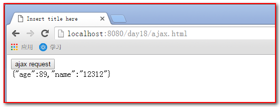

# Ajax与JSON

***


## 第1章 AJAX简介

### 1.1 什么是AJAX?

- AJAX即“**A**synchronous  **J**avascript **A**nd **X**ML”（异步JavaScript和XML），是指一种创建交互式网页应用的网页开发技术。
- AJAX的实际意义是，不发生页面跳转、异步请求载入内容并改写局部页面内容的技术。
- AJAX也可以简单的理解为通过JS向服务器发送请求。
- AJAX这门技术很早就被发明，但是直到2005年被谷歌的大量使用，才在市场中流行起来，可以说Google为AJAX的推广起到到推波助澜的作用。

- 同步处理与异步处理

  - 同步处理：

    - AJAX出现之前，我们访问互联网时一般都是同步请求，也就是当我们通过一个页面向服务器发送一个请求时，在服务器响应结束之前，我们的整个页面是不能操作的，也就是直观上来看他是卡主不动的。

    - 这就带来了非常糟糕的用户体验。首先，同步请求时，用户只能等待服务器的响应，而不能做任何操作。其次，如果请求时间过长可能会给用户一个卡死的感觉。最后，同步请求的最大缺点就是即使整个页面中只有一小部分内容发生改变我们也要刷新整个页面。

  - 异步处理：

    - 而异步处理指的是我们在浏览网页的同时，通过AJAX向服务器发送请求，发送请求的过程中我们浏览网页的行为并不会收到任何影响，甚至主观上感知不到在向服务器发送请求。当服务器正常响应请求后，响应信息会直接发送到AJAX中，AJAX可以根据服务器响应的内容做一些操作。

    - 使用AJAX的异步请求基本上完美的解决了同步请求带来的问题。首先，发送请求时不会影响到用户的正常访问。其次，即使请求时间过长，用户不会有任何感知。最后，AJAX可以根据服务器的响应信息局部的修改页面，而不需要整个页面刷新。

### 1.2 AJAX的常用API

#### 1.2.1 请求对象

- 向服务器发送请求，毫无疑问需要使用Http协议，也就是我们需要通过JS来向服务器发送一个请求报文。这里我们来回顾一下请求报文的格式：
  - 请求首行
  - 请求头
  - 空行
  - 请求体

- 这是一个请求报文的格式，那我们如果手动的创建这么一个报文格式来发送给服务器想必是非常麻烦呢，于是浏览器为我们提供了一个XMLHttpRequest对象。

#### 1.2.2 XMLHttpRequest

- XMLHttpRequest对象是AJAX中非常重要的对象，所有的AJAX操作都是基于该对象的。

- XMLHttpRequest对象用来封装请求报文，我们向服务器发送的请求信息全部都需要封装到该对象中。

- 这里需要稍微注意一下，XMLHttpRequest对象并没有成为标准，但是现在的主流浏览器都支持该对象，而一些如IE6的老版本浏览器中的创建方式有一些区别，但是问题不大。

- 获取XMLHttpRequest对象：由于浏览器之间的差异，不同浏览器中获取XMLHttpRequest的方式不同，但总的来说一共有三种方式：
  - 方式一：var xhr = new XMLHttpRequest()：目前主流浏览器都支持
  - 方式二：var xhr = new ActiveXObject("Msxml2.XMLHTTP")：IE6支持的方式
  - 方式三：var xhr = new ActiveXObject("Microsoft.XMLHTTP")：IE5.5以下支持的方式

- 根据三种不同的方式编写通用方法来获取XMLHttpRequest对象：

```java
//获取XMLHttpRequest的通用方法
function getXMLHttpRequest(){
	var xhr;
	try{
		//大部分浏览器都支持
		xhr = new XMLHttpRequest();
	}catch(e){
		try{
			//如果不支持，在这里捕获异常并且采用IE6支持的方式
			xhr = new ActiveXObject("Msxml2.XMLHTTP");
		}catch(e){
			//如果还不支持，在这里捕获异常并采用IE5支持的方式
			xhr = new ActiveXObject("Microsoft.XMLHTTP");
		}
	}
	return xhr;
}

```

- **XMLHttpRequest对象的方法：**

  - **open(method,url,async)**：用于设置请求的基本信息，接收三个参数。

    - 参数一：method

      接收一个字符串，表明请求的方法：get或post

    - 参数二：url

      请求的地址，接收一个字符串

    - 参数三：Assync

      发送的请求是否为异步请求，接收一个布尔值。① true 是异步请求 ② false 不是异步请求（同步请求）

  - **send(string)：**用于将请求发送给服务器，可以接收一个参数

    - string参数

      该参数只在发送post请求时需要。用于设置请求体

  - **setRequestHeader(header,value)**：用于设置请求头

    - 参数一：header参数

      字符串类型，要设置的请求头的名字

    - 参数二：value参数

      字符串类型，要设置的请求头的值

- **XMLHttpRequest对象的属性：**

  - readyState

    - 描述XMLHttpRequest的状态
    - 一共有五种状态分别对应了五个数字：
      - 0 ：请求尚未初始化，open()尚未被调用
      - 1 ：服务器连接已建立，send()尚未被调用
      - 2 ：请求已接收，服务器尚未响应
      - 3 ：请求已处理，正在接收服务器发送的响应
      - 4 ：请求已处理完毕，且响应已就绪。

  - status

    - 请求的响应码

      - 200 响应成功

      - 404 页面为找到

      - 500 服务器内部错误 

        … … … …

  - onreadystatechange

    - 该属性需要指向一个函数
    - 该函数会在readyState属性发生改变时被调用

  - responseText

    - 获得字符串形式的响应数据。

  - responseXML（用的比较少）

    - 获得 XML 形式的响应数据。

- 示例代码

  使用AJAX发送GET请求

  ```javascript
  //获取xhr对象
  var xhr = getXMLHttpRequest();
  //设置请求信息
  xhr.open("get","AjaxServlet?&t="+Math.random(),true);
  //发送请求
  xhr.send();
  //监听请求状态
  xhr.onreadystatechange = function(){
  //当响应完成
  	if(xhr.readyState == 4){
  		//且状态码为200时
  		if(xhr.status == 200){
  			//接收响应信息（文本形式）
  			var text = xhr.responseText;
  			//弹出消息
  	      alert(text);
  		}
  	};
  };
  
  ```

  > 这是一个最简单的AJAX代码，向AjaxServlet发送了一个get请求，并且在页面中输出响应的内容。

  使用AJAX发送POST请求

  ```javascript
  //获取xhr对象
  var xhr = getXMLHttpRequest();
  //设置请求信息
  xhr.open("post","2.jsp",true);
  //设置请求头
  xhr.setRequestHeader("Content-Type","application/x-www-form-urlencoded");
  //发送请求
  xhr.send("hello=123456");
  //监听请求状态
  xhr.onreadystatechange = function(){
  //当响应完成
  if(xhr.readyState == 4){
  	//且状态码为200时
  	if(xhr.status == 200){
  		//接收响应信息（文本形式）
  		var text = xhr.responseText;
  		//弹出消息
  		alert(text);
  	}
  };
  
  ```

  

## 第2章 javaScript原生Ajax请求（了解）

- 原生的Ajax请求，包括如下的步骤：

1. 我们首先要创建XMLHttpRequest 对象

2. 调用open方法设置请求参数

3. 调用send方法发送请求

4. 在send方法前绑定onreadystatechange事件，处理请求完成后的操作。

- 具体操作：

  **创建一个html页面，发起请求。代码如下：**

```html
<!DOCTYPE html PUBLIC "-//W3C//DTD HTML 4.01 Transitional//EN" "http://www.w3.org/TR/html4/loose.dtd">
<html>
	<head>
		<meta http-equiv="pragma" content="no-cache" />
		<meta http-equiv="cache-control" content="no-cache" />
		<meta http-equiv="Expires" content="0" />
		<meta http-equiv="Content-Type" content="text/html; charset=UTF-8">
		<title>Insert title here</title>
		<script type="text/javascript">
			function ajaxRequest() {
// 				1、我们首先要创建XMLHttpRequest 
				var xhr = new XMLHttpRequest();
// 				2、调用open方法设置请求参数
				xhr.open("GET","ajaxServlet?action=javaScriptAjax&a="+new Date(),true);
// 				4、在send方法前绑定onreadystatechange事件，处理请求完成后的操作。
				xhr.onreadystatechange = function() {
					// 判断请求完成，并且成功
					if (xhr.readyState == 4 && xhr.status == 200) {
						document.getElementById("div01").innerHTML = xhr.responseText;
					} 
				}
// 				3、调用send方法发送请求
				xhr.send();
			}
		</script>
	</head>
	<body>	
		<button onclick="ajaxRequest()">ajax request</button>
		<div id="div01">
		</div>
	</body>
</html>

```

**创建一个AjaxServlet程序接收请求**

```java
package com.atguigu.servlet;

import java.io.IOException;
import java.util.Random;

import javax.servlet.ServletException;
import javax.servlet.http.HttpServletRequest;
import javax.servlet.http.HttpServletResponse;

import com.atguigu.gson.GsonTest;
import com.google.gson.Gson;

public class AjaxServlet extends BaseServlet {
	private static final long serialVersionUID = 1L;

	protected void javaScriptAjax(HttpServletRequest request, HttpServletResponse response)
			throws ServletException, IOException {
		System.out.println("ajax请求过来了 a--" + request.getParameter("a"));
		Random random = new Random(System.currentTimeMillis());
		// 使用随机数，可以让客户端看到变化
		response.getWriter().write(
				new Gson().toJson(new GsonTest.Person(random.nextInt(100), "12312")));
	}

}

```

**在web.xml文件中的配置**

```xml
 <servlet>
    <servlet-name>AjaxServlet</servlet-name>
    <servlet-class>com.atguigu.servlet.AjaxServlet</servlet-class>
  </servlet>
  <servlet-mapping>
    <servlet-name>AjaxServlet</servlet-name>
    <url-pattern>/ajaxServlet</url-pattern>
  </servlet-mapping>

```

**测试效果**



通过上面的代码我们发现。编写原生的JavaScript我们自己要写很多的代码。而且还要考虑浏览器兼容问题。所以使用起来非常的不方便。那我们工作之后。怎么处理Ajax请求呢。我们一般会使用JavaScript的框架来解决这个问题，比如说我们前面学到的Jquery框架。它就有很好的Ajax解决方案。


## 第3章 JQuery的Ajax请求

- **四个Ajax请求方法**
  - $.ajax方法
  - $.get方法
  - $.post方法
  - $.getJSON方法

- **一个表单序列化方法：**serialize()表单序列化方法

- **如何使用上面的五个方法：**在JQuery中和Ajax请求有关的方法有四个

**方法一： $.ajax请求参数**

​	**url**：                                  请求的地址

​	**type :**                        	 请求的方式             get或post

​	**data :**                         	请求的参数             string或json

​	**success:**                    	成功的回调函数

​	**dataType:**                 	返回的数据类型      常用json或text 

 下面的方法必须遵守参数的顺序

**方法二、三：$.get请求和$.post请求**

​	**url**:请求的URL地址

​	**data**:待发送 Key/value 参数。

​	**callback**:载入成功时回调函数。

​	**type**:返回内容格式，xml, html, script, json, text。

**方法四：Jquery的$.getJSON**

​	**url**:待载入页面的URL地址

​	**data**:待发送 Key/value 参数。

​	**callback**:载入成功时回调函数。

 

- 表单的序列化
  - serialize() 方法可以把一个form表单中所有的表单项。都以字符串name=value&name=value的形式进行拼接，省去我们很多不必要的工作。

- 由于$.get、$.post和getJSON这三个方法的底层都是直接或者间接地使用$.ajax()方法来实现的异步请求的调用。所以我们以$.ajax()方法的使用为示例进行展示：

**Jquery_Ajax_request.html的代码如下：**

```html
<!DOCTYPE html PUBLIC "-//W3C//DTD HTML 4.01 Transitional//EN" "http://www.w3.org/TR/html4/loose.dtd">
<html>
	<head>
		<meta http-equiv="pragma" content="no-cache" />
		<meta http-equiv="cache-control" content="no-cache" />
		<meta http-equiv="Expires" content="0" />
		<meta http-equiv="Content-Type" content="text/html; charset=UTF-8">
		<title>Insert title here</title>
		<script type="text/javascript" src="script/jquery-1.7.2.js"></script>
		<script type="text/javascript">
			$(function(){
				// ajax请求
				$("#ajaxBtn").click(function(){
					$.ajax({
						url : "ajaxServlet", // 请求地址
						error:function(){   // 请求失败回调
							alert("请求失败");
						},
						success:function(data){ // 请求成功回调
							alert( data );
						},
						type:"POST",				// 请求的方式
						dataType:"json",			// 返回的数据类型为json对象
						data:{						// 请求的参数
							action:"jqueryAjax",
							a:12,
							date: new Date()
						}
					});
				});

				// ajax--get请求
				$("#getBtn").click(function(){
					$.get(
						"ajaxServlet",{
							action:"jqueryGet",
							a:12,
							date:new Date()
						},function(data){alert(data);},"json"
					);
				});
				
				// ajax--post请求
				$("#postBtn").click(function(){
					// post请求
					$.post(
						"ajaxServlet", // 请求路径
						{				// 请求参数
							action:"jqueryPost",
							a:12,
							date:new Date()
						},
						function(data){ alert( data ) },  // 成功的回调函数
						"text"							// 返回的数据类型
					);
				});

				// ajax--getJson请求
				$("#getJsonBtn").click(function(){
					// 调用
					$.getJSON(
						"ajaxServlet", 		// 请求路径
						{					// 请求参数
							action:"jqueryGetJSON",
							a:12,
							date:new Date()
						}, 
						function(data){ alert( data ) }  // 成功的回调函数		
					);
				});

				// ajax请求
				$("#submit").click(function(){
					// 把参数序列化
					var data = $("#form01").serialize();
					alert(data);
				});
				
			});
		</script>
	</head>
	<body>
		<div>
			<button id="ajaxBtn">$.ajax请求</button>
			<button id="getBtn">$.get请求</button>
			<button id="postBtn">$.post请求</button>
			<button id="getJsonBtn">$.getJSON请求</button>
		</div>
		<br/><br/>
		<form id="form01" >
			用户名：<input name="username" type="text" /><br/>
			密码：<input name="password" type="password" /><br/>
			下拉单选：<select name="single">
			  	<option value="Single">Single</option>
			  	<option value="Single2">Single2</option>
			</select><br/>
		  	下拉多选：
		  	<select name="multiple" multiple="multiple">
		    	<option selected="selected" value="Multiple">Multiple</option>
		    	<option value="Multiple2">Multiple2</option>
		    	<option selected="selected" value="Multiple3">Multiple3</option>
		  	</select><br/>
		  	复选：
		 	<input type="checkbox" name="check" value="check1"/> check1
		 	<input type="checkbox" name="check" value="check2" checked="checked"/> check2<br/>
		 	单选：
		 	<input type="radio" name="radio" value="radio1" checked="checked"/> radio1
		 	<input type="radio" name="radio" value="radio2"/> radio2<br/>
		 	<input id="submit" type="submit" />
		</form>			
	</body>
</html>

```

**AjaxServlet的代码如下：**

```java
package com.atguigu.servlet;

import java.io.IOException;
import java.util.Random;

import javax.servlet.ServletException;
import javax.servlet.http.HttpServletRequest;
import javax.servlet.http.HttpServletResponse;

import com.atguigu.gson.GsonTest;
import com.google.gson.Gson;

public class AjaxServlet extends BaseServlet {
	private static final long serialVersionUID = 1L;

	protected void javaScriptAjax(HttpServletRequest request, HttpServletResponse response)
			throws ServletException, IOException {
		System.out.println("ajax请求过来了 a--" + request.getParameter("a"));
		Random random = new Random(System.currentTimeMillis());
		// 使用随机数，可以让客户端看到变化
		response.getWriter().write(
				new Gson().toJson(new GsonTest.Person(random.nextInt(100), "12312")));
	}
	
	protected void jqueryAjax(HttpServletRequest request, HttpServletResponse response)
			throws ServletException, IOException {
		System.out.println("jqueryAjax请求过来了 a--" + request.getParameter("a"));
		Random random = new Random(System.currentTimeMillis());
		// 使用随机数，可以让客户端看到变化
		response.getWriter().write(
				new Gson().toJson(new GsonTest.Person(random.nextInt(100), "12312")));
	}
	
	protected void jqueryGet(HttpServletRequest request, HttpServletResponse response)
			throws ServletException, IOException {
		System.out.println("jqueryGet请求过来了 a--" + request.getParameter("a"));
		Random random = new Random(System.currentTimeMillis());
		// 使用随机数，可以让客户端看到变化
		response.getWriter().write(
				new Gson().toJson(new GsonTest.Person(random.nextInt(100), "12312")));
	}
	
	protected void jqueryPost(HttpServletRequest request, HttpServletResponse response)
			throws ServletException, IOException {
		System.out.println("jqueryPost请求过来了 a--" + request.getParameter("a"));
		Random random = new Random(System.currentTimeMillis());
		// 使用随机数，可以让客户端看到变化
		response.getWriter().write(
				new Gson().toJson(new GsonTest.Person(random.nextInt(100), "12312")));
	}
	
	protected void jqueryGetJSON(HttpServletRequest request, HttpServletResponse response)
			throws ServletException, IOException {
		System.out.println("jqueryGetJSON请求过来了 a--" + request.getParameter("a"));
		Random random = new Random(System.currentTimeMillis());
		// 使用随机数，可以让客户端看到变化
		response.getWriter().write(
				new Gson().toJson(new GsonTest.Person(random.nextInt(100), "12312")));
	}

}

```

## 第4章 JSON简介

- 客户端（或浏览器）与服务器间交互时，服务器端可以返回一个字符串，但当我们需要返回一个复杂的数据时，比如说需要返回一个对象时，就需要定义一下数据的格式。
- AJAX一开始使用的是XML的数据格式，XML的数据格式非常简单清晰，容易编写，但是由于XML中包含了过多的标签，以及十分复杂的结构，解析起来也相对复杂，所以目前来讲，AJAX中已经几乎不使用XML来发送数据了。取而代之的是一项新的技术JSON。
- JSON是JavaScript Object Notation 的缩写，是JS提供的一种轻量级的数据交换格式， 易于人阅读和编写。同时也易于机器解析和生成。 它基于[JavaScript Programming Language](http://www.crockford.com/javascript), [Standard ECMA-262 3rd Edition - December 1999](http://www.ecma-international.org/publications/files/ecma-st/ECMA-262.pdf)的一个子集。 JSON采用完全独立于语言的文本格式，但是也使用了类似于C语言家族的习惯（包括C，C++，C#，Java，JavaScript，Perl，Python等）。 这些特性使JSON成为理想的数据交换语言。
- JSON对象本质上就是一个JS对象，但是这个对象比较特殊，它可以直接转换为字符串，在不同语言中进行传递，通过工具又可以转换为其他语言中的对象。


## 第5章 JSON的使用

在标准的json格式中，json对象由在括号括起来，对象中的属性也就是json的key是一个字符串，所以一定要使用双引号引起来。每组key之间使用逗号进行分隔。

### 5.1 JSON的定义

- JSON通过6种数据类型来表示：
  - 字符串
    - 例子：”字符串”
    - 注意：不能使用单引号
  - 数字：
    - 例子：123.4
  - 布尔值：
    - 例子：true、false
  - null值:
    - 例子：null
  - 对象
    - 例子：{“name”:”sunwukong”, ”age”:18}
  - 数组
    - 例子：[1,”str”,true]

- 格式：

```json
var 变量名 = {
	“key” : value , 		// Number类型
	“key2” : “value” , 		// 字符串类型
	“key3” : [] , 			// 数组类型
	“key4” : {}, 			// json 对象类型
	“key5” : [{},{}] 		// json 数组
};
```

举例：

```json
var jsons = {
	"key1":"abc", // 字符串类型
	"key2":1234,  // Number
	"key3":[1234,"21341","53"], // 数组
	"key4":{                    // json类型
			"key4_1" : 12,
			"key4_2" : "kkk"
			},
	"key5":[{                  // json数组
			 "key5_1_1" : 12,
			 "key5_1_2" : "abc"
			},
            {
			 "key5_2_1" : 41,
			 "key5_2_2" : "bbj"
			}]
};
jsons.key2
jsons.key3[0]
jsons.key4.key4_2
jsons.key5[0].key5_1_2
```

### 5.2 JSON对象的访问

json对象，顾名思义，就知道它是一个对象。里面的key就是对象的属性。我们要访问一个对象的属性，只需要使用【对象名.属性名】的方式访问即可。

```javascript
<script type="text/javascript">
			// json的定义			
			var jsons = {
					"key1":"abc", // 字符串类型
					"key2":1234,  // Number
					"key3":[1234,"21341","53"], // 数组
					"key4":{                    // json类型
						"key4_1" : 12,
						"key4_2" : "kkk"
					},
					"key5":[{                  // json数组
					    "key5_1_1" : 12,
					    "key5_1_2" : "abc"
					},{
					    "key5_2_1" : 41,
					    "key5_2_2" : "bbj"
					}]
			};
			// 访问json的属性
			alert(jsons.key1); // "abc"
			// 访问json的数组属性
			alert(jsons.key3[1]); // "21341"
			// 访问json的json属性
			alert(jsons.key4.key4_1);//12
			// 访问json的json数组
			alert(jsons.key5[0].key5_1_2);//"abc"
</script>

```

### 5.3 JSON中两个常用的方法

- JSON对象和字符串对象的互转：

  - JSON.stringify( json )：此方法可以把一个json对象转换成为json字符串 
  - JSON.parse( jsonString )： 此方法可以把一个json字符串转换成为json对象

- 代码示例

  ```javascript
  <script type="text/javascript">
  	// 一个json对象
  	var obj = {
  		"a" : 12,
  		"c" : "str"
  	};
  	// 把json对象转换成为字符串对象
  	var objStr = JSON.stringify(obj);
  	// 
  	alert(objStr);
  	// 把json对象的字符串，转换成为 json对象
  	var jsonObj = JSON.parse(objStr);
  	alert(jsonObj);
  </script>
  
  ```

### 5.4 JSON在Java中的使用

- 我们要使用json和java中使用，我们需要使用到一个第三方的包。目前主流的解析JSON的工具大概有三种json-lib、jackson、gson。三种解析工具相比较json-lib的使用复杂，且效率较差。而Jackson和gson解析效率较高。使用简单，这里我们以gson为例讲解。

  - Gson是Google公司出品的解析JSON工具，使用简单，解析性能好。

  - Gson中解析JSON的核心是Gson的类，解析操作都是通过该类实例进行。

- Gson 提供的用来在 Java 对象和 JSON 数据之间进行映射的 Java 类库，可以将一个 JSON 字符串转成一个 Java 对象，或者反过来。

- **json在java中的操作常见的有三种情况**

  - java对象和json的转换
  - java对象list集合和json的转换
  - map对象和json的转换

- 代码示例

  ```java
  package com.atguigu.gson;
  
  import java.util.ArrayList;
  import java.util.HashMap;
  import java.util.List;
  import java.util.Map;
  
  import com.google.gson.Gson;
  import com.google.gson.reflect.TypeToken;
  
  public class GsonTest {
  
  	static class Person {
  		private int age;
  		private String name;
  
  		public Person() {
  			// TODO Auto-generated constructor stub
  		}
  
  		public Person(int age, String name) {
  			this.age = age;
  			this.name = name;
  		}
  
  		public int getAge() {
  			return age;
  		}
  
  		public void setAge(int age) {
  			this.age = age;
  		}
  
  		public String getName() {
  			return name;
  		}
  
  		public void setName(String name) {
  			this.name = name;
  		}
  
  		@Override
  		public String toString() {
  			return "Person [age=" + age + ", name=" + name + "]";
  		}
  
  	}
  
  	// 要把复杂的json字符串转换成为java对象。需要继承TypeToken类。
  	// 并把返回的类型当成TypeToken的泛型注入
  	static class PersonType extends TypeToken<List<Person>> {
  	}
  
  	public static void main(String[] args) {
  		// json操作，一定要先new一个gson对象。
  		Gson gson = new Gson();
  		// java对象--json
  		Person person = new Person(12, "wzg168");
  		// 把对象转成为json字符串
  		String personjson = gson.toJson(person);
  
  		System.out.println(personjson);
  		// 把json字符串转换成为java对象
  		Person p = gson.fromJson(personjson, Person.class);
  		System.out.println(p);
  		System.out.println("------------------------------------------");
  		// 2、java对象list集合和json的转换
  		List<Person> list = new ArrayList<Person>();
  		for (int i = 0; i < 3; i++) {
  			list.add(new Person(10 * i, "name-" + i));
  		}
  		String jsonListString = gson.toJson(list);
  		System.out.println(jsonListString);
  
  		// 把json数组转换成为List对象
  		// List<Person> ps = gson.fromJson(jsonListString, new PersonType().getType());
  		// 我们也可以使用匿名内部类
  		List<Person> ps = gson.fromJson(jsonListString, new TypeToken<List<Person>>() {}.getType());
  		System.out.println(ps);
  		System.out.println("------------------------------------------");
  
  		// 3、map对象和json的转换
  		Map<String, Person> mapPerson = new HashMap<String, GsonTest.Person>();
  		// 添加person到map中
  		mapPerson.put("p1", new Person(1, "person-1"));
  		mapPerson.put("p2", new Person(2, "person-2"));
  		// 把map转换成为json对象
  		String jsonMapString = gson.toJson(mapPerson);
  		System.out.println(jsonMapString);
  		// 通过使用匿名内部类的方式
  		Map<String, Person> map = gson.fromJson(jsonMapString,
  				new TypeToken<HashMap<String, Person>>() {}.getType());
  		System.out.println(map);
  	}
  }
  
  ```

