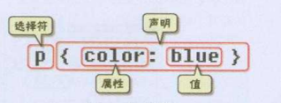
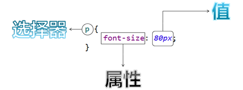
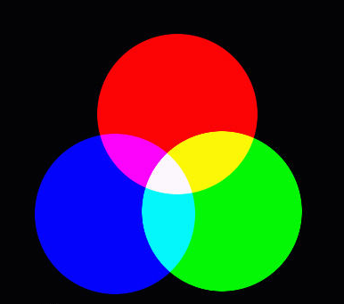

# CSS

***

**HTML页面实在太丑了，怎么破？！**

## 第1章 CSS简介

CSS全称为“层叠样式表 (Cascading Style Sheets)”，它主要是用于定义HTML元素（或内容）在浏览器内的显示样式，如文字大小、颜色、字体、边框、位置等。


## 第2章 CSS基本语法

### 2.1 基本格式

- CSS样式由选择符(选择器)和声明组成，而声明又由属性和值组成，如下图所示：






- 格式为：

**选择器 {**

​      **样式名：样式值;**

​      **样式名：样式值;**

​      **…………**

**}**

### 2.2 语法说明

- 属性 (property) 是你希望改变的属性，并且每个属性都有一个值。属性和值被冒号分开，并由花括号包围，这样就组成了一个完整的样式声明（declaration），例如：p {color: blue}

- 多个声明：如果要定义不止一个声明，则**需要用英文分号”;”将每个声明分开**。虽然最后一条声明的最后可以不加分号，但尽量在每条声明的末尾都加上分号

- 每行最好只描述一个属性

- **CSS对大小写不敏感，但建议使用小写。不过存在一个例外：class 和 id 名称对大小写是敏感的。**

- CSS注释：**/*注释内容\*/**


### 2.3 CSS样式编写位置

方式一：写在标签的style属性中：

```html
<p style=“font-size:30px”>字体大小用px表示</p>
```

```html
<p style="color: red ; font-size: 12px">落霞与孤鹜齐飞</p>
```

方式二：写在html头的style标签中(style标签一般写在head标签与title标签之间)：

```html
<style type="text/css">
	p{
		color:blue;
        background-color: yellow;
	}
</style>
```

方式三：写在外部的css文件中，然后通过link标签引入外部的css文件

```css
<link rel="stylesheet" type="text/css" href="style.css"> 
```

其中，style.css定义如下：

```css
@charset "UTF-8";
/* 这是css与html结合使用的第三种方式  */
div { 
	border: 1px solid red; 
} 
span {
	border: 1px solid green; 
}
```

> 说明：**当同一个 HTML 元素被不止一个样式定义时，会使用哪个样式呢？**
>
> 优先级按照上述讲的三种方式依次降低。内联样式（在 HTML 元素内部）拥有最高的优先权。

## 第3章 选择器的分类

选择器：浏览器根据“选择器”确定受CSS样式影响的HTML元素。

### 分类1：标签选择器

按照标签名选中相应的元素。如上图的p。

```css
p {
	color:red;
}
```

### 分类2：类选择器

按照元素的类名选中相应的元素，使用.class值

```css
.class属性值{

}
```

举例：

```css
<p class=”foot”>青春正好</p>
<b class=”foot”>编程趁早</b>


.foot {
	color:red;
}
```

### 分类3：ID选择器

按照元素的id选中相应的元素，使用#id值

```css
 #id属性值{
 
 }
```

举例：

```css
<p id=”abc”>大家好</p>

#abc {
	color:red;
}

```


### 分类4：组选择器

可以同时使用多个选择器选中一组元素，使用，分隔不同的选择器。

```css
选择器1，选择器2，……，选择器N{
	color：red；
}
```

举例：

```css
#div1,.mini{
	background-color:red;
}
```


### 分类5：派生选择器

根据上下文关系，选择元素的后代元素，使用空格隔开

选择器1  选择器2 … {

   color:red;

}

**注意：id选择器>类选择器>标签选择器**

## 第4章 常用样式

### 4.1 颜色

- CSS中的颜色用RGB颜色：红色(red)、绿色(green)、蓝色(blue) ——光学三原色表示。

  

- RGB中每种颜色都用两位十六进制数表示，0表示没有光，F表示最强的光，并按红、绿、蓝的顺序排列，前面再加上#号。

- 例如：#000000黑色；#FFFFFF 白色；#FF0000红色；

​                  #00FF00绿色；#0000FF蓝色等等。

- color：red；

- 颜色可以写颜色名如：black, blue, red, green, white, yellow等

- 颜色也可以写rgb值和十六进制表示值：如rgb(255,0,0)，#00F6DE，如果写十六进制值必须加#

### 4.2 宽度

width:19px;
宽度可以写像素值：19px；
也可以写百分比值：20%；

### 4.3 高度

height:20px;
同宽度一样

### 4.4 背景颜色

background-color:#0F2D4C

### 4.5 扩展

#### 4.5.1 字体样式

| 字体颜色     | color: *#bbffaa*;      |
| ------------ | ---------------------- |
| **字体大小** | **font-size: *20px*;** |

#### 4.5.2 黑色1像素实线边框

```css
border: 1px solid black;
```

#### 4.5.3 DIV居中

```css
margin-left: auto;
margin-right: auto;
```

#### 4.5.4 文本居中

```css
text-align: center;
```

#### 4.5.5 超链接去下划线

```css
text-decoration: none;
```

#### 4.5.6 表格细线

```css
table {
	/*设置边框*/
	border: 1px solid black;
	/*将边框合并*/
	border-collapse: collapse;
}
	
td,th {
	/*设置边框*/
	border: 1px solid black;
}

```

#### 4.5.7 列表去除修饰

```css
ul {
	list-style: none;
}
```


## 第5章 CSS中的注释语句

- 用 /*注释语句 */标明。