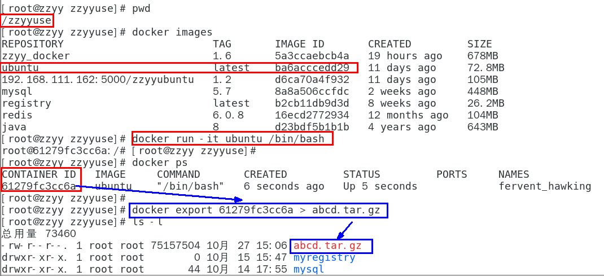

# Docker简介

Docker的出现使得Docker得以打破过去「程序即应用」的观念。透过镜像(images)将作业系统核心除外，运作应用程式所需要的系统环境，由下而上打包，达到应用程式跨平台间的无缝接轨运作。

解决了运行环境和配置问题的软件容器，方便做持续集成并有助于整体发布的容器虚拟化技术。

# Docker安装

**前提条件**

目前，CentOS 仅发行版本中的内核支持 Docker。Docker 运行在CentOS 7 (64-bit)上，
要求系统为64位、Linux系统内核版本为 3.8以上，这里选用Centos7.x

**查看自己的内核**

uname命令用于打印当前系统相关信息（内核版本号、硬件架构、主机名称和操作系统类型等）。

 


# Docker基本组成

## 1、镜像（Image）

Docker 镜像（Image）就是一个只读的模板。镜像可以用来创建 Docker 容器，一个镜像可以创建很多容器。它也相当于是一个root文件系统。比如官方镜像 centos:7 就包含了完整的一套 centos:7 最小系统的 root 文件系统。相当于容器的“源代码”，docker镜像文件类似于Java的类模板，而docker容器实例类似于java中new出来的实例对象。

## 2、容器(Container)

1、从面向对象角度

Docker 利用容器（Container）独立运行的一个或一组应用，应用程序或服务运行在容器里面，容器就类似于一个虚拟化的运行环境，容器是用镜像创建的运行实例。就像是Java中的类和实例对象一样，镜像是静态的定义，容器是镜像运行时的实体。容器为镜像提供了一个标准的和隔离的运行环境，它可以被启动、开始、停止、删除。每个容器都是相互隔离的、保证安全的平台。

2、从镜像容器角度

可以把容器看做是一个简易版的 Linux 环境（包括root用户权限、进程空间、用户空间和网络空间等）和运行在其中的应用程序。

##  3、仓库(Repository)


仓库（Repository）是集中存放镜像文件的场所。

类似于 Maven仓库，存放各种jar包的地方；github仓库，存放各种git项目的地方；Docker公司提供的官方registry被称为Docker Hub，存放各种镜像模板的地方。

仓库分为公开仓库（Public）和私有仓库（Private）两种形式。最大的公开仓库是 Docker Hub(https://hub.docker.com/)

 

# Docker架构

## 1、简单版

Docker是一个**Client-Server**结构的系统，Docker守护进程运行在主机上， 然后通过Socket连接从客户端访问，守护进程从客户端接受命令并管理运行在主机上的容器。 容器，是一个运行时环境，就是我们前面说到的集装箱。

 

## 2、复杂版

Docker 是一个 C/S 模式的架构，后端是一个松耦合架构，众多模块各司其职。 

 

 

# Docker安装

## 1、卸载旧版本

```shell
yum remove docker \
                  docker-client \
                  docker-client-latest \
                  docker-common \
                  docker-latest \
                  docker-latest-logrotate \
                  docker-logrotate \
                  docker-engine
```

## 2、安装依赖

更新yum软件包索引

```shell
yum makecache fast
```

下载依赖软件包

```shell
yum install -y yum-utils device-mapper-persistent-data lvm2 gcc gcc-c++
```

## 3、安装docker-ce

```shell
yum install docker-ce docker-ce-cli containerd.io
```

## 4、启动docker

```shell
systemctl start docker
```

## 测试

```shell
docker version
docker run hello-world
```


 

 

## 卸载

```shell
systemctl stop docker 
yum remove docker-ce docker-ce-cli containerd.io
rm -rf /var/lib/docker
rm -rf /var/lib/containerd
```

# Docker常用命令

| 指令                                                         | 作用                                                         |
| ------------------------------------------------------------ | ------------------------------------------------------------ |
| systemctl start docker                                       | 启动docker                                                   |
| systemctl stop docker                                        | 停止docker                                                   |
| systemctl restart docker                                     | 重启docker                                                   |
| systemctl status docke                                       | 查看docker状态                                               |
| systemctl enable docker                                      | 开机自启doker                                                |
| docker info                                                  | 查看docker信息                                               |
| docker --help                                                | 查看docker总体帮助文档                                       |
| docker 具体命令 --help                                       | 查看docker具体命令帮助文档                                   |
| docker search xxxx                                           | 在docker仓库中查找 --limit : 只列出N个镜像，默认25个         |
| docker pull imagesname：tag                                  | ：tag可选，下载镜像版本，默认latest                          |
| docker images                                                | 查看本地镜像 -a 列出本地所有的镜像（含历史映像层） -q 只显示镜像ID。 |
| docker system df                                             | 查看镜像/容器/数据卷所占的空间                               |
| docker rm image-id                                           | 删除指定本地镜像                                             |
| docker run --name container-name -d image-name               | -name 自定义容器名，-d 表示后台运行， image-name 指定容器模板 |
| docker ps -a                                                 | 查看运行中的容器，添加-a查看所有                             |
| docker stop container-name/id                                | 停止当前运行的容器                                           |
| docker start container-name/id                               | 启动容器                                                     |
| docker rm container-id                                       | 删除指定容器                                                 |
| docker logs container-name/id                                | 容器日志                                                     |
| docker start $(docker ps -a \| awk '{ print $1}' \| tail -n +2) | 启动所有容器                                                 |
| docker kill 容器名/id                                        | 强制停止容器                                                 |
| docker rm -f $(docker ps -a -q)                              | 删除所有容器                                                 |
| docker top 容器ID                                            | 查看容器内运行的进程                                         |
| docker inspect 容器ID                                        | 查看容器内部细节                                             |
| docker commit -m="ms" -a="auth" 容器ID 自定义镜像名:[标签名] | 创建一个镜像，创建后repository写的是自定义镜像名，tag是标签名。 |

## images命令显示参数说明

 

> REPOSITORY：表示镜像的仓库源
>
> TAG：镜像的标签版本号
>
> IMAGE ID：镜像ID
>
> CREATED：镜像创建时间
>
> SIZE：镜像大小
>
> 同一仓库源可以有多个 TAG版本，代表这个仓库源的不同个版本，我们使用 REPOSITORY:TAG 来定义不同的镜像。
> 如果你不指定一个镜像的版本标签，例如你只使用 ubuntu，docker 将默认使用 ubuntu:latest 镜像

## run命令OPTIONS说明（常用）

有些是一个减号，有些是两个减号

> --name="容器新名字"       为容器指定一个名称；
>
> -d: 后台运行容器并返回容器ID，也即启动守护式容器(后台运行)；
>
> -i：以交互模式运行容器，通常与 -t 同时使用；
>
> -t：为容器重新分配一个伪输入终端，通常与 -i 同时使用；也即启动交互式容器(前台有伪终端，等待交互)；
>
> -P: 随机端口映射，大写P
>
> -p: 指定端口映射，小写p


 

例子：使用镜像centos:latest以交互模式启动一个容器,在容器内执行/bin/bash命令

```shell
docker run -it centos /bin/bash 

参数说明：
-i: 交互式操作。
-t: 终端。
centos : centos 镜像。
/bin/bash：放在镜像名后的是命令，使用交互式 Shell，因此用的是 /bin/bash。
```

## ps命令OPTIONS说明（常用）

> -a :列出当前所有正在运行的容器+历史上运行过的
>
> -l :显示最近创建的容器。
>
> -n：显示最近n个创建的容器。
>
> -q :静默模式，只显示容器编号。

## 退出容器

run进去容器，exit退出，容器停止

run进去容器，ctrl+p+q退出，容器不停止

## 进入容器

### 1、exec命令（推荐）

```shell
docker exec -it 容器ID bashShell
```

**注意**：exec 是在容器中打开新的终端，并且可以启动新的进程，用exit退出，不会导致容器的停止。

 

### 2、attach命令

```shell
docker attach 容器ID
```

**注意**：attach 命令直接进入容器启动命令的终端，不会启动新的进程，用exit退出，会导致容器的停止。

 

## 复制文件容器→主机

```shell
docker cp  容器ID:容器内路径 目的主机路径
```

 

## 导出与导入容器

### 1、export命令

**export** 命令导出容器的内容留作为一个tar归档文件[对应import命令]

```shell
docker export 容器ID > 文件名.tar
```

 

### 2、import命令

**import** 命令从tar包中的内容创建一个新的文件系统再导入为镜像[对应export]

```shell
docker import - 镜像用户/镜像名:镜像版本号
```

 

 

# Docker镜像

## 1、简述

镜像是一种轻量级、可执行的独立软件包，它包含运行某个软件所需的所有内容，我们把应用程序和配置依赖打包好形成一个可交付的运行环境(包括代码、运行时需要的库、环境变量和配置文件等)，这个打包好的运行环境就是image镜像文件。只有通过这个镜像文件才能生成Docker容器实例(类似Java中new出来一个对象)。

## 2、分层镜像

以下载Tomcat为例，下载过程像是一层一层下载


Docker镜像层都是**只读**的，容器层是**可写**的。当容器启动时，一个新的可写层被加载到镜像的顶部，这一层通常被称作“容器层”，“容器层”之下的都叫“镜像层”。

### 2.1、UnionFS（联合文件系统）

Union文件系统（UnionFS）是一种分层、轻量级并且高性能的文件系统，它支持文件系统的修改作为一次提交来一层层的叠加，同时可以**将不同目录挂载到同一个虚拟文件系统下**(unite several directories into a single virtual filesystem)。

Union 文件系统是 Docker 镜像的基础。

镜像可以通过**分层**来进行**继承**，基于基础镜像（没有父镜像），可以制作各种具体的应用镜像。

特性：一次同时加载多个文件系统，但从外面看起来，只能看到一个文件系统，联合加载会把各层文件系统叠加起来，这样最终的文件系统会包含所有底层的文件和目录

### 2.2、镜像加载原理

docker的镜像实际上由一层一层的文件系统组成-----》文件系统UnionFS。

**bootfs**(boot file system)主要包含**bootloader**和**kernel**。**bootloader**主要是引导加载kernel，Linux刚启动时会加载bootfs文件系统，在Docker镜像的最底层是引导文件系统bootfs。这一层与我们典型的Linux/Unix系统是一样的，包含boot加载器和内核。当boot加载完成之后整个内核就都在内存中了，此时内存的使用权已由bootfs转交给内核，此时系统也会卸载bootfs。

**rootfs** (root file system) ，在bootfs之上。包含的就是典型 Linux 系统中的 /dev, /proc, /bin, /etc 等标准目录和文件。rootfs就是各种不同的操作系统发行版，比如Ubuntu，Centos等等。 

 

对于一个精简的OS，rootfs可以很小，只需要包括最基本的命令、工具和程序库就可以了，因为底层直接用Host的kernel，自己只需要提供 rootfs 就行了。由此可见对于不同的linux发行版，bootfs基本是一致的，rootfs会有差别，因此不同的发行版可以公用bootfs。

### 2.3、优点

镜像分层最大的一个好处就是共享资源，方便复制迁移，就是为了复用。

比如说有多个镜像都从相同的 base 镜像构建而来，那么 Docker Host 只需在磁盘上保存一份 base 镜像。同时内存中也只需加载一份 base 镜像，就可以为所有容器服务了。而且镜像的每一层都可以被共享。

## 3、镜像发布

### 3.1、发布到私有仓库

#### 3.1.1、下载镜像Docker Registry

```shell
docker pull registry
```

#### 3.1.2、运行私有库Registry

相当于本地有个私有Docker hub

```shell
docker run -d -p 5000:5000 -v /data/registry:/temp/registry --privileged=true registry
```

检查下私有仓库镜像

```shell
curl -XGET http://host:5000/v2/_catalog
```

#### 3.1.3、修改镜像tag

符合私有仓库的规范，如果符合规范就不修改

```shell
docker tag 镜像:Tag Host:Port/镜像:Tag
#docker tag zzyyubuntu:1.2 192.168.111.162:5000/zzyyubuntu:1.2
```

 

#### 3.1.4、修改docker配置文件

修改配置文件使之支持http。

```shell
vim /etc/docker/daemon.json
```

```json
{
    //镜像加速一定要
  //"registry-mirrors": ["https://aa25jngu.mirror.aliyuncs.com"],
  "insecure-registries": ["host:port"]
}
```

docker默认不允许http方式推送镜像，通过配置选项来取消这个限制。====> 修改完后如果不生效，建议重启docker。

### 3.1.3、推送镜像到私有仓库

```shell
docker push 符合规范的镜像名
```

# Docker部署常用软件

## 1、安装Tomcat

[下载Tomcat9](https://dlcdn.apache.org/tomcat/tomcat-9/v9.0.56/bin/apache-tomcat-9.0.56.tar.gz)

解压

```shell
tar -xzvf ........
```

启动

```shell
/tomcat/bin/startup.sh
```

配置service命令

进入到 /etc/init.d 文件夹下

```shell
vim tomcat
```

复制如下

```shell
 
        #!/bin/bash  
        # This is the init script for starting up the  
        #  Jakarta Tomcat server  
        #  
        # chkconfig: 345 91 10  
        # description: Starts and stops the Tomcat daemon.  
        #  
 
        # Source function library.  
        . /etc/rc.d/init.d/functions  
 
        # Get config.  
        . /etc/sysconfig/network  
 
        # Check that networking is up.  
        [ "${NETWORKING}" = "no" ] && exit 0  
 
        export JAVA_HOME=/root/jdk-15 #自己的jdk安装目录
        tomcat_home=/root/tomcat/apache-tomcat-9.0.56  #自己的tomcat安装目录
        startup=$tomcat_home/bin/startup.sh  
        shutdown=$tomcat_home/bin/shutdown.sh  
 
        start(){  
           echo -n "Starting Tomcat service:"  
           cd $tomcat_home  
           $startup  
           echo "tomcat is succeessfully started up"  
        }  
 
        stop(){  
           echo -n "Shutting down tomcat: "  
           cd $tomcat_home  
           $shutdown  
           echo "tomcat is succeessfully shut down."  
        }  
 
        status(){  
            numproc=`ps -ef | grep catalina | grep -v "grep catalina" | wc -l`  
            if [ $numproc -gt 0 ]; then  
               echo "Tomcat is running..."  
            else  
               echo "Tomcat is stopped..."  
            fi  
        }  
 
        restart(){  
           stop  
           start  
        }    
        # See how we were called.  
        case "$1" in  
        start)  
           start  
           ;;  
        stop)  
           stop  
           ;;  
        status)  
           status  
           ;;  
        restart)  
           restart  
           ;;  
        *)  
           echo $"Usage: $0 {start|stop|status|restart}"  
           exit 1  
        esac
```

添加权限

```shell
chmod 755 /etc/rc.d/init.d/tomcat
```

加入服务中

```shell
chkconfig --add tomcat
```

检查是否在服务中

```shell
chkconfig --list
```

设置开机在自启

```shell
chkconfig tomcat on
```

## 2、安装MySQL

### 2.1、拉取最新的MySQL

```shell
docker pull mysql:latest
```

### 2.2、查看是否已经安装了镜像

```shell
docker images
```

### 2.3、运行容器

**tip**：

--name 容器名字

-p 端口映射

-e 设置属性

-itd 如下

| Options | Mean                                               |
| ------- | -------------------------------------------------- |
| -i      | 以交互模式运行容器，通常与 -t 同时使用；           |
| -t      | 为容器重新分配一个伪输入终端，通常与 -i 同时使用； |
| -d      | 后台运行容器，并返回容器ID；                       |

最后添加镜像名，例如hello world


设置root密码，允许远程登陆

```
docker run -itd --name mysql -p 3306:3306 -e MYSQL_ROOT_PASSWORD=fuckharkadmin -e MYSQL_ROOT_HOST=% mysql #镜像名
```

### 2.4、查看容器运行情况

```shell
docker ps
```

### 2.5、进入容器

```shell
docker exec -it 容器名/id bash
```

### 2.6、登陆mysql

```
ALTER USER 'root'@'localhost' IDENTIFIED BY 'admin';
```

### 2.7、为mysql添加一个支持远程登陆的账户

```mysql
CREATE USER 'wolong'@'%' IDENTIFIED WITH mysql_native_password BY 'mnnuwolong';
GRANT ALL PRIVILEGES ON *.* TO 'wolong'@'%';
flush privileges;
```

### 完善的启动命令

```shell
docker run -p 3306:3306 --name mysql01 \
-v /data/mysql/mysql01/log:/var/log/mysql \
-v /data/mysql/mysql01/data:/var/lib/mysql \
-v /data/mysql/mysql01/conf:/etc/mysql \
-v /data/mysql/mysql01/mysql-files:/var/lib/mysql-files \
-e MYSQL_ROOT_PASSWORD=fuckharkadmin \
-e MYSQL_ROOT_HOST=% \
-itd mysql
```

## 3、安装Redis

### 3.1、首先拉取redis镜像

```shell
docker pull redis
```

### 3.2、修改redis.conf配置文件

```text
bind 127.0.0.1 			#注释掉这部分，使redis可以外部访问
daemonize no 			#用守护线程的方式启动，改为yes会使配置文件方式启动redis失败，改为yes意为以守护进程方式启动，可后台运行，除非kill进程（可选）
requirepass admin 		#给redis设置密码,原本这行是注释掉的，关闭注释即可
appendonly yes 			#redis持久化，默认是no，（可选）
tcp-keepalive 300 		#防止出现远程主机强迫关闭了一个现有的连接的错误 默认是300
```

### 3.3、启动redis

不挂载文件

```shell
docker run --name redis -p 6379:6379 -d --restart=always redis redis-server --appendonly yes --requirepass "admin"
```

挂载文件

```shell
docker run --name redis -p 6379:6379 -v /root/redis/config/redis.conf:/etc/redis/redis.conf -v /root/redis/data:/data -d redis redis-server /etc/redis/redis.conf --appendonly yes
```

命令解释说明：

- -p 6379:6379：端口映射：前表示主机部分，：后表示容器部分。
- --name redis：指定该容器名称，查看和进行操作都比较方便。
- -v 挂载目录：规则与端口映射相同。/root/redis/config/redis.conf表示自己的配置文件，/etc/redis/redis.conf表示容器的配置文件
- -d redis：表示后台启动redis
- redis-server /etc/redis/redis.conf：以配置文件启动redis，加载容器内的conf文件，最终找到的是挂载的目录/usr/local/docker/redis.conf
- --appendonly yes：开启redis 持久化

```properties
# REDIS配置
 
# Redis数据库索引（默认为0）
spring.redis.database=0
 
# Redis服务器IP地址
spring.redis.host=127.0.0.1
 
# Redis服务器连接端口
spring.redis.port=6379
 
# Redis服务器连接密码（默认为空，可不配置此项）
# spring.redis.password=xxx
 
# 连接池最大连接数（使用负值表示没有限制）
spring.redis.lettuce.pool.max-active=500
 
# 连接池最大阻塞等待时间（使用负值表示没有限制）
spring.redis.lettuce.pool.max-wait=-1
 
# 连接池中的最大空闲连接
spring.redis.lettuce.pool.max-idle=8
 
# 连接池中的最小空闲连接
spring.redis.lettuce.pool.min-idle=0
 
# 连接超时时间（毫秒）
spring.redis.timeout=0
```

如果出现以下报错：

docker: Error response from daemon: driver failed programming external connectivity on endpoint redis

重启Docker

```shell
systemctl restart docker
```

### 3.4、进入Redis

```shell
docker exec -it 容器ID bash
redis-cli	#进入客户端
auth admin #验证密码
```

```shell
docker exec -it 容器ID redis-cli
```

### 完善的启动命令

```shell
docker run -p 6379:6379 --name redis01 \
-v /data/redis/redis01/data:/data \
-v /data/redis/redis01/conf/redis.conf:/etc/redis/redis.conf \
-itd redis redis-server /etc/redis/redis.conf/redis.conf
```

redis指定配置文件启动时一定要指定到具体文件，不能是父级文件夹，否者虽然不会加载失败，但是配置文件会失效

## 4、安装MariaDB

```shell
docker pull mariadb
```

```shell
docker run -itd -p 3306:3306 --name mariadb --env MARIADB_USER=wolong --env MARIADB_PASSWORD=m --env MARIADB_ROOT_PASSWORD=admin mariadb:latest
```

## 5、安装RabbitMQ

```shell
docker pull rabbitmq:management
```

```shell
docker run -itd -p 5672:5672 \
-p 15672:15672 \
--hostname rabbit01 \
--name some-rabbit \
-e RABBITMQ_DEFAULT_USER=wolong \
-e RABBITMQ_DEFAULT_PASS=mnnuwolong \
rabbitmq:management
```

# 扩展

## 1、容器与虚拟机比较

**虚拟机**：

缺点：资源占用大，冗余多，启动慢

 

**容器**：

Linux发展出了另一种虚拟化技术：Linux容器(Linux Containers，缩写为 LXC)

Linux容器是与系统其他部分隔离开的一系列进程，从另一个镜像运行，并由该镜像提供支持进程所需的全部文件。容器提供的镜像包含了应用的所有依赖项，因而在从开发到测试再到生产的整个过程中，它都具有可移植性和一致性。

Linux 容器不是模拟一个完整的操作系统而是**对进程进行隔离**。有了容器，就可以将软件运行所需的所有资源打包到一个隔离的容器中。容器与虚拟机不同，不需要捆绑一整套操作系统，只需要软件工作所需的库资源和设置。系统因此而变得高效轻量并保证部署在任何环境中的软件都能始终如一地运行。

 

1、docker有着比虚拟机更少的抽象层

由于docker不需要Hypervisor(虚拟机)实现硬件资源虚拟化，运行在docker容器上的程序直接使用的都是实际物理机的硬件资源。因此在CPU、内存利用率上docker将会在效率上有明显优势。

2、docker利用的是宿主机的内核,而不需要加载操作系统OS内核

当新建一个容器时，docker不需要和虚拟机一样重新加载一个操作系统内核。进而避免引寻、加载操作系统内核返回等比较费时费资源的过程，当新建一个虚拟机时，虚拟机软件需要加载OS，返回新建过程是分钟级别的。而docker由于直接利用宿主机的操作系统，则省略了返回过程，因此新建一个docker容器只需要几秒钟。

 

 

## 2、docker虚悬镜像

仓库名、标签都是\<none>的镜像，俗称虚悬镜像dangling image

##  3、前台模式与后台模式

后台模式：

首先：Docker容器后台运行，就必须有一个前台进程。

如果在docker run后面追加-d=true或者-d，那么容器将会运行在后台模式。此时所有I/O数据只能通过网络资源或者共享卷组来进行交互。因为容器不再监听你执行docker run的这个终端命令行窗口。但你可以通过执行docker attach来重新附着到该容器的会话中。需要注意的是，容器运行在后台模式下，是不能使用--rm选项的。

容器运行的命令如果不是那些一直挂起的命令（比如运行top，tail），就是会自动退出的。例如 docker run -d centos运行一个容器，再使用docker ps -a查看，发现容器已经下线，因为容器没有需要执行的前台进程，就直接下线。因此最佳的解决方案是，将你要运行的程序以前台进程的形式运行，常见就是命令行模式，表示我还有交互操作，别中断。

前台模式：

在前台模式下（不指定-d参数即可），Docker会在容器中启动进程，同时将当前的命令行窗口附着到容器的标准输入、标准输出和标准错误中。也就是说容器中所有的输出都可以在当前窗口中看到。甚至它都可以虚拟出一个TTY窗口，来执行信号中断。这一切都是可以配置的：

>-a, --attach value                Attach to STDIN, STDOUT or STDERR (default [])
>
>-t, --tty                         Allocate a pseudo-TTY
>
>--sig-proxy                   Proxy received signals to the process (default true)
>
>-i, --interactive                 Keep STDIN open even if not attached

例如 docker run -it --name=interactive centos 前台启动一个centos，启动后会直接进入到其内部，但是退出后容器下线。

如果在执行run命令时没有指定-a参数，那么Docker默认会挂载所有标准数据流，包括输入输出和错误，你可以单独指定挂载哪个标准流。

```shell
docker run -a stdin -a stdout -i -t ubuntu /bin/bash
```


