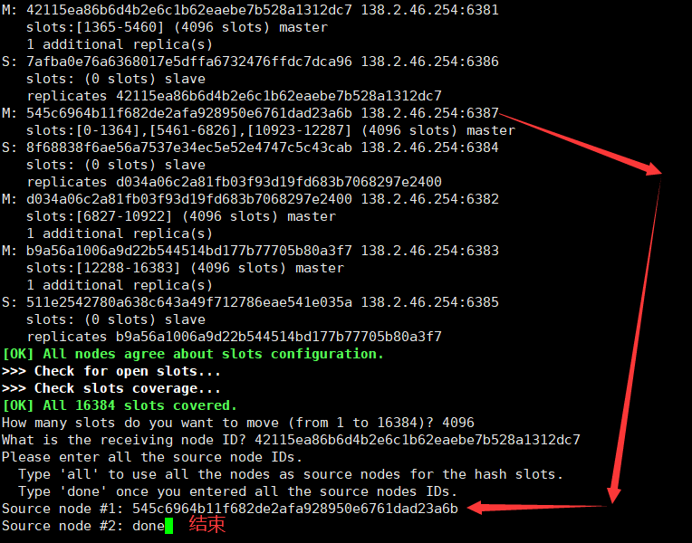
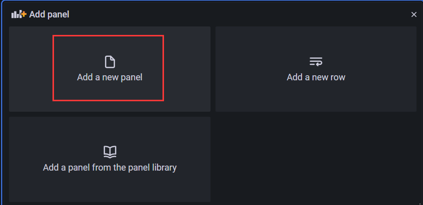

> 2025.02.08.ver.2.0 

# 1、基础概念

## 1、容器与虚拟机的区别

### 1、虚拟机

虚拟出一套完整的硬件，在其上运行一个完整的操作系统，在该系统上再运行所需应用进程


**缺点**：资源占用大，冗余多，启动慢

**优点**：安全性高


### 2、容器

- Linux 发展出了另一种虚拟化技术：Linux 容器(Linux Containers，缩写为 LXC)

  - LXC 不是模拟一个完整的操作系统而是**对进程进行资源隔离**
  - 从一个镜像运行，由该镜像提供支持进程所需的全部文件，因此可以将软件运行所需的所有资源（例如依赖项）打包到一个隔离的容器中，从开发到测试再到生产的整个过程中，具备可移植性和一致性
- 在 Docker 的最初版本确实是支持 LXC 技术，但是在后来被其自研的 libcontainerd 替换掉，libcontainerd 直接与 Linux Kernel 提供的功能交互
  - 核心技术就是：Namespace（资源隔离）和Cgroup（资源管理），均由 Linux Kernel 提供


**优点**：

- Docker 有着比虚拟机更少的抽象层：Docker 不需要 Hypervisor (虚拟机)实现硬件资源虚拟化，运行在 Docker 容器上的程序直接使用的都是实际物理机的硬件资源，因此在 CPU、内存利用率上 Docker 将会在效率上有明显优势

- Docker 利用的是宿主机的内核，而不需要加载操作系统OS内核：当新建一个容器时，Docker 不需要和虚拟机一样重新加载一个操作系统内核，避免了引寻、加载操作系统内核返回等比较费时费资源的过程，因此新建一个容器只需要几秒，而当新建一个虚拟机时，虚拟机软件需要加载 OS，返回新建过程是分钟级别的
- 容器不需要捆绑一整套操作系统，只需要软件工作所需的库资源和系统设置，系统因此而变得高效轻量并保证部署在任何环境中的软件都能始终如一地运行

**缺点**：

- 不安全


### 3、区别

**相同点**：

- 虚拟机和容器都是宿主机上面的一个进程
- 虚拟机和容器都具备资源隔离、安全隔离、系统资源分配的功能

**不同点**：

- 虚拟机实现了 VM 系统之间强隔离，而容器只提供了进程之间的隔离
- 虚拟机是硬件级别的虚拟化，容器是操作系统级别的虚拟化


## 2、核心组件

### 1、镜像

Docker 镜像（Image）就是一个只读的模板

镜像可以用来创建 Docker 容器，一个镜像可以创建很多容器，它也相当于是一个 root 文件系统

比如官方镜像 centos:7 就包含了完整的一套 centos:7 最小系统的 root 文件系统，相当于容器的“源代码”，docker 镜像文件类似于 Java的类模板，而 docker 容器实例类似于 java 中 new 出来的实例对象


### 2、容器

**从面向对象角度**：Docker 利用容器（Container）独立运行的一个或一组应用，应用程序或服务运行在容器里面，容器就类似于一个虚拟化的运行环境，容器是用镜像创建的运行实例，就像是 Java 中的类和实例对象一样，镜像是静态的定义，容器是镜像运行时的实体，容器为镜像提供了一个标准的和隔离的运行环境，它可以被启动、开始、停止、删除，每个容器都是相互隔离的、保证安全的平台

**从镜像容器角度**：可以把容器看做是一个简易版的 Linux 环境（包括 root 用户权限、进程空间、用户空间和网络空间等）和运行在其中的应用程序


### 3、仓库

仓库（Repository）是集中存放镜像文件的场所

类似于 Maven仓库，存放各种 jar 包的地方；github 仓库，存放各种 git 项目的地方；Docker 公司提供的官方 registry 被称为 Docker Hub，存放各种镜像模板的地方

仓库分为公开仓库（Public）和私有仓库（Private）两种形式，最大的公开仓库是 Docker Hub(https://hub.docker.com/)


## 3、Docker 架构

 Docker 是一个 C/S 模式的模块协作架构，Docker 守护进程运行在主机上， 然后通过 Socket 连接从客户端访问，守护进程从客户端接受命令并管理运行在主机上的容器，后端是一个松耦合架构，众多模块各司其职

Docker运行的基本流程为:

1. 用户是使用 Docker Client 与 Docker Daemon 建立通信，并发送请求给后者
2. Docker Daemon 作为 Docker 架构中的主体部分，首先提供 Docker Server 的功能使其可以接受 Docker Client 的请求
3. Docker Engine 执行 Docker 内部的一系列工作，每一项工作都是以一个 Job 的形式的存在
4. Job 的运行过程中，当需要容器镜像时，则从 Docker Registry 中下载镜像，并通过镜像管理驱动 Graph driver 将下载镜像以 Graph的形式存储
5. 当需要为 Docker 创建网络环境时，通过网络管理驱动 Network driver 创建并配置 Docker 容器网络环境
6. 当需要限制 Docker 容器运行资源或执行用户指令等操作时，则通过 Exec driver 来完成
7. Lib container 是一项独立的容器管理包，Network driver 以及 Exec driver 都是通过 Lib container 来实现具体对容器进行的操作

 


# 2、安装与配置

## 1、旧版本卸载

卸载所有非官方包

~~~shell
for pkg in docker.io docker-doc docker-compose podman-docker containerd runc; do sudo apt-get remove $pkg; done
~~~

卸载所有旧版

~~~shell
sudo apt-get purge docker-ce docker-ce-cli containerd.io docker-buildx-plugin docker-compose-plugin docker-ce-rootless-extras
~~~

~~~shell
sudo rm -rf /var/lib/docker
sudo rm -rf /var/lib/containerd
sudo rm /etc/apt/sources.list.d/docker.list
sudo rm /etc/apt/keyrings/docker.asc
~~~


## 2、Debian 安装 Docker CE

设置储存库并更新

~~~shell
# Add Docker's official GPG key:
sudo apt-get update
sudo apt-get install ca-certificates curl
sudo install -m 0755 -d /etc/apt/keyrings
sudo curl -fsSL https://download.docker.com/linux/debian/gpg -o /etc/apt/keyrings/docker.asc
sudo chmod a+r /etc/apt/keyrings/docker.asc

# Add the repository to Apt sources:
echo \
  "deb [arch=$(dpkg --print-architecture) signed-by=/etc/apt/keyrings/docker.asc] https://download.docker.com/linux/debian \
  $(. /etc/os-release && echo "$VERSION_CODENAME") stable" | \
  sudo tee /etc/apt/sources.list.d/docker.list > /dev/null
sudo apt-get update
~~~

安装

~~~shell
sudo apt-get install docker-ce docker-ce-cli containerd.io docker-buildx-plugin docker-compose-plugin
~~~

验证是否安装成功

~~~shell
sudo docker run hello-world
~~~

docker run -d --network h --name tunnel cloudflare/cloudflared:latest tunnel  --no-autoupdate --protocol http2  run --token eyJhIjoiMTVkOTk5MmU5YjNlYzQ5MTZkZmIyZDE5MTgxNTZlNWEiLCJ0IjoiYmM2Mjc3OGEtNmMyNy00NjExLWI0NGQtOTY5N2Y4NjdkNzY1IiwicyI6Ik16RmlObVF4T1RZdFl6STNPQzAwTnpkbUxUbGxaV1V0WkRoaE0yTTFaVEpqTm1JMiJ9

## 3、配置镜像加速与开机自启

镜像加速

~~~shell
# /etc/docker/daemon.json
{
  "registry-mirrors": ["https://<your-mirror>.mirror.aliyuncs.com"],
  "insecure-registries": ["私有仓库IP:端口"]
}
~~~

开机自启

~~~shell
systemctl enable docker
~~~


# 3、镜像管理

## 1、镜像操作

| 操作         | 命令                                    |
| ------------ | --------------------------------------- |
| 拉取镜像     | docker pull REPOSITORY:TAG              |
| 查看本地镜像 | docker images                           |
| 删除镜像     | docker rmi \<镜像ID/REPOSITORY:TAG>     |
| 导出镜像     | docker save -o nginx.tar REPOSITORY:TAG |
| 导入镜像     | docker load -i nginx.tar                |

使用 REPOSITORY:TAG 来定义不同的镜像，如果不指定一个镜像的版本标签，例如只使用 ubuntu，docker 将默认使用 ubuntu:latest 镜像

 

## 2、镜像命名规则

~~~bash
[REGISTRY/] [NAMESPACE/] REPOSITORY [:TAG] [@DIGEST]
~~~

- REGISTRY（可选）：Docker 镜像仓库地址，例如 docker.io、harbor.mycompany.com

  - 如果不指定 REGISTRY，默认使用 docker.io

  - ~~~bash
    docker pull docker.io/library/nginx:latest  # 等同于 docker pull nginx
    docker pull registry.gitlab.com/mygroup/myproject:latest
    docker pull harbor.mycompany.com/devops/nginx:1.20

- NAMESPACE（可选）：用户或组织命名空间，例如 library（官方镜像默认的命名空间）

  - library 是 Docker Hub 官方镜像的默认命名空间

  - ~~~bash
    docker pull nginx  # 实际上是 docker.io/library/nginx
    ~~~

- REPOSITORY（必需）：镜像的名称，例如 nginx、mysql

  - 只能包含：
    - 小写字母 a-z
    - 数字 0-9
    - 可选：分隔符 .、_、-（但不能以这些字符开头）

- TAG（可选）：镜像的标签，例如 latest、v1.0、alpine，用于标识不同版本

  - 如果不指定 TAG，默认使用 latest

- DIGEST（可选）：镜像的唯一哈希值（SHA256），保证镜像唯一性

  - TAG 可能会变（nginx:latest 可能从 1.21 更新到 1.22）

  - DIGEST 不会变，适用于严格控制版本

  - ~~~bash
    docker pull nginx@sha256:4a731fb...
    ~~~


## 3、分层镜像

### 1、概述

以下载 Tomcat 镜像为例，下载过程像是一层一层下载


Docker 镜像层是**只读**的，容器层是**可写**的，当容器启动时，一个新的可写层被加载到镜像的顶部，这一层通常被称作容器层，容器层之下的都叫镜像层


### 2、Union FS 原理

UnionFS（联合文件系统）是一种分层、轻量级且高性能的文件系统，广泛用于 Docker 镜像和容器的实现中

- **分层存储**：UnionFS 将多个目录（称为分支或层）叠加在一起，将不同目录挂载到同一个虚拟文件系统下
- **只读层与可写层**：
  - **只读层**：通常是基础镜像层，包含操作系统和应用程序的静态文件
  - **可写层**：容器运行时创建的层，用于存储容器内的修改（如新增文件、修改文件等）
- **写时复制（Copy-on-Write, CoW）**：当容器需要修改只读层中的文件时，UnionFS 会将该文件复制到可写层，并在可写层中进行修改，而不会影响原始只读层

镜像可以通过**分层**来进行**继承**，基于基础镜像（没有父镜像），可以制作各种具体的应用镜像

特性：一次同时加载多个文件系统，但从外面看起来，只能看到一个文件系统，联合加载会把各层文件系统叠加起来，这样最终的文件系统会包含所有底层的文件和目录

**优点**：

- 资源共享：多个容器可以共享同一个只读层，减少存储空间的占用

- 快速启动：容器启动时只需加载可写层，无需复制整个文件系统

- 高效存储：通过写时复制机制，避免了对只读层的不必要修改，节省存储空间

- 隔离性：每个容器的可写层是独立的，确保容器之间的文件修改不会相互影响


### 3、镜像加载原理

首先 Docker 的镜像实际上由一层一层的文件系统组成（Union FS）

**bootfs**(boot file system) 主要包含 **bootloader** 和 **kernel**

- **bootloader**：主要是引导加载 kernel，Linux刚启动时会加载 bootfs 文件系统，在 Docker 镜像的最底层是引导文件系统 bootfs，这一层与典型的 Linux/Unix 系统是一样的，包含 bootloader 和 kernel，当 bootfs 加载完成之后整个 kernel 就都在内存中了，此时内存的使用权已由 bootfs 转交给 kernel，此时系统也会卸载 bootfs

**rootfs** (root file system) ，在 bootfs 之上，其内包含典型的 Linux 系统中的 /dev、/proc、/bin、/etc 等标准目录和文件，rootfs 就是各种不同的操作系统发行版，比如 Ubuntu，Centos 等 

对于一个精简的 OS，rootfs 可以很小，只需要包括最基本的命令、工具和程序库就可以了，因为底层直接用 Host 的 kernel，由此可见对于不同的 Linux 发行版，bootfs 基本是一致的，rootfs 会有差别，因此不同的发行版可以公用 bootfs

 


## 4、镜像发布

### 1、发布到私有仓库

下载镜像 Docker Registry

```shell
docker pull registry
```

运行私有库 Registry，相当于本地有个私有 Docker hub

```shell
docker run -d -p 5000:5000 -v /data/registry:/temp/registry --privileged=true registry
```

检查下私有仓库镜像

```shell
curl -XGET http://host:5000/v2/_catalog
```

修改镜像 tag，需要符合私有仓库的规范

```shell
docker tag 镜像:Tag Host:Port/镜像:Tag
```

修改 Docker 配置文件支持 http

```shell
vim /etc/docker/daemon.json
```

```json
{
  "insecure-registries": ["host:port"]
}
```

Docker 默认不允许 http 方式推送镜像，通过配置选项来取消这个限制，修改完成重启 Docker

最后推送镜像到私有仓库

~~~shell
docker push Host:Port/镜像:Tag
~~~


### 2、发布到公有仓库


## 5、虚悬镜像处理

仓库名、标签都是 <none\> 的镜像，俗称 dangling image

创建虚悬镜像

```dockerfile
from ubuntu
CMD echo 'action is success'
```

```bash
docker build .
```

查看虚悬镜像

```bash
docker image ls -f dangling=true
```

虚悬镜像已经失去存在价值，可以删除

```bash
docker image prune
```


## 6、build 命令

docker build 是用于构建 Docker 镜像的命令

~~~shell
docker build [OPTIONS] PATH | URL | -
~~~

- PATH：指定 Dockerfile 所在的目录（通常是 .，即当前目录）。
- URL：可以使用 GitHub、GitLab 等代码仓库的 URL。
- -：表示从 stdin 读取 Dockerfile（适用于管道操作）

|参数	|作用	|示例|
| ---- | ---- | ---- |
|-t, --tag| 指定镜像名称和标签 docker build -t <镜像名>:<标签> <Dockerfile目录> |	docker build -t myapp:v1 .|
|-f, --file| 指定 Dockerfile 位置 |docker build -f /path/to/Dockerfile .|
|--build-arg|	传递构建参数|	docker build --build-arg VERSION=1.0 .|
|--no-cache|	不使用缓存构建|	docker build --no-cache -t myapp .|
|--pull|	强制拉取最新基础镜像|	docker build --pull -t myapp .|
|--progress|	控制构建过程的输出格式|	docker build --progress=plain .|
|--target|	构建多阶段 Dockerfile 的特定阶段|	docker build --target builder .|
|--network|	指定构建时的网络模式|	docker build --network=host .|
|--rm|	构建后自动删除临时容器|	docker build --rm -t myapp .|
|--platform|	指定目标架构（如 linux/amd64）|	docker build --platform=linux/arm64 .|
|--secret|	传递构建时的敏感信息|	docker build --secret id=mysecret,src=secret.txt .|

综合示例：

~~~shell
docker build \
  -t myapp:1.0 \
  -f Dockerfile.prod \
  --build-arg VERSION=1.0 \
  --no-cache \
  --pull \
  --progress=plain \
  --platform=linux/amd64 \
  .
~~~

1. -t myapp:1.0 → 指定镜像名 myapp，版本 1.0
2. -f Dockerfile.prod → 使用 Dockerfile.prod 作为构建文件
3. --build-arg VERSION=1.0 → 传递 VERSION=1.0 作为构建参数
4. --no-cache → 禁用缓存，确保每次都重新拉取资源
5. --pull → 强制拉取最新的基础镜像
6. --progress=plain → 以纯文本格式显示构建日志
7. --platform=linux/amd64 → 目标平台是 linux/amd64


# 4、容器管理

## 1、基本操作

~~~shell
# 启动新容器
docker run [选项] --name 镜像名称 [命令]
# 常用选项
-d          # 后台运行（daemon 模式）
--name      # 指定容器名称，可以省略，直接写名称，如果不写名称，则随机
-it         # 交互模式
-p          # 端口映射，手动指定
-P			# 端口映射，随机
-v          # 数据卷挂载
--rm        # 容器退出后自动删除
~~~

- -i：以交互模式运行容器，通常与 -t 同时使用
- -t：为容器重新分配一个伪输入终端，通常与 -i 同时使用

~~~shell
# 优雅停止容器
docker stop 容器ID/名称
# 强制立即停止
docker kill 容器ID/名称
~~~

~~~shell
# 删除已停止的容器
docker rm 容器ID/名称
# 强制删除运行中的容器
docker rm -f 容器ID/名称
# 删除所有停止的容器
docker container prune
~~~


## 2、端口映射

将容器端口映射到宿主机，如果不指定协议，默认 TCP

~~~shell
docker run -p 宿主机端口:容器端口/协议名 镜像名称
~~~

查看容器已有端口映射

~~~shell
docker port 容器ID/名称
~~~


## 3、交互模式

### 1、基本操作

启动并进入容器

~~~shell
docker run -it --name my_container ubuntu /bin/bash

# 退出容器但保持运行
Ctrl+P → Ctrl+Q
~~~

连接到运行中的容器

~~~shell
docker exec -it 容器ID/名称 /bin/bash
~~~

~~~shell
docker attach 容器ID/名称
~~~


**注意**：

- attach 命令直接进入容器启动命令的终端，不会启动新的进程，用 exit 退出，会导致容器的停止
- exec 是在容器中打开新的终端，并且可以启动新的进程，用 exit 退出，不会导致容器的停止


###  2、后台模式

首先 Docker 容器后台运行，就必须有一个前台进程

如果在 docker run 后面追加 -d=true 或者 -d，那么容器将会运行在后台模式，此时所有 I/O 数据只能通过网络资源或者共享卷组来进行交互，因为容器不再监听执行 docker run 的这个终端命令行窗口，但可以通过执行 docker attach 来重新附着到该容器的会话中，需要注意的是，容器运行在后台模式下，是不能使用 --rm 选项的

容器运行的命令如果不是那些一直挂起的命令（比如运行 top，tail），就是会自动退出的，例如  docker run -d centos 运行一个容器，再使用 docker ps -a 查看，发现容器已经下线，因为容器没有需要执行的前台进程，就直接下线，因此最佳的解决方案是，将你要运行的程序以前台进程的形式运行，常见就是命令行模式，表示还有交互操作，别中断


### 3、前台模式

在前台模式下（不指定 -d 参数即可），Docker 会在容器中启动进程，同时将当前的命令行窗口附着到容器的标准输入、标准输出和标准错误中，也就是说容器中所有的输出都可以在当前窗口中看到，甚至它都可以虚拟出一个 TTY 窗口，来执行信号中断，这一切都是可以配置的：

>-a, --attach value                Attach to STDIN, STDOUT or STDERR (default [])
>
>-t, --tty                         Allocate a pseudo-TTY
>
>--sig-proxy                   Proxy received signals to the process (default true)
>
>-i, --interactive                 Keep STDIN open even if not attached

例如 docker run -it --name=interactive centos 前台启动一个 centos，启动后会直接进入到其内部，但是退出后容器下线

如果执行 run 命令时没有指定 -a 参数，那么 Docker 默认会挂载所有标准数据流，包括输入输出和错误，可以单独指定挂载哪个标准流

```shell
docker run -a stdin -a stdout -i -t ubuntu /bin/bash
```


## 4、文件复制

~~~shell
# 宿主机 → 容器
docker cp 宿主机文件路径 容器ID/名称:容器路径
# 容器 → 宿主机
docker cp 容器ID/名称:容器文件路径 宿主机路径
~~~


## 5、日志查看

~~~shell
docker logs [选项] 容器ID/名称

# 常用选项
-f     # 实时跟踪日志
--tail # 显示最后N行
-t     # 显示时间戳
--since # 显示指定时间后的日志
~~~

日志清理

~~~shell
# 查看日志文件位置
docker inspect --format='{{.LogPath}}' 容器ID/名称

# 临时清理（需重启容器）
truncate -s 0 /var/lib/docker/containers/[容器ID]/[容器ID]-json.log
~~~


## 6、资源限制

### 1、CPU 限制

CPU 资源的限制主要包括：

- --cpu-shares（相对 CPU 权重）：调整容器之间的 CPU 竞争优先级，默认值是 1024
- --cpus（指定 CPU 核心数）：指定容器最多能使用多少个 CPU 计算资源（支持小数）
- --cpu-period 和 --cpu-quota（CPU 时间分配）：控制 CPU 使用率

~~~shell
# 限制某个容器每 100ms 只能使用 50ms 的 CPU（即 50% CPU 使用率）
docker run -d --cpu-period=100000 --cpu-quota=50000 ubuntu
~~~


### 2、内存限制

- --memory（设置最大内存）：直接设置容器可用的最大内存，超出会被 OOM（Out of Memory）杀死
- --memory-swap（设置交换分区）：限制容器可使用的物理内存 + 交换分区总和
- --memory-reservation（设置软限制）：容器保持最小内存使用量，但在资源紧张时，可能被迫降低内存使用


### 3、IO 限制

---blkio-weight 限制容器的磁盘 I/O 读写速度

--device-read-bps 和 --device-write-bps 来限制某个设备的读写速度

~~~shell
docker run -d --blkio-weight=500 ubuntu
docker run -d --device-read-bps /dev/sda:1mb --device-write-bps /dev/sda:1mb ubuntu
~~~


# 5、数据卷

## 1、挂载类型

### 1、普通绑定

~~~shell
docker run -v <source>:<target>:<type> <image>
~~~

-v 参数较为简单

source：指定源，可以是宿主机目录、卷名或文件

- 如果不是写成路径形式，则说明是挂载上命名卷

target：容器内的路径，指明源挂载到容器中的位置

type：指定读写规则


### 2、挂载绑定

~~~shell
docker run --mount type=<type>,source=<source>,target=<target>,readonly
~~~

type=\<type>：

- 可选值：volume、bind、tmpfs，用于指定挂载类型

source=\<source>：

- 对于卷挂载，source 是卷的名字
- 对于绑定挂载，source 是宿主机上的文件路径
- 对于临时文件系统挂载，source 不需要指定

target=\<target>：

- 容器内的路径，指定容器中挂载的位置

readonly 或 ro：

- 设定挂载为只读


## 2、数据卷类型

| 类型                | 说明                    | 示例                           |
| ------------------- | ----------------------- | ------------------------------ |
| 宿主机文件          | 直接映射宿主机目录      | -v /host/path:/container/path  |
| 命名卷/Named Volume | Docker 管理的持久化存储 | -v volume_name:/container/path |
| 匿名卷/tmpfs        | 自动生成的随机名称卷    | -v /container/path             |

这三种数据卷均可被 -v 或者 --mount 挂载在容器上

所有数据卷均可被重复绑定


## 3、命名卷

### 1、概述

命名卷（Named Volume）是 Docker 提供的一种数据持久化机制，用于在容器和宿主机之间共享和存储数据，与绑定挂载（Bind Mount）不同，命名卷由 Docker 管理，具有更高的可移植性和易用性


### 2、基本操作

| 操作         | 命令                           |
| ------------ | ------------------------------ |
| 创建命名卷   | docker volume create app_data  |
| 查看所有卷   | docker volume ls               |
| 检查卷详情   | docker volume inspect app_data |
| 删除未使用卷 | docker volume prune            |


## 2、读写规则

当挂载数据卷时，默认情况下卷是**读写**的，容器可以对挂载的卷进行读写操作

```bash
docker run -it -v 宿主机绝对路径目录:容器内目录:rw 镜像名
```

只读，容器实例内部被限制，只能读取不能写，此时如果宿主机写入内容，可以同步给容器内，容器可以读取到

```bash
docker run -it -v 宿主机绝对路径目录:容器内目录:ro 镜像名
```


## 3、继承

首先创建容器 A1 与宿主机进行映射

```bash
docker run -it  -v 宿主机文件绝对路径:容器文件绝对路径 --name A1 镜像名
```

容器 B1 继承容器 A1 的卷规则

```bash
docker run -it --volumes-from A1 --name B1 镜像名
```


## 4、共享

一个数据卷可以同时被多个容器挂载，但是需要注意读写权限分配，避免数据冲突

~~~shell
docker run -d -v my_volume:/data container1
docker run -d -v my_volume:/data container2
~~~


## 5、备份命名卷

~~~shell
docker run --rm -v my_volume:/volume -v /path/on/host:/backup alpine tar czf /backup/backup.tar.gz -C /volume . 
~~~

此命令执行以下操作：

- 使用 alpine 镜像创建一个临时容器，--rm 运行完毕直接删除
- 挂载数据卷 my_volume 到容器的 /volume 目录
- 使用 tar 将容器内 /volume 内容打包到 /backup 并复制到宿主机的 /path/on/host 目录

~~~shell
docker run --rm -v my_volume:/volume -v /path/on/host:/backup alpine tar xzf /backup/backup.tar.gz -C /volume
~~~

此命令执行以下操作：

- 使用 alpine 镜像创建一个临时容器，--rm 运行完毕直接删除
- 挂载数据卷 my_volume 到容器的 /volume 目录
- 挂载宿主机的 /path/on/host 目录到容器的 /backup 目录
- 使用 tar 将打包好的备份数据解压到 /volume 目录中


# 6、Docker 网络

## 1、概述

Docker 容器网络模型旨在实现容器之间、容器与宿主机之间、以及容器与外部世界之间的通信

Docker 网络提供灵活的网络配置方案包括 **bridge**、**host**、**none**、**container** 和 **overlay** 等，它们提供不同的隔离级别和灵活性

| 模式          | 介绍                                                         |
| ------------- | ------------------------------------------------------------ |
| bridge模式    | 使用--network  bridge指定，为每一个容器分配IP，默认使用docker0，默认为该模式 |
| host模式      | 使用--network host指定，容器不会虚拟出自己的IP端口，而是使用宿主机的 |
| none模式      | 使用--network none指定，容器有自己独立的netword namespace，但并没有对其进行任何设置 |
| container模式 | 使用--network container:NAME或者容器ID指定，容器不会新建自己的网卡和IP，而是和一个指定的容器共用 |


## 2、网络模式

### 1、bridge

Docker 服务默认会创建一个 docker0 网桥（其上有一个 docker0 内部接口），该桥接网络的名称为 docker0，它在内核层连通了其他的物理或虚拟网卡，这就将所有容器和本地主机都放到同一个物理网络

Docker 默认指定了 docker0 接口 的 IP 地址和子网掩码，让主机和容器之间可以通过网桥相互通信。

```bash
# 查看 bridge 网络的详细信息，并通过 grep 获取名称项
docker network inspect bridge | grep name
```


1. Docker 使用 Linux 桥接，在宿主机虚拟一个 **Docker 容器网桥**(docker0)，Docker 启动一个容器时会根据 Docker 网桥的**网段**分配给容器一个 IP 地址，称为 **Container-IP**，同时 Docker 网桥是每个容器的**默认网关**，因为在同一宿主机内的容器都接入同一个网桥，这样容器之间就能够通过容器的 Container-IP 直接通信
2. docker run 的时候，没有指定 network 的话默认使用的网桥模式就是 bridge，使用的就是 docker0，在宿主机 ifconfig，就可以看到 docker0 和自己 create 的 network
3. 网桥 docker0 创建**一对**对等虚拟设备接口一个叫 **veth**，另一个叫 **eth0**，成对匹配
   1. 整个宿主机的网桥模式都是 docker0，类似一个交换机有一堆接口，每个接口叫 veth，在本地主机和容器内分别创建一个虚拟接口，并让他们彼此联通（这样一对接口叫 veth pair）
   2. 每个容器实例内部也有一块网卡，每个接口叫 eth0
   3. docker0 上面的每个 veth 匹配某个容器实例内部的 eth0，两两配对，一一匹配，veth <-----> eth0

通过上述，将宿主机上的所有容器都连接到这个内部网络上，两个容器在同一个网络下,会从这个网关下各自拿到分配的 IP，此时两个容器的网络是互通的


### 2、host

直接使用宿主机的 IP 地址与外界进行通信，不再需要额外进行NAT 转换，好处是外部主机与容器可以直接通信

容器将不会获得一个独立的 Network Namespace， 而是和宿主机共用一个 Network Namespace

容器将不会虚拟出自己的网卡而是使用宿主机的 IP 和端口


Docker 启动时指定 --network=host 或 -net=host，如果还指定了 -p 映射端口，那这个时候就会有此警告，并且通过 -p 设置的参数将不会起到任何作用，端口号会以主机端口号为主，重复时则递增


### 3、none

在 none 模式下，并不为 Docker 容器进行任何网络配置，这个 Docker 容器没有网卡、IP、路由等信息，只有一个 lo，需要手动为Docker 容器添加网卡、配置 IP 等


### 4、container

新建的容器和已经存在的一个容器共享一个网络 IP 配置而不是和宿主机共享

新创建的容器不会创建自己的网卡，配置自己的 IP，而是和一个指定的容器共享 IP、端口范围等，同样，两个容器除了网络方面，其他的如文件系统、进程列表等还是隔离的


### 5、自定义网络

在之前，容器内 ping 另一容器的 IP 地址是可通的，但是 ping 容器名是不通的

自定义桥接网络，自定义网络默认使用的是桥接网络 bridge，首先需要先自定义网络

```bash
docker network creat xxxx
```

之后创建容器时，使用自定义网络模式，容器之间不论 IP 还是容器名都可以 ping 通


## 3、常用命令

### 1、创建网络

~~~shell
docker network create [OPTIONS] NETWORK_NAME
~~~

- NETWORK_NAME：要创建的网络名称
- [OPTIONS]：指定创建网络时的一些选项
  - --driver：指定网络驱动，常见的驱动有：
    - bridge：默认的网络模式，适用于容器之间在同一宿主机上进行通信
    - overlay：用于多主机环境，适合在 Swarm 集群中使用
    - host：容器共享宿主机的网络堆栈
    - none：容器没有网络连接
  - --subnet：指定网络的子网范围，通常与 --driver bridge 配合使用，可以指定一个子网地址和掩码
  - --gateway：指定网络的网关地址，此选项通常与自定义子网一起使用
  - --opt：设置与网络驱动相关的选项，例如在使用 overlay 网络时启用加密
  - --internal：创建一个只能在网络内部通信的网络，外部无法访问

~~~shell
docker network create --driver bridge my_bridge_network

docker network create --driver bridge --subnet 192.168.1.0/24 my_custom_network

docker network create --driver bridge --subnet 192.168.1.0/24 --gateway 192.168.1.1 my_network_with_gateway

docker network create --internal my_internal_network
~~~


### 2、查看网络

用于列出 Docker 主机上所有的网络，可以查看每个网络的名称、驱动类型和网络 ID

~~~shell
docker network ls
~~~

查看指定网络的详细信息，包括网络的配置、容器的连接状态、IP 地址分配等

~~~shell
docker network inspect NETWORK_NAME
~~~


### 3、删除网络

~~~shell
docker network rm NETWORK_NAME
~~~


**注意**：

- 在删除网络之前，请确保网络上没有正在运行的容器，如果网络上仍有容器，删除操作将失败


### 4、管理网络中的容器

连接容器到网络

~~~shell
docker container connect NETWORK_NAME CONTAINER_ID
~~~

断开容器与网络的连接

~~~shell
docker container disconnect NETWORK_NAME CONTAINER_ID
~~~


## 4、高级技巧

### 1、网络隔离策略

使用独立的Docker网络：为不同的服务或应用创建独立的 Docker 网络，只有属于同一网络的容器才能互相通信

设置容器间的安全策略：通过 Docker 的 --security-opt 选项，可以加强容器的安全性

使用防火墙规则：结合宿主机的防火墙工具（如iptables），可以进一步控制容器间的网络流量

~~~shell
# 这个命令将完全关闭 Seccomp 保护有风险
docker run --network my-secure-network --security-opt seccomp:unconfined -d --name webapp my-webapp-image
~~~


### 2、网络优化策略

限制容器的网络带宽： 使用 --device-write-bps 和 --device-read-bps 参数，防止某个容器占用过多带宽

~~~shell
docker run --network my-network \
  --device-write-bps /dev/eth0:1mbit \
  --device-read-bps /dev/eth0:1mbit \
  -d --name webapp my-webapp-image
~~~


### 2、自定义 DNS

在创建网络时，可以使用 --dns 选项指定 DNS 服务器，将应用于该网络中的所有容器，容器将使用这些 DNS 服务器来解析域名

~~~shell
docker network create --driver bridge --dns 8.8.8.8 --dns 8.8.4.4 my_network_with_multiple_dns
~~~

可以在运行容器时使用 --dns 选项，为单个容器配置 DNS 服务器

~~~shell
docker run --dns 8.8.8.8 --dns 8.8.4.4 --name my_container ubuntu
~~~

为容器设置 DNS 搜索域，如果在容器中尝试解析未完全限定的域名（如 myapp），Docker 会自动将其解析为 myapp.<search_domain>，其中 <search_domain> 是你指定的搜索域

~~~shell
docker network create --driver bridge --dns-search example.com my_network_with_search_domain
~~~


# 7、Dockerfile 详解

## 1、概述

Dockerfile 是用来构建 Docker 镜像的文本文件，是由一条条构建镜像所需的指令和参数构成的脚本

Dockerfile 定义了进程需要的一切东西，涉及的内容包括执行代码或者是文件、环境变量、依赖包、运行时环境、动态链接库、操作系统的发行版、服务进程和内核进程（当应用进程需要和系统服务和内核进程打交道，这时需要考虑如何设计 namespace 的权限控制）等等


Dockerfile、Docker 镜像与 Docker 容器分别代表软件的三个不同阶段：

*  Dockerfile 是软件的原材料
*  Docker 镜像是软件的交付品
*  Docker 容器则可以认为是软件镜像的运行态，也即依照镜像运行的容器实例


**注意**：

- 每条指令都是独立运行的，并会创建一个新镜像，因此 RUN cd /tmp 不会对下一条指令产生任何影响


## 2、构建上下文

构建上下文是指当运行 docker build 命令时**指定的目录**，Docker 客户端和 Docker 引擎需要访问的文件和目录的集合

构建上下文可以是本地目录，也可以是远程 URL，所有通过 COPY 或 ADD 指令加入 Docker 镜像的文件，都必须来自构建上下文

~~~shell
docker build -t myimage https://github.com/username/repository.git

docker build -t myimage https://example.com/context.tar

docker build -t myimage /app
~~~


## 3、基本规则

1. 每条**保留字指令**都必须为**大写字母**且后面要跟随**至少一个参数**
2. 指令按照从上到下，顺序执行
3. \# 表示注释
4. 每条指令都会创建一个**新的镜像层**并对镜像进行提交


## 4、保留字指令

### 1、FROM

基础镜像，当前新镜像是基于哪个镜像的，指定一个已经存在的镜像作为模板，第一条必须是 FROM

~~~dockerfile
FROM ubuntu:20.04
~~~


### 2、MAINTAINER

镜像维护者的姓名和邮箱地址


### 3、RUN

容器构建时需要运行的命令，RUN 是在 docker **build** 时运行

RUN 指令有两种格式：

- shell 格式：
  - 支持 Shell 特性，比如管道（|）、重定向（>）等
  - 命令会在一个 Shell 进程中执行，可能带来额外的开销
  - 示例：RUN yum -y install vim
- exec 格式：
  - 直接由操作系统的执行文件执行
  - RUN ["可执行文件", "参数1", "参数2"]

~~~dockerfile
RUN apt-get update && apt-get install -y nginx
RUN ["apt-get", "update"]
~~~


**注意**：

- 每执行一个 RUN 指令，就会创建一个新的镜像层


### 4、EXPOSE

当前容器对外暴露出的端口，EXPOSE 本身并不会直接打开端口或进行端口映射，但在容器构建时提供了网络端口的信息

通常与 docker run -p 或 docker-compose 文件中的端口映射搭配

~~~dockerfile
EXPOSE <port> [<port>/<protocol>...]
~~~

~~~dockerfile
EXPOSE 8080/udp
~~~


### 5、WORKDIR

在 Dockerfile 中用于设置工作目录，指定了容器中命令执行时的当前工作目录，如果该路径不存在，Docker 会**自动创建**该目录

会影响后续指令（如 RUN、CMD、ENTRYPOINT 等）

~~~dockerfile
WORKDIR /usr/src/app
~~~


### 6、USER

指定该镜像以什么样的用户去执行，如果都不指定，默认是 root


### 7、ENV

用来在构建镜像过程中设置环境变量，这些环境变量可以在容器**运行时**被访问

可以用来配置一些运行时的参数，或者在构建镜像过程中为某些步骤提供灵活的配置选项

~~~dockerfile
ENV <key1>=<value1> <key2>=<value2> ...
ENV <key1> <value1>
~~~

~~~dockerfile
ENV LANG C.UTF-8
~~~

~~~dockerfile
FROM node:14

# 设置多个环境变量
ENV NODE_ENV=production \
    APP_PORT=3000 \
    APP_NAME=myapp

# 安装依赖并启动应用
WORKDIR /app
COPY . .
RUN npm install
CMD ["npm", "start"]
~~~


### 8、ARG

用于在构建镜像时定义**构建时**变量，可以在镜像构建过程中传递给 Dockerfile 中的 RUN、COPY、ADD 等指令，但在容器运行时不可用

~~~dockerfile
ARG <name>[=<default_value>]
~~~

ARG 的值可以在执行 docker build 时通过 --build-arg 参数传递

~~~dockerfile
FROM ubuntu:20.04

# 定义多个构建时变量
ARG APP_NAME=myapp
ARG APP_VERSION=1.0

# 使用 ARG 变量
RUN echo "Building $APP_NAME version $APP_VERSION"

# 安装依赖
RUN apt-get update && apt-get install -y curl

# 复制应用文件并启动
COPY . .
CMD ["./run.sh"]
~~~

~~~shell
# 如果构建时没有传递 ARG 参数则使用默认的
docker build --build-arg APP_NAME=mycoolapp --build-arg APP_VERSION=2.0 -t myapp .
~~~


### 9、ADD

将宿主机目录下的文件拷贝进镜像

ADD 命令会自动下载 URL 内容和解压 tar 压缩包

~~~dockerfile
ADD ./myapp.tar /usr/src/app
~~~


### 10、COPY

类似 ADD，但不处理 URL 和 压缩包，COPY 将构建上下文目录中 <源路径> 的文件或目录复制到新的一层镜像内的 <目标路径> 位置

COPY 有两种格式：

~~~dockerfile
COPY ["src", "dest"]
COPY src dest 
~~~

- <src 源路径>：源文件或者源目录

  - 源路径永远是相对于**构建上下文**目录的路径，而不是宿主机的绝对路径

- <dest 目标路径>：容器内的指定路径，该路径不用事先建好，路径不存在的话，会自动创建

  - 绝对路径：与工作目录无关

  - 相对路径：相对于当前工作目录

~~~dockerfile
FROM ubuntu:20.04

# 设置工作目录为 /app
WORKDIR /app

# 将构建上下文中的文件复制到 /app/target 目录
COPY ./src target

# 将构建上下文中的文件复制到容器的 /usr/src/app 目录
COPY ./src /usr/src/app
~~~


**注意**：

- 如果没有使用 WORKDIR，相对路径将会相对于根目录 / 来解析


### 11、VOLUME

容器数据卷，用于数据保存和持久化工作


### 12、CMD

指定容器启动后的要干的事情

CMD 有三种格式：

- shell 格式：

  - ~~~dockerfile
    CMD executable param1 param2
    ~~~

  - 通过 shell 执行命令

  - 会导致信号（如 SIGTERM）不能正确传递到容器的进程，建议尽量避免使用

- 指定命令和参数的数组：推荐

  - ~~~dockerfile
    CMD ["executable", "param1", "param2"]
    ~~~

  - 使用 JSON 数组 形式的命令行

  - 这种方式会直接作为容器的主进程运行，避免了 shell 的启动开销，并且支持信号的正确传递

- 和 ENTRYPOINT 组合：

  - ~~~dockerfile
    # 设置容器启动时执行的默认命令
    ENTRYPOINT ["node", "app.js"]
    
    # 提供默认参数
    CMD ["--port", "8080"]
    ~~~

  - CMD 作为默认参数 --port 8080，并传递给 ENTRYPOINT 的命令，当运行容器时，可以使用不同的参数来覆盖默认值


**注意**：

- Dockerfile 中可以设置多个 CMD 指令，但只有**最后一个生效**，**CMD 会被 docker run 之后的参数替换**，建议只设置一个
- CMD 是在 docker run 时运行，RUN 是在 docker build 时运行


**CMD 优先级**：

当通过 docker run 命令运行容器时，如果在命令行中没有指定要执行的命令，CMD 中定义的命令会被执行，如果在命令行中指定了其他命令，那么 CMD 会被覆盖

~~~dockerfile
FROM ubuntu:20.04
CMD ["echo", "Hello World"]
~~~

~~~shell
# 容器会输出 Hello World
docker run <image_name>
# 容器会执行 echo "Custom Command"
docker run <image_name> echo "Custom Command"
~~~


### 13、ENTRYPOINT

用于设置容器启动时的默认命令或可执行文件

类似于 CMD 指令，但是 **ENTRYPOINT 不会被 docker run 后面的命令覆盖**，而且这些命令行参数会被当作参数送给 ENTRYPOINT 指令指定的程序

ENTRYPOINT 有两种格式：

- exec 形式（推荐使用）：

  - ~~~dockerfile
    ENTRYPOINT ["executable", "param1", "param2"]
    ~~~

  - 使用 JSON 数组格式来定义命令和参数，避免了 shell 解释的开销，并确保信号能够正确传递到容器中的主进程

- shell 形式：

  - ~~~dockerfile
    ENTRYPOINT command param1 param2
    ~~~

  - 容器启动时会启动一个 shell，并执行指定的命令，无法正确地传递信号给容器中的进程（如终止容器时的 SIGTERM 信号）


**注意**：

- 容器启动时，不会覆盖 ENTRYPOINT 中的命令，除非使用 docker run 的 --entrypoint 标志来强制指定不同的命令
- 如果 Dockerfile 中如果存在多个 ENTRYPOINT 指令，**仅最后一个生效**，如果想执行多个命令，可以合并在一起
- 如果指令非常复杂，可以给 ENTRYPOINT  传入一个脚本

~~~dockerfile
FROM ubuntu:20.04

# 复制启动脚本到容器
COPY start.sh /start.sh
RUN chmod +x /start.sh

# 使用脚本作为 ENTRYPOINT
ENTRYPOINT ["/start.sh"]
~~~


ENTRYPOINT 例子：

假设已通过 Dockerfile 构建了 nginx:test 镜像：


| 是否传参   | 按照dockerfile编写执行         | 传参运行                                      |
| ---------- | ------------------------------ | --------------------------------------------- |
| Docker命令 | docker run  nginx:test         | docker run  nginx:test -c /etc/nginx/new.conf |
| 实际命令   | nginx -c /etc/nginx/nginx.conf | nginx -c /etc/nginx/new.conf                  |
| 解释       | ENTRYPOINT + CMD               | ENTRYPOINT + 外部传参                         |


**CMD 与 ENTRYPOINT 组合**：

ENTRYPOINT：指定容器的主命令，不论是否传递其他命令给容器，都会执行 ENTRYPOINT 中的命令，通常用于确保容器始终执行某个固定的命令

CMD：提供给容器的默认参数，可以在启动容器时通过命令行传递其他参数来覆盖 CMD 中的默认值

ENTRYPOINT 和 CMD 通常一起使用，CMD 提供的是 ENTRYPOINT 执行时的参数

~~~dockerfile
FROM ubuntu:20.04

ENTRYPOINT ["echo"]
CMD ["Hello World"]
~~~

~~~shell
# 结果是 Hello World
docker run <image_name>
# 结果是 Custom Message，覆盖了 CMD 中的默认值
docker run <image_name> "Custom Message"
~~~


## 5、构建优化

### 1、多阶段构建

多阶段构建允许在 Dockerfile 中使用多个 FROM 指令，每个阶段可以有不同的基础镜像，通过分阶段构建，分别处理构建和生产环境，减少最终镜像的大小，保证最终镜像中包含必要的文件，避免将构建工具和临时文件添加到镜像中

~~~dockerfile
# 第一阶段：构建阶段
FROM node:14 AS builder
WORKDIR /app
COPY . .
RUN npm install

# 第二阶段：运行阶段
FROM node:14
WORKDIR /app
COPY --from=builder /app /app
CMD ["node", "server.js"]
~~~


### 2、合并 RUN 指令

将多个 RUN 指令合并成一个，减少镜像层数

~~~dockerfile
RUN apt-get update && \
    apt-get install -y nginx && \
    rm -rf /var/lib/apt/lists/*
~~~


### 3、排除文件

使用 .dockerignore 文件：减少不必要的文件进入构建上下文，从而提升构建速度

~~~dockerfile
node_modules/
.Dockerignore
~~~


# 8、Docker Compose 编排

## 1、概述

Docker Compose 是 Docker 公司推出的一个工具软件，可以将多个 Docker 容器组成一个应用，解决了容器与容器之间的管理编排问题

Docker Compose 允许用户定义一个单独的 YAML 格式的配置文件 docker-compose.yml，来关联应用容器为一个项目，只要一个命令，就能同时启动或关闭这些容器，实现对 Docker 容器集群的快速编排

**核心概念**：

- **三大件**：yml 文件，服务（service），工程（project）
- **服务**：应用容器实例，比如 mysql 容器
- **工程**：由一组关联的应用容器组成的一个完整业务单元，在 docker-compose.yml 文件中定义


## 2、安装与卸载

对于 Debian 

~~~shell
sudo apt-get update
sudo apt-get install docker-compose-plugin
~~~

~~~shell
# 验证是否安装
docker compose version
~~~

手动安装

~~~shell
DOCKER_CONFIG=${DOCKER_CONFIG:-$HOME/.docker}
# 或者为所有用户安装
DOCKER_CONFIG=${DOCKER_CONFIG:/usr/local/lib/docker/}

mkdir -p $DOCKER_CONFIG/cli-plugins
curl -SL https://github.com/docker/compose/releases/download/v2.32.4/docker-compose-linux-x86_64 -o $DOCKER_CONFIG/cli-plugins/docker-compose
~~~

~~~shell
chmod +x $DOCKER_CONFIG/cli-plugins/docker-compose

# 选择为所有用户安装 Compose，二选一
sudo chmod +x /usr/local/lib/docker/cli-plugins/docker-compose
~~~

卸载

~~~shell
apt-get remove docker-compose-plugin
~~~

~~~shell
rm $DOCKER_CONFIG/cli-plugins/docker-compose

# 选择为所有用户卸载
rm /usr/local/lib/docker/cli-plugins/docker-compose
~~~


## Compose 文件

### 1、基本结构

一个典型的 docker-compose.yml 文件主要包含以下几个部分：

- **version**：指定 Compose 文件的版本
- **services**：定义多个服务，每个服务对应一个容器（或一组容器）
- **networks**（可选）：定义自定义网络配置，帮助多个服务进行互联
- **volumes**（可选）：定义数据卷，实现数据持久化和服务间数据共享
- **configs** 与 **secrets**（可选）：用于管理配置文件和敏感数据，适用于生产环境

~~~yaml
version: "3.9"  # 指定 Compose 文件版本

services:
  service1: # 服务名
    image: some-image:latest # 指定镜像
    ports: # 设置端口映射
      - "8080:80"
    environment: # 设置环境变量
      - ENV_VAR=value
    volumes: # 设置卷挂在
      - data_volume:/data

  service2:
    build: ./service2 # 从指定目录构建镜像
    depends_on: # 设置容器依赖
      - service1
    networks:
      - front_net

networks:
  front_net:
    driver: bridge

volumes:
  data_volume:
~~~


### 2、基础模板

```yml
version : '3.9'       # Compose 文件版本支持特定的 Docker 版本
services:           # 本工程的服务配置列表
 
  swapping:         # spring boot 的服务名，服务名自定义
    container_name: swapping-compose   
                    # spring boot 服务之后启动的容器实例的名字，如果指定，按照这个命名容器，如果未指定，容器命名规则是
                    # [compose文件所在目录]_[服务名]_1，例如【swappingdockercompose_swapping_1】
　　　　　　　　　　　　# 如果多启动，也就是 docker-compose scale swapping=3 mysql=2 的话，就不需要指定容器名称，
　　　　　　　　　　　　# 如果多启动的同时，指定了 container_name，会报容器名重复存在的错误
    build:          # 基于 Dockerfile 文件构建镜像时使用的属性
      context: .    # 代表当前目录，也可以指定绝对路径 [/path/test/Dockerfile] 或相对路径 [../test/Dockerfile]
      				# 尽量放在当前目录，便于管理
      dockerfile: Dockerfile-swapping    # 指定 Dockerfile 文件名，如果 context 指定了文件名，就不需要写
    ports:                      # 映射端口属性
      - "9666:9666"             # 建议使用字符串格式，指定宿主机端口映射到本容器的端口
    dns:  						# 配置 dns 服务器，可以是一个值或列表
      - 8.8.8.8
      - 9.9.9.9
    dns_search:					# 配置 DNS 搜索域，可以是一个值或列表
      - dc1.example.com
      - dc2.example.com
    environment:				# 环境变量配置，可以用数组或字典两种方式
      - RACK_ENV=development
      - SHOW=ture
    env_file:  					# 从文件中获取环境变量，可以指定一个文件路径或路径列表
    							# 其优先级低于 environment 指定的环境变量
      - ./common.env
    expose:						# 暴露端口，只将端口暴露给连接的服务，而不暴露给主机
      - "3000"
      - "8000"
    volumes:                    # 挂载属性
      - /xxxx/xxxx:/vol/development      # 挂载路径在 compose 配置文件中只能指定容器内的目录
      									 # 可以使用 :ro 对容器内目录设置只读，来保护宿主机的文件系统
    depends_on:        			# 本服务启动，需要依赖哪些别的服务  例如这里；mysql 服务就会先于 swapping 服务启动
      mysql:
      	condition: service_healthy # 需要 mysql 服务健康检查正常
    restart: always             # 是否随 docker 服务启动重启
    networks:                   # 加入指定网络
      - my-network              # 自定义的网络名
    network_mode: "bridge"		# 设置网络模式，设置这个就不需要 networks
	#network_mode: "host"
	#network_mode: "none"
	#network_mode: "service:[service name]"
	#network_mode: "container:[container name/id]"
    environment:                # environment 和 Dockerfile 中的 ENV 指令一样会把变量一直保存在镜像、容器中
    							# 类似 docker run -e 的效果，设置容器的环境变量
      - TZ=Asia/Shanghai        # 这里设置容器的时区为亚洲上海，也就解决了容器通过 compose 编排启动的时区问题
      							# 解决了容器的时区问题
 
  mysql:                            # 服务名叫 mysql，自定义
    container_name: mysql-compose   # 容器名
    image: mysql:5.7                # 没有使用 build，使用了 image，指定基于 mysql:5.7 镜像为基础镜像来构建镜像
    								# 使用 build 基 于Dockerfile 文件构建，Dockerfile 文件中也有 FROM 基于基础镜像
    ports:
      - "33061:3306"
    command: [                        # 使用 command 可以覆盖容器启动后默认执行的命令
            '--character-set-server=utf8mb4',           # 设置数据库表的数据集
            '--collation-server=utf8mb4_unicode_ci',    # 设置数据库表的数据集
            '--default-time-zone=+8:00'                 # 设置 mysql 数据库的时区问题
            											# 而不是设置容器的时区问题
    ]
    environment:           
      MYSQL_DATABASE: wolong                             # 设置初始的数据库名
      MYSQL_ROOT_PASSWORD: fuckharkadmin                 # 设置 root 连接密码
      MYSQL_ROOT_HOST: '%'
    restart: always
    networks:
      - my-network
    healthcheck:					# 健康检查
      test: ["CMD-SHELL", "pg_isready -U ${POSTGRES_USER} -d postgres"]
      interval: 5s
      timeout: 5s
      retries: 5
networks:                        # 关于 compose 中的 networks 的详细使用
  my-network:                    # 自定义的网络，会在第一次构建时候创建自定义网络，默认是 bridge
  	driver: bridge
  	aliases: api 				# 取别名
  app_net:
    driver: bridge
    ipam:						# 带有固定 IP 的自定义网络
      config:					
        - subnet: 172.28.0.0/16
          gateway: 172.28.0.1
```


## 常用命令


| 命令                                  | 功能                                                         |
| ------------------------------------- | ------------------------------------------------------------ |
| docker compose exec yml 里面的服务id  | 进入容器实例内部，docker-compose exec docker-compose.yml文件中写的服务id /bin/bash |
| docker compose ps                     | 展示当前docker-compose编排过的运行的所有容器                 |
| docker compose top                    | 展示当前docker-compose编排过的容器进程                       |
| docker compose logs  yml 里面的服务id | 查看容器输出日志                                             |
| docker compose config                 | 检查配置                                                     |
| docker compose config -q              | 检查配置，有问题才有输出                                     |
| docker compose restart                | 重启服务                                                     |
| docker compose start                  | 启动服务                                                     |
| docker compose stop                   | 停止服务                                                     |
| docker compose -h                     | 查看帮助                                                     |
| docker compose -f yml文件 up          | 启动所有docker-compose服务                                   |
| docker compose  -f yml文件 up -d      | 启动所有docker-compose服务并后台运行                         |
| docker compose down                   | 停止并删除容器、网络、卷、镜像。                             |


# 9、其他常用命令

| 指令                                                         | 作用                                                         |
| ------------------------------------------------------------ | ------------------------------------------------------------ |
| docker info                                                  | 查看docker信息                                               |
| docker --help                                                | 查看docker总体帮助文档                                       |
| docker 具体命令 --help                                       | 查看docker具体命令帮助文档                                   |
| docker search xxxx                                           | 在docker仓库中查找 --limit : 只列出N个镜像，默认25个         |
| docker system df                                             | 查看镜像/容器/数据卷所占的空间                               |
| docker ps -a                                                 | 查看运行中的容器，添加-a查看所有                             |
| docker stop container-name/id                                | 停止当前运行的容器                                           |
| docker start container-name/id                               | 启动容器                                                     |
| docker rm container-id                                       | 删除指定容器                                                 |
| docker logs container-name/id                                | 容器日志                                                     |
| docker start $(docker ps -a \| awk '{ print $1}' \| tail -n +2) | 启动所有容器                                                 |
| docker rm -f $(docker ps -a -q)                              | 删除所有容器                                                 |
| docker top 容器ID                                            | 查看容器内运行的进程                                         |
| docker inspect 容器ID                                        | 查看容器内部细节                                             |
| docker commit -m="ms" -a="auth" 容器ID 自定义镜像名:[标签名] | 创建一个镜像，创建后repository写的是自定义镜像名，tag是标签名。 |


## ps 命令

-a：列出当前所有正在运行的容器+历史上运行过的

-l：显示最近创建的容器

-n：显示最近n个创建的容器

-q：静默模式，只显示容器编号

 

## export 命令

**export** 命令导出容器的内容留作为一个 tar 归档文件[对应 import 命令]

```shell
docker export 容器ID > 文件名.tar 
```


## import 命令

**import** 命令从tar包中的内容创建一个新的文件系统再导入为镜像[对应export]

```shell
docker import - 镜像用户/镜像名:镜像版本号 
```


# 10、常见服务部署

## 1、安装Tomcat

[下载Tomcat9](https://dlcdn.apache.org/tomcat/tomcat-9/v9.0.56/bin/apache-tomcat-9.0.56.tar.gz)

解压

```shell
tar -xzvf ........
```

启动

```shell
/tomcat/bin/startup.sh
```

配置service命令

进入到 /etc/init.d 文件夹下

```shell
vim tomcat
```

复制如下

```shell
 
        #!/bin/bash  
        # This is the init script for starting up the  
        #  Jakarta Tomcat server  
        #  
        # chkconfig: 345 91 10  
        # description: Starts and stops the Tomcat daemon.  
        #  
 
        # Source function library.  
        . /etc/rc.d/init.d/functions  
 
        # Get config.  
        . /etc/sysconfig/network  
 
        # Check that networking is up.  
        [ "${NETWORKING}" = "no" ] && exit 0  
 
        export JAVA_HOME=/root/jdk-15 #自己的jdk安装目录
        tomcat_home=/root/tomcat/apache-tomcat-9.0.56  #自己的tomcat安装目录
        startup=$tomcat_home/bin/startup.sh  
        shutdown=$tomcat_home/bin/shutdown.sh  
 
        start(){  
           echo -n "Starting Tomcat service:"  
           cd $tomcat_home  
           $startup  
           echo "tomcat is succeessfully started up"  
        }  
 
        stop(){  
           echo -n "Shutting down tomcat: "  
           cd $tomcat_home  
           $shutdown  
           echo "tomcat is succeessfully shut down."  
        }  
 
        status(){  
            numproc=`ps -ef | grep catalina | grep -v "grep catalina" | wc -l`  
            if [ $numproc -gt 0 ]; then  
               echo "Tomcat is running..."  
            else  
               echo "Tomcat is stopped..."  
            fi  
        }  
 
        restart(){  
           stop  
           start  
        }    
        # See how we were called.  
        case "$1" in  
        start)  
           start  
           ;;  
        stop)  
           stop  
           ;;  
        status)  
           status  
           ;;  
        restart)  
           restart  
           ;;  
        *)  
           echo $"Usage: $0 {start|stop|status|restart}"  
           exit 1  
        esac
```

添加权限

```shell
chmod 755 /etc/rc.d/init.d/tomcat
```

加入服务中

```shell
chkconfig --add tomcat
```

检查是否在服务中

```shell
chkconfig --list
```

设置开机在自启

```shell
chkconfig tomcat on
```

~~~bash
docker run -itd \
-p 9099:8080 \
--name tomcat \
-v /data/docker/tomcat/webapps:/usr/local/tomcat/webapps \
--privileged=true \
tomcat
~~~


## 2、安装MySQL

### 2.1、单机版MySQL

#### 2.1.1、拉取最新的MySQL

```shell
docker pull mysql:latest
```

#### 2.1.2、查看是否已经安装了镜像

```shell
docker images
```

#### 2.1.3、运行容器

**tip**：

--name 容器名字

-p 端口映射

-e 设置属性

-itd 如下

| Options | Mean                                               |
| ------- | -------------------------------------------------- |
| -i      | 以交互模式运行容器，通常与 -t 同时使用；           |
| -t      | 为容器重新分配一个伪输入终端，通常与 -i 同时使用； |
| -d      | 后台运行容器，并返回容器ID；                       |

最后添加镜像名，例如hello world


设置root密码，允许远程登陆

```
docker run -itd --name mysql -p 3306:3306 -e MYSQL_ROOT_PASSWORD=fuckharkadmin -e MYSQL_ROOT_HOST=% mysql #镜像名
```

#### 2.1.4、查看容器运行情况

```shell
docker ps
```

#### 2.1.5、进入容器

```shell
docker exec -it 容器名/id bash
```

#### 2.1.6、登陆mysql

```
ALTER USER 'root'@'localhost' IDENTIFIED BY 'admin';
```

#### 2.1.7、添加一个支持远程登陆的账户

```mysql
CREATE USER 'wolong'@'%' IDENTIFIED WITH mysql_native_password BY 'mnnuwolong';
GRANT ALL PRIVILEGES ON *.* TO 'wolong'@'%';
flush privileges;
```

#### 完善的启动命令

```shell
docker run -p 3306:3306 --name mysql01 \
-v /data/mysql/mysql01/log:/var/log/mysql \
-v /data/mysql/mysql01/data:/var/lib/mysql \
-v /data/mysql/mysql01/conf:/etc/mysql/conf.d \
-v /data/mysql/mysql01/mysql-files:/var/lib/mysql-files \
-e MYSQL_ROOT_PASSWORD=root \
-e MYSQL_ROOT_HOST=% \
--privileged=true \
--restart=always \
-itd mysql
```

### 2.2、主从复制版

#### 2.2.1、新建Master与Slave

```bash
docker run -p 3307:3306 --name mysql-master \
-v /data/mysql/mysql-master/log:/var/log/mysql \
-v /data/mysql/mysql-master/data:/var/lib/mysql \
-v /data/mysql/mysql-master/conf:/etc/mysql \
-v /data/mysql/mysql-master/mysql-files:/var/lib/mysql-files \
-e MYSQL_ROOT_PASSWORD=fuckharkadmin \
-e MYSQL_ROOT_HOST=% \
-itd mysql

docker run -p 3308:3306 --name mysql-slave \
-v /data/mysql/mysql-slave/log:/var/log/mysql \
-v /data/mysql/mysql-slave/data:/var/lib/mysql \
-v /data/mysql/mysql-slave/conf:/etc/mysql \
-v /data/mysql/mysql-slave/mysql-files:/var/lib/mysql-files \
-e MYSQL_ROOT_PASSWORD=fuckharkadmin \
-e MYSQL_ROOT_HOST=% \
-itd mysql
```

#### 2.2.2、修改master与slave的cnf文件

进入/data/mysql/mysql-master/conf目录下新建my.cnf

```text
[mysqld]
## 设置server_id，同一局域网中需要唯一
server_id=101 
## 指定不需要同步的数据库名称
binlog-ignore-db=mysql  
## 开启二进制日志功能
log-bin=mall-mysql-bin  
## 设置二进制日志使用内存大小（事务）
binlog_cache_size=1M  
## 设置使用的二进制日志格式（mixed,statement,row）
binlog_format=mixed  
## 二进制日志过期清理时间。默认值为0，表示不自动清理。
expire_logs_days=7  
## 跳过主从复制中遇到的所有错误或指定类型的错误，避免slave端复制中断。
## 如：1062错误是指一些主键重复，1032错误是因为主从数据库数据不一致
slave_skip_errors=1062
```

修改完后重启master

进入/data/mysql/mysql-slave/conf目录下新建my.cnf

```text
[mysqld]
## 设置server_id，同一局域网中需要唯一
server_id=102
## 指定不需要同步的数据库名称
binlog-ignore-db=mysql  
## 开启二进制日志功能，以备Slave作为其它数据库实例的Master时使用
log-bin=mall-mysql-slave1-bin
## 设置二进制日志使用内存大小（事务）
binlog_cache_size=1M  
## 设置使用的二进制日志格式（mixed,statement,row）
binlog_format=mixed  
## 二进制日志过期清理时间。默认值为0，表示不自动清理。
expire_logs_days=7  
## 跳过主从复制中遇到的所有错误或指定类型的错误，避免slave端复制中断。
## 如：1062错误是指一些主键重复，1032错误是因为主从数据库数据不一致
slave_skip_errors=1062  
## relay_log配置中继日志
relay_log=mall-mysql-relay-bin  
## log_slave_updates表示slave将复制事件写进自己的二进制日志
log_slave_updates=1  
## slave设置为只读（具有super权限的用户除外）
read_only=1
```

修改完后重启slave

#### 2.2.3、进入master容器

master容器实例内创建数据同步用户

```mysql
CREATE USER 'slave'@'%' IDENTIFIED BY 'fuckharkadmin';
```

```mysql
GRANT REPLICATION SLAVE, REPLICATION CLIENT ON *.* TO 'slave'@'%';
```

在主数据库中查看主从同步状态

获取需要的数据

```mysql
show master status;

binlog.000002
711
```

#### 2.2.4、slave中配置主从复制

```mysql
change master to master_host='宿主机ip', master_user='给从库用的账号', master_password='该账号的密码', master_port=主机的端口, master_log_file='mall-mysql-bin.000001', master_log_pos=617, master_connect_retry=30;
```

```text
change master to master_host='138.2.46.254', master_user='slave', master_password='fuckharkadmin', master_port=3307, master_log_file='mall-mysql-bin.000001', master_log_pos=1049, master_connect_retry=30;
```

指令说明：

```text
master_host：主数据库的IP地址；
master_port：主数据库的运行端口；
master_user：在主数据库创建的用于同步数据的用户账号；
master_password：在主数据库创建的用于同步数据的用户密码；
master_connect_retry：连接失败重试的时间间隔，单位为秒。
=========需要从主库获取的============
master_log_file：指定从数据库要复制数据的日志文件，通过查看主数据的状态，获取File参数；
master_log_pos：指定从数据库从哪个位置开始复制数据，通过查看主数据的状态，获取Position参数；
```

在从数据库中查看主从同步状态

```mysql
show slave status\G
```


#### 2.2.5、slave中开启主从同步

```mysql
# 开始主从复制
start slave;
# 停止主从复制
stop slave;
# 重置主从复制
reset slave;
```

```mysql
show slave status\G
```


如果Slave_IO_Running = yes、Slave_SQL_Running = yes则成功

#### 2.2.6、测试

主库插入数据，从库读取到

## 3、安装Redis

### 3.1、单机版

#### 3.1、首先拉取redis镜像

```shell
docker pull redis
```

#### 3.2、修改redis.conf配置文件

```text
bind 127.0.0.1 			#注释掉这部分，使redis可以外部访问
daemonize no 			#用守护线程的方式启动，改为yes会使配置文件方式启动redis失败，改为yes意为以守护进程方式启动，可后台运行，除非kill进程（可选）
requirepass admin 		#给redis设置密码,原本这行是注释掉的，关闭注释即可
appendonly yes 			#redis持久化，默认是no，（可选）
tcp-keepalive 300 		#防止出现远程主机强迫关闭了一个现有的连接的错误 默认是300
```

#### 3.3、启动redis

不挂载文件

```shell
docker run --name redis -p 6379:6379 -d --restart=always redis redis-server --appendonly yes --requirepass "admin"
```

挂载文件

```shell
docker run --name redis -p 6379:6379 -v /root/redis/config/redis.conf:/etc/redis/redis.conf -v /root/redis/data:/data -d redis redis-server /etc/redis/redis.conf --appendonly yes
```

命令解释说明：

- -p 6379:6379：端口映射：前表示主机部分，：后表示容器部分。
- --name redis：指定该容器名称，查看和进行操作都比较方便。
- -v 挂载目录：规则与端口映射相同。/root/redis/config/redis.conf表示自己的配置文件，/etc/redis/redis.conf表示容器的配置文件
- -d redis：表示后台启动redis
- redis-server /etc/redis/redis.conf：以配置文件启动redis，加载容器内的conf文件，最终找到的是挂载的目录/usr/local/docker/redis.conf
- --appendonly yes：开启redis 持久化

```properties
# REDIS配置
 
# Redis数据库索引（默认为0）
spring.redis.database=0
 
# Redis服务器IP地址
spring.redis.host=127.0.0.1
 
# Redis服务器连接端口
spring.redis.port=6379
 
# Redis服务器连接密码（默认为空，可不配置此项）
# spring.redis.password=xxx
 
# 连接池最大连接数（使用负值表示没有限制）
spring.redis.lettuce.pool.max-active=500
 
# 连接池最大阻塞等待时间（使用负值表示没有限制）
spring.redis.lettuce.pool.max-wait=-1
 
# 连接池中的最大空闲连接
spring.redis.lettuce.pool.max-idle=8
 
# 连接池中的最小空闲连接
spring.redis.lettuce.pool.min-idle=0
 
# 连接超时时间（毫秒）
spring.redis.timeout=0
```

如果出现以下报错：

docker: Error response from daemon: driver failed programming external connectivity on endpoint redis

重启Docker

```shell
systemctl restart docker
```

#### 3.4、进入Redis

```shell
docker exec -it 容器ID bash
redis-cli	#进入客户端
auth admin #验证密码
```

```shell
docker exec -it 容器ID redis-cli
```

#### 完善的启动命令

```shell
docker run -p 6379:6379 --name redis01 \
-v /data/redis/redis01/data:/data \
-v /data/redis/redis01/conf/redis.conf:/etc/redis/redis.conf \
-itd --privileged=true redis redis-server /etc/redis/redis.conf/redis.conf
```

redis指定配置文件启动时一定要指定到具体文件，不能是父级文件夹，否者虽然不会加载失败，但是配置文件会失效

### 3.2、集群版

#### 3.2.1、启动六台Redis容器

三主三从，启动六个redis容器

```bash
docker run -d --name redis-node-1 --net host --privileged=true \
-v /data/redis/share/redis-node-1:/data redis \
--cluster-enabled yes --appendonly yes --port 6381

docker run -d --name redis-node-2 --net host --privileged=true \
-v /data/redis/share/redis-node-2:/data redis \
--cluster-enabled yes --appendonly yes --port 6382
 
docker run -d --name redis-node-3 --net host --privileged=true \
-v /data/redis/share/redis-node-3:/data redis \
--cluster-enabled yes --appendonly yes --port 6383
 
docker run -d --name redis-node-4 --net host --privileged=true \
-v /data/redis/share/redis-node-4:/data redis \
--cluster-enabled yes --appendonly yes --port 6384
 
docker run -d --name redis-node-5 --net host --privileged=true \
-v /data/redis/share/redis-node-5:/data redis \
--cluster-enabled yes --appendonly yes --port 6385
 
docker run -d --name redis-node-6 --net host --privileged=true \
-v /data/redis/share/redis-node-6:/data redis \
--cluster-enabled yes --appendonly yes --port 6386
```

```text
--net host 				使用宿主机的IP和端口，默认，rediscluster模式在docker中仅仅支持host模式
--cluster-enabled yes 	开启redis集群
--appendonly yes		开启持久化
--port 6386				redis端口号
```

#### 3.2.2、为6台机器构建集群关系

进入redis-node-1

```bash
docker exec -it redis-node-1 /bin/bash
```

```bash
redis-cli --cluster create node1的ip:port node2的ip:port node3的ip:port node4的ip:port node5的ip:port node6的ip:port --cluster-replicas 1
```

```bash
redis-cli --cluster create 138.2.46.254:6381 138.2.46.254:6382 138.2.46.254:6383 138.2.46.254:6384 138.2.46.254:6385 138.2.46.254:6386 --cluster-replicas 1
```


搞定

#### 3.2.3、进入node1查看集群状态

```bash
redis-cli -p 6381
```

```bash
cluster info
```


```bash
cluster nodes
```


#### 3.2.4、数据读写存储

对6381新增两个key


出现错误，因为当前hash算法计算出来k1应该存在node3，可是当前登陆的是在node1，超出了槽范围，12706即为槽号

连接6381时添加 -c 参数优化路由

```bash
redis-cli -p 6381 # 单机模式连接
```

```bash
redis-cli -p 6381 -c # 集群模式连接
```


置入key，重定向到hash算法计算出来的槽号所对应的master节点

查看集群信息

```bash
redis-cli --cluster check 138.2.46.254:6381
```


#### 3.2.5、容错迁移

##### 3.2.5.1、测试master宕机

先停止node1，进入node2查看集群信息

可以看到node1已被node6顶替


##### 3.2.5.2、还原之前的3主3从

启动node1，查看集群状态

node1上线后作为slave节点


重启node6，进入node1查看集群状态

ndoe1夺回master，node6变回slave


查看集群状态


#### 3.2.6、扩容

##### 3.2.6.1、新增俩个节点

```bash
docker run -d --name redis-node-7 --net host --privileged=true \
-v /data/redis/share/redis-node-7:/data redis \
--cluster-enabled yes --appendonly yes --port 6387

docker run -d --name redis-node-8 --net host --privileged=true \
-v /data/redis/share/redis-node-8:/data redis \
--cluster-enabled yes --appendonly yes --port 6388
```

##### 3.2.6.2、新增一个master节点

进入node7容器，将新增的node7节点(空槽号)作为master节点加入原集群

```bash
redis-cli --cluster add-node 自己实际IP地址:6387 自己实际IP地址:6381
```

node7就是将要作为master新增节点，node1就是原来集群节点里面的领路人

```bash
redis-cli --cluster add-node 138.2.46.254:6387 138.2.46.254:6381
```


检查集群状态，此时node7空槽


##### 3.2.6.3、重新分配槽号

给node7分配槽号

```bash
redis-cli --cluster reshard IP地址:端口号
redis-cli --cluster reshard 138.2.46.254:6381
```


为什么6387是3个新的区间，以前的还是连续？

重新分配成本太高，所以前3家各自匀出来一部分，从node1/node2/node3三个旧节点分别匀出1364个坑位给新节点node7


##### 3.2.6.4、添加node8作为slave

```bash
redis-cli --cluster add-node ip:新slave端口 ip:master端口 --cluster-slave --cluster-master-id master节点ID
```

```bash
redis-cli --cluster add-node 138.2.46.254:6388 138.2.46.254:6387 --cluster-slave --cluster-master-id 545c6964b11f682de2afa928950e6761dad23a6b
```


查看集群状态


#### 3.2.7、缩容

目的：node7和node8下线

##### 3.2.7.1、删除slave节点

先查看集群状态，获取node8的ID


删除node8

```bash
redis-cli --cluster del-node ip:从机node8端口 从机node8节点ID
```

```bash
redis-cli --cluster del-node 138.2.46.254:6388 7a3163b3c5c527c21c89b40013c55fa6636a5ade
```


查看集群状态


##### 3.2.7.2、清空master槽号

将node7的槽号清空，重新分配，本例将清出来的槽号都给node1

```bash
redis-cli --cluster reshard 138.2.46.254:6381
```


由node1接收node7的槽


填入要清空的节点的槽，输入done结束



检查集群状态，4096个槽位都指给node1，它变成了8192个槽位，相当于全部都给node1了


删除node7

```bash
redis-cli --cluster del-node ip:端口 6387节点ID
```


### 3.3、compose 部署集群

~~~yaml
version: "3"
 
services:
  redis01:
    image: redis:latest
    container_name: redis01
    volumes:
      - /data/redis/redis01/conf/redis.conf:/etc/redis/redis.conf
      - /data/redis/redis01/data:/data
    network_mode: "host"
    command: redis-server /etc/redis/redis.conf --cluster-enabled yes --appendonly yes --port 6381
    privileged: true
  
  redis02:
    image: redis:latest
    container_name: redis02
    volumes:
      - /data/redis/redis02/conf/redis.conf:/etc/redis/redis.conf
      - /data/redis/redis02/data:/data
    network_mode: "host"
    command: redis-server /etc/redis/redis.conf --cluster-enabled yes --appendonly yes --port 6382
    privileged: true
    
  redis03:
    image: redis:latest
    container_name: redis03
    volumes:
      - /data/redis/redis03/conf/redis.conf:/etc/redis/redis.conf
      - /data/redis/redis03/data:/data
    network_mode: "host"
    command: redis-server /etc/redis/redis.conf --cluster-enabled yes --appendonly yes --port 6383
    privileged: true
    
  redis04:
    image: redis:latest
    container_name: redis04
    volumes:
      - /data/redis/redis04/conf/redis.conf:/etc/redis/redis.conf
      - /data/redis/redis04/data:/data
    network_mode: "host"
    command: redis-server /etc/redis/redis.conf --cluster-enabled yes --appendonly yes --port 6384
    privileged: true
    
  redis05:
    image: redis:latest
    container_name: redis05
    volumes:
      - /data/redis/redis05/conf/redis.conf:/etc/redis/redis.conf
      - /data/redis/redis05/data:/data
    network_mode: "host"
    command: redis-server /etc/redis/redis.conf --cluster-enabled yes --appendonly yes --port 6385
    privileged: true
    
  redis06:
    image: redis:latest
    container_name: redis06
    volumes:
      - /data/redis/redis06/conf/redis.conf:/etc/redis/redis.conf
      - /data/redis/redis06/data:/data
    network_mode: "host"
    command: redis-server /etc/redis/redis.conf --cluster-enabled yes --appendonly yes --port 6386
    privileged: true
~~~

执行 docker compose -f yml文件 up -d 命令后，进入容器中进行主从分配


## 4、安装MariaDB

```shell
docker pull mariadb
```

```shell
docker run -itd -p 3306:3306 --name mariadb --env MARIADB_USER=wolong --env MARIADB_PASSWORD=m --env MARIADB_ROOT_PASSWORD=admin mariadb:latest
```


## 5、安装RabbitMQ

```shell
docker pull rabbitmq:management
```

```shell
docker run -itd -p 5672:5672 \
-p 15672:15672 \
--hostname rabbit01 \
--name some-rabbit \
-e RABBITMQ_DEFAULT_USER=wolong \
-e RABBITMQ_DEFAULT_PASS=mnnuwolong \
rabbitmq:management
```


## 6、安装CentOS7

同样适用于OracleLinux7/8

~~~bash
docker pull centos:7
~~~

~~~bash
docker run --name cos -itd --privileged=true -p 9099:22 centos:7 /usr/sbin/init
~~~

~~~bash
yum install vim openssh-server openssh-clients -y
~~~

~~~bash
 vim /etc/ssh/sshd_config
 允许root登陆，允许账号密码登陆
 
 passwd
 修改root密码d
~~~

~~~bash
systemctl restart sshd.service
重启sshd
~~~

**建议**：主机仅打开需要映射到22端口的端口


## 7、安装Nginx

~~~bash
docker run -d \
  --name nginx \
  -p 8080:80 \
  -v /data/docker/nginx/html:/usr/share/nginx/html \
  -v /data/docker/nginx/conf:/etc/nginx \
  -v /data/docker/nginx/logs:/var/log/nginx \
  nginx:alpine
~~~


## 8、安装Jupyter

方法一：选择DockerHub上官方包

方法二：自定义

~~~bash
# 启动一个oraclelinux容器，OL9

#1、安装python3
yum install python

#2、安装pip
yum install pip

#3、安装依赖，否则报错ERROR: Failed building wheel for psutil
搜索python3-dev
yum search python3
安装python3-dev
yum install python3-devel.aarch64
安装DevTools
yum groupinstall "Development Tools"

#4、安装jupyter
pip install jupyter
pip install jupyterlab

#5、将jupyter添加到环境变量中
find -name jupyter
vi /etc/profile

export JUPYTER_PATH=/usr/local/bin
export PATH=$PATH:$JUPYTER_PATH

重启环境变量
source /etc/profile

#6、生成jupyter密码，如果是notebook则将lab修改为notebook
jupyter-lab password
mnnuadmin
生成一个密码文件进入查看得到hash

#7、生成并修改jupyterlab或者notebook的配置文件
jupyter-lab--generate-config --allow-root
jupyter-notebook --generate-config --allow-root

#允许跨域
c.ServerApp.allow_origin = '*'
#不可随意更改密码
c.ServerApp.allow_password_change = False
#允许远程访问
c.ServerApp.allow_remote_access = True
#允许局域网本地访问
c.ServerApp.ip = '0.0.0.0'
#设置端口
c.ServerApp.port = 8888
#设置工作路径，确保文件夹存在
c.ServerApp.notebook_dir = '/usr/local/bin/work'
#开始服务时不启动浏览器
c.ServerApp.open_browser = False
#密码的hash
c.ServerApp.password = 'argon2:$argon2id$v=19$m=10240,t=10,p=8$DlJ5O6/O8+8DYu9WZXJqxg$Dd4rLTCldQGeEzQy/GXXsenPrQRDnR1SPGfnBcMwKrM'

#8、启动jupyter
前台启动
jupyter lab --allow-root
后台启动
nohup jupyter notebook --allow-root > /jupyter/jupyter.log 2>&1 &
~~~

附带安装R内核

~~~bash
#1、安装依赖
yum install make gcc gcc-c++ libcurl-devel libxml2-devel openssl-devel texlive-*

#2、前往该网站下载缺失的依赖
http://rpmfind.net/linux/rpm2html/search.php
下载依赖
wget [url] 
rpm添加强制安装参数
rpm -i *.rpm --force --nodeps

#3、在R控制台中安装devtools与内核
install.packages('devtools')
install.packages('IRkernel')

#4、在R控制台中激活内核
IRkernel::installspec()
~~~


## 9、安装Harbor

注意：证书部份存疑

完整安装 Docker 与 Docker-Compose

~~~bash
# 下载 离线版 Harbor
wget https://github.com/goharbor/harbor/releases/download/v2.5.5/harbor-offline-installer-v2.5.5.tgz
~~~

~~~bash
# 创建解压目录 Harbor
mkdir harbor
# 进入解压目录 Harbor
cd harbor
# 解压压缩包到当前目录下的 Harbor 目录中
tar -zxvf harbor-offline-installer-v2.5.5.tgz
~~~

~~~bash
# 各个主机添加 host 映射
vim /etc/hosts
192.168.100.142 fuckharbor.com
systemctl restart NetworkManager
~~~

~~~bash
# 生成自签名根证书的私钥
openssl genrsa -out ca.key 4096
# 使用私钥生成自签名根证书
openssl req -x509 -new -nodes -sha512 -days 3650 \
 -subj "/C=CN/ST=Beijing/L=Beijing/O=example/OU=Personal/CN=fuckharbor.com" \
 -key ca.key \
 -out ca.crt
~~~

~~~bash
# 生成服务端私钥
openssl genrsa -out fuckharbor.com.key 4096

# 使用服务端私钥生成服务端证书
openssl req -sha512 -new \
    -subj "/C=CN/ST=Beijing/L=Beijing/O=example/OU=Personal/CN=fuckharbor.com" \
    -key fuckharbor.com.key \
    -out fuckharbor.com.csr

# 生成 x509 v3 扩展文件
cat > v3.ext <<-EOF
authorityKeyIdentifier=keyid,issuer
basicConstraints=CA:FALSE
keyUsage = digitalSignature, nonRepudiation, keyEncipherment, dataEncipherment
extendedKeyUsage = serverAuth
subjectAltName = @alt_names

[alt_names]
DNS.1=fuckharbor.com
DNS.2=fuckharbor
EOF

# 使用根证书私钥对服务端证书签名
openssl x509 -req -sha512 -days 3650 \
    -extfile v3.ext \
    -CA ca.crt -CAkey ca.key -CAcreateserial \
    -in fuckharbor.com.csr \
    -out fuckharbor.com.crt

# 至此获取到 fuckharbor.com.crt 文件与 fuckharbor.com.key 文件
~~~

~~~bash
# 向 Harbor、Docker、hosts 提供证书
# 将 fuckharbor.com.crt 与 fuckharbor.com.key 移动到 harbor.yml SSL 部份所描述的 cert 证书位置
# 分发 ca.key、fuckharbor.com.key 到各个节点的 /usr/local/share/ca-certificates/ 文件夹下

# 向 Docker 提供文件
openssl x509 -inform PEM -in fuckharbor.com.crt -out fuckharbor.com.cert
# 将 ca.crt、fuckharbor.com.crt、fuckharbor.com.key 提供给 Docker 的 /etc/docker/certs.d/fuckharbor.com/
~~~

~~~bash
# 各个节点执行命令更新证书
update-ca-certificates
systemctl daemon-reload && systemctl restart containerd.service

# Docker 节点重启 Docker
systemctl restart docker
~~~

~~~bash
# 启动 Harbor
./prepare
./install.sh

# 登陆 Harbor 
docker login fuckharbor.com
# 填写 harbor.yml 设定的账号密码
# 进入 harbor Web，管理仓库，添加一个测试仓库 test
# 给一个镜像打上标签 fuckharbor.com/test/xxx:v1.0
# 推送镜像
docker push fuckharbor.com/test/xxx:v1.0
~~~

~~~bash
# 制作 K8s 密钥，从 Harbor 拉取镜像时需要用到
# 有两种方式：
# 从 /.docker/config.json 获取凭证，base64 编码写入 Secret 文件中
cat ~/.docker/config.json | base64

kubectl create secret generic regcred \
    --from-file=.dockerconfigjson=.docker/config.json \
    --type=kubernetes.io/dockerconfigjson

# 或者直接用命令行生成
kubectl create secret docker-registry fuckharbor\
  --docker-server=fuckharbor.com \
  --docker-username=admin \
  --docker-password=Harbor12345
~~~


## 10、安装GitLab

~~~bash
docker run -itd \
-p 8443:443 -p 8090:80 -p 8022:22 \
--restart always --name gitlab \
-v /usr/local/gitlab/etc:/etc/gitlab \
-v /usr/local/gitlab/log:/var/log/gitlab \
-v /usr/local/gitlab/data:/var/opt/gitlab \
--privileged=true gitlab/gitlab-ce
~~~


## 11、安装Go服务

建议 main.go 文件放置在根目录处，且 Dockerfile 与其同级

使用分层镜像可以大大减小容器大小

~~~dockerfile
from golang:alphine as build
ENV GO111MODULE=on \
	CGGO_ENABLED=on \
	GOOS=linux \
	GOARCH=amd64 \
	GOPROXY="https://goproxy.cn,direct"

WORKDIR /app
COPY . .
RUN go build -o main .

FROM scratch
WORKDIR /
COPY --from=build /app/main main
EXPOSE 8080
CMD["./main"]
~~~


## 12、安装Portainer

~~~shell
docker volume create portainer_data

docker run -d -p 8000:8000 -p 9000:9000 -p 9443:9443 --name portainer \
    --restart=always \
    -v /var/run/docker.sock:/var/run/docker.sock \
    -v portainer_data:/data \
    portainer/portainer-ce:latest
~~~

安装完登陆9000端口，第一次的登陆需要设置密码

## 13、安装 Docker 监控

### 1、简介

docker stats 统计结果只能是当前宿主机的全部容器，数据资料是实时的，没有地方存储、没有健康指标过线预警等功能

引入监控三剑客 cAdvisor+influxDB+Grafana


### 2、构建

使用 docker-compose.yml 一次性构建完毕

```yml
version: '3.1'
 
volumes:
  grafana_data: {}
 
services:
 influxdb:
  image: tutum/influxdb:0.9
  restart: always
  environment:
    - PRE_CREATE_DB=cadvisor
  ports:
    - "8083:8083"
    - "8086:8086"
  volumes:
    - ./data/influxdb:/data
 
 cadvisor:
  image: google/cadvisor
  links:
    - influxdb:influxsrv
  command: -storage_driver=influxdb -storage_driver_db=cadvisor -storage_driver_host=influxsrv:8086
  restart: always
  ports:
    - "8080:8080"
  volumes:
    - /:/rootfs:ro
    - /var/run:/var/run:rw
    - /sys:/sys:ro
    - /var/lib/docker/:/var/lib/docker:ro
 
 grafana:
  user: "104"
  image: grafana/grafana
  user: "104"
  restart: always
  links:
    - influxdb:influxsrv
  ports:
    - "3000:3000"
  volumes:
    - grafana_data:/var/lib/grafana
  environment:
    - HTTP_USER=admin
    - HTTP_PASS=admin
    - INFLUXDB_HOST=influxsrv
    - INFLUXDB_PORT=8086
    - INFLUXDB_NAME=cadvisor
    - INFLUXDB_USER=root
    - INFLUXDB_PASS=root
```


### 3、测试

浏览cAdvisor**收集**服务
http://ip:8080/

浏览inFluxdb**存储**服务
http://ip:8083/

浏览Grafana**展现**服务
http://ip:3000

Grafanad的默认账号密码为admin/admin，第一次登陆需要修改密码

对Grafanad进行配置

1. 配置数据源，选择inFluxdb

   

   - 配置细节

   

2. 配置面板：从左至右，从上至下




# 扩展

## 1、Containerd 的发展

**历史**：

- 原本 Containerd 只是 Docker 运行的一个伴随应用，作为连接 Docker 和底层 runc 的中间件
- 后来 Containerd 从 Docker 项目中分离开源
- Containerd 设计了全新的容器与镜像管理接口
- CRI 作为独立于容器进程的插件被集成到了 Containerd，使 Containerd 成为符合 CRI 标准的容器运行时，也因此具备通用化能力，被 k8s 等项目使用
- Containerd  逐渐从一个容器的 supervisor（基本的容器检测与执行）发展为具有完整功能的 container runtime（全流程），也即 Containerd 彻底包含了 cri-plugin 与 runc


**注意**：

- Containerd 被设计为可以嵌入到其他系统中，因此并不由开发人员直接调用


<p style="text-align:center">Docker 抽象图（旧）</p>


<p style="text-align:center">Containerd 架构图</p>

# 问题

## 1、端口映射出错

```shell
docker: Error response from daemon: driver failed programming external connectivity on endpoint mariadb (f21d032144a551af5486af37becd123b815d496ec64501aa77f639e2ca496ce6):  (iptables failed: iptables --wait -t nat -A DOCKER -p tcp -d 0/0 --dport 3306 -j DNAT --to-destination 172.17.0.2:3306 ! -i docker0: iptables: No chain/target/match by that name.
```

重启docker

systemctl restart docker


## 2、容器数据卷访问目录出错

Docker挂载主机目录访问如果出现**cannot open directory .: Permission denied**。

解决办法：在挂载目录后多加一个**--privileged=true**参数即可。

如果是CentOS7安全模块会比之前系统版本加强，不安全的会先禁止，而**目录挂载的情况被默认为不安全的行为**，所以在SELinux里面挂载目录被禁止掉了，如果要开启，我们一般使用--privileged=true命令，扩大容器的权限解决挂载目录没有权限的问题，也即使用该参数，container内的root拥有真正的root权限，否则，container内的root只是外部的一个普通用户权限。


## 3、MySQL无法连接

**问题描述：**

[08S01] Communications link failure

The last packet sent successfully to the server was 0 milliseconds ago. The driver has not received any packets from the server.


直译：错误代码[08S01] 连接失败

上次成功发送到服务器的数据包是0毫秒以前。驱动程序还没有收到来自服务器的任何数据包。

linux端可以登陆mysql，但是DataGrip无法连接，设置了root@%，但还是不行。

**问题解决：**

show global variables like 'port';

查看端口多少，发现为0

在进入etc/my.cnf修改

将\#skip-grant-tables 注释掉后端口号就不为零 了

\#skip-networking 也要注释掉

不放心顺手加上port=3306

本地去连接mysql时报错，错误 2058 Plugin caching_sha2_password could not be loaded

由于mysql8.0的加密方法变了。mysql8.0默认采用caching_sha2_password的加密方式。sqlyog不支持这种加密方式。

```
1、修改密码过期
ALTER USER'root'@'localhost' IDENTIFIED BY 'root' PASSWORD EXPIRE NEVER;
2、重新修改密码
ALTER USER'root'@'%' IDENTIFIED WITH mysql_native_password BY 'root';
3、刷新权限（不做可能无法生效）
FLUSH PRIVILEGES;
```


## 4、MySQL文件目录挂载出问题

**问题描述**：

使用命令如下，使用mysql:lastest版本

```shell
docker run -p 3306:3306 --name mysql01 \
-v /data/mysql/mysql01/log:/var/log/mysql \
-v /data/mysql/mysql01/data:/var/lib/mysql \
-v /data/mysql/mysql01/conf:/etc/mysql \
-e MYSQL_ROOT_PASSWORD=fuckharkadmin \
-itd mysql
```


**问题解决**：

当指定了外部配置文件与外部存储路径时，也需要指定 /var/lib/mysql-files的外部目录

所以添加一条挂载

```shell
-v /data/mysql/mysql01/mysql-files:/var/lib/mysql-files \
```


## 5、MySQL挂载四个目录后，无法登陆

**问题描述**：

在解决问题二的挂载问题后，启动登陆mysql报以下错误（有可能密码输入错误）

```shell
”Access denied for user ‘root’@’localhost’ (using password: YES)”
```

**问题解决**：

在映射的conf文件夹下配置mysql.cnf

```shell
[mysqld]
skip-grant-tables #跳过密码登陆
```

进入mysql后配置root密码以及**域**，或者新增一个用户即可

**ps**：有些机子不会出现这个问题


## 6、MySQL默认字符集隐患

**问题描述**：


**问题解决**：

创建一个my.cnf

```text
[client]
default_character_set=utf8
[mysqld]
collation_server = utf8_general_ci
character_set_server = utf8
```

进行映射后放入conf中

docker 安装完MySQL并run容器后，建议先修改完字符集编码后重启容器，再新建mysql库-表-插数据


## 7、MySQL 主从复制 Connecting

**问题描述**：

如果一直显示这样


**问题解决**：

可以从几个方面考虑，偏移量错误、文件名错误、slave 账号权限不足、网络不通

对于偏移量与文件名可以登陆 slave 账号使用 show master status\G 查看

建议主库登陆 root 与 slave 账号都查看一下，我最后是以 slave 账号查看的为准


slave 权限可以增加

```mysql
GRANT ALL PRIVILEGES ON *.* TO 'slave'@'%';
flush privileges;
```


## 8、Docker容器无法使用systemctl

rhel系可以尝试，在启动容器时，最后加上/usr/sbin/init

服务操作命令：

- 6的版本：service，对应就是 /usr/sbin/init 1号进程管理
- 7的版本：systemctl ，对应就是 /usr/lib/systemd/system 1号进程管理


