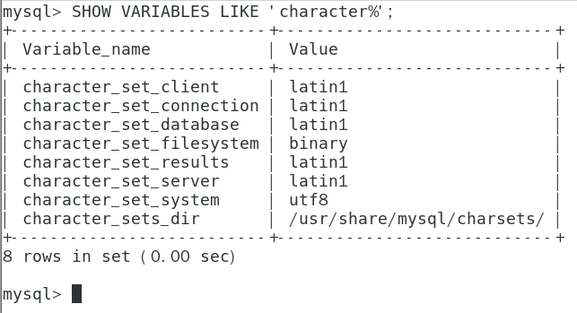

# Docker

## 1、端口映射出错

```shell
docker: Error response from daemon: driver failed programming external connectivity on endpoint mariadb (f21d032144a551af5486af37becd123b815d496ec64501aa77f639e2ca496ce6):  (iptables failed: iptables --wait -t nat -A DOCKER -p tcp -d 0/0 --dport 3306 -j DNAT --to-destination 172.17.0.2:3306 ! -i docker0: iptables: No chain/target/match by that name.
```

重启docker

systemctl restart docker

## 2、容器数据卷访问目录出错

Docker挂载主机目录访问如果出现**cannot open directory .: Permission denied**。

解决办法：在挂载目录后多加一个**--privileged=true**参数即可。

如果是CentOS7安全模块会比之前系统版本加强，不安全的会先禁止，而**目录挂载的情况被默认为不安全的行为**，所以在SELinux里面挂载目录被禁止掉了，如果要开启，我们一般使用--privileged=true命令，扩大容器的权限解决挂载目录没有权限的问题，也即使用该参数，container内的root拥有真正的root权限，否则，container内的root只是外部的一个普通用户权限。

# Mysql

## 1、无法连接

**问题描述：**

[08S01] Communications link failure

The last packet sent successfully to the server was 0 milliseconds ago. The driver has not received any packets from the server.


直译：错误代码[08S01] 连接失败

上次成功发送到服务器的数据包是0毫秒以前。驱动程序还没有收到来自服务器的任何数据包。

linux端可以登陆mysql，但是DataGrip无法连接，设置了root@%，但还是不行。

**问题解决：**

show global variables like 'port';

查看端口多少，发现为0

在进入etc/my.cnf修改

将\#skip-grant-tables 注释掉后端口号就不为零 了

\#skip-networking 也要注释掉

不放心顺手加上port=3306

本地去连接mysql时报错，错误 2058 Plugin caching_sha2_password could not be loaded

由于mysql8.0的加密方法变了。mysql8.0默认采用caching_sha2_password的加密方式。sqlyog不支持这种加密方式。

```
1、修改密码过期
ALTER USER'root'@'localhost' IDENTIFIED BY 'root' PASSWORD EXPIRE NEVER;
2、重新修改密码
ALTER USER'root'@'%' IDENTIFIED WITH mysql_native_password BY 'root';
3、刷新权限（不做可能无法生效）
FLUSH PRIVILEGES;
```

## 2、文件目录挂载出问题

**问题描述**：

使用命令如下，使用mysql:lastest版本

```shell
docker run -p 3306:3306 --name mysql01 \
-v /data/mysql/mysql01/log:/var/log/mysql \
-v /data/mysql/mysql01/data:/var/lib/mysql \
-v /data/mysql/mysql01/conf:/etc/mysql \
-e MYSQL_ROOT_PASSWORD=fuckharkadmin \
-itd mysql
```


**问题解决**：

当指定了外部配置文件与外部存储路径时，也需要指定 /var/lib/mysql-files的外部目录

所以添加一条挂载

```shell
-v /data/mysql/mysql01/mysql-files:/var/lib/mysql-files \
```

## 3、docker安装mysql挂载四个目录后，无法登陆

**问题描述**：

在解决问题二的挂载问题后，启动登陆mysql报以下错误

```shell
”Access denied for user ‘root’@’localhost’ (using password: YES)”
```

在映射的conf文件夹下配置mysql.cnf

```shell
[mysqld]
skip-grant-tables #跳过密码登陆
```

进入mysql后配置root密码以及域，或者新增一个用户即可

**ps**：有些机子不会出现这个问题

## 4、默认字符集隐患



创建一个my.cnf

```text
[client]
default_character_set=utf8
[mysqld]
collation_server = utf8_general_ci
character_set_server = utf8
```

进行映射后放入conf中

docker安装完MySQL并run容器后，建议先修改完字符集编码后重启容器，再新建mysql库-表-插数据

