# 1、Git核心概念

## 1、Git对象

Git 的核心部分是一个简单的**键值对数据库**。你可以向该数据库插入任意类型的内容，它会返回一个键值，通过该键值可以在任意时刻再次检索该内容。

- Key : value组成的键值对，key是value对应的hash值

## 2、树对象

### 1、概念

**一次版本快照** 

Git 以一种类似于 UNIX 文件系统的方式存储内容，所有内容均以**树对象**和**数据对象**(git 对象)的形式存储。

- 树对象对应了 UNIX 中的目录项

- 数据对象(git 对象)则大致上对应文件内容。

- 一个树对象包含了一条或多条记录（每条记录含有一个指向 git 对象或者子树对象的 SHA-1 指针，以及相应的模式、类型、文件名信息）。

- 一个树对象也可以包含另一个树对象。

*（Ps：：我们可以通过 update-index；write-tree；read-tree 等命令来构建 树对像并塞入到暂存区。）*

### 2、操作

利用 update-index 命令为test.txt文件的首个版本，创建一个暂存区。

并通过write-tree命令生成树对像。

命令:

```git
git update-index -add --cacheinfo 100644 83baae61804e65cc73a7201a7252750c76066a30 test.txt
gt write-tree
```

文件模式：

- 100644，表明这是一个普通文件
- 100755，表示一个可执行文件
- 12000o，表示一个符号链接。

选项：

- --add：因为此前该文件并不在暂存区中首次需要 --add
- --cacheinfo：因为将要添加的文件位于Git数据库中，而不是位于当前目录下所有需--cacheinfo

### 3、解析树对象

Git根据某一时刻暂存区（即index区域）所表示的状态创建并记录一个对应的树对象，如此重复便可依次记录(某个时间段内)一系列的树对象。

其实树对象是对暂存区内操作的抽象，这颗树对象相对于就是快照，当我们的工作区有任何更改同步到暂存区时，便会调用write-tree命令。

通过write-tree命令向暂存区内容写入一个树对象，它会根据当前暂存区状态自动创建一个新的树对象，即每一次同步都产生一颗树对象，且该命令会返回一个hash指向树对象。

在Git中每一个文件（数据）都对应一个hash（类型 blob)，每一个树对象都对应一个hash（类型tree)。

## 3、提交对象

我们可以通过调用 commit-tree 命令创建一个提交对象，为此需要指定一个树对象的 SHA-1 值，以及该提交的父提交对象（如果有的话，第一次将暂存区做快照就没有父对象）。

创建提交对象

```git
echo 'first commit' | git commit-tree d8329f
返回:
fdf4fc3344e67ab068f836878b6c4951e3b15f3d
```

查看提交对象

```git
git cat-fi1e -p fdf4fc3
返回:
tree d8329fc1cc938780ffdd9f94e0d364e0ea74f579
```

提交对象的格式

它先指定一个顶层树对象，代表当前项目快照

然后是作者/提交者信息（依据你的user.name和 user.email配置来设定，外加一个时间戳)

留空一行，最后是提交注释

接着，我们将创建另两个提交对象，它们分别引用各自的上一个提交(作为其父提交对象）:

```git
echo 'second commit' l git commit-tree 0155eb -p fdf4fc3
cacOcab538b970a37ea1e769cbbde608743bc96d
echo 'third commit'l git commit-tree 3c4e9c -p cacOcab
1a410efbd13591db07496601ebc7a059dd55cfe9
```

*（ps：git commit-tree 不但生成提交对象 而且会将对应的快照（树对象）提交到本地库中）*

## 4、区域

- 工作区（沙箱环境）
  - 本地代码，git不会管理
- 暂存区
- 版本库

## 5、Config配置

配置个人用户名称和电子邮件，提交时会记录俩条星系，说明

- --system当前系统

- --gobal 当前用户

- 不写，当前项目有效

```git
git config --global user.name “”

git config --global user.email [example@example.com](mailto:example@example.com)
```

Git 首次安装必须设置一下用户签名，否则无法提交代码。

**注意**：这里设置用户签名和将来登录 GitHub的账号没有任何关系。

查看已有的配置信息

```git
git congfig --list 
```

## 6、Git文件目录

```git
使用 git init 创建库
```

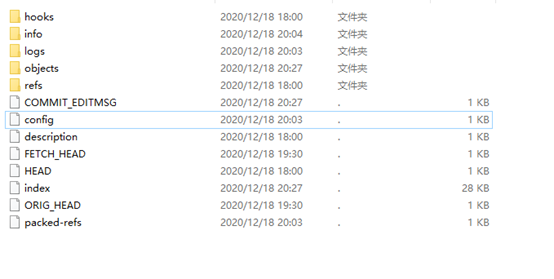

```tetx
Hooks        目录包含客户端或服务端的钩子脚本
Info        包含一个全局性排除文件
Logs        保存日志信息
Objects        目录存储所有数据内容
Refs        目录储存指向数据（分支）的提交对象的指针
Config        文件包含项目特有的配置选项
Description    用来显示对仓库的描述信息
Head        文件指示目前被检出的分支
Index        文件保存暂存区信息
```

# 2、高层命令

| 命令                                                                  | 功能                                                                                     |
| ------------------------------------------------------------------- | -------------------------------------------------------------------------------------- |
| git init                                                            | 初始化仓库                                                                                  |
| git add 路径                                                          | 将当前修改放入暂存区，先生成版本库在放入暂存区<br>相当于：<br>命令：git hash-object -w 文件名<br>命令：git update-index …… |
| git commit -m “注释”                                                  | 提交<br>相当于：<br/>命令：git write-tree<br>命令：git commit-tree                                 |
| git status                                                          | 查看当前文件状态                                                                               |
| git diff<br>（不加参数直接输入 git diff）                                     | 当前做的哪些更新还没有暂存？                                                                         |
| git diff –cached <br>git diff –staged(1.6.1 以上)                     | 有哪些更新已经暂存起来准备好了下次提交？                                                                   |
| git commit -a -m “”                                                 | 跳过使用暂存区直接提交                                                                            |
| mv 名字 名字                                                            | 更改名字                                                                                   |
| git log<br>git log 参数 git log --pretty=oneline <br>git log –oneline | 查看历史记录                                                                                 |
| git rm 文件名                                                          | 删除文件，删除工作目录中对应的文件，再将修改添加到暂存区                                                           |
| git reflog                                                          | 查看版本信息                                                                                 |
| git pull 远程库地址别名 远程分支名                                              | 将远程仓库对于分支最新内容拉下来后与
<br/>当前本地分支直接合并<br>确保本地分支已经跟踪了远程跟踪分支                                |
| git push 别名 分支                                                      | 推送本地分支上的内容到远程仓库                                                                        |
| git clone 远程地址                                                      | 将远程仓库的内容克隆到本地                                                                          |
| git remote add 别名 远程地址                                              | 起别名                                                                                    |
| git remote -v                                                       | 查看当前所有远程地址别名                                                                           |

# 3、分支

## 1、基础命令

几乎所有的版本控制系统都以某种形式支持分支。 

使用分支意味着你可以把你的工作从开发主线上分离开来，以免影响开发主线。

分支指向最新提交。分支的本质就是一个提交对象。

分支分为本地分支和远程分支。

| 命令                                         | 功能                                                                                                                        |
| ------------------------------------------ | ------------------------------------------------------------------------------------------------------------------------- |
| git branch 名字                              | 创建分支<br>创建一个新分支，并不会自动切换到新分支中去<br>而是在当前所在的提交对象上创建一个指针<br>git branch 不只是可以创建与删除分支<br>如果不加任何参数运行它， 会得到当前所有分支的一个列表，带*号的为当前分支。 |
| git branch -d name                         | 删除分支 ，已合并的                                                                                                                |
| git branch -v                              | 可以查看每一个分支的最后一次提交                                                                                                          |
| git branch name commitHash                 | 新建一个分支并且使分支指向对应的提交对象                                                                                                      |
| git branch –merged                         | 查看哪些分支已经合并到当前分支<br>在这个列表中分支名字前没有 * 号的分支<br>通常可以使用 git branch -d 删除掉                                                       |
| git branch --no-merged                     | 查看所有包含未合并工作的分支<br>尝试使用 git branch -d 命令删除在这个列表中的分支时会失败。 <br>如果真的想要删除分支并丢掉那些工作<br>可以使用 -D 选项强制删 除它。                        |
| git log --oneline --decorate --graph --all | 查看分支历史                                                                                                                    |
| git log --oneline --decorate               | 查看当前分支所指对象,（提供这一功能的参数是 --decorate）                                                                                        |
| git checkout 名字                            | 切换分支                                                                                                                      |
| git checkout -b 名字                         | 新建分支，并切换                                                                                                                  |
| git merge 分支名X                             | 合并分支X，到当前分支                                                                                                               |

（分支切换会改变你工作目录中的文件，在切换分支时，一定要注意你工作目录里的文件会被改变。 如果是切换到一个较旧的分支，你的工作目录会恢复到该分支最后一次提交时的样子。如果 Git 不能干净利落地完成这个任务，它将禁止切换分支，每次在切换分支前提交一下当前分支）

**最佳实践**：切换分支前，最好是**提交状态**，否则会污染主分支，在切换分支时，如果当前分支上有未暂存的修改，或者有未提交的暂存，分支切换可以成功，但是会污染其他分支。

## 2、跟踪分支

1. 从一个远程跟踪分支（origin/master）检出一个本地分支会 自动创建一个叫做 “跟踪分支（有时候也叫做 ”上游分支”：master）。 只有主分支 并且 克隆时才会自动建跟踪分支。
2. 跟踪分支是与远程分支有直接关系的本地分支。如果在一个跟踪分支上输入 git pull，Git能自动地识别去哪个服务器上抓取、合并到哪个分支。
3. 如果你愿意的话可以设置其他的跟踪分支，或者不跟踪 master 分支。

```git
git checkout -b [branch] [remotename]/[branch] 
git checkout -b serverfix origin/serverfix
git checkout --track origin/serverfix  Git 提供了 --track 快捷方式
```

4. 如果想要将本地分支与远程分支设置为不同名字

```git
git checkout -b sf origin/serverfix
```

5. 设置已有的本地分支跟踪一个刚刚拉取下来的远程分支，或者想要修改正在跟踪的跟踪分支，你可以在任意时间使用-u选项运行git branch来显式地设置

```git
git branch -u origin/serverfix （--set-upstream-to）
```

6. 查看设置的所有跟踪分支

```git
git branch -vv
```

### 1、本地分支跟踪远程跟踪分支

- 当克隆的时候 会自动生成一个master本地分支(已经跟踪了对应的远程跟踪分支)

- 在新建其他分支时 可以指定想要跟踪的远程跟踪分支
  
  - ```git
    git checkout -b 本地分支名 远程跟踪分支名
    ```
  
  - ```git
    git checkout --track 远程跟踪分支名
    ```

- 将一个已经存在的本地分支 改成 一个跟踪分支  
  
  - ```git
    git branch -u 远程跟踪分支名   
    ```

### 2、远程跟踪分支

远程跟踪分支 是远程分支状态的引用。它们是你不能移动的本地分支，当你做任何网络通信操作时，它们会自动移动。它们以 (remote)/(branch) 形式命名

当克隆一个仓库时 ，它通常会自动地创建一个跟踪 origin/master 的 master 分支。

### 3、推送其他分支

1. 公开分享一个分支时，需要将其推送到有写入权限的远程仓库上。 本地的分支并不会自动与远程仓库同步，必须显式地推送想要分享的分支。

​      如果希望和别人一起在名为 serverfix 的分支上工作，可以像推送第一个分支那样推送它。 

```git
git push origin serverfix
```

2. 这里有些工作被简化了。 Git自动将serverfix 分支名字展开为 refs/heads/serverfix:refs/heads/serverfix 。也可以运行
   
   ```git
    git push origin serverfix:serverfix，它会做同样的事。
   ```

相当于它说，“推送本地的 serverfix 分支，将其作为远程仓库的 serverfix 分支”

3. 如果并不想让远程仓库上的分支叫做 serverfix，可以运行以下命令将本地的 serverfix 分支推送到远程仓库上的 awesomebranch 分支。
   
   ```git
   git push origin serverfix:awesomebranch
   ```

4. git fetch origin，不指定的话默认获取master分支

5. 可以运行 git merge origin/serverfix 将这些工作合并到当前所在的分支。
   
   ```git
   git merge origin/serverfix (其他协作者) 
   ```

6. 如果想要在自己的 serverfix 分支上工作，可以将其建立在远程跟踪分支之上
   
   ```git
   git checkout -b serverfix origin/serverfix （其他协作者）
   ```

### 5、冲突

git本地操作会不会有冲突？典型合并的时候

git远程协作的时候 会不会有冲突？push、pull  

冲突产生的表现：分支后面状态为 MERGING

| 命令                                 | 功能                    |
| ---------------------------------- | --------------------- |
| git push origin --delete serverfix | 删除远程分支                |
| git remote prune origin --dry-run  | 列出仍在远程跟踪但是远程已被删除的无用分支 |
| git remote prune origin            | 清除上面命令列出来的远程跟踪        |

合并分支时，两个分支在同一个文件的同一个位置有两套完全不同的修改。Git 无法替
我们决定使用哪一个。必须**人为决定**新代码内容。

## 3、存储

当你在项目的一部分上已经工作一段时间后，所有东西都进入了混乱的状态，而这时你想要切换到另一个分支做一点别的事情。 问题是，你不想仅仅因为过会儿回到这一点而为做了一半的工作创建一次提交。 

针对这个问题的答案是命令：git stash

git stash 命令会将未完成的修改保存到一个栈上，而你可以在任何时候重新应用这些改动(git stash apply)

| 命令                        | 功能                        |
| ------------------------- | ------------------------- |
| git stash list            | 查看存储                      |
| git stash apply stash@{2} | 如果不指定一个储藏，Git 认为指定的是最近的储藏 |
| git stash pop             | 来应用储藏然后立即从栈上扔掉它           |
| git stash drop            | 加上将要移除的储藏的名字来移除它          |

## pull request 流程

- 从 master 分支中创建一个新分支 （自己 fork 的项目）点击进行Fork

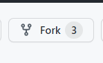

- 提交一些修改来改进项目 （自己 fork 的项目）
- 将这个分支推送到 GitHub 上 （自己 fork 的项目）


- 创建一个合并请求

点击Fork项目的Pull request创建一个新的合并请求


之后原项目的Pull Request还会产生一个新请求

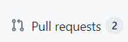

- 讨论，根据实际情况继续修改
- 项目的拥有者合并或关闭你的合并请求

没有问题，就可以Merge Requet，最后Confirm Request

# 4、后悔药

恢复：命令：git branch recover-branch hash

## 工作区

撤销工作区的修改

```git
git checkout --文件名
```

## 暂存区

撤销暂存区的修改

```git
git reset HEAD 文件名/路径（不带着head走）
```

## 版本库

撤销提交（内容有错直接重新提交）

| 命令                                    | 功能                                                            |
| ------------------------------------- | ------------------------------------------------------------- |
| git commit –amend                     | 修改注释                                                          |
| Git reset --soft HEAD~或者HEAD上一次提交的哈希值 | 回到上一个版<br>本质上撤销了上一次提交，和amend一样，带着分支一起移动<br>只修改了版本库，暂存区和工作目录不动 |
| git reset --mixed HEAD~               | 同上，只不过修改了暂存区                                                  |
| git reset --hard HEAD~                | 同上，只不过修改了工作目录                                                 |

## 路径reset

修改了暂存区

```git
git reset --mixed HEAD 路径 （reset 将会跳过第一步）
```

## Checkout

相比于git reset --hard commithash 第一步第二部都没做，只动了工作目录

```git
Git Checkout --路径 
```

跳过第一步，更新暂存区，更新工作目录

```git
git checkout commithash <file>
```

# 5、标签

作用：给历史上某个提交打上标签，标记发布的节点

| 命令                       | 功能                                                                    |
| ------------------------ | --------------------------------------------------------------------- |
| git tag -l “xx.Xx.xx”    | 列出标签                                                                  |
| git tag                  | 创建标签*（Git 使用两种主要类型的标签：轻量标签 与 附注标签）*<br>轻量标签很像一个不会改变的分支 - 它只是一个特定提交的引用 |
| git show tagname         | 查看特定标签                                                                |
| git tag -d v1.4          | 删除标签                                                                  |
| git checkout tagname     | 检出标签                                                                  |
| git checkout -b version2 | 修复旧版本的错误——这通常需要创建一个新分支                                                |
|                          |                                                                       |

```git
git tag v1.4 

git tag v1.4 commitHash 
```

附注：标签是存储在 Git 数据库中的一个完整对象。它们是可以被校验的

*（其中包含打标签者的名字、电子 邮件地址、日期时间、还有一个标签信息、通常建议创建附注标签。）*

```git
git tag -a v1.4 

git tag -a v1.4 commitHash 

git tag -a v1.4 commitHash -m 'my version 1.4'
```

# 6、SSH

~~~git
// 进入当前目录
cd

// 删除 .ssh 目录
rm -rvf .ssh

// 运行命令生成.ssh 秘钥目录[注意：这里-C 这个参数是大写的 C]
ssh-keygen -t rsa -C xxxx@xx.com

// 进入.ssh 目录查看文件列表
cd .ssh
ll -a

// 查看并复制 id_rsa.pub 文件内容
cat id_rsa.pub
~~~

之后登录 GitHub，点击用户头像→Settings→SSH and GPG keys

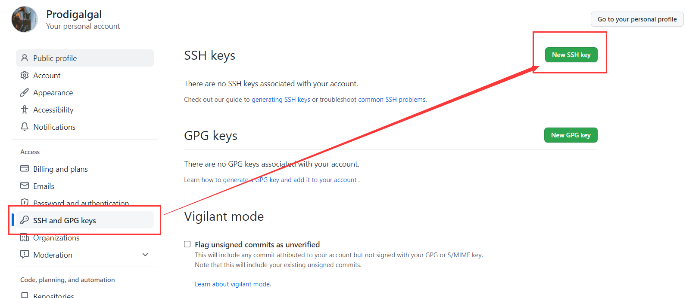

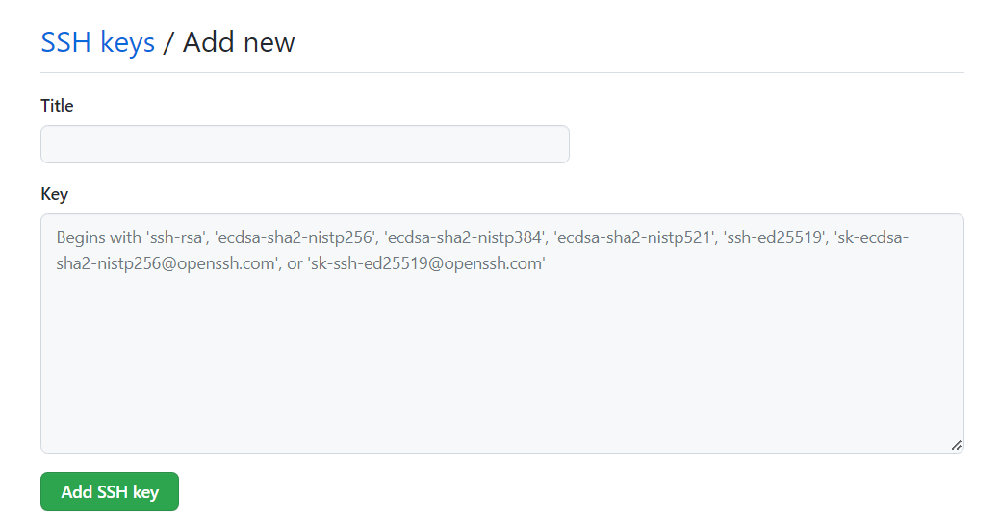

随便取个名字，粘贴刚才复制的内容，添加即可

接下来再往远程仓库 push 东西的时候使用 SSH 连接就不需要登录了。

# 7、IDEA集成Git

## 1、忽略无关文件

创建忽略规则文件 git.ignore 文件

~~~ignore
# Compiled class file
*.class
# Log file
*.log
# BlueJ files
*.ctxt
# Mobile Tools for Java (J2ME)
.mtj.tmp/
# Package Files #
*.jar
*.war
*.nar
*.ear
*.zip
*.tar.gz
*.rar
# virtual machine crash logs, see http://www.java.com/en/download/help/error_hotspot.xml
hs_err_pid*
.classpath
.project
.settings
target
.idea
*.iml
~~~

在.gitconfig 文件中引用忽略配置文件（此文件在 Windows 的家目录中）

~~~text
[user]
name = xxx
email = xxx@xxx.com
[core]
excludesfile = C:/Users/xxx/git.ignore
注意：这里要使用“正斜线（/）”，不要使用“反斜线（\）”
~~~

## 2、添加Github账户

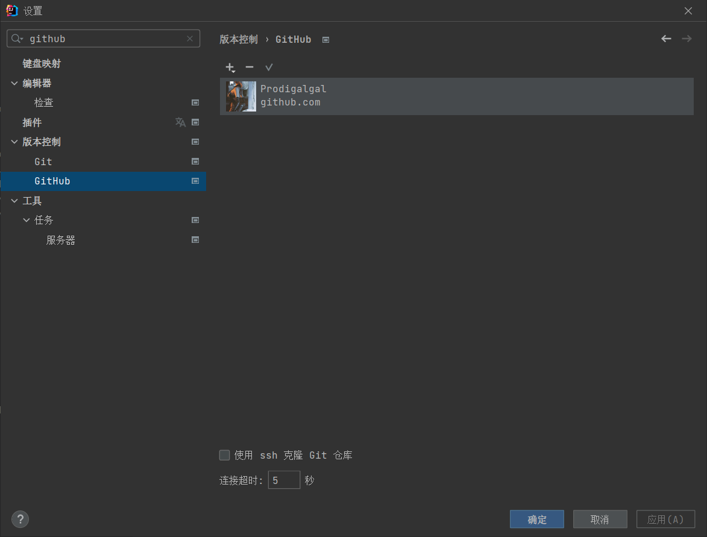

如果密码账号无法登陆，可以使用token登陆

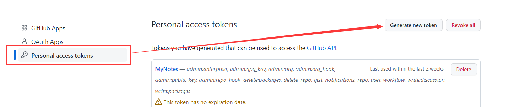

随便起名字，权限自选，复制生成的token代码，粘贴回idea

## 3、分支

### 1、切换分支

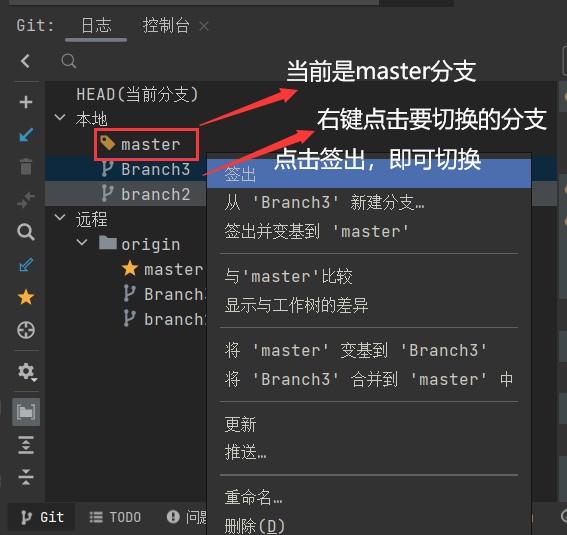

### 2、变基分支

将A分支的修改提交到B分支上

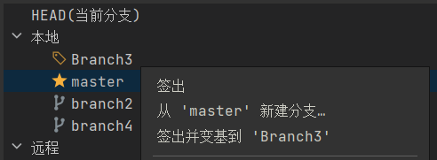

当前在BR3分支上，右键选择M分支变基并签出，即可将BR3分支的修改提交到M分支上

## 4、搁置代码

需要临时切换分支，但是当前分支任务未完成，可以使用搁置代码保存现场，之后需要在还原。

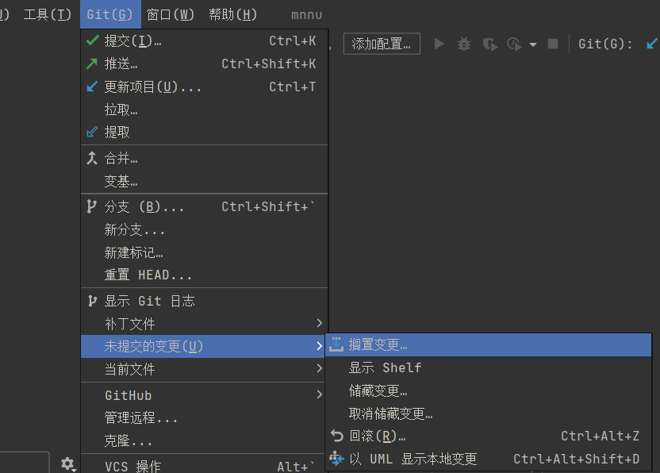

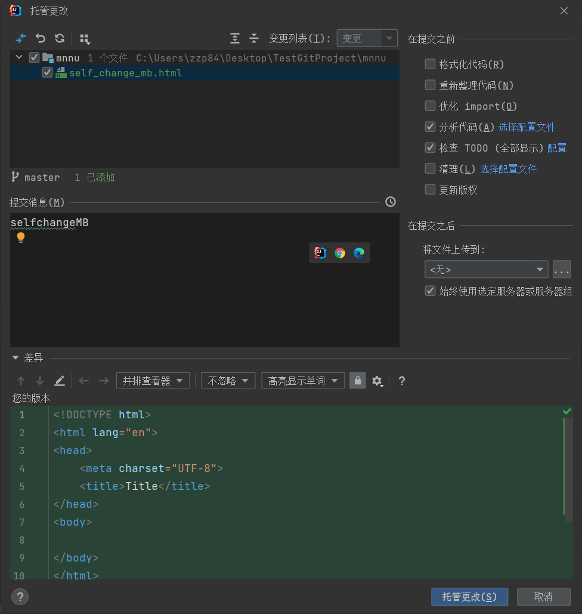

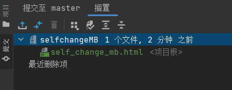

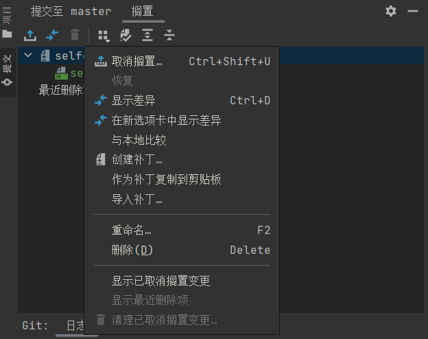

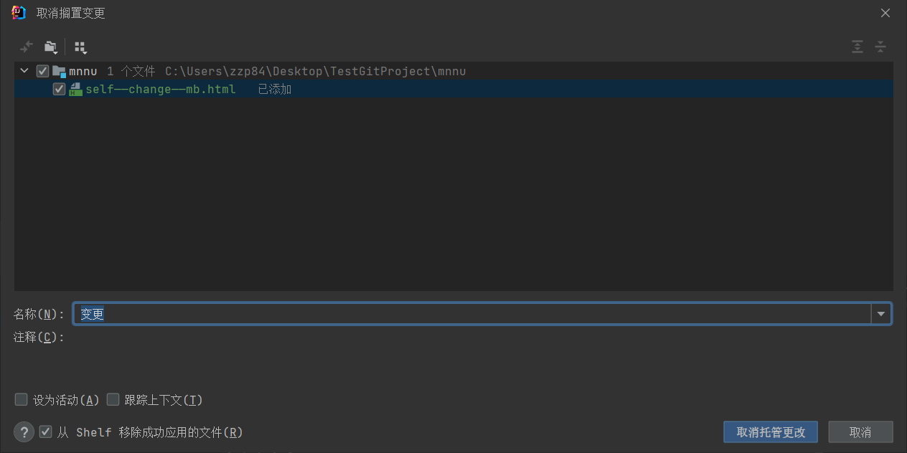

完成之后未提交的代码就已经被搁置了，项目目录里没有未提交的代码，然后签出其他分支完成任务后回来，直接取消搁置并从架子上删除搁置备份即可。


# 8、自建代码托管

## 1、安装GitLab

官网地址：https://about.gitlab.com/ 

安装说明：https://about.gitlab.com/installation/

也可以直接 yum 安装

## 2、编写安装脚本

根据官网的脚本改写

~~~bash
vim gitlab-install.sh
# 根据自身情况改写地址
sudo rpm -ivh /opt/module/gitlab-ce-13.10.2-ce.0.el7.x86_64.rpm

sudo yum install -y curl policycoreutils-python openssh-server cronie

sudo lokkit -s http -s ssh

sudo yum install -y postfix

sudo service postfix start

sudo chkconfig postfix on

curl https://packages.gitlab.com/install/repositories/gitlab/gitlab-ce/script.rpm.sh | sudo bash

sudo EXTERNAL_URL="http://gitlab.example.com" yum -y install gitlab-ce
~~~

给脚本添加权限

~~~bash
chmod +x gitlab-install.sh
~~~

运行脚本

~~~git
./gitlab-install.sh
~~~

## 3、初始化服务

~~~git
gitlab-ctl reconfigure
~~~

## 4、启动服务

~~~bash
gitlab-ctl start
~~~

如需停止，执行 gitlab-ctl stop

## 5、访问

使用主机名或者 IP 地址即可访问 GitLab 服务。

首次登陆之前，需要修改下 GitLab 提供的 root 账户的密码，要求 8 位以上，包含大小写字母和特殊符号。

因此我们修改密码为 xxxx 然后使用修改后的密码登录 GitLab。

注意：gitlab 网页上复制过来的连接是：http://gitlab.example.com/root/git-test.git， 需要手动修改中间的域名为自己的IP或者域名，选择 gitlab 远程连接，进行操作。


# 总结

## 1、更新代码

1. 克隆仓库文件 git clone https:
2. 进入到仓库文件夹，输入git status 查看仓库状态
3. 将本地文件复制到仓库文件中
4. 输入git add * 更新全部
5. 输入git commit -m “update” 提交到缓冲区
6. 若多人同时开发维护，得先输入git pull，拉取最新分支代码
7. 最后git push origin main，push到main分支上

## 2、上传代码

1. copy仓库地址
2. 在本地目录右键选择git bash here
3. 把github上的仓库克隆到本地输入  git clone 复制的链接
4. 把本地项目复制到仓库文件夹
5. 在仓库文件夹右键选择git bash here进入到仓库文件夹
6. 输入git add .  将所有仓库文件都添加进去
7. 输入git commit -m “提交信息” 输入到缓冲中
8. 输入git push -u origin main 将本地文件push到github上，此步骤需输入github的邮箱与用户名。

## 3、团队协作流程

1. 项目经理初始化远程仓库，一定要初始化一个空的仓库，在github上操作

2. 项目经理创建本地仓库
   1. git init 将源码复制进来
   2. git congif --global --修改用户名 修改邮箱
   3. git add ./
   4. git commit -m “”
   
3. 操作远程仓库的信息
   1. git remote 别名 仓库地址(https)   给远程仓库起别名
   2. git remote –v 查看一个远程仓库使用的git别名与其对应的URL
   3. git remote show 别名 查看更多远程仓库的信息
   4. git remeote rename pb paul 重命名远程仓库的别名
   
4. 项目经理推送本地仓库到远程仓库，清理windows凭据
   1. git push 别名 分支 (输入用户名 密码;推完之后会附带生成远程跟踪分支)
   
5. 项目邀请成员 & 成员接受邀请，在github上操作 
   
   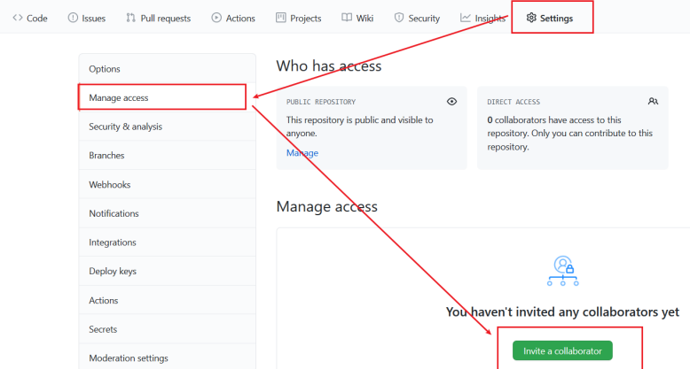
   
   
   
6. 成员克隆远程仓库
   1. git clone 仓库地址 (在本地生成.git文件 默认为远程仓库配了别名 orgin)
   2. 只有在克隆的时候 本地分支master 和 远程跟踪分支别名/master 是有同步关系的
   
7. 成员做出贡献
   1. 修改源码文件
   2. git add ./
   3. git commit -m “”
   4. git push 别名 分支 (输入用户名 密码，推完之后会附带生成远程跟踪分支) 
   
8. 项目经理更新修改
   1. git fetch 别名 (将修改同步到远程跟踪分支上)
   2. git merge 远程跟踪分支 合并远程分支

**注意**：

- 远程仓库名字 “origin” 与分支名字 “master” 一样，在 Git 中并没有任何特别 的含义一样。 

- “master” 是当你运行 git init 时默认的起始分支名字，原因仅仅 是它的广泛使用

- “origin” 是当你运行 git clone 时默认的远程仓库名字。 如果你运行 git clone -o booyah，那么你默认的远程仓库别名为 booyah

- 只有当你有所克隆服务器的写入权限，并且之前没有人推送过时，这条命令才能生效。 当你和其他人在同一时间克隆，他们先推送到上游然后，你再推送到上游，你的推送就会毫无疑问地被拒绝。 你必须先将他们的工作拉取下来并将其合并进你的工作后才能推送


# 问题

## 1、本地仓库推送到远程新仓库被拒绝

错误提示

~~~bash
hint: Updates were rejected because a pushed branch tip is behind its remote
hint: counterpart. Check out this branch and integrate the remote changes
!	refs/heads/master:refs/heads/main	[rejected] (non-fast-forward)
hint: (e.g. 'git pull ...') before pushing again.
hint: See the 'Note about fast-forwards' in 'git push --help' for details.
~~~

首先需要先拉取一次远程仓库

~~~bash
git pull <reomte> <branch> --allow-unrelated-histories
~~~

之后就一切照旧


