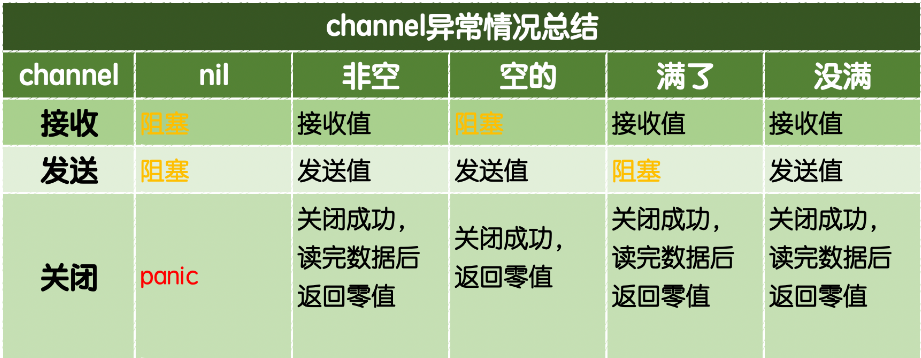

# 1、Go 安装

Windos 直接官网下载 msi 文件安装即可

Linux 

~~~bash
# 准备环境
yum install mercurial git gcc -y
~~~

~~~bash
# 下载 go
cd /usr/local/
wget https://go.googlecode.com/files/go1.13.linux-amd64.tar.gz
tar -zxvf go1.13.linux-amd64.tar.gz

# 创建 GoPath 用于存放 Go 项目
cd /home/
mkdir go
cd go/
mkdir bin
mkdir src
mkdir pkg

vi /etc/profile
export GOROOT=/usr/local/go     # Go 安装目录
export PATH=$GOROOT/bin:$PATH
export GOPATH=/home/go  		# Go 项目目录
source /etc/profile
~~~

~~~bash
# 查看 Go 是否安装成功
go version
~~~


# 2、Go 基础

## 1、基本特征

Go 的函数、变量、常量、自定义类型、包(package) 的命名方式遵循以下规则

- 首字符可以是任意的 Unicode 字符或者下划线

- 剩余字符可以是 Unicode 字符、下划线、数字

- 字符长度不限

Go 只有 25 个关键字

```
break        default      func         interface    select
case         defer        go           map          struct
chan         else         goto         package      switch
const        fallthrough  if           range        type
continue     for          import       return       var
```

Go 还有 37 个保留字

```
Constants:    true  false  iota  nil

Types:    	int  int8  int16  int32  int64  
			uint  uint8  uint16  uint32  uint64  uintptr
			float32  float64  complex128  complex64
			bool  byte  rune  string  error

Functions:   make  len  cap  new  append  copy  close  delete
			complex  real  imag
			panic  recover
```

可见性：

- 声明在函数内部，是函数的本地值，类似 private
- 声明在函数外部，是对当前包内可见的全局值，类似 protect
- 声明在函数外部且首字母大写是所有包可见的全局值，类似 public

Go 有四种主要声明方式：

- var（声明变量）
- const（声明常量）
- type（声明类型）
- func（声明函数）

>Go 的程序是保存在多个. go 文件中
>
>文件的第一行就是 package XXX 声明，用来说明该文件属于哪个包(package)
>
>package 声明下来就是 import 声明
>
>再下来是类型，变量，常量，函数的声明

一个 Go 工程中主要包含以下三个目录：

- src	源代码文件
- pkg	包文件
- bin	相关bin文件


## 2、内置类型

### 1、值类型

```
bool
int(32 or 64), int8, int16, int32, int64
uint(32 or 64), uint8(byte), uint16, uint32, uint64
float32, float64
string
complex64, complex128
array    -- 固定长度的数组
```


### 2、引用类型

(指针类型)

```
slice   -- 序列数组(最常用)
map     -- 映射
chan    -- 管道
```


### 3、自定义类型

Go 语言中可以使用 **type** 关键字来定义自定义类型

自定义类型是定义了一个全新的类型，可以基于内置的基本类型定义，也可以通过 struct 定义，例如：

~~~go
// 将 MyInt 定义为 int 类型
// 通过 type 关键字的定义，MyInt 就是一种新的类型，它具有 int 的特性
type MyInt int
~~~


### 4、类型别名

类型别名规定：TypeAlias 只是 Type 的别名，本质上 TypeAlias 与 Type 是同一个类型

~~~go
type TypeAlias = Type

// 例子：
type byte = uint8
type rune = int32
~~~

自定义类型与类型别名的区别：

~~~go
// 类型定义
type NewInt int

// 类型别名
type MyInt = int

func main() {
    var a NewInt
    var b MyInt

    fmt.Printf("type of a:%T\n", a) // type of a:main.NewInt
    fmt.Printf("type of b:%T\n", b) // type of b:int
}

// MyInt 类型只会在代码中存在，编译完成时并不会有 MyInt 类型
~~~


## 3、内置函数

### 1、概述

Go 语言拥有一些不需要进行导入操作就可以使用的内置函数，可以针对不同的类型进行操作，例如：len、cap、append，或必须用于系统级的操作，例如：panic，因此它们需要直接获得编译器的支持

```
append          -- 用来追加元素到数组、slice中,返回修改后的数组、slice
close           -- 主要用来关闭channel
delete            -- 从map中删除key对应的value
panic            -- 停止常规的goroutine  （panic和recover：用来做错误处理）
recover         -- 允许程序定义goroutine的panic动作
real            -- 返回complex的实部   （complex、real imag：用于创建和操作复数）
imag            -- 返回complex的虚部
make            -- 用来分配内存，返回Type本身(只能应用于slice, map, channel)
new                -- 用来分配内存，主要用来分配值类型，比如int、struct。返回指向Type的指针
cap                -- capacity是容量的意思，用于返回某个类型的最大容量（只能用于切片和 map）
copy            -- 用于复制和连接slice，返回复制的数目
len                -- 来求长度，比如string、array、slice、map、channel ，返回长度
print、println     -- 底层打印函数，在部署环境中建议使用 fmt 包
```


### 2、init 函数

Go 语言中 init 函数用于包 package 的初始化，该函数是 Go 语言的一个重要特性

有下面的特征：

- init 函数是用于程序执行前做包的初始化的函数，比如：初始化包里的变量等

- 每个包可以拥有多个 init 函数
- 包的每个源文件也可以拥有多个 init 函数

- 同一个包中多个 init 函数的执行顺序没有明确的定义

- 不同包的 init 函数按照包导入的依赖关系决定该初始化函数的执行顺序

- init 函数不能被其他函数调用，而是在 main 函数执行之前，自动被调用

- init 函数全局只会被调用一次，即使一个包被引入多次


### 3、main 函数

Go 语言程序的默认入口函数(主函数)：func main() 函数体用｛｝一对括号包裹

```go
func main(){
	// 函数体
}
```

异同点：

- 两个函数在定义时不能有任何的参数和返回值，且 Go 程序自动调用
- init 可以应用于任意包中，且可以重复定义多个
- main 函数只能用于 main 包中，且只能定义一个

两个函数的执行顺序：

- 对同一个 go 文件的 init() 调用顺序是从上到下的
- 对同一个 package 中不同文件是按文件名字符串比较从小到大顺序调用各文件中的 init() 函数。
- 对于不同的 package，如果不相互依赖的话，按照 main 包中先 import 的后调用的顺序调用其包中的 init()，如果 package 存在依赖，则先调用最早被依赖的 package 中的 init()，最后调用 main 函数
- 如果 init 函数中使用了 println() 或者 print() 会发现在执行过程中这两个不会按照想象中的顺序执行，这两个函数官方只推荐在测试环境中使用，对于正式环境不要使用


## 4、内置接口

```go
type error interface { // 只要实现了 Error() 函数，返回值为 String 的都实现了 err 接口
	Error()    String
}
```


## 5、Go 命令

go env 用于打印 Go 语言的环境信息

go run 命令可以编译并运行命令源码文件

go get 可以根据要求和实际情况从互联网上下载或更新指定的代码包及其依赖包，并对它们进行编译和安装

go build 命令用于编译我们指定的源码文件或代码包以及它们的依赖包

go install 用于编译并安装指定的代码包及它们的依赖包

go clean 命令会删除掉执行其它命令时产生的一些文件和目录

go doc 命令可以打印附于 Go 语言程序实体上的文档，可以通过把程序实体的标识符作为该命令的参数来达到查看其文档的目的

go test 命令用于对 Go 语言编写的程序进行测试

go list 命令的作用是列出指定的代码包的信息

go fix 会把指定代码包的所有 Go 语言源码文件中的旧版本代码修正为新版本的代码

go vet 是一个用于检查 Go 语言源码中静态错误的简单工具

go tool pprof 命令来交互式的访问概要文件的内容


## 6、下划线

“_”是特殊标识符，用来忽略结果

import 下划线（如：import _ ".hello/imp"）的作用：当导入一个包时，该包下的文件里所有 init() 函数都会被执行，然而有些时候并不需要把整个包都导入进来，仅仅是是希望它执行 init() 函数而已，这个时候就可以使用 import 引用该包，即使用【import _ 包路径】只是引用该包，仅仅是为了调用 init() 函数，所以无法通过包名来调用包中的其他函数

下划线在代码中，意思是忽略这个变量

~~~go
import "database/sql"
import _ "github.com/go-sql-driver/mysql"

// 第二个 import 就是不直接使用 mysql 包，只是执行一下这个包的 init 函数
// 把 mysql 的驱动注册到 sql 包里，然后程序里就可以使用 sql 包来访问 mysql 数据库了
~~~


## 7、变量与常量

### 1、变量

变量（Variable）的功能是存储数据，不同的变量保存的数据类型可能会不一样

Go 语言中的每一个变量都有自己的类型，且变量需要声明后才能使用，同一作用域内不支持重复声明

声明格式：

~~~go
var 变量名 变量类型

// 批量声明
var (
        a string
        b int
        c bool
        d float32
    )
~~~

Go语言在声明变量的时候，会自动对变量对应的内存区域进行初始化操作，每个变量会被初始化成其类型的默认值，例如：整型和浮点型变量的默认值为0，字符串变量的默认值为空字符串，布尔型变量默认为 false，切片、函数、指针变量的默认为 nil

可以在声明变量的时候为其指定初始值：

~~~go
var 变量名 类型 = 表达式

var name, sex = "pprof.cn", 1
~~~

类型推导，就是声明时将变量的类型省略，编译器会根据等号右边的值来推导变量的类型完成初始化

```go
var name = "pprof.cn"
var sex = 1
```

短变量声明，在函数内部，可以使用更简略的 := 方式声明并初始化变量

~~~go
func main() {
    n := 10
    m := 200 // 此处声明局部变量m
    fmt.Println(m, n)
}
~~~

匿名变量，在使用多重赋值时，如果想要忽略某个值，可以使用匿名变量（anonymous variable）匿名变量用一个下划线 _ 表示

- 匿名变量不占用命名空间，不会分配内存，所以匿名变量之间不存在重复声明

~~~go
func foo() (int, string) {
    return 10, "Q1mi"
}
func main() {
    x, _ := foo()
    _, y := foo()
    fmt.Println("x=", x)
    fmt.Println("y=", y)
}
~~~

**注意**：

- 函数外的每个语句都必须以关键字开始（var、const、func等）
- := 不能使用在函数外
- _ 多用于占位，表示忽略值


### 2、常量

相对于变量，常量是恒定不变的值，多用于定义程序运行期间不会改变的那些值

常量的声明和变量声明非常类似，只是把 var 换成了 const，常量在定义的时候必须赋值

```go
// 声明了 pi 和 e 这两个常量之后，在整个程序运行期间它们的值都不能再发生变化了
const pi = 3.1415
const e = 2.7182
```

多个常量也可以一起声明：

```go
const (
    pi = 3.1415
    e = 2.7182
)
```

const 同时声明多个常量时，如果省略了值则表示和上面一行的值相同

```
// 常量n1、n2、n3的值都是100
const (
    n1 = 100
    n2
    n3
)
```


### 3、iota

iota 是 go 语言的常量计数器，只能在常量的表达式中使用

iota 在 const 关键字出现时将被重置为 0，const 中每新增一行常量声明将使 iota 计数一次( iota 可理解为 const 语句块中的行索引) 使用iota 能简化定义，在定义枚举时很有用

举个例子：

```go
const (
    n1 = iota //0
    n2        //1
    n3        //2
    n4        //3
)
```

使用_跳过某些值

```go
const (
    n1 = iota //0
    n2        //1
    _
    n4        //3
)
```

iota 声明中间插队

```
const (
    n1 = iota // 0
    n2 = 100  // 100
    n3 = iota // 2
    n4        // 3
)
const n5 = iota // 0
```

定义数量级 （这里的 << 表示左移操作，1<<10 表示将 1 的二进制表示向左移 10 位，也就是由 1 变成了 10000000000，也就是十进制的1024，同理 2<<2 表示将 2 的二进制表示向左移 2 位，也就是由 10 变成了 1000，也就是十进制的8）

```go
const (
    _  = iota
    KB = 1 << (10 * iota)
    MB = 1 << (10 * iota)
    GB = 1 << (10 * iota)
    TB = 1 << (10 * iota)
    PB = 1 << (10 * iota)
)
```

多个iota定义在一行

```go
const (
    a, b = iota + 1, iota + 2 // 1,2
    c, d                      // 2,3
    e, f                      // 3,4
)
```


## 8、基本类型

### 1、介绍

| 类型          | 长度(字节) | 默认值 | 说明                                         |
| ------------- | ---------- | ------ | -------------------------------------------- |
| bool          | 1          | false  |                                              |
| byte          | 1          | 0      | uint8                                        |
| rune          | 4          | 0      | Unicode Code Point, int32                    |
| int, uint     | 4 或 8     | 0      | 32 或 64 位                                  |
| int8, uint8   | 1          | 0      | -128 ~ 127, 0 ~ 255，byte 是 uint8 的别名    |
| int16, uint16 | 2          | 0      | -32768 ~ 32767, 0 ~ 65535                    |
| int32, uint32 | 4          | 0      | -21亿 ~ 21亿, 0 ~ 42亿，rune 是 int32 的别名 |
| int64, uint64 | 8          | 0      |                                              |
| float32       | 4          | 0.0    |                                              |
| float64       | 8          | 0.0    |                                              |
| complex64     | 8          |        |                                              |
| complex128    | 16         |        |                                              |
| uintptr       | 4 或 8     |        | 以存储指针的 uint32 或 uint64 整数           |
| array         |            |        | 值类型                                       |
| struct        |            |        | 值类型                                       |
| string        |            | ""     | UTF-8 字符串                                 |
| slice         |            | nil    | 引用类型                                     |
| map           |            | nil    | 引用类型                                     |
| channel       |            | nil    | 引用类型                                     |
| interface     |            | nil    | 接口                                         |
| function      |            | nil    | 函数                                         |

支持八进制、 六进制，以及科学记数法。标准库 math 定义了各数字类型取值范围。

```
a, b, c, d := 071, 0x1F, 1e9, math.MinInt16
```

空指针值 nil，而非C/C++ NULL

### 2、整型

整型分为以下两个大类：

- 按长度分为：int8、int16、int32、int64 
- 对应的无符号整型：uint8、uint16、uint32、uint64

其中，uint8 就是熟知的 byte 型，int16 对应 C 语言中的 short 型，int64 对应 C 语言中的 long 型


### 3、浮点型

Go 语言支持两种浮点型数：float32 和 float64

这两种浮点型数据格式遵循 IEEE 754 标准： 

- float32 的浮点数的最大范围约为3.4e38，可以使用常量定义：math.MaxFloat32
- float64 的浮点数的最大范围约为 1.8e308，可以使用一个常量定义：math.MaxFloat64


### 4、复数

complex64 和 complex128

复数有实部和虚部，complex64 的实部和虚部为 32 位，complex128 的实部和虚部为 64 位


### 5、布尔值

Go 语言中以 bool 类型进行声明布尔型数据，布尔型数据只有 true（真）和 false（假）两个值

**注意**：

- 布尔类型变量的默认值为false
- Go 语言中不允许将整型强制转换为布尔型
- 布尔型无法参与数值运算，也无法与其他类型进行转换


### 6、字符串

#### 1、介绍

Go 语言中的字符串以原生数据类型出现，使用字符串就像使用其他原生数据类型（int、bool、float32、float64 等）一样

Go 语言里的字符串的内部实现使用 UTF-8 编码，字符串的值为双引号(")中的内容，可以在 Go 语言的源码中直接添加非 ASCII 码字符

例如：

```go
s1 := "hello"
s2 := "你好"
```


#### 1、字符串转义符

Go 语言的字符串常见转义符包含回车、换行、单双引号、制表符等，如下表所示

| 转义 | 含义                               |
| ---- | ---------------------------------- |
| \r   | 回车符（返回行首）                 |
| \n   | 换行符（直接跳到下一行的同列位置） |
| \t   | 制表符                             |
| \'   | 单引号                             |
| \"   | 双引号                             |
| \    | 反斜杠                             |

要打印一个Windows平台下的一个文件路径：

```go
package main
import (
    "fmt"
)
func main() {
    fmt.Println("str := \"c:\\pprof\\main.exe\"")
}
```


#### 3、多行字符串

Go 语言中要定义一个多行字符串时，就必须使用反引号字符：

```go
s1 := `第一行
第二行
第三行
`
fmt.Println(s1)
```

反引号间换行将被作为字符串中的换行，但是所有的转义字符均无效，文本将会原样输出


#### 4、字符串的常用操作

| 方法                                | 介绍           |
| ----------------------------------- | -------------- |
| len(str)                            | 求长度         |
| +或fmt.Sprintf                      | 拼接字符串     |
| strings.Split                       | 分割           |
| strings.Contains                    | 判断是否包含   |
| strings.HasPrefix,strings.HasSuffix | 前缀/后缀判断  |
| strings.Index(),strings.LastIndex() | 子串出现的位置 |
| strings.Join(a[]string, sep string) | join操作       |


### 7、byte 和 rune 类型

#### 1、介绍

组成每个字符串的元素叫做“字符”，可以通过遍历或者单个获取字符串元素获得字符

字符用单引号（’）包裹起来，如：

```go
var a := '中'

var b := 'x'
```

Go 语言的字符有以下两种：

- uint8 类型，或者叫 byte 型，代表了 ASCII 码的一个字符
- rune 类型，代表一个 UTF-8 字符

当需要处理中文、日文或者其他复合字符时，则需要用到 rune 类型，rune 类型实际是一个 int32，Go 使用了特殊的 rune 类型来处理 Unicode，让基于 Unicode 的文本处理更为方便，也可以使用 byte 型进行默认字符串处理，性能和扩展性都有照顾

```go
// 遍历字符串
func traversalString() {
    s := "pprof.cn博客"
    for i := 0; i < len(s); i++ { //byte
        fmt.Printf("%v(%c) ", s[i], s[i])
    }
    fmt.Println()
    for _, r := range s { //rune
        fmt.Printf("%v(%c) ", r, r)
    }
    fmt.Println()
}
```

输出：

```
112(p) 112(p) 114(r) 111(o) 102(f) 46(.) 99(c) 110(n) 229(å) 141() 154() 229(å) 174(®) 162(¢)
112(p) 112(p) 114(r) 111(o) 102(f) 46(.) 99(c) 110(n) 21338(博) 23458(客)
```

因为 UTF-8 编码下一个中文汉字由 3~4 个字节组成，所以不能简单的按照字节去遍历一个包含中文的字符串，否则就会出现上面输出中第一行的结果

字符串底层是一个 byte 数组，所以可以和 []byte 类型相互转换

字符串是不能修改的，字符串是由 byte 字节组成，所以字符串的长度是 byte 字节的长度 

rune 类型用来表示 utf8 字符，一个 rune 字符由一个或多个 byte 组成


#### 2、修改字符串

要修改字符串，需要先将其转换成 []rune 或 []byte ，完成后再转换为 string

无论哪种转换，都会重新分配内存，并复制字节数组

```go
func changeString() {
    s1 := "hello"
    // 强制类型转换
    byteS1 := []byte(s1)
    byteS1[0] = 'H'
    fmt.Println(string(byteS1))

    s2 := "博客"
    runeS2 := []rune(s2)
    runeS2[0] = '狗'
    fmt.Println(string(runeS2))
}
```


### 8、类型转换

Go 语言中只有强制类型转换，没有隐式类型转换

该语法只能在两个类型之间支持相互转换的时候使用

强制类型转换的基本语法如下：

```go
T(表达式)
```

其中，T表示要转换的类型，表达式包括变量、复杂算子、函数返回值等

```go
func sqrtDemo() {
    var a, b = 3, 4
    var c int
    // math.Sqrt()接收的参数是float64类型，需要强制转换
    c = int(math.Sqrt(float64(a*a + b*b)))
    fmt.Println(c)
}
```


## 9、数组

### 1、概述

同一种数据类型的**固定长度**的序列

数组长度必须是常量，且是类型的组成部分，一旦定义，长度不能变

长度是数组类型的一部分，因此，var a[5] int 和 var a[10]int 是不同的类型

~~~go
// 数组定义
var a [len]int
~~~

数组可以通过下标进行访问，下标是从 0 开始，最后一个元素下标是：len-1

~~~go
for i := 0; i < len(a); i++ {
}
for index, v := range a {
}
~~~

访问越界，如果下标在数组合法范围之外，则触发访问越界，会 panic

**数组是值类型**，赋值和传参会复制整个数组，而不是指针，因此改变副本的值，不会改变本身的值

支持 "=="、"!=" 操作符

**内存总是被初始化过的**

指针数组 **[n]*T**，数组指针 **\*[n]T**

内置函数 len 和 cap 都返回数组长度 (元素数量)

~~~go
a := [2]int{}
println(len(a), cap(a)) 
~~~


### 2、初始化

**一维数组**：

~~~go
// 全局
var arr0 [5]int = [5]int{1, 2, 3}
var arr1 = [5]int{1, 2, 3, 4, 5}
var arr2 = [...]int{1, 2, 3, 4, 5, 6}
var str = [5]string{3: "hello world", 4: "tom"}

// 局部
a := [3]int{1, 2}           // 未初始化元素值为对应类型零值
b := [...]int{1, 2, 3, 4}   // 通过初始化值确定数组长度
c := [5]int{2: 100, 4: 200} // 使用索引号初始化元素
d := [...]struct {
    name string
    age  uint8
}{
    {"user1", 10}, // 可省略元素类型
    {"user2", 20},
}
~~~


**多维数组**：

~~~go
// 全局
var arr0 [5][3]int
var arr1 [2][3]int = [...][3]int{{1, 2, 3}, {7, 8, 9}}

// 局部
a := [2][3]int{{1, 2, 3}, {4, 5, 6}}
b := [...][2]int{{1, 1}, {2, 2}, {3, 3}} // 第 2 纬度不能用 "..."
~~~

~~~go
// 遍历
var f [2][3]int = [...][3]int{{1, 2, 3}, {7, 8, 9}}

for k1, v1 := range f {
    for k2, v2 := range v1 {
        fmt.Printf("(%d,%d)=%d ", k1, k2, v2)
    }
    fmt.Println()
}
~~~


**注意**：

- 值拷贝行为会造成性能问题，通常会建议使用 slice，或数组指针


### 3、拷贝与传参

~~~go
// 由于数组是值类型
// 必须使用数组指针作为参数传入，才能修改数组内容
func printArr(arr *[5]int) {
    arr[0] = 10
    for i, v := range arr {
        fmt.Println(i, v)
    }
}

func main() {
    var arr1 [5]int
    printArr(&arr1)
    fmt.Println(arr1)
    arr2 := [...]int{2, 4, 6, 8, 10}
    printArr(&arr2)
    fmt.Println(arr2)
}
~~~


## 10、切片

### 1、概述

切片是数组的一个**引用**，因此**切片是引用类型**，但自身是结构体，值拷贝传递

~~~go
func testSlice(s []int) {
	s[0] = 5
}
func main() {
	var arr1 = []int{1, 2, 3}
	testSlice(arr1)
	fmt.Println(arr1)
    fmt.Println(reflect.TypeOf(arr1).Kind())
}
5 2 3
slice
~~~

切片的**长度可变**，其是一个可变的数组

切片遍历方式和数组一样，可以用 len() 求长度，表示可用元素数量，读写操作不能超过该限制

cap 可以求出 slice 最大扩张容量，不能超出数组限制，0 <= len(slice) <= len(array)，其中 array 是 slice 引用的数组

~~~go
// 切片定义
// var 变量名 []类型
var str []string
var arr []int
~~~


**注意**：

- slice 并不是数组或数组指针，其内部通过指针和相关属性引用数组片段，实现变长方案
- 如果 slice == nil，那么 len、cap 结果都等于 0
- 切片是引用类型，如果只声明，那么零值是 nil，还需要进一步的分配内存


### 2、初始化

可以在声明时使用 **{}**、make 函数初始化、从其他切片截取

- **{}**：不放元素，则切片为空切片

~~~go
func main() {
    // 声明切片，为分配内存，为 nil
    var s1 []int
    if s1 == nil {
        fmt.Println("是空")
    } else {
        fmt.Println("不是空")
    }
    // :=
    s2 := []int{}
    s5 := []int{1, 2, 3}
    fmt.Println(s5)

    // make()
    // 第二个参数: len 长度
    // 第三个参数: cap 容量，可省略，默认 cap = len
    var s3 []int = make([]int, 0)
    fmt.Println(s1, s2, s3)
    var s4 []int = make([]int, 0, 0)
    fmt.Println(s4)

    // 从数组切片，前包后不包
    arr := [5]int{1, 2, 3, 4, 5}
    var s6 []int
    s6 = arr[1:4]
    fmt.Println(s6)
}
~~~

~~~go
// 全局
var arr = [...]int{0, 1, 2, 3, 4, 5, 6, 7, 8, 9}
var slice0 []int = arr[start:end] 
var slice1 []int = arr[:end]      
var slice2 []int = arr[start:]
var slice3 []int = arr[:] 		   // 两端都不写，默认 start 到 end
var slice4 = arr[:len(arr)-1]      // 去掉切片的最后一个元素

// 局部
arr2 := [...]int{9, 8, 7, 6, 5, 4, 3, 2, 1, 0}
slice5 := arr[start:end]
slice6 := arr[:end]        
slice7 := arr[start:]     
slice8 := arr[:]  
slice9 := arr[:len(arr)-1] //去掉切片的最后一个元素
~~~


**注意**：

- 切片时，起止位默认是 0 到 len，可默认不写
- 使用 make 函数创建时，必须满足 cap >= len >= 0
- data[:6:8] 每个数字前都有个冒号，slice 内容为 data 从 0 到第 6 位，长度 len 为 6，最大扩充项 cap 设置为 8
  - a[x:y:z]，切片内容：[x:y]，切片长度：y-x，切片容量：z-x


~~~go
// 遍历
data := [...]int{0, 1, 2, 3, 4, 5, 6, 7, 8, 9}
slice := data[:]
for index, value := range slice {
    fmt.Printf("inde : %v , value : %v\n", index, value)
}
~~~


### 3、追加与拷贝

使用 **append** 函数向 slice 尾部添加数据，并**返回新的 slice 对象**

```go
func main() {
    s1 := make([]int, 0, 5)
    fmt.Printf("%p\n", &s1)
    s2 := append(s1, 1)
    fmt.Printf("%p\n", &s2)
    fmt.Println(s1, s2)

}
0xc42000a060
0xc42000a080
[] [1]
```

超出原 slice.cap 限制，就会**重新分配底层数组**，即便原数组并未填满，**重新分配的底层数组与原数组无关**

~~~go
func main() {
    data := [...]int{0, 1, 2, 3, 4, 10: 0}
    s := data[:2]
    s = append(s, 100, 200) 		// 一次 append 两个值，超出 s.cap 限制
    fmt.Println(s, data)         	// 重新分配的底层数组，与原数组无关
    fmt.Println(&s[0], &data[0]) 	// 比对底层数组起始指针
}
~~~

通常以 2 倍容量重新分配底层数组，在大批量添加数据时，建议一次性分配足够大的空间，以减少内存分配和数据复制开销，或初始化足够长的 len 属性，改用索引号进行操作


**注意**：

- 及时释放不再使用的 slice 对象，避免持有过期数组，造成 GC 无法回收


使用 **copy** 函数拷贝切片，copy 函数在两个 slice 间复制数据，复制长度**以 len 小的为准**，两个 slice 可指向同一底层数组，允许元素区间重叠

~~~go
func main() {
    data := [...]int{0, 1, 2, 3, 4, 5, 6, 7, 8, 9}
    fmt.Println("array data : ", data)
    s1 := data[8:]
    s2 := data[:5]

    fmt.Printf("slice s1 : %v\n", s1)
    fmt.Printf("slice s2 : %v\n", s2)
    copy(s2, s1)

    fmt.Printf("copied slice s1 : %v\n", s1)
    fmt.Printf("copied slice s2 : %v\n", s2)
    fmt.Println("last array data : ", data)
}

array data :  [0 1 2 3 4 5 6 7 8 9]
slice s1 : [8 9]
slice s2 : [0 1 2 3 4]
copied slice s1 : [8 9]
copied slice s2 : [8 9 2 3 4]
last array data :  [8 9 2 3 4 5 6 7 8 9]
~~~


### 4、字符串切片

string 底层就是一个 byte 的数组，因此也可以进行切片操作

~~~go
func main() {
    str := "hello world"
    
    s1 := str[0:5]
    fmt.Println(s1)
    
    s2 := str[6:]
    fmt.Println(s2)
}
hello
world
~~~

string 本身是不可变的，因此要改变 string 中字符，需要先切片，再转为 string 类型

~~~go
func main() {
    str := "Hello world"
    s := []byte(str) // 中文字符用[]rune(str)
    s[6] = 'G'
    s = s[:8]
    s = append(s, '!')
    str = string(s)
    fmt.Println(str)
}
~~~


## 11、指针

### 1、概述

Go 语言中的指针不能进行偏移和运算，是安全指针

3 个概念：指针地址、指针类型、指针取值

Go 语言中的**函数直接传参都是值拷贝**，如果想要修改入参值，则需要传入一个指向该参数地址的指针变量


### 2、指针地址与类型

每个变量在运行时都拥有一个地址，这个地址代表变量在内存中的位置

Go 语言中使用 **&** 字符放在变量前面对变量进行取地址操作

Go 语言中的值类型：int、float、bool、string、array、struct，都有对应的指针类型，如：\*int、\*int64、*string 等

~~~go
// v :代表被取地址的变量，类型为 T
// ptr :用于接收地址的变量，ptr 的类型就为 *T，称做 T 的指针类型，*代表指针
ptr := &v

func main() {
    a := 10
    b := &a
    fmt.Printf("a:%d ptr:%p\n", a, &a) // a:10 ptr:0xc00001a078
    fmt.Printf("b:%p type:%T\n", b, b) // b:0xc00001a078 type:*int
    fmt.Println(&b)                    // 0xc00000e018
}
~~~


### 3、指针取值

在对普通变量使用 & 操作符取地址后会获得这个变量的指针

然后可以对指针使用 * 操作，也就是指针取值

~~~go
func main() {
    // 指针取值
    a := 10
    b := &a // 取变量 a 的地址，将指针保存到 b 中
    fmt.Printf("type of b:%T\n", b)
    c := *b // 指针取值（根据指针去内存取值）
    fmt.Printf("type of c:%T\n", c)
    fmt.Printf("value of c:%v\n", c)
}

type of b:*int
type of c:int
value of c:10
~~~


### 4、空指针

当一个指针被定义后没有分配到任何变量时，它的值为 nil

~~~go
func main() {
    var p *string
    fmt.Println(p)
    fmt.Printf("p的值是%s/n", p)
    if p != nil {
        fmt.Println("非空")
    } else {
        fmt.Println("空值")
    }
}
~~~


### 5、new、make

#### 1、概述

在 Go 语言中**引用类型**的变量，在使用的时候不仅要声明它，还要为它分配内存空间，否则值就没办法存储

而对于值类型，使用时声明后不需要手动分配内存空间，是因为它们在声明的时候已经**默认分配**了内存空间


#### 2、new

new 函数不太常用，使用 new 函数得到的是一个类型的指针，并且该指针对应的值为该类型的零值

new 是一个内置的函数，它的函数签名如下：

~~~go
func new(Type) *Type
~~~

- Type：表示类型，new 函数只接受一个参数，这个参数是一个类型
- *Type：表示类型指针，new 函数返回一个指向该类型内存地址的指针

~~~go
func main() {
    a := new(int)
    b := new(bool)
    fmt.Printf("%T\n", a) // *int
    fmt.Printf("%T\n", b) // *bool
    fmt.Println(*a)       // 0
    fmt.Println(*b)       // false
}
~~~

~~~go
func main() {
    var a *int	// 声明了一个指针变量 a 但是没有初始化
    // 指针作为引用类型需要初始化后才会拥有内存空间，才可以赋值
    a = new(int)	// 使用内置的 new 函数对指针 a 进行初始化
    *a = 10
    fmt.Println(*a)
}
~~~


#### 3、make

make 也用于内存分配，但是只用于 slice、map、chan 的创建，而且它返回的类型就是这三个类型**本身**，而不是指针，因为这三种类型是引用类型，所以没有必要返回指针

make 函数的函数签名如下：

~~~go
func make(t Type, size ...IntegerType) Type
~~~

~~~go
func main() {
    var b map[string]int	// 声明一个 map 类型的 b 变量
    // 使用 make 函数初始化
    b = make(map[string]int, 10)
    b["测试"] = 100
    fmt.Println(b)
}
~~~


## 12、Map

### 1、概述

map 是一种无序的基于 key-value 数据结构，Go 语言中的 map 是引用类型，默认初始值为 nil，必须初始化才能使用

~~~go
// 定义如下
// KeyType:表示键的类型
// ValueType:表示键对应的值的类型
map[KeyType]ValueType
~~~


### 2、基本使用

#### 1、创建

map 创建有两种方式：

- 使用 make() 函数来分配内存
- 在声明的时候填充元素

~~~go
// cap 表示 map 的容量，非必须，但是应该预设，减少内存分配次数
x := make(map[string]string, [cap])

x := map[string]string{
    "username": "pprof.cn",
    "password": "123456",
}
~~~

~~~go
func main() {
    scoreMap := make(map[string]int, 8)
    scoreMap["张三"] = 90
    scoreMap["小明"] = 100
    fmt.Println(scoreMap)
    fmt.Println(scoreMap["小明"])
    fmt.Printf("type of a:%T\n", scoreMap)
}

map[小明:100 张三:90]
100
type of a:map[string]int
~~~


**注意**：

- ~~~go
  var attrs map[string]string
  ~~~

  - 只声明了 map，虽然使用 print 输出的结果和空 map 一样是 map[]，但是未初始化的 map 不能赋值，实际上是个 nil


#### 2、判断键存否

Go 语言中有个判断 map 中键是否存在的特殊写法，格式如下：

~~~go
value, ok := map[key]
~~~

如果 key 存在则 ok 为 true，value 为对应的值，key 不存在则 ok 为 false，value 为对应类型的零值


#### 3、遍历

使用 for range 遍历，遍历 map 时的元素顺序与添加键值对的顺序无关

~~~go
func main() {
    scoreMap := make(map[string]int)
    scoreMap["张三"] = 90
    scoreMap["小明"] = 100
    scoreMap["王五"] = 60
    for k, v := range scoreMap {
        fmt.Println(k, v)
    }
}
~~~


#### 4、删除键值对

用内建函数 delete() 从 map 中删除一组键值对，delete() 函数的格式如下：

~~~go
// 参数一：map 源
// 参数二：要删除的 key
delete(map, key)
~~~


#### 5、组合类型

~~~go
func main() {
    // 切片的类型为 map
    var mapSlice = make([]map[string]string, 3)
    // 对切片中的 map 元素进行初始化，才能赋值
    mapSlice[0] = make(map[string]string, 10)
    mapSlice[0]["name"] = "王五"
    mapSlice[0]["password"] = "123456"
}
~~~

~~~go
func main() {
    // 值为切片类型
    var sliceMap = make(map[string][]string, 3)
    key := "中国"
    // 切片初始化
    value = make([]string, 0, 2)
    value = append(value, "北京", "上海")
    sliceMap[key] = value
}
~~~


## 13、结构体

### 1、概念

Go 语言提供了一种自定义数据类型，可以封装多个基本数据类型，这种数据类型叫结构体，使用其可以自定义类型

语言内置的基础数据类型是用来描述一个值的，而结构体是用来描述一组值的，本质上是一种聚合型的数据类型，也是一种值类型

使用 type 和 struct 关键字来定义结构体，具体代码格式如下：

~~~go
type 类型名 struct {
    字段名 字段类型
    字段名 字段类型
}
~~~

- 类型名：标识自定义结构体的名称，在同一个包内不能重复
- 字段名：表示结构体的字段，结构体中的字段名必须唯一
- 字段类型：表示结构体字段的具体类型


**注意**：

- 如果结构体定义在函数外面，结构体名称首字母是否大写影响到结构体是否能跨包访问
- 如果结构体能跨包访问，字段名首字母是否大写影响到字段名是否能跨包访问


### 2、使用

#### 1、实例化

只有当结构体实例化时，才会真正地分配内存，才能使用结构体的字段

- 可以使用 var 关键字声明结构体，进行初始化

  - ~~~go
    var 结构体实例 结构体类型
    ~~~

- 可以使用 new 函数初始化结构体，得到的是结构体的地址

  - ~~~go
    var 结构体实例 = new(结构体类型)
    ~~~

- 可以使用 & 关键字取结构体地址，进行初始化，类似于使用 new 函数初始化

  - ~~~go
    p3 := &person{}
    ~~~

  - 使用 & 关键字初始化时，可以使用键值对或者值列表给字段赋初值

    - 使用键值对不用每个值都赋初值
    - 使用值列表需要每个字段都赋初值，初始值填写顺序与结构体中字段声明顺序一致

~~~go
type person struct {
    name string
    city string
    age  int8
}

var p1 person
// 通过 结构体变量.字段名 来访问结构体字段
p1.city = "北京"
p1.age = 18

var p2 = new(person)
// 直接使用结构体指针访问结构体参数
p2.name = "测试"
p2.age = 18
p2.city = "北京"

p3 := &person{}
p3.age = 30

p5 := person{
    name: "pprof.cn",
    city: "北京",
    age:  18,
}

p8 := &person{
    "pprof.cn",
    "北京",
    18,
}
~~~


**注意**：

- Go 语言中支持直接访问结构体指针的字段，这是 Go 语言的语法糖，底层其实是**(*结构体指针).字段名= 值**
- 键值对不能与值列表混用


#### 2、构造函数

Go 语言的结构体没有构造函数，但可以自己实现，因为 struct 是值类型，如果结构体比较复杂的话，值拷贝性能开销会比较大，所以该构造函数返回的是结构体指针类型

~~~go
func newPerson(name, city string, age int8) *person {
    return &person{
        name: name,
        city: city,
        age:  age,
    }
}

p9 := newPerson("xxxx", "xxxx", 90)
~~~


### 3、匿名结构体

在定义一些临时数据结构等场景下可以使用匿名结构体

~~~go
func main() {
    // 匿名结构体
    var user struct{
        Name string; 
        Age int
    }
    
    user.Name = "pprof.cn"
    user.Age = 18
    fmt.Printf("%#v\n", user)
}
~~~


### 4、结构体匿名字段

结构体允许其成员字段在声明时没有字段名而只有类型，这种没有名字的字段就称为匿名字段

匿名字段默认采用类型名作为字段名，结构体要求字段名称必须唯一，因此一个结构体中同种类型的匿名字段只能有一个

~~~go
type Person struct {
    string
    int
}

func main() {
    p1 := Person{
        "fuck.cn",
        18,
    }
    fmt.Printf("%#v\n", p1)        // main.Person{string:"fuck.cn", int:18}
    fmt.Println(p1.string, p1.int) // fuck.cn 18
}
~~~


### 5、方法与接收者

#### 1、概述

Go 语言中的方法（Method）是一种作用于特定类型变量的函数，这种特定类型变量叫做接收者（Receiver）

- 接收者的概念类似于其他语言中的 this 或者 self

方法的定义格式如下：

~~~go
func (接收者变量 接收者类型) 方法名(参数列表) (返回参数) {
    函数体
}
~~~

- 接收者变量：接收者变量在命名时，官方建议使用接收者类型名的第一个小写字母，而不是 self、this 之类的命名
- 接收者类型：接收者类型和参数类似，可以是指针类型和非指针类型
- 方法名、参数列表、返回参数：具体格式与函数定义相同

~~~go
// Person 结构体
type Person struct {
    name string
    age  int8
}

// NewPerson 构造函数
func NewPerson(name string, age int8) *Person {
    return &Person{
        name: name,
        age:  age,
    }
}

// Dream Person 做梦的方法
func (p Person) Dream() {
    fmt.Printf("%s的梦想是学好Go语言！\n", p.name)
}

func main() {
    p1 := NewPerson("测试", 25)
    p1.Dream()
}
~~~


**注意**：

- 方法与函数的区别是，函数不属于任何类型，方法属于特定的类型


#### 2、指针类型接收者

指针类型接收者由一个结构体指针组成，由于指针的特性，调用方法时修改接收者指针的任意成员变量，在方法结束后修改都是有效的

这种方式就十分接近于其他语言中面向对象中的 this 或者 self

~~~go
// SetAge 设置 p 的年龄
// 使用指针接收者
func (p *Person) SetAge(newAge int8) {
    p.age = newAge
}

func main() {
    p1 := NewPerson("测试", 25)
    fmt.Println(p1.age) // 25
    p1.SetAge(30)
    fmt.Println(p1.age) // 30
}
~~~


#### 3、值类型接收者

当方法作用于值类型接收者时，Go 语言会在代码运行时将接收者的值复制一份，在值类型接收者的方法中可以获取接收者的成员值，但修改操作只是针对副本，无法修改接收者变量本身

~~~go
// SetAge2 设置p的年龄
// 使用值接收者
func (p Person) SetAge2(newAge int8) {
    p.age = newAge
}

func main() {
    p1 := NewPerson("测试", 25)
    p1.Dream()
    fmt.Println(p1.age) // 25
    p1.SetAge2(30) // (*p1).SetAge2(30)
    fmt.Println(p1.age) // 25
}
~~~


#### 4、给任意类型添加方法

在 Go 语言中，接收者可以是任何类型，不仅仅是结构体，任何类型都可以拥有方法

~~~go
// 将 int 定义为自定义 MyInt 类型
type MyInt int

// SayHello 为 MyInt 添加一个 SayHello 的方法
func (m MyInt) SayHello() {
    fmt.Println("Hello, 我是一个int。")
}

func main() {
    var m1 MyInt
    m1.SayHello() // Hello, 我是一个int。
    m1 = 100
    fmt.Printf("%#v  %T\n", m1, m1) //100  main.MyInt
}
~~~

非本地类型不能定义方法，因此需要先将 Int 定义为 MyInt


### 6、嵌套结构体

#### 1、普通嵌套

一个结构体中可以嵌套包含另一个结构体或结构体指针

~~~go
// Address 地址结构体
type Address struct {
    Province string
    City     string
}

// User 用户结构体
type User struct {
    Name    string
    Gender  string
    // 包含另一个结构体
    Address Address
}

func main() {
    user1 := User{
        Name:   "pprof",
        Gender: "女",
        Address: Address{
            Province: "黑龙江",
            City:     "哈尔滨",
        },
    }
    fmt.Printf("user1=%#v\n", user1)
    // user1=main.User{Name:"pprof", Gender:"女", Address:main.Address{Province:"黑龙江", City:"哈尔滨"}}
}
~~~


#### 2、匿名嵌套

和结构体匿名字段一样，匿名嵌套就是结构体的成员字段为结构体，但是声明时没有字段名，只有结构体类型

当访问结构体成员时会先在结构体中查找该字段，找不到再去匿名结构体中查找

当使用匿名嵌套时，可以直接使用 **结构体变量.匿名结构体类型.字段名** 或者 **结构体变量.字段名** 访问成员字段

- 当访问结构体成员字段时会先在结构体中查找该字段，找不到再去匿名结构体中查找

~~~go
// Address 地址结构体
type Address struct {
    Province string
    City     string
}

// User 用户结构体
type User struct {
    Name    string
    Gender  string
    Address // 匿名结构体
}

func main() {
    var user2 User
    user2.Name = "fuck"
    user2.Gender = "女"
    user2.Address.Province = "黑龙江"    // 通过匿名结构体.字段名访问
    user2.City = "哈尔滨"                // 直接访问匿名结构体的字段名
    fmt.Printf("user2=%#v\n", user2) 
    // user2=main.User{Name:"fuck", Gender:"女", Address:main.Address{Province:"黑龙江", City:"哈尔滨"}}
}
~~~


**注意**：

- 如果有多个匿名嵌套结构体，并且其内部字段同名产生冲突，则不能使用结构体变量.字段名访问成员变量，需要使用结构体变量.匿名结构体类型.字段名


### 7、结构体继承

通过匿名嵌套结构体，可以实现类似继承的效果

~~~go
// Animal 动物
type Animal struct {
    name string
}

func (a *Animal) move() {
    fmt.Printf("%s会动！\n", a.name)
}

// Dog 狗
type Dog struct {
    Feet    int8
    // 注意：类型是匿名结构体指针
    // 改成值类型也可以
    // Animal，不过如此下面赋值时就需要去掉 & 关键字
    *Animal // 通过嵌套匿名结构体实现继承
}

func (d *Dog) wang() {
    fmt.Printf("%s会汪汪汪~\n", d.name)
}

func main() {
    d1 := &Dog{
        Feet: 4,
        Animal: &Animal{ // 嵌套的是结构体指针
            name: "乐乐",
        },
    }
    d1.wang() // 乐乐会汪汪汪~
    d1.move() // 乐乐会动！
}
~~~


### 8、字段可见性

#### 1、概述

结构体中**字段大写开头**表示可公开访问，**小写表示私有**，但可定义当前结构体的包中访问


#### 2、JSON 序列化

~~~go
// Student 学生
type Student struct {
    ID     int
    Gender string
    Name   string
}

// Class 班级
type Class struct {
    Title    string
    Students []*Student
}

func main() {
    c := &Class{
        Title:    "101",
        Students: make([]*Student, 0, 200),
    }
    for i := 0; i < 10; i++ {
        stu := &Student{
            Name:   fmt.Sprintf("stu%02d", i),
            Gender: "男",
            ID:     i,
        }
        c.Students = append(c.Students, stu)
    }
    // JSON序列化：结构体 --> JSON 格式的字符串
    data, err := json.Marshal(c)
    if err != nil {
        fmt.Println("json marshal failed")
        return
    }
    fmt.Printf("json:%s\n", data)
    // JSON反序列化：JSON格式的字符串-->结构体
    str := `{"Title":"101",
    		"Students":[{"ID":0,"Gender":"男","Name":"stu00"},
                		{"ID":1,"Gender":"男","Name":"stu01"},
                		{"ID":2,"Gender":"男","Name":"stu02"},		
                		{"ID":3,"Gender":"男","Name":"stu03"},
                		{"ID":4,"Gender":"男","Name":"stu04"},
                		{"ID":5,"Gender":"男","Name":"stu05"},
                		{"ID":6,"Gender":"男","Name":"stu06"},
                		{"ID":7,"Gender":"男","Name":"stu07"},
                		{"ID":8,"Gender":"男","Name":"stu08"},
                		{"ID":9,"Gender":"男","Name":"stu09"}]
            }`
    c1 := &Class{}
    err = json.Unmarshal([]byte(str), c1)
    if err != nil {
        fmt.Println("json unmarshal failed!")
        return
    }
    fmt.Printf("%#v\n", c1)
}
~~~


### 9、结构体标签

Tag 是结构体的元信息，可以在运行的时候通过反射的机制读取出来

Tag 在结构体字段的后方定义，由一对反引号包裹起来，具体的格式如下：

~~~go
 `key1:"value1" key2:"value2"`
~~~

结构体标签由一个或多个键值对组成，键与值使用冒号分隔，值用双引号括起来，键值对之间使用一个空格分隔


**注意**：

- 为结构体编写 Tag 时，必须严格遵守键值对的规则
- 结构体标签解析代码的容错能力很差，一旦格式写错，编译和运行时都不会提示任何错误，通过反射也无法正确取值


例如：通过指定 tag 实现 json 序列化该字段时的 key，不指定的话默认时字段名

~~~go
// Student 学生
type Student struct {
    ID     int    `json:"id"`
    Gender string // json 序列化是默认使用字段名作为 key
    name   string // 私有不能被 json 包访问
}

func main() {
    s1 := Student{
        ID:     1,
        Gender: "女",
        name:   "fuck",
    }
    data, err := json.Marshal(s1)
    if err != nil {
        fmt.Println("json marshal failed!")
        return
    }
    fmt.Printf("json str:%s\n", data) // json str:{"id":1, "Gender":"女"}
}
~~~


## 14、流程控制

### 1、select

#### 1、概述

select 语句类似于 switch 语句，但是 select 会**公平随机**执行一个可运行的 case，如果没有 case 可运行，但是有 default 语句则执行 default，如果没有则它将阻塞，直到有 case 可运行

select 中的每个 case 必须是一个通信操作，要么是发送要么是接收，并且一个 case 执行了，其他 case 将被忽略

select 语句的语法如下：

~~~go
select {
    case [communication clause]:
       statement(s);      
    case [communication clause]:
       statement(s);
    /* 可以定义任意数量的 case */
    default : /* 可选 */
       statement(s);
}
~~~


**注意**：

- select 不会重新对 channel 或值进行求值


#### 2、典型用法

select 通常用于处理异步 IO 操作

**超时判断**：

~~~go
// 比如在下面的场景中，使用全局 resChan 来接受 response，如果时间超过 3S,resChan 中还没有数据返回，则第二条 case 将执行
var resChan = make(chan int)
// do request
func test() {
    select {
    case data := <-resChan:
        doData(data)
    case <- time.After(time.Second * 3):
        fmt.Println("request time out")
    }
}

func doData(data int) {
    // ...
}
~~~

**退出**：

~~~go
// 主线程中如下：
var shouldQuit=make(chan struct{})
fun main(){
    {
        // loop
    }
    // ...out of the loop
    select {
        case <- c.shouldQuit:
            cleanUp()
            return
        default:
        }
    // ...
}

// 再另外一个协程中，如果运行遇到非法操作或不可处理的错误，就向 shouldQuit 发送数据通知程序停止运行
close(shouldQuit)
~~~

**判断channel是否阻塞**：

~~~go
// 在某些情况下是不希望 channel 缓存满了，可以用如下方法判断
ch := make (chan int, 5)
// ...
data := 0

select {
    case ch <- data:
default:
    // 做相应操作，比如丢弃 data 视需求而定
}
~~~


### 2、goto/break/continue

三个语句都可以配合标签 label 使用

goto、continue、break 配合标签 label 可用于多层循环跳出，或者打断死循环


**注意**：

- 标签名区分大小，并且声明后不使用回造成编译错误
- break、continue 的标签需要放在循环前，区别在于 break 打断整体循环，continue 跳过本次循环的操作


~~~go
for true {
    // ...
    goto label_1
}
label_1: statement

label_2: for true {
    // ...
    break label_2 
}

label_3: for true {
    // ...
    continue label_3 
}
~~~


## 15、函数

### 1、概述

Go 函数也是一种类型，一个函数可以赋值给变量

Go 函数的特点：

- 无需声明原型，不用像 C 一样先声明函数
- 支持不定变参
- 支持多返回值，返回值类型写在最后面
- 支持命名返回参数
- 支持返回任意数量的参数，有返回值的函数，必须有明确的终止语句，否则会引发编译错误
- 支持匿名函数和闭包
- 不支持嵌套(nested)，不能像 Python 一样在函数内部再定义一个函数，但可以使用匿名函数
- 不支持重载(overload) 
- 不支持默认参数(default parameter)、可选参数


**注意**：

- 遇到没有函数体的函数声明，表示该函数不是 Go 实现的，只是声明定义了函数标识符

  - ~~~go
    package math
    
    func Sin(x float64) float //implemented in assembly language
    ~~~


### 2、函数声明

定义一个函数需要：函数名、参数列表、 返回值列表、函数体

- 如果函数没有返回值，则返回列表可以省略

- 相同类型的参数并列声明，除最后一个外，均可省略类型

- 使用关键字 func 定义函数，左大括号依旧不能另起一行

~~~go
func 函数名(参数列表) [返回值] {
    函数体
}
~~~

~~~go
func test(x, y int, s string) (int, string) {
    // 类型相同的相邻参数，参数类型可合并。 多返回值必须用括号
    n := x + y          
    return n, fmt.Sprintf(s, n)
}
~~~

函数是第一类对象，可作为参数传递，可以将复杂的函数签名定义为函数类型，便于阅读

~~~go
// 一般将函数类型作为参数
func test(fn func() int) int {
    return fn()
}

// 将函数签名定义为函数类型
type FormatFunc func(s string, x, y int) string 

func format(fn FormatFunc, s string, x, y int) string {
    return fn(s, x, y)
}

func main() {
    s1 := test(func() int { return 100 }) // 直接将匿名函数当参数

    s2 := format(func(s string, x, y int) string {
        return fmt.Sprintf(s, x, y)
    }, "%d, %d", 10, 20)

    println(s1, s2)
}
~~~


### 3、函数参数

#### 1、概述

函数定义时有参数，该变量可称为函数的形参，形参就像定义在函数体内的局部变量，但当调用函数，传递过来的变量就是函数的实参，函数可以通过两种方式来传递参数：

- 值传递：指在调用函数时将实际参数复制一份传递到函数中，这样在函数中如果对参数进行修改，将不会影响到实际参数

  - ~~~go
    func swap(x, y int) int {
    	// ...
    }
    ~~~

- 引用传递：是指在调用函数时将实际参数的地址传递到函数中，那么在函数中对参数所进行的修改，将影响到实际参数

  - ~~~go
    func swap(x, y *int) {
    	// ...
    }
    ~~~

在默认情况下，Go 语言使用的是值传递，即在调用过程中不会影响到实际参数


**注意**：

- 无论是值传递，还是引用传递，传递给函数的都是变量的副本，只不过值传递是值的拷贝，引用传递是地址的拷贝，一般来说地址拷贝性能大于值拷贝，对象越大越是如此
- map、slice、chan、指针、interface 默认引用传递


#### 2、不定参数

不定参数就是函数的参数不是固定的，但是后面的类型是固定的，也叫可变参数，Go 的可变参数本质上就是 slice

- 可变参数有且只有一个
- 可变参数必须写在所有参数后面
- 可变参数前面需要使用 **...** 修饰
- 函数体内使用可变参数和使用 slice 一样

~~~go
func myfunc(args ...int) {}   // 0个或多个参数

func add(a int, args…int) int {}   // 1个或多个参数

func add(a int, b int, args…int) int {}    // 2个或多个参数
~~~

可以将 slice 变量作为参数传入不定参数中，只不过需要在变量后面使用 **...** 修饰，进行展开

~~~go
func test(s string, n ...int) string {}

res := test("sum: %d", slice...)    // slice...
~~~


**注意**：

- 携带不定参数的函数在调用时不一定需要给不定参数赋值

  - ~~~go
    func test(s string, n ...int) string {}
    
    res := test("sum: %d")    // slice...
    ~~~


#### 3、任意参数

用 interface{} 传递任意类型数据是 Go 语言的惯例用法，而且 interface{} 是类型安全的

~~~go
func myfunc(args ...interface{}) {}
~~~


### 4、返回值

Go 的返回值可以被命名，并且可以像在函数体内声明的变量那样使用

**_** 标识符，可以用来忽略函数的某个返回值

Go 函数的返回值不能用容器对象接收多返回值。只能用多个变量，或使用 **_** 忽略

没有参数的 return 语句会将当前返回值直接返回，如果有返回参数的话，这种用法叫做裸返回

- ~~~go
  func calc(a, b int) (sum int, avg int) {
      sum = a + b
      avg = (a + b) / 2
      return
  }
  ~~~

命名返回参数如果被同名局部变量遮蔽，需要显式返回

- ~~~go
  func add(x, y int) (z int) {
      { // 不能在一个级别，否额引发 "z redeclared in this block" 错误
          var z = x + y
          // return   // Error: z is shadowed during return
          return z // 必须显式返回
      }
  }
  ~~~

被命名的返回值可以被 defer 语句延迟调用

- ~~~go
  func add(x, y int) (z int) {
      defer func() {
          z += 100
      }()
  
      z = x + y
      return
  }
  
  add(1, 1) // 102
  ~~~


**扩展**：

- 给返回值命名的函数，也叫具名函数


### 5、匿名函数

匿名函数是指不需要定义函数名的一种函数实现方式，由一个不带函数名的函数声明和函数体组成，1958 年 LISP 首先采用匿名函数

在 Go 里面，函数可以像普通变量一样被传递或使用，Go 语言支持随时在代码里定义匿名函数

~~~go
getSqrt := func(a float64) float64 {
    return math.Sqrt(a)
}
fmt.Println(getSqrt(4))

// 定义后直接调用,并把返回值赋值给变量
t := func(a3 string, a4 string) string {
    return a3 + a4
}("a3", "a4")
~~~

Go 匿名函数可赋值给变量、做为切片元素、做为结构字段、在 channel 里传输

~~~go
func main() {
    // --- function variable ---
    fn := func() { println("Hello, World!") }
    fn()

    // --- function collection ---
    fns := [](func(x int) int){
        func(x int) int { return x + 1 },
        func(x int) int { return x + 2 },
    }
    println(fns[0](100))

    // --- function as field ---
    d := struct {
        fn func() string
    }{
        fn: func() string { return "Hello, World!" },
    }
    println(d.fn())

    // --- channel of function ---
    fc := make(chan func() string, 2)
    fc <- func() string { return "Hello, World!" }
    println((<-fc)())
}
~~~


### 6、闭包

闭包是由函数及其相关引用环境组合而成的实体，闭包 = 函数 + 引用环境

- 官方的解释是：闭包是一个拥有许多变量和绑定了这些变量的环境的表达式，因而这些变量也是该表达式的一部分
- 维基百科：闭包是引用了自由变量的函数，这个被引用的自由变量将和这个函数一同存在，即使已经离开了创造它的环境也不例外

闭包会把函数和被访问的变量打包到一起，不需要再关注这个变量原来的作用域，闭包本身可以看作是独立对象

闭包函数与普通函数的最大区别就是**参数不是值传递，而是引用传递**，所以闭包函数可以操作自己函数以外的变量

闭包函数引用了外部变量，使其不能被回收，跨过了作用域的限制

~~~go
func adder() func(int) int {
    // 闭包
    // 变量 sum 与 匿名函数绑定
    // 只要下方的变量 pos 与 neg 不死亡其内相关的 sum 变量都会存在
	sum := 0
	return func(x int) int {
		sum += x
		return sum
	}
}

func main() {
	pos, neg := adder(), adder()
	for i := 0; i < 100; i++ {
		fmt.Println(
			pos(i),
			neg(-2*i),
		)
	}
    
    for i := 0; i< 100; i++ {
        // 会有问题，此 go 程与外部 for 循环构成了闭包，go 程还没来及启动变量 i 已经变化，也就是顺序错乱了
        go func() {
            println(i)
        }()
        
        // 解决方法就是打破闭包，通过值传递打破
        go func(x int) {
            println(x) 
        }(i)
    }
}
~~~


## 16、defer 关键字

### 1、基本概念

关键字 defer 用于注册**延迟调用**，在 defer 关键字所属的函数即将返回时或退出时，被延迟处理的语句将按 defer **注册逆序**进行执行

- Go 中的 return 语句并不是原子性操作，一般是分为两步：defer 就执行在 1 之后，2 之前

  1. 将返回值赋值给一个变量
  2. 执行 RET 指令


defer 语句中的变量，在 defer 声明时就决定了


**注意**：

- 通常用于释放资源
- 哪怕函数或某个延迟调用发生错误，这些调用依旧会被执行


~~~go
func main() {
	s := 1
	
	defer func(s *int) {
		fmt.Println(*s)
	}(&s)

	s++
}

// 2
~~~

~~~go
func test()(x int)  {
	 x = 10
	 defer func() {
	 	x++
	 }()
	 return x
}

// 11
~~~

~~~go
func main() {
	s := 1

    // 第二个执行
	defer func(s *int) {
		fmt.Println(*s)
	}(&s)

    // 第一个执行
	defer func(s *int) {
		fmt.Println(*s)
		*s++
	}(&s)

	s++
}

// 2
// 3
~~~

~~~go
// 这里是具名函数，将返回值赋给一个变量，由于 defer 执行时间是在所属函数返回之前，那么 x 的值就会被其改变
func test(y int) (x int) {
    x := y
	fmt.Println("test:", x)
	defer func() {
		x++
	}()
	return
}

func main() {
	a := test(10)
	fmt.Println("main:", a)
}

// testA: 10
// main: 11
~~~


### 2、延迟普通/匿名函数

如果 defer 语句调用的是一个**普通函数**，需要注意该函数的某个参数是不是引用了另外一个函数

- ~~~go
  // 例如下面的例子，在 defer 注册的时候，会执行 testA 函数，但是 testB 函数的执行会延迟到 defer 所属函数退出或返回时
  func testA() int {
  	fmt.Println("A start")
  	return 1
  }
  
  func testB(a int) int {
  	fmt.Println("B start")
  	return a
  }
  
  func main() {
  	fmt.Println("main start")
  	defer testB(testA())
  	fmt.Println("main end")
  }
  
  // main start
  // A start 
  // main end
  // B start 
  ~~~


如果 defer 调用的是一个匿名函数，那么统统在 defer 所属函数即将退出时才执行

- ~~~go
  func testA() int {
  	fmt.Println("A start")
  	return 1
  }
  
  func testB(a int) int {
  	fmt.Println("B start")
  	return a
  }
  
  func main() {
  	fmt.Println("main start")
  	defer func() {
  		fmt.Println("func start")
  		testB(testA())
  		fmt.Println("func end")
  	}()
  	fmt.Println("main end")
  }
  
  // main start
  // main end  
  // func start
  // A start   
  // B start   
  // func end 
  ~~~


### 3、使用陷阱

#### 1、延迟闭包

如果 defer 后面跟的不是一个闭包，则最后执行的时候得到的并不是最新的值

~~~go
func foo(a, b int) (i int, err error) {
    defer fmt.Printf("first defer err %v\n", err)
    defer func(err error) { fmt.Printf("second defer err %v\n", err) }(err)
    defer func() { fmt.Printf("third defer err %v\n", err) }()
    if b == 0 {
        err = errors.New("divided by zero!")
        return
    }

    i = a / b
    return
}

func main() {
    foo(2, 0)
}

// third defer err divided by zero!
// second defer err <nil>
// first defer err <nil>
~~~


#### 2、延迟具名返回值

在有具名返回值的函数中（这里具名返回值为 i），执行 return 2 的时候实际上已经将 i 的值重新赋值为 2，所以 defer 闭包的输出结果为 2 而不是 1

~~~go
func foo() (i int) {
    i = 0
    defer func() {
        fmt.Println(i)
    }()
    return 2
}

func main() {
    foo()
}

// 2
~~~


#### 3、延迟 nil 函数

run 函数的声明没有问题，直到 defer 调用时才报错

~~~go
func test() {
    var run func() = nil
    defer run()
    fmt.Println("runs")
}

func main() {
    defer func() {
        if err := recover(); err != nil {
            fmt.Println(err)
        }
    }()
    test()
}

// runs
// runtime error: invalid memory address or nil pointer dereference
~~~


#### 4、error 之前延迟

Get 方法错误抛出异常，导致 res 为 nil，在异常检查之前 defer nil，导致错误

~~~go
func do() error {
    res, err := http.Get("http://www.google.com")
    defer res.Body.Close()
    if err != nil {
        return err
    }
    // ..code...
    return nil
}

func main() {
    do()
}
// panic: runtime error: invalid memory address or nil pointer dereference

// 只需要检查 res 是否为空即可
if res != nil {
    defer res.Body.Close()
}
~~~


#### 5、不检查错误

调用函数时经常不检查错误，

~~~go
// 比如关闭打开的文件
if f != nil {
    defer f.Close()
}

// 改进版，通过具名返回值返回错误
func do() (err error) {
    f, err := os.Open("book.txt")
    if err != nil {
        return err
    }

    if f != nil {
        defer func() {
            if ferr := f.Close(); ferr != nil {
                err = ferr
            }
        }()
    }
    // ..code...
    return nil
}
~~~


## 17、异常处理

### 1、概述

Go 没有结构化异常，使用 panic 抛出错误，recover 捕获错误

异常的使用场景：Go 中可以用 panic 抛出一个异常，然后在 defer 中通过 recover 捕获这个异常进行处理

由于 panic、recover 参数类型为 interface{}，因此可抛出任何类型对象


### 2、panic

panic 是 Go 的内置函数

例如：函数 F 内调用了 panic 语句，会终止其后要执行的代码，在 panic 所在函数 F 内如果存在要执行的 defer 函数列表，按照 defer 的逆序执行，之后返回函数 F 的调用函数 G，在函数 G 中，调用函数 F 语句之后的代码不会执行，假如函数 G 中存在要执行的 defer 函数列表，按照 defer 的逆序执行，直到 goroutine 整个退出，并报告错误

>导致关键流程出现不可修复性错误的使用 panic，其他使用 error


### 3、recover

recover 是 Go 的内置函数

用来控制一个 goroutin e的 panicking 行为，捕获 panic，从而影响应用的行为

 一般的调用建议：

-  在 defer 函数中，通过 recever 来终止一个 panic 的传递过程，从而恢复正常代码的执行
- 可以获取通过 panic 传递的 error

~~~go
func main() {
    test()
}

func test() {
    defer func() {
        if err := recover(); err != nil {
            println(err.(string)) // 将 interface{} 转型为具体类型
        }
    }()

    panic("panic error!")
}

// panic error!
~~~


**注意**：

- 利用 recover 处理 panic 指令，defer 必须放在 panic 之前定义，另外 recover 只有在 defer 调用的函数中才有效，否则当 panic时，recover 无法捕获到 panic，无法防止 panic 扩散
- recover 处理异常后，逻辑并不会恢复到 panic 的位置，函数会调到 defer 之后的位置
- 延迟调用中引发的错误，可被后续延迟调用捕获，但仅最后一个错误可被捕获
- recover 只有在延迟调用内直接调用才会终止错误，否则总是返回 nil，任何未捕获的错误都会沿调用堆栈向外传递


~~~go
func test() {
    defer func() {
        fmt.Println(recover())
    }()

    defer func() {
        panic("defer panic")
    }()

    panic("test panic")
}

func main() {
    test()
}

// defer panic
~~~

~~~go
func test() {
    defer func() {
        fmt.Println(recover()) // 有效
    }()
    defer recover()              // 无效！
    defer fmt.Println(recover()) // 无效！
    defer func() {
        func() {
            println("defer inner")
            recover() // 无效！
        }()
    }()

    panic("test panic")
}

func main() {
    test()
}

// defer inner
// <nil>
// test panic


func except() {
    fmt.Println(recover())
}

func test() {
    defer except() // 有效
    panic("test panic")
}
~~~


### 4、保护代码片段

这个例子中，虽然引发了一个错误，但是由于是在匿名函数内，且被 defer 的 recover 函数捕获，将 panic 消除，之后将 z 的值置为 0，让代码继续执行

~~~go
func test(x, y int) {
    var z int

    func() {
        defer func() {
            if recover() != nil {
                z = 0
            }
        }()
        panic("test panic")
        z = x / y
        return
    }()

    fmt.Printf("x / y = %d\n", z)
}

func main() {
    test(2, 1)
}
~~~


### 5、实现 try catch

~~~go
func Try(fun func(), handler func(interface{})) {
    defer func() {
        if err := recover(); err != nil {
            handler(err)
        }
    }()
    fun()
}

func main() {
    Try(func() {
        panic("test panic")
    }, func(err interface{}) {
        fmt.Println(err)
    })
}
~~~


## interface

### 1、基本概念

接口把所有的具有共性的方法定义在一起，任何其他类型只要实现了这些方法就是实现了这个接口

接口又称为动态数据类型，在进行接口使用的时，会将接口的动态类型改为所指向的类型，一般会将动态值改成所指向类型的结构体


### 2、实现接口

有两种方式：值接收、指针接收

- 值接收：没有办法修改接受者本身的属性，类似于交换两个值时的值传递
- 指针接收：必须传地址，可以修改指向对象的属性

~~~go
// 创建结构体
type Stu struct{}

// 创建接口
type People interface {
    Show()
}

// 结构体实现接口函数
func (St *Stu) Show() {
    fmt.Println("aaaaa")
}

func doShow(peo People) {
    peo.Show()
}
  
func main() {
    // 传递结构体指针
    var p People = &Stu{}  
 	// 调用，实现多态
    doShow(p) // aaaaa 
}
~~~

~~~go
type MyHandler struct{}

func (h *MyHandler) ServeHTTP(w http.ResponseWriter, r *http.Request) {
    fmt.Fprintln(w, "正在通过处理器处理你的请求")
}

func main() {
    myHandler := MyHandler{}
    //调用处理器
    http.Handle("/", &myHandler)
    http.ListenAndServe(":8080", nil)
}
~~~


### 3、空接口

没有任何方法的接口就是空接口，实际上每个类型都实现了空接口，因此以空接口为形参的函数可以接受任何类型的数据

~~~go
// 定义一个空接口
type phone interface{}

// 空接口作为参数，可以传进来任意类型参数判断其类型与打印其值
func showmpType(q interface{}) {
	fmt.Printf("type:%T,value:%v\n", q, q)
}
~~~


### 4、类型转换

- 方法一使用 接口.(类型) 判断，此方法有两个返回值：

  - 如果断言成功第一个返回值为该变量对应的数据，否则返回该类型的空值，第二个返回值是一个布尔值

  - 如果断言成功则返回的是第二个返回值是 true，否则返回 false

~~~go
func judgeType(q interface{}) {
	temp, ok := q.(string)
	if ok {
		fmt.Println("类型转换成功!", temp)
	} else {
		fmt.Println("类型转换失败!", temp)
	}
}
~~~

- 方法二使用 switch...case... 语句，如果断言成功则到指定分支

~~~go
func judgeType(q interface{}) {
	switch i := q.(type) {
	case string:
		fmt.Println("这是一个字符串!", i)
	case int:
		fmt.Println("这是一个整数!", i)
	case bool:
		fmt.Println("这是一个布尔类型!", i)
	default:
		fmt.Println("未知类型", i)
	}
}
~~~


### 5、接口嵌套

接口可以进行嵌套实现，通过大接口包含小接口

~~~go
type interface People {
    ActionOne
    ActionTwo
}

type interface ActionOne {
    eat()
}

type interface ActionTwo {
    say()
}
~~~


## channel

### 1、基本概念

channel是一个数据类型，主要用来解决协程的同步问题以及协程之间数据共享（数据传递）的问题

引⽤类型 channel可用于多个 goroutine 通讯，其内部实现了同步，确保并发安全

和其它的引用类型一样，channel的零值也是nil


>goroutine运行在相同的地址空间，因此访问共享内存必须做好同步
>
>goroutine奉行通过**通信来共享内存**，而不是共享内存来通信


### 2、基本使用

#### 1、创建

channel 是一个由 make 函数创建的底层数据结构的**引用**

定义一个 channel 时，也需要定义发送到 channel 的值的类型

- **chan **是创建 channel 所需使用的关键字
- **Type **代表指定 channel 收发数据的类型
- **capacity** 代表管道是否具有缓冲，以及缓冲大小
  - 当参数 capacity = 0 时，channel 是无缓冲阻塞读写的，此种一般不需要显示 lock
  - 当 capacity > 0 时，channel 有缓冲、是非阻塞的，直到写满 capacity 个元素才阻塞写入

~~~go
make(chan Type) // 等价于make(chan Type, 0)
make(chan Type, capacity)
~~~


#### 2、取值

使用 **<-** 操作符来接收和发送数据

~~~go
channel <- value   // 发送value到channel
<- channel         // 取出channel里的一个值并丢弃
x := <- channel     // 从channel中接收数据，并赋值给x
x, ok := <- channel // 功能同上，同时检查通道是否已关闭或者是否为空

// 使用前必须显示 close 关闭通道
for num := range ch {
    fmt.Println("num = ", num)
}
~~~


#### 3、关闭

当发送者知道没有更多消息需要发送时，为了让接收者及时知道，可以调用close函数关闭管道，关闭的管道仍旧可以取处数据

~~~go
close(chan)
~~~

**注意**：

- channel 不像文件一样需要经常去关闭，只有确实无任何数据发送了，或者想显式结束 range 循环之类的，才去关闭
- 关闭 channel 后，无法向 channel 再发送数据（引发 panic 错误后，立即接收 channel 类型的零值）
- 关闭 channel 后，可以继续从 channel 接收数据
- 对于 nil channel，无论收发都会被阻塞


### 3、无缓冲管道

指在接收前没有能力保存任何值的通道

**要求**：发送方和接收方同时准备好，才能完成发送和接收操作（否则会导致通道先执行发送或接收操作的阻塞等待）

**阻塞**：由于某种原因数据没有到达，当前协程持续处于等待状态，直到条件满足，才解除阻塞

~~~go
func main() {
	c := make(chan int)

	go func() {
		for i := 0; i < 3; i++ {
			c <- i
			fmt.Printf("子协程[0]正在运行: len(c) = %d, cap(c) = %d, 放入的值 = %d\n", len(c), cap(c), i)
			time.Sleep(2 * time.Second)
		}
	}()

	go func() {
		for {
			fmt.Println("子协程[1]正在运行", time.Now())
			i := <-c
			fmt.Printf("子协程[1]正在运行: len(c) = %d, cap(c) = %d, 获取到的值 = %d\n", len(c), cap(c), i)
		}
	}()

	time.Sleep(500 * time.Second)

}

子协程[1]正在运行 2022-07-17 17:31:21.2434537 +0800 CST m=+0.005775301
子协程[1]正在运行: len(c) = 0, cap(c) = 0, 获取到的值 = 0
子协程[1]正在运行 2022-07-17 17:31:21.2769445 +0800 CST m=+0.039266101
子协程[0]正在运行: len(c) = 0, cap(c) = 0, 放入的值 = 0
子协程[0]正在运行: len(c) = 0, cap(c) = 0, 放入的值 = 1
子协程[1]正在运行: len(c) = 0, cap(c) = 0, 获取到的值 = 1
子协程[1]正在运行 2022-07-17 17:31:23.2824331 +0800 CST m=+2.044754701
子协程[0]正在运行: len(c) = 0, cap(c) = 0, 放入的值 = 2
子协程[1]正在运行: len(c) = 0, cap(c) = 0, 获取到的值 = 2
子协程[1]正在运行 2022-07-17 17:31:25.2865296 +0800 CST m=+4.048851201
~~~


### 4、有缓冲管道

一种在被接收前能存储一个或者多个数据值的通道

不强制要求双方必须同时完成准备

通道的发送动作和接收动作的阻塞条件也不同

- 只有通道中没有可以接收的值时，接收动作才会阻塞
- 只有通道没有可用缓冲区容纳被发送的值时，发送动作才会阻塞

~~~go
go func() {
    for i := 0; i < 30; i++ {
        c <- i
        fmt.Printf("子协程[0]正在运行: len(c) = %d, cap(c) = %d, 放入的值 = %d\n", len(c), cap(c), i)
        // time.Sleep(1 * time.Second)
    }
}()

go func() {
    time.Sleep(5 * time.Second)
    for {
        fmt.Println("子协程[1]正在运行", time.Now())
        i := <-c
        fmt.Printf("子协程[1]正在运行: len(c) = %d, cap(c) = %d, 获取到的值 = %d\n", len(c), cap(c), i)
    }
}()

time.Sleep(500 * time.Second)
~~~


### 5、单向管道

将通道作为参数在多个任务函数间传递，在不同的任务函数中使用通道需要对其进行限制，比如限制通道在函数中只能发送或只能接收

- 参数 **chan<- int** 是一个只能发送的通道，可以发送但是不能接收
- 参数 **<-chan int** 是一个只能接收的通道，可以接收但是不能发送

**注意**：

- 在函数传参及任何赋值操作中将双向通道转换为单向通道是可以的，但反过来是不可以的

~~~go
package main

import (
	"fmt"
)

func counter(in chan<- int) {
	for i := 0; i < 100; i++ {
		in <- i
	}
	close(in)
}

func squarer(in chan<- int, out <-chan int) {
	for i := range out {
		in <- i * i
	}
	close(in)
}

func printer(in <-chan int) {
	for i := range in {
		fmt.Println(i)
	}
}

func main() {
	ch1 := make(chan int)
	ch2 := make(chan int)
	go counter(ch1)
	go squarer(ch2, ch1)
	printer(ch2)
}
~~~


## goroutine

### 1、基本概念

一个线程中可以有任意多个协程，但某一时刻只能有一个协程在运行，**多个协程分享该线程分配到的计算机资源**

Go标准库提供的所有系统调用操作（包括所有同步IO操作），都会出让CPU给其他goroutine，这让轻量级线程的切换管理不依赖于系统的线程和进程，也不需要依赖于CPU的核心数量

Go语言为并发编程而内置的上层API基于顺序通信进程模型CSP(communicating sequential processes)


### 2、基础使用

只需在函数调⽤语句前添加 **go** 关键字，就可创建并发执⾏单元，调度器会自动将其安排到合适的系统线程上执行

~~~go
func newTask() {
    i := 0
    for {
        i++
        fmt.Printf("new goroutine: i = %d\n", i)
        time.Sleep(time.Second) // 延时1秒
    }
}

func main() {

    // 创建一个goroutine，启动另外一个任务
    go newTask()

    // 循环打印
    for i := 0; i < 5; i++ {
        fmt.Printf("main goroutine: i = %d\n", i)
        time.Sleep(time.Second) // 延时1秒
        i++
    }
}
~~~


**注意**：

- 主goroutine退出后，其它的工作的子goroutine会自动退出

~~~go
func newTask() {
	i := 0
	for {
		i++
		fmt.Printf("new goroutine: i = %d\n", i)
		time.Sleep(time.Second) //延时1秒
	}
}

func main() {

	//创建一个goroutine，启动另外一个任务
	go newTask()
	time.Sleep(3 * time.Second)
	fmt.Println("main ok")

}

new goroutine: i = 1
new goroutine: i = 1
new goroutine: i = 2
new goroutine: i = 3
main ok

~~~


### 3、runtime包

#### 1、Gosched

用于让出CPU时间片，让出当前goroutine的执行权限，调度器安排其他等待的任务运行，并在下次再获得CPU时间片的时候，从让出CPU的时间位置恢复执行

~~~go
func main() {

	// 创建一个goroutine
	go func(s string) {
		for i := 0; i < 2; i++ {
			fmt.Println(s)
		}
	}("A go")

	for i := 0; i < 2; i++ {
		//runtime.Gosched()
		fmt.Println("main")
	}
	time.Sleep(200 * time.Second)
}

// 关闭注释
main
main
A go
A go

// 打开注释
A go
A go
main
main
~~~


#### 2、Goexit

将立即终止当前 goroutine 执⾏，调度器确保所有已注册 defer 延迟调用被执行

~~~go
func main() {
	go func() {
		defer fmt.Println("A.defer")
		func() {
			defer fmt.Println("B.defer")
            // 立即终止
			runtime.Goexit()
            // 不会执行
			fmt.Println("B") 
		}()
		fmt.Println("A") // 不会执行
	}()
	
	for {}
}
~~~


#### 3、GOMAXPROCS

用来设置可以并行计算的CPU核数的最大值，并返回之前的值，默认是跑满整个CPU

~~~go
func main() {

	// n := runtime.GOMAXPROCS(1)
	// 打印结果: 111111111111111111111111110000000000000000000000000....

	// n := runtime.GOMAXPROCS(2)
	// 打印结果: 1111111111111111111111110000000000000011111110000100000000111100001111
    
	fmt.Println(n)
	go func() {
		for {
			fmt.Print(0)
		}
	}()

	go func() {
		for {
			fmt.Print(1)
		}
	}()
    
    for{}
}
~~~


## sync

### 1、基本概念

提供了常见的并发编程同步原语，包括常见的互斥锁 Mutex 与读写互斥锁 RWMutex 以及 Once、WaitGroup


### 2、Mutex

它由两个字段 **state** 和 **sema** 组成，**state** 表示当前互斥锁的状态，而 **sema** 真正用于控制锁状态的信号量，这两个加起来只占8个字节空间的结构体就表示了 Go 语言中的互斥锁

```go
type Mutex struct {
    state int32
    sema  uint32
}
```


# 3、Go 框架

## 1、Iris

### JSON Web Token

#### 1、使用步骤

1. 首先需要创建一个密匙，用于 JWT 签名加密

   - ~~~go
     var secret = "56A5A3GH5CBGJ6"
     ~~~

2. 接着需要创建两个组件 Signer（签名者）、Verifier（验证者）

   1. 创建签名者

      - ~~~go
        
        // 第一个参数表示加密方式
        // 第二个参数表示密匙
        // 第三个参数表示 token 有效时长
        signer := jwt.NewSigner(jwt.HS256, []byte(secret), 15*time.Minute)
        ~~~

   2. 创建验证者

      - ~~~go
        // 第一个参数表示加密方式
        // 第二个参数表示密匙
        verifier := jwt.NewVerifier(jwt.HS256, []byte(secret))
        // 同时还需要创建验证者中间件，提供给需要 token 才能访问的地址
        verifyMiddleware := verifier.Verify(func() interface{} {
            // 此处必须返回一个指针类型的有效载荷结构体
            return new(UserClaims)
        })
        ~~~

3. 创建一个结构体，用于表示自定义的有效载荷

   - ~~~go
     type UserClaims struct {
         Username string `json:"username"`
     }
     ~~~

4. 创建路由，申请 token

   - ~~~go
     app.Post("/signin", func(ctx iris.Context) {
         // 创建自定义有效载荷
         claims := UserClaims{
             Username: "kataras",
         }
     	
         // 进行签名签发 token
         token, err := signer.Sign(claims)
         if err != nil {
             ctx.StopWithStatus(iris.StatusInternalServerError)
             return
         }
     
         // 返回 token
         ctx.Write(token)
     })
     ~~~

5. 给地址添加访问权限，有三种方式

   - ~~~go
     // 使用路由组中间件的方式
     protected := app.Party("/protected")
     protected.Use(verifyMiddleware)
     ~~~

   - ~~~go
     // 直接使用
     app.Get("/todos", verifyMiddleware, getTodos)
     ~~~

   - ~~~go
     // 在处理函数最前面添加中间件使用
     handler := func(ctx iris.Context) {
         ok := ctx.Proceed(verifyMiddleware)
         if !ok {
             ctx.StopWithStatus(iris.StatusUnauthorized)
             return
         }
     
         claims := jwt.Get(ctx).(*UserClaims)
     }
     
     app.Get("/protected", handler)
     ~~~

6. 获取请求中的有效载荷（未验证）

   - ~~~go
     // 需要在处理方法中
     claims := jwt.Get(ctx).(*UserClaims)
     ctx.WriteString(claims.Username)
     ~~~

7. 获取经过验证的 token

   - ~~~go
     verifiedToken := jwt.GetVerifiedToken(ctx)
     // 请求中的原始 token 值
     verifiedToken.Token
     ~~~


#### 2、令牌提取器

修改 token 提取器，默认的提取器提取的位置是 URL Parameter 以及 request Header

- ~~~go
  ?token=$token
  Authorization: Bearer $token
  ~~~

中间件提供 3 个令牌提取器

- FromHeader：从标头中提取令牌（默认值）
- FromQuery：从 URL 查询参数中提取令牌（默认值）
- FromJSON：从请求有效负载（body）中提取令牌，键为 jsonKey，例如：FromJSON("access_token") 将从请求正文中检索令牌： {“access_token”： “$TOKEN”， ...}

使用 NewVerifier 函数创建的验证者的 Extractors 字段默认为：[]TokenExtractor{FromHeader， FromQuery}，因此会尝试从 Authorization:Bearer ${Token} 标头读取令牌，如果未找到，则尝试通过 token URL 查询参数提取令牌

但是可以通过自定切片，传入自定义的获取途径

~~~go
verifier.Extractors = append(verifier.Extractors, func(ctx iris.Context) string {
    // 从自定义的 X-Token 获取，同时保留默认的获取途径
    return ctx.GetHeader("X-Token")
})

// 只保留 FromHeader 途径
verifier.Extractors = []jwt.TokenExtractor{jwt.FromHeader}
~~~


#### 3、有效载荷加密

为了保护数据安全，可以对有效载荷进行加密，如果应用程序需要传输包含私人数据的令牌，则需要在 Sign 上加密数据并在 Verify 上解密，可以调用 Signer.WithEncryption 和 Verifier.WithDecryption 方法来应用任何类型的加密，中间件提供了一种最流行和常见的保护数据的方式：GCM 模式 + AES 密码

~~~go
// 第一个参数是 AES 密匙，可选 16 24 32 字节，即 AES-128、AES-192、AES-256
signer.WithEncryption([]byte("itsa16bytesecret"), nil)
verifier.WithDecryption([]byte("itsa16bytesecret"), nil)
~~~


#### 4、注销令牌

当用户注销时，客户端应该将令牌从内存中删除，这将阻止客户端的令牌用于后续请求授权，但是如果令牌仍然在有效期内并且其他人可以获取到该令牌，则该令牌将会被继续使用，即使它理论上应该消失了，因此令牌服务器端主动失效对于这种情况很有用

当服务器收到注销请求时，从请求中获取令牌并通过 Context.Logout 方法将其存储到 Blocklist 中，对于每个授权请求，Verifier.Verify 都会检查 Blocklist 以查看令牌是否已失效，为了保持搜索空间小，过期的令牌会自动从 Blocklist 中删除，Iris JWT 中间件有两个版本的 Blocklist：内存和 Redis

~~~go
// 使用 in-memory blocklist
verifier.WithDefaultBlocklist()
~~~

~~~go
// 使用 redis blocklist
blocklist := redis.NewBlocklist()
// 配置 redis 客户端或者集群
blocklist.ClientOptions.Addr = "127.0.0.1:6379"
blocklist.ClusterOptions.Addrs = []string{...}
// 设置 JWT 前缀
blocklist.Prefix = "myapp-"

// 测试并连接，连接失败则会抛出异常
err := blocklist.Connect()
~~~

~~~go
// 最后注册进入即可
verifier.Blocklist = blocklist
~~~

默认情况下，唯一标识符是通过 jti (Claims{ID}) 检索的，如果它为空，则原始令牌将用作映射键，要更改该行为，只需修改 blocklist.GetKey 字段


#### 5、加密算法

如果已经在使用 RSA 公钥和私钥，选择 RSA（RS256/RS384/RS512/PS256/PS384/PS512）（生成的令牌字符长度较大）

如果需要公钥和私钥之间的分离，选择 ECDSA（ES256/ES384/ES512）或 EDDSA，ECDSA 和 EDDSA 产生的 Token 比 RSA 小

如果需要性能和经过良好测试的算法，选择 HMAC（HS256 / HS384 / HS512），最常用的方法


#### 6、刷新令牌

访问令牌过期后，可以用刷新令牌获取一对新的访问令牌和刷新令牌

~~~go
const (
	accessTokenMaxAge  = 10 * time.Minute
	refreshTokenMaxAge = time.Hour
)

var (
	privateKey, publicKey = jwt.MustLoadRSA("rsa_private_key.pem", "rsa_public_key.pem")

	signer   = jwt.NewSigner(jwt.RS256, privateKey, accessTokenMaxAge)
	verifier = jwt.NewVerifier(jwt.RS256, publicKey)
)
~~~

~~~go
app.Get("/refresh", refreshToken)

func generateTokenPair(ctx iris.Context) {
	// 模拟一名用户
	userID := "53afcf05-38a3-43c3-82af-8bbbe0e4a149"

	// 将用户信息映射到载荷中，用于刷新时验证
	refreshClaims := jwt.Claims{Subject: userID}

	accessClaims := UserClaims{
		ID:       userID,
		Username: "kataras",
	}

	// 生产一对令牌
	// 第一个参数是访问令牌的有效载荷
	// 第二个参数是刷新令牌的有效载荷
	// 第三个参数是刷新令牌的有效时长
	tokenPair, err := signer.NewTokenPair(accessClaims, refreshClaims, refreshTokenMaxAge)
	if err != nil {
		ctx.Application().Logger().Errorf("token pair: %v", err)
		ctx.StopWithStatus(iris.StatusInternalServerError)
		return
	}

	// 返回令牌对
	// The tokenPair looks like: {"access_token": $token, "refresh_token": $token}
	ctx.JSON(tokenPair)
}

// 刷新令牌有多种方法，具体取决于应用程序的要求
// 在此示例中，将仅接受与验证刷新令牌，并重新生成一个全新的配对
// 另一种方法是接受访问和刷新令牌的令牌对，同时验证并刷新，使用 Leeway 时间验证访问并检查其是否即将过期，然后生成单个访问令牌
func refreshToken(ctx iris.Context) {
	// 需要确保此刷新令牌是该用户的配对
	// 可以移除 ExpectSubject 然后自行验证
    // 模拟用户
	currentUserID := "53afcf05-38a3-43c3-82af-8bbbe0e4a149"

	// 获取刷新令牌
	refreshToken := []byte(ctx.URLParam("refresh_token"))
	if len(refreshToken) == 0 {
		// 可以读取整个 body 通过 ctx.GetBody/ReadBody
		var tokenPair jwt.TokenPair
		if err := ctx.ReadJSON(&tokenPair); err != nil {
			ctx.StopWithError(iris.StatusBadRequest, err)
			return
		}
		refreshToken = tokenPair.RefreshToken
	}
    
    // 去除字符串的双引号，避免 base64 编码错误
    refreshToken = bytes.ReplaceAll(refreshToken, []byte("\""), []byte(""))

	// 验证刷新令牌，其中的 currentUserID 需要配对上
	_, err := verifier.VerifyToken(refreshToken, jwt.Expected{Subject: currentUserID})
	if err != nil {
		ctx.Application().Logger().Errorf("verify refresh token: %v", err)
		ctx.StatusCode(iris.StatusUnauthorized)
		return
	}

	/* 在 VerifyToken 之后可以进行自定义验证
	currentUserID := "53afcf05-38a3-43c3-82af-8bbbe0e4a149"
	userID := verifiedToken.StandardClaims.Subject
	if userID != currentUserID {
		ctx.StopWithStatus(iris.StatusUnauthorized)
		return
	}
	*/

	// 没问题的话重新生成令牌对，也可以只生成访问令牌
	generateTokenPair(ctx)
}
~~~


### 会话保持

~~~go

~~~


# 扩展


**注意，panic无法跨协程传递，主线程的recover无法恢复子协程的panic**


## 1、切片底层

首先 Go **数组是值类型**，赋值和函数传参操作都会复制整个数组数据

~~~go
func main() {
    // 初始化数组
    arrayA := [2]int{100, 200}
    var arrayB [2]int

    arrayB = arrayA

    fmt.Printf("arrayA : %p , %v\n", &arrayA, arrayA)
    fmt.Printf("arrayB : %p , %v\n", &arrayB, arrayB)

    testArray(arrayA)
}

func testArray(x [2]int) {
    fmt.Printf("func Array : %p , %v\n", &x, x)
}

arrayA : 0xc4200bebf0 , [100 200]
arrayB : 0xc4200bec00 , [100 200]
func Array : 0xc4200bec30 , [100 200]
~~~

三个内存地址都不同，这也就验证了 Go 中数组赋值和函数传参都是值复制的，这就带来一个问题，如果数组非常大，每次传参需要复制大量数据，内存占用很高，这就需要使用数组的指针进行传参，但是不是任何时候都适用，因为切片的底层数组有可能在堆上分配内存，同时小数组在栈上拷贝的消耗未必比 make 函数大

~~~go
func main() {
    arrayA := [2]int{100, 200}
    testArrayPoint(&arrayA)   // 1.传数组指针
}

func testArrayPoint(x *[2]int) {
    fmt.Printf("func Array : %p , %v\n", x, *x)
    (*x)[1] += 100
}

func Array : 0xc4200b0140 , [100 200]
arrayA : 0xc4200b0140 , [100 300]
~~~

切片是对数组一个连续片段的引用，所以切片是一个引用类型（更类似于 Python 中的 list 类型），这个片段可以是整个数组，或者是由起始和终止索引标识的一些项的子集，需要注意的是，终止索引标识的项不包括在切片内

~~~go
// 切片结构
type slice struct {
    array unsafe.Pointer
    len   int
    cap   int
}
// Pointer 是指向一个数组的指针
// len 代表当前切片的长度
// cap 是当前切片的容量，cap 总是大于等于 len 的
~~~


从 slice 获取一块内存地址的指针（没啥用）

~~~go
s := make([]byte, 200)
ptr := unsafe.Pointer(&s[0])
~~~

从 Go 的内存地址中构造一个 slice（不太好用且没啥用）

~~~go
var ptr unsafe.Pointer
// 构造出一个 slice 结构体
var s1 = struct {
    addr uintptr
    len int
    cap int
}{ptr, length, length}
// 使用 unsafe.Pointer() 函数将 s1 转为 unsafe.Pointer 类型
// 再使用 (*[]byte) 对 unsafe.Pointer 类型进行转换
// 此时拿到的是一个 slice 指针，再前面加一个 * 获取 slice
// 到此就获取到了一个 nil 的 slice
s := *(*[]byte)(unsafe.Pointer(&s1))
~~~

```go
// 该函数可以将任意指针转换为 unsafe.Pointer 类型
unsafe.Pointer()
// 可以使用 (*T)ptr 再转换回去
a := 10
b := &a // b 为 *int
ub := unsafe.Pointer(b)
bak_b := (*int)ub // 转换回去
```

使用 Go 反射构造一个 slice（不太好用且没啥用）

~~~go
var o []byte
sliceHeader := (*reflect.SliceHeader)(unsafe.Pointer(&o))
sliceHeader.Cap = length
sliceHeader.Len = length
sliceHeader.Data = uintptr(ptr)
~~~


**注意**：

- 和数组不同的是，切片的长度可以在运行时修改


# 问题

## 1、环境变量问题

在VsCode中GOPATH和环境变量的设置不一致

首先我在用户变量中发现了Go预设的路径/users/xxx/go，将其删除，重启电脑，无效

再尝试，给VsCode的SettingJson文件设置GOPATH，重启，无效

再尝试，再VsCode中新建终端，临时修改GOPATH有效

总结，保留了环境变量中的GOPATH，删除用户变量中的GOPATH，因为直接用cmd输出GOPATH是正确的，而在VsCode中是错误的，然后在VsCode中新建终端，临时修改GOPATH


## 2、channel死锁问题

~~~bash
fatal error: all goroutines are asleep - deadlock!
~~~

**原因**：

- 期待协程接收数据（过度生产）且一直没有协程消费，触发 panic，形成死锁
  - 例如缓冲区100，过度生产200后才能消费，触发 panic

- 期待协程发送数据（过度消费）且一直没有协程生成，触发 panic，形成死锁
  - 例如缓冲区100，边生产200个边消费，但是总消费500，触发 panic

- 在未初始化的信道上发送或者接受数据

~~~go
func main() {
	ch := make(chan int)
	ch <- 1 // main 阻塞，因为没有协程准备接收
	fmt.Println("send")
	go func() {
		<-ch // 此协程永远不会被唤醒，因为执行不到这里
		fmt.Println("received")
	}()
    // ch <- 1 该语句放到这里就没问题了
	fmt.Println("over")
}
~~~


~~~go
	fmt.Println("main start")

	// 管道只有10空间，主线程存入100，过度生产报错
	// chanel_1 := make(chan int, 10)
	// 正确写法
	chanel_1 := make(chan int, 100)

	// 放到两个go程下面也可以避免死锁
	for i := 0; i < 100; i++ {
		chanel_1 <- i
	}

	go func() {
		fmt.Println("go1 start")

		// 只有100个数据，读取500次，过度消费产生报错
		//for i := 0; i < 500; i++ {
		//	fmt.Println("go1 get ", <-chanel_1)
		//}

		for i := 0; i < 5; i++ {
			fmt.Println("go1 get ", <-chanel_1)
		}
		fmt.Println("go1 end")
	}()

	go func() {
		fmt.Println("go2 start")
		for i := 0; i < 5; i++ {
			fmt.Println("go2 get ", <-chanel_1)
		}
		fmt.Println("go2 end")
	}()

	time.Sleep(10)

	fmt.Println("main end")
~~~




## 3、Go 编译问题

Go 的编译使用命令 go build、go install 除非仅写一个 main 函数，否则还是准备好目录结构，GOPATH=工程根目录，其下应创建 src、pkg、bin 目录

- bin 目录中用于生成可执行文件
- pkg 目录中用于生成 .a 文件，Go 中的 import name，实际是到 GOPATH 中去寻找 name.a，使用时是该 name.a 的源码中声明的 package 名字

注意：

- 系统编译时 go install abc_name 时，系统会到 GOPATH 的 src 目录中寻找 abc_name 目录，然后编译其下的 go 文件

- 同一个目录中所有的 go 文件的 package 声明必须相同，所以 main 方法要单独放一个文件，否则在 eclipse 和 liteide 中都会报错

  - 编译报错如下：（假设 test 目录中有个 main.go 和 mymath.go 其中 main.go 声明 package 为 main，mymath.go 声明 packag 为 test);

  - >go install test
    >
    >can't load package: package test: found packages main (main.go) and test (mymath.go) in /home/wanjm/go/src/test
    >
    >报错说不能加载 package test（这是命令行的参数）因为发现了两个 package，分别时 main.go 和 mymath.go;

- 对于 main 方法，只能在 bin 目录下运行 go build path_tomain.go; 可以用 -o 参数指出输出文件名

- 可以添加参数 go build -gcflags "-N -l"，可以更好的便于 gdb 详细参见 http://golang.org/doc/gdb

- gdb 全局变量注意点，如有全局变量 a，则应写为 p 'main.a'；注意但引号不可少；  


## 4、GOPROXY中的direct意义

direct 为特殊指示符，用于指示 Go 回源到模块版本的源地址去抓取(比如：GitHub 等)，当值列表中上一个 Go module proxy 返回 404 或 410 错误时，Go 自动尝试列表中的下一个，直到遇见 direct 时回源，遇见 EOF 时终止并抛出类似 “invalid version: unknown revision...” 的错误


