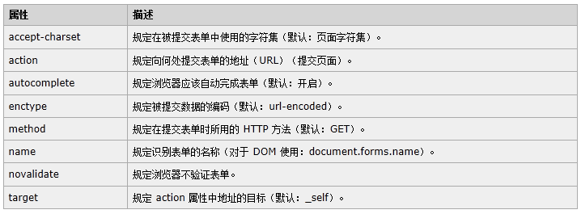

# HTML

***


## 第1章 网页的构成

### 1.1 概念：B/S 与 C/S

#### 1.1.1 现在的软件开发的整体架构主要分为B/S架构与C/S架构：

- b/s：浏览器/服务器

- c/s：客户端/服务器

客户端：需要安装在系统里，才可使用

浏览器：浏览网页，读取HTML并显示 

服务器：处理浏览器的请求

#### 1.1.2 B/S 与 C/S优劣

- b/s只要能上网就能使用，因为基本每台电脑都会有浏览器，维护方便。

- c/s必须安装在系统中，安装成功才可使用。在新的系统中没有安装不能使用，便携性差，维护成本高。

#### 1.1.3 网页

浏览器中显示的内容，浏览器是网页的展示器。编写好的网页，放在浏览器中即可运行。编写网页我们使用的就是HTML语言。

### 1.2 网页的构成

| 摘要                      | 说明                                                         |
| ------------------------- | ------------------------------------------------------------ |
| 结构(HTML)                | **HTML是网页内容的载体**。内容就是网页制作者放在页面上**想要让用户浏览的信息**，可以包含文字、图片、视频等。 |
| 表现(CSS)                 | **CSS样式是表现**。就像网页的外衣。比如，**标题字体、颜色变化**，或为标题加入**背景图片、边框**等。所有这些用来改变内容外观的东西称之为表现。 |
| 行为(JavaScript / jQuery) | **JavaScript是用来实现网页上的特效效果**。如：**鼠标滑过弹出下拉菜单**。或鼠标滑过表格的背景颜色改变。还有购物网站中**图片的轮换**。可以这么理解，有**动画**的，有交互的一般都是用JavaScript来实现的 |


## 第2章 HTML简介

- HTML 是用来描述网页的一种语言。
- HTML 指的是超文本标记语言 (Hyper Text Markup Language)
- 超文本就是指页面内可以包含图片、链接，甚至音乐、程序等非文字元素
- HTML 不是一种编程语言，而是一种**标记语言 (markup language)**
- 标记语言是一套标记标签 (markup tag)，由一组<>包围的关键字
- HTML网页的后缀名一般为.html
- HTML 使用标记标签来描述网页


- **HTML文件的结构**
  - <html></html>为HTML页面中的根标签，所有的HTML网页中的标签都在<html></html>中。

  - 这里<head>标签用于定义文档的头部，它是所有头部元素的容器。头部元素有<title>、<script><style>、<link>、 <meta>等标签。

  - 在<body>和</body>标签之间的内容是网页的主要内容，如<h1>、<p>、<a>、等网页内容标签，在这里的标签中的内容会在浏览器中显示出来。

## 第3章 HTML语法

- **标签的语法**

  - 标签由英文尖括号 < 和 > 括起来,如：<html>
  - html中的标签一般都是成对出现的,分开始标签和结束标签。结束标签比开始标签多一个 / ,<title>..</title>;还有一些是自结束标签，如：<br/>
  - 标签与标签之间是可以嵌套的，但先后顺序必须保持一致，如：<div>里嵌套<p>，那么</p>必须放在</div>的前面。如： <div><p>..</p></div>
  - 注释是不可以嵌套的,如：<!-- <!-- 注释部分 --> -->
  - HTML标签不区分大小写,<h1>和<H1>是一样的,但万维网联盟（W3C）建议小写。

- **元素模型**

  

## 第4章 HTML的常用标签

### 4.1 标题标签

```html
<h1>...</h1>
<h2>...</h2>
<h3>...</h3>
<h4>...</h4>
<h5>...</h5>
<h6>...</h6>
```

- 默认占用浏览器的一整行，并且前后要空一行 

### 4.2 段落标签

```html
<p>两个黄鹂鸣翠柳</p>
<p>是否还没女朋友</p>
```

- 段落标签也会独占浏览器的一行，而且前后还会空出一行。
- 使用空的段落标记 \<p>\</p> 去插入一个空行是个坏习惯。用 \<br />标签代替它！

### 4.3 换行标签

 \<br />：是个自结束标签

```html
<br />
```

### 4.4 加粗标签

```html
<b>天王盖地虎</b>
```

### 4.5 无序列表 

```html
<ul type="square">
    <!-- 定义导航栏 -->
    <li>网页</li>
	<li>新闻</li>
	<li>视频</li>
	<li>贴吧</li>
</ul>
```

### 4.6 有序列表

```html
<ol>
	<li>单身久了，坐地铁女孩蹭下肩膀，你连你们的孩子叫什么名字都想好了</li>
    <li>太久没接吻，吃个鸭舌都能感到温柔</li>
    <li>太久没牵手，拿着泡椒凤爪心都会颤抖</li>
</ol>
```

### 4.7 图片标签

```html

```

- alt:图片无法显示时显示的描述性文字
- src:图片的地址（或路径）。这里分为相对路径和绝对路径。
- width和height:设置图片的宽度和高度
- (了解) title:鼠标放在图片上时显示的描述性文字

**使用相对路径查找目标资源心得**

- 目标文件与当前文件在同一目录下，直接查找使用。
- 目标文件与当前文件不在同一目录下，先找目标文件父包，再找目标文件
  - 如：父包也不与当前文件在同包下，将父包当成目标文件，继续找父包的父包。以此类推，找到WebContent根目录为止。


**补充内容：html中的相对路径与绝对路径**

```
相对路径：以当前文件所在的路径为基准
	.			表示当前文件所在目录
	..			表示上一级目录
	资源名		  表示当前目录下的资源			./资源名			./可以省略
	使用../返回上一级
			
绝对路径：
	盘符:\路径1\路径2\文件名			=====>>>	  错误(真实路径)
	http://ip:port/工程名/资源名    =====>>> 		正确
		比如：http://localhost:8080/img/13.jpg
```

### 4.8 超链接

```html
<a href="http://www.baidu.com" target="_blank"></a>
```

- href:指向一个链接地址

- target:定义被链接的文档在何处显示。
  - 值为”_self”时在向当前窗口打开新的网页（默认）
  - 值为”_blank”时在新的窗口打开

### 4.9 转义字符

- 当显示页面时，浏览器会移除源代码中多余的空格和空行。所有连续的空格或空行都会被算作一个空格。即，HTML 代码中的所有连续的空行（换行）也被显示为一个空格。
- 在 HTML 中不能使用小于号（<）和大于号（>），这是因为浏览器会误认为它们是标签。
- 如果想表示多个空格，需要使用如下的转义字符。


> 说明1：如需显示小于号，我们必须这样写：&lt; 或 &#60;
>
> 说明2：使用实体名而不是数字的好处是，名称易于记忆。不过坏处是，浏览器也许并不支持所有实体名称（对实体数字的支持却很好）。

### 4.10 div标签

```html
<div>...</div>
```

- div是html中最灵活最重要的元素，**div就像一个容器**，里面可以装很多内容。本身没有特殊的语义。

- 它是**块级元素**，会占用网页的一行。

- Div的主要作用：可以通过调整自己的样式来完成网页的复杂布局

- 它可以把一些独立的逻辑部分(如网页中独立的栏目版块)划分出来，如下图：

  

  

### 4.11 内联框架(了解) 

```html
<iframe src="1.html" name=""></iframe>
```

- src:一个网页的地址
- name: iframe的名字，当<a>标签的target属性值为iframe的name时，超链接的目标页面会在iframe中打开

### 4.12 其它标签

#### 4.12.1 \<strong>和\<em>标签 (了解)

- 两者在强调的语气上有区别: <em> 表示强调，<strong> 表示更强烈的强调。并且在浏览器中<em> 默认用 *斜体* 表示，<strong> 用 **粗体** 表示。

#### 4.12.2 \<span>标签

- <span>标签是是**内联元素**，没有语义的，它的作用就是为了设置单独的样式用的。有了它就可以对某段文字里的几个字单独设置样式了。

```html
<span style="background-color: red">span测试</span>
```

#### 4.12.3 \<font>标签

font 标签是字体标签，它可以简单的修改文本样式效果。但现在已经不建议使用了。

```html
<font face="宋体" color="red" size="7" >我是字体标签</font>
```

#### 4.12.4 分割线标签

\<hr /> 标签在 HTML 页面中创建水平分割线。用于分割内容、文章的小节。


> 补充说明：
>
> **块级元素：**各占据一行，垂直方向排列。块级元素从新行开始结束接着一个断行。width、height、padding、margin有效。
>
> **内联元素：**在一条直线上排列，都是同一行的，水平方向排列。设置width、height、padding、margin无效。

## 第5章 HTML中的表格

### 5.1 HTML中的表格

```html
<!-- 用table标签来创建表格-->
<!-- border用来设置表格的边线-->
<table border="1">
    <!-- tr表示每一行 -->
    <tr>
        <!-- th表示标题 -->
		<th></th>
		<th></th>
		<th></th>
	</tr>
	<tr>
        <!-- td表示每一行的一个单元格 -->
		<td></td>
		<td></td>
		<td></td>
        <!-- 跨行合并单元格用 rowspan 属性 -->
		<td rowspan="2"></td>
	</tr>
	<tr>
		<td></td>
		<td></td>
		<td></td>
	</tr>
	<tr>
		<td></td>
		<td></td> 
        <!-- 跨列合并单元格用 colspan 属性 -->
		<td colspan="2"></td>
	</tr>
</table>

```

其中：

- \<table>标记这是一个表格
- \<tr>表示表格的一行
- \<td>表示表格的一列
- 跨列合并单元格用 colspan 属性
- 跨行合并单元格用 rowspan 属性    
- 常用属性
  - border ：设置表格边框
  - width：设置表格的宽度，单位px
  - height：设置表格的高度，单位px
  - align：设置表格的对齐方式

举例：


## 第6章 HTML中的表单

### 6.1 生活中的表单

表单类似生活中的单据，票据，申请表之类的东西，生活中我们经常会填写很多表单，比如入职申请表，入学登记表，员工信息表等。


### 6.2 表单中的常用标签

#### 1. 表单标签

```html
<form action="这里指定需要提交的位置" method="提交的方式">

</form>
```

- action表示表单填写完成要提交给的地方。就像我们把入职申请表填写完成后要交给部门经理一样。

- 提交的方式分为：get 或 post

  - get：是将所有的提交的数据显示在地址栏，长度会有一些限制
  - post：将要提交的数据放在请求体中，在url表单里面没有任何数据

- 所有可能的属性声明如下：

  

#### 2. 文本输入框

```html
<input type="text" name="username"/>
```

#### 3. 密码输入框

```html
<input type="password" name="pwd"/>
```

#### 4. 单选框

```html
<!-- 单选框：
	1.要保证单选按钮单选，必须将它们分为一组，即将它们的name属性值设置为同一个值
	2.单选按钮提交的是value属性值，所以必须设置value属性值
	3.通过属性checked="checked"设置默认被选中
 -->
性别：<input type="radio" name="gender" value="man">男
	 <input type="radio" name="gender" value="woman" checked="checked">女<br>
```

#### 5. 复选框

```html
<!-- 复选框：
	1.必须将所用的复选框分为一组，即将它们的name属性值设置为同一个值
	2.复选框提交的也是value属性值，所以必须设置value属性值
	3.通过属性checked="checked"设置默认被选中
-->
		 
你的爱好：
	<input type="checkbox" name="hobby" value="basketball" checked="checked">篮球
	<input type="checkbox" name="hobby" value="football">足球
	<input type="checkbox" name="hobby" value="pingpang">乒乓球<br>
```

#### 6. 下拉列表

```html
<select name="nation">
		<option value="china">中国</option>
		<option value="america">美国</option>
		<option value="russia">俄罗斯</option>
		<!-- 通过属性selected="selected"设置默认被选中 -->
		<option selected="selected">日本</option>
		<option value="india">印度</option>
		<option value="europe">欧盟</option>
		<!-- 如果option中没有指定value属性值，提交的是option中的文本值
			 如果option中指定了value属性值，提交的是value属性值
		 -->
</select>
```

#### 7. 重置按钮

```html
<input type="reset" value="按钮上显示的文字">
```

#### 8. 提交按钮

```html
<input type="submit" value="按钮上的文字">
```


## 第7章 补充：标签的常用属性

### 7.1 常规属性

- **id**：标签的唯一编号，识别码
  - 一个文档中所有的元素id不应该有重复，id属性可以不设置

- **class** : 标签的分类，用来识别一组标签。
  - 我们可以指定任意几个标签为一组（兴趣小组），也就是多个标签class值可以相同，标签的人工分类制度。

- **name**：标签的名字
  - 这和标签名（TagName）不一样，每个标签的关键字是标签名，而name相当于起别名，多个标签的别名也可以相同

- **style**：标签的风格
  - 用来指定标签的样式，如背景颜色，边框等。我们css中会统一学习

### 7.2 事件属性

- **事件：**简单的说，是指我们点击、选中、鼠标划过等一些用户操作。

  我们的标签也会被用户操作，比如鼠标经过，按钮被点击。这些事件也是作为标签属性的一部分。就像我们现实中实验室化学品上的标签一样，会被修改，撕掉，时间长了风干，褪色，字体模糊等。

- **标签常见的事件属性有：**

  - onblur:失去焦点
  - onclick:鼠标点击
  - onbdclick:双击
  - onmouseover:鼠标移动到元素上

- 还有很多事件，具体可以查看W3School文档中关于【html事件属性】的部分。**这些事件属性是我们学习js的时候要详细介绍的。**主要功能就是这个事件触发后执行什么功能。
