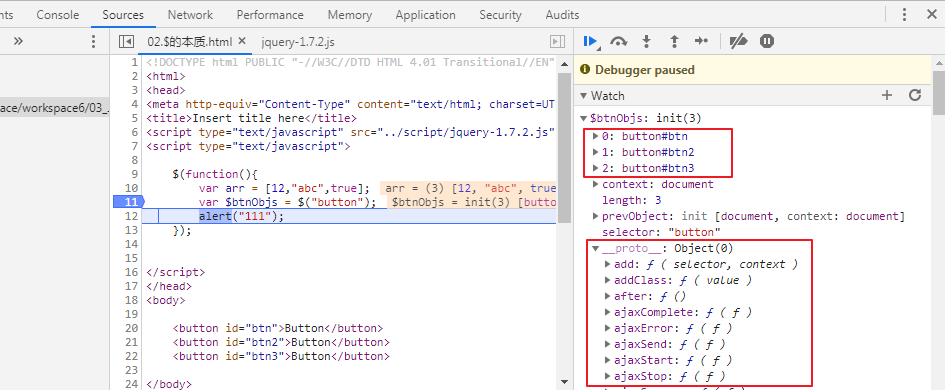

# JQuery

***

## 第1章：JQuery简介

- 为了**简化 JavaScript 的开发**，一些 JavsScript 库诞生了。 JavaScript库封装了很多预定义的对象和实用函数，简化HTML与JavaScript之间的操作，能帮助使用者建立有高难度交互的页面， 并且**兼容各大浏览器**。

- 当前流行的 JavaScript 库有


- jQuery是继prototype之后又一个优秀的JavaScript框架。如今，**jQuery已经成为最流行的JavaScript库。**在世界前10000个访问最多的网站中，有超过55%在使用jQuery。

- jQuery，顾名思义，也就是JavaScript和查询（Query），其宗旨是**“WRITE LESS，DO MORE”**，极大地简化了JavaScript开发人员遍历HTML文档、操作DOM、处理事件、执行动画和开发Ajax。具体来说，优势如下：
  - jQuery是免费、开源的
  - **轻量级(压缩后只有几十k)**
  - 强大的选择器
  - 出色的 DOM 操作的封装
  - 可靠的事件处理机制
  - 完善的 Ajax使用
  - **出色的多浏览器兼容性**
  - 隐式迭代：对集合对象做相同操作时不需要逐个进行遍历，jQuery自动进行遍历
  - 文档说明很全
  - 可扩展插件
  
  

 

## 第2章：JQuery快速入门

### 2.1 将jQuery的库文件加入应用

- jQuery库实际上就是一个js文件，只需要在网页中直接引入这个文件就可以了。
- **将jQuery的库文件加入**
  - 在开发测试时, 用的是未压缩的版本: jquery-1.7.2.js

  - 在上线项目中, 会使用压缩后的版本: jquery-1.7.2.min.js

### 2.2 HelloWorld

- 需求：使用jQuery给一个按钮绑定单击事件

```javascript
<!-- 导入jQuery库-->
<script type="text/javascript" src="script/jquery-1.7.2.js"></script>
<script type="text/javascript">
    //调用jQuery库定义的函数
    //使用$()代替window.onload
	$(function(){
    	//根据id属性获取按钮对象，并绑定单击响应函数
		$("#btnId").click(function(){
            //弹出HelloWorld
			alert("HelloWorld");
		});
	});
</script>

```

```html
<button id="btnId">ClickMe</button>
```

- **常见问题？**

  - **使用jquery一定要引入jquery库吗？**

    答案：是，必须先引入 

  - **jquery中的$到底是什么？**

    答案： 是一个函数名， 这个函数是jQuery的核心函数。alert($)就知道了

  -  **怎么为按钮添加点击响应函数的？**

     答案：     

      1、先是页面加载完成之后

      2、查找标签对象

      3、通过标签对象.click(function(){}) 绑定事件 

## 第3章：JQuery基本语法

### 3.1 jQuery源码初分析

```javascript
(function( window, undefined ) {	//16行
	
	var jQuery = (function() {	//22行
	
		var jQuery = function( selector, context ) {
			// The jQuery object is actually just the init constructor 'enhanced'
			return new jQuery.fn.init( selector, context, rootjQuery );
		};
		
		jQuery.fn = jQuery.prototype = {	//97行
			constructor: jQuery,
			init: function( selector, context, rootjQuery ) {
				//...
			}	//207行
			
		};	//319行
	
		//...
		return jQuery;	//981行

	})();	//983行
	
// Expose jQuery to the global object
window.jQuery = window.$ = jQuery;	//9384行
	
})( window );	//9404行

```

说明：

- 自执行函数
- 给window添加了两个等同的函数： jQuery() / $()
- 执行$()后，返回的是一个jQuery库包装的对象， 一般称之为：jQuery对象

### 3.2 jQuery核心函数： $()

- jQuery库中为window对象定义了一个函数： jQuery()，简化为：$()
- $是jQuery的核心函数，**jQuery的核心功能都是通过这个函数实现。**$()就是调用$这个函数。
- $函数会根据参数数据类型的不同做不同的工作, 返回一个jQuery封装的伪数组的对象
- **核心函数有如下的四个作用：**

#### 3.2.1 传入参数为函数时：$(function(){})

- 传入一个function参数, 作为回调函数。相当于window.onload = function(){}
- 表示：在DOM文档载入完成后，回调函数自动执行
- 这个函数是 $(document).ready(function(){})的简写形式。（见jQuery文档 - 事件 - 页面载入）
- 它与window.onload是有区别的


- 源码聚焦


#### 3.2.2 传入参数为选择器字符串时： $(选择器字符串)

- 接收一个CSS选择器格式的字符串参数

- 根据这个选择器查找元素节点对象

- 根据此字符串在document中去匹配一组元素，并封装成jQuery对象返回

- 举例：

  ```js
  $("#id属性值"); 相当于通过id属性查找标签对象
  $("标签名");  相当于通过标签名查找标签对象，返回集合
  $(".class属性值");  相当于通过class属性查找标签对象，返回集合
  ```

- 源码聚焦


#### 3.2.3 传入参数为HTML字符串时：$(HTML字符串)

- 接收一个标签字符串参数。

- 根据这个html字符串创建元素节点对象

- 创建对应的标签对象， 并包装成jQuery对象

- 代码举例：

  ```js
  var $liEle = $("<li>香港</li>") //相当于创建了一个标签对象 <li>香港</li>。
  $("#city").append($liEle); //将此jQuery对象添加到现有的jQuery对象中。
  //相当于：
  var liObj = document.createElement("li");//<li></li>
  liObj.innerHTML = "香港"; //<li>香港</li>
  document.getElementById("city").appendChlid(liObj);
  ```

#### 3.2.4 传入参数为DOM对象时： $(DOM对象)

- 接收一个DOM对象类型的参数

- 返回包含这个dom对象的jQuery对象。相当于把DOM对象包装（或转换）成jQuery对象。

  - 注意：如果声明一个变量指向jQuery对象，那么这个变量命名习惯上要以$开头。这就是jQuery对象的命名规范。

- 代码举例

  ```js
  var bjEle = document.getElementById("bj");
  alert(bjEle);
  alert($(bjEle));
  ```

- 源码聚焦


### 3.3 jQuery对象和DOM对象区分

#### 3.3.1 什么是DOM对象，什么是jQuery对象

- **Dom对象：通过原生js实现的DOM标准查找到的元素对象**

1. 通过getElementById()查询出来的标签对象是Dom对象

2. 通过getElementsByName()查询出来的标签对象是Dom对象

3. 通过getElementsByTagName()查询出来的标签对象是Dom对象

4. 通过createElement() 方法创建的对象，是Dom对象

- **jQuery对象：通过$查找或包装过的对象**

1. 通过jQuery提供的API查询到的对象，是jQuery对象。比如：3.2.2的情况
2. 通过jQuery提供的API创建的对象，是jQuery对象。比如：3.2.3的情况
3. 通过jQuery包装的DOM对象，也是jQuery对象。比如：3.2.4的情况

#### 3.3.2 jQuery对象的本质

- jQuery对象本质上是一个封装了DOM对象数组加一系列的jQuery的功能函数function的结构。

- 习惯上给jQuery对象命名时，变量名前加上$，便于区分jQuery对象和js DOM对象。

- 测试代码：

  ```html
  <head>
      <meta http-equiv="Content-Type" content="text/html; charset=UTF-8">
      <title>Insert title here</title>
      <script type="text/javascript" src="../script/jquery-1.7.2.js"></script>
      <script type="text/javascript">
  
          $(function(){
              var arr = [12,"abc",true];
              var $btnObjs = $("button");
              alert("111");
              for(var i = 0;i < $btnObjs.length;i++){
                  alert($btnObjs[i]);
              }
          });
  
  
      </script>
  </head>
  <body>
  
  	<button id="btn">Button</button>
  	<button id="btn2">Button</button>
  	<button id="btn3">Button</button>
  
  </body>
  ```

- 源码分析：




#### 3.3.3 jQuery对象和DOM对象使用区别

- jQuery对象和DOM对象的属性不能互用，只能调用各自声明过的属性。
- jQuery对象和DOM对象的函数也不能互用，只能调用各自声明过的函数。

```html
<head>
	<meta http-equiv="Content-Type" content="text/html; charset=UTF-8">
	<title>Insert title here</title>
	<script type="text/javascript" src="../script/jquery-1.7.2.js"></script>
	<script type="text/javascript">
		
		$(function(){
		   alert(document.getElementById("testDiv").innerHTML);
			//jQuery对象和DOM对象的属性不能互用，如下的调用是错误的。
		   alert($("#testDiv").innerHTML);
			
		   alert(document.getElementById("testDiv").getElementsByTagName("span")[0]);
			//jQuery对象和DOM对象的函数不能互用，如下的调用是错误的。
		   alert($("#testDiv").getElementsByTagName("span")[0]);
		});
	</script>
</head>

<body>
	<div id="testDiv">Atguigu is <span>100%</span> Very Good!</div>
</body>
```


#### 3.3.4 DOM对象和jQuery对象的互相转换(掌握)

- DOM对象转jQuery对象
  - 使用jQuery核心函数包装DOM对象：$(DOM对象)
  - 例如：var $btnEle = $(btnEle)
- jQuery对象转DOM对象
  - 使用数组下标：$btnEle[0]
  - 使用get(index)方法：$btnEle.get(0)


- 为什么需要二者相互转换呢？ （类比：为什么java里讲数组与集合间的转换？）
  - DOM对象转为jQuery对象：为了调用jQuery提供的丰富的方法
  - jQuery对象转为DOM对象：有些特殊需求在框架中没有提供，需要使用原生的js实现

## 第4章 选择器（重点） 

- jQuery最牛的地方就是其强大的选择器, 使用其选择器基本可以快速轻松的找到页面的任意节点

- jquery的选择器分类
  - 基本选择器
  - 层级选择器（或层次选择器）
  - 过滤选择器
    - 基本
    - 内容
    - 可见性
    - 属性
    - 子元素
    - 表单
    - 表单对象属性

见文档：


### 4.1 基本选择器 (重点)

- 基本选择器是jquery中最简单，也是最常用的选择器

- 它通过标签名,id属性,class属性来查找匹配的DOM元素

#### 1）  id选择器    

- **用法： $('#id')**

- 返回值：根据id属性匹配一个标签， 封装成jQuery对象

- 举例

  ```js
  //HTML代码：
  <div id="notMe"><p>id="notMe"</p></div>
  <div id="myDiv">id="myDiv"</div>
  
  //jQuery代码：
  $("#myDiv");
  
  //结果：
  [ <div id="myDiv">id="myDiv"</div> ]
  ```

  

#### 2）  标签选择器

- **用法:  $(‘tagName’)** 

- 返回值：根据标签名匹配的一个或多个标签，封装成jQuery对象

- 举例

  ```js
  //HTML代码：
  <div>DIV1</div>
  <div>DIV2</div>
  <span>SPAN</span>
  
  //jQuery代码：
  $("div");
  
  //结果：
  [ <div>DIV1</div>, <div>DIV2</div> ]
  
  ```

  

#### 3）  class选择器

- **用法:  $(‘.class’)** 

- 返回值：根据class属性值匹配一个或多个标签, 封装成jQuery对象

- 举例：

  ```js
  //HTML代码：
  <div class="notMe">div class="notMe"</div>
  <div class="myClass">div class="myClass"</div>
  <span class="myClass">span class="myClass"</span>
  
  //jQuery代码：
  $(".myClass");
  
  //结果：
  [ <div class="myClass">div class="myClass"</div>, <span class="myClass">span class="myClass"</span> ]
  ```

  

#### 4）  *选择器

- **用法:  $("*")**  

- 返回值: 匹配所有标签， 封装成jQuery对象

- 举例

  ```js
  //HTML代码：
  <div>DIV</div>
  <span>SPAN</span>
  <p>P</p>
  
  //jQuery代码：
  $("*")
  
  //结果：
  [ <div>DIV</div>, <span>SPAN</span>, <p>P</p> ]
  ```

  

#### 5）  selector1,selector2,…

- **用法:  $(”div,span,.myClass”)**    

- 返回值: 所有匹配选择器的标签, 封装成jQuery对象

- 举例：

  ```js
  //HTML代码：
  <div>div</div>
  <p class="myClass">p class="myClass"</p>
  <span>span</span>
  <p class="notMyClass">p class="notMyClass"</p>
  
  //jQuery代码：
  $("div,span,p.myClass") 
  //p.myClass：表示查找的标签名必须是p标签，并且class属性要是myclass
  
  
  //结果：结果数据的顺序与要查询的元素先后顺序不一致，与HTML中元素声明的先后顺序一致。
  [ <div>div</div>, <p class="myClass">p class="myClass"</p>, <span>span</span> ]
  ```

  

### 4.2 层级选择器 (重点)

- 如果想通过DOM元素之间的层级关系来获取特定元素。例如后代元素、子元素、兄弟元素等。则需要通过层级选择器（或层次选择器）。

#### 1）  ancestor descendant

- **用法:$(”form input”)**
- 说明:在给定的祖先元素下匹配所有后代元素（包括子元素的子元素，...）

#### 2）  parent > child

- **用法: $(”form > input”)** 
- 说明: 在指定父元素下匹配所有子元素。
  - 注意：要区分好后代元素与子元素

#### 3）  prev + next

- **用法: $(”label + input”)** 
- 说明: 匹配所有紧接在prev元素后的next元素。
  - 注意：从平级元素中找，而不要去子元素中查找。

#### 4）  prev ~ siblings

- **用法: $(”form ~ input”)** 
- 说明: 匹配prev元素之后的所有 siblings元素，不包含该元素在内，并且siblings匹配的是和prev同辈的元素，**其后辈子元素不被匹配。**


### 4.3 过滤选择器：基本

- 过滤选择器主要是通过特定的过滤规则来筛选出所需的DOM元素, 该选择器都**以 “:” 开头**

- 按照不同的过滤规则，过滤选择器可以分为基本过滤，内容过滤，可见性过滤，属性过滤，子元素过滤，表单过滤和表单对象属性过滤选择器。

#### 1）   :first

- 用法: $(”tr:first”) ;   

- 说明: 匹配找到的第一个元素。

#### 2）   :last

- 用法: $(”tr:last”)  

- 说明: 匹配找到的最后一个元素.与 :first 相对应。

#### 3）   :not(selector)

- 用法: $(”input:not(:checked)”)

- 说明: 去除所有与给定选择器匹配的元素。有点类似于”非”，意思是没有被选中的input(当input的type=”checkbox”)。

#### 4）   :even

- 用法: $(”tr:even”)   

- 说明: 匹配所有索引值为偶数的元素，从0开始计数。js的数组都是从0开始计数的。

#### 5）   :odd

- 用法: $(”tr:odd”) 

- 说明: 匹配所有索引值为奇数的元素，和:even对应，从 0 开始计数。

#### 6）  :eq(index)

- 用法: $(”tr:eq(0)”)   

- 说明: 匹配一个给定索引值的元素。eq(0)就是获取第一个tr元素。括号里面的是索引值，不是元素排列数。

#### 7）   :gt(index)

- 用法: $(”tr:gt(0)”)  

- 说明: 匹配所有大于给定索引值的元素。

#### 8）  :lt(index)

- 用法: $(”tr:lt(2)”)    
- 说明: 匹配所有小于给定索引值的元素。

#### 9） ：header 、：animated、：focus省略

### 4.4 过滤选择器：内容

- 内容过滤选择器的过滤规则主要体现在它所包含的子元素和文本内容上

#### 1）   :contains(text)

- 用法: $(”div:contains(’John’)”)  

- 说明: 匹配包含给定文本的元素。这个选择器比较有用，当我们要选择的不是dom标签元素时，它就派上了用场了。它的作用是查找被标签”围”起来的文本内容是否符合指定的内容的。

#### 2）   :has(selector)

- 用法: $(”div:has(p)”).addClass(”test”)
- 说明: 匹配含有选择器所匹配的元素的元素。这个解释需要好好琢磨，但是一旦看了使用的例子就完全清楚了:给所有包含p元素的div标签加上class=”test”。

#### 3）   :empty

- 用法: $(”td:empty”) 

- 说明: 匹配所有不包含子元素或者文本的空元素

#### 4）  :parent

- 用法: $(”td:parent”) 
- 说明: 匹配含有子元素或者文本的元素。注意:这里是”:parent”可不是”.parent”！感觉与上面讲的”:empty”形成反义词。

### 4.5 过滤选择器：可见性

- 根据元素的可见和不可见状态来选择相应的元素

#### 1）   :hidden

- 用法: $(”tr:hidden”) 

- 说明: 匹配所有的不可见元素，input 元素的 type 属性为 “hidden” 的话也会被匹配到。意思是css中display:none和input type=”hidden”的都会被匹配到。同样，要在脑海中彻底分清楚冒号”:”，点号”.”和逗号”,”的区别。

#### 2）  :visible

- 用法: $(”tr:visible”)  

- 说明: 匹配所有的可见元素。

### 4.6 过滤选择器：属性

- 属性过滤选择器的过滤规则是通过元素的属性来获取相应的元素。

#### 1）  [attribute]

- 用法: $(”div[id]“) 
- 说明: 匹配包含给定属性的元素。例子中是选取了所有带id属性的div标签。

#### 2）  [attribute=value]

- 用法: $(”input[name='newsletter']“).attr(”checked”, true)
- 说明: 匹配给定的属性是某个特定值的元素。例子中选取了所有name属性是newsletter的 input 元素。

#### 3）  [attribute!=value]

- 用法: $(”input[name!='newsletter']“).attr(”checked”, true)。   
- 说明：匹配所有不含有指定的属性，或者属性不等于特定值的元素。此选择器等价于:not([attr=value])，要匹配含有特定属性但不等于特定值的元素，请使用[attr]:not([attr=value])。之前看到的 :not 派上了用场。

#### 4）  [attribute^=value]

- 用法: $(”input[name^=‘news’]“)
- 说明: 匹配给定的属性是以某些值开始的元素。我们又见到了这几个类似于正则匹配的符号。现在想忘都忘不掉了吧？！

#### 5 ）  [attribute$=value]

- 用法: $(”input[name$=‘letter’]“)
- 说明: 匹配给定的属性是以某些值结尾的元素。

#### 6）   [attribute*=value]

- 用法: $(”input[name*=‘man’]“)
- 说明: 匹配给定的属性是以包含某些值的元素。

#### 7） [][][][][selector1] [selector2] [selectorN]

- 用法：$("input[id] [name$='man']]")
- 说明：复合属性选择器，需要同时满足多个条件时使用。

### 4.7 过滤选择器：子元素

#### 1）   :nth-child(index/even/odd/equation)

- 用法: $(”ul li:nth-child(2)”) 

- 说明: 匹配其父元素下的第N个子或奇偶元素.这个选择器和之前说的基础过滤(Basic Filters)中的 eq() 有些类似，不同的地方就是前者是从0开始,后者是从1开始。

#### 2）   :first-child

- 用法: $(”ul li:first-child”) 

- 说明: 匹配第一个子元素。**’:first’ 只匹配一个元素，而此选择符将为每个父元素匹配一个子元素。**这里需要特别的记忆一下区别。二者的调用者都是针对要操作的元素来讲的。

#### 3）   :last-child

- 用法: $(”ul li:last-child”)

- 说明: 匹配最后一个子元素。’:last’只匹配一个元素，而此选择符将为每个父元素匹配一个子元素。

#### 4）   : only-child

- 用法: $(”ul li:only-child”)

- 说明: 如果某个元素是父元素中唯一的子元素，那将会被匹配。如果父元素中含有其他元素，那将不会被匹配。意思就是：只有一个子元素的才会被匹配！

### 4.8 过滤选择器：表单

#### 1）   :input

- 用法: $(”:input”)  
- 说明:匹配所有 text, textarea, select 和 button 元素 。

#### 2）   :text

- 用法: $(”:text”) 
- 说明: 匹配所有的单行文本框。

#### 3）   :password

- 用法: $(”:password”) 
- 说明: 匹配所有密码框。

#### 4）  :radio

- 用法: $(”:radio”) 
- 说明: 匹配所有单选按钮。

#### 5）   :checkbox

- 用法: $(”:checkbox”) 
- 说明: 匹配所有复选框。

#### 6）   :submit

- 用法: $(”:submit”) 
- 说明: 匹配所有提交按钮。

#### 7）  :image

- 用法: $(”:image”) 
- 说明: 匹配所有图像域。

#### 8）  :reset

- 用法: $(”:reset”) 

- 说明: 匹配所有重置按钮。

#### 9）  :button

- 用法: $(”:button”) 

- 说明: 匹配所有按钮.这个包括直接写的元素button。

#### 10）  :file

- 用法: $(”:file”) 

- 说明: 匹配所有文件域。

#### 11）  :hidden

- 用法: $(”input:hidden”) 

- 说明: 匹配所有不可见元素，或者type为hidden的元素.这个选择器就不仅限于表单了,除了匹配input中的hidden外,那些style为hidden的也会被匹配。

### 4.9 过滤选择器：表单对象属性

- 此选择器主要对所选择的表单元素进行过滤

#### 1）   :enabled

- 用法: $(”input:enabled”)

- 说明: 匹配所有可用元素.意思是查找所有input中不带有disabled=”disabled”的input.不为disabled,当然就为enabled啦。

#### 2）   :disabled

- 用法: $(”input:disabled”)

- 说明: 匹配所有不可用元素.与上面的那个是相对应的。

#### 3）   :checked

- 用法: $(”input:checked”)
- 说明: 匹配所有被选中的元素(复选框、单选框等，不包括下拉列表select中的option)。
  - 注意：官方文档说明是不包括select中的option，但测试中是包含的。只是不建议大家这样用。

#### 4）   :selected

- 用法: $(”select option:selected”)

- 说明: 匹配所有选中的option元素。

## 第5章 文档处理（CRUD）

### 5.1 查找节点

#### 1） $(selector) 

- 使用jQuery选择器查询

- 得到一个包含所有匹配的dom节点对象的jQuery对象

#### 2） find(selector)

- 查询jQuery对象内部数据

- 在Jquery对象中根据selector查找其中匹配的后代节点

#### 3）  eq(index)

- 根据索引值查找集合中指定位置的元素
- index从0开始，也可以为-1，-2，...。其中-1是最后一个元素

#### 4） filter(expr|obj|ele|fn)

- 根据传入的选择器字符串等再次从调用者中筛选

#### 5） children([expr])

- 取得一个包含匹配的元素集合中每一个元素的所有子元素的元素集合。

#### 6） parent([expr])

- 取得一个包含着多个匹配元素的唯一父元素的元素集合。

#### 7） parents([expr])

- 取得一个包含着所有匹配元素的祖先元素的元素集合（不包含根元素）。可以通过一个可选的表达式进行筛选。

#### 8） each(callback)

- 遍历jQuery对象包含的数据：$(selector1).each(function(index, itemDom){ })
- 遍历jQuery对象所包含的所有节点, 每取一个dom节点对象都去调用设置的回调函数, 并将取出的节点在数组中的下标和节点对象传入函数

### 5.2 获取长度

#### 1） 属性：length

- jQuery 对象中元素的个数。

#### 2） 函数：size()

- jQuery 对象中元素的个数。与length属性作用一样。

### 5.3 内部插入节点

#### 1）  append(content) 

- 向每个匹配的元素的内部的结尾处追加内容。

#### 2）  appendTo(content) 

- 把所有匹配的元素追加到另一个指定的元素集合中

#### 3）  prepend(content)

- 向每个匹配的元素的内部的开始处插入内容

#### 4）  prependTo(content) 

- 将每个匹配的元素插入到指定的元素内部的开始处

### 5.4 外部插入节点

#### 1）  after(content) 

- 在每个匹配的元素之后插入内容 

#### 2）  before(content)

- 在每个匹配的元素之前插入内容 

#### 3）  insertAfter(content)

- 把所有匹配的元素插入到另一个、指定的元素集合的后面 

#### 4）  insertBefore(content) 

- 把所有匹配的元素插入到另一个、指定的元素集合的前面 

### 5.5 创建节点

- $(htmlString)

- 动态创建的新元素节点不会被自动添加到文档中, 需要使用其他方法将其插入到文档中; 

- 当创建单个元素时, 需注意闭合标签和使用标准的 XHTML 格式. 例如创建一个<p>元素, 可以使用 $(“<p/>”) 或 $(“<p></p>”), 但不能使用 $(“<p>”) 或 $(“</P>”)

- 创建文本节点就是在创建元素节点时直接把文本内容写出来; 创建属性节点也是在创建元素节点时一起创建

### 5.6 删除节点

#### 1）  empty()

- 删除匹配的元素集合中所有的子节点(不包括本身)。

#### 2）  remove()

- 删除匹配的元素及其子元素(包括本身)

### 5.7 修改节点

#### 1） replaceAll(selector)

- 用匹配的元素替换掉所有 selector匹配到的元素。

#### 2） replaceWith(content|fn)

- 将所有匹配的元素替换成指定的HTML或DOM元素。

## 第6章 属性、HTML代码、CSS

### 6.1 属性操作

#### 1）  attr(name ,[value])

- attr(属性名) 返回“属性名”对应的属性值

- ##### attr(属性名,属性值) 将“属性名”对应的属性设置为“属性值”

#### 2）  removeAttr(name)

- 根据属性名删除对应的属性

### 6.2 HTML代码/值

#### 1）html([val])

- 得到元素的内容或者设置元素的内容

#### 2）val([value])

- val() 读取value属性
- val(value值) 设置value属性
- val([选项值1,选项值2,…,选项值n]) 设置单选框、多选框或下拉列表被选中的值

#### 3）text()

- ##### text() 得到元素节点对象的文本内容

- text(str) 设置元素的文本内容

### 6.3 CSS

#### 1）  addClass(className)

- 添加class属性

#### 2）  removeClass()

- 移除class属性

#### 3）  css(name,[value])

- 查看某个样式属性, 或设置某个样式属性


## 第7章 事件

### 7.1 常用的事件

#### 1）  ready(fn)

- 当DOM载入就绪可以查询及操作时，绑定一个要执行的函数

- 它与window.onload是有区别的


> 说明：如果window.onload声明多个，不会报错，以最后给window.onload赋值的函数执行为准。

#### 2）  click([fn]) 

- 触发每一个匹配元素的click事件

#### 3）  blur([fn]) 

- blur事件会在元素失去焦点的时候触发，既可以是鼠标行为，也可以是按tab键离开的

#### 4）  change([fn]) 

- change事件会在元素失去焦点的时候触发，也会当其值在获得焦点后改变时触发。

### 7.2 绑定与解绑事件

#### 1）  bind(type, fn)

- 为每个匹配元素的特定事件绑定事件处理函数。

#### 2）  unbind(type)

- bind()的反向操作，从每一个匹配的元素中删除绑定的事件

### 7.3 事件切换

#### 1）  hover(over,out)

- 当鼠标移动到一个匹配的元素上面时，会触发指定的第一个函数。当鼠标移出这个元素时，会触发指定的第二个函数。

  ```html
  <head>
  <meta charset="UTF-8">
  <title>Insert title here</title>
  
  	<script type="text/javascript" src="../../script/jquery-1.7.2.js"></script>
  	<script type="text/javascript">
  	
  		$(function(){
  			$("#h1").hover(function(){
  				alert("进入");
  			},function(){
  				alert("出来");
  			});
  		});
  	
  	</script>
  </head>
  <body>
  
  	<h1 id="h1" style="background-color: red">我是标题</h1>
  
  </body>
  ```

  

#### 2）  事件冒泡

- 描述: 事件会按照 DOM 层次结构像水泡一样不断向上直至顶端。即：子元素事件触发引起父元素的事件也触发的现象

- 解决: 在事件处理函数中返回 false, 会对事件停止冒泡

## 第8章 效果（选学）

### 8.1 基本

#### 1）   show()

- 显示当前标签

#### 2）  hide()

- 隐藏当前标签

#### 3）  toggle()

- 切换当前标签的可见性

### 8.2 滑动

#### 1）  slideDown()

- 这个动画效果只调整元素的高度，可以使匹配的元素以“滑动”的方式显示出来

#### 2）  slideUp()

- 这个动画效果只调整元素的高度，可以使匹配的元素以“滑动”的方式隐藏起来

#### 3）  slideToggle()

- 通过高度变化来切换所有匹配元素的可见性

### 8.3 淡入淡出

#### 1）  fadeIn()

- 通过不透明度的变化来实现所有匹配元素的淡入效果

#### 2）  fadeOut()

- 通过不透明度的变化来实现所有匹配元素的淡出效果

#### 3）  fadeToggle()

- 通过不透明度的变化来开关所有匹配元素的淡入和淡出效果
