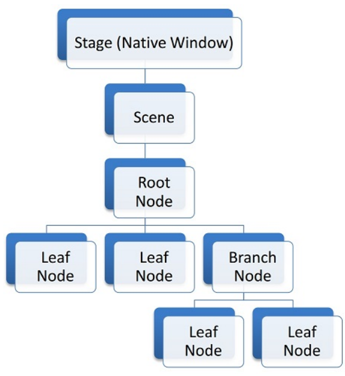
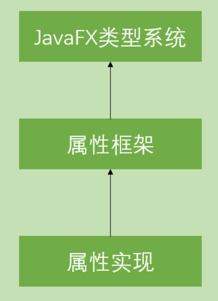
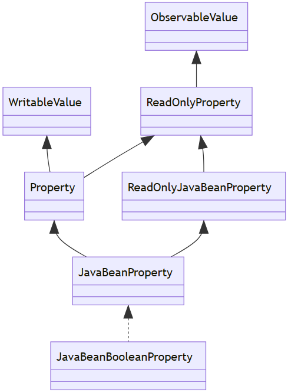
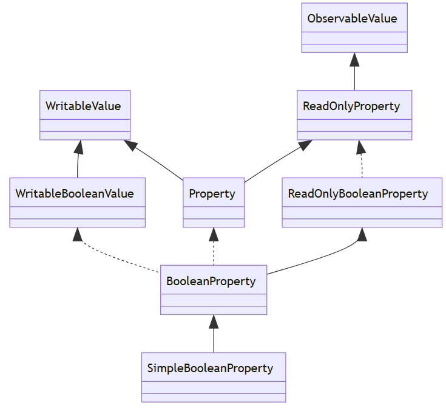
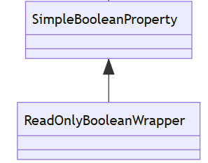
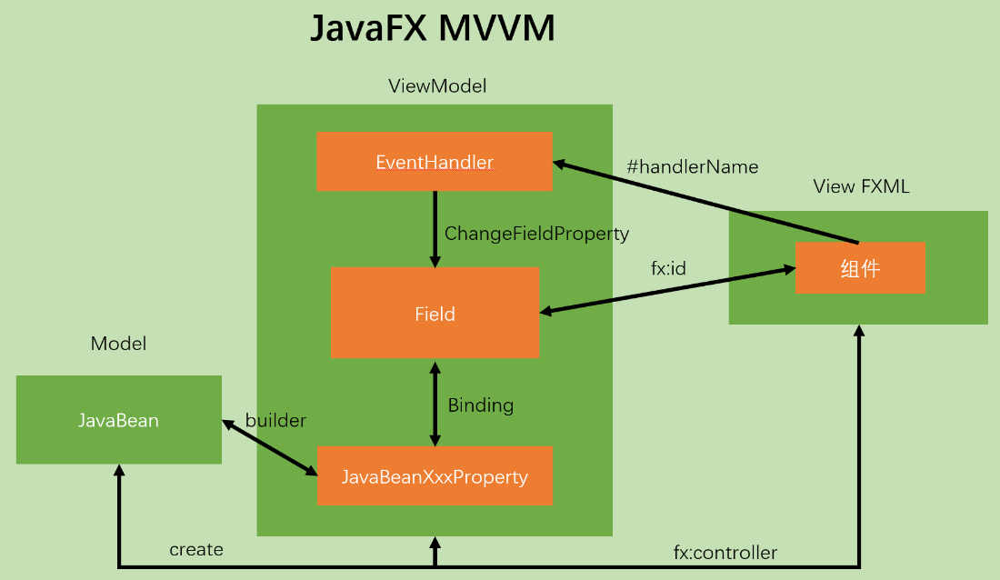

# 1、场景图

场景图是一种树形数据结构，用于排列（和分组）图形对象以便于逻辑表示，它还允许图形引擎完全或部分跳过在最终图像中看不到的对象，以最有效的方式渲染对象



在体系结构的最顶部有一个 Stage 是本机操作系统窗口的 JavaFX 表示形式，在任何给定时间，一个 Stage 都只能附加一个 Scene ，Scene 可以看作 JavaFX 场景图的容器

JavaFX 场景图中的所有元素都表示为 Node 对象，有三种类型的节点：Root、Branch，Leaf

- Root Node 是唯一没有父节点的 Node 并且直接被一个 Scene 所包含

- Branch 和 Leaf 之间的区别在于叶节点没有子节点

在场景图中，父节点的许多属性与子节点共享，因此可以将节点的复杂层次结构视为单个节点，以简化编程模型

- 应用于父节点的转换或事件也将递归应用于其子节点


**注意**：

- 一个 Node 只能有一个父节点
- 当 Node 被附加到当前可见的场景图中，只能由 JavaFX 应用程序线程进行修改


# 2、Node 变换

## 1、概述

在 JavaFX 中，可以在 3 个轴之一中进行简单的转换：X、Y 或 Z

~~~java
public class TransformApp extends Application {
    private Parent createContent() {
        Rectangle box = new Rectangle(100, 50, Color.BLUE);
        transform(box);
        return new Pane(box);
    }
    private void transform(Rectangle box) {
        // 在此处添加变换
    }
    @Override
    public void start(Stage stage) throws Exception {
        stage.setScene(new Scene(createContent(), 300, 300, Color.GRAY));
        stage.show();
    }
    public static void main(String[] args) {
        launch(args);
    }
}
~~~


## 2、平移

通过设置 Node 的 X、Y 轴产生移动

~~~java
private void transform(Rectangle box) {
    box.setTranslateX(100);
    box.setTranslateY(200);
}
~~~


## 3、缩放

缩放值是一个比率，默认情况下，节点在每个轴上的缩放值为 1（100%）

~~~java
private void transform(Rectangle box) {
    // previous code
    box.setScaleX(1.5);
    box.setScaleY(1.5);
}
~~~


## 4、旋转

Node 的旋转决定节点的呈现角度，在 2D 中，唯一可感知的旋转轴是 Z 轴

~~~java
private void transform(Rectangle box) {
    // previous code
    box.setRotate(30);
}
~~~


# 3、事件处理

## 1、概述

事件通常是事件系统的基元（也称为事件总线）

通常，事件系统具有以下 3 项职责：

- Fire（触发）一个事件
- 通知（感兴趣的各方）有关活动的信息，以及 Listeners
- Handle（处理）事件

事件通知机制由 JavaFX 自动完成，因此只考虑如何触发事件、侦听事件、处理事件


## 2、自定义事件

~~~java
// 自定义事件
public class UserEvent extends Event {

    public static final EventType<UserEvent> ANY = 
        new EventType<>(Event.ANY, "ANY");

    public static final EventType<UserEvent> LOGIN_SUCCEEDED = 
        new EventType<>(ANY, "LOGIN_SUCCEEDED");

    public static final EventType<UserEvent> LOGIN_FAILED = 
        new EventType<>(ANY, "LOGIN_FAILED");

    public UserEvent(EventType<? extends Event> eventType) {
        super(eventType);
    }

    // 其他重要的属性, 例如 data, timestamp
}
~~~

事件类型是固定的，因此它们通常在与事件声明的源文件中创建，可以看到有 2 种特定类型的事件：LOGIN_SUCCEEDED、LOGIN_FAILED

~~~java
// 监听特定事件
Node node = ...
node.addEventHandler(UserEvent.LOGIN_SUCCEEDED, event -> {
    // handle event
});

// 监听任意时间
Node node = ...
node.addEventHandler(UserEvent.ANY, event -> {
    // handle event
});

// 发出事件
UserEvent event = new UserEvent(UserEvent.LOGIN_SUCCEEDED);
Node node = ...
node.fireEvent(event);
~~~


## 3、输入事件

键盘和鼠标事件是 JavaFX 中最常用的事件类型，每个 Node 都提供了处理这些事件的便利方法

~~~java
Button button = ...
button.setOnAction(event -> {
    // button was pressed
});

// e 对象是 MouseEvent 类型
// 可以查询以获取有关事件的各种信息， 例如：x、y 位置、点击次数等
button.setOnMouseEntered(e -> ...);
button.setOnMouseExited(e -> ...);
button.setOnMousePressed(e -> ...);
button.setOnMouseReleased(e -> ...);
~~~

~~~java
// e 对象是 KeyEvent 类型
button.setOnKeyPressed(e -> ...);
button.setOnKeyReleased(e -> ...);
~~~


# 4、渲染时间差

创建 JavaFX UI 控件与显示控件之间的有时间差异

创建 UI 控件时（通过直接 API 对象创建或通过 FXML），可能无法获取某些屏幕几何值，例如：窗口的尺寸，当向用户渲染显示的那一刻，可以获取到，该显示事件称为 OnDisplay，是分配窗口和完成最终布局计算的时间

~~~java
public class StartVsShownJavaFXApp extends Application {

    private DoubleProperty startX = new SimpleDoubleProperty();
    private DoubleProperty startY = new SimpleDoubleProperty();
    private DoubleProperty shownX = new SimpleDoubleProperty();
    private DoubleProperty shownY = new SimpleDoubleProperty();

    @Override
    public void start(Stage primaryStage) throws Exception {

        Label startLabel = new Label("Start Dimensions");
        TextField startTF = new TextField();
        startTF.textProperty().bind(
                Bindings.format("(%.1f, %.1f)", startX, startY)
        );

        Label shownLabel = new Label("Shown Dimensions");
        TextField shownTF = new TextField();
        shownTF.textProperty().bind(
                Bindings.format("(%.1f, %.1f)", shownX, shownY)
        );

        GridPane gp = new GridPane();
        gp.add( startLabel, 0, 0 );
        gp.add( startTF, 1, 0 );
        gp.add( shownLabel, 0, 1 );
        gp.add( shownTF, 1, 1 );
        gp.setHgap(10);
        gp.setVgap(10);

        HBox hbox = new HBox(gp);
        hbox.setAlignment(CENTER);

        VBox vbox = new VBox(hbox);
        vbox.setAlignment(CENTER);

        Scene scene = new Scene( vbox, 480, 320 );

        primaryStage.setScene( scene );

        // before show()...I just set this to 480x320, right?
        startX.set( primaryStage.getWidth() );
        startY.set( primaryStage.getHeight() );

        primaryStage.setOnShown( (evt) -> {
            // all available now
            shownX.set( primaryStage.getWidth() );
            shownY.set( primaryStage.getHeight() );
        });

        primaryStage.setTitle("Start Vs. Shown");
        primaryStage.show();
    }

    public static void main(String[] args) {
        launch(args);
    }
}
~~~


# 5、生命周期

每个 JavaFX 应用都继承自 Application 类，子类必须声明为 public，并且必须有一个公共的无参数构造函数

当 JavaFX 应用启动时，会按顺序执行以下步骤：

1. 调用launch()方法创建启动线程

2. 启动 JavaFX 运行时环境

3. 发起构造 Application 实例的任务

4. 执行 Application 实例的 init() 方法

5. 发起执行 start() 方法的任务

6. 创建主 Stage 实例并执行 Application 实例的 start() 方法

7. 等待应用程序完成

8. 等待 JavaFX 应用程序完成，直到出现以下两种情况停止等待

   - 调用 Platform.exit() 方法

   - 最后一个窗口关闭并且 implicitExit 属性为 true

9. 执行 stop() 方法，应用程序结束


# 6、UI 控件

## 1、ChoiceBox

ChoiceBox 最简单的用法是用字符串填充它，下方示例的 ChoiceBox 是基于名为 Pair 的 JavaFX 类构建的

- Pair 是对任何键值对的通用容器，可以用来代替域或其他特殊用途的对象，仅当字符串无需操作或一致解码时才应使用

当复杂对象放入 ChoiceBox 时，需要使用 StringConverter，其将 String 序列化到 ChoiceBox 内或从 ChoiceBox 取值序列化为 String

- 下方示例只需要编写 toString() 来替换 Pair 对象的默认 toString()，toString 和 fromString 需要实现

空对象 EMPTY_PAIR 用于防止 NullPointerExceptions，以此可以一致地访问和比较 assetClass().getValue() 的返回值，而无需添加特殊的 null 处理逻辑

~~~java
public class Test extends Application {
	// ChoiceBox 组件
    private final ChoiceBox<Pair<String, String>> assetClass = new ChoiceBox<>();
	// 空选项
    private final static Pair<String, String> EMPTY_PAIR = new Pair<>("", "");

    @Override
    public void start(Stage primaryStage) throws Exception {

        Label label = new Label("Asset Class:");
        assetClass.setPrefWidth(200);
        Button saveButton = new Button("Save");

        HBox hbox = new HBox(label, assetClass, saveButton);
        hbox.setSpacing(10.0d);
        hbox.setAlignment(Pos.CENTER);
        hbox.setPadding(new Insets(40));

        Scene scene = new Scene(hbox);

        // 初始化
        initChoice();

        saveButton.setOnAction((evt) -> System.out.println("saving " + assetClass.getValue()));

        primaryStage.setTitle("ChoicesApp");
        primaryStage.setScene(scene);
        primaryStage.show();

    }

    private void initChoice() {
        // 待添加的选项
        List<Pair<String, String>> assetClassList = new ArrayList<>();
        assetClassList.add(new Pair("Equipment", "20000"));
        assetClassList.add(new Pair("Furniture", "21000"));
        assetClassList.add(new Pair("Investment", "22000"));
		// 用于转换复杂对象的转换器
        assetClass.setConverter(new StringConverter<>() {
            @Override
            public String toString(Pair<String, String> pair) {
                return pair.getKey();
            }

            @Override
            public Pair<String, String> fromString(String string) {
                return null;
            }
        });
		// 组件添加选项
        assetClass.getItems().add(EMPTY_PAIR);
        assetClass.getItems().addAll(assetClassList);
        assetClass.setValue(EMPTY_PAIR);
    }

    public static void main(String[] args) {
        launch(args);
    }
}

~~~


## 2、TableView

TableView 是 JavaFX 中的一个控件，用于显示表格数据，可以显示任意数量的行和列，并支持例如：排序、过滤、编辑和选择等

要使用 TableView，需要将其与一个数据源绑定，数据源可以是任何实现了 ObservableList 接口的对象，然后需要创建一个或多个 TableColumn，并将它们添加到表格视图中，对于每个 TableColumn，需要指定它应该显示的数据

~~~java
// 创建表格视图
TableView<Person> tableView = new TableView<>();
// 生成对象并存入 ObservableList
ObservableList<Person> data = FXCollections.observableArrayList(
    new Person("John"),
    new Person("Jane"),
    new Person("Bob")
);
// 存入对象列表
tableView.setItems(data);
// 创建列
TableColumn<Person, String> lastNameColumn = new TableColumn<>("Last Name");
// 绑定数据
lastNameColumn.setCellValueFactory(new PropertyValueFactory<>("lastName"));
// 添加列
tableView.getColumns().add(lastNameColumn);
~~~

**常用函数**：

- **setColumnResizePolicy**：用于设置表格视图的列调整策略，默认情况下，表格视图的列调整策略设置为CONSTRAINED_RESIZE_POLICY，这意味着它会自动调整列的大小以适应表格视图的宽度，并且不会自动添加空白列，与此相反的则是 UNCONSTRAINED_RESIZE_POLICY
- **setRowFactory**：用于设置表格视图的行工厂，行工厂是一个回调函数，用于创建和配置表格视图中的行


## 3、TableColumn

TableColumn 用于表示表格视图中的一列，每个 TableColumn 对象都包含一个标题和一个单元格值工厂，用于将数据源中的数据绑定到表格视图中的单元格

TableColumn 需要指定它应该显示的数据，使用 setCellValueFactory 函数将列与数据源中的属性绑定在一起

~~~java
// 创建列
TableColumn<Person, String> lastNameColumn = new TableColumn<>("Last Name");
// 绑定数据
lastNameColumn.setCellValueFactory(new PropertyValueFactory<>("lastName"));
~~~

**常用函数**：

- **setCellValueFactory**：用于将表格视图的列与数据源中的属性绑定在一起，需要一个 Callback 类作为参数，一般使用 PropertyValueFactory 类直接绑定属性，PropertyValueFactory 类实现了 Callback 类

  - ~~~java
    // 使用 PropertyValueFactory 类，通过反射获取到对象的属性
    setCellValueFactory(new PropertyValueFactory<>("lastName"));
    // 直接实现 Callback 类
    nameColumn.setCellValueFactory(cellData -> new SimpleObjectProperty<>(cellData.getValue().lastName));
    ~~~

- **setSortNode**：默认是表头上的小图标三角形，可以改变 
- **setSortable**：设置可排序 
- **setSortType**：设置升降序 SortType.DESCENDING和SortType.ASCENDING


## 4、TableRow

TableRow 用于表示表格视图中的一行，每个 TableRow 对象都包含一个或多个单元格，用于显示数据

要使用 TableRow，需要将其与一个类型绑定，很少出现自定义 TableRow，比较常出现的自定义 TableCell

~~~java
tableView.setRowFactory(tv -> {
    TableRow<Person> row = new TableRow<>();
    row.setOnMouseClicked(event -> {
        if (event.getClickCount() == 2 && (! row.isEmpty()) ) {
            Person rowData = row.getItem();
            System.out.println(rowData);
        }
    });
    return row ;
});
~~~


## 5、TabelCell

TabelCell 用于表示表格视图中的一个单元格，每个 TableCell 对象都包含一个或多个单元格值工厂，用于将数据源中的数据绑定到表格视图中的单元格

**常用函数**：

- **startEdit**：检测单元格与表格是否都是可编辑的，两者均可编辑才使能进入编辑模式，否则禁止，同时如果条件允许，还会产生一条 editStartEvent 事件
- **commitEdit**：检测编辑模式，禁止状态则直接退出，产生一条 editCommitEvent 的事件，当提交变更后，从编辑模式变为文本模式
- **cancelEdit**：检测编辑模式，禁止状态则直接退出，先禁止编辑模式，再产生一条 editCancelEvent 的事件


# 7、布局

## 1、H/VBox

JavaFX 中的 HBox 和 VBox 是布局容器，可以用于在 JavaFX 应用程序中创建复杂的布局，HBox 和 VBox 都是继承自 JavaFX 的 Pane 类，因此它们可以包含其他 JavaFX 节点，例如：Table

HBox 是一个容器，它将 JavaFX 子节点放在水平行中，新的子节点附加到右侧的末尾

- 默认情况下，HBox 布局尊重子节点的首选宽度和高度，当父节点不可调整大小时，例如：Group节点，HBox 的行高度设置为子节点的最大首选高度
- 默认情况下，每个子节点与左上位置对齐，可以改变 HBox 的布局约束，例如：边框、填充、边距、间距、对齐

当处理不可缩放的子节点（如：Shape 节点），父节点会考虑 Shape 的矩形边界的宽度和高度，当处理诸如 TextField 控件之类可调整大小的节点时，父节点计算 TextField 水平增长的可用空间，而要在 HBox 中水平增长 UI 控件，需要使用静态 HBox.setHgrow() 方法

设置边距，使用组件的 Margin 属性来设置空白边距，需要使用到静态 VBox.setMargin() 方法，JavaFX 不会像网页设计中那样合并空白

VBox 与 HBox 类似，只不过 VBox 是垂直布局


# 8、属性

## 1、概述

每个组件都有属性（成员变量），它们控制着组件的外观和行为，这些属性的类型不是简单的 Java 类型，而是基于 JavaFX 类型系统构建的包装类型，也即 JavaFX 属性存储组件的内部状态，并允许监听来自 JavaFX UI 控件的状态更改

- 所有 JavaFX 属性类都位于 javafx.beans.property.* 包命名空间中
- JavaFX 属性可以彼此绑定，绑定行为允许属性根据来自另一个属性的更改值来同步其值

有两种类型的 JavaFX 属性:

- 读 / 写
- 只读

属性框架：基于 ObservableValue 和 WritableValue 系列接口实现的属性框架，在实现上属性框架只包含接口和抽象类

属性实现：基于属性接口实现的实体类，可在开发中直接使用




JavaFX 有一套针对于 Java 原始类型的包装类型，包装类型分为以下两种：

- ObservableValue：包装了一个可以被读取和监听的值
- WritableValue：它包装了一个可以读取和设置的值


## 1、ObservableValue

| 原始类型                     | 包装类                 |
| ---------------------------- | ---------------------- |
| boolean                      | ObservableBooleanValue |
| double                       | ObservableDoubleValue  |
| float                        | ObservableFloatValue   |
| int                          | ObservableIntegerValue |
| long                         | ObservableLongValue    |
| Double, Float, Integer, Long | ObservableNumberValue  |
| Object                       | ObservableObjectValue  |
| String                       | ObservableStringValue  |

ObservableValue 接口提供了 getValue() 方法用于获取获取包装类型的值，其子类接口提供了 get() 方法用于获取原始类型的值

ObservableValue 可以生成以下两种事件： 

- 更改事件：指示值已经更改
- 无效事件：指示当前值已经无效

通过以下方法为 ObservableValue 添加和移除事件监听器

~~~java
void addListener(InvalidationListener listener)
void addListener(ChangeListener<? super T> listener)
void removeListener(ChangeListener<? super T> listener)
void removeListener(InvalidationListener listener)
~~~


## 2、WritableValue

| 原始类型                     | 包装类               |
| ---------------------------- | -------------------- |
| boolean                      | WritableBooleanValue |
| double                       | WritableDoubleValue  |
| float                        | WritableFloatValue   |
| int                          | WritableIntegerValue |
| long                         | WritableLongValue    |
| Double, Float, Integer, Long | WritableNumberValue  |
| Object                       | WritableObjectValue  |
| String                       | WritableStringValue  |

与 ObservableValue 接口类似，WritableValue 接口提供了 getValue() 和 setValue() 方法用于获取和设置包装类型的值，其子类接口提供了 get() 和 set() 方法用于获取和设置原始类型的值


## 属性框架

### ReadOnlyProperty

ReadOnlyProperty 是只读属性，它实现了 ObservableValue 接口

该接口提供了以下几个方法：

```java
// 返回属性所在的对象，没有返回 null
Object getBean()
// 返回属性的名称，没有返回空字符串
String getName()
```


### Property

Property 是可读可写属性，它实现了 ReadOnlyProperty 和 WritableValue 接口

除了拥有 ReadOnlyProperty 所有功能外，所有 Property 都可以**单向绑定**到相同类型的 ObservableValue，这意味着 Property 将始终包含与绑定的 ObservableValue 相同的值，还可以在两个 Property 之间双向绑定，以便两个属性始终包含相同的值，如果其中一个 Property 发生变化，另一个 Property 也会随之更新

该接口提供的方法如下：
~~~java
// 绑定到相同类型的 ObservableValue
void bind(ObservableValue<? extends T> observable)
// 绑定到其他属性
void bindBidirectional(Property<T> other)
// 检查该属性是否绑定了其它属性
boolean isBound()
// 解除该属性的所有单向绑定
void unbind()
// 解除该属性与参数属性的双向绑定
void unbindBidirectional(Property<T> other)
~~~

此外，一些实现子类还提供了以下几个方法：

~~~java
// 创建一个双向绑定到该属性的 ObjectProperty
ObjectProperty<Xxx> asObject()
// 创建一个与参数双向绑定的 XxxProperty
static XxxProperty xxxProperty(Property<Xxx> property)
~~~


### JavaBeanProperty

ReadOnlyJavaBeanProperty 和 JavaBeanProperty 是充当常规 Java Bean 属性和相应 JavaFX 属性之间的适配器

其中：

- ReadOnlyJavaBeanProperty 是只读 JavaBean 属性和只读 JavaFX 属性的适配器

- JavaBeanProperty 是可读写 JavaBean 属性和可读写 JavaFX 属性的适配器




## 集合框架

集合框架没有对传统的 Java 集合实现类进行包装，而是直接继承了集合类的父接口（List，Map，Set），并且添加了三个默认方法：

~~~java
default SortedList<E> sorted()
default SortedList<E> sorted(Comparator<E> comparator)
default FilteredList<E> filtered(Predicate<E> predicate)
~~~

所以集合框架不再是一个包装类型框架，因此在使用集合框架时 JavaFX 为其提供了具体的实现，而这些实现由 FXCollections 静态工具类提供，并且此类还提供了一些常用方法


## 绑定属性

绑定属性由一个或多个依赖项组装而成，绑定属性观察其依赖项的变化，并根据依赖项的变化更新自己的值

Binding 是绑定属性的顶层接口

该接口提供的方法如下：

~~~java
// 销毁绑定属性
void dispose();
// 返回绑定属性的依赖项
ObservableList<?> getDependencies();
// 将绑定属性值标记为无效,这将强制在下一次请求时重新计算绑定属性的值
void invalidate();
// 检查绑定属性是否是无效的
boolean isValid();
~~~

绑定属性可以通过两套 API 关联到它的依赖项：

- 低级 API：使用繁琐，但功能强大、效率高
- 高级 API：使用简便，但功能缺失、效率低

~~~java
DoubleBinding bindingTest = new DoubleBinding() {
    {
    	// 依赖项
        super.bind(a, b, c, d);
    }
	
	// 绑定属性的计算方法
    @Override
    protected double computeValue() {
        return a.getValue() * b.getValue() + c.getValue() * d.getValue();
    }
};
~~~

高级 API 由 Bindings 工具类提供（以 BooleanBinding 为例）

~~~java
// 绑定到与运算
static BooleanBinding and(xxx);
// 绑定到集合的一个值
static BooleanBinding booleanValueAt(xxx);
// 帮助函数，用于创建自定义布尔绑定
static BooleanBinding createBooleanBinding(xxx);
// 绑定一个判等运算
static BooleanBinding equal(xxx);
// 绑定一个不等运算
static BooleanBinding notEqual(double op1, ObservableNumberValue op2, double epsilon);
// 绑定一个大于运算
static BooleanBinding greaterThan(xxx);
// 绑定一个大于等于运算
static BooleanBinding greaterThanOrEqual(xxx);
// 绑定一个判空运算
static BooleanBinding isEmpty(xxx);
// 绑定一个非空运算
static <K,V> BooleanBinding isNotEmpty(xxx);
// 绑定一个判 null 运算
static BooleanBinding isNull(ObservableObjectValue<?> op);
// 绑定一个非 null 运算
static BooleanBinding isNotNull(ObservableObjectValue<?> op);
// 绑定一个小与运算
static BooleanBinding lessThan(double op1, ObservableNumberValue op2);
// 绑定一个小于等于运算
static BooleanBinding lessThanOrEqual(double op1, ObservableNumberValue op2);
// 绑定一个非运算
static BooleanBinding not(ObservableBooleanValue op);
// 绑定到判断成员是否存在
static BooleanBinding selectBoolean(Object root, String... steps);
~~~


## 简单实现

简单实现就是形如 SimpleXxxProperty 的实现类

这些实现一般有以下几个构造方法：

~~~java
SimpleXxxProperty()
SimpleXxxProperty(Xxx initialValue)
SimpleXxxProperty(Object bean, String name)
SimpleXxxProperty(Object bean, String name, Xxx initialValue)
~~~




# 包装器

所谓包装器就是形如 ReadOnlyXxxWrapper 的实现类

当实例化一个包装器类时，实际上它创建了两个同步的属性：

- 只读属性：可以传递给外部用户

  - ~~~java
    ReadOnlyXxxProperty getReadOnlyProperty()
    ~~~

- 可读写属性：应该只在内部使用

包装器类一般有以下几个构造方法：

~~~java
ReadOnlyXxxWrapper()
ReadOnlyXxxWrapper(Xxx initialValue)
ReadOnlyXxxWrapper(Object bean, String name)
ReadOnlyXxxWrapper(Object bean, String name, Xxx initialValue)
~~~




# 适配器

ReadOnlyJavaBeanBooleanProperty、JavaBeanProperty

对于适配器适配的 Java Bean 类，必须实现适配属性声明为 public 的 Getter 和 Setter

如果 Java Bean 属性支持 PropertyChangeListeners，那么适配器将意识到 Java Bean 属性的变化，否则必须通过调用适配器的fireValueChangedEvent 方法来通知它有关更改

实现类提供的方法如下：

~~~java
// 向 JavaFX 属性发出信号，表示它将不再被使用，并且可以删除任何引用
void dispose()
// 向所有附加的 InvalidationListeners 和 changelistener 发送通知，如果此属性的值发生变化，则需要调用此方法
void fireValueChangedEvent()
~~~

不能直接创建适配器，必须通过 JavaBeanXxxPropertyBuilder 形式的建造者创建

~~~java
// 创建 XxxBuilder 实例
static XxxBuilder create()
// 设置属性的名称
XxxBuilder name(String name)
// 设置适配器应该连接到的 Java Bean 实例
XxxBuilder bean(Object bean)
// 设置应该在其中搜索 getter 和 setter 的 Java Bean 类
XxxBuilder beanClass(Class<?> beanClass)
// 使用当前设置生成一个新的 XxxProperty
XxxProperty build()
// 设置 setter 方法
XxxBuilder setter(Method setter)
XxxBuilder setter(String setter)
// 设置 getter 方法
XxxBuilder getter(Method getter)
XxxBuilder getter(String getter)
~~~

建造者的使用步骤如下：

1. 调用 create 方法生成一个建造者实例
2. 必须使用 name 方法指定属性的名称
3. 如果属性的 Getter 和 Setter 不符合命名规范，则必须指明属性的 Getter 和 Setter 方法
4. 如果要为某一个实例的属性生成适配器，则使用 bean 方法指定实例
5. 如果要为某一个类的多个实例生成适配器，则使用 beanClass 方法指定类
6. 最后使用 build 方法生成适配器


# 监听器

JavaFX 中共有以下两种监听器：

- 失效监听器（InvalidationListener）：监听值是否无效
- 变更监听器（ChangeListener）：监听值是否更改

每当被监听的 ObservableValue 值变为无效时，就会调用 InvalidationListener 的 invalidated 方法，一个 InvalidationListener 可以监听多个 ObservableValue

~~~java
void invalidated(Observable observable)
~~~

每当被监听的 ObservableValue 的值发生变化时，就会调用 ChangeListener 的 changed 方法，一个 ChangeListener 可以监听多个 ObservableValue

~~~java
void changed(ObservableValue<? extends T> observable, T oldValue, T newValue)
~~~

InvalidationListener 和 ChangeListener 均是函数式接口，没有具体的实现，可以通过 Lambda 表达式和内部类的方式创建它们但不建议直接将他们作为 ObservableValue 的监听器，而应该使用 WeakListener 进行包装，这有助于避免内存泄漏，每个 WeakListener 实现类是通过传入原始监听器来创建的




