# JavaScript

***

## 第1章 JavaScript起源 

### 1.1 起源

- N年前

  - 拨号上网，网速很慢，数据提交到**服务器端验证**，体验很差

  - 于是，就有人在想：能不能让这些数据在**浏览器端验证呢**？

- 20世纪90年代
  - 1995年，由Netscape公司的Brendan Eich，在网景导航者浏览器上首次设计实现而成。Netscape在最初将其脚本语言命名为LiveScript。
  - 后来Netscape与Sun合作，网景公司管理层希望它外观看起来像Java，因此取名为JavaScript。
  - 1996年，微软公司在其最新的 IE3浏览器中引入了自己对JavaScript的实现JScript，于是市面上存在两个版本的JavaScript。一个是网景的JavaScript，一个是微软的JScript。为了确保不同的浏览器上运行JavaScript 标准一致，1996年11月，JavaScript 的创造者网景公司将 JS 提交给国际化标准组织 ECMA（European computer manufactures association，欧洲计算机制造联合会），希望这种语言能够成为国际标准，随后 ECMA 发布了规定浏览器脚本语言的标准，即 ECMAScript。
  - JavaScript是一门**客户端脚本语言**，主要运行在浏览器中，浏览器中负责运行JavaScript脚本代码的程序叫**JavaScript引擎**。
- 五彩缤纷的现在
  - 时至今日JavaScript已经不仅仅局限于表单验证，网页上很多**炫丽动感的特效**都有它的功劳

### 1.2 Java与JavaScript的关系

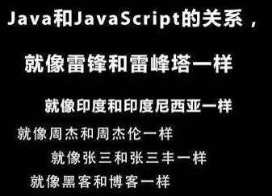

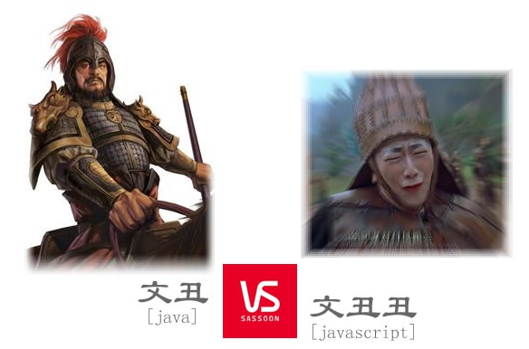

### 1.3 特性

**① 解释型语言。**JavaScript是一种解释型的脚本语言，C、C++、Java等语言先编译后执行, 而JavaScript是在程序的运行过程中逐行进行解释，不需要被编译为机器码再执行。

**② 面向对象。**JavaScript是一种面向对象的脚本语言，它不仅可以创建对象，也能使用现有的对象。

**③ 类C和Java的语法。**JavaScript的语法结构与C和Java很像，像for、if、while等语句和Java的基本上是一模一样的。

**④ 简单。**JavaScript语言中采用的是**弱类型的变量类型**，对使用的数据类型未做出严格的要求，是基于Java基本语句和控制的脚本语言。（补充：Java是强类型的语言）

**⑤ 动态性。**所谓的动态性，可以暂时理解为在语言中的一切内容都是不确定的。比如一个变量，这一刻是个整数，下一刻可能会变成字符串了。

**⑥ 跨平台性。**JavaScript脚本语言不依赖于操作系统（Java依赖于JVM），**仅需要浏览器的支持**。因此一个JavaScript脚本在编写后可以带到任意机器上使用，前提是机器上的浏览器支持JavaScript脚本语言。目前JavaScript已被大多数的浏览器所支持。

⑦ **安全性。**JavaScript是不允许直接访问本地硬盘的。

### 1.4 JavaScript构成

一个完整的JavaScript实现应该由以下三个部分构成：

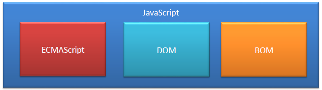

- **ECMAScript：**ECMAScript是一个标准，而这需要由各厂商去实现。 

  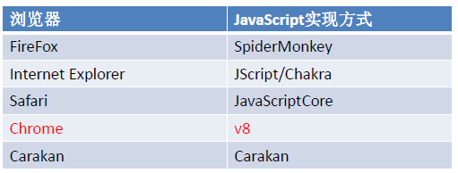

- **DOM：**JS 中通过 DOM来对 HTML 文档进行操作。只要理解了DOM就可以随心所欲的操作 WEB 页面。

- **BOM：**要想在浏览器中使用 JavaScript，必须使用BOM(浏览器对象模型)。BOM提供了很多对象，通过修改这些对象的属性，调用他们的方法，用于控制浏览器的各种行为。

### 1.5 体验

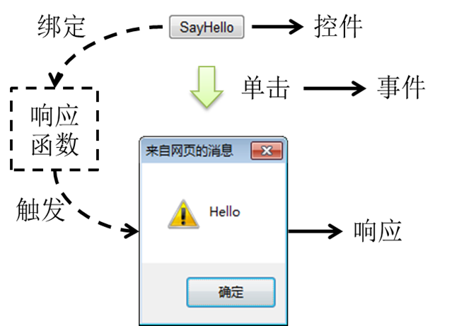

对应的代码实现如下：

```javascript
<head>
    <!-- JavaScript代码写在Script标签中 -->
    <script type="text/javascript">
        window.onload = function(){//main
        //获取#btnId对应的元素节点
        var btn = document.getElementById("btnId");
        //为#btnId绑定单击响应函数
        btn.onclick = function(){
        //弹出警告框，显示字符串Hello
               alert("Hello");
        }
        }
    </script>
</head>
<body>
    <button id="btnId">SayHello</button>
</body>

```


## 第2章 JavaScript基本语法

**JavaScript需要包括在\<script>标签中，这个标签可以出现在页面的任何位置。**

### 2.1 编写位置

- 方式一：编写到HTML中\<script>标签中，声明在head标签或者body标签中。

```javascript
<script type="text/javascript">
		alert("如果能用金钱换时间，你愿意吗？");
</script>
```

> 说明：一般声明在head标签中，与style标签有点像。

- 方式二：写在外部的.js文件中。然后通过script标签的src属性引入。
  - 这里的文件路径，可以是相对路径，也可以是绝对路径。

```javascript
<script type="text/javascript" src="script.js"></script>
```

> 说明：type属性 ：默认值 text/javascript可以不写，不写也是这个值。
>
> ​            src属性：当需要引入一个外部的js文件时，使用该属性指向文件的地址。
>
> 特别注意：方式一和方式二不要同时使用。一旦同时使用，会默认执行方式二中js文件中的js代码。

### 2.2 标识符与关键字保留字

#### 2.2.1 标识符的命名规则：

- 由26个英文字母大小写，0-9，_或 $ 组成。
- 数字不可以开头。
- 不可以使用关键字和保留字，但能包含关键字和保留字。
- JavaScript中严格区分大小写。
- 标识符不能包含空格。

#### 2.2.2 关键字和保留字

- 关键字

  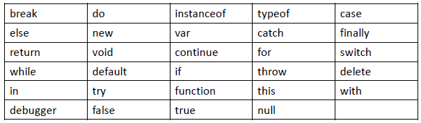

- 保留字

  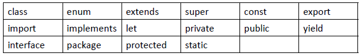

### 2.3 变量

#### 2.3.1 JavaScript的数据类型

- 基本数据类型（5种）
  - 数值类型：number
  - 字符串类型：string
  - 布尔类型：boolean
  - null型：null
  - undefined型（Undefined）

- 对象类型：
  - 函数对象：Function
  - 数组对象：Array
    - 使用typeof 判断，结果是Object
  - 一般对象：Object

#### 2.3.2 JavaScript中特殊的常量值

- undefined：表示未定义，Undefined类型只有一个值，即特殊的 undefined 。所有的js中的变量在未初始化的时候默认值都是undefined。

  - typeof(undefined)结果是undefined。

- null：表示空值，Null类型只有一个值，即为null。

  - 从语义上看 null表示的是一个空对象。所以使用 typeof检查 null会返回一个Object。
  - undefined是由null值衍生出来的，所以undefined和null是否相等，会返回true。

- NaN：not a number(非数值)，在数学运算中对数值进行计算时，没有结果返回，则返回NaN

  ```javascript
  var a = "abc";
  var b = 12;
  var c = b * a;
  alert(c);
  ```


- boolean类型：只能取值真(true)或假(false)。除此以外，其他的值都不被支持。

  - 其他值与boolean的转换规则：

    

  - 0、null、undefined、“”（空串）在运算时，都认为是false

    ```javascript
    <script type="text/javascript">
    // 	var i = 0;
    // 	var i = null;
    // 	var i = undefined;
    	var i = "";
    	if (i) {
    		alert("真");
    
    	} else {
    		alert("假");
    	}
    </script>
    ```

#### 2.3.3 变量的声明

- 使用var定义即可。比如：var num = 65; var name = "马大云"；
- 变量声明时不需要指定类型，可以接受所有的数据类型。

#### 2.3.4 变量的赋值

- 变量在赋值过程中可以接受不同类型的值。比如：var x = 123; x = "atguigu.com";
- 没有赋值的变量，默认为undefined
- **使用typeof(变量名)，判断变量的类型**
- **JS中每一条语句以分号(;)结尾**。如果不写分号，浏览器会自动添加，但是会消耗一些系统资源。

### 2.4 注释

首先，在js中也有注释。即为如下两种方式：

- //表示单行注释
- /*  */表示多行注释

### 2.5 运算符

运算符是一种特殊的符号，用以表示数据的运算、赋值和比较等。

#### 2.5.1 算术运算符

 

#### 2.5.2 赋值运算符

- 符号：= 
- 扩展赋值运算符： +=,    -=,   *=,     /=,    %=

#### 2.5.3 关系运算符

- <,  >,  <=,    >=,   !=,    ==,   ===（全等）,  !==（不全等）

- 举例1：

  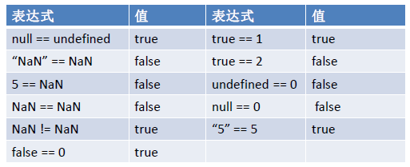

- 举例2：

  ```javascript
  var i = 12;
  var j = "12";
  alert(i == j);//true。此时的==只是简单的比较字面值
  alert(i === j);//false。此时的===除了比较字面值之外，还比较两个变量的类型是否一致
  ```

#### 2.5.4 逻辑运算符

 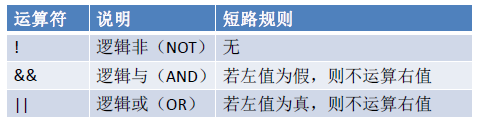

- 逻辑运算符，结果返回一个布尔值。

- 如果进行逻辑运算时，操作数不是布尔类型，则会将其转换为布尔类型再进行计算。

- && ：与运算

  - 情况一：当表达式全为真的时候，返回最后一个表达式的值

  - 情况二：当表达式中有一个为假的时候，返回第一个为假的表达式的值

    ```javascript
    var a = "abc";
    var b = true;
    var c = false;
    var d = null;
    //情况一
    alert(a && b);//true
    alert(b && a);//"abc"
    //情况二
    alert(c && b);//false
    alert(b && d);//null
    ```

- ||：或运算

  - 情况一：当表达式全为假时，返回最后一个表达式的值

  - 情况二：只要有一个表达式为真，就会返回第一个为真的表达式的值

    ```javascript
    var a = "abc";
    var b = true;
    var c = false;
    var d = null;
    	
    //情况一
    alert(c || d);//null
    //情况二
    alert(c || b);//true
    alert(a || b);//"abc"
    ```

  > && 和 || 也存在短路的情况，一旦得到结果，就不再继续运算了。

#### 2.5.5 三元运算符

 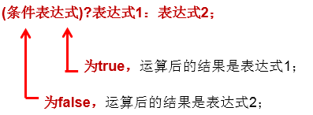

```javascript
例如： x > 0? x : -x;  // 求x的绝对值
```


### 2.6 流程控制结构（条件判断、循环）

java中的for，while，if-else，switch，try-catch，break，continue，在js中也是按照同样的方式使用的。

####  2.6.1 if结构

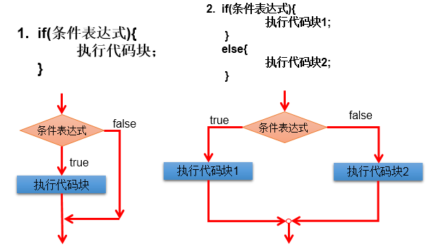

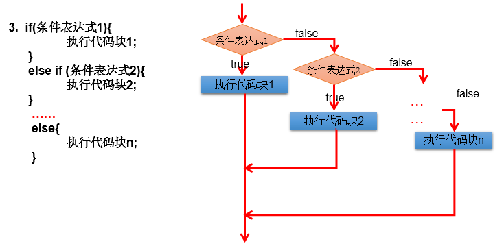

#### 2.6.2 switch-case结构

 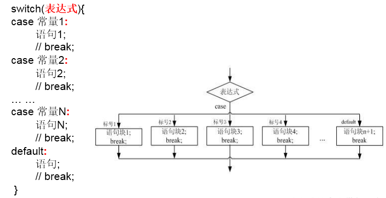

#### 2.6.3 while结构

 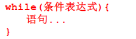

#### 2.6.4 for结构

 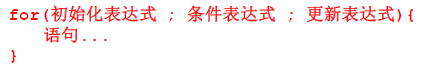

#### 2.6.5 do-while结构

 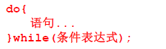

#### 2.6.6 break和continue

- break只能用于**switch语句和循环语句**中。

- continue 只能用于**循环语句**中。

- 二者功能类似，但continue是终止**本次**循环，break是终止**本层**循环。

- break、continue之后不能有其他的语句，因为程序永远不会执行其后的语句

### 2.7 数组

#### 2.7.1 数组的定义

- 定义一个空数组：var arr = [];
- 定义一个非空数组：var arr1 = ["Tom","atguigu.com",true];

#### 2.7.2 数组的调用

- 数组的角标是从0开始的，直接通过角标进行调用。比如： alert(arr[0]);

#### 2.7.3 数组的长度

- 通过调用数组的属性length获取数组的长度

- 在JavaScript的数组中，只要我们通过元素的下标给数组赋值，js就可以根据赋值的最大下标自动给数组扩容

  ```javascript
  var arr = [1,2,3];
  alert(arr.length);//3
  arr[5] = 15;
  alert(arr.length);//6
  ```

#### 2.7.4 数组的遍历

```javascript
var arr = [];
arr[0] = 10;
arr[5] = 20;
for(var i = 0;i < arr.length;i++){
    alert(arr[i]);
}
```


### 2.8 函数

#### 2.8.1 函数声明与调用

- 使用function关键字

- 不需要指定返回值。如果函数有返回值，只需要在函数体内直接使用return语句返回需要的值即可。

- 不需要指定形参类型（因为js所有类型都使用var来声明）

- 函数在js中也是一种对象，可以将函数的引用赋值给变量

- 方式一：

  - 声明格式：

    ```js
    function 函数名(形参列表){
        函数体
    }
    ```

  - 举例：

    ```js
    function sum(n, m) {
    	return n + m;
    }
    ```

  - 调用：函数名(参数)。

    ```js
    var result = sum(1,2);
    alert(result);//3
    ```

- 方式二：匿名函数

  - 声明格式：

    ```js
    var 变量名 = function(形参列表){
        函数体;
    }
    ```

  - 举例1：

    ```
    var add = function(a,b){
        return a+b;
    }
    ```

  - 举例2：

    ```js
    var info = function(){
        alert("美好的事情即将发生“);
    }
    ```

  - 调用：变量名(实参值)

    ```js
    var result = add(1,2);
    alert(result);
    
    info();
    ```

#### 2.8.2 关于函数的重载问题

- 注意1：调用JavaScript函数时系统不检查传入参数的个数和类型，所以js中没有重载一说

- 注意2：一旦定义了同名不同参数个数的函数以后，**后定义的函数会覆盖先前定义的同名的所有函数。**也就是说，add(1,2)；add(1)；add(1,”abc”)；add(“abc”)；add(1,”666”,true);add()；都是调用的同一个函数。

  ```js
  function func1(){
  		alert("这是无参的函数");
  }
  	
  function func1(a,b){
      alert(a);
  	alert("这是有参的函数");
  }
  	
  func1();//此时执行的是第二个
  ```


#### 2.8.3 函数的隐形参数：arguments

- arguments跟java中的可变形参非常类似，可以传递不确定个数的实参到函数中
- 操作arguments和操作数组一致，也是用来接收传递的参数值。
- 可以通过角标获取指定的参数。
- 可以通过arguments的length属性获取调用函数时传入的实参的个数。

```js
function fun(num1,num2){
    alert(num1);//12
    alert(num2);//34
    alert(arguments.length);//4
	alert(arguments[0]);//12
    alert(arguments[1]);//34
    alert(arguments[2]);//atguigu
    alert(arguments[3]);//true
}


fun(12,34,"atguigu",true);
```

练习：定义一个函数，这个函数可以计算所有传递进来的数值参数相加的和，并返回相应数值。

```js
function sum(){
    var result = 0;
    for(var i = 0;i < arguments.length;i++){
        if(typeof(arguments[i]) == "number"){
            result += arguments[i];
        }
    }
    return result;
}

alert(sum(100,200,300));
alert(sum(100,"abc",200,300));
```


### 2.9 对象

#### 2.9.1 对象的创建与调用

- 方式一：使用new Object()创建

  - 格式

    ```js
    var 变量名 = new Object();//创建一个空的对象实例
    变量名.属性名 = 值;//给创建的对象添加一个属性
    变量名.函数名 = function(){}; //给创建的对象添加一个函数
    ```

  - 对象的访问（即：属性或函数的调用）

    ```js
    变量名.属性;
    变量名.函数名();
    ```

  - 举例

    ```js
    //对象的定义
    var obj = new Object();
    alert(typeof(obj));
    
    //声明属性和函数
    obj.name = "Tom";
    obj.study = function() {
    	alert("好好学习，天天向上");
    };
    
    //调用属性
    alert(obj.name);
    //调用函数
    obj.study();
    ```

- 方式二：使用{}创建，json对象

  - 格式

    ```js
    var 变量名 = {		  //定义一个空对象
        属性名1：值1，	//声明属性1
        属性名2：值2，	//声明属性2
        函数名:function(){} //声明函数
    };
    ```

  - 对象的访问（即：属性或函数的调用）

    ```
    变量名.属性;
    变量名.函数名();
    ```

  - 举例

    ```js
    //对象的定义
    var obj = {
    	name:"zhangchunsheng",
    	age:18,
    	work:function(){
    		alert("我在工作中...");
    	}
    };
    	
    alert(typeof(obj));
    alert(obj.name);
    obj.study();
    ```

#### 2.9.2 函数也是对象

- 在JavaScript中，函数也作为一种数据类型存在，而且是引用数据类型，函数名就是指向其内存空间地址的引用。

```javascript
var a = function() {
	return 2;
};
var b = a;
a.age = 18;
alert(b.age); //18

```

#### 2.9.3 this关键字的使用

- 在JavaScript函数中，this关键字指向的是调用当前函数的对象。

- 举例1：

  ```js
  var obj = {
  	name:"Tom",
  	age:18,
  	study:function(){
  		alert("好好学习，天天向上");
  	},
  	info:function(){
  		alert("name : " + this.name + ", age = " + this.age);
  	}
  };
  	
  alert(obj.name);
  obj.study();
  obj.info();
  ```

- 举例2：

  ```js
  var obj01 = {
  	name : "obj01 name",
  	getName : showName
  };
  var obj02 = {
  	name : "obj02 name",
  	getName : showName
  };
  function showName() {
  	alert(this.name);
  }
  
  obj01.getName();//结果为 obj01 name
  obj02.getName();//结果为 obj02 name
  ```

#### 2.9.4 JavaScript的三类现成的对象

- **JavaScript内置对象**
  - Array 、Date、Math、……

- **浏览器对象**
  - window、location

- **dom对象**
  - document、body、button……

## 第3章 JavaScript事件

### 3.1 事件介绍

- 什么是事件？

  事件就是电脑输入设备与页面交互时触发的行为或响应。比如按钮点击，表单提交，鼠标滑动等等

### 3.2 事件分类

- **系统事件：**由系统触发的事件，例如文档加载完成。
- **用户事件：**用户操作，例如单击、鼠标移入、鼠标移出等。

### 3.3 事件触发

- 系统事件会**由系统触发**，如window.onload事件。

- 用户事件**由用户行为触发**，如click事件。这里主要讲解的系统事件是window.onload，用户事件主要在操作html文档的时候触发。详细事件列表可参考w3c离线文档中的JavaScript-->dom事件

### 3.4 常见事件

| 函数名   | 说明                                                       |
| -------- | ---------------------------------------------------------- |
| onload   | 加载完成事件，常用于页面加载完成之后做的一些功能           |
| onclick  | 单击事件，常用于用户点击视图的时候触发功能                 |
| onblur   | 失去焦点事件，常用于失去焦点的时候触发功能                 |
| onchange | 内容发生改变事件，常用于下拉列表和文本输入框内容发生改变时 |
| onsubmit | 表单提交事件，常用于表单提交事件的时候做一些表单验证的工作 |

### 3.5 事件的注册

- **方式一：静态注册**

  通过标签的事件属性上直接赋于事件响应后的js代码。这种方式我们称之为静态注册。

  ```html
  <!-- 
  	onload事件静态注册
   -->
  <body	onload="alert('这是页面加载完成之后的事件')">
  	
  </body>
  ```

- **方式二：动态注册**
  先通过js代码查找到标签对象。然后通过 **标签对象.事件名=function(){}** 这种形式，我们称之为动态注册。

  ```js
  window.onload = function(){		//页面加载完成之后
  	//1、查找标签对象
  	//2、通过标签对象.事件名 = function(){}
  }
  ```

### 3.6 事件响应

#### 3.6.1 何为事件响应

- 我们希望某个事件发生的时候我们可以做一些事情。这个称为事件的响应，比如用户点击了一个按钮，我弹出一个框告诉用户，你成功的点击了这个按钮。

#### 3.6.2 何为响应函数

- 事件触发后我们要执行的函数称为响应函数。如何将响应函数与事件关联起来？我们常使用为事件赋值函数的方式。如window.onload事件触发时我们执行弹出对话框

  ```js
  window.onload = function(){
  	alert(“文档加载完成了！”)
  }
  ```

#### 3.6.3 自定义事件响应步骤

**步骤一：**从文档对象模型中获取控件对象 [借助DOM API实现]

**步骤二：**声明一个事件响应函数

**步骤三：**将事件响应函数的引用赋值给控件对象的事件属性

例如：window.onload = function(){}

- 生活举例

|                    | 地雷         |
| ------------------ | ------------ |
| **兵工厂生产完成** | **不会爆炸** |
| **埋设到指定地点** | **不会爆炸** |
| **触发引信**       | **爆炸**     |

- 对应到程序的事件上

|                      | 函数         |
| -------------------- | ------------ |
| **声明**             | **不会执行** |
| **绑定到指定控件上** | **不会执行** |
| **触发事件**         | **执行**     |

#### 3.6.4 使用静态注册事件的方式触发事件响应

我们也可以使用标签的事件属性来触发响应函数，如：

```js
<a href=”atguigu.com” onclick=”gotoguigu()”>尚硅谷</a>
//onclick会触发gotoguigu()函数
```

其中，我们在head标签的定义：

```js
//我们在<script></script>中定义这个函数
<script type=”text/javascript”>
	function gotoguigu(){
		alert(“我要去上硅谷”)
	}
</script>
```


### 3.7 具体事件举例

#### 3.7.1 onload事件

- 举例1：静态注册

```html
<!-- 
	onload静态注册
	onload是在浏览器内核解析完成页面标签，并加载数据完成之后，自动调用。
 -->
<body	onload="alert('这是页面加载完成之后的事件')">
	
</body>
```

- 举例2：静态注册

```html
<head>
	<meta charset="UTF-8">
	<title>Insert title here</title>
	
	<script type="text/javascript">
		function onloadFun(){
			alert("执行函数操作");
			//可能还有很多执行语句
		}
	</script>
</head>
<!-- 
	onload静态注册
	onload是在浏览器内核解析完成页面标签，并加载数据完成之后，自动调用。
	""中的函数后的分号;可以加，也可以省略。
 -->
<body	onload="onloadFun();">
	
</body>
```

- 举例3：动态注册

```html
<head>
	<meta charset="UTF-8">
	<title>Insert title here</title>
		
	<script type="text/javascript">
		//这是动态注册onload事件的写法
		window.onload = function(){
			alert("这是动态注册的onload事件");
		};
	</script>
</head>

<body>
</body>
```

#### 3.7.2 onclick事件

- 举例1：静态注册

  ```html
  <head>
  	<meta http-equiv="Content-Type" content="text/html; charset=UTF-8">
  	<title>Insert title here</title>
  	<script type="text/javascript">
  		function onclickFun(){
  			alert("onclick静态注册");
  		}
  			
  	</script>
  </head>
  <body>
  	<!-- 静态注册onclick -->
  	<button onclick="onclickFun()">按钮1(静态)</button>
  </body>
  ```

- 举例2：动态注册

  ```html
  <head>
  	<meta http-equiv="Content-Type" content="text/html; charset=UTF-8">
  	<title>Insert title here</title>
  	<script type="text/javascript">
  			
  		// 动态绑定第二个按钮的单击事件
  		window.onload = function(){
  // 			1、查找标签对象
  			// .getElementById("");	通过id属性获取标签对象
  			var btnObj = document.getElementById("btn01");
  // 			alert(btnObj);
  // 			2、通过标签对象.事件名 = function(){}
  			btnObj.onclick = function(){
  				alert("这是动态注册onclick");
  			}
  		}
  	</script>
  </head>
  
  <body>
  	<button id="btn01">按钮2(动态)</button>	
  </body>
  ```

#### 3.7.3 onblur事件

- 静态注册

  ```html
  <head>
  	<meta http-equiv="Content-Type" content="text/html; charset=UTF-8">
  	<title>Insert title here</title>
  	<script type="text/javascript">
  		function onblurFun(){
  			//alert("静态注册的onblur事件");
  			// js 提供了一个专门用来调试输出的对象console
  			// log 是输出的方法--它可以输出任意数据
  			console.log("静态注册的onblur事件");
  		}
  	</script>
  </head>
  
  <body>
  	<!-- 静态注册onblur事件 -->
  	用户名：<input type="text" onblur="onblurFun()"/><br/>
  	密码：<input id="pwd" type="password" /><br/>
  </body>
  ```

- 动态注册

  ```html
  <head>
  	<meta http-equiv="Content-Type" content="text/html; charset=UTF-8">
  	<title>Insert title here</title>
  	<script type="text/javascript">
  		//动态注册
  		window.onload = function(){
  			//1 获取标签对象
  			var passObj = document.getElementById("pwd");
  			//alert( passObj );
  			//2 通过标签对象.事件名 = function(){}
  			passObj.onblur = function(){
  				console.log("动态注册的onblur事件");
  			}
  		}
  	</script>
  </head>
  
  <body>
  	<!-- 静态注册onblur事件 -->
  	用户名：<input type="text"/><br/>
  	密码：<input id="pwd" type="password" /><br/>
  </body>
  ```

#### 3.7.4 onchange事件

- 静态注册

  ```html
  <head>
  	<meta http-equiv="Content-Type" content="text/html; charset=UTF-8">
  	<title>Insert title here</title>
  	<script type="text/javascript">
  		function onchangeFun(){
  			alert("静态注册onchange事件");
  		}
  	</script>
  </head>
  
  <body>
  	请选择你心中的女神：
  	<select onchange="onchangeFun()">
  		<option>朱茵</option>
  		<option>赵丽颖</option>
  		<option>林志玲</option>
  		<option>贾玲</option>
  	</select>
  		
  </body>
  ```

- 动态注册

  ```html
  <head>
  	<meta http-equiv="Content-Type" content="text/html; charset=UTF-8">
  	<title>Insert title here</title>
  	<script type="text/javascript">
  		window.onload = function(){
  			//1 获取标签
  			var selObj = document.getElementById("sel01");
  // 			alert(selObj);
  			//2 通过标签对象.事件名 = function(){}
  			selObj.onchange = function(){
  				alert("动态注册onchange事件");
  			}
  		}
  			
  	</script>
  </head>
  
  <body>
  	请选择你心中的男神：
  	<select id="sel01">
  		<option>刘德华</option>
  		<option>陈道明</option>
  		<option>周杰伦</option>
  		<option>鹿晗</option>
  	</select>
  </body>
  ```


#### 3.7.5 onsubmit事件

- 静态注册

  ```html
  <head>
  		<meta http-equiv="Content-Type" content="text/html; charset=UTF-8">
  		<title>Insert title here</title>
  		<script type="text/javascript">
  			function onsubmitFun(){
  				alert("验证表单项是否合法");
  				alert("发现不合法的表单项--阻止提交");
  				
  				return false;
  			}
  		</script>
  	</head>
  	
  	<body>
  		<!-- 静态注册onsubmit事件
  			onsubmit事件常用于验证表单项是否合法。如果有一个不合法，就要阻止表单提交。提示用户哪里不合法
  			如果需要阻止表单提交。只需要在标签上使用return返回false
  			静态注册return不能省
  		 -->
  		<form action="http://www.baidu.com" onsubmit="return onsubmitFun();">
  			<input type="submit" value="静态onsubmit" />
  		</form>
  	</body>
  ```

- 动态注册

  ```html
  <head>
  	<meta http-equiv="Content-Type" content="text/html; charset=UTF-8">
  	<title>Insert title here</title>
  	<script type="text/javascript">
  		// 动态注册
  		window.onload = function(){
  			// 获取标签对象
  			var formObj = document.getElementById("form01");
  // 			alert(formObj);
  			// 通过标签对象.事件名=function(){}
  			formObj.onsubmit = function(){
  				alert("动态注册");
  				alert("验证表单项，发现不合法，阻止 提交");
  				return false;
  			}
  		}
  			
  	</script>
  </head>
  <body>
  	<form action="http://www.baidu.com" id="form01">
  		<input type="submit" value="动态onsubmit" />
  	</form>
  </body>
  ```

  

### 3.8 取消控件默认行为

- 默认行为：某些事件触发后，系统会有默认的响应处理。如：
  - 超链接点击后会自动跳转
  - 表单提交点击后会发送请求

- 取消默认行为的方式：return false; 即可


## 第4章 JavaScript嵌入方式

### 4.1 浏览器加载顺序

- 按从上到下的顺序加载

- 遇到script标签先执行脚本程序，执行完成后再继续加载

- 几种嵌入方式一览表如下：

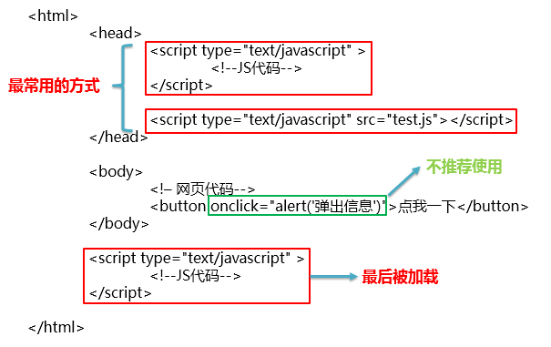

### 4.2 方式一：嵌入HTML标签的事件属性中

```html
<button onclick="alert('hello');">点我</button>
```

> 说明：结构与行为耦合，不推荐使用

### 4.3 方式二：嵌入head标签内

```html
<head>
    <script type="text/javascript">
        var btnEle = document.getElementById("btn");
        btnEle.onclick = function() {
            alert("hello");
        };
    </script>
</head>
<body>
	<button id="btn">点我</button>
</body>

```

> 说明：一般情况下使用都没问题。但是如果需要使用body中定义的节点，则无法获取body标签中的节点。

### 4.4 方式三：嵌入body标签后面

```html
<head>
    
</head>

<body>
	<button id="btn">点我</button>
</body>

<script type="text/javascript">
	var btnEle = document.getElementById("btn");
	btnEle.onclick = function() {
		alert("hello");
	};
</script>
```

> 说明：可以获取节点，但是不符合常规习惯

### 4.5 方式四：使用window.onload完美解决问题

- **window对象：**代表当前浏览器窗口

- **onload事件：**当整个文档加载完成后触发

```html
<head>
    <script type="text/javascript">
        window.onload = function() {
            var btnEle = document.getElementById("btn");
            btnEle.onclick = function() {
                alert("hello");
            };
        };
    </script>
</head>
<body>
	<button id="btn">点我</button>
</body>

```

> 说明：完美解决，推荐使用

### 4.6 方式五：引入其它js文件

```html
<!DOCTYPE html>
<html>
	<head>
		<meta charset="UTF-8">
		<title>load05</title>
		<!-- 5.引入外部的js文件 -->
		<script type="text/javascript" src="script.js"></script>
	</head>
	<body>
		<button id="btnId">SayHello</button>
	</body>
</html>
```

在本目录下，声明了script.js文件：

```js
window.onload = function(){
	//1.获取按钮对象
	var btnEle = document.getElementById("btnId");
	alert(btnEle);
	//2.给按钮绑定单击事件
	btnEle.onclick = function(){
		//3.弹出提示框
		alert("Hello JS");
	};
};	
```


## 第5章 DOM

### 5.1 什么是DOM

Document Object Model(文档对象模型)，我们浏览器把整个网页当成一个大的对象，网页中的标签、文本、属性等也都转换为对象来管理，利用面向对象的方式操作网页内容。那如何来实现呢？这就是要学习的JS DOM。

### 5.2 DOM标准

- Document Object Model：（文档对象模型）**定义了访问和处理 HTML 文档的标准方法。**是W3C国际组织制定的统一标准，在很多计算机语言中都有不同实现，如C#、PHP、 Java、Ruby、perl、python、JavaScript等。

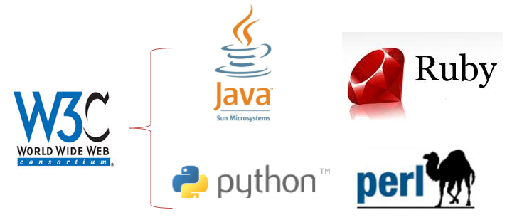

### 5.3 DOM树

HTML DOM 将 HTML 文档视作**树结构**。这种结构被称为**节点树。**

```html
<!DOCTYPE html>
<html>
	<head>
		<title>文档标题</title>
	</head>
	<body>
		<a href="index.html">我的链接</a>
		<h1>我的标题</h1>
	</body>
</html>
```

对应的DOM树如下：

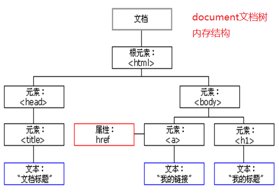


称谓如下：

| 元素     | 说明                                                   |
| -------- | ------------------------------------------------------ |
| 父元素   | 直接包含当前元素的元素就是当前元素的父元素             |
| 子元素   | 当前元素直接包含的元素就是当前元素的子元素             |
| 祖先元素 | 直接或间接包含当前元素的所有元素都是当前元素的祖先元素 |
| 后代元素 | 当前元素直接或间接包含的元素就是当前元素的后代元素     |
| 兄弟元素 | 有相同父元素的元素彼此是兄弟元素                       |

> 注意1：上图中的title节点与a节点不是兄弟关系。
>
> 注意2：上图中的属性节点href和body节点不是父子关系，是包含关系
>
> 注意3：上图中的文本节点是相应父节点的子节点。


### 5.4 document对象

- document对象是window对象的一个属性，代表当前HTML文档，将这个文档抽象成了document对象。
- document对象管理了所有的HTML文档内容。
- 它是包含了整个文档的树形结构，有层级关系。
- 它让我们把所有的标签都**对象化**。
- 我们可以通过document访问所有的标签对象。
- 获取document对象的本质方法是：window.document，而“window.”可以省略。

### 5.5 何为对象化

比如这里有html代码如下：

```html
 <body>
	<div id="div01">div01</div>
 </body>
```

模拟对象化，相当于Java中声明如下的类：

```java
class Node{
	private String id;		// id属性
	private String tagName; //表示标签名
	private Node parentNode; //父亲
	private List<Node> children; // 孩子结点
	private String innerHTML; // 起始标签和结束标签中间的内容
}

```

### 5.6 节点(结点，Node)

- 根据 W3C 的 HTML DOM 标准，HTML文档中的每个成分都是一个节点，**HTML文档就是由DOM节点构成的集合。**换句话说，**Node是构成HTML文档最基本的单元。**
- 节点的分类

  - 文档节点(Document)：DOM标准将**整个HTML文档**的相关信息封装后得到的对象。
  - 元素节点(Element)：DOM标准将**HTML标签**的相关信息封装后得到的对象。
  - 属性节点(Attribute)：DOM标准将**HTML标签属性**的相关信息封装后得到的对象。
  - 文本节点(Text)：DOM标准将**HTML文本**的相关信息封装后得到的对象。

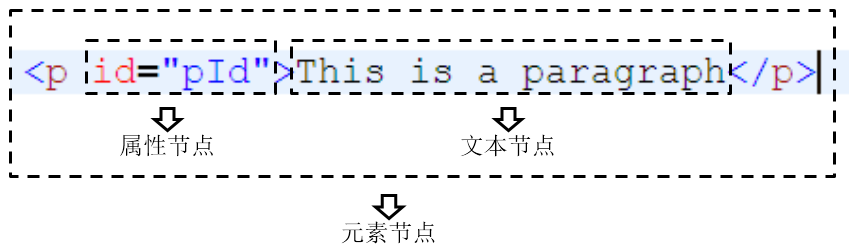

- 节点的属性
  - nodeName: 代表当前节点的名字，只读属性。如果给定节点是一个文本节点，nodeName 属性将返回内容为 #text 的字符串。

  - nodeType：返回一个整数, 这个数值代表着给定节点的类型，只读属性。  1 -- 元素节点    2 -- 属性节点    3 -- 文本节点

  - nodeValue：返回给定节点的当前值(字符串)，可读写的属性。

    - 元素节点：返回值是 null

    - 属性节点： 返回值是这个属性的值

    - 文本节点： 返回值是这个文本节点的内容

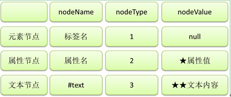

### 5.7 DOM查询API

#### 5.7.1 元素节点篇

- 在整个文档范围内查询元素节点

| 功能                   | API                                     | 返回值             |
| ---------------------- | --------------------------------------- | ------------------ |
| **根据id值查询**       | document.getElementById(“id值”)         | 一个具体的元素节点 |
| **根据标签名查询**     | document.getElementsByTagName(“标签名”) | 元素节点数组       |
| **根据name属性值查询** | document.getElementsByName(“name值”)    | 元素节点数组       |

> 建议使用顺序：先使用id查找。如果没有id的情况下，考虑使用name进行查找。
>
> 如果id，和name属性都没有，最后使用标签名tag查找。

- 在具体元素节点范围内查找子节点

| 功能                   | API                                           | 返回值       |
| ---------------------- | --------------------------------------------- | ------------ |
| 查找全部子节点         | element.childNodes【W3C考虑换行，IE≤8不考虑】 | 节点数组     |
| 查找第一个子节点       | element.firstChild【W3C考虑换行，IE≤8不考虑】 | 节点对象     |
| 查找最后一个子节点     | element.lastChild【W3C考虑换行，IE≤8不考虑】  | 节点对象     |
| 查找指定标签名的子节点 | element.getElementsByTagName(“标签名”)        | 元素节点数组 |

- 查找指定元素节点的父节点

| 功能                     | API                | 返回值   |
| ------------------------ | ------------------ | -------- |
| 查找指定元素节点的父节点 | element.parentNode | 节点对象 |

- 查找指定元素节点的兄弟节点

| 功能               | API                                             | 返回值   |
| ------------------ | ----------------------------------------------- | -------- |
| 查找前一个兄弟节点 | node.previousSibling【W3C考虑换行，IE≤8不考虑】 | 节点对象 |
| 查找后一个兄弟节点 | node.nextSibling【W3C考虑换行，IE≤8不考虑】     | 节点对象 |

#### 5.7.2 属性节点篇

- 读取属性值：**元素对象.属性名**
- 修改属性值：**元素对象.属性名=新的属性值**

#### 5.7.3 文本节点篇

- 获取文本值三步曲：
  - 获取文本节点的父节点
  - 获取父节点的第一个子节点： parentEle.firstChild
  - 获取文本节点的节点值：parentEle.firstChild.nodeValue
- 常见操作：
  - 读取文本值：**element.firstChild.nodeValue**
  - 修改文本值：**element.firstChild.nodeValue**=新文本值


**练习：**当用户点击【验证】按钮之后。验证用户名输入框中的内容是否合法。验证规则是，用户名只能从数字、字母、下划线中选择，并且长度是5-12位。页面定义如下：

```html
用户名：<input id="username" type="text" name="username" value="1234"/> 
<button id="btn01">验证</button>

```

答案：

```html
<head>
	<meta http-equiv="Content-Type" content="text/html; charset=UTF-8">
	<title>Insert title here</title>
	<script type="text/javascript">
		// 需求，当用户点击【验证】按钮之后。验证用户名输入框中的内容是否合法。
		// 验证规则是，用户名必须由数字。字母，下划线组成，并且长度是5-12位。
		window.onload = function(){
			//1 获取按钮的标签对象
			var btnObj = document.getElementById("btn01");
			//2 通过标签对象.onclick=function(){}
			btnObj.onclick = function(){
			//1 获取用户名输入框中的内容--当我们想操作某个标签的时候，一定要先获取到这个标签对象。
				var usernameObj = document.getElementById("username");
				var usernameTextValue = usernameObj.value;
				//2 验证是用户名是否合法。---用户名必须由数字。字母，下划线组成，并且长度是5-12位
				// 如果要验证这个规则，就必须要使用正则表达式去验证
				var patt = /^\w{5,12}$/;
				// test方法就是专门用来验证字符串是否匹配正则表达式
				// 匹配就返回true
				// 不匹配就返回false
				if (patt.test(usernameTextValue)) {
				//3 提示用户验证的结果。
					alert("用户名合法");
				} else {
					alert("用户名不合法");
				}
			}
		}
	</script>
</head>
<body>
	用户名：<input id="username" type="text" name="username" value="1234"/> 
	<button id="btn01">验证</button>
</body>
```

> 说明：关于正则表达式的使用，参见发的文档：《w3cschool菜鸟教程 新版本.chm》- JavaScript教程 - JavaScript RegExp对象 - 完整 RegExp 对象参考手册。


### 5.8 DOM增删改API

| API                                      | 功能                                       |
| ---------------------------------------- | ------------------------------------------ |
| document.createElement(“标签名”)         | 创建元素节点并返回，但不会自动添加到文档中 |
| document.createTextNode(“文本值”)        | 创建文本节点并返回，但不会自动添加到文档中 |
| element.appendChild(ele)                 | 将ele添加到element所有子节点后面           |
| parentEle.insertBefore(newEle,targetEle) | 将newEle插入到targetEle前面                |
| parentEle.replaceChild(newEle, oldEle)   | 用新节点替换原有的旧子节点                 |
| parentEle.removeChild(childNode)         | 删除指定的子节点                           |
| element.innerHTML                        | 读写起始标签和结束标签中的内容             |
| element.innerText                        | 读写起始标签和结束标签中的文本             |

举例：添加节点

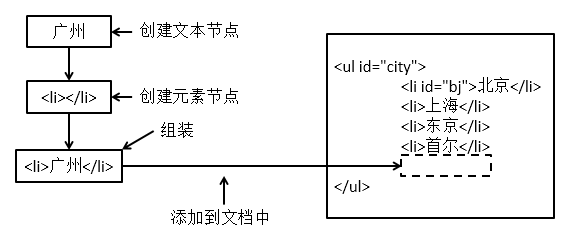

举例：替换节点

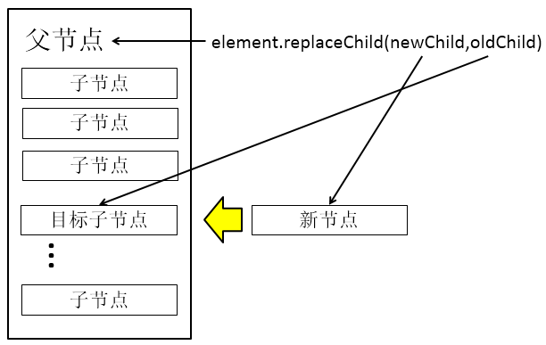

举例：插入节点

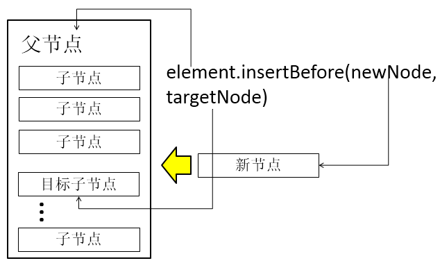

举例：

```javascript
<script type="text/javascript">
	// 需要通过代码方式手动创建一个标签对象：<div>康师傅好帅！</div>。然后把这个标签添加到窗口中显示
	window.onload = function() {
		// createElement 方法创建一个标签对象
		var divObj = document.createElement("div"); // <div></div>
		// 往标签中间加内容 divObj.innerHTML = "康师傅好帅！"; // <div>康师傅好帅！</div>

		// 通过代码把一个字符串创建成为节点对象
		var textNode = document.createTextNode("康师傅好帅！");

		divObj.appendChild(textNode); //<div>康师傅好帅！</div>

		// 把div标签添加到body标签中
		document.body.appendChild(divObj);
	}
</script>
```


### 5.9 innerHTML补充说明

- 返回对象的起始位置到终止位置的全部内容，包括HTML标签。

- 读取元素内部HTML代码
  - **元素对象.innerHTML**

- 修改元素内部HTML代码
  - **元素对象.innerHTML=HTML代码**
