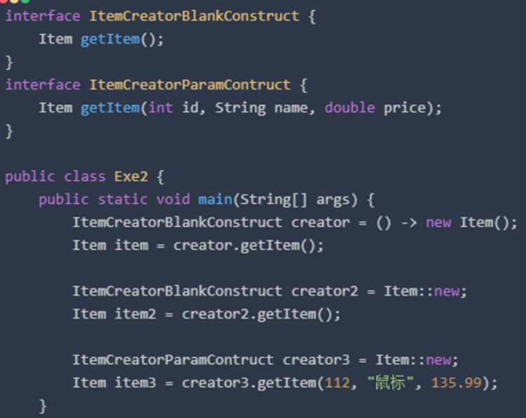
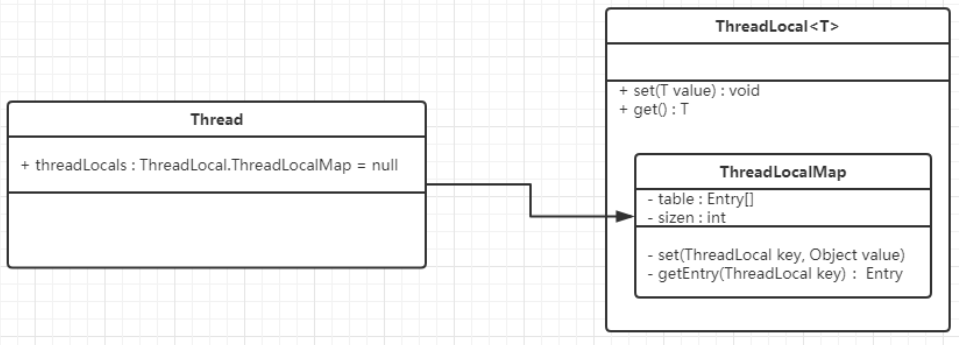
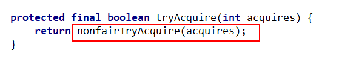

Version1.0

# JDK8新特性

## Lambda表达式

### 1、基本概念

JDK8新特性，取代大部分匿名内部类。

需要函数式接口支持也就是，Lambda规定接口中只能有一个需要被实现的方法，不是规定接口中只能有一个方法。

@Functionallinterface 修饰函数式接口，可以检查该接口是否只有一个抽象方法，要求接口中抽象方法只有一个，此注解往往和lambda表达式一起出现。

### 2、语法形式

> （）-> { }；
>
> - 其中（）用来描述参数列表
> - { }用来表述方法体也叫lambda体
> - -> 为lambda运算符，读作goes to

- 语法一：无参数，无返回值（）-> { }；
- 语法二：一个参数，无返回值（x）-> { }；
- 语法三：两个以上的参数，lambda体具有多条语句（x, y）-> { xxx; zzzzzz;}；


### 3、四大核心函数式接口 

| 函数式接口 | 参数类型 | 返回类型 | 用途 |
| ---- | ---- | ---- | ---- |
|Consumer 消费型接口| T| void| 对类型为T的对象应用操作，<br />包含方法： void accept(T t) |
|Supplier 供给型接口 |无| T | 返回类型为T的对象，<br />包含方法：T get() |
|Function 函数型接口| T |R| 对类型为T的对象应用操作，并返回结果。结果是R类型的对象。<br />包含方法：R apply(T t) |
|Predicate 断定型接口| T |boolean |确定类型为T的对象是否满足某约束，并返回<br />包含方法：boolean test(T t)|
|BiFunction |T,U |R |对类型为 T, U 参数应用操作，返回 R 类型的结果。<br />包含方法为： R apply(T t, U u); |
|UnaryOperator (Function子接口) |T |T| 对类型为T的对象进行一元运算，并返回T类型的结果。<br />包含方法为：T apply(T t); |
|BinaryOperator (BiFunction 子接口) |T,T| T| 对类型为T的对象进行二元运算，并返回T类型的结果。<br />包含方法为： T apply(T t1, T t2); |
|BiConsumer |T,U |void |对类型为T, U 参数应用操作。 <br />包含方法为： void accept(T t, U u) |
|BiPredicate |T,U| boolean |包含方法为： boolean test(T t,U u)|


### 4、简化Lambda

#### 1、简化参数类型

- （）中可以不写参数类型，但必须所有的都不写，因为JVM具有类型推断，通过上下文类型推断。

- 只有一个参数，可以不写（） 

> x -> { }；

- 方法体内只有一条语句或者只有一条return语句，可以不写{ } 

> x -> xxxx；


#### 2、方法引用

**语法**：方法归属者 **::** 方法名 

- 实例对象::实例方法名
- 类::静态方法名
- 类::实例方法名

**注意**：

- 静态方法的归属者为类对象，普通方法归属者为实例对象
- Lambda体中调用方法的参数列表与返回值类型，要与函数式接口中抽象方法的函数列表和返回值类型保持一致。
- Lambda参数列表中第一个参数是实例方法的调用者，而第二个参数是实例方法的时，可以用类::实例方法名

~~~java
// 方法引用-对象::实例方法
Consumer<Integer> con2 = System.out::println;
con2.accept(200);

// 方法引用-类名::静态方法名
BiFunction<Integer, Integer, Integer> biFun = (x, y) -> Integer.compare(x, y);
BiFunction<Integer, Integer, Integer> biFun2 = Integer::compare;
Integer result = biFun2.apply(100, 200);

// 方法引用-类名::实例方法名
BiFunction<String, String, Boolean> fun1 = (str1, str2) -> str1.equals(str2);
BiFunction<String, String, Boolean> fun2 = String::equals;
Boolean result2 = fun2.apply("hello", "world");
System.out.println(result2);
~~~


#### 3、构造器引用

声明接口，该接口作为对象的生成器，通过 **类名::new** 的方式来实例化对象，通过调用方法返回对象。

**注意**：需要调用的构造器的参数列表要与函数式接口中的抽象方法的参数列表保持一致

~~~java
// 构造方法引用  类名::new
Supplier<Employee> sup = () -> new Employee();
System.out.println(sup.get());
Supplier<Employee> sup2 = Employee::new;
System.out.println(sup2.get());

// 构造方法引用 类名::new （带一个参数）
Function<Integer, Employee> fun = (x) -> new Employee(x);
Function<Integer, Employee> fun2 = Employee::new;
System.out.println(fun2.apply(100));
~~~




## Stream流

### 1、基本概念

对指定集合进行复杂的查找、过滤、映射数据等操作，可以串行也可以并行。

**注意**：

- Stream本身不会存储元素。
- Stream不会改变源对象，会返回一个持有结果的新Stream。
- Stream操作具有延迟，也就是需要结果的时候才执行。

### 2、三个步骤

#### 1、创建Stream

获取一个数据源（集合、数组），获取一个流

使用**Collection接口**中的方法

~~~java
- default Stream<E> stream() : 返回一个顺序流
    
- default Stream<E> parallelStream() : 返回一个并行流
~~~


使用**数组**创建流，具有多个重载形式

~~~java
- static <T> Stream<T> stream(T[] array): 返回一个流

- public static IntStream stream(int[] array)

- public static LongStream stream(long[] array)

- public static DoubleStream stream(double[] array)
~~~


使用**值**创建流，使用静态方法Stream.of()，可以接受任意数量的参数

~~~java
- public static<T> Stream<T> of(T... values) : 返回一个流。
~~~


使用**函数**创建流，无限流

~~~java
- public static<T> Stream<T> iterate(final T seed, final UnaryOperator<T> f) 迭代

- public static<T> Stream<T> generate(Supplier<T> s) 生成
~~~


#### 2、中间操作Stream

一个中间操作链，对数据源的数据处理，该操作的返回值仍然是流

##### 1、筛选与切片 

~~~java
- filter(Predicate p) 接收 Lambda ， 从流中排除某些元素。

- distinct() 筛选，通过流所生成元素的 hashCode() 和 equals() 去除重复元素

- limit(long maxSize) 截断流，使其元素不超过给定数量。
    
- peek(Consumer<? super T> action) 此方法的存在主要是为了支持调试，希望在元素流过管道中的某个点时查看它们

- skip(long n) 跳过元素，返回一个扔掉了前 n 个元素的流。若流中元素不足 n 个，则返回一个空流。与 limit(n) 互补
~~~


##### 2、映射  

~~~java
- map(Function f) 接收一个函数作为参数，该函数会被应用到每个元素上，并将其映射成一个新的元素。

- mapToDouble(ToDoubleFunction f) 接收一个函数作为参数，该函数会被应用到每个元素上，产生一个新的 DoubleStream。

- mapToInt(ToIntFunction f) 接收一个函数作为参数，该函数会被应用到每个元素上，产生一个新的 IntStream。

- mapToLong(ToLongFunction f) 接收一个函数作为参数，该函数会被应用到每个元素上，产生一个新的 LongStream。

- flatMap(Function<? super T, ? extends Stream<? extends R>> mapper) 
    返回一个流，其中包含将此流的每个元素替换为通过将提供的mapper映射函数应用于每个元素而生成的映射流的内容的结果。
    
- flatMapToInt(Function<? super T, ? extends IntStream> mapper) 
    根据给定的mapper作用于当前流的每个元素，将结果组成新的Int流来返回
    同理有flatMapToLong flatMapToDouble
~~~


##### 3、排序 

~~~java
- sorted() 产生一个新流，其中按自然顺序排序

- sorted(Comparator comp) 产生一个新流，其中按比较器顺序排序
~~~


#### 3、终止操作

终止操作会执行中间操作链，并产生结果

##### 1、查找与匹配 

~~~java
- allMatch(Predicate p) 检查是否匹配所有元素

- anyMatch(Predicate p) 检查是否至少匹配一个元素，也即Stream中是否存在任何一个元素满足匹配条件

- noneMatch(Predicate p) 检查是否没有匹配所有元素，也即是不是Stream中的所有元素都不满足给定的匹配条件
   
- findFirst() 返回第一个元素

- findAny() 返回当前流中的任意元素，多个挑一个

- count() 返回流中元素总数

- max(Comparator c) 返回流中最大值

- min(Comparator c) 返回流中最小值
    
- toArray() 有俩个重载，一个有参数指定返回的数组类型，一个无参数默认Object[]，作用将结果返回为一个数组

- forEach(Consumer c) 
    内部迭代(使用 Collection 接口需要用户去做迭代，称为外部迭代。相反，Stream API 使用内部迭代——它帮你把迭代做了)
    在并行的情况下不保证顺序，而forEachOrdered保证顺序
~~~


##### 2、归约 （重要）

简介：

归约操作（也称为折叠）接受一个元素序列为输入，反复使用某个合并操作，把序列中的元素合并成一个汇总的结果。

比如查找一个数字列表的总和或者最大值，或者把这些数字累积成一个List对象。

Stream接口有一些通用的归约操作，比如reduce()和collect()；也有一些特定用途的归约操作，比如sum(),max()和count()。

注意：sum()方法不是所有的Stream对象都有的，只有IntStream、LongStream和DoubleStream是实例才有。


~~~java
- reduce(T iden, BinaryOperator b) 可以将流中元素反复结合起来，得到一个值。返回 T

- reduce(BinaryOperator b) 可以将流中元素反复结合起来，得到一个值。返回 Optional<T>
~~~


##### 3、收集 （重要）

~~~java
collect(Collector c) 将流转换为其他形式。接收一个 Collector 接口的实现，用于给Stream中元素做汇总的方法
~~~

Collector 接口中方法的实现决定了如何对流执行收集操作(如收集到 List、Set、Map)。<a href="#Collector 接口">详见</a> 

Collectors 实现类是JDK Collector 接口的预实现类，提供了很多静态方法，可以方便地创建常见收集器实例。<a href="#Collectors 实用类">详见</a> 

 


### 3、串行流与并行流

并行流：把一个内容分成多个数据块，并用不同的线程分别处理每个数据块的流，Stream API通过parallel()与sequential()进行并串切换，其底层使用Fork/Join框架。

### 4、<a name="Collector 接口">Collector 接口</a> 

#### 1、参数简介

Collector 有五个主要参数，也即一些函数式接口

~~~java
public interface Collector<T, A, R> {
    // supplier参数用于生成结果容器，容器类型为A
    Supplier<A> supplier();
    // accumulator用于消费元素，也就是归纳元素，这里的T就是元素，它会将流中的元素一个一个与结果容器A发生操作
    BiConsumer<A, T> accumulator();
    // combiner用于两个两个合并并行执行的线程的执行结果，将其合并为一个最终结果A
    BinaryOperator<A> combiner();
    // finisher用于将之前整合完的结果R转换成为A
    Function<A, R> finisher();
    // characteristics表示当前Collector的特征值，这是个不可变Set
    Set<Characteristics> characteristics();
}
~~~

Collector拥有两个of方法用于生成Collector实例，其中一个拥有上面所有五个参数，另一个四个参数，不包括finisher。

~~~java
public interface Collector<T, A, R> {
    // 四参方法，用于生成一个Collector，T代表流中的一个一个元素，R代表最终的结果
    public static<T, R> Collector<T, R, R> of(Supplier<R> supplier,
                                              BiConsumer<R, T> accumulator,
                                              BinaryOperator<R> combiner,
                                              Characteristics... characteristics) {/*...*/}
    
    // 五参方法，用于生成一个Collector，T代表流中的一个一个元素，A代表中间结果，R代表最终结果，finisher用于将A转换为R      
    public static<T, A, R> Collector<T, A, R> of(Supplier<A> supplier,
                                                 BiConsumer<A, T> accumulator,
                                                 BinaryOperator<A> combiner,
                                                 Function<A, R> finisher,
                                                 Characteristics... characteristics) {/*...*/}                                              
}
~~~

>Characteristics：这个特征值是一个枚举，拥有三个值：CONCURRENT（多线程并行），UNORDERED（无序），IDENTITY_FINISH（无需转换结果）。
>
>其中四参of方法中没有finisher参数，所以必有IDENTITY_FINISH特征值。

#### 2、<a name="Collectors 实用类">Collectors 实现类</a> 

Collectors是一个工具类，是JDK预实现Collector的工具类，它内部提供了多种Collector，可直接使用。

以下为各个方法的用例

~~~java
// toCollection 将流中的元素全部放置到一个集合中返回，这里使用Collection，泛指多种集合。
List<String> ll = list.stream().collect(Collectors.toCollection(LinkedList::new));

------------------------------------------------------------------------------------------------------------
    
// toList 将流中的元素放置到一个列表集合中去。这个列表默认为ArrayList。
List<String> ll = list.stream().collect(Collectors.toList());

------------------------------------------------------------------------------------------------------------
    
// toSet 将流中的元素放置到一个无序集set中去。默认为HashSet。
Set<String> ss = list.stream().collect(Collectors.toSet());

------------------------------------------------------------------------------------------------------------
    
// joining 目的是将流中的元素全部以字符序列的方式连接到一起，可以指定连接符，甚至是结果的前后缀。
// 无参方法
String s = list.stream().collect(Collectors.joining());
// 指定连接符
String ss = list.stream().collect(Collectors.joining("-"));
// 指定连接符和前后缀
String sss = list.stream().collect(Collectors.joining("-","S","E"));

------------------------------------------------------------------------------------------------------------
    
// mapping 这个映射是首先对流中的每个元素进行映射，即类型转换，然后再将新元素以给定的Collector进行归纳。
// mapping 收集器在用于多级归约时最有用，例如groupingBy或partitioningBy的下游
// mapping 方法有俩个参数
// 第一个参数是Function类型的函数，应用于输入元素的函数
// 第二个参数是Collector类型，将接受映射值的收集器
List<Integer> ll = list.stream().limit(5).collect(Collectors.mapping(Integer::valueOf,Collectors.toList()));
Map<City, Set<String>> lastNamesByCity = 
    people.stream()
    .collect(groupingBy(Person::getCity, mapping(Person::getLastName, toSet())));

------------------------------------------------------------------------------------------------------------
    
// collectingAndThen 该方法是在收集动作结束之后，对收集的结果进行再处理，也即调整Collector以执行额外的整理转换
// collectingAndThen 有两个参数
// 第一个参数是下游的Collectors
// 第二个参数是对Collectors产生的结果进行处理的函数，是Function类型
int length = list.stream().collect(Collectors.collectingAndThen(Collectors.toList(), e -> e.size()));
List<String> list = people.stream().collect(collectingAndThen(toList(), Collections::unmodifiableList));

------------------------------------------------------------------------------------------------------------
    
// counting 用于计数
long size = list.stream().collect(Collectors.counting());

------------------------------------------------------------------------------------------------------------
    
// minBy/maxBy 生成一个用于获取最小/最大值的Optional结果。
// minBy/maxBy 只有一个Comparator类型的参数
// 等效于reducing(BinaryOperator.minBy(comparator))
list.stream().collect(Collectors.maxBy((a,b) -> a.length()-b.length()));
list.stream().collect(Collectors.minBy((a,b) -> a.length()-b.length()));

------------------------------------------------------------------------------------------------------------
    
// summingInt/summingLong/summingDouble 生成一个用于求元素和的Collector。
// 首先通过给定的mapper将元素转换类型，然后再求和，最后结果与转换后类型一致。
int i = list.stream().limit(3).collect(Collectors.summingInt(Integer::valueOf));
long l = list.stream().limit(3).collect(Collectors.summingLong(Long::valueOf));
double d = list.stream().limit(3).collect(Collectors.summingDouble(Double::valueOf));

------------------------------------------------------------------------------------------------------------
    
// averagingInt/averagingLong/averagingDouble 生成一个用于求元素平均值的Collector。
// 参数的作用就是将元素转换为指定的类型，求平均值涉及到除法操作，结果一律为Double类型。
double i = list.stream().limit(3).collect(Collectors.averagingInt(Integer::valueOf));
double l = list.stream().limit(3).collect(Collectors.averagingLong(Long::valueOf));
double d = list.stream().limit(3).collect(Collectors.averagingDouble(Double::valueOf));

------------------------------------------------------------------------------------------------------------
    
// reducing 方法有三个重载方法，其实是和Stream里的三个reduce方法对应的。
// 二者是可以替换使用的，作用完全一致，也是对流中的元素做统计归纳作用。

// 无初始值的情况，返回一个可以生成Optional结果的Collector
public static <T> Collector<T, ?, Optional<T>> reducing(BinaryOperator<T> op) {/*...*/}
Map<City, Optional<Person>> tallestByCity = people.stream()
    .collect(groupingBy(Person::getCity, reducing(BinaryOperator.maxBy(byHeight))));

// 有初始值的情况，返回一个可以直接产生结果的Collector
public static <T> Collector<T, ?, T> reducing(T identity, BinaryOperator<T> op) {/*...*/}

// 有初始值，还有针对元素的处理方案mapper，生成一个可以直接产生结果的Collector。
// 元素在执行结果操作op之前需要先执行mapper进行元素转换操作
public static <T, U> Collector<T, ?, U> reducing(U identity,
                                                 Function<? super T, ? extends U> mapper,
                                                 BinaryOperator<U> op) {/*...*/}
 Map<City, String> longestLastNameByCity = people.stream()
     .collect(groupingBy(Person::getCity, reducing("",Person::getLastName,BinaryOperator.maxBy(byLength))));

list.stream().limit(4).map(String::length).collect(Collectors.reducing(Integer::sum));
list.stream().limit(3).map(String::length).collect(Collectors.reducing(0, Integer::sum));
list.stream().limit(4).collect(Collectors.reducing(0, String::length, Integer::sum));

------------------------------------------------------------------------------------------------------------
    
// groupingBy 返回一个Collector ，对T类型的输入元素执行“分组依据”操作，根据分类函数对元素进行分组，并在Map中返回结果。
// groupingBy 有三个重载方法

// 第一个参数分类器，是Function类型，内部自动将结果保存到一个map中
// 每个map的键为?类型（即classifier的结果类型），值为一个list，这个list中保存在属于这个组的元素。
public static <T, K> Collector<T, ?, Map<K, List<T>>> 
    groupingBy(Function<? super T, ? extends K> classifier) {/*...*/}
Map<Integer,List<String>> s = list.stream()
    .collect(Collectors.groupingBy(String::length));

// 第一个参数分类器，对T类型的输入元素实现级联“分组依据”操作，根据分类函数对元素进行分组
// 第二个参数下游收集器，使用指定的下游Collector对与给定键关联的值执行归约操作。
// 也即在上面方法的基础上增加了对流中元素的处理方式的Collector，比如上面的默认的处理方法就是Collectors.toList()
public static <T, K, A, D>Collector<T, ?, Map<K, D>> 
    groupingBy(Function<? super T, ? extends K> classifier,Collector<? super T, A, D> downstream) {/*...*/}
 Map<City, Set<String>> namesByCity = people.stream()
     .collect(groupingBy(Person::getCity, mapping(Person::getLastName, toSet())));
Map<Integer,List<String>> ss = list.stream()
    .collect(Collectors.groupingBy(String::length, Collectors.toList()));

// 第一个参数分类器，对T类型的输入元素实现级联“分组依据”操作，根据分类函数对元素进行分组
// 第二个参数Map工厂，用于提供一个空的map，保存此次分组的结果
// 第三个参数下游收集器，使用指定的下游Collector对与给定键关联的值执行归约操作。
// 也即在第二个方法的基础上再添加了结果Map的生成方法。
public static <T, K, D, A, M extends Map<K, D>> Collector<T, ?, M> 
    groupingBy(Function<? super T, ? extends K> classifier,
                                  Supplier<M> mapFactory,
                                  Collector<? super T, A, D> downstream) {/*...*/}
Map<City, Set<String>> namesByCity = people.stream()
    .collect(groupingBy(Person::getCity, TreeMap::new, mapping(Person::getLastName, toSet())));
Map<Integer,Set<String>> sss = list.stream()
    .collect(Collectors.groupingBy(String::length,HashMap::new, Collectors.toSet()));

// groupingByConcurrent 并发版groupingBy，功能效果一致

------------------------------------------------------------------------------------------------------------
    
// partitioningBy 根据Predicate对输入元素进行分区，并将它们组织成一个Map
// partitioningBy 方法将流中的元素按照给定的校验规则的结果分为两个部分
// 其中一份结果放到一个map中返回，map的键是Boolean类型，值为元素的列表List。
// 该方法有俩个重载

// 只需一个校验参数predicate
public static <T> Collector<T, ?, Map<Boolean, List<T>>> 
    partitioningBy(Predicate<? super T> predicate) {/*...*/}
Map<Boolean,List<String>> map = list.stream().collect(Collectors.partitioningBy(e -> e.length()>5));

// 在上面方法的基础上增加了对流中元素的处理方式的Collector，比如上面的默认的处理方法就是Collectors.toList()
public static <T, D, A> Collector<T, ?, Map<Boolean, D>> 
    partitioningBy(Predicate<? super T> predicate, Collector<? super T, A, D> downstream) {/*...*/}
Map<Boolean,Set<String>> map2 = list.stream()
    .collect(Collectors.partitioningBy(e -> e.length()>6, Collectors.toSet()));

------------------------------------------------------------------------------------------------------------
  
// toMap 方法是根据给定的键生成器和值生成器生成的键和值保存到一个map中返回
// 键和值的生成都依赖于元素，可以指定出现重复键时的处理方案和保存结果的map。
// 该方法有三个重载
    
// 指定键和值的生成方式keyMapper和valueMapper
// 如果映射的键可能有重复项，请改用toMap(Function, Function, BinaryOperator) 
public static <T, K, U> Collector<T, ?, Map<K,U>> 
    toMap(Function<? super T, ? extends K> keyMapper,Function<? super T, ? extends U> valueMapper) {/*...*/}
Map<Student, Double> studentToGPA = students.stream()
    .collect(toMap(Function.identity(), student -> computeGPA(student)));
Map<String, Student> studentIdToStudent = students.stream()
    .collect(toMap(Student::getId, Function.identity()));
Map<String,String> map = list.stream().limit(3).collect(Collectors.toMap(e -> e.substring(0,1), e -> e));
// 在上面方法的基础上增加了对键发生重复时处理方式的mergeFunction，比如上面的默认的处理方法就是抛出异常
// 注意是处理 键 冲突
public static <T, K, U> Collector<T, ?, Map<K,U>> 
    toMap(Function<? super T, ? extends K> keyMapper
          ,Function<? super T, ? extends U> valueMapper
          ,BinaryOperator<U> mergeFunction) {/*...*/}
Map<String, String> phoneBook = people.stream()
    .collect(toMap(Person::getName, Person::getAddress, (s, a) -> s + ", " + a));
Map<String,String> map1 = list.stream().collect(Collectors.toMap(e -> e.substring(0,1), e->e, (a,b)-> b));
// 在第二个方法的基础上再添加了Map工厂，可以指定结果Map的生成方法。
public static <T, K, U, M extends Map<K, U>> Collector<T, ?, M> 
    toMap(Function<? super T, ? extends K> keyMapper
          ,Function<? super T, ? extends U> valueMapper
          ,BinaryOperator<U> mergeFunction
          ,Supplier<M> mapSupplier) {/*...*/}
Map<String,String> map2 = list.stream()
    .collect(Collectors.toMap(e -> e.substring(0,1), e->e,(a,b)->b, HashMap::new));

// toConcurrentMap 和toMap 功能用法效果一致

------------------------------------------------------------------------------------------------------------
  ;
// summarizingInt/summarizingLong/summarizingDouble
// 适用于汇总的，返回值分别是IntSummaryStatistics，LongSummaryStatistics，DoubleSummaryStatistics。
// 在这些返回值中包含有流中元素的指定结果的数量、和、最大值、最小值、平均值。所有仅仅针对数值结果。
// summarizingInt ----> 有一个参数mapper，作用域每一个元素，产生一个int映射，剩下俩方法同样道理。
IntSummaryStatistics intSummary = list.stream()
    .collect(Collectors.summarizingInt(String::length));

LongSummaryStatistics longSummary = list.stream().limit(4)
    .collect(Collectors.summarizingLong(Long::valueOf));

DoubleSummaryStatistics doubleSummary = list.stream().limit(3)
    .collect(Collectors.summarizingDouble(Double::valueOf));
        
~~~

扩展：

- StringJoiner：这是一个字符串连接器，可以定义连接符和前后缀，正好适用于实现joining第三种joining方法。

### 5、案例

#### 1、多级排序

~~~java
List<类> list; // 代表某集合
 
// 返回 对象集合以类属性一升序排序
list.stream().sorted(Comparator.comparing(类::属性一));
 
// 返回 对象集合以类属性一降序排序 注意两种写法
list.stream().sorted(Comparator.comparing(类::属性一).reversed());// 先以属性一升序,结果进行属性一降序
list.stream().sorted(Comparator.comparing(类::属性一,Comparator.reverseOrder()));// 以属性一降序
 
// 返回 对象集合以类属性一升序 属性二升序
list.stream().sorted(Comparator.comparing(类::属性一).thenComparing(类::属性二));
 
// 返回 对象集合以类属性一降序 属性二升序 注意两种写法
// 先以属性一升序,升序结果进行属性一降序,再进行属性二升序
list.stream().sorted(Comparator.comparing(类::属性一).reversed().thenComparing(类::属性二));
// 先以属性一降序,再进行属性二升序
list.stream().sorted(Comparator.comparing(类::属性一,Comparator.reverseOrder()).thenComparing(类::属性二));
 
// 返回 对象集合以类属性一降序 属性二降序 注意两种写法
// 先以属性一升序,升序结果进行属性一降序,再进行属性二降序
list.stream().sorted(Comparator.comparing(类::属性一)
                     .reversed()
                     .thenComparing(类::属性二,Comparator.reverseOrder()));
// 先以属性一降序,再进行属性二降序
list.stream().sorted(Comparator.comparing(类::属性一,Comparator.reverseOrder())
                     .thenComparing(类::属性二,Comparator.reverseOrder()));
 
// 返回 对象集合以类属性一升序 属性二降序 注意两种写法
// 先以属性一升序,升序结果进行属性一降序,再进行属性二升序,结果进行属性一降序属性二降序
list.stream().sorted(Comparator.comparing(类::属性一).reversed().thenComparing(类::属性二).reversed());

// 先以属性一升序,再进行属性二降序<br><br><br>
list.stream().sorted(Comparator.comparing(类::属性一).thenComparing(类::属性二,Comparator.reverseOrder()));
~~~

~~~java
Comparator.comparing(类::属性一).reversed();

Comparator.comparing(类::属性一,Comparator.reverseOrder());
~~~

两种排序是完全不一样的，一定要区分开来：

- 1 是得到排序结果后再排序
- 2 是直接进行排序，很多人会混淆导致理解出错，2更好理解，建议使用2


## 新日期API

### 1、概述

- 常用日期API的继承结构


### 2、获取时间

#### 1、LocalDate

#### 2、LocalTime

#### 3、LocalDateTime


#### 4、Instant 

### 3、时间处理

#### 1、Duration

#### 2、Period

#### 7、TemporalAdjuster 

#### 8、DateTimeFormatter 

### 4、时区处理

#### 1、ZonedDate

#### 2、ZonedTime

#### 3、ZonedDateTime


# 集合框架

## 1、基本概念

Java 集合可分为 **Collection** 和 **Map** 两种体系

- Collection接口：单列数据，定义了存取一组对象的方法的集合
  - List：元素有序、可重复的集合
  - Set：元素无序、不可重复的集合
- Map接口：双列数据，保存具有映射关系“key-value对”的集合


## 2、Collection 接口

### 1、基本概念

- Collection 接口是 **List**、**Set** 和 **Queue** 接口的父接口，该接口里定义的方法既可用于操作 Set 集合，也可用于操作 List 和 Queue 集合。 
- JDK不提供此接口的任何直接实现，而是提供更具体的子接口(如：Set和List) 实现。 
- 在 Java5 之前，Java 集合会丢失容器中所有对象的数据类型，把所有对象都当成 Object 类型处理，从 JDK 5.0 增加了泛型以后，Java 集合可以记住容器中对象的数据类型。

### 2、常用方法

| 用途 | 方法 |
| ---- | ---- |
| 添加  | add(Object obj)、addAll(Collection coll) |
|  获取有效元素的个数    |  int size()    |
|   清空集合   |   void clear()   |
|	是否是空集合	|	boolean isEmpty()	|
|	是否包含某个元素	|	boolean contains(Object obj)：是通过元素的equals方法来判断是否是同一个对象 <br>boolean containsAll(Collection c)：也是调用元素的equals方法来比较的。拿两个集合的元素挨个比较。	|
|	删除		|	boolean remove(Object obj) ：通过元素的equals方法判断是否是要删除的那个元素。只会删除找到的第一个元素<br>boolean removeAll(Collection coll)：取当前集合的差集	|
|取两个集合的交集	|	boolean retainAll(Collection c)：把交集的结果存在当前集合中，不影响c	|
|集合是否相等	|	boolean equals(Object obj)	|
|	转成对象数组	|	Object[] toArray()	|
|	获取集合对象的哈希值	|hashCode()	|
|	遍历	|	iterator()：返回迭代器对象，用于集合遍历	|

### 3、List 子接口

#### 1、基本概念

- List集合类中元素有序、且可重复，集合中的每个元素都有其对应的顺序索引。
- List容器中的元素都对应一个整数型的序号记载其在容器中的位置，可以根据序号存取容器中的元素。
- JDK API中List接口的实现类常用的有：ArrayList、LinkedList 和 Vector。

**常用方法**：

| 方法 | 用途 |
| ---- | ---- |
|void add(int index, Object ele) |在index位置插入ele元素 |
|boolean addAll(int index, Collection eles) |从index位置开始将eles中 的所有元素添加进来 |
|Object get(int index) |获取指定index位置的元素 |
|int indexOf(Object obj) |返回obj在集合中首次出现的位置 |
|int lastIndexOf(Object obj) |返回obj在当前集合中末次出现的位置 |
|Object remove(int index) |移除指定index位置的元素，并返回此元素 |
|Object set(int index, Object ele) |设置指定index位置的元素为ele |
|List subList(int fromIndex, int toIndex) |返回从fromIndex到 toIndex 位置的子集合|

#### 2、常用子类

##### ArrayList

ArrayList本质上是对象引用的一个**”变长”数组**。

~~~java
// 默认容量的大小
private static final int DEFAULT_CAPACITY = 10;
// 空数组常量
private static final Object[] EMPTY_ELEMENTDATA = {};
// 默认的空数组常量
private static final Object[] DEFAULTCAPACITY_EMPTY_ELEMENTDATA = {};
// 存放元素的数组
transient Object[] elementData;
// 数组中包含的元素个数
private int size;
// 数组的最大上限
private static final int MAX_ARRAY_SIZE = Integer.MAX_VALUE - 8;
~~~


##### LinkedList

**双向链表**，内部没有声明数组，而是定义了Node类型的**first**和**last**， 用于记录首末元素。同时，定义内部类Node，作为LinkedList中保存数据的基本结构。

Node除了保存数据，还定义了两个变量：**prev**变量记录前一个元素的位置，**next**变量记录下一个元素的位置

新增方法

~~~java
void addFirst(Object obj)

void addLast(Object obj)

Object getFirst() 

Object getLast() 

Object removeFirst()

Object removeLast()
~~~

##### Vector

大多数操作与ArrayList 相同，区别之处在于Vector是线程安全的。

新增方法

~~~java
void addElement(Object obj)
    
void insertElementAt(Object obj,int index)
    
void setElementAt(Object obj,int index)
    
void removeElement(Object obj)
    
void removeAllElements()
~~~


#### 特殊方法

##### Arrays.asList

该方法是将数组转化成List集合的方法。

**注意**：

- 该方法适用于对象型数据的数组（String、Integer...）

- 该方法不建议使用于基本数据类型的数组（byte,short,int,long,float,double,boolean）

- 该方法将数组与List列表链接起来：当更新其一个时，另一个自动更新

- 不支持add()、remove()、clear()等方法
- 方法返回的 List 集合，既不是 ArrayList 实例，也不是 Vector 实例。 
- 其返回值是一个固定长度的 List 集合，用此方法得到的List的长度是不可改变的。

**特别注意**：

当向这个List添加或删除一个元素时（例如 list.add("d");）程序就会抛出异常（java.lang.UnsupportedOperationException）。

先看该方法源码： 

~~~java
public static <T> List<T> asList(T... a) {return new ArrayList<>(a);}
~~~

这个ArrayList不是java.util包下的，而是java.util.Arrays.ArrayList，它是Arrays类自己定义的一个静态内部类，这个内部类没有实现add()、remove()方法，而是直接使用它的父类AbstractList的相应方法。

而AbstractList中的add()和remove()是直接抛出java.lang.UnsupportedOperationException异常的。

~~~java
public void add(int index, E element) { throw new UnsupportedOperationException();}

public E remove(int index) {throw new UnsupportedOperationException();}
~~~

### 4、Set 子接口

#### 1、基本概念

- Set接口是Collection的子接口，set接口没有提供额外的方法
- Set 集合不允许包含相同的元素，如果试把两个相同的元素加入同一个 Set 集合中，则添加操作失败。
- Set 判断两个对象是否相同不是使用 == 运算符，而是根据 equals() 方法

#### 2、常用子类

##### HashSet

HashSet 是 Set 接口的典型实现，大多数时候使用 Set 集合时都使用这个实现类。

HashSet 按 Hash 算法来存储集合中的元素，因此具有很好的存取、查找、删除 性能。

判断两个元素相等的标准：

- 两个对象通过 hashCode() 方法比较相等
- 并且两个对象的 equals() 方法返回值也相等。
- 任意一个不等都不行！

**注意**：

- 对于存放在Set容器中的对象，对应的类一定要**重写equals()和hashCode(Object  obj)方法**，以实现对象相等规则。即：“相等的对象必须具有相等的散列码”。

**特点**： 

- 不能保证元素的排列顺序 
- HashSet 不是线程安全的
- 集合元素可以是 null

**添加元素的过程**：

1. 当向 HashSet 集合中存入一个元素时，HashSet 会调用该对象的 **hashCode**() 方法来得到该对象的 hashCode 值，然后根据 hashCode 值，通过某种**散列函数**决定该对象 在 HashSet **底层数组**中的**存储位置**。（这个散列函数会与底层数组的长度相计算得到在数组中的下标，并且这种散列函数计算还**尽可能保证能均匀存储元素**，越是散列分布， 该散列函数设计的越好）
2. 如果两个元素的**hashCode**()值相等，会再继续调用**equals**方法，如果equals方法结果为true，添加失败，如果为false，那么会保存该元素，但是该数组的位置已经有元素了，那么会通过链表的方式继续链接。
3. 如果两个元素的 **equals**() 方法返回 true，但它们的 **hashCode**() 返回值不相 等，hashSet 将会把它们存储在不同的位置，依然可以添加成功。


底层也是**数组**，初始容量为16，当如果使用率超过0.75，（16*0.75=12） 就会扩大容量为原来的**2倍**。（16扩容为32，依次为64,128....等）

##### LinkedHashSet

- LinkedHashSet 是 **HashSet** 的子类 
- LinkedHashSet 根据元素的 hashCode 值来决定元素的存储位置， 但它同时使用**双向链表**维护元素的次序，这使得元素看起来是以插入顺序保存的。 
- LinkedHashSet插入性能略低于 HashSet，但在迭代访问 Set 里的全部元素时有很好的性能。 
- LinkedHashSet 不允许集合元素重复。

##### TreeSet

- TreeSet 是 **SortedSet** 接口的实现类，TreeSet 可以确保集合元素处于排序状态。
- TreeSet底层使用**红黑树**结构存储数据。
- TreeSet 两种排序方法：**自然排序**和**定制排序**。默认情况下，TreeSet 采用自然排序。

**注意**：

- TreeSet只能添加同类对象，不然抛出ClassCastException异常。

新增方法：

~~~java
Comparator comparator()
    
Object first()
    
Object last()
    
Object lower(Object e)
    
Object higher(Object e)
    
SortedSet subSet(fromElement, toElement)
    
SortedSet headSet(toElement)
    
SortedSet tailSet(fromElement)
~~~

**自然排序注意事项**：

- TreeSet 会调用集合元素的 **compareTo**(Object obj) 方法来比较元素之间的大小关系，然后将集合元素按升序(默认情况)排列。也就是说，如果试图把一个对象添加到 TreeSet 时，则该对象的类必须实现 **Comparable**  接口。
- 向 TreeSet 中添加元素时，只有**第一个**元素无须比较compareTo()方法，后面添 加的所有元素都会调用compareTo()方法进行比较。
- **建议**：对象如果有重写equals方法，那么如果equals方法于compareTo方法应该一致。equals---->ture，compareTo---->0

**定制排序注意事项**：

- 通过Comparator接口来 实现。需要重写**compare(T o1,T o2)**方法，比较o1和o2的大小：如果方法返回正整数，则表示o1大于o2，如果返回0，表示相等，返回负整数，表示o1小于o2。

## 3、Map接口

### 1、基本概念

- Map 与 Collection 并列存在。用于**保存具有映射关系**的数据：key - value。
- Map 中的 key 和 value 可以是**任何引用类型的数据**。
- Map 中的 key 用 **Set** 来存放，**不允许重复**，即同一个 Map 对象所对应的类，因此key所在类重写hashCode()和equals()方法。
- 常用String类作为Map的键。
- key 和 value 之间存在单向一对一关系，即通过指定的 key 总能找到唯一的、确定的 value。
- Map接口的常用实现类：**HashMap**、**TreeMap**、**LinkedHashMap**和 **Properties**。其中，HashMap是 Map 接口使用频率最高的实现类

### 2、常用方法

| 方法 | 用途 |
| ---- | ---- |
|Object put(Object key,Object value)|将指定key-value添加到(或修改)当前map对象中 |
|void putAll(Map m)|将m中的所有key-value对存放到当前map中 |
|Object remove(Object key)|移除指定key的key-value对，并返回value |
|void clear()|清空当前map中的所有数据 |
|Object get(Object key)|获取指定key对应的value |
|boolean containsKey(Object key)|是否包含指定的key |
|boolean containsValue(Object value)|是否包含指定的value |
|int size()|返回map中key-value对的个数 |
|boolean isEmpty()|判断当前map是否为空 |
|boolean equals(Object obj)|判断当前map和参数对象obj是否相等 |
|Set keySet()|返回所有key构成的Set集合 |
|Collection values()|返回所有value构成的Collection集合 |
|Set entrySet()|返回所有key-value对构成的Set集合|

### 3、常用子类

#### HashMap

首先哈希表是一个数组，数组中的每 一个节点称为一个桶，哈希表中的每个节点都用来存储一个键值对。

允许使用null键和null值，与HashSet一样，不保证映射的顺序。

- 所有的key构成的集合是Set无序的、不可重复的，所以，key所在的类要重写equals()和hashCode()。

- 所有的value构成的集合是Collection无序的、可以重复的，所以，value所在的类要重写equals()。


- 一个key-value构成一个entry ，所有的entry构成的集合是Set无序的、不可重复的。


**注意**：

-  判断两个 key 相等的标准是：两个 key 通过 equals() 方法返回 true， hashCode 值也相等。
- 判断两个 value 相等的标准是：两个 value 通过 equals() 方法返回 true。

**JDK7/JDK8区别**：

- JDK 7及以前版本：HashMap是**数组**+**链表结构**(即为链地址法) 。
- JDK 8版本发布以后：HashMap是**数组**+**链表**+**红黑树实现**。并新增操作，桶的树形化


**源码**：

| 常量 | 作用 |
| ---- | ---- |
|DEFAULT_INITIAL_CAPACITY |HashMap的默认容量，16|
|MAXIMUM_CAPACITY|HashMap的最大支持容量，2^30|
|DEFAULT_LOAD_FACTOR|HashMap的默认加载因子|
|TREEIFY_THRESHOLD|Bucket中链表长度大于该默认值，转化为红黑树|
|UNTREEIFY_THRESHOLD|Bucket中红黑树存储的Node小于该默认值，转化为链表|
|MIN_TREEIFY_CAPACITY|桶中的Node被树化时最小的hash表容量。（当桶中Node的数量大到需要变红黑树时，若hash表容量小于MIN_TREEIFY_CAPACITY时，此时应执行resize扩容操作这个|
|table|存储元素的数组，总是2的n次幂|
|entrySet|存储具体元素的集|
|size|HashMap中存储的键值对的数量|
|modCount|HashMap扩容和结构改变的次数|
|threshold|扩容的临界值 = 数组容量*填充因子|
|loadFactor|填充因子|

#### LinkedHashMap

- LinkedHashMap 是 HashMap 的子类 。
- 在HashMap存储结构的基础上，使用了一对**双向链表**来记录添加元素的顺序。
- 与LinkedHashSet类似，LinkedHashMap 可以维护 Map 的迭代顺序：迭代顺序与 Key-Value 对的插入顺序一致。

#### TreeMap

- TreeMap 存储 Key-Value 对时，需要根据 key-value 对进行排序。 TreeMap 可以保证所有的 Key-Value 对处于有序状态。
- TreeSet底层使用**红黑树**结构存储数据。

**排序**：

- 自然排序：TreeMap 的所有的 Key 必须实现 **Comparable** 接口，而且所有 的 Key 应该是**同一个类**的对象，否则将会抛出 ClasssCastException
- 定制排序：创建 TreeMap 时，传入一个 Comparator 对象，该对象负责对 TreeMap 中的所有 key 进行排序。此时不需要 Map 的 Key 实现 Comparable 接口

判断两个key相等的标准：两个key通过**compareTo**()方法或者**compare**()方法返回0。

#### Hashtable

- Hashtable是线程安全的。
- Hashtable实现原理和HashMap相同，功能相同。底层都使用哈希表结构，查询速度快，很多情况下可以互用。
- 与HashMap一样，Hashtable 也不能保证其中 Key-Value 对的顺序
- 与HashMap一样，Hashtable 判断两个key相等、两个value相等的标准。
- 与HashMap不同，Hashtable 不允许使用 null 作为 key 和 value
- 与HashMap不同，rehash 过程需要对每个键值对都重新计算哈希值

#### Properties

- Properties 类是 Hashtable 的子类，该对象用于**处理属性文件**。
- 由于属性文件里的 key、value 都是字符串类型，所以 Properties 里的 **key**  和 **value** 都是字符串类型。
- 存取数据时，建议使用setProperty(String key,String value)方法和getProperty(String key)方法。


## 4、Iterator迭代器接口

### 1、基本概念

-  Iterator对象称为迭代器(设计模式的一种)，主要用于遍历 Collection 集合中的元素。
- Collection接口继承了java.lang.**Iterable**接口，该接口有一个**iterator**()方法，那么所有实现了Collection接口的集合类都有一个iterator()方法，用以返回一个实现了Iterator接口的对象。
- Iterator 仅用于遍历集合，Iterator 本身并不提供承装对象的能力。如果需要创建Iterator 对象，则必须有一个被迭代的集合。
- 集合对象每次调用iterator()方法都得到一个**全新**的迭代器对象，默认游标都在集合的**第一个**元素之前。

### 2、常用方法


**注意**：

- 在调用**it.next()**方法之前必须要调用**it.hasNext()**进行检测。若不调用，且下一条记录无效，直接调用it.next()会抛出NoSuchElementException异常。

- Iterator可以删除集合的元素，但是是遍历过程中通过迭代器对象的remove方法，不是集合对象的remove方法。如果还未调用next()或在上一次调用 next 方法之后已经调用了 remove 方法，再调用remove都会报IllegalStateException。

- 使用 foreach 循环遍历集合元素，底层是调用了Iterator完成操作。

## 5、Comparable 排序接口

### 1、基本概念

**典型实现**： 

- BigDecimal、BigInteger 以及所有的数值型对应的包装类：按它们对应的数值大小进行比较 
- Character：按字符的 unicode值来进行比较 
- Boolean：true 对应的包装类实例大于 false 对应的包装类实例 
- String：按字符串中字符的 unicode 值进行比较 
- Date、Time：后边的时间、日期比前面的时间、日期大

## 6、Collections 工具类

### 1、基本概念

- Collections 是一个操作 Set、List 和 Map 等集合的工具类
- Collections 中提供了一系列静态的方法对集合元素进行排序、查询和修改等操作， 还提供了对集合对象设置不可变、对集合对象实现同步控制等方法

### 2、常用方法

| 方法 | 用途 |
| ---- | ---- |
|reverse(List)|反转 List 中元素的顺序 |
|shuffle(List)|对 List 集合元素进行随机排序 |
|sort(List)|根据元素的自然顺序对指定 List 集合元素按升序排序 |
|sort(List，Comparator)|根据指定的 Comparator 产生的顺序对 List 集合元素进行排序 |
|swap(List，int， int)|将指定 list 集合中的 i 处元素和 j 处元素进行交换<br>操作数组的工具类：Arrays 查找、替换 |
|Object max(Collection)|根据元素的自然顺序，返回给定集合中的最大元素 |
|Object max(Collection，Comparator)|根据 Comparator 指定的顺序，返回 给定集合中的最大元素 |
|Object min(Collection) | |
|Object min(Collection，Comparator) | |
|int frequency(Collection，Object)|返回指定集合中指定元素的出现次数 |
|void copy(List dest, List src)|将src中的内容复制到dest中 |
|boolean replaceAll(List list，Object oldVal，Object newVal)|使用新值替换 List 对象的所有旧值|

Collections 类中提供了多个 synchronizedXxx() 方法，该方法可使将指定集合包装成线程同步的集合，从而可以解决多线程并发访问集合时的线程安全问题。

# JUC

## 1、基本概念

JUC 就是 java.util .concurrent 工具包的简称。这是一个处理线程的工具包，JDK  1.5 开始出现的。


### 1.1、进程与线程

- **进程（Process）**：是计算机中的程序关于某数据集合上的一次运行活动，是**系统进行资源分配和调度的基本单位**，是操作系统结构的基础。 在当代面向线程设计的计算机结构中，**进程是线程的容器**。程序是指令、数据及其组织形式的描述。进程是程序的实体，是系统进行资源分配和调度的基本单位，是操作系统结构的基础。
- **线程（thread）**：是**操作系统能够进行运算调度的最小单位**。它被包含在进程之中，是进程中的实际运作单位。一条线程指的是进程中一个单一顺序的控制流， 一个进程中可以并发多个线程，每条线程并行执行不同的任务。

进程就是指在系统中正在运行的一个应用程序，程序一旦运行就是进程。

线程就是系统分配处理器时间资源的基本单元，或者说进程之内独立执行的一个单元执行流，也即应用程序的操作，线程——程序执行的最小单位。

### 1.2、线程状态

线程状态枚举类**Thread.State**

~~~java
public enum State {

NEW,(新建)

RUNNABLE,（准备就绪）

BLOCKED,（阻塞）

WAITING,（不见不散）

TIMED_WAITING,（过时不候）

TERMINATED;(终结)
}
~~~


### 1.3、wait/sleep

- sleep 是 Thread 的静态方法，wait 是 Object 的方法，任何对象实例都能调用。
- sleep 不会释放锁，它也不需要占用锁
- wait 会释放锁，但调用它的前提是当前线程占有锁(即代码要在 synchronized 中)。
- 它们都可以被 interrupted 方法中断。


### 1.4、并发与并行

#### 1.4.1、串行模式

串行表示所有任务都一一按先后顺序进行。串行意味着必须先装完一车柴才能运送这车柴，只有运送到了，才能卸下这车柴，并且只有完成了这整个三个步骤，才能进行下一个步骤。

串行是一次只能取得一个任务，并执行这个任务。

#### 1.4.2、并行模式

并行意味着可以同时取得多个任务，并同时去执行所取得的这些任务。并行模式相当于将长长的一条队列，划分成了多条短队列，所以并行缩短了任务队列的长度。

并行的效率从代码层次上强依赖于多进程/多线程代码，从硬件角度上则依赖于多核 CPU。

#### 1.4.3、并发

**并发(concurrent)**：指的是多个程序可以同时运行的现象，更细化的是多进程可以同时运行或者多指令可以同时运行。但这不是重点，并发的重点在于它是**一种现象**，并发描述的是多进程同时运行的现象。

但实际上，对于单核心 CPU 来说，同一时刻只能运行一个线程。所以，这里的"同时运行"表示的不是真的同一时刻有多个线程运行的现象，这是并行的概念，而是提供一种功能让用户看来多个程序同时运行起来了，但实际上这些程序中的进程不是一直霸占 CPU 的，而是执行一会停一会。 

要解决大并发问题，通常是将大任务分解成多个小任务, 由于操作系统对进程的调度是随机的，所以切分成多个小任务后，可能会从任一小任务处执行。

这可能会出现一些现象：

- 可能出现一个小任务执行了多次，还没开始下个任务的情况。这时一般会采用队列或类似的数据结构来存放各个小任务的成果。
- 可能出现还没准备好第一步就执行第二步的可能。这时，一般采用多路复用或异步的方式，比如只有准备好产生了事件通知才执行某个任务。
- 可以多进程/多线程的方式并行执行这些小任务。也可以单进程/单线程执行这些小任务，这时很可能要配合多路复用才能达到较高的效率。

并发就是多个线程对应一个资源点。

并行就是多个任务同时执行，最后汇总。


### 1.5、管程

**管程(monitor)**：别名：锁，是一种程序结构，结构内的多个子程序（对象或模块）形成的多个工作线程互斥访问共享资源。

管程可以看做一个软件模块，将共享的变量和对于这些共享变量的操作封装起来在一个对象内部，形成一个具有一定接口的功能模块，进程可以调用管程来实现进程级别的并发控制。

>共享资源一般是硬件设备或一些变量

JVM支持方法级同步、和方法内同步，都是使用管程，其保证了同一时刻只有一个进程在管程内活动，即管程内定义的操作在同一时刻只能被一个进程调用(由编译器实现)，但是这样并不能保证进程以设计的顺序执行。

JVM 中同步是基于进入和退出管程(monitor)对象实现的，执行线程首先要持有管程对象，然后才能执行方法，当方法完成之后会释放管程无论正常完成还是非正常完成，方法在执行时候会持有管程，其他线程无法再获取同一个管程。

每个对象都会有一个管程 (monitor)对象，管程(monitor)会随着 java 对象一同创建和销毁。

**注意**：

- 在HotSpot虚拟机中，monitor采用ObjectMonitor实现


### 1.6、用户/守护线程 

**用户线程**：平时用到的普通线程，自定义线程，直接new的线程。

**守护线程**：运行在后台，是一种特殊的线程，比如垃圾回收，使用setDeamon设置的守护线程(需要在start()之前)

当主线程结束后，用户线程还在运行，JVM 存活

如果没有用户线程，都是守护线程，JVM 结束


### 1.7、Thread类

#### 1、构造器

~~~java
// 创建新的Thread对象
Thread()
    
// 创建线程并指定线程实例名
Thread(String threadname)
    
// 指定创建线程的目标对象，它实现了Runnable接中的run方法
Thread(Runnable target)
    
// 创建新的Thread对象
Thread(Runnable target, String name)
~~~

**注意**：

- run()方法由JVM调用，什么时候调用，执行的过程控制都有操作系统的CPU调度决定。
- 启动线程必须调用start方法。
- 一个线程对象只能调用一次start()方法启动，如果重复调用了，则将抛出以上的异常“IllegalThreadStateException”

#### 2、常用方法

~~~java
// 启动线程，并执行对象的run()方法
void start();
    
// 线程在被调度时执行的操作
run();

// 返回线程的名称
String getName();

// 设置该线程名称
void setName(String name);

// 返回当前线程。在Thread子类中就是this，通常用于主线程和Runnable实现类
static Thread currentThread();

// 线程让步
// 暂停当前正在执行的线程，把执行机会让给优先级相同或更高的线程
// 若队列中没有同优先级的线程，忽略此方法
static void yield();

// 当某个程序执行流中调用其他线程的 join() 方法时，调用线程将被阻塞，直到 join() 方法加入的 join 线程执行完为止
// 低优先级的线程也可以获得执行
join();

// (指定时间 毫秒)
// 令当前活动线程在指定时间段内放弃对CPU控制,使其他线程有机会被执行,时间到后重排队。
// 抛出InterruptedException异常
sleep(long millis);

// 返回boolean，判断线程是否还活着    
isAlive();

// 返回线程优先值
getPriority();

// 改变线程的优先级
setPriority(int newPriority)

~~~

### 1.8、线程调度


 Java的调度方法

- 同优先级线程组成先进先出队列（先到先服务），使用时间片策略
- 对高优先级，使用优先调度的抢占式策略

线程优先级：

- MAX_PRIORITY：10 
- MIN _PRIORITY：1 
- NORM_PRIORITY：5

**注意**：

- 线程创建时继承父线程的优先级
- 低优先级只是获得调度的概率低，并非一定是在高优先级线程之后才被调用


### 1.10、CAS算法

#### 1、基本概念

CAS (Compare-And-Swap) 是一种硬件对并发的支持，其是一条CPU并发原语，针对多处理器操作而设计的处理器中的一种特殊指令，用于管理对共享数据的并 发访问。

CAS 是一种无锁的非阻塞算法的实现。

CAS 包含了 3 个操作数：

- 需要读写的内存值V
- 进行比较的值A
- 拟写入的新值B

当且仅当 V 的值等于 A 时，CAS 通过原子方式用新值 B 来更新 V 的值，否则不会执行任何操作。

CAS是一条CPU的原子指令（cmpxchg指令），不会造成所谓的数据不一致问题，Unsafe提供的CAS方法（如compareAndSwapXXX）底层实现即为CPU指令cmpxchg。

执行cmpxchg指令的时候，会判断当前系统是否为多核系统，如果是就给总线加锁，只有一个线程会对总线加锁成功，加锁成功之后会执行CAS操作，也就是说CAS的原子性实际上是CPU实现的， 其实在这一点上还是有排他锁的，只是比起用synchronized， 这里的排他时间要短的多， 所以在多线程情况下性能会比较好。


#### 2、底层原理

1. Unsafe：
   -  Unsafe是CAS的核心类，由于Java方法无法直接访问底层系统，需要通过本地（native）方法来访问，Unsafe相当于一个后门，基于该类可以直接操作特定内存的数据。
   - Unsafe类存在于sun.misc包中，其内部方法操作可以像C的指针一样直接操作内存，因为Java中CAS操作的执行依赖于Unsafe类的方法。
2. 变量valueOffset
   - 表示该变量值在内存中的偏移地址，因为Unsafe就是根据内存偏移地址获取数据的。
3. 变量value
   - 用volatile修饰，保证了多线程之间的内存可见性。

**注意**：

- Unsafe类中的所有方法都是native修饰的，也就是说Unsafe类中的方法都直接调用操作系统底层资源执行相应任务 


#### 3、问题

由于自旋，CPU开销较大

且会出现ABA问题（解决方法：版本号时间戳原子引用）

~~~java
package com.atguigu.Interview.study.thread;

import java.util.concurrent.atomic.AtomicInteger;
import java.util.concurrent.atomic.AtomicStampedReference;

public class ABADemo {
    static AtomicInteger atomicInteger = new AtomicInteger(100);
    static AtomicStampedReference atomicStampedReference = new AtomicStampedReference(100, 1);

    public static void main(String[] args) {
        new Thread(() -> {
            atomicInteger.compareAndSet(100, 101);
            atomicInteger.compareAndSet(101, 100);
        }, "t1").start();

        new Thread(() -> {
            // 暂停一会儿线程
            try {
                Thread.sleep(500);
            } catch (InterruptedException e) {
                e.printStackTrace();
            }
            System.out.println(atomicInteger.compareAndSet(100, 2019) + "\t" + atomicInteger.get());
        }, "t2").start();

        // 暂停一会儿线程,main彻底等待上面的ABA出现演示完成。
        try {
            Thread.sleep(2000);
        } catch (InterruptedException e) {
            e.printStackTrace();
        }

        System.out.println("============以下是ABA问题的解决=============================");

        new Thread(() -> {
            int stamp = atomicStampedReference.getStamp();
            System.out.println(Thread.currentThread().getName() + "\t 首次版本号:" + stamp);// 1
            // 暂停一会儿线程,
            try {
                Thread.sleep(1000);
            } catch (InterruptedException e) {
                e.printStackTrace();
            }
            atomicStampedReference.compareAndSet(100, 101, 
atomicStampedReference.getStamp(), atomicStampedReference.getStamp() + 1);
            
            System.out.println(Thread.currentThread().getName() 
                               + "\t 2次版本号:" + atomicStampedReference.getStamp());
            
            atomicStampedReference.compareAndSet(101, 100, 
atomicStampedReference.getStamp(), atomicStampedReference.getStamp() + 1);
            
            System.out.println(Thread.currentThread().getName() 
                               + "\t 3次版本号:" + atomicStampedReference.getStamp());
        }, "t3").start();

        new Thread(() -> {
            int stamp = atomicStampedReference.getStamp();
            System.out.println(Thread.currentThread().getName() + "\t 首次版本号:" + stamp);// 1
            // 暂停一会儿线程，获得初始值100和初始版本号1，故意暂停3秒钟让t3线程完成一次ABA操作产生问题
            try {
                Thread.sleep(3000);
            } catch (InterruptedException e) {
                e.printStackTrace();
            }
            boolean result = atomicStampedReference.compareAndSet(100, 2019, stamp, stamp + 1);
            System.out.println(Thread.currentThread().getName() 
                               + "\t" + result + "\t" + atomicStampedReference.getReference());
        }, "t4").start();
    }
}
~~~


### 1.12、并发三概念

#### 1、原子性

即一个操作或者多个操作要么全部执行并且执行的过程不会被任何因素打断，要么就都不执行。

#### 2、可见性

指当多个线程访问同一个变量时，一个线程修改了这个变量的值，其他线程能够立即看得到修改的值。

#### 3、有序性

即程序执行的顺序按照代码的先后顺序执行

想并发程序正确地执行，必须要保证原子性、可见性以及有序性。

### 1.13、线程安全问题

现在有A和B两条线程分别对该变量 i 进行操作，A/B线程各自的都会先将主存中的i拷贝到自己的工作内存存储为共享变量副本 i，然后再对i进行自增操作，那么假设此时A/B同时将主存中 i=0 拷贝到自己的工作内存中进行操作，那么其实A在自己工作内存中的i进行自增操作是对B的工作内存的副本 i 不可见的，那么A做了自增操作之后会将结果1刷写回主存，此时B也做了i++操作，那么实际上B刷写回主存的值也是基于之前从主存中拷贝到自己工作内存的值 i=0，那么实际上B刷写回主存的值也是1，但是实际上两条线程都对主存中i进行了自增操作，理想结果应该是 i=2，但是此时的情况结果确实 i=1。

假设现在A线程想要修改 i 的值为2，而B线程却想要读取 i 的值，那么B线程读取到的值是A线程更新后的值2还是更新前的值1？答案是不确定，即B线程有可能读取到A线程更新前的值1，也有可能读取到A线程更新后的值2，这是因为工作内存是每个线程私有的数据区域，而线程A修改变量 i 时，首先是将变量从主内存拷贝到A线程的工作内存中，然后对变量进行操作，操作完成后再将变量 i 写回主内，而对于B线程的也是类似的，这样就有可能造成主内存与工作内存间数据存在一致性问题，假如A线程修改完后正在将数据写回主内存，而B线程此时正在读取主内存，即将i=1拷贝到自己的工作内存中，这样B线程读取到的值就是x=1，但如果A线程已将x=2写回主内存后，B线程才开始读取的话，那么此时B线程读取到的就是x=2，但到底是哪种情况先发生呢？这是不确定的。


线程安全问题产生的根本原因也是由于多线程情况下对一个共享资源进行非原子性操作导致的。

### 1.14、内存一致性问题

CPU执行指令时，涉及数据写入读取，而程序的临时数据存在主页（物理内存），如果每次对数据的操作都要和内存交互，指令执行速度必然很慢，因为CPU执行速度快于内存读写，因此CPU内部出现了高速缓存。

高速缓存的出现，使得CUP对于执行指令所需要的数据，会从内存中复制一份到高速缓存，当指令结束，再将数据从高速缓存复制回内存，例如执行 两个线程执行 i = i + 1，线程AB分别读入 i 值到高速缓存，A先执行完刷入内存中，B后执行完再次刷入，i 值为1，这也就是内存一致性问题。

解决方法一般有两种：总线加Lock锁，内存一致性协议。这2种方式都是硬件层面上提供的方式。

在早期的CPU当中，是通过在总线上加LOCK锁的形式来解决缓存不一致的问题，因为CPU和其他部件进行通信都是通过总线来进行的，如果对总线加LOCK锁的话，也就是说阻塞了其他CPU对其他部件访问（如内存），这就导致了由于在锁住总线期间，其他CPU无法访问内存，导致效率低下。

由此诞生了内存一致性协议，最出名的就是Intel 的MESI协议，MESI协议保证了每个缓存中使用的共享变量的副本是一致的，它核心的思想是：如果一个变量在其他CPU中有存在副本，那么其为共享变量，当一个CPU写这个变量时，会通知其他CPU将该变量的缓存行置为无效状态，当其他CPU读取到自己对于该变量的缓存，发现自己对于该变量的缓存行无效，会从内存中重新读取。

### 1.15、线程与内存的交互

Java程序在执行的过程中实际上就是OS在调度JVM的线程执行，而在执行的过程中是与内存的交互操作。

内存交互操作有8种（虚拟机实现必须保证每一个操作都是原子的，不可在分的，对于double和long类型的变量来说，load、store、read和write操作在某些平台上允许例外）：

- lock（锁定）：作用于主内存的变量，把一个变量标识为线程独占状态；
- unlock（解锁）：作用于主内存的变量，它把一个处于锁定状态的变量释放出来，释放后的变量才可以被其他线程锁定；
- read（读取）：作用于主内存变量，它把一个变量的值从主内存传输到线程的工作内存中，以便随后的load动作使用；
- load（载入）：作用于工作内存的变量，它把read操作从主存中变量放入工作内存中；
- use（使用）：作用于工作内存中的变量，它把工作内存中的变量传输给执行引擎，每当虚拟机遇到一个需要使用到变量的值，就会使用到这个指令；
- assign（赋值）：作用于工作内存中的变量，它把一个从执行引擎中接受到的值放入工作内存的变量副本中；
- store（存储）：作用于主内存中的变量，它把一个从工作内存中一个变量的值传送到主内存中，以便后续的write使用；
- write（写入）：作用于主内存中的变量，它把store操作从工作内存中得到的变量的值放入主内存的变量中

JMM对此制定了8条规则：

- 不允许read和load、store和write操作之一单独出现。即使用了read必须load，使用了store必须write；
- 不允许线程丢弃他最近的assign操作，即工作变量的数据改变了之后，必须告知主存；
- 不允许一个线程将没有assign的数据从工作内存同步回主内存；
- 一个新的变量必须在主内存中诞生，不允许工作内存直接使用一个未被初始化的变量，就是对变量实施use、store操作之前，必须经过assign和load操作；
- 一个变量同一时间只有一个线程能对其进行lock，多次lock后，必须执行相同次数的unlock才能解锁；
- 如果对一个变量进行lock操作，会清空所有工作内存中此变量的值，在执行引擎使用这个变量前，必须重新load或assign操作初始化变量的值；
- 如果一个变量没有被lock，就不能对其进行unlock操作。也不能unlock一个被其他线程锁住的变量；
- 对一个变量进行unlock操作之前，必须把此变量同步回主内存；

### 1.16、线程间通信

#### 1、基本方法

线程间通信的模型有两种：**共享内存**和**消息传递**。

- 在共享内存的并发模型里，线程之间共享程序的公共状态，线程之间通过写 - 读内存中的公共状态来隐式进行通信。
- 在消息传递的并发模型里，线程之间没有公共状态，线程之间必须通过明确的发送消息来显式进行通信。
- Java 的并发采用的是共享内存模型，Java 线程之间的通信总是隐式进行。


以下方式都是基于这两种模型来实现的。

> wait() 与 notify() 和 notifyAll(）
>
> 注意：
>
> - 这三个方法只有在synchronized方法或synchronized代码块中才能使用，否则会报java.lang.IllegalMonitorStateException异常。
> - 因为这三个方法必须有锁对象调用，而任意对象都可以作为synchronized的同步锁，因此这三个方法只能在Object类中声明。


从上图来看，线程A与线程B之间如要通信的话，必须要经历下面2个步骤：

1. 首先，线程A把本地内存A中更新过的共享变量刷新到主内存中去。
2. 然后，线程B到主内存中去读取线程A之前已更新过的共享变量。

通过JMM细化来看：


本地内存A和B有主内存中共享变量x的副本，假设初始时，这三个内存中的x值都为0。

线程A在执行时，把更新后的x值（假设值为1）临时存放在自己的本地内存A中。

当线程A和线程B需要通信时，线程A首先会把自己本地内存中修改后的x值刷新到主内存中，此时主内存中的x值变为了1，随后，线程B到主内存中去读取线程A更新后的x值，此时线程B的本地内存的x值也变为了1。

从整体来看，这两个步骤实质上是线程A在向线程B发送消息，而且这个通信过程必须要经过主内存，JMM通过控制主内存与每个线程的本地内存之间的交互，来提供内存可见性保证。

#### 2、案例

##### 案例一

两个线程，一个线程对当前数值加 1，另一个线程对当前数值减 1，要求用线程间通信。

###### synchronized方案

~~~java
public class TestVolatile {
    
    public static void main(String[] args){
        DemoClass demos = new DemoClass();
        
        new Thread(() ->{
            for (int i = 0; i < 5; i++) {
                demo.increment();
            }
        }, "线程 A").start();
        
        new Thread(() ->{
            for (int i = 0; i < 5; i++) {
                demo.decrement();
            }
        }, "线程 B").start();
    }

}

class DemoClass{
    //加减对象
    private int number = 0;

    public synchronized void increment() {
        try {
            while (number != 0){
                this.wait();
            }
            number++;
            System.out.println(Thread.currentThread().getName() + "加一成功----------,值为 " + number);
            notifyAll();
        }catch (Exception e){
            e.printStackTrace();
        }
    }

    public synchronized void decrement(){
        try {
            while (number == 0){
                this.wait();
            }
            number--;
            System.out.println(Thread.currentThread().getName() + "减一成功----------,值为 " + number);
            notifyAll();
        }catch (Exception e){
            e.printStackTrace();
        }
    }
}
~~~

###### Lock 方案

~~~java
class DemoClass{
    //加减对象
    private int number = 0;
    //声明锁
    private Lock lock = new ReentrantLock();
    //声明钥匙
    private Condition condition = lock.newCondition();

    public void increment() {
        try {
            lock.lock();
            while (number != 0){
                condition.await();
            }
            number++;
            System.out.println(Thread.currentThread().getName() + "加一成功,值为 " + number);
            condition.signalAll();
        }catch (Exception e){
            e.printStackTrace();
        }finally {
            lock.unlock();
        }
    }

    public void decrement(){
        try {
            lock.lock();
            while (number == 0){
                condition.await();
            }
            number--;
            System.out.println(Thread.currentThread().getName() + "减一成功,值为 " + number);
            condition.signalAll();
        }catch (Exception e){
            e.printStackTrace();
        }finally {
            lock.unlock();
        }
    }
}
~~~

##### 案例二

 A 线程打印 5 次 A，B 线程打印 10 次 B，C 线程打印 15 次 C，按照此顺序循环 10 轮

~~~java
class DemoClass{
    //通信对象 0--打印 A 1---打印 B 2----打印 C
    private int number = 0;
    //声明锁
    private Lock lock = new ReentrantLock();
    //声明钥匙 A
    private Condition conditionA = lock.newCondition();
    //声明钥匙 B
    private Condition conditionB = lock.newCondition();
    //声明钥匙 C
    private Condition conditionC = lock.newCondition();

    public void printA(int j){
        try {
            lock.lock();
            while (number != 0){
                conditionA.await();
            }
            System.out.println(Thread.currentThread().getName() + "输出 A,第" + j + "轮开始");
            //输出 5 次 A
            for (int i = 0; i < 5; i++) {
                System.out.println("A");
            }
            //开始打印 B
            number = 1;
            //唤醒 B
            conditionB.signal();
        }catch (Exception e){
            e.printStackTrace();
        }finally {
            lock.unlock();
        }
    }
    
    public void printB(int j){
        try {
            lock.lock();
            while (number != 1){
                conditionB.await();
            }
            System.out.println(Thread.currentThread().getName() + "输出 B,第" + j + "轮开始");
            //输出 10 次 B
            for (int i = 0; i < 10; i++) {
                System.out.println("B");
            }
            //开始打印 C
            number = 2;
            //唤醒 C
            conditionC.signal();
        }catch (Exception e){
            e.printStackTrace();
        }finally {
            lock.unlock();
        }
    }

    public void printC(int j){
        try {
            lock.lock();
            while (number != 2){
                conditionC.await();
            }
            System.out.println(Thread.currentThread().getName() + "输出 C,第" + j + "轮开始");
            //输出 15 次 C
            for (int i = 0; i < 15; i++) {
                System.out.println("C");
            }
            System.out.println("-----------------------------------------");
            //开始打印 A
            number = 0;
            //唤醒 A
            conditionA.signal();
        }catch (Exception e){
            e.printStackTrace();
        }finally {
            lock.unlock();
        }
    }
}

~~~

~~~java
public static void main(String[] args){
    DemoClass demoClass = new DemoClass();
    new Thread(() ->{
        for (int i = 1; i <= 10; i++) {
            demoClass.printA(i);
        }
    }, "A 线程").start();

    new Thread(() ->{
        for (int i = 1; i <= 10; i++) {
            demoClass.printB(i);
        }
    }, "B 线程").start();

    new Thread(() ->{
        for (int i = 1; i <= 10; i++) {
            demoClass.printC(i);
        }
    }, "C 线程").start();
}
~~~


### 1.17、数据依赖性

如果两个操作访问同一个变量，且这两个操作中有一个为写操作，此时这两个操作之间就存在数据依赖性。

数据依赖分下列三种类型：

| 名称   | 代码示例      | 说明                           |
| ------ | ------------- | ------------------------------ |
| 写后读 | a = 1; b = a; | 写一个变量之后，再读这个位置。 |
| 写后写 | a = 1;a = 2;  | 写一个变量之后，再写这个变量。 |
| 读后写 | a = b;b = 1;  | 读一个变量之后，再写这个变量。 |

上面三种情况，只要重排序两个操作的执行顺序，程序的执行结果将会被改变。

编译器和处理器在重排序时，会遵守数据依赖性，编译器和处理器不会改变存在数据依赖关系的两个操作的执行顺序。

**注意**：这里所说的数据依赖性仅针对单个处理器中执行的指令序列和单个线程中执行的操作，不同处理器之间和不同线程之间的数据依赖性不被编译器和处理器考虑。

**as-if-serial语义**：

- 不管怎么重排序（编译器和处理器为了提高并行度），（单线程）程序的执行结果不能被改变。
- 编译器，runtime 和处理器都必须遵守as-if-serial语义。


### 1.18、内存屏障

内存屏障其实就是一个CPU指令，在硬件层面上来说可以分为两种：Load Barrier 和 Store Barrier即读屏障和写屏障。

主要有两个作用：

- 阻止屏障两侧的指令重排序，保证有序性
- 强制把写缓冲区/高速缓存中的脏数据等写回主内存，让缓存中相应的数据失效，保证可见性

在JVM层面上来说作用与上面的一样，但是种类可以分为四种：


**注意**：

- 为了保证内存可见性，java编译器会在生成指令序列的适当位置会插入内存屏障指令来禁止特定类型的处理器重排序。


### 1.19、顺序一致性内存模型

#### 1、数据竞争

当程序未正确同步时，就会存在数据竞争，java 内存模型规范对数据竞争的定义如下：

- 在一个线程中写一个变量
- 在另一个线程读同一个变量
- 而且写和读没有通过同步来排序

当代码中包含数据竞争时，程序的执行往往产生违反直觉的结果，如果一个多线程程序能正确同步，这个程序将是一个没有数据竞争的程序。


#### 2、顺序一致性

顺序一致性内存模型有两大特性：

- 一个线程中的所有操作必须按照程序的顺序来执行。
- （不管程序是否同步）所有线程都只能看到一个单一的操作执行顺序，在顺序一致性内存模型中，每个操作都必须原子执行且立刻对所有线程可见。


在概念上，顺序一致性模型有一个单一的全局内存，这个内存可以连接到任意一个线程。

同时，每一个线程必须按程序的顺序来执行内存读 / 写操作。

从上图可以看出，在任意时间点最多只能有一个线程可以连接到内存，当多个线程并发执行时，图中的开关装置能把所有线程的所有内存读 / 写操作串行化。

例子：

使用监视器来正确同步：A 线程的三个操作执行后释放监视器，随后 B 线程获取同一个监视器。


这两个线程没有做同步。


未同步程序在顺序一致性模型中虽然整体执行顺序是无序的，但所有线程都能看到一个一致的整体执行顺序，之所以能得到这个保证是因为顺序一致性内存模型中的每个操作必须立即对任意线程可见。

但是在 JMM 中就没有这个保证，未同步程序在 JMM 中不但整体的执行顺序是无序的，而且所有线程看到的操作执行顺序也可能不一致。

比如，在当前线程把写过的数据缓存在本地内存中，且还没有刷新到主内存之前，这个写操作仅对当前线程可见，从其他线程的角度来观察，会认为这个写操作根本还没有被当前线程执行，只有当前线程把本地内存中写过的数据刷新到主内存之后，这个写操作才能对其他线程可见，在这种情况下，当前线程和其它线程看到的操作执行顺序将不一致。

而 JMM 对正确同步的多线程程序的内存一致性做了如下保证：如果程序是正确同步的，程序的执行将具有顺序一致性（sequentially consistent）即程序的执行结果与该程序在顺序一致性内存模型中的执行结果相同，这里的同步是指广义上的同步，包括对常用同步原语（lock，volatile 和 final）的正确使用。


#### 3、案例

~~~java
class SynchronizedExample {
    int a = 0;
    boolean flag = false;

    public synchronized void writer() {
        a = 1;
        flag = true;
    }

    public synchronized void reader() {
        if (flag) {
            int i = a;
        }
    }
}
~~~

假设 A 线程执行 writer() 方法后，B 线程才执行 reader() 方法，这是一个正确同步的多线程程序。

根据 JMM 规范，该程序的执行结果将与该程序在顺序一致性模型中的执行结果相同。

下面是该程序在两个内存模型中的执行时序对比图：


在顺序一致性模型中，所有操作完全按程序的顺序串行执行。

而在 JMM 中，临界区内的代码可以重排序（但 JMM 不允许临界区内的代码逸出到临界区之外，那样会破坏监视器的语义）。

JMM 会在退出监视器和进入监视器这两个关键时间点做处理，使得线程在这两个时间点具有与顺序一致性模型相同的内存视图。

虽然线程 A 在临界区内做了重排序，但由于监视器的互斥执行的特性，这里的线程 B 根本无法观察到线程 A 在临界区内的重排序，这种重排序既提高了执行效率，又没有改变程序的执行结果，从这里可以看到 JMM 在具体实现上的基本方针：在不改变（正确同步的）程序执行结果的前提下，尽可能的方便编译器和处理器的优化。


### 1.20、锁

**注意**：

- 无锁的对象头，做对比

- 


#### 1、悲观锁与乐观锁

悲观锁：

- 认为自己在使用数据的时候一定有别的线程来修改数据，因此在获取数据的时候会先加锁，确保数据不会被别的线程修改。

- synchronized关键字和Lock的实现类都是悲观锁
- 适合多写的场景，先加锁可以保证写操作时数据正确。

乐观锁：

- 认为自己在使用数据时不会有别的线程修改数据，所以不会添加锁，只是在更新数据的时候去判断之前有没有别的线程更新了这个数据。如果这个数据没有被更新，当前线程将自己修改的数据成功写入。如果数据已经被其他线程更新，则根据不同的实现方式执行不同的操作

- 乐观锁在Java中是通过使用无锁编程来实现，最常采用的是CAS算法，Java原子类中的递增操作就通过CAS自旋实现的。
- 适合多读的场景，不加锁的特点能够使其读操作的性能大幅提升。
- 实现方式：采用版本号机制，CAS（Compare-and-Swap，即比较并替换）算法实现

~~~java
 
// =============悲观锁的调用方式
public synchronized void m1() {
    // 加锁后的业务逻辑......
}

// 保证多个线程使用的是同一个lock对象的前提下
ReentrantLock lock = new ReentrantLock();
public void m2() {
    lock.lock();
    try {
        // 操作同步资源
    }finally {
        lock.unlock();
    }
}

// =============乐观锁的调用方式
// 保证多个线程使用的是同一个AtomicInteger
private AtomicInteger atomicInteger = new AtomicInteger();
atomicInteger.incrementAndGet();
 

~~~


#### 2、公平锁与非公平锁

- 按序排队公平锁：判断同步队列是否还有先驱节点的存在，如果没有先驱节点才能获取锁

- 先占先得非公平锁：是不管这个事的，只要能抢获到同步状态就可以


#### 3、可重入锁

##### 1、概述

可重入锁又名递归锁：指同一个线程在外层方法获取锁的时候，再次进入该线程的内层方法会自动获取锁(前提，锁对象得是同一个对象)，不会因为之前已经获取过还没释放而阻塞。

例如：如果是1个有 synchronized 修饰的递归调用方法，程序第2次进入被自己阻塞了岂不是天大的笑话，出现了作茧自缚。所以Java中ReentrantLock和synchronized都是可重入锁，可重入锁的一个优点是可一定程度避免死锁。

>可重复进入同步域（即同步代码块/方法或显式锁锁定的代码）
>
>一个线程中的多个流程可以获取同一把锁，持有这把同步锁可以再次进入


##### 2、synchronized可重入锁

**原理**：

每个锁对象拥有一个**锁计数器**和一个**指针**指向持有该锁的线程

> 当执行monitorenter时，如果目标锁对象的计数器为零，那么说明它没有被其他线程所持有，Java虚拟机会将该锁对象的持有线程设置为当前线程，并且将其计数器加1。
>
> 在目标锁对象的计数器不为零的情况下，如果锁对象的持有线程是当前线程，那么 Java 虚拟机可以将其计数器加1，否则需要等待，直至持有线程释放该锁。
>
> 当执行monitorexit时，Java虚拟机则需将锁对象的计数器减1，计数器为零代表锁已被释放。

~~~java
// synchronized 同步代码块的可重入锁示例
public static void main(String[] args) {
    final Object objectLockA = new Object();
    new Thread(() -> {
        synchronized (objectLockA) {
            System.out.println("-----外层调用");
            synchronized (objectLockA) {
                System.out.println("-----中层调用");
                synchronized (objectLockA) {
                    System.out.println("-----内层调用");
                }
            }
        }
    }, "a").start();
}

// synchronized 同步方法的可重入锁示例
public synchronized void m1() {
    System.out.println("-----m1");
    m2();
}
public synchronized void m2() {
    System.out.println("-----m2");
    m3();
}
public synchronized void m3() {
    System.out.println("-----m3");
}

public static void main(String[] args) {
    ReEntryLockDemo reEntryLockDemo = new ReEntryLockDemo();
    reEntryLockDemo.m1();
}
~~~


##### 3、ReentrantLock可重入锁

~~~java
static Lock lock = new ReentrantLock();

public static void main(String[] args) {
    // 第一个线程
    new Thread(() -> {
        lock.lock(); // 锁计数器加1，1
        try {
            System.out.println("----外层调用lock");
            lock.lock(); // 锁计数器加1，2
            try {
                System.out.println("----内层调用lock");
            } finally {
                // 故意注释，实现加锁次数和释放次数不一样
                // 由于加锁次数和释放次数不一样，第二个线程始终无法获取到锁，导致一直在等待。
                // 正常情况，加锁几次就要解锁几次
                lock.unlock(); // 锁计数器减1，1
            }
        } finally {
            lock.unlock(); // 锁计数器减1，0
        }
    },"a").start();
    
	// 第二个线程
    new Thread(() -> {
        lock.lock();
        try {
            System.out.println("b thread----外层调用lock");
        } finally {
            lock.unlock();
        }
    },"b").start();

}
~~~


#### 4、死锁及排查

##### 1、主要原因

- 系统资源不足
- 进程运行推进的顺序不合适
- 资源分配不当

~~~java
// 死锁例子
// A线程先持有oA，然后等待oB
// B线程现持有oB，然后等待oA
// AB线程互相等待造成死锁
final Object objectLockA = new Object();
final Object objectLockB = new Object();

new Thread(() -> {
    synchronized (objectLockA) {
        System.out.println(Thread.currentThread().getName() + "\t" + "自己持有A，希望获得B");
        // 暂停几秒钟线程
        try {
            TimeUnit.SECONDS.sleep(1);
        } catch (InterruptedException e) {
            e.printStackTrace();
        }
        synchronized (objectLockB) {
            System.out.println(Thread.currentThread().getName() + "\t" + "A-------已经获得B");
        }
    }
}, "A").start();

new Thread(() -> {
    synchronized (objectLockB) {
        System.out.println(Thread.currentThread().getName() + "\t" + "自己持有B，希望获得A");
        // 暂停几秒钟线程
        try {
            TimeUnit.SECONDS.sleep(1);
        } catch (InterruptedException e) {
            e.printStackTrace();
        }
        synchronized (objectLockA) {
            System.out.println(Thread.currentThread().getName() + "\t" + "B-------已经获得A");
        }
    }
}, "B").start();
~~~


##### 2、排查

~~~cmd
jps -l
jstack 进程编号
~~~

或者使用图形化界面的 jconsole


#### 5、<a href="#读写锁">写锁/读锁</a> 

又叫(独占锁)/(共享锁)


#### 6、自旋锁

SpinLock是指尝试获取锁的线程不会立即阻塞，而是采用循环的方式去尝试获取锁，当线程发现锁被占用时，会不断循环判断锁的状态，直到获取。

这样的好处是减少线程上下文切换的消耗，缺点是循环会消耗CPU

~~~java
package com.atguigu.Interview.study.thread;

import java.util.concurrent.TimeUnit;
import java.util.concurrent.atomic.AtomicReference;

/**
 * 自旋锁好处：循环比较获取没有类似wait的阻塞。
 * 通过CAS操作完成自旋锁，A线程先进来调用myLock方法自己持有锁5秒钟，B随后进来后发现
 * 当前有线程持有锁，不是null，所以只能通过自旋等待，直到A释放锁后B随后抢到。
 */
public class SpinLockDemo {
    AtomicReference<Thread> atomicReference = new AtomicReference<>();

    public void myLock() {
        Thread thread = Thread.currentThread();
        System.out.println(Thread.currentThread().getName() + "\t come in");
        while (!atomicReference.compareAndSet(null, thread)) {}
    }

    public void myUnLock() {
        Thread thread = Thread.currentThread();
        atomicReference.compareAndSet(thread, null);
        System.out.println(Thread.currentThread().getName() + "\t myUnLock over");
    }

    public static void main(String[] args) {
        SpinLockDemo spinLockDemo = new SpinLockDemo();

        new Thread(() -> {
            spinLockDemo.myLock();
            try {
                TimeUnit.SECONDS.sleep(5);
            } catch (InterruptedException e) {
                e.printStackTrace();
            }
            spinLockDemo.myUnLock();
        }, "A").start();

        // 暂停一会儿线程，保证A线程先于B线程启动并完成
        try {
            TimeUnit.SECONDS.sleep(1);
        } catch (InterruptedException e) {
            e.printStackTrace();
        }

        new Thread(() -> {
            spinLockDemo.myLock();
            spinLockDemo.myUnLock();
        }, "B").start();

    }
}
~~~


#### 7、邮戳锁

##### 1、基本概念

StampedLock是JDK1.8中新增的一个读写锁，也是对JDK1.5中的读写锁ReentrantReadWriteLock的优化。

stamp（戳记，long类型）：代表了锁的状态，当stamp返回零时，表示线程获取锁失败，并且当释放锁或者转换锁的时候，都要传入最初获取的stamp值。

StampedLock采取乐观获取锁后，其他线程尝试获取写锁时不会被阻塞，这其实是对读锁的优化，不过在获取乐观读锁后，还需要对结果进行校验。


##### 2、特点

- 所有获取锁的方法，都返回一个邮戳（Stamp），Stamp为零表示获取失败，其余都表示成功
- 所有释放锁的方法，都需要一个邮戳（Stamp），这个Stamp必须是和成功获取锁时得到的Stamp一致

**注意**：

- StampedLock是**不可重入**的，如果一个线程已经持有了写锁，再去获取写锁的话就会造成死锁
- StampedLock 的悲观读锁和写锁都不支持条件变量（Condition）
- 使用 StampedLock一定不要调用中断操作，即不要调用interrupt() 方法
  - 如果需要支持中断功能，一定使用可中断的悲观读锁 readLockInterruptibly()和写锁writeLockInterruptibly()


##### 3、访问模式

- Reading（读模式）：功能和ReentrantReadWriteLock的读锁类似
- Writing（写模式）：功能和ReentrantReadWriteLock的写锁类似
- Optimistic reading（乐观读模式）：无锁机制，类似于数据库中的乐观锁，支持读写并发，很乐观认为读取时无修改，假如被修改再升级为悲观读模式

~~~java
public class StampedLockDemo {
    static int number = 37;
    static StampedLock stampedLock = new StampedLock();

    public void write() {
        long stamp = stampedLock.writeLock();
        System.out.println(Thread.currentThread().getName()+"\t"+"=====写线程准备修改");
        try {
            number = number + 13;
        } catch (Exception e){
            e.printStackTrace();
        } finally {
            stampedLock.unlockWrite(stamp);
        }
        System.out.println(Thread.currentThread().getName()+"\t"+"=====写线程结束修改");
    }

    // 悲观读
    public void read() {
        long stamp = stampedLock.readLock();
        System.out.println(Thread.currentThread().getName()
                           +"\t come in readlock block,4 seconds continue...");
        // 暂停几秒钟线程
        for (int i = 0; i <4 ; i++) {
            try { TimeUnit.SECONDS.sleep(1); } catch (InterruptedException e) { e.printStackTrace(); }
            System.out.println(Thread.currentThread().getName()+"\t 正在读取中......");
        }
        try {
            int result = number;
            System.out.println(Thread.currentThread().getName()+"\t"+" 获得成员变量值result：" + result);
            System.out.println("写线程没有修改值，因为 stampedLock.readLock()读的时候，不可以写，读写互斥");
        } catch (Exception e){
            e.printStackTrace();
        } finally {
            stampedLock.unlockRead(stamp);
        }
    }

    // 乐观读
    public void tryOptimisticRead() {
        long stamp = stampedLock.tryOptimisticRead();
        int result = number;
        // 间隔4秒钟，我们很乐观的认为没有其他线程修改过number值，实际靠判断。
        System.out.println("4秒前stampedLock.validate值(true无修改，false有修改)"
                           +"\t"+stampedLock.validate(stamp));
        for (int i = 1; i<=4 ; i++) {
            try { TimeUnit.SECONDS.sleep(1); } catch (InterruptedException e) { e.printStackTrace(); }
            System.out.println(Thread.currentThread().getName()+"\t 正在读取中......"+i+
                    "秒后stampedLock.validate值(true无修改，false有修改)"+"\t"
                    +stampedLock.validate(stamp));
        }
        if(!stampedLock.validate(stamp)) {
            System.out.println("有人动过--------存在写操作！");
            stamp = stampedLock.readLock();
            try {
                System.out.println("从乐观读 升级为 悲观读");
                result = number;
                System.out.println("重新悲观读锁通过获取到的成员变量值result：" + result);
            } catch (Exception e){
                e.printStackTrace();
            } finally {
                stampedLock.unlockRead(stamp);
            }
        }
        System.out.println(Thread.currentThread().getName()+"\t finally value: "+result);
    }

    public static void main(String[] args) {
        StampedLockDemo resource = new StampedLockDemo();

        new Thread(() -> {
            resource.read();
            // resource.tryOptimisticRead();
        }, "readThread").start();

        // 2秒钟时乐观读失败，6秒钟乐观读取成功resource.tryOptimisticRead();，修改切换演示
        // try { TimeUnit.SECONDS.sleep(6); } catch (InterruptedException e) { e.printStackTrace(); }

        new Thread(() -> {
            resource.write();
        }, "writeThread").start();
    }
}
~~~


#### 8、<a name="锁升级">锁升级</a>

##### 1、偏向锁

###### 1、基本概念

当一段同步代码一直被同一个线程多次访问，由于只有一个线程那么该线程在后续访问时便会自动获得锁

>Hotspot 的作者经过研究发现，大多数情况下：多线程的情况下，锁不仅不存在多线程竞争，还存在锁由同一线程多次获得的情况，偏向锁就是在这种情况下出现的，它的出现是为了解决只有在一个线程执行同步时提高性能。
>


在实际应用运行过程中发现，锁总是同一个线程持有，很少发生竞争，也就是说锁总是被第一个占用他的线程拥有，这个线程就是锁的偏向线程。

那么只需要在锁第一次被拥有的时候，记录下偏向线程ID，这样偏向线程就一直持有着锁（后续这个线程进入和退出这段加了同步锁的代码块时，不需要再次加锁和释放锁，而是直接比较对象头里面是否存储了指向当前线程的偏向锁)。

如果相等表示偏向锁是偏向于当前线程的，就不需要再尝试获得锁了，直到竞争发生才释放锁，以后每次同步，检查锁的偏向线程ID与当前线程ID是否一致，如果一致直接进入同步，无需每次加锁解锁都去CAS更新对象头。

如果自始至终使用锁的线程只有一个，很明显偏向锁几乎没有额外开销，性能极高。

假如不一致意味着发生了竞争，锁已经不是总是偏向于同一个线程了，这时候可能需要升级变为轻量级锁，才能保证线程间公平竞争锁。

偏向锁只有遇到其他线程尝试竞争偏向锁时，持有偏向锁的线程才会释放锁，线程是不会主动释放偏向锁的。


**实现**：一个synchronized方法被一个线程抢到了锁时，那这个方法所在的对象就会在其所在的Mark Word中将偏向锁修改状态位，同时还会有占用前54位来存储线程指针作为标识，若该线程再次访问同一个synchronized方法时，该线程只需去对象头的Mark Word 中去判断一下是否有偏向锁指向本身的ID，无需再进入 Monitor 去竞争对象了。


###### 2、JVM命令

~~~bash
* 实际上偏向锁在JDK1.6之后是默认开启的，但是启动时间有延迟，
* 所以需要添加参数-XX:BiasedLockingStartupDelay=0，让其在程序启动时立刻启动。
*
* 开启偏向锁：
* -XX:+UseBiasedLocking -XX:BiasedLockingStartupDelay=0
*
* 关闭偏向锁：关闭之后程序默认会直接进入-------------->>>>>>>>   轻量级锁状态。
* -XX:-UseBiasedLocking
~~~


###### 3、撤销偏向锁

偏向锁使用一种等到竞争出现才释放锁的机制，只有当其他线程竞争锁时，持有偏向锁的原来线程才会被撤销。

撤销需要等待全局安全点（该时间点上没有字节码正在执行），同时检查持有偏向锁的线程是否还在执行： 

- 第一个线程正在执行synchronized方法(处于同步块)，它还没有执行完，其它线程来抢夺，该偏向锁会被取消掉并出现锁升级。
- 此时轻量级锁由原持有偏向锁的线程持有，继续执行其同步代码，而正在竞争的线程会进入自旋等待获得该轻量级锁。
- 第一个线程执行完成synchronized方法(退出同步块)，则将对象头设置成无锁状态并撤销偏向锁，重新偏向。

 


##### 2、轻量锁

###### 1、基本概念

- 有线程来参与锁的竞争，但是获取锁的冲突时间极短
- 本质就是自旋锁
- 在线程近乎交替执行同步块时提高性能

**主要目的**： 在没有多线程竞争的前提下，通过CAS减少重量级锁使用，减小因操作系统互斥量产生的性能消耗，即先自旋再阻塞

**升级时机**： 当关闭偏向锁功能、多线程竞争偏向锁导致偏向锁升级为轻量级锁

> 假如线程A已经拿到锁，这时线程B又来抢该对象的锁，由于该对象的锁已经被线程A拿到，当前该锁已是偏向锁了。
>
> 当线程B在争抢时发现对象头Mark Word中的线程ID不是线程B自己的线程ID，而是线程A的，那线程B就会进行CAS操作希望获得锁
>
> 此时线程B操作中有两种情况：
>
> - 如果锁获取成功，直接替换Mark Word中的线程ID为B自己的ID(A → B)，重新偏向于其他线程，即将偏向锁交给其他线程，相当于当前线程被释放了锁，该锁会保持偏向锁状态，A线程Over，B线程上位
> - 如果锁获取失败，则偏向锁升级为轻量级锁，此时轻量级锁由原持有偏向锁的线程持有，继续执行其同步代码，而正在竞争的线程B会进入自旋等待获得该轻量级锁

 

.png)


###### 2、自旋次数

J6之前，默认启用，默认情况下自旋的次数是 10 次

J6之后，自适应意味着自旋的次数不是固定不变的，根据同一个锁上一次自旋的时间、拥有锁线程的状态来决定。


**注意**：

- 轻量VS偏向：轻量级锁每次退出同步块都需要释放锁，而偏向锁是在竞争发生时才释放锁


##### 3、重量锁

###### 1、基本概念

- 有大量的线程参与锁的竞争，冲突性很高


##### 4、总结


synchronized锁升级过程总结：先自旋，不行再阻塞。

实际上是把之前的悲观锁（重量级锁）变成在一定条件下使用偏向锁以及使用轻量级（自旋锁CAS）锁的形式

synchronized在修饰方法和代码块在字节码上实现方式有很大差异，但是内部实现还是基于对象头的MarkWord来实现的。

JDK1.6之前synchronized使用的是重量级锁，JDK1.6之后进行了优化，拥有了无锁->偏向锁->轻量级锁->重量级锁的升级过程，而不是无论什么情况都使用重量级锁。

- 偏向锁:适用于单线程适用的情况，在不存在锁竞争的时候进入同步方法/代码块则使用偏向锁。
- 轻量级锁：适用于竞争较不激烈的情况(这和乐观锁的使用范围类似)， 存在竞争时升级为轻量级锁，轻量级锁采用的是自旋锁，如果同步方法/代码块执行时间很短的话，采用轻量级锁虽然会占用cpu资源但是相对比使用重量级锁还是更高效。
- 重量级锁：适用于竞争激烈的情况，如果同步方法/代码块执行时间很长，那么使用轻量级锁自旋带来的性能消耗就比使用重量级锁更严重，这时候就需要升级为重量级锁。


#### 9、锁降级

锁的严苛程度变强叫做升级，反之叫做降级


如果一个线程占有了写锁，在不释放写锁的情况下，它还能占有读锁，即写锁降级为读锁。

锁降级是为了让当前线程感知到数据的变化，目的是保证数据可见性

~~~java
// 如果有线程在读，那么写线程是无法获取写锁的，是悲观锁的策略
public class LockDownGradingDemo {
    public static void main(String[] args) {
        ReentrantReadWriteLock readWriteLock = new ReentrantReadWriteLock();
        ReentrantReadWriteLock.ReadLock readLock = readWriteLock.readLock();
        ReentrantReadWriteLock.WriteLock writeLock = readWriteLock.writeLock();

        writeLock.lock();
        System.out.println("-------正在写入");

        readLock.lock();
        System.out.println("-------正在读取");
        
        writeLock.unlock();
    }
}
~~~


#### 10、JIT对锁优化

Just In Time Compiler，一般翻译为即时编译器

##### 1、锁消除

~~~java
/**
 * 锁消除
 * 从JIT角度看相当于无视它，synchronized (o)不存在了,这个锁对象并没有被共用扩散到其它线程使用
 * 极端的说就是根本没有给这个对象加锁的底层机器码，消除了锁的使用
 */
public class LockClearUPDemo {
    static Object objectLock = new Object(); // 正常的

    public void m1() {
        // 锁消除,JIT会无视它，synchronized(对象锁)不存在了。不正常的
        Object o = new Object();

        synchronized (o) {
            System.out.println("-----hello LockClearUPDemo"+"\t"+o.hashCode()+"\t"+objectLock.hashCode());
        }
    }

    public static void main(String[] args) {
        LockClearUPDemo demo = new LockClearUPDemo();

        for (int i = 1; i <=10; i++) {
            new Thread(() -> {
                demo.m1();
            }, String.valueOf(i)).start();
        }
    }
}
~~~


##### 2、锁粗化

~~~java
/**
 * 锁粗化
 * 假如方法中首尾相接，前后相邻的都是同一个锁对象，那JIT编译器就会把这几个synchronized块合并成一个大块
 * 加粗加大范围，一次申请锁使用即可，避免次次的申请和释放锁，提升了性能
 */
public class LockBigDemo {
    static Object objectLock = new Object();


    public static void main(String[] args) {
        new Thread(() -> {
            synchronized (objectLock) {
                System.out.println("11111");
            }
            synchronized (objectLock) {
                System.out.println("22222");
            }
            synchronized (objectLock) {
                System.out.println("33333");
            }
        }, "a").start();

        new Thread(() -> {
            synchronized (objectLock) {
                System.out.println("44444");
            }
            synchronized (objectLock) {
                System.out.println("55555");
            }
            synchronized (objectLock) {
                System.out.println("66666");
            }
        },"b").start();
    }
}
~~~


### 1.21、线程中断

一个线程不应该由其他线程来强制中断或停止，而是应该由线程自己自行停止，所以Thread.stop，Thread.suspend，Thread.resume 都已经被废弃了。

在Java中没有办法立即停止一条线程，然而停止线程却显得尤为重要，如取消一个耗时操作，因此Java提供了一种用于停止线程的机制——中断。

中断只是一种协作机制，Java没有给中断增加任何语法，中断的过程完全需要程序员自己实现，若要中断一个线程，你需要手动调用该线程的interrupt方法（可以在别的线程中调用，也可以在自己的线程中调用），该方法也仅仅是将线程对象的中断标识设成true（每个线程对象中都有的一个标识），接着你需要自己写代码不断地检测当前线程的标识位，如果为true，表示别的线程要求这条线程中断，此时究竟该做什么需要自己写代码实现。

|                                     |                                                              |
| ----------------------------------- | ------------------------------------------------------------ |
| public void interrupt()             | 实例方法，实例方法interrupt()仅仅是设置线程的中断状态为true，不会停止线程 |
| public static boolean interrupted() | 静态方法，Thread.interrupted();<br>判断线程是否被中断，并清除当前中断状态<br>这个方法做了两件事：<br/>1、返回当前线程的中断状态<br/>2、将当前线程的中断状态设为false |
| public boolean isInterrupted()      | 实例方法，判断当前线程是否被中断（通过检查中断标志位）       |

**注意**：

- interrupted连续调用两次的结果可能不一样


### 1.22、线程阻塞与唤醒

#### 1、3种方法

- 方式1：使用Object中的wait()方法让线程等待，使用Object中的notify()方法唤醒线程
  - wait()视为当前线程马上释放对象锁并阻塞的方法，将当前进程挂起，等待唤醒
  - notify()则是等到执行notify方法的线程将程序执行完，退出sychronized代码块后，当前线程才会释放锁，而呈wait状态所在的线程才可以获取该对象锁
- 方式2：使用JUC包中Condition的await()方法让线程等待，使用signal()方法唤醒线程
- 方式3：LockSupport类可以park()阻塞当前线程以及unpark()唤醒指定被阻塞的线程

>LockSupport是用来创建锁和其他同步类的基本线程阻塞原语


#### 2、wait/notify

Object类中的wait和notify方法实现线程等待和唤醒：

~~~java
public static void main(String[] args) {
    Object objectLock = new Object(); // 同一把锁，类似资源类

    new Thread(() -> {
        synchronized (objectLock) {
            try {
                System.out.println("T1的sy");
                // 释放锁
                objectLock.wait();
            } catch (InterruptedException e) {
                e.printStackTrace();
            }
        }
        System.out.println(Thread.currentThread().getName() + "\t" + "被唤醒了");
    }, "t1").start();

    // 暂停几秒钟线程
    try {
        TimeUnit.SECONDS.sleep(3L);
    } catch (InterruptedException e) {
        e.printStackTrace();
    }

    new Thread(() -> {
        synchronized (objectLock) {
            System.out.println("T2的sy");
            // 通知获取其他线程获取锁，等到sy代码块执行完毕
            objectLock.notify();
            
        }

        // objectLock.notify();

        /*synchronized (objectLock) {
                try {
                    objectLock.wait();
                } catch (InterruptedException e) {
                    e.printStackTrace();
                }
            }*/
    }, "t2").start();
}
~~~

**注意**：

- Object类中的wait、notify、notifyAll用于线程等待和唤醒的方法，都必须在synchronized内部执行（必须用到关键字synchronized）
- 先wait后notify、notifyall方法，等待中的线程才会被唤醒，否则无法唤醒


#### 3、await/signal

Condition接口中的await后signal方法实现线程的等待和唤醒：

~~~java
public static void main(String[] args) {
    Lock lock = new ReentrantLock();
    Condition condition = lock.newCondition();

    new Thread(() -> {
        lock.lock();
        try {
            System.out.println(Thread.currentThread().getName() + "\t" + "start");
            condition.await();
            System.out.println(Thread.currentThread().getName() + "\t" + "被唤醒");
        } catch (InterruptedException e) {
            e.printStackTrace();
        } finally {
            lock.unlock();
        }
    }, "t1").start();

    // 暂停几秒钟线程
    try {
        TimeUnit.SECONDS.sleep(3L);
    } catch (InterruptedException e) {
        e.printStackTrace();
    }

    new Thread(() -> {
        lock.lock();
        try {
            condition.signal();
            System.out.println(Thread.currentThread().getName() + "\t" + "通知了");
        } catch (Exception e) {
            e.printStackTrace();
        } finally {
            lock.unlock();
            System.out.println(Thread.currentThread().getName() + "\t" + "解锁了");
        }
    }, "t2").start();
}
~~~

**注意**：

- 调用condition中线程等待和唤醒的方法的前提是，要在lock和unlock方法中，要有锁才能调用
- 先await()后signal才OK，否则线程无法被唤醒


#### 4、park/unpark

LockSupport类中的park等待和unpark唤醒：

LockSupport类使用了一种名为Permit（许可）的概念来做到阻塞和唤醒线程的功能， 每个线程都有一个许可(permit)，permit只有两个值1和零，默认是零，可以把许可看成是一种(0,1)信号量（Semaphore），但与 Semaphore 不同的是，许可的累加上限是1。

~~~java
public static void main(String[] args) {
    // 正常使用+不需要锁块
    Thread t1 = new Thread(() -> {
        System.out.println(Thread.currentThread().getName() + " " + "1111111111111");
        LockSupport.park();
        System.out.println(Thread.currentThread().getName() + " " + "2222222222222------end被唤醒");
    }, "t1");
    t1.start();

    // 暂停几秒钟线程
    try {
        TimeUnit.SECONDS.sleep(3);
    } catch (InterruptedException e) {
        e.printStackTrace();
    }

    LockSupport.unpark(t1);
    System.out.println(Thread.currentThread().getName() + "   -----LockSupport.unparrk() invoked over");
}
~~~


### 1.23、ThreadLocal

#### 1、基本概念

ThreadLocal提供线程局部变量，这些变量与正常的变量不同，因为每一个线程在访问ThreadLocal实例的时候（通过其get或set方法）都有自己的、独立初始化的变量副本，避免了线程安全问题，解决了让每个线程绑定自己的值

ThreadLocal实例通常是类中的私有静态字段，使用它的目的是希望将状态（例如，用户ID或事务ID）与线程关联起来。

目的：实现每一个线程都有自己专属的本地变量副本（不共享，每人一份)


#### 2、案例

##### 非线程安全的SimpDateFormat

SimpleDateFormat类内部有一个Calendar对象引用，它用来储存和这个SimpleDateFormat相关的日期信息

例如sdf.parse(dateStr)，sdf.format(date) 诸如此类的方法参数传入的日期相关String，Date等等，都是交由Calendar引用来储存的。

这样就会导致一个问题如果你的SimpleDateFormat是个static的，那么多个thread 之间就会共享这个SimpleDateFormat，同时也是共享这个Calendar引用。


**解决方法**：

1. 定义为局部变量

   ~~~java
   public class DateUtils {
       public static final SimpleDateFormat sdf = new SimpleDateFormat("yyyy-MM-dd HH:mm:ss");
    
       public static void main(String[] args) throws Exception
       {
           for (int i = 1; i <=30; i++) {
               new Thread(() -> {
                   try {
                       SimpleDateFormat sdf = new SimpleDateFormat("yyyy-MM-dd HH:mm:ss");
                       System.out.println(sdf.parse("2020-11-11 11:11:11"));
                       sdf = null;
                   } catch (Exception e) {
                       e.printStackTrace();
                   }
               }, String.valueOf(i)).start();
           }
       }
   }
   ~~~

2. 使用ThreadLocal

   ~~~java
   public class DateUtils {
       private static final ThreadLocal<SimpleDateFormat>  sdf_threadLocal =
               ThreadLocal.withInitial(()-> new SimpleDateFormat("yyyy-MM-dd HH:mm:ss"));
   
       /**
        * ThreadLocal可以确保每个线程都可以得到各自单独的一个SimpleDateFormat的对象，那么自然也就不存在竞争问题了。
        * @param stringDate
        * @return
        * @throws Exception
        */
       public static Date parseDateTL(String stringDate)throws Exception {
           return sdf_threadLocal.get().parse(stringDate);
       }
   
       public static void main(String[] args) throws Exception {
           for (int i = 1; i <=30; i++) {
               new Thread(() -> {
                   try {
                       System.out.println(DateUtils.parseDateTL("2020-11-11 11:11:11"));
                   } catch (Exception e) {
                       e.printStackTrace();
                   }
               }, String.valueOf(i)).start();
           }
       }
   }
   ~~~

3. 加锁

4. 第三方时间库

#### 3、Thread\ThreadLocal\ThreadLocalMap

 


threadLocalMap实际上就是一个以threadLocal实例为key，任意对象为value的Entry对象

当我们为threadLocal变量赋值，实际上就是把当前threadLocal实例作为key，值作为value组为Entry往这个threadLocalMap中存放

>JVM内部维护了一个线程版的Map<Thread,T>(通过ThreadLocal对象的set方法，结果把ThreadLocal对象自己当做key，放进了ThreadLoalMap中)
>
>每个线程要用到这个T的时候，用当前的线程去Map里面获取，通过这样让每个线程都拥有了自己独立的变量，人手一份，竞争条件被彻底消除，在并发模式下是绝对安全的变量。


#### 4、<a href="#ThreadLoacl内存泄漏">内存泄漏</a>


### 1.24、对象内存布局与对象头

#### 1、基本概念

在HotSpot虚拟机中，对象在堆内存中存储布局可分为三个部份：对象头，实例数据，对齐填充


- 对象头：分为对象标记（markOop）和类元信息（classOop），类元信息存储的是指向该对象类元数据（class）的首地址。
- 对齐填充：保证8个字节的倍数


#### 2、Mark Word


#### 3、Object obj = new Object()

使用JOL分析对象的分布与大小

~~~xml
<!--
官网：http://openjdk.java.net/projects/code-tools/jol/
定位：分析对象在JVM的大小和分布
-->
<dependency>
    <groupId>org.openjdk.jol</groupId>
    <artifactId>jol-core</artifactId>
    <version>0.9</version>
</dependency>
~~~

~~~java
public class MyObject {
    public static void main(String[] args) {
        // VM的细节详细情况
        System.out.println(VM.current().details());
        // 所有的对象分配的字节都是8的整数倍。
        System.out.println(VM.current().objectAlignment());
        
        Object o = new Object();
        System.out.println( ClassLayout.parseInstance(o).toPrintable());
    }
}
~~~


| 字段名      | 含义                                       |
| ----------- | ------------------------------------------ |
| OFFSET      | 偏移量，也就是到这个字段位置所占用的byte数 |
| SIZE        | 后面类型的字节大小                         |
| TYPE        | 是Class中定义的类型                        |
| DESCRIPTION | DESCRIPTION是类型的描述                    |
| VALUE       | VALUE是TYPE在内存中的值                    |

- GC年龄采用4位bit存储，最大为15，例如MaxTenuringThreshold参数默认值就是15

~~~bash
-XX:MaxTenuringThreshold=16
~~~


#### 4、尾巴参数

~~~java
java -XX:+PrintCommandLineFlags -version
~~~

默认开启压缩说明

~~~bash
-XX:+UseCompressedClassPointers
~~~


关闭压缩说明

~~~bash
-XX:-UseCompressedClassPointers
~~~


### 1.25、AQS

#### 1、基本概念

抽象的队列同步器

- AbstractOwnableSynchronizer
- AbstractQueuedLongSynchronizer
- AbstractQueuedSynchronizer                  

通常地：AbstractQueuedSynchronizer简称为AQS


**作用**：用来构建锁或者其它同步器组件的重量级基础框架及整个JUC体系的基石，通过内置的FIFO队列来完成资源获取线程的排队工作，并通过一个int类变量，表示持有锁的状态。


 **CLH**：Craig、Landin and Hagersten 队列，是一个单向链表，AQS中的队列是CLH变体的**虚拟双向队列FIFO**

如果共享资源被占用，就需要一定的阻塞等待唤醒机制来保证锁分配，这个机制主要用的是CLH队列的变体实现的，将暂时获取不到锁的线程加入到队列中，这个队列就是AQS的抽象表现。

它将请求共享资源的线程封装成队列的结点（Node），通过CAS、自旋以及LockSupport.park()的方式，维护state变量的状态（一个volatile原子int值，通过占用与释放方法修改），使并发达到同步的效果。


#### 2、锁与同步器

- 锁，面向锁的使用者，定义了开发者和锁交互的使用层API，隐藏了实现细节，调用即可。
- 同步器，面向锁的实现者，比如Java并发大神DougLee，提出统一规范并简化了锁的实现，屏蔽了同步状态管理、阻塞线程排队和通知、唤醒机制等。


#### 3、内部体系结构


##### 1、自身

- AQS的同步状态**State**成员变量，0就是空闲，1就是占用

  ~~~java
  private volatile int state;
  ~~~

- **CLH**队列，为一个双向队列

##### 2、内部类

- Node类在AQS类内部，Node的等待状态waitState成员变量，描述等待状态

  ~~~java
  volatile int waitStatus
  ~~~


#### 4、ReentrantLock分析

Lock接口的实现类，基本都是通过【聚合】了一个【队列同步器】的子类完成线程访问控制的


对比公平锁和非公平锁的 tryAcquire()方法的实现代码，其实差别就在于非公平锁获取锁时比公平锁中少了一个判断 ：

~~~java
!hasQueuedPredecessors()
~~~

hasQueuedPredecessors() 中判断了是否需要排队，导致公平锁和非公平锁的差异具体如下：

- 公平锁：公平锁讲究先来先到，线程在获取锁时，如果这个锁的等待队列中已经有线程在等待，那么当前线程就会进入等待队列中

- 非公平锁：不管是否有等待队列，如果可以获取锁，则立刻占有锁对象，也就是说队列的第一个排队线程在unpark()，之后还是需要竞争锁（存在线程竞争的情况下）


**源码解读**：

lock方法：


acquire()方法：


tryAcquire(arg)方法：

- 返回真，结束
- 返回假，推进条件，走下一个方法




addWaiter(Node.EXCLUSIVE)方法：

- 双向链表中，第一个节点为虚节点(也叫哨兵节点)，其实并不存储任何信息，只是占位。
- 真正的第一个有数据的节点，是从第二个节点开始的。


acquireQueued(addWaiter(Node.EXCLUSIVE), arg)方法：

- 假如再抢抢失败就会进入，shouldParkAfterFailedAcquire 和 parkAndCheckInterrupt 方法中

  - shouldParkAfterFailedAcquire  ----》 如果前驱节点的 waitStatus 是 SIGNAL状态，即 shouldParkAfterFailedAcquire 方法会返回 true 程序会继续向下执行 parkAndCheckInterrupt 方法，用于将当前线程挂起

  


unlock方法：

sync.release(1); -----》tryRelease(arg) ----》unparkSuccessor


## 2、JMM

### 1、基本概念

在Java虚拟机规范中试图定义一种Java内存模型（Java Memory Model，JMM）来屏蔽各个硬件平台和操作系统的内存访问差异，以实现让Java程序在各种平台下都能达到一致的内存访问效果，其本身是一种抽象的概念，并不真实存在，描述的是一组规则或规范，通过这组规范定义了程序中各个变量（包括实例字段，静态字段和构成数组对象的元素）的访问方式。

JMM定义了程序中变量的访问规则，也即定义了程序执行的次序，JMM规定所有的变量都是存在主存当中（类似于物理内存），每个线程都有自己的工作内存（类似于高速缓存），线程对变量的所有操作都必须在工作内存中进行，而不能直接对主存进行操作，并且每个线程不能访问其他线程的工作内存，线程之间值的传递都需要通过主内存来完成。

- 在java中，所有实例域、静态域和数组元素存储在堆内存中，堆内存在线程之间共享。
- 局部变量（Local variables）、方法定义参数（formal method parameters）、异常处理器参数（exception handler parameters）不会在线程之间共享，它们不会有内存可见性问题，也不受内存模型的影响。

**注意**：

- 对于未同步或未正确同步的多线程程序，JMM 只提供最小安全性：线程执行时读取到的值，要么是之前某个线程写入的值，要么是默认值（0，null，false）。
  - 因为 JMM 保证线程读操作读取到的值不会无中生有（out of thin air），为了实现最小安全性，JVM 在堆上分配对象时，首先会清零内存空间，然后才会在上面分配对象（JVM 内部会同步这两个操作），在为清零的内存空间（pre-zeroed memory）分配对象时，域的默认初始化已经完成了。
- 为了获得较好的执行性能，JMM并没有限制执行引擎使用处理器的寄存器或者高速缓存来提升指令执行速度，也没有限制编译器对指令进行重排序，也就是说，在JMM中，也会存在缓存一致性问题和指令重排序的问题。

>JMM定义的8种工作内存与主内存之间的原子操作
>read(读取)→load(加载)→use(使用)→assign(赋值)→store(存储)→write(写入)→lock(锁定)→unlock(解锁)


### 2、主内存和本地/工作内存结构

从抽象的角度来看，JMM定义了工作内存和主内存之间的抽象关系：

- 线程之间的共享变量存储在主内存（main memory）中，其主要存储的是Java实例对象，所有线程创建的实例对象都存放在主内存中（除开开启了逃逸分析和标量替换的栈上分配和TLAB分配），不管该实例对象是成员变量还是方法中的本地变量(也称局部变量)，还包括了共享的类信息、常量、静态变量，由于是共享数据区域，多条线程对同一个变量进行非原子性操作时可能会发现线程安全问题。
- 本地内存是JMM的一个抽象概念，并不真实存在，每个线程都有一个私有的本地内存（local memory）（也叫工作内存），本地内存中存储了该线程以读/写共享变量的副本，本地内存它涵盖了缓存，写缓冲区，寄存器以及其他的硬件和编译器优化之后的一个数据存放位置。


**注意**：

- JMM与JVM内存区域的划分是不同的概念层次
- 在JMM中主内存属于共享数据区域，从某个程度上讲应该包括了堆和方法区
- 在JMM中工作内存属于线程私有数据区域，从某个程度上讲则应该包括程序计数器、虚拟机栈以及本地方法栈


### 3、三大特征

#### 1、原子性

在Java中，对基本数据类型的变量的读取和赋值操作是原子性操作，即这些操作是不可被中断的，要么执行，要么不执行。

只有简单的读取、赋值（而且必须是将数字赋值给某个变量，变量之间的相互赋值不是原子操作）才是原子操作。

~~~java
x = 10; // 原子操作
y = x;	// 先获取x值，然后赋给y，非原子
x++;	// 先获取x值，加一，非原子
~~~


#### 2、可见性

Java提供了volatile关键字来保证可见性。

当一个共享变量被volatile修饰时，它会保证修改的值会立即被更新到主存，当有其他线程需要读取时，它会去内存中读取新值。

而普通的共享变量不能保证可见性，因为普通共享变量被修改之后，什么时候被写入主存是不确定的，当其他线程去读取时，此时内存中可能还是原来的旧值，因此无法保证可见性。

另外，通过synchronized和Lock也能够保证可见性：

- 使用synchronized关键字，在同步方法/同步块开始时（Monitor Enter）,使用共享变量时会从主内存中刷新变量值到工作内存中，在同步方法/同步块结束时(Monitor Exit)，会将工作内存中的变量值同步到主内存中去。
- 使用Lock接口的最常用的实现ReentrantLock(重入锁)来实现可见性：当在方法的开始位置执行lock.lock()方法，这和synchronized开始位置（Monitor Enter）有相同的语义，即使用共享变量时会从主内存中刷新变量值到工作内存中，在方法的最后finally块里执行lock.unlock()方法，和synchronized结束位置（Monitor Exit）有相同的语义，即会将工作内存中的变量值同步到主内存中去。
- final关键字的可见性是指：被final修饰的变量，在构造函数一旦初始化完成，并且在构造函数中并没有把this的引用传递出去（this引用逃逸是很危险的，其他的线程很可能通过该引用访问到只初始化一半的对象），那么其他线程就可以看到final变量的值。


#### 3、有序性

在JMM中，允许编译器和处理器对指令进行重排序，重排序过程不会影响到单线程程序的执行，会影响到多线程并发执行的正确性，也就是说，在本线程内观察，操作都是有序的（**线程内表现为串行语义**（WithIn Thread As-if-Serial Semantics）），如果在一个线程中观察另外一个线程，所有的操作都是无序的（**指令重排**、**工作内存和主内存同步延迟**）。

在Java里面，可以通过volatile关键字来保证一定的有序性，另外可以通过synchronized和Lock来保证有序性。

JMM具备一些先天的有序性，即不需要通过任何手段就能够得到保证的有序性，这个通常也称为 happens-before 原则，如果两个操作的执行次序无法从happens-before原则推导出来，那么它们就不能保证它们的有序性，虚拟机可以随意地对它们进行重排序。


### 4、指令重排

在执行程序时为了提高性能，编译器和处理器常常会对指令做重排序，重排序分三种类型：

1. 编译器优化的重排序。编译器在不改变单线程程序语义的前提下，可以重新安排语句的执行顺序。
2. 指令级并行的重排序。现代处理器采用了指令级并行技术（Instruction-Level Parallelism， ILP）来将多条指令重叠执行，如果不存在数据依赖性，处理器可以改变语句对应机器指令的执行顺序。
3. 内存系统的重排序。由于处理器使用缓存和读/写缓冲区，这使得加载(load)和存储(store)操作看上去可能是在乱序执行.

从java源代码到最终实际执行的指令序列，会分别经历下面三种重排序：


这些重排序都可能会导致多线程程序出现内存可见性问题：

- 对于编译器，JMM的编译器重排序规则会禁止特定类型的编译器重排序。
- 对于处理器重排序，JMM的处理器重排序规则会要求java编译器在生成指令序列时，插入特定类型的内存屏障（memory barriers，intel称之为memory fence）指令，通过内存屏障指令来禁止特定类型的处理器重排序。


### 5、编译器优化重排

~~~java
int a = 0;
int b = 0;

// 线程A 			 线程B
代码1：int x = a; 	代码3：int y = b;
代码2：b = 1; 		代码4：a = 2;
~~~

从程序的执行上来看由于并行执行的原因最终的结果 x = 0;y=0; 本质上是不会出现 x = 2;y = 1; 这种结果，但是实际上来说这种情况是有概率出现的，因为编译器一般会对一些代码前后不影响、耦合度为0的代码行（无数据依赖性，无控制依赖性）进行编译器优化的指令重排，假设此时编译器对这段代码指令重排优化之后，可能会出现如下情况：

~~~java
// 线程A 			 线程B
代码2：b = 1; 		代码4：a = 2;
代码1：int x = a; 	代码3：int y = b;
~~~

那么就可能出现 x = 2;y = 1; 这种结果，这也就说明在多线程环境下，由于编译器会对代码做指令重排的优化的操作，最终导致在多线程环境下时多个线程使用变量能否保证一致性是无法确定的

依赖性可分为两种：数据依赖（int a = 1;int b = a;）和控制依赖(boolean f = ture;if(f){sout("123");})）。


### 6、处理器指令重排序

处理器指令重排是对CPU的性能优化，从指令的执行角度来说一条指令可以分为多个步骤完成

~~~text
取指：IF
译码和取寄存器操作数：ID
执行或者有效地址计算：EX
存储器访问：MEM
写回：WB
~~~

为了提高硬件利用率，CPU指令是按流水线技术来执行的，如下：


虽然流水线技术可以大大提升CPU的性能，但不幸的是一旦出现流水中断，所有硬件设备将会进入一轮停顿期，当再次弥补中断点可能需要几个周期，这样性能损失也会很大，因此需要尽量阻止指令中断的情况，指令重排就是其中一种优化中断的手段。

通过一个例子来阐明指令重排是如何阻止流水线技术中断的，如下：

~~~text
i = a + b;
y = c - d;
~~~


上述便是汇编指令的执行过程，在某些指令上存在X的标志，X代表中断的含义，也就是只要有X的地方就会导致指令流水线技术停顿，同时也会影响后续指令的执行，可能需要经过1个或几个指令周期才可能恢复正常。

那为什么停顿呢？这是因为部分数据还没准备好，如执行ADD指令时，需要使用到前面指令的数据R1，R2，而此时R2的MEM操作没有完成，即未拷贝到存储器中，这样加法计算就无法进行，必须等到MEM操作完成后才能执行，也就因此而停顿了，其他指令也是类似的情况。

由于停顿会造成CPU性能下降，因此应该想办法消除这些停顿，这时就需要使用到指令重排了，如下图，既然ADD指令需要等待，那就利用等待的时间做些别的事情，如把LW R4,c 和 LW R5,d 移动到前面执行，毕竟LW R4,c 和 LW R5,d执行并没有数据依赖关系，对他们有数据依赖关系的SUB R6,R5,R4指令在R4,R5加载完成后才执行的，没有影响，过程如下：


所有的停顿都完美消除了，指令流水线也无需中断了，这样CPU的性能也能带来很好的提升，这就是处理器指令重排的作用。

**总结**：

现代的处理器（即CPU）使用**读/写缓冲区**来临时保存向内存读入/写入的数据。

写缓冲区可以保证指令流水线持续运行，避免由于处理器停顿下来等待向内存写入数据而产生的延迟，同时通过以批处理的方式刷新写缓冲区，以及合并写缓冲区中对同一内存地址的多次写，可以减少对内存总线的占用。

虽然写缓冲区有这么多好处，但每个处理器上的写缓冲区，仅仅对它所在的处理器可见，这个特性会对内存操作的执行顺序产生重要的影响：**处理器排序后的对内存的读/写操作的执行顺序，不一定与内存实际发生的读/写操作顺序一致**。（数据未及时刷新）


### 7、happens-before原则

happens-before 原则用来辅助保证程序执行的原子性、可见性以及有序性的问题，它是判断数据是否存在竞争、线程是否安全的依据。

（先行发生原则）

- 程序次序规则(Pragram Order Rule)：一个线程内，按照代码顺序，书写在前面的操作先行发生于书写在后面的操作
- 管程锁定规则(Monitor Lock Rule)：一个unLock操作先行发生于后面对同一个锁的Lock操作
- volatile变量规则(Volatile Variable Rule)：对一个变量的写操作先行发生于后面对这个变量的读操作
- 传递性规则(Transitivity)：如果操作A先行发生于操作B，而操作B又先行发生于操作C，则可以得出操作A先行发生于操作C
- 线程启动规则(Thread Start Rule)：Thread对象的start()方法先行发生于此线程的每个一个动作
- 线程中断规则(Thread Interruption Rule)：对线程interrupt()方法的调用先行发生于被中断线程的代码检测到中断事件的发生
- 线程终结规则(Thread Termination Rule)：线程中所有的操作都先行发生于线程的终止检测，可以通过Thread.join()方法结束，Thread.isAlive()的返回值等手段检测到线程已经终止执行
- 对象终结规则(Finalizer Rule)：一个对象的初始化完成先行发生于他的finalize()方法的开始


### 8、硬件内存与OS与JMM

#### 1、计算机硬件内存


就目前计算机而言，一般拥有多个CPU并且每个CPU可能存在多个核心，多核是指在一枚处理器(CPU)中集成两个或多个完整的计算引擎(内核)，这样就可以支持多任务并行执行。

从多线程的调度来说，每个线程都会映射到各个CPU的核心中并行运行，在CPU内部有一组CPU寄存器，寄存器是CPU直接访问和处理的数据，是一个临时放数据的空间，一般CPU都会从内存取数据到寄存器然后进行处理。

但由于内存的处理速度远远低于CPU，导致CPU在处理指令时往往花费很多时间在等待内存做准备工作，于是在寄存器和主内存间添加了CPU缓存（高速缓存），CPU缓存比较小，但访问速度比主内存快得多，如果CPU总是操作主内存中的同一址地的数据，很容易影响CPU执行速度，此时CPU缓存就可以把从内存提取的数据暂时保存起来，如果寄存器要取内存中同一位置的数据，直接从缓存中提取，无需直接从主内存取。

需要注意的是，寄存器并不是每次都可以从缓存中取得数据，万一不是同一个内存地址中的数据，那寄存器必须绕过缓存从内存中取数据，这种现象有个专业的名称叫做缓存的命中率，从缓存中取就命中，不从缓存中取从内存中取，就没命中。

#### 2、OS与线程


在Windows OS和Linux OS上，Java线程的实现是基于一对一的线程模型，所谓的一对一模型，实际上就是通过语言级别层面，程序去间接调用系统内核的线程模型，即在使用Java线程时，比如：new Thread(Runnable);，JVM内部是间接调用当前操作系统的内核线程来完成当前Runnable任务。

这里需要了解一个术语，内核线程(Kernel-Level Thread，KLT)，它是由操作系统内核(Kernel)支持的线程，这种线程是由操作系统内核来完成线程切换，内核通过操作调度器进而对线程执行调度，并将线程的任务映射到各个处理器上。

每个内核线程可以视为内核的一个分身，这也就是操作系统可以同时处理多任务的原因，由于我们编写的多线程程序属于语言层面的，程序一般不会直接去调用内核线程，取而代之的是一种轻量级的进程(Light Weight Process)，也是通常意义上的线程，一种由内核支持的用户线程，基于内核线程的高级抽象，由于每个轻量级进程都会映射到一个内核线程，因此我们可以通过轻量级进程调用内核线程，进而由操作系统内核将任务映射到各个处理器，这种轻量级进程与内核线程间1对1的关系就称为Java程序中的线程与OS的一对一模型。如下图：


#### 3、JMM与硬件内存

多线程的执行最终都会映射到硬件处理器上进行执行，但JMM和硬件内存架构并不完全一致。

对于硬件内存来说只有寄存器、缓存内存、主内存的概念，并没有工作内存和主内存之分，也就是说JMM的内存划分对于硬件内存并没有任何影响。

JMM只是一种抽象的概念，是一组规则，并不实际存在，不管是工作内存的数据还是主内存的数据，对于计算机硬件来说都会存储在计算机主内存中，当然也有可能存储到CPU缓存或者寄存器中。

因此总体上来说，JMM和计算机硬件内存架构是一个相互交叉的关系，是一种抽象概念划分与真实物理硬件的交叉。

**注意**：对于JVM内存区域划分也是同样的道理


## 3、volatile 关键字

### 1、概述

volatile 关键字是 Java 提供的一种稍弱的同步机制，用来确保将变量的更新操作通知到其他线程，相较于 synchronized 是一种较为轻量级的同步策略。

一旦一个共享变量（类的成员变量、类的静态成员变量）被volatile修饰之后：

- 其保证了不同线程对这个变量进行操作时的**内存可见性**，也即多个线程进行操作共享数据时，volatile关键字可以保证内存中的数据可见，通俗来说一个线程修改了某个变量的值，这新值对其他线程来说是立即可见的，而这主要是通过 **Lock前缀指令 + MESI缓存一致性协议**来实现的。
- 保证了**有序性**，通过禁止进行指令重排序，volatile 禁止指令重排，是通过插入不同**内存屏障**实现的。

> **内存可见性**（Memory Visibility）是指当某个线程正在使用对象状态而另一个线程在同时修改该状态，需要确保当一个线程修改了对象状态后，其他线程能够看到发生的状态变化。
>
> **可见性错误**是指当读操作与写操作在不同的线程中执行时，无法确保执行读操作的线程能适时地看到其他线程写入的值，有时甚至是根本不可能的事情。

对于volatile修饰的变量，在它的读/写操作前后都会加上不同的内存屏障：

- 在每个volatile**写操作**的前面插入一个StoreStore屏障，后面插入一个StoreLoad屏障，保证volatile写与之前的写操作指令不会重排序，写完数据之后立即执行flush处理器缓存操作将所有写操作刷到内存，对所有处理器可见。
  - 也即，对变量更改完之后，要立刻写回到主存中
- 在每个volatilie**读操作**的前面插入一个LoadLoad屏障，保证在该变量读操作时，如果其他处理修改过，必须从其他处理器高速缓存(或者主内存)加载到自己本地高速缓存，保证读取到的值是最新的，然后在该变量读操作后面插入一个LoadStore屏障，禁止volatile读操作与后面任意读写操作重排序。
  - 也即，对变量读取的时候，要从主存中读，而不是缓存


**注意**：可以将 volatile 看做一个轻量级的锁，但是又与锁有些不同：

- 对于多线程，不是一种互斥关系
- 不能保证变量状态的原子性操作

~~~java
public class TestVolatile {
    public static void main(String[] args) {
        ThreadDemo td = new ThreadDemo();
        new Thread(td).start();
        while(true){
            // flag如果加上volatile，则isFlag可以获取到修改的值
            // 也就是可以看到线程对td的修改
            // 如果去掉volatile，即使修改了flag的值，主线程依旧不知道
            if(td.isFlag()){ 
                System.out.println("------------------");
                break;
            }
        }
    }
}

class ThreadDemo implements Runnable {
    private volatile boolean flag = false;
    @Override
    public void run() {
        try {
            Thread.sleep(200);
        } catch (InterruptedException e) {}
        flag = true;
        System.out.println("flag=" + isFlag());
    }
    public boolean isFlag() {
        return flag;
    }
    public void setFlag(boolean flag) {
        this.flag = flag;
    }
}
~~~


### 2、懒汉式案例分析

~~~java
// 也可以使用静态内部类实现
public class Singleton {
    private static volatile Singleton singleton;
    private Singleton() {
        public static Singleton getInstance() {
            if (singleton == null) {
                synchronized (Singleton.class){
                    if (singleton == null){
                        singleton = new Singleton();
                    }
                }
            }
            return singleton;
        }
    }
}
~~~

在创建第一个对象时候，可能会有线程1，线程2两个线程进入getlnstance()方法，这时对象还未被创建，所以都通过第一层check。

接下来的synchronized锁只有一个线程可以进入，假设线程1进入，线程2等待。

线程1进入后，由于对象还未被创建，所以通过第二层check并创建好对象，由于对象singleton是被volatile修饰的，所以在对singleton修改后会立即将singleton的值从其工作内存刷回到主内存以保证其它线程的可见性。

线程1结束后线程2进入synchronized代码块，由于线程1已经创建好对象并将对象值刷回到主内存，所以这时线程2看到的singleton对象不为空，因此通过第二层check，最后获取到对象。

这里volatle的作用就是保证可见性，同时也禁止指令重排序。

如果没有volatle的话，则会出现线程安全问题，原因如下：

对象初始化可以大致分为三步：

~~~java
memory = allocate(); // 1.分配对象内存空间
singleton(memory); // 2.初始化对象
singleton = memory; // 3.设置singleton指向刚分配的内存地址，此时singleton != null
~~~

由于步骤1和步骤2可能会重排序，如下：

~~~java
memory = allocate(); // 1.分配对象内存空间
singleton = memory; // 3.设置singleton指向刚分配的内存地址，此时singleton != null
singleton(memory); // 2.初始化对象
~~~

由于步骤2和步骤3不存在数据依赖关系，而且无论重排前还是重排后程序的执行结果在单线程中并没有改变，因此这种重排优化是允许的，所以当一条线程访问第一个singleton == null时，由于singleton实例未必已初始化完成，也就造成了线程安全问题。


### 3、案例

#### 1、开销较低的读，写锁策略

~~~java
public class UseVolatileDemo {
    /**
     * 使用：当读远多于写，结合使用内部锁和 volatile 变量来减少同步的开销
     * 理由：利用volatile保证读取操作的可见性；利用synchronized保证复合操作的原子性
     */
    public class Counter {
        private volatile int value;

        public int getValue() {
            return value;   //利用volatile保证读取操作的可见性
        }
        public synchronized int increment() {
            return value++; //利用synchronized保证复合操作的原子性
        }
    }
}
~~~

#### 2、状态标志，判断业务是否结束

~~~java
/**
 * 使用：作为一个布尔状态标志，用于指示发生了一个重要的一次性事件，例如完成初始化或任务结束
 * 理由：状态标志并不依赖于程序内任何其他状态，且通常只有一种状态转换
 * 例子：判断业务是否结束
 */
public class UseVolatileDemo {
    private volatile static boolean flag = true;

    public static void main(String[] args) {
        new Thread(() -> {
            while (flag) {
                //do something......
            }
        }, "t1").start();

        //暂停几秒钟线程
        try {
            TimeUnit.SECONDS.sleep(2L);
        } catch (InterruptedException e) {
            e.printStackTrace();
        }

        new Thread(() -> {
            flag = false;
        }, "t2").start();
    }
}
~~~


## 4、原子类

#### 1、概述

支持在单个变量上解除锁的线程安全编程

事实上，此包中的类可将 volatile 值、字段和数组元素的概念扩展到那些也提供原子条件更新操作的类。

AtomicBoolean、AtomicInteger、AtomicLong 和 AtomicReference 的实例各自提供对相应类型单个变量的访问和更新，每个类也为该类型提供适当的实用工具方法。

AtomicIntegerArray、AtomicLongArray 和 AtomicReferenceArray 类进一步扩展了原子操作，对这些类型的数组提供了支持，这些类在为其数组元素提供 volatile 访问语义，这对于普通数组来说是不受支持的。

**核心方法**：boolean compareAndSet(expectedValue, updateValue)


#### 2、基本类型原子类

~~~java
public final int get() //获取当前的值
public final int getAndSet(int newValue)//获取当前的值，并设置新的值
public final int getAndIncrement()//获取当前的值，并自增
public final int getAndDecrement() //获取当前的值，并自减
public final int getAndAdd(int delta) //获取当前的值，并加上预期的值
boolean compareAndSet(int expect, int update) //如果输入的数值等于预期值，则以原子方式将该值设置为输入值（update）
~~~

~~~java
class MyNumber {
    @Getter
    private AtomicInteger atomicInteger = new AtomicInteger();
    
    public void addPlusPlus() {
        atomicInteger.incrementAndGet();
    }
}

public class AtomicIntegerDemo {
    public static void main(String[] args) throws InterruptedException {
        MyNumber myNumber = new MyNumber();
        CountDownLatch countDownLatch = new CountDownLatch(100);

        for (int i = 1; i <= 100; i++) {
            new Thread(() -> {
                try {
                    for (int j = 1; j <=5000; j++) {
                        myNumber.addPlusPlus();
                    }
                } finally {
                    countDownLatch.countDown();
                }
            }, String.valueOf(i)).start();
        }

        countDownLatch.await();
        System.out.println(myNumber.getAtomicInteger().get());
    }
}
~~~


#### 3、数组类型原子类

~~~java
public class AtomicIntegerArrayDemo {
    public static void main(String[] args)
    {
        AtomicIntegerArray atomicIntegerArray = new AtomicIntegerArray(new int[5]);
        // AtomicIntegerArray atomicIntegerArray = new AtomicIntegerArray(5);
        // AtomicIntegerArray atomicIntegerArray = new AtomicIntegerArray(new int[]{1,2,3,4,5});

        for (int i = 0; i < atomicIntegerArray.length(); i++) {
            System.out.println(atomicIntegerArray.get(i));
        }
        System.out.println();
        System.out.println();
        System.out.println();
        int tmpInt = 0;

        tmpInt = atomicIntegerArray.getAndSet(0, 1122);
        System.out.println(tmpInt+"\t"+atomicIntegerArray.get(0));
        atomicIntegerArray.getAndIncrement(1);
        atomicIntegerArray.getAndIncrement(1);
        tmpInt = atomicIntegerArray.getAndIncrement(1);
        System.out.println(tmpInt+"\t"+atomicIntegerArray.get(1));
    }
}
~~~


#### 4、引用类型原子类

~~~java
@Getter
@ToString
@AllArgsConstructor
class User {
    String userName;
    int    age;
}

public class AtomicReferenceDemo {
    public static void main(String[] args) {
        User z3 = new User("z3",24);
        User li4 = new User("li4",26);

        AtomicReference<User> atomicReferenceUser = new AtomicReference<>();
        atomicReferenceUser.set(z3);
        
        System.out.println(atomicReferenceUser.compareAndSet(z3,li4)
                           +"\t"+atomicReferenceUser.get().toString());
        System.out.println(atomicReferenceUser.compareAndSet(z3,li4)
                           +"\t"+atomicReferenceUser.get().toString());
    }
}
~~~


~~~java
public class ABADemo {
    static AtomicInteger atomicInteger = new AtomicInteger(100);
    static AtomicStampedReference<Integer> stampedReference = new AtomicStampedReference<>(100, 1);
    static AtomicMarkableReference<Integer> markableReference = new AtomicMarkableReference<>(100, false);

    public static void main(String[] args) {
        new Thread(() -> {
            atomicInteger.compareAndSet(100,101);
            atomicInteger.compareAndSet(101,100);
            System.out.println(Thread.currentThread().getName()+"\t"+"update ok");
        }, "t1").start();

        new Thread(() -> {
            // 暂停几秒钟线程
            try { TimeUnit.SECONDS.sleep(1); } catch (InterruptedException e) { e.printStackTrace(); }
            atomicInteger.compareAndSet(100,2020);
        }, "t2").start();
 
        // 暂停几秒钟线程
        try { TimeUnit.SECONDS.sleep(2); } catch (InterruptedException e) { e.printStackTrace(); }

        System.out.println(atomicInteger.get());

        System.out.println();
        System.out.println();
        System.out.println();

        System.out.println("============以下是ABA问题的解决,让我们知道引用变量中途被更改了几次============");
        new Thread(() -> {
            System.out.println(Thread.currentThread().getName()
                               +"\t 1次版本号"+stampedReference.getStamp());
            // 故意暂停200毫秒，让后面的t4线程拿到和t3一样的版本号
            try { TimeUnit.MILLISECONDS.sleep(200); } 
            catch (InterruptedException e) { e.printStackTrace(); }

            stampedReference.compareAndSet(100,101,
                                           stampedReference.getStamp(),stampedReference.getStamp()+1);
            System.out.println(Thread.currentThread().getName()
                               +"\t 2次版本号"+stampedReference.getStamp());
            stampedReference.compareAndSet(101,100,
                                           stampedReference.getStamp(),stampedReference.getStamp()+1);
            System.out.println(Thread.currentThread().getName()
                               +"\t 3次版本号"+stampedReference.getStamp());
        }, "t3").start();

        new Thread(() -> {
            int stamp = stampedReference.getStamp();
            System.out.println(Thread.currentThread().getName()+"\t =======1次版本号"+stamp);
            // 暂停2秒钟,让t3先完成ABA操作了，看看自己还能否修改
            try { TimeUnit.SECONDS.sleep(2); } 
            catch (InterruptedException e) { e.printStackTrace(); }
            
            boolean b = stampedReference.compareAndSet(100, 2020, stamp, stamp + 1);
            System.out.println(Thread.currentThread().getName()
                               +"\t=======2次版本号"
                               +stampedReference.getStamp()+"\t"+stampedReference.getReference());
        }, "t4").start();

        System.out.println();
        System.out.println();
        System.out.println();

        System.out.println("============AtomicMarkableReference不关心引用变量更改过几次，只关心是否更改过======");

        new Thread(() -> {
            boolean marked = markableReference.isMarked();
            System.out.println(Thread.currentThread().getName()+"\t 1次版本号"+marked);
            try { TimeUnit.MILLISECONDS.sleep(100); } 
            catch (InterruptedException e) { e.printStackTrace(); }
            
            markableReference.compareAndSet(100,101, marked,!marked);
            System.out.println(Thread.currentThread().getName()
                               +"\t 2次版本号"+markableReference.isMarked());
            
            markableReference.compareAndSet(101,100,
                                            markableReference.isMarked(),!markableReference.isMarked());
            System.out.println(Thread.currentThread().getName()
                               +"\t 3次版本号"+markableReference.isMarked());
        }, "t5").start();

        new Thread(() -> {
            boolean marked = markableReference.isMarked();
            System.out.println(Thread.currentThread().getName()+"\t 1次版本号"+marked);
            // 暂停几秒钟线程
            try { TimeUnit.MILLISECONDS.sleep(100); } 
            catch (InterruptedException e) { e.printStackTrace(); }
            
            markableReference.compareAndSet(100,2020, marked,!marked);
            System.out.println(Thread.currentThread().getName()
                               +"\t"+markableReference.getReference()+"\t"+markableReference.isMarked());
        }, "t6").start();
    }
}
~~~


#### 5、对象属性修改原子类

以一种线程安全的方式操作非线程安全对象内的某些字段。

**注意**：

- 更新的对象属性必须使用public volatile修饰。

- 因为该类均为抽象类，所以每次使用都需要使用静态方法newUptade()创建一个新的更新器，并设置需要更新的类和属性。

~~~java
class BankAccount {
    
    private String bankName = "CCB"; // 银行
    public volatile int money = 0; // 钱数
    AtomicIntegerFieldUpdater<BankAccount> accountAtomicIntegerFieldUpdater = 
        AtomicIntegerFieldUpdater.newUpdater(BankAccount.class, "money");

    // 不加锁+性能高，局部微创
    public void transferMoney(BankAccount bankAccount) {
        accountAtomicIntegerFieldUpdater.incrementAndGet(bankAccount);
    }
}

/**
 * 以一种线程安全的方式操作非线程安全对象的某些字段。
 * 需求：
 * 1000个人同时向一个账号转账一元钱，那么累计应该增加1000元，
 * 除了synchronized和CAS,还可以使用AtomicIntegerFieldUpdater来实现。
 */
public class AtomicIntegerFieldUpdaterDemo {

    public static void main(String[] args) {
        BankAccount bankAccount = new BankAccount();

        for (int i = 1; i <=1000; i++) {
            int finalI = i;
            new Thread(() -> {
                bankAccount.transferMoney(bankAccount);
            }, String.valueOf(i)).start();
        }

        // 暂停毫秒
        try { TimeUnit.MILLISECONDS.sleep(500); } catch (InterruptedException e) { e.printStackTrace(); }

        System.out.println(bankAccount.money);

    }
}
~~~

~~~JAVA
class MyVar {
    public volatile Boolean isInit = Boolean.FALSE;
    
    AtomicReferenceFieldUpdater<MyVar,Boolean> atomicReferenceFieldUpdater = 
        AtomicReferenceFieldUpdater.newUpdater(MyVar.class, Boolean.class, "isInit");


    public void init(MyVar myVar) {
        if(atomicReferenceFieldUpdater.compareAndSet(myVar, Boolean.FALSE, Boolean.TRUE)) {
            System.out.println(Thread.currentThread().getName()+"\t"+"---init.....");
            // 暂停几秒钟线程
            try { TimeUnit.SECONDS.sleep(2); } catch (InterruptedException e) { e.printStackTrace(); }
            System.out.println(Thread.currentThread().getName()+"\t"+"---init.....over");
        } else {
            System.out.println(Thread.currentThread().getName()+"\t"+"------其它线程正在初始化");
        }
    }
}


/**
 * 多线程并发调用一个类的初始化方法，如果未被初始化过，将执行初始化工作，要求只能初始化一次
 */
public class AtomicIntegerFieldUpdaterDemo {
    public static void main(String[] args) throws InterruptedException {
        MyVar myVar = new MyVar();

        for (int i = 1; i <=5; i++) {
            new Thread(() -> {
                myVar.init(myVar);
            }, String.valueOf(i)).start();
        }
    }
}
~~~


#### 6、原子操作增强类


~~~JAVA
class ClickNumberNet {
    int number = 0;
    public synchronized void clickBySync() {
        number++;
    }

    AtomicLong atomicLong = new AtomicLong(0);
    public void clickByAtomicLong() {
        atomicLong.incrementAndGet();
    }

    LongAdder longAdder = new LongAdder();
    public void clickByLongAdder() {
        longAdder.increment();
    }

    LongAccumulator longAccumulator = new LongAccumulator((x,y) -> x + y,0);
    public void clickByLongAccumulator() {
        longAccumulator.accumulate(1);
    }
}

/**
 * 50个线程，每个线程100W次，总点赞数出来
 */
public class LongAdderDemo2 {
    public static void main(String[] args) throws InterruptedException {
        ClickNumberNet clickNumberNet = new ClickNumberNet();

        long startTime;
        long endTime;
        CountDownLatch countDownLatch = new CountDownLatch(50);
        CountDownLatch countDownLatch2 = new CountDownLatch(50);
        CountDownLatch countDownLatch3 = new CountDownLatch(50);
        CountDownLatch countDownLatch4 = new CountDownLatch(50);


        startTime = System.currentTimeMillis();
        for (int i = 1; i <=50; i++) {
            new Thread(() -> {
                try {
                    for (int j = 1; j <=100 * 10000; j++) {
                        clickNumberNet.clickBySync();
                    }
                } finally {
                    countDownLatch.countDown();
                }
            }, String.valueOf(i)).start();
        }
        countDownLatch.await();
        endTime = System.currentTimeMillis();
        System.out.println("----costTime: "+(endTime - startTime)
                           +" 毫秒"+"\t clickBySync result: "+clickNumberNet.number);

        startTime = System.currentTimeMillis();
        for (int i = 1; i <=50; i++) {
            new Thread(() -> {
                try {
                    for (int j = 1; j <=100 * 10000; j++) {
                        clickNumberNet.clickByAtomicLong();
                    }
                } finally {
                    countDownLatch2.countDown();
                }
            }, String.valueOf(i)).start();
        }
        countDownLatch2.await();
        endTime = System.currentTimeMillis();
        System.out.println("----costTime: "+(endTime - startTime) 
                           +" 毫秒"+"\t clickByAtomicLong result: "+clickNumberNet.atomicLong);

        startTime = System.currentTimeMillis();
        for (int i = 1; i <=50; i++) {
            new Thread(() -> {
                try {
                    for (int j = 1; j <=100 * 10000; j++) {
                        clickNumberNet.clickByLongAdder();
                    }
                } finally {
                    countDownLatch3.countDown();
                }
            }, String.valueOf(i)).start();
        }
        countDownLatch3.await();
        endTime = System.currentTimeMillis();
        System.out.println("----costTime: "+(endTime - startTime) 
                           +" 毫秒"+"\t clickByLongAdder result: "+clickNumberNet.longAdder.sum());

        startTime = System.currentTimeMillis();
        for (int i = 1; i <=50; i++) {
            new Thread(() -> {
                try {
                    for (int j = 1; j <=100 * 10000; j++) {
                        clickNumberNet.clickByLongAccumulator();
                    }
                } finally {
                    countDownLatch4.countDown();
                }
            }, String.valueOf(i)).start();
        }
        countDownLatch4.await();
        endTime = System.currentTimeMillis();
        System.out.println("----costTime: "+(endTime - startTime) 
                           +" 毫秒"+"\t clickByLongAccumulator result:"
                           +clickNumberNet.longAccumulator.longValue());
    }
}
~~~

**注意**：

- sum方法不是强一致性的，其实最终一致性的，所以在并发的情况下不保证正确性


## 5、Synchronized 关键字

### 1、基本概念

synchronized 是 Java 中的关键字，是一种同步锁。

synchronized 实现同步的基础：Java 中的每一个对象都可以作为锁。

每个对象都有一个锁，并且是唯一的，锁是针对对象的，所以也叫对象锁。


synchronized锁：由对象头中的Mark Word根据锁标志位的不同而被复用及锁升级策略


它修饰的对象有以下几种：

- 修饰一个**代码块**，被修饰的代码块称为同步语句块，其作用的范围是大括号 { } 括起来的代码，作用的对象是括号里的实例
- 修饰一个**方法**，被修饰的方法称为同步方法，其作用的范围是该实例对象，作用的对象是该实例。
- 修改一个**静态的方法**，其作用的范围是整个静态方法，作用的对象是这个类的所有对象。针对类，也叫类锁
- 修改一个**类**，其作用的范围是 synchronized 后面括号括起来的部分，作用的对象是这个类的所有对象。针对类，也叫类锁


>1、对于同步方法块，锁是 Synchonized 括号里配置的对象。
>
>2、对于普通同步方法，锁是当前实例对象this，被锁定后，其它的线程都不能进入到当前对象的其它的 synchronized 方法。因为对象的锁唯一。只有解锁后再由JVM去分配。
>
>3、对于静态同步方法，锁是当前类的 Class 对象。 


**注意**：

- 静态同步方法与非静态同步方法之间是不会有竞态条件的
- synchronized必须作用于某个对象中，所以Java在对象的头文件存储了锁的相关信息。

**注意**：

- 虽然可以使用 synchronized 来修饰方法，但 synchronized 并不属于方法定义的一部分，因此 **synchronized 关键字不能被继承**。

- 如果在父类中的某个方法使用了 synchronized 关键字，而在子类中覆盖了这个方法，在子类中的这个方法默认情况下并不是同步的，而必须显式地在子类的这个方法中加上 synchronized 关键字才可以。

- 当然，还可以在子类方法中调用父类中相应的方法，这样虽然子类中的方法不是同步的，但子类调用了父类的同步方法，因此， 子类的方法也就相当于同步了。


**场景**：

1. 同一个对象在两个线程中分别访问该对象的两个非静态同步方法

   - 会产生互斥

   - 因为锁针对的是对象，当对象调用一个synchronized方法时，其他同步方法需要等待其执行结束并释放锁后才能执行。

2. 不同对象在两个线程中调用同一个非静态同步方法

   - 不会产生互斥
   - 因为是两个对象，锁针对的是对象，并不是方法，所以可以并发执行，不会互斥。

3. 两个线程中调用类的两个不同的静态同步方法

   - 会产生互斥
   - 类对象只有一个，可以理解为只有一把锁

4. 一个对象在两个线程中分别调用一个静态同步方法和一个非静态同步方法

   - 不会产生互斥
   - 锁类型不一样，产生的不是同一个对象锁，一个是类的，一个是实例的


### 2、Synchronized(){}代码块

- 括号内不写或者括号内写this，效果是一样的，只是后者更精确，有时显得更高效
- 括号内写非this对象
  - 这个"非this对象"大多数是实例变量及方法的参数，可以是任意的。
  - 锁住的不是当前实例对象，而是此非this对象，即对该非this对象进行加锁。
  - 代码块中的程序与同步方法是异步的，不与其他锁this同步方法争抢this锁，大大提高了运行效率。
  - 非this对象，这个对象如果是实例变量的话，指的是对象的引用，只要对象的引用不变，即使改变了对象的属性，运行结果依然是同步的。

~~~java
public static void main(String[] args) {
    FutureTest ft = new FutureTest();

    new Thread(() -> {
        try {
            System.out.println("A work");
            ft.m1("a");
        } catch (InterruptedException e) {
            throw new RuntimeException(e);
        }
    }).start();

    new Thread(() -> {
        try {
            System.out.println("B work");
            ft.m1("b");
        } catch (InterruptedException e) {
            throw new RuntimeException(e);
        }
    }).start();
}

final Object o = new Object();
public synchronized void m1(String a) throws InterruptedException {
    System.out.println("Lock" + a + " " + LocalTime.now());
    TimeUnit.SECONDS.sleep(5);
}
~~~


### 3、实现原理

#### 1、同步代码块

~~~java
final Object o = new Object();
public void m1() {
    synchronized(o) {
        System.out.println("Lock");
    }
}
~~~

反编译结果：

- 实现使用的是**monitorenter**和**monitorexit**指令


#### 2、普通同步方法

~~~java
public synchronized void m1(String a) throws InterruptedException {
    System.out.println("Lock" + a + " " + LocalTime.now());
    TimeUnit.SECONDS.sleep(5);
}
~~~

反编译结果：

- 调用指令将会检查方法的ACC_SYNCHRONIZED访问标志是否被设置
- 如果设置了，执行线程将会先持有monitor然后再执行方法
- 最后在方法完成(无论是正常完成还是非正常完成)时释放monitor


#### 3、静态同步方法

~~~java
public static synchronized void m1(String a) throws InterruptedException {
    System.out.println("Lock" + a + " " + LocalTime.now());
    TimeUnit.SECONDS.sleep(5);
}
~~~

反编译结果：

- ACC_STATIC, ACC_SYNCHRONIZED访问标志区分该方法是否静态同步方法


### 4、<a href="#锁升级">锁升级</a>

#### 1、关键字历史

- java5以前，只有Synchronized，这个是操作系统级别的重量级操作，假如锁的竞争比较激烈的话，性能下降
- synchronized用的锁是存在Java对象头里的Mark Word中，锁升级功能主要依赖MarkWord中**锁标志位**和**释放偏向锁标志位**


 java的线程是映射到操作系统原生线程之上的，如果要阻塞或唤醒一个线程就需要操作系统介入，需要在户态与核心态之间切换

这种切换会消耗大量的系统资源，因为用户态与内核态都有各自专用的内存空间，专用的寄存器等

用户态切换至内核态需要传递给许多变量、参数给内核，内核也需要保护好用户态在切换时的一些寄存器值、变量等，以便内核态调用结束后切换回用户态继续工作

在Java早期版本中，synchronized属于重量级锁，效率低下，因为监视器锁（monitor）是依赖于底层的操作系统的Mutex Lock来实现

挂起线程和恢复线程都需要转入内核态去完成，阻塞或唤醒一个Java线程需要操作系统切换CPU状态来完成，这种状态切换需要耗费处理器时间

如果同步代码块中内容过于简单，这种切换的时间可能比用户代码执行的时间还长，时间成本相对较高，这也是为什么早期synchronized效率低的原因

Java 6之后，为了减少获得锁和释放锁所带来的性能消耗，引入了轻量级锁和偏向锁


**注意**：更多内容点击标题查看


## 6、Lock 接口

### 3.1、基本概念

Lock 锁实现提供了比使用同步方法和语句可以获得的更广泛的锁操作。

其允许更灵活的结构，可能具有非常不同的属性，并且可能支持多个关联的条件对象。

Lock 提供了比 synchronized 更多的功能。


### 3.2、Lock/Synchronized

- synchronized 是 Java 语言的关键字，因此是内置特性。Lock 不是 Java 语言内置的，是一个类，通过这个类可以实现同步访问。
- 采用 synchronized 不需要用户去手动释放锁，当 synchronized 方法或者 synchronized 代码块执行完之后， 系统会自动让线程释放对锁的占用，或者在发生异常时，也会自动释放线程占用的锁。采用 Lock 必须要用户去手动释放锁，如果没有主动释放锁，就有可能导致出现死锁现象，即使发生异常也要手动解锁。
- Lock可以让等待锁的线程响应中断，而synchronized却不行，使用synchronized时，等待的线程会一直等待下去，不能够响应中断
- 通过Lock可以知道有没有成功获取锁，而synchronized却无法办到。
- Lock可以提高多个线程进行读操作的效率。在性能上来说，如果竞争资源不激烈，两者的性能是差不多的，而当竞争资源非常激烈时（即有大量线程同时竞争），此时Lock的性能要远远优于synchronized。


### 3.3、Lock 接口

~~~java
public interface Lock {
    void lock();
    void lockInterruptibly() throws InterruptedException;
    boolean tryLock();
    boolean tryLock(long time, TimeUnit unit) throws InterruptedException;
    void unlock();
    Condition newCondition();
}
~~~


#### 3.3.1、lock()

lock()方法是平常使用得最多的一个方法，就是用来获取锁。

如果锁已被其他线程获取，则进行等待。 

采用 Lock，必须主动去释放锁，而且在发生异常时，不会自动释放锁。

因此一般来说，使用 Lock 必须在try{}catch{}块中进行，并且将释放锁的操作放在 finally 块中进行，以保证锁一定被被释放，防止死锁的发生。

通常使用 Lock 来进行同步的话，是以下面这种形式去使用的：

~~~java
Lock lock = ...;
lock.lock();
try {
    //处理任务
} catch(Exception ex) {
} finally {
    lock.unlock(); //释放锁
}
~~~


#### 3.3.2、newCondition()

关键字 synchronized 与 wait()/notify() 这两个方法一起使用可以实现等待/通知模式。

Lock 锁的 newContition() 方法返回 Condition 对象，Condition 类也可以实现等待/通知模式。 

用 notify()通知时，JVM 会随机唤醒某个等待的线程， 使用 Condition 类可以进行选择性通知。

Condition 比较常用的两个方法：

- await()会使当前线程等待，同时会释放锁，当其他线程调用 signal()时，线程会重新获得锁并继续执行。
- signal()用于唤醒一个等待的线程。

**注意**：在调用Condition的await()/signal()方法前，也需要线程持有相关的Lock锁，调用await()后线程会释放这个锁，在singal()调用后会从当前Condition对象的等待队列中，唤醒 一个线程，唤醒的线程尝试获得锁， 一旦获得锁成功就继续执行。


#### 3.3.3、ReentrantLock

ReentrantLock，意思是“可重入锁”。

ReentrantLock 是唯一实现了Lock接口的类，并且ReentrantLock提供了更多的方法。下面通过一些实例看具体看一下如何使用。

```java
public class Test {
    private ArrayList<Integer> arrayList = new ArrayList<Integer>();
    
    public static void main(String[] args) {
        final Test test = new Test();
        
        new Thread(){
            public void run() {
                test.insert(Thread.currentThread());
            };
        }.start();
        
        new Thread(){
            public void run() {
                test.insert(Thread.currentThread());
            };
        }.start();
        
    } 
    
    public void insert(Thread thread) {
        
        Lock lock = new ReentrantLock(); //注意这个地方
        lock.lock();
        try {
            System.out.println(thread.getName()+"得到了锁");
            for(int i=0;i<5;i++) {
                arrayList.add(i);
            }
        } catch (Exception e) {
        }finally {
            System.out.println(thread.getName()+"释放了锁");
            lock.unlock();
        }
    }
    
}
```


#### 3.3.4、ReadWriteLock

ReadWriteLock也是一个接口，在它里面只定义了两个方法：

~~~java
public interface ReadWriteLock {

    Lock readLock();

    Lock writeLock();
}
~~~

一个用来获取读锁，一个用来获取写锁。也就是说将文件的读写操作分开，分成 2 个锁来分配给线程，从而使得多个线程可以同时进行读操作。

下面的 **ReentrantReadWriteLock** 实现了ReadWriteLock接口。ReentrantReadWriteLock里面提供了很多丰富的方法，不过最主要的有两个方法：readLock()和writeLock()用来获取读锁和写锁。

下面通过几个例子来看一下ReentrantReadWriteLock具体用法。

- 假如有多个线程要同时进行读操作的话，先看一下 synchronized 达到的效果：

~~~java
public class Test {

    public static void main(String[] args) {
        final Test test = new Test();

        new Thread(){
            public void run() {
                test.get(Thread.currentThread());
            };
        }.start();

        new Thread(){
            public void run() {
                test.get(Thread.currentThread());
            };
        }.start();

    } 

    public synchronized void get(Thread thread) {
        long start = System.currentTimeMillis();
        while(System.currentTimeMillis() - start <= 1) {
            System.out.println(thread.getName()+"正在进行读操作");
        }
        System.out.println(thread.getName()+"读操作完毕");
    }
}

~~~

- 改成用读写锁

~~~java
public class Test {
    private ReentrantReadWriteLock rwl = new ReentrantReadWriteLock();

    public static void main(String[] args) {
        final Test test = new Test();

        new Thread(){
            public void run() {
                test.get(Thread.currentThread());
            };
        }.start();

        new Thread(){
            public void run() {
                test.get(Thread.currentThread());
            };
        }.start();

    } 

    public void get(Thread thread) {
        rwl.readLock().lock();
        try {
            long start = System.currentTimeMillis();

            while(System.currentTimeMillis() - start <= 1) {
                System.out.println(thread.getName()+"正在进行读操作");
            }
            System.out.println(thread.getName()+"读操作完毕");
        } finally {
            rwl.readLock().unlock();
        }
    }
}
~~~

说明thread1和thread2在同时进行读操作。这样就大大提升了读操作的效率。

**注意**：

- 如果有一个线程已经占用了读锁，则此时其他线程如果要申请写锁，则申请写锁的线程会一直等待释放读锁。

- 如果有一个线程已经占用了写锁，则此时其他线程如果申请写锁或者读锁，则申请的线程会一直等待释放写锁。


## 7、集合的线程安全

### 1、基本原因

多个线程对集合进行操作，会报错java.util.ConcurrentModificationException

查看 ArrayList 的 add 方法源码

~~~java
public boolean add(E e) {
    ensureCapacityInternal(size + 1); // Increments modCount!!
    elementData[size++] = e;
    return true;
}
~~~

### 2、Vector

- Vector 是矢量队列，它是 JDK1.0 版本添加的类，继承于 AbstractList，实现 了 List，RandomAccess，Cloneable 这些接口。 
- Vector 继承了 AbstractList， 实现了 List，所以，它是一个队列，支持相关的添加、删除、修改、遍历等功能。
- Vector 实现了 RandmoAccess 接口，即提供了随机访问功能。 RandmoAccess 是 java 中用来被 List 实现，为 List 提供快速访问功能的。在 Vector 中，我们即可以通过元素的序号快速获取元素对象，这就是快速随机访问。 
- Vector 实现了 Cloneable 接口，即实现 clone()函数。它能被克隆。
- 和 ArrayList 不同，Vector 中的操作是线程安全的。

查看 Vector 的 add 方法

add 方法被 synchronized 同步修饰，线程安全，因此没有并发异常

~~~java
public synchronized boolean add(E e) {
    modCount++;
    ensureCapacityHelper(elementCount + 1);
    elementData[elementCount++] = e;
    return true;
}
~~~

### 3、Collections

Collections 提供了方法 synchronizedList 保证 list 是同步线程安全的 NotSafeDemo 代码修改

查看源码

~~~java
public static <T> List<T> synchronizedList(List<T> list) {
    return (list instanceof RandomAccess ?
            new SynchronizedRandomAccessList<>(list)  
            new SynchronizedList<>(list));
}
~~~

### 4、CopyOnWriteArrayList

#### 1、概述

它相当于线程安全的 ArrayList，是个可变数组，但是和 ArrayList 不同的是

独占锁效率低：采用读写分离思想解决

写线程获取到锁，其他写线程阻塞

它具有以下特性：

- List 大小通常保持很小，只读操作远多于可变操作，需要在遍历期间防止线程间的冲突。
- 它是线程安全的。
- 因为通常需要复制整个基础数组，所以可变操作（add()、set() 和 remove()  等等）的开销很大。
- 迭代器支持 hasNext(), next()等不可变操作，但不支持可变 remove()等操作。
- 使用迭代器进行遍历的速度很快，并且不会与其他线程发生冲突。在构造迭代器时，迭代器依赖于不变的数组快照。

#### 2、复制思想

当我们往一个容器添加元素的时候，不直接往当前容器添加，而是先将当前容器进行 Copy，复制出一个新的容器，然后新的容器里添加元素，添加完元素之后，再将原容器的引用指向新的容器。 

这时候会抛出来一个新的问题，也就是数据不一致的问题。如果写线程还没来得及写进内存，其他的线程就会读到了脏数据。

#### 3、原理说明

**动态数组机制** 

它内部有个volatile 数组(array)来保持数据。在添加/修改/删除数据时，都会新建一个数组，并将更新后的数据拷贝到新建的数组中，最后再将该数组赋值给volatile 数组吗，这就是它叫做 CopyOnWriteArrayList 的原因。

由于它在添加/修改/删除数据时，都会新建数组，所以涉及到修改数据的操作，CopyOnWriteArrayList 效率很低，但是单单只是进行遍历查找的话，效率比较高。

**线程安全机制** 

通过 volatile 和互斥锁来实现的。

通过volatile 数组来保存数据的，一个线程读取 volatile 数组时，总能看到其它线程对该 volatile 变量最后的写入，通过 volatile 提供了读取到的数据总是最新的这个机制的保证。

通过互斥锁来保护数据。在添加/修改/删除数据时，会先获取互斥锁，再修改完毕之后，先将数据更新到volatile 数组中，然后再释放互斥锁，就达到了保护数据的目的。

### 总结

集合类型中存在线程安全与线程不安全的两种

常见例如：

ArrayList ----- Vector

HashMap -----HashTable 

但是以上都是通过 synchronized 关键字实现，效率较低

Collections 构建的线程安全集合

java.util.concurrent 并发包下

CopyOnWriteArrayList CopyOnWriteArraySet 类型，通过动态数组与线程安全个方面保证线程安全


## 8、Callable & Future 接口

目前有两种创建线程的方法一种是通过创建 Thread 类，另一种是通过使用 Runnable 创建线程。

但是，Runnable 缺少的一项功能是，当线程终止时（即 run()完成时），我们无法使线程返回结果，为了支持此功能， Java 中提供了 Callable 接口。

### 1、Callable 接口

#### 1、基本概念

Callable接口中定义了需要有返回的任务需要实现的方法。

比如主线程让一个子线程去执行任务，子线程可能比较耗时，启动子线程开始执行任务后，主线程就去做其他事情了，过了一会才去获取子任务的执行结果。

~~~java
@FunctionalInterface
public interface Callable<V> {
    V call() throws Exception;
}
~~~


#### 2、特点

- 为了实现 Runnable，需要实现不返回任何内容的 run()方法，而对于 Callable，需要实现在完成时返回结果的 call()方法。
- call()方法可以引发异常，而 run()则不能。
- 为实现 Callable 而必须重写 call 方法
- 不能直接替换 runnable，因为 Thread 类的构造方法根本没有 Callable

~~~java
// 创建新类 MyThread 实现 runnable 接口
class MyThread implements Runnable{
    @Override
    public void run() {}
}
// 新类 MyThread2 实现 callable 接口
class MyThread2 implements Callable<Integer>{
    @Override
    public Integer call() throws Exception {
        return 200;
    }
}
~~~

### 2、Future 接口

#### 1、基本概念

Future接口定义了操作异步任务执行一些方法，如获取异步任务的执行结果、取消任务的执行、判断任务是否被取消、判断任务执行是否完毕等。

Futrue 在 Java 里面，通常用来表示一个异步任务的引用，比如将任务提交到线程池里面，然后会得到一个 Futrue，在 Future 里面有 isDone 方法来判断任务是否处理结束，还有 get 方法可以一直阻塞直到任务结束然后获取结果，但整体来说这种方式，还是同步的，因为需要客户端不断阻塞等待或者不断轮询才能知道任务是否完成。

当 call 方法完成时，结果必须存储在主线程已知的对象中，以便主线程可以知道该线程返回的结果，为此，可以使用 Future 对象，将 Future 视为保存结果的对象---它可能暂时不保存结果，但将来会保存（一旦 Callable 返回）。


#### 2、基本使用

Future 是主线程可以跟踪进度以及其他线程的结果的一种方式，并且要实现此接口，必须重写 5 种方法。

~~~java
// 用于停止任务。
// 如果尚未启动，它将停止任务。如果已启动，则仅在 mayInterrupt 为 true 时才会中断任务。
public boolean cancel(boolean mayInterrupt)
    
// 用于获取任务的结果。
// 如果任务完成，它将立即返回结果，否则将等待任务完成，然后返回结果。阻塞
public Object get() throws InterruptedException，ExecutionException：
    
// 如果任务完成，则返回 true，否则返回 false
public boolean isDone()
~~~

可以看到 Callable 和 Future 做了两件事：

- Callable 与 Runnable 类似，因为它封装了要在另一个线程上运行的任务。
- 而 Future 用于存储从另一个线程获得的结果。

实际上，future 也可以与 Runnable 一起使用。

- 要创建线程，需要 Runnable。
- 为了获得结果，需要 future。


#### 3、缺点

- 不支持手动完成
  - 提交了一个任务，但是执行太慢了，并且通过其他路径已经获取到了任务结果， 现在没法把这个任务结果通知到正在执行的线程，所以必须主动取消或者一直等待它执行完成。
- 不支持进一步的非阻塞调用
  - 通过 Future 的 get 方法会一直阻塞到任务完成，但是想在获取任务之后执行额外的任务，因为 Future 不支持回调函数，所以无法实现这个功能。
- 不支持链式调用
  - 对于 Future 的执行结果，我们想继续传到下一个 Future 处理使用，从而形成 一个链式的 pipline 调用，这在 Future 中是没法实现的。
- 不支持多个 Future 合并
  - 有 10 个 Future 并行执行，我们想在所有的 Future 运行完毕之后， 执行某些函数，是没法通过 Future 实现的。
- 不支持异常处理
  - Future 的 API 没有任何的异常处理的 api，所以在异步运行时，如果出了问题是不好定位的。


### 3、FutureTask 类

#### 1、基本概念

FutureTask 类型实现 **Runnable** 和 **Future**，并方便地将两种功能组合在一起。 

可以通过为其构造函数提供 **Callable** 来创建，将 FutureTask 对象提供给 Thread 的构造函数以创建 Thread 对象，间接地使用 Callable 创建线程。

在主线程中需要执行比较耗时的操作时，但又不想阻塞主线程时，可以把这些作业交给 Future 对象在后台完成。

FutureTask 仅在计算完成才能检索结果，如果计算尚未完成，**调用get 方法会阻塞**，一旦计算完成，就不能再重新开始或取消计算（只计算一次），如果想要异步获取结果,通常都会以轮询的方式去获取结果，尽量不要阻塞，不过轮询也会耗费CPU资源并且并不见得能及时获取结果。

~~~java
while(true) {
    if (futureTask.isDone()) {
        System.out.println(futureTask.get());
        break;
    }
}
~~~


~~~java
private static final int NEW          = 0;
private static final int COMPLETING   = 1;
private static final int NORMAL       = 2;
private static final int EXCEPTIONAL  = 3;
private static final int CANCELLED    = 4;
private static final int INTERRUPTING = 5;
private static final int INTERRUPTED  = 6;
~~~


#### 2、例子

~~~java
// 例子一
class MyThread implements Callable<Long> {
    @Override
    public Long call() throws Exception {
        try {
            System.out.println(Thread.currentThread().getName() + "线程进入了call,开始准备睡觉");
            Thread.sleep(5000);
            System.out.println(Thread.currentThread().getName() + "睡醒了");
        }catch (Exception e){
            e.printStackTrace();
        }
        return System.currentTimeMillis();
    }
}

public static void main(String[] args) throws Exception{

    // callable
    Callable<Long> callable = new MyThread();
    // future-callable
    FutureTask<Long> futureTask = new FutureTask<>(callable);
    // Thread-futureTask
    new Thread(futureTask, "线程1").start();
    for (int i = 0; i < 10; i++) {
        System.out.println("第" + i + "次");
        // 阻塞
        // 只计算一次
        Long result1 = futureTask.get();
        System.out.println(result1);
    }
}


线程1线程进入了call,开始准备睡觉 // 任务开始
第0次    // 调用 get 进入阻塞，因为线程还未完成任务
线程1睡醒了 // 任务完成
1648712008121 // 得到的值都是同样的
第1次
1648712008121 
第2次
1648712008121
第3次
1648712008121
第4次
1648712008121
第5次
1648712008121
第6次
1648712008121
第7次
1648712008121
第8次
1648712008121
第9次
1648712008121
~~~

~~~java
// 例子二
public static void main(String[] args) throws ExecutionException, InterruptedException, TimeoutException {
    FutureTask<String> futureTask = new FutureTask<>(() -> {
        System.out.println("-----come in FutureTask");
        try {
            TimeUnit.SECONDS.sleep(3);
        } catch (InterruptedException e) {
            e.printStackTrace();
        }
        return "" + ThreadLocalRandom.current().nextInt(100);
    });

    Thread t1 = new Thread(futureTask, "t1");
    t1.start();

    // 3秒钟后才出来结果，还没有计算你提前来拿(只要一调用get方法，对于结果就是不见不散，会导致阻塞)
    System.out.println(Thread.currentThread().getName()+"\t"+futureTask.get());

    // 3秒钟后才出来结果，我只想等待1秒钟，过时不候
    System.out.println(Thread.currentThread().getName() + "\t" + futureTask.get(1L, TimeUnit.SECONDS));
    System.out.println(Thread.currentThread().getName() + "\t" + " run... here");
}
~~~


### 4、CompletableFuture 类

#### 1、基本概念

CompletableFuture 类实现了 Future，CompletionStage 接口，被用于异步编程，异步通常意味着非阻塞， 可以使得任务单独运行在与主线程分离的其他线程中，并且通过**传入回调对象**，当异步任务完成或者发生异常时，自动调用回调对象的回调方法，就可以在主线程中得到异步任务的执行状态，是否完成，和是否异常等信息。 

- 实现了 Future 接口就可以兼容现在有线程池框架
- CompletionStage 接口才是异步编程的接口抽象（代表异步计算过程中的某一个阶段，一个阶段完成以后可能会触发另外一个阶段，有些类似Linux系统的管道分隔符传参数。），其内定义多种异步方法。

一个 CompletableFuture 就代表了一个任务，也就是说CompletableFuture 可能代表一个明确完成任务的Future，也可能代表一个完成阶段CompletionStage。


**注意**：

- CompletableFuture的大部分方法都有带和不带Async后缀的，带Async代表异步方法，可以指定一个线程池，作为任务的运行环境，如果没有指定就会使用**默认ForkJoinPool线程池**来执行，并且如果机器是单核的，则**默认ThreadPerTaskExecutor**，该类是一个内部类，每次执行execute都会创建一个新线程。

**注意**：

- CompletableFuture 所创建的线程都是守护线程，也就是创建完后，如果没有用户线程，此时全部都是守护线程，等main线程结束，程序退出，也就会导致CompletableFuture线程中断，避免的方法可以调用get或者使用回调。


#### 2、基本使用

主线程里面创建一个 CompletableFuture，然后主线程**调用 get 方法会阻塞**，最后我们在一个子线程中使其终止。


~~~java
public static void main(String[] args) throws Exception {
    
    CompletableFuture<String> future = new CompletableFuture<>();
    
    new Thread(() -> {
        try {
            System.out.println(Thread.currentThread().getName() + "子线程开始干活");
            // 子线程睡 5 秒
            Thread.sleep(5000);
            // 在子线程中完成主线程
            future.complete("success");
        } catch (Exception e) {
            e.printStackTrace();
        }
    }, "A").start();
    
    for (int i = 0; i < 10; i++) {
        // 主线程调用 get 方法阻塞
        System.out.println("主线程调用 get 方法获取结果为  " + future.get() + "第" +i);
    }
    System.out.println("主线程完成,阻塞结束!!!!!!");
}

A子线程开始干活
    // 调用get，阻塞
主线程调用 get 方法获取结果为  success第0  
主线程调用 get 方法获取结果为  success第1
主线程调用 get 方法获取结果为  success第2
主线程调用 get 方法获取结果为  success第3
主线程调用 get 方法获取结果为  success第4
主线程调用 get 方法获取结果为  success第5
主线程调用 get 方法获取结果为  success第6
主线程调用 get 方法获取结果为  success第7
主线程调用 get 方法获取结果为  success第8
主线程调用 get 方法获取结果为  success第9
主线程完成,阻塞结束!!!!!!
~~~

##### runAsync

没有返回值的异步任务

~~~java
public static void main(String[] args) throws Exception{
    System.out.println("主线程开始");
    
    // 运行一个没有返回值的异步任务
    CompletableFuture<Void> future = CompletableFuture.runAsync(() -> {
        try {
            System.out.println("子线程启动干活");
            Thread.sleep(5000);
            System.out.println("子线程完成");
        } catch (Exception e) {
            e.printStackTrace();
        }
    });
    
    // 主线程阻塞
    future.get();
    System.out.println("主线程结束");
}
~~~


##### supplyAsync

有返回值的异步任务

~~~java
public static void main(String[] args) throws Exception{
    System.out.println("主线程开始");
    
    // 运行一个有返回值的异步任务
    CompletableFuture<String> future = CompletableFuture.supplyAsync(() -> {
            try {
                System.out.println("子线程开始任务");
                Thread.sleep(5000);
            } catch (Exception e) {
                e.printStackTrace();
            }
            return "子线程完成了!";
        });
    
    // 主线程阻塞
    String s = future.get();
    System.out.println("主线程结束, 子线程的结果为 " + s);
    
    // 创建线程池
    ExecutorService executorService = Executors.newCachedThreadPool();
    // 指定线程池运行任务
    CompletableFuture<String> future = CompletableFuture.supplyAsync(() -> {
        System.out.println("this is task with executor");
        return "result2";
    }, executorService);
}
~~~


##### get()/get(L, T)/getNow(T)

用于获取结果

- 不见不散
- 过时不候
- 没有计算完成的情况下，给我一个替代结果
  - 立即获取结果不阻塞
    - 如果计算完了，立即获取结果
    - 如果没有计算完，获取预设值

~~~java
CompletableFuture<Integer> completableFuture = CompletableFuture.supplyAsync(() -> {
    try {
        TimeUnit.SECONDS.sleep(1);
    } catch (InterruptedException e) {
        e.printStackTrace();
    }
    return 533;
});

// 去掉注释上面计算没有完成，返回444
// 开启注释上满计算完成，返回计算结果
// try {
//     TimeUnit.SECONDS.sleep(2);
// } catch (InterruptedException e) {
//     e.printStackTrace();
// }

System.out.println(completableFuture.getNow(444));
~~~


##### join()

获取结果，与get有细微差异，<a href="#CompletableFuture的join与get方法的差别">详情</a>

~~~java
System.out.println(CompletableFuture.supplyAsync(() -> "abc").thenApply(r -> r + "123").join());
~~~


##### complete(T)

主动触发计算

~~~java
CompletableFuture<Integer> completableFuture = CompletableFuture.supplyAsync(() -> {
    try {
        TimeUnit.SECONDS.sleep(1);
    } catch (InterruptedException e) {
        e.printStackTrace();
    }
    return 533;
});

// 注释掉暂停线程，还没有计算完只能返回complete方法设置的444
// 暂停2秒钟线程，异步线程能够计算完成返回get
// try {
//     TimeUnit.SECONDS.sleep(2);
// } catch (InterruptedException e) {
//     e.printStackTrace();
// }

// 当调用CompletableFuture.get()被阻塞的时候，complete方法就是结束阻塞并get()获取设置的complete里面的值
System.out.println(completableFuture.complete(444) + "\t" + completableFuture.get());
~~~


#### 3、线程依赖

##### thenApply

当一个线程依赖另一个线程时，可以使用 **thenApply** 方法来把这两个线程**串行化**。

由于存在依赖关系(当前步错，不走下一步)，当前步骤有异常的话就叫停。

~~~java
private static Integer num = 10;

public static void main(String[] args) throws Exception{
    System.out.println("主线程开始");
    
    CompletableFuture<Integer> future = CompletableFuture.supplyAsync(() -> {
            try {
                System.out.println("加 10 任务开始");
                num += 10;
            } catch (Exception e) {
                e.printStackTrace();
            }
            return num;
        // 串行
        }).thenApply(integer -> {
        return num * num;
    });
    
    Integer integer = future.get();
    System.out.println("主线程结束, 子线程的结果为 " + integer);
}
~~~

#### 4、消费处理结果

##### thenAccept

消费处理结果，接收任务的处理结果，并消费处理，无返回结果

~~~java
public static void main(String[] args) throws Exception{
    System.out.println("主线程开始");

    CompletableFuture.supplyAsync(() -> {
        try {
            System.out.println("加 10 任务开始");
            num += 10;
        } catch (Exception e) {
            e.printStackTrace();
        }
        return num;
        // 串行
    }).thenApply(integer -> {
        return num * num;
        // 消费结果
    }).thenAccept(new Consumer<Integer>() {
        @Override
        public void accept(Integer integer) {
            System.out.println("子线程全部处理完成,最后调用了 accept,结果为 " + integer);
        }
    });
}
~~~


##### theRun

任务 A 执行完执行 B，并且 B 不需要 A 的结果

~~~java
System.out.println(CompletableFuture.supplyAsync(() -> "resultA").thenRun(() -> {}).join());
~~~


##### whenComplete

当某个任务执行完成后执行的回调方法，会将执行结果或者执行期间抛出的异常传递给回调方法。

如果是正常执行则异常为null，回调方法对应的CompletableFuture的result和该任务一致。

如果该任务正常执行，则get方法返回执行结果，如果是执行异常，则get方法抛出异常。

~~~java
// 创建异步执行任务 
CompletableFuture<Double> cf = CompletableFuture.supplyAsync(()->{
    System.out.println(Thread.currentThread()+"job1 start,time->"+System.currentTimeMillis());
    try {
        Thread.sleep(600);
    } catch (InterruptedException e) {
    }
    if(false){
        throw new RuntimeException("test");
    }else{
        System.out.println(Thread.currentThread()+"job1 exit,time->"+System.currentTimeMillis());
        return 1.2;
    }
});

        // System.out.println("主线程睡眠");
        // Thread.sleep(400);

// cf执行完成后会将执行结果和执行过程中抛出的异常传入回调方法，如果是正常执行的则传入的异常为null
CompletableFuture<Double> cf2=cf.whenComplete((a,b)->{
    System.out.println(Thread.currentThread()+"job2 start,time->"+System.currentTimeMillis());
    try {
        Thread.sleep(600);
    } catch (InterruptedException e) {
    }
    if(b!=null){
        System.out.println("error stack trace->");
        b.printStackTrace();
    }else{
        System.out.println("run succ,result->"+a);
    }
    System.out.println(Thread.currentThread()+"job2 exit,time->"+System.currentTimeMillis());
});

//等待子任务执行完成
System.out.println("main thread start wait,time->"+System.currentTimeMillis());
//如果cf是正常执行的，cf2.get的结果就是cf执行的结果
//如果cf是执行异常，则cf2.get会抛出异常
System.out.println("run result->"+cf2.get());
System.out.println("main thread exit,time->"+System.currentTimeMillis());
~~~

**题外话**：

当whenComplete之前如果出现了其他事情，阻塞了，例如main线程sleep，分俩种情况：

- 如果上一个CompletableFuture执行完毕了，那么就使用主线程调用whenComplete方法。
- 如果上一个CompletableFuture还没执行完毕，使用的线程还是上一个CompletableFuture的。

（可以打开，上图的sleep代码测试）

**注意**：此种情况在then开头的方法中，不会出现

#### 5、异常处理

**exceptionally** 异常处理，出现异常时触发。

**handle** 类似于 thenAccept/thenRun 方法，是最后一步的处理调用，但是同时可以处理异常。

##### exceptionally

~~~java
public static void main(String[] args) throws Exception{
    System.out.println("主线程开始");
    
    CompletableFuture<Integer> future = CompletableFuture.supplyAsync(() -> {
        int i= 1/0;
        System.out.println("加 10 任务开始");
        num += 10;
        return num;
        // 处理异常
    }).exceptionally(ex -> {
        System.out.println(ex.getMessage());
        return -1;
    });
    System.out.println(future.get());
}
~~~

##### handle

与thenAccept不同，有异常也可以往下一步走，根据带的异常参数可以进一步处理

~~~java
public static void main(String[] args) throws Exception{
    System.out.println("主线程开始");
    
    CompletableFuture<Integer> future = CompletableFuture.supplyAsync(() -> {
        System.out.println("加 10 任务开始");
        num += 10;
        return num;
        // 最后一步
    }).handle((i,ex) ->{
        System.out.println("进入 handle 方法");
        if(ex != null){
            System.out.println("发生了异常,内容为 " + ex.getMessage());
            return -1;
        }else{
            System.out.println("正常完成,内容为  " + i);
            return i;
        }
    });
    System.out.println(future.get());
}

~~~

#### 6、结果合并

**thenCompose** 合并两个有依赖关系的 CompletableFutures 的执行结果。

**thenCombine** 合并两个没有依赖关系的 CompletableFutures 任务。

**allOf** 与 **anyOf** 合并多个任务的结果，

##### thenCompose

在某个任务执行完成后，将该任务的执行结果作为方法入参然后执行指定的方法，该方法会返回一个新的CompletableFuture实例。

如果上一个CompletableFuture实例的result不为null，则返回一个基于该result的新CompletableFuture实例。

如果上一个CompletableFuture实例的result为null，则执行任务时抛出异常

~~~java
public static void main(String[] args) throws Exception{
    System.out.println("主线程开始");
    
    // 第一个CompletableFuture
    // 加10
    CompletableFuture<Integer> future0 = CompletableFuture.supplyAsync(() -> {
        System.out.println("加 10 任务开始");
        num += 10;
        return num;
    });
    
    // 合并第一个CompletableFuture
    // 再来一个CompletableFuture
    CompletableFuture<Integer> future1 = future0.thenCompose(result -> CompletableFuture.supplyAsync(() -> {
        return result+ 1;
    }));
    System.out.println(future0.get());
    System.out.println(future1.get());
}
~~~

##### thenCombine/thenAcceptBoth/runAfterBoth

类似还有

这三个方法都是将两个CompletableFuture组合起来，只有这**两个都正常执行完了才会执行某个任务**。

区别在于：

- thenCombine 会将两个任务都完成的执行结果作为方法入参传递到指定方法中，且该方法有返回值，先完成的den

- thenAcceptBoth 同样将两个任务的执行结果作为方法入参，但是无返回值。
- runAfterBoth 没有入参，也没有返回值。

注意两个任务中只要有一个执行异常，则将该异常信息作为指定任务的执行结果。

~~~java
public static void main(String[] args) throws Exception{
    System.out.println("主线程开始");
    
    // 任务一
    CompletableFuture<Integer> job1 = CompletableFuture.supplyAsync(() -> {
        System.out.println("加 10 任务开始");
        num += 10;
        return num;
    });
    
    // 任务二
    CompletableFuture<Integer> job2 = CompletableFuture.supplyAsync(() -> {
        System.out.println("乘以 10 任务开始");
        num = num * 10;
        return num;
    });
    
    // 合并两个结果
    CompletableFuture<Object> future = job1.thenCombine(job2, 
                                                        new BiFunction<Integer, Integer, List<Integer>>() {
        @Override
        public List<Integer> apply(Integer a, Integer b) {
            List<Integer> list = new ArrayList<>();
            list.add(a);
            list.add(b);
            return list;
        }
    });
    System.out.println("合并结果为 " + future.get());
    
    CompletableFuture cf4=cf.thenAcceptBoth(cf2, (a,b)->{
        System.out.println(Thread.currentThread()+" start job4,time->"+System.currentTimeMillis());
        System.out.println("job4 param a->"+a+",b->"+b);
        try {
            Thread.sleep(1500);
        } catch (InterruptedException e) {
        }
        System.out.println(Thread.currentThread()+" exit job4,time->"+System.currentTimeMillis());
    });

    CompletableFuture cf4=cf.runAfterBoth(cf2, ()->{
        System.out.println(Thread.currentThread()+" start job5,time->"+System.currentTimeMillis());
        try {
            Thread.sleep(1000);
        } catch (InterruptedException e) {
        }
        System.out.println("cf5 do something");
        System.out.println(Thread.currentThread()+" exit job5,time->"+System.currentTimeMillis());
    });

}
~~~

##### applyToEither/acceptEither/runAfterEither

这三个方法都是将两个CompletableFuture组合起来，只要**其中一个执行完了就会执行某个任务**。

其区别在于：

- applyToEither 会将先执行完成的任务的执行结果作为方法入参，并有返回值。
- acceptEither 同样将已经执行完成的任务的执行结果作为方法入参，但是没有返回值。
- runAfterEither 没有方法入参，也没有返回值。

注意两个任务中只要有一个执行异常，则将该异常信息作为指定任务的执行结果。

~~~java
// 创建异步执行任务 
CompletableFuture<Double> cf1 = CompletableFuture.supplyAsync(()->{
    System.out.println(Thread.currentThread()+" start job1,time->"+System.currentTimeMillis());
    try {
        Thread.sleep(2000);
    } catch (InterruptedException e) {
    }
    System.out.println(Thread.currentThread()+" exit job1,time->"+System.currentTimeMillis());
    return 1.2;
});

CompletableFuture<Double> cf2 = CompletableFuture.supplyAsync(()->{
    System.out.println(Thread.currentThread()+" start job2,time->"+System.currentTimeMillis());
    try {
        Thread.sleep(1500);
    } catch (InterruptedException e) {
    }
    System.out.println(Thread.currentThread()+" exit job2,time->"+System.currentTimeMillis());
    return 3.2;
});

// 会将cf1或cf2其中先执行完的结果作为方法入参传递给cf3, 且有返回值
CompletableFuture<Double> cf3=cf1.applyToEither(cf2, (result)->{
    System.out.println(Thread.currentThread()+" start job3,time->"+System.currentTimeMillis());
    System.out.println("job3 param result->"+result);
    try {
        Thread.sleep(2000);
    } catch (InterruptedException e) {
    }
    System.out.println(Thread.currentThread()+" exit job3,time->"+System.currentTimeMillis());
    return result;
});

//cf1和cf2的异步任务都执行完成后，会将其执行结果作为方法入参传递给cf4,无返回值
CompletableFuture cf4=cf1.acceptEither(cf2,(result)->{
    System.out.println(Thread.currentThread()+" start job4,time->"+System.currentTimeMillis());
    System.out.println("job4 param result->"+result);
    try {
        Thread.sleep(1500);
    } catch (InterruptedException e) {
    }
    System.out.println(Thread.currentThread()+" exit job4,time->"+System.currentTimeMillis());
});

// cf4和cf3都执行完成后，执行cf5，无入参，无返回值
CompletableFuture cf5=cf4.runAfterEither(cf3,()->{
    System.out.println(Thread.currentThread()+" start job5,time->"+System.currentTimeMillis());
    try {
        Thread.sleep(1000);
    } catch (InterruptedException e) {
    }
    System.out.println("cf5 do something");
    System.out.println(Thread.currentThread()+" exit job5,time->"+System.currentTimeMillis());
});

System.out.println("main thread start cf.get(),time->"+System.currentTimeMillis());
// 等待子任务执行完成
System.out.println("cf run result->"+cf.get());
System.out.println("main thread start cf5.get(),time->"+System.currentTimeMillis());
System.out.println("cf5 run result->"+cf5.get());
System.out.println("main thread exit,time->"+System.currentTimeMillis());
~~~


##### allOf

返回的CompletableFuture是**多个任务都执行完成后才会执行**，只要有一个任务执行异常，则返回的CompletableFuture执行get方法时会抛出异常，如果都是正常执行，则get返回null。

~~~java
public static void main(String[] args) throws Exception{
    System.out.println("主线程开始");
    
    List<CompletableFuture> list = new ArrayList<>();
    
    CompletableFuture<Integer> job1 = CompletableFuture.supplyAsync(() -> {
        System.out.println("加 10 任务开始");
        num += 10;
        return num;
    });
    list.add(job1);
    
    CompletableFuture<Integer> job2 = CompletableFuture.supplyAsync(() -> {
        System.out.println("乘以 10 任务开始");
        num = num * 10;
        return num;
    });
    list.add(job2);
    
    CompletableFuture<Integer> job3 = CompletableFuture.supplyAsync(() -> {
        System.out.println("减以 10 任务开始");
        num = num * 10;
        return num;
    });
    list.add(job3);
    
    CompletableFuture<Integer> job4 = CompletableFuture.supplyAsync(() -> {
        System.out.println("除以 10 任务开始");
        num = num * 10;
        return num;
    });
    list.add(job4);
    
    // 多任务合并
    CompletableFuture<Void> cf4 = CompletableFuture.allOf(
        list.toArray(new CompletableFuture[0])).whenComplete((a, b)->{
        if(b != null){
            System.out.println("error stack trace->");
            b.printStackTrace();
        }else{
            System.out.println("run succ,result->"+a);
        }
    });

    // 多任务合并
    List<Integer> collect = list.stream()
        .map(CompletableFuture  join)
        .collect(Collectors.toList());

    System.out.println(collect);
    System.out.println("cf4 run result->"+cf4.get());
}
~~~


##### anyOf

返回的CompletableFuture是**多个任务只要其中一个执行完成就会执行**，其get返回的是已经执行完成的任务的执行结果，如果该任务执行异常，则抛出异常。

~~~java
public static void main(String[] args) throws Exception{
    System.out.println("主线程开始");
    CompletableFuture<Integer>[] futures = new CompletableFuture[4];
    
    CompletableFuture<Integer> job1 = CompletableFuture.supplyAsync(() -> {
        try{
            Thread.sleep(5000);
            System.out.println("加 10 任务开始");
            num += 10;
            return num;
        }catch (Exception e){
            return 0;
        }
    });
    futures[0] = job1;
    
    CompletableFuture<Integer> job2 = CompletableFuture.supplyAsync(() -> {
        try{
            Thread.sleep(2000);
            System.out.println("乘以 10 任务开始");
            num = num * 10;
            return num;
        }catch (Exception e){
            return 1;
        }
    });
    futures[1] = job2;
    
    CompletableFuture<Integer> job3 = CompletableFuture.supplyAsync(() -> {
        try{
            Thread.sleep(3000);
            System.out.println("减以 10 任务开始");
            num = num * 10;
            return num;
        }catch (Exception e){
            return 2;
        }
    });
    futures[2] = job3;
    
    CompletableFuture<Integer> job4 = CompletableFuture.supplyAsync(() -> {
        try{
            Thread.sleep(4000);
            System.out.println("除以 10 任务开始");
            num = num * 10;
            return num;
        }catch (Exception e){
            return 3;
        }
    });
    futures[3] = job4;
    
    // 多任务合并
    CompletableFuture<Object> cf4 = CompletableFuture.anyOf(futures).whenComplete((a, b)->{
        if(b != null){
            System.out.println("error stack trace->");
            b.printStackTrace();
        }else{
            System.out.println("run succ,result->"+a);
        }
    });
    
    CompletableFuture<Object> future = CompletableFuture.anyOf(futures);
    System.out.println(future.get());
    System.out.println("cf4 run result->"+cf4.get());
}
~~~


#### 7、例子

~~~java
static List<NetMall> list = Arrays.asList(new NetMall("jd"), 
                                          new NetMall("tmall"), 
                                          new NetMall("pdd"), 
                                          new NetMall("mi"));

public static void main(String[] args) {
    long startTime = System.currentTimeMillis();
    List<String> list1 = T1.findPriceSync(list, "thinking in java");
    for (String element : list1) {
        System.out.println(element);
    }
    long endTime = System.currentTimeMillis();
    System.out.println("----costTime: " + (endTime - startTime) + " 毫秒");

    long startTime2 = System.currentTimeMillis();
    List<String> list2 = T1.findPriceASync(list, "thinking in java");
    for (String element : list2) {
        System.out.println(element);
    }
    long endTime2 = System.currentTimeMillis();
    System.out.println("----costTime: " + (endTime2 - startTime2) + " 毫秒");
}


static class T1 {

    public static List<String> findPriceSync(List<NetMall> list, String productName) {
        return list.stream()
            .map(mall -> String.format(productName + " %s price is %.2f", 
                                       mall.getNetMallName(), 
                                       mall.getPriceByName(productName)))
            .collect(Collectors.toList());
    }

    public static List<String> findPriceASync(List<NetMall> list, String productName) {
        return list.stream()
            .map(mall -> CompletableFuture.supplyAsync(() -> 
                                                       String.format(productName + " %s price is %.2f", 
                                                                     mall.getNetMallName(), 
                                                                     mall.getPriceByName(productName))))
            .toList()
            .stream()
            .map(CompletableFuture::join)
            .collect(Collectors.toList());
    }
}

static class NetMall {
    private String netMallName;

    public NetMall(String netMallName) {
        this.netMallName = netMallName;
    }

    public double getPriceByName(String productName) {
        return calcPrice(productName);
    }

    private double calcPrice(String productName) {
        try {
            TimeUnit.SECONDS.sleep(1);
        } catch (InterruptedException e) {
            e.printStackTrace();
        }
        return ThreadLocalRandom.current().nextDouble() + productName.charAt(0);
    }

    public String getNetMallName() {
        return netMallName;
    }
}
~~~


## 9、三大辅助类

### 1、CountDownLatch 

CountDownLatch 这个类使一个线程等待其他线程各自执行完毕后再执行。

CountDownLatch 类可以设置一个计数器代表参与线程数量，然后通过 countDown 方法来进行减 1 的操作，使用 await 方法等待计数器不大于 0，当计数器不大于0时继续执行 await 方法之后的语句。

- 当一个或多个线程调用 await 方法时，这些线程会阻塞。
- 其它线程调用 countDown 方法会将计数器减 1(调用 countDown 方法的线程不会阻塞)。
- 当计数器的值变为 0 时，因 await 方法阻塞的线程会被唤醒，继续执行。

~~~java
// 六个同学走后，值班同学才可关门（结束程序）
public static void main(String[] args) throws Exception{
    // 定义一个数值为 6 的计数器
    CountDownLatch countDownLatch = new CountDownLatch(6);
    // 创建 6 个同学 0，1，2，3，4，5，6(值班)
    for (int i = 1; i <= 6; i++) {
        new Thread(() ->{
            try{
                if(Thread.currentThread().getName().equals("同学 6")){
                    Thread.sleep(2000);
                }
                System.out.println(Thread.currentThread().getName() + "离开了");
                //计数器减一,不会阻塞
                countDownLatch.countDown();
            }catch (Exception e){
                e.printStackTrace();
            }
        }, "同学" + i).start();
    }
    // 主线程 await 休息
    System.out.println("主线程睡觉");
    countDownLatch.await();
    // 全部离开后自动唤醒主线程
    System.out.println("全部离开了,现在的计数器为" + countDownLatch.getCount());
}

~~~


### 2、CyclicBarrier 

CyclicBarrier 循环阻塞

该类的构造方法有俩个参数：

- 第一个参数是参与任务的线程个数。
- 第二个参数代表最后一个到达的线程要做的事。

每次执行 CyclicBarrier 一次，计数会加一，如果达到了目标数，才会执行 cyclicBarrier.await() 之后的语句，也即一个线程组的线程需要等待所有线程完成任务后再继续执行下一次任务。

~~~java
// 定义神龙召唤需要的龙珠总数
private final static int NUMBER = 7;

public static void main(String[] args) {
    // 定义循环栅栏
    CyclicBarrier cyclicBarrier = 
        new CyclicBarrier(NUMBER, ()->{System.out.println("集齐"+NUMBER+"颗龙珠,现在召唤神龙");});

    // 定义 7 个线程分别去收集龙珠
    for (int i = 1; i <= 7; i++) {
        new Thread(()->{
            try {
                if(Thread.currentThread().getName().equals("龙珠 3 号")){
                    System.out.println("龙珠 3 号抢夺战开始,孙悟空开启超级赛亚人模式!");
                    Thread.sleep(5000);
                    System.out.println("龙珠 3 号抢夺战结束,孙悟空打赢了,拿到了龙珠3号!");
                }else{
                    System.out.println(Thread.currentThread().getName() + "收集到了!!!!");
                }
                cyclicBarrier.await();
                System.out.println(Thread.currentThread().getName() + "神龙召唤完毕");
            }catch (Exception e){
                e.printStackTrace();
            }
        }, "龙珠"+i+"号").start();
    }
}
~~~

**CountDownLatch和CyclicBarrier区别**：

- CountDownLatch 是一个计数器，线程完成一个记录一个，计数器递减，只能只用一次。
- CyclicBarrier 的计数器更像一个阀门，需要所有线程都到达，然后继续执行，计数器递增，提供reset功能，可以多次使用。


### 3、Semaphore

Semaphore 可以用来控制同时访问特定资源的线程数量。

Semaphore 的构造方法中传入的第一个参数是最大信号量（可以看成最大线程池），每个信号量初始化为一个最多只能分发一个许可证。

- 使用 acquire 方法获得许可证
- release 方法释放许可

~~~java
public static void main(String[] args) throws Exception{
    // 定义 3 个停车位
    Semaphore semaphore = new Semaphore(1);
    // 模拟 6 辆汽车停车
    for (int i = 1; i <= 10; i++) {
        Thread.sleep(100);
        // 停车
        new Thread(() ->{
            try {
                System.out.println(Thread.currentThread().getName() + "找车位 ing");
                semaphore.acquire();
                System.out.println(Thread.currentThread().getName() + "汽车停车成功!");
                Thread.sleep(10000);
            } catch (Exception e){
                e.printStackTrace();
            } finally {
                System.out.println(Thread.currentThread().getName() + "溜了溜了");
                semaphore.release();
            }
        }, "汽车" + i).start();
    }
}
~~~


## 10、<a name="读写锁">读写锁</a> 

### 1、基本概念

**场景**：对共享资源有读和写的操作，且写操作没有读操作那么频繁。在没有写操作的时候，多个线程允许同时读同一个资源，但是如果一个线程想去写这个共享资源， 就不允许其他线程对该资源进行读和写的操作了。

针对这个场景，JDK提供了 **ReentrantReadWriteLock** 类，它表示两个锁，一个是读操作相关的锁，称为**共享锁**，一个是写相关的锁，称为**排他锁**。

读写锁比传统的synchronized速度要快很多，原因就是在于ReentrantReadWriteLock支持读并发。

线程进入读锁的前提条件：

- 没有其他线程的写锁。
- 没有写请求，或者有写请求，但调用线程和持有写锁的线程是同一个(可重入锁)。

线程进入写锁的前提条件：

- 没有其他线程的读锁，包括自己也不能持有读锁。
- 没有其他线程的写锁。

读写锁有以下三个重要的特性： 

- 公平选择性：支持非公平（默认）和公平的锁获取方式，吞吐量还是非公平优于公平。 
- 重进入：读锁和写锁都支持线程重进入。 
- 锁降级：遵循获取写锁、获取读锁再释放写锁的次序，写锁能够降级成为读锁。
- 互斥性：这里的互斥是指线程间的互斥，当前线程可以获取到写锁又获取到读锁，但是获取到了读锁不能继续获取写锁
- 

**注意**：

- 线程获取读锁是不能直接升级为写入锁的，当读锁被使用时，如果有线程尝试获取写锁，该写线程会被阻塞，需要释放所有读锁，才可获取写锁。

### 2、ReentrantReadWriteLock

~~~java
public class ReentrantReadWriteLock implements ReadWriteLock, java.io.Serializable {
    /** 读锁 */
    private final ReentrantReadWriteLock.ReadLock readerLock;
    /** 写锁 */
    private final ReentrantReadWriteLock.WriteLock writerLock;
    
    final Sync sync;

    /** 使用默认（非公平）的排序属性创建一个新的 ReentrantReadWriteLock */
    public ReentrantReadWriteLock() {
        this(false);
    }
    /** 使用给定的公平策略创建一个新的 ReentrantReadWriteLock */
    public ReentrantReadWriteLock(boolean fair) {
        sync = fair ? new FairSync()   new NonfairSync();
        readerLock = new ReadLock(this);
        writerLock = new WriteLock(this);
    }
    /** 返回用于写入操作的锁 */
    public ReentrantReadWriteLock.WriteLock writeLock() { return 
        writerLock; }

    /** 返回用于读取操作的锁 */
    public ReentrantReadWriteLock.ReadLock readLock() { return readerLock; }
    abstract static class Sync extends AbstractQueuedSynchronizer {}
    static final class NonfairSync extends Sync {}
    static final class FairSync extends Sync {}
    public static class ReadLock implements Lock, java.io.Serializable {}
    public static class WriteLock implements Lock, java.io.Serializable {}
}
~~~

ReentrantReadWriteLock 实现了 ReadWriteLock 接口， ReadWriteLock 接口定义了获取读锁和写锁的规范，具体需要实现类去实现。

同时其还实现了 Serializable 接口，表示可以进行序列化，在源代码中可以看到 ReentrantReadWriteLock 实现了自己的序列化逻辑。

~~~java
// 资源类
class MyCache {
    // 创建 map 集合
    private volatile Map<String,Object> map = new HashMap<>();
    
    // 创建读写锁对象
    private ReadWriteLock rwLock = new ReentrantReadWriteLock();
    
    // 放数据
    public void put(String key,Object value) {
        // 添加写锁
        rwLock.writeLock().lock();
        try {
            System.out.println(Thread.currentThread().getName()+""+key);
            // 暂停一会
            TimeUnit.MICROSECONDS.sleep(300);
            // 放数据
            map.put(key,value);
            System.out.println(Thread.currentThread().getName()+""+key);
        } catch (InterruptedException e) {
            e.printStackTrace();
        } finally {
            // 释放写锁
            rwLock.writeLock().unlock();
        }
    }
    
    // 取数据
    public Object get(String key) {
        // 添加读锁
        rwLock.readLock().lock();
        Object result = null;
        try {
            System.out.println(Thread.currentThread().getName()+""+key);
            // 暂停一会
            TimeUnit.MICROSECONDS.sleep(300);
            result = map.get(key);
            System.out.println(Thread.currentThread().getName()+""+key);
        } catch (InterruptedException e) {
            e.printStackTrace();
        } finally {
            // 释放读锁
            rwLock.readLock().unlock();
        }
        return result;
    }
}
~~~

~~~java
class MyResource {
    Map<String,String> map = new HashMap<>();
    // =====ReentrantLock 等价于 =====synchronized
    Lock lock = new ReentrantLock();
    // =====ReentrantReadWriteLock 一体两面，读写互斥，读读共享
    ReentrantReadWriteLock rwLock = new ReentrantReadWriteLock();

    public void write(String key,String value) {
        rwLock.writeLock().lock();
        try {
            System.out.println(Thread.currentThread().getName()+"\t"+"---正在写入");
            map.put(key,value);
            // 暂停毫秒
            try { TimeUnit.MILLISECONDS.sleep(500); } 
            catch (InterruptedException e) { e.printStackTrace(); }
            System.out.println(Thread.currentThread().getName()+"\t"+"---完成写入");
        } finally {
            rwLock.writeLock().unlock();
        }
    }
    public void read(String key) {
        rwLock.readLock().lock();
        try {
            System.out.println(Thread.currentThread().getName()+"\t"+"---正在读取");
            String result = map.get(key);
            // 后续开启注释修改为2000，演示一体两面，读写互斥，读读共享，读没有完成时候写锁无法获得
            // try { TimeUnit.MILLISECONDS.sleep(200); } 
            // catch (InterruptedException e) { e.printStackTrace(); }
            System.out.println(Thread.currentThread().getName()+"\t"+"---完成读取result："+result);
        } finally {
            rwLock.readLock().unlock();
        }
    }
}


public class ReentrantReadWriteLockDemo {
    public static void main(String[] args) {
        MyResource myResource = new MyResource();

        for (int i = 1; i <=10; i++) {
            int finalI = i;
            new Thread(() -> {
                myResource.write(finalI +"", finalI +"");
            }, String.valueOf(i)).start();
        }

        for (int i = 1; i <=10; i++) {
            int finalI = i;
            new Thread(() -> {
                myResource.read(finalI +"");
            }, String.valueOf(i)).start();
        }

        // 暂停几秒钟线程
        try { TimeUnit.SECONDS.sleep(1); } catch (InterruptedException e) { e.printStackTrace(); }

        // 读全部over才可以继续写
        for (int i = 1; i <=3; i++) {
            int finalI = i;
            new Thread(() -> {
                myResource.write(finalI +"", finalI +"");
            }, "newWriteThread==="+String.valueOf(i)).start();
        }
    }
}
~~~


**源码解读**：

1. 
   代码中声明了一个volatile类型的cacheValid变量，保证其可见性。
2. 首先获取读锁，如果cache不可用，则释放读锁，获取写锁，在更改数据之前，再检查一次cacheValid的值，然后修改数据，将cacheValid置为true，然后在释放写锁前获取读锁，此时，cache中数据可用，处理cache中数据，最后释放读锁，这个过程就是一个完整的锁降级的过程，目的是保证数据可见性。

- 如果违背锁降级的步骤：
  - 如果当前的线程C在修改完cache中的数据后，没有获取读锁而是直接释放了写锁，那么假设此时另一个线程D获取了写锁并修改了数据，那么C线程无法感知到数据已被修改，则数据出现错误。
- 如果遵循锁降级的步骤：
  - 线程C在释放写锁之前获取读锁，那么线程D在获取写锁时将被阻塞，直到线程C完成数据处理过程，释放读锁，这样可以保证返回的数据是这次更新的数据，该机制是专门为了缓存设计的。


## 11、阻塞队列

### 1、基本概念

阻塞队列，首先它是一个队列，通过一个共享的队列，可以使得数据由队列的一端输入，从另外一端输出。


- 当队列是空的，从队列中获取元素的操作将会被阻塞。
- 当队列是满的，从队列中添加元素的操作将会被阻塞。

常用的队列主要有以下两种：

- 先进先出（FIFO）：先插入的队列的元素也最先出队列，类似于排队的功能。 从某种程度上来说这种队列也体现了一种公平性。
- 后进先出（LIFO）：后插入队列的元素最先出队列，这种队列优先处理最近发生的事件(栈)。

适用场景：消息对垒、生产消费模型。

### 2、核心方法


#### 1、放入数据

**offer(anObject)**

- 表示如果可能的话，将 anObject 加到 BlockingQueue 里，即如果 BlockingQueue 可以容纳，则返回 true，否则返回 false。
- （本方法不阻塞当前执行方法的线程）

**offer(E o, long timeout, TimeUnit unit)**

- 可以设定等待的时间，如果在指定的时间内，还不能往队列中加入 BlockingQueue，则返回失败。

**put(anObject)**

- 把 anObject 加到 BlockingQueue 里，如果 BlockQueue 没有空间，则调用此方法的线程被阻塞直到 BlockingQueue 里面有空间再继续。

#### 2、获取数据

**poll(time)**

- 取走 BlockingQueue 里排在首位的对象，若不能立即取出，则可以等 time 参数规定的时间，取不到时返回 null

**poll(long timeout, TimeUnit unit)**

- 从 BlockingQueue 取出一个队首的对象， 如果在指定时间内，队列一旦有数据可取，则立即返回队列中的数据。否则直到时间超时还没有数据可取，返回失败。

**take()**

- 取走 BlockingQueue 里排在首位的对象，若 BlockingQueue 为空，阻塞进入等待状态直到 BlockingQueue 有新的数据被加入。

**drainTo()**

- 一次性从 BlockingQueue 获取所有可用的数据对象（还可以指定获取数据的个数），通过该方法，可以提升获取数据效率。
- 不需要多次分批加锁或释放锁。

~~~java
public class BlockingQueueDemo {
    public static void main(String[] args) throws InterruptedException {
        
        // List list = new ArrayList();
        BlockingQueue<String> blockingQueue = new ArrayBlockingQueue<>(3);
        
        //第一组
        // System.out.println(blockingQueue.add("a"));
        // System.out.println(blockingQueue.add("b"));
        // System.out.println(blockingQueue.add("c"));
        // System.out.println(blockingQueue.element());
        // System.out.println(blockingQueue.add("x"));
        // System.out.println(blockingQueue.remove());
        // System.out.println(blockingQueue.remove());
        // System.out.println(blockingQueue.remove());
        // System.out.println(blockingQueue.remove());
        
        // 第二组
        // System.out.println(blockingQueue.offer("a"));
        // System.out.println(blockingQueue.offer("b"));
        // System.out.println(blockingQueue.offer("c"));
        // System.out.println(blockingQueue.offer("x"));
        // System.out.println(blockingQueue.poll());
        // System.out.println(blockingQueue.poll());
        // System.out.println(blockingQueue.poll());
        // System.out.println(blockingQueue.poll());
        
        // 第三组
        // blockingQueue.put("a");
        // blockingQueue.put("b");
        // blockingQueue.put("c");
        // //blockingQueue.put("x");
        // System.out.println(blockingQueue.take());
        // System.out.println(blockingQueue.take());
        // System.out.println(blockingQueue.take());
        // System.out.println(blockingQueue.take());
        
        // 第四组
        System.out.println(blockingQueue.offer("a"));
        System.out.println(blockingQueue.offer("b"));
        System.out.println(blockingQueue.offer("c"));
        System.out.println(blockingQueue.offer("a",3L, TimeUnit.SECONDS));
    }
}

~~~

### 3、常见子类

#### 1、ArrayBlockingQueue

**特点**：**由数组结构组成的有界阻塞队列 **

基于**数组**的阻塞队列实现，在 ArrayBlockingQueue 内部，维护了一个**定长数组**，以便缓存队列中的数据对象，这是一个常用的阻塞队列，除了一个定长数组外，ArrayBlockingQueue 内部还保存着**两个整型变量**，分别标识着队列的**头部**和**尾部**在数组中的位置。

ArrayBlockingQueue 在生产者放入数据和消费者获取数据，都是共用同一个锁对象，由此也意味着两者无法真正并行运行，这点尤其不同于 LinkedBlockingQueue。

按照实现原理来分析，ArrayBlockingQueue 完全可以采用分离锁，从而实现生产者和消费者操作的完全并行运行。Doug Lea 之所以没这样去做，也许是因为 ArrayBlockingQueue 的数据写入和获取操作已经足够轻巧，以至于引入独立的锁机制，除了给代码带来额外的复杂性外，其在性能上完全占不到任何便宜。 

ArrayBlockingQueue 和 LinkedBlockingQueue 间还有一个明显的不同之处在于，前者在插入或删除元素时不会产生或销毁任何额外的对象实例，而后者则会生成一个额外的 Node 对象。这在长时间内需要高效并发地处理大批量数据的系统中，其对于 GC 的影响还是存在一定的区别。而在创建 ArrayBlockingQueue 时，还可以控制对象的内部锁是否采用公平锁，默认采用非公平锁。

#### 2、LinkedBlockingQueue

**特点**：**由链表结构组成的有界阻塞队列** （大小默认值为 integer.MAX_VALUE）

基于**链表**的阻塞队列，同 ArrayListBlockingQueue 类似，其内部也维持着一 个**数据缓冲队列**（该队列由一个链表构成）。

当生产者往队列中放入一个数据时，队列会从生产者手中获取数据，并缓存在队列内部，而生产者立即返回，只有当队列缓冲区达到最大值缓存容量时（LinkedBlockingQueue 可以通过构造函数指定该值），才会阻塞生产者队列，直到消费者从队列中消费掉一份数据，生产者线程会被唤醒，反之对于消费者这端的处理也基于同样的原理。

LinkedBlockingQueue 之所以能够高效的处理并发数据，还因为其对于生产者端和消费者端分别采用了独立的锁来控制数据同步，这也意味着在高并发的情况下生产者和消费者可以并行地操作队列中的数据，以此来提高整个队列 的并发性能。

#### 3、DelayQueue

**特点**：**使用优先级队列实现的延迟无界阻塞队列**

DelayQueue 中的元素只有当其指定的延迟时间到了，才能够从队列中获取到该元素。

DelayQueue 是一个**没有大小限制的队列**，因此往队列中插入数据的操作（生产者）永远不会被阻塞，而只有获取数据的操作（消费者）才会被阻塞。

#### 4、PriorityBlockingQueue

**特点**：**支持优先级排序的无界阻塞队列**

基于**优先级的阻塞队列**（优先级的判断通过构造函数传入的 Compator 对象来决定）

**注意**：PriorityBlockingQueue 并不会阻塞生产者，而只会在没有可消费的数据时，阻塞消费者。 因此使用的时候要特别注意，生产者生产数据的速度绝对不能快于消费者消费数据的速度，否则时间一长，会最终耗尽所有的可用堆内存空间。 

在实现 PriorityBlockingQueue 时，内部控制线程同步的锁采用的是**公平锁**。

#### 5、SynchronousQueue

**特点**：**不存储元素的阻塞队列，也即单个元素的队列**

一种**无缓冲的等待队列**，类似于无中介的直接交易，有点像原始社会中的生产者和消费者。

生产者拿着产品去集市销售给产品的最终消费者，而消费者必须亲自去集市找到所要商品的直接生产者，如果一方没有找到合适的目标，那么对不起，大家都在集市等待。相对于有缓冲的 BlockingQueue 来说，少了一个中间经销商的环节（缓冲区），如果有经销商，生产者直接把产品批发给经销商，而无需在意经销商最终会将这些产品卖给那些消费者，由于经销商可以库存一部分商品，因此相对于直接交易模式，总体来说采用中间经销商的模式会吞吐量高一些（可以批量买卖）。但另一方面，又因为经销商的引入，使得产品从生产者到消费者中间增加了额外的交易环节，单个产品的及时响应性能可能会降低。 

声明一个 SynchronousQueue 有两种不同的方式，它们之间有着不太一样的行为：

- **公平模式**：SynchronousQueue 会采用**公平锁**，并配合一个 **FIFO 队列**来阻塞多余的生产者和消费者，从而体系整体的公平策略。

- **非公平模式**（SynchronousQueue 默认）：SynchronousQueue 采用**非公平锁**，同时配合一个 **LIFO 队列**来管理多余的生产者和消费者，而此种模式， 如果生产者和消费者的处理速度有差距，则很容易出现饥渴的情况，即可能有某些生产者或者是消费者的数据永远都得不到处理。

#### 6、LinkedTransferQueue

**特点**：**由链表组成的无界阻塞队列**

由**链表**结构组成的**无界**阻塞 TransferQueue 队列。

相对于其他阻塞队列，LinkedTransferQueue 多了 tryTransfer 和 transfer 方法。 

LinkedTransferQueue 采用一种**预占模式**，意思就是消费者线程取元素时，如果队列不为空，则直接取走数据，若队列为空，那就生成一个节点（节点元素 为 null）入队，然后消费者线程被等待在这个节点上，后面生产者线程入队时发现有一个元素为 null 的节点，生产者线程就不入队了，直接就将元素填充到该节点，并唤醒该节点等待的线程，被唤醒的消费者线程取走元素，从调用的方法返回。

#### 7、LinkedBlockingDeque

**特点**：**由链表组成的双向阻塞队列**

由**链表**结构组成的**双向**阻塞队列，即可以从队列的两端插入和移除元素。 

对于一些指定的操作，在插入或者获取队列元素时如果队列状态不允许该操作，可能会阻塞住该线程直到队列状态变更为允许操作，这里的阻塞一般有两种情况：

- **插入元素时**：如果当前队列已满将会进入阻塞状态，一直等到队列有空的位置时，再将该元素插入，该操作可以通过设置超时参数，超时后返回 false 表示操作失败，也可以不设置超时参数一直阻塞，中断后抛出 InterruptedException 异常。
- **读取元素时**：如果当前队列为空会阻塞住直到队列不为空然后返回元素，同样可以通过设置超时参数。

## 12、ThreadPool 线程池


### 1、基本概念

一种线程使用模式。

线程过多会带来调度开销， 进而影响缓存局部性和整体性能。

线程池维护着多个线程，等待着监督管理者分配可并发执行的任务，可以避免了在处理短时间任务时创建与销毁线程的代价。

线程池不仅能够保证内核的充分利用，还能防止过分调度。

**优势**： 线程池做的工作只是控制运行的线程数量，处理过程中将任务放入队列，然后在线程创建后消费这些任务，如果任务数量超过了最大数量，超出数量的任务排队等候，等其他线程执行完毕，再从队列中取出任务来执行。

**特点**：

- 降低资源消耗：通过重复利用已创建的线程降低线程创建和销毁造成的销耗。
- 提高响应速度：当任务到达时，任务可以不需要等待线程创建就能立即执行。
- 提高线程的可管理性：线程是稀缺资源，如果无限制的创建，不仅会销耗系统资源，还会降低系统的稳定性，使用线程池可以进行统一的分配，调优和监控。
- Java 中的线程池是通过 Executor 框架实现的，该框架中用到了 Executor，Executors，ExecutorService，ThreadPoolExecutor


### 2、参数介绍

| 参数            | 作用                                         |
| --------------- | -------------------------------------------- |
| corePoolSize    | 线程池的核心线程数，也即最小的线程数（重要） |
| maximumPoolSize | 能容纳的最大线程数，最大线程数（重要）       |
| keepAliveTime   | 空闲线程存活时间                             |
| unit            | 存活的时间单位                               |
| workQueue       | 存放提交但未执行任务的队列，阻塞队列（重要） |
| threadFactory   | 创建线程的工厂类                             |
| handler         | 等待队列满后的拒绝策略                       |

当提交任务数大于 corePoolSize 的时候，会优先将任务放到 workQueue 阻塞队列中。当阻塞队列饱和后，会扩充线程池中线程数，直到达到 maximumPoolSize 最大线程数配置。此时，再多余的任务，则会触发线程池的拒绝策略了，也即此三者参数影响拒绝策略。

> 当提交的任务数 >（workQueue.size() +  maximumPoolSize ），就会触发线程池的拒绝策略。

### 3、拒绝策略

#### CallerRunsPolicy

- 当触发拒绝策略，只要线程池没有关闭的话，则使用调用线程池的线程(上层线程)直接运行任务。
- 一般并发比较小，性能要求不高，不允许失败。（如果数据处理时间顺序上有要求，可能建议使用）
- 由于调用者自己运行任务，如果任务提交速度过快，可能导致程序阻塞，性能效率上必然的损失较大 。

#### AbortPolicy

- 丢弃任务，并抛出拒绝执行。

#### RejectedExecutionException

- 异常信息。线程池默认的拒绝策略。必须处理好抛出的异常，否则会打断当前的执行流程，影响后续的任务执行。

#### DiscardPolicy

- 直接丢弃，其他啥都没有。

#### DiscardOldestPolicy

- 当触发拒绝策略，只要线程池没有关闭的话，丢弃阻塞队列 workQueue 中最老的一个任务，并将新任务加入。

### 4、线程池种类/创建

#### newCachedThreadPool(常用)

- **作用**：创建一个**可缓存**线程池，如果线程池长度超过处理需要，可灵活回收空闲线程，若无可回收，则新建线程。
- **特点**：
  - 线程池中数量没有固定，可达到最大值（Interger. MAX_VALUE）。
  - 线程池中的线程可进行缓存重复利用和回收（回收默认时间为 1 分钟）。
  - 当线程池中，没有可用线程，会重新创建一个线程。
- **场景**：适用于创建一个可无限扩大的线程池，服务器负载压力较轻，执行时间较短，任务多的场景

~~~java
public static ExecutorService newCachedThreadPool(){
    return new ThreadPoolExecutor(0,
                                  Integer.MAX_VALUE,
                                  60L,
                                  TimeUnit.SECONDS,
                                  new SynchronousQueue<>(),
                                  Executors.defaultThreadFactory(),
                                  new ThreadPoolExecutor.AbortPolicy());
}
~~~

#### newFixedThreadPool(常用)

- **作用**：创建一个**可重用固定线程数**的线程池，以**共享的无界队列**方式来运行这些线程。在任意点，在大多数线程会处于处理任务的活动状态。如果在所有线程处于活动状态时提交附加任务，则在有可用线程之前，附加任务将在队列中等待。如果在关闭前的执行期间由于失败而导致任何线程终止，那么一个新线程将代替它执行后续的任务（如果需要）。在某个线程被显式地关闭之前，池中的线程将一直存在。
- **特点**：
  - 线程池中的线程处于一定的量，可以很好的控制线程的并发量。
  - 线程可以重复被使用，在显示关闭之前，都将一直存在。
  - 超出一定量的任务被提交时候需在队列中等待。
- **场景**：适用于可以预测线程数量的业务中，或者服务器负载较重，对线程数有严格限制的场景

~~~java
public static ExecutorService newFixedThreadPool(){
    return new ThreadPoolExecutor(10,
                                  10,
                                  0L,
                                  TimeUnit.SECONDS,
                                  new LinkedBlockingQueue<>(),
                                  Executors.defaultThreadFactory(),
                                  new ThreadPoolExecutor.AbortPolicy());
}
~~~

#### newSingleThreadExecutor(常用)

- **作用**：创建一个使用单个 **worker** 线程的 Executor，以**无界队列**方式来运行该线程。（注意，如果因为在关闭前的执行期间出现失败而终止了此单个线程， 那么如果需要，一个新线程将代替它执行后续的任务）。可保证顺序地执行各个任务，并且在任意给定的时间不会有多个线程是活动的。与其他等效的 newFixedThreadPool 不同，可保证无需重新配置此方法所返回的执行程序，即可使用其他的线程。
- **特点**： 线程池中最多执行 1 个线程，之后提交的线程活动将会排在队列中以此执行
- **场景**：适用于需要保证顺序执行各个任务，并且在任意时间点，不会同时有多个线程的场景

~~~java
public static ExecutorService newSingleThreadExecutor(){
    return new ThreadPoolExecutor(1,
                                  1,
                                  0L,
                                  TimeUnit.SECONDS,
                                  new LinkedBlockingQueue<>(),
                                  Executors.defaultThreadFactory(),
                                  new ThreadPoolExecutor.AbortPolicy());
}

~~~

#### newScheduleThreadPool

- **作用**：线程池支持定时以及周期性执行任务，创建一个 corePoolSize 为传入参数，最大线程数为整形的最大数的线程池。
- **特点**：
  - 线程池中具有指定数量的线程，即便是空线程也将保留。
  - 可定时 或者 延迟执行线程活动。
- **场景**：适用于需要多个后台线程执行周期任务的场景。

~~~java
public static ScheduledExecutorService newScheduledThreadPool(int
                                                              corePoolSize, 
                                                              ThreadFactory threadFactory) {
    return new ScheduledThreadPoolExecutor(corePoolSize, 
                                           threadFactory);
}
~~~

#### newWorkStealingPool

- **作用**：jdk1.8 提供的线程池，底层使用的是 **ForkJoinPool** 实现，创建一个拥有**多个任务队列**的线程池，可以减少连接数，创建当前可用 cpu 核数的线程来并行执行任务。
- **场景**：适用于大耗时，可并行执行的场景。

~~~java
public static ExecutorService newWorkStealingPool(int parallelism) {
    return new ForkJoinPool(parallelism,
                            ForkJoinPool.defaultForkJoinWorkerThreadFactory,
                            null,
                            true);
}
~~~

### 5、基本工作原理


1. 在创建了线程池后，线程池中的线程数为零。
2. 当调用 execute()方法添加一个请求任务时，线程池会做出如下判断：
   1. 如果正在运行的线程数量小于 corePoolSize，那么马上创建线程运行这个任务。
   2. 如果正在运行的线程数量大于或等于 corePoolSize，那么将这个任务放入队列。
   3. 如果这个时候队列满了且正在运行的线程数量还小于 maximumPoolSize，那么还是要创建非核心线程立刻运行这个任务。
   4. 如果队列满了且正在运行的线程数量大于或等于 maximumPoolSize，那么线程池会启动饱和拒绝策略来执行。
3. 当一个线程完成任务时，它会从队列中取下一个任务来执行。
4. 当一个线程无事可做超过一定的时间（keepAliveTime）时，线程会判断：
   1. 如果当前运行的线程数大于 corePoolSize，那么这个线程就被停掉。
   2. 所以线程池的所有任务完成后，它最终会收缩到 corePoolSize 的大小。

### 6、注意事项

创建多线程时，使用常见的三种线程池创建方式，单一、可变、定长都有一定问题，原因是 FixedThreadPool 和 SingleThreadExecutor 底层都是用 LinkedBlockingQueue 实现的，这个队列最大长度为 Integer.MAX_VALUE， 容易导致 OOM。所以实际生产一般自己通过 ThreadPoolExecutor 的 7 个参数，自定义线程池。


## 13、Fork/Join 框架

### 1、基本概念

Fork/Join 它可以将一个大的任务拆分成多个子任务进行并行处理，最后将子任务结果合并成最后的计算结果，并进行输出。

- Fork：把一个复杂任务进行分拆，大事化小 
- Join：把分拆任务的结果进行合并

首先 Fork/Join 框架需要把大的任务分割成足够小的子任务，如果子任务比较大的话还要对子任务进行继续分割，分割的子任务分别放到**双端队列**里，然后几个启动线程分别从双端队列里获取任务执行。子任务执行完的结果都放在另外一个队列里， 启动一个线程从队列里取数据，然后合并这些数据。


### 2、常用类


**ForkJoinTask**

- 我们要使用 Fork/Join 框架，首先需要创建一个 ForkJoin 任务。 该类提供了在任务中执行 fork 和 join 的机制。通常情况下我们不需要直接集成 ForkJoinTask 类，只需要继承它的子类，Fork/Join 框架提供了两个子类：
  - **RecursiveAction**：用于没有返回结果的任务 
  - **RecursiveTask**：用于有返回结果的任务，继承后可以实现递归(自己调自己)调用的任务

**ForkJoinPool**

- ForkJoinTask 需要通过 ForkJoinPool 来执行

- **实现原理**：ForkJoinPool 由 **ForkJoinTask** **数组**和 **ForkJoinWorkerThread** **数组**组成， ForkJoinTask 数组负责存放以及将任务提交给 ForkJoinPool，而 ForkJoinWorkerThread 负责执行这些任务。

### 3、fork/join方法

#### Fork 方法

当我们调用 ForkJoinTask 的 fork 方法时，程序会把任务放在 ForkJoinWorkerThread 的 pushTask 的 workQueue 中，异步地执行这个任务，然后立即返回结果。

~~~java
public final ForkJoinTask<V> fork() {
    Thread t;
    if ((t = Thread.currentThread()) instanceof ForkJoinWorkerThread)
        ((ForkJoinWorkerThread)t).workQueue.push(this);
    else
        ForkJoinPool.common.externalPush(this);
    return this;
}
~~~

而 pushTask 方法把当前任务存放在 ForkJoinTask 数组队列里。然后再调用 ForkJoinPool 的 signalWork()方法唤醒或创建一个工作线程来执行任务。代码如下：

~~~java
final void push(ForkJoinTask<?> task) {
    ForkJoinTask<?>[] a; ForkJoinPool p;
    int b = base, s = top, n;
    if ((a = array) != null) { // ignore if queue removed
        int m = a.length - 1; // fenced write for task visibility
        U.putOrderedObject(a, ((m & s) << ASHIFT) + ABASE, task);
        U.putOrderedInt(this, QTOP, s + 1);
        if ((n = s - b) <= 1) {
            if ((p = pool) != null)
                p.signalWork(p.workQueues, this); // 执行
        }
        else if (n >= m)
            growArray();
    }
}
~~~

####  Join 方法

Join 方法的主要作用是阻塞当前线程并等待获取结果。让我们一起看看 ForkJoinTask 的 join 方法的实现，代码如下：

~~~java
public final V join() {
    int s;
    if ((s = doJoin() & DONE_MASK) != NORMAL)
        reportException(s);
    return getRawResult();
}
~~~

它首先调用 doJoin 方法，通过 doJoin()方法得到当前任务的状态来判断返回什么结果，任务状态有 4 种：

- 已完成（NORMAL），如果任务状态是已完成，则直接返回任务结果
- 被取消（CANCELLED），如果任务状态是被取消，则直接抛出 CancellationException
- 信号（SIGNAL）
- 出现异常（EXCEPTIONAL），如果任务状态是抛出异常，则直接抛出对应的异常

doJoin 方法的实现

~~~java
private int doJoin() {
    int s; 
    Thread t; 
    ForkJoinWorkerThread wt; 
    ForkJoinPool.WorkQueue w;
    
    return (s = status) < 0 ? s   
    ((t = Thread.currentThread()) instanceof ForkJoinWorkerThread) ?
        (w = (wt = (ForkJoinWorkerThread)t).workQueue).
        tryUnpush(this) && (s = doExec()) < 0 ? s  
    wt.pool.awaitJoin(w, this, 0L)  
    externalAwaitDone();
}
final int doExec() {
    int s; boolean completed;
    if ((s = status) >= 0) {
        try {
            completed = exec();
        } catch (Throwable rex) {
            return setExceptionalCompletion(rex);
        }
        if (completed)
            s = setCompletion(NORMAL);
    }
    return s;
}
~~~

在 doJoin()方法流程如下：

1. 首先通过查看任务的状态，看任务是否已经执行完成，如果执行完成，则直接返回任务状态。
2. 如果没有执行完，则从任务数组里取出任务并执行。 
3. 如果任务顺利执行完成，则设置任务状态为 NORMAL，如果出现异常，则记录异常，并将任务状态设置为 EXCEPTIONAL。

### 4、异常处理

ForkJoinTask 在执行的时候可能会抛出异常，但是没办法在主线程里直接捕获异常。

所以 ForkJoinTask 提供了 **isCompletedAbnormally**()方法来检查任务是否已经抛出异常或已经被取消了。

并且可以通过 ForkJoinTask 的 **getException** 方法获取异常。

getException 方法返回 **Throwable** 对象

- 如果任务被取消了则返回 CancellationException。
- 如果任务没有完成或者没有抛出异常则返回 null。

### 5、案例

~~~java
public class TaskExample extends RecursiveTask<Long> {
    private int start;
    private int end;
    private long sum;

    public TaskExample(int start, int end){
        this.start = start;
        this.end = end;
    }

    @Override
    protected Long compute() {
        System.out.println("任务" + start + "=========" + end + "累加开始");
        // 大于 100 个数相加切分,小于直接加
        if(end - start <= 100){
            for (int i = start; i <= end; i++) {
                // 累加
                sum += i;
            }
        }else {
            // 切分为 2 块
            int middle = start + 100;
            // 递归调用,切分为 2 个小任务
            TaskExample taskExample1 = new TaskExample(start, middle);
            TaskExample taskExample2 = new TaskExample(middle + 1, end);
            // 执行---->异步
            taskExample1.fork();
            taskExample2.fork();
            // 获取执行结果---->同步阻塞
            sum = taskExample1.join() + taskExample2.join();
        }
        // 加完返回
        return sum;
    }
}


public static void main(String[] args) {
    // 定义任务
    TaskExample taskExample = new TaskExample(1, 1000);
    // 定义执行对象
    ForkJoinPool forkJoinPool = new ForkJoinPool();
    // 加入任务执行
    ForkJoinTask<Long> result = forkJoinPool.submit(taskExample);
    // 输出结果
    try {
        System.out.println(result.get());
    } catch (Exception e) {
        e.printStackTrace();
    } finally {
        forkJoinPool.shutdown();
    }
}
~~~


# JVM

## 1、JVM内存模型


JVM在运行Java程序时会把自己管理的内存划分为以上区域（运行时数据区），每个区域都有各自的用途以及在Java程序运行时发挥着自己的作用，而其实运行时数据区又会将运行时数据区划分为线程私有区以及线程共享区（GC不会发生在线程私有区），以下为各大区域具体作用： 

**方法区（Method Area）：** 方法区（在Java8之后方法区的概念更改为元数据空间）属于线程共享的内存区域，又称Non-Heap（非堆），主要用于存储已被虚拟机加载的类信息、常量、静态变量、即时编译器编译后的代码等数据，根据Java 虚拟机规范的规定，当方法区无法满足内存分配需求时，将抛出OutOfMemoryError 异常。值得注意的是在方法区中存在一个叫运行时常量池(Runtime Constant Pool）的区域，它主要用于存放编译器生成的各种字面量和符号引用，这些内容将在类加载后存放到运行时常量池中，以便后续使用。

**JVM堆（Java Heap）：** Java 堆也是属于线程共享的内存区域，它在虚拟机启动时创建，是Java 虚拟机所管理的内存中最大的一块，主要用于存放对象实例，几乎所有的对象实例都在这里分配内存（并不是所有新建对象`new Object()`在分配时都会在堆中），注意Java 堆是垃圾收集器管理的主要区域，因此很多时候也被称做GC 堆，如果在堆中没有内存完成实例分配，并且堆也无法再扩展时，将会抛出OutOfMemoryError 异常。

**程序计数器(Program Counter Register)：** 属于线程私有的数据区域，是一小块内存空间，主要代表当前线程所执行的字节码行号指示器。字节码解释器工作时，通过改变这个计数器的值来选取下一条需要执行的字节码指令，分支、循环、跳转、异常处理、线程恢复等基础功能都需要依赖这个计数器来完成，主要作用其实就是因为CPU的时间片在调度线程工作时会发生“中断”某个线程让另外一个线程开始工作，那么当这个“中断”的线程重新被CPU调度时如何得知上次执行到那行代码了？就是通过负责此类的程序计数器来得知。

**虚拟机栈(Java Virtual Machine Stacks)：** 属于线程私有的数据区域，与线程同时创建，总数与线程关联，代表Java方法执行的内存模型。当线程开始执行时，每个方法执行时都会创建一个栈桢来存储方法的的变量表、操作数栈、动态链接方法、返回值、返回地址等信息。每个方法从调用直结束就对于一个栈桢在虚拟机栈中的入栈和出栈过程，如下：


**本地方法栈(Native Method Stacks)：** 本地方法栈属于线程私有的数据区域，这部分主要与虚拟机用到的 C所编写的 Native 方法相关，当有程序需要调用 Native 方法时，JVM会在本地方法栈中维护着一张本地方法登记表，这里只是做登记是哪个线程调用的哪个本地方法接口，并不会在本地方法栈中直接发生调用，因为这里只是做一个调用登记，而真正的调用需要通过本地方法接口去调用本地方法库中C编写的函数，一般情况下，我们无需关心此区域。


# 问题

## 1、Integer.valueOf()和Integer.parseInt()的区别

- Integer.parseInt(String s)将会返回int常量。
- Integer.valueOf(String s)将会返回Integer类型，如果存在缓存将会返回缓存中已有的对象。

Integer会缓存 -128 ~ 127 范围的整型数字


## 2、Integer i1 = 100 与 Integer i2 = 200 有何不一样

首先要知道 Integer i1 = 100 在做这样的操作时，实际就是基本数据类型与引用类型之间的拆箱和装箱操作，Integer i1 = 100是一个装箱操作，本质就是Integer i1 = Integer.valueOf(100)，源码如下：

~~~java
public static Integer valueOf(int i) {
    if (i >= IntegerCache.low && i <= IntegerCache.high)
        return IntegerCache.cache[i + (-IntegerCache.low)];
    return new Integer(i);
}    
~~~

在valueOf方法，对赋的值进行一个判断操作，如果值在-128~127之间，就会在内部类IntegerCache的cache[]数组中获取一个Integer对象，如果不是就new一个新的Integer对象。

从IntegerCache中的一段源码中可以发现cache[]中循环放入了值在-128~127之间的Integer对象，根据内部类加载机制，当类第一次调用时会初始化这个数组，并且在JVM中只初始化一次。

~~~java
cache = new Integer[(high - low) + 1];
int j = low;
for(int k = 0; k < cache.length; k++)
    cache[k] = new Integer(j++);
~~~

因为 == 比较的是内存地址，i1 和 i2 都赋100时，在这个范围内都引用了从cache取出的同一个对象，对象内存地址一样，所以是相等的，在超出这个范围之后，每次创建会new一个新的Integer对象，引用的是不同的对象,所以不相等。

再看看Integer对equals方法进行的重写，从比较两个对象的内存地址变成了比较两个Integer对象的的值，这与String类相似，同时重写的还有hashCode()方法，hashcode返回了对象的值。

~~~java
public boolean equals(Object obj) {
        if (obj instanceof Integer) {
            return value == ((Integer)obj).intValue();
        }
        return false;
}
~~~

设计IntegerCache类来缓存-128~127是为了节省内存消耗，提高程序性能，Integer是一个经常使用到的类，并且一般创建的对象值范围都在-128~127之间，并且创建这样相似值的对象并没有太大意义，所以使用IntegerCache类，与此类似的ByteCache、ShortCache等。


## 3、何为OOM

OOM，全称“Out Of Memory”

按照JVM规范，JAVA虚拟机在运行时会管理以下的内存区域：

- 程序计数器：当前线程执行的字节码的行号指示器，线程私有
- JAVA虚拟机栈：Java方法执行的内存模型，每个Java方法的执行对应着一个栈帧的进栈和出栈的操作。
- 本地方法栈：类似“ JAVA虚拟机栈 ”，但是为native方法的运行提供内存环境。
- JAVA堆：对象内存分配的地方，内存垃圾回收的主要区域，所有线程共享。可分为新生代，老生代。
- 方法区：用于存储已经被JVM加载的类信息、常量、静态变量、即时编译器编译后的代码等数据。Hotspot中的“永久代”。
- 运行时常量池：方法区的一部分，存储常量信息，如各种字面量、符号引用等。
- 直接内存：并不是JVM运行时数据区的一部分， 可直接访问的内存， 比如NIO会用到这部分。

按照JVM规范，除了程序计数器不会抛出OOM外，其他各个内存区域都可能会抛出OOM。


## 4、wait()为什么要处于while循环中(虚假唤醒)

当多个线程并发访问同一个资源的时候，若消费者同时被唤醒，但是只有一个资源可用，那么如果用 if 去判断竞态条件，会导致在资源被用完后，还有线程直接去获取资源(发生越界异常等)，而while则会让每个消费者获取之前再去判断一下资源是否可用，可用则获取，不可用则继续wait。

程序应该循环检测线程被唤醒的条件，并在不满住条件时通知继续等待，防止虚假唤醒。


## 5、instanceof,isinstance,isAssignableFrom的区别

1、instanceof

instanceof运算符 只被用于**对象引用变量**，检查左边的被测试对象 是不是 右边类或接口的 实例化。

如果被测对象是null值，则测试结果总是false。

形象地：自身实例或子类实例 instanceof 自身类 返回true

```java
String s=new String("javaisland");

System.out.println(s instanceof String); //true
```

2、isInstance(Object obj)

Class类的isInstance(Object obj)方法，obj是被测试的对象如果obj是调用这个方法的class或接口 的实例，则返回true。这个方法是instanceof运算符的动态等价。

形象地：自身类.class.isInstance(自身实例或子类实例) 返回true

```java
String s=new String("javaisland");
System.out.println(String.class.isInstance(s)); //true
```

3、isAssignableFrom(Class cls)

Class类的isAssignableFrom(Class cls)方法，如果调用这个方法的class 或接口 与 参数cls表示的类或接口相同，或者是参数cls表示的类或接口的父类，则返回true。

形象地：自身类.class.isAssignableFrom(自身类或子类.class) 返回true

```java
System.out.println(ArrayList.class.isAssignableFrom(Object.class)); //false
System.out.println(Object.class.isAssignableFrom(ArrayList.class)); //true
```


## 6、ArrayList的JDK1.8之前与之后的实现区别

JDK1.7：ArrayList像饿汉式，直接创建一个初始容量为10的数组。

JDK1.8：ArrayList像懒汉式，一开始创建一个长度为0的数组，当添加第一个元 素时再创建一个始容量为10的数组。


## 7、ArrayList/LinkedList/Vector的异同

首先是ArrayList和LinkedList的异同：

- 二者都线程不安全，相对线程安全的Vector，执行效率高。 此外，ArrayList是实现了基于动态数组的数据结构，LinkedList基于链表的数据结构。
- 对于随机访问get和set，ArrayList觉得优于LinkedList，因为LinkedList要移动指针。
- 对于新增和删除操作add(特指插入)和remove，LinkedList比较占优势，因为ArrayList要移动数据。

然后是ArrayList和Vector的区别：

- Vector和ArrayList几乎是完全相同的，唯一的区别在于Vector是同步类(synchronized)，属于强同步类。因此开销就比ArrayList要大，访问要慢。
- Vector每次扩容请求其大小的2倍空间，而ArrayList是1.5倍。Vector还有一个子类Stack。


## 8、ArrayList扩容机制

先看ArrayList的两个重要的成员变量：

- ```java
  // 用于空实例的共享空数组实例。
  private static final Object[] EMPTY_ELEMENTDATA = {};
  ```

- ```java
  // 是用来使用默认构造方法时候返回的空数组，如果第一次添加数据的话那么数组扩容长度为DEFAULT_CAPACITY=10
  // 或者有指定长度的画，就是用指定长度创建
  private static final Object[] DEFAULTCAPACITY_EMPTY_ELEMENTDATA = {};
  ```

~~~java
public ArrayList(int initialCapacity) {
    // 如果初始化长度大于0，就使用初始化长度创建数组
    if (initialCapacity > 0) {
        this.elementData = new Object[initialCapacity];
    } else if (initialCapacity == 0) {
        // 否者使用默认 空实例共享对象
        this.elementData = EMPTY_ELEMENTDATA;
    } else {
        throw new IllegalArgumentException("Illegal Capacity: "+
                                           initialCapacity);
    }
}
~~~

从这个构造方法可以看出，如果有设置默认大小，则数组长度设置为默认大小，如果没有，则返回一个空的共享空数组实例

而另一个设置容量的方法ensureCapacity，可以在创建数组后设置大小，调用扩容方法grow进行扩容

~~~java
public void ensureCapacity(int minCapacity) {
    if (minCapacity > elementData.length
        && !(elementData == DEFAULTCAPACITY_EMPTY_ELEMENTDATA
             && minCapacity <= DEFAULT_CAPACITY)) {
        modCount++;
        grow(minCapacity);
    }
}
~~~

核心的grow方法，解析如下：

```java
private Object[] grow(int minCapacity) {
    // 先获取老数组长度
    int oldCapacity = elementData.length;
    // 老数组长度大于0 或者 数组不是默认空共享实例
    if (oldCapacity > 0 || elementData != DEFAULTCAPACITY_EMPTY_ELEMENTDATA) {
        // 计算新数组长度需要多少
        // 关于newLength
        int newCapacity = ArraysSupport.newLength(oldCapacity,
                                                  // 最小增长量，一般是当前siez + 1
                                                  minCapacity - oldCapacity, /* minimum growth */
                                                  // 位移运算，计算首选增长量，等同于 oldCapacity/2
                                                  oldCapacity >> 1           /* preferred growth */);
        // 将老数组复制到新数组
        return elementData = Arrays.copyOf(elementData, newCapacity);
    } else {
        return elementData = new Object[Math.max(DEFAULT_CAPACITY, minCapacity)];
    }
}


// 软最大增长量
public static final int SOFT_MAX_ARRAY_LENGTH = Integer.MAX_VALUE - 8;

public static int newLength(int oldLength, int minGrowth, int prefGrowth) {
    // preconditions not checked because of inlining
    // assert oldLength >= 0
    // assert minGrowth > 0
    // 将老数组长度加上最小增长量于首选增长量中较大值
    int prefLength = oldLength + Math.max(minGrowth, prefGrowth); // might overflow
    // 一般来说首选增长量 > 最小增长量，那么新组数长度就会等于 老数组长度 * 1.5 ----》 有溢出可能，看下方判断
    // 如果新数组长度没有溢出并且小于软最大增长量，则扩容1.5倍
    if (0 < prefLength && prefLength <= SOFT_MAX_ARRAY_LENGTH) {
        return prefLength;
    } else {
        // 如果超出的上方的条件，则使用最小增长量
        // put code cold in a separate method
        return hugeLength(oldLength, minGrowth);
    }
}

private static int hugeLength(int oldLength, int minGrowth) {
    // 有溢出可能，看下方判断
    int minLength = oldLength + minGrowth;
    // 如果溢出了，直接抛出异常
    if (minLength < 0) { // overflow
        throw new OutOfMemoryError(
            "Required array length " + oldLength + " + " + minGrowth + " is too large");
        // 没有溢出，并且小于等于软最大增长量，则直接使用软最大增长量，因为考虑未来可能会要再次添加
    } else if (minLength <= SOFT_MAX_ARRAY_LENGTH) {
        return SOFT_MAX_ARRAY_LENGTH;
    } else {
        // 如果最小增长量大于软最大增长量，并且没有溢出，则直接使用
        return minLength;
    }
}
```

由此看出ArrayList为什么是增长1.5倍。

而其兄弟类Vector的扩容机制则是如果设置了capacityIncrement，则使用capacityIncrement，如果没有，则是默认扩容两倍

~~~java
private void grow(int minCapacity) {
    // overflow-conscious code
    int oldCapacity = elementData.length;
    int newCapacity = oldCapacity + ((capacityIncrement > 0) ? capacityIncrement : oldCapacity);
    if (newCapacity - minCapacity < 0)
        newCapacity = minCapacity;
    if (newCapacity - MAX_ARRAY_SIZE > 0)
        newCapacity = hugeCapacity(minCapacity);
    elementData = Arrays.copyOf(elementData, newCapacity);
}

~~~


## 9、用Eclipse/IDEA复写hashCode方法，有31这个数字

- 选择系数的时候要选择尽量大的系数，因为如果计算出来的hash地址越大，所谓的 “冲突”就越少，查找起来效率也会提高。（减少冲突）

- 31只占用5bits，相乘造成数据溢出的概率较小。

- 31可以 由 i*31== (i<<5)-1来表示，现在很多虚拟机里面都有做相关优化。（提高算法效率）

- 31是一个素数，素数作用就是如果我用一个数字来乘以这个素数，那么最终出来的结果只能被素数本身和被乘数还有1来整除(减少冲突)


## 10、HashMap在JDK1.8之前与之后的实现区别

**JDK 1.8之前**

**储存结构**：

HashMap的内部存储结构其实是**数组**和**链表**的结合。当实例化一个HashMap时， 系统会创建一个长度为**Capacity**的**Entry数组**，这个长度在哈希表中被称为**容量** (Capacity)，在这个数组中可以**存放元素的位置**我们称之为桶(bucket)，**每个bucket都有自己的索引**，系统可以根据索引快速的查找bucket中的元素。

每个bucket中存储一个元素，即一个Entry对象，但每一个Entry对象可以带一个引用变量，用于指向下一个元素，因此，在一个桶中，就有可能生成一个Entry链，而且新添加的元素作为链表的head。

**添加元素**：

向HashMap中添加entry(key，value)，需要首先**计算entry中key的哈希值**(根据key所在类的hashCode()计算得到)，此哈希值经过处理以后，**得到在底层Entry[]数组中要存储的位置i**。------》 也即，通过哈希函数计算key要放在哪个桶里。

如果位置i上没有元素，则entry直接添加成功。如果位置i上已经存在其他entry(或有entry链表存在的)，则需要通过循环的方法，依次比较要添加的entry中key和其他的entry的key的hashCode。------》找到桶后，需要比较是否已经存在这个entry。

如果彼此hash值不同，则直接添加成功。如果hash值不同，继续比较二者的equals()方法。如果返回值为true，则使用新添加entry的value去替换equals()为true的entry的value。-----》如果桶中没有相同的entry，直接放入，相同的entry，替换value。

如果遍历一遍以后，发现所有的equals返回都为false，则entry仍可添加成功。

新添加的entry指向原有的entry元素。------》放在头部，头插。

**扩容**：

> 当HashMap中的元素越来越多的时候，hash冲突的几率也就越来越高，因为数组的长度是固定的。所以为了提高查询的效率，就要对HashMap的数组进行扩容，而在HashMap数组扩容之后，最消耗性能的点就出现了：原数组中的数据必须重新计算其在新数组中的位置，并放进去，这就是resize。

当HashMap中的 **元素个数** 超过 **数组大小 * loadFactor** 时就会进行数组扩容。注意：(数组大小指的是length，不是数组中个数 size)  

loadFactor 的默认值 (DEFAULT_LOAD_FACTOR)为**0.75**，这是一个折中的取值。

数组大小 的默认值(DEFAULT_INITIAL_CAPACITY)为**16**。

那么当HashMap中元素个数超过16\*0.75=12（这个值就是代码中的threshold值，也叫做临界值）的时候，就把数组的大小扩展为 2*16=32，即扩大一倍，然后重新计算每个元素在数组中的位置， 而这是一个非常消耗性能的操作，所以如果我们已经预知HashMap中元素的个数， 那么预设元素的个数能够有效的提高HashMap的性能。

**JDK 1.8**

**储存结构**：

HashMap的内部存储结构其实是**数组**+**链表**+**树**的结合。当实例化一个HashMap时，会初始化**initialCapacity**和loadFactor，**在put第一对映射关系时**，系统会创建一个长度为initialCapacity的**Node数组**，（也就是说不会一开始就创建一个16长度的数组了），这个长度在哈希表中被称为**容量**(Capacity)，在这个数组中可以存放元素的位置我们称之为桶(bucket)，每个bucket都有自己的索引，系统可以根据索引快速的查找bucket中的元素。

每个bucket中存储一个元素，可能是一个**Node对象**，并且每一个Node对象可以带一个引用变量next，用于指向下一个元素，因此，在一个桶中，就有可能生成一个Node链表。

每个bucket中存储的可能是一个一个**TreeNode对象**，每一个TreeNode对象有两个叶子结点left和right，因此，在一个桶中，就有可能生成一个TreeNode树。而新添加的元素作为链表的last，或树的叶子结点。尾插。

**扩容**：

当HashMap中的其中一个链的对象个数如果达到了**8**个，此时如果**Capacity**没有达到**64**，那么HashMap会先扩容解决，如果已经达到了64，那么这个链会变成树，结点类型由Node变成TreeNode类型。当然，如果当映射关系被移除后， 下次resize时判断树的结点个数低于**6**个，也会把树再转为链表。调用的方法为**treeifyBin**

~~~java
// 将桶内所有的 链表节点 替换成 红黑树节点
final void treeifyBin(Node<K,V>[] tab, int hash) {
    int n, index; Node<K,V> e;
    // 如果当前哈希表为空，或者哈希表中元素的个数小于 进行树形化的阈值(默认为 64)，就去新建/扩容
    if (tab == null || (n = tab.length) < MIN_TREEIFY_CAPACITY)
        resize();
    else if ((e = tab[index = (n - 1) & hash]) != null) {
        // 如果哈希表中的元素个数超过了 树形化阈值，进行树形化
        // e 是哈希表中指定位置桶里的链表节点，从第一个开始
        TreeNode<K,V> hd = null, tl = null; // 红黑树的头、尾节点
        do {
            // 新建一个树形节点，内容和当前链表节点 e 一致
            TreeNode<K,V> p = replacementTreeNode(e, null);
            if (tl == null) // 确定树头节点
                hd = p;
            else {
                p.prev = tl;
                tl.next = p;
            }
            tl = p;
        } while ((e = e.next) != null);
        // 让桶的第一个元素指向新建的红黑树头结点，以后这个桶里的元素就是红黑树而不是链表了
        if ((tab[index] = hd) != null)
            hd.treeify(tab);
    }
}
TreeNode<K,V> replacementTreeNode(Node<K,V> p, Node<K,V> next) {
    return new TreeNode<>(p.hash, p.key, p.value, next);
}
~~~

1. 根据哈希表中元素个数确定是扩容还是树形化
2. 如果是树形化遍历桶中的元素，创建相同个数的树形节点，复制内容，建立起联系
3. 然后让桶第一个元素指向新建的树头结点，替换桶的链表内容为树形内容


## 11、HashMap映射关系的key是否可修改

**不要修改**，如果修改了key，会导致hashCode变化，最后匹配不上。

映射关系存储到HashMap中会存储key的hash值，这样就不用在每次查找时重新计算每一个Entry或Node（TreeNode）的hash值了，因此如果已经put到Map中的映射关系，再修改key的属性，而这个属性又参与hashcode值的计算，那么会导致匹配不上。


## 12、负载因子值的大小，对HashMap有什么影响

负载因子的大小决定了HashMap的数据密度。

负载因子越大，密度越大，发生碰撞的几率越高，数组中的链表容易变长，造成查询或插入时的比较次数增多，性能会下降。

负载因子越小，就越容易触发扩容，数据密度也越小，意味着发生碰撞的几率越小，数组中的链表也就越短，查询和插入时比较的次数也越小，性能会更高。但是会浪费一定的内容空间。而且经常扩容也会影响性能，建议初始化预设大一点的空间。

按照其他语言的参考及研究经验，会考虑将负载因子设置为0.7~0.75，此时平均检索长度接近于常数。


## 13、HashMap的put方法


1. 判断键值对数组 table[i]是否为空或为 null，否则执行 resize() 进行扩容。
2. 根据键值 key 计算 hash 值得到插入的数组索引 i，如果 table[i]==null，直接新建节点添加， 转向6，如果 table[i]不为空，转向3。
3. 判断 table[i] 的首个元素是否和 key 一样，如果相同直接覆盖 value，否则转向4，这里的相同指的是 hashCode 以及 equals。 
4. 判断 table[i] 是否为 treeNode，即 table[i] 是否是红黑树，如果是红黑树，则直接在树中插入键值对，否则转向5。
5. 遍历 table[i]，判断链表长度是否大于 8，大于 8 的话把链表转换为红黑树，在红黑树中执行插入操作，否则进行链表的插入操作，遍历过程中若发现 key 已经存在直接覆盖 value 即可。
6. 插入成功后，判断实际存在的键值对数量 size 是否超多了最大容量 threshold，如果超过， 进行扩容。


## 14、HashMap的get方法

1. HashMap 的查找方法是 get()，它通过计算指定 key 的哈希值后，调用内部方法 getNode()。
2.  这个 getNode() 方法就是根据哈希表元素个数与哈希值求模（使用的公式是 (n - 1)  &hash）得到 key 所在的桶的头结点，如果头节点恰好是红黑树节点， 就调用红黑树节点的 getTreeNode() 方法，否则就遍历链表节点。
3.  getTreeNode 方法使通过调用树形节点的 find()方法进行查找：
   1. final TreeNode getTreeNode(int h, Object k) { return ((parent != null) ? root() : this).find(h, k, null); } 
   2. 由于之前添加时已经保证这个树是有序的，因此查找时基本就是折半查找，效率很高。
4. 这里和插入时一样，如果对比节点的哈希值和要查找的哈希值相等，就会判断 key 是否相 等，相等就直接返回，不相等就从子树中递归查找。


## 15、HashMap的resize方法

resize每次扩容都是翻倍，与 原来计算（n-1）&hash 的结果相比，只是多了一个 bit 位，所以节点要么就在原来的位置，要么就被分配到原位置+旧容量这个位置。

比如原来的容量为 32，那么应该拿 hash 跟 31（0x11111）做与操作，在扩容扩到了 64 的容量之后，应该拿 hash 跟 63（0x111111）做与操作，新容量跟原来相比只是多了一个 bit 位，假设原来的位置在 23，那么当新增的那个 bit 位的计算结果为 0 时，那么该节点还是在 23，相反，计算结果为 1 时，则该节点会被分配到 23+31 的 桶上。

因此保证了 rehash 之后每个桶上的节点数必定小于等 于原来桶上的节点数，即保证了 rehash 之后不会出现更严重的冲突。


## 16、HashMap的hash方法

在 get 方法和 put 方法中都需要先计算 key 映射到哪个桶上，然后才进行之后的操作，计算的主要代码如下：

~~~java
(n - 1) & hash
~~~

n 指的是哈希表的大小，hash 指的是 key 的哈希值，hash 是通过下面 这个方法计算出来的，采用了二次哈希的方式

其中 key 的 hashCode 方法是一个 native 方法：

~~~java
static final int hash(Object key) {
    int h;
    return (key == null) ? 0 : (h = key.hashCode()) ^ (h >>> 16);
}
~~~

这个 hash 方法先通过 key 的 hashCode 方法获取一个哈希值，再拿这个哈希值与它 的高 16 位的哈希值做一个异或操作来得到最后的哈希值。

注释中解释为：如果当 n 很小，假设为 64 的话，那么 n-1 即为 63（0x111111），这样的值跟 hashCode()直接做与操作，实际上只使用了哈希值的后 6 位。如果当哈希值的高位变化很大，低位变化很小，这样就很容易造成冲突了，所以这里把高低位都利用起来，从而解决了这个问题。


正是因为与的这个操作，决定了 HashMap 的大小只能是 2 的幂次方。即使你设置其大小不为2 的幂次方，HashMap 在构建的时候也会调用下面这个方法来调整大小：

~~~java
static final int tableSizeFor(int cap) {
    int n = cap - 1;
    n |= n >>> 1;
    n |= n >>> 2;
    n |= n >>> 4;
    n |= n >>> 8;
    n |= n >>> 16;
    return (n < 0) ? 1 : (n >= MAXIMUM_CAPACITY) ? MAXIMUM_CAPACITY : n + 1;
}
~~~

它的实际作用就是把 cap 变成第一个大于 等于 2 的幂次方的数。


## 17、sleep()和wait()方法的区别

sleep不释放锁，wait释放锁。

sleep指定休眠的时间，wait可以指定时间也可以无限等待直到notify或notifyAll。

sleep在Thread类中声明的静态方法，wait方法在Object类中声明。

因为调用wait方法是由锁对象调用，而锁对象的类型是任意类型的对象，那么希望任意类型的对象都要有的方法，只能声明在Object类中。


## 18、<a name="CompletableFuture的join与get方法的差别">CompletableFuture的join与get方法的差别</a> 

相同点：join()和get()方法都是用来获取CompletableFuture异步之后的返回值

区别：

- join()方法抛出的是**uncheck**异常（即RuntimeException)，不会强制开发者抛出，会将异常包装成CompletionException异常 /CancellationException异常
- get()方法抛出的是经过检查的异常，ExecutionException，InterruptedException需要用户手动处理（抛出或者 try catch）

~~~java
CompletableFuture<Integer> f1 = CompletableFuture.supplyAsync(() -> {
    int i =1/0;
    return 1;
});
CompletableFuture.allOf(f1).join();


CompletableFuture<Integer> f1 = CompletableFuture.supplyAsync(() -> {
    int i =1/0;
    return 1;
});
try {
    CompletableFuture.allOf(f1).get();
} catch (InterruptedException | ExecutionException e) {
    throw new RuntimeException(e);
}
~~~


## 19、为什么默认非公平锁

恢复挂起的线程到真正锁的获取还是有时间差的，从开发人员来看这个时间微乎其微，但是从CPU的角度来看，这个时间差存在的还是很明显的，所以非公平锁能更充分的利用CPU 的时间片，尽量减少 CPU 空闲状态时间。

使用多线程很重要的考量点是**线程切换的开销**，当采用非公平锁时，1个线程请求锁获取同步状态，然后释放同步状态，因为不需要考虑是否还有前驱节点，所以刚释放锁的线程在此刻再次获取同步状态的概率就变得非常大，所以就减少了线程的开销。

如果为了更高的吞吐量，很显然非公平锁是比较合适的，因为节省很多线程切换时间，吞吐量自然就上去了，否则那就用公平锁，大家公平使用。


## 20、使用公平锁的问题

公平锁保证了排队的公平性，非公平锁霸气的忽视这个规则，所以就有可能导致排队的长时间在排队，也没有机会获取到锁。

也就是会产生饥饿锁。


## 21、String类为什么不能做为锁

因为两个String对象可能指向常量池中的同一个字符串

解决办法：调用一下String的intern方法，将String对象放入常量池，再用其做锁


## 22、使用中断标识停止线程

- 在需要中断的线程中不断监听中断状态，一旦发生中断，就执行相应的中断处理业务逻辑。
  - 修改状态
  - 停止程序运行

通过一个volatile变量实现：

~~~java
private static volatile boolean isStop = false;

public static void main(String[] args) {
    new Thread(() -> {
        while(true) {
            if(isStop) {
                System.out.println(Thread.currentThread().getName()+"线程------isStop = true,自己退出了");
                break;
            }
            System.out.println("-------hello interrupt");
        }
    },"t1").start();

    // 暂停几秒钟线程
    try { TimeUnit.SECONDS.sleep(1); } catch (InterruptedException e) { e.printStackTrace(); }
    isStop = true;
}
~~~

通过AtomicBoolean：

~~~java
private final static AtomicBoolean atomicBoolean = new AtomicBoolean(true);

public static void main(String[] args) {
    Thread t1 = new Thread(() -> {
        while(atomicBoolean.get()) {
            try { TimeUnit.MILLISECONDS.sleep(500); } 
            catch (InterruptedException e) { e.printStackTrace(); }
            System.out.println("-----hello");
        }
    }, "t1");
    t1.start();

    try { TimeUnit.SECONDS.sleep(3); } catch (InterruptedException e) { e.printStackTrace(); }

    atomicBoolean.set(false);
}
~~~

通过Thread类自带的中断api方法实现：

~~~java
public static void main(String[] args) {
    Thread t1 = new Thread(() -> {
        while(true) {
            if(Thread.currentThread().isInterrupted()) {
                System.out.println("-----t1 线程被中断了，break，程序结束");
                break;
            }
            System.out.println("-----hello");
        }
    }, "t1");
    t1.start();

    System.out.println("**************"+t1.isInterrupted());
    // 暂停5毫秒
    try { TimeUnit.MILLISECONDS.sleep(5); } catch (InterruptedException e) { e.printStackTrace(); }
    t1.interrupt();
    System.out.println("**************"+t1.isInterrupted());
}

~~~

静态方法Thread.interrupted()：

~~~java
public static void main(String[] args) throws InterruptedException {
    System.out.println(Thread.currentThread().getName()+"---"+Thread.interrupted());
    System.out.println(Thread.currentThread().getName()+"---"+Thread.interrupted());
    System.out.println("111111");
    Thread.currentThread().interrupt();
    System.out.println("222222");
    System.out.println(Thread.currentThread().getName()+"---"+Thread.interrupted());
    System.out.println(Thread.currentThread().getName()+"---"+Thread.interrupted());
}

// 静态方法interrupted将会清除中断状态（传入的参数ClearInterrupted为true），
// 实例方法isInterrupted则不会（传入的参数ClearInterrupted为false）。
~~~


## 23、线程的中断标识为true，是不是就立刻停止

具体来说，当对一个线程，调用 interrupt() 时：

如果线程处于正常活动状态，那么会将该线程的中断标志设置为 true，仅此而已，被设置中断标志的线程将继续正常运行，不受影响，所以， interrupt() 并不能真正的中断线程，需要被调用的线程自己进行配合才行。

如果线程处于被阻塞状态（例如处于sleep,、wait、join等状态），在别的线程中调用当前线程对象的interrupt方法，那么线程将立即退出被阻塞状态，并抛出一个InterruptedException异常。

~~~java
public static void main(String[] args) throws InterruptedException {
    Thread t1 = new Thread(() -> {
        for (int i=0;i<300;i++) {
            System.out.println("-------"+i);
        }
        System.out.println("after t1.interrupt()--第2次---: "+Thread.currentThread().isInterrupted());
    },"t1");
    t1.start();

    System.out.println("before t1.interrupt()----: "+t1.isInterrupted());
    // 实例方法interrupt()仅仅是设置线程的中断状态位设置为true，不会停止线程
    t1.interrupt();
    // 活动状态,t1线程还在执行中
    try { TimeUnit.MILLISECONDS.sleep(3); } catch (InterruptedException e) { e.printStackTrace(); }
    System.out.println("after t1.interrupt()--第1次---: "+t1.isInterrupted());
    // 非活动状态,t1线程不在执行中，已经结束执行了。
    try { TimeUnit.MILLISECONDS.sleep(3000); } catch (InterruptedException e) { e.printStackTrace(); }
    System.out.println("after t1.interrupt()--第3次---: "+t1.isInterrupted());
}

-------0
-------1
-------......
-------12
-------13
before t1.interrupt()----: false
-------14
-------15
-------......
-------118
-------119
after t1.interrupt()--第1次---: true
-------120
-------.......
-------297
-------298
-------299
after t1.interrupt()--第2次---: true
after t1.interrupt()--第3次---: true

进程已结束,退出代码0

~~~

如果添加在线程中添加sleep：

sleep方法抛出InterruptedException后，中断标识也被清空重置为false，如果在catch没有再次调用interrupt()方法再次中断，有可能会导致死循环。

~~~java
public static void main(String[] args) throws InterruptedException {
    Thread t1 = new Thread(() -> {
        for (int i=0;i<300;i++) {
            System.out.println("-------"+i);
        }
        System.out.println("after t1.interrupt()--第2次---: "+Thread.currentThread().isInterrupted());
        // 添加了一个sleep，在线程被中断的时候
        try {
            TimeUnit.SECONDS.sleep(1);
        } catch (InterruptedException e) {
            throw new RuntimeException(e);
        }
    },"t1");
    t1.start();

    System.out.println("before t1.interrupt()----: "+t1.isInterrupted());
    // 实例方法interrupt()仅仅是设置线程的中断状态位设置为true，不会停止线程
    t1.interrupt();
    // 活动状态,t1线程还在执行中
    try { TimeUnit.MILLISECONDS.sleep(3); } catch (InterruptedException e) { e.printStackTrace(); }
    System.out.println("after t1.interrupt()--第1次---: "+t1.isInterrupted());
    // 非活动状态,t1线程不在执行中，已经结束执行了。
    try { TimeUnit.MILLISECONDS.sleep(3000); } catch (InterruptedException e) { e.printStackTrace(); }
    System.out.println("after t1.interrupt()--第3次---: "+t1.isInterrupted());
}


-------0
before t1.interrupt()----: false
-------1

-------134
after t1.interrupt()--第1次---: true
-------135

-------299
    // 出现报错
after t1.interrupt()--第2次---: true
Exception in thread "t1" java.lang.RuntimeException: java.lang.InterruptedException: sleep interrupted
	at Thread.FutureTest.lambda$main$0(FutureTest.java:26)
	at java.base/java.lang.Thread.run(Thread.java:833)
Caused by: java.lang.InterruptedException: sleep interrupted
	at java.base/java.lang.Thread.sleep(Native Method)
	at java.base/java.lang.Thread.sleep(Thread.java:337)
	at java.base/java.util.concurrent.TimeUnit.sleep(TimeUnit.java:446)
	at Thread.FutureTest.lambda$main$0(FutureTest.java:24)
	... 1 more
    // 线程标志也被清除
after t1.interrupt()--第3次---: false
~~~


## 24、JMM中i++分三步，其中间隙的操作非原子性


 

## 25、快速的LongAdder

~~~java
// Striped64中的变量

/** Number of CPUS, to place bound on table size        
* CPU数量，即cells数组的最大长度 
*/
static final int NCPU = Runtime.getRuntime().availableProcessors();

/**
 * Table of cells. When non-null, size is a power of 2.
 * cells数组，为2的幂，2,4,8,16.....，方便以后位运算
 * 重要
 */
transient volatile Cell[] cells;

/**基础value值，当并发较低时，只累加该值主要用于没有竞争的情况，通过CAS更新。
 * Base value, used mainly when there is no contention, but also as
 * a fallback during table initialization races. Updated via CAS.
 * 重要
 */
transient volatile long base;

/** 创建或者扩容Cells数组时使用的自旋锁变量调整单元格大小（扩容），创建单元格时使用的锁。
 * Spinlock (locked via CAS) used when resizing and/or creating Cells. 
 */
transient volatile int cellsBusy;
~~~


LongAdder的基本思路就是**分散热点**，将value值分散到一个Cell数组中，不同线程会命中到数组的不同槽中，各个线程只对自己槽中的那个值进行CAS操作，这样热点就被分散了，冲突的概率就小很多，如果要获取真正的long值，只要将各个槽中的变量值累加返回。

sum()会将所有Cell数组中的value和base累加作为返回值，核心的思想就是将之前AtomicLong一个value的更新压力分散到多个value中去，从而降级更新热点。

Value = Base + 


**add（1L）**:


~~~java
~~~


## 26、<a name="ThreadLoacl内存泄漏">ThreadLocal内存泄露</a>

**内存泄漏**：不再会被使用的对象或者变量占用的内存不能被回收，就是内存泄露。

ThreadLocalMap从字面上就可以看出这是一个保存ThreadLocal对象的map(其实是以它为Key)，不过是经过了两层包装的ThreadLocal对象：

1. 第一层包装是使用 **WeakReference**<ThreadLocal<?>> 将ThreadLocal对象变成一个**弱引用**的对象
2. 第二层包装是定义了一个专门的类 Entry 来扩展 WeakReference<ThreadLocal<?>>


- 每个Thread对象维护着一个ThreadLocalMap的引用
- ThreadLocalMap是ThreadLocal的内部类，用Entry来进行存储
- 调用ThreadLocal的set()方法时，实际上就是往ThreadLocalMap设置值，key是ThreadLocal对象，值Value是传递进来的对象
- 调用ThreadLocal的get()方法时，实际上就是往ThreadLocalMap获取值，key是ThreadLocal对象
- ThreadLocal本身并不存储值，它只是自己作为一个key来让线程从ThreadLocalMap获取value，正因为这个原理，所以ThreadLocal能够实现数据隔离，获取当前线程的局部变量值，不受其他线程影响

**使用弱引用的原因**：

~~~java
public void function01() {
    ThreadLocal tl = new ThreadLocal<Integer>();    //line1
    tl.set(2021);                                   //line2
    tl.get();                                       //line3
}
~~~

- line1新建了一个ThreadLocal对象，t1 是强引用指向这个对象
- line2调用set()方法后新建一个Entry，通过源码可知Entry对象里的k是弱引用指向这个对象。
- 当function01方法执行完毕后，栈帧销毁强引用 tl 也就没有了。
- 但此时线程的ThreadLocalMap里某个entry的key引用还指向这个对象
- 若这个key引用是强引用，就会导致key指向的ThreadLocal对象及v指向的对象不能被gc回收，造成内存泄漏。
- 若这个key引用是弱引用就大概率会减少内存泄漏的问题(还有一个**key为null的雷**)。
- 使用弱引用，就可以使ThreadLocal对象在方法执行完毕后顺利被回收且Entry的key引用指向为null。


**泄露原因**：

- 当我们为threadLocal变量赋值，实际上就是为当前Entry（threadLocal实例为key，值为value）往这个threadLocalMap中存放。
- Entry中的key是弱引用，当threadLocal外部强引用被置为null（tl=null），那么系统 GC 的时候，根据可达性分析，这个threadLocal实例就没有任何一条链路能够引用到它，这个ThreadLocal势必会被回收。
- 但是此时，ThreadLocalMap中就会出现key为null的Entry，就没有办法访问这些key为null的Entry的value。
- 如果当前线程再迟迟不结束的话，这些key为null的Entry的value就会一直存在一条强引用链：
  - Thread Ref -> Thread -> ThreaLocalMap -> Entry -> value永远无法回收，造成内存泄漏
- 如果当前thread运行结束，threadLocal，threadLocalMap，Entry没有引用链可达，在垃圾回收的时候都会被系统进行回收。
- 但在实际使用中会用线程池去维护线程，比如在Executors.newFixedThreadPool()时创建线程的时候，为了复用线程是不会结束的，所以容易threadLocal内存泄漏

**解决方法**：

ThreadLocal的set，getEntry，remove方法对于在threadLocal的生命周期里，有针对threadLocal存在的内存泄漏的问题的解决方法，
其都会通过expungeStaleEntry，cleanSomeSlots，replaceStaleEntry这三个方法清理掉key为null的脏entry。

## 27、强引用、软引用、弱引用、虚引用

**强引用**：

- 强引用是我们最常见的普通对象引用，只要还有强引用指向一个对象，就能表明对象还活着，垃圾收集器不会碰这种对象。

- 在 Java 中最常见的就是强引用，把一个对象赋给一个引用变量，这个引用变量就是一个强引用。

- 当一个对象被强引用变量引用时，它处于可达状态，它是不可能被垃圾回收机制回收的，即使该对象以后永远都不会被用到JVM也不会回收，因此强引用是造成Java内存泄漏的主要原因之一。

- 当内存不足，JVM开始垃圾回收，对于强引用的对象，就算是出现了OOM也不会对该对象进行回收，死都不收。

- 对于一个普通的对象，如果没有其他的引用关系，只要超过了引用的作用域或者显式地将相应（强）引用赋值为 null，一般认为就是可以被垃圾收集的了(当然具体回收时机还是要看垃圾收集策略)。


 ~~~java
 public static void strongReference() {
     MyObject myObject = new MyObject();
     System.out.println("-----gc before: "+myObject);
 
     myObject = null;
     System.gc();
     try { TimeUnit.SECONDS.sleep(1); } catch (InterruptedException e) { e.printStackTrace(); }
 
     System.out.println("-----gc after: "+myObject);
 }
 ~~~

**软引用**：

- 软引用是一种相对强引用弱化了一些的引用，需要用java.lang.ref.SoftReference类来实现，可以让对象豁免一些垃圾收集。

- 对于只有软引用的对象来说：
  - 当系统内存充足时它不会被回收
  - 当系统内存不足时它会被回收

- 软引用通常用在对内存敏感的程序中，比如高速缓存就有用到软引用，内存够用的时候就保留，不够用就回收！

~~~java
class MyObject {
    // 一般开发中不用调用这个方法，本次只是为了讲课演示
    @Override
    protected void finalize() throws Throwable {
        System.out.println(Thread.currentThread().getName()+"\t"+"---finalize method invoked....");
    }
}

public class ReferenceDemo {
    public static void main(String[] args) {
        // 当我们内存不够用的时候，soft会被回收的情况，设置我们的内存大小：-Xms10m -Xmx10m
        SoftReference<MyObject> softReference = new SoftReference<>(new MyObject());

        System.gc();
        try { TimeUnit.SECONDS.sleep(1); } catch (InterruptedException e) { e.printStackTrace(); }
        System.out.println("-----gc after内存够用: "+softReference.get());

        try {
            byte[] bytes = new byte[9 * 1024 * 1024];
        } catch (Exception e) {
            e.printStackTrace();
        } finally {
            System.out.println("-----gc after内存不够: "+softReference.get());
        }
    }
}
~~~

**弱引用**：

- 弱引用需要用java.lang.ref.WeakReference类来实现，它比软引用的生存期更短
- 对于只有弱引用的对象来说，只要垃圾回收机制一运行，不管JVM的内存空间是否足够，都会回收该对象占用的内存。 

~~~java
class MyObject {
    // 一般开发中不用调用这个方法，本次只是为了讲课演示
    @Override
    protected void finalize() throws Throwable {
        System.out.println(Thread.currentThread().getName()+"\t"+"---finalize method invoked....");
    }
}

public class ReferenceDemo {
    public static void main(String[] args) {
        WeakReference<MyObject> weakReference = new WeakReference<>(new MyObject());
        System.out.println("-----gc before内存够用: "+weakReference.get());

        System.gc();
        try { TimeUnit.SECONDS.sleep(1); } catch (InterruptedException e) { e.printStackTrace(); }

        System.out.println("-----gc after内存够用: "+weakReference.get());
    }
}
~~~

软\弱引用适用场景：

>假如有一个应用需要读取大量的本地图片:
>
>     *    如果每次读取图片都从硬盘读取则会严重影响性能,
>     *    如果一次性全部加载到内存中又可能造成内存溢出。
>
>此时使用软引用可以解决这个问题。
>
>设计思路是：用一个HashMap来保存图片的路径和相应图片对象关联的软引用之间的映射关系，在内存不足时，JVM会自动回收这些缓存图片对象所占用的空间，从而有效地避免了OOM的问题。
>
>Map<String, SoftReference<Bitmap>> imageCache = new HashMap<String, SoftReference<Bitmap>>();

**虚引用**：

-  虚引用需要java.lang.ref.PhantomReference类来实现。
- 顾名思义，就是形同虚设，与其他几种引用都不同，虚引用并不会决定对象的生命周期。
- 如果一个对象仅持有虚引用，那么它就和没有任何引用一样，在任何时候都可能被垃圾回收器回收，它不能单独使用也不能通过它访问对象，虚引用必须和引用队列 (ReferenceQueue)联合使用。
- 虚引用的主要作用是跟踪对象被垃圾回收的状态，仅仅是提供了一种确保对象被 finalize以后，做某些事情的机制，PhantomReference的get方法总是返回null，因此无法访问对应的引用对象。
- 其意义在于：说明一个对象已经进入finalization阶段，可以被gc回收，用来实现比finalization机制更灵活的回收操作，换句话说，设置虚引用关联的唯一目的，就是在这个对象被收集器回收的时候收到一个系统通知或者后续添加进一步的处理。

 ~~~java
 class MyObject {
     // 一般开发中不用调用这个方法，本次只是为了讲课演示
     @Override
     protected void finalize() throws Throwable {
         System.out.println(Thread.currentThread().getName()+"\t"+"---finalize method invoked....");
     }
 }
 
 public class ReferenceDemo {
     public static void main(String[] args) {
         ReferenceQueue<MyObject> referenceQueue = new ReferenceQueue();
         PhantomReference<MyObject> phantomReference = new PhantomReference<>(new MyObject(),referenceQueue);
         // System.out.println(phantomReference.get());
 
         List<byte[]> list = new ArrayList<>();
 
         new Thread(() -> {
             while (true) {
                 list.add(new byte[1 * 1024 * 1024]);
                 try { TimeUnit.MILLISECONDS.sleep(600); } 
                 catch (InterruptedException e) { e.printStackTrace(); }
                 System.out.println(phantomReference.get());
             }
         }, "t1").start();
 
         new Thread(() -> {
             while (true) {
                 Reference<? extends MyObject> reference = referenceQueue.poll();
                 if (reference != null) {
                     System.out.println("***********有虚对象加入队列了");
                 }
             }
         }, "t2").start();
 
         // 暂停几秒钟线程
         try { TimeUnit.SECONDS.sleep(5); } catch (InterruptedException e) { e.printStackTrace(); }
     }
 }
 ~~~


## 28、每一个对象都可以成为一个锁

**Mutex Lock**：

- Monitor是在jvm底层实现的，底层代码是c++。
- 本质是依赖于底层操作系统的Mutex Lock实现，操作系统实现线程之间的切换需要从用户态到内核态的转换，状态转换需要耗费很多的处理器时间成本非常高，所以synchronized是Java语言中的一个重量级操作。 

Monitor与java对象以及线程是的关联：

- 如果一个java对象被某个线程锁住，则该java对象的Mark Word字段中Lock Word指向monitor的起始地址
- Monitor的Owner字段会存放拥有相关联对象锁的线程id


## 29、锁饥饿问题

ReentrantReadWriteLock实现了读写分离，但是一旦读操作比较多的时候，想要获取写锁就变得比较困难了

假如当前1000个线程，999个读，1个写，有可能999个读取线程长时间抢到了锁，那1个写线程就悲剧了 

因为当前有可能会一直存在读锁，而无法获得写锁，根本没机会写

 **解决办法**：

使用“公平”策略可以一定程度上缓解这个问题，但是“公平”策略是以牺牲系统吞吐量为代价的

~~~java
new ReentrantReadWriteLock(true);
~~~


