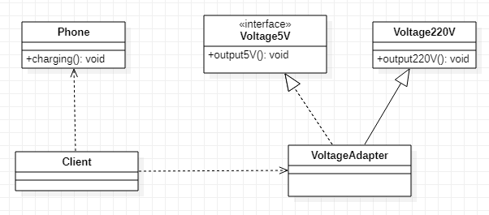
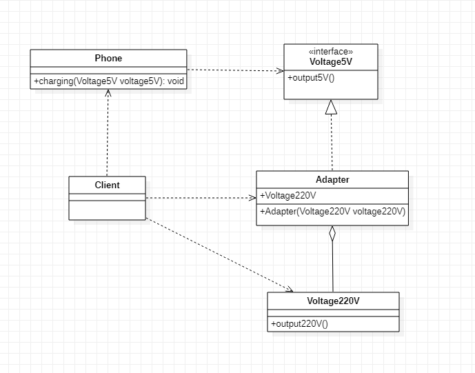
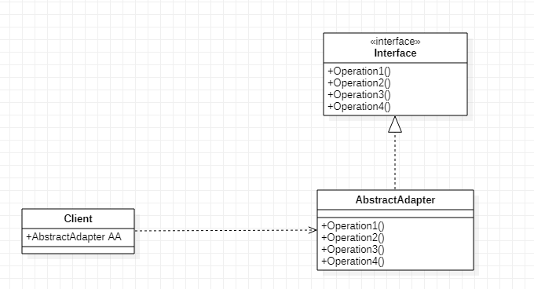
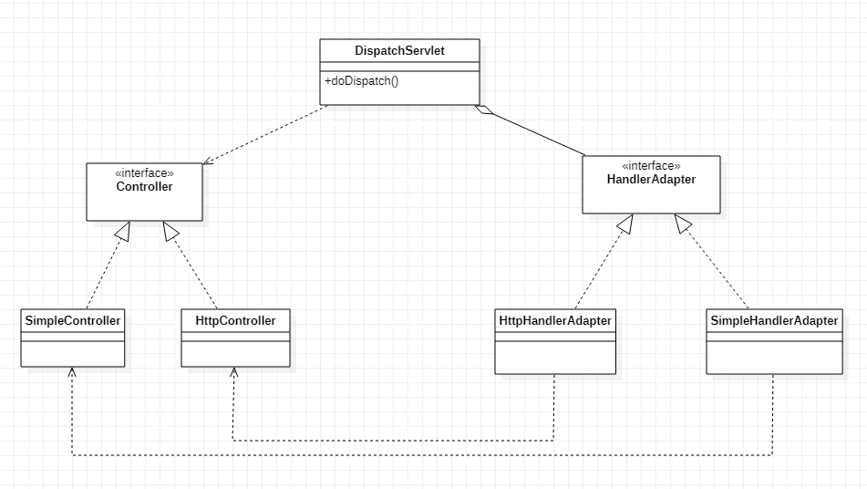

# 设计模式七大原则

## 单一职责原则

### 1、基本介绍

针对类，即**一个类应该只负责一项职责**。如类A负责两个不同职责：职责1，职责2。 当职责1需求变更而改变A时，可能造成职责2执行错误，所以需要将类A的粒度分解为 A1，A2

### 2、注意事项和细节

1. 降低类的复杂度，一个类只负责一项职责。
2. 提高类的可读性，可维护性。
3. 降低变更引起的风险。
4. 通常情况下，我们应当遵守单一职责原则，只有**逻辑足够简单**，才可以在代码级违反单一职责原则
5. 只有类中方法数量足够少，可以在方法级别保持单一职责原则

## 接口隔离原则

### 1、基本介绍

客户端不应该依赖它不需要的接口，即**一个类对另一个类的依赖应该建立在最小的接口上**。

## 依赖倒置原则

### 1、基本介绍

1. 高层模块不应该依赖低层模块，二者都应该依赖其抽象。
2. 抽象不应该依赖细节，细节应该依赖抽象。
3. 依赖倒转的中心思想是面向接口编程。
4. 依赖倒转原则是基于这样的设计理念：相对于细节的多变性，抽象的东西要稳定的多。以抽象为基础搭建的架构比以细节为基础的架构要稳定的多。在java中，抽象指的是接口或抽象类，细节就是具体的实现类。
5. 使用接口或抽象类的目的是制定好规范，而不涉及任何具体的操作，把展现细节的 任务交给他们的实现类去完成。

### 2、注意事项和细节

1. 低层模块尽量都要有抽象类或接口，或者两者都有，程序稳定性更好。
2. 变量的声明类型尽量是抽象类或接口，这样我们的变量引用和实际对象间，就存在一个缓冲层，利于程序扩展和优化。
3. 继承时遵循里氏替换原则。

## 里氏替换原则

### 1、前言

OO中的继承性的思考和说明：

- 继承包含这样一层含义：父类中实现的方法，实际上是一种规范与契约，如果子类对已实现的方法进行修改，会破坏继承体系。
- 继承会给程序设计带来便利，但是会给程序带来侵入性，导致程序移植性降低，增加对象的耦合性。例如修改一个父类，需要考虑到所有子类的功能会出现故障

### 2、基本介绍

1. 如果对每个类型为T1的对象o1，都有类型为T2的对象o2，使得以T1定义的所有程序 P在所有的对象o1都代换成o2时，程序P的行为没有发生变化，那么类型T2是类型T1 的子类型。换句话说，**所有引用基类的地方必须能透明地使用其子类的对象**。
2. 在使用继承时，遵循里氏替换原则，在子类中尽量不要重写父类的方法
3. 里氏替换原则告诉我们，继承实际上让两个类耦合性增强了，在适当的情况下，可以通过聚合，组合，依赖来解决问题。

### 3、解决方法

通用的做法是：原来的父类和子类都继承一个更通俗的基类，原有的继承关系去掉， 采用依赖，聚合，组合等关系代替。

## 开闭原则

### 1、基本介绍

1. 一个软件实体如类，模块和函数应该对扩展开放(对提供方)，对修改关闭(对使用方)。用抽象构建框架，用实现扩展细节。
2. 当软件需要变化时，尽量通过扩展软件实体的行为来实现变化，而不是通过修改已有的代码来实现变化。
3. 编程中遵循其它原则，以及使用设计模式的目的就是遵循开闭原则

## 迪米特法则

### 1、基本介绍

1. 一个对象应该对其他对象保持最少的了解。
2. 类与类关系越密切，耦合度越大。
3. 迪米特法则(Demeter Principle)又叫最少知道原则，即一个类对自己依赖的类知道的越少越好。也就是说，对于被依赖的类不管多么复杂，都尽量将逻辑封装在类的内部。对外除了提供的public方法，不对外泄露任何信息。
4. 迪米特法则还有个更简单的定义：只与直接的朋友通信

### 2、直接朋友

每个对象都会与其他对象有耦合关系，只要两个对象之间有耦合关系， 我们就说这两个对象之间是朋友关系。耦合的方式很多，依赖，关联，组合，聚合 等。其中，我们称出现**成员变量**，**方法参数**，**方法返回值**中的类为直接的朋友，而出现在**局部变量**中的类不是直接的朋友。也就是说，**陌生的类最好不要以局部变量的形式出现在类的内部**。

### 3、注意事项和细节

1. 迪米特法则的核心是降低类之间的耦合。
2. 但是注意：由于每个类都减少了不必要的依赖，因此迪米特法则只是要求降低类间(对象间)耦合关系， 并不是要求完全没有依赖关系。

## 合称复用原则

### 1、基本介绍

原则是尽量使用合成/聚合的方式，而不是使用继承

## 设计原则的核心思想

1. 找出应用中可能需要变化之处，把它们独立出来，不要和那些不需要变化的代 码混在一起。
2. 针对接口编程，而不是针对实现编程。
3. 为了交互对象之间的松耦合设计而努力

# UML类图

## 简介

1. 用于描述系统中的类(对象)本身的组成和类(对象)之间的各种静态关系。
2. 类之间的关系：**依赖**、**泛化**（继承）、**实现**、**关联**、**聚合**、**组合**。

## 六大关系

### 1、依赖关系

只要是在**类中用到了对方**，那么它们之间就存在依赖关系。如果没有对方，就连编译都通过不了。

- 类中用到了对方
- 类的成员属性
- 方法的返回类型
- 方法接收的参数类型
- 方法中使用到

```java
public class PersonServiceBean {
    //类
    private PersonDao personDao;
    public void save(Person person){}
    public IDCard getIDCard(Integer personid){}
    public void modify(){
        Department department = new Department();
    }
}
public class PersonDao{}
public class IDCard{}
public class Person{}
public class Department{}
```

### 2、泛化关系

泛化关系实际上就是**继承关系**，他是**依赖关系的特例**。

- 泛化关系实际上就是继承关系
- 如果A类继承了B类，我们就说A和B存在泛化关系

```java
public abstract class DaoSupport{
	public void save(Object entity){}
	public void delete(Object id){}
}
public class PersonServiceBean extends Daosupport{}
```

### 3、实现关系

实现关系实际上就是**A类实现B接口**，他也是**依赖关系的特例**。

```java
public interface PersonService {
	public void delete(Interger id);
}
public class PersonServiceBean implements PersonService {
	public void delete(Interger id){}
}
```

### 4、关联关系

关联关系实际上就是**类与类之间的联系**，他也是**依赖关系的特例**。

关联具有**导航性**：即双向关系或单向关系

关系具有**多重性**：如“1”（表示有且仅有一个），“0...”（表示0个或者多个）， “0，1”（表示0个或者一个），“n...m”(表示n到 m个都可以)，“m...*”（表示至少m 个）。

```java
//单向一对一关系
public class Person {
	private IDCard card;
}
public class IDCard{}

//双向一对一关系
public class Person {
	private IDCard card;
}
public class IDCard{
	private Person person
}
```

### 5、聚合关系

聚合关系（Aggregation）表示的是**整体和部分的关系**，整体与部分**可以分开**。聚合关系是**关联关系的特例**，所以他具有关联的导航性与多重性。

### 6、组合关系

组合关系：也是**整体与部分的关系**，但是整体与部分**不可以分开**。

```java
public class Person{
	private IDCard card;
	private Head head = new Head();
}
public class IDCard{}
public class Head{}
```

# 设计模式概述

## 简介

设计模式分为三种类型，共23种。

1. **创建型模式**：**单例模式**，抽象工厂模式，原型模式，建造者模式，**工厂模式**。
2. **构造型模式**：适配器模式，桥接模式，**装饰模式**，组合模式，外观模式，享元模式，**代理模式**。
3. **行为型模式**：模板方法模式，命令模式，访问者模式，迭代器模式，**观测者模式**，中介者模式，备忘录模式，解释器模式，状态模式，策略模式，责任连模式。

# 创建型

## 单例模式

### 简介

所谓类的单例设计模式，就是采取一定的方法保证在整个的软件系统中，对某个类**只能存在一个对象实例**，并且该类只提供一个取得其对象实例的方法(静态方法)。

比如Hibernate的SessionFactory，它充当数据存储源的代理，并负责创建Session 对象。SessionFactory并不是轻量级的，一般情况下，一个项目通常只需要一个 SessionFactory就够，这是就会使用到单例模式。

### 八种方式

1. **饿汉式（静态常量）**
2. **饿汉式（静态代码块）**
3. 懒汉式（线程不安全）
4. 懒汉式（线程安全，同步方法）
5. 懒汉式（线程安全，同步代码块）
6. **双重检查**
7. **静态内部类**
8. **枚举**

### 饿汉式（静态常量）

#### 步骤

1. **构造器私有化** (防止 new ) 
2. 类的内部创建对象 
3. 向外暴露一个静态的公共方法。getInstance()获取实例

```java
class one {
    private one(){}
    private static one instance = new one();
    public static one getInstance(){
        return instance;
    }
}
```

#### 优缺点

- 优点：
  - 这种写法比较简单，就是在类装载的时候就完成实例化。避免了线程同 步问题。
- 缺点：
  - 在类装载的时候就完成实例化，没有达到Lazy Loading的效果。如果从始 至终从未使用过这个实例，则会造成内存的浪费
- 这种方式基于**classloder机制**避免了多线程的同步问题，不过，instance在类装载时就实例化，在单例模式中大多数都是调用getInstance()方法， 但是导致类装载的原因有很多种，因此不能确定有其他的方式（或者其他的静态方法）导致类装载，这时候初始化instance就没有达到lazy loading的效果。

#### 结论

这种单例模式**可用**，可能造成**内存浪费**。

### 饿汉式（静态代码块）

#### 步骤

1. 构造器私有化
2. 在静态代码块执行时，创建单例对象
3. 向外暴露一个静态的公共方法。getInstance()获取实例

```java
class one {
    private one(){}
    private static one instance;
    static {
        instance = new one();
    }
    public static one getInstance(){
        return instance;
    }
}
```

#### 优缺点

- 这种方式和上面的方式其实类似，只不过将类实例化的过程放在了静态代码块中，也是在类装载的时候，就执行静态代码块中的代码，初始化类的实例。优缺点和上面是一样的

#### 结论

这种单例模式**可用**，但是可能造成**内存浪费**。

### 懒汉式（线程不安全）

#### 步骤

1. 构造器私有化
2. 向外暴露一个静态的公共方法。getInstance()获取实例
3. 在调用getInstance()方法时，才创建单例对象

```java
class one {
    private one(){}
    private static one instance;
    public static one getInstance(){
       if(instance == null) {
           instance = new one();
       }
        return instance;
    }
}
```

#### 优缺点

优点：

- 起到了**Lazy Loading**的效果，但是只能在单线程下使用。

缺点：

- 如果在多线程下，一个线程进入了if (singleton == null)判断语句块，还未来得及 往下执行，另一个线程也通过了这个判断语句，这时便会产生多个实例。所以在**多线程环境下不可使用这种方式**。

#### 结论

在实际开发中，**不要使用这种方式**。

### 懒汉式（线程安全，同步方法）

#### 步骤

1. 构造器私有化
2. 向外暴露一个静态的公共方法。getInstance()获取实例
3. 在调用getInstance()方法时，才创建单例对象
4. 给getInstance()方法加入synchronized同步代码

```java
class one {
    private one() {}
    private static one instance;
    public static synchronized one getInstance() {
       if(instance == null) {
           instance = new one();
       }
        return instance;
    }
}
```

#### 优缺点

优点：

- 解决了线程不安全问题

缺点：

- 效率太低了，每个线程在想获得类的实例时候，执行getInstance()方法都要进行同步。而其实这个方法只执行一次实例化代码就够了，后面的想获得该类实例， 直接return就行了。方法进行**同步效率太低**。

#### 结论

在实际开发中，**不推荐**使用这种方式

### 懒汉式（线程安全，同步代码块）

#### 步骤

1. 构造器私有化
2. 向外暴露一个静态的公共方法。getInstance()获取实例
3. 在调用getInstance()方法时，才创建单例对象
4. 给创建实例的过程加入synchronized同步代码块

```java
class one {
    private one() {}
    private static one instance;
    public static one getInstance() {
       if(instance == null) {
           synchronized(one.class) {
               instance = new one();
           }
       }
        return instance;
    }
}
```

#### 优缺点

优点：

- 无

缺点：

- 这种方式，本意是想对第四种实现方式的改进，因为前面同步方法效率太低， 改为同步产生实例化的的代码块。

- 但是这种同步并**不能起到线程同步的作用**。跟第3种实现方式遇到的情形一 致，假如一个线程进入了if (singleton == null)判断语句块，还未来得及往下执行， 另一个线程也通过了这个判断语句，这时便会产生多个实例。

#### 结论

在实际开发中，**不能使用**这种方式

### 双重检查

#### 步骤

1. 构造器私有化
2. 向外暴露一个静态的公共方法。getInstance()获取实例
3. 给实例添加volatile同步
4. 在调用getInstance()方法时，才创建单例对象
5. 在创建之前检查是否存在实例
6. 给创建实例的过程加入synchronized同步代码块
7. 在同步代码块下一步再次检查是否存在实例

```java
class one {
    private static volatile one instance;
    private one() {}
    public static one getInstance() {
        if(instance == null) {
            synchronized(one.class) {
                if(instance == null) {
                    instance = new one();
                }
            }
        }
        return instance;
    }
}
```

#### 优缺点

优点：

- Double-Check概念是多线程开发中常使用到的，如代码中所示，我们进行了两 次if (singleton == null)检查，这样就可以保证线程安全了。
- 这样，实例化代码只用执行一次，后面再次访问时，判断if (singleton == null)， 直接return实例化对象，也避免的反复进行方法同步。
- 线程安全、延迟加载、效率较高

缺点：

- 无

#### 结论

在实际开发中，**推荐**使用这种单例设计模式

### 静态内部类

#### 步骤

1. 构造器私有化
2. 创建静态内部类，在静态内部类内直接创建外部类的私有化静态实例
3. 向外部暴露一个getInstance()方法获取实例

```java
class one {
    private one() {}
    private static class oneInstance {
        private static final one instance = new one();
    }
    public static one getInstance() {
        return oneInstance.instance;
    }
}
```

#### 优缺点

优点：

- 这种方式采用了**类装载的机制**来保证初始化实例时只有一个线程。
- 静态内部类方式在Singleton类被装载时并不会立即实例化，而是在需要实例化时，调用getInstance()方法，才会装载SingletonInstance类，从而完成Singleton的实例化。
- 类的静态属性只会在第一次加载类的时候初始化，所以在这里，JVM帮助我们保证了线程的安全性，在类进行初始化时，别的线程是无法进入的。
- 避免了线程不安全，利用静态内部类特点实现延迟加载，效率高

缺点：

- 无

#### 结论

推荐使用

### 枚举

#### 步骤

1. 创建一个枚举类
2. 在枚举类内设置一个常量INSTANCE
3. 创建一个公开的方法获取

```java
eunm one {
    INSTANCE;
    public void method() {
        //方法
    }
}
```

#### 优缺点

优点：

- 这借助JDK1.5中添加的枚举来实现单例模式。不仅能避免多线程同步问题，而 且还能防止反序列化重新创建新的对象。
- 这种方式是Effective Java作者Josh Bloch **提倡**的方式

#### 结论

**推荐**使用

### 单例模式在JDK应用的源码分析

java.lang.Runtime就是经典的单例模式（饿汉式）

### 单例模式注意事项和细节说明

1. 单例模式保证了系统内存中该类只存在一个对象，节省了系统资源，对于一些需 要频繁创建销毁的对象，使用单例模式可以提高系统性能 
2. 当想实例化一个单例类的时候，必须要记住使用相应的获取对象的方法，而不是使 用new 
3. 单例模式使用的场景：需要频繁的进行创建和销毁的对象、创建对象时耗时过多或耗费资源过多(即：重量级对象)，但又经常用到的对象、工具类对象、频繁访问数据库或文件的对象(比如数据源、session工厂等)

## 工厂模式

### 简单工厂模式

#### 基本介绍

1. 简单工厂模式是属于创建型模式，是**工厂模式的一种**。简单工厂模式是**由一个工厂对象决定创建出哪一种产品类的实例**。简单工厂模式是工厂模式家族中最简单实用的模式。
2. 简单工厂模式：定义了一个创建对象的类，由这个类来封装实例化对象的行为(代码)。
3. 在软件开发中，当我们会用到大量的创建某种、某类或者某批对象时，就会使用到工厂模式。

#### 设计方案

1. 定义一个可以实例化对象的类，封装创建对象的代码
2. 修改申请创建对象的类，使用简单工厂模式来创建对象，更加的方便灵活

```java
public class SimpleFactory { 
    public Some createSome(String type) {
        System.out.println("使用简单工厂模式~~");
        Some some = null;
        if (type.equals("cheese")) {
            some = new ASome();
        } else if (type.equals("greek")) {
            some = new BSome();
        } else if (type.equals("pepper")) {
            some = new CSome();
        }
        return some;
    }
}
```


### 工厂方法模式

#### 基本介绍

定义了一个创建对象的抽象方法，**由子类决定要实例化的类**。工厂方法模式将**对象的实例化推迟到子类**。

#### 设计方案

1. 将项目的**实例化功能抽象成抽象方法**，在不同的具体子类中具体实现。

```java
public abstract class getSome {
    public getSome() {
        Some some = null;
        String someType;
        do {
            someType = someType();
            //调用创建实例方法
            some = createSome(someType);
            if (some != null) {
                some.prepare();
                some.bake();
                some.cut();
                some.box();
            } else {
                break;
            }
        } while (true);
    }
    //抽象的创建实例方法，由子类决定创建何种实例
    abstract Some createSome(String someType);
}
```

```java
//具体子类实现父类
public class AgetSome extends getSome {
    @Override
    Pizza createSome(String someType) {
        Some some = null;
        if (someType.equals("cheese")) {
            some = new ASome();
        } else if (someType.equals("pepper")) {
            some = new BSome();
        }
        return some;
    }
}
```


### 抽象工厂模式

#### 基本介绍

- 抽象工厂模式可以将**简单工厂模式**和**工厂方法模式**进行整合。
- 从设计层面看，抽象工厂模式就是对简单工厂模式的改进(或者称为**进一步的抽象**)。

#### 设计方案

- 抽象工厂模式：定义了一个**interface接口**用于**创建相关或有依赖关系的对象簇**，而无需指明具体的类
- 将工厂抽象成两层，**AbsFactory(抽象工厂)** 和**具体实现的工厂子类**。程序员可以**根据创建对象类型使用对应的工厂子类**。这样将单个的简单工厂类变成了工厂簇， 更利于代码的维护和扩展。

```java
//声明AbsFactory接口
public interface AbsFactory {
    //让不同的工厂类来实现createSome方法
    public Some createSome(String someType);
}
```

```java
//继承AbsFactory的具体子类，由它决定具体生成什么子类
public class BFactory implements AbsFactory {
    @Override
    public Some createSome(String someType) {
        Some some = null;
        if (someType.equals("cheese")) {
            some = new BCSome();
        } else if (someType.equals("pepper")) {
            some = new BPSome();
        }
        return some;
    }
}
```

```java
public class getSome {
    //声明抽象类
    AbsFactory factory;
    //构造器
    public getSome(AbsFactory factory) {
        setFactory(factory);
    }
    public void setFactory(AbsFactory factory) {
        Some some = null;
        String someType;
        this.factory = factory;
        do {
            someType = gettype();
            some = factory.createSome(someType);
            if (some != null) {
                some.prepare();
                some.bake();
                some.cut();
                some.box();
            } else {
                break;
            }
        } while (true);
    }
}
```


### 工厂模式在JDK-Calendar应用

1. JDK中的Calendar类中，使用了**简单工厂模式**。

### 工厂模式小结

1. 工厂模式的意义：将实例化对象的代码提取出来，放到一个类中统一管理和维护，达到和主项目的依赖关系的解耦。从而提高项目的扩展和维护性。
2. 三种工厂模式 (简单工厂模式、工厂方法模式、抽象工厂模式)
3. 设计模式的依赖抽象原则

### 注意事项

1. 创建对象实例时，不要直接 new 类， 而是把这个new 类的动作放在一个工厂的方法中，并返回。有的书上说，变量不要直接持有具体类的引用。
2. 不要让类继承具体类，而是继承抽象类或者是实现interface(接口)
3. 不要覆盖基类中已经实现的方法。

## 原型模式

### 基本介绍

- 原型模式(Prototype模式)是指：用**原型实例**指定创建对象的种类，并且通过拷贝这些原型，创建新的对象。
- 原型模式是一种**创建型设计模式**，允许一个对象再创建另外一个可定制的对象，无需知道如何创建的细节。
- 工作原理是：通过将一个原型对象传给那个要发动创建的对象，这个要发动创建的对象通过请求原型对象拷贝它们自己来实施创建，即对象.clone()；


原理结构图说明：

- Prototype：原型类，声明一个克隆自己的接口
- ConcretePrototype：具体的原型类，实现一个克隆自己的操作
- Client：让一个原型对象克隆自己，从而创建一个新的对象（属性相同）

### 设计方案

- 需要被克隆的类，实现Cloneable接口。
  - 浅克隆需求：默认即可
  - 深克隆需要求：
    - 重写克隆方法，手动为属性进行克隆
    - 使用序列化机制

```java
public class Sheep implements Cloneable {
    private String name;
    private int age;private String color;
    private String address="蒙古羊";
    public Sheep friend;// 是对象，克隆是会如何处理？默认是浅拷贝
    
    public Sheep(String name, int age, String color){
        super();
        this.name = name;
        this.age = age;
        this.color = color;
    }
	// ......set、get、toString方法
    // 克隆该实例，使用默认的克隆方法
    @Override
    protected Object clone() {
        Sheep sheep= null;
        try {
            sheep =(Sheep)super.clone();
        }catch (Exception e){
            System.out.println(e.getMessageO);
        }
        return sheep;
    }
}
```

### 原型模式在Spring中的应用

Spring 中原型Bean的创建，就是原型模式的应用

### 浅拷贝与深拷贝

- 对于数据类型是**基本数据类型**的成员变量，浅拷贝会直接进行**值传递**，也就是将该属性值复制一份给新的对象。
- 对于数据类型是**引用数据类型**的成员变量，比如说成员变量是某个数组、某个类的对象等，那么浅拷贝会进行**引用传递**，也就是只是将该成员变量的引用值（内存地址)复制一份给新的对象。因为实际上两个对象的该成员变量都指向同一个实例。在这种情况下，在一个对象中修改该成员变量会影响到另一个对象的该成员变量值

- 浅拷贝是使用默认的clone()方法来实现sheep= (Sheep) super.clone();

### 深拷贝简介

- 复制对象的所有基本数据类型的成员变量值
- 为所有引用数据类型的成员变量申请存储空间，并复制每个引用数据类型成员变量所引用的对象，直到该对象可达的所有对象。也就是说，对象进行深拷贝要对整个对象(包括对象的引用类型)进行拷贝
- 深拷贝实现方式1:重写**clone方法**来实现深拷贝
- 深拷贝实现方式2:通过**对象序列化**实现深拷贝(**推荐**)

### 深拷贝应用实例

```java
public class DeepCloneableTarget implements Serializable, Cloneable { 
    private static final long serialVersionUID=1L;
    private String cloneName;
    private String cloneClass;
    
    public DeepCloneableTarget(String cloneName, String cloneClass){
        this.cloneName = cloneName;
        this.cloneClass = cloneClass;
    }
    
    // 因为该类的属性都是基础数据类型，所以直接调用clone方法即可
    @Override
    protected Object clone() throws CloneNotSupportedException {
        return super.clone();
    }
}
```

```java
public class DeepProtoType implements Serializable,Cloneable{
    //String 属性
    public String name;
    //引用类型
    public DeepCloneableTarget deepCloneableTarget;
    public DeepProtoType() {
        super();
    }
    
    // 深拷贝：方式一，重写clone方法
    @Override
	protected Object clone() throws CloneNotSupportedException { 
		Object deep= null;
		// 这里完成对基本数据类型(属性)和 String 的克隆
        deep = super.clone();
        // 对引用类型的属性，进行单独处理
        DeepProtoType deepProtoType =(DeepProtoType)deep;
		deepProtoType.deepCloneableTarget =(DeepCloneableTarget)deepCloneableTarget.clone();
		return deepProtoType;
    }
    // 深拷贝：方式二，序列化
    // 先将对象序列化，在通过反序列化得到一个新对象
    public Object deepClone() {
		// 创建流对象
		ByteArrayOutputStream bos = null;
        ObjectOutputStream oos = null;
        ByteArrayInputStream bis = null;
        ObjectInputStream ois = null;
		try {
			// 序列化
			bos = new ByteArrayOutputStream();
            oos= new ObjectOutputStream(bos);
            // 当前这个对象以对象流的方式输出
			oos.writeObject(this);
            
			// 反序列化
			bis = new ByteArrayInputStream(bos.toByteArray());
            ois = new ObjectInputStream(bis);
			DeepProtoType copyObj = (DeepProtoType) ois.readObject();
			return copyObj;   
        } catch (Exception e){ 
        	e.printStackTrace();
            return null;
        } finally {
            //关闭流
            try {
				bos.close();
                oos.close();
                bis.close();
                ois.close();
			} catch (Exception e2) {
				System.out.println(e2.getMessageO);
			}
        }
}
```

### 注意事项

- 创建新的对象比较复杂时，可以利用原型模式简化对象的创建过程，同时也能够提高效率。
- 不用重新初始化对象，而是动态地获得对象运行时的状态。
- 如果原始对象发生变化(增加或者减少属性)，其它克隆对象的也会发生相应的变化，无需修改代码。
- 在实现深克隆的时候可能需要比较复杂的代码
- 缺点：需要为每一个类配备一个克隆方法，这对全新的类来说不是很难，但对已有的类进行改造时，需要修改其源代码，违背了ocp 原则。

## 建造者模式

### 基本介绍

- 建造者模式(Builder Pattern）又叫**生成器模式**，是一种对象构建模式。它可以将复杂对象的建造过程抽象出
  来（抽象类别)，使这个抽象过程的不同实现方法可以构造出不同表现（属性）的对象。
- 建造者模式是一步一步创建一个复杂的对象，它允许用户只通过指定复杂对象的类型和内容就可以构建它们，
  用户不需要知道内部的具体构建细节。

### 四个角色

- **Product**（产品角色)：一个具体的产品对象。
- **Builder**（抽象建造者）：创建一个Product对象的各个部件指定的接口/抽象类。
- **ConcreteBuilder**（具体建造者）：实现接口，构建和装配各个部件。
- **Director**（指挥者）：构建一个使用 Builder接口的对象。它主要是用于创建一个复杂的对象。它主要有两个作
  用，一是：隔离了客户与对象的生产过程，二是：负责控制产品对象的生产过程。


```java
public class Client {
    public static void main(String[] args) {
        // 盖普通房子
        CommonHouse commonHouse= new CommonHouse();
        // 准备创建房子的指挥者
        HouseDirector houseDirector = new HouseDirector(commonHouse);
        // 完成盖房子，返回产品(普通房子)
        House house = houseDirector.constructHouse();
        
        // 盖高楼
        HighBuilding highBuilding = new HighBuilding();
        // 重置建造者
        houseDirector.setHouseBuilder(highBuilding);
        // 完成盖房子，返回产品(高楼)
        houseDirector.constructHouse();
    }
}

// 抽象的建造者
public abstract class HouseBuilder {
    // 创建新产品
    protected House house = new House();
    // 将建造的流程写好，抽象的方法
	// .......
    // 返回建造好的产品
    public House buildHouse() {
        return house;
    }

}

// 具体的建造者
public class CommonHouse extends HouseBuilder {
    // 具体流程
    // ................
    // 返回
}
public class HighBuilding extends HouseBuilder {
    ................
}

// 产品
public class House {
    // 具体流程
    // ................
    // 返回
}

public class HouseDirector {
    // 需要具体的建造者
    HouseBuilder houseBuilder = null;
    // 构造器传入 houseBuilder
    public HouseDirector(HouseBuilder houseBuilder){
        this.houseBuilder = houseBuilder;
    }
    // 通过setter传入 houseBuilder
    public void setHouseBuilder(HouseBuilder houseBuilder){
        this.houseBuilder = houseBuilder;
    }
    
    // 如何处理建造房子的流程，交给指挥者
    public House constructHouse( {
		// 执行具体的
        // .........流程
        // 返回结果
        return houseBuilder.buildHouse();
    }

}
```

## 在JDK的应用和源码分析

java.lang.StringBuilder 中的建造者模式

- Appendable接口定义了多个append方法(抽象方法)，即Appendable为抽象建造者，定义了抽象方法
- AbstractStringBuilder实现了Appendable接口方法，这里的 AbstractStringBuilder已经是建造者，只是不能实例化
- StringBuilder即充当了指挥者角色，同时充当了具体的建造者，建造方法的实现是由 AbstractStringBuilder 完成，而StringBuilder继承了AbstractStringBuilder

## 注意事项

- 客户端（使用程序）不必知道产品内部组成的细节，将产品本身与产品的创建过程解耦，使得相同的创建过程可以创建不同的产品对象。
- 每一个具体建造者都相对独立，而与其他的具体建造者无关，因此可以很方便地替换具体建造者或增加新的具体建造者，用户使用不同的具体建造者即可得到不同的产品对象。
- 可以更加精细地控制产品的创建过程。将复杂产品的创建步骤分解在不同的方法中，使得创建过程更加清晰，也更方便使用程序来控制创建过程。
- 增加新的具体建造者无须修改原有类库的代码，指挥者类针对抽象建造者类编程，系统扩展方便，符合“开闭原则”。
- 建造者模式所创建的产品一般具有较多的共同点，其组成部分相似，如果产品之间的差异性很大，则不适合使用建造者模式，因此其使用范围受到一定的限制。
- 如果产品的内部变化复杂，可能会导致需要定义很多具体建造者类来实现这种变化，导致系统变得很庞大，因此在这种情况下，要考虑是否选择建造者模式。

## 抽象工厂模式VS建造者模式

抽象工厂模式实现对产品家族的创建，一个产品家族是这样的一系列产品：具有不同分类维度的产品组合，采用抽象工厂模式不需要关心构建过程，只关心什么产品由什么工厂生产即可。而建造者模式则是要求按照指定的蓝图建造产品，它的主要目的是通过组装零配件而产生一个新产品。

# 构造型

## 适配器模式

### 基本介绍

- 适配器模式(Adapter Pattern) 将某个类的接口转换成客户端期望的另一个接口表示，主的目的是兼容性，让原本因接口不匹配不能一起工作的两个类可以协同工作。其别名为包装器(Wrapper)
- 适配器模式属于结构型模式
- 主要分为三类:**类**适配器模式、**对象**适配器模式、**接口**适配器模式

### 工作原理

- 适配器模式：将一个类的接口转换成另一种接口，让原本接口不兼容的类可以兼容。
- 从用户的角度看不到被适配者，是解耦的。
- 用户调用适配器转化出来的目标接口方法，适配器再调用被适配者的相关接口方法。
- 用户收到反馈结果，感觉只是和目标接口交互。

### 类适配器模式

#### 基本介绍

Adapter类，通过继承src类，实现dst类接口，完成src----->dst的适配。

#### 设计方案

1. 创建适配器类，其继承被适配器类，实现适配接口
2. 创建调用适配器类的主类，将适配器类传入



```java
public class Client {
    public static void main(String[] args){
        Phone phone = new Phone();
        // 传入适配器
        phone.charging(new VoltageAdapter());
    }
}

// 适配接口
public interface Voltage5V{
    // 适配方法
    public int output5vo;
}

// 被适配的类
public class Voltage220V {
	// 输出220V的电压
    public int output220V(){
		int src = 220;
        return src;
    }
}

// 适配器类
public class VoltageAdapter extends Voltage220V implements Voltage5V {
	@Override
	public int output5V(){
		// 获取到220V电压
		int srcV =output220V();
		int dstV = srcV / 44;
   		return dstV;
	}
}

// 具体调用类
public class Phone {
    // 传入适配接口
    public void charging(Voltage5V Voltage5V){
        if(iVoltage5V.output5V()== 5){
            System.out.println("电压为5V，可以充电~~");
        } else if (iVoltage5V.output5V() > 5){
            System.out.println("电压大于5V，不能充电~~");
        }
    }
}
```

#### 注意事项

- Java是单继承机制，所以类适配器需要继承src类这一点算是一个缺点，因为这要求dst必须是接口，有一定局限性。
- src类的方法在Adapter中都会暴露出来，也增加了使用的成本。
- 由于其继承了src类，所以它可以根据需求重写src类的方法，使得Adapter的灵活性增强了。

### 对象适配器模式

#### 基本介绍

- 基本思路和类的适配器模式相同，只是将Adapter类作修改，不是继承src类，而是持有src类的实例，以解决兼容性的问题。即持有src类，实现 dst类接口，完成src--->dst的适配
- 根据“合成复用原则”，在系统中尽量使用关联关系（聚合）来着代继承关系。
- 对象适配器模式是适配器模式常用的一种。

#### 设计方案

1. 和类适配器差不多



```java
public class Client {
    public static void main(String[] args){
        Phone phone = new Phone();
        // 传入适配器与被适配类
        phone.charging(new VoltageAdapter(new Voltage220V()));
    }
}

// 适配接口
public interface Voltage5V{
    // 适配方法
    public int output5vo;
}

// 被适配的类
public class Voltage220V {
	// 输出220V的电压
    public int output220V(){
		int src = 220;
        return src;
    }
}

// 适配器类
public class VoltageAdapter implements Voltage5V {
    private Voltage220V voltage220V;
    
    // 通过构造函数传入被适配类实例
    public VoltageAdapter(Voltage220V voltage220V){
        this.voltage220V = voltage220V;
    }
    
	@Override
	public int output5V(){
		// 获取到220V电压
        // 聚合关系
		int srcV =voltage220V.output220V();
		int dstV = srcV / 44;
   		return dstV;
	}
}

// 具体调用类
public class Phone {
    // 传入适配接口
    public void charging(Voltage5V Voltage5V){
        if(iVoltage5V.output5V() == 5){
            System.out.println("电压为5V，可以充电~~");
        } else if (iVoltage5V.output5V() > 5){
            System.out.println("电压大于5V，不能充电~~");
        }
    }
}

```

#### 注意事项

- 对象适配器和类适配器其实算是同一种思想，只不过实现方式不同。
- 根据合成复用原则，使用组合替代继承，所以它解决了类适配器必须继承src的局限性问题，也不再要求dst必须是接口。
- 使用成本更低，更灵活。

### 接口适配器模式

#### 基本介绍

- 一些书籍称为：适配器模式(Default Adapter Pattern)或缺省适配器模式。
- 核心思路：当不需要全部实现接口提供的方法时，可先设计一个抽象类实现接口，并为该接口中每个方法提供一个默认实现（空方法），那么该抽象类的子类可有选择地覆盖父类的某些方法来实现需求。
- 适用于一个接口不想使用其所有的方法的情况。

#### 设计方案

1. 设计一个抽象接口
2. 设计一个抽象类，默认实现抽象接口所有方法，均为方法
3. 在调用处，实现特定的方法



```java
public interface Interface {
    public void m1();
    public void m2();
    public void m3();
    public void m4();
}

public abstract class AbsAdapter implements Interface {
    // 默认空方法实现
    public void m1(){};
    public void m2(){};
    public void m3(){};
    public void m4(){};
}

public class Client {
    public static void main(String[] args) {
        
        AbsAdapter absAdapter = new AbsAdapter() {
			// 只需要去覆盖我们需要使用接口方法
    		@Override
			public void m1() {
				System.out.println("使用了m1的方法");
			}
		};
        
        absAdapter.m1();
    }
}
```

### SpringMVC框架应用的源码剖析

- SpringMvc 中的HandlerAdapter，就使用了适配器模式
- 使用HandlerAdapter的原因分析：可以看到处理器的类型不同，有多重实现方式，那么调用方式就不是确定的，如果需要直接调用Controller方法，需要调用的时候就得不断使用if else 来进行判断是哪一种子类然后执行。那么如果后面要扩展Controller，就得修改原来的代码，这样违背了OCP原则。

说明：

- Spring定义了一个适配接口，使得每一种Controller有一种对应的适配器实现类。
- 适配器代替controller执行相应的方法。
- 扩展Controller时，只需要增加一个适配器类就完成了SpringMVC的扩展了。



```java
// Controller接口
public interface Controller {

}
// 多种Controller类
// Controller接口实现
class HttpController implements Controller {
	public void doHttpHandler() {
		System.out.println("http...");
	}
}

// Controller接口实现
class SimpleController implements Controller {
	public void doSimplerHandler() {
		System.out.println("simple...");
	}
}

package com.atguigu.spring.springmvc;

// 定义一个Adapter接口 
public interface HandlerAdapter {
	public boolean supports(Object handler);

	public void handle(Object handler);
}
// 多种适配器类
// Adapter接口实现类
class SimpleHandlerAdapter implements HandlerAdapter {

	public void handle(Object handler) {
		((SimpleController) handler).doSimplerHandler();
	}

	public boolean supports(Object handler) {
		return (handler instanceof SimpleController);
	}

}
// Adapter接口实现类
class HttpHandlerAdapter implements HandlerAdapter {

	public void handle(Object handler) {
		((HttpController) handler).doHttpHandler();
	}

	public boolean supports(Object handler) {
		return (handler instanceof HttpController);
	}

}


public class DispatchServlet {
	// 保存所有HandlerAdapter
	public static List<HandlerAdapter> handlerAdapters = new ArrayList<HandlerAdapter>();

	public DispatchServlet() {
		handlerAdapters.add(new HttpHandlerAdapter());
		handlerAdapters.add(new SimpleHandlerAdapter());
	}

	public void doDispatch() {

		// 此处模拟SpringMVC从request取handler的对象，
		// 适配器可以获取到希望的Controller
        // SimpleController controller = new SimpleController();
		HttpController controller = new HttpController();
		
        
		// 将Controller传入得到对应适配器
		HandlerAdapter adapter = getHandler(controller);
		// 通过适配器执行对应的controller对应方法
		adapter.handle(controller);

	}

    // 获取到对应的适配器
	public HandlerAdapter getHandler(Controller controller) {
		//遍历：根据得到的controller(handler), 返回对应适配器
		for (HandlerAdapter adapter : this.handlerAdapters) {
            // 根据适配器的supports方法判断
			if (adapter.supports(controller)) {
				return adapter;
			}
		}
		return null;
	}

	public static void main(String[] args) {
		new DispatchServlet().doDispatch(); // http...
	}

}
```

### 注意事项

- 三种命名方式，是根据 src是以怎样的形式给到Adapter (在 Adapter 里的形式）来命名的。
- 类适配器：以类给到，在Adapter 里，就是将src当做类，继承。
- 对象适配器：以对象给到，在Adapter里，将src作为一个对象，持有。
- 接口适配器：以接口给到，在 Adapter 里，将src作为一个接口，实现Adapter模式最大的作用还是将原本不兼容的接口融合在一起工作。
- 实际开发中，实现起来不拘泥于我们讲解的三种经典形式。


