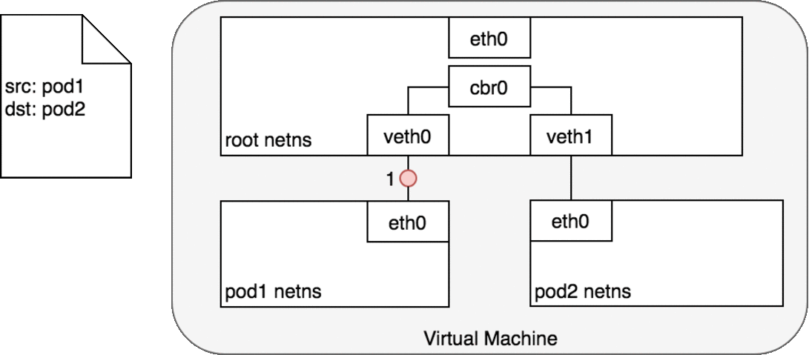
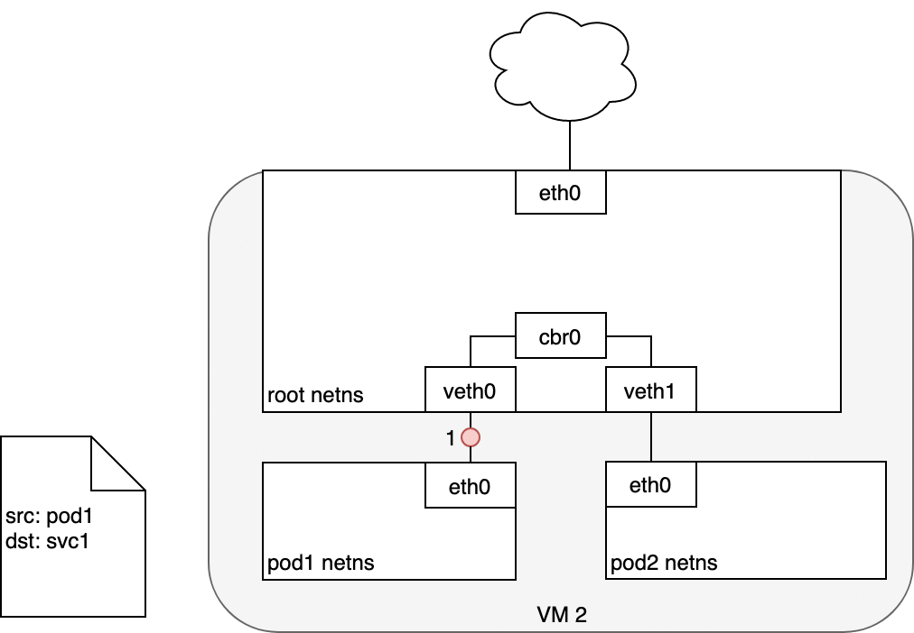
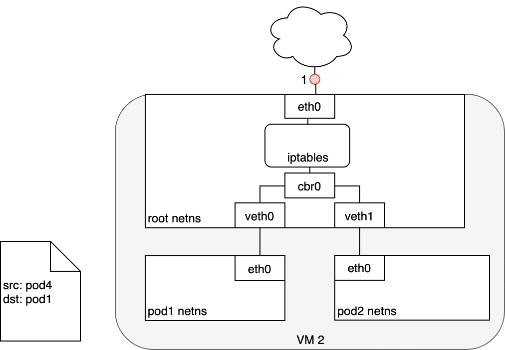

# 1、Kubernetes 简介

## 1、基本介绍

Kubernetes  用于管理云平台中多个主机上的容器化应用，其目标是让部署容器化应用变得更简单且高效

Kubernetes  提供了应用部署、规划、更新、维护的一种机制

容器化与传统对比：

- 传统的应用部署方式是通过插件或脚本来安装，这样做的缺点是应用的运行、配置、管理、生存周期与当前操作系统绑定，不利于应用的升级更新、回滚等操作。虽然可以通过创建虚拟机的方式来实现某些功能，但是虚拟机非常重，并不利于可移植性
- 新的方式是通过将应用容器化进行部署，每个容器之间互相隔离，每个容器有自己的文件系统，容器之间进程不会相互影响，能区分计算资源。相对于虚拟机，容器能快速部署，并且由于容器与底层设施、机器文件系统解耦的，所以它能在不同的云、操作系统间进行迁移

容器的优点：

- 需要资源少、部署快
- 每个应用可以被打包成一个容器镜像，使得应用与容器之间是一对一的关系，不需要与其他应用堆栈进行组合
- 不依赖于生产环境基础结构，使得测试、生产能提供一致环境
- 便于监控与管理


架构说明：

- 核心层：Kubernetes 最核心的功能，对外提供 API 构建高层的应用，对内提供插件式应用执行环境

- 应用层：部署（无状态应用、有状态应用、批处理任务、集群应用等）和路由（服务发现、DNS 解析等）

- 管理层：系统度量（如基础设施、容器和网络的度量），自动化（如自动扩展、动态 Provision 等）以及策略管理（RBAC、Quota、PSP、NetworkPolicy 等）

- 接口层：kubectl 命令行工具、客户端 SDK 以及集群联邦

- 生态系统：在接口层之上的庞大容器集群管理调度的生态系统，可以划分为两个范畴

  - Kubernetes 外部：日志、监控、配置管理、CI、CD、Workflow、FaaS、OTS 应用、ChatOps 等

  - Kubernetes 内部：CRI、CNI、CVI、镜像仓库、Cloud Provider、集群自身的配置和管理等

部分生态：


## 2、功能

**自动装箱**：基于容器对应用运行环境的资源配置要求，自动部署应用容器

**自我修复**：当容器失败时，会对容器进行重启，当所部署的 Node 节点出错，会对容器进行重新部署和重新调度，当容器未通过监控检查时，会关闭此容器直到容器正常运行，才对外提供服务

**水平扩展**：通过简单的命令、用户 UI 或基于 CPU 等资源使用情况，对容器进行规模扩大或剪裁

**服务发现**：用户不需使用额外的服务发现机制，只需要基于 Kubernetes 自身能力实现服务发现和负载均衡

**滚动更新**：可以根据应用的变化，对运行的应用容器，进行一次性或批量式更新

**版本回退**：可以根据应用部署情况，对运行的应用容器，进行历史版本的即时回退

**密钥和配置管理**：在不需要重新构建镜像的情况下，可以部署和更新密钥和应用配置，类似热部署

**存储编排**：自动实现存储系统挂载及应用，特别对有状态应用实现数据持久化非常重要，存储系统可以来自于本地目录、网络存储(NFS、Gluster、Ceph 等)、公共云存储服

**批处理**：提供一次性任务，定时任务，满足批量数据处理和分析的场景


**应用部署架构分类**：

- **无中心**：GlusterFS
- **有中心**：HDFS、K8S


## 3、架构

### 1、Master

#### 1、概述

集群控制节点，对集群进行调度管理，接受集群外用户的集群操作请求，Master Node 由 API Server、Scheduler、ClusterState Store（etcd 数据库）和 Controller Manger Server 所组成

Master 节点是集群的控制平台（control plane）：负责集群中的全局决策（例如：调度），探测并响应集群事件（例如：当 Deployment 的实际 Pod 副本数未达到 replicas 字段的规定时，启动一个新的 Pod）

Master 节点组件可以运行于集群中的任何机器上，但是通常在同一台机器上运行所有的 Master 组件，且不在此机器上运行用户的容器


#### 2、组件

##### 1、kube-apiserver

提供 Kubernetes API，提供集群管理的 REST API 接口，包括认证授权、数据校验、集群状态变更等

提供其他模块之间的数据交互和通信的枢纽（其他模块通过 API Server 查询或修改数据，只有 API Server 才直接操作 etcd），kubectl / kubernetes dashboard 等 Kubernetes 管理工具就是通过 kubernetes API 实现对 Kubernetes 集群的管理

Kubernetes 控制平台的前端（front-end）可以水平扩展（通过部署更多的实例以达到性能要求）

**访问控制**：Kubernetes API 的每个请求都会经过多阶段的访问控制之后才会被接受，这包括认证、授权、准入控制等


**认证**：开启 TLS 时，所有的请求都需要首先认证，Kubernetes 支持多种认证机制，并支持同时开启多个认证插件（只要有一个认证通过即可），如果认证成功，则用户的 username 会传入授权模块做进一步授权验证，而对于认证失败的请求则返回 HTTP 401

> Kubernetes 不直接管理用户，虽然 Kubernetes 认证和授权用到了 username，但 Kubernetes 并不直接管理用户，不能创建 user 对象，也不存储 username

**授权**：认证之后的请求就到了授权模块，跟认证类似，Kubernetes 也支持多种授权机制，并支持同时开启多个授权插件（只要有一个验证通过即可），如果授权成功，则用户的请求会发送到准入控制模块做进一步的请求验证，而对于授权失败的请求则返回 HTTP 403


##### 2、etcd

支持一致性和高可用的名值对存储组件，Kubernetes 集群的所有配置信息都存储在 etcd 中


##### 3、kube-scheduler

监控所有新创建尚未分配到节点上的 Pod，并且自动选择为 Pod 选择一个合适的节点去运行

影响调度的因素有：
- 单个或多个 Pod 的资源需求
- 硬件、软件、策略的限制
- 亲和与反亲和（affinity and anti-affinity）的约定
- 数据本地化要求
- 工作负载间的相互作用


##### 4、kube-controller-manager

运行了所有的控制器，逻辑上来说，每一个控制器是一个独立的进程，但是这些控制器都被合并运行在一个进程里

包含的控制器有：
- 节点控制器： 负责监听节点停机的事件并作出对应响应（下文 Node 篇有简要介绍）
- 副本控制器： 负责为集群中每一个 副本控制器对象（Replication Controller Object）维护期望的 Pod 副本数
- 端点（Endpoints）控制器：负责为端点对象（Endpoints Object，连接 Service 和 Pod）赋值
- Service Account & Token控制器： 负责为新的名称空间创建 default Service Account 以及 API Access Token


##### 5、cloud-controller-manager

运行了与具体云基础设施供应商互动的控制器，这是 Kubernetes 1.6 版本中引入的特性

只运行特定于云基础设施供应商的控制器，使得云供应商的代码和 Kubernetes 的代码可以各自独立的演化，在此之前的版本中，Kubernetes 的核心代码是依赖于云供应商的代码的，在后续的版本中，特定于云供应商的代码将由云供应商自行维护，并在运行 Kubernetes 时链接到 cloud-controller-manager

包含的云供应商相关的依赖：

- 节点控制器：当某一个节点停止响应时，调用云供应商的接口，以检查该节点的虚拟机是否已经被云供应商删除
  - 私有化部署 Kubernetes 时，由于不知道运行节点的系统是否被删除，所以在移除系统后，要自行通过 kubectl delete node 将节点对象从 Kubernetes 中删除

- 路由控制器：在云供应商的基础设施中设定网络路由
  - 私有化部署 Kubernetes 时，需要自行规划 Kubernetes 的拓扑结构，并做好路由配置
- 服务（Service）控制器：创建、更新、删除云供应商提供的负载均衡器
  - 私有化部署 Kubernetes 时，不支持 LoadBalancer 类型的 Service，如需要此特性，需要创建 NodePort 类型的 Service，并自行配置负载均衡器
- 数据卷（Volume）控制器：创建、绑定、挂载数据卷，并协调云供应商编排数据卷
  - 私有化部署 Kubernetes 时，需要自行创建和管理存储资源，并通过 Kubernetes 的存储类、存储卷、数据卷等关联


### 2、Node

#### 1、概述

**Worker Node**：集群工作节点，运行用户业务应用容器，Worker Node 包含 Node 组件例如：kubelet、kube proxy 和 ContainerRuntime

Node 节点组件运行在每一个节点上（包括 Master 节点和 Worker 节点）负责维护运行中的 Pod 并提供 Kubernetes 运行时环境

每个 Node 都有自身的状态，Node 状态包含如下信息：（这些信息由节点上的 kubelet 收集）

- **Addresses**：

  - 依据集群部署的方式（在哪个云供应商部署，或是在物理机上部署）Addesses 字段可能有所不同
    - HostName： 在节点执行 hostname 命令所获得的值，启动 kubelet 时，可以通过参数 --hostname-override 覆盖
    - ExternalIP：通常是节点的外部 IP，可以从集群外访问的内网 IP 地址，在集群搭建篇的例子中，为空值
    - InternalIP：通常是从节点内部可以访问的 IP 地址

- **Conditions**：

  - 描述了节点的状态，Node Condition 以一个 JSON 对象的形式存在

    | Node Condition    | 描述                                                         |
    | ----------------- | ------------------------------------------------------------ |
    | OutOfDisk         | 如果节点上的空白磁盘空间不够，不能够再添加新的节点时，该字段为 True，其他情况为 False |
    | Ready             | 如果节点是健康的且已经就绪可以接受新的 Pod，则节点Ready字段为 True，False 表明了该节点不健康，不能够接受新的 Pod |
    | MemoryPressure    | 如果节点内存紧张，则该字段为 True，否则为 False              |
    | PIDPressure       | 如果节点上进程过多，则该字段为 True，否则为 False            |
    | DiskPressure      | 如果节点磁盘空间紧张，则该字段为 True，否则为 False          |
    | NetworkUnvailable | 如果节点的网络配置有问题，则该字段为 True，否则为 False      |

    ~~~json
    // 例子
    "conditions": [
      {
        "type": "Ready",
        "status": "True",
        "reason": "KubeletReady",
        "message": "kubelet is posting ready status",
        "lastHeartbeatTime": "2019-06-05T18:38:35Z",
        "lastTransitionTime": "2019-06-05T11:41:27Z"
      }
    ]
    ~~~

    - 如果 Ready 类型的 Condition 的 status 字段持续为 Unkown 或者 False 超过 pod-eviction-timeout（kube-controller-manager (opens new window)的参数）所指定的时间，节点控制器（node controller）将对该节点上的所有 Pod 执行删除的调度动作，默认的 pod-eviction-timeout 时间是 5 分钟
    - 某些情况下（例如：节点网络故障）apiserver 不能够与节点上的 kubelet 通信，删除 Pod 的指令不能下达到该节点的 kubelet 上，直到 apiserver 与节点的通信重新建立，删除指令才下达到节点，这也就导致虽然对 Pod 执行了删除的调度指令，但是这些 Pod 仍然在失联的节点上运行，因此可能会发现失联节点上的 Pod 仍然在运行（在该节点上执行 docker ps 等命令可查看容器的运行状态），然而 apiserver 中，失联节点的 Pod 的状态已经变为 Terminating 或者 Unknown，如果 Kubernetes 不能通过 cloud-controller-manager 判断失联节点是否已经永久从集群中移除（例如：在虚拟机或物理机上自己部署 Kubernetes 的情况），则集群管理员需要手动删除 apiserver 中的节点对象，此时 Kubernetes 将删除该节点上的所有 Pod，在 Kubernetes v1.12 中，TaintNodesByCondition 特性进入 beta 阶段，此时 node lifecycle controller 将自动创建该 Condition 对应的污点，调度器在选择合适的节点时，不再关注节点的 Condition，而是检查节点的污点和 Pod 的容忍度

- **Capacity and Allocatable**：

  - Capacity 中的字段表示节点上的资源总数，Allocatable 中的字段表示该节点上可分配给普通 Pod 的资源总数
    - CPU
    - 内存
    - 该节点可调度的最大 Pod 数量

- **Info**：

  - 描述了节点的基本信息，例如：
    - Linux 内核版本
    - Kubernetes 版本（kubelet 和 kube-proxy 的版本）
    - Docker 版本
    - 操作系统名称

~~~bash
# 查看所有 Node
kubectl get nodes -o wide
# 查看节点详细信息
kubectl describe node <node-name>
~~~


#### 2、组件

##### 1、kubelet

运行在每一个集群节点上的代理程序，确保 Pod 中的容器处于运行状态，默认监听 10250 端口，其通过多种途径获得 PodSpec 定义，并确保 PodSpec 定义中所描述的容器处于运行和健康的状态，并通过 cAdvisor 监控节点和容器的资源


**注意**：

- Kubelet 不管理不是通过 Kubernetes 创建的容器


##### 2、kube-proxy

网络代理程序，运行在集群中的每一个节点上，是实现 Kubernetes Service 概念的重要部分

其在节点上维护网络规则，这些网络规则使得用户可以在集群内、集群外正确地与 Pod 进行网络通信

如果操作系统中存在 packet filtering layer，kube-proxy 将使用这一特性（iptables 代理模式），否则 kube-proxy 将自行转发网络请求（User space 代理模式）


##### 3、容器运行时

负责运行容器

Kubernetes 支持多种容器引擎：
- Docker
- containerd
- cri-o
- rktlet
- 以及任何实现了 Kubernetes 容器引擎接口的容器运行时


#### 3、Node 管理

与 Pod 和 Service 不一样，节点并不是由 Kubernetes 创建的，节点由云供应商（例如：Google Compute Engine、阿里云等）创建，或者节点已经存在于本地物理机/虚拟机的资源池

Kubernetes 中创建节点时，仅仅是创建了一个描述该节点的 API 对象，节点 API 对象创建成功后，Kubernetes 将检查该节点是否有效

假设创建如下节点信息：

~~~yaml
kind: Node
apiVersion: v1
metadata:
  name: "10.240.79.157"
  labels:
    name: "my-first-k8s-node"
~~~

Kubernetes 在 APIServer 上创建一个节点 API 对象（节点的描述），并且基于 metadata.name 字段对节点进行健康检查，如果节点有效（节点组件正在运行），则可以向该节点调度 Pod，否则该节点 API 对象将被忽略，并且 Kubernetes 的节点控制器会一直检测节点的状态，直到节点变为有效状态或者由集群管理员手动删除节点

节点控制器是一个负责管理节点的 Kubernetes master 组件，主要功能：

- 节点控制器在注册节点时为节点分配 CIDR 地址块

- 节点控制器通过云供应商接口检查节点列表中每一个节点对象对应的虚拟机是否可用，在云环境中，只要节点状态异常，节点控制器检查其虚拟机在云供应商的状态，如果虚拟机不可用，自动将节点对象从 APIServer 中删除

- 节点控制器监控节点的健康状况，当节点变得不可触达时（例如：由于节点已停机，节点控制器不再收到来自节点的心跳信号）节点控制器将节点 API 对象的 Node Status Condition 取值从 NodeReady 更新为 Unknown，然后在等待 pod-eviction-timeout 时间后，将节点上的所有 Pod 从节点驱逐

  - 默认 40 秒未收到心跳，修改 Node Status Condition 为 Unknown
  - 默认 pod-eviction-timeout 为 5分钟
  - 节点控制器每隔 --node-monitor-period 秒检查一次节点的状态
  - **流程**：
    - Kubelet 每隔 10s (--node-status-update-frequency=10s) 更新 Node 的状态，而节点控制器每隔 5s 检查一次 Node 的状态 (--node-monitor-period=5s)
    - 节点控制器会在 Node 未更新状态超过 40s 时 (--node-monitor-grace-period=40s)，将其标记为 NotReady (Node Ready Condition: True on healthy, False on unhealthy and not accepting pods, Unknown on no heartbeat)
    - 当 Node 超过 5m 未更新状态，则 kube-controller-manager 会驱逐该 Node 上的所有 Pod

- 每个节点都有一个 kube-node-lease 名称空间下对应的 Lease 对象，节点控制器周期性地更新 Lease 对象，此时 NodeStatus 和 node-lease 都被用来记录节点的心跳信号

  - NodeStatus 的更新频率远高于 node-lease，原因是：

    - 每次节点向 Master 发出心跳信号，NodeStatus 都将被更新

    - 只有在 NodeStatus 发生改变，或者足够长的时间未接收到 NodeStatus 更新时，节点控制器才更新 node-lease（默认为1分钟，比节点失联的超时时间 40 秒要更长）
    - 由于 node-lease 比 NodeStatus 更轻量级，该特性显著提高了节点心跳机制的效率，并使 Kubernetes 性能和可伸缩性得到了提升

在 Kubernetes v1.4 中，优化了节点控制器的逻辑使其更好的处理大量节点不能触达 Master 的情况（例如：Master 出现网络故障），主要的优化点在于，节点控制器在决定是否执行 Pod 驱逐的动作时，会检查集群中所有节点的状态，大多数情况下，节点控制器限制了驱逐 Pod 的速率为 --node-eviction-rate （默认值是0.1）每秒，即节点控制器每 10 秒驱逐 1 个 Pod

当节点所在的高可用区出现故障时，节点控制器驱逐 Pod 的方式将不一样，节点控制器驱逐 Pod 前，将检查高可用区里故障节点的百分比（NodeReady Condition 的值为 Unknown 或 False），节点控制器按照可用区将 Node 划分为不同的组，再根据可用区的状态进行速率调整：

- Normal：默认速率

- PartialDisruption：如果故障节点的比例不低于 --unhealthy-zone-threshold（默认为 0.55），则降低驱逐 Pod 的速率
  - 如果集群规模较小（少于等于 --large-cluster-size-threshold 个节点，默认值为 50），则停止驱逐 Pod
  - 如果集群规模大于 --large-cluster-size-threshold 个节点，则驱逐 Pod 的速率降低到 --secondary-node-eviction-rate （默认值为 0.01）每秒

- FullDisruption：所有节点都 NotReady，返回使用默认速率驱逐，但当所有可用区都处在 FullDisruption 时，停止驱逐

针对每个高可用区使用这个策略的原因是，某一个高可用区可能与 Master 隔开了，而其他高可用区仍然保持连接，如果集群并未分布在云供应商的多个高可用区上，此时只有一个高可用区（即整个集群），将集群的节点分布到多个高可用区最大的原因是，在某个高可用区出现整体故障时，可以将工作负载迁移到仍然健康的高可用区，因此如果某个高可用区的所有节点都出现故障时，节点控制器仍然使用正常的驱逐 Pod 的速率（--node-eviction-rate），最极端的情况是，所有的高可用区都完全不可用（例如：集群中一个健康的节点都没有），此时节点控制器 Master 节点的网络连接出现故障，并停止所有的驱逐 Pod 的动作，直到某些连接得到恢复

- 自 Kubernetes v1.6 开始，节点控制器同时也负责为带有 NoExecute 污点的节点驱逐其上的 Pod，同时节点控制器还负责根据节点的状态（例如：节点不可用，节点未就绪等）为节点添加污点


- 自 Kubernetes v1.8 开始，节点控制器可以根据节点的 Condition 为节点添加污点


#### 5、节点自注册

如果 kubelet 的启动参数 --register-node为 true（默认为 true），kubelet 会尝试将自己注册到 API Server

kubelet自行时，将使用如下选项：

- --kubeconfig：向 apiserver 进行认证时所用身份信息的路径
- --cloud-provider：向云供应商读取节点自身元数据
- --register-node：自动向 API Server 注册节点
- --register-with-taints：注册节点时，为节点添加污点，逗号分隔，格式为 <key>=<value>:<effect>
- --node-ip：节点的 IP 地址
- --node-labels：注册节点时，为节点添加标签
- --node-status-update-frequency：向 Master 节点发送心跳信息的时间间隔

如果 Node authorization mode 和 NodeRestriction admission plugin 被启用，kubelet 只拥有创建/修改其自身所对应的节点 API 对象的权限


#### 6、手动管理节点

如果管理员想要手动创建节点 API 对象，可以将 kubelet 的启动参数 --register-node 设置为 false

管理员可以修改节点 API 对象（不管是否设置了 --register-node 参数）

可以修改的内容有：

- 增加/减少标签
- 标记节点为不可调度（unschedulable）

节点的标签与 Pod 上的节点选择器（node selector）配合，可以控制调度方式，例如：限定 Pod 只能在某一组节点上运行

执行如下命令可将节点标记为不可调度（unschedulable）阻止新的 Pod 被调度到该节点上，但是不影响任何已经在该节点上运行的 Pod，这在准备重启节点之前非常有用

```sh
kubectl cordon $NODENAME
```

**注意**：

- DaemonSet Controller 创建的 Pod 将绕过 Kubernetes 调度器，并且忽略节点的 unschedulable 属性
  - Daemons 守护进程属于节点，尽管该节点在准备重启前，已经排空了上面所有的应用程序


#### 7、节点容量

节点 API 对象中描述了节点的容量（Capacity），例如：CPU数量、内存大小等信息

通常节点在向 APIServer 注册的同时，在节点 API 对象里汇报了其容量（Capacity），如果手动管理节点，需要在添加节点时手动设置节点的容量

Kubernetes 调度器在调度 Pod 到节点上时，调度器将检查节点上所有容器的资源 request ≤ 节点的容量，但只能检查由 kubelet 启动的容器，不包括由容器运行时直接启动的容器，以及不在容器里运行的进程


**注意**：

- 可以显示的为 Pod 以外的进程预留资源


### 3、Addons

#### 1、概述

Addons 使用 Kubernetes 资源（DaemonSet、Deployment等）实现集群的功能特性（插件）

由于其提供集群级别的功能特性，addons 使用到的 Kubernetes 资源都放置在 kube-system 名称空间下

下面描述了一些经常用到的 addons，参考 [Addons](https://kubernetes.io/docs/concepts/cluster-administration/addons/) 查看更多列表

- **DNS**：
  - 除了 DNS Addon 以外，其他的 addon 都不是必须的，所有 Kubernetes 集群都应该有 Cluster DNS
  
  - Cluster DNS 是一个 DNS 服务器，是对已有环境中其他 DNS 服务器的一个补充，存放了 Kubernetes Service 的 DNS 记录
  
  - Kubernetes 启动容器时，自动将该 DNS 服务器加入到容器的 DNS 搜索列表中
  - 目前默认安装 Core DNS
  
- **Web UI**：
  - [Dashboard](https://kubernetes.io/docs/tasks/access-application-cluster/web-ui-dashboard/) 是一个 Kubernetes 集群的 Web 管理界面，让用户可以通过该界面管理集群

- **ContainerResource Monitoring**
  - [Container Resource Monitoring](https://kubernetes.io/docs/tasks/debug-application-cluster/resource-usage-monitoring/) 将容器的度量指标（metrics）记录在时间序列数据库中，并提供了 UI 界面查看这些数据

- **Cluster-level Logging**
  - [Cluster-level logging](https://kubernetes.io/docs/concepts/cluster-administration/logging/) 负责将容器的日志存储到一个统一存储中，并提供搜索浏览的界面


.png)


### 4、集群通信

##### 1、Node To Master

所有从集群访问 Master 节点的通信，都是通过 APIServer （没有任何其他 Master 组件发布远程调用接口）

通常安装 Kubernetes 时，APIServer 监听 HTTPS 端口（443），并且配置了一种或多种客户端认证方式，至少需要配置一种形式的授权方式，尤其是匿名访问或 Service Account Tokens 被启用的情况下

节点上必须配置集群（APIServer）的公钥根证书（public root certificate），在提供有效的客户端身份认证的情况下，节点可以安全地访问 APIServer，例如：在 Google Kubernetes Engine 的默认 K8s 安装里，通过客户端证书为 kubelet 提供客户端身份认证

对于需要调用 APIServer 接口的 Pod，应该为其关联 Service Account，此时 Kubernetes 将在创建 Pod 时自动为其注入公钥根证书（public root certificate）以及一个有效的 bearer token（放在 HTTP 请求头 Authorization 字段）

所有名称空间中，都默认配置了名为 Kubernetes 的 Service，该 Service 对应一个虚拟 IP（默认为 10.96.0.1）将发送到该地址的请求将由 kube-proxy 转发到 APIServer 的 HTTPS 端口上

得益于这些措施，默认情况下从集群（节点以及节点上运行的 Pod）访问 Master 的连接是安全的，可以通过不受信的网络或公网连接 Kubernetes 集群


##### 2、Master To Node

从 Master（APIServer）到 Node 存在着两条主要的通信路径：

- apiserver 访问集群中每个节点上的 kubelet 进程
- 使用 apiserver 的 proxy 功能，从 apiserver 访问集群中的任意节点、Pod、Service


##### 3、apiserver to kubelet

apiserver 在如下情况下访问 kubelet：

- 抓取 Pod 的日志
- 通过 kubectl exec -it 指令（或 kuboard 的终端界面）获得容器的命令行终端
- 提供 kubectl port-forward 功能

这些连接的访问端点是 kubelet 的 HTTPS 端口，默认情况下，apiserver 不校验 kubelet 的 HTTPS 证书，这种情况下，连接可能会收到 man-in-the-middle 攻击，因此该连接如果在不受信网络或者公网上运行时，是不安全的

如果要校验 kubelet 的 HTTPS 证书，可以通过 --kubelet-certificate-authority 参数为 apiserver 提供校验 kubelet 证书的根证书，否则建议开启 Kubelet authentication/authorization 以保护 kubelet API


**apiserver to nodes, pods, services**：

从 apiserver 到 节点、Pod、Service 的连接使用的是 HTTP 连接，没有进行身份认证，也没有进行加密传输，也可以通过增加 https 作为 节点、Pod、Service 请求 URL 的前缀，但是 HTTPS 证书并不会被校验，也无需客户端身份认证，因此该连接是无法保证一致性的

目前，此类连接如果运行在非受信网络或公网上时，是不安全的


**SSH**：

Kubernetes 支持 SSH隧道（tunnel）来保护 Master --> Node 访问路径，APIServer 将向集群中的每一个节点建立一个 SSH 隧道（连接到端口 22 的 ssh 服务）并通过隧道传递所有发向 kubelet、node、pod、service 的请求

SSH 隧道当前已被不推荐使用，Kubernetes 正在设计新的替代通信方式


# 2、Kubernetes 集群搭建

## 1、套件概述

### 1、Kubeadm

Kubeadm 是官方社区推出的一个用于快速部署 Kubernetes 集群的工具

这个工具通过两条指令完成一个 Kubernetes 集群的部署： 

- 创建一个 Master 节点：kubeadm init 
- 将 Node 节点加入到当前集群中：kubeadm join 


### 2、Kubectl

#### 1、基本介绍

Kubectl 是 Kubernetes 命令行工具，可以让用户对 Kubernetes 集群运行命令

可以使用 kubectl 来部署应用、监测和管理集群资源以及查看日志

~~~bash
# 命令语法
kubectl [command] [type] [name] [flags]
~~~

- command：指定要对资源执行的操作，例如：creat、get、describe、delete
- type：指定资源类型，大小写敏感，但是单数复数缩写不敏感，例如：pod、pods、po
- name：指定资源名称，大小写敏感，如果省略名称，会显示所有资源
- flags：指定可选参数，例如：-s、-server 指定 Kubernetes API server 的地址和端口


**注意**：

- Kubectl 版本和集群版本之间的差异必须在一个小版本号内
- 使用 kubectl --help 获取更多信息


#### 2、命令指南

**基础命令**：

| 命令    | 说明                                             |
| ------- | ------------------------------------------------ |
| creat   | 通过文件或标准输入创建资源                       |
| expose  | 将一个资源公开为一个新的 Service                 |
| run     | 在集群中运行一个特定的镜像                       |
| set     | 在对象上设定特定的功能                           |
| get     | 显示一个或多个的资源                             |
| explain | 显示文档参考资料                                 |
| edit    | 使用默认编辑器直接编辑一个资源，保存后会立即生效 |
| delete  | 通过文件、标准输入、资源名称、标签选择器删除资源 |


**管理命令**：

| 命令           | 说明                                                      |
| -------------- | --------------------------------------------------------- |
| rollout        | 管理资源的发布                                            |
| rollout-update | 对给定的复制控制器滚动更新                                |
| scale          | 扩容或缩容 Pod、Deployment、ReplicaSet、RC、Job           |
| certificate    | 修改证书资源                                              |
| cluster-info   | 显示集群信息                                              |
| top            | 显示资源（CPU、MEM、Storage）使用，需要使用 Headster 运行 |
| cordon         | 标记节点不可调度                                          |
| uncordon       | 标记节点可调度                                            |
| drain          | 驱逐节点上的资源，一般准备下线                            |
| taint          | 修改节点 taint 标记                                       |


**调试命令**：

| 命令         | 说明                                                         |
| ------------ | ------------------------------------------------------------ |
| describe     | 显示资源或资源组的详细信息                                   |
| logs         | 在一个 Pod 中打印一个容器的日志，如果 Pod 只有一个容器，容器名称是可选的 |
| attach       | 附加到一个运行的容器里                                       |
| exec         | 执行命令到容器                                               |
| port-forward | 转发一个或多个本地端口到一个 Pod                             |
| proxy        | 运行一个 proxy 到 Kubernetes API Server                      |
| cp           | 拷贝文件或目录到容器中                                       |
| auth         | 检查授权                                                     |


**其他命令**：

| 命令         | 说明                                                 |
| ------------ | ---------------------------------------------------- |
| apply        | 通过文件或标准输入对资源进行更改                     |
| patch        | 使用补丁修改、更新资源的字段                         |
| repalce      | 通过文件或标准输入替换一个资源                       |
| conver       | 不同的 API 版本之间转换配置文件                      |
| label        | 更新资源上的标签                                     |
| annotate     | 更新资源上的注释                                     |
| completion   | 用于实现 kubectl 工具的自动补全                      |
| api-versions | 打印支持的 API 版本                                  |
| config       | 修改 kubeconfig 文件，用于访问 API，比如配置认证信息 |
| help         | 显示帮助信息                                         |
| plugin       | 运行一个命令行插件                                   |
| version      | 打印客户端和服务版本的信息                           |


**原生安装**：

根据目标系统修改，本次实验使用的是OracleLinux8，ARM64

如果要下载指定版本号，只需替换 $(curl -L -s https://dl.k8s.io/release/stable.txt) 这一部分

```bash
curl -LO "https://dl.k8s.io/release/$(curl -L -s https://dl.k8s.io/release/stable.txt)/bin/linux/arm64/kubectl"
```

安装

~~~bash
install -o root -g root -m 0755 kubectl /usr/local/bin/kubectl
~~~

测试，下载的是最新版

~~~bash
kubectl version --client
~~~


**开启命令提示**：

~~~bash
yum install -y bash-completion
source /usr/share/bash-completion/bash_completion
source <(kubectl completion bash)
echo "source <(kubectl completion bash)" >> ~/.bashrc
~~~

或者

~~~bash
source /usr/share/bash-completion/bash_completion
source <(kubectl completion bash)
~~~


#### 3、使用技巧

##### 1、使用 -o 参数截取属性

使用 -o 与 go-template 参数可以将资源的参数部分截取

~~~bash
kubectl get secret kube-prometheus-stack-grafana -n prometheus -o go-template='{{ .data }}'
~~~

如果属性存在字符 **-** 则会报错，需要使用 index 并将属性用空格分隔而不是字符 **.**

~~~bash
kubectl get secret kube-prometheus-stack-grafana -n prometheus -o go-template='{{ index .data "admin-user" }}
~~~


### 3、Kubelet

Kubelet 是在每个 Node 节点上运行的主要节点代理，用于在集群中的每个节点上启动 Pod 和容器等


### 4、容器运行时

#### 1、概述

v1.24 之前的版本直接集成了 Docker Engine 的一个组件，名为 Dockershim，但是自 v1.24 版起，Dockershim 已从 Kubernetes 项目中移除，所以需要在集群内每个节点上安装一个容器运行时以使 Pod 可以运行在上面，v1.26 要求使用符合容器运行时接口（CRI）的运行时

容器运行时具有掌控容器运行的整个生命周期，包括镜像的构建和管理、容器的运行和管理等，其向上提供容器调用接口，包括容器生成与销毁的全生命周期管理的功能，向下提供调用接口，负责具体的容器操作事项

常见的容器运行时：

- containerd（推荐）
- CRI-O
- Docker Engine
- Mirantis Container Runtime


Kubernetes为容器提供了一系列重要的资源：

- 由镜像、一个或多个数据卷合并组成的文件系统
- 容器自身的信息
- 集群中其他重要对象的信息

在容器中执行 hostname 命令或者在libc 中执行 gethostname 函调用，获得的是容器所在 Pod 的名字

Pod 的名字，以及 Pod 所在名称空间可以通过 downward API 注入到容器的环境变量里。

用户也可以使用 configMap 为容器自定义环境变量

在容器创建时，集群中所有的 Service 的连接信息将以环境变量的形式注入到容器中

~~~bash
FOO_SERVICE_HOST=<Service的ClusterIP>
FOO_SERVICE_PORT=<Service的端口>
~~~


#### 2、RunTime Class

使用 RuntimeClass 这一特性可以为容器选择运行时的容器引擎，以在性能和安全之间取得平衡

如果要使用，请确保 RuntimeClass 的 feature gate 在 apiserver 和 kubelet 上都是是激活状态，其依赖于 Container Runtime Interface（CRI）的具体实现

RuntimeClass 默认要求集群中所有节点上的容器引擎的配置都是相同的，Kubernetes v1.16 中才开始引入对节点上容器引起不同的情况下的支持


**containerd**：

修改配置文件 /etc/containerd/config.toml 配置其 Runtime handler，请注意该文档的如下内容

```toml
# 旧版为 cri
# 新版查看安装过程中配置
[plugins.cri.containerd.runtimes.${HANDLER_NAME}]
```

此配置会有一个 handler 名称，用来唯一地标识该 CRI 的配置，此时需要为每一个 handler 创建一个对应的 RuntimeClass api 对象

RuntimeClass 目前只有两个主要的字段：

- RuntimeClass name（metadata.name）
- handler (handler)

~~~yaml
apiVersion: node.k8s.io/v1beta1
kind: RuntimeClass
metadata:
  name: myclass # RuntimeClass 没有名称空间
handler: myHandler  # 对应 CRI 配置的 handler 名称
~~~

为集群完成 RuntimeClass 的配置后，在 Pod 的定义中指定 runtimeClassName 即可

~~~yaml
apiVersion: v1
kind: Pod
metadata:
  name: mypod
spec:
  runtimeClassName: myclass
~~~

kubelet 将依据这个字段使用指定的 RuntimeClass 来运行该 Pod，如果指定的 RuntimeClass 不存在，或者 CRI 不能运行对应的 handler 配置，则 Pod 将进入 Failed 这个终止阶段，需要查看 Pod 的日志排查，如果 Pod 中未指定 runtimeClassName，kubelet 将使用默认的 RuntimeHandler 运行 Pod


#### 3、容器钩子

Kubernetes中为容器提供了两个 hook（钩子函数）：

- **PostStart**：
  - 此钩子函数在容器创建后将立刻执行，并不能保证该钩子函数在容器的 ENTRYPOINT 之前执行
  - 该钩子函数没有输入参数
- **PreStop**：
  - 此钩子函数在容器被 terminate（终止）之前执行，例如：
    - 通过接口调用删除容器所在 Pod
    - 某些管理事件的发生：健康检查失败、资源紧缺等
  - 如果容器已经被关闭或者进入了 completed 状态，preStop 钩子函数的调用将失败
  - 该函数的执行是同步的，即 Kubernetes 将在该函数完成执行之后才删除容器
  - 该钩子函数没有输入参数

容器只要实现并注册 hook handler 便可以使用钩子函数，容器可以实现两种类型的 hook handler：

- **Exec**：在容器的名称空进和 cgroups 中执行一个指定的命令，例如：pre-stop.sh
  - 该命令所消耗的 CPU、内存等资源，将计入容器可以使用的资源限制
- **HTTP**：向容器的指定端口发送一个 HTTP 请求

当容器的生命周期事件发生时，Kubernetes 在容器中执行该钩子函数注册的 handler，对于 Pod 而言，hook handler 的调用是同步的，即如果是 PostStart hook，容器的 ENTRYPOINT 和 hook 是同时出发的，然而如果 hook 执行的时间过长或者挂起了，容器将不能进入到 Running 状态，PreStop hook 的行为与此相似，如果 hook 在执行过程中挂起了，Pod phase 将停留在 Terminating 的状态，并且在 terminationGracePeriodSeconds 超时之后，Pod被删除，如果 PostStart 或者 PreStop hook 执行失败，则 Kubernetes 将 kill 该容器

用户应该使其 hook handler 越轻量级越好，例如：对于长时间运行的任务，在停止容器前，调用 PreStop 钩子函数，以保存当时的计算状态和数据

Hook 将至少被触发一次，即，当指定事件 PostStart 或 PreStop 发生时，hook 有可能被多次触发，因此 hook handler 的实现需要保证即使多次触发，执行也不会出错

Hook handler 的日志并没有在 Pod 的 events 中发布，如果 handler 因为某些原因失败了，kubernetes 将广播一个事件 PostStart hook 发送 FailedPreStopHook 事件，可以执行命令 kubectl describe pod $(pod_name) 以查看这些事件

~~~bash
# 创建一个 Pod 并在其内定义 hook
apiVersion: v1
kind: Pod
metadata:
  name: lifecycle-demo
spec:
  containers:
  - name: lifecycle-demo-container
    image: nginx
    lifecycle:
      postStart:
        exec:
          command: ["/bin/sh", "-c", "echo Hello from the postStart handler > /usr/share/message"]
      preStop:
        exec:
          command: ["/bin/sh","-c","nginx -s quit; while killall -0 nginx; do sleep 1; done"]
~~~


**注意**：

- Kubernetes 只在 Pod Teminated 状态时才发送 preStop 事件，处于其他状态不会发送


## 2、搭建需求

### 1、部署方式

目前生产部署 Kubernetes 集群主要有两种方式：

- **Kubeadm**：Kubeadm 是一个 K8s 部署工具，提供 kubeadm init 和 kubeadm join，用于快速部署 Kubernetes 集群
- **二进制包**（推荐）：从 Github 下载发行版的二进制包，手动部署每个组件，组成 Kubernetes 集群


**注意**：

- 如果从包管理器中安装 containerd，会发现 /etc/containerd/config.toml 默认禁止了 CRI 集成插件，需要移除


### 2、<a name='安装要求'>安装要求</a>

**硬件配置**：

- 2GB 或更多 RAM，2 个 CPU 或更多 CPU，硬盘 30GB 或更多

**网络配置**：

- 集群中所有机器之间网络互通

  - ~~~bash
    # 不一定要，如果 VPS 在同一个 VPC 内就不用，K8s 集群搭建不建议跨 VPC，网络问题很多
    # RHEL系
    # 公网 VPS IP 一般不会直接绑定在网卡上
    # 检查公网 IP 是否绑定在网卡上
    ip a | grep xx.xx.xx.xx
    
    # 临时
    # 如果没有,需要绑定
    # 机器重启会失效
    ifconfig 网卡名:1 xx.xx.xx.xx
    
    # 永久
    # 在该 /etc/sysconfig/network-scripts 文件夹下创建 ifcfg-网卡名:1 的文件
    # 例如
    touch /etc/sysconfig/network-scripts/ifcfg-enp0s3:1
    
    # 添加如下内容
    DEVICE=enp0s3:1
    TYPE=Ethernet
    ONBOOT=yes
    NM_CONTROLLED=yes
    BOOTPROTO=static
    IPADDR=公网IP
    NETMASK=255.255.255.0
    
    # Ubuntu系
    # 修改 /etc/netplan/00-installer-config.yaml
    network:
      ethernets:
        ens33:
          dhcp4: false
          addresses:
          # 静态 IP \ 公网 IP
            - 192.168.100.136/24
            # 网关
          gateway4: 192.168.100.1
          nameservers:
            addresses:
            # DNS
              - 114.114.114.114
      version: 2
    chmod -R 777 /etc/netplan/00-installer-config.yaml
    netplan apply
    ~~~

- 可以访问外网，需要拉取镜像

- 节点之中不可以有重复的主机名、MAC 地址或 product_uuid

  - ~~~bash
    # 获取网络接口的 MAC 地址
    ip link
    ifconfig -a
    
    # 对 product_uuid 校验
    cat /sys/class/dmi/id/product_uuid
    ~~~

- 桥接的 IPv4 流量传递到 iptables，因为 Kubernetes 的网络模型需要

  - ~~~bash
    cat <<EOF | tee /etc/modules-load.d/k8s.conf
    overlay
    br_netfilter
    EOF
    
    modprobe overlay
    modprobe br_netfilter
    
    cat <<EOF | tee /etc/sysctl.d/k8s.conf
    net.bridge.bridge-nf-call-iptables  = 1
    net.bridge.bridge-nf-call-ip6tables = 1
    net.ipv4.ip_forward                 = 1
    EOF
    
    # 应用 sysctl 参数而不重新启动
    # 设置所需的 sysctl 参数，参数在重新启动后保持不变
    sysctl --system
    
    # 检查非常重要
    lsmod | grep br_netfilter
    lsmod | grep overlay
    sysctl net.bridge.bridge-nf-call-iptables net.bridge.bridge-nf-call-ip6tables net.ipv4.ip_forward
    ~~~
  
- 防火墙

  - ~~~bash
    # 为了省事直接关闭
    # 否则需要开启对应端口与协议
    systemctl disable firewalld
    systemctl stop firewalld
    ~~~


**禁止 swap 分区**：

- ~~~bash
  # 临时 
  swapoff -a 
  
  # 永久
  # 或者直接手动 vim 进入注释掉 swap 相关的行
  sed -ri 's/.*swap.*/#&/' /etc/fstab
  
  # 检查 swap 状态
  free -m
  ~~~

**关闭 selinux**：

- ~~~bash
  # 临时 
  setenforce 0
  
  # 永久 
  sed -i 's/^SELINUX=enforcing$/SELINUX=permissive/' /etc/selinux/config
  ~~~

**关闭防火墙**（不一定需要），但是一定要**开放所需的端口**：

- 控制面板：

  | 协议 | 方向 | 端口范围  | 目的                    | 使用者               |
  | ---- | ---- | --------- | ----------------------- | -------------------- |
  | TCP  | 入站 | 6443      | Kubernetes API server   | 所有                 |
  | TCP  | 入站 | 2379-2380 | etcd server client API  | kube-apiserver, etcd |
  | TCP  | 入站 | 10250     | Kubelet API             | 自身, 控制面         |
  | TCP  | 入站 | 10259     | kube-scheduler          | 自身                 |
  | TCP  | 入站 | 10257     | kube-controller-manager | 自身                 |

- 工作节点：

  | 协议 | 方向 | 端口范围    | 目的               | 使用者       |
  | ---- | ---- | ----------- | ------------------ | ------------ |
  | TCP  | 入站 | 10250       | Kubelet API        | 自身, 控制面 |
  | TCP  | 入站 | 30000-32767 | NodePort Services† | 所有         |
  
- 开放额外协议：

  ICMP、IPIP协议

**时间同步**：（部份 OS 不需要）

- ~~~bash
  yum install -y ntpdate
  ntpdate time.windows.com
  ~~~

**个人喜好**：

- ~~~bash
  # 允许 Root 账号密码登录
  sudo passwd root
  sudo sed -i 's/^#\?PermitRootLogin.*/PermitRootLogin yes/g' /etc/ssh/sshd_config;
  sudo sed -i 's/^#\?PasswordAuthentication.*/PasswordAuthentication yes/g' /etc/ssh/sshd_config;
  sudo service sshd restart
  ~~~


## 3、包管理器安装版

**注意**：内网外网搭建的区别


### 1、基准配置

#### 1、环境准备

访问 [Index of /yum/repos// (google.com)](https://packages.cloud.google.com/yum/repos/) 发现，Kubernetes 只适配到 el7，但是 el8 也可以使用，如果后续适配了可能需要修改

配置完包管理器的 repo，K8s 三件套可以一次安装了

RHEL 系：

~~~bash
# 环境准备
yum install -y yum-utils device-mapper-persistent-data lvm2 gcc gcc-c++ tc
~~~

Deb 系：

~~~bash
# 环境准备
apt-get install -y apt-transport-https ca-certificates curl gpg
~~~


#### 2、设置组件仓库

RHEL 系：

~~~bash
# 1.29 之前
# k8s 国外直接使用 google 配置仓库文件，省事
cat <<EOF | tee /etc/yum.repos.d/kubernetes.repo
[kubernetes]
name=Kubernetes
baseurl=https://packages.cloud.google.com/yum/repos/kubernetes-el7-\$basearch
enabled=1
gpgcheck=1
gpgkey=https://packages.cloud.google.com/yum/doc/rpm-package-key.gpg
EOF

# k8s 国内 Aliyun
cat <<EOF > /etc/yum.repos.d/kubernetes.repo
[kubernetes]
name=Kubernetes
baseurl=https://mirrors.aliyun.com/kubernetes/yum/repos/kubernetes-el7-x86_64/
enabled=1
gpgcheck=1
repo_gpgcheck=1
gpgkey=https://mirrors.aliyun.com/kubernetes/yum/doc/yum-key.gpg https://mirrors.aliyun.com/kubernetes/yum/doc/rpm-package-key.gpg
EOF

# containerd 国内 Aliyun
yum config-manager --add-repo https://mirrors.aliyun.com/docker-ce/linux/centos/docker-ce.repo

# 安装四件套
yum install -y kubectl kubelet kubeadm containerd kubernetes-cni
~~~

Deb 系：

~~~bash
# 仓库准备，根据版本不同自定义
# 如果 `/etc/apt/keyrings` 目录不存在，则应在 curl 命令之前创建它
# sudo mkdir -p -m 755 /etc/apt/keyrings
# 添加仓库密匙
curl -fsSL https://pkgs.k8s.io/core:/stable:/v1.29/deb/Release.key | sudo gpg --dearmor -o /etc/apt/keyrings/kubernetes-apt-keyring.gpg
echo 'deb [signed-by=/etc/apt/keyrings/kubernetes-apt-keyring.gpg] https://pkgs.k8s.io/core:/stable:/v1.29/deb/ /' | tee /etc/apt/sources.list.d/kubernetes.list

apt-get update
apt-get install -y kubelet kubeadm kubectl
apt-mark hold kubelet kubeadm kubectl

# 阿里云 1.29 后
apt-get update && apt-get install -y apt-transport-https
curl -fsSL https://mirrors.aliyun.com/kubernetes-new/core/stable/v1.29/deb/Release.key |
    gpg --dearmor -o /etc/apt/keyrings/kubernetes-apt-keyring.gpg
echo "deb [signed-by=/etc/apt/keyrings/kubernetes-apt-keyring.gpg] https://mirrors.aliyun.com/kubernetes-new/core/stable/v1.29/deb/ /" |
    tee /etc/apt/sources.list.d/kubernetes.list
    
apt-get update
apt-get install -y kubelet kubeadm kubectl containerd kubernetes-cni
~~~


#### 2、配置 CGroups

配置 containerd：

- ~~~bash
  # 修改
  # 安装完 containerd 先启动一次生成配置文件
  # 如果没有，则手动生成
  mkdir /etc/containerd/
  containerd config default > /etc/containerd/config.toml
  vim /etc/containerd/config.toml
  
  # 粘贴
  [plugins."io.containerd.grpc.v1.cri".containerd.runtimes.runc] 
    [plugins."io.containerd.grpc.v1.cri".containerd.runtimes.runc.options] 
       SystemdCgroup = true
  
  # 重启 containerd
  systemctl daemon-reload
  systemctl restart containerd
  systemctl status containerd
  ~~~

配置 Kubelet：

- ~~~bash
  # v1.22 后默认就是 systemd, 也即不需要这样配置了
  vim /usr/lib/systemd/system/kubelet.service.d/10-kubeadm.conf
  
  # 在 Environment="KUBELET_KUBECONFIG_ARGS 这行后面的双引号前添加如下内容，注意使用空格分隔
  --cgroup-driver=systemd
  
  # 重启 kubelet
  systemctl daemon-reload
  systemctl restart kubelet
  systemctl status kubelet
  ~~~

配置 Docker：（直接使用 containerd 就不需要再配置 Docker）

- ~~~bash
  # docker安装后默认没有daemon.json这个配置文件，需要进行手动创建
  vim /etc/docker/daemon.json
  "exec-opts": ["native.cgroupdriver=systemd"]
  
  # 如果没有则使用
  echo {\"exec-opts\": [\"native.cgroupdriver=systemd\"]} > /etc/docker/daemon.json
  
  # 重启 docker
  systemctl daemon-reload
  systemctl restart docker
  systemctl status docker
  
  # 查看 Driver
  docker info|grep Driver
  ~~~


#### 3、配置文件初始化

~~~bash
# init.default初始化文件
kubeadm config print init-defaults > init.default.yaml

# 添加 networking.podSubnet: 10.244.0.0/16 // flannel
# 添加 localAPIEndpoint.advertiseAddress: MasterIP
# 修改 nodeRegistration.name: MasterHostName

# 国内需要修改 init.default.yaml 的镜像地址 registry.aliyuncs.com/google_containers
# 国外默认
# 或者不使用 --config 启动，改为 --image-repository= 加上镜像地址
# 使用配置文件，拉取相关镜像
kubeadm config images pull --config=init.default.yaml
# 或者使用命令行
kubeadm config images pull --image-repository=registry.aliyuncs.com/google_containers
~~~


#### 4、配置 CNI

flannel 使用：

~~~bash
mkdir -p /etc/cni/net.d
cat >/etc/cni/net.d/10-mynet.conf <<-EOF
{
    "cniVersion": "0.3.0",
    "name": "mynet",
    "type": "bridge",
    "bridge": "cni0",
    "isGateway": true,
    "ipMasq": true,
    "ipam": {
        "type": "host-local",
        "subnet": "10.244.0.0/16",
        "routes": [
            {"dst": "0.0.0.0/0"}
        ]
    }
}
EOF
cat >/etc/cni/net.d/99-loopback.conf <<-EOF
{
    "cniVersion": "0.3.0",
    "type": "loopback"
}
EOF
~~~


#### 5、设置镜像仓库

如果无法拉去镜像或初始化失败，建议修改镜像源（国内）

修改镜像源：

~~~bash
# 修改 init.default.yaml 文件
imageRepository: registry.aliyuncs.com/google_containers
# 修改 containerd 的 config.toml
[plugins."io.containerd.grpc.v1.cri".registry.mirrors]
 [plugins."io.containerd.grpc.v1.cri".registry.mirrors."registry.k8s.io"]
  endpoint = ["registry.aliyuncs.com/google_containers"]
~~~

~~~bash
# 国内 Aliyun 镜像下载的 sandbox_image 的 tag 与 原版有出入，需要在配置中修改对应 sanbox_image tag
# 查看镜像 crictl image list
# 修改完同样需要重启
[plugins]
 [plugins."io.containerd.gc.v1.scheduler"]
  [plugins."io.containerd.grpc.v1.cri"]
   sandbox_image = "registry.aliyuncs.com/google_containers/pause:3.9"
~~~

~~~bash
# 对于已经下载好的，可以修改镜像名字
# 国内 Aliyun 下载的 sandbox_image 为 3.9
# 在修改 containerd 的 sandbox_image 失效的情况下，直接修改 tag 即可
# 具体修改为多少的 tag，可查看任意容器日志得到
ctr -n k8s.io i tag registry.aliyuncs.com/google_containers/pause:3.9 registry.k8s.io/pause:3.6
~~~


**重要注意**：开始前务必检查所有前置要求均满足

- 检查<a href='#安装要求'> 安装要求</a> 
- 检查容器运行时是否运行
- 检查公网 IP 是否绑定在网卡上


### 2、初始化 Master

~~~bash
# 启动 Master 节点，国内需要添加 --image-repository
kubeadm init --apiserver-advertise-address=masterIP --kubernetes-version v1.26.0 --service-cidr=10.1.0.0/16 --pod-network-cidr=10.244.0.0/16 --image-repository=registry.aliyuncs.com/google_containers

# 或者使用上面创建的配置文件
kubeadm init --config init.default.yaml
~~~

>这个命令会自动：
>
>1. 系统状态检查
>2. 生成 token
>3. 生成自签名 CA 和 client 端证书
>4. 生成 kubeconfig 用于 kubelet 连接 API server
>5. 为 Master 组件生成 Static Pod manifests，并放到 /etc/kubernetes/manifests 目录中
>6. 配置 RBAC 并设置 Master node 只运行控制平面组件
>7. 创建附加服务，比如 kube-proxy 和 kube-dns

~~~bash
# 记录下 Token
You should now deploy a pod network to the cluster.
Run "kubectl apply -f [podnetwork].yaml" with one of the options listed at:
  https://kubernetes.io/docs/concepts/cluster-administration/addons/

Then you can join any number of worker nodes by running the following on each as root:

kubeadm join 10.0.0.64:6443 --token 0sdiop.qs9m98sqqn9hzjjm \
	--discovery-token-ca-cert-hash sha256:39244ba104bd5d5f79c695852a18b329b86f75df1a4e7f8b583627a432e9f762

# 后续忘记可以使用改命令获取，不过需要检查是否过期
kubeadm token list

# 过期了，需要重新生成
kubeadm token create --print-join-command
~~~

~~~bash
# 非 root 用户运行 kubectl
mkdir -p $HOME/.kube
cp -i /etc/kubernetes/admin.conf $HOME/.kube/config
chown $(id -u):$(id -g) $HOME/.kube/config

# root 用户运行 kubectl
vim ~/.bashrc
# 在末尾添加
export KUBECONFIG=/etc/kubernetes/admin.conf
source ~/.bashrc
~~~

到此 Master 节点安装完毕

~~~bash
kubectl taint nodes --all node-role.kubernetes.io/control-plane:NoSchedule-
~~~


### 3、初始化 Node

~~~bash
# 使用配置文件加入，麻烦不建议
# 加入Master，创建join-config.ymal文件
vim join-config.ymal

# apiServerEndpoint 为 Master 的地址
# token、 tlsBootstrapToken 为 Master 初始化生成的 Token
apiVersion: kubeadm.k8s.io/v1beta3
kind: JoinConfiguration
discovery:
  bootstrapToken:
    apiServerEndpoint: Master节点公网IP:6443
    token: t5a7cg.19va3edzrgbnldza
    unsafeSkipCAVerification: true
  tlsBootstrapToken: t5a7cg.19va3edzrgbnldza

# 加入集群
kubeadm join --config join-config.ymal

# 或者使用命令行加入
kubeadm join MasterIP:6443 --token pw1mwc.e3cjvdsnhfc6nvmc --discovery-token-ca-cert-hash sha256:03d450c1455f3b72eccc1b7ddd3f2c0b6737e1f5492729de552dbd5c45a4781e
~~~

>这包括以下:
>
>1. 从 API server 下载 CA
>2. 创建本地证书，并请求 API Server 签名
>3. 最后配置 kubelet 连接到 API Server

~~~bash
# 加入成功
This node has joined the cluster:
* Certificate signing request was sent to apiserver and a response was received.
* The Kubelet was informed of the new secure connection details.

Run 'kubectl get nodes' on the control-plane to see this node join the cluster.
~~~

自此 Node 已加入集群，但是没有容器网络的功能


### 4、初始化容器网络

#### 1、说明

必须部署一个基于 Pod 网络插件的容器网络接口（CNI），以便 Pod 可以相互通信

在安装网络插件之前，集群 DNS（CoreDNS）将不会启动

Pod 网络不得与任何主机网络重叠

默认情况下，kubeadm 将集群设置为强制使用 RBAC，确认网络插件支持 RBAC

如果集群使用双栈协议，确认网络插件支持

每个集群只能安装一个 Pod 网络

~~~bash
# 同一个 VPC 内的节点处于同一个内网，但是跨 VPC 容易出现下列问题
# 若出现 Master 无法通过集群内部 IP 访问 Node
# 需要将 Node 的集群内布 IP 转发到 Node 的真实 IP 上
iptables -t nat -I OUTPUT -d Node内部IP -j DNAT --to Node真实IP
~~~

**注意**：

- 以下插件二选一


#### 2、calico

~~~bash
# 下载配置文件
curl https://docs.projectcalico.org/manifests/calico.yaml -O
~~~

修改 name: CALICO_IPV4POOL_CIDR 的 value 为 Master 节点启动时的 --pod-network-cidr 参数值

在 CLUSTER_TYPE 参数的下方添加新配置，value 为 Master 节点的网卡名

~~~yml
- name: IP_AUTODETECTION_METHOD
	value: "interface=enp0s3"
~~~

~~~bash
# 安装 calico
kubectl apply -f calico.yaml
~~~

等待所有的 Pod 构建、运行完成

~~~bash
# 查看 Pod 状态
kubectl get pods -A

# 查看 节点状态
kubectl get nodes
~~~

卸载：

~~~bash
# Master 节点
kubectl delete -f calico.yaml

# 所有节点
modprobe -r ipip
# 停止所有生成的虚拟网卡
ifconfig xxx down
~~~


#### 3、flannel

~~~bash
# 下载 flannel 的 yaml 配置文件
wget https://raw.githubusercontent.com/coreos/flannel/master/Documentation/kube-flannel.yml
~~~

修改 net-conf.json 的 Network 为 Master 节点启动时的 --pod-network-cidr 参数值

~~~bash
# 安装
kubectl apply -f kube-flannel.yml
~~~


#### 4、wave

~~~bash
kubectl apply -f "https://cloud.weave.works/k8s/net?k8s-version=$(kubectl version | base64 | tr -d'\n')"
~~~


### 5、测试集群

#### 1、部署一个应用

在 k8s 上进行部署前，首先需要了解一个基本概念 **Deployment**，在k8s中，通过发布 Deployment，可以创建镜像 (image) 的实例 (container)，这个实例会被包含在称为 **Pod** 的概念中，**Pod** 是 k8s 中最小可管理单元

在发布 Deployment 后，Deployment 将指示 k8s 如何创建和更新应用程序的实例，Master 节点将实例调度到集群中的具体节点

创建实例后，Kubernetes Deployment Controller 会持续监控这些实例，如果运行实例的 Worker 节点关机或被删除，则 Kubernetes Deployment Controller 将在集群选择资源最优的 Worker 节点上重新创建新实例，这是一种通过自我修复机制来解决故障或维护问题

> 在容器编排之前的时代，各种安装脚本通常用于启动应用程序，但是不能够使应用程序从机器故障中恢复，通过创建应用程序实例并确保它们在集群节点中的运行实例个数，Kubernetes Deployment 提供了一种完全不同的方式来管理应用程序


通过在 Master 节点发布 Deployment，Master 节点会选择合适的 Worker 节点创建 Container，Container 会包含在 Pod 里

~~~yaml
apiVersion: apps/v1	# 与 k8s 集群版本有关，使用 kubectl api-versions 即可查看当前集群支持的版本
kind: Deployment	# 配置的类型，使用的是 Deployment
metadata:	        # 元数据，即 Deployment 的一些基本属性和信息
  name: nginx-deployment	# Deployment 的名称
  labels:	    # 标签，可以灵活定位一个或多个资源，其中 key:value 均自定义，可以定义多组
    app: nginx	# 为该 Deployment 设置标签
spec:	        # 关于该 Deployment 的预期状态
  replicas: 1	# 使用该 Deployment 创建一个实例
  selector:	    # 标签选择器，与上面的标签共同作用
    matchLabels: # 选择包含标签 app:nginx 的资源
      app: nginx
  template:	    # 这是选择或创建的 Pod 的模板
    metadata:	# Pod 元数据
      labels:	# Pod 标签，上面的 selector 即选择包含标签 app:nginx 的 Pod
        app: nginx
    spec:	    # Pod 预期状态
      containers:	# 生成 container，与 docker 中的 container 是同一种
      - name: nginx	# container 名称
        image: nginx:1.7.9	# 使用镜像 nginx:1.7.9 创建 container，该 container 默认 80 端口可访问
~~~

~~~bash
# 部署
kubectl apply -f nginx-deployment.yaml
~~~

~~~bash
# 查看 Deployment
kubectl get deployments
# 查看 Pod
kubectl get pods
~~~


#### 2、状态查看

~~~bash
# kubectl get 资源类型
# 获取类型为Deployment的资源列表
kubectl get deployments

# 获取类型为Pod的资源列表
kubectl get pods

# 获取类型为Node的资源列表
kubectl get nodes
~~~

在命令后增加 -A 或 --all-namespaces 可查看所有 namespace 中的对象，使用参数 -n 可查看指定 namespace 的对象

~~~bash
# 查看所有名称空间的 Deployment
kubectl get deployments -A
kubectl get deployments --all-namespaces

# 查看 kube-system 名称空间的 Deployment
kubectl get deployments -n kube-system
~~~


#### 3、详情查看

显示 Pod 的详细信息

~~~~bash
# kubectl describe 资源类型 资源名称

# 查看名称为 nginx-XXXXXX 的 Pod 的信息
kubectl describe pod nginx-XXXXXX	

# 查看名称为 nginx 的 Deployment 的信息
kubectl describe deployment nginx	
~~~~

查看容器日志

~~~bash
# kubectl logs Pod 名称

# 查看名称为 nginx-pod-XXXXXXX 的 Pod 内的容器打印的日志
# 上一步的 nginx-pod 没有输出日志，所以结果为空
kubectl logs -f nginx-pod-XXXXXXX
~~~


#### 4、进入容器

~~~bash
# kubectl exec Pod名称 操作命令

# 在名称为 nginx-pod-xxxxxx 的 Pod 中运行 bash
kubectl exec -it nginx-pod-xxxxxx /bin/bash
~~~


#### 5、暴露实例

Kubernetes 中的 **Service（服务）** 提供了一种抽象层，它选择具备某些特征的 Pod 并定义一个访问方式

Service 使 Pod 之间的相互依赖解耦，原本从一个 Pod 中访问另外一个 Pod，需要知道对方的 IP 地址

Service 通过 Labels、LabelSelector 选定 Pod

在创建Service的时候，通过设置配置文件中的 spec.type 字段的值，可以以不同方式向外部暴露应用程序：

- **ClusterIP**（默认）：在群集中的内部IP上公布服务，这种方式的 Service（服务）只在集群内部可以访问到
- **NodePort**：使用 NAT 在集群中所有节点的同一端口上公布服务，可以通过访问集群中任意 节点IP + 端口号 的方式访问服务，此时 ClusterIP 的访问方式仍然可用
- **LoadBalancer**：在云环境中，创建一个集群外部的负载均衡器，并为使用该负载均衡器的 IP 地址作为服务的访问地址，此时 ClusterIP 和 NodePort 的访问方式仍然可用


~~~yaml
apiVersion: v1
kind: Service
metadata:
  name: nginx-service	# Service 名称
  labels:     	# Service 自己的标签
    app: nginx	# 为该 Service 设置 key 为 app，value 为 nginx 的标签
spec:	    # Service 预期状态
  selector:	    # 标签选择器
    app: nginx	# 选择包含标签 app:nginx 的 Pod
  ports:
  - name: nginx-port	# 端口的名字
    protocol: TCP	    # 协议类型 TCP/UDP
    port: 80	        # 集群内的其他容器组可通过 80 端口访问 Service
    nodePort: 32600   # 通过任意节点的 32600 端口访问 Service
    targetPort: 80	# 将请求转发到匹配 Pod 的 80 端口
  type: NodePort	# Serive 负载类型：ClusterIP/NodePort/LoaderBalancer
~~~

~~~bash
# 部署
kubectl apply -f nginx-service.yaml
# 查看
kubectl get svc -o wide
~~~

~~~bash
# 访问
curl <任意节点 IP>:32600
~~~


#### 6、伸缩容器

**伸缩容器**通过更改 nginx-deployment.yaml 文件中部署的 replicas（副本数）来完成

~~~yaml
apiVersion: apps/v1
kind: Deployment
metadata:
  name: nginx-deployment
  labels:
    app: nginx
spec:
# 修改副本数量为 4
  replicas: 4
  selector:
    matchLabels:
      app: nginx
  template:
    metadata:
      labels:
        app: nginx
    spec:
      containers:
      - name: nginx
        image: nginx:1.7.9
        ports:
        - containerPort: 80
~~~

~~~bash
# 使用 apply 应用
kubectl apply -f nginx-deployment.yaml
# 查看结果
watch kubectl get pods -o wide
~~~


#### 7、滚动更新

**Rolling Update 滚动更新**通过使用新版本 Pod 逐步替代旧版本 Pod 来实现 Deployment 的更新，从而实现零停机，新版本 Pod 将在具有可用资源的 Node 上进行调度，这个过程中，Service 会持续监视 Pod 的状态，将流量始终转发到可用的 Pod 上

在Kubernetes 中，更新是版本化的，任何部署更新都可以恢复为以前的版本

滚动更新允许以下操作：

- 将应用程序从准上线环境升级到生产环境（通过更新容器镜像）
- 回滚到以前的版本
- 持续集成和持续交付应用程序，无需停机

~~~yaml
apiVersion: apps/v1
kind: Deployment
metadata:
  name: nginx-deployment
  labels:
    app: nginx
spec:
  replicas: 4
  selector:
    matchLabels:
      app: nginx
  template:
    metadata:
      labels:
        app: nginx
    spec:
      containers:
      - name: nginx
        image: nginx:1.8   # 使用镜像 nginx:1.8 替换原来的 nginx:1.7.9
        ports:
        - containerPort: 80
~~~

~~~bash
# 应用
kubectl apply -f nginx-deployment.yaml
# 查看
watch kubectl get pods -l app=nginx
~~~


### 6、停止

~~~bash
# 移除指定节点的 pod
kubectl drain nodename --delete-local-data --force --ignore-daemonsets
~~~

~~~bash
# 移除节点
kubectl delete nodes nodename
~~~

如果安装的网络插件为 flannel 且 容器运行时为 Docker 则直接运行下列所有命令

~~~bash
kubeadm reset -f
systemctl stop kubelet
rm -rf /var/lib/cni/
rm -rf /var/lib/kubelet/*
rm -rf /etc/cni/
ifconfig cni0 down
ifconfig flannel.1 down
ifconfig docker0 down
ip link delete cni0
ip link delete flannel.1
systemctl start kubelet
~~~


### 7、安装 Helm

~~~bash
curl https://baltocdn.com/helm/signing.asc | gpg --dearmor | tee /usr/share/keyrings/helm.gpg > /dev/null

echo "deb [arch=$(dpkg --print-architecture) signed-by=/usr/share/keyrings/helm.gpg] https://baltocdn.com/helm/stable/debian/ all main" | tee /etc/apt/sources.list.d/helm-stable-debian.list
apt-get update
apt-get install helm -y
~~~


# 3、Kubernetes 对象

## 1、基本概念

Kubernetes  对象指的是集群系统的持久化实体，也可以叫 K8s 对象，并通过 APIServer 存储在 etcd 中，这些数据 / 对象描述了：

- 集群中运行了哪些容器化应用程序（以及在哪个节点上运行）
- 集群中对应用程序可用的资源
- 应用程序相关的策略定义，例如，重启策略、升级策略、容错策略
- 其他 Kubernetes 管理应用程序时所需要的信息

一个 Kubernetes 对象代表着用户的一个意图（a record of intent），一旦创建了一个 Kubernetes 对象，Kubernetes 将持续工作，以尽量实现此用户的意图，Kubernetes 对象就是告诉 Kubernetes，需要的集群中的工作负载是什么（集群的**目标状态**）

所有 K8s 对象都包含三个状态：

- **spec**：必须由用户来提供，描述了用户对该对象所期望的预期状态
- **status**：只能由 Kubernetes 系统来修改，描述了该对象在 Kubernetes 系统中的实际状态
- **metadata**：元数据是用来标识对象的，每个对象都至少有3个元数据：namespace、name、uid

同一个 Kubernetes 对象应该只使用一种方式管理，否则可能会出现不可预期的结果

以下列举的内容都是 Kubernetes 中的对象，这些对象都可以在 yaml 文件中作为一种 API 类型来配置

| 类别 | 名称                                                         |
| :--- | :----------------------------------------------------------- |
| 资源 | Pod、ReplicaSet、ReplicationController、Deployment、StatefulSet、DaemonSet、Job、CronJob、HorizontalPodAutoscaling、Node、Namespace、Service、Ingress、Label、CustomResourceDefinition |
| 存储 | Volume、PersistentVolume、Secret、ConfigMap                  |
| 策略 | SecurityContext、ResourceQuota、LimitRange                   |
| 身份 | ServiceAccount、Role、ClusterRole                            |


## 2、对象管理

| 管理方式         | 操作对象                     | 推荐的环境 |
| ---------------- | ---------------------------- | ---------- |
| 指令性的命令行   | Kubernetes 对象              | 开发环境   |
| 指令性的对象配置 | 单个 yaml 文件               | 生产环境   |
| 声明式的对象配置 | 包含多个 yaml 文件的多个目录 | 生产环境   |

~~~bash
# 指令性命令行
kubectl create deployment nginx --image nginx

# 指令性 yaml
kubectl create -f nginx.yaml

# 声明式 yaml
kubectl diff -f configs/
kubectl apply -f configs/
~~~


## 3、Name 与 UID

### 1、概述

集群中的每一个对象使用一个 **Name** 来标识在同类资源中的唯一性，使用一个 **UID** 来标识在整个集群中的唯一性

比如：在同一个名字空间中只能有一个名为 myapp-1234 的 Pod，但是可以命名一个 Pod 和一个 Deployment 同为 myapp-1234

> 对于用户提供的非唯一性的属性，Kubernetes 提供了 Label 和 Annotation 机制


### 2、Name

客户端提供的字符串，引用资源 URL 中的对象，如：/api/v1/pods/appname

某一时刻只能有一个给定类型的对象具有给定的名称，也即同类型不能同名称，但是如果删除该对象，则可以创建同名的新对象

名称在同一资源的所有 API 版本中必须是唯一的，这些 API 资源通过各自的 API 组、资源类型、名字空间、名称来区分


**注意**：

- API 版本在此规则处于无关性


### 3、ID

Kubernetes 系统生成的字符串，唯一标识对象

在 Kubernetes 集群的整个生命周期中创建的每个对象都有一个不同的 UID，它旨在区分类似实体的历史事件

Kubernetes UID 是全局唯一标识符，UUID 是标准化的，见 ISO/IEC 9834-8 和 ITU-T X.667


## 3、资源清单

### 1、概述

Kubernetes 通过声明 yaml 文件来解决资源管理和资源对象编排与部署，这种文件叫做资源清单文件

通过 kubectl 命令使用资源清单文件可以实现对大量的资源对象进行编排


### 2、必须属性

| 参数名                | 字段类型 | 说明                                            |
| --------------------- | -------- | ----------------------------------------------- |
| apiVersion            | String   | K8S API 版本，使用 kubectl api-version 命令查询 |
| kind                  | String   | yml 文件定义的资源类型，比如：Pod               |
| metadata              | Object   | 元数据对象，固定值写 metadata                   |
| metadata.name         | String   | 元数据对象的名字，比如：Pod 的名字              |
| metadata.namespace    | String   | 元数据对象命名空间                              |
| metadata.labels       | List     | 自定义标签属性列表                              |
| metadata.annotation[] | List     | 自定义注解属性列表                              |
| spec                  | Object   | 详细定义对象，固定值写 Spec                     |

**注解**：

- 可以存入任意的信息，Kubernetes 的客户端或者自动化工具可以存取这些信息以实现其自定义的逻辑

- ~~~yaml
  metadata:
    annotations:
      key1: value1
      key2: value2
  ~~~

- 注解的 key 有两个部分：可选的前缀和标签名，通过 / 分隔。

  - 注解名：
    - 标签名部分是必须的
    - 不能多于 63 个字符
    - 必须由字母、数字开始和结尾
    - 可以包含字母、数字、减号-、下划线_、小数点.
  - 注解前缀：
    - 注解前缀部分是可选的
    - 如果指定，必须是一个DNS的子域名，同 Label 前缀
    - 不能多于 253 个字符
    - 使用 / 和标签名分隔

- 类似于下面的信息可以记录在注解中：

  - 声明式配置层用到的状态信息。
  - Build、release、image，例如：timestamp、release ID、git branch、PR number、image hash、registry address
  - 日志、监控、分析、审计系统的参数
  - 第三方工具所需要的信息，例如：name、version、build information、URL
  - 轻量级的发布工具用到的信息，例如：config、checkpoint
  - 负责人的联系方式，例如：电话号码、网址、电子信箱
  - 用户用来记录备忘信息的说明，例如：对标准镜像做了什么样的修改、维护过程中有什么特殊信息需要记住


### 3、spec 属性

sspec 存在于多个 Kubernetes 组件的 yaml 描述当中，主要用于表达该组件要达到什么预期状态

每个 K8s 对象都有 spec 属性，只是其中的参数有所不同

| 参数名                                      | 字段类型 | 说明                                                         |
| ------------------------------------------- | -------- | ------------------------------------------------------------ |
| spec.containers[].name                      | String   | 定义容器名字                                                 |
| spec.containers[].image                     | String   | 定义用到的镜像名称                                           |
| spec.containers[].imagePullPolicy           | String   | 定义镜像拉取策略，有 Always（默认）、Never、IfNotPresent 三个选项，Always：每次尝试重新拉去镜像，Never：仅使用本地镜像，IfNotPresent ：本地优先 |
| spec.containers[].command[]                 | List     | 指定容器启动命令，不指定则使用镜像打包时使用的启动命令       |
| spec.containers[].args[]                    | List     | 指定容器启动命令参数                                         |
| spec.containers[].workingDir                | String   | 指定容器工作目录                                             |
| spec.containers[].volumeMounts[]            | List     | 指定容器内部的存储卷配置                                     |
| spec.containers[]..volumeMounts[].name      | String   | 指定可以被容器挂载的存储卷的名称                             |
| spec.containers[]..volumeMounts[].mountPath | String   | 指定可以被容器挂载的存储卷的路径                             |
| spec.containers[].readOnly                  | String   | 设置存储卷的读写模式，true\false，默认为false                |
| spec.containers[].ports[]                   | List     | 指定容器需要用到的端口列表                                   |
| spec.containers[].ports[].name              | String   | 指定端口的名称                                               |
| spec.containers[].ports[].containerPort     | String   | 指定容器需要监听的端口号                                     |
| spec.containers[].ports[].hostPort          | String   | 指定容器所在主机需要监听的端口号，默认跟上面的 containerProt  相同，设置了 hostPort 同一台主机无法启动该容器的相同副本，因为主机端口号不能相同，会冲突 |
| spec.containers[].env[]                     | String   | 指定容器运行需要设置的环境变量列表                           |
| spec.containers[].env[].name                | String   | 指定环境变量名称                                             |
| spec.containers[].env[].value               | String   | 指定环境变量值                                               |
| spec.containers[].resources                 | Object   | 指定资源限制和资源请求的值，也即设置容器的资源上线           |
| spec.containers[].resources.limits          | Objcet   | 指定容器运行时资源的上限                                     |
| spec.containers[].resources.limits.cpu      | String   | 指定CPU限制，单位为 core 数，类似于 docker run --cpu-shares 参数 |
| spec.containers[].resources.limits.memory   | String   | 指定内存限制，单位为 MIB\GIB                                 |
| spec.containers[].resources.requests        | Object   | 指定容器启动和调度室的限制设置                               |
| spec.containers[].resources.requests.cpu    | String   | CPU 请求，单位为 core 数，容器启动时初始化可用数量           |
| spec.containers[].resources.requests.memory | String   | 内存请求，单位为 MIB\GIB 容器启动的初始化可用数量            |
| spec.restartPolicy                          | String   | 定义 Pod 重启策略，可选值为 Always、OnFailure、Never，默认值为 Always，Always：Pod 无论为终止，kubelet 都将重启它，OnFailure：容器非正常结束，kubelet 将重启它，Never Pod 终止后，kubelet 发出报告给 Master，并不重启它 |
| spec.nodSelector                            | Object   | 定义 Node 的 Label 标签，以 key:value 格式指定               |
| spec.imagePullSecrets                       | Object   | 定义 pull 镜像时使用 secret 名称，以 name:secretkey 格式指定 |
| spec.hostNetWork                            | Boolean  | 定义是否使用主机网络模式，默认为 false，设置 true 表示使用主机网络，不使用 docker 网桥，同时设置了 true 将无法再用一台主机上启动第二个副本 |


## 4、总体资源概览

### 1、Pod

Pod 是在 K8s 集群中运行部署应用或服务的最小单元，它是可以支持多容器的

Pod 的设计理念是支持多个容器在一个 Pod 中共享网络地址和文件系统，可以通过进程间通信和文件共享这种简单高效的方式组合完成服务

Pod 对多容器的支持是 K8s 最基础的设计理念，Pod 是 K8s 集群中所有业务类型的基础


### 2、Replication Controller

RC 是 K8s 集群中最早的保证 Pod 高可用的 API 对象，通过监控运行中的 Pod 来保证集群中运行指定数目的 Pod 副本

指定的数目可以是多个也可以是 1 个，少于指定数目，RC 就会启动运行新的 Pod 副本，多于指定数目，RC 就会杀死多余的 Pod 副本


### 3、Replica Set

RS 是新一代 RC，提供同样的高可用能力，区别主要在于 RS 后来居上，能支持更多种类的匹配模式

副本集对象一般不单独使用，而是作为 Deployment 的理想状态参数使用


### 4、Deployment

部署表示用户对 K8s 集群的一次更新操作

部署是一个比 RS 应用模式更广的 API 对象，可以是创建一个新的服务，更新一个新的服务，也可以是滚动升级一个服务

滚动升级一个服务，实际是创建一个新的 RS，然后逐渐将新 RS 中副本数增加到理想状态，将旧 RS 中的副本数减小到0的复合操作


### 5、Service

要稳定地提供服务需要服务发现和负载均衡能力

服务发现完成的工作，是针对客户端访问的服务，找到对应的的后端服务实例，每个 Service 会对应一个集群内部有效的虚拟 IP，集群内部通过虚拟 IP 访问一个服务

在 K8s 集群中微服务的负载均衡是由 Kube-proxy 实现的，Kube-proxy 是 K8s 集群内部的负载均衡器，它是一个分布式代理服务器，在K8s 的每个节点上都有一个


### 6、Job

Job 是 K8s 用来控制批处理型任务的 API 对象

批处理业务与长期伺服业务的主要区别是批处理业务的运行有头有尾，而长期伺服业务在用户不停止的情况下永远运行

Job 管理的 Pod 根据用户的设置把任务成功完成就自动退出了，成功完成的标志根据不同的 spec.completions 策略而不同：单 Pod 型任务有一个 Pod 成功就标志完成，定数成功型任务保证有 N 个任务全部成功，工作队列型任务根据应用确认的全局成功而标志成功


### 7、DaemonSet

后台支撑型服务的核心关注点在 K8s 集群中的节点（物理机或虚拟机），保证每个节点上都有一个此类 Pod 运行，节点可能是所有集群节点也可能是通过 nodeSelector 选定的一些特定节点

典型的后台支撑型服务包括：存储，日志、监控等，在每个节点上支撑K8s集群运行的服务


### 8、StatefulSet

RC 和 RS 主要是控制提供无状态服务的，其所控制的 Pod 的名字是随机设置的，一个 Pod 出故障了就被丢弃掉，在另一个地方重启一个新的 Pod，而 StatefulSet 是用来控制有状态服务，StatefulSet 中的每个 Pod 的名字都是事先确定的，不能更改，且关联与该Pod对应的状态

对于 RC 和 RS 中的 Pod，一般不挂载存储或者挂载共享存储，保存的是所有 Pod 共享的状态，对于 StatefulSet 中的 Pod，每个 Pod 挂载自己独立的存储，如果一个 Pod 出现故障，从其他节点启动一个同样名字的 Pod，要挂载上原来 Pod 的存储继续以它的状态提供服务

适合于 StatefulSet 的业务包括数据库服务 MySQL 和 PostgreSQL，集群化管理服务 Zookeeper、etcd 等有状态服务

StatefulSet 的另一种典型应用场景是作为一种比普通容器更稳定可靠的模拟虚拟机的机制，使用 StatefulSet，Pod 仍然可以通过漂移到不同节点提供高可用，而存储也可以通过外挂的存储来提供高可靠性，StatefulSet 做的只是将确定的 Pod 与确定的存储关联起来保证状态的连续性


### 9、Federation

在云计算环境中，服务的作用距离范围从近到远一般可以有：同主机（Host，Node）、跨主机同可用区（Available Zone）、跨可用区同地区（Region）、跨地区同服务商（Cloud Service Provider）、跨云平台

K8s 的设计定位是单一集群在同一个地域内，因为同一个地区的网络性能才能满足 K8s 的调度和计算存储连接要求，而联合集群服务就是为提供跨 Region 跨服务商 K8s 集群服务而设计的

每个 K8s Federation 有自己的分布式存储、API Server、Controller Manager

用户可以通过 Federation 的 API Server 注册该 Federation 的成员 K8s Cluster，当用户通过 Federation 的 API Server 创建、更改 API 对象时，Federation API Server 会在自己所有注册的子 K8s Cluster 都创建一份对应的 API 对象

在提供业务请求服务时，K8s Federation 会先在自己的各个子 Cluster 之间做负载均衡，而对于发送到某个具体 K8s Cluster 的业务请求，会依照这个 K8s Cluster 独立提供服务时一样的调度模式去做 K8s Cluster 内部的负载均衡，Cluster 之间的负载均衡是通过域名服务的负载均衡来实现的


### 10、Volume

K8s 集群中的存储卷跟 Docker 的存储卷有些类似，只不过 Docker 的存储卷作用范围为一个容器，而 K8s 的存储卷的生命周期和作用范围是一个 Pod

每个 Pod 中声明的存储卷由 Pod 中的所有容器共享，K8s 支持非常多的存储卷类型

K8s还支持使用 Persistent Volume Claim 即 PVC 这种逻辑存储，使用这种存储，使得存储的使用者可以忽略后台的实际存储技术，而将有关存储实际技术的配置交给存储管理员通过 Persistent Volume 来配置


### 11、Persistent Volume/Persistent Volume Claim

PV 和 PVC 使得 K8s 集群具备了存储的逻辑抽象能力，使得在配置 Pod 的逻辑里可以忽略对实际后台存储技术的配置，而把这项配置的工作交给 PV 的配置者，即集群的管理者

存储的 PV 和 PVC 的这种关系，跟 Node 和 Pod 的关系是非常类似的，PV 和 Node 是资源的提供者，根据集群的基础设施变化而变化，由 K8s 集群管理员配置，而 PVC 和 Pod 是资源的使用者，根据业务服务的需求变化而变化，由 K8s 集群的使用者即服务的管理员来配置


### 12、Node

最初 Node 称为服务节点 Minion，后来改名为 Node

K8s 集群中的 Node 也就等同于 Mesos 集群中的 Slave 节点，是所有 Pod 运行所在的工作主机，可以是物理机也可以是虚拟机，工作主机的统一特征是上面要运行 kubelet 管理节点上运行的容器


### 13、Secret

Secret 是用来保存和传递密码、密钥、认证凭证这些敏感信息的对象

使用 Secret 的好处是可以避免把敏感信息明文写在配置文件里


### 14、User Account/Service Account

用户帐户为人提供账户标识，而服务账户为计算机进程和 K8s 集群中运行的 Pod 提供账户标识

用户帐户和服务帐户的一个区别是作用范围，用户帐户对应的是人的身份，人的身份与服务的 namespace 无关，所以用户账户是跨namespace 的，而服务帐户对应的是一个运行中程序的身份，与特定 namespace 是相关的


### 15、Namespace

名字空间为 K8s 集群提供虚拟的隔离作用，K8s 集群初始有两个名字空间，分别是默认名字空间 default 和系统名字空间 kube-system，除此以外，管理员可以创建新的名字空间以满足需要


### 16、RBAC

相对于基于属性的访问控制（Attribute-based Access Control，ABAC），RBAC 主要是引入了角色（Role）和角色绑定（RoleBinding）的抽象概念

在 ABAC 中，K8s 集群中的访问策略只能跟用户直接关联，而在 RBAC 中，访问策略可以跟某个角色关联，具体的用户再跟一个或多个角色相关联


# 4、Kubernetes Pod

## 1、基本概念

Pod 是 Kubernetes 中可以创建和管理的最小单元，是资源对象模型中由用户创建或部署的最小资源对象模型，其他的资源对象都是用来支撑或者扩展 Pod 对象功能的，比如：控制器对象是用来管控 Pod 对象的、Service 或者 Ingress 资源对象是用来暴露 Pod 引用对象的，PersistentVolume 资源对象是用来为 Pod 提供存储等等

Kubernetes 只能直接处理 Pod，Pod 是由一个或多个 container 组成，其中的每个容器都称为副本（replication），由对应的 Controller 管理，每一个 Pod 都有一个特殊的被称为根容器的 Pause 容器，Pause 容器对应的镜像属于 Kubernetes 平台的一部分，除了 Pause 容器，每个 Pod 还包含一个或多个紧密相关的用户业务容器，以及这些容器包含的资源，这些资源包括：

- 共享存储：称为卷 Volumes
- 网络：每个 Pod 在集群中有个唯一的 IP，Pod 中的 container 共享该 IP 地址
- container 的基本信息，例如：容器的镜像版本，对外暴露的端口等


某些 Pod 除了使用 app container （工作容器）以外，还会使用 init container （初始化容器），初始化容器运行并结束后，工作容器才开始启动


**建议**：

- 如果多个容器紧密耦合并且需要共享磁盘等资源，则应该被部署在同一个 Pod
- 应该尽量避免在 Kubernetes 中直接创建单个 Pod，推荐的做法是使用 Controller 来管理 Pod


**注意**：

- Pod 由控制器依据 Pod Template 创建以后，此时再修改 Pod Template 的内容，已经创建的 Pod 不会被修改


## 2、特点

同一个 Pod 中的容器总会被调度到相同 Node 节点，并在相同 Node 节点的共享上下文中运行

不同节点间 Pod 的通信基于**虚拟二层网络技术**实现

Pod 本身并不能自愈（self-healing）

Pod 又分为普通与静态


**资源共享**：

- 一个 Pod 里的多个容器可以共享存储和网络，可以看作一个逻辑的主机
  - 资源：namespace、cgroups 或者其他的隔离资源

- 同一个 Pod 里的多个容器共享 Pod 的 IP、端口、namespace
  - 一个 Pod 内的多个容器之间可以通过 localhost 来进行通信，但需要注意的是容器之间的端口冲突

- 不同的 Pod 有不同的 IP，不同 Pod 内的容器之前通信，不可以使用 IPC（进程间通信，如果没有特殊指定的话），通常情况下使用 Pod 的 IP 进行通信
- 一个 Pod 里的多个容器可以共享存储卷，这个存储卷会被定义为 Pod 的一部分，并且可以挂载到该 Pod 里的所有容器的文件系统上
- 每个 Pod 中有一个 Pause 容器保存所有容器状态， 通过管理 Pause 容器，达到管理 Pod 中所有容器的效果


**生命周期短暂**：

- Pod 属于生命周期比较短暂的组件，比如：当 Pod 所在节点发生故障，那么该节点上的 Pod 会被调度到其他节点，但需要注意的是，被重新调度的 Pod 是一个全新的 Pod，跟之前的 Pod 毫无关系，除了配置相同外，其余属性均不相同，例如：IP、Name


**平坦的网络**：

- Kubernetes 集群中的所有 Pod 都在同一个共享网络地址空间中，也就是说每个 Pod 都可以通过其他 Pod 的 IP 地址来实现访问
- 每个 Pod 都是应用的一个实例，有专用的 IP


## 3、定义

Pod Template 是关于 Pod 的定义，其包含在其他的 Kubernetes 对象中（例如：Deployment、StatefulSet、DaemonSet 等控制器），控制器通过 Pod Template 信息来创建 Pod

配置文件（配置项尚未校对完毕）

~~~yaml
apiVersion: v1

kind: Pod

metadata: # 元数据
	name: string
	namespace: string
	labels:
		-name: string
		
annotations:
	-name: string
	
spec:
	containers: # Pod 中的容器列表，可以有多个容器
		- name: string # 容器的名称
		
		image: string # 容器中的镜像
		imagesPullPolicy: [Always|Never|IfNotPresent] # 获取镜像的策略，默认值为 Always，每次都尝试重新下载镜像
		
		command: [string] # 容器的启动命令列表（不配置的话使用镜像内部的命令） args: [string] 启动参数列表
		
		workingDir: string # 容器的工作目录 
		volumeMounts: # 挂载到到容器内部的存储卷设置
			- name: string
		mountPath: string # 存储卷在容器内部 Mount 的绝对路径 
		readOnly: boolean # 默认值为读写
		
		ports: # 容器需要暴露的端口号列表
			- name: string
		containerPort: int # 容器要暴露的端口
		hostPort: int # 容器所在主机监听的端口（容器暴露端口映射到宿主机的端口
		# 设置 hostPort 时同一台宿主机将不能再启动该容器的第 2 份副本）
		
		protocol: string # TCP 和 UDP，默认值为 TCP 
		env: # 容器运行前要设置的环境列表
			- name: string 
			  value: string
		
		resources:
			limits: # 资源限制，容器的最大可用资源数量 
				cpu: Srting
				memory: string
		requeste: # 资源限制，容器启动的初始可用资源数量 
			cpu: string
			memory: string
			
	livenessProbe: # pod 内容器健康检查的设置 
	exec:
		command: [string] # exec 方式需要指定的命令或脚本 
		
	httpGet: # 通过 httpget 检查健康
        path: string 
        port: number 
        host: string 
        scheme: Srtring 
        httpHeaders:
            - name: Stirng 
              value: string
	tcpSocket: # 通过 tcpSocket 检查健康
		port: number 
		initialDelaySeconds: 0 # 首次检查时间 
		timeoutSeconds: 0 # 检查超时时间
		periodSeconds: 0 # 检查间隔时间
		successThreshold: 0
		failureThreshold: 0 
		
	securityContext: # 安全配置
	privileged: falae
	restartPolicy: [Always|Never|OnFailure] # 重启策略，默认值为 Always
	nodeSelector: object # 节点选择，表示将该 Pod 调度到包含这些 label 的 Node 上，以 key:value 格式指定

	imagePullSecrets:
		-name: string
		
hostNetwork: false # 是否使用主机网络模式，弃用 Docker 网桥，默认否
volumes: # 在该 pod 上定义共享存储卷列表
	- name: string emptyDir: {} hostPath:
	  path: string 
secret:
	secretName: string 
	item:
		- key: string 
		  path: string
configMap: 
	name: string 
	items:
		- key: string
		  path: string
~~~


**注意**：

- imagePullPolicy 字段和 image tag的可能取值将影响到 kubelet 如何抓取镜像：
  - Policy=IfNotPresent 仅在节点上没有该镜像时，从镜像仓库抓取
  - Policy=Always 每次启动 Pod 时，从镜像仓库抓取
  - Policy未填写，tag=latest 或者未填写，则同 Always 每次启动 Pod 时，从镜像仓库抓取
  - Policy未填写，tag != latest，则同 IfNotPresent 仅在节点上没有该镜像时，从镜像仓库抓取
  - Policy=Never，Kubernetes 假设本地存在该镜像，并且不会尝试从镜像仓库抓取镜像


## 4、使用

在 Kubernetes 中对运行容器的要求为：容器的主程序需要一直在前台运行，而不是后台运行

因此应用需要改造成前台运行的方式，例如：创建的 Docker 镜像的启动命令是后台执行程序，则在 Kubelet 创建包含这个容器的 Pod 之 后运行完该命令，就认为 Pod 已经结束，将立刻销毁该 Pod，如果为该 Pod 定义了 RC，则会陷入一个无限循环创建、销毁的过程中

配置文件示例：

~~~yaml
# 一个容器组成的 Pod
apiVersion: v1 
kind: Pod 
metadata:
	name: mytomcat 
	labels:
		name: mytomcat 
spec:
	containers:
        - name: mytomcat 
        image: tomcat 
        ports:
        	- containerPort: 8000
~~~

~~~yaml
# 两个容器组成的 Pod
apiVersion: v1 
kind: Pod 
metadata:
	name: myweb 
	labels:
		name: tomcat-redis
spec:
	containers:
		- name: tomcat 
		image: tomcat 
		ports:
			- containerPort: 8080
			
		- name: redis 
		image: redis 
		ports:
			- containerPort: 6379
~~~

~~~bash
# 创建
kubectl creat -f xxx.yml
# 删除
kubectl delete -f pod xxx.yml
~~~


## 5、分类

Pod 有两种类型：普通和静态

**普通**：

- 普通 Pod 一旦被创建，就会被放入到 etcd 中存储，随后会被 Kubernetes Master 调度到某个具体的 Node 上并进行绑定，随后该 Pod 对应的 Node 上的 Kubelet 进程实例化成一组相关的容器并启动起来
- 在默认情况下，当 Pod 里某个容器停止时，Kubernetes 会自动检测到这个问题并且重新启动这个 Pod 里此类的所有容器， 如果 Pod 所在的 Node 宕机，则会将这个 Node 上的所有 Pod 重新调度到其它节点上

**静态**：

- 静态 Pod 是由 Kubelet 进行管理的仅存在于特定 Node 上的 Pod，它们不能通过 API Server 进行管理，无法与 ReplicationController、Deployment、DaemonSet 进行关联，并且 Kubelet 也无法对它们进行健康检查


## 6、生命周期

Pod phase 代表其所处生命周期的阶段，phase 并不是用来代表其**容器**的状态，也不是一个严格的状态机

| 状态       | 说明                                                         |
| ---------- | ------------------------------------------------------------ |
| Pending    | API Server 已经创建了 Pod，但其中的容器镜像还未创建，包括镜像下载 |
| Running    | Pod 内所有容器已经创建，并且至少有一个容器处于运行中或启动中或重启中 |
| Compeleted | Pod 内所有容器均成功退出，并且不会重启                       |
| Failed     | Pod 内所有容器均退出，但至少有一个容器失败                   |
| Unknow     | 由于未知原因无法获取 Pod 状态，例如：网络通信不畅            |


Pod 内有一个状态数组描述其是否达到某些指定的条件：

| 字段名             | 描述                                                         |
| ------------------ | ------------------------------------------------------------ |
| type               | type 是最重要的字段，可能的取值有：<br />**PodScheduled：** Pod 已被调度到一个节点<br />**Ready：** Pod 已经可以接受服务请求，应该被添加到所匹配 Service 的负载均衡的资源池<br />**Initialized：**Pod 中所有初始化容器已成功执行<br />**Unschedulable：**不能调度该 Pod（缺少资源或者其他限制）<br />**ContainersReady：**Pod 中所有容器都已就绪 |
| status             | 可能的取值：True、False、Unknown                             |
| reason             | Condition 发生变化的原因，使用一个符合驼峰规则的英文单词描述 |
| message            | Condition 发生变化的原因的详细描述，human-readable           |
| lastTransitionTime | Condition 发生变化的时间戳                                   |
| lastProbeTime      | 上一次针对 Pod 做健康检查/就绪检查的时间戳                   |

当 Pod 被创建后，Pod 将一直保留在该节点上，直到 Pod 以下情况发生：

- Pod 中的容器全部结束运行
- Pod 被删除
- 由于节点资源不够，Pod 被驱逐
- 节点出现故障（例如死机）

Pod 代表了运行在集群节点上的进程，而进程的终止有两种方式：

- gracefully terminate （优雅地终止）
- 直接 kill，此时进程没有机会执行清理动作

当用户发起删除 Pod 的指令时，Kubernetes 需要：

- 让用户知道 Pod 何时被删除
- 确保删除 Pod 的指令最终能够完成

Kubernetes 收到用户删除 Pod 的指令后：

1. 记录强制终止前的等待时长（grace period）
2. 向 Pod 中所有容器的主进程发送 TERM 信号
3. 一旦等待超时，向超时的容器主进程发送 KILL 信号
4. 删除 Pod 在 API Server 中的记录

如果要手动强制删除 Pod，必须为 kubectl delete 命令同时指定两个选项 --grace-period=0 和 --force，通常如果没有人或者控制器删除 Pod，Pod 不会自己消失，除非 Pod 处于 Scucceeded 或 Failed 的 phase，并超过了垃圾回收的时长（在 Kubernetes Master 中通过 terminated-pod-gc-threshold 参数指定），kubelet 自动将其删除

Pod 创建流程：

1. 用户通过 REST API 创建一个 Pod
2. API Server 将其写入 etcd
3. Scheduluer 检测到未绑定 Node 的 Pod，开始调度并更新 Pod 的 Node 绑定
4. Kubelet 检测到有新的 Pod 调度过来，通过 Container Runtime 运行该 Pod
5. Kubelet 通过 Container Runtime 取到 Pod 状态，并更新到 API Server 中


## 7、容器重启策略

| 策略      | 说明                                                   |
| --------- | ------------------------------------------------------ |
| Always    | 当容器失效时，由 Kubelet 重启容器                      |
| OnFailure | 当容器非正确终止（退出码不为 0 ），由 Kubelet 重启容器 |
| Never     | 无论容器如何终止，都不重启                             |

kubelet 将在五分钟内，按照递延的时间间隔（10s, 20s, 40s ......）尝试重启已退出的容器，并在十分钟后再次启动这个循环，直到容器成功启动，或者 Pod 被删除

控制器 Deployment、StatefulSet、DaemonSet，只支持 Always 这一个选项，不支持 OnFailure 和 Never 选项


Pod 重启时，所有的初始化容器都会重新执行，Pod 重启的原因可能有：

- 用户更新了 Pod 的定义，并改变了初始化容器的镜像
  - 改变任何一个初始化容器的镜像，将导致整个 Pod 重启
  - 改变工作容器的镜像，将只重启该工作容器，而不重启 Pod
- Pod 容器所在节点的基础设施被重启（例如：docker engine），通常只有 Node 节点的 root 用户才可以执行此操作
- Pod 中所有容器都已经结束，restartPolicy 是 Always，且初始化容器执行的记录已经被垃圾回收，此时将重启整个 Pod


**注意**：

- 区分 Pod 重启与容器重启


## 8、状态转换

在 K8s 里面这个状态机制之间这个状态转换会产生相应的事件，而这个事件又通过类似像 normal 或者是 warning 的方式进行暴露，可以通过上层 Condition Status 相应的一系列字段来判断当前应用的具体状态并进行诊断

| 包含容器数 | 当前状态 | 发生事件        | 结果状态 |           | 结果状态结果状态 |
| ---------- | -------- | --------------- | -------- | --------- | ---------------- |
|            |          | **重启策略**    | Always   | OnFailure | Never            |
| 一个       | Running  | 容器成功终止    | Running  | Succeed   | Succeed          |
| 一个       | Running  | 容器失败终止    | Running  | Running   | Failed           |
| 多个       | Running  | 容器失败终止    | Running  | Running   | Running          |
| 多个       | Running  | 容器被 OOM 终止 | Running  | Running   | Failed           |


## 9、资源配置

可以对每个 Pod 能使用的计算资源限额

Kubernetes 中可以限额的计算资源有 CPU 与 Memory 两种

- CPU：资源单位为 CPU 数量，是一个绝对值而非相对值
- Memory：资源单位为内存字节数，配额也是一个绝对值

对一个计算资源进行限额需要设定以下两个参数： 

- Requests：该资源最小申请数量
- Limits：该资源最大允许使用的量

当容器试图使用超过 Limits 时，可能会被 Kubernetes Kill 并重启

~~~yaml
sepc:
	containers:
		- name: db
		image: mysql
		
		resources:
			requests: # 最小额度
				memory: "64Mi"
				cpu: "250m"
				
			limits: # 最大额度
				memory: "128Mi"
				cpu: "500m"
				
# MySQL 容器申请最少 0.25 个 CPU 以及 64MiB 内存
# 在运行过程中容器所能使用的资源配额为 0.5 个 CPU 以及 128MiB 内存
# m 表示千分位，250m = 0.25
~~~


## 10、初始化容器

### 1、概述

Pod 可以包含多个工作容器，也可以包含一个或多个初始化容器，初始化容器在工作容器启动之前执行，初始化容器与工作容器完全相同，除了如下几点：

- 初始化容器总是运行并自动结束
- kubelet 按顺序执行 Pod 中的初始化容器，前一个初始化容器成功结束后，下一个初始化容器才开始运行。所有的初始化容器成功执行后，才开始启动工作容器
- 如果 Pod 的任意一个初始化容器执行失败，kubernetes 将反复重启该 Pod，直到初始化容器全部成功（除非 Pod 的 restartPolicy 被设定为 Never）
- 初始化容器的 Resource request / limits 处理不同
- 初始化容器不支持就绪检查，因为初始化容器必须在 Pod ready 之前运行并结束


### 2、行为

Pod 的启动时，首先初始化网络和数据卷，然后按顺序执行每一个初始化容器

- 任何一个初始化容器都必须成功退出，才能开始下一个初始化容器
- 如果某一个容器启动失败或者执行失败，kubelet 将根据 Pod 的 restartPolicy 决定是否重新启动 Pod

只有所有的初始化容器全都执行成功，Pod 才能进入 ready 状态

- 初始化容器的端口是不能够通过 kubernetes Service 访问的
- Pod 在初始化过程中处于 Pending 状态，并且同时有一个 type 为 initializing status 为 True 的 Condition

如果 Pod 重启，所有的初始化容器也将被重新执行

可以重启、重试、重新执行初始化容器，因此初始化容器中的代码必须是幂等的

可以组合使用就绪检查和 activeDeadlineSeconds，以防止初始化容器始终失败

Pod 中不能包含两个同名的容器（初始化容器和工作容器也不能同名）


### 3、配置

~~~yaml
apiVersion: v1
kind: Pod
metadata:
  name: init-demo
spec:
  containers:
  - name: nginx
    image: nginx
    ports:
    - containerPort: 80
    volumeMounts:
    - name: workdir
      mountPath: /usr/share/nginx/html
  # 初始化容器
  initContainers:
  - name: install
    image: busybox
    command:
    - wget
    - "-O"
    - "/work-dir/index.html"
    - https://kuboard.cn
    volumeMounts:
    - name: workdir
      mountPath: "/work-dir"
  dnsPolicy: Default
  volumes:
  - name: workdir
    emptyDir: {}
~~~

Pod 中初始化容器和应用程序共享了同一个数据卷，初始化容器将该共享数据卷挂载到 /work-dir 路径，应用程序容器将共享数据卷挂载到 /usr/share/nginx/html 路径，初始化容器执行完命令后，就退出执行


### 4、Debug

~~~bash
kubectl logs <pod-name> -c <init-container-1>
~~~

如果 Pod 的状态以 **Init:** 开头，表示该 Pod 正在执行初始化容器

| 状态                       | 描述                                                       |
| -------------------------- | ---------------------------------------------------------- |
| Init:N/M                   | Pod 中包含 M 个初始化容器，其中 N 个初始化容器已经成功执行 |
| Init:Error                 | Pod 初始化容器执行失败                                     |
| Init:CrashLoopBackOff      | Pod 初始化容器反复执行失败                                 |
| Pending                    | Pod 还未开始执行初始化容器                                 |
| PodInitializing or Running | Pod 已经完成初始化容器的执行                               |


## 11、Disruptions

### 1、概述

除非人为销毁 Pod，或者出现不可避免的硬件/软件故障，否则 Pod 不会凭空消失，此类不可避免的情况，称之为非自愿的干扰

例如：

- 节点所在物理机的硬件故障
- 集群管理员误删了虚拟机
- 云供应商或管理程序故障导致虚拟机被删
- Linux 内核故障
- 集群所在的网络发生分片，导致节点不可用
- 节点资源耗尽，导致 Pod 被驱逐

还有一类毁坏，称之为自愿的干扰，主要包括由应用管理员或集群管理员主动执行的操作

应用管理员可能执行的操作有：

- 删除 Deployment 或其他用于管理 Pod 的控制器
- 修改 Deployment 中 Pod 模板的定义，导致 Pod 重启
- 直接删除一个 Pod

集群管理员可能执行的操作有：

- 排空节点，以便维修、升级、集群缩容
- 从节点上删除某个 Pod，以使得其他的 Pod 能够调度到该节点上


**注意**：

- 并非所有自愿的干扰都受 Pod Disruption Budgets 限制，例如：删除 Deployment 或 Pod


### 2、处理干扰

弥补非自愿干扰可以采取的方法有：

- 确保的 Pod 申请合适的计算资源
- 如果需要高可用，运行多个副本
- 如果需要更高的高可用性，将应用程序副本分布到多个机架上或分不到多个地区

自愿干扰，发生频率不定，在一个基础的 Kubernetes 集群中，可能不会发生自愿干扰，当集群管理员或者托管供应商运行某些额外的服务是可能导致自愿干扰发生，例如：

- 更新节点上的软件
- 自定义实现的自动伸缩程序

Kubernetes 提供了 Disruption Budget 这一特性，以在高频次自愿干扰情况下，仍然运行高可用的应用程序

应用程序管理员可以为每一个应用程序创建 PodDisruptionBudget 对象（PDB），PDB 限制了多副本应用程序在自愿干扰情况发生时，最多有多少个副本可以同时停止，例如：一个 web 前端的程序需要确保可用的副本数不低于总副本数的一定比例

集群管理员以及托管供应商在进行系统维护时，应该使用兼容 PodDisruptionBudget 的工具（例如：kubectl drain，此类工具调用 Eviction API，而不是直接删除 Pod 或者 Deployment，kubectl drain 命令会尝试将节点上所有的 Pod 驱逐掉，驱逐请求可能会临时被拒绝，kubectl drain 将周期性地重试失败的请求，直到节点上所有的 Pod 都以终止，或者直到超过了预先配置的超时时间

PDB 指定了应用程序最少期望的副本数（相对于总副本数）例如：某个 Deployment 的 .spec.replicas 为 5，如果其对应的 PDB 允许最低 4个副本数，则 Eviction API（kubectl drain）在同一时刻最多会允许1个自愿干扰，而不是2个或更多

- PDB 通过 Pod 的 .metadata.ownerReferences 查找到其对应的控制器（Deployment、StatefulSet）
- PDB 通过控制器的 .spec.replicas 字段来确定期望的副本数
- PDB 通过控制器的 label selector 来确定哪些 Pod 属于同一个应用程序
- PDB 不能阻止非自愿干扰发生，但是当这类毁坏发生时，将被计入到当前毁坏数里
- 通过 kubectl drain 驱逐 Pod 时，Pod 将被优雅地终止


**注意**：

- 在滚动更新过程中被删除的 Pod 也将计入到 PDB 的当前干扰数，但是控制器在执行滚动更新时，并不受 PDB 的约束，滚动更新过程中，同时可删除 Pod 数量在控制器对象的定义中规定


Kubernetes 中如下因素决定了干扰发生的频率：（也即干扰时删除 Pod 的速度）

- 应用程序所需要的副本数
- 对一个 Pod 执行优雅终止（gracefully shutdown）所需要的时间
- 新的 Pod 实例启动所需要的时间
- 控制器的类型
- 集群资源的容量


### 3、PodDisruptionBudget

使用 PodDisruptionBudget 保护应用程序：

1. 首先要确定哪个应用程序需要使用 PodDisruptionBudget 保护
2. 思考应用程序如何处理干扰
3. 创建 PDB yaml 文件
4. 从 yaml 文件创建 PDB 对象

通常如下几种 Kubernetes 控制器创建的实例可以使用 PDB：

- Deployment

- ReplicationController
- ReplicaSet
- StatefulSet


PodDisruptionBudget 包含三个字段：

- .spec.selector：用于指定 PDB 适用的 Pod，此字段为必填
- .spec.minAvailable：当完成驱逐时，最少要保留多少个 Pod 可用，该字段可以是一个整数，也可以是一个百分比
- .spec.maxUnavailable： 当完成驱逐时，最多有多少个 Pod 被终止，该字段可以是一个整数，也可以是一个百分比


**注意**：

- 在一个 PodDisruptionBudget 中，只能指定 maxUnavailable 和 minAvailable 中的一个

- maxUnavailable 只能应用到那些有控制器的 Pod 上
- 通常一个 PDB 对应一个控制器创建的 Pod，例如：Deployment、ReplicaSet、StatefulSet
- PodDisruptionBudget 只能保护应用避免受到自愿干扰的影响，而不是所有原因的毁坏
- PDB 中 .spec.selector 字段的内容必须与控制器中 .spec.selector 字段的内容相同
- maxUnavailable 为 0%（或0）或者 minAvailable 为 100%（或与控制器的 .spec.replicas 相等）将阻止节点排空任务
- 当名称空间中有多个 PDB 时，必须小心，PDB 的标签选择器之间不能重叠


>自 Kubernetes v 1.15 开始，PDB 支持激活了 scale subresource 的 custom controller，也可以为那些不是通过上述控制器创建的 Pod 设置 PDB，但存在一些限制条件
>
>- 只能使用 .spec.minAvailable，不能使用 .spec.maxUnavailable
>- .spec.minAvailable 字段中只能使用整型数字，不能使用百分比


~~~yaml
apiVersion: policy/v1beta1
kind: PodDisruptionBudget
metadata:
  name: zk-pdb
spec:
  minAvailable: 2
  selector:
    matchLabels:
      app: zookeeper
~~~

~~~bash
apiVersion: policy/v1beta1
kind: PodDisruptionBudget
metadata:
  name: zk-pdb
spec:
  maxUnavailable: 1
  selector:
    matchLabels:
      app: zookeeper
~~~

~~~bash
# 创建 pdb 对象
kubectl apply -f mypdb.yaml
~~~

~~~bash
# 查看 pdb 详细信息
kubectl get poddisruptionbudgets zk-pdb -o yaml
~~~


## 12、调试

先用 Deployment 创建两个 Pod

~~~yaml
apiVersion: apps/v1
kind: Deployment
metadata:
  name: nginx-deployment
spec:
  selector:
    matchLabels:
      app: nginx
  replicas: 2
  template:
    metadata:
      labels:
        app: nginx
    spec:
      containers:
      - name: nginx
        image: nginx
        resources:
          limits:
            memory: "128Mi"
            cpu: "500m"
        ports:
        - containerPort: 80
~~~


### 1、使用 exec

通过 kubectl exec 进入容器命令行终端进行问题诊断

~~~bash
# Pod 中只有一个容器时
kubectl exec -it pod-name /bin/bash

# Pod 中有多个容器时
# kubectl exec ${POD_NAME} -c ${CONTAINER_NAME} -- ${CMD} ${ARG1} ${ARG2} ... ${ARGN}
kubectl exec -it pod-name -c container-name -- sh
~~~


### 2、使用 debug

~~~bash
kubectl run ephemeral-demo --image=registry.k8s.io/pause:3.1 --restart=Never
~~~

debug 对于 Pod 内容器不包含 shell 等工具时调试非常方便

~~~bash
kubectl debug -it ephemeral-demo --image=busybox:1.28 --target=ephemeral-demo
~~~

此命令添加一个新的 busybox 容器并将其连接到该容器

- --target 参数指定另一个容器的进程名称空间，这个指定进程名称空间的操作是必需的，因为 kubectl run 不能在它创建的 Pod 中启用共享进程命名空间

~~~bash
kubectl debug ephemeral-demo -it --image=ubuntu --share-processes --copy-to=ephemeral-demo-debug
~~~

此命令创建了一个 ephemeral-demo 的副本，并添加了一个用于调试的 ubuntu 容器

- 如果没有使用 --container 指定新的容器名，kubectl debug 会自动生成的
- --share-processes 允许在此 Pod 中的其他容器中查看该容器的进程


**注意**：

- 不要忘记清理调试容器


## 13、临时容器

临时容器与其他容器的不同之处在于，它们缺少对资源或执行的保证，并且永远不会自动重启，因此不适用于构建应用程序，临时容器使用与常规容器相同的 ContainerSpec 节来描述，但许多字段是不兼容和不允许的

- 临时容器没有端口配置，因此像 ports、livenessProbe、readinessProbe 是不允许的
- Pod 资源分配是不可变的，因此 resources 配置是不允许的
- 有关允许字段的完整列表，请参见 [EphemeralContainer 参考文档](https://kubernetes.io/docs/reference/generated/kubernetes-api/v1.26/#ephemeralcontainer-v1-core) 

临时容器是 Ephemeralcontainers 处理器进行创建的，而不是直接添加到 pod.spec，因此无法使用 kubectl edit 来添加一个临时容器，且与常规容器一样，将临时容器添加到 Pod 后，将不能更改或删除临时容器

临时容器在现有 Pod 中临时运行，以便完成用户发起的操作，可以使用临时容器来检查服务，但不是用它来构建应用程序

当由于容器崩溃或容器镜像不包含调试工具而导致 kubectl exec 无用时， 临时容器对于交互式故障排查很有用

使用临时容器时， 启用进程名字空间共享很有帮助， 可以查看其他容器中的进程


# 5、Kubernetes Namspace

## 1、Name 概念

Kubernetes REST API 中，所有的对象都是通过 Name 和 UID 唯一性确定，例如：确定一个 RESTFUL 对象：

```
/api/v1/namespaces/{namespace}/pods/{name}
```

同一个名称空间下，限定一个类型的对象，可以通过 Name 唯一性确定

~~~yaml
# 例子
apiVersion: v1
kind: Pod
metadata:
	# Pod Name
  name: nginx-demo
spec:
  containers:
  # Contain Name
  - name: nginx
    image: nginx:1.14.2
    ports:
    - containerPort: 80
~~~


**注意**：

- 所有的名字空间名称都必须是合法的 RFC 1123 DNS 标签


## 2、基本概念

Namespace 在很多情况下用于实现多用户的资源隔离，通过将集群内部的资源对象分配到不同的 Namespace 中形成逻辑上的分组，便于不同的分组在共享使用整个集群的资源同时还能被分别管理

Kubernetes 安装成功后，默认有初始化了三个名称空间：

- **default**：默认名称空间，如果 Kubernetes 对象中不定义 metadata.namespace 字段，该对象将放在此名称空间下
- **kube-system**：Kubernetes 系统创建的对象放在此名称空间下
- **kube-public**：此名称空间在安装集群时自动创建，并且所有用户都是可以读取的（即使是那些未登录的用户），其为集群预留的，例如：某些情况下，某些 Kubernetes 对象应该被所有集群用户看到
- **kube-node-lease**：该名字空间包含用于与各个节点关联的 Lease 对象，节点租约允许 kubelet 发送心跳， 由此控制面能够检测到节点故障

某些更底层的对象不被名称空间约束，例如：nodes、persistentVolumes、storageClass 等


**注意**：

- 名称空间内部的同类型对象不能重名，但是跨名称空间可以有同名同类型对象
- 名称空间不可以嵌套，任何一个 Kubernetes 对象只能在一个名称空间中


~~~bash
# 查看名称空间
kubectl get namespaces

# 在名称空间里
kubectl api-resources --namespaced=true
# 不在名称空间里
kubectl api-resources --namespaced=false
~~~


## 3、使用

### 1、创建

~~~yaml
apiVersion: v1 
kind: Namespace 
metadata:
	name: development

---------------------

apiVersion: v1 
kind: Pod 
metadata:
	name: busybox 
	namespace: development
spec:
containers:
    - image: busybox 
    command:
    	- sleep
    	- -"3600"
    name: busybox
~~~

~~~bash
kubectl get pods --namespace=development
~~~

~~~bash
# 执行命令时指定名称空间
kubectl run nginx --image=nginx --namespace=<您的名称空间>
kubectl get pods --namespace=<您的名称空间>
~~~


### 2、设置名称空间偏好

以通过 set-context 命令改变当前 kubectl 上下文 的名称空间，后续所有命令都默认在此名称空间下执行

~~~bash
kubectl config set-context --current --namespace=<您的名称空间>
# 验证结果
kubectl config view --minify | grep namespace:
~~~


# 6、Kubernetes Label

## 1、基本概念

一个 Label 是一个 **k : v** 键值对，key 和 value 均自定义，但是有一定的限制，见下文

同一个 Label 也可以被添加到任意数量的各种资源对象上，如 Node、Pod、 Service、RC，一个资源对象可以定义任意数量的 Label

Label 通常在资源对象定义时确定，也可以在对象创建后动态添加或删除

Label 的最常见的用法是使用 metadata.labels 字段，来为对象添加 Label，通过 spec.selector 来引用对象

Label 附加到 Kubernetes 集群中各种资源对象上，目的就是对这些资源对象进行分组管理， 而分组管理的核心就是 Label Selector

Label 与 Label Selector 都不能单独定义，必须附加在一些资源对象的定义文件上，一般附加在 RC 和 Service 的资源定义文件中


标签名：

- 标签名部分是必须的
- 不能多于 63 个字符
- 必须由字母、数字开始和结尾
- 可以包含字母、数字、减号-、下划线_、小数点.

标签前缀：

- 标签前缀部分是可选的
- 如果指定，必须是一个DNS的子域名
  - 如果省略标签前缀，则标签的 key 将被认为是专属于用户的
  - Kubernetes的系统组件向用户的Kubernetes对象添加标签时，必须指定一个前缀
  - kubernetes.io/ 和 k8s.io/ 这两个前缀是 Kubernetes 核心组件预留
- 不能多于 253 个字符
- 使用 / 和标签名分隔

标签的值：

- 不能多于 63 个字符
- 可以为空字符串
- 如果不为空，则
  - 必须由字母、数字开始和结尾
  - 可以包含字母、数字、减号-、下划线_、小数点.


## 2、标签选择器

### 1、概述

与 Name 和 UID 不同，标签不一定是唯一的，通常 K8s对象与标签是 M：N 的关系

通过使用标签选择器（Label Selector），可以选择一组对象，标签选择器是 Kubernetes 中最主要的分类和筛选手段


### 2、API Server

Kubernetes **api server**支持两种形式的标签选择器，**equality-based** 基于等式的和 **set-based** 基于集合的

- 基于等式：==、=、!=
  - == 等同于 =
- 基于集合：使用小括号表示集合
  - 额外支持 notin、in、exists、dosenotexists 条件

标签选择器可以包含多个条件，并使用逗号分隔，逗号等同于 and，此时只有满足所有条件的 Kubernetes 对象才会被选中，如果使用空的标签选择器或者不指定选择器，其含义由具体的 API 接口决定

~~~bash
environment = production
tier != frontend
environment=production,tier!=frontend
~~~

~~~bash
environment in (production, qa)
tier notin (frontend, backend)
# 具有 partition key
partition
!partition
~~~

API 查询：两种类型都能支持，但要符合 URL 编码

- 基于等式的选择方式： ?labelSelector=environment%3Dproduction,tier%3Dfrontend
- 基于集合的选择方式： ?labelSelector=environment+in+%28production%2Cqa%29%2Ctier+in+%28frontend%29


### 3、其他资源对象

**Job、Deployment、ReplicaSet、DaemonSet** 等同样支持基于等式和基于集合

~~~yaml
selector:
  matchLabels:
    component: redis
  matchExpressions:
    - {key: tier, operator: In, values: [cache]}
    - {key: environment, operator: NotIn, values: [dev]}
~~~

**matchLabels**：

- 是一个 {key,value} 组成的 map，map 中的一个 {key,value} 条目相当于 matchExpressions 中的一个元素，其 key 为 map 的 key，operator 为 In， values 数组则只包含 value 一个元素

**matchExpression**：

- 等价于基于集合的选择方式，支持的 operator 有 In、NotIn、Exists 和 DoesNotExist，当 operator 为 In 或 NotIn 时，values 数组不能为空，所有的选择条件都以 AND 的形式合并计算，即所有的条件都满足才可以算是匹配


**注意**：

- 如果两个字段同时存在，则必须同时满足两个条件的 Pod 才被选中


## 3、字段选择器

字段选择器（Field Selector）可以用来基于的一个或多个字段的取值来选取一组 Kubernetes 对象，类似于 Label

字段选择器本质上是一个 filter，默认情况下，没有添加 selector/filter 时，代表着指定资源类型的所有对象都被选中

~~~bash
# 选择了所有字段 status.phase 的取值为 Running 的 Pod
kubectl get pods --field-selector status.phase=Running
~~~

不同的 Kubernetes 对象类型，可以用来查询的字段不一样。所有的对象类型都支持的两个字段是 metadata.name 和 metadata.namespace。在字段选择器中使用不支持的字段，将报错

字段选择器中可以使用的操作符有 =、==、!= （= 和 == 含义相同），可以指定多个字段，用逗号 , 分隔

~~~bash
kubectl get pods --field-selector=status.phase!=Running,spec.restartPolicy=Always
~~~

字段选择器可以跨资源类型使用

~~~bash
kubectl get statefulsets,services --all-namespaces --field-selector metadata.namespace!=default
~~~


## 4、Finalizers

### 1、概述

Finalizer 是带有名称空间的键，告诉 Kubernetes 等到特定的条件被满足后， 再完全删除被标记为删除的资源

Finalizer 提醒控制器清理被删除的对象拥有的资源

当用户告诉 Kubernetes 删除一个指定了 Finalizer 的对象时， Kubernetes API 通过填充 .metadata.**deletionTimestamp** 来标记要删除的对象， 且返回 202 状态码(HTTP 已接受)，然后使其进入只读状态，此时控制平面或其他组件会采取 Finalizer 所定义的行动， 而目标对象仍然处于终止中（Terminating）的状态，这些行动完成后，控制器会删除目标对象相关的 Finalizer，当 metadata.**finalizers** 字段为空时，Kubernetes 认为删除已完成并删除目标对象

可以使用 Finalizer 控制资源的垃圾收集，例如：可以定义一个 Finalizer，在删除目标资源前清理相关资源或基础设施

可以通过使用 Finalizers 提醒控制器在删除目标资源前执行特定的清理任务， 来控制资源的垃圾收集

Finalizers 通常不指定要执行的代码，它们通常是特定资源上的键的列表，类似于注解，Kubernetes 自动指定了一些 Finalizers，支持自定义


### 2、工作流程

当使用清单文件创建资源时，可以在 metadata.finalizers 字段指定 Finalizers

当试图删除该资源时，处理删除请求的 API 服务器会注意到 finalizers 字段中的值， 并进行以下操作：

- 修改对象，将开始执行删除的时间添加到 metadata.deletionTimestamp 字段
- 禁止对象被删除，直到其 metadata.finalizers 字段为空
- 返回 202 状态码（HTTP Accepted）

管理 finalizer 的控制器注意到对象上发生的更新操作，对象的 metadata.deletionTimestamp 被设置，意味着已经请求删除该对象

然后控制器会试图满足资源的 Finalizers 的条件，每当一个 Finalizer 的条件被满足时，控制器就会从资源的 finalizers 字段中删除该键

当 finalizers 字段为空时，deletionTimestamp 字段被设置的目标对象会被自动删除，也可以使用 Finalizers 来阻止删除未被管理的资源

例子：kubernetes.io/pv-protection， 它用来防止意外删除 PersistentVolume 对象，当一个 PersistentVolume 对象被 Pod 使用时， Kubernetes 会添加 pv-protection Finalizer，如果试图删除 PersistentVolume，它将进入 Terminating 状态， 但是控制器因为该 Finalizer 存在而无法删除该资源，当 Pod 停止使用 PersistentVolume 时， Kubernetes 清除 pv-protection Finalizer，控制器就会删除该卷


**注意**：

- 在某些情况下，Finalizers 会阻止依赖对象的删除， 这可能导致目标属主对象被保留的时间比预期的长，而没有被完全删除，在这些情况下，应该检查目标属主和附属对象上的 Finalizers 和属主引用，来排查原因
- 当对象卡在删除状态的情况下，要避免手动移除 Finalizers，以允许继续删除操作，因为 Finalizers 通常有特殊原因才添加到资源上，所以强行删除它们会导致集群出现问题
  - 如果一定要删除，只有了解 finalizer 的用途时才能这样做，并且应该通过一些其他方式来完成，例如：手动清除其余的依赖对象


## 5、名字空间选择算符

可以使用 **namespaceSelector** 选择匹配的名字空间，namespaceSelector 是对名字空间集合进行标签查询的机制，亲和性条件会应用到 namespaceSelector 所选择的名字空间和 namespaces 字段中所列举的名字空间之上

**注意**：

- 空的 namespaceSelector **{}** 会匹配所有名字空间，而 null 或者空的 namespaces 列表以及 null 值 namespaceSelector 意味着当前 Pod 的名字空间


## 6、使用 kubectl 给资源打标签

~~~bash
# 查看资源对象标签
kubectl get pod -n default --show-labels

# 打标签
# 添加参数 --overwrite 可更新标签
kubectl label pod -n default podname key=value

# 删除标签
kubectl label pod -n default podname key-
~~~


# 7、Kubernetes Controller

## 1、概述

Kubernetes 通过引入 Controller（控制器）的概念来管理 Pod 实例，在 Kubernetes 中 Controller 由 kube-controller-manager 和 cloud-controller-manager 组成

在 Kubernetes 中，应该始终通过创建 Controller 来创建 Pod，而不是直接创建 Pod（非常重要），每个控制器通过监控 APIServer 至少追踪一种类型的资源，这些资源对象中有一个 spec 字段代表了预期状态，资源对象对应的控制器负责不断地将当前状态调整到预期状态，理论上，控制器可以直接执行调整动作，然而在 Kubernetes 普遍的做法是，控制器发送消息到 APIServer 从而间接去调整

作为一个底层设计原则，Kubernetes 使用了大量的控制器，每个控制器都用来管理集群状态的某一个方面，因此可能存在多种控制器可以创建或更新相同类型的 API 对象，为了避免混淆，Kubernetes 控制器在创建新的 API 对象时，会将该对象与对应的控制器关联，例如：Deployment 和 Job，这两类控制器都创建 Pod，但是 Job Controller 不会删除 Deployment Controller 创建的 Pod，因为控制器可以通过标签信息区分哪些 Pod 是它创建的

**性能监控**：Controller manager metrics 提供了控制器内部逻辑的性能度量，如：Go 语言运行时度量、etcd 请求延时、云服务商 API 请求延时、云存储请求延时等，Controller manager metrics 默认监听在 kube-controller-manager 的 10252 端口，提供 Prometheus 格式的性能度量数据

**高可用**：在启动时设置 --leader-elect=true 后，controller manager 会使用多节点选主的方式选择主节点，只有主节点才会调用 StartControllers() 启动所有控制器，而其他从节点则仅执行选主算法

**高性能**：从 Kubernetes 1.7 开始，所有需要监控资源变化情况的调用均推荐使用 Informer，Informer 提供了基于事件通知的只读缓存机制，可以注册资源变化的回调函数，并可以极大减少 API 的调用

**kube-controller-manager** 由一系列的控制器组成，这些控制器可以划分为三组：

- 必须启动的控制器：
  - EndpointController
  - ReplicationController
  - PodGCController
  - ResourceQuotaController
  - NamespaceController
  - ServiceAccountController
  - GarbageCollectorController
  - DaemonSetController
  - JobController
  - DeploymentController
  - ReplicaSetController
  - HPAController
  - DisruptionController
  - StatefulSetController
  - CronJobController
  - CSRSigningController
  - CSRApprovingController
  - TTLController
- 默认启动的可选控制器，可通过选项设置是否开启：
  - TokenController
  - NodeController
  - ServiceController
  - RouteController
  - PVBinderController
  - AttachDetachController
- 默认禁止的可选控制器，可通过选项设置是否开启：
  - BootstrapSignerController
  - TokenCleanerController

**cloud-controller-manager** 在 Kubernetes 启用 Cloud Provider 的时候才需要，用来配合云服务提供商的控制：

- Node Controller
- Route Controller
- Service Controller


## 2、Replication Controller

### 1、概述

Replication Controller（RC）是 Kubernetes 系统中核心概念之一，当定义了一个 RC 并提交到 Kubernetes 集群中以后，Master 节点上的 Controller Manager 组件就得到通知，定期检查系统中存活的 Pod，并确保目标 Pod 实例的数量刚好等于 RC 的预期值，如果有过 多或过少的 Pod 运行，系统就会停掉或创建一些 Pod，此外可以通过修改 RC 的副本数量，来实现 Pod 的动态缩放功能

~~~bash
kubectl scale rc nginx --replicas=5
~~~

由于 Replication Controller 与 Kubernetes 代码中的模块 Replication Controller 同名， 所以在 Kubernetes v1.2 时， 它就升级成了另外一个新的概念 ReplicaSet，官方解释为下一代的 RC，RS 与 RC 区别是：ReplicaSet 支援基于集合的 Label selector，而 RC 只支持基于等式的 Label Selector

很少单独使用 ReplicaSet 与 Replication Controller，它们主要被 Deployment 这个更高层面的资源对象所使用，从而形成一整套 Pod 创建、删除、更新的编排机制

最好不要越过 RC 直接创建 Pod，因为 Replication Controller 会通过 RC 管理 Pod 副本，实现自动创建、补足、替换、删除 Pod 副本，这样就能提高应用的容灾能力，减少由于节点崩溃等意外状况造成的损失，即使应用程序只有一个 Pod 副本，也强烈建议使用 RC 来定 义 Pod


**注意**：

- Replication Controller 不支持基于集合的选择器，推荐使用 ReplicaSet 而不是 Replication Controller

- kubectl rolling-update 只针对 ReplicationController，滚动省级过程中，出现任何问题均可回滚

  - ~~~bash
    kubectl rolling-update frontend-v1 frontend-v2 --rollback
    ~~~


### 2、ReplicaSet 

#### 1、概述

Replica Set 跟 Replication Controller 没有本质的不同，只是名字不一样，并且 Replica Set 支持集合式的 Selector（Replication Controller 仅支持等式）

Kubernetes 官方强烈建议避免直接使用 ReplicaSet，而应该通过 Deployment 来创建 RS 和 Pod，由于 ReplicaSet 是 Replication Controller 的代替物，因此用法基本相同

ReplicaSet 创建的 Pod 中，有一个字段 metadata.**ownerReferences** 用于标识该 Pod 从属于哪一个 ReplicaSet，如果 Pod 没有 ownerReference 字段，或者 ownerReference 字段指向的对象不是一个控制器，但是该 Pod 匹配了 ReplicaSet 的 selector，则该 Pod 的 ownerReference 将被修改为该 ReplicaSet 的引用

ReplicaSet的定义中，包含：

- **apiVersion**：apps/v1
- **kind**：始终为 ReplicaSet
- **metadata**：一些元数据
- **spec**： ReplicaSet 的详细定义

- **selector**： 用于指定哪些 Pod 属于该 ReplicaSet 的管辖范围
- **replicas**： 副本数，用于指定该 ReplicaSet 应该维持多少个 Pod 副本
- **template**： Pod模板，在 ReplicaSet 使用 Pod 模板的定义创建新的 Pod
  - 其中必须定义 .spec.template.metadata.labels 字段
  - .spec.template.spec.restartPolicy 的默认值为 Always


#### 2、使用

~~~yaml
# 创建 ReplicaSet
apiVersion: apps/v1
kind: ReplicaSet
metadata:
  name: frontend
  labels:
    app: guestbook
    tier: frontend
spec:
  # 创建三副本
  replicas: 3
  selector:
    matchLabels:
      tier: frontend
  template:
    metadata:
      labels:
        tier: frontend
    spec:
      containers:
      - name: nginx
        image: nginx
~~~

~~~bash
# 查看刚才创建的 rs
kubectl get rs

# 查看详情
kubectl describe rs/frontend

# 清理 RS 与 Pod
# Garbage Collector 将自动删除该 ReplicaSet 所有从属的 Pod
kubectl delete -f rs/frontend

# 只删除 RS，保留从属 Pod
kubectl delete --cascade=false
~~~


**注意**：

- 如果通过直接创建 Pod，并且标签被 RS 匹配到，则该 Pod 将会立刻被管控，如果此时 Pod 副本数量超过预期值，新 Pod 立刻终止
- 其中 Pod Template 内的标签最好不要与其他 RS 重叠，避免被其余 RS 管控
- 当旧 RS 被删除，只要新 RS 的 .spec.selector 字段与旧 RS 的 .spec.selector 字段相同，则新的 RS 将接管旧 RS 的从属 Pod
  - 新的 RS 中定义的 .spec.template 对遗留下来的 Pod 不会产生任何影响

- ReplicaSet 不直接支持滚动更新


#### 3、伸缩

RS 可以轻易的 scale up 或者 scale down，只需要修改 .spec.replicas 字段即可

RS 控制器将确保与其标签选择器 .spec.selector 匹配的 Pod 数量与 replicas 指定的数量相等

可以使用 Horizontal Pod Autoscalers（HPA）对 RS 执行自动的水平伸缩，或者使用命令 kubectl autoscale rs frontend --max=10

~~~bash
apiVersion: autoscaling/v1
kind: HorizontalPodAutoscaler
metadata:
  name: frontend-scaler
spec:
  scaleTargetRef:
    kind: ReplicaSet
    name: frontend
  minReplicas: 3
  maxReplicas: 10
  targetCPUUtilizationPercentage: 50
~~~


## 3、Deployment

### 1、概述

Deployment 是 Kubenetes v1.2 引入的新概念，引入的目的是为了更好的解决 Pod 的编排问题

Deployment 内部使用了 ReplicaSet 来实现，Deployment 的定义与 ReplicaSet 的 定义很类似，除了 API 声明与 Kind 类型有所区别

Deployment 是一个更高级别的概念，是最常用的用于部署无状态服务的方式，并可以声明式的更新与管理 ReplicaSet、Pod，以及其他的许多有用的特性


### 2、使用

#### 1、创建

~~~yaml
apiVersion: apps/v1
kind: Deployment
metadata:
  name: nginx-deployment
  labels:
    app: nginx
spec:
  replicas: 3
  selector:
    matchLabels:
      app: nginx
  template:
    metadata:
      labels:
        app: nginx
    spec:
      containers:
      - name: nginx
        image: nginx:1.7.9
        ports:
        - containerPort: 80
~~~

~~~~bash
# 部署 Deploy
kubectl apply -f xxx.yaml --record
~~~~

使用 --record 会让 kubectl 将刚运行的命令写入 Deployment 的 annotation 的 kubernetes.io/change-cause，以便后 rollout

~~~bash
# 查看 Deployment 的发布状态（rollout status）
kubectl rollout status deployment.v1.apps/deploy-name

# 查看 Deploy 创建的 RS
kubectl get rs

# 查看 Pod Label
kubectl get pods --show-labels
~~~


**注意**：

- Deployment 之间的 .spec.**selector** 和 .template.metadata.**labels**，尽量确保不同，否则可能发生冲突，并产生不可预见的行为，同时如果指定 .spec.selector，则必须和 .template.metadata.labels 匹配，如果不指定 .spec.selector，则默认等同于 .template.metadata.labels
- pod-template-hash 标签是 Deployment 创建 RS 时添加到 RS 上的，RS 将此标签添加到 Pod 上，这个标签用于区分 Deployment 中哪个 RS 创建了哪些 Pod，切勿修改
- 如果


#### 2、更新

当且仅当 Deployment 的 Pod template（.spec.**template**）字段中的内容发生变更时（例如：标签、容器的镜像被改变），Deployment 的滚动更新（rollout）将被触发

Deployment 中其他字段的变化（例如：修改 .spec.replicas）将不会触发 Deployment 的滚动更新（rollout）


**滚动更新**：

- 每创建一个 Deployment，Deployment Controller 都为其创建一个 RS，并设定其副本数为期望的 Pod 数，如果 Deployment 被更新，旧的 RS 将被 Scale down，新建的 RS 将被 Scale up，直到最后新旧两个 RS，一个副本数为 .spec.replias，另一个副本数为 0

~~~bash
# 修改镜像 tag
kubectl --record deployment.apps/nginx-deployment set image deployment.v1.apps/nginx-deployment nginx=nginx:1.9.1

# 查看 RS 情况
kubectl get rs
~~~

Deployment 的更新是通过创建一个新的 RS 并同时将旧的 RS 的副本数缩容到 0 个副本来达成的

- Deployment 将确保更新过程中，任意时刻只有一定数量的 Pod 被关闭，默认情况下，Deployment 确保至少 .spec.replicas 的 75% 的 Pod 保持可用（25% maxUnavailable）
- Deployment 将确保更新过程中，任意时刻只有一定数量的 Pod 被创建，默认情况下，Deployment 确保最多 .spec.replicas 的 25% 的 Pod 被创建（25% maxSurge）


**覆盖更新**：

当 Deployment 的 rollout 正在进行中的时候，如果再次更新 Deployment 的信息，此时 Deployment 将再创建一个新的 RS 并开始 scale up，将先前正在 scale up 的新 RS 也转为旧的 RS，并立刻 scale down


#### 3、回滚

默认 kubernetes 将保存 Deployment 的所有更新（rollout）历史，Deployment 的 revision history 存储在它控制的 ReplicaSets 中

可以设定 revision history limit 来确定保存的历史版本数量

当且仅当 Deployment 的 .spec.**template** 字段被修改时（例如：修改了容器的镜像），Kubernetes 将为其创建一个 Deployment revision，Deployment 的其他更新（例如：修改 .spec.replicas 字段）将不会创建新的 Deployment reviesion

~~~bash
# 查看更新状态
kubectl rollout status deployment.v1.apps/name

# 查看更新历史
kubectl rollout history deployment.v1.apps/name
~~~

可以通过如下方式制定 **CHANGE-CAUSE** 信息：

- 为 Deployment 增加注解
  - kubectl annotate deployment.v1.apps/nginx-deployment kubernetes.io/change-cause="image updated to 1.9.1"
- 执行 kubectl apply 命令时，增加 --record 选项
- 手动编辑 Deployment 的 .metadata.annotation 信息

~~~bash
# 查看特定版本信息
kubectl rollout history deployment.v1.apps/name --revision=2

# 回滚前一个版本
kubectl rollout undo deployment.v1.apps/name

# 回滚到指定版本
kubectl rollout undo deployment.v1.apps/name --to-revision=2
~~~


#### 4、伸缩

~~~bash
kubectl scale deployment.v1.apps/name --replicas=10
~~~

如果您的集群启用了自动伸缩 HPA，执行以下命令，就可以基于 CPU 的利用率在一个最大和最小的区间自动伸缩您的 Deployment

~~~bash
kubectl autoscale deployment.v1.apps/name --min=10 --max=15 --cpu-percent=80
~~~


**按比例伸缩**：滚动更新 Deployment 过程中运行实例的多个版本

如果 Deployment 正在执行滚动更新（也可能暂停了滚动更新），或者自动伸缩器对该 Deployment 执行伸缩操作，此时 Deployment Controller 会按比例将新建的 Pod 分配到当前活动的 RS ，以避免可能的风险

根据按比例伸缩的原则：

- 副本数多的 ReplicaSet 分配到更多比例的新 Pod
- 副本数少的 ReplicaSet 分配到更少比例的新 Pod
- 如果还有剩余的新 Pod 数未分配，直接追加到副本数最多的 RS
- 副本数为 0 的 ReplicaSet，scale up 之后，副本数仍然为 0

例子：假设已经运行了一个 10 副本数的 Deployment，其 maxSurge=3, maxUnavailable=2，然后将容器镜像更新到一个不存在的版本，Deployment Controller 将开始执行滚动更新，创建一个新的 RS，但由于 maxUnavailable 限制，在杀死两个旧 Pod 之后，滚动更新将被阻止，之后将 Deployment 的 replicas 调整到 15，此时 Deployment 需要决定如何分配新增的 5 个 Pod 副本，根据按比例伸缩原则，其中 3 个新副本被添加到旧的 ReplicaSet，2个新副本被添加到新的 ReplicaSet


#### 5、暂停和继续

可以先暂停 Deployment，然后再触发一个或多个更新，最后再继续（resume）该 Deployment

这种做法使可以在暂停和继续中间对 Deployment 做多次更新，而无需触发不必要的滚动更新

~~~bash
# 暂停
kubectl rollout pause deployment.v1.apps/name
~~~

~~~bash
# 更新
kubectl set image deployment.v1.apps/name nginx=nginx:1.9.1

# 再更新
kubectl set resources deployment.v1.apps/name -c=nginx --limits=cpu=200m,memory=512Mi
~~~

~~~bash
# 继续
kubectl rollout resume deployment.v1.apps/nginx-deployment
~~~


**注意**：

- 不能 rollback 一个已暂停的 Deployment，除非 resume 该 Deployment


### 3、状态

#### 1、概述

Deployment 的生命周期中，将会进入不同的状态，这些状态可能是：

- **progressing**
- **complete**
- **fail**


#### 2、progressing

当如下任何一个任务正在执行时，Kubernete 将 Deployment 的状态标记为 progressing：

- Deployment 创建了一个新的 ReplicaSet
- Deployment 正在 scale up 最新的 ReplicaSet
- Deployment 正在 scale down 旧的 ReplicaSet
- 新的 Pod 变为 就绪（ready） 或 可用（available）

可以使用命令 kubectl rollout status 监控 Deployment 滚动更新的过程


#### 3、complete

如果 Deployment 符合以下条件，Kubernetes 将其状态标记为 complete：

- 该 Deployment 中的所有 Pod 副本都已经被更新到指定的最新版本
- 该 Deployment 中的所有 Pod 副本都处于可用（available） 状态
- 该 Deployment 中没有旧的 ReplicaSet 正在运行

可以用 kubectl rollout status 命令查看 Deployment 是否完成，如果 rollout 成功完成，kubectl rollout status 将返回一个 0 值的 Exit Code


#### 4、fail

Deployment 在更新最新的 ReplicaSet 时，可能卡住而不能达到 complete 状态，Kubernetes 将其状态标记为 fail

如下原因都可能导致此现象发生：

- 集群资源不够
- 就绪检查（readiness probe）失败
- 镜像抓取失败
- 权限不够
- 资源限制
- 应用程序的配置错误导致启动失败

指定 Deployment .spec.**progressDeadlineSeconds** 字段，Deployment 将在等待指定的时长后，将 Deployment 的标记为 fail，然后更新 Deployment 的 Condition，添加如下 Condition：

- Type=Progressing
- Status=False
- Reason=ProgressDeadlineExceeded

>其他一些状态原因：
>
>Type=Available 及 Status=True 代表部署了具备最小可用数的 Pod，Minimum availability 由 Deployment 中的 strategy 参数决定
>
>Type=Progressing 及 Status=True 代表要么处于滚动更新的过程中，要么已经成功完成更新并且 Pod 数达到了最小可用的数量

可以针对 fail 状态下的 Deployment 执行任何适用于 Deployment 的指令，例如：

- scale up / scale down
- 回滚到前一个版本
- 暂停（pause）Deployment，以对 Deployment 的 Pod template 执行多处更新


**注意**：

- Kubernetes 除了报告状态外，不会对被卡住的 Deployment 做任何操作，部分协调器可以对此作出反应，例如回滚
- 暂停 Deployment 不会出发 progressDeadlineSeconds


### 4、清理策略

通过 Deployment 中 .spec.**revisionHistoryLimit** 字段，可指定为该 Deployment 保留多少个 revison，超出该数字的将被在后台进行垃圾回收

该字段的默认值是 10，如果该字段被设为 0，Kubernetes 将清理掉该 Deployment 的所有历史版本，将无法执行回滚操作 kubectl rollout undo


### 5、部署策略

通过 Deployment 中 .spec.**strategy** 字段，可以指定使用 RollingUpdate 的部署策略，还是使用 Recreate 的部署策略

**rollingUpdate**：当指定为 rollingUpdate 时，可以设定更新行为的规约：

- strategy.rollingUpdate.**maxSurge**：最大超过期望数的新 Pod 数
  - 可以是整数或者百分比，默认为 25%，通过百分比计算的绝对值向上取整
  - 例如：设置为 30%，则滚动更新期间，可以先直接添加原本 30% 的新 Pod 数量，当旧 Pod 被杀死，可以继续扩容
- strategy.rollingUpdate.**maxUnavailable**：最大不可用 Pod 数
  - 可以是整数或者百分比，默认为 25%，通过计算百分比的绝对值向下取整
  - 例如：设置为 30%，则滚动更新期间，可以直接先缩容到原本的 70%，当新 Pod 就绪，可以继续缩容

**Recreate**：

- 创建出新的 Pod 之前会先杀掉所有已存在的 Pod


**注意**：

- maxSurge 与 maxUnavailable 不能同时为 0，其中一个为 0 时，另一个为默认值为 1


### 6、金丝雀发布

首先发布一个副本数为 3 ，标签为 app=x，镜像标签 v1.0 的 Deployment ，再添加一个副本数为 1，标签相同，镜像版本 v2.0 的 Deployment，此时 Service 会将流量以 3：1分发到旧新副本中

**局限**：

- 不能根据用户注册时间、地区等请求中的内容属性进行流量分配
- 同一个用户如果多次调用该 Service，有可能第一次请求到了旧版本的 Pod，第二次请求到了新版本的 Pod

解决方案：

- Istio 灰度发布
- 业务代码编码实现
- Spring Cloud 灰度发布


### 7、其他配置

.spec.**minReadySeconds**：可选项，用来说明 Pod 认为是可用状态的最小秒数，默认是 0 即 Pod 在 ready 后就会被认为是可用状态

.spec.rollbackTo.**revision**：可选项，用来指定回退到的 revision，默认是 0，意味着回退到上一个 revision


## 4、StatefulSet 

### 1、概述

StatefulSet 顾名思义，用于管理 Stateful 的实例

StatefulSet 管理 Pod 时，确保其 Pod 有一个按顺序增长的 ID，其与 Deployment 相似，StatefulSet 基于一个 Pod 模板管理其 Pod，最大的不同在于 StatefulSet 始终将一系列不变的名字分配给其 Pod，这些 Pod 从同一个模板创建，但是并不能相互替换：每个 Pod 都对应一个特有的持久化存储标识

同其他所有控制器一样，StatefulSet 也使用相同的模式运作：用户在 StatefulSet 中定义预期状态，StatefulSet 控制器执行需要的操作，以使得该结果被达成


**适用场景**：

- 稳定、唯一的网络标识（dnsname）
- 每个Pod始终对应各自的存储路径（PersistantVolumeClaimTemplate）
- 按顺序地增加副本、减少副本，并在减少副本时执行清理
- 按顺序自动地执行滚动更新


**限制**：

- Pod 的存储要么由 Storage Class 对应的 PersistentVolume Provisioner 提供，要么由集群管理员事先创建
- 删除或 scale down 一个 StatefulSet 将不会删除其对应的数据卷
- 删除 StatefulSet 时，将无法保证 Pod 的终止是正常的，如果要按顺序 gracefully 终止 StatefulSet 中的 Pod，可以在删除 StatefulSet 前将其 scale down 到 0
- 当使用默认的 PodManagementPolicy=OrderedReady 进行滚动更新时，可能进入一个错误状态，并需要人工介入才能修复


**注意**：

- 如果一个应用程序不需要稳定的网络标识，或者不需要按顺序部署、删除、增加副本，应该考虑使用 Deployment


### 2、Pod 标识

**唯一标识**：StatefulSet 中的 Pod 都具备一个

- 序号
- 稳定的网络标识
- 稳定的存储

该标识始终与 Pod 绑定，无论该 Pod 被调度（重新调度）到哪一个节点上，假设一个 StatefulSet 的副本数为 N，其中的每一个 Pod 都会被分配一个序号，序号的取值范围从 0 到 N - 1，并且该序号在 StatefulSet 内部是唯一的


**稳定的网络 ID**：

- StatefulSet 中 Pod 的 hostname 格式为：**$(StatefulSet Name) - $(Pod 序号)**
  - 同时也是 PodName

- StatefulSet 可以使用 Headless Service 来控制其 Pod 所在的域
  - 该域（domain）的格式为：**$(Service Name).$(Namespace).svc.cluster.local**，其中 cluster.local 是集群的域
- StatefulSet 中每一个 Pod 将被分配一个 DNSName，格式为： **$(PodName).$(所在域名)**


**稳定的存储**：

- Kubernetes 为每一个 VolumeClaimTemplate 创建一份 PersistentVolume
- 当 Pod 被调度（或重新调度）到一个节点上，其挂载点将挂载该 PersistentVolume
- 当 Pod 或 StatefulSet 被删除时，其关联的 PersistentVolumeClaim 以及其背后的 PersistentVolume 仍然存在
- 如果相同的 Pod 或 StatefulSet 被再次创建，则新建的 Pod 仍将按序挂载到原来 Pod 所挂载的 PVC、PV上


**Pod Name 标签**：

- 当 StatefulSet 控制器创建一个 Pod 时，会为 Pod 添加一个标签 statefulset.kubernetes.io/pod-name 
- 该标签的值为 Pod 的名字，可以利用此名字，为 StatefulSet 中的某一个特定的 Pod 关联一个 Service
- 实际操作中，无需为 StatefulSet 中的一个特定 Pod 关联 Service，因为可以直接通过该 Pod 的 DNSName 访问到 Pod


**注意**

- 需要自行为 StatefulSet 创建 Headless Service


**例子**：

| 字段名                   | 组合一                              | 组合二                          | 组合三                       |
| ------------------------ | ----------------------------------- | ------------------------------- | ---------------------------- |
| **ClusterDomain**        | cluster.local                       | cluster.local                   | kube.local                   |
| **Namespace**            | default                             | foo                             | foo                          |
| **Servicename**          | nginx                               | nginx                           | nginx                        |
| **StatefulSetname**      | web                                 | web                             | web                          |
| **StatefulSetDomain**    | nginx.default.svc.cluster.local     | nginx.foo.svc.cluster.local     | nginx.foo.svc.kube.local     |
| **PodName**\\**PodHost** | a-{0..N-1}                          | b-{0..N-1}                      | c-{0..N-1}                   |
| **PodDNS**               | a-0.nginx.default.svc.cluster.local | b-0.nginx.foo.svc.cluster.local | c-0.nginx.foo.svc.kube.local |


### 2、使用

#### 1、创建

~~~yaml
apiVersion: v1
kind: Service
metadata:
  name: nginx
  labels:
    app: nginx
spec:
  ports:
  - port: 80
    name: web
  clusterIP: None
  selector:
    app: nginx
---
apiVersion: apps/v1
kind: StatefulSet
metadata:
  name: web
spec:
  selector:
    matchLabels:
      app: nginx
  serviceName: "nginx"
  replicas: 3
  template:
    metadata:
      labels:
        app: nginx
    spec:
      terminationGracePeriodSeconds: 10
      containers:
      - name: nginx
        image: nginx:1.7.9
        ports:
        - containerPort: 80
          name: web
        volumeMounts:
        - name: www
          mountPath: /usr/share/nginx/html
  # 每一个 Pod ID 对应自己的存储卷，且 Pod 重建后，仍然能找到对应的存储卷
  volumeClaimTemplates:
  - metadata:
      name: www
    spec:
      accessModes: [ "ReadWriteOnce" ]
      storageClassName: "my-storage-class"
      resources:
        requests:
          storage: 1Gi
~~~


#### 2、伸缩

部署和伸缩 StatefulSet 时的执行顺序：

- 在创建一个副本数为 N 的 StatefulSet 时，其 Pod 将被按 {0 ... N-1} 的顺序逐个创建
- 在删除一个副本数为 N 的 StatefulSet （或其中所有的 Pod）时，其 Pod 将按照相反的顺序（即 {N-1 ... 0}）终止和删除
- 执行扩容（scale up）时，新增 Pod 的所有前序 Pod 必须处于 Running 和 Ready 的状态
- 终止和删除 StatefulSet 中的某一个 Pod 时，该 Pod 所有的后序 Pod 必须全部已终止


**Pod 管理策略**：

可以为 StatefulSet 设定 .spec.**podManagementPolicy** 字段，以便继续使用 StatefulSet 唯一 ID 的特性，但禁用有序创建和销毁 Pod 的特性

该字段的取值如下：

- **OrderedReady**
  - OrderedReady 是 .spec.podManagementPlicy 的默认值
- **Parallel**
  - .spec.podManagementPlicy 的取值为 Parallel，则 StatefulSet Controller 将同时并行地创建或终止其所有的 Pod，此时 StatefulSet Controller 将不会逐个创建 Pod，等待 Pod 进入 Running 和 Ready 状态之后再创建下一个 Pod，也不会逐个终止 Pod


**注意**：

- StatefulSet 中 pod.spec.**terminationGracePeriodSeconds** 不能为 0
- podManagementPolicy 只影响到伸缩（scale up/scale down）操作，更新操作不受影响


#### 3、更新

设定 .spec.**updateStrategy** 字段，以便在改变 StatefulSet 中 Pod 的某些字段时（container/labels/resource request/resource limit/annotation等）禁用滚动更新

**On Delete**：

- OnDelete 策略实现了 StatefulSet 的遗留版本（Kuberentes 1.6 及以前的版本）的行为
- 当修改 .spec.template 的内容时，StatefulSet Controller 将不会自动更新其 Pod，必须手动删除 Pod，此时 StatefulSet Controller 在重新创建 Pod 时，使用修改过的 .spec.template 的内容创建新 Pod


**Rolling Updates**：（默认值）

- 该策略为 StatefulSet 实现了 Pod 的自动滚动更新

- 在用户更新 StatefulSet 的 .spec.tempalte 字段时，StatefulSet Controller 将自动地删除并重建 StatefulSet 中的每一个 Pod

- 处理顺序如下：

  - 从序号最大的 Pod 开始，逐个删除和更新每一个 Pod，直到序号最小的 Pod 被更新

  - 当正在更新的 Pod 达到了 Running 和 Ready 的状态之后，才继续更新其前序 Pod

- **Partitions** 字段：

  - 通过指定 .spec.updateStrategy.rollingUpdate.partition 字段，可以分片（partitioned）执行RollingUpdate 更新策略

  - 当更新 StatefulSet 的 .spec.template 时：

    - 序号大于或等于 .spec.updateStrategy.rollingUpdate.partition 的 Pod 将被删除重建

    - 序号小于 .spec.updateStrategy.rollingUpdate.partition 的 Pod 将不会更新，及时手工删除该 Pod，kubernetes 也会使用前一个版本的 .spec.template 重建该 Pod

    - 如果 .spec.updateStrategy.rollingUpdate.partition 大于 .spec.replicas，更新 .spec.tempalte 将不会影响到任何 Pod


**Forced Rollback**：强制回滚

- 当使用默认的 Pod 管理策略时（OrderedReady），很有可能会进入到一种卡住的状态，需要人工干预才能修复
- 如果更新 Pod template 后，该 Pod 始终不能进入 Running 和 Ready 的状态（例如：镜像错误或应用程序配置错误），StatefulSet 将停止滚动更新并一直等待，此时，如果仅仅将 Pod template 回退到一个正确的配置仍然是不够的，由于一个已知的问题，StatefulSet 将继续等待出错的 Pod 进入就绪状态（该状态将永远无法出现），才尝试将该 Pod 回退到正确的配置
- 在修复 Pod template 以后，还必须删除掉所有已经尝试使用有问题的 Pod template 的 Pod，StatefulSet此时才会开始使用修复了的 Pod template 重建 Pod


**注意**：

- 大部分情况下，不需要使用 .spec.updateStrategy.rollingUpdate.partition，除非碰到如下场景：
  - 执行预发布
  - 执行金丝雀更新
  - 执行按阶段的更新


## 5、DaemonSet

### 1、概述

DaemonSet 确保所有（或一部分）的 Node 都运行了一个指定的 Pod 副本

每当集群中添加一个 Node 时，指定的 Pod 副本也将添加到该节点上，当节点从集群中移除时，Pod 也就被垃圾回收了，删除一个 DaemonSet 可以清理所有由其创建的 Pod 副本

典型使用场景有：

- 在每个节点上运行集群的存储守护进程，例如：glusterd、ceph
- 在每个节点上运行日志收集守护进程，例如：fluentd、logstash
- 在每个节点上运行监控守护进程，例如：Prometheus Node Exporter、Sysdig Agent、collectd、Dynatrace OneAgent、APPDynamics Agent、Datadog agent、New Relic agent、Ganglia gmond、Instana Agent 等
- 会为某一类守护进程设置多个 DaemonSets，每一个 DaemonSet 针对不同类硬件类型设定不同的内存、CPU 请求


### 2、使用

#### 1、创建

~~~yaml
apiVersion: apps/v1
kind: DaemonSet
metadata:
  name: fluentd-elasticsearch
  namespace: kube-system
  labels:
    k8s-app: fluentd-logging
spec:
  selector:
    matchLabels:
      name: fluentd-elasticsearch
  template:
    metadata:
      labels:
        name: fluentd-elasticsearch
    spec:
      tolerations:
      - key: node-role.kubernetes.io/master
        effect: NoSchedule
      containers:
      - name: fluentd-elasticsearch
        image: fluent/fluentd-kubernetes-daemonset:v1.7.1-debian-syslog-1.0
        resources:
          limits:
            memory: 200Mi
          requests:
            cpu: 100m
            memory: 200Mi
        volumeMounts:
        - name: varlog
          mountPath: /var/log
        - name: varlibdockercontainers
          mountPath: /var/lib/docker/containers
          readOnly: true
      terminationGracePeriodSeconds: 30
      volumes:
      - name: varlog
        hostPath:
          path: /var/log
      - name: varlibdockercontainers
        hostPath:
          path: /var/lib/docker/containers
~~~

~~~bash
# 创建
kubectl apply -f daemonset.yaml
~~~

DaemonSet 需要如下字段：

- **apiVersion**
- **kind**
- **metadata**
- **spec **
  - restartPolicy 字段必须为 Always，或者不填（默认值为 Always）
  - selector 是必填字段，且指定该字段时，必须与 template.metata.labels 字段匹配，不匹配的情况下创建 DaemonSet 将失败
    - DaemonSet 创建以后，selector 字段就不可再修改，如果修改，可能导致不可预见的结果
  - 指定 nodeSelector ，DaemonSet 将只在指定的节点上创建 Pod
  - 指定 .spec.template.spec.affinity，DaemonSet 将只在与 node affinity 匹配的节点上创建 Pod
- **template**
  - 定义了 Pod 的模板，与定义 Pod 的 yaml 格式完全相同
  - 除了内嵌在 DaemonSet 中以外，没有 kind、apiversion 字段以外
  - 必须指定 .spec.template.metadata.labels 字段和 .spec.tempalte.spec 字段


**注意**：

- 任何情况下，不能以任何方式创建符合 DaemonSet 的 .spec.selector 选择器的 Pod，否则 DaemonSet 会接管这些 Pod，并导致不可预期的行为出现


#### 2、更新

在改变节点的标签时：
- 如果该节点匹配了 DaemonSet 的 .spec.template.spec.nodeSelector，DaemonSet 将会在该节点上创建一个 Pod
- 如果该节点不匹配原来匹配 DaemonSet 的 .spec.template.spec.nodeSelector，则 DaemonSet 将会删除该节点上对应的 Pod

可以手动修改 DaemonSet 创建的 Pod 的部分字段，但是当 DaemonSet 在创建新的 Pod 时，仍然会使用原有的 Template

删除 DaemonSet，如果在 kubectl 命令中指定 --cascade=false 选项，DaemonSet 容器组将不会被删除，如果立马再创建一个新的 DaemonSet，与之前删除的 DaemonSet 有相同的 .spec.selector，新建 DaemonSet 将直接把这些未删除的 Pod 纳入管理，DaemonSet 根据其 updateStrategy 决定是否更新这些 Pod


#### 3、滚动更新

通过 .spec.updateStrategy.type 设置更新策略，目前支持两种策略

- OnDelete：默认策略，更新模板后，只有手动删除了旧的 Pod 后才会创建新的 Pod

- RollingUpdate：更新 DaemonSet 模版后，自动删除旧的 Pod 并创建新的 Pod

在使用 RollingUpdate 策略时，还可以设置

- .spec.updateStrategy.rollingUpdate.maxUnavailable，默认 1
- .spec.minReadySeconds，默认 0


#### 4、回滚

~~~bash
# 查询历史版本
kubectl rollout history daemonset <daemonset-name>

# 查询某个历史版本的详细信息
kubectl rollout history daemonset <daemonset-name> --revision=1

# 回滚
kubectl rollout undo daemonset <daemonset-name> --to-revision=<revision>

# 查询回滚状态
kubectl rollout status ds/<daemonset-name>
~~~


### 3、调度原理

**注意**：

- **v1.12以后默认启用**

DaemonSet 确保所有符合条件的节点运行了一个指定的 Pod

通常 Kubernetes Scheduler 决定 Pod 在哪个节点上运行，然而如果 DaemonSet 的 Pod 由 DaemonSet Controller 创建和调度，会引发如下问题：

- Pod 的行为不一致：普通的 Pod 在创建后处于 Pending 状态，并等待被调度，但是 DaemonSet Pod 创建后，初始状态不是 Pending
- Pod 的优先权（preemption）由 Kubernetes 调度器处理，如果 Pod 优先权被启用，DaemonSet Controller 在创建和调度 Pod 时，不会考虑 Pod 的优先权

Kubernetes v1.12 版本以后，默认通过 Kubernetes 调度器来调度 DaemonSet 的 Pod，DaemonSet Controller 将会向 DaemonSet 的 Pod 添加 .spec.**nodeAffinity** 字段，而不是 .spec.**nodeName** 字段，并进一步由 Kubernetes 调度器将 Pod 绑定到目标节点，如果 DaemonSet 的 Pod 已经存在了 nodeAffinity 字段，该字段的值将被替换

此外， node.kubernetes.io/unschedulable:NoSchedule 容忍（toleration）将被自动添加到 DaemonSet 的 Pod 中，因此默认调度器在调度 DaemonSet 的 Pod 时可以忽略节点的 unschedulable 属性

~~~yaml
nodeAffinity:
  requiredDuringSchedulingIgnoredDuringExecution:
    nodeSelectorTerms:
    - matchFields:
      - key: metadata.name
        operator: In
        values:
        - target-host-name
~~~

在调度 DaemonSet 的 Pod 时，污点和容忍（taints and tolerations）会被考量到，同时以下容忍（toleration）将被自动添加到 DaemonSet 的 Pod 中：

| Toleration Key                         | Effect     | Version | 描述                                                         |
| -------------------------------------- | ---------- | ------- | ------------------------------------------------------------ |
| node.kubernetes.io/not-ready           | NoExecute  | 1.13+   | 节点出现问题时（例如：网络故障），DaemonSet 容器组将不会从节点上驱逐 |
| node.kubernetes.io/unreachable         | NoExecute  | 1.13+   | 节点出现问题时（例如：网络故障），DaemonSet 容器组将不会从节点上驱逐 |
| node.kubernetes.io/disk-pressure       | NoSchedule | 1.8+    |                                                              |
| node.kubernetes.io/memory-pressure     | NoSchedule | 1.8+    |                                                              |
| node.kubernetes.io/unschedulable       | NoSchedule | 1.12+   | 默认调度器针对 DaemonSet 容器组，容忍节点的 unschedulable 属性 |
| node.kubernetes.io/network-unavailable | NoSchedule | 1.12+   | 默认调度器针对 DaemonSet 容器组，在其使用 host network 时，容忍节点的 network-unavailable 属性 |


### 4、通信模式

与 DaemonSet 容器组通信的模式有：

- **Push：** DaemonSet 容器组用来向另一个服务推送信息，例如：数据库的统计信息，这种情况下 DaemonSet 容器组没有客户端
- **NodeIP + Port：** DaemonSet 容器组可以使用 hostPort，此时可通过节点的 IP 地址直接访问该容器组，客户端需要知道节点的 IP 地址，以及 DaemonSet Pod 的端口号
- **DNS**： 创建一个 headless service，且该 Service 与 DaemonSet 有相同的 Pod Selector，此时客户端可通过该 Service 的 DNS 解析到 DaemonSet 的 IP 地址
- **Service：** 创建一个 Service，且该 Service 与 DaemonSet 有相同的 Pod Selector，客户端通过该 Service，可随机访问到某一个节点上的 DaemonSet Pod


### 5、替代选项

**Init Scripts**：

可以通过脚本（例如：init、upstartd、systemd）直接在节点上启动一个守护进程

相对而言，DaemonSet 在处理守护进程时，有如下优势：

- 使用与实例相同的方式处理守护进程的日志和监控
- 使用与实例相同的配置语言和工具（例如：Pod template、kubectl）处理守护进程
- 在容器中运行守护进程，可为守护进程增加 resource limits 等限定


**Pods**：

可以直接创建 Pod，并指定其在某一个节点上运行

相对而言，使用 DaemonSet 可获得如下优势：

- Pod 终止后，DaemonSet 可以立刻新建 Pod 以顶替已终止的 Pod
- Pod 终止的原因可能是：
  - 节点故障
  - 节点停机维护


**Static Pod**：

可以在 Kubelet 监听的目录下创建一个 Pod 的 yaml 文件，这种形式的 Pod 叫做 静态 Pod（static pod）

与 DaemonSet 不同，静态 Pod 不能通过 kubectl 或者 Kuboard 进行管理

静态 Pod 不依赖 Kubernetes APIServer 的特点，使得它在引导集群启动的过程中非常有用

**注意**：

- 静态 Pod 将来可能被不推荐使用


**Deployment**：

DaemonSet 和 Deployment 一样，都是用来创建长时间运行的 Pod（例如：web server、storage server 等）

- Deployment 适用于无状态服务（例如：前端程序），对于这些程序而言，扩容（scale up）/ 缩容（scale down）、滚动更新等特性比精确控制 Pod 所运行的节点更重要
- DaemonSet 更适合如下情况：
  - Pod 的副本总是在所有（或者部分指定的）节点上运行
  - 需要在其他 Pod 启动之前运行


## 6、Job

### 1、概述

Kubernetes中的 Job 对象将创建一个或多个 Pod，并确保指定数量的 Pod 可以成功执行到进程正常结束：

- 当 Job 创建的 Pod 执行成功并正常结束时，Job 将记录成功结束的 Pod 数量
- 当成功结束的 Pod 达到指定的数量时，Job 将完成执行
- 删除 Job 对象时，将清理掉由 Job 创建的 Pod

例子：创建一个 Job 对象用来确保一个 Pod 的成功执行并结束，在第一个 Pod 执行失败或者被删除（例如：节点硬件故障或机器重启），该 Job 对象将创建一个新的 Pod 以重新执行

~~~yaml
apiVersion: batch/v1
kind: Job
metadata:
  name: pi
spec:
  template:
    spec:
      containers:
      - name: pi
        image: perl
        command: ["perl",  "-Mbignum=bpi", "-wle", "print bpi(2000)"]
      restartPolicy: Never
  backoffLimit: 4
~~~

~~~bash
# 创建
kubectl apply -f job.yaml
~~~

Job 对象的 YAML 文件中，都需要包括如下三个字段：

- .**apiVersion**
- .**kind**
- .**metadata**
- .**spec**
  - template 必填字段
    - 与 Pod 有相同的字段内容，但由于是内嵌元素，pod template 不包括阿 apiVersion 字段和 kind 字段
    - 除了 Pod 所需的必填字段之外，Job 中的 pod template 必须指定
      - 合适的标签 .spec.template.spec.labels
      - 指定合适的重启策略 .spec.template.spec.restartPolicy，此处只允许使用 Never 和 OnFailure 两个取值
  - .spec.selector 字段是可选的，绝大部分情况下，不需要指定该字段，只有在少数情况下才需要这样做


### 2、类型

**Non-parallel Jobs**：非并行

- 通常，只启动一个 Pod，除非该 Pod 执行失败
- Pod 执行成功并结束以后，Job 也立刻进入完成 completed 状态

**Parallel Jobs with a fixed completion count**：固定次数结束

- .spec.completions 为一个非零正整数
- Job 将创建至少 .spec.**completions** 个 Pod，编号为 1 - .spec.**completions**
- Job 记录了任务的整体执行情况，当 1 - .spec.completions 中每一个编号都有一个对应的 Pod 执行成功时，Job 进入完成状态

**Parallel Jobs with a work queue**：带工作队列

- 不指定 .spec.completions，使用 .spec.**parallelism**
- Pod 之间必须相互之间自行协调并发，或者使用一个外部服务决定每个 Pod 各自执行哪些任务
  - 例如：某个 Pod 可能从工作队列（work queue）中取出最多 N 个条目的批次数据
- 每个 Pod 都可以独立判断其他同僚（peers）是否完成，并确定整个 Job 是否完成
- 当  Job 中任何一个 Pod 成功结束，将不再为其创建新的 Pod
- 当所有的 Pod 都结束了，且至少有一个 Pod 执行成功，则 Job 判定为成功结束
- 一旦任何一个 Pod 执行成功并退出，Job 中的任何其他 Pod 都应停止工作和输出信息，并开始终止该 Pod 的进程


**Controlling Parallelism**：控制并行

并发数 .spec.parallelism 可以被设置为 0 或者任何正整数，如果不设置则默认为1，如果设置为 0，则 Job 被暂停，直到该数字被调整为一个正整数

实际的并发数（同一时刻正在运行的 Pod 数量）可能比设定的并发数 .spec.parallelism 要大一些或小一些，不一定严格相等，主要的原因有：

- 对于 fixed completion count Job，实际并发运行的 Pod 数量不会超过剩余未完成的数量，如果 .spec.parallelism 比这个数字更大，将被忽略
- 对于 work queue Job，任何一个 Pod 成功执行后，将不再创建新的 Pod ，剩余的 Pod 将继续执行完成
- Job 可能没有足够的时间处理并发控制
- Job 创建 Pod 失败（例如：ResourceQuota 不够用，没有足够的权限等）
- 同一个 Job 中，在已创建的 Pod 出现大量失败的情况下，Job 可能限制 Pod 的创建
- 当 Pod 被优雅地关闭时（gracefully shut down），需要等候一段时间才能结束


**completions 和 parallelism**

- 对于 non-parallel Job，.spec.completions 和 .spec.parallelism 可以不填写，默认值都为 1
- 对于 fixed completion count Job，需要设置 .spec.completions 的期望个数，同时不设置 .spec.parallelism 字段（默认值为 1）
- 对于 work queue Job，不能设置 .spec.completions 字段，且必须设置 .spec.parallelism 为 0 或任何正整数


### 3、使用

#### 1、处理失败

Pod 中的容器可能会因为多种原因执行失败，例如：

- 容器中的进程退出了，且退出码（exit code）不为 0
- 容器因为超出内存限制而被 Kill
- 其他原因

如果 Pod 中的容器执行失败，且 .spec.template.spec.restartPolicy=OnFailure，则 Pod 将停留在该节点上，但是容器将被重新执行，此时，实例需要处理在原节点（失败之前的节点）上重启的情况（具体来说，需要处理临时文件、锁、未完成的输出信息以及前一次执行可能遗留下来的其他东西），或者也可以设置为 .spec.template.spec.restartPolicy=Never

整个 Pod 也可能因为多种原因执行失败，例如：

- Pod 从节点上被驱逐（节点升级、重启、被删除等）
- Pod 的容器执行失败，且 .spec.template.spec.restartPolicy=Never


**注意**：

- 即使指定 .spec.parallelism = 1、 .spec.completions = 1、 .spec.template.spec.restartPolicy=Never，同一个实例仍然可能被启动多次
- 如果指定 .spec.parallelism、.spec.completions 的值都大于 1，则将可能有多个 Pod 同时执行，此时 Pod 还必须能够处理并发的情况


#### 2、失败重试

Pod backoff failure policy

某些情况下（例如：配置错误），可能期望在 Job 多次重试仍然失败的情况下停止该 Job，此时可通过 .spec.backoffLimit 来设定 Job 最大的重试次数，该字段的默认值为 6

Job 中的 Pod 执行失败之后，Job 控制器将按照一个指数增大的时间延迟（10s，20s，40s ... 最大为 6 分钟）来多次重新创建 Pod，如果没有新的 Pod 执行失败，则重试次数的计数将被重置

如果 restartPolicy=OnFailure，执行该 Job 的容器在 Job 重试次数达到以后将被终止，这种情况使得 Job 程序的 debug 工作变得较为困难，建议在 debug 时，设置 restartPolicy=Never，或者使用日志系统确保失败的 Job 的日志不会丢失


#### 3、终止和清理

当 Job 完成后：

- 将不会创建新的 Pod
- 已经创建的 Pod 也不会被清理掉，此时仍然可以继续查看已结束 Pod 的日志，以检查 errors/warnings 或者其他诊断用的日志输出
- Job 对象也仍然保留着，以便查看该 Job 的状态
- 由用户决定是否删除已完成的 Job 及其 Pod
  - 可通过 kubectl 命令删除 Job，例如： kubectl delete jobs/pi 或者 kubectl delete -f job.yaml
  - 删除 Job 对象时，由该 Job 创建的 Pod 也将一并被删除

Job 通常会顺利的执行下去，但是在如下情况可能会非正常终止：

- 某一个 Pod 执行失败（且 restartPolicy=Never）
- 或者某个容器执行出错（且 restartPolicy=OnFailure）
  - 此时 Job 按照 .spec.bakcoffLimit 描述的方式进行处理
  - 一旦重试次数达到了 .spec.backoffLimit 中的值，Job 将被标记为失败，且其创建的所有 Pod 将被终止
- Job 中设置了 .spec.activeDeadlineSeconds，该字段限定了 Job 对象在集群中的存活时长，一旦达到 .spec.activeDeadlineSeconds 指定的时长，该 Job 创建的所有的 Pod 都将被终止，Job 的 Status 将变为 type:Failed 、 reason: DeadlineExceeded


**注意**：

- Job 中 .spec.activeDeadlineSeconds 字段的优先级高于 .spec.backoffLimit，因此正在重试失败 Pod 的 Job，在达到 .spec.activeDeadlineSecondes 时，将立刻停止重试，即使 .spec.backoffLimit 还未达到

```yaml
apiVersion: batch/v1
kind: Job
metadata:
  name: pi-with-timeout
spec:
  backoffLimit: 5
  activeDeadlineSeconds: 100
  template:
    spec:
      containers:
      - name: pi
        image: perl
        command: ["perl",  "-Mbignum=bpi", "-wle", "print bpi(2000)"]
      restartPolicy: Never
```


**注意**：

- Job 中有两个 activeDeadlineSeconds：.spec.activeDeadlineSeconds、.spec.template.spec.activeDeadlineSeconds，不要混肴


#### 4、自动清理

系统中已经完成的 Job 通常是不在需要继续保留的，长期在系统中保留这些对象，将给 apiserver 带来很大的压力

如果通过更高级别的控制器（例如 CronJobs）来管理 Job，则 CronJob 可以根据其中定义的基于容量的清理策略（capacity-based cleanup policy）自动清理Job


**TTL 机制**：

除了 CronJob 之外，TTL 机制是另外一种自动清理已结束Job（Completed 或 Finished）的方式：

- TTL 机制由 TTL 控制器 提供
- 在 Job 对象中指定 .spec.ttlSecondsAfterFinished 字段可激活该特性

当 TTL 控制器清理 Job 时，TTL 控制器将删除 Job 对象，以及由该 Job 创建的所有 Pod 对象，删除 Job 时，其生命周期函数将被触发，例如：finalizer

```yaml
apiVersion: batch/v1
kind: Job
metadata:
  name: pi-with-ttl
spec:
  ttlSecondsAfterFinished: 100
  template:
    spec:
      containers:
      - name: pi
        image: perl
        command: ["perl",  "-Mbignum=bpi", "-wle", "print bpi(2000)"]
      restartPolicy: Never
```

字段解释 ttlSecondsAfterFinished：

- Job pi-with-ttl 的 ttlSecondsAfterFinished 值为 100，则在其结束 100 秒之后，将可以被自动删除
- 如果 ttlSecondsAfterFinished 被设置为 0，则 TTL 控制器在 Job 执行结束后，立刻就可以清理该 Job 及其 Pod
- 如果 ttlSecondsAfterFinished 值未设置，则 TTL 控制器不会清理该 Job


### 4、模式

Kubernetes Job 对象可以用来支持 Pod 的并发执行，但是：

- Job 对象并非设计为支持需要紧密相互通信的 Pod 的并发执行，例如：科学计算
- Job 对象支持并发处理相互独立且相互关联的任务，例如：发送邮件、渲染页面、转码文件、扫描 NoSQL 数据库中的主键

对于批处理任务的并行计算，存在着几种模式，它们各自有自己的优缺点：

- 每个工作任务一个 Job 对象 VS 一个 Job 对象负责所有的工作任务
  - 当工作任务特别多时，第二种选择更合适一些
  - 第一种选择将为管理员和系统带来很大的额外开销，因为要管理很多数量的 Job 对象
- Pod 的数量与工作任务的数量相等 VS 每个Pod可以处理多个工作任务
  - 第一种选择通常只需要对现有的代码或容器做少量的修改
  - 第二种选择更适合工作任务的数量特别多的情况，相较于第一种选择可以降低系统开销
- 使用工作队列：
  - 需要运行一个队列服务
  - 需要对已有的程序或者容器做修改，以便其可以配合队列工作
  - 如果是一个已有的程序，改造时可能存在难度

优缺点归纳如下表所示，其中第二列到第四列罗列了主要考虑的对比因素：

| 模式                                   | 单个Job对象 | Pod的数量少于工作任务？ | 是否无需修改已有代码？ | 是否可兼容kube1.1 |
| -------------------------------------- | ----------- | ----------------------- | ---------------------- | ----------------- |
| Job Template Expansion                 |             |                         | ✓                      | ✓                 |
| Queue with Pod Per Work Item           | ✓           |                         | 有时候                 | ✓                 |
| Queue with Variable Pod Count          | ✓           | ✓                       |                        | ✓                 |
| Single Job with Static Work Assignment | ✓           |                         | ✓                      |                   |

当指定 .spec.completions 时，Job 控制器创建的每个 Pod 都有一个相同的 spec，这意味着，同一个 Job 创建的所有的 Pod 都使用：

- 相同的执行命令
- 相同的容器镜像
- 相同的数据卷
- 相同的环境变量（例如：不同时间点创建的 Pod，Service的环境变量可能会不同）

Job 的不同模式从本质上讲，就是如何为一组工作任务分配 Pod，下表总结了不同的模式下 .spec.parallelism 和 .spec.completions 字段的设置（表中 W 代表工作任务的数量）

| 模式                                   | .spec.completions | .spec.parallelism |
| -------------------------------------- | ----------------- | ----------------- |
| Job Template Expansion                 | 1                 | should be 1       |
| Queue with Pod Per Work Item           | W                 | any               |
| Queue with Variable Pod Count          | 1                 | Any               |
| Single Job with Static Work Assignment | W                 | any               |


### 5、特殊操作

在创建 Job 时，系统默认将为其指定一个 .spec.selector 的取值，并确保其不会与任何其他 Job 重叠

在少数情况下，仍然可能需要覆盖这个自动设置 .spec.selector 的取值，在做此项操作时，您必须十分小心：

- 如果指定的 .spec.selector 不能确定性的标识出该 Job 的 Pod，可能会选中无关的 Pod 
  - （例如：selector 可能选中其他控制器创建的 Pod）
  - 则与该 Job 不相关的 Pod 可能被删除
  - 该 Job 可能将不相关的 Pod 纳入到 .spec.completions 的计数
  - 一个或多个 Job 可能不能够创建 Pod，或者不能够正常结束
- 如果指定的 .spec.selector 不是唯一的，则其他控制器（例如：Deployment、StatefulSet 等）及其 Pod 的行为也将难以预测


实际使用 .spec.selector 的例子：假设 Job old 已经运行，此时希望已经创建的 Pod 继续运行，但是又想要修改该 Job 的 名字，同时想要使该 Job 新建的 Pod 使用新的 template，此时绝对不能够修改已有的 Job 对象，因为这些字段都是不可修改的，但是可以执行命令 kubectl delete jobs/old --cascade=false，以删除 Job old 但是保留其创建的 Pod

- 在删除之前，先记录 Job old 的 selector，执行命令：

  ```sh
  kubectl get job old -o yaml
  ```

  输出结果如下所示：

  ```yaml
  kind: Job
  metadata:
    name: old
    ...
  spec:
    selector:
      matchLabels:
        controller-uid: a8f3d00d-c6d2-11e5-9f87-42010af00002
    ...
  ```

- 创建新的 Job new，并使用已有的 selector，由于已创建的 Pod 带有标签 controller-uid=a8f3d00d-c6d2-11e5-9f87-42010af00002，这些 Pod 也将被新的 Job new 所管理，使用类似如下的 yaml 文件创建 Job new

  ```yaml
  kind: Job
  metadata:
    name: new
    ...
  spec:
    manualSelector: true
    selector:
      matchLabels:
        controller-uid: a8f3d00d-c6d2-11e5-9f87-42010af00002
  ```

  

**注意**：

- 如果不使用系统自动创建的 .spec.selector 时，需要在 Job new 中指定 .spec.manualSelector: true
- 新建的 Job new 其 uid 将不同于 a8f3d00d-c6d2-11e5-9f87-42010af00002，但是设置 .spec.manualSelector: true 意味着，系统将使用用户指定的 .spec.selector，而不是使用 Job new 的 uid 作为 .spec.selector 的取值


### 6、替代选项

**直接创建的Pod（Bare Pod）**：

- 当 Pod 所在的节点重启或者出现故障，Pod 将被终止，且不会被自动重启
- 如果使用 Job，则 Job 控制器将会创建新的 Pod 以替代已经故障节点上的 Pod，基于此原因，即使实例只需要一个 Pod 执行某项任务，仍然推荐使用 Job，而不是直接创建 Pod


**Replication Controller**：

- Job 是对 Replication Controller、Deployment 的一种有效补充
  - Replication Controller 和 Deployment 用来管理那些期望其一直运行的实例（例如：web server）
  - Job 则用于管理那些期望其执行并结束的应用（例如：批处理任务）
    - Job 的 Pod 中，RestartPolicy 必须为 OnFailure 或者 Never（如果不设定 RestartPolicy，其默认值为 Always）


**通过 Job 启动控制器 Pod**：

- 存在这样一种操作模式：使用一个 Job 创建一个 Pod，该 Pod 接着创建其他的 Pod，并作为一种自定义的控制器来管理这些 Pod
  - 这种做法提供了最大程度的自由度和灵活性，但是某种程度上非常难以上手，且与 Kubernetes 的相关度不高

- 这种模式的一个例子有：某个 Job 创建一个 Pod，该 Pod 执行一段脚本，在脚本中：

  - 启动 Spark master controller

  - 运行 spark driver

  - 执行清理操作

- 这种做法的优点在于，通过 Job 可以确保整个过程最终能够完成执行，但是需要自己编写脚本，以控制应该创建什么样的 Pod，如何在 Pod 上分配执行任务。


**Cron Jobs**：

- 可以使用 CronJob 来创建 Job，与 Unix/Linux 工具 cron 相似，CronJob 将在指定的日期和时间执行


## 7、CronJob

### 1、概述

CronJob 按照预定的时间计划（schedule）创建 Job

一个 CronJob 对象类似于 crontab (cron table) 文件中的一行记录，该对象根据 Cron 格式定义的时间计划，周期性地创建 Job 对象

所有 CronJob 的 schedule 中所定义的时间，都是基于 Master 所在时区来进行计算的

CronJob 只负责按照时间计划的规定创建 Job 对象，由 Job 来负责管理具体 Pod 的创建和执行

与其他所有 Kubernetes 对象一样，CronJob 对象需要：

- **apiVersion**

- **kind**

- **metadata**

- **spec**

  - .spec.schedule 是一个必填字段

    - 类型为 Cron 格式的字符串，例如 0 * * * * 或者 @hourly，该字段定义了 CronJob 应该何时创建和执行 Job
    - 该字段同样支持 vixie cron step 值（step values），参考 FreeBSD manual
      - 例如：指定 CronJob 每隔两个小时执行一次，可以有如下三种写法：
        - 0 0,2,4,5,6,8,12,14,16,17,20,22 * * *
        - 使用 范围值 + Step 值的写法：0 0-23/2 * * *
        - Step 也可以跟在一个星号后面，如 0 */2 * * *

  - .spec.jobTemplate 字段是必填字段

    - 该字段的结构与 Job 相同，只是不需要 apiVersion 和 kind

  - .spec.startingDeadlineSeconds 为可选字段

    - 代表着从计划的时间点开始，最迟多少秒之内必须启动 Job，如果超过了这个时间点，CronJob 就不会为其创建 Job，并将其记录为一次错过的执行次数，如果该字段未指定，则 Job 必须在指定的时间点执行

    - 如果 .spec.startingDeadlineSeconds 未指定，CronJob 控制器计算从 .status.lastScheduleTime 开始到现在为止总共错过的执行次数

      - 例如：某一个 CronJob 应该每分钟执行一次，.status.lastScheduleTime 的值是 上午5:00，假设现在已经是上午7:00，这意味着已经有 120 次执行时间点被错过，因此该 CronJob 将不再执行了

        - 如果 .spec.startingDeadlineSeconds 字段被设置为一个非空的值，则 CronJob 控制器计算将从 .spec.startingDeadlineSeconds 秒以前到现在这个时间段内错过的执行次数

        - 例如：假设该字段被设置为 200，控制器将只计算过去 200 秒内错过的执行次数

  - .spec.concurrencyPolicy 是选填字段

    - 指定了如何控制该 CronJob 创建的 Job 的并发性，可选的值有：
      - Allow：默认值，允许并发运行 Job
      - Forbid：不允许并发运行 Job，如果新的执行时间点到了，而上一个 Job 还未执行完，则 CronJob 将跳过新的执行时间点，保留仍在运行的 Job，且不会在此刻创建新的 Job
      - Replace：如果新的执行时间点到了，而上一个 Job 还未执行完，则 CronJob 将创建一个新的 Job 以替代正在执行的 Job

  - .spec.suspend 是选填字段

    - 如果该字段设置为 true，所有的后续执行都将挂起，该字段不会影响到已经创建的 Job，默认值为 false
    - suspend 的时间段内，如果恰好存在执行计划时间点，则这些执行时间计划都被记录下来，如果不指定 .spec.startingDeadlineSeconds，并将 .spec.suspend 字段从 true 修改为 false，则挂起的这段时间内的执行计划都将被立刻执行

  - .spec.successfulJobsHistoryLimit 和 .spec.failedJobsHistoryLimit 字段是可选的

    - 这些字段指定了 CronJob 应该保留多少个 completed 和 failed 的 Job 记录
      - .spec.successfulJobsHistoryLimit 的默认值为 3
      - .spec.failedJobsHistoryLimit 的默认值为 1
    - 如果将其设置为 0，则 CronJob 不会保留已经结束的 Job 的记录

~~~yaml
apiVersion: batch/v1
kind: CronJob
metadata:
  name: hello
spec:
  schedule: "*/1 * * * *"
  jobTemplate:
    spec:
      template:
        spec:
          containers:
          - name: hello
            image: busybox
            imagePullPolicy: IfNotPresent
            command:
            - /bin/sh
            - -c
            - date; echo Hello from the Kubernetes cluster
          restartPolicy: OnFailure
~~~


**注意**：

- 所有对 CronJob 对象作出的修改，尤其是 .spec 的修改，都只对修改之后新建的 Job 有效，已经创建的 Job 不会受到影响
- Concurrency policy 只对由同一个 CronJob 创建的 Job 生效，如果有多个 CronJob，则他们各自创建的 Job 之间不会相互影响。


### 2、限制

一个 CronJob 在时间计划中的每次执行时刻，都创建大约一个 Job 对象

这里用到了大约，是因为在少数情况下会创建两个 Job 对象，或者不创建 Job 对象，尽管 K8S 尽最大的可能性避免这种情况的出现，但是并不能完全杜绝此现象的发生，因此 Job 程序必须是幂等的

当以下两个条件都满足时，Job 将至少运行一次：

- startingDeadlineSeconds 被设置为一个较大的值，或者不设置该值（默认值将被采纳）
- concurrencyPolicy 被设置为 Allow

对于每一个 CronJob，CronJob Controller 将检查自上一次执行的时间点到现在为止有多少次执行被错过了，如果错过的执行次数超过了 100，则 CronJob 控制器将不再创建 Job 对象，并记录如下错误：

```text
Cannot determine if job needs to be started. Too many missed start time (> 100). Set or decrease .spec.startingDeadlineSeconds or check clock skew.
```

非常重要的一点是，如果设置了 **startingDeadlineSeconds** （非空 nil），控制器将计算从 startingDeadlineSeconds 秒之前到现在为止的时间段被错过的执行次数，而不是计算从上一次执行的时间点到现在为止的时间段被错过的执行次数

- 例如：如果 startingDeadlineSeconds 被设置为 200，则控制器将计算过去 200 秒内，被错过的执行次数

当 CronJob 在其计划的时间点应该创建 Job 时却创建失败，此时 CronJob 被认为错过了一次执行

- 例如：如果 concurrencyPolicy 被设置为 Forbid 且 CronJob 上一次创建的 Job 仍然在运行，此时 CronJob 再次遇到一个新的计划执行时间点并尝试创建一个 Job，该此创建尝试将失败，并被认为错过了一次执行
- 假设某个 CronJob 被设置为：自 08:30:00 开始，每分钟创建一个新的 Job，且 CronJob 的 startingDeadlineSeconds 字段未被设置，如果 CronJob 控制器恰好在 08:29:00 到 10:21:00 这个时间段出现故障（例如：Crash），则该 CronJob 将不会再次执行，因为其错过的执行次数已经超过了 100
- 假设某个 CronJob 被设置为：自 08:30:00 开始，每分钟创建一个新的 Job，且 CronJob 的 startingDeadlineSeconds 字段被设置为 200 秒，同样如果 CronJob 控制器恰好在 08:29:00 到 10:21:00 这个时间段出现故障（时间段与上个例子相同），此时 CronJob 控制器将在 10:22:00 为该 CronJob 创建一个 Job，这是因为在这个例子中，控制器将只计算过去 200 秒中错过的执行次数（大约 3 次），而不是从上一次执行的时间点开始计算错过的执行次数


### 2、使用

#### 1、创建

~~~yaml
apiVersion: batch/v1beta1
kind: CronJob
metadata:
  name: hello
spec:
  schedule: "*/1 * * * *"
  jobTemplate:
    spec:
      template:
        spec:
          containers:
          - name: hello
            image: busybox
            args:
            - /bin/sh
            - -c
            - date; echo Hello from the Kubernetes cluster
          restartPolicy: OnFailure
~~~

~~~bash
kubectl apply -f cjob.yaml
~~~

直接使用命令行创建

~~~bash
kubectl run hello --schedule="*/1 * * * *" --restart=OnFailure --image=busybox -- /bin/sh -c "date; echo Hello from the Kubernetes cluster"
~~~

~~~bash
# 查看
kubectl get cronjob hello
~~~


#### 2、删除

删除 CronJob 时，将移除该 CronJob 创建的所有 Job 和 Pod，并且 CronJob 控制器将不会为其在创建任何新的 Job

~~~bash
kubectl delete cronjob hello
~~~


## 8、Garbage Collection

### 1、概述

Kubernetes Garbage Collector（垃圾回收器）的作用是删除那些曾经有 owner，后来又不再有 owner 的对象

垃圾收集允许系统清理如下资源：

- 终止的 Pod
- 已完成的 Job
- 不再存在属主引用的对象
- 未使用的容器和容器镜像
- 动态制备的、StorageClass 回收策略为 Delete 的 PV 卷
- 阻滞或者过期的 CertificateSigningRequest (CSR)
- 在以下情形中删除了的节点对象：
  - 当集群使用云控制器管理器运行于云端时
  - 当集群使用类似于云控制器管理器的插件运行在本地环境中时
  - 节点租约对象


### 2、所有者和从属对象

**Owner**：

- 是其他 Kubernetes 对象的所有者

**Dependent**：

- 被拥有的对象为拥有者的从属对象

例如：ReplicaSet 是一组 Pod 的所有者，在这里 Pod 是 ReplicaSet 的从属对象

每一个**从属对象**都有一个 metadata.**ownerReferences** 字段，标识其拥有者是哪一个对象

Kubernetes 会自动为一些对象的附属资源设置属主引用的值（自版本 1.8 开始），这些对象包含 ReplicaSet、DaemonSet、Deployment、Job、CronJob、ReplicationController

可以手动改变这个字段的值，以此配置这些关系，然而通常不需要这么做，推荐让 Kubernetes 自动管理附属关系

- 例如：创建一个 ReplicaSet 时，Kubernetes 自动设置该 ReplicaSet 创建的 Pod 中的 ownerReferences 字段

~~~yaml
apiVersion: apps/v1
kind: ReplicaSet
metadata:
  name: my-repset
spec:
  replicas: 3
  selector:
    matchLabels:
      pod-is-for: garbage-collection-example
  template:
    metadata:
      labels:
        pod-is-for: garbage-collection-example
    spec:
      containers:
      - name: nginx
        image: nginx
~~~

~~~bash
# 创建上方实例后，查看其内 ownerReferences 详细信息
kubectl get pods --output=yaml

apiVersion: v1
kind: Pod
metadata:
  ...
  ownerReferences:
  - apiVersion: apps/v1
    controller: true
    blockOwnerDeletion: true
    kind: ReplicaSet
    name: my-repset
    uid: d9607e19-f88f-11e6-a518-42010a800195
    ...
~~~


**注意**：

- 在 Kubernetes 的设计里，跨名称空间的所有者与从属对象的关系是不被允许的
  - 这意味着：
    - 名称空间级别上，所有者与从属对象处于同一级
    - 集群级别上，所有者与从属对象处于同一级


### 3、删除从属对象

#### 1、概述

当删除某个对象时，可以指定该对象的从属对象是否同时被自动删除，这种操作叫做级联删除（cascading deletion）

级联删除有两种模式：后台（background）和前台（foreground）

如果删除对象时不删除自动删除其从属对象，此时从属对象被认为是孤儿（或孤立的 orphaned）


#### 2、Foreground

在 Foreground 级联删除模式下，所有者对象先进入正在删除（deletion in progress）状态，此时：

- 所有者对象仍然可以通过 REST API 查询到

- 所有者对象的 deletionTimestamp 字段被设置

- 所有者对象的 metadata.**finalizers** 包含值 foregroundDeletion

一旦所有者对象被设置为  deletion in progress 状态，垃圾回收器将删除其从属对象，但是从属对象如果被设置为ownerReference.blockOwnerDeletion=true 则会阻止垃圾回收器，当所有从属对象都被删除后，将删除所有者对象


**注意**：

- foregroundDeletion 模式下，设置为 ownerReference.**blockOwnerDeletion**=true 的从属对象将阻止所有者对象的删除
  - 在 Kubernetes 版本 1.7 开始，增加了 admission controller，可以基于所有者对象的删除权限配置限制用户是否可以设置 blockOwnerDeletion 字段为 true，因此未经授权的从属对象将不能阻止所有者对象的删除
  - 但是在级联删除策略为 Orphan 时，控制器在删除所有者对象后，将忽略从属对象
  
- 如果对象的 ownerReferences 字段由控制器自动设置（例如：Deployment、ReplicaSet），blockOwnerDeletion 也将被自动设置，通常无需手工修改该字段的取值


#### 3、Background

在 background 级联删除模式下，Kubernetes 将立刻删除所有者对象，并由垃圾回收器在后台删除其从属对象

默认情况下，Kubernetes 使用后台级联删除方案，除非手动设置使用前台删除， 或者选择遗弃依赖对象


#### 4、设置级联删除策略

在删除对象时，通过参数 **deleteOptions** 的 **propagationPolicy** 字段，可以设置级联删除的策略
- 可选的值有： **Orphan**、**Foreground**、**Background**

默认值：Orphan

- 在 Kubernetes 1.9 之前，许多类型控制器的默认垃圾回收策略都是 orphan，例如：ReplicationController、ReplicaSet、StatefulSet、DaemonSet、Deployment
- 对于 apiVersion 为 extensions/v1beta1、apps/v1beta1、apps/v1beta2 的对象，除非特殊指定，垃圾回收策略默认为 orphan
- 在 Kubernetes 1.9 中，对于所有 apiVersion 为 apps/v1 的对象，从属对象默认都将被删除


也可以通过参数 --cascade，kubectl delete 命令也可以选择不同的级联删除策略：

- --cascade=true 级联删除
- --cascade=false 不级联删除 orphan

~~~bash
# 不删除从属对象
kubectl delete replicaset my-repset --cascade=false
~~~


### 4、容器与镜像的回收

#### 1、概述

kubelet 会每五分钟对未使用的镜像执行一次垃圾收集， 每分钟对未使用的容器执行一次垃圾收集

应该避免使用外部的垃圾收集工具，因为外部工具可能会破坏 kubelet 的行为，移除应该保留的容器

要配置对未使用容器和镜像的垃圾收集选项，可以使用一个 配置文件，基于 KubeletConfiguration 资源类型来调整与垃圾收集相关的 kubelet 行为


#### 2、容器垃圾收集

kubelet 会基于如下变量对所有未使用的容器执行垃圾收集操作，这些变量均可自定义的：

- **MinAge**：kubelet 可以回收某个容器时该容器的最小年龄，设置为 0 表示禁止使用此规则
- **MaxPerPodContainer**：每个 Pod 可以包含的已死亡的容器个数上限，设置为小于 0 的值表示禁止使用此规则
- **MaxContainers**：集群中可以存在的已死亡的容器个数上限，设置为小于 0 的值意味着禁止应用此规则

除以上变量之外，kubelet 还会回收无标识、已删除的容器，通常从最近未使用的容器开始

当保持每个 Pod 的最大数量的容器（MaxPerPodContainer）会使得全局的已死亡容器个数超出上限 （MaxContainers）时，MaxPerPodContainers 和 MaxContainers 之间可能会出现冲突。，在这种情况下，kubelet 会调整 MaxPerPodContainer 来解决这一冲突，最坏的情形是将 MaxPerPodContainer 降为 1，并驱逐最近未使用的容器，此外当隶属于某已被删除的 Pod 的容器的年龄超过 MinAge 时，它们也会被删除


#### 3、镜像生命周期

Kubernetes 通过**镜像管理器（Image Manager）** 来管理所有镜像的生命周期，其是 kubelet 的一部分，工作时与 [cadvisor](https://github.com/google/cadvisor/) 协同

kubelet 在作出垃圾收集决定时会考虑如下磁盘用量约束：

- HighThresholdPercent
- LowThresholdPercent

磁盘用量超出所配置的 HighThresholdPercent 值时会触发垃圾收集， 垃圾收集器会基于镜像上次被使用的时间来按顺序删除它们，首先删除的是最近未使用的镜像

kubelet 会持续删除镜像，直到磁盘用量到达 LowThresholdPercent 值为止


## 9、Horizontal Pod Autoscaler

### 1、概述

Horizontal Pod Autoscal（Pod 横向扩容简称 HPA）与 RC、Deployment 一样，也属于一种 Kubernetes 资源对象与控制器

通过追踪分析被控制器（Deploy、RC、RS）控制的所有目标 Pod 的负载变化情况，来确定是否需要针对性地调整目标 Pod 的副本数，这是 HPA 的实现原理

- 水平扩缩：对增加的负载响应部署更多的 Pod
- 垂直扩缩：将更多资源（例如：内存或 CPU）分配给已经为工作负载运行的 Pod

Kubernetes 对 Pod 扩容与缩容提供了手动和自动两种模式：

- 手动模式：通过 kubectl scale 命令对一个 Deployment/RC/RS 进行 Pod 副本数量的设置
- 自动模式：需要用户根据某个性能指标或者自定义业务指标，来指定 Pod 副本数量的范围，系统将自动在这个范围内根据性能指标的变化进行调整


**注意**：

- 水平 Pod 自动扩缩不适用于无法扩缩的对象（例如：DaemonSet）


### 2、原理

Kubernetes 提供了一种标准 metrics 接口，HPA Controller 可以通过该接口查询到每个被 HPA 关联的对象的资源指标，标准的 metrics 接口有了，还需要实现 metrics server 以此提供数据，由于所有组件都是通过 API Server 通信的，所以 metrics server 也被聚合到 API Server 上，这样 HPA Controller 的查询请求会通过 API Server 自动转发到 metrics server 上

Kubernetes 将水平 Pod 自动扩缩实现为一个间歇运行的控制回路（它不是一个连续的过程），间隔由 kube-controller-manager 的 --horizontal-pod-autoscaler-sync-period 参数设置（默认间隔为 15 秒），在这个时间段内，Controller Manager 会根据每个 HPA 定义的 metrics 指标查询资源利用率，Controller Manager 找到由 scaleTargetRef 定义的目标资源，然后根据目标资源的 .spec.selector 标签选择 Pod，并从资源指标 API（针对每个 Pod 的资源指标）或自定义指标 API （适用于所有其他指标）获取指标

一般来说会根据预先设定的指标从以下三个 Aggregated APIs 中获取：

- metrics.k8s.io：由 Kubernetes 自带的 metrics server 来提供，主要是 cpu，memory 使用率指标
- custom.metrics.k8s.io：提供自定义指标数据，一般跟 Kubernetes 集群有关，比如跟特定的 Pod 相关
- external.metrics.k8s.io：同样提供自定义指标数据，但一般跟 Kubernetes 集群无关

对于按 Pod 统计的资源指标（如：CPU），Controller Manager 从资源指标 API 中获取每一个 HPA 指定的 Pod 的度量值，度量值的单位有平均值（AverageValue）、平均使用率（Utilization）、裸值（Value），如果设置了目标使用率，Controller Manager 计算每个 Pod 中容器资源使用率，如果设置了裸值，将直接使用原始数据（不计算百分比），然后 Controller Manager 根据平均的资源使用情况计算出扩缩的比例，进而计算出目标副本数

- 如果 Pod 使用自定义指标，控制器机制与资源指标类似，区别在于自定义指标只使用原始值，而不是使用率
- 如果 Pod 使用对象指标和外部指标（每个指标描述一个对象信息），这个指标将直接根据目标设定值相比较，并生成一个上面提到的扩缩比例，在 autoscaling/v2 版本 API 中，这个指标也可以根据 Pod 数量平分后再计算

一个 HPA 支持多个指标的监控，HPA 会循环获取所有的指标，并计算期望的 Pod 数量，并从期望结果中获得最大的 Pod 数量作为最终的伸缩的 Pod 数量


目前支持三种 metrics 类型

- 预定义 metrics（比如 Pod 的 CPU）以利用率的方式计算
- 自定义的 Pod metrics，以原始值（raw value）的方式计算
- 自定义的 object metrics

目前支持两种 metrics 查询方式

- Heapster
- 自定义的 REST API


**注意**：

- 如果算法计算出来的伸缩系数有小数点，统一进一
- 伸缩系数如果未达到某个容忍值，HPA 认为变化太小，会忽略这次变化，容忍值默认为 0.1
- 如果 Pod 内某些容器不支持资源采集，那么 HPA Controller 将不会使用该 Pod 的资源使用率
- 如果出现获取不到指标的情况，扩容时算最小值，缩容时算最大值
- 如果需要计算平均值，出现 Pod 没准备好的情况，平均数的分母不计入该 Pod
- 在 Kubernetes 内多个 HPA 对象彼此不可知，多个 HPA 监同个资源对象，会使资源对象无意义的伸缩，建议一个 HPA 监控一个资源对象


### 3、自定义 metrics

Controller Manager 开启 --horizontal-pod-autoscaler-use-rest-clients

Controller Manager 配置的 --master 或者 --kubeconfig

在 API Server Aggregator 中注册自定义的 metrics API

~~~yaml
apiVersion: autoscaling/v1
kind: HorizontalPodAutoscaler
metadata:
  name: php-apache
  namespace: default
spec:
  scaleTargetRef:
    apiVersion: apps/v1beta1
    kind: Deployment
    name: php-apache
  minReplicas: 1
  maxReplicas: 10
  metrics:
  - type: Resource
    resource:
      name: cpu
      targetAverageUtilization: 50
  - type: Pods
    pods:
      metricName: packets-per-second
      targetAverageValue: 1k
  - type: Object
    object:
      metricName: requests-per-second
      target:
        apiVersion: extensions/v1beta1
        kind: Ingress
        name: main-route
      targetValue: 10k
status:
  observedGeneration: 1
  lastScaleTime: <some-time>
  currentReplicas: 1
  desiredReplicas: 1
  currentMetrics:
  - type: Resource
    resource:
      name: cpu
      currentAverageUtilization: 0
      currentAverageValue: 0
~~~


### 示例

**手动扩容和缩容**：

~~~bash
kubectl scale deployment frontend --replicas 1
~~~


**自动扩容和缩容**：

~~~yaml
apiVersion: autoscaling/v2beta2
kind: HorizontalPodAutoscaler
metadata:
  name: php-apache
spec:
  scaleTargetRef:
    apiVersion: apps/v1
    kind: Deployment
    name: php-apache
  minReplicas: 1
  maxReplicas: 10
  metrics:
  - type: Resource
    resource:
      name: cpu
      target:
        type: Utilization
        averageUtilization: 50
~~~


# 8、Kubernetes Volume

## 1、基本概念

Volume 是 Pod 中能够被多个容器访问的共享目录

Kubernetes 的 Volume 定义在 Pod 上， 它被一个 Pod 中的多个容器挂载到具体的文件目录下

Volume 与 Pod 的生命周期相同， 但与容器的生命周期不相关，当容器终止或重启时，Volume 中的数据也不会丢失

要使用 Volume，Pod 需要指定 Volume 的类型、内容（字段）、映射到容器的位置（字段）

Kubernetes 支持多种类型的 Volume，包括：emptyDir、hostPath、gcePersistentDisk、awsElasticBlockStore、nfs、iscsi、flocker、glusterfs、rbd、cephfs、gitRepo、secret、persistentVolumeClaim、downwardAPI、azureFileVolume、azureDisk、 vsphereVolume、Quobyte、PortworxVolume、ScaleIO


## 2、emptyDir 

emptyDir 类型的 Volume 创建于 Pod 被调度到某个宿主机上的时候，而同一个 Pod 内的容器都能读写 emptyDir 中的同一个文件，一旦这个 Pod 离开了这个宿主机，emptyDir 中的数据就会被永久删除，所以目前 emptyDir 类型的 Volume 主要用作临时空间，比如：Web 服务器写日志或者 tmp 文件需要的临时目录

~~~yaml
apiVersion: v1 
kind: Pod 
metadata:
	name: test-pd 
spec:
	containers:
		- image: docker.io/nazarpc/webserver
	name: test-container
	volumeMounts:
		- mountPath: /cache 
		name: cache-volume
	volumes:
		- name: cache-volume 
		emptyDir: {}
~~~


## 3、hostPath 

hostPath 属性的 Volume 使得对应的容器能够访问当前宿主机上的指定目录，例如：需要运行一个访问 Docker 系统目录的容器，那么就使用 /var/lib/docker 目录作为一个 hostDir 类型的 Volume，或者要在一个容器内部运行 CAdvisor，那么就使用 /dev/cgroups 目录作为一个 hostDir 类型的 Volume

一旦这个 Pod 离开了这个宿主机，hostDir 中的数据虽然不会被永久删除，但数据也不会随 Pod 迁移到其他宿主机上，因此需要注意的是， 由于各个宿主机上的文件系统结构和内容并不一定完全相同，所以相同 Pod 的 hostDir 可能会在不同的宿主机上表现出不同的行为

~~~yaml
apiVersion: v1 
kind: Pod 
metadata:
	name: test-pd 
spec:
	containers:
		- image: docker.io/nazarpc/webserver 
	name: test-container
	# 指定在容器中挂接路径
	volumeMounts:
		- mountPath: /test-pd 
		name: test-volume
	# 指定所提供的存储卷
	volumes:
		- name: test-volume 
		# 宿主机上的目录 
		hostPath:
			# directory location on host 
			path: /data
~~~


## 3、nfs 

nfs 类型的 Volume 允许一块现有的网络硬盘在同一个 Pod 内的容器间共享

需要先安装 nfs server

~~~bash
yum install -y nfs-kernel-server

apt-get install nfs-kernel-server rpcbind -y
~~~

~~~bash
# 所有节点都要创建该目录
mkdir -p /home/data
# 主节点开放
echo "/home/data *(insecure,rw,sync,no_root_squash)" > /etc/exports
# 主节点重启服务
systemctl restart nfs-server
~~~

~~~bash
# 从节点挂载
mount 192.168.100.130:/data /data

# 开机自动挂载
vim /etc/rc.d/rc.local
mount 192.168.100.130:/home/data /home/data
~~~

~~~yaml
apiVersion: apps/v1  # for versions before 1.9.0 use apps/v1beta2 
kind: Deployment
metadata:
	name: redis 
spec:
	selector: 
		matchLabels:
			app: redis 
	revisionHistoryLimit: 2 
template:
	metadata:
		labels:
			app: redis 
	spec:
		containers:
			# 应用的镜像
			-image: redis 
			name: redis
			imagePullPolicy: IfNotPresent 
		ports: # 应用的内部端口
			- containerPort: 6379 
			name: redis6379
		env:
			- name: ALLOW_EMPTY_PASSWORD
			value: "yes"
			- name: REDIS_PASSWORD
			value: "redis"
		# 持久化挂接位置，在 docker 中
		volumeMounts:
			- name: redis-persistent-storage
			mountPath: /data
		volumes:
			# 宿主机上的目录
			- name: redis-persistent-storage
			nfs:
				path: /k8s-nfs/redis/data
				server: 192.168.126.112
~~~


建议阅读完 PV\PVC 后再看第四五小节


## 4、Projected Volume

### 1、概述

一个 projected 卷可以将若干现有的卷源映射到同一个目录之上

目前，以下类型的卷源可以被投射：

- secret
- downwardAPI
- configMap
- serviceAccountToken

所有的卷源都要求处于 Pod 所在的同一个名字空间内


### 2、使用

每个被投射的卷源都列举在 spec 的 sources 下面，参数几乎相同，只有两个例外：

- 对于 Secret，secretName 字段被改为 name 以便于 ConfigMap 的命名一致
- defaultMode 只能在投射层级设置，不能在卷源层级设置，不过可以显式地为每个投射单独设置 mode 属性

~~~yaml
apiVersion: v1
kind: Pod
metadata:
  name: volume-test
spec:
  containers:
  - name: container-test
    image: busybox:1.28
    volumeMounts:
    - name: all-in-one
      mountPath: "/projected-volume"
      readOnly: true
  volumes:
  - name: all-in-one
    projected:
      sources:
      - secret:
          name: mysecret
          items:
            - key: username
              path: my-group/my-username
      - secret:
          name: mysecret2
          items:
            - key: password
              path: my-group/my-password
              # 单独设置 mode
              mode: 511
      - downwardAPI:
          items:
            - path: "labels"
              fieldRef:
                fieldPath: metadata.labels
            - path: "cpu_limit"
              resourceFieldRef:
                containerName: container-test
                resource: limits.cpu
      # 将当前服务账号的令牌注入到 Pod 中特定路径下
      # 此 Pod 中的容器可以使用该令牌访问 Kubernetes API 服务器
      - serviceAccountToken:
          # 包含令牌所针对的受众
          # 收到令牌的主体必须使用令牌受众中所指定的某个标识符来标识自身，否则应该拒绝该令牌
          # 此字段是可选的，默认值为 API 服务器的标识
          audience: api
          # 服务账号令牌预期的生命期长度，默认值为 1 小时，必须至少为 10 分钟（600 秒）
          # 也可以通过设置 API 服务器的命令行参数 --service-account-max-token-expiration 来为其设置最大值上限
          expirationSeconds: 3600
          # 给出与投射卷挂载点之间的相对路径
          path: token
      - configMap:
          name: myconfigmap
          items:
            - key: config
              path: my-group/my-config
~~~


**注意**：

- 在某 Pod 被创建后为其添加的临时容器不会更改创建该 Pod 时设置的卷权限
- 如果 Pod 的 serviceAccountToken 卷权限被设为 0600，则临时容器必须使用相同的 runAsUser 才能读取令牌


## 5、Ephemeral Volume

### 1、概述

有些应用程序需要额外的存储，但并不关心数据在重启后是否仍然可用

- 缓存服务经常受限于内存大小，而且可以将不常用的数据转移到比内存慢的存储中，对总体性能的影响并不大
- 有些应用程序需要以文件形式注入的只读数据，比如：配置数据或密钥

临时卷就是为此类用例设计的，因为卷会遵从 Pod 的生命周期，与 Pod 一起创建和删除， 所以停止和重新启动 Pod 时，不会受持久卷在何处可用的限制

临时卷在 Pod spec 中以内联方式定义，这简化了应用程序的部署和管理


Kubernetes 为了不同的用途，支持几种不同类型的临时卷：

- emptyDir：Pod 启动时为空，存储空间来自本地的 kubelet 根目录（通常是根磁盘）或内存

- configMap、downwardAPI、secret：将不同类型的 Kubernetes 数据注入到 Pod 中
- CSI 临时卷：类似于前面的卷类型，但由专门支持此特性的指定 CSI 驱动程序提供
- 通用临时卷：它可以由所有支持持久卷的存储驱动程序提供

emptyDir、configMap、downwardAPI、secret 是作为本地临时存储提供的，它们由各个节点上的 kubelet 管理


**注意**：

- CSI 临时卷必须由第三方 CSI 存储驱动程序提供

- 通用临时卷可以由第三方 CSI 存储驱动程序提供，也可以由支持动态制备的任何其他存储驱动程序提供
  - 一些专门为 CSI 临时卷编写的 CSI 驱动程序，不支持动态制备：因此这些驱动程序不能用于通用临时卷
- 使用第三方驱动程序的优势：可以提供 Kubernetes 本身不支持的功能， 例如：与 kubelet 管理的磁盘具有不同性能的存储，或者用来注入不同的数据


### 2、使用

**通用临时卷**：类似于 emptyDir 卷，因为它为每个 Pod 提供临时数据存放目录， 在最初制备完毕时一般为空

不过通用临时卷也有一些额外的功能特性：

- 存储可以是本地的，也可以是网络连接的
- 卷可以有固定的大小，Pod 不能超量使用
- 卷可能有一些初始数据，这取决于驱动程序和参数

- 支持典型的卷操作，前提是相关的驱动程序也支持该操作，包括：快照、克隆、调整大小、存储容量跟踪

~~~yaml
kind: Pod
apiVersion: v1
metadata:
  name: my-app
spec:
  containers:
    - name: my-frontend
      image: busybox:1.28
      volumeMounts:
      - mountPath: "/scratch"
        name: scratch-volume
      command: [ "sleep", "1000000" ]
  volumes:
    - name: scratch-volume
      ephemeral:
        volumeClaimTemplate:
          metadata:
            labels:
              type: my-frontend-volume
          spec:
            accessModes: [ "ReadWriteOnce" ]
            storageClassName: "scratch-storage-class"
            resources:
              requests:
                storage: 1Gi
~~~


### 3、生命周期

临时卷控制器在 Pod 所属的命名空间中创建一个实际的 PVC 对象，因此支持完整的 PVC Template 字段， 并确保删除 Pod 时，同步删除 PVC

如上一个例子的设置将触发卷的绑定或制备，相应动作或者在 StorageClass 使用即时绑定模式时立即执行， 或者当 Pod 被暂时性调度到某节点时执行 (WaitForFirstConsumer 卷绑定模式)

对于通用的临时卷，建议采用后者，这样调度器就可以自由地为 Pod 选择合适的节点，对于即时绑定，调度器则必须选出一个节点，使得在卷可用时，能立即访问该卷

就资源所有权而言，拥有通用临时存储的 Pod 是提供临时存储（ephemeral storage）的 PVC 的所有者， 当 Pod 被删除时，Kubernetes 垃圾收集器会删除 PVC，然后 PVC 通常会触发卷的删除，因为存储类的默认回收策略是删除卷，可以使用带有 retain 回收策略的 StorageClass 创建准临时（quasi-ephemeral）本地存储：该存储比 Pod 寿命长，在这种情况下，需要确保单独进行卷清理


### 4、PVC 命名

自动创建的 PVC 采取确定性的命名机制：名称是 Pod 名称和卷名称的组合，中间由连字符(-)连接

- 在上面的示例中，PVC 将命名为 my-app-scratch-volume

这种确定性的命名机制使得与 PVC 交互变得更容易，因为一旦知道 Pod 名称和卷名，就不必搜索它

这种命名机制也引入了潜在的冲突， 不同的 Pod 之间（名为 pod-a 的 Pod 挂载名为 scratch 的卷，和名为 pod 的 Pod 挂载名为 a-scratch 的卷，这两者均会生成名为 pod-a-scratch 的 PVC），或者在 Pod 和手工创建的 PVC 之间可能出现冲突

以下冲突会被检测到：

- 如果 PVC 是为 Pod 创建的，那么它只用于临时卷，此检测基于所有权关系，现有的 PVC 不会被覆盖或修改，但这并不能解决冲突，因为如果没有正确的 PVC，Pod 就无法启动


# 9、Kubernetes PVC\PV

## 1、基本概念

如何管理存储是管理计算的一个问题，而 PersistentVolume 子系统为用户和管理员提供了一个 API，用于抽象根据消费方式提供存储的详细信息

为此引入了两个新的 API 资源：PersistentVolume 和 PersistentVolumeClaim

- PersistentVolume（PV）：集群中由管理员配置的一段网络存储，是集群中的资源，就像节点是集群资源一样，PV 是容量插件，如 Volumes，但其生命周期独立于使用 PV 的任何单个 Pod，此 API 对象捕获存储实现的详细信息，包括 NFS，iSCSI 或特定于云提供程序的存储系统
- PersistentVolumeClaim（PVC）：由用户进行存储的请求，它类似于 Pod，Pod 消耗节点资源，PVC 消耗 PV 资源，Pod 可以请求特定级别的资源（CPU 和内存），PVC 可以请求特定的大小和访问模式（一次读写、多次只读）

虽然 PVC 允许用户使用抽象存储资源，但是 PV 对于不同的问题，用户通常需要具有不同属性（例如：性能）

集群管理员需要提供各种 PV，而不仅仅是大小和访问模式，并且不会让用户了解这些卷的实现方式，对于这些需求，需要使用 StorageClass 资源，StorageClass 为管理员提供了一种描述提供的存储类的方法

不同的类可能映射到服务质量级别，或备份策略，或者由群集管理员确定的任意策略，Kubernetes 本身对于什么类别代表是不言而喻的，这个概念有时在其他存储系统中称为配置文件


**注意**：

- PVC 和 PV 是一一对应的


## 2、PV/PVC 生命周期

PV 是群集中的资源，PVC 是对这些资源的请求，并且充当对资源的检查

PV 和 PVC 之间的相互作用遵循以下生命周期：

- **Provisioning** ——-> **Binding** ——–> **Using** ——> **Releasing** ——> **Recycling** 

  1. Provisioning：供应准备，通过集群外的存储系统或者云平台来提供存储持久化支持

    - Static：静态提供，集群管理员创建多个 PV，它们携带可供集群用户使用的真实存储的详细信息，它们存在于 Kubernetes API 中，可用于消费

    - Dynamic：动态提供，当管理员创建的静态 PV 都不匹配用户的 PVC 时，集群可能会尝试为 PVC 动态配置卷，此配置基于  StorageClasses，PVC 必须请求一个类，并且管理员必须已创建并配置该类才能进行动态配置，要求该类的声明有效地为自己禁用动态配置
  2. Binding：绑定，用户创建 PVC 并指定需要的资源和访问模式，在找到可用 PV 之前，PVC 会保持未绑定状态
  3. Using：使用，用户可在 Pod 中像 Volume 一样使用 PVC
  4. Releasing：释放，用户删除 PVC 来回收存储资源，PV 将变成 released 状态，由于还保留着之前的数据，这些数据需要根据不同的策略来处理，否则这些存储资源无法被其他 PVC 使用
  5. Recycling：回收，PV 可以设置三种回收策略：保留（Retain）、回收（Recycle）、删除 （Delete）
    - 保留策略：允许人工处理保留的数据
    - 回收策略：将执行清除操作，之后可以被新的 PVC 使用，需要插件支持
      - 仅 NFS 和 HostPath 支持回收（Recycle）
    - 删除策略：将删除 PV 和外部关联的存储资源，需要插件支持

 

## 3、PV

### 1、类型

~~~tex
GCEPersistentDisk
AWSElasticBlockStore
AzureFile
AzureDisk
FC (Fibre Channel)
Flexvolume
Flocker
NFS
iSCSI
RBD (Ceph Block Device)
CephFS
Cinder (OpenStack block storage)
Glusterfs
VsphereVolume
Quobyte Volumes
HostPath (Single node testing only – local storage is not supported in any
way and WILL NOT WORK in a multi-node cluster)
Portworx Volumes
ScaleIO Volumes
StorageOS
~~~


### 2、阶段状态

**Available**：资源尚未被 PVC 使用 

**Bound**：卷已经被绑定到 PVC 

**Released**：PVC 被删除，卷处于释放状态，但未被集群回收

**Failed**：卷自动回收失败


### 3、使用

每个 PV 对象都包含 spec 部分和 status 部分，PersistentVolume 对象的名称必须是合法的 DNS 子域名

- **capacity**：卷容量，到 1.26.1 版本唯一可以限定的卷资源，未来可能支持 IOPS、吞吐量
- **volumeModes**：卷模式，支持 FileSystem、Block，默认是 FS
  - FileSystem：如果被 Pod 挂载到某个目录，如果卷的存储来自某块设备而该设备目前为空，Kuberneretes 会在第一次挂载卷之前在设备上创建文件系统
  - Block：将卷作为原始块设备来交给 Pod 使用，此类卷上没有任何文件系统，此种模式可以加快 Pod 访问卷，因为 Pod 和卷之间不存在文件系统层，但是 Pod 中运行的实例必须知道如何处理原始块设备
- **accessModes**：卷访问模式
  - **ReadWriteOnce**：卷可以被一个节点以读写方式挂载，RWO 访问模式允许运行在同一节点上的多个 Pod 访问卷
  - **ReadOnlyMany**：卷可以被多个节点以只读方式挂载
  - **ReadWriteMany**：卷可以被多个节点以读写方式挂载
  - **ReadWriteOncePod**：卷可以被单个 Pod 以读写方式挂载，如果想确保整个集群中只有一个 Pod 可以读取或写入该 PVC
- **storageClassName**：每个 PV 可以属于某个 StorageClass，可以不设置或设置为““
  - 通过该属性将 PV 设定为某个类
  - 特定类的 PV 卷只能绑定到请求该类的 PVC
  - 未设置该属性的 PV 没有类设定，只能绑定到那些没有指定特定类的 PVC
- **nodeAffinity**：节点亲和性，通过设置此属性，约束哪些节点可以访问此卷，使用此卷的 Pod 只会被调度到符合此卷节点亲和性规则的节点上

~~~yaml
apiVersion: v1
kind: PersistentVolume
metadata:
  name: pv0003
spec:
  capacity:
    storage: 5Gi
  volumeMode: Filesystem
  accessModes:
    - ReadWriteOnce
  persistentVolumeReclaimPolicy: Recycle
  storageClassName: slow
  mountOptions:
    - hard
    - nfsvers=4.1
  nfs:
    path: /tmp
    server: 172.17.0.2
~~~

~~~bash
# 创建
kubectl apply -f pv-damo.yaml
# 查询
kubectl get pv
~~~


**注意**：

- 使用 PV 通常需要一些辅助卷类型的程序，上述例子中使用的 NFS，因此需要在节点安装 NFS 来支持挂载


## 4、PVC

### 1、使用

每个 PVC 对象都有 spec 和 status 部分，PVC 对象的名称必须是合法的 DNS 子域名

- **accessModes**：与需要申请的 PV 相同
- **volumeMode**：与需要申请的 PV 相同
- **resources**：与需要申请的 PV 相同
- **matchLabels**：标签选择算符，进一步过滤卷集合
- **matchExpressions**：与 matchLabels 作用相同，只不过支持数组与 In、NotIn、Exists、DoesNotExists
- **storageClassName**：与需要申请的 PV 相同，如果设置为”“，则被视为申请设置 SC 为""的 PV，如果没有设置，则需 判断 DefaultStorageClass 准入控制器插件是否被启用
  - 如果启用，管理员可以设置一个默认的 SC，所有未设置 SC 的 PVC 都只能绑定到隶属于默认 SC 的 PV，如果为设置默认 SC 则与准入控制器未启动相同处理方法
  - 如果未启动，则不存在默认 SC，所有将 SC 设置为 “” 的 PVC 将绑定到将 SC 也设置为 “” 的 PV，如果稍后默认 SC 可用了，将会更新 PVC 到动态制备的 PV

~~~yaml
apiVersion: v1
kind: PersistentVolumeClaim
metadata:
  name: myclaim
spec:
  accessModes:
    - ReadWriteOnce
  volumeMode: Filesystem
  resources:
    requests:
      storage: 8Gi
  storageClassName: slow
  selector:
    matchLabels:
      release: "stable"
    matchExpressions:
      - {key: environment, operator: In, values: [dev]}
~~~

~~~bash
# 创建
kubectl apply -f vol-pvc-demo.yaml

# 查询
kubectl get pvc, pv
~~~


**注意**：

- 截止到 1.26.1 版本，如果设置了 selector，PVC 将使用 SC 动态制备
- 使用 Many 模式（ROX、RWX）来挂载申领的操作只能在同一名字空间内进行


# 10、Kubernetes StorageClass

## 1、概述

Kubernetes 提供了一套可以自动创建 PV 的机制（Dynamic Provisioning），而这个机制的核心在于 StorageClass 这个 API 对象

StorageClass 为管理员提供了描述存储类的方法，不同的类型可以映射到不同的服务质量等级或备份策略，或是由集群管理员制定的任意策略，Kubernetes 本身并不清楚各种类代表的什么，但是用户通过 SC 可以清楚的知道其对应的储存资源的具体特征

- 例如：不同的读写速度，并发性能

当用户使用 PVC Template 向 K8s 提交 PCV 申请储存空间时，K8s 会寻找一个对应的 StorageClass，并调用其中定义的存储制备器，创建所需的 PV

- 每个 StorageClass 都有一个存储制备器

StorageClass 与 PVC Template 分别解决了 PV 与 PVC 难以管理的问题，SC 可以动态制备 PV，PVCT 可以动态创建 PVC

- 先创建 PV，在创建 PVC 并绑定，叫做静态供给
- 使用 SC 自然就是动态供给


## 2、使用

StorageClass 对象的命名很重要，用户使用这个命名来请求资源，当创建 StorageClass 对象时，管理员设置 StorageClass 对象的命名和其他参数，一旦创建了 SC 对象就不能再对其更新

管理员可以为没有申请绑定到特定 StorageClass 的 PVC 指定一个默认的 StorageClass

每个 StorageClass 都包含 provisioner、parameters 和 reclaimPolicy 字段， 这些字段在 StorageClass 动态制备 PV 时使用

- **provisioner**：创建某种 PV 用到的存储插件，即存储制备器
- **reclaimPolicy**：回收策略，可设置为 Delete、Retain，默认是 Delete
- **allowVolumeExpansion**：设置为 true 则允许用户通过 PVC 扩容卷，但是不允许缩小卷
- **mountOptions**：指定挂载的选项，需要卷插件支持，如果不支持则制备失败
  - 挂载选项在 SC 与 PV 上均不会验证，如果挂载无效，则 PV 挂载操作失败
- **volumeBindingMode**：控制动态制备与卷绑定的发生时间，默认使用 Immediate
  - Immediate：一旦创建了 PVC 则完成动态制备和卷绑定，先于 Pod 调度，因此与 Pod 的调度约束无关
  - WaitForFirstConsumer：延迟 PV 的绑定和制备，直到使用该 PVC 的 Pod 被创建，PV 会根据 Pod 的多方面调度约束来选择制备
- **allowedTopologies**：允许限制拓扑域，将动态制备限制在特定的拓扑域

其余参数：Storage Classes 还有一些参数描述了存储类的卷，但是具体由哪些，取决于制备器可以接受不同的参数

~~~yaml
apiVersion: storage.k8s.io/v1
kind: StorageClass
metadata:
  name: standard
provisioner: kubernetes.io/gce-pd
parameters:
  type: pd-standard
volumeBindingMode: WaitForFirstConsumer
allowedTopologies:
- matchLabelExpressions:
  - key: failure-domain.beta.kubernetes.io/zone
    values:
    - us-central-1a
    - us-central-1b
~~~

~~~yaml
apiVersion: storage.k8s.io/v1
kind: StorageClass
metadata:
  name: example-nfs
provisioner: example.com/external-nfs
parameters:
  server: nfs-server.example.com
  path: /share
  readOnly: "false"
~~~

上述 NFS 例子中可以被接受的参数：

- **server**：NFS 服务器的主机名或 IP 地址
- **path**：NFS 服务器导出的路径
- **readOnly**：是否将存储挂载为只读的标志（默认为 false）

上述 NFS 例子的效果：

- 自动创建的 PV 以 ${namespace}-${pvcName}-${pvName} 这样的命名格式创建在 NFS 服务器上的共享数据目录中
- 而当这个 PV 被回收后会以 archieved-${namespace}-${pvcName}-${pvName} 这样的命名格式存在 NFS 服务器上


**注意**：

- 选择 WaitForFirstConsumer 模式，切勿在 Pod 中使用 nodeName 来指定节点亲和性，如果在这种情况下使用 nodeName，Pod 将会绕过调度程序，PVC 将停留在 Pending 状态
  - 但是可以在 NodeSelector 中使用节点主机标签，kubernetes.io/hostname: w01
- 将 StorageClass 对象的注解 storageclass.kubernetes.io/is-default-class 赋值为 true，可以将其设置为默认 SC
  - 如果默认 SC 大于一个，则 DefaultStorageClass 准入控制插件将会静止所有 PVC 创建


## 3、NFS 制备器

首先每台节点均安装 NFS

### 1、创建 ServiceAccount

~~~yaml
# 唯一需要修改的地方只有namespace, 根据实际情况定义
apiVersion: v1
# 创建一个用户，用来管理 NFS 制备器在集群中的运行权限
kind: ServiceAccount
metadata:
  name: nfs-client-provisioner
  namespace: default
---
# 创建集群角色
kind: ClusterRole
apiVersion: rbac.authorization.k8s.io/v1
metadata:
  # 角色名
  name: nfs-client-provisioner-runner
# 角色权限
rules:
  - apiGroups: [""]
    # 允许操作的资源
    resources: ["nodes"]
    # 允许操作的权限
    verbs: ["get", "list", "watch"]
  - apiGroups: [""]
    resources: ["persistentvolumes"]
    verbs: ["get", "list", "watch", "create", "delete"]
  - apiGroups: [""]
    resources: ["persistentvolumeclaims"]
    verbs: ["get", "list", "watch", "update"]
  - apiGroups: ["storage.k8s.io"]
    resources: ["storageclasses"]
    verbs: ["get", "list", "watch"]
  - apiGroups: [""]
    resources: ["events"]
    verbs: ["create", "update", "patch"]
---
# 将集群角色与用户绑定
kind: ClusterRoleBinding
apiVersion: rbac.authorization.k8s.io/v1
metadata:
  name: run-nfs-client-provisioner
subjects:
  - kind: ServiceAccount
    # 被绑定的用户名
    name: nfs-client-provisioner
    namespace: default
roleRef:
  kind: ClusterRole
  # 绑定的角色名
  name: nfs-client-provisioner-runner
  apiGroup: rbac.authorization.k8s.io
---
# 创建角色
kind: Role
apiVersion: rbac.authorization.k8s.io/v1
metadata:
  # 角色名
  name: leader-locking-nfs-client-provisioner
  # 集群角色不需要名称空间，角色需要
  namespace: default
rules:
  # 权限
  - apiGroups: [""]
    resources: ["endpoints"]
    verbs: ["get", "list", "watch", "create", "update", "patch"]
---
# 角色绑定
kind: RoleBinding
apiVersion: rbac.authorization.k8s.io/v1
metadata:
  name: leader-locking-nfs-client-provisioner
  namespace: default
subjects:
  - kind: ServiceAccount
    # 被绑定的用户名
    name: nfs-client-provisioner
    namespace: default
roleRef:
  kind: Role
  # 绑定的角色名
  name: leader-locking-nfs-client-provisioner
  apiGroup: rbac.authorization.k8s.io
~~~


### 2、创建 SC

~~~yaml
kind: StorageClass
apiVersion: storage.k8s.io/v1
metadata:
  annotations:
    storageclass.kubernetes.io/is-default-class: "true"
  name: nfs-storage
# 制备器名称要与制备器的 yaml 文件中的环境变量 PROVISIONER_NAME 一致
provisioner: nfs-provisioner
volumeBindingMode: Immediate
reclaimPolicy: Delete
~~~


### 3、创建 Provisioner

~~~yaml
kind: Deployment
apiVersion: apps/v1
metadata:
  name: nfs-client-provisioner
spec:
  replicas: 1
  selector:
    matchLabels:
      app: nfs-client-provisioner
  strategy:
    type: Recreate
  template:
    metadata:
      labels:
        app: nfs-client-provisioner
    spec:
      # 指定为上文创建的 SA
      serviceAccountName: nfs-client-provisioner
      containers:
        - name: nfs-client-provisioner
          # 指定镜像版本，在 1.26.1 的情况下 selflink 被关闭，需要新的 provisioner 解决
          image: registry.cn-beijing.aliyuncs.com/mydlq/nfs-subdir-external-provisioner:v4.0.0
          # 挂在数据卷到容器指定目录
          volumeMounts:
            - name: nfs-client-root
              mountPath: /persistentvolumes
          env:
            - name: PROVISIONER_NAME
              # 制备器名称，需要与 SC yaml 中的 provisioner 一致
              value: nfs-provisioner
            - name: NFS_SERVER
              # NFS SERVER IP
              value: 192.168.100.130
            - name: NFS_PATH
              # NFS SERVER 目录
              value: /home/data
      volumes:
        - name: nfs-client-root
          nfs:
          	# NFS SERVER IP
            server: 192.168.100.130
            # NFS SERVER 目录
            path: /home/data
~~~


### 4、创建 Pod 验证

~~~yaml
apiVersion: v1
kind: Service
metadata:
  name: nginx
  labels:
    app: nginx
spec:
  ports:
  - port: 80
    name: web
  clusterIP: None
  selector:
    app: nginx
---
apiVersion: apps/v1
kind: StatefulSet
metadata:
  name: web
spec:
  serviceName: "nginx"
  replicas: 2
  selector:
    matchLabels:
      app: nginx
  template:
    metadata:
      labels:
        app: nginx
    spec:
      containers:
      - name: nginx
        image: nginx
        ports:
        - containerPort: 80
          name: web
        volumeMounts:
        - name: www
          mountPath: /usr/share/nginx/html
  volumeClaimTemplates:
  - metadata:
      name: www
    spec:
      accessModes: [ "ReadWriteOnce" ]
      storageClassName: "nfs-storage"  # 使用新建的sc
      resources:
        requests:
          storage: 10Mi
~~~


# 11、Kubernetes Secret

## 1、基本概念

Secret 解决了密码、token、密钥等敏感数据的配置问题，不需要把这些敏感数据暴露到镜像或者 Pod Spec 中

Secret 以 Volume 或者环境变量的方式使用

Secret 有三种类型：

- **Service Account**：
  - 用来访问 Kubernetes API，由 Kubernetes 自动创建
  - 自动挂载到 Pod 的 /run/secrets/kubernetes.io/serviceaccount 目录
- **Opaque**：
  - base64 编码格式的 Secret
  - 用来存储密码、密钥等
- **kubernetes.io/dockerconfigjson**：
  - 用来存储私有 docker registry 的认证信息


**注意**：

- Secret 是命名空间级别的资源，不能跨命名空间共享


## 2、Service Account

~~~bash
kubectl run nginx --image nginx
# deployment "nginx" created

kubectl get pods
# NAME READY STATUS RESTARTS AGE
# nginx-3137573019-md1u2 1/1 Running 0 13s

kubectl exec nginx-3137573019-md1u2 ls
# /run/secrets/kubernetes.io/serviceaccount
# ca.crt
# namespace
# token
~~~


## 3、Opaque Secret

创建说明：Opaque 类型的数据是一个 map 类型，要求 value 是 base64 编码格式

~~~bash
# 转码到 base64
echo -n "admin" | base64
YWRtaW4=

echo -n "1f2d1e2e67df" | base64
MWYyZDFlMmU2N2Rm:
~~~

~~~yaml
# 创建 secrets.yml
apiVersion: v1
kind: Secret
metadata:
	name: mysecret
	type: Opaque
	data:
		password: MWYyZDFlMmU2N2Rm
		username: YWRtaW4=
~~~

~~~yaml
# 使用方法
# 挂载到 volume
apiVersion: v1
kind: Pod
metadata:
	labels:
		name: seret-test
		name: seret-test
spec:
	volumes:
		- name: secrets
	secret:
		secretName: mysecret
	containers:
		-image: hub.atguigu.com/library/myapp:v1
		name: db
		volumeMounts:
			- name: secrets
			mountPath:"
		readOnly: true

# 导出到环境变量
apiVersion: extensions/v1beta1
kind: Deployment
metadata:
	name: pod-deployment
spec:
	replicas: 2
	template:
		metadata:
			labels:
				app: pod-deployment
		spec:
			containers:
				- name: pod-1
				image: hub.atguigu.com/library/myapp:v1
				ports:
					- containerPort: 80
				env:
					- name: TEST_USER
				valueFrom:
					secretKeyRef:
						name: mysecret
						key: username
~~~


## 4、dockerconfigjson

使用 Kuberctl 创建 docker registry 认证的 secret

~~~bash
kubectl create secret \
docker-registry myregistrykey \
--docker-server=DOCKER_REGISTRY_SERVER \
--docker-username=DOCKER_USER \
--docker-password=DOCKER_PASSWORD \
--docker-email=DOCKER_EMAIL \
secret "myregistrykey" created .
~~~

在创建 Pod 的时候，通过 imagePullSecrets 来引用刚创建的 myregistrykey

~~~yaml
apiVersion: v1
kind: Pod
metadata:
	name: foo
spec:
    containers:
        - name: foo
        image: roc/awangyang:v1
        imagePullSecrets:
        	-name: myregistrykey
~~~


# 12、Kubernetes ConfigMap

## 1、基本概念

ConfigMap 功能在 v1.2 版本中引入

许多应用程序会从配置文件、命令行参数、环境变量中读取配置信息，ConfigMap API 提供了向容器中注入配置信息的机制，实现配置与镜像的分离，避免修改配置而重新构建镜像

ConfigMap 可以被用来保存单个属性，也可以用来保存整个配置文件或者 JSON 二进制大对象


**注意**：

- ConfigMap 是命名空间级别资源，不可跨命名空间共享


## 2、创建方式

### 1、使用目录创建

**--from-file**：指定目录，目录下的所有文件都会被读取，然后在 ConfigMap 里面创建多个键值对

- 键就是文件名，值就是该文件的内容

~~~bash
ls docs/user-guide/configmap/kubectl/
# game.properties
# ui.properties

cat docs/user-guide/configmap/kubectl/game.properties
# enemies=aliens
# lives=3
# enemies.cheat=true
# enemies.cheat.level=noGoodRotten
# secret.code.passphrase=UUDDLRLRBABAS
# secret.code.allowed=true
# secret.code.lives=30

cat docs/user-guide/configmap/kubectl/ui.properties
# color.good=purple
# color.bad=yellow
# allow.textmode=true
# how.nice.to.look=fairlyNice

kubectl create configmap game-config --from-file=docs/user-guide/configmap/kubectl
~~~


### 2、使用文件创建

只要 --from-file 指定一个文件，就可以从单个文件中创建 ConfigMap，其内的键值对与从目录读取效果一样

--from-file 这个参数可以使用多次，使用多次与从目录读取效果一样

~~~bash
kubectl create configmap game-config-2 --from-file=docs/user- guide/configmap/kubectl/game.properties

kubectl create configmap game-config-2 \
--from-file=docs/user- guide/configmap/kubectl/game.properties\
--from-file=docs/user- guide/configmap/kubectl/ui.properties

kubectl get configmaps game-config-2 -o yaml
~~~


### 3、使用字面量创建

 **--from-literal**：使用字面量创建，传递配置信息，该参数可以使用多次，每个参数都会变成一个键值对

~~~bash
kubectl create configmap special-config \
--from-literal=special.how=very \
--from-literal=special.type=charm

kubectl get configmaps special-config -o yaml
~~~


### 4、使用 yaml 文件创建

~~~yaml
apiVersion: v1
kind: ConfigMap
metadata:
  name: special-config
  namespace: default
data:
  special.how: very
  special.type: charm
~~~

~~~~bash
kubectl create  -f  config.yaml
~~~~


## 3、使用

**注意**：

- ConfigMap 必须在 Pod 引用它之前创建
- 使用 envFrom 时，将会自动忽略无效的键
- Pod 只能使用同一个命名空间内的 ConfigMap

~~~yaml
apiVersion: v1
kind: ConfigMap
metadata:
  name: special-config
  namespace: default
data:
  special.how: very
  special.type: charm

apiVersion: v1
kind: ConfigMap
metadata:
  name: env-config
  namespace: default
data:
  log_level: INFO
~~~


### 1、替换环境变量

~~~yaml
apiVersion: v1
kind: Pod
metadata:
  name: test-pod
spec:
  containers:
    - name: test-container
      image: gcr.io/google_containers/busybox
      command: ["/bin/sh", "-c", "env"]
      env:
        - name: SPECIAL_LEVEL_KEY
          valueFrom:
            configMapKeyRef:
              name: special-config
              key: special.how
        - name: SPECIAL_TYPE_KEY
          valueFrom:
            configMapKeyRef:
              name: special-config
              key: special.type
      envFrom:
        - configMapRef:
            name: env-config
  restartPolicy: Never
~~~


### 2、设置命令行参数

将 ConfigMap 用作命令行参数时，需要先把 ConfigMap 的数据保存在环境变量中，然后通过 $(VAR_NAME) 的方式引用环境变量

~~~yaml
apiVersion: v1
kind: Pod
metadata:
	name: dapi-test-pod
spec:
	containers:
		- name: test-container
		image: hub.xxx.com/library/myapp:v1
		command: ['bin/sh', '-c', 'echo ${SPECIAL_LEVEL_KEY} ${SPECIAL_TYPE_KEY}']
		env:
			- name: SPECIAL_LEVEL_KEY
			valueFrom:
				configMapKeyRef:
					name: special-config
					key: special.how
            - name: SPECIAL_TYPE_KEY
			valueFrom:
				configMapKeyRef:
					name: special-config
					key: special.type
restartPolicy: Never
~~~


### 3、作为文件或目录挂载

将创建的 ConfigMap 直接挂载至 Pod 的 /etc/config 目录下，每个 key-value 键值对都会生成一个文件，key 为文件名，value 为内容

~~~yaml
apiVersion: v1
kind: Pod
metadata:
  name: vol-test-pod
spec:
  containers:
    - name: test-container
      image: gcr.io/google_containers/busybox
      command: ["/bin/sh", "-c", "cat /etc/config/special.how"]
      volumeMounts:
      - name: config-volume
        mountPath: /etc/config
  volumes:
    - name: config-volume
      configMap:
        name: special-config
  restartPolicy: Never
~~~

在 volumeMounts.mountPath 指定了绝对路径后，可以在 volumes.path 指定相对路径与文件名，如果存在同名文件，直接覆盖

~~~yaml
apiVersion: v1
kind: Pod
metadata:
  name: dapi-test-pod
spec:
  containers:
    - name: test-container
      image: gcr.io/google_containers/busybox
      command: ["/bin/sh","-c","cat /etc/config/keys/special.level"]
      volumeMounts:
      - name: config-volume
        mountPath: /etc/config
  volumes:
    - name: config-volume
      configMap:
        name: special-config
        items:
        - key: special.how # 除了这个 key 外，其他不挂载
          path: keys/special.level # 挂载在 /etc/config 目录下的 /keys/special.level
  restartPolicy: Never
~~~

ConfigMap 支持同一个目录下挂载多个 key 和多个目录

~~~yaml
apiVersion: v1
kind: Pod
metadata:
  name: dapi-test-pod
spec:
  containers:
    - name: test-container
      image: gcr.io/google_containers/busybox
      command: ["/bin/sh","-c","sleep 36000"]
      volumeMounts: # 俩个挂载点
      - name: config-volume
        mountPath: /etc/config
      - name: config-volume2
        mountPath: /etc/config2
  volumes:
    - name: config-volume
      configMap:
        name: special-config
        items:
        - key: special.how
          path: keys/special.level # path 最后一级是文件名
        - key: special.type
          path: keys/special.type
    - name: config-volume2
      configMap:
        name: special-config
        items:
        - key: special.how
          path: keys/special.level
  restartPolicy: Never
~~~


### 4、不覆盖文件挂载

在ConfigMap 或 Secret 中使用 subPath，如果不指定 subPath，则会把 volumeMounts.mountPath 对应目录下的文件都清掉，只存放ConfigMap 或 Secret 定义的文件，如果不对原来的文件夹下的文件造成覆盖，只是将 Configmap 中的每个 kv，按照文件的方式挂载到目录下，需要使用 subpath 参数

~~~yaml
apiVersion: v1
kind: Pod
metadata:
  name: dapi-test-pod
spec:
  containers:
    - name: test-container
      image: nginx
      command: ["/bin/sh","-c","sleep 36000"]
      volumeMounts:
      - name: config-volume
        mountPath: /etc/nginx/special.how
        subPath: special.how # 将 key 作为文件名
  volumes:
    - name: config-volume
      configMap:
        name: special-config
        items:
        - key: special.how
          path: special.how
  restartPolicy: Never
~~~


## 4、不可变

给不需要经常修改的 ConfigMap 和 Secret 设置 immutable: true 就可以避免错误配置快速传播与 watch 压力加大

~~~yaml
apiVersion: v1
kind: ConfigMap
metadata:
  ...
data:
  ...
immutable: true
~~~


## 5、热更新

~~~bash
# 使用自带的默认编辑器直接修改即可
kubectl edit configmap log-config
~~~

更新 ConfigMap 目前并不会触发相关 Pod 的滚动更新，可以通过修改 pod annotations 的方式触发滚动更新，例如：给 spec.template.metadata.annotations 中添加 version/config 触发滚动更新


# 13、Kubernetes Service

## 1、基本概念

Kubernetes 中 Pod 是随时可以消亡的（节点故障、容器内应用程序错误等原因），并且若是使用 Deployment 维持副本数量，Pod 的 IP 会随着其重建而改变

这就导致如下问题：

- 如果某些 Pod 为其他 Pod 提供接口，接口方 Pod 集合不断变化（IP 地址也跟着变化）的情况下，调用方 Pod 如何才能知道应该将请求发送到哪个 IP 地址，而 Service 存在的意义，就是为了解决这个问题

Service 是 Kubernetes 最核心概念，通过创建 Service，同时赋予一个唯一的 DNS Name，通过 Label Selector 可以选择一组具有相同功能的容器应用并提供一个统一的入口地址，将请求负载分发到后端的各个容器应用上

对外提供服务的应用程序需要通过某种机制来实现，对于容器应用最简便的方式就是通过 TCP/IP 机制及监听 IP 和端口号来实现


## 2、定义

~~~yaml
apiVersion: v1 
kind: Service 
matadata:
	name: string 
	namespace: string 
	labels:
        - name: string 
    annotations:
        - name: string 
spec:
	selector: [] 
	type: string 
	clusterIP: string
	sessionAffinity: string 
	ports:
		- name: string 
		protocol: string 
		port: int 
		targetPort: int 
		nodePort: int
	status: 
		loadBalancer:
			ingress:
				ip: string 
				hostname: string
~~~

| 属性                                 | 类型   | 说明                                                         |
| ------------------------------------ | ------ | ------------------------------------------------------------ |
| spec.type                            | String | Service 的类型，指定 Service 的访问类型，默认值为 ClusterIP，可选值为ClusterIP、NodePort、LoadBalancer， ClusterIP： 用于 Kubernetes 集群内部的 Pod 访问，通过 Node 的 kube-proxy 设置的 iptables 规则进行转发，NodePort：使用宿主机的端口，通过 NodeIP 与端口访问，LoadBalancer：使用外接的负载均衡器完成负载分发，需要在 spec.status.loadBalancer 指定外部负载均衡器的IP，并同时定义 NodePort、ClusterIP，通常用于公网环境 |
| spec.clusterIP                       | String | 当 type = clusterIP 时，如果不指定，则系统自动分配，如果 type = loadBalancer，需要手动指定 |
| spec.sessionAffinity                 | String | 是否支持 session，可选值为 ClientIP，表示将同一个 IP 的请求转发到 同一个 Pod 中，默认值为空 |
| spec.ports[]                         | List   | Service 服务需要暴露的端口                                   |
| spec.ports[].name                    | String | 端口名称                                                     |
| spec.ports[].protocol                | String | 端口协议，支持 TCP UDP，默认 TCP                             |
| spec.ports[].port                    | int    | 自身监听的端口号                                             |
| spec.ports[].targetPort              | int    | 被选取的 Pod 的端口号，一般是需要将流量转发过去的端口        |
| spec.ports[].nodePort                | int    | 当 type 为 nodePort 时，指定映射到主机的端口号，将服务端口号映射到主机上 |
| status                               | Object | 当 type 为 loadBalancer 时，设置外部负载均衡器 IP 地址       |
| status.loadBalancer                  | Object | 外部负载均衡器                                               |
| status.loadBalancer.ingress          | Object | 外部负载均衡器                                               |
| status.loadBalancer.ingress.ip       | String | 外部负载均衡器 IP                                            |
| status.loadBalancer.ingress.hostname | String | 外部负载均衡器主机名                                         |

ClusterIP：虚拟服务IP，在公网环境搭建即为 MasterIP


## 3、分类

Kubernetes 中可以通过不同方式发布 Service，通过 ServiceType 字段指定，该字段的默认值是 ClusterIP，可选值有：

- **ClusterIP**：默认值，通过集群内部的一个 IP 地址暴露 Service，只在集群内部可以访问
- **NodePort**：通过每一个节点上的的静态端口（NodePort）暴露 Service，同时自动创建 ClusterIP 类型的访问方式
  - 在集群内部通过 ClusterIP : Port 访问
  - 在集群外部通过 NodeIP : NodePort 访问
- **LoadBalancer**：通过云服务供应商（AWS、Azure、GCE 等）的负载均衡器在集群外部暴露 Service，同时自动创建 NodePort 和 ClusterIP 类型的访问方式
  - 在集群内部通过 ClusterIP : Port 访问
  - 在集群外部通过 NodeIP : NodePort 访问
  - 在集群外部通过 LoadBalancerIP : Port 访问
- **ExternalName**：将 Service 映射到 externalName 指定的地址（例如：foo.bar.example.com），返回值是一个 CNAME 记录，不使用任何代理机制


### 1、ClusterIP

查看服务代理中的 iptables 模式


### 2、NodePort

对于 NodePort 类型的 Service，Kubernetes 为其分配一个节点端口，对于同一个 Service，在每个节点上的节点端口都相同

该端口的范围在初始化 apiserver 时可通过参数 --service-node-port-range 指定（默认是：30000-32767）

节点将该端口上的网络请求转发到对应的 Service 上，可通过 Service 的 .spec.ports[*].nodePort 字段查看该分配到的节点端口号

在启动 kube-proxy 时使用参数 --nodeport-address 可指定端口可以绑定的 IP 地址段，该参数接收以逗号分隔的 CIDR 作为参数值（例如：10.0.0.0/8,192.0.2.0/25），kube-proxy 将查找本机符合该 CIDR 的 IP 地址，并将节点端口绑定到符合的 IP 地址上

例如：

- 如果启动 kube-proxy 时指定了参数 --nodeport-address=127.0.0.0/8，则 kube-proxy 只将阶段端口绑定到 loopback 地址上
- --nodeport-address 的默认值是一个空列表，则 kube-proxy 将节点端口绑定到该节点所有的网络 IP 地址上

可以通过 nodePort 字段指定节点端口号，但必须在 --service-node-port-range 指定的范围内，Kubernetes 在创建 Service 时将使用该节点端口，如果该端口已被占用，则创建 Service 将不能成功，在这种情况下，必须自己规划好端口使用，以避免端口冲突

使用 NodePort 可以：

- 根据需要配置负载均衡器
- 配置 Kubernetes / 非 Kubernetes 的混合环境
- 直接暴露一到多个节点的 IP 地址，以便客户端可访问 Kubernetes 中的 Service


### 3、LoadBalance

在支持外部负载均衡器的云环境中（例如：GCE、AWS、Azure 等）将 .spec.type 字段设置为 LoadBalancer，Kubernetes 将为该Service 自动创建一个负载均衡器

负载均衡器的创建操作异步完成，要稍等片刻才能真正完成创建，负载均衡器的信息将被回写到 Service 的 .status.loadBalancer 字段，

发送到外部负载均衡器的网络请求会被转发到 Kubernetes 中的后端 Pod 上，负载均衡的实现细节由各云服务上确定

如下所示：

~~~yaml
apiVersion: v1
kind: Service
metadata:
  name: my-service
spec:
  selector:
    app: MyApp
  ports:
    - protocol: TCP
      port: 80
      targetPort: 9376
  clusterIP: 10.0.171.239
  loadBalancerIP: 78.11.24.19
  type: LoadBalancer
status:
  loadBalancer:
    ingress:
      - ip: 146.148.47.155
~~~


### 4、ExternalName

ExternalName 类型的 Service 映射到一个外部的 DNS Name，而不是一个 Pod Label Selector

可通过 spec.externalName 字段指定外部 DNS Name

例子：名称空间 prod 中的 Service my-service 将映射到 my.database.example.com

```yaml
apiVersion: v1
kind: Service
metadata:
  name: my-service
  namespace: prod
spec:
  type: ExternalName
  externalName: my.database.example.com 
```

执行 nslookup my-service.prod.svc.cluster.local 指令时，集群的 DNS 服务将返回一个 CNAME 记录，其对应的值为 my.database.example.com

访问 my-service 与访问其他类型的 Service 相比，网络请求的转发发生在 DNS level，而不是使用 proxy

如果在后续想要将 my.database.example.com 对应的数据库迁移到集群内部来，可以按如下步骤进行：

1. 在 Kubernetes 中部署数据库
2. 为 Service 添加合适的 Selector 和 Endpoint
3. 修改 Service 的类型


**注意**：

- ExternalName 可以接受一个 IPv4 地址型的字符串作为 .spec.externalName 的值，但是这个字符串将被认为是一个由数字组成的 DNS Name，而不是一个 IP 地址
- 如果要 hardcode 一个 IP 地址，请考虑使用 Headless Service


### 5、External IP

如果有外部 IP 路由到 Kubernetes 集群的一个或多个节点，Kubernetes Service 可以通过这些 externalIPs 进行访问

externalIP 需要由集群管理员在 Kubernetes 之外配置

在 Service 的定义中， externalIPs 可以和任何类型的 .spec.type 一通使用

例子：客户端可通过 80.11.12.10:80 （externalIP : port） 访问 my-service

```yaml
apiVersion: v1
kind: Service
metadata:
  name: my-service
spec:
  selector:
    app: MyApp
  ports:
    - name: http
      protocol: TCP
      port: 80
      targetPort: 9376
  externalIPs:
    - 80.11.12.10
```


## 4、使用

### 1、有 Label Selector

Kubernetes Servies 是一个 RESTFull 接口对象，可通过 yaml 文件创建

~~~yaml
apiVersion: v1
kind: Service
metadata:
# service name
  name: my-service
spec:
  selector:
  # 选取的 pod
    app: MyApp
  ports:
    - protocol: TCP
   	  # 自身端口
      port: 9376
      # 目标端口
      targetPort: 9376
~~~

Kubernetes 将为该 Service 分配一个 IP 地址（ClusterIP 或 集群内 IP），供 Service Proxy 使用

Kubernetes 将不断扫描符合该 Selector 的 Pod，并将最新的结果更新到与 Service 同名的 Endpoint 对象中


**注意**：

- Service 从自身的 IP 和 port 接收请求，并将请求映射到符合条件的 Pod 的 targetPort，为了方便默认 targetPort 的取值 与 port 字段相同
- Pod 的定义中，Port 可能被赋予了一个名字，可以在 Service 的 targetPort 字段引用这些名字，而不是直接写端口号
  - 这种做法使得将来修改后端监听的端口号，而无需影响到前端程序
- Service 中可以定义多个端口，不同的端口可以使用相同或不同的传输协议


### 2、无 Label Selector

Service 通常用于提供对 Kubernetes Pod 的访问，但是也可以将其用于任何其他形式的后端

例如：

- 在生产环境中使用一个 Kubernetes 外部的数据库集群，在测试环境中使用 Kubernetes 内部的数据库
- 将 Service 指向另一个名称空间中的 Service，或者另一个 Kubernetes 集群中的 Service
- 将的程序迁移到 Kubernetes，但是根据迁移路径，只将一部分后端程序运行在 Kubernetes 中

~~~yaml
apiVersion: v1
kind: Service
metadata:
  name: my-service
spec:
  ports:
    - protocol: TCP
      port: 80
      targetPort: 9376
~~~

因为该 Service 没有 selector，相应的 Endpoint 对象就无法自动创建，需要手动创建一个 Endpoint 对象，以便将该 Service 映射到后端服务真实的 IP 地址和端口

~~~yaml
apiVersion: discovery.k8s.io/v1
kind: EndpointSlice
metadata:
  name: my-service-1 # 按惯例将服务的名称用作 EndpointSlice 名称的前缀
  labels:
    # 应设置 kubernetes.io/service-name 标签
    # 设置其值以匹配服务的名称
    kubernetes.io/service-name: my-service
addressType: IPv4
ports:
  - name: '' # 留空，因为 port 9376 未被 IANA 分配为已注册端口
    appProtocol: http # 为每个 Port 指定应用协议的方式
    protocol: TCP
    port: 9376
endpoints:
  - addresses:
      - "10.4.5.6" # 此列表中的 IP 地址可以按任何顺序显示
      - "10.1.2.3"
~~~

当手动为 Service 创建 EndpointSlice 对象时，需要为 EndpointSlice 命名，命名空间中的每个 EndpointSlice 必须有一个唯一的名称，通过在 EndpointSlice 的 labels 设置 kubernetes.io/service-name 标签可以将 EndpointSlice 链接到服务


**注意**：

- Endpoint 中的 IP 地址不可以是 loopback（127.0.0.0/8 IPv4 或 ::1/128 IPv6），或 link-local（169.254.0.0/16 IPv4、224.0.0.0/24 IPv4 或 fe80::/64 IPv6）
- Endpoint 中的 IP 地址不可以是集群中其他 Service 的 ClusterIP
- 访问没有选择算符的 Service，与有选择算符的 Service 的原理相同

例子：

~~~yaml
# 外部服务 Service
apiVersion: v1 
kind: Service 
metadata:
	name: my-service 
spec:
	ports:
		- protocol: TCP 
		port: 80
		targetPort: 80
--------------------------
apiVersion: v1
kind: Endpoints 
metadata:
	name: my-service-1
	labels:
    kubernetes.io/service-name: my-service
subsets:
	- addresses:
	- IP: 10.254.74.3
ports:
	- port: 8080
~~~


### 3、多端口 Service

可以在一个 Service 对象中定义多个端口，此时必须为每个端口定义一个名字

端口的名字必须符合 Kubernetes 的命名规则，且端口的名字只能包含小写字母、数字、-，并且必须以数字或字母作为开头及结尾

~~~yaml
apiVersion: v1
kind: Service
metadata:
  name: my-service
spec:
  selector:
    app: MyApp
  ports:
    - name: http
      protocol: TCP
      port: 80
      targetPort: 9376
    - name: https
      protocol: TCP
      port: 443
      targetPort: 9377
~~~


### 4、使用自定义的 IP 地址

创建 Service 时，如果指定 .spec.**clusterIP** 字段，可以使用自定义的 Cluster IP 地址

该 IP 地址必须是 apiServer 中配置字段 service-cluster-ip-range CIDR 范围内的合法 IPv4 或 IPv6 地址，否则不能创建成功

可能用到自定义 IP 地址的场景：

- 想要重用某个已经存在的 DNS 条目
- 遗留系统是通过 IP 地址寻址，且很难改造


### 5、支持的传输协议

#### 1、TCP

默认值，任何类型的 Service 都支持 TCP 协议


#### 2、UDP

大多数 Service 都支持 UDP 协议

对于 LoadBalancer 类型的 Service，是否支持 UDP 取决于云供应商是否支持该特性


#### 3、HTTP

如果云服务商支持，可以使用 LoadBalancer 类型的 Service 设定一个 Kubernetes 外部的 HTTP/HTTPS 反向代理，将请求转发到 Service 的 Endpoints

> 使用 Ingress


#### 4、Proxy Protocol

如果云服务上支持（例如：AWS），可以使用 LoadBalancer 类型的 Service 设定一个 Kubernetes 外部的负载均衡器，并将连接已 PROXY 协议转发到 Service 的 Endpoints

负载均衡器将先发送描述该 incoming 连接的字节串，如下所示：然后在发送来自于客户端的数据

```text
PROXY TCP4 192.0.2.202 10.0.42.7 12345 7\r\n
```


#### 5、SCTP


### 6、会话亲和性

如果要确保来自特定客户端的连接每次都传递给同一个 Pod，可以通过设置 Service 的 .spec.**sessionAffinity** 为 ClientIP 来设置基于客户端 IP 地址的会话亲和性（默认为 None）

还可以通过设置 Service 的 .spec.sessionAffinityConfig.clientIP.**timeoutSeconds** 来设置最大会话粘性时间（默认值为 10800，即 3 小时）


### 7、流量策略

#### 1、内部流量策略

可以设置 .spec.**internalTrafficPolicy** 字段来控制来自内部源的流量如何被路由

有效值为：

- Cluster：会将内部流量路由到所有准备就绪的端点
- Local：仅会将流量路由到本地节点准备就绪的端点


**注意**：

- 如果流量策略为 Local 但在本地节点没有匹配的端点，那么 kube-proxy 会丢弃该流量


#### 2、外部流量策略

可以设置 .**spec.externalTrafficPolicy** 字段来控制从外部源路由的流量

有效值为：

- Cluster：将外部流量路由到所有准备就绪的端点
- Local：仅会将流量路由到本地节点上准备就绪的端点


**注意**：

- 如果流量策略为 Local 并且在本地节点没有匹配的端点，那么 kube-proxy 不会转发该 Service 相关的任何流量


#### 3、终止中端点优先策略

如果 kube-proxy 启用了 **ProxyTerminatingEndpoints** 且流量策略为 Local，则 kube-proxy 会检查本地节点是否具有匹配的本地端点以及是否所有匹配的本地端点都被标记为终止中，如果有匹配的本地端点并且**所有匹配的**本地端点都被标记为终止中，则 kube-proxy 会将流量转发到这些终止的端点，否则 kube-proxy 会始终选择将流量转发到并未处于终止中的端点

这种转发行为使得 NodePort 和 LoadBalancer Service 能有条不紊地腾空设置了 externalTrafficPolicy: Local 的连接

例如：当一个 Deployment 被滚动更新时，处于负载均衡器后端的 Node 可能会将该 Deployment 的 N 个副本缩减到 0 个副本，在某些情况下，外部负载均衡器可能在两次执行健康检查探针之间将流量发送到具有 0 个副本的 Node，这会导致服务出现错误，而将流量路由到处于终止中的端点可确保正在缩减 Pod 的 Node 能够正常接收流量，并逐渐降低指向那些处于终止中的 Pod 的流量，到 Pod 完成终止时，外部负载均衡器应该已经发现 Node 的健康检查失败并从后端池中完全移除该 Node


## 5、虚拟 IP

### 1、概述

Kubernetes 的一个设计哲学是：尽量避免非人为错误产生的可能性

就设计 Service 而言，Kubernetes 为每一个 Service 分配一个该 Service 专属的 IP 地址，避免端口冲突

kube-proxy 组件负责为 Service （ExternalName 类型除外），实现虚拟 IP 机制

为了确保每个 Service 都有一个唯一的 IP 地址，Kubernetes 在创建 Service 之前，先更新 etcd 中的一个全局分配表，如果更新失败（例如：IP 地址已被其他 Service 占用），则 Service 不能成功创建

Kubernetes 使用一个后台控制器检查该全局分配表中的 IP 地址的分配是否仍然有效，并且自动清理不再被 Service 使用的 IP 地址


### 2、Service 的 IP 地址

Pod 的 IP 地址可以路由到一个确定的 Pod 目标，然而 Service 的 IP 地址则不同，通常背后并不对应一个唯一的目标对象

kube-proxy 使用 iptables（Linux 中的报文处理逻辑）来定义虚拟 IP 地址，当客户端连接到该虚拟 IP 地址时，它们的网络请求将自动发送到一个合适的 Endpoint

Service 对应的环境变量和 DNS 实际上反应的是 Service 的虚拟 IP 地址和 Port 端口


## 6、服务代理

### 1、概述

Kubernetes 支持三种 proxy mode（代理模式），版本兼容性如下：

| 代理模式              | Kubernetes 版本 | 是否默认 |
| --------------------- | --------------- | -------- |
| User space proxy mode | v1.0 +          |          |
| Iptables proxy mode   | v1.1 +          | 默认     |
| Ipvs proxy mode       | v1.8 +          |          |


### 2、User space

1. 集群中所有的 kube-proxy 都实时监听 Kubernetes Master 添加和移除 Service / Endpoint 的事件
   - 当 Service 被创建时，Kubernetes Master 为其分配一个虚拟 IP 地址（假设是 10.0.0.1），并假设用户设定 Service 的端口是 1234

2. 此时 kube-proxy 在其所在的节点（每个节点都有 kube-proxy）上为每一个 Service 打开一个随机端口
   - 该 Service 虚拟 IP 的网络请求全都转发到这个新的随机端口上，并且 kube-proxy 将开始接受该端口上的连接

3. kube-proxy 会设置 iptables 规则，将发送到该 Service 的 ClusterIP:Port 的请求重定向到该随机端口
   - 当一个客户端连接到该 Service 的虚拟 IP 地址时，iptables 的规则被触发

4. 任何发送到该随机端口的请求将被 kube-proxy 以代理的形式转发到该 Service 的后端 Pod 上
   - kube-proxy 从 Endpoint 信息中获得可用 Pod

5. kub

6. rvice 中的 SessionAffinity 的设定


### 3、Iptables proxy

1. 集群中所有的 kube-proxy 都实时监听 Kubernetes Master 添加和移除 Service / Endpoint 的事件
   - 当 Service 被创建时，Kubernetes Master 为其分配一个虚拟 IP 地址（假设是 10.0.0.1），并假设用户设定 Service 的端口是 1234

2. 当 Service 创建后，kube-proxy 设定了一系列的 iptables 规则，这些规则可将虚拟 IP 地址映射到 per-Service 的规则，per-Service 规则进一步链接到 per-Endpoint 规则
3. 然后由 iptables 将发送到 Service 的 ClusterIP:Port 的请求使用 NAT 重定向到 Service 的后端 Pod 上
  - 对于 Service 中的每一个 Endpoint，kube-proxy 设置对应的 iptable 规则
  - 默认情况下，iptables 随机选择一个 Service 的后端 Pod


**iptables proxy mode 的优点：**

- 更低的系统开销：在 linux netfilter 处理请求，无需在 user space 和 kernel space 之间切换
- 更稳定

**与 user space mode 的差异：**

- 使用 iptables mode 时，如果第一个 Pod 没有响应，则创建连接失败
- 使用 user space mode 时，如果第一个 Pod 没有响应，kube-proxy 会自动尝试连接另外一个后端 Pod
- 网络报文不再被复制到 user space，kube-proxy 也无需处理这些报文，直接将报文转发到后端 Pod

可以配置 Pod 就绪检查（readiness probe）确保后端 Pod 正常工作，此时在 iptables 模式下 kube-proxy 将只使用健康的后端 Pod，从而避免了 kube-proxy 将请求转发到已经存在问题的 Pod 上


### 4、Ipvs proxy

1. 集群中所有的 kube-proxy 都实时监听 Kubernetes Master 添加和移除 Service / Endpoint 的事件
   - 当 Service 被创建时，Kubernetes Master 为其分配一个虚拟 IP 地址（假设是 10.0.0.1），并假设用户设定 Service 的端口是 1234
2. kube-proxy 根据监听到的事件，调用 netlink 接口，创建 IPVS 规则，并且将 Service / Endpoint 的变化同步到 IPVS 规则中
3. 当访问一个 Service 时，IPVS 将请求重定向到后端 Pod


**IPVS 模式的优点**：

IPVS proxy mode 基于 netfilter 的 hook 功能，与 iptables 代理模式相似，但是 IPVS 代理模式使用 hash table 作为底层的数据结构，并在 kernel space 运作，这就意味着

- IPVS 代理模式可以比 iptables 代理模式有更低的网络延迟，在同步代理规则时，也有更高的效率
- 与 user space 代理模式 / iptables 代理模式相比，IPVS 模式可以支持更大的网络流量

**IPVS 提供更多的负载均衡选项：**

- rr: round-robin
- lc: least connection (最小打开的连接数)
- dh: destination hashing
- sh: source hashing
- sed: shortest expected delay
- nq: never queue


**注意**：

- 如果要使用 IPVS 模式，必须在启动 kube-proxy 前为节点的 linux 启用 IPVS
- kube-proxy 以 IPVS 模式启动时，如果发现节点的 linux 未启用 IPVS，则退回到 iptables 模式


## 7、服务发现

### 1、概述

Kubernetes 支持两种主要的服务发现模式：

- 环境变量
- DNS

可以在 Pod 的定义中，将 enableServiceLinks 标记设置为 false，停止服务发现


### 2、环境变量

kubelet 查找有效的 Service，并针对每一个 Service，向 kubelet 所在节点上的 Pod 注入一组环境变量

支持的环境变量有：

- Docker links 兼容的环境变量
- {SVCNAME}\_SERVICE_HOST 和 {SVCNAME}_SERVICE_PORT
  - Service name 被转换为大写
  - 小数点 . 被转换为下划线 _

例如：Service redis-master 暴露 TCP 端口 6379，其 Cluster IP 为 10.0.0.11，对应的环境变量如下所示：

~~~bash
REDIS_MASTER_SERVICE_HOST=10.0.0.11
REDIS_MASTER_SERVICE_PORT=6379
REDIS_MASTER_PORT=tcp://10.0.0.11:6379
REDIS_MASTER_PORT_6379_TCP=tcp://10.0.0.11:6379
REDIS_MASTER_PORT_6379_TCP_PROTO=tcp
REDIS_MASTER_PORT_6379_TCP_PORT=6379
REDIS_MASTER_PORT_6379_TCP_ADDR=10.0.0.11
~~~

如果要在 Pod 中使用基于环境变量的服务发现方式，必须先创建 Service，再创建 Service 调用的 Pod，否则 Pod 中不会有该 Service 对应的环境变量

如果使用基于 DNS 的服务发现，则无需担心创建顺序的问题


### 3、DNS

现版本默认已经安装了 DNS 服务，Core DNS

CoreDNS 监听 Kubernetes API 上创建和删除 Service 的事件，并为每一个 Service 创建一条 DNS 记录，集群中所有的 Pod 都可以使用 DNS Name 解析到 Service 的 IP 地址

例如：

- 名称空间 my-ns 中的 Service my-service，将对应一条 DNS 记录 my-service.my-ns
  - 名称空间 my-ns 的 Pod 可以直接访问到 my-service （my-service.my-ns 也可以）
  - 其他名称空间的 Pod 必须使用想要访问到则追加名称空间 my-service.my-ns
  - my-service 和 my-service.my-ns 都将解析到 Service 的 Cluster IP

Kubernetes 同样支持 DNS SRV（Service）记录，用于查找一个命名的端口，假设 my-service.my-ns Service 有一个 TCP 端口名为 httptest，则可以通过 httptest.tcp.my-service.my-ns 以发现该Service 的 IP 地址及端口 http


## 8、Headless Services

### 1、概述

Headless Service 不提供负载均衡的特性，也没有自己的 IP 地址

创建 Headless Service 时，只需要指定 .spec.clusterIP 为 None

Headless Service 可以用于对接其他形式的服务发现机制，而无需与 Kubernetes 的实现绑定

对于 Headless Service 而言：

- 没有 Cluster IP
- kube-proxy 不处理这类 Service
- Kubernetes 不提供负载均衡或代理支持

DNS 的配置方式取决于该 Service 是否配置了 selector：

- 配置了 Selector：
  - Endpoints Controller 创建 EndpointSlice 记录，并且修改 DNS 配置返回 A 或 AAA 条记录（IPv4 或 IPv6 地址），直达 Service 对应的后端 Pod
- 没有配置 Selector：
  - Endpoints Controller 不创建 EndpointSlice 记录，DNS服务返回如下结果中的一种：
    - 对 ExternalName 类型的 Service，返回 CNAME 记录
    - 对于其他类型的 Service
      - 针对 Service 的就绪端点的所有 IP 地址，查找和配置 DNS A / AAAA 条记录
        - 对于 IPv4 端点，DNS 系统创建 A 条记录
        - 对于 IPv6 端点，DNS 系统创建 AAAA 条记录


## 9、DNS 分配

### 1、概述

Kubernetes 集群中运行了一组 DNS Pod，配置了对应的 Service，并由 Kubelet 将 DNS Service 的 IP 地址配置到节点上的容器中以便解析 DNS Names

集群中的每一个 Service（包括 DNS 服务本身）都将分配一个 DNS Name，例如：当创建一个 Service 时，Kubernetes 为其创建一个对应的 DNS 条目，格式为 **\<service-name>.\<namespace-name>.svc.cluster.local**，在容器内使用 **\<service-name>**，其DNS将解析到同名称空间下的 Service

默认情况下客户端 Pod 的 DNS 搜索列表包括 Pod 所在的名称空间以及集群的默认域，如果希望跨名字空间访问，则需要使用完全限定域名（FQDN）例如：

假设名称空间 bar 中有一个 Service 名为 foo：

- 名称空间 bar 中的 Pod 可以通过 nslookup foo 查找到该 Service
- 名称空间 quux 中的 Pod 可以通过 nslookup foo.bar 查找到该 Service


### 2、Service

#### 1、A 记录

Service（Headless Service 除外）将被分配一个 DNS A 记录，格式为：my-svc.my-namespace.svc.cluster-domain.example，该 DNS 记录解析到 Service 的 ClusterIP

Headless Service（没有 ClusterIP）也将被分配一个 DNS A 记录，格式为 my-svc.my-namespace.svc.cluster-domain.example，该 DNS 记录解析到 Service 所选中的一组 Pod 的 IP 地址的集合，调用者应该使用该 IP 地址集合，或者按照轮询（round-robin）的方式从集合中选择一个 IP 地址使用


#### 2、SRV 记录

Service（包括 Headless Service）的命名端口（有 Name 的端口）将被分配一个 SRV 记录，其格式为 my-port-name.my-port-protocol.my-svc.my-namespace.svc.cluster-domain.example：

- 对于一个普通 Service（非 Headless Service）
  - 该 SRV 记录解析到其端口号和域名 my-svc.my-namespace.svc.cluster-domain.example
- 对于一个 Headless Service
  - 该 SRV 记录解析到多个结果：每一个结果都对应该 Service 的一个后端 Pod，包含其端口号和 Pod 的域名 auto-generated-pod-name.my-svc.my-namespace.svc.cluster-domain.example


### 3、Pod

#### 1、hostname / subdomain

Kubernetes 在创建 Pod 时，将 Pod 定义中的 metadata.name 的值作为 Pod 实例的 hostname

Pod 定义中有一个可选字段 spec.hostname 可用来直接指定 Pod 的 hostname

- 例如：某 Pod 的 spec.hostname 字段被设置为 my-host，则该 Pod 创建后 hostname 将被设为 my-host

Pod 定义中还有一个可选字段 spec.subdomain 可用来指定 Pod 的 subdomain

- 例如：名称空间 my-namespace 中，某 Pod 的 hostname 为 foo，并且 subdomain 为 bar，则该 Pod 的完整域名（FQDN）为：
  - foo.bar.my-namespace.svc.cluster-domain.example


例子：

```yaml
apiVersion: v1
kind: Service
metadata:
  name: default-subdomain
spec:
  selector:
    name: busybox
  clusterIP: None
  ports:
  - name: foo # Actually, no port is needed.
    port: 1234
    targetPort: 1234
---
apiVersion: v1
kind: Pod
metadata:
  name: busybox1
  labels:
    name: busybox
spec:
  hostname: busybox-1
  subdomain: default-subdomain
  containers:
  - image: busybox:1.28
    command:
      - sleep
      - "3600"
    name: busybox
---
apiVersion: v1
kind: Pod
metadata:
  name: busybox2
  labels:
    name: busybox
spec:
  hostname: busybox-2
  subdomain: default-subdomain
  containers:
  - image: busybox:1.28
    command:
      - sleep
      - "3600"
    name: busybox
```

如果 Pod 所在名称空间中存在一个 Headless Service，其名称与 Pod 的 subdomain 相同，则集群的 KubeDNS 服务器仍将为 Pod 的完整域名（FQDN）返回一个 A 记录

- 例如：假设一个 Pod 的 hostname 为 busybox-1 且其 subdomain 为 default-subdomain，同名称空间下有一个 Headless Service 的名字为 default-subdomain
  - 此时该 Pod 的完整域名（FQDN）为 busybox-1.default-subdomain.my-namespace.svc.cluster-domain.example
- DNS 服务将其解析到一个 A 记录，指向 Pod 的 IP 地址，上面 yaml 文件中的 Pod busybox1 和 busybox2 都将有各自的 A 记录


**注意**：

- A 记录不是根据 Pod Name 创建的，而是根据 hostname 创建的，如果一个 Pod 没有 hostname 只有 subdomain，则 Kubernetes 将只为其 Headless Service 创建一个 A 记录 default-subdomain.my-namespace.svc.cluster-domain.example，该记录指向 Pod 的 IP 地址
- Pod 必须达到就绪状态才可以拥有 A 记录，除非 Service 的字段 spec.publishNotReadyAddresses 被设置为 True


#### 2、DNS Policy

可以为每一个 Pod 设置其 DNS Policy

Kubernetes 通过 Pod 定义中的 spec.dnsPolicy 字段设置 DNS Policy，可选的值有：

- **Default**： Pod 从其所在的节点继承域名解析配置
- **ClusterFirst**：任何集群域名后缀（例如 www.kubernetes.io），不匹配的 DNS 查询，都将被转发到 Pod 所在节点的上游 DNS 服务，集群管理员可能配置了额外的 stub-domain 及上游 DNS 服务，dnsPolicy的默认值
- **ClusterFirstWithHostNet**： 对于运行在节点网络上的 Pod，其 dnsPolicy 必须指定为 ClusterFirstWithHostNet
- **None**： 允许 Pod 忽略 Kubernetes 环境中的 DNS 设置，此时该 Pod 的 DNS 的所有设置必须通过 spce.dnsConfig 指定


 **Default** 并非是默认的 DNS Policy。如果 spec.dnsPolicy 字段未指定，则 **ClusterFirst** 将被默认使用

例子：

Pod DNS Policy 必须设置为 **ClusterFirstWithHostNet**，因为它的 hostNetwork 字段为 true

```yaml
apiVersion: v1
kind: Pod
metadata:
  name: busybox
  namespace: default
spec:
  containers:
  - image: busybox:1.28
    command:
      - sleep
      - "3600"
    imagePullPolicy: IfNotPresent
    name: busybox
  restartPolicy: Always
  hostNetwork: true
  dnsPolicy: ClusterFirstWithHostNet
```


#### 4、配置 Pod DNS

Pod 定义中的 spec.dnsConfig 是可选字段，且可以与任何类型的 spec.dnsPolicy 配合使用

如果 spec.dnsPolicy 被设置为 None，则 spec.dnsConfig 必须被指定

spec.dnsConfig 中有如下字段可以配置：

- **nameservers**： Pod 的 DNS Server IP 地址列表
  - 最多可以执行 3 个 IP 地址
  - 当 spec.dnsPolicy 为 **None**，至少需要指定一个 IP 地址，其他情况下该字段是可选的
  - DNS Server 的 IP 地址列表将会与 DNS Policy 所产生的 DNS Server 地址列表合并（重复的条目被去除）
- **searches**：Pod 中执行域名查询时搜索域的列表，该字段是可选的
  - 如果指定了该字段，则指定的搜索域列表将与 DNS Policy 所产生的搜索域列表合并（重复的条目被去除）合并后的列表最多不超过 6 个域
- **options**：可选数组，其中每个元素由 **name** 字段（必填）和 **value** 字段（选填）组成
  - 该列表中的内容将与 DNS Policy 所产生的 DNS 选项合并（重复的条目被去除）

~~~yaml
apiVersion: v1
kind: Pod
metadata:
  namespace: default
  name: dns-example
spec:
  containers:
    - name: test
      image: nginx
  dnsPolicy: "None"
  dnsConfig:
    nameservers:
      - 1.2.3.4
    searches:
      - ns1.svc.cluster-domain.example
      - my.dns.search.suffix
    options:
      - name: ndots
        value: "2"
      - name: edns0
~~~

上述 Pod 创建后，容器 test 的 etc/resolv.conf 文件如下所示（从 spec.dnsConfig 的配置产生），执行命令 kubectl exec -it dns-example -- cat /etc/resolv.conf 可查看该文件内容

~~~bash
nameserver 1.2.3.4
search ns1.svc.cluster-domain.example my.dns.search.suffix
options ndots:2 edns0
~~~

如果集群使用的是 IPv6，执行命令 kubectl exec -it dns-example -- cat /etc/resolv.conf 的输出结果如下所示：

~~~bash
nameserver fd00:79:30::a
search default.svc.cluster-domain.example svc.cluster-domain.example cluster-domain.example
options ndots:5
~~~

Pod 定义中的 spec.dnsConfig 和 spec.dnsPolicy=None 的兼容性如下：

| Kubernetes 版本号 | 支持情况         |
| ----------------- | ---------------- |
| 1.14              | Stable           |
| 1.10              | Beta（默认启用） |
| 1.9               | Alpha            |


## 10、保护 Service

在将 Service 公布到互联网时，需要确保该通信渠道是安全的，为此必须：

- 准备 https 证书（购买，或者自签名）
- 将该 nginx 服务配置好，并使用该 https 证书
- 配置 Secret，以使得其他 Pod 可以使用该证书


**流程**：

1. 创建密钥对

   - ~~~bash
     openssl req -x509 -nodes -days 365 -newkey rsa:2048 -keyout /d/tmp/nginx.key -out /d/tmp/nginx.crt -subj "/CN=my-nginx/O=my-nginx"
     ~~~

2. 将密钥对转换为 base64 编码

   - ~~~bash
     cat /d/tmp/nginx.crt | base64
     cat /d/tmp/nginx.key | base64
     ~~~

3. 创建一个如下格式的 nginx-secrets.yaml 文件

   - 使用前面命令输出的 base64 编码替换其中的内容（base64编码内容不能换行）

   - 使用前面两行命令生成的结果替换 nginx.crt 和 nginx.key 的内容

   - ~~~bash
     apiVersion: "v1"
     kind: "Secret"
     metadata:
       name: "nginxsecret"
       namespace: "default"
     data:
       nginx.crt: "LS0tLS1CRUdJTiEJnLS0tLS0K"
       nginx.key: "LS0tLS1CRUdJTLS0tLS0K"
     ~~~

4. 使用该文件创建 Secrets

   - ~~~bash
     # 创建 Secrets
     kubectl apply -f nginx-secrets.yaml
     # 查看 Secrets
     kubectl get secrets
     ~~~

5. 修改 nginx 部署，使用 Secrets 中的 https 证书，修改 Service，使其暴露 80 端口和 443 端口

   - ~~~yaml
     apiVersion: v1
     kind: Service
     metadata:
       name: my-nginx
       labels:
         run: my-nginx
     spec:
       type: NodePort
       ports:
       - port: 80
         targetPort: 80
         protocol: TCP
         name: http
       - port: 443
         protocol: TCP
         name: https
       selector:
         run: my-nginx
     ---
     apiVersion: apps/v1
     kind: Deployment
     metadata:
       name: my-nginx
     spec:
       selector:
         matchLabels:
           run: my-nginx
       replicas: 1
       template:
         metadata:
           labels:
             run: my-nginx
         spec:
           volumes:
           - name: secret-volume
             secret:
               secretName: nginxsecret
           containers:
           - name: nginxhttps
             image: bprashanth/nginxhttps:1.0
             ports:
             - containerPort: 443
             - containerPort: 80
             volumeMounts:
             - mountPath: /etc/nginx/ssl
               name: secret-volume
     ~~~

测试：

可以从任何节点访问该 nginx server

~~~bash
curl -k https://10.244.3.5
~~~

curl -k：

- 在 curl 命令中指定 -k 参数，是因为在生成 https 证书时，并不知道 Pod 的 IP 地址，因此在执行 curl 命令时必须忽略 CName 不匹配的错误
- 通过创建 Service，将 https 证书的 CName 和 Service 的实际 DNS Name 联系起来，因此可以尝试在另一个 Pod 中使用 https 证书的公钥访问 nginx Service，此时 curl 指令不在需要 -k 参数

~~~yaml
apiVersion: apps/v1
kind: Deployment
metadata:
  name: curl-deployment
spec:
  selector:
    matchLabels:
      app: curlpod
  replicas: 1
  template:
    metadata:
      labels:
        app: curlpod
    spec:
      volumes:
      - name: secret-volume
        secret:
          secretName: nginxsecret
      containers:
      - name: curlpod
        command:
        - sh
        - -c
        - while true; do sleep 1; done
        image: radial/busyboxplus:curl
        volumeMounts:
        - mountPath: /etc/nginx/ssl
          name: secret-volume
~~~

~~~bash
kubectl exec xxxxx --curl https://my-nginx --cacert /etc/nginx/ssl/nginx.crt
~~~


## 11、暴露 Service

有时需要将 Service 发布到一个外部的 IP 地址上，Kubernetes 支持如下两种方式：

- NodePort
- LoadBalancer，需要云环境支持

根据保护 Service 小节的配置，假设某一节点的公网 IP 地址为 23.251.152.56，则可以使用任意一台可上网的机器执行命令 curl https://23.251.152.56:32453 -k


# 14、Kubernetes Endpoints

## 1、EndpointSlices

### 1、概述

EndpointSlices 对象表示针对 Service 的后端网络端点的子集（切片），Kubernetes 控制面会自动为设置了选择算符的 Service 创建 EndpointSlice，并且 Kubernetes 会跟踪每个 EndpointSlice 表示的端点数量，如果服务的端点太多以至于达到阈值，Kubernetes 会添加另一个空的 EndpointSlice 并在其中存储新的端点信息，默认情况下，一旦某个 EndpointSlice 包含至少 100 个端点，Kubernetes 就会创建一个新的 EndpointSlice，但在需要添加额外的端点之前，Kubernetes 不会创建新的 EndpointSlice，这些 EndpointSlice 将包含对与 Service 选择算符匹配的所有 Pod 的引用

EndpointSlice 通过唯一的协议、端口号、Service 名称将网络端点组织在一起

- 设置一个属主（owner）引用
- 设置 kubernetes.io/service-name 标签

EndpointSlice 的名称必须是合法的 DNS 子域名

EndpointSlices 为 Endpoints 提供了一种可扩缩和可拓展的替代方案


**注意**：

- 为了防止多个实体管理 EndpointSlice 错乱，应该为 ES 的 endpointslice.kubernetes.io/managed-by 标签设置一个值
  - 如果使用自定义控制器代码来管理 EndpointSlice， 考虑使用类似于 my-domain.example/name-of-controller 的值
  - 如果使用的是第三方工具，请使用全小写的工具名称，并将空格和其他标点符号更改为短划线 (-)
  - 如果直接使用 kubectl 之类的工具来管理 EndpointSlices，请使用描述这种手动管理的名称， 例如：staff 或 cluster-admins，应该避免使用保留值 controller，该值标识由 Kubernetes 自带的控制平面管理的 EndpointSlices


### 2、使用

~~~yaml
apiVersion: discovery.k8s.io/v1
kind: EndpointSlice
metadata:
  name: example-abc
  labels:
    kubernetes.io/service-name: example
addressType: IPv4
ports:
  - name: http
    protocol: TCP
    port: 80
endpoints:
  - addresses:
      - "10.1.2.3"
    conditions:
      ready: true
    hostname: pod-1
    nodeName: node-1
    zone: us-west2-a
~~~

EndpointSlice 支持三种地址类型：但是每个 ES 只能同时支持一种类型，例如：一个 Service 对应两种类型，那么将有两个 ES 匹配

- IPv4
- IPv6
- FQDN

EndpointSlice 存储了端点的状况，分别是

- ready：映射 Pod 的 Ready 状况的，对于处于运行中的 Pod，它的 Ready 状况为 True，则对应 ES 的状况也为 true
  - 当 Pod 处于终止中，ready 永远不会为 true
    - 但是如果 Service 的 spec.publishNotReadyAddresses 设置为 true，则这些 Service 对应的端点的 ready 状况永远为 true
  - 应参考 serving 状况来检查处于终止中的 Pod 的就绪情况

- serving：
  - serving 状况与 ready 状况相同，不同之处在于它不考虑终止状态
  - 如果 ES 的使用者关心 Pod 终止时的就绪情况，则应检查此状况
- terminating：
  - 表示端点是否处于终止中的状况，对于 Pod 来说，这是设置了删除时间戳的 Pod

EndpointSlice 中的端点都包含一定的拓扑信息，包括：端点的位置、对应节点、可用区的信息

- nodeName：端点所在的 Node 名称
- zone：端点所处的可用区


## 2、Endpoints

### 1、概述 

Endpoints （该资源类别为复数）定义了网络端点的列表，通常由 Service 引用，以定义可以将流量发送到哪些 Pod

每个 Endpoints 资源可能会被转译到多个 EndpointSlices 中去，当 Endpoints 资源中包含多个子网或者包含多个 IP 协议族（IPv4 和 IPv6）的端点时，就有可能发生这种状况，每个子网最多有 1000 个地址会被镜像到 EndpointSlice 中

控制面对 Endpoints 资源进行映射的例外情况有：

- Endpoints 标签 endpointslice.kubernetes.io/skip-mirror 值为 true
- Endpoints 包含标签 control-plane.alpha.kubernetes.io/leader
- 对应的 Service 资源不存在
- 对应的 Service 的选择算符不为空


**注意**：

- 推荐用 EndpointSlice API 替换 Endpoints


### 2、超出容量的端点

Kubernetes 会限制单个 Endpoints 对象中可以容纳的端点数量

当一个 Service 有超过 1000 个后端网络端点时，Kubernetes 会截断 Endpoints 对象中的数据，由于一个 Service 可以链接多个 EndpointSlice，所以 1000 个后备端点的限制仅影响旧版的 Endpoints API

这种情况下，Kubernetes 最多选择 1000 个后端网络端点存储到 Endpoints 对象中，并在 Endpoints: endpoints.kubernetes.io/over-capacity: truncated 上设置注解，如果后端 Pod 的数量低于 1000，控制平面会移除该注解

流量仍会发送到后端，但任何依赖旧版 Endpoints API 的负载均衡机制最多只能将流量发送到 1000 个可用的后端网络端点


**注意**：

- 相同的 API 限制意味着不能手动将 Endpoints 更新为拥有超过 1000 个端点


# 15、Kubernetes Probe

## 1、基本概念

probe 是由 kubelet 对容器执行的定期诊断，要执行诊断，kubelet 既可以在容器内执行代码，也可以发出一个网络请求

Kubernetes 存在三种类型的探针：liveness probe、readiness probe、startup Probe

- Liveness：适用场景是支持那些可以重新拉起的实例，默认成功
- Readiness：主要应对的是启动之后无法立即对外提供服务的实例，默认失败
- startup：主要应对启动时间较常的实例

每类探针都支持四种探测方法：

- **exec**：通过执行命令来检查服务是否正常，针对复杂检测或无 HTTP 接口的服务，命令返回值为 0 则表示容器健康
- **httpGet**：通过发送 http 请求检查服务是否正常，返回 200-399 状态码则表明容器健康
- **tcpSocket**：通过容器的 IP 和 Port 执行 TCP 检查，如果能够建立 TCP 连接，则表明容器健康
- **gRPC**：执行一个远程过程调用，如果响应的状态是 SERVING，则认为诊断成功

探针探测结果:

- **Success**：Container 通过了检查
- **Failure**：Container 未通过检查
- **Unknown**：未能执行检查，不采取任何措施


## 2、Liveness Probe

存活探针用于判断容器是否运行

Liveness 探测的结果会存储在 LivenessManager中，kubelet 在 syncPod 时，发现该容器的 Liveness 探针检测失败时，会将其加入待启动的容器列表中，在之后的操作中会重新创建该容器

有时应用程序可能因为某些原因（后端服务故障等）导致暂时无法对外提供服务，但应用软件没有终止，导致 Kubernetes 无法隔离有故障的 Pod，调用者可能会访问到有故障的 Pod，导致业务不稳定，Kubernetes 提供存活探针来检测应用程序是否正常运行，并且对相应状况进行相应的补救措施

- 如果存活探针探测到容器不健康，则 Kubelet 将 kill 掉容器，并执行容器的重启策略
- 如果一个容器不包含存活探针，则 Kubelet 认为容器的存活探针的返回值为健康，默认返回 Success

如果容器能够在遇到问题或不健康的情况下自行崩溃，则不一定需要存活态探针，kubelet 将根据 Pod 的 restartPolicy 自动修复

> 一般情况下存活探针与就绪探针会搭配使用，因为单单使用存活探针无法阻止流量导向问题容器


## 3、Readiness Probe

就绪探针用于判断容器是否启动完成，Pod 的 Condition 里的 Ready 为 True 时，kubelet 才会认定该 Pod 处于就绪状态，如果就绪探针探测失败，则 Pod 的 Condition 里的 Ready 状态将为 False，端点控制器将此 Pod 的 Endpoint 从对应的 Service 的 Endpoint 列表中移除，且不将任何请求调度到此 Pod，直到下次探测成功

通过使用就绪探针，Kubernetes 能够等待应用程序完全启动，才允许服务将流量发送到新副本

Readiness 检查结果会通过 SetContainerReadiness 函数，设置到 Pod 的 Status 中，从而更新 Pod 的 Ready Condition

比如：使用 Tomcat 的应用程序来说，并不是简单地说 Tomcat 启动成功就可以对外提供服务的，还需要等待 Spring 容器初始化，数据库连接等等。对于 Spring Boot 应用，默认的 actuator 带有 /health 接口，可以用来进行启动成功的判断


## 4、Startup Probe

指示 Pod 中的容器是否都已经启动完毕，如果提供了启动探针，则所有其他探针都会被禁用，直到此探针成功为止，如果启动探测失败，kubelet 将杀死容器， 而容器依照重启策略进行重启，如果容器没有提供启动探测，则默认状态为 Success

使用启动探针，将不再需要配置一个较长的存活探针初次探测时间以及探测间隔，从而允许使用远远超出存活态时间间隔所允许的时长

比如：如果容器启动时间通常超出 initialDelaySeconds + failureThreshold × periodSeconds 总值，应该设置一个启动探针，对存活探针所使用的同一端点执行检查，periodSeconds 的默认值是 10 秒，应该将其 failureThreshold 设置得足够高，以便容器有充足的时间完成启动，并且避免更改存活态探针所使用的默认值，这一设置有助于减少死锁状况的发生


## 5、示例

~~~yaml
apiVersion: v1
kind: Pod
metadata:
	name: goproxy
	labels:
		app: goproxy
spec:
	containers:
		- name: goproxy
		image: k8s.gcr.io/goproxy:0.1
	ports:
		- containerPort: 8080
	readinessProbe:
		tcpSocket:
			port: 8080
		initialDelaySeconds: 5	# 容器启动后第一次执行探测是需要等待多少秒
		periodSeconds: 10	# 执行探测的频率。默认是 10 秒，最小 1 秒
	livenessProbe:
		tcpSocket:
			port: 8080
		initialDelaySeconds: 15
		periodSeconds: 20
~~~

其余参数：

- timeoutSeconds：探测超时时间，默认 1 秒，最小 1 秒
- successThreshold：探测失败后，最少连续探测成功多少次才被认定为成功，默认是 1，对于 liveness 必须是 1，最小值是 1 
- failureThreshold：探测成功后，最少连续探测失败多少次才被认定为失败，默认是 3，最小值是 1


# 16、Kubernetes Scheduler

## 1、基本概念

一个容器平台的主要功能就是为容器分配运行时所需要的计算、存储、网络资源

容器调度系统负责选择在最合适的主机上启动容器，并且将它们关联起来

容器调度系统必须能自动的处理容器故障并且在更多的主机上自动启动更多的容器来应对更多的应用访问

目前三大主流的容器平台 Swarm、Mesos、Kubernetes 具有不同的容器调度系统

- Swarm 特点是直接调度 Docker 容器，并且提供和标准 Docker API 一致的 API
- Mesos 针对不同的运行框架采用相对独立的调度系统，其中 Marathon 框架提供了 Docker 容器的原生支持
- Kubernetes 则采用 Pod 和 Label 这样的概念把容器组合成互相依赖的逻辑单元，相关容器被组合成 Pod 后被共同部署和调度，形成服务（Service），这个是 Kubernetes 和 Swarm、Mesos 的主要区别，相对来说，Kubernetes 采用这样的方式简化了集群范围内相关容器被共同调度管理的复杂性，同时这也能够相对容易的支持更强大，复杂的容器调度算法

kube-scheduler 是 Kubernetes 系统的核心组件之一，主要负责整个集群资源的调度功能，根据特定的调度算法和策略，将 Pod 调度到最优的工作节点上面去，从而更加合理、充分的利用集群资源

kube-scheduler 是一个独立的二进制程序，启动之后会一直监听 API Server，获取到 PodSpec.NodeName 为空的 Pod，对每个 Pod 都会创建一个 binding

默认情况下，kube-scheduler 提供的默认调度器能够满足绝大多数的要求，可以保证 Pod 可以被分配到资源充足的节点上运行，但是在实际的线上项目中，可能需要调度器能够可控

Kubernetes 的资源分为两种属性：（未来 Kubernetes 会加入更多资源，如网络带宽，存储 IOPS 的支持）

- 可压缩资源：
  - 例如：CPU、Disk I/O，都是可以被限制和被回收的，对于一个 Pod 来说可以降低这些资源的使用量而不去杀掉 Pod
- 不可压缩资源：
  - 例如内存、硬盘空间，一般来说不杀掉 Pod 就没法回收


目前有三种方式调度 Pod 只运行在特定的 Node 上

- nodeSelector：只调度到匹配指定 label 的 Node 上
- nodeAffinity：功能更丰富的 Node 选择器，支持集合操作
- podAffinity：调度到满足条件的 Pod 所在的 Node 上


## 2、调度流程

调度主要分为以下几个部分：（简略版）

1. 预选过程：过滤掉不满足条件的节点，这个过程称为 Predicates
   - 首先遍历全部节点，过滤掉不满足条件的节点，属于强制性规则
   - 这一阶段所有满足要求的 Node 将被记录并作为第二阶段的输入
   - 如果所有的节点都不满足条件，那么 Pod 将会一直处于 Pending 状态，直到有节点满足条件，在这期间调度器会不断的重试，所以在部署应用的时候，如果发现有 Pod 一直处于 Pending 状态，那么就是没有满足调度条件的节点，这个时候可以去检查下节点资源是否可用
2. 优选过程：对通过的节点按照优先级排序，称之为 Priorities 
   - 再次对节点进行筛选，如果有多个节点都满足条件的话，那么系统会按照节点的优先级（priorites）大小对节点进行排序
3. 最后选择优先级最高的节点


**注意**：

- 如果中间任何一步骤有错误，就直接返回错误


调度主要分为以下几个部分：（详细版）

1. Client 通过 API Server 的 REST API 或者 Kubectl 工具创建 Pod 资源
2. API Server 收到请求后，存储相关数据到 etcd 数据库
3. 调度器监听 API Server 查看待调度（bind）的 Pod 列表，循环遍历地为每个 Pod 尝试分配节点
   1. 预选阶段：Predicates
      - 过滤节点，调度器用一组规则过滤掉不符合要求的 Node 节点，比如：Pod 设置了资源的 request，那么可用资源比 Pod 需要的资源少的主机显然就会被过滤掉
   2. 优选阶段：Priorities
      - 为节点的优先级打分，将上一阶段过滤出来的 Node 列表进行打分，调度器会考虑一些整体的优化策略，比如：把  Deployment 控制的多个 Pod 副本分布到不同的主机上，使用最低负载的主机等等
   3. 经过上面的阶段过滤后，选择打分最高的 Node 节点与 Pod 进行 binding 操作，然后将结果存储到 etcd 中
   4. 最后交给被选择出来的 Node 节点上运行的 Kubelet 去执行创建 Pod 的相关操作


Predicates 有一系列的过滤算法使用：

- PodFitsPorts：同 PodFitsHostPorts
- PodFitsHostPorts：检查是否有 Host Ports 冲突
- PodFitsResources：检查 Node 的资源是否充足，包括允许的 Pod 数量、CPU、内存、GPU 个数以及其他的 OpaqueIntResources
- HostName：检查 `pod.Spec.NodeName` 是否与候选节点一致
- MatchNodeSelector：检查候选节点的 pod.Spec.NodeSelector 是否匹配
- NoVolumeZoneConflict：检查 volume zone 是否冲突
- MaxEBSVolumeCount：检查 AWS EBS Volume 数量是否过多（默认不超过 39）
- MaxGCEPDVolumeCount：检查 GCE PD Volume 数量是否过多（默认不超过 16）
- MaxAzureDiskVolumeCount：检查 Azure Disk Volume 数量是否过多（默认不超过 16）
- MatchInterPodAffinity：检查是否匹配 Pod 的亲和性要求
- NoDiskConflict：检查是否存在 Volume 冲突，仅限于 GCE PD、AWS EBS、Ceph RBD 以及 ISCSI
- GeneralPredicates：分为 noncriticalPredicates 和 EssentialPredicates。noncriticalPredicates 中包含 PodFitsResources，EssentialPredicates 中包含 PodFitsHost，PodFitsHostPorts 和 PodSelectorMatches
- PodToleratesNodeTaints：检查 Pod 是否容忍 Node Taints
- CheckNodeMemoryPressure：检查 Pod 是否可以调度到 MemoryPressure 的节点上
- CheckNodeDiskPressure：检查 Pod 是否可以调度到 DiskPressure 的节点上
- NoVolumeNodeConflict：检查节点是否满足 Pod 所引用的 Volume 的条件


Priorities 优先级是由一系列键值对组成的，键是该优先级的名称，值是它的权重值：

- SelectorSpreadPriority：优先减少节点上属于同一个 Service 或 Replication Controller 的 Pod 数量
- InterPodAffinityPriority：优先将 Pod 调度到相同的拓扑上（如同一个节点、Rack、Zone 等）
- LeastRequestedPriority：优先调度到请求资源少的节点上
- BalancedResourceAllocation：优先平衡各节点的资源使用
- NodePreferAvoidPodsPriority：alpha.kubernetes.io/preferAvoidPods 字段判断, 权重为 10000，避免其他优先级策略的影响
- NodeAffinityPriority：优先调度到匹配 NodeAffinity 的节点上
- TaintTolerationPriority：优先调度到匹配 TaintToleration 的节点上
- ServiceSpreadingPriority：尽量将同一个 service 的 Pod 分布到不同节点上，已经被 SelectorSpreadPriority 替代 [默认未使用]
- EqualPriority：将所有节点的优先级设置为 1[默认未使用]
- ImageLocalityPriority：尽量将使用大镜像的容器调度到已经下拉了该镜像的节点上 [默认未使用]
- MostRequestedPriority：尽量调度到已经使用过的 Node 上，特别适用于 cluster-autoscaler[默认未使用]


## 3、NodeSelector

### 1、概述

与很多其他 Kubernetes 对象类似，节点也有标签，可以手动地添加标签

Kubernetes 会为集群中所有节点添加一些标准的标签

通过使用节点标签，可以让 Pod 调度到特定节点组，以此确保特定的 Pod 只能运行在具有一定隔离性、安全性、监管属性的节点

NodeSelector 是节点选择约束的最简单形式，可以将 NodeSelector 字段添加到 Pod 的 spec 中，设置目标节点所具有的节点标签， Kubernetes 只会将 Pod 调度到拥有所指定的标签的节点上


## 4、NodeName

### 1、概述

nodeName 是比亲和性或者 nodeSelector 更为直接的形式

nodeName 是 Pod spec 中的一个字段，如果 nodeName 字段不为空，则调度器不会调度 Pod，直接使用指定节点上的 kubelet 去尝试将该 Pod 放到指定节点

nodeName 规则的优先级高于 nodeSelector、亲和性、非亲和性规则

使用 nodeName 来选择节点的方式有一些局限性：

- 如果指定节点不存在，则 Pod 无法运行，而且在某些情况下可能会被自动删除
- 如果指定节点无法提供用来运行 Pod 所需的资源，Pod 会失败， 而其失败原因中会给出是否因为内存或 CPU 不足而造成无法运行
- 在云环境中的节点名称并不总是可预测的，也不总是稳定的


**注意**：

- nodeName 旨在供自定义调度程序或需要绕过任何已配置调度程序的高级场景使用


~~~yaml
apiVersion: v1
kind: Pod
metadata:
  name: nginx
spec:
  containers:
  - name: nginx
    image: nginx
  nodeName: kube-01
~~~

此例中的 Pod 只能运行在 kube-01 中


## 5、Node 亲和性

### 1、概述

节点亲和性规则：

- 硬亲和性 **requiredDuringSchedulingIgnoredDuringExecution**：规则不满足时，Pod 会置于 Pending 状态
- 软亲和性 **preferredDuringSchedulingIgnoredDuringExecution**：规则不满足时，会选择一个尽量匹配的节点

IgnoredDuringExecution 表示：当节点标签改变而不再符合此节点亲和性规则时，不会将 Pod 从该节点移出，仅对新建的 Pod 对象生效

与 NodeSelector 相比：

- 亲和性表达能力更强，NodeSelector 只能选择拥有所有指定标签的节点，亲和性提供对选择逻辑的更强控制能力
- 可以标明某规则是软需求，这样调度器在无法找到匹配节点时仍然调度该 Pod


**注意**：

- 如果同时指定了 **nodeSelector** 和 **nodeAffinity**，两者必须都要满足，才能将 Pod 调度到候选节点上
- nodeAffinity.requiredDuringSchedulingIgnoredDuringExecution 下的多个 nodeSelectorTerms 条件按**或**组合，只要满足其一即可调度
- nodeSelectorTerms 下的多个 matchExpressions 条件按**与**组合，全部满足即可调度


~~~yaml
# 需要（拥有 zoneA） 或 （拥有 zoneC，但不能拥有 zoneB）
requiredDuringSchedulingIgnoredDuringExecution:
- nodeSelectorTerms:
  - matchExpressions:
      - key: zoneB
        operator: DoesNotExist
  - matchExpressions:
      - key: zoneC
        operator: Exists
- nodeSelectorTerms:
    - matchExpressions:
        - key: zoneA
          operator: Exists
~~~


### 2、硬亲和性

使用 Pod 的 .spec.affinity.nodeAffinity 字段来设置节点亲和性

支持 matchExpressions 属性 (复杂标签选择机制)

~~~bash
# 调度至 foo 域的节点
kubectllabelnodeskube-node1zone=foo
~~~

~~~yaml
apiVersion: v1
kind: Pod
metadata:
  name: with-node-affinity
spec:
  affinity:
    nodeAffinity:
    # 定义硬亲和性
      requiredDuringSchedulingIgnoredDuringExecution:
        nodeSelectorTerms:
        # 复杂标签选择器
        - matchExpressions:
          - key: topology.kubernetes.io/zone
            operator: In
            values:
            - antarctica-east1
            - antarctica-west1
      preferredDuringSchedulingIgnoredDuringExecution:
      - weight: 1
        preference:
          matchExpressions:
          - key: another-node-label-key
            operator: In
            values:
            - another-node-label-value
  containers:
  - name: with-node-affinity
    image: registry.k8s.io/pause:2.0
~~~

在这一示例中，所应用的规则如下：

- 节点**必须**包含一个键名为 topology.kubernetes.io/zone 的标签， 并且该标签的取值必须为 antarctica-east1 或 antarctica-west1
- 节点**最好**具有一个键名为 another-node-label-key 且取值为 another-node-label-value 的标签


### 3、软亲和性

柔性控制逻辑，当条件不满足时，能接受被编排于其他不符合条件的节点，权重 weight 定义优先级，1-100 值越大优先级越高

~~~yaml
apiVersion: v1
kind: Pod
metadata:
  name: with-affinity-anti-affinity
spec:
  affinity:
    nodeAffinity:
      preferredDuringSchedulingIgnoredDuringExecution:
      - weight: 1
        preference:
          matchExpressions:
          - key: label-1
            operator: In
            values:
            - key-1
      - weight: 50
        preference:
          matchExpressions:
          - key: label-2
            operator: In
            values:
            - key-2
  containers:
  - name: with-node-affinity
    image: registry.k8s.io/pause:2.0
~~~

在这一示例中：

- 如果存在两个候选节点，都满足规则， 其中一个节点具有标签 label-1:key-1，另一个节点具有标签 label-2:key-2， 调度器会考察各个节点的 weight 取值，并将该权重值添加到节点的其他得分值之上


### 5、反亲和性

可以在 matchExpressions 中使用 NotIn 和 DoesNotExist 可用来实现节点反亲和性行为


## 6、Pod 亲和性

### 1、概述

与节点亲和性类似，Pod 的亲和性 / 反亲和性有两种类型：

- requiredDuringSchedulingIgnoredDuringExecution：
- preferredDuringSchedulingIgnoredDuringExecution

使用 Pod 亲和性，需要 Pod spec 中的 .affinity.**podAffinity** 字段

使用 Pod 反亲和性，需要 Pod spec 中的 .affinity.**podAntiAffinity** 字段

Pod 亲和性 / 反亲和性可以基于已经在节点上运行的 **Pod** 的标签来约束 Pod 可以调度到的节点，而不是基于节点上的标签，以此规定哪些 Pod 可以被放置在一起


Pod 亲和性 / 反亲和性的规则：如果 X 上已经运行了一个或多个满足规则 Y 的 Pod， 则这个 Pod 在亲和的情况下，应该运行在 X 上，反亲和则相反

- X 可以是节点、机架、云提供商的可用区、地理区域等拓扑域
  - 通过 **topologyKey** 来表达拓扑域 X 的概念，其取值是系统用来标示域的节点标签键
- Y 则是 Kubernetes 尝试满足的规则
  - 通过**标签选择算符**的形式来表达规则 Y，并可根据需要指定关联的名字空间列表，Pod 在 Kubernetes 中是名称空间作用域的对象，因此 Pod 的标签也隐式地具有名称空间属性，针对 Pod 标签的所有标签选择算符都要指定名称空间，Kubernetes 会在指定的名称空间内寻找标签


原则上，topologyKey 可以是任何合法的标签键，出于性能和安全原因，topologyKey 有一些限制：

- 对于 Pod 亲和性而言，在 required 和 preferred 中，topologyKey 不允许为空
- 对于 Pod 反亲和性而言，在 required  中，准入控制器 LimitPodHardAntiAffinityTopology 要求 topologyKey 只能是 kubernetes.io/hostname，如果希望使用其他定制拓扑逻辑， 可以更改准入控制器或者禁用之

可以指定 labelSelector 要匹配的命名空间列表，方法是在 labelSelector 和 topologyKey 所在的同一层次上设置 namespaces，如果 namespaces 被忽略或者为空，则默认为 Pod 亲和性 / 反亲和性定义的所在名称空间


**注意**：

- Pod 间亲和性 / 反亲和性需要相当的计算量，因此会在大规模集群中显著降低调度速度，**不建议在包含数百个节点的集群中使用**


### 2、硬亲和性

~~~yaml
apiVersion: v1
kind: Pod
metadata:
  name: with-pod-affinity
spec:
  affinity:
  	# Pod 亲和性
    podAffinity:
      # 硬
      requiredDuringSchedulingIgnoredDuringExecution:
      - labelSelector:
          matchExpressions:
          - key: security
            operator: In
            values:
            - S1
        topologyKey: topology.kubernetes.io/zone
   	# Pod 反亲和性
    podAntiAffinity:
      # 软
      preferredDuringSchedulingIgnoredDuringExecution:
      - weight: 100
        podAffinityTerm:
          labelSelector:
            matchExpressions:
            - key: security
              operator: In
              values:
              - S2
          topologyKey: topology.kubernetes.io/zone
  containers:
  - name: with-pod-affinity
    image: registry.k8s.io/pause:2.0
~~~

本示例定义了一条 Pod 亲和性规则和一条 Pod 反亲和性规则：

- Pod 亲和性配置为 requiredDuringSchedulingIgnoredDuringExecution 类型
  - 需要节点携带 topology.kubernetes.io/zone=V 标签并运行至少一个携带 security=S1 标签的 Pod，才可将 Pod 调度到其上
- Pod 反亲和性配置为 preferredDuringSchedulingIgnoredDuringExecution 类型
  - 如果节点携带 topology.kubernetes.io/zone=V 标签并且运行至少一个携带 security=S2 标签的 Pod，不可将 Pod 调度到其上，但是为软性调度，实在没条件可以调度


### 3、软亲和性

查看 Pod 硬亲和性示例


### 4、反亲和性

查看 Pod 硬亲和性示例


## 7、亲和/反亲和策略比较

| 调度策略        | 匹配标签 | 操作符                                  | 拓扑域支持 | 调度目标                      |
| --------------- | -------- | --------------------------------------- | ---------- | ----------------------------- |
| nodeAffinity    | node     | In、NotIn、Exists、DoesNotExist、Gt、Lt | 否         | node                          |
| podAffinity     | pod      | In、NotIn、Exists、DoesNotExist         | 是         | Pod 与指定 Pod 同一拓扑域     |
| podAnitAffinity | pod      | In、NotIn、Exists、DoesNotExist         | 是         | Pod 与指定 Pod 不在同一拓扑域 |

- In：label 的值在某个列表中
- NotIn：label 的值不在某个列表中
- Gt：label 的值大于某个值
- Lt：label 的值小于某个值
- Exists：某个 label 存在
- DoesNotExist：某个 label 不存在


**注意**：

- 无论是 Pod / Node 的软亲和 / 软反亲和性，都不具备完全的可控性


## 8、污点与容忍度

### 1、概述

污点（Taints）：设置于 Node 上，允许 Node 排斥一类 Pod

容忍度（Tolerations）：设置于 Pod，允许但不强制要求 Pod 调度到具有匹配污点的 Node 上

污点和容忍度共同作用，确保 Pod 不会被调度到不适当的节点，当一个或多个污点应用于节点，这标志着该节点不应该接受任何不容忍污点的 Pod


**注意**：

- 因为 Master 节点存在污点，所以 Pod 不会调度到 Master 节点


### 2、污点

#### 1、概述

使用 **kubectl taint** 命令可以给某个 Node 设置污点，Node 被设置污点之后就和 Pod 之间存在一种排斥关系，可以让 Node 拒绝 Pod 调度，甚至驱逐 Node 上已经存在的 Pod

每个污点有一个 **key** 和 **value** 作为污点的标签，**effect** 描述污点的作用

Taint effect 可选值如下：

- **NoSchedule**：表示 K8s 将不会把 Pod 调度到具有该污点的 Node 上
- **PreferNoSchedule**：表示 K8s 将尽量避免把 Pod 调度到具有该污点的 Node 上
- **NoExecute**：表示 K8s 将不会把 Pod 调度到具有该污点的Node节点上，甚至会将 Node 上已经存在的 Pod 驱逐


**注意**：

- NoExecute 会影响已经在节点上运行的 Pod
  - 如果 Pod 不能容忍 effect 值为 NoExecute 的 taint，那么 Pod 马上被驱逐
  - 如果 Pod 能够容忍 effect 值为 NoExecute 的 taint
    - 且在 toleration 定义中没有指定 tolerationSeconds，则 Pod 会在这个节点上一直运行
    - 在 toleration 定义中指定了 tolerationSeconds，则表示 Pod 还能在这个节点上继续运行的时间长度
- 尽量不调度到某个节点，并不表示不会调度


#### 2、使用

给节点 node1 增加一个污点，键名是 key1，键值是 value1，效果是 NoSchedule，表示只有拥有和这个污点相匹配的容忍度的 Pod 才能够被调度到 node1

~~~bash
kubectl taint nodes node1 key1=value1:NoSchedule
~~~

移除上述命令所添加的污点

~~~bash
kubectl taint nodes node1 key1=value1:NoSchedule-
~~~

查看节点具备的污点

~~~bash
kubectl describe nodes node1 | grep Taints
~~~


### 3、容忍度

#### 1、概述

容忍度允许调度器将 Pod 调度到带有对应污点的 Node

容忍度允许调度但并不保证调度，作为调度功能的一部分， 调度器也会评估其他参数


#### 2、使用

在 Pod spec 中为 Pod 设置容忍度

~~~yaml
tolerations:
- key: "key1"
  operator: Equal
  value: "value1"
  effect: "NoSchedule"
  
tolerations:
- key: "key1"
  operator: Exists
  value: "value1"
  tolerationSeconds: 3600
~~~

如果一个 Pod 拥有其中的任何一个容忍度，都能够被调度到 node1

**operator**：一个容忍度和一个污点相匹配是指它们有一样的键名和效果，并且：

- 如果 operator 是 Exists，此时容忍度不能指定 value
- 如果 operator 是 Equal ，则 Node 和 Pod 的 value 应该相等


**注意**：

- operator 为 Exists 存在两种特殊情况：
  - 如果 tolerations 的 key 为空 ， 表示这个 tolerations 与任意的 key、value、effect 都匹配，即这个 tolerations 能容忍任何 taint
  - 如果 tolerations 的 effect 为空，则该 tolerations  可以与所有键名为设定值的 taint 相匹配


### 4、多污点与多容忍度

可以在同一个 Node 上设置多个污点，在同一个 Pod 上设置多个容忍度

Kubernetes 处理多个污点和容忍度的方式就像一个过滤器：从节点的污点开始，排除可以被 Pod 容忍度匹配的污点，保留不可排除的污点，且不可排除污点的 effect 对 Pod 的调度具有显示效果：

- 如果过滤后有至少一个不可排除污点，且 effect 为 NoSchedule，那么 Kubernetes 将不调度 Pod 到该 Node
- 如果过滤后没有 effect 为 NoSchedule 的污点，但至少有一个不可排除污点，且 effect 为 PreferNoSchedule，那么 Kubernetes 将尽量不调度 Pod 到该 Node
- 如果过滤后至少有一个不可排除污点，且 effect 为 NoExecute，那么 Pod 将从该 Node 被驱逐，即使 Pod 已经在该 Node 运行，并且不会被调度到该 Node


### 5、使用场景

以下场景适合使用污点与容忍度

- **专用节点**：如果想将某些节点专门分配给特定的一组用户使用，可以给这些节点添加一个污点，然后给这组用户的 Pod 添加一个对应的容忍度（通过编写一个自定义的准入控制器），如此拥有对应容忍度的 Pod 就能够被调度到专用节点，同时也能够被调度到集群中的其它节点，如果希望这些 Pod 只能被调度到上述专用节点， 那么还需要给这些专用节点另外添加一个和污点类似的 label，dedicated=groupName， 同时还要在自定义的准入控制器中给 Pod 增加节点亲和性要求，要求上述 Pod 只能被调度到添加了 dedicated=groupName 标签的节点上
  - kubectl taint nodes nodename dedicated=groupName:NoSchedule

- **配备了特殊硬件的节点**：在部分节点配备了特殊硬件（比如：GPU）的集群， 希望不需要这类硬件的 Pod 不要被调度到这些特殊节点，以便为需要这类硬件的 Pod 保留资源，要达到这个目的，可以先给配备特殊硬件的节点添加污点，然后给需要使用特殊硬件的 Pod 添加一个相匹配的容忍度，之后和专用节点的例子类似，添加这个容忍度的最简单的方法是使用自定义准入控制器，推荐使用扩展资源来表示特殊硬件，给配置了特殊硬件的节点添加污点时包含扩展资源名称， 然后运行一个 ExtendedResourceToleration 准入控制器，此时因为节点已经被设置污点了，没有对应容忍度的 Pod 不会被调度到这些节点，当创建一个使用了扩展资源的 Pod 时，ExtendedResourceToleration 准入控制器会自动给 Pod 加上正确的容忍度，这样 Pod 就会被自动调度到这些配置了特殊硬件的节点上，这种方式能够确保配置了特殊硬件的节点专门用于运行需要这些硬件的 Pod， 并且无需手动给这些 Pod 添加容忍度
  - kubectl taint nodes nodename special=true:NoSchedule
  - kubectl taint nodes nodename special=true:PreferNoSchedule

- **基于污点的驱逐**：这是在每个 Pod 中配置的，在节点出现问题时的驱逐行为


### 6、基于污点的驱逐

当某种条件为真时，节点控制器会自动给节点添加一个污点，当前内置的污点包括：

- node.kubernetes.io/not-ready：节点未准备好，相当于节点状态 Ready 的值为 False
- node.kubernetes.io/unreachable：节点控制器访问不到节点，相当于节点状态 Ready 的值为 Unknown
- node.kubernetes.io/memory-pressure：节点存在内存压力
- node.kubernetes.io/disk-pressure：节点存在磁盘压力
- node.kubernetes.io/pid-pressure: 节点的 PID 压力
- node.kubernetes.io/network-unavailable：节点网络不可用
- node.kuberne、tes.io/unschedulable: 节点不可调度
- node.cloudprovider.kubernetes.io/uninitialized：如果 kubelet 启动时指定了一个外部云平台驱动，它将给当前节点添加一个污点将其标志为不可用，在 cloud-controller-manager 的一个控制器初始化这个节点后，kubelet 将删除这个污点

- 当节点被驱逐时，节点控制器或者 kubelet 会添加带有 NoExecute 效果的相关污点

如果节点异常状态恢复正常，kubelet 或节点控制器能够移除相关的污点

Controller Plane 会限制对节点群添加污点的速率，主要是为了当出现多节点不可达时，触发的大量驱逐（例如：网络中断），为此也可以在 Pod 设置 tolerationSeconds，让 Pod 在此时间段内维系于 Node 之上，当 Node 恢复正常后，继续运行


**注意**：

- Kubernetes 会自动给 Pod 添加针对 node.kubernetes.io/not-ready 和 node.kubernetes.io/unreachable 的容忍度，且配置 tolerationSeconds=300， 除非用户自身或者某控制器显式设置此容忍度
  - 自动添加的这些容忍度意味着 Pod 可以在检测到对应的问题时，在 5 分钟内保持绑定在该节点上

**注意**：

- DaemonSet 中的 Pod 被创建时，针对以下污点自动添加 NoExecute 的容忍度，并且不会指定 tolerationSeconds，这保证了出现上述问题时 DaemonSet 中的 Pod 永远不会被驱逐：
  - node.kubernetes.io/unreachable
  - node.kubernetes.io/not-ready

- DaemonSet 控制器自动为所有守护进程添加如下 NoSchedule 容忍度，以防 DaemonSet 崩溃，确保向后兼容，也可以选择自由向 DaemonSet 添加容忍度：

  - node.kubernetes.io/memory-pressure

  - node.kubernetes.io/disk-pressure

  - node.kubernetes.io/pid-pressure (1.14 或更高版本)

  - node.kubernetes.io/unschedulable (1.10 或更高版本)

  - node.kubernetes.io/network-unavailable (只适合主机网络配置)


## 9、拓扑约束

### 1、概述

可以使用拓扑分布约束（Topology Spread Constraints） 来控制 Pod 在集群内故障域之间的分布， 故障域：区域（Region）、可用区（Zone）、节点和其他用户自定义的拓扑域，这样做有助于提升性能、实现高可用或提升资源利用率

使用场景：

- 将 Pod 分散到节点中，避免单点故障
- 将 Pod 分散到可用域中，降低网络通信成本

需要使用 **topologySpreadConstraints** 字段来规定拓扑约束

**拓扑域**：表示集群中的某一类地方，比如：某节点群、某机架、某可用区或、某地域等，这些都可以作为某种拓扑域

- 例如：所有节点都具有 Zone 标签，但是只有 Zone 标签值相同的，可以算在一个拓扑域中


### 2、约束定义

topologySpreadConstraints 这个字段的用法如下所示：

~~~yaml
apiVersion: v1
kind: Pod
metadata:
  name: example-pod
spec:
  # 配置一个拓扑分布约束
  topologySpreadConstraints:
    - maxSkew: <integer>
      minDomains: <integer> # 可选；自从 v1.25 开始成为 Beta
      topologyKey: <string>
      whenUnsatisfiable: <string>
      labelSelector: <object>
      matchLabelKeys: <list> # 可选；自从 v1.25 开始成为 Alpha
      nodeAffinityPolicy: [Honor|Ignore] # 可选；自从 v1.26 开始成为 Beta
      nodeTaintsPolicy: [Honor|Ignore] # 可选；自从 v1.26 开始成为 Beta
  ### 其他 Pod 字段置于此处
~~~

可以运行 kubectl explain Pod.spec.topologySpreadConstraints 获取更多解释

可以定义一个或多个 topologySpreadConstraints 条目以指示 kube-scheduler 如何将每个新 Pod 与跨集群的现有 Pod 相关联

这些字段包括：

- **maxSkew**：
  
  - 描述这些 Pod 可能被均匀分布的程度，必须指定此字段且该数值必须大于零，其语义将随着 **whenUnsatisfiable** 的值发生变化
    - 如果选择 whenUnsatisfiable: DoNotSchedule，则 maxSkew 表示目标拓扑域中匹配 Pod 的数量与全局最小值之间的最大允许差值
      - 全局最小值：符合条件的拓扑域中匹配 Pod 的最小数量，如果符合条件的域数量小于 MinDomains 则为零
        - 例如：有 3 个拓扑域，分别包含 2、2 和 1 个匹配的 Pod，则全局最小值为 1
    - 如果选择 whenUnsatisfiable: ScheduleAnyway，则 maxSkew 表示目标允许差值，调度器此时会偏向能够降低偏差值的拓扑域
  
- **minDomains**：
  
  - 表示符合条件的域的最小数量，域是拓扑的一个特定实例，符合条件的域是其节点与节点选择器匹配的域
  - 此字段是可选的
  - 指定的 minDomains 值必须大于 0，可以结合 whenUnsatisfiable: DoNotSchedule 仅指定 minDomains
  - 当符合条件的、拓扑键匹配的域的数量小于 minDomains 时，拓扑分布将全局最小值（global minimum）设为 0， 然后进行 skew 计算
  - 当符合条件的拓扑键匹配域的个数等于或大于 minDomains 时，该值对调度没有影响
  - 如果未指定 minDomains，则约束行为类似于 minDomains 等于 1
  - **说明**：
    - 在 1.25 中默认被禁用，可以通过启用 MinDomainsInPodTopologySpread 特性门控来启用该字段
  
- **topologyKey**：
  - 节点标签的键
  - 如果节点使用此键标记并且具有相同的标签值，则将这些节点视为处于同一拓扑域中
  - 将拓扑域中每个实例（键值对相同的一组 Node）称为一个域，调度器将尝试在每个域中放置数量均衡的 Pod，另外还需要满足符合条件的域定义的 nodeAffinityPolicy 和 nodeTaintsPolicy
- **whenUnsatisfiable**：
  
  - 指示如果 Pod 不满足分布约束时如何处理：
    - DoNotSchedule：（默认）告诉调度器不要调度
    - ScheduleAnyway：告诉调度器仍然继续调度，只是根据如何能将偏差最小化来对节点进行排序
- **labelSelector**：
  
  - 用于查找匹配的 Pod
  - 匹配此标签的 Pod 将被统计，以确定相应拓扑域中 Pod 的数量
  
- **matchLabelKeys**：

  - 一个 Pod 标签键的列表，用于选择需要计算的拓扑域的 Pod 集合
  - 这些键值标签与 labelSelector 进行逻辑**与**运算，以选择一组已有的 Pod，通过这些 Pod 计算新 Pod 的调度方式
  - Pod 标签中不存在的键将被忽略，null 或空列表意味着仅与 labelSelector 匹配

  - 借助 matchLabelKeys，用户无需在变更 Pod 修订版本时更新 pod.spec，控制器或 Operator 只需要将不同修订版的 label 键设为不同的值，调度器将根据 matchLabelKeys 自动确定取值
    - 例如：如果用户使用 Deployment， 则可以使用由 Deployment 控制器自动添加的、以 pod-template-hash 为键的标签来区分单个 Deployment 的不同修订版
  - **说明**：
    - 1.25 中新增的一个 Alpha 字段，必须启用 MatchLabelKeysInPodTopologySpread 特性门控才能使用此字段

  ```yaml
      topologySpreadConstraints:
          - maxSkew: 1
            topologyKey: kubernetes.io/hostname
            whenUnsatisfiable: DoNotSchedule
            matchLabelKeys:
              - app
              - pod-template-hash
  ```

- **nodeAffinityPolicy**：

  - 表示在计算 Pod 拓扑分布偏差时将如何处理 Pod 的 nodeAffinity / nodeSelector
  - 选项为：
    - **Honor**：只有与 nodeAffinity / nodeSelector 匹配的节点才会包括到计算中
    - **Ignore**：nodeAffinity/nodeSelector 被忽略，所有节点均包括到计算中
    - 如果此值为 nil，此行为等同于 Honor 策略

  - **说明：**
    - 1.26 中默认启用的一个 Beta 级别字段，通过禁用 NodeInclusionPolicyInPodTopologySpread 特性门控来禁用此字段

- **nodeTaintsPolicy**：

  - 表示在计算 Pod 拓扑分布偏差时将如何处理节点污点

  - 选项为：

    - **Honor**：包括不带污点的节点以及污点被新 Pod 所容忍的节点
    - **Ignore**：节点污点被忽略，包括所有节点

    - 如果此值为 null，此行为等同于 Ignore 策略

  - **说明：**
    - 在 1.26 版本默认启用，可以通过禁用 NodeInclusionPolicyInPodTopologySpread 特性门控来禁用此字段


**注意**：

- 当 Pod 定义了不止一个 topologySpreadConstraint，这些约束之间是逻辑与的关系，kube-scheduler 会为新的 Pod 寻找一个能够满足所有约束的节点
- 多拓扑约束容易出现冲突，导致 Pod 处于 Pending 状态
  - 建议提高 Skew 或者使用 ScheduleAnyway

~~~yaml
kind: Pod
apiVersion: v1
metadata:
  name: mypod
  labels:
    foo: bar
spec:
  topologySpreadConstraints:
  - maxSkew: 1
    topologyKey: zone
    whenUnsatisfiable: DoNotSchedule
    labelSelector:
      matchLabels:
        foo: bar
  affinity:
    nodeAffinity:
      requiredDuringSchedulingIgnoredDuringExecution:
        nodeSelectorTerms:
        - matchExpressions:
          - key: zone
            operator: NotIn
            values:
            - zoneC
  containers:
  - name: pause
    image: registry.k8s.io/pause:3.1
~~~


此例子中有两个可用区，三个Zone拓扑域，五个Node拓扑域

~~~text
NAME    STATUS   ROLES    AGE     VERSION   LABELS
node1   Ready    <none>   4m26s   v1.16.0   node=node1,zone=zoneA
node2   Ready    <none>   3m58s   v1.16.0   node=node2,zone=zoneA
node3   Ready    <none>   3m17s   v1.16.0   node=node3,zone=zoneB
node4   Ready    <none>   2m43s   v1.16.0   node=node4,zone=zoneB
node5   Ready    <none>   2m43s   v1.16.0   node=node5,zone=zoneC
~~~

使用 topologyKey 规定必须放在 Zone 域中，但是使用节点亲和度要求节点不能携带 zone=zoneC 的标签，因此 mypod 只能被调度到 ZoneB 的 Node4


### 3、结合亲和性

亲和性 VS 反亲和性：

- 亲和性：吸引 Pod，可以尝试将任意数量的 Pod 集中到符合条件的拓扑域中

- 反亲和性：驱逐 Pod，如果将此设为 required 模式， 则只有单个 Pod 可以调度到单个拓扑域，如果选择 preferred 模式， 则将丢失强制执行此约束的能力

要实现更细粒度的控制，可以设置拓扑分布约束来将 Pod 分布到不同的拓扑域下，从而实现高可用性或节省成本，这也有助于工作负载的滚动更新和平稳地扩展副本规模


### 4、拓扑感知路由服务

Service 转发主要是 Node 上的 kube-proxy 进程通过 watch apiserver 获取 Service 对应的 Endpoint，再写入 iptables 或 ipvs 规则来实现的，对于 Headless Service，主要是通过 kube-dns 或 CoreDNS 动态解析到不同 Endpoint ip 来实现的

实现 Service 就近转发的关键点就在于将流量转发到跟当前节点在同一拓扑域的 Endpoint 上，也就是会进行一次 Endpoint 筛选，选出一部分符合当前节点拓扑域的 Endpoint 进行转发

~~~yaml
apiVersion: v1
kind: Service
metadata:
  name: nginx
spec:
  type: ClusterIP
  ports:
  - name: http
    port: 80
    protocol: TCP
    targetPort: 80
  selector:
    app: nginx
  topologyKeys: ["kubernetes.io/hostname", "topology.kubernetes.io/zone", "*"]
~~~

当前 topology key 支持以下可能的值（未来会增加更多）:

- kubernetes.io/hostname：节点的 hostname，通常将它放列表中第一个，表示如果本机有 Endpoint 就直接转发到本机的
- topology.kubernetes.io/zone：节点所在的可用区，通常将它放在 kubernetes.io/hostname 后面，表示如果本机没有对应 Endpoint，就转发到当前可用区其它节点上的 Endpoint（部分云厂商跨可用区通信会收取额外的流量费用）
- topology.kubernetes.io/region：表示节点所在的地域，表示转发到当前地域的 Endpoint，这个用的应该会比较少，因为通常集群所有节点都只会在同一个地域，如果节点跨地域了，节点之间通信延时将会很高
- *：忽略拓扑域，匹配所有 Endpoint，相当于一个保底策略，避免丢包，只能放在列表末尾


**注意**：

- topologyKeys 与 externalTrafficPolicy=Local 不兼容且互斥，如果 externalTrafficPolicy 为 Local，就不能定义 topologyKeys，反之亦然


## 10、Pod 优先级

### 1、概述

从 v1.8 开始，kube-scheduler 支持定义 Pod 的优先级，从而保证高优先级的 Pod 优先调度。并从 v1.11 开始默认开启。

> 注：在 v1.8-v1.10 版本中的开启方法为
>
> - apiserver 配置 `--feature-gates=PodPriority=true` 和 `--runtime-config=scheduling.k8s.io/v1alpha1=true`
> - kube-scheduler 配置 `--feature-gates=PodPriority=true`


### 2、使用

在指定 Pod 的优先级之前需要先定义一个 PriorityClass（非 namespace 资源）

~~~yaml
apiVersion: v1
kind: PriorityClass
metadata:
  name: high-priority
value: 1000000
globalDefault: false
description: "This priority class should be used for XYZ service pods only."
~~~

**字段说明**：

- value：为 32 位整数的优先级，该值越大，优先级越高

- globalDefault：用于未配置 PriorityClassName 的 Pod，整个集群中应该只有一个 PriorityClass 将其设置为 true

然后，在 PodSpec 中通过 PriorityClassName 设置 Pod 的优先级：

~~~yaml
apiVersion: v1
kind: Pod
metadata:
  name: nginx
  labels:
    env: test
spec:
  containers:
  - name: nginx
    image: nginx
    imagePullPolicy: IfNotPresent
  priorityClassName: high-priority
~~~


## 11、自定义调度器

### 1、概述

如果默认的调度器不满足要求，还可以部署自定义的调度器

在整个集群中可以同时运行多个调度器实例，通过 pod.Spec.schedulerName 来选择使用哪一个调度器（默认使用内置的调度器）


### 2、自定义

自定义调度器主要的功能是查询未调度的 Pod，按照自定义的调度策略选择新的 Node，并将其更新到 Pod 的 Node Binding 上

比如：一个最简单的调度器可以用 shell 来编写（假设已经启动 kubectl proxy 并监听在 localhost:8001）

~~~bash
#!/bin/bash
SERVER='localhost:8001'
while true;
do
    for PODNAME in $(kubectl --server $SERVER get pods -o json | jq '.items[] | select(.spec.schedulerName =="my-scheduler") | select(.spec.nodeName == null) | .metadata.name' | tr -d '"')
;
    do
        NODES=($(kubectl --server $SERVER get nodes -o json | jq '.items[].metadata.name' | tr -d '"'))
        NUMNODES=${#NODES[@]}
        CHOSEN=${NODES[$[ $RANDOM % $NUMNODES]]}
        curl --header "Content-Type:application/json" --request POST --data '{"apiVersion":"v1","kind":"Binding","metadata": {"name":"'$PODNAME'"},"target": {"apiVersion":"v1","kind"
: "Node", "name": "'$CHOSEN'"}}' http://$SERVER/api/v1/namespaces/default/pods/$PODNAME/binding/
        echo "Assigned $PODNAME to $CHOSEN"
    done
    sleep 1
done
~~~

使用自定义调度器

~~~bash
apiVersion: v1
kind: Pod
metadata:
  name: nginx
  labels:
    app: nginx
spec:
  # 选择使用自定义调度器 my-scheduler
  schedulerName: my-scheduler
  containers:
  - name: nginx
    image: nginx:1.10
~~~


## 12、调度插件

### 1、概述

从 1.19 开始，可以借助 [Scheduling Framework](https://kubernetes.io/docs/concepts/scheduling-eviction/scheduling-framework/) 以插件的形式扩展调度器

如下所示，就是 Pod 调度上下文以及调度框架公开的扩展点：


### 2、使用

通过调度器配置文件 [Scheduler Configuration](https://kubernetes.io/docs/reference/scheduling/config/)，可以配置 kube-scheduler 中的不同调度阶段

~~~yaml
apiVersion: kubescheduler.config.k8s.io/v1beta1
kind: KubeSchedulerConfiguration
clientConnection:
  kubeconfig: "/etc/kubernetes/scheduler.conf"
profiles:
- schedulerName: default-scheduler
  plugins:
    score:
      enabled:
      - name: NetworkTraffic
      disabled:
      - name: "*"
  pluginConfig:
  - name: NetworkTraffic
    args:
      prometheusAddress: "http://prometheus-1616380099-server.monitor"
      networkInterface: "ens192"
      timeRangeInMinutes: 3
~~~

详细的插件开发步骤请参考 [Creating a kube-scheduler plugin](https://medium.com/@juliorenner123/k8s-creating-a-kube-scheduler-plugin-8a826c486a1) 和 [kubernetes-sigs/scheduler-plugins](https://github.com/kubernetes-sigs/scheduler-plugins)


## 13、调度策略

调度策略只在 1.23 之前的版本中支持。从 1.23 开始，用户需要切换到上述调度插件的方式

kube-scheduler 还支持使用 --policy-config-file 指定一个调度策略文件来自定义调度策略

~~~yaml
{
"kind" : "Policy",
"apiVersion" : "v1",
"predicates" : [
    {"name" : "PodFitsHostPorts"},
    {"name" : "PodFitsResources"},
    {"name" : "NoDiskConflict"},
    {"name" : "MatchNodeSelector"},
    {"name" : "HostName"}
    ],
"priorities" : [
    {"name" : "LeastRequestedPriority", "weight" : 1},
    {"name" : "BalancedResourceAllocation", "weight" : 1},
    {"name" : "ServiceSpreadingPriority", "weight" : 1},
    {"name" : "EqualPriority", "weight" : 1}
    ],
"extenders":[
    {
        "urlPrefix": "http://127.0.0.1:12346/scheduler",
        "apiVersion": "v1beta1",
        "filterVerb": "filter",
        "prioritizeVerb": "prioritize",
        "weight": 5,
        "enableHttps": false,
        "nodeCacheCapable": false
    }
    ]
}
~~~


## 14、其他影响因素

如果 Node Condition 处于 MemoryPressure，则所有 BestEffort 的新 Pod（未指定 resources limits 和 requests）不会调度到该 Node 上

如果 Node Condition 处于 DiskPressure，则所有新 Pod 都不会调度到该 Node 上

为了保证 Critical Pods 的正常运行，当它们处于异常状态时会自动重新调度，Critical Pods 是指：

- annotation 包括 `scheduler.alpha.kubernetes.io/critical-pod=''`
- tolerations 包括 `[{"key":"CriticalAddonsOnly", "operator":"Exists"}]`
- priorityClass 为 `system-cluster-critical` 或者 `system-node-critical`


# 17、Kubernetes 资源限制


# 18、Kubernetes Ingress

## 1、概述

对访问集群的外部流量进行控制的资源对象，流量路由由 Ingress 规则控制，典型流量是 HTTP/HTTPS


通过配置，Ingress 可为 Service 提供外部可访问 URL、流量负载均衡、 终止 SSL/TLS，基于名称的虚拟托管等能力

Ingress Controller 负责完成 Ingress 的工作，通常会使用某个负载均衡器， 也可以配置边缘路由器或其他前端来帮助处理流量

Ingress 都需要配置 rules，目前 Kubernetes 仅支持 HTTP 规则


## 2、转发规则

**host**：可选，未指定 host，则该规则基于所指定 IP 地址来匹配所有入站 HTTP 流量，如果提供了 host（例如 foo.bar.com）则 rules 适用于所指定的主机

**paths**：每个 path 都有一个由 service.name 和 service.port.name 或 service.port.number 确定的后端，主机和路径都必须与入站请求的内容相匹配，负载均衡器才会将流量引导到所引用的 Service

**backend**：Service 文档中所述的 Service 和端口名称的组合， 或者是通过 CRD 方式来实现的自定义资源后端，对于发往 Ingress 的 HTTP 和 HTTPS 请求，如果与规则中的主机和路径匹配， 则会被发送到所列出的后端

**defaultBackend**：为无法与规则中任何路径匹配的请求提供服务

**pathType**：每个路径都需要有对应的路径类型，未明确设置的路径无法通过合法性检查，当前支持的路径类型有三种

- ImplementationSpecific：对于这种路径类型，匹配方法取决于 IngressClass，具体实现可以将其作为单独的 pathType 处理或者与 Prefix 或 Exact 类型相同的处理
- Exact：精确匹配 URL 路径，且区分大小写
- Prefix：基于以 / 分隔的 URL 路径前缀匹配，匹配区分大小写，并且对路径中各个元素逐个执行匹配操作，路径元素指的是由 / 分隔符分隔的路径中的标签列表，如果每个 p 都是请求路径 p 的元素前缀，则请求与路径 p 匹配

| 类型   | 路径                            | 请求路径        | 匹配与否                 |
| ------ | ------------------------------- | --------------- | ------------------------ |
| Prefix | `/`                             | （所有路径）    | 是                       |
| Exact  | `/foo`                          | `/foo`          | 是                       |
| Exact  | `/foo`                          | `/bar`          | 否                       |
| Exact  | `/foo`                          | `/foo/`         | 否                       |
| Exact  | `/foo/`                         | `/foo`          | 否                       |
| Prefix | `/foo`                          | `/foo`, `/foo/` | 是                       |
| Prefix | `/foo/`                         | `/foo`, `/foo/` | 是                       |
| Prefix | `/aaa/bb`                       | `/aaa/bbb`      | 否                       |
| Prefix | `/aaa/bbb`                      | `/aaa/bbb`      | 是                       |
| Prefix | `/aaa/bbb/`                     | `/aaa/bbb`      | 是，忽略尾部斜线         |
| Prefix | `/aaa/bbb`                      | `/aaa/bbb/`     | 是，匹配尾部斜线         |
| Prefix | `/aaa/bbb`                      | `/aaa/bbb/ccc`  | 是，匹配子路径           |
| Prefix | `/aaa/bbb`                      | `/aaa/bbbxyz`   | 否，字符串前缀不匹配     |
| Prefix | `/`, `/aaa`                     | `/aaa/ccc`      | 是，匹配 `/aaa` 前缀     |
| Prefix | `/`, `/aaa`, `/aaa/bbb`         | `/aaa/bbb`      | 是，匹配 `/aaa/bbb` 前缀 |
| Prefix | `/`, `/aaa`, `/aaa/bbb`         | `/ccc`          | 是，匹配 `/` 前缀        |
| Prefix | `/aaa`                          | `/ccc`          | 否，使用默认后端         |
| 混合   | `/foo` (Prefix), `/foo` (Exact) | `/foo`          | 是，优选 Exact 类型      |

**多重匹配**：在某些情况下，Ingress 中会有多条路径与同一个请求匹配，这时匹配路径最长者优先，如果仍然有两条同等的匹配路径，则精确路径类型优先于前缀路径类型

**主机匹配**：主机名可以是精确匹配或者使用通配符来匹配，精确匹配要求 HTTP host 头部字段与 host 字段值完全匹配，通配符匹配则要求 HTTP host 头部字段与通配符规则中的后缀部分相同

| 主机        | host 头部         | 匹配与否？                          |
| ----------- | ----------------- | ----------------------------------- |
| `*.foo.com` | `bar.foo.com`     | 基于相同的后缀匹配                  |
| `*.foo.com` | `baz.bar.foo.com` | 不匹配，通配符仅覆盖了一个 DNS 标签 |
| `*.foo.com` | `foo.com`         | 不匹配，通配符仅覆盖了一个 DNS 标签 |


## 3、使用

**前提准备**：需要先部署一个 Ingress Controller，例如 Nginx Ingress Controller

~~~bash
# 可以把 Ingress Controller 里的 LoadBalancer 改成 NodePort
kubectl apply -f https://raw.githubusercontent.com/kubernetes/ingress-nginx/controller-v1.8.2/deploy/static/provider/cloud/deploy.yaml
~~~


### 1、单服务

~~~yaml
apiVersion: networking.k8s.io/v1
kind: Ingress
metadata:
  name: minimal-ingress
  annotations:
  	#  Ingress 经常使用注解（Annotations）来配置一些选项，具体需要看使用了那种 Ingress Controller
    nginx.ingress.kubernetes.io/rewrite-target: /
spec:
  ingressClassName: nginx # Ingress Class 的名字，用于给 Ingress 预设 annotations
  # 请求 /index 时转发到 nginx-service 服务的 80 端口
  rules:
  - host: foo.bar.com
  	http:
      paths:
      - path: /index
        pathType: Prefix
        backend:
          service:
            name: nginx-service # 需要转发到的后端 Service
            port:
              number: 80 # 对应后端 Service 的端口
~~~


### 2、多服务

~~~yaml
apiVersion: networking.k8s.io/v1
kind: Ingress
metadata:
  name: minimal-ingress
  annotations:
    nginx.ingress.kubernetes.io/rewrite-target: /
spec:
  ingressClassName: nginx
  rules:
  - host: foo.bar.com
  	http:
      paths:
      - path: /a
        pathType: Prefix
        backend:
          service:
            name: nginx-service-a
            port:
              number: 80
      - path: /b
        pathType: Prefix
        backend:
          service:
            name: nginx-service-b
            port:
              number: 81
~~~


### 3、虚拟主机

设置多个 host，将多个域名流量转发到同一个集群的不同 Service 中

没有定义 path 的后端服务称为默认后端服务，可以用来方便的处理 404 页面

~~~yaml
apiVersion: networking.k8s.io/v1
kind: Ingress
metadata:
  name: minimal-ingress
  annotations:
    nginx.ingress.kubernetes.io/rewrite-target: /
spec:
  rules:
  - host: foo.bar.com
    http:
      paths:
      - backend:
          service:
            name: s1
            port: 
              number: 80
  - host: bar.foo.com
    http:
      paths:
      - backend:
          service:
            name: s2
            port: 
              number: 80
  - http: # 不匹配以上两个虚拟主机的情况下，路由到该服务
      paths:
      - backend:
          service:
            name: s3
            port: 
              number: 80
~~~


### 4、TLS

通过设定包含 TLS 私钥和证书的 Secret 来保护 Ingress，TLS Secret 的数据中必须包含键名为 tls.crt 的证书和键名为 tls.key 的私钥，同时确保所创建的 TLS Secret 创建自包含 https.foo.com 的公共名称 （Common Name，CN）的证书，这里的公共名称也被称为全限定域名（Fully Qualified Domain Name，FQDN）

Ingress 资源只支持一个 TLS 端口 443，并假定 TLS 连接终止于 Ingress 节点 （与 Service 及其 Pod 间的流量都以明文传输）

如果 Ingress 中的 TLS 配置部分指定了不同主机，那么它们将通过 SNI TLS 扩展指定的主机名（如果 Ingress 控制器支持 SNI）在同一端口上进行复用

~~~yaml
apiVersion: v1
kind: Secret
metadata:
  name: secret-tls
  namespace: default
data:
  tls.crt: base64 编码的证书
  tls.key: base64 编码的私钥
type: kubernetes.io/tls
~~~

~~~yaml
apiVersion: networking.k8s.io/v1
kind: Ingress
metadata:
  name: tls-example-ingress
spec:
  tls: # 指定 tls
  - hosts: # 指定域名
      - https.foo.com
    secretName: secret-tls
  rules:
  - host: https.foo.com
    http:
      paths:
      - path: /
        pathType: Prefix
        backend:
          service:
            name: service1
            port:
              number: 80
~~~


**注意**：

- 不能针对默认规则使用 TLS，因为这样做需要为所有可能的子域名签发证书，因此建议 .spec.tls.hosts 的取值需要与 .spec.rules.host 完全匹配


## 4、Ingress Controller

Ingress Controller 以 Daemon Pod 方式运行部署，其会保持 watch Apiserver 的 /ingress 接口以更新 Ingress 资源


## 5、IngressClass

### 1、概述

Ingress Controller 有不同的实现，通常也有不同的配置，每个 Ingress 应当引用一个 IngressClass

IngressClass 资源包含额外的配置，其中包括应当实现该类的控制器名称

IngressClass 的 .spec.parameters 字段可用于引用其他资源以提供与该 IngressClass 相关的配置，parameter 具体类型取决于 .spec.controller 字段中指定的 Ingress Controller

~~~yaml
apiVersion: networking.k8s.io/v1
kind: IngressClass
metadata:
  annotations:
    kubectl.kubernetes.io/last-applied-configuration: |
      {"apiVersion":"networking.k8s.io/v1","kind":"IngressClass","metadata":{"annotations":{},"labels":{"app.kubernetes.io/component":"controller","app.kubernetes.io/instance":"ingress-nginx","app.kubernetes.io/name":"ingress-nginx","app.kubernetes.io/part-of":"ingress-nginx","app.kubernetes.io/version":"1.8.2"},"name":"nginx"},"spec":{"controller":"k8s.io/ingress-nginx"}}
  creationTimestamp: "2024-01-26T02:32:28Z"
  generation: 1
  labels:
    app.kubernetes.io/component: controller
    app.kubernetes.io/instance: ingress-nginx
    app.kubernetes.io/name: ingress-nginx
    app.kubernetes.io/part-of: ingress-nginx
    app.kubernetes.io/version: 1.8.2
  name: nginx
  resourceVersion: "12063675"
  uid: f2f7ffc3-1f36-49da-9d46-5d17e1a78b76
spec:
  controller: k8s.io/ingress-nginx
  parameters:
    apiGroup: k8s.example.com
    kind: IngressParameters
    name: external-lb
~~~


### 2、作用域

#### 1、集群作用域

如果未设置 .spec.parameters.scope 字段，或是将 .spec.parameters.scope 字段设为了 Cluster， 那么该 IngressClass 所引用的即是一个集群作用域的资源

参数 kind、apiGroup、name 一起指向一个集群作用域的 API 类型，也可能是一个定制资源 Custom Resource

~~~yaml
apiVersion: networking.k8s.io/v1
kind: IngressClass
metadata:
  name: external-lb-1
spec:
  controller: example.com/ingress-controller
  parameters:
    # 此 IngressClass 的配置定义在一个名为 “external-config-1” 的
    # ClusterIngressParameter（API 组为 k8s.example.net）资源中
    # 这项定义告诉 Kubernetes 去寻找一个集群作用域的参数资源
    scope: Cluster
    apiGroup: k8s.example.net
    kind: ClusterIngressParameter
    name: external-config-1
~~~


#### 2、命名空间作用域

如果设置 .spec.parameters.scope 为 Namespace，那么该 IngressClass 将会引用一个名字空间作用域的资源，此时 .spec.parameters.namespace 必须和被引用的资源所处名称空间相同

参数 kind、apiGroup、name 一起指向一个命名空间作用域的 API 类型资源 （例如：ConfigMap）

命名空间作用域可以帮助集群管理者对工作负载所需的配置数据（比如：负载均衡设置、 API 网关定义）的控制权力委派出去，如果直接使用集群作用域的参数，那么将面临以下情况：

- 每次应用一项新的配置变更时，集群管理团队需要批准其他团队所作的修改
- 集群管理团队必须定义具体的准入控制规则，比如：RBAC，以使得开发团队可以修改集群作用域的配置参数资源

IngressClass API 本身是集群作用域的

~~~yaml
apiVersion: networking.k8s.io/v1
kind: IngressClass
metadata:
  name: external-lb-2
spec:
  controller: example.com/ingress-controller
  parameters:
    # 此 IngressClass 的配置定义在一个名为 “external-config” 的
    # IngressParameter（API 组为 k8s.example.com）资源中，
    # 该资源位于 “external-configuration” 名字空间中。
    scope: Namespace
    apiGroup: k8s.example.com
    kind: IngressParameter
    namespace: external-configuration
    name: external-config
~~~


### 3、默认类

可以将一个特定的 IngressClass 标记为集群默认 Ingress 类

将 IngressClass 的 ingressclass.kubernetes.io/is-default-class 注解设置为 true 将使未指定 ingressClassName 字段的 Ingress 被赋予默认 IngressClass


**注意**：

- 集群中最好只能有一个默认 IngressClass，否则集群会停止创建未指定 IngressClass 的 Ingress


~~~yaml
apiVersion: networking.k8s.io/v1
kind: IngressClass
metadata:
  labels:
    app.kubernetes.io/component: controller
  name: nginx-example
  annotations:
    ingressclass.kubernetes.io/is-default-class: "true"
spec:
  controller: k8s.io/ingress-nginx
~~~


# 19、Kubernetes Gateway


# 部署常用软件

## 1、搭建 MySQL

**环境准备**：

~~~bash
yum install -y nfs-utils rpcbind

# Master
systemctl start nfs-server
systemctl start rpcbind
systemctl enable nfs-server
systemctl enable rpcbind
~~~


### 1、创建 Namespace

把 MySQL 部署在单独的名称空间中

~~~bash
kubectl create namespace dev
~~~


### 2、创建持久卷 PV

存储 MySQL 数据文件

定义一个容量大小为 1 GB 的 PV，挂载到 /home/data/mysql 目录，需手动创建该目录

~~~bash
# 主节点
# 创建目录
mkdir /home/data/mysql
# 授权
echo "/home/data/ *(insecure,rw,sync,no_root_squash)" > /etc/exports
systemctl restart nfs-server

# 子节点
mkdir -p /home/data/mysql
mount masterIP:/home/data/mysql /home/data/mysql
~~~

编写 mysql-pv.yaml 文件内容，要创建的 pv 对象名称：mysql-pv-1g

~~~yaml
# 定义持久卷信息
apiVersion: v1
kind: PersistentVolume
metadata:
  # pv 是没有 namespace 属性的，它是一种跨 namespace 的共享资源
  name: mysql-pv-1g
spec:
  capacity:
    storage: 1Gi
  accessModes:
    - ReadWriteMany
  # 存储类，具有相同存储类名称的 pv 和 pvc 才能进行绑定
  storageClassName: nfs
  nfs:
    path: /home/data/mysql
    server: MasterIP
    
~~~

~~~bash
kubectl create -f mysql-pv-1g.yaml
kubectl get pv
~~~


### 3、创建持久卷声明 PVC

声明存储大小为 1 Gb 的 PVC 资源，k8s 会根据 storageClassName 存储类名称找到匹配的 PV 对象进行绑定

编写 mysql-pvc.yaml 文件内容，要创建的 pvc 对象名称是：mysql-pvc

~~~bash
# 定义mysql的持久卷声明信息
apiVersion: v1
kind: PersistentVolumeClaim
metadata:
  name: mysql-pvc
  namespace: dev
spec:
  accessModes:
    - ReadWriteMany
  resources:
    requests:
      storage: 1Gi
  # 存储类，具有相同存储类名称的 pv 和 pvc才 能进行绑定
  storageClassName: nfs
~~~

~~~bash
kubectl create -f mysql-pvc.yaml
kubectl get pvc -n dev
~~~


### 4、创建 Secret 对象

用来保存 MySQL 的 root 用户密码

设置密码为 fuckharkadmin，执行创建命令

```bash
kubectl create secret generic mysql-root-password --from-literal=password=fuckharkadmin -n dev
```

~~~bash
kubectl get secret -n dev
~~~


### 5、创建 Deployment 和 Service

编辑 mysql-svc.yaml 文件内容，service 使用 NodePort 类型，指定暴露的 nodePort 端口为 31306，在宿主机使用任意数据库客户端对 MySQL 进行访问

~~~yaml
# 定义 MySQL 的 Deployment
apiVersion: apps/v1
kind: Deployment
metadata:
  labels:
    app: mysql
  name: mysql
  namespace: dev
spec:
  selector:
    matchLabels:
      app: mysql
  template:
    metadata:
      labels:
        app: mysql
    spec:
      containers:
      - image: mysql:latest
        name: mysql
        env:
        - name: MYSQL_ROOT_PASSWORD
          valueFrom:
            secretKeyRef:
              name: mysql-root-password
              key: password
          # 如果不想使用 secret 对象保存 MySQL 登录密码，可以直接使用下面的方式指定   
          # value: "123456"
        ports:
        - containerPort: 3306
        volumeMounts:
        - name: mysqlvolume
          mountPath: /var/lib/mysql
      volumes:
      - name: mysqlvolume
        # 使用 pvc
        persistentVolumeClaim:
          claimName: mysql-pvc
---
# 定义 MySQL 的 Service
apiVersion: v1
kind: Service
metadata:
  labels:
    app: svc-mysql
  name: svc-mysql
  namespace: dev
spec:
  selector:
    app: mysql
  type: NodePort
  ports:
  - port: 3306
    protocol: TCP
    targetPort: 3306
    nodePort: 31306
~~~

~~~bash
kubectl create -f mysql-svc.yaml
~~~


移除

~~~bash
kubectl delete deployment mysql -n dev
kubectl delete service svc-mysql -n dev
~~~


## 1、搭建日志采集、监控告警平台

### 1、日志采集

#### 1、主要功能

主要功能：采集、过滤、转发、储存、可视化

采集、过滤、转发组件：Logstash、Filebeat、Fluentbit、Fluentd、Promtail

储存：Elasticsearch、Kafak、Loki

可视化：Kibana、Grafana


#### 2、最终选型

日志采集平台选择使用 Elasticsearch、Filebeat、Kibana，原因如下：

- 优点：
  - Filebeat 相比于 Logstash 较为轻量，对于节点负担较小

  - 通过 ECK 搭建 Elasticsearch、Filebeat、Kibana 在维护与升级方面简单方便，组件之间有较好的兼容性

  - ECK 内置大量的监控规则，安装 Promethus 后，开箱即用

  - 对于高可用，由于 ECK 组件之间互相解耦，并且 ECK 部署的同类组件自带 Pod 反亲和性，会自然的部署在不同的节点上，只要设置多个组件副本，在单节点上出现各种组件故障不会影响到整体，减小故障域

- 缺点：

  - 自定义参数较为困难
  - 官方文档不够详细

不选用 Fluentbit、Fluentd 原因如下：

- 搭建过程繁琐易出错，需要大量的配置
- 由于转发过程依赖多种插件，与下游日志接受组件兼容性不好
- 官方文档异常简陋，学习曲线过高
- 由于增加许多的配置，后期维护难度大幅增加
- 虽然使用 Fluentd 作为转发组件，但由于其性能原因，并不适合


### 2、监控告警

#### 1、主要功能

监控告警主要分为：采集、处理

目前主要平台有：Zabbix、Prometheus、OpenFalcon、TICK、Bosun

数据采集：负责指标的采集、过滤、汇总、储存

数据处理：负责数据分析、数据可视化、告警触发、告警


#### 2、最终选型

监控告警平台选用 Prometheus 等一系列组件，原因如下：

- 优点：
  - 使用 kube-prometheus-stack 可以快速搭建一整套完整的监控告警平台，使用 values 文件可以任意自定义平台，包括各个组件的开关、伸缩、规则等
  - 自带时序数据库具备较高的性能，且节省空间
  - 多样化储存后端，配置简单
  - 与 Grafana 兼容较好，使用 PromQL 等方便展示数据
  - 单个组件结构简单，通过 values 文件扩展方便
  - 使用 pull 模式拉取数据降低系统耦合性，增强系统整体的稳定性
  - 配置简单，稍微配置就可以收集丰富的指标，甚至可以做到开箱即用
  - 与其他存储数据库兼容性高
  - 告警通知与告警触发解耦，系统整体较为稳定
  - 官方文档较为明晰
  - 社区活跃
  - 故障域较小
  - 关于高可用，也同日志采集方面，由于 Prometheus 各个组件相互解耦，并且组件较小，只要设定了 Pod 之间的反亲和性，可以将故障域缩小
- 缺点：
  - 引入的 values 文件非常大，包含了所有组件的各种规则，学习曲线较陡
  - 官方文档示例不足

不选用其余告警平台的原因如下：

- 成熟度不高
- 设计架构过于复杂，维护难度高
- 社区不够活跃
- 性能不够
- 规则自定义较为复杂
- 指标采集不够丰富
- 使用关系型数据库，不适合
- 故障域较大


### 3、搭建流程

#### 1、安装 Helm

~~~bash
curl https://raw.githubusercontent.com/helm/helm/main/scripts/get-helm-3 | bash
~~~


#### 2、安装 elastic-operator

使用 elastic-operator 搭建 Elasticsearch、Kibana、Filebeat

1. 安装自定义资源

   - ~~~bash
     kubectl create -f https://download.elastic.co/downloads/eck/2.6.1/crds.yaml
     ~~~

2. 安装 ECK Operator

   - ~~~bash
     kubectl apply -f https://download.elastic.co/downloads/eck/2.6.1/operator.yaml
     ~~~

3. 查看 Operator 日志，验证安装成功

   - ~~~bash
     kubectl -n elastic-system logs -f statefulset.apps/elastic-operator
     ~~~

4. 定义 Elasticsearch、Kibana 的 yml 文件

   - ~~~yaml
     apiVersion: v1
     kind: Namespace
     metadata:
       name: eck-stack
     ---
     apiVersion: elasticsearch.k8s.elastic.co/v1
     kind: Elasticsearch
     metadata:
       name: eckes
       namespace: eck-stack
     spec:
       version: 8.6.2
       nodeSets:
         - name: default
           count: 3
           config:
             node.roles: [ "master", "data", "ingest" ]
             xpack.ml.enabled: true
             node.store.allow_mmap: false
           podTemplate:
             spec:
               initContainers:
                 - name: vm-max-map
                   securityContext:
                     privileged: true
                   command: [ 'sh', '-c', 'sysctl -w vm.max_map_count=262144' ]
           volumeClaimTemplates:
             - metadata:
                 name: elasticsearch-data
               spec:
                 accessModes:
                   - ReadWriteMany
                 resources:
                   requests:
                     storage: 1Gi
                 storageClassName: nfs-storage
       http:
         service:
           spec:
             ports:
               - port: 9200
                 targetPort: 9200
                 nodePort: 31920
                 name: https
               - port: 9300
                 targetPort: 9300
                 nodePort: 31930
                 name: inner
             type: NodePort
     ---
     apiVersion: kibana.k8s.elastic.co/v1
     kind: Kibana
     metadata:
       name: eckkb
       namespace: eck-stack
     spec:
       version: 8.6.2
       count: 2
       elasticsearchRef:
         name: eckes
       config:
         monitoring.ui.container.elasticsearch.enabled: true
       http:
         service:
           spec:
             ports:
               - port: 5601
                 targetPort: 5601
                 nodePort: 31561
                 name: https
             type: NodePort
     ~~~

5. 获取 ES 默认密码

   - ~~~bash
     PASSWORD=$(kubectl get secret eckes-es-elastic-user -o go-template='{{.data.elastic | base64decode}}' -n eck-stack)
     ~~~

   - ~~~bash
     echo ${PASSWORD}
     ~~~

6. 测试访问

   - ~~~bash
     root@m01:~# curl -u "elastic:$PASSWORD" -k "https://localhost:31920"
     {
       "name" : "eckes-es-default-0",
       "cluster_name" : "eckes",
       "cluster_uuid" : "7VkE9YNuQje4A6MUiixKKQ",
       "version" : {
         "number" : "7.10.0",
         "build_flavor" : "default",
         "build_type" : "docker",
         "build_hash" : "51e9d6f22758d0374a0f3f5c6e8f3a7997850f96",
         "build_date" : "2020-11-09T21:30:33.964949Z",
         "build_snapshot" : false,
         "lucene_version" : "8.7.0",
         "minimum_wire_compatibility_version" : "6.8.0",
         "minimum_index_compatibility_version" : "6.0.0-beta1"
       },
       "tagline" : "You Know, for Search"
     }
     ~~~

7. 定义 Filebeat 的 yml 文件

   - ~~~yaml
     apiVersion: beat.k8s.elastic.co/v1beta1
     kind: Beat
     metadata:
       name: eckfb
       namespace: eck-stack
     spec:
       type: filebeat
       version: 8.6.2
       elasticsearchRef:
         name: eckes
       kibanaRef:
         name: eckkb
       config:
         filebeat.inputs:
           - type: container
             id: log-gen-json
             paths:
               - /var/log/containers/log-gen-json*.log
             fields:
               source: log-gen-json
         processors:
           - add_host_metadata: {}
           - add_kubernetes_metadata: {}
     #      - drop_fields:
     #          fields: [ "agent", "ecs", "container", "host", "input", "log", "offset", "stream", "kubernetes.node", "kubernetes.pod", "kubernetes.replicaset", "kubernetes.namespace_uid", "kubernetes.labels.pod-template-hash" ]
     #          ignore_missing: true
     #      - decode_json_fields:
     #          fields: [ "message" ]
     #          target: ""
     #          overwrite_keys: false
     #          process_array: false
     #          max_depth: 1
         setup:
           template:
           	enabled: false
         	overwrite: true
           ilm:
           	enabled: false
         
         output.elasticsearch:
           hosts: [ "http://eckes-es-http:9200" ]
           username: "elastic"
           # 填入上一步获取的密码
           password: ${PASSWORD}
           index: "product-other-log-%{+yyyy.MM.dd}"
           indices:
             - index: "log-gen-json-%{+yyyy.MM.dd}"
               when.contains:
                 kubernetes.labels.app: "log-gen-json"
     #      pipelines:
     #        - pipeline: "log-gen-json-pipeline"
     #          when.or:
     #            - contains:
     #                kubernetes.labels.app: "log-gen-json"
       daemonSet:
         podTemplate:
           spec:
             serviceAccountName: filebeat
             automountServiceAccountToken: true
             terminationGracePeriodSeconds: 30
             dnsPolicy: ClusterFirstWithHostNet
             hostNetwork: true
             containers:
               - name: filebeat
                 securityContext:
                   runAsUser: 0
                   privileged: true
                 volumeMounts:
                   - name: varlogcontainers
                     mountPath: /var/log/containers
                   - name: varlogpods
                     mountPath: /var/log/pods
                   - name: varlibdockercontainers
                     mountPath: /var/lib/docker/containers
                 env:
                   - name: NODE_NAME
                     valueFrom:
                       fieldRef:
                         fieldPath: spec.nodeName
             volumes:
               - name: varlogcontainers
                 hostPath:
                   path: /var/log/containers
               - name: varlogpods
                 hostPath:
                   path: /var/log/pods
               - name: varlibdockercontainers
                 hostPath:
                   path: /var/lib/docker/containers
     ---
     apiVersion: rbac.authorization.k8s.io/v1
     kind: ClusterRole
     metadata:
       name: filebeat
     rules:
       - apiGroups: [ "" ]
         resources:
           - namespaces
           - pods
           - nodes
         verbs:
           - get
           - watch
           - list
     ---
     apiVersion: v1
     kind: ServiceAccount
     metadata:
       name: filebeat
       namespace: eck-stack
     ---
     apiVersion: rbac.authorization.k8s.io/v1
     kind: ClusterRoleBinding
     metadata:
       name: filebeat
     subjects:
       - kind: ServiceAccount
         name: filebeat
         namespace: eck-stack
     roleRef:
       kind: ClusterRole
       name: filebeat
       apiGroup: rbac.authorization.k8s.io
     ~~~

**注意**：

- 以上自定义资源默认安装在 **elastic-system** 命名空间 
- 删除 CRD 将连带删除集群所有命名空间中的所有自定义资源，无论这些资源是由单个 Operator 还是多个 Operator 管理


#### 3、安装 kube-prometheus-stack

使用 kube-prometheus-stack 搭建 Prometheus、Grafana、kube-state-metrics

1. 将 prometheus-community 仓库添加到 Helm repo，并更新仓库

   - ~~~bash
     helm repo add prometheus-community https://prometheus-community.github.io/helm-charts
     ~~~

   - ~~~bash
     helm repo update
     ~~~

2. 获取 values 文件导出为 kube-operator-stack-config.yml，进行自定义配置

   - 修改 Grafana、Prometheus、AlterManager 对应的 Service type 为 Nodeport，提供对外访问能力

   - 并修改副本数量，避免单机故障

   - 修改 AlterManager 的告警发送通道，使用 Email 发送

   - ~~~bash
     helm show values prometheus-community/kube-prometheus-stack > kube-operator-stack-config.yml
     ~~~

3. 安装 kube-prometheus-stack

   - ~~~bash
     helm install kube-prometheus-stack prometheus-community/kube-prometheus-stack --create-namespace --namespace prometheus -f kube-operator-stack-config.yml --version 45.7.1
     ~~~

4. 获取 Grafana 默认账号密码登录

   - ~~~bash
     kubectl get secret kube-prometheus-stack-grafana -n prometheus -o go-template='{{index .data "admin-password"}}' | base64 -d
     ~~~

   - ~~~bash
     kubectl get secret kube-prometheus-stack-grafana -n prometheus -o go-template='{{index .data "admin-user"}}' | base64 -d
     ~~~

5. 后续有修改 kube-operator-stack-config.yml 文件需要更新

   - ~~~bash
     helm upgrade -n prometheus kube-prometheus-stack -f kube-operator-stack-config.yml --version 45.7.1 prometheus-community/kube-prometheus-stack
     ~~~


#### 4、补充搭建

先停止所有 eck stack，只用配置文件中的 http 版搭建

修改容器日志打印方式，将其直接推送到 Rsyslog

~~~go
import (
	"net"

	"go.uber.org/zap"
	"go.uber.org/zap/zapcore"
)

func main() {
	// 连接到本地rsyslog服务器
	conn, err := net.Dial("tcp", "192.168.100.139:514")
	if err != nil {
		panic(err)
	}
	defer conn.Close()

	// 创建一个自定义的日志输出器
	encoder := zapcore.NewJSONEncoder(zap.NewProductionEncoderConfig())
	writer := zapcore.AddSync(conn)
	core := zapcore.NewCore(encoder, writer, zap.DebugLevel)

	// 创建一个Zap记录器
    logger := zap.New(core)
    
    logger.Info("This is a Info message")
}
~~~

修改 Rsyslog 配置，将采集到的日志转发到 LogStash 中

~~~bash
#### MODULES ####

module(load="imuxsock" 	  # provides support for local system logging (e.g. via logger command)
       SysSock.Use="off") # Turn off message reception via local log socket; 
# 默认会采集 journal 的日志，注释掉
module(load="imjournal" 	    # provides access to the systemd journal
      StateFile="imjournal.state") # File to store the position in the journal
# 采集内核日志
#module(load="imklog") # reads kernel messages (the same are read from journald)
# 用于确认日志是否存活
module(load="immark") # provides --MARK-- message capability


#module(load="imudp") # needs to be done just once
#input(type="imudp" port="514")
module(load="imtcp") # needs to be done just once
input(type="imtcp" port="514")

module(load="omfwd")
#### GLOBAL DIRECTIVES ####

# Where to place auxiliary files
global(workDirectory="/var/lib/rsyslog")

# Use default timestamp format
# module(load="builtin:omfile" Template="RSYSLOG_TraditionalFileFormat")

# Include all config files in /etc/rsyslog.d/
include(file="/etc/rsyslog.d/*.conf" mode="optional")

template(name="myTemplate" type="list" ) {
    property(name="rawmsg")
    constant(value="\n")
}

template(name="default-index" type="string" string="default-%$YEAR%.%$MONTH%.%$DAY%")

# 下方修改为 Logstash IP/Port
action(type="omfwd" target="192.168.100.139" port="31544" protocol="tcp" template="myTemplate")
#### RULES ####
*.*     /var/log/messages
~~~


# 扩展

## 1、OCI

OCI 全称 Open Container Initiative，旨在为容器格式和运行时，构建开放的行业标准

OCI 规范了容器的配置、执行环境、生命周期管理，为此 OCI 在制定之初提出了以下5个理念：

- 操作标准化：
  - 对容器整个生命周期进行标准化，包括：创建、启动、停止、创建快照、暂停、恢复等操作，规范每个操作的具体含义，将容器的具体操作进行原子化规范
- 内容无关：
  - 不管具体容器内容是什么，容器标准操作执行后能产生同样的效果，如容器可以用同样的方式上传、启动，不管是PostgreSQL还是MySQL数据库服务
- 基础设施无关：
  - 容器可以运行在任何支持 OCI 的基础设施上运行
- 为自动化而生：
  - 由于容器的标准操作与基础设施无关，可以更好的进行自动化管理
- 工业级交付：
  - 容器标准化能够使软件应用的分发可以达到工业级的交付，因为标准容器使得构建自动化的软件交付流水线成为现实

OCI 标准目前包含两部分内容：（说白了 OCI 就是真正规定怎么干活的）

- 容器运行时规范： 定义了如何根据相应的配置构建容器运行时
- 容器镜像规范： 定义了容器运行时使用的镜像打包规范

由 Docker 开源出来的 runc 就是 OCI 的实现标准之一


## 2、CRI

CRI 全称 Container Runtime Interface （容器运行时接口），Kubernetes 定义的接口，使得上层应用无需编译就可以支持多种容器运行时的接口，并且可以通过插件切换适配不同封装的容器


## 3、常用命令

~~~bash
# 查看 Pod 都运行在哪些节点上
kubectl get pod -A -o yaml |grep '^    n'|grep -v nodeSelector|awk 'NR%3==1{print ++n"\n"$0;next}1'

1
    name: nginx-ingress-controller-688987f6c9-tndbc
    namespace: ingress-nginx
    nodeName: node2
2
    name: jenkins-0
    namespace: jenkins
    nodeName: node1
~~~


## 4、从 Harbor 拉取镜像

首先在一台安装有 Docker 的节点上访问一次 Harbor

~~~bash
# 在改节点上解析文件保存结果
cat /root/.docker/config.json | base64 -w 0

ewoJImF1dGhzIjogewoJCSIxOTIuMTY4LjEwMC4xNDI6ODAiOiB7CgkJCSJhdXRoIjogIllXUnRhVzQ2TVRJek5EVTIiCgkJfQoJfQp9
~~~

失败了。。。


## 5、从 DockerHub 拉取镜像

~~~bash
docker tag 镜像名:版本 用户名/镜像名:版本
docker push 用户名/镜像名:版本
~~~

~~~yaml
apiVersion: apps/v1
kind: Deployment
metadata:
  labels:
    app: gos
  name: gos
spec:
  selector:
    matchLabels:
      app: gos
  template:
    metadata:
      labels:
        app: gos
    spec:
      imagePullSecrets:
        - name: harbor-secret
      containers:
      # 刚才推送的镜像 Tag
        - image: proglagla/gos:v1.0
          name: gos
          ports:
            - containerPort: 3306
---
apiVersion: v1
kind: Service
metadata:
  labels:
    app: svc-gos
  name: svc-gos
spec:
  selector:
    app: gos
  type: NodePort
  ports:
    - port: 8080
      protocol: TCP
      targetPort: 8080
      nodePort: 30800
~~~


## 6、Kubernetes 网络模型

### 1、概述

对于 Pod 如何接入网络，Kubernetes 要求所有的网络插件实现必须满足如下条件：

- 任意 Pod 可以与其他任意 Pod 直接通信，无需使用 NAT 映射
- 任意 Node 可以与任意 Pod 直接通信，无需使用 NAT 映射
- Pod 内部获取到的 IP 地址与其他 Pod、Node 通信时的 IP 地址是同一个

在这些限制条件下，需要解决如下四种完全不同的网络使用场景问题：

1. Container To Container
2. Pod To Pod
3. Pod To Service
4. Internet To Service


### 2、Container To Container

通常认为虚拟机中的网络通信是直接使用以太网设备进行的，如下图所示：


实际情况比这个示意图更加复杂一些，Linux系统中，每一个进程都在一个 network namespace 中进行通信，而 network namespace 为进程提供了一个逻辑上的全新的网络堆栈（包含自己的路由、防火墙规则、网络设备）

~~~bash
# 创建一个新的 netns
ip netns add ns1

# 查看所有 netns
ip netns
ls /var/run/netns
~~~

默认情况下，Linux 将所有的进程都分配到 root network namespace，以使得进程可以访问外部网络，如下图所示：


在 Kubernetes 中，Pod 是一组容器的集合，这一组容器将共享一个 network namespace

Pod 中所有的容器都：

- 使用该 network namespace 提供的同一个 IP 地址以及同一个端口空间
- 可以通过 localhost 直接与同一个 Pod 中的另一个容器通信

Kubernetes 为每一个 Pod 都创建了一个 network namespace，在 Pod 中创建新的容器时都将加入该 network namespace，因此这些容器都在同一个共享的 network namespace 中


### 3、Pod To Pod

在 Kubernetes 中，每一个 Pod 都有一个真实的 IP 地址，并且每一个 Pod 都可以使用此 IP 地址与其他 Pod 通信，不管两个 Pod 是在同一个节点上，还是集群中的不同节点上

从 Pod 的视角来看，Pod 是在自身所在的 network namespace 与同节点上另外一个 Pod 的 network namespace 通信

在 Linux 上，不同的 network namespace 可以通过 Virtual Ethernet Device 或 veth pair（跨多个名称空间的虚拟网卡）进行通信

为连接 Pod 的 network namespace，可以将 veth pair 的一端连接到 root network namespace，另一端连接到 Pod 的 network namespace，每一组 veth pair 类似于一条网线，连接两端并使流量通过，Node 上有多少个 Pod，就会设置多少组 veth pair

~~~bash
# 使用 ip addr 查看有多少个 veth
# 一个 veth 代表一个 Pod
ip addr
~~~

下图展示了 veth pair 连接 Pod 到 root namespace 的情况：


此时从 Pod 的角度来看，各自都有以太网卡以及 IP 地址，并且都连接到了 Node 的 root network namespace，但是为了让 Pod 可以互相通过 root network namespace 通信，Linux 使用 network bridge（网桥）

Linux Ethernet bridge 是一个虚拟的 Layer 2 网络设备，可用来连接两个或多个网段（network segment）

网桥的工作原理是，在源与目标之间维护一个转发表（forwarding table），检查通过网桥的数据包目标地址（destination）并匹配转发表，决定是否将数据包转发到与网桥相连的另一个网段，桥接过程使用网络中具备唯一性的网卡 MAC 地址来判断是否桥接或丢弃数据

网桥实现了 ARP 协议，用以发现链路层与 IP 地址绑定的 MAC 地址，当网桥收到数据帧时，网桥将该数据帧广播到所有连接的设备上（除了发送者以外），对该数据帧做出响应的设备被记录到一个查找表中（lookup table），后续网桥再收到发向同一个 IP 地址的流量时，将使用查找表（lookup table）来找到对应的 MAC 地址，并转发数据包


**Pod 同节点**：

在 network namespace 将每一个 Pod 隔离到各自的网络堆栈的情况下

- 虚拟以太网设备（virtual Ethernet device）将每一个 network namespace 连接到 root network namespace
- 网桥将 network namespace 又连接到一起

此时 Pod 可以向同一节点上的另一个 Pod 发送网络报文了，下图演示了同节点上，网络报文从一个 Pod 传递到另一个 Pod 的情况



1. Pod1 发送一个数据包到其自己的默认以太网设备 eth0
   - 对 Pod1 来说：eth0 通过 veth0 连接到 root network namespace
2. 网桥 cbr0 中为 veth0 配置了一个网段，一旦数据包到达网桥，网桥使用 ARP 协议解析出正确的目标网段 veth1
3. 网桥 cbr0 将数据包发送到 veth1
4. 数据包到达 veth1 时，被直接转发到 Pod2 的 network namespace 中的 eth0 网络设备

在整个数据包传递过程中，每一个 Pod 都只和自身的 eth0 通信，但数包会被路由到正确的 Pod 上

Kubernetes 的网络模型规定，在跨节点的情况下 Pod 也必须可以通过 IP 地址访问，也就是说 Pod 的 IP 地址必须始终对集群中其他 Pod 可见，且从 Pod 内部和从 Pod 外部来看，Pod 的 IP 地址都是相同的


**Pod 不同节点**：

Kubernetes 网络模型要求 Pod 的 IP 在整个网络中都可访问，但是并不指定如何实现这一点，因此这是由具体所使用的网络插件去实现，但是网络插件之间的理念是相同的，有些模式是确立的

通常集群中每个 Node 都被分配了一个 CIDR 网段，指定了该 Node 上的 Pod 可用的 IP 地址段，一旦发送到该 CIDR 网段的流量到达节点，就由节点负责将流量继续转发给对应的 Pod，下图展示了两个节点之间的数据报文传递过程：


1. 数据包从 Pod1 的网络设备 eth0 出发，eth0 通过 veth0 连接到 root network namespace
2. 数据包到达 root network namespace 中的网桥 cbr0
   - 网桥上执行 ARP 失败，因为与网桥连接的所有设备中，没有与该数据包匹配的 MAC 地址
   - 一旦 ARP 失败，网桥会将数据包发送到默认路由（root network namespace 中的 eth0 设备）
   - 此时，数据包离开节点进入网络
3. 假设网络可以根据各节点的 CIDR 网段，将数据包路由到正确的节点
   - 如何使得数据包可以从一个节点路由到匹配的节点，这与具体的网络插件实现相关的
4. 数据包进入目标节点的 root network namespace（VM2 上的 eth0）后，通过网桥路由到正确的虚拟网络设备（veth1）
5. 最终数据包通过 veth1 发送到对应 Pod 的 eth0，完成了数据包传递的过程

通常来说，每个节点知道如何将数据包分发到目标 Pod 所在节点上，一旦一个数据包到达目标节点，数据包的传递方式与同节点上不同 Pod 之间数据包传递的方式就是一样的


### 4、Pod To Service

然而 Pod 的 IP 地址并非是固定不变的，随着 Pod 的重新调度（例如：水平伸缩、应用程序崩溃、节点重启等），Pod 的 IP 地址将会改变，此时客户端无法得知该访问哪一个 IP 地址，Kubernetes Service 的概念用于解决此问题

一个 Kubernetes Service 管理了一组 Pod 的状态，可以追踪一组 Pod 的 IP 地址的动态变化过程

一个 Service 拥有一个 IP 地址，并且充当了一组 Pod 的 IP 地址的虚拟 IP 地址，任何发送到 Service 的 IP 地址的数据包将被负载均衡到该 Service 对应的 Pod 上，因此 Service 关联的 Pod 可以动态变化，客户端只需要知道 Service 的 IP 地址即可（该地址不会发生变化）

从效果上来说，Kubernetes 自动为 Service 创建和维护了集群内部的分布式负载均衡，因此发送到 Service IP 地址的数据包可以分发到 Service 对应的健康 Pod 上


**netfilter**：

Kubernetes 利用 Linux 内建的网络框架 netfilter 来实现负载均衡

Netfilter 是由 Linux 提供的一个框架，可以通过自定义 handler 的方式来实现多种网络相关的操作

Netfilter 提供了许多用于数据包过滤、网络地址转换、端口转换的功能，通过这些功能使得自定义的 handler 可以在网络上转发数据包、禁止数据包发送到敏感的地址等


**iptables**：

iptables 是一个 user space 应用程序，可以提供基于决策表的规则系统，并使用 netfilter 操作或转换数据包

在 Kubernetes 中，kube-proxy 控制器监听 apiserver 中的变化，并配置 iptables 规则

当 Service 或 Pod 发生变化时（例如：Service 被分配了 IP 地址，或者新的 Pod 被关联到 Service），kube-proxy 控制器将更新 iptables 规则，以便将发送到 Service 的数据包正确地路由到后端 Pod 上

iptables 规则将监听所有发向 Service 的虚拟 IP 的数据包，并将这些数据包随机的转发到该 Service 对应的可用 Pod 的 IP 地址，同时 iptables 规则将修改数据包的目标 IP 地址（从 Service 的 IP 地址修改为选中的 Pod 的 IP 地址）

当 Pod 被创建或者被终止时，iptables 的规则也被对应的修改，换句话说 iptables 承担了从 Service IP 地址到实际 Pod IP 地址的负载均衡的工作

在返回数据包的路径上，数据包从目标 Pod 发出，此时 iptables 规则又将数据包的源 IP 从源 Pod 的 IP 地址替换为 Service 的 IP 地址，从请求的发起方来看，就好像始终只是在和 Service 的 IP 地址通信一样


**IPVS**：

Kubernetes v1.11 开始，提供了另一个选择用来实现集群内部的负载均衡：IPVS

IPVS（IP Virtual Server）也是基于 netfilter 构建的，在 Linux 内核中实现了传输层的负载均衡

IPVS 被合并到 LVS（Linux Virtual Server）当中，充当一组服务器的负载均衡器

IPVS 可以转发 TCP / UDP 请求到实际的服务器上，使得一组实际的服务器看起来像是只通过一个单一 IP 地址访问的服务一样，这个特点天然适合用在 Kubernetes Service 的场景，因此当声明一个 Kubernetes Service 时，可以指定是使用 iptables 还是 IPVS 来提供集群内的负载均衡

IPVS 是专为负载均衡设计的，并且使用更有效率的数据结构（hash tables），相较于 iptables，可以支持更大数量的网络规模

当创建使用 IPVS 形式的 Service 时，Kubernetes 执行了如下三个操作：

- 在节点上创建一个 dummy IPVS interface
- 将 Service 的 IP 地址绑定到该 dummy IPVS interface
- 为每一个 Service IP 地址创建 IPVS 服务器


**Pod To Service**：



在 Pod 和 Service 之间路由数据包时，数据包的发起和以前一样：

1. 数据包首先通过 Pod1 的 eth0 网卡发出到达 veth0
2. 数据包经过 veth0 到达网桥 cbr0
3. 网桥上的 APR 协议查找不到该 Service，所以数据包被发送到 root network namespace 中的默认路由 eth0
   1. 在数据包被 eth0 接受之前，数据包将通过 iptables 过滤
   2. iptables 使用其规则（由 kube-proxy 根据 Service、Pod 的变化在节点上创建的 iptables 规则）重写数据包的目标地址（从 Service 的 IP 地址修改为某一个具体 Pod 的 IP 地址）
4. 数据包现在的目标地址是 Pod4，而不是 Service 的虚拟 IP 地址
   - iptables 使用 Linux 内核的 conntrack 工具包来记录了具体选择了哪一个 Pod，以便将未来的数据包路由到同一个 Pod
5. 数据包后续如何发送到 Pod4 上，其路由方式与 Pod To Pod 的网络描述相同


**Service To Pod**：



1. 接收到此请求的 Pod4 将会发送返回数据包，数据包中源 IP 为接收请求 Pod4 的 IP，目标 IP 为发送对应请求的 Pod1 的 IP
2. 当数据包进入节点后，数据包将经过 iptables 的过滤，此时记录在 conntrack 中的信息将被用来修改数据包的源地址
   - 从接收请求的 Pod4 的 IP 地址修改为 Service 的 IP 地址
3. 然后数据包将通过网桥、veth0
4. 最终到达 Pod1 的网卡 eth0


**使用 DNS**：

Kubernetes 也可以使用 DNS，以避免将 Service 的 ClusterIP 地址硬编码到应用程序当中

Kubernetes DNS 是 Kubernetes 上运行的一个普通的 Service

每一个节点上的 kubelet 都使用该 DNS Service 来执行 DNS 名称的解析，集群中每一个 Service（包括 DNS Service 自己）都被分配了一个 DNS 名称

- DNS 记录将 DNS 名称解析到 Service 的 ClusterIP 或者 Pod 的 IP 地址

- SRV 记录 用来指定 Service 的已命名端口

DNS Pod 由三个不同的容器组成：

- kubeDNS：观察 Kubernetes master 上 Service 和 Endpoints 的变化，并维护内存中的 DNS 查找表
- DNSmasq：添加 DNS 缓存，以提高性能
- sidecar：提供一个健康检查端点，可以检查 dnsmasq 和 kubedns 的健康状态

DNS Pod 被暴露为 Kubernetes 中的一个 Service，该 Service 的 ClusterIP 在每一个容器启动时都被传递到容器中（环境变量及 /etc/resolves），因此每一个容器都可以正确的解析 DNS

DNS 条目最终由 kubedns 解析，kubedns 将 DNS 的所有信息都维护在内存中，etcd 中存储了集群的所有状态，kubedns 在必要的时候会将 etcd 中的 key-value 信息转化为 DNS 条目信息，以重建内存中的 DNS 查找表

CoreDNS 的工作方式与 kubedns 类似，只是通过插件化的架构构建，因而灵活性更强，自 Kubernetes v1.11 开始，CoreDNS 是 Kubernetes 中默认的 DNS 实现


### 5、Internet To Service

#### 1、概述

##### 1、集群访问外网

将网络流量从集群内的一个节点路由到公共网络是与具体网络以及实际网络配置紧密相关的

假设：每一个节点都被分配了一个内网地址（private IP address），集群节点之间可以使用内网地址互相访问

为了访问外部网络，通常会在 VPS 中添加互联网网关（Internet Gateway），以实现如下两个目的：

- 作为 VPS 路由表中访问外网的目标地址
- 提供网络地址转换（NAT），将节点的内网地址映射到一个外网地址，以使外网可以访问内网上的节点

在有互联网网关（Internet Gateway）的情况下，虚拟机可以任意访问互联网，但是 Pod 有自己的 VIP 地址，且该 VIP 地址与其所在节点的 IP 地址不一样，互联网网关上的 NAT 地址映射只能够转换节点的 IP 地址，因为网关不知道每个节点（虚拟机）上运行了哪些 Pod （互联网网关不知道 Pod 的存在）

1. 数据包从 Pod 的 network namespace 发出
2. 通过 veth0 到达节点的 root network namespace
3. 由于网桥 cbr0 上找不到数据包目标地址对应的网段，数据包将被网桥转发到 root network namespace 的网卡 eth0，
   - 在数据包到达 eth0 之前，iptables 将过滤该数据包
   - 在此处，数据包的源地址是一个 Pod，如果仍然使用此源地址，互联网网关将拒绝此数据包，因为其 NAT 只能识别与节点相连的 IP 地址，因此需要 iptables 执行源地址转换（source NAT），如此对互联网网关来说，该数据包就是从节点发出的，而不是从 Pod 发出的
4. 数据包从节点发送到互联网网关
   - 互联网网关再次执行源地址转换（source NAT），将数据包的源地址从节点的内网地址修改为网关的外网地址
5. 最终数据包被发送到互联网


##### 2、外网访问集群

入方向访问同样跟具体的网络紧密相关，通常来说，入方向访问在不同的网络堆栈上有两个解决方案：

1. Service LoadBalancer
2. Ingress Controller


#### 2、 Layer 4：LoadBalancer

当创建 Kubernetes Service 时，可以指定其类型为 LoadBalancer

LoadBalancer 的实现由 cloud controller 提供，cloud controller 可以调用云供应商 IaaS 层的接口，为 Kubernetes Service 创建负载均衡器，用户可以将请求发送到负载均衡器来访问 Kubernetes 中的 Service

- 如果自建 Kubernetes 集群，可以使用 NodePort 类型的 Service，并手动创建负载均衡器

在 AWS，负载均衡器可以将网络流量分发到其目标服务器组（即 Kubernetes 集群中的所有节点），一旦数据包到达节点，Service 的 iptables 规则将确保其被转发到 Service 的一个后端 Pod


**LoadBalancer To Service**：

从 Pod 到外网的相应数据包将包含 Pod 的 IP 地址，但是外网需要的是负载均衡器的 IP 地址

- iptables 和 conntrack 被用来重写返回路径上的正确的 IP 地址

下图描述了一个负载均衡器和三个集群节点：

1. 请求数据包从外网发送到负载均衡器
2. 负载均衡器将数据包随机分发到其中的一个节点，此处假设数据包被分发到了一个没有对应 Pod 的节点（VM2）上
3. 在 VM2 节点上，kube-proxy 在节点上安装的 iptables 规则会将该数据包的目标地址判定到对应的 Pod 上（集群内负载均衡将生效）
4. iptables 完成 NAT 映射，并将数据包转发到目标 Pod


#### 3、Layer 7：Ingress 控制器

Layer 7 网络入方向访问功能在网络堆栈的 HTTP/HTTPS 协议层面工作，并且依赖于 KUbernetes Service

要实现 Layer 7 网络入方向访问，首先需要将 Service 指定为 NodtePort 类型，此时 Kubernetes master 将会为该 Service 分配一个节点端口，每一个节点上的 iptables 都会将此端口上的请求转发到 Service 的后端 Pod 上，此时 Service To Pod 的路由和数据包的传递与上文描述的 Service To Pod 相同

Ingress 是一个高度抽象的 HTTP 负载均衡器，可以将 HTTP 请求映射到 Kubernetes Service，在不同的 Kubernetes 集群中，Ingress 的具体实现可能是不一样的

与 Layer 4 的网络负载均衡器相似，HTTP 负载均衡器只理解节点的 IP 地址（而不是 Pod 的 IP 地址），因此也同样利用了集群内部通过 iptables 实现的负载均衡特性


**Ingress To Service**：

与 LoadBalancer-to-Service 的数据包传递非常相似。核心差别是：

- Ingress 能够解析 URL 路径（可基于路径进行路由）
- Ingress 连接到 Service 的 NodePort

下图展示了 Ingress To Service 的数据包传递过程：

1. 创建 Ingress 之后，cloud controller 将会为其创建一个新的 Ingress Load Balancer
2. 由于 Load Balancer 并不知道 Pod 的 IP 地址，当路由到达 Ingress Load Balancer 之后，会被转发到集群中的节点的端口上（Service NodePort）
3. 节点上的 iptables 规则将数据包转发到合适的 Pod
4. Pod 接收到数据包

从 Pod 返回的响应数据包将包含 Pod 的 IP 地址，但是请求客户端需要的是 Ingress Load Balancer 的 IP 地址，此时 iptables 和 conntrack 会重写返回路径上的 IP 地址


### 6、例子

Docker 使用一种 host-private 的联网方式，在此情况下只有两个容器都在同一个节点上时，一个容器才可以通过网络连接另一个容器

为了使 Docker 容器可以跨节点通信，必须在宿主节点的 IP 地址上分配端口，并将该端口接收到的网络请求转发（或代理）到容器，这意味着用户必须非常小心地为容器分配宿主节点的端口号，除非端口号可以自动分配

在一个集群中，多个开发者之间协调分配端口号是非常困难的，Kubernetes 认为集群中的两个 Pod 应该能够互相通信，无论各自在哪个节点上，每一个 Pod 都拥有的 Cluster-Private-IP，因此无需在 Pod 间建立连接，或者将容器的端口映射到宿主机的端口

- Pod 中的任意容器可以使用 Localhost 直连通同一个 Pod 中另一个容器的端口
- 集群中的任意 Pod 可以使用另一的 Pod 的 Cluster-Private-IP 直连对方的端口（无需 NAT 映射）

例子：

~~~yaml
# 部署一个容器，并将容器的 80 端口暴露
apiVersion: apps/v1
kind: Deployment
metadata:
  name: my-nginx
spec:
  selector:
    matchLabels:
      run: my-nginx
  replicas: 2
  template:
    metadata:
      labels:
        run: my-nginx
    spec:
      containers:
      - name: my-nginx
        image: nginx
        ports:
        - containerPort: 80
~~~

~~~bash
kubectl get pods -l run=my-nginx -o yaml | grep podIP
~~~

获取到 Pod 的 ClusterIP，可以在集群中的任意节点访问，curl xxx.xxx.xxx.xxx

- 此时没有使用节点的端口
- 没有使用 NAT 规则映射

因此可以在当节点上使用 80 端口运行多个该实例

~~~bash
kubectl expose deployment/my-nginx
~~~

为该实例创建一个 Service

- 该 Service 通过 Label Selector 选取包含 run: my-nginx 标签的 Pod 作为后端 Pod
- 该 Service 暴露一个端口 80（spec.ports[*].port）
- 该 Service 将 80 端口上接收到的网络请求转发到后端 Pod 的 80 （spec.ports[*].targetPort）端口上，支持负载均衡

Service 的后端 Pod 实际上通过 Endpoints 来暴露，Kubernetes 会持续检查 Service 的 Label Selector spec.selector，并将符合条件的 Pod 更新到与 Service 同名（my-nginx）的 Endpoints 对象内，如果 Pod 终止了，该 Pod 将被自动从 Endpoints 中移除，新建的 Pod 将自动被添加到该 Endpoint

此时可以在集群中的任意节点，通过 curl serviceClusterIP 访问


## 7、命名约束

### DNS 子域名

很多资源类型需要可以用作 DNS 子域名的名称

DNS 子域名的定义可参见 RFC 1123，这一要求意味着名称必须满足如下规则：

- 不能超过 253 个字符
- 只能包含小写字母、数字，以及 '-' 和 '.'
- 必须以字母数字开头
- 必须以字母数字结尾


### RFC 1123 标签名

某些资源类型需要其名称遵循 RFC 1123 所定义的 DNS 标签标准

命名必须满足如下规则：

- 最多 63 个字符
- 只能包含小写字母、数字，以及 '-'
- 必须以字母数字开头
- 必须以字母数字结尾


### RFC 1035 标签名

某些资源类型需要其名称遵循 RFC 1035 所定义的 DNS 标签标准

命名必须满足如下规则：

- 最多 63 个字符
- 只能包含小写字母、数字，以及 '-'
- 必须以字母开头
- 必须以字母数字结尾


### 路径分段名称

某些资源类型要求名称能被安全地用作路径中的片段

换句话说，其名称不能包含： **.** **..** **/** 或 **%**

下面是一个名为 nginx-demo 的 Pod 的配置清单：

~~~yaml
apiVersion: v1
kind: Pod
metadata:
  name: nginx-demo
spec:
  containers:
  - name: nginx
    image: nginx:1.14.2
    ports:
    - containerPort: 80
~~~


**注意**：

- 某些资源类型可能具有额外的命名约束


## 8、手动升级 Containerd

~~~bash
wget https://github.com/containerd/containerd/releases/download/v1.6.17/containerd-1.6.17-linux-amd64.tar.gz
tar xvf containerd-1.6.17-linux-amd64.tar.gz
systemctl stop containerd
cd bin
cp * /usr/bin/ -r
systemctl start containerd

wget https://github.com/containerd/containerd/releases/download/v1.7.0/cri-containerd-1.7.0-rc.1-linux-amd64.tar.gz
tar xvf cri-containerd-1.7.0-rc.1-linux-amd64.tar.gz
systemctl stop containerd
cp ./etc/* /etc -r
cp ./opt/* /opt -r
cp ./usr/* /usr -r
systemctl restart containerd
~~~


## 9、设计原则

### 1、API 设计原则

所有API应该是声明式的

API对象是彼此互补而且可组合的

高层API以操作意图为基础设计

低层API根据高层API的控制需要设计

尽量避免简单封装，不要有在外部 API 无法显式知道的内部隐藏的机制

API 操作复杂度与对象数量成正比

API 对象状态不能依赖于网络连接状态

尽量避免让操作机制依赖于全局状态，因为在分布式系统中要保证全局状态的同步是非常困难的


### 2、控制机制设计原则

控制逻辑应该只依赖于当前状态

假设任何错误的可能，并做容错处理

尽量避免复杂状态机，控制逻辑不要依赖无法监控的内部状态

假设任何操作都可能被任何操作对象拒绝，甚至被错误解析

每个模块都可以在出错后自动恢复

每个模块都可以在必要时优雅地降级服务


### 3、架构设计原则

只有 apiserver 可以直接访问 etcd 存储，其他服务必须通过 Kubernetes API 来访问集群状态

单节点故障不应该影响集群的状态

在没有新请求的情况下，所有组件应该在故障恢复后继续执行上次最后收到的请求（比如：网络分区或服务重启等）

所有组件都应该在内存中保持所需要的状态，apiserver 将状态写入 etcd 存储，而其他组件则通过 apiserver 更新并监听所有的变化

优先使用事件监听而不是轮询


### 4、引导原则

[Self-hosting](http://issue.k8s.io/246) 是目标

减少依赖，特别是稳态运行的依赖

通过分层的原则管理依赖

循环依赖问题的原则

- 同时还接受其他方式的数据输入（比如：本地文件等），这样在其他服务不可用时还可以手动配置引导服务
- 状态应该是可恢复或可重新发现的
- 支持简单的启动临时实例来创建稳态运行所需要的状态，使用分布式锁或文件锁等来协调不同状态的切换（通常称为 pivoting 技术）
- 自动重启异常退出的服务，比如副本或者进程管理器等


## 10、etcd

### 1、概述

etcd 是 CoreOS 基于 Raft 开发的分布式 key-value 存储，可用于服务发现、共享配置以及一致性保障（如：数据库选主、分布式锁等）

**主要功能**：

- 基本的 key-value 存储
- 监听机制
- key 的过期及续约机制，用于监控和服务发现
- 原子 CAS 和 CAD，用于分布式锁和 leader 选举


### 2、选举方法

1. 初始启动时，节点处于 follower 状态并被设定一个 election timeout，如果在这一时间周期内没有收到来自 leader 的 heartbeat，节点将发起选举：将自己切换为 candidate 之后，向集群中其它 follower 节点发送请求，询问其是否选举自己成为 leader
2. 当收到来自集群中过半数节点的接受投票后，节点即成为 leader，开始接收保存 client 的数据并向其它的 follower 节点同步日志，如果没有达成一致，则 candidate 随机选择一个等待间隔（150ms ~ 300ms）再次发起投票，得到集群中半数以上 follower 接受的 candidate 将成为 leader
3. leader 节点依靠定时向 follower 发送 heartbeat 来保持其地位
4. 任何时候如果其它 follower 在 election timeout 期间都没有收到来自 leader 的 heartbeat，同样会将自己的状态切换为 candidate 并发起选举，每成功选举一次，新 leader 的任期（Term）都会比之前 leader 的任期大 1

**安全性**：

- 安全性是用于保证每个节点都执行相同序列的安全机制，如：当某个 Follower 在当前 Leader commit Log 时变得不可用了，稍后可能该 Follower 又会被选举为 Leader，这时新 Leader 可能会用新的 Log 覆盖先前已 committed 的 Log，这就是导致节点执行不同序列，Safety 就是用于保证选举出来的 Leader 一定包含先前 committed Log 的机制

  - 选举安全性（Election Safety）：每个任期（Term）只能选举出一个 Leader

  - Leader 完整性（Leader Completeness）：指 Leader 日志的完整性，当 Log 在任期 Term1 被 Commit 后，那么以后任期 Term2、Term3… 等的 Leader 必须包含该 Log，Raft 在选举阶段就使用 Term 的判断用于保证完整性：当请求投票的该 Candidate 的 Term 较大或 Term 相同 Index 更大则投票，否则拒绝该请求

**失效处理**：

- Leader 失效：其他没有收到 heartbeat 的节点会发起新的选举，而当 Leader 恢复后由于步进数小会自动成为 follower（日志也会被新 leader 的日志覆盖）
- follower 节点不可用：follower 节点不可用的情况相对容易解决，因为集群中的日志内容始终是从 leader 节点同步的，只要这一节点再次加入集群时重新从 leader 节点处复制日志即可
- 多个 candidate：冲突后 candidate 将随机选择一个等待间隔（150ms ~ 300ms）再次发起投票，得到集群中半数以上 follower 接受的 candidate 将成为 leader


### 3、日志复制

当前 Leader 收到客户端的日志（事务请求）后先把该日志追加到本地的 Log 中，然后通过 heartbeat 把该 Entry 同步给其他 Follower，Follower 接收到日志后记录日志然后向 Leader 发送 ACK，当 Leader 收到大多数（n/2+1）Follower 的 ACK 信息后将该日志设置为已提交，并追加到本地磁盘中，通知客户端并在下个 heartbeat 中，Leader 将通知所有的 Follower 将该日志存储在自己的本地磁盘中


### 4、wal 日志

wal 日志是二进制的，解析出来后是以上数据结构 LogEntry

- 第一个字段 type，只有两种，一种是 0 表示 Normal，1 表示 ConfChange（ConfChange 表示 etcd 本身的配置变更同步，比如有新的节点加入等）
- 第二个字段是 term，每个 term 代表一个主节点的任期，每次主节点变更 term 就会变化
- 第三个字段是 index，这个序号是严格有序递增的，代表变更序号
- 第四个字段是二进制的 data，将 raft request 对象的 pb 结构整个保存下，etcd 源码下有个 tools/etcd-dump-logs，可以将 wal 日志 dump 成文本查看，可以协助分析 raft 协议

raft 协议本身不关心应用数据，也就是 data 中的部分，一致性都通过同步 wal 日志来实现，每个节点将从主节点收到的 data apply 到本地的存储，raft 只关心日志的同步状态，如果本地存储实现的有 bug，比如没有正确的将 data apply 到本地，也可能会导致数据不一致


## 11、kubelet

**节点管理**主要是节点自注册和节点状态更新：

- Kubelet 可以通过设置启动参数 --register-node 来确定是否向 API Server 注册自己
- 如果 Kubelet 没有选择自注册模式，则需要用户自己配置 Node 资源信息，同时需要告知 Kubelet 集群上的 API Server 的位置
- Kubelet 在启动时通过 API Server 注册节点信息，并定时向 API Server 发送节点新消息，API Server 在接收到新消息后，将信息写入 etcd

**获取 Pod 清单**：kubelet 以 PodSpec 的方式工作，PodSpec 是描述一个 Pod 的 YAML 或 JSON 对象，kubelet 采用一组通过各种机制提供的 PodSpecs（主要通过 apiserver），并确保这些 PodSpecs 中描述的 Pod 正常健康运行，向 kubelet 提供 Pod 清单有以下四种方式

- 文件：启动参数 --config 指定的配置目录下的文件 (默认 / etc/kubernetes/manifests/)，该文件每 20 秒重新检查一次（可配置）

- HTTP endpoint (URL)：启动参数 --manifest-url 设置，每 20 秒检查一次这个端点（可配置）

- API Server：通过 API Server 监听 etcd 目录，同步 Pod 清单

- HTTP server：kubelet 侦听 HTTP 请求，并响应简单的 API 以提交新的 Pod 清单

**通过 API Server 获取 Pod 清单过程**：

- kubelet 通过 API Server Client(kubelet 启动时创建)使用 Watch 加 List 的方式监听 "/registry/nodes/$ 当前节点名" 和 “/registry/pods” 目录，将获取的信息同步到本地缓存中
- kubelet 监听 etcd，所有针对 Pod 的操作都将会被 kubelet 监听到，如果发现有新的绑定到本节点的 Pod，则按照 Pod 清单的要求创建该 Pod
- 如果发现本地的 Pod 被修改，则 kubelet 会做出相应的修改，比如：删除 Pod 中某个容器时，则通过容器运行时删除该容器，如果发现删除本节点的 Pod，则删除相应的 Pod，并通过容器运行时删除 Pod 中的容器

**创建和修改 Pod 任务，执行如下处理**：

1. 为该 Pod 创建一个数据目录
2. 从 API Server 读取该 Pod 清单
3. 为该 Pod 挂载外部卷
4. 下载 Pod 用到的 Secret
5. 检查已经在节点上运行的 Pod，如果该 Pod 没有容器或 Pause 容器没有启动，则先停止 Pod 里所有容器进程，如果在 Pod 中有需要删除的容器，则删除这些容器
6. 先用 kubernetes/pause 镜像为每个 Pod 创建一个容器，Pause 容器用于接管 Pod 中所有其他容器的网络，然后创建其他容器
7. 为 Pod 中的每个容器做如下处理：
   1. 计算容器 hash 值，然后用容器的名字去容器运行时查询对应容器的 hash 值，若查找到容器，且两者 hash 值不同，则停止容器运行时中的容器进程，并停止与之关联的 Pause 容器的进程，若两者相同，则不做任何处理
   2. 如果容器被终止了，且容器没有指定的 restartPolicy，则不做任何处理
   3. 调用 OCI 下载容器镜像，调用 OCI 运行容器

**Static Pod**：

- 所有以非 API Server 方式创建的 Pod 都叫 Static Pod，kubelet 将 Static Pod 的状态汇报给 API Server，API Server 为该 Static Pod 创建一个 Mirror Pod 和其相匹配，Mirror Pod 的状态将真实反映 Static Pod 的状态，当 Static Pod 被删除时，与之相对应的 Mirror Pod 也会被删除

**cAdvisor 资源监控**：

- Kubernetes 集群中，应用程序的执行情况可以在不同的级别上监测到，这些级别包括：容器、Pod、Service 、整个集群
- Heapster 项目为 Kubernetes 提供了一个基本的监控平台，它是集群级别的监控和事件数据集成器 Aggregator，Heapster 以 Pod 的方式运行在集群中，Heapster 通过 kubelet 查看集群中所有节点的资源使用情况，Heapster 通过带着关联标签的 Pod 分组信息，将数据推到一个可配置的后端，用于存储和可视化展示，支持的后端包括：InfluxDB（使用 Grafana 实现可视化）和 Google Cloud Monitoring
- cAdvisor 是一个开源的分析容器资源使用率和性能特性的代理工具，集成到 kubelet 中，当 kubelet 启动时会同时启动 cAdvisor，一个 cAdvisor 只监控一个 Node 节点的信息，cAdvisor 自动查找所有在其所在节点上的容器，自动采集 CPU、内存、文件系统和网络使用的统计信息，cAdvisor 通过它所在节点机的 Root 容器，采集并分析该节点机的全面使用情况，cAdvisor 通过其所在节点机的 4194 端口暴露一个简单的 UI

**内存控制策略**：

- kubelet 在 v1.21 中新增的一个 Alpha 特性，用于为 Pod 提供 NUMA 内存，kubelet 新增了 --memory-manager-policy 用于配置内存控制策略，它支持两个策略：
  - 默认策略是 none，等同于内存控制策略未开启
  - static 策略：为 Pod 分配 NUMA 内存并确保 Guaranteed Pod 预留足够的内存（kubelet 状态保存在 /var/lib/kubelet/memory_manager_state 文件中）

**kubelet Eviction**：

- kubelet 会监控资源的使用情况，并使用驱逐机制防止计算和存储资源耗尽，在驱逐时，kubelet 将 Pod 的所有容器停止，并将 PodPhase 设置为 Failed
- kubelet 定期（housekeeping-interval）检查系统的资源是否达到了预先配置的驱逐阈值，包括：

| Eviction Signal    | Condition     | Description                                                  |
| ------------------ | ------------- | ------------------------------------------------------------ |
| memory.available   | MemoryPressue | `memory.available` := `node.status.capacity[memory]` - `node.stats.memory.workingSet` （计算方法参考[这里](https://kubernetes.io/docs/tasks/administer-cluster/memory-available.sh)） |
| nodefs.available   | DiskPressure  | `nodefs.available` := `node.stats.fs.available`（Kubelet Volume以及日志等） |
| nodefs.inodesFree  | DiskPressure  | `nodefs.inodesFree` := `node.stats.fs.inodesFree`            |
| imagefs.available  | DiskPressure  | `imagefs.available` := `node.stats.runtime.imagefs.available`（镜像以及容器可写层等） |
| imagefs.inodesFree | DiskPressure  | `imagefs.inodesFree` := `node.stats.runtime.imagefs.inodesFree` |

这些阈值可以设置为百分比，也可以设置为精确值

~~~bash
--eviction-hard=memory.available<500Mi,nodefs.available<1Gi,imagefs.available<100Gi
--eviction-minimum-reclaim="memory.available=0Mi,nodefs.available=500Mi,imagefs.available=2Gi"`
--system-reserved=memory=1.5Gi
~~~

这些驱逐信号可以分为软驱逐和硬驱逐：

- 软驱逐（Soft Eviction）：配合驱逐宽限期（eviction-soft-grace-period和eviction-max-pod-grace-period）一起使用，系统资源达到软驱逐阈值并在超过宽限期之后才会执行驱逐动作
- 硬驱逐（Hard Eviction ）：系统资源达到硬驱逐阈值时立即执行驱逐动作

驱逐动作包括回收节点资源和驱逐用户 Pod 两种：

- 回收节点资源：
  - 配置了 imagefs 阈值时
    - 达到 nodefs 阈值：删除已停止的 Pod
    - 达到 imagefs 阈值：删除未使用的镜像
  - 未配置 imagefs 阈值时
    - 达到 nodefs阈值时，按照删除已停止的 Pod 和删除未使用镜像的顺序清理资源
- 驱逐用户 Pod：
  - 驱逐顺序为：BestEffort、Burstable、Guaranteed
  - 配置了 imagefs 阈值时
    - 达到 nodefs 阈值，基于 nodefs 用量驱逐（local volume + logs）
    - 达到 imagefs 阈值，基于 imagefs 用量驱逐（容器可写层）
  - 未配置 imagefs 阈值时
    - 达到 nodefs阈值时，按照总磁盘使用驱逐（local volume + logs + 容器可写层）

除了驱逐之外，kubelet 还支持一系列的容器和镜像垃圾回收选项，它们未来将会被驱逐替代：

| 垃圾回收参数                            | 驱逐参数                              | 解释                                       |
| --------------------------------------- | ------------------------------------- | ------------------------------------------ |
| --image-gc-high-threshold               | --eviction-hard 或 --eviction-soft    | 现存的驱逐回收信号可以触发镜像垃圾回收     |
| --image-gc-low-threshold                | --eviction-minimum-reclaim            | 驱逐回收实现相同行为                       |
| --minimum-image-ttl-duration            |                                       | 由于驱逐不包括TTL配置，所以它还会继续支持  |
| --maximum-dead-containers               |                                       | 一旦旧日志存储在容器上下文之外，就会被弃用 |
| --maximum-dead-containers-per-container |                                       | 一旦旧日志存储在容器上下文之外，就会被弃用 |
| --minimum-container-ttl-duration        |                                       | 一旦旧日志存储在容器上下文之外，就会被弃用 |
| --low-diskspace-threshold-mb            | --eviction-hard or eviction-soft      | 驱逐回收将磁盘阈值泛化到其他资源           |
| --outofdisk-transition-frequency        | --eviction-pressure-transition-period | 驱逐回收将磁盘压力转换到其他资源           |

**工作原理**：

- Kubelet API，包括 10250 端口的认证 API、4194 端口的 cAdvisor API、10255 端口的只读 API 以及 10248 端口的健康检查 API 
- syncLoop：从 API 或者 manifest 目录接收 Pod 更新，发送到 podWorkers 处理，大量使用 channel 处理来处理异步请求
- 辅助的 manager，如 cAdvisor、PLEG、Volume Manager 等，处理 syncLoop 以外的其他工作
- CRI：容器执行引擎接口，负责与 container runtime shim 通信
- 容器执行引擎，如 dockershim、rkt 等（注：rkt 暂未完成 CRI 的迁移）
- 网络插件，目前支持 CNI 和 kubenet


## 12、kube-proxy

每台机器上都运行一个 kube-proxy 服务，它监听 API server 中 service 和 endpoint 的变化情况，并通过 iptables 等来为服务配置负载均衡（仅支持 TCP 和 UDP，不支持 HTTP 路由），kube-proxy 可以直接运行在物理机上，也可以以 static pod 或者 daemonset 的方式，kube-proxy 目前没有健康检查机制，这些可以通过自定义 [Ingress Controller]() 的方法来解决

kube-proxy 当前支持以下四种实现：

- userspace：最早的负载均衡方案，它在用户空间监听一个端口，所有服务通过 iptables 转发到这个端口，然后在其内部负载均衡到实际的 Pod，该方式最主要的问题是效率低，有明显的性能瓶颈
- iptables：目前推荐的方案，完全以 iptables 规则的方式来实现 service 负载均衡，该方式最主要的问题是在服务多的时候产生太多的 iptables 规则，非增量式更新会引入一定的时延，大规模情况下有明显的性能问题
- ipvs：为解决 iptables 模式的性能问题，v1.11 新增了 ipvs 模式（v1.8 开始支持测试版，并在 v1.11 GA），采用增量式更新，并可以保证 service 更新期间连接保持不断开
- winuserspace：同 userspace，但仅工作在 windows 节点上

IPVS 模式也会使用 iptables 来执行 SNAT 和 IP 伪装（MASQUERADE），并使用 ipset 来简化 iptables 规则的管理：

| ipset 名                       | 成员                                                         | 用途                                                         |
| ------------------------------ | ------------------------------------------------------------ | ------------------------------------------------------------ |
| KUBE-CLUSTER-IP                | All service IP + port                                        | Mark-Masq for cases that `masquerade-all=true` or `clusterCIDR` specified |
| KUBE-LOOP-BACK                 | All service IP + port + IP                                   | masquerade for solving hairpin purpose                       |
| KUBE-EXTERNAL-IP               | service external IP + port                                   | masquerade for packages to external IPs                      |
| KUBE-LOAD-BALANCER             | load balancer ingress IP + port                              | masquerade for packages to load balancer type service        |
| KUBE-LOAD-BALANCER-LOCAL       | LB ingress IP + port with `externalTrafficPolicy=local`      | accept packages to load balancer with `externalTrafficPolicy=local` |
| KUBE-LOAD-BALANCER-FW          | load balancer ingress IP + port with `loadBalancerSourceRanges` | package filter for load balancer with `loadBalancerSourceRanges` specified |
| KUBE-LOAD-BALANCER-SOURCE-CIDR | load balancer ingress IP + port + source CIDR                | package filter for load balancer with `loadBalancerSourceRanges` specified |
| KUBE-NODE-PORT-TCP             | nodeport type service TCP port                               | masquerade for packets to nodePort(TCP)                      |
| KUBE-NODE-PORT-LOCAL-TCP       | nodeport type service TCP port with `externalTrafficPolicy=local` | accept packages to nodeport service with `externalTrafficPolicy=local` |
| KUBE-NODE-PORT-UDP             | nodeport type service UDP port                               | masquerade for packets to nodePort(UDP)                      |
| KUBE-NODE-PORT-LOCAL-UDP       | nodeport type service UDP port with`externalTrafficPolicy=local` | accept packages to nodeport service with`externalTrafficPolicy=local` |

**工作原理**：kube-proxy 监听 API server 中 service 和 endpoint 的变化情况，并通过 userspace、iptables、ipvs 或 winuserspace 等 proxier 来为服务配置负载均衡（仅支持 TCP 和 UDP）


**iptables 示意图**：


**iphash 示意图**：


**NAT 示意图**：


## 13、kube-dns

DNS 是 Kubernetes 的核心功能之一，通过 kube-dns 或 CoreDNS 作为集群的必备扩展来提供命名服务

从 v1.11 开始可以使用 [CoreDNS](https://coredns.io/) 来提供命名服务，并从 v1.13 开始成为默认 DNS 服务，CoreDNS 的特点是效率更高，资源占用率更小，推荐使用 CoreDNS 替代 kube-dns 为集群提供 DNS 服务

**支持的 DNS 格式**：

- Service
  - A record：**my-svc.my-namespace.svc.cluster.local**
  - 解析 IP 分为两种情况：
    - 普通 Service 解析为 Cluster IP
    - Headless Service 解析为指定的 Pod IP 列表
  - SRV record：**my-port-name.my-port-protocol.my-svc.my-namespace.svc.cluster.local**
- Pod
  - A record：**pod-ip-address.my-namespace.pod.cluster.local**
  - 指定 hostname 和 subdomain：**hostname.custom-subdomain.default.svc.cluster.local**


**配置私有 DNS 和上游 DNS**：

从 Kubernetes 1.6 开始，可以通过为 kube-dns 提供 ConfigMap 来实现对存根域以及上游名称服务器的自定义指定

例如：下面的配置插入了一个单独的私有根 DNS 服务器和两个上游 DNS 服务器

~~~yaml
apiVersion: v1
kind: ConfigMap
metadata:
  name: kube-dns
  namespace: kube-system
data:
  stubDomains: |
    {“acme.local”: [“1.2.3.4”]}
  upstreamNameservers: |
    [“8.8.8.8”, “8.8.4.4”]
~~~

使用上述特定配置，查询请求首先会被发送到 kube-dns 的 DNS 缓存层 (Dnsmasq 服务器)，Dnsmasq 服务器会先检查请求的后缀，带有集群后缀（例如：.cluster.local）的请求会被发往 kube-dns，拥有存根域后缀的名称（例如：.acme.local）将会被发送到配置的私有 DNS 服务器 [1.2.3.4]，最后，不满足任何这些后缀的请求将会被发送到上游 DNS [8.8.8.8, 8.8.4.4] 里


**工作原理**：kube-dns 由三个容器构成：

- kube-dns：DNS 服务的核心组件，主要由 KubeDNS 和 SkyDNS 组成
  - KubeDNS：负责监听 Service 和 Endpoint 的变化情况，并将相关的信息更新到 SkyDNS 中
  - SkyDNS：负责 DNS 解析，监听在 10053 端口 (tcp/udp)，同时也监听在 10055 端口提供 metrics
  - kube-dns 还监听了 8081 端口，以供健康检查使用
- dnsmasq-nanny：负责启动 dnsmasq，并在配置发生变化时重启 dnsmasq
  - dnsmasq 的 upstream 为 SkyDNS，即集群内部的 DNS 解析由 SkyDNS 负责
- sidecar：负责健康检查和提供 DNS metrics（监听在 10054 端口）


## 14、kubectl

kubectl 是 Kubernetes 的命令行工具（CLI），是 Kubernetes 用户和管理员必备的管理工具

**基础用法**：

- kubectl -h 查看子命令列表
- kubectl options 查看全局选项
- kubectl \<command> --help 查看子命令的帮助
- kubectl [command] [PARAMS] -o=\<format> 设置输出格式（如 json、yaml、jsonpath 等）
- kubectl explain [RESOURCE] 查看资源的定义

**常用命令格式**:

- 创建：kubectl run \<name> --image=\<image> 或者 kubectl create -f manifest.yaml
- 查询：kubectl get \<resource>
- 更新 kubectl set 或者 kubectl patch
- 删除：kubectl delete \<resource> \<name> 或者 kubectl delete -f manifest.yaml
- 查询 Pod IP：kubectl get pod \<pod-name> -o jsonpath='{.status.podIP}'
- 容器内执行命令：kubectl exec -ti \<pod-name> sh
- 容器日志：kubectl logs [-f] \<pod-name>
- 导出服务：kubectl expose deploy \<name> --port=80
- Base64 解码：kubectl get secret SECRET -o go-template='{{ .data.KEY | base64decode }}'

**注意**：

- kubectl run 命令仅支持 Pod、Replication Controller、Deployment、Job 和 CronJob 等几种资源

  - 具体的资源类型是由参数决定的，默认为 Deployment：

  - | 创建的资源类型         | 参数                  |
    | ---------------------- | --------------------- |
    | Pod                    | `--restart=Never`     |
    | Replication Controller | `--generator=run/v1`  |
    | Deployment             | `--restart=Always`    |
    | Job                    | `--restart=OnFailure` |
    | CronJob                | `--schedule=<cron>`   |

**自定义输出**：查询所有 Pod 的资源请求和限制

~~~bash
kubectl get pods --all-namespaces -o custom-columns=NS:.metadata.namespace,NAME:.metadata.name,"CPU(requests)":.spec.containers[*].resources.requests.cpu,"CPU(limits)":.spec.containers[*].resources.limits.cpu,"MEMORY(requests)":.spec.containers[*].resources.requests.memory,"MEMORY(limits)":.spec.containers[*].resources.limits.memory
~~~

**日志查看**：

- kubectl logs 用于显示 pod 运行中，容器内程序输出到标准输出的内容，跟 docker 的 logs 命令类似

~~~bash
# Return snapshot logs from pod nginx with only one container
kubectl logs nginx

# Return snapshot of previous terminated ruby container logs from pod web-1
kubectl logs -p -c ruby web-1

# Begin streaming the logs of the ruby container in pod web-1
kubectl logs -f -c ruby web-1
~~~

**连接到一个正在运行的容器**：

- kubectl attach 用于连接到一个正在运行的容器，跟 docker 的 attach 命令类似

~~~bash
  # Get output from running pod 123456-7890, using the first container by default
  kubectl attach 123456-7890

  # Get output from ruby-container from pod 123456-7890
  kubectl attach 123456-7890 -c ruby-container

  # Switch to raw terminal mode, sends stdin to 'bash' in ruby-container from pod 123456-7890
  # and sends stdout/stderr from 'bash' back to the client
  kubectl attach 123456-7890 -c ruby-container -i -t

Options:
  -c, --container='': Container name. If omitted, the first container in the pod will be chosen
  -i, --stdin=false: Pass stdin to the container
  -t, --tty=false: Stdin is a TTY
~~~

**在容器内部执行命令**：

- kubectl exec 用于在一个正在运行的容器执行命令，跟 docker 的 exec 命令类似

~~~bash
  # Get output from running 'date' from pod 123456-7890, using the first container by default
  kubectl exec 123456-7890 date

  # Get output from running 'date' in ruby-container from pod 123456-7890
  kubectl exec 123456-7890 -c ruby-container date

  # Switch to raw terminal mode, sends stdin to 'bash' in ruby-container from pod 123456-7890
  # and sends stdout/stderr from 'bash' back to the client
  kubectl exec 123456-7890 -c ruby-container -i -t -- bash -il

Options:
  -c, --container='': Container name. If omitted, the first container in the pod will be chosen
  -p, --pod='': Pod name
  -i, --stdin=false: Pass stdin to the container
  -t, --tty=false: Stdin is a TT
~~~

>多容器 Pod 可通过 kubectl.kubernetes.io/default-container annotation 配置 kubectl 命令的默认容器

**端口转发**：

- kubectl port-forward 用于将本地端口转发到指定的 Pod

~~~bash
# Listen on ports 5000 and 6000 locally, forwarding data to/from ports 5000 and 6000 in the pod
kubectl port-forward mypod 5000 6000

# Listen on port 8888 locally, forwarding to 5000 in the pod
kubectl port-forward mypod 8888:5000

# Listen on a random port locally, forwarding to 5000 in the pod
kubectl port-forward mypod :5000

# Listen on a random port locally, forwarding to 5000 in the pod
kubectl port-forward mypod 0:5000
~~~

- 也可以将本地端口转发到服务、复制控制器或者部署的端口

~~~bash
# Forward to deployment
kubectl port-forward deployment/redis-master 6379:6379

# Forward to replicaSet
kubectl port-forward rs/redis-master 6379:6379

# Forward to service
kubectl port-forward svc/redis-master 6379:6379
~~~

**API Server 代理**：

- kubectl proxy 命令提供了一个 Kubernetes API 服务的 HTTP 代理

~~~bash
$ kubectl proxy --port=8080
Starting to serve on 127.0.0.1:8080
~~~

可以通过代理地址 http://localhost:8080/api/ 来直接访问 Kubernetes API，比如查询 Pod 列表

~~~bash
curl http://localhost:8080/api/v1/namespaces/default/pods
~~~

**注意**：

- 如果通过 --address 指定了非 localhost 的地址，则访问 8080 端口时会报未授权的错误，可以设置 --accept-hosts 来避免这个问题（ 不推荐生产环境这么设置 ）

  - ~~~bash
    kubectl proxy --address='0.0.0.0' --port=8080 --accept-hosts='^*$'
    ~~~

**文件拷贝**:

- kubectl cp 支持从容器中拷贝，或者拷贝文件到容器中

~~~bash
  # Copy /tmp/foo_dir local directory to /tmp/bar_dir in a remote pod in the default namespace
  kubectl cp /tmp/foo_dir <some-pod>:/tmp/bar_dir

  # Copy /tmp/foo local file to /tmp/bar in a remote pod in a specific container
  kubectl cp /tmp/foo <some-pod>:/tmp/bar -c <specific-container>

  # Copy /tmp/foo local file to /tmp/bar in a remote pod in namespace <some-namespace>
  kubectl cp /tmp/foo <some-namespace>/<some-pod>:/tmp/bar

  # Copy /tmp/foo from a remote pod to /tmp/bar locally
  kubectl cp <some-namespace>/<some-pod>:/tmp/foo /tmp/bar

Options:
  -c, --container='': Container name. If omitted, the first container in the pod will be chosen
~~~

**注意**：

- 文件拷贝依赖于 tar 命令，所以容器中需要能够执行 tar 命令

**驱逐 Pod**：

- ~~~bash
  kubectl drain NODE [Options]
  ~~~

  - 它会删除该 NODE 上由 ReplicationController、ReplicaSet、DaemonSet、StatefulSet、Job 创建的 Pod，不删除 mirror pods（因为不可通过 API 删除 mirror pods），并将 Node 设置为 SchedulingDisabled，不在调度 Pod 到该 Node

  - 如果还有其它类型的 Pod（比如不通过 RC 而直接通过 kubectl create 的 Pod）并且没有 --force 选项，该命令会直接失败，如果命令中增加了 --force 选项，则会强制删除这些不是通过 ReplicationController、Job、DaemonSet 创建的 Pod

- ~~~bash
  kubectl cordon <node name>
  ~~~

  - 只会将 Node 调为 SchedulingDisabled， Pod 不会被调度到该节点，旧 Pod 不受影响，不驱逐，仍正常对外提供服务

- ~~~bash
  kubectl uncordon <node name>
  ~~~

  - 恢复节点的可调度性

**权限检查**：

- kubectl auth 提供了两个子命令用于检查用户的鉴权情况：

  - kubectl auth can-i 检查用户是否有权限进行某个操作

    - ~~~bash
        # Check to see if I can create pods in any namespace
        kubectl auth can-i create pods --all-namespaces
        
        # Check to see if I can list deployments in my current namespace
        kubectl auth can-i list deployments.extensions
        
        # Check to see if I can do everything in my current namespace ("*" means all)
        kubectl auth can-i '*' '*'
        
        # Check to see if I can get the job named "bar" in namespace "foo"
        kubectl auth can-i list jobs.batch/bar -n foo
      ~~~

  - kubectl auth reconcile 自动修复有问题的 RBAC 策略

    - ~~~bash
        # Reconcile rbac resources from a file
        kubectl auth reconcile -f my-rbac-rules.yaml
      ~~~

**模拟其他用户**：

- kubectl 支持模拟其他用户或者组来进行集群管理操作

  - ~~~bash
    kubectl drain mynode --as=superman --as-group=system:masters
    ~~~

  - 这实际上就是在请求 Kubernetes API 时添加了如下的 HTTP HEADER：

    - ~~~bash
      Impersonate-User: superman
      Impersonate-Group: system:masters
      ~~~

**查看事件**:

~~~bash
# 查看所有事件
kubectl get events --all-namespaces

# 查看名为nginx对象的事件
kubectl get events --field-selector involvedObject.name=nginx,involvedObject.namespace=default

# 查看名为nginx的服务事件
kubectl get events --field-selector involvedObject.name=nginx,involvedObject.namespace=default,involvedObject.kind=Service

# 查看Pod的事件
kubectl get events --field-selector involvedObject.name=nginx-85cb5867f-bs7pn,involvedObject.kind=Pod

# 按时间对events排序
kubectl get events --sort-by=.metadata.creationTimestamp

# 自定义events输出格式
kubectl get events  --sort-by='.metadata.creationTimestamp'  -o 'go-template={{range .items}}{{.involvedObject.name}}{{"\t"}}{{.involvedObject.kind}}{{"\t"}}{{.message}}{{"\t"}}{{.reason}}{{"\t"}}{{.type}}{{"\t"}}{{.firstTimestamp}}{{"\n"}}{{end}}'
~~~

**插件**：

- kubectl 插件提供了一种扩展 kubectl 的机制，比如：添加新的子命令，插件可以以任何语言编写，只需要满足以下条件即可
  - 插件放在 ~/.kube/plugins 或环境变量 KUBECTL_PLUGINS_PATH 指定的目录中
  - 插件的格式为 子目录 / 可执行文件或脚本且子目录中要包括 plugin.yaml 配置文件

~~~bash
$ tree
.
└── hello
    └── plugin.yaml

1 directory, 1 file

$ cat hello/plugin.yaml
name: "hello"
shortDesc: "Hello kubectl plugin!"
command: "echo Hello plugins!"

$ kubectl plugin hello
Hello plugins!
~~~

**访问原始 URI**：

- kubectl 也可以用来直接访问原始 URI，比如要访问 Metrics API 可以

- ~~~bash
  kubectl get --raw /apis/metrics.k8s.io/v1beta1/nodes
  kubectl get --raw /apis/metrics.k8s.io/v1beta1/pods
  kubectl get --raw /apis/metrics.k8s.io/v1beta1/nodes/<node-name>
  kubectl get --raw /apis/metrics.k8s.io/v1beta1/namespaces/<namespace-name>/pods/<pod-name>
  ~~~


## 15、切换国内镜像源

国内镜像源：registry.aliyuncs.com/google_containers

~~~toml
[plugins."io.containerd.grpc.v1.cri".registry.mirrors]
	[plugins."io.containerd.grpc.v1.cri".registry.mirrors."docker.io"] # docker.io 为需要修改的镜像地址
  		endpoint = ["https://xxxx.com"] # 通过 endpoint 修改镜像地址
~~~


# 问题

## 1、安装三件套报错 Nux.Ro RPMs 无法连接到

进入到 /etc/yum.repos.d/ 下，删除 nux-dextop.repo 即可


## 2、Kubeadm 初始化配置文件拉去所需镜像报错

~~~bash
failed to pull image "registry.k8s.io/kube-apiserver:v1.26.0": output: E0101 15:59:19.912124 1680941 remote_image.go:222] "PullImage from image service failed" err="rpc error: code = Unimplemented desc = unknown service runtime.v1alpha2.ImageService" image="registry.k8s.io/kube-apiserver:v1.26.0"
time="2023-01-01T15:59:19+08:00" level=fatal msg="pulling image: rpc error: code = Unimplemented desc = unknown service runtime.v1alpha2.ImageService"
, error: exit status 1
To see the stack trace of this error execute with --v=5 or higher
~~~

原因可能是 containerd 配置文件未将 cri 从 disabled_plugins 移除，并添加 SystemdCgroup，正确配置后重启即可


## 3、Kubelet 启动失败

~~~bash
kubelet.service - kubelet: The Kubernetes Node Agent
   Loaded: loaded (/usr/lib/systemd/system/kubelet.service; disabled; vendor preset: disabled)
  Drop-In: /usr/lib/systemd/system/kubelet.service.d
           └─10-kubeadm.conf
   Active: activating (auto-restart) (Result: exit-code) since Sun 2023-01-01 16:06:31 CST; 9s ago
     Docs: https://kubernetes.io/docs/
  Process: 2347095 ExecStart=/usr/bin/kubelet $KUBELET_KUBECONFIG_ARGS $KUBELET_CONFIG_ARGS $KUBELET_KUBEADM_ARGS $KUBELET_EXTRA_ARGS (code=exited, status=1/FAILURE)
 Main PID: 2347095 (code=exited, status=1/FAILURE)
~~~

有可能是 Docker 的 Driver 与 Kubelet  不匹配所致

~~~bash
# 查看 Docker Driver
docker info|grep Driver

# 查看 Kubelet Driver
systemctl show --property=Environment kubelet |cat
~~~

有可能是 swap 未关闭

~~~bash
swapoff -a
~~~


## 4、Node NotReady

网络插件已安装，节点已加入

查看节点 kubelet 报错信息

~~~bash
journalctl -xeu kubelet
~~~

~~~bash
Jan 02 16:14:43 instance-20220501-1117 kubelet[48772]: E0102 16:14:43.098605   48772 kubelet.go:2475] "Container runtime network not ready" networkReady="NetworkReady=false reason:NetworkPluginNotReady message:Network plugin returns error: cni plugin not initialized"
~~~

~~~bash
# 重启 containerd 即可
systemctl daemon-reload
systemctl restart containerd
~~~


## 5、crictl 报错 WARN[0000] runtime connect using default endpoints

```bash
crictl config runtime-endpoint unix:///var/run/containerd/containerd.sock
```


## 6、Pod 停留在 Pending

第一个就是 pending 状态，pending 表示调度器没有进行介入

此时可以通过 kubectl describe pod 来查看相应的事件，如果由于资源或者说端口占用，或者是由于 node selector 造成 pod 无法调度的时候，可以在相应的事件里面看到相应的结果，这个结果里面会表示说有多少个不满足的 node，有多少是因为 CPU 不满足，有多少是由于 node 不满足，有多少是由于 tag 打标造成的不满足


## 7、Pod 停留在 waiting

那第二个状态就是 pod 可能会停留在 waiting 的状态，pod 的 states 处在 waiting 的时候，通常表示说这个 pod 的镜像没有正常拉取，

原因可能是由于这个镜像是私有镜像，但是没有配置 Pod secret

那第二种是说可能由于这个镜像地址是不存在的，造成这个镜像拉取不下来

还有一个是说这个镜像可能是一个公网的镜像，造成镜像的拉取失败


## 8、Pod 不断被拉取并且可以看到 crashing

第三种是 pod 不断被拉起，而且可以看到类似像 backoff 

这个通常表示说 pod 已经被调度完成了，但是启动失败，那这个时候通常要关注的应该是这个应用自身的一个状态，并不是说配置是否正确、权限是否正确，此时需要查看的应该是 pod 的具体日志


## 9、Pod 处在 Runing 但是没有正常工作

第四种 pod 处在 running 状态，但是没有正常对外服务

那此时比较常见的一个点就可能是由于一些非常细碎的配置，类似像有一些字段可能拼写错误，造成了 yaml 下发下去了，但是有一段没有正常地生效，从而使得这个 pod 处在 running 的状态没有对外服务

那此时可以通过 apply-validate-f pod.yaml 的方式来进行判断当前 yaml 是否是正常的，如果 yaml 没有问题，那么接下来可能要诊断配置的端口是否是正常的，以及 Liveness 或 Readiness 是否已经配置正确


## 10、Service 无法正常的工作

最后一种就是 service 无法正常工作的时候

那比较常见的 service 出现问题的时候，是自己的使用上面出现了问题，因为 service 和底层的 pod 之间的关联关系是通过 selector 的方式来匹配的，也就是说 pod 上面配置了一些 label，然后 service 通过 match label 的方式和这个 pod 进行相互关联

如果这个 label 配置的有问题，可能会造成这个 service 无法找到后面的 endpoint，从而造成相应的 service 没有办法对外提供服务，那如果 service 出现异常的时候，第一个要看的是这个 service 后面是不是有一个真正的 endpoint，其次来看这个 endpoint 是否可以对外提供正常的服务


## 11、为何不使用 round-robin DNS

许多用户都对 Kubernetes 为何使用服务代理将接收到的请求转发给后端服务，而不是使用其他途径

例如：是否可以为 Service 配置一个 DNS 记录，将其解析到多个 A value（如果是 IPv6 则是 AAAA value），并依赖 round-robin（循环）解析

Kubernetes 使用在 Service 中使用 proxy 的原因大致有如下几个：

- DNS 软件都不确保严格检查 TTL（Time to live），并且在缓存的 DNS 解析结果应该过期以后，仍然继续使用缓存中的记录
- 某些应用程序只做一次 DNS 解析，并一直使用缓存下来的解析结果
- 即使应用程序对 DNS 解析做了合适的处理，但如果 DNS 记录设置过短（或者 0）的 TTL 值，将给 DNS 服务器带来过大的负载


## 12、nfs-provisioner 无法自动创建 PV

报错如下：


1.20 的变更说明中看到其中一条说明为：Stop propagating SelfLink (deprecated in 1.16) in kube-apiserver

而由于 nfs-provisioner 的实现是基于 selfLink 功能（同时也会影响其他用到 selfLink 这个功能的第三方软件）

解决方法：使用更新的 nfs-subdir-external-provisioner 镜像版本


## 13、修改 config.toml 文件后无法连接到集群

设置 config.toml 的 config_path 后，其下没有对应配置文件

~~~toml
[plugins."io.containerd.grpc.v1.cri".registry]
      config_path = ""
~~~

containerd 启动报错

~~~bash
level=warning msg="failed to load plugin io.containerd.grpc.v1.cri" error="invalid plugin config: `mirrors` cannot be set when `config_path` is provided"
~~~

crictl 无法连接上 containerd，报错

~~~bash
FATA[0000] validate service connection: CRI v1 runtime API is not implemented for endpoint "unix:///run/containerd/containerd.sock": rpc error: code = Unimplemented desc = unknown service runtime.v1.RuntimeService
~~~

将 config.toml 文件修改回去，分发到所有节点上，重启所有节点的 containerd 即可


## 14、K8s 内 Nginx 解析 Service 域名失败

proxy_pass 填写的地址为其他 service 的地址，例如：http://svc-pf.default:8023;

显示 upstream 错误等，需要使用 resolver 配置解析

~~~bash
location / {
                resolver 10.1.0.10 valid=1s;
                proxy_pass http://svc-pf.default:8023;
            }
~~~


## 15、Ubuntu 18.04 中 DNS 无法解析的问题

Ubuntu 18.04 中默认开启了 systemd-resolved，它会在系统的 /etc/resolv.conf 中写入 nameserver 127.0.0.53

由于这是一个本地地址，从而会导致 CoreDNS 或者 kube-dns 无法解析外网地址

解决方法是替换掉 systemd-resolved 生成的 resolv.conf 文件：

~~~bash
sudo rm /etc/resolv.conf
sudo ln -s /run/systemd/resolve/resolv.conf /etc/resolv.conf
~~~

或者为 DNS 服务手动指定 resolv.conf 的路径：

~~~bash
--resolv-conf=/run/systemd/resolve/resolv.conf
~~~


## 16、CoreDNS 处于 Pending，Node 均处于 NotReady

查看 CoreDNS 日志

~~~bash
Events:
  Type     Reason            Age                      From               Message
  ----     ------            ----                     ----               -------
  Warning  FailedScheduling  29m (x4 over 45m)        default-scheduler  0/1 nodes are available: 1 node(s) had untolerated taint {node.kubernetes.io/not-ready: }. preemption: 0/1 nodes are available: 1 Preemption is not helpful for scheduling..
  Warning  FailedScheduling  9m27s (x4 over 24m)      default-scheduler  0/3 nodes are available: 3 node(s) had untolerated taint {node.kubernetes.io/not-ready: }. preemption: 0/3 nodes are available: 3 Preemption is not helpful for scheduling..
  Normal   Scheduled         8m51s                    default-scheduler  Successfully assigned kube-system/coredns-5dd5756b68-vs66x to instance-20220501-1117
  Warning  FailedMount       8m19s (x7 over 8m50s)    kubelet            MountVolume.SetUp failed for volume "config-volume" : object "kube-system"/"coredns" not registered
  Warning  NetworkNotReady   3m49s (x152 over 8m51s)  kubelet            network is not ready: container runtime network not ready: NetworkReady=false reason:NetworkPluginNotReady message:Network plugin returns error: cni plugin not initialized
~~~

查看 Containerd 日志

~~~bash
有出现 cni plugin not initialized
~~~

解决：重新安装 CNI 插件

~~~bash
yum reinstall -y kubernetes-cni
~~~


## 17、mountPath、subPath、key、path 的关系和作用

key (pod.spec.volums[0].configMap.items[0].key)：用于指定 ConfigMap 中的哪些条目可用于挂载

path (pod.spec.volums[0].configMap.items[0].path)：用于将 key 重命名

subPath (pod.spec.containers[0].volumeMounts.subPath)：决定容器中有无挂载（按名字从 key，有 path 时以 path 为主）

- 筛选范围优先级：pod.spec.volums[0].configMap.items[0].path > pod.spec.volums[0].configMap.items[0].key > configMap.key
- subPath 匹配范围内是否有对应的名称

mountPath (pod.spec.containers[0].volumeMounts.mountPath)：决定容器中挂载结果的文件名

- 没有 subPath 项时，此项仅指定路径
- 有 subPath 时且 subPath 筛选结果为 true 时，此项指定路径和文件名，此时文件名可随意指定
- 有 subPath 但 subPath 筛选结果为 false 时，此项指定路径，创建为一个文件夹

~~~yaml
apiVersion: v1
kind: Pod
metadata:
  labels:
    purpose: test-configmap-volume
  name: testvolume
spec:
  containers:
    - name: test-configmap-volume
      image: tomcat:8
      imagePullPolicy: IfNotPresent
      #command: [ "/bin/sh", "-c", "echo $(MY_CACHE_HOST)" ]
      volumeMounts:
        - name: config-volume
          mountPath: /etc/config/app.properties 
          # 此处配合 suPath 使用时，app.properties 为文件名
          # 即 pod 容器中只生成了 /etc/config 目录，目录之下为文件，只有一个名为 app.properties 的文件
          # subPath 筛选只挂载 app.properties 文件
          subPath: app.properties
  volumes:
    - name: config-volume
      configMap:
         name: test-cfg
         items:
           - key: cache_host
             path: path/to/special-key-cache
           - key: app.properties
             path: app.properties
# 此容器只挂载了 app.properties，并且 /etc/config 目录下只有 app.properties 文件
~~~

