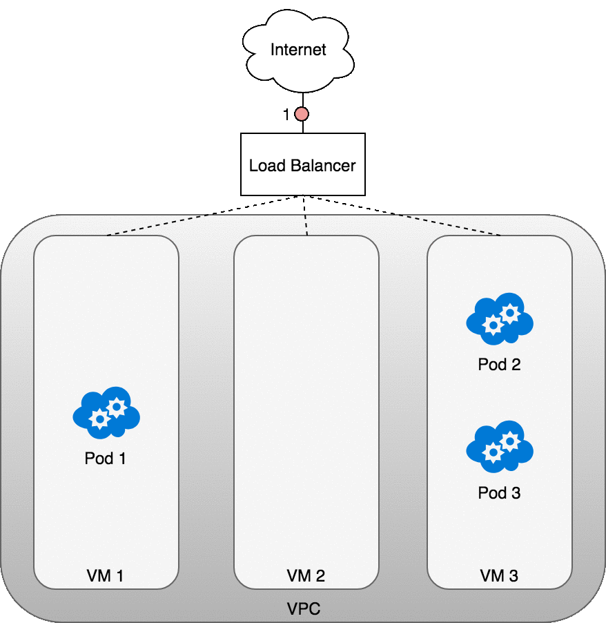

>2025.2.18.ver.2

# 1、Kubernetes 简介

## 1、基本介绍

Kubernetes 是一个开源的容器编排平台，用于自动化部署、扩展和管理容器化的应用程序，它能够在多台主机上协调容器的运行，确保应用的高可用性和可伸缩性

Kubernetes 提供了一套完整的机制来管理应用的整个生命周期，包括部署、资源规划、自动扩展、滚动更新和故障恢复等，通过这些功能，Kubernetes 让容器化应用的部署和管理变得更加简单、高效

**基础功能**：

- **自动装箱**：基于容器对应用运行环境的资源配置要求，自动部署应用容器

- **自我修复**：当容器失败时，会对容器进行重启，当所部署的 Node 节点出错，会对容器进行重新部署和重新调度，当容器未通过监控检查时，会关闭此容器直到容器正常运行，才对外提供服务

- **水平扩展**：通过简单的命令、用户 UI 或基于 CPU 等资源使用情况，对容器进行规模扩大或剪裁

- **服务发现**：用户不需使用额外的服务发现机制，只需要基于 Kubernetes 自身能力实现服务发现和负载均衡

- **滚动更新**：可以根据应用的变化，对运行的应用容器，进行一次性或批量式更新

- **版本回退**：可以根据应用部署情况，对运行的应用容器，进行历史版本的即时回退

- **密钥和配置管理**：在不需要重新构建镜像的情况下，可以部署和更新密钥和应用配置，类似热部署

- **存储编排**：自动实现存储系统挂载及应用，特别对有状态应用实现数据持久化非常重要，存储系统可以来自于本地目录、网络存储(NFS、Gluster、Ceph 等)、公共云存储服

- **批处理**：提供一次性任务，定时任务，满足批量数据处理和分析的场景


## 2、容器化与传统部署

传统的应用部署通常依赖于在操作系统上安装软件包或运行脚本，这种方式将应用的运行环境与主机操作系统紧密耦合，导致应用的管理、升级和回滚变得复杂且容易出错，虽然虚拟机技术可以提供隔离的运行环境，但虚拟机资源开销大，启动速度慢，且可移植性较差

容器化技术通过将应用及其依赖打包成一个独立的容器镜像，实现了应用与底层基础设施的解耦，每个容器都拥有自己的文件系统和隔离的运行环境，容器间的进程互不干扰，同时可以精确控制计算资源的使用，与虚拟机相比，容器启动速度快，资源占用少，并且能够在不同的云平台和操作系统间无缝迁移，这种灵活性和高效性使容器化成为现代应用部署的优选方式


## 3、架构

### 1、概述

Kubernetes 的架构是一个多层次的系统，每个层次提供特定的功能和服务，以支持容器化应用的部署、管理和调度

以下是其主要层次的说明：

- **核心层**：提供 Kubernetes 的核心功能，通过对外暴露 API 以支持上层应用开发，同时为插件式应用提供运行环境
- **应用层**：负责部署和管理多种类型的应用，包括无状态应用、有状态应用、批处理任务和集群应用等，并提供服务发现和 DNS 解析等路由功能
- **管理层**：提供系统度量（如基础设施、容器和网络的性能指标）、自动化功能（如自动扩展和动态资源分配）以及策略管理（如基于角色的访问控制 RBAC、资源配额 Quota、Pod 安全策略 PSP 和网络策略 NetworkPolicy 等）
- **接口层**：包括用户交互工具，如 kubectl 命令行工具、客户端 SDK，以及支持多集群管理的集群联邦功能
- **生态系统**：构建于接口层之上，是一个庞大且多样化的容器集群管理和调度生态，可分为两类：
  - **Kubernetes 外部**：包括日志收集、监控、配置管理、持续集成/持续部署（CI/CD）、工作流（Workflow）、函数即服（FaaS）、现成应用（OTS）和 ChatOps 等
  - **Kubernetes 内部**：包括容器运行时接口（CRI）、容器网络接口（CNI）、容器存储接口（CVI）、镜像仓库、云供应商集成（Cloud Provider）以及集群自身的配置和管理工具


### 1、Master

#### 1、概述

Master 节点是 Kubernetes 集群的控制中心，负责全局决策（如资源调度）和事件响应（如 Pod 副本不足时自动创建新 Pod）

Master 由以下组件构成：

- **API Server**
- **Scheduler**
- **Cluster State Store（etcd 数据库）**
- **Controller Manager Server**

Master 节点组件可以运行在集群中的任意机器上，但通常建议将所有组件部署在同一台机器上，并避免在此机器上运行用户容器，以确保控制平面的稳定性和安全性


#### 2、组件

##### 1、kube-apiserver

**功能**：提供 Kubernetes 的 REST API 接口，是集群管理的前端，负责认证、授权、数据校验和集群状态变更

**角色**：作为模块间的数据交互和通信枢纽，所有组件通过 API Server 查询或修改数据，且只有 API Server 直接操作 etcd，管理工具（如 kubectl 和 Kubernetes Dashboard）通过该 API 管理集群


**访问控制**：API 请求需经过多阶段验证

- **认证**：支持多种机制（如 TLS 证书、令牌等），请求需通过至少一个认证插件，成功则传递用户身份给授权模块，失败则返回 HTTP 401，Kubernetes 不直接管理用户，无法创建 user 对象或存储用户名
- **授权**：支持多种授权模式（如 RBAC），请求需通过至少一个授权插件，成功则进入准入控制，失败则返回 HTTP 403
- **准入控制**：对请求进行额外验证（如修改默认值或限制资源）


##### 2、etcd

**功能**：高可用、强一致性的键值存储系统，用于存储 Kubernetes 集群的所有配置信息和状态数据


##### 3、kube-scheduler

**功能**：监控未分配节点的新建 Pod，并根据调度策略为其选择合适的运行节点

**调度因素**：

- 资源需求（CPU、内存等）
- 硬件、软件或策略限制
- 亲和性与反亲和性规则
- 数据本地化需求
- 工作负载间交互


##### 4、kube-controller-manager

**功能**：运行所有控制器，负责集群的自动化管理，逻辑上各控制器独立，但实际编译为单一进程

**包含的控制器**

- **节点控制器**：监控节点状态并响应故障
- **副本控制器**：维护 Pod 副本数与预期一致
- **端点控制器**：管理 Service 和 Pod 的连接关系
- **Service Account & Token 控制器**：为新命名空间创建默认账户和访问令牌


##### 5、cloud-controller-manager

**功能**：与云基础设施供应商交互，管理云相关的控制器（自 Kubernetes 1.6 引入），实现云供应商代码与 Kubernetes 核心代码的解耦

**依赖的控制器**：

- **节点控制器**：检查云端节点状态
- **路由控制器**：配置云网络路由
- **服务控制器**：管理云负载均衡器
- **数据卷控制器**：处理存储卷的创建和挂载


### 2、Node

#### 1、概述

Node 节点（也称 Worker Node）是集群的工作单元，负责运行用户业务应用的容器，Node 节点组件运行在每一个节点上（包括 Master 节点和 Worker 节点）负责维护运行中的 Pod 并提供 Kubernetes 运行时环境

每个 Node 包含以下组件：

- **kubelet**
- **kube-proxy**
- **容器运行时**

Node 的状态信息由 kubelet 收集并报告给 Master，包括：

- **Addresses**：
  - HostName：节点主机名
  - ExternalIP：外部可访问 IP
  - InternalIP：内部网络 IP
- **Capacity and Allocatable**：节点的资源总量和可分配资源（如 CPU、内存、Pod 数量上限）
- **Info**：基本信息，如内核版本、Kubernetes 版本等

- **Conditions**：

  - 描述了节点的状态，Node Condition 以一个 JSON 对象的形式存在

    | Node Condition    | 描述                                                         |
    | ----------------- | ------------------------------------------------------------ |
    | OutOfDisk         | 如果节点上的空白磁盘空间不够，不能够再添加新的节点时，该字段为 True，其他情况为 False |
    | Ready             | 如果节点是健康的且已经就绪可以接受新的 Pod，则节点Ready字段为 True，False 表明了该节点不健康，不能够接受新的 Pod |
    | MemoryPressure    | 如果节点内存紧张，则该字段为 True，否则为 False              |
    | PIDPressure       | 如果节点上进程过多，则该字段为 True，否则为 False            |
    | DiskPressure      | 如果节点磁盘空间紧张，则该字段为 True，否则为 False          |
    | NetworkUnvailable | 如果节点的网络配置有问题，则该字段为 True，否则为 False      |

    ~~~json
    // 例子
    "conditions": [
      {
        "type": "Ready",
        "status": "True",
        "reason": "KubeletReady",
        "message": "kubelet is posting ready status",
        "lastHeartbeatTime": "2019-06-05T18:38:35Z",
        "lastTransitionTime": "2019-06-05T11:41:27Z"
      }
    ]
    ~~~

    - 如果 Ready 类型的 Condition 的 status 字段持续为 Unkown 或者 False 超过 pod-eviction-timeout（kube-controller-manager (opens new window)的参数）所指定的时间，节点控制器（node controller）将对该节点上的所有 Pod 执行删除的调度动作，默认的 pod-eviction-timeout 时间是 5 分钟
    - 某些情况下（例如：节点网络故障）apiserver 不能够与节点上的 kubelet 通信，删除 Pod 的指令不能下达到该节点的 kubelet 上，直到 apiserver 与节点的通信重新建立，删除指令才下达到节点，这也就导致虽然对 Pod 执行了删除的调度指令，但是这些 Pod 仍然在失联的节点上运行，因此可能会发现失联节点上的 Pod 仍然在运行（在该节点上执行 docker ps 等命令可查看容器的运行状态），然而 apiserver 中，失联节点的 Pod 的状态已经变为 Terminating 或者 Unknown，如果 Kubernetes 不能通过 cloud-controller-manager 判断失联节点是否已经永久从集群中移除（例如：在虚拟机或物理机上自己部署 Kubernetes 的情况），则集群管理员需要手动删除 apiserver 中的节点对象，此时 Kubernetes 将删除该节点上的所有 Pod，在 Kubernetes v1.12 中，TaintNodesByCondition 特性进入 beta 阶段，此时 node lifecycle controller 将自动创建该 Condition 对应的污点，调度器在选择合适的节点时，不再关注节点的 Condition，而是检查节点的污点和 Pod 的容忍度

- **Capacity and Allocatable**：

  - Capacity 中的字段表示节点上的资源总数
  - Allocatable 中的字段表示该节点上可分配给普通 Pod 的资源总数
    - CPU、内存、该节点可调度的最大 Pod 数量

- **Info**：描述了节点的基本信息

  - Linux 内核版本
  - Kubernetes 版本（kubelet 和 kube-proxy 的版本）
  - Docker 版本
  - 操作系统名称

~~~bash
# 查看所有 Node
kubectl get nodes -o wide
# 查看节点详细信息
kubectl describe node <node-name>
~~~


#### 2、组件

##### 1、kubelet

**功能**：确保 Pod 中的容器正常运行，监控节点和容器的资源使用情况，并通过 cAdvisor 提供资源统计


**注意**：

- Kubelet 不管理不是通过 Kubernetes 创建的容器


##### 2、kube-proxy

**功能**：维护网络规则，实现 Service 的网络通信

**代理模式**

- iptables：利用系统包过滤层
- User space：自行转发请求


##### 3、容器运行时

**功能**：负责运行容器，支持多种实现，如 Docker、containerd、cri-o 和 rktlet 等


#### 3、Node 管理

##### 1、概述

Node 由云供应商或本地资源池创建，Kubernetes 仅生成对应的 API 对象，节点控制器负责管理其生命周期，包括：

- 分配 CIDR 地址块
- 监控节点健康状态
- 故障时驱逐 Pod
- **节点自注册**：kubelet 可通过 --register-node 参数自动向 API Server 注册，并配置标签或污点
- **手动管理**：管理员可手动创建或修改节点对象，并标记节点为不可调度（kubectl cordon）


##### 2、节点自注册

节点自注册是指当 Kubelet 服务在节点上启动时，如果配置了 --register-node=true（默认值），Kubelet 会尝试与 Kubernetes API 服务器建立连接，并创建对应的 Node 对象

**工作流程**：Kubelet 使用 --client-certificate 和 --client-key 提供的凭据进行认证，然后向 API 服务器提交节点信息，包括节点名称、IP 地址等，注册完成后，节点即可被调度器用于运行 Pod，集成到集群中


Kubelet 提供多个参数来控制自注册行为：

- --kubeconfig：向 apiserver 进行认证时所用身份信息的路径
- --cloud-provider：向云供应商读取节点自身元数据
- --register-node：自动向 API Server 注册节点
- --register-with-taints：注册节点时，为节点添加污点，逗号分隔，格式为 <key>=<value>:<effect>
- --node-ip：节点的 IP 地址
- --node-labels：注册节点时，为节点添加标签
- --node-status-update-frequency：向 Master 节点发送心跳信息的时间间隔

如果 Node authorization mode 和 NodeRestriction admission plugin 被启用，kubelet 只拥有创建/修改其自身所对应的节点 API 对象的权限


##### 3、手动管理节点

手动管理节点是指在 Kubernetes 集群中，通过管理员干预来添加、更新或删除节点，而不依赖于自动自注册机制

可以修改的内容有：

- 增加/减少标签
- 标记节点为不可调度（unschedulable）

节点的标签与 Pod 上的节点选择器（node selector）配合，可以控制调度方式，例如：限定 Pod 只能在某一组节点上运行

执行如下命令可将节点标记为不可调度（unschedulable）阻止新的 Pod 被调度到该节点上，但是不影响任何已经在该节点上运行的 Pod，这在准备重启节点之前非常有用

```sh
kubectl cordon $NODENAME
```

**注意**：

- DaemonSet Controller 创建的 Pod 将绕过 Kubernetes 调度器，并且忽略节点的 unschedulable 属性
  - Daemons 守护进程属于节点，尽管该节点在准备重启前，已经排空了上面所有的应用程序


### 3、Addons

#### 1、概述

Addons 是使用 Kubernetes 资源（如 DaemonSet、Deployment）实现的集群功能，部署于 kube-system 命名空间

常用 Addons 包括：

- **DNS**：提供集群内 DNS 服务，自动配置到容器
  - 除了 DNS Addon 以外，其他的 addon 都不是必须的，所有 Kubernetes 集群都应该有 Cluster DNS，Cluster DNS 是一个 DNS 服务器，是对已有环境中其他 DNS 服务器的一个补充，存放了 Kubernetes Service 的 DNS 记录，Kubernetes 启动容器时，自动将该 DNS 服务器加入到容器的 DNS 搜索列表中
  - 目前默认安装 Core DNS
- **Web UI**：Dashboard 是一个 Kubernetes 集群的 Web 管理界面，让用户可以通过该界面管理集群
- **ContainerResource Monitoring**：记录容器资源使用情况，将容器的度量指标（metrics）记录在时间序列数据库中，并提供了 UI 界面查看这些数据
- **Cluster-level Logging**：集中管理容器日志，并提供搜索浏览的界面


.png)


### 4、集群通信

#### 1、Node To Master

所有从集群访问 Master 的通信均通过 API Server 完成，其他 Master 组件（如 Scheduler、Controller Manager）不提供远程调用接口

**API Server 配置**：在典型安装中，API Server 监听 HTTPS 端口（默认 443），并支持多种客户端认证方式（如证书、令牌等），为确保安全性，至少需启用一种授权机制，尤其是在允许匿名访问或使用 Service Account Tokens 时

**节点访问**：每个节点需配置 API Server 的公钥根证书（Public Root Certificate），通过有效的客户端认证（如 Google Kubernetes Engine 默认使用的 Kubelet 客户端证书），节点能够安全访问 API Server

**Pod 访问**：需要调用 API Server 的 Pod 应关联 Service Account，创建 Pod 时，Kubernetes 会自动注入公钥根证书和 Bearer Token（置于 HTTP 请求头 Authorization 字段），确保通信安全

**服务发现**：每个命名空间默认包含一个名为 kubernetes 的 Service，其虚拟 IP（默认 10.96.0.1）由 kube-proxy 转发至 API Server 的 HTTPS 端点，这种设计使得集群内部通信高效且一致

**安全性**：得益于 HTTPS 加密和认证机制，节点及 Pod 到 Master 的默认连接是安全的，即使通过不受信任的网络或公网也能保持可靠


#### 2、Master To Node

从 Master（API Server）到节点的通信主要有两条路径：

1. **直接访问 Kubelet**：API Server 直接与节点上的 Kubelet 进程通信，用于特定操作
2. **代理访问**：通过 API Server 的代理（Proxy）功能，访问集群中的节点、Pod 或 Service


#### 3、apiserver to kubelet

API Server 在以下场景中需要访问 Kubelet：

- 获取 Pod 日志
- 通过 kubectl exec -it（或类似工具如 Kuboard 的终端界面）进入容器命令行
- 实现 kubectl port-forward 功能

**连接方式**：Kubelet 默认监听 HTTPS 端口，但 API Server 不验证 Kubelet 的证书，这种配置可能导致中间人攻击风险，尤其在不受信任的网络或公网上运行时，安全性无法保障

**安全改进**：

- 可通过 --kubelet-certificate-authority 参数为 API Server 配置 Kubelet 证书的根证书，以启用证书验证
- 建议启用 Kubelet 的认证和授权机制（Authentication/Authorization），增强 API 安全性


#### 4、apiserver to nodes, pods, services

**连接方式**：API Server 到节点、Pod 或 Service 的通信默认使用 HTTP，未加密且无身份认证，虽然可以通过在 URL 前添加 https:// 切换至 HTTPS，但证书未被验证，且无需客户端认证，导致数据一致性无法保证

**安全性**：在不受信任的网络或公网上，此类连接存在安全隐患，容易被拦截或篡改


#### 5、SSH

**功能**：Kubernetes 曾支持通过 SSH 隧道保护 Master 到节点的通信，API Server 在每个节点上建立连接（默认端口 22），通过隧道转发至 Kubelet、节点、Pod 或 Service 的请求

**现状**：SSH 隧道现已被标记为不推荐使用，Kubernetes 社区正在开发更现代化的替代方案


# 2、Kubernetes 集群搭建

## 1、套件概述

### 1、Kubeadm

Kubeadm 是官方社区推出的一个用于快速部署 Kubernetes 集群的工具，通过这个工具的两条指令，就可以完成一个 Kubernetes 集群的部署： 

- 创建一个 Master 节点：kubeadm init 
- 将 Node 节点加入到当前集群中：kubeadm join 


### 2、Kubectl

Kubectl 是 Kubernetes 命令行工具，可以让用户对 Kubernetes 集群运行命令

可以使用 kubectl 来部署应用、监测和管理集群资源以及查看日志

~~~bash
# 命令语法
kubectl [command] [type] [name] [flags]
~~~

- command：指定要对资源执行的操作，例如：creat、get、describe、delete
- type：指定资源类型，大小写敏感，但是单数复数缩写不敏感，例如：pod、pods、po
- name：指定资源名称，大小写敏感，如果省略名称，会显示所有资源
- flags：指定可选参数，例如：-s、-server 指定 Kubernetes API server 的地址和端口


**注意**：

- Kubectl 版本和集群版本之间的差异必须在一个小版本号内


### 3、Kubelet

Kubelet 是在每个 Node 节点上运行的主要节点代理，用于在集群中的每个节点上启动 Pod 和容器等


### 4、容器运行时

在 Kubernetes v1.24 之前，Docker Engine 集成了一个名为 Dockershim 的组件，负责与 Kubernetes 的通信，然而从 v1.24 版本开始，Dockershim 被移除，因此 Kubernetes 要求每个集群节点安装符合容器运行时接口（CRI）的容器运行时，以便 Pod 能够运行在该环境中，从 v1.26 开始，Kubernetes 强烈建议使用 CRI 兼容的运行时

容器运行时管理容器的整个生命周期，包括镜像构建、管理、容器的启动、运行与销毁等，它为上层提供容器管理接口，并向下提供容器操作的实现

常见的容器运行时：

- containerd（推荐）
- CRI-O
- Docker Engine
- Mirantis Container Runtime


Kubernetes 为容器提供了一系列重要的资源：

- 由镜像一个或多个数据卷合并组成的文件系统
- 容器自身的信息
- 集群中其他重要对象的信息

Kubernetes 提供了 Downward API，可以将 Pod 的名称、命名空间等信息注入容器的环境变量，用户还可以通过 ConfigMap 自定义容器的环境变量

例如：在容器中执行 hostname 命令或者在 libc 中执行 gethostname 函调用，获得的是容器所在 Pod 的名字

例如，集群中的所有 Service 的连接信息（如 ClusterIP 和端口）会被注入为环境变量，格式如下：

~~~bash
FOO_SERVICE_HOST=<Service的ClusterIP>
FOO_SERVICE_PORT=<Service的端口>
~~~


## 2、搭建需求

### 1、部署方式

目前生产部署 Kubernetes 集群主要有两种方式：

- **Kubeadm**：Kubeadm 是一个 K8s 部署工具，提供 kubeadm init 和 kubeadm join，用于快速部署 Kubernetes 集群
- **二进制包**：从 Github 下载发行版的二进制包，手动部署每个组件，组成 Kubernetes 集群


**注意**：

- 如果从包管理器中安装 containerd，会发现 /etc/containerd/config.toml 默认禁止了 CRI 集成插件，需要移除


### 2、<a name='安装要求'>安装要求</a>

#### 1、硬件配置

2GB 或更多 RAM，2 个 CPU 或更多 CPU，硬盘 30GB 或更多


**注意**：

- 本次部署是在 VMware 操作，为了实现虚拟机迁移的时候，网络保持正常，需要修改 VMware 的虚拟机网络 VMnet 8 配置
  - 子网 IP：192.168.154.0
  - 子网掩码：255.255.255.0
  - 网关 IP：192.168.154.2
- 本次部署的 Linux 系统均为 Debian12


#### 2、网络配置

所有虚拟机配置静态网卡

~~~bash
vim /etc/network/interfaces
~~~

~~~bash
auto eth0
iface eth0 inet static
    address 192.168.154.132   # 替换为节点 IP
    netmask 255.255.255.0
    gateway 192.168.154.2
~~~

~~~bash
systemctl restart networking
~~~

集群中所有机器之间网络互通，且可以访问外网，需要拉取镜像

~~~shell
ip a | grep xx.xx.xx.xx
~~~

节点之中不可以有重复的主机名、MAC 地址或 product_uuid

~~~bash
# 获取网络接口的 MAC 地址
ip link
ifconfig -a

# 对 product_uuid 校验
cat /sys/class/dmi/id/product_uuid
~~~

桥接的 IPv4 流量传递到 iptables，因为 Kubernetes 的网络模型需要

~~~bash
cat <<EOF | tee /etc/modules-load.d/k8s.conf
overlay
br_netfilter
EOF

modprobe overlay
modprobe br_netfilter

cat <<EOF | tee /etc/sysctl.d/k8s.conf
net.bridge.bridge-nf-call-iptables  = 1
net.bridge.bridge-nf-call-ip6tables = 1
net.ipv4.ip_forward                 = 1
EOF

# 应用 sysctl 参数而不重新启动
# 设置所需的 sysctl 参数，参数在重新启动后保持不变
sysctl --system

# 检查非常重要
lsmod | grep br_netfilter
lsmod | grep overlay
sysctl net.bridge.bridge-nf-call-iptables net.bridge.bridge-nf-call-ip6tables net.ipv4.ip_forward
~~~

关闭防火墙

~~~bash
# 为了省事直接关闭
# 否则需要开启对应端口与协议
systemctl disable firewalld
systemctl stop firewalld
~~~


关闭防火墙**（不一定需要），但是一定要**开放所需的端口：

- 控制面板：

  | 协议 | 方向 | 端口范围  | 目的                    | 使用者               |
  | ---- | ---- | --------- | ----------------------- | -------------------- |
  | TCP  | 入站 | 6443      | Kubernetes API server   | 所有                 |
  | TCP  | 入站 | 2379-2380 | etcd server client API  | kube-apiserver, etcd |
  | TCP  | 入站 | 10250     | Kubelet API             | 自身, 控制面         |
  | TCP  | 入站 | 10259     | kube-scheduler          | 自身                 |
  | TCP  | 入站 | 10257     | kube-controller-manager | 自身                 |

- 工作节点：

  | 协议 | 方向 | 端口范围    | 目的               | 使用者       |
  | ---- | ---- | ----------- | ------------------ | ------------ |
  | TCP  | 入站 | 10250       | Kubelet API        | 自身, 控制面 |
  | TCP  | 入站 | 30000-32767 | NodePort Services† | 所有         |

- 开放额外协议：ICMP、IPIP协议


#### 3、禁止 swap 分区

~~~bash
# 临时 
swapoff -a 
~~~

或者

~~~bash
# 永久
# 或者直接手动 vim 进入注释掉 swap 相关的行
sed -ri 's/.*swap.*/#&/' /etc/fstab
~~~

或者

~~~bash
vim /etc/default/grub
# 为 GRUB_CMDLINE_LINUX 追加 cgroup_enable=memory swapaccount=1
update-grub && reboot
~~~

~~~bash
# 检查 swap 状态
free -m
~~~


#### 4、关闭 selinux

如果是 RHEL 系需要关闭

~~~bash
# 临时 
setenforce 0

# 永久 
sed -i 's/^SELINUX=enforcing$/SELINUX=permissive/' /etc/selinux/config
~~~


#### 5、时间同步

~~~bash
apt-get install -y ntp
systemctl start ntp && sudo systemctl enable ntp
~~~


#### 6、允许 Root 登录

~~~bash
sudo passwd root
sudo sed -i 's/^#\?PermitRootLogin.*/PermitRootLogin yes/g' /etc/ssh/sshd_config;
sudo sed -i 's/^#\?PasswordAuthentication.*/PasswordAuthentication yes/g' /etc/ssh/sshd_config;
sudo service sshd restart
~~~


## 3、包管理器安装版

### 1、基准配置

#### 1、环境准备

访问 [Index of /yum/repos// (google.com)](https://packages.cloud.google.com/yum/repos/) 发现，Kubernetes 只适配到 el7，但是 el8 也可以使用，如果后续适配了可能需要修改

配置完包管理器的 repo，K8s 三件套可以一次安装了

Deb 系：

~~~bash
# 环境准备
apt-get install -y apt-transport-https ca-certificates curl gpg
~~~


RHEL 系：

~~~bash
# 环境准备
yum install -y yum-utils device-mapper-persistent-data lvm2 gcc gcc-c++ tc
~~~


#### 2、设置组件仓库

Deb 系：

~~~bash
# 仓库准备，根据版本不同自定义
# 如果 `/etc/apt/keyrings` 目录不存在，则应在 curl 命令之前创建它
# sudo mkdir -p -m 755 /etc/apt/keyrings
# 添加仓库密匙
# 所有仓库都使用相同的签名密钥，可以忽略 URL 中的版本
curl -fsSL https://pkgs.k8s.io/core:/stable:/v1.32/deb/Release.key | gpg --dearmor -o /etc/apt/keyrings/kubernetes-apt-keyring.gpg
~~~

~~~bash
# 添加 Kubernetes apt 仓库
echo 'deb [signed-by=/etc/apt/keyrings/kubernetes-apt-keyring.gpg] https://pkgs.k8s.io/core:/stable:/v1.32/deb/ /' | tee /etc/apt/sources.list.d/kubernetes.list
~~~

~~~bash
# 阿里云方案 1.29
apt-get update && apt-get install -y apt-transport-https
curl -fsSL https://mirrors.aliyun.com/kubernetes-new/core/stable/v1.29/deb/Release.key |
    gpg --dearmor -o /etc/apt/keyrings/kubernetes-apt-keyring.gpg
echo "deb [signed-by=/etc/apt/keyrings/kubernetes-apt-keyring.gpg] https://mirrors.aliyun.com/kubernetes-new/core/stable/v1.29/deb/ /" |
    tee /etc/apt/sources.list.d/kubernetes.list
    
apt-get update
apt-get install -y kubelet kubeadm kubectl containerd kubernetes-cni
~~~

~~~bash
# 设置 docker 仓库密钥
curl -fsSL https://download.docker.com/linux/debian/gpg -o /etc/apt/keyrings/docker.
chmod a+r /etc/apt/keyrings/docker.asc
~~~

~~~bash
# 添加 docker 仓库
echo \
  "deb [arch=$(dpkg --print-architecture) signed-by=/etc/apt/keyrings/docker.asc] https://download.docker.com/linux/debian \
  $(. /etc/os-release && echo "$VERSION_CODENAME") stable" | \
  tee /etc/apt/sources.list.d/docker.list > /dev/null
~~~


RHEL 系：

~~~bash
# 1.29 之前
# k8s 国外直接使用 google 配置仓库文件，省事
cat <<EOF | tee /etc/yum.repos.d/kubernetes.repo
[kubernetes]
name=Kubernetes
baseurl=https://packages.cloud.google.com/yum/repos/kubernetes-el7-\$basearch
enabled=1
gpgcheck=1
gpgkey=https://packages.cloud.google.com/yum/doc/rpm-package-key.gpg
EOF

# k8s 国内 Aliyun
cat <<EOF > /etc/yum.repos.d/kubernetes.repo
[kubernetes]
name=Kubernetes
baseurl=https://mirrors.aliyun.com/kubernetes/yum/repos/kubernetes-el7-x86_64/
enabled=1
gpgcheck=1
repo_gpgcheck=1
gpgkey=https://mirrors.aliyun.com/kubernetes/yum/doc/yum-key.gpg https://mirrors.aliyun.com/kubernetes/yum/doc/rpm-package-key.gpg
EOF

# containerd 国内 Aliyun
yum config-manager --add-repo https://mirrors.aliyun.com/docker-ce/linux/centos/docker-ce.repo

# 安装四件套
yum install -y kubectl kubelet kubeadm containerd kubernetes-cni
~~~


#### 3、安装组件

~~~bash
# 安装三件套
apt-get update
apt-get install -y kubelet kubeadm kubectl containerd.io
apt-mark hold kubelet kubeadm kubectl
~~~

~~~bash
systemctl start kubelet containerd
systemctl enable kubelet containerd
~~~


**开启命令提示**：

~~~bash
yum install -y bash-completion
source /usr/share/bash-completion/bash_completion
source <(kubectl completion bash)
echo "source <(kubectl completion bash)" >> ~/.bashrc
~~~

或者

~~~bash
source /usr/share/bash-completion/bash_completion
source <(kubectl completion bash)
~~~


#### 4、配置 CGroups

配置 containerd：

~~~bash
# 安装完 containerd 先启动一次生成配置文件
# 如果没有，则手动生成
mkdir /etc/containerd/
containerd config default > /etc/containerd/config.toml
vim /etc/containerd/config.toml
~~~

~~~toml
# 修改，默认是 true
[plugins."io.containerd.grpc.v1.cri".containerd.runtimes.runc] 
  [plugins."io.containerd.grpc.v1.cri".containerd.runtimes.runc.options] 
     SystemdCgroup = true
~~~

~~~bash
# 重启 containerd
systemctl daemon-reload
systemctl restart containerd
systemctl status containerd
~~~


配置 Kubelet：

~~~bash
# v1.22 后默认就是 systemd, 也即不需要这样配置了
vim /usr/lib/systemd/system/kubelet.service.d/10-kubeadm.conf

# 在 Environment="KUBELET_KUBECONFIG_ARGS 这行后面的双引号前添加如下内容，注意使用空格分隔
--cgroup-driver=systemd

# 重启 kubelet
systemctl daemon-reload
systemctl restart kubelet
systemctl status kubelet
~~~


配置 Docker：（如果使用 Docker 就不用配置）

~~~bash
# docker安装后默认没有daemon.json这个配置文件，需要进行手动创建
vim /etc/docker/daemon.json
"exec-opts": ["native.cgroupdriver=systemd"]

# 如果没有则使用
echo {\"exec-opts\": [\"native.cgroupdriver=systemd\"]} > /etc/docker/daemon.json

# 重启 docker
systemctl daemon-reload
systemctl restart docker
systemctl status docker

# 查看 Driver
docker info|grep Driver
~~~


#### 5、设置镜像仓库

如果无法拉去镜像或初始化失败，建议修改镜像源（国内）

修改镜像源：

~~~bash
# 修改 containerd 的 config.toml
[plugins."io.containerd.grpc.v1.cri".registry.mirrors]
        [plugins."io.containerd.grpc.v1.cri".registry.mirrors."docker.io"]
          endpoint = ["https://xxx.fr.eu.org", "https://hub.xxx.eu.org"]
        [plugins."io.containerd.grpc.v1.cri".registry.mirrors."ghcr.io"]
          endpoint = ["https://ghcr.xxx.eu.org","https://xxx.fr.eu.org"]
        [plugins."io.containerd.grpc.v1.cri".registry.mirrors."gcr.io"]
          endpoint = ["https://xxx.fr.eu.org"]
        [plugins."io.containerd.grpc.v1.cri".registry.mirrors."quay.io"]
          endpoint = ["https://xxx.fr.eu.org"]
~~~


#### 6、配置文件初始化

~~~bash
# init.default初始化文件
kubeadm config print init-defaults > init.default.yaml
~~~

添加 networking.podSubnet: 10.244.0.0/16，为 flunnel 网络插件准备

修改 localAPIEndpoint.advertiseAddress: MasterIP，可以不设置，自动设置

修改 nodeRegistration.name: MasterHostName

~~~bash
# 国内需要修改 init.default.yaml 的镜像加速地址，建议自建
# 使用配置文件，拉取相关镜像，先需要 containerd 的镜像加速地址
kubeadm config images pull --config=init.default.yaml
# 或者使用命令行
kubeadm config images pull --image-repository=registry.proxy.com/google_containers
~~~


### 2、初始化 Master


**重要注意**：开始前务必检查所有前置要求均满足

- 检查<a href='#安装要求'> 安装要求</a> 
- 检查容器运行时是否运行
- 检查公网 IP 是否绑定在网卡上


~~~bash
# 使用配置文件
kubeadm init --config init.default.yaml
~~~

>这个命令会自动：
>
>1. 系统状态检查
>2. 生成 token
>3. 生成自签名 CA 和 client 端证书
>4. 生成 kubeconfig 用于 kubelet 连接 API server
>5. 为 Master 组件生成 Static Pod manifests，并放到 /etc/kubernetes/manifests 目录中
>6. 配置 RBAC 并设置 Master node 只运行控制平面组件
>7. 创建附加服务，比如 kube-proxy 和 kube-dns

~~~bash
# 记录下 Token
You should now deploy a pod network to the cluster.
Run "kubectl apply -f [podnetwork].yaml" with one of the options listed at:
  https://kubernetes.io/docs/concepts/cluster-administration/addons/

Then you can join any number of worker nodes by running the following on each as root:

kubeadm join 10.0.0.64:6443 --token 0sdiop.qs9m98sqqn9hzjjm \
	--discovery-token-ca-cert-hash sha256:39244ba104bd5d5f79c695852a18b329b86f75df1a4e7f8b583627a432e9f762

# 后续忘记可以使用改命令获取，不过需要检查是否过期
kubeadm token list

# 过期了，需要重新生成
kubeadm token create --print-join-command
~~~

~~~bash
# 非 root 用户运行 kubectl
mkdir -p $HOME/.kube
cp -i /etc/kubernetes/admin.conf $HOME/.kube/config
chown $(id -u):$(id -g) $HOME/.kube/config

# root 用户运行 kubectl
vim ~/.bashrc

# 在末尾添加
export KUBECONFIG=/etc/kubernetes/admin.conf
source ~/.bashrc
~~~

到此 Master 节点安装完毕，可以尝试移除掉 Master 节点的不可调度标签

~~~bash
kubectl taint nodes --all node-role.kubernetes.io/control-plane:NoSchedule-
~~~


### 3、初始化 Node

~~~bash
# 命令行加入
kubeadm join MasterIP:6443 --token pw1mwc.e3cjvdsnhfc6nvmc --discovery-token-ca-cert-hash sha256:03d450c1455f3b72eccc1b7ddd3f2c0b6737e1f5492729de552dbd5c45a4781e
~~~

>这包括以下:
>
>1. 从 API server 下载 CA
>2. 创建本地证书，并请求 API Server 签名
>3. 最后配置 kubelet 连接到 API Server

~~~bash
# 加入成功
This node has joined the cluster:
* Certificate signing request was sent to apiserver and a response was received.
* The Kubelet was informed of the new secure connection details.

Run 'kubectl get nodes' on the control-plane to see this node join the cluster.
~~~

自此 Node 已加入集群，但是没有容器网络的功能


### 4、初始化容器网络

#### 1、说明

必须部署一个基于 Pod 网络插件的容器网络接口（CNI），以便 Pod 可以相互通信

在安装网络插件之前，集群 DNS（CoreDNS）将不会启动，处于 Pending 状态

~~~bash
# 同一个 VPC 内的节点处于同一个内网，但是跨 VPC 容易出现下列问题
# 若出现 Master 无法通过集群内部 IP 访问 Node
# 需要将 Node 的集群内布 IP 转发到 Node 的真实 IP 上
iptables -t nat -I OUTPUT -d Node内部IP -j DNAT --to Node真实IP
~~~


**注意**：

- CNI 插件只能安装一个
- Pod 网络不得与任何主机网络重叠
- 如果集群使用双栈协议，确认网络插件支持
- 默认情况下，kubeadm 将集群设置为强制使用 RBAC，确认网络插件支持 RBAC


#### 2、calico

##### 1、概述

原理：基于 BGP 路由协议或 IP-in-IP 封装（IPIP 模式），实现非封装的 L3 网络，减少性能损耗

性能：高，尤其在大规模集群中表现优异（接近宿主机性能）

功能：支持网络策略、跨集群通信，集成 Istio 服务网格，提供细粒度流量控制

适用场景：中大型集群，需高性能、网络策略及安全性的场景（如生产环境）


##### 2、部署

下载并部署 Calico 的 Operator

~~~bash
kubectl create -f https://raw.githubusercontent.com/projectcalico/calico/v3.29.2/manifests/tigera-operator.yaml
~~~

下载配置文件

~~~bash
curl https://raw.githubusercontent.com/projectcalico/calico/v3.29.2/manifests/custom-resources.yaml -O
~~~

修改其中的 cidr 为集群初始化的 podsubnet 值

~~~yaml
apiVersion: operator.tigera.io/v1  
kind: Installation                 
metadata:
  name: default                    # 资源的名称，通常为 default，表示默认安装配置
spec:
  calicoNetwork:                   # 配置 Calico 的网络相关参数
    ipPools:                       # 定义 Calico 使用的 IP 地址池
    - name: default-ipv4-ippool    # IP 池的名称，可以自定义
      blockSize: 26                # 每个节点分配的 IP 地址块大小，26 表示每个节点分配一个 /26 的地址块
      cidr: 10.244.0.0/16          # 整个集群的 Pod 网络地址范围，10.244.0.0/16
      encapsulation: VXLANCrossSubnet  # 跨子网时使用 VXLAN 封装，跨子网通信的封装模式
      natOutgoing: Enabled         # 是否启用 NAT 出站流量，Enabled 表示允许 Pod 访问外部网络时进行 NAT 转换
      nodeSelector: all()          # 定义 IP 池适用的节点范围，all() 表示所有节点都使用此 IP 池
---
# 以下部分配置 Calico API Server
apiVersion: operator.tigera.io/v1  # 指定使用的 API 版本，这里是 Calico Operator 的 v1 版本
kind: APIServer                    # 定义资源类型，这里是 Calico API Server 的配置
metadata:
  name: default                    # 资源的名称，通常为 default，表示默认配置
spec: {}                           # 配置 Calico API Server 的具体参数，这里为空表示使用默认配置
~~~

部署 Calico，默认使用 BGP 路由协议 + Full Mesh 组网 + VXLAN 封装协议

~~~bash
kubectl create -f custom-resources.yaml
~~~

等待所有的 Pod 构建、运行完成

~~~bash
# 查看 Pod 状态
kubectl get pods -A

# 查看 节点状态
kubectl get nodes
~~~

卸载：

~~~bash
# Master 节点
kubectl delete -f custom-resources.yaml tigera-operator.yaml

# 所有节点
modprobe -r ipip

# 停止所有生成的虚拟网卡
ifconfig xxx down
~~~


#### 3、flannel

##### 1、概述

原理：基于 Overlay 网络（默认 VXLAN 模式），为每个节点分配子网，通过封装（如 VXLAN、UDP）实现跨节点通信

性能：中等，VXLAN 模式性能优于 UDP 模式，但相比 Calico 和 Cilium 有更高延迟

功能：仅支持基础网络通信，不支持网络策略，安全性较弱

适用场景：小型集群、简单网络需求，适合快速部署和低维护成本的环境


##### 2、部署

~~~bash
# 下载 flannel 的 yaml 配置文件
wget https://github.com/flannel-io/flannel/releases/latest/download/kube-flannel.yml
~~~

修改 net-conf.json 的 Network 为 Master 节点启动时的 --pod-network-cidr 参数值

~~~bash
# 安装
kubectl apply -f kube-flannel.yml
~~~


#### 4、wave

##### 1、概述

原理：通过 Overlay 网络（VXLAN/UDP）和自研路由算法实现动态流量优化

性能：中等，适合中小规模集群，但大规模部署可能受限

功能：支持网络策略和简单加密，但功能丰富性不如 Calico/Cilium

适用场景：动态环境或需快速部署的轻量级网络


##### 2、部署

~~~bash
kubectl apply -f "https://cloud.weave.works/k8s/net?k8s-version=$(kubectl version | base64 | tr -d'\n')"
~~~


#### 5、Cilium

##### 1、概述

原理：基于 eBPF 技术，在内核层实现网络策略、负载均衡等，支持 L3-L7 层流量管理

性能：最高，eBPF 绕过传统 iptables，减少延迟并提升吞吐量

功能：支持透明加密（IPSec/WireGuard）、多集群 Mesh、深度可观测性（Hubble）

适用场景：大规模集群、高安全性需求


### 5、测试集群

#### 1、部署一个应用

在 k8s 上进行部署前，首先需要了解一个基本概念 **Deployment**，在k8s中，通过发布 Deployment，可以创建镜像 (image) 的实例 (container)，这个实例会被包含在称为 **Pod** 的概念中，**Pod** 是 k8s 中最小可管理单元

在发布 Deployment 后，Deployment 将指示 k8s 如何创建和更新应用程序的实例，Master 节点将实例调度到集群中的具体节点

创建实例后，Kubernetes Deployment Controller 会持续监控这些实例，如果运行实例的 Worker 节点关机或被删除，则 Kubernetes Deployment Controller 将在集群选择资源最优的 Worker 节点上重新创建新实例，这是一种通过自我修复机制来解决故障或维护问题

> 在容器编排之前的时代，各种安装脚本通常用于启动应用程序，但是不能够使应用程序从机器故障中恢复，通过创建应用程序实例并确保它们在集群节点中的运行实例个数，Kubernetes Deployment 提供了一种完全不同的方式来管理应用程序


通过在 Master 节点发布 Deployment，Master 节点会选择合适的 Worker 节点创建 Container，Container 会包含在 Pod 里

~~~yaml
apiVersion: apps/v1          # 指定 Kubernetes API 的版本，我们正在使用应用程序管理 API v1
kind: Deployment             # 资源类型是 Deployment，用于管理 Pod 的副本
metadata:
  name: nginx-deployment     # 部署的名称是 nginx-deployment
  labels:                    # 设置 Deployment 的标签
    app: nginx-deployment    # 用于标识和选择这个 Deployment
spec:
  replicas: 2                # 设置 Pod 的副本数为 2，表示会有两个 Nginx 实例运行
  selector:
    matchLabels:
      app: nginx             # 选择器用于选择与 Deployment 关联的 Pods，选择 app 为 nginx 的 Pod
  template:
    metadata:
      labels:                # 设置 Pod 的标签
        app: nginx           # 每个 Pod 会带有标签 app: nginx，方便选择和管理
    spec:
      containers:            # 定义容器部分
      - name: nginx          # 容器的名称是 nginx
        image: nginx:latest  # 使用最新版本的 nginx 镜像
        ports:
        - containerPort: 80  # 容器会监听 80 端口，Nginx 默认端口
~~~

~~~bash
# 部署
kubectl apply -f nginx-deployment.yaml
~~~

~~~bash
# 查看 Deployment
kubectl get deployments
# 查看 Pod
kubectl get pods
~~~


#### 2、状态查看

~~~bash
# kubectl get 资源类型
# 获取类型为Deployment的资源列表
kubectl get deployments

# 获取类型为Pod的资源列表
kubectl get pods

# 获取类型为Node的资源列表
kubectl get nodes
~~~

在命令后增加 -A 或 --all-namespaces 可查看所有 namespace 中的对象，使用参数 -n 可查看指定 namespace 的对象

~~~bash
# 查看所有名称空间的 Deployment
kubectl get deployments -A
kubectl get deployments --all-namespaces

# 查看 kube-system 名称空间的 Deployment
kubectl get deployments -n kube-system
~~~


#### 3、详情查看

显示 Pod 的详细信息

~~~~bash
# kubectl describe 资源类型 资源名称

# 查看名称为 nginx-XXXXXX 的 Pod 的信息
kubectl describe pod nginx-XXXXXX	

# 查看名称为 nginx 的 Deployment 的信息
kubectl describe deployment nginx	
~~~~

查看容器日志

~~~bash
# kubectl logs Pod 名称

# 查看名称为 nginx-pod-XXXXXXX 的 Pod 内的容器打印的日志
# 上一步的 nginx-pod 没有输出日志，所以结果为空
kubectl logs -f nginx-pod-XXXXXXX
~~~


#### 4、进入容器

~~~bash
# kubectl exec Pod名称 操作命令

# 在名称为 nginx-pod-xxxxxx 的 Pod 中运行 bash
kubectl exec -it nginx-pod-xxxxxx /bin/bash
~~~


#### 5、暴露实例

Kubernetes 中的 **Service（服务）** 提供了一种抽象层，它选择具备某些特征的 Pod 并定义一个访问方式

Service 使 Pod 之间的相互依赖解耦，原本从一个 Pod 中访问另外一个 Pod，需要知道对方的 IP 地址

Service 通过 Labels、LabelSelector 选定 Pod

在创建Service的时候，通过设置配置文件中的 spec.type 字段的值，可以以不同方式向外部暴露应用程序：

- **ClusterIP**（默认）：在群集中的内部IP上公布服务，这种方式的 Service（服务）只在集群内部可以访问到
- **NodePort**：使用 NAT 在集群中所有节点的同一端口上公布服务，可以通过访问集群中任意 节点IP + 端口号 的方式访问服务，此时 ClusterIP 的访问方式仍然可用
- **LoadBalancer**：在云环境中，创建一个集群外部的负载均衡器，并为使用该负载均衡器的 IP 地址作为服务的访问地址，此时 ClusterIP 和 NodePort 的访问方式仍然可用


~~~yaml
apiVersion: v1
kind: Service
metadata:
  name: nginx-service	# Service 名称
  labels:     	# Service 自己的标签
    app: nginx	# 为该 Service 设置 key 为 app，value 为 nginx 的标签
spec:	    # Service 预期状态
  selector:	    # 标签选择器
    app: nginx	# 选择包含标签 app:nginx 的 Pod
  ports:
  - name: nginx-port	# 端口的名字
    protocol: TCP	    # 协议类型 TCP/UDP
    port: 80	        # 集群内的其他容器组可通过 80 端口访问 Service
    nodePort: 32600   # 通过任意节点的 32600 端口访问 Service
    targetPort: 80	# 将请求转发到匹配 Pod 的 80 端口
  type: NodePort	# Serive 负载类型：ClusterIP/NodePort/LoaderBalancer
~~~

~~~bash
# 部署
kubectl apply -f nginx-service.yaml
# 查看
kubectl get svc -o wide
~~~

~~~bash
# 访问
curl <任意节点 IP>:32600
~~~


#### 6、伸缩容器

**伸缩容器**通过更改 nginx-deployment.yaml 文件中部署的 replicas（副本数）来完成

~~~yaml
apiVersion: apps/v1
kind: Deployment
metadata:
  name: nginx-deployment
  labels:
    app: nginx
spec:
# 修改副本数量为 4
  replicas: 4
  selector:
    matchLabels:
      app: nginx
  template:
    metadata:
      labels:
        app: nginx
    spec:
      containers:
      - name: nginx
        image: nginx:1.7.9
        ports:
        - containerPort: 80
~~~

~~~bash
# 使用 apply 应用
kubectl apply -f nginx-deployment.yaml
# 查看结果
watch kubectl get pods -o wide
~~~


#### 7、滚动更新

**Rolling Update 滚动更新**通过使用新版本 Pod 逐步替代旧版本 Pod 来实现 Deployment 的更新，从而实现零停机，新版本 Pod 将在具有可用资源的 Node 上进行调度，这个过程中，Service 会持续监视 Pod 的状态，将流量始终转发到可用的 Pod 上

在Kubernetes 中，更新是版本化的，任何部署更新都可以恢复为以前的版本

滚动更新允许以下操作：

- 将应用程序从准上线环境升级到生产环境（通过更新容器镜像）
- 回滚到以前的版本
- 持续集成和持续交付应用程序，无需停机

~~~yaml
apiVersion: apps/v1
kind: Deployment
metadata:
  name: nginx-deployment
  labels:
    app: nginx
spec:
  replicas: 4
  selector:
    matchLabels:
      app: nginx
  template:
    metadata:
      labels:
        app: nginx
    spec:
      containers:
      - name: nginx
        image: nginx:1.8   # 使用镜像 nginx:1.8 替换原来的 nginx:1.7.9
        ports:
        - containerPort: 80
~~~

~~~bash
# 应用
kubectl apply -f nginx-deployment.yaml
# 查看
watch kubectl get pods -l app=nginx
~~~


### 6、停止

~~~bash
# 移除指定节点的 pod
kubectl drain nodename --delete-local-data --force --ignore-daemonsets
~~~

~~~bash
# 移除节点
kubectl delete nodes nodename
~~~

如果安装的网络插件为 flannel 且 容器运行时为 Docker 则直接运行下列所有命令

~~~bash
kubeadm reset -f
systemctl stop kubelet
rm -rf /var/lib/cni/
rm -rf /var/lib/kubelet/*
rm -rf /etc/cni/
ifconfig cni0 down
ifconfig flannel.1 down
ifconfig docker0 down
ip link delete cni0
ip link delete flannel.1
systemctl start kubelet
~~~


### 7、安装 Helm

~~~bash
curl https://baltocdn.com/helm/signing.asc | gpg --dearmor | tee /usr/share/keyrings/helm.gpg > /dev/null

echo "deb [arch=$(dpkg --print-architecture) signed-by=/usr/share/keyrings/helm.gpg] https://baltocdn.com/helm/stable/debian/ all main" | tee /etc/apt/sources.list.d/helm-stable-debian.list
apt-get update
apt-get install helm -y
~~~


### 8、多主多从

#### 1、克隆虚拟机

通过 VMware 的克隆虚拟机，可以批量复制 master 或者 node 节点

~~~bash
# 重置新的节点
kubeadm reset -f

# 修改 hostname
hostnamectl set-hostname nodexx

# 修改 hosts，将旧的 noodename 改为新的 nodexx
vim /etc/hosts
~~~


#### 2、新 node 节点加入

~~~bash
# 申请创新新的 token，然后在新的 node 节点输入即可
kubeadm token create --print-join-command
~~~


#### 3、新 master 节点加入

首先使用 keepalived 实现虚拟 IP，在所有 master 节点安装 keepalived

~~~bash
apt-get install -y keepalived
~~~

编辑 /etc/keepalived/keepalived.conf 文件，并给所有 master 节点配置

~~~bash
vrrp_instance VI_1 {
    state MASTER                 # 主节点为 MASTER，备份节点为 BACKUP
    interface ens33               # 实际使用的网卡接口名称
    virtual_router_id 51         # 虚拟路由器的ID（可以选择任何数字）
    priority 101                 # 主节点的优先级，越大越优先，备用节点的值需要小些
    advert_int 1                 # 广播间隔时间（单位：秒）
    authentication {             # 设置认证方式（可选）
        auth_type PASS			 # 使用密码认证
        auth_pass 0000           # 密码（确保主备节点上的认证密码一致）
    }
    virtual_ipaddress {
        192.168.154.99            # 虚拟 IP 地址
    }
}
~~~

启动 keepalived

~~~bash
systemctl enable keepalived
systemctl start keepalived
~~~

获取旧的配置文件，获取其中的 ClusterConfiguration，添加 controlPlaneEndpoint

~~~bash
kubectl get configmaps kubeadm-config -n kube-system -o yaml > kubeadm-config.yaml
~~~

~~~yaml
apiServer:
  certSANs:
    - "192.168.154.99"
apiVersion: kubeadm.k8s.io/v1beta4
caCertificateValidityPeriod: 87600h0m0s
certificateValidityPeriod: 8760h0m0s
certificatesDir: /etc/kubernetes/pki
clusterName: kubernetes
controlPlaneEndpoint: 192.168.154.99:6443
controllerManager: {}
dns: {}
encryptionAlgorithm: RSA-2048
etcd:
  local:
    dataDir: /var/lib/etcd
imageRepository: registry.k8s.io
kind: ClusterConfiguration
kubernetesVersion: v1.32.0
networking:
  dnsDomain: cluster.local
  podSubnet: 10.244.0.0/16
  serviceSubnet: 10.96.0.0/12
proxy: {}
scheduler: {}
~~~

重新上传配置，更新证书与密钥

~~~bash
# 备份旧证书
mv /etc/kubernetes/pki/apiserver.{crt,key} ~/

# 重新生成证书
kubeadm init phase certs apiserver --config=kubeadm-config.yaml
# 上传最新配置到集群
kubeadm init phase upload-config kubeadm --config=kubeadm-config.yaml
# 上传证书并生成新的解密密钥
kubeadm init phase upload-certs --upload-certs --config=kubeadm-config.yaml
~~~

需要在原本的加入命令里面加入 --control-plane --certificate-key <证书密钥>

~~~bash

# 申请加入做为 master 节点
kubeadm join xxxx:6443 \
--token xx \
--discovery-token-ca-cert-hash xx \
--control-plane --certificate-key <证书密钥>
~~~


# 3、Kubernetes 对象

## 1、概述

Kubernetes  对象指的是集群系统的持久化实体，也可以叫 K8s 对象，并通过 APIServer 存储在 etcd 中，这些数据描述了：

- 集群中运行的容器化应用程序及其所在节点
- 应用程序可用的资源
- 应用程序相关的策略定义，如重启策略、升级策略、容错策略
- 其他 Kubernetes 管理应用程序时所需的信息

每个 Kubernetes 对象代表用户的意图（a record of intent），一旦创建，Kubernetes 会持续工作，以实现用户的**期望状态**


## 2、组成结构

所有 Kubernetes 对象包含三个主要部分：

- **spec**：由用户提供，描述期望状态
- **status**：由 Kubernetes 系统修改，描述实际状态
- **metadata**：元数据，用于标识对象，每个对象都至少有3个元数据：namespace、name、uid

以下是 Kubernetes 中的主要对象，可在 YAML 文件中作为 API 类型进行配置：

| 类别 | 名称                                                         |
| :--- | :----------------------------------------------------------- |
| 资源 | Pod、ReplicaSet、ReplicationController、Deployment、StatefulSet、DaemonSet、Job、CronJob、HorizontalPodAutoscaling、Node、Namespace、Service、Ingress、Label、CustomResourceDefinition |
| 存储 | Volume、PersistentVolume、Secret、ConfigMap                  |
| 策略 | SecurityContext、ResourceQuota、LimitRange                   |
| 身份 | ServiceAccount、Role、ClusterRole                            |


## 3、对象管理

| 管理方式       | 操作对象                     | 推荐的环境 |
| -------------- | ---------------------------- | ---------- |
| 指令性命令行   | Kubernetes 对象              | 开发环境   |
| 指令性对象配置 | 单个 YAML 文件               | 生产环境   |
| 声明式对象配置 | 包含多个 YAML 文件的多个目录 | 生产环境   |

~~~bash
# 指令性命令行
kubectl create deployment nginx --image nginx

# 指令性 YAML
kubectl create -f nginx.yaml

# 声明式 YAML
kubectl diff -f configs/
kubectl apply -f configs/
~~~


**注意**：

- 同一个 Kubernetes 对象应仅通过一种方式管理，以避免不可预期的结果


## 4、Name 与 UID

### 1、概述

集群中的每个对象使用 **Name** 来标识在同类资源中的唯一性，使用 **UID** 来标识在整个集群中的唯一性，对于用户提供的非唯一性属性，Kubernetes 提供了 Label 和 Annotation 机制

例如：在同一命名空间中只能有一个名为 myapp-1234 的 Pod，但可以有一个名为 myapp-1234 的 Pod 和一个名为 myapp-1234 的 Deployment


### 2、Name

客户端提供的字符串，引用资源 URL 中的对象，如：/api/v1/pods/appname

某一时刻，同一类型的对象只能有一个给定名称，删除该对象后，可以创建同名的新对象

名称在同一资源的所有 API 版本中必须唯一，这些 API 资源通过各自的 API 组、资源类型、名字空间、名称来区分


**注意**：

- API 版本在此规则处于无关性


### 3、UID

Kubernetes 系统生成的字符串，唯一标识对象，在 Kubernetes 集群的整个生命周期中，每个对象都有一个不同的 UID，用于区分历史事件

Kubernetes UID 是全局唯一标识符，符合 UUID 标准，见 ISO/IEC 9834-8 和 ITU-T X.667


## 5、资源清单

### 1、概述

Kubernetes 通过声明式 YAML 文件来管理资源对象的编排和部署，这些文件称为资源清单文件

通过 kubectl 命令使用资源清单文件，可以对大量资源对象进行编排


### 2、基本属性

| 参数名                | 字段类型 | 说明                                            |
| --------------------- | -------- | ----------------------------------------------- |
| apiVersion            | String   | K8S API 版本，使用 kubectl api-version 命令查询 |
| kind                  | String   | yml 文件定义的资源类型，比如：Pod               |
| metadata              | Object   | 元数据对象，固定值写 metadata                   |
| metadata.name         | String   | 元数据对象的名字，比如：Pod 的名字              |
| metadata.namespace    | String   | 元数据对象命名空间                              |
| metadata.labels       | List     | 自定义标签属性列表                              |
| metadata.annotation[] | List     | 自定义注解属性列表                              |
| spec                  | Object   | 详细定义对象，固定值写 Spec                     |


### 3、annotations

~~~yaml
metadata:
  annotations:
    key1: value1
    key2: value2
~~~

注解的 key 有两个部分：可选的前缀和注解名，通过 / 分隔

注解名：

- 注解名部分是必须的，且不能多于 63 个字符，必须由字母、数字开始和结尾
- 可以包含字母、数字、减号-、下划线_、小数点.

注解前缀：

- 注解前缀部分是可选的
- 如果指定，必须是一个 DNS 的子域名，同 Label 前缀
- 不能多于 253 个字符
- 使用 / 和标签名分隔

类似于下面的信息可以记录在注解中：

- 声明式配置层用到的状态信息
- Build、release、image，例如：timestamp、release ID、git branch、PR number、image hash、registry address
- 日志、监控、分析、审计系统的参数
- 第三方工具所需要的信息，例如：name、version、build information、URL
- 轻量级的发布工具用到的信息，例如：config、checkpoint
- 负责人的联系方式，例如：电话号码、网址、电子信箱
- 用户用来记录备忘信息的说明，例如：对标准镜像做了什么样的修改、维护过程中有什么特殊信息需要记住


**注解**：

- 可以存入任意的信息，Kubernetes 的客户端或自动化工具可以存取这些信息以实现自定义逻辑


### 4、spec

spec 是 Kubernetes 资源清单中用于定义期望状态的核心部分，每个 K8s 对象都有 spec 属性，其参数根据对象类型而有所不同

| 参数名                                      | 字段类型 | 说明                                                         |
| ------------------------------------------- | -------- | ------------------------------------------------------------ |
| spec.containers[].name                      | String   | 定义容器名字                                                 |
| spec.containers[].image                     | String   | 定义用到的镜像名称                                           |
| spec.containers[].imagePullPolicy           | String   | 定义镜像拉取策略，有 Always（默认）、Never、IfNotPresent 三个选项，Always：每次尝试重新拉去镜像，Never：仅使用本地镜像，IfNotPresent ：本地优先 |
| spec.containers[].command[]                 | List     | 指定容器启动命令，不指定则使用镜像打包时使用的启动命令       |
| spec.containers[].args[]                    | List     | 指定容器启动命令参数                                         |
| spec.containers[].workingDir                | String   | 指定容器工作目录                                             |
| spec.containers[].volumeMounts[]            | List     | 指定容器内部的存储卷配置                                     |
| spec.containers[]..volumeMounts[].name      | String   | 指定可以被容器挂载的存储卷的名称                             |
| spec.containers[]..volumeMounts[].mountPath | String   | 指定可以被容器挂载的存储卷的路径                             |
| spec.containers[].readOnly                  | String   | 设置存储卷的读写模式，true\false，默认为false                |
| spec.containers[].ports[]                   | List     | 指定容器需要用到的端口列表                                   |
| spec.containers[].ports[].name              | String   | 指定端口的名称                                               |
| spec.containers[].ports[].containerPort     | String   | 指定容器需要监听的端口号                                     |
| spec.containers[].ports[].hostPort          | String   | 指定容器所在主机需要监听的端口号，默认跟上面的 containerProt  相同，设置了 hostPort 同一台主机无法启动该容器的相同副本，因为主机端口号不能相同，会冲突 |
| spec.containers[].env[]                     | String   | 指定容器运行需要设置的环境变量列表                           |
| spec.containers[].env[].name                | String   | 指定环境变量名称                                             |
| spec.containers[].env[].value               | String   | 指定环境变量值                                               |
| spec.containers[].resources                 | Object   | 指定资源限制和资源请求的值，也即设置容器的资源上线           |
| spec.containers[].resources.limits          | Objcet   | 指定容器运行时资源的上限                                     |
| spec.containers[].resources.limits.cpu      | String   | 指定CPU限制，单位为 core 数，类似于 docker run --cpu-shares 参数 |
| spec.containers[].resources.limits.memory   | String   | 指定内存限制，单位为 MIB\GIB                                 |
| spec.containers[].resources.requests        | Object   | 指定容器启动和调度室的限制设置                               |
| spec.containers[].resources.requests.cpu    | String   | CPU 请求，单位为 core 数，容器启动时初始化可用数量           |
| spec.containers[].resources.requests.memory | String   | 内存请求，单位为 MIB\GIB 容器启动的初始化可用数量            |
| spec.restartPolicy                          | String   | 定义 Pod 重启策略，可选值为 Always、OnFailure、Never，默认值为 Always，Always：Pod 无论为终止，kubelet 都将重启它，OnFailure：容器非正常结束，kubelet 将重启它，Never Pod 终止后，kubelet 发出报告给 Master，并不重启它 |
| spec.nodSelector                            | Object   | 定义 Node 的 Label 标签，以 key:value 格式指定               |
| spec.imagePullSecrets                       | Object   | 定义 pull 镜像时使用 secret 名称，以 name:secretkey 格式指定 |
| spec.hostNetWork                            | Boolean  | 定义是否使用主机网络模式，默认为 false，设置 true 表示使用主机网络，不使用 docker 网桥，同时设置了 true 将无法再用一台主机上启动第二个副本 |


## 6、总体资源概览

### 1、工作负载类对象

#### 1、Pod

Pod 是 Kubernetes 集群中部署应用或服务的最小单元，支持多个容器在同一 Pod 内共享网络地址和文件系统，这种设计使得容器之间可以通过进程间通信和文件共享的方式高效地协同工作

Pod 对多容器的支持是 Kubernetes 的核心设计理念，是集群中所有业务类型的基础

~~~yaml
apiVersion: v1  # 指定 API 版本
kind: Pod  # 资源类型为 Pod
metadata:
  name: my-pod  # Pod 的名称
  labels:
    app: my-app  # 标签，用于标识 Pod
spec:
  containers:
    - name: container-1  # 第一个容器的名称
      image: nginx:latest  # 使用最新版本的 nginx 镜像
      ports:
        - containerPort: 80  # 容器监听的端口
    - name: container-2  # 第二个容器的名称
      image: busybox:latest  # 使用最新版本的 busybox 镜像
      command: ["sh", "-c", "echo Hello from container-2 && sleep 3600"]  # 容器启动时执行的命令
      ports:
        - containerPort: 8080  # 容器监听的端口
~~~


#### 2、Replication Controller

Replication Controller（RC）是 Kubernetes 集群中用于确保指定数量 Pod 副本运行的最早的 API 对象，它通过监控运行中的 Pod，确保集群中始终有指定数量的 Pod 副本，如果运行的 Pod 数量少于指定数目，RC 会启动新的 Pod 副本，如果多于指定数目，RC 会删除多余的 Pod 副本，然而 Replication Controller 已被更强大的 ReplicaSet 所取代，后者提供了更多的功能和灵活性，因此，建议使用 ReplicaSet

~~~yaml
apiVersion: apps/v1  # 指定 API 版本，apps/v1 是管理 ReplicaSet 的常用版本
kind: ReplicaSet  # 资源类型为 ReplicaSet
metadata:
  name: my-replicaset  # ReplicaSet 的名称
  labels:
    app: my-app  # 标签，用于标识 ReplicaSet
spec:
  replicas: 3  # 指定期望运行的 Pod 副本数量
  selector:
    matchLabels:
      app: my-app  # 选择标签为 app: my-app 的 Pod
  template:
    metadata:
      labels:
        app: my-app  # Pod 的标签，必须与 selector 匹配
    spec:
      containers:
        - name: my-container  # 容器的名称
          image: nginx:latest  # 使用最新版本的 nginx 镜像
          ports:
            - containerPort: 80  # 容器监听的端口
~~~


#### 3、Replica Set

RS（副本集）是新一代的RC（复制控制器），提供同样的高可用能力，主要区别在于 RS 的功能更能丰富，能够支持更多种类的匹配模式

RS 通常不单独使用，而是作为 Deployment 的理想状态参数

~~~yaml
apiVersion: apps/v1            # 使用的 API 版本，ReplicaSet 属于 apps/v1 组
kind: ReplicaSet              # 资源类型为 ReplicaSet
metadata:                     # 元数据部分，定义资源的名称、标签等信息
  name: my-replicaset         # ReplicaSet 的名称
  labels:                    # 标签，用于标识和组织资源
    app: nginx                # 标签键值对，标识应用为 nginx
spec:                         # 定义 ReplicaSet 的期望状态
  replicas: 3                 # 期望的 Pod 副本数，ReplicaSet 会确保始终有 3 个 Pod 运行
  selector:                  # 选择器，用于匹配管理的 Pod
    matchLabels:             # 匹配 Pod 的标签
      app: nginx             # 仅管理标签为 `app: nginx` 的 Pod
  template:                 # Pod 模板，定义 ReplicaSet 创建的 Pod 的规格
    metadata:               # Pod 的元数据
      labels:               # Pod 的标签
        app: nginx          # Pod 的标签必须与 selector 匹配
    spec:                   # Pod 的规格定义
      containers:           # 定义 Pod 中的容器列表
      - name: nginx         # 容器名称
        image: nginx:1.25   # 容器使用的镜像
        ports:              # 容器暴露的端口
        - containerPort: 80 # 容器监听的端口
        resources:          # 资源请求和限制
          requests:        # 容器启动时请求的资源
            memory: "64Mi"  # 请求 64MB 内存
            cpu: "250m"    # 请求 0.25 个 CPU 核心
          limits:           # 容器资源使用的上限
            memory: "128Mi" # 内存上限为 128MB
            cpu: "500m"    # CPU 上限为 0.5 个核心
      restartPolicy: Always # Pod 的重启策略（ReplicaSet 中必须为 Always）
~~~


#### 4、Deployment

部署（Deployment） 对服务的管理对象，提供了更广泛的应用场景，不仅可以用于创建新服务，还可以用于更新现有服务或者进行滚动升级，滚动升级本质上是一个复合操作：它首先会创建一个新的 ReplicaSet，然后逐步将新 ReplicaSet 的副本数增加到期望值，同时将旧 ReplicaSet 的副本数减少至零，这种方式可以确保服务的持续可用性，同时完成升级操作

~~~yaml
apiVersion: apps/v1  	# 指定 API 版本，apps/v1 是部署对象的 API 版本
kind: Deployment  		# 这是一个部署对象，管理应用程序的生命周期
metadata:
  name: nginx-deployment  # 部署的名称，确保在集群中唯一
spec:
  replicas: 3  			# 设置副本数量，表示需要 3 个副本运行
  selector:
    matchLabels:
      app: nginx  		# 定义选择器，根据标签选择匹配的 Pod，此处选择 app=nginx 的 Pod
  template:  			# Pod 模板，定义了将要创建的 Pod 的规格
    metadata:
      labels:
        app: nginx  	# 给 Pod 打标签，用于与 ReplicaSet 匹配
    spec:
      containers:
      - name: nginx  	# 容器的名称
        image: nginx:v1  # 使用 nginx:v1 镜像
        ports:
        - containerPort: 80  # 容器暴露的端口，服务监听端口是 80
  strategy:
    type: RollingUpdate  # 滚动更新策略，默认值，表示逐步替换 Pod
    rollingUpdate:
      maxSurge: 1  		# 每次滚动更新时，最多允许创建一个额外的 Pod
      maxUnavailable: 1  # 每次滚动更新时，最多允许 1 个 Pod 不可用

~~~


#### 5、Job

**Job** 是用于管理批处理任务的 API 对象，主要用于那些具有明确开始和结束的任务，与长期运行的服务型业务不同，批处理任务的特点是有头有尾，即任务在完成后会自动退出

**批处理业务** 与 **长期服务业务** 的主要区别在于：批处理任务是一次性、有限的任务，通常会在任务完成后退出，而长期服务型业务会持续运行，直到用户主动停止

Job 会创建并管理 Pod，根据用户的配置，任务完成后会自动退出，任务的完成标准取决于不同的 spec.completions 策略：

- **单 Pod 型任务**：只有一个 Pod 成功完成时，任务标志为完成
- **定数成功型任务**：确保有 N 个任务成功完成，任务才算完成
- **工作队列型任务**：根据应用确认的全局成功来标记任务是否完成

~~~yaml
apiVersion: batch/v1                  # 指定 API 版本，这里使用 batch/v1，表示 Job 对象的版本
kind: Job                             # 类型为 Job，表示这是一个批处理任务对象
metadata:
  name: example-job                   # Job 的名称，确保在集群内唯一
spec:
  completions: 3                       # 设置 Job 成功完成所需的 Pod 数量，保证至少有 3 个 Pod 成功
  parallelism: 2                       # 设置并行执行的 Pod 数量，最多同时运行 2 个 Pod
  template:                            # Pod 模板，定义 Job 创建的 Pod 配置
    metadata:
      name: example-job-pod            # 给每个 Pod 起个名称，默认会加上 Job 名称作为前缀
    spec:
      containers:
      - name: busybox                   # 容器名称
        image: busybox                  # 容器镜像，这里用 busybox 执行一些简单任务
        command: ["sh", "-c", "echo Hello, Kubernetes! && sleep 10"] # 容器执行的命令
      restartPolicy: Never              # 重启策略设置为 Never，Pod 执行完任务后不会重启
~~~


#### 6、DaemonSet

DaemonSet 是 Kubernetes 中一种资源对象，用于确保在集群中的每个节点上运行一个 Pod，它常用于部署后台支撑型服务，如日志收集、监控、存储等。无论节点数如何变化，DaemonSet 会自动在新加入的节点上创建 Pod，确保每个节点都有一个 Pod 实例，与 Deployment 不同，DaemonSet 适用于那些需要在每个节点上都运行的服务

**节点亲和性（Node Affinity）**：为了确保每个节点上都有一个 Pod 运行，可以使用 nodeSelector 或 affinity 来指定 Pod 只能调度到特定节点，这有助于确保后台服务在集群的每个节点上都有副本运行，而不是仅仅依赖于少数节点，除了 nodeSelector，还可以使用 affinity 和 taints/tolerations 来提供更精细的调度控制，例如，可以利用 nodeAffinity 来基于节点的属性（如标签）进行更加灵活的调度，或使用 taints 和 tolerations 来排除某些节点，只允许满足特定条件的 Pod 被调度

**高可用性和容错性**：通常这类服务需要保证高可用性，在每个节点上都部署一个副本，确保即使某些节点出现故障，集群的监控、日志收集等服务依然能够继续运行

~~~yaml
apiVersion: apps/v1                     # 指定 API 版本，这里是应用部署的 v1 版本
kind: DaemonSet                         # 使用 DaemonSet 来确保每个节点上都有一个 Pod
metadata:
  name: log-collector                   # DaemonSet 的名称
spec:
  selector:
    matchLabels:
      app: log-collector                # 标签选择器，匹配具有该标签的 Pod
  template:
    metadata:
      labels:
        app: log-collector               # Pod 的标签，确保与 selector 匹配
    spec:
      containers:
      - name: fluentd                    # 容器名称
        image: fluent/fluentd:v1          # 容器镜像，使用 Fluentd 来收集日志
        ports:
        - containerPort: 24224            # Fluentd 使用的端口
      nodeSelector:
        disktype: ssd                    # 使用 nodeSelector 选择特定节点，只有 `disktype=ssd` 的节点才能调度
      restartPolicy: Always               # 重启策略，确保 Pod 总是运行
~~~


#### 7、StatefulSet

**ReplicationController (RC)** 和 **ReplicaSet (RS)** 主要用于管理无状态服务，控制的 Pod 名称是随机分配的，当 Pod 出现故障时，它会被删除并在其他节点上重新启动一个新的 Pod，这些 Pod 不保存任何独立的状态，相比之下，**StatefulSet** 用于管理有状态服务，它确保每个 Pod 都有一个固定且唯一的名称，并与该名称绑定状态，StatefulSet 中的 Pod 不同于 RC 和 RS 中的 Pod，它们拥有稳定的标识符和与之关联的持久化存储

在 RC 和 RS 中，Pod 通常不挂载存储或使用共享存储，存储中的数据是全局共享的，而在 StatefulSet 中，每个 Pod 都会挂载独立的存储，当 Pod 发生故障时，Kubernetes 会根据原有名称在其他节点启动一个新的 Pod，并挂载上原 Pod 的存储，以确保服务的状态得以延续

适合使用 StatefulSet 的应用包括有状态服务，如 MySQL、PostgreSQL 数据库，和集群管理服务如 Zookeeper、etcd 等

StatefulSet 的另一个典型应用场景是模拟虚拟机的高可用性，通过 StatefulSet，Pod 可以在不同节点之间漂移而保持高可用性，并且存储可以通过外部持久化存储提供高可靠性，StatefulSet 通过将 Pod 与特定的存储绑定，保证了服务状态的一致性和连续性

~~~yaml
apiVersion: apps/v1                       # 指定使用的 API 版本，这里是 apps/v1，适用于 StatefulSet 对象
kind: StatefulSet                         # 类型为 StatefulSet，表示管理有状态服务的对象
metadata:
  name: mysql-statefulset                 # StatefulSet 的名称，用于标识这个有状态服务
  labels:
    app: mysql                            # 标签选择器，标识该 StatefulSet 为 mysql 服务
spec:
  serviceName: "mysql"                    # 关联的 headless service 名称，Pod 会通过该服务进行访问
  replicas: 3                             # 指定副本数量，这里设置为 3，表示要运行 3 个 Pod 实例
  selector:                               # 选择器，用于与 Pod 匹配
    matchLabels:
      app: mysql                          # 选择器匹配标签为 app=mysql 的 Pod
  template:                               # Pod 模板，定义了创建 Pod 的配置
    metadata:
      labels:
        app: mysql                        # Pod 的标签，确保与 StatefulSet 的 selector 匹配
    spec:
      containers:
      - name: mysql                        # 容器的名称
        image: mysql:5.7                   # 容器镜像，使用 MySQL 5.7 镜像
        ports:
        - containerPort: 3306              # 容器暴露的端口，MySQL 默认端口 3306
        volumeMounts:
        - name: mysql-storage              # 挂载存储卷
          mountPath: /var/lib/mysql         # 挂载到容器内的路径，MySQL 数据库存储路径
  volumeClaimTemplates:                    # 持久化存储卷的模板，确保每个 Pod 都有独立的存储
  - metadata:
      name: mysql-storage                  # 存储卷的名称
    spec:
      accessModes:                         # 存储的访问模式，设置为 ReadWriteOnce，表示单一 Pod 可读写
        - ReadWriteOnce
      resources:
        requests:
          storage: 10Gi                    # 为每个 Pod 请求 10GB 的存储
  podManagementPolicy: OrderedReady         # Pod 管理策略，OrderedReady 保证 Pod 按顺序启动
  updateStrategy:
    type: RollingUpdate                    # 更新策略，RollingUpdate 表示滚动更新
    rollingUpdate:
      partition: 0                          # 设置滚动更新的分区，保证不会一次性停止所有 Pod
~~~


### 2、服务类对象

#### 1、Service

为了确保服务的高可用性和稳定性，**服务发现**和**负载均衡**是必不可少的关键能力

- **服务发现**：每个 Service 在创建时会被分配一个虚拟 IP（ClusterIP），这个 IP 对集群内的所有节点都是有效的，客户端通过该虚拟 IP 访问服务时，Kubernetes 会自动将请求转发到该服务的后端 Pod，优点在于，当 Pod 或者服务实例的 IP 发生变化时，客户端无需知晓，只要虚拟 IP 不变，服务发现机制会自动处理所有的 IP 变化。
- **Kube-proxy 负载均衡**：Kube-proxy 是 Kubernetes 中实现服务负载均衡的组件，它会监听集群中服务的变化，并根据需要更新每个节点上的路由规则，在每个节点上，Kube-proxy 会维护一组代理规则，这些规则将集群外部或其他节点发来的请求，按照一定的负载均衡策略（如轮询、最少连接等），转发到相应的后端 Pod，这样，不论请求来自哪个节点，Kube-proxy 都会保证流量均匀分配到各个服务实例，提高系统的可扩展性和可靠性

~~~yaml
apiVersion: v1                          # 指定 API 版本，v1 是 Service 对象的版本
kind: Service                            # 类型是 Service，表示这是一个服务对象
metadata:                                # 元数据部分，包含服务的基本信息
  name: nginx-service                    # 服务的名称，唯一标识服务
  namespace: default                      # 服务所在的命名空间，默认为 default
  labels:                                # 标签，可以用于服务选择器和标识
    app: nginx                           # 标签 app 用于标识这个服务属于 nginx 应用
spec:                                    # 服务的规格定义
  selector:                              # 选择器，用来匹配 Pod 的标签
    app: nginx                           # 选择 app=nginx 的 Pod，服务会把流量导向这些 Pod
  ports:                                 # 服务的端口配置
  - port: 80                             # 服务暴露的端口，客户端通过此端口访问服务
    targetPort: 80                       # 目标端口，指的是 Pod 内部容器暴露的端口
    protocol: TCP                         # 使用的协议，通常是 TCP 或 UDP
    name: http                            # 为该端口指定一个名字（可选），方便引用
  clusterIP: 10.96.0.1                   # 服务的虚拟 IP，Kubernetes 集群内的内部 IP，客户端通过此 IP 访问
  type: ClusterIP                        # 服务的类型，ClusterIP 是默认类型，表示只能在集群内部访问
  sessionAffinity: None                   # 会话亲和性，设置为 None 表示不保持客户端与 Pod 的会话状态
  loadBalancerIP: 10.96.0.2              # 如果服务类型是 LoadBalancer，这里会指定外部负载均衡器的 IP（此例未启用）
  externalIPs:                           # 外部 IP 配置，当外部网络直接访问服务时使用
    - 192.168.1.100                      # 外部可访问的 IP 地址
  ports:                                 # 可以定义多个端口
  - port: 443                            # 新定义的端口，服务外部可通过 443 端口访问
    targetPort: 443                       # 对应容器的 443 端口
    protocol: TCP                         # 使用 TCP 协议
    name: https                           # 为该端口指定名字
  externalName: nginx.example.com        # 如果设置为 ExternalName，服务会解析到外部 DNS 名称
  publishNotReadyAddresses: false        # 是否允许暴露未准备好的 Pod，设置为 false 时不会暴露不健康的 Pod
  selector:                              # 如果没有定义 selector，Service 会匹配所有的 Pod
    app: nginx                           # 通过标签选择器匹配服务的 Pod
~~~


#### 2、Ingress

管理外部 HTTP/HTTPS 流量路由到集群内部服务


### 3、配置类对象

#### 1、Secret

**Secret** 对象用于存储和管理敏感信息，如密码、密钥和认证凭证，使用 Secret 可以避免将敏感信息明文写入配置文件，从而提高安全性

~~~yaml
apiVersion: v1  # API 版本，v1 表示使用 Kubernetes 的第一个版本
kind: Secret  # 资源类型为 Secret
metadata:
  name: my-secret  # Secret 的名称为 my-secret
  namespace: default  # Secret 所在的命名空间为 default
type: Opaque  # Secret 的类型为 Opaque，表示用户自定义的类型
data:
  username: YWRtaW4=  # 用户名的 base64 编码值（'admin' 的 base64 编码）
  password: MWYyZDFlMmU2N2Rm  # 密码的 base64 编码值（'1f2d1e2e67df' 的 base64 编码）
~~~

~~~bash
# 使用以下命令自动将敏感信息进行 base64 编码并创建 Secret
kubectl create secret generic my-secret --from-literal=username=admin --from-literal=password=1f2d1e2e67df
~~~


#### 2、ConfigMap

存储非敏感配置数据（如环境变量、配置文件）


### 4、存储类对象

#### 1、Volume

存储卷（Volume）类似于 Docker 的存储卷，但其作用范围更广，Docker 的存储卷作用于单个容器，而 Kubernetes 的存储卷的生命周期和作用范围是整个 Pod，每个 Pod 中声明的存储卷由 Pod 中的所有容器共享，Kubernetes 支持多种类型的存储卷

此外，Kubernetes 还支持使用持久卷声明（Persistent Volume Claim，PVC）来管理存储，使用 PVC 存储的使用者可以忽略后台的实际存储技术，将有关存储实际技术的配置交给存储管理员通过持久卷（Persistent Volume，PV）来配置

~~~yaml
apiVersion: v1
kind: Pod
metadata:
  name: my-pod  # Pod 的名称
spec:
  containers:
    - name: my-container  # 容器的名称
      image: nginx:latest  # 使用最新的 nginx 镜像
      volumeMounts:
        - mountPath: /usr/share/nginx/html  # 容器内挂载路径
          name: my-volume  # 挂载的卷名称
  volumes:
    - name: my-volume  # 卷的名称
      emptyDir: {}  # 使用 emptyDir 类型的卷
~~~

~~~yaml
apiVersion: v1
kind: Pod
metadata:
  name: my-pod  # Pod 的名称
spec:
  containers:
    - name: my-container  # 容器的名称
      image: nginx:latest  # 使用最新的 nginx 镜像
      volumeMounts:
        - mountPath: /usr/share/nginx/html  # 容器内挂载路径
          name: my-volume  # 挂载的卷名称
  volumes:
    - name: my-volume  # 卷的名称
      hostPath:
        path: /data  # 宿主机上的目录路径
        type: Directory  # 指定挂载的类型为目录
~~~


#### 2、Persistent Volume/Persistent Volume Claim

持久卷（Persistent Volume，PV）和持久卷声明（Persistent Volume Claim，PVC）提供了存储的逻辑抽象能力，使得在配置 Pod 时，可以忽略对实际后台存储技术的配置，而将这项配置的工作交给 PV 的配置者，即集群的管理员

PV 和 PVC 之间的关系类似于节点（Node）和 Pod 之间的关系，PV 和节点是资源的提供者，根据集群的基础设施变化而变化，由 Kubernetes 集群管理员配置，而 PVC 和 Pod 是资源的使用者，根据业务服务的需求变化而变化，由 Kubernetes 集群的使用者，即服务的管理员来配置

~~~yaml
# 定义一个持久卷（Persistent Volume，PV）
apiVersion: v1
kind: PersistentVolume
metadata:
  name: my-pv  # 持久卷的名称
spec:
  capacity:
    storage: 1Gi  # 存储容量为 1Gi
  volumeMode: Filesystem  # 卷的模式为文件系统
  accessModes:
    - ReadWriteOnce  # 访问模式为单节点读写
  persistentVolumeReclaimPolicy: Retain  # 回收策略为保留
  storageClassName: standard  # 存储类名称为 standard
  hostPath:
    path: /mnt/data  # 宿主机上的路径
    type: DirectoryOrCreate  # 如果路径不存在，则创建目录

---
# 定义一个持久卷声明（Persistent Volume Claim，PVC）
apiVersion: v1
kind: PersistentVolumeClaim
metadata:
  name: my-pvc  # 持久卷声明的名称
spec:
  accessModes:
    - ReadWriteOnce  # 访问模式为单节点读写
  resources:
    requests:
      storage: 1Gi  # 请求的存储容量为 1Gi
  storageClassName: standard  # 存储类名称为 standard

---
# 定义一个 Pod，使用上述 PVC
apiVersion: v1
kind: Pod
metadata:
  name: my-pod  # Pod 的名称
spec:
  containers:
    - name: my-container  # 容器的名称
      image: nginx:latest  # 使用最新的 nginx 镜像
      volumeMounts:
        - mountPath: /usr/share/nginx/html  # 容器内挂载路径
          name: my-volume  # 挂载的卷名称
  volumes:
    - name: my-volume  # 卷的名称
      persistentVolumeClaim:
        claimName: my-pvc  # 引用之前定义的 PVC
~~~


### 5、集群类对象

#### 1、Node

**Node**（节点）是运行 Pod 的工作主机，类似于 Apache Mesos 集群中的 **Slave** 节点，这些节点可以是物理机或虚拟机，其共同特征是都运行着 **kubelet**，负责管理和运行容器，最初 Kubernetes 中的节点被称为 **Minion**，后来更名为 **Node**


#### 2、User Account/Service Account

**用户账户**用于标识人类用户，而 **服务账户**（ServiceAccount）用于标识运行在集群中的计算机进程和 Pod

- 用户账户通常用于集群外部的身份验证和授权，与外部身份验证系统（如 LDAP、OIDC）集成，不由 Kubernetes 直接管理
- 服务账户用于集群内部的身份验证和授权，服务账户与特定的命名空间（namespace）相关联，通常用于 Pod 的身份验证

~~~yaml
apiVersion: v1                 # 使用的 API 版本，ServiceAccount 属于核心 API 组（v1）
kind: ServiceAccount           # 资源类型为 ServiceAccount
metadata:                      # 元数据部分，定义 ServiceAccount 的名称和标签
  name: my-service-account     # ServiceAccount 的名称
  namespace: default           # 所属命名空间（默认为 default）
  labels:                      # 标签，用于标识和组织资源
    app: my-app                # 标识该 ServiceAccount 属于 my-app 应用
    env: prod                  # 标识该 ServiceAccount 用于生产环境
  annotations:                 # 注解，用于存储附加信息
    description: "Service account for my-app in production"  # 描述信息
secrets:                       # 关联的 Secret 列表（自动生成，通常无需手动配置）
- name: my-service-account-token-abc12  # 自动生成的 Token Secret 名称
~~~

~~~yaml
apiVersion: v1
kind: Pod
metadata:
  name: my-pod
spec:
  serviceAccountName: my-service-account  # 指定使用的 ServiceAccount
  containers:
  - name: my-container
    image: nginx:1.25
~~~


#### 3、Namespace

**命名空间（Namespace）** 提供了虚拟的隔离机制，使得同一集群中的资源可以相互独立地运行和管理

Kubernetes 集群初始包含两个命名空间：除了这两个命名空间，管理员可以根据需要创建新的命名空间，以满足不同的业务需求

- default：默认命名空间，所有未指定命名空间的资源都会被创建在此
- kube-system：用于存放 Kubernetes 系统组件的命名空间

~~~yaml
apiVersion: v1  # API 版本，v1 表示使用 Kubernetes 的第一个版本
kind: Namespace  # 资源类型为 Namespace
metadata:
  name: my-namespace  # 命名空间的名称为 my-namespace
  # metadata 字段包含命名空间的元数据
  # name：命名空间的名称
  # labels：可选的标签，用于标识和组织资源
  # annotations：可选的注解，用于存储附加信息
  # creationTimestamp：命名空间的创建时间戳
  # resourceVersion：资源版本，用于乐观并发控制
  # selfLink：资源的 URL 链接
  # uid：命名空间的唯一标识符
~~~


#### 4、RBAC

**基于角色的访问控制（Role-Based Access Control，RBAC）** 通过引入角色（Role）和角色绑定（RoleBinding）的概念，实现了对集群资源的细粒度访问控制，与基于属性的访问控制（Attribute-Based Access Control，ABAC）不同，RBAC 允许将访问策略与角色关联，然后将角色与用户或服务账户关联，从而实现权限的集中管理和分配

~~~yaml
# 定义服务账户
apiVersion: v1  # API 版本，v1 表示使用 Kubernetes 的第一个版本
kind: ServiceAccount  # 资源类型为 ServiceAccount
metadata:
  name: my-service-account  # 服务账户的名称为 my-service-account
  namespace: default  # 服务账户所在的命名空间为 default

# 定义角色
apiVersion: rbac.authorization.k8s.io/v1  # RBAC API 版本
kind: Role  # 资源类型为 Role
metadata:
  name: pod-reader  # 角色的名称为 pod-reader
  namespace: default  # 角色所在的命名空间为 default
rules:
  - apiGroups: [""]  # 空字符串表示核心 API 组
    resources: ["pods"]  # 资源类型为 pods
    verbs: ["get", "list"]  # 允许的操作为获取和列出

# 定义角色绑定
apiVersion: rbac.authorization.k8s.io/v1  # RBAC API 版本
kind: RoleBinding  # 资源类型为 RoleBinding
metadata:
  name: read-pods  # 角色绑定的名称为 read-pods
  namespace: default  # 角色绑定所在的命名空间为 default
subjects:
  - kind: ServiceAccount  # 绑定的主体类型为 ServiceAccount
    name: my-service-account  # 绑定的服务账户名称为 my-service-account
    namespace: default  # 服务账户所在的命名空间为 default
roleRef:
  kind: Role  # 角色类型为 Role
  name: pod-reader  # 绑定的角色名称为 pod-reader
  apiGroup: rbac.authorization.k8s.io  # RBAC API 组
~~~


#### 5、Federation

在云计算环境中，服务的作用范围从近到远可分为：同主机（Host，Node）、跨主机同可用区（Available Zone）、跨可用区同地区（Region）、跨地区同服务商（Cloud Service Provider）、跨云平台

Kubernetes（K8s）的设计初衷是单一集群在同一地域内运行，因为同一地区的网络性能才能满足K8s的调度和计算存储连接要求，然而，随着业务需求的增长，跨地域和跨服务商的部署变得越来越重要，为此，Kubernetes 联合集群（Federation）应运而生，旨在提供跨 Region、跨服务商的 K8s 集群服务

每个 K8s Federation 拥有独立的分布式存储、API Server 和 Controller Manager，用户可以通过 Federation 的 API Server 注册各个子 K8s 集群，当用户通过 Federation 的 API Server 创建或更改 API 对象时，Federation API Server 会在所有注册的子 K8s 集群中创建对应的 API 对象

在处理业务请求时，K8s Federation 会首先在各个子集群之间进行负载均衡，对于发送到某个具体 K8s 集群的业务请求，会按照该集群内部的调度模式进行负载均衡，集群之间的负载均衡通常通过域名服务的负载均衡来实现

通过这种方式，K8s Federation 实现了跨地域、跨服务商的高可用性和灾备能力，满足了现代云原生应用对全球分布式部署的需求

~~~yaml
# 在 K8s Federation 中创建一个跨集群的 Service
# 定义一个名为 'my-service' 的 Service
apiVersion: v1
kind: Service
metadata:
  name: my-service
  # 在 Federation 中，Service 的标签用于跨集群的服务发现
  labels:
    app: my-app
spec:
  # 服务的类型，ClusterIP 表示仅在集群内部可访问
  type: ClusterIP
  # 服务选择器，匹配具有相同标签的 Pod
  selector:
    app: my-app
  ports:
    - protocol: TCP
      port: 80
      targetPort: 8080
      # 服务的端口映射，外部访问端口 80，内部 Pod 的端口 8080
~~~


# 4、Kubernetes Namspace

## 1、概述

**Namspace 核心作用**：

- **资源隔离**：逻辑隔离集群资源（开发/测试/生产环境）
- **访问控制**：配合 RBAC 实现权限管理
- **资源配额**：通过 ResourceQuota 限制资源使用 [source_id:0]
- **命名域**：同一命名空间内资源名称唯一

**适用场景**：

- 多团队共享集群环境
- 项目生命周期管理（开发 → 测试 → 生产）
- 需要细粒度资源控制的场景


## 3、系统预置命名空间

| 命名空间        | 用途说明                                 | 访问权限特点     |
| --------------- | ---------------------------------------- | ---------------- |
| default         | 未指定命名空间时的默认位置               | 常规用户资源存放 |
| kube-system     | 系统核心组件（API Server, Scheduler 等） | 限制普通用户访问 |
| kube-public     | 集群级公共配置（如 bootstrap token）     | 所有用户可读     |
| kube-node-lease | 节点心跳记录（Lease 对象）               | 系统自动维护     |

**集群级资源类型**，以下资源不受命名空间限制：

- Node
- PersistentVolume
- StorageClass
- ClusterRole
- Namespace 自身


## 3、资源定义

~~~yaml
# 创建命名空间
apiVersion: v1
kind: Namespace
metadata:
  name: dev-env
  labels:
    env: development
---
# 在指定命名空间创建 Pod
apiVersion: v1
kind: Pod
metadata:
  name: debug-tool
  namespace: dev-env
spec:
  containers:
  - name: debugger
    image: busybox:1.28
    command: ["sleep", "3600"]
~~~


**注意**：

- **命名规范**：

  - 必须符合 DNS-1123 标签标准
  - 允许字符：小写字母、数字、"-"
  - 长度限制：1-63 字符

- **设计建议**：

  - 避免使用 `default` 命名空间存放业务资源

  - 不要使用 `kube-` 前缀（系统保留）

  - 使用标签进行细粒度资源管理

- **跨命名空间通信**：

  - Service 访问格式：<service-name>.<namespace>.svc.cluster.local

  - 需要配置对应的网络策略


## 4、操作实践

### 1、基本操作

~~~bash
# 查看所有命名空间
kubectl get namespaces

# 筛选命名空间作用域资源
kubectl api-resources --namespaced=true

# 创建新命名空间
kubectl create namespace dev-env
~~~


## 5、高级配置

#### 1、上下文配置技巧

~~~bash
# 设置默认命名空间
kubectl config set-context --current --namespace=dev-env

# 验证当前上下文
kubectl config view --minify | grep namespace:
~~~


# 5、Kubernetes Label

## 1、基本概念

标签（Labels）是键值对数据，附加到 Pod、Service、Node 等资源对象上，用于标识和分组资源

**主要特性**：

- **筛选依据**：支持通过选择器进行复杂查询
- **动态管理**：支持通过 kubectl label 命令实时修改
- **多维度标识**：一个资源可拥有多个标签（如 env=prod 和 tier=frontend）

**应用场景**：

~~~yaml
# Deployment 中定义资源标签与 Pod 模板标签
apiVersion: apps/v1
kind: Deployment
metadata:
  name: frontend
  labels:  # 资源级标签（用于 Deployment 自身标识）
    app.kubernetes.io/name: web-store
    component: frontend
spec:
  template:
    metadata:
      labels:  # Pod 模板标签（用于关联 Service 等资源）
        tier: web
        env: prod
~~~


## 2、格式规范

### 1、键值规则

| 要素       | 规则                                                         | 合法示例                 | 非法示例               |
| ---------- | ------------------------------------------------------------ | ------------------------ | ---------------------- |
| **键名**   | 63 字符以内<br>允许：小写字母/数字/-/_/.<br>必须字母/数字开头结尾 | `app.kubernetes.io/name` | `-prod-environment`    |
| **键前缀** | 需符合 DNS 子域名规范（253 字符）<br>使用`/`分隔前缀与名称   | `example.com/custom-tag` | `kubernetes.io/custom` |
| **键值**   | 63 字符以内（可为空）<br>非空时遵循键名规则                  | `v1.2.3`                 | `Production_Env`       |


### 2、保留前缀

**系统保留**：kubernetes.io/ 和 k8s.io/ 开头的标签（如 kubernetes.io/arch=amd64）

**用户规范**：建议使用反向域名格式避免冲突（如 com.example.project）


## 3、标签选择器

### 1、概述

**非唯一性**：允许资源与标签呈现多对多关系（M:N）

**动态筛选**：与 Name/UID 不同，支持运行时条件匹配


### 2、选择器类型

API Server 支持两种标签选择器：

- **基于等式的选择器（Equality-Based）**：
  - 操作符：=, ==, !=（== 等同于 =）
  
  - 示例：environment=production、tier!=frontend
  
  - 多个条件用逗号分隔，等同于 AND 逻辑，例如 environment=production,tier!=frontend
  
  - ~~~bash
    # 选择 env=prod 且 tier!=frontend 的资源
    kubectl get pods -l 'env=prod,tier!=frontend'
    ~~~
  
- **基于集合的选择器（Set-Based）**：
  
  - 操作符：in, notin, exists, doesnotexist
  
  - 示例：environment in (production, qa)、tier notin (frontend, backend)、partition（exists）、!partition（does not exist）
  
  - 使用小括号表示集合，条件之间也是 AND 逻辑
  
  - ~~~bash
    # 选择 env 为 prod 或 staging，且 tier 存在的资源
    kubectl get pods -l 'env in (prod,staging),tier'
    ~~~


### 3、API 请求编码

两种选择器均支持 API 查询，但需符合 URL 编码：

- 基于等式的选择：?labelSelector=environment%3Dproduction,tier%3Dfrontend
- 基于集合的选择：?labelSelector=environment+in+%28production%2Cqa%29%2Ctier+in+%28frontend%29

空选择器或未指定选择器的含义由具体 API 接口决定，通常匹配所有对象


## 4、字段选择器

字段选择器（Field Selector）类似于标签选择器，但基于对象的字段值（非标签）进行筛选

**使用方式**：默认无选择器时，匹配指定资源类型的所有对象

**支持字段**：不同对象类型支持的字段不同，所有对象均支持 metadata.name 和 metadata.namespace，使用不支持的字段会报错

**操作符**：支持 =, ==, !=（= 和 == 含义相同），多个字段用逗号分隔

**跨资源类型**：字段选择器可跨资源类型使用

~~~bash
# 跨资源类型
kubectl get statefulsets,services --all-namespaces --field-selector metadata.namespace!=default

# 选择状态为 Running 的所有 Pod
kubectl get pods --field-selector status.phase=Running
# 选择状态非 Running 且重启策略为 Always 的 Pod
kubectl get pods --field-selector=status.phase!=Running,spec.restartPolicy=Always
~~~


## 5、命名空间选择器

命名空间选择器（namespaceSelector）用于根据命名空间的标签选择一组命名空间，常用于 Pod 亲和性规则等场景

**匹配规则**：

- 空选择器 {} 匹配所有命名空间
- null 或空 namespaces 列表结合 null namespaceSelector，通常指当前 Pod 的命名空间，具体行为取决于上下文

**应用场景**：如在 Pod 亲和性中，指定某些命名空间内的 Pod 作为亲和性计算目标


## 6、标签在资源定义中的应用

Job、Deployment、ReplicaSet、DaemonSet 等资源对象也支持标签选择器，通过 selector 字段定义：

- **matchLabels**：
  - 是一个 {key, value} 映射，相当于 matchExpressions 中的一个元素，操作符为 In，values 数组只包含一个值
  - 示例：matchLabels: {component: redis} 等同于 matchExpressions: [{key: component, operator: In, values: [redis]}]
- **matchExpressions**：
  - 支持操作符 In, NotIn, Exists, DoesNotExist
  - 当操作符为 In 或 NotIn 时，values 数组不能为空
  - 所有条件以 AND 逻辑合并计算，即必须同时满足

~~~yaml
selector:
  matchLabels:     # 精确键值匹配
    component: redis
  matchExpressions:  # 表达式匹配
    - key: tier
      operator: In
      values: [cache]
    - key: environment
      operator: NotIn
      values: [dev]
~~~


**注意**：

- matchLabels 与 matchExpressions 条件为 **AND** 关系


## 7、Finalizers

### 1、概述

**Finalizers** 是 Kubernetes 中一种**资源级别的保护机制**，本质上是存储在对象元数据中的一组键（字符串标识符）

它的核心作用是：**阻止资源被意外删除，直到所有预定义的清理操作完成**

~~~yaml
# PersistentVolume 保护机制
apiVersion: v1
kind: PersistentVolume
metadata:
  finalizers:
  - kubernetes.io/pv-protection  # 阻止被使用中的存储卷被删除
~~~


**内置 Finalizers 示例**：

| Finalizer 名称                 | 作用                                        |
| ------------------------------ | ------------------------------------------- |
| `kubernetes.io/pv-protection`  | 防止正在使用的 PersistentVolume 被删除      |
| `kubernetes.io/pvc-protection` | 防止正在使用的 PersistentVolumeClaim 被删除 |
| `foregroundDeletion`           | 实现级联删除，确保子资源先于父资源删除      |


### 2、工作流程

1. **删除触发**：用户发起删除带 Finalizers 的对象
2. **状态锁定**：API Server 设置 metadata.deletionTimestamp，对象进入 Terminating 状态
3. **清理控制**：关联控制器执行预定义清理逻辑（如释放存储卷）
4. **完成删除**：Finalizers 列表清空后对象被永久移除

**示例**：kubernetes.io/pv-protection Finalizer 防止 PersistentVolume 被意外删除，当 Pod 使用该卷时，Kubernetes 添加此 Finalizer，删除请求会被阻塞，直到 Pod 释放卷后清除 Finalizer


**注意**：

- Finalizers 可能导致对象卡在删除状态，需检查依赖对象和 Finalizers 排查原因
- 手动移除 Finalizers 不建议，除非了解其用途，可能导致集群问题


~~~mermaid
sequenceDiagram
    participant User
    participant APIServer
    participant Controller

    User->>APIServer: 发送删除请求
    APIServer->>APIServer: 1. 设置 deletionTimestamp<br>2. 返回 202 Accepted
    APIServer->>Controller: 通知对象更新
    Controller->>Controller: 执行 Finalizer 关联的清理逻辑
    Controller->>APIServer: 移除已完成的 Finalizer
    APIServer->>APIServer: 检查 finalizers 是否为空
    APIServer->>APIServer: 是 → 永久删除对象
~~~


### 3、与 OwnerReference 对比

| 特性         | Finalizers   | OwnerReference               |
| ------------ | ------------ | ---------------------------- |
| 作用阶段     | 删除时       | 整个生命周期                 |
| 控制方向     | 阻止删除     | 级联删除                     |
| 数量限制     | 可多个       | 单个对象只能有一个属主       |
| 典型应用场景 | 外部资源清理 | Pod 与 ReplicaSet 的关系管理 |


## 8、使用 kubectl 管理标签

kubectl 提供命令行工具管理资源标签，操作简单高效：

~~~bash
# 查看标签（显示所有标签）
kubectl get pod <pod-name> --show-labels

# 添加/更新标签
kubectl label pod <pod-name> env=prod --overwrite

# 删除标签
kubectl label pod <pod-name> env-

# 为所有匹配的 Pod 添加标签
kubectl label pods -l tier=web env=prod
~~~


# 6、Kubernetes Pod

## 1、概述

在 Kubernetes 中，Pod 是最小的可部署单元，包含一个或多个紧密耦合的容器，这些容器共享存储、网络和运行环境，通常作为一个整体进行调度和管理，也即会被调度到相同 Node 节点，并在相同 Node 节点的共享上下文中运行

Pod 中的容器共享以下资源：

- **共享存储（卷 Volumes）**：容器可以通过共享卷来交换数据，确保数据在容器重启后仍然存在
- **网络**：每个 Pod 在集群中拥有一个唯一的 IP 地址，Pod 内的所有容器共享该 IP 地址和端口空间，可以通过 localhost 互相通信
- **容器的基本信息**：包括容器的镜像版本、对外暴露的端口等配置

Pod 内的容器可以分为四种类型：

| 容器类型       | 功能说明                                                     |
| -------------- | ------------------------------------------------------------ |
| Pause 容器     | 为 Pod 内的其他容器提供共享的网络和存储环境，通过管理 Pause 容器，达到管理 Pod 中所有容器的效果 |
| Init 容器      | 在业务容器启动之前运行，用于执行一些初始化任务，如设置环境变量、等待依赖服务等 |
| Ephemeral 容器 | Kubernetes 为诊断场景设计的特殊容器类型                      |
| 业务容器       | 承载具体业务逻辑的容器（至少 1 个）                          |

**Pod 分类**：

- **托管 Pod**：由用户直接创建或由控制器管理的 Pod，如果 Pod 运行的节点发生故障，或者是调度器本身故障，这个 Pod 就会被删除。同样的，如果 Pod 所在节点缺少资源或者 Pod 处于维护状态，Pod 也会被驱逐
- **静态 Pod**：由用户直接创建的，由 Kubelet 直接管理的 Pod，不受控制器管理，这种 Pod 本身是不能自我修复的，当 Pod 被创建后，会被 Kubernetes 调度到集群的 Node 上，直到 Pod 的进程终止、被删掉、因为缺少资源而被驱逐、或者 Node 故障之前，这个 Pod 都会一直保持在那个 Node 上


**建议**：

- 如果多个容器紧密耦合并且需要共享磁盘等资源，应该将它们部署在同一个 Pod 中
- 应尽量避免在 Kubernetes 中直接创建单个 Pod，推荐使用控制器（如 Deployment、StatefulSet 等）来管理 Pod，以便实现自动化的扩缩容和自愈能力


**注意**：

- 当 Pod 由控制器（如 Deployment）根据 Pod 模板创建后，修改 Pod 模板的内容不会影响已创建的 Pod。要使更改生效，需要删除旧的 Pod，控制器会根据新的模板创建新的 Pod


## 2、生命周期

### 1、概述

**生命周期短暂**：Pod 属于生命周期比较短暂的组件，比如：当 Pod 所在节点发生故障，那么该节点上的 Pod 会被调度到其他节点，但需要注意的是，被重新调度的 Pod 是一个全新的 Pod，跟之前的 Pod 毫无关系，除了配置相同外，其余属性均不相同，例如：IP、Name


### 2、核心阶段

Pod 的 status.phase 字段表示 Pod 在其生命周期中的整体阶段 ，是 Pod 状态的宏观概括

Pod 的 status.phase 字段记录其核心生命周期状态，包括以下取值：

| 状态      | 触发条件                                                     |
| --------- | ------------------------------------------------------------ |
| Pending   | 等待调度（未找到满足资源请求的节点）、依赖资源未就绪（如 PV、ConfigMap）、镜像拉取失败（ImagePullBackOff） |
| Running   | Pod 已绑定到节点，且至少一个容器在运行                       |
| Succeeded | 所有容器正常退出（exit code 0），常见于 Job/CronJob 管理的 Pod |
| Failed    | 至少一个容器异常退出（非 0 状态码）、健康检查失败（如 livenessProbe 连续失败） |
| Unknown   | 节点失联（kubelet 心跳停止超 40 秒）、控制平面通信故障       |

**常见转换原因**：

- **Pending → Running** ：正常调度和启动流程
- **Running → Succeeded** ：任务型Pod成功结束
- **Running → Failed** ：容器异常终止且无重启策略
- **Running → CrashLoopBackOff** ：容器持续崩溃触发重启策略
- **任何状态 → Terminating → 消失** ：用户或控制器发起删除操作

**常见 Failed 原因**：

- 节点故障（心跳丢失超 5 分钟）
- 资源超限（如 OOMKilled）
- 主动驱逐（维护或手动删除）


### 3、容器状态

容器状态 （status.containerStatuses）记录 Pod 中**每个容器的详细状态** （包括主容器和临时容器）

| 状态             | 原因                                       |      |
| ---------------- | ------------------------------------------ | ---- |
| Waiting          | 容器未运行（如镜像拉取中）                 |      |
| Running          | 容器正在运行                               |      |
| Terminated       | 容器已停止（含退出码和原因）               |      |
| CrashLoopBackOff | 容器频繁崩溃，触发重启策略（指数退避延迟） |      |

**phase 与 containerStatuses 核心区别**：

| **维度**     | status.phase          | status.containerStatuses              |
| ------------ | --------------------- | ------------------------------------- |
| **作用范围** | Pod 整体状态          | 单个容器的详细状态                    |
| **典型用途** | 快速判断 Pod 是否正常 | 调试容器级问题（如崩溃、启动失败）    |
| **数据粒度** | 粗粒度（宏观）        | 细粒度（每个容器的状态）              |
| **依赖关系** | 由容器状态综合决定    | 直接影响phase（如容器失败导致Failed） |

**示例说明**：

- **场景 1**：
  - phase: Running，但某个容器的 containerStatuses.state 为 Waiting（原因：CrashLoopBackOff）
  - 结论 ：Pod 整体处于运行阶段，但某容器因崩溃正在等待重启
- **场景 2**：
  - phase: Failed，且所有容器的 containerStatuses.state 均为 Terminated（退出码非零）
  - 结论 ：Pod 因容器失败而整体标记为 Failed


### 3、条件状态

Pod 通过状态数组（status.conditions）记录 Pod 在其生命周期中经历的关键事件或状态转换，描述其是否满足特定条件，每个条件包含以下字段：

| 字段名             | 描述                                                         |
| ------------------ | ------------------------------------------------------------ |
| type               | 条件类型，合法值包括：<br />**PodScheduled：** Pod 已被调度到一个节点<br />**Ready：** Pod 已经可以接受服务请求，应该被添加到所匹配 Service 的负载均衡的资源池<br />**Initialized：**Pod 中所有初始化容器已成功执行<br />**ContainersReady：**Pod 中所有容器都已就绪 |
| status             | 状态值：True/False/Unknown                                   |
| reason             | conditions 变化原因（驼峰格式，如：Unschedulable）<br />**Unschedulable：**不能调度该 Pod（缺少资源或者其他限制） |
| message            | conditions 详细信息（如容器未就绪原因）                      |
| lastTransitionTime | conditions 最后一次变更的时间戳                              |
| lastProbeTime      | 上次探针检查时间（仅适用于通过探针触发的条件）               |


**注意**：

- reason 的 Unschedulable 值是 PodScheduled 类型的一个 reason 值，表示调度失败，而非独立条件类型 
- type 的 ContainersReady 值表示所有应用容器已就绪，需与 Ready 条件结合使用 


### 4、创建流程

1. **提交创建请求** ：用户通过 API 或 `kubectl` 创建 Pod
2. **持久化存储** ：API Server 将 Pod 元数据写入 etcd
3. **调度阶段**：
   - Scheduler 检测未绑定的 Pod，根据资源需求和约束选择节点
   - 更新 Pod 的 nodeName 字段并写入 etcd
4. **容器启动**：
   - 目标节点的 kubelet 通过 CRI 创建容器沙箱并挂载存储卷。
   - 若启用 PodReadyToStartContainers 特性门控，添加对应条件到 status.conditions
5. **状态上报** ：kubelet **直接**持续监控容器状态并更新至 API Server


### 5、终止流程

**优雅终止流程** ：

1. **触发删除** ：用户或控制器发起删除操作，API Server 标记 deletionTimestamp
2. **TERM 信号** ：kubelet 向容器主进程发送 SIGTERM，触发 preStop 钩子
3. **等待期** ：默认等待 terminationGracePeriodSeconds（30 秒）
4. **清理资源** ：删除容器、解绑存储卷
5. **API 清理** ：从 etcd 中移除 Pod 记录

**强制终止** ：

- 使用 kubectl delete --grace-period=0 --force 跳过等待期，直接删除 API 对象（可能残留节点进程）

通常如果没有人或者控制器删除 Pod，Pod 不会自己消失，除非 Pod 处于 Scucceeded 或 Failed 的 phase，并超过了垃圾回收的时长（在 Kubernetes Master 中通过 terminated-pod-gc-threshold 参数指定），kubelet 自动将其删除


### 6、重启策略

| 策略      | 说明                                                   |
| --------- | ------------------------------------------------------ |
| Always    | 当容器失效时，由 Kubelet 重启容器                      |
| OnFailure | 当容器非正确终止（退出码不为 0 ），由 Kubelet 重启容器 |
| Never     | 无论容器如何终止，都不重启                             |

| 包含容器数 | 当前状态 | 发生事件        | 结果状态 |           | 结果状态结果状态 |
| ---------- | -------- | --------------- | -------- | --------- | ---------------- |
|            |          | **重启策略**    | Always   | OnFailure | Never            |
| 一个       | Running  | 容器成功终止    | Running  | Succeed   | Succeed          |
| 一个       | Running  | 容器失败终止    | Running  | Running   | Failed           |
| 多个       | Running  | 容器失败终止    | Running  | Running   | Running          |
| 多个       | Running  | 容器被 OOM 终止 | Running  | Running   | Failed           |


kubelet 采用指数退避策略管理容器重启：

- 初始间隔：10 秒
- 退避间隔：按 10s → 20s → 40s... 逐级倍增
- 最大间隔：5 分钟（达到该阈值后保持固定间隔）
- 循环周期：持续尝试直到容器成功启动或 Pod 被删除

当 Pod 发生重启时，所有初始化容器（Init Containers）将重新执行，常见触发场景包括：

1. 镜像配置变更：

   - 修改任意初始化容器镜像 → 触发全 Pod 重启
   - 仅修改工作容器镜像 → 仅重启对应容器

2. 节点基础设施重启：

   - Docker 引擎等运行时组件重启，通常需要节点 root 权限执行操作

3. 生命周期策略触发：

   - 所有容器执行完毕，restartPolicy 设置为 Always，初始化容器记录已被垃圾回收

   

**注意**：

- 区分 Pod 重启与容器重启
- 控制器 Deployment、StatefulSet、DaemonSet，只支持 Always 这一个选项，不支持 OnFailure 和 Never 选项


## 3、资源定义

~~~yaml
apiVersion: v1                 # Kubernetes API 版本
kind: Pod                      # 资源类型为 Pod
metadata:
  name: myapp-pod              # Pod 名称（需符合 DNS 子域名规范）
  namespace: production        # 部署的目标命名空间
  labels:                      # 标签用于资源选择
    app: myapp                 
    tier: backend
spec:
  containers:                  # 容器定义列表（必填字段）
  - name: web-container        # 容器名称
    image: nginx:1.21          # 容器镜像（含版本号）
    imagePullPolicy: IfNotPresent  # 镜像拉取策略
    ports:
    - containerPort: 80        # 容器暴露端口
      protocol: TCP
    resources:                 # 资源请求与限制
      requests:
        cpu: "500m"            # 0.5 个 CPU 核心
        memory: "512Mi"        # 512 MB 内存
      limits:
        cpu: "1"               # 最大 1 个 CPU 核心
        memory: "1Gi"          # 最大 1 GB 内存
    volumeMounts:              # 存储卷挂载配置
    - name: config-volume
      mountPath: /etc/nginx
      readOnly: true
    livenessProbe:             # 存活探针配置
      httpGet:
        path: /healthz
        port: 80
      initialDelaySeconds: 15
      periodSeconds: 20
    readinessProbe:            # 就绪探针配置
      httpGet:
        path: /ready
        port: 80
      initialDelaySeconds: 5
      periodSeconds: 10
    env:                       # 环境变量注入
    - name: ENV_MODE
      value: "production"
    securityContext:           # 容器安全上下文
      runAsUser: 1000          # 以非 root 用户运行
      allowPrivilegeEscalation: false
      capabilities:
        drop: ["ALL"]
      readOnlyRootFilesystem: true
  volumes:                     # 存储卷定义
  - name: config-volume
    configMap:
      name: nginx-config
  securityContext:             # Pod 级安全上下文
    runAsNonRoot: true
    seccompProfile:
      type: RuntimeDefault
  restartPolicy: Always        # 容器重启策略（Always/OnFailure/Never）
  nodeSelector:                # 节点选择约束
    disktype: ssd
  tolerations:                 # 污点容忍配置
  - key: "special"
    operator: "Exists"
    effect: "NoSchedule"
~~~


**注意**：

- imagePullPolicy 字段和镜像标签（tag）的取值会影响 kubelet 如何拉取镜像：
  - imagePullPolicy: IfNotPresent：仅当节点上不存在该镜像时，从镜像仓库拉取
  - imagePullPolicy: Always：每次启动 Pod 时，从镜像仓库拉取镜像
  - 未设置 imagePullPolicy，且镜像标签为 latest 或未指定标签：等同于 Always，每次启动 Pod 时，从镜像仓库拉取镜像
  - 未设置 imagePullPolicy，且镜像标签不是 latest：等同于 IfNotPresent，仅当节点上不存在该镜像时，从镜像仓库拉取
  - imagePullPolicy: Never：Kubernetes 假设本地存在该镜像，并且不会尝试从镜像仓库拉取


## 4、特殊容器

### 1、初始化容器

#### 1、概述

初始化容器与业务容器共享相同的容器规范定义，但在行为机制上存在关键差异：

1. **执行顺序与依赖**
   - 严格串行执行：kubelet 按声明顺序逐个运行初始化容器，前一个容器**完全成功退出**后才会启动下一个
   - 前置依赖：所有初始化容器**必须成功执行完毕** ，才会启动工作容器
2. **生命周期管理**
   - 单次运行特性：每个初始化容器仅执行**单次运行直至退出** （无持续运行模式）
   - 失败处理策略： 
     1. 任意初始化容器失败 → 触发 Pod 重启（遵循 restartPolicy 策略）→  restartPolicy: Never 时 → Pod 直接进入 Failed 状态
3. **资源配额计算**
   - 资源聚合规则：Pod 的有效资源请求/限制取**所有初始化容器中的最大值**
   - 独立于工作容器：初始化容器资源配额**不会与工作容器叠加计算**
4. **健康检查机制**
   - 禁止就绪探针：初始化容器**不支持 readinessProbe** 检查
   - 启动保障：初始化容器必须在 Pod 进入 Ready 状态前**完成所有执行流程**
5. **更新策略差异**
   - 镜像变更影响：修改任意初始化容器镜像 → 触发**全 Pod 重建**
   - 工作容器更新：修改工作容器镜像 → 仅触发**容器热重启** （Pod 保持运行）

如果 Pod 的状态以 **Init:** 开头，表示该 Pod 正在执行初始化容器

| 状态                       | 描述                                                       |
| -------------------------- | ---------------------------------------------------------- |
| Init:N/M                   | Pod 中包含 M 个初始化容器，其中 N 个初始化容器已经成功执行 |
| Init:Error                 | Pod 初始化容器执行失败                                     |
| Init:CrashLoopBackOff      | Pod 初始化容器反复执行失败                                 |
| Pending                    | Pod 还未开始执行初始化容器                                 |
| PodInitializing or Running | Pod 已经完成初始化容器的执行                               |


#### 2、执行流程

1. **预初始化阶段**
   - 网络栈初始化：建立 Pod 网络命名空间
   - 存储卷挂载：完成所有 Volume 的 attach/mount 操作
2. **初始化容器执行阶段**
   - 严格顺序执行：前一个初始化容器**必须成功退出** （exit code 0）后，才会启动下一个容器
   - 全成功约束：**所有**初始化容器成功是工作容器启动的**必要前提条件**
3. **状态转换机制**
   - 阶段状态标识：
     - 初始化期间：Pod 处于 Pending 状态
     - 状态条件标记：type: Initialized + status: False
   - 完成标志：当最后一个初始化容器成功，type: Initialized 变为 True


#### 3、异常处理机制

**失败重启策略**：

- 任意初始化容器失败 → 触发 Pod 重启（遵循 restartPolicy 策略）
- restartPolicy: Never 时 → Pod 直接进入 Failed 终态

**防护机制**：

- **幂等性要求**：初始化容器代码必须支持重复执行
- **探针组合**：对业务容器使用 activeDeadlineSeconds + 就绪检查可防止死循环


#### 4、关键限制规范

**网络隔离**：

- 初始化容器端口**不暴露**给 Service
- 服务发现机制**不适用**于初始化阶段

**命名空间约束**：

- 全容器命名唯一：初始化容器与工作容器**禁止同名**
- 资源配额独立：初始化容器资源需求单独计算

**状态持久化**：

- 重启保留策略：Pod 重启后**所有初始化容器重新执行**
- 记录清除条件：仅当 Pod 被删除时初始化记录才移除


#### 5、示例

~~~yaml
apiVersion: v1
kind: Pod
metadata:
  name: init-container-demo
  labels:
    app: web-server
spec:
  # 初始化容器定义（按顺序执行）
  initContainers:
  - name: init-service-check
    image: busybox:1.28
    command: ['sh', '-c', 'until nslookup mysql-service; do echo waiting for mysql; sleep 2; done']
    resources:
      limits:
        cpu: "100m"
        memory: "50Mi"
      requests:
        cpu: "50m"
        memory: "20Mi"

  - name: init-config-generator
    image: config-builder:v1.2
    args: ["--output=/etc/app/config.ini"]
    volumeMounts:
    - name: app-config
      mountPath: /etc/app
    # 初始化容器特有的资源计算方式
    resources:
      limits:
        cpu: "500m"  # 最终 Pod 的 CPU limit 取所有初始化容器中的最大值
        memory: "256Mi"

  - name: init-db-migration
    image: postgres:13-alpine
    env:
    - name: DB_HOST
      value: "mysql-service"
    command: ["sh", "-c", "pg_migrate --host $(DB_HOST)"]
    # 初始化容器不支持 readinessProbe
    lifecycle:
      preStop:
        exec:
          command: ["/bin/sh", "-c", "echo 'Cleaning migration locks'"]

  # 主容器定义
  containers:
  - name: web-server
    image: nginx:1.21
    ports:
    - containerPort: 80
    volumeMounts:
    - name: app-config
      mountPath: /etc/nginx/conf.d
    readinessProbe:
      httpGet:
        path: /health
        port: 80
    resources:
      limits:
        cpu: "1"
        memory: "512Mi"
      requests:
        cpu: "500m"
        memory: "256Mi"

  # 共享存储卷定义
  volumes:
  - name: app-config
    configMap:
      name: app-configmap

  # 重启策略设置
  restartPolicy: Always  # 初始化容器失败时触发 Pod 重启
  activeDeadlineSeconds: 300  # 初始化阶段超时限制
~~~

~~~yaml
# Pod 中初始化容器和应用程序共享了同一个数据卷，初始化容器将该共享数据卷挂载到 /work-dir 路径，应用程序容器将共享数据卷挂载到 /usr/share/nginx/html 路径，初始化容器执行完命令后，就退出执行
apiVersion: v1
kind: Pod
metadata:
  name: init-demo
spec:
  containers:
  - name: nginx
    image: nginx
    ports:
    - containerPort: 80
    volumeMounts:
    - name: workdir
      mountPath: /usr/share/nginx/html
  # 初始化容器
  initContainers:
  - name: install
    image: busybox
    command:
    - wget
    - "-O"
    - "/work-dir/index.html"
    - https://kuboard.cn
    volumeMounts:
    - name: workdir
      mountPath: "/work-dir"
  dnsPolicy: Default
  volumes:
  - name: workdir
    emptyDir: {}
~~~


### 2、Ephemeral 容器

#### 1、概述

Ephemeral Containers（临时容器）是 Kubernetes **v1.16+ 引入的调试专用容器**（Alpha 阶段），自 **v1.23 起默认启用**（Beta 阶段）

**核心特性**：

- **兼容性**：
  - Kubernetes v1.16+，启用 EphemeralContainers 特性门控
  - v1.23+ 默认启用，无需特性门控
- **安全限制**：
  - 需 ephemeral-containers RBAC 权限
  - 支持调试工具链执行
  - 默认不挂载存储卷，也不能挂载新的卷
  - 仅可挂载 Pod 中已声明的存储卷
- **资源管理**：
  - 共享进程/网络命名空间
  - 资源使用计入 Pod 配额，建议设置 resources.limits 防止资源耗尽
- **生命周期**：
  - 动态注入到运行中的 Pod，生命周期与 Pod 绑定，不自动重启
  - 节点重启后临时容器不自动恢复
  - 不支持通过控制器管理
  - 不可直接删除或修改，需替换 Pod

**典型使用场景** ：

- 当主容器崩溃或镜像缺失调试工具时（如无 bash/curl 等），进行交互式故障排查
- 诊断网络问题或检查文件系统（需启用 shareProcessNamespace 查看其他容器进程）

| 特性         | 常规容器       | 临时容器                |
| ------------ | -------------- | ----------------------- |
| 创建时机     | Pod 创建时定义 | Pod 运行期间动态注入    |
| 资源限制     | 完整支持       | 支持 `resources.limits` |
| 自动重启     | 支持           | 禁止                    |
| 服务暴露     | 支持 Service   | 不暴露                  |
| 镜像更新策略 | 滚动更新       | 需重新注入              |


#### 2、注入容器

注入临时容器

--target：指定共享命名空间的目标容器

--image：推荐使用包含调试工具的镜像

```bash
kubectl debug <pod-name> -it --image=busybox:latest --target=<target-container>
```

 如果使用 yaml 配置临时容器，需通过 kubectl replace --raw 提交

~~~yaml
apiVersion: v1
kind: EphemeralContainers
metadata:
  name: myapp-pod
spec:
  ephemeralContainers:
  - name: debug-tools
    image: nicolaka/netshoot:v0.8
    command: [ "/bin/bash", "-c", "--" ]
    args: [ "while true; do sleep 30; done;" ]
    stdin: true
    tty: true
    targetContainerName: main-app
~~~

查看临时容器状态

~~~bash
kubectl describe pod <pod-name> | grep Ephemeral
~~~


#### 3、调试容器

~~~bash
# 查看目标容器进程树
kubectl debug <pod> --image=busybox --target=main-app -- ps aux

# 分析线程状态
kubectl debug <pod> --image=ubuntu --target=main-app -- strace -p 1

# TCP 连接检查
kubectl debug <pod> --image=nicolaka/netshoot --target=main-app -- netstat -tulpn

# DNS 解析测试
kubectl debug <pod> --image=busybox --target=main-app -- nslookup kubernetes.default
~~~

参数：

- --copy-to：创建目标 Pod 的副本，并将副本命名为指定名称

- --container 指定新的容器名，如果没有使用 ，kubectl debug 会自动生成的
- --share-processes 与 --copy-to 一起使用时，在副本中启用进程命名空间共享


#### 4、最佳实践

通过 kubectl debug 命令创建临时容器（自动处理 API 调用）

诊断完成后立即终止临时容器进程

生产环境建议预置调试镜像避免临时注入，因为临时注入可能带来多种安全风险

- 引入未经验证的第三方组件，存在供应链攻击风险，预置镜像可通过安全扫描和签名验证，确保符合企业安全基线
- 节点网络隔离时，临时拉取镜像可能导致故障排查延迟，特别是 air-gapped 环境，预置镜像可规避镜像仓库不可用或网络抖动带来的影响
- 调试工具版本与运行环境严格匹配（如 glibc 版本依赖），预置镜像可避免临时注入不同架构的镜像导致兼容性问题
- 满足审计日志完整性：预置镜像可提前登记到 CMDB 系统


## 5、容器管理

### 1、网络通信

#### 1、Pod 网络基础

**唯一 IP 与端口共享**：每个 Pod 会被分配一个集群内唯一的 IP 地址，其内部所有容器共享此 IP 和端口空间，容器间可通过 localhost 直接通信，但需注意**端口冲突风险** （例如：同一 Pod 内两个容器监听 8080 端口将导致异常）

**跨节点通信实现**：不同节点上的 Pod 通信依赖 **CNI（容器网络接口）插件**实现网络互联，常见技术包括 Overlay 网络（如 VXLAN）、BGP 路由或云厂商 SDN 方案，最终确保跨节点流量可达


#### 2、容器间通信模式

| 通信场景        | 通信方式                   | 限制条件                                                 |
| --------------- | -------------------------- | -------------------------------------------------------- |
| 同一 Pod 内容器 | localhost + 端口           | 共享网络命名空间，需避免端口冲突                         |
| 不同 Pod 内容器 | 目标 Pod IP + 端口         | 依赖集群网络策略及服务发现                               |
| 跨节点 Pod      | 通过 CNI 插件路由/隧道转发 | 基于**虚拟二层网络技术**实现，需网络插件支持跨节点连通性 |


#### 3、平坦网络模型

所有 Pod 处于全局统一的网络地址空间，满足以下特性：

- 任意 Pod 可直接通过目标 Pod IP 通信，无需 NAT 转换
- 无论 Pod 分布在哪个节点，其网络行为表现一致
- 支持通过 NetworkPolicy 实现细粒度流量控制

**与传统架构的差异**：Kubernetes 摒弃了传统虚拟机/物理机中常见的多层 NAT 结构，使得微服务间通信更透明


### 2、持久化存储

#### 1、概述

存储卷（Volume）是定义在 Pod 层级的资源，与容器生命周期解耦,其核心特性包括：

- **多容器共享** ：同一 Pod 内所有容器可同时挂载同一存储卷
- **数据持久化** ：卷中数据在容器重启后保留（具体持久性取决于卷类型）
- **类型扩展性** ：支持 20+ 存储驱动（如 emptyDir、hostPath、NFS、云存储等）

| 卷类型   | 生命周期           | 典型场景                   |
| -------- | ------------------ | -------------------------- |
| emptyDir | 与 Pod 共存亡      | 临时文件交换、缓存         |
| hostPath | 与节点物理机共存亡 | 节点级日志采集             |
| PVC/PV   | 独立于 Pod 存在    | 数据库持久化、共享文件系统 |


#### 2、实践指南

**存储选型决策树**

~~~bash
是否需要跨节点共享？ → 是 → 选择 NFS/CephFS  
↓ 否  
是否需要持久化？ → 是 → 选择云存储/PVC  
↓ 否  
使用 emptyDir
~~~

**生产环境建议**

- 避免使用 hostPath（存在节点单点故障风险）
- 对敏感数据配置 volumeMode: Block 实现原始块设备加密
- 通过 kubectl describe pvc/[claim-name] 查看 PVC 绑定状态

~~~bash
# 检查存储卷挂载状态
kubectl describe pod/[pod-name] | grep -A 10 Volumes

# 验证 PVC 绑定情况
kubectl get pvc

# 进入容器检查挂载点
kubectl exec -it [pod-name] -- ls /mount/path
~~~


### 3、日志监控

#### 1、概述

Kubernetes 强制容器将日志输出到 stdout/stderr，通过容器运行时（如 containerd）捕获并存储至节点文件系统：

~~~bash
# 默认日志存储路径（节点视角）  
/var/log/pods/<namespace>_<pod-name>_<pod-uid>/<container-name>/  
~~~

**日志轮转策略** ：由 kubelet 自动管理，默认单个日志文件超过 10MB 或保存 5 个备份后触发轮转


#### 2、最佳实践

**日志分级策略**：

~~~bash
# 容器环境变量配置日志级别
# 开发环境：DEBUG 级别日志
# 生产环境：WARN 或 ERROR 级别日志
env:  
  - name: LOG_LEVEL  
    value: "INFO"  
~~~

**敏感信息过滤**

- 使用 Logstash 的 mutate 插件脱敏信用卡号、密码等字段
- 通过正则表达式匹配并替换敏感内容

~~~bash
# 实时查看容器日志（支持 -f 持续跟踪）  
kubectl logs <pod-name> -c <container-name> --tail=100  

# 查看节点日志存储状态  
kubectl describe node <node-name> | grep -i 'log'  

# 检查 Prometheus 指标抓取状态  
curl -X POST http://prometheus-server:9090/-/reload  
~~~


### 4、健康检查

#### 1、基本概念

Kubernetes 通过 **探针（Probe）** 实现容器健康状态的动态感知，由 kubelet 定期执行诊断操作，支持以下**三种探针**类型：

| 探针类型                  | 核心作用                   | 默认状态 | 关键场景                                     |
| ------------------------- | -------------------------- | -------- | -------------------------------------------- |
| **存活探针（Liveness）**  | 检测容器是否处于运行状态   | Success  | 处理死锁/僵尸进程，触发容器重启              |
| **就绪探针（Readiness）** | 判断容器是否准备好接收流量 | Failure  | 延迟服务注册，避免流量涌入未初始化完成的容器 |
| **启动探针（Startup）**   | 检测容器是否完成启动初始化 | Success  | 保护慢启动应用，避免存活/就绪探针过早介入    |

每类探针都支持**四种探测方法**：

| 方法类型      | 实现机制           | 适用场景           | 健康判定标准       |
| ------------- | ------------------ | ------------------ | ------------------ |
| **exec**      | 执行容器内命令     | 无 HTTP 接口的服务 | 命令退出码为 0     |
| **httpGet**   | 发送 HTTP GET 请求 | Web 服务/微服务    | 响应状态码 200-399 |
| **tcpSocket** | 建立 TCP 连接      | 数据库/中间件      | 成功建立连接       |
| **gRPC**      | 执行 gRPC 健康检查 | gRPC 服务          | 响应状态为 SERVING |

**探针探测结果**：

- **Success**：Container 通过了检查
- **Failure**：Container 未通过检查
- **Unknown**：未能执行检查，不采取任何措施

**注意**：

- gRPC 方法要求 Kubernetes 1.24+ 版本并启用 GRPCContainerProbe 特性门控


#### 2、探针类型

##### 1、Liveness Probe

**核心逻辑**：

- 周期性检测容器健康状态，失败时触发容器重启（遵循 restartPolicy）
- 默认状态为 Success，需显式配置以启用检测
- 与就绪探针协同使用，避免流量导向异常容器

~~~yaml
livenessProbe:  
  httpGet:  
    path: /healthz  
    port: 8080  
  initialDelaySeconds: 15  # 避免过早触发检测  
  periodSeconds: 20        # 检测间隔需大于服务恢复时间  
  failureThreshold: 3      # 允许短暂异常  
~~~

**流程**：Liveness 探测的结果会存储在 LivenessManager 中，kubelet 在 syncPod 时，发现该容器的 Liveness 探针检测失败时，会将其加入待启动的容器列表中，在之后的操作中会重新创建该容器

如果容器能够在遇到问题或不健康的情况下自行崩溃，则不一定需要存活态探针，kubelet 将根据 Pod 的 restartPolicy 自动修复

一般情况下存活探针与就绪探针会搭配使用，因为单单使用存活探针无法阻止流量导向问题容器


##### 2、Readiness Probe

**核心逻辑**：

- 控制 Pod 是否加入 Service 的 Endpoints
- 默认状态为 Failure，需显式配置通过条件
- 失败时触发流量隔离，但不重启容器

~~~yaml
readinessProbe:  
  exec:  
    command:  
      - /bin/sh  
      - -c  
      - "curl -s localhost:8080/ready | grep OK"  
  initialDelaySeconds: 5  
  periodSeconds: 5  
~~~

**流程**：Readiness 检查结果会通过 SetContainerReadiness 函数，设置到 Pod 的 Status 中，从而更新 Pod 的 Ready Condition，如果为 True，才允许服务将流量发送到新副本

比如：使用 Tomcat 的应用程序来说，并不是简单地说 Tomcat 启动成功就可以对外提供服务的，还需要等待 Spring 容器初始化，数据库连接等等，对于 Spring Boot 应用，默认的 actuator 带有 /health 接口，可以用来进行启动成功的判断


##### 3、Startup Probe

**核心逻辑**

- 保护慢启动应用，禁用其他探针直至启动成功
- 失败时触发容器重启（类似存活探针），默认状态为 Success
- 需设置较高 failureThreshold 容忍长启动时间

~~~yaml
startupProbe:  
  httpGet:  
    path: /init  
    port: 8080  
  failureThreshold: 30  # 允许最长 30*10=300 秒启动时间  
  periodSeconds: 10  
~~~

使用启动探针，将不再需要配置一个较长的存活探针初次探测时间以及探测间隔，从而允许使用远远超出存活态时间间隔所允许的时长

比如：如果容器启动时间通常超出 initialDelaySeconds + failureThreshold × periodSeconds 总值，应该设置一个启动探针，对存活探针所使用的同一端点执行检查，periodSeconds 的默认值是 10 秒，应该将其 failureThreshold 设置得足够高，以便容器有充足的时间完成启动，并且避免更改存活态探针所使用的默认值，这一设置有助于减少死锁状况的发生


#### 3、操作实践

**多探针协同配置**

~~~yaml
apiVersion: v1  
kind: Pod  
metadata:  
  name: springboot-app  
spec:  
  containers:  
  - name: app  
    image: springboot:2.7  
    ports:  
      - containerPort: 8080  
    # 启动探针（保护初始化阶段）  
    startupProbe:  
      httpGet:  
        path: /actuator/health/startup  
        port: 8080  
      failureThreshold: 30  
      periodSeconds: 10  
    # 存活探针（长期运行监控）  
    livenessProbe:  
      httpGet:  
        path: /actuator/health/liveness  
        port: 8080  
      initialDelaySeconds: 60  # 等待启动探针完成  
      periodSeconds: 15  
    # 就绪探针（流量控制）  
    readinessProbe:  
      httpGet:  
        path: /actuator/health/readiness  
        port: 8080  
      initialDelaySeconds: 30  
      periodSeconds: 5  
~~~


#### 4、最佳实践

**参数调优原则**：

- initialDelaySeconds > 容器启动至服务可用的最长时间
- periodSeconds 根据业务敏感度设置（生产环境建议 5-30 秒）
- failureThreshold 需考虑网络抖动容忍度

| 参数                | 推荐值           | 计算依据                    | 监控指标           |
| ------------------- | ---------------- | --------------------------- | ------------------ |
| initialDelaySeconds | 平均启动时间+20% | 应用启动日志分析            | 容器启动耗时 P99   |
| periodSeconds       | 5-30 秒          | SLA 要求（99.9% vs 99.99%） | 探针执行成功率     |
| failureThreshold    | 3-5 次           | 网络抖动频率+业务容忍度     | 网络丢包率         |
| timeoutSeconds      | 1-3 秒           | 应用响应时间 P99            | 接口响应时间直方图 |

**命令指南**：

~~~bash
# 查看探针事件记录  
kubectl describe pod/[pod-name] | grep -A 10 "Liveness"  

# 手动触发探针检测  
kubectl exec -it [pod-name] -- curl http://localhost:8080/healthz  

# 检查容器重启历史  
kubectl get pod/[pod-name] -o jsonpath='{.status.containerStatuses[0].restartCount}'  
~~~

**探针工作流**：

~~~bash
[容器启动] --> [Startup Probe] --成功--> [启用 Liveness/Readiness]  
                              |  
                              --失败--> [重启容器]  

[运行中] --> [Liveness 定期检测]  --失败--> [触发重启]  
        --> [Readiness 定期检测] --失败--> [从 Service 摘除]  
~~~

**探针选择**：

~~~bash
[应用是否需要处理长时间初始化] ---> 是 ---> 启用 Startup Probe
                          ---> 否 ---> 启用 Liveness/Readiness Probe
[应用是否可能死锁]           ---> 是 ---> 启用 Liveness Probe
[应用是否需要精细流量控制]    ---> 是 ---> 启用 Readiness Probe
~~~


#### 5、探针状态机

~~~mermaid
stateDiagram-v2
    [*] --> ContainerStart
    ContainerStart --> StartupCheck: 启动阶段
    StartupCheck --> StartupSuccess: 检测通过
    StartupCheck --> ContainerRestart: 连续失败
    
    StartupSuccess --> LivenessCheck: 运行阶段
    LivenessCheck --> ContainerRestart: 连续失败
    LivenessCheck --> ReadinessCheck: 存活正常
    
    ReadinessCheck --> ServiceEndpoint: 就绪通过
    ReadinessCheck --> TrafficIsolation: 连续失败
    
    ContainerRestart --> [*]
    TrafficIsolation --> ReadinessCheck: 定期重试
~~~


## 6、故障排查

### 1、基本流程

在 Kubernetes 里面 Pod 的状态机制之间这个状态转换会产生相应的事件，而这个事件又通过类似像 normal 或者是 warning 的方式进行暴露，可以通过上层 Condition Status 相应的一系列字段来判断当前应用的具体状态并进行诊断

**诊断流程**：

1. 观察 phase ：若 Pod 处于 Pending，初步判断调度或资源问题
2. 检查 conditions：
   - 若 PodScheduled 为 False，结合 reason 和 message 定位调度失败原因
   - 若 Ready 为 False 但 ContainersReady 为 True，说明容器已运行但未通过就绪探针
3. 查看事件：
   - 发现 Warning FailedScheduling 事件 → 检查节点资源或亲和性规则
   - 发现 Warning BackOff 事件 → 查看容器日志排查崩溃原因

**调试建议** ：

1. 查看事件日志：

   ~~~bash
   kubectl describe pod <name> | grep -A 20 "Events"
   ~~~

2. 检查资源限制：

   ~~~bash
   kubectl top nodes && kubectl get pod -o wide
   ~~~

3. 验证探针配置：确保 readinessProbe/livenessProbe 路径和端口正确 


### 2、中断管理

#### 1、中断类型

**非自愿中断（Involuntary Disruptions）**

由不可控因素导致的中断场景：

- 物理硬件故障
- 云提供商虚拟机误删除
- 内核崩溃
- 节点资源耗尽触发Pod驱逐
- 网络分区导致节点失联

**自愿中断（Voluntary Disruptions）**

由管理员主动触发的操作： 

- **应用管理员操作**：

  - 删除 Deployment/StatefulSet 等控制器

  - 更新 Pod 模板触发滚动更新

  - 直接删除 Pod

- **集群管理员操作**：

  - 节点排空（drain）进行维护

  - 手动Pod驱逐实现调度优化

**关键区别**：

- PDB 仅保护自愿中断场景，直接删除 Pod/控制器不受 PDB 约束


#### 2、中断处理策略

**非自愿中断应对**：

- 合理设置 Pod 资源请求/限制
- 多副本部署（建议至少 3 副本）
- 跨故障域分布（机架/可用区/区域）

**自愿中断管理**：

使用 PodDisruptionBudget（PDB）保障可用性：

~~~yaml
apiVersion: policy/v1 # 更新 API 版本
kind: PodDisruptionBudget
metadata:
  name: zk-pdb
spec:
  minAvailable: 2
  selector:
    matchLabels:
      app: zookeeper
~~~

**PDB工作机制**：

1. 通过 Pod 的 ownerReferences 关联控制器
2. 读取控制器的 .spec.replicas 确定副本总数
3. 使用控制器相同的标签选择器
4. 与 Eviction API 协同工作（kubectl drain）


#### 3、PodDisruptionBudget

##### 1、核心字段

~~~yaml
spec:
  selector: LabelSelector # 必填，需与控制器选择器一致
  minAvailable: int | str # 最小可用数（绝对值或百分比）
  maxUnavailable: int | str # 最大不可用数，不可以使用百分比
~~~

**使用限制**：

1. minAvailable 与 maxUnavailable 互斥
2. maxUnavailable 仅适用于控制器管理的 Pod
3. 同一命名空间中多个 PDB 的选择器不得重叠，使用 kubectl describe pdb \<name> 查看冲突警告
4. 100% minAvailable 会阻止节点排空

**关键行为特性**：

- **实时状态计算**：kubectl get pdb \<name> -o wide，输出中的 ALLOWED DISRUPTIONS 显示当前可安全中断的 Pod 数量
- **非阻塞性保护**：
  - 若节点故障导致非自愿中断，PDB 会计入当前中断数
  - 后续自愿中断操作会受此影响（如已中断 2 个，maxUnavailable=3 时仍允许中断 1 个）


**注意**：

- **不保护的操作**：
  - 直接删除 Pod（kubectl delete pod）
  - 删除控制器（Deployment 等）
  - 节点硬故障（非自愿中断）


##### 2、示例

~~~yaml
# 保护ZooKeeper集群
apiVersion: policy/v1  # 使用 v1 API（K8s v1.21+）
kind: PodDisruptionBudget
metadata:
  name: zk-pdb
spec:
  minAvailable: 2     # 3 副本集群中至少保持 2 个在线
  selector:
    matchLabels:
      app: zookeeper
~~~

~~~yaml
# 滚动更新场景
spec:
  maxUnavailable: 25% # 允许最多 25% 的 Pod 不可用（总副本为 4 时，允许中断 1 个）
~~~


# 7、Kubernetes Controller

## 1、概述

Kubernetes 通过引入控制器的概念来管理 Pod 实例，这是其声明式 API 的核心实现方式，在 Kubernetes 集群中，控制器由两个主要组件组成：

- **kube-controller-manager**：负责管理集群内部资源，如 Pod、Deployment、Service 等，这是 Kubernetes 控制平面的核心部分
- **cloud-controller-manager**：在启用云提供商（如 AWS、GCP）时使用，负责与云服务交互，管理与云相关的资源，如节点（Node）、路由（Route）和服务（Service）

根据 Kubernetes 的设计，**直接创建 Pod 不被推荐**，而应通过控制器创建 Pod，这是非常重要的实践，因为控制器能确保 Pod 的生命周期管理与集群状态的一致性，每个控制器通过监控 API Server，至少追踪一种资源类型（如 Pod、ReplicaSet），这些资源对象包含一个 spec 字段，定义了期望的状态（desired state），控制器的职责是持续调整当前状态（current state），使其与预期状态匹配，理论上，控制器可以直接执行调整动作，但 Kubernetes 的常见做法是通过向 API Server 发送消息间接调整状态，这种设计增强了系统的解耦性和可扩展性


**控制器协作**：

Kubernetes 系统中存在多个控制器，每个控制器负责管理集群状态的一个特定方面，例如，Deployment 控制器负责管理基于 Deployment 资源的 Pod 副本，而 Job 控制器则管理基于 Job 资源的任务型 Pod，由于多个控制器可能创建或更新相同类型的 API 对象（如 Pod），这可能导致潜在的冲突，为了避免混淆，Kubernetes 设计了标签（labels）机制，控制器在创建新 API 对象时，会通过标签将对象与自身关联，例如：

- Deployment 控制器创建的 Pod 会有特定的标签，Job 控制器也能识别这些标签
- Job 控制器不会删除 Deployment 控制器创建的 Pod，因为它能通过标签信息区分哪些 Pod 是自己创建的

**性能监控与优化**：

为了监控控制器的运行状态，kube-controller-manager 提供了丰富的性能指标，称为 Controller manager metrics，这些指标包括：

- Go 语言运行时度量（如内存使用、CPU 占用）
- etcd 请求延时，反映与存储后端的通信效率
- 云服务商 API 请求延时，涉及云资源的交互
- 云存储请求延时，涉及存储操作的性能

这些指标默认监听在 kube-controller-manager 的 10252 端口，并以 Prometheus 格式提供，方便用户通过监控工具（如 Prometheus、Grafana）进行可视化分析

此外，从 Kubernetes 1.7 开始，推荐使用 Informer 机制来监控资源变化，Informer 提供了一种基于事件通知的只读缓存机制，用户可以注册资源变化的回调函数，这种设计显著减少了直接调用 API 的频率，提升了性能，例如，在大规模集群中，Informer 能有效降低 API Server 的负载，确保系统的高效运行

**高可用性设计**：

Kubernetes 的控制器管理器支持高可用性，通过多节点选主机制实现，具体来说：

- 在启动 kube-controller-manager 时，设置 --leader-elect=true 标志，启用领导者选举（leader election）
- 多个节点会参与选主算法，最终选出一个主节点（leader）
- 只有主节点会调用 StartControllers() 方法，启动所有控制器，而其他从节点（followers）仅参与选主算法，不执行控制器逻辑

这种设计确保了即使主节点故障，集群也能快速切换到新的主节点，维持服务的连续性

**控制器分类与管理**：

kube-controller-manager 包含一系列控制器，根据启动需求可分为三类：

| 类别                 | 描述                               | 示例                                                    |
| -------------------- | ---------------------------------- | ------------------------------------------------------- |
| 必须启动的控制器     | 核心功能控制器，必须始终启用       | EndpointController, DeploymentController, JobController |
| 默认启动的可选控制器 | 可通过选项启用或禁用，满足特定需求 | TokenController, NodeController, ServiceController      |
| 默认禁用的可选控制器 | 默认不启用，可通过选项手动开启     | BootstrapSignerController, TokenCleanerController       |

cloud-controller-manager 则在启用云提供商时需要，主要负责以下控制器：

- Node Controller：管理节点相关资源
- Route Controller：管理路由信息
- Service Controller：管理服务与云负载均衡的集成


## 2、基本架构


**Informe机制**：建立 API Server 与控制器的实时数据通道

- 实现 List-Watch 机制监听资源变更  
- 维护本地缓存(Indexer)降低 API Server 压力  
- 事件预处理（过滤/合并）后推送至 WorkQueue 

**WorkQueue 设计** ：控制器的异步任务调度中枢

- 带去重功能的优先级队列（防止重复处理）  
- 实现指数退避重试机制（错误自动恢复）  
- 支持速率限制（避免系统过载）

**Reconcile 协调循环**：驱动系统向期望状态收敛

- 持续对比spec（期望状态）与status（实际状态）
- 执行创建/更新/删除等调谐操作
- 保证操作的幂等性（多次执行结果一致）

~~~mermaid
graph LR
    A[API Server] -->|Watch| B[Informer]
    B -->|事件过滤| C[WorkQueue]
    C -->|任务分发| D[Reconcile]
    D -->|状态更新| A
~~~

**双环反馈机制**：

~~~mermaid
graph TD
    A[用户声明期望状态] --> B(API Server)
    B --> C[etcd持久化]
    C --> D[控制器检测变化]
    D --> E[调整实际状态]
    E --> F[更新Status子资源]
    F --> A
~~~


## 3、无状态工作负载控制器

### 1、Replication Controller

#### 1、概述

Replication Controller（RC） 是 Kubernetes 早期版本的核心控制器，其核心机制是通过声明式配置确保 Pod 副本数始终与预期值一致。当用户创建 RC 并提交至集群后，Controller Manager 组件会持续监控 Pod 状态：若实际副本数多于预期，则终止多余 Pod；若少于预期，则创建新 Pod


通过调整 replicas 字段或使用以下命令，可实现动态扩缩容：

~~~bash
kubectl scale rc nginx --replicas=5
~~~


**注意** ：

- **不推荐直接使用 RC/RS** ：二者通常作为底层组件被 **Deployment** 管理，由 Deployment 实现 Pod 的滚动更新、版本回滚等高级编排功能
- **避免绕过控制器直接创建 Pod** ：通过 RC/RS 管理 Pod 可自动实现副本修复、节点故障恢复等能力，即使单副本应用也应通过控制器部署，以提升容灾性


### 2、ReplicaSet

#### 1. 概述

**基本特性**：

- 与 Replication Controller 的核心区别：
  - 支持集合式选择器（支持 matchLabels 和 matchExpressions）
  - 属于 apps/v1 API 版本（Replication Controller 使用旧版本 API）
- Kubernetes 官方建议通过 Deployment 管理 ReplicaSet 和 Pod，而非直接操作

**所有权机制**：

- 通过 Pod 的 metadata.ownerReferences 字段维护从属关系
- 所有权接管规则：
  - 当无主 Pod 匹配 selector 时，自动添加 ownerReference
  - 当已有 ownerReference 指向非控制器对象时，会被覆盖


#### 2、资源定义

~~~yaml
apiVersion: apps/v1  # 必须使用 apps/v1 版本
kind: ReplicaSet
metadata:
  name: <名称>
spec:
  replicas: <副本数>
  selector:           # 支持 matchLabels/matchExpressions
    matchLabels:
      <标签键>: <标签值>
  template:
    metadata:
      labels:         # 必须与 selector 匹配
        <标签键>: <标签值>
    spec:
      containers: [...] 
      restartPolicy: Always  # 默认值
~~~


#### 3、操作实践

##### 1、基础操作

~~~bash
# 创建 RS 及关联 Pod
kubectl apply -f frontend-rs.yaml

# 查看 RS 状态
kubectl get rs -l tier=frontend

# 查看详细配置
kubectl describe rs/frontend

# 级联删除（默认删除 RS 及 Pod）
kubectl delete rs/frontend

# 非级联删除（保留 Pod）
kubectl delete rs/frontend --cascade=orphan

# 手动扩缩容修改副本数
kubectl scale rs/frontend --replicas=5
~~~


**注意**：

1. **标签管理**
   - 确保 Pod template 的 labels 具有唯一性
   - 避免与其他控制器的 selector 重叠
2. **控制器接管**
   - 新 ReplicaSet 需保持相同 selector 才能接管旧 Pod
   - 模板更新不会影响已存在的 Pod（需重建才能应用新配置）
3. **更新限制**
   - 不支持滚动更新（需配合 Deployment 实现）
   - 直接修改 template 不会触发 Pod 更新


### 3、Deployment

#### 1、概述

Deployment 是 Kubernetes v1.2 引入的 API 对象，用于声明式管理 Pod 和 ReplicaSet

**核心功能**：

- 滚动更新（RollingUpdate）和回滚（Rollback）
- 副本数扩缩容（Scaling）
- 暂停/恢复更新（Pause/Resume）

**与 ReplicaSet 的关系**：

- 每个 Deployment 对应至少一个 ReplicaSet
- 通过 spec.revisionHistoryLimit 控制保留的历史版本数量（默认 10）


#### 2、资源定义

~~~yaml
apiVersion: apps/v1
kind: Deployment
metadata:
  name: nginx-deployment
  labels:
    app: nginx
spec:
  replicas: 3
  selector:
    matchLabels:
      app: nginx  # 必须与 template.labels 匹配
  template:
    metadata:
      labels:
        app: nginx
    spec:
      containers:
      - name: nginx
        image: nginx:1.7.9
        ports:
        - containerPort: 80
~~~


**注意** ：

- selector.matchLabels 必须与 template.metadata.labels 完全匹配
- pod-template-hash 标签由系统自动生成，禁止手动修改
- 不同 Deployment 应使用不同的标签选择器避免冲突


#### 3、操作实践

##### 1、基础操作

~~~bash
# 部署
kubectl apply -f deploy.yaml

# 查看状态
kubectl rollout status deployment/nginx-deployment

# 查看关联的 ReplicaSet
kubectl get rs -l app=nginx
~~~


##### 2、更新操作

**触发条件**：

- 仅当 .spec.template 字段变更时触发滚动更新
- 修改副本数等参数不会触发更新

**滚动更新策略**：

~~~yaml
spec:
  strategy:
    type: RollingUpdate
    rollingUpdate:
      maxSurge: 25%        # 最大激增 Pod 数（相对期望副本数）
      maxUnavailable: 25%  # 最大不可用 Pod 数
~~~

**更新策略对比**：

| 策略类型          | 特点                                                |
| ----------------- | --------------------------------------------------- |
| **RollingUpdate** | 平滑过渡，保证服务可用性（默认策略）                |
| **Recreate**      | 先删除所有旧 Pod 再创建新 Pod（导致服务短暂不可用） |

**更新操作**：

~~~bash
# 更新镜像（推荐使用 patch 命令）
kubectl patch deployment/nginx-deployment \
  -p '{"spec":{"template":{"spec":{"containers":[{"name":"nginx","image":"nginx:1.9.1"}]}}}}'
~~~


##### 3、回滚操作

**版本管理**：

- 历史版本存储在 ReplicaSet 中
- 通过 kubectl rollout history 查看变更记录

**回滚操作**：

~~~bash
# 回滚到上一个版本
kubectl rollout undo deployment/nginx-deployment

# 回滚到指定版本
kubectl rollout undo deployment/nginx-deployment --to-revision=2
~~~

**暂停/恢复更新**：通过 rollout 实现

~~~bash
# 暂停更新
kubectl rollout pause deployment/nginx-deployment

# 执行多次修改
kubectl set image deployment/nginx-deployment nginx=nginx:1.19.3
kubectl set resources deployment/nginx-deployment -c=nginx --limits=cpu=200m

# 恢复更新
kubectl rollout resume deployment/nginx-deployment
~~~

**历史记录配置**：

~~~yaml
spec:
  revisionHistoryLimit: 10  # 默认保留 10 个历史版本
~~~

**CHANGE-CAUSE记录方式**：

~~~bash
# --record 已弃用，建议使用 kubectl annotate 记录变更
kubectl annotate deployment/nginx-deployment \
  kubernetes.io/change-cause="Update image to 1.9.1"
~~~


##### 4、伸缩操作

~~~bash
# 手动扩缩容
kubectl scale deployment/nginx-deployment --replicas=5

# 自动扩缩容
kubectl autoscale deployment/nginx-deployment --min=3 --max=10 --cpu-percent=80
~~~


#### 4、高级配置

##### 1、状态管理

| 状态类型    | 触发条件                                    |
| ----------- | ------------------------------------------- |
| Progressing | 正在执行更新/扩缩容操作                     |
| Complete    | 所有 Pod 已更新且可用，无旧 ReplicaSet 运行 |
| Failed      | 更新超时（默认600秒）或遇到不可恢复错误     |

**状态检查命令**：

~~~bash
kubectl rollout status deployment/nginx-deployment
kubectl describe deployment/nginx-deployment
~~~


##### 2、金丝雀发布

金丝雀发布的核心是通过调整新旧版本的Pod副本数，逐步将流量从旧版本切换到新版本

创建基线版本，然后更新时先部署新版本 1 个 Pod

~~~yaml
apiVersion: apps/v1
kind: Deployment
metadata:
  name: my-app-v1
spec:
  replicas: 3  # 初始部署 3 个副本
  selector:
    matchLabels:
      app: my-app
      version: v1
  template:
    metadata:
      labels:
        app: my-app
        version: v1
    spec:
	......
~~~

~~~yaml
apiVersion: apps/v1
kind: Deployment
metadata:
  name: my-app-v2
spec:
  replicas: 1  # 初始只部署 1 个副本用于测试
  selector:
    matchLabels:
      app: my-app
      version: v2
  template:
    metadata:
      labels:
        app: my-app
        version: v2
    spec:
	......
~~~

~~~yaml
apiVersion: v1
kind: Service
metadata:
  name: my-app-service
spec:
  selector:
    app: my-app  # 匹配所有版本的 Pod
  ports:
    - protocol: TCP
      port: 80
      targetPort: 80
  type: ClusterIP  # 可根据需求调整类型
~~~

此时，总共有4 个 Pod（3 个 v1，1 个 v2），流量大约按比例分配：75% 流向 v1，25% 流向 v2


##### 3、最小就绪时间

避免过早接收流量导致启动中的服务过载

~~~yaml
spec:
  minReadySeconds: 30  # Pod 就绪后需等待 30 秒才标记为可用
~~~


##### 4、更新超时

触发条件：镜像拉取失败、资源不足等

超时后需手动介入处理

~~~yaml
spec:
  progressDeadlineSeconds: 600  # 超过 10 分钟未完成更新则标记为失败
~~~


## 4、有状态与特殊场景控制器

### 1、StatefulSet

#### 1、概述

StatefulSet 用于管理有状态应用的 Pod 实例，与 Deployment 的关键区别在于：

- 为每个 Pod 分配**唯一且稳定的标识**（包含序号、网络标识、持久化存储）
- 通过 Headless Service 提供**稳定的 DNS 子域**
- 支持**有序扩缩容**和**滚动更新**

**适用场景**：

- 需要**稳定的网络标识**（如固定的 DNS 名称）
- 每个 Pod 需要**独立的持久存储**（通过 PersistentVolumeClaimTemplate 实现）
- Pod 需要**按顺序创建或删除**，并在删除时执行清理
- 支持**按顺序的滚动更新**

**限制**：

- Pod 的存储需通过 **Storage Class** 动态分配，或由管理员预先创建 **PersistentVolume**
- 删除或缩减 StatefulSet 时，**不会自动删除关联的 PersistentVolumeClaim (PVC)**
- 删除 StatefulSet 时，Pod 可能无法正常终止，建议先将副本数缩减至 0 以确保优雅终止
- 默认使用 PodManagementPolicy=OrderedReady 时，若滚动更新出错，可能需手动干预


**注意**：

- 若应用无需稳定的网络标识或顺序管理，建议优先选择 **Deployment**


#### 2、Pod 标识

StatefulSet 为每个 Pod 提供**唯一标识**，包括以下三部分：

**序号**：

- 从 0 到 N-1（N 为副本数），在 StatefulSet 内唯一

**稳定的网络标识**：

- **Pod 主机名**：命名格式为 $(StatefulSet Name)-$(序号)，如 web-0、web-1
- **域名管理**：通过 **Headless Service**（无 ClusterIP 的 Service）提供域名支持，格式为 $(Service Name).$(Namespace).svc.cluster.local
- **DNS 名称**：Pod 的完整 DNS 名称为 $(PodName).$(域名)，如 web-0.nginx.default.svc.cluster.local

**稳定的存储**：

- **持久卷分配**：通过 volumeClaimTemplates 为每个 Pod 创建一个 **PersistentVolumeClaim (PVC)**，并绑定一个 **PersistentVolume (PV)**
- **挂载机制**：Pod 调度到节点时挂载对应的 PV，Pod 删除或重启后，存储卷保持不变
- **删除行为**：删除 Pod 或 StatefulSet 时，PVC 和 PV 不会自动删除，重建 Pod 时会重新挂载原存储卷

**Pod Name 标签**：

- StatefulSet 控制器为每个 Pod 添加标签 statefulset.kubernetes.io/pod-name，值为 Pod 名称（如 web-0）
- 可通过此标签为特定 Pod 关联 Service，但通常直接使用 DNS 名称访问即可


**注意**：

- 必须手动创建 **Headless Service** 以支持稳定的网络标识


#### 3、资源定义

以下是一个 StatefulSet 的 YAML 示例，包含 Headless Service 和 StatefulSet 定义：

~~~yaml
# Headless Service 定义
apiVersion: v1
kind: Service
metadata:
  name: nginx
  labels:
    app: nginx
spec:
  ports:
  - port: 80
    name: web
  clusterIP: None  # 指定 Headless Service
  selector:
    app: nginx
---
# StatefulSet 定义
apiVersion: apps/v1
kind: StatefulSet
metadata:
  name: web
spec:
  selector:
    matchLabels:
      app: nginx
  serviceName: "nginx"  # 关联 Headless Service
  replicas: 3  # 副本数
  template:
    metadata:
      labels:
        app: nginx
    spec:
      terminationGracePeriodSeconds: 10  # 优雅终止时间
      containers:
      - name: nginx
        image: nginx:1.7.9
        ports:
        - containerPort: 80
          name: web
        volumeMounts:
        - name: www
          mountPath: /usr/share/nginx/html
  volumeClaimTemplates:  # 持久卷声明模板
  - metadata:
      name: www
    spec:
      accessModes: [ "ReadWriteOnce" ]
      storageClassName: "my-storage-class"
      resources:
        requests:
          storage: 1Gi
~~~

**说明**：

- Headless Service（clusterIP: None）用于管理网络标识
- StatefulSet 创建 3 个副本，每个 Pod 使用相同模板，并通过 volumeClaimTemplates 分配独立存储


#### 4、操作实践

##### 1、创建操作

~~~bash
# 查看所有 StatefulSet
kubectl get statefulsets -n <namespace>

# 查看详细信息（含事件）
kubectl describe statefulset <statefulset-name> -n <namespace>

# 查看关联的 Pod（按序号排序）
kubectl get pods -l app=<statefulset-label> --sort-by=.metadata.creationTimestamp

# 手动扩缩副本数
kubectl scale statefulset <statefulset-name> --replicas=5 -n <namespace>

# 自动扩缩容（需提前部署 HPA）
kubectl autoscale statefulset <statefulset-name> --min=2 --max=5 --cpu-percent=80
~~~


##### 2、伸缩操作

StatefulSet 的伸缩操作具有顺序性：

- **创建顺序**：副本数为 N 时，Pod 按 {0 ... N-1} 顺序逐个创建
- **删除顺序**：Pod 按 {N-1 ... 0} 顺序逐个终止
- **扩容条件**：新增 Pod 前，所有前序 Pod 必须处于 **Running 和 Ready** 状态
- **缩容条件**：删除某 Pod 前，其后序 Pod 必须完全终止

**Pod 管理策略**：

- **OrderedReady**（默认）：按顺序创建和删除 Pod，前一 Pod 就绪后处理下一 Pod
- **Parallel**：并行创建和删除 Pod，不等待 Pod 就绪


**注意**：

- terminationGracePeriodSeconds 不可设为 0
- podManagementPolicy 仅影响伸缩，不影响更新


##### 3、更新操作

StatefulSet 支持两种更新策略，通过 .spec.updateStrategy 字段进行配置：

1. **OnDelete**：

   - **行为**：当 StatefulSet 的 Pod 模板（如镜像或配置）更新后，**不会自动触发 Pod 的更新**，必须手动删除现有的 Pod，StatefulSet 控制器才会用新模板重新创建 Pod

   - **适用场景**：需要精确控制更新节奏的场景（例如人工验证新版本后再逐步替换旧 Pod）

   - **配置示例**：

     ```yaml
     updateStrategy:
       type: OnDelete
     ```

2. **RollingUpdate**：

   - **行为**：自动以滚动更新的方式逐步替换 Pod，更新顺序为逆序（从序号最大的 Pod 开始，到最小的结束），且确保前一个 Pod 进入 Ready 状态后再更新下一个

     - 扩展配置：通过 partition 参数支持分阶段更新（金丝雀发布）
       - partition 值：表示序号大于等于该值的 Pod 会被更新，其余保留旧版本，默认 partition: 0（更新所有 Pod）

   - **适用场景**：自动化滚动更新或分阶段发布（例如先更新部分节点验证稳定性）

   - **配置示例**：

     ```yaml
     updateStrategy:
       type: RollingUpdate
       rollingUpdate:
         partition: 3  # 仅更新序号 ≥3 的 Pod（如 my-app-3、my-app-4 等）
     ```

**默认策略**：

- Kubernetes 1.7+ 默认：RollingUpdate（早期版本可能默认为 OnDelete）

**关键区别**：

| 策略          | 自动更新 | 手动干预   | 更新顺序 | 分阶段支持           |
| ------------- | -------- | ---------- | -------- | -------------------- |
| OnDelete      | 否       | 需删除 Pod | 无       | 否                   |
| RollingUpdate | 是       | 否         | 逆序滚动 | 是（通过 partition） |


**注意**：

- partition 适用于**预发布**或**金丝雀更新**，一般无需使用


##### 4、回滚操作

当新版本的 Pod 因镜像错误、配置问题等无法通过就绪探针（readinessProbe）时，StatefulSet 的滚动更新过程会**自动暂停** ，控制器会等待当前 Pod 进入 Ready 状态后再继续更新下一个 Pod，如果问题持续，整个更新过程会卡住

如果仅修改 StatefulSet 的 Pod 模板（回退到旧版本），但**未触发 Pod 重建** ，已存在的故障 Pod 仍会继续运行旧配置（错误版本，因为 StatefulSet 的更新逻辑依赖于 Pod 的替换（如删除 Pod 触发控制器用新模板重建）

**正确操作步骤**：

回退 Pod 模板 ：

~~~bash
kubectl edit statefulset <statefulset-name>  # 将镜像/配置回退到旧版本
~~~

手动删除问题 Pod ：

~~~bash
kubectl delete pod <problem-pod-name>  # 强制删除无法就绪的 Pod
~~~

验证回滚结果 ：

~~~bash
kubectl get pods -w  # 观察新建的 Pod 是否正常运行并进入 `Ready` 状态
~~~


### 2、DaemonSet

#### 1、概述

DaemonSet 确保所有（或部分）节点运行指定 Pod 副本，具有以下特性：

- **节点动态感知**：新增节点时自动部署 Pod，节点移除时 Pod 被垃圾回收
- **生命周期绑定**：删除 DaemonSet 会清理其创建的所有 Pod
- **节点不可用处理**：当节点异常关闭时，需配合 node.kubernetes.io/out-of-service 污点实现 Pod 迁移

**典型使用场景**：

* 节点级基础设施：
  - 存储守护进程：glusterd、ceph
  - 日志收集：fluentd、logstash
  - 监控代理：Prometheus Node Exporter、Datadog agent
* 硬件差异化部署：
  - 为不同硬件类型创建多个 DaemonSet
  - 分别配置资源请求（CPU/内存）


#### 2、资源定义

~~~yaml
apiVersion: apps/v1
kind: DaemonSet
metadata:
  name: fluentd-elasticsearch
  namespace: kube-system
  labels:
    k8s-app: fluentd-logging
spec:
  updateStrategy:  # 策略声明
    type: RollingUpdate
    rollingUpdate:
      maxUnavailable: 1
  selector:
    matchLabels:
      name: fluentd-elasticsearch
  template:
    metadata:
      labels:
        name: fluentd-elasticsearch
    spec:
      tolerations:
      - key: node-role.kubernetes.io/control-plane  # 控制节点不调度
        effect: NoSchedule
      - key: node.kubernetes.io/out-of-service  # 不可用节点不调度
        operator: Exists
        effect: NoExecute
      containers:
      - name: fluentd-elasticsearch
        image: fluent/fluentd-kubernetes-daemonset:v1.7.1-debian-syslog-1.0
        resources:
          limits:
            memory: 200Mi
          requests:
            cpu: 100m
            memory: 200Mi
        volumeMounts:
        - name: varlog
          mountPath: /var/log
        - name: varlibdockercontainers
          mountPath: /var/lib/docker/containers
          readOnly: true
      terminationGracePeriodSeconds: 30
      volumes:
      - name: varlog
        hostPath:
          path: /var/log
      - name: varlibdockercontainers
        hostPath:
          path: /var/lib/docker/containers
~~~


**注意**：

- spec.template.spec.restartPolicy，仅允许 Always，默认值即为 Always


#### 3、操作实践

##### 1、更新操作

~~~yaml
spec:
  updateStrategy:
    type: RollingUpdate        # 可选 OnDelete（默认） / RollingUpdate
    rollingUpdate:
      maxUnavailable: 1        # 最大不可用 Pod 数（可设百分比）
  minReadySeconds: 30          # Pod 就绪后等待时间（防抖动）
~~~

**更新策略对比**：

| 策略类型          | 触发条件                        | 适用场景                 |
| ----------------- | ------------------------------- | ------------------------ |
| **OnDelete**      | 手动删除旧 Pod 后创建新 Pod     | 需严格控制更新顺序的场景 |
| **RollingUpdate** | 自动滚动替换（类似 Deployment） | 需要零宕机更新的守护进程 |

```bash
# 查看更新进度
kubectl rollout status ds/<daemonset-name>
```


#### 4、高级配置

##### 1、调度机制

**核心改进**：（v1.12+）

- **统一调度器**：由 kube-scheduler 代替 DaemonSet Controller 进行调度

- **亲和性注入**：自动添加 nodeAffinity 替代 nodeName

  ```yaml
  nodeAffinity:
    requiredDuringSchedulingIgnoredDuringExecution:
      nodeSelectorTerms:
      - matchFields:
        - key: metadata.name
          operator: In
          values: [target-node-name]
  ```

~~~mermaid
graph LR
    A[v1.12之前] -->|DaemonSet Controller| B[直接调度]
    C[v1.12+] -->|kube-scheduler| D[标准调度流程]
    D --> E[NodeAffinity注入]
    D --> F[自动容忍配置]
~~~

**自动容忍配置**：

DaemonSet Pod 自动获得以下容忍度以保障调度：

| 容忍键                           | 作用               | 版本   |
| -------------------------------- | ------------------ | ------ |
| node.kubernetes.io/not-ready     | 节点故障时保留 Pod | v1.13+ |
| node.kubernetes.io/unreachable   | 网络隔离时保留 Pod | v1.13+ |
| node.kubernetes.io/disk-pressure | 磁盘压力时仍调度   | v1.8+  |
| node.kubernetes.io/unschedulable | 忽略不可调度标记   | v1.12+ |


##### 2、通信模式

| 模式                       | 实现方式                                             | 适用场景                       |
| -------------------------- | ---------------------------------------------------- | ------------------------------ |
| **HostNetwork + NodePort** | 使用 hostNetwork: true 共享节点网络栈                | 网络插件（Calico、Flannel）    |
| **Headless Service**       | 创建无头服务配合 DNS 解析                            | 需要直接访问特定节点服务的场景 |
| **Push 模式**              | Pod 主动推送数据到外部存储（如日志到 Elasticsearch） | 日志/监控采集场景              |
| **Sidecar 代理**           | 通过 Service Mesh 边车代理通信                       | 需要服务治理的守护进程         |


##### 3、替代方案对比

| 方案         | 优势              | 局限性               |
| ------------ | ----------------- | -------------------- |
| Init Scripts | 不依赖 K8s 组件   | 无自愈能力，监控困难 |
| Static Pods  | 独立于 API Server | 无法用标准工具管理   |
| Deployment   | 支持弹性伸缩      | 无法保证节点级部署   |


### 3、Job

#### 1、概述

Kubernetes Job 对象用于创建管理一次性任务，主要特性包括：

- 创建 1 个或多个 Pod 并确保指定数量的 Pod 成功完成
- 成功 Pod 达到指定数量时 Job 自动完成
- 删除 Job 时会级联删除关联 Pod


#### 2、资源定义

~~~yaml
apiVersion: batch/v1
kind: Job
metadata:
  name: pi
spec:
  backoffLimit: 4
  template:
    spec:
      containers:
      - name: pi
        image: perl:5.34.0
        command: ["perl", "-Mbignum=bpi", "-wle", "print bpi(2000)"]
      restartPolicy: Never
~~~


**注意**：

- 重启策略只能为 Never 或 OnFailure
- 必须包含完整的 Pod 定义（不含 apiVersion/kind）


#### 3、Job 类型

**Non-parallel Job**：

- 单Pod执行模式
- Pod成功即完成Job
- 默认配置（completions=1, parallelism=1）

**Fixed Completion Count**：

~~~yaml
spec:
  completions: 5    # 需要5个成功Pod
  parallelism: 2    # 同时运行2个Pod
~~~

- Pod 按 1-5 编号执行
- 所有 Pod 成功则 Job 完成

**Work Queue**：

~~~yaml
spec:
  parallelism: 3    # 最大并发数
~~~

- Pod 需自行协调任务分配
- 任一 Pod 成功即停止创建新 Pod
- 所有运行中 Pod 需自行终止

~~~mermaid
graph TD
    A[Job类型] --> B{是否设置 completions?}
    B -->|是| C[Fixed Completion]
    B -->|否| D{是否设置 parallelism?}
    D -->|是| E[Work Queue]
    D -->|否| F[Non-parallel]
~~~


#### 4、高级配置

##### 1、并行控制

**parallelism**：最大并行 Pod 数（默认 1），可以设置为任意非负整数，当设置为 0 时，Job 会进入暂停状态，所有正在运行的 Pod 会被终止，直到该值被调整为 正整数 后才会恢复执行
**completions**：总需完成任务数

| 场景         | parallelism | completions    |
| ------------ | ----------- | -------------- |
| 非并行单任务 | 1 (默认)    | 1 (默认)       |
| 固定次数并行 | ≥1          | 指定数值 N ≥ 1 |
| 工作队列     | ≥1          | 不设置         |

**实际并发可能偏离设置值的场景** ：

- 剩余任务数小于并行度
- 工作队列模式下已有 Pod 成功
- 资源配额限制
- Pod 优雅终止阶段


##### 2、失败处理

~~~yaml
spec:
  backoffLimit: 6          # 最大重试次数（默认 6）
  activeDeadlineSeconds: 300 # 最大运行时间
~~~

- 指数退避重试（10s, 20s, 40s...最大 6min）
- activeDeadlineSeconds 优先级高于 backoffLimit


**调试建议** ：

- 使用 restartPolicy: Never 保留失败 Pod，便于查看详细信息
- 集成日志系统持久化日志


##### 3、自动清理

~~~yaml
spec:
  ttlSecondsAfterFinished: 3600 # 完成后 1 小时自动删除
~~~

- 需 Kubernetes 1.12+ 支持，启用 TTLAfterFinished 特性门控
- 支持 0 值（立即删除）


##### 4、模式对比

| 模式            | Pod数：任务数 | 修改代码 | K8S兼容性 |
| --------------- | ------------- | -------- | --------- |
| 任务模板扩展    | 1:1           | 不需要   | v1+       |
| 队列+单任务 Pod | 1:1           | 需要     | v1+       |
| 队列+动态 Pod   | 动态          | 需要     | v1.12+    |
| 静态任务分配    | 1:1           | 不需要   | v1+       |


##### 5、特殊操作

手动 Selector 配置

~~~yaml
apiVersion: batch/v1
kind: Job
metadata:
  name: manual-job
spec:
  manualSelector: true
  selector:
    matchLabels:
      controller-uid: existing-uid
~~~


**注意** ：

- 需确保标签选择器唯一性
- 可能误删无关 Pod
- 仅限特殊迁移场景使用


##### 6、替代方案对比

| 方案     | Pod重启  | 适用场景   | 管理复杂度 |
| -------- | -------- | ---------- | ---------- |
| Bare Pod | 不支持   | 临时测试   | 低         |
| Job      | 自动重启 | 批处理任务 | 中         |
| Cron Job | 定时触发 | 定期任务   | 高         |


### 4、CronJob

#### 1、概念

CronJob 根据预定义的时间计划（schedule）创建 Job 对象，其行为特性包括：

- 调度基于控制平面节点时区
- 使用标准的 cron 表达式格式（支持 Vixie cron 扩展语法）
- 通过 Job 模板定义任务规格

~~~mermaid
graph LR
    A[CronJob] -->|按计划触发| B[Job]
    B --> C[Pod]
~~~


#### 2、资源定义

~~~yaml
apiVersion: batch/v1  # 已更新为稳定版 API
kind: CronJob
metadata:
  name: hello
spec:
  schedule: "*/1 * * * *"  # 使用 UNIX cron 格式
  concurrencyPolicy: Allow  # 并发策略（Allow/Forbid/Replace）
  successfulJobsHistoryLimit: 3 # 成功记录保留数
  failedJobsHistoryLimit: 1 # 失败记录保留数
  jobTemplate:  # 任务模板（需符合 Job 规范）
    spec:
      template:
        spec:
          containers:
          - name: hello
            image: busybox:1.28
            command: ["/bin/sh", "-c"]  # 明确区分 command 和 args
            args: ["date; echo Hello Kubernetes"]
          restartPolicy: OnFailure
~~~

**schedule**（必需）：

- 支持标准 cron 表达式和宏：

| 宏指令         | 等效表达式            | 说明               |
| -------------- | --------------------- | ------------------ |
| @yearly        | 0 0 1 1 *             | 每年 1 月 1 日执行 |
| @monthly       | 0 0 1 * *             | 每月首日执行       |
| @weekly        | 0 0 * * 0             | 每周日执行         |
| @daily/@hourly | 0 0 * * * / 0 * * * * | 每天/每小时执行    |

- 步长值示例：

~~~bash
0 */2 * * *    # 每 2 小时（等效 0 0-23/2）
*/5 * * * *     # 每 5 分钟
~~~

**startingDeadlineSeconds**（可选）：

- 用于控制 Job 在错过调度时间后的最大容忍延迟时间

- 行为差异对比：

| 场景     | 未设置                             | 设置值（如200）   |
| -------- | ---------------------------------- | ----------------- |
| 计算范围 | 无限回溯，从 lastScheduleTime 开始 | 仅检查过去 200 秒 |
| 最大容错 | 100 次错过                         | 窗口期内错过次数  |

**concurrencyPolicy**（可选）：并发策略

| 策略    | 行为                              |
| ------- | --------------------------------- |
| Allow   | （默认）允许并发执行 Job          |
| Forbid  | 跳过新 Job 创建，保留运行中的 Job |
| Replace | 终止当前 Job 并创建新 Job         |


**注意**：

- 当 concurrencyPolicy: Forbid（禁止并发）时，若已有 Job 在运行，新调度会被视为“错过”，此时 startingDeadlineSeconds 的时间窗口决定了是否允许后续补偿执行
- 即使 Job 执行时间超过窗口期，只要错过事件本身在窗口期内，仍可能被补偿，除非超出窗口期，被标记为永久错过


#### 3、操作实践

##### 1、创建操作

~~~bash
# 通过清单文件创建
kubectl apply -f cronjob.yaml

# 命令行直接创建（v1.21+）
kubectl create cronjob hello --image=busybox:1.28 \
  --schedule="*/1 * * * *" \
  -- /bin/sh -c "date; echo Hello"
  
# 查看 CronJob 状态
kubectl get cronjob hello -o wide
NAME    SCHEDULE      SUSPEND   ACTIVE   LAST SCHEDULE   AGE
hello   */1 * * * *   False     0        25s             5m

# 查看生成的 Job
kubectl get jobs --selector=job-name=hello-<timestamp>
~~~


##### 2、删除操作

~~~bash
# 级联删除所有关联资源
kubectl delete cronjob hello --cascade=foreground
~~~


##### 3、更新操作

配置更新 ，修改 spec 仅影响后续创建的 Job


#### 4、高级配置

##### 1、执行保证

每个调度周期**最多创建 1 个 Job** （可能因时钟偏差等原因出现异常）

Job 必须实现**幂等性** 设计，确保 Job 能处理重复执行（因调度可能产生 1±1 次执行）

同时满足以下条件时 Job 至少执行一次：

1. startingDeadlineSeconds 未设置或值较大
2. concurrencyPolicy: Allow


##### 2、历史记录保留

~~~yaml
successfulJobsHistoryLimit: 3  # 生产环境建议保留更多记录
failedJobsHistoryLimit: 5
~~~


##### 3、注意时区

如需特定时区，可在Pod模板中设置

~~~yaml
env:
- name: TZ
  value: Asia/Shanghai
~~~


##### 4、 故障排查

当出现 Too many missed start time (> 100) 错误时：

1. 检查控制平面时钟同步
2. 适当增加 startingDeadlineSeconds，若设置值 < 10 秒，可能导致调度失败（因控制器每 10 秒检查一次）
3. 验证控制器日志

~~~bash
kubectl logs -n kube-system <controller-manager-pod>
~~~


## 5、自动化控制器

### 1、Horizontal Pod Autoscaler

#### 1、概述

HorizontalPodAutoscaler（Pod横向自动扩缩容）是 Kubernetes API 资源对象，通过分析目标工作负载（Deployment/ReplicaSet/StatefulSet）的 **Pod 指标**，动态调整副本数量

|              | 水平扩缩（Horizontal）                                       | 垂直扩缩（Vertical）                                    |      |
| ------------ | ------------------------------------------------------------ | ------------------------------------------------------- | ---- |
| 核心特性对比 | 增减 Pod 副本数量（默认策略）                                | 调整 Pod 资源配额（需配合 VPA 使用）                    |      |
| 操作模式     | 自动模式<br>基于CPU/Memory/Custom Metrics自动调整<br/>（需配置 metrics-server） | 手动模式<br>kubectl scale deployment/nginx --replicas=3 |      |
|              |                                                              |                                                         |      |


**注意**：

- 不适用于 DaemonSet 等不可扩缩的工作负载
- 需要预先部署 metrics-server 或自定义 metrics 适配器


#### 2、资源定义

~~~~yaml
apiVersion: autoscaling/v2          # Kubernetes 自动扩缩 API 版本（v2 支持多指标）
kind: HorizontalPodAutoscaler       # 资源类型：水平 Pod 自动扩缩器
metadata:
  name: frontend-hpa                # HPA 资源名称（通常与被伸缩对象同名）
  namespace: production             # 部署的目标命名空间
spec:
  behavior:                                        # （可选）扩缩容行为策略
    scaleDown:                                     # 缩容策略
      stabilizationWindowSeconds: 300             # 缩容稳定窗口（默认 300 秒/ 5 分钟）
      policies:                                    # 策略列表
      - type: Pods                                 # 按 Pod 数量缩容
        value: 1                                   # 每次缩容最多减少 1 个 Pod
        periodSeconds: 60                         # 每 60 秒执行一次缩容检查
    scaleUp:                                       # 扩容策略
      stabilizationWindowSeconds: 0               # 扩容稳定窗口（0 表示立即扩容）
      policies:
      - type: Pods                                 # 按Pod数量扩容
        value: 2                                   # 每次扩容最多增加2个Pod
        periodSeconds: 30                         # 每30秒执行一次扩容检查
  scaleTargetRef:                   # 目标伸缩对象配置
    apiVersion: apps/v1             # 目标资源的 API 版本（Deployment 标准版本）
    kind: Deployment                # 目标资源类型（推荐管理 Deployment）
    name: frontend                  # 目标 Deployment 名称（需真实存在）
  minReplicas: 2                   # 最小副本数（必须 ≥ 1，保障服务可用性）
  maxReplicas: 15                  # 最大副本数（防止资源耗尽的安全阈值）
  metrics:                         # 扩缩容指标配置（可配置多个条件）
  - type: Resource                 # 资源类型指标（监控 CPU/内存）
    resource:
      name: cpu                    # 监控 CPU 使用量（也支持 memory）
      target:
        type: Utilization          # 使用率百分比模式（相对容器请求值计算）
        averageUtilization: 60     # CPU 平均利用率阈值 60%（超过触发扩容）
  - type: Resource                 # 第二个资源类型指标
    resource:
      name: memory                 # 监控内存使用量
      target:
        type: AverageValue         # 绝对值模式（单位：字节）
        averageValue: 512Mi        # 内存平均使用量阈值 512MB（超过触发扩容）
  - type: Pods                     # Pods 类型指标（自定义指标）
    pods:
      metric:
        name: http_requests_per_second  # 自定义指标名称（需安装 Metrics Server）
      target:
        type: AverageValue         # 要求 Pod 指标的平均值
        averageValue: 500          # 每秒 500 个请求（超过触发扩容）
  - type: Object                   # 对象类型指标（如 Ingress 的 QPS）
    object:
      metric:
        name: requests-per-second  # 对象指标名称
      describedObject:
        apiVersion: networking.k8s.io/v1
        kind: Ingress
        name: main-route
      target:
        type: Value                # 直接使用指标原始值
        value: 1000                # 当指标值 > 1000 时触发扩容
~~~~

关键参数说明：

1. scaleTargetRef：必须准确指向已存在的 Deployment/StatefulSet
2. 指标触发逻辑：所有指标同时满足时才会缩容，任意指标触发即扩容
3. 指标计算：
   - Utilization = (当前使用量 / 容器requests值) × 100%
   - AverageValue = 指标总和 / Pod数量


**注意**：

1. API版本兼容性：
   - autoscaling/v2beta2（K8s 1.19+）
   - autoscaling/v2（K8s 1.23+正式GA）
2. 指标适配要求：
   - CPU/内存指标需安装 Metrics Server
   - 自定义指标需安装 Prometheus Adapter 等组件
3. 冷却时间控制：
   - 扩容：--horizontal-pod-autoscaler-upscale-delay（默认 0s）
   - 缩容：--horizontal-pod-autoscaler-downscale-delay（默认 5m0s）
4. 指标选择策略：
   - 生产环境建议组合使用 CPU+自定义业务指标
   - 内存指标需谨慎使用（JVM 类应用可能不适用）


#### 3、工作原理

##### 1、架构流程

HPA 通过周期性控制循环实现扩缩决策：

1. **指标采集** ：每 15 秒（由 kube-controller-manager 的 --horizontal-pod-autoscaler-sync-period 配置）从 Metrics API 获取目标 Pod 的指标数据
2. **副本计算** ：根据指标阈值计算期望副本数
3. **副本调整** ：通过目标控制器（如 Deployment）调整 Pod 数量

~~~mermaid
graph LR
    HPA控制器 -->|查询指标| API服务器
    API服务器 -->|转发请求| Metrics适配器
    Metrics适配器 -->|返回指标| HPA控制器
    HPA控制器 -->|计算副本数| 目标工作负载
~~~


##### 2、扩缩算法

**公式**：期望副本数 = ceil[当前副本数 * (当前指标值 / 期望指标值)]

**特殊处理规则**：

1. 小数处理：计算结果向上取整（如 2.2→3）
2. 容忍阈值：变化幅度 < 10% 时忽略（通过 --horizontal-pod-autoscaler-tolerance 配置）
3. 异常处理：
   - 指标不可用：扩容取最小值，缩容取最大值
   - Pod 未就绪：计算时排除该 Pod


##### 3、指标类型与数据源

HPA 支持三类指标：

| 指标类型            | 数据源                           | 示例场景             |
| ------------------- | -------------------------------- | -------------------- |
| **资源指标**        | Metrics Server（CPU/内存利用率） | 基于 CPU 使用率扩缩  |
| **自定义 Pod 指标** | Prometheus + Adapter             | 根据 QPS 调整副本    |
| **外部对象指标**    | 第三方监控系统                   | 基于消息队列长度扩缩 |

指标来源接口：

* metrics.k8s.io（核心指标：CPU/Memory）
* custom.metrics.k8s.io（Pod/对象指标）
* external.metrics.k8s.io（外部系统指标）


**注意**：

- Kubernetes 原生仅提供 CPU/内存等基础资源指标，其他需要第三方提供


#### 4、操作实践

##### 1、简单示例

部署 Nginx 副本

~~~yaml
# nginx-deployment-hpa-cpu.yaml
apiVersion: apps/v1
kind: Deployment
metadata:
  name: nginx-deployment
spec:
  replicas: 1
  selector:
    matchLabels:
      app: nginx
  template:
    metadata:
      labels:
        app: nginx
    spec:
      containers:
      - name: nginx
        image: nginx:1.23.4
        ports:
        - containerPort: 80
        resources:
          requests:
            cpu: 100m  # 必须设置 CPU 请求量才能计算利用率
~~~

部署 HAP

~~~yaml
# nginx-hpa-cpu.yaml
apiVersion: autoscaling/v2
kind: HorizontalPodAutoscaler
metadata:
  name: nginx-hpa
spec:
  scaleTargetRef:
    apiVersion: apps/v1
    kind: Deployment
    name: nginx-deployment
  minReplicas: 1
  maxReplicas: 5
  metrics:
  - type: Resource
    resource:
      name: cpu
      target:
        type: Utilization
        averageUtilization: 50
~~~

查看 HPA 是否正确检测到 CPU 使用率

~~~bash
root@master:~# kubectl get hpa -A
NAMESPACE   NAME        REFERENCE                     TARGETS       MINPODS   MAXPODS   REPLICAS   AGE
default     nginx-hpa   Deployment/nginx-deployment   cpu: 0%/50%   1         5         1          19s
~~~

部署 service

~~~yaml
# nginx-service-hap-cpu.yaml
apiVersion: v1
kind: Service
metadata:
  name: nginx-service
spec:
  selector:
    app: nginx  # 必须与 Deployment 的 pod 标签匹配
  ports:
    - protocol: TCP
      port: 80
      targetPort: 80
      nodePort: 30080 # 节点开放端口(可选)
  type: NodePort  # 关键配置项
~~~

压力测试，可以看到测试时，HPA 数值明显变化，并且 Nginx 容器数量增加，在测掉压测之后，等待缩容冷却，观察到 Nginx 容器减少

~~~bash
kubectl run wrk --image=williamyeh/wrk -it --rm -- -t4 -c100 -d300s http://nginx-service/
# 参数说明：
# -t4: 使用4个线程
# -c100: 保持100个连接
# -d300s: 持续5分钟
# nginx-service：service名称
~~~


#### 5、高级配置

##### 1、最佳实践

版本选择：

- Kubernetes ≥1.23 使用 autoscaling/v2
- 已废弃 autoscaling/v2beta1（v1.25+ 移除）

监控建议：

- 每个 HPA 监控单个工作负载
- 多指标策略取最大值（CPU+QPS组合）


##### 2、自定义指标配置

需要安装 Metrics Server + Prometheus + Adapter

~~~bash
# 使用 Helm 安装 Prometheus + Adapter
helm repo add prometheus-community https://prometheus-community.github.io/helm-charts
helm install prometheus prometheus-community/kube-prometheus-stack
~~~

~~~yaml
# adapter-values.yaml
prometheus:
  url: http://prometheus-kube-prometheus-prometheus.monitoring.svc
  port: 9090

rules:
  default: true
  custom:
  - seriesQuery: 'http_requests_total{namespace!="",pod!=""}'
    resources:
      overrides:
        namespace: {resource: "namespace"}
        pod: {resource: "pod"}
    name:
      matches: "^(.*)_total"
      as: "${1}_per_second"
    metricsQuery: 'sum(rate(<<.Series>>{<<.LabelMatchers>>}[2m])) by (<<.GroupBy>>)'
~~~

安装 Adapter

~~~bash
helm install prometheus-adapter prometheus-community/prometheus-adapter \
  -n monitoring \
  -f adapter-values.yaml
~~~

验证 Adapter

~~~bash
# 验证 Custom Metrics API
kubectl get --raw "/apis/custom.metrics.k8s.io/v1beta1" | jq
~~~


### 2、Operator模式


### 3、垃圾回收策略

#### 1、概述

**垃圾回收体系**包含两个独立机制：

1. **kube-controller-manager** 通过 --terminated-pod-gc-threshold 参数定期清理超过阈值的 Succeeded/Failed Pod
2. **Garbage Collector** 负责处理对象间的从属关系，删除无有效属主（Owner）的对象

**主要清理目标**：

- 无属主引用的孤立对象
- 终止超过2小时的 Pod（默认阈值）
- 已完成执行的 Job
- 未绑定的 PersistentVolume（回收策略为Delete时）
- 过期的 CertificateSigningRequest
- 节点租约对象（云环境/特定插件场景）


**注意**：

- kube-controller-manager 通过 --terminated-pod-gc-threshold 参数控制终止 Pod 的清理阈值


#### 2、属主关系模型

##### 1、概述

| 概念      | 说明                                                         | 标识字段                 |
| --------- | ------------------------------------------------------------ | ------------------------ |
| Owner     | 对其他对象具有管理责任的主体（如 Deployment 管理 ReplicaSet） | metadata.ownerReferences |
| Dependent | 被拥有对象，生命周期与属主绑定（如 Pod 被 ReplicaSet 管理）  | 同左                     |

**实现规范**：

- **自动关联**：ReplicaSet/DaemonSet/Job 等控制器自动为从属对象设置 ownerReferences（v1.8+）
- **命名空间约束**：禁止跨命名空间的属主关系
- **级联控制**：blockOwnerDeletion 字段控制从属对象是否阻止属主删除（v1.7+ 引入权限校验）
- 集群级对象（如 PersistentVolume）的属主必须同为集群级对象


##### 2、关系特性

~~~yaml
# ReplicaSet 示例
apiVersion: apps/v1
kind: ReplicaSet
metadata:
  name: my-repset
spec:
  replicas: 3
  selector:
    matchLabels:
      app: gc-demo
  template:
    metadata:
      labels:
        app: gc-demo
    spec:
      containers:
      - name: nginx
        image: nginx
~~~

自动生成的 Pod ownerReferences：

~~~yaml
apiVersion: v1
kind: Pod
metadata:
  ownerReferences:
  - apiVersion: apps/v1
    controller: true
    blockOwnerDeletion: true
    kind: ReplicaSet
    name: my-repset
    uid: d9607e19-f88f-11e6-a518-42010a800195
~~~


#### 3、级联删除策略

##### 1、删除模式对比

| 模式       | 特点                                               | API 可见性                        | 适用场景                             |
| ---------- | -------------------------------------------------- | --------------------------------- | ------------------------------------ |
| Foreground | 先删除从属对象，后删除属主对象；支持阻塞删除       | 属主保持可见直到从属对象全删除    | 需严格保证依赖清理                   |
| Background | 立即删除属主对象，后台异步清理从属对象（默认策略） | 属主立即不可见                    | 默认模式，快速释放资源               |
| Orphan     | 仅删除属主对象，保留从属对象，从属对象转为孤立状态 | 从属对象保留且移除ownerReferences | 需保留历史数据或手动管理从属对象场景 |


##### 2、策略设置方法

~~~bash
# 前台删除
kubectl delete rs/my-repset --cascade=foreground

# 孤儿化删除
kubectl delete rs/my-repset --cascade=orphan
~~~


**注意**：

- Kubernetes 1.9+ 中 apps/v1 资源默认启用级联删除


#### 4、容器与镜像回收

##### 1、容器回收配置

~~~yaml
# /etc/kubernetes/kubelet-conf.yaml
apiVersion: kubelet.config.k8s.io/v1beta1
kind: KubeletConfiguration
evictionHard:
  memory.available: "500Mi"
  nodefs.available: "10%"
containerGarbageCollection:
  minAge: 1h0m0s    # 容器最小存活时间
  maxPerPodContainer: 3  # 每个 Pod 保留的最大死亡容器数
  maxContainers: 100     # 节点最大保留容器数
imageGarbageCollection:
  highThresholdPercent: 85
  lowThresholdPercent: 70
~~~


**回收策略参数**：

| 参数               | 默认值 | 说明                          |
| ------------------ | ------ | ----------------------------- |
| MinAge             | 0s     | 容器最小存活时间              |
| MaxPerPodContainer | 1      | 每个 Pod 保留的死亡容器数上限 |
| MaxContainers      | -1     | 节点最大死亡容器数（无限制）  |


##### 2、镜像回收机制

触发条件：磁盘使用率超过 HighThresholdPercent（默认 85%）

清理策略：LRU（最近最少使用）算法

停止条件：磁盘使用率降至 LowThresholdPercent（默认 80%）


# 8、Kubernetes Storage

## 1、存储基础

### 1、概述

Kubernetes 通过**存储抽象模型**解决了容器化环境中数据持久化的需求，其核心机制包括：

- **容器文件系统的临时性**：Pod 终止时，容器内的文件系统数据会丢失
- **存储卷（Volume）**：作为 Pod 级别的持久化存储抽象，提供数据持久化支持
- **存储供应模式**：通过静态或动态供应模式管理存储资源的生命周期

这些机制共同确保了容器化应用在动态环境下的数据可用性


### 2、核心矛盾与解决方案

**容器存储局限性**：

- **临时性存储**：容器文件系统的生命周期与 Pod 绑定，无法满足数据库、日志等持久化需求
- **跨节点共享需求**：容器重启或迁移时，需确保数据在不同节点间保持可用

**存储卷抽象模型**：

~~~yaml
# 典型 Volume 挂载示例
# 存储卷通过与 Pod 绑定，提供持久化存储，并支持跨容器共享数据
volumes:
  - name: app-data
    persistentVolumeClaim:
      claimName: app-pvc
~~~


### 3、存储供应模式

Kubernetes 支持两种存储供应模式：静态供应和动态供应

| **对比维度**     | **静态供应**                                            | **动态供应**                                                 |
| ---------------- | ------------------------------------------------------- | ------------------------------------------------------------ |
| **管理方式**     | 管理员手动创建 PersistentVolume (PV)                    | 通过 StorageClass 自动创建 PV，无需手动干预                  |
| **适用场景**     | 存储资源固定且可预测的场景（如本地测试环境）            | 需要按需分配存储资源的场景（如云环境）                       |
| **配置复杂度**   | 需手动定义 PV 和 PersistentVolumeClaim (PVC) 的匹配关系 | 通过 StorageClass 自动匹配，简化配置流程                     |
| **灵活性**       | 灵活性较低，PV 需预先创建且容量固定                     | 灵活性高，PVC 可动态申请不同容量和类型的存储任务 _ Kubernetes.pdf |
| **资源利用率**   | 可能因 PV 与 PVC 不匹配导致资源浪费                     | 按需分配，资源利用率更高                                     |
| **维护成本**     | 需人工维护 PV 的生命周期（创建/删除）                   | 自动化管理 PV，维护成本低                                    |
| **访问模式支持** | 需在 PV 中显式定义 accessModes（如 ReadWriteOnce）      | 通过 StorageClass 动态支持多种访问模式                       |
| **存储类型支持** | 支持 hostPath、NFS 等                                   | 通常与云存储集成（如 GCE 持久盘、AWS EBS 等）                |
| **典型配置示例** | 手动创建 PV 和 PVC，通过 selector 匹配                  | 定义 StorageClass，PVC 中指定 storageClassName 自动触发 PV 创建 |

~~~mermaid
graph LR
A[存储供应模式] --> B[静态供应]
A --> C[动态供应]
B --> D[管理员手动创建PV]
C --> E[StorageClass自动创建PV]
~~~


### 4、容器存储接口

CSI（Container Storage Interface）是 Kubernetes 推荐的存储扩展机制，与传统的 In-Tree 插件相比，具有更高的灵活性

| 特性     | In-Tree 插件                   | CSI 驱动                 |
| -------- | ------------------------------ | ------------------------ |
| 耦合度   | 与 Kubernetes 核心代码强耦合   | 独立进程，通过 gRPC 通信 |
| 更新周期 | 依赖 Kubernetes 版本发布       | 独立升级                 |
| 典型案例 | AWSElasticBlockStore（已弃用） | ebs.csi.aws.com          |


### 5、存储拓扑

存储拓扑（Storage Topology）通过延迟绑定机制优化存储与计算资源的匹配

**延迟绑定机制**：

~~~yaml
# StorageClass 配置示例
volumeBindingMode: WaitForFirstConsumer
allowedTopologies:
- matchLabelExpressions:
  - key: topology.kubernetes.io/zone
    values: [us-central-1a, us-central-1b]
~~~

- **调度优化原理**：
  1. 先调度 Pod 到合适节点
  2. 根据节点拓扑信息创建存储卷
  3. 避免存储与计算资源拓扑不匹配
- **关键注意事项**：
  - 禁止使用 `nodeName` 硬编码节点（会导致 PVC 永久 pending）
  - 正确使用节点选择器：

~~~yaml
spec:
  nodeSelector:
    kubernetes.io/hostname: kube-01
~~~

**拓扑感知场景**：

| 场景类型     | 典型用例         | 优势体现             |
| ------------ | ---------------- | -------------------- |
| 本地 SSD     | 数据库热数据存储 | 避免跨节点网络延迟   |
| 区域化云存储 | 跨可用区容灾部署 | 确保存储与计算同区域 |


## 2、卷

### 1、概述

Kubernetes 卷（Volume）是 Pod 级别的存储抽象单元，用于解决容器文件系统的临时性问题，实现数据持久化和跨容器共享


### 2、卷定义与特性

~~~yaml
# 卷定义基本结构（Pod 级别声明）
volumes:
- name: [卷名称]
  [卷类型]: [类型参数]
~~~

**生命周期**：与 Pod 绑定（但部分类型如 PersistentVolume 可独立存在）

**挂载粒度**：可被 Pod 内多个容器同时挂载（需注意文件锁机制）


### 3、主要卷类型对比

| 类型                  | 典型场景              | 生命周期     | 多节点支持 | 数据持久性 |
| --------------------- | --------------------- | ------------ | ---------- | ---------- |
| emptyDir              | 临时缓存/中间计算结果 | 随 Pod 删除  | 否         | 临时       |
| hostPath              | 单节点开发调试        | 与节点共存亡 | 否         | 节点级持久 |
| nfs                   | 跨节点共享存储        | 独立维护     | 是         | 持久       |
| persistentVolumeClaim | 生产环境存储          | 独立维护     | 是         | 持久       |
| configMap             | 配置注入              | 随对象更新   | 是         | 可更新     |


### 4、卷与容器挂载

#### 1、引用对应

~~~yaml
# volumeMounts 与 volumes 对应关系
apiVersion: v1
kind: Pod
metadata:
  name: volume-demo
spec:
  containers:
  - name: app
    image: nginx
    volumeMounts:
    - name: html-data      # ← 对应 volumes 中的名称
      mountPath: /usr/share/nginx/html
  volumes:
  - name: html-data        # ← 被 volumeMounts 引用的名称
    hostPath:
      path: /data/html
      type: DirectoryOrCreate  # ← 自动创建目录
~~~


#### 2、路径对应

**volumeMounts 核心字段**：

~~~yaml
volumeMounts:
  - name: [卷名称]
    mountPath: [容器内绝对路径]
    readOnly: [bool]
    subPath: [子路径]
~~~

**mountPath**：**必须使用绝对路径**（以 `/` 开头），否则会报错

~~~yaml
volumeMounts:
  - name: log-volume
    mountPath: /app/logs  # ✅ 正确
    # mountPath: app/logs  # ❌ 错误（相对路径）
~~~

**subPath**：支持相对路径与绝对路径，但均相对于卷的根目录

**使用场景**：

- 挂载卷中的**单个文件**（避免覆盖整个目录）
- 挂载卷中的**子目录**（实现多容器共享卷的不同部分）

~~~yaml
volumeMounts:
  - name: config-volume
    mountPath: /etc/nginx/nginx.conf
    subPath: nginx.conf  # ✅ 相对路径（从卷根目录查找）
    # subPath: /conf/nginx.conf  # ✅ 绝对路径（需卷中存在该路径）
~~~

**subPathExpr**：允许在 subPath 字段中使用环境变量展开，实现动态路径生成

~~~yaml
apiVersion: v1
kind: Pod
metadata:
  name: dynamic-path-pod
spec:
  containers:
  - name: app
    image: nginx
    env:
    - name: POD_NAME
      valueFrom:
        fieldRef:
          fieldPath: metadata.name
    volumeMounts:
    - name: data-volume
      mountPath: /usr/share/nginx/html
      subPathExpr: $(POD_NAME)/html # 使用 $(VAR_NAME) 语法，不是 ${VAR_NAME}
  volumes:
  - name: data-volume
    hostPath:
      path: /mnt/data
      type: DirectoryOrCreate
~~~

变量支持以下来源：

- Pod 级别的环境变量
- Container 级别的环境变量
- Downward API 注入的元数据

使用场景：

- **多租户隔离**：为每个 Pod 创建独立存储目录
- **环境区分**：根据部署环境动态选择配置路径
- **版本控制**：结合 CI/CD 流水线实现版本化配置：


#### 3、挂载传播

##### 1、概述

挂载传播主要用于需要动态共享挂载点的场景（如日志收集、存储插件），其决定了：

1. **主机上的挂载操作**是否能传播到容器内部
2. **容器内的挂载操作**是否能反向传播到主机或其他容器

~~~yaml
volumeMounts:
- name: shared-vol
  mountPath: /data
  mountPropagation: Bidirectional  # 控制传播模式的关键字段
~~~

挂载传播（Mount Propagation）控制容器卷挂载事件的可见性范围，包括：

- 主机 ➔ 容器
- 容器 ➔ 主机
- 容器 ➔ 其他容器/Pod


**注意**：

- 不建议使用，建议 Volume 共享代替挂载传播


##### 2、传播模式

| 模式                | 方向                   | 可见范围             | 特权要求   |
| ------------------- | ---------------------- | -------------------- | ---------- |
| **None**(默认)      | 无传播                 | 仅初始挂载内容可见   | 无         |
| **HostToContainer** | 主机 → 容器            | 主机新挂载对容器可见 | 无         |
| **Bidirectional**   | 主机 ↔ 容器 ↔ 其他 Pod | 双向同步所有挂载事件 | 需特权容器 |

**None 模式**：

- 行为特征：
  - 容器启动时的初始挂载状态被冻结
  - 无法感知后续主机或其他容器的挂载变化
  - 容器内创建的挂载不会传播到主机

**HostToContainer 模式**：

- 行为特征：
  - 实时接收主机在该卷上的新挂载
  - 容器自身挂载不会反向传播到主机
  - 同一节点其他 Bidirectional Pod 的挂载也会同步

**Bidirectional 模式**：

- 行为特征：
  - 具备 HostToContainer 的所有特性
  - 容器内的挂载操作会实时同步到主机
  - 所有使用同一卷的 Pod 都会收到传播事件
- 安全限制：
  - 必须设置 privileged: true
  - 建议配合 PodSecurityPolicy 限制使用
  - 禁止在不可信 Pod 中使用

~~~yaml
securityContext:
  privileged: true  # Bidirectional 必须启用特权模式
~~~

~~~yaml
# 在容器内执行（将影响整个节点）
mount /dev/sdb1 /data/shared-vol
~~~


### 5、卷类型详解

#### 1、emptyDir

~~~yaml
apiVersion: v1
kind: Pod
metadata:
  name: empty-dir-demo
spec:
  containers:
  - name: app-container
    image: nginx:alpine
    volumeMounts:
    - name: cache-storage      # 卷名称，需与 volumes 部分对应
      mountPath: /app/cache    # 容器内的挂载路径
  volumes:
  - name: cache-storage        # 卷名称标识符
    emptyDir:                  # 声明 emptyDir 卷类型
      medium: "Memory"         # 可选参数，使用内存(tmpfs)作为存储介质 [0]
      sizeLimit: 500Mi         # 可选参数，限制卷容量（默认无限制）[0]
~~~

**使用场景**：

- 容器间共享临时文件
- 作为磁盘缓存加速应用

**生命周期**：Pod 删除时自动清理

**启用 SizeMemoryBackedVolumes 特性时**：

- 允许为基于内存的卷（如 emptyDir.medium: Memory）显式指定 sizeLimit
- 若未指定 sizeLimit，卷的默认大小**不是直接等于节点可分配内存**，而是取以下两者的**较小值**：
  - 节点可分配内存的 50%
  - 特定内存阈值（例如 1GiB，具体值取决于 Kubernetes 版本）


#### 2、hostPath

~~~yaml
apiVersion: v1
kind: Pod
metadata:
  name: hostpath-demo
spec:
  nodeSelector:  # 指定节点
    kubernetes.io/hostname: worker-node-01
  containers:
  - name: app
    image: alpine
    command: ["sh", "-c", "tail -f /dev/null"]
    volumeMounts:
    - name: host-data
      mountPath: /host-data
      readOnly: true  # 建议设置为只读
  volumes:
  - name: host-data
    hostPath:
      path: /var/log/containers
      type: Directory  # 严格要求目录存在
~~~

**限制条件**：

- 仅适用于单节点开发测试环境
- 不支持 SELinux 重新打标签
- 路径需预先存在（或使用 DirectoryOrCreate 类型）

**type 可选值**：

| 类型值            | 行为描述                                                |
| ----------------- | ------------------------------------------------------- |
| "" (默认)         | 不执行任何检查，路径必须预先存在                        |
| Directory         | 必须存在目录，否则 Pod 启动失败                         |
| DirectoryOrCreate | 如果目录不存在则自动创建（权限 0755，属主为 kubelet）   |
| File              | 必须存在常规文件，否则 Pod 启动失败                     |
| FileOrCreate      | 如果文件不存在则创建空文件（权限 0644，属主为 kubelet） |
| Socket            | 必须存在 UNIX 套接字文件                                |
| CharDevice        | 必须存在字符设备文件                                    |
| BlockDevice       | 必须存在块设备文件                                      |


**注意**：

- hostPath.path，宿主机路径必须为绝对路径，且需确保路径存在
- 始终设置 type 字段（推荐 DirectoryOrCreate/FileOrCreate）
- 结合 Pod 安全策略（PodSecurityPolicy）限制 hostPath 使用


#### 3、NFS

需要先安装 nfs server

~~~bash
apt-get install nfs-kernel-server rpcbind -y
~~~

~~~bash
# 所有节点都要创建该目录
mkdir -p /home/data

# 主节点开放
echo "/home/data *(insecure,rw,sync,no_root_squash)" > /etc/exports

# 主节点重启服务
systemctl restart nfs-server

# 从节点挂载
mount [nfs server ip]:/home/data /home/data

# 开机自动挂载
vim /etc/rc.d/rc.local
mount [nfs server ip]:/home/data /home/data
~~~

~~~yaml
volumes:
- name: shared-data
  nfs:
    server: 10.0.0.5
    path: /exports/data
    readOnly: false
~~~

**特点**：支持跨节点共享，适用于分布式存储需求


#### 4、iSCSI

**特性**：

- **持久性**：删除 Pod 时仅卸载卷，数据保留在 iSCSI 目标服务器
- **共享访问**：
  - 支持 ReadOnlyMany：多个 Pod 可同时以只读模式挂载
  - 支持 ReadWriteOnce：单 Pod 独占读写模式（不可同时写入）
- **预填充数据**：支持在挂载前预先写入数据，适用于共享配置场景

**使用要求**：

1. **必须预先配置**：
   - iSCSI 目标服务器（如使用 LIO Target、StarWind 等）
   - 在目标服务器创建 LUN（逻辑单元号）
   - 确保 Kubernetes 节点已安装 open-iscsi 工具包
2. **网络配置**：
   - 节点与 iSCSI 目标服务器间需开放 3260/tcp 端口
   - 建议使用专用存储网络（如 iSCSI VLAN）

```yaml
apiVersion: v1
kind: Pod
metadata:
  name: iscsi-pod
spec:
  containers:
  - name: iscsi-app
    image: nginx
    volumeMounts:
    - name: iscsi-vol
      mountPath: /data
  volumes:
  - name: iscsi-vol
    iscsi:
      targetPortal: 192.168.0.100:3260
      iqn: iqn.2023-08.com.example:storage.target
      lun: 0
      fsType: ext4
      readOnly: true  # 设置为只读模式
```


**注意**：

- **并发写入限制**：iSCSI 协议本身不支持多节点并发写入，需依赖上层应用或文件系统（如 GFS2）实现
- **动态供应**：Kubernetes 原生不支持 iSCSI 动态卷供应，需配合外部 provisioner（如 Rook）
- **CHAP 认证**：可通过 chapAuthDiscovery 和 chapAuthSession 字段配置认证


#### 5、Local

**核心特性**：

- **节点绑定**：通过 nodeAffinity 实现 PV 与节点的强绑定
- **静态配置**：需管理员手动创建 PV（不支持动态供应）
- **延迟绑定**：通过 WaitForFirstConsumer 模式实现智能调度

**回收策略**：

- Delete：自动删除 PV 和节点数据（需 local-volume-provisioner）
- Retain：手动清理（推荐生产环境使用）

**与 hostPath 的关键区别**：

| 特性     | Local 卷                      | HostPath 卷             |
| -------- | ----------------------------- | ----------------------- |
| 调度方式 | 通过 PV nodeAffinity 自动调度 | 需手动指定 nodeSelector |
| 持久性   | 独立于 Pod 生命周期           | 依赖 Pod 调度节点       |
| 安全控制 | 支持 PV 配额管理              | 无内置配额机制          |
| 适用场景 | 生产环境本地存储              | 开发/调试用途           |

```yaml
apiVersion: storage.k8s.io/v1
kind: StorageClass
metadata:
  name: local-ssd
provisioner: kubernetes.io/no-provisioner
volumeBindingMode: WaitForFirstConsumer
```

~~~yaml
apiVersion: v1
kind: PersistentVolume
metadata:
  name: node1-ssd
spec:
  capacity:
    storage: 500Gi  # 实际容量自动检测
  storageClassName: local-ssd
  local:
    path: /mnt/ssd/vol1  # 需预先创建目录
  nodeAffinity:
    required:
      nodeSelectorTerms:
      - matchExpressions:
        - key: topology.kubernetes.io/zone
          operator: In
          values: [ "zone-a" ]  # 推荐使用拓扑域而非直接节点名
        - key: kubernetes.io/hostname
          operator: In
          values: [ "node1" ]
  persistentVolumeReclaimPolicy: Retain  # 生产环境建议 Retain
~~~

~~~yaml
apiVersion: v1
kind: PersistentVolumeClaim
metadata:
  name: local-claim
spec:
  storageClassName: local-ssd
  accessModes:
  - ReadWriteOnce
  resources:
    requests:
      storage: 480Gi  # 需小于 PV 容量
~~~

~~~yaml
apiVersion: v1
kind: Pod
metadata:
  name: local-storage-pod
spec:
  containers:
  - name: app
    image: nginx
    volumeMounts:
    - name: local-vol
      mountPath: /data
  volumes:
  - name: local-vol
    persistentVolumeClaim:
      claimName: local-claim
~~~


**注意**：

- **容量管理**：
  - 实际可用空间 = min(PV capacity, PVC request)
  - 建议 PV 容量设置比物理磁盘小 5-10%（预留缓冲）
- **最佳实践**：
  - 使用拓扑约束而非直接节点名（如 topology.kubernetes.io/zone）
  - 配合 local-volume-provisioner 实现自动清理
  - 定期监控节点本地存储使用情况


### 6、生命周期管理

#### 1、卷与 Pod 的关系

~~~mermaid
graph LR
  Pod创建 --> Pod运行
  卷创建  --> Pod创建
  卷挂载 --> Pod运行
  Pod运行 --> Pod删除
  Pod删除 --> 卷清理
~~~


#### 2、回收策略对照

| 卷类型   | 默认回收策略  | 可配置性                |
| -------- | ------------- | ----------------------- |
| emptyDir | 自动删除      | 不可更改                |
| hostPath | 保留数据      | 不可更改                |
| PV/PVC   | Retain/Delete | 通过 Storage Class 配置 |


## 3、卷分类

### 1、持久卷

#### 1、概述

持久卷（PersistentVolume, PV）是集群级别的存储资源，由管理员预先制备或通过存储类动态制备，独立于 Pod 生命周期存在

**核心特性**：

| 特性     | 普通卷（如 emptyDir） | 持久卷（PV）               |
| -------- | --------------------- | -------------------------- |
| 生命周期 | 与 Pod 绑定           | 独立于 Pod，可重复绑定     |
| 管理方式 | 用户直接定义          | 集群管理员或存储类动态管理 |
| 存储类型 | 临时存储（内存/磁盘） | 持久化存储（云盘/NFS等）   |


#### 2、生命周期

~~~mermaid
graph LR
    A[供应 Provisioning] --> B[绑定 Binding]
    B --> C[使用 Using]
    C --> D[释放 Releasing]
    D --> E[回收 Reclaiming]
~~~


#### 3、状态转换

**PersistentVolume 状态机**

| 状态          | 描述                                   | 触发条件                                                    |
| ------------- | -------------------------------------- | ----------------------------------------------------------- |
| **Available** | PV 已创建且未绑定到任何 PVC            | PV 刚被创建或从 Released 状态清理后重新可用                 |
| **Bound**     | PV 已与某个 PVC 绑定                   | PVC 通过匹配 storageClassName/容量/访问模式等条件成功绑定   |
| **Released**  | 绑定的 PVC 被删除，PV 进入回收等待状态 | PVC 被删除且 PV 的回收策略为 Retain 或 Recycle              |
| **Failed**    | 自动回收过程中出现错误                 | 回收策略为 Delete 时删除失败，或 Recycle 策略下数据清理失败 |

**PersistentVolumeClaim 状态机**

| 状态        | 描述                               | 触发条件                                               |
| ----------- | ---------------------------------- | ------------------------------------------------------ |
| **Pending** | PVC 等待匹配 PV 或等待动态制备完成 | 新建 PVC 时无可用 PV，或 StorageClass 动态制备尚未完成 |
| **Bound**   | PVC 已成功绑定到 PV                | 找到匹配的 PV 或动态制备成功                           |
| **Lost**    | 绑定的 PV 被意外删除且无法恢复     | 管理员手动删除 PV 或存储后端故障导致 PV 不可用         |


~~~mermaid
stateDiagram-v2
    [*] --> Available
    Available --> Bound: PVC 绑定
    Bound --> Released: PVC 删除
    Released --> Available: 管理员重置
    Released --> Failed: 自动回收失败
    Bound --> Failed: 存储系统异常
    Failed --> Available: 手动修复后
~~~


#### 4、资源定义

~~~yaml
apiVersion: v1  
kind: PersistentVolume  
metadata:  
  name: pv-example  
spec:  
  capacity:  
    storage: 10Gi  
  accessModes:  
    - ReadWriteOnce  
  persistentVolumeReclaimPolicy: Retain  
  storageClassName: manual  
  hostPath:  
    path: /mnt/data  
~~~

| 访问模式                | 描述                                 | 支持的存储类型示例                                           | 适用场景                                       | 注意事项                                                     |
| ----------------------- | ------------------------------------ | ------------------------------------------------------------ | ---------------------------------------------- | ------------------------------------------------------------ |
| **ReadWriteOnce (RWO)** | 卷可被**单个节点**以**读写**方式挂载 | - 本地存储（hostPath）<br>- AWS EBS<br>- GCP PD<br>- Azure Disk | 数据库（MySQL、PostgreSQL）<br>单 Pod 日志存储 | 同一节点多个 Pod 可同时挂载，需应用层处理并发写入，跨节点挂载会触发错误 |
| **ReadOnlyMany (ROX)**  | 卷可被**多个节点**以**只读**方式挂载 | - NFS<br>- CephFS<br>- GlusterFS                             | 配置文件分发<br>只读数据集共享                 | 写入操作会导致挂载错误                                       |
| **ReadWriteMany (RWX)** | 卷可被**多个节点**以**读写**方式挂载 | - NFS<br>- CephFS<br>- Azure File                            | 共享日志系统<br>多 Pod 协作处理                | 需文件系统支持并发写入（如 NFS v4+）                         |

| 存储类型   | RWO  | ROX  | RWX  | 备注                       |
| ---------- | ---- | ---- | ---- | -------------------------- |
| AWS EBS    | ✅    | ❌    | ❌    | 单 AZ 绑定                 |
| Azure Disk | ✅    | ❌    | ❌    | 需 Premium SSD 才支持 RWO  |
| GCP PD     | ✅    | ❌    | ❌    | 区域持久磁盘支持多节点 RWO |
| NFS        | ✅    | ✅    | ✅    | 需配置`no_root_squash`     |
| CephFS     | ✅    | ✅    | ✅    | 需启用 MDS 集群            |
| HostPath   | ✅    | ❌    | ❌    | 仅限单节点集群             |
| Portworx   | ✅    | ✅    | ✅    | 支持跨云卷                 |


#### 5、回收策略

##### 1、Retain（保留）

**行为**：PVC 删除后，PV 状态变为 Released，**保留 PV 对象和数据**，需手动清理

- 管理员需执行两步操作：
  1. 手动删除 PV 对象：kubectl delete pv \<pv-name>
  2. 清理底层存储数据（如云磁盘、NFS 目录等）

**适用场景**：

- 生产环境关键数据
- 需要审计或备份的场景


##### 2、Delete（删除）

**行为**：PVC 删除后，**自动删除 PV 对象和底层存储资源**

- 云平台存储（如 AWS EBS、GCP PD）会被销毁
- 本地存储（hostPath）仅删除 PV 对象，不清理数据

**风险**：

- 数据不可恢复
- 依赖存储插件的正确实现

**适用场景**：

- 临时测试环境
- 自动生成的临时数据


##### 3、Recycle（已废弃）

Kubernetes 1.15+ 已废弃

**历史行为**：擦除卷数据（执行 rm -rf /volume/*），将 PV 状态重置为 Available

**替代方案**：使用动态供应配合存储插件的清理逻辑


**注意**：

- **PV 回收策略不适用于动态供应的卷**，动态卷的生命周期由 StorageClass 的 reclaimPolicy 字段控制


#### 6. 持久卷声明

##### 1、概述

PVC 是用户对存储资源的请求，通过声明存储需求（容量、访问模式等）与 PV 绑定


##### 2、绑定流程

~~~mermaid
graph TD  
    User[用户创建PVC] --> PVC[PVC待绑定]  
    PVC -->|匹配条件| PV[可用PV]  
    PV --> Bound[绑定成功]  
    PV -.若无可用PV.-> StorageClass[触发动态制备]  
~~~


##### 3、资源定义

~~~yaml
apiVersion: v1  
kind: PersistentVolumeClaim  
metadata:  
  name: pvc-example  
spec:  
  accessModes:  
    - ReadWriteOnce  
  resources:  
    requests:  
      storage: 5Gi  
  storageClassName: manual  
~~~


#### 7、高级配置

##### 1、预留 PV

通过 PV 的 claimRef 字段实现静态绑定，建立 PV 与 PVC 的独占式关联，该机制会绕过常规的自动绑定流程，直接建立预定义的绑定关系

~~~yaml
apiVersion: v1
kind: PersistentVolume
metadata:
  name: foo-pv
spec:
  capacity:
    storage: 5Gi
  storageClassName: ""  # 必须显式设置为空字符串
  accessModes:
    - ReadWriteOnce
  persistentVolumeReclaimPolicy: Retain
  claimRef:
    name: foo-pvc       # 目标 PVC 名称
    namespace: foo      # 必须与 PVC 同命名空间
    uid: 12345-xxxx    # 可选但推荐（防止 PVC 重建后误绑定）
  hostPath:
    path: /mnt/data
~~~

**绑定条件验证**，控制平面会检查以下**硬性条件**：

1. **存储类匹配**：
   - PV 的 storageClassName 必须与 PVC 的 storageClassName 完全一致
   - 显式设置为空字符串时，表示禁用 StorageClass 匹配
2. **访问模式兼容**：
   - PVC 请求的访问模式必须是 PV 支持模式的子集，（例如 PV 支持 RWO，PVC 必须请求 RWO）
3. **容量满足**：
   - PVC 请求的容量 ≤ PV 的容量

**忽略的条件**：

- 节点亲和性（Node Affinity）
- 区域/可用区标签（Topology Constraints）
- 其他动态调度相关属性


##### 2、扩容 PVC

**前置条件验证**：

~~~yaml
# 检查 StorageClass 是否允许扩容
kubectl get sc example-vol-default -o jsonpath='{.allowVolumeExpansion}'
# 输出应为 true

# 确认存储后端支持在线扩容（以 Ceph RBD 为例）
kubectl describe sc example-vol-default | grep provisioner
# 确认 CSI 驱动支持 CONTROLLER_EXPAND_VOLUME 能力
~~~

~~~yaml
apiVersion: storage.k8s.io/v1
kind: StorageClass
metadata:
  name: example-vol-default
provisioner: vendor-name.example/magicstorage  # CSI 驱动名称
parameters:
  csi.storage.k8s.io/controller-expand-secret-name: resize-secret  # CSI 扩展凭证
  csi.storage.k8s.io/controller-expand-secret-namespace: default
allowVolumeExpansion: true  # 必须设置为 true
volumeBindingMode: WaitForFirstConsumer  # 推荐用于本地存储
~~~

**执行 PVC 扩容**：

~~~bash
# 编辑 PVC 定义
kubectl edit pvc my-pvc
~~~

修改 spec.resources.requests.storage 字段：

~~~yaml
spec:
  resources:
    requests:
      storage: 50Gi  # 从 30Gi 调整为 50Gi
~~~

**不同卷类型处理差异**：

| 卷类型 | 扩容要求                          | 文件系统操作                                                 |
| ------ | --------------------------------- | ------------------------------------------------------------ |
| CSI    | 支持在线扩容（Pod 无需重启）      | 自动处理（需 CSI 驱动支持 NodeExpand）                       |
| RBD    | 需卸载卷（停止使用该 PVC 的 Pod） | 手动执行：<br>1.kubectl exec -it \<pod> -- resize2fs /dev/\<device> |
| 块设备 | 需在容器内手动扩展文件系统        | 依赖应用层处理                                               |

**扩容状态验证**：

~~~bash
# 查看 PVC 状态
kubectl get pvc my-pvc -w
# 期望状态：
# NAME    STATUS   VOLUME  CAPACITY   ACCESS MODES
# my-pvc  Bound    pvc-xxx 50Gi       RWO

# 查看存储系统事件
kubectl describe pvc my-pvc | grep -A 10 Events
# 正常事件流：
# Normal Resizing        5s   external-resizer vendor-name.example/magicstorage  External resizer is resizing volume pvc-xxx
# Normal FileSystemResizeRequired  3s   external-resizer vendor-name.example/magicstorage  Require file system resize of volume on node
# Normal FileSystemResizeSuccessful 1s  kubelet  MountVolume.NodeExpandVolume  Filesystem resize successful
~~~


**注意**：

- 切勿直接干预 PV，容易照成容量不一致
- **RBD 卷扩容后需在容器内执行文件系统扩展操作**，而 CSI 卷的自动化程度取决于具体驱动实现


### 2. 存储类

#### 1、概述

存储类（StorageClass）定义动态卷制备的模板，允许按需创建 PV，是动态存储管理的核心组件


#### 2、资源定义

~~~yaml
apiVersion: storage.k8s.io/v1  
kind: StorageClass  
metadata:  
  name: fast-ssd  
provisioner: kubernetes.io/aws-ebs  # 存储驱动类型  
parameters:  
  type: gp3  
  fsType: ext4  
volumeBindingMode: WaitForFirstConsumer  # 延迟绑定策略
reclaimPolicy: Delete  
~~~

**关键配置说明**：

- **volumeBindingMode**：
  - Immediate：立即绑定（可能导致调度冲突）
  - WaitForFirstConsumer：延迟到 Pod 调度后绑定（推荐）


#### 3. 动态卷制备

##### 1、工作原理

~~~mermaid
sequenceDiagram  
    User->>+API Server: 创建 PVC  
    API Server->>+StorageClass: 检查 Provisioner  
    StorageClass->>+Provisioner: 调用存储插件  
    Provisioner->>+Cloud Provider: 创建存储资源  
    Cloud Provider-->>-Provisioner: 返回存储信息  
    Provisioner-->>-API Server: 自动创建 PV  
    API Server->>+PVC: 绑定 PV  
~~~


##### 2、操作实践

**定义 StorageClass**：

~~~yaml
apiVersion: storage.k8s.io/v1  
kind: StorageClass  
metadata:  
  name: dynamic-sc  
provisioner: ebs.csi.aws.com  
volumeBindingMode: WaitForFirstConsumer  
~~~

**用户创建 PVC**：

~~~yaml
apiVersion: v1  
kind: PersistentVolumeClaim  
metadata:  
  name: dynamic-pvc  
spec:  
  accessModes: [ReadWriteOnce]  
  resources:  
    requests:  
      storage: 20Gi  
  storageClassName: dynamic-sc  
~~~


### 4. 投射卷

#### 1、概述

投射卷允许将多个配置源（ConfigMap/Secret/downwardAPI）合并挂载到同一目录


#### 2、操作实践

##### 1、多源投射

~~~yaml
volumes:  
- name: projected-vol  
  projected:  
    sources:  
    - configMap:  
        name: app-config  
    - secret:  
        name: db-secret  
    - downwardAPI:  
        items:  
          - path: "labels"  
            fieldRef:  
              fieldPath: metadata.labels  
~~~


#### 3、downwardAPI 卷

**功能**：将 Pod/容器的元数据（如标签、注解）以文件形式投射到容器内

~~~yaml
volumes:  
- name: podinfo  
  downwardAPI:  
    items:  
      - path: "annotations"  
        fieldRef:  
          fieldPath: metadata.annotations  
~~~


### 5. 临时卷

#### 1、概述

**分类与特性**：

| 类型         | 通用临时卷（Generic） | CSI 临时卷              |
| ------------ | --------------------- | ----------------------- |
| **依赖组件** | Kubernetes 原生支持   | 需要 CSI 驱动           |
| **存储后端** | 本地存储或网络存储    | 由 CSI 驱动决定         |
| **典型用例** | 临时日志存储          | 加密临时卷/特殊硬件加速 |


#### 2、生命周期

~~~mermaid
graph TD  
    Pod创建 --> 卷创建  
    Pod运行 --> 数据写入  
    Pod删除 --> 卷销毁  
~~~


#### 3、资源定义

~~~yaml
apiVersion: v1  
kind: Pod  
metadata:  
  name: ephemeral-demo  
spec:  
  containers:  
  - name: app  
    image: nginx  
    volumeMounts:  
    - name: temp-data  
      mountPath: /scratch  
  volumes:  
  - name: temp-data  
    ephemeral:  
      volumeClaimTemplate:  
        spec:  
          accessModes: [ReadWriteOnce]  
          resources:  
            requests:  
              storage: 1Gi  
~~~


## 4、数据备份

### 1. 卷快照

#### 1、概述

卷快照（Volume Snapshot）是 Kubernetes 中用于捕获存储卷时间点状态的资源，提供数据备份与恢复能力

**核心功能**：

- **数据保护**：创建应用一致性快照
- **快速恢复**：从快照回滚或创建新卷
- **跨卷复制**：支持跨区域/集群数据迁移

**操作流程**：

~~~mermaid
graph LR  
    PVC[创建源PVC] -->|写入数据| App  
    App -->|触发备份| Snapshot[创建VolumeSnapshot]  
    Snapshot -->|存储元数据| SnapshotContent  
    SnapshotContent -->|关联存储系统| CloudStorage  
~~~


#### 2、操作实践

**创建快照**

~~~yaml
# db-snapshot.yaml
apiVersion: snapshot.storage.k8s.io/v1
kind: VolumeSnapshot
metadata:
  name: db-daily-snapshot
spec:
  volumeSnapshotClassName: csi-ebs-snapclass  # 必须引用已存在的 Volume Snapshot Class
  source:
    persistentVolumeClaimName: db-pvc         # 源 PVC 必须处于 Bound 状态
~~~

**关键命令**：

~~~bash
# 检查快照内容  
kubectl describe volumesnapshotcontent <snapshot-content-name>  
~~~

~~~bash
# 查看快照状态
kubectl get volumesnapshot db-daily-snapshot -o wide

# 输出示例
NAME                READYTOUSE   SOURCEPVC   SOURCESNAPSHOTCONTENT   RESTORESIZE   SNAPSHOTCLASS       AGE
db-daily-snapshot   true         db-pvc                              10Gi         csi-ebs-snapclass   2m

# 查看快照内容（自动生成的 Volume Snapshot Content）
kubectl describe volumesnapshotcontent <auto-generated-name>
~~~


#### 3. 卷快照类

##### 1、概述

卷快照类（Volume Snapshot Class）定义快照创建参数模板，控制存储系统特定的快照行为


##### 2、资源定义

~~~yaml
# csi-snapshot-class.yaml
apiVersion: snapshot.storage.k8s.io/v1
kind: VolumeSnapshotClass
metadata:
  name: csi-ebs-snapclass
  annotations:
    snapshot.storage.kubernetes.io/is-default-class: "true"  # 设为默认类（可选）
driver: ebs.csi.aws.com       # 必须与 CSI 驱动名称匹配
deletionPolicy: Delete        # 快照删除策略（Delete/Retain）
parameters:
  tagKey: backup              # 存储系统特定参数（例如 AWS 标签）
  tagValue: daily
~~~


##### 3、策略对比

| 策略         | Delete                     | Retain               |
| ------------ | -------------------------- | -------------------- |
| **快照删除** | 自动删除快照及存储系统数据 | 保留快照，需手动清理 |
| **适用场景** | 自动化流水线               | 关键数据长期保留     |


#### 4、概念对比

| **组件**                  | **类比对象**            | **核心作用**                                             | **依赖关系**                                      |
| ------------------------- | ----------------------- | -------------------------------------------------------- | ------------------------------------------------- |
| **Volume Snapshot Class** | Storage Class           | 定义快照的存储系统参数（如快照保留策略、增量快照配置等） | 必须与 CSI 驱动匹配，由管理员预先定义             |
| **Volume Snapshot**       | Persistent Volume Claim | 用户对快照的请求，声明需要从哪个 PVC 创建快照            | 必须引用 Volume Snapshot Class 来指定存储后端参数 |

**关系总结**：

- **卷快照类**是模板，定义**如何创建快照**（例如使用 AWS EBS 的快照功能）
- **卷快照**是用户请求，定义**从哪个 PVC 创建快照**，并关联到卷快照类


### 2. CSI 卷克隆

#### 1、概述

CSI 卷克隆（CSI Volume Cloning）允许基于现有 PVC 快速创建新卷，实现数据零拷贝复制


#### 2、克隆机制

~~~mermaid
sequenceDiagram  
    User->>+API Server: 创建目标PVC  
    API Server->>+CSI Driver: 检查克隆能力  
    CSI Driver->>+Storage System: 创建卷克隆  
    Storage System-->>-CSI Driver: 返回克隆卷ID  
    CSI Driver-->>-API Server: 绑定新PVC  
~~~


#### 3、资源定义

~~~yaml
apiVersion: v1  
kind: PersistentVolumeClaim  
metadata:  
  name: cloned-pvc  
spec:  
  storageClassName: cloned-sc  
  dataSource:  
    name: source-pvc  # 源 PVC 必须存在  
    kind: PersistentVolumeClaim  
  accessModes:  
    - ReadWriteOnce  
  resources:  
    requests:  
      storage: 10Gi  
~~~

**限制条件**：

- 源 PVC 必须处于 Bound 状态
- 目标 StorageClass 必须支持克隆
- 存储后端需实现 CSI 克隆接口


## 5、数据限制

### 1. 存储容量

#### 1、概述

Kubernetes 通过资源配额（ResourceQuota）和存储容量规划机制，确保集群存储资源的合理分配与使用


#### 2、资源定义

~~~yaml
apiVersion: v1  
kind: ResourceQuota  
metadata:  
  name: storage-quota  
spec:  
  hard:  
    persistentvolumeclaims: "10"          # 允许的 PVC 数量上限  
    requests.storage: "5Ti"               # 累计存储请求总量  
    <storage-class>.storageclass.storage.k8s.io/requests.storage: "2Ti"  # 按存储类限制  
~~~

**关键参数**：

- persistentvolumeclaims：命名空间内 PVC 总数限制
- requests.storage：所有 PVC 的存储需求总和
- 存储类级配额：针对特定存储类（如 fast-ssd）的容量限制


#### 3、容量监控

~~~yaml
# 查看命名空间存储使用情况  
kubectl get resourcequota -n <namespace>  

# 输出示例  
NAME            AGE   REQUEST                                      LIMIT  
storage-quota   2d    persistentvolumeclaims: 3/10, requests.storage: 1.2Ti/5Ti  
~~~


**Prometheus + Grafana**：

监控指标示例：

- kube_persistentvolumeclaim_resource_requests_storage_bytes
- kube_resourcequota{resource="persistentvolumeclaims"}


### 2. 特定于节点的卷数限制

#### 1、概述

Kubernetes （Node-Specific Volume Limits）根据存储类型和节点配置，限制单个节点可挂载的存储卷数量，防止资源过载


#### 2、限制规则

| 存储类型        | 默认限制（卷/节点） | 可调整性                            |
| --------------- | ------------------- | ----------------------------------- |
| AWS EBS         | 39                  | 通过 kubelet`--max-volumes`参数调整 |
| GCE PD          | 16                  | 需修改云提供商配置                  |
| 本地卷（Local） | 无固定限制          | 受限于节点硬件                      |


#### 3、操作实践

~~~bash
# 检查节点已挂载卷数量  
kubectl describe node <node-name> | grep -A 10 "AttachedVolumes"  

# 输出示例  
AttachedVolumes:  
  aws://us-east-1a/vol-0abc123 (awsebs)  
  aws://us-east-1a/vol-0def456 (awsebs)  
~~~

调整卷数限制（以 AWS EBS 为例）

步骤 1：修改 kubelet 配置

~~~bash
# 编辑 kubelet 配置文件  
sudo vi /etc/kubernetes/kubelet.conf  

# 添加参数  
--max-volumes=50  
~~~

步骤 2：重启 kubelet

~~~bash
sudo systemctl restart kubelet  
~~~


**注意**：

- **调度失败**：若节点卷数已达上限，新 Pod 会因 TooManyVolumes 错误无法调度
- **云平台限制**：AWS/GCP 等云服务商对单节点卷数有额外限制（需单独调整）
- **动态供应优化**：使用 WaitForFirstConsumer 延迟绑定减少无效卷挂载


## 6、高级配置

### 1、卷健康监测

#### 1、概述

卷健康监测（Volume Health Monitoring）通过 CSI 驱动与存储系统集成，实时检测存储卷的异常状态（如离线、容量不足），并触发修复或告警


#### 2、核心机制

~~~mermaid
sequenceDiagram  
    CSI Driver->>Storage System: 定期轮询卷状态  
    Storage System-->>CSI Driver: 返回健康状态  
    CSI Driver->>Kubernetes: 更新 PVC 事件  
    Kubernetes->>Scheduler: 驱逐异常 Pod（可选）  
~~~


#### 3、资源定义

~~~yaml
apiVersion: storage.k8s.io/v1  
kind: StorageClass  
metadata:  
  name: health-monitored-sc  
provisioner: ebs.csi.aws.com  
parameters:  
  healthCheckInterval: "1h"  # 健康检查间隔  
  unhealthyConditions: "IO_ERROR,OFFLINE"  # 触发告警的状态  
~~~

监控事件查看：

~~~bash
kubectl describe pvc <pvc-name> | grep -A 10 Events  
# 输出示例  
Events:  
  Warning VolumeUnhealthy  2m  csi-driver  Volume is offline (Storage System: EBS vol-0abc123)  
~~~


### 2、Windows 存储

#### 1、特性与限制

| **特性** | **Windows 支持情况**                             |
| -------- | ------------------------------------------------ |
| 文件系统 | NTFS/ReFS（必须格式化）                          |
| 卷类型   | AzureDisk/AzureFile/NFS/SMB                      |
| CSI 驱动 | 必需（如`smb.csi.k8s.io`）                       |
| 权限控制 | 基于 Windows 安全描述符（不支持 Linux 权限模式） |


#### 2、操作实践

##### 1、SMB 卷

~~~yaml
apiVersion: v1  
kind: PersistentVolumeClaim  
metadata:  
  name: smb-pvc  
spec:  
  accessModes:  
    - ReadWriteMany  
  storageClassName: smb-sc  
  resources:  
    requests:  
      storage: 5Gi  
---  
apiVersion: storage.k8s.io/v1  
kind: StorageClass  
metadata:  
  name: smb-sc  
provisioner: smb.csi.k8s.io  
parameters:  
  source: "//smb-server/share"  
  csi.storage.k8s.io/node-stage-secret-name: smb-creds  
~~~

**关键要求**：

- Windows 节点必须加入 Active Directory 域（SMB 认证）
- 使用 fsType: ntfs 显式声明文件系统


### 3、卷填充器

#### 1、概述

卷填充器是控制器，通过自定义资源创建预填充数据的卷，使用 dataSourceRef 字段指定数据源

**特性要求**：

- --feature-gates=AnyVolumeDataSource=true 需启用特性门控
- 跨命名空间引用：--feature-gates=CrossNamespaceVolumeDataSource=true 启用 Alpha 特性

**工作流程**：

1. 用户创建引用自定义资源的 PVC
2. 卷填充器控制器监测到 PVC 的 dataSourceRef
3. 控制器根据自定义资源内容创建卷
4. 填充完成后 PVC 进入 Bound 状态


#### 2、示例

同命名空间内

~~~yaml
apiVersion: v1
kind: PersistentVolumeClaim
metadata:
  name: populated-pvc
spec:
  accessModes:
  - ReadWriteOnce
  resources:
    requests:
      storage: 10Gi
  dataSourceRef:  # 引用自定义资源
    apiGroup: storage.example.com
    kind: DataSource
    name: my-data
  volumeMode: Filesystem
~~~

跨命名空间

~~~yaml
# 在被引用命名空间创建 ReferenceGrant
apiVersion: gateway.networking.k8s.io/v1beta1
kind: ReferenceGrant
metadata:
  name: allow-cross-ns
  namespace: target-ns  # 必须与被引用资源同命名空间
spec:
  from:
  - group: ""  # 空组表示核心 API 组
    kind: PersistentVolumeClaim
    namespace: source-ns  # 发起请求的命名空间
  to:
  - group: snapshot.storage.k8s.io
    kind: VolumeSnapshot
    name: target-snapshot  # 可指定具体资源或留空允许所有
~~~

~~~yaml
# 创建跨命名空间 PVC
apiVersion: v1
kind: PersistentVolumeClaim
metadata:
  name: cross-pvc
  namespace: source-ns
spec:
  dataSourceRef:
    apiGroup: snapshot.storage.k8s.io
    kind: VolumeSnapshot
    name: target-snapshot
    namespace: target-ns  # 显式指定目标命名空间
~~~


#### 3、数据源字段对比

| 特性           | dataSource         | dataSourceRef                                |
| -------------- | ------------------ | -------------------------------------------- |
| 有效性检查     | 静默忽略无效值     | 严格校验，无效则报错                         |
| 允许的资源类型 | PVC/VolumeSnapshot | 任意自定义资源，除 PVC 外的核心 API 组不允许 |
| 跨命名空间支持 | 不支持             | 需配合 ReferenceGrant                        |
| 同步机制       | 单向同步           | 独立字段                                     |

~~~yaml
# 传统集群使用 dataSource
dataSource:
  name: existing-pvc
  kind: PersistentVolumeClaim

# 启用 AnyVolumeDataSource 后使用 dataSourceRef
dataSourceRef:
  name: custom-data
  kind: CustomDataSource
  apiGroup: storage.example.com
  
# 无效示例（将导致 dataSourceRef 创建失败）
dataSourceRef:
  kind: Pod  # 核心 API 组不允许
  name: my-pod
~~~


### 4、卷属性类

#### 1、概述

**功能定位**：

- 用于定义可变存储属性的抽象层
- 将存储参数与服务质量（QoS）级别解耦
- 支持动态修改已存在的持久卷（PV）属性

**特性状态**：Kubernetes v1.31 [beta]

- 默认禁用，需显式启用特性门控
- 依赖 CSI 驱动实现 ModifyVolume API

**前置条件**：

~~~yaml
# 启用特性门控（所有控制平面组件）
--feature-gates=VolumeAttributesClass=true

# 启用 storage.k8s.io/v1beta1 API
apiServer:
  runtimeConfig:
    storage.k8s.io/v1beta1: "true"
~~~

**CSI 驱动要求**：

- 必须实现 ModifyVolume 控制器能力
- 支持动态参数更新验证


#### 2、资源定义

~~~yaml
apiVersion: storage.k8s.io/v1beta1
kind: VolumeAttributesClass
metadata:
  name: gold-tier
driverName: csi-driver.example.com  # 必须字段
parameters:
  iops: "5000"
  replication-factor: "3"
  encryption: "aes-256"
~~~

| 字段       | 类型                | 约束                    |
| ---------- | ------------------- | ----------------------- |
| driverName | string              | 必需，匹配 CSI 驱动名称 |
| parameters | map<string, string> | 键值对，总大小 ≤256KB   |

**参数约束**：

- 键名不能为空
- 最多 512 个参数
- 值必须为字符串类型
- 修改参数需创建新 VolumeAttributesClass

**兼容性限制**：

| 场景           | 支持性         |
| -------------- | -------------- |
| 静态制备 PV    | 不支持属性修改 |
| 非 CSI 驱动    | 完全不可用     |
| 跨命名空间引用 | 不允许         |


#### 3、操作实践

##### 1、操作流程

1. 管理员创建新的 VolumeAttributesClass
2. 用户更新 PVC 的 .spec.volumeAttributesClassName
3. kube-controller-manager 调用 CSI 驱动的 ModifyVolume
4. CSI 驱动执行底层存储配置变更
5. 更新状态反映在 PVC 的 status.modifyVolumeStatus 字段

**状态监控**：

~~~yaml
kubectl get pvc my-pvc -o jsonpath='{.status.modifyVolumeStatus}'
# 可能状态：InProgress, Completed, Infeasible
~~~


##### 2、示例

1、动态制备配置

~~~yaml
# 在 StorageClass 中引用
apiVersion: storage.k8s.io/v1
kind: StorageClass
metadata:
  name: csi-storage
provisioner: csi-driver.example.com
parameters:
  volumeAttributesClassName: gold-tier
~~~

2、现有卷修改

~~~yaml
# 更新 PVC 触发属性变更
apiVersion: v1
kind: PersistentVolumeClaim
metadata:
  name: my-pvc
spec:
  volumeAttributesClassName: silver-tier # 指向新配置
~~~


### 5、存储最佳实践

#### 1、核心原则

**生产环境存储选择**：

- **动态制备优先**：减少人工干预，通过 StorageClass 自动创建 PV
- **回收策略**：生产环境推荐 Retain 防止误删数据

- 避免直接使用 hostPath（存在安全与可移植性问题）

**多容器共享注意事项**：

- 使用文件锁机制避免写冲突
- 对只读卷显式声明 readOnly: true


#### 2、性能优化

~~~yaml
# 高性能 StorageClass 示例  
apiVersion: storage.k8s.io/v1  
kind: StorageClass  
metadata:  
  name: gp3-ssd  
provisioner: ebs.csi.aws.com  
parameters:  
  type: gp3  
  iops: "10000"  
  throughput: "500"  
volumeBindingMode: WaitForFirstConsumer  
~~~


#### 3、安全加固

**Secret 加密**：使用 Kubernetes Secrets 或外部 Vault 管理存储凭证

**RBAC 控制**：限制对 PVC/PV 的写权限

~~~yaml
# RBAC 规则示例  
apiVersion: rbac.authorization.k8s.io/v1  
kind: Role  
metadata:  
  namespace: app  
  name: storage-editor  
rules:  
- apiGroups: [""]  
  resources: ["persistentvolumeclaims"]  
  verbs: ["create", "delete"]  
~~~


#### 4、监控与告警

**指标采集**：

- kubelet_volume_stats_*：卷容量/使用率
- csi_sidecar_operations_seconds：CSI 驱动性能


### 故障排除

#### 1、挂载配置检查

~~~bash
# 验证卷挂载状态  
kubectl describe pod [pod名称] | grep -A 5 Mounts  

# 输出示例  
Mounts:  
  /data from app-data (rw)  
  /etc/config from config (ro)  
~~~


#### 2、PVC 绑定失败（Pending 状态）

~~~bash
kubectl get pvc  
NAME      STATUS    VOLUME   CAPACITY   STORAGECLASS   AGE  
app-pvc   Pending                                     5m  
~~~

| 原因                  | 排查步骤                                            | 解决方案                                                     |
| --------------------- | --------------------------------------------------- | ------------------------------------------------------------ |
| **无可用 PV**         | `kubectl get pv`查看可用 PV                         | 1. 创建匹配的 PV<br>2. 启用动态制备（检查 StorageClass）     |
| **StorageClass 错误** | `kubectl describe pvc`查看事件日志                  | 修正 PVC 中`storageClassName`字段，确保与已定义的 StorageClass 匹配 |
| **资源配额不足**      | `kubectl describe resourcequota`检查配额限制        | 调整配额或删除不再使用的 PVC                                 |
| **容量不匹配**        | 检查 PVC 请求的容量是否大于 PV 的`capacity.storage` | 创建容量更大的 PV 或减小 PVC 请求                            |


#### 3、卷挂载错误（Mount Failed）

~~~bash
Warning  FailedMount  3s  kubelet  MountVolume.SetUp failed for volume "app-data" :  
failed to mount /var/lib/kubelet/pods/.../volumes/kubernetes.io~nfs/app-data:  
mount failed: exit status 32  
~~~

检查存储后端状态

~~~bash
# NFS 示例：验证服务可达性  
telnet nfs-server 2049  
~~~

验证挂载参数

~~~yaml
# 检查 PV 定义中的 nfs 参数  
nfs:  
  server: 10.0.0.5  
  path: /exports/data  
  readOnly: false  
~~~

节点文件系统权限

~~~bash
# 检查节点挂载目录权限  
kubectl debug node/<node-name> -it -- chmod 777 /mnt/data  
~~~


#### 4、存储卷权限问题

容器内应用报错 Permission denied 无法写入卷

调整 SecurityContext

~~~yaml
securityContext:  
  fsGroup: 1000  # 设置卷的 GID  
  runAsUser: 1000 # 设置容器的 UID  
~~~

存储系统级权限

- NFS：确保 no_root_squash 配置正确
- HostPath：节点目录权限需匹配容器用户


#### 5、CSI 驱动故障

检查 CSI 驱动 Pod 状态：

~~~bash
kubectl get pods -n kube-system | grep csi  
~~~

查看驱动日志：

~~~bash
kubectl logs -n kube-system csi-ebs-controller-0 -c csi-driver  
~~~

验证 CSI 驱动能力：

~~~bash
kubectl get csidrivers.storage.k8s.io  
~~~


6、节点卷数超限

Pod 调度失败，事件显示 TooManyVolumes

查看节点已挂载卷数

~~~bash
kubectl describe node <node-name> | grep AttachedVolumes  
~~~

调整限制（以 AWS EBS 为例）

~~~bash
# 修改 kubelet 参数  
--max-volumes=50  
~~~

优化卷使用

- 使用 volumeClaimTemplates 共享卷（StatefulSet）
- 启用 WaitForFirstConsumer 延迟绑定


# 12、Kubernetes ConfigMap

### 4、不覆盖文件挂载

在ConfigMap 或 Secret 中使用 subPath，通过指定 subPath 不对原来的文件夹下的文件造成清空，只是将 Configmap 中的每个 kv，按照文件的方式挂载到目录下，subPath 会通过匹配 path、key 决定是否挂载

匹配范围优先级：pod.spec.volums[0].configMap.items[0].path > pod.spec.volums[0].configMap.items[0].key > configMap.key

**mountPath**：

- 没有 subPath 项时，此项仅指定路径
- 有 subPath，subPath 匹配结果为 true 时（挂载），此项指定路径和文件名，此时文件名可随意指定
- 有 subPath，subPath 匹配结果为 false 时（不挂载），此项指定路径，创建为一个文件夹

~~~yaml
apiVersion: v1
kind: Pod
metadata:
  name: dapi-test-pod
spec:
  containers:
    - name: test-container
      image: nginx
      command: ["/bin/sh","-c","sleep 36000"]
      volumeMounts:
      - name: config-volume
        mountPath: /etc/nginx/special.how # 决定挂载的最终路径和文件名
        subPath: special.how # 对 path、key 进行匹配
  volumes:
    - name: config-volume
      configMap:
        name: special-config
        items:
        - key: special.how
          path: special.how
  restartPolicy: Never
~~~

~~~yaml
apiVersion: v1
kind: Pod
metadata:
  labels:
    purpose: test-configmap-volume
  name: testvolume
spec:
  containers:
    - name: test-configmap-volume
      image: tomcat:8
      imagePullPolicy: IfNotPresent
      # command: [ "/bin/sh", "-c", "echo $(MY_CACHE_HOST)" ]
      volumeMounts:
        - name: config-volume
          mountPath: /etc/config/app.properties 
          # 此处配合 suPath 使用时，app.properties 为文件名
          # 即 pod 容器中只生成了 /etc/config 目录，目录之下为文件，只有一个名为 app.properties 的文件
          # subPath 筛选只挂载 app.properties 文件
          subPath: app.properties
  volumes:
    - name: config-volume
      configMap:
         name: test-cfg
         items:
           - key: cache_host
             path: path/to/special-key-cache
           - key: app.properties
             path: app.properties
# 此容器只挂载了 app.properties，并且 /etc/config 目录下只有 app.properties 文件
~~~


# 13、Kubernetes Service

## 1、基本概念

Kubernetes 中 Pod 是随时可以消亡的（节点故障、容器内应用程序错误等原因），并且若是使用 Deployment 维持副本数量，Pod 的 IP 会随着其重建而改变

这就导致如下问题：

- 如果某些 Pod 为其他 Pod 提供接口，接口方 Pod 集合不断变化（IP 地址也跟着变化）的情况下，调用方 Pod 如何才能知道应该将请求发送到哪个 IP 地址，而 Service 存在的意义，就是为了解决这个问题

Service 是 Kubernetes 最核心概念，通过创建 Service，同时赋予一个唯一的 DNS Name，通过 Label Selector 可以选择一组具有相同功能的容器应用并提供一个统一的入口地址，将请求负载分发到后端的各个容器应用上

对外提供服务的应用程序需要通过某种机制来实现，对于容器应用最简便的方式就是通过 TCP/IP 机制及监听 IP 和端口号来实现


## 2、定义

~~~yaml
apiVersion: v1 
kind: Service 
matadata:
	name: string 
	namespace: string 
	labels:
        - name: string 
    annotations:
        - name: string 
spec:
	selector: [] 
	type: string 
	clusterIP: string
	sessionAffinity: string 
	ports:
		- name: string 
		protocol: string 
		port: int 
		targetPort: int 
		nodePort: int
	status: 
		loadBalancer:
			ingress:
				ip: string 
				hostname: string
~~~

| 属性                                 | 类型   | 说明                                                         |
| ------------------------------------ | ------ | ------------------------------------------------------------ |
| spec.type                            | String | Service 的类型，指定 Service 的访问类型，默认值为 ClusterIP，可选值为ClusterIP、NodePort、LoadBalancer， ClusterIP： 用于 Kubernetes 集群内部的 Pod 访问，通过 Node 的 kube-proxy 设置的 iptables 规则进行转发，NodePort：使用宿主机的端口，通过 NodeIP 与端口访问，LoadBalancer：使用外接的负载均衡器完成负载分发，需要在 spec.status.loadBalancer 指定外部负载均衡器的IP，并同时定义 NodePort、ClusterIP，通常用于公网环境 |
| spec.clusterIP                       | String | 当 type = clusterIP 时，如果不指定，则系统自动分配，如果 type = loadBalancer，需要手动指定 |
| spec.sessionAffinity                 | String | 是否支持 session，可选值为 ClientIP，表示将同一个 IP 的请求转发到 同一个 Pod 中，默认值为空 |
| spec.ports[]                         | List   | Service 服务需要暴露的端口                                   |
| spec.ports[].name                    | String | 端口名称                                                     |
| spec.ports[].protocol                | String | 端口协议，支持 TCP UDP，默认 TCP                             |
| spec.ports[].port                    | int    | 自身监听的端口号                                             |
| spec.ports[].targetPort              | int    | 被选取的 Pod 的端口号，一般是需要将流量转发过去的端口        |
| spec.ports[].nodePort                | int    | 当 type 为 nodePort 时，指定映射到主机的端口号，将服务端口号映射到主机上 |
| status                               | Object | 当 type 为 loadBalancer 时，设置外部负载均衡器 IP 地址       |
| status.loadBalancer                  | Object | 外部负载均衡器                                               |
| status.loadBalancer.ingress          | Object | 外部负载均衡器                                               |
| status.loadBalancer.ingress.ip       | String | 外部负载均衡器 IP                                            |
| status.loadBalancer.ingress.hostname | String | 外部负载均衡器主机名                                         |

ClusterIP：虚拟服务IP，在公网环境搭建即为 MasterIP


## 3、分类

Kubernetes 中可以通过不同方式发布 Service，通过 ServiceType 字段指定，该字段的默认值是 ClusterIP，可选值有：

- **ClusterIP**：默认值，通过集群内部的一个 IP 地址暴露 Service，只在集群内部可以访问
- **NodePort**：通过每一个节点上的的静态端口（NodePort）暴露 Service，同时自动创建 ClusterIP 类型的访问方式
  - 在集群内部通过 ClusterIP : Port 访问
  - 在集群外部通过 NodeIP : NodePort 访问
- **LoadBalancer**：通过云服务供应商（AWS、Azure、GCE 等）的负载均衡器在集群外部暴露 Service，同时自动创建 NodePort 和 ClusterIP 类型的访问方式
  - 在集群内部通过 ClusterIP : Port 访问
  - 在集群外部通过 NodeIP : NodePort 访问
  - 在集群外部通过 LoadBalancerIP : Port 访问
- **ExternalName**：将 Service 映射到 externalName 指定的地址（例如：foo.bar.example.com），返回值是一个 CNAME 记录，不使用任何代理机制


### 1、ClusterIP

查看服务代理中的 iptables 模式


### 2、NodePort

对于 NodePort 类型的 Service，Kubernetes 为其分配一个节点端口，对于同一个 Service，在每个节点上的节点端口都相同

该端口的范围在初始化 apiserver 时可通过参数 --service-node-port-range 指定（默认是：30000-32767）

节点将该端口上的网络请求转发到对应的 Service 上，可通过 Service 的 .spec.ports[*].nodePort 字段查看该分配到的节点端口号

在启动 kube-proxy 时使用参数 --nodeport-address 可指定端口可以绑定的 IP 地址段，该参数接收以逗号分隔的 CIDR 作为参数值（例如：10.0.0.0/8,192.0.2.0/25），kube-proxy 将查找本机符合该 CIDR 的 IP 地址，并将节点端口绑定到符合的 IP 地址上

例如：

- 如果启动 kube-proxy 时指定了参数 --nodeport-address=127.0.0.0/8，则 kube-proxy 只将阶段端口绑定到 loopback 地址上
- --nodeport-address 的默认值是一个空列表，则 kube-proxy 将节点端口绑定到该节点所有的网络 IP 地址上

可以通过 nodePort 字段指定节点端口号，但必须在 --service-node-port-range 指定的范围内，Kubernetes 在创建 Service 时将使用该节点端口，如果该端口已被占用，则创建 Service 将不能成功，在这种情况下，必须自己规划好端口使用，以避免端口冲突

使用 NodePort 可以：

- 根据需要配置负载均衡器
- 配置 Kubernetes / 非 Kubernetes 的混合环境
- 直接暴露一到多个节点的 IP 地址，以便客户端可访问 Kubernetes 中的 Service


### 3、LoadBalance

在支持外部负载均衡器的云环境中（例如：GCE、AWS、Azure 等）将 .spec.type 字段设置为 LoadBalancer，Kubernetes 将为该Service 自动创建一个负载均衡器

负载均衡器的创建操作异步完成，要稍等片刻才能真正完成创建，负载均衡器的信息将被回写到 Service 的 .status.loadBalancer 字段，

发送到外部负载均衡器的网络请求会被转发到 Kubernetes 中的后端 Pod 上，负载均衡的实现细节由各云服务上确定

如下所示：

~~~yaml
apiVersion: v1
kind: Service
metadata:
  name: my-service
spec:
  selector:
    app: MyApp
  ports:
    - protocol: TCP
      port: 80
      targetPort: 9376
  clusterIP: 10.0.171.239
  loadBalancerIP: 78.11.24.19
  type: LoadBalancer
status:
  loadBalancer:
    ingress:
      - ip: 146.148.47.155
~~~


### 4、ExternalName

ExternalName 类型的 Service 映射到一个外部的 DNS Name，而不是一个 Pod Label Selector

可通过 spec.externalName 字段指定外部 DNS Name

例子：名称空间 prod 中的 Service my-service 将映射到 my.database.example.com

```yaml
apiVersion: v1
kind: Service
metadata:
  name: my-service
  namespace: prod
spec:
  type: ExternalName
  externalName: my.database.example.com 
```

执行 nslookup my-service.prod.svc.cluster.local 指令时，集群的 DNS 服务将返回一个 CNAME 记录，其对应的值为 my.database.example.com

访问 my-service 与访问其他类型的 Service 相比，网络请求的转发发生在 DNS level，而不是使用 proxy

如果在后续想要将 my.database.example.com 对应的数据库迁移到集群内部来，可以按如下步骤进行：

1. 在 Kubernetes 中部署数据库
2. 为 Service 添加合适的 Selector 和 Endpoint
3. 修改 Service 的类型


**注意**：

- ExternalName 可以接受一个 IPv4 地址型的字符串作为 .spec.externalName 的值，但是这个字符串将被认为是一个由数字组成的 DNS Name，而不是一个 IP 地址
- 如果要 hardcode 一个 IP 地址，请考虑使用 Headless Service


### 5、External IP

如果有外部 IP 路由到 Kubernetes 集群的一个或多个节点，Kubernetes Service 可以通过这些 externalIPs 进行访问

externalIP 需要由集群管理员在 Kubernetes 之外配置

在 Service 的定义中， externalIPs 可以和任何类型的 .spec.type 一通使用

例子：客户端可通过 80.11.12.10:80 （externalIP : port） 访问 my-service

```yaml
apiVersion: v1
kind: Service
metadata:
  name: my-service
spec:
  selector:
    app: MyApp
  ports:
    - name: http
      protocol: TCP
      port: 80
      targetPort: 9376
  externalIPs:
    - 80.11.12.10
```


## 4、使用

### 1、有 Label Selector

Kubernetes Servies 是一个 RESTFull 接口对象，可通过 yaml 文件创建

~~~yaml
apiVersion: v1
kind: Service
metadata:
# service name
  name: my-service
spec:
  selector:
  # 选取的 pod
    app: MyApp
  ports:
    - protocol: TCP
   	  # 自身端口
      port: 9376
      # 目标端口
      targetPort: 9376
~~~

Kubernetes 将为该 Service 分配一个 IP 地址（ClusterIP 或 集群内 IP），供 Service Proxy 使用

Kubernetes 将不断扫描符合该 Selector 的 Pod，并将最新的结果更新到与 Service 同名的 Endpoint 对象中


**注意**：

- Service 从自身的 IP 和 port 接收请求，并将请求映射到符合条件的 Pod 的 targetPort，为了方便默认 targetPort 的取值 与 port 字段相同
- Pod 的定义中，Port 可能被赋予了一个名字，可以在 Service 的 targetPort 字段引用这些名字，而不是直接写端口号
  - 这种做法使得将来修改后端监听的端口号，而无需影响到前端程序
- Service 中可以定义多个端口，不同的端口可以使用相同或不同的传输协议


### 2、无 Label Selector

Service 通常用于提供对 Kubernetes Pod 的访问，但是也可以将其用于任何其他形式的后端

例如：

- 在生产环境中使用一个 Kubernetes 外部的数据库集群，在测试环境中使用 Kubernetes 内部的数据库
- 将 Service 指向另一个名称空间中的 Service，或者另一个 Kubernetes 集群中的 Service
- 将的程序迁移到 Kubernetes，但是根据迁移路径，只将一部分后端程序运行在 Kubernetes 中

~~~yaml
apiVersion: v1
kind: Service
metadata:
  name: my-service
spec:
  ports:
    - protocol: TCP
      port: 80
      targetPort: 9376
~~~

因为该 Service 没有 selector，相应的 Endpoint 对象就无法自动创建，需要手动创建一个 Endpoint 对象，以便将该 Service 映射到后端服务真实的 IP 地址和端口

~~~yaml
apiVersion: discovery.k8s.io/v1
kind: EndpointSlice
metadata:
  name: my-service-1 # 按惯例将服务的名称用作 EndpointSlice 名称的前缀
  labels:
    # 应设置 kubernetes.io/service-name 标签
    # 设置其值以匹配服务的名称
    kubernetes.io/service-name: my-service
addressType: IPv4
ports:
  - name: '' # 留空，因为 port 9376 未被 IANA 分配为已注册端口
    appProtocol: http # 为每个 Port 指定应用协议的方式
    protocol: TCP
    port: 9376
endpoints:
  - addresses:
      - "10.4.5.6" # 此列表中的 IP 地址可以按任何顺序显示
      - "10.1.2.3"
~~~

当手动为 Service 创建 EndpointSlice 对象时，需要为 EndpointSlice 命名，命名空间中的每个 EndpointSlice 必须有一个唯一的名称，通过在 EndpointSlice 的 labels 设置 kubernetes.io/service-name 标签可以将 EndpointSlice 链接到服务


**注意**：

- Endpoint 中的 IP 地址不可以是 loopback（127.0.0.0/8 IPv4 或 ::1/128 IPv6），或 link-local（169.254.0.0/16 IPv4、224.0.0.0/24 IPv4 或 fe80::/64 IPv6）
- Endpoint 中的 IP 地址不可以是集群中其他 Service 的 ClusterIP
- 访问没有选择算符的 Service，与有选择算符的 Service 的原理相同

例子：

~~~yaml
# 外部服务 Service
apiVersion: v1 
kind: Service 
metadata:
	name: my-service 
spec:
	ports:
		- protocol: TCP 
		port: 80
		targetPort: 80
--------------------------
apiVersion: v1
kind: Endpoints 
metadata:
	name: my-service-1
	labels:
    kubernetes.io/service-name: my-service
subsets:
	- addresses:
	- IP: 10.254.74.3
ports:
	- port: 8080
~~~


### 3、多端口 Service

可以在一个 Service 对象中定义多个端口，此时必须为每个端口定义一个名字

端口的名字必须符合 Kubernetes 的命名规则，且端口的名字只能包含小写字母、数字、-，并且必须以数字或字母作为开头及结尾

~~~yaml
apiVersion: v1
kind: Service
metadata:
  name: my-service
spec:
  selector:
    app: MyApp
  ports:
    - name: http
      protocol: TCP
      port: 80
      targetPort: 9376
    - name: https
      protocol: TCP
      port: 443
      targetPort: 9377
~~~


### 4、使用自定义的 IP 地址

创建 Service 时，如果指定 .spec.**clusterIP** 字段，可以使用自定义的 Cluster IP 地址

该 IP 地址必须是 apiServer 中配置字段 service-cluster-ip-range CIDR 范围内的合法 IPv4 或 IPv6 地址，否则不能创建成功

可能用到自定义 IP 地址的场景：

- 想要重用某个已经存在的 DNS 条目
- 遗留系统是通过 IP 地址寻址，且很难改造


### 5、支持的传输协议

#### 1、TCP

默认值，任何类型的 Service 都支持 TCP 协议


#### 2、UDP

大多数 Service 都支持 UDP 协议

对于 LoadBalancer 类型的 Service，是否支持 UDP 取决于云供应商是否支持该特性


#### 3、HTTP

如果云服务商支持，可以使用 LoadBalancer 类型的 Service 设定一个 Kubernetes 外部的 HTTP/HTTPS 反向代理，将请求转发到 Service 的 Endpoints

> 使用 Ingress


#### 4、Proxy Protocol

如果云服务上支持（例如：AWS），可以使用 LoadBalancer 类型的 Service 设定一个 Kubernetes 外部的负载均衡器，并将连接已 PROXY 协议转发到 Service 的 Endpoints

负载均衡器将先发送描述该 incoming 连接的字节串，如下所示：然后在发送来自于客户端的数据

```text
PROXY TCP4 192.0.2.202 10.0.42.7 12345 7\r\n
```


#### 5、SCTP


### 6、会话亲和性

如果要确保来自特定客户端的连接每次都传递给同一个 Pod，可以通过设置 Service 的 .spec.**sessionAffinity** 为 ClientIP 来设置基于客户端 IP 地址的会话亲和性（默认为 None）

还可以通过设置 Service 的 .spec.sessionAffinityConfig.clientIP.**timeoutSeconds** 来设置最大会话粘性时间（默认值为 10800，即 3 小时）


### 7、流量策略

#### 1、内部流量策略

可以设置 .spec.**internalTrafficPolicy** 字段来控制来自内部源的流量如何被路由

有效值为：

- Cluster：会将内部流量路由到所有准备就绪的端点
- Local：仅会将流量路由到本地节点准备就绪的端点


**注意**：

- 如果流量策略为 Local 但在本地节点没有匹配的端点，那么 kube-proxy 会丢弃该流量


#### 2、外部流量策略

可以设置 .**spec.externalTrafficPolicy** 字段来控制从外部源路由的流量

有效值为：

- Cluster：将外部流量路由到所有准备就绪的端点
- Local：仅会将流量路由到本地节点上准备就绪的端点


**注意**：

- 如果流量策略为 Local 并且在本地节点没有匹配的端点，那么 kube-proxy 不会转发该 Service 相关的任何流量


#### 3、终止中端点优先策略

如果 kube-proxy 启用了 **ProxyTerminatingEndpoints** 且流量策略为 Local，则 kube-proxy 会检查本地节点是否具有匹配的本地端点以及是否所有匹配的本地端点都被标记为终止中，如果有匹配的本地端点并且**所有匹配的**本地端点都被标记为终止中，则 kube-proxy 会将流量转发到这些终止的端点，否则 kube-proxy 会始终选择将流量转发到并未处于终止中的端点

这种转发行为使得 NodePort 和 LoadBalancer Service 能有条不紊地腾空设置了 externalTrafficPolicy: Local 的连接

例如：当一个 Deployment 被滚动更新时，处于负载均衡器后端的 Node 可能会将该 Deployment 的 N 个副本缩减到 0 个副本，在某些情况下，外部负载均衡器可能在两次执行健康检查探针之间将流量发送到具有 0 个副本的 Node，这会导致服务出现错误，而将流量路由到处于终止中的端点可确保正在缩减 Pod 的 Node 能够正常接收流量，并逐渐降低指向那些处于终止中的 Pod 的流量，到 Pod 完成终止时，外部负载均衡器应该已经发现 Node 的健康检查失败并从后端池中完全移除该 Node


## 5、虚拟 IP

### 1、概述

Kubernetes 的一个设计哲学是：尽量避免非人为错误产生的可能性

就设计 Service 而言，Kubernetes 为每一个 Service 分配一个该 Service 专属的 IP 地址，避免端口冲突

kube-proxy 组件负责为 Service （ExternalName 类型除外），实现虚拟 IP 机制

为了确保每个 Service 都有一个唯一的 IP 地址，Kubernetes 在创建 Service 之前，先更新 etcd 中的一个全局分配表，如果更新失败（例如：IP 地址已被其他 Service 占用），则 Service 不能成功创建

Kubernetes 使用一个后台控制器检查该全局分配表中的 IP 地址的分配是否仍然有效，并且自动清理不再被 Service 使用的 IP 地址


### 2、Service 的 IP 地址

Pod 的 IP 地址可以路由到一个确定的 Pod 目标，然而 Service 的 IP 地址则不同，通常背后并不对应一个唯一的目标对象

kube-proxy 使用 iptables（Linux 中的报文处理逻辑）来定义虚拟 IP 地址，当客户端连接到该虚拟 IP 地址时，它们的网络请求将自动发送到一个合适的 Endpoint

Service 对应的环境变量和 DNS 实际上反应的是 Service 的虚拟 IP 地址和 Port 端口


## 6、服务代理

### 1、概述

Kubernetes 支持三种 proxy mode（代理模式），版本兼容性如下：

| 代理模式              | Kubernetes 版本 | 是否默认 |
| --------------------- | --------------- | -------- |
| User space proxy mode | v1.0 +          |          |
| Iptables proxy mode   | v1.1 +          | 默认     |
| Ipvs proxy mode       | v1.8 +          |          |


### 2、User space

1. 集群中所有的 kube-proxy 都实时监听 Kubernetes Master 添加和移除 Service / Endpoint 的事件
   - 当 Service 被创建时，Kubernetes Master 为其分配一个虚拟 IP 地址（假设是 10.0.0.1），并假设用户设定 Service 的端口是 1234

2. 此时 kube-proxy 在其所在的节点（每个节点都有 kube-proxy）上为每一个 Service 打开一个随机端口
   - 该 Service 虚拟 IP 的网络请求全都转发到这个新的随机端口上，并且 kube-proxy 将开始接受该端口上的连接

3. kube-proxy 会设置 iptables 规则，将发送到该 Service 的 ClusterIP:Port 的请求重定向到该随机端口
   - 当一个客户端连接到该 Service 的虚拟 IP 地址时，iptables 的规则被触发

4. 任何发送到该随机端口的请求将被 kube-proxy 以代理的形式转发到该 Service 的后端 Pod 上
   - kube-proxy 从 Endpoint 信息中获得可用 Pod

5. kub

6. rvice 中的 SessionAffinity 的设定


### 3、Iptables proxy

1. 集群中所有的 kube-proxy 都实时监听 Kubernetes Master 添加和移除 Service / Endpoint 的事件
   - 当 Service 被创建时，Kubernetes Master 为其分配一个虚拟 IP 地址（假设是 10.0.0.1），并假设用户设定 Service 的端口是 1234

2. 当 Service 创建后，kube-proxy 设定了一系列的 iptables 规则，这些规则可将虚拟 IP 地址映射到 per-Service 的规则，per-Service 规则进一步链接到 per-Endpoint 规则
3. 然后由 iptables 将发送到 Service 的 ClusterIP:Port 的请求使用 NAT 重定向到 Service 的后端 Pod 上
  - 对于 Service 中的每一个 Endpoint，kube-proxy 设置对应的 iptable 规则
  - 默认情况下，iptables 随机选择一个 Service 的后端 Pod


**iptables proxy mode 的优点：**

- 更低的系统开销：在 linux netfilter 处理请求，无需在 user space 和 kernel space 之间切换
- 更稳定

**与 user space mode 的差异：**

- 使用 iptables mode 时，如果第一个 Pod 没有响应，则创建连接失败
- 使用 user space mode 时，如果第一个 Pod 没有响应，kube-proxy 会自动尝试连接另外一个后端 Pod
- 网络报文不再被复制到 user space，kube-proxy 也无需处理这些报文，直接将报文转发到后端 Pod

可以配置 Pod 就绪检查（readiness probe）确保后端 Pod 正常工作，此时在 iptables 模式下 kube-proxy 将只使用健康的后端 Pod，从而避免了 kube-proxy 将请求转发到已经存在问题的 Pod 上


### 4、Ipvs proxy

1. 集群中所有的 kube-proxy 都实时监听 Kubernetes Master 添加和移除 Service / Endpoint 的事件
   - 当 Service 被创建时，Kubernetes Master 为其分配一个虚拟 IP 地址（假设是 10.0.0.1），并假设用户设定 Service 的端口是 1234
2. kube-proxy 根据监听到的事件，调用 netlink 接口，创建 IPVS 规则，并且将 Service / Endpoint 的变化同步到 IPVS 规则中
3. 当访问一个 Service 时，IPVS 将请求重定向到后端 Pod


**IPVS 模式的优点**：

IPVS proxy mode 基于 netfilter 的 hook 功能，与 iptables 代理模式相似，但是 IPVS 代理模式使用 hash table 作为底层的数据结构，并在 kernel space 运作，这就意味着

- IPVS 代理模式可以比 iptables 代理模式有更低的网络延迟，在同步代理规则时，也有更高的效率
- 与 user space 代理模式 / iptables 代理模式相比，IPVS 模式可以支持更大的网络流量

**IPVS 提供更多的负载均衡选项：**

- rr: round-robin
- lc: least connection (最小打开的连接数)
- dh: destination hashing
- sh: source hashing
- sed: shortest expected delay
- nq: never queue


**注意**：

- 如果要使用 IPVS 模式，必须在启动 kube-proxy 前为节点的 linux 启用 IPVS
- kube-proxy 以 IPVS 模式启动时，如果发现节点的 linux 未启用 IPVS，则退回到 iptables 模式


## 7、服务发现

### 1、概述

Kubernetes 支持两种主要的服务发现模式：

- 环境变量
- DNS

可以在 Pod 的定义中，将 enableServiceLinks 标记设置为 false，停止服务发现


### 2、环境变量

kubelet 查找有效的 Service，并针对每一个 Service，向 kubelet 所在节点上的 Pod 注入一组环境变量

支持的环境变量有：

- Docker links 兼容的环境变量
- {SVCNAME}\_SERVICE_HOST 和 {SVCNAME}_SERVICE_PORT
  - Service name 被转换为大写
  - 小数点 . 被转换为下划线 _

例如：Service redis-master 暴露 TCP 端口 6379，其 Cluster IP 为 10.0.0.11，对应的环境变量如下所示：

~~~bash
REDIS_MASTER_SERVICE_HOST=10.0.0.11
REDIS_MASTER_SERVICE_PORT=6379
REDIS_MASTER_PORT=tcp://10.0.0.11:6379
REDIS_MASTER_PORT_6379_TCP=tcp://10.0.0.11:6379
REDIS_MASTER_PORT_6379_TCP_PROTO=tcp
REDIS_MASTER_PORT_6379_TCP_PORT=6379
REDIS_MASTER_PORT_6379_TCP_ADDR=10.0.0.11
~~~

如果要在 Pod 中使用基于环境变量的服务发现方式，必须先创建 Service，再创建 Service 调用的 Pod，否则 Pod 中不会有该 Service 对应的环境变量

如果使用基于 DNS 的服务发现，则无需担心创建顺序的问题


### 3、DNS

现版本默认已经安装了 DNS 服务，Core DNS

CoreDNS 监听 Kubernetes API 上创建和删除 Service 的事件，并为每一个 Service 创建一条 DNS 记录，集群中所有的 Pod 都可以使用 DNS Name 解析到 Service 的 IP 地址

例如：

- 名称空间 my-ns 中的 Service my-service，将对应一条 DNS 记录 my-service.my-ns
  - 名称空间 my-ns 的 Pod 可以直接访问到 my-service （my-service.my-ns 也可以）
  - 其他名称空间的 Pod 必须使用想要访问到则追加名称空间 my-service.my-ns
  - my-service 和 my-service.my-ns 都将解析到 Service 的 Cluster IP

Kubernetes 同样支持 DNS SRV（Service）记录，用于查找一个命名的端口，假设 my-service.my-ns Service 有一个 TCP 端口名为 httptest，则可以通过 httptest.tcp.my-service.my-ns 以发现该Service 的 IP 地址及端口 http


## 8、Headless Services

### 1、概述

Headless Service 不提供负载均衡的特性，也没有自己的 IP 地址

创建 Headless Service 时，只需要指定 .spec.clusterIP 为 None

Headless Service 可以用于对接其他形式的服务发现机制，而无需与 Kubernetes 的实现绑定

对于 Headless Service 而言：

- 没有 Cluster IP
- kube-proxy 不处理这类 Service
- Kubernetes 不提供负载均衡或代理支持

DNS 的配置方式取决于该 Service 是否配置了 selector：

- 配置了 Selector：
  - Endpoints Controller 创建 EndpointSlice 记录，并且修改 DNS 配置返回 A 或 AAA 条记录（IPv4 或 IPv6 地址），直达 Service 对应的后端 Pod
- 没有配置 Selector：
  - Endpoints Controller 不创建 EndpointSlice 记录，DNS服务返回如下结果中的一种：
    - 对 ExternalName 类型的 Service，返回 CNAME 记录
    - 对于其他类型的 Service
      - 针对 Service 的就绪端点的所有 IP 地址，查找和配置 DNS A / AAAA 条记录
        - 对于 IPv4 端点，DNS 系统创建 A 条记录
        - 对于 IPv6 端点，DNS 系统创建 AAAA 条记录


## 9、DNS 分配

### 1、概述

Kubernetes 集群中运行了一组 DNS Pod，配置了对应的 Service，并由 Kubelet 将 DNS Service 的 IP 地址配置到节点上的容器中以便解析 DNS Names

集群中的每一个 Service（包括 DNS 服务本身）都将分配一个 DNS Name，例如：当创建一个 Service 时，Kubernetes 为其创建一个对应的 DNS 条目，格式为 **\<service-name>.\<namespace-name>.svc.cluster.local**，在容器内使用 **\<service-name>**，其DNS将解析到同名称空间下的 Service

默认情况下客户端 Pod 的 DNS 搜索列表包括 Pod 所在的名称空间以及集群的默认域，如果希望跨名字空间访问，则需要使用完全限定域名（FQDN）例如：

假设名称空间 bar 中有一个 Service 名为 foo：

- 名称空间 bar 中的 Pod 可以通过 nslookup foo 查找到该 Service
- 名称空间 quux 中的 Pod 可以通过 nslookup foo.bar 查找到该 Service


### 2、Service

#### 1、A 记录

Service（Headless Service 除外）将被分配一个 DNS A 记录，格式为：my-svc.my-namespace.svc.cluster-domain.example，该 DNS 记录解析到 Service 的 ClusterIP

Headless Service（没有 ClusterIP）也将被分配一个 DNS A 记录，格式为 my-svc.my-namespace.svc.cluster-domain.example，该 DNS 记录解析到 Service 所选中的一组 Pod 的 IP 地址的集合，调用者应该使用该 IP 地址集合，或者按照轮询（round-robin）的方式从集合中选择一个 IP 地址使用


#### 2、SRV 记录

Service（包括 Headless Service）的命名端口（有 Name 的端口）将被分配一个 SRV 记录，其格式为 my-port-name.my-port-protocol.my-svc.my-namespace.svc.cluster-domain.example：

- 对于一个普通 Service（非 Headless Service）
  - 该 SRV 记录解析到其端口号和域名 my-svc.my-namespace.svc.cluster-domain.example
- 对于一个 Headless Service
  - 该 SRV 记录解析到多个结果：每一个结果都对应该 Service 的一个后端 Pod，包含其端口号和 Pod 的域名 auto-generated-pod-name.my-svc.my-namespace.svc.cluster-domain.example


### 3、Pod

#### 1、hostname / subdomain

Kubernetes 在创建 Pod 时，将 Pod 定义中的 metadata.name 的值作为 Pod 实例的 hostname

Pod 定义中有一个可选字段 spec.hostname 可用来直接指定 Pod 的 hostname

- 例如：某 Pod 的 spec.hostname 字段被设置为 my-host，则该 Pod 创建后 hostname 将被设为 my-host

Pod 定义中还有一个可选字段 spec.subdomain 可用来指定 Pod 的 subdomain

- 例如：名称空间 my-namespace 中，某 Pod 的 hostname 为 foo，并且 subdomain 为 bar，则该 Pod 的完整域名（FQDN）为：
  - foo.bar.my-namespace.svc.cluster-domain.example


例子：

```yaml
apiVersion: v1
kind: Service
metadata:
  name: default-subdomain
spec:
  selector:
    name: busybox
  clusterIP: None
  ports:
  - name: foo # Actually, no port is needed.
    port: 1234
    targetPort: 1234
---
apiVersion: v1
kind: Pod
metadata:
  name: busybox1
  labels:
    name: busybox
spec:
  hostname: busybox-1
  subdomain: default-subdomain
  containers:
  - image: busybox:1.28
    command:
      - sleep
      - "3600"
    name: busybox
---
apiVersion: v1
kind: Pod
metadata:
  name: busybox2
  labels:
    name: busybox
spec:
  hostname: busybox-2
  subdomain: default-subdomain
  containers:
  - image: busybox:1.28
    command:
      - sleep
      - "3600"
    name: busybox
```

如果 Pod 所在名称空间中存在一个 Headless Service，其名称与 Pod 的 subdomain 相同，则集群的 KubeDNS 服务器仍将为 Pod 的完整域名（FQDN）返回一个 A 记录

- 例如：假设一个 Pod 的 hostname 为 busybox-1 且其 subdomain 为 default-subdomain，同名称空间下有一个 Headless Service 的名字为 default-subdomain
  - 此时该 Pod 的完整域名（FQDN）为 busybox-1.default-subdomain.my-namespace.svc.cluster-domain.example
- DNS 服务将其解析到一个 A 记录，指向 Pod 的 IP 地址，上面 yaml 文件中的 Pod busybox1 和 busybox2 都将有各自的 A 记录


**注意**：

- A 记录不是根据 Pod Name 创建的，而是根据 hostname 创建的，如果一个 Pod 没有 hostname 只有 subdomain，则 Kubernetes 将只为其 Headless Service 创建一个 A 记录 default-subdomain.my-namespace.svc.cluster-domain.example，该记录指向 Pod 的 IP 地址
- Pod 必须达到就绪状态才可以拥有 A 记录，除非 Service 的字段 spec.publishNotReadyAddresses 被设置为 True


#### 2、DNS Policy

可以为每一个 Pod 设置其 DNS Policy

Kubernetes 通过 Pod 定义中的 spec.dnsPolicy 字段设置 DNS Policy，可选的值有：

- **Default**： Pod 从其所在的节点继承域名解析配置
- **ClusterFirst**：任何集群域名后缀（例如 www.kubernetes.io），不匹配的 DNS 查询，都将被转发到 Pod 所在节点的上游 DNS 服务，集群管理员可能配置了额外的 stub-domain 及上游 DNS 服务，dnsPolicy的默认值
- **ClusterFirstWithHostNet**： 对于运行在节点网络上的 Pod，其 dnsPolicy 必须指定为 ClusterFirstWithHostNet
- **None**： 允许 Pod 忽略 Kubernetes 环境中的 DNS 设置，此时该 Pod 的 DNS 的所有设置必须通过 spce.dnsConfig 指定


 **Default** 并非是默认的 DNS Policy。如果 spec.dnsPolicy 字段未指定，则 **ClusterFirst** 将被默认使用

例子：

Pod DNS Policy 必须设置为 **ClusterFirstWithHostNet**，因为它的 hostNetwork 字段为 true

```yaml
apiVersion: v1
kind: Pod
metadata:
  name: busybox
  namespace: default
spec:
  containers:
  - image: busybox:1.28
    command:
      - sleep
      - "3600"
    imagePullPolicy: IfNotPresent
    name: busybox
  restartPolicy: Always
  hostNetwork: true
  dnsPolicy: ClusterFirstWithHostNet
```


#### 4、配置 Pod DNS

Pod 定义中的 spec.dnsConfig 是可选字段，且可以与任何类型的 spec.dnsPolicy 配合使用

如果 spec.dnsPolicy 被设置为 None，则 spec.dnsConfig 必须被指定

spec.dnsConfig 中有如下字段可以配置：

- **nameservers**： Pod 的 DNS Server IP 地址列表
  - 最多可以执行 3 个 IP 地址
  - 当 spec.dnsPolicy 为 **None**，至少需要指定一个 IP 地址，其他情况下该字段是可选的
  - DNS Server 的 IP 地址列表将会与 DNS Policy 所产生的 DNS Server 地址列表合并（重复的条目被去除）
- **searches**：Pod 中执行域名查询时搜索域的列表，该字段是可选的
  - 如果指定了该字段，则指定的搜索域列表将与 DNS Policy 所产生的搜索域列表合并（重复的条目被去除）合并后的列表最多不超过 6 个域
- **options**：可选数组，其中每个元素由 **name** 字段（必填）和 **value** 字段（选填）组成
  - 该列表中的内容将与 DNS Policy 所产生的 DNS 选项合并（重复的条目被去除）

~~~yaml
apiVersion: v1
kind: Pod
metadata:
  namespace: default
  name: dns-example
spec:
  containers:
    - name: test
      image: nginx
  dnsPolicy: "None"
  dnsConfig:
    nameservers:
      - 1.2.3.4
    searches:
      - ns1.svc.cluster-domain.example
      - my.dns.search.suffix
    options:
      - name: ndots
        value: "2"
      - name: edns0
~~~

上述 Pod 创建后，容器 test 的 etc/resolv.conf 文件如下所示（从 spec.dnsConfig 的配置产生），执行命令 kubectl exec -it dns-example -- cat /etc/resolv.conf 可查看该文件内容

~~~bash
nameserver 1.2.3.4
search ns1.svc.cluster-domain.example my.dns.search.suffix
options ndots:2 edns0
~~~

如果集群使用的是 IPv6，执行命令 kubectl exec -it dns-example -- cat /etc/resolv.conf 的输出结果如下所示：

~~~bash
nameserver fd00:79:30::a
search default.svc.cluster-domain.example svc.cluster-domain.example cluster-domain.example
options ndots:5
~~~

Pod 定义中的 spec.dnsConfig 和 spec.dnsPolicy=None 的兼容性如下：

| Kubernetes 版本号 | 支持情况         |
| ----------------- | ---------------- |
| 1.14              | Stable           |
| 1.10              | Beta（默认启用） |
| 1.9               | Alpha            |


## 10、保护 Service

在将 Service 公布到互联网时，需要确保该通信渠道是安全的，为此必须：

- 准备 https 证书（购买，或者自签名）
- 将该 nginx 服务配置好，并使用该 https 证书
- 配置 Secret，以使得其他 Pod 可以使用该证书


**流程**：

1. 创建密钥对

   - ~~~bash
     openssl req -x509 -nodes -days 365 -newkey rsa:2048 -keyout /d/tmp/nginx.key -out /d/tmp/nginx.crt -subj "/CN=my-nginx/O=my-nginx"
     ~~~

2. 将密钥对转换为 base64 编码

   - ~~~bash
     cat /d/tmp/nginx.crt | base64
     cat /d/tmp/nginx.key | base64
     ~~~

3. 创建一个如下格式的 nginx-secrets.yaml 文件

   - 使用前面命令输出的 base64 编码替换其中的内容（base64编码内容不能换行）

   - 使用前面两行命令生成的结果替换 nginx.crt 和 nginx.key 的内容

   - ~~~bash
     apiVersion: "v1"
     kind: "Secret"
     metadata:
       name: "nginxsecret"
       namespace: "default"
     data:
       nginx.crt: "LS0tLS1CRUdJTiEJnLS0tLS0K"
       nginx.key: "LS0tLS1CRUdJTLS0tLS0K"
     ~~~

4. 使用该文件创建 Secrets

   - ~~~bash
     # 创建 Secrets
     kubectl apply -f nginx-secrets.yaml
     # 查看 Secrets
     kubectl get secrets
     ~~~

5. 修改 nginx 部署，使用 Secrets 中的 https 证书，修改 Service，使其暴露 80 端口和 443 端口

   - ~~~yaml
     apiVersion: v1
     kind: Service
     metadata:
       name: my-nginx
       labels:
         run: my-nginx
     spec:
       type: NodePort
       ports:
       - port: 80
         targetPort: 80
         protocol: TCP
         name: http
       - port: 443
         protocol: TCP
         name: https
       selector:
         run: my-nginx
     ---
     apiVersion: apps/v1
     kind: Deployment
     metadata:
       name: my-nginx
     spec:
       selector:
         matchLabels:
           run: my-nginx
       replicas: 1
       template:
         metadata:
           labels:
             run: my-nginx
         spec:
           volumes:
           - name: secret-volume
             secret:
               secretName: nginxsecret
           containers:
           - name: nginxhttps
             image: bprashanth/nginxhttps:1.0
             ports:
             - containerPort: 443
             - containerPort: 80
             volumeMounts:
             - mountPath: /etc/nginx/ssl
               name: secret-volume
     ~~~

测试：

可以从任何节点访问该 nginx server

~~~bash
curl -k https://10.244.3.5
~~~

curl -k：

- 在 curl 命令中指定 -k 参数，是因为在生成 https 证书时，并不知道 Pod 的 IP 地址，因此在执行 curl 命令时必须忽略 CName 不匹配的错误
- 通过创建 Service，将 https 证书的 CName 和 Service 的实际 DNS Name 联系起来，因此可以尝试在另一个 Pod 中使用 https 证书的公钥访问 nginx Service，此时 curl 指令不在需要 -k 参数

~~~yaml
apiVersion: apps/v1
kind: Deployment
metadata:
  name: curl-deployment
spec:
  selector:
    matchLabels:
      app: curlpod
  replicas: 1
  template:
    metadata:
      labels:
        app: curlpod
    spec:
      volumes:
      - name: secret-volume
        secret:
          secretName: nginxsecret
      containers:
      - name: curlpod
        command:
        - sh
        - -c
        - while true; do sleep 1; done
        image: radial/busyboxplus:curl
        volumeMounts:
        - mountPath: /etc/nginx/ssl
          name: secret-volume
~~~

~~~bash
kubectl exec xxxxx --curl https://my-nginx --cacert /etc/nginx/ssl/nginx.crt
~~~


## 11、暴露 Service

有时需要将 Service 发布到一个外部的 IP 地址上，Kubernetes 支持如下两种方式：

- NodePort
- LoadBalancer，需要云环境支持

根据保护 Service 小节的配置，假设某一节点的公网 IP 地址为 23.251.152.56，则可以使用任意一台可上网的机器执行命令 curl https://23.251.152.56:32453 -k


# 14、Kubernetes Endpoints

## 1、EndpointSlices

### 1、概述

EndpointSlices 对象表示针对 Service 的后端网络端点的子集（切片），Kubernetes 控制面会自动为设置了选择算符的 Service 创建 EndpointSlice，并且 Kubernetes 会跟踪每个 EndpointSlice 表示的端点数量，如果服务的端点太多以至于达到阈值，Kubernetes 会添加另一个空的 EndpointSlice 并在其中存储新的端点信息，默认情况下，一旦某个 EndpointSlice 包含至少 100 个端点，Kubernetes 就会创建一个新的 EndpointSlice，但在需要添加额外的端点之前，Kubernetes 不会创建新的 EndpointSlice，这些 EndpointSlice 将包含对与 Service 选择算符匹配的所有 Pod 的引用

EndpointSlice 通过唯一的协议、端口号、Service 名称将网络端点组织在一起

- 设置一个属主（owner）引用
- 设置 kubernetes.io/service-name 标签

EndpointSlice 的名称必须是合法的 DNS 子域名

EndpointSlices 为 Endpoints 提供了一种可扩缩和可拓展的替代方案


**注意**：

- 为了防止多个实体管理 EndpointSlice 错乱，应该为 ES 的 endpointslice.kubernetes.io/managed-by 标签设置一个值
  - 如果使用自定义控制器代码来管理 EndpointSlice， 考虑使用类似于 my-domain.example/name-of-controller 的值
  - 如果使用的是第三方工具，请使用全小写的工具名称，并将空格和其他标点符号更改为短划线 (-)
  - 如果直接使用 kubectl 之类的工具来管理 EndpointSlices，请使用描述这种手动管理的名称， 例如：staff 或 cluster-admins，应该避免使用保留值 controller，该值标识由 Kubernetes 自带的控制平面管理的 EndpointSlices


### 2、使用

~~~yaml
apiVersion: discovery.k8s.io/v1
kind: EndpointSlice
metadata:
  name: example-abc
  labels:
    kubernetes.io/service-name: example
addressType: IPv4
ports:
  - name: http
    protocol: TCP
    port: 80
endpoints:
  - addresses:
      - "10.1.2.3"
    conditions:
      ready: true
    hostname: pod-1
    nodeName: node-1
    zone: us-west2-a
~~~

EndpointSlice 支持三种地址类型：但是每个 ES 只能同时支持一种类型，例如：一个 Service 对应两种类型，那么将有两个 ES 匹配

- IPv4
- IPv6
- FQDN

EndpointSlice 存储了端点的状况，分别是

- ready：映射 Pod 的 Ready 状况的，对于处于运行中的 Pod，它的 Ready 状况为 True，则对应 ES 的状况也为 true
  - 当 Pod 处于终止中，ready 永远不会为 true
    - 但是如果 Service 的 spec.publishNotReadyAddresses 设置为 true，则这些 Service 对应的端点的 ready 状况永远为 true
  - 应参考 serving 状况来检查处于终止中的 Pod 的就绪情况

- serving：
  - serving 状况与 ready 状况相同，不同之处在于它不考虑终止状态
  - 如果 ES 的使用者关心 Pod 终止时的就绪情况，则应检查此状况
- terminating：
  - 表示端点是否处于终止中的状况，对于 Pod 来说，这是设置了删除时间戳的 Pod

EndpointSlice 中的端点都包含一定的拓扑信息，包括：端点的位置、对应节点、可用区的信息

- nodeName：端点所在的 Node 名称
- zone：端点所处的可用区


## 2、Endpoints

### 1、概述 

Endpoints （该资源类别为复数）定义了网络端点的列表，通常由 Service 引用，以定义可以将流量发送到哪些 Pod

每个 Endpoints 资源可能会被转译到多个 EndpointSlices 中去，当 Endpoints 资源中包含多个子网或者包含多个 IP 协议族（IPv4 和 IPv6）的端点时，就有可能发生这种状况，每个子网最多有 1000 个地址会被镜像到 EndpointSlice 中

控制面对 Endpoints 资源进行映射的例外情况有：

- Endpoints 标签 endpointslice.kubernetes.io/skip-mirror 值为 true
- Endpoints 包含标签 control-plane.alpha.kubernetes.io/leader
- 对应的 Service 资源不存在
- 对应的 Service 的选择算符不为空


**注意**：

- 推荐用 EndpointSlice API 替换 Endpoints


### 2、超出容量的端点

Kubernetes 会限制单个 Endpoints 对象中可以容纳的端点数量

当一个 Service 有超过 1000 个后端网络端点时，Kubernetes 会截断 Endpoints 对象中的数据，由于一个 Service 可以链接多个 EndpointSlice，所以 1000 个后备端点的限制仅影响旧版的 Endpoints API

这种情况下，Kubernetes 最多选择 1000 个后端网络端点存储到 Endpoints 对象中，并在 Endpoints: endpoints.kubernetes.io/over-capacity: truncated 上设置注解，如果后端 Pod 的数量低于 1000，控制平面会移除该注解

流量仍会发送到后端，但任何依赖旧版 Endpoints API 的负载均衡机制最多只能将流量发送到 1000 个可用的后端网络端点


**注意**：

- 相同的 API 限制意味着不能手动将 Endpoints 更新为拥有超过 1000 个端点


# 16、Kubernetes Scheduler

## 1、基本概念

一个容器平台的主要功能就是为容器分配运行时所需要的计算、存储、网络资源

容器调度系统负责选择在最合适的主机上启动容器，并且将它们关联起来

容器调度系统必须能自动的处理容器故障并且在更多的主机上自动启动更多的容器来应对更多的应用访问

目前三大主流的容器平台 Swarm、Mesos、Kubernetes 具有不同的容器调度系统

- Swarm 特点是直接调度 Docker 容器，并且提供和标准 Docker API 一致的 API
- Mesos 针对不同的运行框架采用相对独立的调度系统，其中 Marathon 框架提供了 Docker 容器的原生支持
- Kubernetes 则采用 Pod 和 Label 这样的概念把容器组合成互相依赖的逻辑单元，相关容器被组合成 Pod 后被共同部署和调度，形成服务（Service），这个是 Kubernetes 和 Swarm、Mesos 的主要区别，相对来说，Kubernetes 采用这样的方式简化了集群范围内相关容器被共同调度管理的复杂性，同时这也能够相对容易的支持更强大，复杂的容器调度算法

kube-scheduler 是 Kubernetes 系统的核心组件之一，主要负责整个集群资源的调度功能，根据特定的调度算法和策略，将 Pod 调度到最优的工作节点上面去，从而更加合理、充分的利用集群资源

kube-scheduler 是一个独立的二进制程序，启动之后会一直监听 API Server，获取到 PodSpec.NodeName 为空的 Pod，对每个 Pod 都会创建一个 binding

默认情况下，kube-scheduler 提供的默认调度器能够满足绝大多数的要求，可以保证 Pod 可以被分配到资源充足的节点上运行，但是在实际的线上项目中，可能需要调度器能够可控

Kubernetes 的资源分为两种属性：（未来 Kubernetes 会加入更多资源，如网络带宽，存储 IOPS 的支持）

- 可压缩资源：
  - 例如：CPU、Disk I/O，都是可以被限制和被回收的，对于一个 Pod 来说可以降低这些资源的使用量而不去杀掉 Pod
- 不可压缩资源：
  - 例如内存、硬盘空间，一般来说不杀掉 Pod 就没法回收


目前有三种方式调度 Pod 只运行在特定的 Node 上

- nodeSelector：只调度到匹配指定 label 的 Node 上
- nodeAffinity：功能更丰富的 Node 选择器，支持集合操作
- podAffinity：调度到满足条件的 Pod 所在的 Node 上


## 2、调度流程

调度主要分为以下几个部分：（简略版）

1. 预选过程：过滤掉不满足条件的节点，这个过程称为 Predicates
   - 首先遍历全部节点，过滤掉不满足条件的节点，属于强制性规则
   - 这一阶段所有满足要求的 Node 将被记录并作为第二阶段的输入
   - 如果所有的节点都不满足条件，那么 Pod 将会一直处于 Pending 状态，直到有节点满足条件，在这期间调度器会不断的重试，所以在部署应用的时候，如果发现有 Pod 一直处于 Pending 状态，那么就是没有满足调度条件的节点，这个时候可以去检查下节点资源是否可用
2. 优选过程：对通过的节点按照优先级排序，称之为 Priorities 
   - 再次对节点进行筛选，如果有多个节点都满足条件的话，那么系统会按照节点的优先级（priorites）大小对节点进行排序
3. 最后选择优先级最高的节点


**注意**：

- 如果中间任何一步骤有错误，就直接返回错误


调度主要分为以下几个部分：（详细版）

1. Client 通过 API Server 的 REST API 或者 Kubectl 工具创建 Pod 资源
2. API Server 收到请求后，存储相关数据到 etcd 数据库
3. 调度器监听 API Server 查看待调度（bind）的 Pod 列表，循环遍历地为每个 Pod 尝试分配节点
   1. 预选阶段：Predicates
      - 过滤节点，调度器用一组规则过滤掉不符合要求的 Node 节点，比如：Pod 设置了资源的 request，那么可用资源比 Pod 需要的资源少的主机显然就会被过滤掉
   2. 优选阶段：Priorities
      - 为节点的优先级打分，将上一阶段过滤出来的 Node 列表进行打分，调度器会考虑一些整体的优化策略，比如：把  Deployment 控制的多个 Pod 副本分布到不同的主机上，使用最低负载的主机等等
   3. 经过上面的阶段过滤后，选择打分最高的 Node 节点与 Pod 进行 binding 操作，然后将结果存储到 etcd 中
   4. 最后交给被选择出来的 Node 节点上运行的 Kubelet 去执行创建 Pod 的相关操作


Predicates 有一系列的过滤算法使用：

- PodFitsPorts：同 PodFitsHostPorts
- PodFitsHostPorts：检查是否有 Host Ports 冲突
- PodFitsResources：检查 Node 的资源是否充足，包括允许的 Pod 数量、CPU、内存、GPU 个数以及其他的 OpaqueIntResources
- HostName：检查 `pod.Spec.NodeName` 是否与候选节点一致
- MatchNodeSelector：检查候选节点的 pod.Spec.NodeSelector 是否匹配
- NoVolumeZoneConflict：检查 volume zone 是否冲突
- MaxEBSVolumeCount：检查 AWS EBS Volume 数量是否过多（默认不超过 39）
- MaxGCEPDVolumeCount：检查 GCE PD Volume 数量是否过多（默认不超过 16）
- MaxAzureDiskVolumeCount：检查 Azure Disk Volume 数量是否过多（默认不超过 16）
- MatchInterPodAffinity：检查是否匹配 Pod 的亲和性要求
- NoDiskConflict：检查是否存在 Volume 冲突，仅限于 GCE PD、AWS EBS、Ceph RBD 以及 ISCSI
- GeneralPredicates：分为 noncriticalPredicates 和 EssentialPredicates。noncriticalPredicates 中包含 PodFitsResources，EssentialPredicates 中包含 PodFitsHost，PodFitsHostPorts 和 PodSelectorMatches
- PodToleratesNodeTaints：检查 Pod 是否容忍 Node Taints
- CheckNodeMemoryPressure：检查 Pod 是否可以调度到 MemoryPressure 的节点上
- CheckNodeDiskPressure：检查 Pod 是否可以调度到 DiskPressure 的节点上
- NoVolumeNodeConflict：检查节点是否满足 Pod 所引用的 Volume 的条件


Priorities 优先级是由一系列键值对组成的，键是该优先级的名称，值是它的权重值：

- SelectorSpreadPriority：优先减少节点上属于同一个 Service 或 Replication Controller 的 Pod 数量
- InterPodAffinityPriority：优先将 Pod 调度到相同的拓扑上（如同一个节点、Rack、Zone 等）
- LeastRequestedPriority：优先调度到请求资源少的节点上
- BalancedResourceAllocation：优先平衡各节点的资源使用
- NodePreferAvoidPodsPriority：alpha.kubernetes.io/preferAvoidPods 字段判断, 权重为 10000，避免其他优先级策略的影响
- NodeAffinityPriority：优先调度到匹配 NodeAffinity 的节点上
- TaintTolerationPriority：优先调度到匹配 TaintToleration 的节点上
- ServiceSpreadingPriority：尽量将同一个 service 的 Pod 分布到不同节点上，已经被 SelectorSpreadPriority 替代 [默认未使用]
- EqualPriority：将所有节点的优先级设置为 1[默认未使用]
- ImageLocalityPriority：尽量将使用大镜像的容器调度到已经下拉了该镜像的节点上 [默认未使用]
- MostRequestedPriority：尽量调度到已经使用过的 Node 上，特别适用于 cluster-autoscaler[默认未使用]


## 3、NodeSelector

### 1、概述

与很多其他 Kubernetes 对象类似，节点也有标签，可以手动地添加标签

Kubernetes 会为集群中所有节点添加一些标准的标签

通过使用节点标签，可以让 Pod 调度到特定节点组，以此确保特定的 Pod 只能运行在具有一定隔离性、安全性、监管属性的节点

NodeSelector 是节点选择约束的最简单形式，可以将 NodeSelector 字段添加到 Pod 的 spec 中，设置目标节点所具有的节点标签， Kubernetes 只会将 Pod 调度到拥有所指定的标签的节点上


## 4、NodeName

### 1、概述

nodeName 是比亲和性或者 nodeSelector 更为直接的形式

nodeName 是 Pod spec 中的一个字段，如果 nodeName 字段不为空，则调度器不会调度 Pod，直接使用指定节点上的 kubelet 去尝试将该 Pod 放到指定节点

nodeName 规则的优先级高于 nodeSelector、亲和性、非亲和性规则

使用 nodeName 来选择节点的方式有一些局限性：

- 如果指定节点不存在，则 Pod 无法运行，而且在某些情况下可能会被自动删除
- 如果指定节点无法提供用来运行 Pod 所需的资源，Pod 会失败， 而其失败原因中会给出是否因为内存或 CPU 不足而造成无法运行
- 在云环境中的节点名称并不总是可预测的，也不总是稳定的


**注意**：

- nodeName 旨在供自定义调度程序或需要绕过任何已配置调度程序的高级场景使用


~~~yaml
apiVersion: v1
kind: Pod
metadata:
  name: nginx
spec:
  containers:
  - name: nginx
    image: nginx
  nodeName: kube-01
~~~

此例中的 Pod 只能运行在 kube-01 中


## 5、Node 亲和性

### 1、概述

节点亲和性规则：

- 硬亲和性 **requiredDuringSchedulingIgnoredDuringExecution**：规则不满足时，Pod 会置于 Pending 状态
- 软亲和性 **preferredDuringSchedulingIgnoredDuringExecution**：规则不满足时，会选择一个尽量匹配的节点

IgnoredDuringExecution 表示：当节点标签改变而不再符合此节点亲和性规则时，不会将 Pod 从该节点移出，仅对新建的 Pod 对象生效

与 NodeSelector 相比：

- 亲和性表达能力更强，NodeSelector 只能选择拥有所有指定标签的节点，亲和性提供对选择逻辑的更强控制能力
- 可以标明某规则是软需求，这样调度器在无法找到匹配节点时仍然调度该 Pod


**注意**：

- 如果同时指定了 **nodeSelector** 和 **nodeAffinity**，两者必须都要满足，才能将 Pod 调度到候选节点上
- nodeAffinity.requiredDuringSchedulingIgnoredDuringExecution 下的多个 nodeSelectorTerms 条件按**或**组合，只要满足其一即可调度
- nodeSelectorTerms 下的多个 matchExpressions 条件按**与**组合，全部满足即可调度


~~~yaml
# 需要（拥有 zoneA） 或 （拥有 zoneC，但不能拥有 zoneB）
requiredDuringSchedulingIgnoredDuringExecution:
- nodeSelectorTerms:
  - matchExpressions:
      - key: zoneB
        operator: DoesNotExist
  - matchExpressions:
      - key: zoneC
        operator: Exists
- nodeSelectorTerms:
    - matchExpressions:
        - key: zoneA
          operator: Exists
~~~


### 2、硬亲和性

使用 Pod 的 .spec.affinity.nodeAffinity 字段来设置节点亲和性

支持 matchExpressions 属性 (复杂标签选择机制)

~~~bash
# 调度至 foo 域的节点
kubectllabelnodeskube-node1zone=foo
~~~

~~~yaml
apiVersion: v1
kind: Pod
metadata:
  name: with-node-affinity
spec:
  affinity:
    nodeAffinity:
    # 定义硬亲和性
      requiredDuringSchedulingIgnoredDuringExecution:
        nodeSelectorTerms:
        # 复杂标签选择器
        - matchExpressions:
          - key: topology.kubernetes.io/zone
            operator: In
            values:
            - antarctica-east1
            - antarctica-west1
      preferredDuringSchedulingIgnoredDuringExecution:
      - weight: 1
        preference:
          matchExpressions:
          - key: another-node-label-key
            operator: In
            values:
            - another-node-label-value
  containers:
  - name: with-node-affinity
    image: registry.k8s.io/pause:2.0
~~~

在这一示例中，所应用的规则如下：

- 节点**必须**包含一个键名为 topology.kubernetes.io/zone 的标签， 并且该标签的取值必须为 antarctica-east1 或 antarctica-west1
- 节点**最好**具有一个键名为 another-node-label-key 且取值为 another-node-label-value 的标签


### 3、软亲和性

柔性控制逻辑，当条件不满足时，能接受被编排于其他不符合条件的节点，权重 weight 定义优先级，1-100 值越大优先级越高

~~~yaml
apiVersion: v1
kind: Pod
metadata:
  name: with-affinity-anti-affinity
spec:
  affinity:
    nodeAffinity:
      preferredDuringSchedulingIgnoredDuringExecution:
      - weight: 1
        preference:
          matchExpressions:
          - key: label-1
            operator: In
            values:
            - key-1
      - weight: 50
        preference:
          matchExpressions:
          - key: label-2
            operator: In
            values:
            - key-2
  containers:
  - name: with-node-affinity
    image: registry.k8s.io/pause:2.0
~~~

在这一示例中：

- 如果存在两个候选节点，都满足规则， 其中一个节点具有标签 label-1:key-1，另一个节点具有标签 label-2:key-2， 调度器会考察各个节点的 weight 取值，并将该权重值添加到节点的其他得分值之上


### 5、反亲和性

可以在 matchExpressions 中使用 NotIn 和 DoesNotExist 可用来实现节点反亲和性行为


## 6、Pod 亲和性

### 1、概述

与节点亲和性类似，Pod 的亲和性 / 反亲和性有两种类型：

- requiredDuringSchedulingIgnoredDuringExecution：
- preferredDuringSchedulingIgnoredDuringExecution

使用 Pod 亲和性，需要 Pod spec 中的 .affinity.**podAffinity** 字段

使用 Pod 反亲和性，需要 Pod spec 中的 .affinity.**podAntiAffinity** 字段

Pod 亲和性 / 反亲和性可以基于已经在节点上运行的 **Pod** 的标签来约束 Pod 可以调度到的节点，而不是基于节点上的标签，以此规定哪些 Pod 可以被放置在一起


Pod 亲和性 / 反亲和性的规则：如果 X 上已经运行了一个或多个满足规则 Y 的 Pod， 则这个 Pod 在亲和的情况下，应该运行在 X 上，反亲和则相反

- X 可以是节点、机架、云提供商的可用区、地理区域等拓扑域
  - 通过 **topologyKey** 来表达拓扑域 X 的概念，其取值是系统用来标示域的节点标签键
- Y 则是 Kubernetes 尝试满足的规则
  - 通过**标签选择算符**的形式来表达规则 Y，并可根据需要指定关联的名字空间列表，Pod 在 Kubernetes 中是名称空间作用域的对象，因此 Pod 的标签也隐式地具有名称空间属性，针对 Pod 标签的所有标签选择算符都要指定名称空间，Kubernetes 会在指定的名称空间内寻找标签


原则上，topologyKey 可以是任何合法的标签键，出于性能和安全原因，topologyKey 有一些限制：

- 对于 Pod 亲和性而言，在 required 和 preferred 中，topologyKey 不允许为空
- 对于 Pod 反亲和性而言，在 required  中，准入控制器 LimitPodHardAntiAffinityTopology 要求 topologyKey 只能是 kubernetes.io/hostname，如果希望使用其他定制拓扑逻辑， 可以更改准入控制器或者禁用之

可以指定 labelSelector 要匹配的命名空间列表，方法是在 labelSelector 和 topologyKey 所在的同一层次上设置 namespaces，如果 namespaces 被忽略或者为空，则默认为 Pod 亲和性 / 反亲和性定义的所在名称空间


**注意**：

- Pod 间亲和性 / 反亲和性需要相当的计算量，因此会在大规模集群中显著降低调度速度，**不建议在包含数百个节点的集群中使用**


### 2、硬亲和性

~~~yaml
apiVersion: v1
kind: Pod
metadata:
  name: with-pod-affinity
spec:
  affinity:
  	# Pod 亲和性
    podAffinity:
      # 硬
      requiredDuringSchedulingIgnoredDuringExecution:
      - labelSelector:
          matchExpressions:
          - key: security
            operator: In
            values:
            - S1
        topologyKey: topology.kubernetes.io/zone
   	# Pod 反亲和性
    podAntiAffinity:
      # 软
      preferredDuringSchedulingIgnoredDuringExecution:
      - weight: 100
        podAffinityTerm:
          labelSelector:
            matchExpressions:
            - key: security
              operator: In
              values:
              - S2
          topologyKey: topology.kubernetes.io/zone
  containers:
  - name: with-pod-affinity
    image: registry.k8s.io/pause:2.0
~~~

本示例定义了一条 Pod 亲和性规则和一条 Pod 反亲和性规则：

- Pod 亲和性配置为 requiredDuringSchedulingIgnoredDuringExecution 类型
  - 需要节点携带 topology.kubernetes.io/zone=V 标签并运行至少一个携带 security=S1 标签的 Pod，才可将 Pod 调度到其上
- Pod 反亲和性配置为 preferredDuringSchedulingIgnoredDuringExecution 类型
  - 如果节点携带 topology.kubernetes.io/zone=V 标签并且运行至少一个携带 security=S2 标签的 Pod，不可将 Pod 调度到其上，但是为软性调度，实在没条件可以调度


### 3、软亲和性

查看 Pod 硬亲和性示例


### 4、反亲和性

查看 Pod 硬亲和性示例


## 7、亲和/反亲和策略比较

| 调度策略        | 匹配标签 | 操作符                                  | 拓扑域支持 | 调度目标                      |
| --------------- | -------- | --------------------------------------- | ---------- | ----------------------------- |
| nodeAffinity    | node     | In、NotIn、Exists、DoesNotExist、Gt、Lt | 否         | node                          |
| podAffinity     | pod      | In、NotIn、Exists、DoesNotExist         | 是         | Pod 与指定 Pod 同一拓扑域     |
| podAnitAffinity | pod      | In、NotIn、Exists、DoesNotExist         | 是         | Pod 与指定 Pod 不在同一拓扑域 |

- In：label 的值在某个列表中
- NotIn：label 的值不在某个列表中
- Gt：label 的值大于某个值
- Lt：label 的值小于某个值
- Exists：某个 label 存在
- DoesNotExist：某个 label 不存在


**注意**：

- 无论是 Pod / Node 的软亲和 / 软反亲和性，都不具备完全的可控性


## 8、污点与容忍度

### 1、概述

污点（Taints）：设置于 Node 上，允许 Node 排斥一类 Pod

容忍度（Tolerations）：设置于 Pod，允许但不强制要求 Pod 调度到具有匹配污点的 Node 上

污点和容忍度共同作用，确保 Pod 不会被调度到不适当的节点，当一个或多个污点应用于节点，这标志着该节点不应该接受任何不容忍污点的 Pod


**注意**：

- 因为 Master 节点存在污点，所以 Pod 不会调度到 Master 节点


### 2、污点

#### 1、概述

使用 **kubectl taint** 命令可以给某个 Node 设置污点，Node 被设置污点之后就和 Pod 之间存在一种排斥关系，可以让 Node 拒绝 Pod 调度，甚至驱逐 Node 上已经存在的 Pod

每个污点有一个 **key** 和 **value** 作为污点的标签，**effect** 描述污点的作用

Taint effect 可选值如下：

- **NoSchedule**：表示 K8s 将不会把 Pod 调度到具有该污点的 Node 上
- **PreferNoSchedule**：表示 K8s 将尽量避免把 Pod 调度到具有该污点的 Node 上
- **NoExecute**：表示 K8s 将不会把 Pod 调度到具有该污点的Node节点上，甚至会将 Node 上已经存在的 Pod 驱逐


**注意**：

- NoExecute 会影响已经在节点上运行的 Pod
  - 如果 Pod 不能容忍 effect 值为 NoExecute 的 taint，那么 Pod 马上被驱逐
  - 如果 Pod 能够容忍 effect 值为 NoExecute 的 taint
    - 且在 toleration 定义中没有指定 tolerationSeconds，则 Pod 会在这个节点上一直运行
    - 在 toleration 定义中指定了 tolerationSeconds，则表示 Pod 还能在这个节点上继续运行的时间长度
- 尽量不调度到某个节点，并不表示不会调度


#### 2、使用

给节点 node1 增加一个污点，键名是 key1，键值是 value1，效果是 NoSchedule，表示只有拥有和这个污点相匹配的容忍度的 Pod 才能够被调度到 node1

~~~bash
kubectl taint nodes node1 key1=value1:NoSchedule
~~~

移除上述命令所添加的污点

~~~bash
kubectl taint nodes node1 key1=value1:NoSchedule-
~~~

查看节点具备的污点

~~~bash
kubectl describe nodes node1 | grep Taints
~~~


### 3、容忍度

#### 1、概述

容忍度允许调度器将 Pod 调度到带有对应污点的 Node

容忍度允许调度但并不保证调度，作为调度功能的一部分， 调度器也会评估其他参数


#### 2、使用

在 Pod spec 中为 Pod 设置容忍度

~~~yaml
tolerations:
- key: "key1"
  operator: Equal
  value: "value1"
  effect: "NoSchedule"
  
tolerations:
- key: "key1"
  operator: Exists
  value: "value1"
  tolerationSeconds: 3600
~~~

如果一个 Pod 拥有其中的任何一个容忍度，都能够被调度到 node1

**operator**：一个容忍度和一个污点相匹配是指它们有一样的键名和效果，并且：

- 如果 operator 是 Exists，此时容忍度不能指定 value
- 如果 operator 是 Equal ，则 Node 和 Pod 的 value 应该相等


**注意**：

- operator 为 Exists 存在两种特殊情况：
  - 如果 tolerations 的 key 为空 ， 表示这个 tolerations 与任意的 key、value、effect 都匹配，即这个 tolerations 能容忍任何 taint
  - 如果 tolerations 的 effect 为空，则该 tolerations  可以与所有键名为设定值的 taint 相匹配


### 4、多污点与多容忍度

可以在同一个 Node 上设置多个污点，在同一个 Pod 上设置多个容忍度

Kubernetes 处理多个污点和容忍度的方式就像一个过滤器：从节点的污点开始，排除可以被 Pod 容忍度匹配的污点，保留不可排除的污点，且不可排除污点的 effect 对 Pod 的调度具有显示效果：

- 如果过滤后有至少一个不可排除污点，且 effect 为 NoSchedule，那么 Kubernetes 将不调度 Pod 到该 Node
- 如果过滤后没有 effect 为 NoSchedule 的污点，但至少有一个不可排除污点，且 effect 为 PreferNoSchedule，那么 Kubernetes 将尽量不调度 Pod 到该 Node
- 如果过滤后至少有一个不可排除污点，且 effect 为 NoExecute，那么 Pod 将从该 Node 被驱逐，即使 Pod 已经在该 Node 运行，并且不会被调度到该 Node


### 5、使用场景

以下场景适合使用污点与容忍度

- **专用节点**：如果想将某些节点专门分配给特定的一组用户使用，可以给这些节点添加一个污点，然后给这组用户的 Pod 添加一个对应的容忍度（通过编写一个自定义的准入控制器），如此拥有对应容忍度的 Pod 就能够被调度到专用节点，同时也能够被调度到集群中的其它节点，如果希望这些 Pod 只能被调度到上述专用节点， 那么还需要给这些专用节点另外添加一个和污点类似的 label，dedicated=groupName， 同时还要在自定义的准入控制器中给 Pod 增加节点亲和性要求，要求上述 Pod 只能被调度到添加了 dedicated=groupName 标签的节点上
  - kubectl taint nodes nodename dedicated=groupName:NoSchedule

- **配备了特殊硬件的节点**：在部分节点配备了特殊硬件（比如：GPU）的集群， 希望不需要这类硬件的 Pod 不要被调度到这些特殊节点，以便为需要这类硬件的 Pod 保留资源，要达到这个目的，可以先给配备特殊硬件的节点添加污点，然后给需要使用特殊硬件的 Pod 添加一个相匹配的容忍度，之后和专用节点的例子类似，添加这个容忍度的最简单的方法是使用自定义准入控制器，推荐使用扩展资源来表示特殊硬件，给配置了特殊硬件的节点添加污点时包含扩展资源名称， 然后运行一个 ExtendedResourceToleration 准入控制器，此时因为节点已经被设置污点了，没有对应容忍度的 Pod 不会被调度到这些节点，当创建一个使用了扩展资源的 Pod 时，ExtendedResourceToleration 准入控制器会自动给 Pod 加上正确的容忍度，这样 Pod 就会被自动调度到这些配置了特殊硬件的节点上，这种方式能够确保配置了特殊硬件的节点专门用于运行需要这些硬件的 Pod， 并且无需手动给这些 Pod 添加容忍度
  - kubectl taint nodes nodename special=true:NoSchedule
  - kubectl taint nodes nodename special=true:PreferNoSchedule

- **基于污点的驱逐**：这是在每个 Pod 中配置的，在节点出现问题时的驱逐行为


### 6、基于污点的驱逐

当某种条件为真时，节点控制器会自动给节点添加一个污点，当前内置的污点包括：

- node.kubernetes.io/not-ready：节点未准备好，相当于节点状态 Ready 的值为 False
- node.kubernetes.io/unreachable：节点控制器访问不到节点，相当于节点状态 Ready 的值为 Unknown
- node.kubernetes.io/memory-pressure：节点存在内存压力
- node.kubernetes.io/disk-pressure：节点存在磁盘压力
- node.kubernetes.io/pid-pressure: 节点的 PID 压力
- node.kubernetes.io/network-unavailable：节点网络不可用
- node.kuberne、tes.io/unschedulable: 节点不可调度
- node.cloudprovider.kubernetes.io/uninitialized：如果 kubelet 启动时指定了一个外部云平台驱动，它将给当前节点添加一个污点将其标志为不可用，在 cloud-controller-manager 的一个控制器初始化这个节点后，kubelet 将删除这个污点

- 当节点被驱逐时，节点控制器或者 kubelet 会添加带有 NoExecute 效果的相关污点

如果节点异常状态恢复正常，kubelet 或节点控制器能够移除相关的污点

Controller Plane 会限制对节点群添加污点的速率，主要是为了当出现多节点不可达时，触发的大量驱逐（例如：网络中断），为此也可以在 Pod 设置 tolerationSeconds，让 Pod 在此时间段内维系于 Node 之上，当 Node 恢复正常后，继续运行


**注意**：

- Kubernetes 会自动给 Pod 添加针对 node.kubernetes.io/not-ready 和 node.kubernetes.io/unreachable 的容忍度，且配置 tolerationSeconds=300， 除非用户自身或者某控制器显式设置此容忍度
  - 自动添加的这些容忍度意味着 Pod 可以在检测到对应的问题时，在 5 分钟内保持绑定在该节点上

**注意**：

- DaemonSet 中的 Pod 被创建时，针对以下污点自动添加 NoExecute 的容忍度，并且不会指定 tolerationSeconds，这保证了出现上述问题时 DaemonSet 中的 Pod 永远不会被驱逐：
  - node.kubernetes.io/unreachable
  - node.kubernetes.io/not-ready

- DaemonSet 控制器自动为所有守护进程添加如下 NoSchedule 容忍度，以防 DaemonSet 崩溃，确保向后兼容，也可以选择自由向 DaemonSet 添加容忍度：

  - node.kubernetes.io/memory-pressure

  - node.kubernetes.io/disk-pressure

  - node.kubernetes.io/pid-pressure (1.14 或更高版本)

  - node.kubernetes.io/unschedulable (1.10 或更高版本)

  - node.kubernetes.io/network-unavailable (只适合主机网络配置)


## 9、拓扑约束

### 1、概述

可以使用拓扑分布约束（Topology Spread Constraints） 来控制 Pod 在集群内故障域之间的分布， 故障域：区域（Region）、可用区（Zone）、节点和其他用户自定义的拓扑域，这样做有助于提升性能、实现高可用或提升资源利用率

使用场景：

- 将 Pod 分散到节点中，避免单点故障
- 将 Pod 分散到可用域中，降低网络通信成本

需要使用 **topologySpreadConstraints** 字段来规定拓扑约束

**拓扑域**：表示集群中的某一类地方，比如：某节点群、某机架、某可用区或、某地域等，这些都可以作为某种拓扑域

- 例如：所有节点都具有 Zone 标签，但是只有 Zone 标签值相同的，可以算在一个拓扑域中


### 2、约束定义

topologySpreadConstraints 这个字段的用法如下所示：

~~~yaml
apiVersion: v1
kind: Pod
metadata:
  name: example-pod
spec:
  # 配置一个拓扑分布约束
  topologySpreadConstraints:
    - maxSkew: <integer>
      minDomains: <integer> # 可选；自从 v1.25 开始成为 Beta
      topologyKey: <string>
      whenUnsatisfiable: <string>
      labelSelector: <object>
      matchLabelKeys: <list> # 可选；自从 v1.25 开始成为 Alpha
      nodeAffinityPolicy: [Honor|Ignore] # 可选；自从 v1.26 开始成为 Beta
      nodeTaintsPolicy: [Honor|Ignore] # 可选；自从 v1.26 开始成为 Beta
  ### 其他 Pod 字段置于此处
~~~

可以运行 kubectl explain Pod.spec.topologySpreadConstraints 获取更多解释

可以定义一个或多个 topologySpreadConstraints 条目以指示 kube-scheduler 如何将每个新 Pod 与跨集群的现有 Pod 相关联

这些字段包括：

- **maxSkew**：
  
  - 描述这些 Pod 可能被均匀分布的程度，必须指定此字段且该数值必须大于零，其语义将随着 **whenUnsatisfiable** 的值发生变化
    - 如果选择 whenUnsatisfiable: DoNotSchedule，则 maxSkew 表示目标拓扑域中匹配 Pod 的数量与全局最小值之间的最大允许差值
      - 全局最小值：符合条件的拓扑域中匹配 Pod 的最小数量，如果符合条件的域数量小于 MinDomains 则为零
        - 例如：有 3 个拓扑域，分别包含 2、2 和 1 个匹配的 Pod，则全局最小值为 1
    - 如果选择 whenUnsatisfiable: ScheduleAnyway，则 maxSkew 表示目标允许差值，调度器此时会偏向能够降低偏差值的拓扑域
  
- **minDomains**：
  
  - 表示符合条件的域的最小数量，域是拓扑的一个特定实例，符合条件的域是其节点与节点选择器匹配的域
  - 此字段是可选的
  - 指定的 minDomains 值必须大于 0，可以结合 whenUnsatisfiable: DoNotSchedule 仅指定 minDomains
  - 当符合条件的、拓扑键匹配的域的数量小于 minDomains 时，拓扑分布将全局最小值（global minimum）设为 0， 然后进行 skew 计算
  - 当符合条件的拓扑键匹配域的个数等于或大于 minDomains 时，该值对调度没有影响
  - 如果未指定 minDomains，则约束行为类似于 minDomains 等于 1
  - **说明**：
    - 在 1.25 中默认被禁用，可以通过启用 MinDomainsInPodTopologySpread 特性门控来启用该字段
  
- **topologyKey**：
  - 节点标签的键
  - 如果节点使用此键标记并且具有相同的标签值，则将这些节点视为处于同一拓扑域中
  - 将拓扑域中每个实例（键值对相同的一组 Node）称为一个域，调度器将尝试在每个域中放置数量均衡的 Pod，另外还需要满足符合条件的域定义的 nodeAffinityPolicy 和 nodeTaintsPolicy
- **whenUnsatisfiable**：
  
  - 指示如果 Pod 不满足分布约束时如何处理：
    - DoNotSchedule：（默认）告诉调度器不要调度
    - ScheduleAnyway：告诉调度器仍然继续调度，只是根据如何能将偏差最小化来对节点进行排序
- **labelSelector**：
  
  - 用于查找匹配的 Pod
  - 匹配此标签的 Pod 将被统计，以确定相应拓扑域中 Pod 的数量
  
- **matchLabelKeys**：

  - 一个 Pod 标签键的列表，用于选择需要计算的拓扑域的 Pod 集合
  - 这些键值标签与 labelSelector 进行逻辑**与**运算，以选择一组已有的 Pod，通过这些 Pod 计算新 Pod 的调度方式
  - Pod 标签中不存在的键将被忽略，null 或空列表意味着仅与 labelSelector 匹配

  - 借助 matchLabelKeys，用户无需在变更 Pod 修订版本时更新 pod.spec，控制器或 Operator 只需要将不同修订版的 label 键设为不同的值，调度器将根据 matchLabelKeys 自动确定取值
    - 例如：如果用户使用 Deployment， 则可以使用由 Deployment 控制器自动添加的、以 pod-template-hash 为键的标签来区分单个 Deployment 的不同修订版
  - **说明**：
    - 1.25 中新增的一个 Alpha 字段，必须启用 MatchLabelKeysInPodTopologySpread 特性门控才能使用此字段

  ```yaml
      topologySpreadConstraints:
          - maxSkew: 1
            topologyKey: kubernetes.io/hostname
            whenUnsatisfiable: DoNotSchedule
            matchLabelKeys:
              - app
              - pod-template-hash
  ```

- **nodeAffinityPolicy**：

  - 表示在计算 Pod 拓扑分布偏差时将如何处理 Pod 的 nodeAffinity / nodeSelector
  - 选项为：
    - **Honor**：只有与 nodeAffinity / nodeSelector 匹配的节点才会包括到计算中
    - **Ignore**：nodeAffinity/nodeSelector 被忽略，所有节点均包括到计算中
    - 如果此值为 nil，此行为等同于 Honor 策略

  - **说明：**
    - 1.26 中默认启用的一个 Beta 级别字段，通过禁用 NodeInclusionPolicyInPodTopologySpread 特性门控来禁用此字段

- **nodeTaintsPolicy**：

  - 表示在计算 Pod 拓扑分布偏差时将如何处理节点污点

  - 选项为：

    - **Honor**：包括不带污点的节点以及污点被新 Pod 所容忍的节点
    - **Ignore**：节点污点被忽略，包括所有节点

    - 如果此值为 null，此行为等同于 Ignore 策略

  - **说明：**
    - 在 1.26 版本默认启用，可以通过禁用 NodeInclusionPolicyInPodTopologySpread 特性门控来禁用此字段


**注意**：

- 当 Pod 定义了不止一个 topologySpreadConstraint，这些约束之间是逻辑与的关系，kube-scheduler 会为新的 Pod 寻找一个能够满足所有约束的节点
- 多拓扑约束容易出现冲突，导致 Pod 处于 Pending 状态
  - 建议提高 Skew 或者使用 ScheduleAnyway

~~~yaml
kind: Pod
apiVersion: v1
metadata:
  name: mypod
  labels:
    foo: bar
spec:
  topologySpreadConstraints:
  - maxSkew: 1
    topologyKey: zone
    whenUnsatisfiable: DoNotSchedule
    labelSelector:
      matchLabels:
        foo: bar
  affinity:
    nodeAffinity:
      requiredDuringSchedulingIgnoredDuringExecution:
        nodeSelectorTerms:
        - matchExpressions:
          - key: zone
            operator: NotIn
            values:
            - zoneC
  containers:
  - name: pause
    image: registry.k8s.io/pause:3.1
~~~


此例子中有两个可用区，三个Zone拓扑域，五个Node拓扑域

~~~text
NAME    STATUS   ROLES    AGE     VERSION   LABELS
node1   Ready    <none>   4m26s   v1.16.0   node=node1,zone=zoneA
node2   Ready    <none>   3m58s   v1.16.0   node=node2,zone=zoneA
node3   Ready    <none>   3m17s   v1.16.0   node=node3,zone=zoneB
node4   Ready    <none>   2m43s   v1.16.0   node=node4,zone=zoneB
node5   Ready    <none>   2m43s   v1.16.0   node=node5,zone=zoneC
~~~

使用 topologyKey 规定必须放在 Zone 域中，但是使用节点亲和度要求节点不能携带 zone=zoneC 的标签，因此 mypod 只能被调度到 ZoneB 的 Node4


### 3、结合亲和性

亲和性 VS 反亲和性：

- 亲和性：吸引 Pod，可以尝试将任意数量的 Pod 集中到符合条件的拓扑域中

- 反亲和性：驱逐 Pod，如果将此设为 required 模式， 则只有单个 Pod 可以调度到单个拓扑域，如果选择 preferred 模式， 则将丢失强制执行此约束的能力

要实现更细粒度的控制，可以设置拓扑分布约束来将 Pod 分布到不同的拓扑域下，从而实现高可用性或节省成本，这也有助于工作负载的滚动更新和平稳地扩展副本规模


### 4、拓扑感知路由服务

Service 转发主要是 Node 上的 kube-proxy 进程通过 watch apiserver 获取 Service 对应的 Endpoint，再写入 iptables 或 ipvs 规则来实现的，对于 Headless Service，主要是通过 kube-dns 或 CoreDNS 动态解析到不同 Endpoint ip 来实现的

实现 Service 就近转发的关键点就在于将流量转发到跟当前节点在同一拓扑域的 Endpoint 上，也就是会进行一次 Endpoint 筛选，选出一部分符合当前节点拓扑域的 Endpoint 进行转发

~~~yaml
apiVersion: v1
kind: Service
metadata:
  name: nginx
spec:
  type: ClusterIP
  ports:
  - name: http
    port: 80
    protocol: TCP
    targetPort: 80
  selector:
    app: nginx
  topologyKeys: ["kubernetes.io/hostname", "topology.kubernetes.io/zone", "*"]
~~~

当前 topology key 支持以下可能的值（未来会增加更多）:

- kubernetes.io/hostname：节点的 hostname，通常将它放列表中第一个，表示如果本机有 Endpoint 就直接转发到本机的
- topology.kubernetes.io/zone：节点所在的可用区，通常将它放在 kubernetes.io/hostname 后面，表示如果本机没有对应 Endpoint，就转发到当前可用区其它节点上的 Endpoint（部分云厂商跨可用区通信会收取额外的流量费用）
- topology.kubernetes.io/region：表示节点所在的地域，表示转发到当前地域的 Endpoint，这个用的应该会比较少，因为通常集群所有节点都只会在同一个地域，如果节点跨地域了，节点之间通信延时将会很高
- *：忽略拓扑域，匹配所有 Endpoint，相当于一个保底策略，避免丢包，只能放在列表末尾


**注意**：

- topologyKeys 与 externalTrafficPolicy=Local 不兼容且互斥，如果 externalTrafficPolicy 为 Local，就不能定义 topologyKeys，反之亦然


## 10、Pod 优先级

### 1、概述

从 v1.8 开始，kube-scheduler 支持定义 Pod 的优先级，从而保证高优先级的 Pod 优先调度。并从 v1.11 开始默认开启。

> 注：在 v1.8-v1.10 版本中的开启方法为
>
> - apiserver 配置 `--feature-gates=PodPriority=true` 和 `--runtime-config=scheduling.k8s.io/v1alpha1=true`
> - kube-scheduler 配置 `--feature-gates=PodPriority=true`


### 2、使用

在指定 Pod 的优先级之前需要先定义一个 PriorityClass（非 namespace 资源）

~~~yaml
apiVersion: v1
kind: PriorityClass
metadata:
  name: high-priority
value: 1000000
globalDefault: false
description: "This priority class should be used for XYZ service pods only."
~~~

**字段说明**：

- value：为 32 位整数的优先级，该值越大，优先级越高

- globalDefault：用于未配置 PriorityClassName 的 Pod，整个集群中应该只有一个 PriorityClass 将其设置为 true

然后，在 PodSpec 中通过 PriorityClassName 设置 Pod 的优先级：

~~~yaml
apiVersion: v1
kind: Pod
metadata:
  name: nginx
  labels:
    env: test
spec:
  containers:
  - name: nginx
    image: nginx
    imagePullPolicy: IfNotPresent
  priorityClassName: high-priority
~~~


## 11、自定义调度器

### 1、概述

如果默认的调度器不满足要求，还可以部署自定义的调度器

在整个集群中可以同时运行多个调度器实例，通过 pod.Spec.schedulerName 来选择使用哪一个调度器（默认使用内置的调度器）


### 2、自定义

自定义调度器主要的功能是查询未调度的 Pod，按照自定义的调度策略选择新的 Node，并将其更新到 Pod 的 Node Binding 上

比如：一个最简单的调度器可以用 shell 来编写（假设已经启动 kubectl proxy 并监听在 localhost:8001）

~~~bash
#!/bin/bash
SERVER='localhost:8001'
while true;
do
    for PODNAME in $(kubectl --server $SERVER get pods -o json | jq '.items[] | select(.spec.schedulerName =="my-scheduler") | select(.spec.nodeName == null) | .metadata.name' | tr -d '"')
;
    do
        NODES=($(kubectl --server $SERVER get nodes -o json | jq '.items[].metadata.name' | tr -d '"'))
        NUMNODES=${#NODES[@]}
        CHOSEN=${NODES[$[ $RANDOM % $NUMNODES]]}
        curl --header "Content-Type:application/json" --request POST --data '{"apiVersion":"v1","kind":"Binding","metadata": {"name":"'$PODNAME'"},"target": {"apiVersion":"v1","kind"
: "Node", "name": "'$CHOSEN'"}}' http://$SERVER/api/v1/namespaces/default/pods/$PODNAME/binding/
        echo "Assigned $PODNAME to $CHOSEN"
    done
    sleep 1
done
~~~

使用自定义调度器

~~~bash
apiVersion: v1
kind: Pod
metadata:
  name: nginx
  labels:
    app: nginx
spec:
  # 选择使用自定义调度器 my-scheduler
  schedulerName: my-scheduler
  containers:
  - name: nginx
    image: nginx:1.10
~~~


## 12、调度插件

### 1、概述

从 1.19 开始，可以借助 [Scheduling Framework](https://kubernetes.io/docs/concepts/scheduling-eviction/scheduling-framework/) 以插件的形式扩展调度器

如下所示，就是 Pod 调度上下文以及调度框架公开的扩展点：


### 2、使用

通过调度器配置文件 [Scheduler Configuration](https://kubernetes.io/docs/reference/scheduling/config/)，可以配置 kube-scheduler 中的不同调度阶段

~~~yaml
apiVersion: kubescheduler.config.k8s.io/v1beta1
kind: KubeSchedulerConfiguration
clientConnection:
  kubeconfig: "/etc/kubernetes/scheduler.conf"
profiles:
- schedulerName: default-scheduler
  plugins:
    score:
      enabled:
      - name: NetworkTraffic
      disabled:
      - name: "*"
  pluginConfig:
  - name: NetworkTraffic
    args:
      prometheusAddress: "http://prometheus-1616380099-server.monitor"
      networkInterface: "ens192"
      timeRangeInMinutes: 3
~~~

详细的插件开发步骤请参考 [Creating a kube-scheduler plugin](https://medium.com/@juliorenner123/k8s-creating-a-kube-scheduler-plugin-8a826c486a1) 和 [kubernetes-sigs/scheduler-plugins](https://github.com/kubernetes-sigs/scheduler-plugins)


## 13、调度策略

调度策略只在 1.23 之前的版本中支持。从 1.23 开始，用户需要切换到上述调度插件的方式

kube-scheduler 还支持使用 --policy-config-file 指定一个调度策略文件来自定义调度策略

~~~yaml
{
"kind" : "Policy",
"apiVersion" : "v1",
"predicates" : [
    {"name" : "PodFitsHostPorts"},
    {"name" : "PodFitsResources"},
    {"name" : "NoDiskConflict"},
    {"name" : "MatchNodeSelector"},
    {"name" : "HostName"}
    ],
"priorities" : [
    {"name" : "LeastRequestedPriority", "weight" : 1},
    {"name" : "BalancedResourceAllocation", "weight" : 1},
    {"name" : "ServiceSpreadingPriority", "weight" : 1},
    {"name" : "EqualPriority", "weight" : 1}
    ],
"extenders":[
    {
        "urlPrefix": "http://127.0.0.1:12346/scheduler",
        "apiVersion": "v1beta1",
        "filterVerb": "filter",
        "prioritizeVerb": "prioritize",
        "weight": 5,
        "enableHttps": false,
        "nodeCacheCapable": false
    }
    ]
}
~~~


## 14、其他影响因素

如果 Node Condition 处于 MemoryPressure，则所有 BestEffort 的新 Pod（未指定 resources limits 和 requests）不会调度到该 Node 上

如果 Node Condition 处于 DiskPressure，则所有新 Pod 都不会调度到该 Node 上

为了保证 Critical Pods 的正常运行，当它们处于异常状态时会自动重新调度，Critical Pods 是指：

- annotation 包括 `scheduler.alpha.kubernetes.io/critical-pod=''`
- tolerations 包括 `[{"key":"CriticalAddonsOnly", "operator":"Exists"}]`
- priorityClass 为 `system-cluster-critical` 或者 `system-node-critical`


# 17、Kubernetes Limit


# 18、Kubernetes Ingress

## 1、概述

对访问集群的外部流量进行控制的资源对象，流量路由由 Ingress 规则控制，典型流量是 HTTP/HTTPS


通过配置，Ingress 可为 Service 提供外部可访问 URL、流量负载均衡、 终止 SSL/TLS，基于名称的虚拟托管等能力

Ingress Controller 负责完成 Ingress 的工作，通常会使用某个负载均衡器， 也可以配置边缘路由器或其他前端来帮助处理流量

Ingress 都需要配置 rules，目前 Kubernetes 仅支持 HTTP 规则


## 2、转发规则

**host**：可选，未指定 host，则该规则基于所指定 IP 地址来匹配所有入站 HTTP 流量，如果提供了 host（例如 foo.bar.com）则 rules 适用于所指定的主机

**paths**：每个 path 都有一个由 service.name 和 service.port.name 或 service.port.number 确定的后端，主机和路径都必须与入站请求的内容相匹配，负载均衡器才会将流量引导到所引用的 Service

**backend**：Service 文档中所述的 Service 和端口名称的组合， 或者是通过 CRD 方式来实现的自定义资源后端，对于发往 Ingress 的 HTTP 和 HTTPS 请求，如果与规则中的主机和路径匹配， 则会被发送到所列出的后端

**defaultBackend**：为无法与规则中任何路径匹配的请求提供服务

**pathType**：每个路径都需要有对应的路径类型，未明确设置的路径无法通过合法性检查，当前支持的路径类型有三种

- ImplementationSpecific：对于这种路径类型，匹配方法取决于 IngressClass，具体实现可以将其作为单独的 pathType 处理或者与 Prefix 或 Exact 类型相同的处理
- Exact：精确匹配 URL 路径，且区分大小写
- Prefix：基于以 / 分隔的 URL 路径前缀匹配，匹配区分大小写，并且对路径中各个元素逐个执行匹配操作，路径元素指的是由 / 分隔符分隔的路径中的标签列表，如果每个 p 都是请求路径 p 的元素前缀，则请求与路径 p 匹配

| 类型   | 路径                            | 请求路径        | 匹配与否                 |
| ------ | ------------------------------- | --------------- | ------------------------ |
| Prefix | `/`                             | （所有路径）    | 是                       |
| Exact  | `/foo`                          | `/foo`          | 是                       |
| Exact  | `/foo`                          | `/bar`          | 否                       |
| Exact  | `/foo`                          | `/foo/`         | 否                       |
| Exact  | `/foo/`                         | `/foo`          | 否                       |
| Prefix | `/foo`                          | `/foo`, `/foo/` | 是                       |
| Prefix | `/foo/`                         | `/foo`, `/foo/` | 是                       |
| Prefix | `/aaa/bb`                       | `/aaa/bbb`      | 否                       |
| Prefix | `/aaa/bbb`                      | `/aaa/bbb`      | 是                       |
| Prefix | `/aaa/bbb/`                     | `/aaa/bbb`      | 是，忽略尾部斜线         |
| Prefix | `/aaa/bbb`                      | `/aaa/bbb/`     | 是，匹配尾部斜线         |
| Prefix | `/aaa/bbb`                      | `/aaa/bbb/ccc`  | 是，匹配子路径           |
| Prefix | `/aaa/bbb`                      | `/aaa/bbbxyz`   | 否，字符串前缀不匹配     |
| Prefix | `/`, `/aaa`                     | `/aaa/ccc`      | 是，匹配 `/aaa` 前缀     |
| Prefix | `/`, `/aaa`, `/aaa/bbb`         | `/aaa/bbb`      | 是，匹配 `/aaa/bbb` 前缀 |
| Prefix | `/`, `/aaa`, `/aaa/bbb`         | `/ccc`          | 是，匹配 `/` 前缀        |
| Prefix | `/aaa`                          | `/ccc`          | 否，使用默认后端         |
| 混合   | `/foo` (Prefix), `/foo` (Exact) | `/foo`          | 是，优选 Exact 类型      |

**多重匹配**：在某些情况下，Ingress 中会有多条路径与同一个请求匹配，这时匹配路径最长者优先，如果仍然有两条同等的匹配路径，则精确路径类型优先于前缀路径类型

**主机匹配**：主机名可以是精确匹配或者使用通配符来匹配，精确匹配要求 HTTP host 头部字段与 host 字段值完全匹配，通配符匹配则要求 HTTP host 头部字段与通配符规则中的后缀部分相同

| 主机        | host 头部         | 匹配与否？                          |
| ----------- | ----------------- | ----------------------------------- |
| `*.foo.com` | `bar.foo.com`     | 基于相同的后缀匹配                  |
| `*.foo.com` | `baz.bar.foo.com` | 不匹配，通配符仅覆盖了一个 DNS 标签 |
| `*.foo.com` | `foo.com`         | 不匹配，通配符仅覆盖了一个 DNS 标签 |


## 3、使用

**前提准备**：需要先部署一个 Ingress Controller，例如 Nginx Ingress Controller

~~~bash
# 可以把 Ingress Controller 里的 LoadBalancer 改成 NodePort
kubectl apply -f https://raw.githubusercontent.com/kubernetes/ingress-nginx/controller-v1.8.2/deploy/static/provider/cloud/deploy.yaml
~~~


### 1、单服务

~~~yaml
apiVersion: networking.k8s.io/v1
kind: Ingress
metadata:
  name: minimal-ingress
  annotations:
  	#  Ingress 经常使用注解（Annotations）来配置一些选项，具体需要看使用了那种 Ingress Controller
    nginx.ingress.kubernetes.io/rewrite-target: /
spec:
  ingressClassName: nginx # Ingress Class 的名字，用于给 Ingress 预设 annotations
  # 请求 /index 时转发到 nginx-service 服务的 80 端口
  rules:
  - host: foo.bar.com
  	http:
      paths:
      - path: /index
        pathType: Prefix
        backend:
          service:
            name: nginx-service # 需要转发到的后端 Service
            port:
              number: 80 # 对应后端 Service 的端口
~~~


### 2、多服务

~~~yaml
apiVersion: networking.k8s.io/v1
kind: Ingress
metadata:
  name: minimal-ingress
  annotations:
    nginx.ingress.kubernetes.io/rewrite-target: /
spec:
  ingressClassName: nginx
  rules:
  - host: foo.bar.com
  	http:
      paths:
      - path: /a
        pathType: Prefix
        backend:
          service:
            name: nginx-service-a
            port:
              number: 80
      - path: /b
        pathType: Prefix
        backend:
          service:
            name: nginx-service-b
            port:
              number: 81
~~~


### 3、虚拟主机

设置多个 host，将多个域名流量转发到同一个集群的不同 Service 中

没有定义 path 的后端服务称为默认后端服务，可以用来方便的处理 404 页面

~~~yaml
apiVersion: networking.k8s.io/v1
kind: Ingress
metadata:
  name: minimal-ingress
  annotations:
    nginx.ingress.kubernetes.io/rewrite-target: /
spec:
  rules:
  - host: foo.bar.com
    http:
      paths:
      - backend:
          service:
            name: s1
            port: 
              number: 80
  - host: bar.foo.com
    http:
      paths:
      - backend:
          service:
            name: s2
            port: 
              number: 80
  - http: # 不匹配以上两个虚拟主机的情况下，路由到该服务
      paths:
      - backend:
          service:
            name: s3
            port: 
              number: 80
~~~


### 4、TLS

通过设定包含 TLS 私钥和证书的 Secret 来保护 Ingress，TLS Secret 的数据中必须包含键名为 tls.crt 的证书和键名为 tls.key 的私钥，同时确保所创建的 TLS Secret 创建自包含 https.foo.com 的公共名称 （Common Name，CN）的证书，这里的公共名称也被称为全限定域名（Fully Qualified Domain Name，FQDN）

Ingress 资源只支持一个 TLS 端口 443，并假定 TLS 连接终止于 Ingress 节点 （与 Service 及其 Pod 间的流量都以明文传输）

如果 Ingress 中的 TLS 配置部分指定了不同主机，那么它们将通过 SNI TLS 扩展指定的主机名（如果 Ingress 控制器支持 SNI）在同一端口上进行复用

~~~yaml
apiVersion: v1
kind: Secret
metadata:
  name: secret-tls
  namespace: default
data:
  tls.crt: base64 编码的证书
  tls.key: base64 编码的私钥
type: kubernetes.io/tls
~~~

~~~yaml
apiVersion: networking.k8s.io/v1
kind: Ingress
metadata:
  name: tls-example-ingress
spec:
  tls: # 指定 tls
  - hosts: # 指定域名
      - https.foo.com
    secretName: secret-tls
  rules:
  - host: https.foo.com
    http:
      paths:
      - path: /
        pathType: Prefix
        backend:
          service:
            name: service1
            port:
              number: 80
~~~


**注意**：

- 不能针对默认规则使用 TLS，因为这样做需要为所有可能的子域名签发证书，因此建议 .spec.tls.hosts 的取值需要与 .spec.rules.host 完全匹配


## 4、Ingress Controller

Ingress Controller 以 Daemon Pod 方式运行部署，其会保持 watch Apiserver 的 /ingress 接口以更新 Ingress 资源


## 5、IngressClass

### 1、概述

Ingress Controller 有不同的实现，通常也有不同的配置，每个 Ingress 应当引用一个 IngressClass

IngressClass 资源包含额外的配置，其中包括应当实现该类的控制器名称

IngressClass 的 .spec.parameters 字段可用于引用其他资源以提供与该 IngressClass 相关的配置，parameter 具体类型取决于 .spec.controller 字段中指定的 Ingress Controller

~~~yaml
apiVersion: networking.k8s.io/v1
kind: IngressClass
metadata:
  annotations:
    kubectl.kubernetes.io/last-applied-configuration: |
      {"apiVersion":"networking.k8s.io/v1","kind":"IngressClass","metadata":{"annotations":{},"labels":{"app.kubernetes.io/component":"controller","app.kubernetes.io/instance":"ingress-nginx","app.kubernetes.io/name":"ingress-nginx","app.kubernetes.io/part-of":"ingress-nginx","app.kubernetes.io/version":"1.8.2"},"name":"nginx"},"spec":{"controller":"k8s.io/ingress-nginx"}}
  creationTimestamp: "2024-01-26T02:32:28Z"
  generation: 1
  labels:
    app.kubernetes.io/component: controller
    app.kubernetes.io/instance: ingress-nginx
    app.kubernetes.io/name: ingress-nginx
    app.kubernetes.io/part-of: ingress-nginx
    app.kubernetes.io/version: 1.8.2
  name: nginx
  resourceVersion: "12063675"
  uid: f2f7ffc3-1f36-49da-9d46-5d17e1a78b76
spec:
  controller: k8s.io/ingress-nginx
  parameters:
    apiGroup: k8s.example.com
    kind: IngressParameters
    name: external-lb
~~~


### 2、作用域

#### 1、集群作用域

如果未设置 .spec.parameters.scope 字段，或是将 .spec.parameters.scope 字段设为了 Cluster， 那么该 IngressClass 所引用的即是一个集群作用域的资源

参数 kind、apiGroup、name 一起指向一个集群作用域的 API 类型，也可能是一个定制资源 Custom Resource

~~~yaml
apiVersion: networking.k8s.io/v1
kind: IngressClass
metadata:
  name: external-lb-1
spec:
  controller: example.com/ingress-controller
  parameters:
    # 此 IngressClass 的配置定义在一个名为 “external-config-1” 的
    # ClusterIngressParameter（API 组为 k8s.example.net）资源中
    # 这项定义告诉 Kubernetes 去寻找一个集群作用域的参数资源
    scope: Cluster
    apiGroup: k8s.example.net
    kind: ClusterIngressParameter
    name: external-config-1
~~~


#### 2、命名空间作用域

如果设置 .spec.parameters.scope 为 Namespace，那么该 IngressClass 将会引用一个名字空间作用域的资源，此时 .spec.parameters.namespace 必须和被引用的资源所处名称空间相同

参数 kind、apiGroup、name 一起指向一个命名空间作用域的 API 类型资源 （例如：ConfigMap）

命名空间作用域可以帮助集群管理者对工作负载所需的配置数据（比如：负载均衡设置、 API 网关定义）的控制权力委派出去，如果直接使用集群作用域的参数，那么将面临以下情况：

- 每次应用一项新的配置变更时，集群管理团队需要批准其他团队所作的修改
- 集群管理团队必须定义具体的准入控制规则，比如：RBAC，以使得开发团队可以修改集群作用域的配置参数资源

IngressClass API 本身是集群作用域的

~~~yaml
apiVersion: networking.k8s.io/v1
kind: IngressClass
metadata:
  name: external-lb-2
spec:
  controller: example.com/ingress-controller
  parameters:
    # 此 IngressClass 的配置定义在一个名为 “external-config” 的
    # IngressParameter（API 组为 k8s.example.com）资源中，
    # 该资源位于 “external-configuration” 名字空间中。
    scope: Namespace
    apiGroup: k8s.example.com
    kind: IngressParameter
    namespace: external-configuration
    name: external-config
~~~


### 3、默认类

可以将一个特定的 IngressClass 标记为集群默认 Ingress 类

将 IngressClass 的 ingressclass.kubernetes.io/is-default-class 注解设置为 true 将使未指定 ingressClassName 字段的 Ingress 被赋予默认 IngressClass


**注意**：

- 集群中最好只能有一个默认 IngressClass，否则集群会停止创建未指定 IngressClass 的 Ingress


~~~yaml
apiVersion: networking.k8s.io/v1
kind: IngressClass
metadata:
  labels:
    app.kubernetes.io/component: controller
  name: nginx-example
  annotations:
    ingressclass.kubernetes.io/is-default-class: "true"
spec:
  controller: k8s.io/ingress-nginx
~~~


# 19、Kubernetes Gateway


# 20、Kubernetes Network Policy

## 1、概述

NetworkPolicy 是一种以应用为中心的结构，其通过设置网络策略限制 Pod 与各类网络实体通信

NetworkPolicy 适用于一端或两端与 Pod 的连接，与其他连接无关

Pod 与可以通信的实体是通过如下三个标识符的组合来辩识的：

- 其他被允许的 Pod（例外：Pod 无法阻塞对自身的访问）
- 被允许的 Namespace
- IP 组块（例外：与 Pod 运行所在的节点的通信总是被允许的， 无论 Pod 或节点的 IP 地址）

**前置条件**：网络插件需要支持网络策略


## 2、Pod 隔离类型

隔离并不表示绝对，而只是有限制，Pod 有两种隔离：出口隔离和入口隔离

默认情况下，一个 Pod 的出口是非隔离的，即所有外向连接都是被允许的，如果有 NetworkPolicy 选择该 Pod 并且 policyTypes 中包含 Egress，则该 Pod 是出口隔离的，当一个 Pod 的出口被隔离时， 唯一允许的来自 Pod 的连接是适用于出口的 Pod 的某个 NetworkPolicy 的 egress 列表所允许的连接。 

针对那些允许连接的应答流量也将被隐式允许，这些 egress 列表的效果是相加的

默认情况下，一个 Pod 对入口是非隔离的，即所有入站连接都是被允许的。如果有任何的 NetworkPolicy 选择该 Pod 并在其 policyTypes 中包含 “Ingress”，则该 Pod 被隔离入口， 我们称这种策略适用于该 Pod 的入口。当一个 Pod 的入口被隔离时，唯一允许进入该 Pod 的连接是来自该 Pod 节点的连接和适用于入口的 Pod 的某个 NetworkPolicy 的 ingress 列表所允许的连接。针对那些允许连接的应答流量也将被隐式允许。这些 ingress 列表的效果是相加的。

网络策略是相加的，所以不会产生冲突。如果策略适用于 Pod 某一特定方向的流量， Pod 在对应方向所允许的连接是适用的网络策略所允许的集合。 因此，评估的顺序不影响策略的结果。

要允许从源 Pod 到目的 Pod 的某个连接，源 Pod 的出口策略和目的 Pod 的入口策略都需要允许此连接。 如果任何一方不允许此连接，则连接将会失败。


# 部署常用软件

## 1、搭建 MySQL

**环境准备**：

~~~bash
yum install -y nfs-utils rpcbind

# Master
systemctl start nfs-server
systemctl start rpcbind
systemctl enable nfs-server
systemctl enable rpcbind
~~~


### 1、创建 Namespace

把 MySQL 部署在单独的名称空间中

~~~bash
kubectl create namespace dev
~~~


### 2、创建持久卷 PV

存储 MySQL 数据文件

定义一个容量大小为 1 GB 的 PV，挂载到 /home/data/mysql 目录，需手动创建该目录

~~~bash
# 主节点
# 创建目录
mkdir /home/data/mysql
# 授权
echo "/home/data/ *(insecure,rw,sync,no_root_squash)" > /etc/exports
systemctl restart nfs-server

# 子节点
mkdir -p /home/data/mysql
mount masterIP:/home/data/mysql /home/data/mysql
~~~

编写 mysql-pv.yaml 文件内容，要创建的 pv 对象名称：mysql-pv-1g

~~~yaml
# 定义持久卷信息
apiVersion: v1
kind: PersistentVolume
metadata:
  # pv 是没有 namespace 属性的，它是一种跨 namespace 的共享资源
  name: mysql-pv-1g
spec:
  capacity:
    storage: 1Gi
  accessModes:
    - ReadWriteMany
  # 存储类，具有相同存储类名称的 pv 和 pvc 才能进行绑定
  storageClassName: nfs
  nfs:
    path: /home/data/mysql
    server: MasterIP
    
~~~

~~~bash
kubectl create -f mysql-pv-1g.yaml
kubectl get pv
~~~


### 3、创建持久卷声明 PVC

声明存储大小为 1 Gb 的 PVC 资源，k8s 会根据 storageClassName 存储类名称找到匹配的 PV 对象进行绑定

编写 mysql-pvc.yaml 文件内容，要创建的 pvc 对象名称是：mysql-pvc

~~~bash
# 定义mysql的持久卷声明信息
apiVersion: v1
kind: PersistentVolumeClaim
metadata:
  name: mysql-pvc
  namespace: dev
spec:
  accessModes:
    - ReadWriteMany
  resources:
    requests:
      storage: 1Gi
  # 存储类，具有相同存储类名称的 pv 和 pvc才 能进行绑定
  storageClassName: nfs
~~~

~~~bash
kubectl create -f mysql-pvc.yaml
kubectl get pvc -n dev
~~~


### 4、创建 Secret 对象

用来保存 MySQL 的 root 用户密码

设置密码为 fuckharkadmin，执行创建命令

```bash
kubectl create secret generic mysql-root-password --from-literal=password=fuckharkadmin -n dev
```

~~~bash
kubectl get secret -n dev
~~~


### 5、创建 Deployment 和 Service

编辑 mysql-svc.yaml 文件内容，service 使用 NodePort 类型，指定暴露的 nodePort 端口为 31306，在宿主机使用任意数据库客户端对 MySQL 进行访问

~~~yaml
# 定义 MySQL 的 Deployment
apiVersion: apps/v1
kind: Deployment
metadata:
  labels:
    app: mysql
  name: mysql
  namespace: dev
spec:
  selector:
    matchLabels:
      app: mysql
  template:
    metadata:
      labels:
        app: mysql
    spec:
      containers:
      - image: mysql:latest
        name: mysql
        env:
        - name: MYSQL_ROOT_PASSWORD
          valueFrom:
            secretKeyRef:
              name: mysql-root-password
              key: password
          # 如果不想使用 secret 对象保存 MySQL 登录密码，可以直接使用下面的方式指定   
          # value: "123456"
        ports:
        - containerPort: 3306
        volumeMounts:
        - name: mysqlvolume
          mountPath: /var/lib/mysql
      volumes:
      - name: mysqlvolume
        # 使用 pvc
        persistentVolumeClaim:
          claimName: mysql-pvc
---
# 定义 MySQL 的 Service
apiVersion: v1
kind: Service
metadata:
  labels:
    app: svc-mysql
  name: svc-mysql
  namespace: dev
spec:
  selector:
    app: mysql
  type: NodePort
  ports:
  - port: 3306
    protocol: TCP
    targetPort: 3306
    nodePort: 31306
~~~

~~~bash
kubectl create -f mysql-svc.yaml
~~~


移除

~~~bash
kubectl delete deployment mysql -n dev
kubectl delete service svc-mysql -n dev
~~~


## 2、日志采集平台

### 1、日志采集方案

#### 1. DaemonSet 模式

**原理**：每个节点部署一个日志采集代理（如 Fluentd、Fluent Bit、Filebeat），采集节点上所有容器的日志（默认路径 /var/log/containers/*.log）

**优点**：

- **资源占用低**：每个节点仅运行一个日志代理，适合大规模集群
- **无侵入性**：无需修改应用代码或 Pod 配置
- **支持标准输出和文件日志**：通过配置可采集容器标准输出和挂载到节点上的日志文件

**缺点**：

- **多行日志处理困难**：需手动配置正则表达式匹配多行日志（如 Java 堆栈）
- **无法隔离日志流**：同一节点上的所有 Pod 日志共用同一个采集配置，灵活性不足


#### 2. Sidecar 模式

**原理**：在每个 Pod 中运行一个专用的 Sidecar 容器（如 Fluentd、Logstash），与主容器共享日志 Volume，直接采集日志

**优点**：

- **高灵活性**：可为每个 Pod 定制日志处理规则（如多行日志、过滤敏感信息）
- **隔离性**：不同 Pod 的日志采集互不影响

**缺点**：

- **资源开销大**：每个 Pod 增加一个容器，导致 CPU/Memory 消耗显著上升
- **复杂性高**：需为每个需要特殊处理的 Pod 配置 Sidecar，维护成本高


#### 3. 直出模式

**原理**：应用程序直接通过 SDK 或 HTTP API 将日志发送到后端系统（如 Elasticsearch、Loki）

**优点**：

- **减少中间环节**：避免日志落盘，降低延迟
- **结构化日志友好**：适合直接输出 JSON 格式日志的场景

**缺点**：

- **侵入性强**：需修改应用代码，老旧系统改造困难
- **可靠性风险**：网络波动可能导致日志丢失，需客户端实现重试机制


**日志工作流**

~~~bash
[Pod] --> [stdout/stderr] --> [节点日志文件] --> [Fluentd] --> [Elasticsearch]  
                                      │  
                                      └-> [cAdvisor] --> [Prometheus] --> [Grafana]  
~~~

##### **分层监控模型**

~~~bash
[数据源] --> [采集层] --> [存储层] --> [可视化/告警层]  
  │           │              │             │  
  ├─ 容器指标 (cAdvisor)      Prometheus    Grafana  
  ├─ 节点资源 (kubelet)       Elasticsearch Kibana  
  └─ 应用性能 (Exporter)      InfluxDB      Alertmanager  
~~~


### 2、指标

**黄金指标 (RED)**

- **Rate** ：请求速率（如 QPS）
- **Errors** ：错误率（HTTP 5xx 比例）
- **Duration** ：响应延迟（P90/P99 分位数）


## 2、搭建日志采集、监控告警平台


### 2、监控告警

#### 1、主要功能

监控告警主要分为：采集、处理

目前主要平台有：Zabbix、Prometheus、OpenFalcon、TICK、Bosun

数据采集：负责指标的采集、过滤、汇总、储存

数据处理：负责数据分析、数据可视化、告警触发、告警


#### 2、最终选型

监控告警平台选用 Prometheus 等一系列组件，原因如下：

- 优点：
  - 使用 kube-prometheus-stack 可以快速搭建一整套完整的监控告警平台，使用 values 文件可以任意自定义平台，包括各个组件的开关、伸缩、规则等
  - 自带时序数据库具备较高的性能，且节省空间
  - 多样化储存后端，配置简单
  - 与 Grafana 兼容较好，使用 PromQL 等方便展示数据
  - 单个组件结构简单，通过 values 文件扩展方便
  - 使用 pull 模式拉取数据降低系统耦合性，增强系统整体的稳定性
  - 配置简单，稍微配置就可以收集丰富的指标，甚至可以做到开箱即用
  - 与其他存储数据库兼容性高
  - 告警通知与告警触发解耦，系统整体较为稳定
  - 官方文档较为明晰
  - 社区活跃
  - 故障域较小
  - 关于高可用，也同日志采集方面，由于 Prometheus 各个组件相互解耦，并且组件较小，只要设定了 Pod 之间的反亲和性，可以将故障域缩小
- 缺点：
  - 引入的 values 文件非常大，包含了所有组件的各种规则，学习曲线较陡
  - 官方文档示例不足

不选用其余告警平台的原因如下：

- 成熟度不高
- 设计架构过于复杂，维护难度高
- 社区不够活跃
- 性能不够
- 规则自定义较为复杂
- 指标采集不够丰富
- 使用关系型数据库，不适合
- 故障域较大


### 3、搭建流程

#### 1、安装 Helm

~~~bash
curl https://raw.githubusercontent.com/helm/helm/main/scripts/get-helm-3 | bash
~~~


#### 2、安装 elastic-operator

使用 elastic-operator 搭建 Elasticsearch、Kibana、Filebeat

1. 安装自定义资源

   - ~~~bash
     kubectl create -f https://download.elastic.co/downloads/eck/2.6.1/crds.yaml
     ~~~

2. 安装 ECK Operator

   - ~~~bash
     kubectl apply -f https://download.elastic.co/downloads/eck/2.6.1/operator.yaml
     ~~~

3. 查看 Operator 日志，验证安装成功

   - ~~~bash
     kubectl -n elastic-system logs -f statefulset.apps/elastic-operator
     ~~~

4. 定义 Elasticsearch、Kibana 的 yml 文件

   - ~~~yaml
     apiVersion: v1
     kind: Namespace
     metadata:
       name: eck-stack
     ---
     apiVersion: elasticsearch.k8s.elastic.co/v1
     kind: Elasticsearch
     metadata:
       name: eckes
       namespace: eck-stack
     spec:
       version: 8.6.2
       nodeSets:
         - name: default
           count: 3
           config:
             node.roles: [ "master", "data", "ingest" ]
             xpack.ml.enabled: true
             node.store.allow_mmap: false
           podTemplate:
             spec:
               initContainers:
                 - name: vm-max-map
                   securityContext:
                     privileged: true
                   command: [ 'sh', '-c', 'sysctl -w vm.max_map_count=262144' ]
           volumeClaimTemplates:
             - metadata:
                 name: elasticsearch-data
               spec:
                 accessModes:
                   - ReadWriteMany
                 resources:
                   requests:
                     storage: 1Gi
                 storageClassName: nfs-storage
       http:
         service:
           spec:
             ports:
               - port: 9200
                 targetPort: 9200
                 nodePort: 31920
                 name: https
               - port: 9300
                 targetPort: 9300
                 nodePort: 31930
                 name: inner
             type: NodePort
     ---
     apiVersion: kibana.k8s.elastic.co/v1
     kind: Kibana
     metadata:
       name: eckkb
       namespace: eck-stack
     spec:
       version: 8.6.2
       count: 2
       elasticsearchRef:
         name: eckes
       config:
         monitoring.ui.container.elasticsearch.enabled: true
       http:
         service:
           spec:
             ports:
               - port: 5601
                 targetPort: 5601
                 nodePort: 31561
                 name: https
             type: NodePort
     ~~~

5. 获取 ES 默认密码

   - ~~~bash
     PASSWORD=$(kubectl get secret eckes-es-elastic-user -o go-template='{{.data.elastic | base64decode}}' -n eck-stack)
     ~~~

   - ~~~bash
     echo ${PASSWORD}
     ~~~

6. 测试访问

   - ~~~bash
     root@m01:~# curl -u "elastic:$PASSWORD" -k "https://localhost:31920"
     {
       "name" : "eckes-es-default-0",
       "cluster_name" : "eckes",
       "cluster_uuid" : "7VkE9YNuQje4A6MUiixKKQ",
       "version" : {
         "number" : "7.10.0",
         "build_flavor" : "default",
         "build_type" : "docker",
         "build_hash" : "51e9d6f22758d0374a0f3f5c6e8f3a7997850f96",
         "build_date" : "2020-11-09T21:30:33.964949Z",
         "build_snapshot" : false,
         "lucene_version" : "8.7.0",
         "minimum_wire_compatibility_version" : "6.8.0",
         "minimum_index_compatibility_version" : "6.0.0-beta1"
       },
       "tagline" : "You Know, for Search"
     }
     ~~~

7. 定义 Filebeat 的 yml 文件

   - ~~~yaml
     apiVersion: beat.k8s.elastic.co/v1beta1
     kind: Beat
     metadata:
       name: eckfb
       namespace: eck-stack
     spec:
       type: filebeat
       version: 8.6.2
       elasticsearchRef:
         name: eckes
       kibanaRef:
         name: eckkb
       config:
         filebeat.inputs:
           - type: container
             id: log-gen-json
             paths:
               - /var/log/containers/log-gen-json*.log
             fields:
               source: log-gen-json
         processors:
           - add_host_metadata: {}
           - add_kubernetes_metadata: {}
     #      - drop_fields:
     #          fields: [ "agent", "ecs", "container", "host", "input", "log", "offset", "stream", "kubernetes.node", "kubernetes.pod", "kubernetes.replicaset", "kubernetes.namespace_uid", "kubernetes.labels.pod-template-hash" ]
     #          ignore_missing: true
     #      - decode_json_fields:
     #          fields: [ "message" ]
     #          target: ""
     #          overwrite_keys: false
     #          process_array: false
     #          max_depth: 1
         setup:
           template:
           	enabled: false
         	overwrite: true
           ilm:
           	enabled: false
         
         output.elasticsearch:
           hosts: [ "http://eckes-es-http:9200" ]
           username: "elastic"
           # 填入上一步获取的密码
           password: ${PASSWORD}
           index: "product-other-log-%{+yyyy.MM.dd}"
           indices:
             - index: "log-gen-json-%{+yyyy.MM.dd}"
               when.contains:
                 kubernetes.labels.app: "log-gen-json"
     #      pipelines:
     #        - pipeline: "log-gen-json-pipeline"
     #          when.or:
     #            - contains:
     #                kubernetes.labels.app: "log-gen-json"
       daemonSet:
         podTemplate:
           spec:
             serviceAccountName: filebeat
             automountServiceAccountToken: true
             terminationGracePeriodSeconds: 30
             dnsPolicy: ClusterFirstWithHostNet
             hostNetwork: true
             containers:
               - name: filebeat
                 securityContext:
                   runAsUser: 0
                   privileged: true
                 volumeMounts:
                   - name: varlogcontainers
                     mountPath: /var/log/containers
                   - name: varlogpods
                     mountPath: /var/log/pods
                   - name: varlibdockercontainers
                     mountPath: /var/lib/docker/containers
                 env:
                   - name: NODE_NAME
                     valueFrom:
                       fieldRef:
                         fieldPath: spec.nodeName
             volumes:
               - name: varlogcontainers
                 hostPath:
                   path: /var/log/containers
               - name: varlogpods
                 hostPath:
                   path: /var/log/pods
               - name: varlibdockercontainers
                 hostPath:
                   path: /var/lib/docker/containers
     ---
     apiVersion: rbac.authorization.k8s.io/v1
     kind: ClusterRole
     metadata:
       name: filebeat
     rules:
       - apiGroups: [ "" ]
         resources:
           - namespaces
           - pods
           - nodes
         verbs:
           - get
           - watch
           - list
     ---
     apiVersion: v1
     kind: ServiceAccount
     metadata:
       name: filebeat
       namespace: eck-stack
     ---
     apiVersion: rbac.authorization.k8s.io/v1
     kind: ClusterRoleBinding
     metadata:
       name: filebeat
     subjects:
       - kind: ServiceAccount
         name: filebeat
         namespace: eck-stack
     roleRef:
       kind: ClusterRole
       name: filebeat
       apiGroup: rbac.authorization.k8s.io
     ~~~

**注意**：

- 以上自定义资源默认安装在 **elastic-system** 命名空间 
- 删除 CRD 将连带删除集群所有命名空间中的所有自定义资源，无论这些资源是由单个 Operator 还是多个 Operator 管理


#### 3、安装 kube-prometheus-stack

使用 kube-prometheus-stack 搭建 Prometheus、Grafana、kube-state-metrics

1. 将 prometheus-community 仓库添加到 Helm repo，并更新仓库

   - ~~~bash
     helm repo add prometheus-community https://prometheus-community.github.io/helm-charts
     ~~~

   - ~~~bash
     helm repo update
     ~~~

2. 获取 values 文件导出为 kube-operator-stack-config.yml，进行自定义配置

   - 修改 Grafana、Prometheus、AlterManager 对应的 Service type 为 Nodeport，提供对外访问能力

   - 并修改副本数量，避免单机故障

   - 修改 AlterManager 的告警发送通道，使用 Email 发送

   - ~~~bash
     helm show values prometheus-community/kube-prometheus-stack > kube-operator-stack-config.yml
     ~~~

3. 安装 kube-prometheus-stack

   - ~~~bash
     helm install kube-prometheus-stack prometheus-community/kube-prometheus-stack --create-namespace --namespace prometheus -f kube-operator-stack-config.yml --version 45.7.1
     ~~~

4. 获取 Grafana 默认账号密码登录

   - ~~~bash
     kubectl get secret kube-prometheus-stack-grafana -n prometheus -o go-template='{{index .data "admin-password"}}' | base64 -d
     ~~~

   - ~~~bash
     kubectl get secret kube-prometheus-stack-grafana -n prometheus -o go-template='{{index .data "admin-user"}}' | base64 -d
     ~~~

5. 后续有修改 kube-operator-stack-config.yml 文件需要更新

   - ~~~bash
     helm upgrade -n prometheus kube-prometheus-stack -f kube-operator-stack-config.yml --version 45.7.1 prometheus-community/kube-prometheus-stack
     ~~~


#### 4、补充搭建

先停止所有 eck stack，只用配置文件中的 http 版搭建

修改容器日志打印方式，将其直接推送到 Rsyslog

~~~go
import (
	"net"

	"go.uber.org/zap"
	"go.uber.org/zap/zapcore"
)

func main() {
	// 连接到本地rsyslog服务器
	conn, err := net.Dial("tcp", "192.168.100.139:514")
	if err != nil {
		panic(err)
	}
	defer conn.Close()

	// 创建一个自定义的日志输出器
	encoder := zapcore.NewJSONEncoder(zap.NewProductionEncoderConfig())
	writer := zapcore.AddSync(conn)
	core := zapcore.NewCore(encoder, writer, zap.DebugLevel)

	// 创建一个Zap记录器
    logger := zap.New(core)
    
    logger.Info("This is a Info message")
}
~~~

修改 Rsyslog 配置，将采集到的日志转发到 LogStash 中

~~~bash
#### MODULES ####

module(load="imuxsock" 	  # provides support for local system logging (e.g. via logger command)
       SysSock.Use="off") # Turn off message reception via local log socket; 
# 默认会采集 journal 的日志，注释掉
module(load="imjournal" 	    # provides access to the systemd journal
      StateFile="imjournal.state") # File to store the position in the journal
# 采集内核日志
#module(load="imklog") # reads kernel messages (the same are read from journald)
# 用于确认日志是否存活
module(load="immark") # provides --MARK-- message capability


#module(load="imudp") # needs to be done just once
#input(type="imudp" port="514")
module(load="imtcp") # needs to be done just once
input(type="imtcp" port="514")

module(load="omfwd")
#### GLOBAL DIRECTIVES ####

# Where to place auxiliary files
global(workDirectory="/var/lib/rsyslog")

# Use default timestamp format
# module(load="builtin:omfile" Template="RSYSLOG_TraditionalFileFormat")

# Include all config files in /etc/rsyslog.d/
include(file="/etc/rsyslog.d/*.conf" mode="optional")

template(name="myTemplate" type="list" ) {
    property(name="rawmsg")
    constant(value="\n")
}

template(name="default-index" type="string" string="default-%$YEAR%.%$MONTH%.%$DAY%")

# 下方修改为 Logstash IP/Port
action(type="omfwd" target="192.168.100.139" port="31544" protocol="tcp" template="myTemplate")
#### RULES ####
*.*     /var/log/messages
~~~


## 3、Calico

### 1、Route Reflector 模式

#### 1、概述

切换模式之前，需要先搭建默认模式

1. **传统 Full Mesh 模式**：每个节点都与其他所有节点建立 BGP 对等连接，适用于小规模集群
2. **Route Reflector 模式**
   - 选择一个或多个节点作为 **Route Reflector（路由反射器）**
   - 其他节点（称为 **Client**）只需与 Route Reflector 建立 BGP 对等连接
   - Route Reflector 负责将路由信息反射给所有 Client 节点


#### 2、配置模板

~~~yaml
apiVersion: projectcalico.org/v3
kind: BGPPeer
metadata:
  name: peer-name  # BGP 对等体的名称
spec:
  nodeSelector: <selector>   # 用于选择应用此配置的节点，
  peerSelector: <selector>   # 用于选择与哪些节点建立对等关系，被选中的节点变为 Route Reflector
  peerIP: <peer-ip>          # 指定对等体的 IP 地址
  asNumber: <asn>            # 对等体的自治系统号 (ASN)
  authPassword: <password>   # 可选的 BGP 身份验证密码，增强安全性
  port: <port>               # 可选，指定对等体使用的端口，默认为 179
  limitPeers: <number>       # 可选，限制每个对等体的最大连接数
  nodeAddressAutodetectionV4: # 可选，用于自动发现节点的 IPv4 地址
    interface: <interface>    # 指定自动发现节点 IP 地址的接口
  nodeAddressAutodetectionV6: # 可选，用于自动发现节点的 IPv6 地址
    interface: <interface>    # 指定自动发现节点 IPv6 地址的接口

~~~

nodeSelector：被选中的节点变为 client，值为 all() 会选择所有节点

~~~yaml
nodeSelector: role == 'worker'  # 仅选择标签为 role=worker 的节点
~~~

peerIP：用来指定 BGP 对等体的 IP 地址，在某些情况下，可能需要手动指定对等体的 IP 地址，而不是依赖自动发现

~~~yaml
peerIP: 192.168.1.10  # 指定对等体的 IP 地址
~~~

asNumber：对等体的自治系统号 (ASN)，标识一个网络或组织的唯一编号，通常用于跨域路由交换，如果想与其他组织或网络建立 BGP 连接，通常需要指定不同的 ASN


#### 2、具体配置

**安装 calicoctl**

~~~bash
curl -L https://github.com/projectcalico/calico/releases/download/v3.29.2/calicoctl-linux-amd64 -o calicoctl
mv ./calicoctl /usr/bin
chmod +x /usr/bin/calicoctl
~~~


**选择 Route Reflector 节点**，选择集群中的一个或多个节点作为 Route Reflector，通常选择控制平面节点或专用节点

~~~bash
# 为 Route Reflector 节点添加标签
kubectl label node <route-reflector-node-name> route-reflector=true
~~~

创建一个 BGP 配置文件（如 route-reflector.yaml），关闭 Full Mesh

~~~yaml
apiVersion: projectcalico.org/v3
kind: BGPConfiguration
metadata:
  name: default
spec:
  nodeToNodeMeshEnabled: false
  asNumber: 64512
~~~

使用 calicoctl 应用配置

~~~bash
calicoctl apply -f route-reflector.yaml
~~~


**修改节点配置**

~~~bash
calicoctl get node node1 -o yaml > node1.yaml
~~~

~~~yaml
apiVersion: projectcalico.org/v3
kind: Node
metadata:
  # .....不重要
spec:
  addresses:
  - address: 192.168.154.134/24
    type: CalicoNodeIP
  - address: 192.168.154.134
    type: InternalIP
  bgp:
    ipv4Address: 192.168.154.134/24
    asNumber: 64512                           # asNumber 根据需要进行修改
    routeReflectorClusterID: 192.168.154.134      # routeReflectorClusterID 改成节点的 IP 地址
  ipv4VXLANTunnelAddr: 10.244.166.131
  orchRefs:
  - nodeName: node1
    orchestrator: k8s
status:
  podCIDRs:
  - 10.244.1.0/24
~~~


**配置 Route Reflector 与 Client**

~~~yaml
apiVersion: projectcalico.org/v3
kind: BGPPeer
metadata:
  name: route-reflector
spec:
  nodeSelector: all()
  peerSelector: route-reflector == 'true'
~~~

应用配置

~~~bash
calicoctl apply -f bgp-peer.yaml
~~~


验证查看结果，在节点 1 输入 calicoctl node status，发现已经和 master 节点建立了 BGP 连接

~~~bash
# 在配置之前，该命令应该输出空值
root@node1:~# calicoctl node status
Calico process is running.

IPv4 BGP status
+-----------------+---------------+-------+----------+-------------+
|  PEER ADDRESS   |   PEER TYPE   | STATE |  SINCE   |    INFO     |
+-----------------+---------------+-------+----------+-------------+
| 192.168.154.132 | node specific | up    | 13:05:29 | Established |
+-----------------+---------------+-------+----------+-------------+

IPv6 BGP status
No IPv6 peers found.
~~~


## 4、安装 Metrics Server

首先安装 Metrics Server

~~~bash
kubectl apply -f https://github.com/kubernetes-sigs/metrics-server/releases/latest/download/components.yaml
~~~

修正 kubelet 配置（所有节点执行）

~~~bash
vim /var/lib/kubelet/config.yaml

# 添加以下配置项：
serverTLSBootstrap: true
~~~

重启 kubelet 服务

~~~bash
systemctl daemon-reload && systemctl restart kubelet
~~~

批准CSR请求（控制平面节点执行）

在 /var/lib/kubelet/config.yaml 中设置 serverTLSBootstrap: true 会触发 kubelet 自动生成 TLS 证书签名请求（CSR），这是 Kubernetes 中 kubelet 服务端证书的引导机制，用于确保 kubelet 的 HTTPS 端点（默认端口 10250）使用有效证书

~~~bash
# 查看待批准的 CSR
kubectl get csr | grep Pending

# 批准所有节点证书（生产环境应逐个验证后批准）
kubectl certificate approve <csr-name>
~~~

验证证书生成

~~~bash
# 检查证书 SAN 信息（所有节点执行）
openssl x509 -in /var/lib/kubelet/pki/kubelet.crt -text | grep -A1 'X509v3 Subject Alternative Name'

# 正确输出应包含：
# X509v3 Subject Alternative Name:
#   DNS:<node-hostname>, IP:<node-ip>
~~~

验证 Metrics Server 服务

~~~bash
# 未配置前，会报错
controlplane:~$ kubectl top node
NAME           CPU(cores)   CPU(%)   MEMORY(bytes)   MEMORY(%)   
controlplane   115m         11%      1206Mi          64%         
node01         31m          3%       939Mi           50%
~~~


# 扩展

## 1、OCI

OCI 全称 Open Container Initiative，旨在为容器格式和运行时，构建开放的行业标准

OCI 规范了容器的配置、执行环境、生命周期管理，为此 OCI 在制定之初提出了以下5个理念：

- 操作标准化：
  - 对容器整个生命周期进行标准化，包括：创建、启动、停止、创建快照、暂停、恢复等操作，规范每个操作的具体含义，将容器的具体操作进行原子化规范
- 内容无关：
  - 不管具体容器内容是什么，容器标准操作执行后能产生同样的效果，如容器可以用同样的方式上传、启动，不管是PostgreSQL还是MySQL数据库服务
- 基础设施无关：
  - 容器可以运行在任何支持 OCI 的基础设施上运行
- 为自动化而生：
  - 由于容器的标准操作与基础设施无关，可以更好的进行自动化管理
- 工业级交付：
  - 容器标准化能够使软件应用的分发可以达到工业级的交付，因为标准容器使得构建自动化的软件交付流水线成为现实

OCI 标准目前包含两部分内容：（说白了 OCI 就是真正规定怎么干活的）

- 容器运行时规范： 定义了如何根据相应的配置构建容器运行时
- 容器镜像规范： 定义了容器运行时使用的镜像打包规范

由 Docker 开源出来的 runc 就是 OCI 的实现标准之一


## 2、CRI

CRI 全称 Container Runtime Interface （容器运行时接口），Kubernetes 定义的接口，使得上层应用无需编译就可以支持多种容器运行时的接口，并且可以通过插件切换适配不同封装的容器


## 3、常用命令

~~~bash
# 查看 Pod 都运行在哪些节点上
kubectl get pod -A -o yaml |grep '^    n'|grep -v nodeSelector|awk 'NR%3==1{print ++n"\n"$0;next}1'

1
    name: nginx-ingress-controller-688987f6c9-tndbc
    namespace: ingress-nginx
    nodeName: node2
2
    name: jenkins-0
    namespace: jenkins
    nodeName: node1
~~~


## 4、从 Harbor 拉取镜像

首先在一台安装有 Docker 的节点上访问一次 Harbor

~~~bash
# 在改节点上解析文件保存结果
cat /root/.docker/config.json | base64 -w 0

ewoJImF1dGhzIjogewoJCSIxOTIuMTY4LjEwMC4xNDI6ODAiOiB7CgkJCSJhdXRoIjogIllXUnRhVzQ2TVRJek5EVTIiCgkJfQoJfQp9
~~~

失败了。。。


## 5、从 DockerHub 拉取镜像

~~~bash
docker tag 镜像名:版本 用户名/镜像名:版本
docker push 用户名/镜像名:版本
~~~

~~~yaml
apiVersion: apps/v1
kind: Deployment
metadata:
  labels:
    app: gos
  name: gos
spec:
  selector:
    matchLabels:
      app: gos
  template:
    metadata:
      labels:
        app: gos
    spec:
      imagePullSecrets:
        - name: harbor-secret
      containers:
      # 刚才推送的镜像 Tag
        - image: proglagla/gos:v1.0
          name: gos
          ports:
            - containerPort: 3306
---
apiVersion: v1
kind: Service
metadata:
  labels:
    app: svc-gos
  name: svc-gos
spec:
  selector:
    app: gos
  type: NodePort
  ports:
    - port: 8080
      protocol: TCP
      targetPort: 8080
      nodePort: 30800
~~~


## 6、Kubernetes 网络模型

### 1、概述

对于 Pod 如何接入网络，Kubernetes 要求所有的网络插件实现必须满足如下条件：

- 任意 Pod 可以与其他任意 Pod 直接通信，无需使用 NAT 映射
- 任意 Node 可以与任意 Pod 直接通信，无需使用 NAT 映射
- Pod 内部获取到的 IP 地址与其他 Pod、Node 通信时的 IP 地址是同一个

在这些限制条件下，需要解决如下四种完全不同的网络使用场景问题：

1. Container To Container
2. Pod To Pod
3. Pod To Service
4. Internet To Service


### 2、Container To Container

通常认为虚拟机中的网络通信是直接使用以太网设备进行的，如下图所示：


实际情况比这个示意图更加复杂一些，Linux系统中，每一个进程都在一个 network namespace 中进行通信，而 network namespace 为进程提供了一个逻辑上的全新的网络堆栈（包含自己的路由、防火墙规则、网络设备）

~~~bash
# 创建一个新的 netns
ip netns add ns1

# 查看所有 netns
ip netns
ls /var/run/netns
~~~

默认情况下，Linux 将所有的进程都分配到 root network namespace，以使得进程可以访问外部网络，如下图所示：


在 Kubernetes 中，Pod 是一组容器的集合，这一组容器将共享一个 network namespace

Pod 中所有的容器都：

- 使用该 network namespace 提供的同一个 IP 地址以及同一个端口空间
- 可以通过 localhost 直接与同一个 Pod 中的另一个容器通信

Kubernetes 为每一个 Pod 都创建了一个 network namespace，在 Pod 中创建新的容器时都将加入该 network namespace，因此这些容器都在同一个共享的 network namespace 中


### 3、Pod To Pod

在 Kubernetes 中，每一个 Pod 都有一个真实的 IP 地址，并且每一个 Pod 都可以使用此 IP 地址与其他 Pod 通信，不管两个 Pod 是在同一个节点上，还是集群中的不同节点上

从 Pod 的视角来看，Pod 是在自身所在的 network namespace 与同节点上另外一个 Pod 的 network namespace 通信

在 Linux 上，不同的 network namespace 可以通过 Virtual Ethernet Device 或 veth pair（跨多个名称空间的虚拟网卡）进行通信

为连接 Pod 的 network namespace，可以将 veth pair 的一端连接到 root network namespace，另一端连接到 Pod 的 network namespace，每一组 veth pair 类似于一条网线，连接两端并使流量通过，Node 上有多少个 Pod，就会设置多少组 veth pair

~~~bash
# 使用 ip addr 查看有多少个 veth
# 一个 veth 代表一个 Pod
ip addr
~~~

下图展示了 veth pair 连接 Pod 到 root namespace 的情况：


此时从 Pod 的角度来看，各自都有以太网卡以及 IP 地址，并且都连接到了 Node 的 root network namespace，但是为了让 Pod 可以互相通过 root network namespace 通信，Linux 使用 network bridge（网桥）

Linux Ethernet bridge 是一个虚拟的 Layer 2 网络设备，可用来连接两个或多个网段（network segment）

网桥的工作原理是，在源与目标之间维护一个转发表（forwarding table），检查通过网桥的数据包目标地址（destination）并匹配转发表，决定是否将数据包转发到与网桥相连的另一个网段，桥接过程使用网络中具备唯一性的网卡 MAC 地址来判断是否桥接或丢弃数据

网桥实现了 ARP 协议，用以发现链路层与 IP 地址绑定的 MAC 地址，当网桥收到数据帧时，网桥将该数据帧广播到所有连接的设备上（除了发送者以外），对该数据帧做出响应的设备被记录到一个查找表中（lookup table），后续网桥再收到发向同一个 IP 地址的流量时，将使用查找表（lookup table）来找到对应的 MAC 地址，并转发数据包


**Pod 同节点**：

在 network namespace 将每一个 Pod 隔离到各自的网络堆栈的情况下

- 虚拟以太网设备（virtual Ethernet device）将每一个 network namespace 连接到 root network namespace
- 网桥将 network namespace 又连接到一起

此时 Pod 可以向同一节点上的另一个 Pod 发送网络报文了，下图演示了同节点上，网络报文从一个 Pod 传递到另一个 Pod 的情况


1. Pod1 发送一个数据包到其自己的默认以太网设备 eth0
   - 对 Pod1 来说：eth0 通过 veth0 连接到 root network namespace
2. 网桥 cbr0 中为 veth0 配置了一个网段，一旦数据包到达网桥，网桥使用 ARP 协议解析出正确的目标网段 veth1
3. 网桥 cbr0 将数据包发送到 veth1
4. 数据包到达 veth1 时，被直接转发到 Pod2 的 network namespace 中的 eth0 网络设备

在整个数据包传递过程中，每一个 Pod 都只和自身的 eth0 通信，但数包会被路由到正确的 Pod 上

Kubernetes 的网络模型规定，在跨节点的情况下 Pod 也必须可以通过 IP 地址访问，也就是说 Pod 的 IP 地址必须始终对集群中其他 Pod 可见，且从 Pod 内部和从 Pod 外部来看，Pod 的 IP 地址都是相同的


**Pod 不同节点**：

Kubernetes 网络模型要求 Pod 的 IP 在整个网络中都可访问，但是并不指定如何实现这一点，因此这是由具体所使用的网络插件去实现，但是网络插件之间的理念是相同的，有些模式是确立的

通常集群中每个 Node 都被分配了一个 CIDR 网段，指定了该 Node 上的 Pod 可用的 IP 地址段，一旦发送到该 CIDR 网段的流量到达节点，就由节点负责将流量继续转发给对应的 Pod，下图展示了两个节点之间的数据报文传递过程：


1. 数据包从 Pod1 的网络设备 eth0 出发，eth0 通过 veth0 连接到 root network namespace
2. 数据包到达 root network namespace 中的网桥 cbr0
   - 网桥上执行 ARP 失败，因为与网桥连接的所有设备中，没有与该数据包匹配的 MAC 地址
   - 一旦 ARP 失败，网桥会将数据包发送到默认路由（root network namespace 中的 eth0 设备）
   - 此时，数据包离开节点进入网络
3. 假设网络可以根据各节点的 CIDR 网段，将数据包路由到正确的节点
   - 如何使得数据包可以从一个节点路由到匹配的节点，这与具体的网络插件实现相关的
4. 数据包进入目标节点的 root network namespace（VM2 上的 eth0）后，通过网桥路由到正确的虚拟网络设备（veth1）
5. 最终数据包通过 veth1 发送到对应 Pod 的 eth0，完成了数据包传递的过程

通常来说，每个节点知道如何将数据包分发到目标 Pod 所在节点上，一旦一个数据包到达目标节点，数据包的传递方式与同节点上不同 Pod 之间数据包传递的方式就是一样的


### 4、Pod To Service

然而 Pod 的 IP 地址并非是固定不变的，随着 Pod 的重新调度（例如：水平伸缩、应用程序崩溃、节点重启等），Pod 的 IP 地址将会改变，此时客户端无法得知该访问哪一个 IP 地址，Kubernetes Service 的概念用于解决此问题

一个 Kubernetes Service 管理了一组 Pod 的状态，可以追踪一组 Pod 的 IP 地址的动态变化过程

一个 Service 拥有一个 IP 地址，并且充当了一组 Pod 的 IP 地址的虚拟 IP 地址，任何发送到 Service 的 IP 地址的数据包将被负载均衡到该 Service 对应的 Pod 上，因此 Service 关联的 Pod 可以动态变化，客户端只需要知道 Service 的 IP 地址即可（该地址不会发生变化）

从效果上来说，Kubernetes 自动为 Service 创建和维护了集群内部的分布式负载均衡，因此发送到 Service IP 地址的数据包可以分发到 Service 对应的健康 Pod 上


**netfilter**：

Kubernetes 利用 Linux 内建的网络框架 netfilter 来实现负载均衡

Netfilter 是由 Linux 提供的一个框架，可以通过自定义 handler 的方式来实现多种网络相关的操作

Netfilter 提供了许多用于数据包过滤、网络地址转换、端口转换的功能，通过这些功能使得自定义的 handler 可以在网络上转发数据包、禁止数据包发送到敏感的地址等


**iptables**：

iptables 是一个 user space 应用程序，可以提供基于决策表的规则系统，并使用 netfilter 操作或转换数据包

在 Kubernetes 中，kube-proxy 控制器监听 apiserver 中的变化，并配置 iptables 规则

当 Service 或 Pod 发生变化时（例如：Service 被分配了 IP 地址，或者新的 Pod 被关联到 Service），kube-proxy 控制器将更新 iptables 规则，以便将发送到 Service 的数据包正确地路由到后端 Pod 上

iptables 规则将监听所有发向 Service 的虚拟 IP 的数据包，并将这些数据包随机的转发到该 Service 对应的可用 Pod 的 IP 地址，同时 iptables 规则将修改数据包的目标 IP 地址（从 Service 的 IP 地址修改为选中的 Pod 的 IP 地址）

当 Pod 被创建或者被终止时，iptables 的规则也被对应的修改，换句话说 iptables 承担了从 Service IP 地址到实际 Pod IP 地址的负载均衡的工作

在返回数据包的路径上，数据包从目标 Pod 发出，此时 iptables 规则又将数据包的源 IP 从源 Pod 的 IP 地址替换为 Service 的 IP 地址，从请求的发起方来看，就好像始终只是在和 Service 的 IP 地址通信一样


**IPVS**：

Kubernetes v1.11 开始，提供了另一个选择用来实现集群内部的负载均衡：IPVS

IPVS（IP Virtual Server）也是基于 netfilter 构建的，在 Linux 内核中实现了传输层的负载均衡

IPVS 被合并到 LVS（Linux Virtual Server）当中，充当一组服务器的负载均衡器

IPVS 可以转发 TCP / UDP 请求到实际的服务器上，使得一组实际的服务器看起来像是只通过一个单一 IP 地址访问的服务一样，这个特点天然适合用在 Kubernetes Service 的场景，因此当声明一个 Kubernetes Service 时，可以指定是使用 iptables 还是 IPVS 来提供集群内的负载均衡

IPVS 是专为负载均衡设计的，并且使用更有效率的数据结构（hash tables），相较于 iptables，可以支持更大数量的网络规模

当创建使用 IPVS 形式的 Service 时，Kubernetes 执行了如下三个操作：

- 在节点上创建一个 dummy IPVS interface
- 将 Service 的 IP 地址绑定到该 dummy IPVS interface
- 为每一个 Service IP 地址创建 IPVS 服务器


**Pod To Service**：


在 Pod 和 Service 之间路由数据包时，数据包的发起和以前一样：

1. 数据包首先通过 Pod1 的 eth0 网卡发出到达 veth0
2. 数据包经过 veth0 到达网桥 cbr0
3. 网桥上的 APR 协议查找不到该 Service，所以数据包被发送到 root network namespace 中的默认路由 eth0
   1. 在数据包被 eth0 接受之前，数据包将通过 iptables 过滤
   2. iptables 使用其规则（由 kube-proxy 根据 Service、Pod 的变化在节点上创建的 iptables 规则）重写数据包的目标地址（从 Service 的 IP 地址修改为某一个具体 Pod 的 IP 地址）
4. 数据包现在的目标地址是 Pod4，而不是 Service 的虚拟 IP 地址
   - iptables 使用 Linux 内核的 conntrack 工具包来记录了具体选择了哪一个 Pod，以便将未来的数据包路由到同一个 Pod
5. 数据包后续如何发送到 Pod4 上，其路由方式与 Pod To Pod 的网络描述相同


**Service To Pod**：


1. 接收到此请求的 Pod4 将会发送返回数据包，数据包中源 IP 为接收请求 Pod4 的 IP，目标 IP 为发送对应请求的 Pod1 的 IP
2. 当数据包进入节点后，数据包将经过 iptables 的过滤，此时记录在 conntrack 中的信息将被用来修改数据包的源地址
   - 从接收请求的 Pod4 的 IP 地址修改为 Service 的 IP 地址
3. 然后数据包将通过网桥、veth0
4. 最终到达 Pod1 的网卡 eth0


**使用 DNS**：

Kubernetes 也可以使用 DNS，以避免将 Service 的 ClusterIP 地址硬编码到应用程序当中

Kubernetes DNS 是 Kubernetes 上运行的一个普通的 Service

每一个节点上的 kubelet 都使用该 DNS Service 来执行 DNS 名称的解析，集群中每一个 Service（包括 DNS Service 自己）都被分配了一个 DNS 名称

- DNS 记录将 DNS 名称解析到 Service 的 ClusterIP 或者 Pod 的 IP 地址

- SRV 记录 用来指定 Service 的已命名端口

DNS Pod 由三个不同的容器组成：

- kubeDNS：观察 Kubernetes master 上 Service 和 Endpoints 的变化，并维护内存中的 DNS 查找表
- DNSmasq：添加 DNS 缓存，以提高性能
- sidecar：提供一个健康检查端点，可以检查 dnsmasq 和 kubedns 的健康状态

DNS Pod 被暴露为 Kubernetes 中的一个 Service，该 Service 的 ClusterIP 在每一个容器启动时都被传递到容器中（环境变量及 /etc/resolves），因此每一个容器都可以正确的解析 DNS

DNS 条目最终由 kubedns 解析，kubedns 将 DNS 的所有信息都维护在内存中，etcd 中存储了集群的所有状态，kubedns 在必要的时候会将 etcd 中的 key-value 信息转化为 DNS 条目信息，以重建内存中的 DNS 查找表

CoreDNS 的工作方式与 kubedns 类似，只是通过插件化的架构构建，因而灵活性更强，自 Kubernetes v1.11 开始，CoreDNS 是 Kubernetes 中默认的 DNS 实现


### 5、Internet To Service

#### 1、概述

##### 1、集群访问外网

将网络流量从集群内的一个节点路由到公共网络是与具体网络以及实际网络配置紧密相关的

假设：每一个节点都被分配了一个内网地址（private IP address），集群节点之间可以使用内网地址互相访问

为了访问外部网络，通常会在 VPS 中添加互联网网关（Internet Gateway），以实现如下两个目的：

- 作为 VPS 路由表中访问外网的目标地址
- 提供网络地址转换（NAT），将节点的内网地址映射到一个外网地址，以使外网可以访问内网上的节点

在有互联网网关（Internet Gateway）的情况下，虚拟机可以任意访问互联网，但是 Pod 有自己的 VIP 地址，且该 VIP 地址与其所在节点的 IP 地址不一样，互联网网关上的 NAT 地址映射只能够转换节点的 IP 地址，因为网关不知道每个节点（虚拟机）上运行了哪些 Pod （互联网网关不知道 Pod 的存在）

1. 数据包从 Pod 的 network namespace 发出
2. 通过 veth0 到达节点的 root network namespace
3. 由于网桥 cbr0 上找不到数据包目标地址对应的网段，数据包将被网桥转发到 root network namespace 的网卡 eth0，
   - 在数据包到达 eth0 之前，iptables 将过滤该数据包
   - 在此处，数据包的源地址是一个 Pod，如果仍然使用此源地址，互联网网关将拒绝此数据包，因为其 NAT 只能识别与节点相连的 IP 地址，因此需要 iptables 执行源地址转换（source NAT），如此对互联网网关来说，该数据包就是从节点发出的，而不是从 Pod 发出的
4. 数据包从节点发送到互联网网关
   - 互联网网关再次执行源地址转换（source NAT），将数据包的源地址从节点的内网地址修改为网关的外网地址
5. 最终数据包被发送到互联网


##### 2、外网访问集群

入方向访问同样跟具体的网络紧密相关，通常来说，入方向访问在不同的网络堆栈上有两个解决方案：

1. Service LoadBalancer
2. Ingress Controller


#### 2、 Layer 4：LoadBalancer

当创建 Kubernetes Service 时，可以指定其类型为 LoadBalancer

LoadBalancer 的实现由 cloud controller 提供，cloud controller 可以调用云供应商 IaaS 层的接口，为 Kubernetes Service 创建负载均衡器，用户可以将请求发送到负载均衡器来访问 Kubernetes 中的 Service

- 如果自建 Kubernetes 集群，可以使用 NodePort 类型的 Service，并手动创建负载均衡器

在 AWS，负载均衡器可以将网络流量分发到其目标服务器组（即 Kubernetes 集群中的所有节点），一旦数据包到达节点，Service 的 iptables 规则将确保其被转发到 Service 的一个后端 Pod


**LoadBalancer To Service**：

从 Pod 到外网的相应数据包将包含 Pod 的 IP 地址，但是外网需要的是负载均衡器的 IP 地址

- iptables 和 conntrack 被用来重写返回路径上的正确的 IP 地址

下图描述了一个负载均衡器和三个集群节点：

1. 请求数据包从外网发送到负载均衡器
2. 负载均衡器将数据包随机分发到其中的一个节点，此处假设数据包被分发到了一个没有对应 Pod 的节点（VM2）上
3. 在 VM2 节点上，kube-proxy 在节点上安装的 iptables 规则会将该数据包的目标地址判定到对应的 Pod 上（集群内负载均衡将生效）
4. iptables 完成 NAT 映射，并将数据包转发到目标 Pod




#### 3、Layer 7：Ingress 控制器

Layer 7 网络入方向访问功能在网络堆栈的 HTTP/HTTPS 协议层面工作，并且依赖于 KUbernetes Service

要实现 Layer 7 网络入方向访问，首先需要将 Service 指定为 NodtePort 类型，此时 Kubernetes master 将会为该 Service 分配一个节点端口，每一个节点上的 iptables 都会将此端口上的请求转发到 Service 的后端 Pod 上，此时 Service To Pod 的路由和数据包的传递与上文描述的 Service To Pod 相同

Ingress 是一个高度抽象的 HTTP 负载均衡器，可以将 HTTP 请求映射到 Kubernetes Service，在不同的 Kubernetes 集群中，Ingress 的具体实现可能是不一样的

与 Layer 4 的网络负载均衡器相似，HTTP 负载均衡器只理解节点的 IP 地址（而不是 Pod 的 IP 地址），因此也同样利用了集群内部通过 iptables 实现的负载均衡特性


**Ingress To Service**：

与 LoadBalancer-to-Service 的数据包传递非常相似。核心差别是：

- Ingress 能够解析 URL 路径（可基于路径进行路由）
- Ingress 连接到 Service 的 NodePort

下图展示了 Ingress To Service 的数据包传递过程：

1. 创建 Ingress 之后，cloud controller 将会为其创建一个新的 Ingress Load Balancer
2. 由于 Load Balancer 并不知道 Pod 的 IP 地址，当路由到达 Ingress Load Balancer 之后，会被转发到集群中的节点的端口上（Service NodePort）
3. 节点上的 iptables 规则将数据包转发到合适的 Pod
4. Pod 接收到数据包

从 Pod 返回的响应数据包将包含 Pod 的 IP 地址，但是请求客户端需要的是 Ingress Load Balancer 的 IP 地址，此时 iptables 和 conntrack 会重写返回路径上的 IP 地址


### 6、例子

Docker 使用一种 host-private 的联网方式，在此情况下只有两个容器都在同一个节点上时，一个容器才可以通过网络连接另一个容器

为了使 Docker 容器可以跨节点通信，必须在宿主节点的 IP 地址上分配端口，并将该端口接收到的网络请求转发（或代理）到容器，这意味着用户必须非常小心地为容器分配宿主节点的端口号，除非端口号可以自动分配

在一个集群中，多个开发者之间协调分配端口号是非常困难的，Kubernetes 认为集群中的两个 Pod 应该能够互相通信，无论各自在哪个节点上，每一个 Pod 都拥有的 Cluster-Private-IP，因此无需在 Pod 间建立连接，或者将容器的端口映射到宿主机的端口

- Pod 中的任意容器可以使用 Localhost 直连通同一个 Pod 中另一个容器的端口
- 集群中的任意 Pod 可以使用另一的 Pod 的 Cluster-Private-IP 直连对方的端口（无需 NAT 映射）

例子：

~~~yaml
# 部署一个容器，并将容器的 80 端口暴露
apiVersion: apps/v1
kind: Deployment
metadata:
  name: my-nginx
spec:
  selector:
    matchLabels:
      run: my-nginx
  replicas: 2
  template:
    metadata:
      labels:
        run: my-nginx
    spec:
      containers:
      - name: my-nginx
        image: nginx
        ports:
        - containerPort: 80
~~~

~~~bash
kubectl get pods -l run=my-nginx -o yaml | grep podIP
~~~

获取到 Pod 的 ClusterIP，可以在集群中的任意节点访问，curl xxx.xxx.xxx.xxx

- 此时没有使用节点的端口
- 没有使用 NAT 规则映射

因此可以在当节点上使用 80 端口运行多个该实例

~~~bash
kubectl expose deployment/my-nginx
~~~

为该实例创建一个 Service

- 该 Service 通过 Label Selector 选取包含 run: my-nginx 标签的 Pod 作为后端 Pod
- 该 Service 暴露一个端口 80（spec.ports[*].port）
- 该 Service 将 80 端口上接收到的网络请求转发到后端 Pod 的 80 （spec.ports[*].targetPort）端口上，支持负载均衡

Service 的后端 Pod 实际上通过 Endpoints 来暴露，Kubernetes 会持续检查 Service 的 Label Selector spec.selector，并将符合条件的 Pod 更新到与 Service 同名（my-nginx）的 Endpoints 对象内，如果 Pod 终止了，该 Pod 将被自动从 Endpoints 中移除，新建的 Pod 将自动被添加到该 Endpoint

此时可以在集群中的任意节点，通过 curl serviceClusterIP 访问


## 7、命名约束

### DNS 子域名

很多资源类型需要可以用作 DNS 子域名的名称

DNS 子域名的定义可参见 RFC 1123，这一要求意味着名称必须满足如下规则：

- 不能超过 253 个字符
- 只能包含小写字母、数字，以及 '-' 和 '.'
- 必须以字母数字开头
- 必须以字母数字结尾


### RFC 1123 标签名

某些资源类型需要其名称遵循 RFC 1123 所定义的 DNS 标签标准

命名必须满足如下规则：

- 最多 63 个字符
- 只能包含小写字母、数字，以及 '-'
- 必须以字母数字开头
- 必须以字母数字结尾


### RFC 1035 标签名

某些资源类型需要其名称遵循 RFC 1035 所定义的 DNS 标签标准

命名必须满足如下规则：

- 最多 63 个字符
- 只能包含小写字母、数字，以及 '-'
- 必须以字母开头
- 必须以字母数字结尾


### 路径分段名称

某些资源类型要求名称能被安全地用作路径中的片段

换句话说，其名称不能包含： **.** **..** **/** 或 **%**

下面是一个名为 nginx-demo 的 Pod 的配置清单：

~~~yaml
apiVersion: v1
kind: Pod
metadata:
  name: nginx-demo
spec:
  containers:
  - name: nginx
    image: nginx:1.14.2
    ports:
    - containerPort: 80
~~~


**注意**：

- 某些资源类型可能具有额外的命名约束


## 8、手动升级 Containerd

~~~bash
wget https://github.com/containerd/containerd/releases/download/v1.6.17/containerd-1.6.17-linux-amd64.tar.gz
tar xvf containerd-1.6.17-linux-amd64.tar.gz
systemctl stop containerd
cd bin
cp * /usr/bin/ -r
systemctl start containerd

wget https://github.com/containerd/containerd/releases/download/v1.7.0/cri-containerd-1.7.0-rc.1-linux-amd64.tar.gz
tar xvf cri-containerd-1.7.0-rc.1-linux-amd64.tar.gz
systemctl stop containerd
cp ./etc/* /etc -r
cp ./opt/* /opt -r
cp ./usr/* /usr -r
systemctl restart containerd
~~~


## 9、设计原则

### 1、API 设计原则

所有API应该是声明式的

API对象是彼此互补而且可组合的

高层API以操作意图为基础设计

低层API根据高层API的控制需要设计

尽量避免简单封装，不要有在外部 API 无法显式知道的内部隐藏的机制

API 操作复杂度与对象数量成正比

API 对象状态不能依赖于网络连接状态

尽量避免让操作机制依赖于全局状态，因为在分布式系统中要保证全局状态的同步是非常困难的


### 2、控制机制设计原则

控制逻辑应该只依赖于当前状态

假设任何错误的可能，并做容错处理

尽量避免复杂状态机，控制逻辑不要依赖无法监控的内部状态

假设任何操作都可能被任何操作对象拒绝，甚至被错误解析

每个模块都可以在出错后自动恢复

每个模块都可以在必要时优雅地降级服务


### 3、架构设计原则

只有 apiserver 可以直接访问 etcd 存储，其他服务必须通过 Kubernetes API 来访问集群状态

单节点故障不应该影响集群的状态

在没有新请求的情况下，所有组件应该在故障恢复后继续执行上次最后收到的请求（比如：网络分区或服务重启等）

所有组件都应该在内存中保持所需要的状态，apiserver 将状态写入 etcd 存储，而其他组件则通过 apiserver 更新并监听所有的变化

优先使用事件监听而不是轮询


### 4、引导原则

[Self-hosting](http://issue.k8s.io/246) 是目标

减少依赖，特别是稳态运行的依赖

通过分层的原则管理依赖

循环依赖问题的原则

- 同时还接受其他方式的数据输入（比如：本地文件等），这样在其他服务不可用时还可以手动配置引导服务
- 状态应该是可恢复或可重新发现的
- 支持简单的启动临时实例来创建稳态运行所需要的状态，使用分布式锁或文件锁等来协调不同状态的切换（通常称为 pivoting 技术）
- 自动重启异常退出的服务，比如副本或者进程管理器等


## 10、etcd

### 1、概述

etcd 是 CoreOS 基于 Raft 开发的分布式 key-value 存储，可用于服务发现、共享配置以及一致性保障（如：数据库选主、分布式锁等）

**主要功能**：

- 基本的 key-value 存储
- 监听机制
- key 的过期及续约机制，用于监控和服务发现
- 原子 CAS 和 CAD，用于分布式锁和 leader 选举


### 2、选举方法

1. 初始启动时，节点处于 follower 状态并被设定一个 election timeout，如果在这一时间周期内没有收到来自 leader 的 heartbeat，节点将发起选举：将自己切换为 candidate 之后，向集群中其它 follower 节点发送请求，询问其是否选举自己成为 leader
2. 当收到来自集群中过半数节点的接受投票后，节点即成为 leader，开始接收保存 client 的数据并向其它的 follower 节点同步日志，如果没有达成一致，则 candidate 随机选择一个等待间隔（150ms ~ 300ms）再次发起投票，得到集群中半数以上 follower 接受的 candidate 将成为 leader
3. leader 节点依靠定时向 follower 发送 heartbeat 来保持其地位
4. 任何时候如果其它 follower 在 election timeout 期间都没有收到来自 leader 的 heartbeat，同样会将自己的状态切换为 candidate 并发起选举，每成功选举一次，新 leader 的任期（Term）都会比之前 leader 的任期大 1

**安全性**：

- 安全性是用于保证每个节点都执行相同序列的安全机制，如：当某个 Follower 在当前 Leader commit Log 时变得不可用了，稍后可能该 Follower 又会被选举为 Leader，这时新 Leader 可能会用新的 Log 覆盖先前已 committed 的 Log，这就是导致节点执行不同序列，Safety 就是用于保证选举出来的 Leader 一定包含先前 committed Log 的机制

  - 选举安全性（Election Safety）：每个任期（Term）只能选举出一个 Leader

  - Leader 完整性（Leader Completeness）：指 Leader 日志的完整性，当 Log 在任期 Term1 被 Commit 后，那么以后任期 Term2、Term3… 等的 Leader 必须包含该 Log，Raft 在选举阶段就使用 Term 的判断用于保证完整性：当请求投票的该 Candidate 的 Term 较大或 Term 相同 Index 更大则投票，否则拒绝该请求

**失效处理**：

- Leader 失效：其他没有收到 heartbeat 的节点会发起新的选举，而当 Leader 恢复后由于步进数小会自动成为 follower（日志也会被新 leader 的日志覆盖）
- follower 节点不可用：follower 节点不可用的情况相对容易解决，因为集群中的日志内容始终是从 leader 节点同步的，只要这一节点再次加入集群时重新从 leader 节点处复制日志即可
- 多个 candidate：冲突后 candidate 将随机选择一个等待间隔（150ms ~ 300ms）再次发起投票，得到集群中半数以上 follower 接受的 candidate 将成为 leader


### 3、日志复制

当前 Leader 收到客户端的日志（事务请求）后先把该日志追加到本地的 Log 中，然后通过 heartbeat 把该 Entry 同步给其他 Follower，Follower 接收到日志后记录日志然后向 Leader 发送 ACK，当 Leader 收到大多数（n/2+1）Follower 的 ACK 信息后将该日志设置为已提交，并追加到本地磁盘中，通知客户端并在下个 heartbeat 中，Leader 将通知所有的 Follower 将该日志存储在自己的本地磁盘中


### 4、wal 日志

wal 日志是二进制的，解析出来后是以上数据结构 LogEntry

- 第一个字段 type，只有两种，一种是 0 表示 Normal，1 表示 ConfChange（ConfChange 表示 etcd 本身的配置变更同步，比如有新的节点加入等）
- 第二个字段是 term，每个 term 代表一个主节点的任期，每次主节点变更 term 就会变化
- 第三个字段是 index，这个序号是严格有序递增的，代表变更序号
- 第四个字段是二进制的 data，将 raft request 对象的 pb 结构整个保存下，etcd 源码下有个 tools/etcd-dump-logs，可以将 wal 日志 dump 成文本查看，可以协助分析 raft 协议

raft 协议本身不关心应用数据，也就是 data 中的部分，一致性都通过同步 wal 日志来实现，每个节点将从主节点收到的 data apply 到本地的存储，raft 只关心日志的同步状态，如果本地存储实现的有 bug，比如没有正确的将 data apply 到本地，也可能会导致数据不一致


## 11、kubelet

**节点管理**主要是节点自注册和节点状态更新：

- Kubelet 可以通过设置启动参数 --register-node 来确定是否向 API Server 注册自己
- 如果 Kubelet 没有选择自注册模式，则需要用户自己配置 Node 资源信息，同时需要告知 Kubelet 集群上的 API Server 的位置
- Kubelet 在启动时通过 API Server 注册节点信息，并定时向 API Server 发送节点新消息，API Server 在接收到新消息后，将信息写入 etcd

**获取 Pod 清单**：kubelet 以 PodSpec 的方式工作，PodSpec 是描述一个 Pod 的 YAML 或 JSON 对象，kubelet 采用一组通过各种机制提供的 PodSpecs（主要通过 apiserver），并确保这些 PodSpecs 中描述的 Pod 正常健康运行，向 kubelet 提供 Pod 清单有以下四种方式

- 文件：启动参数 --config 指定的配置目录下的文件 (默认 / etc/kubernetes/manifests/)，该文件每 20 秒重新检查一次（可配置）

- HTTP endpoint (URL)：启动参数 --manifest-url 设置，每 20 秒检查一次这个端点（可配置）

- API Server：通过 API Server 监听 etcd 目录，同步 Pod 清单

- HTTP server：kubelet 侦听 HTTP 请求，并响应简单的 API 以提交新的 Pod 清单

**通过 API Server 获取 Pod 清单过程**：

- kubelet 通过 API Server Client(kubelet 启动时创建)使用 Watch 加 List 的方式监听 "/registry/nodes/$ 当前节点名" 和 “/registry/pods” 目录，将获取的信息同步到本地缓存中
- kubelet 监听 etcd，所有针对 Pod 的操作都将会被 kubelet 监听到，如果发现有新的绑定到本节点的 Pod，则按照 Pod 清单的要求创建该 Pod
- 如果发现本地的 Pod 被修改，则 kubelet 会做出相应的修改，比如：删除 Pod 中某个容器时，则通过容器运行时删除该容器，如果发现删除本节点的 Pod，则删除相应的 Pod，并通过容器运行时删除 Pod 中的容器

**创建和修改 Pod 任务，执行如下处理**：

1. 为该 Pod 创建一个数据目录
2. 从 API Server 读取该 Pod 清单
3. 为该 Pod 挂载外部卷
4. 下载 Pod 用到的 Secret
5. 检查已经在节点上运行的 Pod，如果该 Pod 没有容器或 Pause 容器没有启动，则先停止 Pod 里所有容器进程，如果在 Pod 中有需要删除的容器，则删除这些容器
6. 先用 kubernetes/pause 镜像为每个 Pod 创建一个容器，Pause 容器用于接管 Pod 中所有其他容器的网络，然后创建其他容器
7. 为 Pod 中的每个容器做如下处理：
   1. 计算容器 hash 值，然后用容器的名字去容器运行时查询对应容器的 hash 值，若查找到容器，且两者 hash 值不同，则停止容器运行时中的容器进程，并停止与之关联的 Pause 容器的进程，若两者相同，则不做任何处理
   2. 如果容器被终止了，且容器没有指定的 restartPolicy，则不做任何处理
   3. 调用 OCI 下载容器镜像，调用 OCI 运行容器

**Static Pod**：

- 所有以非 API Server 方式创建的 Pod 都叫 Static Pod，kubelet 将 Static Pod 的状态汇报给 API Server，API Server 为该 Static Pod 创建一个 Mirror Pod 和其相匹配，Mirror Pod 的状态将真实反映 Static Pod 的状态，当 Static Pod 被删除时，与之相对应的 Mirror Pod 也会被删除

**cAdvisor 资源监控**：

- Kubernetes 集群中，应用程序的执行情况可以在不同的级别上监测到，这些级别包括：容器、Pod、Service 、整个集群
- Heapster 项目为 Kubernetes 提供了一个基本的监控平台，它是集群级别的监控和事件数据集成器 Aggregator，Heapster 以 Pod 的方式运行在集群中，Heapster 通过 kubelet 查看集群中所有节点的资源使用情况，Heapster 通过带着关联标签的 Pod 分组信息，将数据推到一个可配置的后端，用于存储和可视化展示，支持的后端包括：InfluxDB（使用 Grafana 实现可视化）和 Google Cloud Monitoring
- cAdvisor 是一个开源的分析容器资源使用率和性能特性的代理工具，集成到 kubelet 中，当 kubelet 启动时会同时启动 cAdvisor，一个 cAdvisor 只监控一个 Node 节点的信息，cAdvisor 自动查找所有在其所在节点上的容器，自动采集 CPU、内存、文件系统和网络使用的统计信息，cAdvisor 通过它所在节点机的 Root 容器，采集并分析该节点机的全面使用情况，cAdvisor 通过其所在节点机的 4194 端口暴露一个简单的 UI

**内存控制策略**：

- kubelet 在 v1.21 中新增的一个 Alpha 特性，用于为 Pod 提供 NUMA 内存，kubelet 新增了 --memory-manager-policy 用于配置内存控制策略，它支持两个策略：
  - 默认策略是 none，等同于内存控制策略未开启
  - static 策略：为 Pod 分配 NUMA 内存并确保 Guaranteed Pod 预留足够的内存（kubelet 状态保存在 /var/lib/kubelet/memory_manager_state 文件中）

**kubelet Eviction**：

- kubelet 会监控资源的使用情况，并使用驱逐机制防止计算和存储资源耗尽，在驱逐时，kubelet 将 Pod 的所有容器停止，并将 PodPhase 设置为 Failed
- kubelet 定期（housekeeping-interval）检查系统的资源是否达到了预先配置的驱逐阈值，包括：

| Eviction Signal    | Condition     | Description                                                  |
| ------------------ | ------------- | ------------------------------------------------------------ |
| memory.available   | MemoryPressue | `memory.available` := `node.status.capacity[memory]` - `node.stats.memory.workingSet` （计算方法参考[这里](https://kubernetes.io/docs/tasks/administer-cluster/memory-available.sh)） |
| nodefs.available   | DiskPressure  | `nodefs.available` := `node.stats.fs.available`（Kubelet Volume以及日志等） |
| nodefs.inodesFree  | DiskPressure  | `nodefs.inodesFree` := `node.stats.fs.inodesFree`            |
| imagefs.available  | DiskPressure  | `imagefs.available` := `node.stats.runtime.imagefs.available`（镜像以及容器可写层等） |
| imagefs.inodesFree | DiskPressure  | `imagefs.inodesFree` := `node.stats.runtime.imagefs.inodesFree` |

这些阈值可以设置为百分比，也可以设置为精确值

~~~bash
--eviction-hard=memory.available<500Mi,nodefs.available<1Gi,imagefs.available<100Gi
--eviction-minimum-reclaim="memory.available=0Mi,nodefs.available=500Mi,imagefs.available=2Gi"`
--system-reserved=memory=1.5Gi
~~~

这些驱逐信号可以分为软驱逐和硬驱逐：

- 软驱逐（Soft Eviction）：配合驱逐宽限期（eviction-soft-grace-period和eviction-max-pod-grace-period）一起使用，系统资源达到软驱逐阈值并在超过宽限期之后才会执行驱逐动作
- 硬驱逐（Hard Eviction ）：系统资源达到硬驱逐阈值时立即执行驱逐动作

驱逐动作包括回收节点资源和驱逐用户 Pod 两种：

- 回收节点资源：
  - 配置了 imagefs 阈值时
    - 达到 nodefs 阈值：删除已停止的 Pod
    - 达到 imagefs 阈值：删除未使用的镜像
  - 未配置 imagefs 阈值时
    - 达到 nodefs阈值时，按照删除已停止的 Pod 和删除未使用镜像的顺序清理资源
- 驱逐用户 Pod：
  - 驱逐顺序为：BestEffort、Burstable、Guaranteed
  - 配置了 imagefs 阈值时
    - 达到 nodefs 阈值，基于 nodefs 用量驱逐（local volume + logs）
    - 达到 imagefs 阈值，基于 imagefs 用量驱逐（容器可写层）
  - 未配置 imagefs 阈值时
    - 达到 nodefs阈值时，按照总磁盘使用驱逐（local volume + logs + 容器可写层）

除了驱逐之外，kubelet 还支持一系列的容器和镜像垃圾回收选项，它们未来将会被驱逐替代：

| 垃圾回收参数                            | 驱逐参数                              | 解释                                       |
| --------------------------------------- | ------------------------------------- | ------------------------------------------ |
| --image-gc-high-threshold               | --eviction-hard 或 --eviction-soft    | 现存的驱逐回收信号可以触发镜像垃圾回收     |
| --image-gc-low-threshold                | --eviction-minimum-reclaim            | 驱逐回收实现相同行为                       |
| --minimum-image-ttl-duration            |                                       | 由于驱逐不包括TTL配置，所以它还会继续支持  |
| --maximum-dead-containers               |                                       | 一旦旧日志存储在容器上下文之外，就会被弃用 |
| --maximum-dead-containers-per-container |                                       | 一旦旧日志存储在容器上下文之外，就会被弃用 |
| --minimum-container-ttl-duration        |                                       | 一旦旧日志存储在容器上下文之外，就会被弃用 |
| --low-diskspace-threshold-mb            | --eviction-hard or eviction-soft      | 驱逐回收将磁盘阈值泛化到其他资源           |
| --outofdisk-transition-frequency        | --eviction-pressure-transition-period | 驱逐回收将磁盘压力转换到其他资源           |

**工作原理**：

- Kubelet API，包括 10250 端口的认证 API、4194 端口的 cAdvisor API、10255 端口的只读 API 以及 10248 端口的健康检查 API 
- syncLoop：从 API 或者 manifest 目录接收 Pod 更新，发送到 podWorkers 处理，大量使用 channel 处理来处理异步请求
- 辅助的 manager，如 cAdvisor、PLEG、Volume Manager 等，处理 syncLoop 以外的其他工作
- CRI：容器执行引擎接口，负责与 container runtime shim 通信
- 容器执行引擎，如 dockershim、rkt 等（注：rkt 暂未完成 CRI 的迁移）
- 网络插件，目前支持 CNI 和 kubenet


## 12、kube-proxy

每台机器上都运行一个 kube-proxy 服务，它监听 API server 中 service 和 endpoint 的变化情况，并通过 iptables 等来为服务配置负载均衡（仅支持 TCP 和 UDP，不支持 HTTP 路由），kube-proxy 可以直接运行在物理机上，也可以以 static pod 或者 daemonset 的方式，kube-proxy 目前没有健康检查机制，这些可以通过自定义 [Ingress Controller]() 的方法来解决

kube-proxy 当前支持以下四种实现：

- userspace：最早的负载均衡方案，它在用户空间监听一个端口，所有服务通过 iptables 转发到这个端口，然后在其内部负载均衡到实际的 Pod，该方式最主要的问题是效率低，有明显的性能瓶颈
- iptables：目前推荐的方案，完全以 iptables 规则的方式来实现 service 负载均衡，该方式最主要的问题是在服务多的时候产生太多的 iptables 规则，非增量式更新会引入一定的时延，大规模情况下有明显的性能问题
- ipvs：为解决 iptables 模式的性能问题，v1.11 新增了 ipvs 模式（v1.8 开始支持测试版，并在 v1.11 GA），采用增量式更新，并可以保证 service 更新期间连接保持不断开
- winuserspace：同 userspace，但仅工作在 windows 节点上

IPVS 模式也会使用 iptables 来执行 SNAT 和 IP 伪装（MASQUERADE），并使用 ipset 来简化 iptables 规则的管理：

| ipset 名                       | 成员                                                         | 用途                                                         |
| ------------------------------ | ------------------------------------------------------------ | ------------------------------------------------------------ |
| KUBE-CLUSTER-IP                | All service IP + port                                        | Mark-Masq for cases that `masquerade-all=true` or `clusterCIDR` specified |
| KUBE-LOOP-BACK                 | All service IP + port + IP                                   | masquerade for solving hairpin purpose                       |
| KUBE-EXTERNAL-IP               | service external IP + port                                   | masquerade for packages to external IPs                      |
| KUBE-LOAD-BALANCER             | load balancer ingress IP + port                              | masquerade for packages to load balancer type service        |
| KUBE-LOAD-BALANCER-LOCAL       | LB ingress IP + port with `externalTrafficPolicy=local`      | accept packages to load balancer with `externalTrafficPolicy=local` |
| KUBE-LOAD-BALANCER-FW          | load balancer ingress IP + port with `loadBalancerSourceRanges` | package filter for load balancer with `loadBalancerSourceRanges` specified |
| KUBE-LOAD-BALANCER-SOURCE-CIDR | load balancer ingress IP + port + source CIDR                | package filter for load balancer with `loadBalancerSourceRanges` specified |
| KUBE-NODE-PORT-TCP             | nodeport type service TCP port                               | masquerade for packets to nodePort(TCP)                      |
| KUBE-NODE-PORT-LOCAL-TCP       | nodeport type service TCP port with `externalTrafficPolicy=local` | accept packages to nodeport service with `externalTrafficPolicy=local` |
| KUBE-NODE-PORT-UDP             | nodeport type service UDP port                               | masquerade for packets to nodePort(UDP)                      |
| KUBE-NODE-PORT-LOCAL-UDP       | nodeport type service UDP port with`externalTrafficPolicy=local` | accept packages to nodeport service with`externalTrafficPolicy=local` |

**工作原理**：kube-proxy 监听 API server 中 service 和 endpoint 的变化情况，并通过 userspace、iptables、ipvs 或 winuserspace 等 proxier 来为服务配置负载均衡（仅支持 TCP 和 UDP）


**iptables 示意图**：


**iphash 示意图**：


**NAT 示意图**：


## 13、kube-dns

DNS 是 Kubernetes 的核心功能之一，通过 kube-dns 或 CoreDNS 作为集群的必备扩展来提供命名服务

从 v1.11 开始可以使用 [CoreDNS](https://coredns.io/) 来提供命名服务，并从 v1.13 开始成为默认 DNS 服务，CoreDNS 的特点是效率更高，资源占用率更小，推荐使用 CoreDNS 替代 kube-dns 为集群提供 DNS 服务

**支持的 DNS 格式**：

- Service
  - A record：**my-svc.my-namespace.svc.cluster.local**
  - 解析 IP 分为两种情况：
    - 普通 Service 解析为 Cluster IP
    - Headless Service 解析为指定的 Pod IP 列表
  - SRV record：**my-port-name.my-port-protocol.my-svc.my-namespace.svc.cluster.local**
- Pod
  - A record：**pod-ip-address.my-namespace.pod.cluster.local**
  - 指定 hostname 和 subdomain：**hostname.custom-subdomain.default.svc.cluster.local**


**配置私有 DNS 和上游 DNS**：

从 Kubernetes 1.6 开始，可以通过为 kube-dns 提供 ConfigMap 来实现对存根域以及上游名称服务器的自定义指定

例如：下面的配置插入了一个单独的私有根 DNS 服务器和两个上游 DNS 服务器

~~~yaml
apiVersion: v1
kind: ConfigMap
metadata:
  name: kube-dns
  namespace: kube-system
data:
  stubDomains: |
    {“acme.local”: [“1.2.3.4”]}
  upstreamNameservers: |
    [“8.8.8.8”, “8.8.4.4”]
~~~

使用上述特定配置，查询请求首先会被发送到 kube-dns 的 DNS 缓存层 (Dnsmasq 服务器)，Dnsmasq 服务器会先检查请求的后缀，带有集群后缀（例如：.cluster.local）的请求会被发往 kube-dns，拥有存根域后缀的名称（例如：.acme.local）将会被发送到配置的私有 DNS 服务器 [1.2.3.4]，最后，不满足任何这些后缀的请求将会被发送到上游 DNS [8.8.8.8, 8.8.4.4] 里


**工作原理**：kube-dns 由三个容器构成：

- kube-dns：DNS 服务的核心组件，主要由 KubeDNS 和 SkyDNS 组成
  - KubeDNS：负责监听 Service 和 Endpoint 的变化情况，并将相关的信息更新到 SkyDNS 中
  - SkyDNS：负责 DNS 解析，监听在 10053 端口 (tcp/udp)，同时也监听在 10055 端口提供 metrics
  - kube-dns 还监听了 8081 端口，以供健康检查使用
- dnsmasq-nanny：负责启动 dnsmasq，并在配置发生变化时重启 dnsmasq
  - dnsmasq 的 upstream 为 SkyDNS，即集群内部的 DNS 解析由 SkyDNS 负责
- sidecar：负责健康检查和提供 DNS metrics（监听在 10054 端口）


## 14、kubectl

kubectl 是 Kubernetes 的命令行工具（CLI），是 Kubernetes 用户和管理员必备的管理工具

**基础用法**：

- kubectl -h 查看子命令列表
- kubectl options 查看全局选项
- kubectl \<command> --help 查看子命令的帮助
- kubectl [command] [PARAMS] -o=\<format> 设置输出格式（如 json、yaml、jsonpath 等）
- kubectl explain [RESOURCE] 查看资源的定义

**常用命令格式**:

- 创建：kubectl run \<name> --image=\<image> 或者 kubectl create -f manifest.yaml
- 查询：kubectl get \<resource>
- 更新 kubectl set 或者 kubectl patch
- 删除：kubectl delete \<resource> \<name> 或者 kubectl delete -f manifest.yaml
- 查询 Pod IP：kubectl get pod \<pod-name> -o jsonpath='{.status.podIP}'
- 容器内执行命令：kubectl exec -ti \<pod-name> sh
- 容器日志：kubectl logs [-f] \<pod-name>
- 导出服务：kubectl expose deploy \<name> --port=80
- Base64 解码：kubectl get secret SECRET -o go-template='{{ .data.KEY | base64decode }}'

**注意**：

- kubectl run 命令仅支持 Pod、Replication Controller、Deployment、Job 和 CronJob 等几种资源

  - 具体的资源类型是由参数决定的，默认为 Deployment：

  - | 创建的资源类型         | 参数                  |
    | ---------------------- | --------------------- |
    | Pod                    | `--restart=Never`     |
    | Replication Controller | `--generator=run/v1`  |
    | Deployment             | `--restart=Always`    |
    | Job                    | `--restart=OnFailure` |
    | CronJob                | `--schedule=<cron>`   |

**自定义输出**：查询所有 Pod 的资源请求和限制

~~~bash
kubectl get pods --all-namespaces -o custom-columns=NS:.metadata.namespace,NAME:.metadata.name,"CPU(requests)":.spec.containers[*].resources.requests.cpu,"CPU(limits)":.spec.containers[*].resources.limits.cpu,"MEMORY(requests)":.spec.containers[*].resources.requests.memory,"MEMORY(limits)":.spec.containers[*].resources.limits.memory
~~~

**日志查看**：

- kubectl logs 用于显示 pod 运行中，容器内程序输出到标准输出的内容，跟 docker 的 logs 命令类似

~~~bash
# Return snapshot logs from pod nginx with only one container
kubectl logs nginx

# Return snapshot of previous terminated ruby container logs from pod web-1
kubectl logs -p -c ruby web-1

# Begin streaming the logs of the ruby container in pod web-1
kubectl logs -f -c ruby web-1
~~~

**连接到一个正在运行的容器**：

- kubectl attach 用于连接到一个正在运行的容器，跟 docker 的 attach 命令类似

~~~bash
  # Get output from running pod 123456-7890, using the first container by default
  kubectl attach 123456-7890

  # Get output from ruby-container from pod 123456-7890
  kubectl attach 123456-7890 -c ruby-container

  # Switch to raw terminal mode, sends stdin to 'bash' in ruby-container from pod 123456-7890
  # and sends stdout/stderr from 'bash' back to the client
  kubectl attach 123456-7890 -c ruby-container -i -t

Options:
  -c, --container='': Container name. If omitted, the first container in the pod will be chosen
  -i, --stdin=false: Pass stdin to the container
  -t, --tty=false: Stdin is a TTY
~~~

**在容器内部执行命令**：

- kubectl exec 用于在一个正在运行的容器执行命令，跟 docker 的 exec 命令类似

~~~bash
  # Get output from running 'date' from pod 123456-7890, using the first container by default
  kubectl exec 123456-7890 date

  # Get output from running 'date' in ruby-container from pod 123456-7890
  kubectl exec 123456-7890 -c ruby-container date

  # Switch to raw terminal mode, sends stdin to 'bash' in ruby-container from pod 123456-7890
  # and sends stdout/stderr from 'bash' back to the client
  kubectl exec 123456-7890 -c ruby-container -i -t -- bash -il

Options:
  -c, --container='': Container name. If omitted, the first container in the pod will be chosen
  -p, --pod='': Pod name
  -i, --stdin=false: Pass stdin to the container
  -t, --tty=false: Stdin is a TT
~~~

>多容器 Pod 可通过 kubectl.kubernetes.io/default-container annotation 配置 kubectl 命令的默认容器

**端口转发**：

- kubectl port-forward 用于将本地端口转发到指定的 Pod

~~~bash
# Listen on ports 5000 and 6000 locally, forwarding data to/from ports 5000 and 6000 in the pod
kubectl port-forward mypod 5000 6000

# Listen on port 8888 locally, forwarding to 5000 in the pod
kubectl port-forward mypod 8888:5000

# Listen on a random port locally, forwarding to 5000 in the pod
kubectl port-forward mypod :5000

# Listen on a random port locally, forwarding to 5000 in the pod
kubectl port-forward mypod 0:5000
~~~

- 也可以将本地端口转发到服务、复制控制器或者部署的端口

~~~bash
# Forward to deployment
kubectl port-forward deployment/redis-master 6379:6379

# Forward to replicaSet
kubectl port-forward rs/redis-master 6379:6379

# Forward to service
kubectl port-forward svc/redis-master 6379:6379
~~~

**API Server 代理**：

- kubectl proxy 命令提供了一个 Kubernetes API 服务的 HTTP 代理

~~~bash
$ kubectl proxy --port=8080
Starting to serve on 127.0.0.1:8080
~~~

可以通过代理地址 http://localhost:8080/api/ 来直接访问 Kubernetes API，比如查询 Pod 列表

~~~bash
curl http://localhost:8080/api/v1/namespaces/default/pods
~~~

**注意**：

- 如果通过 --address 指定了非 localhost 的地址，则访问 8080 端口时会报未授权的错误，可以设置 --accept-hosts 来避免这个问题（ 不推荐生产环境这么设置 ）

  - ~~~bash
    kubectl proxy --address='0.0.0.0' --port=8080 --accept-hosts='^*$'
    ~~~

**文件拷贝**:

- kubectl cp 支持从容器中拷贝，或者拷贝文件到容器中

~~~bash
  # Copy /tmp/foo_dir local directory to /tmp/bar_dir in a remote pod in the default namespace
  kubectl cp /tmp/foo_dir <some-pod>:/tmp/bar_dir

  # Copy /tmp/foo local file to /tmp/bar in a remote pod in a specific container
  kubectl cp /tmp/foo <some-pod>:/tmp/bar -c <specific-container>

  # Copy /tmp/foo local file to /tmp/bar in a remote pod in namespace <some-namespace>
  kubectl cp /tmp/foo <some-namespace>/<some-pod>:/tmp/bar

  # Copy /tmp/foo from a remote pod to /tmp/bar locally
  kubectl cp <some-namespace>/<some-pod>:/tmp/foo /tmp/bar

Options:
  -c, --container='': Container name. If omitted, the first container in the pod will be chosen
~~~

**注意**：

- 文件拷贝依赖于 tar 命令，所以容器中需要能够执行 tar 命令

**驱逐 Pod**：

- ~~~bash
  kubectl drain NODE [Options]
  ~~~

  - 它会删除该 NODE 上由 ReplicationController、ReplicaSet、DaemonSet、StatefulSet、Job 创建的 Pod，不删除 mirror pods（因为不可通过 API 删除 mirror pods），并将 Node 设置为 SchedulingDisabled，不在调度 Pod 到该 Node

  - 如果还有其它类型的 Pod（比如不通过 RC 而直接通过 kubectl create 的 Pod）并且没有 --force 选项，该命令会直接失败，如果命令中增加了 --force 选项，则会强制删除这些不是通过 ReplicationController、Job、DaemonSet 创建的 Pod

- ~~~bash
  kubectl cordon <node name>
  ~~~

  - 只会将 Node 调为 SchedulingDisabled， Pod 不会被调度到该节点，旧 Pod 不受影响，不驱逐，仍正常对外提供服务

- ~~~bash
  kubectl uncordon <node name>
  ~~~

  - 恢复节点的可调度性

**权限检查**：

- kubectl auth 提供了两个子命令用于检查用户的鉴权情况：

  - kubectl auth can-i 检查用户是否有权限进行某个操作

    - ~~~bash
        # Check to see if I can create pods in any namespace
        kubectl auth can-i create pods --all-namespaces
        
        # Check to see if I can list deployments in my current namespace
        kubectl auth can-i list deployments.extensions
        
        # Check to see if I can do everything in my current namespace ("*" means all)
        kubectl auth can-i '*' '*'
        
        # Check to see if I can get the job named "bar" in namespace "foo"
        kubectl auth can-i list jobs.batch/bar -n foo
      ~~~

  - kubectl auth reconcile 自动修复有问题的 RBAC 策略

    - ~~~bash
        # Reconcile rbac resources from a file
        kubectl auth reconcile -f my-rbac-rules.yaml
      ~~~

**模拟其他用户**：

- kubectl 支持模拟其他用户或者组来进行集群管理操作

  - ~~~bash
    kubectl drain mynode --as=superman --as-group=system:masters
    ~~~

  - 这实际上就是在请求 Kubernetes API 时添加了如下的 HTTP HEADER：

    - ~~~bash
      Impersonate-User: superman
      Impersonate-Group: system:masters
      ~~~

**查看事件**:

~~~bash
# 查看所有事件
kubectl get events --all-namespaces

# 查看名为nginx对象的事件
kubectl get events --field-selector involvedObject.name=nginx,involvedObject.namespace=default

# 查看名为nginx的服务事件
kubectl get events --field-selector involvedObject.name=nginx,involvedObject.namespace=default,involvedObject.kind=Service

# 查看Pod的事件
kubectl get events --field-selector involvedObject.name=nginx-85cb5867f-bs7pn,involvedObject.kind=Pod

# 按时间对events排序
kubectl get events --sort-by=.metadata.creationTimestamp

# 自定义events输出格式
kubectl get events  --sort-by='.metadata.creationTimestamp'  -o 'go-template={{range .items}}{{.involvedObject.name}}{{"\t"}}{{.involvedObject.kind}}{{"\t"}}{{.message}}{{"\t"}}{{.reason}}{{"\t"}}{{.type}}{{"\t"}}{{.firstTimestamp}}{{"\n"}}{{end}}'
~~~

**插件**：

- kubectl 插件提供了一种扩展 kubectl 的机制，比如：添加新的子命令，插件可以以任何语言编写，只需要满足以下条件即可
  - 插件放在 ~/.kube/plugins 或环境变量 KUBECTL_PLUGINS_PATH 指定的目录中
  - 插件的格式为 子目录 / 可执行文件或脚本且子目录中要包括 plugin.yaml 配置文件

~~~bash
$ tree
.
└── hello
    └── plugin.yaml

1 directory, 1 file

$ cat hello/plugin.yaml
name: "hello"
shortDesc: "Hello kubectl plugin!"
command: "echo Hello plugins!"

$ kubectl plugin hello
Hello plugins!
~~~

**访问原始 URI**：

- kubectl 也可以用来直接访问原始 URI，比如要访问 Metrics API 可以

- ~~~bash
  kubectl get --raw /apis/metrics.k8s.io/v1beta1/nodes
  kubectl get --raw /apis/metrics.k8s.io/v1beta1/pods
  kubectl get --raw /apis/metrics.k8s.io/v1beta1/nodes/<node-name>
  kubectl get --raw /apis/metrics.k8s.io/v1beta1/namespaces/<namespace-name>/pods/<pod-name>
  ~~~


#### 2、命令指南

**基础命令**：

| 命令    | 说明                                             |
| ------- | ------------------------------------------------ |
| creat   | 通过文件或标准输入创建资源                       |
| expose  | 将一个资源公开为一个新的 Service                 |
| run     | 在集群中运行一个特定的镜像                       |
| set     | 在对象上设定特定的功能                           |
| get     | 显示一个或多个的资源                             |
| explain | 显示文档参考资料                                 |
| edit    | 使用默认编辑器直接编辑一个资源，保存后会立即生效 |
| delete  | 通过文件、标准输入、资源名称、标签选择器删除资源 |


**管理命令**：

| 命令           | 说明                                                      |
| -------------- | --------------------------------------------------------- |
| rollout        | 管理资源的发布                                            |
| rollout-update | 对给定的复制控制器滚动更新                                |
| scale          | 扩容或缩容 Pod、Deployment、ReplicaSet、RC、Job           |
| certificate    | 修改证书资源                                              |
| cluster-info   | 显示集群信息                                              |
| top            | 显示资源（CPU、MEM、Storage）使用，需要使用 Headster 运行 |
| cordon         | 标记节点不可调度                                          |
| uncordon       | 标记节点可调度                                            |
| drain          | 驱逐节点上的资源，一般准备下线                            |
| taint          | 修改节点 taint 标记                                       |


**调试命令**：

| 命令         | 说明                                                         |
| ------------ | ------------------------------------------------------------ |
| describe     | 显示资源或资源组的详细信息                                   |
| logs         | 在一个 Pod 中打印一个容器的日志，如果 Pod 只有一个容器，容器名称是可选的 |
| attach       | 附加到一个运行的容器里                                       |
| exec         | 执行命令到容器                                               |
| port-forward | 转发一个或多个本地端口到一个 Pod                             |
| proxy        | 运行一个 proxy 到 Kubernetes API Server                      |
| cp           | 拷贝文件或目录到容器中                                       |
| auth         | 检查授权                                                     |


**其他命令**：

| 命令         | 说明                                                 |
| ------------ | ---------------------------------------------------- |
| apply        | 通过文件或标准输入对资源进行更改                     |
| patch        | 使用补丁修改、更新资源的字段                         |
| repalce      | 通过文件或标准输入替换一个资源                       |
| conver       | 不同的 API 版本之间转换配置文件                      |
| label        | 更新资源上的标签                                     |
| annotate     | 更新资源上的注释                                     |
| completion   | 用于实现 kubectl 工具的自动补全                      |
| api-versions | 打印支持的 API 版本                                  |
| config       | 修改 kubeconfig 文件，用于访问 API，比如配置认证信息 |
| help         | 显示帮助信息                                         |
| plugin       | 运行一个命令行插件                                   |
| version      | 打印客户端和服务版本的信息                           |


#### 3、使用技巧

##### 1、使用 -o 参数截取属性

使用 -o 与 go-template 参数可以将资源的参数部分截取

~~~bash
kubectl get secret kube-prometheus-stack-grafana -n prometheus -o go-template='{{ .data }}'
~~~

如果属性存在字符 **-** 则会报错，需要使用 index 并将属性用空格分隔而不是字符 **.**

~~~bash
kubectl get secret kube-prometheus-stack-grafana -n prometheus -o go-template='{{ index .data "admin-user" }}
~~~


## 15、切换国内镜像源

国内镜像源：registry.aliyuncs.com/google_containers

~~~toml
[plugins."io.containerd.grpc.v1.cri".registry.mirrors]
	[plugins."io.containerd.grpc.v1.cri".registry.mirrors."docker.io"] # docker.io 为需要修改的镜像地址
  		endpoint = ["https://xxxx.com"] # 通过 endpoint 修改镜像地址
~~~


## 16、卷传播原理

Mount propagation 本质上是 mount namespace 的特性，mount namespace 通过隔离文件系统挂载点对隔离文件系统提供支持，它的标识位是 CLONE_NEWNS

可以通过 /proc/[pid]/mounts 查看到所有挂载在当前 namespace 中的文件系统，还可以通过 /proc/[pid]/mountstats 看到 mount namespace 中文件设备的统计信息，包括挂载文件的名字、文件系统类型、挂载位置

进程在创建 mount namespace 时，会把当前的文件结构复制给新的 namespace，新的 namespace 中的所有 mount 操作都只影响自身的文件系统，而对外界不会产生任何影响，例如父节点的 mount namespace 挂载了一张 CD-ROM，子节点 namespace 拷贝的目录结构就无法自动挂载上这张 CD-ROM，因为这种操作会影响到父节点的文件系统

Mount propagation 定义了挂载对象（mount object）之间的关系，系统用这些关系决定任何挂载对象中的挂载事件如何传播到其他挂载对象，所谓传播事件，是指由一个挂载对象的状态变化导致的其它挂载对象的挂载与解除挂载动作的事件

**挂载对象的关系**：

- 共享关系（share relationship）：挂载对象中的挂载事件会互相传播
- 从属关系（slave relationship）：主挂载对象中的挂载事件会单向传播到从挂载对象

**挂载状态**：

- 共享挂载（shared）
- 从属挂载（slave）
- 共享/从属挂载（shared and slave）
- 私有挂载（private）
- 不可绑定挂载（unbindable）


## 17、BGP 与 AS

### 1、术语

AS：

- 网络自治系统，一个完全自治的网络，通过 BGP 协议与其它 AS 交换路由信息，其中 64512 到 65535 共 1023 个 AS 号码被预留用于本地或者私用
- AS 内部有多个 BGP speaker，分为 ibgp、ebgp，ebgp 还与其它的 AS 中的 ebgp 建立 BGP 连接，内部的 BGP speaker 通过 BGP 协议交换路由信息，最终每一个 BGP speaker 拥有整个 AS 的路由信息

BGP speaker：

- 一般是网络中的物理路由器，calico 将 node 改造成一个路由器（软件bird)，node 上的容器等就是接入这个路由器的设备

ebgp：

- AS 边界的 BGP Speaker，与同一个 AS 内部的 ibgp、其它 AS 的 ebgp 交换路由信息

BGP：

- 路由器之间的通信协议，主要用于 AS（Autonomous System,自治系统）之间的互联


### 2、互联方式

AS 内部的 BGP Speaker 之间有两种互联方式:

- 全互联模式模式
- Router reflection(RR) 模式

全互联模式，就是一个 BGP Speaker 需要与其它所有的 BGP Speaker 建立 bgp 连接（形成一个bgp mesh）

RR 模式，就是在网络中指定一个或多个 BGP Speaker 作为 反射路由（Router Reflector），RR 与所有的 BGP Speaker 建立 bgp 连接


## 18、RunTime Class

使用 RuntimeClass 这一特性可以为容器选择运行时的容器引擎，以在性能和安全之间取得平衡

如果要使用，请确保 RuntimeClass 的 feature gate 在 apiserver 和 kubelet 上都是是激活状态，其依赖于 Container Runtime Interface（CRI）的具体实现

RuntimeClass 默认要求集群中所有节点上的容器引擎的配置都是相同的，Kubernetes v1.16 中才开始引入对节点上容器引起不同的情况下的支持


**containerd**：

修改配置文件 /etc/containerd/config.toml 配置其 Runtime handler，请注意该文档的如下内容

```toml
# 旧版为 cri
# 新版查看安装过程中配置
[plugins.cri.containerd.runtimes.${HANDLER_NAME}]
```

此配置会有一个 handler 名称，用来唯一地标识该 CRI 的配置，此时需要为每一个 handler 创建一个对应的 RuntimeClass api 对象

RuntimeClass 目前只有两个主要的字段：

- RuntimeClass name（metadata.name）
- handler (handler)

~~~yaml
apiVersion: node.k8s.io/v1beta1
kind: RuntimeClass
metadata:
  name: myclass # RuntimeClass 没有名称空间
handler: myHandler  # 对应 CRI 配置的 handler 名称
~~~

为集群完成 RuntimeClass 的配置后，在 Pod 的定义中指定 runtimeClassName 即可

~~~yaml
apiVersion: v1
kind: Pod
metadata:
  name: mypod
spec:
  runtimeClassName: myclass
~~~

kubelet 将依据这个字段使用指定的 RuntimeClass 来运行该 Pod，如果指定的 RuntimeClass 不存在，或者 CRI 不能运行对应的 handler 配置，则 Pod 将进入 Failed 这个终止阶段，需要查看 Pod 的日志排查，如果 Pod 中未指定 runtimeClassName，kubelet 将使用默认的 RuntimeHandler 运行 Pod


## 19、容器钩子

Kubernetes中为容器提供了两个 hook（钩子函数）：

- **PostStart**：
  - 此钩子函数在容器创建后将立刻执行，并不能保证该钩子函数在容器的 ENTRYPOINT 之前执行
  - 该钩子函数没有输入参数
- **PreStop**：
  - 此钩子函数在容器被 terminate（终止）之前执行，例如：
    - 通过接口调用删除容器所在 Pod
    - 某些管理事件的发生：健康检查失败、资源紧缺等
  - 如果容器已经被关闭或者进入了 completed 状态，preStop 钩子函数的调用将失败
  - 该函数的执行是同步的，即 Kubernetes 将在该函数完成执行之后才删除容器
  - 该钩子函数没有输入参数

容器只要实现并注册 hook handler 便可以使用钩子函数，容器可以实现两种类型的 hook handler：

- **Exec**：在容器的名称空进和 cgroups 中执行一个指定的命令，例如：pre-stop.sh
  - 该命令所消耗的 CPU、内存等资源，将计入容器可以使用的资源限制
- **HTTP**：向容器的指定端口发送一个 HTTP 请求

当容器的生命周期事件发生时，Kubernetes 在容器中执行该钩子函数注册的 handler，对于 Pod 而言，hook handler 的调用是同步的，即如果是 PostStart hook，容器的 ENTRYPOINT 和 hook 是同时出发的，然而如果 hook 执行的时间过长或者挂起了，容器将不能进入到 Running 状态，PreStop hook 的行为与此相似，如果 hook 在执行过程中挂起了，Pod phase 将停留在 Terminating 的状态，并且在 terminationGracePeriodSeconds 超时之后，Pod被删除，如果 PostStart 或者 PreStop hook 执行失败，则 Kubernetes 将 kill 该容器

用户应该使其 hook handler 越轻量级越好，例如：对于长时间运行的任务，在停止容器前，调用 PreStop 钩子函数，以保存当时的计算状态和数据

Hook 将至少被触发一次，即，当指定事件 PostStart 或 PreStop 发生时，hook 有可能被多次触发，因此 hook handler 的实现需要保证即使多次触发，执行也不会出错

Hook handler 的日志并没有在 Pod 的 events 中发布，如果 handler 因为某些原因失败了，kubernetes 将广播一个事件 PostStart hook 发送 FailedPreStopHook 事件，可以执行命令 kubectl describe pod $(pod_name) 以查看这些事件

~~~bash
# 创建一个 Pod 并在其内定义 hook
apiVersion: v1
kind: Pod
metadata:
  name: lifecycle-demo
spec:
  containers:
  - name: lifecycle-demo-container
    image: nginx
    lifecycle:
      postStart:
        exec:
          command: ["/bin/sh", "-c", "echo Hello from the postStart handler > /usr/share/message"]
      preStop:
        exec:
          command: ["/bin/sh","-c","nginx -s quit; while killall -0 nginx; do sleep 1; done"]
~~~


**注意**：

- Kubernetes 只在 Pod Teminated 状态时才发送 preStop 事件，处于其他状态不会发送


## 20、节点控制器

### 1、概述

在 Kubernetes 中，创建节点时，仅会生成一个描述该节点的 API 对象，节点对象创建完成后，Kubernetes 会对其有效性进行检查，例如，假设创建一个如下所示的节点对象：

~~~yaml
apiVersion: v1
kind: Node
metadata:
  name: "10.240.79.157"
  labels:
    name: "my-first-k8s-node"
~~~

Kubernetes 的 API Server 会根据 metadata.name 字段生成该节点对象，并对其进行健康检查，如果节点有效（即节点相关组件正常运行），则调度器可以将 Pod 分配到该节点，否则，该节点对象将被忽略，节点控制器（Node Controller）会持续监控节点状态，直到其变为有效或被管理员手动删除


### 2、主要功能

节点控制器是 Kubernetes Master 的核心组件，负责管理节点的生命周期，其主要功能包括：

1. **CIDR 地址分配**：在节点注册时，节点控制器为其分配 CIDR 地址块，用于 Pod 的网络通信
2. **节点可用性检查**：在云环境中，节点控制器通过云供应商接口检查每个节点对应的虚拟机状态，若发现节点异常（如虚拟机已被删除），节点控制器会自动从 API Server 中移除该节点对象
3. **健康状态监控**；节点控制器通过心跳信号监控节点健康状况，当节点不可达（例如因停机导致心跳信号中断），其状态会发生以下变化：
   - **状态更新**：节点对象的 NodeReady 条件从 True（健康）变为 Unknown（未知）
   - **默认时间参数**：
     - 若 40 秒（--node-monitor-grace-period）未收到心跳，标记为 Unknown
     - 若 5 分钟（pod-eviction-timeout）仍无响应，驱逐节点上的所有 Pod
   - **检查频率**：
     - Kubelet 每 10 秒（--node-status-update-frequency）更新节点状态
     - 节点控制器每 5 秒（--node-monitor-period）检查一次状态
4. **Pod 驱逐流程**：当节点状态持续异常超过 5 分钟，kube-controller-manager 会触发 Pod 驱逐，确保集群资源重新分配
5. **Lease 对象管理**：每个节点在 kube-node-lease 命名空间下有一个对应的 Lease 对象，节点控制器周期性地更新该对象以记录心跳信号
   - 与 NodeStatus 的区别：
     - NodeStatus 每次心跳都会更新，频率较高
     - node-lease 仅在状态变化或长时间未更新（默认 1 分钟）时更新，比 40 秒的失联超时更长
   - **优势**：Lease 对象更轻量，优化了心跳机制，提升了 Kubernetes 的性能和可伸缩性


### 2、高可用性与故障处理优化

在 Kubernetes v1.4 中，节点控制器优化了处理大规模节点失联（如 Master 网络故障）的逻辑，调整后的策略包括：

- **Pod 驱逐速率限制**：默认情况下，驱逐速率受 --node-eviction-rate 控制（默认 0.1 个/秒，即每 10 秒驱逐 1 个 Pod）。

- **基于可用区的动态调整**：

  节点控制器根据故障节点的比例（NodeReady 为 Unknown 或 False）调整驱逐策略：

  - **Normal**：正常状态，保持默认速率
  - **PartialDisruption**：若故障节点比例超过 --unhealthy-zone-threshold（默认 0.55）：
    - 小型集群（节点数 ≤ --large-cluster-size-threshold，默认 50）：暂停驱逐
    - 大型集群：降至 --secondary-node-eviction-rate（默认 0.01 个/秒）
  - **FullDisruption**：若某可用区全部节点故障，恢复默认速率；若所有可用区故障，则暂停驱逐

这种策略的意义在于，当某可用区与 Master 失联时，其他健康可用区的工作负载仍可继续运行，多可用区部署的核心优势在于故障隔离，允许工作负载迁移到健康区域，即使所有可用区不可用（如集群无健康节点），节点控制器也会暂停驱逐，直到网络恢复


后续更新：

- **v1.6**：节点控制器开始为带有 NoExecute 污点的节点驱逐 Pod，并根据节点状态（如不可用或未就绪）自动添加污点
- **v1.8**：支持根据节点 Condition（如 OutOfDisk）动态添加污点，进一步增强了自动化管理能力


## 21、控制器冲突处理

### 1、概述

Kubernetes 控制器冲突处理是保证集群状态一致性的核心机制，其设计融合了分布式系统协调、版本控制、重试策略等关键技术


### 2、冲突场景

~~~mermaid
graph TD
    A[并发写操作] --> B{冲突类型}
    B --> C[控制器 vs 控制器]
    B --> D[控制器 vs 用户操作]
    B --> E[控制器 vs 系统组件]
~~~

**典型冲突场景**：

- 多个控制器同时修改同一对象（如 Deployment 和 HPA 同时修改副本数）
- 用户手动修改控制器管理的资源
- 网络分区导致的状态不一致
- 控制器重启时的状态恢复


### 3、核心冲突处理机制

#### 1、ResourceVersion 乐观锁

~~~go
// k8s.io/apimachinery/pkg/apis/meta/v1/types.go
type ObjectMeta struct {
    ResourceVersion string `json:"resourceVersion,omitempty"`
}
~~~

- 每个 API 对象都有唯一递增的版本号
- 更新操作必须携带当前版本号
- 版本不匹配返回 HTTP 409 Conflict 错误


#### 2、指数退避重试算法

~~~go
// k8s.io/client-go/util/retry/util.go
func RetryOnConflict(backoff Backoff, fn func() error) error {
    // 重试逻辑实现
    // 基础延迟: 5ms, 最大延迟: 1000ms
}
~~~

- 默认重试 5 次
- 退避公式：delay = min(baseDelay * 2^(attempt-1), maxDelay)


#### 3、控制器分片协调

~~~bash
# 控制器启动参数
- --leader-elect=true
- --concurrent-statefulset-syncs=5
~~~

- 通过 Lease API 实现领导者选举
- 水平分片处理不同资源


### 4、高级处理策略

#### 1、状态调和策略

~~~mermaid
sequenceDiagram
    participant C as Controller
    participant A as API Server
    C->>A: Watch Resources
    A->>C: Notify Change
    loop Reconciliation
        C->>C: Compute Desired State
        C->>A: Update Object (with RV)
        alt Conflict
            A->>C: 409 Conflict
            C->>C: Refresh State
        else Success
            A->>C: 200 OK
        end
    end
~~~


#### 2、版本冲突处理流程

~~~python
def handle_update():
    current = get_object()
    while True:
        desired = calculate_desired(current)
        try:
            update_object(desired, current.resource_version)
            break
        except ConflictError:
            current = get_object()  # 重新获取最新状态
~~~


### 5、典型控制器实现差异

| 控制器类型  | 冲突处理特点                                       |
| ----------- | -------------------------------------------------- |
| Deployment  | 使用 Rollback 历史记录进行版本回退                 |
| StatefulSet | 通过序号标识保证 Pod 唯一性                        |
| DaemonSet   | 节点亲和性检查 + 节点状态缓存                      |
| Job/CronJob | 并行度控制 + 完成数统计                            |
| HPA         | 采用 staggered 更新策略，避免与垂直扩缩容(VPA)冲突 |


### 6、调试与监控

**冲突指标监控**：

~~~bash
# 控制器冲突次数
apiserver_request_total{resource=~"deployments|statefulsets", verb="update", code="409"}

# 重试次数分布
controller_retries_bucket{controller="deployment-controller"}
~~~

**日志分析模式**：

~~~bash
kubectl logs -n kube-system <controller-pod> | grep -E "Conflict|retrying"
# 典型日志输出：
# "Operation cannot be fulfilled on deployments.apps \"my-app\": the object has been modified"
~~~


### 7、最佳实践配置

**控制器参数调优**：

~~~yaml
# kube-controller-manager 配置片段
concurrent_deployment_syncs: 5
deployment_controller_sync_period: "15s"
retry_interval: 500ms
~~~

**资源更新策略**：

~~~bash
# Deployment 更新策略示例
spec:
  strategy:
    type: RollingUpdate
    rollingUpdate:
      maxSurge: 25%
      maxUnavailable: 25%
~~~


### 8、底层原理验证

~~~bash
# 第一次获取 Deployment
DEPLOY=$(kubectl get deploy/my-app -o json)
RV1=$(echo "$DEPLOY" | jq -r .metadata.resourceVersion)

# 修改并提交
MODIFIED=$(echo "$DEPLOY" | jq '.spec.replicas=3')
kubectl apply -f - <<< "$MODIFIED"  # 成功

# 使用旧版本号再次提交
kubectl apply -f - <<< "$MODIFIED" --resource-version=$RV1
# 返回错误：
# "Operation cannot be fulfilled on deployments.apps \"my-app\": the object has been modified"
~~~

该机制确保在分布式环境下，只有最新状态的操作能够成功提交，有效防止数据覆盖


# 问题

## 1、安装三件套报错 Nux.Ro RPMs 无法连接到

进入到 /etc/yum.repos.d/ 下，删除 nux-dextop.repo 即可


## 2、Kubeadm 初始化配置文件拉去所需镜像报错

~~~bash
failed to pull image "registry.k8s.io/kube-apiserver:v1.26.0": output: E0101 15:59:19.912124 1680941 remote_image.go:222] "PullImage from image service failed" err="rpc error: code = Unimplemented desc = unknown service runtime.v1alpha2.ImageService" image="registry.k8s.io/kube-apiserver:v1.26.0"
time="2023-01-01T15:59:19+08:00" level=fatal msg="pulling image: rpc error: code = Unimplemented desc = unknown service runtime.v1alpha2.ImageService"
, error: exit status 1
To see the stack trace of this error execute with --v=5 or higher
~~~

原因可能是 containerd 配置文件未将 cri 从 disabled_plugins 移除，并添加 SystemdCgroup，正确配置后重启即可


## 3、Kubelet 启动失败

~~~bash
kubelet.service - kubelet: The Kubernetes Node Agent
   Loaded: loaded (/usr/lib/systemd/system/kubelet.service; disabled; vendor preset: disabled)
  Drop-In: /usr/lib/systemd/system/kubelet.service.d
           └─10-kubeadm.conf
   Active: activating (auto-restart) (Result: exit-code) since Sun 2023-01-01 16:06:31 CST; 9s ago
     Docs: https://kubernetes.io/docs/
  Process: 2347095 ExecStart=/usr/bin/kubelet $KUBELET_KUBECONFIG_ARGS $KUBELET_CONFIG_ARGS $KUBELET_KUBEADM_ARGS $KUBELET_EXTRA_ARGS (code=exited, status=1/FAILURE)
 Main PID: 2347095 (code=exited, status=1/FAILURE)
~~~

有可能是 Docker 的 Driver 与 Kubelet  不匹配所致

~~~bash
# 查看 Docker Driver
docker info|grep Driver

# 查看 Kubelet Driver
systemctl show --property=Environment kubelet |cat
~~~

有可能是 swap 未关闭

~~~bash
swapoff -a
~~~


## 4、Node NotReady

网络插件已安装，节点已加入

查看节点 kubelet 报错信息

~~~bash
journalctl -xeu kubelet
~~~

~~~bash
Jan 02 16:14:43 instance-20220501-1117 kubelet[48772]: E0102 16:14:43.098605   48772 kubelet.go:2475] "Container runtime network not ready" networkReady="NetworkReady=false reason:NetworkPluginNotReady message:Network plugin returns error: cni plugin not initialized"
~~~

~~~bash
# 重启 containerd 即可
systemctl daemon-reload
systemctl restart containerd
~~~


## 5、crictl 报错 WARN[0000] runtime connect using default endpoints

```bash
crictl config runtime-endpoint unix:///var/run/containerd/containerd.sock
```


## 6、Pod 停留在 Pending

第一个就是 pending 状态，pending 表示调度器没有进行介入

此时可以通过 kubectl describe pod 来查看相应的事件，如果由于资源或者说端口占用，或者是由于 node selector 造成 pod 无法调度的时候，可以在相应的事件里面看到相应的结果，这个结果里面会表示说有多少个不满足的 node，有多少是因为 CPU 不满足，有多少是由于 node 不满足，有多少是由于 tag 打标造成的不满足


## 7、Pod 停留在 waiting

那第二个状态就是 pod 可能会停留在 waiting 的状态，pod 的 states 处在 waiting 的时候，通常表示说这个 pod 的镜像没有正常拉取，

原因可能是由于这个镜像是私有镜像，但是没有配置 Pod secret

那第二种是说可能由于这个镜像地址是不存在的，造成这个镜像拉取不下来

还有一个是说这个镜像可能是一个公网的镜像，造成镜像的拉取失败


## 8、Pod 不断被拉取并且可以看到 crashing

第三种是 pod 不断被拉起，而且可以看到类似像 backoff 

这个通常表示说 pod 已经被调度完成了，但是启动失败，那这个时候通常要关注的应该是这个应用自身的一个状态，并不是说配置是否正确、权限是否正确，此时需要查看的应该是 pod 的具体日志


## 9、Pod 处在 Runing 但是没有正常工作

第四种 pod 处在 running 状态，但是没有正常对外服务

那此时比较常见的一个点就可能是由于一些非常细碎的配置，类似像有一些字段可能拼写错误，造成了 yaml 下发下去了，但是有一段没有正常地生效，从而使得这个 pod 处在 running 的状态没有对外服务

那此时可以通过 apply-validate-f pod.yaml 的方式来进行判断当前 yaml 是否是正常的，如果 yaml 没有问题，那么接下来可能要诊断配置的端口是否是正常的，以及 Liveness 或 Readiness 是否已经配置正确


## 10、Service 无法正常的工作

最后一种就是 service 无法正常工作的时候

那比较常见的 service 出现问题的时候，是自己的使用上面出现了问题，因为 service 和底层的 pod 之间的关联关系是通过 selector 的方式来匹配的，也就是说 pod 上面配置了一些 label，然后 service 通过 match label 的方式和这个 pod 进行相互关联

如果这个 label 配置的有问题，可能会造成这个 service 无法找到后面的 endpoint，从而造成相应的 service 没有办法对外提供服务，那如果 service 出现异常的时候，第一个要看的是这个 service 后面是不是有一个真正的 endpoint，其次来看这个 endpoint 是否可以对外提供正常的服务


## 11、为何不使用 round-robin DNS

许多用户都对 Kubernetes 为何使用服务代理将接收到的请求转发给后端服务，而不是使用其他途径

例如：是否可以为 Service 配置一个 DNS 记录，将其解析到多个 A value（如果是 IPv6 则是 AAAA value），并依赖 round-robin（循环）解析

Kubernetes 使用在 Service 中使用 proxy 的原因大致有如下几个：

- DNS 软件都不确保严格检查 TTL（Time to live），并且在缓存的 DNS 解析结果应该过期以后，仍然继续使用缓存中的记录
- 某些应用程序只做一次 DNS 解析，并一直使用缓存下来的解析结果
- 即使应用程序对 DNS 解析做了合适的处理，但如果 DNS 记录设置过短（或者 0）的 TTL 值，将给 DNS 服务器带来过大的负载


## 12、nfs-provisioner 无法自动创建 PV

报错如下：


1.20 的变更说明中看到其中一条说明为：Stop propagating SelfLink (deprecated in 1.16) in kube-apiserver

而由于 nfs-provisioner 的实现是基于 selfLink 功能（同时也会影响其他用到 selfLink 这个功能的第三方软件）

解决方法：使用更新的 nfs-subdir-external-provisioner 镜像版本


## 13、修改 config.toml 文件后无法连接到集群

设置 config.toml 的 config_path 后，其下没有对应配置文件

~~~toml
[plugins."io.containerd.grpc.v1.cri".registry]
      config_path = ""
~~~

containerd 启动报错

~~~bash
level=warning msg="failed to load plugin io.containerd.grpc.v1.cri" error="invalid plugin config: `mirrors` cannot be set when `config_path` is provided"
~~~

crictl 无法连接上 containerd，报错

~~~bash
FATA[0000] validate service connection: CRI v1 runtime API is not implemented for endpoint "unix:///run/containerd/containerd.sock": rpc error: code = Unimplemented desc = unknown service runtime.v1.RuntimeService
~~~

将 config.toml 文件修改回去，分发到所有节点上，重启所有节点的 containerd 即可


## 14、K8s 内 Nginx 解析 Service 域名失败

proxy_pass 填写的地址为其他 service 的地址，例如：http://svc-pf.default:8023;

显示 upstream 错误等，需要使用 resolver 配置解析

~~~bash
location / {
                resolver 10.1.0.10 valid=1s;
                proxy_pass http://svc-pf.default:8023;
            }
~~~


## 15、Ubuntu 18.04 中 DNS 无法解析的问题

Ubuntu 18.04 中默认开启了 systemd-resolved，它会在系统的 /etc/resolv.conf 中写入 nameserver 127.0.0.53

由于这是一个本地地址，从而会导致 CoreDNS 或者 kube-dns 无法解析外网地址

解决方法是替换掉 systemd-resolved 生成的 resolv.conf 文件：

~~~bash
sudo rm /etc/resolv.conf
sudo ln -s /run/systemd/resolve/resolv.conf /etc/resolv.conf
~~~

或者为 DNS 服务手动指定 resolv.conf 的路径：

~~~bash
--resolv-conf=/run/systemd/resolve/resolv.conf
~~~


## 16、CoreDNS 处于 Pending，Node 均处于 NotReady

查看 CoreDNS 日志

~~~bash
Events:
  Type     Reason            Age                      From               Message
  ----     ------            ----                     ----               -------
  Warning  FailedScheduling  29m (x4 over 45m)        default-scheduler  0/1 nodes are available: 1 node(s) had untolerated taint {node.kubernetes.io/not-ready: }. preemption: 0/1 nodes are available: 1 Preemption is not helpful for scheduling..
  Warning  FailedScheduling  9m27s (x4 over 24m)      default-scheduler  0/3 nodes are available: 3 node(s) had untolerated taint {node.kubernetes.io/not-ready: }. preemption: 0/3 nodes are available: 3 Preemption is not helpful for scheduling..
  Normal   Scheduled         8m51s                    default-scheduler  Successfully assigned kube-system/coredns-5dd5756b68-vs66x to instance-20220501-1117
  Warning  FailedMount       8m19s (x7 over 8m50s)    kubelet            MountVolume.SetUp failed for volume "config-volume" : object "kube-system"/"coredns" not registered
  Warning  NetworkNotReady   3m49s (x152 over 8m51s)  kubelet            network is not ready: container runtime network not ready: NetworkReady=false reason:NetworkPluginNotReady message:Network plugin returns error: cni plugin not initialized
~~~

查看 Containerd 日志

~~~bash
有出现 cni plugin not initialized
~~~

解决：重新安装 CNI 插件

~~~bash
yum reinstall -y kubernetes-cni
~~~


# 过时

## 1、镜像加速

国内镜像源加速全部关闭，全部无法使用

以下为过时内容：

~~~bash
# 对于已经下载好的，可以修改镜像名字
# 国内 Aliyun 下载的 sandbox_image 为 3.9
# 在修改 containerd 的 sandbox_image 失效的情况下，直接修改 tag 即可
# 具体修改为多少的 tag，可查看任意容器日志得到
ctr -n k8s.io i tag registry.aliyuncs.com/google_containers/pause:3.9 registry.k8s.io/pause:3.6
~~~

