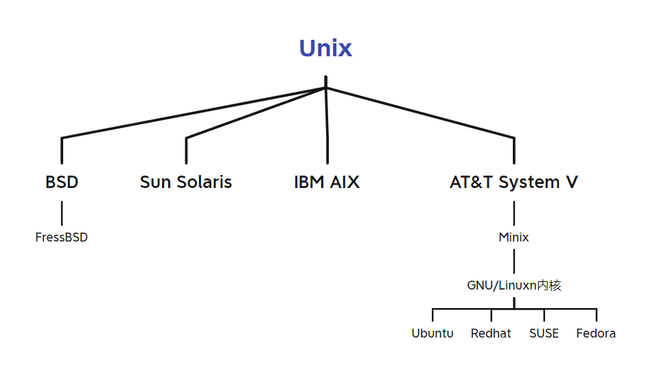
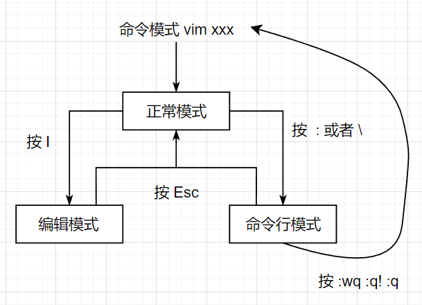

# 1、Linux基础



## 1、目录结构

Linux 文件系统是采用层级式的树状目录结构，在此结构中的最上层是根目录 **/**，然后在根目录下创建其他目录

| 目录       | 作用                                                         |
| ---------- | ------------------------------------------------------------ |
| /bin       | Binary 缩写，存放常用命令                                    |
| /sbin      | Super 缩写，存放系统管理员的管理系统命令                     |
| /home      | 存放普通用户的主目录，Linux 中每个用户都有自己的目录，一般以用户名命名，用户登陆时会自动进入 |
| /root      | 系统管理员的主目录                                           |
| /proc      | 虚拟目录，是系统内存的映射，访问可以获取系统信息             |
| /srv       | Service 缩写，存放一些服务启动时需要提取的数据               |
| /sys       | 安装了 Linux 内核 2.6 之后出现的新文件系统                   |
| /tmp       | 存放临时文件                                                 |
| /dev       | 类似 Windos 的设备管理系统，把所有硬件以文件存储             |
| /media     | Linux 自动识别到的光驱、DVD等设备会自动挂载到这个目录下      |
| /mnt       | 让用户可以临时挂载其他的文件系统，访问该目录即可查看挂载内容 |
| /opt       | 给主机额外安装软件的目录，例如Oracle即可安装于此             |
| /usr/local | 另一个给主机额外安装软件的目录，一般用于从源码开始编译安装   |
| /var       | 经常被修改的文件存放于此，例如日志文件                       |
| /selinux   | Linux 的安全子系统，可以限制只能访问特定文件                 |


## 2、vi/vim 编辑器

### 1、正常模式

在正常模式下，可以使用快捷键，以 vim 打开一个档案就直接进入一般模式了，这是默认的模式

在正常模式中，可以使用上下左右按键来移动光标，可以删除字符或删除整行来处理档案内容， 也可以使用复制、粘贴来处理文件数据

| 快捷键  | 作用                              |
| ------- | --------------------------------- |
| yy      | 拷贝当前行，5yy拷贝当前行的后五行 |
| dd      | 删除当前行，5dd删除当前行的后五行 |
| /关键字 | 查找关键子，按N查找下一个         |
| :set nu | 设置行号，nonu就是取消            |
| G       | 移到文档末尾                      |
| gg      | 移到文档首部                      |


### 2、编辑模式

在模式下，可以输入内容

按下 iIoOaArR 等任何一个字母之后才会进入编辑模式， 一般来说按 i 即可


### 3、命令行模式 

在这个模式当中， 提供相关指令完成读取、存盘、替换、离开 vim 、显示行号等动作




## 3、关开机

| 命令     | 作用                                                         |
| -------- | ------------------------------------------------------------ |
| shutdown | shutdown -h now：表示立即关机<br />shutdown -h 1：表示 1 分钟后关机<br />shutdown -r now：立即重启 |
| halt     | 效果等价于关机                                               |
| reboot   | 重启系统                                                     |
| syn      | 把内存的数据同步到磁盘                                       |
| logout   | 注销用户，图形运行级别无效，在运行级别 3 下有效              |


**注意**：

- 当关机或者重启时，都应该先执行以下 sync 指令，把内存的数据写入磁盘，防止数据丢失


## 4、用户管理

### 1、基本操作

Linux 系统是一个多用户多任务的操作系统，任何一个要使用系统资源的用户，都必须首先向系统管理员申请一个账号，然后以这个账号的身份进入系统

Linux 的用户需要至少要属于一个组

| 命令                     | 作用                                                         |
| ------------------------ | ------------------------------------------------------------ |
| useradd [选项] 用户名    | 添加用户<br />用户创建成功后，会自动的创建和用户同名的home目录<br />选项：-d 指定目录 useradd -d /home/test test<br />选项：-g 组名 ，新增用户时同时添加到组中 |
| passwd 用户名            | 修改指定用户密码                                             |
| userdel 用户名           | 删除用户<br />默认不删除home目录<br />选项：-r 删除用户的同时删除home目录 |
| id 用户名                | 查询用户<br />当用户不存在时，返回无此用户                   |
| su – 用户名              | 切换到指定用户<br />从高权限用户切换到低权限用户，不需要输入密码，反之需要<br />当需要返回到原来用户时，使用 exit 指令 |
| usermod -g 用户组 用户名 | 修改用户组                                                   |
|                          |                                                              |


### 2、用户组

类似于角色，系统可以对有共性的多个用户进行统一的管理

| 命令          | 作用   |
| ------------- | ------ |
| groupadd 组名 | 增加组 |
| groupdel 组名 | 删除组 |


### 3、相关文件

**/etc/passwd**：

- 用户（user）的配置文件，记录用户的各种信息 
- 格式：**用户名:口令:用户标识号:组标识号:注释性描述:主目录:登录 Shell**


**/etc/shadow**：

- 口令的配置文件 
- 格式：**登录名:加密口令:最后一次修改时间:最小时间间隔:最大时间间隔:警告时间:不活动时间:失效时间:标志**


**/etc/group**：

- 组（group）的配置文件，记录 Linux 包含的组的信息 
- 格式：**组名:口令:组标识号:组内用户列表**


## 5、运行级别

运行级别说明： 

- 0 ：关机 
- 1 ：单用户【找回丢失密码】 
- 2：多用户状态没有网络服务 
- 3：多用户状态有网络服务 
- 4：系统未使用保留给用户 
- 5：图形界面 
- 6：系统重启 

常用运行级别是 3 和 5，要修改默认的运行级别可改文件 **/etc/inittab** 的 **id:5:initdefault:** 这一行中的数

命令：init [012356]，切换到指定的运行级别


## 6、常用命令

| 命令                       | 作用                                 |
| :------------------------- | ------------------------------------ |
| su root                    | 切换为root用户                       |
| sudo adduser username sudo | 添加用户进sudoers文件                |
| yum update                 | 更新yum                              |
| vim filepath               | 修改文件                             |
| :wq                        | 退出修改并保存                       |
| :q!                        | 强制退出不保存                       |
| i                          | 写入模式                             |
| esc                        | 退出                                 |
| dnf remove xxxx            | 卸载                                 |
| rm xxxx                    | 删除文件                             |
| systemctl list-unit-files  | 查看自启列表                         |
| yum -y update              | 升级所有包同时也升级软件和系统内核； |
| yum -y upgrade：           | 只升级所有包，不升级软件和系统内核   |


### 4、firwall命令

启动： systemctl start firewalld

关闭： systemctl stop firewalld

查看状态： systemctl status firewalld

开机禁用 ： systemctl disable firewalld

开机启用 ： systemctl enable firewalld

查看开放的端口：netstat -anp 或者 firewall-cmd --list-port

开放端口：firewall-cmd --zone=public --add-port=端口号/tcp --permanent

关闭端口：firewall-cmd --zone=public --remove-port=端口号/tcp --permanent

**注意**：

- 端口号-端口号，可以批量打开，同理可已批量删除
- --permanent，永久生效，重启不会恢复


### 帮助类命令

#### 1、man 命令

man [命令或配置文件]（功能描述：获得帮助信息）

例如：man ls 查看 ls 命令的提示


#### 2、help 命令

help [命令]（功能描述：获得 shell 内置命令的帮助信息）

例如：help cd 查看 cd 命令的帮助信息


### 文件类命令

#### 1、pwd 命令

pwd（功能描述：显示当前工作目录的绝对路径）


#### 2、ls 命令

ls [选项] [目录或是文件]（功能描述：查看当前目录文件信息）

- -a ：显示当前目录所有的文件和目录，包括隐藏的
- -l ：以列表的方式显示信息


#### 3、cd 命令

cd [参数]（功能描述：切换到指定目录）

cd ~ 或者 cd 回到自己的家目录 

cd .. 回到当前目录的上一级目录


#### 4、mkdir 命令

mkdir [选项] 要创建的目录（功能描述：指令用于创建目录）

-p ：创建多级目


#### 5、rmdir 命令

rmdir [选项] 要删除的空目录（功能描述：指令删除空目录）

rmdir 删除的是空目录，如果目录下有内容时无法删除的

如果需要删除非空目录，需要使用 rm -rf 要删除的目录


#### 6、touch 命令

touch 文件名称（功能描述：指令创建空文件）


#### 7、cp 命令

cp [选项] sour dest （功能描述：指令拷贝文件到指定目录）

-r ：递归复制整个文件夹

强制覆盖不提示的方法：\cp


#### 8、rm 命令

rm [选项] 要删除的文件或目录（功能描述：指令移除【删除】文件或目录）

-r ：递归删除整个文件夹 

-f ：强制删除不提示


#### 9、mv 命令

mv oldNameFile newNameFile (功能描述：重命名) 

mv /temp/movefile /targetFolder (功能描述：移动文件)


#### 10、cat 命令

cat [选项] 要查看的文件（功能描述：查看文件内容，是以只读的方式打开) 

-n ：显示行号

cat 只能浏览文件，而不能修改文件，为了浏览方便，一般会带上管道命令 | more 

cat 文件名 | more [分页浏览]


#### 11、more 命令

more 要查看的文件

more 指令是一个基于 VI 编辑器的文本过滤器，它以全屏幕的方式按页显示文本文件的内容

more 指令中内置了若干快捷键


#### 12、less 命令

less 要查看的文件

less 指令用来分屏查看文件内容，它的功能与 more 指令类似，但是比 more 指令更加强大，支持各种显示终端

less 指令在显示文件内容时，并不是一次将整个文件加载之后才显示，而是根据显示需要加载内容，对于显示大型文件具有较高的效率


#### 13、\>、>> 命令

\> 输出重定向 : 会将原来的文件的内容覆盖 

\>\> 追加： 不会覆盖原来文件的内容，而是追加到文件的尾部

例如：cat 文件 1 > 文件 2 （功能描述：用文件 1 覆盖文件 2）


#### 14、echo 命令

echo [选项] [输出内容] （功能描述：输出内容到控制台）

例如：echo $Path 使用 echo 指令输出环境变量，输出当前的环境路径


#### 15、head 命令

head 用于显示文件的开头部分内容，默认情况下 head 指令显示文件的前 10 行内容

head 文件（功能描述：查看文件头 10 行内容）

head -n 5 文件（功能描述：查看文件头 5 行内容，也可以是任意行数）


#### 16、tail 命令

tail 用于输出文件中尾部的内容，默认情况下 tail 指令显示文件的后 10 行内容

tail 文件（功能描述：查看文件后 10 行内容）

tail -n 5 文件（功能描述：查看文件后 5 行内容，也可以是任意行数）

tail -f 文件（功能描述：实时追踪该文档的所有更新，工作经常使用）


#### 17、ln 指令

软链接也叫符号链接，类似于 windows 里的快捷方式，主要存放了链接其他文件的路径

ln -s [原文件或目录] [软链接名]（功能描述：给原文件创建一个软链接）

**注意**：

- 使用 pwd 指令查看目录时，仍然看到的是软链接所在目录


#### 18、history 命令

history （功能描述：查看已经执行过历史命令）

例如：history 10 查看历史命令10条


### 日期类命令

#### 1、date 命令

date （功能描述：显示当前时间）

date +%Y （功能描述：显示当前年份）

date +%m （功能描述：显示当前月份）

date +%d （功能描述：显示当前是哪一天）

date "+%Y-%m-%d %H:%M:%S"（功能描述：显示年月日时分秒）

date -s 字符串时间（功能描述：设置系统当前时间）


#### 2、cal 指令

cal [选项] （功能描述：不加选项，显示本月日历）

例如：cal 2022 显示2022年日历


### 搜索查找类命令

#### 1、find 指令

find [搜索范围] [选项]（功能描述：将从指定目录向下递归地遍历其各个子目录，将满足条件的文件或者目录显示在终端）

-name 通过名字查找

-user 通过属于某个用户查找

-size 通过文件大小查找


#### 2、locate 命令

locate 搜索文件（功能描述：快速定位文件路径）

locate 指令利用事先建立的系统中所有文件名称及路径的 locate 数据库实现快速定位给定的文件

locate 指令无需遍历整个文件系统，查询速度较快，为了保证查询结果的准确度，管理员必须定期更新 locate 时刻


**注意**：

- 由于 locate 指令基于数据库进行查询，所以第一次运行前，必须使用 updatedb 指令创建 locate 数 据库


#### 3、grep、|命令

grep 过滤查找

管道符 | 表示将前一个命令的处理结果输出传递给后面的命令处理

grep [选项] 查找内容 源文件

-n：显示匹配行的行号

-i：忽略大小写

例如：cat test.txt | grep -in yes 查找test文件中的yes字符


### 压缩解压类命令

#### 1、tar 命令

tar本身是一个打包命令，用来打包或者解包后缀名为.tar

配合参数可同时实现打包和压缩

- -c或--create：建立新的备份文件
- -x或--extract或--get：从备份文件中还原文件
- -v：显示指令执行过程
- -f或--file：指定备份文件
- -C：指定目的目录
- -z：通过gzip指令处理备份文件
- -j：通过bzip2指令处理备份文件


#### 2、gzip/gunzip 命令

Linux压缩文件中最常见的后缀名即为.gz，gzip是用来压缩和解压.gz文件的命令

- -d或--decompress或--uncompress：解压文件
- -r或--recursive：递归压缩指定文件夹下的文件（该文件夹下的所有文件被压缩成单独的.gz文件）
- -v或--verbose：显示指令执行过程

**注意**：

- 使用 gzip 对文件进行压缩后，不会保留原来的文件

- gzip命令只能压缩单个文件，而不能把一个文件夹压缩成一个文件（与打包命令的区别）


#### 3、zip/unzip 命令

zip命令和unzip命令用在在Linux上处理.zip的压缩文件

- zip：
  - -v：显示指令执行过程
  - -m：不保留原文件
  - -r：递归处理，即压缩目录

- unzip：
  - -v：显示指令执行过程
  - -d：解压到指定目录


## 7、组/权限管理

#### 1、组基本介绍

在 linux 中的每个用户必须属于一个组，不能独立于组外

在 linux 中每个文件 有所有者、所在组、其它组的概念


# 扩展

## 配置Root用户

```shell
切换为root用户
sudo root
修改sshd_config文件
vim /etc/ssh/sshd_config

修改PasswordAuthentication
PasswordAuthentication no  -->  PasswordAuthentication yes
修改PermitRootLogin
PermitRootLogin no -->  PermitRootLogin yes

重启ssh服务
systemctl restart sshd.service

chkconfig --add sshd
chkconfig sshd on
```


## 配置Java

查看默认JDK

```shell
rpm -qa|grep java
```

卸载默认JDK

```shell
rpm -e --nodeps java-1.8.0-openjdk-headless-1.8.0.302.b08-0.el8_4.x86_64
rpm -e --nodeps java-1.8.0-openjdk-1.8.0.282.b08-4.el8.x86_64
rpm -e --nodeps java-1.8.0-openjdk-headless-1.8.0.282.b08-4.el8.x86_64
```

下载JDK

解压JDK

```shell
tar -zxvf jdk-17_linux-x64_bin.tar.gz
```

配置环境变量

```shell
vim /etc/profile
```

```text
#java environment
#JDK路径
export JAVA_HOME=/root/jdk-15. 
export CLASSPATH=.:${JAVA_HOME}/jre/lib/rt.jar:${JAVA_HOME}/lib/dt.jar:${JAVA_HOME}/lib/tools.jar
export PATH=$PATH:${JAVA_HOME}/bin
```

让环境变量生效

```shell
source /etc/profile
```

检查Java

```shell
java -version
```


## 配置MySQL

下载源

```shell
wget https://dev.mysql.com/get/mysql80-community-release-el8-1.noarch.rpm
```

安装数据源

```shell
yum install mysql80-community-release-el8-1.noarch.rpm
```

检查数据源是否安装成功

```shell
yum repolist enabled | grep "mysql.*-community.*"
```

禁用CentOS自带mysql模块

```shell
yum module disable mysql
```

安装数据库

```shell
yum install mysql-community-server
```

启动mysql

```shell
service mysqld start
```

检查mysql服务状态

```shell
service mysqld status
```

显示mysql的随机密码

```shell
grep 'temporary password' /var/log/mysqld.log       #OroJ(q)4A=gT
```

登录mysql

```shell
mysql -uroot -p
```

修改mysql密码

```shell
ALTER USER 'root'@'localhost' IDENTIFIED BY 'admin';
```

查看密码策略

```shell
SHOW VARIABLES LIKE 'validate_password%';
```

修改密码长度（长度）

```shell
set global validate_password.length=1;
```

修改密码等级（等级）

```shell
set global validate_password.policy=0;
```

Mysql8.0.22开放远程访问

1、先创建权限记录

```shell
create user 'root'@'%' identified by 'admin';
```

2、授权

```shell
grant all privileges on *.* to 'root'@'%' with grant option;
```

开放防火墙端口

添加自启

systemctl enable mysqld


## 配置Redis

先安装gcc

```shell
yum install gcc
```

安装编译工具

```shell
dnf group install "Development Tools"
```

下载redis

```shell
wget http://download.redis.io/releases/redis-6.0.5.tar.gz
```

解压redis

```shell
tar -zxvf redis-6.0.5.tar.gz
```

执行make

```shell
cd /root/Redis/redis-6.2.5
make
make install PREFIX=/root/Redis/redis
```

将redia添加到ststemctl中

在/usr/lib/systemd/system/redis.service创建，添加以下文本

```java
[Unit]
Description=Redis
After=network.target

[Service]
Type=forking
ExecStart=/root/Redis/redis/bin/redis-server /root/Redis/config/redis.conf
ExecReload=/bin/kill -s HUP $MAINPID
ExecStop=/bin/kill -s QUIT $MAINPID
ExecStop=/bin/kill -s TERM $MAINPID
ExecStartPost=/bin/sh -c "echo $MAINPID > /run/redis/redis_6310.pid"
PIDFile=/var/run/redis_6310.pid
PrivateTmp=true

[Install]
WantedBy=multi-user.target
```

为/var/run/redis_6310.pid授予权限

不授予权限可能报错

错误：Failed to parse PID from file /run/redis/redis.pid: Invalid argument等

```shell
chmod -R 777 /var/run/redis/
```

systemctl启动

```shell
systemctl daemon-reload
systemctl enable redisr
systemctl start redis
systemctl stop redis
systemctl status redis
```

查看redis进程

```shell
ps -aux |grep redis
```

手动启动 

```shell
/root/Redis/redis/bin/redis-server /root/Redis/redis-6.2.5/redis.conf
```

**另外**

还需要将/root/Redis/redis-6.2.5/redis.conf中的属性修改

```
daemonize yes
pidfile /var/run/redis/redis_.pid
bind 127.0.0.0
```


## 配置Python

安装python3.6

```shell
yum install python36
```

更改Python的软连接使得python命令调用python3

首先修改yum的配置文件

```shell
vim /usr/bin/yum
```

将首部的注释改成如下

```shell
python版本根据本机而定
#!/usr/bin/python2.7
```

在修改下一个配置，同样的操作

```shell
vim /usr/libexec/urlgrabber-ext-down
```

删除软连接

```shell
rm python
```

修改软连接

```shell
ln -s python3.6 python
```


## 配置虚拟机网络

配置网络连接时，有三种形式：

- 桥接：Linux可以和其他系统通信，但是可能造成IP冲突
- NAT：网络地址转换，Linux可以访问外网，不会造成IP冲突
- 主机模式：Linux是一个独立的主机，不能访问外网

修改虚拟机的网络适配器为VM8


修改VMware的虚拟网络编辑器

- 修改子网ip为192.168.100.0
- 子网掩码为255.255.255.0


再修改其中的NAT设置

- 其中的网关ip为192.168.100.1
  - 需要与子网ip为同一号段


修改本机的网络适配器中的vm8


修改ip地址为子网ip的同一号段，此处设置为192.168.100.99

设置子网掩码为255.255.255.0

设置默认网关为上文NAT设置的网关ip192.168.100.1

最后修改虚拟机的ifcfg-ens33文件

```shell
cd /etc/sysconfig/network-scripts
```

```shell
vim ifcfg-ens33
```

```text
TYPE=Ethernet
PROXY_METHOD=none
BROWSER_ONLY=no
BOOTPROTO=static			#改为静态

DEFROUTE=yes
IPV4_FAILURE_FATAL=no
IPV6INIT=yes
IPV6_AUTOCONF=yes
IPV6_DEFROUTE=yes
IPV6_FAILURE_FATAL=no
IPV6_ADDR_GEN_MODE=stable-privacy
NAME=ens33
UUID=6eab4686-ca67-4038-95d3-f8994a7e294a
DEVICE=ens33
ONBOOT=yes					#改为yes

IPADDR=192.168.100.2		#添加静态IP地址，网段需要和步骤一中的子网IP网段一致
NETMASK=255.255.255.0		#添加子网掩码
PREFIX=24
GATEWAY=192.168.100.1		#添加网关IP地址，和NAT设置中的网关IP一致
DNS1=114.114.114.114

```

重启网络服务

```shell
service network restart
```


## 配置梯子

```shell
bash <(curl -s -L https://git.io/v2ray.sh)
```

[V2Ray一键安装脚本 · 233boy/v2ray Wiki (github.com)](https://github.com/233boy/v2ray/wiki/V2Ray一键安装脚本)


## 配置Nginx域名

给Nginx的主配置文件的http节点下的server节点的内容 Nginx.conf

```properties
server {
	listen       80;  #监听的端口
	server_name  fantong.fun; #要映射的域名

	#charset koi8-r;

	#access_log  logs/host.access.log  main;

	location / {
		root   html;
		proxy_pass http://150.230.56.69:8894; #代理的地址，也就是域名映射后的位置
		index  index.html index.htm;
		proxy_set_header Host $host;
   		proxy_set_header X-Real-IP $remote_addr;
   		proxy_set_header REMOTE-HOST $remote_addr;
   	proxy_set_header X-Forwarded-For $proxy_add_x_forwarded_for;
	}

	#error_page  404              /404.html;

	# redirect server error pages to the static page /50x.html
	#
	error_page   500 502 503 504  /50x.html;
	location = /50x.html {
	root   html;
}
```

重启Nginx

```shell
/usr/local/nginx/sbin/nginx -s reload
```

nohup java -jar /root/work/EatWhatSpecial-0.0.1.jar &

```shell
docker run -itd --name=t -p 8888:8080 -v /data/tomcat/webapps:/usr/local/tomcat/webapps tomcat:9.0
```

