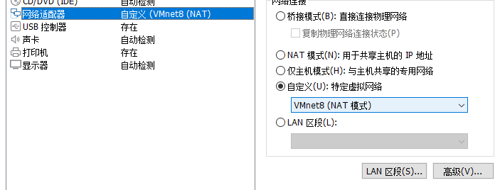
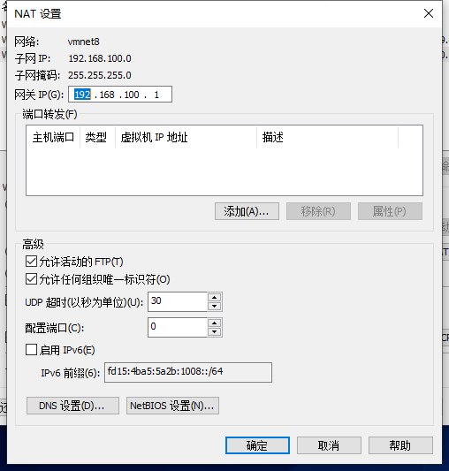
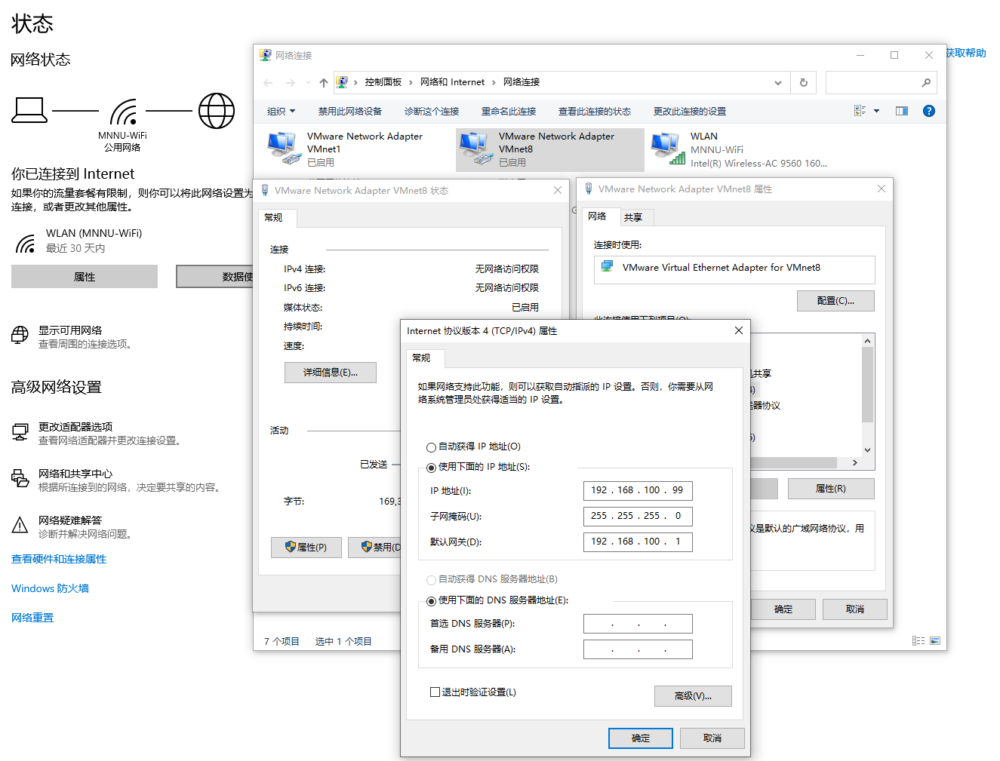

# Linux常用指令

| 指令                       | 作用                                 |
| :------------------------- | ------------------------------------ |
| su root                    | 切换为root用户                       |
| sudo adduser username sudo | 添加用户进sudoers文件                |
| yum update                 | 更新yum                              |
| vim filepath               | 修改文件                             |
| :wq                        | 退出修改并保存                       |
| :q!                        | 强制退出不保存                       |
| i                          | 写入模式                             |
| esc                        | 退出                                 |
| dnf remove xxxx            | 卸载                                 |
| rm xxxx                    | 删除文件                             |
| systemctl list-unit-files  | 查看自启列表                         |
| yum -y update              | 升级所有包同时也升级软件和系统内核； |
| yum -y upgrade：           | 只升级所有包，不升级软件和系统内核   |


## tar命令

`tar`本身是一个打包命令，用来打包或者解包后缀名为`.tar`。配合参数可同时实现打包和压缩。

### 常用参数

- `-c`或`--create`：建立新的备份文件；
- `-x`或`--extract`或`--get`：从备份文件中还原文件；
- `-v`：显示指令执行过程；
- `-f`或`--file`：指定备份文件；
- `-C`：指定目的目录；
- `-z`：通过`gzip`指令处理备份文件；
- `-j`：通过`bzip2`指令处理备份文件。

## gzip命令

Linux压缩文件中最常见的后缀名即为`.gz`，`gzip`是用来压缩和解压`.gz`文件的命令。

### 常用参数

- `-d`或`--decompress`或`--uncompress`：解压文件；
- `-r`或`--recursive`：递归压缩指定文件夹下的文件（该文件夹下的所有文件被压缩成单独的`.gz`文件）；
- `-v`或`--verbose`：显示指令执行过程。

**注**：`gzip`命令只能压缩单个文件，而不能把一个文件夹压缩成一个文件（与打包命令的区别）。

## zip和unzip命令

`zip`命令和`unzip`命令用在在Linux上处理`.zip`的压缩文件。

### 常用参数

- ```
  zip
  ```

  - `-v`：显示指令执行过程；
  - `-m`：不保留原文件；
  - `-r`：递归处理。

- ```
  unzip
  ```

  - `-v`：显示指令执行过程；
  - `-d`：解压到指定目录。

## Firewall组件

### 1、基本使用

启动： systemctl start firewalld

关闭： systemctl stop firewalld

查看状态： systemctl status firewalld

开机禁用 ： systemctl disable firewalld

开机启用 ： systemctl enable firewalld

## 允许ROOT与密码登陆

```shell
切换为root用户
sudo root
修改sshd_config文件
vim /etc/ssh/sshd_config

修改PasswordAuthentication
PasswordAuthentication no  -->  PasswordAuthentication yes
修改PermitRootLogin
PermitRootLogin no -->  PermitRootLogin yes

重启ssh服务
systemctl restart sshd.service
chkconfig --add sshd
chkconfig sshd on
```

## 配置Java环境

查看默认JDK

```shell
rpm -qa|grep java
```

卸载默认JDK

```shell
rpm -e --nodeps java-1.8.0-openjdk-headless-1.8.0.302.b08-0.el8_4.x86_64
rpm -e --nodeps java-1.8.0-openjdk-1.8.0.282.b08-4.el8.x86_64
rpm -e --nodeps java-1.8.0-openjdk-headless-1.8.0.282.b08-4.el8.x86_64
```

下载JDK

解压JDK

```shell
tar -zxvf jdk-17_linux-x64_bin.tar.gz
```

配置环境变量

```shell
vim /etc/profile
```

```text
#java environment
#JDK路径
export JAVA_HOME=/root/jdk-15. 
export CLASSPATH=.:${JAVA_HOME}/jre/lib/rt.jar:${JAVA_HOME}/lib/dt.jar:${JAVA_HOME}/lib/tools.jar
export PATH=$PATH:${JAVA_HOME}/bin
```

让环境变量生效

```shell
source /etc/profile
```

检查Java

```shell
java -version
```

## 配置MySQL

下载源

```shell
wget https://dev.mysql.com/get/mysql80-community-release-el8-1.noarch.rpm
```

安装数据源

```shell
yum install mysql80-community-release-el8-1.noarch.rpm
```

检查数据源是否安装成功

```shell
yum repolist enabled | grep "mysql.*-community.*"
```

禁用CentOS自带mysql模块

```shell
yum module disable mysql
```

安装数据库

```shell
yum install mysql-community-server
```

启动mysql

```shell
service mysqld start
```

检查mysql服务状态

```shell
service mysqld status
```

显示mysql的随机密码

```shell
grep 'temporary password' /var/log/mysqld.log       #OroJ(q)4A=gT
```

登录mysql

```shell
mysql -uroot -p
```

修改mysql密码

```shell
ALTER USER 'root'@'localhost' IDENTIFIED BY 'admin';
```

查看密码策略

```shell
SHOW VARIABLES LIKE 'validate_password%';
```

修改密码长度（长度）

```shell
set global validate_password.length=1;
```

修改密码等级（等级）

```shell
set global validate_password.policy=0;
```

Mysql8.0.22开放远程访问

1、先创建权限记录

```shell
create user 'root'@'%' identified by 'admin';
```

2、授权

```shell
grant all privileges on *.* to 'root'@'%' with grant option;
```

开放防火墙端口

添加自启

systemctl enable mysqld

## 配置Redis

先安装gcc

```shell
yum install gcc
```

安装编译工具

```shell
dnf group install "Development Tools"
```

下载redis

```shell
wget http://download.redis.io/releases/redis-6.0.5.tar.gz
```

解压redis

```shell
tar -zxvf redis-6.0.5.tar.gz
```

执行make

```shell
cd /root/Redis/redis-6.2.5
make
make install PREFIX=/root/Redis/redis
```

将redia添加到ststemctl中

在/usr/lib/systemd/system/redis.service创建，添加以下文本

```java
[Unit]
Description=Redis
After=network.target

[Service]
Type=forking
ExecStart=/root/Redis/redis/bin/redis-server /root/Redis/config/redis.conf
ExecReload=/bin/kill -s HUP $MAINPID
ExecStop=/bin/kill -s QUIT $MAINPID
ExecStop=/bin/kill -s TERM $MAINPID
ExecStartPost=/bin/sh -c "echo $MAINPID > /run/redis/redis_6310.pid"
PIDFile=/var/run/redis_6310.pid
PrivateTmp=true

[Install]
WantedBy=multi-user.target
```

为/var/run/redis_6310.pid授予权限

不授予权限可能报错

错误：Failed to parse PID from file /run/redis/redis.pid: Invalid argument等

```shell
chmod -R 777 /var/run/redis/
```

systemctl启动

```shell
systemctl daemon-reload
systemctl enable redisr
systemctl start redis
systemctl stop redis
systemctl status redis
```

查看redis进程

```shell
ps -aux |grep redis
```

手动启动 

```shell
/root/Redis/redis/bin/redis-server /root/Redis/redis-6.2.5/redis.conf
```

**另外**

还需要将/root/Redis/redis-6.2.5/redis.conf中的属性修改

```
daemonize yes
pidfile /var/run/redis/redis_.pid
bind 127.0.0.0
```

## 配置Python

安装python3.6

```shell
yum install python36
```

更改Python的软连接使得python命令调用python3

首先修改yum的配置文件

```shell
vim /usr/bin/yum
```

将首部的注释改成如下

```shell
python版本根据本机而定
#!/usr/bin/python2.7
```

在修改下一个配置，同样的操作

```shell
vim /usr/libexec/urlgrabber-ext-down
```

删除软连接

```shell
rm python
```

修改软连接

```shell
ln -s python3.6 python
```


## 联网

修改虚拟机的网络适配器为VM8



修改VMware的虚拟网络编辑器

- 修改子网ip为192.168.100.0
- 子网掩码为255.255.255.0


再修改其中的NAT设置

- 其中的网关ip为192.168.100.1
  - 需要与子网ip为同一号段



修改本机的网络适配器中的vm8



修改ip地址为子网ip的同一号段，此处设置为192.168.100.99

设置子网掩码为255.255.255.0

设置默认网关为上文NAT设置的网关ip192.168.100.1

最后修改虚拟机的ifcfg-ens33文件

```shell
cd /etc/sysconfig/network-scripts
```

```shell
vim ifcfg-ens33
```

```text
TYPE=Ethernet
PROXY_METHOD=none
BROWSER_ONLY=no
BOOTPROTO=static			#改为静态

DEFROUTE=yes
IPV4_FAILURE_FATAL=no
IPV6INIT=yes
IPV6_AUTOCONF=yes
IPV6_DEFROUTE=yes
IPV6_FAILURE_FATAL=no
IPV6_ADDR_GEN_MODE=stable-privacy
NAME=ens33
UUID=6eab4686-ca67-4038-95d3-f8994a7e294a
DEVICE=ens33
ONBOOT=yes					#改为yes

IPADDR=192.168.100.2		#添加静态IP地址，网段需要和步骤一中的子网IP网段一致
NETMASK=255.255.255.0		#添加子网掩码
PREFIX=24
GATEWAY=192.168.100.1		#添加网关IP地址，和NAT设置中的网关IP一致
DNS1=114.114.114.114

```

重启网络服务

```shell
service network restart
```

## 梯子

```shell
bash <(curl -s -L https://git.io/v2ray.sh)
```

[V2Ray一键安装脚本 · 233boy/v2ray Wiki (github.com)](https://github.com/233boy/v2ray/wiki/V2Ray一键安装脚本)

# 使用Nginx进行域名映射

给Nginx的主配置文件的http节点下的server节点的内容。Nginx.conf

```properties
server {
	listen       80;  #监听的端口
	server_name  fantong.fun; #要映射的域名

	#charset koi8-r;

	#access_log  logs/host.access.log  main;

	location / {
		root   html;
		proxy_pass http://150.230.56.69:8894; #代理的地址，也就是域名映射后的位置
		index  index.html index.htm;
		proxy_set_header Host $host;
   		proxy_set_header X-Real-IP $remote_addr;
   		proxy_set_header REMOTE-HOST $remote_addr;
   	proxy_set_header X-Forwarded-For $proxy_add_x_forwarded_for;
	}

	#error_page  404              /404.html;

	# redirect server error pages to the static page /50x.html
	#
	error_page   500 502 503 504  /50x.html;
	location = /50x.html {
	root   html;
}
```

重启Nginx

```shell
/usr/local/nginx/sbin/nginx -s reload
```

nohup java -jar /root/work/EatWhatSpecial-0.0.1.jar &


```shell
docker run -itd --name=t -p 8888:8080 -v /data/tomcat/webapps:/usr/local/tomcat/webapps tomcat:9.0
```

