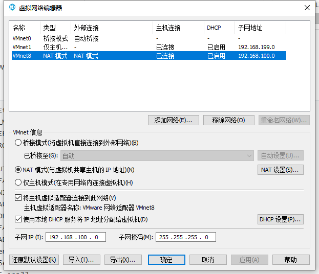

# Linux常用指令

| 指令                       | 作用                                 |
| :------------------------- | ------------------------------------ |
| su root                    | 切换为root用户                       |
| sudo adduser username sudo | 添加用户进sudoers文件                |
| yum update                 | 更新yum                              |
| vim filepath               | 修改文件                             |
| :wq                        | 退出修改并保存                       |
| :q!                        | 强制退出不保存                       |
| i                          | 写入模式                             |
| esc                        | 退出                                 |
| dnf remove xxxx            | 卸载                                 |
| rm xxxx                    | 删除文件                             |
| systemctl list-unit-files  | 查看自启列表                         |
| yum -y update              | 升级所有包同时也升级软件和系统内核； |
| yum -y upgrade：           | 只升级所有包，不升级软件和系统内核   |


## tar命令

`tar`本身是一个打包命令，用来打包或者解包后缀名为`.tar`。配合参数可同时实现打包和压缩。

### 常用参数

- `-c`或`--create`：建立新的备份文件；
- `-x`或`--extract`或`--get`：从备份文件中还原文件；
- `-v`：显示指令执行过程；
- `-f`或`--file`：指定备份文件；
- `-C`：指定目的目录；
- `-z`：通过`gzip`指令处理备份文件；
- `-j`：通过`bzip2`指令处理备份文件。

## gzip命令

Linux压缩文件中最常见的后缀名即为`.gz`，`gzip`是用来压缩和解压`.gz`文件的命令。

### 常用参数

- `-d`或`--decompress`或`--uncompress`：解压文件；
- `-r`或`--recursive`：递归压缩指定文件夹下的文件（该文件夹下的所有文件被压缩成单独的`.gz`文件）；
- `-v`或`--verbose`：显示指令执行过程。

**注**：`gzip`命令只能压缩单个文件，而不能把一个文件夹压缩成一个文件（与打包命令的区别）。

## zip和unzip命令

`zip`命令和`unzip`命令用在在Linux上处理`.zip`的压缩文件。

### 常用参数

- ```
  zip
  ```

  - `-v`：显示指令执行过程；
  - `-m`：不保留原文件；
  - `-r`：递归处理。

- ```
  unzip
  ```

  - `-v`：显示指令执行过程；
  - `-d`：解压到指定目录。

## Firewall组件

### 1、基本使用

启动： systemctl start firewalld

关闭： systemctl stop firewalld

查看状态： systemctl status firewalld

开机禁用 ： systemctl disable firewalld

开机启用 ： systemctl enable firewalld

## 允许ROOT与密码登陆

```shell
切换为root用户
sudo root
修改sshd_config文件
vim /etc/ssh/sshd_config

修改PasswordAuthentication
PasswordAuthentication no  -->  PasswordAuthentication yes
修改PermitRootLogin
PermitRootLogin no -->  PermitRootLogin yes

重启ssh服务
systemctl restart sshd.service
```

## 配置Java环境

查看默认JDK

```shell
rpm -qa|grep java
```

卸载默认JDK

```shell
rpm -e --nodeps java-1.8.0-openjdk-headless-1.8.0.302.b08-0.el8_4.x86_64
rpm -e --nodeps java-1.8.0-openjdk-1.8.0.282.b08-4.el8.x86_64
rpm -e --nodeps java-1.8.0-openjdk-headless-1.8.0.282.b08-4.el8.x86_64
```

下载JDK

解压JDK

```shell
tar -zxvf jdk-17_linux-x64_bin.tar.gz
```

配置环境变量

```shell
vim /etc/profile
```

```text
#java environment
#JDK路径
export JAVA_HOME=/root/java/jdk-15 
export CLASSPATH=.:${JAVA_HOME}/jre/lib/rt.jar:${JAVA_HOME}/lib/dt.jar:${JAVA_HOME}/lib/tools.jar
export PATH=$PATH:${JAVA_HOME}/bin
```

让环境变量生效

```shell
source /etc/profile
```

检查Java

```shell
java -version
```

## 配置MySQL

下载源

```shell
wget https://dev.mysql.com/get/mysql80-community-release-el8-1.noarch.rpm
```

安装数据源

```shell
yum install mysql80-community-release-el8-1.noarch.rpm
```

检查数据源是否安装成功

```shell
yum repolist enabled | grep "mysql.*-community.*"
```

禁用CentOS自带mysql模块

```shell
yum module disable mysql
```

安装数据库

```shell
yum install mysql-community-server
```

启动mysql

```shell
service mysqld start
```

检查mysql服务状态

```shell
service mysqld status
```

显示mysql的随机密码

```shell
grep 'temporary password' /var/log/mysqld.log       #OroJ(q)4A=gT
```

登录mysql

```shell
mysql -uroot -p
```

修改mysql密码

```shell
ALTER USER 'root'@'localhost' IDENTIFIED BY 'admin';
```

查看密码策略

```shell
SHOW VARIABLES LIKE 'validate_password%';
```

修改密码长度（长度）

```shell
set global validate_password.length=1;
```

修改密码等级（等级）

```shell
set global validate_password.policy=0;
```

Mysql8.0.22开放远程访问

1、先创建权限记录

```shell
create user 'root'@'%' identified by 'admin';
```

2、授权

```shell
grant all privileges on *.* to 'root'@'%' with grant option;
```

开放防火墙端口

添加自启

systemctl enable mysqld

## 配置Redis

先安装gcc

```shell
yum install gcc
```

安装编译工具

```shell
dnf group install "Development Tools"
```

下载redis

```shell
wget http://download.redis.io/releases/redis-6.0.5.tar.gz
```

解压redis

```shell
tar -zxvf redis-6.0.5.tar.gz
```

执行make

```shell
cd /root/Redis/redis-6.2.5
make
make install PREFIX=/root/Redis/redis
```

将redia添加到ststemctl中

在/usr/lib/systemd/system/redis.service创建，添加以下文本

```java
[Unit]
Description=Redis
After=network.target

[Service]
Type=forking
ExecStart=/root/Redis/redis/bin/redis-server /root/Redis/config/redis.conf
ExecReload=/bin/kill -s HUP $MAINPID
ExecStop=/bin/kill -s QUIT $MAINPID
ExecStop=/bin/kill -s TERM $MAINPID
ExecStartPost=/bin/sh -c "echo $MAINPID > /run/redis/redis_6310.pid"
PIDFile=/var/run/redis_6310.pid
PrivateTmp=true

[Install]
WantedBy=multi-user.target
```

为/var/run/redis_6310.pid授予权限

不授予权限可能报错

错误：Failed to parse PID from file /run/redis/redis.pid: Invalid argument等

```shell
chmod -R 777 /var/run/redis/
```

systemctl启动

```shell
systemctl daemon-reload
systemctl enable redisr
systemctl start redis
systemctl stop redis
systemctl status redis
```

查看redis进程

```shell
ps -aux |grep redis
```

手动启动 

```shell
/root/Redis/redis/bin/redis-server /root/Redis/redis-6.2.5/redis.conf
```

**另外**

还需要将/root/Redis/redis-6.2.5/redis.conf中的属性修改

```
daemonize yes
pidfile /var/run/redis/redis_.pid
bind 127.0.0.0
```

## 配置Python

安装python3.6

```shell
yum install python36
```

更改Python的软连接使得python命令调用python3

首先修改yum的配置文件

```shell
vim /usr/bin/yum
```

将首部的注释改成如下

```shell
python版本根据本机而定
#!/usr/bin/python2.7
```

在修改下一个配置，同样的操作

```shell
vim /usr/libexec/urlgrabber-ext-down
```

删除软连接

```shell
rm python
```

修改软连接

```shell
ln -s python3.6 python
```


## 联网

修改虚拟机的网络适配器为VM8


修改VMware的虚拟网络编辑器

- 修改子网ip为192.168.100.0
- 子网掩码为255.255.255.0



再修改其中的NAT设置

- 其中的网关ip为192.168.100.1
  - 需要与子网ip为同一号段


修改本机的网络适配器中的vm8


修改ip地址为子网ip的同一号段，此处设置为192.168.100.99

设置子网掩码为255.255.255.0

设置默认网关为上文NAT设置的网关ip192.168.100.1

最后修改虚拟机的ifcfg-ens33文件

```shell
cd /etc/sysconfig/network-scripts
```

```shell
vim ifcfg-ens33
```

```text
TYPE=Ethernet
PROXY_METHOD=none
BROWSER_ONLY=no
BOOTPROTO=static			#改为静态

DEFROUTE=yes
IPV4_FAILURE_FATAL=no
IPV6INIT=yes
IPV6_AUTOCONF=yes
IPV6_DEFROUTE=yes
IPV6_FAILURE_FATAL=no
IPV6_ADDR_GEN_MODE=stable-privacy
NAME=ens33
UUID=6eab4686-ca67-4038-95d3-f8994a7e294a
DEVICE=ens33
ONBOOT=yes					#改为yes

IPADDR=192.168.100.2		#添加静态IP地址，网段需要和步骤一中的子网IP网段一致
NETMASK=255.255.255.0		#添加子网掩码
PREFIX=24
GATEWAY=192.168.100.1		#添加网关IP地址，和NAT设置中的网关IP一致
DNS1=114.114.114.114

```

重启网络服务

```shell
service network restart
```

## 梯子

```shell
bash <(curl -s -L https://git.io/v2ray.sh)
```

[V2Ray一键安装脚本 · 233boy/v2ray Wiki (github.com)](https://github.com/233boy/v2ray/wiki/V2Ray一键安装脚本)


# Linux下重装Docker

## 1、卸载Docker

1、停止所有容器

```shell
docker stop $(docker ps -a -q)
```

2、删除所有容器

```shell
docker rm $(docker ps -a -q)
```

3、删除所有镜像

```shell
docker rmi $(docker images -q)
```

4、列出所有安装过的docker包

```shell
yum list installed | grep docker
```

5、删除所有安装过的docker包

```shell
yum -y remove xxxxxx
```

6、删除镜像和容器

```shell
rm -rf /var/lib/docker
```

7、卸载旧版本

```shell
yum remove docker docker-common docker-selinux docker-engine
```

8、检查内核版本是否符合docker要求

```shell
uname -r
```

## 2、安装Docker

1、重装依赖包

```shell
yum install -y yum-utils device-mapper-persistent-data lvm2
```

2、设置yum docker源

```shell
yum-config-manager --add-repo https://download.docker.com/linux/centos/docker-ce.repo
```

**tip**：如果OracleLinux中安装

一般不用

```shell
$ cat >/etc/yum.repos.d/docker.repo <<-EOF
```

```text
[dockerrepo]
name=Docker Repository
baseurl=https://yum.dockerproject.org/repo/main/oraclelinux/7
enabled=1
gpgcheck=1
gpgkey=https://yum.dockerproject.org/gpg
EOF
```

3、查看docker版本列表

```shell
yum list docker-ce --showduplicates | sort -r
```

4、安装稳定版

```shell
yum install docker-ce
```

5、启动docker并开机自启

```shell
systemctl start docker
systemctl enable docker
```

6、检查docker版本

```shell
docker version 16.0.2
```

# Docker操作

| 指令                                                         | 作用                                                         |
| ------------------------------------------------------------ | ------------------------------------------------------------ |
| docker search xxxx                                           | 在docker仓库中查找                                           |
| docker pull imagesname：tag                                  | ：tag可选，下载镜像版本，默认latest                          |
| docker images                                                | 查看本地镜像                                                 |
| docker rm image-id                                           | 删除指定本地镜像                                             |
| docker run --name container-name -d image-name               | -name 自定义容器名，-d 表示后台运行， image-name 指定容器模板 |
| docker ps -a                                                 | 查看运行中的容器，添加-a查看所有                             |
| docker stop container-name/id                                | 停止当前运行的容器                                           |
| docker start container-name/id                               | 启动容器                                                     |
| docker rm container-id                                       | 删除指定容器                                                 |
| docker logs container-name/id                                | 容器日志                                                     |
| docker run -d -p 6379：6379 --name myredis docker.io/redis   | -p:主机端口映射到容器内部端口，也可以不指定名字，会有默认名字 |
| docker start $(docker ps -a \| awk '{ print $1}' \| tail -n +2) | 启动所有容器                                                 |
| docker run -d -p 15672:15672  -p  5672:5672  -e RABBITMQ_DEFAULT_USER=root -e RABBITMQ_DEFAULT_PASS=admin --name rabbitmq --hostname=rabbitmqhostone  rabbitmq:3.9.5-management | 启动RabbitMQ                                                 |
| docker run -itd --name mysqlF -p 3306:3306 -e MYSQL_ROOT_PASSWORD=admin mysql |                                                              |
| docker run -d --name c7-d-1 -h c7-docker-1 -v /root/workspace/src:/root/workspace/src --privileged=true centos:centos7.9.2009 /usr/sbin/init |                                                              |

## 安装Tomcat

下载Tomcat9 https://dlcdn.apache.org/tomcat/tomcat-9/v9.0.56/bin/apache-tomcat-9.0.56.tar.gz

解压

```shell
tar -xzvf ........
```

启动

```shell
/tomcat/bin/startup.sh
```

配置service命令

进入到 /etc/init.d 文件夹下

```shell
vim tomcat
```

复制如下

```shell
 
        #!/bin/bash  
        # This is the init script for starting up the  
        #  Jakarta Tomcat server  
        #  
        # chkconfig: 345 91 10  
        # description: Starts and stops the Tomcat daemon.  
        #  
 
        # Source function library.  
        . /etc/rc.d/init.d/functions  
 
        # Get config.  
        . /etc/sysconfig/network  
 
        # Check that networking is up.  
        [ "${NETWORKING}" = "no" ] && exit 0  
 
        export JAVA_HOME=/root/jdk-15 #自己的jdk安装目录
        tomcat_home=/root/tomcat/apache-tomcat-9.0.56  #自己的tomcat安装目录
        startup=$tomcat_home/bin/startup.sh  
        shutdown=$tomcat_home/bin/shutdown.sh  
 
        start(){  
           echo -n "Starting Tomcat service:"  
           cd $tomcat_home  
           $startup  
           echo "tomcat is succeessfully started up"  
        }  
 
        stop(){  
           echo -n "Shutting down tomcat: "  
           cd $tomcat_home  
           $shutdown  
           echo "tomcat is succeessfully shut down."  
        }  
 
        status(){  
            numproc=`ps -ef | grep catalina | grep -v "grep catalina" | wc -l`  
            if [ $numproc -gt 0 ]; then  
               echo "Tomcat is running..."  
            else  
               echo "Tomcat is stopped..."  
            fi  
        }  
 
        restart(){  
           stop  
           start  
        }    
        # See how we were called.  
        case "$1" in  
        start)  
           start  
           ;;  
        stop)  
           stop  
           ;;  
        status)  
           status  
           ;;  
        restart)  
           restart  
           ;;  
        *)  
           echo $"Usage: $0 {start|stop|status|restart}"  
           exit 1  
        esac
```

添加权限

```shell
chmod 755 /etc/rc.d/init.d/tomcat
```

加入服务中

```shell
chkconfig --add tomcat
```

检查是否在服务中

```shell
chkconfig --list
```

设置开机在自启

```shell
chkconfig tomcat on
```

## 安装MySQL

拉取最新的MySQL

```shell
docker pull mysql:latest
```

查看是否已经安装了镜像

```shell
docker images
```

运行容器

**tip**：

--name 容器名字

-p 端口映射

-e 设置属性

-itd 如下

| Options | Mean                                               |
| ------- | -------------------------------------------------- |
| -i      | 以交互模式运行容器，通常与 -t 同时使用；           |
| -t      | 为容器重新分配一个伪输入终端，通常与 -i 同时使用； |
| -d      | 后台运行容器，并返回容器ID；                       |

最后添加镜像名，例如hello world


设置root密码，允许远程登陆

```
docker run -itd --name mysql -p 3306:3306 -e MYSQL_ROOT_PASSWORD=fuckharkadmin -e MYSQL_ROOT_HOST=% mysql #镜像名
```

查看容器运行情况

```shell
docker ps
```

进入容器

```shell
docker exec -it 容器名/id bash
```

登陆mysql

```
ALTER USER 'root'@'localhost' IDENTIFIED BY 'admin';
```

为mysql添加一个支持远程登陆的账户

```mysql
CREATE USER 'wolong'@'%' IDENTIFIED WITH mysql_native_password BY 'mnnuwolong';
GRANT ALL PRIVILEGES ON *.* TO 'wolong'@'%';
flush privileges;
```

## 安装Redis

首先拉取redis镜像

```shell
docker pull redis
```

修改redis.conf配置文件

```text
bind 127.0.0.1 			#注释掉这部分，使redis可以外部访问
daemonize no 			#用守护线程的方式启动，改为yes会使配置文件方式启动redis失败，改为yes意为以守护进程方式启动，可后台运行，除非kill进程（可选）
requirepass admin 		#给redis设置密码,原本这行是注释掉的，关闭注释即可
appendonly yes 			#redis持久化，默认是no，（可选）
tcp-keepalive 300 		#防止出现远程主机强迫关闭了一个现有的连接的错误 默认是300
```

启动redis

不挂载文件

```shell
docker run --name redis -p 6379:6379 -d --restart=always redis redis-server --appendonly yes --requirepass "admin"
```

挂载文件

```shell
docker run --name redis -p 6379:6379 -v /root/redis/config/redis.conf:/etc/redis/redis.conf -v /root/redis/data:/data -d redis redis-server /etc/redis/redis.conf --appendonly yes
```

命令解释说明：

- -p 6379:6379：端口映射：前表示主机部分，：后表示容器部分。
- --name redis：指定该容器名称，查看和进行操作都比较方便。
- -v 挂载目录：规则与端口映射相同。/root/redis/config/redis.conf表示自己的配置文件，/etc/redis/redis.conf表示容器的配置文件
- -d redis：表示后台启动redis
- redis-server /etc/redis/redis.conf：以配置文件启动redis，加载容器内的conf文件，最终找到的是挂载的目录/usr/local/docker/redis.conf
- --appendonly yes：开启redis 持久化


```properties
# REDIS配置
 
# Redis数据库索引（默认为0）
spring.redis.database=0
 
# Redis服务器IP地址
spring.redis.host=127.0.0.1
 
# Redis服务器连接端口
spring.redis.port=6379
 
# Redis服务器连接密码（默认为空，可不配置此项）
# spring.redis.password=xxx
 
# 连接池最大连接数（使用负值表示没有限制）
spring.redis.lettuce.pool.max-active=500
 
# 连接池最大阻塞等待时间（使用负值表示没有限制）
spring.redis.lettuce.pool.max-wait=-1
 
# 连接池中的最大空闲连接
spring.redis.lettuce.pool.max-idle=8
 
# 连接池中的最小空闲连接
spring.redis.lettuce.pool.min-idle=0
 
# 连接超时时间（毫秒）
spring.redis.timeout=0
```

如果出现以下报错：

docker: Error response from daemon: driver failed programming external connectivity on endpoint redis

重启Docker

```shell
systemctl restart docker
```

进入Redis

```shell
docker exec -it 4f6735e406ef bash
redis-cli
auth m
```

## 安装MariaDB

```shell
docker pull mariadb
```

```shell
docker run -itd -p 3306:3306 --name mariadb --env MARIADB_USER=wolong --env MARIADB_PASSWORD=m --env MARIADB_ROOT_PASSWORD=admin mariadb:latest
```

## 安装RabbitMQ

```shell
docker pull rabbitmq:management
```

```shell
docker run -itd -p 5672:5672 \
-p 15672:15672 \
--hostname rabbit01 \
--name some-rabbit \
-e RABBITMQ_DEFAULT_USER=wolong \
-e RABBITMQ_DEFAULT_PASS=mnnuwolong \
rabbitmq:management
```


# MySQL操作

## 完善的启动命令

```shell
docker run -p 3306:3306 --name mysql01 \
-v /data/mysql/mysql01/log:/var/log/mysql \
-v /data/mysql/mysql01/data:/var/lib/mysql \
-v /data/mysql/mysql01/conf:/etc/mysql \
-v /data/mysql/mysql01/mysql-files:/var/lib/mysql-files \
-e MYSQL_ROOT_PASSWORD=fuckharkadmin \
-e MYSQL_ROOT_HOST=% \
-itd mysql
```

## 问题

## 1、无法连接

**问题描述：**

[08S01] Communications link failure

The last packet sent successfully to the server was 0 milliseconds ago. The driver has not received any packets from the server.


直译：错误代码[08S01] 连接失败

上次成功发送到服务器的数据包是0毫秒以前。驱动程序还没有收到来自服务器的任何数据包。

linux端可以登陆mysql，但是DataGrip无法连接，设置了root@%，但还是不行。

**问题解决：**

show global variables like 'port';

查看端口多少，发现为0

在进入etc/my.cnf修改

将\#skip-grant-tables 注释掉后端口号就不为零 了

\#skip-networking 也要注释掉

不放心顺手加上port=3306

本地去连接mysql时报错，错误 2058 Plugin caching_sha2_password could not be loaded

由于mysql8.0的加密方法变了。mysql8.0默认采用caching_sha2_password的加密方式。sqlyog不支持这种加密方式。

```
1、修改密码过期
ALTER USER'root'@'localhost' IDENTIFIED BY 'root' PASSWORD EXPIRE NEVER;
2、重新修改密码
ALTER USER'root'@'%' IDENTIFIED WITH mysql_native_password BY 'root';
3、刷新权限（不做可能无法生效）
FLUSH PRIVILEGES;
```

## 2、文件目录挂载出问题

**问题描述**：

使用命令如下，使用mysql:lastest版本

```shell
docker run -p 3306:3306 --name mysql01 \
-v /data/mysql/mysql01/log:/var/log/mysql \
-v /data/mysql/mysql01/data:/var/lib/mysql \
-v /data/mysql/mysql01/conf:/etc/mysql \
-e MYSQL_ROOT_PASSWORD=fuckharkadmin \
-itd mysql
```


**问题解决**：

当指定了外部配置文件与外部存储路径时，也需要指定 /var/lib/mysql-files的外部目录

所以添加一条挂载

```shell
-v /data/mysql/mysql01/mysql-files:/var/lib/mysql-files \
```

## 3、docker安装mysql挂载四个目录后，无法登陆

**问题描述**：

在解决问题二的挂载问题后，启动登陆mysql报以下错误

```shell
”Access denied for user ‘root’@’localhost’ (using password: YES)”
```

在映射的conf文件夹下配置mysql.cnf

```shell
[mysqld]
skip-grant-tables #跳过密码登陆
```

进入mysql后配置root密码以及域，或者新增一个用户即可

**ps**：有些机子不会出现这个问题

# Redis操作

## 完善的启动命令

```shell
docker run -p 6379:6379 --name redis01 \
-v /data/redis/redis01/data:/data \
-v /data/redis/redis01/conf/redis.conf:/etc/redis/redis.conf \
-itd redis redis-server /etc/redis/redis.conf
```

# 使用Nginx进行域名映射

首先安装Nginx

下载Nginx

```shell
wget http://nginx.org/download/nginx-1.14.2.tar.gz
```

安装依赖

```shell
yum -y install gcc zlib zlib-devel pcre-devel openssl openssl-devel
```

解压缩Nginx

```shell
tar -zxvf linux-nginx-1.12.2.tar.gz
cd nginx-1.12.2/
```

执行配置

```shell
./configure
```

编译安装(默认安装在/usr/local/nginx)

```shell
make
make install
```

关闭iptables规则

```shell
iptables -F && iptables -t nat -F
```

启动Nginx

```shell
/usr/local/nginx/sbin/nginx
```

Nginx常用命令

测试配置文件：`${Nginx}/sbin/nginx -t`
 启动命令：`${Nginx}/sbin/nginx`
 停止命令：`${Nginx}/sbin/nginx -s stop/quit`
 重启命令：`${Nginx}/sbin/nginx -s reload`
 查看进程命令：`ps -ef | grep nginx`
 平滑重启：`kill -HUP [Nginx主进程号(即ps命令查到的PID)]`

给Nginx的主配置文件的http节点下的server节点的内容。Nginx.conf

```properties
server {
	listen       80;  #监听的端口
	server_name  fantong.fun; #要映射的域名

	#charset koi8-r;

	#access_log  logs/host.access.log  main;

	location / {
		root   html;
		proxy_pass http://150.230.56.69:8894; #代理的地址，也就是域名映射后的位置
		index  index.html index.htm;
		proxy_set_header Host $host;
   		proxy_set_header X-Real-IP $remote_addr;
   		proxy_set_header REMOTE-HOST $remote_addr;
   	proxy_set_header X-Forwarded-For $proxy_add_x_forwarded_for;
	}

	#error_page  404              /404.html;

	# redirect server error pages to the static page /50x.html
	#
	error_page   500 502 503 504  /50x.html;
	location = /50x.html {
	root   html;
}
```

重启Nginx

```shell
/usr/local/nginx/sbin/nginx -s reload
```

nohup java -jar /root/mywork/EatWhatSpecial-0.0.1.jar &

