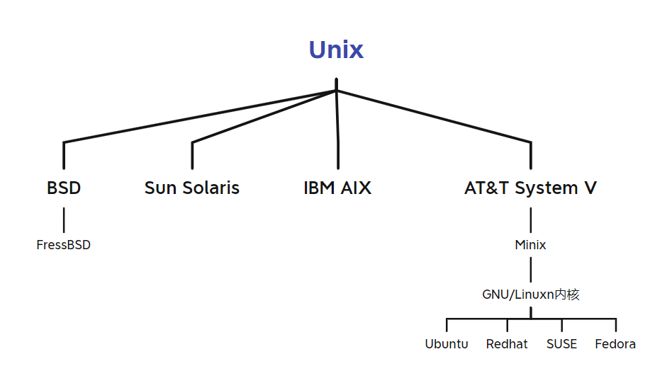
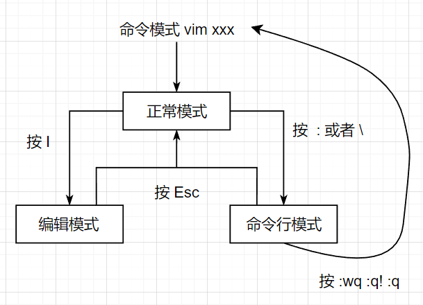
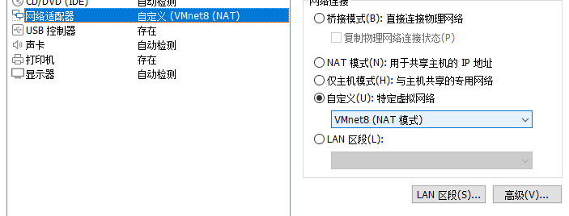
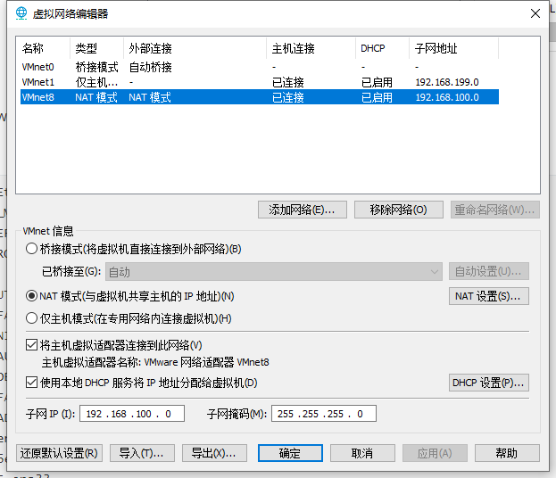
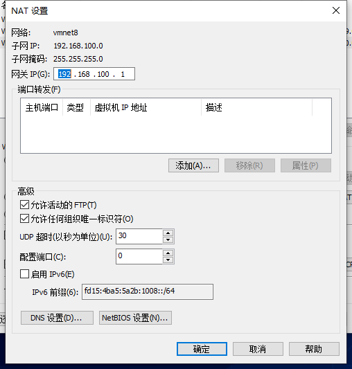
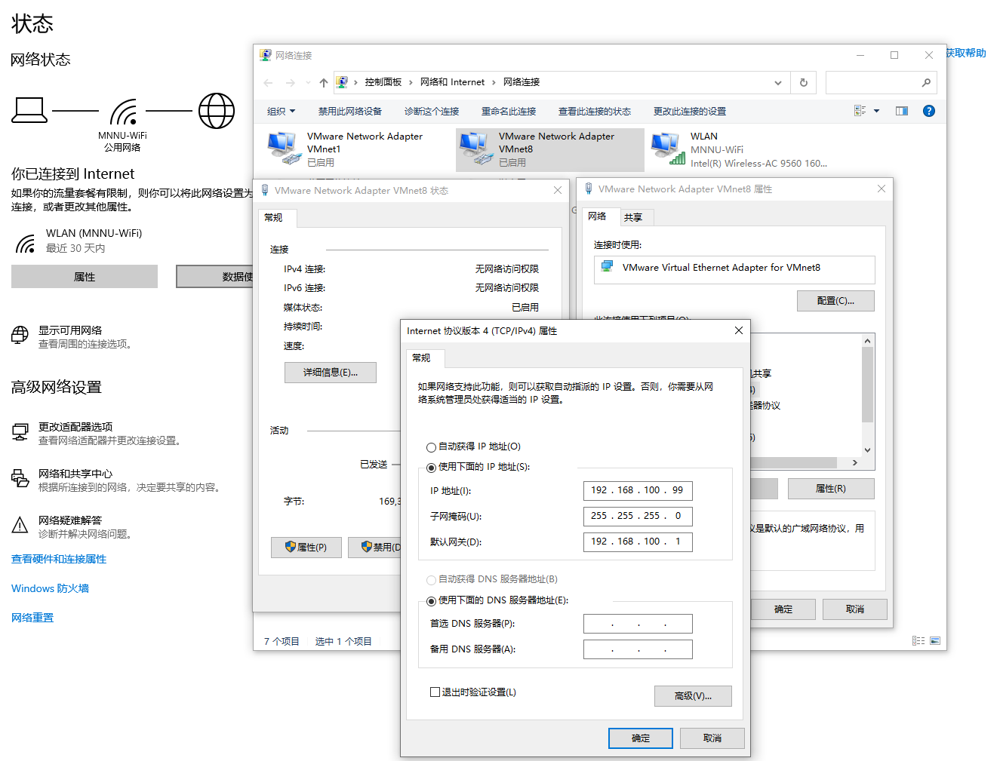

# 1、Linux基础



## 1、目录结构

Linux 文件系统是采用层级式的树状目录结构，在此结构中的最上层是根目录 **/**，然后在根目录下创建其他目录

| 目录       | 作用                                                         |
| ---------- | ------------------------------------------------------------ |
| /bin       | Binary 缩写，存放常用命令                                    |
| /sbin      | Super 缩写，存放系统管理员的管理系统命令                     |
| /home      | 存放普通用户的主目录，Linux 中每个用户都有自己的目录，一般以用户名命名，用户登陆时会自动进入 |
| /root      | 系统管理员的主目录                                           |
| /proc      | 虚拟目录，是系统内存的映射，访问可以获取系统信息             |
| /srv       | Service 缩写，存放一些服务启动时需要提取的数据               |
| /sys       | 安装了 Linux 内核 2.6 之后出现的新文件系统                   |
| /tmp       | 存放临时文件                                                 |
| /dev       | 类似 Windos 的设备管理系统，把所有硬件以文件存储             |
| /media     | Linux 自动识别到的光驱、DVD等设备会自动挂载到这个目录下      |
| /mnt       | 让用户可以临时挂载其他的文件系统，访问该目录即可查看挂载内容 |
| /opt       | 给主机额外安装软件的目录，例如：Oracle 即可安装于此          |
| /usr/local | 另一个给主机额外安装软件的目录，一般用于从源码开始编译安装   |
| /var       | 经常被修改的文件存放于此，例如：日志文件                     |
| /selinux   | Linux 的安全子系统，可以限制只能访问特定文件                 |


## 2、vi/vim 编辑器

### 1、正常模式

在正常模式下，可以使用快捷键，以 vim 打开一个档案就直接进入一般模式了，这是默认的模式

在正常模式中，可以使用上下左右按键来移动光标，可以删除字符或删除整行来处理档案内容， 也可以使用复制、粘贴来处理文件数据

| 快捷键  | 作用                              |
| ------- | --------------------------------- |
| yy      | 拷贝当前行，5yy拷贝当前行的后五行 |
| dd      | 删除当前行，5dd删除当前行的后五行 |
| /关键字 | 查找关键子，按N查找下一个         |
| :set nu | 设置行号，nonu就是取消            |
| G       | 移到文档末尾                      |
| gg      | 移到文档首部                      |


### 2、编辑模式

在模式下，可以输入内容

按下 iIoOaArR 等任何一个字母之后才会进入编辑模式， 一般来说按 i 即可


### 3、命令行模式 

在这个模式当中， 提供相关指令完成读取、存盘、替换、离开 vim 、显示行号等动作




## 3、关开机

| 命令     | 作用                                                         |
| -------- | ------------------------------------------------------------ |
| shutdown | shutdown -h now：表示立即关机<br />shutdown -h 1：表示 1 分钟后关机<br />shutdown -r now：立即重启 |
| halt     | 效果等价于关机                                               |
| reboot   | 重启系统                                                     |
| syn      | 把内存的数据同步到磁盘                                       |
| logout   | 注销用户，图形运行级别无效，在运行级别 3 下有效              |


**注意**：

- 当关机或者重启时，都应该先执行以下 sync 指令，把内存的数据写入磁盘，防止数据丢失


## 4、运行级别

运行级别说明： 

- 0 ：关机 
- 1 ：单用户【找回丢失密码】 
- 2：多用户状态没有网络服务 
- 3：多用户状态有网络服务 
- 4：系统未使用保留给用户 
- 5：图形界面 
- 6：系统重启 

常用运行级别是 3 和 5，要修改默认的运行级别可改文件 **/etc/inittab** 的 **id:5:initdefault:** 这一行中的数

命令：init [012356]，切换到指定的运行级别


## 5、用户/组/权限管理

### 1、用户基本介绍

#### 1、基本概念

Linux 系统是一个多用户多任务的操作系统，任何一个要使用系统资源的用户，都必须首先向系统管理员申请一个账号，然后以这个账号的身份进入系统

Linux 的用户需要至少要属于一个组


#### 2、用户组

类似于角色，系统可以对有共性的多个用户进行统一的管理


#### 3、相关文件

**/etc/passwd**：

- 用户（user）的配置文件，记录用户的各种信息 
- 格式：**用户名:口令:用户标识号:组标识号:注释性描述:主目录:登录 Shell**


**/etc/shadow**：

- 口令的配置文件 
- 格式：**登录名:加密口令:最后一次修改时间:最小时间间隔:最大时间间隔:警告时间:不活动时间:失效时间:标志**


**/etc/group**：

- 组（group）的配置文件，记录 Linux 包含的组的信息 
- 格式：**组名:口令:组标识号:组内用户列表**


### 2、组基本介绍

#### 1、基本概念

在 linux 中的每个用户必须属于一个组，不能独立于组外

在 linux 中每个文件 有所有者、所在组、其它组的概念

文件/目录的所有者：一般为文件的创建者，谁创建了该文件，就自然的成为该文件的所有者

除文件的所有者和所在组的用户外，系统的其它用户和文件都是其它组

- 查看文件的所有者：ls -alh
- 修改文件所有者：chown 用户名 文件名
- 修改文件所在的组：chgrp 组名 文件名
- 修改用户所在组：usermod –g 组名 用户名


### 3、权限基本介绍

#### 1、基本概念

~~~shell
-rwxrw-r-- 1 root root 1213 Feb 2 09:39 abc
~~~

0-9 位说明：

- 第 0 位确定文件类型（【目录，d】、【文件，- 】、【链接，l】、【字符设备文件，c】、【块设备文件，b】、【命令管道，p】，【socket文件，s】） 
- 第 1-3 位确定所有者（该文件的所有者）拥有该文件的权限 ---User 
- 第 4-6 位确定所属组（同用户组的）拥有该文件的权限 ---Group
- 第 7-9 位确定其他用户拥有该文件的权限 ---Other

数字 1 表示：

- 当前指向该文件的硬链接只有一个

后面两个 root 表示：

- 属主：拥有该文件或目录的用户帐号

- 属组：拥有该文件或目录的组帐号

数字 1213 表示：

- 文件占用的空间，用字节数表示

Feb 2 09:39 表示：

- ​	最近访问或修改时间


**注意**：

- 前十个字符去除第一位后，每三位一组


#### 2、rwx 权限

**rwx 代表的数字**：

- r = 4
- w = 2
- x = 1


**rwx 作用到文件**：

- r 代表可读：可以读取，查看 
- w 代表可写：可以修改，但是不代表可以删除该文件，删除一个文件的前提条件是对该文件所在的目录有写权限
- x 代表可执行：可以被执行


**rwx 作用到目录**：

- r 代表可读：可以读取，ls 查看目录内容
- w 代表可写：可以修改，目录内创建+删除+重命名目录
- x 代表可执行：可以进入该目录


## 6、任务调度

### 1、基本概念

指系统在某个时间执行的特定的命令或程序

分类：

- 系统工作：有些重要的工作必须周而复始地执行，如病毒扫描等
- 个别用户工作：个别用户可能希望执行某些程序，比如对 MySQL 数据库的备份

在 /etc 目录下有一个 **crontab** 文件，这里存放有系统运行的一些调度程序

每个用户可以建立自己的 crontab 调度，这些文件在 **/var/spool/cron** 目录下

默认情况下，crontab 中执行的日志写在 /var/log 下，如：/var/log/cron /var/log/cron.1 /var/log/cron.2


### 2、语法

crontab [选项]

选项：

- -e：编写cron定时任务
- -r：删除当前用户的所有cron脚本
- -l：查询cron脚本


重启任务调度：service crond restart


### 3、步骤

1. 进入编写定时任务
   - cron -e
2. 编写cron表达式，并指定任务，简单的任务无需shell脚本，可直接卸载cron表达式后面
   - */ 1 * * * * ls -l /etc >> /test.txt
   - */1 * * * * /home/test.sh
3. 保存退出后在指定时间内会自动调用


## 7、磁盘分区/挂载

### 1、基本概念

**分区方式**：

- **mbr** 分区：
  - 最多支持四个主分区
  - 系统只能安装在主分区
  - 扩展分区要占一个主分区 
  - MBR 最大只支持 2TB，但拥有最好的兼容性
- **gtp** 分区：
  - 支持无限多个主分区（但操作系统可能限制，比如 windows 下最多 128 个分区）
  - 最大支持 18EB 的大容量（1EB=1024 PB，1PB=1024 TB ）
  - windows7 64 位以后支持 gtp


**原理介绍**：

Linux 中无论有几个分区，分给哪个目录使用，归根结底都只有一个根目录，这是独立且唯一的文件结构

Linux 中每个分区都是用来组成整个文件系统的一部分

Linux 采用了一种叫载入的处理方法，整个文件系统中包含了一整套的文件和目录， 且将一个分区和一个目录联系起来

~~~text
/ 根目录
--- /boot ---> 分区1
--- /mnt ---> 分区2
~~~


**硬盘说明**:

- Linux 硬盘分 IDE 硬盘和 SCSI 硬盘，目前基本上是 SCSI 硬盘
- IDE 硬盘：
  - 驱动器标识符为 hdx~
  - 其中 hd 表明分区所在设备的类型，这里指 IDE
  - x 为盘号（a：基本盘，b：基本从属盘，c：辅助主盘，d：辅助从属盘）
  - ~ 代表分区，前四个分区用数字 1 到 4 表示，它们是主分区或扩展分区，从 5 开始就是逻辑分区
  - 例：hda3 表示为第一个 IDE 硬盘上的第三个主分区或扩展分区，hdb2 表示为第二个 IDE 硬盘上的第二个主分区或扩展分区

- SCSI 硬盘
  - 标识为 sdx~
  - SCSI 硬盘是用 sd 来表示分区所在设备的类型的，其余则和 IDE 硬盘的表示方法一样


### 2、挂载案例

1. 添加硬盘
2. 分区
   - fdisk /dev/sdb
   - 开始对 /sdb 分区
     - m：显示命令列表 
     - p：显示磁盘分区 同 fdisk –l 
     - n：新增分区 
     - d：删除分区 
     - w：写入并退
   - 开始分区后输入 n，新增分区，然后选择 p ，分区类型为主分区，按两次回车默认剩余全部空间，最后输入 w 写入分区并退出，若不保存退出输入 q
3. 格式化
   - mkfs -t ext4 /dev/sdb1
     - ext4 是分区类型
4. 挂载
   - 先创建目录，然后挂载到那个目录
     - mount /dev/sdb1 /home/newdisk
   - 设置可以自动挂载
     - vim /etc/fstab
     - /dev/sdb1 /home/newdisk ext4 defaults 0 0
     - 添加完成后，执行 mount –a 即刻生效


## 8、进程管理

### 1、基本概念

在 Linux 中每个执行的程序（代码）都称为一个进程，每一个进程都分配一个 ID 号

每一个进程，都会对应一个父进程，而这个父进程可以复制多个子进程，例如 www 服务器

每个进程都可能以两种方式存在的，前台进程：用户目前屏幕上可以进行操作，后台进程则是屏幕上无法直接对进程在操作

一般系统服务都是以后台进程的方式存在，而且都会常驻在系统中，直到关机才才结束


### 2、服务管理

Windows 当中的服务（Service） 本质就是进程，但是运行在后台的，通常都会监听某个端口，等待其它程序的请求，比如：MySQL、sshd、防火墙等，在 Linux 当中又称为守护进程（Daemon）


## 9、包管理

### 1、rpm

一种用于互联网下载包的打包及安装工具，它包含在某些 Linux 分发版中

生成具有 .RPM 扩展名的文件，Linux 的分发版本都有采用（suse、redhat、centos 等等）可以算是公认的行业标准了

rpm 包名基本格式：名称-版本号-适用操作系统

- i686、i386 表示 32 位系统
- x86_64 表示 64 位系统
- noarch 表示通用
- el 表示企业版 Linux，一般代表 RHEL，例如：el6表示RHEL6


### 2、yum

yum 是一个 Shell 前端软件包管理器，基于 RPM 包管理，能够从指定的服务器自动下载 RPM 包并且安装

可以自动处理依赖性关系，并且一次安装所有依赖的软件包


## 10、Shell脚本

### 1、概述

Shell 是一个命令行解释器，它为用户提供了一个向 Linux 内核发送请求以运行程序的系统级程序

用户可以通过 Shell 来启动、挂起、停止甚至是编写一些程序


**脚本要求**：

- 脚本以 **#!/bin/bash** 开头
- 脚本需要有可执行权限


**脚本执行方式**：

- 输入脚本的绝对路径或相对路径，要求脚本有执行权限
- 使用sh 脚本运行，不需要有执行权限


### 2、变量

#### 1、基础

Linux Shell 中的变量分为，系统变量和用户自定义变量

系统变量：$HOME、$PWD、$SHELL、$USER 等等

定义变量：变量名=值

删除变量：unset 变量名

定义只读变量：readonly 变量名


**注意**：

- 只读变量不能 unset


#### 2、定义变量名规则

- 变量名称可以由字母、数字和下划线组成，但是不能以数字开头
- 等号两侧不能有空格
- 变量名称一般习惯为大写


#### 3、变量赋值

将命令的返回值赋给变量：

- A=\`ls -la\` 反引号，运行里面的命令，并把结果返回给变量 A
- A=$(ls-la) 等价于反引号


将 shell 变量输出为环境变量：

- export 变量名=变量值
- 让修改后的配置信息立即生效：source 配置文件
- 查询环境变量的值：echo $变量名


#### 4、位置参数变量

##### 1、简介

当执行一个 shell 脚本时，希望获取到命令行的参数信息，就可以使用到位置参数变量

比如 ： sh test.sh 100 200，这是执行 shell 的命令行，需要在 test 脚本中获取到参数 100 200


##### 2、语法

$n （功能描述：n 为数字，$0 代表命令本身，$1-$9 代表第一到第九个参数，十以上的参数需要用大括号包含，如${10}）

$* （功能描述：这个变量代表命令行中所有的参数，$* 把所有的参数看成一个整体）

$@（功能描述：这个变量也代表命令行中所有的参数，不过 $@ 把每个参数区分对待）

$#（功能描述：这个变量代表命令行中所有参数的个数）

~~~shell
# 因此简介中的脚本参数可以如此获取
echo "$1 $2"
echo "$*"
echo "$@"
echo "参数个数=$#"
~~~


#### 5、预定义变量

##### 1、简介

就是 shell 设计者事先已经定义好的变量，可以直接在 shell 脚本中使用


##### 2、语法

$$（功能描述：当前进程的进程号 PID） 

$!（功能描述：后台运行的最后一个进程的进程号 PID） 

$?（功能描述：最后一次执行的命令的返回状态，如果这个变量的值为 0，证明上一个命令正确执行，如果这个变量的值为非 0（具体是哪个数，由命令自己来决定），则证明上一个命令执行不正确了）

~~~shell
# 后台方式运行
sh test.sh &

echo "最后执行的PID=$$"
echo "执行状态=$?"
~~~


#### 6、运算符

$((运算式)) 或 $[运算式]

expr m +-*/% n


**注意**：

- expr 运算符与变量之间要有空格


~~~shell
$(((2 + 1) * 3)) 
$[(2 + 1) * 3)]

temp = $(expr 2 + 1)
result = $(expr $temp * 3)
echo = "$result"
~~~


#### 7、流程控制

##### 1、if 语法

~~~shell
# if-then格式
if condition
then
    command1 
    command2
    ...
    commandN 
fi

# if-then-else格式
if condition
then
    command1 
    command2
    ...
    commandN
else
    command
fi

# if-then-elif-else格式
if condition1
then
    command1
elif condition2 
then 
    command2
else
    commandN
fi
~~~


~~~shell
a=10
b=20
if [ $a == $b ]
then
   echo "a 等于 b"
elif [ $a -gt $b ]
then
   echo "a 大于 b"
elif (( $a < $b ))
then
   echo "a 小于 b"
else
   echo "没有符合的条件"
fi
~~~


**注意**：

- sh 的流程控制不可为空，如果 else 分支没有语句执行，就不要写这个 else
- **[...]** 判断语句中大于使用 **-gt**，小于使用 **-lt** 
- **((...))** 作为判断语句，大于和小于可以直接使用 **>** 和 **<**


##### 2、for 语法

~~~shell
for var in item1 item2 ... itemN
do
    command1
    command2
    ...
    commandN
done

for (( 初始值;循环控制条件;变量变化 ))
do
	command1
    command2
    ...
    commandN
done
~~~


**注意**：

- in 列表是可选的，如果不用它，for循环使用命令行的位置参数


##### 3、while 语法

while 循环用于不断执行一系列命令，也用于从输入文件中读取数据

~~~shell
while condition
do
    command
done
~~~

~~~shell
#!/bin/bash
int=1
while(( $int<=5 ))
do
    echo $int
    let "int++"
done
~~~


##### 4、case 语法

**case ... esac** 为多选择语句，与其他语言中的 switch ... case 语句类似，是一种多分支选择结构，每个 case 分支用右圆括号开始，用两个分号 **;;** 表示 break，即执行结束，跳出整个 case ... esac 语句，esac（就是 case 反过来）作为结束标记

~~~shell
case 值 in
模式1)
    command1
    command2
    ...
    commandN
    ;;
模式2)
    command1
    command2
    ...
    commandN
    ;;
esac
~~~


**注意**：

- 如果无一匹配模式，可以使用星号 * 捕获该值，再执行后面的命令


#### 8、read

读取控制台输入

read（选项）（参数）

选项：

- -p：指定读取值时的提示
- -t：指定读取值时等待的时间（秒），如果没有在指定的时间内输入，就不再等待了

参数

- 变量：指定读取值的变量名

~~~shell
read -t 10 -p "输入一个数字=" num
echo "$num"
~~~


#### 9、注释

~~~shell
# 单行注释

:<<!
多行注释
!
~~~


### 3、函数

#### 1、系统函数

basename 功能：会删掉所有的前缀包括最后一个 / 字符，然后将字符串显示出来

basename [pathname] [suffix]

basename [string] [suffix] 

**注意**：

- suffix 为后缀，如果 suffix 被指定了，basename 会将 pathname 或 string 中的 suffix 去掉


dirname 功能：返回完整路径最后 / 的前面的部分，常用于返回路径部分

dirname 文件绝对路径


#### 2、自定义函数

~~~shell
[ function ] funname[()]
{
    Action;
	[return int;]
}
~~~

调用直接写函数名：funname [值]

~~~shell
function getSum() {
	sum=$(($1+$2))
	echo "$sum"
}

getSum 1 2
~~~


**注意**：

- 调用函数时可以向其传递参数，在函数体内部，通过 $n 的形式来获取参数的值，例如，$1表示第一个参数，$2表示第二个参数
- $10 不能获取第十个参数，获取第十个参数需要${10}，当n>=10时，需要使用${n}来获取参数


## 11、系统启动顺序

### 1、概述

Linux 系统的启动过程，其过程可以分为 5 个阶段：

- 内核引导
- 运行 init
- 系统初始化
- 建立终端
- 用户登录系统


### 2、内核引导

计算机通电后，首先进行 BIOS 开机自检，按照 BIOS 中设置的启动设备（通常是硬盘）来启动

之后操作系统接管硬件以后，首先读入 /boot 目录下的内核文件


### 3、运行 init

init 进程是系统所有进程的起点，没有这个进程，系统中任何进程都不会启动

init 程序启动是需要先读取配置文件


init 类型在不同版本的 Linux 不同

- SysV：CentOS 5，配置文件：/etc/inittab
- Upstart：CentOS 6，配置文件：/etc/inittab、/etc/init/*.conf
- Systemd：CentOS 7，配置文件：/usr/lib/systemd/system、/etc/systemd/system


### 4、系统初始化

在 init 的配置文件中有这么一行：**si::sysinit:/etc/rc.d/rc.sysinit**，其调用执行 /etc/rc.d/rc.sysinit

rc.sysinit 是一个 bash 脚本，是每一个运行级别都要首先运行的重要脚本，主要完成的工作有：激活交换分区，检查磁盘，加载硬件模块以及其它一些需要优先执行任务

~~~bash
# 这一行表示以 5 为参数运行 /etc/rc.d/rc
l5:5:wait:/etc/rc.d/rc 5
~~~

**/etc/rc.d/rc** 是一个 Shell 脚本，它接受 5 作为参数，去执行 /etc/rc.d/rc5.d/ 目录下的所有的 rc 启动脚本

**/etc/rc.d/rc5.d/** 目录中的这些启动脚本实际上都是一些连接文件，而不是真正的 rc 启动脚本，真正的 rc 启动脚本实际上都是放在 **/etc/rc.d/init.d/** 目录下，这些 rc 启动脚本有着类似的用法，它们一般能接受 start、stop、restart、status 等参数

/etc/rc.d/rc5.d/ 中的 rc 启动脚本通常是 K 或 S 开头的连接文件，对于以 S 开头的启动脚本，将以 start 参数来运行，如果发现存在相应的脚本也存在 K 开头的连接，而且已经处于运行态了（以 /var/lock/subsys/ 下的文件作为标志），则将首先以 stop 为参数停止这些已经启动了的守护进程，然后再重新运行，这样做是为了保证是当 init 改变运行级别时，所有相关的守护进程都将重启

用户可以通过 chkconfig 或 setup 中的 "System Services" 来自行设定，哪些运行级别运行哪些服务


### 5、建立终端

rc 执行完毕后，返回 init，这时基本系统环境已经设置好了，各种守护进程也已经启动

init 接下来会打开 6 个终端，以便用户登录系统，在 inittab 中的以下 6 行就是定义了 6 个终端：

~~~bash
1:2345:respawn:/sbin/mingetty tty1
2:2345:respawn:/sbin/mingetty tty2
3:2345:respawn:/sbin/mingetty tty3
4:2345:respawn:/sbin/mingetty tty4
5:2345:respawn:/sbin/mingetty tty5
6:2345:respawn:/sbin/mingetty tty6
~~~

从上面可以看出在 2、3、4、5 的运行级别中都将以 respawn 方式运行 mingetty 程序，mingetty 程序能打开终端、设置模式

同时其会显示一个文本登录界面，这个界面就是经常看到的登录界面，在这个登录界面中会提示用户输入用户名，而用户输入的用户将作为参数传给 login 程序来验证用户的身份


# Linux常用命令

| 命令                       | 作用                                 |
| :------------------------- | ------------------------------------ |
| su root                    | 切换为root用户                       |
| sudo adduser username sudo | 添加用户进sudoers文件                |
| yum update                 | 更新yum                              |
| vim filepath               | 修改文件                             |
| :wq                        | 退出修改并保存                       |
| :q!                        | 强制退出不保存                       |
| i                          | 写入模式                             |
| esc                        | 退出                                 |
| dnf remove xxxx            | 卸载                                 |
| rm xxxx                    | 删除文件                             |
| systemctl list-unit-files  | 查看自启列表                         |
| yum -y update              | 升级所有包同时也升级软件和系统内核； |
| yum -y upgrade：           | 只升级所有包，不升级软件和系统内核   |


## 1、帮助类命令

### 1、man 命令

man [命令或配置文件]（功能描述：获得帮助信息）

例如：man ls 查看 ls 命令的提示


### 2、help 命令

help [命令]（功能描述：获得 shell 内置命令的帮助信息）

例如：help cd 查看 cd 命令的帮助信息


## 2、文件类命令

### 1、pwd 命令

pwd（功能描述：显示当前工作目录的绝对路径）


### 2、ls 命令

ls [选项] [目录或是文件]（功能描述：查看当前目录文件信息）

- -a ：显示当前目录所有的文件和目录，包括隐藏的
- -l ：以列表的方式显示信息
- -h ：查看文件的所有者


### 3、cd 命令

cd [参数]（功能描述：切换到指定目录）

cd ~ 或者 cd 回到自己的家目录 

cd .. 回到当前目录的上一级目录


### 4、mkdir 命令

mkdir [选项] 要创建的目录（功能描述：指令用于创建目录）

-p ：创建多级目


### 5、rmdir 命令

rmdir [选项] 要删除的空目录（功能描述：指令删除空目录）

rmdir 删除的是空目录，如果目录下有内容时无法删除的

如果需要删除非空目录，需要使用 rm -rf 要删除的目录


### 6、touch 命令

touch 文件名称（功能描述：指令创建空文件）


### 7、cp 命令

cp [选项] sour dest （功能描述：指令拷贝文件到指定目录）

-r ：递归复制整个文件夹

强制覆盖不提示的方法：\cp


### 8、rm 命令

rm [选项] 要删除的文件或目录（功能描述：指令移除【删除】文件或目录）

-r ：递归删除整个文件夹 

-f ：强制删除不提示


### 9、mv 命令

mv oldNameFile newNameFile (功能描述：重命名) 

mv /temp/movefile /targetFolder (功能描述：移动文件)


### 10、cat 命令

cat [选项] 要查看的文件（功能描述：查看文件内容，是以只读的方式打开) 

-n ：显示行号

cat 只能浏览文件，而不能修改文件，为了浏览方便，一般会带上管道命令 | more 

cat 文件名 | more [分页浏览]


### 11、more 命令

more 要查看的文件

more 指令是一个基于 VI 编辑器的文本过滤器，它以全屏幕的方式按页显示文本文件的内容

more 指令中内置了若干快捷键


### 12、less 命令

less 要查看的文件

less 指令用来分屏查看文件内容，它的功能与 more 指令类似，但是比 more 指令更加强大，支持各种显示终端

less 指令在显示文件内容时，并不是一次将整个文件加载之后才显示，而是根据显示需要加载内容，对于显示大型文件具有较高的效率


### 13、echo 命令

echo [选项] [输出内容] （功能描述：输出内容到控制台）

例如：echo $Path 使用 echo 指令输出环境变量，输出当前的环境路径


### 14、head 命令

head 用于显示文件的开头部分内容，默认情况下 head 指令显示文件的前 10 行内容

head 文件（功能描述：查看文件头 10 行内容）

head -n 5 文件（功能描述：查看文件头 5 行内容，也可以是任意行数）


### 15、tail 命令

tail 用于输出文件中尾部的内容，默认情况下 tail 指令显示文件的后 10 行内容

tail 文件（功能描述：查看文件后 10 行内容）

tail -n 5 文件（功能描述：查看文件后 5 行内容，也可以是任意行数）

tail -f 文件（功能描述：实时追踪该文档的所有更新，工作经常使用）


### 16、ln 指令

软链接也叫符号链接，类似于 windows 里的快捷方式，主要存放了链接其他文件的路径

ln -s [原文件或目录] [软链接名]（功能描述：给原文件创建一个软链接）

**注意**：

- 使用 pwd 指令查看目录时，仍然看到的是软链接所在目录


### 17、history 命令

history （功能描述：查看已经执行过历史命令）

例如：history 10 查看历史命令10条


### 18、chown 命令

chown newowner file （功能描述：修改文件所有者）

chown newowner:newgroup file 改变文件的所有者和所有组

-R 如果是目录 则使其下所有子文件或目录递归生效


### 19、chgrp 命令

chgrp 组名 文件名（功能描述：修改文件所在的组）


### 20、chmod 命令

修改文件或者目录的权限

第一种方式使用运算符：（u：所有者，g：所有组，o：其他人，a：所有人（u、g、o 的总和））

- chmod u=rwx,g=rx,o=x 文件目录名
- chmod o+w 文件目录名
- chmod a-x 文件目录名

第二种方式使用数字：（r = 4，w = 2，x = 1）

- chmod 755 文件目录名


## 3、日期类命令

### 1、date 命令

date （功能描述：显示当前时间）

date +%Y （功能描述：显示当前年份）

date +%m （功能描述：显示当前月份）

date +%d （功能描述：显示当前是哪一天）

date "+%Y-%m-%d %H:%M:%S"（功能描述：显示年月日时分秒）

date -s 字符串时间（功能描述：设置系统当前时间）


### 2、cal 指令

cal [选项] （功能描述：不加选项，显示本月日历）

例如：cal 2022 显示2022年日历


## 4、搜索查找类命令

### 1、find 命令

find [搜索范围] [选项]（功能描述：将从指定目录向下递归地遍历其各个子目录，将满足条件的文件或者目录显示在终端）

-name 通过名字查找

-user 通过属于某个用户查找

-size 通过文件大小查找


### 2、locate 命令

locate 搜索文件（功能描述：快速定位文件路径）

locate 指令利用事先建立的系统中所有文件名称及路径的 locate 数据库实现快速定位给定的文件

locate 指令无需遍历整个文件系统，查询速度较快，为了保证查询结果的准确度，管理员必须定期更新 locate 时刻


**注意**：

- 由于 locate 指令基于数据库进行查询，所以第一次运行前，必须使用 updatedb 指令创建 locate 数 据库


### 3、grep 命令

grep 过滤查找

grep [选项] 查找内容 源文件

-n：显示匹配行的行号

-i：忽略大小写


### 4、whereis

该指令只能用于查找二进制文件、源代码文件、man 手册页，一般文件的定位需使用 locate 命令

- -b：只查找二进制文件
- -B<目录>：只在设置的目录下查找二进制文件
- -f ：不显示文件名前的路径名称
- -m：只查找说明文件
- -M<目录>：只在设置的目录下查找说明文件
- -s：只查找原始代码文件
- -S<目录>：只在设置的目录下查找原始代码文件
- -u：查找不包含指定类型的文件


## 5、压缩解压类命令

### 1、tar 命令

tar本身是一个打包命令，用来打包或者解包后缀名为.tar

配合参数可同时实现打包和压缩

- -c或--create：建立新的备份文件
- -x或--extract或--get：从备份文件中还原文件
- -v：显示指令执行过程
- -f或--file：指定备份文件
- -C：指定目的目录
- -z：通过gzip指令处理备份文件
- -j：通过bzip2指令处理备份文件


### 2、gzip/gunzip 命令

Linux压缩文件中最常见的后缀名即为.gz，gzip是用来压缩和解压.gz文件的命令

- -d或--decompress或--uncompress：解压文件
- -r或--recursive：递归压缩指定文件夹下的文件（该文件夹下的所有文件被压缩成单独的.gz文件）
- -v或--verbose：显示指令执行过程

**注意**：

- 使用 gzip 对文件进行压缩后，不会保留原来的文件

- gzip命令只能压缩单个文件，而不能把一个文件夹压缩成一个文件（与打包命令的区别）


### 3、zip/unzip 命令

zip命令和unzip命令用在在Linux上处理.zip的压缩文件

- zip：
  - -v：显示指令执行过程
  - -m：不保留原文件
  - -r：递归处理，即压缩目录

- unzip：
  - -v：显示指令执行过程
  - -d：解压到指定目录


## 6、用户管理类命令

### 1、useradd 命令

useradd [选项] 用户名  添加用户

用户创建成功后，会自动的创建和用户同名的home目录

选项：-d 指定目录 useradd -d /home/test test

选项：-g 组名 ，新增用户时同时添加到组中


### 2、passwd 命令

passwd 用户名  

修改指定用户密码


### 3、userdel 命令

userdel 用户名

删除用户，默认不删除home目录

选项：-r 删除用户的同时删除home目录


### 4、id 命令

id 用户名 

查询用户，用户不存在时，返回无此用户


### 5、su 命令

su –用户名

切换到指定用户

从高权限用户切换到低权限用户，不需要输入密码，反之需要，返回到原来用户时，使用 exit 指令


### 6、usermod 命令

usermod -g 用户组 用户名  修改用户组

usermod –d 目录名 用户名  改变该用户登陆的初始目录


### 7、groupadd 命令

groupadd 组名  增加组


### 8、groupdel 命令

groupdel 组名  删除组


## 7、磁盘管理类命令

### 1、lsblk 命令

查看当前系统的分区情况

~~~
-a, --all            显示所有设备
-b, --bytes          以bytes方式显示设备大小
-d, --nodeps         不显示 slaves 或 holders
-D, --discard        print discard capabilities
-e, --exclude <list> 排除设备 (default: RAM disks)
-f, --fs             显示文件系统信息
-h, --help           显示帮助信息
-i, --ascii          use ascii characters only
-m, --perms          显示权限信息
-l, --list           使用列表格式显示
-n, --noheadings     不显示标题
-o, --output <list>  输出列
-P, --pairs          使用key="value"格式显示
-r, --raw            使用原始格式显示
-t, --topology       显示拓扑结构信息
~~~


### 2、du 命令

查询指定目录的磁盘占用情况，默认为当前目录

du -ach /opt

-s 指定目录占用大小汇总 

-h 带计量单位 

-a 含文件 

--max-depth=1 子目录深度

-c 列出明细的同时，增加汇总值


### 3、df 命令

查询系统整体磁盘使用情况

df -h


### 4、fdisk 命令

用于创建和操作分区表

fdisk -l 查看现有分区


## 8、进程管理类命令

### 1、ps 命令

ps -aux 显示进程信息

-a 显示当前终端所有进程信息

-u 以用户的格式显示

-x 显示后台进程的运行参数

-e 显示全部进程

-f 全格式


### 2、kill 命令

若是某个进程执行一半需要停止时，或是已消了很大的系统资源时，此时可以考虑停止该进程

kill [选项] 进程号（功能描述：通过进程号杀死进程）

-9 表示强迫进程立即停止


### 3、killall 命令

支持通配符，此命令在系统因负载过大而变得很慢时很有用

killall 进程名称 （功能描述：通过进程名称杀死进程）


### 4、pstree 命令

pstree [选项]  （功能描述：更加直观的来看进程信息）

-p 显示进程的 PID 

-u 显示进程的所属用户


### 5、service/systemctl 命令

service 服务名 [start | stop | restart | reload | status]

**注意**：

- 在 CentOS7.0 后 不再使用 service ,而是 systemctl
- ls -l /etc/init.d/ 可以列出服务名称


### 6、chkconfig 命令

通过 chkconfig 命令可以给每个服务的各个运行级别设置自启动/关闭

查看服务：

- chkconfig --list|grep [服务名] 
- chkconfig 服务名 --list

开启/关闭：

- 在级别5的情况下开启或关闭：chkconfig --level 5 服务名 on/off 
- 在所有级别的情况下开启或关闭：chkconfig 服务名 on/off 


**注意**：

- chkconfig 重新设置服务自启或关闭，需要 reboot 才能生效


### 7、top命令

top 可以显示更新正在运行的进程信息

top [选项]

-d 秒数 间隔多少秒刷新

-i 不显示闲置或僵死进程

-p id 通过指定进程ID来监控

交互选项：

- P，以CPU使用率排行，默认
- M，以内存使用率排行
- N，以PID排行
- q，退出


## 9、网络管理类命令

### 1、firwall 命令

启动： systemctl start firewalld

关闭： systemctl stop firewalld

查看状态： systemctl status firewalld

开机禁用 ： systemctl disable firewalld

开机启用 ： systemctl enable firewalld

查看开放的端口：netstat -anp 或者 firewall-cmd --list-port

开放端口：firewall-cmd --zone=public --add-port=端口号/tcp --permanent

关闭端口：firewall-cmd --zone=public --remove-port=端口号/tcp --permanent

**注意**：

- 端口号-端口号，可以批量打开，同理可已批量删除
- --permanent，永久生效，重启不会恢复


### 2、netstat 命令

netstat [选项]（功能描述：查看系统网络情况）

- -a 显示所有连接
- -p 显示哪个进程在调用

- -t (tcp) 仅显示tcp相关选项
- -u (udp)仅显示udp相关选项
- -n 拒绝显示别名，能显示数字的全部转化为数字
- -l 仅列出在Listen(监听)的服务状态
- -p 显示建立相关链接的程序名


### 3、lsof 命令

lsof（list open files）是一个列出当前系统打开文件的工具

~~~bash
lsof -i:8080			查看 8080 端口占用
lsof abc.txt			显示开启文件 abc.txt 的进程
lsof -c abc				显示 abc 进程现在打开的文件
lsof -c -p 1234			列出进程号为 1234 的进程所打开的文件
lsof -g gid				显示归属 gid 的进程情况
lsof +d /usr/local/		显示目录下被进程开启的文件
lsof +D /usr/local/		同上，但是会搜索目录下的目录，时间较长
lsof -d 4				显示使用 fd 为 4 的进程
lsof -i -U				显示所有打开的端口和 UNIX domain 文件
~~~

~~~bash
COMMAND PID    USER   FD   TYPE DEVICE SIZE/OFF NODE NAME
java    882 tomcat8   52u  IPv6  15954      0t0  TCP *:http-alt (LISTEN)
~~~

- COMMAND：进程名称
- PID：进程标识符
- USER：进程所有者
- FD：文件描述符，应用程序通过该文件描述符识别该文件
- TYPE：文件类型
- DEVICE：指定磁盘的名称
- SIZE：文件的大小
- NODE：索引节点（文件在磁盘上的标识）
- NAME：打开文件的确切名称


## 10、包管理类命令

### 1、rpm 命令

查询所安装的所有 rpm 软件包：rpm –qa

查询已安装 xx 软件包：rpm –qa|grep xx

查询软件包信息：rpm -qi 软件包名

查询软件包是否安装：rpm -q 软件包名

查询软件包中的文件：rpm -ql 软件包名

查询文件所属的软件包：rpm -qf 文件全路径名

卸载RPM包：rpm -e 软件包名

安装RPM包：rpm -ivh 软件包全路径


**注意**：

- 如果卸载的RPM包被其他包依赖，普通卸载会报错，加上 --nodeps 强制卸载


### 2、yum 命令

查询服务器是否有 xx 软件可以安装：yum list|grep xx

下载安装：yum install xxx 

修改源：

~~~bash
# 以 RHEL8 为例子
# 首先备份原本源
cp oracle-linux-ol8.repo oracle-linux-ol8.repo.bak
# 删除
rm -f oracle-linux-ol8.repo
# 下载 Aliyun 源
wget http://mirrors.aliyun.com/repo/Centos-8.repo
~~~


## 11、符号类命令

### 1、&

格式：A 命令 & B 命令

A 命令后台执行，AB 命令同时执行


### 2、&&

格式：A 命令 && B 命令

A 命令成功才执行 B 命令


### 3、|

管道符 | 表示将前一个命令的处理结果输出传递给后面的命令处理

格式：A 命令 | B 命令

AB 命令均会执行，经常和 grep 命令配合使用

例如：cat test.txt | grep -in yes 查找 test 文件中的 yes 字符


### 4、||

格式：A命令 || B 命令

A 命令失败后执行 B 命令


### 5、\>、>> 命令

\> 输出重定向 : 会将原来的文件的内容覆盖 

\>\> 追加： 不会覆盖原来文件的内容，而是追加到文件的尾部

例如：cat 文件 1 > 文件 2 （功能描述：用文件 1 覆盖文件 2）


### 6、;

格式：A 命令; B 命令

AB 命令均会执行


# 问题

## 1、两台 vps 之间无法 ping 通

检查入站规则是否放开了 ICMP 协议


## 2、Linux强制关机后进入救援模式

强制关机后无法正常开机，显示

~~~bash
Entering emergency mode. Exit the shell to continue.
~~~

查看系统日志

~~~bash
journalctl
~~~

尝试解决日志中出现的问题，实在不行就强制清空所有日志，包含脏数据

~~~bash
xfs_repair -v -L /dev/dm-0
~~~


# 扩展

## 配置Root用户

```shell
切换为root用户
sudo root
修改sshd_config文件
vim /etc/ssh/sshd_config

修改PasswordAuthentication
PasswordAuthentication no  -->  PasswordAuthentication yes
修改PermitRootLogin
PermitRootLogin no -->  PermitRootLogin yes

重启ssh服务
systemctl restart sshd.service

chkconfig --add sshd
chkconfig sshd on
```


## 配置Java

查看默认JDK

```shell
rpm -qa|grep java
```

卸载默认JDK

```shell
rpm -e --nodeps java-1.8.0-openjdk-headless-1.8.0.302.b08-0.el8_4.x86_64
rpm -e --nodeps java-1.8.0-openjdk-1.8.0.282.b08-4.el8.x86_64
rpm -e --nodeps java-1.8.0-openjdk-headless-1.8.0.282.b08-4.el8.x86_64
```

下载JDK

解压JDK

```shell
tar -zxvf jdk-17_linux-x64_bin.tar.gz
```

配置环境变量

```shell
vim /etc/profile
```

```text
# java environment
# JDK路径
export JAVA_HOME=/root/jdk-15. 
export CLASSPATH=.:${JAVA_HOME}/jre/lib/rt.jar:${JAVA_HOME}/lib/dt.jar:${JAVA_HOME}/lib/tools.jar
export PATH=$PATH:${JAVA_HOME}/bin
```

让环境变量生效

```shell
source /etc/profile
```

检查Java

```shell
java -version
```


## 配置MySQL

**CentOS 版本**

下载源

```shell
wget https://dev.mysql.com/get/mysql80-community-release-el8-1.noarch.rpm
```

安装数据源

```shell
yum install mysql80-community-release-el8-1.noarch.rpm
```

检查数据源是否安装成功

```shell
yum repolist enabled | grep "mysql.*-community.*"
```

禁用CentOS自带mysql模块

```shell
yum module disable mysql
```

安装数据库

```shell
yum install mysql-community-server
```

启动mysql

```shell
service mysqld start
```

检查mysql服务状态

```shell
service mysqld status
```

显示mysql的随机密码

```shell
grep 'temporary password' /var/log/mysqld.log       #OroJ(q)4A=gT
```

登录mysql

```shell
mysql -uroot -p
```

修改mysql密码

```shell
ALTER USER 'root'@'localhost' IDENTIFIED BY 'admin';
```

查看密码策略

```shell
SHOW VARIABLES LIKE 'validate_password%';
```

修改密码长度（长度）

```shell
set global validate_password.length=1;
```

修改密码等级（等级）

```shell
set global validate_password.policy=0;
```

Mysql8.0.22开放远程访问

1、先创建权限记录

```shell
create user 'root'@'%' identified by 'admin';
```

2、授权

```shell
grant all privileges on *.* to 'root'@'%' with grant option;
```

开放防火墙端口

添加自启

systemctl enable mysqld


**Ubuntu 版本**

切换到 root 用户后

~~~bash
apt-get install mysql-server 
~~~

查看 mysql 状态

~~~mysql
systemctl status mysql
~~~

修改 root 密码

~~~bash
ALTER USER 'root'@'localhost' IDENTIFIED BY 'your_password';
~~~

查看用户验证的方法

~~~bash
SELECT user,authentication_string,plugin,host FROM mysql.user;
~~~

在未执行任何配置的情况下在 Ubuntu 上全新安装 MySQL 后，访问服务器的用户将使用身份验证套接字 (**auth_socket**) 插件进行身份验证，该插件会阻碍服务器使用密码对用户进行身份验证

容易引发安全问题，且使用户无法使用外部程序（如 phpMyAdmin）访问数据库

需要将身份验证方法从 auth_socket 更改为使用 mysql_native_password

```bash
ALTER USER 'root'@'localhost' IDENTIFIED WITH mysql_native_password BY 'your_password';
```

刷新

~~~bash
FLUSH PRIVILEGES;
~~~

允许远程访问

~~~bash
# 切换数据库
use mysql
# 修改连接权限
grant all privileges on *.* to 'root'@'%';
# 刷新即可
~~~


## 配置Redis

先安装gcc

```shell
yum install gcc
```

安装编译工具

```shell
dnf group install "Development Tools"
```

下载redis

```shell
wget http://download.redis.io/releases/redis-6.0.5.tar.gz
```

解压redis

```shell
tar -zxvf redis-6.0.5.tar.gz
```

执行make

```shell
cd /root/Redis/redis-6.2.5
make
make install PREFIX=/root/Redis/redis
```

将redia添加到ststemctl中

在/usr/lib/systemd/system/redis.service创建，添加以下文本

```java
[Unit]
Description=Redis
After=network.target

[Service]
Type=forking
ExecStart=/root/Redis/redis/bin/redis-server /root/Redis/config/redis.conf
ExecReload=/bin/kill -s HUP $MAINPID
ExecStop=/bin/kill -s QUIT $MAINPID
ExecStop=/bin/kill -s TERM $MAINPID
ExecStartPost=/bin/sh -c "echo $MAINPID > /run/redis/redis_6310.pid"
PIDFile=/var/run/redis_6310.pid
PrivateTmp=true

[Install]
WantedBy=multi-user.target
```

为/var/run/redis_6310.pid授予权限

不授予权限可能报错

错误：Failed to parse PID from file /run/redis/redis.pid: Invalid argument等

```shell
chmod -R 777 /var/run/redis/
```

systemctl启动

```shell
systemctl daemon-reload
systemctl enable redisr
systemctl start redis
systemctl stop redis
systemctl status redis
```

查看redis进程

```shell
ps -aux |grep redis
```

手动启动 

```shell
/root/Redis/redis/bin/redis-server /root/Redis/redis-6.2.5/redis.conf
```

**另外**

还需要将/root/Redis/redis-6.2.5/redis.conf中的属性修改

```
daemonize yes
pidfile /var/run/redis/redis_.pid
bind 127.0.0.0
```


## 配置Python

安装python3.6

```shell
yum install python36
```

更改Python的软连接使得python命令调用python3

首先修改yum的配置文件

```shell
vim /usr/bin/yum
```

将首部的注释改成如下

```shell
python版本根据本机而定
#!/usr/bin/python2.7
```

在修改下一个配置，同样的操作

```shell
vim /usr/libexec/urlgrabber-ext-down
```

删除软连接

```shell
rm python
```

修改软连接

```shell
ln -s python3.6 python
```


## 配置虚拟机网络

配置网络连接时，有三种形式：

- 桥接：Linux可以和其他系统通信，但是可能造成IP冲突
- NAT：网络地址转换，Linux可以访问外网，不会造成IP冲突
- 主机模式：Linux是一个独立的主机，不能访问外网

修改虚拟机的网络适配器为VM8



修改VMware的虚拟网络编辑器

- 修改子网ip为192.168.100.0
- 子网掩码为255.255.255.0



再修改其中的NAT设置

- 其中的网关ip为192.168.100.1
  - 需要与子网ip为同一号段



修改本机的网络适配器中的vm8



修改ip地址为子网ip的同一号段，此处设置为192.168.100.99

设置子网掩码为255.255.255.0

设置默认网关为上文NAT设置的网关ip192.168.100.1

最后修改虚拟机的ifcfg-ens33文件

```shell
cd /etc/sysconfig/network-scripts
```

```shell
vim ifcfg-ens33
```

```text
TYPE=Ethernet
PROXY_METHOD=none
BROWSER_ONLY=no
BOOTPROTO=static			#改为静态

DEFROUTE=yes
IPV4_FAILURE_FATAL=no
IPV6INIT=yes
IPV6_AUTOCONF=yes
IPV6_DEFROUTE=yes
IPV6_FAILURE_FATAL=no
IPV6_ADDR_GEN_MODE=stable-privacy
NAME=ens33
UUID=6eab4686-ca67-4038-95d3-f8994a7e294a
DEVICE=ens33
ONBOOT=yes					#改为yes

IPADDR=192.168.100.2		#添加静态IP地址，网段需要和步骤一中的子网IP网段一致
NETMASK=255.255.255.0		#添加子网掩码
PREFIX=24
GATEWAY=192.168.100.1		#添加网关IP地址，和NAT设置中的网关IP一致
DNS1=114.114.114.114

```

重启网络服务

```shell
service network restart
```


## 配置梯子

```shell
bash <(curl -s -L https://git.io/v2ray.sh)
```

[V2Ray一键安装脚本 · 233boy/v2ray Wiki (github.com)](https://github.com/233boy/v2ray/wiki/V2Ray一键安装脚本)


## 配置Nginx域名

给Nginx的主配置文件的http节点下的server节点的内容 Nginx.conf

```properties
server {
	listen       80;  #监听的端口
	server_name  fantong.fun; #要映射的域名

	#charset koi8-r;

	#access_log  logs/host.access.log  main;

	location / {
		root   html;
		proxy_pass http://150.230.56.69:8894; #代理的地址，也就是域名映射后的位置
		index  index.html index.htm;
		proxy_set_header Host $host;
   		proxy_set_header X-Real-IP $remote_addr;
   		proxy_set_header REMOTE-HOST $remote_addr;
   	proxy_set_header X-Forwarded-For $proxy_add_x_forwarded_for;
	}

	#error_page  404              /404.html;

	# redirect server error pages to the static page /50x.html
	#
	error_page   500 502 503 504  /50x.html;
	location = /50x.html {
	root   html;
}
```

重启Nginx

```shell
/usr/local/nginx/sbin/nginx -s reload
```

nohup java -jar /root/work/EatWhatSpecial-0.0.1.jar &

```shell
docker run -itd --name=t -p 8888:8080 -v /data/tomcat/webapps:/usr/local/tomcat/webapps tomcat:9.0
```


## 虚拟机扩容

~~~bash
fdisk /dev/sda
# 输入 n 全部默认回车即可
# 输入 w 保存退出

# 查找卷组名
vgscan

# 将新 part 添加到卷组中
vgextend ubuntu-vg /dev/sda4

# 增加10G的空间到 lvm 逻辑卷
lvextend -L +10G /dev/mapper/ubuntu--vg-ubuntu--lv

# 对扩容后的逻辑卷刷新
resize2fs -f /dev/mapper/ubuntu--vg-ubuntu--lv
~~~

