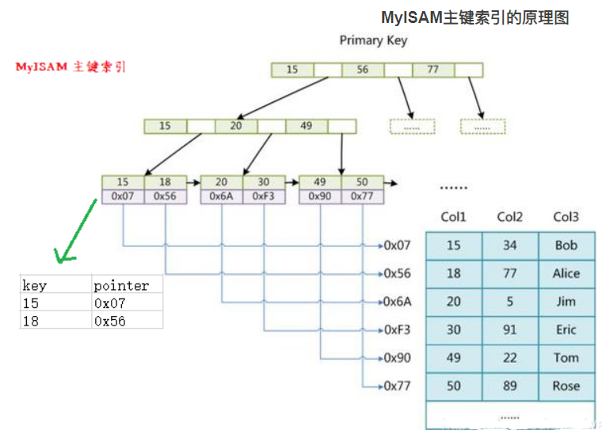

# 1、MySQL概述

## 1.1、为什么要使用数据库

**持久化**(persistence)：把数据保存到可掉电式存储设备中以供之后使用。大多数情况下，特别是企业级应用，数据持久化意味着将内存中的数据保存到硬盘上加以”固化”，而持久化的实现过程大多通过各种关系数据库来完成。 

持久化的主要作用是将内存中的数据存储在关系型数据库中，当然也可以存储在磁盘文件、XML数据文件中。


## 1.2、基本概念

**DB**：数据库（Database） 即存储数据的“仓库”，其本质是一个文件系统，它保存了一系列有组织的数据

**DBMS**：数据库管理系统（Database Management System） 是一种操纵和管理数据库的大型软件，用于建立、使用和维护数据库，对数据库进行统一管理和控 制。用户通过数据库管理系统访问数据库中表内的数据

**SQL**：结构化查询语言（Structured Query Language） 专门用来与数据库通信的语言

```text
“information_schema”是 MySQL 系统自带的数据库，主要保存 MySQL 数据库服务器的系统信息，
比如数据库的名称、数据表的名称、字段名称、存取权限、数据文件所在的文件夹和系统使用的文件夹，等等

“performance_schema”是 MySQL 系统自带的数据库，可以用来监控 MySQL 的各类性能指标

“sys”数据库是 MySQL 系统自带的数据库，主要作用是以一种更容易被理解的方式展示 MySQL 数据
库服务器的各类性能指标，帮助系统管理员和开发人员监控 MySQL 的技术性能

“mysql”数据库保存了 MySQL 数据库服务器运行时需要的系统信息，比如数据文件夹、当前使用的
字符集、约束检查信息，等等
```


## 1.3、SQL语言

### 1.3.1、SQL分类

SQL语言在功能上主要分为如下3大类：

- **DDL（Data Definition Languages、数据定义语言）**：这些语句定义了不同的数据库、表、视图、索引等数据库对象，还可以用来创建、删除、修改数据库和数据表的结构，主要的语句关键字包括 CREATE 、 DROP 、 ALTER 等

- **DML（Data Manipulation Language、数据操作语言）**：用于添加、删除、更新和查询数据库记录，并检查数据完整性。 主要的语句关键字包括 INSERT 、 DELETE 、 UPDATE 、 SELECT 等，SELECT是SQL语言的基础，最为重要

- **DCL（Data Control Language、数据控制语言）**：用于定义数据库、表、字段、用户的访问权限和安全级别，主要的语句关键字包括 GRANT 、 REVOKE 、 COMMIT 、 ROLLBACK 、 SAVEPOINT 等

因为查询语句使用的非常的频繁，所以很多人把查询语句单拎出来一类：DQL（数据查询语言）

还有单独将 COMMIT 、 ROLLBACK 取出来称为TCL（Transaction Control Language，事务控制语言）

### 1.3.2、规则与规范

- SQL 可以写在一行或者多行。为了提高可读性，各子句分行写，必要时使用缩进
- 每条命令以 **;** 或 **\g** 或 **\G** 结束
- 关键字不能被**缩写**也不能**分行** 
- 关于标点符号必须保证所有的**()**、**单引号**、**双引号**是**成对结束**的
- 必须使用英文状态下的**半角**输入方式 
- 字符串型和日期时间类型的数据可以使用单引号**' '**
- 表示列的别名，尽量使用双引号**" "**，而且不建议省略**as** ，如果别名中间无空格可以省略**" "**
- MySQL 在 Windows 环境下是大小写不敏感的，在 Linux 环境下是大小写敏感的
  - 数据库名、表名、表的别名、变量名是严格区分大小写的 
  - 关键字、函数名、列名(或字段名)、列的别名(字段的别名) 是忽略大小写的。
- **推荐**采用统一的书写规范： 
  - 数据库名、表名、表别名、字段名、字段别名等都小写 
  - SQL 关键字、函数名、绑定变量等都大写

### 1.3.3、注释

```sql
单行注释：#注释文字(MySQL特有的方式)
单行注释：-- 注释文字(--后面必须包含一个空格。)
多行注释：/* 注释文字 */
```

### 1.3.4、命名规则

- 数据库、表名不得超过30个字符，变量名限制为29个 
- 必须只能包含 A–Z, a–z, 0–9, _共63个字符 
- 数据库名、表名、字段名等对象名中间不要包含空格 
- 同一个MySQL软件中，数据库不能同名，同一个库中，表不能重名，同一个表中，字段不能重名 
- 必须保证你的字段没有和保留字、数据库系统或常用方法冲突。如果坚持使用，请在SQL语句中使用 **`**（着重号）引起来
- 保持字段名和类型的一致性，在命名字段并为其指定数据类型的时候一定要保证一致性。假如数据类型在一个表里是整数，那在另一个表里可就别变成字符型了


## 1.4、表的关联关系

**四种关系**：一对一关联、一对多关联、多对多关联、自我引用

### 1.4.1、一对一关联（one-to-one）

**两种建表原则**： 

- 外键唯一：主表的主键和从表的外键（唯一），形成主外键关系，外键唯一。 
- 外键是主键：主表的主键和从表的主键，形成主外键关系。


### 1.4.2、一对多关系（one-to-many）

**建表原则**：在从表(多方)创建一个字段，字段作为外键指向主表(一方)的主键


### 1.4.3、多对多（many-to-many）

**建表原则**：要表示多对多关系，必须创建第三个表，该表通常称为 **联接表** ，它将多对多关系划分为两个一对多关系。将这两个表的主键都插入到第三个表中。


### 1.4.4、自我引用(Self reference)


## 1.5、卸载

先在任务管理器停止Mysql服务。

之后直接在控制面板卸载Mysql相关软件，或者通过Mysq安装包自带的卸载功能

清理残余文件，服务目录：mysql服务的安装目录，数据目录：默认在C:\ProgramData\MySQL

清理注册表，cmd打开输入regedit

```text
HKEY_LOCAL_MACHINE\SYSTEM\ControlSet001\Services\MySQL服务 目录删除
HKEY_LOCAL_MACHINE\SYSTEM\ControlSet002\Services\Eventlog\Application\MySQL服务 目录删除
HKEY_LOCAL_MACHINE\SYSTEM\ControlSet002\Services\MySQL服务 目录删除
HKEY_LOCAL_MACHINE\SYSTEM\CurrentControlSet\Services\Eventlog\Application\MySQL服务 目录删除
HKEY_LOCAL_MACHINE\SYSTEM\CurrentControlSet\Services\MySQL服务 删除
```

删除环境变量配置，找到path环境变量，将其中关于mysql的环境变量删除，删除这一部分\MySQLServer8.0.26\bin; 


## 1.6、安装

下载mysql-installer-community-8.0.26.0.msi文件

双击打开选择安装


下一步选择要安装的产品


路径一般是默认的，要选择可以点击产品，然后点击下方的Advanced


ProgramData目录（这是一个隐藏目录）。如果自定义安装目录，请避免“**中文**”目录。

另外，建议服务目录和数据目录分开存放。


点击下一步，Execute安装


之后配置Mysql8.0


Server Machine（服务器） ：该选项代表服务器，MySQL服务器可以同其他服务器应用程序一起 运行，例如Web服务器等。MySQL服务器配置成适当比例的系统资源。 

Dedicated Machine（专用服务器） ：该选项代表只运行MySQL服务的服务器。MySQL服务器配置成使用所有可用系统资源。

在然后选择授权方式


之后next，设置root用户的密码，也可以点击add User添加用户，设置该用户的一系列权限等


点击next，设置mysqlservic的服务名，还可以选择以什么系统用户运行，一般推荐标准系统账户


之后一直点next即可。

cmd登陆Mysql

mysql -h 主机名 -P 端口号 -u 用户名 -p密码


## 1.7、基本操作

```sql
查看所有的数据库
show databases;

创建自己的数据库
create database 数据库名;

使用自己的数据库
use 数据库名;

查看某个库的所有表格
show tables from 数据库名;

使用 DESCRIBE 或 DESC 命令，表示表结构。
DESCRIBE employees;
DESC employees;

创建新的表格
create table 表名称(
    字段名 数据类型,
    字段名 数据类型
);

查看一个表的数据
select * from 数据库表名称;

添加一条记录
insert into 表名称 values(值列表);

查看表的创建信息
show create table 表名称\G

查看数据库的创建信息
show create database 数据库名\G

删除表格
drop table 表名称;

删除数据库
drop database 数据库名;

查看MySQL的编码设置
show variables like 'character_%';

在mysql里导入
source d:\mysqldb.sql
```


## 1.8、常见对象

| 对象                 | 描述                                                         |
| -------------------- | ------------------------------------------------------------ |
| 表(TABLE)            | 表是存储数据的逻辑单元，以行和列的形式存在，列就是字段，行就是记录 |
| 数据字典             | 就是系统表，存放数据库相关信息的表，其数据通常由数据库系统维护， 程序员通常不应该修改，只可查看 |
| 约束 (CONSTRAINT)    | 执行数据校验的规则，用于保证数据完整性的规则                 |
| 视图(VIEW)           | 一个或者多个数据表里的数据的逻辑显示，视图并不存储数据       |
| 索引(INDEX)          | 用于提高查询性能，相当于书的目录                             |
| 存储过程 (PROCEDURE) | 用于完成一次完整的业务处理，没有返回值，但可通过传出参数将多个值传给调用环境 |
| 存储函数 (FUNCTION)  | 用于完成一次特定的计算，具有一个返回值                       |
| 触发器 (TRIGGER)     | 相当于一个事件监听器，当数据库发生特定事件后，触发器被触发，完成相应的处理 |

​                

# 2、MySQL之基础查询

## 2.1、基本SELECT

### 2.1.1、无子语句

```sql
SELECT 1; #没有任何子句
SELECT 9/2; #没有任何子句
```

在生产环境下，不推荐你直接使用 SELECT ***** 进行查询。

### 2.1.2、选择特定表

```sql
SELECT 标识选择哪些列
FROM 标识从哪个表中选择
```

### 2.1.3、取别名

AS可以省略，别名如果有特殊字符必须用**" "**括起来

~~~sql
SELECT last_name AS "Name", salary*12 AS "Annual Salary"
FROM employees;
~~~

### 2.1.4、去除重复行

DISTINCT 是对后面所有列名的组合进行去重

~~~sql
SELECT DISTINCT department_id
FROM employees;
~~~

### 2.1.5、空值运算

所有运算符或列值遇到null值，运算的结果都为null

空值不等于空字符串。一个空字符串的长度是 0，而一个空值的长度是空。而且，在 MySQL 里面，空值是占用空间的。

~~~sql
SELECT employee_id,salary,commission_pct,12 * salary * (1 + commission_pct) "annual_sal"
FROM employees;
~~~

### 2.1.6、着重号

字段名或者表明与保留字冲突，需要用着重号**``**括起来

~~~sql
SELECT * FROM `ORDER`;
~~~

###  2.1.7、常数查询

在查询时增加一列常量字段

~~~sql
SELECT 'wawa' as corporation, last_name FROM employees;
~~~


SELECT 字段1,字段2 FROM 表名 WHERE 过滤条件

## 2.2、运算符


### 2.2.1、加减法

~~~sql
SELECT 100, 100 + 0, 100 - 0, 100 + 50, 100 + 50 -30, 100 + 35.5, 100 - 35.5
FROM dual;
+-----+---------+---------+----------+--------------+------------+------------+
| 100 | 100 + 0 | 100 - 0 | 100 + 50 | 100 + 50 -30 | 100 + 35.5 | 100 - 35.5 |
+-----+---------+---------+----------+--------------+------------+------------+
| 100 | 	100 | 	  100 | 	 150 | 		 	120 | 	   135.5 | 		 64.5 |
+-----+---------+---------+----------+--------------+------------+------------+

~~~

- 整数类型对整数类型进行加减操作，结果还是一个整数类型；
- 整数类型对浮点数类型进行加减法操作，结果是一个浮点数类型；
- 加法和减法的优先级相同，进行先加后减操作与进行先减后加操作的结果是一样的；
- 在Java中，+的左右两边如果有字符串，那么表示字符串的拼接。但是在MySQL中+只表示数值相加。如果遇到非数值类型，先尝试转成数值，如果转失败，就按0计算。（补充：MySQL 中字符串拼接要使用字符串函数**CONCAT()**实现）

### 2.2.2、乘除法

~~~sql
SELECT 100, 100 * 1, 100 * 1.0, 100 / 1.0, 100 / 2,100 + 2 * 5 / 2,100 /3, 100
DIV 0 FROM dual;
+-----+---------+-----------+-----------+---------+-----------------+---------+-----------+
| 100 | 100 * 1 | 100 * 1.0 | 100 / 1.0 | 100 / 2 | 100 + 2 * 5 / 2 | 100 /3  | 100 DIV 0 |
+-----+---------+-----------+-----------+---------+-----------------+---------+-----------+
| 100 | 100 	| 100.0 	| 100.0000 	| 50.0000 | 105.0000 		| 33.3333 |NULL 	  |
+-----+---------+-----------+-----------+---------+-----------------+---------+-----------+
~~~

- 一个数乘以整数1和除以整数1后仍得原数；
- 一个数乘以浮点数1和除以浮点数1后变成浮点数，数值与原数相等；
- 一个数除以整数后，不管是否能除尽，结果都为一个浮点数；
- 一个数除以另一个数，除不尽时，结果为一个浮点数，并保留到小数点后4位；
- 乘法和除法的优先级相同，进行先乘后除操作与先除后乘操作，得出的结果相同。 
- 在数学运算中，0不能用作除数，在MySQL中，一个数除以0为NULL。

### 2.2.3、求模运算

~~~sql
SELECT 12 % 3, 12 MOD 5 FROM dual;
+--------+----------+
| 12 % 3 | 12 MOD 5 |
+--------+----------+
| 0 	 | 		  2 |
+--------+----------+
~~~

### 2.2.4、符号比较运算

比较运算符用来对表达式左边的操作数和右边的操作数进行比较，比较的结果为真则返回1，比较的结果为假则返回0，其他情况则返回NULL。 

比较运算符经常被用来作为SELECT查询语句的条件来使用，返回符合条件的结果记录。


#### 2.2.4.1、等号运算

~~~sql
SELECT 1 = 1, 1 = '1', 1 = 0, 'a' = 'a', (5 + 3) = (2 + 6), '' = NULL , NULL = NULL;
+-------+---------+-------+-----------+-------------------+-----------+-------------+
| 1 = 1 | 1 = '1' | 1 = 0 | 'a' = 'a' | (5 + 3) = (2 + 6) | '' = NULL | NULL = NULL |
+-------+---------+-------+-----------+-------------------+-----------+-------------+
| 1 	| 1 	  | 0 	  | 1 		  | 1 				  | NULL 	  | NULL 		|
+-------+---------+-------+-----------+-------------------+-----------+-------------+

SELECT 1 = 2, 0 = 'abc', 1 = 'abc' FROM dual;
+-------+-----------+-----------+
| 1 = 2 | 0 = 'abc' | 1 = 'abc' |
+-------+-----------+-----------+
| 0 	| 1 		| 0 		|
+-------+-----------+-----------+

~~~

等号运算符（=）判断等号两边的值、字符串或表达式是否相等，如果相等则返回1，不相等则返回 0。 

在使用等号运算符时，遵循如下规则： 

- 如果等号两边的值、字符串或表达式都为字符串，则MySQL会按照字符串进行比较，其比较的是每个字符串中字符的ANSI编码是否相等。 
- 如果等号两边的值都是整数，则MySQL会按照整数来比较两个值的大小。
- 如果等号两边的值一个是整数，另一个是字符串，则MySQL会将字符串转化为数字进行比较。 
- 如果等号两边的值、字符串或表达式中有一个为NULL，则比较结果为NULL。

#### 2.2.4.2、安全等于运算

安全等于运算符（<=>）与等于运算符（=）的作用是相似的， 唯一的区别是‘<=>’可 以用来对**NULL**进行判断。在两个操作数均为NULL时，其返回值为1，而不为NULL，当一个操作数为NULL 时，其返回值为0，而不为NULL。

~~~SQL
SELECT 1 <=> '1', 1 <=> 0, 'a' <=> 'a', (5 + 3) <=> (2 + 6), '' <=> NULL, NULL <=> NULL 
FROM dual;
+-----------+---------+-------------+---------------------+-------------+---------------+
| 1 <=> '1' | 1 <=> 0 | 'a' <=> 'a' | (5 + 3) <=> (2 + 6) | '' <=> NULL | NULL <=> NULL |
+-----------+---------+-------------+---------------------+-------------+---------------+
| 1 		| 0 	  | 1 			| 1 				  | 0 			|1 				|
+-----------+---------+-------------+---------------------+-------------+---------------+
~~~

#### 2.2.4.3、不等于运算符

不等于运算符（<>和!=）用于判断两边的数字、字符串或者表达式的值是否不相等， 如果不相等则返回1，相等则返回0。

不等于运算符不能判断NULL值。如果两边的值有任意一个为NULL， 或两边都为NULL，则结果为NULL。 

~~~sql
SELECT 1 <> 1, 1 != 2, 'a' != 'b', (3+4) <> (2+6), 'a' != NULL, NULL <> NULL;
+--------+--------+------------+----------------+-------------+--------------+
| 1 <> 1 | 1 != 2 | 'a' != 'b' | (3+4) <> (2+6) | 'a' != NULL | NULL <> NULL |
+--------+--------+------------+----------------+-------------+--------------+
| 0 	 | 1 	  | 1 		   | 1 			    | NULL 		  | NULL 		 |
+--------+--------+------------+----------------+-------------+--------------+
~~~

### 2.2.5、非符号比较运算


#### 2.2.5.1、空运算符

判断一个值是否为NULL，如果为NULL则返回1，否则返回 0

~~~sql
SELECT NULL IS NULL, ISNULL(NULL), ISNULL('a'), 1 IS NULL;
+--------------+--------------+-------------+-----------+
| NULL IS NULL | ISNULL(NULL) | ISNULL('a') | 1 IS NULL |
+--------------+--------------+-------------+-----------+
| 1 		   | 1 			  | 0 			| 0 		|
+--------------+--------------+-------------+-----------+
~~~


#### 2.2.5.2、空运算符

判断一个值是否不为NULL，如果不为NULL则返回1，否则返回0。

~~~sql
SELECT NULL IS NOT NULL, 'a' IS NOT NULL, 1 IS NOT NULL;
+------------------+-----------------+---------------+
| NULL IS NOT NULL | 'a' IS NOT NULL | 1 IS NOT NULL |
+------------------+-----------------+---------------+
| 0 			   | 1 				 | 1 			 |
+------------------+-----------------+---------------+
~~~


#### 2.2.5.3、最小值运算符

语法格式为：LEAST(值1，值2，...，值n)。其中，“值n”表示参数列表中有n个值。在有两个或多个参数的情况下，返回最小值。

~~~sql
SELECT LEAST (1,0,2), LEAST('b','a','c'), LEAST(1,NULL,2);
+---------------+--------------------+-----------------+
| LEAST (1,0,2) | LEAST('b','a','c') | LEAST(1,NULL,2) |
+---------------+--------------------+-----------------+
| 0 		    | a 				 | NULL 		   |
+---------------+--------------------+-----------------+
~~~

- 当参数是整数或者浮点数时，LEAST将返回其中最小的值。
- 当参数为字符串时，返回字母表中顺序最靠前的字符。
- 当比较值列表中有NULL时，不能判断大小，返回值为NULL。


#### 2.2.5.4、最大值运算符

语法格式为：GREATEST(值1，值2，...，值n)。其中，n表示参数列表中有n个值。当有两个或多个参数时，返回值为最大值。

假如任意一个自变量为NULL，则GREATEST()的返回值为NULL。

~~~sql
SELECT GREATEST(1,0,2), GREATEST('b','a','c'), GREATEST(1,NULL,2);
+-----------------+-----------------------+--------------------+
| GREATEST(1,0,2) | GREATEST('b','a','c') | GREATEST(1,NULL,2) |
+-----------------+-----------------------+--------------------+
| 2 			  | c 					  | NULL 			   |
+-----------------+-----------------------+--------------------+
~~~


#### 2.2.5.5、BETWEEN AND运算符

BETWEEN运算符使用的格式通常为SELECT D FROM TABLE WHERE C BETWEEN A AND B，此时，当C大于或等于A，并且C小于或等于B时，结果为1，否则结果为0。

~~~sql
SELECT 1 BETWEEN 0 AND 1, 10 BETWEEN 11 AND 12, 'b' BETWEEN 'a' AND 'c';
+-------------------+----------------------+-------------------------+
| 1 BETWEEN 0 AND 1 | 10 BETWEEN 11 AND 12 | 'b' BETWEEN 'a' AND 'c' |
+-------------------+----------------------+-------------------------+
| 1 			  	| 0 				   | 1 						 |
+-------------------+----------------------+-------------------------+
~~~


#### 2.2.5.6、IN运算符

 用于判断给定的值是否是IN列表中的一个值，如果是则返回1，否则返回0。

如果给定的值为NULL，或者IN列表中存在NULL，则结果为NULL。

~~~sql
SELECT 'a' IN ('a','b','c'), 1 IN (2,3), NULL IN ('a','b'), 'a' IN ('a', NULL);
+----------------------+------------+-------------------+--------------------+
| 'a' IN ('a','b','c') | 1 IN (2,3) | NULL IN ('a','b') | 'a' IN ('a', NULL) |
+----------------------+------------+-------------------+--------------------+
| 1 				   | 0 			| NULL 				| 1 				 |
+----------------------+------------+-------------------+--------------------+
~~~


#### 2.2.5.7、NOT IN运算符

用于判断给定的值是否不是IN列表中的一个值，如果不是IN列表中的一个值，则返回1，否则返回0。

~~~sql
SELECT 'a' NOT IN ('a','b','c'), 1 NOT IN (2,3);
+--------------------------+----------------+
| 'a' NOT IN ('a','b','c') | 1 NOT IN (2,3) |
+--------------------------+----------------+
| 0 					   | 1 				|
+--------------------------+----------------+
~~~


#### 2.2.5.8、LIKE运算符

主要用来匹配字符串，通常用于模糊匹配，如果满足条件则返回1，否则返回 0。

如果给定的值或者匹配条件为NULL，则返回结果为NULL。

~~~sql
SELECT NULL LIKE 'abc', 'abc' LIKE NULL;
+-----------------+-----------------+
| NULL LIKE 'abc' | 'abc' LIKE NULL |
+-----------------+-----------------+
| NULL 			  | NULL 			|
+-----------------+-----------------+
~~~

通配符：

~~~sql
“%”：匹配0个或多个字符。
“_”：只能匹配一个字符。
~~~

| LIKE运算符                | 描述                            |
| ------------------------- | ------------------------------- |
| WHERE name LIKE "a%"      | 查找以 "a"开头的任何值          |
| WHERE name LIKE "%a"      | 查找以 "a"结尾的任何值          |
| WHERE name LIKE "%a%"     | 在任何位置查找任何具有"a"的值   |
| WHERE name LIKE "_a%"     | 在第二个位置查找任何具有"a"的值 |
| WHERE name LIKE "o%a"     | 查找以 "o"开头以"a"结尾的任何值 |
| WHERE name LIKE "[!abc]%" | 查找不以a或b或c开头的值         |
| WHERE name LIKE "[abc]%"  | 查找以a或b或c开头的值           |


#### 2.2.5.9、REGEXP运算符

符用来匹配字符串，语法格式为： expr REGEXP 匹配条件 。如果expr满足匹配条件，返回 1；如果不满足，则返回0。

若expr或匹配条件任意一个为NULL，则结果为NULL。

REGEXP运算符在进行匹配时，常用的有下面几种通配符： 

（1）‘^’匹配以该字符后面的字符开头的字符串。 

（2）‘$’匹配以该字符前面的字符结尾的字符串。 

（3）‘.’匹配任何一个单字符。 

（4）“[...]”匹配在方括号内的任何字符。例如，“[abc]”匹配“a”或“b”或“c”。为了命名字符的范围，使用一 个‘-’。“[a-z]”匹配任何字母，而“[0-9]”匹配任何数字。 

（5）‘\*' 匹配零个或多个在它前面的字符。例如，“x\*”匹配任何数量的‘x’字符，“[0-9]\*”匹配任何数量的数字， 而“*”匹配任何数量的任何字符。

~~~sql
SELECT 'shkstart' REGEXP '^s', 'shkstart' REGEXP 't$', 'shkstart' REGEXP 'hk';
+------------------------+------------------------+-------------------------+
| 'shkstart' REGEXP '^s' | 'shkstart' REGEXP 't$' | 'shkstart' REGEXP 'hk'  |
+------------------------+------------------------+-------------------------+
| 1 					 | 1 					  | 1 						|
+------------------------+------------------------+-------------------------+
~~~


### 2.2.6、逻辑运算符


#### 2.2.6.1、非运算符

逻辑非（NOT或!）运算符表示当给定的值为0时返回1；

当给定的值为非0值时返回0； 

当给定的值为NULL时，返回NULL。

~~~sql
 SELECT NOT 1, NOT 0, NOT(1+1), NOT !1, NOT NULL;
+-------+-------+----------+--------+----------+
| NOT 1 | NOT 0 | NOT(1+1) | NOT !1 | NOT NULL |
+-------+-------+----------+--------+----------+
| 0 	| 1 	| 0 	   | 1 		| NULL 	   |
+-------+-------+----------+--------+----------+
~~~


#### 2.2.6.2、与运算符

 逻辑与（AND或&&）运算符是当给定的所有值均为非0值，并且都不为NULL时，返回 1；

当给定的一个值或者多个值为0时则返回0；否则返回NULL。

~~~sql
SELECT 1 AND -1, 0 AND 1, 0 AND NULL, 1 AND NULL;
+----------+---------+------------+------------+
| 1 AND -1 | 0 AND 1 | 0 AND NULL | 1 AND NULL |
+----------+---------+------------+------------+
| 1 	   | 0 		 | 0 		  | NULL 	   |
+----------+---------+------------+-------------
~~~


#### 2.2.6.3、或运算符

逻辑或（OR或||）运算符是当给定的值都不为NULL，并且任何一个值为非0值时，则返回1，否则返回0；

当一个值为NULL，并且另一个值为非0值时，返回1，否则返回NULL；

当两个值都为 NULL时，返回NULL。

~~~sql
 SELECT 1 OR -1, 1 OR 0, 1 OR NULL, 0 || NULL, NULL || NULL;
+---------+--------+-----------+-----------+--------------+
| 1 OR -1 | 1 OR 0 | 1 OR NULL | 0 || NULL | NULL || NULL |
+---------+--------+-----------+-----------+--------------+
| 1 	  | 1 	   | 1 		   | NULL 	   | NULL		  |
+---------+--------+-----------+-----------+--------------+
~~~

OR可以和AND一起使用，但是在使用时要注意两者的优先级，由于AND的优先级高于OR，因此先对AND两边的操作数进行操作，再与OR中的操作数结合。

#### 2.2.6.4、异或运算符

逻辑异或（XOR）运算符是当给定的值中任意一个值为NULL时，则返回NULL；

如果两个非NULL的值都是0或者都不等于0时，则返回0；

如果一个值为0，另一个值不为0时，则返回1。

~~~sql
SELECT 1 XOR -1, 1 XOR 0, 0 XOR 0, 1 XOR NULL, 1 XOR 1 XOR 1, 0 XOR 0 XOR 0;
+----------+---------+---------+------------+---------------+---------------+
| 1 XOR -1 | 1 XOR 0 | 0 XOR 0 | 1 XOR NULL | 1 XOR 1 XOR 1 | 0 XOR 0 XOR 0 |
+----------+---------+---------+------------+---------------+---------------+
| 0 	   | 1		 | 0	   | NULL	    | 1			    | 0			    |
+----------+---------+---------+------------+---------------+---------------+
~~~

## 2.3、排序

使用 ORDER BY 子句排序 

- ASC（ascend）: 升序 
- DESC（descend）:降序 

ORDER BY 子句在SELECT语句的结尾。

单列排序：

~~~sql
SELECT last_name, job_id, department_id, hire_date
FROM employees
ORDER BY hire_date ;

SELECT last_name, job_id, department_id, hire_date
FROM employees
ORDER BY hire_date DESC ;
~~~

多列排序：

~~~sql
SELECT last_name, department_id, salary
FROM employees
ORDER BY department_id, salary DESC;
~~~

在对多列进行排序的时候，首先排序的第一列必须有相同的列值，才会对第二列进行排序。如果第 一列数据中所有值都是唯一的，将不再对第二列进行排序。

## 2.4、分页

所谓分页显示，就是将数据库中的结果集，一段一段显示出来需要的条件。

MySQL中使用 LIMIT 实现分页。

LIMIT 子句必须放在整个SELECT语句的最后。

格式： LIMIT [位置偏移量,] 行数

- 第一个“位置偏移量”参数指示MySQL从哪一行开始显示，是一个可选参数，如果不指定“位置偏移量”，将会从表中的第一条记录开始（第一条记录的位置偏移量是0，第二条记录的位置偏移量是 1）；
- 第二个参数“行数”指示返回的记录条数。

~~~sql
--前10条记录：
SELECT * FROM 表名 LIMIT 0,10;
或者
SELECT * FROM 表名 LIMIT 10;

--第11至20条记录：
SELECT * FROM 表名 LIMIT 10,10;

--第21至30条记录：
SELECT * FROM 表名 LIMIT 20,10;
~~~

**tip**：MySQL 8.0中可以使用“LIMIT 3 OFFSET 4”，意思是获取从第5条记录开始后面的3条记录，和“LIMIT 4,3;”返回的结果相同。

分页公式：（当前页数-1）*每页条数，每页条数

~~~sql
SELECT * FROM table
LIMIT(PageNo - 1)*PageSize,PageSize;
~~~

**优点**：约束返回结果的数量可以减小网络传输的压力，还可以提升查询效率。例如只需要一条记录，使用LIMIT 1 查询到一条即可返回

# 3、MySQL之多表查询

## 3.1、多表查询前提

多表查询，也称为关联查询，指两个或更多个表一起完成查询操作。 

前提条件：

- 这些一起查询的表之间是有关系的（一对一、一对多），它们之间一定是有关联字段，这个关联字段可能建立了外键，也可能没有建立外键。

## 3.2、错误案例引入


~~~sql
#案例：查询员工的姓名及其部门名称
SELECT last_name, department_name
FROM employees, departments;

2889 rows in set (0.01 sec)
~~~

分析错误情况：

~~~sql
SELECT COUNT(employee_id) FROM employees;
#输出107行
SELECT COUNT(department_id)FROM departments;
#输出27行

SELECT 107*27 FROM dual;
~~~

此种错误称为：笛卡尔积错误

笛卡尔乘积是一个数学运算。假设有两个集合 X 和 Y，那么 X 和 Y 的笛卡尔积就是 X 和 Y 的所有可能组合。

也就是第一个对象来自于 X，第二个对象来自于 Y 的所有可能。组合的个数即为两个集合中元素个数的乘积数。

SQL92中，笛卡尔积也称为 **交叉连接** ，英文是 **CROSS** **JOIN** 。在 SQL99 中也是使用 CROSS JOIN 表示交叉连接。它的作用就是可以把任意表进行连接，即使这两张表不相关。在MySQL中如下情况会出现笛卡尔积：

~~~sql
#查询员工姓名和所在部门名称
SELECT last_name,department_name FROM employees,departments;
SELECT last_name,department_name FROM employees CROSS JOIN departments;
SELECT last_name,department_name FROM employees INNER JOIN departments;
SELECT last_name,department_name FROM employees JOIN departments;
~~~

笛卡尔积的错误会在下面条件下产生： 

- 省略多个表的连接条件（或关联条件） 

- 连接条件（或关联条件）无效 

- 所有表中的所有行互相连接 

为了避免笛卡尔积， 可以在 WHERE 加入有效的连接条件。 加入连接条件后，查询语法：

在表中有相同列时，在列名之前加上表名前缀。

~~~sql
SELECT table1.column, table2.column
FROM table1, table2
WHERE table1.column1 = table2.column2; #连接条件
~~~

## 3.3、多表查询分类

### 3.3.1、等值连接


~~~sql
SELECT e.employee_id, e.last_name,
	   e.department_id, e.department_id,
	   d.location_id
FROM employees e, departments d
WHERE e.department_id = d.department_id;
~~~

- 多个表中有相同列时，必须在列名之前加上表名前缀。
- 在不同表中具有相同列名的列可以用 表名 加以区分。
- 使用别名可以简化查询。 
- 列名前使用表名前缀可以提高查询效率。

> 需要注意的是，如果我们使用了表的别名，在查询字段中、过滤条件中就只能使用别名进行代替， 不能使用原有的表名，否则就会报错。

~~~sql
SELECT e.employee_id,e.last_name,d.department_name,l.city,e.department_id,l.location_id
FROM employees e,departments d,locations l
WHERE e.`department_id` = d.`department_id`
	AND d.`location_id` = l.`location_id`;
~~~

- 多个连接条件与 AND 操作符
- 连接 n个表,至少需要n-1个连接条件。比如，连接三个表，至少需要两个连接条件。

### 3.3.2、非等值连接


~~~sql
SELECT e.last_name,e.salary,j.grade_level
FROM employees e,job_grades j
#where e.salary between j.lowest_sal and j.highest_sal;
WHERE e.salary >= j.lowest_sal AND e.salary <= j.highest_sal;
~~~


### 3.3.3、自连接


~~~sql
SELECT CONCAT(worker.last_name ,' works for ', manager.last_name)
FROM employees worker, employees manager
WHERE worker.manager_id = manager.employee_id 
~~~

- 当table1和table2本质上是同一张表，只是用取别名的方式虚拟成两张表以代表不同的意义。然后两个表再进行内连接，外连接等查询。

### 3.3.4、内连接与外连接

- 除了查询满足条件的记录以外，外连接还可以查询某一方不满足条件的记录
- **内连接**：合并具有同一列的两个以上的表的行， 结果集中不包含一个表与另一个表不匹配的行
- **外连接**：两个表在连接过程中除了返回满足连接条件的行以外还返回左（或右）表中不满足条件的行 ，这种连接称为左（或右） 外连接
  - 没有匹配的行时, 结果表中相应的列为空(NULL)
  - 如果是左外连接，则连接条件中左边的表也称为 主表 ，右边的表称为 从表 
  - 如果是右外连接，则连接条件中右边的表也称为 主表 ，左边的表称为 从表 


#### 3.3.4.1、SQL92版

在 SQL92 中采用（**+**）**代表从表所在的位置**。即左或右外连接中，(+) 表示哪个是从表。

**注意**：

- Oracle 对 SQL92 支持较好，而 MySQL 则不支持 SQL92 的外连接。
- 而且在 SQL92 中，只有左外连接和右外连接，没有满（或全）外连接。

~~~sql
# 左外连接
SELECT last_name,department_name
FROM employees ,departments
WHERE employees.department_id = departments.department_id(+);

# 右外连接
SELECT last_name,department_name
FROM employees ,departments
WHERE employees.department_id(+) = departments.department_id;
~~~


#### 3.3.4.2、SQL99版

使用 **JOIN ON** 子句连接

~~~sql
SELECT table1.column, table2.column,table3.column
FROM table1
JOIN table2 ON (table1 和 table2 的连接条件)
JOIN table3 ON (table2 和 table3 的连接条件)

~~~

逻辑类似于for循环

~~~java
for t1 in table1:
	for t2 in table2:
		if condition1:
			for t3 in table3:
				if condition2:
					output t1 + t2 + t3
~~~

**注意**：

- 可以使用 ON 子句指定额外的连接条件，这个连接条件是与其它条件分开的
- 关键字 JOIN、INNER JOIN、CROSS JOIN 的含义是一样的，都表示内连接


#### 3.3.4.3、INNER JOIN

~~~sql
SELECT 字段列表
FROM A表 INNER JOIN B表
ON 关联条件
WHERE 等其他子句;
~~~


#### 3.3.4.4、OUTER JOIN

**左外连接(LEFT OUTER JOIN)** 

~~~sql
# 实现查询结果是A为主
SELECT 字段列表
FROM A表 LEFT JOIN B表
ON 关联条件
WHERE 等其他子句;
~~~

**右外连接(RIGHT OUTER JOIN)**

~~~sql
# 实现查询结果是B为主
SELECT 字段列表
FROM A表 RIGHT JOIN B表
ON 关联条件
WHERE 等其他子句;
~~~

**满外连接(FULL OUTER JOIN)**

- 满外连接的结果 = 左右表匹配的数据 + 左表没有匹配到的数据 + 右表没有匹配到的数据
- SQL99是支持满外连接的。使用FULL JOIN 或 FULL OUTER JOIN来实现
- 需要注意的是，MySQL不支持FULL JOIN，但是可以用 LEFT JOIN UNION RIGHT join代替


### 3.3.5、UNION

**合并查询结果** 利用UNION关键字，可以给出多条SELECT语句，并将它们的结果组合成单个结果集

合并时，两个表对应的列数和数据类型必须相同，并且相互对应。各个SELECT语句之间使用UNION或UNION ALL关键字分隔

~~~sql
SELECT column,... FROM table1
UNION [ALL]
SELECT column,... FROM table2
~~~

- **UNION** 操作符返回两个查询的结果集的并集，去除重复记录
- **UNION ALL** 操作符返回两个查询的结果集的并集。对于两个结果集的重复部分，不去重

**注意**：执行UNION ALL语句时所需要的资源比UNION语句少。如果明确知道合并数据后的结果数据不存在重复数据，或者不需要去除重复的数据，则尽量使用UNION ALL语句，以提高数据查询的效率

### 3.3.6、七种连接总结


~~~sql
#中图：内连接 A∩B
SELECT employee_id,last_name,department_name
FROM employees e JOIN departments d
ON e.`department_id` = d.`department_id`;

#左上图：左外连接
SELECT employee_id,last_name,department_name
FROM employees e LEFT JOIN departments d
ON e.`department_id` = d.`department_id`;

#右上图：右外连接
SELECT employee_id,last_name,department_name
FROM employees e RIGHT JOIN departments d
ON e.`department_id` = d.`department_id`;

#左中图：A - A∩B
SELECT employee_id,last_name,department_name
FROM employees e LEFT JOIN departments d
ON e.`department_id` = d.`department_id`
#中间重合部份大家都不是null，现在要从表null
WHERE d.`department_id` IS NULL

#右中图：B - A∩B
SELECT employee_id,last_name,department_name
FROM employees e RIGHT JOIN departments d
ON e.`department_id` = d.`department_id`
WHERE e.`department_id` IS NULL

#左下图：满外连接
# 左中图 + 右上图 A∪B
SELECT employee_id,last_name,department_name
FROM employees e LEFT JOIN departments d
ON e.`department_id` = d.`department_id`
WHERE d.`department_id` IS NULL
UNION ALL #没有去重操作，效率高
SELECT employee_id,last_name,department_name
FROM employees e RIGHT JOIN departments d
ON e.`department_id` = d.`department_id`;

#右下图
#左中图 + 右中图 A ∪B- A∩B 或者 (A - A∩B) ∪ （B - A∩B）
SELECT employee_id,last_name,department_name
FROM employees e LEFT JOIN departments d
ON e.`department_id` = d.`department_id`
WHERE d.`department_id` IS NULL
UNION ALL
SELECT employee_id,last_name,department_name
FROM employees e RIGHT JOIN departments d
ON e.`department_id` = d.`department_id`
WHERE e.`department_id` IS NULL
~~~

### 3.3.7、SQL99新特性

#### 3.3.7.1、NATURAL JOIN

在SQL92标准中：

~~~sql
SELECT employee_id,last_name,department_name
FROM employees e JOIN departments d
ON e.`department_id` = d.`department_id`
AND e.`manager_id` = d.`manager_id`;
~~~

在 SQL99 中你可以写成：

~~~sql
SELECT employee_id,last_name,department_name
FROM employees e NATURAL JOIN departments d;
~~~

NATURAL JOIN 用来表示自然连接，理解为 SQL92 中的等值连接。会自动查询两张连接表中所有相同的字段 ，然后进行 等值 连接 。

#### 3.3.7.2、USING

SQL99还支持使用 USING 指定数据表里的 **同名字段** 进行等值连接。但是只能配合JOIN一起使用。比如：

~~~sql
SELECT employee_id,last_name,department_name
FROM employees e JOIN departments d
USING (department_id);
~~~

与自然连接 NATURAL JOIN 不同的是，USING 指定了具体的相同的字段名称，你需要在 USING 的括号 () 中填入要指定的同名字段。

同时使用 JOIN...USING 可以简化 JOIN ON 的等值连接。

它与下面的 SQL 查询结果是相同的：

~~~sql
SELECT employee_id,last_name,department_name
FROM employees e ,departments d
WHERE e.department_id = d.department_id;
~~~

~~~sql
#把关联字段写在using()中，只能和JOIN一起使用
#而且两个表中的关联字段必须名称相同，而且只能表示=
#查询员工姓名与基本工资
SELECT last_name,job_title
FROM employees INNER JOIN jobs USING(job_id);
~~~

~~~sql
SELECT last_name,job_title,department_name 
FROM employees INNER JOIN departments INNER JOIN jobs 
ON employees.department_id = departments.department_id 
AND employees.job_id = jobs.job_id;
~~~


## 3.4、JOIN语句原理

JOIN 方式连接多个表，本质就是各个表之间数据的循环匹配

MySQL 5.5 版本之前，MySQL 只支持一种表间关联方式，就是嵌套循环(Nested Loop Join)

如果关联表的数据量很大，则 JOIN 关联的执行时间会非常长，在 MySQL 5.5 后的版本中，MySQL 通过引入 BNLJ 算法优化嵌套执行


### 1、嵌套循环连接

Simple Nested-Loop JOIN ：从驱动表A中取出一条数据1，遍历被驱动表B，将匹配到的数据放到 result… 以此类推，效率奇低


### 2、索引嵌套循环连接

Index Nested-Loop JOIN ：优化思路主要是减少被驱动表B数据的匹配次数，所以要求被驱动表B上必须有索引才行，通过驱动表A匹配条件直接与被驱动表B索引进行匹配，避免和被驱动表B的每条记录去进行比较，极大的减少了对被驱动表B的匹配次数


### 3、块嵌套循环连接

Block Nested-Loop JOIN：

- 如果JOIN的列存在索引，那么会使用 Index，如果JOIN的列没有索引，被驱动表要扫描的次数太多了
- 每次从驱动表A取一条记录，把被驱动表B的全部记录加载到内存匹配，匹配结束后清除内存，这样周而复始，大大增加了IO的次数，为了减少被驱动表的IO次数，就出现了Block Nested-Loop JOIN的方式

不再是逐条获取驱动表A的数据，而是一块一块的获取，引入了 join buffer 缓冲区，将驱动表A的join相关部分数据列缓存到 join buffer ，然后全表扫描被驱动表B，被驱动表B的记录一次性和 join buffer 中的所有驱动表A的记录进行匹配，将嵌套循环的多次比较合并成一次，降低了被驱动表的访问频率


**参数设置**：

- block_nested_loop：通过 show variables like '%optimizer_switch% 查看 block_nested_loop 状态，默认开启
- join_buffer_size：驱动表能不能一次加载完，要看 join buffer 能不能存储所有的数据，默认情况下 join_buffer_size=256k
  - 最大值在32位系统可以申请4G，而在64位操做系统下可以申请大于4G的 Join Buffer 空间
  - 64位Windows除外，最大值会被截断为4GB并发出警告

**注意**：

- 这里缓存的不只是JOIN关联的列，SELECT后面的列也会缓存起来
  - 有N个join关联的sql中会分配 N-1 个 join buffer，查询的时候减少不必要的字段，可以让 join buffer 中可以存放更多的列


### 4、Hash Join

从 MySQL 的 8.0.20 版本开始将废弃 BNLJ，因为从 MySQL 的 8.0.18 版本开始就加入了 Hash Join 且默认使用H ash Join

Nested Loop：

- 对于被连接的数据子集较小的情况下，Nested Loop是个较好的选择

Hash Join:

- 做大数据集连接时的常用方式，优化器使用两个表中较小（相对较小）的表利用 Join Key 在内存中建立散列值，然后扫描较大的表并探测散列值，找出与Hash表匹配的行

- 这种方式适用于较小的表完全可以放入内存中的情况，这样总成本就是访问两个表的成本之和
- 在表很大的情况下并不能完全放入内存，这时优化器会将它分割成若干不同的分区，不能放入内存的部分就把该分区写入磁盘的临时段，此时要求有较大的临时段从而尽量提高I/O的性能
- 对于没有索引的大表和并行查询的环境中提供最好的性能
- 只能应用于等值连接，这是由Hash的特点决定的


### 5、总结

- 整体效率比较：INLJ > BNLJ > SNLJ

- 增大 join buffer size 的大小，一次缓存的数据越多，那么内层包的扫表次数就越少
- 减少驱动表不必要的字段查询，字段越少，join buffer 所缓存的数据就越多
- 保证被驱动表的JOIN字段已经创建了索引
- 需要JOIN的字段，数据类型保持绝对一致
- LEFT JOIN时，选择小表作为驱动表，大表作为被驱动表，减少外层循环的次数
- INNER JOIN时，MySQL会自动将小结果集的表选为驱动表
- 能够直接多表关联的尽量直接关联，不用子查询，减少查询的趟数
- 不建议使用子查询，建议将子查询SQL拆开结合程序多次查询，或使用JOIN来代替子查询
- 衍生表建不了索引，减少衍生表的使用


# 4、MySQL之单行函数

## 4.1、基本概念

- 操作数据对象 
- 接受参数返回一个结果 
- 只对一行进行变换 
- 每行返回一个结果 
- 可以嵌套 
- 参数可以是一列或一个值

## 4.2、数值函数

### 4.2.1、基本函数

|函数  	   	 	   	   | 用法     					|
| ---- | ---- |
|FLOOR(x)  		 		| 返回小于或等于某个值的最大整数	 |
|ABS(x)   			 	| 返回x的绝对值     			   |
|LEAST(e1,e2,e3…)		|返回列表中的最小值 |
|SIGN(X)   				| 返回X的符号。正数返回1，负数返回-1，0返回0     |
|GREATEST(e1,e2,e3…)  	|返回列表中的最大值  |
|PI()   				|  返回圆周率的值    |
|MOD(x,y)  				| 返回X除以Y后的余数 |
|CEIL(x)，CEILING(x)     |  返回大于或等于某个值的最小整数    |
|RAND()  				| 返回0~1的随机值 |
| RAND(x)   			|返回0~1的随机值，其中x的值用作种子值，相同的X值会产生相同的随机数|
|ROUND(x)  				| 返回一个对x的值进行四舍五入后，最接近于X的整数 |
|ROUND(x,y)    			 |  返回一个对x的值进行四舍五入后最接近X的值，并保留到小数点后面Y位|
|TRUNCATE(x,y)  		| 返回数字x截断为y位小数的结果 |
|SQRT(x)    			|  返回x的平方根。当X的值为负数时，返回NULL     |
|FORMAT(value,n) | 返回对数字value进行格式化后的结果数据。n表示 四舍五入 后保留到小数点后n位 |

~~~sql
SELECT
ABS(-123),ABS(32),SIGN(-23),SIGN(43),PI(),CEIL(32.32),CEILING(-43.23),FLOOR(32.32),
FLOOR(-43.23),MOD(12,5)
FROM DUAL;
~~~


~~~sql
SELECT RAND(),RAND(),RAND(10),RAND(10),RAND(-1),RAND(-1)
FROM DUAL;
~~~


~~~sql
SELECT
ROUND(12.33),ROUND(12.343,2),ROUND(12.324,-1),TRUNCATE(12.66,1),TRUNCATE(12.66,-1)
FROM DUAL;
~~~


### 4.2.2、角度弧度互换函数

| 函数       | 用法                                  |
| ---------- | ------------------------------------- |
| RADIANS(x) | 将角度转化为弧度，其中，参数x为角度值 |
| DEGREES(x) | 将弧度转化为角度，其中，参数x为弧度值 |

~~~sql
SELECT RADIANS(30),RADIANS(60),RADIANS(90),DEGREES(2*PI()),DEGREES(RADIANS(90))
FROM DUAL;
~~~


### 4.2.3、三角函数

| 函数 | 用法 |
| ---- | ---- |
|SIN(x)|返回x的正弦值，其中，参数x为弧度值|
|ASIN(x) |返回x的反正弦值，即获取正弦为x的值。如果x的值不在-1到1之间，则返回NULL|
|COS(x) |返回x的余弦值，其中，参数x为弧度值|
|ACOS(x) |返回x的反余弦值，即获取余弦为x的值。如果x的值不在-1到1之间，则返回NULL|
|TAN(x) |返回x的正切值，其中，参数x为弧度值|
|ATAN(x) |返回x的反正切值，即返回正切值为x的值|
|ATAN2(m,n) |返回两个参数的反正切值|
|COT(x) |返回x的余切值，其中，X为弧度值|

ATAN2(M,N)函数返回两个参数的反正切值。 与ATAN(X)函数相比，ATAN2(M,N)需要两个参数，例如有两个 点point(x1,y1)和point(x2,y2)，使用ATAN(X)函数计算反正切值为ATAN((y2-y1)/(x2-x1))，使用ATAN2(M,N)计 算反正切值则为ATAN2(y2-y1,x2-x1)。

由使用方式可以看出，当x2-x1等于0时，ATAN(X)函数会报错，而 ATAN2(M,N)函数则仍然可以计算。

~~~sql
SELECT
SIN(RADIANS(30)),DEGREES(ASIN(1)),TAN(RADIANS(45)),DEGREES(ATAN(1)),DEGREES(ATAN2(1,1))
FROM DUAL;
~~~


### 4.2.4、指数对数函数

| 函数 | 用法 |
| ---- | ---- |
|POW(x,y)，POWER(X,Y) |返回x的y次方|
|EXP(X) |返回e的X次方，其中e是一个常数，2.718281828459045|
|LN(X)，LOG(X) |返回以e为底的X的对数，当X <= 0 时，返回的结果为NULL|
|LOG10(X) |返回以10为底的X的对数，当X <= 0 时，返回的结果为NULL|
|LOG2(X) |返回以2为底的X的对数，当X <= 0 时，返回NULL|

~~~sql
SELECT POW(2,5),POWER(2,4),EXP(2),LN(10),LOG10(10),LOG2(4)
FROM DUAL;
~~~


### 4.2.5、进制转换函数

| 函数 | 用法 |
| ---- | ---- |
|BIN(x) |返回x的二进制编码|
|HEX(x) |返回x的十六进制编码|
|OCT(x) |返回x的八进制编码|
|CONV(x,f1,f2) |返回f1进制数变成f2进制数|
|CONV(value,from,to) |将value的值进行不同进制之间的转换|

~~~sql
SELECT BIN(10),HEX(10),OCT(10),CONV(10,2,8)
FROM DUAL;
~~~


## 4.3、字符串函数

| 函数 | 用法 |
| ---- | ---- |
|      |      |
|      |      |
|      |      |
|ASCII(S) |返回字符串S中的第一个字符的ASCII码值|
|CHAR_LENGTH(s) |返回字符串s的字符数。作用与CHARACTER_LENGTH(s)相同|
|LENGTH(s)| 返回字符串s的字节数，和字符集有关|
|CONCAT(s1,s2,......,sn) |连接s1,s2,......,sn为一个字符串|
|CONCAT_WS(x,s1,s2,......,sn)|同CONCAT(s1,s2,...)函数，但是每个字符串之间要加上x|
|INSERT(str, idx, len,replacestr)|将字符串str从第idx位置开始，len个字符长的子串替换为字符串replacestr|
|REPLACE(str, a, b) |用字符串b替换字符串str中所有出现的字符串a|
|UPPER(s) 或 UCASE(s) |将字符串s的所有字母转成大写字母|
|LOWER(s) 或LCASE(s) |将字符串s的所有字母转成小写字母|
|LEFT(str,n) |返回字符串str最左边的n个字符|
|RIGHT(str,n) |返回字符串str最右边的n个字符|
|LPAD(str, len, pad) |用字符串pad对str最左边进行填充，直到str的长度为len个字符|
|RPAD(str ,len, pad) |用字符串pad对str最右边进行填充，直到str的长度为len个字符|
|LTRIM(s) |去掉字符串s左侧的空格|
|RTRIM(s) |去掉字符串s右侧的空格|
|TRIM(s) |去掉字符串s开始与结尾的空格|
|TRIM(s1 FROM s) |去掉字符串s开始与结尾的s1|
|TRIM(LEADING s1 FROM s)|去掉字符串s开始处的s1|
|TRIM(TRAILING s1 FROM s)|去掉字符串s结尾处的s1|
|REPEAT(str, n) |返回str重复n次的结果|
|SPACE(n) |返回n个空格|
|STRCMP(s1,s2) |比较字符串s1,s2的ASCII码值的大小|
|SUBSTR(s,index,len)|返回从字符串s的index位置其len个字符，作用与SUBSTRING(s,n,len)、MID(s,n,len)相同|
|LOCATE(substr,str)|返回字符串substr在字符串str中首次出现的位置，作用于POSITION(substrIN str)、INSTR(str,substr)相同。未找到，返回0|
|ELT(m,s1,s2,…,sn)|返回指定位置的字符串，如果m=1，则返回s1，如果m=2，则返回s2，如果m=n，则返回sn|
|FIELD(s,s1,s2,…,sn) |返回字符串s在字符串列表中第一次出现的位置|
|FIND_IN_SET(s1,s2)|返回字符串s1在字符串s2中出现的位置。其中，字符串s2是一个以逗号分隔的字符串|
|REVERSE(s) |返回s反转后的字符串|
|NULLIF(value1,value2)|比较两个字符串，如果value1与value2相等，则返回NULL，否则返回value1|

**注意**：MySQL中，字符串的位置是从1开始的。

## 4.4、日期时间函数

### 4.4.1、获取日期时间函数

| 函数 | 用法 |
| ---- | ---- |
|CURDATE() ，CURRENT_DATE()|返回当前日期，只包含年、月、日|
|CURTIME() ， CURRENT_TIME()|返回当前时间，只包含时、分、秒|
|NOW() / SYSDATE() / CURRENT_TIMESTAMP() / LOCALTIME() /LOCALTIMESTAMP()|返回当前系统日期和时间|
|UTC_DATE()|返回UTC（世界标准时间）日期|
|UTC_TIME()|返回UTC（世界标准时间）时间|

~~~sql
SELECT
CURDATE(),CURTIME(),NOW(),SYSDATE()+0,UTC_DATE(),UTC_DATE()+0,UTC_TIME(),UTC_TIME()+0
FROM DUAL;
~~~


### 4.4.2、日期转换函数

| 函数 | 用法 |
| ---- | ---- |
|UNIX_TIMESTAMP()|以UNIX时间戳的形式返回当前时间。SELECT UNIX_TIMESTAMP() ->1634348884|
|UNIX_TIMESTAMP(date) |将时间date以UNIX时间戳的形式返回。|
|FROM_UNIXTIME(timestamp)| 将UNIX时间戳的时间转换为普通格式的时间|

### 4.4.3、获取月份、星期、星期数、天数等函数

| 函数 | 用法 |
| ---- | ---- |
|YEAR(date) / MONTH(date) / DAY(date)| 返回具体的日期值|
|HOUR(time) / MINUTE(time) /SECOND(time)|返回具体的时间值|
|MONTHNAME(date) |返回月份：January，...|
|DAYNAME(date) |返回星期几：MONDAY，TUESDAY.....SUNDAY|
|WEEKDAY(date) |返回周几，注意，周1是0，周2是1，。。。周日是6|
|QUARTER(date) |返回日期对应的季度，范围为1～4|
|WEEK(date) ， WEEKOFYEAR(date) |返回一年中的第几周|
|DAYOFYEAR(date) |返回日期是一年中的第几天|
|DAYOFMONTH(date) |返回日期位于所在月份的第几天|
|DAYOFWEEK(date)|返回周几，注意：周日是1，周一是2，。。。周六是7|

### 4.4.4、截取日期函数

| 函数 | 用法 |
| ---- | ---- |
|EXTRACT(type FROM date) |返回指定日期中特定的部分，type指定返回的值|


### 4.4.5、时间转换的函数

| 函数 | 用法 |
| ---- | ---- |
|TIME_TO_SEC(time)|将 time 转化为秒并返回结果值。转化的公式为： 小时*3600+分钟*60+秒|
|SEC_TO_TIME(seconds) |将 seconds 描述转化为包含小时、分钟和秒的时间|

### 4.4.6、计算日期差的函数

| 函数 | 用法 |
| ---- | ---- |
|DATE_ADD(datetime, INTERVAL expr type)，ADDDATE(date,INTERVAL expr type)|返回与给定日期时间相差INTERVAL时间段的日期时间|
|DATE_SUB(date,INTERVAL expr type)，SUBDATE(date,INTERVAL expr type)|返回与date相差INTERVAL时间间隔的日期|


| 函数 | 用法 |
| ---- | ---- |
|ADDTIME(time1,time2)|返回time1加上time2的时间。当time2为一个数字时，代表的是秒 ，可以为负数|
|SUBTIME(time1,time2)|返回time1减去time2后的时间。当time2为一个数字时，代表的是 秒 ，可以为负数|
|DATEDIFF(date1,date2)| 返回date1 - date2的日期间隔天数|
|TIMEDIFF(time1, time2) |返回time1 - time2的时间间隔|
|FROM_DAYS(N) |返回从0000年1月1日起，N天以后的日期|
|TO_DAYS(date) |返回日期date距离0000年1月1日的天数|
|LAST_DAY(date) |返回date所在月份的最后一天的日期|
|MAKEDATE(year,n) |针对给定年份与所在年份中的天数返回一个日期|
|MAKETIME(hour,minute,second) |将给定的小时、分钟和秒组合成时间并返回|
|PERIOD_ADD(time,n) |返回time加上n后的时间|

### 4.4.7、日期格式化与解析

| 函数 | 用法 |
| ---- | ---- |
|DATE_FORMAT(date,fmt) |按照字符串fmt格式化日期date值|
|TIME_FORMAT(time,fmt) |按照字符串fmt格式化时间time值|
|GET_FORMAT(date_type,format_type) |返回日期字符串的显示格式|
|STR_TO_DATE(str, fmt) |按照字符串fmt对str进行解析，解析为一个日期|

上述 **非GET_FORMAT** 函数中**fmt**参数常用的格式符：


GET_FORMAT函数中date_type和format_type参数取值如下：


## 4.5、流程控制函数

流程处理函数可以根据不同的条件，执行不同的处理流程，可以在SQL语句中实现不同的条件选择。 
MySQL中的流程处理函数主要包括**IF()**、**IFNULL()**和**CASE()**函数。

| 函数 | 用法 |
| ---- | ---- |
|IF(value,value1,value2)|如果value的值为TRUE，返回value1，否则返回value2|
|IFNULL(value1, value2)|如果value1不为NULL，返回value1，否则返回value2|
|CASE WHEN 条件1 THEN 结果1 WHEN 条件2 THEN 结果2.... [ELSE resultn] END|相当于Java的if...else if...else...|
|CASE expr WHEN 常量值1 THEN 值1 WHEN 常量值1 THEN 值1 .... [ELSE 值n] END|相当于Java的switch...case...|

## 4.6、加密解密函数

| 函数 | 用法 |
| ---- | ---- |
|PASSWORD(str)|返回字符串str的加密版本，41位长的字符串。加密结果 不可逆 ，常用于用户的密码加密|
|MD5(str)|返回字符串str的md5加密后的值，也是一种加密方式。若参数为NULL，则会返回NULL|
|SHA(str)|从原明文密码str计算并返回加密后的密码字符串，当参数为NULL时，返回NULL。 SHA加密算法比MD5更加安全 。|
|ENCODE(value,password_seed) |返回使用password_seed作为加密密码加密value|
|DECODE(value,password_seed) |返回使用password_seed作为加密密码解密value|

## 4.7、信息函数

| 函数 | 用法 |
| ---- | ---- |
|VERSION()|返回当前MySQL的版本号|
|CONNECTION_ID() |返回当前MySQL服务器的连接数|
|DATABASE()，SCHEMA() |返回MySQL命令行当前所在的数据库|
|USER()，CURRENT_USER()、SYSTEM_USER()，SESSION_USER()|返回当前连接MySQL的用户名，返回结果格式为“主机名@用户名”|
|CHARSET(value) |返回字符串value自变量的字符集|
|COLLATION(value) |返回字符串value的比较规则|

## 4.8、其他函数

| 函数 | 用法 |
| ---- | ---- |
|INET_ATON(ipvalue) |将以点分隔的IP地址转化为一个数字|
|INET_NTOA(value) |将数字形式的IP地址转化为以点分隔的IP地址|
|BENCHMARK(n,expr)|将表达式expr重复执行n次。用于测试MySQL处理expr表达式所耗费的时间|
|CONVERT(value USING char_code)|将value所使用的字符编码修改为char_code|

# 5、MySQL之聚合

聚合函数作用于一组数据，并对一组数据返回一个值。

聚合函数不能嵌套调用。比如不能出现类似“AVG(SUM(字段名称))”形式的调用。

我更喜欢叫分组函数。

## 5.1、基本聚合函数

聚合函数需要与Group

非法使用聚合函数：**不能在 WHERE 子句中使用聚合函数**。如下：

~~~sql
SELECT department_id, AVG(salary)
FROM employees
WHERE AVG(salary) > 8000
GROUP BY department_id;
~~~


### 5.1、AVG、SUM函数 

可以对**数值型**数据使用 AVG 和 SUM 函数。

### 5.2、MIN、MAX函数 

可以对**任意数据类型**的数据使用 MIN 和 MAX 函数

### 5.3、COUNT 函数

- COUNT(*) 返回表中记录总数，适用于**任意数据类型**。
- COUNT(列名) 返回 列名 不为空的记录总数。

## 5.2、GROUP BY

可以使用 GROUP BY 子句将表中的数据分成若干组

<a name="atGroup">**注意**</a>：

- **在 SELECT 列表中所有未包含在聚合函数中的列都应该包含在 GROUP BY子句中**。

~~~sql
SELECT department_id, AVG(salary)
FROM employees
GROUP BY department_id ;
~~~

- **包含在 GROUP BY 子句中的列不必包含在 SELECT 列表中**。

~~~sql
SELECT AVG(salary)
FROM employees
GROUP BY department_id ;
~~~


- 使用多个列进行分组

~~~sql
SELECT department_id , job_id, SUM(salary)
FROM employees
GROUP BY department_id, job_id;
~~~


- 可以使用 **WITH ROLLUP**，查询每条分组后记录的条数
- 当使用ROLLUP时，不能同时使用ORDER BY子句进行结果排序，即**ROLLUP和ORDER BY是互相排斥的**。

~~~sql
SELECT department_id,AVG(salary)
FROM employees
WHERE department_id > 80
GROUP BY department_id WITH ROLLUP;
~~~

**理解**：

- GROUP  BY 字段X 将字段X的值相同的合并为一行，生成一张虚拟表T1，此虚拟表T1其余字段具有多个值，这也正应对了 <a href="#atGroup">**注意**</a> 中所要求的两点，之后通过聚合函数对多值字段进行计算返回一个值，或者直接返回被Group分组的字段。
- 而 GROUP  BY 字段X，字段Y 也是同样的理解，生成虚拟表T1，将字段X与字段Y看作一个整体，字段单一值，其余字段多值。

## 5.3、HAVING

过滤分组：HAVING子句 

1. 行已经被分组
2. 使用了聚合函数 
3. 满足 HAVING 子句中条件的分组将被显示
4. HAVING 不能单独使用，必须要跟 GROUP BY 一起使用

~~~sql
SELECT department_id, MAX(salary)
FROM employees
GROUP BY department_id
HAVING MAX(salary)>10000;
~~~


# 6、MySQL之子查询

子查询指一个查询语句嵌套在另一个查询语句内部的查询。

~~~sql
#方式一：
SELECT salary
FROM employees
WHERE last_name = 'Abel';
UNION
SELECT last_name,salary
FROM employees
WHERE salary > 11000;

#方式二：自连接
SELECT e2.last_name,e2.salary
FROM employees e1,employees e2
WHERE e1.last_name = 'Abel'
AND e1.`salary` < e2.`salary`

#方式三：子查询
SELECT last_name,salary
FROM employees
WHERE salary > (
    SELECT salary
    FROM employees
    WHERE last_name = 'Abel'
);
~~~

## 6.1、基本使用

- 子查询（内查询）在主查询之前一次执行完成
- 子查询的结果被主查询（外查询）使用 
- 子查询要包含在括号内
- 将子查询放在比较条件的右侧
- 单行操作符对应单行子查询，多行操作符对应多行子查询

子查询的编写技巧：① 从里往外写  ② 从外往里写

① 如果子查询相对较**简单**，建议从**外往里写**，一旦子查询结构较**复杂**，则建议**从里往外写**

② 如果是**相关子查询**的话，通常都是**从外往里写**

## 6.2、子查询的分类

- 按内查询的结果返回一条还是多条记录，将子查询分为单行子查询 、 多行子查询
- 按内查询是否被执行多次，将子查询划分为 相关(或关联)子查询 和 不相关(或非关联)子查询


### 6.2.1、单行子查询

#### 单行操作符

|操作符 |含义|
| ---- | ---- |
|= |equal to|
|> |greater than|
|>= |greater than or equal to|
|< |less than|
|<= |less than or equal to|
|<> |not equal to|


#### 6.2.1.1、基本使用

查询与141号或174号员工的manager_id和department_id相同的其他员工的employee_id， manager_id，department_id

~~~sql
# 实现方式1：不成对比较
SELECT employee_id, manager_id, department_id
FROM employees
WHERE manager_id IN
			(SELECT manager_id
 				FROM employees
 				WHERE employee_id IN (174,141))
	AND department_id IN
			(SELECT department_id
 				FROM employees
				 WHERE employee_id IN (174,141))
	AND employee_id NOT IN(174,141);
~~~

~~~sql
# 实现方式2：成对比较
SELECT employee_id, manager_id, department_id
FROM employees
WHERE (manager_id, department_id) IN
					(SELECT manager_id, department_id
 						FROM employees
 						WHERE employee_id IN (141,174))
	AND employee_id NOT IN (141,174);
~~~

#### 6.2.1.2、HAVING中的子查询

- 首先执行子查询。 
- 向主查询中的 HAVING 子句返回结果

查询最低工资大于50号部门最低工资的部门id和其最低工资

~~~sql
select department_id, min(salary)
from employees as e
group by e.department_id
having min(salary) > (
    select min(e2.salary) 
    from employees as e2 
    where e2.department_id = 50 
    group by e2.department_id
)
~~~

#### 6.2.1.3、CASE中的子查询

显示员工的employee_id,last_name和location。其中，若员工department_id与location_id为1800 的department_id相同，则location为’Canada’，其余则为’USA’。

~~~sql
SELECT employee_id, last_name,
(CASE department_id
 	WHEN
 		(SELECT department_id FROM departments WHERE location_id = 1800)
 	THEN 'Canada' ELSE 'USA' END) location
FROM employees;
~~~

#### 6.2.1.4、子查询中的空值现象

~~~sql
SELECT last_name, job_id
FROM employees
WHERE job_id =
		(SELECT job_id
			FROM employees
			WHERE last_name = 'Haas');
# 子查询不返回任何行，返回了空值，外查询使用空值取查询了
~~~

#### 6.2.1.5、非法使用子查询

~~~sql
SELECT employee_id, last_name
FROM employees
WHERE salary =
		(SELECT MIN(salary)
			FROM employees
			GROUP BY department_id);
# 多行子查询使用单行比较符
~~~

### 6.2.2、多行子查询

- 也称为集合比较子查询
- 内查询返回多行
- 使用多行比较操作符

#### 多行操作符

|操作符| 含义|
| ---- | ---- |
|IN |等于列表中的任意一个|
|ANY |需要和单行比较操作符一起使用，和子查询返回的某一个值比较|
|ALL |需要和单行比较操作符一起使用，和子查询返回的所有值比较|
|SOME |实际上是ANY的别名，作用相同，一般常使用ANY|

#### 6.2.2.1、基本使用

查询平均工资最低的部门id

~~~sql
#方式2：
SELECT department_id
FROM employees
GROUP BY department_id
HAVING AVG(salary) <= ALL (
    SELECT AVG(salary) avg_sal
    FROM employees
    GROUP BY department_id
)
~~~

#### 6.2.2.2、空值现象

~~~sql
SELECT last_name
FROM employees
WHERE employee_id NOT IN (
    SELECT manager_id
    FROM employees
);
~~~

### 6.2.3、相关子查询

#### 6.2.3.1、基本使用

如果子查询的执行依赖于外部查询，通常情况下都是因为子查询中的表用到了外部的表，并进行了条件关联，因此每执行一次外部查询，子查询都要重新计算一次，这样的子查询就称之为关联子查询 。

相关子查询按照一行接一行的顺序执行，主查询的每一行都执行一次子查询。


##### 6.2.3.1.1、在 WHERE 中使用子查询

若employees表中employee_id与job_history表中employee_id相同的数目不小于2，输出这些相同id的员工的employee_id,last_name和其job_id

~~~sql
SELECT e.employee_id, last_name, e.job_id
FROM employees e
WHERE 2 <= (SELECT COUNT(*)
			FROM job_history
			WHERE employee_id = e.employee_id);
~~~

##### 6.2.3.1.2、在 FROM 中使用子查询

- 子查询是作为from的一部分，子查询要用()引起来，并且要给这个子查询取别名， 把它当成一张 **临时的虚拟的表** 来使用

~~~sql
SELECT last_name,salary,e1.department_id
FROM employees e1, (SELECT department_id,AVG(salary) dept_avg_sal FROM employees GROUP BY department_id) e2
WHERE e1.department_id = e2.department_id
AND e2.dept_avg_sal < e1.salary;
~~~

#### 6.2.3.2、EXISTS 与 NOT EXISTS

- 关联子查询通常也会和 EXISTS 操作符一起来使用，用来检查在子查询中是否存在满足条件的行
- 如果在子查询中不存在满足条件的行：
  - 条件返回 FALSE，继续在子查询中查找
- 如果在子查询中存在满足条件的行：
  - 不在子查询中继续查找条件，返回 TRUE

- NOT EXISTS关键字表示如果不存在某种条件，则返回TRUE，否则返回FALSE

查询公司管理者的employee_id，last_name，job_id，department_id信息

~~~sql
# 方案一
SELECT employee_id, last_name, job_id, department_id
FROM employees e1
WHERE EXISTS ( SELECT *
				FROM employees e2
				WHERE e2.manager_id = e1.employee_id);
# 方案二
SELECT DISTINCT e1.employee_id, e1.last_name, e1.job_id, e1.department_id
FROM employees e1 JOIN employees e2
WHERE e1.employee_id = e2.manager_id;
# 方案三
SELECT employee_id,last_name,job_id,department_id
FROM employees
WHERE employee_id IN (SELECT DISTINCT manager_id FROM employees);
~~~

#### 6.2.3.3、 相关更新

~~~sql
UPDATE table1 alias1
SET column = (SELECT expression
              FROM table2 alias2
              WHERE alias1.column = alias2.column);
~~~

使用相关子查询依据一个表中的数据更新另一个表的数据。

~~~sql
UPDATE employees e
SET department_name = (SELECT department_name
                       FROM departments d
                       WHERE e.department_id = d.department_id);
~~~

#### 6.2.3.4、相关删除

~~~sql
DELETE FROM table1 alias1
WHERE column operator (SELECT expression
                       FROM table2 alias2
                       WHERE alias1.column = alias2.column);
~~~

使用相关子查询依据一个表中的数据删除另一个表的数据。

~~~sql
DELETE FROM employees e
WHERE employee_id in(SELECT employee_id
                     FROM emp_history
                     WHERE employee_id = e.employee_id);
~~~

# 7、MySQL之表管理

从系统架构的层次上看，MySQL 数据库系统从大到小依次是 数据库服务器 、 数据库 、 数据表 、数据表的行与列。

## 7.1、标识符命名规则

- 数据库名、表名不得超过30个字符，变量名限制为29个 
- 必须只能包含 A–Z, a–z, 0–9, _共63个字符 
- 数据库名、表名、字段名等对象名中间不要包含空格
- 同一个MySQL软件中，数据库不能同名，同一个库中，表不能重名，同一个表中，字段不能重名
- 必须保证你的字段没有和保留字、数据库系统或常用方法冲突，请在SQL语句中使 用`（着重号）引起来
- 保持字段名和类型的一致性：在命名字段并为其指定数据类型的时候一定要保证一致性，假如数据类型在一个表里是整数，那在另一个表里可就别变成字符型了。

## 7.2、创建数据库

~~~sql
CREATE DATABASE 数据库名;

CREATE DATABASE 数据库名 CHARACTER SET 字符集;

CREATE DATABASE IF NOT EXISTS 数据库名;
~~~

**注意**：DATABASE 不能改名。一些可视化工具可以改名，它是建新库，把所有表复制到新库，再删旧库完成的。

## 7.3、使用数据库

~~~sql
SHOW DATABASES; #有一个S，代表多个数据库

SELECT DATABASE(); #使用的一个 mysql 中的全局函数

SHOW TABLES FROM 数据库名;

SHOW CREATE DATABASE 数据库名;
或者：
SHOW CREATE DATABASE 数据库名\G

USE 数据库名;


~~~

**注意**：要操作表格和数据之前必须先说明是对哪个数据库进行操作，否则就要对所有对象加上“数据库名.”。

## 7.4、删除数据库

~~~sql
DROP DATABASE 数据库名;

DROP DATABASE IF EXISTS 数据库名;
~~~

## 7.5、创建表

### 7.5.1、方案一

**必须具备**： 

- CREATE TABLE权限
- 存储空间

**必须指定**：

- 表名 
- 列名(或字段名)，数据类型，长度

可选值：

- 约束条件 
- 默认值

~~~sql
CREATE TABLE [IF NOT EXISTS] 表名(
    字段1, 数据类型 [约束条件] [默认值],
    字段2, 数据类型 [约束条件] [默认值],
    字段3, 数据类型 [约束条件] [默认值],
    ……
    [表约束条件]
);
~~~

加上了IF NOT EXISTS关键字，则表示：如果当前数据库中不存在要创建的数据表，则创建数据表； 如果当前数据库中已经存在要创建的数据表，则忽略建表语句，不再创建数据表。

**注意**：在MySQL 8.x版本中，不再推荐为INT类型指定显示长度，并在未来的版本中可能去掉这样的语法。

### 7.5.2、方案二

使用 AS subquery 选项，将创建表和插入数据结合起来

- 指定的列和子查询中的列要一一对应 

- 通过列名和默认值定义列

~~~sql
CREATE TABLE emp1 AS SELECT * FROM employees;

CREATE TABLE emp2 AS SELECT * FROM employees WHERE 1=2; -- 创建的emp2是空表

CREATE TABLE dept80
AS
SELECT employee_id, last_name, salary*12 ANNSAL, hire_date
FROM employees
WHERE department_id = 80;
~~~

## 7.6、查看表结构

~~~sql
MySQL支持使用 DESCRIBE/DESC 语句查看数据表结构
也支持使用 SHOW CREATE TABLE 语句查看数据表结构。

SHOW CREATE TABLE 表名\G
~~~

使用SHOW CREATE TABLE语句不仅可以查看表创建时的详细语句，还可以查看存储引擎和字符编码。

## 7.7、修改表

修改表指的是修改数据库中已经存在的数据表的结构。 

使用 ALTER TABLE 语句可以实现： 

- 向已有的表中添加列 
- 修改现有表中的列 
- 删除现有表中的列 
- 重命名现有表中的列

### 7.7.1、追加一个列

~~~sql
ALTER TABLE 表名 ADD 【COLUMN】 字段名 字段类型 【FIRST|AFTER 字段名】;
~~~

### 7.7.2、修改一个列

可以修改列的数据类型，长度、默认值和位置 

修改字段数据类型、长度、默认值、位置的语法格式如下：

~~~sql
ALTER TABLE 表名 MODIFY 【COLUMN】 字段名1 字段类型 【DEFAULT 默认值】【FIRST|AFTER 字段名2】;
~~~

- 对默认值的修改只影响今后对表的修改 

- 此外，还可以通过此种方式修改列的约束。

###  7.7.3、重命名一个列

使用 CHANGE old_column new_column dataType子句重命名列。语法格式如下：

~~~sql
ALTER TABLE 表名 CHANGE 【column】 列名 新列名 新数据类型;
~~~

### 7.7.4、删除一个列

~~~sql
ALTER TABLE 表名 DROP 【COLUMN】字段名
~~~

### 7.7.5、重命名表

~~~sql
RENAME TABLE emp TO myemp;

ALTER table dept RENAME [TO] detail_dept; -- [TO]可以省略
~~~

**注意**：必须是对象的拥有者

### 7.7.6、删除表

- 在MySQL中，当一张数据表没有与其他任何数据表形成关联关系时，可以将当前数据表直接删除。 
- 数据和结构都被删除 
- 所有正在运行的相关事务被提交 
- 所有相关索引被删除

~~~sql
DROP TABLE [IF EXISTS] 数据表1 [, 数据表2, …, 数据表n];
~~~

IF EXISTS 的含义为：如果当前数据库中存在相应的数据表，则删除数据表。

如果当前数据库中不存在相应的数据表，则忽略删除语句，不再执行删除数据表的操作。

**注意**：DROP TABLE 语句不能回滚

### 7.7.7、清空表

TRUNCATE TABLE语句： 

- 删除表中所有的数据 

- 释放表的存储空间

~~~sql
TRUNCATE TABLE detail_dept;
~~~

**注意**：TRUNCATE 语句不能回滚，而使用 DELETE 语句删除数据，可以回滚

# 8、MySQL之增删改

## 8.1、INSERT

使用 **INSERT** 语句向表中插入数据。

### 8.1.2、VALUES 关键字

~~~sql
INSERT INTO 表名
VALUES (value1,value2,....);

INSERT INTO 表名(column1, column2, …, columnn)
VALUES (value1, value2, …, valuen);
~~~

可以指定要插入的表的字段，就是在INSERT语句中只向部分字段中插入值，而其他字段的值为表定义时的默认值。

一旦指定，列名和值要一一对应。

~~~sql
INSERT INTO table_name
VALUES
(value1 ,value2, …, valuen]),
(value1 ,value2, …, valuen]),
……
(value1 ,value2, …, valuen]);

INSERT INTO table_name(column1 , column2, …, columnn])
VALUES
(value1 ,value2, …, valuen]),
(value1 ,value2, …, valuen]),
……
(value1 ,value2, …, valuen]);
~~~

可以一次插入一条数据，也可以一次插入多条数据，多条数据使用 “,” 号隔开。

使用INSERT同时插入多条记录时，MySQL会返回一些在执行单行插入时没有的额外信息，这些信息的含义如下：

- Records：表明插入的记录条数。
- Duplicates：表明插入时被忽略的记录，原因可能是这些记录包含了重复的主键值。
- Warnings：表明有问题的数据值，例如发生数据类型转换。

多行的INSERT语句在处理过程中效率更高 。

### 8.1.3、将SELECT结果插入

INSERT还可以将SELECT语句查询的结果插入到表中，此时不需要把每一条记录的值一个一个输入，只需要使用一条INSERT语句和一条SELECT语句组成的组合语句即可快速地从一个或多个表中向一个表中插入多行。

~~~sql
INSERT INTO 目标表名
(tar_column1 , tar_column2, …, tar_columnn])
SELECT
(src_column1 , src_column2, …, src_columnn])
FROM 源表名
WHERE condition
~~~

子查询的列应与目标列一一对应。

## 8.2、UPDATE

~~~sql
UPDATE table_name
SET column1=value1, column2=value2, … , column=valuen
WHERE condition
~~~

可以一次更新多条数据。

如果需要回滚数据，需要保证在DML前，进行设置：SET AUTOCOMMIT = FALSE;

使用 WHERE 子句指定需要更新的数据。

## 8.3、DELETE

~~~sql
DELETE FROM table_name 
WHERE <condition>;
~~~

table_name指定要执行删除操作的表，WHERE 为可选参数，指定删除条件，如果没有WHERE，DELETE语句将删除表中的所有记录。

## 8.4、计算列

某一列的值是通过别的列计算得来的。

在MySQL 8.0中，CREATE TABLE 和 ALTER TABLE 中都支持增加计算列。

~~~sql
CREATE TABLE tb1(
    id INT,
    a INT,
    b INT,
    c INT GENERATED ALWAYS AS (a + b) VIRTUAL
);
~~~

# 9、MySQL之数据类型

| 类型             | 类型举例                                                     |
| ---------------- | ------------------------------------------------------------ |
| 整数类型         | TINYINT、SMALLINT、MEDIUMINT、INT(或INTEGER)、BIGINT         |
| 浮点类型         | FLOAT、DOUBLE                                                |
| 定点数类型       | DECIMAL                                                      |
| 位类型           | BIT                                                          |
| 日期时间类型     | YEAR、TIME、DATE、DATETIME、TIMESTAMP                        |
| 文本字符串类型   | CHAR、VARCHAR、TINYTEXT、TEXT、MEDIUMTEXT、LONGTEXT          |
| 枚举类型         | ENUM                                                         |
| 集合类型         | SET                                                          |
| 二进制字符串类型 | BINARY、VARBINARY、TINYBLOB、BLOB、MEDIUMBLOB、LONGBLOB      |
| JSON类型         | JSON对象、JSON数组                                           |
| 空间数据类型     | 单值类型：GEOMETRY、POINT、LINESTRING、POLYGON； <br>集合类型：MULTIPOINT、MULTILINESTRING、MULTIPOLYGON、 GEOMETRYCOLLECTION |

| MySQL关键字        | 含义                     |
| ------------------ | ------------------------ |
| NULL               | 数据列可包含NULL值       |
| NOT NULL           | 数据列不允许包含NULL值   |
| DEFAULT            | 默认值                   |
| PRIMARY KEY        | 主键                     |
| AUTO_INCREMENT     | 自动递增，适用于整数类型 |
| UNSIGNED           | 无符号                   |
| CHARACTER SET name | 指定一个字符集           |

## 9.1、整数类型

 整数类型一共有 5 种，包括 TINYINT、SMALLINT、MEDIUMINT、INT（INTEGER）和 BIGINT。

| 整数类型       | 字节 | 有符号数取值范围                         | 无符号数取值范围       |
| -------------- | ---- | ---------------------------------------- | ---------------------- |
| TINYINT        | 1    | -128~127                                 | 0~255                  |
| SMALLINT       | 2    | -32768~32767                             | 0~65535                |
| MEDIUMINT      | 3    | -8388608~8388607                         | 0~16777215             |
| INT（INTEGER） | 4    | 2147483648~2147483647                    | 0~4294967295           |
| BIGINT         | 8    | -9223372036854775808~9223372036854775807 | 0~18446744073709551615 |

  ~~~sql
  CREATE TABLE test_int1 ( x TINYINT, y SMALLINT, z MEDIUMINT, m INT, n BIGINT );
  ~~~

**可选属性**：

- **M**：表示显示宽度，M的取值范围是(0, 255)，从MySQL 8.0.17开始，整数数据类型不推荐使用显示宽度属性，故不做说明。
- **UNSIGNED**：无符号类型（非负），所有的整数类型都有一个可选的属性UNSIGNED（无符号属性），无符号整数类型的最小取值为0。所以，如果需要在MySQL数据库中保存非负整数值时，可以将整数类型设置为无符号类型。
- **ZEROFILL**：0填充，如果某列是ZEROFILL，那么MySQL会自动为当前列添加UNSIGNED属性，如果指 定了ZEROFILL只是表示不够M位时，用0在左边填充，如果超过M位，只要不超过数据存储范围即可。

如果确定数值非负，建议添加UNSIGNED属性

##   9.2、浮点类型

浮点数和定点数类型的特点是可以处理小数 ，整数是小数的一个特例，因此浮点数和定点数的使用场景，比整数大多了。 

MySQL支持的浮点数类型，分别是 FLOAT、DOUBLE、REAL。

- FLOAT 表示单精度浮点数
- DOUBLE 表示双精度浮点数

- 对于浮点类型，在MySQL中单精度值使用 4 个字节，双精度值使用 8 个字节。
- MySQL 存储浮点数的格式为： **符号(S)** 、 **尾数(M)** 和 **阶码(E)** 。

REAL默认就是 DOUBLE。如果你把 SQL 模式设定为启用“ REAL_AS_FLOAT ”，那 么，MySQL 就认为 REAL 是 FLOAT。如果要启用“REAL_AS_FLOAT”，可以通过以下 SQL 语句实现：

~~~sql
SET sql_mode = “REAL_AS_FLOAT”;
~~~

| 类型说明      | 字节数 | 取值范围                               |
| ------------- | ------ | -------------------------------------- |
| FLOAT[(M, D)] | 4      | 最小非零值：±1.175494351E – 38         |
| DOUBLE[(M,D)] | 8      | 最小非零值：±2.2250738585072014E – 308 |

**注意**：

- MySQL允许使用非标准语法 （其他数据库未必支持，因此如果涉及到数据迁移，则最好不要这么用）： 
  - FLOAT(M,D) 或 DOUBLE(M,D) 。这里，M称为精度 ，D称为标度 。(M,D)中 M=整数位+小数位，D=小数位。 
  - D<=M<=255，0<=D<=30。
- FLOAT和DOUBLE类型在不指定(M,D)时，默认会按照实际的精度（由实际的硬件和操作系统决定）来显示。
- 从MySQL 8.0.17开始，FLOAT(M,D) 和DOUBLE(M,D)用法在官方文档中已经明确不推荐使用，关于浮点型FLOAT和DOUBLE的UNSIGNED也不推荐使用了，不做过多介绍。

**精度误差**：

无论四字节还是八字节，MySQL都是采用二进制的方式来进行存储，如果尾数不是 0 或 5（比如 9.624），就无法用一个二进制数来精确表达，就只好在取值允许的范围内进行四舍五入。

## 9.3、定点数类型

MySQL中的定点数类型只有 DECIMAL 一种类型。

| 类型说明             | 字节数  | 取值范围                     |
| -------------------- | ------- | ---------------------------- |
| DECIMAL (M, D)定点数 | M+2字节 | 可变，其值的范围依赖于M 和 D |

- 使用 DECIMAL(M,D) 的方式表示高精度小数，M被称为精度，D被称为标度，0<=M<=65， 0<=D<=30，D<M。
- DECIMAL(M,D)的最大取值范围与DOUBLE类型一样，但是有效的数据范围是由M和D决定的。
- DECIMAL 的存储空间并不是固定的，由精度值M决定，总共占用的存储空间为M+2个字节。
- 定点数在MySQL内部是以 **字符串** 的形式进行存储。
- 当DECIMAL类型不指定精度和标度时，其默认为DECIMAL(10,0)。
- 当数据的精度超出了定点数类型的精度范围时，则MySQL同样会进行四舍五入处理。

开发时建议都使用DECIMAL ，因为不会有误差，如果超出范围，可以整数位小数位分开存储。

## 9.4、位类型

BIT类型，如果没有指定(M)，默认是1位。

这个1位，表示只能存1位的二进制值。

这里(M)是表示二进制的位数，位数最小值为1，最大值为64。

| 二进制字符串类型 | 长度 | 长度范围     | 占用空间            |
| ---------------- | ---- | ------------ | ------------------- |
| BIT(M)           | M    | 1 <= M <= 64 | 约为(M + 7)/8个字节 |

  **注意**：

- 在向BIT类型的字段中插入数据时，一定要确保插入的数据在BIT类型支持的范围内。

-   使用SELECT命令查询位字段时，可以用 BIN() 或 HEX() 函数进行读取。

~~~sql
SELECT * FROM test_bit1;
+------------+------------+------------+
| f1 | f2 | f3 |
+------------+------------+------------+
| 0x01 | NULL | NULL |
| NULL | 0x17 | NULL |
+------------+------------+------------+

SELECT BIN(f2),HEX(f2)
-> FROM test_bit1;
+---------+---------+
| BIN(f2) | HEX(f2) |
+---------+---------+
| NULL | NULL |
| 10111 | 17 |
+---------+---------+

~~~

## 9.5、时间类型

MySQL8.0版本支持的日期和时间类型主要有：YEAR类型、TIME类型、DATE类型、DATETIME类型和TIMESTAMP类型。

- YEAR 类型通常用来表示年 
- DATE 类型通常用来表示年、月、日 
- TIME 类型通常用来表示时、分、秒 
- DATETIME 类型通常用来表示年、月、日、时、分、秒 
- TIMESTAMP 类型通常用来表示带时区的年、月、日、时、分、秒

| 类型      | 名称      | 字节 | 日期格式            | 最小值                  | 最大值                 |
| --------- | --------- | ---- | ------------------- | ----------------------- | ---------------------- |
| YEAR      | 年        | 1    | YYYY或YY            | 1901                    | 2155                   |
| TIME      | 时间      | 3    | HH:MM:SS            | -838:59:59              | 838:59:59              |
| DATE      | 日期      | 3    | YYYY-MM-DD          | 1000-01-01              | 9999-12-03             |
| DATETIME  | 日期 时间 | 8    | YYYY-MM-DD HH:MM:SS | 1000-01-01 00:00:00     | 9999-12-31 23:59:59    |
| TIMESTAMP | 日期 时间 | 4    | YYYY-MM-DD HH:MM:SS | 1970-01-01 00:00:00 UTC | 2038-01-19 03:14:07UTC |

- YEAR类型用来表示年份，在所有的日期时间类型中所占用的存储空间最小，只需要 1个字节 的存储空间。
  - 在MySQL中，YEAR有以下几种存储格式：
    - 以4位字符串或数字格式表示YEAR类型，其格式为YYYY，最小值为1901，最大值为2155。
    - 以2位字符串格式表示YEAR类型，最小值为00，最大值为99。（不推荐）
      - 当取值为01到69时，表示2001到2069
      - 当取值为70到99时，表示1970到1999
      -  当取值整数的0或00添加的话，那么是0000年
      - 当取值是日期/字符串的'0'添加的话，是2000年。
- DATE类型表示日期，没有时间部分，格式为 YYYY-MM-DD，需要 3个字节 的存储空间。
  - 在向DATE类型的字段插入数据时，同样需要满足一定的格式条件。
    - 以 YYYY-MM-DD 格式或者 YYYYMMDD 格式表示的字符串日期，其最小取值为1000-01-01，最大取值为 9999-12-03。YYYYMMDD格式会被转化为YYYY-MM-DD格式。
    - 以 YY-MM-DD 格式或者 YYMMDD 格式表示的字符串日期，年份为两位数值或字符串满足 YEAR类型的格式条件为：当年份取值为00到69时，会被转化为2000到2069，当年份取值为70到99 时，会被转化为1970到1999。
  - 使用 CURRENT_DATE() 或者 NOW() 函数，会插入当前系统的日期。
- TIME类型用来表示时间，不包含日期部分，需要 3个字节 的存储空间，可以使用“HH:MM:SS”格式来表示。
  - 在MySQL中，向TIME类型的字段插入数据时，也可以使用几种不同的格式：
    - 可以使用带有冒号的字符串，比如' D HH:MM:SS' 、' HH:MM:SS '、' HH:MM '、' D HH:MM '、' D HH '或' SS '格式。
      - 如果使用带有D格式的字符串插入时，D会被转化为小时，计算格式为D*24+HH。
      - 当使用带有冒号并且不带D的字符串表示时间时，表示当天的时间，比如12:10表示12:10:00，而不是00:12:10。
    - 可以使用不带有冒号的字符串或者数字，格式为' HHMMSS '或者 HHMMSS 。如果插入一个不合法的字符串或者数字，自动转化为00:00:00进行存储。
  - 使用 CURRENT_TIME() 或者 NOW() ，会插入当前系统的时间。
- DATETIME类型在所有的日期时间类型中占用的存储空间最大，总共需要 8 个字节的存储空间，在格式上为DATE类型和TIME类型的组合，可以表示为 YYYY-MM-DD HH:MM:SS。
  - 在向DATETIME类型的字段插入数据时，同样需要满足一定的格式条件：
    - 以 YYYY-MM-DD HH:MM:SS 格式或者 YYYYMMDDHHMMSS 格式的字符串插入DATETIME类型的字段时，最小值为1000-01-01 00:00:00，最大值为9999-12-03 23:59:59。
      - 以YYYYMMDDHHMMSS格式的数字插入DATETIME类型的字段时，会被转化为YYYY-MM-DD HH:MM:SS格式。
    - 以 YY-MM-DD HH:MM:SS 格式或者 YYMMDDHHMMSS 格式的字符串插入DATETIME类型的字段时，两位数的年份规则符合YEAR类型的规则，00到69表示2000到2069，70到99表示1970到1999。
  - 使用函数 CURRENT_TIMESTAMP() 和 NOW() ，可以向DATETIME类型的字段插入系统的当前日期和时间。
- TIMESTAMP类型也可以表示日期时间，其显示格式与DATETIME类型相同，都是 YYYY-MM-DD HH:MM:SS ，需要4个字节的存储空间，但是TIMESTAMP存储的时间范围比DATETIME要小很多。
  - 存储数据的时候需要对当前时间所在的时区进行转换，查询数据的时候再将时间转换回当前的时区。因此，使用TIMESTAMP存储的同一个时间值，在不同的时区查询时会显示不同的时间。
  - 插入格式同DATETIME类型。

## 9.6、文本字符串类型

MySQL中，文本字符串总体上分为 CHAR 、 VARCHAR 、 TINYTEXT 、 TEXT 、 MEDIUMTEXT 、 LONGTEXT 、 ENUM 、 SET 等类型

| 字符串(文本)类型 | 特点               | 长度 | 长度范围                          | 占用的存储空间        |
| ---------------- | ------------------ | ---- | --------------------------------- | --------------------- |
| CHAR(M)          | 固定长度           | M    | 0 <= M <= 255                     | M个字节               |
| VARCHAR(M)       | 可变长度           | M    | 0 <= M <= 65535                   | (实际长度 + 1) 个字节 |
| TINYTEXT         | 小文本、可变长度   | L    | 0 <= L <= 255                     | L + 2 个字节          |
| TEXT             | 文本、可变长度     | L    | 0 <= L <= 65535                   | L + 2 个字节          |
| MEDIUMTEXT       | 中等文本、可变长度 | L    | 0 <= L <= 16777215                | L + 3 个字节          |
| LONGTEXT         | 大文本、可变长度   | L    | 0 <= L<= 4294967295（相当于 4GB） | L + 4 个字节          |

CHAR类型： 

- CHAR(M) 类型一般需要预先定义字符串长度。
- 定义CHAR类型字段时，声明的字段长度即为CHAR类型字段所占的存储空间的字节数。
- 如果不指定(M)，则表示长度默认是1个字符。 
- 如果保存时，数据的实际长度比CHAR类型声明的长度小，则会在右侧填充空格以达到指定的长度。当MySQL检索CHAR类型的数据时，CHAR类型的字段会去除尾部的空格。 

VARCHAR类型： 

- VARCHAR(M) 定义时， 必须指定长度M，否则报错。 
- MySQL4.0版本以下，varchar(20)：指的是20字节，如果存放UTF8汉字时，只能存6个（每个汉字3字节）
- MySQL5.0版本以上，varchar(20)：指的是20字符。 
- 检索VARCHAR类型的字段数据时，会保留数据尾部的空格，VARCHAR类型的字段所占用的存储空间为字符串实际长度加1个字节。

>1. 存储很短的信息，建议使用CHAR，可以节约空间
>2. 固定长度的，建议使用CHAR，可以节约空间
>3. 十分频繁改变的列，建议使用CHAR，提高速度，因为VARCHAR每次修改都要计算长度
>4. MyISAM，建议使用CHAR，将表静态化，提升速度
>5. InnoDB，建议使用VARVHAR，。因为InnoDB，内部的行存储格式并没有区分固定长度和可变长度列（所有数据行都使用指向数据列值的头指针），而且主要影响性能的因素是数据行使用的存储总量，所以除了简短或者固定长度会考虑CHAR，其余大部分能使用VARCHAR
>6. TEXT文本类型，可以存比较大的文本段，搜索速度稍慢，因此如果不是特别大的内容，建议使用CHAR， VARCHAR来代替。
>7. TEXT类型不用加默认值，加了也没用。
>8. TEXT和BLOB类型的数据删除后容易导致 “空洞”，使得文件碎片比较多，所以频繁使用的表不建议包含TEXT类型字段，建议单独分出去，单独用 一个表。

**注意**：

- 由于实际存储的长度不确定，MySQL 不允许 TEXT 类型的字段做主键。遇到这种情况，只能采用 CHAR(M)，或者 VARCHAR(M)。

不建议VARCHAR长度超过5000，若超过建议使用TEXT类型，并另开一张表存储。

## 9.7、ENUM类型

ENUM类型也叫作枚举类型。

ENUM类型的取值范围需要在定义字段时进行指定。

ENUM 类型设置字段值时，只允许从成员中选取单个值，不能一次选取多个值。 

ENUM 类型所需要的存储空间由定义ENUM类型时指定的成员个数决定。

| 文本字符串类型 | 长度 | 长度范围        | 占用的存储空间 |
| -------------- | ---- | --------------- | -------------- |
| ENUM           | L    | 1 <= L <= 65535 | 1或2个字节     |

当ENUM类型包含1～255个成员时，需要1个字节的存储空间。

当ENUM类型包含256～65535个成员时，需要2个字节的存储空间。

ENUM类型的成员个数的上限为65535个。

 ~~~sql
 CREATE TABLE test_enum(season ENUM('春','夏','秋','冬','unknow'));
 
 INSERT INTO test_enum
 VALUES('春'),('秋');
 
 # 忽略大小写
 INSERT INTO test_enum
 VALUES('UNKNOW');
 
 # 允许按照角标的方式获取指定索引位置的枚举值
 INSERT INTO test_enum
 VALUES('1'),(3);
 
 # Data truncated for column 'season' at row 1
 INSERT INTO test_enum
 VALUES('ab');
 
 # 当ENUM类型的字段没有声明为NOT NULL时，插入NULL也是有效的
 INSERT INTO test_enum
 VALUES(NULL);
 ~~~

## 9.8、SET类型

SET表示一个字符串对象，可以包含0个或多个成员，但成员个数的上限为 64 ，设置字段值时，取值范围内的 0 个或多个值。

当SET类型包含的成员个数不同时，其所占用的存储空间也是不同的，具体如下：

| 成员个数范围（L表示实际成员个数） | 占用的存储空间 |
| --------------------------------- | -------------- |
| 1 <= L <= 8                       | 1个字节        |
| 9 <= L <= 16                      | 2个字节        |
| 17 <= L <= 24                     | 3个字节        |
| 25 <= L <= 32                     | 4个字节        |
| 33 <= L <= 64                     | 8个字节        |

SET类型在存储数据时成员个数越多，其占用的存储空间越大。

**注意**：SET类型在选取成员时，可以一次选择多个成员，这一点与ENUM类型不同。

~~~sql
CREATE TABLE test_set(
s SET ('A', 'B', 'C')
);


INSERT INTO test_set (s) VALUES ('A'), ('A,B');

# 插入重复的SET类型成员时，MySQL会自动删除重复的成员
INSERT INTO test_set (s) VALUES ('A,B,C,A');

# 向SET类型的字段插入SET成员中不存在的值时，MySQL会抛出错误。
INSERT INTO test_set (s) VALUES ('A,B,C,D');

SELECT *
FROM test_set;
~~~

## 9.9、二进制字符串类型

MySQL中的二进制字符串类型主要存储一些二进制数据，比如可以存储**图片**、**音频**和**视频**等二进制数据。

MySQL中支持的二进制字符串类型主要包括BINARY、VARBINARY、TINYBLOB、BLOB、MEDIUMBLOB 和 LONGBLOB类型。

| 二进制字符串类型 | 特点     | 值的长度                               | 占用空间     |
| ---------------- | -------- | -------------------------------------- | ------------ |
| BINARY(M)        | 固定长度 | M （0 <= M <= 255）                    | M个字节      |
| VARBINARY(M)     | 可变长度 | M（0 <=  M <= 65535）                  | M+1个字节    |
| TINYBLOB         |          | L（0 <= L <= 255）                     | L + 1 个字节 |
| BLOB             |          | L（0 <= L <= 65535）（相当于64KB）     | L + 2 个字节 |
| MEDIUMBLOB       |          | L（0 <= L <= 16777215）（相当于16MB）  | L + 3 个字节 |
| LONGBLOB         |          | L（0 <= L <= 4294967295）（相当于4GB） | L + 4 个字节 |

BINARY与VARBINARY类型：

- BINARY和VARBINARY类似于CHAR和VARCHAR，只是它们存储的是二进制字符串。
- BINARY(M) 为固定长度的二进制字符串，M表示最多能存储的字节数，取值范围是0~255个字符。如果未指定(M)，表示只能存储 1个字节 。如果字段值不足(M)个字节，将在右边填充'\0'以补齐指定长度。
- VARBINARY(M) 为可变长度的二进制字符串，M表示最多能存储的字节数，总字节数不能超过行的字节长度限制65535，另外还要考虑额外字节开销，VARBINARY类型的数据除了存储数据本身外，还需要1或2个字节来存储数据的字节数。VARBINARY类型必须指定(M) ，否则报错。

BLOB类型：

- 在实际工作中，往往不会在MySQL数据库中使用BLOB类型存储大对象数据，通常会将文件存储到服务器的磁盘上 ，并将其访问路径存储到MySQL中。

>1. 使用BLOB和TEXT值并且执行了大量的删除或更新操作的时候，会在数据表中留下很大的" 空洞 "，以后填入这些"空洞"的记录可能长度不同。为了提高性能，建议定期使用 OPTIMIZE TABLE 功能对这类表进行碎片整理 。
>2. 如果需要对大文本字段进行模糊查询，MySQL 提供了前缀索引 ，但是仍然要在不必要的时候避免检索大型的BLOB或TEXT值。除非能够确定作为约束条件的WHERE子句只会找到所需要的数据行，否则可能会毫无目的地在网络上传输大量的值。
>3. 尽量把BLOB或TEXT列分离到单独的表。如果把这些数据列移动到第二张数据表中，可以把原数据表中的数据列转换为固定长度的数据行格式，那么它就是有意义的，这样会减少主表中的碎片 ，使固定长度数据行发挥性能优势，它还使你在主数据表上运行 SELECT * 查询的时候不会通过网络传输大量的BLOB或TEXT值。

## 9.10、JSON 类型

在MySQL 5.7中，就已经支持JSON数据类型。

在MySQL 8.x版本中，JSON类型提供了可以进行自动验证的 JSON文档和优化的存储结构，使得在MySQL中存储和读取JSON类型的数据更加方便和高效。

~~~sql
CREATE TABLE test_json(js json);

INSERT INTO test_json (js)
VALUES ('{"name":"songhk", "age":18, "address":{"province":"beijing","city":"beijing"}}');

# 检索JSON类型的字段中数据的某个具体值时，使用-> 或者 ->>
SELECT 
js -> '$.name' AS NAME, 
js -> '$.age' AS age,
js -> '$.address.province' AS province, 
js -> '$.address.city' AS city
FROM test_json;

+----------+------+-----------+-----------+
| NAME | age | province | city |
+----------+------+-----------+-----------+
| "songhk" | 18 | "beijing" | "beijing" |
+----------+------+-----------+-----------+
~~~

## 9.11、空间类型

MySQL 空间类型扩展支持地理特征的生成、存储和分析，这里的地理特征表示世界上具有位置的任何东西。

MySQL中使用 Geometry（几何） 来表示所有地理特征。

Geometry指一个点或点的集合，代表世界上任何具有位置的事物。

MySQL的空间数据类型（Spatial Data Type）对应于OpenGIS类：

- 单值类型：GEOMETRY、POINT、 LINESTRING、POLYGON
- 集合类型：MULTIPOINT、MULTILINESTRING、MULTIPOLYGON、 GEOMETRYCOLLECTION 。

Geometry是所有空间集合类型的基类，其他类型如POINT、LINESTRING、POLYGON都是Geometry的子类。

Point，代表一个点，有一个坐标值。例如POINT(121.213342 31.234532)， 坐标值支持DECIMAL类型，经度（longitude）在前，维度（latitude）在后，用空格分隔。

LineString，代表一条线，由一系列点连接而成。如果线从头至尾没有交叉，那就是简单的 （simple），如果起点和终点重叠，那就是封闭的（closed）。例如LINESTRING(30 10,10 30,40 40)，点与点之间用逗号分隔，一个点中的经纬度用空格分隔，与POINT格式一致。

Polygon，多边形。可以是一个实心平面形，即没有内部边界，也可以有空洞，类似纽扣。最简单的就是只有一个外边界的情况，例如POLYGON((0 0,10 0,10 10, 0 10))。

MultiPoint、MultiLineString、MultiPolygon、GeometryCollection 这4种类型都是集合类，是多个Point、LineString或Polygon组合而成。


# 10、MySQL之约束

## 1、概述

数据完整性（Data Integrity）是指数据的精确性（Accuracy）和可靠性（Reliability），它是防止数据库中存在不符合语义规定的数据和防止因错误信息的输入输出造成无效操作或错误信息而提出的。

为了保证数据的完整性，SQL规范以约束的方式对表数据进行额外的条件限制，从以下四个方面考虑：

- 实体完整性（Entity Integrity） ：例如，同一个表中，不能存在两条完全相同无法区分的记录 
- 域完整性（Domain Integrity） ：例如：年龄范围0-120，性别范围“男/女” 
- 引用完整性（Referential Integrity） ：例如：员工所在部门，在部门表中要能找到这个部门 
- 用户自定义完整性（User-defined Integrity） ：例如：用户名唯一、密码不能为空等，本部门经理的工资不得高于本部门职工的平均工资的5倍。

约束是表级的强制规定，可以在创建表时规定约束（通过 CREATE TABLE 语句），或者在表创建之后通过 ALTER TABLE 语句规定约束。

## 2、约束的分类

根据约束数据列的限制，约束可分为： 

- 单列约束：每个约束只约束一列 
- 多列约束：每个约束可约束多列数据 

根据约束的作用范围，约束可分为： 

- 列级约束：只能作用在一个列上，跟在列的定义后面 
- 表级约束：可以作用在多个列上，不与列一起，而是单独定义

根据约束起的作用，约束可分为：

- NOT NULL 非空约束，规定某个字段不能为空 
- UNIQUE 唯一约束，规定某个字段在整个表中是唯一的 
- PRIMARY KEY 主键(非空且唯一)约束 
- FOREIGN KEY 外键约束 
- CHECK 检查约束 
- DEFAULT 默认值约束

| 约束等级 | 位置         | 支持的约束类型             | 是否可以起约束名     |
| -------- | ------------ | -------------------------- | -------------------- |
| 列级约束 | 列的后面     | 语法都支持，但外键没有效果 | 不可以               |
| 表级约束 | 所有列的下面 | 默认和非空不支持，其他支持 | 可以（主键没有效果） |

~~~sql
# information_schema数据库名（系统库）
# table_constraints表名称（专门存储各个表的约束）
SELECT * FROM information_schema.table_constraints
WHERE table_name = '表名称';
~~~


## 3、非空约束

**作用**：限定某个字段/某列的值不允许为空

**关键字**：NOT NULL

**特点**：

- 默认，所有的类型的值都可以是NULL，包括INT、FLOAT等数据类型 
- 非空约束只能出现在表对象的列上，只能某个列单独限定非空，不能组合非空 
- 一个表可以有很多列都分别限定了非空 
- 空字符串不等于NULL，0也不等于NULL

**添加非空约束**：

~~~sql
CREATE TABLE 表名称(
字段名 数据类型,
字段名 数据类型 NOT NULL,
字段名 数据类型 NOT NULL
);
~~~

**删除非空约束**：

~~~sql
# 去掉not null，相当于修改某个非注解字段，该字段允许为空
alter table 表名称 modify 字段名 数据类型 NULL;

# 去掉not null，相当于修改某个非注解字段，该字段允许为空
alter table 表名称 modify 字段名 数据类型;
~~~

**注意**： 

- MySQL不支持 CHECK 约束，但可以使用 CHECK 约束，而没有任何效果


## 4、唯一性约束

**作用**：用来限制某个字段/某列的值不能重复

**关键字**：UNIQUE

**特点**：

- 同一个表可以有多个唯一约束。 
- 唯一约束可以是某一个列的值唯一，也可以多个列组合的值唯一。 
- 唯一性约束允许列值为空。 
- 在创建唯一约束的时候，如果不给唯一约束命名，就默认和列名相同。 
- MySQL会给唯一约束的列上默认创建一个唯一索引。

**添加唯一约束**：

~~~sql
create table 表名称(
    字段名 数据类型,
    字段名 数据类型 unique,
    字段名 数据类型 unique key,
    字段名 数据类型
);

create table 表名称(
    字段名 数据类型,
    字段名 数据类型,
    字段名 数据类型,
    -- 使用表级约束语法
    [constraint 约束名] unique key(字段名)
);
~~~

**建表后指定唯一键约束**：

~~~sql
# 字段列表中如果是一个字段，表示该列的值唯一。
# 如果是两个或更多个字段，那么复合唯一，即多个字段的组合是唯一的
# 方式1：
alter table 表名称 add unique key(字段列表);

# 方式2：
alter table 表名称 modify 字段名 字段类型 unique;

~~~

**关于复合唯一约束**：

~~~sql
create table 表名称(
    字段名 数据类型,
    字段名 数据类型,
    字段名 数据类型,
    unique key(字段列表) 
    #字段列表中写的是多个字段名，多个字段名用逗号分隔，表示那么是复合唯一，即多个字段的组合是唯一的
);
~~~

**删除唯一约束**：

- 添加唯一性约束的列上也会自动创建唯一索引。 
- 删除唯一约束只能通过删除唯一索引的方式删除。 
- 删除时需要指定唯一索引名，唯一索引名就和唯一约束名一样。 
- 如果创建唯一约束时未指定名称，如果是单列，就默认和列名相同，如果是组合列，那么默认和()中排在第一个的列名相同，也可以自定义唯一性约束名。

~~~sql
# 查看都有哪些约束
SELECT * FROM information_schema.table_constraints WHERE table_name = '表名'; 

# 查看表的索引
show index from 表名称;

ALTER TABLE USER DROP INDEX uk_name_pwd;
~~~


## 5、PRIMARY KEY 约束

**作用**：用来唯一标识表中的一行记录

**关键字**：primary key

**特点**：

- 主键约束相当于唯一约束+非空约束的组合，主键约束列不允许重复，也不允许出现空值。
- 一个表最多只能有一个主键约束，建立主键约束可以在列级别创建，也可以在表级别上创建。
- 主键约束对应着表中的一列或者多列（复合主键）
- 如果是多列组合的复合主键约束，那么这些列都不允许为空值，并且组合的值不允许重复。
- MySQL的主键名总是PRIMARY，就算自己命名了主键约束名也没用。
- 当创建主键约束时，系统默认会在所在的列或列组合上建立对应的主键索引（能够根据主键查询的，就根据主键查询，效率更高）。如果删除主键约束了，主键约束对应的索引就自动删除了。
- 需要注意的一点是，不要修改主键字段的值。因为主键是数据记录的唯一标识，如果修改了主键的值，就有可能会破坏数据的完整性。

**添加主键约束**：

~~~sql
create table 表名称(
    字段名 数据类型 primary key, #列级模式
    字段名 数据类型,
    字段名 数据类型
);
create table 表名称(
    字段名 数据类型,
    字段名 数据类型,
    字段名 数据类型,
    [constraint 约束名] primary key(字段名) #表级模式
);

~~~

**列级约束**：

~~~sql
CREATE TABLE emp4(
    id INT PRIMARY KEY AUTO_INCREMENT ,
    NAME VARCHAR(20)
);
~~~

**表级约束**：

~~~sql
CREATE TABLE emp5(
    id INT NOT NULL AUTO_INCREMENT,
    NAME VARCHAR(20),
    pwd VARCHAR(15),
    CONSTRAINT emp5_id_pk PRIMARY KEY(id)
);

~~~

**建表后增加主键约束**：

~~~sql
#字段列表可以是一个字段，也可以是多个字段，如果是多个字段的话，是复合主键
ALTER TABLE 表名称 ADD PRIMARY KEY(字段列表); 
~~~

**关于复合主键**：

~~~sql
create table 表名称(
    字段名 数据类型,
    字段名 数据类型,
    字段名 数据类型,
    primary key(字段名1,字段名2) #表示字段1和字段2的组合是唯一的，也可以有更多个字段
);

~~~

**删除主键约束**：

删除主键约束，不需要指定主键名，因为一个表只有一个主键，删除主键约束后，非空还存在。

~~~sql
alter table 表名称 drop primary key;
~~~


## 6、AUTO_INCREMENT 约束

**作用**：某个字段的值自增

**关键字**：AUTO_INCREMENT

**特点**：

- 一个表最多只能有一个自增长列
- 当需要产生唯一标识符或顺序值时，可设置自增长
- 自增长列约束的列必须是键列（主键列，唯一键列）
- 自增约束的列的数据类型必须是整数类型
- 如果自增列指定了 0 和 null，会在当前最大值的基础上自增，如果自增列手动指定了具体值，直接赋值为具体值。

**指定自增约束**：

~~~sql
create table 表名称(
    字段名 数据类型 primary key auto_increment,
    字段名 数据类型 unique key not null,
    字段名 数据类型 unique key,
    字段名 数据类型 not null default 默认值,
);

create table 表名称(
    字段名 数据类型 default 默认值 ,
    字段名 数据类型 unique key auto_increment,
    字段名 数据类型 not null default 默认值,,
    primary key(字段名)
);

alter table 表名称 modify 字段名 数据类型 auto_increment;
~~~

**删除自增约束**：

~~~sql
# 去掉auto_increment相当于删除
alter table 表名称 modify 字段名 数据类型; 
~~~

**自增变量的持久化**：

在MySQL 8.0之前，自增主键AUTO_INCREMENT的值如果大于**max(primary key)+1**

在MySQL重启后，会重置AUTO_INCREMENT=max(primary key)+1，这种现象在某些情况下会导致业务主键冲突或者其他难以发现的问题。 

在MySQL 5.7系统中，对于自增主键的分配规则，是由InnoDB数据字典内部一个**计数器**来决定的，而该计数器只在**内存中**维护 ，并不会持久化到磁盘中，当数据库重启时，该计数器会被初始化。

MySQL 8.0将自增主键的计数器持久化到**重做日志**中，每次计数器发生改变，都会将其写入重做日志中，如果数据库重启，InnoDB会根据重做日志中的信息来初始化计数器的内存值。


## 7、FOREIGN KEY 约束

**作用**：限定某个表的某个字段的引用完整性

**关键字**：FOREIGN KEY

**主表和从表/父表和子表**：

- 主表（父表）：被引用的表，被参考的表 
- 从表（子表）：引用别人的表，参考别人的表

例如：员工表的员工所在部门这个字段的值要参考部门表：部门表是主表，员工表是从表。

**特点**：

- 从表的外键列，必须引用/参考主表的**主键**或**唯一约束**的列，因为被依赖/被参考的值必须是唯一的
- 在创建外键约束时，如果不给外键约束命名，默认自动产生一个外键名，也可以指定外键约束名。
- 创建(CREATE)表时就指定外键约束的话，先创建主表，再创建从表
- 删表时，先删从表（或先删除外键约束），再删除主表
- 当主表的记录被从表参照时，主表的记录将不允许删除，需要先删除从表中依赖该记录的数据，然后才可以删除主表的数据
- 在从表中指定外键约束，并且一个表可以建立多个外键约束
- 从表的外键列与主表被参照的列名字可以不相同，但是数据类型必须一样。如果类型不一样，创建子表时，就会出现错误“ERROR 1005 (HY000): Can't create table'database.tablename'(errno: 150)”。
- 当创建外键约束时，系统默认会在所在的列上建立对应的普通索引，但是索引名是外键的约束名（因此根据外键查询效率很高）
- 删除外键约束后，必须手动删除对应的索引

**添加外键约束**：

~~~sql
# 建表时
create table 主表名称(
    字段1 数据类型 primary key,
    字段2 数据类型
);
create table 从表名称(
    字段1 数据类型 primary key,
    字段2 数据类型,
    [CONSTRAINT <外键约束名称>] FOREIGN KEY（从表的某个字段) references 主表名(被参考字段)
);

# (从表的某个字段)的数据类型必须与主表名(被参考字段)的数据类型一致，逻辑意义也一样
# (从表的某个字段)的字段名可以与主表名(被参考字段)的字段名一样，也可以不一样
-- FOREIGN KEY: 在表级指定子表中的列
-- REFERENCES: 标示在父表中的列


create table dept( # 主表
    did int primary key, # 部门编号
    dname varchar(50) # 部门名称
);
create table emp( # 从表
    eid int primary key, # 员工编号
    ename varchar(5), # 员工姓名
    deptid int, # 员工所在的部门
    foreign key (deptid) references dept(did) # 在从表中指定外键约束
    # emp表的deptid和和dept表的did的数据类型一致，意义都是表示部门的编号
);
# 说明：
#（1）主表dept必须先创建成功，然后才能创建emp表，指定外键成功。
#（2）删除表时，先删除从表emp，再删除主表dept

# 建表后
ALTER TABLE 从表名 
ADD [CONSTRAINT 约束名] 
FOREIGN KEY (从表的字段) 
REFERENCES 主表名(被引用字段) 
[on update xx][on delete xx];

ALTER TABLE emp1
ADD [CONSTRAINT emp_dept_id_fk] 
FOREIGN KEY(dept_id) 
REFERENCES dept(dept_id);
~~~

**问题**：

~~~sql
# 失败：不是键列
create table dept(
    did int , # 部门编号
    dname varchar(50) # 部门名称
);
create table emp(
    eid int primary key, # 员工编号
    ename varchar(5), # 员工姓名
    deptid int, # 员工所在的部门
    foreign key (deptid) references dept(did)
);
# ERROR 1215 (HY000): Cannot add foreign key constraint 原因是dept的did不是键列

# 失败：数据类型不一致
create table dept(
    did int primary key, # 部门编号
    dname varchar(50) # 部门名称
);
create table emp(
    eid int primary key, # 员工编号
    ename varchar(5), # 员工姓名
    deptid char, # 员工所在的部门
    foreign key (deptid) references dept(did)
);
# ERROR 1215 (HY000): Cannot add foreign key constraint 
# 原因是从表的deptid字段和主表的did字段的数据类型不一致，并且要它俩的逻辑意义一致

# 字段重名问题
create table dept(
    did int primary key, # 部门编号
    dname varchar(50) # 部门名称
);
create table emp(
    eid int primary key, # 员工编号
    ename varchar(5), # 员工姓名
    did int, # 员工所在的部门
    foreign key (did) references dept(did)
    # emp表的deptid和和dept表的did的数据类型一致，意义都是表示部门的编号
    # 重名没问题，因为两个did在不同的表中
);
~~~

**总结**：

- 添加了外键约束后，主表的修改和删除数据受约束
- 添加了外键约束后，从表的添加和修改数据受约束
- 在从表上建立外键，要求主表必须存在
- 删除主表时，要求从表从表先删除，或将从表中外键引用该主表的关系先删除

**约束等级**：

- **Cascade**：在父表上update/delete记录时，同步update/delete掉子表的匹配记录
- **Set null**：在父表上update/delete记录时，将子表上匹配记录的列设为null，注意子表的外键列不能设置为not null
- **No action**：如果子表中有匹配的记录，则不允许对父表对应候选键进行update/delete操作
- **Restrict**：同no action， 都是立即检查外键约束，如果没有指定等级，**默认**
- **Set default**（在可视化工具SQLyog中可能显示空白）：父表有变更时，子表将外键列设置成一个默认的值，但Innodb不能识别

对于外键约束，最好是采用: ON UPDATE CASCADE ON DELETE RESTRICT 的方式

简单演示1：

~~~sql
# 建表，数据准备
create table dept(
    did int primary key, # 部门编号
    dname varchar(50) # 部门名称
);
create table emp(
    eid int primary key, # 员工编号
    ename varchar(5), # 员工姓名
    deptid int, # 员工所在的部门
    foreign key (deptid) references dept(did) on update cascade on delete set null
    # 把修改操作设置为级联修改等级，把删除操作设置为set null等级
);
insert into dept values(1001,'教学部');
insert into dept values(1002, '财务部');
insert into dept values(1003, '咨询部');
insert into emp values(1,'张三',1001); # 在添加这条记录时，要求部门表有1001部门
insert into emp values(2,'李四',1001);
insert into emp values(3,'王五',1002);

# 修改主表成功，从表也跟着修改，修改了主表被引用的字段1002为1004，从表的引用字段就跟着修改为1004了
update dept set did = 1004 where did = 1002;
# 删除主表的记录成功，从表对应的字段的值被修改为null
delete from dept where did = 1001;
~~~

简单演示2：

~~~sql
create table dept(
    did int primary key, # 部门编号
    dname varchar(50) # 部门名称
);
create table emp(
    eid int primary key, # 员工编号
    ename varchar(5), # 员工姓名
    deptid int, # 员工所在的部门
    foreign key (deptid) references dept(did) on update set null on delete cascade
    # 把修改操作设置为set null等级，把删除操作设置为级联删除等级
);
insert into dept values(1001,'教学部');
insert into dept values(1002, '财务部');
insert into dept values(1003, '咨询部');
insert into emp values(1,'张三',1001); # 在添加这条记录时，要求部门表有1001部门
insert into emp values(2,'李四',1001);
insert into emp values(3,'王五',1002);

# 修改主表，从表对应的字段设置为null
update dept set did = 1004 where did = 1002;
# 删除主表的记录成功，主表的1001行被删除了，从表相应的记录也被删除了
delete from dept where did=1001;
~~~

简单演示3：

~~~sql
create table dept(
    did int primary key, # 部门编号
    dname varchar(50) # 部门名称
);
create table emp(
    eid int primary key, # 员工编号
    ename varchar(5), # 员工姓名
    deptid int, # 员工所在的部门
    foreign key (deptid) references dept(did) on update cascade on delete cascade
    # 把修改操作设置为级联修改等级，把删除操作也设置为级联删除等级
);
insert into dept values(1001,'教学部');
insert into dept values(1002, '财务部');
insert into dept values(1003, '咨询部');
insert into emp values(1,'张三',1001); # 在添加这条记录时，要求部门表有1001部门
insert into emp values(2,'李四',1001);
insert into emp values(3,'王五',1002);

# 修改主表，从表对应的字段自动修改
update dept set did = 1004 where did = 1002;
#删除主表的记录成功，主表的1001行被删除了，从表相应的记录也被删除了
delete from dept where did=1001;

~~~

**删除约束**：

~~~sql
# 第一步先查看约束名和删除外键约束
SELECT * FROM information_schema.table_constraints WHERE table_name = '表名称'; # 查看某个表的约束名
ALTER TABLE 从表名 DROP FOREIGN KEY 外键约束名;

# 第二步查看索引名和删除索引（注意，只能手动删除）
SHOW INDEX FROM 表名称; # 查看某个表的索引名
ALTER TABLE 从表名 DROP INDEX 索引名;
~~~


## 8、CHECK 约束

**作用**：检查某个字段的值是否符号xx要求，一般指的是值的范围

**关键字**：CHECK

例子：

~~~sql
# 例子1
create table employee(
    eid int primary key,
    ename varchar(5),
    gender char check ('男' or '女')
);

insert into employee values(1,'张三','妖');

# 例子2
CREATE TABLE temp(
    id INT AUTO_INCREMENT,
    NAME VARCHAR(20),
    age INT CHECK(age > 20),
    PRIMARY KEY(id)
);

# 例子3
age tinyint check(age >20) 或 sex char(2) check(sex in(‘男’,’女’))

~~~


## 9、DEFAULT 约束

**作用**：给某个字段/某列指定默认值，一旦设置默认值，在插入数据时，如果此字段没有显式赋值，则赋值为默认值。

**关键字**：DEFAULT

**说明**：

- 默认值约束一般不在唯一键和主键列上加
- 如果这个字段原来有非空约束，并且还想保留非空约束，那么在加默认值约束时，得显示写非空约束，否则非空约束就被删除了，同理，默认约束也是一样

**创建约束**：

~~~sql
# 建表前
create table 表名称(
    字段名 数据类型 primary key,
    字段名 数据类型 unique key not null,
    字段名 数据类型 unique key,
    字段名 数据类型 not null default 默认值,
);

create table 表名称(
    字段名 数据类型 default 默认值 ,
    字段名 数据类型 not null default 默认值,
    字段名 数据类型 not null default 默认值,
    primary key(字段名),
    unique key(字段名)
);

# 建表后
alter table 表名称 modify 字段名 数据类型 default 默认值;
alter table 表名称 modify 字段名 数据类型 default 默认值 not null;

~~~

**删除约束**：

~~~sql
# 删除默认值约束，也不保留非空约束
alter table 表名称 modify 字段名 数据类型 ;
# 删除默认值约束，保留非空约束
alter table 表名称 modify 字段名 数据类型 not null; 
~~~

例子：

~~~sql
create table employee(
    eid int primary key,
    ename varchar(20) not null,
    gender char default '男',
    tel char(11) not null default '' #默认是空字符串
);

# 给tel字段增加默认值约束，并保留非空约束
alter table employee modify tel char(11) default '' not null;

# 删除gender字段默认值约束，如果有非空约束，也一并删除
alter table employee modify gender char; 
# 删除tel字段默认值约束，保留非空约束
alter table employee modify tel char(11) not null;

~~~


# 11、MySQL之视图

## 1、视图概述

- 视图一方面可以使用表的一部分而不是所有的表，另一方面也可以针对不同的用户制定不同的查询视图
- 视图是一种**虚拟表** ，本身是不具有数据的，占用很少的内存空间
- 视图建立在已有表的基础上, 视图赖以建立的这些表称为**基表**
- 视图的创建和删除只影响视图本身，不影响对应的基表
- 视图中的数据增加、删除和修改时，基表中的数据会相应地发生变化，反之亦然
- 向视图提供数据内容的语句为 SELECT 语句, 可以将视图理解为存储起来的 SELECT 语句


## 2、创建视图

~~~sql
CREATE [OR REPLACE]
[ALGORITHM = {UNDEFINED | MERGE | TEMPTABLE}]
VIEW 视图名称 [(字段列表)]
AS 查询语句
[WITH [CASCADED|LOCAL] CHECK OPTION]

# 精简版
CREATE VIEW 视图名称
AS 查询语句
~~~

~~~sql
CREATE VIEW emp_year_salary (ename, year_salary)
AS
SELECT ename, salary*12*(1+IFNULL(commission_pct, 0))
FROM t_employee;

CREATE VIEW empview
AS
SELECT employee_id emp_id,last_name NAME,department_name
FROM employees e,departments d
WHERE e.department_id = d.department_id;

CREATE VIEW emp_dept
AS
SELECT ename,dname
FROM t_employee LEFT JOIN t_department
ON t_employee.did = t_department.did;

CREATE VIEW dept_sum_vu
(name, minsal, maxsal, avgsal)
AS
SELECT d.department_name, MIN(e.salary), MAX(e.salary),AVG(e.salary)
FROM employees e, departments d
WHERE e.department_id = d.department_id
GROUP BY d.department_name;
~~~

**注意**：

- 在创建视图时，没有在视图名后面指定字段列表，则视图中字段列表默认和SELECT语句中的字段列表一致，如果SELECT语句中给字段取了别名，那么视图中的字段名和别名相同。
- 字段别名与查询出来的字段要对应


## 3、查看视图

语法1：查看数据库的表对象、视图对象 

~~~sql
SHOW TABLES;
~~~


语法2：查看视图的结构 

~~~sql
DESC / DESCRIBE 视图名称;
~~~


语法3：查看视图的属性信息，执行结果显示，注释Comment为VIEW，说明该表为视图，其他的信息为NULL，说明这是一个虚表

~~~sql
# 查看视图信息（显示数据表的存储引擎、版本、数据行数和数据大小等）
SHOW TABLE STATUS LIKE '视图名称'\G
~~~


语法4：查看视图的详细定义信息

~~~sql
SHOW CREATE VIEW 视图名称;
~~~


## 4、视图的更新

视图支持SELECT、DELETE、UPDATE、INSERT

要使视图可更新，视图中的行和底层基本表中的行之间必须存在 一对一 的关系

视图不可更新的情况：

- 在定义视图的时候指定了 ALGORITHM = TEMPTABLE，视图将不支持INSERT和DELETE操作
- 视图中不包含基表中所有被定义为非空又未指定默认值的列，视图将不支持INSERT操作
- 在定义视图的SELECT语句中使用了 JOIN联合查询 ，视图将不支持INSERT和DELETE操作
- 在定义视图的SELECT语句后的字段列表中使用了 数学表达式 或 子查询 ，视图将不支持INSERT，也不支持UPDATE使用了数学表达式、子查询的字段值
- 在定义视图的SELECT语句后的字段列表中使用 DISTINCT、 聚合函数、 GROUP BY、 HAVING、 UNION等，视图将不支持INSERT、UPDATE、DELETE
- 在定义视图的SELECT语句中包含了子查询，而子查询中引用了FROM后面的表，视图将不支持 INSERT、UPDATE、DELETE
- 视图定义基于一个不可更新视图
- 常量视图

~~~sql
CREATE OR REPLACE VIEW emp_dept (ename,salary,birthday,tel,email,hiredate,dname)
AS 
SELECT ename,salary,birthday,tel,email,hiredate,dname
FROM t_employee INNER JOIN t_department
ON t_employee.did = t_department.did ;
~~~

**注意**：

- 视图一般只用于SELECT操作，对其中数据的更新一般从基表更新


## 5、修改视图

使用 CREATE OR REPLACE VIEW 、ALTER VIEW修改

~~~sql
CREATE OR REPLACE VIEW empvu80 (id_number, name, sal, department_id)
AS
SELECT employee_id, first_name || ' ' || last_name, salary, department_id
FROM employees
WHERE department_id = 80;

ALTER VIEW 视图名称
AS
查询语句
~~~


## 6、删除视图

删除视图只是删除视图的定义，并不会删除基表的数据

~~~sql
DROP VIEW IF EXISTS 视图名称;
DROP VIEW IF EXISTS 视图名称1,视图名称2,视图名称3,...;
~~~

**注意**：

- 基于视图a、b创建了新的视图c，如果将视图a或者视图b删除，会导致视图c的查询失败，c视图需要手动修改或者删除


# 12、MySQL之存储过程与函数

## 1、存储过程的概述

含义：

- 存储过程的英文是Stored Procedure ，它就是一组经过**预先编译**的SQL语句的封装

执行过程：

- 存储过程预先存储在 MySQL 服务器上，需要执行的时候，客户端只需要向服务器端发出调用存储过程的命令，服务器端就可以把预先存储好的这一系列 SQL 语句全部执行。 

优点：

- 简化操作，提高了sql语句的重用性
- 减少操作过程中的失误，提高效率 
- 减少网络传输量
- 提高了数据查询的安全性 

缺点：

- 可移植性差
- 不适合高并发
- 调试困难
- 版本管理难度高

视图、函数、存储的对比： 

- 相较于视图有着同样的优点，清晰、安全，还可以减少网络传输量，不过它和视图不同，视图是虚拟表，通常不对底层数据表直接操作，而存储过程是程序化的 SQL，可以直接操作底层数据表 ，相比于面向集合的操作方式，能够实现一些更复杂的数据处理，一旦存储过程被创建出来，使用它就像使用函数一样简单，我们直接通过调用存储过程名即可。

- 相较于函数，存储过程是没有返回值的。


## 2、存储过程的分类

分类：存储过程的参数类型可以是IN、OUT、INOUT

- 没有参数（无参数无返回） 
- 仅仅带 IN 类型（有参数无返回）
- 仅仅带 OUT 类型（无参数有返回）
- 既带 IN 又带 OUT（有参数有返回）
- 带 INOUT（有参数有返回）


## 3、存储过程的创建

~~~sql
CREATE PROCEDURE 存储过程名(IN|OUT|INOUT 参数名 参数类型,...)
[characteristics ...]
BEGIN
	存储过程体
END
~~~

说明：

- **参数修饰符**：

  - IN ：当前参数为输入参数，也就是表示入参，存储过程只是读取这个参数的值。

  - OUT ：当前参数为输出参数，也就是表示出参，执行完成之后，调用这个存储过程的客户端或者应用程序就可以读取这个参数返回的值了。

  - INOUT ：当前参数既可以为输入参数，也可以为输出参数
  - 如果没有定义参数种类， 默认就是 IN ，表示输入参数
- **参数类型**：
  - MySQL数据库中的任意类型
- **characteristics** 表示创建存储过程时指定的对存储过程的约束条件，其取值信息如下：
  - LANGUAGE SQL ：说明存储过程执行体是由SQL语句组成的，当前系统支持的语言为SQL
  - [NOT] DETERMINISTIC ：指明存储过程执行的结果是否确定
    - DETERMINISTIC表示结果是确定的，每次执行存储过程时，相同的输入会得到相同的输出
    - NOT DETERMINISTIC表示结果是不确定的，相同的输入可能得到不同的输出
    - 如果没有指定任意一个值，默认为NOT DETERMINISTIC
  - { CONTAINS SQL | NO SQL | READS SQL DATA | MODIFIES SQL DATA } ：指明子程序使用SQL语句的限制
    - CONTAINS SQL表示当前存储过程的子程序包含SQL语句，但是并不包含读写数据的SQL语句
    - NO SQL表示当前存储过程的子程序中不包含任何SQL语句
    - READS SQL DATA表示当前存储过程的子程序中包含读数据的SQL语句
    - MODIFIES SQL DATA表示当前存储过程的子程序中包含写数据的SQL语句。
    - 默认情况下，系统会指定为CONTAINS SQL
  - SQL SECURITY { DEFINER | INVOKER } ：执行当前存储过程的权限，即指明哪些用户能够执行当前存储过程
    - DEFINER 表示只有当前存储过程的创建者或者定义者才能执行当前存储过程
    - INVOKER 表示拥有当前存储过程的访问权限的用户能够执行当前存储过程
    - MySQL默认指定值为DEFINER
  - COMMENT 'string' ：注释信息，可以用来描述存储过程。
- **BEGIN**…**END**：
  - 中间包含了多个语句，每个语句都以（;）号为结束符
- **DECLARE**：
  - 用来声明变量，使用的位置在于 BEGIN…END 语句中间，而且需要在其他语句使用之前进行变量的声明
- **SET**：
  - 赋值语句，用于对变量进行赋值
- **SELECT**… **INTO**：
  - 把从数据表中查询的结果存放到变量中，也就是为变量赋值
- **DELIMITER**：
  - 设置新的结束标记，因为MySQL默认的语句结束符号为分号，为了避免与存储过程中SQL语句结束符相冲突，需要DELIMITER改变存储过程的结束符

~~~sql
LANGUAGE SQL
| [NOT] DETERMINISTIC
| { CONTAINS SQL | NO SQL | READS SQL DATA | MODIFIES SQL DATA }
| SQL SECURITY { DEFINER | INVOKER }
| COMMENT 'string
~~~

~~~sql
DELIMITER $
CREATE PROCEDURE 存储过程名(IN|OUT|INOUT 参数名 参数类型,...)
[characteristics ...]
BEGIN
    sql语句1;
    sql语句2;
END $
~~~

~~~sql
DELIMITER $
CREATE PROCEDURE select_all_data()
BEGIN
	SELECT * FROM emps;
END $
DELIMITER ;
~~~

~~~sql
DELIMITER //

CREATE PROCEDURE show_max_salary()
LANGUAGE SQL
NOT DETERMINISTIC
CONTAINS SQL
SQL SECURITY DEFINER
COMMENT '查看最高薪资'

BEGIN
	SELECT MAX(salary) FROM emps;
END //

DELIMITER ;
~~~

~~~sql
# 输入员工姓名获取其工资
DELIMITER //

CREATE PROCEDURE show_someone_salary(IN empname VARCHAR(20))
BEGIN
	SELECT salary FROM emps WHERE ename = empname;
END //

DELIMITER ;
~~~

~~~sql
# 输入员工姓名获取其工资并返回
DELIMITER //

CREATE PROCEDURE show_someone_salary2(IN empname VARCHAR(20), OUT empsalary DOUBLE)
BEGIN
	SELECT salary INTO empsalary FROM emps WHERE ename = empname;
END //

DELIMITER ; 
~~~

~~~sql
DELIMITER //

CREATE PROCEDURE show_mgr_name(INOUT empname VARCHAR(20))
BEGIN
		SELECT ename INTO empname FROM emps
		WHERE eid = (SELECT MID FROM emps WHERE ename=empname);
END //

DELIMITER ;
~~~


**注意**：

- 存储过程体中可以有多条 SQL 语句，如果仅仅一条SQL 语句，则可以省略 BEGIN 和 END
- 当使用DELIMITER命令时，应该避免使用反斜杠（‘\’）字符，因为反斜杠是MySQL的转义字符


## 4、存储过程的调用

存储过程必须使用CALL语句调用，并且存储过程和数据库相关，如果要执行其他数据库中的存储过程，需要指定数据库名称

例如：CALL dbname.procname

~~~sql
CALL 存储过程名(实参列表)
~~~

~~~sql
# 参数只有IN
CALL sp1('值');
~~~

~~~sql
# 参数有OUT或者INOUT
SET @name;
CALL sp1(@name);
SELECT @name;
~~~

~~~sql
DELIMITER //

CREATE PROCEDURE CountProc(IN sid INT,OUT num INT)
BEGIN
	SELECT COUNT(*) INTO num FROM fruits
	WHERE s_id = sid;
END //

DELIMITER ;

SET @num
CALL CountProc (101, @num);
SELECT @num
~~~


## 5、存储函数的使用

~~~sql
CREATE FUNCTION 函数名(参数名 参数类型,...)
RETURNS 返回值类型
[characteristics ...]
BEGIN
	函数体 #函数体中肯定有 RETURN 语句
END
~~~

说明：

- 参数修饰符：
  - 指定参数为IN、OUT或INOUT只对PROCEDURE是合法的，FUNCTION中总是默认为IN参数

- **RETURNS**：
  - 类型语句表示函数返回数据的类型，RETURNS子句只能对FUNCTION做指定，对函数而言这是**强制**的
  - 它用来指定函数的返回类型，而且函数体必须包含一个 RETURN value 语句
- **characteristic**：
  - 创建函数时指定的对函数的约束。取值与创建存储过程时相同，这里不再赘述
- BEGIN…END：
  - 来表示SQL代码的开始和结束，如果函数体只有一条语句，也可以省略 BEGIN…END。


## 6、调用存储函数

~~~sql
SELECT 函数名(实参列表)
~~~

~~~sql
DELIMITER //

CREATE FUNCTION email_by_name()
RETURNS VARCHAR(25)
DETERMINISTIC
CONTAINS SQL
BEGIN
	RETURN (SELECT email FROM employees WHERE last_name = 'Abel');
END //

DELIMITER ;

SELECT email_by_name();
~~~

~~~sql
DELIMITER //

CREATE FUNCTION email_by_id(emp_id INT)
RETURNS VARCHAR(25)
DETERMINISTIC
CONTAINS SQL
BEGIN
	RETURN (SELECT email FROM employees WHERE employee_id = emp_id);
END //

DELIMITER ;

SET @emp_id = 102;
SELECT email_by_id(102);
~~~


**注意**：

- 若在创建存储函数中报错“ you might want to use the less safe log_bin_trust_function_creators variable ”，有两种处理方法：
  - 加上必要的函数特性“[NOT] DETERMINISTIC”和“{CONTAINS SQL | NO SQL | READS SQL DATA | MODIFIES SQL DATA}”
  - SET GLOBAL log_bin_trust_function_creators = 1;


## 7、存储函数与存储过程的对比

| 关键字                | 调用语法        | 返回值            | 应用场景                         |
| --------------------- | --------------- | ----------------- | -------------------------------- |
| 存储过程（PROCEDURE） | CALL 存储过程() | 理解为有0个或多个 | 一般用于更新                     |
| 存储函数（FUNCTION）  | SELECT 函数()   | 只能是一个        | 一般用于查询结果为一个值并返回时 |


## 8、存储函数与过程的查询

使用SHOW CREATE语句查看存储过程和函数的创建信息

~~~sql
SHOW CREATE {PROCEDURE | FUNCTION} 存储过程名或函数名
~~~

使用SHOW STATUS语句查看存储过程和函数的状态信息

~~~sql
# 返回子程序的特征，如数据库、名字、类型、创建者及创建和修改日期
# [LIKE 'pattern']匹配存储过程或函数的名称，可以省略，当省略不写时，会列出MySQL数据库中存在的所有存储过程或函数的信息
SHOW {PROCEDURE | FUNCTION} STATUS [LIKE 'pattern']
~~~

从information_schema.Routines表中查看存储过程和函数的信息

~~~sql
SELECT * 
FROM information_schema.Routines
WHERE ROUTINE_NAME='存储过程或函数的名' 
[AND ROUTINE_TYPE = {'PROCEDURE|FUNCTION'}];
~~~


**注意**：

- 如果在MySQL数据库中存在存储过程和函数名称相同的情况，最好指定ROUTINE_TYPE查询条件来指明查询的是存储过程还是函数


## 9、存储函数与过程的修改

~~~sql
ALTER {PROCEDURE | FUNCTION} 存储过程或函数的名 [characteristic ...]

# characteristic取值
{ CONTAINS SQL | NO SQL | READS SQL DATA | MODIFIES SQL DATA }
| SQL SECURITY { DEFINER | INVOKER }
| COMMENT 'string'
~~~

~~~sql
ALTER PROCEDURE CountProc
MODIFIES SQL DATA
SQL SECURITY INVOKER ;
~~~


## 10、存储函数与过程的删除

~~~sql
DROP {PROCEDURE | FUNCTION} [IF EXISTS] 存储过程或函数的名
~~~

- IF EXISTS：如果程序或函数不存储，它可以防止发生错误，产生一个用SHOW WARNINGS查看的警告


# 13、MySQL之变量

## 1、概述

在 MySQL 数据库的存储过程和函数中，可以使用变量来存储查询或计算的中间结果数据，或者输出最终的结果数据

在 MySQL 数据库中，变量分为 **系统变量** 以及 **用户自定义变量** 


## 2、系统变量

### 2.1、概述

1. 变量由系统定义，不是用户定义，属于服务器层面
2. 启动MySQL服务实例期间， MySQL将为MySQL服务器内存中的系统变量赋值，这些系统变量定义了当前MySQL服务实例的属性、特征
3. 这些系统变量的值要么是编译MySQL时参数的默认值，要么是配置文件（例如my.ini等）中的参数值
4. [查看MySQL文档的系统变量](https://dev.mysql.com/doc/refman/8.0/en/server-systemvariables.html)
5. 系统变量分为**全局系统变量**(需要添加global关键字)(简称：全局变量)以及**会话系统变量**(需要添加session关键字)(简称：会话变量）
6. 静态变量（在 MySQL 服务实例运行期间它们的值不能使用 set 动态修改）属于特殊的全局系统变量
7. 每一个MySQL客户机成功连接MySQL服务器后，都会产生与之对应的会话，会话期间，MySQL服务实例会在MySQL服务器内存中生成与该会话对应的会话系统变量，这些会话系统变量的初始值是全局系统变量值的复制
8. 全局系统变量针对于所有会话（连接）有效，但不能跨重启
9. 会话系统变量仅针对于当前会话（连接）有效，会话期间，当前会话对某个会话系统变量值的修改，不会影响其他会话同一个会话系统变量的值
10. 会话1对某个全局系统变量值的修改会导致会话2中同一个全局系统变量值的修改


### 2.2、查看变量

~~~sql
#查看所有全局变量
SHOW GLOBAL VARIABLES;

#查看所有会话变量
SHOW SESSION VARIABLES;
SHOW VARIABLES;

#查看满足条件的部分系统变量。
SHOW GLOBAL VARIABLES LIKE '%标识符%';

#查看满足条件的部分会话变量
SHOW SESSION VARIABLES LIKE '%标识符%';

#查看指定的系统变量的值
SELECT @@global.变量名;

#查看指定的会话变量的值
SELECT @@session.变量名;

SELECT @@变量名;
~~~


### 2.3、修改变量

方式1：修改MySQL配置文件 ，继而修改MySQL系统变量的值（该方法需要重启MySQL服务） 

方式2：在MySQL服务运行期间，使用“set”命令重新设置系统变量的值

~~~sql
#为某个系统变量赋值
#方式1：
SET @@global.变量名=变量值;
#方式2：
SET GLOBAL 变量名=变量值;

#为某个会话变量赋值
#方式1：
SET @@session.变量名=变量值;
#方式2：
SET SESSION 变量名=变量值;
~~~


### 2.4、全局变量持久化

使用SET GLOBAL语句设置的变量值只会临时生效，数据库重启后，服务器又会从MySQL配置文件中读取变量的默认值

MySQL 8.0版本新增了 SET PERSIST 命令

~~~sql
SET PERSIST global max_connections = 1000;
~~~

MySQL会将该命令的配置保存到数据目录下的 **mysqld-auto.cnf** 文件中，下次启动时会用其中的配置来覆盖默认的配置文件


## 3、用户变量

### 1、概述

用户变量是用户自己定义的，作为 MySQL 编码规范，MySQL 中的用户变量以一个“@” 开头。根据作用范围不同，又分为**会话用户变量** 和 **局部变量** 

会话用户变量：

- 作用域和会话变量一样，只对 当前连接 会话有效

局部变量：

- 只在 BEGIN 和 END 语句块中有效
- 局部变量只能在 存储过程和函数 中使用


### 2、定义会话用户变量

~~~sql
#方式1：“=”或“:=”
SET @用户变量 = 值;
SET @用户变量 := 值;

#方式2：“:=” 或 INTO关键字
SELECT @用户变量 := 表达式 [FROM 等子句];
SELECT 表达式 INTO @用户变量 [FROM 等子句];
~~~


### 3、查看会话用户变量

~~~sql
SELECT @用户变量
~~~

~~~sql
SELECT @num := COUNT(*) FROM employees;
SELECT @num;
~~~


**注意**：

- 查看某个未声明的变量时，将得到NULL值


### 4、定义局部变量

定义：可以使用 DECLARE 语句定义一个局部变量 

作用域：仅仅在定义它的 BEGIN ... END 中有效 

位置：只能放在 BEGIN ... END 中，而且只能放在第一句

~~~sql
BEGIN
	#声明局部变量
	DECLARE 变量名1 变量数据类型 [DEFAULT 变量默认值];
	DECLARE 变量名2,变量名3,... 变量数据类型 [DEFAULT 变量默认值];
	
	#为局部变量赋值
	SET 变量名1 = 值;
	SELECT 值 INTO 变量名2 [FROM 子句];
	
	#查看局部变量的值
	SELECT 变量1,变量2,变量3;
END
~~~


**注意**：

- 如果没有DEFAULT子句，初始值为NULL


### 5、赋值局部变量

~~~sql
SET 变量名=值;
SET 变量名:=值;

SELECT 字段名或表达式 INTO 变量名 FROM 表;
~~~

~~~sql
DELIMITER //

CREATE PROCEDURE add_value()
BEGIN
	#局部变量
	DECLARE m INT DEFAULT 1;
	DECLARE n INT DEFAULT 3;
	DECLARE SUM INT;

	SET SUM = m+n;
	SELECT SUM;
END //

DELIMITER ;
~~~

~~~sql
#声明
DELIMITER //

CREATE PROCEDURE different_salary(IN emp_id INT, OUT dif_salary DOUBLE)
BEGIN
	#声明局部变量
	DECLARE emp_sal,mgr_sal DOUBLE DEFAULT 0.0;
	DECLARE mgr_id INT;

	SELECT salary INTO emp_sal FROM employees WHERE employee_id = emp_id;
	SELECT manager_id INTO mgr_id FROM employees WHERE employee_id = emp_id;
	SELECT salary INTO mgr_sal FROM employees WHERE employee_id = mgr_id;

	SET dif_salary = mgr_sal - emp_sal;
END //
DELIMITER ;

#调用
SET @emp_id = 102;
CALL different_salary(@emp_id, @diff_sal);

#查看
SELECT @diff_sal;
~~~


# 14、MySQL之定义条件与处理程序

## 1、概述

定义条件：

- 事先定义程序执行过程中可能遇到的问题

处理程序：

- 定义了在遇到问题时应当采取的处理方式，并且保证存储过程或函数在遇到警告或错误时能继续执行。这样可以增强存储程序处理问题的能力，避免程序异常停止运行

 说明：定义条件和处理程序在存储过程、存储函数中都是支持的


## 2、定义条件

定义条件就是给MySQL中的错误码命名，这有助于存储的程序代码更清晰

它将一个错误名字和指定的错误条件关联起来，这个名字可以随后被用在定义处理程序的 DECLARE HANDLER 语句中

~~~sql
DECLARE 错误名称 CONDITION FOR 错误码（或错误条件）
~~~

错误码的说明： 

- MySQL_error_code 和 sqlstate_value 都可以表示MySQL的错误
- MySQL_error_code是数值类型错误代码
- sqlstate_value是长度为5的字符串类型错误代码
  - 例如：在ERROR 1418 (HY000)中，1418是MySQL_error_code，'HY000'是sqlstate_value
  - 例如：在ERROR 1142 (42000)中，1142是MySQL_error_code，'42000'是sqlstate_value。

~~~sql
#使用MySQL_error_code
DECLARE Field_Not_Be_NULL CONDITION FOR 1048;

#使用sqlstate_value
DECLARE Field_Not_Be_NULL CONDITION FOR SQLSTATE '23000';
~~~


## 3、处理程序

可以为SQL执行过程中发生的某种类型的错误定义特殊的处理程序

~~~sql
DECLARE 处理方式 HANDLER FOR 错误类型 处理语句
~~~

处理方式：

- 处理方式有3个取值：CONTINUE、EXIT、UNDO
- CONTINUE ：表示遇到错误不处理，继续执行
- EXIT ：表示遇到错误马上退出
- UNDO ：表示遇到错误后撤回之前的操作，MySQL中暂时不支持这样的操作

错误类型： 

- SQLSTATE '字符串错误码' ：表示长度为5的sqlstate_value类型的错误代码
- MySQL_error_code ：匹配数值类型错误代码
- 错误名称 ：表示DECLARE ... CONDITION定义的错误条件名称
- SQLWARNING ：匹配所有以01开头的SQLSTATE错误代码
- NOT FOUND ：匹配所有以02开头的SQLSTATE错误代码
- SQLEXCEPTION ：匹配所有没有被SQLWARNING或NOT FOUND捕获的SQLSTATE错误代码

处理语句：

- SET 变量 = 值 简单语句
- BEGIN ... END 复合语句

~~~sql
#方法1：捕获sqlstate_value
DECLARE CONTINUE HANDLER FOR SQLSTATE '42S02' SET @info = 'NO_SUCH_TABLE';

#方法2：捕获mysql_error_value
DECLARE CONTINUE HANDLER FOR 1146 SET @info = 'NO_SUCH_TABLE';

#方法3：先定义条件，再调用
DECLARE no_such_table CONDITION FOR 1146;
DECLARE CONTINUE HANDLER FOR NO_SUCH_TABLE SET @info = 'NO_SUCH_TABLE';

#方法4：使用SQLWARNING
DECLARE EXIT HANDLER FOR SQLWARNING SET @info = 'ERROR';

#方法5：使用NOT FOUND
DECLARE EXIT HANDLER FOR NOT FOUND SET @info = 'NO_SUCH_TABLE';

#方法6：使用SQLEXCEPTION
DECLARE EXIT HANDLER FOR SQLEXCEPTION SET @info = 'ERROR';
~~~

~~~sql
DELIMITER //

CREATE PROCEDURE UpdateDataNoCondition()
BEGIN
	#定义处理程序
	DECLARE CONTINUE HANDLER FOR 1048 SET @proc_value = -1;

	SET @x = 1;
	UPDATE employees SET email = NULL WHERE last_name = 'Abel';
	SET @x = 2;
	UPDATE employees SET email = 'aabbel' WHERE last_name = 'Abel';
	SET @x = 3;
	
END //

DELIMITER ;

# 调用
CALL UpdateDataWithCondition();

SELECT @x, @proc_value;
+------+-------------+
| @x   | @proc_value |
+------+-------------+
| 3    | -1          |
+------+-------------+
~~~

~~~sql
#准备工作
CREATE TABLE departments
AS SELECT * FROM atguigudb.`departments`;

ALTER TABLE departments
ADD CONSTRAINT uk_dept_name UNIQUE(department_id);

# 定义
DELIMITER //

CREATE PROCEDURE InsertDataWithCondition()
BEGIN
	DECLARE duplicate_entry CONDITION FOR SQLSTATE '23000' ;
	DECLARE EXIT HANDLER FOR duplicate_entry SET @proc_value = -1;

	SET @x = 1;
	INSERT INTO departments(department_name) VALUES('测试');
	SET @x = 2;
	INSERT INTO departments(department_name) VALUES('测试');
	SET @x = 3;
END //

DELIMITER ;

# 调用
CALL InsertDataWithCondition();


SELECT @x,@proc_value;
+------+-------------+
| @x   | @proc_value |
+------+-------------+
| 2    | -1          |
+------+-------------+
~~~


# 14、MySQL之流程控制

## 1、概述

解决复杂问题不可能通过一个 SQL 语句完成，我们需要执行多个 SQL 操作

流程控制语句的作用就是控制存储过程中 SQL 语句的执行顺序，是我们完成复杂操作必不可少的一部分

针对于MySQL 的流程控制语句主要有 3 类

- 条件判断语句 ：IF 语句和 CASE 语句 
- 循环语句 ：LOOP、WHILE 和 REPEAT 语句 
- 跳转语句 ：ITERATE 和 LEAVE 语句


**注意**：

- 只能用于存储程序


## 2、IF

~~~sql
IF 表达式1 
THEN 操作1
[ELSEIF 表达式2 THEN 操作2]……
[ELSE 操作N]
END IF
~~~

~~~sql
DELIMITER //

CREATE PROCEDURE update_salary_by_eid2(IN emp_id INT)
BEGIN
	DECLARE emp_salary DOUBLE;
	DECLARE hire_year DOUBLE;

	SELECT salary INTO emp_salary FROM employees WHERE employee_id = emp_id;
	SELECT DATEDIFF(CURDATE(),hire_date)/365 INTO hire_year FROM employees WHERE employee_id = emp_id;

	IF emp_salary < 8000 AND hire_year > 5
	THEN UPDATE employees SET salary = salary + 500 WHERE employee_id = emp_id;
	ELSE
	UPDATE employees SET salary = salary + 100 WHERE employee_id = emp_id;
	END IF;
END //

DELIMITER ;
~~~


## 3、CASE

~~~sql
#情况一：类似于switch
CASE 表达式
WHEN 值1 THEN 结果1或语句1(如果是语句，需要加分号)
WHEN 值2 THEN 结果2或语句2(如果是语句，需要加分号)
...
ELSE 结果n或语句n(如果是语句，需要加分号)
END [case]（如果是放在begin end中需要加上case，如果放在select后面不需要）
~~~

~~~sql
#情况二：类似于多重if
CASE
WHEN 条件1 THEN 结果1或语句1(如果是语句，需要加分号)
WHEN 条件2 THEN 结果2或语句2(如果是语句，需要加分号)
...
ELSE 结果n或语句n(如果是语句，需要加分号)
END [case]（如果是放在begin end中需要加上case，如果放在select后面不需要）
~~~

~~~sql
DELIMITER //

CREATE PROCEDURE update_salary_by_eid4(IN emp_id INT)
BEGIN
	DECLARE emp_sal DOUBLE;
	DECLARE bonus DECIMAL(3,2);

	SELECT salary INTO emp_sal FROM employees WHERE employee_id = emp_id;
	SELECT commission_pct INTO bonus FROM employees WHERE employee_id = emp_id;

	CASE
	WHEN emp_sal<9000
		THEN UPDATE employees SET salary=9000 WHERE employee_id = emp_id;
	WHEN emp_sal<10000 AND bonus IS NULL
		THEN UPDATE employees SET commission_pct=0.01 WHERE employee_id = emp_id;
	ELSE
		UPDATE employees SET salary=salary+100 WHERE employee_id = emp_id;
	END CASE;
END //

DELIMITER ;
~~~

~~~sql
DELIMITER //

CREATE PROCEDURE update_salary_by_eid5(IN emp_id INT)
BEGIN
	DECLARE emp_sal DOUBLE;
	DECLARE hire_year DOUBLE;

	SELECT salary INTO emp_sal FROM employees WHERE employee_id = emp_id;
	SELECT ROUND(DATEDIFF(CURDATE(),hire_date)/365) INTO hire_year FROM employees WHERE employee_id = emp_id;

	CASE hire_year
		WHEN 0 THEN UPDATE employees SET salary=salary+50 WHERE employee_id = emp_id;
		WHEN 1 THEN UPDATE employees SET salary=salary+100 WHERE employee_id = emp_id;
		WHEN 2 THEN UPDATE employees SET salary=salary+200 WHERE employee_id = emp_id;
		WHEN 3 THEN UPDATE employees SET salary=salary+300 WHERE employee_id = emp_id;
		WHEN 4 THEN UPDATE employees SET salary=salary+400 WHERE employee_id = emp_id;
	ELSE UPDATE employees SET salary=salary+500 WHERE employee_id = emp_id;
	END CASE;
END //

DELIMITER ;
~~~


## 4、LOOP

```SQL
[loop_label:] LOOP
	循环执行的语句
END LOOP [loop_label]
```

- loop_label：表示LOOP语句的标注名称，该参数可以省略

~~~sql
DELIMITER //

CREATE PROCEDURE update_salary_loop(OUT num INT)
BEGIN

	DECLARE avg_salary DOUBLE;
	DECLARE loop_count INT DEFAULT 0;

SELECT AVG(salary) INTO avg_salary FROM employees;

label_loop:LOOP
	IF avg_salary >= 12000 THEN LEAVE label_loop;
	END IF;

	UPDATE employees SET salary = salary * 1.1;

	SET loop_count = loop_count + 1;
	
	SELECT AVG(salary) INTO avg_salary FROM employees;

END LOOP label_loop;

SET num = loop_count;

END //

DELIMITER ;
~~~


## 5、WHILE

~~~sql
[while_label:] WHILE 循环条件 DO
	循环体
END WHILE [while_label];
~~~

~~~sql
DELIMITER //

CREATE PROCEDURE update_salary_while(OUT num INT)
BEGIN
	
	DECLARE avg_sal DOUBLE ;
	DECLARE while_count INT DEFAULT 0;

	SELECT AVG(salary) INTO avg_sal FROM employees;
	
	WHILE avg_sal > 5000 DO
		UPDATE employees SET salary = salary * 0.9;
		SET while_count = while_count + 1;
		SELECT AVG(salary) INTO avg_sal FROM employees;
	END WHILE;

	SET num = while_count;
END //

DELIMITER ;
~~~


## 6、REPEAT

REPEAT 与 WHILE的区别就像是do while 与 while do

~~~sql
[repeat_label:] REPEAT
	循环体的语句
UNTIL 结束循环的条件表达式
END REPEAT [repeat_label]
~~~

~~~sql
DELIMITER //

CREATE PROCEDURE update_salary_repeat(OUT num INT)
BEGIN

	DECLARE avg_sal DOUBLE ;
	DECLARE repeat_count INT DEFAULT 0;

	SELECT AVG(salary) INTO avg_sal FROM employees;
	
	REPEAT
		UPDATE employees SET salary = salary * 1.15;
		SET repeat_count = repeat_count + 1;
		SELECT AVG(salary) INTO avg_sal FROM employees;
	UNTIL avg_sal >= 13000
	END REPEAT;

	SET num = repeat_count;
END //

DELIMITER ;
~~~


## 7、LEAVE

LEAVE语句：可以用在循环语句内，或者以 BEGIN 和 END 包裹起来的程序体内，表示跳出循环或者跳出程序体的操作，就像是break

~~~sql
LEAVE 标记名
~~~

~~~sql
DELIMITER //

CREATE PROCEDURE leave_begin(IN num INT)
# 给BEGIN起别名
begin_label: BEGIN

	IF num<=0
	# 跳出BEGIN
	THEN LEAVE begin_label;
	ELSEIF num=1
	THEN SELECT AVG(salary) FROM employees;
	ELSEIF num=2
	THEN SELECT MIN(salary) FROM employees;
	ELSE
	SELECT MAX(salary) FROM employees;
	END IF;
		
	SELECT COUNT(*) FROM employees;
END //

DELIMITER ;
~~~

~~~sql
DELIMITER //

CREATE PROCEDURE leave_while(OUT num INT)
BEGIN

	DECLARE avg_sal DOUBLE;#记录平均工资
	DECLARE while_count INT DEFAULT 0; #记录循环次数

	SELECT AVG(salary) INTO avg_sal FROM employees; #① 初始化条件
	
	while_label:WHILE TRUE DO #② 循环条件
		#③ 循环体
		IF avg_sal <= 10000 THEN LEAVE while_label;
		END IF;
		
		UPDATE employees SET salary = salary * 0.9;
		SET while_count = while_count + 1;
	
		#④ 迭代条件
		SELECT AVG(salary) INTO avg_sal FROM employees;
	END WHILE;
#赋值
SET num = while_count;

END //

DELIMITER ;
~~~


## 8、ITERATE

ITERATE语句：只能用在循环语句（LOOP、REPEAT和WHILE语句）内，表示重新开始循环，将执行顺序转到语句段开头处，就像continue

~~~sql
ITERATE label
~~~

~~~sql
DELIMITER //

CREATE PROCEDURE test_iterate()
BEGIN
	DECLARE num INT DEFAULT 0;

	my_loop:LOOP
		SET num = num + 1;
		IF num < 10 THEN ITERATE my_loop;
		ELSEIF num > 15 THEN LEAVE my_loop;
		END IF;
		
		SELECT 'xxxx';
	
	END LOOP my_loop;

END //

DELIMITER ;
~~~


# 15、MySQL之游标

## 1、概述

游标，提供了一种灵活的操作方式，其作为一种临时的数据库对象，可以指向存储在数据库表中的数据行指针，让我们能够对结果集中的每一条记录进行定位，并对指向的记录中的数据进行操作的数据结构

游标让 SQL 这种面向集合的语言有了面向过程开发的能力

游标可以在存储过程和函数中使用


## 2、使用步骤

1. 使用DECLARE声明游标，这里 select_statement 代表的是 SELECT 语句

   - ~~~sql
     # 适用于MYSQL SQL SERVER DB2 MARIADB
     DECLARE cursor_name CURSOR FOR select_statement;
     
     # ORACLE POSTGRESQL
     DECLARE cursor_name CURSOR IS select_statement;
     ~~~

2. 使用 SELECT 语句来获取数据结果集，而此时还没有开始遍历数据，返回了一个用于创建游标的结果集

   - ~~~sql
     DECLARE cur_emp CURSOR FOR SELECT employee_id,salary FROM employees;
     ~~~

3. 打开游标，打开游标的时候 SELECT 语句的查询结果集就会送到游标工作区，为后面游标的逐条读取结果集中的记录做准备

   - ~~~sql
     OPEN cursor_nam
     ~~~

4. 从游标中获取数据

   - ~~~sql
     FETCH cursor_name INTO var_name [, var_name] ...
     # 使用 cursor_name 这个游标来读取当前行，并且将数据保存到 var_name 这个变量中
     # 游标指针指到下一行
     # 如果游标读取的数据行有多个列名，则在 INTO 关键字后面赋值给多个变量名即可
     ~~~

5. 关闭游标

   - ~~~sql
     CLOSE cursor_name
     # 使用完游标后需要关闭掉该游标
     # 因为游标会占用系统资源
     # 如果不及时关闭，游标会一直保持到存储过程结束，影响系统运行的效率
     # 而关闭游标的操作，会释放游标占用的系统资源。
     ~~~

~~~sql
DELIMITER //

CREATE PROCEDURE get_count_by_limit_total_salary
(IN limit_total_salary DOUBLE,OUT total_count INT)

BEGIN
	
	DECLARE sum_salary DOUBLE DEFAULT 0; #记录累加的总工资
	DECLARE cursor_salary DOUBLE DEFAULT 0; #记录某一个工资值
	DECLARE emp_count INT DEFAULT 0; #记录循环个数

	#定义游标
	DECLARE emp_cursor CURSOR FOR SELECT salary FROM employees ORDER BY salary DESC;
	
	#打开游标
	OPEN emp_cursor;
	
	REPEAT
		#使用游标（从游标中获取数据）
		FETCH emp_cursor INTO cursor_salary;
		SET sum_salary = sum_salary + cursor_salary;
		SET emp_count = emp_count + 1;
	UNTIL sum_salary >= limit_total_salary
	END REPEAT;
	
	SET total_count = emp_count;
	
	#关闭游标
	CLOSE emp_cursor;

END //

DELIMITER ; 
~~~


**注意**：

- 第四步，var_name必须在声明游标之前就定义好
- 第四步，游标的查询结果集中的字段数，必须跟 INTO 后面的变量数一致，否则在存储过程执行的时候，MySQL 会提示错误
- 第五步，关闭游标之后，就不能再检索查询结果中的数据行，如果需要检索只能再次打开游标


**注意**：

- 使用游标的过程中，会对数据行进行加锁
- 高并发下，影响业务效率，消耗内存


# 16.、MySQL之触发器

## 1、概述

MySQL的触发器和存储过程一样，都是嵌入到MySQL服务器的一段程序

触发器是由 **事件** 来触发某个操作，这些事件包括 INSERT 、 UPDATE 、 DELETE 事件

- 所谓事件就是指用户的动作或者触发某项行为

如果定义了触发程序，当数据库执行这些语句时候，就相当于事件发生了，就会自动激发触发器执行相应的操作


**优点**：

- 保证数据完整性
- 校验数据合法性
- 记录操作日志

**缺点**：

- 可读性差
- 相关变更会引发错误


**注意**：

- 子表外键约束，设置为ON UPDATE/DELETE CASCADE/SET NULL，父表修改会引发子表修改，但是不会引发子表的触发器


## 2、触发器的创建

~~~sql
CREATE TRIGGER 触发器名称
{BEFORE|AFTER} {INSERT|UPDATE|DELETE} ON 表名
FOR EACH ROW
触发器执行的语句块;
~~~

说明：

- **表名** ：
  - 表示触发器监控的对象
- **BEFORE**|**AFTER** ：
  - 表示触发的时间，BEFORE 表示在事件之前触发，AFTER 表示在事件之后触发
- **INSERT**|**UPDATE**|**DELETE** ：
  - 表示触发的事件
  - INSERT 表示插入记录时触发
  - UPDATE 表示更新记录时触发
  - DELETE 表示删除记录时触发

- **触发器执行的语句块** ：
  - 可以是单条SQL语句，也可以是由BEGIN…END结构组成的复合语句块

~~~sql
DELIMITER //

CREATE TRIGGER after_insert
AFTER INSERT ON test_trigger
FOR EACH ROW

BEGIN
	INSERT INTO test_trigger_log (t_log) VALUES('after_insert');

END //

DELIMITER ;
~~~

~~~sql
DELIMITER //

CREATE TRIGGER salary_check_trigger
BEFORE INSERT ON employees FOR EACH ROW

BEGIN
	DECLARE mgrsalary DOUBLE;
	
	# NEW关键字代表的是INSERT插入的新纪录值
	SELECT salary INTO mgrsalary FROM employees WHERE employee_id = NEW.manager_id;

	IF NEW.salary > mgrsalary THEN
		SIGNAL SQLSTATE 'HY000' SET MESSAGE_TEXT = '薪资高于领导薪资错误';
	END IF;

END //
DELIMITER ;
~~~


## 3、触发器的查看

方式1：查看当前数据库的所有触发器的定义

~~~sql
SHOW TRIGGERS\G
~~~

方式2：查看当前数据库中某个触发器的定义

~~~sql
SHOW CREATE TRIGGER 触发器名
~~~

方式3：从系统库information_schema的TRIGGERS表中查询“salary_check_trigger”触发器的信息。

~~~sql
SELECT * FROM information_schema.TRIGGERS;
~~~


## 4、删除触发器

~~~sql
DROP TRIGGER IF EXISTS 触发器名称;
~~~


# 17、MySQL之索引

## 1、概述

索引是对数据库表中一列或多列的值进行排序的一种结构

MySQL中常用的索引结构有：B-TREE、B+TREE、HASH


存储引擎为MyISAM：

- *.frm：与表相关的元数据信息都存放在frm文件，包括表结构的定义信息等
- *.MYD：MyISAM DATA，用于存储MyISAM表的数据
- *.MYI：MyISAM INDEX，用于存储MyISAM表的索引相关信息


存储引擎为InnoDB：

- *.frm：与表相关的元数据信息都存放在frm文件，包括表结构的定义信息等
- *.ibd：InnoDB DATA，表数据和索引的文件。该表的索引(B+树)的每个非叶子节点存储索引，叶子节点存储索引和索引对应的数


**优点**：

- 减小数据库扫描的数据量，大幅提升数据检索速度
- 避免数据库产生临时表以及排序
- 将随机IO转变为顺序IO
- 使得InnoDB的查询锁锁住更少元组，提高表并发
  - 关于InnoDB、索引和锁：InnoDB在二级索引上使用共享锁（读锁），但访问主键索引需要排他锁（写锁）
- 通过创建唯一性索引，可以保证数据库表中每一行数据的唯一性
- 可以加速表和表之间的连接，特别是在实现数据的参考完整性方面特别有意义
- 可以显著减少查询中分组子句和排序子句的时间
- 通过使用索引，可以在查询的过程中，使用优化隐藏器，提高系统的性能


**缺点**：

- 创建索引和维护索引要耗费时间，并随数据量的增加而增加
- 索引需要占物理空间，如果需要建立聚簇索引，那么需要占用的空间会更大
- 对表中的数据进行增、删、改的时候，索引也要动态的维护，这就降低了整体的维护速度
- 如果某个数据列包含许多重复的内容，为它建立索引就没有太大的实际效果
- 对于非常小的表，大部分情况下简单的全表扫描更高效


## 2、创建准则

**需要**：

- 在**经常搜索**的列上，可以加快搜索的速度
- 字段值有**唯一性**的限制
  - 索引本身可以起到约束的作用，如果某个字段是唯一的，就可以直接创建唯一性索引，或者主键索引，以此快速定位
- 在作为**主键**的列上，强制该列的唯一性和组织表中数据的排列结构
- 在经常用在连接**JOIN列**上，这些列主要是连接外键，可以加快连接的速度，该字段在多张表中的类型必须一致
- **DISTINCT**字段需要创建索引
- 在经常需要根据**范围搜索**（<，<=，=，>，>=，BETWEEN，IN）的列上创建索引，因为索引已经排序，其指定的范围是连续的
- 在经常需要**ORDER BY**、**GROUP BY**的列上创建索引，因为索引已经排序，这样查询可以利用索引的排序，加快排序查询时间
- 在经常使用在**WHERE**子句中的列上面创建索引，加快条件的判断速度
- 使用**字符串前缀**创建索引
- 使用**最频繁的列**放到联合索引的左侧，符合最左前缀原则加快速度
- 在多个字段都要创建索引的情况下，联合索引优于单值索引


**不需要**：

- 对于那些在查询中**很少使用/参考**的列不应该创建索引
  - 若列很少使用到，因此有索引或者无索引，并不能提高查询速度，相反，由于增加了索引，反而降低了系统的维护速度和增大了空间需求
- 对于那些只有**很少数据值**或者**重复值多**的列也不应该增加索引
  - 列的取值很少，例如性别列
- **结果集数据行占全表比例很大**，增加索引，并不能明显加快检索速度
  - 在查询的结果中，结果集的数据行占了表中数据行的很大比例，即需要在表中搜索的数据
- 对于那些定义为**text、image、bit**数据类型的列不应该增加索引
  - 这些列的数据量要么相当大，要么取值很少
- 当该列**修改性能要求远远高于检索性能**时，不应该创建索引
  - 修改性能和检索性能是互相矛盾的


**注意**：

- 具有唯一特性的字段，即使是组合字段，也必须建成唯一索引，唯一索引对于INSERT的速度影响相较于提高查找速度几乎可以忽略
- 使用索引列前缀的方式无法支持使用索引排序，只能使用文件排序
- 在 varchar 字段上建立索引时，根据实际文本区分度决定索引长度，通常长度为 20 的索引，区分度会高达 90% 以上
- 建议单张表索引数量不超过6个
- 不建议用无序的值作为索引


## 1、逻辑分类

有多种逻辑划分的方式，比如按功能划分，按组成索引的列数划分等


**主键索引**：一张表只能有一个主键索引，不允许重复、不允许为 NULL

特殊的唯一性索引，在唯一索引的基础上增加了不为空的约束，也就是NOT NULL+UNIQUE

~~~sql
ALTER TABLE TableName ADD PRIMARY KEY(column_list);
~~~


**唯一索引**：在创建唯一性索引时，数据列不允许重复，允许为 NULL 值

一张表可有多个唯一索引，如果是组合索引，则列值的组合必须唯一

使用UNIQUE参数可以设置索引为唯一性索引

~~~sql
CREATE UNIQUE INDEX IndexName ON TableName(字段名(length));;
# 或者
ALTER TABLE TableName ADD UNIQUE (column_list);
~~~


**普通索引**：一张表可以创建多个普通索引，一个普通索引可以包含多个字段，允许数据重复，允许 NULL 值插入

在创建普通索引时，不附加任何限制条件，只是用于提高查询效率

这类索引可以创建在任何数据类型中，其值是否唯一和非空，要由字段本身的完整性约束条件决定

~~~sql
CREATE INDEX IndexName ON TableName(字段名(length));
# 或者
ALTER TABLE TableName ADD INDEX IndexName(字段名(length));
~~~


**全文索引**：它查找的是文本中的关键词，主要用于全文检索

通过建立倒排索引，可以极大的提升检索效率，解决判断字段是否包含的问题

~~~sql
# 建表的时候
# 创建联合全文索引列
FULLTEXT KEY IndexName(colume1,colume2)

# 在已存在的表上创建
CREATE FULLTEXT INDEX IndexName ON TableName(colume1,colume2);

ALTER TABLE tablename ADD FULLTEXT INDEX IndexName(colume1,colume2);


# 由于不支持中文日文等分词，需要使用mysql内置的ngram
FULLTEXT (title, body) WITH PARSER ngram
ALTER TABLE articles ADD FULLTEXT INDEX ft_index (title,body) WITH PARSER ngram;
CREATE FULLTEXT INDEX ft_index ON articles (title,body) WITH PARSER ngram;

~~~

全文索引有独特的语法格式，需要配合match 和 against 关键字使用：~

- match()：指定的列必须是设置为全文索引的列
- against()：标识需要模糊查找的关键字

~~~sql
select * from fulltext_test where match(words,artical) against('a'); # 无效
select * from fulltext_test where match(words,artical) against('aa'); # 无效
select * from fulltext_test where match(words,artical) against('aaa');
select * from fulltext_test where match(words,artical) against('aaaa'); # 无效
~~~

全文索引关键词长度阈值：

- ~~~sql
  show variables like '%ft%';
  # InnoDB的全文索引的关键词最小索引长度为3
  ~~~

在mysql的配置文件中追加

~~~
[mysqld]
innodb_ft_min_token_size = 5
ft_min_word_len = 5
~~~

全文搜索的模式：

- 自然语言的全文搜索，IN NATURAL LANGUAGE MODE，默认

  - 自然语言搜索引擎将计算每一个文档对象和查询的相关度
    - 相关度是基于匹配的关键词的个数，以及关键词在文档中出现的次数
    - 在整个索引中出现次数越少的词语，匹配时的相关度就越高
    - 如果一个词语的在超过 50% 的记录中都出现了，那么自然语言的搜索将不会搜索这类词语
  - 例如前面查询的aaa与aaaa，查询到两条记录，aaa均出现素以不会被查询，而是进行精确查询

- 布尔的全文索引，IN BOOLEAN MODE

  - 可以在查询中自定义某个被搜索的词语的相关性，可以通过一些操作符来指定搜索词在结果中的包含情况

    - \+（AND）全文索引列必须包含该词且全文索引列（之一）有且仅有该词
    - \-（NOT）表示必须不包含，默认为误操作符，如果只有一个关键词且使用了- ，会将这个当成错误操作，相当于没有查询关键词，如果有多个关键词，关键词集合中不全是负能符（~ -），那么 - 则强调不能出现
    - \> 提高该词的相关性，查询的结果靠前
    - \< 降低该词的相关性，查询的结果靠后
    - ~ 异或，如果包含则降低关键词整体的相关性
    - \* 通配符，表示关键词后面可以跟任意字符
    - 空格 表示OR
    - "" 双引号，效果类似like '%some words%'

  - ~~~sql
    SELECT * FROM articles WHERE MATCH(title,body) AGAINST('+apple -banana' IN BOOLEAN MODE);
    
    SELECT * FROM articles WHERE MATCH(title,body) AGAINST('+apple +(>banana <orange)' IN BOOLEAN MODE);   
    SELECT * FROM articles WHERE MATCH(title,body) AGAINST('+apple ~banana' IN BOOLEAN MODE);
    
    SELECT * FROM articles WHERE MATCH(title,body) AGAINST('apple*' IN BOOLEAN MODE);
    
    SELECT * FROM articles WHERE MATCH(title,body) AGAINST('apple banana' IN BOOLEAN MODE); 
    
    SELECT * FROM articles WHERE MATCH(title,body) AGAINST('"apple banana"' IN BOOLEAN MODE);  
    ~~~

不过关系型数据库应对全文索引的需求逐渐被solr、ElasticSearch等专门的搜索引擎所替代


**单例索引**：一个索引只包含一个列，一个表可以有多个单例索引

在表中的单个字段上创建索引，单列索引只根据该字段进行索引

单列索引可以是普通索引，也可以是唯一性索引，还可以是全文索引，只要保证该索引只对应一个字段即可


**联合索引**：一个组合索引包含两个或两个以上的列，查询的时候遵循 mysql 组合索引的最左前缀原则，本质上也是一个二级索引


## 2、物理分类

分为聚簇索引（主键索引）和非聚簇索引（有时也称辅助索引或二级索引）

InnoDB和MyISAM存储引擎都默认使用B+树结构存储索引，但是只有InnoDB的主键索引才是聚簇索引，InnoDB以及MyISAM中的辅助索引使用的都是非聚簇索引


**聚簇索引**：

- 聚簇是为了提高某个属性(或属性组)的查询速度，把这个或这些属性(称为聚簇码)上具有相同值的元组集中存放在连续的物理块
- 聚簇索引不是单独的一种索引类型，而是一种数据存储方式，这种存储方式是依靠B+树来实现的，根据表的主键构造一棵B+树且B+树的叶子节点存放的都是表的行记录数据时，可称该主键索引为聚簇索引
- 聚簇索引也可理解为将数据存储与索引放到了一块，找到索引也就找到了数据
- 每张表最多只能拥有一个聚簇索引

**优点**：

- 数据访问更快，因为聚簇索引将索引和数据保存在同一个B+树中，因此从聚簇索引中获取数据比非聚簇索引更快
- 对主键的排序查找和范围查找速度非常快

**缺点**：

- 插入速度严重依赖于插入顺序，按照主键的顺序插入是最快的方式，否则将会出现<a href="#页分裂">页分裂</a>，严重影响性能
  - 对于InnoDB表，一般都会定义一个自增的ID列为主键（主键列不要选没有意义的自增列，选经常查询的条件列才好，不然无法体现其主键索引性能）
- 更新主键的代价很高，因为将会导致被更新的行移动，因此，对于InnoDB表，一般定义主键为不可更新


**非聚簇索引**：

- 非聚集索引也称为二级索引或者辅助索引

- 非聚簇索引则是数据和索引是分开的，B+树叶子节点存放的不是数据表的行记录
- 二级索引访问有时需要两次索引查找，第一次找到主键值，第二次根据主键值找到行数据


**区别**：

- 聚簇索引的叶子节点存放的是数据行(主键值也是行内数据)，支持覆盖索引
- 二级索引的叶子节点存放的是主键值或指向数据行的指针
- 由于叶子节点(数据页)只能按照一棵B+树排序，故一张表只能有一个聚簇索引
- 辅助索引的存在不影响聚簇索引中数据的组织，所以一张表可以有多个辅助索引


**注意**：

- **根页面保持不动**：
  - 每当为某个表创建一个B+树索引的时候，都会为这个索引创建一个根节点页面，最开始表中没有数据的时候，每个B+树索引对应的根节点页面中既没有用户记录，也没有目录项记录
  - 随后向表中插入用户记录时，先把用户记录存储到这个根节点页面中
  - 当根节点页面中的可用空间用完时继续插入记录，此时会将根节点页面中的所有记录复制到一个新分配的页，比如页a中
  - 然后在添加插入新记录数据时，对这个新页也即页a进行页分裂的操作，得到另一个新页，比如页b
  - 这时新插入的记录根据键值的大小就会被分配到页a或者页b中，而根节点页面便升级为存储目录项记录的页
  
- **页内节点中目录项记录的唯一性**：
  
  - 为了保证新纪录找到插入的位置，需要保证在B+树的同一层内节点的目录项记录除页号这个字段以外是唯一的
  - 所以二级索引的页内节点包含了：索引列值、页号、主键值
  
  ~~~tex
  c1	c2	c3
  1	1	2
  3	1	3
  5	1	4
  7	1	5
  9	1	6
  ~~~
  
  
  
  新插入一行记录，其中c1、c2、c3的值分别是：10、1、7，由于页3中存储的目录项记录是由c2列+页号的值构成的，页3中的两条目录项记录对应的c2列的值都是1，那么新记录无法确定插入到页4还是页5中
  
  因此将主键值也加入到目录项记录中，保证目录项的唯一性
  
  先对新记录的c2列的值和页3中各目录项记录的c2列的值作比较，如果c2列的值相同的话，接着比较主键值即可确定应被插入的页
  
  
  
  


## 3、InnoDB索引实现

- 假设每页只能存储4条目录项记录
- 假设每页只能存储3条普通记录

### 1、单页查找

假设目前表中的记录比较少，所有的记录都可以被存放在一个页中

**在一个页中的查找**：

- 以主键为搜索条件：在页目录中使用二分法快速定位到对应的槽，然后再遍历该槽对应分组中的记录即可
- 以其他列作为搜索条件：数据页中没有对非主键建立页目录，所以无法通过二分法快速定位相应的槽，只能从最小记录开始依次遍历链表中的每条记录


### 2、多页查找

大部分情况下表中存放的记录非常多，需要多数据页来存储

**在很多页中查找**：

- 定位到记录所在的页，从所在的页内查找相应的记录

在没有索引的情况下，不论是根据主键列或者其他列的值进行查找，由于不能快速的定位到记录所在的页，所以只能从第一页沿着双向链表往下找，因为要遍历所有的数据页，所以这种方式非常耗时的


### 3、设计索引

~~~mysql
# 新建表中有2个INT类型的列,1个CHAR(1)类型的列
# 规定c1列为主键
# 该表使用Compact行格式来实际存储记录的
CREATE TABLE index_demo(
  c1 INT,
  c2 INT,
  c3 CHAR(1),
  PRIMARY KEY(c1)
) ROW_FORMAT = Compact;
~~~


- **record_type**：记录头信息的一项属性，表示记录的类型，0表示普通记录、1表示目录项记录、2表示最小记录、3表示最大记录
- **next_record**：记录头信息的一项属性，表示下一条地址相对于本条记录的地址偏移量
- **各列值**：记录表的列值
- **其他信息**：除了上述3种信息以外的所有信息，包括其他隐藏列的值以及记录的额外信息

存入信息后的效果：


### 4、简单索引设计方案

想快速定位到需要查找的记录在哪些数据页中，可以为快速定位记录所在的数据页建立一个目录，建立目录有两个前提

- **下一个数据页中用户记录的主键值必须大于上一个页中用户记录的主键值**

首先插入三条数据，主键分别为1、3、5


再插入一条数据，主键为4


注意新分配的数据页编号可能并不是连续的，页之间通过维护上一页与下一页的编号而建立链表关系

另外页10中用户记录最大的主键值是5，而页28中有一条记录的主键值是4，因为5>4，不符合要求

所以在插入主键值为4的记录的时候需要伴随着一次记录移动，也就是把主键值为5的记录移动到页28中，然后再把主键值为4的记录插入到页10中


这个过程表名对数据页进行增删改时，必须通过一些诸如记录移动的操作来始终保证这个状态一直成立，这个过程我们称为<a name="页分裂">页分裂</a>

- **给所有的页建立一个目录项**

因为这些16KB的页在物理存储上是不连续的，所以如果想从这么多页中根据主键值快速定位某些记录所在的页，需要给所有页做个目录，每个页对应一个目录项，每个目录项包括下边两个部分：

- 页记录中最小的主键值，用key来表示
- 页号，用page_no表示


以页28为例，其对应目录项2，该目录项中包含着该页的页号28以及该页中用户记录的最小主键值5

只需要把几个目录项在物理存储器上连续存储，就可以实现根据主键值快速查找某条记录

比如查找主键值为20的记录，具体查找过程分两步：

- 先从目录项中根据二分法快速确定出主键值为20的记录在目录项3中，因为 12 < 20 < 209，它对应的页是页9
- 再根据页中查找记录的方式去页9中定位具体的记录

至此完成一个简易目录，该目录别名索引


### 5、InnoDB索引方案

InnoDB使用B+TREE存储数据，除了主键索引为聚簇索引，其它索引均为非聚簇索引

一个表中只能存在一个聚簇索引（主键索引），但可以存在多个非聚簇索引

**迭代1次：目录项记录的页**

把目录项存放到数据页


上图新分配了一个编号为30的页来专门存储目录项记录

这里再次强调目录项记录和普通记录的不同点：

- 目录项记录的record_type值是1，普通记录的record_type值是0
- 目录项记录只有主键值和页的编号两个列，而普通记录的列是自定义的，可能包含很多列，另外还有InnoDB添加的隐藏列
- 记录头信息里还有一个叫min_rec_mask的属性，只有在存储目录项记录的页中的主键值最小的目录项的min_rec_mask值为1，其他的min_rec_mask值都是0

**相同点**： 两者用的是一样的数据页，都会为主键值生成Page Directory（页目录）

以查找主键为20的记录为例，可以大致拆分成下边两步：

- 先到存储目录项记录的页，也就是页30中通过二分法快速定位到对应目录项
- 再到存储用户记录的页9中根据二分法快速定位到主键值为20的用户记录


**迭代2次：多个目录项记录的页**

插入了一条主键值为320的用户记录之后需要两个新的数据页：

- 为存储该用户记录而新生成了页31
- 因为原先存储目录项记录的页30的容量已满，所以需要一个新的页32来存放页31对应的目录项


现在因为存储目录项记录的页不止一个，所以如果想根据主键值查找一条用户记录大致需要3个步骤

以查找主键值为 20 的记录为例：

- 确定目录项记录页，现在存储目录项记录的页有两个，因为页30表示的目录项的主键值的范围是 [1, 320) ，页32表示的目录项的主键值不小于320 ，所以主键值为20的记录对应的目录项记录在页30中
- 通过目录项记录页确定普通记录真实所在的页 
- 在真实存储普通记录的页中定位到具体的记录


**迭代3次：目录项记录页的目录页**

生成一个存储更高级目录项的页33，这个页中的两条记录分别代表页30和页32，如果用户记录的主键值在 [1, 320) 之间，则到页30中查找更详细的目录项记录，如果主键值不小于320的话，就到页32中查找更详细的目录项记录


一般情况下，用到的B+树都不会超过4层

通过主键值去查找某条记录最多只需要做4个页面内的查找（查找3个目录项页和一个普通记录页）

因为在每个页面内有所谓的Page Directory（页目录），所以在页面内也可以通过二分法实现快速定位记录


**聚簇索引**：

- 叶子节点包含了完整的数据记录
- 因为InnoDB的数据文件.idb按主键聚集，所以InnoDB必须有主键，MyISAM可以没有
- 如果没有显示指定主键，则选取首个唯一、非空约束的列作为主键索引，如果还没具备，则MySQL自动为InnoDB表生成一个隐含字段作为主键，这个字段长度为6个字节，类型为长整形
- B+树单个叶子节点内的行数据按主键顺序排列，物理空间是连续的，聚簇索引的数据的物理存放顺序与索引顺序是一致的
- 叶子节点之间是通过指针连接，相邻叶子节点的数据在逻辑上也是连续的(根据主键值排序)，物理空间上数据页(叶子节点)可能相距甚远


**非聚簇索引**：

不是根据主键创建的索引称之为辅助索引

辅助索引访问数据有时候需要二次查找，因为辅助索引叶子节点存储的不再是行数据记录，而是主键值以及辅助索引值，需要先通过辅助索引找到主键值，然后到主键索引树中通过主键值找到完整数据行


### 6、索引优化

- InnoDB中主键不宜定义太大，因为辅助索引也会包含主键列，如果主键定义的比较大，其他索引也将很大
- 如果想在表上定义很多索引，则争取尽量把主键定义得小一些，因为InnoDB不会压缩索引
- InnoDB中尽量不使用非单调字段作主键（不使用多列），因为InnoDB数据文件本身是一颗B+Tree，非单调的主键会造成在插入新记录时数据文件为了维持B+Tree的特性而频繁的分裂调整，十分低效，而使用自增字段作为主键则是一个很好的选择


## 4、MyISAM索引实现

MyISAM使用的都是非聚簇索引

在主键索引中，叶子节点的存放的是数据记录的地址，因此主键索引也是非聚簇索引

在MyISAM中，主索引和辅助索引（Secondary key）在结构上没有任何区别，只是主索引要求key是唯一的，而辅助索引的key可以重复





## 5、操作索引

~~~sql
CREATE TABLE table_name [col_name data_type] 
[UNIQUE | FULLTEXT | SPATIAL] [INDEX | KEY] [index_name] (col_name [length]) [ASC | DESC]

ALTER TABLE table_name 
ADD [UNIQUE | FULLTEXT | SPATIAL] [INDEX | KEY] [index_name] (col_name[length],...) [ASC | DESC]
~~~

- UNIQUE、FULLTEXT和SPATIAL为可选参数，分别表示唯一索引、全文索引和空间索引
- INDEX与KEY为同义词，两者的作用相同，用来指定创建索引
- index_name指定索引的名称，为可选参数，如果不指定，那么MySQL默认col_name为索引名
- col_name为需要创建索引的字段列，该列必须从数据表中定义的多个列中选择
- length为可选参数，表示索引的长度，只有字符串类型的字段才能指定索引长度
- ASC或DESC指定升序或者降序的索引值存储

~~~sql
-- 创建普通索引 
CREATE INDEX index_name ON table_name(col_name);

-- 创建唯一索引
CREATE UNIQUE INDEX index_name ON table_name(col_name);

-- 创建普通组合索引
CREATE INDEX index_name ON table_name(col_name_1,col_name_2);

-- 创建唯一组合索引
CREATE UNIQUE INDEX index_name ON table_name(col_name_1,col_name_2);

-- 修改索引
ALTER TABLE table_name ADD INDEX index_name(col_name);

-- 创建表时指点索引
CREATE TABLE table_name (
    ID INT NOT NULL,
    col_name VARCHAR (16) NOT NULL,
    INDEX index_name (col_name)
);

-- 直接删除索引
DROP INDEX index_name ON table_name;

-- 修改表结构删除索引
ALTER TABLE table_name DROP INDEX index_name;

-- 查看索引信息（包括索引结构等）
show index from  table_name;

-- 查看SQL执行时间（精确到小数点后8位）
set profiling = 1;
SQL...
show profiles;

~~~


## 6、索引失效

MySQL中提高性能的一个最有效的方式是对数据表设计合理的索引

索引提供了访问高效数据的方法，并且加快查询的速度，因此索引对查询的速度有着至关重要的影响

使用索引可以快速地定位表中的某条记录，从而提高数据库查询的速度，提高数据库的性能

如果查询时没有使用索引，查询语句就会扫描表中的所有记录，在数据量大的情况下，这样查询的速度会很慢

大多数情况下都（默认）采用B+树来构建索引，只是空间列类型的索引使用R-树，并且MEMORY表还支持hash索引

用不用索引，最终都是优化器说了算，优化器是基于cost开销(CostBaseOptimizer)，不是基于规则(Rule-BasedOptimizer)，不是基于语义，怎么样开销小就怎么来，另外，SQL语句是否使用索引，跟数据库版本、数据量、数据选择度都有关系


- \> < 范围查询
  - MySQL 会一直向右匹配直到遇到索引使用 >、< 就停止匹配
  - 一旦权重最高的索引搜索键使用 >、< 范围查询，那么其它 >、< 搜索键都无法用作索引
  - 即索引最多使用一个 >、< 范围列，因此如果查询条件中有两个 >、< 范围列则无法全用到索引
- like %xx
  - 若搜索键值以通配符%开头（如：like '%abc'），则索引失效，直接全表扫描
  - 若只是以%结尾，则不影响索引构建
- 对索引列进行运算
  - 如果查询条件中含有函数或表达式，将导致索引失效而进行全表扫描 where YEAR(birthday) < 1990
- or 条件索引问题
  - 在WHERE子句中，如果在OR前的条件列进行了索引，而在OR后的条件列没有进行索引，那么索引会失效
  - OR前后的两个条件中的列都是索引时，查询中才使用索引
- 数据类型不一致
  - 隐式类型转换导致的索引失效
  - 如果列是字符串类型，传入条件是必须用引号引起来，不然报错或索引失效
  
- 负向查询问题
  - 普通索引使用 != 索引失效，主键索引没影响
  - where语句中索引列使用了负向查询，可能会导致索引失效，负向查询包括：NOT、!=、<>、NOT IN、NOT LIKE等
- 联合索引违背最左匹配原则
  - 联合索引中，where中索引列违背最左匹配原则，一定会导致索引失效，<a href="#最左前缀匹配原则">详见</a> 
- order by问题
  - order by 对主键索引排序会用到索引，其他的索引失效
- 统一使用utf8mb4
  - 统一字符集可以避免由于字符集转换产生的乱码
  - 不同的字符集进行比较前需要进行转换会造成索引失效


## 7、隐藏索引

从MySQL 8.x开始支持隐藏索引（invisible indexes）

只需要将待删除的索引设置为隐藏索引，使查询优化器不再使用这个索引（即使使用force index，优化器也不会使用该索引）

确认将索引设置为隐藏索引后系统不受任何响应，就可以彻底删除索引

这种通过先将索引设置为隐藏索引，再删除索引的方式就是软删除

~~~sql
# 创建表时设置
CREATE TABLE tablename( 
    propname1 type1[CONSTRAINT1], 
    propname2 type2[CONSTRAINT2], 
    ……
    propnamen typen, 
    INDEX [indexname](propname1 [(length)]) INVISIBLE 
);

# 存在的表中创建 
CREATE INDEX indexname 
ON tablename(propname[(length)]) INVISIBLE;

# alter
ALTER TABLE tablename 
ADD INDEX indexname (propname [(length)]) INVISIBLE;

# 切换成隐藏索引 
ALTER TABLE tablename ALTER INDEX index_name INVISIBLE; 
# 切换成非隐藏索引
ALTER TABLE tablename ALTER INDEX index_name VISIBLE; 
~~~

**注意**：

- 如果一个索引需要长期隐藏可以将其删除，因为隐藏的索引会同步更新，影响性能


## 8、索引结构对比

<a href="#B+树比B树更适合作为数据库索引">B树</a> 

<a href="#索引结构要设计成树型而不是Hash">Hash</a> 

<a href="#索引结构使用B+树而不是二叉搜索树">二叉搜索树</a> 

<a href="#索引结构使用B+树而不是AVL树">AVL树</a> 


## 9、不同引擎支持的索引类型对比

- InnoDB:支持B-tree、Full-text等索引，不支持 Hash 索引
- MyISAM:支持B-tree、Full-text等索引，不支持Hash索引
- Memory :支持B-tree、Hash 等索引，不支持Full-text索引
- NDB:支持Hash索引，不支持B-tree、Full-text等索引
- Archive :不支持B-tree、Hash、Full-text等索引


# 18、MySQL之逻辑架构

## 1、概览

以一个查询请求为例，当一个客户端向MySQL服务器发起请求的时候，会先与服务器建立 TCP 连接，然后MySQL服务器对TCP传输过来的账号密码做身份认证、权限获取，之后从连接池中分配给一个线程专门与这个客户端交互

接着会进入SQL接口部分，接收用户的SQL命令，并且返回用户需要查询的结果，在查询结果的时候，会先出去缓存中查询，如果缓存中没有，则会进入到解析器，解析器对SQL语句进行词法分析、语法分析，生成语法树，然后进入到优化器，对查询的SQL进行优化，生成一个执行计划，交给执行器去执行，在执行器调用存储引擎中的api，对数据进行存储和提取，并且将结果进行缓存


## 2、连接层

客户端访问MySQL服务器前，做的第一件事就是建立TCP连接

经过三次握手建立连接成功后，MySQL服务器对TCP传输过来的账号密码做身份认证、权限获取

用户名或密码不对，会收到一个Access denied for user错误，客户端程序结束执行

用户名密码认证通过，会从权限表查出账号拥有的权限与连接关联，之后的权限判断逻辑，都将依赖于此时读到的权限

TCP连接成功后，必须要分配一个线程专门与这个客户端交互，所以还会有个线程池，去走后面的流程，每一个连接从线程池中获取线程，省去了创建和销毁线程的开销


## 3、服务层

### 1、SQL Interface

接收用户的SQL命令，并且返回用户需要查询的结果

比如SELECT … FROM就是调用SQL Interface

MySQL支持DML（数据操作语言）、DDL（数据定义语言）、存储过程、视图、触发器、自定义函数等多种SQL语言接口


### 2、Parser

在解析器中对 SQL 语句进行语法分析、语义分析，创建语法树，对SQL查询进行语法上的优化，进行查询重写，并根据数据字典丰富查询语法树，然后验证该客户端是否具有执行该查询的权限，将SQL语句分解成数据结构，并将这个结构传递到后续步骤，以后SQL语句的传递和处理就是基于这个结构的

如果在分解构成中遇到错误，那么就说明这个SQL语句是不合理的


### 3、Optimizer

SQL语句在语法解析之后、查询之前会使用查询优化器确定SQL语句的执行路径，生成一个执行计划

这个执行计划表明应该使用哪些索引进行查询（全表检索还是使用索引检索），表之间的连接顺序如何，最后会按照执行计划中的步骤调用存储引擎提供的方法来真正的执行查询，并将查询结果返回给用户，它使用选取--投影--连接策略进行查询

例如：

~~~sql
SELECT id,name FROM student WHERE gender = '女';
~~~

这个SELECT查询先根据WHERE语句进行选取（而不是将表全部查询出来以后再进行gender过滤），再根据id和name进行属性投影（而不是将属性全部取出以后再进行过滤）最后将这两个查询条件连接起来生成最终查询结果


### 4、Caches & Buffers

MySQL内部维持着一些Cache和Buffer，比如Query Cache用来缓存一条SELECT语句的执行结果，如果能够在其中找到对应的查询结果，那么就不必再进行查询解析、优化和执行的整个过程了，直接将结果反馈给客户端

这个缓存机制是由一系列小缓存组成的，比如表缓存，记录缓存，key缓存，权限缓存等 

这个查询缓存可以在不同客户端之间共享

从MySQL 5.7.20开始，不推荐使用查询缓存，并在MySQL 8.0中删除


## 4、引擎层

插件式存储引擎层，真正的负责了MySQL中数据的存储和提取，对物理服务器级别维护的底层数据执行操作，服务层通过API与存储引擎进行通信，不同的存储引擎具有的功能不同

MySQL 8.0.25默认支持的存储引擎如下：


### 1、InnoDB架构

**缓冲池**：

- 缓冲池是主内存中的一部分空间，用来缓存已使用的表和索引数据，缓冲池使得经常被使用的数据能够直接在内存中获得，从而提高速度

**更改缓存**：

- 更改缓存是一个特殊的数据结构，当受影响的索引页不在缓存中时，更改缓存会缓存辅助索引页的更改
- 索引页被其他读取操作时会加载到缓存池，缓存的更改内容就会被合并
- 不同于集群索引，辅助索引并非独一无二的，当系统大部分闲置时，清除操作会定期运行，将更改的索引页刷入磁盘，更改缓存合并期间，可能会大大降低查询的性能
- 在内存中，更改缓存占用一部分InnoDB缓冲池，在磁盘中，更改缓存是系统表空间的一部分
- 更改缓存的数据类型由innodb_change_buffering配置项管理

**自适应哈希索引**：

- 自适应哈希索引将负载和足够的内存结合起来，使得InnoDB像内存数据库一样运行，不需要降低事务上的性能或可靠性
- 这个特性通过innodb_adaptive_hash_index选项配置，或者通过-- skip-innodb_adaptive_hash_index命令行在服务启动时关闭

**重做日志缓存**：

- 重做日志缓存存放要放入重做日志的数据
- 重做日志缓存大小通过innodb_log_buffer_size配置项配置
- 重做日志缓存会定期地将日志文件刷入磁盘
- 重做日志缓存使得大型事务能够正常运行而不需要写入磁盘

**系统表空间**：

- 系统表空间包括InnoDB数据字典、双写缓存、更新缓存和撤销日志，同时也包括表和索引数据
- 多表共享，系统表空间被视为共享表空间

**双写缓存**：

- 双写缓存位于系统表空间中，用于写入从缓存池刷新的数据页
- 只有在刷新并写入双写缓存后，InnoDB才会将数据页写入合适的位置

**撤销日志**：

- 撤销日志是一系列与事务相关的撤销记录的集合，包含如何撤销事务最近的更改
- 如果其他事务要查询原始数据，可以从撤销日志记录中追溯未更改的数据
- 撤销日志存在于撤销日志片段中，这些片段包含于回滚片段中

**每个表一个文件的表空间**：

- 指每个单独的表空间创建在自身的数据文件中，而不是系统表空间中
- 这个功能通过innodb_file_per_table配置项开启
- 每个表空间由一个单独的.ibd数据文件代表，该文件默认被创建在数据库目录中


**通用表空间**：

- 使用CREATE TABLESPACE语法创建共享的InnoDB表空间
- 通用表空间可以创建在MySQL数据目录之外能够管理多个表并支持所有行格式的表

**撤销表空间**：

- 撤销表空间由一个或多个包含撤销日志的文件组成
- 撤销表空间的数量由innodb_undo_tablespaces配置项配置

**临时表空间**：

- 用户创建的临时表空间和基于磁盘的内部临时表都创建于临时表空间
- innodb_temp_data_file_path配置项定义了相关的路径、名称、大小和属性
- 如果该值为空，默认会在innodb_data_home_dir变量指定的目录下创建一个自动扩展的数据文件

**重做日志**：

- 重做日志是基于磁盘的数据结构，在崩溃恢复期间使用，用来纠正数据
- 正常操作期间，重做日志会将请求数据进行编码，这些请求会改变InnoDB表数据
- 遇到意外崩溃后，未完成的更改会自动在初始化期间重新进行


### 2、InnoDB数据存储结构

#### 1、页

##### 1、概述

- 索引结构提供了高效的索引方式，不过索引信息以及数据记录都保存在页结构中
- InnoDB将数据划分为若干个页，InnoDB中页的大小默认为16KB

- 以页作为磁盘和内存之间交互的基本单位，也就是一次最少从磁盘中读取16KB的内容到内存中，一次最少把内存中的16KB内容刷新到磁盘中，也就是说，在数据库中，不论读一行，还是读多行，都是将这些行所在的页进行加载
- 数据库管理存储空间的基本单位是页（Page），数据库I/O操作的最小单位是页
- 一个页中可以存储多个行记录

- 页a、页b、页c…页n这些页可以不在物理结构上相连，只要通过双向链表相关联即可
- 每个数据页中的记录会按照主键值从小到大的顺序组成一个单向链表，每个数据页都会为存储在它里边的记录生成一个页目录，在通过主键查找某条记录的时候可以在页目录中使用二分法快速定位到对应的槽，然后再遍历该槽对应的分组中的记录即可快速找到指定的记录


##### 2、上层结构

- 区（Extent）是比页大一级的存储结构，在InnoDB存储引擎中，一个区会分配64个连续的页，因为InnoDB中的页大小默认是16KB，所以一个区的大小是64*16KB=1MB

- 段（Segment）由一个或多个区组成，区在文件系统是一个连续分配的空间（在InnoDB中是连续的64个页），不过在段中不要求区与区之间是相邻的，段是数据库中的分配单位，不同类型的数据库对象以不同的段形式存在，当我们创建数据表、索引的时候，就会相应创建对应的段，比如创建一张表时会创建一个表段，创建一个索引时会创建一个索引段

- 表空间（Tablespace）是一个逻辑容器，表空间存储的对象是段，在一个表空间中可以有一个或多个段，但是一个段只能属于一个表空间，数据库由一个或多个表空间组成，表空间从管理上可以划分为系统表空间、用户表空间、撤销表空间、临时表空间等


##### 3、内部结构

页如果按类型划分的话，常见的有数据页（保存B+树节点)、系统页、Undo页和事务数据页等

数据页是我们最常使用的页

数据页的16KB大小的存储空间被划分为七个部分，分别是文件头(File Header)、页头(Page Header)、最大最小记录(Infimum+supremum)、用户记录(User Records)、空闲空间(Free Space)、页目录(Page Directory）和文件尾(File Tailer) 


| 名称                           | 占用大小 | 作用                                                         |
| ------------------------------ | -------- | ------------------------------------------------------------ |
| 文件头(File Header)            | 38字节   | 描述页的信息                                                 |
| 页头(Page Header)              | 56字节   | 描述页的状态信息                                             |
| 最大最小记录(Infimum+supremum) | 26字节   | 最大和最小记录，两个虚拟的行记录                             |
| 用户记录(User Records)         | 不确定   | 储存行记录的内容                                             |
| 空闲空间(Free Space)           | 不确定   | 页中还没有被使用的空间                                       |
| 页目录(Page Directory)         | 不确定   | 储存用户记录的相对位置，专门给记录做一个目录，通过二分查找法的方式进行检索，提升效率 |
| 文件尾(File Tailer)            | 8字节    | 校验页是否完整                                               |


**页目录的重要性**：

- 在页中，记录是以单向链表的形式进行存储的
- 单向链表的特点就是插入、删除非常方便，但是检索效率不高，最差的情况下需要遍历链表上的所有节点才能完成检索，因此在页结构中专门设计了页目录这个模块，专门给记录做一个目录，通过二分查找法的方式进行检索，提升效率


#### 2、区

##### 1、概述

B+树的每页都会形成一个双向链表，如果是以页为单位来分配存储空间的话，双向链表相邻的两个页之间的物理位置可能离得非常远

B+树索引的范围查询只需要定位到最左边的记录和最右边的记录，然后沿着双向链表一直扫描就可以了，而如果链表中相邻的两个页物理位置离得非常远，指针在磁盘上寻道的时间就会增加，然后读取的速度就会变慢，就是所谓的随机I/O

所以应该尽量让链表中相邻的页的物理位置也相邻，这样进行范围查询的时候才可以使用所谓的顺序I/O

引入区的概念，一个区就是物理位置上**连续**的64个页，因为InnoDB中的页的大小默认是16KB，所以一个区的大小是64*16KB=1MB

在表中数据量大的时候，为某个索引分配空间的时候就不再按照页的单位分配了，而是按照区为单位分配，甚至在表中的数据特别多的时候，可以一次性分配多个连续的区，虽然可能造成一点点空间的浪费（数据不足以填充满整个区），但是从性能角度看，可以消除很多的随机I/O


**区大体上可以分为4种类型**：

- 空闲的区(FREE)：现在还没有用到这个区中的任何页面。
- 有剩余空间的碎片区(FREE_FRAG)：表示碎片区中还有可用的页面。
- 没有剩余空间的碎片区(FULL_FRAG)：表示碎片区中的所有页面都被使用，没有空闲页面。
- 附属于某个段的区(FSEG)：每一索引都可以分为叶子节点段和非叶子节点段


##### 2、碎片区

默认情况下，一个使用InnoDB存储引擎的表只有一个聚簇索引，一个索引会生成2个段，而段是以区为单位申请存储空间的，一个区默认占用1M（64*16KB=1024KB）存储空间

所以默认情况下一个只存在几条记录的小表也需要2M的存储空间么？以后每次添加一个索引都要多申请2M的存储空间么？

为了考虑以完整的区为单位分配给某个段对于数据量较小的表太浪费存储空间的这种情况，InnoDB提出了一个碎片区的概念

在一个碎片区中，并不是所有的页都是为了存储同一个段的数据而存在的，而是碎片区中的页可以用于不同的目的，比如有些页面用于段A，有些页面用于段B，有些页甚至哪个段都不属于，碎片区直属于表空间，并不属于任何一个段

所以此后为某个段分配存储空间的策略是这样的：

- 在刚开始向表中插入数据的时候，段是从某个碎片区以单个页面为单位来分配存储空间的
- 当某个段已经占用了32个碎片区页面之后，就会申请以完整的区为单位来分配存储空间
- 所以现在段不能仅定义为是某些区的集合，更精确的应该是某些零散的页面以及一些完整的区的集合


#### 3、段

对于范围查询，其实是对B+树叶子节点中的记录进行顺序扫描，而如果不区分叶子节点和非叶子节点，统统把节点代表的页放到申请到的区中的话，进行范围扫描的效果就大打折扣了

所以InnoDB对B+树的叶子节点和非叶子节点进行了区别对待，也就是说叶子节点有自己独有的区，非叶子节点也有自己独有的区

存放叶子节点的区的集合就算是一个段，存放非叶子节点的区的集合也算是一个段，也就是说一个索引会生成2个段，一个叶子节点段，一个非叶子节点段

除了索引的叶子节点段和非叶子节点段之外，InnoDB中还有为存储一些特殊的数据而定义的段，比如数据段、索引段、回滚段

数据段即为B+树的叶子节点，索引段即为B+树的非叶子节点

在InnoDB存储引擎中，对段的管理都是由引擎自身所完成，DBA不能也没有必要对其进行控制

段其实不对应表空间中的某一个连续的物理区域，而是一个逻辑上的概念，由若干个零散的页面以及一些完整的区组成


## 5、存储层

所有的数据，数据库、表的定义、表的行内容、索引都是存在文件系统 上，以文件的方式存在的，并完成与存储引擎的交互

当然有些存储引擎比如InnoDB，也支持不使用文件系统直接管理裸设备，但现代文件系统的实现使得这样做没有必要了

在文件系统之下，可以使用本地磁盘，可以使用DAS、NAS、SAN等各种存储系统


## 6、数据库缓冲池

InnoDB 存储引擎是以**页**为单位来管理存储空间的，进行的增删改查操作其实本质上都是在访问页面（包括读页面、写页面、创建新页面等操作）

而磁盘 I/O 需要消耗的时间很多，放在内存中进行操作，效率则会高很多，为了能让数据表或者索引中的数据随时可用，DBMS会申请占用内存来作为数据缓冲池 ，在真正访问页面之前，需要把在磁盘上的页缓存到内存中的Buffer Pool之后才可以访问

这样做的好处是可以让磁盘活动最小化，从而减少与磁盘直接进行 I/O 的时间，这种策略对提升 SQL 语句的查询性能来说至关重要，如果索引的数据在缓冲池里，那么访问的成本就会降低很多


**缓冲原则**：

- 位置、频次

**缓冲池读取数据**：

缓冲池管理器会尽量将经常使用的数据保存起来，在数据库进行页面读操作的时候，首先会判断该页面是否在缓冲池中，如果存在就直接读取，如果不存在，就会通过内存或磁盘将页面存放到缓冲池中再进行读取


**查看/设置缓冲池的大小**：

- ~~~sql
  show variables like 'innodb_buffer_pool_size';
  set global innodb_buffer_pool_size = 268435456;
  ~~~

- ~~~text
  # 配置文件中修改
  [server] 
  innodb_buffer_pool_size = 268435456
  
  # 设置多个缓冲池
  innodb_buffer_pool_instances = 2
  ~~~

**注意**：

- 缓冲池和查询缓存不是一个东西吗

- 执行SQL语句的时候更新了缓存池中的数据，数据不会立刻同步到磁盘上，具体的同步磁盘的方式按照刷盘的策略进行同步数据到磁盘，同步数据的方式是以页为基本单位进行同步的


**自适应Hash索引**：

如果某个数据经常被访问，当满足一定条件的时候，就会将这个数据页的地址存放到Hash表中。这样下次查询的时候，就可以直接找到这个页面的所在位置


~~~MYSQL
# 通过 innodb_adaptive_hash_index 变量来查看是否开启了自适应 Hash
show variables like '%adaptive_hash_index';
~~~


## 7、SQL执行流程

### 1、查询缓存

Server如果在查询缓存中发现了这条 SQL 语句，就会直接将结果返回给客户端，如果没有，就进入到解析器阶段

MySQL的缓存系统会监测涉及到的每张表，只要该表的结构或者数据被修改，如对该表使用了INSERT、UPDATE、DELETE、TRUNCATE TABLE、ALTER TABLE、DROP TABLE或DROP DATABASE语句，那使用该表的所有高速缓存查询都将变为无效并从高速缓存中删除

**注意**：

- 查询缓存效率不高，所以在 MySQL8.0 之后就抛弃了这个功能
- MySQL中缓存的不是查询计划，而是查询结果，就导致只有相同操作才会命中，任何字符上的不同都会导致失效
- 如果查询请求中包含某些系统函数、用户自定义变量和函数、一些系统表，那么请求不会被缓存


### 2、解析器

在解析器中对 SQL 语句进行语法分析、语义分析

分析器先做词法分析，MySQL需要识别出SQL语句的字符串分别是什么，代表什么，例如：MySQL从输入的select这个关键字识别出来，这是一个查询语句，它也要把字符串T识别成表名 T，把字符串ID识别成列 ID，接下来根据词法分析的结果，语法分析器（比如：Bison）会根据语法规则，判断你输入的这个SQL语句是否满足 MySQL 语法


~~~sql
select department_id,job_id,avg(salary) from employees group by department_id;
~~~


### 3、优化器

在优化器中会确定 SQL 语句的执行路径，比如是根据全表检索，还是根据索引检索等

在查询优化器中，可以分为逻辑查询优化阶段和物理查询优化阶段


### 4、执行器

在执行之前需要判断该用户是否具备权限，如果没有，就会返回权限错误，如果具备权限，就执行 SQL查询并返回结果

在 MySQL8.0 以下的版本，如果设置了查询缓存，这时会将查询结果进行缓存


### 5、SQL执行

1. SELECT 先执行 **FROM** 这一步
   1. 在这个阶段，如果是**多张表联查**，还会经历下面的几个步骤： 
      1. 首先先通过 **CROSS JOIN** 求笛卡尔积，相当于得到虚拟表 vt（virtual table）1-1
      2. 通过 **ON** 进行筛选，在虚拟表 vt 1-1 的基础上进行筛选，得到虚拟表 vt 1-2
      3. **添加外部行**。如果使用的是左连接、右链接或者全连接，就会涉及到外部行，也就是在虚拟表 vt 1-2 的基础上增加外部行，得到虚拟表 vt 1-3。 当然如果操作的是两张以上的表，还会重复上面的步骤，直到所有表都被处理完为止，这个过程得到是原始数据
2. 当拿到了查询数据表的原始数据，也就是最终的虚拟表 vt1 ，就可以在此基础上再进行 **WHERE** 阶段 ，在这个阶段中，会根据 vt1 表的结果进行筛选过滤，得到虚拟表 vt2
3. 然后进入第三步和第四步，也就是 **GROUP** 和 **HAVING** 阶段 ，在这个阶段中，实际上是在虚拟表 vt2 的基础上进行分组和分组过滤，得到中间的虚拟表 vt3 和 vt4 
4. 当完成了条件筛选部分之后，就可以筛选表中提取的字段，也就是进入到 **SELECT** 和 **DISTINCT** 阶段 
   1. 首先在 **SELECT** 阶段会提取想要的字段
   2. 然后在 **DISTINCT** 阶段过滤掉重复的行，分别得到中间的虚拟表 vt5-1 和 vt5-2 
5. 当提取了想要的字段数据之后，就可以按照指定的字段进行排序，也就是 **ORDER BY** 阶段 ，得到 虚拟表 vt6 
6. 最后在 vt6 的基础上，取出指定行的记录，也就是 **LIMIT** 阶段 ，得到最终的结果，对应的是虚拟表 vt7 。


# 19、MySQL之查询分析

## 1、概述

数据库优化整个流程划分成了 观察（Show status） 和 行动（Action） 两个部分

- 字母 S 的部分代表观察（会使用相应的分析工具）
- 字母 A 代表的部分是行动（对应分析可以采取的行动）


首先在S1部分，需要观察服务器的状态是否存在周期性的波动

- 如果存在周期性波动，可能是周期性波动的原因，比如双十一、促销活动等，通过A1这步骤解决，加缓存或者更改缓存失效策略
- 如果缓存策略没有解决，或者不是周期性波动的原因，就需要进一步分析查询延迟和卡顿的原因，接下来进入S2这步，开启慢查询

慢查询可以定位执行慢的SQL语句，通过设置long_query_time参数定义慢的阈值，如果SQL执行时间超过了long_query_time，则会认为是慢查询，当收集上来这些慢查询之后，通过分析工具对慢查询日志进行分析

在S3这步中，可以知道执行慢的SQL，针对性地用EXPLAIN查看对应SQL语句的执行计划，或者使用show profile查看SQL中每一个步骤的时间成本，获知SQL查询慢是因为执行时间长，还是等待时间长

- 如果SQL等待时间长，进入A2步骤，调优服务器的参数，比如适当增加数据库缓冲池等
- 如果SQL执行时间长，进入A3步骤，考虑是索引设计的问题、还是查询关联的数据表过多、还是因为数据表的字段设计问题

如果A2和A3都不能解决问题，需要考虑数据库自身的SQL查询性能是否已经达到了瓶颈，如果确认没有达到性能瓶颈，就需要重新检查，重复以上的步骤

如果已经达到了性能瓶颈，进入A4阶段，考虑增加服务器，采用读写分离的架构，或者考虑对数据库进行分库分表，比如垂直分库、垂直分表和水平分表等

如果发现执行SQL存在不规则延迟或卡顿的时候，可以采用分析工具定位有问题的SQL

以下三种分析工具可以理解是SQL调优的三个步骤：慢查询、EXPLAIN、SHOW PROFILING


## 2、查看系统性能参数

在MySQL中，可以使用 SHOW STATUS 语句查询一些MySQL数据库服务器的性能参数 、执行频率 

SHOW STATUS语句语法如下：

~~~sql
SHOW [GLOBAL|SESSION] STATUS LIKE '参数';
~~~

- Connections：连接MySQL服务器的次数
- Uptime：MySQL服务器的上线时间
- Slow_queries：慢查询的次数
- Innodb_rows_read：Select查询返回的行数
- Innodb_rows_inserted：执行INSERT操作插入的行数
- Innodb_rows_updated：执行UPDATE操作更新的行数
- Innodb_rows_deleted：执行DELETE操作删除的行数
- Com_select：查询操作的次数
- Com_insert：插入操作的次数，对于批量插入的 INSERT 操作，只累加一次
- Com_update：更新操作的次数
- Com_delete：删除操作的次数


## 3、统计查询/执行成本

**查询成本**：

一条SQL查询语句在执行前需要确定查询执行计划，如果存在多种执行计划的话，MySQL会计算每个执行计划所需要的成本，从中选择成本最小的一个作为最终执行的执行计划

想要查看某SQL语句的查询成本，可以在执行完这条SQL语句之后，通过查看当前会话中的last_query_cost变量值来得到当前查询的成本

它通常也是评价一个查询的执行效率的一个常用指标，这个查询成本对应的是SQL语句所需要读取的页的数量

~~~sql
SHOW STATUS LIKE 'last_query_cost';
~~~

使用场景：它对于比较开销是非常有用的，特别是有好几种查询方式可选的时候

> SQL查询是一个动态的过程，从页加载的角度来看，可以得到以下两点结论：
>
> - 位置决定效率：
>   - 如果页就在数据库缓冲池中，那么效率是最高的，否则还需要从内存或者磁盘中进行读取，当然针对单个页的读取来说，如果页存在于内存中，会比在磁盘中读取效率高很多
> - 批量决定效率：
>   - 如果从磁盘中对单一页进行随机读，那么效率很低（差不多10ms），而采用顺序读取的方式，批量对页进行读取，平均一页的读取效率就会提升很多，甚至要快于单个页面在内存中的随机读取
>
> 所以说遇到I/O问题不用担心，方法找对了，效率还是很高的，需要首先要考虑数据存放的位置，如果是经常使用的数据就要尽量放到缓冲池中，其次可以充分利用磁盘的吞吐能力，一次性批量读取数据，这样单个页的读取效率也就得到了提升


**执行成本**：

~~~sql
show variables like 'profiling';

#开启
set profiling = 'ON';

#查看
show profiles;
show profile cpu, block io for query 2;
~~~

- ALL：显示所有的开销信息
- BLOCK IO：显示块IO开销
- CONTEXT SWITCHES：上下文切换开销
- CPU：显示CPU开销信息
- IPC：显示发送和接收开销信息
- MEMORY：显示内存开销信息
- PAGE FAULTS：显示页面错误开销信息
- SOURCE：显示和Source_function，Source_file，Source_line相关的开销信息
- SWAPS：显示交换次数开销信息


## 4、慢查询日志

MySQL的慢查询日志，用来记录在MySQL中响应时间超过慢阈值的语句，具体指运行时间超过long_query_time的值的SQL，会被记录到慢查询日志中，long_query_time的默认值为10，意思是运行10秒以上（不含10秒）的语句，认为是超出了最大忍耐时间值

慢查询日志的主要作用是，帮助用户发现那些执行时间特别长的SQL查询，并且有针对性地进行优化，从而提高系统的整体效率，当数据库服务器发生阻塞、运行变慢的时候，检查一下慢查询日志，找到那些慢查询，对解决问题很有帮助

慢查询日志支持将日志记录写入文件，也就是说可以收集超过慢阈值的sql，之后用户结合explain进行全面分析

默认情况下，MySQL数据库没有开启慢查询日志，需要手动来设置这个参数


**开启slow_query_log**：

~~~sql
set global slow_query_log='ON';
~~~

**查看慢查询日志是否开启以及日志文件位置**：

~~~sql
show variables like `%slow_query_log%`;
~~~

**修改long_query_time阈值**：

~~~sql
show variables like '%long_query_time%';
# 可以同时执行这两句，详见注意
set global long_query_time = 1; 
set long_query_time=1; 
~~~

**查看慢查询数目**：

~~~sql
SHOW GLOBAL STATUS LIKE '%Slow_queries%';
~~~

**关闭慢查询日志**：

~~~sql
# 永久关闭
# 修改mysql配置文件
[mysqld] 
slow_query_log=OFF
#或
[mysqld] 
#slow_query_log =OFF

# 临时关闭
SET GLOBAL slow_query_log=off;
~~~

**删除慢查询日志**：

~~~sql
# 使用命令mysqladmin flush-logs来重新生成查询日志文件，执行完毕会在数据目录下重新生成慢查询日志文件
mysqladmin -uroot -p fush-logs slow
~~~


**注意**：

- 如果不是调优需要的话，一般不建议启动该参数，因为开启慢查询日志会或多或少带来一定的性能影响

- 设置global的方式对当前session的long_query_time失效，对新连接的客户端有效，去掉即可对当前session也有效


## 5、分析工具mysqldumpslow 

在生产环境中，MySQL提供了日志分析工具mysqldumpslow 

**查看mysqldumpslow的帮助信息**：

~~~sql
mysqldumpslow --help
~~~

- -a：不将数字抽象成N，字符串抽象成S
- -s：是表示按照何种方式排序
  - c：访问次数
  - l：锁定时间
  - r：返回记录
  - t：查询时间
  - al：平均锁定时间
  - ar：平均返回记录数
  - at：平均查询时间 （默认方式）
  - ac：平均查询次数
- -t：即为返回前面多少条的数据
- -g：后边搭配一个正则匹配模式，大小写不敏感的

~~~sql
# 按照查询时间排序，查看前五条 SQL 语句
mysqldumpslow -s t -t 5 /var/lib/mysql/atguigu01-slow.log

Reading mysql slow query log from /var/lib/mysql/atguigu01-slow.log 
Count: 1 Time=2.39s (2s) Lock=0.00s (0s) Rows=13.0 (13), root[root]@localhost SELECT * FROM student WHERE name = 'S' 
Count: 1 Time=2.09s (2s) Lock=0.00s (0s) Rows=2.0 (2), root[root]@localhost SELECT * FROM student WHERE stuno = N 
Died at /usr/bin/mysqldumpslow line 162, <> chunk 2.

# 得到返回记录集最多的10个SQL 
mysqldumpslow -s r -t 10 /var/lib/mysql/atguigu-slow.log

# 得到访问次数最多的10个SQL 
mysqldumpslow -s c -t 10 /var/lib/mysql/atguigu-slow.log

# 得到按照时间排序的前10条里面含有左连接的查询语句 
mysqldumpslow -s t -t 10 -g "left join" /var/lib/mysql/atguigu-slow.log

# 另外建议在使用这些命令时结合 | 和more 使用 ，否则有可能出现爆屏情况
mysqldumpslow -s r -t 10 /var/lib/mysql/atguigu-slow.log | more
~~~


## 3、分析查询语句Expalin

### 1、概述

定位了查询慢的SQL之后，就可以使用EXPLAIN或DESCRIBE工具做针对性的分析，DESCRIBE语句的使用方法与EXPLAIN语句是一样的，并且分析结果也是一样的

MySQL中有专门负责优化SELECT语句的优化器模块，主要通过计算分析系统中收集到的统计信息，为客户端请求的Query提供它认为最优的执行计划（优化器认为最优的数据检索方式，不见得是DBA认为是最优的，同时这部分也是最耗费时间)

这个执行计划展示了接下来具体执行查询的方式，比如多表连接的顺序是什么，对于每个表采用什么访问方法来具体执行查询等

MySQL为提供了EXPLAIN语句来查看某个查询语句的具体执行计划，了解EXPLAIN语句的各个输出项，可以有针对性的提升询语句的性能

 使用EXPLAIN关键字可以模拟优化器执行SQL查询语句，从而知道MySQL是如何处理SQL语句

~~~sql
EXPLAIN SELECT select_options 
# 或者
DESCRIBE SELECT select_options
~~~


**注意**：

- EXPLAIN不考虑各种cache
- EXPLAIN不能显示MySQL在执行查询时所作的优化工作
- EXPLAN不会显示关于触发器、存储过程的信息、用户自定义函数对查询的影响情况
- EXPLAN部分统计信息是估算的，并非精确值


### 2、结果解释

| 列名          | 作用                                                         |
| ------------- | ------------------------------------------------------------ |
| id            | 选择标识符，即为sql语句执行的顺序，每个SELECT关键字都对应一个唯一的id |
| select_type   | 表示查询的类型                                               |
| table         | 无论查询多复杂，到最后都需要对单表进行查询，而expalin输出的每行对应对某个单表的操作，有时候会出现中间表 |
| partitions    | 匹配的分区信息                                               |
| type          | 表示表的连接类型/针对单表的访问方法                          |
| possible_keys | 表示查询时，可能使用的索引                                   |
| key           | 表示实际使用的索引                                           |
| key_len       | 索引字段的长度，                                             |
| ref           | 当使用索引列等值查询时，与索引列进行等值匹配的对象信息       |
| rows          | 需要检索的行数(估算的行数)，越少越好                         |
| filtered      | 某个表经过搜索条件过滤后剩余记录条数的百分比，对于单表查询来说，这个filtered列的值没什么意义，更应关注在连接查询中驱动表对应的执行计划记录的filtered值，它决定了被驱动表要执行的次数(即: rows * filtered) |
| Extra         | 执行情况的描述和说明                                         |

**id**：

- id如果相同，可以认为是一组，从上往下顺序执行
- 在所有组中，id值越大，优先级越高，越先执行
- 每个id号码表示一趟独立的查询一个sql的查询趟数越少越好


**select_type**：

- SIMPLE：表示简单的select，查询不包含union和子查询
- PRIMARY：包含任何复杂子查询的语句中，最外面的select查询就是primary
- DERIVED：在 FROM 列表中包含的子查询被标记为 DERIVED(衍生) MySQL 会递归执行这些子查询，把结果放在临时表里
- SUBQUERY：在SELECT或WHERE列表中包含了子查询
- DEPEDENT SUBQUERY：在SELECT或WHERE列表中包含了子查询，子查询基于外层
- UNCACHEABLE SUBQUERY：无法使用缓存的子查询
- UNION：若第二个SELECT出现在UNION之后，则被标记为UNION，若UNION包含在FROM子句的子查询中，外层SELECT将被标记为：DERIVED
- DEPEDENT UNION中的第二个或后面的SELECT语句，取决于外面的查询
- UNION RESULT：从UNION表获取结果的SELECT

**注意**：

- 查询语句中不包含UNION或者子查询的查询都算作是SIMPLE类型，连接查询也算是SIMPLE类型


**type**：

- system：表仅有一行，这是const类型的特列，一般不会出现
- const：表最多有一个匹配行，const用于比较primary key或者unique索引，因为只匹配一行数据，所以很快
  - 一定要用到primary key或者unique，并且只检索出一条数据的情况下才会是const
  - MySQL对查询的某部分进行优化并把其转化成一个常量
- eq_ref：使用的索引是UNIQUE或PRIMARY KEY，并且对于每个来自于前面的表的行组合，只从该表中读取一行符合
  - 这可能是最好的联接类型，除了const类型
  - 如果该主键或者唯一二级索引是联合索引的话，所有的索引列都必须进行等值比较
- ref：使用的索引不是UNIQUE或PRIMARY KEY，而是普通索引或者唯一索引的部份前缀
  - 对于每个来自于前面的表的行组合，所有有匹配索引值的行将从这张表中读取，先比eq_ref来说就是匹配值不只一行
  - 如果使用的键仅仅匹配少量行，该联接类型是不错的
- ref_or_null：该联接类型如同ref，但是添加了MySQL可以专门搜索包含NULL值的行，在解决子查询中经常使用该联接类型的优化

=====以上五种都是较为良好的联接=====

-  index_merge：该联接类型表示使用了索引合并优化方法
   - 在这种情况下，key列包含了使用的索引的清单，key_len包含了使用的索引的最长的关键元素
-  unique_subquery：针对查询语句中包含IN子查询，优化器将IN子查询转换为EXISTS子查询，并且子查询使用到主键进行等值匹配
-  index_subquery：利用索引来关联子查询，不再全表扫描
-  range：给定范围内的检索，使用一个索引来检查行，where uid in (1,2) -> range， where groupid in (1,2) -> all
-  index：该联接类型与ALL相同，但是index只有索引树被扫描
   - 这通常比ALL快，因为索引文件通常比数据文件小
   - 也就是说虽然all和Index都是读全表，但index是从索引中读取的，而all是从硬盘中读的
-  ALL：对于每个来自于先前的表的行组合，进行完整的表扫描
   - 如果在执行计划中第一个不是const，则通常很差
   - 通常可以增加更多的索引而不要使用 ALL，使得行能基于前面的表中的常数值或列值被检索出

**注意**：

- system > const > eq_ref > ref > fulltext > ref_or_null > index_merge > unique_subquery > index_subquery > range > index >ALL
- SQL性能优化的目标：至少要达到 range级别，要求是ref级别，最好是const级


**key_len**：

- 此列显示MySQL在索引里使用的字节数，通过此列可以算出具体使用了索引中的那些列（列创建时设置的长度或者具体的长度）

- 索引最大长度为768字节，当长度过大时，MySQL会做一个类似最左前缀处理，将前半部分字符提取出做索引

- 当字段可以为null时，还需要1个字节去记录

- ken_len越长，说明索引使用的越充分，主要针对于联合索引，有一定的参考意义

- 计算规则：

  ```text
  字符串：
  char(n)：n个数字或者字母占n个字节，汉字占3n个字节
  varchar(n)：n个数字或者字母占n个字节，汉字占3n+2个字节，+2字节用来存储字符串长度
  
  数字类型：
  tinyint：1字节  
  smallint：2字节         
  int：4字节    
  bigint：8字节
  
  时间类型：
  date：3字节
  timestamp：4字节
  datetime：8字节
  
  varchar(10)变长字段且允许NULL = 10 * ( character set： utf8=3,gbk=2,latin1=1)+1(NULL)+2(变长字段) 
  varchar(10)变长字段且不允许NULL = 10 * ( character set：utf8=3,gbk=2,latin1=1)+2(变长字段)
  char(10)固定字段且允许NULL = 10 * ( character set：utf8=3,gbk=2,latin1=1)+1(NULL)
  char(10)固定字段且不允许NULL = 10 * ( character set：utf8=3,gbk=2,latin1=1)
  ```


**Extra**：

- Using index：使用覆盖索引（如果select后面查询的字段都可以从这个索引的树中获取，不需要通过辅助索引树找到主键，再通过主键去主键索引树里获取其它字段值，这种情况一般可以说是用到了覆盖索引）
- Using where：使用 where 语句来处理结果，并且查询的列未被索引覆盖
- Using index condition：查询的列不完全被索引覆盖，where条件中是一个查询的范围
- Using temporary：MySQL需要创建一张临时表来处理查询，出现这种情况一般是要进行优化的
- Using filesort：将使用外部排序而不是索引排序，数据较小从内存排序，否则需要在磁盘完成排序
- Select tables optimized away：使用某些聚合函数（比如 max、min）来访问存在索引的某个字段时
- No tables used：当一个查询没有FROM子句的时候
- Using join buffer：被驱动表不能有效的利用索引加快访问速度，MySQL会为其分配一块名叫join buffer的内存块来加快查询速度，也就是基于块的嵌套循环算法
- Not exists：使用左（外）连接时，如果WHERE子句中包含要求被驱动表的某个列等于NULL值的搜索条件，而且那个列又是不允许存储NOLL值的，那么在该表的执行计划的Extra列就会提示Not exists
- Zero limit：LIMITT子句的参数为0时，表示不打算从表中读出任何记录，将会提示


### 3、输出格式化

EXPLAIN可以输出四种格式：传统格式，JSON格式，TREE格式以及可视化输出。用户可以根据需要选择适用于自己的格式

- 传统格式：简单明了，输出是一个表格形式，概要说明查询计划
- JSON格式：在EXPLAIN单词和真正的查询语句中间加上FORMAT=JSON。用于查看执行成本cost_info
- TREE格式：8.0.16版本之后引入的新格式，主要根据查询的各个部分之间的关系和各部分的执行顺序来描述如何查询
- 可视化输出：可以通过MySQL Workbench可视化查看MySQL的执行计划


## 4、分析优化器执行计划trace

~~~sql
# 开启
SET optimizer_trace="enabled=on",end_markers_in_json=on; 

# 设置大小
set optimizer_trace_max_mem_size=1000000;

# 使用
select * from student where id < 10;
select * from information_schema.optimizer_trace\G
~~~


## 5、监控分析视图sys schema

**索引**：

~~~sql
# 1. 查询冗余索引 
select * from sys.schema_redundant_indexes; 

# 2. 查询未使用过的索引 
select * from sys.schema_unused_indexes;

# 3. 查询索引的使用情况 
select index_name,rows_selected,rows_inserted,rows_updated,rows_deleted 
from sys.schema_index_statistics where table_schema='dbname';
~~~


**表**：

~~~sql
# 1. 查询表的访问量 
select table_schema,table_name,sum(io_read_requests+io_write_requests) as io 
from sys.schema_table_statistics group by table_schema,table_name order by io desc;

# 2. 查询占用bufferpool较多的表 
select object_schema,object_name,allocated,data
from sys.innodb_buffer_stats_by_table order by allocated limit 10;

# 3. 查看表的全表扫描情况 
select * from sys.statements_with_full_table_scans where db='dbname';
~~~


**语句**：

~~~sql
# 1. 监控SQL执行的频率 
select db,exec_count,query from sys.statement_analysis order by exec_count desc;

# 2. 监控使用了排序的SQL 
select db,exec_count,first_seen,last_seen,query
from sys.statements_with_sorting limit 1;

# 3. 监控使用了临时表或者磁盘临时表的SQL 
select db,exec_count,tmp_tables,tmp_disk_tables,query
from sys.statement_analysis 
where tmp_tables>0 or tmp_disk_tables >0 order by (tmp_tables+tmp_disk_tables) desc;
~~~


**IO**：

~~~sql
# 1. 查看消耗磁盘IO的文件 
select file,avg_read,avg_write,avg_read+avg_write as avg_io
from sys.io_global_by_file_by_bytes order by avg_read limit 10;
~~~


**Innodb**：

~~~sql
# 1. 行锁阻塞情况 
select * from sys.innodb_lock_waits;
~~~


# 20、MySQL之优化

## 1、概述

虽然SQL查询优化的技术有很多，但是大方向上完全可以分成物理查询优化和逻辑查询优化两大块

- 物理查询优化是通过**索引**和**表连接方式**等技术来进行优化
- 逻辑查询优化就是通过**SQL等价变换**提升查询效率，即换一种查询写法执行效率可能更高


> 索引失效、没有充分利用到索引――索引建立
>
> 关联查询太多JOIN(设计缺陷或不得已的需求)——SQL优化
>
> 服务器调优及各个参数设置(缓冲、线程数等)—―调整my.cnf
>
> 数据过多――分库分表


## 2、索引使用建议

- 对于单列索引，尽量选择针对当前查询过滤性更好的索引
- 在选择组合索引的时候，当前查询中过滤性最好的字段在索引字段顺序中，位置越靠前越好
- 在选择组合索引的时候，尽量选择能够包含当前查询中的 WHERE 子句中更多字段的索引
- 在选择组合索引的时候，如果某个字段可能出现范围查询时，尽量把这个字段放在索引次序的最后面


## 3、关联查询优化

- 在优化关联查询时，只有在被驱动表上建立索引才有效
- 左外连接时，左侧的为驱动表，右侧为被驱动表
- 对于内连接来说，查询优化器可以决定谁来作为驱动表，谁作为被驱动表
- 对于内连接来讲，如果表的连接条件中只能有一个字段有索引，则有索引的字段所在的表会被作为被驱动表
- 对于内连接来说，在两个表的连接条件都存在索引的情况下，会选择小表作为驱动表


## 5、子查询优化

子查询可以一次性完成很多逻辑上需要多个步骤才能完成的SQL操作，但是子查询的执行效率不高

**原因**：

- 执行子查询时，MySQL 需要为内层查询语句的查询结果建立一个临时表，然后外层查询语句从临时表中查询记录，查询完毕后，再撤销这些临时表，这样会消耗过多的CPU和IO资源，产生大量的慢查询
- 子查询的结果集存储的临时表，不论是内存临时表还是磁盘临时表都不会存在索引，所以查询性能会受到一定的影响
- 对于返回结果集比较大的子查询，其对查询性能的影响也就越大，建议使用JOIN查询来替代子查询，JOIN查询不需要建立临时表，其速度比子查询要快，如果查询中使用索引的话，性能就会更好

**结论**：尽量不要使用 NOT IN 或者 NOT EXISTS，用LEFT JOIN xxx ON xx WHERE xx IS NULL替代


## 6、排序优化

Order By中使用索引是为了避免FileSort，而 WHERE 子句中是为了避免全表扫描

MySQL 支持两种排序方式，分别是 FileSort 和 IndexSort

- IndexSort 中索引可以保证数据的有序性，不需要再进行排序，效率更高
- FileSort 则一般在内存中进行排序，占用 CPU 较多，如果待排结果较大，会产生临时文件IO到磁盘进行排序的情况，效率较低


FileSort 算法：双路排序、单路排序

- 排序的字段如果不在索引列上，则 FileSort 会有两种算法：双路排序(慢)和单路排序

- 双路排序：

  - MySQL 4.1之前使用，字面意思就是两次扫描磁盘，最终得到数据
  - 从磁盘取排序字段，在buffer进行排序，再从磁盘取其他字段
  - 取一批数据，要对磁盘进行两次扫描

- 单路排序：

  - 从磁盘读取查询需要的所有列，在buffer进行排序，然后扫描排序后的列表进行输出
  - 避免了第二次读取数据
  - 并且把随机lO变成了顺序IO，但会使用更多的空间，因为把每一行都保存在内存中了

- 问题：

  - 单路比多路要多占用很多空间，有可能取出的数据超出了sort_buffer的容量，导致需要分批排序、多路合并，产生多次IO

- 优化策略：

  - 增大 sort_buffer_size，MySQL5.7,InnoDB存储引擎默认值是1048576字节，1MB，建议1-8MB

    - ~~~sql
      SHOW VARIABLES LIKE ' %sort_buffer 'size%';
      ~~~

    - 两种算法都有可能超出sort_buffer_size容量，超出之后，会创建tmp文件进行合并排序，导致多次IO，但是单路排序算法的风险会更大一些，所以要提高sort_buffer_size

  - 增大 max_length_for_sort_data，提高这个参数，会增加用改进算法的概率，默认1024字节，建议1024-8192字节

    - ~~~sql
      SHOW VARIABLES LIKE ' %max_length_for_sort_data% ';
      ~~~

    - 如果设的太高，数据总容量超出sort_buffer_size的概率就增大，明显症状是高磁盘IO活动和低处理器使用率

    - 如果需要返回的列的总长度大于max_length_for_sort_data，使用双路算法，否则使用单路算法

  - Order by 时最好只查询需要的字段

    - 当Query的字段大小总和小于max_length_for_sort_data，而且排序字段不是TEXT、BLOB类型时，会用改进后的算法单路排序，否则用多路排序


## 7、分组优化

- group by 使用索引的原则几乎跟order by一致 ，group by 即使没有过滤条件用到索引，也可以直接使用索引
- group by 先排序再分组，遵照索引建的最佳左前缀法则
- 当无法使用索引列，可以增大max_length_for_sort_data和sort_buffer_size参数的设置
- where效率高于having，能写在where限定的条件就不要写在having中了
- 减少使用 order by 能不排序就不排序，Order by、group by、distinct这些语句较为耗费CPU，数据库的CPU资源是极其宝贵的
- 包含了order by、group by、distinct这些查询的语句，where条件过滤出来的结果集请保持在1000行以内，否则SQL会很慢


## 8、分页查询优化

一般分页查询时，通过创建覆盖索引能够比较好地提高性能

但一个常见的问题就是limit 2000000,10 此时需要MysQL排序前20000010记录，仅仅返回2000000-2000010的记录，其他记录丢弃，查询排序的代价非常大

优化策略：

- 索引上完成排序分页操作，最后根据主键关联回原表查询所需要的其他列内容

  - ~~~sql
    EXPLAIN 
    SELECT * 
    FROM student t, (SELECT id FROM student ORDER BY id LIMIT 2000000,10) a
    WHERE t.id = a.id;
    ~~~

- 把 Limit 查询转换成某个位置的查询，适用于主键自增的表

  - ~~~sql
    EXPLAIN 
    SELECT * 
    FROM student 
    WHERE id > 2000000 
    LIMIT 10;
    ~~~


## 9、优先考虑覆盖索引

- 好处：
  - 避免Innodb表进行索引回表，减少了IO操作，提升了查询效率
  - 把随机IO变成顺序IO加快查询效率，由于覆盖索引是按键值的顺序存储的，对于IO密集型的范围查找来说，比随机从磁盘读取全部数据的IO总量要少的多，因此利用覆盖索引在访问时可以把磁盘的随机IO转变成索引查找的顺序IO
- 弊端：
  - 索引字段的维护是有代价的
  - 在建立冗余索引来支持覆盖索引时就需要权衡考虑了


## 10、索引条件下推

Index Condition Pushdown(ICP) 是 MySQL 5.6中 新特性，是一种在存储引擎层使用索引过滤数据的一种优化方式

- 如果没有ICP：
  - 存储引擎会遍历索引以定位基表中的行，并将它们返回给MySQL服务器，由MySQL服务器评估WHERE后面的条件是否保留返回的行

- 启用ICP后：
  - 如果部分WHERE条件可以仅使用索引中的列进行筛选，则MySQL服务器会把这部分WHERE条件放到存储引擎筛选，然后存储引擎通过使用索引条目来筛选数据，并且只有在满足这一条件时才从表中读取行
  - ICP可以减少存储引擎必须访问基表的次数和MySQL服务器必须访问存储引擎的次数
  - ICP的加速效果取决于在存储引擎内通过ICP筛选掉的数据的比例


**ICP的开启/关闭**：

默认情况下启用索引条件下推，可以通过设置系统变量 optimizer_switch 控制 index_condition_pushdown

当使用索引条件下推时，EXPLAIN 语句输出结果中 Extra 列内容显示为 Using index condition

~~~sql
# 打开索引下推
SET optimizer_switch = 'index_conditior_pushdown=off';
# 关闭索引下推
SET optimizer _switch = 'index_condition_pushdown=on';
~~~


**在不使用ICP索引扫描的过程**：

- Storage 层：只将满足 index key 条件的索引记录对应的整行记录取出，返回给 Server 层
- Server 层：对返回的数据，使用Where条件过滤，直至返回最后一行
- 根据 sql 从索引表中查询出来对应的记录数据，然后在根据每行的记录数据中的主键ID再次进行回表操作获取对应的数据，然后再进行数据过滤操作


**使用ICP扫描的过程**：

- Storage 层：首先将 index key 条件满足的索引记录区间确定，然后在索引上使用 index filter 进行过滤，将满足 index filter 条件的索引记录回表取出整行记录返回server层，不满足 index filter 条件的索引记录丢弃
- Server 层：对返回的数据，使用 table filter 条件做最后的过滤
- 根据 sql 从索引表中查询出来对应的记录数据，然后在索引上进行过滤，将满足条件的索引进行回表操作，返回完整的记录数据，不满足的索引记录丢弃


**ICP的使用条件**：

- 如果表访问的 type 为 range、ref、eq_ref、ref_or_null 可以使用 ICP
- ICP 可以用于 InnoDB 和 MyISAM 表，包括分区表 InnoDB 和 MyISAM 表
- 对于 InnoDB 表，ICP 仅用于**二级索引**，ICP 的目标是减少全行读取次数，从而减少 I/O 操作
- 当 sql 使用覆盖索引时，不支持 ICP，因为这种情况下使用 ICP 不会减少 I/O
- 相关子查询的条件不能使用 ICP


## 11、其它优化

**EXISTS 和 IN 的区分**：

- 索引是个前提，其实选择与否还会要看表的大小，可以将选择的标准理解为小表驱动大表


**COUNT(*) COUNT(具体字段) COUNT(1) 效率**：

- COUNT(\*) 和 COUNT(1) 都是对所有结果进行 COUNT，COUNT(\*) 和 COUNT(1) 本质上并没有区别
  - 如果有 WHERE 子句，则是对所有符合筛选条件的数据行进行统计
  - 如果没有 WHERE 子句，则是对数据表的数据行数进行统计
  - COUNT(1) 表示 1 这个表达式不为 NULL 的值有多少个，1为数字永远不为 NULL
  - 使用 COUNT(*) 时，MySQL 会将 * 参数转化为参数 0 来处理
  - 它们不需要查找具体的行，只是统计行数，系统会自动采用占用空间更小的二级索引来进行统计，如果有多个二级索引，会使用 key_len 小的二级索引进行扫描，当没有二级索引的时候，才会采用主键索引来进行统计，目的都是为了减少 IO 次数


如果是 MyISAM 存储引擎，统计数据表的行数只需要 O(1) 的复杂度，这是因为每张 MyISAM 的数据表都有一个 meta 信息存储了row_count 值，而一致性则是由表级锁来保证的

如果是 InnoDB 存储引擎，因为 InnoDB 支持事务，采用行级锁和 MVCC 机制，所以无法像 MyISAM 一样，维护一个 row_count 变量，因此需要采用扫描全表，是 O(n) 的复杂度，进行循环+计数的方式来完成统计

- 在 InnoDB 引擎中，如果采用 COUNT(具体字段) 来统计数据行数，尽量采用二级索引，因为主键采用的索引是聚簇索引，聚簇索引占用空间较大，相比于二级索引 IO 次数多


**SELECT(*)**：

- 在表查询中，建议明确字段，不要使用 \* 作为查询的字段列表，推荐使用 SELECT <字段列表> 查询
- MySQL 在解析的过程中，会通过查询数据字典将"*"按序转换成所有列名，这会大大的耗费资源和时间
- 无法使用覆盖索引


**LIMIT 1**：

针对的是会扫描全表的 SQL 语句，如果可以确定结果集只有一条，那么加上 LIMIT 1 的时候，当找到一条结果的时候就不会继续扫描了，加快查询速度

如果数据表已经对字段建立了唯一索引，那么可以通过索引进行查询，不会全表扫描，就不需要加上 LIMIT 1


**COMMIT**：

只要有可能，在程序中尽量多使用 COMMIT，这样性能得到提高， 资源也因为 COMMIT 所释放的而增加

COMMIT 所释放的资源：

- 回滚段上用于恢复数据的信息
- 程序语句获得的锁
- redo / undo log buffer 中的空间
- 管理上述 3 种资源中的内部花费


# MySQL之配置文件

Mysql的优化：一般分为配置的优化、sql语句的优化、表结构的优化、索引的优化

配置的优化：一般包括系统内核优化、mysql本身配置文件的优化


## 重要的参数

- **key_buffer_size**
  - 表示索引缓存的大小。这个值越大，使用索引进行查询的速度就越快。
- **table_cache**
  - 表示同时打开的表的个数。这个值越大，能同时打开的表的个数就越多。这个值不是越大越好，因为同时打开的表过多会影响操作系统的性能。
- **query_cache_size**
  - 表示查询缓冲区的大小。使用查询缓存区可以提高查询的速度。这个方式只适用于修改操作少且经常执行相同的查询操作的情况。默认值是0。
- **Query_cache_type**
  - 表示查询缓存区的开启状态。0表示关闭，1表示开启。
- **Max_connections**
  - 表示数据库的最大连接数。这个连接数不是越大越好，因为连接会浪费内存的资源。
- **sort_buffer_size**
  - 排序缓存区的大小，这个值越大，排序就越快。
- **Innodb_buffer_pool_size**
  - 表示InnoDB类型的表和索引的最大缓存。这个值越大，查询的速度就会越快。这个值太大了就会影响操作系统的性能。

## 基本设置

- 选择Percona或MariaDB版本的话，强烈建议启用**thread pool**特性，可使得在高并发的情况下，性能不会发生大幅下降。此外，还有**extra_port**功能，非常实用。还有另外一个重要特色是 **QUERY_RESPONSE_TIME** 功能，也能使我们对整体的SQL响应时间分布有直观感受。

- 设置**default-storage-engine**=InnoDB，也就是默认采用InnoDB引擎，强烈不建议使用MyISAM引擎了，InnoDB引擎绝对可以满足99%以上的业务场景，在高版本中已经默认InnoDB了，已经完全取代MyISAM。
- 调整**innodb_buffer_pool_size**大小，如果是单实例且绝大多数是InnoDB引擎表的话，可考虑设置为物理内存的50% ~ 70%左右。
- 根据实际需要设置**innodb_flush_log_at_trx_commit**、**sync_binlog**的值。如果要求数据不能丢失，那么两个都设为1。如果允许丢失一点数据，则可分别设为2和10。而如果完全不用care数据是否丢失的话（例如在slave上，反正大不了重做一次），则可都设为0。这三种设置值导第一个影响数据库性能最大，也就是可能会拖慢。
- 设置**innodb_file_per_table** = 1，使用独立表空间。
- 设置**innodb_data_file_path** = ibdata1:1G:autoextend，不要用默认的10M，否则在有高并发事务时，会受到不小的影响。
- 设置**innodb_log_file_size**=256M，**innodb_log_files_in_group**=2，基本可满足90%以上的场景。
- 设置**long_query_time** = 1，而在5.5版本以上，已经可以设置为小于1了，建议设置为0.05（50毫秒），记录那些执行较慢的SQL，用于后续的分析排查。
- 根据业务实际需要，适当调整**max_connection**（最大连接数）、**max_connection_error**（最大错误数，建议设置为10万以上），而**open_files_limit**、**innodb_open_files**、**table_open_cache**、**table_definition_cache**这几个参数则可设为约10倍max_connection的大小。
- 常见的误区是把**tmp_table_size**和**max_heap_table_size**设置的比较大，这2个选项是每个连接会话都会分配的，因此不要设置过大，否则容易导致OOM发生，其他的一些连接会话级选项例如：**sort_buffer_size**、**join_buffer_size**、**read_buffer_size**、**read_rnd_buffer_size**等，也需要注意不能设置过大。
- 由于已经建议不再使用MyISAM引擎了，因此可以把**key_buffer_size**设置为32M左右，强烈建议关闭**query cache**功能。


## Innodb参数

- **innodb_buffer_pool_size=4G**
  - 该参数分配内存的原则：这个参数默认分配只有8M。如果是一个专用DB服务器，那么他可以占到内存的70%-80%。
  - 这个参数不能动态更改，所以分配需多考虑。分配过大，会使Swap占用过多，致使Mysql的查询特慢。如果你的数据比较小，那么可分配是你的数据大小＋10%左右做为这个参数的值。
  - 例如：数据大小为50M，那么给这个值分配innodb_buffer_pool_size＝64M

- **innodb_additional_mem_pool=16M**
  - 作用：用来存放Innodb的内部目录
  - 这个值不用分配太大，系统可以自动调。通常比较大数据设置16Ｍ够用了，如果表比较多，可以适当的增大。如果这个值自动增加，会在error log有中显示的。

- **innodb_log_file_size=256M**
  - 作用：指定日志的大小
  - 分配原则：几个日志组设置大小加起来差不多和innodb_buffer_pool_size相等。每个日志上限大小为4G。
  - 一般控制在几个log文件相加大小在2G以内为佳。具体情况还需要看你的事务大小，数据大小为依据。

- **innodb_log_files_in_group=3**
  - 作用：指定你有几个日志组。
  - 分配原则：一般我们可以用2-3个日志组。默认为两个。

- **innodb_log_buffer_size=3M**
  - 作用：事务在内存中的缓冲。
  - 分配原则：控制在2-8M。这个值不用太多的。里面的内存一般一秒钟写到磁盘一次。具体写入方式和你的事务提交方式有关，一般最大指定为3M比较合适。

- **innodb_flush_logs_at_trx_commit=1**
  - 作用：控制事务的提交方式
  - 分配原则：这个参数只有3个值，0、1、2请确认一下自已能接受的级别。默认为1，主库请不要更改了。
    性能更高的可以设置为0或是2，但会丢失一秒钟的事务。
- **innodb_file_per_table=1**
  - 作用：使每个Innodb的表，有自已独立的表空间。如删除文件后可以回收那部分空间。
  - 分配原则：只有使用不使用。但DB还需要有一个公共的表空间。
- **innodb_file_io_threads=4**
  - 作用：文件读写IO数，这个参数只在Windows上起作用。在LINUX上只会等于４
- **innodb_open_files=1024**
  - 作用：限制Innodb能打开的表的数据。
  - 分配原则：如果库里的表特别多的情况，请增加这个。这个值默认是300。
- **innodb_flush_method=O_DIRECT**
  - 作用：Innodb系统打交道的一个IO模型
  - 分配原则：Windows不用设置。

- **innodb_max_dirty_pages_pct=90**
  - 作用：控制Innodb的脏页在缓冲中在那个百分比之下，值在范围1-100，默认为90。
  - 另一个用处：当Innodb的内存分配过大，致使Swap占用严重时，可以适当的减小调整这个值，使达到Swap空间释放出来。
  - 建议：这个值最大在90%，最小在15%。太大，缓存中每次更新需要致换数据页太多，太小，放的数据页太小，更新操作太慢。
  - 动态更改需要有Super权限
  - set global innodb_max_dirty_pages_pct=50;

# 扩展


## 1、SELECT执行过程

### 查询的结构

~~~sql
#方式1：
SELECT ...,....,...
FROM ...,...,....
WHERE 多表的连接条件
AND/OR 不包含组函数的过滤条件
GROUP BY ...,...
HAVING 包含组函数的过滤条件
ORDER BY ... ASC/DESC
LIMIT ...,...

#方式2：
SELECT ...,....,...
FROM ... JOIN ...
ON 多表的连接条件
JOIN ...
ON ...
WHERE 不包含组函数的过滤条件
AND/OR 不包含组函数的过滤条件
GROUP BY ...,...
HAVING 包含组函数的过滤条件
ORDER BY ... ASC/DESC
LIMIT ...,...

#其中：
#（1）from：从哪些表中筛选
#（2）on：关联多表查询时，去除笛卡尔积
#（3）where：从表中筛选的条件
#（4）group by：分组依据
#（5）having：在统计结果中再次筛选
#（6）order by：排序
#（7）limit：分页
~~~

###  SELECT执行顺序

 关键字的顺序是不能颠倒的：

~~~sql
SELECT ... FROM ... WHERE ... GROUP BY ... HAVING ... ORDER BY ... LIMIT...
~~~

SELECT 语句的执行顺序（在 MySQL 和 Oracle 中，SELECT 执行顺序基本相同）：

~~~sql
FROM -> WHERE -> GROUP BY -> HAVING -> SELECT 的字段 -> DISTINCT -> ORDER BY -> LIMIT
~~~

~~~sql
SELECT DISTINCT player_id, player_name, count(*) as num # 顺序 5
FROM player JOIN team ON player.team_id = team.team_id # 顺序 1
WHERE height > 1.80 # 顺序 2
GROUP BY player.team_id # 顺序 3
HAVING num > 2 # 顺序 4
ORDER BY num DESC # 顺序 6
LIMIT 2 # 顺序 7
~~~

在 SELECT 语句执行这些步骤的时候，每个步骤都会产生一个 **虚拟表** ，然后将这个虚拟表传入 下一个步 骤中作为输入。需要注意的是，这些步骤隐含在 SQL 的执行过程中，对于用户来说是不可见的


## 4、<a name="最左前缀匹配原则">最左前缀匹配原则</a>

在MySQL建立联合索引时会遵守最左前缀匹配原则，即最左优先（查询条件精确匹配索引的左边连续一列或几列，则构建对应列的组合索引树），在检索数据时也从联合索引的最左边开始匹配

索引的底层是一颗B+树，因此联合索引的底层也是一颗B+树，不过联合索引的B+树节点中存储的是键值，由于构建一棵B+树只能根据一个值来确定关系，所以数据库依赖联合索引最左的字段来构建

例子：构建一颗（a,b）的联合索引树，可以看出a的值是有顺序的，b的值无序，但是在a值固定的情况下，b值是有序的，这是因为MySQL创建联合索引的规则是首先会对联合索引的最左边第一个字段排序，在第一个字段的排序基础上，然后在对第二个字段进行排序，所以b=2这种查询条件没有办法利用索引


- **全值匹配**：
  - a_b
  - where a=1 and b=1 或者 where b=1 and a=1
    - 列排序与创建联合索引时的排序无关，因为有explain查询优化器，自动判断何种顺序效率最高，然后生成最终的查询计划
- **匹配最左列**：
  - a_b_c_d
  - where a=1 and b=1 或者 where a=1 and b=1 and c=1
    - 均使用到了联合索引，因为查询字段的符合最左匹配
  - where a=1 and c=1
    - 也使用到了联合索引，但是只用了a，因为c相对于a是无序的
  - where c=1 and d=1
    - 没有使用到联合索引，访问表的 type 是 index
    - 在某字段属于联合索引，但又不符合最左匹配时，都可能会采用index扫描的方式，效率不如最左匹配，但快于all
- **匹配前缀**：
  - 如果id是字符型的，那么前缀匹配用的是索引，中缀和后缀用的是全表扫描
  - where id like 'A%'
    - 前缀都是排好序的，使用的都是联合索引
  - where id like '%A%' 或者 where id like '%A'
    - 全表查询
- **匹配范围值**：
  - a_b_c_d
  - where a > 1 and a < 4
    - a是有序的，因此使用到了联合索引a，并且range扫描
  - where a >1 and c < 5 and c > 1
    - 不遵循最左匹配，a有序，c无序，使用index扫描
  - where a < 2 and c < 5 and c > 1
    - 不遵循最左匹配，但是a只有一条，在此范围内c有序，使用range扫描
  - where c < 5 and c > 1
    - 不遵循最左匹配，使用index扫描
- **准确匹配第一列并范围匹配其他某一列**：
  - a_b_c_d
  - where a = 1 and c < 5
    - 只使用了联合索引a，因为a范围内c无序


## 5、前缀索引

对文本的前几个字符建立索引（具体是几个字符在建立索引时指定）

**索引选择性**：

- 指不重复的索引值（也称为基数 cardinality)和数据表的记录总数的比值，取值范围在 [0,1] 之间

- 索引的选择性越高则查询效率越高，因为选择性高的索引可以让 MySQL 在查找时过滤掉更多的行

- 索引选择性为1时就是唯一索引，但是唯一索引消耗大，与前缀匹配初衷相违

- 计算：

  - ~~~sql
    # 全列选择性
    SELECT COUNT(DISTINCT column_name) / COUNT(*) FROM table_name;
    ~~~

  - ~~~sql
    # 某一长度的选择性，修改length直到计算结果约等于全列选择性即可
    SELECT COUNT(DISTINCT LEFT(column_name, prefix_length)) / COUNT(*) FROM table_name;
    ~~~

**注意**：

- 用了前缀索引，就用不了覆盖索引了


## 6、覆盖索引

搜索的索引键中的字段恰好是查询的字段（或是组合索引键中的其它字段）

覆盖索引的查询效率极高，原因在于其不用做回表查询

extra 里一般都有 using index

覆盖索引一般针对的是辅助索引，整个査询结果只通过辅助索引就能拿到结果，不需要回表去拿其他字段的值

- a_b_c_d

  - ~~~sql
    select b from table where a=1
    ~~~

  - 由于ab联合索引，获取到主键后不需要回表查询b值

简单来说就是：索引列+主键包含 SELECT 到 FROM 之间查询的列


## 7、LIMIT分页配合主键

普通的分页，弊端就是每次都要从头遍历，如果要跳转到第100页，需要遍历每页数量*页数

~~~sql
# 第一页
SELECT * FROM table_name LIMIT 0,10;
# 第二页
SELECT * FROM table_name LIMIT 10,10;
# 第三页
SELECT * FROM table_name LIMIT 20,10;
~~~

可以使用主键快速定位

~~~sql
# 下一页
SELECT * FROM table 
WHERE id in (SELECT id FROM table WHERE id > max_id LIMIT 10);

# 上一页
SELECT * FROM table 
WHERE id in (SELECT id FROM table WHERE id < min_id ORDER BY id DESC LIMIT 10);

# 当前页之后的某一页
SELECT * FROM table 
WHERE id in 
(SELECT id FROM 
 (SELECT id FROM 
  (SELECT id FROM table 
   WHERE id < min_id 
   ORDER BY id desc 
   LIMIT (页数差*10)) 
  AS N ORDER BY N.id ASC LIMIT 10)
 AS P ORDER BY P.id ASC);

# 当前页之前的某一页
SELECT * FROM table 
WHERE id in 
(SELECT id FROM 
 (SELECT id FROM 
  (SELECT id FROM table 
   WHERE id > max_id LIMIT (页数差*10)) AS N 
  ORDER BY N.id DESC LIMIT 10) AS P) 
  ORDER BY id ASC;
~~~


# 问题

## 1、解决Mysql中文乱码

修改mysql的数据目录下的my.ini配置文，然后重启

从MySQL 8.0 开始，数据库的默认编码改为 utf8mb4

```text
default-character-set=utf8 #默认字符集
[mysqld] # 大概在76行左右，在其下添加
...
character-set-server=utf8
collation-server=utf8_general_ci
```


## 2、忘记root密码

通过任务管理器，关掉mysqld(服务进程) 

通过命令行+特殊参数开启

```cmd
mysqld mysqld -- defaults-file="D:\ProgramFiles\mysql\MySQLServer5.7Data\my.ini" --skip-grant-tables 
```

此时，mysqld服务进程已经打开。并且不需要权限检查 

mysql -uroot 无密码登陆服务器。

另启动一个客户端进行修改权限表 

（1） use mysql;

 （2）update user set authentication_string=password('新密码') where user='root' and Host='localhost'; 

（3）flush privileges; 

通过任务管理器，关掉mysqld服务进程。

再次通过服务管理，打开mysql服务。 

即可用修改后的新密码登陆。


## 3、mysql命令报“不是内部或外部命令”

把mysql安装目录的bin目录配置到环境变量path中


## 4、命令行客户端的字符集问题

```sql
mysql> INSERT INTO t_stu VALUES(1,'张三','男');
ERROR 1366 (HY000): Incorrect string value: '\xD5\xC5\xC8\xFD' for column 'sname' at
row 1
```

原因：服务器端认为你的客户端的字符集是utf-8，而实际上你的客户端的字符集是GBK。


查看所有字符集：SHOW VARIABLES LIKE 'character_set_%';

设置当前连接的客户端字符集 “SET NAMES GBK;”


## 5、修改数据库和表的字符编码

使用 alter语句修改编码。

```sql
alter table 表名 charset utf8; 
alter table 表名 modify name varchar(20) charset utf8; 
alter database k charset utf8; 
```


## 6、count(*)，count(1)，count(列名)谁好? 

对于MyISAM引擎的表是没有区别的，这种引擎内部有一计数器在维护着行数。 

Innodb引擎的表用count(*)，count(1)直接读行数，复杂度是O(n)，因为innodb真的要去数一遍，但好于具体的count(列名)


## 7、能不能使用count(列名)替换count(\*)? 

不要使用 count(列名) 来替代 count(\*) ， count(\*) 是 SQL92 定义的标准统计行数的语法，跟数据库无关，跟 NULL 和非 NULL 无关

说明：count(*) 会统计值为 NULL 的行，而 count(列名) 不会统计此列为 NULL 值的行


## 8、WHERE和HAVING的对比

区别1：

- WHERE 可以直接使用表中的字段作为筛选条件，但不能使用分组中的计算函数作为筛选条件
- HAVING 必须要与 GROUP BY 配合使用，可以把分组计算的函数和分组字段作为筛选条件

这决定了，在需要对数据进行分组统计的时候，HAVING 可以完成 WHERE 不能完成的任务，这是因为， 在查询语法结构中，WHERE 在 GROUP BY 之前，所以无法对分组结果进行筛选

HAVING 在 GROUP BY 之 后，可以使用分组字段和分组中的计算函数，对分组的结果集进行筛选，这个功能是 WHERE 无法完成的

另外，WHERE排除的记录不再包括在分组中 

区别2：

- 如果需要通过连接从关联表中获取需要的数据，WHERE 是先筛选后连接，而 HAVING 是先连接后筛选

这一点，就决定了在关联查询中，WHERE 比 HAVING 更高效，因为 WHERE 可以先筛选，用一个筛选后的较小数据集和关联表进行连接，这样占用的资源比较少，执行效率也比较高，HAVING 则需要先把结果集准备好，也就是用未被筛选的数据集进行关联，然后对这个大的数据集进行筛选，这样占用的资源就比较多，执行效率也较低


## 9、自连接VS子查询

**自连接方式好！**

可以使用子查询，也可以使用自连接的情况下，一般建议你使用自连接，因为在许多 DBMS 的处理过程中，对于自连接的处理速度要比子查询快得多

可以这样理解：子查询实际上是通过未知表进行查询后的条件判断，而自连接是通过已知的自身数据表进行条件判断，因此在大部分 DBMS 中都对自连接处理进行了优化


## 10、FLOAT 和 DOUBLE 的区别

FLOAT 占用字节数少，取值范围小

DOUBLE 占用字节数多，取值范围也大


## 11、TIME 类型范围不是一天

MySQL 设计的 TIME 类型，不光表示一天之内的时间，而且可以用来表示一个时间间隔，这个时间间隔可以超过 24 小时


## 12、TIMESTAMP和DATETIME的区别

TIMESTAMP存储空间比较小，表示的日期时间范围也比较小，底层存储方式不同，TIMESTAMP底层存储的是毫秒值，距离1970-1-1 0:0:0 0毫秒的毫秒值

两个日期比较大小或日期计算时，TIMESTAMP更方便、更快

TIMESTAMP和时区有关，TIMESTAMP会根据用户的时区不同，显示不同的结果，而DATETIME则只能反映出插入时当地的时区，其他时区查看数据时必然会有误差的


## 13、外键约束和查询的关系

在 MySQL 里，外键约束是有成本的，需要消耗系统资源

对于大并发的 SQL 操作，有可能会不适合，比如大型网站的中央数据库，可能会因为外键约束的系统开销而变得非常慢

所以， MySQL 允许你不使用系统自带的外键约束，在应用层面完成检查数据一致性的逻辑


## 14、建表时添加默认值与非空约束的好处

提高效率，提高索引效果

避免null值，null值较为特殊需要使用 is null或者 is not null 比较，碰到运算符，通常返回null


## 15、AUTO_INCREMENT约束的起始值

在MySQL中，默认AUTO_INCREMENT的初始值是1，每新增一条记录，字段值自动加1

设置AUTO_INCREMENT的时候，可以指定第一条插入记录的自增字段的值，这样新插入的记录的自增字段值从设置值开始递增

如在表中插入第一 条记录，同时指定id值为5，则以后插入的记录的id值就会从6开始往上增加

添加主键约束时，往往需要设置字段自动增加属性


## 16、表不可以随意选择储存引擎

外键约束（FOREIGN KEY）不能跨引擎使用

首先MySQL支持多种存储引擎，每一个表都可以指定一个不同的存储引擎，但是需要注意，外键约束是用来保证数据的参照完整性的，如果表之间需要关联外键，却指定了不同的存储引擎，那么这些表之间是不能创建外键约束的


## 17、<a name="B+树比B树更适合作为数据库索引">B+树比B树更适合作为数据库索引</a>

**B树**：

其作为多路平衡查找树，它的每一个节点最多可以包括M个子节点，M称为B树的阶

每个磁盘块中包括了关键字和子节点的指针，如果一个磁盘块中包括了x个关键字，那么指针数就是x+1

对于一个100阶的B树来说，如果有3层的话最多可以存储约100万的索引数据

对于大量的索引数据来说，采用B树的结构是非常适合的，因为树的高度要远小于二叉树的高度


**特点**：

一个M阶的B树(M>2)

- 根节点的孩子数的范围是 [2, M]
- 每个中间节点包含 k-1 个关键字和 k 个孩子，孩子的数量 = 关键字的数量 +1，k 的取值范围为[ceil(M/2), M]
- 叶子节点包括 k-1 个关键字（叶子节点没有孩子），k 的取值范围为 [ceil(M/2), M]
- 假设中间节点节点的关键字为：Key[1], Key[2], …, Key[k-1]，且关键字按照升序排序，即 Key[i] <Key[i+1]，此时 k-1 个关键字相当于划分了 k 个范围，也就是对应着 k 个指针，即为：P[1], P[2], …,P[k]，其中 P[1] 指向关键字小于 Key[1] 的子树，P[i] 指向关键字属于 (Key[i-1], Key[i]) 的子树，P[k]指向关键字大于 Key[k-1] 的子树

- 所有叶子节点位于同一层

上面那张图所表示的B树就是一棵3阶的B树，例如磁盘块2，里面的关键字为（8，12），它有3个孩子(3，5)、(9，10)、(13，15)，可以看到(3，5)小于8，(9，10)在8和12之间，而(13，15)大于12，刚好符合特征

如何用 B 树进行查找，假设我们想要查找的关键字是9，那么步骤可以分为以下几步：

- 与根节点的关键字 (17，35）进行比较，9小于17那么得到指针 P1
- 按照指针 P1 找到磁盘块 2，关键字为（8，12），因为 9 在 8 和 12 之间，所以我们得到指针 P2
- 按照指针 P2 找到磁盘块 6，关键字为（9，10），然后我们找到了关键字 9

在B树的搜索过程中，比较的次数并不少，但如果把数据读取出来然后在内存中进行比较，这个时间就是可以忽略不计的，而读取磁盘块本身需要进行 I/O 操作，消耗的时间比在内存中进行比较所需要的时间要多，是数据查找用时的重要因素

B 树相比于平衡二叉树来说磁盘 I/O 操作要少，在数据查询中比平衡二叉树效率要高，所以只要树的高度足够低，IO次数足够少，就可以提高查询性能

**总结**：

- B树在插入和删除节点的时候如果导致不平衡，就通过自动调整节点的位置来保持树的自平衡
- 关键字集合分布在整棵树中，即叶子节点和非叶子节点都存放数据，搜索有可能在非叶子节点结束
- 其搜索性能等价于在关键字全集内做一次二分查找


**B+树**：

B+树也是一种多路搜索树，基于B树做出了改进

**特点**：

- 有 k 个孩子的节点就有 k 个关键字，也就是孩子数量 = 关键字数，而 B 树中，孩子数量 = 关键字数+1
- 非叶子节点的关键字也会同时存在在子节点中，并且是在子节点中所有关键字的最大（或最小）
- 非叶子节点仅用于索引，不保存数据记录，跟记录有关的信息都放在叶子节点中
- 所有关键字都在叶子节点出现，叶子节点构成一个有序链表，而且叶子节点本身按照关键字的大小从小到大顺序链接


**对比**：

- B+树的磁盘读写代价更低
  - B+树的内部结点没有直接存储信息，因此其内部结点相对于B树更小，也就能够一次性读入更多的查找关键字进入内存中，相对来说IO读写次数也就降低了

- B+树的查询效率更加稳定
  - 由于非终结点并不是最终指向文件内容的节点，而只是叶子结点中关键字的索引，所有任何关键字的查找必须走一条从根结点到叶子结点的路，同时所有关键字查询的路径长度相同，导致每一个数据的查询效率相当
- 范围查询的时候，B+树速度更快
  - B+树的叶子结点都是由指针来连接的并且有序


## 18、<a name="索引结构要设计成树型而不是Hash">索引结构要设计成树型而不是Hash</a>

- Hash索引仅能满足(=) (<>）和IN查询，如果进行范围查询，哈希型的索引，时间复杂度会退化为o(n)，而树型的有序特性，依然能够保持o(log2N)的高效率
- Hash索引还有一个缺陷，数据的存储是没有顺序的，在ORDER BY的情况下，使用Hash索引还需要对数据重新排序
- 对于联合索引的情况，Hash值是将联合索引键合并后一起来计算的，无法对单独的一个键或者几个索引键进行查询
- 对于等值查询来说，通常Hash 索引的效率更高，不过也存在一种情况，就是索引列的重复值如果很多，效率就会降低，这是因为遇到Hash冲突时，需要遍历桶中的行指针来进行比较，找到查询的关键字非常耗时，所以，Hash索引通常不会用到重复值多的列上，比如列为性别、年龄的情况等

**注意**：

- 在关系型数据库中B+树结构应用较为广泛，但是在键值型数据库中Hash较为实用


## 19、<a name="索引结构使用B+树而不是二叉搜索树">索引结构使用B+树而不是二叉搜索树</a>

如果利用二叉树作为索引结构，那么磁盘的IO次数和索引树的高度是相关的

二叉搜索树的特点：

- —个节点只能有两个子节点，也就是一个节点度不能超过2
- 左子节点<本节点I右子节点>=本节点，比我大的向右，比我小的向左

在极端的条件下，查询的时间复杂度会变成O(n)级别，为了提高查询效率，就需要减少磁盘IO数，为了减少磁盘IO的次数，就需要尽量 降低树的高度 ，就需要树的每层的分叉越多越好


## 20、<a name="索引结构使用B+树而不是AVL树">索引结构使用B+树而不是AVL树</a>

为解决二叉查找树退化成链表的问题，提出了平衡二叉搜索树(Balanced Binary Tree)，又称为AVL树(有别于AVL算法)，它在二叉搜索树的基础上增加了约束，具有以下性质:

- 它是一棵空树或它的左右两个子树的高度差的绝对值不超过1
- 左右两个子树都是一棵平衡二叉树

平衡二叉搜索树搜索时间复杂度就是o( log2n)，数据查询的时间主要依赖于磁盘IO的次数，如果采用二叉树的形式，即使通过平衡二叉搜索树进行了改进，树的深度也是o(log2n)，当n比较大时，深度也是比较高的


# 面试题

## 1、删除除了id字段以外都相同的数据

~~~sql
create table tbl_students
(
    id   int         not null
        primary key,
    name varchar(10) null,
    sax  varchar(10) null,
    age  int         null
);

insert into tbl_students (id, name, sax, age)
values ('2', '李四', '男', '21');
insert into tbl_students (id, name, sax, age)
values ('3', '张三', '女', '17');
insert into tbl_students (id, name, sax, age)
values ('4', '李四', '男', '12');
insert into tbl_students (id, name, sax, age)
values ('6', '凤姐', '女', '20');
insert into tbl_students (id, name, sax, age)
values ('5', '凤姐', '女', '20');
insert into tbl_students (id, name, sax, age)
values ('7', '田七', '男', '18');
insert into tbl_students (id, name, sax, age)
values ('1', '田七', '男', '18');
insert into tbl_students (id, name, sax, age)
values ('8', '张三', '男', '17');
~~~

~~~sql
delete
from tbl_students as ts
where ts.id not in (select * from (select min(id) as id from tbl_students group by name, sax, age) as tsi);
~~~

思路：可以先查出其余字段相同的数据的id，用聚合函数筛出待删id返回为一个临时表，再用 not in 判断，从里往外写。
