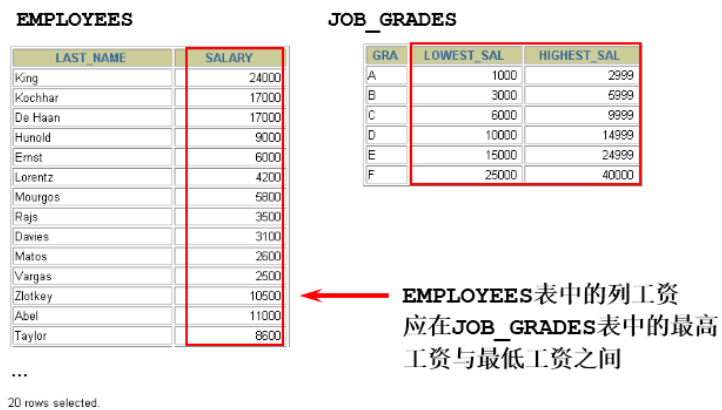

# 1、MySQL概述

## 1.1、为什么要使用数据库

**持久化**(persistence)：把数据保存到可掉电式存储设备中以供之后使用。大多数情况下，特别是企业级应用，数据持久化意味着将内存中的数据保存到硬盘上加以”固化”，而持久化的实现过程大多通过各种关系数据库来完成。 

持久化的主要作用是将内存中的数据存储在关系型数据库中，当然也可以存储在磁盘文件、XML数据文件中。

## 1.2、基本概念

**DB**：数据库（Database） 即存储数据的“仓库”，其本质是一个文件系统。它保存了一系列有组织的数据。 

**DBMS**：数据库管理系统（Database Management System） 是一种操纵和管理数据库的大型软件，用于建立、使用和维护数据库，对数据库进行统一管理和控 制。用户通过数据库管理系统访问数据库中表内的数据。 

**SQL**：结构化查询语言（Structured Query Language） 专门用来与数据库通信的语言。

```text
“information_schema”是 MySQL 系统自带的数据库，主要保存 MySQL 数据库服务器的系统信息，
比如数据库的名称、数据表的名称、字段名称、存取权限、数据文件 所在的文件夹和系统使用的
文件夹，等等

“performance_schema”是 MySQL 系统自带的数据库，可以用来监控 MySQL 的各类性能指标。

“sys”数据库是 MySQL 系统自带的数据库，主要作用是以一种更容易被理解的方式展示 MySQL 数据
库服务器的各类性能指标，帮助系统管理员和开发人员监控 MySQL 的技术性能。

“mysql”数据库保存了 MySQL 数据库服务器运行时需要的系统信息，比如数据文件夹、当前使用的
字符集、约束检查信息，等等
```

## 1.3、SQL语言

### 1.3.1、SQL分类

SQL语言在功能上主要分为如下3大类：

- **DDL（Data Definition Languages、数据定义语言）**：这些语句定义了不同的数据库、表、视图、索引等数据库对象，还可以用来创建、删除、修改数据库和数据表的结构。 主要的语句关键字包括 CREATE 、 DROP 、 ALTER 等。 

- **DML（Data Manipulation Language、数据操作语言）**：用于添加、删除、更新和查询数据库记录，并检查数据完整性。 主要的语句关键字包括 INSERT 、 DELETE 、 UPDATE 、 SELECT 等。 SELECT是SQL语言的基础，最为重要。 

- **DCL（Data Control Language、数据控制语言）**：用于定义数据库、表、字段、用户的访问权限和安全级别。 主要的语句关键字包括 GRANT 、 REVOKE 、 COMMIT 、 ROLLBACK 、 SAVEPOINT 等。

因为查询语句使用的非常的频繁，所以很多人把查询语句单拎出来一类：DQL（数据查询语言）。 

还有单独将 COMMIT 、 ROLLBACK 取出来称为TCL （Transaction Control Language，事务控制语言）。

### 1.3.2、规则与规范

- SQL 可以写在一行或者多行。为了提高可读性，各子句分行写，必要时使用缩进
- 每条命令以 **;** 或 **\g** 或 **\G** 结束
- 关键字不能被**缩写**也不能**分行** 
- 关于标点符号必须保证所有的**()**、**单引号**、**双引号**是**成对结束**的
- 必须使用英文状态下的**半角**输入方式 
- 字符串型和日期时间类型的数据可以使用单引号**' '**
- 表示列的别名，尽量使用双引号**" "**，而且不建议省略**as** ，如果别名中间无空格可以省略**" "**
- MySQL 在 Windows 环境下是大小写不敏感的，在 Linux 环境下是大小写敏感的
  - 数据库名、表名、表的别名、变量名是严格区分大小写的 
  - 关键字、函数名、列名(或字段名)、列的别名(字段的别名) 是忽略大小写的。
- **推荐**采用统一的书写规范： 
  - 数据库名、表名、表别名、字段名、字段别名等都小写 
  - SQL 关键字、函数名、绑定变量等都大写

### 1.3.3、注释

```sql
单行注释：#注释文字(MySQL特有的方式)
单行注释：-- 注释文字(--后面必须包含一个空格。)
多行注释：/* 注释文字 */
```

### 1.3.4、命名规则

- 数据库、表名不得超过30个字符，变量名限制为29个 
- 必须只能包含 A–Z, a–z, 0–9, _共63个字符 
- 数据库名、表名、字段名等对象名中间不要包含空格 
- 同一个MySQL软件中，数据库不能同名，同一个库中，表不能重名，同一个表中，字段不能重名 
- 必须保证你的字段没有和保留字、数据库系统或常用方法冲突。如果坚持使用，请在SQL语句中使用 **`**（着重号）引起来
- 保持字段名和类型的一致性，在命名字段并为其指定数据类型的时候一定要保证一致性。假如数据类型在一个表里是整数，那在另一个表里可就别变成字符型了


## 1.4、表的关联关系

**四种关系**：一对一关联、一对多关联、多对多关联、自我引用

### 1.4.1、一对一关联（one-to-one）

**两种建表原则**： 

- 外键唯一：主表的主键和从表的外键（唯一），形成主外键关系，外键唯一。 
- 外键是主键：主表的主键和从表的主键，形成主外键关系。


### 1.4.2、一对多关系（one-to-many）

**建表原则**：在从表(多方)创建一个字段，字段作为外键指向主表(一方)的主键


### 1.4.3、多对多（many-to-many）

**建表原则**：要表示多对多关系，必须创建第三个表，该表通常称为 **联接表** ，它将多对多关系划分为两个一对多关系。将这两个表的主键都插入到第三个表中。


### 1.4.4、自我引用(Self reference)


## 1.5、卸载

先在任务管理器停止Mysql服务。

之后直接在控制面板卸载Mysql相关软件，或者通过Mysq安装包自带的卸载功能

清理残余文件，服务目录：mysql服务的安装目录，数据目录：默认在C:\ProgramData\MySQL

清理注册表，cmd打开输入regedit

```text
HKEY_LOCAL_MACHINE\SYSTEM\ControlSet001\Services\MySQL服务 目录删除
HKEY_LOCAL_MACHINE\SYSTEM\ControlSet002\Services\Eventlog\Application\MySQL服务 目录删除
HKEY_LOCAL_MACHINE\SYSTEM\ControlSet002\Services\MySQL服务 目录删除
HKEY_LOCAL_MACHINE\SYSTEM\CurrentControlSet\Services\Eventlog\Application\MySQL服务 目录删除
HKEY_LOCAL_MACHINE\SYSTEM\CurrentControlSet\Services\MySQL服务 删除
```

删除环境变量配置，找到path环境变量，将其中关于mysql的环境变量删除，删除这一部分\MySQLServer8.0.26\bin; 

## 1.6、安装

下载mysql-installer-community-8.0.26.0.msi文件

双击打开选择安装


下一步选择要安装的产品


路径一般是默认的，要选择可以点击产品，然后点击下方的Advanced


ProgramData目录（这是一个隐藏目录）。如果自定义安装目录，请避免“**中文**”目录。

另外，建议服务目录和数据目录分开存放。


点击下一步，Execute安装


之后配置Mysql8.0


Server Machine（服务器） ：该选项代表服务器，MySQL服务器可以同其他服务器应用程序一起 运行，例如Web服务器等。MySQL服务器配置成适当比例的系统资源。 

Dedicated Machine（专用服务器） ：该选项代表只运行MySQL服务的服务器。MySQL服务器配置成使用所有可用系统资源。

在然后选择授权方式


之后next，设置root用户的密码，也可以点击add User添加用户，设置该用户的一系列权限等


点击next，设置mysqlservic的服务名，还可以选择以什么系统用户运行，一般推荐标准系统账户


之后一直点next即可。

cmd登陆Mysql

mysql -h 主机名 -P 端口号 -u 用户名 -p密码

## 1.7、基本操作

```sql
查看所有的数据库
show databases;

创建自己的数据库
create database 数据库名;

使用自己的数据库
use 数据库名;

查看某个库的所有表格
show tables from 数据库名;

使用 DESCRIBE 或 DESC 命令，表示表结构。
DESCRIBE employees;
DESC employees;

创建新的表格
create table 表名称(
    字段名 数据类型,
    字段名 数据类型
);

查看一个表的数据
select * from 数据库表名称;

添加一条记录
insert into 表名称 values(值列表);

查看表的创建信息
show create table 表名称\G

查看数据库的创建信息
show create database 数据库名\G

删除表格
drop table 表名称;

删除数据库
drop database 数据库名;

查看MySQL的编码设置
show variables like 'character_%';

在mysql里导入
source d:\mysqldb.sql
```

# 2、MySQL之基础查询

## 2.1、基本SELECT

### 2.1.1、无子语句

```sql
SELECT 1; #没有任何子句
SELECT 9/2; #没有任何子句
```

在生产环境下，不推荐你直接使用 SELECT ***** 进行查询。

### 2.1.2、选择特定表

```sql
SELECT 标识选择哪些列
FROM 标识从哪个表中选择
```

### 2.1.3、取别名

AS可以省略，别名如果有特殊字符必须用**" "**括起来

~~~sql
SELECT last_name AS "Name", salary*12 AS "Annual Salary"
FROM employees;
~~~

### 2.1.4、去除重复行

DISTINCT 是对后面所有列名的组合进行去重

~~~sql
SELECT DISTINCT department_id
FROM employees;
~~~

### 2.1.5、空值运算

所有运算符或列值遇到null值，运算的结果都为null

空值不等于空字符串。一个空字符串的长度是 0，而一个空值的长度是空。而且，在 MySQL 里面，空值是占用空间的。

~~~sql
SELECT employee_id,salary,commission_pct,12 * salary * (1 + commission_pct) "annual_sal"
FROM employees;
~~~

### 2.1.6、着重号

字段名或者表明与保留字冲突，需要用着重号**``**括起来

~~~sql
SELECT * FROM `ORDER`;
~~~

###  2.1.7、常数查询

在查询时增加一列常量字段

~~~sql
SELECT 'wawa' as corporation, last_name FROM employees;
~~~


SELECT 字段1,字段2 FROM 表名 WHERE 过滤条件

## 2.2、运算符


### 2.2.1、加减法

~~~sql
SELECT 100, 100 + 0, 100 - 0, 100 + 50, 100 + 50 -30, 100 + 35.5, 100 - 35.5
FROM dual;
+-----+---------+---------+----------+--------------+------------+------------+
| 100 | 100 + 0 | 100 - 0 | 100 + 50 | 100 + 50 -30 | 100 + 35.5 | 100 - 35.5 |
+-----+---------+---------+----------+--------------+------------+------------+
| 100 | 	100 | 	  100 | 	 150 | 		 	120 | 	   135.5 | 		 64.5 |
+-----+---------+---------+----------+--------------+------------+------------+

~~~

- 整数类型对整数类型进行加减操作，结果还是一个整数类型；
- 整数类型对浮点数类型进行加减法操作，结果是一个浮点数类型；
- 加法和减法的优先级相同，进行先加后减操作与进行先减后加操作的结果是一样的；
- 在Java中，+的左右两边如果有字符串，那么表示字符串的拼接。但是在MySQL中+只表示数值相加。如果遇到非数值类型，先尝试转成数值，如果转失败，就按0计算。（补充：MySQL 中字符串拼接要使用字符串函数**CONCAT()**实现）

### 2.2.2、乘除法

~~~sql
SELECT 100, 100 * 1, 100 * 1.0, 100 / 1.0, 100 / 2,100 + 2 * 5 / 2,100 /3, 100
DIV 0 FROM dual;
+-----+---------+-----------+-----------+---------+-----------------+---------+-----------+
| 100 | 100 * 1 | 100 * 1.0 | 100 / 1.0 | 100 / 2 | 100 + 2 * 5 / 2 | 100 /3  | 100 DIV 0 |
+-----+---------+-----------+-----------+---------+-----------------+---------+-----------+
| 100 | 100 	| 100.0 	| 100.0000 	| 50.0000 | 105.0000 		| 33.3333 |NULL 	  |
+-----+---------+-----------+-----------+---------+-----------------+---------+-----------+
~~~

- 一个数乘以整数1和除以整数1后仍得原数；
- 一个数乘以浮点数1和除以浮点数1后变成浮点数，数值与原数相等；
- 一个数除以整数后，不管是否能除尽，结果都为一个浮点数；
- 一个数除以另一个数，除不尽时，结果为一个浮点数，并保留到小数点后4位；
- 乘法和除法的优先级相同，进行先乘后除操作与先除后乘操作，得出的结果相同。 
- 在数学运算中，0不能用作除数，在MySQL中，一个数除以0为NULL。

### 2.2.3、求模运算

~~~sql
SELECT 12 % 3, 12 MOD 5 FROM dual;
+--------+----------+
| 12 % 3 | 12 MOD 5 |
+--------+----------+
| 0 	 | 		  2 |
+--------+----------+
~~~

### 2.2.4、符号比较运算

比较运算符用来对表达式左边的操作数和右边的操作数进行比较，比较的结果为真则返回1，比较的结果为假则返回0，其他情况则返回NULL。 

比较运算符经常被用来作为SELECT查询语句的条件来使用，返回符合条件的结果记录。


#### 2.2.4.1、等号运算

~~~sql
SELECT 1 = 1, 1 = '1', 1 = 0, 'a' = 'a', (5 + 3) = (2 + 6), '' = NULL , NULL = NULL;
+-------+---------+-------+-----------+-------------------+-----------+-------------+
| 1 = 1 | 1 = '1' | 1 = 0 | 'a' = 'a' | (5 + 3) = (2 + 6) | '' = NULL | NULL = NULL |
+-------+---------+-------+-----------+-------------------+-----------+-------------+
| 1 	| 1 	  | 0 	  | 1 		  | 1 				  | NULL 	  | NULL 		|
+-------+---------+-------+-----------+-------------------+-----------+-------------+

SELECT 1 = 2, 0 = 'abc', 1 = 'abc' FROM dual;
+-------+-----------+-----------+
| 1 = 2 | 0 = 'abc' | 1 = 'abc' |
+-------+-----------+-----------+
| 0 	| 1 		| 0 		|
+-------+-----------+-----------+

~~~

等号运算符（=）判断等号两边的值、字符串或表达式是否相等，如果相等则返回1，不相等则返回 0。 

在使用等号运算符时，遵循如下规则： 

- 如果等号两边的值、字符串或表达式都为字符串，则MySQL会按照字符串进行比较，其比较的是每个字符串中字符的ANSI编码是否相等。 
- 如果等号两边的值都是整数，则MySQL会按照整数来比较两个值的大小。
- 如果等号两边的值一个是整数，另一个是字符串，则MySQL会将字符串转化为数字进行比较。 
- 如果等号两边的值、字符串或表达式中有一个为NULL，则比较结果为NULL。

#### 2.2.4.2、安全等于运算

安全等于运算符（<=>）与等于运算符（=）的作用是相似的， 唯一的区别是‘<=>’可 以用来对**NULL**进行判断。在两个操作数均为NULL时，其返回值为1，而不为NULL，当一个操作数为NULL 时，其返回值为0，而不为NULL。

~~~SQL
SELECT 1 <=> '1', 1 <=> 0, 'a' <=> 'a', (5 + 3) <=> (2 + 6), '' <=> NULL, NULL <=> NULL 
FROM dual;
+-----------+---------+-------------+---------------------+-------------+---------------+
| 1 <=> '1' | 1 <=> 0 | 'a' <=> 'a' | (5 + 3) <=> (2 + 6) | '' <=> NULL | NULL <=> NULL |
+-----------+---------+-------------+---------------------+-------------+---------------+
| 1 		| 0 	  | 1 			| 1 				  | 0 			|1 				|
+-----------+---------+-------------+---------------------+-------------+---------------+
~~~

#### 2.2.4.3、不等于运算符

不等于运算符（<>和!=）用于判断两边的数字、字符串或者表达式的值是否不相等， 如果不相等则返回1，相等则返回0。

不等于运算符不能判断NULL值。如果两边的值有任意一个为NULL， 或两边都为NULL，则结果为NULL。 

~~~sql
SELECT 1 <> 1, 1 != 2, 'a' != 'b', (3+4) <> (2+6), 'a' != NULL, NULL <> NULL;
+--------+--------+------------+----------------+-------------+--------------+
| 1 <> 1 | 1 != 2 | 'a' != 'b' | (3+4) <> (2+6) | 'a' != NULL | NULL <> NULL |
+--------+--------+------------+----------------+-------------+--------------+
| 0 	 | 1 	  | 1 		   | 1 			    | NULL 		  | NULL 		 |
+--------+--------+------------+----------------+-------------+--------------+
~~~

### 2.2.5、非符号比较运算


#### 2.2.5.1、空运算符

判断一个值是否为NULL，如果为NULL则返回1，否则返回 0

~~~sql
SELECT NULL IS NULL, ISNULL(NULL), ISNULL('a'), 1 IS NULL;
+--------------+--------------+-------------+-----------+
| NULL IS NULL | ISNULL(NULL) | ISNULL('a') | 1 IS NULL |
+--------------+--------------+-------------+-----------+
| 1 		   | 1 			  | 0 			| 0 		|
+--------------+--------------+-------------+-----------+
~~~


#### 2.2.5.2、空运算符

判断一个值是否不为NULL，如果不为NULL则返回1，否则返回0。

~~~sql
SELECT NULL IS NOT NULL, 'a' IS NOT NULL, 1 IS NOT NULL;
+------------------+-----------------+---------------+
| NULL IS NOT NULL | 'a' IS NOT NULL | 1 IS NOT NULL |
+------------------+-----------------+---------------+
| 0 			   | 1 				 | 1 			 |
+------------------+-----------------+---------------+
~~~


#### 2.2.5.3、最小值运算符

语法格式为：LEAST(值1，值2，...，值n)。其中，“值n”表示参数列表中有n个值。在有两个或多个参数的情况下，返回最小值。

~~~sql
SELECT LEAST (1,0,2), LEAST('b','a','c'), LEAST(1,NULL,2);
+---------------+--------------------+-----------------+
| LEAST (1,0,2) | LEAST('b','a','c') | LEAST(1,NULL,2) |
+---------------+--------------------+-----------------+
| 0 		    | a 				 | NULL 		   |
+---------------+--------------------+-----------------+
~~~

- 当参数是整数或者浮点数时，LEAST将返回其中最小的值。
- 当参数为字符串时，返回字母表中顺序最靠前的字符。
- 当比较值列表中有NULL时，不能判断大小，返回值为NULL。


#### 2.2.5.4、最大值运算符

语法格式为：GREATEST(值1，值2，...，值n)。其中，n表示参数列表中有n个值。当有两个或多个参数时，返回值为最大值。

假如任意一个自变量为NULL，则GREATEST()的返回值为NULL。

~~~sql
SELECT GREATEST(1,0,2), GREATEST('b','a','c'), GREATEST(1,NULL,2);
+-----------------+-----------------------+--------------------+
| GREATEST(1,0,2) | GREATEST('b','a','c') | GREATEST(1,NULL,2) |
+-----------------+-----------------------+--------------------+
| 2 			  | c 					  | NULL 			   |
+-----------------+-----------------------+--------------------+
~~~


#### 2.2.5.5、BETWEEN AND运算符

BETWEEN运算符使用的格式通常为SELECT D FROM TABLE WHERE C BETWEEN A AND B，此时，当C大于或等于A，并且C小于或等于B时，结果为1，否则结果为0。

~~~sql
SELECT 1 BETWEEN 0 AND 1, 10 BETWEEN 11 AND 12, 'b' BETWEEN 'a' AND 'c';
+-------------------+----------------------+-------------------------+
| 1 BETWEEN 0 AND 1 | 10 BETWEEN 11 AND 12 | 'b' BETWEEN 'a' AND 'c' |
+-------------------+----------------------+-------------------------+
| 1 			  	| 0 				   | 1 						 |
+-------------------+----------------------+-------------------------+
~~~


#### 2.2.5.6、IN运算符

 用于判断给定的值是否是IN列表中的一个值，如果是则返回1，否则返回0。

如果给定的值为NULL，或者IN列表中存在NULL，则结果为NULL。

~~~sql
SELECT 'a' IN ('a','b','c'), 1 IN (2,3), NULL IN ('a','b'), 'a' IN ('a', NULL);
+----------------------+------------+-------------------+--------------------+
| 'a' IN ('a','b','c') | 1 IN (2,3) | NULL IN ('a','b') | 'a' IN ('a', NULL) |
+----------------------+------------+-------------------+--------------------+
| 1 				   | 0 			| NULL 				| 1 				 |
+----------------------+------------+-------------------+--------------------+
~~~


#### 2.2.5.7、NOT IN运算符

用于判断给定的值是否不是IN列表中的一个值，如果不是IN列表中的一个值，则返回1，否则返回0。

~~~sql
SELECT 'a' NOT IN ('a','b','c'), 1 NOT IN (2,3);
+--------------------------+----------------+
| 'a' NOT IN ('a','b','c') | 1 NOT IN (2,3) |
+--------------------------+----------------+
| 0 					   | 1 				|
+--------------------------+----------------+
~~~


#### 2.2.5.8、LIKE运算符

主要用来匹配字符串，通常用于模糊匹配，如果满足条件则返回1，否则返回 0。

如果给定的值或者匹配条件为NULL，则返回结果为NULL。

~~~sql
SELECT NULL LIKE 'abc', 'abc' LIKE NULL;
+-----------------+-----------------+
| NULL LIKE 'abc' | 'abc' LIKE NULL |
+-----------------+-----------------+
| NULL 			  | NULL 			|
+-----------------+-----------------+
~~~

通配符：

~~~sql
“%”：匹配0个或多个字符。
“_”：只能匹配一个字符。
~~~

| LIKE运算符                | 描述                            |
| ------------------------- | ------------------------------- |
| WHERE name LIKE "a%"      | 查找以 "a"开头的任何值          |
| WHERE name LIKE "%a"      | 查找以 "a"结尾的任何值          |
| WHERE name LIKE "%a%"     | 在任何位置查找任何具有"a"的值   |
| WHERE name LIKE "_a%"     | 在第二个位置查找任何具有"a"的值 |
| WHERE name LIKE "o%a"     | 查找以 "o"开头以"a"结尾的任何值 |
| WHERE name LIKE "[!abc]%" | 查找不以a或b或c开头的值         |
| WHERE name LIKE "[abc]%"  | 查找以a或b或c开头的值           |


#### 2.2.5.9、REGEXP运算符

符用来匹配字符串，语法格式为： expr REGEXP 匹配条件 。如果expr满足匹配条件，返回 1；如果不满足，则返回0。

若expr或匹配条件任意一个为NULL，则结果为NULL。

REGEXP运算符在进行匹配时，常用的有下面几种通配符： 

（1）‘^’匹配以该字符后面的字符开头的字符串。 

（2）‘$’匹配以该字符前面的字符结尾的字符串。 

（3）‘.’匹配任何一个单字符。 

（4）“[...]”匹配在方括号内的任何字符。例如，“[abc]”匹配“a”或“b”或“c”。为了命名字符的范围，使用一 个‘-’。“[a-z]”匹配任何字母，而“[0-9]”匹配任何数字。 

（5）‘\*' 匹配零个或多个在它前面的字符。例如，“x\*”匹配任何数量的‘x’字符，“[0-9]\*”匹配任何数量的数字， 而“*”匹配任何数量的任何字符。

~~~sql
SELECT 'shkstart' REGEXP '^s', 'shkstart' REGEXP 't$', 'shkstart' REGEXP 'hk';
+------------------------+------------------------+-------------------------+
| 'shkstart' REGEXP '^s' | 'shkstart' REGEXP 't$' | 'shkstart' REGEXP 'hk'  |
+------------------------+------------------------+-------------------------+
| 1 					 | 1 					  | 1 						|
+------------------------+------------------------+-------------------------+
~~~


### 2.2.6、逻辑运算符


#### 2.2.6.1、非运算符

逻辑非（NOT或!）运算符表示当给定的值为0时返回1；

当给定的值为非0值时返回0； 

当给定的值为NULL时，返回NULL。

~~~sql
 SELECT NOT 1, NOT 0, NOT(1+1), NOT !1, NOT NULL;
+-------+-------+----------+--------+----------+
| NOT 1 | NOT 0 | NOT(1+1) | NOT !1 | NOT NULL |
+-------+-------+----------+--------+----------+
| 0 	| 1 	| 0 	   | 1 		| NULL 	   |
+-------+-------+----------+--------+----------+
~~~


#### 2.2.6.2、与运算符

 逻辑与（AND或&&）运算符是当给定的所有值均为非0值，并且都不为NULL时，返回 1；

当给定的一个值或者多个值为0时则返回0；否则返回NULL。

~~~sql
SELECT 1 AND -1, 0 AND 1, 0 AND NULL, 1 AND NULL;
+----------+---------+------------+------------+
| 1 AND -1 | 0 AND 1 | 0 AND NULL | 1 AND NULL |
+----------+---------+------------+------------+
| 1 	   | 0 		 | 0 		  | NULL 	   |
+----------+---------+------------+-------------
~~~


#### 2.2.6.3、或运算符

逻辑或（OR或||）运算符是当给定的值都不为NULL，并且任何一个值为非0值时，则返回1，否则返回0；

当一个值为NULL，并且另一个值为非0值时，返回1，否则返回NULL；

当两个值都为 NULL时，返回NULL。

~~~sql
 SELECT 1 OR -1, 1 OR 0, 1 OR NULL, 0 || NULL, NULL || NULL;
+---------+--------+-----------+-----------+--------------+
| 1 OR -1 | 1 OR 0 | 1 OR NULL | 0 || NULL | NULL || NULL |
+---------+--------+-----------+-----------+--------------+
| 1 	  | 1 	   | 1 		   | NULL 	   | NULL		  |
+---------+--------+-----------+-----------+--------------+
~~~

OR可以和AND一起使用，但是在使用时要注意两者的优先级，由于AND的优先级高于OR，因此先对AND两边的操作数进行操作，再与OR中的操作数结合。

#### 2.2.6.4、异或运算符

逻辑异或（XOR）运算符是当给定的值中任意一个值为NULL时，则返回NULL；

如果两个非NULL的值都是0或者都不等于0时，则返回0；

如果一个值为0，另一个值不为0时，则返回1。

~~~sql
SELECT 1 XOR -1, 1 XOR 0, 0 XOR 0, 1 XOR NULL, 1 XOR 1 XOR 1, 0 XOR 0 XOR 0;
+----------+---------+---------+------------+---------------+---------------+
| 1 XOR -1 | 1 XOR 0 | 0 XOR 0 | 1 XOR NULL | 1 XOR 1 XOR 1 | 0 XOR 0 XOR 0 |
+----------+---------+---------+------------+---------------+---------------+
| 0 	   | 1		 | 0	   | NULL	    | 1			    | 0			    |
+----------+---------+---------+------------+---------------+---------------+
~~~

## 2.3、排序

使用 ORDER BY 子句排序 

- ASC（ascend）: 升序 
- DESC（descend）:降序 

ORDER BY 子句在SELECT语句的结尾。

单列排序：

~~~sql
SELECT last_name, job_id, department_id, hire_date
FROM employees
ORDER BY hire_date ;

SELECT last_name, job_id, department_id, hire_date
FROM employees
ORDER BY hire_date DESC ;
~~~

多列排序：

~~~sql
SELECT last_name, department_id, salary
FROM employees
ORDER BY department_id, salary DESC;
~~~

在对多列进行排序的时候，首先排序的第一列必须有相同的列值，才会对第二列进行排序。如果第 一列数据中所有值都是唯一的，将不再对第二列进行排序。

## 2.4、分页

所谓分页显示，就是将数据库中的结果集，一段一段显示出来需要的条件。

MySQL中使用 LIMIT 实现分页。

LIMIT 子句必须放在整个SELECT语句的最后。

格式： LIMIT [位置偏移量,] 行数

- 第一个“位置偏移量”参数指示MySQL从哪一行开始显示，是一个可选参数，如果不指定“位置偏移量”，将会从表中的第一条记录开始（第一条记录的位置偏移量是0，第二条记录的位置偏移量是 1）；
- 第二个参数“行数”指示返回的记录条数。

~~~sql
--前10条记录：
SELECT * FROM 表名 LIMIT 0,10;
或者
SELECT * FROM 表名 LIMIT 10;

--第11至20条记录：
SELECT * FROM 表名 LIMIT 10,10;

--第21至30条记录：
SELECT * FROM 表名 LIMIT 20,10;
~~~

**tip**：MySQL 8.0中可以使用“LIMIT 3 OFFSET 4”，意思是获取从第5条记录开始后面的3条记录，和“LIMIT 4,3;”返回的结果相同。

分页公式：（当前页数-1）*每页条数，每页条数

~~~sql
SELECT * FROM table
LIMIT(PageNo - 1)*PageSize,PageSize;
~~~

**优点**：约束返回结果的数量可以减小网络传输的压力，还可以提升查询效率。例如只需要一条记录，使用LIMIT 1 查询到一条即可返回

# 3、MySQL之多表查询

## 3.1、多表查询前提

多表查询，也称为关联查询，指两个或更多个表一起完成查询操作。 

前提条件：

- 这些一起查询的表之间是有关系的（一对一、一对多），它们之间一定是有关联字段，这个关联字段可能建立了外键，也可能没有建立外键。

## 3.2、错误案例引入


~~~sql
#案例：查询员工的姓名及其部门名称
SELECT last_name, department_name
FROM employees, departments;

2889 rows in set (0.01 sec)
~~~

分析错误情况：

~~~sql
SELECT COUNT(employee_id) FROM employees;
#输出107行
SELECT COUNT(department_id)FROM departments;
#输出27行

SELECT 107*27 FROM dual;
~~~

此种错误称为：笛卡尔积错误

笛卡尔乘积是一个数学运算。假设有两个集合 X 和 Y，那么 X 和 Y 的笛卡尔积就是 X 和 Y 的所有可能组合。

也就是第一个对象来自于 X，第二个对象来自于 Y 的所有可能。组合的个数即为两个集合中元素个数的乘积数。

SQL92中，笛卡尔积也称为 **交叉连接** ，英文是 **CROSS** **JOIN** 。在 SQL99 中也是使用 CROSS JOIN 表示交叉连接。它的作用就是可以把任意表进行连接，即使这两张表不相关。在MySQL中如下情况会出现笛卡尔积：

~~~sql
#查询员工姓名和所在部门名称
SELECT last_name,department_name FROM employees,departments;
SELECT last_name,department_name FROM employees CROSS JOIN departments;
SELECT last_name,department_name FROM employees INNER JOIN departments;
SELECT last_name,department_name FROM employees JOIN departments;
~~~

笛卡尔积的错误会在下面条件下产生： 

- 省略多个表的连接条件（或关联条件） 

- 连接条件（或关联条件）无效 

- 所有表中的所有行互相连接 

为了避免笛卡尔积， 可以在 WHERE 加入有效的连接条件。 加入连接条件后，查询语法：

在表中有相同列时，在列名之前加上表名前缀。

~~~sql
SELECT table1.column, table2.column
FROM table1, table2
WHERE table1.column1 = table2.column2; #连接条件
~~~

## 3.3、多表查询分类

### 3.3.1、等值连接


~~~sql
SELECT e.employee_id, e.last_name,
	   e.department_id, e.department_id,
	   d.location_id
FROM employees e, departments d
WHERE e.department_id = d.department_id;
~~~

- 多个表中有相同列时，必须在列名之前加上表名前缀。
- 在不同表中具有相同列名的列可以用 表名 加以区分。
- 使用别名可以简化查询。 
- 列名前使用表名前缀可以提高查询效率。

> 需要注意的是，如果我们使用了表的别名，在查询字段中、过滤条件中就只能使用别名进行代替， 不能使用原有的表名，否则就会报错。

~~~sql
SELECT e.employee_id,e.last_name,d.department_name,l.city,e.department_id,l.location_id
FROM employees e,departments d,locations l
WHERE e.`department_id` = d.`department_id`
	AND d.`location_id` = l.`location_id`;
~~~

- 多个连接条件与 AND 操作符
- 连接 n个表,至少需要n-1个连接条件。比如，连接三个表，至少需要两个连接条件。

### 3.3.2、非等值连接



~~~sql
SELECT e.last_name,e.salary,j.grade_level
FROM employees e,job_grades j
#where e.salary between j.lowest_sal and j.highest_sal;
WHERE e.salary >= j.lowest_sal AND e.salary <= j.highest_sal;
~~~


### 3.3.3、自连接


~~~sql
SELECT CONCAT(worker.last_name ,' works for ', manager.last_name)
FROM employees worker, employees manager
WHERE worker.manager_id = manager.employee_id 
~~~

- 当table1和table2本质上是同一张表，只是用取别名的方式虚拟成两张表以代表不同的意义。然后两个表再进行内连接，外连接等查询。

### 3.3.4、内连接 与 外连接

- 除了查询满足条件的记录以外，外连接还可以查询某一方不满足条件的记录。
- **内连接**：合并具有同一列的两个以上的表的行， 结果集中不包含一个表与另一个表不匹配的行。 
- **外连接**：两个表在连接过程中除了返回满足连接条件的行以外还返回左（或右）表中不满足条件的行 ，这种连接称为左（或右） 外连接。没有匹配的行时, 结果表中相应的列为空(NULL)。 
  - 如果是左外连接，则连接条件中左边的表也称为 主表 ，右边的表称为 从表 。 
  - 如果是右外连接，则连接条件中右边的表也称为 主表 ，左边的表称为 从表 。

#### 3.3.4.1、SQL92版

在 SQL92 中采用（**+**）**代表从表所在的位置**。即左或右外连接中，(+) 表示哪个是从表。

**注意**：

- Oracle 对 SQL92 支持较好，而 MySQL 则不支持 SQL92 的外连接。
- 而且在 SQL92 中，只有左外连接和右外连接，没有满（或全）外连接。

~~~sql
#左外连接
SELECT last_name,department_name
FROM employees ,departments
WHERE employees.department_id = departments.department_id(+);

#右外连接
SELECT last_name,department_name
FROM employees ,departments
WHERE employees.department_id(+) = departments.department_id;
~~~

#### 3.3.4.2、SQL99版

使用 **JOIN ON** 子句连接

~~~sql
SELECT table1.column, table2.column,table3.column
FROM table1
JOIN table2 ON (table1 和 table2 的连接条件)
JOIN table3 ON (table2 和 table3 的连接条件)

~~~

逻辑类似于for循环

~~~java
for t1 in table1:
	for t2 in table2:
		if condition1:
			for t3 in table3:
				if condition2:
					output t1 + t2 + t3
~~~

**注意**：

- 可以使用 ON 子句指定额外的连接条件，这个连接条件是与其它条件分开的
- 关键字 JOIN、INNER JOIN、CROSS JOIN 的含义是一样的，都表示内连接

#### 3.3.4.3、INNER JOIN

~~~sql
SELECT 字段列表
FROM A表 INNER JOIN B表
ON 关联条件
WHERE 等其他子句;
~~~

#### 3.3.4.4、OUTER JOIN

**左外连接(LEFT OUTER JOIN)** 

~~~sql
#实现查询结果是A为主
SELECT 字段列表
FROM A表 LEFT JOIN B表
ON 关联条件
WHERE 等其他子句;
~~~

**右外连接(RIGHT OUTER JOIN)**

~~~sql
#实现查询结果是B为主
SELECT 字段列表
FROM A表 RIGHT JOIN B表
ON 关联条件
WHERE 等其他子句;
~~~

**满外连接(FULL OUTER JOIN)**

- 满外连接的结果 = 左右表匹配的数据 + 左表没有匹配到的数据 + 右表没有匹配到的数据。 
- SQL99是支持满外连接的。使用FULL JOIN 或 FULL OUTER JOIN来实现。 
- 需要注意的是，MySQL不支持FULL JOIN，但是可以用 LEFT JOIN UNION RIGHT join代替。

### 3.3.5、UNION

**合并查询结果** 利用UNION关键字，可以给出多条SELECT语句，并将它们的结果组合成单个结果集。

合并时，两个表对应的列数和数据类型必须相同，并且相互对应。各个SELECT语句之间使用UNION或UNION ALL关键字分隔。

~~~sql
SELECT column,... FROM table1
UNION [ALL]
SELECT column,... FROM table2
~~~

- **UNION** 操作符返回两个查询的结果集的并集，去除重复记录。
- **UNION ALL** 操作符返回两个查询的结果集的并集。对于两个结果集的重复部分，不去重。

**注意**：执行UNION ALL语句时所需要的资源比UNION语句少。如果明确知道合并数据后的结果数据不存在重复数据，或者不需要去除重复的数据，则尽量使用UNION ALL语句，以提高数据查询的效率。

### 3.3.6、七种连接总结


~~~sql
#中图：内连接 A∩B
SELECT employee_id,last_name,department_name
FROM employees e JOIN departments d
ON e.`department_id` = d.`department_id`;

#左上图：左外连接
SELECT employee_id,last_name,department_name
FROM employees e LEFT JOIN departments d
ON e.`department_id` = d.`department_id`;

#右上图：右外连接
SELECT employee_id,last_name,department_name
FROM employees e RIGHT JOIN departments d
ON e.`department_id` = d.`department_id`;

#左中图：A - A∩B
SELECT employee_id,last_name,department_name
FROM employees e LEFT JOIN departments d
ON e.`department_id` = d.`department_id`
#中间重合部份大家都不是null，现在要从表null
WHERE d.`department_id` IS NULL

#右中图：B-A∩B
SELECT employee_id,last_name,department_name
FROM employees e RIGHT JOIN departments d
ON e.`department_id` = d.`department_id`
WHERE e.`department_id` IS NULL

#左下图：满外连接
# 左中图 + 右上图 A∪B
SELECT employee_id,last_name,department_name
FROM employees e LEFT JOIN departments d
ON e.`department_id` = d.`department_id`
WHERE d.`department_id` IS NULL
UNION ALL #没有去重操作，效率高
SELECT employee_id,last_name,department_name
FROM employees e RIGHT JOIN departments d
ON e.`department_id` = d.`department_id`;

#右下图
#左中图 + 右中图 A ∪B- A∩B 或者 (A - A∩B) ∪ （B - A∩B）
SELECT employee_id,last_name,department_name
FROM employees e LEFT JOIN departments d
ON e.`department_id` = d.`department_id`
WHERE d.`department_id` IS NULL
UNION ALL
SELECT employee_id,last_name,department_name
FROM employees e RIGHT JOIN departments d
ON e.`department_id` = d.`department_id`
WHERE e.`department_id` IS NULL
~~~

### 3.3.7、SQL99新特性

#### 3.3.7.1、NATURAL JOIN

在SQL92标准中：

~~~sql
SELECT employee_id,last_name,department_name
FROM employees e JOIN departments d
ON e.`department_id` = d.`department_id`
AND e.`manager_id` = d.`manager_id`;
~~~

在 SQL99 中你可以写成：

~~~sql
SELECT employee_id,last_name,department_name
FROM employees e NATURAL JOIN departments d;
~~~

NATURAL JOIN 用来表示自然连接，理解为 SQL92 中的等值连接。会自动查询两张连接表中所有相同的字段 ，然后进行 等值 连接 。

#### 3.3.7.2、USING

SQL99还支持使用 USING 指定数据表里的 **同名字段** 进行等值连接。但是只能配合JOIN一起使用。比如：

~~~sql
SELECT employee_id,last_name,department_name
FROM employees e JOIN departments d
USING (department_id);
~~~

与自然连接 NATURAL JOIN 不同的是，USING 指定了具体的相同的字段名称，你需要在 USING 的括号 () 中填入要指定的同名字段。

同时使用 JOIN...USING 可以简化 JOIN ON 的等值连接。

它与下面的 SQL 查询结果是相同的：

~~~sql
SELECT employee_id,last_name,department_name
FROM employees e ,departments d
WHERE e.department_id = d.department_id;
~~~

~~~sql
#把关联字段写在using()中，只能和JOIN一起使用
#而且两个表中的关联字段必须名称相同，而且只能表示=
#查询员工姓名与基本工资
SELECT last_name,job_title
FROM employees INNER JOIN jobs USING(job_id);
~~~

~~~sql
SELECT last_name,job_title,department_name 
FROM employees INNER JOIN departments INNER JOIN jobs 
ON employees.department_id = departments.department_id 
AND employees.job_id = jobs.job_id;
~~~

# 4、MySQL之单行函数

## 4.1、基本概念

- 操作数据对象 
- 接受参数返回一个结果 
- 只对一行进行变换 
- 每行返回一个结果 
- 可以嵌套 
- 参数可以是一列或一个值

## 4.2、数值函数

### 4.2.1、基本函数

|函数  	   	 	   	   | 用法     					|
| ---- | ---- |
|FLOOR(x)  		 		| 返回小于或等于某个值的最大整数	 |
|ABS(x)   			 	| 返回x的绝对值     			   |
|LEAST(e1,e2,e3…)		|返回列表中的最小值 |
|SIGN(X)   				| 返回X的符号。正数返回1，负数返回-1，0返回0     |
|GREATEST(e1,e2,e3…)  	|返回列表中的最大值  |
|PI()   				|  返回圆周率的值    |
|MOD(x,y)  				| 返回X除以Y后的余数 |
|CEIL(x)，CEILING(x)     |  返回大于或等于某个值的最小整数    |
|RAND()  				| 返回0~1的随机值 |
| RAND(x)   			|返回0~1的随机值，其中x的值用作种子值，相同的X值会产生相同的随机数|
|ROUND(x)  				| 返回一个对x的值进行四舍五入后，最接近于X的整数 |
|ROUND(x,y)    			 |  返回一个对x的值进行四舍五入后最接近X的值，并保留到小数点后面Y位|
|TRUNCATE(x,y)  		| 返回数字x截断为y位小数的结果 |
|SQRT(x)    			|  返回x的平方根。当X的值为负数时，返回NULL     |
|FORMAT(value,n) | 返回对数字value进行格式化后的结果数据。n表示 四舍五入 后保留到小数点后n位 |

~~~sql
SELECT
ABS(-123),ABS(32),SIGN(-23),SIGN(43),PI(),CEIL(32.32),CEILING(-43.23),FLOOR(32.32),
FLOOR(-43.23),MOD(12,5)
FROM DUAL;
~~~


~~~sql
SELECT RAND(),RAND(),RAND(10),RAND(10),RAND(-1),RAND(-1)
FROM DUAL;
~~~


~~~sql
SELECT
ROUND(12.33),ROUND(12.343,2),ROUND(12.324,-1),TRUNCATE(12.66,1),TRUNCATE(12.66,-1)
FROM DUAL;
~~~


### 4.2.2、角度弧度互换函数

| 函数       | 用法                                  |
| ---------- | ------------------------------------- |
| RADIANS(x) | 将角度转化为弧度，其中，参数x为角度值 |
| DEGREES(x) | 将弧度转化为角度，其中，参数x为弧度值 |

~~~sql
SELECT RADIANS(30),RADIANS(60),RADIANS(90),DEGREES(2*PI()),DEGREES(RADIANS(90))
FROM DUAL;
~~~


### 4.2.3、三角函数

| 函数 | 用法 |
| ---- | ---- |
|SIN(x)|返回x的正弦值，其中，参数x为弧度值|
|ASIN(x) |返回x的反正弦值，即获取正弦为x的值。如果x的值不在-1到1之间，则返回NULL|
|COS(x) |返回x的余弦值，其中，参数x为弧度值|
|ACOS(x) |返回x的反余弦值，即获取余弦为x的值。如果x的值不在-1到1之间，则返回NULL|
|TAN(x) |返回x的正切值，其中，参数x为弧度值|
|ATAN(x) |返回x的反正切值，即返回正切值为x的值|
|ATAN2(m,n) |返回两个参数的反正切值|
|COT(x) |返回x的余切值，其中，X为弧度值|

ATAN2(M,N)函数返回两个参数的反正切值。 与ATAN(X)函数相比，ATAN2(M,N)需要两个参数，例如有两个 点point(x1,y1)和point(x2,y2)，使用ATAN(X)函数计算反正切值为ATAN((y2-y1)/(x2-x1))，使用ATAN2(M,N)计 算反正切值则为ATAN2(y2-y1,x2-x1)。

由使用方式可以看出，当x2-x1等于0时，ATAN(X)函数会报错，而 ATAN2(M,N)函数则仍然可以计算。

~~~sql
SELECT
SIN(RADIANS(30)),DEGREES(ASIN(1)),TAN(RADIANS(45)),DEGREES(ATAN(1)),DEGREES(ATAN2(1,1))
FROM DUAL;
~~~


### 4.2.4、指数对数函数

| 函数 | 用法 |
| ---- | ---- |
|POW(x,y)，POWER(X,Y) |返回x的y次方|
|EXP(X) |返回e的X次方，其中e是一个常数，2.718281828459045|
|LN(X)，LOG(X) |返回以e为底的X的对数，当X <= 0 时，返回的结果为NULL|
|LOG10(X) |返回以10为底的X的对数，当X <= 0 时，返回的结果为NULL|
|LOG2(X) |返回以2为底的X的对数，当X <= 0 时，返回NULL|

~~~sql
SELECT POW(2,5),POWER(2,4),EXP(2),LN(10),LOG10(10),LOG2(4)
FROM DUAL;
~~~


### 4.2.5、进制转换函数

| 函数 | 用法 |
| ---- | ---- |
|BIN(x) |返回x的二进制编码|
|HEX(x) |返回x的十六进制编码|
|OCT(x) |返回x的八进制编码|
|CONV(x,f1,f2) |返回f1进制数变成f2进制数|
|CONV(value,from,to) |将value的值进行不同进制之间的转换|

~~~sql
SELECT BIN(10),HEX(10),OCT(10),CONV(10,2,8)
FROM DUAL;
~~~


## 4.3、字符串函数

| 函数 | 用法 |
| ---- | ---- |
|      |      |
|      |      |
|      |      |
|ASCII(S) |返回字符串S中的第一个字符的ASCII码值|
|CHAR_LENGTH(s) |返回字符串s的字符数。作用与CHARACTER_LENGTH(s)相同|
|LENGTH(s)| 返回字符串s的字节数，和字符集有关|
|CONCAT(s1,s2,......,sn) |连接s1,s2,......,sn为一个字符串|
|CONCAT_WS(x,s1,s2,......,sn)|同CONCAT(s1,s2,...)函数，但是每个字符串之间要加上x|
|INSERT(str, idx, len,replacestr)|将字符串str从第idx位置开始，len个字符长的子串替换为字符串replacestr|
|REPLACE(str, a, b) |用字符串b替换字符串str中所有出现的字符串a|
|UPPER(s) 或 UCASE(s) |将字符串s的所有字母转成大写字母|
|LOWER(s) 或LCASE(s) |将字符串s的所有字母转成小写字母|
|LEFT(str,n) |返回字符串str最左边的n个字符|
|RIGHT(str,n) |返回字符串str最右边的n个字符|
|LPAD(str, len, pad) |用字符串pad对str最左边进行填充，直到str的长度为len个字符|
|RPAD(str ,len, pad) |用字符串pad对str最右边进行填充，直到str的长度为len个字符|
|LTRIM(s) |去掉字符串s左侧的空格|
|RTRIM(s) |去掉字符串s右侧的空格|
|TRIM(s) |去掉字符串s开始与结尾的空格|
|TRIM(s1 FROM s) |去掉字符串s开始与结尾的s1|
|TRIM(LEADING s1 FROM s)|去掉字符串s开始处的s1|
|TRIM(TRAILING s1 FROM s)|去掉字符串s结尾处的s1|
|REPEAT(str, n) |返回str重复n次的结果|
|SPACE(n) |返回n个空格|
|STRCMP(s1,s2) |比较字符串s1,s2的ASCII码值的大小|
|SUBSTR(s,index,len)|返回从字符串s的index位置其len个字符，作用与SUBSTRING(s,n,len)、MID(s,n,len)相同|
|LOCATE(substr,str)|返回字符串substr在字符串str中首次出现的位置，作用于POSITION(substrIN str)、INSTR(str,substr)相同。未找到，返回0|
|ELT(m,s1,s2,…,sn)|返回指定位置的字符串，如果m=1，则返回s1，如果m=2，则返回s2，如果m=n，则返回sn|
|FIELD(s,s1,s2,…,sn) |返回字符串s在字符串列表中第一次出现的位置|
|FIND_IN_SET(s1,s2)|返回字符串s1在字符串s2中出现的位置。其中，字符串s2是一个以逗号分隔的字符串|
|REVERSE(s) |返回s反转后的字符串|
|NULLIF(value1,value2)|比较两个字符串，如果value1与value2相等，则返回NULL，否则返回value1|

**注意**：MySQL中，字符串的位置是从1开始的。

## 4.4、日期时间函数

### 4.4.1、获取日期时间函数

| 函数 | 用法 |
| ---- | ---- |
|CURDATE() ，CURRENT_DATE()|返回当前日期，只包含年、月、日|
|CURTIME() ， CURRENT_TIME()|返回当前时间，只包含时、分、秒|
|NOW() / SYSDATE() / CURRENT_TIMESTAMP() / LOCALTIME() /LOCALTIMESTAMP()|返回当前系统日期和时间|
|UTC_DATE()|返回UTC（世界标准时间）日期|
|UTC_TIME()|返回UTC（世界标准时间）时间|

~~~sql
SELECT
CURDATE(),CURTIME(),NOW(),SYSDATE()+0,UTC_DATE(),UTC_DATE()+0,UTC_TIME(),UTC_TIME()+0
FROM DUAL;
~~~


### 4.4.2、日期转换函数

| 函数 | 用法 |
| ---- | ---- |
|UNIX_TIMESTAMP()|以UNIX时间戳的形式返回当前时间。SELECT UNIX_TIMESTAMP() ->1634348884|
|UNIX_TIMESTAMP(date) |将时间date以UNIX时间戳的形式返回。|
|FROM_UNIXTIME(timestamp)| 将UNIX时间戳的时间转换为普通格式的时间|

### 4.4.3、获取月份、星期、星期数、天数等函数

| 函数 | 用法 |
| ---- | ---- |
|YEAR(date) / MONTH(date) / DAY(date)| 返回具体的日期值|
|HOUR(time) / MINUTE(time) /SECOND(time)|返回具体的时间值|
|MONTHNAME(date) |返回月份：January，...|
|DAYNAME(date) |返回星期几：MONDAY，TUESDAY.....SUNDAY|
|WEEKDAY(date) |返回周几，注意，周1是0，周2是1，。。。周日是6|
|QUARTER(date) |返回日期对应的季度，范围为1～4|
|WEEK(date) ， WEEKOFYEAR(date) |返回一年中的第几周|
|DAYOFYEAR(date) |返回日期是一年中的第几天|
|DAYOFMONTH(date) |返回日期位于所在月份的第几天|
|DAYOFWEEK(date)|返回周几，注意：周日是1，周一是2，。。。周六是7|

### 4.4.4、截取日期函数

| 函数 | 用法 |
| ---- | ---- |
|EXTRACT(type FROM date) |返回指定日期中特定的部分，type指定返回的值|


### 4.4.5、时间转换的函数

| 函数 | 用法 |
| ---- | ---- |
|TIME_TO_SEC(time)|将 time 转化为秒并返回结果值。转化的公式为： 小时*3600+分钟*60+秒|
|SEC_TO_TIME(seconds) |将 seconds 描述转化为包含小时、分钟和秒的时间|

### 4.4.6、计算日期差的函数

| 函数 | 用法 |
| ---- | ---- |
|DATE_ADD(datetime, INTERVAL expr type)，ADDDATE(date,INTERVAL expr type)|返回与给定日期时间相差INTERVAL时间段的日期时间|
|DATE_SUB(date,INTERVAL expr type)，SUBDATE(date,INTERVAL expr type)|返回与date相差INTERVAL时间间隔的日期|


| 函数 | 用法 |
| ---- | ---- |
|ADDTIME(time1,time2)|返回time1加上time2的时间。当time2为一个数字时，代表的是秒 ，可以为负数|
|SUBTIME(time1,time2)|返回time1减去time2后的时间。当time2为一个数字时，代表的是 秒 ，可以为负数|
|DATEDIFF(date1,date2)| 返回date1 - date2的日期间隔天数|
|TIMEDIFF(time1, time2) |返回time1 - time2的时间间隔|
|FROM_DAYS(N) |返回从0000年1月1日起，N天以后的日期|
|TO_DAYS(date) |返回日期date距离0000年1月1日的天数|
|LAST_DAY(date) |返回date所在月份的最后一天的日期|
|MAKEDATE(year,n) |针对给定年份与所在年份中的天数返回一个日期|
|MAKETIME(hour,minute,second) |将给定的小时、分钟和秒组合成时间并返回|
|PERIOD_ADD(time,n) |返回time加上n后的时间|

### 4.4.7、日期格式化与解析

| 函数 | 用法 |
| ---- | ---- |
|DATE_FORMAT(date,fmt) |按照字符串fmt格式化日期date值|
|TIME_FORMAT(time,fmt) |按照字符串fmt格式化时间time值|
|GET_FORMAT(date_type,format_type) |返回日期字符串的显示格式|
|STR_TO_DATE(str, fmt) |按照字符串fmt对str进行解析，解析为一个日期|

上述 **非GET_FORMAT** 函数中**fmt**参数常用的格式符：


GET_FORMAT函数中date_type和format_type参数取值如下：


## 4.5、流程控制函数

流程处理函数可以根据不同的条件，执行不同的处理流程，可以在SQL语句中实现不同的条件选择。 
MySQL中的流程处理函数主要包括**IF()**、**IFNULL()**和**CASE()**函数。

| 函数 | 用法 |
| ---- | ---- |
|IF(value,value1,value2)|如果value的值为TRUE，返回value1，否则返回value2|
|IFNULL(value1, value2)|如果value1不为NULL，返回value1，否则返回value2|
|CASE WHEN 条件1 THEN 结果1 WHEN 条件2 THEN 结果2.... [ELSE resultn] END|相当于Java的if...else if...else...|
|CASE expr WHEN 常量值1 THEN 值1 WHEN 常量值1 THEN 值1 .... [ELSE 值n] END|相当于Java的switch...case...|

## 4.6、加密解密函数

| 函数 | 用法 |
| ---- | ---- |
|PASSWORD(str)|返回字符串str的加密版本，41位长的字符串。加密结果 不可逆 ，常用于用户的密码加密|
|MD5(str)|返回字符串str的md5加密后的值，也是一种加密方式。若参数为NULL，则会返回NULL|
|SHA(str)|从原明文密码str计算并返回加密后的密码字符串，当参数为NULL时，返回NULL。 SHA加密算法比MD5更加安全 。|
|ENCODE(value,password_seed) |返回使用password_seed作为加密密码加密value|
|DECODE(value,password_seed) |返回使用password_seed作为加密密码解密value|

## 4.7、信息函数

| 函数 | 用法 |
| ---- | ---- |
|VERSION()|返回当前MySQL的版本号|
|CONNECTION_ID() |返回当前MySQL服务器的连接数|
|DATABASE()，SCHEMA() |返回MySQL命令行当前所在的数据库|
|USER()，CURRENT_USER()、SYSTEM_USER()，SESSION_USER()|返回当前连接MySQL的用户名，返回结果格式为“主机名@用户名”|
|CHARSET(value) |返回字符串value自变量的字符集|
|COLLATION(value) |返回字符串value的比较规则|

## 4.8、其他函数

| 函数 | 用法 |
| ---- | ---- |
|INET_ATON(ipvalue) |将以点分隔的IP地址转化为一个数字|
|INET_NTOA(value) |将数字形式的IP地址转化为以点分隔的IP地址|
|BENCHMARK(n,expr)|将表达式expr重复执行n次。用于测试MySQL处理expr表达式所耗费的时间|
|CONVERT(value USING char_code)|将value所使用的字符编码修改为char_code|

# 5、MySQL之聚合

聚合函数作用于一组数据，并对一组数据返回一个值。

聚合函数不能嵌套调用。比如不能出现类似“AVG(SUM(字段名称))”形式的调用。

我更喜欢叫分组函数。

## 5.1、基本聚合函数

聚合函数需要与Group

非法使用聚合函数：**不能在 WHERE 子句中使用聚合函数**。如下：

~~~sql
SELECT department_id, AVG(salary)
FROM employees
WHERE AVG(salary) > 8000
GROUP BY department_id;
~~~


### 5.1、AVG、SUM函数 

可以对**数值型**数据使用 AVG 和 SUM 函数。

### 5.2、MIN、MAX函数 

可以对**任意数据类型**的数据使用 MIN 和 MAX 函数

### 5.3、COUNT 函数

- COUNT(*) 返回表中记录总数，适用于**任意数据类型**。
- COUNT(列名) 返回 列名 不为空的记录总数。

## 5.2、GROUP BY

可以使用 GROUP BY 子句将表中的数据分成若干组

<a name="atGroup">**注意**</a>：

- **在 SELECT 列表中所有未包含在聚合函数中的列都应该包含在 GROUP BY子句中**。

~~~sql
SELECT department_id, AVG(salary)
FROM employees
GROUP BY department_id ;
~~~

- **包含在 GROUP BY 子句中的列不必包含在 SELECT 列表中**。

~~~sql
SELECT AVG(salary)
FROM employees
GROUP BY department_id ;
~~~


- 使用多个列进行分组

~~~sql
SELECT department_id dept_id, job_id, SUM(salary)
FROM employees
GROUP BY department_id, job_id ;
~~~


- 可以使用 **WITH ROLLUP**，查询每条分组后记录的条数
- 当使用ROLLUP时，不能同时使用ORDER BY子句进行结果排序，即**ROLLUP和ORDER BY是互相排斥的**。

~~~sql
SELECT department_id,AVG(salary)
FROM employees
WHERE department_id > 80
GROUP BY department_id WITH ROLLUP;
~~~

**理解**：

- GROUP  BY 字段X 将字段X的值相同的合并为一行，生成一张虚拟表T1，此虚拟表T1其余字段具有多个值，这也正应对了 <a href="#atGroup">**注意**</a> 中所要求的两点，之后通过聚合函数对多值字段进行计算返回一个值，或者直接返回被Group分组的字段。
- 而 GROUP  BY 字段X，字段Y 也是同样的理解，生成虚拟表T1，将字段X与字段Y看作一个整体，字段单一值，其余字段多值。

## 5.3、HAVING

过滤分组：HAVING子句 

1. 行已经被分组。 
2. 使用了聚合函数。 
3. 满足 HAVING 子句中条件的分组将被显示。
4. HAVING 不能单独使用，必须要跟 GROUP BY 一起使用。

~~~sql
SELECT department_id, MAX(salary)
FROM employees
GROUP BY department_id
HAVING MAX(salary)>10000;
~~~

# 6、MySQL之子查询

子查询指一个查询语句嵌套在另一个查询语句内部的查询。

~~~sql
#方式一：
SELECT salary
FROM employees
WHERE last_name = 'Abel';
UNION
SELECT last_name,salary
FROM employees
WHERE salary > 11000;

#方式二：自连接
SELECT e2.last_name,e2.salary
FROM employees e1,employees e2
WHERE e1.last_name = 'Abel'
AND e1.`salary` < e2.`salary`

#方式三：子查询
SELECT last_name,salary
FROM employees
WHERE salary > (
    SELECT salary
    FROM employees
    WHERE last_name = 'Abel'
);
~~~

## 6.1、基本使用

- 子查询（内查询）在主查询之前一次执行完成。
- 子查询的结果被主查询（外查询）使用 。
- 子查询要包含在括号内
- 将子查询放在比较条件的右侧
- 单行操作符对应单行子查询，多行操作符对应多行子查询

子查询的编写技巧：① 从里往外写  ② 从外往里写

① 如果子查询相对较**简单**，建议从**外往里写**。一旦子查询结构较**复杂**，则建议**从里往外写**。

② 如果是**相关子查询**的话，通常都是**从外往里写**。

## 6.2、子查询的分类

- 按内查询的结果返回一条还是多条记录，将子查询分为 单行子查询 、 多行子查询 。
- 按内查询是否被执行多次，将子查询划分为 相关(或关联)子查询 和 不相关(或非关联)子查询 。


### 6.2.1、单行子查询

#### 单行操作符

|操作符 |含义|
| ---- | ---- |
|= |equal to|
|> |greater than|
|>= |greater than or equal to|
|< |less than|
|<= |less than or equal to|
|<> |not equal to|


#### 6.2.1.1、基本使用

查询与141号或174号员工的manager_id和department_id相同的其他员工的employee_id， manager_id，department_id

~~~sql
# 实现方式1：不成对比较
SELECT employee_id, manager_id, department_id
FROM employees
WHERE manager_id IN
			(SELECT manager_id
 				FROM employees
 				WHERE employee_id IN (174,141))
	AND department_id IN
			(SELECT department_id
 				FROM employees
				 WHERE employee_id IN (174,141))
	AND employee_id NOT IN(174,141);
~~~

~~~sql
# 实现方式2：成对比较
SELECT employee_id, manager_id, department_id
FROM employees
WHERE (manager_id, department_id) IN
					(SELECT manager_id, department_id
 						FROM employees
 						WHERE employee_id IN (141,174))
	AND employee_id NOT IN (141,174);
~~~

#### 6.2.1.2、HAVING中的子查询

- 首先执行子查询。 
- 向主查询中的 HAVING 子句返回结果。

查询最低工资大于50号部门最低工资的部门id和其最低工资

~~~sql
select department_id, min(salary)
from employees as e
group by e.department_id
having min(salary) > (
    select min(e2.salary) 
    from employees as e2 
    where e2.department_id = 50 
    group by e2.department_id
)
~~~

#### 6.2.1.3、CASE中的子查询

显示员工的employee_id,last_name和location。其中，若员工department_id与location_id为1800 的department_id相同，则location为’Canada’，其余则为’USA’。

~~~sql
SELECT employee_id, last_name,
(CASE department_id
 	WHEN
 		(SELECT department_id FROM departments WHERE location_id = 1800)
 	THEN 'Canada' ELSE 'USA' END) location
FROM employees;
~~~

#### 6.2.1.4、子查询中的空值现象

~~~sql
SELECT last_name, job_id
FROM employees
WHERE job_id =
		(SELECT job_id
			FROM employees
			WHERE last_name = 'Haas');
# 子查询不返回任何行，返回了空值，外查询使用空值取查询了
~~~

#### 6.2.1.5、非法使用子查询

~~~sql
SELECT employee_id, last_name
FROM employees
WHERE salary =
		(SELECT MIN(salary)
			FROM employees
			GROUP BY department_id);
# 多行子查询使用单行比较符
~~~

### 6.2.2、多行子查询

- 也称为集合比较子查询
- 内查询返回多行
- 使用多行比较操作符

#### 多行操作符

|操作符| 含义|
| ---- | ---- |
|IN |等于列表中的任意一个|
|ANY |需要和单行比较操作符一起使用，和子查询返回的某一个值比较|
|ALL |需要和单行比较操作符一起使用，和子查询返回的所有值比较|
|SOME |实际上是ANY的别名，作用相同，一般常使用ANY|

#### 6.2.2.1、基本使用

查询平均工资最低的部门id

~~~sql
#方式2：
SELECT department_id
FROM employees
GROUP BY department_id
HAVING AVG(salary) <= ALL (
    SELECT AVG(salary) avg_sal
    FROM employees
    GROUP BY department_id
)
~~~

#### 6.2.2.2、空值现象

~~~sql
SELECT last_name
FROM employees
WHERE employee_id NOT IN (
    SELECT manager_id
    FROM employees
);
~~~

### 6.2.3、相关子查询

#### 6.2.3.1、基本使用

如果子查询的执行依赖于外部查询，通常情况下都是因为子查询中的表用到了外部的表，并进行了条件关联，因此每执行一次外部查询，子查询都要重新计算一次，这样的子查询就称之为关联子查询 。

相关子查询按照一行接一行的顺序执行，主查询的每一行都执行一次子查询。


##### 6.2.3.1.1、在 WHERE 中使用子查询

若employees表中employee_id与job_history表中employee_id相同的数目不小于2，输出这些相同 id的员工的employee_id,last_name和其job_id

~~~sql
SELECT e.employee_id, last_name, e.job_id
FROM employees e
WHERE 2 <= (SELECT COUNT(*)
			FROM job_history
			WHERE employee_id = e.employee_id);

~~~

##### 6.2.3.1.2、在 FROM 中使用子查询

- 子查询是作为from的一部分，子查询要用()引起来，并且要给这个子查询取别名， 把它当成一张 **临时的虚拟的表** 来使用。

~~~sql
SELECT last_name,salary,e1.department_id
FROM employees e1, (SELECT department_id,AVG(salary) dept_avg_sal FROM employees GROUP BY department_id) e2
WHERE e1.department_id = e2.department_id
AND e2.dept_avg_sal < e1.salary;
~~~

#### 6.2.3.2、EXISTS 与 NOT EXISTS

- 关联子查询通常也会和 EXISTS 操作符一起来使用，用来检查在子查询中是否存在满足条件的行。
- 如果在子查询中不存在满足条件的行：
  - 条件返回 FALSE，继续在子查询中查找
- 如果在子查询中存在满足条件的行：
  - 不在子查询中继续查找条件，返回 TRUE

- NOT EXISTS关键字表示如果不存在某种条件，则返回TRUE，否则返回FALSE。

查询公司管理者的employee_id，last_name，job_id，department_id信息

~~~sql
# 方案一
SELECT employee_id, last_name, job_id, department_id
FROM employees e1
WHERE EXISTS ( SELECT *
				FROM employees e2
				WHERE e2.manager_id = e1.employee_id);
# 方案二
SELECT DISTINCT e1.employee_id, e1.last_name, e1.job_id, e1.department_id
FROM employees e1 JOIN employees e2
WHERE e1.employee_id = e2.manager_id;
# 方案三
SELECT employee_id,last_name,job_id,department_id
FROM employees
WHERE employee_id IN (SELECT DISTINCT manager_id FROM employees);
~~~

#### 6.2.3.3、 相关更新

~~~sql
UPDATE table1 alias1
SET column = (SELECT expression
              FROM table2 alias2
              WHERE alias1.column = alias2.column);
~~~

使用相关子查询依据一个表中的数据更新另一个表的数据。

~~~sql
UPDATE employees e
SET department_name = (SELECT department_name
                       FROM departments d
                       WHERE e.department_id = d.department_id);
~~~

#### 6.2.3.4、相关删除

~~~sql
DELETE FROM table1 alias1
WHERE column operator (SELECT expression
                       FROM table2 alias2
                       WHERE alias1.column = alias2.column);
~~~

使用相关子查询依据一个表中的数据删除另一个表的数据。

~~~sql
DELETE FROM employees e
WHERE employee_id in(SELECT employee_id
                     FROM emp_history
                     WHERE employee_id = e.employee_id);
~~~

# 7、MySQL之表管理

从系统架构的层次上看，MySQL 数据库系统从大到小依次是 数据库服务器 、 数据库 、 数据表 、数据表的行与列。

## 7.1、标识符命名规则

- 数据库名、表名不得超过30个字符，变量名限制为29个 
- 必须只能包含 A–Z, a–z, 0–9, _共63个字符 
- 数据库名、表名、字段名等对象名中间不要包含空格
- 同一个MySQL软件中，数据库不能同名，同一个库中，表不能重名，同一个表中，字段不能重名
- 必须保证你的字段没有和保留字、数据库系统或常用方法冲突，请在SQL语句中使 用`（着重号）引起来
- 保持字段名和类型的一致性：在命名字段并为其指定数据类型的时候一定要保证一致性，假如数据类型在一个表里是整数，那在另一个表里可就别变成字符型了。

## 7.2、创建数据库

~~~sql
CREATE DATABASE 数据库名;

CREATE DATABASE 数据库名 CHARACTER SET 字符集;

CREATE DATABASE IF NOT EXISTS 数据库名;
~~~

**注意**：DATABASE 不能改名。一些可视化工具可以改名，它是建新库，把所有表复制到新库，再删旧库完成的。

## 7.3、使用数据库

~~~sql
SHOW DATABASES; #有一个S，代表多个数据库

SELECT DATABASE(); #使用的一个 mysql 中的全局函数

SHOW TABLES FROM 数据库名;

SHOW CREATE DATABASE 数据库名;
或者：
SHOW CREATE DATABASE 数据库名\G

USE 数据库名;


~~~

**注意**：要操作表格和数据之前必须先说明是对哪个数据库进行操作，否则就要对所有对象加上“数据库名.”。

## 7.4、删除数据库

~~~sql
DROP DATABASE 数据库名;

DROP DATABASE IF EXISTS 数据库名;
~~~

## 7.5、创建表

### 7.5.1、方案一

**必须具备**： 

- CREATE TABLE权限
- 存储空间

**必须指定**：

- 表名 
- 列名(或字段名)，数据类型，长度

可选值：

- 约束条件 
- 默认值

~~~sql
CREATE TABLE [IF NOT EXISTS] 表名(
    字段1, 数据类型 [约束条件] [默认值],
    字段2, 数据类型 [约束条件] [默认值],
    字段3, 数据类型 [约束条件] [默认值],
    ……
    [表约束条件]
);
~~~

加上了IF NOT EXISTS关键字，则表示：如果当前数据库中不存在要创建的数据表，则创建数据表； 如果当前数据库中已经存在要创建的数据表，则忽略建表语句，不再创建数据表。

**注意**：在MySQL 8.x版本中，不再推荐为INT类型指定显示长度，并在未来的版本中可能去掉这样的语法。

### 7.5.2、方案二

使用 AS subquery 选项，将创建表和插入数据结合起来

- 指定的列和子查询中的列要一一对应 

- 通过列名和默认值定义列

~~~sql
CREATE TABLE emp1 AS SELECT * FROM employees;

CREATE TABLE emp2 AS SELECT * FROM employees WHERE 1=2; -- 创建的emp2是空表

CREATE TABLE dept80
AS
SELECT employee_id, last_name, salary*12 ANNSAL, hire_date
FROM employees
WHERE department_id = 80;
~~~

## 7.6、查看表结构

~~~sql
MySQL支持使用 DESCRIBE/DESC 语句查看数据表结构
也支持使用 SHOW CREATE TABLE 语句查看数据表结构。

SHOW CREATE TABLE 表名\G
~~~

使用SHOW CREATE TABLE语句不仅可以查看表创建时的详细语句，还可以查看存储引擎和字符编码。

## 7.7、修改表

修改表指的是修改数据库中已经存在的数据表的结构。 

使用 ALTER TABLE 语句可以实现： 

- 向已有的表中添加列 
- 修改现有表中的列 
- 删除现有表中的列 
- 重命名现有表中的列

### 7.7.1、追加一个列

~~~sql
ALTER TABLE 表名 ADD 【COLUMN】 字段名 字段类型 【FIRST|AFTER 字段名】;
~~~

### 7.7.2、修改一个列

可以修改列的数据类型，长度、默认值和位置 

修改字段数据类型、长度、默认值、位置的语法格式如下：

~~~sql
ALTER TABLE 表名 MODIFY 【COLUMN】 字段名1 字段类型 【DEFAULT 默认值】【FIRST|AFTER 字段名2】;
~~~

- 对默认值的修改只影响今后对表的修改 

- 此外，还可以通过此种方式修改列的约束。

###  7.7.3、重命名一个列

使用 CHANGE old_column new_column dataType子句重命名列。语法格式如下：

~~~sql
ALTER TABLE 表名 CHANGE 【column】 列名 新列名 新数据类型;
~~~

### 7.7.4、删除一个列

~~~sql
ALTER TABLE 表名 DROP 【COLUMN】字段名
~~~

### 7.7.5、重命名表

~~~sql
RENAME TABLE emp TO myemp;

ALTER table dept RENAME [TO] detail_dept; -- [TO]可以省略
~~~

**注意**：必须是对象的拥有者

### 7.7.6、删除表

- 在MySQL中，当一张数据表没有与其他任何数据表形成关联关系时，可以将当前数据表直接删除。 
- 数据和结构都被删除 
- 所有正在运行的相关事务被提交 
- 所有相关索引被删除

~~~sql
DROP TABLE [IF EXISTS] 数据表1 [, 数据表2, …, 数据表n];
~~~

IF EXISTS 的含义为：如果当前数据库中存在相应的数据表，则删除数据表。

如果当前数据库中不存在相应的数据表，则忽略删除语句，不再执行删除数据表的操作。

**注意**：DROP TABLE 语句不能回滚

### 7.7.7、清空表

TRUNCATE TABLE语句： 

- 删除表中所有的数据 

- 释放表的存储空间

~~~sql
TRUNCATE TABLE detail_dept;
~~~

**注意**：TRUNCATE 语句不能回滚，而使用 DELETE 语句删除数据，可以回滚

# 8、MySQL之增删改

## 8.1、INSERT

使用 **INSERT** 语句向表中插入数据。

### 8.1.2、VALUES 关键字

~~~sql
INSERT INTO 表名
VALUES (value1,value2,....);

INSERT INTO 表名(column1, column2, …, columnn)
VALUES (value1, value2, …, valuen);
~~~

可以指定要插入的表的字段，就是在INSERT语句中只向部分字段中插入值，而其他字段的值为表定义时的默认值。

一旦指定，列名和值要一一对应。

~~~sql
INSERT INTO table_name
VALUES
(value1 ,value2, …, valuen]),
(value1 ,value2, …, valuen]),
……
(value1 ,value2, …, valuen]);

INSERT INTO table_name(column1 , column2, …, columnn])
VALUES
(value1 ,value2, …, valuen]),
(value1 ,value2, …, valuen]),
……
(value1 ,value2, …, valuen]);
~~~

可以一次插入一条数据，也可以一次插入多条数据，多条数据使用 “,” 号隔开。

使用INSERT同时插入多条记录时，MySQL会返回一些在执行单行插入时没有的额外信息，这些信息的含义如下：

- Records：表明插入的记录条数。
- Duplicates：表明插入时被忽略的记录，原因可能是这些记录包含了重复的主键值。
- Warnings：表明有问题的数据值，例如发生数据类型转换。

多行的INSERT语句在处理过程中效率更高 。

### 8.1.3、将SELECT结果插入

INSERT还可以将SELECT语句查询的结果插入到表中，此时不需要把每一条记录的值一个一个输入，只需要使用一条INSERT语句和一条SELECT语句组成的组合语句即可快速地从一个或多个表中向一个表中插入多行。

~~~sql
INSERT INTO 目标表名
(tar_column1 , tar_column2, …, tar_columnn])
SELECT
(src_column1 , src_column2, …, src_columnn])
FROM 源表名
WHERE condition
~~~

子查询的列应与目标列一一对应。

## 8.2、UPDATE

~~~sql
UPDATE table_name
SET column1=value1, column2=value2, … , column=valuen
WHERE condition
~~~

可以一次更新多条数据。

如果需要回滚数据，需要保证在DML前，进行设置：SET AUTOCOMMIT = FALSE;

使用 WHERE 子句指定需要更新的数据。

## 8.3、DELETE

~~~sql
DELETE FROM table_name 
WHERE <condition>;
~~~

table_name指定要执行删除操作的表，WHERE 为可选参数，指定删除条件，如果没有WHERE，DELETE语句将删除表中的所有记录。

## 8.4、计算列

某一列的值是通过别的列计算得来的。

在MySQL 8.0中，CREATE TABLE 和 ALTER TABLE 中都支持增加计算列。

~~~sql
CREATE TABLE tb1(
    id INT,
    a INT,
    b INT,
    c INT GENERATED ALWAYS AS (a + b) VIRTUAL
);
~~~

# 9、MySQL之数据类型

| 类型             | 类型举例                                                     |
| ---------------- | ------------------------------------------------------------ |
| 整数类型         | TINYINT、SMALLINT、MEDIUMINT、INT(或INTEGER)、BIGINT         |
| 浮点类型         | FLOAT、DOUBLE                                                |
| 定点数类型       | DECIMAL                                                      |
| 位类型           | BIT                                                          |
| 日期时间类型     | YEAR、TIME、DATE、DATETIME、TIMESTAMP                        |
| 文本字符串类型   | CHAR、VARCHAR、TINYTEXT、TEXT、MEDIUMTEXT、LONGTEXT          |
| 枚举类型         | ENUM                                                         |
| 集合类型         | SET                                                          |
| 二进制字符串类型 | BINARY、VARBINARY、TINYBLOB、BLOB、MEDIUMBLOB、LONGBLOB      |
| JSON类型         | JSON对象、JSON数组                                           |
| 空间数据类型     | 单值类型：GEOMETRY、POINT、LINESTRING、POLYGON； <br>集合类型：MULTIPOINT、MULTILINESTRING、MULTIPOLYGON、 GEOMETRYCOLLECTION |

| MySQL关键字        | 含义                     |
| ------------------ | ------------------------ |
| NULL               | 数据列可包含NULL值       |
| NOT NULL           | 数据列不允许包含NULL值   |
| DEFAULT            | 默认值                   |
| PRIMARY KEY        | 主键                     |
| AUTO_INCREMENT     | 自动递增，适用于整数类型 |
| UNSIGNED           | 无符号                   |
| CHARACTER SET name | 指定一个字符集           |

## 9.1、整数类型

 整数类型一共有 5 种，包括 TINYINT、SMALLINT、MEDIUMINT、INT（INTEGER）和 BIGINT。

| 整数类型       | 字节 | 有符号数取值范围                         | 无符号数取值范围       |
| -------------- | ---- | ---------------------------------------- | ---------------------- |
| TINYINT        | 1    | -128~127                                 | 0~255                  |
| SMALLINT       | 2    | -32768~32767                             | 0~65535                |
| MEDIUMINT      | 3    | -8388608~8388607                         | 0~16777215             |
| INT（INTEGER） | 4    | 2147483648~2147483647                    | 0~4294967295           |
| BIGINT         | 8    | -9223372036854775808~9223372036854775807 | 0~18446744073709551615 |

  ~~~sql
  CREATE TABLE test_int1 ( x TINYINT, y SMALLINT, z MEDIUMINT, m INT, n BIGINT );
  ~~~

**可选属性**：

- **M**：表示显示宽度，M的取值范围是(0, 255)，从MySQL 8.0.17开始，整数数据类型不推荐使用显示宽度属性，故不做说明。
- **UNSIGNED**：无符号类型（非负），所有的整数类型都有一个可选的属性UNSIGNED（无符号属性），无符号整数类型的最小取值为0。所以，如果需要在MySQL数据库中保存非负整数值时，可以将整数类型设置为无符号类型。
- **ZEROFILL**：0填充，如果某列是ZEROFILL，那么MySQL会自动为当前列添加UNSIGNED属性，如果指 定了ZEROFILL只是表示不够M位时，用0在左边填充，如果超过M位，只要不超过数据存储范围即可。

如果确定数值非负，建议添加UNSIGNED属性

##   9.2、浮点类型

浮点数和定点数类型的特点是可以处理小数 ，整数是小数的一个特例，因此浮点数和定点数的使用场景，比整数大多了。 

MySQL支持的浮点数类型，分别是 FLOAT、DOUBLE、REAL。

- FLOAT 表示单精度浮点数
- DOUBLE 表示双精度浮点数

- 对于浮点类型，在MySQL中单精度值使用 4 个字节，双精度值使用 8 个字节。
- MySQL 存储浮点数的格式为： **符号(S)** 、 **尾数(M)** 和 **阶码(E)** 。

REAL默认就是 DOUBLE。如果你把 SQL 模式设定为启用“ REAL_AS_FLOAT ”，那 么，MySQL 就认为 REAL 是 FLOAT。如果要启用“REAL_AS_FLOAT”，可以通过以下 SQL 语句实现：

~~~sql
SET sql_mode = “REAL_AS_FLOAT”;
~~~

| 类型说明      | 字节数 | 取值范围                               |
| ------------- | ------ | -------------------------------------- |
| FLOAT[(M, D)] | 4      | 最小非零值：±1.175494351E – 38         |
| DOUBLE[(M,D)] | 8      | 最小非零值：±2.2250738585072014E – 308 |

**注意**：

- MySQL允许使用非标准语法 （其他数据库未必支持，因此如果涉及到数据迁移，则最好不要这么用）： 
  - FLOAT(M,D) 或 DOUBLE(M,D) 。这里，M称为精度 ，D称为标度 。(M,D)中 M=整数位+小数位，D=小数位。 
  - D<=M<=255，0<=D<=30。
- FLOAT和DOUBLE类型在不指定(M,D)时，默认会按照实际的精度（由实际的硬件和操作系统决定）来显示。
- 从MySQL 8.0.17开始，FLOAT(M,D) 和DOUBLE(M,D)用法在官方文档中已经明确不推荐使用，关于浮点型FLOAT和DOUBLE的UNSIGNED也不推荐使用了，不做过多介绍。

**精度误差**：

无论四字节还是八字节，MySQL都是采用二进制的方式来进行存储，如果尾数不是 0 或 5（比如 9.624），就无法用一个二进制数来精确表达，就只好在取值允许的范围内进行四舍五入。

## 9.3、定点数类型

MySQL中的定点数类型只有 DECIMAL 一种类型。

| 类型说明             | 字节数  | 取值范围                     |
| -------------------- | ------- | ---------------------------- |
| DECIMAL (M, D)定点数 | M+2字节 | 可变，其值的范围依赖于M 和 D |

- 使用 DECIMAL(M,D) 的方式表示高精度小数，M被称为精度，D被称为标度，0<=M<=65， 0<=D<=30，D<M。
- DECIMAL(M,D)的最大取值范围与DOUBLE类型一样，但是有效的数据范围是由M和D决定的。
- DECIMAL 的存储空间并不是固定的，由精度值M决定，总共占用的存储空间为M+2个字节。
- 定点数在MySQL内部是以 **字符串** 的形式进行存储。
- 当DECIMAL类型不指定精度和标度时，其默认为DECIMAL(10,0)。
- 当数据的精度超出了定点数类型的精度范围时，则MySQL同样会进行四舍五入处理。

开发时建议都使用DECIMAL ，因为不会有误差，如果超出范围，可以整数位小数位分开存储。

## 9.4、位类型

BIT类型，如果没有指定(M)，默认是1位。

这个1位，表示只能存1位的二进制值。

这里(M)是表示二进制的位数，位数最小值为1，最大值为64。

| 二进制字符串类型 | 长度 | 长度范围     | 占用空间            |
| ---------------- | ---- | ------------ | ------------------- |
| BIT(M)           | M    | 1 <= M <= 64 | 约为(M + 7)/8个字节 |

  **注意**：

- 在向BIT类型的字段中插入数据时，一定要确保插入的数据在BIT类型支持的范围内。

-   使用SELECT命令查询位字段时，可以用 BIN() 或 HEX() 函数进行读取。

~~~sql
SELECT * FROM test_bit1;
+------------+------------+------------+
| f1 | f2 | f3 |
+------------+------------+------------+
| 0x01 | NULL | NULL |
| NULL | 0x17 | NULL |
+------------+------------+------------+

SELECT BIN(f2),HEX(f2)
-> FROM test_bit1;
+---------+---------+
| BIN(f2) | HEX(f2) |
+---------+---------+
| NULL | NULL |
| 10111 | 17 |
+---------+---------+

~~~

## 9.5、时间类型

MySQL8.0版本支持的日期和时间类型主要有：YEAR类型、TIME类型、DATE类型、DATETIME类型和TIMESTAMP类型。

- YEAR 类型通常用来表示年 
- DATE 类型通常用来表示年、月、日 
- TIME 类型通常用来表示时、分、秒 
- DATETIME 类型通常用来表示年、月、日、时、分、秒 
- TIMESTAMP 类型通常用来表示带时区的年、月、日、时、分、秒

| 类型      | 名称      | 字节 | 日期格式            | 最小值                  | 最大值                 |
| --------- | --------- | ---- | ------------------- | ----------------------- | ---------------------- |
| YEAR      | 年        | 1    | YYYY或YY            | 1901                    | 2155                   |
| TIME      | 时间      | 3    | HH:MM:SS            | -838:59:59              | 838:59:59              |
| DATE      | 日期      | 3    | YYYY-MM-DD          | 1000-01-01              | 9999-12-03             |
| DATETIME  | 日期 时间 | 8    | YYYY-MM-DD HH:MM:SS | 1000-01-01 00:00:00     | 9999-12-31 23:59:59    |
| TIMESTAMP | 日期 时间 | 4    | YYYY-MM-DD HH:MM:SS | 1970-01-01 00:00:00 UTC | 2038-01-19 03:14:07UTC |

- YEAR类型用来表示年份，在所有的日期时间类型中所占用的存储空间最小，只需要 1个字节 的存储空间。
  - 在MySQL中，YEAR有以下几种存储格式：
    - 以4位字符串或数字格式表示YEAR类型，其格式为YYYY，最小值为1901，最大值为2155。
    - 以2位字符串格式表示YEAR类型，最小值为00，最大值为99。（不推荐）
      - 当取值为01到69时，表示2001到2069
      - 当取值为70到99时，表示1970到1999
      -  当取值整数的0或00添加的话，那么是0000年
      - 当取值是日期/字符串的'0'添加的话，是2000年。
- DATE类型表示日期，没有时间部分，格式为 YYYY-MM-DD，需要 3个字节 的存储空间。
  - 在向DATE类型的字段插入数据时，同样需要满足一定的格式条件。
    - 以 YYYY-MM-DD 格式或者 YYYYMMDD 格式表示的字符串日期，其最小取值为1000-01-01，最大取值为 9999-12-03。YYYYMMDD格式会被转化为YYYY-MM-DD格式。
    - 以 YY-MM-DD 格式或者 YYMMDD 格式表示的字符串日期，年份为两位数值或字符串满足 YEAR类型的格式条件为：当年份取值为00到69时，会被转化为2000到2069，当年份取值为70到99 时，会被转化为1970到1999。
  - 使用 CURRENT_DATE() 或者 NOW() 函数，会插入当前系统的日期。
- TIME类型用来表示时间，不包含日期部分，需要 3个字节 的存储空间，可以使用“HH:MM:SS”格式来表示。
  - 在MySQL中，向TIME类型的字段插入数据时，也可以使用几种不同的格式：
    - 可以使用带有冒号的字符串，比如' D HH:MM:SS' 、' HH:MM:SS '、' HH:MM '、' D HH:MM '、' D HH '或' SS '格式。
      - 如果使用带有D格式的字符串插入时，D会被转化为小时，计算格式为D*24+HH。
      - 当使用带有冒号并且不带D的字符串表示时间时，表示当天的时间，比如12:10表示12:10:00，而不是00:12:10。
    - 可以使用不带有冒号的字符串或者数字，格式为' HHMMSS '或者 HHMMSS 。如果插入一个不合法的字符串或者数字，自动转化为00:00:00进行存储。
  - 使用 CURRENT_TIME() 或者 NOW() ，会插入当前系统的时间。
- DATETIME类型在所有的日期时间类型中占用的存储空间最大，总共需要 8 个字节的存储空间，在格式上为DATE类型和TIME类型的组合，可以表示为 YYYY-MM-DD HH:MM:SS。
  - 在向DATETIME类型的字段插入数据时，同样需要满足一定的格式条件：
    - 以 YYYY-MM-DD HH:MM:SS 格式或者 YYYYMMDDHHMMSS 格式的字符串插入DATETIME类型的字段时，最小值为1000-01-01 00:00:00，最大值为9999-12-03 23:59:59。
      - 以YYYYMMDDHHMMSS格式的数字插入DATETIME类型的字段时，会被转化为YYYY-MM-DD HH:MM:SS格式。
    - 以 YY-MM-DD HH:MM:SS 格式或者 YYMMDDHHMMSS 格式的字符串插入DATETIME类型的字段时，两位数的年份规则符合YEAR类型的规则，00到69表示2000到2069，70到99表示1970到1999。
  - 使用函数 CURRENT_TIMESTAMP() 和 NOW() ，可以向DATETIME类型的字段插入系统的当前日期和时间。
- TIMESTAMP类型也可以表示日期时间，其显示格式与DATETIME类型相同，都是 YYYY-MM-DD HH:MM:SS ，需要4个字节的存储空间，但是TIMESTAMP存储的时间范围比DATETIME要小很多。
  - 存储数据的时候需要对当前时间所在的时区进行转换，查询数据的时候再将时间转换回当前的时区。因此，使用TIMESTAMP存储的同一个时间值，在不同的时区查询时会显示不同的时间。
  - 插入格式同DATETIME类型。

## 9.6、文本字符串类型

MySQL中，文本字符串总体上分为 CHAR 、 VARCHAR 、 TINYTEXT 、 TEXT 、 MEDIUMTEXT 、 LONGTEXT 、 ENUM 、 SET 等类型。

| 字符串(文本)类型 | 特点               | 长度 | 长度范围                          | 占用的存储空间        |
| ---------------- | ------------------ | ---- | --------------------------------- | --------------------- |
| CHAR(M)          | 固定长度           | M    | 0 <= M <= 255                     | M个字节               |
| VARCHAR(M)       | 可变长度           | M    | 0 <= M <= 65535                   | (实际长度 + 1) 个字节 |
| TINYTEXT         | 小文本、可变长度   | L    | 0 <= L <= 255                     | L + 2 个字节          |
| TEXT             | 文本、可变长度     | L    | 0 <= L <= 65535                   | L + 2 个字节          |
| MEDIUMTEXT       | 中等文本、可变长度 | L    | 0 <= L <= 16777215                | L + 3 个字节          |
| LONGTEXT         | 大文本、可变长度   | L    | 0 <= L<= 4294967295（相当于 4GB） | L + 4 个字节          |

CHAR类型： 

- CHAR(M) 类型一般需要预先定义字符串长度。
- 定义CHAR类型字段时，声明的字段长度即为CHAR类型字段所占的存储空间的字节数。
- 如果不指定(M)，则表示长度默认是1个字符。 
- 如果保存时，数据的实际长度比CHAR类型声明的长度小，则会在右侧填充空格以达到指定的长度。当MySQL检索CHAR类型的数据时，CHAR类型的字段会去除尾部的空格。 

VARCHAR类型： 

- VARCHAR(M) 定义时， 必须指定长度M，否则报错。 
- MySQL4.0版本以下，varchar(20)：指的是20字节，如果存放UTF8汉字时，只能存6个（每个汉字3字节）
- MySQL5.0版本以上，varchar(20)：指的是20字符。 
- 检索VARCHAR类型的字段数据时，会保留数据尾部的空格，VARCHAR类型的字段所占用的存储空间为字符串实际长度加1个字节。

>1. 存储很短的信息，建议使用CHAR，可以节约空间
>2. 固定长度的，建议使用CHAR，可以节约空间
>3. 十分频繁改变的列，建议使用CHAR，提高速度，因为VARCHAR每次修改都要计算长度
>4. MyISAM，建议使用CHAR，将表静态化，提升速度
>5. InnoDB，建议使用VARVHAR，。因为InnoDB，内部的行存储格式并没有区分固定长度和可变长度列（所有数据行都使用指向数据列值的头指针），而且主要影响性能的因素是数据行使用的存储总量，所以除了简短或者固定长度会考虑CHAR，其余大部分能使用VARCHAR
>6. TEXT文本类型，可以存比较大的文本段，搜索速度稍慢，因此如果不是特别大的内容，建议使用CHAR， VARCHAR来代替。
>7. TEXT类型不用加默认值，加了也没用。
>8. TEXT和BLOB类型的数据删除后容易导致 “空洞”，使得文件碎片比较多，所以频繁使用的表不建议包含TEXT类型字段，建议单独分出去，单独用 一个表。

**注意**：

- 由于实际存储的长度不确定，MySQL 不允许 TEXT 类型的字段做主键。遇到这种情况，只能采用 CHAR(M)，或者 VARCHAR(M)。

不建议VARCHAR长度超过5000，若超过建议使用TEXT类型，并另开一张表存储。

## 9.7、ENUM类型

ENUM类型也叫作枚举类型。

ENUM类型的取值范围需要在定义字段时进行指定。

ENUM 类型设置字段值时，只允许从成员中选取单个值，不能一次选取多个值。 

ENUM 类型所需要的存储空间由定义ENUM类型时指定的成员个数决定。

| 文本字符串类型 | 长度 | 长度范围        | 占用的存储空间 |
| -------------- | ---- | --------------- | -------------- |
| ENUM           | L    | 1 <= L <= 65535 | 1或2个字节     |

当ENUM类型包含1～255个成员时，需要1个字节的存储空间。

当ENUM类型包含256～65535个成员时，需要2个字节的存储空间。

ENUM类型的成员个数的上限为65535个。

 ~~~sql
 CREATE TABLE test_enum(season ENUM('春','夏','秋','冬','unknow'));
 
 INSERT INTO test_enum
 VALUES('春'),('秋');
 
 # 忽略大小写
 INSERT INTO test_enum
 VALUES('UNKNOW');
 
 # 允许按照角标的方式获取指定索引位置的枚举值
 INSERT INTO test_enum
 VALUES('1'),(3);
 
 # Data truncated for column 'season' at row 1
 INSERT INTO test_enum
 VALUES('ab');
 
 # 当ENUM类型的字段没有声明为NOT NULL时，插入NULL也是有效的
 INSERT INTO test_enum
 VALUES(NULL);
 ~~~

## 9.8、SET类型

SET表示一个字符串对象，可以包含0个或多个成员，但成员个数的上限为 64 ，设置字段值时，取值范围内的 0 个或多个值。

当SET类型包含的成员个数不同时，其所占用的存储空间也是不同的，具体如下：

| 成员个数范围（L表示实际成员个数） | 占用的存储空间 |
| --------------------------------- | -------------- |
| 1 <= L <= 8                       | 1个字节        |
| 9 <= L <= 16                      | 2个字节        |
| 17 <= L <= 24                     | 3个字节        |
| 25 <= L <= 32                     | 4个字节        |
| 33 <= L <= 64                     | 8个字节        |

SET类型在存储数据时成员个数越多，其占用的存储空间越大。

**注意**：SET类型在选取成员时，可以一次选择多个成员，这一点与ENUM类型不同。

~~~sql
CREATE TABLE test_set(
s SET ('A', 'B', 'C')
);


INSERT INTO test_set (s) VALUES ('A'), ('A,B');

# 插入重复的SET类型成员时，MySQL会自动删除重复的成员
INSERT INTO test_set (s) VALUES ('A,B,C,A');

# 向SET类型的字段插入SET成员中不存在的值时，MySQL会抛出错误。
INSERT INTO test_set (s) VALUES ('A,B,C,D');

SELECT *
FROM test_set;
~~~

## 9.9、二进制字符串类型

MySQL中的二进制字符串类型主要存储一些二进制数据，比如可以存储**图片**、**音频**和**视频**等二进制数据。

MySQL中支持的二进制字符串类型主要包括BINARY、VARBINARY、TINYBLOB、BLOB、MEDIUMBLOB 和 LONGBLOB类型。

| 二进制字符串类型 | 特点     | 值的长度                               | 占用空间     |
| ---------------- | -------- | -------------------------------------- | ------------ |
| BINARY(M)        | 固定长度 | M （0 <= M <= 255）                    | M个字节      |
| VARBINARY(M)     | 可变长度 | M（0 <=  M <= 65535）                  | M+1个字节    |
| TINYBLOB         |          | L（0 <= L <= 255）                     | L + 1 个字节 |
| BLOB             |          | L（0 <= L <= 65535）（相当于64KB）     | L + 2 个字节 |
| MEDIUMBLOB       |          | L（0 <= L <= 16777215）（相当于16MB）  | L + 3 个字节 |
| LONGBLOB         |          | L（0 <= L <= 4294967295）（相当于4GB） | L + 4 个字节 |

BINARY与VARBINARY类型：

- BINARY和VARBINARY类似于CHAR和VARCHAR，只是它们存储的是二进制字符串。
- BINARY(M) 为固定长度的二进制字符串，M表示最多能存储的字节数，取值范围是0~255个字符。如果未指定(M)，表示只能存储 1个字节 。如果字段值不足(M)个字节，将在右边填充'\0'以补齐指定长度。
- VARBINARY(M) 为可变长度的二进制字符串，M表示最多能存储的字节数，总字节数不能超过行的字节长度限制65535，另外还要考虑额外字节开销，VARBINARY类型的数据除了存储数据本身外，还需要1或2个字节来存储数据的字节数。VARBINARY类型必须指定(M) ，否则报错。

BLOB类型：

- 在实际工作中，往往不会在MySQL数据库中使用BLOB类型存储大对象数据，通常会将文件存储到服务器的磁盘上 ，并将其访问路径存储到MySQL中。

>1. 使用BLOB和TEXT值并且执行了大量的删除或更新操作的时候，会在数据表中留下很大的" 空洞 "，以后填入这些"空洞"的记录可能长度不同。为了提高性能，建议定期使用 OPTIMIZE TABLE 功能对这类表进行碎片整理 。
>2. 如果需要对大文本字段进行模糊查询，MySQL 提供了前缀索引 ，但是仍然要在不必要的时候避免检索大型的BLOB或TEXT值。除非能够确定作为约束条件的WHERE子句只会找到所需要的数据行，否则可能会毫无目的地在网络上传输大量的值。
>3. 尽量把BLOB或TEXT列分离到单独的表。如果把这些数据列移动到第二张数据表中，可以把原数据表中的数据列转换为固定长度的数据行格式，那么它就是有意义的，这样会减少主表中的碎片 ，使固定长度数据行发挥性能优势，它还使你在主数据表上运行 SELECT * 查询的时候不会通过网络传输大量的BLOB或TEXT值。

## 9.10、JSON 类型

在MySQL 5.7中，就已经支持JSON数据类型。

在MySQL 8.x版本中，JSON类型提供了可以进行自动验证的 JSON文档和优化的存储结构，使得在MySQL中存储和读取JSON类型的数据更加方便和高效。

~~~sql
CREATE TABLE test_json(js json);

INSERT INTO test_json (js)
VALUES ('{"name":"songhk", "age":18, "address":{"province":"beijing","city":"beijing"}}');

# 检索JSON类型的字段中数据的某个具体值时，使用-> 或者 ->>
SELECT 
js -> '$.name' AS NAME, 
js -> '$.age' AS age,
js -> '$.address.province' AS province, 
js -> '$.address.city' AS city
FROM test_json;

+----------+------+-----------+-----------+
| NAME | age | province | city |
+----------+------+-----------+-----------+
| "songhk" | 18 | "beijing" | "beijing" |
+----------+------+-----------+-----------+
~~~

## 9.11、空间类型

MySQL 空间类型扩展支持地理特征的生成、存储和分析，这里的地理特征表示世界上具有位置的任何东西。

MySQL中使用 Geometry（几何） 来表示所有地理特征。

Geometry指一个点或点的集合，代表世界上任何具有位置的事物。

MySQL的空间数据类型（Spatial Data Type）对应于OpenGIS类：

- 单值类型：GEOMETRY、POINT、 LINESTRING、POLYGON
- 集合类型：MULTIPOINT、MULTILINESTRING、MULTIPOLYGON、 GEOMETRYCOLLECTION 。

Geometry是所有空间集合类型的基类，其他类型如POINT、LINESTRING、POLYGON都是Geometry的子类。

Point，代表一个点，有一个坐标值。例如POINT(121.213342 31.234532)， 坐标值支持DECIMAL类型，经度（longitude）在前，维度（latitude）在后，用空格分隔。

LineString，代表一条线，由一系列点连接而成。如果线从头至尾没有交叉，那就是简单的 （simple），如果起点和终点重叠，那就是封闭的（closed）。例如LINESTRING(30 10,10 30,40 40)，点与点之间用逗号分隔，一个点中的经纬度用空格分隔，与POINT格式一致。

Polygon，多边形。可以是一个实心平面形，即没有内部边界，也可以有空洞，类似纽扣。最简单的就是只有一个外边界的情况，例如POLYGON((0 0,10 0,10 10, 0 10))。

MultiPoint、MultiLineString、MultiPolygon、GeometryCollection 这4种类型都是集合类，是多个Point、LineString或Polygon组合而成。


# 10、MySQL之约束

## 1、概述

数据完整性（Data Integrity）是指数据的精确性（Accuracy）和可靠性（Reliability），它是防止数据库中存在不符合语义规定的数据和防止因错误信息的输入输出造成无效操作或错误信息而提出的。

为了保证数据的完整性，SQL规范以约束的方式对表数据进行额外的条件限制，从以下四个方面考虑：

- 实体完整性（Entity Integrity） ：例如，同一个表中，不能存在两条完全相同无法区分的记录 
- 域完整性（Domain Integrity） ：例如：年龄范围0-120，性别范围“男/女” 
- 引用完整性（Referential Integrity） ：例如：员工所在部门，在部门表中要能找到这个部门 
- 用户自定义完整性（User-defined Integrity） ：例如：用户名唯一、密码不能为空等，本部门经理的工资不得高于本部门职工的平均工资的5倍。

约束是表级的强制规定，可以在创建表时规定约束（通过 CREATE TABLE 语句），或者在表创建之后通过 ALTER TABLE 语句规定约束。

## 2、约束的分类

根据约束数据列的限制，约束可分为： 

- 单列约束：每个约束只约束一列 
- 多列约束：每个约束可约束多列数据 

根据约束的作用范围，约束可分为： 

- 列级约束：只能作用在一个列上，跟在列的定义后面 
- 表级约束：可以作用在多个列上，不与列一起，而是单独定义

根据约束起的作用，约束可分为：

- NOT NULL 非空约束，规定某个字段不能为空 
- UNIQUE 唯一约束，规定某个字段在整个表中是唯一的 
- PRIMARY KEY 主键(非空且唯一)约束 
- FOREIGN KEY 外键约束 
- CHECK 检查约束 
- DEFAULT 默认值约束

| 约束等级 | 位置         | 支持的约束类型             | 是否可以起约束名     |
| -------- | ------------ | -------------------------- | -------------------- |
| 列级约束 | 列的后面     | 语法都支持，但外键没有效果 | 不可以               |
| 表级约束 | 所有列的下面 | 默认和非空不支持，其他支持 | 可以（主键没有效果） |

~~~sql
# information_schema数据库名（系统库）
# table_constraints表名称（专门存储各个表的约束）
SELECT * FROM information_schema.table_constraints
WHERE table_name = '表名称';
~~~

## 3、非空约束

**作用**：限定某个字段/某列的值不允许为空

**关键字**：NOT NULL

**特点**：

- 默认，所有的类型的值都可以是NULL，包括INT、FLOAT等数据类型 
- 非空约束只能出现在表对象的列上，只能某个列单独限定非空，不能组合非空 
- 一个表可以有很多列都分别限定了非空 
- 空字符串不等于NULL，0也不等于NULL

**添加非空约束**：

~~~sql
CREATE TABLE 表名称(
字段名 数据类型,
字段名 数据类型 NOT NULL,
字段名 数据类型 NOT NULL
);
~~~

**删除非空约束**：

~~~sql
# 去掉not null，相当于修改某个非注解字段，该字段允许为空
alter table 表名称 modify 字段名 数据类型 NULL;

# 去掉not null，相当于修改某个非注解字段，该字段允许为空
alter table 表名称 modify 字段名 数据类型;
~~~

**注意**： 

- MySQL不支持 CHECK 约束，但可以使用 CHECK 约束，而没有任何效果

## 4、唯一性约束

**作用**：用来限制某个字段/某列的值不能重复

**关键字**：UNIQUE

**特点**：

- 同一个表可以有多个唯一约束。 
- 唯一约束可以是某一个列的值唯一，也可以多个列组合的值唯一。 
- 唯一性约束允许列值为空。 
- 在创建唯一约束的时候，如果不给唯一约束命名，就默认和列名相同。 
- MySQL会给唯一约束的列上默认创建一个唯一索引。

**添加唯一约束**：

~~~sql
create table 表名称(
    字段名 数据类型,
    字段名 数据类型 unique,
    字段名 数据类型 unique key,
    字段名 数据类型
);

create table 表名称(
    字段名 数据类型,
    字段名 数据类型,
    字段名 数据类型,
    -- 使用表级约束语法
    [constraint 约束名] unique key(字段名)
);
~~~

**建表后指定唯一键约束**：

~~~sql
# 字段列表中如果是一个字段，表示该列的值唯一。
# 如果是两个或更多个字段，那么复合唯一，即多个字段的组合是唯一的
# 方式1：
alter table 表名称 add unique key(字段列表);

# 方式2：
alter table 表名称 modify 字段名 字段类型 unique;

~~~

**关于复合唯一约束**：

~~~sql
create table 表名称(
    字段名 数据类型,
    字段名 数据类型,
    字段名 数据类型,
    unique key(字段列表) 
    #字段列表中写的是多个字段名，多个字段名用逗号分隔，表示那么是复合唯一，即多个字段的组合是唯一的
);
~~~

**删除唯一约束**：

- 添加唯一性约束的列上也会自动创建唯一索引。 
- 删除唯一约束只能通过删除唯一索引的方式删除。 
- 删除时需要指定唯一索引名，唯一索引名就和唯一约束名一样。 
- 如果创建唯一约束时未指定名称，如果是单列，就默认和列名相同，如果是组合列，那么默认和()中排在第一个的列名相同，也可以自定义唯一性约束名。

~~~sql
# 查看都有哪些约束
SELECT * FROM information_schema.table_constraints WHERE table_name = '表名'; 

# 查看表的索引
show index from 表名称;

ALTER TABLE USER DROP INDEX uk_name_pwd;
~~~

## 5、PRIMARY KEY 约束

**作用**：用来唯一标识表中的一行记录

**关键字**：primary key

**特点**：

- 主键约束相当于唯一约束+非空约束的组合，主键约束列不允许重复，也不允许出现空值。
- 一个表最多只能有一个主键约束，建立主键约束可以在列级别创建，也可以在表级别上创建。
- 主键约束对应着表中的一列或者多列（复合主键）
- 如果是多列组合的复合主键约束，那么这些列都不允许为空值，并且组合的值不允许重复。
- MySQL的主键名总是PRIMARY，就算自己命名了主键约束名也没用。
- 当创建主键约束时，系统默认会在所在的列或列组合上建立对应的主键索引（能够根据主键查询的，就根据主键查询，效率更高）。如果删除主键约束了，主键约束对应的索引就自动删除了。
- 需要注意的一点是，不要修改主键字段的值。因为主键是数据记录的唯一标识，如果修改了主键的值，就有可能会破坏数据的完整性。

**添加主键约束**：

~~~sql
create table 表名称(
    字段名 数据类型 primary key, #列级模式
    字段名 数据类型,
    字段名 数据类型
);
create table 表名称(
    字段名 数据类型,
    字段名 数据类型,
    字段名 数据类型,
    [constraint 约束名] primary key(字段名) #表级模式
);

~~~

**列级约束**：

~~~sql
CREATE TABLE emp4(
    id INT PRIMARY KEY AUTO_INCREMENT ,
    NAME VARCHAR(20)
);
~~~

**表级约束**：

~~~sql
CREATE TABLE emp5(
    id INT NOT NULL AUTO_INCREMENT,
    NAME VARCHAR(20),
    pwd VARCHAR(15),
    CONSTRAINT emp5_id_pk PRIMARY KEY(id)
);

~~~

**建表后增加主键约束**：

~~~sql
#字段列表可以是一个字段，也可以是多个字段，如果是多个字段的话，是复合主键
ALTER TABLE 表名称 ADD PRIMARY KEY(字段列表); 
~~~

**关于复合主键**：

~~~sql
create table 表名称(
    字段名 数据类型,
    字段名 数据类型,
    字段名 数据类型,
    primary key(字段名1,字段名2) #表示字段1和字段2的组合是唯一的，也可以有更多个字段
);

~~~

**删除主键约束**：

删除主键约束，不需要指定主键名，因为一个表只有一个主键，删除主键约束后，非空还存在。

~~~sql
alter table 表名称 drop primary key;
~~~

## 6、自增列

**作用**：某个字段的值自增

**关键字**：AUTO_INCREMENT

**特点**：

- 一个表最多只能有一个自增长列
- 当需要产生唯一标识符或顺序值时，可设置自增长
- 自增长列约束的列必须是键列（主键列，唯一键列）
- 自增约束的列的数据类型必须是整数类型
- 如果自增列指定了 0 和 null，会在当前最大值的基础上自增，如果自增列手动指定了具体值，直接赋值为具体值。

**指定自增约束**：

~~~sql
create table 表名称(
    字段名 数据类型 primary key auto_increment,
    字段名 数据类型 unique key not null,
    字段名 数据类型 unique key,
    字段名 数据类型 not null default 默认值,
);

create table 表名称(
    字段名 数据类型 default 默认值 ,
    字段名 数据类型 unique key auto_increment,
    字段名 数据类型 not null default 默认值,,
    primary key(字段名)
);

alter table 表名称 modify 字段名 数据类型 auto_increment;
~~~

**删除自增约束**：

~~~sql
# 去掉auto_increment相当于删除
alter table 表名称 modify 字段名 数据类型; 
~~~

**自增变量的持久化**：

在MySQL 8.0之前，自增主键AUTO_INCREMENT的值如果大于**max(primary key)+1**

在MySQL重启后，会重置AUTO_INCREMENT=max(primary key)+1，这种现象在某些情况下会导致业务主键冲突或者其他难以发现的问题。 

在MySQL 5.7系统中，对于自增主键的分配规则，是由InnoDB数据字典内部一个**计数器**来决定的，而该计数器只在**内存中**维护 ，并不会持久化到磁盘中，当数据库重启时，该计数器会被初始化。

MySQL 8.0将自增主键的计数器持久化到**重做日志**中，每次计数器发生改变，都会将其写入重做日志中，如果数据库重启，InnoDB会根据重做日志中的信息来初始化计数器的内存值。

## 7、FOREIGN KEY 约束

**作用**：限定某个表的某个字段的引用完整性

**关键字**：FOREIGN KEY

**主表和从表/父表和子表**：

- 主表（父表）：被引用的表，被参考的表 
- 从表（子表）：引用别人的表，参考别人的表

例如：员工表的员工所在部门这个字段的值要参考部门表：部门表是主表，员工表是从表。

**特点**：

- 从表的外键列，必须引用/参考主表的主键或唯一约束的列
- 


# MySQL之配置文件

Mysql的优化：一般分为配置的优化、sql语句的优化、表结构的优化、索引的优化。

配置的优化：一般包括系统内核优化、mysql本身配置文件的优化。

## 重要的参数

- **key_buffer_size**
  - 表示索引缓存的大小。这个值越大，使用索引进行查询的速度就越快。
- **table_cache**
  - 表示同时打开的表的个数。这个值越大，能同时打开的表的个数就越多。这个值不是越大越好，因为同时打开的表过多会影响操作系统的性能。
- **query_cache_size**
  - 表示查询缓冲区的大小。使用查询缓存区可以提高查询的速度。这个方式只适用于修改操作少且经常执行相同的查询操作的情况。默认值是0。
- **Query_cache_type**
  - 表示查询缓存区的开启状态。0表示关闭，1表示开启。
- **Max_connections**
  - 表示数据库的最大连接数。这个连接数不是越大越好，因为连接会浪费内存的资源。
- **sort_buffer_size**
  - 排序缓存区的大小，这个值越大，排序就越快。
- **Innodb_buffer_pool_size**
  - 表示InnoDB类型的表和索引的最大缓存。这个值越大，查询的速度就会越快。这个值太大了就会影响操作系统的性能。

## 基本设置

- 选择Percona或MariaDB版本的话，强烈建议启用**thread pool**特性，可使得在高并发的情况下，性能不会发生大幅下降。此外，还有**extra_port**功能，非常实用。还有另外一个重要特色是 **QUERY_RESPONSE_TIME** 功能，也能使我们对整体的SQL响应时间分布有直观感受。

- 设置**default-storage-engine**=InnoDB，也就是默认采用InnoDB引擎，强烈不建议使用MyISAM引擎了，InnoDB引擎绝对可以满足99%以上的业务场景，在高版本中已经默认InnoDB了，已经完全取代MyISAM。
- 调整**innodb_buffer_pool_size**大小，如果是单实例且绝大多数是InnoDB引擎表的话，可考虑设置为物理内存的50% ~ 70%左右。
- 根据实际需要设置**innodb_flush_log_at_trx_commit**、**sync_binlog**的值。如果要求数据不能丢失，那么两个都设为1。如果允许丢失一点数据，则可分别设为2和10。而如果完全不用care数据是否丢失的话（例如在slave上，反正大不了重做一次），则可都设为0。这三种设置值导第一个影响数据库性能最大，也就是可能会拖慢。
- 设置**innodb_file_per_table** = 1，使用独立表空间。
- 设置**innodb_data_file_path** = ibdata1:1G:autoextend，不要用默认的10M，否则在有高并发事务时，会受到不小的影响。
- 设置**innodb_log_file_size**=256M，**innodb_log_files_in_group**=2，基本可满足90%以上的场景。
- 设置**long_query_time** = 1，而在5.5版本以上，已经可以设置为小于1了，建议设置为0.05（50毫秒），记录那些执行较慢的SQL，用于后续的分析排查。
- 根据业务实际需要，适当调整**max_connection**（最大连接数）、**max_connection_error**（最大错误数，建议设置为10万以上），而**open_files_limit**、**innodb_open_files**、**table_open_cache**、**table_definition_cache**这几个参数则可设为约10倍max_connection的大小。
- 常见的误区是把**tmp_table_size**和**max_heap_table_size**设置的比较大，这2个选项是每个连接会话都会分配的，因此不要设置过大，否则容易导致OOM发生，其他的一些连接会话级选项例如：**sort_buffer_size**、**join_buffer_size**、**read_buffer_size**、**read_rnd_buffer_size**等，也需要注意不能设置过大。
- 由于已经建议不再使用MyISAM引擎了，因此可以把**key_buffer_size**设置为32M左右，强烈建议关闭**query cache**功能。

## Innodb参数

- **innodb_buffer_pool_size=4G**
  - 该参数分配内存的原则：这个参数默认分配只有8M。如果是一个专用DB服务器，那么他可以占到内存的70%-80%。
  - 这个参数不能动态更改，所以分配需多考虑。分配过大，会使Swap占用过多，致使Mysql的查询特慢。如果你的数据比较小，那么可分配是你的数据大小＋10%左右做为这个参数的值。
  - 例如：数据大小为50M，那么给这个值分配innodb_buffer_pool_size＝64M

- **innodb_additional_mem_pool=16M**
  - 作用：用来存放Innodb的内部目录
  - 这个值不用分配太大，系统可以自动调。通常比较大数据设置16Ｍ够用了，如果表比较多，可以适当的增大。如果这个值自动增加，会在error log有中显示的。

- **innodb_log_file_size=256M**
  - 作用：指定日志的大小
  - 分配原则：几个日志组设置大小加起来差不多和innodb_buffer_pool_size相等。每个日志上限大小为4G。
  - 一般控制在几个log文件相加大小在2G以内为佳。具体情况还需要看你的事务大小，数据大小为依据。

- **innodb_log_files_in_group=3**
  - 作用：指定你有几个日志组。
  - 分配原则：一般我们可以用2-3个日志组。默认为两个。

- **innodb_log_buffer_size=3M**
  - 作用：事务在内存中的缓冲。
  - 分配原则：控制在2-8M。这个值不用太多的。里面的内存一般一秒钟写到磁盘一次。具体写入方式和你的事务提交方式有关，一般最大指定为3M比较合适。

- **innodb_flush_logs_at_trx_commit=1**
  - 作用：控制事务的提交方式
  - 分配原则：这个参数只有3个值，0、1、2请确认一下自已能接受的级别。默认为1，主库请不要更改了。
    性能更高的可以设置为0或是2，但会丢失一秒钟的事务。
- **innodb_file_per_table=1**
  - 作用：使每个Innodb的表，有自已独立的表空间。如删除文件后可以回收那部分空间。
  - 分配原则：只有使用不使用。但DB还需要有一个公共的表空间。
- **innodb_file_io_threads=4**
  - 作用：文件读写IO数，这个参数只在Windows上起作用。在LINUX上只会等于４
- **innodb_open_files=1024**
  - 作用：限制Innodb能打开的表的数据。
  - 分配原则：如果库里的表特别多的情况，请增加这个。这个值默认是300。
- **innodb_flush_method=O_DIRECT**
  - 作用：Innodb系统打交道的一个IO模型
  - 分配原则：Windows不用设置。

- **innodb_max_dirty_pages_pct=90**
  - 作用：控制Innodb的脏页在缓冲中在那个百分比之下，值在范围1-100，默认为90。
  - 另一个用处：当Innodb的内存分配过大，致使Swap占用严重时，可以适当的减小调整这个值，使达到Swap空间释放出来。
  - 建议：这个值最大在90%，最小在15%。太大，缓存中每次更新需要致换数据页太多，太小，放的数据页太小，更新操作太慢。
  - 动态更改需要有Super权限
  - set global innodb_max_dirty_pages_pct=50;

# 扩展


## SELECT执行过程

### 查询的结构

~~~sql
#方式1：
SELECT ...,....,...
FROM ...,...,....
WHERE 多表的连接条件
AND/OR 不包含组函数的过滤条件
GROUP BY ...,...
HAVING 包含组函数的过滤条件
ORDER BY ... ASC/DESC
LIMIT ...,...

#方式2：
SELECT ...,....,...
FROM ... JOIN ...
ON 多表的连接条件
JOIN ...
ON ...
WHERE 不包含组函数的过滤条件
AND/OR 不包含组函数的过滤条件
GROUP BY ...,...
HAVING 包含组函数的过滤条件
ORDER BY ... ASC/DESC
LIMIT ...,...

#其中：
#（1）from：从哪些表中筛选
#（2）on：关联多表查询时，去除笛卡尔积
#（3）where：从表中筛选的条件
#（4）group by：分组依据
#（5）having：在统计结果中再次筛选
#（6）order by：排序
#（7）limit：分页
~~~

###  SELECT执行顺序

 关键字的顺序是不能颠倒的：

~~~sql
SELECT ... FROM ... WHERE ... GROUP BY ... HAVING ... ORDER BY ... LIMIT...
~~~

SELECT 语句的执行顺序（在 MySQL 和 Oracle 中，SELECT 执行顺序基本相同）：

~~~sql
FROM -> WHERE -> GROUP BY -> HAVING -> SELECT 的字段 -> DISTINCT -> ORDER BY -> LIMIT
~~~

~~~sql
SELECT DISTINCT player_id, player_name, count(*) as num # 顺序 5
FROM player JOIN team ON player.team_id = team.team_id # 顺序 1
WHERE height > 1.80 # 顺序 2
GROUP BY player.team_id # 顺序 3
HAVING num > 2 # 顺序 4
ORDER BY num DESC # 顺序 6
LIMIT 2 # 顺序 7
~~~

在 SELECT 语句执行这些步骤的时候，每个步骤都会产生一个 **虚拟表** ，然后将这个虚拟表传入 下一个步 骤中作为输入。需要注意的是，这些步骤隐含在 SQL 的执行过程中，对于用户来说是不可见的。

## SQL的执行原理

1. SELECT 是先执行 **FROM** 这一步的。
   1. 在这个阶段，如果是**多张表联查**，还会经历下面的几个步骤： 
      1. 首先先通过 **CROSS JOIN** 求笛卡尔积，相当于得到虚拟表 vt（virtual table）1-1。 
      2. 通过 **ON** 进行筛选，在虚拟表 vt 1-1 的基础上进行筛选，得到虚拟表 vt 1-2。
      3. **添加外部行**。如果我们使用的是左连接、右链接或者全连接，就会涉及到外部行，也就是在虚拟表 vt 1-2 的基础上增加外部行，得到虚拟表 vt 1-3。 当然如果我们操作的是两张以上的表，还会重复上面的步骤，直到所有表都被处理完为止。这个过程得到是我们的原始数据。 
2. 当我们拿到了查询数据表的原始数据，也就是最终的虚拟表 vt1 ，就可以在此基础上再进行 **WHERE** 阶段 。在这个阶段中，会根据 vt1 表的结果进行筛选过滤，得到虚拟表 vt2 。
3. 然后进入第三步和第四步，也就是 **GROUP** 和 **HAVING** 阶段 。在这个阶段中，实际上是在虚拟表 vt2 的基础上进行分组和分组过滤，得到中间的虚拟表 vt3 和 vt4 。
4. 当我们完成了条件筛选部分之后，就可以筛选表中提取的字段，也就是进入到 **SELECT** 和 **DISTINCT** 阶段 。
   1. 首先在 **SELECT** 阶段会提取想要的字段
   2. 然后在 **DISTINCT** 阶段过滤掉重复的行，分别得到中间的虚拟表 vt5-1 和 vt5-2 。
5. 当我们提取了想要的字段数据之后，就可以按照指定的字段进行排序，也就是 **ORDER BY** 阶段 ，得到 虚拟表 vt6 。
6. 最后在 vt6 的基础上，取出指定行的记录，也就是 **LIMIT** 阶段 ，得到最终的结果，对应的是虚拟表 vt7 。


# 问题

## 1、解决Mysql中文乱码

修改mysql的数据目录下的my.ini配置文，然后重启

从MySQL 8.0 开始，数据库的默认编码改为 utf8mb4

```text
default-character-set=utf8 #默认字符集
[mysqld] # 大概在76行左右，在其下添加
...
character-set-server=utf8
collation-server=utf8_general_ci
```

## 2、忘记root密码

通过任务管理器，关掉mysqld(服务进程) 

通过命令行+特殊参数开启

```cmd
mysqld mysqld -- defaults-file="D:\ProgramFiles\mysql\MySQLServer5.7Data\my.ini" --skip-grant-tables 
```

此时，mysqld服务进程已经打开。并且不需要权限检查 

mysql -uroot 无密码登陆服务器。

另启动一个客户端进行修改权限表 

（1） use mysql;

 （2）update user set authentication_string=password('新密码') where user='root' and Host='localhost'; 

（3）flush privileges; 

通过任务管理器，关掉mysqld服务进程。

再次通过服务管理，打开mysql服务。 

即可用修改后的新密码登陆。

## 3、mysql命令报“不是内部或外部命令”

把mysql安装目录的bin目录配置到环境变量path中


## 4、命令行客户端的字符集问题

```sql
mysql> INSERT INTO t_stu VALUES(1,'张三','男');
ERROR 1366 (HY000): Incorrect string value: '\xD5\xC5\xC8\xFD' for column 'sname' at
row 1
```

原因：服务器端认为你的客户端的字符集是utf-8，而实际上你的客户端的字符集是GBK。


查看所有字符集：SHOW VARIABLES LIKE 'character_set_%';

设置当前连接的客户端字符集 “SET NAMES GBK;”

## 5、修改数据库和表的字符编码

使用 alter语句修改编码。

```sql
alter table 表名 charset utf8; 
alter table 表名 modify name varchar(20) charset utf8; 
alter database k charset utf8; 
```

## 6、count(*)，count(1)，count(列名)谁好? 

对于MyISAM引擎的表是没有区别的，这种引擎内部有一计数器在维护着行数。 

Innodb引擎的表用count(*)，count(1)直接读行数，复杂度是O(n)，因为innodb真的要去数一遍。但好于具体的count(列名)。

## 7、能不能使用count(列名)替换count(\*)? 

不要使用 count(列名)来替代 count(\*) ， count(\*) 是 SQL92 定义的标准统计行数的语法，跟数据库无关，跟 NULL 和非 NULL 无关。 

说明：count(*)会统计值为 NULL 的行，而 count(列名)不会统计此列为 NULL 值的行。

## 8、WHERE和HAVING的对比

区别1：

- WHERE 可以直接使用表中的字段作为筛选条件，但不能使用分组中的计算函数作为筛选条件。
- HAVING 必须要与 GROUP BY 配合使用，可以把分组计算的函数和分组字段作为筛选条件。 

这决定了，在需要对数据进行分组统计的时候，HAVING 可以完成 WHERE 不能完成的任务。这是因为， 在查询语法结构中，WHERE 在 GROUP BY 之前，所以无法对分组结果进行筛选。HAVING 在 GROUP BY 之 后，可以使用分组字段和分组中的计算函数，对分组的结果集进行筛选，这个功能是 WHERE 无法完成 的。另外，WHERE排除的记录不再包括在分组中。 

区别2：

- 如果需要通过连接从关联表中获取需要的数据，WHERE 是先筛选后连接，而 HAVING 是先连接后筛选。 

这一点，就决定了在关联查询中，WHERE 比 HAVING 更高效。因为 WHERE 可以先筛选，用一个筛选后的较小数据集和关联表进行连接，这样占用的资源比较少，执行效率也比较高。HAVING 则需要先把结果集准备好，也就是用未被筛选的数据集进行关联，然后对这个大的数据集进行筛选，这样占用的资源就比较多，执行效率也较低。

## 9、自连接VS子查询

自连接方式好！

可以使用子查询，也可以使用自连接的情况下，一般建议你使用自连接，因为在许多 DBMS 的处理过程中，对于自连接的处理速度要比子查询快得多。 

可以这样理解：子查询实际上是通过未知表进行查询后的条件判断，而自连接是通过已知的自身数据表进行条件判断，因此在大部分 DBMS 中都对自连接处理进行了优化。

## 10、FLOAT 和 DOUBLE 的区别

FLOAT 占用字节数少，取值范围小。

DOUBLE 占用字节数多，取值范围也大。

## 11、TIME 类型范围不是一天

MySQL 设计的 TIME 类型，不光表示一天之内的时间，而且可以用来表示一个时间间隔，这个时间间隔可以超过 24 小时。

## 12、TIMESTAMP和DATETIME的区别

TIMESTAMP存储空间比较小，表示的日期时间范围也比较小，底层存储方式不同，TIMESTAMP底层存储的是毫秒值，距离1970-1-1 0:0:0 0毫秒的毫秒值。 

两个日期比较大小或日期计算时，TIMESTAMP更方便、更快。 

TIMESTAMP和时区有关，TIMESTAMP会根据用户的时区不同，显示不同的结果，而DATETIME则只能反映出插入时当地的时区，其他时区查看数据时必然会有误差的。


# 面试题

## 1、删除除了id字段以外都相同的数据

~~~sql
create table tbl_students
(
    id   int         not null
        primary key,
    name varchar(10) null,
    sax  varchar(10) null,
    age  int         null
);

insert into tbl_students (id, name, sax, age)
values ('2', '李四', '男', '21');
insert into tbl_students (id, name, sax, age)
values ('3', '张三', '女', '17');
insert into tbl_students (id, name, sax, age)
values ('4', '李四', '男', '12');
insert into tbl_students (id, name, sax, age)
values ('6', '凤姐', '女', '20');
insert into tbl_students (id, name, sax, age)
values ('5', '凤姐', '女', '20');
insert into tbl_students (id, name, sax, age)
values ('7', '田七', '男', '18');
insert into tbl_students (id, name, sax, age)
values ('1', '田七', '男', '18');
insert into tbl_students (id, name, sax, age)
values ('8', '张三', '男', '17');
~~~

~~~sql
delete
from tbl_students as ts
where ts.id not in (select * from (select min(id) as id from tbl_students group by name, sax, age) as tsi);
~~~

思路：可以先查出其余字段相同的数据的id，用聚合函数筛出待删id返回为一个临时表，再用 not in 判断，从里往外写。
