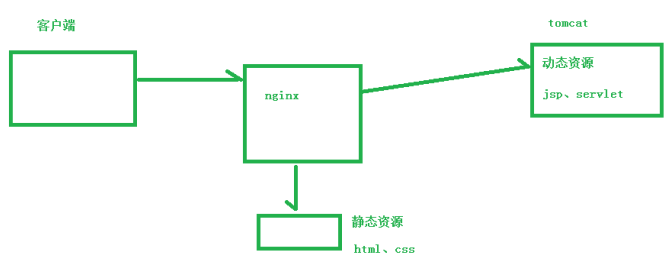
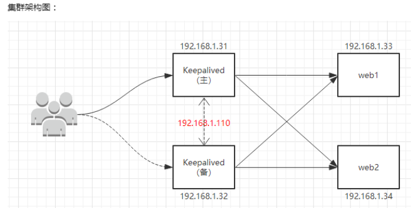
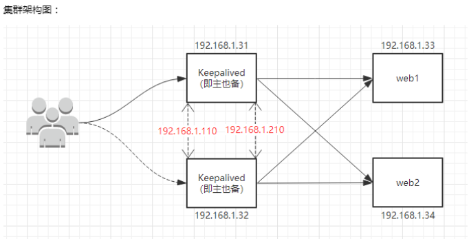
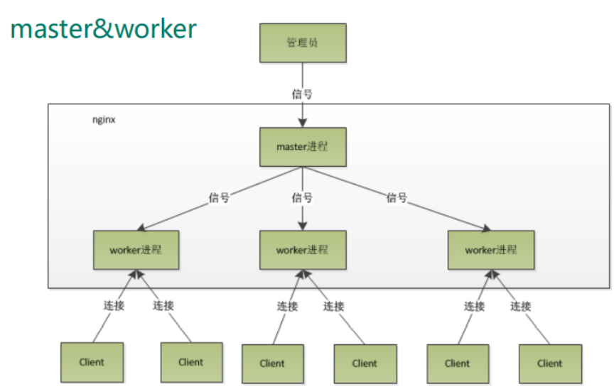
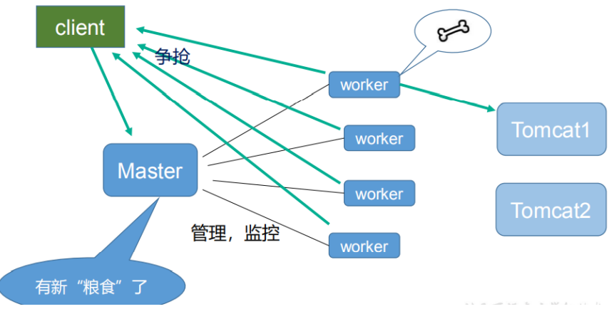
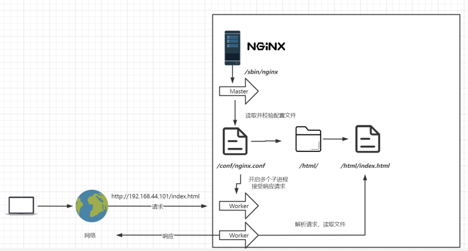
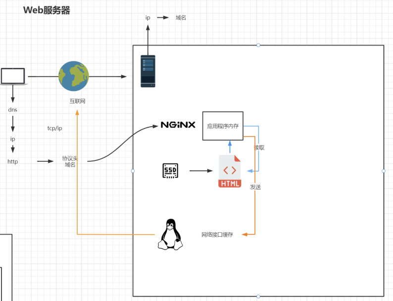
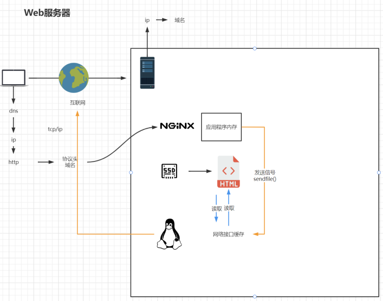
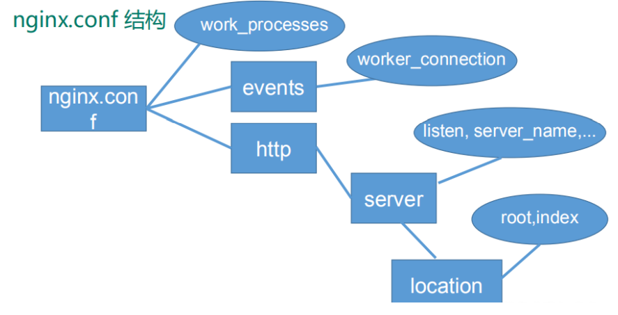
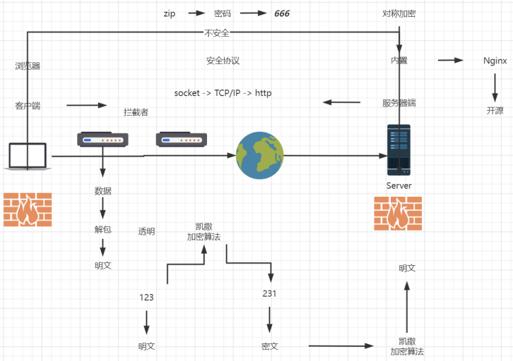

# 1、Nginx简介

高性能的 HTTP 和反向代理服务器，占有内存少，并发能 力强。

Nginx 可以作为静态页面的 web 服务器，同时还支持 CGI 协议的动态语言。

# 2、Nginx基本用途

## 1、代理概念

### 1、正向代理

局域网中的客户端要访问局域网外的Internet，需要通过代理服务器来访问，这种代理服务就称为正向代理。

Nginx 可以做反向代理、实现负载均衡、还能用作正向代理来进行上网等功能。

需要在客户端配置代理服务器进行指定网站访问。

 

### 2、反向代理

客户端对反向代理是无感知的，因为客户端不需要任何配置就可以访问，只需要将请求发送到反向代理服务器，由反向代理服务器去选择目标服务器获取数据后，在返回给客户端。

此时反向代理服务器和目标服务器对外就是一个服务器，暴露的是代理服务器地址，隐藏了真实服务器 IP 地址。

 

## 2、负载均衡

将原先请求集中到单个服务器上的情况改为将请求分发到多个服务器上，将负载分发到不同的服务器，也就是我们所说的负载均衡

 

## 3、动静分离

为了加快网站的解析速度，可以把动态页面和静态页面由不同的服务器来解析，加快解析速度。降低原来单个服务器的压力。

 

# 3、Nginx安装与目录

## 1、安装

一键安装依赖

```shell
yum -y install make zlib zlib-devel gcc-c++ libtool openssl openssl-devel keepalived
```

下载Nginx，然后解压缩，进入根目录，执行 `./configure` 

再执行`make && make install` 

安装后的默认目录在 `/usr/local/nginx` 

查看开放的端口号`firewall-cmd --list -all` 

设置开放的端口号

`firewall-cmd --add -service =  http -permanent` 

`firewall-cmd --add -port = 80/tcp --permanent` 

重启防火墙`firewall-cmd -reload` 

## 2、目录结构

主要的文件夹

~~~txt
sbin：nginx的主程序
conf：用来存放配置文件相关
html：用来存放静态文件的默认目录 html、css等

logs 
uwsgi_temp

client_body_temp 
fastcgi_temp 
proxy_temp 
scgi_temp 
~~~

其中这几个文件夹在刚安装后是没有的，主要用来存放运行过程中的临时文件

~~~txt
client_body_temp 
fastcgi_temp 
proxy_temp 
scgi_temp
~~~

# 4、Nginx常用命令

## 1、启动命令

可以将Nginx命令软连接到 /usr/local/nginx/sbin 目录下的nginx

```shell
ln -s /usr/local/nginx/sbin/nginx /usr/bin/nginx
```

执行nginx即可启动

否则需要进入到该目录下执行 `./nginx`

## 2、关闭命令

```shell
./nginx -s stop
```

## 3、重载命令

```shell
./nginx -s reload
```

## 4、检查配置文件

```shell
./nginx -t
```

## 5、检查运行

通过检查Nginx程序的监听状态，或者在浏览器中访问此Web服务，默认页面将显示“Welcome to nginx!”

```shell
netstat -antp | grep nginx
# 结果
tcp        0      0 0.0.0.0:80              0.0.0.0:*               LISTEN      54386/nginx: master 
```


# 5、Nginx配置文件

## 1、配置文件位置

nginx 安装目录下，其默认的配置文件都放在 /usr/local/nginx 的 conf 目录下

主配置文件 nginx.conf 也在其中，后续对 nginx 的使用基本上都是对此配置文件进行相应的修改。

```text
worker_processes  1; 默认为1，表示开启一个业务进程

events {
    worker_connections  1024; 单个业务进程可接受连接数
}

http {
    include       mime.types; 引入http mime类型
    default_type  application/octet-stream; 如果mime类型没匹配上，默认使用二进制流的方式传输。

    sendfile        on; 使用linux的 sendfile(socket, file, len) 高效网络传输，也就是数据0拷贝。

    server {
        listen       80; 监听端口号
        server_name  localhost; 主机名

        location / { 匹配路径
            root   html;  文件根目录
            index  index.html index.htm;  默认页名称
        }

        error_page   500 502 503 504  /50x.html; 报错编码对应页面
        location = /50x.html {
            root   html;
        }

    }

}
```

## 2、全局块

从配置文件开始到 events 块之间的内容，主要会设置一些影响 nginx 服务器整体运行的配置指令，主要包括配置运行 Nginx 服务器的用户（组）、允许生成的 worker process 数，进程 PID 存放路径、日志存放路径和类型以及配置文件的引入等。

例如：

```text
worker_processes  1;
```

这是 Nginx 服务器并发处理服务的关键配置，worker_processes 值越大，可以支持的并发处理量也越多

受到硬件、软件等设备的制约。

## 3、events块

events 块涉及的指令主要影响 Nginx 服务器与用户的网络连接。

常用的设置包括：

- 是否开启对多 work process  下的网络连接进行序列化。
- 是否允许同时接收多个网络连接。
- 选取哪种事件驱动模型来处理连接请求。
- 每个 word  process 可以同时支持的最大连接数等。 

这部分的配置对 Nginx 的性能影响较大，在实际中应该灵活配置。

例如：

```text
events {
    worker_connections  1024;
}
```

上述例子就表示每个 work process 支持的最大连接数为 1024。

## 4、http块

这算是 Nginx 服务器配置中最频繁的部分。

代理、缓存和日志定义等绝大多数功能和第三方模块的配置都在这里。 

需要注意的是：http 块还包括 **http全局块**、**server块**。

```text
http {
    include       mime.types;
    default_type  application/octet-stream;

    sendfile        on;

    server {
        listen       80;
        server_name  localhost;

        location / {
            root   html;
            index  index.html index.htm;
        }

        error_page   500 502 503 504  /50x.html;
        location = /50x.html {
            root   html;
        }

    }

}
```

### 1、http全局块

http 全局块配置的指令包括文件引入、MIME-TYPE 定义、日志自定义、连接超时时间、单链接请求数上限等。

### 2、server块

server块和虚拟主机有密切关系，虚拟主机从用户角度看，和一台独立的硬件主机是完全一样的，该技术的产生是为了 节省互联网服务器硬件成本。

每个 http 块可以包括多个 server 块，而每个 server 块就相当于一个虚拟主机。

而每个 server 块也分为全局 server 块，以及可以同时包含多个 locaton 块。

```text
server {
        listen       80;
        server_name  localhost;

        location / {
            root   html;
            index  index.html index.htm;
        }

        error_page   500 502 503 504  /50x.html;
        location = /50x.html {
            root   html;
        }

    }
```

#### 1、server全局块

最常见的配置是本虚拟机主机的监听配置和本虚拟主机的名称或 IP 配置。

```text
listen       80;
server_name  localhost;
```

**servername匹配规则**：

- 匹配分先后顺序，写在前面的匹配上就不会继续往下匹配了。

  - ~~~text
    

- 可以在同一servername中匹配多个域名。

  - ~~~txt
    server_name vod.mmban.com www1.mmban.com;
    ~~~

- 通配符开始匹配。

  - ~~~txt
    server_name *.mmban.com
    ~~~

- 通配符结束匹配。

  - ~~~txt
    server_name vod.*;
    ~~~

- 正则匹配。

  - ~~~txt
    server_name ~^[0-9]+\.mmban\.com$;
    ~~~


#### 2、location块

一个 server 块可以配置多个 location 块。 

这块的主要作用是基于 Nginx 服务器接收到的请求字符串（例如 server_name/uri-string），对虚拟主机名称（也可以是 IP 别名）之外的字符串（例如 前面的 /uri-string）进行匹配。

对特定的请求进行处理，地址定向、数据缓存和应答控制等功能，还有许多第三方模块的配置也在这里进行。

```text
location / {
	root   html;
	index  index.html index.htm;
}
```

**指令说明**：

该指令用于匹配 URL。 

语法如下：

```text
location [= | ~ | ~* | ^~] uri {

}
```

1.  = ：用于不含正则表达式的 uri 前缀，要求请求字符串与 uri 严格匹配，如果匹配成功，就停止继续向下搜索并立即处理该请求。
2.  ~：用于表示 uri 包含正则表达式，并且区分大小写。
3.  ~*：用于表示 uri 包含正则表达式，并且不区分大小写。
4.  ^~：用于不含正则表达式的 uri 前缀，要求 Nginx 服务器找到标识 uri 和请求字符串匹配度最高的 location 后，立即使用此 location 处理请求，而不再使用 location  块中的正则 uri 和请求字符串做匹配。
4.  /：通用匹配，任何请求都会匹配到。

**注意**：如果 uri 包含正则表达式，则必须要有 ~ 或者 ~* 标识。

**匹配顺序**：

- 多个正则location直接按书写顺序匹配，成功后就不会继续往后面匹配。
- 普通（非正则）location会一直往下，直到找到匹配度最高的（最大前缀匹配）。
- 当普通location与正则location同时存在，如果正则匹配成功，则不会再执行普通匹配。
- 所有类型location存在时，“=”匹配 > “^~”匹配 > 正则匹配 > 普通（最大前缀匹配。


# 6、Nginx单机配置实例

## 1、配置实例一

实现效果：使用 nginx 反向代理，访问 www.123.com 直接跳转到 127.0.0.1:8080

1. 首先在本机hosts文件中添加映射，将www.123.com 映射到127.0.0.1，这样即可通过www.123.com:8080 访问到Tomcat首页

2. 在Nginx的配置文件中添加如下配置

   ```text
   server {
   	listen	80;
   	server_name	www.123.com;
   	
   	location / {
   		proxy_pass http://127.0.0.1:8080;
   		index index.html index.htm index.jsp
   	}
   }
   ```

3. 如上配置将会监听80端口，访问域名为 www.123.com ，不加端口号时默认为80端口。

## 2、配置实例二

实现效果：使用 nginx 反向代理，根据访问的路径跳转到不同端口的服务中。

nginx 监听端口为 9001

访问 http://127.0.0.1:9001/edu/ 直接跳转到 127.0.0.1:8081 

访问 http://127.0.0.1:9001/vod/ 直接跳转到 127.0.0.1:8082

1. 准备两个Tomcat，分别监听8081和8082端口

2. 修改Nginx配置文件

   ```text
   server {
   	listen 9001;
   	server_name localhost;
   	
   	location ~ /edu/ {
   		proxy_pass http://localhost:8081;
   	}
   	location ~ /vod/ {
   		proxy_pass http://localhost:8082;
   	}
   }
   ```

## 3、配置负载均衡

1. 准备两个Tomcat分别监听不同端口

2. 在Nginx中配置

   ```text
   http {
   	upstream myserver {
   		ip_hash;
   		server {192.168.100.1}:{8081} weight=1 down;
   		server {192.168.100.1}:{8083} weight=2;
   		server {192.168.100.1}:{8082} weight=1 backup;
   	}
   	server {
   		location / {
   			proxy_pass http://myserver;
   			proxy_connect_timeout 10;
   		}
   	}
   }
   ```

**负载均衡策略**：

1. 轮询
   - 每个请求按时间顺序逐一分配到不同的后端服务器，如果后端服务器 down 掉，能自动剔除。
   - 默认情况下使用轮询方式，逐一转发，这种方式适用于无状态请求。
2. weight 权重
   - 指定轮询几率，weight 和访问比率成正比，用于后端服务器性能不均的情况。
   - 权重默认值为1，weight越大，负载的权重就越大。 
   - down：表示当前的server暂时不参与负载 
   - backup： 其它所有的非backup机器down或者忙的时候，请求backup机器。
3. ip_hash
   - 每个请求按访问 ip 的 hash 结果分配，这样每个访客固定访问一个后端服务器，可以解决 session 的问题。
4. fair(第三方)
   - 按后端服务器的响应时间来分配请求，响应时间短的优先分配。
5. least_conn
   - 最少连接访问

6. url_hash
   - 根据用户访问的url定向转发请求


## 4、配置动静分离

Nginx 动静分离简单来说就是把动态跟静态请求分开，不能理解成只是单纯的把动态页面和静态页面物理分离。严格意义上说应该是动态请求跟静态请求分开，可以理解成使用 Nginx  处理静态页面，Tomcat 处理动态页面。

动静分离从目前实现角度来讲大致分为两种

- 一种是纯粹把静态文件独立成单独的域名，放在独立的服务器上，也是目前主流推崇的方案
- 另外一种方法就是动态跟静态文件混合在一起发布，通过 nginx 来分开。

具体实现：通过 location 指定不同的后缀名实现不同的请求转发。通过 expires 参数设置，可以使 浏览器缓存过期时间，减少与服务器之前的请求和流量。

具体 Expires 定义：是给一个资源设定一个过期时间，也就是说无需去服务端验证，直接通过浏览器自身确认是否过期即可， 所以不会产生额外的流量。此种方法非常适合不经常变动的资源。（如果经常更新的文件， 不建议使用 Expires 来缓存），我这里设置 3d，表示在这 3 天之内访问这个 URL，发送一个请求，比对服务器该文件最后更新时间没有变化，则不会从服务器抓取，返回状态码 304，如果有修改，则直接从服务器重新下载，返回状态码 200

1. 准备静态页面与Tomcat

2. 配置Nginx文件

   ```text
   server {
   	listen 80;
   	server_name 192.168.100.1;
   	
       location / {
       	proxy_pass http://127.0.0.1:8080;
       	root html;
       	index index.html index.htm;
       }
   	
   	location /www/ {
   		root /data/;
   		index index.html index.htm;
   	}
   	location /image/ {
   		root /data/;
   		autoindex on;
   	}
   }
   ```

# 7、Nginx集群配置实例

## 1、集群原理

在Nginx集群中Nginx扮演的角色是：分发器。

任务：接受请求、分发请求、响应请求。

功能模块：

- ngx_http_upstream_module：基于应用层（七层）分发模块

- ngx_stream_core_module：基于传输层（四层）分发模块（1.9开始提供该功能）


Nginx集群其实是：虚拟主机+反向代理+upstream分发模块组成的。

- 虚拟主机：负责接受和响应请求。

- 反向代理：带领用户去数据服务器拿数据。

- upstream：告诉nginx去哪个数据服务器拿数据。


## 2、keepalived/heartbeat/corosync

1、Heartbeat、Corosync、Keepalived这三个集群组件到底选哪个好呢？、

首先要说明的是，Heartbeat、Corosync是属于同一类型，Keepalived与Heartbeat、Corosync不是同一类型的。

- Keepalived使用的**vrrp**协议方式，虚拟路由冗余协议 (Virtual Router Redundancy Protocol，简称VRRP)。

- Heartbeat或Corosync是**基于主机或网络服务**的高可用方式。


简单的说就是，Keepalived的目的是模拟路由器的高可用，Heartbeat或Corosync的目的是实现Service的高可用。

所以一般Keepalived是实现前端高可用，常用的前端高可用的组合有，就是我们常见的LVS+Keepalived、Nginx+Keepalived、HAproxy+Keepalived。

而Heartbeat或Corosync是实现服务的高可用，常见的组合有Heartbeat v3(Corosync)+Pacemaker+NFS+Httpd 实现Web服务器的高可用、Heartbeat v3(Corosync)+Pacemaker+NFS+MySQL 实现MySQL服务器的高可用。

总结：

- Keepalived中实现轻量级的高可用，一般用于前端高可用，且不需要共享存储，一般常用于两个节点的高可用。
- Heartbeat(或Corosync)一般用于服务的高可用，且需要共享存储，一般用于多节点的高可用。

2、那heartbaet与corosync又应该选择哪个好？

一般用corosync，因为corosync的运行机制更优于heartbeat，就连从heartbeat分离出来的pacemaker都说在以后的开发当中更倾向于corosync，所以现在corosync+pacemaker是最佳组合。

## 3、双机高可用理论

双机高可用一般是通过虚拟IP（飘移IP）方法来实现的，基于Linux/Unix的IP别名技术。

双机高可用方法目前分为两种：

1. 双机**主从**模式：
   - 即前端使用两台服务器，一台主服务器和一台热备服务器，正常情况下，主服务器绑定一个公网虚拟IP，提供负载均衡服务，热备服务器处于空闲状态。
   - 当主服务器发生故障时，热备服务器接管主服务器的公网虚拟IP，提供负载均衡服务，但是热备服务器在主机器不出现故障的时候，永远处于浪费状态，对于服务器不多的网站，该方案不经济实惠。
2. 双机**主主**模式：
   - 前端使用两台负载均衡服务器，互为主备，且都处于活动状态，同时各自绑定一个公网虚拟IP，提供负载均衡服务。
   - 当其中一台发生故障时，另一台接管发生故障服务器的公网虚拟IP（这时由非故障机器一台负担所有的请求）这种方案，经济实惠，非常适合于当前架构环境。

## 4、配置主从集群

需要安装Keepalived

 

1. 配置keepalived配置文件 /etc/keepalived/keepalived.conf

   ```text
   global_defs { 
    	notification_email { 
    		acassen@firewall.loc 
    		failover@firewall.loc 
    		sysadmin@firewall.loc 
   	} 
    	notification_email_from Alexandre.Cassen@firewall.loc 
    	smtp_server 192.168.17.129 
    	smtp_connect_timeout 30 
    	router_id LVS_DEVEL 
   } 
    
   vrrp_script chk_http_port { 
    	script "/usr/local/src/nginx_check.sh" 
    	interval 2 #（检测脚本执行的间隔） 
    	weight 2 
   }
   
   vrrp_instance VI_1 { 
    	state MASTER # 备份服务器上将 MASTER 改为 BACKUP xxxxxx主备不同处xxxxxx
   	interface ens33 # 网卡 
    	virtual_router_id 51 # 主、备机的 virtual_router_id 必须相同 
    	priority 100 # 主、备机取不同的优先级，主机值较大，备份机值较小 xxxxxx主备不同处xxxxxx
    	advert_int 1 
    	authentication { 
    		auth_type PASS 
    		auth_pass 1111 
    	} 
    	virtual_ipaddress { 
    		168.138.50.119 # VRRP H 虚拟地址 
    	} 
   }
   ```

   在 /usr/local/src 添加检测脚本：nginx_check.sh

   ```sh
   #!/bin/bash 
   A=`ps -C nginx –no-header |wc -l` 
   if [ $A -eq 0 ];then 
    /usr/local/nginx/sbin/nginx 
    sleep 2 
    if [ `ps -C nginx --no-header |wc -l` -eq 0 ];then 
    killall keepalived 
    fi 
   fi 
   ```

2. 在所有节点机上配置

   ```shell
   //关闭防火墙
   systemctl stop firewalld 
   //关闭 selinux，重启生效
   sed -i 's/^SELINUX=.*/SELINUX=disabled/' /etc/sysconfig/selinux 
   //时间同步
   ntpdate 0.centos.pool.ntp.org 
   ```

3. 配置Nginx配置文件

   ```text
   user nginx;
   worker_processes auto;
   error_log /var/log/nginx/error.log;
   pid /run/nginx.pid;
   include /usr/share/nginx/modules/*.conf;
   events {
    	worker_connections 1024;
   }
   http {
    	log_format main '$remote_addr - $remote_user [$time_local] "$request" '
    					'$status $body_bytes_sent "$http_referer" '
    					'"$http_user_agent" "$http_x_forwarded_for"';
    	access_log 			/var/log/nginx/access.log main;
    	sendfile 			on;
    	tcp_nopush 			on;
    	tcp_nodelay 		on;
    	keepalive_timeout 	65;
    	types_hash_max_size 2048;
    	include 			/etc/nginx/mime.types;
    	default_type 		application/octet-stream;
    	include 			/etc/nginx/conf.d/*.conf;
    	server {
    		listen 80;
    		server_name www.mtian.org;
    		location / {
   			root /usr/share/nginx/html;
    		}
    	access_log /var/log/nginx/access.log main;
    	}
   }
   ```
   
   
   
4. 配置LB节点

   修改Nginx配置文件

   ```text
   user nginx;
   worker_processes auto;
   error_log /var/log/nginx/error.log;
   pid /run/nginx.pid;
   include /usr/share/nginx/modules/*.conf;
   events {
   	worker_connections 1024;
   }
   http {
   	log_format main '$remote_addr - $remote_user [$time_local] "$request" '
   					'$status $body_bytes_sent "$http_referer" '
   					'"$http_user_agent" "$http_x_forwarded_for"';
   	access_log /var/log/nginx/access.log main;
   	sendfile on;
   	tcp_nopush on;
   	tcp_nodelay on;
   	keepalive_timeout 65;
   	types_hash_max_size 2048;
   	include /etc/nginx/mime.types;
   	default_type application/octet-stream;
   	include /etc/nginx/conf.d/*.conf;
   	upstream backend {
   		server 192.168.1.33:80 weight=1 max_fails=3 fail_timeout=20s;
   		server 192.168.1.34:80 weight=1 max_fails=3 fail_timeout=20s;
   	}
   	server {
   		listen 80;
   		server_name www.mtian.org;
   		location / {
   			proxy_pass http://backend;
   			proxy_set_header Host $host:$proxy_port;
   			proxy_set_header X-Forwarded-For $remote_addr;
   		}
   	}
   }
   ```

   

5. 在测试机上添加host解析

   ```text
   192.168.1.32 www.mtian.org
   192.168.1.31 www.mtian.org
   // 测试时候轮流关闭 lb1 和 lb2 节点，关闭后还是能够访问并看到轮循效果即表示 nginx lb 集群搭建成功。
   ```

   

6. 开始搭建 keepalived

   ```shell
   #两台LB节点上安装
   yum install keepalived -y
   ```

   

7. 配置 LB-01 节点

   ```text
   global_defs {
    notification_email {
    381347268@qq.com
    }
    smtp_server 192.168.200.1
    smtp_connect_timeout 30
    router_id LVS_DEVEL
   }
   vrrp_instance VI_1 {
    state MASTER
    interface ens33
    virtual_router_id 51
    priority 150
    advert_int 1
    authentication {
    auth_type PASS
    auth_pass 1111
    }
    virtual_ipaddress {
    192.168.1.110/24 dev ens33 label ens33:1
    }
   }
   ```

   ```shell
   systemctl start keepalived //启动 keepalived
   systemctl enable keepalived //加入开机自启动
   ```

8. ip a //查看 IP，会发现多出了 VIP 192.168.1.110

9. 配置 LB-02 节点

   ```text
   global_defs {
    notification_email {
    381347268@qq.com
    }
    smtp_server 192.168.200.1
    smtp_connect_timeout 30
    router_id LVS_DEVEL
   }
   vrrp_instance VI_1 {
    state BACKUP
    interface ens33
    virtual_router_id 51
    priority 100
    advert_int 1
    authentication {
    auth_type PASS
    auth_pass 1111
    }
    virtual_ipaddress {
    192.168.1.110/24 dev ens33 label ens33:1
    }
   }
   ```

   

10. ifconfig //查看 IP，此时备节点不会有 VIP（只有当主挂了的时候，VIP 才会飘到备 节点）

## 5、配置双主模式

 

1. 在主从模式下修改，只是修改 LB 节点上面的 keepalived 服务的配置文件即可。此时 LB-01 节点即为 Keepalived 的主节点也为备节点，LB-02 节点同样即为 Keepalived 的主节点也为备节点。 LB-01 节点默认的主节点 VIP（192.168.1.110），LB-02 节点默认的主节点 VIP（192.168.1.210）

2. 修改keepalived配置文件，编辑配置文件，增加一段新的 vrrp_instance 规则

   ```text
   global_defs {
        notification_email {
        	381347268@qq.com
        }
        smtp_server 			192.168.200.1
        smtp_connect_timeout 	30
        router_id 				LVS_DEVEL
   }
   vrrp_instance VI_1 {
        state 				MASTER
        interface 			ens33
        virtual_router_id 	51
        priority 			150
        advert_int 		1
        authentication {
       	auth_type PASS
        	auth_pass 1111
        }
        virtual_ipaddress {
        	192.168.1.110/24 dev ens33 label ens33:1
        }
   }
   vrrp_instance VI_2 {
        state 				BACKUP
        interface 			ens33
        virtual_router_id 	52
        priority 			100
        advert_int 		1
        authentication {
        	auth_type PASS
        	auth_pass 2222
        }
        virtual_ipaddress {
        	192.168.1.210/24 dev ens33 label ens33:2
        }
   }
   
   ```

   

3. 配置 LB-02 节点，同样增加一个vrrp_instance规则

   ```text
   global_defs {
       notification_email {
        	381347268@qq.com
        }
        smtp_server 			192.168.200.1
        smtp_connect_timeout 	30
        router_id 				LVS_DEVEL
   }
   vrrp_instance VI_1 {
        state 				BACKUP
        interface 			ens33
        virtual_router_id 	51
        priority 			100
        advert_int 		1
        authentication {
        	auth_type PASS
        	auth_pass 1111
        }
        virtual_ipaddress {
        	192.168.1.110/24 dev ens33 label ens33:1
        }
   }
   vrrp_instance VI_2 {
        state 				MASTER
        interface 			ens33
        virtual_router_id 	52
        priority 			150
        advert_int 		1
        authentication {
        	auth_type PASS
        	auth_pass 2222
        }
        virtual_ipaddress {
        	192.168.1.210/24 dev ens33 label ens33:2
        } 
   }
   ```

   

# 8、Nginx原理与优化

## 1、基本原理

 

 

## 2、sendfile








## 3、master-workers 机制

首先，对于每个 worker 进程来说，独立的进程，不需要加锁，所以省掉了锁带来的开销， 同时在编程以及问题查找时，也会方便很多。

其次，采用独立的进程，可以让进程互相之间不会影响，一个进程退出后，其它进程还在工作，服务不会中断，master 进程则很快启动新的 worker 进程。当然，worker 进程的异常退出，肯定是程序有 bug 了，异常退出，会导致当前 worker 上的所有请求失败，不过不会影响到所有请求，所以降低了风险。

## 4、worker 数量

Nginx 同 redis 类似都采用了 io 多路复用机制，每个 worker 都是一个独立的进程，但每个进程里只有一个主线程，通过异步非阻塞的方式来处理请求， 即使是千上万个请求也不在话下。每个 worker 的线程可以把一个 cpu 的性能发挥到极致。所以 worker 数和服务器的 cpu 数相等是最为适宜的。设少了会浪费 cpu，设多了会造成 cpu 频繁切换上下文带来的损耗。

```text
#设置 worker 数量。
worker_processes 4
#work 绑定 cpu(4 work 绑定 4cpu)。
worker_cpu_affinity 0001 0010 0100 1000
#work 绑定 cpu (4 work 绑定 8cpu 中的 4 个) 。
worker_cpu_affinity 0000001 00000010 00000100 00001000
```

## 5、worker_connection 连接数

这个值是表示每个 worker 进程所能建立连接的最大值，所以，一个 nginx 能建立的最大连接数，应该是 

worker_connections * worker_processes

当然，这里说的是最大连接数，对于 HTTP 请求本地资源来说 ， 能 够支持的最大并发数量是 

worker_connections *  worker_processes

如果是支持 http1.1 的浏览器每次访问要占两个连接，所以普通的静态访 问最大并发数是： 

worker_connections * worker_processes / 2

而如果是 HTTP 作 为反向代 理来说，最大并发数量应该是 

worker_connections *  worker_processes/ 4

因为作为反向代理服务器，每个并发会建立与客户端的连接和与后端服务的连接，会占用两个连接。

 

# 扩展

## 1、Nginx+CertBot添加证书

### 1、安装EPEL

```shell
yum install https://dl.fedoraproject.org/pub/epel/epel-release-latest-7.noarch.rpm
```

### 2、安装Snaped

```shell
yum install snapd
```

#### 2.1、配置Snaped

```bash
systemctl enable --now snapd.socket
```

```bash
ln -s /var/lib/snapd/snap /snap
```

```
snap install core
```

### 3、安装CertBot

删除任何其他方式安装的Cerbot

```shell
yum remove certbot
```

使用snap安装

```shell
snap install --classic certbot
```

```
ln -s /snap/bin/certbot /usr/bin/certbot
```

### 4、配置CertBot

#### 4.1、安装单域名证书

##### 4.1.1、自动配置Nginx

```shell
# 若nginx未安装在默认路径(/etc/nginx or /usr/local/etc/nginx)下需自己指定nginx路径，到conf目录
certbot --nginx --nginx-server-root=/usr/local/nginx/conf
```

#### 4.2、安装泛域名证书

##### 4.2.1、自动配置版Nginx

```shell
certbot --preferred-challenges dns --nginx -d *.xxx.com --server https://acme-v02.api.letsencrypt.org/directory
```

似乎设置了 --preferred-challenges dns DNS挑战，则需要4.2.2与4.2.3

##### 4.2.2、查看验证信息

##### 4.2.3、DNS添加验证解析

添加完成后，返回shell界面回车

### 5、自动配置

```shell
echo "0 0,12 * * * root python -c 'import random; import time; time.sleep(random.random() * 3600)' && certbot renew -q" | sudo tee -a /etc/crontab > /dev/null
```

```shell
SLEEPTIME=$(awk 'BEGIN{srand(); print int(rand()*(3600+1))}'); echo "0 0,12 * * * root sleep $SLEEPTIME && certbot renew -q" | sudo tee -a /etc/crontab > /dev/null
```



## 2、root与alias

[root]
语法：root path
默认值：root html
配置段：http、server、location、if

```text
location ^~ /t/ {
     root /www/root/html/;
}
```

如果一个请求的URI是 /t/a.html，web服务器将会返回服务器上的/www/root/html/t/a.html的文件。

root指定的目录是location匹配访问的path目录的上一级目录，这个path目录一定要是真实存在root指定目录下。


[alias]
语法：alias path
配置段：location

```text
location ^~ /t/ {
	alias /www/root/html/new_t/;
}
```

如果一个请求的URI是 /t/a.html，web服务器将会返回服务器上的/www/root/html/new_t/a.html的文件。

注意这里是new_t，因为alias指定的目录是准确的，即location匹配访问的path目录下的文件直接是在alias目录下查找的，也可以说alias会把location匹配的路径丢弃掉，把当前匹配到的目录指向到指定的目录。

1. 使用alias时，目录名最后面一定要加"/"。
2. alias在使用正则匹配时，必须捕捉要匹配的内容并在指定的内容处使用。
3. alias只能位于location块中（root可以不放在location中）。

**注意**：使用alias标签的目录块中不能使用rewrite的break

**注意**：

- alias虚拟目录配置中，location匹配的path目录如果后面不带 /，那么访问的url地址中这个path目录后面加不加 / 不影响访问，访问时它会自动加上 / 。

- 如果location匹配的path目录后面加上 / ，那么访问的url地址中这个path目录必须要加上 / ，访问时它不会自动加上 / ，如果不加上 / ，访问就会失败。

## 3、UrlRewrite

rewrite是实现URL重写的关键指令，根据regex (正则表达式)部分内容，重定向到replacement，结尾是flag标记。

~~~TXT
关键字 	正则 		替代内容 	flag标记
rewrite <regex> <replacement> [flag];
~~~

- 关键字：其中关键字error_log不能改变
- 正则：perl兼容正则表达式语句进行规则匹配
- 替代内容：将正则匹配的内容替换成replacement
- flag标记：rewrite支持的flag标记

rewrite参数的标签段位置：server，location，if

flag标记说明：

~~~TXT
last # 本条规则匹配完成后，继续向下匹配新的location URI规则
break # 本条规则匹配完成即终止，不再匹配后面的任何规则
redirect # 返回302临时重定向，浏览器地址栏会显示跳转后的URL地址
permanent # 返回301永久重定向，浏览器地址栏会显示跳转后的URL地址
~~~

~~~txt
rewrite ^/([0-9]+).html$ /index.jsp?pageNum=$1 break;
~~~

## 4、防盗链配置

~~~txt
valid_referers none | blocked | server_names | strings ....;
~~~

- none：检测 Referer 头域不存在的情况。 
- blocked：检测 Referer 头域的值被防火墙或者代理服务器删除或伪装的情况，这种情况该头域的值不以 http:// 或 https:// 开头。 
- server_names：设置一个或多个 URL ，检测 Referer 头域的值是否是这些 URL 中的某一个。

在需要防盗链的location中配置

~~~txt
valid_referers 192.168.44.101;
	if ($invalid_referer) {
	return 403;
}
~~~


