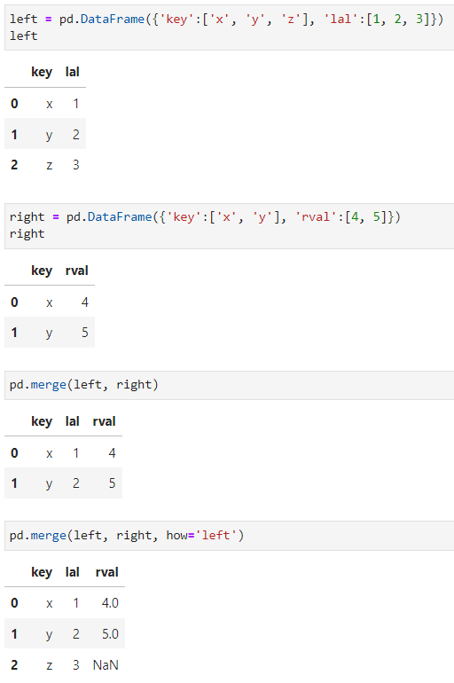

# 1、Python基础

## 1、对象

Python是一门强类型的语言，对象一旦创建类型便不能修改

类型转换不是改变对象本身的类型，而是根据当前对象的值创建一个新对象

如果有其他变量也指向了该对象，则修改也会在其他的变量中体现

~~~text
- 对象是内存中专门用来存储数据的一块区域。
- 对象中可以存放各种数据（比如：数字、布尔值、代码）
- 对象由三部分组成：
  1.对象的标识（id）
  2.对象的类型（type）
  3.对象的值（value）
~~~


### 1、类(class) 

#### 1、基本概念

类就是对象的图纸，也称对象是类的实例（instance）

类就是一个用来创建对象的对象，类是 type 类型的对象，定义类实际上就是定义了一个 type 类型的对象

自定义的类都需要使用大写字母开头，使用大驼峰命名法（帕斯卡命名法）来对类命名

> 像 int() float() bool() str() list() dict() .... 这些都是类


#### 2、基本结构

~~~python
class 类名([父类]) :

    # 公共的属性... 

    # 对象的初始化方法，属于特殊方法
    def __init__(self,...):
        ...

    # 普通方法
    def method_1(self,...):
        ...
    
    # 类方法    
    @classmethod
    def cls_method(cls,...):
        ...
    
    # 静态方法
    @staticmethod
    def static_method():
        ...
    
    # 特殊方法
    def __magic_methon__():
        ...
    ...  
~~~


#### 3、定义变量和函数

在类的代码块中，可以定义变量和函数：

- 直接定义的变量是该类的公共属性，可以通过 **类对象/实例对象.属性名** 的形式访问，但是**修改**只能由类对象去修改
  - 如果实例对象通过 **实例对象.属性名** 去修改则是将改属性覆盖，转为实例属性
  - 同样实例对象的属性也只能由实例对象去修改

- 函数分为四种：静态方法、类方法、实例方法、特殊方法
  - 静态方法：
    - 在类内部被 **@staticmethod** 注释
    -  静态方法不需要指定任何的默认参数
    - 静态方法可以通过类和实例去调用

  - 类方法：
    - 在类内部被 **@classmethod** 注释
    - 类方法的第一个参数是 cls，cls 就是当前的类对象，无论是被实例对象还是类对象调用都会自动传递

  - 实例方法：
    - 在类中定义，以 **self** 为第一个参数的方法都是实例方法
    - 实例方法在调用时，Python 会将调用对象作为 self 传入
      - 当通过 实例.方法名() 调用时，会自动将当前调用对象作为 self 传入
      - 当通过 类.方法名() 调用时，不会自动传递 self，必须手动传递 self

  - 特殊方法：
    - 特殊方法都是以 **\__** 开头，**\_\_ **结尾的方法
    - 特殊方法不需要自己调用，也不要尝试去调用特殊方法，特殊方法将会在特殊的时刻自动调用


**注意**：

- 方法调用时，第一个参数由解析器自动传递，所以定义方法时，至少要定义一个形参！ 
- 类中定义的属性和方法都是公共的，任何该类实例都可以访问
- 静态方法，基本上是一个和当前类无关的方法，它只是一个保存到当前类中的函数
- 方法中不能直接访问类中的属性
- 属性和方法查找的流程：
  1. 当访问一个实例对象的属性时，解析器会先在当前实例对象中寻找是否含有该属性，如果有，则直接返回当前实例对象的属性值
  2. 如果没有，则去当前实例对象的类对象中去寻找，如果有则返回类对象的属性值
  3. 如果类对象中依然没有，则报错
- 类对象和实例对象中都可以保存属性（方法）：
  - 如果这个属性（方法）是所有实例共享的，则应该将其保存到类中
  - 如果这个属性（方法）是某个实例独有，则应该保存到实例对象中 
  - 一般情况下，属性保存到实例对象中，而方法需要保存到类中 

~~~python
# 定义一个类
class A(object):
    count = 0
    
	# init 会在对象创建以后立刻执行
    # init 可以用来向新创建的对象中初始化属性
    # 调用类创建对象时，类后边的所有参数都会依次传递到 init() 中
    def __init__(self):
        # 通过 self 向新建的对象中初始化属性
        # 实例属性:通过实例对象添加的属性属于实例属性
        # 实例属性只能通过实例对象来访问和修改，类对象无法访问修改
        # 方法中不能直接访问类属性，例如 count 属性无法访问到，需要 self.count 才能访问 
        self.name = '孙悟空'

    def test(self):
        print('这是test方法~~~ ' , self)    

    @classmethod
    def test_2(cls):
        print('这是test_2方法，他是一个类方法~~~ ',cls)
        print(cls.count)

    @staticmethod
    def test_3():
        print('test_3执行了~~~')
        
    # del 是一个特殊方法，它会在对象被垃圾回收前调用
    def __del__(self):
        print('A()对象被删除了~~~',self)


a = A()
# 实例属性，通过实例对象添加的属性属于实例属性
a.count = 10
A.count = 100
print('A ,',A.count) 
print('a ,',a.count) 
# 100
# 10

# A没有name属性报错，a有name属性，值为孙悟空
print('A ,',A.name) 
print('a ,',a.name)  

a = A()
print(a.x, id(a.x))

a.x = 20
print(a.x, id(a.x))
# 20 1912166875984
# 10 1912166875664

a.test()
A.test(a)

a.test_2()
A.test_2() 

A.test_3()
a.test_3()
~~~


#### 4、创建对象流程

~~~python
class Person():
    pass

""""
p1 = Person() 的运行流程
    1.创建一个变量
    2.在内存中创建一个新对象
    3.__init__(self) 方法执行
    4.将对象的 id 赋值给变量
""""

# isinstance()用来检查一个对象是否是一个类的实例
result = isinstance(p1, Person)

# 通过Person这个类创建的对象都是一个空对象
# 也就是对象中实际上什么都没有
# 可以向对象中添加变量,对象中的变量称为属性
# 语法：对象.属性名 = 属性值
p1.name = '孙悟空'
~~~


#### 5、比较对象

**== != 和 is is not**

- == != 比较的是对象的**值**是否相等 

- is is not 比较的是对象的 **id** 是否相等（比较两个对象是否是指向同一个对象）


#### 6、可变/不可变对象

可变对象：

- 字典、列表、集合、自定义的对象

不可变对象：

- 数字、字符串、元组、函数


### 2、封装

#### 1、封装基本概念

封装指的是隐藏对象中不希望被外部所访问到的属性或方法

使用封装，会增加类的复杂程度，但是它也确保了数据的安全性

隐藏一个对象中的属性：

- 将对象的属性名，修改为一个外部不知道的名字

获取（修改）对象中的属性：

- 需要提供 getter 和 setter 方法使外部可以访问到属性
- getter 获取对象中的指定属性（get_属性名）
  - 可以在读取属性的同时做一些其他的处理
- setter 用来设置对象的指定属性（set_属性名）
  - 使用 setter 方法设置属性，可以增加数据的验证，确保数据的值是正确的

优点：

- 隐藏了属性名，使调用者无法随意的修改对象中的属性
- 增加了 getter 和 setter 方法，很好的控制的属性是否是只读的
  - 如果希望属性是只读的，则可以直接去掉 setter 方法
  - 如果希望属性不能被外部访问，则可以直接去掉 getter 方法

~~~python
class Dog:
    '''
        表示狗的类
    '''
    def __init__(self , name , age):
        self.hidden_name = name
        self.hidden_age = age

    def say_hello(self):
        print('大家好，我是 %s' %self.hidden_name) 

    def get_name(self):
        '''
            get_name()用来获取对象的name属性
        '''    
        return self.hidden_name

    def set_name(self , name):
        self.hidden_name = name

    def get_age(self):
        return self.hidden_age

    def set_age(self , age):
        if age > 0 :
            self.hidden_age = age    


d = Dog('旺财',8)
d.say_hello()

# 调用setter来修改name属性 
d.set_name('小黑')
d.set_age(-10)

d.say_hello()
print(d.get_age())
~~~


#### 2、隐藏属性

可以使用单下划线开头、双下滑线开头、给属性增加 hidde_ 开头、使用注解 @property  隐藏属性

单下滑线：

-  **_** 开头的属性都是私有属性，没有特殊需要不要修改私有属性

双下滑线：

- __ 开头的属性是对象的隐藏属性，隐藏属性只能在类的内部访问，无法通过对象访问
- 其实是 Python 自动为属性改了一个名字，实际上是将名字修改为了，**_\_类名\_\_属性名** 比如 \_\_name -> \_\_Person__name

给属性增加 hidde_ 开头：

- 在对象初始化时，给属性添加 hidden_ 开头，在 getter 与 setter 方法获取时也添加 hidden_

使用注解 @property：

- property 装饰器，用于将一个 get 方法，转换为对象的属性
- 使用 property 装饰的方法，必须和属性名是一样的


~~~python
 class Person:
    def __init__(self, name, age):
        self.__name = name
        self.hidden_age = age

    def get_name(self):
        return self.__name

    def set_name(self , name):
        self.__name = name
        
    def get_age(self):
        return self.hidden_age
   	
    def set_age(self, age):
        self.hidden_age = age
    
    @property
    def length(self, length):
        return self.length
    
    @length.setter
    def length(self, length):
        self.length = length
    

p = Person('孙悟空')

# print(p.__name) __开头的属性是隐藏属性，无法通过对象访问
# p.__name = '猪八戒' # 无效赋值
# print(p._Person__name)
# p._Person__name = '猪八戒' # 有效赋值

print(p.get_name())

class Person:
    def __init__(self,name):
        self._name = name

    def get_name(self):
        return self._name

    def set_name(self , name):
        self._name = name   

p = Person('孙悟空')

print(p._name)
~~~


### 3、继承

#### 1、基本概念

子类从父类中来继承它的属性和方法

在创建类时，如果省略了父类，则默认父类为object

父类中的所有方法都会被子类继承，包括特殊方法，也可以重写特殊方法

~~~python
class Animal:
    def __init__(self,name):
        self._name = name
        
    def run(self):
        print('动物会跑~~~')

    def sleep(self):
        print('动物睡觉~~~')
                   
class Dog(Animal):
    def __init__(self,name,age):
        # super() 可以用来获取当前类的父类，
        # 并且通过super()返回对象调用父类方法时，不需要传递self
        super().__init__(name)
        self._age = age
    
    def bark(self):
        print('汪汪汪~~~') 

    def run(self):
        print('狗跑~~~~')    

class Hashiqi(Dog):
    def fan_sha(self):
        print('我是一只傻傻的哈士奇')  
        
# issubclass() 检查一个类是否是另一个类的子类
# print(issubclass(Animal , Dog))
~~~


#### 2、重写

当我们调用一个对象的方法时，会优先去当前对象中寻找是否具有该方法，如果有则直接调用

如果没有，则去当前对象的父类中寻找，如果父类中有则直接调用父类中的方法

如果没有，则去父类的父类中寻找，以此类推，直到找到object，如果依然没有找到，则报错

~~~python
 class A(object):
    def test(self):
        print('AAA')

class B(A):
    def test(self):
        print('BBB')

class C(B):
    def test(self):
        print('CCC')   

c = C()
c.test()
~~~


#### 3、多重继承

在Python中是支持多重继承的，也就是我们可以为一个类同时指定多个父类。

可以在类名的()后边添加多个类，来实现多重继承，此会使子类同时拥有多个父类，并且会获取到所有父类中的方法。

1、对于父类中的同名方法：

- 如果多个父类中有同名的方法，则会现在第一个父类中寻找，然后找第二个，然后找第三个。。。
- 前边父类的方法会覆盖后边父类的方法


~~~python
class A(object):
    def test(self):
        print('AAA')

class B(object):
    def test(self):
        print('B中的test()方法~~')

    def test2(self):
        print('BBB') 
        

class C(A,B):
    pass

# 类名.__bases__ 这个属性可以用来获取当前类的所有父类    
# print(B.__bases__) (<class 'object'>,)
# print(C.__bases__) # (<class '__main__.A'>, <class '__main__.B'>)

c = C()
c.test()
~~~


#### 4、多态

~~~python
# 定义两个类
class A:
    def __init__(self,name):
        self._name = name

    @property
    def name(self):
        return self._name
        
    @name.setter
    def name(self,name):
        self._name = name   

class B:
    def __init__(self,name):
        self._name = name

    def __len__(self):
        return 10

    @property
    def name(self):
        return self._name
        
    @name.setter
    def name(self,name):
        self._name = name   

class C:
    pass


a = A('孙悟空')
b = B('猪八戒')
c = C()

# 定义一个函数
# 对于say_hello()这个函数来说，只要对象中含有name属性，它就可以作为参数传递
# 这个函数并不会考虑对象的类型，只要有name属性即可
def say_hello(obj):
    print('你好 %s'%obj.name)

# 在say_hello_2中做一个类型检查，也就是只有obj是A类型的对象时，才可以正常使用，
# 其他类型的对象都无法使用该函数，这个函数就违反了多态
# 违反了多态的函数，只适用于一种类型的对象，无法处理其他类型对象，这样导致函数的适应性非常的差
# 注意，向isinstance()这种函数，在开发中一般是不会使用的！
def say_hello_2(obj):
    # 做类型检查
    if isinstance(obj , A):
        print('你好 %s'%obj.name)    
        
say_hello(b)    
say_hello_2(b)

# len()
# 之所以一个对象能通过len()来获取长度，是因为对象中具有一个特殊方法__len__
# 换句话说，只要对象中具有__len__特殊方法，就可以通过len()来获取它的长度
print(len(b))
print(len(c))
~~~


### 5、特殊方法

特殊方法都是使用 **__** 开头和结尾的

~~~python
# 定义一个Person类
class Person(object):
    """人类"""
    def __init__(self, name , age):
        self.name = name
        self.age = age

    # __str__()这个特殊方法会在尝试将对象转换为字符串的时候调用
    # 它的作用可以用来指定对象转换为字符串的结果  （print函数）  
    def __str__(self):
        return 'Person [name=%s , age=%d]' %(self.name,self.age)        

    # __repr__()这个特殊方法会在对当前对象使用repr()函数时调用
    # 它的作用是指定对象在 ‘交互模式’中直接输出的效果    
    def __repr__(self):
        return 'Hello'        

    # object.__add__(self, other)
    # object.__sub__(self, other)
    # object.__mul__(self, other)
    # object.__matmul__(self, other)
    # object.__truediv__(self, other)
    # object.__floordiv__(self, other)
    # object.__mod__(self, other)
    # object.__divmod__(self, other)
    # object.__pow__(self, other[, modulo])
    # object.__lshift__(self, other)
    # object.__rshift__(self, other)
    # object.__and__(self, other)
    # object.__xor__(self, other)
    # object.__or__(self, other)

    # object.__lt__(self, other) 小于 <
    # object.__le__(self, other) 小于等于 <=
    # object.__eq__(self, other) 等于 ==
    # object.__ne__(self, other) 不等于 !=
    # object.__gt__(self, other) 大于 >
    # object.__ge__(self, other) 大于等于 >= 
    
    # __len__()获取对象的长度

    # object.__bool__(self)
    # 可以通过bool来指定对象转换为布尔值的情况
    def __bool__(self):
        return self.age > 17

    # __gt__会在对象做大于比较的时候调用，该方法的返回值将会作为比较的结果
    # 他需要两个参数，一个self表示当前对象，other表示和当前对象比较的对象
    # self > other
    def __gt__(self , other):
        return self.age > other.age


# 创建两个Person类的实例        
p1 = Person('孙悟空',18)
p2 = Person('猪八戒',28)

# 打印p1
# 当我们打印一个对象时，实际上打印的是对象的中特殊方法 __str__()的返回值
# print(p1) # <__main__.Person object at 0x04E95090>
# print(p2)

# print(repr(p1))

# print(p1 > p2)
# print(p2 > p1)

# print(bool(p1))

# if p1 :
#     print(p1.name,'已经成年了')
# else :
#     print(p1.name,'还未成年了')
~~~


### 6、模块(module)

#### 1、基本概念

模块化指将一个完整的程序分解为一个一个小的模块，通过将模块组合，来搭建出一个完整的程序

- 不采用模块化，统一将所有的代码编写到一个文件中
- 采用模块化，将程序分别编写到多个文件中

在 Python 中一个 .py 文件就是一个模块，要想创建模块，实际上就是创建一个 Python 文件

引入模块需要使用 **import** 关键字，为引入的部份取别名需要使用 **as** 关键字


**注意**：

- 模块名要符号标识符的规范


~~~python
# m.py
# 可以在模块中定义变量，在模块中定义的变量，在引入模块后，就可以直接使用了
a = 10
b = 20

# 添加了 _ 的变量，只能在模块内部访问，在通过import * 引入时，不会引入 _ 开头的变量
_c = 30

# 可以在模块中定义函数，同样可以通过模块访问到
def test():
    print('test')

def test2():
    print('test2')

# 也可以定义类    
class Person:
    def __init__(self):
        self.name = '孙悟空'
        

# 编写测试代码，这部分代码，只要当当前文件作为主模块的时候才需要执行
# 而当模块被其他模块引入时，不需要执行时，此时我们就必须要检查当前模块是否是主模块  
if __name__ == '__main__':
    test()
    test2()
    p = Person()
    print(p.name)
~~~

~~~python
import m

# 访问模块中的变量：模块名.变量名
print(m.a , m.b)
p = m.Person()
m.test2()
print(m.__name__)
print(__name__)
~~~


#### 2、引入模块

通常情况下，当使用 import 语句导入模块后，Python 会按照以下顺序查找指定的模块文件：

- 在当前目录，即当前执行的程序文件所在目录下查找
- 到 PYTHONPATH（环境变量）下的每个目录中查找
- 到 Python 默认的安装目录下查找


**注意**：

- 以上所有涉及到的目录，都保存在标准模块 sys 的 sys.path 变量中
- 如果以上目录都没有找到，则抛出 ModuleNotFoundError 异常


~~~python
import m 

import m as m1

from m import Person
from m import test
from m import Person,test
from m import * # 引入到模块中所有内容，一般不会使用
p1 = Person()
print(p1)
test()
test2()

# 语法：from 模块名 import 变量 as 别名
from m import test2 as new_test2
~~~


**注意**：

- 可以引入同一个模块多次，但是模块的实例只会创建一个
- import 可以在程序的任意位置调用，但是一般情况下，import 语句都会统一写在程序的开头
- 在每一个模块内部都有一个 \__name\_\_ 属性，通过这个属性可以获取到模块的名字
- \__name\_\_ 属性值为  \_\_main__ 的模块是主模块，一个程序中只会有一个主模块，主模块就是直接通过 Python 执行的模块


### 7、包(Package)

#### 1、基本概念

包也是一个模块，当模块中代码过多时，或者一个模块需要被分解为多个模块时，这时就需要使用到包

普通的模块就是一个 .py 文件，而包是一个**文件夹**

包中必须要一个一个 **\__init__.py** 这个文件，这个文件中**可以**包含有包中的主要内容

~~~python
from hello import a, b

print(a.c)
print(b.d)

# __pycache__ 是模块的缓存文件
# py 代码在执行前，需要被解析器先转换为机器码，然后再执行
# 所以在使用模块（包）时，也需要将模块的代码先转换为机器码然后再交由计算机执行
# 而为了提高程序运行的性能，Python 会在编译过一次以后，将代码保存到一个缓存文件中
# 这样在下次加载这个模块（包）时，就可以不再重新编译而是直接加载缓存中编译好的代码即可
~~~


#### 2、标准库

为了实现开箱即用的思想，Python 提供了一个模块的标准库，在这个标准库中，有很多很强大的模块可以直接使用，并且标准库会随Python 的安装一同安装

- **sys** 模块，它里面提供了一些变量和函数，可以获取到 Python 解析器的信息，或者通过函数来操作 Python 解析器
- **pprint** 模块它给我们提供了一个方法 pprint() 该方法可以用来对打印的数据做简单的格式化
- **os** 模块让我们可以对操作系统进行访问

~~~python
import sys
import pprint

# 获取执行代码时，命令行中所包含的参数
# 该属性是一个列表，列表中保存了当前命令的所有参数
sys.argv
print(sys.argv)

# 获取当前程序中引入的所有模块
# modules是一个字典，字典的key是模块的名字，字典的value是模块对象
sys.modules
pprint.pprint(sys.modules)


# 他是一个列表，列表中保存的是模块的搜索路径
# ['C:\\Users\\lilichao\\Desktop\\resource\\course\\lesson_06\\code',
# 'C:\\dev\\python\\python36\\python36.zip',
# 'C:\\dev\\python\\python36\\DLLs',
# 'C:\\dev\\python\\python36\\lib',
# 'C:\\dev\\python\\python36',
# 'C:\\dev\\python\\python36\\lib\\site-packages']
sys.path
pprint.pprint(sys.path)


# 表示当前Python运行的平台
sys.platform
print(sys.platform)


# 函数用来退出程序
sys.exit()
sys.exit('程序出现异常，结束！')
print('hello')

import os


# 通过这个属性可以获取到系统的环境变量
os.environ
pprint.pprint(os.environ['path'])


# 可以用来执行操作系统的shell
os.system()
os.system('dir')
os.system('notepad')
~~~


## 2、流程控制

### 1、判断语句

```python
if 10 < num < 20:
    print('num比10大,num比20小！')
if False:
    print(123)
if True:
    print(123)
```


```python
if age > 17 :
    print('你已经成年了~~')
else :
    print('你还未成年~~')
```


~~~python
if num >= 0:
   if num == 0:
       print("零")
   else:
       print("正数")
else:
   print("负数")
~~~


### 2、循环语句

循环语句分成两种，**while** 循环 和 **for** 循环

while 语句在执行时，会先对 while 后的条件表达式结果进行判断，如果判断结果为 True，则执行循环体（代码块），循环体执行完毕，继续对条件表达式结果进行判断，以此类推，直到判断结果为 False，则循环终止，如果此时循环有对应的 else，则执行 else 后的代码块

for 语句在执行时，变量会依次取序列里的值，每取一次值就执行一次代码块，直到序列里的值全取完，序列定义<a href="#序列">详见</a>

```python
while 条件表达式 :
    代码块
else :
	代码块

for 变量 in 序列 :
    代码块
```


### 3、中断语句

**break**：用来立即退出循环语句（包括else）

**continue**：用来跳过当次循环，break 和 continue 都是只对离其最近的循环起作用

**pass**：用来在判断或循环语句中占位的

```python
# i = 0
# while i < 5:
#     if i == 3:
#         break
#     print(i)
#     i += 1
# else :
#     print('循环结束')

# i = 0
# while i < 5:
#     i += 1
#     if i == 2:
#         continue
#     print(i)
# else :
#     print('循环结束')

i = 0
if i < 5:
    pass
```


## 3、<a name="序列">序列</a>

### 1、基本概念

序列是 Python 中最基本的一种数据结构

序列用于保存一组**有序**的数据，所有的数据在序列当中都有一个唯一的位置（索引），并且序列中的数据会按照添加的顺序来分配索引

可变序列（序列中的元素可以改变）（也可以叫做可变对象）：

- 列表（list）
- 字典（dict）
- 集合（set）

不可变序列（序列中的元素不能改变）（也可叫做不可变对象）：

- 字符串（str）
- 元组（tuple）


### 2、列表(list)

#### 1、基本概念

列表是Python中的一个**对象**。

对象（object）就是内存中专门用来存储数据的一块区域，列表中可以保存多个**有序**的数据，列表是用来存储对象的对象，列表中的对象都会按照插入的顺序存储到列表中。

列表的使用：
1.列表的创建
2.操作列表中的数据

```python
my_list = []  # 创建了一个空列表

my_list = [10] # 一个列表中可以存储多个元素，也可以在创建列表时，来指定列表中的元素

my_list = [10, 'hello', True, None, [1, 2, 3], print] # 列表中可以保存任意的对象

# 如果使用的索引超过了最大的范围，会抛出异常 print(my_list[5]) IndexError: list index out of range
# 获取列表的长度，列表中元素的个数，len()函数，通过该函数可以获取列表的长度，获取到的长度的值，是列表的最大索引 + 1
print(len(my_list))  # 5

# 列表的索引可以是负数
# 如果索引是负数，则从后向前获取元素，-1表示倒数第一个，-2表示倒数第二个 以此类推
my_list[-1]
```


#### 2、切片

切片指从现有列表中，获取一个子列表，通过切片来获取指定的元素，

**语法一**：列表[起始:结束] 

通过切片获取元素时，会**包括起始位置**的元素，**不会包括结束位置**的元素。

做切片操作时，总会返回一个新的列表，不会影响原来的列表。

- 起始和结束位置的索引都可以省略不写。
- 如果省略结束位置，则会一直截取到最后。
- 如果省略起始位置，则会从第一个元素开始截取。
- 如果起始位置和结束位置全部省略，则相当于创建了一个列表的副本。

```python
print(stus[1:])
print(stus[:3])
print(stus[:])
print(stus)
```

**语法二**：列表[起始:结束:步长] 

步长表示，每次获取元素的间隔，默认值是1

```python
print(stus[0:5:3])
```

步长不能是0，但是可以是负数。

```python
# print(stus[::0]) ValueError: slice step cannot be zero
```

如果是负数，则会从列表的后部向前边取元素

```python
print(stus[::-1])
```

通过切片来修改列表

在给切片进行赋值时，只能使用序列

```python
# 使用新的元素替换旧元素 0 1 被牛、红替代
stus[0:2] = ['牛魔王','红孩儿'] 

# 0 1 被 牛、红、二替代
stus[0:2] = ['牛魔王','红孩儿','二郎神'] 

#向索引为0的位置插入元素
stus[0:0] = ['牛魔王']

# 当设置了步长时，序列的长度必须比切片中元素的最大下标大
# 牛 --> 0 红 --> 2 二 --> 4
stus[::2] = ['牛魔王','红孩儿','二郎神']

#注意：以上操作，只适用于可变序列，但是可以通过 list() 函数将其他的序列转换为list
```


#### 3、常用方法

```python
append() 
# 向列表的最后添加一个元素
stus.append('唐僧')

insert()
# 向列表的指定位置插入一个元素
# 参数：
#   1.要插入的位置
#   2.要插入的元素
stus.insert(2,'唐僧')

extend()
# 使用新的序列来扩展当前序列
# 需要一个序列作为参数，它会将该序列中的元素添加到当前列表中
stus.extend(['唐僧','白骨精'])
stus += ['唐僧','白骨精']

clear()
# 清空序列
stus.clear()

pop()
# 根据索引删除并返回被删除的元素
stus.pop(0)
result = stus.pop(2) # 删除索引为2的元素
result = stus.pop() # 删除最后一个

remove()
# 删除指定值的元素，如果相同值的元素有多个，只会删除第一个
stus.remove('猪八戒')

reverse()
# 用来反转列表
stus.reverse()

sort()
# 用来对列表中的元素进行排序，默认是升序排列
# 如果需要降序排列，则需要传递一个reverse=True作为参数

# 通过while循环来遍历列表
i = 0
while i < len(stus):
   print(stus[i])
   i += 1

# 通过for循环来遍历列表
# 语法：
#   for 变量 in 序列 :
#       代码块
# for循环的代码块会执行多次，序列中有几个元素就会执行几次
# 每执行一次就会将序列中的一个元素赋值给变量，所以我们可以通过变量，来获取列表中的元素
for s in stus :
    print(s)
```


#### 4、通用操作

 **+** 和 *****

```python
# +可以将两个列表拼接为一个列表
my_list = [1,2,3] + [4,5,6]

# * 可以将列表重复指定的次数
my_list = [1,2,3] * 5
```
**in** 和 **not in**

```python
#in用来检查指定元素是否存在于列表中，如果存在，返回True，否则返回False
print('牛魔王' in stus)

# not in用来检查指定元素是否不在列表中，如果不在，返回True，否则返回False
print('牛魔王' not in stus)
```

```python
# len()获取列表中的元素的个数
# min() 获取列表中的最小值
# max() 获取列表中的最大值
```

**index()**

```python
#s.index() 获取指定元素在列表中的第一次出现时索引
print(stus.index('沙和尚'))

#index()的第二个参数，表示查找的起始位置 ， 第三个参数，表示查找的结束位置
print(stus.index('沙和尚',3,7))

#如果要获取列表中没有的元素，会抛出异常
# print(stus.index('牛魔王')) ValueError: '牛魔王' is not in list
```

**count()**

```python
#s.count() 统计指定元素在列表中出现的次数
print(stus.count('牛魔王'))
```

**del**

```python
# 通过del来删除元素
del stus[2]  # 删除索引为2的元素
```


### 3、元组(tuple)

#### 1、基本概念

元组是一个不可变的序列，它的操作的方式基本上和列表是一致的。

**注意**：

- 元组不支持元素增删改，支持通过下标或元素值查找，当希望数据不改变时，就使用元组，其余情况都使用列表

```python
# 使用()来创建元组
my_tuple = ()  # 创建了一个空元组

# 元组是不可变对象，不能尝试为元组中的元素重新赋值
# my_tuple[3] = 10 TypeError: 'tuple' object does not support item assignment

# 当创建元组不是空元组时，括号可以省略
my_tuple = 10, 20, 30, 40
```


#### 2、解包

元组的解包（解构）

解包指就是将元组当中每一个元素都赋值给一个变量

```python
a, b, c, d = my_tuple
```

交互a 和 b的值，这时我们就可以利用元组的解包

```python
a, b = b, a
```

在对一个元组进行解包时，变量的数量必须和元组中的元素的数量一致

也可以在变量前边添加一个*****，这样变量将会获取元组中所有剩余的元素

```python
*a, b, c = my_tuple
a, b, *c = [1, 2, 3, 4, 5, 6, 7]
a, b, *c = 'hello world'

# 不能同时出现两个或以上的*变量
# *a , *b , c = my_tuple SyntaxError: two starred expressions in assignment
```

### 4、字典(dict)

#### 1、基本概念

字典属于一种新的数据结构，使用映射（mapping）组织数据，字典的作用和列表类似，都是用来存储对象的容器

在字典中每一个元素都有一个唯一的名字，通过这个唯一的名字可以快速的查找到指定的元素

在查询元素时，字典的效率是非常快的，列表存储数据的性能很好，但是查询数据的性能的很差

在字典中可以保存多个对象，每个对象都会有一个唯一的名字，这个唯一的名字称其为键（**key**），这个对象称其为值（**value**），通过 key 可以快速查询 value

所以字典，也称为叫做键值对（key-value）结构，每个字典中都可以有多个键值对，而每一个键值对称其为一项（**item**）

- 字典的**值**可以是**任意对象**
- 字典的**键**可以是**任意的不可变对象**（int、str、bool、tuple ...），但是一般都会使用**str**
- 字典的**键是不能重复的**，如果出现重复的后出现的会替换到先出现的


#### 2、用法

```python
# 使用 {} 来创建字典
d = {}  # 创建了一个空字典
 
#创建一个保护有数据的字典
# 语法：
#   {key:value,key:value,key:value}
# d = {'name':'孙悟空' , 'age':18 , 'gender':'男' , 'name':'sunwukong'}

# 如果使用了字典中不存在的键，会报错
# print(d['hello']) KeyError: 'hello'
```


#### 3、常用方法

**dict()** 函数来创建字典

每一个参数都是一个键值对，参数名就是键，参数名就是值（这种方式创建的字典，key都是字符串）

```python
d = dict(name='孙悟空',age=18,gender='男')
```

也可以将一个包含有**双值子序列**的序列转换为字典，双值序列，序列中只有两个值，[1,2]、 ('a',3)、 'ab'

子序列，如果序列中的元素也是序列，那么我们就称这个元素为子序列 [(1,2),(3,5)]

```python
d = dict([('name','孙悟饭'),('age',18), ('wawa', '666')])
```

**len()** 获取字典中键值对的个数

```python
print(len(d))
```

**in** 检查字典中是否包含指定的键

**not in** 检查字典中是否不包含指定的键

```python
print('hello' in d)
```

获取字典中的值，根据键来获取值

```python
语法：d[key]
d['age']
```

**get([key, default])** 该方法用来根据键来获取字典中的值

如果获取的键在字典中不存在，会返回**None**

也可以指定一个默认值，来作为第二个参数，这样获取不到值时将会返回默认值

```python
print(d.get('hello','默认值'))
```

修改字典

```python
# 如果key存在则覆盖，不存在则添加
d[key] = value
```

**setdefault([key, default])** 可以用来向字典中添加key-value

如果key已经存在于字典中，则返回key的值，不会对字典做任何操作

如果key不存在，则向字典中添加这个key，并设置value

```python
d.setdefault('name','猪八戒')
```

**update([other])** 将其他的字典中的key-value添加到当前字典中

如果有重复的key，则后边的会替换到当前的

```python
d.update(d2)
```

**del** 来删除字典中的 key-value

````python
del d['a']
del d['z'] # z不存在，报错
del d # 删除整个字典
````

**popitem() **随机删除字典中的一个键值对，一般都会删除**最后一个键值对**

删除之后，它会将删除的key-value作为返回值返回，返回的是一个元组，元组中有两个元素，第一个元素是删除的key，第二个是删除的value

当使用popitem()删除一个空字典时，会抛出异常 KeyError: 'popitem(): dictionary is empty'

```python
result = d.popitem()
```

**pop([key, default])** 根据key删除字典中的key-value，会将被删除的value返回，如果删除不存在的key，会抛出异常

如果指定了默认值，再删除不存在的key时，不会报错，而是直接返回默认值

```python
result = d.pop('z','这是默认值')
```

**clear()** 用来清空字典

```python
d.clear()
```

**copy()** 该方法用于对字典进行浅复制

复制以后的对象，和原对象是独立，修改一个不会影响另一个

注意，浅复制会简单复制对象内部的值，如果值也是一个可变对象，这个可变对象不会被复制

```python
d2 = d.copy()
```

**keys()**来获取所有的键

```python
for k in d.keys() :
	print(k , d[k])
```

**values()**该方法会返回一个序列，序列中保存有字典的左右的值

```python
for v in d.values():
	print(v)
```

**items()** 该方法会返回字典中所有的项

它会返回一个序列，序列中包含有双值子序列

```python
for k, v in d.items():
    print(k, '=', v)
```


### 5、集合(set)

#### 1、基本概念

集合和列表非常相似

不同点：

- 集合中只能存储**不可变对象**
- 集合中存储的对象是**无序**（不是按照元素的插入顺序保存）
- 集合中**不能出现重复的元素**


#### 2、用法

```python
# 使用 {} 来创建集合
s = {10, 3, 5, 1, 2, 1, 2, 3, 1, 1, 1, 1}

# 使用 set() 函数来创建集合
s = set()  # 空集合

# 可以通过set()来将序列和字典转换为集合
# 使用set()将字典转换为集合时，只会包含字典中的键
s = set([1, 2, 3, 4, 5, 1, 1, 2, 3, 4, 5])
s = set('hello')
s = set({'a': 1, 'b': 2, 'c': 3})


```


#### 3、常用方法

**in** 和 **not in** 来检查集合中的元素

```python
print('c' in s)
```

**len()** 来获取集合中元素的数量

```python
print(len(s))
```

**add()** 向集合中添加元素

```python
s.add(10)
```

**update()** 将一个**集合**中的元素添加到当前集合中

update()可以传递**序列**或**字典**作为参数，字典只会使用**键**

```python
s.update(s2)
s.update((10, 20, 30, 40, 50))
s.update({10: 'ab', 20: 'bc', 100: 'cd', 1000: 'ef'})
```

**pop()** 随机删除并返回一个集合中的元素

```python
result = s.pop()
```

**remove()** 删除集合中的指定元素

```python
s.remove(100)
```

**clear()** 清空集合

```python
s.clear()
```

**copy()** 对集合进行浅复制


#### 4、运算

```python
s = {1,2,3,4,5}
s2 = {3,4,5,6,7}

# & 交集运算
result = s & s2 # {3, 4, 5}

# | 并集运算
result = s | s2 # {1,2,3,4,5,6,7}

# - 差集
result = s - s2 # {1, 2}

# ^ 异或集 获取只在一个集合中出现的元素
result = s ^ s2 # {1, 2, 6, 7}

# <= 检查一个集合是否是另一个集合的子集
# 如果a集合中的元素全部都在b集合中出现，那么a集合就是b集合的子集，b集合是a集合超集
a = {1,2,3}
b = {1,2,3,4,5}
result = a <= b # True
result = {1,2,3} <= {1,2,3} # True
result = {1,2,3,4,5} <= {1,2,3} # False

# < 检查一个集合是否是另一个集合的真子集
# 如果超集b中含有子集a中所有元素，并且b中还有a中没有的元素，则b就是a的真超集，a是b的真子集
result = {1,2,3} < {1,2,3} # False
result = {1,2,3} < {1,2,3,4,5} # True

# >= 检查一个集合是否是另一个的超集
# > 检查一个集合是否是另一个的真超集
print('result =',result)
```


## 4、函数

### 1、基本概念

**函数也是一个对象**，函数可以用来保存一些可执行的代码，并且可以在需要时，对这些语句进行多次的调用

函数中保存的代码不会立即执行，需要调用函数代码才会执行

定义函数一般都是要实现某种功能的

在Python中，函数是**一等对象**，一等对象一般都会具有如下特点：

- 对象是在运行时创建的
- 能赋值给变量或作为数据结构中的元素
- 能作为参数传递
- 能作为返回值返回


**注意**：

- 函数名必须要符号标识符的规范（可以包含字母、数字、下划线、但是不能以数字开头）


创建函数需要使用 **def** 关键字：

~~~python
def 函数名(形参1,形参2,...形参n) :
    代码块
~~~

调用函数：

 ~~~python
 函数对象()
 ~~~


### 2、参数

#### 1、基本概念

在定义函数时，可以在函数名后的 **()** 中定义数量不等的形参，多个形参之间使用 **, **隔开

- 形参（形式参数），定义形参就相当于在函数内部声明了变量，但是并不赋值

- 实参（实际参数），如果函数定义时，指定了形参，那么在调用函数时也必须传递实参，实参将会赋值给对应的形参，简单来说，有几个形参就得传几个实参


Python 中一切皆对象，所有的赋值操作都是**引用的赋值**，所以 Python 中参数的传递都是引用传递，不是值传递，具体操作分为两类︰

- 对可变对象进行写操作，直接作用于原对象本身
- 对不可变对象进行写操作，会产生一个新的对象空间，并用新的值填充这块空间，也即原对象没有变化


**注意**：

- 在函数中对形参进行重新赋值，不会影响其他的变量
- 如果形参指向的是一个对象，当通过形参去修改对象时，会影响到所有指向该对象的变量
- 解析器不会检查实参的类型，因此**实参可以传递任意类型的对象**


```python
def fn4(a):
    a = 20
    print('a =', a, id(a))
    
c = 10
fn4(c)
print('c =', c, id(c))

# a = 20 2854937822032
# c = 10 2854937821712
```

~~~python
def fn4(a):
    a[0] = 30
    print('a =', a, id(a))

c = [1, 2, 3]
fn4(c)
print('c =', c, id(c))

# a = [30, 2, 3] 2251289769216
# c = [30, 2, 3] 2251289769216

fn4(c.copy())
print('c =', c, id(c))

# a = [30, 2, 3] 2251290065792
# c = [30, 2, 3] 2251289769216

fn4(c[:])
print('c =', c, id(c))

# a = [30, 2, 3] 2251290065792
# c = [30, 2, 3] 2251289769216
~~~


#### 2、位置参数

位置参数就是将对应位置的实参复制给对应位置的形参

~~~python
fn(1, 2, 3)
~~~


#### 3、关键字参数

关键字参数，可以不按照形参定义的顺序去传递，而直接根据参数名去传递参数

~~~python
fn(b=1 , c=2 , a=3)
~~~

**注意**：

- 混合使用关键字和位置参数时，必须将**位置参数写到前面**


#### 4、不定长参数

在定义函数时，可以在形参前边加上一个 *****，这样这个形参将会获取到所有的实参

它将会将所有的实参保存到一个元组中


**注意**：

- 星号形参只能有一个
- 星号形参，可以和其他参数配合使用
- 星号形参只能接收位置参数，而不能接收关键字参数
- 可变参数**不是必须写在最后**，但是注意带 * 的参数后的所有参数，**必须以关键字参数的形式传递**
- 如果在形参的开头直接写一个 *****，则要求我们的所有的参数必须以**关键字参数**的形式传递
- ****** 形参可以接收其他的关键字参数，它会将这些参数统一保存到一个**字典**中

~~~python
def fn2(a, b, *c):
~~~

~~~python
def fn2(a, *b, c):
~~~

~~~python
def fn2(*, a, b, c):
    pass
fn2(a=3,b=4,c=5)
~~~

~~~python
# ** 形参只能有一个，并且必须写在所有参数的最后
# 字典的 key 就是参数的名字，字典的 value 就是参数的值
def fn3(b, c, **a):

fn3(b=1,d=2,c=3,e=10,f=20)
~~~


#### 5、参数解包

传递实参时，也可以在序列类型的参数前添加星号，这样会自动将序列中的元素依次作为参数传递

这里要求序列中元素的个数必须和形参的个数的一致

***** 传递一个可变参数列表给函数形参

~~~python
def fn4(a,b,c):

t = (10,20,30)
fn4(*t)
~~~

****** 将一个可变的关键字参数的字典传给函数形参

~~~python
d = {'a':100,'b':200,'c':300}
fn4(**d)
~~~

~~~python
a = (10,20)
d = {'c':300}
fn4(*a, **d)
~~~


**注意**：

- 二者可以组合使用，但是 ***** 必须在 ****** 之前

- 在解包时，***** 与 ****** 所传参数不能出现重合，否者报错 got multiple values for argument


### 3、返回值

#### 1、基本概念

返回值就是函数执行以后返回的结果，可以通过关键字 **return** 来指定函数的返回值，return 后边可以跟任意的对象，返回值甚至可以是一个函数

可以直接使用函数的返回值，也可以通过一个变量来接收函数的返回值

return 一旦执行函数自动结束

~~~python
def fn():
    def fn2() :
        print('hello')
    return fn2 # 返回值也可以是一个函数

r = fn() # 这个函数的执行结果就是它的返回值
r()
~~~

如果仅仅写一个 return 或者 不写 return，则相当于return None 

~~~python
def fn2() :
    return
~~~


### 4、文档字符串(doc str)

#### 1、基本概念

在定义函数时，可以在函数内部编写文档字符串，文档字符串就是函数的说明

当编写了文档字符串时，就可以通过 help() 函数来查看函数的说明

文档字符串非常简单，其实直接在函数的第一行写一个字符串就是文档字符串

~~~python
def fn(a:int,b:bool,c:str='hello') -> int:
    '''
    这是一个文档字符串的示例

    函数的作用：。。。。。
    函数的参数：
        a，作用，类型，默认值。。。。
        b，作用，类型，默认值。。。。
        c，作用，类型，默认值。。。。
    '''
    return 10

help(fn)
~~~

help() 是 Python 中的内置函数，通过 help() 函数可以查询 Python 中的函数的用法

~~~python
语法：help(函数对象)
help(print) # 获取print()函数的使用说明
~~~


### 5、高阶函数

#### 1、基本概念

高阶函数至少要符合以下两个特点中的一个：

- 接收一个或多个函数作为参数

- 将函数作为返回值返回 

当使用一个函数作为参数时，实际上是将指定的代码传递进了目标函数

~~~python
def fn(func , lst) :
~~~


#### 2、闭包

将函数作为返回值返回，通过闭包可以创建一些只有当前函数能访问的变量，可以将一些私有的数据藏到的闭包中

~~~python
def fn():
    a = 10
    # 函数内部再定义一个函数
    def inner():
        print('我是fn2' , a)
    # 将内部函数 inner作为返回值返回
    return inner
# r是一个函数，是调用 fn() 后返回的函数
# 这个函数实在 fn() 内部定义，并不是全局函数，所以这个函数总是能访问到 fn() 函数内的变量
r = fn() 
r()
~~~

形成闭包的必要条件：

- 函数嵌套
- 将内部函数作为返回值返回
- 内部函数必须要使用到外部函数的变量


#### 3、装饰器

~~~python
# 例子
def begin_end(oldfunc):
    '''
        用来对其他函数进行扩展，使其他函数可以在执行前打印开始执行，执行后打印执行结束
        参数：
            oldfunc 要扩展的函数对象
    '''
    
    # 创建一个新函数
    def new_function(*args , **kwargs):
        print('开始执行~~~~')
        # 调用被扩展的函数
        result = oldfunc(*args , **kwargs)
        print('执行结束~~~~')
        # 返回函数的执行结果
        return result

    # 返回新函数        
    return new_function


def test(first, *args, **kwargs):
    print("原函数结束")
    
begin_end(test(1, 2, 3, 4, k1=5, k2=6))
# 1 存入 first
# 2，3，4 存入 args
# k1，k2 存入 kwargs
~~~

begin_end() 这种函数就称它为装饰器，通过其可以在不修改原来函数的情况下来对函数进行扩展

在定义函数时，可以通过@装饰器函数，来使用指定的装饰器，装饰当前的函数

可以同时为一个函数指定多个装饰器，这样函数将会安装从内向外的顺序被装饰 

~~~python
def fn3(old):
    '''
        用来对其他函数进行扩展，使其他函数可以在执行前打印开始执行，执行后打印执行结束

        参数：
            old 要扩展的函数对象
    '''
    
    # 创建一个新函数
    def new_function(*args , **kwargs):
        print('fn3装饰~开始执行~~~~')
        # 调用被扩展的函数
        result = old(*args , **kwargs)
        print('fn3装饰~执行结束~~~~')
        # 返回函数的执行结果
        return result

    # 返回新函数        
    return new_function

@fn3
@begin_end
def say_hello():
    print('大家好~~~')
~~~


### 6、常用函数

#### input()

input() 调用后，程序会立即暂停，等待用户输入

用户输入完内容以后，点击回车程序才会继续向下执行

用户输入完成以后，其所输入的的内容会以返回值得形式返回

注意：input() 的返回值是一个字符串

input() 函数中可以设置一个字符串作为参数，这个字符串将会作为提示文字显示


#### range()

range() 是一个函数，可以用来生成一个自然数的序列

```python
r = range(5) # 生成一个这样的序列[0,1,2,3,4]
```

该函数需要三个参数：

1. 起始位置（可以省略，默认是0）

2. 结束位置

3. 步长（可以省略，默认是1）


#### filter()

filter() 可以从序列中过滤出符合条件的元素，保存到一个新的序列中

参数：

- 函数，根据该函数来过滤序列（可迭代的结构）
- 需要过滤的序列（可迭代的结构）

返回值：

- 过滤后的新序列（可迭代的结构）

~~~python
r = filter(lambda i : i > 5 , l)
~~~


#### map()

map() 函数可以对可跌倒对象中的所有元素做指定的操作，然后将其添加到一个新的对象中返回

~~~python
r = map(lambda i : i ** 2 , l)
~~~


#### sort()

该方法用来对列表中的元素进行排序，sort() 方法默认是直接比较列表中的元素的大小

在 sort() 可以接收一个关键字参数 key，key 需要一个函数作为参数，当设置了函数作为参数，每次都会以列表中的一个元素作为参数来调用函数，并且使用函数的返回值来比较元素的大小。

~~~python
l = [2,5,'1',3,'6','4']
l.sort(key=int)
~~~


#### sorted()

这个函数和 sort() 的用法基本一致，但是 sorted() 可以对任意的序列进行排序

并且使用 sorted() 排序不会影响原来的对象，而是返回一个新对象


## 5、作用域与命名空间

### 1、作用域

在 Python 中一共有两种作用域：

1. **全局作用域**
   - 全局作用域在程序执行时创建，在程序执行结束时销毁
   
   - 所有函数以外的区域都是全局作用域
   
   - 在全局作用域中定义的变量，都属于全局变量，全局变量可以在程序的任意位置被访问
   
2. **函数作用域**

   - 函数作用域在函数调用时创建，在调用结束时销毁

   - 函数每调用一次就会产生一个新的函数作用域

   - 在函数作用域中定义的变量，都是局部变量，它只能在函数内部被访问

**变量的查找**：

- 当使用变量时，会优先在当前作用域中寻找该变量，如果有则使用

- 如果没有则继续去上一级作用域中寻找，如果有则使用，如果没有，以此类推，最后找到全局作用域，依旧没有则报错NameError: name 'a' is not defined


~~~python
def fn3():
    # 在函数中为变量赋值时，默认都是为局部变量赋值
    # a = 10 
    # 如果希望在函数内部修改全局变量，则需要使用global关键字，来声明变量
    # 声明在函数内部的使用a是全局变量，此时再去修改a时，就是在修改全局的a
    global a 
    a = 10 # 修改全局变量
    print('函数内部：','a =',a)
~~~


### 2、命名空间(namespace)

命名空间指的是变量存储的位置，每一个变量都需要存储到指定的命名空间当中

每一个作用域都会有一个它对应的命名空间

- 全局命名空间，用来保存全局变量

- 函数命名空间用来保存函数中的变量

命名空间实际上就是一个字典，是一个专门用来存储变量的字典

**locals()** 用来获取当前作用域的命名空间

如果在全局作用域中调用 locals() 则获取全局命名空间，如果在函数作用域中调用locals()则获取函数命名空间

~~~python
scope = locals() # 当前命名空间

# 向scope中添加一个key-value
# 向字典中添加key-value就相当于在全局中创建了一个变量（一般不建议这么做）
scope['c'] = 1000

def fn4():
    a = 10
    # 在函数内部调用locals()会获取到函数的命名空间
    # scope = locals() 
    # 可以通过scope来操作函数的命名空间，但是也是不建议这么做
    # scope['b'] = 20 

    # globals()函数可以用来在任意位置获取全局命名空间 
    global_scope = globals()
    # print(global_scope['a'])
    # 可以但不推荐
    global_scope['a'] = 30
    # print(scope)
~~~


## 6、异常

### 1、处理异常

try 语句，try 是必须的，else 语句有没有都行，except 和 finally 至少有一个

可以将可能出错的代码放入到 try 语句，这样如果代码没有错误，则会正常执行，如果出现错误，则会执行 expect 子句中的代码，这样就可以通过代码来处理异常，避免因为一个异常导致整个程序的终止

~~~python
	try:
        代码块（可能出现错误的语句）
    except 异常类型 as 异常名:
        代码块（出现错误以后的处理方式）
    except 异常类型 as 异常名:
        代码块（出现错误以后的处理方式）
    except 异常类型 as 异常名:
        代码块（出现错误以后的处理方式）
    else：
        代码块（没出错时要执行的语句）    
    finally:
        代码块（该代码块总会执行）    
~~~

~~~python
try:
    print(10/0)
except NameError:
    # 如果except后不跟任何的内容，则此时它会捕获到所有的异常
    # 如果在except后跟着一个异常的类型，那么此时它只会捕获该类型的异常
    print('出现 NameError 异常')
except ZeroDivisionError:
    print('出现 ZeroDivisionError 异常')
except IndexError:
    print('出现 IndexError 异常')
	# Exception 是所有异常类的父类，所以如果except后跟的是Exception，他也会捕获到所有的异常
	# 可以在异常类后边跟着一个 as xx 此时xx就是异常对象
except Exception as e :
    print('未知异常',e,type(e))
finally :
    print('无论是否出现异常，该子句都会执行')
~~~


### 2、异常的传播

1. 当在函数中出现异常时，如果在函数中对异常进行了处理，则异常不会再继续传播
2. 如果函数中没有对异常进行处理，则异常会继续向函数调用处传播
3. 如果函数调用处处理了异常，则不再传播，如果没有处理则继续向调用处传播
4. 直到传递到全局作用域（主模块）如果依然没有处理，则程序终止，并且显示异常信息

当程序运行过程中出现异常以后，所有的异常信息会被保存一个专门的异常对象中，而异常传播时，实际上就是异常对象抛给了调用处

在 Python 提供了多个异常对象比如 ： 

- ZeroDivisionError 类的对象专门用来表示除 0 的异常
- NameError 类的对象专门用来处理变量错误的异常等

**抛出异常**：

- 可以使用 raise 语句来抛出异常，raise 语句后需要跟一个异常类或异常实例

~~~python
def add(a,b):
    if a < 0 or b < 0:
        # raise用于向外部抛出异常，后边可以跟一个异常类，或异常类的实例
        # raise Exception    
        # 抛出异常的目的，告诉调用者这里调用时出现问题，希望你自己处理一下
        # raise Exception('两个参数中不能有负数！')  
        raise MyError('自定义的异常')
        
        # 也可以通过if else来代替异常的处理
        # return None
    r = a + b
    return r
~~~


## 7、文件

### 1、打开文件

使用 **open()** 函数来打开一个文件

~~~python
open(file, mode='r', buffering=-1, encoding_=None, errors=None, newline=None, closefd=True, opener=None)
~~~

- 参数：file 要打开的文件的名字（路径）

- 返回值：返回一个对象，这个对象就代表了当前打开的文件

~~~python
# 创建一个变量，来保存文件的名字，如果目标文件和当前文件在同一级目录下，则直接使用文件名即可
file_name = 'demo.txt'

# 在windows系统使用路径时，可以使用/来代替 \
# 或者可以使用 \\ 来代替 \
# 或者也可以使用原始字符串
file_name = 'hello\\demo.txt'
file_name = r'hello\demo.txt'

file_obj = open(file_name) # 打开 file_name 对应的文件

print(file_obj)
~~~


### 2、关闭文件

当我们获取了文件对象以后，所有的对文件的操作都应该通过对象来进行

使用 **read()** 方法，用来读取文件中的内容，它会将内容全部保存为一个字符串返回

调用 **close()** 方法来关闭文件

~~~python
# 读取文件中的内容
content = file_obj.read()

print(content)

# 关闭文件
file_obj.close()
~~~
with ... as 语句，在 with 语句中可以直接使用 file_obj 来做文件操作

此时这个文件只能在 with 中使用，一旦 with 结束则文件会**自动 close()** 

~~~python
with open(file_name) as file_obj :
	print(file_obj.read())


file_name = 'hello'

try:
    with open(file_name) as file_obj :
        print(file_obj.read())
except FileNotFoundError:
    print(f'{file_name} 文件不存在~~')
~~~


### 3、文件读取

#### 1、基本使用

调用 open() 来打开一个文件，可以将文件分成两种类型：

- 一种，是纯文本文件（使用 utf-8 等编码编写的文本文件）
- 一种，是二进制文件（图片、mp3、ppt等这些文件）

open() 打开文件时，默认是以文本文件的形式打开的，但是 open() 默认的编码为 None，所以处理文本文件时，**必须要指定文件的编码**

通过 **read()** 来读取文件中的内容，如果直接调用read()它会将文本文件的所有内容全部都读取出来

通过 **readline()** 可以用来读取一行内容

通过 **readlines()** 可以用于一行一行的读取内容，它会一次性将读取到的内容封装到一个列表中返回

~~~python
print(file_obj.readline())

r = file_obj.readlines()
pprint.pprint(r[0])
~~~


**注意**：

- 如果要读取的文件较大的话，会一次性将文件的内容加载到内存中，容易导致内存泄漏，所以对于较大的文件，不要直接调用 read()
  - read() 可以接收一个 **size** 作为参数，该参数用来指定要读取的字符的数量，默认值为-1，它会读取文件中的所有字符
  - 可以为 size 指定一个值，这样 read() 会读取指定数量的字符，每一次读取都是从上次读取到位置开始读取的，如果字符的数量小于 size，则会读取剩余所有的， 如果已经读取到了文件的最后了，则会返回 **''** 空串


~~~python
file_name = 'demo2.txt'

try: 
    with open(file_name,encoding='utf-8') as file_obj:    
        # content = file_obj.read(-1)
        content = file_obj.read(6)
        content = file_obj.read(6)
        print(content)
        print(len(content))
except FileNotFoundError :
    print(f'{file_name} 这个文件不存在！')

# 读取大文件的方式
file_name = 'demo.txt'

try:
    with open(file_name,encoding='utf-8') as file_obj:
        # 定义一个变量，来保存文件的内容
        file_content = ''
        # 定义一个变量，来指定每次读取的大小
        chunk = 100
        # 创建一个循环来读取文件内容
        while True:
            # 读取chunk大小的内容
            content = file_obj.read(chunk)

            # 检查是否读取到了内容
            if not content:
                # 内容读取完毕，退出循环
                break
                
            # 拼接内容
            file_content += content

except FileNotFoundError :
    print(f'{file_name} 这个文件不存在！')

print(file_content)
~~~


#### 2、读取模式

读取模式：

- **t** 读取文本文件（默认值），读取文本文件时，size 是以字符为单位的
- **b** 读取二进制文件，读取二进制文件时，size 是以字节为单位

~~~python
with open(file_name , 'rb') as file_obj:
	print(file_obj.read(100))

    # 将读取到的内容写出来
    # 定义一个新的文件
    new_name = 'aa.flac'

    with open(new_name , 'wb') as new_obj:

        # 定义每次读取的大小
        chunk = 1024 * 100

        while True :
            # 从已有的对象中读取数据
            content = file_obj.read(chunk)

            # 内容读取完毕，终止循环
            if not content :
                break

            # 将读取到的数据写入到新对象中
            new_obj.write(content)
~~~


#### 3、读取文件的位置

通过 **seek()** 可以修改当前读取的位置

seek() 需要两个参数：

- 第一个是要切换到的位置
- 第二个计算位置方式 可选值：
  - 0 从头计算，默认值
  - 1 从当前位置计算
  - 2 从最后位置开始计算

通过 **tell()** 方法用来查看当前读取的位置

~~~python
with open('demo.txt','rb') as file_obj:
     print(file_obj.read(100))

     file_obj.seek(55)
     file_obj.seek(80,0)
     file_obj.seek(70,1)

     print(file_obj.read())

     print('当前读取到了 -->',file_obj.tell())
~~~


### 4、文件写入

使用 open() 打开文件时必须要**指定**打开文件所要做的**操作**（读、写、追加），如果不指定操作类型，则默认是读取文件 ， 而读取文件时是不能向文件中写入的

- **r** 表示只读的
- **w** 表示是可写的，使用w来写入文件时，如果文件不存在会创建文件，如果文件存在则会截断文件，截断文件指删除原来文件中的所有内容
- **a** 表示追加内容，如果文件不存在会创建文件，如果文件存在则会向文件中追加内容
- **x** 用来新建文件，如果文件不存在则创建，存在则报错
- **\+** 为操作符增加功能
  - **r+** 即可读又可写，文件不存在会报错
  - **w+**
  - **a+**

通过 **write()** 来向文件中写入内容，如果操作的是一个文本文件的话，则 write() 需要传递一个字符串作为参数

该方法会可以分多次向文件中写入内容，写入完成以后，该方法会返回写入的字符的个数

~~~python
with open(file_name , 'w' , encoding='utf-8') as file_obj:
with open(file_name , 'r+' , encoding='utf-8') as file_obj:
with open(file_name , 'x' , encoding='utf-8') as file_obj:
    file_obj.write('aaa\n')
    file_obj.write('bbb\n')
    file_obj.write('ccc\n')
    r = file_obj.write(str(123)+'123123\n')
    r = file_obj.write('今天天气真不错')
    print(r)
~~~


### 5、其他操作

~~~python
import os
from pprint import pprint

# os.listdir() 获取指定目录的目录结构
# 需要一个路径作为参数，会获取到该路径下的目录结构，默认路径为 . 当前目录
# 该方法会返回一个列表，目录中的每一个文件（夹）的名字都是列表中的一个元素
r = os.listdir()

# os.getcwd() 获取当前所在的目录
r = os.getcwd()

# os.chdir() 切换当前所在的目录 作用相当于 cd
os.chdir('c:/')

# 创建目录
os.mkdir("aaa") # 在当前目录下创建一个名字为 aaa 的目录

# 删除目录
os.rmdir('abc')

# 删除文件
os.remove('aa.txt')

# os.rename('旧名字','新名字') 可以对一个文件进行重命名，也可以用来移动一个文件
os.rename('aa.txt','bb.txt')
os.rename('bb.txt','xxx/bb.txt')
~~~


## 8、PyMySQL

~~~python
pip install pymysql
pymysql.connect(host,port,user,password,db,charset)
conn.cursor()
cursor.execute()
~~~


## 9、Pycharm连接Docker

通过一个 DockerFile 启动一个 Docker 容器。

启动容器添加端口映射后，修改 sshd_config 允许 root 登陆，打开端口号，详情参考 Linux 笔记里的 FireWall 部分

~~~dockerfile
FROM python:3.7-buster

RUN mkdir /app

COPY ./*.txt ./*.py ./*.sh ./*.onnx /app/

RUN cd /app \
    && python3 -m pip install --upgrade pip -i https://pypi.douban.com/simple/ \
    && pip3 install --no-cache-dir -r requirements.txt --extra-index-url https://pypi.douban.com/simple/ \
    && rm -rf /tmp/* && rm -rf /root/.cache/* \
    && sed -i 's#http://deb.debian.org#http://mirrors.aliyun.com/#g' /etc/apt/sources.list \
    && apt-get --allow-releaseinfo-change update && apt install libgl1-mesa-glx -y

RUN touch nohup.out
RUN apt-get update
RUN apt-get install vim -y
RUN apt-get install rpm -y
RUN apt-get install yum -y
RUN apt-get install openssh-server -y
RUN apt-get install openssh-client -y
RUN apt-get install systemctl -y

	
WORKDIR /app
CMD ["bash"]
~~~


然后打开 Pycharm，设置、部署、添加一个新的远程服务器

填写登陆账号、密码、端口（映射的端口）

最后在添加一个远程映射等即可


# 2、Python爬虫

## 1、urllib库

### 1、基本使用

~~~python
urllib.request.urlopen() 模拟浏览器向服务器发送请求

response 服务器返回的数据
response 的数据类型是 HttpResponse
	字节‐‐>字符串 解码decode
	字符串‐‐>字节 编码encode
    
read() 			字节形式读取二进制 扩展：rede(5)返回前几个字节
readline() 		读取一行
readlines() 	一行一行读取 直至结束
getcode() 		获取状态码
geturl() 		获取url
getheaders() 	获取headers

# urllib.request.urlretrieve(url_page,'filename')
urllib.request.urlretrieve(url= url,filename='lisa')
# 可以用于 下载网页、下载图片、下载视频
~~~

~~~python
# 使用urllib来获取百度首页的源码
import urllib.request


# (1)定义一个url  就是你要访问的地址
url = 'http://www.baidu.com'

# (2)模拟浏览器向服务器发送请求 response响应
response = urllib.request.urlopen(url)

# （3）获取响应中的页面的源码  content 内容的意思
# read方法  返回的是字节形式的二进制数据
# 我们要将二进制的数据转换为字符串
# 二进制 --》字符串  解码  decode('编码的格式')
content = response.read().decode('utf-8')

# （4）打印数据
print(content)
~~~


### 2、请求对象的定制

UA 介绍：User Agent 中文名为用户代理，简称 UA，它是一个特殊字符串头，使得服务器能够识别客户使用的操作系统 及版本、CPU 类型、浏览器及版本。浏览器内核、浏览器渲染引擎、浏览器语言、浏览器插件等 

请求对象的定制为了解决反爬的第一种手段

~~~python
headers = {
    'User-Agent': 'Mozilla/5.0 (Windows NT 10.0; Win64; x64) AppleWebKit/537.36 (KHTML, like Gecko) '
                  'Chrome/92.0.4515.159 Safari/537.36 '
}

# 因为urlopen方法中不能存储字典 所以headers不能传递进去
# 请求对象的定制
request = urllib.request.Request(url=url, headers=headers)

response = urllib.request.urlopen(request)
content = response.read().decode('utf8')
print(content)
~~~


### 3、Get请求的quote与urlencode方法

~~~python
# 需求 获取 https://www.baidu.com/s?wd=周杰伦的网页源码
#获取https://www.baidu.com/s?wd=%E5%91%A8%E6%9D%B0%E4%BC%A6&sex=%E7%94%B7的网页源码
url = 'https://www.baidu.com/s?wd='

# 请求对象的定制为了解决反爬的第一种手段
headers = {
    'User-Agent': 'Mozilla/5.0 (Windows NT 10.0; Win64; x64) AppleWebKit/537.36 (KHTML, like Gecko) Chrome/92.0.4515.159 Safari/537.36'
}

# 单个参数时
# 将周杰伦三个字变成unicode编码的格式
# 我们需要依赖于urllib.parse
name = urllib.parse.quote('周杰伦')
url = url + name

# 多个参数时
# urlencode应用场景：多个参数的时候
base_url = 'https://www.baidu.com/s?'
data = {
    'wd':'周杰伦',
    'sex':'男',
    'location':'中国台湾省'
}
new_data = urllib.parse.urlencode(data)
url = base_url + new_data

# 请求对象的定制
request = urllib.request.Request(url=url,headers=headers)
# 模拟浏览器向服务器发送请求
response = urllib.request.urlopen(request)
# 获取响应的内容
content = response.read().decode('utf-8')
# 打印数据
print(content)
~~~

### 4、POST请求

- post请求的参数必须要进行编码，并且编码之后 必须调用encode方法
- post的请求的参数是不会拼接在url的后面的，而是需要放在请求对象定制的参数中

~~~python
url = 'https://fanyi.baidu.com/sug'

headers = {
    'User-Agent': 'Mozilla/5.0 (Windows NT 10.0; Win64; x64) AppleWebKit/537.36 (KHTML, like Gecko) Chrome/92.0.4515.159 Safari/537.36'
}
data = {
    'kw':'spider'
}

data = urllib.parse.urlencode(data).encode('utf-8')
request = urllib.request.Request(url=url,data=data,headers=headers)

response = urllib.request.urlopen(request)
content = response.read().decode('utf-8')

# 字符串--》json对象
obj = json.loads(content)
print(obj)
~~~


### 5、handler处理器

- urllib.request.urlopen(url) 不能定制请求头 
- urllib.request.Request(url,headers,data) 可以定制请求头 
- Handler 定制更高级的请求头（随着业务逻辑的复杂 请求对象的定制已经满足不了需求（动态cookie和代理 不能使用请求对象的定制）

~~~python
request = urllib.request.Request(url = url,headers = headers)

# （1）获取hanlder对象
handler = urllib.request.HTTPHandler()

# （2）获取opener对象
opener = urllib.request.build_opener(handler)

# (3) 调用open方法
response = opener.open(request)

content = response.read().decode('utf-8')
print(content)
~~~


### 6、代理

~~~python
# 请求对象的定制
request = urllib.request.Request(url = url,headers= headers)

proxies = {
    'http':'118.24.219.151:16817'
}
handler = urllib.request.ProxyHandler(proxies = proxies)

opener = urllib.request.build_opener(handler)
response = opener.open(request)

# 获取响应的信息
content = response.read().decode('utf-8')
~~~

设置代理池

~~~python
proxies_pool = [
    {'http':'118.24.219.151:16817'},
    {'http':'118.24.219.151:16817'},
]
proxies = random.choice(proxies_pool)

request = urllib.request.Request(url = url,headers=headers)

handler = urllib.request.ProxyHandler(proxies=proxies)
opener = urllib.request.build_opener(handler)
response = opener.open(request)
content = response.read().decode('utf-8')
~~~

## 2、Xpath

### 1、基本语法

~~~python
xpath基本语法：
1.路径查询
    //：查找所有子孙节点，不考虑层级关系
    / ：找直接子节点
    
2.谓词查询
    //div[@id]
    //div[@id="maincontent"]
    
3.属性查询
    //@class	
    
4.模糊查询
    //div[contains(@id, "he")]
    //div[starts‐with(@id, "he")]
    
5.内容查询
    //div/h1/text()
    
6.逻辑运算
    //div[@id="head" and @class="s_down"]
    //title | //price
~~~


### 2、基本使用

解析

~~~python
# xpath解析
# （1）本地文件	etree.parse
tree = etree.parse('070_尚硅谷_爬虫_解析_xpath的基本使用.html')
#tree.xpath('xpath路径')

# （2）服务器响应的数据 
etree.HTML(response.read().decode('utf-8'))
~~~

查找元素

~~~python
# 查找ul下面的li
li_list = tree.xpath('//body/ul/li')

# 查找所有有id的属性的li标签
# text()获取标签中的内容
li_list = tree.xpath('//ul/li[@id]/text()')

# 找到id为l1的li标签  注意引号的问题
li_list = tree.xpath('//ul/li[@id="l1"]/text()')

# 查找到id为l1的li标签的class的属性值
li = tree.xpath('//ul/li[@id="l1"]/@class')

# 查询id中包含l的li标签
li_list = tree.xpath('//ul/li[contains(@id,"l")]/text()')

# 查询id的值以l开头的li标签
li_list = tree.xpath('//ul/li[starts-with(@id,"c")]/text()')

#查询id为l1并且class为c1的
li_list = tree.xpath('//ul/li[@id="l1" and @class="c1"]/text()')

#查询id为l1或class为c1的
li_list = tree.xpath('//ul/li[@id="l1"]/text() | //ul/li[@id="l2"]/text()')

# 判断列表的长度
print(li_list)
print(len(li_list))
~~~


## 3、JSONPath

~~~python
obj = json.load(open('jsonpath_test.json','r',encoding='utf-8'))

# 书店所有书的作者
author_list = jsonpath.jsonpath(obj,'$.store.book[*].author')
print(author_list)

# 所有的作者
author_list = jsonpath.jsonpath(obj,'$..author')
print(author_list)

# store下面的所有的元素
tag_list = jsonpath.jsonpath(obj,'$.store.*')
print(tag_list)

# store里面所有东西的price
price_list = jsonpath.jsonpath(obj,'$.store..price')
print(price_list)

# 第三个书
book = jsonpath.jsonpath(obj,'$..book[2]')
print(book)

# 最后一本书
book = jsonpath.jsonpath(obj,'$..book[(@.length-1)]')
print(book)

# 	前面的两本书
book_list = jsonpath.jsonpath(obj,'$..book[0,1]')
book_list = jsonpath.jsonpath(obj,'$..book[:2]')
print(book_list)

# 条件过滤需要在（）的前面添加一个？
# 过滤出所有的包含isbn的书。
book_list = jsonpath.jsonpath(obj,'$..book[?(@.isbn)]')
print(book_list)


# 哪本书超过了10块钱
book_list = jsonpath.jsonpath(obj,'$..book[?(@.price>10)]')
print(book_list)
~~~


## 4、BeautifulSoup

~~~python
# 通过解析本地文件 来将bs4的基础语法进行讲解
# 默认打开的文件的编码格式是gbk 所以在打开文件的时候需要指定编码
soup = BeautifulSoup(open('bs.html',encoding='utf-8'),'lxml')

# 根据标签名查找节点
# 找到的是第一个符合条件的数据
print(soup.a)
# 获取标签的属性和属性值
print(soup.a.attrs)

# bs4的一些函数
# （1）find
# 返回的是第一个符合条件的数据
print(soup.find('a'))

# 根据title的值来找到对应的标签对象
print(soup.find('a',title="a2"))

# 根据class的值来找到对应的标签对象  注意的是class需要添加下划线
print(soup.find('a',class_="a1"))


# （2）find_all  返回的是一个列表 并且返回了所有的a标签
print(soup.find_all('a'))

# 如果想获取的是多个标签的数据 那么需要在find_all的参数中添加的是列表的数据
print(soup.find_all(['a','span']))

# limit的作用是查找前几个数据
print(soup.find_all('li',limit=2))


# （3）select（推荐）
# select方法返回的是一个列表  并且会返回多个数据
print(soup.select('a'))

# 可以通过.代表class  我们把这种操作叫做类选择器
print(soup.select('.a1'))

# 属性选择器---通过属性来寻找对应的标签
print(soup.select('#l1'))

# 查找到li标签中有id的标签
print(soup.select('li[id]'))

# 查找到li标签中id为l2的标签
print(soup.select('li[id="l2"]'))


# 层级选择器
# 后代选择器
# 找到的是div下面的li
print(soup.select('div li'))

# 子代选择器
# 某标签的第一级子标签
# 注意：很多的计算机编程语言中 如果不加空格不会输出内容  但是在bs4中 不会报错 会显示内容
print(soup.select('div > ul > li'))


# 找到a标签和li标签的所有的对象
print(soup.select('a,li'))

# 节点信息
# 获取节点内容
obj = soup.select('#d1')[0]

# 如果标签对象中 只有内容 那么string和get_text()都可以使用
# 如果标签对象中 除了内容还有标签 那么string就获取不到数据 而get_text()是可以获取数据
# 我们一般情况下  推荐使用get_text()
print(obj.string)
print(obj.get_text())

# 节点的属性
obj = soup.select('#p1')[0]
# name是标签的名字
print(obj.name)
# 将属性值组合为一个字典返回
print(obj.attrs)

# 获取节点的属性
obj = soup.select('#p1')[0]
print(obj.attrs.get('class'))
print(obj.get('class'))
print(obj['class'])
~~~


## 5、Selenium

### 1、基本使用

模拟浏览器功能，自动执行网页中的js代码，实现动态加载

#### 1、安装

~~~python
安装selenium
（1）操作谷歌浏览器驱动下载地址
	http://chromedriver.storage.googleapis.com/index.html
（2）谷歌驱动和谷歌浏览器版本之间的映射表
	http://blog.csdn.net/huilan_same/article/details/51896672
（3）查看谷歌浏览器版本
	谷歌浏览器右上角‐‐>帮助‐‐>关于
（4）pip install selenium
~~~


#### 2、使用步骤

~~~python
（1）导入：from selenium import webdriver
（2）创建谷歌浏览器操作对象：
	path = 谷歌浏览器驱动文件路径ChormDriver
	browser = webdriver.Chrome(path)
（3）访问网址
	url = 要访问的网址
	browser.get(url)
~~~


#### 3、元素定位

自动化要做的就是模拟鼠标和键盘来操作来操作这些元素，点击、输入等等。操作这些元素前首先要找到它们，WebDriver提供很多定位元素的方法。

~~~python
1.find_element_by_id
	eg:button = browser.find_element_by_id('su')
        
2.find_elements_by_name
	eg:name = browser.find_element_by_name('wd')
        
3.find_elements_by_xpath
	eg:xpath1 = browser.find_elements_by_xpath('//input[@id="su"]')
        
4.find_elements_by_tag_name
	eg:names = browser.find_elements_by_tag_name('input')
        
5.find_elements_by_css_selector
	eg:my_input = browser.find_elements_by_css_selector('#kw')[0]
        
6.find_elements_by_link_text
	eg:browser.find_element_by_link_text("新闻")
~~~


#### 4、访问元素信息

~~~python
获取元素属性
	element.get_attribute('class')
获取元素文本
	element.text
获取标签名
	element.tag_name
~~~


#### 5、普通交互

~~~text
点击:		     element.click()
输入:			 element.send_keys()
q：			element.clear()
后退操作:		browser.back()
前进操作：	   browser.forword()
模拟JS滚动:	    browser.execute_script(js) 执行js代码 js='document.documentElement.scrollTop=100000'
获取网页代码:	  browser.page_source
退出:			 browser.quit()
保存屏幕快照:	  browser.save_screenshot('baidu.png')
~~~


#### 6、下拉框交互

selenium提供了select用于和网页的下拉框进行交互
~~~python
from selenium.webdriver.support.select import Select
~~~

Select类提供了3个方法用于选择下拉选择框中的其一

~~~text
通过值选择:			select_by_value(value) 
通过下标选择:			select_by_index(index) 如果option中有index属性，会优先通过index属性选择
通过标签显示的文本选择:	select_by_visible_text(text) 
~~~

Select类还提供了一些用于取消选中的方法

~~~text
取消全选:					deselect_all()  
通过value属性取消选择:		deselect_by_value(value)
通过index取消选择:		deselect_by_index(index)
通过text取消选择:			deselect_by_visible_text(text)
~~~

示例

~~~python
# 实例化一个Select类的对象
selector = Select(driver.find_element_by_id("selectdemo"))
 
# 下面三种方法用于选择
selector.select_by_index("2")  # 通过index进行选择,index从0开始
selector.select_by_value("210103")  # 通过value属性值进行选择
selector.select_by_visible_text("篮球运动员")  # 通过标签显示的text进行选择

# 其他思路
# 定位到下拉选择框
selector = driver.find_element_by_xpath(".//*[@id='selectdemo']")
 
# 选择
selector.find_element_by_xpath("//option[@value='210103']").click()
selector.find_elements_by_tag_name("option")[2].click()

# 直接通过xpath定位并选择
driver.find_element_by_xpath(".//*[@id='selectdemo']/option[3]").click()
~~~


#### 7、弹窗交互

selenium提供 switch_to_alert方法：捕获弹出对话框（可以定位alert、confirm、prompt对话框）

~~~text
switch_to_alert()    --定位弹出对话框
text()               --获取对话框文本值
accept()             --相当于点击“确认”
dismiss()            --相当于点击“取消”
send_keys()          --输入值（alert和confirm没有输入对话框，所以就不用能用了，只能使用在prompt里）
~~~

示例

~~~python
# 锁定警告对话框
dig_alert = driver.switch_to.alert
# 打印警告对话框内容
print(dig_alert.text)
# alert对话框属于警告对话框，我们这里只能接受弹窗
dig_alert.accept()


# 获取confirm对话框
dig_confirm = driver.switch_to.alert
time.sleep(1)
# 打印对话框的内容
print(dig_confirm.text)
# 点击“确认”按钮
dig_confirm.accept()
# 点击“取消”按钮
dig_confirm.dismiss()

# 获取prompt对话框
dig_prompt = driver.switch_to.alert
time.sleep(1)
# 打印对话框内容
print(dig_prompt.text)
# 在弹框内输入信息
dig_prompt.send_keys("Loading")
# 点击“确认”按钮，提交输入的内容
dig_prompt.accept()
~~~


### 2、Phantomjs

- 是一个无界面的浏览器
- 支持页面元素查找，js的执行等 
- 由于不进行css和gui渲染，运行效率要比真实的浏览器要快很多

如何使用Phantomjs？ 

（1）获取PhantomJS.exe文件路径path 

（2）browser = webdriver.PhantomJS(path) 

（3）browser.get(url) 


### 3、Chrome handless

Chrome-headless 模式， Google 针对 Chrome 浏览器 59版 新增加的一种模式，可以让你不打开UI界面的情况下 使用 Chrome 浏览器，所以运行效果与 Chrome 保持完美一致。

系统要求： 

Unix\Linux 系统需要 chrome >= 59 

Windows 系统需要 chrome >= 60 

Python3.6 Selenium==3.4.* ChromeDriver==2.31

配置：

~~~python
from selenium import webdriver
from selenium.webdriver.chrome.options import Options

path = r'C:\Program Files (x86)\Google\Chrome\Application\chrome.exe'

chrome_options = Options()
chrome_options.add_argument('‐‐headless')
chrome_options.add_argument('‐‐disable‐gpu')
chrome_options.binary_location = path

browser = webdriver.Chrome(chrome_options=chrome_options)
browser.get('http://www.baidu.com/')

# 配置封装
def share_browser():
	#初始化
    path = r'C:\Program Files (x86)\Google\Chrome\Application\chrome.exe'
    
	chrome_options = Options()
	chrome_options.add_argument('‐‐headless')
	chrome_options.add_argument('‐‐disable‐gpu')
	# 浏览器的安装路径 打开文件位置
	# 这个路径是你谷歌浏览器的路径
	chrome_options.binary_location = path
	browser = webdriver.Chrome(chrome_options=chrome_options)
	return browser

#封装调用
browser = share_browser()
browser.get('http://www.baidu.com/')
browser.save_screenshot('handless1.png')
~~~


### 4、案例

~~~python
import selenium
from selenium import webdriver


def init():
    path = 'chromedriver.exe'
    option = webdriver.ChromeOptions()

    option.add_experimental_option('excludeSwitches', ['enable-automation'])
    option.add_experimental_option('useAutomationExtension', False)
    option.add_argument('--disable-blink-features=Automationcontrolled')

    return webdriver.Chrome(options=option, executable_path=path)


if __name__ == '__main__':
    browser = init()

    url = 'http://sbj.cnipa.gov.cn/'

    browser.execute_cdp_cmd('Page.addScriptToEvaluateOnNewDocument', {
        'source': 'Object.defineProperty(navigator, "webdriver", {get: () => undefined})'
    })

    browser.get(url)

    a = browser.find_element_by_xpath('/html/body/div/div[6]/div[12]/div/a')

    a.click()

~~~


### 5、问题

1、在input有值的情况下，使用xpath选取后send_keys会出现失败的情况，即不会改变input内的值。

建议：在send_keys之前，先调用clear清除内容，send_keys是向input内追加而不是覆盖


## 6、Requests

### 1、基本属性以及类型

| 属性          | 类型               |
| ------------- | ------------------ |
| r.text        | 获取网站源码       |
| r.encoding    | 访问或定制编码方式 |
| r.url         | 获取请求的url      |
| r.content     | 响应的字节类型     |
| r.status_code | 响应的状态码       |
| r.headers     | 响应的头信息       |


### 2、GET请求

requests.get()

定制参数：

- 参数使用params传递
- 参数无需urlencode编码
- 不需要请求对象的定制
- 请求资源路径中？可加可不加

~~~python
url = 'http://www.baidu.com/s?'
headers = {
    'User‐Agent': 'Mozilla/5.0 (Windows NT 10.0; WOW64) AppleWebKit/537.36 (KHTML,like Gecko) Chrome/65.0.3325.181 Safari/537.36'
}
data = {
    'wd':'北京'
}

response = requests.get(url, params=data, headers=headers)
~~~


### 3、POST请求

requests.post()

~~~python
post_url = 'http://fanyi.baidu.com/sug'
headers={
    'User‐Agent': 'Mozilla/5.0 (Windows NT 10.0; Win64; x64) AppleWebKit/537.36 (KHTML, like Gecko) Chrome/68.0.3440.106 Safari/537.36'
}
data = {
    'kw': 'eye'
}

r = requests.post(url = post_url, headers=headers, data=data)
~~~


### 4、代理

在请求中设置proxies参数，参数类型是一个字典类型

~~~python
url = 'http://www.baidu.com/s?'
headers = {
    'user‐agent': 'Mozilla/5.0 (Windows NT 10.0; WOW64) AppleWebKit/537.36 (KHTML,like Gecko) Chrome/65.0.3325.181 Safari/537.36'
}
data = {
    'wd':'ip'
}
proxy = {
    'http':'219.149.59.250:9797'
}

r = requests.get(url=url,params=data,headers=headers,proxies=proxy)

with open('proxy.html','w',encoding='utf‐8') as fp:
    fp.write(r.text)
~~~


### 5、cookie定制

~~~python
# 方法一
response = requests.get(url=url, headers=headers)
cookies = response.cookies
# 将获取到的cookies放入下一次请求
requests.get(url=url, headers=headers， cookies=cookies)

# 方法二
response = requests.get(url)
cookie = response.headers['Set-Cookie']
# 将cookie放进headers中
headers = {"Set-Cookie": cookie}
r2 = requests.post(url=url, headers=headers)

# 方法三，在会话保持中，加入cookie
cookie = { "key":"value" }
x = requests.session()
requests.utils.add_dict_to_cookiejar(x.cookies, cookie)

~~~


一般情况看不到的数据也即为隐藏域，都是在页面的源码中。

~~~python
# 通过登陆  然后进入到主页面
# 通过找登陆接口我们发现 登陆的时候需要的参数很多
# 观察到 _VIEWSTATE __VIEWSTATEGENERATOR 的value是一个可以变化的量

# 这是登陆页面的url地址
url = 'https://so.gushiwen.cn/user/login.aspx?from=http://so.gushiwen.cn/user/collect.aspx'
headers = {
    'User-Agent': 'Mozilla/5.0 (Windows NT 10.0; Win64; x64) AppleWebKit/537.36 (KHTML, like Gecko) Chrome/92.0.4515.159 Safari/537.36'
}

# 获取页面的源码
response = requests.get(url = url,headers = headers)
content = response.text

# 解析页面源码  然后获取_VIEWSTATE   __VIEWSTATEGENERATOR
soup = BeautifulSoup(content,'lxml')
# 获取_VIEWSTATE
viewstate = soup.select('#__VIEWSTATE')[0].attrs.get('value')
# 获取__VIEWSTATEGENERATOR
viewstategenerator = soup.select('#__VIEWSTATEGENERATOR')[0].attrs.get('value')

# 获取验证码图片
code = soup.select('#imgCode')[0].attrs.get('src')
code_url = 'https://so.gushiwen.cn' + code

# 有坑
# import urllib.request
# urllib.request.urlretrieve(url=code_url,filename='code.jpg')

# requests里面有一个方法 session() 通过session的返回值，就能使请求变成一个对象
session = requests.session()
# 验证码的url的内容
response_code = session.get(code_url)
# 注意此时要使用二进制数据  因为我们要使用的是图片的下载
content_code = response_code.content
# wb的模式就是将二进制数据写入到文件
with open('code.jpg','wb') as fp:
    fp.write(content_code)

# 获取了验证码的图片之后 下载到本地 然后观察验证码  观察之后然后在控制台输入这个验证码 就可以将这个值给 code的参数 就可以登陆
code_name = input('请输入你的验证码')

# 点击登陆
url_post = 'https://so.gushiwen.cn/user/login.aspx?from=http%3a%2f%2fso.gushiwen.cn%2fuser%2fcollect.aspx'

data_post = {
    '__VIEWSTATE': viewstate,
    '__VIEWSTATEGENERATOR': viewstategenerator,
    'from': 'http://so.gushiwen.cn/user/collect.aspx',
    'email': '595165358@qq.com',
    'pwd': 'action',
    'code': code_name,
    'denglu': '登录',
}

response_post = session.post(url = url, headers = headers, data = data_post)
content_post = response_post.text
with open('gushiwen.html','w',encoding= ' utf-8')as fp:
    fp.write(content_post)
~~~


### 6、问题

#### 1、获取验证码时，验证码超时

使用 request.session() 方法保持会话。

request 库的 session 会话对象可以跨请求保持某些参数，比如 cookie 等


## 7、Scrapy

Scrapy是一个为了爬取网站数据，提取结构性数据而编写的应用框架。 

可以应用在包括数据挖掘，信息处理或存储历史数据等一系列的程序中。


### 1、安装

pip install scrapy 

安装过程中出错： 

~~~python
如果安装有错误！！！！
pip install Scrapy
building 'twisted.test.raiser' extension
error: Microsoft Visual C++ 14.0 is required. Get it with "Microsoft Visual C++
Build Tools": http://landinghub.visualstudio.com/visual‐cpp‐build‐tools
~~~

解决方案：

~~~python
http://www.lfd.uci.edu/~gohlke/pythonlibs/#twisted
下载twisted对应版本的whl文件（如我的Twisted‐17.5.0‐cp36‐cp36m‐win_amd64.whl），cp后面是
python版本，amd64代表64位，运行命令：
pip install C:\Users\...\Twisted‐17.5.0‐cp36‐cp36m‐win_amd64.whl
pip install Scrapy

如果再报错
	python ‐m pip install ‐‐upgrade pip
如果再报错 
	win32
	解决方法：
		pip install pypiwin32
	再报错：使用anaconda
		使用步骤：
			打开anaconda
			点击environments
			点击not installed
			输入scrapy
			apply
			在pycharm中选择anaconda的环境
~~~


### 2、Scrapy项目创建

终端输入 scrapy startproject 项目名称

~~~python
# 如果出现scrapy : 无法将“scrapy”项识别为 cmdlet、函数、脚本文件或可运行程序的名称。等
在该命令前加上 py -m
py -m scrapy startproject xxxxx
~~~

项目组成：

~~~python
spiders
	__init__.py
	自定义的爬虫文件.py ‐‐‐》由我们自己创建，是实现爬虫核心功能的文件
   
    
__init__.py
items.py ‐‐‐》定义数据结构的地方，是一个继承自scrapy.Item的类
middlewares.py ‐‐‐》中间件 代理

~~~

~~~python
pipelines.py ‐‐‐》管道文件，里面目前只有一个类，用于处理下载数据的后续处理。
                    默认是300优先级，值越小优先级越高（1‐1000）
                    需要在settings开启
在每个管道类里面都有一个process_item方法，该方法最后都要将Item返回return，因为 pipeline 并非只有一个，这个处理完，可能别的 pipeline 还要接着处理
~~~

~~~python
settings.py ‐‐‐》配置文件 比如：是否遵守robots协议，User‐Agent定义，日志级别等
# 指定日志的级别
# LOG_LEVEL='WARNING'
# 指定日志文件
LOG_FILE = 'logdemo.log'
~~~


~~~python
ROBOTSTXT_OBEY = True 注释掉或者false就不遵守
ITEM_PIPELINES = {
   	# 管道可以有很多个  那么管道是有优先级的  优先级的范围是1到1000   值越小优先级越高
   'scrapy_dangdang_095.pipelines.ScrapyDangdang095Pipeline': 300,

	# DangDangDownloadPipeline
   'scrapy_dangdang_095.pipelines.DangDangDownloadPipeline':301
}
~~~

创建爬虫文件：

~~~python
（1）跳转到spiders文件夹 cd 目录名字/目录名字/spiders
（2）scrapy genspider 爬虫名字 网页的域名
~~~

爬虫文件的基本组成：

~~~python
继承scrapy.Spider类
	name = 'baidu' ‐‐‐》 运行爬虫文件时使用的名字
	allowed_domains = ['www.baidu.com']  ‐‐‐》 爬虫允许的域名，在爬取的时候，如果不是此域名之下的url，会被过滤掉
	start_urls = ['http://www.baidu.com'] ‐‐‐》 声明了爬虫的起始地址，可以写多个url，一般是一个
	parse(self, response) ‐‐‐》解析数据的回调函数
                                response.text ‐‐‐》响应的是字符串
                                response.body ‐‐‐》响应的是二进制文件
                                response.xpath()‐》xpath方法的返回值类型是selector列表，并且可以selector对象可以重复调用
                                extract() ‐‐‐》提取的是selector对象的是data
                                extract_first() ‐‐‐》提取的是selector列表中的第一个数据
~~~

运行爬虫文件：

~~~python
scrapy crawl 爬虫名称
注意：应在spiders文件夹内执行
~~~

一些注意事项：

- 域名一般不加http前缀
- 接口后缀为html，在填写时，追后不要加 /
- 注意图片的懒加载


### 3、Scrapy架构组成

- **引擎** ‐‐‐》自动运行，无需关注，会自动组织所有的请求对象，分发给下载器
- **下载器** ‐‐‐》从引擎处获取到请求对象后，请求数据
- **spiders** ‐‐‐》Spider类定义了如何爬取某个(或某些)网站。包括了爬取的动作(例如:是否跟进链接)以及如何从网页的内容中提取结构化数据(**爬取item**)。 换句话说，Spider就是定义爬取的动作及分析某个网页(或者是有些网页)的地方。
- **调度器** ‐‐‐》有自己的调度规则，无需关注
- **管道**（Item pipeline） ‐‐‐》最终处理数据的管道，会预留接口供我们处理数据，当Item在Spider中被收集之后，它将会被传递到Item Pipeline，一些组件会按照一定的顺序执行对Item的处理。 每个item pipeline组件(有时称之为“Item Pipeline”)是实现了简单方法的Python类。他们接收到Item并通过它执行一些行为，同时也决定此Item是否继续通过pipeline，或是被丢弃而不再进行处理。需要在settings中开启管道

以下是item pipeline的一些典型应用： 

- 清理HTML数据 
- 验证爬取的数据(检查item包含某些字段)
- 查重(并丢弃) 
- 将爬取结果保存到数据库中


### 4、工作原理


### 5、Scrapy Shell

Scrapy终端，是一个交互终端，可以在未启动spider的情况下尝试及调试您的爬取代码。 其本意是用来测试提取数据的代码，不过可以将其作为正常的Python终端，在上面测试任何的Python代码。 

该终端是用来测试XPath或CSS表达式，查看他们的工作方式及从爬取的网页中提取的数据。 在编写spider时，该终端提供了交互性测试表达式代码的功能，免去了每次修改后运行spider的麻烦。 

前提：

安装ipython 安装：pip install ipython 

如果安装了 IPython ，Scrapy终端将使用 IPython (替代标准Python终端)。 IPython 终端与其他相比更为强大，提供智能的自动补全，高亮输出，及其他特性。

应用：

直接在终端中输入，无需进入python或者ipyton

~~~python
(1) scrapy shell www.baidu.com
(2) scrapy shell http://www.baidu.com
(3) scrapy shell "http://www.baidu.com"
(4) scrapy shell "www.baidu.com"
~~~

调用进入后，可以直接使用以下方法

语法：

~~~python
（1）response对象：
        response.body
        response.text
        response.url
        response.status
（2）response的解析：
		response.xpath() （常用）
			使用xpath路径查询特定元素，返回一个selector列表对象
		response.css()
            使用css_selector查询元素，返回一个selector列表对象
            获取内容 ：response.css('#su::text').extract_first()
            获取属性 ：response.css('#su::attr(“value”)').extract_first()
(3) selector对象（通过xpath方法调用返回的是seletor列表）:
    	extract() 提取selector对象的值，如果提取不到值 那么会报错
        		使用xpath请求到的对象是一个selector对象，需要进一步使用extract()方法拆包，转换为unicode字符串
         extract_first() 提取seletor列表中的第一个值，如果提取不到值 会返回一个空值
        				返回第一个解析到的值，如果列表为空，此种方法也不会报错，会返回一个空值
        xpath()
        css() 注意：每一个selector对象可以再次的去使用xpath或者css方法
~~~


### 6、yield

1. 带有 yield 的函数不再是一个普通函数，而是一个生成器generator，可用于迭代。
2. yield 是一个类似 return 的关键字，迭代一次遇到 yield 时就返回 yield 后面(右边)的值。重点是：下一次迭代时，从上一次迭代遇到的yield后面的代码(下一行)开始执行。
3. 简要理解：yield就是 return 返回一个值，并且记住这个返回的位置，下次迭代就从这个位置后(下一行)开始。


### 7、CrawlSpider

1. 继承自scrapy.Spider 
2. CrawlSpider可以定义规则，再解析html内容的时候，可以根据链接规则提取出指定的链接，然后再向这些链接发送请求所以，如果有需要跟进链接的需求，意思就是爬取了网页之后，需要提取链接再次爬取，使用CrawlSpider是非常合适的
3. 提取链接，链接提取器，在这里就可以写规则提取指定链接

~~~python
scrapy.linkextractors.LinkExtractor()
可选：
    allow = (), # 正则表达式 提取符合正则的链接
    deny = (), # (不用)正则表达式 不提取符合正则的链接
    allow_domains = (), # （不用）允许的域名
    deny_domains = (), # （不用）不允许的域名
    restrict_xpaths = (), # xpath，提取符合xpath规则的链接
    restrict_css = () # 提取符合选择器规则的链接
    
正则用法：links1 = LinkExtractor(allow=r'list_23_\d+\.html')
xpath用法：links2 = LinkExtractor(restrict_xpaths=r'//div[@class="x"]')
css用法：links3 = LinkExtractor(restrict_css='.x')
link.extract_links(response)
~~~

**注意**：

- callback只能写函数名字符串, callback='parse_item'
- 在基本的spider中，如果重新发送请求，那里的callback写的是 callback=self.parse_item 【注‐ ‐稍后看】follow=true 是否跟进就是按照提取连接规则进行提取


### 8、POST请求

用Scrapy的方式先创建项目，之后再修改spider文件

~~~python
class TestpostSpider(scrapy.Spider):
    name = 'testpost'
    allowed_domains = ['https://fanyi.baidu.com/sug']
    # post请求 如果没有参数 那么这个请求将没有任何意义
    # 所以start_urls也没有用了
    # parse方法也没有用了
    # start_urls = ['https://fanyi.baidu.com/sug/']
    # def parse(self, response):
    #     pass

    def start_requests(self):
        url = 'https://fanyi.baidu.com/sug'

        data = {
            'kw': 'final'
        }

        # 发送请求
        yield scrapy.FormRequest(url=url, formdata=data, callback=self.parse_second)

    def parse_second(self,response):
        content = response.text
        obj = json.loads(content,encoding='utf-8')
        print(obj)
~~~


### 8、案例

#### 1、当当案例

##### 1、定义数据项

在Items下定义要下载的数据项

~~~python
class ScrapyDangdang095Item(scrapy.Item):
    # 通俗的说就是你要下载的数据都有什么
    # 图片
    src = scrapy.Field()
    # 名字
    name = scrapy.Field()
    # 价格
    price = scrapy.Field()
~~~


##### 2、设置爬取规则

在spider文件夹下定义爬取规则

~~~python
import scrapy
from scrapy_dangdang_095.items import ScrapyDangdang095Item

class DangSpider(scrapy.Spider):
    name = 'dang'
    # 如果是多页下载的话 那么必须要调整的是allowed_domains的范围，一般情况下只写域名
    allowed_domains = ['category.dangdang.com']
    start_urls = ['http://category.dangdang.com/cp01.01.02.00.00.00.html']
    base_url = 'http://category.dangdang.com/pg'
    page = 1

    def parse(self, response):
#       pipelines 下载数据
#       items     定义数据结构的
#         src = //ul[@id="component_59"]/li//img/@src
#         alt = //ul[@id="component_59"]/li//img/@alt
#         price = //ul[@id="component_59"]/li//p[@class="price"]/span[1]/text()
#         所有的seletor的对象 都可以再次调用xpath方法
        li_list = response.xpath('//ul[@id="component_59"]/li')

        for li in li_list:
            src = li.xpath('.//img/@data-original').extract_first()
            # 第一张图片和其他的图片的标签的属性是不一样的
            # 第一张图片的src是可以使用的  其他的图片的地址是data-original
            if src:
                src = src
            else:
                src = li.xpath('.//img/@src').extract_first()

            name = li.xpath('.//img/@alt').extract_first()
            price = li.xpath('.//p[@class="price"]/span[1]/text()').extract_first()

            book = ScrapyDangdang095Item(src=src,name=name,price=price)

            # 获取一个book就将book交给pipelines
            yield book


#       每一页的爬取的业务逻辑全都是一样的，所以我们只需要将执行的那个页的请求再次调用parse方法就可以了
#         http://category.dangdang.com/pg2-cp01.01.02.00.00.00.html
#         http://category.dangdang.com/pg3-cp01.01.02.00.00.00.html
#         http://category.dangdang.com/pg4-cp01.01.02.00.00.00.html
        if self.page < 100:
            self.page = self.page + 1
            url = self.base_url + str(self.page) + '-cp01.01.02.00.00.00.html'
            
#             怎么去调用parse方法
#             scrapy.Request就是scrpay的get请求
#             url就是请求地址
#             callback是你要执行的那个函数  注意不需要加（）
            yield scrapy.Request(url=url, callback=self.parse)
~~~


##### 3、管道下载数据

~~~python
# 如果想使用管道的话 那么就必须在settings中开启管道
class ScrapyDangdang095Pipeline:
    # 在爬虫文件开始的之前就执行的一个方法
    def open_spider(self, spider):
        self.fp = open('book.json', 'w', encoding='utf-8')

    # item就是yield后面的book对象
    def process_item(self, item, spider):
        # 以下这种模式不推荐  因为每传递过来一个对象 那么就打开一次文件  对文件的操作过于频繁
        # (1) write方法必须要写一个字符串 而不能是其他的对象
        # (2) w模式 会每一个对象都打开一次文件 覆盖之前的内容
        # with open('book.json','a',encoding='utf-8')as fp:
        #     fp.write(str(item))
        self.fp.write(str(item))
        return item

    # 在爬虫文件执行完之后  执行的方法
    def close_spider(self, spider):
        self.fp.close()

import urllib.request


# 多条管道开启
#    (1) 定义管道类
#   （2）在settings中开启管道
# 'scrapy_dangdang_095.pipelines.DangDangDownloadPipeline':301
class DangDangDownloadPipeline:
    def process_item(self, item, spider):
        url = 'http:' + item.get('src')
        filename = './books/' + item.get('name') + '.jpg'

        urllib.request.urlretrieve(url=url, filename=filename)

        return item
~~~


#### 2、电影天堂案例

##### 1、先定义数据项

~~~python
class ScrapyMovie099Item(scrapy.Item):
    name = scrapy.Field()
    src = scrapy.Field()
~~~


##### 2、嵌套爬取

设置爬取规则，由于需要嵌套爬取，另创建一个parse方法，并用meta传输数据，最后再封装保存

~~~python
import scrapy

from scrapy_movie_099.items import ScrapyMovie099Item

class MvSpider(scrapy.Spider):
    name = 'mv'
    allowed_domains = ['www.dytt8.net']
    start_urls = ['https://www.dytt8.net/html/gndy/china/index.html']

    def parse(self, response):
		# 要第一个的名字 和 第二页的图片
        a_list = response.xpath('//div[@class="co_content8"]//td[2]//a[2]')

        for a in a_list:
            # 获取第一页的name 和 要点击的链接
            name = a.xpath('./text()').extract_first()
            href = a.xpath('./@href').extract_first()

            # 第二页的地址是
            url = 'https://www.dytt8.net' + href
            
            # 对第二页的链接发起访问
            yield  scrapy.Request(url=url,callback=self.parse_second,meta={'name':name})

    def parse_second(self,response):
        # 注意 如果拿不到数据的情况下  一定检查你的xpath语法是否正确
        src = response.xpath('//div[@id="Zoom"]//img/@src').extract_first()
        # 接受到请求的那个meta参数的值
        name = response.meta['name']

        movie = ScrapyMovie099Item(src=src,name=name)

        yield movie
~~~

管道下载数据完事


#### 3、读书网案例

使用CrawlSpider，不过依旧要先创建数据项

~~~python
class ScrapyReadbook101Item(scrapy.Item):
    name = scrapy.Field()
    src = scrapy.Field()
~~~

在爬虫规则里设置url提去器的规则，以及爬取数据的规则

follow=true设置链接跟进

~~~python
class ReadSpider(CrawlSpider):
    name = 'read'
    allowed_domains = ['www.dushu.com']
    start_urls = ['https://www.dushu.com/book/1188_1.html']

    rules = (
        Rule(LinkExtractor(allow=r'/book/1188_\d+.html'),
             callback='parse_item',
             follow=True),
    )

    def parse_item(self, response):

        img_list = response.xpath('//div[@class="bookslist"]//img')

        for img in img_list:
            name = img.xpath('./@data-original').extract_first()
            src = img.xpath('./@alt').extract_first()

            book = ScrapyReadbook101Item(name=name,src=src)
            yield book
~~~

在settings中开启管道的同时，设置下mysql的连接参数，并在管道处引入

~~~python
# 参数中一个端口号 一个是字符集 都要注意
DB_HOST = '192.168.231.130'
# 端口号是一个整数
DB_PORT = 3306
DB_USER = 'root'
DB_PASSWROD = '1234'
DB_NAME = 'spider01'
# utf-8的杠不允许写
DB_CHARSET = 'utf8'

ITEM_PIPELINES = {
   'scrapy_readbook_101.pipelines.ScrapyReadbook101Pipeline': 300,
   # MysqlPipeline
   'scrapy_readbook_101.pipelines.MysqlPipeline':301
}
~~~

最后管道下载数据，将数据存入mysql中

~~~python
class ScrapyReadbook101Pipeline:

    def open_spider(self,spider):
        self.fp = open('book.json','w',encoding='utf-8')


        def process_item(self, item, spider):
            self.fp.write(str(item))
            return item

        def close_spider(self,spider):
            self.fp.close()

# 加载settings文件获取mysql的连接参数
from scrapy.utils.project import get_project_settings
import pymysql


class MysqlPipeline:

    def open_spider(self,spider):
        settings = get_project_settings()
        self.host = settings['DB_HOST']
        self.port =settings['DB_PORT']
        self.user =settings['DB_USER']
        self.password =settings['DB_PASSWROD']
        self.name =settings['DB_NAME']
        self.charset =settings['DB_CHARSET']
        self.connect()

    def connect(self):
        self.conn = pymysql.connect(
            host=self.host,
            port=self.port,
            user=self.user,
            password=self.password,
            db=self.name,
            charset=self.charset
        )
        self.cursor = self.conn.cursor()

	def process_item(self, item, spider):
        sql = 'insert into book(name,src) values("{}","{}")'.format(item['name'],item['src'])
        # 执行sql语句
        self.cursor.execute(sql)
        # 提交
        self.conn.commit()
        return item

    def close_spider(self,spider):
        self.cursor.close()
        self.conn.close()
~~~


# 3、Python数据科学

## 1、Pandas

### 1、基本概念

Pandas 的主要数据结构是 Series（一维数据）与 DataFrame（二维数据）

Pandas 基于 NumPy 开发

Pandas 数据结构就像是低维数据的容器，比如 DataFrame 是 Series 的容器，Series 则是标量的容器，使用这种方式，可以在容器中以字典的形式插入或删除对象

Pandas 绝大多数方法都不改变原始的输入数据，而是复制数据，生成新的对象，此种行为较为稳妥

| 维数 | 名称      | 描述                               |
| ---- | --------- | ---------------------------------- |
| 1    | Series    | 带标签的一维同构数组，长度不可变   |
| 2    | DataFrame | 带标签的，大小可变的，二维异构表格 |


### 2、数据结构

两个主要数据结构：Series 和 DataFrame


#### 1、Series

##### 1、基本概念

Series 是一种类似于一维数组的对象，它由一组数据（各种 NumPy 数据类型、整数、浮点数、字符串、Python 对象等类型的数据）以及一组与之相关的数据标签（索引）组成


**注意**：

- Pandas 的索引值可以重复，不支持重复索引值的操作会触发异常
- data 为字典，且未设置 index 参数时，如果 Python 版本 >= 3.6 且 Pandas 版本 >= 0.23，Series 按字典的插入顺序排序索引，Python < 3.6 或 Pandas < 0.23，且未设置 index 参数时，Series 按字母顺序排序字典的键（key）列表
- Pandas 用 NaN（Not a Number）表示缺失数据


##### 2、Series() 函数

调用 **Series()** 函数即可创建一个 Series 对象，常用参数如下：

- **data**：支持字典、多维数组、标量
- **index**：轴标签列表，传入的 data 类型不同时，index 也略微不同，index 可以通过赋值的方式修改
  - 多维数组：index 长度必须与 data 长度一致，没有指定 index 参数时，默认创建数值型索引，即 [0, ..., len(data) - 1]
  - 字典：Series 可以用字典实例化
  - 标量：data 是标量值时，必须提供索引，Series 按索引长度重复该标量值

~~~python
pd.Series(data, index=index)
~~~

~~~py
obj = pd.Series([4, 7, -5, 3])
# 由于没有为数据指定索引，于是会自动创建一个 0 到 N-1（N 为数据的长度）的整数型索引
# Series 字符串表现形式为：索引在左边，值在右边
0    4
1    7
2   -5
3    3
dtype: int64
~~~

~~~python
# 重复值
pd.Series(5., index=['a', 'b', 'c', 'd', 'e'])
~~~


##### 3、Series 对象

Series 对象常用**属性**：

- **name**：该属性跟 pandas 其他的关键功能关系非常密切
- **dtype**：表示存放的数据类型
- **array**：提取数据转化为 PandasArray 扩展数组，调用 to_numpy() 返回的是 NumPy 多维数组
- **values**：提取数据转化为 narray 数组
- **index**：获取索引对象

~~~python
s = pd.Series({'b': 1, 'a': 0, 'c': 2})

# 修改 name
s.name = 'population'
'population
# 修改 name
s = s.rename("different")

# 修改 index
s.index
Index(['a', 'b', 'c'], dtype='object')
# 修改 index
s.index = ['Bob', 'Steve', 'Jeff']
Index(['Bob', 'Steve', 'Jeff'], dtype='object')

# 提取数据
s.array
[1,0,2]

# 查看类型
s.dtype
dtype('int64')

s.values
array([1, 0, 2])

s.index  # like range(4)
RangeIndex(start=0, stop=3, step=1)
~~~


**使用技巧**：

- Series 对象操作类似于 ndarry，并且支持大部分 NumPy 函数，**支持索引切片**，使用 NumPy 函数或类似 NumPy 的运算（如根据布尔型数组进行过滤、标量乘法、应用数学函数等）都会保留索引值的链接


~~~python
obj = pd.Series([4, 7, -5, 3])
obj[0]
obj[:3]
# [0,2,3]表示索引列表
obj[[0,2,3]]

np.exp(obj)
obj[obj > 0]
obj * 2
~~~


- 可以将 Series 对象看成是一个**定长的有序字典**，因为它是索引值到数据值的一个映射，可以用在许多原本需要字典参数的函数中


~~~python
0 in obj
2 in obj
~~~


- Series 最重要的一个功能是，会根据运算的索引标签**自动对齐数据**


~~~python
obj3

Ohio      35000
Oregon    16000
Texas     71000
Utah       5000
dtype: int64

obj4

California        NaN
Ohio          35000.0
Oregon        16000.0
Texas         71000.0
dtype: float64

obj3 + obj4

California         NaN
Ohio           70000.0
Oregon         32000.0
Texas         142000.0
Utah               NaN
dtype: float64
~~~


#### 2、DataFrame

##### 1、基本概念

DataFrame 是一个表格型的数据结构，它含有一组有序的列，每列可以是不同的值类型（数值、字符串、布尔值等）

DataFrame 既有行索引也有列索引，它可以被看做由Series组成的字典（共用同一个索引）

DataFrame 中的数据是以一个或多个二维块存放的（而不是列表、字典或别的一维数据结构）


**注意**：

- 通过索引方式返回的列只是相应数据的**视图**而已，并不是副本，因此对返回的 Series 所做的任何就地修改全都会反映到源DataFrame，通过 Series 的 copy 方法即可指定复制列
- 如果传入数据字典加上指定 columns 或 index 时，**会丢弃与传递的 columns 或 index 不匹配的所有数据**
- Python > = 3.6，且 Pandas > = 0.23，数据是字典，且未指定 columns 参数时，DataFrame 的列按字典的插入顺序排序，Python < 3.6 或 Pandas < 0.23，且未指定 columns 参数时，DataFrame 的列按字典键的字母排序
- 插入与 DataFrame 索引不同的 Series 时，以 DataFrame 的索引为准


##### 2、DataFrame() 函数

调用 **DataFrame()** 函数即可创建一个 DataFrame 对象，常用参数如下：

- **data**：传入的数据，可以是传入ndarray、列表、字典、Series 字典、numpy.ndarray结构、多维数组、Series、DataFrame
  - 最常用的是传入一个由**等长**列表或 NumPy 数组组成的**字典**，DataFrame 会自动加上索引（跟Series 一样），且全部列会被有序排列
  - 如果**嵌套字典**传给 DataFrame，Pandas 就会被解释为：外层字典的键作为列，内层键则作为行索引
    - 内层键在不使用 index 参数的情况下会合并
  - 传入列表字典生成 DataFrame，列表的长度必须相同
    - 如果传递了索引参数，index 的长度必须与数组一致，如果没有传递索引参数，生成的结果是 range(n)，n 为数组长度
  - 传入 Series 生成的 DataFrame 继承了输入的 Series 的索引，如果没有指定列名，默认列名是输入 Series 的名称
- **columns**：指定的列名，DataFrame 的列会按照指定的顺序进行排列
- **index**：指定的索引

~~~python
# 列表字典
data = {'state': ['Ohio', 'Ohio', 'Ohio', 'Nevada', 'Nevada', 'Nevada'],
        'year': [2000, 2001, 2002, 2001, 2002, 2003],
        'pop': [1.5, 1.7, 3.6, 2.4, 2.9, 3.2]}

df = pd.DataFrame(data=data)
~~~

~~~py
# 多维数组
data = [[1,2], [11,12]]
df = pd.DataFrame(data=data, columns=['one', 'two', 'three'], index=['index1', 'index2'])
	   one	two
index1	1	2
index2	11	12
~~~

~~~python
# 嵌套字典
data = {'Nevada': {2001: 2.4, 2002: 2.9}, 'Ohio': {2000: 1.5, 2001: 1.7, 2002: 3.6}}

pd.DataFrame(data=data)

		Nevada  Ohio
2000     NaN   1.5
2001     2.4   1.7
2002     2.9   3.6

pd.DataFrame(pop, index=[2001, 2002, 2003])

      Nevada  Ohio
2001     2.4   1.7
2002     2.9   3.6
2003     NaN   NaN
~~~

~~~python
# Series字典
data = {'one': pd.Series([1., 2., 3.], index=['a', 'b', 'c']),
     'two': pd.Series([1., 2., 3., 4.], index=['a', 'b', 'c', 'd'])}

pd.DataFrame(data)

   one  two
a  1.0  1.0
b  2.0  2.0
c  3.0  3.0
d  NaN  4.0

pd.DataFrame(data, index=['d', 'b', 'a'], columns=['two', 'three'])

   two three
d  4.0   NaN
b  2.0   NaN
a  1.0   NaN
~~~

~~~python
# 元组嵌套字典
# 元组字典可以自动创建多层索引 DataFrame
pd.DataFrame({('a', 'b'): {('A', 'B'): 1, ('A', 'C'): 2},
			  ('a', 'a'): {('A', 'C'): 3, ('A', 'B'): 4},
			  ('a', 'c'): {('A', 'B'): 5, ('A', 'C'): 6},
			  ('b', 'a'): {('A', 'C'): 7, ('A', 'B'): 8},
			  ('b', 'b'): {('A', 'D'): 9, ('A', 'B'): 10}})

       a              b      
       b    a    c    a     b
A B  1.0  4.0  5.0  8.0  10.0
  C  2.0  3.0  6.0  7.0   NaN
  D  NaN  NaN  NaN  NaN   9.0
~~~


##### 3、DataFrame 对象

DataFrame 对象**函数**：（以下两个不大常用）

- **from_records()**：支持元组列表或结构数据类型（dtype）的多维数组，生成的 DataFrame 索引是结构数据类型指定的字段

~~~python
data = array([(1, 2., b'Hello'), (2, 3., b'World')], dtype=[('A', '<i4'), ('B', '<f4'), ('C', 'S10')])

pd.DataFrame.from_records(data, index='C')

		  A    B  
C               
b'Hello'  1  2.0
b'World'  2  3.0
~~~

- **from_dict()**：类似于from_records

~~~python
pd.DataFrame.from_dict(dict([('A', [1, 2, 3]), ('B', [4, 5, 6])]))

   A  B
0  1  4
1  2  5
2  3  6

pd.DataFrame.from_dict(dict([('A', [1, 2, 3]), ('B', [4, 5, 6])]), 
                       orient='index', 
                       columns=['one', 'two', 'three'])

   one  two  three
A    1    2      3
B    4    5      6
~~~


DataFrame 对象常用**属性**：

- **index**：提取索引转为 Index 对象，可以设置 name 属性
- **columns**：提取列转为 Index 对象， 可以设置 name 属性
- **shape**：将 DataFrame 的大小转为一个元组返回
- **values**：以二维 ndarray 的形式返回 DataFrame 中的数据
  - 如果 DataFrame 各列的数据类型不同，则值数组的 dtype 就会选用能兼容所有列的数据类型


**使用技巧**：

- 通过类似**字典标记**的方式或属性的方式，可以将 DataFrame 的列提取为一个 Series，返回的 Series 拥有原 DataFrame 相同的索引，且其 name 属性也已经被相应地设置为列名


~~~py
df['year']
~~~


- 通过**列赋值**的方式进行修改，例如可以给那个列赋上一个标量值或一组值
  - 注意：
    - 将列表或数组赋值给某个列时，其长度必须跟 DataFrame 的**长度相匹配**
    - 默认添加在列索引的末尾
  - 如果是标量值，则以广播的方式填充列
  - 如果给列赋值的是一个 Series，就会**精确匹配** DataFrame 的索引
  - 如果赋值的列不存在，则会在 DataFrame 对象上**创建出新的列**出来
  - 使用 insert() 函数可以指定插入列的位置

~~~ python
# 整列都变为 16.5
df['pop'] = 16.5

# 变为1.0 - 6.0
df['pop'] = np.arange(6.)

val = pd.Series([-1.2, -1.5, -1.7], index=[0, 1, 2])
df['pop'] = val

df['state'] = df['pop'] > 2
~~~


- **del** 关键字可以用来**删除列**

~~~python
del df['state']
~~~


- 使用类似 NumPy 数组的方法，对 DataFrame 进行**转置**（交换行和列）


~~~python
df.T
~~~


#### 3、索引对象

##### 1、基本概念

Pandas 索引对象负责管理轴标签和其他元数据（比如轴名称等）

构建 Series 或 DataFrame 时，所用到的标签（任何数组或其他序列）都会被转换成一个 Index 对象

~~~python
obj = pd.Series(range(3), index=['a', 'b', 'c'])
index = obj.index
index
Index(['a', 'b', 'c'], dtype='object')

index[1:]
Index(['b', 'c'], dtype='object')
~~~


##### 2、Index 对象

**使用技巧**：

- Index 对象是不可变的，因此用户不能对其进行修改

~~~python
index[1] = 'd'  # TypeError
~~~


- 不可变可以使 Index 对象可以在多个数据结构之间安全共享

~~~python
# 生成一个 Index 对象
labels = pd.Index(np.arange(3))

labels
Int64Index([0, 1, 2], dtype='int64')

obj2 = pd.Series([1.5, -2.5, 0], index=labels)
obj2
0    1.5
1   -2.5
2    0.0
dtype: float64

obj2.index is labels
True
~~~


- 除了类似于数组，Index 功能也类似一个固定大小的集合，
  - 但是与 Python 的集合不同，Pandas 的 Index 可以包含重复的标签，如果筛选时选择的标签是重复的，会显示所有的结果

~~~python
frame3
state  Nevada  Ohio
year               
2000      NaN   1.5
2001      2.4   1.7
2002      2.9   3.6

frame3.columns
Index(['Nevada', 'Ohio'], dtype='object', name='state')

'Ohio' in frame3.columns
True

2003 in frame3.index
False
~~~


Index 对象常用**函数**：

- append()：连接另一个 Index 对象，生成一个新的 Index 对象
- difference()：计算差集，得到一个新的 Index 对象
- intersection()：计算交集
- union()：计算并集
- isin()：通过条件计算，得到一个指示各值是否都符合条件的布尔数组
- delete()：删除索引 i 处的元素，并返回一个新的 Index
- drop()：删除传入的元素，并返回一个新的 Index
- is_monotonic()：当各元素均大于等于前一个元素时，返回 True
- is_unique()：当 Index 中没有重复值时，返回 True
- unique()：返回索引的唯一值的数组


### 常用函数

#### 1、head()

**作用**：获取 DataFrame 对象的前五行


#### 2、from_dict()

**作用**：接收字典组成的字典或数组序列字典，并生成 DataFrame

orient 参数默认为 columns，把 orient 参数设置为 index， 即可把字典的键作为行标签


#### 3、reset_index()

**作用**：重置索引

**参数**：

- drop：真或假，真不保留原来索引，假将原来索引作为新列保留


#### 4、dropna()

~~~python
dropna(axis=0，how=‘any’，thresh=None，subset=None，inplace=False)
~~~

**作用**：删除空值

**参数**：

- axis：确定过滤的行或列，取值可以为
  - 0或index：删除包含缺失值的行，默认为0
  - 1或columns：删除包含缺失值的列
- how：确定过滤的标准，取值可以为
  - any：默认值，如果存在NaN值，就删除该行或该列
  - all：如果所有值都是NaN值，就删除该行或该列
- thresh：表示有效数据量的最小要求，比如thresh=3，要求该行或该列至少有三个不是NaN值时将其保留。
- subset：表示在特定的字集中寻找NaN值
- inplace：表示是否在原数据上操作，如果设为True，则表示直接修改原数据，如果设为False，则表示修改原数据的副本，返回新数据


#### 数据拼接


##### 5、concat()

~~~python
concat(objs, axis=0, join='outer', join_axes=None, 
       ignore_index=False, keys=None, levels=None, names=None, 
       verify_integrity=False, copy=True)
~~~

**作用**：拼接数据

**参数**：

- objs：需要连接的对象集合，一般是列表或字典
- axis：0代表纵向合并，1代表横向合并
- join：参数为outer或inner，outer全保留，inner只保留双方都存在的索引
- ignore_index：是否重建索引


##### 6、merge()

~~~python
merge(left, right, how='inner', on=None, 
      left_on=None, right_on=None,left_index=False, right_index=False, 
      sort=True, suffixes=('_x', '_y'), copy=True, indicator=False)
~~~

**作用**：常用于根据一个或多个键将不同的DatFrame连接起来

**参数**：

- left、right：两个不同的DataFrame
- how：连接方式，有inner、left、right、outer，默认为inner
- on：指的是用于连接的列索引名称，必须存在于左右两个DataFrame中，如果没有指定且其他参数也没有指定，则以两个DataFrame列名交集作为连接键
- left_on：左侧DataFrame中用于连接键的列名，用于左右列名不同但代表的含义相同
- right_on：右侧DataFrame中用于连接键的列名
- left_index：使用左侧DataFrame中的行索引作为连接键
- right_index：使用右侧DataFrame中的行索引作为连接键
- sort：默认为True，将合并的数据进行排序，设置为False可以提高性能
- suffixes：字符串值组成的元组，用于指定当左右DataFrame存在相同列名时在列名后面附加的后缀名称，默认为('_x', '_y')
- copy：默认为True，总是将数据复制到数据结构中，设置为False可以提高性能
- indicator：显示合并数据中数据的来源情况




##### 7、join()

~~~python
join(self, other, on=None, how='left', lsuffix='', rsuffix='',sort=False)
~~~

**作用**：主要用于索引上的合并，参数意义和 merge 类似


##### 8、append()

~~~python
# 纵向追加DataFrame
(self, other, ignore_index=False, verify_integrity=False, sort=False)
# 纵向追加Series
(self, to_append, ignore_index=False, verify_integrity=False)
~~~

**作用**：追加数据

**参数**：

- ignore_index：重建索引


#### 数据排序

##### 1、sort_index()

按标签排序

- ascending：进行倒序或正序排序
- axis：默认0，按行索引排序，1则为按列索引排序


##### 2、sort_values()

根据某些列的值进行排序

- by：根据传入的列表排序
- kind：指定排序算法mergesort、heapsort、quicksort


##### 3、rank()

排名是指对数组从1到有效数据点总数分配名次的操作

~~~python
rank(axis=0, method: 
     str = 'average', 
     numeric_only: Union[bool, NoneType] = None, 
     na_option: str = 'keep', 
     ascending: bool = True, 
     pct: bool = False)

~~~

| method  | 说明                                                         |
| ------- | ------------------------------------------------------------ |
| average | 默认：在每个组中分配平均排名，例如90分有三个分别排2，3，4则这三个90分排名为（2+3+4）/ 3 = 3，之后从5排 |
| min     | 对整个组使用最小排名，例如90分有三个分别排2，3，4则这三个90分排名为2，之后从5排 |
| max     | 对整个组使用最大排名，例如90分有三个分别排2，3，4则这三个90分排名为4，之后从5排 |
| first   | 按照值在数据中出现的次序分配排名，例如90分有三个分别排2，3，4则这三个90分排名为2，3，4，按靠前排，之后从5排 |
| dense   | 类似于method=min，但组件排名总是加1，而不是一个组中的相等元素的数量，例如90分有三个分别排2，3，4则这三个90分排名为2，之后从3排 |

- method：可以为average、first、min、max、dense用来打破排名中的平级关系的


#### 修改数据

##### 1、replace()

可以使用字符串、字典、正则替换

~~~python
data.replace('wange', 'sheng', inplace=True)
data.replace({1:0,0:1},inplace=True)
data.replace('[a-zA-Z]+','Anonymous',regex=True,inplace=True)
~~~


#### 新增列

##### 1、insert()

~~~python
insert(loc, column, value,allow_duplicates = False)
~~~

- loc：int类型数据，表示插入新列的列位置，原来在该位置的列将向右移
- column：插入新列的列名
- value：新列插入的值。如果仅提供一个值，将为所有行设置相同的值。可以是int，string，float等，甚至可以是series /值列表
- allow_duplicates：用于检查是否存在具有相同名称的列。默认为False，不允许与已有的列名重复

~~~python
data.insert(loc=2, column='c', value=3)
# 插入新列为C，全部值为3
~~~


##### 2、reindex()

~~~python
reindex(columns=[原来所有的列名,新增列名],fill_value=值)
~~~

~~~python
df = df.reindex(columns=['a', 'b', 'c', 'd', 'e'])  # 不加fill_value参数，默认值为Nan
~~~


##### 3、loc()

~~~python
loc[:,新列名]=值
~~~

~~~python
data.loc[:, 'g'] = 0
# 新增列为g，值为0
~~~


#### 筛选数据

##### 1、iloc()

~~~python
# 第2、3、4行的第四列到最后都赋值为0
data.iloc[2:5,4:] = 0
~~~


##### 2、where()

~~~python
where(cond, other=nan, inplace=False, axis=None, level=None, errors='rais',...)
~~~

cond为真则保持，为假则替换为other

~~~python
data.where(data>25, data+5, inplace=True)
~~~


##### 3、mask()

~~~python
mask(cond, other=nan)
~~~

与where相反

~~~python
data.mask(data<25, data+5, inplace=True)
~~~


##### 4、isin()

~~~python
data[(data[列名].isin ([列值1，列值2]))]
# 取反
data[~(data[列名].isin ([列值1，列值2]))]
# 多条件
data[(data[列名1].isin ([列值1，列值2])) & (data[列名2].isin ([列值1，列值2]))]
~~~


##### 5、contains()

~~~python
data[data[列名].str.contains("列值1|列值2",na=False)]
# 取反
data[~data[列名].str.contains("列值1|列值2",na=False)]
# 多条件
data[(data[列名1].str.contains("列值1|列值2",na=False)) & (data[列名2].str.contains("列值1|列值2",na=False))]
~~~


## 2、matplotlib

### 1、清空绘图

~~~python
clf() # 清图。
cla() # 清坐标轴。
close() # 关窗口
~~~


### 2、绘制多条曲线与子图

~~~python
# 在一张图上绘制多条曲线
for i in range(10):
    ...
    plt.plot()
    ...
plt.legend()
plt.show()

# 设置图片为2行2列，该子图放置在第一位
plt.subplot(2, 2, 1)
plt.plot(x,y)
plt.title("subplot 2")
...
plt.suptitle("multi subplot test")
plt.legend()
plt.show()
~~~


### 3、中文乱码

~~~python
plt.rcParams["font.sans-serif"]=["SimHei"] # 设置字体
plt.rcParams["axes.unicode_minus"]=False # 该语句解决图像中的“-”负号的乱码问题
~~~


### 4、添加图例和标题

#### 1、默认参数

~~~python
import matplotlib as mpl
import matplotlib.pyplot as plt
import numpy as np

mpl.rcParams["font.sans-serif"] = ["SimHei"]
mpl.rcParams["axes.unicode_minus"] = False

x = np.linspace(-2*np.pi,2*np.pi,200)
y = np.sin(x)
y1 = np.cos(x)

# 使用label参数添加图例
plt.plot(x,y,label = r"$\sin(x)$")
plt.plot(x,y1,label = r"$\cos(x)$")

# 显示图例
plt.legend()
# 添加标题
plt.title("正弦函数和余弦函数的折线图")
plt.show()
~~~


#### 2、调整图例

修改legend的参数来改变图例的显示位置，展示样式（包括图例的外边框、图例中的文本标签的排列位置和图例的投影效果等方面）

~~~python
import matplotlib.pyplot as plt
import numpy as np

x = np.arange(0,2.1,0.1)
y = np.power(x,3)
y1 = np.power(x,2)
y2 = np.power(x,1)

plt.plot(x,y,ls = "-",lw = 2,label="$x^{3}$")
plt.plot(x,y1,c = "r",ls = "-",lw = 2,label="$x^{2}$")
plt.plot(x,y2,c = "y",ls = "-",lw = 2,label="$x^{1}$")

plt.legend(loc = "upper left",bbox_to_anchor=(0.05,0.95),
           ncol = 3,title = "power function",shadow=True,
           fancybox=True)
plt.show()
~~~

- loc：设定图例的位置，也可以直接传入一个0-1的元组（0.5，0.5）

  - | 位置参数值   | 位置数值 | 位置参数值   | 位置数值 | 位置参数值   | 位置数值 |
    | ------------ | -------- | ------------ | -------- | ------------ | -------- |
    | upper right  | 1        | upper left   | 2        | lower left   | 3        |
    | lower right  | 4        | center left  | 6        | center right | 7        |
    | lower center | 2        | upper center | 9        | center       | 10       |

    

- bbox_to_anchor：线框位置，参数值是一个四元元组，使用Axes坐标系统
  - 第一个元素代表距离画布左侧的x轴长度的倍数的距离
  - 第二个元素代表距离画布底部的y轴长度的倍数的距离
  - 第三个元素代表元素x轴长度的倍数的线框长度
  - 第四个元素代表y轴长度的倍数的线框宽度
- shadow：控制线框是否添加阴影
- fancybox：控制线框是直角还是圆角


#### 3、调整标题

~~~python
plt.title("center demo")

plt.title("Left Demo",loc = "left",
          fontdict={"size":"xx-large",
                    "color":"r",
                    "family":"Times New Roman"})

plt.title("Right Demo",loc = "right",
          size = 20,color = "c",
          style = "oblique",
          family = "Comic Sans MS")
~~~

- loc：可以选择left、center、right
- family：字体类别
- size：字体大小
- color：字体颜色
- style：字体风格


