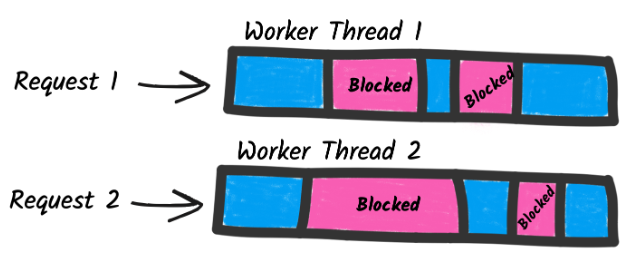
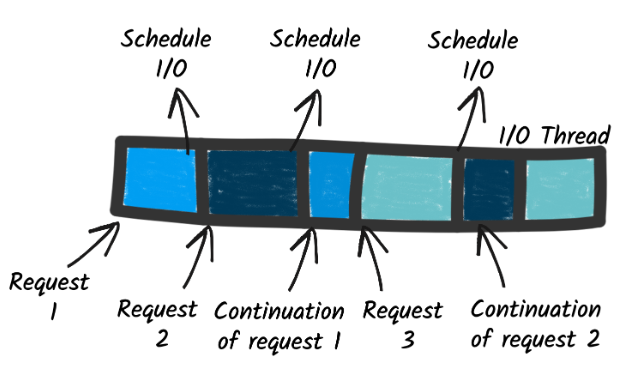
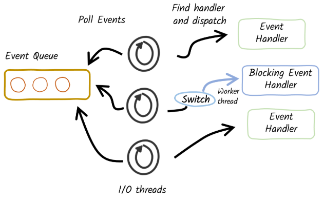

# 反应式架构

## 1、什么是反应式

反应式是一组用于构建响应分布式系统和应用程序的原则和准则，Reactive Systems 是具有四个特征的分布式系统：

1. 响应式：必须及时响应
2. 弹性：适应波动的负载
3. 弹性恢复：他们优雅地处理故障
4. 异步消息传递：反应式系统的组件使用消息进行交互

## 2、命令式 vs 响应式

传统应用程序使用阻塞 I/O 和命令式（顺序）执行模型，每个 HTTP 请求都与一个线程相关联，通常该线程将处理整个请求，并且该线程仅在该请求的持续时间内为该请求提供服务，当需要与远程服务交互时，需要使用阻塞 I/O，导致线程被阻塞，等待 I/O 的结果，要处理并发请求，需要多个线程，也就需要引入线程池，线程池会限制程序的并发性，并且资源消耗较高

非阻塞 I/O 避免了这个问题，几个线程可以处理许多并发 I/O，

## 3、命令式与响应式的统一

Quarkus 实现了前摄器模式，可在需要时切换为阻塞 I/O，

## 4、Quarkus 的 Reactive 扩展

### 1、HTTP

- **Quarkus REST**：Jakarta REST 的一个实现，专为 Quarkus 架构优化，它采用优先反应式的方法，同时通过 `@Blocking` 注解支持命令式代码
- **Reactive Routes**：一种声明式方式，在 Quarkus 使用 Vert.x 路由器注册 HTTP 路由，将 HTTP 请求路由到方法
- **REST Client**：用于消费 HTTP 端点，底层使用 Quarkus 的非阻塞 I/O 功能
- **Qute**：Qute 模板引擎提供反应式 API，以非阻塞方式渲染模板

### 2、数据

- **Hibernate Reactive**：Hibernate ORM 的一个版本，使用异步和非阻塞客户端与数据库交互
- **Hibernate Reactive with Panache**：在 Hibernate Reactive 的基础上提供 Active Record 和 Repository 支持
- **Reactive PostgreSQL 客户端**：一个与 PostgreSQL 数据库交互的异步非阻塞客户端，支持高并发
- **Reactive MySQL 客户端**：一个与 MySQL 数据库交互的异步非阻塞客户端
- **MongoDB 扩展**：提供与 MongoDB 交互的命令式和反应式（Mutiny）API
- **Mongo with Panache**：为命令式和反应式 API 提供 Active Record 支持
- **Cassandra 扩展**：提供与 Cassandra 交互的命令式和反应式（Mutiny）API
- **Redis 扩展**：提供与 Redis 键值存储交互的命令式和反应式（Mutiny）API

### 3、事件驱动架构

- **Reactive Messaging**：支持使用反应式和命令式代码实现事件驱动的应用程序
- **Kafka Connector for Reactive Messaging**：支持开发消费和写入 Kafka 记录的应用程序
- **AMQP 1.0 Connector for Reactive Messaging**：支持开发发送和接收 AMQP 消息的应用程序

### 4、网络协议与实用工具

- **gRPC**：支持实现和消费 gRPC 服务，提供反应式和命令式编程接口
- **GraphQL**：支持实现和查询（客户端）GraphQL 数据存储，提供 Mutiny API 和作为事件流的订阅功能
- **Fault Tolerance**：为应用程序提供重试、回退、断路器等能力，可与 Mutiny 类型结合使用

### 5、引擎

- **Vert.x**：Quarkus 的底层反应式引擎，此扩展允许访问托管的 Vert.x 实例以及其 Mutiny 变体（使用 Mutiny 类型暴露 Vert.x API）
- **Context Propagation**：在反应式管道中捕获并传播上下文对象（事务、主体等）

