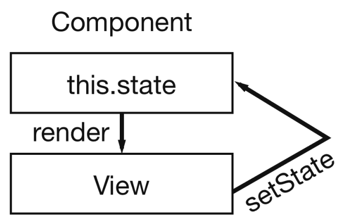
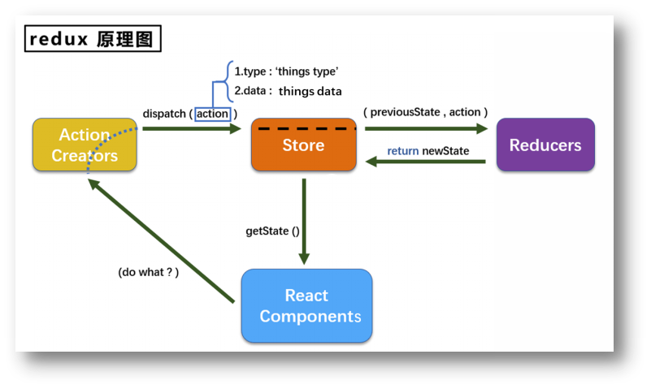
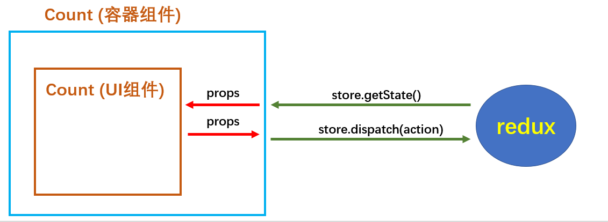
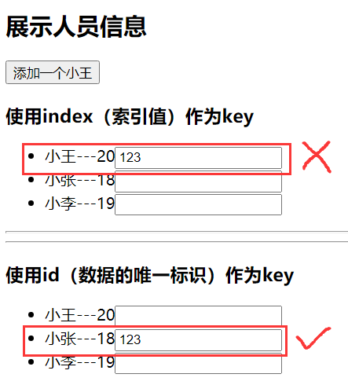

# 1、React 简介

- 用于动态构建用户界面的 JavaScript 库（**只关注于视图**）
- 声明式编码
- 组件化编码
- React Native 编写原生应用
- 高效（优秀的Diffing算法）

**相关类库**：

~~~react
<!-- 引入React核心库 -->
<script type="text/javascript" src="../JS/React.development.JS"></script>

<!-- 引入React-DOM，用于支持React操作DOM -->
<script type="text/javascript" src="../JS/React-DOM.development.JS"></script>

<!-- 引入babel，用于将JSx转为JS -->
<script type="text/javascript" src="../JS/babel.min.JS"></script>
~~~


# 2、虚拟 DOM

## 1、创建虚拟 DOM

虚拟 DOM 对象最终都会被 React 转换为真实的 DOM

编码时基本只需要操作 React  的虚拟 DOM 相关数据，React 会自动渲染为真实 DOM 变化而更新视界

~~~js
<!-- 准备好一个“容器” -->
<div id="test"></div>
~~~

~~~react
<!-- JSX方式 -->
<script type="text/babel" > /* 此处一定要写babel */
	// 1.创建虚拟DOM
	const VDOM = (  
                    /* 
                    	为了显示出多级结构使用（）括起来
                    	此处一定不要写引号，因为不是字符串 
                    */
                    <h1 id="title">
                        <span>Hello,React</span>
                    </h1>
                  )
	// 2.渲染虚拟DOM到页面
	ReactDOM.render(VDOM, document.getElementById('test'))
</script>
~~~

~~~react
<!-- 纯JS方式 -->
<script type="text/javascript" >
    // 1.创建虚拟DOM，调用 React API
    const VDOM = React.createElement('h1', {id:'title'}, React.createElement('span',{},'Hello,React'))
    // 2.渲染虚拟DOM到页面
    ReactDOM.render(VDOM, document.getElementById('test'))
</script>
~~~


## 2、渲染虚拟 DOM

**语法**：ReactDOM.render(virtualDOM, containerDOM)

- 参数一：纯 JS 或 JSX 创建的虚拟 DOM 对象
- 参数二：用来包含虚拟 DOM 元素的真实 DOM 元素对象（一般是一个 div)

**作用**：

- 将虚拟 DOM 元素渲染到页面中的真实容器 DOM 中显示，也即使用自定义的 JSX 来替换 HTML 中的一个 DOM 节点，便于将 React 集成到应用中，该方法可以被多次调用，加载单个或者多个组件，但是一般在 React 应用中只会调用一次来加载整个组件树


## 3、虚拟 VS 真实

虚拟 DOM 本质是 Object 类型的对象（一般对象）

虚拟 DOM 比较轻，真实 DOM 比较重，因为虚拟 DOM 是 React 内部在用，无需真实 DOM 上那么多的属性

~~~js
<script type="text/babel" >
		// 1.创建虚拟DOM
		const VDOM = (
			<h1 id="title">
				<span>Hello,React</span>
    		</h1>
		)
		// 2.渲染虚拟DOM到页面
		ReactDOM.render(VDOM,document.getElementById('test'))
		// 3.获取真实DOM
		const TDOM = document.getElementById('demo')
		
		console.log('虚拟DOM',VDOM);
		console.log('真实DOM',TDOM);
		console.log(typeof VDOM);
		console.log(VDOM instanceof Object);
</script>
~~~


# 3、React JSX

## 1、概述

**全称**：JavaScript XML

**简介**：React 定义的一种类似于 XML 的 JS 扩展语法，本质是 React.createElement(component, props, ...children) 方法的语法糖

**作用**：用来简化创建虚拟 DOM 

**流程**：
- 遇到 **<** 开头的代码，以标签的语法解析，HTML 同名标签转换为 HTML 同名元素，其它标签需要特别解析
  - 由标签首字母判断：
    - 若小写字母开头，则将该标签转为 HTML中同名元素，若 HTML中无该标签对应的同名元素，则报错
    - 若大写字母开头，React 就去渲染对应的组件，若组件没有定义，则报错

**注意**：
- 它不是字符串，也不是 HTML/XML 标签
- 它最终产生的就是一个 JS 对象，其中传入的属性也会变成 JS 对象中的键值对


## 2、语法要点

只能有一**个根标签**

**每个标签必须闭合**，\<x> \</x>

样式类名不要用 class，要用 className

若不想额外添加一个 div 可以使用 **<>** 和 **</>** 来代替

~~~react
export default function Avatar() {
  return (
    
  );
}
~~~


## 3、大括号

在 JSX 中，只能在以下两种场景中使用大括号：
1. 用作 JSX 标签内的**文本**：`<h1>{name}'s To Do List</h1>` 
3. 用作紧跟在 **=** 符号后的**属性**：`src={avatar}` 会读取 `avatar` 变量
除了传入字符串、数字和其它 JS 表达式，可以在 JSX 中传递**对象**，由于对象也用大括号表示，所以必须用另一对额外的大括号包裹对象，例如内联样式就是一种对象

**注意**：
- 内联 style 属性 使用驼峰命名法编写
- 区分 JS 语句（代码）与 JS 表达式
  - 表达式：表达式会产生值，可以放在任何一个需要值的地方
    - 这些都是表达式：a、a+b、demo(1)、arr.map()、function test () {}
  - 语句（代码）：
    - 这些都是语句（代码）：if(){}、for(){}、switch(){case:xxxx}


## 3、例子

~~~react
export default function TodoList() {
  return (
    <ul style={{
      backgroundColor: 'black',
      color: 'pink'
    }}>
      <li>Improve the videophone</li>
      <li>Prepare aeronautics lectures</li>
      <li>Work on the alcohol-fuelled engine</li>
    </ul>
  );
}

~~~

~~~react
const today = new Date();

function formatDate(date) {
  return new Intl.DateTimeFormat(
    'zh-CN',
    { weekday: 'long' }
  ).format(date);
}

export default function TodoList() {
  return (
    <h1>To Do List for {formatDate(today)}</h1>
  );
}
~~~

~~~react
const person = {
  name: 'Gregorio Y. Zara',
  theme: {
    backgroundColor: 'black',
    color: 'pink'
  }
};

export default function TodoList() {
  return (
    <div style={person.theme}>
      <h1>{person.name}'s Todos</h1>
      
      <ul>
        <li>Improve the videophone</li>
        <li>Prepare aeronautics lectures</li>
        <li>Work on the alcohol-fuelled engine</li>
      </ul>
    </div>
  );
}

~~~


# 4、React 组件

## 1、组件概念

**作用**：用来实现局部功能效果的代码和资源的集合（html/css/JS/image），复用编码，简化项目编码，提高运行效率

**流程**：

1. React 内部会创建组件实例对象
2. 调用 render() 得到虚拟 DOM，并解析为真实 DOM
3. 插入到指定的页面元素内部

**注意**：

- 组件名必须首字母大写
- 虚拟 DOM 元素只能有一个根元素
- 虚拟 DOM 元素必须有结束标签
- 组件、实例、元素的区别
  - 实例由组件实例化
  - 元素是组件的构成


~~~react
import React, { Component } from 'react';
import logo from './logo.svg';
import './App.css';

// 声明了一个 App 组件，采用的 ES6 的语法
// 此 App 组件可以任意地方创建实例
// 其内的 render 方法包含了所返回的元素
class App extends Component {
    render() {
        return (
            <div className="App">
                <header className="App-header">
                    
                    <h1 className="App-title">Welcome to React</h1>
                </header>
                <p className="App-intro">
                    To get started, edit <code>src/App.js</code> and save to reload.
                </p>
            </div>
        );
    }
}

export default App;
~~~


## 2、类式组件

使用 ES6 类组件可以在构造函数中初始化组件的状态，并且需要强制地调用 **super();** 方法

**extends** 所继承的 **Component** 会注册所有生命周期方法，所有的 Component  API 都可以使用，包括 state 等

~~~react
// 1.创建类式组件
class MyComponent extends React.Component {
    constructor(props) {
        super(props);
    }

    render() {
        // MyComponent 的原型对象继承了 render 方法，供实例对象使用
        // render 中的 this 指向 MyComponent 的实例对象
        console.log('render中的this:',this);
        return <h2>我是用类定义的组件(适用于【复杂组件】的定义)</h2>
    }
}

// 2.渲染组件到页面
// 2.1.React 解析组件标签，找到了 MyComponent 组件
// 2.2.发现组件是使用类定义的，随后 new 出来该类的实例，并通过该实例调用到原型上的 render 方法
// 2.3.将 render 返回的虚拟 DOM 转为真实 DOM，随后呈现在页面中
ReactDOM.render(<MyComponent/>,document.getElementById('test'))
~~~


**注意**：

- 类式组件中 render 方法里的 this 为组件实例对象


## 3、函数式组件

组件就是**函数**，接收一个**输入**并返回一个**输出**

- 输入：**props**
- 输出：**JSX 组件实例对象**

```react
// 1.创建函数式组件
function MyComponent() {
    // 此处的this是undefined，因为 babel 编译后开启了严格模式
    console.log(this); 
    return <h2>我是用函数定义的组件</h2>
}

// 2.渲染组件到页面
// 2.1.React 解析组件标签，找到了 MyComponent 组件
// 2.2.发现组件是使用函数定义的，随后调用该函数，将返回的虚拟 DOM 转为真实 DOM，随后呈现在页面中
ReactDOM.render(<MyComponent/>, document.getElementById('test'))

// 箭头函数、解构赋值
const Search = ({ value, onChange, children }) => {
    // do something
    return (
        <form>
            {children} <input type="text" value={value} onChange={onChange} />
        </form>
    );
}
```


**注意**：

- **函数式组件没有本地状态**，不能通过 this.state 访问，不能通过 this.setState() 修改
- 函数式组件本身是函数所以**无状态**，也**没有 this**，也**没有生命周期**


**技巧**：

- React 学习之道里提到，如果不需要控制组件的 state、props、生命周期建议使用函数式组件，否则使用类式组件


## 4、组件的导入和导出

 JS 里两个主要用来导出值的方式：默认导出、具名导出

可以在一个文件中，选择使用其中一种，或者两种都使用

**一个文件里有且仅有一个默认导出，但是可以有任意多个具名导出**

| 语法 | 导出语句                            | 导入语句                              |
| ---- | ----------------------------------- | ------------------------------------- |
| 默认 | export default function Button() {} | import Button from './Button.js';     |
| 具名 | export function Button() {}         | import { Button } from './Button.js'; |


**注意**：

- 当使用默认导入时，可以在 import 语句后面进行**任意命名**

- 对于具名导入，导入和导出的名字必须一致

~~~react
// Gallery.js
// 具名导出
export function Profile() {
  return (
    
  );
}

// 默认导出
export default function Gallery() {
  return (
    <section>
      <h1>了不起的科学家们</h1>
      <Profile />
      <Profile />
      <Profile />
    </section>
  );
}

~~~

~~~react
// 默认导入
import Gallery from './Gallery.js';
// 具名导入
import { Profile } from './Gallery.js';

// 默认导出
export default function App() {
  return (
    <Profile />
  );
}

~~~


## 5、高阶组件

高阶组件（HOC）是 React 中的一个高级概念

HOC 与高阶函数是等价的，其接受任何输入，而输入值多数时候是一个组件，也可以是可选参数，并返回一个组件作为输出，返回的组件是输入组件的增强版本，并且可以在 JSX 中使用

HOC 可用于不同的情况，比如：准备属性，管理状态、更改组件的表示形式

例如：用于帮助实现条件渲染

~~~js
// 例子
// 在这个例子中，没有做任何改变，输入组件将和输出组件一样
// 渲染与输入组件相同的实例，并将所有的属性 (props) 传递给输出组件，因此这个 HOC 没意义
function withFoo(Component) {
    return function(props) {
        return <Component { ...props } />;
    }
}

// ES6 简化写法
const withFoo = (Component) => (props) => <Component { ...props } />

// 增强输出组件功能：当加载状态 (isLoading) 为 true 时，组件显示 Loading 组件，否则显示输入的组件
// 条件渲染是 HOC 的一种绝佳用例
const withLoading = (Component) => (props) => props.isLoading ? <Loading /> : <Component { ...props } />
// 但有点不好，就是组件可能不关心 isLoading 属性，因此可以用 解构赋值将 isLoading 属性单独取出
const withLoading = 
      (Component) => ({isLoading, ...others}) => isLoading ? <Loading /> : <Component { ...others } />

~~~


## 6、受控组件

当组件中的重要信息是由 **props** 而不是其**自身状态**驱动时，就可以认为该组件是受控组件，这就允许父组件完全指定其行为

当编写一个组件时，应该考虑哪些信息应该受控制（通过 props），哪些信息不应该受控制（通过 state）


# 5、三大属性

## 1、state

### 1、概念

由于局部变量的修改不会触发重新渲染，而且局部变量不会下一次渲染中被保存，所以需要 state 持久化数据

state 是组件对象最重要的属性，可以包含多个 **key：value** 的组合

在 React 中组件又被称为状态机，通过更新组件的 state 来重新渲染组件

在类式组件中，state 通过使用 this 绑定在类上，因此可以在整个组件访问到 state


**注意**：

- 状态数据，不能直接修改，调用实例的 setState() 方法进行更新
- 状态的更新是一种合并，不是替换
- 类式组件自定义的方法中的 this 为 undefined
  - 也可以通过箭头函数进行绑定
  - 通过 bind 方法强制绑定 this：this.xxx.bind()
- 尽量减少 state 嵌套，扁平化数据结构


### 2、useState

**概述**：

useState Hook 提供了这两个功能：

- 用于保存渲染间的数据
- 返回 setter函数，用于更新变量并触发 React 再次渲染组件

~~~react
const [index, setIndex] = useState(0);
~~~

useState 的唯一参数是 state 变量的**初始值**，每次组件渲染时，useState 都会返回一个包含两个值的数组：

- state 变量，保存上次渲染的值
- state setter 函数可以更新 state 变量并触发 React 重新渲染组件

多次使用 useState 即可为组件添加多个 state

**流程**：

- 组件进行第一次渲染：初始值传递给 useState，它将返回 [初始值, setXXX]，React 记住 0 是最新的 state 值
- 更新了 state：当用户点击按钮时，它会调用 setXXX(xxxx)，这告诉 React 现在记住变量改变了并触发下一次渲染
- 组件进行第二次渲染：React 仍然看到 useState(初始值)，但是因为 React 记住了变量被修改过，它将返回 [新变量, setXXX]

**注意**：

- 多个 state 如果之间有关系，可以组合为一个对象在使用 useState
- 各个组件之间的 state 变量是隔离且私有的
- 如果希望两个子组件共享 state，则应该将 state 提取到最近的父组件中

**特别注意**：

- **React 会等到事件处理函数中的**所有**代码都运行完毕再处理 state 更新**，因此设置 state 只会为下一次渲染变更 state 的值，即使多次调用，在本次渲染完成前，state 的值都是旧值
- state 是存在与组件之外，由 React 单独提供，组件内只是 state 的快照，每个渲染（以及其中的函数）始终得到的是 React 提供给这个渲染的 state 快照，所以一个 state 变量的值永远不会在一次渲染的内部发生变化，即使是在组件的函数内部，即使函数是一个异步函数


### 3、批量更新

批量更新可以更新多个 state 变量，甚至来自多个组件的 state 变量，而不会触发太多的重新渲染，其是将多次更新放入一个队列，等到事件函数处理完毕，React 就是处理队列，最后渲染

React 不会跨多个需要刻意触发的事件（如点击）进行批处理（每次点击都是单独处理的）

在下次渲染前多次更新同一个state，可以使用传入一个根据旧 state 计算新 state 的队列

~~~react
setNumber(n => n + 1);
setNumber(n => n + 1);
setNumber(n => n + 1);
~~~

在上面的例子中，其实是传入了一个更新函数，React 会将该函数加入队列，在最后渲染时遍历队列，得到新 state


### 4、更新 State 中的对象

state 中可以保存任意类型的 JS 值，包括对象，但是不应该直接修改存放在 state 中的对象，而是当要更新一个对象时，创建一个新的对象（或者将其拷贝一份），然后将 state 更新为此对象

- 数字、字符串、布尔值，这些类型的值在 JS 中是不可变的（immutable），意味着它们不能被改变且只读，只能被替换

如果直接修改存在放 state 中的 js 对象，由于没有调用 set 函数，不会导致重新渲染，因此最好是把所有存放在 state 中的 JS 对象都视为只读的，保证所有变量的不可变性以及渲染

**注意**：

- 如果使用对象展开复制属性，需要注意嵌套属性的展开
  - 如果不想处理多层嵌套，可以直接使用 immer 库，其会自动处理属性复制

~~~react
let tempState = Object.assign({}, this.state.usersMsg, {[type]: value });
this.setState({
  usersMsg:tempState
})
~~~


### 5、更新 State 中的数组

数组是另外一种可以存储在 state 中的 JS 对象，它虽然是可变的，但是却应该被视为不可变，同对象一样

当想要更新存储于 state 中的数组时，需要创建一个新的数组（或者创建一份已有数组的拷贝值），并使用新数组设置 state

下面是常见数组操作的参考表，操作 React state 中的数组时，需要避免使用左列的方法，而首选右列的方法：（如果使用 Immer 可以使用所有方法）

|          | 避免使用 (会改变原始数组)     | 推荐使用 (会返回一个新数组）  |
| -------- | ----------------------------- | ----------------------------- |
| 添加元素 | `push`，`unshift`             | `concat`，`[...arr]` 展开语法 |
| 删除元素 | `pop`，`shift`，`splice`      | `filter`，`slice`             |
| 替换元素 | `splice`，`arr[i] = ...` 赋值 | `map`                         |
| 排序     | `reverse`，`sort`             | 先将数组复制一份              |

**注意**：

- 由于 **...** 是浅拷贝，对于数组当中的对象，依旧是共享的，建议拷贝完使用 map 进行修改，而不是取出元素修改
- 不要再 state 中镜像 props，会失去同步


### 6、状态提升

将子状态（substate）从一个组件移动到其他组件中的重构过程被称为**状态提取**

- 例如：存在于父组件但是父组件用不到，并且子组件中需要的状态，重构到子组件中，状态从父组件到子组件向下移动


状态提取的过程也可以反过来：从子组件到父组件，这种情形被称为**状态提升**

- 例如：需要在子组件的兄弟组件上显示该组件的状态，此时需要将状态提升到父组件中，并在父组件中处理并传播

~~~react
import { useState } from 'react';

export default function Accordion() {
    // 状态提取到父组件中
  const [activeIndex, setActiveIndex] = useState(0);
  return (
    <>
      <h2>哈萨克斯坦，阿拉木图</h2>
      <Panel
        title="关于"
        isActive={activeIndex === 0}
          // 状态修改方法传入子组件
        onShow={() => setActiveIndex(0)}
      >
        阿拉木图人口约200万
      </Panel>
      <Panel
        title="词源"
        isActive={activeIndex === 1}
        onShow={() => setActiveIndex(1)}
      >
        被认为是现今苹果的祖先。
      </Panel>
    </>
  );
}

function Panel({
  title,
  children,
  isActive,
  onShow
}) {
  return (
    <section className="panel">
      <h3>{title}</h3>
      {isActive ? 
      (<p>{children}</p>) : 
          (<button onClick={onShow}>
          显示
        </button>)}
    </section>
  );
}
~~~


### 7、重置和保留

只要一个组件还被渲染在 UI 树的相同位置，React 就会保留它的 state

如果它被移除，或者一个不同的组件被渲染在相同的位置，那么 React 就会丢掉它的 state

当在相同位置渲染不同的组件时，组件的整个子树都会被重置

如果想在相同位置渲染同类型组件，且重置 state，可以将同类组件渲染在不同的位置，也可以为组件设置 key，让 React 区分，但是 key 不是全局唯一的，它们只能指定父组件内部的顺序

**注意**：

- 是在 UI 树中的相同位置，为不是在 JSX 中的位置
- 如果想在重新渲染时保留 state，几次渲染中的树形结构就应该相互匹配

>为被删除的组件保留 state：使用 localStorage、使用外部储存源、渲染出所有组件使用 CSS 隐藏、使用状态提升


### 8、Reducer

对于拥有许多状态更新逻辑的组件来说，过于分散的事件处理程序可能会令人不知所措，对于这种情况，可以将组件的所有**状态更新逻辑**整合到一个**外部函数**中，这个函数叫作 reducer

useReducer 钩子接受 2 个参数：

1. 第一个参数：**reducer** 函数
   - 两个参数：
     1. 第一个是当前状态 **state**
     2. 第二个是目标行为 **action**
   - 返回值：根据目标行为返回新状态 state
2. 第二个参数：**初始的 state**
3. 返回值：
   1. 一个初始化的状态
   2. 一个 **dispatch** 函数（用来派发 action 给 reducer 函数）
      - 参数：reducer 的 action


~~~react
import { useReducer } from 'react';
import AddTask from './AddTask.js';
import TaskList from './TaskList.js';
import tasksReducer from './tasksReducer.js';

let nextId = 3;
const initialTasks = [
  {id: 0, text: '参观卡夫卡博物馆', done: true},
  {id: 1, text: '看木偶戏', done: false},
  {id: 2, text: '打卡列侬墙', done: false},
];

export default function TaskApp() {
  const [nowTasks, dispatch] = useReducer(tasksReducer, initialTasks);

  function handleAddTask(text) {
    dispatch({
      type: 'added',
      id: nextId++,
      text: text,
    });
  }

  function handleChangeTask(task) {
    dispatch({
      type: 'changed',
      task: task,
    });
  }

  function handleDeleteTask(taskId) {
    dispatch({
      type: 'deleted',
      id: taskId,
    });
  }

  return (
    <>
      <h1>布拉格的行程安排</h1>
      <AddTask onAddTask={handleAddTask} />
      <TaskList
        tasks={tasks}
        onChangeTask={handleChangeTask}
        onDeleteTask={handleDeleteTask}
      />
    </>
  );
}
~~~

~~~react
export default function tasksReducer(tasks, action) {
  switch (action.type) {
    case 'added': {
      return [
        ...tasks,
        {
          id: action.id,
          text: action.text,
          done: false,
        },
      ];
    }
    case 'changed': {
      return tasks.map((t) => {
        if (t.id === action.task.id) {
          return action.task;
        } else {
          return t;
        }
      });
    }
    case 'deleted': {
      return tasks.filter((t) => t.id !== action.id);
    }
    default: {
      throw Error('未知 action：' + action.type);
    }
  }
}
~~~


### 9、例子

~~~react
// 第二个代码块为简写方式
// 1.创建组件
class Weather extends React.Component {
    // 构造器调用几次？ ———— 1次
    constructor(props) {
        console.log('constructor');
        super(props)
        // 初始化状态
        this.state = {isHot:false, wind:'微风'}
        // 解决 changeWeather 中 this 指向问题
        this.changeWeather = this.changeWeather.bind(this)
    }

    // render 调用次数 ———— 1+n次 1是初始化的那次 n是状态更新的次数
    render() {
        console.log('render');
        // 读取状态
        const {isHot, wind} = this.state;
        return <h1 onClick={this.changeWeather}>今天天气很{isHot ? '炎热' : '凉爽'}，{wind}</h1>
    }

    // changeWeather 调用次数 ———— 点几次调几次
    changeWeather() {
        // changeWeather()方法位置 ———— Weather 的原型对象上，供实例使用
        // 由于 changeWeather 是作为 onClick 的回调，所以不是通过实例调用的，是直接调用
        // 类中的方法默认开启了局部的严格模式，所以 changeWeather 中的 this 为 undefined
        // constructor 方法中的代码解决
        console.log('changeWeather');
        // 获取原来的 isHot 值
        const isHot = this.state.isHot
        this.setState({isHot:!isHot})
        console.log(this);
        
		// 这是错误的写法
        // this.state.isHot = !isHot 
    }
}

// 2.渲染组件到页面
ReactDOM.render(<Weather/>, document.getElementById('test'))
~~~

~~~react
// 1.创建组件
class Weather extends React.Component{
    // 初始化状态
    state = {isHot:false, wind:'微风'}

    render() {
        const {isHot,wind} = this.state
        return <h1 onClick={this.changeWeather}>今天天气很{isHot ? '炎热' : '凉爽'}，{wind}</h1>
    }

    // 自定义方法————要用赋值语句的形式+箭头函数
    // 如在箭头函数内部使用了 this，会找其外部函数的 this
    changeWeather = () => {
        const isHot = this.state.isHot
        this.setState({isHot:!isHot})
    }
}

// 2.渲染组件到页面
ReactDOM.render(<Weather/>,document.getElementById('test'))
~~~



~~~react
setArtists( // 替换 state
  [ // 是通过传入一个新数组实现的
    ...artists, // 新数组包含原数组的所有元素
    { id: nextId++, name: name } // 并在末尾添加了一个新的元素，也可以写在最前面，会在头部插入
  ]
);

// 删除
setArtists(
  artists.filter(a => a.id !== artist.id)
);

// 在任意位置插入元素，并返回新数组
const nextArtists = [
      // 插入点之前的元素：
      ...artists.slice(0, insertAt),
      // 新的元素：
      { id: nextId++, name: name },
      // 插入点之后的元素：
      ...artists.slice(insertAt)
    ];

// 取得新数组后使用 map 修改元素
setMyList(myList.map(artwork => {
  if (artwork.id === artworkId) {
    // 创建包含变更的*新*对象
    return { ...artwork, seen: nextSeen };
  } else {
    // 没有变更
    return artwork;
  }
}));
~~~

~~~react
// 每次渲染都是重置 MyTextField 组件，因为每次重新渲染 MyComponent 都会创建一个新的 MyTextField 函数
// 在相同的位置渲染的是不同的组件
// 永远要将组件定义在最上层并且不要把它们的定义嵌套起来
import { useState } from 'react';

export default function MyComponent() {
  const [counter, setCounter] = useState(0);

  function MyTextField() {
    const [text, setText] = useState('');

    return (
      <input
        value={text}
        onChange={e => setText(e.target.value)}
      />
    );
  }

  return (
    <>
      <MyTextField />
      <button onClick={() => {
        setCounter(counter + 1)
      }}>点击了 {counter} 次</button>
    </>
  );
}
~~~

~~~react
// 两个 Counter 被渲染在同一位置，React 认为是同一个，所以 state 没有被重置
import { useState } from 'react';

export default function App() {
  const [isFancy, setIsFancy] = useState(false);
  if (isFancy) {
    return (
      <div>
        <Counter isFancy={true} />
        <label>
          <input
            type="checkbox"
            checked={isFancy}
            onChange={e => {
              setIsFancy(e.target.checked)
            }}
          />
          使用好看的样式
        </label>
      </div>
    );
  }
  return (
    <div>
      <Counter isFancy={false} />
      <label>
        <input
          type="checkbox"
          checked={isFancy}
          onChange={e => {
            setIsFancy(e.target.checked)
          }}
        />
        使用好看的样式
      </label>
    </div>
  );
}

function Counter({ isFancy }) {
  const [score, setScore] = useState(0);
  const [hover, setHover] = useState(false);

  let className = 'counter';
  if (hover) {
    className += ' hover';
  }
  if (isFancy) {
    className += ' fancy';
  }

  return (
    <div
      className={className}
      onPointerEnter={() => setHover(true)}
      onPointerLeave={() => setHover(false)}
    >
      <h1>{score}</h1>
      <button onClick={() => setScore(score + 1)}>
        加一
      </button>
    </div>
  );
}
~~~

~~~react
import { useState } from 'react';

export default function Scoreboard() {
  const [isPlayerA, setIsPlayerA] = useState(true);
  return (
    <div>
          // 将组件渲染在不同的位置，就可以在相同的地方重置 state
      {isPlayerA &&
        <Counter person="Taylor" />
      }
      {!isPlayerA &&
        <Counter person="Sarah" />
      }
      <button onClick={() => {
        setIsPlayerA(!isPlayerA);
      }}>
        下一位玩家！
      </button>
    </div>
  );
}

function Counter({ person }) {
  const [score, setScore] = useState(0);
  const [hover, setHover] = useState(false);

  let className = 'counter';
  if (hover) {
    className += ' hover';
  }

  return (
    <div
      className={className}
      onPointerEnter={() => setHover(true)}
      onPointerLeave={() => setHover(false)}
    >
      <h1>{person} 的分数：{score}</h1>
      <button onClick={() => setScore(score + 1)}>
        加一
      </button>
    </div>
  );
}
~~~


## 2、props

### 1、概念

每个组件对象都会有 props（properties） 属性，并且组件对象的所有属性都保存在 props 中

props 可以设定初始值，还可以限制类型

props 只读，不能修改，组件内部不能修改 props 数据，新的 props 又父组件传入，旧的 props 直接被抛弃

可以通过 props 从组件外向组件内传递变化的数据

在构造器里的 props 参数里可以获取到 props


### 2、父组件传入

声明组件时直接通过键值对传入

~~~react
export default function Profile() {
  return (
    <Avatar
      person={{ name: 'Lin Lanying', imageId: '1bX5QH6' }}
      size={100}
    />
  );
}
~~~

~~~react
function Profile(props) {
  return (
    <div className="card">
      // 使用解构语法对 props 进行展开，一次性传入，避免重复的代码
      <Avatar {...props} />
    </div>
  );
}
~~~


### 3、子组件获取

对于函数式组件可以在声明时对 props 解构获取，也可以直接使用整个 props 对象

~~~react
// 对 props 解构
function Avatar({ person, size }) {
  return (
    // ...
  );
}

// 直接使用整个 props 对象
function Avatar(props) {
  let person = props.person;
  let size = props.size;
  return (
    // ...
  );
}

export default function Profile() {
  return (
    <div>
      // 使用键值对赋值
      <Avatar
        size={100}
        person={{ 
          name: 'Katsuko Saruhashi', 
          imageId: 'YfeOqp2'
        }}
      />
    </div>
  );
}

~~~


### 4、指定默认值

没有指定值的情况下给 prop 一个默认值，可以通过在参数后面写 **=** 和默认值来进行解构

默认值仅在缺少 prop 或 prop={undefined} 时生效，如果传递了 prop={null} 或 prop={0}，默认值将不被使用

~~~react
function Avatar({ person, size = 100 }) {
  // ...
}
~~~


### 5、特殊的 Children 属性

将内容嵌套在 JSX 标签中时，父组件将在名为 **children** 的 props 中接收到该内容

这个属性比较少用

~~~react
import Avatar from './Avatar.js';

function Card({ children }) {
  return (
    <div className="card">
      // 使用 props 中的 children 属性读取嵌套内容
      {children}
    </div>
  );
}

export default function Profile() {
  return (
    <Card>
      // 将 Avatar 嵌套在 Card 中
      <Avatar
        size={100}
        person={{ 
          name: 'Katsuko Saruhashi',
          imageId: 'YfeOqp2'
        }}
      />
    </Card>
  );
}

~~~


### 6、例子

~~~react
// 1、创建组件
class Person extends React.Component{
    render(){
        // console.log(this);
        // this.props.name = 'jack' // 此行代码会报错，因为 props 是只读的
        
        const {name,age,sex} = this.props
        return (
            <ul>
                <li>姓名：{name}</li>
                <li>性别：{sex}</li>
                <li>年龄：{age+1}</li>
            </ul>
        )
    }
}
const p = {name:'老刘', age:18, sex:'女'}

// 2、渲染组件到页面
ReactDOM.render(<Person name="jerry" age={19}  sex="男" speak={speak}/>, document.getElementById('test1'))
ReactDOM.render(<Person name="tom" age={18} sex="女"/>, document.getElementById('test2'))
// ES6 中可以通过 ... 展开一个对象
ReactDOM.render(<Person {...p}/>,document.getElementById('test3'))


// 3、对标签属性进行类型、必要性的限制
Person.propTypes = {
    name: PropTypes.string.isRequired, // 限制name必传，且为字符串
    sex: PropTypes.string, // 限制sex为字符串
    age: PropTypes.number, // 限制age为数值
    speak: PropTypes.func, // 限制speak为函数
}

// 4、指定默认标签属性值
Person.defaultProps = {
    sex: '男',// sex默认值为男
    age: 18 // age默认值为18
}

function speak() {
    console.log('我说话了');
}
~~~

~~~react
// 1、创建组件
class Person extends React.Component {
    constructor(props) {
        // 构造器是否接收props，是否传递给super，取决于：是否希望在构造器中通过this访问props
        // console.log(props);
        super(props)
        console.log('constructor',this.props);
    }
    
    // 2、对标签属性进行类型、必要性的限制
    static propTypes = {
        name:PropTypes.string.isRequired, // 限制name必传，且为字符串
        sex:PropTypes.string,// 限制sex为字符串
        age:PropTypes.number,// 限制age为数值
    }

    // 3、指定默认标签属性值
    static defaultProps = {
        sex:'男', // sex默认值为男
        age:18 // age默认值为18
    }

    render() {
        const {name,age,sex} = this.props
        return (
            <ul>
                <li>姓名：{name}</li>
                <li>性别：{sex}</li>
                <li>年龄：{age+1}</li>
            </ul>
        )
    }
}

// 4、渲染组件到页面
ReactDOM.render(<Person name="jerry"/>,document.getElementById('test1'))
~~~


## 3、refs

### 1、概念

组件内的标签可以定义 ref 属性来标识自己

默认情况下，不能在函数组件上使用 ref 属性，因为它们没有实例

高级技巧：ref 转发


**注意**：

- 回调函数形式的 refs，调用次数为 2，第一次传入参数 null，然后第二次会传入参数 DOM 元素


### 2、例子

~~~react
// 第一个代码块字符串形式的 refs（不推荐）
// 第二个代码块回调形式的 refs
// 第三个代码块 creatRefs 方法

// 1、创建组件
class Demo extends React.Component {
    // 展示左侧输入框的数据
    showData = () => {
        // 解构赋值，对象中需要存在该属性才能赋值
        // 这里的 this 是 Demo 组件实例
        const {input1} = this.refs
        // 获取到的是真实 DOM
        alert(input1.value)
    }
    // 展示右侧输入框的数据
    showData2 = () => {
        const {input2} = this.refs
        console.log(this)
        alert(this.value)
    }

    render() {
        return (
            <div>
                <input ref="input1" type="text" placeholder="点击按钮提示数据"/>&nbsp;
                <button onClick={this.showData}>点我提示左侧的数据</button>
                &nbsp;
                <input ref="input2" onBlur={this.showData2} type="text" placeholder="失去焦点提示数据"/>
            </div>
        )
    }
}

// 2、渲染组件到页面
ReactDOM.render(<Demo a="1" b="2"/>, document.getElementById('test'))
~~~

![[images/image-20220607090644018.png]]

~~~react
// 1、创建组件
class Demo extends React.Component {
    // 展示左侧输入框的数据
    showData = () => {
        const {input1} = this
        alert(input1.value)
    }
    // 展示右侧输入框的数据
    showData2 = () => {
        const {input2} = this
        alert(input2.value)
    }

    render() {
        return (
            <div>
                <!-- currentNode 的缩写 c，传入的参数其实是该节点 -->
                <input ref={(c) => {this.input1 = c}} type="text" placeholder="点击按钮提示数据" />
                &nbsp;
                <button onClick={this.showData}>点我提示左侧的数据</button>
                &nbsp;
                <input ref={(c) => {this.input2 = c}} type="text" placeholder="失去焦点提示数据" 
                    onBlur={this.showData2} />
                &nbsp;
            </div>
        )
    }
}

// 2、渲染组件到页面
ReactDOM.render(<Demo a="1" b="2"/>, document.getElementById('test'))
~~~

![[images/image-20220607090729967.png]]

~~~react
// 1、创建组件
class Demo extends React.Component {
    /* React.createRef 调用后可以返回一个容器，该容器可以存储被 ref 所标识的节点，该容器是“专人专用”的 */
    myRef = React.createRef()
    myRef2 = React.createRef()
    // 展示左侧输入框的数据
    showData = () => {
        alert(this.myRef.current.value);
    }
    // 展示右侧输入框的数据
    showData2 = () => {
        alert(this.myRef2.current.value);
    }

    render() {
        return (
            <div>
                <!-- 当把ref传给render中的元素时，可以通过ref中的current属性访问到该节点 -->
                <input ref={this.myRef} type="text" placeholder="点击按钮提示数据"/>
                &nbsp;
                <button onClick={this.showData}>点我提示左侧的数据</button>
                &nbsp;
                <input onBlur={this.showData2} ref={this.myRef2} 
                    type="text" placeholder="失去焦点提示数据"/>
                &nbsp;
            </div>
        )
    }
}

// 2、渲染组件到页面
ReactDOM.render(<Demo a="1" b="2"/>, document.getElementById('test'))
~~~

![[image-20220607091821915.png]]

# 6、条件渲染

## 1、概述

条件渲染用于需要决定渲染哪个元素时，有些时候也可以是渲染一个元素或者什么都不渲染，也即直接返回 null

- 最简单的条件渲染，只需要用 JSX 中的 **if-else** 就可以实现
- 在 JSX 中加上一个**三元运算符**也可以达到这样的目的
- 运用 **&&** 逻辑运算符


**注意**：

- 在 JS 当中，&& 表达式 的左侧为 true 时，它则返回其右侧的值，如果为 false，则视为 null 或者 undefined
- 切勿放置数字在 && 的左侧，因为 JS 会自动将左侧的值转换成布尔类型以判断条件成立与否，如果左侧是 0，整个表达式将变成左侧的值（0），React 此时则会渲染 0 而不是不进行渲染


## 2、例子

~~~react
// if else
function Item({ name, isPacked }) {
  if (isPacked) {
    return <li className="item">{name} ✔</li>;
  } else {
    return <li className="item">{name}</li>;
  }
}

// 三目运算
function Item({ name, isPacked }) {
  return (
    <li className="item">
      {isPacked ? (
        <del>
          {name + ' ✔'}
        </del>
      ) : (
        name
      )}
    </li>
  );
}

// && 运算符 
function Item({ name, isPacked }) {
  return (
    <li className="item">
      {name} {isPacked && '✔'}
    </li>
  );
}

export default function PackingList() {
  return (
    <section>
      <h1>Sally Ride 的行李清单</h1>
      <ul>
        <Item 
          isPacked={true} 
          name="宇航服" 
        />
        <Item 
          isPacked={true} 
          name="带金箔的头盔" 
        />
        <Item 
          isPacked={false} 
          name="Tam 的照片" 
        />
      </ul>
    </section>
  );
}
~~~

~~~react
function Item({ name, isPacked }) {
  // 将处理逻辑拆分出来
  let itemContent = name;
  if (isPacked) {
    itemContent = (
      <del>
        {name + " ✔"}
      </del>
    );
  }
  return (
    <li className="item">
      {itemContent}
    </li>
  );
}

export default function PackingList() {
  return (
    <section>
      <h1>Sally Ride 的行李清单</h1>
      <ul>
        <Item 
          isPacked={true} 
          name="宇航服" 
        />
        <Item 
          isPacked={true} 
          name="带金箔的头盔" 
        />
        <Item 
          isPacked={false} 
          name="Tam 的照片" 
        />
      </ul>
    </section>
  );
}
~~~


# 7、事件处理

## 1、概述

使用 React 可以在 JSX 中添加**事件处理函数**，其中事件处理函数为自定义函数，其通常名称以 handle 开头，后跟事件名称

如需添加一个事件处理函数的三种方式：

- 先定义一个函数，然后将其作为 prop 传入 合适的 JSX 标签后使用
- 也可以直接在组件内定义
- 也可以在 JSX 标签中定义一个内联的事件处理函数

~~~react
export default function Button() {
  function handleClick() {
    alert('你点击了我！');
  }
    
  return (
    // 引用
    <button onClick={handleClick}>
      点我
    </button>
    // 直接内部定义
    <button onClick={function handleClick() {alert('你点击了我！');}}>
    // 匿名箭头函数
    <button onClick={() => {alert('你点击了我！');}}>
  );
}
~~~

通过 onXxx 属性指定事件处理函数（注意大小写）

- React 使用的是自定义合成事件，而不是使用的原生 DOM 事件 ——> 为了更好的兼容性
- React 中的事件是通过事件委托方式处理的（委托给组件最外层的元素） ——> 为了高效

在元素中使用监听时，可以在回调函数的参数中使用 event 访问到 React 的合成事件

- 通过 event.target 得到发生事件的 DOM 元素对象 ——> 不要过度使用 ref

- 发生事件的元素正好是要操作的元素，可以省写 ref 去操作

在函数式组件中，事件处理函数可以直接使用组件接收到的 props

对于事件处理函数的命名规范，一般为 **on** 开头，后跟一个首字母大写的单词


**注意**：

- 当必须要传递一个参数时，需要把类方法封装到一个箭头函数中，此举称为高阶函数
  - 因为传给元素事件处理器的内容必须是函数
- **{}** 中间必须为一个函数，无论是一个函数调用后返回的值，还是直接写一个函数


## 2、事件传播

事件处理函数还将捕获任何来自子组件的事件，它从事件发生的地方开始，然后沿着树向上传播

**注意**：

- 在 React 中所有事件都会传播，除了 onScroll，它仅适用于你附加到的 JSX 标签

~~~react
// 点击任一按钮，它自身的 onClick 将首先执行
// 然后父级 <div> 的 onClick 会接着执行
// 因此会出现两条消息
// 如果点击 toolbar 本身，将只有父级 <div> 的 onClick 会执行
export default function Toolbar() {
  return (
    <div className="Toolbar" onClick={() => {
      alert('你点击了 toolbar ！');
    }}>
      <button onClick={() => alert('正在播放！')}>
        播放电影
      </button>
      <button onClick={() => alert('正在上传！')}>
        上传图片
      </button>
    </div>
  );
}
~~~


## 3、阻止传播

事件处理函数接收一个**事件对象**作为唯一的参数，按照惯例，它通常被称为 e ，代表 “event”（事件），可以使用此对象来读取有关事件的信息

这个事件对象还允许阻止传播事件，如果想阻止一个事件到达父组件，需要调用 e.stopPropagation()

~~~react
function Button({ onClick, children }) {
  return (
    <button onClick={e => {
      e.stopPropagation();
      onClick();
    }}>
      {children}
    </button>
  );
}
~~~


## 4、捕获阶段事件

可能需要捕获子元素上的所有事件，即便它们阻止了传播，可以通过在事件名称末尾添加 Capture 来实现这一点

~~~react
<div onClickCapture={() => { /* 这会首先执行 */ }}>
  <button onClick={e => e.stopPropagation()} />
  <button onClick={e => e.stopPropagation()} />
</div>
~~~

每个事件分三个阶段传播：

1. 它向下传播，调用所有的 onClickCapture 处理函数
2. 它执行被点击元素的 onClick 处理函数
3. 它向上传播，调用所有的 onClick 处理函数

捕获事件对于路由或数据分析之类的代码很有用


## 5、阻止默认行为

某些浏览器事件具有与事件相关联的默认行为，可以调用事件对象中的 e.preventDefault() 来阻止这种情况发

- 点击 \<form> 表单内部的按钮会触发表单提交事件，默认情况下将重新加载整个页面

~~~react
export default function Signup() {
  return (
    <form onSubmit={e => {
      e.preventDefault();
      alert('提交表单！');
    }}>
      <input />
      <button>发送</button>
    </form>
  );
}
~~~


## 6、例子

~~~react
// 1、创建组件
class Demo extends React.Component {
    // 创建ref容器
    myRef = React.createRef()
    myRef2 = React.createRef()

    // 展示左侧输入框的数据
    showData = (event) => {
        console.log(event.target);
        alert(this.myRef.current.value);
    }

    // 展示右侧输入框的数据
    showData2 = (event) => {
        alert(event.target.value);
    }
    
    onDismiss = (oid) => {
        console.log(oid);
    }

    render() {
        return (
            <div>
                <input ref={this.myRef} type="text" placeholder="点击按钮提示数据"/>&nbsp;
                <button onClick={this.showData}>点我提示左侧的数据</button>
                &nbsp;
                <input onBlur={this.showData2} type="text" placeholder="失去焦点提示数据"/>&nbsp;

                <button
                    onClick={() => this.onDismiss(item.objectID)}
                    // onClick={this.onDismiss} 无法传递参数
                    // onClick={this.onDismiss(item.objectID)} 组件加载完后会直接调用
                    type="button"
                />
            </div>
        )
    }
}

// 2、渲染组件到页面
ReactDOM.render(<Demo a="1" b="2"/>, document.getElementById('test'))
~~~

~~~react
function Button({ onClick, children }) {
  return (
    <button onClick={onClick}>
      {children}
    </button>
  );
}

function PlayButton({ movieName }) {
  function handlePlayClick() {
    alert(`正在播放 ${movieName}！`);
  }

  return (
    <Button onClick={handlePlayClick}>
      播放 "{movieName}"
    </Button>
  );
}

function UploadButton() {
  return (
    <Button onClick={() => alert('正在上传！')}>
      上传图片
    </Button>
  );
}

export default function Toolbar() {
  return (
    <div>
      <PlayButton movieName="魔女宅急便" />
      <UploadButton />
    </div>
  );
}
~~~


# 8、生命周期

## 1、概述

组件从创建到死亡它会经历一些特定的阶段

React 组件中包含一系列**勾子函数**（生命周期回调函数），会在特定的时刻调用

在定义组件时，会在特定的**生命周期回调函数**中做特定的工作

挂载：组件实例化的过程

生命周期回调函数 <==> 生命周期钩子函数 <==> 生命周期函数 <==> 生命周期钩子

~~~react
// 1、创建组件
class Life extends React.Component {

    state = {opacity: 1}

    death = () => {
        // 2、卸载组件函数
        ReactDOM.unmountComponentAtNode(document.getElementById('test'))
    }

    // 3、组件挂完毕
    componentDidMount() {
        console.log('componentDidMount');
        this.timer = setInterval(() => {
            // 获取原状态
            let {opacity} = this.state
            // 减小0.1
            opacity -= 0.1
            if (opacity <= 0) opacity = 1
            // 设置新的透明度
            this.setState({opacity})
        }, 200);
    }

    // 4、组件将要卸载
    componentWillUnmount() {
        // 清除定时器
        clearInterval(this.timer)
    }

    // 初始化渲染、状态更新之后
    render() {
        console.log('render');
        return (
            <div>
                <h2 style={{opacity: this.state.opacity}}>React学不会怎么办？</h2>
                <button onClick={this.death}>不活了</button>
            </div>
        )
    }
}

// 5、渲染组件
ReactDOM.render(<Life/>, document.getElementById('test'))
~~~


## 2、流程


1. 初始化阶段：由 ReactDOM.render() 触发 ---> 初次渲染
   1. constructor() 
      - 构造函数
      - 用于初始化操作，一般很少使用，只有在组件实例化并插入到 DOM 中的时候才会被调用
      - 唯一直接修改 state 的地方，其他地方均通过 this.setState() 方法修改
   2. getDerivedStateFromProps()
      - 当 state 需要从 props 获取数据做初始化时使用
      - 尽量不使用，维护二者状态需要消耗额外资源，增加复杂度
      - 每次渲染前都会调用
      - 替代了 componentWillReceiveProps()
      - 典型场景：表单获取默认值
   3. render() 
      - 渲染函数
      - 当 state 或者 props 修改时都会调用
   4. componentDidMount() 
      - 挂载函数，只执行一次，常用
      - UI 渲染完成后调用，一般在此钩子中做初始化
      - 典型场景：获取外部资源
      - 例如：开启定时器、发送网络请求、订阅消息
2. 更新阶段：由组件内部 this.setSate()、修改 props 或者父组件重新 render 触发
   1. getDerivedStateFromProps()
   2. shouldComponentUpdate()
      - 典型场景：性能优化
   3. render()
   4. getSnapshotBeforeUpdate() 
      - 在 render 之后但还未渲染时调用，state 已更新
      - 典型场景：获取 render 之前的 DOM 状态
   5. componentDidUpdate()
      - 每次 UI 更新被调用
      - 典型场景：页面通过 props 重新获取数据
3. 卸载组件：由 ReactDOM.unmountComponentAtNode() 触发
   1. componentWillUnmount()
      - 常用，一般在这个钩子中做收尾的事
      - 例如：关闭定时器、取消订阅消息


**重要的钩子函数**：

1.	render()：初始化渲染或更新渲染调用
2.	componentDidMount()：开启监听，发送 ajax 请求
3.	componentWillUnmount()：做一些收尾工作，如：清理定时器

~~~react
//创建组件
class Count extends React.Component{
    // 构造器
    constructor(props){
        console.log('Count---constructor');
        super(props)
        //初始化状态
        this.state = {count:0}
    }

    // 加1按钮的回调
    add = ()=>{
        //获取原状态
        const {count} = this.state
        //更新状态
        this.setState({count:count+1})
    }

    // 卸载组件按钮的回调
    death = ()=>{
        ReactDOM.unmountComponentAtNode(document.getElementById('test'))
    }

    // 强制更新按钮的回调
    force = ()=>{
        this.forceUpdate()
    }

    // 若state的值在任何时候都取决于props，那么可以使用getDerivedStateFromProps
    static getDerivedStateFromProps(props,state){
        console.log('getDerivedStateFromProps', props, state);
        return null
    }

    // 在更新之前获取快照
    getSnapshotBeforeUpdate(){
        console.log('getSnapshotBeforeUpdate');
        return 'atTest'
    }

    // 组件挂载完毕的钩子
    componentDidMount(){
        console.log('Count---componentDidMount');
    }

    // 组件将要卸载的钩子
    componentWillUnmount(){
        console.log('Count---componentWillUnmount');
    }

    // 控制组件更新的“阀门”
    shouldComponentUpdate(){
        console.log('Count---shouldComponentUpdate');
        return true
    }

    // 组件更新完毕的钩子
    componentDidUpdate(preProps,preState,snapshotValue){
        console.log('Count---componentDidUpdate',preProps,preState,snapshotValue);
    }

    render(){
        console.log('Count---render');
        const {count} = this.state
        return(
            <div>
                <h2>当前求和为：{count}</h2>
                <button onClick={this.add}>点我+1</button>
                <button onClick={this.death}>卸载组件</button>
                <button onClick={this.force}>不更改任何状态中的数据，强制更新一下</button>
            </div>
        )
    }
}

// 渲染组件
ReactDOM.render(<Count count={199}/>,document.getElementById('test'))
~~~

**注意**：

- 渲染必须始终是一次纯计算：
  - 输入相同，输出相同
  - 它不应更改任何存在于渲染之前的对象或变量
- 在严格模式下开发时，React 会调用每个组件的函数两次，这可以帮助发现由不纯函数引起的错误


# 9、Redux

## 1、概述

redux 是一个专门用于做**状态管理**的 JS 库，可以集中式管理 react 应用中多个**组件共享**的状态




## 2、核心对象

### 1、action

目标动作对象，包含 2 个属性：

- **type**：标识属性，值为字符串，唯一，必要属性
- **data**：数据属性，值类型任意，可选属性

例子：{ type: 'ADD_STUDENT',data:{name: 'tom',age:18} }


### 2、reducer

用于初始化状态、加工状态的函数，其返回的就是新 state

加工时，根据旧 state 和 action， 产生新 state 的纯函数

~~~js
// 手动合并 Reducer
function rootReducer(state = {}, action) {
  return {
    users: usersReducer(state.users, action),
    posts: postsReducer(state.posts, action),
    comments: commentsReducer(state.comments, action),
  };
}

// 自动合并使用 combineReducers 或者 configureStore
~~~


### 3、store

将 state、action、reducer 联系在一起的对象

~~~react
import {createStore} from 'redux'
import reducer from './reducers'

const store = createStore(reducer)

const store = configureStore({
  reducer: {users: usersReducer},
});

store.getState()
store.dispatch({type:'INCREMENT', number})
store.subscribe(render)
~~~

**使用**：

1. getState()：得到 state
2. dispatch(action)：分发 action，触发 reducer 调用，产生新 state
3. subscribe(listener)：注册监听，当产生了新 state 时，自动调用


## 3、API

### 1、createStore

**作用**：创建包含指定 reducer 的 store 对象

~~~js
// 使用 createStore 创建
export default createStore(someReducer)
// 如果要创建多个包含 reducer 的 sotre 对象则需要使用 combineReducers
// 或者将 reducer 手动合并
function rootReducer(state = {}, action) {
  return {
    users: usersReducer(state.users, action),
    posts: postsReducer(state.posts, action),
    comments: commentsReducer(state.comments, action),
  };
}
~~~


### 2、applyMiddleware

**作用**：应用上基于 redux 的中间件(插件库)


### 3、Provider

让所有子组件都可以得到 state 数据

~~~react
ReactDOM.render(
	<Provider store={store}>
		<App/>
	</Provider>,
	document.getElementById('root')
)
~~~


### 4、mapStateToprops

将 state 对象转换为 UI 组件的 props，返回一个对象

~~~react
function mapStateToProps(state) {
    return {
        count: state.count,
        selectNumber: state.selectNumber
    }
}
~~~


### 5、mapDispatchToProps

将分发 action 的函数转换为 UI 组件的 props，也是返回一个对象

用于将手动的 store.dispatch 改为了自动 dispatch

~~~react
function mapDispatchToProps(dispatch) {
    return {
        // 还需要写 dispatch
        increment: (number) => dispatch(createIncrementAction(number)),
        decrement: (number) => dispatch(createDecrementAction(number)),
        incrementAsync: (number, time) => dispatch(createIncrementAsyncAction(number, time)),
    }
}
~~~


### 6、connect

#### 1、概述

用于包装 UI 组件生成容器组件，传入 mapStateToProps 与 mapDispatchToProps

~~~react
export default connect(mapStateToProps, mapDispatchToProps)(CountUI)
~~~

~~~js
// 可以在 connect()() 中直接编写两个 map 进行简写
export default connect(
    state => ({
		count:state.he,
		renshu:state.rens.length
	}),
    {	// 事件处理函数 ：Action 函数
        increment: incrementAction,
        decrement: decrementAction,
        incrementAsync: incrementAsyncAction
    }
)(Count)

// 甚至可以简写成，KV 同名
export default connect(
    state => ({
		count:state.he,
		renshu:state.rens.length
	}),
    {	// 事件处理函数 ：Action 函数
        incrementAction,
        decrementAction,
        incrementAsyncAction
    }
)(Count)


// 实际上 connect 是先接收两个 map 返回一个新函数
const connectToStore = connect(mapStateToProps, mapDispatchToProps)
// 然后给新函数传入 UI 组件后返回包装好的容器组件
const ConnectedComponent = connectToStore(Component)
~~~


#### 2、用法

|                 | 不订阅 Store                                 | 订阅 Store                                              |
| --------------- | -------------------------------------------- | ------------------------------------------------------- |
| 不注入 Dispatch | connect()(Component)                         | connect(mapStateToProps)(Component)                     |
| 注入 Dispatch   | connect(null, mapDispatchToProps)(Component) | connect(mapStateToProps, mapDispatchToProps)(Component) |

不订阅 Store，不注入 Dispatch：当 Store 变化时不重新渲染，可接收可用于手动调度操作的接收 props.dispatch

订阅 Store，不注入 Dispatch：当 Store 变化时重新渲染，可接收可用于手动调度操作的接收 props.dispatch

不订阅 Store，注入 Dispatch：当 Store 变化时不重新渲染，可调用自动调度动作 mapDispatchToProps

订阅 Store，注入 Dispatch：当 Store 变化时重新渲染，可调用自动调度动作 mapDispatchToProps


### 7、combineReducers

**作用**：将所有 reducer 手动合并改为自动，否则 createStore 只会为单个 reducer 提供服务

~~~js
export default combineReducers({
	count,
	persons
})
~~~


## 4、新 API

### 1、createSlice

**作用**：负责生成 action 类型字符串、action creator 函数和 action 对象

~~~js
import { createSlice } from "@reduxjs/toolkit";

export const counterSlice = createSlice({
  name: "counter", // 为这个 slice 定义一个名称
  initialState: {
    value: 0,
  },
  // name 选项用作每个 action type 的第一部分，每个 reducer 函数名用作第二部分
  // 因此 counter  + increment reducer 函数生成了一个 action 类型 {type: "counter/increment"}
  reducers: { // 编写一个包含 reducer 函数的对象，它会自动生成相应的 action 代码
    increment: (state) => {
      state.value += 1;
    },
    decrement: (state) => {
      state.value -= 1;
    },
    incrementByAmount: (state, action) => {
      state.value += action.payload;
    },
  },
  extraReducers: (builder) => {
        builder
            .addCase(asyncChangeUserNameAction.pending, (state, action) => {
                console.log('pending')
            })
            .addCase(asyncChangeUserNameAction.fulfilled, (state, action) => {
                console.log('fulfilled')
                state.name = action.payload
            })
            .addCase(asyncChangeUserNameAction.rejected, (state, action) => {
                console.log('rejected')
            })
    }
});

export const { increment, decrement, incrementByAmount } = counterSlice.actions;

export default counterSlice.reducer;
~~~

使用 createSlice 会自动创建模板，并且可以手动调用

~~~js
const newState = counterSlice.reducer(
  { value: 10 },
  counterSlice.actions.increment()
);
console.log(newState);
// {value: 11}
~~~


### 2、configureStore

**作用**：创建包含指定 reducer 的 store 对象

configureStore 是 Redux Toolkits 函数，自动集成一些 Redux 的中间件，如 thunk 和 logger 等

对于合并多个 Reducer 可以直接使用普通对象包裹，也可以手动合并，也可以使用 combineReducers

~~~react
export default configureStore({
  reducer: {
    users: usersReducer,
    posts: postsReducer,
    comments: commentsReducer,
  },
});
// users 等即为 store 里 key 的名称
~~~


### 3、useSelector

**作用**：useSelector 可以让组件从 Redux 的 store 状态树中提取它需要的任何数据

因为 UI 组件中不建议直接使用 store，所以需要 useSelector 来替代

~~~js
const count = useSelector((state) => state.counter.value)
~~~


### 4、useDispatch

**作用**：从 Redux store 中提供了实际的 dispatch 方法

~~~js
const dispatch = useDispatch();
~~~


### 5、createAsyncThunk

**作用**：来生成异步 action，一般需要和 extraReducers 配合使用，因为其实在外部生成的无法再 slice 内部使用

createAsyncThunk 将自动生成三个 action creator / type，一个在调用时自动 dispatch 的 thunk 函数

~~~js
// action creator/type：
asyncChangeUserNameAction.pending：userInfo/asyncChangeUserName/pending
asyncChangeUserNameAction.fulfilled：userInfo/asyncChangeUserName/fulfilled
asyncChangeUserNameAction.rejected：userInfo/asyncChangeUserName/rejected
~~~

~~~js
// 模拟异步请求
const simulateApiRequest = (value, delay) => {
    return new Promise((resolve) => {
        setTimeout(() => {
            resolve(value)
        }, delay)
    })
}

// 创建异步 thunk action
// 参数一字符串，用作生成的 action types 的前缀
// 参数二 payload creator 回调函数，应该返回一个 Promise，通常使用 async/await 语法编写
const asyncChangeUserNameAction = createAsyncThunk('asyncChangeUserName', async (value) => {
    const response = await simulateApiRequest(value, 1000)
    return response
})

const userInfoSlice = ReduxToolkit.createSlice({
    name: 'userInfo',
    initialState: { name: '张三', age: 18 },
    reducers: {
        changeUserNameAction(state, action) {
            state.name = action.payload
        },
        changeUserAgeAction(state, action) {
            state.age = action.payload
        },
        changeUserAgeAddTwo: {
            reducer(state, action) {
                state.age = action.payload
            },
            prepare(payload) {
                payload = payload + 2
                return { payload }
            }
        }
    },
    extraReducers: (builder) => {
        builder
            .addCase(asyncChangeUserNameAction.pending, (state, action) => {
                console.log('pending')
            })
            .addCase(asyncChangeUserNameAction.fulfilled, (state, action) => {
                console.log('fulfilled')
                state.name = action.payload
            })
            .addCase(asyncChangeUserNameAction.rejected, (state, action) => {
                console.log('rejected')
            })
    }
})

dispatch(asyncChangeUserNameAction(whg))
~~~


## 4、例子

### 1、基础版

#### 1、动作常量

~~~js
/* 
	该模块是用于定义action对象中type类型的常量值，目的只有一个：便于管理的同时防止程序员单词写错
*/
export const INCREMENT = 'increment'
export const DECREMENT = 'decrement'
export const SELECTNUMBER = 'selectnumber'
~~~


#### 2、动作对象

~~~js
/* 
	该文件专门为 Count 组件生成 action 对象
*/
import {INCREMENT, DECREMENT, SELECTNUMBER} from './constant'

export const createIncrementAction = data => ({type:INCREMENT,data})
export const createDecrementAction = data => ({type:DECREMENT,data})
export const createSelectNumberAction = data => ({type:SELECTNUMBER,data})
~~~


#### 3、动作消费

~~~js
/* 
	1.该文件是用于创建一个为 Count 组件服务的 reducer，reducer 的本质就是一个函数
	2.reducer 函数会接到两个参数，分别为：之前的状态(preState)，动作对象(action)
*/
import {DECREMENT, INCREMENT, SELECTNUMBER} from './constant'
// 初始化状态
const initState = {count: 0, selectNumber: 1}
export default function countReducer(preState = initState, action) {
    // 从 action 对象中获取：type、data
    const {type, data} = action
    // 根据 type 决定如何加工数据
    switch (type) {
        case INCREMENT:
            return Object.assign({}, preState, {count: preState.count + data})
        case DECREMENT:
            return  Object.assign({}, preState, {count: preState.count - data})
        case SELECTNUMBER:
            return Object.assign({}, preState, {selectNumber: data})
        default:
            return preState
    }
}
~~~


#### 4、编写组件

**步骤**：

1. 首先编写 UI 组件，将其状态抽取出来组合为一个对象
2. 为组件的每个事件函数创建对应的 action 函数
3. 创建 Reducer，处理所有 action 事件

~~~react
/*
    组件类
*/
import React from 'react'
// 引入store，用于获取redux中保存状态
import store from '../../redux/store'
// 引入actionCreator，专门用于创建action对象
import {createIncrementAction, createDecrementAction, createSelectNumberAction} from '../../redux/count_action'

export default function Count() {
    const increment = () => {
        const value = store.getState().selectNumber
        store.dispatch(createIncrementAction(value * 1))
    }
    const decrement = () => {
        const value = store.getState().selectNumber
        store.dispatch(createDecrementAction(value * 1))
    }
    const incrementIfOdd = () => {
        const value = store.getState().selectNumber
        const count = store.getState().count
        if (count % 2 !== 0) {
            store.dispatch(createIncrementAction(value * 1))
        }
    }
    const incrementAsync = () => {
        const value = store.getState().selectNumber
        setTimeout(() => {
            store.dispatch(createIncrementAction(value * 1))
        }, 500)
    }
    const handleSelect = (event) => {
        store.dispatch(createSelectNumberAction(event.target.value))
    }


    return (
        <div>
            <h1>当前求和为：{store.getState().count}</h1>
            <select onChange={handleSelect}>
                <option value="1">1</option>
                <option value="2">2</option>
                <option value="3">3</option>
            </select>&nbsp;
            <button onClick={increment}>+</button>
            &nbsp;
            <button onClick={decrement}>-</button>
            &nbsp;
            <button onClick={incrementIfOdd}>当前求和为奇数再加</button>
            &nbsp;
            <button onClick={incrementAsync}>异步加</button>
            &nbsp;
        </div>
    )
}
~~~


#### 4、整合

~~~react
/* 
	该文件专门用于暴露一个 store 对象，整个应用只有一个 store 对象
*/
// 引入 createStore，专门用于创建 redux 中最为核心的 store 对象
import {createStore} from 'redux'
// 引入为 Count 组件服务的 reducer
import countReducer from './count_reducer'
// 暴露 store
export default createStore(countReducer)
~~~

~~~react
import React from 'react'
import ReactDOM from 'react-dom'
import App from './App'
import store from './redux/store'

ReactDOM.render(
    <App/>,
    document.getElementById('root')
)

// store 更新时同时更新页面
store.subscribe(() => {
    ReactDOM.render(
        <App/>,
        document.getElementById('root')
    )
})
~~~


### 2、异步版

首先一般的对象类型的 Action 就是同步的，而函数类型的 Action 则为异步的

非必须使用，可以自己在组件中操作异步

~~~react
// 新添加一个异步 action
// 异步 action 中一般都会调用同步 action
// 异步 action 不是必须要用的
const createIncrementAsyncAction = (data,time) => {
	return (dispatch) => {
        // ...
		// 调用同步 Action
        dispatch(createIncrementAction(data))
        // ...
	}
}


const logAndAdd = (amount) => {
  return (dispatch, getState) => {
    // ...
    const stateBefore = getState();
    dispatch(incrementByAmount(amount));
    // ...
  };
};

store.dispatch(logAndAdd(5));
store.dispatch(exampleThunkFunction(1, 1));
~~~

需要添加一个异步中间件，否则报错，如果使用 configureStore 默认添加

~~~react
import {createStore, applyMiddleware} from 'redux'

export default createStore(countReducer, applyMiddleware(thunk))
~~~


**注意**：

- 由于 Reducer 中不允许使用任何类型的异步逻辑，所以需要先编写异步逻辑后调用 dispatch


### 3、UI 容器分离版

#### 1、UI 组件

~~~react
import React from 'react'

export default function Count(props) {
    // 加法
    const handleIncrement = () => {
        const value = props.number
        props.increment(value * 1)
    }
    // 减法
    const handleDecrement = () => {
        const value = props.number
        props.decrement(value * 1)
    }
    // 奇数再加
    const handleIncrementIfOdd = () => {
        const value = props.number
        if (props.count % 2 !== 0) {
            props.increment(value * 1)
        }
    }
    // 异步加
    const handleIncrementAsync = () => {
        const value = props.number
        props.incrementAsync(value * 1, 500)
    }

    const handleSelectNumber = (event) => {
        props.selectNumber(event.target.value)
    }

    return (
        <div>
            <h1>当前求和为：{props.count}</h1>
            <select onClick={handleSelectNumber}>
                <option value="1">1</option>
                <option value="2">2</option>
                <option value="3">3</option>
            </select>&nbsp;
            <button onClick={handleIncrement}>+</button>
            &nbsp;
            <button onClick={handleDecrement}>-</button>
            &nbsp;
            <button onClick={handleIncrementIfOdd}>当前求和为奇数再加</button>
            &nbsp;
            <button onClick={handleIncrementAsync}>异步加</button>
            &nbsp;
        </div>
    )
}
~~~


#### 2、容器组件

~~~react
// 引入 Count 的 UI 组件
import CountUI from '../../components/Count'
// 引入 action
import {
    createDecrementAction,
    createIncrementAction,
    createIncrementAsyncAction,
    createSelectNumber
} from '../../redux/count_action'
// 引入 connect 用于连接 UI 组件与 redux
import {connect} from 'react-redux'

/* 
	1.mapStateToProps 函数返回的是一个对象；
	2.返回的对象中的 key 就作为传递给 UI 组件 props 的 key,value 就作为传递给 UI 组件 props 的 value
	3.mapStateToProps 用于传递状态
*/
function mapStateToProps(state) {
    return {
        count: state.count,
        number: state.number
    }
}

/* 
	1.mapDispatchToProps 函数返回的是一个对象；
	2.返回的对象中的 key 就作为传递给 UI 组件 props 的 key,value 就作为传递给 UI 组件 props 的 value
	3.mapDispatchToProps 用于传递操作状态的方法
*/
function mapDispatchToProps(dispatch) {
    return {
        increment: (number) => dispatch(createIncrementAction(number)),
        decrement: (number) => dispatch(createDecrementAction(number)),
        incrementAsync: (number, time) => dispatch(createIncrementAsyncAction(number, time)),
        selectNumber: (number) => dispatch(createSelectNumber(number))
    }
}


// 使用 connect()() 创建并暴露一个 Count 的容器组件
export default connect(mapStateToProps, mapDispatchToProps)(CountUI)
~~~


#### 3、动作创建

~~~react
/* 
	该模块是用于定义 type 类型的常量值，目的只有一个：便于管理的同时防止程序员单词写错
*/
export const INCREMENT = 'increment'
export const DECREMENT = 'decrement'
export const SELECTNUMBER = 'selectNumber'
~~~

~~~react
/* 
	该文件专门为 Count 组件生成 action 对象
*/
import {DECREMENT, INCREMENT, SELECTNUMBER} from './constant'

// 同步 action，就是指 action 的值为 Object 类型的一般对象
export const createIncrementAction = data => ({type: INCREMENT, data})
export const createDecrementAction = data => ({type: DECREMENT, data})
// 异步 action，就是指 action 的值为函数,异步 action 中一般都会调用同步 action，异步 action 不是必须要用的。
export const createIncrementAsyncAction = (data, time) => {
    return (dispatch) => {
        setTimeout(() => {
            dispatch(createIncrementAction(data))
        }, time)
    }
}
export const createSelectNumber = data => ({type: SELECTNUMBER, data})
~~~


#### 4、消费动作

~~~react
import {DECREMENT, INCREMENT, SELECTNUMBER} from './constant'

const initState = {
    count: 0,
    number: 1
}
export default function countReducer(preState = initState, action) {
    const {type, data} = action
    switch (type) {
        case INCREMENT:
            return Object.assign({}, preState, {count: preState.count + data})
        case DECREMENT:
            return Object.assign({}, preState, {count: preState.count - data})
        case SELECTNUMBER:
            return Object.assign({}, preState, {number: data})
        default:
            return preState
    }
}
~~~


#### 5、整合

~~~react
import {createStore,applyMiddleware} from 'redux'
import countReducer from './count_reducer'
import thunk from 'redux-thunk'
export default createStore(countReducer, applyMiddleware(thunk))
~~~

~~~~react
import React, { Component } from 'react'
import Count from './containers/Count'

export default class App extends Component {
	render() {
		return (
			<div>
				<Count />
			</div>
		)
	}
}
~~~~

~~~react
import React from 'react'
import ReactDOM from 'react-dom'
import App from './App'
import store from './redux/store'
import {Provider} from "react-redux";

ReactDOM.render(
	<Provider store={store}>
		<App/>
	</Provider>,
	document.getElementById('root')
)
~~~


### 4、新版 API

对于新版 API 来说就是将原本手动创建的模板，改为了自动创建

~~~js
import { configureStore } from '@reduxjs/toolkit'
import counterReducer from '../features/counter/counterSlice'

// 之前使用 creatStore
export default configureStore({
    reducer: {
        counter: counterReducer,
    },
})
~~~

~~~js
import React from 'react'
import { useSelector, useDispatch } from 'react-redux'
import { decrement, increment } from './counterSlice'

export function Counter() {
    const count = useSelector((state) => state.counter.value)
    const dispatch = useDispatch()

    return (
        <div>
            <div>
                <button
                    aria-label="Increment value"
                    onClick={() => dispatch(increment())}
                >
                    Increment
                </button>
                <span>{count}</span>
                <button
                    aria-label="Decrement value"
                    onClick={() => dispatch(decrement())}
                >
                    Decrement
                </button>
            </div>
        </div>
    )
}
~~~

~~~js
import { createSlice } from '@reduxjs/toolkit'

export const counterSlice = createSlice({
    name: 'counter',
    initialState: {
        value: 0
    },
    reducers: {
        increment: state => {
            state.value += 1
        },
        decrement: state => {
            state.value -= 1
        },
        incrementByAmount: (state, action) => {
            state.value += action.payload
        }
    }
})

// 每个 case reducer 函数会生成对应的 Action creators
export const { 
    increment,
    decrement,
    incrementByAmount 
} = counterSlice.actions

export default counterSlice.reducer
~~~


## 5、React-redux

所有的 UI 组件都应该被一个 Container 组件包裹，他们是父子关系，容器组件用来将 UI 和 action 等整合在一起

容器组件是真正和 redux 打交道的，里面可以随意的使用 redux 的 api，UI 组件中不能使用任何 redux 的 api

容器组件会传给 UI 组件：redux 中所保存的状态、用于操作状态的方法，通过 props 传递




# 10、Router

## 1、概述

React Router 以三个不同的包发布到 npm 上，它们分别为：

1. react-router：路由的核心库，提供了很多的：组件、钩子
2. react-router-dom：包含 react-router 所有内容，并添加一些专门用于 DOM 的组件，例如：\<BrowserRouter> 等 
3. react-router-native：包括 react-router 所有内容，并添加一些专门用于 ReactNative 的 API 例如：\<NativeRouter> 等

React Router 中有三种类型的组件： router components、route matching components、navigation components

在 SPA 应用中，大部分页面结构不改变，只改变部分页面内容

- 一个路由就是一个映射关系（key:value）
- key 为路径，value 可能是 function 或 component


## 2、组件

### 1、\<BrowserRouter>

用于包裹整个应用

```jsx
import React from "react";
import ReactDOM from "react-dom";
import { BrowserRouter } from "react-router-dom";

ReactDOM.render(
  <BrowserRouter>
    {/* 整体结构（通常为 App 组件） */}
     <App></App>
  </BrowserRouter>,root
);
```


### 2、\<HashRouter>

作用与 \<BrowserRouter> 一样，但 \<HashRouter> 修改的是地址栏的 hash 值

6.x版本中 \<HashRouter>、\<BrowserRouter> 的用法与 5.x 相同


### 3、\<Routes/>

v6 版本中移出了先前的 \<Switch>，引入了新的 \<Routes>

\<Routes> 和 \<Route> 要配合使用，且必须要用 \<Routes> 包裹 \<Route>

当 URL 发生变化时，\<Routes> 都会查看其所有子 \<Route> 元素以找到最佳匹配并呈现组件 

~~~jsx
<Routes>
	<Route>
    </Route>
</Routes>
~~~


### 4、\<Route/>

\<Route> 相当于一个 if 语句，如果其路径与当前 URL 匹配，则呈现其对应的组件

\<Route caseSensitive> 属性用于指定：匹配时是否区分大小写（默认为 false）

\<Route> 也可以嵌套使用，且可配合 useRoutes() 配置 路由表，但需要通过 \<Outlet> 组件来渲染其子路由

~~~jsx
<Routes>
    /* path 属性用于定义路径，element 属性用于定义当前路径所对应的组件 */
    <Route path="/login" element={<Login/>}></Route>

		/* 用于定义嵌套路由，home 是一级路由，对应的路径 /home */
    <Route path="home" element={<Home/>}>
       /* test1 和 test2 是二级路由,对应的路径是 /home/test1 或 /home/test2 */
      <Route path="test1" element={<Test/>}></Route>
      <Route path="test2" element={<Test2/>}></Route>
		</Route>
	
		/* Route 也可以不写 element 属性, 以用于嵌套路由，所对应的路径是 /users/xxx */
    <Route path="users">
       <Route path="xxx" element={<Demo/>} />
    </Route>
</Routes>
~~~


### 4、\<Link>

\<Link> 使用 to 参数来描述需要定位的页面

- **to** 参数：既可是字符串，也可以是 location 对象（包含 pathname、search、hash、state 属性），如果其值为字符串，将会被转换为location 对象

- **replace** 参数：为 true 时，点击链接后新地址记录将覆盖历史地址记录栈中的首个，为 false 时，直接在历史地址记录栈中添加，默认为 false

```jsx
import { Link } from "react-router-dom";

function Test() {
return (
    <div>
        // to 为 string
        <Link to="/about">关于</Link>

        // to 为 obj
        <Link to={{
            pathname: '/courses',
            search: '?sort=name',
            hash: '#the-hash',
            state: { fromDashboard: true }
         }}/>

        // replace 
        <Link to="/courses" replace />
    </div>
    );
}
```

~~~jsx
location = {
  pathname, // 当前路径，即 Link 中的 to 属性
  search, // search
  hash, // hash
  state, // state 对象
  action, // location 类型，在点击 Link 时为 PUSH，浏览器前进后退时为 POP，调用 replaceState 方法时为 REPLACE
  key, // 用于操作 sessionStorage 存取 state 对象
};
~~~

Link 最终会渲染为标签 \<a>，它的属性会被组合在一起并渲染为 href 属性，但是在内部是使用脚本拦截了浏览器的默认行为，然后调用 history.pushState 方法，此 history 指的是通过 history 包里面的 create*History 方法创建的对象，而不是指 window.history 的原生对象，history 包中底层的 pushState 方法支持传入两个参数 state 和 path，该方法再将这两个参数传输到 createLocation 方法中，系统将 location 对象作为参数传入到 TransitionTo 方法中，然后调用 window.location.hash 或者window.history.pushState() 修改应用的 URL，这取决于创建 history 对象的方式，同时会触发 history.listen 中注册的事件监听器


### 5、\<NavLink>

根据路径跳转，与 \<Link> 组件类似，但可实现导航的高亮效果

NavLink 默认类名是 active，下面是指定自定义的 class

```jsx
// 自定义样式
<NavLink
    to="login"
    className={({ isActive }) => {
        console.log('home', isActive)
        return isActive ? 'base one' : 'base'
    }}
>login</NavLink>

/*
	默认情况下，当 Home 的子组件匹配成功，Home 的导航也会高亮，
	当 NavLink 上添加了 end 属性后，若 Home 的子组件匹配成功，则 Home 的导航没有高亮效果
*/
<NavLink to="home" end >home</NavLink>
```


### 6、\<Navigate>

只要 \<Navigate> 组件被渲染，就会修改路径，切换视图

replace 属性同 Link

```jsx
import React,{useState} from 'react'
import {Navigate} from 'react-router-dom'

export default function Home() {
	const [sum, setSum] = useState(1)
	return (
		<div>
			<h3>我是 Home 的内容</h3>
			{/* 根据 sum 的值决定是否切换视图 */}
			{sum === 1 ? <h4>sum 的值为{sum}</h4> : <Navigate to="/about" replace={true}/>}
			<button onClick={()=>setSum(2)}>点我将 sum 变为 2</button>
		</div>
	)
}
```


### 7、\<Outlet>

当 \<Route> 产生嵌套时，渲染其对应的后续子路由，用于给子路由占位

```jsx
// 根据路由表生成对应的路由规则
const element = useRoutes([
  {
    path:'/about',
    element:<About/>
  },
  {
    path:'/home',
    element:<Home/>,
    children:[
      {
        path:'news',
        element:<News/>
      },
      {
        path:'message',
        element:<Message/>,
      }
    ]
  }
])

// Home.js
import React from 'react'
import {NavLink,Outlet} from 'react-router-dom'

export default function Home() {
	return (
		<div>
			<h2>Home 组件内容</h2>
			<div>
				<ul className="nav nav-tabs">
					<li>
						<NavLink className="list-group-item" to="news">News</NavLink>
					</li>
					<li>
						<NavLink className="list-group-item" to="message">Message</NavLink>
					</li>
				</ul>
				{/* 指定路由组件呈现的位置 */}
				<Outlet />
			</div>
		</div>
	)
}
```


## 3、Hooks

### 1、useRoutes()

根据路由表，动态创建 \<Routes> 和 \<Route>

```jsx
// 路由表配置：src/routes/index.js
import About from '../pages/About'
import Home from '../pages/Home'
import {Navigate} from 'react-router-dom'

export default [
	{
		path:'/about',
		element:<About/>
	},
	{
		path:'/home',
		element:<Home/>
	},
	{
		path:'/',
		element:<Navigate to="/about"/>
	}
]

// App.jsx
import React from 'react'
import {NavLink,useRoutes} from 'react-router-dom'
import routes from './routes'

export default function App() {
	// 根据路由表生成对应的路由规则
	const element = useRoutes(routes)
	return (
		<div>
		  ......
          {/* 注册路由 */}
          {element}
		  ......
		</div>
	)
}

```


### 2、useNavigate()

返回一个函数用来实现编程式导航

```jsx
import React from 'react'
import {useNavigate} from 'react-router-dom'

export default function Demo() {
  const navigate = useNavigate()
  
  const handle = () => {
    // 第一种使用方式：指定具体的路径
    navigate('/login', {
      replace: false,
      state: {a:1, b:2}
    }) 
    // 第二种使用方式：传入数值进行前进或后退，类似于 5.x 中的 history.go() 方法
    navigate(-1)
  }
  
  return (
    <div>
      <button onClick={handle}>按钮</button>
    </div>
  )
}
```


### 3、useParams()

返回当前匹配路由的 params 参数，类似于 5.x 中的 match.params

```jsx
import React from 'react';
import { Routes, Route, useParams } from 'react-router-dom';
import User from './pages/User.jsx'

function ProfilePage() {
  // 获取 URL 中携带过来的 params 参数
  let { id } = useParams();
}

function App() {
  return (
    <Routes>
      <Route path="users/:id" element={<User />}/>
    </Routes>
  );
}
```


### 4、useSearchParams()

用于读取和修改当前位置的 URL 中的查询字符串

返回一个包含两个值的数组，内容分别为：当前的 seaech 参数、更新 search 的函数

```jsx
import React from 'react'
import {useSearchParams} from 'react-router-dom'

export default function Detail() {
	const [search, setSearch] = useSearchParams()
	const id = search.get('id')
	const title = search.get('title')
	const content = search.get('content')
	return (
		<ul>
			<li>
				<button onClick={()=>setSearch('id=008&title=哈哈&content=嘻嘻')}>点我更新一下收到的search参数</button>
			</li>
			<li>消息编号：{id}</li>
			<li>消息标题：{title}</li>
			<li>消息内容：{content}</li>
		</ul>
	)
}

```


### 5、useLocation()

获取当前 location 信息，对标 5.x 中的路由组件的 location 属性

```jsx
import React from 'react'
import {useLocation} from 'react-router-dom'

export default function Detail() {
	const x = useLocation()
	console.log('@',x)
  // x就是location对象: 
	/*
		{
      hash: "",
      key: "ah9nv6sz",
      pathname: "/login",
      search: "?name=zs&age=18",
      state: {a: 1, b: 2}
    }
	*/
	return (
		<ul>
			<li>消息编号：{id}</li>
			<li>消息标题：{title}</li>
			<li>消息内容：{content}</li>
		</ul>
	)
}
```


### 6、useMatch()

返回当前匹配信息，对标 5.x 中的路由组件的 match 属性

```jsx
<Route path="/login/:page/:pageSize" element={<Login />}/>
<NavLink to="/login/1/10">登录</NavLink>

export default function Login() {
  const match = useMatch('/login/:x/:y')
  console.log(match) //输出match对象
  //match对象内容如下：
  /*
  	{
      params: {x: '1', y: '10'}
      pathname: "/Login/1/10"  
      pathnameBase: "/Login/1/10"
      pattern: {
      	path: '/login/:x/:y', 
      	caseSensitive: false, 
      	end: false
      }
    }
  */
  return (
  	<div>
      <h1>Login</h1>
    </div>
  )
}
```


### 7、useInRouterContext()

如果组件在 \<Router> 的上下文中呈现，则 useInRouterContext 钩子返回 true，否则返回 false


### 8、useNavigationType()

返回当前的导航类型（用户是如何来到当前页面的）

返回值：POP、PUSH、REPLACE

POP 是指在浏览器中直接打开了这个路由组件（刷新页面）


### 9、useOutlet()

用来呈现当前组件中渲染的嵌套路由

```jsx
const result = useOutlet()
console.log(result)
// 如果嵌套路由没有挂载,则result为null
// 如果嵌套路由已经挂载,则展示嵌套的路由对象
```


### 10、useResolvedPath()

给定一个 URL 值，解析其中的：path、search、hash 值


# 扩展

## 1、模块热替换

模块热替换（HMR）是一个帮助开发者在浏览器中重新加载应用的工具，并且无需再让浏览器刷新页面，使用 HMR 最大的好处是你可以保持应用的状态，例如保持在一个流程的第三步，即使修改了第三步的代码，也无需重复第一二步

开启：在 React 的入口文件 src/index.js 中，添加一些配置代码

**注意**：应用本身会被重新加载，而不是页面被重新加载

~~~react
if (module.hot) {
    module.hot.accept();
}
~~~


## 2、ES6

### 1、箭头函数

JavaScript ES6 引入了箭头函数，箭头函数表达式比普通的函数表达式更加简洁

需要注意箭头函数的一些功能性：

- this 对象：

  - 普通函数表达式总会定义它自己的 this 对象

  - 箭头函数表达式仍然会使用包含它的语境下的 this 对象

- 参数括号：

  - 如果函数只有一个参数，可以移除掉参数的括号
  - 但是如果有多个参数，就必须保留这个括号

- 可以用简洁函数体来替换块状函数体：

  - 简洁函数体的返回不用显示声明，以此移除 return 表达式

~~~jsx
// function expression
function () { ... }

// arrow function expression
() => { ... }

{list.map(item => {
    	return (
            <div key={item.objectID}></div>
        )
	}
)}

{list.map(item =>
          <div key={item.objectID}></div>
)}

~~~

**注意**：

- map 函数中返回的标签都需要有个 key，并且 key 不要动态生成，且在兄弟节点之间是唯一的


### 2、类

JavaScript ES6 引入了类的概念

类都有一个用来实例化自己的构造函数，这个构造函数可以用来传入参数来赋给类的实例

此外类可以定义函数，因为这个函数被关联给了类，所以它通常被称为类的方法

~~~react
class Developer {
    constructor(firstname, lastname) {
        this.firstname = firstname;
        this.lastname = lastname;
    }
    getName() {
        return this.firstname + ' ' + this.lastname;
    }
}
const robin = new Developer('Robin', 'Wieruch');
console.log(robin.getName());
~~~


### 3、对象初始化

简写属性简洁地初始化对象

简写方法名简洁地初始化对象的方法

使用计算属性名，为一个对象动态地根据 key 分配值

~~~js
const name = 'Robin';
const user = {
    name,
    // 等同于
    // name: name,
};

const userService = {
    getUserName(user) {
        return user.firstname + ' ' + user.lastname;
    },
    // 等同于
    //getUserName: function (user) {
    //    return user.firstname + ' ' + user.lastname;
    //},
};

// ES6
const key = 'name';
const user = {
    [key]: 'Robin',
    // 等同于
    // name: 'Robin',
};
~~~


### 4、对象方法

类方法不会自动绑定 this 到实例上

有三种方法：

- 在构造函数中使用 bind 强制绑定
- 使用箭头函数作为类方法声明自动绑定（推荐）
- 在构造函数中使用箭头函数绑定并且初始化（不推荐）
- 在 render 函数中使用 bind 强制绑定（不推荐）

~~~react
// 控制台显示 undifine
class ExplainBindingsComponent extends Component {
    onClickMe() {
        console.log(this);

        // this.onClickMe = this.onClickMe.bind(this);
        // this.onClickMe = () => { console.log(this); }

    }

    // onClickMe = () => { console.log(this); }

    render() {
        return (
            <button
                // onClick={this.onClickMe.bind(this)}
                onClick={this.onClickMe}
                type="button"
                >
                Click Me
            </button>
        );
    }
}
~~~


### 5、解构

在 JavaScript ES6 中有一种更方便的方法来访问对象和数组的属性，叫做解构

数组、字典均可以使用解构

~~~js
const user = {
    firstname: 'Robin',
    lastname: 'Wieruch',
};

const users = ['Robin', 'Andrew', 'Dan'];

// ES5
var firstname = user.firstname;
var lastname = user.lastname;
console.log(firstname + ' ' + lastname);
// output: Robin Wieruch

// ES6
const { firstname, lastname } = user;
console.log(firstname + ' ' + lastname);
// output: Robin Wieruch
~~~


### 6、Import\Export

在 JavaScript ES6 可以从模块中导入和导出某些功能，这些功能可以是函数、类、组件、常量等等

基本上可以将所有东西都赋值到一个变量上，模块可以是单个文件，或者一个带有入口文件的文件夹

import 和 export 语句的出现使得可以在多个不同的文件间共享代码，它能帮助开发者思考代码封装，不是所有的功能都需要从一个文件导出，其中一些功能应该只在定义它的文件中使用，一个文件导出的功能是这个文件公共 API，只有导出的功能才能被其他地方重用，这遵循了封装的最佳实践

~~~js
const firstname = 'robin';
const lastname = 'wieruch';
// 在一个文件导出
export { firstname, lastname };

// 在另一个文件中用相对路径导入
import { firstname, lastname } from './file1.js';
console.log(firstname);

// 也可以用面向对象的方式导入
// 导入可以有一个别名，防止冲突
import * as person from './file1.js';
console.log(person.firstname);
~~~

default 语句主要是为了兼容 ES5 只能导出一个对象，导入 default 语句可以省略花括号

~~~js
const firstname = 'robin';
const lastname = 'wieruch';

const person = {
    firstname,
    lastname,
};

export {
	firstname,
    lastname,
};

export {firstname, lastname}
export default robin;

import developer, { firstname, lastname } from './file1.js';
console.log(developer);
console.log(firstname, lastname);
~~~


### 7、对象展开

**...**+对象变量，可以将将对象表达式按 key-value 的方式展开

展开语法本质是是浅拷贝，它只会复制一层

~~~react
setPerson({
  ...person, // 复制上一个 person 中的所有字段
  firstName: e.target.value // 但是覆盖 firstName 字段 
});
~~~


## 3、Context

### 1、概述

Context 允许父组件向其下层无论多深的任何组件提供信息，而无需通过 props 显式传递，避免了使用 props 传递消息过深带来的麻烦

Context 可以用来传递整个子树需要的任何信息：当前的颜色主题、当前登录的用户等

**注意**：

- 在 React 中，覆盖来自上层的某些 context 的唯一方法是将子组件包裹到一个提供不同值的 context provider 中

~~~react
import { createContext } from 'react';

// 第一步
// 使用之前需要先创建 Context
// createContext 函数只有一个参数，即默认值
export const LevelContext = createContext(1);
~~~

~~~react
import { useContext } from 'react';
import { LevelContext } from './LevelContext.js';

export default function Heading({ children }) {
    // 第二步
    // 使用 useContext 函数获取定义的 Context
  const level = useContext(LevelContext);
  switch (level) {
    case 1:
      return <h1>{children}</h1>;
    case 2:
      return <h2>{children}</h2>;
    case 3:
      return <h3>{children}</h3>;
    case 4:
      return <h4>{children}</h4>;
    case 5:
      return <h5>{children}</h5>;
    case 6:
      return <h6>{children}</h6>;
    default:
      throw Error('未知的 level：' + level);
  }
}
~~~

~~~react
import { LevelContext } from './LevelContext.js';

export default function Section({ level, children }) {
  return (
    <section className="section">
          // 第三步
          // 将子组件用 Context.Provider 包围，如果子组件请求该 Context 则提供
      <LevelContext.Provider value={level}>
        {children}
      </LevelContext.Provider>
    </section>
  );
}
~~~

~~~react
import Heading from './Heading.js';
import Section from './Section.js';

export default function Page() {
  return (
    <Section level={1}>
      <Heading>主标题</Heading>
      <Section level={2}>
        <Heading>副标题</Heading>
        <Heading>副标题</Heading>
        <Heading>副标题</Heading>
        <Section level={3}>
          <Heading>子标题</Heading>
          <Heading>子标题</Heading>
          <Heading>子标题</Heading>
          <Section level={4}>
            <Heading>子子标题</Heading>
            <Heading>子子标题</Heading>
            <Heading>子子标题</Heading>
          </Section>
        </Section>
      </Section>
    </Section>
  );
}
~~~


### 2、加上 Reducer

如果单独使用 Reducer，有时候事件处理函数会集中在最顶层，在大规模的组件应用中，通过 props 依次传递 state 和 dispatch 非常麻烦，因此可以**使用 Context 保存 state 和 dispatch**，在将所有的逻辑抽离到单独的逻辑组件中，使得代码更加清晰

~~~react
import { createContext, useContext, useReducer } from 'react';
// 创建 Context
const TasksContext = createContext(null);
// 创建 Context
const TasksDispatchContext = createContext(null);

// 创建 Provider 组件包围所有的子组件，为子组件提供 reducer
export function TasksProvider({ children }) {
  const [tasks, dispatch] = useReducer(
    tasksReducer,
    initialTasks
  );

  return (
      // 提供 Context
    <TasksContext.Provider value={tasks}>
      <TasksDispatchContext.Provider value={dispatch}>
        {children}
      </TasksDispatchContext.Provider>
    </TasksContext.Provider>
  );
}

// 获取对应的 Context
export function useTasks() {
  return useContext(TasksContext);
}

// 获取对应的 Context
export function useTasksDispatch() {
  return useContext(TasksDispatchContext);
}

// reducer 函数
function tasksReducer(tasks, action) {
  switch (action.type) {
    case 'added': {
      return [...tasks, {
        id: action.id,
        text: action.text,
        done: false
      }];
    }
    case 'changed': {
      return tasks.map(t => {
        if (t.id === action.task.id) {
          return action.task;
        } else {
          return t;
        }
      });
    }
    case 'deleted': {
      return tasks.filter(t => t.id !== action.id);
    }
    default: {
      throw Error('Unknown action: ' + action.type);
    }
  }
}

const initialTasks = [
  { id: 0, text: 'Philosopher’s Path', done: true },
  { id: 1, text: 'Visit the temple', done: false },
  { id: 2, text: 'Drink matcha', done: false }
];
~~~

~~~react
import AddTask from './AddTask.js';
import TaskList from './TaskList.js';
import { TasksProvider } from './TasksContext.js';

export default function TaskApp() {
  return (
      // 包围子组件
    <TasksProvider>
      <h1>Day off in Kyoto</h1>
      <AddTask />
      <TaskList />
    </TasksProvider>
  );
}
~~~

~~~react
import { useState } from 'react';
import { useTasksDispatch } from './TasksContext.js';

export default function AddTask() {
  const [text, setText] = useState('');
    // 获取 disptach
  const dispatch = useTasksDispatch();
  return (
    <>
      <input
        placeholder="Add task"
        value={text}
        onChange={e => setText(e.target.value)}
      />
      <button onClick={() => {
        setText('');
              // 调用 dispatch
        dispatch({
          type: 'added',
          id: nextId++,
          text: text,
        }); 
      }}>Add</button>
    </>
  );
}

let nextId = 3;
~~~

~~~react
import { useState } from 'react';
import { useTasks, useTasksDispatch } from './TasksContext.js';

export default function TaskList() {
  const tasks = useTasks();
  return (
    <ul>
      {tasks.map(task => (
        <li key={task.id}>
          <Task task={task} />
        </li>
      ))}
    </ul>
  );
}

function Task({ task }) {
  const [isEditing, setIsEditing] = useState(false);
  const dispatch = useTasksDispatch();
  let taskContent;
  if (isEditing) {
    taskContent = (
      <>
        <input
          value={task.text}
          onChange={e => {
            dispatch({
              type: 'changed',
              task: {
                ...task,
                text: e.target.value
              }
            });
          }} />
        <button onClick={() => setIsEditing(false)}>
          Save
        </button>
      </>
    );
  } else {
    taskContent = (
      <>
        {task.text}
        <button onClick={() => setIsEditing(true)}>
          Edit
        </button>
      </>
    );
  }
  return (
    <label>
      <input
        type="checkbox"
        checked={task.done}
        onChange={e => {
          dispatch({
            type: 'changed',
            task: {
              ...task,
              done: e.target.checked
            }
          });
        }}
      />
      {taskContent}
      <button onClick={() => {
        dispatch({
          type: 'deleted',
          id: task.id
        });
      }}>
        Delete
      </button>
    </label>
  );
}
~~~


## 4、高阶函数

**高阶函数**：如果一个函数符合下面 2 个规范中的任何一个，那该函数就是高阶函数

- 若 A 函数，接收的参数是一个函数，那么 A 就可以称之为高阶函数
- 若 A 函数，调用后的返回值依然是一个函数，那么 A 就可以称之为高阶函数
- 常见的高阶函数有：Promise、setTimeout、arr.map() 等等

**函数柯里化**：通过函数调用继续返回函数的方式，实现多次接收参数最后统一处理的函数编码形式

~~~react
// 函数柯里化
function sum(a) {
    return(b) => {
        return (c) => {
            return a+b+c
        }
    }
}
~~~

~~~react
// 使用高阶函数
// 创建组件
class Login extends React.Component {
    // 初始化状态
    state = {
        username: '', // 用户名
        password: '' // 密码
    }

    // 保存表单数据到状态中
    saveFormData = (dataType) => {
        // 将this.saveFormData('username') 的返回值作为回调，而这个回调是个函数
        return (event) => {
            this.setState({[dataType]: event.target.value})
        }
    }

    // 表单提交的回调
    handleSubmit = (event) => {
        event.preventDefault() // 阻止表单提交
        const {username, password} = this.state
        alert(`你输入的用户名是：${username},你输入的密码是：${password}`)
    }

    render() {
        return (
            <form onSubmit={this.handleSubmit}>
                {/* 必须拿一个函数作为回调 */}
                用户名：<input onChange={this.saveFormData('username')} type="text" name="username"/>
                密码：<input onChange={this.saveFormData('password')} type="password" name="password"/>
                <button>登录</button>
            </form>
        )
    }
}

//渲染组件
ReactDOM.render(<Login/>, document.getElementById('test'))
~~~

~~~react
// 不使用高阶函数
// 创建组件
class Login extends React.Component{
    // 初始化状态
    state = {
        username:'', // 用户名
        password:'' // 密码
    }

    // 保存表单数据到状态中
    saveFormData = (dataType, event)=>{
        this.setState({[dataType]:event.target.value})
    }

    // 表单提交的回调
    handleSubmit = (event)=>{
        event.preventDefault() // 阻止表单提交
        const {username,password} = this.state
        alert(`你输入的用户名是：${username},你输入的密码是：${password}`)
    }
    render(){
        return(
            <form onSubmit={this.handleSubmit}>
                用户名：<input onChange={event => this.saveFormData('username', event) } 
                        type="text" name="username"/>
                密码：<input onChange={event => this.saveFormData('password',event) } 
                       type="password" name="password"/>
                <button>登录</button>
            </form>
        )
    }
}
// 渲染组件
ReactDOM.render(<Login/>,document.getElementById('test'))
~~~


# 开发技巧

## 1、客户端缓存

为了实现在客户端对结果的缓存，必须在内部组件的状态中存储多个结果 （results）而不是一个结果（result）这些结果对象将会与关键字映射成一个键值对，而每一个从 API 得到的结果会以关键字为键（key）保存下来

首先用 state 保存关键字，然后将后续请求合并到旧的结果中

~~~js
result: {
	hits: [ ... ],
	page: 2,
}

results: {
	redux: {
		hits: [ ... ],
		page: 2,
	},
	react: {
		hits: [ ... ],
		page: 1,
	},
	...
}
~~~


## 2、错误处理

处理错误的基础知识，就是本地状态和条件渲染

本质上来讲，错误只是 React 的另一种状态，当一个错误发生时，先将它存在本地状态中，然后利用条件渲染在组件中显示错误信息

首先，要在本地状态中引入 error 这个状态，它初始化为 null，当错误发生时它会被置成一个 error 对象

~~~react
this.state = {
    error: null,
};

catchErrorFunc() {
    ....
    .catch(e => this.setState({ error: e }));
}


render() {
    const { error } = this.state;
    ...
    if (error) {
        return <p>Something went wrong.</p>;
    }
    ...
}

~~~


## 3、模块划分

将组件封装到各自文件夹中，并且组件入口文件使用 index.js 命名，样式使用 index.css 命名

文件名中的 index 名称表示是这个文件夹的入口文件，这仅仅是一个命名共识

~~~text
src/
	index.js
	index.css
	constants/
		index.js
	components/
        App/
            index.js
            test.js
            index.css
        Button/
            index.js
            test.js
            index.css
~~~

**注意**：

- 当使用 index.js 这个命名共识的时候，可以在导入时省略相对路径中的文件名

  - 这个约定是在 node.js 世界里面被引入的，index 文件是一个模块的入口

    - ~~~react
      import { x } from '../constants';
      ~~~

  - 描述了一个模块的公共 API，外部模块只允许通过 index.js 文件导入模块中的共享代码

  - 例子：

    - ~~~tex
      src/
      	index.js
      	App/
      		index.js
      	Buttons/
      		index.js
      		SubmitButton.js
      		SaveButton.js
      		CancelButton.js
      ~~~

    - ~~~react
      import SubmitButton from './SubmitButton';
      import SaveButton from './SaveButton';
      import CancelButton from './CancelButton';
      
      export {
      	SubmitButton,
          SaveButton,
          CancelButton,
      };
      
      import {
          SubmitButton,
          SaveButton,
          CancelButton
      } from '../Buttons';
      ~~~


## 4、引用 DOM 元素

有时需要在 React 中与 DOM 节点进行交互，使用 ref 属性可以访问元素中的一个节点，但通常访问 DOM 节点是 React 中的一种反模式，因为 React 是声明式编程和单向数据流

但是在某些情况下，仍然需要访问 DOM 节点，官方文档提到了三种情况：

- 使用 DOM API（focus 事件，媒体播放等）
- 调用命令式 DOM 节点动画
- 与需要 DOM 节点的第三方库集成（例如 D3.js）


## 5、加载

请求是异步的，此时应该向用户展示某些事情即将发生的某种反馈

首先顶一个 Loading 组件用于向用户展示正在加载中

再使用 state 保存一个是否加载的属性，在根据请求流程设置该属性

根据是否加载的属性，判断 Loading 组件是否渲染


## 6、setState() 使用函数参数

setState() 方法不仅可以接收对象，在它的第二种形式中，还可以传入一个函数来更新状态信息

使用函数作为参数而不是对象，有一个非常重要的应用场景，就是当更新状态需要取决于之前的状态或者属性的时候，如果不使用函数参数的形式， 组件的内部状态管理可能会引起 bug

因为 React 的 setState() 方法是异步的，React 会依次执行 setState() 方法，如果 setState() 方法依赖于之前的状态或者属性的话，有可能在按批次执行的期间，状态或者属性的值就已经被改变了

~~~js
// fooCount 和 barCount 这样的状态或属性
// 在调用 setState() 方法的时候在其他地方被异步地改变了
// 就会导致错误
const { fooCount } = this.state;
const { barCount } = this.props;
this.setState({ count: fooCount + barCount });
~~~

使用函数参数形式的话，传入 setState() 方法的参数是一个回调，该回调会在被执行时传入状态和属性，尽管 setState() 方法是异步的，但是通过回调函数，其使用的是执行那一刻的状态和属性

~~~js
// 上一次的值会传给prevState
this.setState((prevState, props) => {
    const { fooCount } = prevState;
    const { barCount } = props;
    return { count: fooCount + barCount };
});
~~~

setState() 中函数参数形式相比于对象参数来说，在预防潜在 bug 的同时，还可以 提高代码的可读性和可维护性


# 问题

## 1、为什么多个 JSX 标签需要被一个父元素包裹

JSX 虽然看起来很像 HTML，但在底层其实被转化为了 JS 对象，由于不能在一个函数中返回多个对象，除非用一个数组包装起来

这就是为什么多个 JSX 标签必须要用一个父元素或者 Fragment 来包裹


## 2、React中的key有什么作用

key的内部原理是什么

为什么遍历列表时，key最好不要用index

作用：

- 简单的说：key是虚拟DOM对象的标识，在更新显示时key起着极其重要的作用。
- 详细的说：当状态中的数据发生变化时，React会根据【新数据】生成【新的虚拟DOM】，随后React进行【新虚拟DOM】与【旧虚拟DOM】的diff比较，比较规则如下：
  - 旧虚拟DOM中找到了与新虚拟DOM相同的key：
    - 若虚拟DOM中内容没变, 直接使用之前的真实DOM
    - 若虚拟DOM中内容变了, 则生成新的真实DOM，随后替换掉页面中之前的真实DOM
  - 旧虚拟DOM中未找到与新虚拟DOM相同的key：
    - 根据数据创建新的真实DOM，随后渲染到到页面

用index作为key可能会引发的问题：

- 若对数据进行：逆序添加、逆序删除等破坏顺序操作：
  - 会产生没有必要的真实DOM更新 ==> 界面效果没问题, 但效率低。
- 如果结构中还包含输入类的DOM：
  - 会产生错误DOM更新 ==> 界面有问题。
- 注意：如果不存在对数据的逆序添加、逆序删除等破坏顺序操作，仅用于渲染列表用于展示，使用index作为key是没有问题的。



~~~react
class Person extends React.Component{

    state = {
        persons:[
            {id:1,name:'小张',age:18},
            {id:2,name:'小李',age:19},
        ]
    }

    add = () => {
        const {persons} = this.state
        const p = {id:persons.length+1,name:'小王',age:20}
        this.setState({persons:[p,...persons]})
    }

    render() {
        return (
            <div>
                <h2>展示人员信息</h2>
                <button onClick={this.add}>添加一个小王</button>
                <h3>使用index（索引值）作为key</h3>
                <ul>
                    {this.state.persons.map((personObj,index) => {
                          return <li key={index}>{personObj.name}---{personObj.age}
                            <input type="text"/></li>})
                    }
                </ul>
                <hr/>
                <hr/>
                <h3>使用id（数据的唯一标识）作为key</h3>
                <ul>
                    {this.state.persons.map((personObj)=>{
                            return <li key={personObj.id}>{personObj.name}---{personObj.age}
                                <input type="text"/></li>})
                    }
                </ul>
            </div>
        )
    }
}

ReactDOM.render(<Person/>,document.getElementById('test'))
~~~


## 3、Hook 函数的特殊性

Hook函数即以 use 开头的函数，只能在组件或自定义 Hook 的最顶层调用，不能在条件语句、循环语句或其他嵌套函数内调用 Hook

Hook 是函数，但将它们视为关于组件需求的无条件声明即可
