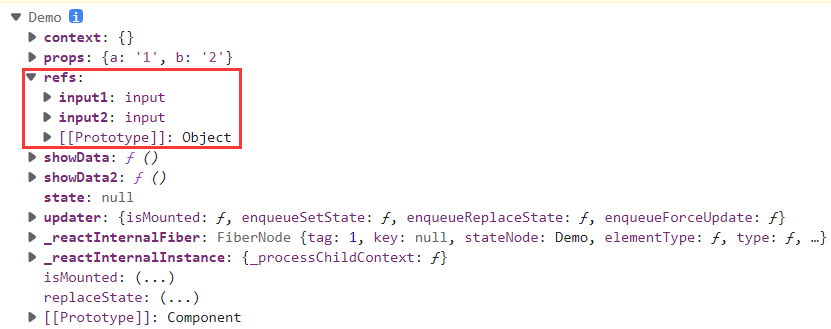
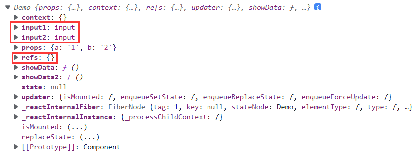
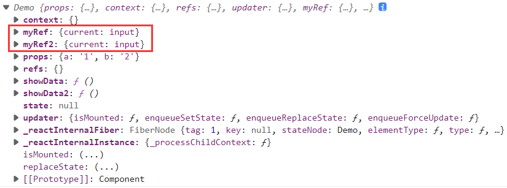

# React简介

- 用于动态构建用户界面的 JavaScript 库(只关注于视图)
- 声明式编码
- 组件化编码
- React Native 编写原生应用
- 高效（优秀的Diffing算法）

**相关类库**：

~~~react
<!-- 引入react核心库 -->
<script type="text/javascript" src="../js/react.development.js"></script>

<!-- 引入react-dom，用于支持react操作DOM -->
<script type="text/javascript" src="../js/react-dom.development.js"></script>

<!-- 引入babel，用于将jsx转为js -->
<script type="text/javascript" src="../js/babel.min.js"></script>
~~~

# 虚拟DOM

## 1、两种方式创建

- 虚拟DOM对象最终都会被React转换为真实的DOM
- 编码时基本只需要操作react的虚拟DOM相关数据，react会自动渲染为真实DOM变化而更新视界

~~~react

<!-- 准备好一个“容器” -->
<div id="test"></div>

<!-- JSX方式 -->
<script type="text/babel" > /* 此处一定要写babel */
	// 1.创建虚拟DOM
	// 为了显示出多级结构使用（）括起来
	const VDOM = (  /* 此处一定不要写引号，因为不是字符串 */
                    <h1 id="title">
                        <span>Hello,React</span>
                    </h1>
                  )
	// 2.渲染虚拟DOM到页面
	ReactDOM.render(VDOM,document.getElementById('test'))
</script>

<!-- 纯JS方式 -->
<script type="text/javascript" >
    // 1.创建虚拟DOM
    const VDOM = React.createElement('h1',{id:'title'}, React.createElement('span',{},'Hello,React'))
    // 2.渲染虚拟DOM到页面
    ReactDOM.render(VDOM,document.getElementById('test'))
</script>
~~~

## 2、渲染虚拟DOM

- 语法：ReactDOM.render(virtualDOM, containerDOM)
  - 参数一：纯js或jsx创建的虚拟dom对象
  - 参数二：用来包含虚拟DOM元素的真实dom元素对象(一般是一个div)
- 作用：将虚拟DOM元素渲染到页面中的真实容器DOM中显示

## 3、虚拟VS真实

虚拟DOM本质是Object类型的对象（一般对象）

虚拟DOM比较轻，真实DOM比较重，因为虚拟DOM是React内部在用，无需真实DOM上那么多的属性

~~~react
<script type="text/babel" > /* 此处一定要写babel */
		// 1.创建虚拟DOM
		const VDOM = (  /* 此处一定不要写引号，因为不是字符串 */
			<h1 id="title">
				<span>Hello,React</span>
    		</h1>
		)
		// 2.渲染虚拟DOM到页面
		ReactDOM.render(VDOM,document.getElementById('test'))
		// 3.获取真实DOM
		const TDOM = document.getElementById('demo')
		
		console.log('虚拟DOM',VDOM);
		console.log('真实DOM',TDOM);
		console.log(typeof VDOM);
		console.log(VDOM instanceof Object);
</script>
~~~


# React JSX

- 全称：JavaScript XML

- 简介：react定义的一种类似于XML的JS扩展语法，本质是React.createElement(component, props, ...children)方法的语法糖

- 作用：用来简化创建虚拟DOM 

- 语法：

  - 只有一个根标签
  - 标签必须闭合
  - 遇到 **<** 开头的代码，以标签的语法解析，html同名标签转换为html同名元素，其它标签需要特别解析
    - 由标签首字母判断：
      - 若小写字母开头，则将该标签转为html中同名元素，若html中无该标签对应的同名元素，则报错
      - 若大写字母开头，react就去渲染对应的组件，若组件没有定义，则报错
  - 样式的类名指定不要用class，要用className
  - 内联样式，要用style={{key:value}}的形式去写

  - 定义虚拟DOM时，不要写引号
  - 遇到以 **{** 开头的代码，以JS语法解析，标签中的js表达式必须用{ }包含

  ~~~react
  const myId = 'aTgUiGu'
  const myData = 'HeLlo,rEaCt'
  
  const VDOM = (<h2 className="title" id={myId.toLowerCase()}>
                    <span style={{color:'white',fontSize:'29px'}}>{myData.toLowerCase()}</span>
                </h2>)
  ~~~

- babel.js的作用：

  1)	浏览器不能直接解析JSX代码，需要babel转译为纯JS的代码才能运行
  2)	只要用了JSX，都要加上type="text/babel"，声明需要babel来处理

**注意**：

- 它不是字符串, 也不是HTML/XML标签
- 它最终产生的就是一个JS对象
- 标签名任意: HTML标签或其它标签
- 标签属性任意: HTML标签属性或其它

~~~react
<script type="text/babel" >
    const myId = 'aTgUiGu'
    const myData = 'HeLlo,rEaCt'

    // 1.创建虚拟DOM
    const VDOM = (
    <div>
        <h2 className="title" id={myId.toLowerCase()}>
            <span style={{color:'white',fontSize:'29px'}}>{myData.toLowerCase()}</span>
        </h2>
        <h2 className="title" id={myId.toUpperCase()}>
            <span style={{color:'white',fontSize:'29px'}}>{myData.toLowerCase()}</span>
        </h2>
        <input type="text"/>
    </div>
    )
    //2.渲染虚拟DOM到页面
    ReactDOM.render(VDOM,document.getElementById('test'))
</script>
~~~

**注意**：

- 一定注意区分：js语句(代码) 与 js表达式
  - 表达式：一个表达式会产生一个值，可以放在任何一个需要值的地方
    - 这些都是表达式：a、a+b、demo(1)、arr.map()、function test () {}
  - 语句(代码)：
    - 这些都是语句(代码)：if(){}、for(){}、switch(){case:xxxx}

~~~react
<script type="text/babel" >
    // 模拟一些数据
    const data = ['Angular','React','Vue']
    // 1.创建虚拟DOM
    const VDOM = (
    <div>
        <h1>前端js框架列表</h1>
        <ul>{
                data.map( (item,index) => {return <li key={index} > {item} </li>} )
            }</ul>
    </div>
    )
    // 2.渲染虚拟DOM到页面
    ReactDOM.render(VDOM,document.getElementById('test'))
</script>
~~~

# React组件

## 1、概念

- 作用：用来实现局部功能效果的代码和资源的集合(html/css/js/image等等)，复用编码, 简化项目编码, 提高运行效率
- 流程：
  1. React内部会创建组件实例对象
  2. 调用render()得到虚拟DOM, 并解析为真实DOM
  3. 插入到指定的页面元素内部

**注意**：

- 组件名必须首字母大写
2.	虚拟DOM元素只能有一个根元素
3.	虚拟DOM元素必须有结束标签

## 2、类式组件

~~~react
// 1.创建类式组件
class MyComponent extends React.Component {
    render() {
        // render方法 ——> 放在MyComponent的原型对象上，供实例使用。
        // render中的this ——> MyComponent的实例对象 <=> MyComponent组件实例对象。
        console.log('render中的this:',this);
        return <h2>我是用类定义的组件(适用于【复杂组件】的定义)</h2>
    }
}
// 2.渲染组件到页面
ReactDOM.render(<MyComponent/>,document.getElementById('test'))
// a.React解析组件标签，找到了MyComponent组件,
// b.发现组件是使用类定义的，随后new出来该类的实例，并通过该实例调用到原型上的render方法,
// c.将render返回的虚拟DOM转为真实DOM，随后呈现在页面中。
~~~


## 3、函数式组件

```react
// 1.创建函数式组件
function MyComponent() {
    // 此处的this是undefined，因为babel编译后开启了严格模式
    console.log(this); 
    return <h2>我是用函数定义的组件(适用于【简单组件】的定义)</h2>
}
// 2.渲染组件到页面
ReactDOM.render(<MyComponent/>, document.getElementById('test'))
// a.React解析组件标签，找到了MyComponent组件,
// b.发现组件是使用函数定义的，随后调用该函数，将返回的虚拟DOM转为真实DOM，随后呈现在页面中。
```


## 4、三大属性

### 1、state

- state是组件对象最重要的属性，值是对象(可以包含多个key：value的组合)
- 组件被称为"状态机"，通过更新组件的state来更新对应的页面显示(重新渲染组件)

**注意**：

1.	组件中render方法中的this为组件实例对象
2.	组件自定义的方法中this为undefined：
1.	强制绑定this：通过函数对象的bind()
2.	箭头函数
3.	状态数据，不能直接修改或更新，调用实例的setState()方法

~~~react
// 第二个代码块为简写方式

// 1.创建组件
class Weather extends React.Component {
    // 构造器调用几次？ ———— 1次
    constructor(props) {
        console.log('constructor');
        super(props)
        // 初始化状态
        this.state = {isHot:false,wind:'微风'}
        // 解决changeWeather中this指向问题
        this.changeWeather = this.changeWeather.bind(this)
    }

    // render调用次数 ———— 1+n次 1是初始化的那次 n是状态更新的次数
    render() {
        console.log('render');
        // 读取状态
        const {isHot, wind} = this.state;
        return <h1 onClick={this.changeWeather}>今天天气很{isHot ? '炎热' : '凉爽'}，{wind}</h1>
    }

    // changeWeather调用次数 ———— 点几次调几次
    changeWeather() {
        // changeWeather()方法位置 ———— Weather的原型对象上，供实例使用
        // 由于changeWeather是作为onClick的回调，所以不是通过实例调用的，是直接调用
        // 类中的方法默认开启了局部的严格模式，所以changeWeather中的this为undefined
        // constructor方法中的代码解决l
        console.log('changeWeather');
        // 获取原来的isHot值
        const isHot = this.state.isHot
        // 严重注意：状态必须通过setState进行更新,且更新是一种合并，不是替换。
        this.setState({isHot:!isHot})
        console.log(this);
        // 严重注意：状态(state)不可直接更改，下面这行就是直接更改！！！
        // this.state.isHot = !isHot //这是错误的写法
    }
}
// 2.渲染组件到页面
ReactDOM.render(<Weather/>, document.getElementById('test'))
~~~

~~~react
// 1.创建组件
class Weather extends React.Component{
    // 初始化状态
    state = {isHot:false,wind:'微风'}

    render() {
        const {isHot,wind} = this.state
        return <h1 onClick={this.changeWeather}>今天天气很{isHot ? '炎热' : '凉爽'}，{wind}</h1>
    }

    // 自定义方法————要用赋值语句的形式+箭头函数
    // 箭头函数的如在其内部使用了this，会找其外部函数的this
    changeWeather = () => {
        const isHot = this.state.isHot
        this.setState({isHot:!isHot})
    }
}
// 2.渲染组件到页面
ReactDOM.render(<Weather/>,document.getElementById('test'))
~~~


### 2、props

- 每个组件对象都会有props(properties的简写)属性
- 组件标签的所有属性都保存在props中
- 通过标签属性从组件外向组件内传递变化的数据

**注意**：

- 组件内部不要修改props数据

~~~react
// 第二个代码块限制props
// 第三个代码块简写props
// 第四个代码块函数式组件的props

// 1、创建组件
class Person extends React.Component{
    render(){
        // console.log(this);
        // props是只读的
        // this.props.name = 'jack' // 此行代码会报错，因为props是只读的
        const {name,age,sex} = this.props
        return (
            <ul>
                <li>姓名：{name}</li>
                <li>性别：{sex}</li>
                <li>年龄：{age+1}</li>
            </ul>
        )
    }
}
// 2、渲染组件到页面
ReactDOM.render(<Person name="jerry" age={19}  sex="男"/>,document.getElementById('test1'))
ReactDOM.render(<Person name="tom" age={18} sex="女"/>,document.getElementById('test2'))

const p = {name:'老刘',age:18,sex:'女'}
// console.log('@',...p); // 控制台输出@    
// ReactDOM.render(<Person name={p.name} age={p.age} sex={p.sex}/>,document.getElementById('test3'))
// babel中可以通过...展开一个对象，展开对象的用法只适用于此处
ReactDOM.render(<Person {...p}/>,document.getElementById('test3'))
~~~

~~~react
// 1、创建组件
class Person extends React.Component {
    render() {
        const {name, age, sex, id} = this.props
        return (
            <ul>
                <li>姓名：{name}</li>
                <li>性别：{sex}</li>
                <li>年龄：{age + 1}</li>
            </ul>
        )
    }
}

// 2、对标签属性进行类型、必要性的限制
Person.propTypes = {
    name: PropTypes.string.isRequired, // 限制name必传，且为字符串
    sex: PropTypes.string,// 限制sex为字符串
    age: PropTypes.number,// 限制age为数值
    speak: PropTypes.func,// 限制speak为函数
}
// 3、指定默认标签属性值
Person.defaultProps = {
    sex: '男',// sex默认值为男
    age: 18 // age默认值为18
}
// 4、渲染组件到页面
ReactDOM.render(<Person name={100} speak={speak}/>, document.getElementById('test1'))
ReactDOM.render(<Person name="tom" age={18} sex="女"/>, document.getElementById('test2'))

const p = {name: '老刘', age: 18, sex: '女'}
ReactDOM.render(<Person {...p}/>, document.getElementById('test3'))

function speak() {
    console.log('我说话了');
}
~~~

~~~react
// 1、创建组件
class Person extends React.Component {

    constructor(props) {
        // 构造器是否接收props，是否传递给super，取决于：是否希望在构造器中通过this访问props
        // console.log(props);
        super(props)
        console.log('constructor',this.props);
    }

    // 2、对标签属性进行类型、必要性的限制
    static propTypes = {
        name:PropTypes.string.isRequired, // 限制name必传，且为字符串
        sex:PropTypes.string,// 限制sex为字符串
        age:PropTypes.number,// 限制age为数值
    }

    // 3、指定默认标签属性值
    static defaultProps = {
        sex:'男',// sex默认值为男
        age:18 // age默认值为18
    }

    render() {
        const {name,age,sex} = this.props
        return (
            <ul>
                <li>姓名：{name}</li>
                <li>性别：{sex}</li>
                <li>年龄：{age+1}</li>
            </ul>
        )
    }
}

// 4、渲染组件到页面
ReactDOM.render(<Person name="jerry"/>,document.getElementById('test1'))
~~~

~~~react
// 1、创建组件
function Person(props) {
    const {name, age, sex} = props
    return (
        <ul>
            <li>姓名：{name}</li>
            <li>性别：{sex}</li>
            <li>年龄：{age}</li>
        </ul>
    )
}

Person.propTypes = {
    name: PropTypes.string.isRequired, // 限制name必传，且为字符串
    sex: PropTypes.string,// 限制sex为字符串
    age: PropTypes.number,// 限制age为数值
}

// 2、指定默认标签属性值
Person.defaultProps = {
    sex: '男',// sex默认值为男
    age: 18 // age默认值为18
}
// 3、渲染组件到页面
ReactDOM.render(<Person name="jerry"/>, document.getElementById('test1'))
~~~


### 3、refs

- 组件内的标签可以定义ref属性来标识自己
- 默认情况下，不能在函数组件上使用 ref 属性，因为它们没有实例
- 高级技巧：ref转发

**注意**：

- 回调函数形式的refs，调用次数为2，第一次传入参数 null，然后第二次会传入参数 DOM 元素

~~~react
// 第一个代码块字符串形式的refs（不推荐）
// 第二个代码块回调形式的refs
// 第三个代码块creatRefs方法

// 1、创建组件
class Demo extends React.Component {
    // 展示左侧输入框的数据
    showData = () => {
        // 解构赋值，对象中需要存在该属性才能赋值
        // 这里的this是Demo组件实例
        const {input1} = this.refs
        // 获取到的是真实DOM
        alert(input1.value)
    }
    // 展示右侧输入框的数据
    showData2 = () => {
        const {input2} = this.refs
        console.log(this)
        alert(this.value)
    }

    render() {
        return (
            <div>
                <input ref="input1" type="text" placeholder="点击按钮提示数据"/>&nbsp;
                <button onClick={this.showData}>点我提示左侧的数据</button>
                &nbsp;
                <input ref="input2" onBlur={this.showData2} type="text" placeholder="失去焦点提示数据"/>
            </div>
        )
    }
}

// 2、渲染组件到页面
ReactDOM.render(<Demo a="1" b="2"/>, document.getElementById('test'))
~~~



~~~react
// 1、创建组件
class Demo extends React.Component {
    // 展示左侧输入框的数据
    showData = () => {
        const {input1} = this
        alert(input1.value)
    }
    // 展示右侧输入框的数据
    showData2 = () => {
        const {input2} = this
        alert(input2.value)
    }

    render() {
        return (
            <div>
                <!-- currentNode的缩写c，传入的参数其实是该节点 -->
                <input ref={(c) => {this.input1 = c}} type="text" placeholder="点击按钮提示数据"/>
                &nbsp;
                <button onClick={this.showData}>点我提示左侧的数据</button>
                &nbsp;
                <input onBlur={this.showData2} ref={(c) => {this.input2 = c}} 
                    type="text" placeholder="失去焦点提示数据"/>
                &nbsp;
            </div>
        )
    }
}

// 2、渲染组件到页面
ReactDOM.render(<Demo a="1" b="2"/>, document.getElementById('test'))
~~~



~~~react
// 1、创建组件
class Demo extends React.Component {
    /* React.createRef调用后可以返回一个容器，该容器可以存储被ref所标识的节点,该容器是“专人专用”的 */
    myRef = React.createRef()
    myRef2 = React.createRef()
    // 展示左侧输入框的数据
    showData = () => {
        alert(this.myRef.current.value);
    }
    // 展示右侧输入框的数据
    showData2 = () => {
        alert(this.myRef2.current.value);
    }

    render() {
        return (
            <div>
                <!-- 当把ref传给render中的元素时，可以通过ref中的current属性访问到该节点 -->
                <input ref={this.myRef} type="text" placeholder="点击按钮提示数据"/>
                &nbsp;
                <button onClick={this.showData}>点我提示左侧的数据</button>
                &nbsp;
                <input onBlur={this.showData2} ref={this.myRef2} 
                    type="text" placeholder="失去焦点提示数据"/>
                &nbsp;
            </div>
        )
    }
}

// 2、渲染组件到页面
ReactDOM.render(<Demo a="1" b="2"/>, document.getElementById('test'))
~~~




## 5、事件处理

- 通过onXxx属性指定事件处理函数(注意大小写)
  - React使用的是自定义(合成)事件，而不是使用的原生DOM事件 ——> 为了更好的兼容性
  - React中的事件是通过事件委托方式处理的(委托给组件最外层的元素) ——> 为了高效
- 通过event.target得到发生事件的DOM元素对象 ——> 不要过度使用ref
  - 发生事件的元素正好是你要操作的元素，可以省写ref去操作


~~~react
// 1、创建组件
class Demo extends React.Component {
    // 创建ref容器
    myRef = React.createRef()
    myRef2 = React.createRef()

    // 展示左侧输入框的数据
    showData = (event) => {
        console.log(event.target);
        alert(this.myRef.current.value);
    }

    // 展示右侧输入框的数据
    showData2 = (event) => {
        alert(event.target.value);
    }

    render() {
        return (
            <div>
                <input ref={this.myRef} type="text" placeholder="点击按钮提示数据"/>&nbsp;
                <button onClick={this.showData}>点我提示左侧的数据</button>
                &nbsp;
                <input onBlur={this.showData2} type="text" placeholder="失去焦点提示数据"/>&nbsp;
            </div>
        )
    }
}

// 2、渲染组件到页面
ReactDOM.render(<Demo a="1" b="2"/>, document.getElementById('test'))
~~~

## 6、受控VS非受控

区别在于表单数据有没有被React控制

~~~react
// 1、现用现取，叫做非受控组件
// 创建组件
class Login extends React.Component {
    
    handleSubmit = (event) => {
        event.preventDefault() // 阻止表单提交
        const {username, password} = this
        alert(`你输入的用户名是：${username.value},你输入的密码是：${password.value}`)
    }

    render() {
        return (
            <form onSubmit={this.handleSubmit}>
                用户名：<input ref={c => this.username = c} type="text" name="username"/>
                密码：<input ref={c => this.password = c} type="password" name="password"/>
                <button>登录</button>
            </form>
        )
    }
}

// 渲染组件
ReactDOM.render(<Login/>, document.getElementById('test'))
~~~

~~~react
// 创建组件
class Login extends React.Component {

    // 初始化状态
    // 所有输入框都由state维护，建议使用
    state = {
        username: '', //用户名
        password: '' //密码
    }

    // 保存用户名到状态中
    saveUsername = (event) => {
        console.log(this)
        this.setState({username: event.target.value})
    }

    // 保存密码到状态中
    savePassword = (event) => {
        this.setState({password: event.target.value})
    }

    // 表单提交的回调
    handleSubmit = (event) => {
        event.preventDefault() // 阻止表单提交
        const {username, password} = this.state
        alert(`你输入的用户名是：${username},你输入的密码是：${password}`)
    }

    render() {
        return (
            <form onSubmit={this.handleSubmit}>
                用户名：<input onChange={this.saveUsername} type="text" name="username"/>
                密码：<input onChange={this.savePassword} type="password" name="password"/>
                <button>登录</button>
            </form>
        )
    }
}

// 渲染组件
ReactDOM.render(<Login/>, document.getElementById('test'))
~~~


## 7、生命周期

### 1、概述

1.	组件从创建到死亡它会经历一些特定的阶段。
2.	React组件中包含一系列**勾子函数**(生命周期回调函数)，会在特定的时刻调用。
3.	我们在定义组件时，会在特定的**生命周期回调函数**中，做特定的工作。

生命周期回调函数 <==> 生命周期钩子函数 <==> 生命周期函数 <==> 生命周期钩子

~~~react
// 1、创建组件
class Life extends React.Component {

    state = {opacity: 1}

    death = () => {
        // 2、卸载组件函数
        ReactDOM.unmountComponentAtNode(document.getElementById('test'))
    }

    // 3、组件挂完毕
    componentDidMount() {
        console.log('componentDidMount');
        this.timer = setInterval(() => {
            // 获取原状态
            let {opacity} = this.state
            // 减小0.1
            opacity -= 0.1
            if (opacity <= 0) opacity = 1
            // 设置新的透明度
            this.setState({opacity})
        }, 200);
    }

    // 4、组件将要卸载
    componentWillUnmount() {
        // 清除定时器
        clearInterval(this.timer)
    }

    // 初始化渲染、状态更新之后
    render() {
        console.log('render');
        return (
            <div>
                <h2 style={{opacity: this.state.opacity}}>React学不会怎么办？</h2>
                <button onClick={this.death}>不活了</button>
            </div>
        )
    }
}

// 5、渲染组件
ReactDOM.render(<Life/>, document.getElementById('test'))
~~~


### 2、流程


1. 初始化阶段：由ReactDOM.render()触发 ---> 初次渲染
   1. constructor()构造函数
      - 用于初始化操作，一般很少使用
      - 唯一一个直接修改state的地方，其他地方通过调用this.setState()方法。
   2. getDerivedStateFromProps ()
      - 当state需要从props初始化时使用
      - 尽量不使用，维护俩者状态需要消耗额外资源，增加复杂度
      - 每次render都会调用
      - 典型场景：表单获取默认值
   3. render()渲染函数
   4. componentDidMount()挂载函数 
      - UI渲染完成后调用
      - 只执行一次
      - 典型场景：获取外部资源
      - 常用，一般在这个钩子中做初始化，例如：开启定时器、发送网络请求、订阅消息
2. 更新阶段：由组件内部this.setSate()或父组件重新render触发
   1. getDerivedStateFromProps
   2. shouldComponentUpdate()
      - 典型场景：性能优化
   3. render()
   4. getSnapshotBeforeUpdate() ===> 在render之后但还未渲染时调用，state已更新，典型场景：获取render之前的dom状态
   5. componentDidUpdate()
      - 每次UI更新被调用
      - 典型场景：页面通过props重新获取数据
3. 卸载组件：由ReactDOM.unmountComponentAtNode()触发
   1. componentWillUnmount() ===> 常用，一般在这个钩子中做收尾的事，例如：关闭定时器、取消订阅消息

**重要的钩子函数**：

1.	render()：初始化渲染或更新渲染调用
2.	componentDidMount()：开启监听，发送ajax请求
3.	componentWillUnmount()：做一些收尾工作，如：清理定时器

~~~react
//创建组件
class Count extends React.Component{
    // 构造器
    constructor(props){
        console.log('Count---constructor');
        super(props)
        //初始化状态
        this.state = {count:0}
    }

    // 加1按钮的回调
    add = ()=>{
        //获取原状态
        const {count} = this.state
        //更新状态
        this.setState({count:count+1})
    }

    // 卸载组件按钮的回调
    death = ()=>{
        ReactDOM.unmountComponentAtNode(document.getElementById('test'))
    }

    // 强制更新按钮的回调
    force = ()=>{
        this.forceUpdate()
    }

    // 若state的值在任何时候都取决于props，那么可以使用getDerivedStateFromProps
    static getDerivedStateFromProps(props,state){
        console.log('getDerivedStateFromProps', props, state);
        return null
    }

    // 在更新之前获取快照
    getSnapshotBeforeUpdate(){
        console.log('getSnapshotBeforeUpdate');
        return 'atguigu'
    }

    // 组件挂载完毕的钩子
    componentDidMount(){
        console.log('Count---componentDidMount');
    }

    // 组件将要卸载的钩子
    componentWillUnmount(){
        console.log('Count---componentWillUnmount');
    }

    // 控制组件更新的“阀门”
    shouldComponentUpdate(){
        console.log('Count---shouldComponentUpdate');
        return true
    }

    // 组件更新完毕的钩子
    componentDidUpdate(preProps,preState,snapshotValue){
        console.log('Count---componentDidUpdate',preProps,preState,snapshotValue);
    }

    render(){
        console.log('Count---render');
        const {count} = this.state
        return(
            <div>
                <h2>当前求和为：{count}</h2>
                <button onClick={this.add}>点我+1</button>
                <button onClick={this.death}>卸载组件</button>
                <button onClick={this.force}>不更改任何状态中的数据，强制更新一下</button>
            </div>
        )
    }
}

//渲染组件
ReactDOM.render(<Count count={199}/>,document.getElementById('test'))
~~~


# 高阶函数

**高阶函数**：如果一个函数符合下面2个规范中的任何一个，那该函数就是高阶函数。

- 若A函数，接收的参数是一个函数，那么A就可以称之为高阶函数。
- 若A函数，调用的返回值依然是一个函数，那么A就可以称之为高阶函数。
- 常见的高阶函数有：Promise、setTimeout、arr.map()等等

**函数柯里化**：通过函数调用继续返回函数的方式，实现多次接收参数最后统一处理的函数编码形式。

~~~react
// 函数柯里化
function sum(a) {
    return(b) => {
        return (c) => {
            return a+b+c
        }
    }
}
~~~

~~~react
// 使用高阶函数
// 创建组件
class Login extends React.Component {
    // 初始化状态
    state = {
        username: '', // 用户名
        password: '' // 密码
    }

    // 保存表单数据到状态中
    saveFormData = (dataType) => {
        // 将this.saveFormData('username')的返回值作为回调，而这个回调是个函数
        return (event) => {
            this.setState({[dataType]: event.target.value})
        }
    }

    // 表单提交的回调
    handleSubmit = (event) => {
        event.preventDefault() //阻止表单提交
        const {username, password} = this.state
        alert(`你输入的用户名是：${username},你输入的密码是：${password}`)
    }

    render() {
        return (
            <form onSubmit={this.handleSubmit}>
                {/* 必须拿一个函数作为回调 */}
                用户名：<input onChange={this.saveFormData('username')} type="text" name="username"/>
                密码：<input onChange={this.saveFormData('password')} type="password" name="password"/>
                <button>登录</button>
            </form>
        )
    }
}

//渲染组件
ReactDOM.render(<Login/>, document.getElementById('test'))
~~~

~~~react
// 不使用高阶函数
// 创建组件
class Login extends React.Component{
    // 初始化状态
    state = {
        username:'', // 用户名
        password:'' // 密码
    }

    // 保存表单数据到状态中
    saveFormData = (dataType, event)=>{
        this.setState({[dataType]:event.target.value})
    }

    // 表单提交的回调
    handleSubmit = (event)=>{
        event.preventDefault() // 阻止表单提交
        const {username,password} = this.state
        alert(`你输入的用户名是：${username},你输入的密码是：${password}`)
    }
    render(){
        return(
            <form onSubmit={this.handleSubmit}>
                用户名：<input onChange={event => this.saveFormData('username', event) } 
                        type="text" name="username"/>
                密码：<input onChange={event => this.saveFormData('password',event) } 
                       type="password" name="password"/>
                <button>登录</button>
            </form>
        )
    }
}
// 渲染组件
ReactDOM.render(<Login/>,document.getElementById('test'))
~~~

# 问题

## 1、React中的key有什么作用

key的内部原理是什么

为什么遍历列表时，key最好不要用index

作用：

- 简单的说：key是虚拟DOM对象的标识，在更新显示时key起着极其重要的作用。
- 详细的说：当状态中的数据发生变化时，react会根据【新数据】生成【新的虚拟DOM】，随后React进行【新虚拟DOM】与【旧虚拟DOM】的diff比较，比较规则如下：
  - 旧虚拟DOM中找到了与新虚拟DOM相同的key：
    - 若虚拟DOM中内容没变, 直接使用之前的真实DOM
    - 若虚拟DOM中内容变了, 则生成新的真实DOM，随后替换掉页面中之前的真实DOM
  - 旧虚拟DOM中未找到与新虚拟DOM相同的key：
    - 根据数据创建新的真实DOM，随后渲染到到页面

用index作为key可能会引发的问题：

- 若对数据进行：逆序添加、逆序删除等破坏顺序操作：
  - 会产生没有必要的真实DOM更新 ==> 界面效果没问题, 但效率低。
- 如果结构中还包含输入类的DOM：
  - 会产生错误DOM更新 ==> 界面有问题。
- 注意：如果不存在对数据的逆序添加、逆序删除等破坏顺序操作，仅用于渲染列表用于展示，使用index作为key是没有问题的。


~~~react
class Person extends React.Component{

    state = {
        persons:[
            {id:1,name:'小张',age:18},
            {id:2,name:'小李',age:19},
        ]
    }

    add = () => {
        const {persons} = this.state
        const p = {id:persons.length+1,name:'小王',age:20}
        this.setState({persons:[p,...persons]})
    }

    render() {
        return (
            <div>
                <h2>展示人员信息</h2>
                <button onClick={this.add}>添加一个小王</button>
                <h3>使用index（索引值）作为key</h3>
                <ul>
                    {this.state.persons.map((personObj,index) => {
                          return <li key={index}>{personObj.name}---{personObj.age}
                            <input type="text"/></li>})
                    }
                </ul>
                <hr/>
                <hr/>
                <h3>使用id（数据的唯一标识）作为key</h3>
                <ul>
                    {this.state.persons.map((personObj)=>{
                            return <li key={personObj.id}>{personObj.name}---{personObj.age}
                                <input type="text"/></li>})
                    }
                </ul>
            </div>
        )
    }
}

ReactDOM.render(<Person/>,document.getElementById('test'))
~~~


