# NoSQL数据库

## 1、概述

NoSQL(NoSQL = Not Only SQL )，意即“不仅仅是SQL”，泛指非关系型的数据库。 
NoSQL 不依赖业务逻辑方式存储，而以简单的key-value模式存储。因此大大的增加了数据库的扩展能力。

- 不遵循SQL标准。
- 不支持ACID。
- 远超于SQL的性能。

## 2、适用场景

- 对数据高并发的读写
- 海量数据的读写
- 对数据高可扩展性的

## 3、不适用场景

- 需要事务支持
- 基于sql的结构化查询存储，处理复杂的关系，需要即席查询。
- 用不着sql的和用了sql也不行的情况，请考虑用NoSql

# 数据库存储方式

## 1、行式存储

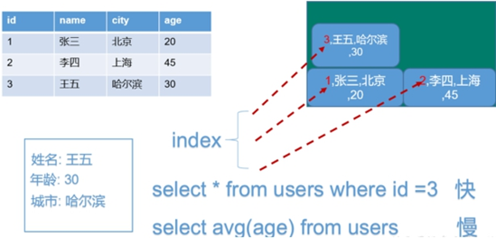

## 2、列式存储

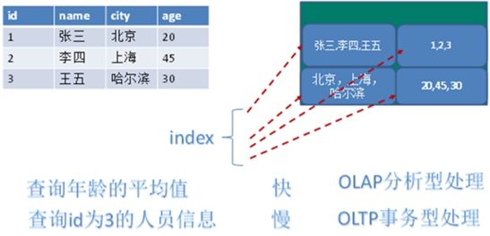

## 3、图关系型数据库

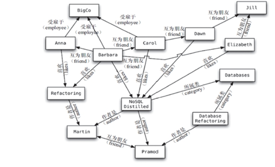

# Redis概述

- Redis是一个开源的**key-value**存储系统。
- 和Memcached类似，它支持存储的value类型相对更多，包括**string**(字符串)、**list**(链表)、**set**(集合)、**zset**(sorted set --有序集合)和**hash**（哈希类型）。
- 这些数据类型都支持push/pop、add/remove及取交集并集和差集及更丰富的操作，而且这些操作都是原子性的。且支持各种不同方式的排序。
- 与memcached一样，为了保证效率，数据都是缓存在内存中。区别的是Redis会周期性的把更新的数据写入磁盘或者把修改操作写入追加的记录文件。并且在此基础上实现了master-slave(主从)同步。

# Redis安装

## 1、步骤

1. 下载安装最新版的gcc编译器

   ```shell
   yum install centos-release-scl scl-utils-build
   yum install -y devtoolset-8-toolchain
   scl enable devtoolset-8 bash
   测试 gcc版本 
   gcc --version
   ```

2. 下载redis-6.2.1.tar.gz放/opt目录

3. 解压命令：tar -zxvf redis-6.2.1.tar.gz

4. 解压完成后进入目录：cd redis-6.2.1

5. 在redis-6.2.1目录下再次执行make命令（只是编译好）

   1. 如果没有准备好C语言编译环境，make 会报错—Jemalloc/jemalloc.h：没有那个文件
   2. 解决方案：运行make distclean
   3. 在redis-6.2.1目录下再次执行make命令（只是编译好）

6. 跳过make test 继续执行: make install

7. 安装目录：/usr/local/bin

## 2、目录

查看默认安装目录：

- redis-benchmark：性能测试工具，可以在自己本子运行，看看自己本子性能如何
- redis-check-aof：修复有问题的AOF文件，rdb和aof后面讲
- redis-check-dump：修复有问题的dump.rdb文件
- redis-sentinel：Redis集群使用
- redis-server：Redis服务器启动命令
- redis-cli：客户端，操作入口

## 3、启动

后台启动：

1. 备份redis.conf

   1. 拷贝一份redis.conf到其他目录

      ```shell
      cp /opt/redis-3.2.5/redis.conf /myredis
      ```

2. 后台启动设置daemonize no改成yes

   1. 修改redis.conf(128行)文件将里面的daemonize no 改成 yes，让服务在后台启动

3. Redis启动

   1. ```shell
      redis-server/myredis/redis.conf
      ```

4. 用客户端访问：redis-cli

   1. 多个端口可以：redis-cli -p6379

5. Redis关闭

   1. 单实例关闭：redis-cli shutdown
   2. 也可以进入终端后再关闭，再控制台输入shutdown
   3. 多实例关闭，指定端口关闭：redis-cli -p 6379 shutdown

## 4、配置文件

### Units单位

配置大小单位,开头定义了一些基本的度量单位，只支持bytes，不支持bit
大小写不敏感

### INCLUDES包含

类似jsp中的include，多实例的情况可以把公用的配置文件提取出来

### 网络相关配置

#### bind

默认情况bind=127.0.0.1只能接受本机的访问请求
不写的情况下，无限制接受任何ip地址的访问
生产环境肯定要写你应用服务器的地址，服务器是需要远程访问的，所以需要将其注释掉。

如果开启了**protected-mode**，那么在没有设定bind ip且没有设密码的情况下，Redis只允许接受本机的响应

#### protected-mode

将本机访问保护模式设置no

#### Port

端口号，默认 6379

#### tcp-backlog

设置tcp的backlog，backlog其实是一个连接队列，backlog队列总和=未完成三次握手队列 + 已经完成三次握手队列。
在高并发环境下你需要一个高backlog值来避免慢客户端连接问题。
注意Linux内核会将这个值减小到**/proc/sys/net/core/somaxconn**的值（128），所以需要确认增大**/proc/sys/net/core/somaxconn和/proc/sys/net/ipv4/tcp_max_syn_backlog**（128）两个值来达到想要的效果

#### timeout

一个空闲的客户端维持多少秒会关闭，0表示关闭该功能。即永不关闭。

#### tcp-keepalive

对访问客户端的一种心跳检测，每个n秒检测一次。
单位为秒，如果设置为0，则不会进行Keepalive检测，建议设置成60。

### GENERAL通用

#### daemonize

是否为后台进程，设置为yes
守护进程，后台启动

#### pidfile

存放pid文件的位置，每个实例会产生一个不同的pid文件

#### loglevel

指定日志记录级别，Redis总共支持四个级别：debug、verbose、notice、warning，默认为notice
四个级别根据使用阶段来选择，生产环境选择notice 或者warning

#### logfile

日志文件名称

#### databases 16

设定库的数量 默认16，默认数据库为0，可以使用SELECT <dbid\>命令在连接上指定数据库id

### SECURITY安全

#### 设置密码

requirepass	xxxxxx

访问密码的查看、设置和取消

```shell
config get requirepass	
config set requirepass	"xxxxx"
config get requirepass	""
```

在命令中设置密码，只是临时的，重启redis服务器，密码就还原了。
永久设置，需要再配置文件中进行设置。

### LIMITS限制

#### maxclients

- 设置redis同时可以与多少个客户端进行连接。
- 默认情况下为10000个客户端。
- 如果达到了此限制，redis则会拒绝新的连接请求，并且向这些连接请求方发出“max number of clients reached”以作回应。

#### maxmemory

- 建议必须设置，否则，将内存占满，造成服务器宕机。
- 设置redis可以使用的内存量。一旦到达内存使用上限，redis将会试图移除内部数据，移除规则可以通过maxmemory-policy来指定。
- 如果redis无法根据移除规则来移除内存中的数据，或者设置了“不允许移除”，那么redis则会针对那些需要申请内存的指令返回错误信息，比如SET、LPUSH等。
- 但是对于无内存申请的指令，仍然会正常响应，比如GET等。如果你的redis是主redis（说明你的redis有从redis），那么在设置内存使用上限时，需要在系统中留出一些内存空间给同步队列缓存，只有在你设置的是“不移除”的情况下，才不用考虑这个因素。

#### maxmemory-policy

- **volatile-lru**：使用LRU算法移除key，只对设置了过期时间的键（最近最少使用）
- **allkeys-lru**：在所有集合key中，使用LRU算法移除key
- **volatile-random**：在过期集合中移除随机的key，只对设置了过期时间的键
- **allkeys-random**：在所有集合key中，移除随机的key
- **volatile-ttl**：移除那些TTL值最小的key，即那些最近要过期的key
- **noeviction**：不进行移除。针对写操作，只是返回错误信息

#### maxmemory-samples

- **设置样本数量**，LRU算法和最小TTL算法都并非是精确的算法，而是估算值，所以你可以设置样本的大小，redis默认会检查这么多个key并选择其中LRU的那个。
- 一般设置3到7的数字，数值越小样本越不准确，但性能消耗越小。


# Redis数据类型

## 1、String字符串

### 1.1、简介

String是Redis最基本的类型，你可以理解成与Memcached一模一样的类型，**一个key对应一个value**。

String类型是**二进制安全的**，意味着Redis的string可以包含任何数据，比如jpg图片或者序列化的对象。

一个Redis中字符串value最多可以是**512M**。

### 1.2、常用命令

| 命令                                          | 功能                                                         |
| --------------------------------------------- | ------------------------------------------------------------ |
| set  <key\><value\>                           | 添加键值对<br>附加参数：<br>      NX：当数据库中key不存在时，可以将key-value添加数据库 <br>      XX：当数据库中key存在时，可以将key-value添加数据库，与NX参数互斥 <br/>      EX：key的超时秒数 PX：key的超时毫秒数，与EX互斥 |
| setnx <key\><value\>                          | 只有在 key 不存在时，设置 key 的值                           |
| setex <key\><过期时间><value\>                | 设置键值的同时，设置过期时间，单位秒。                       |
| mset <key1\><value1\><key2\><value2\> .....   | 同时设置一个或多个 key-value对                               |
| msetnx <key1\><value1\><key2\><value2\> ..... | 同时设置一个或多个 key-value 对，当且仅当所有给定 key 都不存在 |
| setrange <key\><起始位置><value\>             | 用 <value\> 覆写<key\>所储存的字符串值，从<起始位置>开始(**索引从0开始**)。 |
| getset <key\><value\>                         | 以新换旧，设置了新值同时获得旧值。                           |
| get  <key\>                                   | 查询对应键值                                                 |
| mget <key1\><key2\><key3\> .....              | 同时获取一个或多个 value                                     |
| getrange <key\><起始位置><结束位置>           | 获得值的范围，类似java中的substring，**前包，后包**          |
| append <key\><value\>                         | 将给定的<value\>追加到原值的末尾                             |
| strlen <key\>                                 | 获得值的长度                                                 |
| incr <key\>                                   | 将 key 中储存的数字值增1，只能对数字值操作，如果为空，新增值为1 |
| decr <key\>                                   | 将 key 中储存的数字值减1，只能对数字值操作，如果为空，新增值为-1 |
| incrby / decrby <key\><步长>                  | 将 key 中储存的数字值增减，自定义步长                        |

### 1.3、数据结构

String的数据结构为**简单动态字符串**(Simple Dynamic String,缩写SDS)。是可以修改的字符串，内部结构实现上类似于Java的ArrayList，采用预分配冗余空间的方式来减少内存的频繁分配。


内部为当前字符串实际分配的空间capacity，一般要高于实际字符串长度len。当字符串长度小于1M时，扩容都是加倍现有的空间，如果超过1M，扩容时一次只会多扩1M的空间。需要注意的是字符串最大长度为512M。

## 2、List列表

### 2.1、简介

**单键多值**
Redis 列表是**简单的字符串列表**，按照插入顺序排序，可以添加一个元素到列表的头部（左边）或者尾部（右边）。
它的底层实际是个**双向链表**，对两端的操作性能很高，通过索引下标的操作中间的节点性能会较差。

### 2.2、常用命令

- lpush/rpush  <key\><value1\><value2\><value3\> ....  从左边/右边插入一个或多个值。
- lpop/rpop  <key\>从左边/右边吐出一个值。**值在键在，值光键亡**。
- rpoplpush  <key1\><key2\> 从<key1\>列表右边吐出一个值，插到<key2\>列表左边。
- lrange <key\><start\><stop\> 按照索引下标获得元素(从左到右)
- lrange <key\> 0 -1   0左边第一个，-1右边第一个，（0-1表示获取所有）
- lindex <key\><index\> 按照索引下标获得元素(从左到右)
- llen <key\> 获得列表长度 
- linsert <key\>  before <value\><newvalue\> 在<value\>的后面插入<newvalue\>插入值
- lrem <key\><n\><value\> 从左边删除n个value(从左到右)
- lset<key\><index\><value\> 将列表key下标为index的值替换成value

### 2.3、数据结构

List的数据结构为**快速链表quickList**。

首先在列表元素较少的情况下会使用一块连续的内存存储，这个结构是ziplist，也即是压缩列表，它将所有的元素紧挨着一起存储，分配的是一块连续的内存。

当数据量比较多的时候才会改成quicklist。因为普通的链表需要的附加指针空间太大，会比较浪费空间。

比如这个列表里存的只是int类型的数据，结构上还需要两个额外的指针prev和next。

​                               

Redis将链表和ziplist结合起来组成了quicklist。也就是将多个ziplist使用双向指针串起来使用。这样既满足了快速的插入删除性能，又不会出现太大的空间冗余。

## 3、Set集合

### 3.1、简介

Redis Set对外提供的功能与list类似是一个列表的功能，特殊之处在于set是可以**自动排重**的，当你需要存储一个列表数据，又不希望出现重复数据时，set是一个很好的选择，并且set提供了判断某个成员是否在一个set集合内的重要接口，这个也是list所不能提供的。
Redis的Set是**string类型的无序集合**。它底层其实是一个**value为null**的**hash表**，所以添加，删除，查找的复杂度都是O(1)。

### 3.2、常用命令

sadd <key\><value1\><value2\> .....  将一个或多个 member 元素加入到集合 key 中，已经存在的 member 元素将被忽略
smembers <key\> 取出该集合的所有值。
sismember <key\><value\> 判断集合<key\>是否为含有该<value\>值，有1，没有0
scard<key\> 返回该集合的元素个数。
srem <key\><value1\><value2\> .... 删除集合中的某个元素。
spop <key\> 随机从该集合中吐出一个值。
srandmember <key\><n\> 随机从该集合中取出n个值。不会从集合中删除 。
smove <source\><destination\> value 把集合中一个值从一个集合移动到另一个集合
sinter <key1\><key2\> 返回两个集合的交集元素。
sunion <key1\><key2\> 返回两个集合的并集元素。
sdiff <key1\><key2\> 返回两个集合的差集元素(key1中的，不包含key2中的)

### 3.3、数据结构

Set数据结构是**dict字典**，字典是用**哈希表**实现的。
Java中HashSet的内部实现使用的是HashMap，只不过所有的value都指向同一个对象。Redis的set结构也是一样，它的内部也使用hash结构，所有的value都指向同一个内部值。

## 4、Hash哈希

### 4.1、简介

Redis Hash 是一个**键值对集合**。
Redis Hash是一个string类型的**field和value的映射表**，hash特别适合用于存储对象。
类似Java里面的Map<String,Object>
用户ID为查找的key，存储的value用户对象包含姓名，年龄，生日等信息。

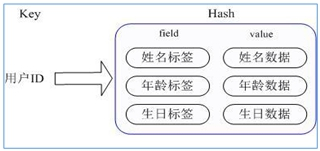

通过 **key**(用户ID) + **field**(属性标签) 就可以操作对应属性数据了，既不需要重复存储数据，也不会带来序列化和并发修改控制的问题

### 4.2、常用命令

hset <key\><field\><value\> 给<key\>集合中的 <field\>键赋值<value\>
hget <key1\><field\>从<key1\> 集合<field\>取出 value 
hmset <key1\><field1\><value1\><field2\><value2\>...  批量设置hash的值
hexists<key1\><field\> 查看哈希表 key 中，给定域 field 是否存在。 
hkeys <key\> 列出该hash集合的所有field
hvals <key\> 列出该hash集合的所有value
hincrby <key\><field\><increment\> 为哈希表 key 中的域 field 的值加上增量 +1   -1
hsetnx <key\><field\><value\> 将哈希表 key 中的域 field 的值设置为 value ，当且仅当域 field 不存在 .

### 4.3、数据结构

Hash类型对应的数据结构是两种：**ziplist**（压缩列表），**hashtable**（哈希表）。当field-value长度较短且个数较少时，使用ziplist，否则使用hashtable。

## 5、Zset有序集合

### 5.1、简介

Redis有序集合Zset与普通集合Set非常相似，是一个**没有重复元素**的字符串集合。
不同之处是有序集合的每个成员都关联了一个**评分**（score），这个评分（score）被用来按照从最低分到最高分的方式排序集合中的成员。集合的**成员是唯一**的，但是**评分可以重复**。
因为元素是有序的, 所以你也可以很快的根据评分（score）或者次序（position）来获取一个范围的元素。
访问有序集合的中间元素也是非常快的，因此你能够使用有序集合作为一个没有重复成员的智能列表。

### 5.2、常用命令

zadd  <key\><score1\><value1\><score2\><value2\>… 将一个或多个 member 元素及其 score 值加入到有序集 key 当中。
zrange <key\><start\><stop\>  [WITHSCORES]   返回有序集 key 中，下标在<start\><stop\>之间的元素，带WITHSCORES，可以让分数一起和值返回到结果集。
zrangebyscore <key\><min\><max\> [withscores] [limit offset count] 返回有序集 key 中，所有 score 值介于 min 和 max 之间(包括等于 min 或 max )的成员。有序集成员按 score 值递增(从小到大)次序排列。 
zrevrangebyscore <key\><min\><max\> [withscores] [limit offset count] 同上，改为从大到小排列。 
zincrby <key\><increment\><value\> 为元素的score加上增量
zrem  <key\><value\> 删除该集合下，指定值的元素 
zcount <key\><min\><max\> 统计该集合，分数区间内的元素个数 
zrank <key\><value\> 返回该值在集合中的排名，从0开始

### 5.3、数据结构

SortedSet(Zset)，一方面它等价于Java的数据结构**Map<String, Double>**，可以给每一个元素value赋予一个权重score，另一方面它又类似于**TreeSet**，内部的元素会按照权重score进行排序，可以得到每个元素的名次，还可以通过score的范围来获取元素的列表。
Zset底层使用了两个数据结构
（1）**hash**，hash的作用就是关联元素value和权重score，保障元素value的唯一性，可以通过元素value找到相应的score值。
（2）**跳跃表**，跳跃表的目的在于给元素value排序，根据score的范围获取元素列表。

## 6、Bitmaps

### 6.1、简介

现代计算机用**二进制（位）** 作为信息的基础单位， **1个字节等于8位**， 例如“abc”字符串是由3个字节组成。

 实际在计算机存储时将其用二进制表示， “abc”分别对应的ASCII码分别是97、 98、 99， 对应的二进制分别是01100001、 01100010和01100011，如下图：

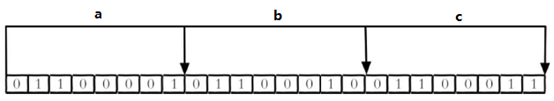

因此合理地使用操作位能够有效地提高内存使用率和开发效率。

Redis提供了Bitmaps这个“数据类型”可以实现**对位的操作**：

（1）  Bitmaps本身不是一种数据类型， **实际上它就是字符串**（key-value） ， 但是它可以对字符串的位进行操作。

（2）  Bitmaps单独提供了一套命令， 所以在Redis中使用Bitmaps和使用字符串的方法不太相同。 可以把Bitmaps想象成一个以位为单位的数组， 数组的每个单元只能存储0和1， 数组的下标在Bitmaps中叫做偏移量。

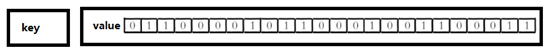


### 6.2、常用命令

setbit<key\><offset\><value\> 设置Bitmaps中某个偏移量的值（0或1），*offset：偏移量从0开始

例子：

每个独立用户是否访问过网站存放在Bitmaps中， 将访问的用户记做1， 没有访问的用户记做0， 用偏移量作为用户的id。

设置键的第offset个位的值（从0算起） ， 假设现在有20个用户，userid=1， 6， 11， 15， 19的用户对网站进行了访问， 那么当前Bitmaps初始化结果如图：

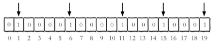

**注意**：很多应用的用户id以一个指定数字（例如10000） 开头， 直接将用户id和Bitmaps的偏移量对应势必会造成一定的浪费， 通常的做法是每次做setbit操作时将用户id减去这个指定数字。

在第一次初始化Bitmaps时， 假如偏移量非常大， 那么整个初始化过程执行会比较慢， 可能会造成Redis的阻塞。

getbit<key\><offset\> 获取Bitmaps中某个偏移量的值，获取键的第offset位的值（从0开始算）

**注意**：不存在，也是返回0

bitcount<key\>[start end]  统计字符串从start字节到end字节比特值为1的数量

**注意**：统计**字符串**被设置为1的bit数。一般情况下，给定的整个字符串都会被进行计数，通过指定额外的 start 或 end 参数，可以让计数只在特定的位上进行。start 和 end 参数的设置，**都可以使用负数值**：比如 -1 表示最后一个位，而 -2 表示倒数第二个位，start、end 是指bit组的字节的下标数，**二者皆包含**。

**注意**：redis的setbit设置或清除的是bit位置，而bitcount计算的是byte位置。

bitop and(or/not/xor) <destkey\> [key…]  bitop是一个复合操作， 它可以做多个Bitmaps的and（交集） 、 or（并集） 、 not（非） 、 xor（异或） 操作并将结果保存在destkey中。

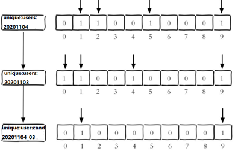

### 6.3、Bitmaps与Set对比

| set和Bitmaps存储一天活跃用户对比 |                    |                  |                        |
| -------------------------------- | ------------------ | ---------------- | ---------------------- |
| 数据  类型                       | 每个用户id占用空间 | 需要存储的用户量 | 全部内存量             |
| 集合  类型                       | 64位               | 50000000         | 64位*50000000 = 400MB  |
| Bitmaps                          | 1位                | 100000000        | 1位*100000000 = 12.5MB |

很明显， 这种情况下使用Bitmaps能节省很多的内存空间， 尤其是随着时间推移节省的内存还是非常可观的

| set和Bitmaps存储独立用户空间对比 |        |        |       |
| -------------------------------- | ------ | ------ | ----- |
| 数据类型                         | 一天   | 一个月 | 一年  |
| 集合类型                         | 400MB  | 12GB   | 144GB |
| Bitmaps                          | 12.5MB | 375MB  | 4.5GB |

但Bitmaps并不是万金油， 假如该网站每天的独立访问用户很少， 例如只有10万（大量的僵尸用户） ， 那么两者的对比如下表所示， 很显然， 这时候使用Bitmaps就不太合适了， 因为基本上大部分位都是0。

| set和Bitmaps存储一天活跃用户对比（独立用户比较少） |                    |                  |                        |
| -------------------------------------------------- | ------------------ | ---------------- | ---------------------- |
| 数据类型                                           | 每个userid占用空间 | 需要存储的用户量 | 全部内存量             |
| 集合类型                                           | 64位               | 100000           | 64位*100000 = 800KB    |
| Bitmaps                                            | 1位                | 100000000        | 1位*100000000 = 12.5MB |

## 7、HyperLogLog

### 7.1、简介

求集合中不重复元素个数的问题称为基数问题。

解决基数问题有很多种方案：
（1）数据存储在MySQL表中，使用distinct count计算不重复个数
（2）使用Redis提供的hash、set、bitmaps等数据结构来处理
以上的方案结果精确，但随着数据不断增加，导致占用空间越来越大，对于非常大的数据集是不切实际的。

Redis HyperLogLog 是用来做基数统计的算法，HyperLogLog 的优点是，在输入元素的数量或者体积非常非常大时，计算基数所需的空间总是固定的、并且是很小的。

在 Redis 里面，每个 HyperLogLog 键只需要花费 12 KB 内存，就可以计算接近 2^64 个不同元素的基数。这和计算基数时，元素越多耗费内存就越多的集合形成鲜明对比。

但是，因为 HyperLogLog 只会根据输入元素来计算基数，而不会储存输入元素本身，所以 HyperLogLog 不能像集合那样，返回输入的各个元素。

### 7.2、常用命令

pfadd <key\>< element> [element ...]   添加指定元素到 HyperLogLog 中

将所有元素添加到指定HyperLogLog数据结构中。如果执行命令后HLL估计的近似基数发生变化，则返回1，否则返回0。

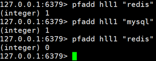

pfcount<key\> [key ...] 计算HLL的近似基数，可以计算多个HLL，比如用HLL存储每天的UV，计算一周的UV可以使用7天的UV合并计算即可。

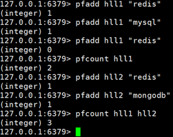

pfmerge<destkey\><sourcekey\> [sourcekey ...] 将一个或多个HLL合并后的结果存储在另一个HLL中，比如每月活跃用户可以使用每天的活跃用户来合并计算可得。

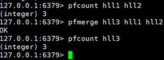

## 8、Geospatial

### 8.1、简介

Redis 3.2 中增加了对GEO类型的支持。

GEO，Geographic，地理信息的缩写。

该类型，就是元素的2维坐标，在地图上就是经纬度。

Redis基于该类型，提供了经纬度设置，查询，范围查询，距离查询，经纬度Hash等常见操作。

### 8.2、常用命令

geoadd<key\>< longitude><latitude\><member\> [longitude latitude member...]  添加地理位置（经度，纬度，名称）

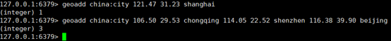

**注意**：

两极无法直接添加，一般会下载城市数据，直接通过 Java 程序一次性导入。

有效的经度从 -180 度到 180 度。有效的纬度从 -85.05112878 度到 85.05112878 度。

当坐标位置超出指定范围时，该命令将会返回一个错误。

已经添加的数据，是无法再次往里面添加的。

geopos <key\><member\> [member...]  获得指定地区的坐标值

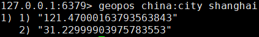

geodist<key\><member1\><member2\> [m|km|ft|mi ]  获取两个位置之间的直线距离

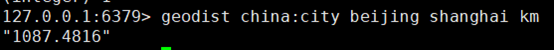

**注意**：

单位：

m 表示单位为米[默认值]。

km 表示单位为千米。

mi 表示单位为英里。

ft 表示单位为英尺。

如果用户没有显式地指定单位参数， 那么 GEODIST 默认使用米作为单位

georadius<key\>< longitude><latitude\>radius  m|km|ft|mi    以给定的经纬度为中心，找出某一半径内的元素

经度 纬度 距离 单位

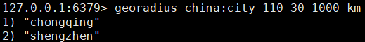


# Redis发布与订阅

## 1、简介

Redis 发布订阅 (pub/sub) 是一种消息通信模式：发送者 (pub) 发送消息，订阅者 (sub) 接收消息。

Redis 客户端可以订阅任意数量的频道。

客户端可以订阅频道如下图：

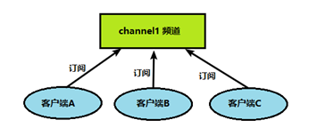

当给这个频道发布消息后，消息就会发送给订阅的客户端：

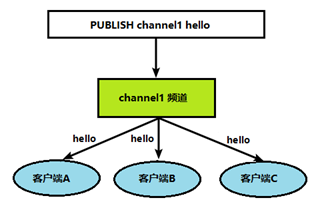

## 2、命令行实现

### 2.1、A客户端订阅

打开一个客户端订阅channel1

```bash
SUBSCRIBE channel1
```


### 2.2、B客户端，发布消息

打开另一个客户端，给channel1发布消息hello

```bash
publish channel1 hello
```

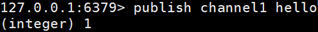

返回的1是订阅者数量

### 3、A客户端查看消息

打开第一个客户端可以看到发送的消息

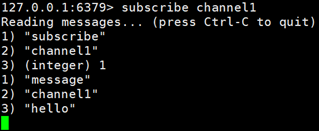

注：**发布的消息没有持久化**，正在订阅的客户端收不到hello，只能收到订阅后发布的消息。

# Redis客户端Jedis

## 1、需要的依赖

```xml
<dependency>
    <groupId>redis.clients</groupId>
    <artifactId>jedis</artifactId>
    <version>3.2.0</version>
</dependency>
```

## 2、连接Redis注意事项

关闭防火墙

```bash
systemctl stop/disable firewalld.service
```

redis.conf中注释掉bind 127.0.0.1 ,然后 protected-mode no

## 3、Jdis常用操作

### 3.1、连接Redis

```java
public class Demo01 {
    public static void main(String[] args) {
        Jedis jedis = new Jedis("192.168.137.3",6379);
        String pong = jedis.ping();
        System.out.println("连接成功："+pong);
        jedis.close();
    }
}
```

### 3.2、测试相关数据类型

#### 3.2.1、普通key类型

```java
// 置入普通key
jedis.set("k1", "v1");
jedis.set("k2", "v2");
jedis.set("k3", "v3");
// 获取所有key value
Set<String> keys = jedis.keys("*");

System.out.println(keys.size());

for (String key : keys) {
    System.out.println(key);
}

System.out.println(jedis.exists("k1"));
System.out.println(jedis.ttl("k1"));                
System.out.println(jedis.get("k1"));
```

#### 3.2.2、String类型

```java
jedis.mset("str1","v1","str2","v2","str3","v3");
System.out.println(jedis.mget("str1","str2","str3"));
```

#### 3.2.3、List类型

```java
List<String> list = jedis.lrange("mylist",0,-1);
for (String element : list) {
    System.out.println(element);
}
```

#### 3.2.4、Set类型

```java
jedis.sadd("orders", "order01");
jedis.sadd("orders", "order02");
jedis.sadd("orders", "order03");
jedis.sadd("orders", "order04");
Set<String> smembers = jedis.smembers("orders");
for (String order : smembers) {
    System.out.println(order);
}
jedis.srem("orders", "order02");
```

#### 3.2.5、Hash类型

```java
jedis.hset("hash1","userName","lisi");
System.out.println(jedis.hget("hash1","userName"));
Map<String,String> map = new HashMap<String,String>();
map.put("telphone","13810169999");
map.put("address","atguigu");
map.put("email","abc@163.com");
jedis.hmset("hash2",map);
List<String> result = jedis.hmget("hash2", "telphone","email");
for (String element : result) {
    System.out.println(element);
}
```

#### 3.2.6、ZSet类型

```java
jedis.zadd("zset01", 100d, "z3");
jedis.zadd("zset01", 90d, "l4");
jedis.zadd("zset01", 80d, "w5");
jedis.zadd("zset01", 70d, "z6");

Set<String> zrange = jedis.zrange("zset01", 0, -1);
for (String e : zrange) {
    System.out.println(e);
}
```

# SpringBoot整合Redis

## 1、引入依赖

```xml
<!-- redis -->
<dependency>
    <groupId>org.springframework.boot</groupId>
    <artifactId>spring-boot-starter-data-redis</artifactId>
</dependency>

<!-- spring2.X集成redis所需common-pool2-->
<dependency>
    <groupId>org.apache.commons</groupId>
    <artifactId>commons-pool2</artifactId>
    <version>2.6.0</version>
</dependency>
```

## 2、properties配置

```properties
#Redis服务器地址
spring.redis.host=192.168.140.136
#Redis服务器连接端口
spring.redis.port=6379
#Redis数据库索引（默认为0）
spring.redis.database= 0
#连接超时时间（毫秒）
spring.redis.timeout=1800000
#连接池最大连接数（使用负值表示没有限制）
spring.redis.lettuce.pool.max-active=20
#最大阻塞等待时间(负数表示没限制)
spring.redis.lettuce.pool.max-wait=-1
#连接池中的最大空闲连接
spring.redis.lettuce.pool.max-idle=5
#连接池中的最小空闲连接
spring.redis.lettuce.pool.min-idle=0
```

## 3、添加redis配置类

```java
@EnableCaching
@Configuration
public class RedisConfig extends CachingConfigurerSupport {

    @Bean
    public RedisTemplate<String, Object> redisTemplate(RedisConnectionFactory factory) {
        RedisTemplate<String, Object> template = new RedisTemplate<>();
        RedisSerializer<String> redisSerializer = new StringRedisSerializer();
        Jackson2JsonRedisSerializer jackson2JsonRedisSerializer = 
            new Jackson2JsonRedisSerializer(Object.class);
        ObjectMapper om = new ObjectMapper();
        om.setVisibility(PropertyAccessor.ALL, JsonAutoDetect.Visibility.ANY);
        om.enableDefaultTyping(ObjectMapper.DefaultTyping.NON_FINAL);
        jackson2JsonRedisSerializer.setObjectMapper(om);
        template.setConnectionFactory(factory);
        //key序列化方式
        template.setKeySerializer(redisSerializer);
        //value序列化
        template.setValueSerializer(jackson2JsonRedisSerializer);
        //value hashmap序列化
        template.setHashValueSerializer(jackson2JsonRedisSerializer);
        return template;
    }

    @Bean
    public CacheManager cacheManager(RedisConnectionFactory factory) {
        RedisSerializer<String> redisSerializer = new StringRedisSerializer();
        Jackson2JsonRedisSerializer jackson2JsonRedisSerializer = 
            new Jackson2JsonRedisSerializer(Object.class);
        //解决查询缓存转换异常的问题
        ObjectMapper om = new ObjectMapper();
        om.setVisibility(PropertyAccessor.ALL, JsonAutoDetect.Visibility.ANY);
        om.enableDefaultTyping(ObjectMapper.DefaultTyping.NON_FINAL);
        jackson2JsonRedisSerializer.setObjectMapper(om);
        // 配置序列化（解决乱码的问题）,过期时间600秒
        RedisCacheConfiguration config = RedisCacheConfiguration
            .defaultCacheConfig()
            .entryTtl(Duration.ofSeconds(600))
            .serializeKeysWith(
                RedisSerializationContext
                    .SerializationPair
                    .fromSerializer(redisSerializer))
                    .serializeValuesWith(
                		RedisSerializationContext
                    		.SerializationPair
                    		.fromSerializer(jackson2JsonRedisSerializer))
            .disableCachingNullValues();
        RedisCacheManager cacheManager = RedisCacheManager
                                            .builder(factory)
                                            .cacheDefaults(config)
                                            .build();
        return cacheManager;
    }
}
```

## 测试

```java
@RestController
@RequestMapping("/redisTest")
public class RedisTestController {
    @Autowired
    private RedisTemplate redisTemplate;

    @GetMapping
    public String testRedis() {
        //设置值到redis
        redisTemplate.opsForValue().set("name","lucy");
        //从redis获取值
        String name = (String)redisTemplate.opsForValue().get("name");
        return name;
    }
}
```

# Redis事务

## 1、事务定义

Redis事务是一个单独的隔离操作：事务中的所有命令都会序列化、按顺序地执行。

事务在执行的过程中，不会被其他客户端发送来的命令请求所打断。

Redis事务的主要作用就是串联多个命令防止别的命令插队。

### 1.1、事务特性

1. 单独的隔离操作：事务中的所有命令都会序列化、按顺序地执行。事务在执行的过程中，不会被其他客户端发送来的命令请求所打断。 
2. 没有隔离级别的概念：队列中的命令没有提交之前都不会实际被执行，因为事务提交前任何指令都不会被实际执行
3. 不保证原子性：事务中如果有一条命令执行失败，其后的命令仍然会被执行，没有回滚 

## 2、事务命令Multi、Exec、discard

从输入Multi命令开始，输入的命令都会依次进入命令队列中，但不会执行，直到输入Exec后，Redis会将之前的命令队列中的命令依次执行。

组队的过程中可以通过discard来放弃组队。 

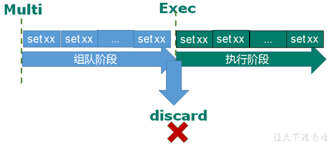

### 2.1、测试

#### 2.1、组队成功，提交成功

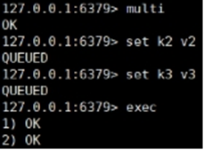

组队成功，提交成功

#### 2.2、组队失败，提交失败

组队阶段报错，提交失败

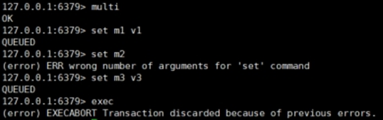

#### 2.3、组队成功，提交失败与成功

组队成功，提交有成功有失败情况

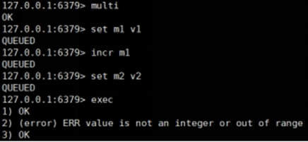

## 3、事务错误处理

**组队中**某个命令出现了报告错误，执行时整个的所有队列都会被取消。

如果**执行阶段**某个命令报出了错误，则只有报错的命令不会被执行，而其他的命令都会执行，不会回滚。

## 4、WATCH key [key ...]

在执行multi之前，先执行watch key1 [key2],可以监视一个(或多个) key ，如果在事务**执行之前这个(或这些) key 被其他命令所改动，那么事务将被打断**。

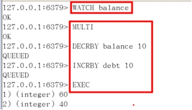

## 5、unwatch

取消 WATCH 命令对所有 key 的监视。

如果在执行 WATCH 命令之后，EXEC 命令或DISCARD 命令先被执行了的话，那么就不需要再执行UNWATCH 了。

## 6、秒杀案例

### 6.1、简单版

会出现超卖问题，商品库存出现复数

```java
//秒杀过程
public static boolean doSecKill(String uid, String prodid) throws IOException {
    //1 uid和prodid非空判断
    if (uid == null || prodid == null) {
        return false;
    }

    //2 连接redis
    Jedis jedis = new Jedis("192.168.44.168",6379);
    //通过连接池得到jedis对象
    //JedisPool jedisPoolInstance = JedisPoolUtil.getJedisPoolInstance();
    //Jedis jedis = jedisPoolInstance.getResource();

    //3 拼接key
    // 3.1 库存key
    String kcKey = "sk:" + prodid + ":qt";
    // 3.2 秒杀成功用户key
    String userKey = "sk:" + prodid + ":user";

    //4 获取库存，如果库存null，秒杀还没有开始
    String kc = jedis.get(kcKey);
    if (kc == null) {
        System.out.println("秒杀还没有开始，请等待");
        jedis.close();
        return false;
    }

    // 5 判断用户是否重复秒杀操作
    if (jedis.sismember(userKey, uid)) {
        System.out.println("已经秒杀成功了，不能重复秒杀");
        jedis.close();
        return false;
    }

    //6 判断如果商品数量，库存数量小于1，秒杀结束
    if (Integer.parseInt(kc) <= 0) {
        System.out.println("秒杀已经结束了");
        jedis.close();
        return false;
    }

    //7 秒杀过程
    //使用事务
    Transaction multi = jedis.multi();

    //组队操作
    multi.decr(kcKey);
    multi.sadd(userKey, uid);

    //执行
    List<Object> results = multi.exec();

    if (results == null || results.size() == 0) {
        System.out.println("秒杀失败了....");
        jedis.close();
        return false;
    }

    System.out.println("秒杀成功了..");
    jedis.close();
    return true;
}
```

### 6.2、添加乐观锁

使用乐观锁解决超卖，但会出现库存遗留问题，因为乐观锁导致很多请求都失败

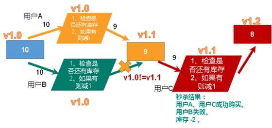

```java
//监视库存
jedis.watch(kcKey);
```

### 6.3、添加LUA脚本

使用LUA脚本解决库存遗留问题

```java
static String secKillScript = "local userid=KEYS[1];\r\n" +
                                "local prodid=KEYS[2];\r\n" +
                                "local qtkey='sk:'..prodid..\":qt\";\r\n" +
                                "local usersKey='sk:'..prodid..\":usr\";\r\n" +
                                "local userExists=redis.call(\"sismember\",usersKey,userid);\r\n" +
                                "if tonumber(userExists)==1 then \r\n" +
                                "   return 2;\r\n" +
                                "end\r\n" +
                                "local num= redis.call(\"get\" ,qtkey);\r\n" +
                                "if tonumber(num)<=0 then \r\n" +
                                "   return 0;\r\n" +
                                "else \r\n" +
                                "   redis.call(\"decr\",qtkey);\r\n" +
                                "   redis.call(\"sadd\",usersKey,userid);\r\n" +
                                "end\r\n" +
                                "return 1";

static String secKillScript2 =
                            "local userExists=redis.call(\"sismember\",\"{sk}:0101:usr\",userid);\r\n" +
                            " return 1";

public static boolean doSecKill(String uid, String prodid) throws IOException {
    // 1连接Redis
    JedisPool jedispool = JedisPoolUtil.getJedisPoolInstance();
    Jedis jedis = jedispool.getResource();
    // 2加载LUA脚本
    String sha1 = jedis.scriptLoad(secKillScript);
    // 3执行LUA脚本
    Object result = jedis.evalsha(sha1, 2, uid, prodid);
	// 4判断结果
    String reString = String.valueOf(result);
    if ("0".equals(reString)) {
        System.err.println("已抢空！！");
    } else if ("1".equals(reString)) {
        System.out.println("抢购成功！！！！");
    } else if ("2".equals(reString)) {
        System.err.println("该用户已抢过！！");
    } else {
        System.err.println("抢购异常！！");
    }
    jedis.close();
    return true;
}

```

```lu
local userid=KEYS[1]; 
local prodid=KEYS[2];
local qtkey="sk:"..prodid..":qt";
local usersKey="sk:"..prodid.":usr'; 
local userExists=redis.call("sismember",usersKey,userid);
if tonumber(userExists)==1 then 
  return 2;
end
local num= redis.call("get" ,qtkey);
if tonumber(num)<=0 then 
  return 0; 
else 
  redis.call("decr",qtkey);
  redis.call("sadd",usersKey,userid);
end
return 1;
```

### 6.4、添加连接池

添加连接池，重复利用Rdis连接，解决超时问题

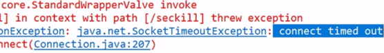

通过参数管理连接的行为：链接池参数

- **MaxTotal**：控制一个pool可分配多少个jedis实例，通过pool.getResource()来获取；如果赋值为-1，则表示不限制；如果pool已经分配了MaxTotal个jedis实例，则此时pool的状态为exhausted。
- **maxIdle**：控制一个pool最多有多少个状态为idle(空闲)的jedis实例；
- **MaxWaitMillis**：表示当borrow一个jedis实例时，最大的等待毫秒数，如果超过等待时间，则直接抛JedisConnectionException
- **testOnBorrow**：获得一个jedis实例的时候是否检查连接可用性（ping()）；如果为true，则得到的jedis实例均是可用的；

```java
private static volatile JedisPool jedisPool = null;

private JedisPoolUtil() { }

public static JedisPool getJedisPoolInstance() {
    if (null == jedisPool) {
        synchronized (JedisPoolUtil.class) {
            if (null == jedisPool) {
                JedisPoolConfig poolConfig = new JedisPoolConfig();
                poolConfig.setMaxTotal(200);
                poolConfig.setMaxIdle(32);
                poolConfig.setMaxWaitMillis(100 * 1000);
                poolConfig.setBlockWhenExhausted(true);
                poolConfig.setTestOnBorrow(true);  // ping  PONG

                jedisPool = new JedisPool(poolConfig, "192.168.44.168", 6379, 60000);
            }
        }
    }
    return jedisPool;
}

public static void release(JedisPool jedisPool, Jedis jedis) {
    if (null != jedis) {
        jedisPool.returnResource(jedis);
    }
}
```

# Redis持久化

## 1、RDB

**Redis DataBase**

### 优势与劣势

#### 1、优势

- 适合大规模的数据恢复
- 对数据完整性和一致性要求不高更适合使用
- 节省磁盘空间
- 恢复速度快

#### 2、劣势

- Fork的时候，内存中的数据被克隆了一份，大致2倍的膨胀性需要考虑
- 虽然Redis在fork时使用了**写时拷贝技术**，但是如果数据庞大时还是比较消耗性能。
- 在备份周期在一定间隔时间做一次备份，所以如果Redis意外down掉的话，就会丢失最后一次快照后的所有修改。

### 1.1、功能

在指定的时间间隔内将内存中的数据集快照写入磁盘， 也就是行话讲的Snapshot快照，它恢复时是将快照文件直接读到内存里。

### 1.2、如何执行

Redis会单独创建（fork）一个子进程来进行持久化，会先将数据写入到 一个临时文件中，待持久化过程都结束了，再用这个临时文件替换上次持久化好的文件。 

整个过程中，主进程是不进行任何IO操作的，这就确保了极高的性能，如果需要进行大规模数据的恢复，且对于数据恢复的完整性不是非常敏感，那RDB方式要比AOF方式更加的高效。**RDB的缺点是最后一次持久化后的数据可能丢失**。

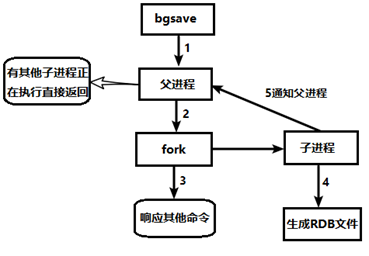


### 1.3、Fork

Fork的作用是复制一个与当前进程一样的进程。新进程的所有数据（变量、环境变量、程序计数器等） 数值都和原进程一致，但是是一个全新的进程，并作为原进程的子进程

在Linux程序中，fork()会产生一个和父进程完全相同的子进程，但子进程在此后多会exec系统调用，出于效率考虑，Linux中引入了“写时复制技术”

一般情况父进程和子进程会共用同一段物理内存，只有进程空间的各段的内容要发生变化时，才会将父进程的内容复制一份给子进程。

### 1.4、dump.rdb文件配置

#### 1.4.1、默认文件名

在redis.conf中配置文件名称，默认为dump.rdb


#### 1.4.2、默认保存路径

rdb文件的保存路径，也可以修改。默认为Redis启动时命令行所在的目录下

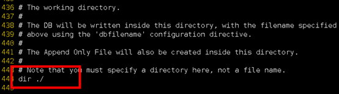

#### 1.4.3、默认快照配置

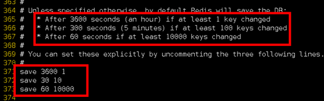

#### 1.4.4、Save

格式：save 秒钟 写操作次数

RDB是整个内存的压缩过的Snapshot，RDB的数据结构，可以配置复合的快照触发条件，

默认是1分钟内改了1万次，或5分钟内改了10次，或15分钟内改了1次。

禁用

不设置save指令，或者给save传入空字符串


#### 1.4.5、stop-writes-on-bgsave-error

当Redis无法写入磁盘的话，直接关掉Redis的写操作。推荐yes

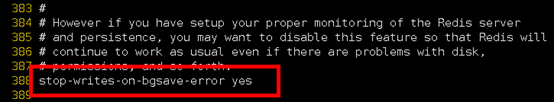

#### 1.4.6、rdbcompression

rdbcompression压缩文件

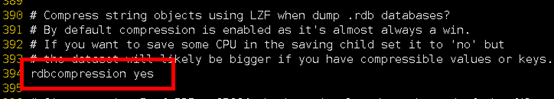

对于存储到磁盘中的快照，可以设置是否进行压缩存储。如果是的话，redis会采用LZF算法进行压缩。

如果你不想消耗CPU来进行压缩的话，可以设置为关闭此功能。推荐yes。

#### 1.4.7、rdbchecksum

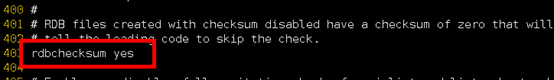

在存储快照后，还可以让redis使用CRC64算法来进行数据校验，但是这样做会增加大约10%的性能消耗，如果希望获取到最大的性能提升，可以关闭此功能。推荐yes。

#### 1.4.8、rbd备份与还原

##### 1.4.8.1、备份

先通过**config get dir** 查询rdb文件的目录 ，将*.rdb的文件拷贝到别的地方

##### 1.4.8.2、还原

关闭Redis

先把备份的文件拷贝到工作目录下 cp dump2.rdb dump.rdb

启动Redis, 备份数据会直接加载

### 1.5、命令

#### 1.5.1、save VS bgsave

**save** ：save时只管保存，其它不管，全部阻塞。手动保存。**不建议**。

**bgsave**：Redis会在后台**异步**进行快照操作，快照同时还可以响应客户端请求。

可以通过 **lastsave** 命令获取最后一次成功执行快照的时间

#### 1.5.2、flushall

执行flushall命令，也会产生dump.rdb文件，但里面是空的，无意义。

#### 1.5.3、停止

动态停止RDB：redis-cli config set save "" #save后给空值，表示禁用保存策略

## 2、AOF

aof文件一般要比rdb文件大

根据所使用的fsync策略，aof可能会慢于rdb

官方推荐两个都启用，如果对数据不敏感，可以选单独用RDB，不建议单独用 AOF，因为可能会出现Bug。

### 优势与劣势

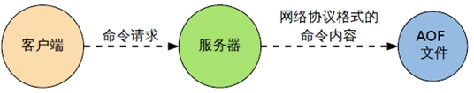

#### 1、优势

- 备份机制更稳健，丢失数据概率更低。
- 可读的日志文本，通过操作AOF稳健，可以处理误操作

#### 2、劣势

- 比起RDB占用更多的磁盘空间。
- 恢复备份速度要慢。
- 每次读写都同步的话，有一定的性能压力。
- 存在个别Bug，造成恢复不当。

### 2.1、功能

以**日志**的形式来记录每个写操作（**增量保存**），将Redis执行过的所有写指令记录下来(**读操作不记录**)， **只许追加文件但不可以改写文件**，redis启动之初会读取该文件重新构建数据，换言之，redis 重启的话就根据日志文件的内容将写指令从前到后执行一次以完成数据的恢复工作。

### 2.2、流程

1. 客户端的请求写命令会被append追加到AOF缓冲区内；
2. AOF缓冲区根据AOF持久化策略[always,everysec,no]将操作sync同步到磁盘的AOF文件中；
3. AOF文件大小超过重写策略或手动重写时，会对AOF文件rewrite重写，压缩AOF文件容量；
4. Redis服务重启时，会重新load加载AOF文件中的写操作达到数据恢复的目的；


### 2.3、AOF和RDB同时开启

AOF和RDB同时开启，系统默认取**AOF**的数据（数据不会存在丢失）

### 2.4、AOF启动/修复/恢复

AOF的备份机制和性能虽然和RDB不同，但是备份和恢复的操作同RDB一样，都是拷贝备份文件，需要恢复时再拷贝到Redis工作目录下，启动系统即加载。

#### 2.4.1、启动

开启aof，将redis.conf中的appendonly 改为yes

可以在redis.conf中修改aof文件名称，默认为 appendonly.aof

AOF文件的保存路径，同RDB的路径一致。

#### 2.4.2、正常恢复

修改默认的appendonly no，改为yes

将有数据的aof文件复制一份保存到对应目录(查看目录：config get dir)

恢复：重启redis，然后重新加载

#### 2.4.3、异常恢复

修改默认的appendonly no，改为yes

如遇到AOF文件损坏，通过/usr/local/bin/redis-check-aof--fix appendonly.aof进行恢复

备份被写坏的AOF文件

恢复：重启redis，然后重新加载

### 2.5、AOF同步频率设置

1. **appendfsync always**
   - 始终同步，每次Redis的写入都会立刻记入日志，**性能较差**但数据完整性比较好
2. **appendfsync everysec**
   - 每秒同步，每秒记入日志一次，如果宕机，本秒的数据可能丢失。
3. **appendfsync no**
   - redis不主动进行同步，把同步时机交给操作系统。

### 2.6、Rewrite压缩

#### 2.6.1、功能

AOF采用文件追加方式，文件会越来越大为避免出现此种情况，新增了重写机制，当AOF文件的大小超过所设定的阈值时，Redis就会启动AOF文件的内容压缩， 只保留可以恢复数据的最小指令集，可以使用命令bgrewriteaof手动压缩。

#### 2.6.2、原理

AOF文件持续增长而过大时，会fork出一条新进程来将文件重写(也是先写临时文件最后再rename)，redis4.0版本后的重写，实际上就是把 rdb 的快照，以二级制的形式附在新的aof头部，作为已有的历史数据，替换掉原来的流水账操作。

**no-appendfsync-on-rewrite**：

如果 no-appendfsync-on-rewrite=yes ，写指令SET不写入aof文件只写入缓存，用户请求不会阻塞，但是在重写的这段时间内如果宕机会丢失这段时间的缓存数据。（降低数据安全性，提高性能）

如果 no-appendfsync-on-rewrite=no，还是会把写指令SET数据往磁盘里刷，但是遇到重写操作，可能会发生阻塞。（数据安全，但是性能降低）

**触发机制，何时重写**：

Redis会记录上次重写时的AOF大小，默认配置是当AOF文件大小是上次rewrite后大小的一倍且文件大于64M时触发

重写虽然可以节约大量磁盘空间，减少恢复时间。但是每次重写还是有一定的负担的，因此设定Redis要满足一定条件才会进行重写。 

auto-aof-rewrite-percentage：设置重写的基准值，文件达到100%时开始重写（文件是原来重写后文件的2倍时触发）

auto-aof-rewrite-min-size：设置重写的基准值，最小文件64MB。达到这个值开始重写。

例如：文件达到70MB开始重写，降到50MB，下次什么时候开始重写？100MB

系统载入时或者上次重写完毕时，Redis会记录此时AOF大小，设为base_size,

如果Redis的AOF当前大小>= base_size +base_size*100% (默认)且当前大小>=64mb(默认)的情况下，Redis会对AOF进行重写。 

#### 2.6.3、流程

1. **bgrewriteaof**触发重写，判断是否当前有**bgsave**或**bgrewriteaof**在运行，如果有，则等待该命令结束后再继续执行。
2. 主进程**fork**出子进程执行重写操作，保证主进程不会阻塞。
3. 子进程遍历redis内存中数据到临时文件，客户端的写请求同时写入**aof_buf缓冲区**和**aof_rewrite_buf重写缓冲区**保证原AOF文件完整以及新AOF文件生成期间的新的数据修改动作不会丢失。
4. 
   1. 子进程写完新的AOF文件后，向主进程发信号，父进程更新统计信息。
   2. 主进程把aof_rewrite_buf中的数据写入到新的AOF文件。
5. 使用新的AOF文件覆盖旧的AOF文件，完成AOF重写。

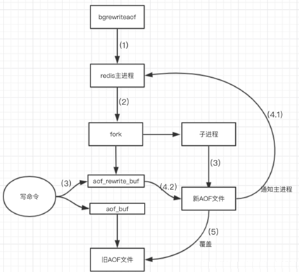

# Redis主从复制

## 1、一主二仆模式

### 1.1、功能

主机数据更新后根据配置和策略， 自动同步到备机的master/slaver机制，**Master以写为主，Slave以读为主**。

读写分离，性能扩展

容灾快速恢复

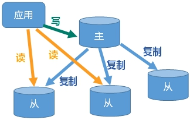

### 1.2、构建流程

#### 1.2.1、配置redis.conf

拷贝多个redis.conf文件

- include (写绝对路径)
- daemonize 开启
-  pidfile Pid文件名字
- port 指定端口
- Log 文件名字
- dbfilename dump.rdb名字
- Appendonly 关掉或者换名字

例如：

```config
include /myredis/redis.conf
pidfile /var/run/redis_6379.pid
port 6379
dbfilename dump6379.rdb
```

设置从机的优先级，值越小，优先级越高，用于选举主机时使用。默认100
slave-priority 10

#### 1.2.2、配置Slave

```text
slaveof <ip\> <port\>
```

成为某个实例的从服务器

在**从机**上使用此条命令

执行完毕后主机可写数据，从机写数据报错。

并且主机宕机，重启即可，从机宕机，重启需重设，可将slaveof置入配置文件避免重设

## 2、薪火相传模式

### 2.1、功能

上一个Slave可以是下一个Slave的Master，Slave同样可以接收其他Slaves的连接和同步请求，那么该Slave作为了链条中下一个的master, 可以有效减轻master的写压力，去中心化降低风险。


### 2.2、构建流程

用 slaveof <ip\><port\>

在一主二仆的前置下，为slave增加slave。

### 2.3、风险

- 中途变更转向，会清除之前的数据，重新建立拷贝最新的
- 一旦某个slave宕机，后面的slave都没法备份
- 主机挂了，从机还是从机，无法写数据了。

## 3、反客为主模式

### 3.1、功能

当一个master宕机后，后面的slave可以立刻升为master，其后面的slave不用做任何修改。

### 3.2、构建流程

在主机宕机够，手动使用命令 slaveof no one  将从机变为主机。

## 4、哨兵模式

### 4.1、功能

**反客为主的自动版**，能够后台监控主机是否故障，如果故障了根据投票数自动将从库转换为主库

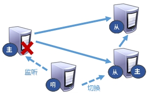

### 4.2、构建步骤

#### 4.2.1、创建sentinel.conf

在一主二仆的前提下，在存放 redis.conf 文件的文件见下创建 **sentinel.conf** 文件，名字绝不能错

#### 4.2.2、配置sentinel.conf

```text
sentinel monitor xxxxx 主机IP 主机Port 1
```

其中xxxxx为监控对象起的服务器名称， 1 为至少有多少个哨兵同意迁移的数量。 

#### 4.2.3、启动哨兵

执行

```bash
redis-sentinel /xxxxx/sentinel.conf 
```

如果找不到redis-sentinel，进入redis-cli的文件夹下寻找，或者建立软连接。

#### 测试

当主机挂掉，从机根据优先级别 slave-priority 选举，产生新的主机，并且原主机重启后会变为从机

### 4.3、流程

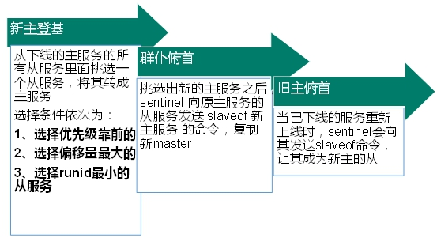

优先级在redis.conf中默认：slave-priority 100，值越小优先级越高

偏移量是指获得原主机数据最全的

每个redis实例启动后都会随机生成一个40位的runid

## 5、复制延时

由于所有的写操作都是先在Master上操作，然后同步更新到Slave上，所以从Master同步到Slave机器有一定的延迟，当系统很繁忙的时候，延迟问题会更加严重，Slave机器数量的增加也会使这个问题更加严重。

## 6、Java实现

```java
private static JedisSentinelPool jedisSentinelPool=null;

public static Jedis getJedisFromSentinel() {
    if(jedisSentinelPool == null) {
        // 哨兵信息
        Set<String> sentinelSet = new HashSet<>();
        sentinelSet.add("192.168.11.103:6379");
        
		// Redis连接池配置
        JedisPoolConfig jedisPoolConfig = new JedisPoolConfig();
        jedisPoolConfig.setMaxTotal(10); //最大可用连接数
        jedisPoolConfig.setMaxIdle(5); //最大闲置连接数
        jedisPoolConfig.setMinIdle(5); //最小闲置连接数
        jedisPoolConfig.setBlockWhenExhausted(true); //连接耗尽是否等待
        jedisPoolConfig.setMaxWaitMillis(2000); //等待时间
        jedisPoolConfig.setTestOnBorrow(true); //取连接的时候进行一下测试 ping pong
        
        // mymaster是分配给哨兵的名字
        jedisSentinelPool = new JedisSentinelPool("mymaster", sentinelSet, jedisPoolConfig);
        
        return jedisSentinelPool.getResource();
    } else {
        return jedisSentinelPool.getResource();
    }
}
```

# Redis集群

## 优点与缺点

### 1、优点

- 实现扩容
- 分摊压力
- 无中心配置相对简单

### 2、缺点

- 多键操作是不被支持的 
- 多键的Redis事务是不被支持的，因此lua脚本中如果有多个key则不被支持。但是将key用 { } 则可以
- 由于集群方案出现较晚，很多公司已经采用了其他的集群方案，而代理或者客户端分片的方案想要迁移至redis cluster，需要整体迁移而不是逐步过渡，复杂度较大。

## 1、功能

Redis 集群实现了对Redis的**水平扩容**，即启动N个redis节点，将整个数据库分布存储在这N个节点中，每个节点存储总数据的1/N。

Redis 集群通过分区（partition）来提供一定程度的可用性（availability）： 即使集群中有一部分节点失效或者无法进行通讯， 集群也可以继续处理命令请求。

## 2、构建流程

### 2.1、配置redis.conf

1. 开启daemonize yes
2. Pid文件名字
3. 指定端口
4. Log文件名字
5. Dump.rdb名字
6. Appendonly 关掉或者换名字

### 2.2、配置Cluster

1. cluster-enabled yes  打开集群模式
2. cluster-config-file nodes-6379.conf 设定节点配置文件名
3. cluster-node-timeout 15000  设定节点失联时间，超过该时间（毫秒），集群自动进行主从切换。

例子

```text
include 				/home/bigdata/redis.conf
port 					6379
pidfile 				"/var/run/redis_6379.pid"
dbfilename 				"dump6379.rdb"
dir 					"/home/bigdata/redis_cluster"
logfile 				"/home/bigdata/redis_cluster/redis_err_6379.log"
cluster-enabled 		yes
cluster-config-file 	nodes-6379.conf
cluster-node-timeout 	15000
```

启动六个redis实例

### 2.3、合体

```bash
redis-cli --cluster create --cluster-replicas 1 
192.168.11.101:6379 
192.168.11.101:6380 
192.168.11.101:6381 
192.168.11.101:6389 
192.168.11.101:6390 
192.168.11.101:6391
```

此处不用127.0.0.1， 用真实IP地址

--replicas 1 采用最简单的方式配置集群，一台主机，一台从机，正好三组。

### 2.4、进入集群

普通方式登录，可能直接进入读主机，存储数据时，会出现**MOVED**重定向操作。所以，应该以集群方式登录。

**-c** 采用集群策略连接，设置数据会自动切换到相应的写主机

```bash
redis-cli -c -p 6379
```

通过 **cluster nodes** 命令查看集群信息

## 3、如何分配主从

**一个集群至少要有三个主节点**。

选项 **--cluster-replicas 1** 表示我们希望为集群中的每个主节点创建一个从节点。

分配原则尽量保证每个主数据库运行在不同的IP地址，每个从库和主库不在一个IP地址上。

## 4、Slots

一个 Redis 集群包含 **16384** 个插槽（hash slot）， 数据库中的每个键都属于这 16384 个插槽的其中一个， 

集群使用公式 CRC16(key) % 16384 来计算键 key 属于哪个槽， 其中 CRC16(key) 语句用于计算键 key 的 CRC16 校验和 。

集群中的每个节点负责处理一部分插槽。 

举个例子， 如果一个集群可以有主节点， 其中：节点 A 负责处理 0 号至 5460 号插槽。节点 B 负责处理 5461 号至 10922 号插槽。节点 C 负责处理 10923 号至 16383 号插槽。

## 5、集群键值操作

### 5.1、录入值

在redis-cli每次录入、查询键值，redis都会计算出该key应该送往的插槽，如果不是该客户端对应服务器的插槽，redis会报错，并告知应前往的redis实例地址和端口。

redis-cli客户端提供了 –c 参数实现自动重定向。如 redis-cli -c –p 6379 登入后，再录入、查询键值对可以自动重定向。

不在一个slot下的键值，是不能使用mget，mset等多键操作。

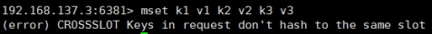

可以通过**{ }**来定义组的概念，从而使key中{ }内相同内容的键值对放到一个slot中去。

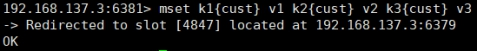

### 5.2、查询值

```bash
CLUSTER GETKEYSINSLOT <slot> <count>
```

返回 count 个 slot 槽中的键。

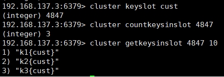

查询所有键值

```bash
redis-cli -c --cluster call 192.168.168.161:7001 keys \*
```

## 6、故障恢复

6.1、如果主节点下线？从节点能否自动升为主节点？

- 注意：**15秒超时**，从节点自动升为主节点。

6.2、主节点恢复后，主从关系会如何？

- 主节点回来变成从机。

6.3、如果所有某一段插槽的主从节点都宕掉，redis服务是否还能继续?

- 如果某一段插槽的主从都挂掉，而cluster-require-full-coverage 为yes ，那么 ，整个集群都挂掉。
- 如果某一段插槽的主从都挂掉，而cluster-require-full-coverage 为no ，那么，该插槽数据全都不能使用，也无法存储。

​	redis.conf 中的参数 cluster-require-full-coverage

## 7、Jedis连接

```java
public class JedisClusterTest {
    public static void main(String[] args) { 
        Set<HostAndPort>set = new HashSet<HostAndPort>();
        set.add(new HostAndPort("192.168.31.211",6379));
        JedisCluster jedisCluster = new JedisCluster(set);
        jedisCluster.set("k1", "v1");
        System.out.println(jedisCluster.get("k1"));
    }
}
```

# Redis分布式锁

## 1、原理

跨JVM的互斥机制来控制共享资源的访问


1. 多个客户端同时获取锁（setnx）
2. 获取成功，执行业务逻辑{从db获取数据，放入缓存}，执行完成释放锁（del）
3. 其他客户端等待重试

## 2、代码实现

### 2.1配置集群连接

配置RedisTemplate集群连接

```java
@EnableCaching
@Configuration
public class RedisConfig extends CachingConfigurerSupport {

    @Bean
    public RedisClusterConfiguration clusterConfig(RedisProperties redisProperties) {
        List<String> nodes = redisProperties.getCluster().getNodes();
        RedisClusterConfiguration clusterConfig = new RedisClusterConfiguration(nodes);
        clusterConfig.setMaxRedirects(10);
        return clusterConfig;
    }

    @Bean
    public JedisPoolConfig poolConfig() {
        JedisPoolConfig poolConfig = new JedisPoolConfig();
        poolConfig.setMaxTotal(200);
        poolConfig.setMaxIdle(32);
        poolConfig.setMaxWait(Duration.ofMillis(100));
        poolConfig.setBlockWhenExhausted(true);
        poolConfig.setTestOnBorrow(true);
        return poolConfig;
    }


    @Bean
    public JedisConnectionFactory redisConnectionFactory(RedisClusterConfiguration clusterConfig, JedisPoolConfig poolConfig) {
        return new JedisConnectionFactory(clusterConfig, poolConfig);
    }

    @Bean
    public Jackson2JsonRedisSerializer jackson2JsonRedisSerializer(ObjectMapper objectMapper) {
        Jackson2JsonRedisSerializer jackson2JsonRedisSerializer = new Jackson2JsonRedisSerializer(Object.class);
        jackson2JsonRedisSerializer.setObjectMapper(objectMapper);
        return jackson2JsonRedisSerializer;
    }

    @Bean
    public ObjectMapper objectMapper() {
        //解决查询缓存转换异常的问题
        ObjectMapper objectMapper = new ObjectMapper();
        objectMapper.setVisibility(PropertyAccessor.ALL, JsonAutoDetect.Visibility.ANY);
        objectMapper.enableDefaultTyping(ObjectMapper.DefaultTyping.NON_FINAL);
        return objectMapper;
    }

    @Bean
    public RedisTemplate<String, Object> redisTemplate(JedisConnectionFactory factory, Jackson2JsonRedisSerializer redisSerializer) {
        RedisTemplate<String, Object> template = new RedisTemplate<>();
        template.setConnectionFactory(factory);
        //key序列化方式
        template.setKeySerializer(new StringRedisSerializer());
        //value序列化
        template.setValueSerializer(redisSerializer);
        //value hashmap序列化
        template.setHashValueSerializer(redisSerializer);
        return template;
    }

    @Bean
    public CacheManager cacheManager(JedisConnectionFactory factory, Jackson2JsonRedisSerializer redisSerializer) {
        // 配置序列化（解决乱码的问题）,过期时间600秒
        RedisCacheConfiguration config = RedisCacheConfiguration
                .defaultCacheConfig()
                .entryTtl(Duration.ofSeconds(600))
                .serializeKeysWith(
                        RedisSerializationContext
                                .SerializationPair
                                .fromSerializer(new StringRedisSerializer()))
                .serializeValuesWith(
                        RedisSerializationContext
                                .SerializationPair
                                .fromSerializer(redisSerializer))
                .disableCachingNullValues();
        RedisCacheManager cacheManager = RedisCacheManager
                .builder(factory)
                .cacheDefaults(config)
                .build();
        return cacheManager;
    }
}
```

### 2.2、第一版基础版代码

```java
@Autowired
RedisTemplate<String, Object> redisTemplate;

@GetMapping("testLock")
public void testLock() {
    System.out.println("进入testLock");
    //1获取锁，setnx
    Boolean lock = redisTemplate.opsForValue().setIfAbsent("lock", "111");
    //2获取锁成功、查询num的值
    if(Boolean.TRUE.equals(lock)) {
        System.out.println("开始testLock");
        Object value = redisTemplate.opsForValue().get("num");
        //2.1判断num为空return
        if(ObjectUtils.isEmpty(value)) {
            redisTemplate.delete("lock");
            return;
        }
        //2.2有值就转成int
        int num = (int) value;
        // Integer.parseInt((String) value);
        //2.3把redis的num加1
        redisTemplate.opsForValue().set("num", ++num);
        //2.4释放锁，del
        redisTemplate.delete("lock");
        System.out.println("结束testLock");
    } else {
        //3获取锁失败、每隔0.1秒再获取
        try {
            Thread.sleep(100);
            testLock();
        } catch (InterruptedException e) {
            e.printStackTrace();
        }
    }
}
```

**问题**：setnx刚好获取到锁，业务逻辑出现异常，导致锁无法释放。

**解决**：设置过期时间，自动释放锁。

### 2.3、第二版设置锁的过期时间

设置过期时间有两种方式：

1. 首先想到通过**expire**设置过期时间（缺乏原子性：如果在setnx和expire之间出现异常，锁也无法释放）

2. 在set时指定过期时间（**推荐**）


```java
Boolean lock = redisTemplate.opsForValue().setIfAbsent("lock", "111", 3, TimeUnit.SECONDS);
```

**问题**：可能会释放其他服务器的锁。

场景：如果业务逻辑的执行时间是7s。执行流程如下

1. index1业务逻辑没执行完，3秒后锁被自动释放。

2. index2获取到锁，执行业务逻辑，3秒后锁被自动释放。

3. index3获取到锁，执行业务逻辑

4. index1业务逻辑执行完成，开始调用del释放锁，这时释放的是index3的锁，导致index3的业务只执行1s就被别人释放。
5. 最终等于没锁的情况。

**解决**：setnx获取锁时，设置一个指定的唯一值（例如：uuid）释放前获取这个值，判断是否自己的锁

### 2.4、第三版UUID防误删


```java
String uuid = UUID.randomUUID().toString();
Boolean lock = redisTemplate.opsForValue().setIfAbsent("lock", uuid, 3, TimeUnit.SECONDS);

String delLock = (String) redisTemplate.opsForValue().get("lock");
if(Objects.equals(delLock, uuid)) {
    redisTemplate.delete("lock");
    System.out.println("结束testLock");
}
```

**问题**：删除操作缺乏原子性。

场景：

1. index1执行删除时，查询到的lock值确实和uuid相等

```java
uuid=v1

set(lock,uuid)；                
```

2. index1执行删除前，lock刚好过期时间已到，被redis自动释放，在redis中没有了lock，没有了锁。

3. index2获取了lock，index2线程获取到了cpu的资源，开始执行方法

```java
uuid=v2

set(lock,uuid)；
```

4. index1执行删除，此时会把index2的lock删除，index1因为已经在方法中了，所以不需要重新上锁。index1有执行的权限，因为index1已经比较完成了，这个时候，开始执行删除的index2的锁。

**解决**：使用lua脚本保证原子性

### 2.5、第四版LUA脚本保证删除的原子性

```java
String script = "if redis.call('get', KEYS[1]) == ARGV[1] " +
                "then return redis.call('del', KEYS[1]) " +
                "else return 0 end";

// 使用redis执行lua执行
DefaultRedisScript<Long> redisScript = new DefaultRedisScript<>();
redisScript.setScriptText(script);
// 设置一下返回值类型 为Long
// 因为删除判断的时候，返回的0,给其封装为数据类型。如果不封装那么默认返回String类型，
// 那么返回字符串与0会有发生错误。
redisScript.setResultType(Long.class);
// 第一个要是script 脚本 ，第二个需要判断的key，第三个就是key所对应的值。
redisTemplate.execute(redisScript, List.of("lock"), uuid);
```

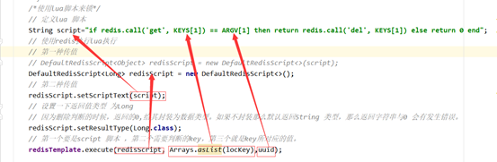

```text
List.of("lock") 对应 KEYS[1]
UUID 对应 ARGV[1]
```

## 3、分布式锁实现条件

为了确保分布式锁可用，我们至少要确保锁的实现同时**满足以下四个条件**：

- 互斥性。在任意时刻，只有一个客户端能持有锁。
- 不会发生死锁。即使有一个客户端在持有锁的期间崩溃而没有主动解锁，也能保证后续其他客户端能加锁。
- 解铃还须系铃人。加锁和解锁必须是同一个客户端，客户端自己不能把别人加的锁给解了。
- 加锁和解锁必须具有原子性。

# 相关知识

- 默认**16**个数据库，类似数组下标从0开始，初始**默认使用0号库 ** 
- 使用命令 select  <dbid\> 来切换数据库。如: select 8  
- 统一密码管理，所有库同样密码。

## 1、常用操作

- **dbsize** 查看当前数据库的key的数量
- **flushdb** 清空当前库
- **flushall** 通杀全部库
- **keys *** 查看当前库所有key  (匹配：keys *1)
- **exists key** 判断某个key是否存在
- **type key** 查看你的key是什么类型
- **del key**  删除指定的key数据
- **unlink key**  根据value选择非阻塞删除，仅将keys从keyspace元数据中删除，真正的删除会在后续异步操作。
- **expire key 10**  10秒钟：为给定的key设置过期时间
- **ttl key** 查看还有多少秒过期，-1表示永不过期，-2表示已过期

## 2、原子性

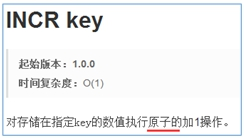

所谓原子操作是指不会被线程调度机制打断的操作。
这种操作一旦开始，就一直运行到结束，中间不会有任何 context switch （切换到另一个线程）。
（1）在单线程中， 能够在单条指令中完成的操作都可以认为是"原子操作"，因为中断只能发生于指令之间。
（2）在多线程中，不能被其它进程（线程）打断的操作就叫原子操作。
Redis单命令的原子性主要得益于Redis的单线程。

**原子性，有一个失败则都失败**

## 3、锁

### 3.1、悲观锁

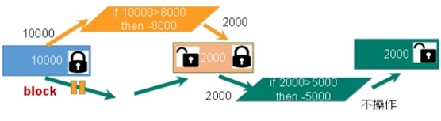

**悲观锁(Pessimistic Lock)**,，顾名思义，就是很悲观，每次去拿数据的时候都认为别人会修改，所以每次在拿数据的时候都会上锁，这样别人想拿这个数据就会block直到它拿到锁。**传统的关系型数据库里边就用到了很多这种锁机制**，比如**行锁**，**表锁**等，**读锁**，**写锁**等，都是在做**操作之前先上锁**。

### 3.2、乐观锁

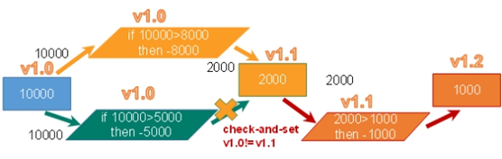

**乐观锁(Optimistic Lock),** 顾名思义，就是很乐观，每次去拿数据的时候都认为别人不会修改，所以不会上锁，但是在**更新的时候会判断**一下在此期间别人有没有去更新这个数据，可以使用版本号等机制。**乐观锁适用于多读的应用类型，这样可以提高吞吐量**。Redis就是利用这种check-and-set机制实现事务的。

## 4、LUA脚本

将复杂的或者多步的redis操作，写为一个脚本，一次提交给redis执行，减少反复连接redis的次数，提升性能。

LUA脚本是类似redis事务，有一定的**原子性**，不会被其他命令插队，可以完成一些redis事务性的操作。

但是注意redis的lua脚本功能，只有在Redis 2.6以上的版本才可以使用。

利用lua脚本淘汰用户，解决超卖问题。

redis 2.6版本以后，通过lua脚本解决**争抢问题**，实际上是**redis** **利用其单线程的特性，用任务队列的方式解决多任务并发问题**。

# 原理

## 1、主从复制原理

1. Slave启动成功连接到Master后会发送一个**sync**命令。
2. Master接到命令启动后台的**存盘**进程，同时收集所有接收到的用于修改数据集命令， 在后台进程执行完毕之后，Master将传送整个数据文件到Slave，以完成一次完全同步。
   - 全量复制：Slave服务在接收到数据库文件数据后，将其存盘并加载到内存中。
   - 增量复制：Master继续将新的所有收集到的修改命令依次传给slave，完成同步。
3. 但是只要是重新连接master，一次完全同步（全量复制）将被自动执行。

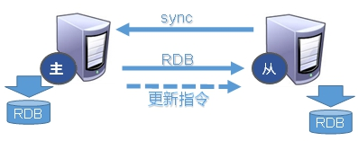


