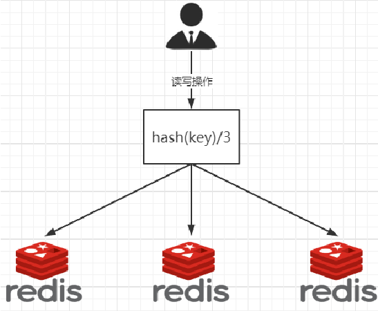
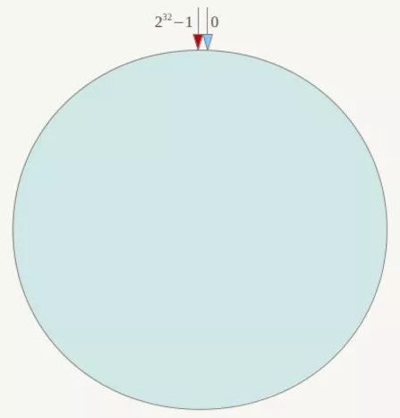
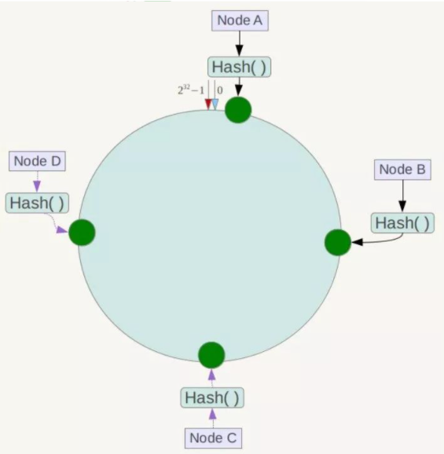
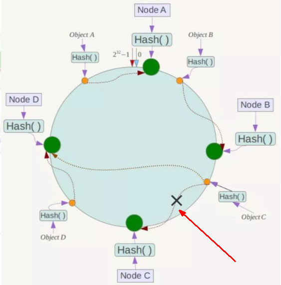
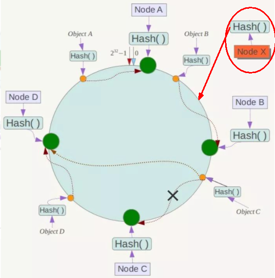
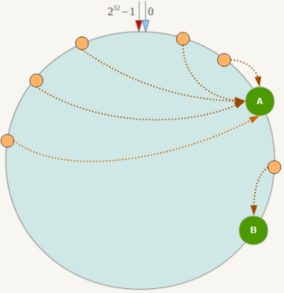
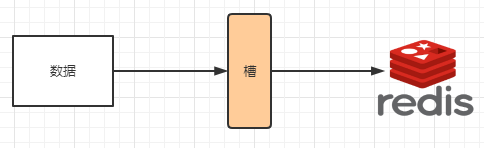
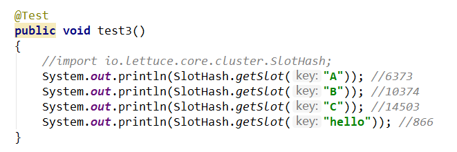
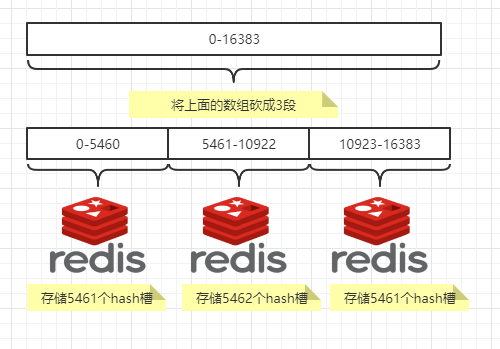

# 1、哈希

## 1、1~2亿条数据需要缓存，请问如何设计这个存储案例

一般业界有3种解决方案：

### 1.1、哈希取余分区

#### 1.1.1、方法

2亿条记录就是2亿个k,v，我们单机不行必须要分布式多机，假设有3台机器构成一个集群，用户每次读写操作都是根据公式：
hash(key) % N个机器台数，计算出哈希值，用来决定数据映射到哪一个节点上。

#### 1.1.2、优点

简单粗暴，直接有效，只需要预估好数据规划好节点，例如3台、8台、10台，就能保证一段时间的数据支撑。使用Hash算法让固定的一部分请求落到同一台服务器上，这样每台服务器固定处理一部分请求（并维护这些请求的信息），起到负载均衡+分而治之的作用。

#### 1.1.3、缺点

原来规划好的节点，进行扩容或者缩容就比较麻烦了，不管扩缩，每次数据变动导致节点有变动，映射关系需要重新进行计算，在服务器个数固定不变时没有问题，如果需要弹性扩容或故障停机的情况下，原来的取模公式就会发生变化：Hash(key)/3会变成Hash(key) /?。此时地址经过取余运算的结果将发生很大变化，根据公式获取的服务器也会变得不可控。某个redis机器宕机了，由于台数数量变化，会导致hash取余全部数据重新洗牌。

### 1.2、一致性哈希算法分区

**背景**：一致性哈希算法在1997年由麻省理工学院中提出的，设计目标是为了解决，分布式缓存数据变动和映射问题，某个机器宕机了，分母数量改变了，自然取余数不OK了。

#### 1.2.1、方法

**一致性哈希环**：一致性哈希算法必然有个hash函数并按照算法产生hash值，这个算法的所有可能哈希值会构成一个全量集，这个集合可以成为一个hash空间[0, 2^32-1]，这个是一个线性空间，但是在算法中，我们通过适当的逻辑控制将它首尾相连(0 => 2^32)，这样让它逻辑上形成了一个环形空间。

它也是按照使用取模的方法，前面的节点取模法是对**节点**（服务器）的数量进行取模。而一致性Hash算法是**对2^32取模**。简单来说，一致性Hash算法将整个哈希值空间组织成一个虚拟的圆环，如假设某哈希函数H的值空间为0-2^32-1（即哈希值是一个32位无符号整形），整个哈希环如下图：整个空间按顺时针方向组织，圆环的正上方的点代表0，0点右侧的第一个点代表1，以此类推，2、3、4、……直到2^32-1，也就是说0点左侧的第一个点代表2^32-1， 0和2^32-1在零点中方向重合，我们把这个由2^32个点组成的圆环称为Hash环。

**节点映射**：将集群中各个IP节点映射到环上的某一个位置。将各个服务器使用Hash进行一个哈希，具体可以选择服务器的IP或主机名作为关键字进行哈希，这样每台机器就能确定其在哈希环上的位置。假如4个节点NodeA、B、C、D，经过IP地址的哈希函数计算(hash(ip))，使用IP地址哈希后在环空间的位置如下：  

**落键规则**：当我们需要存储一个kv键值对时，首先计算key的hash值，hash(key)，将这个key使用相同的函数Hash计算出哈希值并确定此数据在环上的位置，从此位置**沿环顺时针“行走”**，第一台遇到的服务器就是其应该定位到的服务器，并将该键值对存储在该节点上。
如我们有Object A、Object B、Object C、Object D四个数据对象，经过哈希计算后，在环空间上的位置如下：根据一致性Hash算法，数据A会被定为到Node A上，B被定为到Node B上，C被定为到Node C上，D被定为到Node D上。

#### 1.2.2、优点

**容错性**：假设Node C宕机，可以看到此时对象A、B、D不会受到影响，只有C对象被重定位到Node D。一般的，在一致性Hash算法中，如果一台服务器不可用，则受影响的数据仅仅是此服务器到其环空间中前一台服务器（即沿着逆时针方向行走遇到的第一台服务器）之间数据，其它不会受到影响。简单说，就是C挂了，受到影响的只是B、C之间的数据，并且这些数据会转移到D进行存储。

**扩展性**：数据量增加了，需要增加一台节点NodeX，X的位置在A和B之间，那收到影响的也就是A到X之间的数据，重新把A到X的数据录入到X上即可，不会导致hash取余全部数据重新洗牌。

#### 1.2.3、缺点

Hash环的数据倾斜问题：一致性Hash算法在服务节点太少时，容易因为节点分布不均匀而造成数据倾斜（被缓存的对象大部分集中缓存在某一台服务器上）问题，例如系统中只有两台服务器：

### 1.3、哈希槽分区

#### 13.1、方法

哈希槽实质就是一个**数组**，数组[0, 2^14 -1]形成hash slot空间。

**解决均匀分配的问题**，在数据和节点之间又加入了一层，把这层称为哈希槽（slot），用于管理数据和节点之间的关系，现在就相当于节点上放的是槽，槽里放的是数据。

**总结**：**槽**解决的是**粒度**问题，相当于把粒度变大了，这样**便于数据移动**。**哈希**解决的是**映射问题**，使用key的哈希值来计算所在的槽，便于数据分配。

**多少个hash槽**：一个集群只能有**16384**个槽，编号0-16383（0-2^14-1）。这些槽会分配给集群中的所有主节点，分配策略没有要求。可以指定哪些编号的槽分配给哪个主节点。**集群会记录节点和槽的对应关系**。解决了节点和槽的关系后，接下来就需要对key求哈希值，然后对16384取余，余数是几key就落入对应的槽里。slot = CRC16(key) % 16384。以槽为单位移动数据，因为槽的数目是固定的，处理起来比较容易，这样数据移动问题就解决了。

**哈希槽计算**：Redis 集群中内置了 16384 个哈希槽，redis 会根据节点数量大致均等的将哈希槽映射到不同的节点。当需要在 Redis 集群中放置一个 key-value时，redis 先对 key 使用 crc16 算法算出一个结果，然后把结果对 16384 求余数，这样每个 key 都会对应一个编号在 0-16383 之间的哈希槽，也就是映射到某个节点上。如下代码，key之A 、B在Node2， key之C落在Node3上。

# 2、一主二仆

## 1、切入点问题？slave1、slave2是从头开始复制还是从切入点开始复制？比如从k4进来，那之前的k1,k2,k3是否也可以复制？

slave连接主机后会发送一个sync命令，将复制主机的rdb文件进行全量复制，即使k4点进来，之前的k1点等也能复制。之后使用增量复制同步数据，如果宕机再次声明主机后，会先全量复制。

## 2、从机是否可以写？set可否？ 

从机只能读

## 3、主机宕机后情况如何？从机是上位还是原地待命？

从机会原地待命，只不过info replication会显示主机宕机，等主机上线后一切照旧。

## 4、主机宕机又回来了后，主机新增记录，从机还能否顺利复制？

 可以

## 5、其中一台从机宕机后情况如何？依照原有它能跟上大部队吗？

从机如果宕机，再次重启后，会自动再次读数据，读不到。需要手动使用slaveof再次声明所属主机，声明之后可以再次读取数据。

