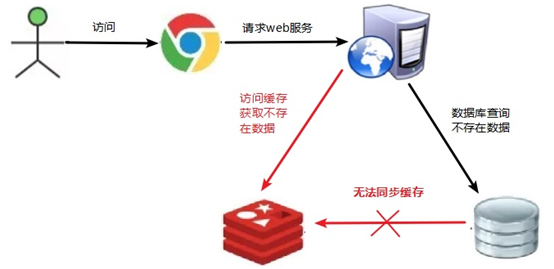
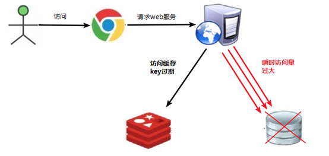
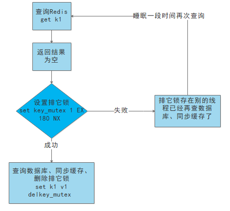
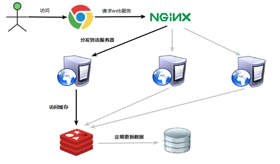
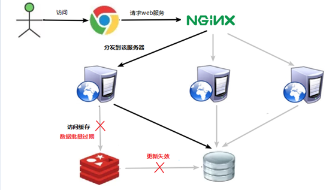

# 1、哈希

## 1、1~2亿条数据需要缓存，请问如何设计这个存储案例

一般业界有3种解决方案：

### 1.1、哈希取余分区

#### 1.1.1、方法

2亿条记录就是2亿个k,v，我们单机不行必须要分布式多机，假设有3台机器构成一个集群，用户每次读写操作都是根据公式：
hash(key) % N个机器台数，计算出哈希值，用来决定数据映射到哪一个节点上。

#### 1.1.2、优点

简单粗暴，直接有效，只需要预估好数据规划好节点，例如3台、8台、10台，就能保证一段时间的数据支撑。使用Hash算法让固定的一部分请求落到同一台服务器上，这样每台服务器固定处理一部分请求（并维护这些请求的信息），起到负载均衡+分而治之的作用。

#### 1.1.3、缺点

原来规划好的节点，进行扩容或者缩容就比较麻烦了，不管扩缩，每次数据变动导致节点有变动，映射关系需要重新进行计算，在服务器个数固定不变时没有问题，如果需要弹性扩容或故障停机的情况下，原来的取模公式就会发生变化：Hash(key)/3会变成Hash(key) /?。此时地址经过取余运算的结果将发生很大变化，根据公式获取的服务器也会变得不可控。某个redis机器宕机了，由于台数数量变化，会导致hash取余全部数据重新洗牌。

### 1.2、一致性哈希算法分区

**背景**：一致性哈希算法在1997年由麻省理工学院中提出的，设计目标是为了解决，分布式缓存数据变动和映射问题，某个机器宕机了，分母数量改变了，自然取余数不OK了。

#### 1.2.1、方法

**一致性哈希环**：一致性哈希算法必然有个hash函数并按照算法产生hash值，这个算法的所有可能哈希值会构成一个全量集，这个集合可以成为一个hash空间[0, 2^32-1]，这个是一个线性空间，但是在算法中，我们通过适当的逻辑控制将它首尾相连(0 => 2^32)，这样让它逻辑上形成了一个环形空间。

它也是按照使用取模的方法，前面的节点取模法是对**节点**（服务器）的数量进行取模。而一致性Hash算法是**对2^32取模**。简单来说，一致性Hash算法将整个哈希值空间组织成一个虚拟的圆环，如假设某哈希函数H的值空间为0-2^32-1（即哈希值是一个32位无符号整形），整个哈希环如下图：整个空间按顺时针方向组织，圆环的正上方的点代表0，0点右侧的第一个点代表1，以此类推，2、3、4、……直到2^32-1，也就是说0点左侧的第一个点代表2^32-1， 0和2^32-1在零点中方向重合，我们把这个由2^32个点组成的圆环称为Hash环。

**节点映射**：将集群中各个IP节点映射到环上的某一个位置。将各个服务器使用Hash进行一个哈希，具体可以选择服务器的IP或主机名作为关键字进行哈希，这样每台机器就能确定其在哈希环上的位置。假如4个节点NodeA、B、C、D，经过IP地址的哈希函数计算(hash(ip))，使用IP地址哈希后在环空间的位置如下：  

**落键规则**：当我们需要存储一个kv键值对时，首先计算key的hash值，hash(key)，将这个key使用相同的函数Hash计算出哈希值并确定此数据在环上的位置，从此位置**沿环顺时针“行走”**，第一台遇到的服务器就是其应该定位到的服务器，并将该键值对存储在该节点上。
如我们有Object A、Object B、Object C、Object D四个数据对象，经过哈希计算后，在环空间上的位置如下：根据一致性Hash算法，数据A会被定为到Node A上，B被定为到Node B上，C被定为到Node C上，D被定为到Node D上。

#### 1.2.2、优点

**容错性**：假设Node C宕机，可以看到此时对象A、B、D不会受到影响，只有C对象被重定位到Node D。一般的，在一致性Hash算法中，如果一台服务器不可用，则受影响的数据仅仅是此服务器到其环空间中前一台服务器（即沿着逆时针方向行走遇到的第一台服务器）之间数据，其它不会受到影响。简单说，就是C挂了，受到影响的只是B、C之间的数据，并且这些数据会转移到D进行存储。

**扩展性**：数据量增加了，需要增加一台节点NodeX，X的位置在A和B之间，那收到影响的也就是A到X之间的数据，重新把A到X的数据录入到X上即可，不会导致hash取余全部数据重新洗牌。

#### 1.2.3、缺点

Hash环的数据倾斜问题：一致性Hash算法在服务节点太少时，容易因为节点分布不均匀而造成数据倾斜（被缓存的对象大部分集中缓存在某一台服务器上）问题，例如系统中只有两台服务器：

### 1.3、哈希槽分区

#### 13.1、方法

哈希槽实质就是一个**数组**，数组[0, 2^14 -1]形成hash slot空间。

**解决均匀分配的问题**，在数据和节点之间又加入了一层，把这层称为哈希槽（slot），用于管理数据和节点之间的关系，现在就相当于节点上放的是槽，槽里放的是数据。

**总结**：**槽**解决的是**粒度**问题，相当于把粒度变大了，这样**便于数据移动**。**哈希**解决的是**映射问题**，使用key的哈希值来计算所在的槽，便于数据分配。

**多少个hash槽**：一个集群只能有**16384**个槽，编号0-16383（0-2^14-1）。这些槽会分配给集群中的所有主节点，分配策略没有要求。可以指定哪些编号的槽分配给哪个主节点。**集群会记录节点和槽的对应关系**。解决了节点和槽的关系后，接下来就需要对key求哈希值，然后对16384取余，余数是几key就落入对应的槽里。slot = CRC16(key) % 16384。以槽为单位移动数据，因为槽的数目是固定的，处理起来比较容易，这样数据移动问题就解决了。

**哈希槽计算**：Redis 集群中内置了 16384 个哈希槽，redis 会根据节点数量大致均等的将哈希槽映射到不同的节点。当需要在 Redis 集群中放置一个 key-value时，redis 先对 key 使用 crc16 算法算出一个结果，然后把结果对 16384 求余数，这样每个 key 都会对应一个编号在 0-16383 之间的哈希槽，也就是映射到某个节点上。如下代码，key之A 、B在Node2， key之C落在Node3上。

# 2、集群

## 1、切入点问题？slave1、slave2是从头开始复制还是从切入点开始复制？比如从k4进来，那之前的k1,k2,k3是否也可以复制？

slave连接主机后会发送一个sync命令，将复制主机的rdb文件进行全量复制，即使k4点进来，之前的k1点等也能复制。之后使用增量复制同步数据，如果宕机再次声明主机后，会先全量复制。

## 2、从机是否可以写？set可否？ 

从机只能读

## 3、主机宕机后情况如何？从机是上位还是原地待命？

从机会原地待命，只不过info replication会显示主机宕机，等主机上线后一切照旧。

## 4、主机宕机又回来了后，主机新增记录，从机还能否顺利复制？

 可以

## 5、其中一台从机宕机后情况如何？依照原有它能跟上大部队吗？

从机如果宕机，再次重启后，会自动再次读数据，读不到。需要手动使用slaveof再次声明所属主机，声明之后可以再次读取数据。

# 3、缓存

## 1、缓存穿透

key对应的数据在数据源并不存在，每次针对此key的请求从缓存获取不到，请求都会压到数据源，从而可能压垮数据源。

比如用一个不存在的用户id获取用户信息，不论缓存还是数据库都没有，若黑客利用此漏洞进行攻击可能压垮数据库。

一个一定不存在缓存及查询不到的数据，由于缓存是不命中时被动写的，并且出于容错考虑，如果从存储层查不到数据则不写入缓存，这将导致这个不存在的数据每次请求都要到存储层去查询，失去了缓存的意义。

解决方案：

（1）  **对空值缓存：**如果一个查询返回的数据为空（不管是数据是否不存在），我们仍然把这个空结果（null）进行缓存，设置空结果的过期时间会很短，最长不超过五分钟

（2）  **设置可访问的名单（白名单）：**

使用bitmaps类型定义一个可以访问的名单，名单id作为bitmaps的偏移量，每次访问和bitmap里面的id进行比较，如果访问id不在bitmaps里面，进行拦截，不允许访问。

（3）  **采用布隆过滤器**：(布隆过滤器（Bloom Filter）是1970年由布隆提出的。它实际上是一个很长的二进制向量(位图)和一系列随机映射函数（哈希函数）。

布隆过滤器可以用于检索一个元素是否在一个集合中。它的优点是空间效率和查询时间都远远超过一般的算法，缺点是有一定的误识别率和删除困难。

将所有可能存在的数据哈希到一个足够大的bitmaps中，一个一定不存在的数据会被 这个bitmaps拦截掉，从而避免了对底层存储系统的查询压力。

（4）  **进行实时监控：**当发现Redis的命中率开始急速降低，需要排查访问对象和访问的数据，和运维人员配合，可以设置黑名单限制服务

## 2、缓存击穿

key对应的数据存在，但在redis中过期，此时若有大量并发请求过来，这些请求发现缓存过期一般都会从后端DB加载数据并回设到缓存，这个时候大并发的请求可能会瞬间把后端DB压垮。

key可能会在某些时间点被超高并发地访问，是一种非常“热点”的数据。这个时候，需要考虑一个问题：缓存被“击穿”的问题。

解决问题：

（1）**预先设置热门数据：**在redis高峰访问之前，把一些热门数据提前存入到redis里面，加大这些热门数据key的时长

（2）**实时调整**：现场监控哪些数据热门，实时调整key的过期时长

（3）**使用锁**：

就是在缓存失效的时候（判断拿出来的值为空），不是立即去load db。

先使用缓存工具的某些带成功操作返回值的操作（比如Redis的SETNX）去set一个mutex key

当操作返回成功时，再进行load db的操作，并回设缓存，最后删除mutex key；

当操作返回失败，证明有线程在load db，当前线程睡眠一段时间再重试整个get缓存的方法。 

 

## 3、缓存雪崩

keys 对应的数据存在，但在redis中过期，此时若有大量并发请求过来，这些请求发现缓存过期一般都会从后端DB加载数据并回设到缓存，这个时候大并发的请求可能会瞬间把后端DB压垮。

缓存雪崩与缓存击穿的区别在于这里针对很多key缓存，前者则是某一个key

解决方案：

（1）  **构建多级缓存架构：**nginx缓存 + redis缓存 +其他缓存（ehcache等）

（2）  **使用锁或队列：**

用加锁或者队列的方式来保证不会有大量的线程对数据库一次性进行读写，从而避免失效时大量的并发请求落到底层存储系统上。不适用高并发情况

（3）  **设置过期标志更新缓存：**

记录缓存数据是否过期（设置提前量），如果过期会触发通知另外的线程在后台去更新实际key的缓存。

（4）  **将缓存失效时间分散开：**

比如我们可以在原有的失效时间基础上增加一个随机值，比如1-5分钟随机，这样每一个缓存的过期时间的重复率就会降低，就很难引发集体失效的事件。

 

