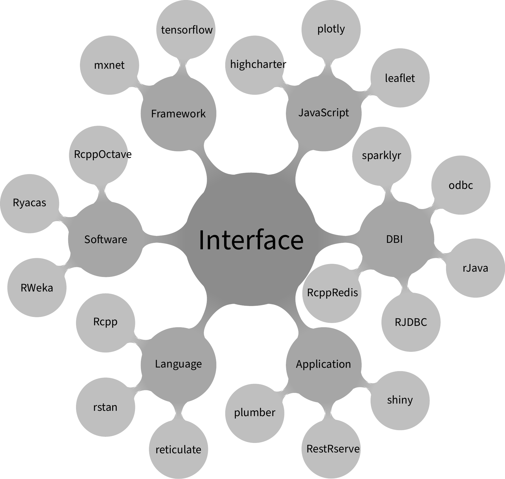
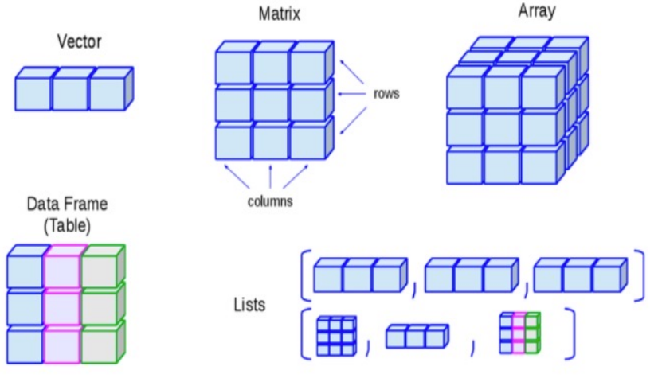

# 1、简介

R 主要用于统计分析、绘图、数据挖掘

R 是解释运行的语言

R 提供了丰富的图形接口，包括 Tcl/Tk , Gtk, Shiny 等，以及基于它们的衍生品 rattle（RGtk2）、Rcmdr（tcl/tk）、radiant（shiny）




# 2、运算符

## 1、数学运算符

| 优先级 | 符号 | 含义     |
| :----- | :--- | :------- |
| 1      | ()   | 括号     |
| 2      | ^    | 乘方运算 |
| 3      | %%   | 整除求余 |
|        | %/%  | 整除     |
| 4      | *    | 乘法     |
|        | /    | 除法     |
| 5      | +    | 加法     |
|        | -    | 减法     |

~~~R
1 + 2 * 3
# 7

(1 + 2) * 3
# 9

3 / 4
# 0.75

3.4 - 1.2
# 2.2

1 - 4 * 0.5^3
# 0.5

8 / 3 %% 2
# 8

8 / 4 %% 2
# Inf

3 %% 2^2
# 3

10 / 3 %/% 2
# 10
~~~


## 2、关系运算符

以下描述于向量的情况下：

| 运算符 | 描述                     |
| :----- | :----------------------- |
| >      | 左标量是否大于右标量     |
| <      | 左标量是否小于右标量     |
| ==     | 左标量是否等于右标量     |
| !=     | 左标量是否不等于右标量   |
| >=     | 左标量是否大于等于右标量 |
| <=     | 左标量是否小于等于右标量 |

**注意**：

- 如果是向量则一一对比


## 3、逻辑运算符

| 运算符 | 描述                                                         |
| :----- | :----------------------------------------------------------- |
| &      | 与运算符，将左标量与右标量进行组合，如果两个元素都为 TRUE，则结果为 TRUE，否则为 FALSE |
| ｜     | 或运算符，将左标量与右标量进行组合，如果两个元素中有一个为 TRUE，则结果为 TRUE，如果都为 FALSE，则返回 FALSE |
| !      | 非运算符，返回向量每个元素相反的逻辑值，如果元素为 TRUE 则返回 FALSE，如果元素为 FALSE 则返回 TRUE |
| &&     | 与运算符，将左标量与右标量进行组合，如果是向量，则只对两个向量的第一个元素进行判断，如果两个元素都为 TRUE，则结果为 TRUE，否则为 FALSE |
| \|\|   | 或运算符，将左标量与右标量进行组合，如果是向量，则只对两个向量的第一个元素进行判断，如果两个元素中有一个为 TRUE，则结果为 TRUE，如果都为 FALSE，则返回 FALSE |

- xor(x, y) 函数表示 x 与 y 的异或运算， 即值不相等时为 TRUE，相等时为 FALSE， 有缺失值参加运算时为 NA


**注意**：

- 右值是缺失值时， 如果左值能够确定结果真假， 可以得到非缺失的结果，不能确定结果时返回 NA


## 4、赋值运算符

| 运算符     | 描述     |
| :--------- | :------- |
| <−、=、<<− | 向左赋值 |
| −>、−>>    | 向右赋值 |


## 5、其他运算符

| 运算符 | 描述                                                         |
| :----- | :----------------------------------------------------------- |
| :      | 冒号运算符，用于创建一系列数字的向量                         |
| %in%   | 用于判断元素是否在向量里，返回布尔值，有的话返回 TRUE，没有返回 FALSE |
| %*%    | 用于矩阵与它转置的矩阵相乘                                   |


# 3、数据结构

## 1、数据类型

### 1、基本概念

基本数据类型：数值、逻辑、字符串

- 数值有两种类型：intergeri、double
- 逻辑有两种类型：TRUE、FALSE
- 其他数据类型：raw、complex
- 以上这些都可以称为：原子类型

特殊类型：NULL

- NULL 表示不存在，此类型只有一个值就是 NULL
- 与 NA 不同，NA 表示存在但未知，NULL 表示不存在
- 并且 NA 是有类型的

对象数据类型：vector、list、array、factor、table、matrix、data.frame



- R 的变量可以存储多种不同的数据类型，typeof() 函数来返回一个变量或表达式的类型

~~~R
typeof(1:3)
# interger

# 注意因子类型的结果
typeof(factor(c('F', 'M', 'M', 'F')))
# integer
~~~

- 为了判断某个向量 x 保存的基本类型， 可以用 is.xxx() 类函数，例如：is.interger()


### 2、类型转换

用 as.xxx() 类的函数在不同类型之间进行强制转换

- 类型转换也可能是隐含的
- 四则运算中数值会被统一转换为double类型
- 逻辑运算中运算元素会被统一转换为logical类型
- 逻辑值转换成数值时，FALSE -> 1 TRUE -> 0

~~~R
as.character(sqrt(1:4))
~~~


类型升档：

- 在用 c() 函数合并若干元素时， 如果元素基本类型不同， 将统一转换成最复杂的一个
- 不同类型参与要求类型相同的运算时， 也会统一转换为最复杂的类型
- 复杂程度从简单到复杂依次为： logical < integer < double < character


### 3、属性

除了 NULL 以外， R 的变量都可以看成是对象， 都可以有属性，属性是把变量看成对象后， 除了其存储内容之外的其它附加信息，如维数、类属等

R 对象一般都有 length 和 mode 两个属性，常用属性有 names、dim、class

属性 dim：

- 表明对象是个矩阵、一维数组、者高维数组
- 修改 dim 属性就将向量转换成矩阵（数组）， 或修改了矩阵的性质， 元素按列次序重排填入新的矩阵

~~~R
x <- 1:4
dim(x) <- c(2,2)

x
#      [,1] [,2]
# [1,]    1    3
# [2,]    2    4
~~~


常用函数：

- 对象 x 的所有属性可以用 attributes() 函数读取

~~~R
x <- table(c(1,2,1,3,2,1))

attributes(x)
~~~

- 用 attr(x, "属性名") 的格式读取或定义 x 的属性

~~~R
x <- c(1,3,5)

# 可以让向量x额外地保存一个theta属性，一般可以用来保存一些实验数据
attr(x, "theta") <- c(0, 1)
~~~


### 4、类属

R 具有一定的面向对象语言特征， 其数据类型有一个 class 属性， 函数 class() 可以返回变量类型的类属

class 属性是特殊的，如果一个对象具有 class 属性，部份通用函数(generic functions)会针对这样的对象进行专门的操作

比如 print() 函数在显示向量和回归结果时采用完全不同的格式，这在其它程序设计语言中称为重载

~~~R
class(as.numeric(factor(c('F', 'M', 'M', 'F'))))
# "numeric"
~~~


**注意**：

- is.numeric()，对于 interger 与 double 都返回真
- 在 R 中数值一般看作 double，如果需要明确表明某些数值是整数，可以在数值后面附加字母 L
- double 类型特殊值除了 NA 外， 还包括 Inf、-Inf、NaN，其中 NaN 也算是缺失值，Inf 和 -Inf 不算是缺失值
- 对 double 类型，可以用 is.finite() 判断是否为有限值， NA、Inf、-Inf、NaN 都不是有限值
- 对 double 类型， 用 is.infinite() 判断是否 Inf、-Inf
- 原子类型的向量中元素都是同一基本类型的，还不包含任何嵌套结构
- R 允许 dim 仅有一个元素， 这对应于一维向量， 与普通的没有 dim 属性的向量有区别
- 取矩阵子集时如果结果仅有一列或一行， 除非用了drop=FALSE选项， 结果不再有dim属性， 退化成了普通向量

~~~R
c(1, c(2,3, c(4,5)))
# 1 2 3 4 5
~~~


## 2、vector

### 1、基本介绍

**向量**是将若干个基础类型相同的值存储在一起， 各个元素可以按序号访问

如果将若干个数值存储在一起就叫做一个数值型向量，同理其他类型组成的就是其他类型向量

用 c() 函数把多个元素或向量组合成一个向量

~~~R
marks <- c(10, 6, 4, 7, 8)
x1 <- c(1:3, 10:13)
x2 <- c(1, 2)
x3 <- c(3, 4)
x4 <- c(x1, x2)
~~~


**注意**：

- 单个数值称为**标量**， R 没有单独的标量类型， 标量实际是长度为1的向量


### 2、向量运算

~~~R
x <- c(1, 10)
x2 <- c(4, 2)
~~~

- 向量与标量的运算为每个元素与标量的运算

~~~R
x + 2
# 3 12
~~~

- 一个向量乘以一个标量， 就是线性代数中的数乘运算

~~~R
x * 2
# 2 20

2 ^ x
# 2 1024
~~~

- 等长向量的运算为对应元素两两运算，例如加、减运算就是线性代数中两个向量的加、减运算

~~~R
x1 + x2
# 5 12
~~~

- 两个不等长向量的四则运算， 如果其长度为倍数关系，规则是每次从头重复利用短的一个
  - R 中有两个或多个向量按照元素一一对应参与某种运算或函数调用时， 如果向量长度不同，一般都采用这样的规则

~~~R
x1 <- c(10, 20)
x2 <- c(1, 3, 5, 7)

x1 + x2
# 11 23 15 27
~~~


**注意**：

- 四则运算时如果有缺失值，缺失元素参加的运算相应结果元素仍缺失

  ~~~R
  c(1, NA, 3) + 10
  # 11 NA 13
  ~~~

- 如果两个向量的长度不是倍数关系，会给出警告信息

  ~~~R
  c(1,2) + c(1,2,3)
  # Warning in c(1, 2) + c(1, 2, 3): longer object length is not a multiple of
  # shorter object length
  # 2 4 4
  ~~~


### 3、向量函数

R 中的函数一般都是向量化的

如果普通的一元函数以向量为形参，一般会对每个元素进行计算

这样的函数包括sqrt、log10、log、exp、sin、cos、tan等

~~~R
sqrt(c(1, 4, 6.25))
# 1.0 2.0 2.5
~~~


常见的数学函数：

- 舍入：ceiling、floor、round、signif、trunc、zapsmall
- 符号函数：sign
- 绝对值：abs
- 平方根：sqrt
- 对数与指数函数：log、exp、log10、log2
- 三角函数：sin、cos、tan
- 反三角函数：asin、acos、atan、atan2
- 双曲函数：sinh、cosh、tanh
- 反双曲函数：asinh、acosh、atanh

- 贝塔函数：beta、lbeta

- 伽玛函数：gamma、lgamma、digamma、trigamma、tetragamma、pentagamma
- 组合数：choose、lchoose
- 富利叶变换和卷积：fft、mvfft、convolve
- 正交多项式：poly
- 求根：polyroot、uniroot
- 最优化：optimize、optim
- Bessel函数：besselI、besselK、besselJ、besselY
- 样条插值：spline、splinefun
- 简单的微分：deriv


排序函数：

- sort、rev(反转)、order(排序后的元素原始下标)

统计函数：

- sum、mean、var(样本方差)、sd(样本标准差)、min、max、range(最大值最小值)、prod(所有元素的乘积)、cumsum(累加)、cumprod(累乘积)

序列函数：

- seq 是冒号运算符的推广、rep 用来产生重复数值

  ~~~R
  seq(5) ==> 1:5
  rep(c(1,3), 2) ==> c(1,3,1,3)
  rep(c(1,3), c(2,4)) ==> c(1,1,3,3,3,3)
  ~~~


集合函数：

- intersect(求交集)、union(求并集)、setdiff(求差集)、setequal(判断集合是否相等，不受重复元素与次序影响)


**注意**：

- 如果自定义的函数没有考虑向量化问题， 可以用 Vectorize() 函数将其转换成向量化版本

- 查看函数解释，可以使用 ?函数名 的方式查看

  ~~~R
  ?seq
  ~~~

- 函数形参为实数时可能有限制而复数无限制， 需要区分


### 4、复数向量

复数常数表示如：3.5+2.4i、1i

- complex() 函数生成复数向量， 指定实部和虚部

~~~R
complex(real = c(1,0,-1,0), imaginary = c(0,1,0,-1)) ==> c(1+0i, 1i, -1+0i, -1i)
~~~

- Re(z) 函数求 z 的实部
- Im(z) 函数求 z 的虚部
- Mod(z) 函数或 abs(z) 函数求 z 的模
- Arg(z) 函数求 z 的辐角
- Conj(z) 函数求 z 的共轭


### 5、逻辑向量

逻辑型是R的基本数据类型之一，只有两个值TRUE和FALSE，缺失时为NA

逻辑值一般产生自比较

- is.na() 函数判断向量每个元素是否NA

~~~R
is.na(c(1, NA, 3) > 2)
# FALSE  TRUE FALSE
~~~

- is.finite() 函数判断向量每个元素是否Inf值
- match(x, y) 函数起到和 %in% 运算类似的作用， 但其返回的结果是对 x 的每个元素， 找到其在 y 中首次出现的下标，找不到时取缺失值

~~~R
match(c(1, 3), c(2,3,4,3))
# NA  2
~~~

- all() 函数测试向量的所有元素是否都为真，如果只包含 NA 结果为NA

~~~R
all(c(1, NA, 3) > 2)
# FALSE
~~~

- any() 函数测试向量是否至少一个元素为真，如果只包含 NA 结果为NA

~~~R
any(c(1, NA, 3) > 2)
# TRUE
~~~

- which() 函数返回真值对应的所有下标

~~~R
which(c(FALSE, TRUE, TRUE, FALSE, NA))
# 2 3
~~~

- identical(x,y) 函数比较两个 R 对象 x 与 y 的内容是否完全相同， 结果只会取标量 TRUE 与 FALSE 两种

~~~R
identical(c(1,2,3), c(1,2,NA))
# FALSE
~~~

- all.equal() 函数与 identical() 函数类似， 但在比较数值型时不区分整数型与实数型，出现不同时会返回一个说明有何不同的提示

~~~R
all.equal(c(1,2,3), c(1,2,NA))
# "'is.NA' value mismatch: 1 in current 0 in target"
~~~

- duplicated() 函数返回每个元素在向量中是否有重复值

~~~R
duplicated(c(1,2,1,3,NA,4,NA))
# FALSE FALSE  TRUE FALSE FALSE FALSE  TRUE
~~~

- unique() 函数可以返回去掉重复值的结果


**注意**：

- 与NA比较产生NA

  ~~~R
  c(1, NA, 3) > 2
  # FALSE    NA  TRUE
  NA == NA
  # NA
  ~~~


### 6、字符向量

字符型向量是元素为字符串的向量

- paste() 函数连接两个字符型向量， 元素一一对应连接， 默认用空格连接
  - 在连接两个字符型向量时采用R的一般向量间运算规则
  - 可以自动把数值型向量转换为字符型向量
  - 可以作一对多连接
  - 参数 sep= 指定分隔符
  - 参数 collapse= 可以把字符型向量的各个元素连接成一个单一的字符串

~~~R
paste(c("ab", "cd"), c("ef", "gh")) ==> c("ab ef", "cd gh")

paste("x", 1:3) ==> c("x 1", "x 2", "x 3")

paste("x", 1:3, sep="") ==> c("x1", "x2", "x3")

paste(c("a", "b", "c"), collapse="") ==> "abc"
~~~

- toupper() 函数把字符型向量内容转为大写， tolower() 函数转为小写

~~~R
toupper('aB cd') ==> "AB CD"

tolower(c('aB', 'cd')) ==> c("ab" "cd")
~~~

- nchar(x, type='bytes') 函数计算字符型向量 x 中每个字符串的以字节为单位的长度
  - 中文通常一个汉字占两个字节，英文字母、数字、标点占一个字节
  - 参数 type= 用于指定计算的单位，可以为字节bytes，也可以为字符chars
- strwidth() 函数计算某个字符串或表达式占用的空间大小，一般用于画图时
- substr(x, start, stop) 函数从字符串 x 中取出从第 start 个到第 stop 个的子串
  - 不写stop的话，就是从 start 到 end

~~~R
substr('JAN07', 1, 3)
# "JAN"
~~~

- as.numeric() 函数把内容是数字的字符型值转换为数值

- as.character() 函数把数值型转换为字符型

- gsub() 函数可以替换字符串中的子串， 这样的功能经常用在数据清理中，比如把数据中的中文标点改为英文标点， 去掉空格
  - 还可以使用正则表达式，详见后续

~~~R
x <- '1, 3; 5'
gsub(';', ',', x, fixed=TRUE)
# "1, 3, 5"
~~~


**注意**：

- 空字符串并不能自动认为是缺失值， 字符型的缺失值仍用 NA 表示


### 7、下标与子集

正整数下标：

- 对向量 x 在后面加方括号和下标可以访问向量的元素和子集，方括号内的下标可重复

~~~R
x <- c(1, 4, 6.25)

x[2]
# 4

x[c(1,3)]
# 1.00 6.25

x[c(1,3,1)]
# 11 13 11
~~~


负整数下标：

- 负下标表示扣除相应的元素后的子集

~~~R
x <- c(1,4,6.25)

x[-c(1,3)]
# 4
~~~


空下标与零下标：

- x[] 表示取 x 的全部元素作为子集
- x[0] 是一种少见的做法， 结果返回类型相同、长度为零的向量，相当于空集

~~~R
x <- c(1,4,6.25)

x[] <- 999
x
# 999 999 999

x <- 999
x
# 999
~~~


逻辑下标：

- 下标可以是逻辑表达式，一般是关于本向量或者与本向量等长的其它向量的比较结果
- 逻辑下标除了用来对向量取子集，还经常用来对数据框取子集，也用在向量化的运算中
- which()、which.min()、which.max() 函数可以用来找到符合要求的下标
  - 最小值的下标和最大值的下标，不唯一时只取第一个

~~~R
x <- c(1,4,6.25)

x[x > 3]
# 4.00 6.25


f <- function(x){
  y <- numeric(length(x))
  y[x >= 0] <- 1
  y[x < 0] <- 0 # 此语句多余
  y
}
# 选择了解 ifelse() 函数

which(x > 5)
~~~


使用向量作为下标映射：

- R 在使用整数作为向量下标时，允许使用重复下标
- 字符型下标也允许重复

~~~R
sex <- c("男", "男", "女", "女", "男", "女", "女", "女", "女", "男")
sex_color <- c("男"="blue", "女"="red")

cols <- sex_color[sex]; print(cols)
##     男     男     女     女     男     女     女     女     女     男 
## "blue" "blue"  "red"  "red" "blue"  "red"  "red"  "red"  "red" "blue"
~~~


**注意**：

- 负整数下标、正整数下标、0 下标均不能同时使用
- 读取时如果使用越界下标，则会返回 NA
- 使用越界下标赋值，向量会增长到越界下标处，中间使用 NA 填充


### 8、元素名

向量可以为每个元素命名

命名完后可以用元素名或元素名向量作为向量的下标

~~~R
ages <- c("x1"=30, "x2"=25, "x3"=28)

ages <- c(30, 25, 28)
names(ages) <- c("x1", "x2", "x3")

ages <- setNames(c(30, 25, 28), c("x1", "x2", "x3"))
~~~

实际上此操作建立了字符串到数值的映射表，用字符串作为下标时，如果该字符串不在向量的元素名中，读取时返 NA，赋值时该向量会增加一个元素并以该字符串为元素名

除了给向量元素命名外， 在矩阵和数据框中还可以给行、列命名


~~~R
# 返回去掉了元素名的x的副本
unname(x)

# 可以去掉x的元素名
names(x) <- NULL
~~~


**注意**：

- R 允许仅给部分元素命名， 这时其它元素名字为空字符串
- 不同元素的元素名一般应该是不同的， 否则在使用元素作为下标时会发生误读， 但是 R 语法允许存在重名


## 3、factor

### 1、基本介绍

R 中用因子代表数据中分类变量

因子有 class 属性，取值为 factor，还有一个 levels(水平值) 属性， 此属性可以用 levels() 函数访问

~~~R
x <- c("男", "女", "男", "男",  "女")
sex <- factor(x)
sex
# [1] 男 女 男 男 女
# Levels: 男 女
~~~

因子的 levels 属性可以看成是一个映射， 把值映射成水平值，因子在保存时会保存成值与水平值对应的编号

~~~R
factor(x, 
       levels = sort(unique(x), na.last = TRUE), 
       labels, 
       exclude = NA, 
       ordered = FALSE)
~~~

- 选项 levels 自行指定各水平值，不指定时由 x 的不同值来求得
- 选项 labels 指定各水平的标签，不指定时用各水平值的对应字符串
- 选项 exclude 指定要转换为 NA 的元素值集合
- 选项 ordered 取真值时表示因子水平是有次序的(按编码次序)


常用函数：

- 用 cut() 函数将连续取值的变量分段， 转换成因子
  - 使用 breaks() 参数指定分点， 最小分点要小于数据的最小值， 最大分点要大于等于数据的最大值， 默认使用左开右闭区间分组
  - 可以指定 breaks 为一个正整数， 表示将数据范围略扩大后进行等间距分组

~~~R
cut(1:10, breaks=c(0, 5, 10))

set.seed(1)
x <- sort(round(rnorm(20), 2))
f <- cut(x, breaks=4)
~~~

- quantile() 函数计算分位数作为分组，实现各组个数比较平均的分组

~~~R
cu <- quantile(x, c(0, 1/4, 1/2, 3/4, 1))
cu[1] <- cu[1] - 0.01*(cu[5] - cu[1])
f2 <- cut(x, breaks=cu, oredered_result=TRUE)
~~~

- table() 函数统计因子各水平的出现次数（称为频数或频率），也可以对一般的向量统计每个不同元素的出现次数
  - 对一个变量用 table() 函数计数的结果是一个特殊的有元素名向量
    - 元素名是变量名
    - 结果的元素值是对应的频数
    - 单个因子或单个向量的频数结果可以用向量的下标访问方法取出单个频数或若干个频数的子集

~~~R
table(sex)
# sex
# 男 女 
# 3  2
~~~

- tapply() 函数可以按照因子分组然后每组计算另一变量的概括统计

~~~R
h <- c(165, 170, 168, 172, 159)
tapply(h, sex, mean)
#       男       女 
# 168.3333 164.5000
~~~

- fct_reorder() 函数按照统计量次序对因子排序

~~~R
set.seed(1)
fac <- sample(c("red", "green", "blue"), 30, replace=TRUE)
fac <- factor(fac, levels=c("red", "green", "blue"))
x <- round(100*(10+rt(30,2)))
res1 <- tapply(x, fac, sd); res1
#       red     green      blue 
#  370.9222  138.3185 1129.2587
barplot(res1)

fac2 <- fct_reorder(fac, x, sd)
res2 <- tapply(x, fac2, sd)
barplot(res2)
~~~

- fct_reorder2(f, x, y) 函数也是调整因子 f 水平的次序，但是根据与每组中最大的 x 值相对应的 y 值大小调整次序，这样在作多个因子水平对应的曲线图时可以比较容易的区分多条曲线
- fct_relevel() 函数在因子水平数较多时仅想将特定的一个或几个水平次序放到因子水平最前面
  - 第一个参数是要修改次序的因子，后续可以有多个字符型参数表示要提前的水平

~~~R
levels(fac)
# "red"   "green" "blue"

fac3 <- fct_relevel(fac, "blue"); levels(fac3)
# "blue"  "red"   "green"
~~~

- fct_recode() 函数可以修改每个水平的名称
  - 修改水平名时允许多个旧水平对应到一个新水平， 从而合并原来的水平

~~~R
fac4 <- fct_recode(
  fac,
  "红"="red", "绿"="green", "蓝"="blue")
~~~

- fct_collapse() 函数合并多个水平

~~~R
compf <- fct_collapse(
  comp,
  "其它"=c("", "无名", "无应答"),
  "联想"=c("联想", "联想集团"),
  "百度"=c("百度", "百度集团")
  )

~~~

- fct_lump() 函数缺省地从最少的类合并，一直到其它类超过其它最小的类之前， 可以用参数 n= 指定要保留多少个类
  - 一般用于如果某个因子频数少的水平很多， 在统计时有过多水平不易展示主要的类别，需要进行一些合并


**注意**：

- read.csv() 函数的默认操作会把输入文件的字符型列自动转换成因子，对于部份列是不合适的，例如姓名，所以在 read.csv() 调用中经常加选项 stringsAsFactors=FALSE 选项禁止这样的自动转换，还可以用 colClasses 选项逐个指定每列的类型
  - 建议改用 readr 包的 read_csv() 函数，这个函数读入 CSV 时不自动转换因子，生成 data.frame 的替代类型 tibble
- 为了对因子执行字符型操作（如取子串）， 保险的做法是先用 as.character() 函数强制转换为字符型
- 如果指定了 levels 但是 x 的值没有在其中，则会对于取值为 NA
- 应尽可能使用 levels= 参数指定这些不同可能取值，这样即使某个取值没有出现，此变量代表的含义和频数信息也是完整的，另一好处是可以按正确的次序显示因子的分类统计值


## 4、list


# 问题

## 1、round() 函数取舍

```R
# 只有一位小数
round(4.5)
# 4
# 多于一位小数
round(4.55)
```


