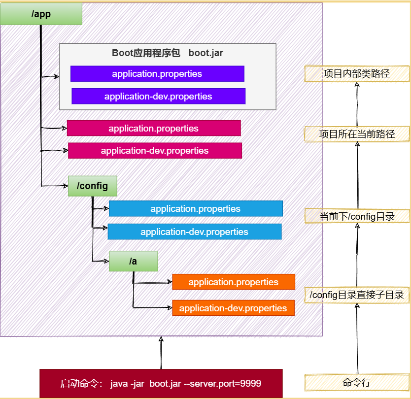
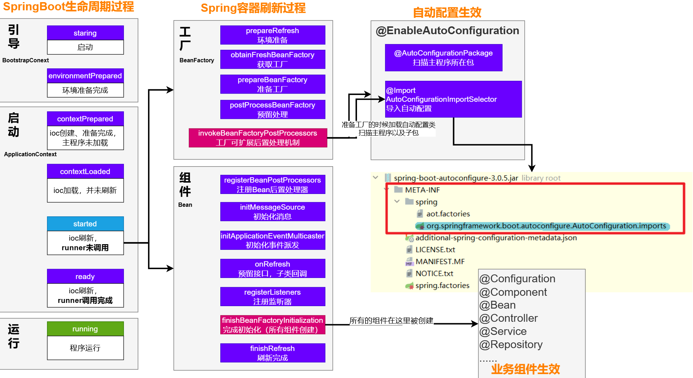
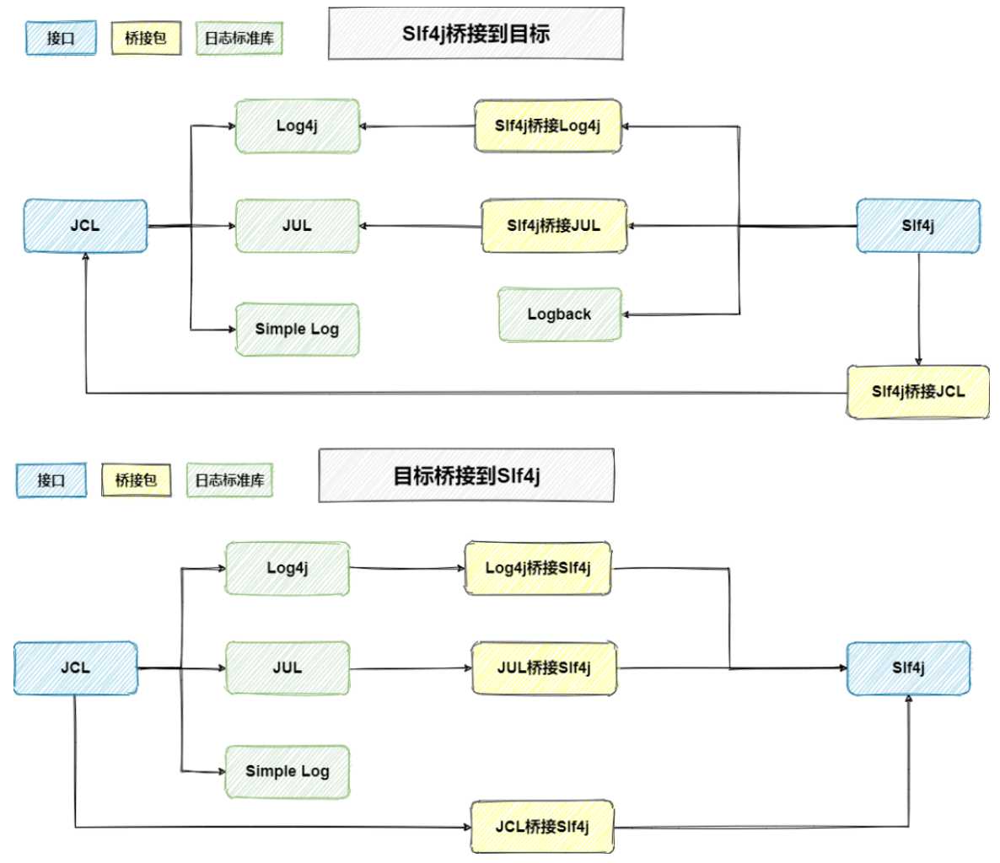
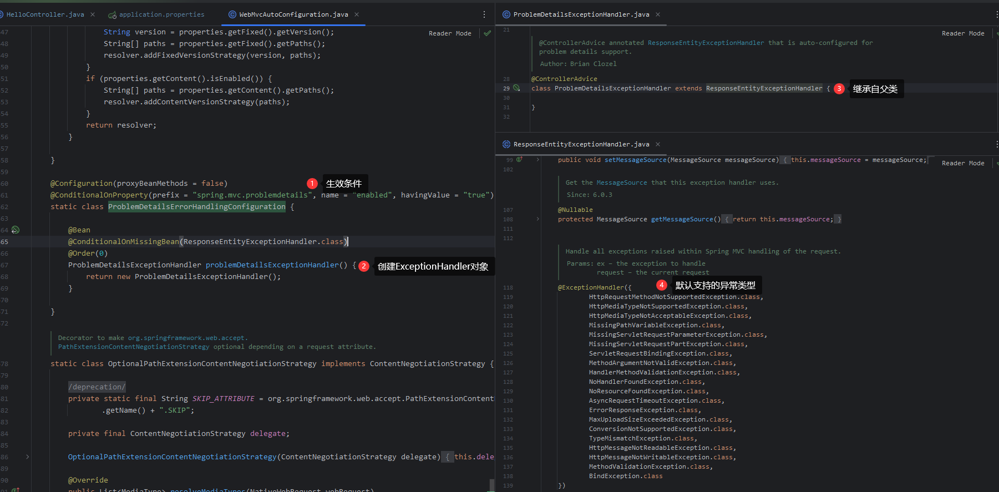
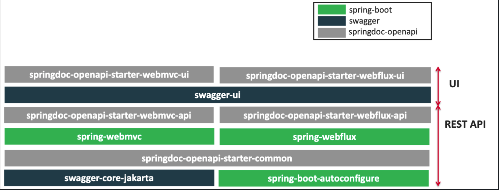
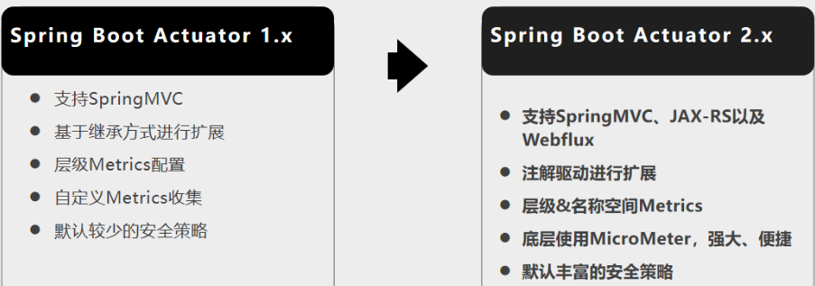
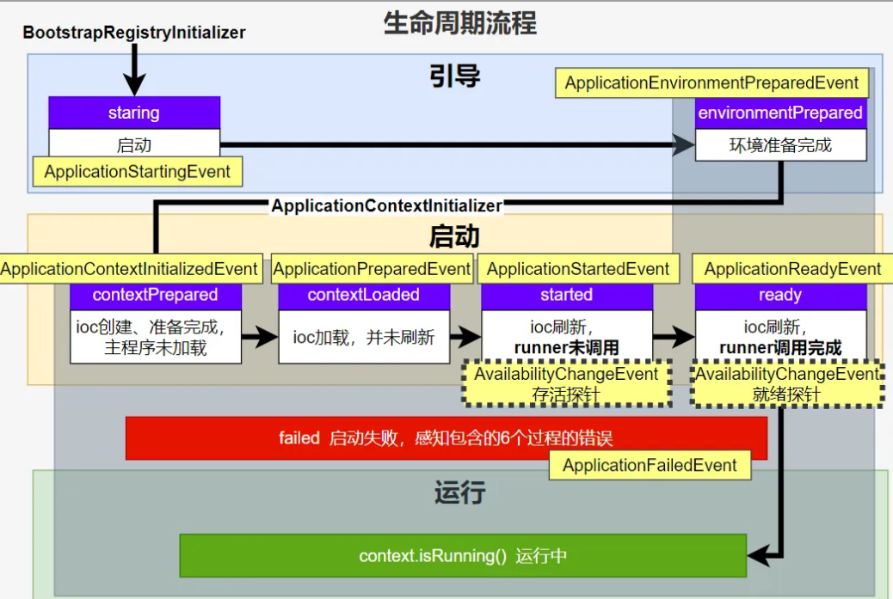

# 1、Hello World

## 1、POM文件

### 1、父项目

父项目的作用：SpringBoot 的版本仲裁中心，统一管理 SpringBoot 应用里所有依赖版本，之后导入依赖默认不需要写版本（没有在父项目 dependencies 里声明的需要写）

```xml
<parent>
    <groupId>org.springframework.boot</groupId>
    <artifactId>spring-boot-starter-parent</artifactId>
    <version>3.3.4</version>
    <relativePath/> <!-- lookup parent from repository -->
</parent>


<parent>
    <groupId>org.springframework.boot</groupId>
    <artifactId>spring-boot-dependencies</artifactId>
    <version>3.3.4</version>
</parent>
```


### 2、启动器

```xml
<dependency>
    <groupId>org.springframework.boot</groupId>
    <artifactId>spring-boot-starter-web</artifactId>
</dependency>
```

spring-boot-starter-web：导入了 web 模块正常运行所依赖的组件，并自动配置好了常用功能，比如字符编码等

spring-boot-starter：spring-boot 场景启动器，SpringBoot 将所有的功能场景抽取，做成多个 spring-boot-starter-xxx 启动器，需要在项目使用只需引入需要的 starer-xxx，那么相关的依赖就都会导入


## 2、主程序类

```java
// 标注一个主程序类，说明这是一个 SpringBoot 应用
@SpringBootApplication
public class HelloWorldSpringBoot {
    public static void main(String[] args) {
        // 启动 Spring 应用
        SpringApplication.run(HelloWorldSpringBoot.class, args);
    }
}
```


# 2、相关注解

## 1、@SpringBootApplication

Spring Boot 应用标注在某个类上说明这个类是 SpringBoot 的主配置类

SpringBoot 就应该运行这个类的 main 方法来启动 SpringBoot 应用

 SpringBoot 只会扫描主程序所在的包及其下面的子包，自动的 component-scan 功能

- @SpringBootApplication 是复合注解：@SpringBootConfiguration、@EnableAutoConfiguration、@ComponentScan

```java
@SpringBootConfiguration
@EnableAutoConfiguration
@ComponentScan(excludeFilters = { 
    	@Filter(type = FilterType.CUSTOM, classes = TypeExcludeFilter.class),
		@Filter(type = FilterType.CUSTOM, classes = AutoConfigurationExcludeFilter.class) })
public @interface SpringBootApplication {
```

~~~java
// 自定义扫描
@SpringBootApplication(scanBasePackages = "com.xxx")
@ComponentScan("com.xxx")
~~~


## 2、@SpringBootConfiguration

标注在某个类上，表示这个是一个 SpringBoot 的配置类


## 3、@Configuration

配置类上标注这个注解，配置类 = 配置文件，配置类也是容器中的一个组件 @Component

- **Full** 模式与 **Lite** 模式
  - 配置类组件之间无依赖关系，用 Lite 模式，加速容器启动过程，减少判断
  - 配置类组件之间有依赖关系，用 Full 模式，方法会被调用得到之前单实例组件

~~~java
############################# Configuration 使用示例######################################################
/**
 * 1、配置类里面使用 @Bean 标注在方法上给容器注册组件，默认也是单实例的
 * 2、配置类本身也是组件
 * 3、proxyBeanMethods：代理 Bean 的方法
 *      Full(proxyBeanMethods = true)、【保证每个 @Bean 方法被调用多少次返回的组件都是单实例的】
 *      Lite(proxyBeanMethods = false)、【每个 @Bean 方法被调用多少次返回的组件都是新创建的】
 */
@Configuration(proxyBeanMethods = false)
public class MyConfig {

    /**
     * Full:外部无论对配置类中的这个组件注册方法调用多少次获取的都是之前注册容器中的单实例对象
     * 给容器中添加组件
     * 以方法名作为组件的 id
     * 返回类型就是组件类型
     * @return 返回的值，就是组件在容器中的实例。
     */
    @Bean 
    public User user01(){
        User zhangsan = new User("zhangsan", 18);
        // user 组件依赖了 Pet 组件
        zhangsan.setPet(tomcatPet());
        return zhangsan;
    }
    @Bean("tom")
    public Pet tomcatPet(){
        return new Pet("tomcat");
    }
}


################################ @Configuration 测试代码如下########################################
@SpringBootConfiguration
@EnableAutoConfiguration
@ComponentScan("com.xxx.boot")
public class MainApplication {

    public static void main(String[] args) {
        // 1、返回 IOC 容器
        ConfigurableApplicationContext run = SpringApplication.run(MainApplication.class, args);

        // 2、查看容器里面的组件
        String[] names = run.getBeanDefinitionNames();
        for (String name : names) {
            System.out.println(name);
        }

        // 3、从容器中获取组件
        Pet tom01 = run.getBean("tom", Pet.class);
        Pet tom02 = run.getBean("tom", Pet.class);
        System.out.println("组件："+(tom01 == tom02));
        
        // 4、com.xxx.boot.config.MyConfig$$EnhancerBySpringCGLIB$$51f1e1ca@1654a892
        MyConfig Bean = run.getBean(MyConfig.class);
        System.out.println(Bean);

        // 如果 @Configuration(proxyBeanMethods = true) 代理对象调用方法
        // SpringBoot 总会检查这个组件是否在容器中有
        // 保持组件单实例
        User user = Bean.user01();
        User user1 = Bean.user01();
        System.out.println(user == user1);

        User user01 = run.getBean("user01", User.class);
        Pet tom = run.getBean("tom", Pet.class);
        System.out.println("用户的宠物："+(user01.getPet() == tom));
    }
}
~~~


**注意**：

- 组件之间存在依赖必须使用 Full 模式默认，其他默认是 Lite 模式


## 4、@EnableAutoConfiguration

开启自动配置功能，SpringBoot 自动配置

```java
@AutoConfigurationPackage
@Import(AutoConfigurationImportSelector.class)
public @interface EnableAutoConfiguration {
```

@EnableAutoConfiguration 作用：利用 **AutoConfigurationImportSelector** 给容器中导入一些组件

查看 selectImports() 及调用的方法：

- List<String> configurations <= getAutoConfigurationEntry.getCandidateConfigurations

  - 获取候选的配置

- getAutoConfigurationEntry.getConfigurationClassFilter.getAutoConfigurationImportFilters.SpringFactoriesLoader.loadFactories

  - 扫描所有 jar 包类路径下 META-INF/spring/org.springframework.boot.autoconfigure.AutoConfiguration.imports，把这些文件内容包装成 properties 对象


  - 从 properties 中获取到 EnableAutoConfiguration.class 类对应的值，然后添加在容器中

  - 将类路径下 META-INF/spring/org.springframework.boot.autoconfigure.AutoConfiguration.imports 里面配置的所有 EnableAutoConfiguration 的值加入到容器中

- ```
  # Auto Configure 例子
  org.springframework.boot.autoconfigure.EnableAutoConfiguration=\
  org.springframework.boot.autoconfigure.admin.SpringApplicationAdminJmxAutoConfiguration,\
  org.springframework.boot.autoconfigure.aop.AopAutoConfiguration,\
  org.springframework.boot.autoconfigure.amqp.RabbitAutoConfiguration,\
  ```

- 每一个这样的  xxxAutoConfiguration 类都是容器中的一个组件，加入到容器中用来做自动配置

参照[官方文档](https://docs.spring.io/spring-boot/docs/current/reference/html/application-properties.html#appendix.application-properties.server)可以了解，哪些配置文件映射成了哪些类


## 5、@AutoConfigurationPackage

自动配置包


## 6、@Import

给容器中自动创建出组件、默认组件的名字就是全类名

**@Import(AutoConfigurationPackages.Registrar.class)**

- Spring 底层注解 @Import，给容器中导入一个组件，导入的组件由 AutoConfigurationPackages.Registrar.class，将主配置类（@SpringBootApplication 标注的类）的所在包及下面所有子包里面的所有组件扫描注入到 Spring 容器

**@Import(EnableAutoConfigurationImportSelector.class)**

- 给容器中导入组件，EnableAutoConfigurationImportSelector 选择导入哪些组件，将所有需要导入的组件以全类名的方式返回，这些组件就会被添加进容器中


~~~java
@Import({User.class, DBHelper.class})
@Configuration(proxyBeanMethods = false)
public class MyConfig {}
~~~

程序启动时会给容器中导入许多自动配置类（xxxAutoConfiguration），就是给容器中导入这个场景需要的所有组件，并配置好这些组件

~~~java
SpringFactoriesLoader.loadFactoryNames(EnableAutoConfiguration.class,classLoader)；
~~~

Spring Boot 在启动的时候从类路径下的 META-INF/spring/org.springframework.boot.autoconfigure.AutoConfiguration.imports 中获取 EnableAutoConfiguration 指定的值，将这些值作为自动配置类导入到容器中，自动配置类就生效，进行自动配置工作

J2EE 的整体整合解决方案和自动配置都在 spring-boot-autoconfigure-1.5.9.RELEASE.jar；


## 7、@ImportResource

原生配置文件引入，导入 Spring 的配置文件，让配置文件里面的内容生效

Spring Boot 里面没有 Spring 的配置文件，自己编写的配置文件也不能自动识别

想让 Spring 的配置文件生效加载进来，需要添加注解 **@ImportResource** 标注在一个配置类上

~~~xml
======================Beans.xml=========================
<?xml version="1.0" encoding="UTF-8"?>
<Beans xmlns="http://www.springframework.org/schema/Beans"
       xmlns:xsi="http://www.w3.org/2001/XMLSchema-instance"
       xmlns:context="http://www.springframework.org/schema/context"
       xsi:schemaLocation="http://www.springframework.org/schema/Beans http://www.springframework.org/schema/Beans/spring-Beans.xsd http://www.springframework.org/schema/context https://www.springframework.org/schema/context/spring-context.xsd">

    <Bean id="haha" class="com.xxx.boot.Bean.User">
        <property name="name" value="zhangsan"></property>
        <property name="age" value="18"></property>
    </Bean>

    <Bean id="hehe" class="com.xxx.boot.Bean.Pet">
        <property name="name" value="tomcat"></property>
    </Bean>
</Beans>
~~~

~~~java
@ImportResource("classpath:Beans.xml")
public class MyConfig {}

======================测试=================
        boolean haha = run.containsBean("haha");
        boolean hehe = run.containsBean("hehe");
        System.out.println("haha："+haha);//true
        System.out.println("hehe："+hehe);//true
~~~


## 8、@ConfigurationProperties

Spring Boot 将本类中的所有属性和配置文件中的相关配置进行绑定

**属性**：

- prefix：选择配置文件中哪个属性进行映射


**注意**：

- 只有这个组件是容器中的组件，才能使用该注解的功能


通过导入配置文件处理器，获得编写配置提示

```xml
<dependency>
	<groupId>org.springframework.boot</groupId>
	<artifactId>spring-boot-configuration-processor</artifactId>
	<optional>true</optional>
</dependency>
```

~~~yml
person:
    lastName: hello
~~~

~~~java
@Component // 直接交给 Spring Boot 管理，否则需要使用 @EnableConfigurationProperties
@ConfigurationProperties(prefix = "person")
public class Person {
    private String lastName;
}
~~~


## 9、@PropertySource

加载指定的配置文件

```java
@PropertySource(value ={"classpath:person.properties"})
public class Person{}
```


## 10、@Conditional

作用：@Conditional 指定的条件成立，才给容器中添加组件，配置里面的所有内容才生效

| @Conditional扩展注解            | 作用（判断是否满足当前指定条件）                 |
| ------------------------------- | ------------------------------------------------ |
| @ConditionalOnJava              | 系统的java版本是否符合要求                       |
| @ConditionalOnBean              | 容器中存在指定Bean；                             |
| @ConditionalOnMissingBean       | 容器中不存在指定Bean；                           |
| @ConditionalOnExpression        | 满足SpEL表达式指定                               |
| @ConditionalOnClass             | 系统中有指定的类                                 |
| @ConditionalOnMissingClass      | 系统中没有指定的类                               |
| @ConditionalOnSingleCandidate   | 容器中只有一个指定的Bean，或者这个Bean是首选Bean |
| @ConditionalOnProperty          | 系统中指定的属性是否有指定的值                   |
| @ConditionalOnResource          | 类路径下是否存在指定资源文件                     |
| @ConditionalOnWebApplication    | 当前是web环境                                    |
| @ConditionalOnNotWebApplication | 当前不是web环境                                  |
| @ConditionalOnJndi              | JNDI存在指定项                                   |


**注意：**

- 自动配置类必须在一定的条件下才能生效
- 可以通过启用  debug=true 属性，来让控制台打印自动配置报告，方便的知道哪些自动配置类生效


```java
=========================
AUTO-CONFIGURATION REPORT
=========================


Positive matches:（自动配置类启用的）
-----------------

   DispatcherServletAutoConfiguration matched:
      - @ConditionalOnClass found required class 'org.springframework.web.servlet.DispatcherServlet'; @ConditionalOnMissingClass did not find unwanted class (OnClassCondition)
      - @ConditionalOnWebApplication (required) found StandardServletEnvironment (OnWebApplicationCondition)
        
    
Negative matches:（没有启动，没有匹配成功的自动配置类）
-----------------

   ActiveMQAutoConfiguration:
      Did not match:
         - @ConditionalOnClass did not find required classes 'javax.jms.ConnectionFactory', 'org.apache.activemq.ActiveMQConnectionFactory' (OnClassCondition)

   AopAutoConfiguration:
      Did not match:
         - @ConditionalOnClass did not find required classes 'org.aspectj.lang.annotation.Aspect', 'org.aspectj.lang.reflect.Advice' (OnClassCondition)
```


## 11、@EnableConfigurationProperties

@EnableConfigurationProperties 注解的作用是使 @ConfigurationProperties 注解生效

如果只配置 @ConfigurationProperties 注解，在 IOC 容器中是获取不到 properties 配置文件转化的 Bean

当然在 @ConfigurationProperties 加入注解的类上加 @Component 也可以使交于 Spring Boot 管理

~~~java
@Configuration
@EnableConfigurationProperties(Person.class)
public class PersonAutoConfiguration {
 
    private Person person;
 
    public PersonAutoConfiguration(Person person) {
        this.person = person;
    }
}
~~~


# 3、配置文件

## 1、配置文件

SpringBoot 使用一个全局的配置文件，配置文件名是固定的

- application.properties
- application.yml

配置文件的作用：修改 SpringBoot 自动配置的默认值

在配置文件中，可以使用属性占位符，获取之前配置的值，${server.port}


## 2、YAML 格式

YAML 配置例子：

```yaml
server:
  port: 8081
```


### 1、基本语法

语法：**k：(空格)v**

- 以**空格**的缩进来控制层级关系，只要是左对齐的数据，都是同一个层级的

- 属性和值也是**大小写敏感**


```yaml
server:
    port: 8081
    path: /hello
```


### 2、值的写法

#### 1、字面量

普通的值（数字，字符串，布尔），单个的、不可再分的值，date、boolean、string、number、null

**语法**：k: v

**注意**：

- 字面直接写

- 字符串默认不用加上单引号或者双引号
- ""：双引号，不会转义字符串里面的特殊字符，特殊字符会作为本身想表示的意思

- ''：单引号，会转义特殊字符，特殊字符最终只是一个普通的字符串数据


#### 2、对象、Map（属性和值）（键值对）

**语法**：在下一行来写对象的属性和值的关系，注意缩进，对象还是 k: v 的方式

**单行语法**：换行，注意缩进

```yaml
friends:
 lastName: zhangsan
 age: 20
```

**行内写法**：使用 {} 包括，键值对用逗号隔开

```yaml
friends: {lastName: zhangsan,age: 18}
```


#### 3、数组（List、Set）

**语法**：用 - 值 表示数组中一个元素

**单行语法**：换行，注意缩进，注意 - 后的空格

```yaml
pets:
 - cat
 - dog
 - pig
```

**行内语法**：使用 [] 包括，值之间只用逗号隔开

```yaml
pets: [cat,dog,pig]
```


## 3、配置文件值注入

可以使用 @ConfigurationProperties 与 @Value 注入配置文件的值

### 1、配置文件

```yaml
person:
    lastName: hello
    age: 18
    boss: false
    birth: 2017/12/12
    maps: {k1: v1,k2: 12}
    lists:
      - lisi
      - zhaoliu
    dog:
      name: 小狗
      age: 12
```


### 2、Bean

```java
@Component
@ConfigurationProperties(prefix = "person")
public class Person {
    private String lastName;
    private Integer age;
    private Boolean boss;
    private Date birth;
    private Map<String,Object> maps;
    private List<Object> lists;
    private Dog dog;
}
```


### 3、注入校验

```java
@Component
@ConfigurationProperties(prefix = "person")
@Validated // 用于启用数据校验
public class Person {
    @Email // lastName 必须是邮箱格式
    // @Value("${person.last-name}")
    private String lastName;
    private Integer age;
    private Boolean boss;
    private Date birth;
    private Map<String,Object> maps;
    private List<Object> lists;
    private Dog dog;
```


## 5、配置文件占位符

### 1、随机数

```properties
${random.value}
${random.int}
${random.long}
${random.int(10)}
${random.int[1024,65536]}
```


### 2、占位符获取之前配置的值

如果没有，可以用：指定默认值

```properties
person.last-name=张三${random.uuid}
person.age=${random.int}
person.birth=2017/12/15
person.boss=false
person.maps.k1=v1
person.maps.k2=14
person.lists=a,b,c
person.dog.name=${person.hello:hello}_dog
person.dog.age=15
```


## 6、Profile

### 1、多 Profile 文件

默认使用 application.properties 的配置，任何时候都会被加载

在配置文件编写的时候，文件名可以是 **application-{profile}.properties/yml**，以此区分不同配置文件，默认是 default

也可以在 yml 文件中使用文档块区分


### 2、yml 多文档块

先使用 --- 划分配置文件，再使用 profiles 属性指定文件块归属名称，最后使用 active 激活指定文件块

```yaml
server:
  port: 8081
  
spring:
  profiles:
    active: 
     -prod
     -dev  # 激活需要的配置块，可以激活一个或多个模块

---
server:
  port: 8083
spring:
  profiles: dev # 指定属于哪个环境

---
server:
  port: 8084
spring:
  profiles: prod  # 指定属于哪个环境
```

~~~yaml
server:
  port: 8081

spring:
  profiles:
    group:
      pr1:
        -prod
        -dev
    active: pr1 # 先加载 pr1，后加载同组的 prod、dev

---
server:
  port: 8083
spring:
  profiles: dev
  
---
server:
  port: 8084
spring:
  profiles: prod
  
---
server:
  port: 8084
spring:
  profiles: pr1
~~~


### 3、激活指定 Profile

**1、在配置文件中指定 ：**spring.profiles.active=dev

**2、命令行：**java -jar spring-boot-02-config-0.0.1-SNAPSHOT.jar --spring.profiles.active=dev; 可以在测试时，传入命令行参数

**3、虚拟机参数**：-Dspring.profiles.active=dev


**注意**：

- 如果多方指定，命令行相比配置文件优先级较高


### 4、@Profile

指定何种环境被加载

~~~java
// 条件装配
@Configuration(proxyBeanMethods = false)
@Profile("prod")
public class ProductionConfiguration {
    // ...
}
~~~


## 7、配置文件加载位置

springboot 启动会扫描以下位置的 application.properties/yml 文件作为 Spring boot 的默认配置文件

- file:./config/
  - jar 包当前目录的 config 文件夹下的直接子目录

- file:./config

  - jar 包当前目录的 config 文件夹

- classpath:/config/

  - classpathg 根路径的 config 文件夹

- classpath:/

  - classpath 根路径


**注意**：

- 
  优先级由高到低，高优先级的配置会覆盖低优先级的配置


- SpringBoot 会从这四个位置全部加载主配置文件并互补配置


- 可以通过 spring.config.location 来改变默认的配置文件位置


**注意**：

1. 项目打包好以后，可以使用命令行参数的形式，启动项目的时候来指定配置文件的新位置
2. 指定的配置文件和默认加载的这些配置文件共同起作用形成互补配置
   - java -jar spring-boot-02-config-02-0.0.1-SNAPSHOT.jar --spring.config.location=G:/application.properties


## 8、外部配置加载顺序

SpringBoot 也可以从以下位置加载配置

优先级从高到低，高优先级的配置覆盖低优先级的配置，所有的配置会形成互补配置

1. 命令行参数
  - 所有的配置都可以在命令行上进行指定
  - java -jar spring-boot-02-config-02-0.0.1-SNAPSHOT.jar --server.port=8087  --server.context-path=/abc
  - 多个配置用空格分开 --配置项=值
2. 来自 java:comp/env 的 JNDI 属性
3. Java 系统属性（System.getProperties()）
4. 操作系统环境变量
5. RandomValuePropertySource 配置的 random.* 属性值
6. 由 jar 包外向 jar 包内进行寻找
7. 优先加载带 profile
8. jar 包外部的 application-{profile}.properties/yml（带 spring.profile）配置文件
9. jar 包内部的 application-{profile}.properties/yml（带 spring.profile）配置文件
10. 加载不带 profile
11. jar 包外部的 application-{profile}.properties/yml（不带 spring.profile）配置文件
12. jar 包内部的 application-{profile}.properties/yml（不带 spring.profile）配置文件
13. @Configuration 注解类上的 @PropertySource
14. 通过 SpringApplication.setDefaultProperties 指定的默认属性

所有支持的配置加载来源[参考官方文档](https://docs.spring.io/spring-boot/docs/1.5.9.RELEASE/reference/htmlsingle/#boot-features-external-config)


## 9、自动配置流程

~~~java
// 查看自动配置了什么组件
public static void main(String[] args) {
    // var 局部变量类型的自动推断
    var ioc = SpringApplication.run(MainApplication.class, args);

    // 获取容器中所有组件的名字
    String[] names = ioc.getBeanDefinitionNames();

    // 遍历：
    // dispatcherServlet、BeanNameViewResolver、characterEncodingFilter、multipartResolver
    // SpringBoot 自动配置的核心组件，以前需要手动配置
    for (String name : names) {
        System.out.println(name);
    }
}
~~~

1、导入 starter-web：导入 web 开发 starter

- 启动器导入了相关场景的所有依赖：starter-json、starter-tomcat、springmvc
- 每个启动器都引入了一个 spring-boot-starter，核心启动器
- 核心启动器引入了 spring-boot-autoconfigure 包
- spring-boot-autoconfigure 里面囊括了所有 starter 的所有配置
- 只要这个包下的所有类都能生效，那么相当于 SpringBoot 官方写好的整合功能就生效
- SpringBoot 默认扫描不到 spring-boot-autoconfigure 下写好的所有配置类，这些配置类做了整合操作，默认只扫描主程序所在的包

2、主程序：@SpringBootApplication

- @SpringBootApplication 由三个注解组成 @SpringBootConfiguration、@EnableAutoConfiguratio、@ComponentScan
- SpringBoot 默认只能扫描主程序所在的包及其下面的子包，扫描不到 spring-boot-autoconfigure 包中官方写好的配置类
- @EnableAutoConfiguration：SpringBoot 开启自动配置
  - 是由 @Import(AutoConfigurationImportSelector.class) 提供功能：批量给容器中导入组件
  - SpringBoot 启动会默认加载 142 个配置类
  - 这142个配置类来自于 spring-boot-autoconfigure下 META-INF/spring/org.springframework.boot.autoconfigure.AutoConfiguration.imports 文件指定

- 项目启动的时候利用 @Import 批量导入组件机制把 autoconfigure 包下的142 xxxxAutoConfiguration 自动配置类导入

- 按需生效：并不是这 142 个自动配置类都能生效，每一个自动配置类，都有条件注解 @ConditionalOnxxx，只有条件成立才生效 

3、xxxxAutoConfiguration 自动配置类

- 给容器中使用 @Bean 放一堆组件
- 每个自动配置类都可能有这个注解 @EnableConfigurationProperties(xxx.class)，用来把配置文件中配的指定前缀的属性值封装到 xxxProperties 属性类中
- 以 Tomcat 为例：把服务器的所有配置都是以 server 开头的，配置都封装到了 server 属性类

4、给容器中放的所有组件的一些核心参数，都来自于 xxxProperties，xxxProperties 都是和配置文件绑定

- 只需要改配置文件的值，核心组件的底层参数都能修改

以 **HttpEncodingAutoConfiguration（Http编码自动配置）**为例

~~~java
// 从配置文件中获取指定的值和 Bean 的属性进行绑定
@ConfigurationProperties(prefix = "spring.http.encoding")  
public class HttpEncodingProperties {
   public static final Charset DEFAULT_CHARSET = Charset.forName("UTF-8");
}
~~~

```java
// 表示这是一个配置类，以前编写的配置文件一样，也可以给容器中添加组件
@Configuration

// 启动指定类的 ConfigurationProperties 功能
// 将配置文件中对应的值和 HttpEncodingProperties 绑定起来
// 并把 HttpEncodingProperties 加入到 ioc 容器中
@EnableConfigurationProperties(HttpEncodingProperties.class)

// 判断当前应用是否是 web 应用，如果是，当前配置类生效
@ConditionalOnWebApplication 

// 判断当前项目有没有这个类 CharacterEncodingFilter，SpringMVC 中进行乱码解决的过滤器
@ConditionalOnClass(CharacterEncodingFilter.class)  

// 判断配置文件中是否存在某个配置 spring.http.encoding.enabled，如果不存在，判断也是成立的
// 即使配置文件中不配置 pring.http.encoding.enabled=true，也是默认生效的
@ConditionalOnProperty(prefix = "spring.http.encoding", value = "enabled", matchIfMissing = true)  

public class HttpEncodingAutoConfiguration {
  
  	// 已经和 SpringBoot 的配置文件映射了
  	private final HttpEncodingProperties properties;
  
    // 只有一个有参构造器的情况下，参数的值就会从容器中拿
  	public HttpEncodingAutoConfiguration(HttpEncodingProperties properties) {
		this.properties = properties;
	}
  
    // 给容器中添加一个组件，这个组件的某些值需要从 properties 中获取
    @Bean
	// 判断容器没有这个组件？ 
    @ConditionalOnMissingBean(CharacterEncodingFilter.class) 
	public CharacterEncodingFilter characterEncodingFilter() {
		CharacterEncodingFilter filter = new OrderedCharacterEncodingFilter();
		filter.setEncoding(this.properties.getCharset().name());
		filter.setForceRequestEncoding(this.properties.shouldForce(Type.REQUEST));
		filter.setForceResponseEncoding(this.properties.shouldForce(Type.RESPONSE));
		return filter;
	}
```


**总结**：

1. SpringBoot 启动会加载大量的自动配置类
2. 看需要的功能有没有 SpringBoot 默认写好的自动配置类
3. 再来看这个自动配置类中到底配置了哪些组件（只要组件有，就不需要再来配置了）
4. 给容器中自动配置类添加组件的时候，会从 properties 类中获取某些属性，可以在配置文件中指定这些属性的值







## 10、修改默认配置

1. SpringBoot 在自动配置很多组件的时候，先看容器中有没有用户自己配置的（@Bean、@Component）如果有就用用户配置的，如果没有，才自动配置，如果有些组件可以有多个（ViewResolver）将用户配置的和自己默认的组合起来
2. 在 SpringBoot 中会有非常多的 xxxConfigurer 帮助进行扩展配置

3. 在 SpringBoot 中会有很多的 xxxCustomizer 帮助进行定制配置


# 4、日志框架

## 1、简介

| 日志门面(类似JDBC) | 日志门面配合日志实现的桥接包 | 日志实现                     | 备注                                        |
| ------------------ | ---------------------------- | ---------------------------- | ------------------------------------------- |
| Slf4j              | logback-classic.jar          | Logback                      | 不可单独使用                                |
| Slf4j              | slf4j-jdk14.jar              | Jul (Java Util Logging)      | 可单独使用，太简单一般不用                  |
| Slf4j              | slf4j-jcl.jar                | JCL(Jakarta Commons Logging) | 可单独使用                                  |
| Slf4j              | slf4j-log4j12.jar            | Log4j                        | 可单独使用                                  |
| Slf4j              | log4j-slf4j-impl.jar         | Log4j2                       | 可单独使用，不是 log4j 的升级，不兼容 log4j |

SpringBoot：底层是 Spring，Spring 默认时使用 JCL，SpringBoot 选用 SLF4J 和 Logback


## 2、SLF4J

### 1、在系统中使用

在开发时，调用日志记录方法，不应该直接调用日志的实现类，而是调用日志的抽象层。

例子：导入 slf4j 的 jar 和  logback 的实现 jar

```java
import org.slf4j.Logger;
import org.slf4j.LoggerFactory;

public class HelloWorld {
  public static void main(String[] args) {
   // 需要给 getLogger 方法传入需要记录的类   
    Logger logger = LoggerFactory.getLogger(HelloWorld.class);
    logger.info("Hello World");
  }
}
```

每一个日志的实现框架都有自己的配置文件，使用 slf4j 以后，**配置文件还是做成日志实现框架自己本身的配置文件**


**注意**：

- 如果不想重复编写 LoggerFactory，可以添加 lombok 依赖，使用 @Slf4j


### 2、统一日志记录

不同的框架使用的是不同的日志框架，需要统一日志记录





**解决方法：**

1、将系统中其他日志框架先排除出去

2、用中间包来替换原有的日志框架

3、导入 slf4j 其他的实现


## 3、日志关系

### 1、日志启动器

```xml
<dependency>
  <groupId>org.springframework.boot</groupId>
  <artifactId>spring-boot-starter-logging</artifactId>
</dependency>
```


### 2、底层依赖关系

1. SpringBoot 底层也是使用 slf4j+logback 的方式进行日志记录
2. SpringBoot 也把其他的日志都替换成了 slf4j

3. 中间替换包

4. 引入其他框架，一定要把这个框架的默认日志依赖移除掉

```java
@SuppressWarnings("rawtypes")
public abstract class LogFactory {

    static String UNSUPPORTED_OPERATION_IN_JCL_OVER_SLF4J = "http://www.slf4j.org/codes.html#unsupported_operation_in_jcl_over_slf4j";

    static LogFactory logFactory = new SLF4JLogFactory();
```


SpringBoot 排除了 Spring 的 commons-logging 框架

```xml
<dependency>
	<groupId>org.springframework</groupId>
	<artifactId>spring-core</artifactId>
	<exclusions>
        移除默认日志框架
		<exclusion>
			<groupId>commons-logging</groupId>
			<artifactId>commons-logging</artifactId>
		</exclusion>
	</exclusions>
</dependency>
```

SpringBoot 能自动适配所有日志，而且底层使用 slf4j+logback 的方式记录日志，引入其他框架的时候，只需要把这个框架依赖的日志框架排除掉即可


### 3、默认日志配置

每个 starter，都会导入一个核心 spring-boot-starter

核心 starter 引入了日志功能 spring-boot-starter-logging

默认使用 logback + slf4j 组合作为默认底层日志

日志是利用监听器机制配置好的，ApplicationListener

日志所有的配置都可以通过修改配置文件实现，以 logging 开始的所有配置


## 4、日志使用

### 1、默认配置

SpringBoot 默认帮配置好了日志

```java
// 记录器
Logger logger = LoggerFactory.getLogger(getClass());
@Test
public void contextLoads() {
    // System.out.println();
    // 日志的级别；
    // 由低到高 trace<debug<info<warn<error
    // 可以调整输出的日志级别；日志就只会在这个级别以以后的高级别生效
    logger.trace("这是trace日志...");
    logger.debug("这是debug日志...");
    // SpringBoot 默认使用的是 info 级别的，没有指定级别的就用 SpringBoot 默认规定的级别；root 级别
    // root 的 logger-name 叫 root，可以配置 logging.level.root=warn，代表所有未指定日志级别都使用 root 的 warn 级别
    logger.info("这是info日志...");
    logger.warn("这是warn日志...");
    logger.error("这是error日志...");
}
```

    日志输出格式：
    	%d表示日期时间，
    	%thread表示线程名，
    	%-5level：级别从左显示5个字符宽度
    	%logger{50} 表示logger名字最长50个字符，否则按照句点分割。 
    	%msg：日志消息，
    	%n是换行符
    -->
    %d{yyyy-MM-dd HH:mm:ss.SSS} [%thread] %-5level %logger{50} - %msg%n


### 2、修改配置

```properties
logging.level.com.xxx=trace
# logging.path=
# 不指定路径在当前项目下生成 springboot.log 日志
# 可以指定完整的路径；
# logging.file=G:/springboot.log

# 在当前磁盘的根路径下创建 spring 文件夹和里面的 log 文件夹；使用 spring.log 作为默认文件
logging.path=/spring/log

# 在控制台输出的日志的格式
logging.pattern.console=%d{yyyy-MM-dd} [%thread] %-5level %logger{50} - %msg%n
# 指定文件中日志输出的格式
logging.pattern.file=%d{yyyy-MM-dd} === [%thread] === %-5level === %logger{50} ==== %msg%n
```

| logging.file | logging.path | Example  | Description                        |
| ------------ | ------------ | -------- | ---------------------------------- |
| (none)       | (none)       |          | 只在控制台输出                     |
| 指定文件名   | (none)       | my.log   | 输出日志到my.log文件               |
| (none)       | 指定目录     | /var/log | 输出到指定目录的 spring.log 文件中 |


### 3、指定配置

给类路径下放上每个日志框架的配置文件即可，SpringBoot 就不使用默认配置了

| Logging System          | Customization                                                |
| ----------------------- | ------------------------------------------------------------ |
| Logback                 | `logback-spring.xml`, `logback-spring.groovy`, `logback.xml` or `logback.groovy` |
| Log4j2                  | `log4j2-spring.xml` or `log4j2.xml`                          |
| JDK (Java Util Logging) | `logging.properties`                                         |

logback.xml：会直接被日志框架识别

**logback-spring.xml**：日志框架不直接加载日志的配置项，由 SpringBoot 解析日志配置，可以使用 SpringBoot 的高级 Profile 功能

```xml
<springProfile name="staging">
    <!-- configuration to be enabled when the "staging" profile is active -->
  	可以指定某段配置只在某个环境下生效
</springProfile>
```

例子

```xml
<appender name="stdout" class="ch.qos.logback.core.ConsoleAppender">
    <layout class="ch.qos.logback.classic.PatternLayout">
        
        <springProfile name="dev">
           <pattern>%d{yyyy-MM-dd HH:mm:ss.SSS} ----> [%thread] ---> %-5level %logger{50} - %msg%n</pattern>
        </springProfile>
        
        <springProfile name="!dev">
           <pattern>%d{yyyy-MM-dd HH:mm:ss.SSS} ==== [%thread] ==== %-5level %logger{50} - %msg%n</pattern          </springProfile>
                
    </layout>
</appender>
```

如果使用 logback.xml 作为日志配置文件，还要使用 profile 功能，会有以下错误 `no applicable action for [springProfile]`


### 4、日志分组

将相关的 logger 分组在一起，统一配置

~~~properties
logging.group.tomcat=org.apache.catalina,org.apache.coyote,org.apache.tomcat
logging.level.tomcat=trace
~~~

预定义的俩组：

| Name | Loggers                                                      |
| ---- | ------------------------------------------------------------ |
| web  | org.springframework.core.codec, org.springframework.http, org.springframework.web, org.springframework.boot.actuate.endpoint.web, org.springframework.boot.web.servlet.ServletContextInitializerBeans |
| sql  | org.springframework.jdbc.core, org.hibernate.SQL, org.jooq.tools.LoggerListener |


### 5、文件输出

SpringBoot 默认只把日志写在控制台，如果想额外记录到文件，可以在 application.properties/yml 中添加 logging.file.name or logging.file.path 配置项

| logging.file.name | logging.file.path | 示例     | 效果                              |
| ----------------- | ----------------- | -------- | --------------------------------- |
| 未指定            | 未指定            |          | 仅控制台输出                      |
| **指定**          | 未指定            | my.log   | 写入指定文件，可以加路径          |
| 未指定            | **指定**          | /var/log | 写入指定目录，文件名为 spring.log |
| **指定**          | **指定**          |          | 以 logging.file.name 为准         |

| 配置项                                               | 描述                                                         |
| ---------------------------------------------------- | ------------------------------------------------------------ |
| logging.logback.rollingpolicy.file-name-pattern      | 日志存档的文件名格式（默认值：${LOG_FILE}.%d{yyyy-MM-dd}.%i.gz） |
| logging.logback.rollingpolicy.clean-history-on-start | 应用启动时是否清除以前存档（默认值：false）                  |
| logging.logback.rollingpolicy.max-file-size          | 存档前，每个日志文件的最大大小（默认值：10MB）               |
| logging.logback.rollingpolicy.total-size-cap         | 日志文件被删除之前，可以容纳的最大大小（默认值：0B），设置1GB则磁盘存储超过 1GB 日志后就会删除旧日志文件 |
| logging.logback.rollingpolicy.max-history            | 日志文件保存的最大天数(默认值：7)                            |


**注意**：

- 日志应该独立分割出来存档，如果使用 logback（SpringBoot 默认整合），可以通过 application.properties/yaml 文件指定日志滚动规则
- 如果是其他日志系统，需要自行配置（添加 log4j2.xml 或 log4j2-spring.xml）


## 5、切换日志框架

可以按照 slf4j 的日志适配图，进行相关的切换


### 1、slf4j+log4j

```xml
<dependency>
  <groupId>org.springframework.boot</groupId>
  <artifactId>spring-boot-starter-web</artifactId>
    排除默认logback日志框架，排除log4j转换包
  <exclusions>
    <exclusion>
      <artifactId>logback-classic</artifactId>
      <groupId>ch.qos.logback</groupId>
    </exclusion>
    <exclusion>
      <artifactId>log4j-over-slf4j</artifactId>
      <groupId>org.slf4j</groupId>
    </exclusion>
  </exclusions>
</dependency>

添加日志框架 slf4j+log4j
<dependency>
  <groupId>org.slf4j</groupId>
  <artifactId>slf4j-log4j12</artifactId>
</dependency>
```


### 2、log4j2

```xml
<dependency>
    <groupId>org.springframework.boot</groupId>
    <artifactId>spring-boot-starter-web</artifactId>
    排除默认日志框架
    <exclusions>
        <exclusion>
            <artifactId>spring-boot-starter-logging</artifactId>                   	                       				<groupId>org.springframework.boot</groupId>
        </exclusion>
    </exclusions>
</dependency>

添加 log4j
<dependency>
    <groupId>org.springframework.boot</groupId>
    <artifactId>spring-boot-starter-log4j2</artifactId>
</dependency>
```


# 5、WEB 开发

## 1、MVC 自动配置

### 1、WebMvcAutoConfiguration

#### 1、概述

WebMvcAutoConfiguration 中有 3 个内部类

- WebMvcAutoConfigurationAdapter：声明在 WebMvcAutoConfiguration 中，是为了确保当该类不在类路径下时不会被读取到
- EnableWebMvcConfiguration：相当于具备默认配置的 @EnableWebMvc
- ResourceChainCustomizerConfiguration


#### 2、生效条件

~~~java
@AutoConfiguration(after = { 
DispatcherServletAutoConfiguration.class, 
TaskExecutionAutoConfiguration.class,
ValidationAutoConfiguration.class }) // 在这些自动配置之后
@ConditionalOnWebApplication(type = Type.SERVLET) // 如果是 web 应用就生效，类型 SERVLET、REACTIVE 响应式 web
@ConditionalOnClass({ Servlet.class, DispatcherServlet.class, WebMvcConfigurer.class })
@ConditionalOnMissingBean(WebMvcConfigurationSupport.class) // 容器中没有这个 Bean，才生效，默认是没有
@AutoConfigureOrder(Ordered.HIGHEST_PRECEDENCE + 10) // 优先级
@ImportRuntimeHints(WebResourcesRuntimeHints.class)
public class WebMvcAutoConfiguration {}
~~~


#### 3、默认配置

**org.springframework.boot.autoconfigure.web：web 的所有自动配置**

~~~java
public WebMvcAutoConfigurationAdapter(ResourceProperties resourceProperties, 
                                      WebMvcProperties mvcProperties,
                                      ListableBeanFactory BeanFactory, 
                                      ObjectProvider<HttpMessageConverters> messageConvertersProvider,
                                      ObjectProvider<ResourceHandlerRegistrationCustomizer>
                                      resourceHandlerRegistrationCustomizerProvider,
                                      ObjectProvider<DispatcherServletPath> dispatcherServletPath,
                                      ObjectProvider<ServletRegistrationBean<?>> servletRegistrations) {
    // 获取和 spring.resources 绑定的所有的值的对象
    this.resourceProperties = resourceProperties;
    // 获取和 spring.mvc 绑定的所有的值的对象
    this.mvcProperties = mvcProperties;
    // Spring 的 BeanFactory
    this.BeanFactory = BeanFactory;
    // 找到所有的 HttpMessageConverters
    this.messageConvertersProvider = messageConvertersProvider;
    // 找到资源处理器的自定义器
    this.resourceHandlerRegistrationCustomizer =resourceHandlerRegistrationCustomizerProvider
        										.getIfAvailable();
    // 应用访问路径
    this.dispatcherServletPath = dispatcherServletPath;
    // 给应用注册 Servlet、Filter....
    this.servletRegistrations = servletRegistrations;
}
~~~

WebMvcAutoConfiguration 自动配置类：

1. 注入 HiddenHttpMethodFilter：支持 RESTful 

2. 注入 FormContentFilter：支持非 POST 请求，请求体携带数据

3. 导入 **EnableWebMvcConfiguration**：继承了 DelegatingWebMvcConfiguration

   1. RequestMappingHandlerAdapter：

   2. WelcomePageHandlerMapping： 欢迎页功能支持（模板引擎目录、静态资源目录放 index.html）

   3. RequestMappingHandlerMapping：找每个请求由谁处理的映射关系

   4. ExceptionHandlerExceptionResolver：默认的异常解析器 

   5. LocaleResolver：国际化解析器

   6. ThemeResolver：主题解析器

   7. FlashMapManager：临时数据共享

   8. FormattingConversionService： 数据格式化 、类型转化

      1. Converter：类型转换器，添加的格式化器转换器，只需要放在容器中即可

      2. Formatter：格式化器  2017.12.17===Date

      3. 支持 **HttpMessageConverter**

         - HttpMessageConverter：SpringMVC 用来转换 Http 请求和响应的，User---Json

         - HttpMessageConverters 是从容器中确定，获取所有的 HttpMessageConverter

         - 给容器中添加 HttpMessageConverter，只需要将组件注册容器中（@Bean，@Component）

      4. 自动注册 **MessageCodesResolver**：定义错误代码生成规则

      5. ~~~java
         @Bean
         // 在文件中配置日期格式化的规则
         @ConditionalOnProperty(prefix = "spring.mvc", name = "date-format")
         public Formatter<Date> dateFormatter() {
         	// 日期格式化组件
             return new DateFormatter(this.mvcProperties.getDateFormat());
         }
         ~~~

      6. ~~~java
         // 注入请求转换过滤器
         @Bean
         @ConditionalOnMissingBean(HiddenHttpMethodFilter.class)
         @ConditionalOnProperty(prefix = "spring.mvc.hiddenmethod.filter", name = "enabled", matchIfMissing = false)
         public OrderedHiddenHttpMethodFilter hiddenHttpMethodFilter() {
             return new OrderedHiddenHttpMethodFilter();
         }
         
         // 自定义请求转换过滤器
         @Bean
         public HiddenHttpMethodFilter hiddenHttpMethodFilter(){
             HiddenHttpMethodFilter methodFilter = new HiddenHttpMethodFilter();
             methodFilter.setMethodParam("_m"); // 自定义_method
             return methodFilter;
         }
         ~~~

   9. Validator： 数据校验 JSR303 提供的数据校验功能

   10. WebBindingInitializer：请求参数的封装与绑定

       1. 初始化 WebDataBinder，请求数据绑定到 JavaBean
       1. 自动使用 ConfigurableWebBindingInitializer，实现消息处理、数据绑定、类型转化、数据校验

   11. ContentNegotiationManager：内容协商管理器

4. **WebMvcAutoConfigurationAdapter **配置生效，它是一个 WebMvcConfigurer，定义 mvc 底层组件

   1. 定义好 WebMvcConfigurer 底层组件默认功能
   2. InternalResourceViewResolver：资源路径视图解析器
   3. ContentNegotiatingViewResolver：内容协商视图解析器，组合所有的视图解析器，选择兼容视图解析器的输出
   4. BeanNameViewResolver：视图名视图解析器，Controller 方法的返回值字符串解析为视图
   5. RequestContextFilter：请求上下文过滤器，可在任意位置获取当前请求
   6. SimpleUrlHandlerMapping：定义默认 favicon.ico
   7. ProblemDetailsExceptionHandler：错误详情
   8. 定义静态资源链规则

5. SpringMVC 内部场景异常被它捕获

6. 定义 MVC 默认的底层行为: WebMvcConfigurer


### 2、WebMvcConfigurer 接口

WebMvcConfigurer 接口提供了一系列方法，用于配置 Spring MVC 中的各种功能：

1. addArgumentResolvers：允许添加自定义的参数解析器，用于支持自定义的控制器方法参数类型
2. addCorsMappings：配置全局的跨域请求处理，允许设置跨域请求的规则
3. addFormatters：除了默认注册的转换器和格式化器之外，允许添加额外的转换器和格式化器
4. addInterceptors：添加 Spring MVC 生命周期拦截器，用于在控制器方法调用和资源处理器请求的前后进行预处理和后处理
5. addResourceHandlers：添加处理程序以从特定位置提供静态资源，例如图片、js 和 css 文件，这些资源可以来自 Web 应用程序根目录、类路径等位置
6. addReturnValueHandlers：允许添加处理程序以支持自定义的控制器方法返回值类型
7. addViewControllers：配置简单的自动化控制器，预先配置了响应状态码和/或要渲染响应体的视图 
8. configureAsyncSupport：配置异步请求处理选项，用于处理异步请求
9. configureContentNegotiation：配置内容协商选项，用于确定客户端和服务器之间要使用的内容格式
10. configureDefaultServletHandling：配置处理程序以委托未处理的请求，将其转发给 Servlet 容器的“默认”Servlet
11. configureHandlerExceptionResolvers：配置异常解析器，用于处理控制器方法抛出的异常
12. configureMessageConverters：配置用于读取请求体和写入响应体的 HttpMessageConverters
13. configurePathMatch：帮助配置 HandlerMapping 的路径匹配选项，例如是否使用解析后的 PathPatterns 或字符串模式匹配，是否匹配尾部斜杠等
14. configureViewResolvers：配置视图解析器，用于将控制器返回的基于字符串的视图名称转换为具体的视图实现，以执行渲染 
15. extendHandlerExceptionResolvers：扩展或修改默认配置的异常解析器列表
16. extendMessageConverters：在配置或使用默认列表初始化后，扩展或修改转换器列表
17. getMessageCodesResolver：提供自定义的 MessageCodesResolver，用于从数据绑定和验证错误代码构建消息代码
18. getValidator：提供自定义的 Validator，而不是默认创建的 Validator


### 3、EnableWebMvcConfiguration

~~~java
// Spring Boot 给容器中注入 WebMvcConfigurationSupport 组件
// 如果手动注入 WebMvcConfigurationSupport 组件，Boot 的 WebMvcAutoConfiguration 都会失效
@Configuration(proxyBeanMethods = false)
@EnableConfigurationProperties(WebProperties.class)
public static class EnableWebMvcConfiguration 
    extends DelegatingWebMvcConfiguration 
    implements ResourceLoaderAware {}
~~~


### 4、WebMvcConfigurationSupport

提供默认设置

判断系统中是否有相应的类：如果有，就加入相应的 HttpMessageConverter

~~~java
jackson2Present = ClassUtils.isPresent("com.fasterxml.jackson.databind.ObjectMapper", classLoader) &&
				ClassUtils.isPresent("com.fasterxml.jackson.core.JsonGenerator", classLoader);
jackson2XmlPresent = ClassUtils.isPresent("com.fasterxml.jackson.dataformat.xml.XmlMapper", classLoader);
jackson2SmilePresent = ClassUtils.isPresent("com.fasterxml.jackson.dataformat.smile.SmileFactory", classLoader);
~~~


### 3、扩展 Spring MVC

如果想保持 web 启动器的默认配置，并且自定义更多配置，如：interceptors、formatters、view controllers 等，可以使用@Configuration 注解添加一个 WebMvcConfigurer 类型的配置类，并不要标注 @EnableWebMvc，这样既保留了所有自动配置，也能用我们扩展的配置

```java
@Configuration
public class WebConfig implements WebMvcConfigurer {

    @Override
    public void addViewControllers(ViewControllerRegistry registry) {
        registry.addViewController("/").setViewName("forward:/index.html");
    }

    @Override
    public void addResourceHandlers(ResourceHandlerRegistry registry) {
        registry.addResourceHandler("/static/**").addResourceLocations("classpath:/static/");
    }

}
```


**注意**：

- 在 5.0 之后 **WebMvcConfigurer** 接口具有默认实现，所以直接实现接口接口也可以，WebMvcConfigurerAdapter 将被移除


**原理**：

- EnableWebMvcConfiguration 会将所有的 WebMvcConfigurer 相关配置都来整合


### 4、全面接管 SpringMVC

需要在添加注解 **@EnableWebMvc** 即可，如此 Spring Boot 对 SpringMVC 的自动配置都失效了，所有都需要手动配置

```java
@Configuration
@EnableWebMvc
public class WebConfig implements WebMvcConfigurer {
    .....
}
```

**原理**：

- @EnableWebMvc 会导入一个只具备核心功能的 DelegatingWebMvcConfiguration，继承自 WebMvcConfigurationSupport，而 WebMvcAutoConfiguration 生效的条件就是不存在 WebMvcConfigurationSupport

```java
@Import(DelegatingWebMvcConfiguration.class)
public @interface EnableWebMvc {}
```

```java
@Configuration
public class DelegatingWebMvcConfiguration extends WebMvcConfigurationSupport {
```

```java
@Configuration
@ConditionalOnWebApplication
@ConditionalOnClass({ Servlet.class, DispatcherServlet.class,
		WebMvcConfigurerAdapter.class })
// 容器中没有这个组件的时候，这个自动配置类才生效
@ConditionalOnMissingBean(WebMvcConfigurationSupport.class)
@AutoConfigureOrder(Ordered.HIGHEST_PRECEDENCE + 10)
@AutoConfigureAfter({ DispatcherServletAutoConfiguration.class,
		ValidationAutoConfiguration.class })
public class WebMvcAutoConfiguration {
```


## 2、静态资源映射

### 1、概述

~~~java
// spring.web.resources.static-locations默认配置
private static final String[] CLASSPATH_RESOURCE_LOCATIONS = { "classpath:/META-INF/resources/",
                                                              "classpath:/resources/", 
                                                              "classpath:/static/", 
                                                              "classpath:/public/" };

// spring.mvc.static-path-pattern 默认配置
private String staticPathPattern = "/**";

// 源码，通过重写可以实现自定义
@Override
public void addResourceHandlers(ResourceHandlerRegistry registry) {
    if (!this.resourceProperties.isAddMappings()) {
        logger.debug("Default resource handling disabled");
        return;
    }
    addResourceHandler(registry, 
                       this.mvcProperties.getWebjarsPathPattern(), 
                       "classpath:/META-INF/resources/webjars/");
    
    addResourceHandler(registry, 
                       this.mvcProperties.getStaticPathPattern(), 
                       (registration) -> {
                           registration.addResourceLocations(this.resourceProperties.getStaticLocations());
        if (this.servletContext != null) {
            ServletContextResource resource = 
                new ServletContextResource(this.servletContext, SERVLET_LOCATION);
            registration.addResourceLocations(resource);
        }
    });
}
~~~

只要静态资源放在类路径下：/static、/public、/resources、/META-INF/resources，就能使用 [当前项目根路径 + / + 静态资源名] 访问


**原理**：

- 先由 Controller 看能不能处理请求，不能处理的请求都交给静态资源处理器，静态资源处理器也找不到则响应 404 页面


**注意**：

- 静态资源的访问路径必须是绝对路径 /css/**，不能是相对路径 css/\*\*

- 配置时填写路径也是一样


### 2、基本规则

#### 1、/webjars/** 

去 classpath:/META-INF/resources/webjars/ 找资源

webjars：以 jar 包的方式引入静态资源


```xml
<!--引入 jquery-webjar -->
<dependency>
    <groupId>org.webjars</groupId>
    <artifactId>jquery</artifactId>
    <version>3.3.1</version>
</dependency>
在访问的时候只需要写 webjars下面资源的名称即可
访问地址：http://localhost:8080/webjars/jquery/3.3.1/jquery.js 后面地址要按照依赖里面的包路径
```


#### 2、welcomePage

静态资源文件夹下的所有 index.html 页面，被默认的 spring.mvc.static-path-pattern = "/**" 映射

```java
// 配置欢迎页映射
@Bean
public WelcomePageHandlerMapping welcomePageHandlerMapping(ResourceProperties resourceProperties) {
    return new WelcomePageHandlerMapping(resourceProperties.getWelcomePage(),
                                         this.mvcProperties.getStaticPathPattern());
}
```


#### 3、**/favicon.ico

favicon.ico 放在静态资源目录下即可，也就都是在静态资源文件下找


#### 4、/**

访问 /** 路径的静态资源，从默认的四个位置找

- classpath:/META-INF/resources/

- classpath:/resources/
- classpath:/static/
- classpath:/public/


### 3、缓存规则

缓存设置可以通过配置文件或者注册资源处理器

- cachePeriod：缓存周期，默认没有，以 s 为单位，生成 HTTP 头 Cache-Control: max-age=[seconds]

- cacheControl：HTTP 缓存控制，更多样的 HTTP 头，会覆盖 cachePeriod

- useLastModified：是否使用最后一次修改，配合 HTTP Cache 规则


~~~java
@Configuration
public class CustomWebMvcConfig implements WebMvcConfigurer {

    @Override
    public void addResourceHandlers(ResourceHandlerRegistry registry) {
        registry.addResourceHandler("/static/**")
                .addResourceLocations("classpath:/custom-static/")
                .setCachePeriod(3600)
                .resourceChain(true);
    }
}
~~~

~~~properties
# 开启静态资源映射规则，默认是 true
spring.web.resources.add-mappings=true

# 设置缓存
spring.web.resources.cache.period=3600
# 缓存详细合并项控制，会覆盖 period 配置
# 最大缓存时间
spring.web.resources.cache.cachecontrol.max-age=7200
# 最后修改时间，对比服务器和浏览器的资源是否相同没有变化，相同返回 304
spring.web.resources.cache.use-last-modified=true
~~~


### 4、配置映射

配置文件或者代码均可

~~~properties
# 1、spring.web：
# 1.配置国际化的区域信息
# 2.静态资源策略(开启、处理链、缓存)

# 开启静态资源映射规则
spring.web.resources.add-mappings=true

# 设置缓存
spring.web.resources.cache.period=3600
## 缓存详细合并项控制，覆盖 period 配置：
spring.web.resources.cache.cachecontrol.max-age=7200
## 共享缓存
spring.web.resources.cache.cachecontrol.cache-public=true
# 使用资源 last-modified 时间，来对比服务器和浏览器的资源是否相同没有变化。相同返回 304
spring.web.resources.cache.use-last-modified=true

# 自定义静态资源文件夹位置
spring.web.resources.static-locations=classpath:/a/,classpath:/b/,classpath:/static/

# 2、 spring.mvc
## 2.1. 自定义 webjars 路径前缀
spring.mvc.webjars-path-pattern=/wj/**
## 2.2. 静态资源访问路径前缀
spring.mvc.static-path-pattern=/static/**
~~~

~~~java
@Configuration //这是一个配置类
public class MyConfig implements WebMvcConfigurer {


    @Override
    public void addResourceHandlers(ResourceHandlerRegistry registry) {
        //保留以前规则
        //自己写新的规则。
        registry.addResourceHandler("/static/**")
                .addResourceLocations("classpath:/a/","classpath:/b/")
                .setCacheControl(CacheControl.maxAge(1180, TimeUnit.SECONDS));
    }
}
~~~


### 4、静态资源链

#### 1、概述

用于优化静态资源的处理过程，通过资源链，可以对静态资源进行额外处理，比如：资源解析、版本控制、压缩、缓存优化等

资源链通过引入资源解析器（ResourceResolver）和 资源转换器（ResourceTransformer）实现

~~~java
@Configuration
public class CustomWebMvcConfig implements WebMvcConfigurer {

    @Override
    public void addResourceHandlers(ResourceHandlerRegistry registry) {
        
        // 配置静态资源处理路径
        registry.addResourceHandler("/static/**") // 处理所有 /static/ 路径下的请求
                .addResourceLocations("classpath:/custom-static/") // 定义静态资源的物理位置
                .setCacheControl(CacheControl.maxAge(30, TimeUnit.DAYS).cachePublic()) // 缓存 30 天
                .resourceChain(true) // 启用资源链，允许对资源进行解析和转换处理
                .addResolver(getVersionResourceResolver()) // 添加资源解析器用于版本化处理
                .addTransformer(new CssLinkResourceTransformer()); // 添加 CSS 资源转换器，处理 CSS 中的链接
    }

    /**
     * 定义一个版本控制的资源解析器，用于给资源添加版本号
     */
    private VersionResourceResolver getVersionResourceResolver() {
        VersionResourceResolver versionResourceResolver = new VersionResourceResolver();
        // 通过内容生成资源的版本号策略，适用于所有路径（/**）
        versionResourceResolver.addContentVersionStrategy("/**");
        return versionResourceResolver;
    }
}
~~~

~~~properties
# 记得开启
spring.web.resources.chain.strategy.content.enabled=true
~~~


#### 2、工作流程

1. 请求静态资源： 客户端发出对静态资源的请求（如 /static/css/styles.css）
2. 资源解析： 首先使用资源解析器（ResourceResolver）来查找请求路径所对应的资源，如果启用了版本控制，解析器还会检查 URL 中是否包含版本号，并根据版本号解析正确的资源
3. 资源转换： 如果启用了资源转换器（ResourceTransformer），解析出的资源将被转换器处理，比如压缩、路径修改或动态注入版本号等
4. 缓存策略应用： 应用缓存策略（如 CacheControl），确保客户端能够缓存资源，并根据资源版本控制确保当资源更新时，客户端能够获取到最新的资源
5. 返回资源： 最后，处理好的资源（经过解析和转换）会通过 HTTP 响应返回给客户端


### 5、禁用默认配置

将 spring.web.resources.add-mappings 设置为 false 时，Spring Boot 将禁用默认的静态资源映射，意味着 Spring Boot 不再自动将特定目录 /resources/static、/resources/public 等的静态资源映射到相应的 URL 路径，因此需要手动配置静态资源的处理方式

~~~java
spring.web.resources.add-mappings=false
~~~

~~~java
@Configuration
public class CustomWebMvcConfig implements WebMvcConfigurer {

    @Override
    public void addResourceHandlers(ResourceHandlerRegistry registry) {
        registry.addResourceHandler("/static/**")
                .addResourceLocations("classpath:/custom-static/")
                .setCachePeriod(3600)
                .resourceChain(true);
        
        // 根据需要添加更多的资源处理器
    }
}
~~~

甚至可以自定义 Controller 来手动控制静态资源

~~~java
@Controller
public class StaticResourceController {

    @GetMapping("/custom-static/{filename:.+}")
    public ResponseEntity<Resource> getStaticResource(@PathVariable String filename) throws IOException {
        Resource resource = new ClassPathResource("/custom-static/" + filename);
        if (!resource.exists()) {
            return ResponseEntity.notFound().build();
        }

        return ResponseEntity.ok()
                .header(HttpHeaders.CONTENT_TYPE, "image/png") // 根据资源类型动态设置
                .body(resource);
    }
}
~~~


## 3、路径匹配

### 1、概述

Spring 5.3 之后加入了 **PathPatternParser**  策略


### 2、Ant 风格

Ant 风格的路径模式语法具有以下规则：

- *：表示**任意数量**的字符
- ?：表示任意**一个字符**
- **：表示**任意数量的目录 **
- {}：表示一个命名的模式**占位符**
- []：表示**字符集合**，例如[a-z]表示小写字母

例如：

- *.html 匹配任意名称，扩展名为.html的文件
- /folder1/*/*.java 匹配在 folder1 目录下的任意两级目录下的 .java 文件
- /folder2/**/*.jsp 匹配在 folder2 目录下任意目录深度的 .jsp 文件
- /{type}/{id}.html 匹配任意文件名为 {id}.html，在任意命名的 {type} 目录下的文件


**注意**：

- Ant 风格的路径模式语法中的特殊字符需要转义，如：

  - 要匹配文件路径中的星号，则需要转义为 \\*

  - 要匹配文件路径中的问号，则需要转义为 \\?


### 3、PPP 风格

PathPatternParser 兼容 AntPathMatcher语法，并支持更多类型的路径模式

在 PPP 策略下，"**" 多段匹配的支持仅允许在模式末尾使用


### 4、模式切换

新版本默认启用 PPP

~~~properties
# 改变路径匹配策略：
# ant_path_matcher 老版策略
# path_pattern_parser 新版策略
spring.mvc.pathmatch.matching-strategy=ant_path_matcher
~~~

~~~java
// 启用 PathPatternParser
@Override
public void configurePathMatch(PathMatchConfigurer configurer) {
configurer.setPatternParser(new PathPatternParser());
}

// 启用 AntPathMatcher
@Override
public void configurePathMatch(PathMatchConfigurer configurer) {
    configurer.setPathMatcher(new AntPathMatcher());
}
~~~


**注意**：

- PathPatternParser 与 AntPathMatcher 互斥


## 4、内容协商

### 1、概述

为同一 URL 提供不同的资源形式


### 2、默认规则

基于**请求头内容协商**：（默认开启）

1. 客户端向服务端发送请求，携带 HTTP 标准的 **Accept 请求头**
   - Accept：application/json、text/xml、text/yaml
2. 服务端根据客户端请求头期望的数据类型进行动态返回


基于**请求参数内容协商：（需要开启）**

1. 发送请求 GET /projects/spring-boot?format=json 
2. 匹配到 @GetMapping("/projects/spring-boot") 
3. 根据**参数协商**，优先返回 json 类型数据【**需要开启参数匹配设置**】
4. 发送请求 GET /projects/spring-boot?format=xml，优先返回 xml 类型数据


### 3、开启参数内容协商

配置文件或者代码二选一

~~~properties
# 开启基于请求参数的内容协商功能。 默认参数名：format。 默认此功能不开启
spring.mvc.contentnegotiation.favor-parameter=true
# 指定内容协商时使用的参数名。默认是 format
spring.mvc.contentnegotiation.parameter-name=type
~~~

~~~java
@Override
public void configureContentNegotiation(ContentNegotiationConfigurer configurer) {
    configurer
            .favorParameter(true)
            .parameterName("media");
}
~~~


### 4、自定义返回内容

~~~java
@Override
public void configureContentNegotiation(ContentNegotiationConfigurer configurer) {
    configurer
            .favorParameter(true)
            .parameterName("media");
    configurer.mediaType("yaml", new MediaType("text", "yaml"));
}
~~~

~~~properties
# 或者使用配置文件
# 新增一种媒体类型
spring.mvc.contentnegotiation.media-types.yaml=text/yaml
~~~

~~~xml
<dependency>
    <groupId>com.fasterxml.jackson.dataformat</groupId>
    <artifactId>jackson-dataformat-yaml</artifactId>
</dependency>
~~~

~~~java
@Override
public void configureMessageConverters(List<HttpMessageConverter<?>> converters) {
    converters.add(new YMLHttpMessageConverter());
}
~~~

~~~java
public class YMLHttpMessageConverter extends AbstractHttpMessageConverter<Object> {

    private ObjectMapper objectMapper = null; //把对象转成yaml

    public YMLHttpMessageConverter(){
        // 告诉 SpringBoot 这个 MessageConverter 支持哪种媒体类型  
        super(new MediaType("text", "yaml", StandardCharsets.UTF_8)); // 媒体类型
        YAMLFactory factory = new YAMLFactory().disable(YAMLGenerator.Feature.WRITE_DOC_START_MARKER);
        this.objectMapper = new ObjectMapper(factory);
    }

    @Override
    protected boolean supports(Class<?> clazz) {
        return true;
    }

    @Override
    protected Object readInternal(Class<?> clazz, HttpInputMessage inputMessage) 
        throws HttpMessageNotReadableException {
        // request body
        return null;
    }

    @Override
    protected void writeInternal(Object o, HttpOutputMessage outputMessage) 
        throws IOException, HttpMessageNotWritableException {
        // response body
        try(OutputStream os = outputMessage.getBody()){
            this.objectMapper.writeValue(os, o);
        }
    }
}

~~~


### 5、原理

如果 Controller 方法的返回值标注了 @ResponseBody 注解，或者是 RestController

1. 请求进来先来到 DispatcherServlet 的 doDispatch() 进行处理
2. 找到一个 HandlerAdapter 适配器，利用适配器执行目标方法
3. RequestMappingHandlerAdapter 来执行，调用 invokeHandlerMethod 来执行目标方法
4. 目标方法执行之前，准备好两个参数
   1. HandlerMethodArgumentResolver：参数解析器，确定目标方法每个参数值
   2. HandlerMethodReturnValueHandler：返回值处理器，确定目标方法的返回值改怎么处理
5. RequestMappingHandlerAdapter 里面的 invokeAndHandle 真正执行目标方法
6. 目标方法执行完成，返回返回值对象
7. 找到一个合适的返回值处理器 HandlerMethodReturnValueHandler
8. 最终找到 RequestResponseBodyMethodProcessor 能处理标注了 @ResponseBody 注解的方法
9. RequestResponseBodyMethodProcessor 调用 writeWithMessageConverters，利用 MessageConverter 把返回值写出去
10. HttpMessageConverter 会先进行内容协商
11. 遍历所有的 MessageConverter 看谁支持这种内容类型的数据
12. 最终因为要 json 类型，所以调用 MappingJackson2HttpMessageConverter 支持写出 json
13. jackson 用 ObjectMapper 把对象写出去


## 5、模板引擎


### 1、引入依赖

```xml
<dependency>
    <groupId>org.springframework.boot</groupId>
    <artifactId>spring-boot-starter-thymeleaf</artifactId>
</dependency>
```

Spring Boot 中添加 spring-boot-starter-thymeleaf 依赖后，Spring Boot 会自动注入以下类：

- **SpringResourceTemplateResolver**（模板解析器）
- **SpringTemplateEngine**（模板引擎）
- **ThymeleafViewResolver**（thymeleaf视图解析器）等对象

以此使用模板引擎将模板解析成字符串以及生成文件等

~~~java
// 解析邮件模板并绑定变量参数  
var context = new Context();  
context.setVariable("user", buyer);  
// mailContent 为模板 m  
var content = templateEngine.process("mailContent", context); 
~~~


### 2、使用

只需要把 HTML 页面放在 classpath:/templates/，Thymeleaf 就能自动的渲染

```java
@ConfigurationProperties(prefix = "spring.thymeleaf")
public class ThymeleafProperties {
	private static final Charset DEFAULT_ENCODING = Charset.forName("UTF-8");
	private static final MimeType DEFAULT_CONTENT_TYPE = MimeType.valueOf("text/html");
	public static final String DEFAULT_PREFIX = "classpath:/templates/";
	public static final String DEFAULT_SUFFIX = ".html";
}

    
// 自动配置好了
@Configuration(proxyBeanMethods = false)
@EnableConfigurationProperties(ThymeleafProperties.class)
@ConditionalOnClass({ TemplateMode.class, SpringTemplateEngine.class })
@AutoConfigureAfter({ WebMvcAutoConfiguration.class, WebFluxAutoConfiguration.class })
public class ThymeleafAutoConfiguration { }
```

```html
<!DOCTYPE html>
<!-- 导入名称空间 -->
<html lang="en" xmlns:th="http://www.thymeleaf.org">
<head>
    <meta charset="UTF-8">
    <title>Title</title>
</head>
<body>
    <h1>成功！</h1>
    <!--th:text 将 div 里面的文本内容设置为 hello 变量 -->
    <div th:text="${hello}">这是显示欢迎信息</div>
</body>
</html>
```

### 3、语法

#### 1、基础语法

| 表达式名字 | 语法                          | 用途                                                         |
| ---------- | ----------------------------- | ------------------------------------------------------------ |
| 变量取值   | ${...}                        | 获取请求域、session 域、对象等值，通过 model 共享的数据      |
| 选择变量   | *{...}                        | 获取上下文对象值                                             |
| 消息       | #{...}                        | 获取国际化等值                                               |
| 链接       | @{...}                        | 生成链接                                                     |
| 片段表达式 | ~{...}                        | jsp:include 作用，引入公共页面片段                           |
| 设置属性值 | th:任意 html 属性或者 th:attr | 替换原本属性值<br>\ |
| 行内写法   | [[...]] or [(...)]            | \<p>Hello, [[${session.user.name}]]!\</p>                    |

~~~xml
补充：*{} 配合 th:object="${session.user}：
<div th:object="${session.user}">
    <p>Name: <span th:text="*{firstName}">Sebastian</span>.</p>
    <p>Surname: <span th:text="*{lastName}">Pepper</span>.</p>
    <p>Nationality: <span th:text="*{nationality}">Saturn</span>.</p>
</div>
~~~

~~~xml
@{/order/process(execId=${execId},execType='FAST')}
~~~

~~~xml
<div th:insert="~{commons :: main}">...</div>
~~~

~~~xml
<div th:if="${xxx == null}">
    判断表达式
    如果为真显示
    f
</div>

遍历 list
<tr th:each="u : ${list}">
    <td th:text="${u.userid}"></td>
    <td th:text="${u.username}"></td>
    <td th:text="${u.userage}"></td>
</tr>

指定循环次数
<ul>
	<li th:each="index:${#numbers.sequence(1, 5)}" >
		[(${index})].some thing
	</li>
</ul>
~~~


#### 2、基础符号

特殊语法：

- 无操作  ：_   

文本操作：

- 拼串： +
- 文本替换：| The name is ${name} |

布尔操作：

- 二进制运算： and,or
- 取反：!,not

比较运算：

- 比较：>，<，<=，>=（gt，lt，ge,le）
- 等值运算：==,!=（eq，ne）

条件运算：

- if-then： (if)?(then)
- if-then-else: (if)?(then):(else)
- default: (value)?:(defaultValue)


#### 3、内置对象及工具

| 名称 | 用途 |
| ----------- | --------------- |
| param       | 请求参数对象    |
| session     | session 对象    |
| application | application 对象 |
| #execInfo   | 模板执行信息    |
| #messages   | 国际化消息      |
|#uris 			|uri/url 工具|
|#conversions|类型转换工具|
|#dates|日期工具，是 java.util.Date 对象的工具类|
|#calendars|类似 #dates，只不过是 java.util.Calendar 对象的工具类|
|#temporals| JDK8+ **java.time** API 工具类|
|#numbers|数字操作工具|
|#strings|字符串操作|
|#objects|对象操作|
|#bools|bool 操作|
|#arrays|array 工具|
|#lists|list 工具|
|#sets|set 工具|
|#maps|map 工具|
|#aggregates|集合聚合工具（sum、avg）|
|#ids|id 生成工具|


#### 4、属性设置

语法：th:+html 任意属性

~~~xml
<p th:text="${content}">原内容</p>
<a th:href="${url}">登录</a>

~~~


#### 5、迭代

~~~html
<tr th:each="prod:${prods}">
        <td th:text="${prod.name}">Onions</td>
        <td th:text="${prod.price}">2.41</td>
        <td th:text="${prod.inStock}? #{true} : #{false}">yes</td>
</tr>

<tr th:each="prod,iterStat:${prods}" th:class="${iterStat.odd}? 'odd'">
  <td th:text="${prod.name}">Onions</td>
  <td th:text="${prod.price}">2.41</td>
  <td th:text="${prod.inStock}? #{true} : #{false}">yes</td>
</tr>
~~~

iterStat 有以下属性：

- index：当前遍历元素的索引，从 0 开始
- count：当前遍历元素的索引，从 1 开始
- size：需要遍历元素的总数量
- current：当前正在遍历的元素对象
- even/odd：是否偶数/奇数行
- first：是否第一个元素
- last：是否最后一个元素


#### 6、条件运算

~~~html
<a href="comments.html"
	th:href="@{/product/comments(prodId=${prod.id})}"
	th:if="${not #lists.isEmpty(prod.comments)}" >view</a>

<div th:switch="${user.role}">
  <p th:case="'admin'">User is an administrator</p>
  <p th:case="#{roles.manager}">User is a manager</p>
  <p th:case="*">User is some other thing</p>
</div>
~~~


#### 7、公共片段

##### 1、设置公共片段

语法：th:fragment

```html
<div th:fragment="copy">
	xxxxxx
</div>
```

- **templatename：**当前引用片段所在文件位置
- **selector：**公共片段的选择器
- **fragmentname:**公共片段的名字


##### 2、引入公共片段

语法：

- ~{templatename::selector}：模板名::选择器
- ~{templatename::fragmentname}：模板名::片段名

~~~xml
<div th:insert="~{footer :: copy}"></div>
~~~


##### 3、插入公共片段

三种引入公共片段的 th 属性：

- **th:insert**：将公共片段整个插入到声明引入的元素中

- **th:replace**：将声明引入的元素替换为公共片段
- **th:include**：将被引入的片段的内容包含进这个标签中

```html
引入方式
<div th:insert="footer :: copy"></div>
<div th:replace="footer :: copy"></div>
<div th:include="footer :: copy"></div>

insert 效果
<div>
    <footer>
    	xxxxxx
    </footer>
</div>

replace 效果
<footer>
	xxxxxx
</footer>

include 效果
<div>
	xxxxxx
</div>
```

引入片段的时候传入参数： 

```html
<nav class="col-md-2 d-none d-md-block bg-light sidebar" id="sidebar">
    <div class="sidebar-sticky">
        <ul class="nav flex-column">
            <li class="nav-item">
                <a class="nav-link active"
                   th:class="${activeUri=='main.html'?'nav-link active':'nav-link'}"
                   href="#" th:href="@{/main.html}">
                    <svg xmlns="http://www.w3.org/2000/svg" width="24" height="24" viewBox="0 0 24 24" 
                         fill="none" stroke="currentColor" stroke-width="2" stroke-linecap="round" 
                         stroke-linejoin="round" class="feather feather-home">
                        <path d="M3 9l9-7 9 7v11a2 2 0 0 1-2 2H5a2 2 0 0 1-2-2z"></path>
                        <polyline points="9 22 9 12 15 12 15 22"></polyline>
                    </svg>
                    Dashboard <span class="sr-only">(current)</span>
                </a>
            </li>
        </ul>
    </div>
</nav>

<!-- 引入侧边栏，同时传入参数 -->
<div th:replace="commons/bar::#sidebar(activeUri='emps')"></div>
```


##### 4、简单的分页模板

样式使用 Bootstarp4

~~~html
<nav aria-label="Page navigation example">
        <ul class="pagination">
            <!-- 首页 -->
            <li class="page-item"><a class="page-link" th:href="@{/home/1}">首页</a></li>
            <!-- 上一页 -->
            <li class="page-item" th:if="${page.current != 1}"><a class="page-link"
                                                                  th:href="@{'/home/'+${page.current - 1}}"
                                                                  th:text="上一页"></a></li>
            <!-- 中间页 -->
            <li class="page-item" th:each="pageNum:${#numbers.sequence(page.current, page.current+5)}">
                <a class="page-link" th:href="@{'/home/' + ${pageNum}}"
                   th:if="${(pageNum != page.current) && pageNum < (page.total / page.size)+1}"
                   th:text="${pageNum}"></a>

                <a class="page-link" th:href="@{'/home/' + ${pageNum}}"
                   th:if="${(pageNum == page.current) && pageNum < (page.total / page.size)+1}"
                   th:style="'font-weight:bold;background: #6faed9;'"
                   th:text="${pageNum}"></a>
            </li>
            <!-- 下一页 -->
            <li class="page-item" th:if="${page.current < (page.total / page.size)}"><a class="page-link"
                                                                                              th:href="@{'/home/' + ${page.current + 1}}"
                                                                                              th:text="下一页"></a>
            </li>
            <!-- 尾页 -->
            <li class="page-item"><a class="page-link" th:href="@{'/home/' + ${(page.total / page.size)+1}}">尾页</a></li>
        </ul>
    </nav>
~~~


## 6、国际化消息

国际化的自动配置参照 MessageSourceAutoConfiguration，Spring Boot 在类路径根下查找 messages 资源绑定文件，文件名为：messages.properties

多语言可以定义多个消息文件，命名为 messages_区域代码.properties 如：

- messages.properties：默认
- messages_zh_CN.properties：中文环境
- messages_en_US.properties：英语环境

程序中可以注入 MessageSource 组件，获取国际化的配置项值，在页面中可以使用表达式  #{} 获取国际化的配置项值

~~~java
@Autowired  // 国际化取消息用的组件
MessageSource messageSource;

@GetMapping("/haha")
public String haha(HttpServletRequest request){

    Locale locale = request.getLocale();
    // 利用代码的方式获取国际化配置文件中指定的配置项的值
    String login = messageSource.getMessage("login", null, locale);
    return login;
}
~~~


## 7、添加拦截器

实现拦截器接口后，在WebMvcConfigurerAdapter重写方法addInterceptors注册拦截器

```java
// 注册拦截器
@Override
public void addInterceptors(InterceptorRegistry registry) {
    // super.addInterceptors(registry); 
    registry.addInterceptor(new LoginHandlerInterceptor())
        .addPathPatterns("/**") //所有请求都被拦截包括静态资源，*.css , *.js
        .excludePathPatterns("/index.html","/","/user/login", "/static/css/**"); // 放行特定请求与静态资源
}

/**
 * 登录检查
 * 1、配置好拦截器要拦截哪些请求
 * 2、把这些配置放在容器中
 */
@Slf4j
public class LoginInterceptor implements HandlerInterceptor {

    /**
     * 目标方法执行之前
     */
    @Override
    public boolean preHandle(HttpServletRequest request, 
                             HttpServletResponse response, 
                             Object handler) throws Exception {

        String requestURI = request.getRequestURI();
        log.info("preHandle拦截的请求路径是{}",requestURI);

        // 登录检查逻辑
        HttpSession session = request.getSession();

        Object loginUser = session.getAttribute("loginUser");

        if(loginUser != null){
            // 放行
            return true;
        }

        // 拦截住,未登录,跳转到登录页
        request.setAttribute("msg","请先登录");
        // re.sendRedirect("/");
        request.getRequestDispatcher("/").forward(request,response);
        return false;
    }

    /**
     * 目标方法执行完成以后
     */
    @Override
    public void postHandle(HttpServletRequest request, 
                           HttpServletResponse response, 
                           Object handler, 
                           ModelAndView modelAndView) throws Exception {
        log.info("postHandle执行{}",modelAndView);
    }

    /**
     * 页面渲染以后
     */
    @Override
    public void afterCompletion(HttpServletRequest request, 
                                HttpServletResponse response, 
                                Object handler, 
                                Exception ex) throws Exception {
        log.info("afterCompletion执行异常{}",ex);
    }
}
```


## 8、错误处理机制

### 1、概述

- 默认情况下，Spring Boot 提供 **/error** 处理所有错误的映射
- 对于机器客户端，它将生成 JSON 响应，其中包含错误，HTTP 状态和异常消息的详细信息
- 对于浏览器客户端，响应一个 whitelabel 错误视图，以 HTML 格式呈现相同的数据

Spring Boot 默认的错误处理机制，浏览器返回的一个默认错误页面


Spring Boot 根据请求头响应不同的错误数据，如果请求头为优先接受 HTML 页面，则返回默认错误处理页面，如果不限，则返回一个JSON 数据


### 2、默认配置

#### 1、概述

参照 ErrorMvcAutoConfiguration，错误处理的自动配置，其给容器中添加了多种组件

两大核心机制：

- Spring Boot 自适应处理错误，会响应页面或 JSON 数据
- Spring MVC 的错误处理机制依然保留，MVC 处理不了，才会交给 Boot 进行处理


#### 2、组件

##### 1、DefaultErrorAttributes

```text
默认提供一下错误信息
timestamp - 提取错误的时间戳
status - 状态码
error - 错误原因（错误提示）
exception - 异常对象（根异常的类名）
message - 异常消息
errors - JSR303数据校验的错误
trace - 异常堆栈跟踪
path - 引发异常时的 URL 路径
```

```java
// 获取错误信息，帮助我们在页面共享信息
@Override
public Map<String, Object> getErrorAttributes(RequestAttributes requestAttributes, 
                                              boolean includeStackTrace) {
		Map<String, Object> errorAttributes = new LinkedHashMap<String, Object>();
    	// 设置时间戳	
		errorAttributes.put("timestamp", new Date());
    	// 设置状态码
		addStatus(errorAttributes, requestAttributes);
    	// 设置根异常的类名，错误原因，异常堆栈跟踪
		addErrorDetails(errorAttributes, requestAttributes, includeStackTrace);
    	// 设置引发异常时的 URL 路径
		addPath(errorAttributes, requestAttributes);
		return errorAttributes;
	}
```


##### 2、BasicErrorController

处理默认的 /error 请求

```java
@Controller
@RequestMapping("${server.error.path:${error.path:/error}}")
public class BasicErrorController extends AbstractErrorController {
    // 产生 html 类型的数据，浏览器发送的请求来到这个方法处理
    @RequestMapping(produces = "text/html")
	public ModelAndView errorHtml(HttpServletRequest request,
								  HttpServletResponse response) {
		HttpStatus status = getStatus(request);
		Map<String, Object> model = Collections
            						.unmodifiableMap(getErrorAttributes(request,
                                                                        isIncludeStackTrace(request,
                                                                                     MediaType.TEXT_HTML)));
		response.setStatus(status.value());
        
        // 去哪个页面作为错误页面，包含页面地址和页面内容
		ModelAndView modelAndView = resolveErrorView(request, response, status, model);
		return (modelAndView == null ? new ModelAndView("error", model) : modelAndView);
	}

    // 产生 json 数据，其他客户端来到这个方法处理
	@RequestMapping
	@ResponseBody    
	public ResponseEntity<Map<String, Object>> error(HttpServletRequest request) {
		Map<String, Object> body = getErrorAttributes(request, isIncludeStackTrace(request, MediaType.ALL));
		HttpStatus status = getStatus(request);
		return new ResponseEntity<Map<String, Object>>(body, status);
	}
```


##### 3、ErrorPageCustomizer

```java
@Value("${error.path:/error}")
// 系统出现错误以后来到 error 请求进行处理；（web.xml 注册的错误页面规则）
private String path = "/error";
```


##### 4、DefaultErrorViewResolver

```java
@Override
public ModelAndView resolveErrorView(HttpServletRequest request, 
                                     HttpStatus status, 
                                     Map<String, Object> model) {
    
		ModelAndView modelAndView = resolve(String.valueOf(status), model);
		if (modelAndView == null && SERIES_VIEWS.containsKey(status.series())) {
			modelAndView = resolve(SERIES_VIEWS.get(status.series()), model);
		}
		return modelAndView;
	}

	private ModelAndView resolve(String viewName, Map<String, Object> model) {
        // 默认 SpringBoot 可以去找到一个页面 error/404
		String errorViewName = "error/" + viewName;
        
        // 模板引擎可以解析这个页面地址就用模板引擎解析
		TemplateAvailabilityProvider provider = this.templateAvailabilityProviders
				.getProvider(errorViewName, this.applicationContext);
		if (provider != null) {
            // 模板引擎可用的情况下返回到 errorViewName 指定的视图地址
			return new ModelAndView(errorViewName, model);
		}
        // 模板引擎不可用，就在静态资源文件夹下找 errorViewName 对应的页面 error/404.html
		return resolveResource(errorViewName, model);
	}
```


#### 3、处理流程

1. 目标方法运行期间有任何异常都会被捕获，并标志当前请求结束，dispatcherServlet 用 **dispatchException** 保存异常并分派
2. DispatcherServlet 调用 processDispatchResult(); 传入视图以及异常进行处理
3. **processHandlerException();** 处理发生的异常，返回 ModelAndView
   1. 遍历所有的 HandlerExceptionResolvers，看谁能处理当前异常
   2. DefaultErrorAttributes 先来处理异常，但是只会把异常信息保存到 request 域，以便后续的处理器可以访问
   3. 如果没有任何 HandlerExceptionResolver 能处理异常，异常会被抛出，并返回 null
      1. 如果没有任何 HandlerExceptionResolver 能处理
4. **ErrorPageCustomizer** 生效（定制错误的响应规则），将异常映射到一个预定义的 error 页面
5. 底层的 BasicErrorController 处理 /error，根据请求的类型，返回视图或者 JSON
6. 由 **DefaultErrorViewResolver** 解析错误视图，遍历所有的 ErrorViewResolver 看谁能解析
   1. 默认把响应状态码作为错误页的地址，error/500.html
   2. 模板引擎最终响应这个页面 error/500.html

```java
protected ModelAndView resolveErrorView(HttpServletRequest request,
      									HttpServletResponse response, 
                                        HttpStatus status, 
                                        Map<String, Object> model) {
    // 所有的 ErrorViewResolver 得到 ModelAndView
   for (ErrorViewResolver resolver : this.errorViewResolvers) {
      ModelAndView modelAndView = resolver.resolveErrorView(request, status, model);
      if (modelAndView != null) {
         return modelAndView;
      }
   }
   return null;
}
```


### 3、定制错误处理


**注意**：

- 要完全替换默认行为，可以实现 **ErrorController** 并注册该类型的 Bean 定义，或添加 **ErrorAttributes** 类型的组件


#### 1、定制错误页面

前后端不分离的情况下

**有模板引擎**：例子：error/状态码、error/404.html、error/505.html

- 将错误页面命名为**错误状态码.html** 放在模板引擎文件夹里面的 **error 文件夹**，发生此状态码的错误就会来到对应的页面
- 可以使用**4xx**和**5xx**作为错误页面的文件名来模糊匹配这种类型的所有错误
- 精确匹配优先（优先寻找精确的状态码.html）

**没有模板引擎**/模板引擎找不到这个错误页面

- 静态资源文件夹下找


**以上都没有错误页面**

- 默认来到 SpringBoot 默认的错误提示页面


#### 2、定制错误 JSON 数据

@ControllerAdvice + @ExceptionHandler 处理全局异常，底层是 **ExceptionHandlerExceptionResolver 支持的**

自定义异常处理与返回定制 JSON 数据

```java
@ControllerAdvice
public class MyExceptionHandler {
    
    @ResponseBody
    @ExceptionHandler(UserNotExistException.class)
    public Map<String,Object> handleException(Exception e){
        Map<String,Object> map = new HashMap<>();
        map.put("code","user.notexist");
        map.put("message",e.getMessage());
        return map;
    }
}

// 没有自适应效果...
```

转发到 /error 进行自适应响应效果处理


```java
 @ExceptionHandler(UserNotExistException.class)
 public String handleException(Exception e, HttpServletRequest request){
       	Map<String,Object> map = new HashMap<>();
        // 传入错误状态码 4xx 或 5xx，否则就不会进入定制错误页面的解析流程
        /**
         * Integer statusCode = (Integer) request.getAttribute("javax.servlet.error.status_code");
         */
        request.setAttribute("javax.servlet.error.status_code", 500);
        map.put("code","user.notexist");
        map.put("message",e.getMessage());
        // 转发到 /error
        return "forward:/error";
    }
```


#### 3、定制错误数据响应

出现错误以后，会来到 **/error 请求**，会被 **BasicErrorController** 处理

响应出去可以获取的数据是由 **getErrorAttributes** 得到的（AbstractErrorController（ErrorController）规定的方法）

实现方法：

1. 完全来编写一个 **ErrorController** 的实现类，或者是编写 **AbstractErrorController** 的子类，放在容器中
2. 页面上能用的数据，或者是 JSON 返回能用的数据都是通过 **errorAttributes.getErrorAttributes** 得到
3. 容器中 DefaultErrorAttributes.getErrorAttributes()，默认进行数据处理

最终的效果：响应是自适应的，可以通过定制 ErrorAttributes 改变需要返回的内容

```java
//给容器中加入定义的 ErrorAttributes
@Component
public class MyErrorAttributes extends DefaultErrorAttributes {

    @Override
    public Map<String, Object> getErrorAttributes(RequestAttributes requestAttributes, 
                                                  boolean includeStackTrace) {
        
        Map<String, Object> map = super.getErroexrAttributes(requestAttributes, includeStackTrace);
        map.put("xxxx","yyyyy");
        // 在 ErrorController 类中将需要的错误信息放入 request 中，在此处取出
        // requestAttributes 是一个将会话与请求关联的抽象类，支持访问请求范围的属性以及会话范围的属性
        Map<String,Object> ex = (Map<String, Object>) requestAttributes.getAttribute("ex", 0);
        map.put("ex",ex);
        return map;
    }
}
```


**注意**：

- 自定义 ErrorAttributes 生效，默认的 DefaultErrorAttributes 就会失效


#### 4、定制 ErrorViewResolver

response.sendError()，error 请求就会转给 ErrorController

异常没能处理，tomcat 底层 response.sendError()，error 请求就会转给 ErrorController

自己调用 response.sendError()，error 请求也会转给 ErrorController

basicErrorController 处理 error 请求，其内部使用 ErrorViewResolver 进行解析，ErrorViewResolver 会返回一个页面或者 JSON数据


### 4、标准化错误响应

#### 1、概述

ProblemDetails 基于 RFC 7807，提供一种标准化的错误响应格式


#### 2、启用

配置文件或代码，二选一

~~~properties
spring.mvc.problemdetails.enabled=true
~~~

~~~java
@ControllerAdvice
public class GlobalExceptionController extends ResponseEntityExceptionHandler {
    
    // 返回 ProblemDetail 实例
    @ExceptionHandler(ArithmeticException.class)
    ProblemDetail handleXXXkException(ArithmeticException e) {
        ProblemDetail problemDetail = ProblemDetail.forStatusAndDetail(HttpStatus.NOT_FOUND, e.getMessage());
        problemDetail.setTitle("Bookmark Not Found");
        problemDetail.setType(URI.create("errors/not-found"));
        problemDetail.setProperty("errorCategory", "Generic");
        problemDetail.setProperty("timestamp", Instant.now());
        return problemDetail;
    }

	
    // 返回 ErrorResponse 实例，Spring MVC 的异常大部分错误都实现了 ErrorResponse，
    @ExceptionHandler(AbstractMethodError.class)
    ErrorResponse handleXXXkException(AbstractMethodError e) {
        return ErrorResponse.builder(e, HttpStatus.NOT_FOUND, e.getMessage())
                .title("Bookmark not found")
                .type(URI.create("https://api.bookmarks.com/errors/not-found"))
                .property("errorCategory", "Generic")
                .property("timestamp", Instant.now())
                .build();
    }
}
~~~


#### 3、继承 ErrorResponseException

继承 ErrorResponseException 后可直接抛出异常，Spring MVC 就会自动处理以符合 RFC 7807 的格式返回错误响应，而无需在 @ControllerAdvice 标注的 Controller 中实现 @ExceptionHandler 方法

~~~java
public class XXXkException extends ErrorResponseException {

    public XXXkException(Long bookmarkId) {
        super(HttpStatus.NOT_FOUND, asProblemDetail("Bookmark with id "+ bookmarkId+" not found"), null);
    }

    private static ProblemDetail asProblemDetail(String message) {
        ProblemDetail problemDetail = ProblemDetail.forStatusAndDetail(HttpStatus.NOT_FOUND, message);
        problemDetail.setTitle("Bookmark Not Found");
        problemDetail.setType(URI.create("https://api.bookmarks.com/errors/not-found"));
        problemDetail.setProperty("errorCategory", "Generic");
        problemDetail.setProperty("timestamp", Instant.now());
        return problemDetail;
    }
}
~~~


#### 4、默认配置



~~~java
// 当前版本支持的错误类型
@ExceptionHandler({
        HttpRequestMethodNotSupportedException.class,
        HttpMediaTypeNotSupportedException.class,
        HttpMediaTypeNotAcceptableException.class,
        MissingPathVariableException.class,
        MissingServletRequestParameterException.class,
        MissingServletRequestPartException.class,
        ServletRequestBindingException.class,
        MethodArgumentNotValidException.class,
        HandlerMethodValidationException.class,
        NoHandlerFoundException.class,
        NoResourceFoundException.class,
        AsyncRequestTimeoutException.class,
        ErrorResponseException.class,
        MaxUploadSizeExceededException.class,
        ConversionNotSupportedException.class,
        TypeMismatchException.class,
        HttpMessageNotReadableException.class,
        HttpMessageNotWritableException.class,
        MethodValidationException.class,
        BindException.class
    })
~~~


## 9、Servlet容器

### 1、概述

SpringBoot 默认使用 Tomcat 作为嵌入式容器

自动配置类是 ServletWebServerFactoryAutoConfiguration、EmbeddedWebServerFactoryCustomizerAutoConfiguration

~~~java
@AutoConfiguration
@AutoConfigureOrder(Ordered.HIGHEST_PRECEDENCE)
@ConditionalOnClass(ServletRequest.class)
@ConditionalOnWebApplication(type = Type.SERVLET)
@EnableConfigurationProperties(ServerProperties.class)
@Import({ ServletWebServerFactoryAutoConfiguration.BeanPostProcessorsRegistrar.class,
		ServletWebServerFactoryConfiguration.EmbeddedTomcat.class,
		ServletWebServerFactoryConfiguration.EmbeddedJetty.class,
		ServletWebServerFactoryConfiguration.EmbeddedUndertow.class })
public class ServletWebServerFactoryAutoConfiguration {}
~~~


### 2、定制 Servlet 容器

#### 1、修改配置文件

直接在 Spring Boot 的配置文件中修改

在 **ServerProperties** 中有 server 相关属性，ServerProperties 实现了 **EmbeddedServletContainerCustomizer** 接口

```properties
server.port=8081
server.context-path=/crud

server.tomcat.uri-encoding=UTF-8

# 通用的 Servlet 容器设置
server.xxx
# Tomcat 的设置
server.tomcat.xxx
```


#### 2、注入组件

**或者编写一个 EmbeddedServletContainerCustomizer 实现类**

- **EmbeddedServletContainerCustomizer** 是嵌入式的 Servlet 容器的定制器，用于修改 Servlet 容器的配置
- 在容器启动前，会由容器工厂回调，该接口通常由 **EmbeddedServletContainerCustomizerBeanPostProcessor **调用
- **ConfigurableEmbeddedServletContainer** 接口声明了一系列 Servlet 容器的属性设置方法

```java
// 一定要将这个定制器加入到容器中
@Bean  
public EmbeddedServletContainerCustomizer embeddedServletContainerCustomizer(){
    return new EmbeddedServletContainerCustomizer() {

        // 定制嵌入式的 Servlet 容器相关的规则
        @Override
        public void customize(ConfigurableEmbeddedServletContainer container) {
            // container 需要传入的容器
            container.setPort(8083);
        }
    };
    
}
```


### 3、注册 Servlet 三大组件

#### 1、概述

由于 Spring Boot 默认是以 jar 包的方式启动嵌入式的 Servlet 容器来启动 Spring Boot 的 Web 应用，没有 web.xml 文件，所以注册三大组件用以下方式


#### 2、使用原生 API

配置类需要添加 @ServletComponentScan 注解，指定原生 Servlet 组件放置位置

~~~java
@ServletComponentScan(basePackages = "com.xxx")

@WebServlet(urlPatterns = "/my")
@WebFilter(urlPatterns={"/css/*","/images/*"})
@WebListener
~~~

**注意**：

- 自定义 Servlet 不经过 Spring MVC 的拦截器，因为 DispatcherServlet 处理 “/” 请求，自定义 Servlet 处理特定请求，按照精确优先原则，不使用 DispatcherServlet，而只有经过 DispatcherServlet 才会被 Spring MVC 拦截器拦截


#### 3、使用RegistrationBean

##### 1、ServletRegistrationBean

```java
@Bean
public ServletRegistrationBean myServlet(){
    // 需要传入一个自定义的 Servlet 以及一个拦截路径
    ServletRegistrationBean registrationBean = new ServletRegistrationBean(new MyServlet(), "/myServlet");
    return registrationBean;
}
```


##### 2、FilterRegistrationBean

```java
@Bean
public FilterRegistrationBean myFilter(){
    FilterRegistrationBean registrationBean = new FilterRegistrationBean();
    // 设置自定义拦截器
    registrationBean.setFilter(new MyFilter());
    // 设置拦截路径
    registrationBean.setUrlPatterns(Arrays.asList("/hello", "/myServlet"));
    return registrationBean;
}
```


##### 3、ServletListenerRegistrationBean

```java
@Bean
public ServletListenerRegistrationBean myListener(){
    ServletListenerRegistrationBean<MyListener> registrationBean = 
        new ServletListenerRegistrationBean<>(new MyListener());
    return registrationBean;
}
```


SpringBoot 自动配置 Spring MVC 的时候，自动的注册 Spring MVC 的前端控制器，DIspatcherServlet

DispatcherServletAutoConfiguration 中：

```java
@Bean(name = DEFAULT_DISPATCHER_SERVLET_REGISTRATION_Bean_NAME)
@ConditionalOnBean(value = DispatcherServlet.class, name = DEFAULT_DISPATCHER_SERVLET_Bean_NAME)
public ServletRegistrationBean dispatcherServletRegistration(DispatcherServlet dispatcherServlet) {
   ServletRegistrationBean registration = new ServletRegistrationBean(dispatcherServlet, 
                                                                      this.serverProperties.getServletMapping());
    // 默认拦截：/  所有请求，包静态资源，但是不拦截 jsp 请求
    //        /*会拦截 jsp
    // 可以通过 server.servletPath 来修 改Spring MVC 前端控制器默认拦截的请求路径
    
   registration.setName(DEFAULT_DISPATCHER_SERVLET_Bean_NAME);
   registration.setLoadOnStartup(this.webMvcProperties.getServlet().getLoadOnStartup());
   if (this.multipartConfig != null) {
      registration.setMultipartConfig(this.multipartConfig);
   }
   return registration;
}

```


### 4、更换 Servlet 容器

**ServletWebServerApplicationContext** 容器启动寻找 **ServletWebServerFactory** 并引导创建服务器

#### 1、Tomcat 容器（默认使用）

```xml
<dependency>
   <groupId>org.springframework.boot</groupId>
   <artifactId>spring-boot-starter-web</artifactId>
   引入web模块默认就是使用嵌入式的Tomcat作为Servlet容器；
</dependency>
```


#### 2、更换为 Jetty 容器

```xml
<!-- 引入 web 模块 -->
<dependency>
   <groupId>org.springframework.boot</groupId>
   <artifactId>spring-boot-starter-web</artifactId>
    <!-- 排除 tomcat 场景启动器 -->
   <exclusions>
      <exclusion>
         <artifactId>spring-boot-starter-tomcat</artifactId>
         <groupId>org.springframework.boot</groupId>
      </exclusion>
   </exclusions>
</dependency>

<!--引入其他的Servlet容器场景启动器-->
<dependency>
   <artifactId>spring-boot-starter-jetty</artifactId>
   <groupId>org.springframework.boot</groupId>
</dependency>
```


#### 3、更换为 Undertow 容器

```xml
<!-- 引入 web 模块 -->
<dependency>
   <groupId>org.springframework.boot</groupId>
   <artifactId>spring-boot-starter-web</artifactId>
    <!-- 排除 tomcat 场景启动器 -->
   <exclusions>
      <exclusion>
         <artifactId>spring-boot-starter-tomcat</artifactId>
         <groupId>org.springframework.boot</groupId>
      </exclusion>
   </exclusions>
</dependency>

<!--引入其他的 Servlet 容器场景启动器-->
<dependency>
   <artifactId>spring-boot-starter-undertow</artifactId>
   <groupId>org.springframework.boot</groupId>
</dependency>
```


### 5、自动配置原理

1. Spring Boot 应用启动，Web 启动器导入
2. 底层有一个自动配置类：**ServletWebServerFactoryAutoConfiguration**
   - ServletWebServerFactoryAutoConfiguration 导入了 ServletWebServerFactoryConfiguration（配置类）
3. 创建 Web 版的 IOC 容器 **ServletWebServerApplicationContext** 
4. ServletWebServerApplicationContext  启动的时候寻找 ServletWebServerFactory
  1. ServletWebServerFactory 创建 WebServe
  2. Spring Boot 底层默认有很多的 WebServer 工厂：
     -  TomcatServletWebServerFactory、JettyServletWebServerFactory、UndertowServletWebServerFactory

5. ServletWebServerFactoryConfiguration 配置类动态判断系统中导入了哪个 Web 服务器的包
   - 默认是 Tomcat，容器中就有 TomcatServletWebServerFactory

6. TomcatServletWebServerFactory 创建出 TomcatWebServer 并启动
7. TomcatWebServer 的构造器拥有初始化方法 initialize，启动服务 this.Xxxx.start();
  - 内嵌服务器，就是手动把启动服务器的代码调用（tomcat 核心 jar 包存在）


### 6、自动注入的组件

#### 1、EmbeddedServletContainerAutoConfiguration

嵌入式的 Servlet 容器自动配置类

```java
@AutoConfigureOrder(Ordered.HIGHEST_PRECEDENCE)
@Configuration
@ConditionalOnWebApplication
// 导入BeanPostProcessorsRegistrar：给容器中导入一些组件
// 导入了EmbeddedServletContainerCustomizerBeanPostProcessor：
// 后置处理器：Bean初始化前后（创建完对象，还没赋值赋值）执行初始化工作
@Import(BeanPostProcessorsRegistrar.class)
public class EmbeddedServletContainerAutoConfiguration {
    
    @Configuration
    // 判断当前是否引入了Tomcat依赖
	@ConditionalOnClass({ Servlet.class, Tomcat.class })
    // 判断当前容器没有用户自己定义EmbeddedServletContainerFactory：嵌入式的Servlet容器工厂。作用：创建嵌入式的Servlet容器
	@ConditionalOnMissingBean(value = EmbeddedServletContainerFactory.class, search = SearchStrategy.CURRENT)
	public static class EmbeddedTomcat {

		@Bean
		public TomcatEmbeddedServletContainerFactory tomcatEmbeddedServletContainerFactory() {
			return new TomcatEmbeddedServletContainerFactory();
		}

	}

```

#### 2、EmbeddedServletContainerFactory

（嵌入式Servlet容器工厂）

```java
public interface EmbeddedServletContainerFactory {

   //获取嵌入式的Servlet容器
   EmbeddedServletContainer getEmbeddedServletContainer(
         ServletContextInitializer... initializers);
    
}
```


#### 3、EmbeddedServletContainer

（嵌入式Servlet容器）


#### 4、Tomcat例子分析

1、TomcatEmbeddedServletContainerFactory

```java
@Override
public EmbeddedServletContainer getEmbeddedServletContainer(ServletContextInitializer... initializers) {
    // 创建一个Tomcat
   Tomcat tomcat = new Tomcat();
    
    // 配置Tomcat的基本环节
   File baseDir = (this.baseDirectory != null ? this.baseDirectory : createTempDir("tomcat"));
   tomcat.setBaseDir(baseDir.getAbsolutePath());
   Connector connector = new Connector(this.protocol);
   tomcat.getService().addConnector(connector);
   customizeConnector(connector);
   tomcat.setConnector(connector);
   tomcat.getHost().setAutoDeploy(false);
   configureEngine(tomcat.getEngine());
   for (Connector additionalConnector : this.additionalTomcatConnectors) {
      tomcat.getService().addConnector(additionalConnector);
   }
   prepareContext(tomcat.getHost(), initializers);
    
    // 将配置好的Tomcat传入进去，返回一个EmbeddedServletContainer；并且启动Tomcat服务器
   return getTomcatEmbeddedServletContainer(tomcat);
}
```

2、自定义配置生效

**ServerProperties、EmbeddedServletContainerCustomizer**：嵌入式容器定制器修改了 Servlet 容器的配置

3、容器中导入**EmbeddedServletContainerCustomizerBeanPostProcessor**

```java
// 初始化之前
@Override
public Object postProcessBeforeInitialization(Object Bean, String BeanName) throws BeansException {
    // 如果当前初始化的是一个ConfigurableEmbeddedServletContainer类型的组件，则后置处理器开始工作
   if (Bean instanceof ConfigurableEmbeddedServletContainer) {
       //
      postProcessBeforeInitialization((ConfigurableEmbeddedServletContainer) Bean);
   }
   return Bean;
}

private void postProcessBeforeInitialization(ConfigurableEmbeddedServletContainer Bean) {
    // 获取所有的定制器，调用每一个定制器的customize方法来给Servlet容器进行属性赋值
    for (EmbeddedServletContainerCustomizer customizer : getCustomizers()) {
        customizer.customize(Bean);
    }
}

private Collection<EmbeddedServletContainerCustomizer> getCustomizers() {
    if (this.customizers == null) {
        // Look up does not include the parent context
        this.customizers = new ArrayList<EmbeddedServletContainerCustomizer>(
            // 从容器中获取所有这个类型的组件：EmbeddedServletContainerCustomizer
            // 定制 Servlet 容器，给容器中可以添加一个 EmbeddedServletContainerCustomizer 类型的组件
            this.BeanFactory
            	.getBeansOfType(EmbeddedServletContainerCustomizer.class, false, false)
            	.values());
        
        Collections.sort(this.customizers, AnnotationAwareOrderComparator.INSTANCE);
        this.customizers = Collections.unmodifiableList(this.customizers);
    }
    return this.customizers;
}
```

总结步骤：

1. SpringBoot根据导入的依赖情况，给容器中添加相应的 **EmbeddedServletContainerFactory**（TomcatEmbeddedServletContainerFactory）

2. 容器中某个组件要创建对象就会触发后置处理器，**EmbeddedServletContainerCustomizerBeanPostProcessor**

3. 只要是嵌入式的 Servlet 容器工厂，后置处理器就工作

4. 后置处理器，从容器中获取所有的 **EmbeddedServletContainerCustomizer**，调用定制器的定制方法


### 7、嵌入式 Servlet 容器启动原理

**获取嵌入式的 Servlet 容器工厂：**

1. Spring Boot 应用启动运行 run 方法

2. refreshContext(context);
   - SpringBoot 刷新 IOC 容器（创建 IOC 容器对象，并初始化容器，创建容器中的每一个组件）
   - 如果是 Web 应用创建 **AnnotationConfigEmbeddedWebApplicationContext**
   - 否则创建 **AnnotationConfigApplicationContext**
3. refresh(context); 刷新刚才创建好的 IOC 容器
4. **onRefresh(); **Web 的 IOC 容器重写了 onRefresh 方法
5. Web IOC 容器会创建嵌入式的 Servlet 容器，**createEmbeddedServletContainer**()
6. 获取嵌入式的 Servlet 容器工厂
   - EmbeddedServletContainerFactory containerFactory = getEmbeddedServletContainerFactory();
   - 从 IOC 容器中获取 **EmbeddedServletContainerFactory**  组件，**TomcatEmbeddedServletContainerFactory** 创建对象，后置处理器得知是个对象，就获取所有的定制器来先定制 Servlet 容器的相关配置
7. 使用容器工厂获取嵌入式的 Servlet 容器
   - this.embeddedServletContainer = containerFactory.getEmbeddedServletContainer(getSelfInitializer());
8. 嵌入式的 Servlet 容器创建对象并启动 Servlet 容器
   - 先启动嵌入式的 Servlet 容器，再将 IOC 容器中剩下没有创建出的对象获取出来

```java
public void refresh() throws BeansException, IllegalStateException {
   synchronized (this.startupShutdownMonitor) {
      // Prepare this context for refreshing.
      // 准备此上下文以进行刷新。
      prepareRefresh();

      // Tell the subclass to refresh the internal Bean factory.
       //告诉子类刷新内部 Bean 工厂。
      ConfigurableListableBeanFactory BeanFactory = obtainFreshBeanFactory();

      // Prepare the Bean factory for use in this context.
       // 准备在此上下文中使用的 Bean 工厂。
      prepareBeanFactory(BeanFactory);

      try {
         // Allows post-processing of the Bean factory in context subclasses.
          // 允许在上下文子类中对 Bean 工厂进行后处理。
         postProcessBeanFactory(BeanFactory);

         // Invoke factory processors registered as Beans in the context.
          // 调用在上下文中注册为 Bean 的工厂处理器。
         invokeBeanFactoryPostProcessors(BeanFactory);

         // Register Bean processors that intercept Bean creation.
          // 注册拦截 Bean 创建的 Bean 处理器。
         registerBeanPostProcessors(BeanFactory);

         // Initialize message source for this context.
          // 初始化此上下文的消息源。
         initMessageSource();

         // Initialize event multicaster for this context.
          // 为此上下文初始化事件多播器。
         initApplicationEventMulticaster();

         // Initialize other special Beans in specific context subclasses.
          // 初始化特定上下文子类中的其他特殊 Bean。
         onRefresh();

         // Check for listener Beans and register them.
          // 检查侦听器 Bean 并注册它们。
         registerListeners();

         // Instantiate all remaining (non-lazy-init) singletons.
          // 实例化所有剩余的（非延迟初始化）单例。
         finishBeanFactoryInitialization(BeanFactory);

         // Last step: publish corresponding event.
          // 最后一步：发布相应的事件。
         finishRefresh();
      }

      catch (BeansException ex) {
         if (logger.isWarnEnabled()) {
            logger.warn("Exception encountered during context initialization - " +
                  "cancelling refresh attempt: " + ex);
         }

         // Destroy already created singletons to avoid dangling resources.
          // 销毁已经创建的单例以避免悬空资源。
         destroyBeans();

         // Reset 'active' flag.
          // 重置“活动”标志。
         cancelRefresh(ex);

         // Propagate exception to caller.
          // 将异常传播给调用者。
         throw ex;
      }

      finally {
         // Reset common introspection caches in Spring's core, since we
         // might not ever need metadata for singleton Beans anymore...
          // 重置 Spring 核心中的常见内省缓存，因为我们可能不再需要单例 Bean 的元数据......
         resetCommonCaches();
      }
   }
}
```


### 8、使用外置Servlet容器

嵌入式 Servlet 容器：应用打成可执行的 jar

优点：简单、便携

缺点：默认不支持 JSP、优化定制比较复杂（使用定制器，例如：ServerProperties、自定义EmbeddedServletContainerCustomizer），自己编写嵌入式Servlet容器的创建工厂（EmbeddedServletContainerFactory）

外置的 Servlet 容器：外部环境安装 Tomcat---应用 war 包的方式打包


#### 1、步骤

1、创建一个 war 项目（之前都是 jar 项目）

2、将嵌入式的 Tomcat 生效范围指定为 provided

```xml
<dependency>
   <groupId>org.springframework.boot</groupId>
   <artifactId>spring-boot-starter-tomcat</artifactId>
    <!-- 指定生效范围 -->
   <scope>provided</scope>
</dependency>
```

3、必须编写一个 **SpringBootServletInitializer** 的子类，并调用 configure 方法

```java
public class ServletInitializer extends SpringBootServletInitializer {

   @Override
   protected SpringApplicationBuilder configure(SpringApplicationBuilder application) {
       //传入 Spring Boot 应用的主程序
      return application.sources(SpringBoot04WebJspApplication.class);
   }

}
```

4、启动服务器即可


#### 2、原理

jar 包版：执行 Spring Boot 主类的 main 方法，启动 IOC 容器，创建嵌入式的 Servlet 容器

war 包版：启动服务器，**服务器启动 SpringBoot 应用**（**SpringBootServletInitializer**），启动 IOC 容器

扩展：servlet3.0

规则：

​	1、服务器启动（ Web 应用启动）会创建当前 Web 应用里面每一个 jar 包里面 **ServletContainerInitializer** 实例：

​	2、**ServletContainerInitializer** 的实现放在 jar 包的 META-INF/services 文件夹下，有一个名为javax.servlet.ServletContainerInitializer 的文件，内容就是 ServletContainerInitializer 的实现类的全类名

​	3、还可以使用 @HandlesTypes，在应用启动的时候加载指定的类；

**流程：**

**1、**启动Tomcat

**2、**org\springframework\spring-web\4.3.14.RELEASE\spring-web-4.3.14.RELEASE.jar!\META-INF\services\javax.servlet.ServletContainerInitializer

Spring 的 Web 模块里面有这个文件：**org.springframework.web.SpringServletContainerInitializer**

**3、SpringServletContainerInitializer** 将 @HandlesTypes(WebApplicationInitializer.class) 标注的所有这个类型的类都传入到onStartup方法的Set<Class<?>>，为这些 **WebApplicationInitializer** 类型的类创建实例

**4、**每一个 **WebApplicationInitializer** 都调用自己的 onStartup

**5、**相当于 **SpringBootServletInitializer** 的类会被创建对象，并执行 onStartup 方法

**6、SpringBootServletInitializer** 实例执行 onStartup 的时候会 createRootApplicationContext，创建容器

```java
protected WebApplicationContext createRootApplicationContext(
      ServletContext servletContext) {
    //1、创建 SpringApplicationBuilder
   SpringApplicationBuilder builder = createSpringApplicationBuilder();
   StandardServletEnvironment environment = new StandardServletEnvironment();
   environment.initPropertySources(servletContext, null);
   builder.environment(environment);
   builder.main(getClass());
   ApplicationContext parent = getExistingRootWebApplicationContext(servletContext);
   if (parent != null) {
      this.logger.info("Root context already created (using as parent).");
      servletContext.setAttribute(
            WebApplicationContext.ROOT_WEB_APPLICATION_CONTEXT_ATTRIBUTE, null);
      builder.initializers(new ParentContextApplicationContextInitializer(parent));
   }
   builder.initializers(
         new ServletContextApplicationContextInitializer(servletContext));
   builder.contextClass(AnnotationConfigEmbeddedWebApplicationContext.class);
    
    //调用 configure 方法，子类重写了这个方法，将 Spring Boot 的主程序类传入了进来
   builder = configure(builder);
    
    //使用 builder 创建一个 Spring 应用
   SpringApplication application = builder.build();
   if (application.getSources().isEmpty() && AnnotationUtils
         .findAnnotation(getClass(), Configuration.class) != null) {
      application.getSources().add(getClass());
   }
   Assert.state(!application.getSources().isEmpty(),
         "No SpringApplication sources have been defined. Either override the "
               + "configure method or add an @Configuration annotation");
   // Ensure error pages are registered
   if (this.registerErrorPageFilter) {
      application.getSources().add(ErrorPageFilterConfiguration.class);
   }
    //启动 Spring 应用
   return run(application);
}
```

**7、**Spring 的应用就启动并且创建 IOC 容器，启动 Servlet 容器，再启动 SpringBoot 应用

```java
public ConfigurableApplicationContext run(String... args) {
   StopWatch stopWatch = new StopWatch();
   stopWatch.start();
   ConfigurableApplicationContext context = null;
   FailureAnalyzers analyzers = null;
   configureHeadlessProperty();
   SpringApplicationRunListeners listeners = getRunListeners(args);
   listeners.starting();
   try {
      ApplicationArguments applicationArguments = new DefaultApplicationArguments(
            args);
      ConfigurableEnvironment environment = prepareEnvironment(listeners,
            applicationArguments);
      Banner printedBanner = printBanner(environment);
      context = createApplicationContext();
      analyzers = new FailureAnalyzers(context);
      prepareContext(context, environment, listeners, applicationArguments,
            printedBanner);
       
       //刷新 IOC 容器
      refreshContext(context);
      afterRefresh(context, applicationArguments);
      listeners.finished(context, null);
      stopWatch.stop();
      if (this.logStartupInfo) {
         new StartupInfoLogger(this.mainApplicationClass)
               .logStarted(getApplicationLog(), stopWatch);
      }
      return context;
   }
   catch (Throwable ex) {
      handleRunFailure(context, listeners, analyzers, ex);
      throw new IllegalStateException(ex);
   }
}
```


## 10、函数式

### 1、概述

RouterFunction：类似于传统 MVC 模式中的控制器，负责映射 HTTP 请求到处理器函数（handler functions）

RequestPredicate：用于定义路由条件，决定某个请求是否匹配特定的路由，基于请求的各种属性，如路径、HTTP 方法、头信息等来判断，RequestPredicate 在 RouterFunction 中使用

ServerRequest：是对 HTTP 请求的抽象，提供了访问请求头、参数、body 等信息的方法，在处理器函数中，可以从 ServerRequest 对象中提取所需的信息来处理请求，提供了一个反应式的 API 来处理请求数据，支持非阻塞地读取请求体

ServerResponse：是对 HTTP 响应的抽象，允许构建响应状态、头信息和响应体，使用 ServerResponse 的构建器或静态方法，可以方便地创建各种 HTTP 响应，如设置状态码、添加头信息、设置响应体等，同样支持非阻塞的响应体写入


### 2、启用

~~~java
@Configuration(proxyBeanMethods = false)
public class MyRoutingConfiguration {
    private static final RequestPredicate ACCEPT_JSON = accept(MediaType.APPLICATION_JSON);

    @Bean
    public RouterFunction<ServerResponse> routerFunction(MyUserHandler userHandler) {
        return route()
                .GET("/{user}", ACCEPT_JSON, userHandler::getUser)
                .GET("/{user}/customers", ACCEPT_JSON, userHandler::getUserCustomers)
                .DELETE("/{user}", ACCEPT_JSON, userHandler::deleteUser)
                .build();
    }
}
~~~

~~~java
@Component
public class MyUserHandler {

    public ServerResponse getUser(ServerRequest request) {
        String name = request.param("name").get();
        return ServerResponse.ok().build();
    }

    public ServerResponse getUserCustomers(ServerRequest request) {
        String name = request.param("name").get();
        return ServerResponse.ok().build();
    }

    public ServerResponse deleteUser(ServerRequest request) {
        String name = request.param("name").get();
        return ServerResponse.ok().build();
    }

}
~~~


## 11、热部署

热部署，引入依赖即可

不建议使用，不容易定位程序产生的错误

```xml
<dependency>
    <groupId>org.springframework.boot</groupId>
    <artifactId>spring-boot-devtools</artifactId>
    <scope>runtime</scope>
</dependency>
```


# 6、数据访问

## 1、JDBC

引入的依赖 JDBC、Mysql

```xml
<dependency>
	<groupId>org.springframework.boot</groupId>
	<artifactId>spring-boot-starter-jdbc</artifactId>
</dependency>
<dependency>
	<groupId>mysql</groupId>
	<artifactId>mysql-connector-java</artifactId>
	<scope>runtime</scope>
</dependency>
```

配置数据库的属性

```yml
spring:
  datasource:
    username: root
    password: 123456
    url: jdbc:mysql://192.168.15.22:3306/jdbc
    driver-class-name: com.mysql.jdbc.Driver
```

**效果**：

1、默认是用 **org.apache.tomcat.jdbc.pool.DataSource** 作为数据源，新版本 **HikariDataSource** 

2、数据源的相关配置都在 **DataSourceProperties** 里面


### 1、自动配置原理

依靠 **org.springframework.boot.autoconfigure.jdbc**

~~~java
@Configuration(proxyBeanMethods = false)
@Conditional(PooledDataSourceCondition.class)
@ConditionalOnMissingBean({ DataSource.class, XADataSource.class })
@Import({ DataSourceConfiguration.Hikari.class, DataSourceConfiguration.Tomcat.class,
         DataSourceConfiguration.Dbcp2.class, DataSourceConfiguration.OracleUcp.class,
         DataSourceConfiguration.Generic.class, DataSourceJmxConfiguration.class })
protected static class PooledDataSourceConfiguration
~~~

>- DataSourceTransactionManagerAutoConfiguration： 事务管理器的自动配置
>- JdbcTemplateAutoConfiguration： **JdbcTemplate的自动配置，可以来对数据库进行crud**
>
>- - 可以修改这个配置项@ConfigurationProperties(prefix = **"spring.jdbc"**) 来修改JdbcTemplate
>  - @Bean@Primary    JdbcTemplate；容器中有这个组件
>
>- JndiDataSourceAutoConfiguration： jndi的自动配置
>- XADataSourceAutoConfiguration： 分布式事务相关的


1、参考**DataSourceConfiguration**，根据配置创建数据源，默认使用Tomcat连接池，可以使用**spring.datasource.type**指定自定义的数据源类型

2、SpringBoot默认可以支持多种数据库连接池

```text
org.apache.tomcat.jdbc.pool.DataSource
com.zaxxer.hikari.HikariDataSource
org.apache.commons.dbcp2.BasicDataSource
oracle.ucp.jdbc.PoolDataSource
```

3、自定义数据源类型

```java
/**
 * 通用数据源配置.
 */
@ConditionalOnMissingBean(DataSource.class)
@ConditionalOnProperty(name = "spring.datasource.type")
static class Generic {

   @Bean
   public DataSource dataSource(DataSourceProperties properties) {
       // 使用DataSourceBuilder创建数据源，利用反射创建响应type的数据源，并且绑定相关属性
      return properties.initializeDataSourceBuilder().build();
   }

}
```

4、**DataSourceInitializer：ApplicationListener**

作用：

​	1、runSchemaScripts();  运行建表语句。

​	2、runDataScripts();  运行插入数据的sql语句。

默认指定文件名

```properties
schema-*.sql、data-*.sql
默认规则：schema.sql，schema-all.sql；
可以使用   
	schema:
      - classpath:department.sql
      指定位置
```

5、操作数据库：自动配置了**JdbcTemplate**操作数据库。


## 2、整合Druid

导入druid数据源依赖

如果导入的是druid-spring-boot-starter则无需注册Bean

如果只是导入druid，则需要注册bena

```xml
<dependency>
    <groupId>com.alibaba</groupId>
    <artifactId>druid</artifactId>
    <version>1.1.8</version>
</dependency>
```

```xml
<dependency>
    <groupId>com.alibaba</groupId>
    <artifactId>druid-spring-boot-starter</artifactId>
    <version>1.2.6</version>
</dependency>
```

注册Bean，指定Properties属性前缀

```java
@ConfigurationProperties(prefix = "spring.datasource")
@Bean
public DataSource druid(){
   return  new DruidDataSource();
}
```

根据**DruidDataSourceWrapper**指定的前缀编写druid配置属性

```properties
spring.datasource.druid.initialSize=5
spring.datasource.druid.minIdle=5
spring.datasource.druid.maxActive=20
spring.datasource.druid.maxWait=60000
spring.datasource.druid.timeBetweenEvictionRunsMillis=60000
spring.datasource.druid.minEvictableIdleTimeMillis=300000
spring.datasource.druid.validationQuery=SELECT 1 FROM DUAL
spring.datasource.druid.testWhileIdle=true
spring.datasource.druid.testOnBorrow=false
spring.datasource.druid.testOnReturn=false
spring.datasource.druid.poolPreparedStatements=true
# 配置监控统计拦截的filters，去掉后监控界面sql无法统计，'wall'用于防火墙
spring.datasource.druid.filters=stat,wall,log4j
spring.datasource.druid.maxPoolPreparedStatementPerConnectionSize=20
spring.datasource.druid.useGlobalDataSourceStat=true
spring.datasource.druid.connectionProperties=druid.stat.mergeSql=true;druid.stat.slowSqlMillis=500
```

自定义编写德鲁伊的配置文件。

```java
@Configuration
public class DruidConfig {
    // 配置Druid的监控需要一个后台Servlet以及一个Web监控filter
    
    // 配置一个管理后台的Servlet
    @Bean
    public ServletRegistrationBean statViewServlet(){
        ServletRegistrationBean Bean = new ServletRegistrationBean(new StatViewServlet(), "/druid/*");
        Map<String,String> initParams = new HashMap<>();
        initParams.put("loginUsername","admin");
        initParams.put("loginPassword","123456");
        initParams.put("allow","");// 默认就是允许所有访问
        initParams.put("deny","192.168.15.21");

        Bean.setInitParameters(initParams);
        return Bean;
    }


    // 配置一个web监控的filter
    @Bean
    public FilterRegistrationBean webStatFilter(){
        FilterRegistrationBean Bean = new FilterRegistrationBean();
        Map<String,String> initParams = new HashMap<>();
        initParams.put("exclusions","*.js,*.css,/druid/*");
        
        Bean.setFilter(new WebStatFilter());
		Bean.setUrlPatterns(Arrays.asList("/*"));
        Bean.setInitParameters(initParams);
    	return  Bean;
    }
}
```


## 3、整合MyBatis

引入的依赖

```xml
<dependency>
    <groupId>org.mybatis.spring.boot</groupId>
    <artifactId>mybatis-spring-boot-starter</artifactId>
    <version>1.3.1</version>
</dependency>
```


1、配置数据源相关属性

2、给数据库建表

3、创建JavaBean


### 4、注解版

指定这是一个操作数据库的mapper，创建为接口类

```java
@Mapper
public interface DepartmentMapper {

    @Select("select * from department where id=#{id}")
    public Department getDeptById(Integer id);

    @Delete("delete from department where id=#{id}")
    public int deleteDeptById(Integer id);

    @Options(useGeneratedKeys = true,keyProperty = "id")
    @Insert("insert into department(departmentName) values(#{departmentName})")
    public int insertDept(Department department);

    @Update("update department set departmentName=#{departmentName} where id=#{id}")
    public int updateDept(Department department);
}
```

自定义MyBatis的配置规则，给容器中添加一个ConfigurationCustomizer

```java
@org.springframework.context.annotation.Configuration
public class MyBatisConfig {

    @Bean
    public ConfigurationCustomizer configurationCustomizer(){
        return new ConfigurationCustomizer(){

            @Override
            public void customize(Configuration configuration) {
                configuration.setMapUnderscoreToCamelCase(true);
            }
        };
    }
}
```

不适用@Mapper注解，使用MapperScan批量扫描所有的Mapper接口

```java
@MapperScan(value = "com.xxx.springboot.mapper")
@SpringBootApplication
public class SpringBoot06DataMybatisApplication {

	public static void main(String[] args) {
		SpringApplication.run(SpringBoot06DataMybatisApplication.class, args);
	}
}
```

### 5、配置文件版

**注意**：

- 可以不写全局配置文件，所有全局配置文件的配置都放在configuration配置项中即可

```yml
mybatis:
  config-location: classpath:mybatis/mybatis-config.xml 指定全局配置文件的位置
  mapper-locations: classpath:mybatis/mapper/*.xml  指定sql映射文件的位置
```


## 4、整合SpringData JPA

### 1、简介


### 2、整合

JPA:ORM（Object Relational Mapping）

1、编写一个实体类（Bean）和数据表进行映射，并且配置好映射关系

```java
// 使用JPA注解配置映射关系
// 告诉JPA这是一个实体类（和数据表映射的类）
@Entity 
// @Table来指定和哪个数据表对应，如果省略默认表名就是user
@Table(name = "tbl_user") 
public class User {
	// 表明这是一个主键
    @Id 
    // 自增主键
    @GeneratedValue(strategy = GenerationType.IDENTITY)
    private Integer id;
    
	// 这是和数据表对应的一个列
    @Column(name = "last_name",length = 50) 
    private String lastName;
    
    // 省略默认列名就是属性名
    @Column 
    private String email;
```

2、编写一个Dao接口来操作实体类对应的数据表（Repository）

```java
// 继承JpaRepository来完成对数据库的操作
// 第一个范型是POJO类，第二个范型是该POJO类对应主键的类型
public interface UserRepository extends JpaRepository<User,Integer> {}
```

3、直接使用UserRepository进行增删改查

```java
@RestController
public class UserController {

    @Autowired
    UserRepository userRepository;

    @GetMapping("/user/{id}")
    public User getUser(@PathVariable("id") Integer id){
        User user = userRepository.findOne(id);
        return user;
    }

    @GetMapping("/user")
    public User insertUser(User user){
        User save = userRepository.save(user);
        return save;
    }

}
```

4、其他配置

```yml
spring:  
 jpa:
    hibernate:
#     更新或者创建数据表结构
      ddl-auto: update
#    控制台显示SQL
    show-sql: true
```


### 3、注解大全

| 名称 | 作用 |
| ---- | ---- |
|      |      |
|      |      |
|      |      |


# 7、测试框架

### 1、概述

Spring Boot 2.2.0 版本开始引入 JUnit 5 作为单元测试默认库

JUnit 5 = JUnit Platform + JUnit Jupiter + JUnit Vintage

- **JUnit Platform**：在 JVM 上启动测试框架的基础，不仅支持 Junit 自制的测试引擎，其他测试引擎也都可以接入

- **JUnit Jupiter**：提供了 JUnit5 的新的编程模型，是 JUnit5 新特性的核心，内部包含了一个**测试引擎**，用于在 Junit Platform 上运行

- **JUnit Vintage**：由于 JUint 已经发展多年，为了照顾老的项目，JUnit Vintage 提供了兼容 JUnit4.x、Junit3.x 的测试引擎


**注意**：

- SpringBoot 2.4 以上版本移除了默认对 Vintage 的依赖，如果需要兼容 junit4 需要自行引入（并且不能使用 junit4 的功能 @Test）


~~~xml
<dependency>
    <groupId>org.junit.vintage</groupId>
    <artifactId>junit-vintage-engine</artifactId>
    <scope>test</scope>
    <exclusions>
        <exclusion>
            <groupId>org.hamcrest</groupId>
            <artifactId>hamcrest-core</artifactId>
        </exclusion>
    </exclusions>
</dependency>
~~~


### 2、常用注解

#### 1、@Test

表示方法是测试方法

与 JUnit4 的 @Test 不同，其职责非常单一不能声明任何属性，拓展的测试将会由 Jupiter 提供额外测试

~~~java
@Test
void failingTest() {
    fail("a failing test");
}
~~~


#### 2、@ParameterizedTest

表示方法是参数化测试


#### 3、@RepeatedTest

表示方法可重复执行


#### 4、@DisplayName

为测试类或者测试方法设置展示名称

~~~java
@DisplayName("😱")
@Test
void succeedingTest() {}
~~~


#### 5、@BeforeEach

表示在每个单元测试之前执行

~~~java
@BeforeEach
void init() {}
~~~


#### 6、@AfterEach

表示在每个单元测试之后执行

~~~java
@AfterEach
void tearDown() {}
~~~


#### 7、@BeforeAll

表示在所有单元测试之前执行

~~~java
@BeforeAll
static void initAll() {}
~~~


#### 8、@AfterAll

表示在所有单元测试之后执行

~~~java
@AfterAll
static void tearDownAll() {}
~~~


#### 9、@Tag

表示单元测试类别，类似于JUnit4中的@Categories


#### 10、@Disabled

表示测试类或测试方法不执行，类似于 JUnit4 中的 @Ignore

~~~java
@Test
@Disabled("for demonstration purposes")
void skippedTest() {
    // not executed
}
~~~


#### 11、@Timeout

表示测试方法运行如果超过了指定时间将会返回错误


#### 12、@ExtendWith

为测试类或测试方法提供扩展类引用


### 3、断言

#### 1、简单断言

| 方法            | 说明                                 |
| --------------- | ------------------------------------ |
| assertEquals    | 判断两个对象或两个原始类型是否相等   |
| assertNotEquals | 判断两个对象或两个原始类型是否不相等 |
| assertSame      | 判断两个对象引用是否指向同一个对象   |
| assertNotSame   | 判断两个对象引用是否指向不同的对象   |
| assertTrue      | 判断给定的布尔值是否为 true          |
| assertFalse     | 判断给定的布尔值是否为 false         |
| assertNull      | 判断给定的对象引用是否为 null        |
| assertNotNull   | 判断给定的对象引用是否不为 null      |

~~~java
@Test
@DisplayName("simple assertion")
public void simple() {
     assertEquals(3, 1 + 2, "simple math");
     assertNotEquals(3, 1 + 1);

     assertNotSame(new Object(), new Object());
     Object obj = new Object();
     assertSame(obj, obj);

     assertFalse(1 > 2);
     assertTrue(1 < 2);

     assertNull(null);
     assertNotNull(new Object());
}
~~~


#### 2、数组断言

通过 assertArrayEquals 方法来判断两个对象或原始类型的数组是否相等

~~~java
@Test
@DisplayName("array assertion")
public void array() {
    assertArrayEquals(new int[]{1, 2}, new int[] {1, 2});
}
~~~


#### 3、组合断言

assertAll 方法接受多个 org.junit.jupiter.api.Executable 函数式接口的实例作为要验证的断言，可以通过 lambda 表达式很容易的提供这些断言

~~~java
@Test
@DisplayName("assert all")
public void all() {
    assertAll("Math",
              	() -> assertEquals(2, 1 + 1),
              	() -> assertTrue(1 > 0)
             );
}
~~~


#### 4、异常断言

~~~java
@Test
@DisplayName("异常测试")
public void exceptionTest() {
    ArithmeticException exception = Assertions.assertThrows(
        // 扔出断言异常
        ArithmeticException.class, () -> System.out.println(1 % 0));

}
~~~


#### 5、超时断言

~~~java
@Test
@DisplayName("超时测试")
public void timeoutTest() {
    // 如果测试方法时间超过1s将会异常
    Assertions.assertTimeout(Duration.ofMillis(1000), () -> Thread.sleep(500));
}
~~~


#### 6、快速失败

~~~java
@Test
@DisplayName("fail")
public void shouldFail() {
    // 通过fail方法直接失败
    fail("This should fail");
}

@Test
void abortedTest() {
    assumeTrue("abc".contains("Z"));
    fail("test should have been aborted");
}
~~~


### 4、前置条件

JUnit 5 中的前置条件（**assumptions【假设】**）类似于断言，不同之处在于**不满足的断言会使得测试方法失败**，而不满足的**前置条件只会使得测试方法的执行终止**

前置条件可以看成是测试方法执行的前提，当该前提不满足时，就没有继续执行的必要

~~~java
@DisplayName("前置条件")
public class AssumptionsTest {
    private final String environment = "DEV";

    // assumeTrue 和 assumFalse 确保给定的条件为 true 或 false
    // 不满足条件会使得测试执行终止
    @Test
    @DisplayName("simple")
    public void simpleAssume() {
        assumeTrue(Objects.equals(this.environment, "DEV"));
        assumeFalse(() -> Objects.equals(this.environment, "PROD"));
    }

    // assumingThat 的参数是表示条件的布尔值和对应的 Executable 接口的实现对象
    // 只有条件满足时，Executable 对象才会被执行
    // 当条件不满足时，测试执行并不会终止
    @Test
    @DisplayName("assume then do")
    public void assumeThenDo() {
        assumingThat(
            Objects.equals(this.environment, "DEV"),
            () -> System.out.println("In DEV")
        );
    }
}
~~~


### 5、嵌套测试

JUnit 5 可以通过 Java 中的**内部类**和 **@Nested** 注解实现嵌套测试，从而可以更好的把相关的测试方法组织在一起

在内部类中可以使用 @BeforeEach 和 @AfterEach 注解，嵌套的层次没有限制

~~~java
@DisplayName("A stack")
class TestingAStackDemo {

    Stack<Object> stack;

    @Test
    @DisplayName("is instantiated with new Stack()")
    void isInstantiatedWithNew() {
        new Stack<>();
    }

    @Nested
    @DisplayName("when new")
    class WhenNew {

        @BeforeEach
        void createNewStack() {
            stack = new Stack<>();
        }

        @Test
        @DisplayName("is empty")
        void isEmpty() {
            assertTrue(stack.isEmpty());
        }

        @Test
        @DisplayName("throws EmptyStackException when popped")
        void throwsExceptionWhenPopped() {
            assertThrows(EmptyStackException.class, stack::pop);
        }

        @Test
        @DisplayName("throws EmptyStackException when peeked")
        void throwsExceptionWhenPeeked() {
            assertThrows(EmptyStackException.class, stack::peek);
        }

        @Nested
        @DisplayName("after pushing an element")
        class AfterPushing {

            String anElement = "an element";

            @BeforeEach
            void pushAnElement() {
                stack.push(anElement);
            }

            @Test
            @DisplayName("it is no longer empty")
            void isNotEmpty() {
                assertFalse(stack.isEmpty());
            }

            @Test
            @DisplayName("returns the element when popped and is empty")
            void returnElementWhenPopped() {
                assertEquals(anElement, stack.pop());
                assertTrue(stack.isEmpty());
            }

            @Test
            @DisplayName("returns the element when peeked but remains not empty")
            void returnElementWhenPeeked() {
                assertEquals(anElement, stack.peek());
                assertFalse(stack.isEmpty());
            }
        }
    }
}
~~~


### 6、参数化测试

参数化测试使得用不同的参数多次运行测试成为了可能

利用注解指定入参，可以使用不同的参数进行多次单元测试，而不需要每新增一个参数就新增一个单元测试

- **@ValueSource**: 为参数化测试指定入参来源，支持八大基础类以及 String 类型，Class 类型
- **@NullSource**:表示为参数化测试提供一个 null 的入参
- **@EnumSource**: 表示为参数化测试提供一个枚举入参
- **@CsvFileSource**：表示读取指定 CSV 文件内容作为参数化测试入参
- **@MethodSource**：表示读取指定方法的返回值作为参数化测试入参


**注意**：

- @MethodSource 需要读取一个流
- 可以支持外部的各类入参，如 CSV、YML、JSON、文件、方法返回值
- 只需要去实现 **ArgumentsProvider** 接口，任何外部文件都可以作为它的入参


~~~java
@ParameterizedTest
@ValueSource(strings = {"one", "two", "three"})
@DisplayName("参数化测试1")
public void parameterizedTest1(String string) {
    System.out.println(string);
    Assertions.assertTrue(StringUtils.isNotBlank(string));
}


@ParameterizedTest
// 指定方法名
@MethodSource("method")    
@DisplayName("方法来源参数")
public void testWithExplicitLocalMethodSource(String name) {
    System.out.println(name);
    Assertions.assertNotNull(name);
}

// 返回字符串流
static Stream<String> method() {
    return Stream.of("apple", "banana");
}
~~~


# 8、自定义 Starter

## 1、pom 文件

```xml
<?xml version="1.0" encoding="UTF-8"?>
<project xmlns="http://maven.apache.org/POM/4.0.0" xmlns:xsi="http://www.w3.org/2001/XMLSchema-instance"
   xsi:schemaLocation="http://maven.apache.org/POM/4.0.0 http://maven.apache.org/xsd/maven-4.0.0.xsd">
   <modelVersion>4.0.0</modelVersion>

   <groupId>com.xxx.starter</groupId>
   <artifactId>xxx-spring-boot-starter</artifactId>
   <version>0.0.1-SNAPSHOT</version>
    
   <packaging>jar</packaging>
   <name>xxx-spring-boot-starter</name>
   <description>starter Demo project for Spring Boot</description>

   <parent>
       <groupId>org.springframework.boot</groupId>
       <artifactId>spring-boot-starter-parent</artifactId>
       <version>3.3.4</version>
       <relativePath/>
   </parent>


   <dependencies>
      <!-- 引入 spring-boot-starter，所有 starter 的基本配置 -->
      <dependency>
         <groupId>org.springframework.boot</groupId>
         <artifactId>spring-boot-starter</artifactId>
      </dependency>
       <!-- 提示配置文件功能 -->
       <dependency>
            <groupId>org.springframework.boot</groupId>
            <artifactId>spring-boot-configuration-processor</artifactId>
            <optional>true</optional>
        </dependency>
   </dependencies>
</project>
```


**注意**：

- 作为功能提供模块无需启动器，删除默认的 start，新建服务提供类和配置类


## 2、属性配置类

```java
// 新建配置获取类，从配置文件中读取属性
// 设置属性配置前缀
@ConfigurationProperties(prefix = "xxx.hello")
public class HelloProperties {

    // xxx.hello.prefix=xxxx 绑定
    private String prefix;
    private String suffix;

    public String getPrefix() {
        return prefix;
    }

    public void setPrefix(String prefix) {
        this.prefix = prefix;
    }

    public String getSuffix() {
        return suffix;
    }

    public void setSuffix(String suffix) {
        this.suffix = suffix;
    }
}
```

配置文件：

~~~properties
xxx.hello.prefix=hello
xxx.hello.suffix=world
xxx.hello.enable=true
~~~


## 3、功能类

```java
// 服务类
public class HelloService {

    HelloProperties helloProperties;

    public HelloProperties getHelloProperties() {
        return helloProperties;
    }

    public void setHelloProperties(HelloProperties helloProperties) {
        this.helloProperties = helloProperties;
    }

    public String sayHellxxx(String name){
        return helloProperties.getPrefix()+"-" +name + helloProperties.getSuffix();
    }
}
```


## 4、自动配置类

```java
@Configuration
// web应用才生效
@ConditionalOnWebApplication 
// HelloProperties 生效加入到容器中
@EnableConfigurationProperties(HelloProperties.class)
// 配置文件需要 xxx.hello.enable=true 才启用
@ConditionalOnProperty(prefix = "xxx.hello", name = "enable", havingValue = "true")
public class HelloServiceAutoConfiguration {

    @Autowired
    HelloProperties helloProperties;
    
    @Bean
    public HelloService helloService(){
        HelloService service = new HelloService();
        service.setHelloProperties(helloProperties);
        return service;
    }
}
```


## 5、自动注入

创建文件：resource/META-INF/spring/org.springframework.boot.autoconfigure.AutoConfiguration.imports

~~~properties
# 用于自动扫描注入
org.springframework.boot.autoconfigure.EnableAutoConfiguration=xxx.xxx.HelloServiceAutoConfiguration
~~~

写入 HelloServiceAutoConfiguration 的全路径，之后在其他项目引用该模块，注入 HelloService 类即可使用


## 6、实现热拔插

EnableHello 注解注入，需要使用该注解才能注入

~~~java
@Target({ElementType.TYPE})
@Retention(RetentionPolicy.RUNTIME)
@Import({HelloServiceAutoConfiguration.class})
@ConditionalOnBean(HelloServiceAutoConfiguration.class)
public @interface EnableHello {}
~~~


# 9、接口文档

## 1、OpenAPI 架构




## 2、整合

~~~xml
<dependency>
    <groupId>org.springdoc</groupId>
    <artifactId>springdoc-openapi-starter-webmvc-ui</artifactId>
    <version>2.1.0</version>
</dependency>
~~~

~~~properties
# /api-docs endpoint custom path 默认 /v3/api-docs
springdoc.api-docs.path=/api-docs

# swagger 相关配置在  springdoc.swagger-ui
# swagger-ui custom path
springdoc.swagger-ui.path=/swagger-ui.html

springdoc.show-actuator=true
~~~


## 3、常用注解

| 注解         | 标注位置            | 作用                   |
| ------------ | ------------------- | ---------------------- |
| @Tag         | Controller 类       | 标识 Controller 作用   |
| @Parameter   | 参数                | 标识参数作用           |
| @Parameters  | 参数                | 参数多重说明           |
| @Schema      | model 层的 JavaBean | 描述模型作用及每个属性 |
| @Operation   | 方法                | 描述方法作用           |
| @ApiResponse | 方法                | 描述响应状态码等       |


## 4、配置

### 1、GroupedOpenApi 配置

GroupedOpenApi 是 Springdoc-openapi 提供的类，用于将 API 分组，并对不同用户分组应用特定的访问规则或文档

~~~java
@Bean
public GroupedOpenApi publicApi() {
  return GroupedOpenApi.builder()
          .group("springshop-public")
          .pathsToMatch("/public/**")
          .build();
}

@Bean
public GroupedOpenApi adminApi() {
  return GroupedOpenApi.builder()
          .group("springshop-admin")
          .pathsToMatch("/admin/**")
          .addMethodFilter(method -> method.isAnnotationPresent(Admin.class))
          .build();
}
~~~


### 2、OpenAPI 配置

~~~java
@Bean
public OpenAPI springShopOpenAPI() {
  return new OpenAPI()
          .info(new Info().title("SpringShop API")
          .description("Spring shop sample application")
          .version("v0.0.1")
          .license(new License().name("Apache 2.0").url("http://springdoc.org")))
          .externalDocs(new ExternalDocumentation()
          .description("SpringShop Wiki Documentation")
          .url("https://springshop.wiki.github.org/docs"));
}
~~~


# 10、可观测性

## 1、引入依赖

~~~xml
<dependency>
    <groupId>org.springframework.boot</groupId>
    <artifactId>spring-boot-starter-actuator</artifactId>
</dependency>
~~~


## 2、新旧对比




## 3、快速启动

访问：http://localhost:8080/actuator/，\* 代表监控端点，例如：beans、metrics

- http://localhost:8080/actuator/beans
- http://localhost:8080/actuator/configprops
- http://localhost:8080/actuator/metrics
- http://localhost:8080/actuator/metrics/jvm.gc.pause
- [http://localhost:8080/actuator/endpointName/detailPath

可视化：[spring-boot-admin](https://github.com/codecentric/spring-boot-admin)

~~~yaml
management:
  endpoints:
    enabled-by-default: true #暴露所有端点信息
    web:
      exposure:
        include: '*'  #以web方式暴露
~~~


## 4、Endpoint

### 1、常用端点

| ID               | 描述                                                         |
| ---------------- | ------------------------------------------------------------ |
| auditevents      | 暴露当前应用程序的审核事件信息，需要一个AuditEventRepository组件 |
| beans            | 显示应用程序中所有Spring Bean的完整列表                      |
| caches           | 暴露可用的缓存                                               |
| conditions       | 显示自动配置的所有条件信息，包括匹配或不匹配的原因           |
| configprops      | 显示所有 @ConfigurationProperties                            |
| env              | 暴露Spring的属性 ConfigurableEnvironment                     |
| flyway           | 显示已应用的所有Flyway数据库迁移。 需要一个或多个 Flyway 组件 |
| health           | 显示应用程序运行状况信息，<br />其返回的结果，应该是一系列健康检查后的一个汇总报告<br />很多的健康检查默认已经自动配置好了，比如：数据库、redis等<br />其可以很容易的添加自定义的健康检查机制<br />开启health的显示详细 endpoint.health.show-details=always |
| httptrace        | 显示HTTP跟踪信息（默认情况下，最近100个HTTP请求-响应）需要一个 HttpTraceRepository组件 |
| info             | 显示应用程序信息                                             |
| integrationgraph | 显示Spring integrationgraph，需要依赖 spring-integration-core |
| loggers          | 显示和修改应用程序中日志的配置                               |
| liquibase        | 显示已应用的所有Liquibase数据库迁移。需要一个或多个 Liquibase组件 |
| metrics          | 显示当前应用程序的指标信息<br />提供详细的、层级的、空间指标信息，这些信息可以被pull（主动推送）或者push（被动获取）方式得到<br />  通过Metrics对接多种监控系统<br />简化核心Metrics开发<br />添加自定义Metrics或者扩展已有Metrics |
| mappings         | 显示所有 @RequestMapping 路径列表                            |
| scheduledtasks   | 显示应用程序中的计划任务                                     |
| sessions         | 允许从Spring Session支持的会话存储中检索和删除用户会话，需要使用Spring Session的基于Servlet的Web应用程序 |
| shutdown         | 使应用程序正常关闭，默认禁用                                 |
| startup          | 显示由 ApplicationStartup 收集的启动步骤数据，需要使用 SpringApplication 进行配置BufferingApplicationStartup |
| threaddump       | 执行线程转储                                                 |

Spring MVC，Spring WebFlux、Jersey 则可以使用以下附加端点：

| ID         | 描述                                                         |
| ---------- | ------------------------------------------------------------ |
| heapdump   | 返回 hprof 堆转储文件                                        |
| jolokia    | 通过 HTTP 暴露 JMX bean（需要引入 Jolokia，不适用于 WebFlux），需要引入依赖 jolokia-core |
| logfile    | 返回日志文件的内容（如果已设置 logging.file.name 或 logging.file.path 属性）支持使用 HTTPRange 标头来检索部分日志文件的内容 |
| prometheus | 以 Prometheus 服务器可以抓取的格式公开指标，需要依赖 micrometer-registry-prometheus |


### 2、管理端点

- 默认所有的Endpoint除过shutdown都是开启的
- 需要开启或者禁用某个Endpoint。配置模式为  management.endpoint.\<endpointName>**.**enabled = true

~~~yml
# 禁用所有端点，按需手动开启
management:
  endpoints:
    enabled-by-default: false
  endpoint:
    beans:
      enabled: true
    health:
      enabled: true
~~~


### 3、暴露端点

支持的暴露方式

- HTTP：默认只暴露**health**和**info** 
- **JMX**：默认暴露所有Endpoint
- 除过health和info，剩下的Endpoint都应该进行保护访问，如果引入SpringSecurity，则会默认配置安全访问规则

| ID               | JMX  | Web  |
| ---------------- | ---- | ---- |
| auditevents      | Yes  | No   |
| beans            | Yes  | No   |
| caches           | Yes  | No   |
| conditions       | Yes  | No   |
| configprops      | Yes  | No   |
| env              | Yes  | No   |
| flyway           | Yes  | No   |
| health           | Yes  | Yes  |
| heapdump         | N/A  | No   |
| httptrace        | Yes  | No   |
| info             | Yes  | Yes  |
| integrationgraph | Yes  | No   |
| jolokia          | N/A  | No   |
| logfile          | N/A  | No   |
| loggers          | Yes  | No   |
| liquibase        | Yes  | No   |
| metrics          | Yes  | No   |
| mappings         | Yes  | No   |
| prometheus       | N/A  | No   |
| scheduledtasks   | Yes  | No   |
| sessions         | Yes  | No   |
| shutdown         | Yes  | No   |
| startup          | Yes  | No   |
| threaddump       | Yes  | No   |


### 4、定制端点

#### 1、定制Health

~~~java
import org.springframework.boot.actuate.health.Health;
import org.springframework.boot.actuate.health.HealthIndicator;
import org.springframework.stereotype.Component;

@Component
public class MyHealthIndicator implements HealthIndicator {

    @Override
    public Health health() {
        int errorCode = check(); // perform some specific health check
        if (errorCode != 0) {
            return Health.down().withDetail("Error Code", errorCode).build();
        }
        return Health.up().build();
    }

}
// 构建Health例子
Health build = Health.down()
    .withDetail("msg", "error service")
    .withDetail("code", "500")
    .withException(new RuntimeException())
    .build();

// 例子
@Component
public class MyComHealthIndicator extends AbstractHealthIndicator {

    /**
     * 真实的检查方法
     * @param builder
     * @throws Exception
     */
    @Override
    protected void doHealthCheck(Health.Builder builder) throws Exception {
        // mongodb 获取连接进行测试
        Map<String,Object> map = new HashMap<>();
        // 检查完成
        if(1 == 2) {
			// builder.up(); //健康
            builder.status(Status.UP);
            map.put("count",1);
            map.put("ms",100);
        } else {
			// builder.down();
            builder.status(Status.OUT_OF_SERVICE);
            map.put("err","连接超时");
            map.put("ms",3000);
        }

        builder.withDetail("code",100)
                .withDetails(map);
    }
}
~~~


#### 2、定制Info

~~~yaml
# 方法一
info:
  appName: boot-admin
  version: 2.0.1
  mavenProjectName: @project.artifactId@  # 使用@...@可以获取maven的pom文件值
  mavenProjectVersion: @project.version@
~~~

~~~java
// 方法二
@Component
public class ExampleInfoContributor implements InfoContributor {
    @Override
    public void contribute(Info.Builder builder) {
        builder.withDetail("example",
                           Collections.singletonMap("key", "value"));
    }
}
~~~


#### 3、定制Metrics

SpringBoot支持自动适配的Metrics：

- JVM metrics，report utilization of:

- - Various memory and buffer pools
  - Statistics related to garbage collection
  - Threads utilization
  - Number of classes loaded/unloaded

- CPU metrics
- File descriptor metrics
- Kafka consumer and producer metrics
- Log4j2 metrics: record the number of events logged to Log4j2 at each level
- Logback metrics: record the number of events logged to Logback at each level
- Uptime metrics: report a gauge for uptime and a fixed gauge representing the application’s absolute start time
- Tomcat metrics (`server.tomcat.mbeanregistry.enabled` must be set to `true` for all Tomcat metrics to be registered)
- [Spring Integration](https://docs.spring.io/spring-integration/docs/5.4.1/reference/html/system-management.html#micrometer-integration) metrics

~~~java
// 方法一
class MyService{
    Counter counter;
    
    public MyService(MeterRegistry meterRegistry){
        counter = meterRegistry.counter("myservice.method.running.counter");
    }

    public void hello() {
        counter.increment();
    }
}

// 方法二
@Bean
MeterBinder queueSize(Queue queue) {
    return (registry) -> Gauge.builder("queueSize", queue::size).register(registry);
}
~~~


#### 4、从头定制

~~~java
@Component
@Endpoint(id = "container")
public class DockerEndpoint {
    @ReadOperation
    public Map getDockerInfo(){
        return Collections.singletonMap("info","docker started...");
    }

    @WriteOperation
    private void restartDocker(){
        System.out.println("docker restarted....");
    }
}
~~~

管理程序是否准备与存活 [production-ready-kubernetes-probes](https://docs.spring.io/spring-boot/docs/current/reference/html/production-ready-features.html#production-ready-kubernetes-probes)


# 扩展

## 1、**ApplicationContextInitializer**

### 1、介绍

用于在 Spring **容器刷新之前**初始化 Spring ConfigurableApplicationContext 的回调接口

通常用于需要对应用程序上下文进行修改初始化的 Web 应用程序中，例如：**根据上下文环境注册属性源或激活配置文件等**

可排序的（实现 Ordered 接口，或者添加 @Order 注解）


### 2、源码

```java
private void prepareContext(ConfigurableApplicationContext context,
                            ConfigurableEnvironment environment, SpringApplicationRunListeners listeners,
                            ApplicationArguments applicationArguments, Banner printedBanner) {
    context.setEnvironment(environment);
    postProcessApplicationContext(context);
    applyInitializers(context);
    ...
}
```

然后在 **applyInitializers()** 中遍历调用每一个被加载的 ApplicationContextInitializer 的 initialize(context); 方法，并将 ConfigurableApplicationContext 的实例传递给 initialize 方法

```java
protected void applyInitializers(ConfigurableApplicationContext context) {
    for (ApplicationContextInitializer initializer : getInitializers()) {
        Class<?> requiredType = GenericTypeResolver.resolveTypeArgument(
                initializer.getClass(), ApplicationContextInitializer.class);
        Assert.isInstanceOf(requiredType, context, "Unable to call initializer.");
        initializer.initialize(context);
    }
}
```


### 3、实现自定义(三种方法)

首先新建一个类 MyApplicationContextInitializer 并**实现 ApplicationContextInitializer 接口**

```java
public class MyApplicationContextInitializer implements ApplicationContextInitializer {
    @Override
    public void initialize(ConfigurableApplicationContext applicationContext) {
         System.out.println("-----MyApplicationContextInitializer initialize-----");    
    }
}
```


#### 1、在 main 函数中添加

```java
@SpringBootApplication
public class MySpringBootApplication {
    public static void main(String[] args) {
        SpringApplication application = new SpringApplication(MySpringBootApplication.class);
        application.addInitializers(new MyApplicationContextInitializer());
        application.run(args);
    }
}
```


#### 2、配置文件中配置

```xml
context.initializer.classes=org.springframework.boot.demo.common.MyApplicationContextInitializer 
```


#### 3、SPI 扩展

META-INF/spring/org.springframework.boot.autoconfigure.AutoConfiguration.imports 中配置

```factories
org.springframework.context.ApplicationContextInitializer=org.springframework.boot.demo.common.MyApplicationContextInitializer
```


## 2、SpringApplicationRunListener

### 1、介绍

Spring Boot 启动初始化的过程中可以通过 SpringApplicationRunListener 接口回调来让用户在启动的各个流程中加入自定义逻辑

在整个启动流程中接收不同执行点事件通知的监听者，SpringApplicationRunListener 接口规定了 Spring Boot 的生命周期，在各个生命周期广播相应的事件，调用实际的 ApplicationListener 类

Spring 的事件触发过程是交由 SpringApplicationRunListener 接口的实现类 EventPublishingRunListener 来代理实现的

Spring Boot 启动过程的关键事件（按照触发顺序）包括：

1. 开始启动
2. Environment 构建完成
3. ApplicationContext 构建完成
4. ApplicationContext 完成加载
5. ApplicationContext 完成刷新并启动
6. 启动完成/启动失败




### 2、源码

```java
public interface SpringApplicationRunListener {

     // 刚执行 run 方法时
    void started();
     // 环境建立好时候
    void environmentPrepared(ConfigurableEnvironment environment);
     // 上下文建立好的时候
    void contextPrepared(ConfigurableApplicationContext context);
    // 上下文载入配置时候
    void contextLoaded(ConfigurableApplicationContext context);
    // 上下文刷新完成后，run 方法执行完之前
    void finished(ConfigurableApplicationContext context, Throwable exception);

}
```

1. **started()**

   run 方法执行的时候立马执行

   对应事件的类型是 ApplicationStartedEvent()：通知监听器，Spring Boot 开始执行

2. **environmentPrepared()**

   ApplicationContext 创建之前并且环境信息准备好的时候调用

   对应事件的类型是 ApplicationEnvironmentPreparedEvent()：通知监听器，Environment 准备完成

3. **contextPrepared()**

   ApplicationContext 创建好并且在 source 加载之前调用一次

   没有具体的对应事件：通知监听器，ApplicationContext 已经创建并初始化完成

4. **contextLoaded()**

   ApplicationContext 创建并加载之后并在 refresh 之前调用

   对应事件的类型是ApplicationPreparedEvent)：通知监听器，ApplicationContext 已经完成 IoC 配置

5. **finished()**

   run 方法结束之前调用

   对应事件的类型是 ApplicationReadyEvent() 或 ApplicationFailedEvent()：通知监听器，Spring Boot 启动完成


### 3、实现自定义

实现自定义 SpringApplicationRunListener 需要实现 SpringApplicationRunListener 接口，并且必须提供一个包含参数（SpringApplication application, String[]  args）的构造方法

```java
public class HelloApplicationRunListener implements SpringApplicationRunListener {
    
    public HelloApplicationRunListener(SpringApplication application, String[] args){
        System.out.println("constructor");
    }
```

还要满足 SpringFactoriesLoader 的约定，在当前 Spring Boot 项目的 classpath 下新建 META-INF 目录，并在该目录下新建spring.fatories 文件

```fatories
org.springframework.boot.SpringApplicationRunListener=\
    com.dxz.SampleSpringApplicationRunListener
```


### 4、实现类 EventPublishingRunListener

实现了 SpringApplicationRunListener，它具有广播事件的功能

#### 1、构造函数

```java
public class EventPublishingRunListener implements SpringApplicationRunListener, Ordered {

    private final SpringApplication application;

    private final String[] args;

    private final SimpleApplicationEventMulticaster initialMulticaster;

    public EventPublishingRunListener(SpringApplication application, String[] args) {
        this.application = application;
        this.args = args;        
        //新建立广播器
        this.initialMulticaster = new SimpleApplicationEventMulticaster();
        for (ApplicationListener<?> listener : application.getListeners()) {
            this.initialMulticaster.addApplicationListener(listener);
        }
    }
//...
```

包含了三个成员变量：

1. **application**：当前运行的SpringApplication实例
2. **args**：启动命令行参数
3. **initialMulticaster**：事件广播器


#### 2、介绍

- 它使用了Spring广播器**SimpleApplicationEventMulticaster**，把监听的过程封装成了SpringApplicationEvent事件并让内部属性(属性名为**initialMulticaster**)**ApplicationEventMulticaster接口**的实现类**SimpleApplicationEventMulticaster**广播出去，广播出去的事件对象会被SpringApplication中的listeners属性进行处理。
- 在构造**EventPublishingRunListener**实例的过程中，会将application关联的所有**ApplicationListener**实例关联到**initialMulticaster**中，以方便initialMulticaster将事件传递给所有的监听器。
  - 当对应的时间处理方法被调用时，EventPublishingRunListener会将application和args封装到对应的SpringApplicationEvent子类实例中
  - initialMulticaster会根据事件类型和触发源对事件进行分类，并与对应的ApplicationListener建立关联关系，之后将事件传递给对应的ApplicationListener
  - ApplicationListener实例收到事件后，会根据时间类型不同，执行不同的处理逻辑

- EventPublishingRunListener的initialMulticaster成员变量是SimpleApplicationEventMulticaster类型。

- **initialMulticaster**是在构造函数中初始化的，见上面的代码片段。
- 


#### 3、**multicastEvent()方法** 

```java
@Override
    public void multicastEvent(ApplicationEvent event) {
        multicastEvent(event, resolveDefaultEventType(event));
    }

    @Override
    public void multicastEvent(final ApplicationEvent event, ResolvableType eventType) {
        ResolvableType type = (eventType != null ? eventType : resolveDefaultEventType(event));
        for (final ApplicationListener<?> listener : getApplicationListeners(event, type)) {
            Executor executor = getTaskExecutor();
            if (executor != null) {
                executor.execute(new Runnable() {
                    @Override
                    public void run() {
                        invokeListener(listener, event);
                    }
                });
            }
            else {
                invokeListener(listener, event);
            }
        }
    }
```


#### 4、**invokeListener()方法**

其参数是ApplicationListener和ApplicationEvent

```java
protected void invokeListener(ApplicationListener<?> listener, ApplicationEvent event) {
        ErrorHandler errorHandler = getErrorHandler();
        if (errorHandler != null) {
            try {
                doInvokeListener(listener, event);
            }
            catch (Throwable err) {
                errorHandler.handleError(err);
            }
        }
        else {
            doInvokeListener(listener, event);
        }
    }
```


#### 5、EventPublishingRunListener的5个方法

##### 1、starting()方法

```java
public void starting() {
        this.initialMulticaster
                .multicastEvent(new ApplicationStartedEvent(this.application, this.args));
    }
```

ApplicationStartingEvent构造方法中传递了一个**SpringApplication对象**和**args参数**。一直传递到了父类EventObject，将SpringApplication对象存放在**source变量**中

EventObject类结构。getSource()方法得到的就是SpringApplication对象


所以说**SpringApplicationRunListener**和**ApplicationListener**之间的关系是通过**ApplicationEventMulticaster**广播出去的**SpringApplicationEvent**所联系起来的


只需要放在 IOC 容器中


## 3、**ApplicationRunner**


## 4、**CommandLineRunner**


## 5、启动流程

### 1、创建 SpringApplication 对象

```java
initialize(sources);

private void initialize(Object[] sources) {
    // 保存主配置类
    if (sources != null && sources.length > 0) {
        this.sources.addAll(Arrays.asList(sources));
    }
    // 判断当前是否一个 web 应用
    this.webEnvironment = deduceWebEnvironment();
    // 从类路径下找到 META-INF/spring/org.springframework.boot.autoconfigure.AutoConfiguration.imports 配置的所有ApplicationContextInitializer；然后保存起来
    setInitializers((Collection) getSpringFactoriesInstances(
        ApplicationContextInitializer.class));
    // 从类路径下找到 META-INF/spring/org.springframework.boot.autoconfigure.AutoConfiguration.imports 配置的所有 ApplicationListener
    setListeners((Collection) getSpringFactoriesInstances(ApplicationListener.class));
    // 从多个配置类中找到有 main 方法的主配置类
    this.mainApplicationClass = deduceMainApplicationClass();
}
```


### 2、运行 run 方法

```java
public ConfigurableApplicationContext run(String... args) {
   StopWatch stopWatch = new StopWatch();
   stopWatch.start();
   ConfigurableApplicationContext context = null;
   FailureAnalyzers analyzers = null;
   configureHeadlessProperty();
    
   // 获取 SpringApplicationRunListeners，从类路径下 META-INF/spring/org.springframework.boot.autoconfigure.AutoConfiguration.imports
   SpringApplicationRunListeners listeners = getRunListeners(args);
    // 回调所有的获取 SpringApplicationRunListener.starting() 方法
   listeners.starting();
   try {
       // 封装命令行参数
      ApplicationArguments applicationArguments = new DefaultApplicationArguments(
            args);
      // 准备环境
      ConfigurableEnvironment environment = prepareEnvironment(listeners,
            applicationArguments);
       		// 创建环境完成后回调 SpringApplicationRunListener.environmentPrepared()；表示环境准备完成
       
      Banner printedBanner = printBanner(environment);
       
       // 创建 ApplicationContext，决定创建 web 的 ioc 还是普通的 ioc
      context = createApplicationContext();
       
      analyzers = new FailureAnalyzers(context);
       // 准备上下文环境，将 environment 保存到 ioc 中，而且 applyInitializers()；
       // applyInitializers()：回调之前保存的所有的 ApplicationContextInitializer 的 initialize 方法
       // 回调所有的 SpringApplicationRunListener 的 contextPrepared()
      prepareContext(context, environment, listeners, applicationArguments,
            printedBanner);
       // prepareContext 运行完成以后回调所有的 SpringApplicationRunListener的contextLoaded（）
       
       // 刷新容器，ioc 容器初始化（如果是 web 应用还会创建嵌入式的 Tomcat）
       // 扫描，创建，加载所有组件的地方。（配置类，组件，自动配置）
      refreshContext(context);
       // 从 ioc 容器中获取所有的 ApplicationRunner 和 CommandLineRunner 进行回调
       // ApplicationRunner 先回调，CommandLineRunner 再回调
      afterRefresh(context, applicationArguments);
       // 所有的 SpringApplicationRunListener 回调 finished 方法
      listeners.finished(context, null);
      stopWatch.stop();
      if (this.logStartupInfo) {
         new StartupInfoLogger(this.mainApplicationClass)
               .logStarted(getApplicationLog(), stopWatch);
      }
       // 整个 SpringBoot 应用启动完成以后返回启动的 ioc 容器；
      return context;
   }
   catch (Throwable ex) {
      handleRunFailure(context, listeners, analyzers, ex);
      throw new IllegalStateException(ex);
   }
}
```


### 3、事件触发流程

1. ApplicationStartingEvent：应用启动但未做任何事情，除过注册 listeners and initializers，run()
2. ApplicationEnvironmentPreparedEvent：Environment 准备好，但 context 未创建，prepareEnvironment()
3. ApplicationContextInitializedEvent：ApplicationContext 准备好，ApplicationContextInitializers 调用，但是 Bean 未加载，prepareContext()
4. ApplicationPreparedEvent：容器刷新之前，Bean 定义信息加载，prepareContext()
5. ApplicationStartedEvent：容器刷新完成， runner 未调用，refreshContext() 后 started()
6. ========= 以下就开始插入了探针机制 ============
7. AvailabilityChangeEvent：LivenessState.CORRECT 存活探针，started()
8. ApplicationReadyEvent：runner 被调用，callRunners()
9. AvailabilityChangeEvent：ReadinessState.ACCEPTING_TRAFFIC 就绪探针，可以接请求
10. ApplicationFailedEvent：启动出错


### 4、自定义事件监听机制

#### 1、配置在 META-INF/spring/org.springframework.boot.autoconfigure.AutoConfiguration.imports

##### 1、**ApplicationContextInitializer**

```java
public class HelloApplicationContextInitializer implements ApplicationContextInitializer<ConfigurableApplicationContext> {
    @Override
    public void initialize(ConfigurableApplicationContext applicationContext) {
        System.out.println("ApplicationContextInitializer...initialize..."+applicationContext);
    }
}
```


##### 2、**SpringApplicationRunListener**

```java
public class HelloSpringApplicationRunListener implements SpringApplicationRunListener {

    //必须有的构造器
    public HelloSpringApplicationRunListener(SpringApplication application, String[] args){

    }

    @Override
    public void starting() {
        System.out.println("SpringApplicationRunListener...starting...");
    }

    @Override
    public void environmentPrepared(ConfigurableEnvironment environment) {
        Object o = environment.getSystemProperties().get("os.name");
        System.out.println("SpringApplicationRunListener...environmentPrepared.."+o);
    }

    @Override
    public void contextPrepared(ConfigurableApplicationContext context) {
        System.out.println("SpringApplicationRunListener...contextPrepared...");
    }

    @Override
    public void contextLoaded(ConfigurableApplicationContext context) {
        System.out.println("SpringApplicationRunListener...contextLoaded...");
    }

    @Override
    public void finished(ConfigurableApplicationContext context, Throwable exception) {
        System.out.println("SpringApplicationRunListener...finished...");
    }
}
```

```properties
org.springframework.context.ApplicationContextInitializer=\
com.xxx.springboot.listener.HelloApplicationContextInitializer

org.springframework.boot.SpringApplicationRunListener=\
com.xxx.springboot.listener.HelloSpringApplicationRunListener
```


#### 2、只需要放在 ioc 容器中

##### 1、ApplicationRunner

```java
@Component
public class HelloApplicationRunner implements ApplicationRunner {
    @Override
    public void run(ApplicationArguments args) throws Exception {
        System.out.println("ApplicationRunner...run....");
    }
}
```


##### 2、**CommandLineRunner**

```java
@Component
public class HelloCommandLineRunner implements CommandLineRunner {
    @Override
    public void run(String... args) throws Exception {
        System.out.println("CommandLineRunner...run..."+ Arrays.asList(args));
    }
}
```


# 问题

## 1、@Value/@ConfigurationProperties

|                      | @ConfigurationProperties | @Value     |
| -------------------- | ------------------------ | ---------- |
| 功能                 | 批量注入配置文件中的属性 | 一个个指定 |
| 松散绑定（松散语法） | 支持                     | 不支持     |
| SpEL                 | 不支持                   | 支持       |
| JSR303数据校验       | 支持                     | 不支持     |
| 复杂类型封装         | 支持                     | 不支持     |

无论配置文件时yaml还是properties两个注解都可以获得值

使用场景：

- 只有一个值需要获取，使用@Value

- 需要Bean与配置文件映射，使用@ConfigurationProperties


