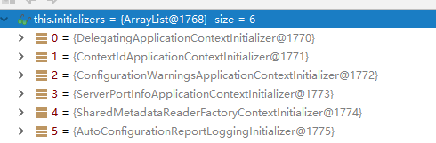

# 1、Hello World探究

## 1、POM文件

### 1、父项目

```xml
依赖管理
<parent>
    <groupId>org.springframework.boot</groupId>
    <artifactId>spring-boot-starter-parent</artifactId>
    <version>2.5.2</version>
    <relativePath/> <!-- lookup parent from repository -->
</parent>

这个父项目的父项目是：
作用：是SpringBoot的版本仲裁中心，统一管理SpringBoot应用里免的所有依赖版本，之后我们导入依赖默认不需要写版本（没有在dependencies里声明的需要写）
<parent>
    <groupId>org.springframework.boot</groupId>
    <artifactId>spring-boot-dependencies</artifactId>
    <version>2.5.2</version>
</parent>
```

### 2、启动器

```xml
<dependency>
    <groupId>org.springframework.boot</groupId>
    <artifactId>spring-boot-starter-web</artifactId>
</dependency>
```

spring-boot-starter-web：导入了web模块正常运行所依赖的组件，并自动配置好了常用功能，比如字符编码等

spring-boot-starter：spring-boot场景启动器，SpringBoot将所有的功能场景抽取，做成多个spring-boot-starter-xxx启动器，需要在项目使用只需引入需要的starer-xxx，那么相关的依赖就都会导入。

## 2、主程序类\主入口类

```java
//标注一个主程序类，说明这是一个SpringBoot应用
@SpringBootApplication
public class HelloWorldSpringBoot {
    public static void main(String[] args) {
        //启动Spring应用
        SpringApplication.run(HelloWorldSpringBoot.class, args);
    }
}
```

# 2、相关注解

## 1、**@SpringBootApplication** 注解

Spring Boot应用标注在某个类上说明这个类是SpringBoot的主配置类

SpringBoot就应该运行这个类的main方法来启动SpringBoot应用。

```java
@Target(ElementType.TYPE)
@Retention(RetentionPolicy.RUNTIME)
@Documented
@Inherited
@SpringBootConfiguration // 标明配置类
@EnableAutoConfiguration // 开启自动配置功能
@ComponentScan(excludeFilters = {
      @Filter(type = FilterType.CUSTOM, classes = TypeExcludeFilter.class),
      @Filter(type = FilterType.CUSTOM, classes = AutoConfigurationExcludeFilter.class) })
public @interface SpringBootApplication {
```

## 2、@**SpringBootConfiguration **注解

标注在某个类上，表示这个是一个SpringBoot的配置类

## 3、@**Configuration** 注解

配置类上标注这个注解，配置类 = 配置文件，配置类也是容器中的一个组件@Component

- **Full**模式与**Lite**模式
  - 配置 类组件之间无依赖关系，用Lite模式，加速容器启动过程，减少判断。
  - 配置 类组件之间有依赖关系，用Full模式，方法会被调用得到之前单实例组件。

~~~java
#############################Configuration使用示例######################################################
/**
 * 1、配置类里面使用@Bean标注在方法上给容器注册组件，默认也是单实例的
 * 2、配置类本身也是组件
 * 3、proxyBeanMethods：代理bean的方法
 *      Full(proxyBeanMethods = true)、【保证每个@Bean方法被调用多少次返回的组件都是单实例的】
 *      Lite(proxyBeanMethods = false)、【每个@Bean方法被调用多少次返回的组件都是新创建的】
 *      组件依赖必须使用Full模式默认。其他默认是Lite模式
 */
@Configuration(proxyBeanMethods = false)
public class MyConfig {

    /**
     * Full:外部无论对配置类中的这个组件注册方法调用多少次获取的都是之前注册容器中的单实例对象
     * 给容器中添加组件。
     * 以方法名作为组件的id。
     * 返回类型就是组件类型。
     * @return 返回的值，就是组件在容器中的实例。
     */
    @Bean 
    public User user01(){
        User zhangsan = new User("zhangsan", 18);
        // user组件依赖了Pet组件
        zhangsan.setPet(tomcatPet());
        return zhangsan;
    }
    @Bean("tom")
    public Pet tomcatPet(){
        return new Pet("tomcat");
    }
}


################################@Configuration测试代码如下########################################
@SpringBootConfiguration
@EnableAutoConfiguration
@ComponentScan("com.xxx.boot")
public class MainApplication {

    public static void main(String[] args) {
        // 1、返回我们IOC容器
        ConfigurableApplicationContext run = SpringApplication.run(MainApplication.class, args);

        // 2、查看容器里面的组件
        String[] names = run.getBeanDefinitionNames();
        for (String name : names) {
            System.out.println(name);
        }

        // 3、从容器中获取组件
        Pet tom01 = run.getBean("tom", Pet.class);
        Pet tom02 = run.getBean("tom", Pet.class);
        System.out.println("组件："+(tom01 == tom02));
        
        // 4、com.xxx.boot.config.MyConfig$$EnhancerBySpringCGLIB$$51f1e1ca@1654a892
        MyConfig bean = run.getBean(MyConfig.class);
        System.out.println(bean);

        // 如果@Configuration(proxyBeanMethods = true)代理对象调用方法。
        // SpringBoot总会检查这个组件是否在容器中有。
        // 保持组件单实例
        User user = bean.user01();
        User user1 = bean.user01();
        System.out.println(user == user1);

        User user01 = run.getBean("user01", User.class);
        Pet tom = run.getBean("tom", Pet.class);
        System.out.println("用户的宠物："+(user01.getPet() == tom));
    }
}
~~~


## 4、@**EnableAutoConfiguration** 注解

开启自动配置功能，以前需要手动配置的，SpringBoot自动配置

```java
@AutoConfigurationPackage
@Import(EnableAutoConfigurationImportSelector.class)
public @interface EnableAutoConfiguration {
```

## 5、@**AutoConfigurationPackage** 注解

自动配置包

## 6、@Import 注解

给容器中自动创建出组件、默认组件的名字就是全类名。

**@Import（AutoConfigurationPackages.Registrar.class）**

Spring底层注解@Import，给容器中导入一个组件，导入的组件由AutoConfigurationPackages.Registrar.class，将主配置类（@SpringBootApplication标注的类）的所在包及下面所有子包里面的所有组件扫描到Spring容器

**@Import(EnableAutoConfigurationImportSelector.class)**

给容器中导入组件。

EnableAutoConfigurationImportSelector选择导入哪些组件。

将所有需要导入的组件以全类名的方式返回，这些组件就会被添加进容器中。

~~~java
@Import({User.class, DBHelper.class})
@Configuration(proxyBeanMethods = false) //告诉SpringBoot这是一个配置类 == 配置文件
public class MyConfig {}
~~~

程序启动时会给容器中导入许多自动配置类（xxxAutoConfiguration），就是给容器中导入这个场景需要的所有组件，并配置好这些组件。

~~~java
SpringFactoriesLoader.loadFactoryNames(EnableAutoConfiguration.class,classLoader)；
~~~

Spring Boot在启动的时候从类路径下的META-INF/spring.factories中获取EnableAutoConfiguration指定的值，将这些值作为自动配置类导入到容器中，自动配置类就生效，帮我们进行自动配置工作

J2EE的整体整合解决方案和自动配置都在spring-boot-autoconfigure-1.5.9.RELEASE.jar；


## 7、@ImportResource 注解

原生配置文件引入，导入Spring的配置文件，让配置文件里面的内容生效

Spring Boot里面没有Spring的配置文件，自己编写的配置文件也不能自动识别。

想让Spring的配置文件生效加载进来，需要添加注解@**ImportResource**标注在一个配置类上

~~~xml
======================beans.xml=========================
<?xml version="1.0" encoding="UTF-8"?>
<beans xmlns="http://www.springframework.org/schema/beans"
       xmlns:xsi="http://www.w3.org/2001/XMLSchema-instance"
       xmlns:context="http://www.springframework.org/schema/context"
       xsi:schemaLocation="http://www.springframework.org/schema/beans http://www.springframework.org/schema/beans/spring-beans.xsd http://www.springframework.org/schema/context https://www.springframework.org/schema/context/spring-context.xsd">

    <bean id="haha" class="com.atguigu.boot.bean.User">
        <property name="name" value="zhangsan"></property>
        <property name="age" value="18"></property>
    </bean>

    <bean id="hehe" class="com.atguigu.boot.bean.Pet">
        <property name="name" value="tomcat"></property>
    </bean>
</beans>
~~~

~~~java
@ImportResource("classpath:beans.xml")
public class MyConfig {}

======================测试=================
        boolean haha = run.containsBean("haha");
        boolean hehe = run.containsBean("hehe");
        System.out.println("haha："+haha);//true
        System.out.println("hehe："+hehe);//true
~~~


## 8、@ConfigurationProperties 注解

该注解告诉SpringBoot将本类中的所有属性和配置文件中的相关配置进行绑定。

**属性**：

- prefix：选择配置文件中哪个属性进行一一映射

**注意**：

- 只有这个组件时容器中的组件，才能使用该注解的功能

通过导入配置文件处理器，获得编写配置提示

```xml
<dependency>
	<groupId>org.springframework.boot</groupId>
	<artifactId>spring-boot-configuration-processor</artifactId>
	<optional>true</optional>
</dependency>
```

~~~yml
person:
    lastName: hello
~~~

~~~java
@Component
@ConfigurationProperties(prefix = "person")
public class Person {
    private String lastName;
}
~~~


## 9、@PropertySource 注解

加载指定的配置文件

```java
@PropertySource(value ={"classpath:person.properties"})
public class Person{}
```


## 10、@Conditional 注解

作用：必须是@Conditional指定的条件成立，才给容器中添加组件，配置配里面的所有内容才生效。

| @Conditional扩展注解            | 作用（判断是否满足当前指定条件）                 |
| ------------------------------- | ------------------------------------------------ |
| @ConditionalOnJava              | 系统的java版本是否符合要求                       |
| @ConditionalOnBean              | 容器中存在指定Bean；                             |
| @ConditionalOnMissingBean       | 容器中不存在指定Bean；                           |
| @ConditionalOnExpression        | 满足SpEL表达式指定                               |
| @ConditionalOnClass             | 系统中有指定的类                                 |
| @ConditionalOnMissingClass      | 系统中没有指定的类                               |
| @ConditionalOnSingleCandidate   | 容器中只有一个指定的Bean，或者这个Bean是首选Bean |
| @ConditionalOnProperty          | 系统中指定的属性是否有指定的值                   |
| @ConditionalOnResource          | 类路径下是否存在指定资源文件                     |
| @ConditionalOnWebApplication    | 当前是web环境                                    |
| @ConditionalOnNotWebApplication | 当前不是web环境                                  |
| @ConditionalOnJndi              | JNDI存在指定项                                   |

**注意：**

- 自动配置类必须在一定的条件下才能生效
- 可以通过启用  debug=true属性，来让控制台打印自动配置报告，方便的知道哪些自动配置类生效

```java
=========================
AUTO-CONFIGURATION REPORT
=========================


Positive matches:（自动配置类启用的）
-----------------

   DispatcherServletAutoConfiguration matched:
      - @ConditionalOnClass found required class 'org.springframework.web.servlet.DispatcherServlet'; @ConditionalOnMissingClass did not find unwanted class (OnClassCondition)
      - @ConditionalOnWebApplication (required) found StandardServletEnvironment (OnWebApplicationCondition)
        
    
Negative matches:（没有启动，没有匹配成功的自动配置类）
-----------------

   ActiveMQAutoConfiguration:
      Did not match:
         - @ConditionalOnClass did not find required classes 'javax.jms.ConnectionFactory', 'org.apache.activemq.ActiveMQConnectionFactory' (OnClassCondition)

   AopAutoConfiguration:
      Did not match:
         - @ConditionalOnClass did not find required classes 'org.aspectj.lang.annotation.Aspect', 'org.aspectj.lang.reflect.Advice' (OnClassCondition)
```


# 3、配置文件

## 1、配置文件

SpringBoot使用一个全局的配置文件，配置文件名是固定的。

​	•application.properties

​	•application.yml

配置文件的作用：修改SpringBoot自动配置的默认值---SpringBoot在底层都给我们自动配置好；

## 2、YAML

YAML配置例子：

```yaml
server:
  port: 8081
```

### 1、基本语法

**k：(空格)v**（空格必须有k）

以**空格**的缩进来控制层级关系；只要是左对齐的一列数据，都是同一个层级的

属性和值也是**大小写敏感**；

```yaml
server:
    port: 8081
    path: /hello
```

### 2、值的写法

##### 1、字面量

普通的值（数字，字符串，布尔），单个的、不可再分的值，date、boolean、string、number、null

**写法**：k: v：字面直接来写

**注意**：

- 字符串默认不用加上单引号或者双引号
- ""：双引号，不会转义字符串里面的特殊字符，特殊字符会作为本身想表示的意思

- ​	''：单引号，会转义特殊字符，特殊字符最终只是一个普通的字符串数据


##### 2、对象、Map（属性和值）（键值对）

**写法**：在下一行来写对象的属性和值的关系，注意缩进，对象还是k: v的方式

**单行写法**：换行，注意缩进

```yaml
friends:
		lastName: zhangsan
		age: 20
```

**行内写法**：使用{}包括，键值对用逗号隔开

```yaml
friends: {lastName: zhangsan,age: 18}
```

##### 3、数组（List、Set）

**写法**：用 - 值 表示数组中一个元素

**单行写法**：换行，注意缩进，注意-后的空格

```yaml
pets:
 - cat
 - dog
 - pig
```

**行内写法**：使用[]包括，值之间只用逗号隔开

```yaml
pets: [cat,dog,pig]
```

## 3、配置文件值注入

可以使用@ConfigurationProperties与@Value注入配置文件的值

准备配置文件

```yaml
person:
    lastName: hello
    age: 18
    boss: false
    birth: 2017/12/12
    maps: {k1: v1,k2: 12}
    lists:
      - lisi
      - zhaoliu
    dog:
      name: 小狗
      age: 12
```

Bean

```java
@Component
@ConfigurationProperties(prefix = "person")
public class Person {
    private String lastName;
    private Integer age;
    private Boolean boss;
    private Date birth;
    private Map<String,Object> maps;
    private List<Object> lists;
    private Dog dog;
}
```

## 4、注入校验

```java
@Component
@ConfigurationProperties(prefix = "person")
@Validated
public class Person {
    //<bean class="Person">
    //<property name="lastName" value="字面量/${key}从环境变量、配置文件中获取值/#{SpEL}"></property>
    //<bean/>
    //lastName必须是邮箱格式
    @Email
    //@Value("${person.last-name}")
    private String lastName;
    private Integer age;
    private Boolean boss;
    private Date birth;
    private Map<String,Object> maps;
    private List<Object> lists;
    private Dog dog;
```

在Bean上添加@Validated注解，在属性上添加需要校验的注解


## 5、配置文件占位符

### 1、随机数

```properties
${random.value}
${random.int}
${random.long}
${random.int(10)}
${random.int[1024,65536]}
```

### 2、占位符获取之前配置的值

如果没有，可以用：指定默认值

```properties
person.last-name=张三${random.uuid}
person.age=${random.int}
person.birth=2017/12/15
person.boss=false
person.maps.k1=v1
person.maps.k2=14
person.lists=a,b,c
person.dog.name=${person.hello:hello}_dog
person.dog.age=15
```

## 6、Profile

### 1、多Profile文件

默认使用application.properties的配置，任何时候都会被加载

我们在主配置文件编写的时候，文件名可以是 application-{profile}.properties/yml


### 2、yml支持多文档块方式

```yaml
server:
  port: 8081
  
spring:
  profiles:
    active: prod  # 激活需要的配置块

---
server:
  port: 8083
spring:
  profiles: dev

---
server:
  port: 8084
spring:
  profiles: prod  # 指定属于哪个环境
```

### 3、激活指定Profile

**1、在配置文件中指定 ：**spring.profiles.active=dev

**2、命令行：**java -jar spring-boot-02-config-0.0.1-SNAPSHOT.jar --spring.profiles.active=dev；

​	可以直接在测试的时候，配置传入命令行参数

**3、虚拟机参数**：-Dspring.profiles.active=dev


**注意**：

- 命令行相比配置文件优先级较高


### 4、@Profile

~~~java
// 条件装配
@Configuration(proxyBeanMethods = false)
@Profile("production")
public class ProductionConfiguration {
    // ...
}
~~~


## 7、配置文件加载位置

springboot 启动会扫描以下位置的application.properties或者application.yml文件作为Spring boot的默认配置文件。

- file:./config/
  - jar包当前目录的config文件夹下的直接子目录


- file:./config

  - jar包当前目录的config文件夹


- classpath:/config/

  - classpathg根路径的config文件夹


- classpath:/

  - classpath根路径


**注意**：

- 
  优先级由高到底，高优先级的配置会覆盖低优先级的配置


- SpringBoot会从这四个位置全部加载主配置文件并互补配置


- 可以通过spring.config.location来改变默认的配置文件位置


**注意**：

1. 项目打包好以后，可以使用命令行参数的形式，启动项目的时候来指定配置文件的新位置
2. 指定的配置文件和默认加载的这些配置文件共同起作用形成互补配置
   - java -jar spring-boot-02-config-02-0.0.1-SNAPSHOT.jar --spring.config.location=G:/application.properties


## 8、外部配置加载顺序

SpringBoot也可以从以下位置加载配置。

优先级从高到低。

高优先级的配置覆盖低优先级的配置，所有的配置会形成互补配置。

- **命令行参数**

  - 所有的配置都可以在命令行上进行指定

  - java -jar spring-boot-02-config-02-0.0.1-SNAPSHOT.jar --server.port=8087  --server.context-path=/abc


  - 多个配置用空格分开 --配置项=值


- **来自java:comp/env的JNDI属性**

- **Java系统属性（System.getProperties()）**

- **操作系统环境变量**

- **RandomValuePropertySource配置的random.*属性值**

- **由jar包外向jar包内进行寻找**

- **优先加载带profile**

- **jar包外部的application-{profile}.properties或application.yml(带spring.profile)配置文件**

- **jar包内部的application-{profile}.properties或application.yml(带spring.profile)配置文件**

- **再来加载不带profile**
- **jar包外部的application.properties或application.yml(不带spring.profile)配置文件**
- **jar包内部的application.properties或application.yml(不带spring.profile)配置文件**

- **@Configuration注解类上的@PropertySource**

- **通过SpringApplication.setDefaultProperties指定的默认属性**

所有支持的配置加载来源[参考官方文档](https://docs.spring.io/spring-boot/docs/1.5.9.RELEASE/reference/htmlsingle/#boot-features-external-config)。


## 9、自动配置原理

1. SpringBoot启动的时候加载主配置类，通过注解@EnableAutoConfiguration开启了自动配置功能

   1. @EnableAutoConfiguration 作用：

      - 利用**EnableAutoConfigurationImportSelector**给容器中导入一些组件

      - 可以查看selectImports()方法的内容

      - List<String> configurations = getCandidateConfigurations(annotationMetadata,  attributes);获取候选的配置

      - ```
        SpringFactoriesLoader.loadFactoryNames()
        扫描所有jar包类路径下  META-INF/spring.factories
        把扫描到的这些文件的内容包装成properties对象
        从properties中获取到EnableAutoConfiguration.class类（类名）对应的值，然后把他们添加在容器中
        ```

      - 将类路径下 META-INF/spring.factories 里面配置的所有EnableAutoConfiguration的值加入到了容器中。

      - ```
        # Auto Configure 例子
        org.springframework.boot.autoconfigure.EnableAutoConfiguration=\
        org.springframework.boot.autoconfigure.admin.SpringApplicationAdminJmxAutoConfiguration,\
        org.springframework.boot.autoconfigure.aop.AopAutoConfiguration,\
        org.springframework.boot.autoconfigure.amqp.RabbitAutoConfiguration,\
        ```

      - 每一个这样的  xxxAutoConfiguration类都是容器中的一个组件，都加入到容器中，用他们来做自动配置。

2. 每一个自动配置类进行自动配置

3. 以**HttpEncodingAutoConfiguration（Http编码自动配置）**为例解释自动配置原理。

   ```java
   // 表示这是一个配置类，以前编写的配置文件一样，也可以给容器中添加组件
   @Configuration  
   
   // 启动指定类的ConfigurationProperties功能
   // 将配置文件中对应的值和HttpEncodingProperties绑定起来
   // 并把HttpEncodingProperties加入到ioc容器中
   @EnableConfigurationProperties(HttpEncodingProperties.class)  
   
   // Spring底层@Conditional注解，根据不同的条件，如果满足指定的条件，整个配置类里面的配置就会生效。
   // 判断当前应用是否是web应用，如果是，当前配置类生效。
   @ConditionalOnWebApplication 
   
   // 判断当前项目有没有这个类CharacterEncodingFilter，SpringMVC中进行乱码解决的过滤器
   @ConditionalOnClass(CharacterEncodingFilter.class)  
   
   // 判断配置文件中是否存在某个配置 spring.http.encoding.enabled，如果不存在，判断也是成立的
   // 即使我们配置文件中不配置pring.http.encoding.enabled=true，也是默认生效的
   @ConditionalOnProperty(prefix = "spring.http.encoding", value = "enabled", matchIfMissing = true)  
   
   public class HttpEncodingAutoConfiguration {
     
     	// 他已经和SpringBoot的配置文件映射了
     	private final HttpEncodingProperties properties;
     
      // 只有一个有参构造器的情况下，参数的值就会从容器中拿
     	public HttpEncodingAutoConfiguration(HttpEncodingProperties properties) {
   		this.properties = properties;
   	}
     
       // 给容器中添加一个组件，这个组件的某些值需要从properties中获取
       @Bean   
   	// 判断容器没有这个组件？ 
       @ConditionalOnMissingBean(CharacterEncodingFilter.class) 
   	public CharacterEncodingFilter characterEncodingFilter() {
   		CharacterEncodingFilter filter = new OrderedCharacterEncodingFilter();
   		filter.setEncoding(this.properties.getCharset().name());
   		filter.setForceRequestEncoding(this.properties.shouldForce(Type.REQUEST));
   		filter.setForceResponseEncoding(this.properties.shouldForce(Type.RESPONSE));
   		return filter;
   	}
   ```

   根据当前不同的条件判断，决定这个配置类是否生效。

   一但这个配置类生效，这个配置类就会给容器中添加各种组件，这些组件的属性是从对应的properties类中获取的，这些类里面的每一个属性又是和配置文件绑定的。

4. 所有在配置文件中能配置的属性都是在xxxxProperties类中封装，配置文件能配置什么就可以参照某个功能对应的这个属性类。

```java
// 从配置文件中获取指定的值和bean的属性进行绑定
@ConfigurationProperties(prefix = "spring.http.encoding")  
public class HttpEncodingProperties {
   public static final Charset DEFAULT_CHARSET = Charset.forName("UTF-8");
```

**总结**：

1. **SpringBoot启动会加载大量的自动配置类**
2. **看需要的功能有没有SpringBoot默认写好的自动配置类**
3. **再来看这个自动配置类中到底配置了哪些组件（只要要用的组件有，就不需要再来配置了）**
4. **给容器中自动配置类添加组件的时候，会从properties类中获取某些属性，我们就可以在配置文件中指定这些属性的值**


## 10、修改默认配置

1. SpringBoot在自动配置很多组件的时候，先看容器中有没有用户自己配置的（@Bean、@Component）如果有就用用户配置的，如果没有，才自动配置，如果有些组件可以有多个（ViewResolver）将用户配置的和自己默认的组合起来。
2. 在SpringBoot中会有非常多的xxxConfigurer帮助我们进行扩展配置。

3. 在SpringBoot中会有很多的xxxCustomizer帮助我们进行定制配置。


# 4、日志框架

| 日志门面  （日志的抽象层）                                   | 日志实现层                                           |
| ------------------------------------------------------------ | ---------------------------------------------------- |
| ~~JCL（Jakarta  Commons Logging）~~    SLF4j（Simple  Logging Facade for Java）    **~~jboss-logging~~** | Log4j  JUL（java.util.logging）  Log4j2  **Logback** |

SpringBoot：底层是Spring，Spring默认时使用JCL，SpringBoot选用SLF4J和logback。

## 1、SLF4J使用

### 1、在系统中使用

在开发时，调用日志记录方法，不应该直接调用日志的实现类，而是调用日志的抽象层。

例子：导入slf4j的jar和  logback的实现jar

```java
import org.slf4j.Logger;
import org.slf4j.LoggerFactory;

public class HelloWorld {
  public static void main(String[] args) {
   // 需要给getLogger方法传入需要记录的类   
    Logger logger = LoggerFactory.getLogger(HelloWorld.class);
    logger.info("Hello World");
  }
}
```

每一个日志的实现框架都有自己的配置文件。

使用slf4j以后，**配置文件还是做成日志实现框架自己本身的配置文件。**


### 2、统一日志记录

不同的框架使用的是不同的日记框架，需要统一日志记录。


**解决方法：**

1、将系统中其他日志框架先排除出去

2、用中间包来替换原有的日志框架

3、我们导入slf4j其他的实现

## 2、SpringBoot日志关系

SpringBoot的日志启动器

```xml
<dependency>
  <groupId>org.springframework.boot</groupId>
  <artifactId>spring-boot-starter-logging</artifactId>
</dependency>
```

底层依赖关系

1. SpringBoot底层也是使用slf4j+logback的方式进行日志记录
2. SpringBoot也把其他的日志都替换成了slf4j

3. 中间替换包

4. 引入其他框架，一定要把这个框架的默认日志依赖移除掉

```java
@SuppressWarnings("rawtypes")
public abstract class LogFactory {

    static String UNSUPPORTED_OPERATION_IN_JCL_OVER_SLF4J = "http://www.slf4j.org/codes.html#unsupported_operation_in_jcl_over_slf4j";

    static LogFactory logFactory = new SLF4JLogFactory();
```


SpringBoot排除了Spring的commons-logging框架

```xml
<dependency>
	<groupId>org.springframework</groupId>
	<artifactId>spring-core</artifactId>
	<exclusions>
        移除默认日志框架
		<exclusion>
			<groupId>commons-logging</groupId>
			<artifactId>commons-logging</artifactId>
		</exclusion>
	</exclusions>
</dependency>
```

SpringBoot能自动适配所有日志，而且底层使用slf4j+logback的方式记录日志，引入其他框架的时候，只需要把这个框架依赖的日志框架排除掉即可。

## 3、日志使用

### 1、默认配置

SpringBoot默认帮我们配置好了日志

```java
// 记录器
Logger logger = LoggerFactory.getLogger(getClass());
@Test
public void contextLoads() {
    // System.out.println();
    // 日志的级别；
    // 由低到高   trace<debug<info<warn<error
    // 可以调整输出的日志级别；日志就只会在这个级别以以后的高级别生效
    logger.trace("这是trace日志...");
    logger.debug("这是debug日志...");
    // SpringBoot默认给我们使用的是info级别的，没有指定级别的就用SpringBoot默认规定的级别；root级别
    logger.info("这是info日志...");
    logger.warn("这是warn日志...");
    logger.error("这是error日志...");
}
```

    日志输出格式：
    	%d表示日期时间，
    	%thread表示线程名，
    	%-5level：级别从左显示5个字符宽度
    	%logger{50} 表示logger名字最长50个字符，否则按照句点分割。 
    	%msg：日志消息，
    	%n是换行符
    -->
    %d{yyyy-MM-dd HH:mm:ss.SSS} [%thread] %-5level %logger{50} - %msg%n

SpringBoot修改日志的默认配置

```properties
logging.level.com.atguigu=trace
# logging.path=
# 不指定路径在当前项目下生成springboot.log日志
# 可以指定完整的路径；
# logging.file=G:/springboot.log

# 在当前磁盘的根路径下创建spring文件夹和里面的log文件夹；使用 spring.log 作为默认文件
logging.path=/spring/log

# 在控制台输出的日志的格式
logging.pattern.console=%d{yyyy-MM-dd} [%thread] %-5level %logger{50} - %msg%n
# 指定文件中日志输出的格式
logging.pattern.file=%d{yyyy-MM-dd} === [%thread] === %-5level === %logger{50} ==== %msg%n
```

| logging.file | logging.path | Example  | Description                        |
| ------------ | ------------ | -------- | ---------------------------------- |
| (none)       | (none)       |          | 只在控制台输出                     |
| 指定文件名   | (none)       | my.log   | 输出日志到my.log文件               |
| (none)       | 指定目录     | /var/log | 输出到指定目录的 spring.log 文件中 |

### 2、指定配置

给类路径下放上每个日志框架自己的配置文件即可，SpringBoot就不使用他默认配置的了

| Logging System          | Customization                                                |
| ----------------------- | ------------------------------------------------------------ |
| Logback                 | `logback-spring.xml`, `logback-spring.groovy`, `logback.xml` or `logback.groovy` |
| Log4j2                  | `log4j2-spring.xml` or `log4j2.xml`                          |
| JDK (Java Util Logging) | `logging.properties`                                         |

logback.xml：会直接被日志框架识别

**logback-spring.xml**：日志框架不直接加载日志的配置项，由SpringBoot解析日志配置，可以使用SpringBoot的高级Profile功能

```xml
<springProfile name="staging">
    <!-- configuration to be enabled when the "staging" profile is active -->
  	可以指定某段配置只在某个环境下生效
</springProfile>
```

例子

```xml
<appender name="stdout" class="ch.qos.logback.core.ConsoleAppender">
    <layout class="ch.qos.logback.classic.PatternLayout">
        
        <springProfile name="dev">
           <pattern>%d{yyyy-MM-dd HH:mm:ss.SSS} ----> [%thread] ---> %-5level %logger{50} - %msg%n</pattern>
        </springProfile>
        
        <springProfile name="!dev">
           <pattern>%d{yyyy-MM-dd HH:mm:ss.SSS} ==== [%thread] ==== %-5level %logger{50} - %msg%n</pattern          </springProfile>
                
    </layout>
</appender>
```

如果使用logback.xml作为日志配置文件，还要使用profile功能，会有以下错误

 `no applicable action for [springProfile]`

## 4、切换日志框架

可以按照slf4j的日志适配图，进行相关的切换。

slf4j+log4j的方式：

```xml
<dependency>
  <groupId>org.springframework.boot</groupId>
  <artifactId>spring-boot-starter-web</artifactId>
    排除默认logback日志框架，排除log4j转换包
  <exclusions>
    <exclusion>
      <artifactId>logback-classic</artifactId>
      <groupId>ch.qos.logback</groupId>
    </exclusion>
    <exclusion>
      <artifactId>log4j-over-slf4j</artifactId>
      <groupId>org.slf4j</groupId>
    </exclusion>
  </exclusions>
</dependency>

添加日志框架slf4j+log4j
<dependency>
  <groupId>org.slf4j</groupId>
  <artifactId>slf4j-log4j12</artifactId>
</dependency>
```

切换为log4j2

```xml
<dependency>
    <groupId>org.springframework.boot</groupId>
    <artifactId>spring-boot-starter-web</artifactId>
    排除默认日志框架
    <exclusions>
        <exclusion>
            <artifactId>spring-boot-starter-logging</artifactId>                   	                       				<groupId>org.springframework.boot</groupId>
        </exclusion>
    </exclusions>
</dependency>

添加log4j
<dependency>
    <groupId>org.springframework.boot</groupId>
    <artifactId>spring-boot-starter-log4j2</artifactId>
</dependency>
```

# 5、WEB开发

## 1、MVC自动配置

### 1、MVCAutoConfiguration

以下是SpringBoot对SpringMVC的默认配置

- 引入 **ContentNegotiatingViewResolver** 和 **BeanNameViewResolver** bean。

  - 自动配置了ViewResolver（视图解析器：根据方法的返回值得到视图对象（View），视图对象决定如何渲染（转发、重定向））
  - ContentNegotiatingViewResolver：组合所有的视图解析器的。
  - 如何定制：我们可以自己给容器中添加一个视图解析器，自动的将其组合进来。

- 支持服务静态资源，包括对 WebJars 的支持。

- 自动注册 **Converter**、**GenericConverter** 和 **Formatter** bean。

  - Converter：转换器。public String hello(User user)：类型转换使用Converter。

    - 自己添加的格式化器转换器，我们只需要放在容器中即可

  - Formatter：格式化器。  2017.12.17===Date。

  - ```java
    @Bean
    // 在文件中配置日期格式化的规则
    @ConditionalOnProperty(prefix = "spring.mvc", name = "date-format")
    public Formatter<Date> dateFormatter() {
    	// 日期格式化组件
        return new DateFormatter(this.mvcProperties.getDateFormat());
    }
    ```

- 支持 **HttpMessageConverter**。

  - HttpMessageConverter：SpringMVC用来转换Http请求和响应的。User---Json。
  - HttpMessageConverters 是从容器中确定，获取所有的HttpMessageConverter。
  - 自己给容器中添加HttpMessageConverter，只需要将自己的组件注册容器中（@Bean，@Component）

- 自动注册 **MessageCodesResolver**。定义错误代码生成规则

- 支持静态 index.html。

- 支持自定义 Favicon 。

- 自动使用 **ConfigurableWebBindingInitializer** bean。

  - 我们可以配置一个ConfigurableWebBindingInitializer来替换默认的（添加到容器）

  - ```text
    初始化WebDataBinder；
    请求数据=====JavaBean；
    ```

**org.springframework.boot.autoconfigure.web：web的所有自动场景**

~~~java
// 有参构造器所有参数的值都会从容器中确定
// ResourceProperties resourceProperties 	获取和spring.resources绑定的所有的值的对象
// WebMvcProperties mvcProperties 			获取和spring.mvc绑定的所有的值的对象
// ListableBeanFactory beanFactory 			Spring的beanFactory
// HttpMessageConverters 					找到所有的HttpMessageConverters
// ResourceHandlerRegistrationCustomizer 	找到资源处理器的自定义器。
// DispatcherServletPath					应用访问路径
// ServletRegistrationBean					给应用注册Servlet、Filter....
public WebMvcAutoConfigurationAdapter(ResourceProperties resourceProperties, 
                                      WebMvcProperties mvcProperties,
                                      ListableBeanFactory beanFactory, 
                                      ObjectProvider<HttpMessageConverters> messageConvertersProvider,
                                      ObjectProvider<ResourceHandlerRegistrationCustomizer>
                                      resourceHandlerRegistrationCustomizerProvider,
                                      ObjectProvider<DispatcherServletPath> dispatcherServletPath,
                                      ObjectProvider<ServletRegistrationBean<?>> servletRegistrations) {
    this.resourceProperties = resourceProperties;
    this.mvcProperties = mvcProperties;
    this.beanFactory = beanFactory;
    this.messageConvertersProvider = messageConvertersProvider;
    this.resourceHandlerRegistrationCustomizer =resourceHandlerRegistrationCustomizerProvider
        										.getIfAvailable();
    this.dispatcherServletPath = dispatcherServletPath;
    this.servletRegistrations = servletRegistrations;
}
~~~

### 2、扩展SpringMVC

```xml
<mvc:view-controller path="/hello" view-name="success"/>
<mvc:interceptors>
        <mvc:interceptor>
            <mvc:mapping path="/hello"/>
            <bean></bean>
    	</mvc:interceptor>
 </mvc:interceptors>
```

**1、编写一个配置类（@Configuration），继承WebMvcConfigurerAdapter类，且不能标注@EnableWebMVC**

这样既保留了所有自动配置，也能用我们扩展的配置

```java
// 使用WebMvcConfigurerAdapter可以来扩展SpringMVC的功能
@Configuration
public class MyMvcConfig extends WebMvcConfigurerAdapter {

    @Override
    public void addViewControllers(ViewControllerRegistry registry) {
       	// super.addViewControllers(registry);
        // 浏览器发送 /atguigu 请求来到 success
        registry.addViewController("/atguigu").setViewName("success");
    }
}
// 继承WebMvcConfigurerAdapter的类中重载addViewControllers，编写无逻辑页面跳转。
```

**注意**：在5.0之后**WebMvcConfigurer**接口具有默认实现，所以直接实现接口接口也可以，不需要WebMvcConfigurerAdapter

**原理**：

1、WebMvcAutoConfiguration是SpringMVC的自动配置类

2、在做其他自动配置时会导入，@Import(**EnableWebMvcConfiguration**.class)

```java
@Configuration
public static class EnableWebMvcConfiguration extends DelegatingWebMvcConfiguration {
	private final WebMvcConfigurerComposite configurers = new WebMvcConfigurerComposite();

	//从容器中获取所有的WebMvcConfigurer
    @Autowired(required = false)
    public void setConfigurers(List<WebMvcConfigurer> configurers) {
    	if (!CollectionUtils.isEmpty(configurers)) {
         	this.configurers.addWebMvcConfigurers(configurers);
            //一个参考实现；将所有的WebMvcConfigurer相关配置都来一起调用；  
            @Override
            // public void addViewControllers(ViewControllerRegistry registry) {
            //    for (WebMvcConfigurer delegate : this.delegates) {
            //       delegate.addViewControllers(registry);
            //   }
         }
    }
}
```

3、容器中所有的WebMvcConfigurer都会一起起作用

4、我们的配置类也会被调用

效果：SpringMVC的自动配置和我们的扩展配置都会起作用

### 3、全面接管SpringMVC

我们需要在配置类中添加@EnableWebMvc即可，但是SpringBoot对SpringMVC的自动配置都失效了，所有都是自己配置。

```java
//使用WebMvcConfigurerAdapter可以来扩展SpringMVC的功能
@EnableWebMvc
@Configuration
public class MyMvcConfig extends WebMvcConfigurerAdapter {

    @Override
    public void addViewControllers(ViewControllerRegistry registry) {
       // super.addViewControllers(registry);
        //浏览器发送 /atguigu 请求来到 success
        registry.addViewController("/atguigu").setViewName("success");
    }
}
```

**原理**：

1、@EnableWebMvc的核心

```java
@Import(DelegatingWebMvcConfiguration.class)
public @interface EnableWebMvc {
```

2、@EnableWebMvc将DelegatingWebMvcConfiguration组件导入进来

```java
@Configuration
public class DelegatingWebMvcConfiguration extends WebMvcConfigurationSupport {
```

3、导入的DelegatingWebMvcConfiguration只是SpringMVC最基本的功能

```java
@Configuration
@ConditionalOnWebApplication
@ConditionalOnClass({ Servlet.class, DispatcherServlet.class,
		WebMvcConfigurerAdapter.class })
// 容器中没有这个组件的时候，这个自动配置类才生效
@ConditionalOnMissingBean(WebMvcConfigurationSupport.class)
@AutoConfigureOrder(Ordered.HIGHEST_PRECEDENCE + 10)
@AutoConfigureAfter({ DispatcherServletAutoConfiguration.class,
		ValidationAutoConfiguration.class })
public class WebMvcAutoConfiguration {
```

## 2、静态资源映射

### 1、基本规则

只要静态资源放在类路径下：/static、/public、/resources、/META-INF/resources，就能够使用 [当前项目根路径/ + 静态资源名] 访问

**原理**：请求进来，先去找Controller看能不能处理，不能处理的请求都交给静态资源处理器，静态资源也找不到则响应404页面

**注意**：

- 静态资源的访问路径必须时绝对路径/css/**，不能时相对路径css/\*\*

- 配置时填写路径也是一样

~~~yml
spring:
  # 访问静态资源的路径
  # 当前项目 + static-path-pattern + 静态资源名 = 静态资源文件夹/haha下找，并且还会往/haha的子文件夹找
  # 此项自定义设置会导致自动配置的欢迎页面功能失效
  mvc:
    static-path-pattern: /res/**
  
  web:
  # 修改默认静态资源映射
  # 加载静态资源的路径
    resources:
      static-locations: classpath:/haha
  # 添加请求转换过滤器，默认false，也可以通过注入Bean来开启
     hidden-method:
      filter:
        enabled: true
~~~

~~~java
// spring.web.resources.static-locations默认配置
private static final String[] CLASSPATH_RESOURCE_LOCATIONS = { "classpath:/META-INF/resources/",
                                                              "classpath:/resources/", 
                                                              "classpath:/static/", 
                                                              "classpath:/public/" };
// spring.mvc.static-path-pattern默认配置
private String staticPathPattern = "/**";

@Configuration
public class MyMvcConfig extends WebMvcConfigurerAdapter {
	@Override
    public void addResourceHandlers(ResourceHandlerRegistry registry) {
        // 表示增加一个映射，不会取消默认映射
        // 当访问路径包含/img时，会往/imgs查找，并往还会往其子文件查找
        registry.addResourceHandler("/img/**").addResourceLocations("classpath:/imgs/");
        super.addResourceHandlers(registry);
    }
}


// 注入请求转换过滤器
@Bean
@ConditionalOnMissingBean(HiddenHttpMethodFilter.class)
@ConditionalOnProperty(prefix = "spring.mvc.hiddenmethod.filter", name = "enabled", matchIfMissing = false)
public OrderedHiddenHttpMethodFilter hiddenHttpMethodFilter() {
    return new OrderedHiddenHttpMethodFilter();
}
// 自定义请求转换过滤器
@Bean
public HiddenHttpMethodFilter hiddenHttpMethodFilter(){
    HiddenHttpMethodFilter methodFilter = new HiddenHttpMethodFilter();
    methodFilter.setMethodParam("_m"); // 自定义_method
    return methodFilter;
}
~~~


```java
// 可以设置和静态资源有关的参数，缓存时间等
@ConfigurationProperties(prefix = "spring.resources", ignoreUnknownFields = false)
public class ResourceProperties implements ResourceLoaderAware {...}
```

**注意**：在WebMvcAuotConfiguration中使用addResourceHandlers方法设置静态资源的映射规则

### 2、自动映射

#### 1、/webjars/** 

去 classpath:/META-INF/resources/webjars/ 找资源

webjars：以jar包的方式引入静态资源


```java
@Override
public void addResourceHandlers(ResourceHandlerRegistry registry) {
    if (!this.resourceProperties.isAddMappings()) {
        logger.debug("Default resource handling disabled");a
            return;
    }
    Integer cachePeriod = this.resourceProperties.getCachePeriod();
    if (!registry.hasMappingForPattern("/webjars/**")) {// 第一个规则/webjars/**
        customizeResourceHandlerRegistration(
            registry.addResourceHandler("/webjars/**")
            .addResourceLocations(
                "classpath:/META-INF/resources/webjars/")
            .setCachePeriod(cachePeriod));
    }
    String staticPathPattern = this.mvcProperties.getStaticPathPattern();
    // 静态资源文件夹映射
    if (!registry.hasMappingForPattern(staticPathPattern)) {
        customizeResourceHandlerRegistration(
            registry.addResourceHandler(staticPathPattern)// 第二个规则staticPathPattern映射/**
            .addResourceLocations(
                this.resourceProperties.getStaticLocations())// 第三个规则/**等
            .setCachePeriod(cachePeriod));
    }
}
```

```xml
<!--引入jquery-webjar-->
<dependency>
    <groupId>org.webjars</groupId>
    <artifactId>jquery</artifactId>
    <version>3.3.1</version>
</dependency>
在访问的时候只需要写webjars下面资源的名称即可
访问地址：http://localhost:8080/webjars/jquery/3.3.1/jquery.js 后面地址要按照依赖里面的包路径
```

#### 2、welcomePage

静态资源文件夹下的所有index.html页面，被默认的spring.mvc.static-path-pattern = "/**"映射

```java
// 配置欢迎页映射
@Bean
public WelcomePageHandlerMapping welcomePageHandlerMapping(ResourceProperties resourceProperties) {
    return new WelcomePageHandlerMapping(resourceProperties.getWelcomePage(),
                                         this.mvcProperties.getStaticPathPattern());
}
```

#### 3、**/favicon.ico

favicon.ico 放在静态资源目录下即可，也就都是在静态资源文件下找

```java
// 配置喜欢的图标
@Configuration
@ConditionalOnProperty(value = "spring.mvc.favicon.enabled", matchIfMissing = true)
public static class FaviconConfiguration {

    private final ResourceProperties resourceProperties;

    public FaviconConfiguration(ResourceProperties resourceProperties) {
        this.resourceProperties = resourceProperties;
    }

    @Bean
    public SimpleUrlHandlerMapping faviconHandlerMapping() {
        SimpleUrlHandlerMapping mapping = new SimpleUrlHandlerMapping();
        mapping.setOrder(Ordered.HIGHEST_PRECEDENCE + 1);
        //所有  **/favicon.ico 
        mapping.setUrlMap(Collections.singletonMap("**/favicon.ico",
                                                   faviconRequestHandler()));
        return mapping;
    }

    @Bean
    public ResourceHttpRequestHandler faviconRequestHandler() {
        ResourceHttpRequestHandler requestHandler = new ResourceHttpRequestHandler();
        requestHandler
            .setLocations(this.resourceProperties.getFaviconLocations());
        return requestHandler;
    }

}
```


## 4、模板引擎


### 1、引入Thymeleaf

```xml
<dependency>
    <groupId>org.springframework.boot</groupId>
    <artifactId>spring-boot-starter-thymeleaf</artifactId>
    <!--2.1.6版本-->
</dependency>
<!--切换thymeleaf版本-->
<properties>
    <thymeleaf.version>3.0.9.RELEASE</thymeleaf.version>
    <!-- 布局功能的支持程序  thymeleaf3主程序  layout2以上版本 -->
    <!-- thymeleaf2   layout1-->
    <thymeleaf-layout-dialect.version>2.2.2</thymeleaf-layout-dialect.version>
</properties>
```

springboot中添加spring-boot-starter-thymeleaf依赖后，springboot会自动注入以下类：

- **SpringResourceTemplateResolver**（模板解析器）
- **SpringTemplateEngine**（模板引擎）
- **ThymeleafViewResolver**（thymeleaf视图解析器）等对象

以此使用模板引擎将模板解析成字符串以及生成文件等

~~~java
// 解析邮件模板并绑定变量参数  
var context = new Context();  
context.setVariable("user", buyer);  
// mailContent为模板m  
var content = templateEngine.process("mailContent", context); 
~~~

### 2、使用Thymeleaf

只需要把HTML页面放在classpath:/templates/，Thymeleaf就能自动的渲染

```java
@ConfigurationProperties(prefix = "spring.thymeleaf")
public class ThymeleafProperties {

	private static final Charset DEFAULT_ENCODING = Charset.forName("UTF-8");

	private static final MimeType DEFAULT_CONTENT_TYPE = MimeType.valueOf("text/html");

	public static final String DEFAULT_PREFIX = "classpath:/templates/";

	public static final String DEFAULT_SUFFIX = ".html";
}

    
// 自动配置好了
@Configuration(proxyBeanMethods = false)
@EnableConfigurationProperties(ThymeleafProperties.class)
@ConditionalOnClass({ TemplateMode.class, SpringTemplateEngine.class })
@AutoConfigureAfter({ WebMvcAutoConfiguration.class, WebFluxAutoConfiguration.class })
public class ThymeleafAutoConfiguration { }
```

#### 1、导入Thymeleaf名称空间

```html
<html lang="en" xmlns:th="http://www.thymeleaf.org">
```

#### 2、使用Thymeleaf语法

```html
<!DOCTYPE html>
<html lang="en" xmlns:th="http://www.thymeleaf.org">
<head>
    <meta charset="UTF-8">
    <title>Title</title>
</head>
<body>
    <h1>成功！</h1>
    <!--th:text 将div里面的文本内容设置为 -->
    <div th:text="${hello}">这是显示欢迎信息</div>
</body>
</html>
```

### 3、Thymeleaf语法

#### 1、基础语法

| 表达式名字 | 语法                           | 用途                                                         |
| ---------- | ------------------------------ | ------------------------------------------------------------ |
| 变量取值   | ${...}                         | 获取请求域、session域、对象等值                              |
| 选择变量   | *{...}                         | 获取上下文对象值                                             |
| 消息       | #{...}                         | 获取国际化等值                                               |
| 链接       | @{...}                         | 生成链接                                                     |
| 片段表达式 | ~{...}                         | jsp:include 作用，引入公共页面片段                           |
| 设置属性值 | th：任意html属性 或者 th：attr | 替换原本属性值<br>\ |

~~~properties
Variable Expressions: ${...}：获取变量值；支持OGNL；
1、获取对象的属性、调用方法
2、使用内置的基本对象：
 #ctx : the context object.
 #vars: the context variables.
 #locale : the context locale.
 #request : (only in Web Contexts) the HttpServletRequest object.
 #response : (only in Web Contexts) the HttpServletResponse object.
 #session : (only in Web Contexts) the HttpSession object.
 #servletContext : (only in Web Contexts) the ServletContext object.
 ${session.foo}     
3、内置的一些工具对象：
#execInfo : information about the template being processed.
#messages : methods for obtaining externalized messages inside variables expressions, in the same way as they would be obtained using #{…} syntax.
#uris : methods for escaping parts of URLs/URIs
#conversions : methods for executing the configured conversion service (if any).
#dates : methods for java.util.Date objects: formatting, component extraction, etc.
#calendars : analogous to #dates , but for java.util.Calendar objects.
#numbers : methods for formatting numeric objects.
#strings : methods for String objects: contains, startsWith, prepending/appending, etc.
#objects : methods for objects in general.
#bools : methods for boolean evaluation.
#arrays : methods for arrays.
#lists : methods for lists.
#sets : methods for sets.
#maps : methods for maps.
#aggregates : methods for creating aggregates on arrays or collections.
#ids : methods for dealing with id attributes that might be repeated (for example, as a result of an iteration).
~~~

~~~properties
Selection Variable Expressions: *{...}：选择表达式：和${}在功能上是一样；
    补充：配合 th:object="${session.user}：
    <div th:object="${session.user}">
    	<p>Name: <span th:text="*{firstName}">Sebastian</span>.</p>
    	<p>Surname: <span th:text="*{lastName}">Pepper</span>.</p>
    	<p>Nationality: <span th:text="*{nationality}">Saturn</span>.</p>
    </div>
~~~

~~~properties
Message Expressions: #{...}：获取国际化内容
~~~

~~~properties
Link URL Expressions: @{...}：定义URL；

@{/order/process(execId=${execId},execType='FAST')}
~~~

~~~properties
Fragment Expressions: ~{...}：片段引用表达式

<div th:insert="~{commons :: main}">...</div>
~~~


```properties
Literals:（字面量）
      Text literals: 'one text' , 'Another one!' ,…
      Number literals: 0 , 34 , 3.0 , 12.3 ,…
      Boolean literals: true , false
      Null literal: null
      Literal tokens: one , sometext , main ,…
      
Text operations:（文本操作）
    String concatenation: +
    Literal substitutions: |The name is ${name}|
    
Arithmetic operations:（数学运算）
    Binary operators: + , - , * , / , %
    Minus sign (unary operator): -
    
Boolean operations:（布尔运算）
    Binary operators: and , or
    Boolean negation (unary operator): ! , not
    
Comparisons and equality:（比较运算）
    Comparators: > , < , >= , <= ( gt , lt , ge , le )
    Equality operators: == , != ( eq , ne )
    
Conditional operators:条件运算（三元运算符）
    If-then: (if) ? (then)
    If-then-else: (if) ? (then) : (else)
    Default: (value) ?: (defaultvalue)
    
Special tokens:
    No-Operation: _ 
```


```html
<div th:if="${xxx == null}">
    判断表达式
    如果为真显示
    f
</div>

遍历list
<tr th:each="u : ${list}">
    <td th:text="${u.userid}"></td>
    <td th:text="${u.username}"></td>
    <td th:text="${u.userage}"></td>
</tr>

指定循环次数
<ul>
	<li th:each="index:${#numbers.sequence(1, 5)}" >
		[(${index})]. some thing
	</li>
</ul>
```

#### 2、迭代

~~~html
<tr th:each="prod : ${prods}">
        <td th:text="${prod.name}">Onions</td>
        <td th:text="${prod.price}">2.41</td>
        <td th:text="${prod.inStock}? #{true} : #{false}">yes</td>
</tr>

<tr th:each="prod,iterStat : ${prods}" th:class="${iterStat.odd}? 'odd'">
  <td th:text="${prod.name}">Onions</td>
  <td th:text="${prod.price}">2.41</td>
  <td th:text="${prod.inStock}? #{true} : #{false}">yes</td>
</tr>
~~~

#### 3、条件运算

~~~html
<a href="comments.html"
	th:href="@{/product/comments(prodId=${prod.id})}"
	th:if="${not #lists.isEmpty(prod.comments)}" >view</a>

<div th:switch="${user.role}">
  <p th:case="'admin'">User is an administrator</p>
  <p th:case="#{roles.manager}">User is a manager</p>
  <p th:case="*">User is some other thing</p>
</div>
~~~


#### 4、公共片段

```html
1、设置公共片段
<div th:fragment="copy">
	xxxxxx
</div>

2、引入公共片段
<div th:insert="~{footer :: copy}"></div>
语法：
	~{templatename::selector}：模板名::选择器
	~{templatename::fragmentname}:模板名::片段名

3、默认效果：
insert的公共片段在div标签中
如果使用th:insert等属性进行引入，可以不用写~{}：
行内写法可以加上：[[~{}]];[(~{})]；
```

- **templatename：**当前引用片段所在文件位置
- **selector：**公共片段的选择器
- **fragmentname:**公共片段的名字


三种引入公共片段的th属性：

- **th:insert**：将公共片段整个插入到声明引入的元素中

- **th:replace**：将声明引入的元素替换为公共片段
- **th:include**：将被引入的片段的内容包含进这个标签中

```html
<footer th:fragment="copy">
	xxxxxx
</footer>

引入方式
<div th:insert="footer :: copy"></div>
<div th:replace="footer :: copy"></div>
<div th:include="footer :: copy"></div>

效果
<div>
    <footer>
    	xxxxxx
    </footer>
</div>

<footer>
	xxxxxx
</footer>

<div>
	xxxxxx
</div>
```

引入片段的时候传入参数： 

```html
<nav class="col-md-2 d-none d-md-block bg-light sidebar" id="sidebar">
    <div class="sidebar-sticky">
        <ul class="nav flex-column">
            <li class="nav-item">
                <a class="nav-link active"
                   th:class="${activeUri=='main.html'?'nav-link active':'nav-link'}"
                   href="#" th:href="@{/main.html}">
                    <svg xmlns="http://www.w3.org/2000/svg" width="24" height="24" viewBox="0 0 24 24" 
                         fill="none" stroke="currentColor" stroke-width="2" stroke-linecap="round" 
                         stroke-linejoin="round" class="feather feather-home">
                        <path d="M3 9l9-7 9 7v11a2 2 0 0 1-2 2H5a2 2 0 0 1-2-2z"></path>
                        <polyline points="9 22 9 12 15 12 15 22"></polyline>
                    </svg>
                    Dashboard <span class="sr-only">(current)</span>
                </a>
            </li>
        </ul>
    </div>
</nav>

<!--引入侧边栏，同时传入参数-->
<div th:replace="commons/bar::#sidebar(activeUri='emps')"></div>
```


#### 5、简单的分页模板

样式使用Bootstarp4

~~~html
<nav aria-label="Page navigation example">
        <ul class="pagination">
            <!-- 首页 -->
            <li class="page-item"><a class="page-link" th:href="@{/home/1}">首页</a></li>
            <!-- 上一页 -->
            <li class="page-item" th:if="${page.current != 1}"><a class="page-link"
                                                                  th:href="@{'/home/'+${page.current - 1}}"
                                                                  th:text="上一页"></a></li>
            <!-- 中间页 -->
            <li class="page-item" th:each="pageNum:${#numbers.sequence(page.current, page.current+5)}">
                <a class="page-link" th:href="@{'/home/' + ${pageNum}}"
                   th:if="${(pageNum != page.current) && pageNum < (page.total / page.size)+1}"
                   th:text="${pageNum}"></a>

                <a class="page-link" th:href="@{'/home/' + ${pageNum}}"
                   th:if="${(pageNum == page.current) && pageNum < (page.total / page.size)+1}"
                   th:style="'font-weight:bold;background: #6faed9;'"
                   th:text="${pageNum}"></a>
            </li>
            <!-- 下一页 -->
            <li class="page-item" th:if="${page.current < (page.total / page.size)}"><a class="page-link"
                                                                                              th:href="@{'/home/' + ${page.current + 1}}"
                                                                                              th:text="下一页"></a>
            </li>
            <!-- 尾页 -->
            <li class="page-item"><a class="page-link" th:href="@{'/home/' + ${(page.total / page.size)+1}}">尾页</a></li>
        </ul>
    </nav>
~~~


## 5、添加拦截器

实现拦截器接口后，在WebMvcConfigurerAdapter重写方法addInterceptors注册拦截器

```java
// 注册拦截器
@Override
public void addInterceptors(InterceptorRegistry registry) {
    // super.addInterceptors(registry); 
    registry.addInterceptor(new LoginHandlerInterceptor())
        .addPathPatterns("/**") //所有请求都被拦截包括静态资源，*.css , *.js
        .excludePathPatterns("/index.html","/","/user/login", "/static/css/**"); // 放行特定请求与静态资源
}

/**
 * 登录检查
 * 1、配置好拦截器要拦截哪些请求
 * 2、把这些配置放在容器中
 */
@Slf4j
public class LoginInterceptor implements HandlerInterceptor {

    /**
     * 目标方法执行之前
     */
    @Override
    public boolean preHandle(HttpServletRequest request, 
                             HttpServletResponse response, 
                             Object handler) throws Exception {

        String requestURI = request.getRequestURI();
        log.info("preHandle拦截的请求路径是{}",requestURI);

        // 登录检查逻辑
        HttpSession session = request.getSession();

        Object loginUser = session.getAttribute("loginUser");

        if(loginUser != null){
            // 放行
            return true;
        }

        // 拦截住,未登录,跳转到登录页
        request.setAttribute("msg","请先登录");
        // re.sendRedirect("/");
        request.getRequestDispatcher("/").forward(request,response);
        return false;
    }

    /**
     * 目标方法执行完成以后
     */
    @Override
    public void postHandle(HttpServletRequest request, 
                           HttpServletResponse response, 
                           Object handler, 
                           ModelAndView modelAndView) throws Exception {
        log.info("postHandle执行{}",modelAndView);
    }

    /**
     * 页面渲染以后
     */
    @Override
    public void afterCompletion(HttpServletRequest request, 
                                HttpServletResponse response, 
                                Object handler, 
                                Exception ex) throws Exception {
        log.info("afterCompletion执行异常{}",ex);
    }
}
```


## 6、错误处理机制

### 1、默认错误处理

- 默认情况下，Spring Boot提供**/error**处理所有错误的映射。
- 对于机器客户端，它将生成JSON响应，其中包含错误，HTTP状态和异常消息的详细信息。
- 对于浏览器客户端，响应一个“whitelabel错误视图，以HTML格式呈现相同的数据。

SpringBoot默认的错误处理机制，浏览器返回的一个默认错误页面


SpringBoot根据请求头响应不同的错误数据，如果请求头为优先接受html页面，则返回默认错误处理页面，如果不限，则返回一个json数据


### 2、默认错误处理原理

参照ErrorMvcAutoConfiguration，错误处理的自动配置。

ErrorMvcAutoConfiguration给容器中添加了以下组件。

#### 1、DefaultErrorAttributes

```text
默认提供一下错误信息
timestamp - 提取错误的时间戳
status - 状态码
error - 错误原因（错误提示）
exception - 异常对象（根异常的类名）
message - 异常消息
errors - JSR303数据校验的错误
trace - 异常堆栈跟踪
path - 引发异常时的 URL 路径
```

```java
// 获取错误信息，帮助我们在页面共享信息
@Override
public Map<String, Object> getErrorAttributes(RequestAttributes requestAttributes, 
                                              boolean includeStackTrace) {
		Map<String, Object> errorAttributes = new LinkedHashMap<String, Object>();
    	// 设置时间戳	
		errorAttributes.put("timestamp", new Date());
    	// 设置状态码
		addStatus(errorAttributes, requestAttributes);
    	// 设置根异常的类名，错误原因，异常堆栈跟踪
		addErrorDetails(errorAttributes, requestAttributes, includeStackTrace);
    	// 设置引发异常时的 URL 路径
		addPath(errorAttributes, requestAttributes);
		return errorAttributes;
	}
```


#### 2、BasicErrorController

处理默认的/error请求

```java
@Controller
@RequestMapping("${server.error.path:${error.path:/error}}")
public class BasicErrorController extends AbstractErrorController {
    // 产生html类型的数据，浏览器发送的请求来到这个方法处理
    @RequestMapping(produces = "text/html")
	public ModelAndView errorHtml(HttpServletRequest request,
								  HttpServletResponse response) {
		HttpStatus status = getStatus(request);
		Map<String, Object> model = Collections
            						.unmodifiableMap(getErrorAttributes(request,
                                                                        isIncludeStackTrace(request,
                                                                                     MediaType.TEXT_HTML)));
		response.setStatus(status.value());
        
        // 去哪个页面作为错误页面，包含页面地址和页面内容
		ModelAndView modelAndView = resolveErrorView(request, response, status, model);
		return (modelAndView == null ? new ModelAndView("error", model) : modelAndView);
	}

	@RequestMapping
    // 产生json数据，其他客户端来到这个方法处理
	@ResponseBody    
	public ResponseEntity<Map<String, Object>> error(HttpServletRequest request) {
		Map<String, Object> body = getErrorAttributes(request, isIncludeStackTrace(request, MediaType.ALL));
		HttpStatus status = getStatus(request);
		return new ResponseEntity<Map<String, Object>>(body, status);
	}
```


#### 3、ErrorPageCustomizer

```java
@Value("${error.path:/error}")
// 系统出现错误以后来到error请求进行处理；（web.xml注册的错误页面规则）
private String path = "/error";
```


#### 4、DefaultErrorViewResolver

```java
@Override
public ModelAndView resolveErrorView(HttpServletRequest request, 
                                     HttpStatus status, 
                                     Map<String, Object> model) {
    
		ModelAndView modelAndView = resolve(String.valueOf(status), model);
		if (modelAndView == null && SERIES_VIEWS.containsKey(status.series())) {
			modelAndView = resolve(SERIES_VIEWS.get(status.series()), model);
		}
		return modelAndView;
	}

	private ModelAndView resolve(String viewName, Map<String, Object> model) {
        // 默认SpringBoot可以去找到一个页面 error/404
		String errorViewName = "error/" + viewName;
        
        // 模板引擎可以解析这个页面地址就用模板引擎解析
		TemplateAvailabilityProvider provider = this.templateAvailabilityProviders
				.getProvider(errorViewName, this.applicationContext);
		if (provider != null) {
            // 模板引擎可用的情况下返回到errorViewName指定的视图地址
			return new ModelAndView(errorViewName, model);
		}
        // 模板引擎不可用，就在静态资源文件夹下找errorViewName对应的页面 error/404.html
		return resolveResource(errorViewName, model);
	}
```

#### 5、处理流程

- 一但系统出现**4xx**或者**5xx**之类的错误
- **ErrorPageCustomizer**就会生效（定制错误的响应规则），就会来到/error请求。
- 就会被**BasicErrorController**处理，之后响应页面，去哪个页面是由**DefaultErrorViewResolver**解析得到的

```java
protected ModelAndView resolveErrorView(HttpServletRequest request,
      									HttpServletResponse response, 
                                        HttpStatus status, 
                                        Map<String, Object> model) {
    // 所有的ErrorViewResolver得到ModelAndView
   for (ErrorViewResolver resolver : this.errorViewResolvers) {
      ModelAndView modelAndView = resolver.resolveErrorView(request, status, model);
      if (modelAndView != null) {
         return modelAndView;
      }
   }
   return null;
}
```

### 3、定制错误处理

**注意**：

- 要完全替换默认行为，可以实现 **ErrorController** 并注册该类型的Bean定义，或添加 **ErrorAttributes**类型的组件。


#### 1、定制错误页面

- **有模板引擎的情况**

例子：error/状态码、error/404.html、error/505.html

将错误页面命名为**错误状态码.html**放在模板引擎文件夹里面的**error文件夹**，发生此状态码的错误就会来到对应的页面。

我们可以使用**4xx**和**5xx**作为错误页面的文件名来模糊匹配这种类型的所有错误

精确匹配优先（优先寻找精确的状态码.html）

- **没有模板引擎**/模板引擎找不到这个错误页面

静态资源文件夹下找

- **以上都没有错误页面**

默认来到SpringBoot默认的错误提示页面

#### 2、定制错误JSON数据

@ControllerAdvice+@ExceptionHandler处理全局异常，底层是 **ExceptionHandlerExceptionResolver 支持的**

- 自定义异常处理与返回定制JSON数据

```java
@ControllerAdvice
public class MyExceptionHandler {
    @ResponseBody
    @ExceptionHandler(UserNotExistException.class)
    public Map<String,Object> handleException(Exception e){
        Map<String,Object> map = new HashMap<>();
        map.put("code","user.notexist");
        map.put("message",e.getMessage());
        return map;
    }
}
//没有自适应效果...
```

- 转发到/error进行自适应响应效果处理


```java
 @ExceptionHandler(UserNotExistException.class)
 public String handleException(Exception e, HttpServletRequest request){
       	Map<String,Object> map = new HashMap<>();
        // 传入我们自己的错误状态码4xx或5xx，否则就不会进入定制错误页面的解析流程
        /**
         * Integer statusCode = (Integer) request.getAttribute("javax.servlet.error.status_code");
         */
        request.setAttribute("javax.servlet.error.status_code", 500);
        map.put("code","user.notexist");
        map.put("message",e.getMessage());
        //转发到/error
        return "forward:/error";
    }
```

#### 3、定制错误数据响应

出现错误以后，会来到**/error请求**，会被**BasicErrorController**处理

响应出去可以获取的数据是由**getErrorAttributes**得到的（是AbstractErrorController（ErrorController）规定的方法）

实现方法：

1. 完全来编写一个**ErrorController**的实现类，或者是编写**AbstractErrorController**的子类，放在容器中。
2. 页面上能用的数据，或者是JSON返回能用的数据都是通过**errorAttributes.getErrorAttributes**得到。
3. 容器中DefaultErrorAttributes.getErrorAttributes()，默认进行数据处理。

**注意**：自定义ErrorAttributes生效，默认的DefaultErrorAttributes就会失效

```java
//给容器中加入我们自己定义的ErrorAttributes
@Component
public class MyErrorAttributes extends DefaultErrorAttributes {

    @Override
    public Map<String, Object> getErrorAttributes(RequestAttributes requestAttributes, 
                                                  boolean includeStackTrace) {
        
        Map<String, Object> map = super.getErroexrAttributes(requestAttributes, includeStackTrace);
        map.put("xxxx","yyyyy");
        // 在ErrorController类中将需要的错误信息放入request中，在此处取出。
        // requestAttributes是一个将会话与请求关联的抽象类，支持访问请求范围的属性以及会话范围的属性。
        Map<String,Object> ex = (Map<String, Object>) requestAttributes.getAttribute("ex", 0);
        map.put("ex",ex);
        return map;
    }
}
```

最终的效果：响应是自适应的，可以通过定制ErrorAttributes改变需要返回的内容。

#### 4、定制ErrorViewResolver

- response.sendError()，error请求就会转给ErrorController
- 异常没有任何人能处理，tomcat底层 response.sendError()，error请求就会转给ErrorController
- 自己调用 response.sendError()，error请求也会转给ErrorController

basicErrorController 处理error请求，其内部使用ErrorViewResolver进行解析，ErrorViewResolver会返回一个页面后者json数据


### 4、异常处理流程

1. 执行目标方法，目标方法运行期间有任何异常都会被catch，并标志当前请求结束；并且用 **dispatchException** 保存catch到的异常
2. 进入视图解析流程：processDispatchResult(processedRequest, response, mappedHandler, **mv**, **dispatchException**);
3. **mv = processHandlerException(request, response, handler, exception);** 处理handler发生的异常，处理完成返回ModelAndView。
   1. 遍历所有的 HandlerExceptionResolvers，看谁能处理当前异常
   2. DefaultErrorAttributes先来处理异常，但是只会把异常信息保存到request域，并且返回null
   3. 默认情况下没有任何HandlerExceptionResolver能处理异常，所以异常会被抛出
      1. 如果没有任何HandlerExceptionResolver能处理最终底层就会发送 /error 请求，被底层的BasicErrorController处理
      2. 解析错误视图，遍历所有的ErrorViewResolver看谁能解析
         1. 默认的DefaultErrorViewResolver，作用是把响应状态码作为错误页的地址，error/500.html
         2. 模板引擎最终响应这个页面 error/500.html


## 7、Servlet容器

SpringBoot默认使用Tomcat作为嵌入式容器


### 1、定制嵌入式Servlet容器

有两种方式

**1、application修改和server有关的配置**

直接在SpringBoot的配置文件中修改

在**ServerProperties**中有server相关属性，ServerProperties实现了**EmbeddedServletContainerCustomizer**接口。

```properties
server.port=8081
server.context-path=/crud

server.tomcat.uri-encoding=UTF-8

# 通用的Servlet容器设置
server.xxx
# Tomcat的设置
server.tomcat.xxx
```


**2、编写一个EmbeddedServletContainerCustomizer实现类**

- **EmbeddedServletContainerCustomizer**是嵌入式的Servlet容器的定制器，用于修改Servlet容器的配置。
- 在容器启动前，会由容器工厂回调，该接口通常由**EmbeddedServletContainerCustomizerBeanPostProcessor**调用。
- **ConfigurableEmbeddedServletContainer**接口声明了一系列Servlet容器的属性设置方法。

```java
// 一定要将这个定制器加入到容器中
@Bean  
public EmbeddedServletContainerCustomizer embeddedServletContainerCustomizer(){
    return new EmbeddedServletContainerCustomizer() {

        // 定制嵌入式的Servlet容器相关的规则
        @Override
        public void customize(ConfigurableEmbeddedServletContainer container) {
            // container需要传入的容器
            container.setPort(8083);
        }
    };
    
}
```

### 2、注册Servlet三大组件

由于SpringBoot默认是以jar包的方式启动嵌入式的Servlet容器来启动SpringBoot的web应用，没有web.xml文件，所以注册三大组件用以下方式。

#### 1、使用原生API

配置类需要添加@ServletComponentScan注解，指定原生Servlet组件放置位置。

~~~java
@ServletComponentScan(basePackages = "com.xxx")

@WebServlet(urlPatterns = "/my")
@WebFilter(urlPatterns={"/css/*","/images/*"})
@WebListener
~~~

**注意**：自定义Servlet不经过SpringMVC的拦截器，因为DispatcherServlet处理 “/” 请求，自定义Servlet处理特定请求，按照精确优先原则，不使用DispatcherServlet，而只有经过DispatcherServlet才会被SpringMVC拦截器拦截


#### 2、使用RegistrationBean

##### 1、ServletRegistrationBean

Servlet注册类

```java
@Bean
public ServletRegistrationBean myServlet(){
    // 需要传入一个自定义的Servlet以及一个拦截路径
    ServletRegistrationBean registrationBean = new ServletRegistrationBean(new MyServlet(), "/myServlet");
    return registrationBean;
}
```

##### 2、FilterRegistrationBean

拦截器注册类

```java
@Bean
public FilterRegistrationBean myFilter(){
    FilterRegistrationBean registrationBean = new FilterRegistrationBean();
    // 设置自定义拦截器
    registrationBean.setFilter(new MyFilter());
    // 设置拦截路径
    registrationBean.setUrlPatterns(Arrays.asList("/hello", "/myServlet"));
    return registrationBean;
}
```

##### 3、ServletListenerRegistrationBean

Servlet监听器注册类

```java
@Bean
public ServletListenerRegistrationBean myListener(){
    ServletListenerRegistrationBean<MyListener> registrationBean = 
        new ServletListenerRegistrationBean<>(new MyListener());
    return registrationBean;
}
```

SpringBoot自动配置SpringMVC的时候，自动的注册SpringMVC的前端控制器，DIspatcherServlet。

DispatcherServletAutoConfiguration中：

```java
@Bean(name = DEFAULT_DISPATCHER_SERVLET_REGISTRATION_BEAN_NAME)
@ConditionalOnBean(value = DispatcherServlet.class, name = DEFAULT_DISPATCHER_SERVLET_BEAN_NAME)
public ServletRegistrationBean dispatcherServletRegistration(DispatcherServlet dispatcherServlet) {
   ServletRegistrationBean registration = new ServletRegistrationBean(dispatcherServlet, 
                                                                      this.serverProperties.getServletMapping());
    // 默认拦截：/  所有请求，包静态资源，但是不拦截jsp请求。   
    //        /*会拦截jsp
    // 可以通过server.servletPath来修改SpringMVC前端控制器默认拦截的请求路径
    
   registration.setName(DEFAULT_DISPATCHER_SERVLET_BEAN_NAME);
   registration.setLoadOnStartup(this.webMvcProperties.getServlet().getLoadOnStartup());
   if (this.multipartConfig != null) {
      registration.setMultipartConfig(this.multipartConfig);
   }
   return registration;
}

```

### 3、更换嵌入式Servlet容器


**ServletWebServerApplicationContext** 容器启动寻找 **ServletWebServerFactory** 并引导创建服务器

#### 1、Tomcat容器（默认使用）

```xml
<dependency>
   <groupId>org.springframework.boot</groupId>
   <artifactId>spring-boot-starter-web</artifactId>
   引入web模块默认就是使用嵌入式的Tomcat作为Servlet容器；
</dependency>
```

#### 2、更换为Jetty容器

```xml
<!-- 引入web模块 -->
<dependency>
   <groupId>org.springframework.boot</groupId>
   <artifactId>spring-boot-starter-web</artifactId>
    <!-- 排除tomcat场景启动器 -->
   <exclusions>
      <exclusion>
         <artifactId>spring-boot-starter-tomcat</artifactId>
         <groupId>org.springframework.boot</groupId>
      </exclusion>
   </exclusions>
</dependency>

<!--引入其他的Servlet容器场景启动器-->
<dependency>
   <artifactId>spring-boot-starter-jetty</artifactId>
   <groupId>org.springframework.boot</groupId>
</dependency>
```

#### 3、更换为Undertow容器

```xml
<!-- 引入web模块 -->
<dependency>
   <groupId>org.springframework.boot</groupId>
   <artifactId>spring-boot-starter-web</artifactId>
    <!-- 排除tomcat场景启动器 -->
   <exclusions>
      <exclusion>
         <artifactId>spring-boot-starter-tomcat</artifactId>
         <groupId>org.springframework.boot</groupId>
      </exclusion>
   </exclusions>
</dependency>

<!--引入其他的Servlet容器场景启动器-->
<dependency>
   <artifactId>spring-boot-starter-undertow</artifactId>
   <groupId>org.springframework.boot</groupId>
</dependency>
```

### 4、自动配置原理

- SpringBoot应用启动发现当前是Web应用----->导入tomcat
- web应用会创建一个web版的ioc容器**ServletWebServerApplicationContext** 
- ServletWebServerApplicationContext  启动的时候寻找 ServletWebServerFactory（ServletWeb服务器工厂---> ServletWeb服务器） 
  -  SpringBoot底层默认有很多的WebServer工厂：TomcatServletWebServerFactory、JettyServletWebServerFactory、UndertowServletWebServerFactory
- 底层有一个自动配置类：**ServletWebServerFactoryAutoConfiguration**
  - ServletWebServerFactoryAutoConfiguration 导入了 ServletWebServerFactoryConfiguration（配置类）
- ServletWebServerFactoryConfiguration 配置类动态判断系统中导入了哪个Web服务器的包（默认是web-starter导入tomcat包），容器中就有 XxxxServletWebServerFactory
- XxxxServletWebServerFactory 创建出Xxx服务器并启动
- XxxxWebServer的构造器拥有初始化方法 initialize------>this.Xxxx.start();
  - 内嵌服务器，就是手动把启动服务器的代码调用（tomcat核心jar包存在）

#### 1、EmbeddedServletContainerAutoConfiguration

嵌入式的Servlet容器自动配置类

```java
@AutoConfigureOrder(Ordered.HIGHEST_PRECEDENCE)
@Configuration
@ConditionalOnWebApplication
// 导入BeanPostProcessorsRegistrar：给容器中导入一些组件
// 导入了EmbeddedServletContainerCustomizerBeanPostProcessor：
// 后置处理器：bean初始化前后（创建完对象，还没赋值赋值）执行初始化工作
@Import(BeanPostProcessorsRegistrar.class)
public class EmbeddedServletContainerAutoConfiguration {
    
    @Configuration
    // 判断当前是否引入了Tomcat依赖
	@ConditionalOnClass({ Servlet.class, Tomcat.class })
    // 判断当前容器没有用户自己定义EmbeddedServletContainerFactory：嵌入式的Servlet容器工厂。作用：创建嵌入式的Servlet容器
	@ConditionalOnMissingBean(value = EmbeddedServletContainerFactory.class, search = SearchStrategy.CURRENT)
	public static class EmbeddedTomcat {

		@Bean
		public TomcatEmbeddedServletContainerFactory tomcatEmbeddedServletContainerFactory() {
			return new TomcatEmbeddedServletContainerFactory();
		}

	}
    
    /**
	 * Nested configuration if Jetty is being used.
	 */
	@Configuration
	@ConditionalOnClass({ Servlet.class, Server.class, Loader.class,
			WebAppContext.class })
	@ConditionalOnMissingBean(value = EmbeddedServletContainerFactory.class, search = SearchStrategy.CURRENT)
	public static class EmbeddedJetty {

		@Bean
		public JettyEmbeddedServletContainerFactory jettyEmbeddedServletContainerFactory() {
			return new JettyEmbeddedServletContainerFactory();
		}

	}

	/**
	 * Nested configuration if Undertow is being used.
	 */
	@Configuration
	@ConditionalOnClass({ Servlet.class, Undertow.class, SslClientAuthMode.class })
	@ConditionalOnMissingBean(value = EmbeddedServletContainerFactory.class, search = SearchStrategy.CURRENT)
	public static class EmbeddedUndertow {

		@Bean
		public UndertowEmbeddedServletContainerFactory undertowEmbeddedServletContainerFactory() {
			return new UndertowEmbeddedServletContainerFactory();
		}

	}
```

#### 2、EmbeddedServletContainerFactory

（嵌入式Servlet容器工厂）

```java
public interface EmbeddedServletContainerFactory {

   //获取嵌入式的Servlet容器
   EmbeddedServletContainer getEmbeddedServletContainer(
         ServletContextInitializer... initializers);
    
}
```


#### 3、EmbeddedServletContainer

（嵌入式Servlet容器）


#### 4、Tomcat例子分析

1、TomcatEmbeddedServletContainerFactory

```java
@Override
public EmbeddedServletContainer getEmbeddedServletContainer(ServletContextInitializer... initializers) {
    // 创建一个Tomcat
   Tomcat tomcat = new Tomcat();
    
    // 配置Tomcat的基本环节
   File baseDir = (this.baseDirectory != null ? this.baseDirectory : createTempDir("tomcat"));
   tomcat.setBaseDir(baseDir.getAbsolutePath());
   Connector connector = new Connector(this.protocol);
   tomcat.getService().addConnector(connector);
   customizeConnector(connector);
   tomcat.setConnector(connector);
   tomcat.getHost().setAutoDeploy(false);
   configureEngine(tomcat.getEngine());
   for (Connector additionalConnector : this.additionalTomcatConnectors) {
      tomcat.getService().addConnector(additionalConnector);
   }
   prepareContext(tomcat.getHost(), initializers);
    
    // 将配置好的Tomcat传入进去，返回一个EmbeddedServletContainer；并且启动Tomcat服务器
   return getTomcatEmbeddedServletContainer(tomcat);
}
```

2、自定义配置生效

**ServerProperties、EmbeddedServletContainerCustomizer**：嵌入式容器定制器帮我们修改了Servlet容器的配置。

3、容器中导入**EmbeddedServletContainerCustomizerBeanPostProcessor**

```java
// 初始化之前
@Override
public Object postProcessBeforeInitialization(Object bean, String beanName) throws BeansException {
    // 如果当前初始化的是一个ConfigurableEmbeddedServletContainer类型的组件，则后置处理器开始工作
   if (bean instanceof ConfigurableEmbeddedServletContainer) {
       //
      postProcessBeforeInitialization((ConfigurableEmbeddedServletContainer) bean);
   }
   return bean;
}

private void postProcessBeforeInitialization(ConfigurableEmbeddedServletContainer bean) {
    // 获取所有的定制器，调用每一个定制器的customize方法来给Servlet容器进行属性赋值
    for (EmbeddedServletContainerCustomizer customizer : getCustomizers()) {
        customizer.customize(bean);
    }
}

private Collection<EmbeddedServletContainerCustomizer> getCustomizers() {
    if (this.customizers == null) {
        // Look up does not include the parent context
        this.customizers = new ArrayList<EmbeddedServletContainerCustomizer>(
            // 从容器中获取所有这个类型的组件：EmbeddedServletContainerCustomizer
            // 定制Servlet容器，给容器中可以添加一个EmbeddedServletContainerCustomizer类型的组件
            this.beanFactory
            	.getBeansOfType(EmbeddedServletContainerCustomizer.class, false, false)
            	.values());
        
        Collections.sort(this.customizers, AnnotationAwareOrderComparator.INSTANCE);
        this.customizers = Collections.unmodifiableList(this.customizers);
    }
    return this.customizers;
}
```

总结步骤：

1. SpringBoot根据导入的依赖情况，给容器中添加相应的**EmbeddedServletContainerFactory**（TomcatEmbeddedServletContainerFactory）

2. 容器中某个组件要创建对象就会触发后置处理器，**EmbeddedServletContainerCustomizerBeanPostProcessor**。

3. 只要是嵌入式的Servlet容器工厂，后置处理器就工作

4. 后置处理器，从容器中获取所有的**EmbeddedServletContainerCustomizer**，调用定制器的定制方法


### 5、嵌入式Servlet容器启动原理

**获取嵌入式的Servlet容器工厂：**

1. SpringBoot应用启动运行run方法

2. refreshContext(context);
   - SpringBoot刷新IOC容器（创建IOC容器对象，并初始化容器，创建容器中的每一个组件）
   - 如果是web应用创建**AnnotationConfigEmbeddedWebApplicationContext**
   - 否则创建**AnnotationConfigApplicationContext**
3. refresh(context);刷新刚才创建好的ioc容器
4. ​	**onRefresh();**web的ioc容器重写了onRefresh方法
5. webioc容器会创建嵌入式的Servlet容器，**createEmbeddedServletContainer**()
6. 获取嵌入式的Servlet容器工厂
   - EmbeddedServletContainerFactory containerFactory = getEmbeddedServletContainerFactory();
   - 从ioc容器中获取**EmbeddedServletContainerFactory** 组件，**TomcatEmbeddedServletContainerFactory**创建对象，后置处理器得知是个对象，就获取所有的定制器来先定制Servlet容器的相关配置。
7. 使用容器工厂获取嵌入式的Servlet容器
   - this.embeddedServletContainer = containerFactory.getEmbeddedServletContainer(getSelfInitializer());
8. 嵌入式的Servlet容器创建对象并启动Servlet容器
   - 先启动嵌入式的Servlet容器，再将ioc容器中剩下没有创建出的对象获取出来

```java
public void refresh() throws BeansException, IllegalStateException {
   synchronized (this.startupShutdownMonitor) {
      // Prepare this context for refreshing.
      // 准备此上下文以进行刷新。
      prepareRefresh();

      // Tell the subclass to refresh the internal bean factory.
       //告诉子类刷新内部 bean 工厂。
      ConfigurableListableBeanFactory beanFactory = obtainFreshBeanFactory();

      // Prepare the bean factory for use in this context.
       // 准备在此上下文中使用的 bean 工厂。
      prepareBeanFactory(beanFactory);

      try {
         // Allows post-processing of the bean factory in context subclasses.
          // 允许在上下文子类中对 bean 工厂进行后处理。
         postProcessBeanFactory(beanFactory);

         // Invoke factory processors registered as beans in the context.
          // 调用在上下文中注册为 bean 的工厂处理器。
         invokeBeanFactoryPostProcessors(beanFactory);

         // Register bean processors that intercept bean creation.
          // 注册拦截 bean 创建的 bean 处理器。
         registerBeanPostProcessors(beanFactory);

         // Initialize message source for this context.
          // 初始化此上下文的消息源。
         initMessageSource();

         // Initialize event multicaster for this context.
          // 为此上下文初始化事件多播器。
         initApplicationEventMulticaster();

         // Initialize other special beans in specific context subclasses.
          // 初始化特定上下文子类中的其他特殊 bean。
         onRefresh();

         // Check for listener beans and register them.
          // 检查侦听器 bean 并注册它们。
         registerListeners();

         // Instantiate all remaining (non-lazy-init) singletons.
          // 实例化所有剩余的（非延迟初始化）单例。
         finishBeanFactoryInitialization(beanFactory);

         // Last step: publish corresponding event.
          // 最后一步：发布相应的事件。
         finishRefresh();
      }

      catch (BeansException ex) {
         if (logger.isWarnEnabled()) {
            logger.warn("Exception encountered during context initialization - " +
                  "cancelling refresh attempt: " + ex);
         }

         // Destroy already created singletons to avoid dangling resources.
          // 销毁已经创建的单例以避免悬空资源。
         destroyBeans();

         // Reset 'active' flag.
          // 重置“活动”标志。
         cancelRefresh(ex);

         // Propagate exception to caller.
          // 将异常传播给调用者。
         throw ex;
      }

      finally {
         // Reset common introspection caches in Spring's core, since we
         // might not ever need metadata for singleton beans anymore...
          // 重置 Spring 核心中的常见内省缓存，因为我们可能不再需要单例 bean 的元数据......
         resetCommonCaches();
      }
   }
}
```

### 6、定制嵌入式Servlet容器

- 实现  WebServerFactoryCustomizer\<ConfigurableServletWebServerFactory> 

- - 把配置文件的值和 ServletWebServerFactory 进行绑定

- 修改配置文件 **server.xxx**
- 直接自定义 **ConfigurableServletWebServerFactory** 

~~~java
import org.springframework.boot.web.server.WebServerFactoryCustomizer;
import org.springframework.boot.web.servlet.server.ConfigurableServletWebServerFactory;
import org.springframework.stereotype.Component;

@Component
public class CustomizationBean implements WebServerFactoryCustomizer<ConfigurableServletWebServerFactory> {

    @Override
    public void customize(ConfigurableServletWebServerFactory server) {
        server.setPort(9000);
    }

}
~~~

定制套路：

- 修改配置文件
- 使用 xxxxxCustomizer类
- 编写自定义的配置类   xxxConfiguration + @Bean注解替换、增加容器中默认组件
- Web应用编写一个配置类实现 WebMvcConfigurer 即可定制化web功能 + @Bean注解给容器中再扩展一些组件


## 8、使用外置Servlet容器

嵌入式Servlet容器：应用打成可执行的jar

优点：简单、便携

缺点：默认不支持JSP、优化定制比较复杂（使用定制器，例如：ServerProperties、自定义EmbeddedServletContainerCustomizer），自己编写嵌入式Servlet容器的创建工厂（EmbeddedServletContainerFactory）

外置的Servlet容器：外部环境安装Tomcat---应用war包的方式打包

### 1、步骤

1、创建一个war项目（之前都是jar项目）

2、将嵌入式的Tomcat生效范围指定为provided

```xml
<dependency>
   <groupId>org.springframework.boot</groupId>
   <artifactId>spring-boot-starter-tomcat</artifactId>
    <!-- 指定生效范围 -->
   <scope>provided</scope>
</dependency>
```

3、必须编写一个**SpringBootServletInitializer**的子类，并调用configure方法

```java
public class ServletInitializer extends SpringBootServletInitializer {

   @Override
   protected SpringApplicationBuilder configure(SpringApplicationBuilder application) {
       //传入SpringBoot应用的主程序
      return application.sources(SpringBoot04WebJspApplication.class);
   }

}
```

4、启动服务器即可

### 2、原理

jar包版：执行SpringBoot主类的main方法，启动IOC容器，创建嵌入式的Servlet容器

war包版：启动服务器，**服务器启动SpringBoot应用**（**SpringBootServletInitializer**），启动IOC容器

扩展：servlet3.0

规则：

​	1、服务器启动（web应用启动）会创建当前web应用里面每一个jar包里面**ServletContainerInitializer**实例：

​	2、**ServletContainerInitializer**的实现放在jar包的META-INF/services文件夹下，有一个名为javax.servlet.ServletContainerInitializer的文件，内容就是ServletContainerInitializer的实现类的全类名

​	3、还可以使用@HandlesTypes，在应用启动的时候加载我们感兴趣的类；

**流程：**

**1、**启动Tomcat

**2、**org\springframework\spring-web\4.3.14.RELEASE\spring-web-4.3.14.RELEASE.jar!\META-INF\services\javax.servlet.ServletContainerInitializer

Spring的web模块里面有这个文件：**org.springframework.web.SpringServletContainerInitializer**

**3、SpringServletContainerInitializer**将@HandlesTypes(WebApplicationInitializer.class)标注的所有这个类型的类都传入到onStartup方法的Set<Class<?>>。为这些**WebApplicationInitializer**类型的类创建实例。

**4、**每一个**WebApplicationInitializer**都调用自己的onStartup

**5、**相当于我们的**SpringBootServletInitializer**的类会被创建对象，并执行onStartup方法

**6、SpringBootServletInitializer**实例执行onStartup的时候会createRootApplicationContext，创建容器

```java
protected WebApplicationContext createRootApplicationContext(
      ServletContext servletContext) {
    //1、创建SpringApplicationBuilder
   SpringApplicationBuilder builder = createSpringApplicationBuilder();
   StandardServletEnvironment environment = new StandardServletEnvironment();
   environment.initPropertySources(servletContext, null);
   builder.environment(environment);
   builder.main(getClass());
   ApplicationContext parent = getExistingRootWebApplicationContext(servletContext);
   if (parent != null) {
      this.logger.info("Root context already created (using as parent).");
      servletContext.setAttribute(
            WebApplicationContext.ROOT_WEB_APPLICATION_CONTEXT_ATTRIBUTE, null);
      builder.initializers(new ParentContextApplicationContextInitializer(parent));
   }
   builder.initializers(
         new ServletContextApplicationContextInitializer(servletContext));
   builder.contextClass(AnnotationConfigEmbeddedWebApplicationContext.class);
    
    //调用configure方法，子类重写了这个方法，将SpringBoot的主程序类传入了进来
   builder = configure(builder);
    
    //使用builder创建一个Spring应用
   SpringApplication application = builder.build();
   if (application.getSources().isEmpty() && AnnotationUtils
         .findAnnotation(getClass(), Configuration.class) != null) {
      application.getSources().add(getClass());
   }
   Assert.state(!application.getSources().isEmpty(),
         "No SpringApplication sources have been defined. Either override the "
               + "configure method or add an @Configuration annotation");
   // Ensure error pages are registered
   if (this.registerErrorPageFilter) {
      application.getSources().add(ErrorPageFilterConfiguration.class);
   }
    //启动Spring应用
   return run(application);
}
```

**7、**Spring的应用就启动并且创建IOC容器，启动Servlet容器，再启动SpringBoot应用

```java
public ConfigurableApplicationContext run(String... args) {
   StopWatch stopWatch = new StopWatch();
   stopWatch.start();
   ConfigurableApplicationContext context = null;
   FailureAnalyzers analyzers = null;
   configureHeadlessProperty();
   SpringApplicationRunListeners listeners = getRunListeners(args);
   listeners.starting();
   try {
      ApplicationArguments applicationArguments = new DefaultApplicationArguments(
            args);
      ConfigurableEnvironment environment = prepareEnvironment(listeners,
            applicationArguments);
      Banner printedBanner = printBanner(environment);
      context = createApplicationContext();
      analyzers = new FailureAnalyzers(context);
      prepareContext(context, environment, listeners, applicationArguments,
            printedBanner);
       
       //刷新IOC容器
      refreshContext(context);
      afterRefresh(context, applicationArguments);
      listeners.finished(context, null);
      stopWatch.stop();
      if (this.logStartupInfo) {
         new StartupInfoLogger(this.mainApplicationClass)
               .logStarted(getApplicationLog(), stopWatch);
      }
      return context;
   }
   catch (Throwable ex) {
      handleRunFailure(context, listeners, analyzers, ex);
      throw new IllegalStateException(ex);
   }
}
```

# 6、数据访问

## 1、JDBC

引入的依赖 JDBC、Mysql

```xml
<dependency>
	<groupId>org.springframework.boot</groupId>
	<artifactId>spring-boot-starter-jdbc</artifactId>
</dependency>
<dependency>
	<groupId>mysql</groupId>
	<artifactId>mysql-connector-java</artifactId>
	<scope>runtime</scope>
</dependency>
```

配置数据库的属性

```yml
spring:
  datasource:
    username: root
    password: 123456
    url: jdbc:mysql://192.168.15.22:3306/jdbc
    driver-class-name: com.mysql.jdbc.Driver
```

**效果**：

1、默认是用**org.apache.tomcat.jdbc.pool.DataSource**作为数据源，新版本**HikariDataSource** 

2、数据源的相关配置都在**DataSourceProperties**里面


### 1、自动配置原理

依靠**org.springframework.boot.autoconfigure.jdbc**

~~~java
@Configuration(proxyBeanMethods = false)
@Conditional(PooledDataSourceCondition.class)
@ConditionalOnMissingBean({ DataSource.class, XADataSource.class })
@Import({ DataSourceConfiguration.Hikari.class, DataSourceConfiguration.Tomcat.class,
         DataSourceConfiguration.Dbcp2.class, DataSourceConfiguration.OracleUcp.class,
         DataSourceConfiguration.Generic.class, DataSourceJmxConfiguration.class })
protected static class PooledDataSourceConfiguration
~~~

>- DataSourceTransactionManagerAutoConfiguration： 事务管理器的自动配置
>- JdbcTemplateAutoConfiguration： **JdbcTemplate的自动配置，可以来对数据库进行crud**
>
>- - 可以修改这个配置项@ConfigurationProperties(prefix = **"spring.jdbc"**) 来修改JdbcTemplate
>  - @Bean@Primary    JdbcTemplate；容器中有这个组件
>
>- JndiDataSourceAutoConfiguration： jndi的自动配置
>- XADataSourceAutoConfiguration： 分布式事务相关的


1、参考**DataSourceConfiguration**，根据配置创建数据源，默认使用Tomcat连接池，可以使用**spring.datasource.type**指定自定义的数据源类型

2、SpringBoot默认可以支持多种数据库连接池

```text
org.apache.tomcat.jdbc.pool.DataSource
com.zaxxer.hikari.HikariDataSource
org.apache.commons.dbcp2.BasicDataSource
oracle.ucp.jdbc.PoolDataSource
```

3、自定义数据源类型

```java
/**
 * 通用数据源配置.
 */
@ConditionalOnMissingBean(DataSource.class)
@ConditionalOnProperty(name = "spring.datasource.type")
static class Generic {

   @Bean
   public DataSource dataSource(DataSourceProperties properties) {
       // 使用DataSourceBuilder创建数据源，利用反射创建响应type的数据源，并且绑定相关属性
      return properties.initializeDataSourceBuilder().build();
   }

}
```

4、**DataSourceInitializer：ApplicationListener**

作用：

​	1、runSchemaScripts();  运行建表语句。

​	2、runDataScripts();  运行插入数据的sql语句。

默认指定文件名

```properties
schema-*.sql、data-*.sql
默认规则：schema.sql，schema-all.sql；
可以使用   
	schema:
      - classpath:department.sql
      指定位置
```

5、操作数据库：自动配置了**JdbcTemplate**操作数据库。


## 2、整合Druid

导入druid数据源依赖

如果导入的是druid-spring-boot-starter则无需注册bean

如果只是导入druid，则需要注册bena

```xml
<dependency>
    <groupId>com.alibaba</groupId>
    <artifactId>druid</artifactId>
    <version>1.1.8</version>
</dependency>
```

```xml
<dependency>
    <groupId>com.alibaba</groupId>
    <artifactId>druid-spring-boot-starter</artifactId>
    <version>1.2.6</version>
</dependency>
```

注册bean，指定Properties属性前缀

```java
@ConfigurationProperties(prefix = "spring.datasource")
@Bean
public DataSource druid(){
   return  new DruidDataSource();
}
```

根据**DruidDataSourceWrapper**指定的前缀编写druid配置属性

```properties
spring.datasource.druid.initialSize=5
spring.datasource.druid.minIdle=5
spring.datasource.druid.maxActive=20
spring.datasource.druid.maxWait=60000
spring.datasource.druid.timeBetweenEvictionRunsMillis=60000
spring.datasource.druid.minEvictableIdleTimeMillis=300000
spring.datasource.druid.validationQuery=SELECT 1 FROM DUAL
spring.datasource.druid.testWhileIdle=true
spring.datasource.druid.testOnBorrow=false
spring.datasource.druid.testOnReturn=false
spring.datasource.druid.poolPreparedStatements=true
# 配置监控统计拦截的filters，去掉后监控界面sql无法统计，'wall'用于防火墙
spring.datasource.druid.filters=stat,wall,log4j
spring.datasource.druid.maxPoolPreparedStatementPerConnectionSize=20
spring.datasource.druid.useGlobalDataSourceStat=true
spring.datasource.druid.connectionProperties=druid.stat.mergeSql=true;druid.stat.slowSqlMillis=500
```

自定义编写德鲁伊的配置文件。

```java
@Configuration
public class DruidConfig {
    // 配置Druid的监控需要一个后台Servlet以及一个Web监控filter
    
    // 配置一个管理后台的Servlet
    @Bean
    public ServletRegistrationBean statViewServlet(){
        ServletRegistrationBean bean = new ServletRegistrationBean(new StatViewServlet(), "/druid/*");
        Map<String,String> initParams = new HashMap<>();
        initParams.put("loginUsername","admin");
        initParams.put("loginPassword","123456");
        initParams.put("allow","");// 默认就是允许所有访问
        initParams.put("deny","192.168.15.21");

        bean.setInitParameters(initParams);
        return bean;
    }


    // 配置一个web监控的filter
    @Bean
    public FilterRegistrationBean webStatFilter(){
        FilterRegistrationBean bean = new FilterRegistrationBean();
        Map<String,String> initParams = new HashMap<>();
        initParams.put("exclusions","*.js,*.css,/druid/*");
        
        bean.setFilter(new WebStatFilter());
		bean.setUrlPatterns(Arrays.asList("/*"));
        bean.setInitParameters(initParams);
    	return  bean;
    }
}
```


## 3、整合MyBatis

引入的依赖

```xml
<dependency>
    <groupId>org.mybatis.spring.boot</groupId>
    <artifactId>mybatis-spring-boot-starter</artifactId>
    <version>1.3.1</version>
</dependency>
```


1、配置数据源相关属性

2、给数据库建表

3、创建JavaBean


### 4、注解版

指定这是一个操作数据库的mapper，创建为接口类

```java
@Mapper
public interface DepartmentMapper {

    @Select("select * from department where id=#{id}")
    public Department getDeptById(Integer id);

    @Delete("delete from department where id=#{id}")
    public int deleteDeptById(Integer id);

    @Options(useGeneratedKeys = true,keyProperty = "id")
    @Insert("insert into department(departmentName) values(#{departmentName})")
    public int insertDept(Department department);

    @Update("update department set departmentName=#{departmentName} where id=#{id}")
    public int updateDept(Department department);
}
```

自定义MyBatis的配置规则，给容器中添加一个ConfigurationCustomizer

```java
@org.springframework.context.annotation.Configuration
public class MyBatisConfig {

    @Bean
    public ConfigurationCustomizer configurationCustomizer(){
        return new ConfigurationCustomizer(){

            @Override
            public void customize(Configuration configuration) {
                configuration.setMapUnderscoreToCamelCase(true);
            }
        };
    }
}
```

不适用@Mapper注解，使用MapperScan批量扫描所有的Mapper接口

```java
@MapperScan(value = "com.atguigu.springboot.mapper")
@SpringBootApplication
public class SpringBoot06DataMybatisApplication {

	public static void main(String[] args) {
		SpringApplication.run(SpringBoot06DataMybatisApplication.class, args);
	}
}
```

### 5、配置文件版

**注意**：

- 可以不写全局配置文件，所有全局配置文件的配置都放在configuration配置项中即可

```yml
mybatis:
  config-location: classpath:mybatis/mybatis-config.xml 指定全局配置文件的位置
  mapper-locations: classpath:mybatis/mapper/*.xml  指定sql映射文件的位置
```


## 4、整合SpringData JPA

### 1、简介


### 2、整合

JPA:ORM（Object Relational Mapping）

1、编写一个实体类（bean）和数据表进行映射，并且配置好映射关系

```java
// 使用JPA注解配置映射关系
// 告诉JPA这是一个实体类（和数据表映射的类）
@Entity 
// @Table来指定和哪个数据表对应，如果省略默认表名就是user
@Table(name = "tbl_user") 
public class User {
	// 表明这是一个主键
    @Id 
    // 自增主键
    @GeneratedValue(strategy = GenerationType.IDENTITY)
    private Integer id;
    
	// 这是和数据表对应的一个列
    @Column(name = "last_name",length = 50) 
    private String lastName;
    
    // 省略默认列名就是属性名
    @Column 
    private String email;
```

2、编写一个Dao接口来操作实体类对应的数据表（Repository）

```java
// 继承JpaRepository来完成对数据库的操作
// 第一个范型是POJO类，第二个范型是该POJO类对应主键的类型
public interface UserRepository extends JpaRepository<User,Integer> {}
```

3、直接使用UserRepository进行增删改查

```java
@RestController
public class UserController {

    @Autowired
    UserRepository userRepository;

    @GetMapping("/user/{id}")
    public User getUser(@PathVariable("id") Integer id){
        User user = userRepository.findOne(id);
        return user;
    }

    @GetMapping("/user")
    public User insertUser(User user){
        User save = userRepository.save(user);
        return save;
    }

}
```

4、其他配置

```yml
spring:  
 jpa:
    hibernate:
#     更新或者创建数据表结构
      ddl-auto: update
#    控制台显示SQL
    show-sql: true
```


### 3、注解大全

| 名称 | 作用 |
| ---- | ---- |
|      |      |
|      |      |
|      |      |


# 7、自动配置流程

SpringBoot所有支持的场景
https://docs.spring.io/spring-boot/docs/current/reference/html/using-spring-boot.html#using-boot-starter

重要的事件回调机制

配置在META-INF/spring.factories

~~~xml
所有场景启动器最底层的依赖
<dependency>
    <groupId>org.springframework.boot</groupId>
    <artifactId>spring-boot-starter</artifactId>
    <version>2.3.4.RELEASE</version>
    <scope>compile</scope>
</dependency>
~~~


## 1、**ApplicationContextInitializer**

### 1、介绍

- 用于在spring**容器刷新之前**初始化Spring ConfigurableApplicationContext的回调接口。（也就是说在容器刷新之前调用该类的 initialize 方法。并将 ConfigurableApplicationContext 类的实例传递给该方法）
- 通常用于需要对应用程序上下文进行编程初始化的web应用程序中。例如，**根据上下文环境注册属性源或激活配置文件等**。
- 可排序的（实现Ordered接口，或者添加@Order注解）


### 2、源码

```java
private void prepareContext(ConfigurableApplicationContext context,
                            ConfigurableEnvironment environment, SpringApplicationRunListeners listeners,
                            ApplicationArguments applicationArguments, Banner printedBanner) {
    context.setEnvironment(environment);
    postProcessApplicationContext(context);
    applyInitializers(context);
    ...
}
```

然后在 **applyInitializers()** 中遍历调用每一个被加载的 ApplicationContextInitializer 的 initialize(context); 方法，并将 ConfigurableApplicationContext 的实例传递给 initialize 方法。

```java
protected void applyInitializers(ConfigurableApplicationContext context) {
    for (ApplicationContextInitializer initializer : getInitializers()) {
        Class<?> requiredType = GenericTypeResolver.resolveTypeArgument(
                initializer.getClass(), ApplicationContextInitializer.class);
        Assert.isInstanceOf(requiredType, context, "Unable to call initializer.");
        initializer.initialize(context);
    }
}
```


### 3、实现自定义(三种方法)

首先新建一个类 MyApplicationContextInitializer 并**实现 ApplicationContextInitializer 接口**

```java
public class MyApplicationContextInitializer implements ApplicationContextInitializer {
    @Override
    public void initialize(ConfigurableApplicationContext applicationContext) {
         System.out.println("-----MyApplicationContextInitializer initialize-----");    
    }
}
```

#### 1、在main函数中添加

```java
@SpringBootApplication
public class MySpringBootApplication {
    public static void main(String[] args) {
        SpringApplication application = new SpringApplication(MySpringBootApplication.class);
        application.addInitializers(new MyApplicationContextInitializer());
        application.run(args);
    }
}
```

#### 2、配置文件中配置

```xml
context.initializer.classes=org.springframework.boot.demo.common.MyApplicationContextInitializer 
```

#### 3、SPI扩展

META-INF/spring.factories中配置

```factories
org.springframework.context.ApplicationContextInitializer=org.springframework.boot.demo.common.MyApplicationContextInitializer
```


## 2、SpringApplicationRunListener

### 1、介绍

- 主要作用就是在Spring Boot 启动初始化的过程中可以通过SpringApplicationRunListener接口回调来让用户在启动的各个流程中可以加入自己的逻辑

- 在整个启动流程中接收不同执行点事件通知的监听者，SpringApplicationRunListener接口规定了SpringBoot的生命周期，在各个生命周期广播相应的事件，调用实际的ApplicationListener类。
- Spring的事件触发过程是交由SpringApplicationRunListener接口的实现类EventPublishingRunListener来代理实现的。

-  Spring Boot启动过程的关键事件（按照触发顺序）包括：

1. 开始启动
2. Environment构建完成
3. ApplicationContext构建完成
4. ApplicationContext完成加载
5. ApplicationContext完成刷新并启动
6. 启动完成
7. 启动失败

### 2、源码

```java
public interface SpringApplicationRunListener {

     //刚执行run方法时
    void started();
     //环境建立好时候
    void environmentPrepared(ConfigurableEnvironment environment);
     //上下文建立好的时候
    void contextPrepared(ConfigurableApplicationContext context);
    //上下文载入配置时候
    void contextLoaded(ConfigurableApplicationContext context);
    //上下文刷新完成后，run方法执行完之前
    void finished(ConfigurableApplicationContext context, Throwable exception);

}
```

1. **started()**

   run方法执行的时候立马执行

   对应事件的类型是ApplicationStartedEvent()：通知监听器，SpringBoot开始执行

2. **environmentPrepared()**

   ApplicationContext创建之前并且环境信息准备好的时候调用

   对应事件的类型是ApplicationEnvironmentPreparedEvent()：通知监听器，Environment准备完成

3. **contextPrepared()**

   ApplicationContext创建好并且在source加载之前调用一次

   没有具体的对应事件：通知监听器，ApplicationContext已经创建并初始化完成

4. **contextLoaded()**

   ApplicationContext创建并加载之后并在refresh之前调用

   对应事件的类型是ApplicationPreparedEvent)：通知监听器，ApplicationContext已经完成IoC配置价值

5. **finished()**

   run方法结束之前调用

   对应事件的类型是ApplicationReadyEvent()或ApplicationFailedEvent()：通知监听器，SpringBoot启动完成


### 3、实现自定义

实现自定义SpringApplicationRunListener需要实现SpringApplicationRunListener接口，并且必须提供一个包含参数（SpringApplication application, String[]  args）的构造方法

```java
public class HelloApplicationRunListener implements SpringApplicationRunListener {
    
    public HelloApplicationRunListener(SpringApplication application, String[] args){
        System.out.println("constructor");
        
    }
```

还要满足SpringFactoriesLoader的约定，在当前SpringBoot项目的classpath下新建META-INF目录，并在该目录下新建spring.fatories文件

```fatories
org.springframework.boot.SpringApplicationRunListener=\
    com.dxz.SampleSpringApplicationRunListener
```


### 4、实现类EventPublishingRunListener

实现了SpringApplicationRunListener，它具有广播事件的功能。

#### 1、构造函数

```java
public class EventPublishingRunListener implements SpringApplicationRunListener, Ordered {

    private final SpringApplication application;

    private final String[] args;

    private final SimpleApplicationEventMulticaster initialMulticaster;

    public EventPublishingRunListener(SpringApplication application, String[] args) {
        this.application = application;
        this.args = args;        
        //新建立广播器
        this.initialMulticaster = new SimpleApplicationEventMulticaster();
        for (ApplicationListener<?> listener : application.getListeners()) {
            this.initialMulticaster.addApplicationListener(listener);
        }
    }
//...
```

包含了三个成员变量：

1. **application**：当前运行的SpringApplication实例
2. **args**：启动命令行参数
3. **initialMulticaster**：事件广播器

#### 2、介绍

- 它使用了Spring广播器**SimpleApplicationEventMulticaster**，把监听的过程封装成了SpringApplicationEvent事件并让内部属性(属性名为**initialMulticaster**)**ApplicationEventMulticaster接口**的实现类**SimpleApplicationEventMulticaster**广播出去，广播出去的事件对象会被SpringApplication中的listeners属性进行处理。
- 在构造**EventPublishingRunListener**实例的过程中，会将application关联的所有**ApplicationListener**实例关联到**initialMulticaster**中，以方便initialMulticaster将事件传递给所有的监听器。
  - 当对应的时间处理方法被调用时，EventPublishingRunListener会将application和args封装到对应的SpringApplicationEvent子类实例中
  - initialMulticaster会根据事件类型和触发源对事件进行分类，并与对应的ApplicationListener建立关联关系，之后将事件传递给对应的ApplicationListener
  - ApplicationListener实例收到事件后，会根据时间类型不同，执行不同的处理逻辑

- EventPublishingRunListener的initialMulticaster成员变量是SimpleApplicationEventMulticaster类型。

- **initialMulticaster**是在构造函数中初始化的，见上面的代码片段。
- 

#### 3、**multicastEvent()方法** 

```java
@Override
    public void multicastEvent(ApplicationEvent event) {
        multicastEvent(event, resolveDefaultEventType(event));
    }

    @Override
    public void multicastEvent(final ApplicationEvent event, ResolvableType eventType) {
        ResolvableType type = (eventType != null ? eventType : resolveDefaultEventType(event));
        for (final ApplicationListener<?> listener : getApplicationListeners(event, type)) {
            Executor executor = getTaskExecutor();
            if (executor != null) {
                executor.execute(new Runnable() {
                    @Override
                    public void run() {
                        invokeListener(listener, event);
                    }
                });
            }
            else {
                invokeListener(listener, event);
            }
        }
    }
```

#### 4、**invokeListener()方法**

其参数是ApplicationListener和ApplicationEvent

```java
protected void invokeListener(ApplicationListener<?> listener, ApplicationEvent event) {
        ErrorHandler errorHandler = getErrorHandler();
        if (errorHandler != null) {
            try {
                doInvokeListener(listener, event);
            }
            catch (Throwable err) {
                errorHandler.handleError(err);
            }
        }
        else {
            doInvokeListener(listener, event);
        }
    }
```

#### 5、EventPublishingRunListener的5个方法

##### 1、starting()方法

```java
public void starting() {
        this.initialMulticaster
                .multicastEvent(new ApplicationStartedEvent(this.application, this.args));
    }
```

ApplicationStartingEvent构造方法中传递了一个**SpringApplication对象**和**args参数**。一直传递到了父类EventObject，将SpringApplication对象存放在**source变量**中。

EventObject类结构。getSource()方法得到的就是SpringApplication对象。


所以说**SpringApplicationRunListener**和**ApplicationListener**之间的关系是通过**ApplicationEventMulticaster**广播出去的**SpringApplicationEvent**所联系起来的。


只需要放在IOC容器中

## 3、**ApplicationRunner**


## 4、**CommandLineRunner**


## 5、启动流程

### 1、创建SpringApplication对象

```java
initialize(sources);

private void initialize(Object[] sources) {
    //保存主配置类
    if (sources != null && sources.length > 0) {
        this.sources.addAll(Arrays.asList(sources));
    }
    //判断当前是否一个web应用
    this.webEnvironment = deduceWebEnvironment();
    //从类路径下找到META-INF/spring.factories配置的所有ApplicationContextInitializer；然后保存起来
    setInitializers((Collection) getSpringFactoriesInstances(
        ApplicationContextInitializer.class));
    //从类路径下找到META-INF/spring.factories配置的所有ApplicationListener
    setListeners((Collection) getSpringFactoriesInstances(ApplicationListener.class));
    //从多个配置类中找到有main方法的主配置类
    this.mainApplicationClass = deduceMainApplicationClass();
}
```




### 2、运行run方法

```java
public ConfigurableApplicationContext run(String... args) {
   StopWatch stopWatch = new StopWatch();
   stopWatch.start();
   ConfigurableApplicationContext context = null;
   FailureAnalyzers analyzers = null;
   configureHeadlessProperty();
    
   //获取SpringApplicationRunListeners，从类路径下META-INF/spring.factories
   SpringApplicationRunListeners listeners = getRunListeners(args);
    //回调所有的获取SpringApplicationRunListener.starting()方法
   listeners.starting();
   try {
       //封装命令行参数
      ApplicationArguments applicationArguments = new DefaultApplicationArguments(
            args);
      //准备环境
      ConfigurableEnvironment environment = prepareEnvironment(listeners,
            applicationArguments);
       		//创建环境完成后回调SpringApplicationRunListener.environmentPrepared()；表示环境准备完成
       
      Banner printedBanner = printBanner(environment);
       
       //创建ApplicationContext，决定创建web的ioc还是普通的ioc
      context = createApplicationContext();
       
      analyzers = new FailureAnalyzers(context);
       //准备上下文环境，将environment保存到ioc中，而且applyInitializers()；
       //applyInitializers()：回调之前保存的所有的ApplicationContextInitializer的initialize方法
       //回调所有的SpringApplicationRunListener的contextPrepared()
      prepareContext(context, environment, listeners, applicationArguments,
            printedBanner);
       //prepareContext运行完成以后回调所有的SpringApplicationRunListener的contextLoaded（）
       
       //刷新容器，ioc容器初始化（如果是web应用还会创建嵌入式的Tomcat）
       //扫描，创建，加载所有组件的地方。（配置类，组件，自动配置）
      refreshContext(context);
       //从ioc容器中获取所有的ApplicationRunner和CommandLineRunner进行回调
       //ApplicationRunner先回调，CommandLineRunner再回调
      afterRefresh(context, applicationArguments);
       //所有的SpringApplicationRunListener回调finished方法
      listeners.finished(context, null);
      stopWatch.stop();
      if (this.logStartupInfo) {
         new StartupInfoLogger(this.mainApplicationClass)
               .logStarted(getApplicationLog(), stopWatch);
      }
       //整个SpringBoot应用启动完成以后返回启动的ioc容器；
      return context;
   }
   catch (Throwable ex) {
      handleRunFailure(context, listeners, analyzers, ex);
      throw new IllegalStateException(ex);
   }
}
```

### 3、自定义事件监听机制

#### 1、配置在META-INF/spring.factories

##### 1、**ApplicationContextInitializer**

```java
public class HelloApplicationContextInitializer implements ApplicationContextInitializer<ConfigurableApplicationContext> {
    @Override
    public void initialize(ConfigurableApplicationContext applicationContext) {
        System.out.println("ApplicationContextInitializer...initialize..."+applicationContext);
    }
}
```

##### 2、**SpringApplicationRunListener**

```java
public class HelloSpringApplicationRunListener implements SpringApplicationRunListener {

    //必须有的构造器
    public HelloSpringApplicationRunListener(SpringApplication application, String[] args){

    }

    @Override
    public void starting() {
        System.out.println("SpringApplicationRunListener...starting...");
    }

    @Override
    public void environmentPrepared(ConfigurableEnvironment environment) {
        Object o = environment.getSystemProperties().get("os.name");
        System.out.println("SpringApplicationRunListener...environmentPrepared.."+o);
    }

    @Override
    public void contextPrepared(ConfigurableApplicationContext context) {
        System.out.println("SpringApplicationRunListener...contextPrepared...");
    }

    @Override
    public void contextLoaded(ConfigurableApplicationContext context) {
        System.out.println("SpringApplicationRunListener...contextLoaded...");
    }

    @Override
    public void finished(ConfigurableApplicationContext context, Throwable exception) {
        System.out.println("SpringApplicationRunListener...finished...");
    }
}
```

```properties
org.springframework.context.ApplicationContextInitializer=\
com.atguigu.springboot.listener.HelloApplicationContextInitializer

org.springframework.boot.SpringApplicationRunListener=\
com.atguigu.springboot.listener.HelloSpringApplicationRunListener
```

#### 2、只需要放在ioc容器中

##### 1、ApplicationRunner

```java
@Component
public class HelloApplicationRunner implements ApplicationRunner {
    @Override
    public void run(ApplicationArguments args) throws Exception {
        System.out.println("ApplicationRunner...run....");
    }
}
```

##### 2、**CommandLineRunner**

```java
@Component
public class HelloCommandLineRunner implements CommandLineRunner {
    @Override
    public void run(String... args) throws Exception {
        System.out.println("CommandLineRunner...run..."+ Arrays.asList(args));
    }
}
```


# 8、自定义Starter

## 1、前提

```java
// 准备一个配置类
// 指定这个类是一个配置类
@Configuration  
// 在指定条件成立的情况下自动配置类生效
@ConditionalOnXXX  
// 指定自动配置类的顺序
@AutoConfigureAfter  
// 结合相关xxxProperties类来绑定相关的配置
@ConfigurationPropertie
// 让xxxProperties生效加入到容器中
@EnableConfigurationProperties 
// 给容器中添加组件
@Bean  
```

**@ConfigurationPropertie注解**可以放在类上也可以放在方法上

当将该注解作用于方法上时，如果想要有效的绑定配置，那么该方法需要有@Bean注解且所属Class需要有@Configuration注解

```properties
# 数据源
spring.datasource.druid.write.url=jdbc:mysql://localhost:3306/jpa
spring.datasource.druid.write.username=root
spring.datasource.druid.write.password=1
spring.datasource.druid.write.driver-class-name=com.mysql.jdbc.Driver

spring.datasource.druid.read.url=jdbc:mysql://localhost:3306/jpa
spring.datasource.druid.read.username=root
spring.datasource.druid.read.password=1
spring.datasource.druid.read.driver-class-name=com.mysql.jdbc.Driver
```

```java
@Configuration
public class DruidDataSourceConfig {
    /**
     * DataSource 配置
     * @return
     */
    @ConfigurationProperties(prefix = "spring.datasource.druid.read")
    @Bean(name = "readDruidDataSource")
    public DataSource readDruidDataSource() {
        return new DruidDataSource();
    }


    /**
     * DataSource 配置
     * @return
     */
    @ConfigurationProperties(prefix = "spring.datasource.druid.write")
    @Bean(name = "writeDruidDataSource")
    @Primary
    public DataSource writeDruidDataSource() {
        return new DruidDataSource();
    }
}
```

自动配置类要能加载，就需要配置在resource下建立的META-INF/spring.factories文件里

```properties
org.springframework.boot.autoconfigure.EnableAutoConfiguration=\
xxx.xxx.xxx.xxxConfiguration
```


也可以通过自定义Enablexxx注解，注入不同的Bean，不过一般此注解用来实现热拔插功能

对于一来说，需要使用到 **ImportSelector** 或者 **ImportBeanDefinitionRegistrar**

对于二来说，可以注入一个标记类，在xxxConfiguration设置条件

~~~java
@Target(ElementType.TYPE)
@Retention(RetentionPolicy.RUNTIME)
@Documented
@Inherited
@Import({MyImportSelector.class,MyImportBeanDefinitionRegistrar.class})
public @interface EnableMyTest {
    // 可以根据传入值选择注入不同的Bean
    boolean value() default true;
}
~~~


## 2、模式

### 1、启动器只用来做依赖导入

- 启动器依赖自动配置，别人只需要引入启动器（starter）


- 命名：自定义启动器名-spring-boot-starter


### 2、专门写一个自动配置模块


## 3、步骤

### 1、启动器模块

```xml
<?xml version="1.0" encoding="UTF-8"?>
<project xmlns="http://maven.apache.org/POM/4.0.0"
         xmlns:xsi="http://www.w3.org/2001/XMLSchema-instance"
         xsi:schemaLocation="http://maven.apache.org/POM/4.0.0 http://maven.apache.org/xsd/maven-4.0.0.xsd">
    <modelVersion>4.0.0</modelVersion>

    <groupId>com.xxx.starter</groupId>
    <artifactId>xxx-spring-boot-starter</artifactId>
    <version>1.0-SNAPSHOT</version>
	
    <!--启动器-->
    <dependencies>
		<!--*************-->
        <!--引入自动配置模块-->
        <!--*************-->
        <dependency>
            <groupId>com.xxx.starter</groupId>
            <artifactId>xxx-spring-boot-starter-autoconfigurer</artifactId>
            <version>0.0.1-SNAPSHOT</version>
        </dependency>
        
    </dependencies>

</project>
```


### 2、自动配置模块

**注意**：

- 作为服务提供模块无需启动器，删除默认的start，新建服务提供类和配置类

```xml
<?xml version="1.0" encoding="UTF-8"?>
<project xmlns="http://maven.apache.org/POM/4.0.0" xmlns:xsi="http://www.w3.org/2001/XMLSchema-instance"
   xsi:schemaLocation="http://maven.apache.org/POM/4.0.0 http://maven.apache.org/xsd/maven-4.0.0.xsd">
   <modelVersion>4.0.0</modelVersion>

   <groupId>com.xxx.starter</groupId>
   <artifactId>xxx-spring-boot-starter-autoconfigurer</artifactId>
   <version>0.0.1-SNAPSHOT</version>
   <packaging>jar</packaging>

   <name>xxx-spring-boot-starter-autoconfigurer</name>
   <description>Demo project for Spring Boot</description>

   <parent>
      <groupId>org.springframework.boot</groupId>
      <artifactId>spring-boot-starter-parent</artifactId>
      <version>1.5.10.RELEASE</version>
      <relativePath/>
   </parent>

   <properties>
      <project.build.sourceEncoding>UTF-8</project.build.sourceEncoding>
      <project.reporting.outputEncoding>UTF-8</project.reporting.outputEncoding>
      <java.version>1.8</java.version>
   </properties>

   <dependencies>
	  <!--******************************************-->
      <!--引入spring-boot-starter，所有starter的基本配置-->
      <!--******************************************-->
      <dependency>
         <groupId>org.springframework.boot</groupId>
         <artifactId>spring-boot-starter</artifactId>
      </dependency>

   </dependencies>
</project>
```

新建配置获取类，用于接收配置文件中的属性

```java
// 新建配置获取类，从配置文件中读取属性
// 设置属性配置前缀
// 配置文件中xxx.hello.prefix=xxxx会绑定到prefix属性上
@ConfigurationProperties(prefix = "xxx.hello")
public class HelloProperties {

    private String prefix;
    private String suffix;

    public String getPrefix() {
        return prefix;
    }

    public void setPrefix(String prefix) {
        this.prefix = prefix;
    }

    public String getSuffix() {
        return suffix;
    }

    public void setSuffix(String suffix) {
        this.suffix = suffix;
    }
}
```

新建服务提供类

```java
// 服务类
public class HelloService {

    HelloProperties helloProperties;

    public HelloProperties getHelloProperties() {
        return helloProperties;
    }

    public void setHelloProperties(HelloProperties helloProperties) {
        this.helloProperties = helloProperties;
    }

    public String sayHellAtguigu(String name){
        return helloProperties.getPrefix()+"-" +name + helloProperties.getSuffix();
    }
}
```

新建配置类，用于完成Bean创建等工作

```java
// 指定这个类是一个配置类
@Configuration
// web应用才生效
@ConditionalOnWebApplication 
// HelloProperties生效加入到容器中
@EnableConfigurationProperties(HelloProperties.class)
public class HelloServiceAutoConfiguration {

    @Autowired
    HelloProperties helloProperties;
    
    @Bean
    public HelloService helloService(){
        HelloService service = new HelloService();
        service.setHelloProperties(helloProperties);
        return service;
    }
}
```

~~~properties
# 写入resource/META-INF/spring.factories
org.springframework.boot.autoconfigure.EnableAutoConfiguration=xxx.xxx.HelloServiceAutoConfiguration
~~~

之后引用该模块，注入服务类即可使用


### 3、实现热拔插

创建标记类，Enablexxx注解注入该标记类

~~~java
public class mark{}
~~~

Enable注解注入

~~~java
@Target({ElementType.TYPE})
@Retention(RetentionPolicy.RUNTIME)
@Import({mark.class})
public @interface EnableXXX {}
~~~

Configuration类添加条件

~~~java
@ConditionalOnBean(mark.class)
~~~


# 问题

## 1、@Value/@ConfigurationProperties

|                      | @ConfigurationProperties | @Value     |
| -------------------- | ------------------------ | ---------- |
| 功能                 | 批量注入配置文件中的属性 | 一个个指定 |
| 松散绑定（松散语法） | 支持                     | 不支持     |
| SpEL                 | 不支持                   | 支持       |
| JSR303数据校验       | 支持                     | 不支持     |
| 复杂类型封装         | 支持                     | 不支持     |

无论配置文件时yaml还是properties两个注解都可以获得值

使用场景：

- 只有一个值需要获取，使用@Value

- 需要Bean与配置文件映射，使用@ConfigurationProperties


