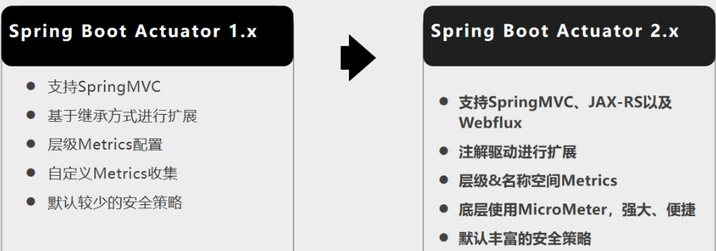

# SpringBoot高级应用

## 1、缓存

### 1、JSR-107

Java Caching定义了5个核心接口

- **CachingProvider**
  - 定义了创建、配置、获取、管理和控制多个CacheManager。一个应用可以在运行期访问多个CachingProvider
- **CacheManager**
  - 定义了创建、配置、获取、管理和控制多个唯一命名的Cache，这些Cache 存在于CacheManager的上下文中。一个CacheManager仅被一个CachingProvider所拥有。
- **Cache**
  - 一个类似Map的数据结构并临时存储以Key为索引的值。一个Cache仅被一个 CacheManager所拥有。
- **Entry**
  - 一个存储在Cache中的key-value对。
- **Expiry**
  - 每一个存储在Cache中的条目有一个定义的有效期。一旦超过这个时间，条目为过期的状态。一旦过期，条目将不可访问、更新和删除。缓存有效期可以通过ExpiryPolicy设置。


### 2、Spring缓存抽象

#### 1、简介

- Spring从3.1开始定义了**org.springframework.cache.Cache** 和**org.springframework.cache.CacheManager**接口来统一不同的缓存技术，并支持使用**JCache（JSR-107）**注解简化我们开发
  - **Cache接口**
    - 为缓存的组件定义规范，包含缓存的各种操作集合
    - Cache接口下Spring提供了各种xxxCache的实现，如RedisCache，EhCacheCache ,  ConcurrentMapCache等

- 每次调用需要缓存功能的方法时，Spring会检查指定参数的指定目标方法是否已经被调用过，如果有就直接从缓存中获取方法调用后的结果，如果没有就调用方法并缓存结果后返回给用户，下次调用直接从缓存中获取。

- 使用Spring缓存抽象时我们需要关注以下两点
  - 确定方法需要被缓存以及他们的缓存策略 
  - 从缓存中读取之前缓存存储的数据


#### 2、重要概念

|              |                                                              |
| ------------ | ------------------------------------------------------------ |
| Cache        | 缓存接口，定义缓存操作                                                     实现有：RedisCache、EhCacheCache、 ConcurrentMapCache等 |
| CacheManager | 缓存管理器，管理各种缓存（Cache）组件                        |
| keyGenerator | 缓存数据时key生成策略                                        |
| serialize    | 缓存数据时value序列化策略                                    |

##### 1、Cache

CacheManager管理多个Cache组件的，对缓存的真正CRUD操作在Cache组件中，每一个缓存组件有自己唯一一个名字

##### 2、原理

1、自动配置类：**CacheAutoConfiguration**

2、SpringBoot中的缓存的配置类

```java
org.springframework.boot.autoconfigure.cache.GenericCacheConfiguration
org.springframework.boot.autoconfigure.cache.JCacheCacheConfiguration
org.springframework.boot.autoconfigure.cache.EhCacheCacheConfiguration
org.springframework.boot.autoconfigure.cache.HazelcastCacheConfiguration
org.springframework.boot.autoconfigure.cache.InfinispanCacheConfiguration
org.springframework.boot.autoconfigure.cache.CouchbaseCacheConfiguration
org.springframework.boot.autoconfigure.cache.RedisCacheConfiguration
org.springframework.boot.autoconfigure.cache.CaffeineCacheConfiguration
org.springframework.boot.autoconfigure.cache.GuavaCacheConfiguration
org.springframework.boot.autoconfigure.cache.SimpleCacheConfiguration【默认生效】
org.springframework.boot.autoconfigure.cache.NoOpCacheConfiguration
```

3、配置类默认生效：**SimpleCacheConfiguration**；

4、给容器中注册了一个CacheManager：**ConcurrentMapCacheManager**

5、ConcurrentMapCacheManager可以获取和创建**ConcurrentMapCache**类型的缓存组件，他的作用将数据保存在**ConcurrentMap**中

#### 3、缓存注解

|                |                                                          |
| -------------- | -------------------------------------------------------- |
| @Cacheable     | 主要针对方法配置，能够根据方法的请求参数对其结果进行缓存 |
| @CacheEvict    | 清空缓存                                                 |
| @CachePut      | 保证方法被调用，又希望结果被缓存。                       |
| @EnableCaching | 开启基于注解的缓存                                       |
| @Caching       | 定义复杂的缓存规则                                       |
| @CacheConfig   | 抽取缓存公共配置                                         |

##### 1、@Cacheable 

- **逻辑**：查找缓存 - 有就返回 -没有就执行方法体 - 将结果缓存起来

- **运行流程**：

  1、方法运行之前，先去查询Cache（缓存组件），按照cacheNames指定的名字获取。（CacheManager[缓存管理器]先获取相应的缓存），第一次获取缓存如果没有Cache组件会自动创建。

  2、去Cache中查找缓存的内容，使用一个key，默认就是方法的参数。

  ```text
  key是按照某种策略生成的；默认是使用keyGenerator生成的，默认使用SimpleKeyGenerator生成key。
  	SimpleKeyGenerator生成key的默认策略
  		1、如果没有参数；key=new SimpleKey()
  		2、如果有一个参数：key=参数的值
  		3、如果有多个参数：key=new SimpleKey(params)
  ```

   3、没有查到缓存就调用目标方法，将目标方法返回的结果，放进缓存中。以后再来调用就可以直接使用缓存中的数据。

##### 2、@CachePut

- **逻辑**：执行方法体 - 将结果缓存起来

**总结**：@Cacheable 适用于查询数据的方法，@CachePut 适用于更新数据的方法

##### 3、@Caching

```java
@Caching(
    cacheable = {
        @Cacheable(/*value="emp",*/key = "#lastName")
    },
    put = {
        @CachePut(/*value="emp",*/key = "#result.id"),
        @CachePut(/*value="emp",*/key = "#result.email")
    }
)
```

##### 4、@CacheConfig

抽取类中@Cacheable、@CachePut、@CacheEvict的公共属性

```java
CacheConfig(cacheNames="emp"/*,cacheManager = "employeeCacheManager"*/) //抽取缓存的公共配置
@Service
public class EmployeeService {
```

#### 4、注解的主要参数

| @Cacheable/@CachePut/@CacheEvict 主要的参数 | 使用                                                         | 例如                                                         |
| ------------------------------------------- | :----------------------------------------------------------- | ------------------------------------------------------------ |
| value                                       | 缓存的名称，在 spring 配置文件中定义，**必须指定至少一个**。 | @Cacheable(value=”mycache”) 或者 @Cacheable(value={”cache1”, ”cache2”} |
| key                                         | 缓存的 key，可以为空，如果指定要按照 SpEL 表达式编写，如果不指定，则**缺省按照方法的所有参数进行组合** | @Cacheable(value=”testcache”, key=”#userName”)               |
| condition                                   | 缓存的条件，可以为空，使用 SpEL 编写，返回 true  或者 false，只有为 true 才进行缓存/清除缓存，在**调用方法之前之后**都能判断 | @Cacheable(value=”testcache”,condition=”#userNam e.length()>2”) |
| allEntries**（@CacheEvict）**               | 是否清空所有缓存内容，缺省为 false，如果指定为 true，则**方法调用后**将立即清空所有缓存 | @CachEvict(value=”testcache”, allEntries=true)               |
| beforeInvocation**（@CacheEvict）**         | 是否在**方法执行前**就清空缓存，缺省为 false，如果指定为 true，则在方法还没有执行的时候就清空缓存， 缺省情况下，如果方法执行抛出异常，则不会清空缓存 | @CachEvict(value=”testcache”，beforeInvocation=true)         |
| unless**（@CachePut）（@Cacheable）**       | 用于否决缓存的，不像condition，该表达式只在**方法执行之后**判断，此时可以拿到返回值result进行判断。条件为**true不会缓存，fasle才缓存** | @Cacheable(value=”testcache”,unless=”#result ==  null”)      |
| cacheManager                                | 可以用来指定缓存管理器。从哪个缓存管理器里面获取缓存         | @CacheConfig(cacheManager = "employeeCacheManager")          |
| cacheResolver                               | **用来指定缓存管理器**，使用配置同 cacheManager 类似，cacheManager/cacheResolver二选一使用 |                                                              |
| keyGenerator                                | key 的生成器。如果觉得通过参数的方式来指定比较麻烦，我们可以自己指定 key 的生成器的组件 id，**key/keyGenerator属性：二选一使用** | @Cacheable(keyGenerator = "myKeyGenerator")                  |
| allEntries**（@CacheEvict）**               | 清除当前value值空间下的所有缓存数据。                        |                                                              |

#### 5、SpEL表达式

| 名字          | 位置               | 描述                       | 示例                                                         |
| ------------- | ------------------ | -------------------------- | ------------------------------------------------------------ |
| methodName    | root object        | 当前被调用的方法名         | \#root.methodName                                            |
| method        | root object        | 当前被调用的方法           | \#root.method.name                                           |
| target        | root object        | 当前被调用的目标对象       | \#root.target                                                |
| targetClass   | root object        | 当前被调用的目标对象类     | \#root.targetClass                                           |
| args          | root object        | 当前被调用的方法的参数列表 | \#root.args[0]                                               |
| caches        | root object        | 当前方法调用使用的缓存列表 | \#root.caches[0].name<br>如@Cacheable(value={"cache1",  "cache2"})），则有两个cache |
| argument name | evaluation context | 方法参数的名字             | \#iban 、 #a0 、 #p0<br>可以直接 #参数名 ，也可以使用 #p0或#a0 的 形式，0代表参数的索引 |
| result        | evaluation context | 方法执行后的返回值         | \#result<br>（仅当方法执行之后的判断有效，如 `unless`，`cache Put`的表达式 `cacheEvict`的表达式 `beforeInvocation`=false） |
|               |                    |                            |                                                              |

#### 6、缓存使用

##### 1、引入模块

- 引入入spring-boot-starter-cache模块

##### 2、@EnableCaching开启缓存

##### 3、使用缓存注解

- 使用@Cacheable、@CacheEvict、@CachePut即可

  ```java
  @Cacheable(value = {"emp"}/*,keyGenerator = "myKeyGenerator",condition = "#a0>1",unless = "#a0==2"*/)
  public Employee getEmp(Integer id){
      .....
  }
  ```

  ```java
  @CachePut(/*value = "emp",*/key = "#result.id")
      public Employee updateEmp(Employee employee){
          .....
      }
  ```

  

- 默认使用的是**ConcurrentMapCacheManager**与**ConcurrentMapCache**，将数据保存在**ConcurrentMap<Object, Object>**中
- 开发中使用缓存中间件；redis、memcached、ehcache

##### 4、切换为其他缓存


#### 7、整合Redis缓存

##### 1、引入模块

- 入spring-boot-starter-cache模块

##### 2、application配置redis连接地址

```xml
spring.redis.host=xxx.xxx.xxx.xxx
```

##### 3、使用RestTemplate操作redis

- redisTemplate.opsForValue();//操作字符串
- redisTemplate.opsForHash();//操作hash
- redisTemplate.opsForList();//操作list
- redisTemplate.opsForSet();//操作set
- redisTemplate.opsForZSet();//操作有序set

##### 4、配置缓存、CacheManagerCustomizers

##### 5、测试使用缓存

- **原理**：**CacheManager**与**Cache** 缓存组件来实际给缓存中存取数据
- 默认保存数据 k-v 都是Object，默认利用JDK序列化机制保存，也可以使用json保存，详情见 第七点

```java
//测试保存对象
@Test
public void test02(){
    Employee empById = employeeMapper.getEmpById(1);
    //默认如果保存对象，使用jdk序列化机制，序列化后的数据保存到redis中
    //redisTemplate.opsForValue().set("emp-01",empById);
    //1、将数据以json的方式保存
    //(1)自己将对象转为json
    //(2)redisTemplate默认的序列化规则、改变默认的序列化规则。
    empRedisTemplate.opsForValue().set("emp-01",empById);
}
```

##### 6、切换缓存

- 引入redis的starter后，容器中保存的是**RedisCacheManager**

- **RedisCacheManager** 帮我们创建 **RedisCache** 来作为缓存组件，RedisCache通过操作redis缓存数据

##### 7、自定义&CompositeCacheManager

**1、自定义一个RedisTemplate**，使用**setDefaultSerializer()**方法，将RedisTemplate的**序列化换为Jackson2JsonRedisSerializer**。

```java
@Bean
public RedisTemplate<Object, Department> deptRedisTemplate(RedisConnectionFactory redisConnectionFactory) throws UnknownHostException {
    RedisTemplate<Object, Department> template = new RedisTemplate<Object, Department>();
    template.setConnectionFactory(redisConnectionFactory);
    Jackson2JsonRedisSerializer<Department> ser = new Jackson2JsonRedisSerializer<>(Department.class);
    template.setDefaultSerializer(ser);
    return template;
}
```

**2、自定义RedisCacheManager缓存管理器**，使用**自定义或者容器内**的RedisTemplate<Object, Employee> RedisTemplate作为参数传入。

如果传入的RedisTemplate是自定义的且默认序列化机制被替换过，则下列序列化机制替换过程可以省略

```java
//将某个缓存管理器作为默认的
@Primary
@Bean
public CacheManager customizeCacheManager(RedisTemplate redisTemplate) {
    //创建RedisCacheWriter
    //nonLockingRedisCacheWriter(RedisConnectionFactory connectionFactory);
	//非锁
	//lockingRedisCacheWriter(RedisConnectionFactory connectionFactory);
	//有锁
    RedisCacheWriter redisCacheWriter = 
        RedisCacheWriter.nonLockingRedisCacheWriter(
        				Objects.requireNonNull(
                            redisTemplate.getConnectionFactory()));
	//创建Jackson对象并传入需要序列化的对象xxxx.class
    Jackson2JsonRedisSerializer<RedisUser> Jacksonserializer = new Jackson2JsonRedisSerializer<>(xxxx.class);
	//传入 Jackson对象 并获取 RedisSerializationContext对象
    RedisSerializationContext<RedisUser, RedisUser> serializationContext = 
        RedisSerializationContext.fromSerializer(Jacksonserializer);
    //配置RedisCacheConfiguration
    //serializeValuesWit(SerializationPari<?> valueSerializationPari)
	//设置 value 的序列化
	//serializeKeysWith(SerializationPari valueSerializationPari)
	//设置 key 的序列化
    RedisCacheConfiguration redisCacheConfiguration =  			
        RedisCacheConfiguration.defaultCacheConfig()
        					   .serializeValuesWith(
        							serializationContext.getValueSerializationPair());
	//创建RedisCacheManager(RedisCacheWriter redisCacheWriter, RedisCacheConfiguration redisCacheConfiguration)对象并返回
    //使用前缀，默认会将CacheName作为key的前缀
    return new RedisCacheManager(redisCacheWriter,redisCacheConfiguration).setUsePrefix(true);
}
```

可以不使用注解@Cacheable，在代码内部使用RedisCacheManager直接缓存

```java
// 使用缓存管理器得到缓存，进行api调用
public Department getDeptById(Integer id){
    Department department = departmentMapper.getDeptById(id);
    //获取某个缓存
    Cache dept = deptCacheManager.getCache("dept");
    dept.put("dept:1",department);
    return department;
}
```

**3、自定义KeyGenerator**，自定义key实现

```java
@Bean("myKeyGenerator")
public KeyGenerator keyGenerator(){
    return new KeyGenerator(){
        @Override
        public Object generate(Object target, Method method, Object... params) {
            return method.getName()+"["+ Arrays.asList(params).toString()+"]";
        }
    };
}
```

### 8、注解解析原理

#### 1、SpringCacheAnnotationParser调用时机

- **AbstractAutowireCapableBeanFactory**的BeanFactory，这个类在创建Bean的时候会去找是否有**Advisor**。而Spring Cache源码里定义了这么一个Advisor：**BeanFactoryCacheOperationSourceAdvisor**。

- 这个Advisor返回的PointCut是一个**CacheOperationSourcePointcut**，这个PointCut复写了**matches**方法，在里面去获取了一个**CacheOperationSource**，调用它的**getCacheOperations()**方法。
- 这个CacheOperationSource是个接口，主要的实现类是**AnnotationCacheOperationSource**。在**findCacheOperations()**方法里，就会调用到**SpringCacheAnnotationParser**了。

### 9、基于AOP拦截器的实际调用方法时机

- 使用了AOP的Bean，会生成一个代理对象，实际调用的时候，会执行这个代理对象的一系列的**Interceptor**。

- Spring Cache使用的是一个叫做**CacheInterceptor**的拦截器，如果加了相应的缓存注解，就会走到这个拦截器上。

- 这个拦截器继承了**CacheAspectSupport**类，会执行这个类的**execute()**方法，这个方法就是核心方法了。
- 该方法首先会判断是否是同步。这里的同步配置是用的@Cacheable的sync属性，默认是false。如果配置了同步的话，**多个线程尝试用相同的key去缓存拿数据的时候，会是一个同步的操作**。


先分析同步操作源码：

如果判断当前需要同步操作

```java
if (contexts.isSynchronized())
```

首先会去判断当前的condition是不是符合条件，这里的condition也是@Cacheable中定义的一个配置，它是一个EL表达式。

```java
if (isConditionPassing(context, CacheOperationExpressionEvaluator.NO_RESULT))
```

如果不符合条件，就不使用缓存，也不把结果放入缓存，直接跳到最后的

```java
return invokeOperation(invoker);
```

否则，尝试获取key

```java
Object key = generateKey(context, CacheOperationExpressionEvaluator.NO_RESULT);
```

在获取key的时候，会先判断用户有没有定义key，它也是一个EL表达式。如果没有的话，就用keyGenerator生成一个key

```java
protected Object generateKey(Object result) {
			if (StringUtils.hasText(this.metadata.operation.getKey())) {
				EvaluationContext evaluationContext = createEvaluationContext(result);
				return evaluator.key(this.metadata.operation.getKey(), this.methodCacheKey, evaluationContext);
			}
			return this.metadata.keyGenerator.generate(this.target, this.metadata.method, this.args);
		}
```

如果我们不在注解上面指定key，会使用keyGenerator生成的key，默认的keyGenerator是**SimpleKeyGenerator**，它生成的是一个**SimpleKey**对象，方法也很简单

**如果没有入参，就返回一个EMPTY的对象**

**如果有入参，且只有一个入参，并且不是空或者数组，就用这个参数**

（注意这里用的是参数本身，而不是`SimpleKey`对象。否则，用所有入参包一个`SimpleKey`。）

```java
@Override
public Object generate(Object target, Method method, Object... params) {
    return generateKey(params);
}

/**
     * Generate a key based on the specified parameters.
     */
public static Object generateKey(Object... params) {
    if (params.length == 0) {
        return SimpleKey.EMPTY;
    }
    if (params.length == 1) {
        Object param = params[0];
        if (param != null && !param.getClass().isArray()) {
            return param;
        }
    }
    return new SimpleKey(params);
}
```

**这里只用入参，没有类名和方法名的区别**，那如果两个方法入参一样，岂不是key冲突了？没错，如下示例：

```java
// 定义两个参数都是String的方法
@Override
@Cacheable(cacheNames = "books", sync = true)
public Book getByIsbn(String isbn) {
    simulateSlowService();
    return new Book(isbn, "Some book");
}

@Override
@Cacheable(cacheNames = "books", sync = true)
public String test(String test) {
    return test;
}

// 调用这两个方法，用相同的参数"test"
logger.info("test getByIsbn -->" + bookRepository.getByIsbn("test"));
logger.info("test test -->" + bookRepository.test("test"));
```

**错误原因**：发现**两次生成的key相同**，然后在调用test方法的时候，控制台会报错。

原因是Book不能强转成String，因为我们第一次调用getByIsbn()方法的时候，生成的key是test，然后缓存了返回值Book对象。而调用test()方法的时候，生成的key还是test，就会取出Book，但是test方法的返回值是String，所以会尝试强转到String，结果发现强转失败。

**解决方法**：自定义一个keyGenerator，在配置里面使用。

```java
@Component
public class MyKeyGenerator implements KeyGenerator {
    @Override
    public Object generate(Object target, Method method, Object... params) {
        return target.getClass().getName() + method.getName() + 
                Stream.of(params).map(Object::toString).collect(Collectors.joining(","));
    }
}
```

```java
@Override
@Cacheable(cacheNames = "books", sync = true, keyGenerator = "myKeyGenerator")
public Book getByIsbn(String isbn) {
    simulateSlowService();
    return new Book(isbn, "Some book");
}

@Override
@Cacheable(cacheNames = "books", sync = true, keyGenerator = "myKeyGenerator")
public String test(String test) {
    return test;
}
```

再次运行程序，就不会出现上述问题。

接着可以看到我们得到了一个**Cache**，这个Cache是在我们调用**CacheAspectSupport**的**execute()**方法的时候，会new一个**CacheOperationContext**。在这个Context的构造方法里，会用**cacheResolver**去解析注解中的Cache，生成Cache对象。

默认的cacheResolver是**SimpleCacheResolver**，它从**CacheOperation**中取得配置的**cacheNames**，然后用**cacheManager**去get一个Cache。

这里的cacheManager是用于管理Cache的一个容器，默认的cacheManager是**ConcurrentMapCacheManager**。听名字就知道是基于**ConcurrentMap**来做的了，底层是**ConcurrentHashMap**。

那这里的Cache是什么东西呢？首先Cache是对“缓存容器”的一个抽象，包含了缓存会用到的get、put、evict、putIfAbsent等方法。不同的cacheNames会对应不同的Cache对象。

默认的Cache是**ConcurrentMapCache**，它也是基于ConcurrentHashMap的。

但这里有个问题，我们回到上面的execute()方法的代码，发现如果设置了**sync为true**，它取的是第一个Cache，而没有管剩下的Cache。所以如果你配置了sync为true，只支持配置一个cacheNames，如果配了多个，就会报错

```java
@Cacheable(sync=true) only allows a single cache on...
```

继续往下看，发现调用的是Cache的**get(Object, Callcable)**方法。这个方法会先尝试去缓存中用key取值，如果取不到在调用**callable**函数，然后加到缓存里。Spring Cache也是期望Cache的实现类在这个方法内部实现“同步”的功能。

所以再回过头去看@Cacheable中sync属性上方的注释，它写到：使用sync为true，会有这些限制：

1. **不支持unless**，只支持了condition，没有支持unless，从代码中可以看到。
2. **只能有一个cache**，因为代码就写死了一个。可能这是为了更好地支持同步，它把同步放到了Cache里面去实现。
3. **没有不支持其它的Cache操作**，代码里面写死了，只支持Cachable。

如果**sync为false**：

1. 尝试在方法调用前删除缓存，这个在@CacheEvict配置的beforeInvocation，默认为false（如果为true才会在这一步删除缓存）。
2. 尝试获取缓存。
3. 如果第2步获取不到，尝试获取Cachable的注解，生成相应的CachePutRequest。
4. 如果第2步获取到了，并且没有CachPut注解，就直接从缓存中获取值。否则，调用目标方法。
5. 解析CachePut注解，同样生成相应的CachePutRequest。
6. 执行所有的CachePutRequest。
7. 尝试在方法调用后删除缓存，如果@CacheEvict配置的beforeInvocation为false会删除缓存。

### 10、缓存带来的问题

#### 1、双写不一致

这是一个比较常见的问题，其中一个常用的解决方案是，更新的时候，先删除缓存，再更新数据库。所以Spring Cache的@CacheEvict会有一个**beforeInvocation**的配置。

#### 2、占用额外内存

缓存的思想正是用空间去换时间，有时候占用这点额外的空间对于时间上的优化来说，是非常值得的。

这里需要注意的是，SpringCache默认使用的是ConcurrentHashMap，它不会自动回收key，所以如果使用默认的这个缓存，程序就会越来越大，并且得不到回收。最终可能导致OOM。

## 2、消息

### 1、简述

- **作用**：提升系统异步通信、扩展解耦能力

- **两个重要概念**：

  - **消息代理（Message Broker）**
  - **目的地（Destination）**

  当消息发送者发送消息以后，将由消息代理接管，消息代理保证消息传递到指定目的地。

- 有两种形式**目的地**
  - **队列（queue）**：点对点消息通信（point-to-point）
  - **主题（topic）**：发布（publish）/订阅（subscribe）消息通信

- **应用**：异步处理、应用解耦、流量削峰

### 2、消息模式与服务

#### 1、点对点式

消息发送者发送消息，消息代理将其放入一个队列中，消息接收者从队列中获取消息内容，消息读取后被移出队列。

消息只有唯一的发送者和接受者，但并不是说只能有一个接收者。

#### 2、发布订阅式

发布者发送消息到主题，多个订阅者监听这个主题，那么就会在消息到达时同时收到消息。

#### 3、JMS

Java Message Service，JAVA消息服务。

基于JVM消息代理的规范。ActiveMQ、HornetMQ是JMS实现

#### 4、AMQP

Advanced Message Queuing Protocol

高级消息队列协议，也是一个消息代理的规范，兼容JMS。

RabbitMQ是AMQP的实现。

|              | JMS                                                          | AMQP                                                         |
| ------------ | ------------------------------------------------------------ | ------------------------------------------------------------ |
| 定义         | Java  api                                                    | 网络线级协议                                                 |
| 跨语言       | 否                                                           | 是                                                           |
| 跨平台       | 否                                                           | 是                                                           |
| Model        | 提供两种消息模型： <br>1、Peer-2-Peer   <br/>2、Pub/sub      | 提供了五种消息模型：   <br/>1、direct  exchange   <br/>2、fanout  exchange   <br/>3、topic  change   <br/>4、headers  exchange   <br/>5、system  exchange   <br/>本质来讲，后四种和JMS的pub/sub模型没有太大差别，仅是在路由机制上做了更详细的划分； |
| 支持消息类型 | 多种消息类型：   <br/>1、TextMessage  <br/>2、MapMessage  <br/>3、BytesMessage   <br/>4、StreamMessage   <br/>5、ObjectMessage   <br/>6、Message  （只有消息头和属性） | 1、byte[]   <br/>当实际应用时，有复杂的消息，可以将消息序列化后发送。 |
| 综合评价     | JMS  定义了JAVA  API层面的标准，在java体系中，多个client均可以通过JMS进行交互，不需要应用修改代码，但是其对跨平台的支持较差 。 | AMQP定义了wire-level层的协议标准，天然具有跨平台、跨语言特性。 |

### 3、Spring支持

1、**spring-jms**提供了对JMS的支持

2、**spring-rabbit**提供了对AMQP的支持

3、需要**ConnectionFactory**的实现来连接消息代理

4、提供**JmsTemplate**、**RabbitTemplate**来发送消息

5、**@JmsListener**（JMS）、**@RabbitListener**（AMQP）注解在方法上监听

6、消息代理发布的消息

7、**@EnableJms**、**@EnableRabbit**开启支持

### 4、SpringBoot自动配置

#### 1、JmsAutoConfiguration

#### 2、RabbitAutoConfiguration


##### 1、类注解

```java
@Configuration
//@ConditionalOnClass判断类路径中存在RabbitTemplate类和Channel类
@ConditionalOnClass({ RabbitTemplate.class, Channel.class })
//@EnableConfigurationProperties导入rabbitmq的配置类，具体就是在application.properties中的配置
@EnableConfigurationProperties(RabbitProperties.class)
//@Import导入RabbitAnnotationDrivenConfiguration类
@Import(RabbitAnnotationDrivenConfiguration.class)
```

##### 1.2、构造RabbitMQ的连接工厂类


判断bean不存在，就注册为bean到spring容器中

##### 1.3、构造RabbitMQTemplate

```java
@Configuration
//@Import导入RabbitConnectionFactoryCreator类，也就是1.2中注入的bean
@Import(RabbitConnectionFactoryCreator.class)
protected static class RabbitTemplateConfiguration {
    .......
}
```

```java
@Bean
@ConditionalOnSingleCandidate(ConnectionFactory.class)
@ConditionalOnMissingBean
public RabbitTemplate rabbitTemplate(ConnectionFactory connectionFactory) {
    PropertyMapper map = PropertyMapper.get();
    //设置连接工厂
    RabbitTemplate template = new RabbitTemplate(connectionFactory);
    //设置消息转换器
    //会判断当前环境中是否存在自定义消息转换器的实现，默认使用SimpleMessageConverter
    MessageConverter messageConverter = this.messageConverter.getIfUnique();
    if (messageConverter != null) {
        template.setMessageConverter(messageConverter);
    }
    template.setMandatory(determineMandatoryFlag());
    RabbitProperties.Template properties = this.properties.getTemplate();
    if (properties.getRetry().isEnabled()) {
        //设置重试策略
        template.setRetryTemplate(createRetryTemplate(properties.getRetry()));
    }
    map.from(properties::getReceiveTimeout)
        .whenNonNull()
        .as(Duration::toMillis)
        .to(template::setReceiveTimeout);
    
    map.from(properties::getReplyTimeout)
        .whenNonNull()
        .as(Duration::toMillis)
        .to(template::setReplyTimeout);
    
    map.from(properties::getExchange)
        .to(template::setExchange);
    
    map.from(properties::getRoutingKey)
        .to(template::setRoutingKey);
    
    return template;
}
```

```java
public class RabbitTemplate extends RabbitAccessor 
    						implements BeanFactoryAware, 
									   RabbitOperations, 
									   MessageListener,
									   ListenerContainerAware, 
									   PublisherCallbackChannel.Listener, 
									   Lifecycle, 
									   BeanNameAware {

............       
        // 默认的消息转换器
        private volatile MessageConverter messageConverter = new SimpleMessageConverter();
............   
```

##### 2、RabbitAnnotationDrivenConfiguration类

注册默认容器工厂类

进行bean的导入

```java
@Configuration
@ConditionalOnClass({EnableRabbit.class})
class RabbitAnnotationDrivenConfiguration {
    private final ObjectProvider<MessageConverter> messageConverter;
    private final ObjectProvider<MessageRecoverer> messageRecoverer;
    private final RabbitProperties properties;

    RabbitAnnotationDrivenConfiguration(ObjectProvider<MessageConverter> messageConverter, ObjectProvider<MessageRecoverer> messageRecoverer, RabbitProperties properties) {
        this.messageConverter = messageConverter;
        this.messageRecoverer = messageRecoverer;
        this.properties = properties;
    }
    

    @Bean
    @ConditionalOnMissingBean
    public SimpleRabbitListenerContainerFactoryConfigurer rabbitListenerContainerFactoryConfigurer() {
       ...........
    }
    
	//注册默认的容器工厂类
    @Bean
    @ConditionalOnMissingBean(name = {"rabbitListenerContainerFactory"})
    public SimpleRabbitListenerContainerFactory rabbitListenerContainerFactory(SimpleRabbitListenerContainerFactoryConfigurer configurer, ConnectionFactory connectionFactory) {
        SimpleRabbitListenerContainerFactory factory = new SimpleRabbitListenerContainerFactory();
        configurer.configure(factory, connectionFactory);
        return factory;
    }

    //进行bean的导入
    @EnableRabbit
    @ConditionalOnMissingBean(
        name = {"org.springframework.amqp.rabbit.config.internalRabbitListenerAnnotationProcessor"}
    )
    protected static class EnableRabbitConfiguration {
        protected EnableRabbitConfiguration() {
        }
    }
}
```

```java
@Target(ElementType.TYPE)
@Retention(RetentionPolicy.RUNTIME)
@Documented
@Import(RabbitBootstrapConfiguration.class)
public @interface EnableRabbit {
    
}
```

```java
@Configuration
public class RabbitBootstrapConfiguration {
    //注册bean名字为：org.springframework.amqp.rabbit.config.internalRabbitListenerAnnotationProcessor 
    //这个类就极为关键，真正注册@RabbitListener的逻辑就在这里
    @Bean(name = RabbitListenerConfigUtils.RABBIT_LISTENER_ANNOTATION_PROCESSOR_BEAN_NAME)
    @Role(BeanDefinition.ROLE_INFRASTRUCTURE)
    public RabbitListenerAnnotationBeanPostProcessor rabbitListenerAnnotationProcessor() {
        return new RabbitListenerAnnotationBeanPostProcessor();
    }
    //注册bean名字为：org.springframework.amqp.rabbit.config.internalRabbitListenerEndpointRegistry
    @Bean(name = RabbitListenerConfigUtils.RABBIT_LISTENER_ENDPOINT_REGISTRY_BEAN_NAME)
    public RabbitListenerEndpointRegistry defaultRabbitListenerEndpointRegistry() {
        return new RabbitListenerEndpointRegistry();
    }
}
```

##### 3、RabbitListenerAnnotationBeanPostProcessor类

```java
public class RabbitListenerAnnotationBeanPostProcessor
        implements BeanPostProcessor, Ordered, BeanFactoryAware, BeanClassLoaderAware, EnvironmentAware,
        SmartInitializingSingleton {
........
//实现接口的执行顺序是：
setBeanClassLoader -> 
setBeanFactory -> 
setEnvironment -> 
postProcessAfterInitialization(每一个spring容器中的bean都会执行这个方法) -> 
//见下文
afterSingletonsInstantiated
```

```java
@Override
public void afterSingletonsInstantiated() {
    //  private final RabbitListenerEndpointRegistrar registrar = new RabbitListenerEndpointRegistrar();
    this.registrar.setBeanFactory(this.beanFactory);

    if (this.beanFactory instanceof ListableBeanFactory) {
        Map<String, RabbitListenerConfigurer> instances =
            ((ListableBeanFactory) this.beanFactory).getBeansOfType(RabbitListenerConfigurer.class);
        for (RabbitListenerConfigurer configurer : instances.values()) {
            configurer.configureRabbitListeners(this.registrar);
        }
    }

    if (this.registrar.getEndpointRegistry() == null) {
        if (this.endpointRegistry == null) {
            Assert.state(this.beanFactory != null,
                         "BeanFactory must be set to find endpoint registry by bean name");
            this.endpointRegistry = this.beanFactory.getBean(
                RabbitListenerConfigUtils.RABBIT_LISTENER_ENDPOINT_REGISTRY_BEAN_NAME,
                RabbitListenerEndpointRegistry.class);
        }
        this.registrar.setEndpointRegistry(this.endpointRegistry);
    }

    if (this.containerFactoryBeanName != null) {
        this.registrar.setContainerFactoryBeanName(this.containerFactoryBeanName);
    }

    // Set the custom handler method factory once resolved by the configurer
    MessageHandlerMethodFactory handlerMethodFactory = this.registrar.getMessageHandlerMethodFactory();
    if (handlerMethodFactory != null) {
        this.messageHandlerMethodFactory.setMessageHandlerMethodFactory(handlerMethodFactory);
    }

    // Actually register all listeners
    //关键方法，见下文
    this.registrar.afterPropertiesSet();

    // clear the cache - prototype beans will be re-cached.
    this.typeCache.clear();
}
```

```java
@Override
public void afterPropertiesSet() {
    //见下一行
    registerAllEndpoints();
}

protected void registerAllEndpoints() {
    synchronized (this.endpointDescriptors) {
        //遍历每一个@RabbitListener
        for (AmqpListenerEndpointDescriptor descriptor : this.endpointDescriptors) {
            this.endpointRegistry.registerListenerContainer(
                					 //该方法见下文
                descriptor.endpoint, resolveContainerFactory(descriptor));
        }
        this.startImmediately = true;  // trigger immediate startup
    }
}
```

```java
public void registerListenerContainer(RabbitListenerEndpoint endpoint, 
                                      RabbitListenerContainerFactory<?> factory,
                                      boolean startImmediately) {
    
    Assert.notNull(endpoint, "Endpoint must not be null");
    Assert.notNull(factory, "Factory must not be null");

    String id = endpoint.getId();
    Assert.hasText(id, "Endpoint id must not be empty");
    synchronized (this.listenerContainers) {
        Assert.state(!this.listenerContainers.containsKey(id), "Another endpoint is already registered with id '" + id + "'");
        //这里进行监听器容器的配置设定，以及初始化,该方法见下文
        MessageListenerContainer container = createListenerContainer(endpoint, factory);
        this.listenerContainers.put(id, container);
			if (StringUtils.hasText(endpoint.getGroup()) && this.applicationContext != null) {
				List<MessageListenerContainer> containerGroup;
				if (this.applicationContext.containsBean(endpoint.getGroup())) {
					containerGroup = this.applicationContext.getBean(endpoint.getGroup(), List.class);
				}
				else {
					containerGroup = new ArrayList<MessageListenerContainer>();
					this.applicationContext.getBeanFactory().registerSingleton(endpoint.getGroup(), containerGroup);
				}
				containerGroup.add(container);
			}
			if (startImmediately) {
				startIfNecessary(container);
			}
    }
}

protected MessageListenerContainer createListenerContainer(RabbitListenerEndpoint endpoint,
                                                           RabbitListenerContainerFactory<?> factory) {
    //工厂类创建MessageListenerContainer
    //见SimpleRabbitListenerContainerFactory类的createContainerInstance方法
    //将SimpleRabbitListenerContainerFactory工厂类与SimpleRabbitListenerContainer实体类关联起来
    
    //@Override
    //protected SimpleMessageListenerContainer createContainerInstance() {
    //  return new SimpleMessageListenerContainer();
    //}
    MessageListenerContainer listenerContainer = factory.createListenerContainer(endpoint);

    if (listenerContainer instanceof InitializingBean) {
        try {
            ((InitializingBean) listenerContainer).afterPropertiesSet();
        }
        catch (Exception ex) {
            throw new BeanInitializationException("Failed to initialize message listener container", ex);
        }
    }
    int containerPhase = listenerContainer.getPhase();
    if (containerPhase < Integer.MAX_VALUE) {  // a custom phase value
        if (this.phase < Integer.MAX_VALUE && this.phase != containerPhase) {
            throw new IllegalStateException("Encountered phase mismatch between container factory definitions: " +
                                            this.phase + " vs " + containerPhase);
        }
        this.phase = listenerContainer.getPhase();
    }

    return listenerContainer;
}
```


### 5、RabbitMQ简介

#### 1、简介

一个由erlang开发的AMQP(Advanved Message Queue Protocol)的开源实现

#### 2、核心概念

##### 1、Message

- **消息**，消息是不具名的，它由**消息头**和**消息体**组成。
  - 消息体是不透明的
  - 消息头则由一系列的可选属性组成

- 这些属性包括：
  - **routing-key**（路由键）
  - **priority**（相对于其他消息的优先权）
  - **delivery-mode**（指出该消息可能需要持久性存储）

##### 2、Publisher

- **消息的生产者**，也是一个向交换器（Exchange）发布消息的客户端应用程序。

##### 3、Exchange

- **交换器**，用来接收生产者发送的消息并将这些消息路由给服务器中的队列。
- 有4种类型：（不同类型的Exchange转发消息的策略有所区别）
  - **direct**（默认）
  - **fanout**
  - **topic**
  - **headers**

##### 4、Queue

- **消息队列**，用来保存消息直到发送给消费者。
- 它是**消息的容器**，也是**消息的终点**。
- 一个消息可投入一个或多个队列。消息一直在队列里面，等待消费者连接到这个队列将其取走。

##### 5、Binding

- **绑定**，用于**消息队列和交换器之间的关联**。
- 一个绑定就是基于路由键将交换器和消息队列连接起来的路由规则，所以可以将交换器理解成一个由绑定构成的路由表。
  **Exchange和Queue的绑定可以是多对多的关系**。

##### 6、Connection

- 网络连接，比如一个TCP连接。

##### 7、Channel

- 信道，多路复用连接中的一条独立的双向数据流通道。

- 信道是建立在真实的TCP连接内的虚拟连接，AMQP 命令都是通过信道发出去的，不管是发布消息、订阅队列还是接收消息，这些动作都是通过信道完成。因为对于操作系统来说建立和销毁 TCP 都是非常昂贵的开销，所以引入了信道的概念，以复用一条 TCP 连接。

##### 8、Consumer

- **消息的消费者**，表示一个从消息队列中取得消息的客户端应用程序。

##### 9、Virtual Host

- **虚拟主机**，表示一批交换器、消息队列和相关对象。
- 虚拟主机是共享相同的身份认证和加密环境的独立服务器域。每个 vhost 本质上就是一个 mini 版的 RabbitMQ 服务器，拥有自己的队列、交换器、绑定和权限机制。
- vhost 是 AMQP 概念的基础，必须在连接时指定，RabbitMQ 默认的 vhost 是 / 。

##### 10、Broker

表示消息队列**服务器实体**。


#### 3、运行机制

##### 1、消息路由

AMQP 中增加了 **Exchange** 和 **Binding** 的角色。

生产者把消息发布到 Exchange 上，消息最终到达队列并被消费者接收，而 Binding 决定交换器的消息应该发送到那个队列。


##### 2、Exchange类型

目前共四种类型：

###### 1、direct

- 消息中的路由键（routing key）如果和 Binding 中的 binding key 一致， 交换器就将消息发到对应的队列中。

- **路由键与队列名完全匹配**。

- 如果一个队列绑定到交换机要求路由键为“dog”，则只转发 routing key 标记为“dog”的消息，不会转发“dog.puppy”，也不会转发“dog.guard”等等。

- 它是**完全匹配**、**单播**的模式。


###### 2、fanout

- 每个发到 fanout 类型交换器的消息都会分到所有绑定的队列上去。

- fanout 交换器**不处理路由键**，只是简单的将队列绑定到交换器上，每个发送到交换器的消息都会被转发到与该交换器绑定的所有队列上。很像子网广播，每台子网内的主机都获得了一份复制的消息。

- fanout 类型**转发消息是最快**的。


###### 3、topic

- topic 交换器通过**模式匹配**分配消息的路由键属性，将路由键和某个模式进行匹配。

- 队列需要绑定到一个模式上，它将路由键和绑定键的字符串切分成单词，这些**单词之间用点隔开**。

- 它同样也会识别两个通配符：符号“#”和符号“\*”。#匹配0个或多个单词，*匹配一个单词。


###### 4、headers 

- headers 匹配 AMQP 消息的 header 而不是路由键， headers 交换器和 direct 交换器完全一致，但性能差很多，目前几乎用不到了，所以直接看另外三种类型。

### 6、RabbitMQ整合

#### 1、引入spring-boot-starter-amqp

```java
<dependency>
    <groupId>org.springframework.boot</groupId>
    <artifactId>spring-boot-starter-amqp</artifactId></dependency>
```

#### 2、application.yml配置以及自动配置

```properties
spring.rabbitmq.host=xxx.xxx.xxx.xxx
# 默认账号
spring.rabbitmq.username=guest
# 默认密码
spring.rabbitmq.password=guest
```

**自动配置**

 *  1、**RabbitAutoConfiguration**
 *  2、有自动配置了连接工厂**ConnectionFactory**
 *  3、**RabbitProperties** 封装了 RabbitMQ的配置
 *  4、@EnableRabbit +  @RabbitListener 监听消息队列的内容

#### 3、测试RabbitMQ

- **AmqpAdmin**：管理组件
  - AmqpAdmin ：RabbitMQ系统管理功能组件
   - AmqpAdmin：创建和删除 Queue，Exchange，Binding
 - **RabbitTemplate**：消息发送处理组件，给RabbitMQ发送和接受消息

```java
@Test
public void createExchange(){
	// 创建交换机
    amqpAdmin.declareExchange(new DirectExchange("amqpadmin.exchange"));
    // 创建队列
    amqpAdmin.declareQueue(new Queue("amqpadmin.queue",true));
    // 创建绑定规则
    amqpAdmin.declareBinding(new Binding("amqpadmin.queue", 
                                         Binding.DestinationType.QUEUE,
                                         "amqpadmin.exchange",
                                         "amqp.haha",
                                         null));

}
```

```java
/**
* 1、单播（点对点）
*/
@Test
public void contextLoads() {
    // Message需要自己构造一个，定义消息体内容和消息头
    // rabbitTemplate.send(exchage,routeKey,message);
    // object默认当成消息体，只需要传入要发送的对象，自动序列化发送给rabbitmq
    // rabbitTemplate.convertAndSend(exchage,routeKey,object);
    Map<String,Object> map = new HashMap<>();
    map.put("msg","这是第一个消息");
    map.put("data", Arrays.asList("helloworld",123,true));
    // 对象被默认序列化以后发送出去
    rabbitTemplate.convertAndSend("exchange.direct","atguigu.news",new Book("西游记","吴承恩"));
}

// 接受数据
@Test
public void receive(){
    Object o = rabbitTemplate.receiveAndConvert("atguigu.news");
    System.out.println(o.getClass());
    System.out.println(o);
}

/**
* 广播
*/
@Test
public void sendMsg(){
    rabbitTemplate.convertAndSend("exchange.fanout","",new Book("红楼梦","曹雪芹"));
}
```


#### 4、注解

##### 1、@EnableRabbit 

开启基于注解的RabbitMQ模式

##### 2、@RabbitListener

#### 5、自定义

##### 1、自定义一个MessageConverter

自定义一个MessageConverter，当rabbitMQ检测到有自定义的MessageConverter，就会使用。

```java
@Bean
public MessageConverter messageConverter(){
    return new Jackson2JsonMessageConverter();
}
```

### 7、扩展


## 3、检索

### 1、Elasticsearch简介

Elasticsearch是一个分布式搜索服务，提供Restful API，底层基于Lucene，采用多shard（分片）的方式保证数据安全，并且提供自动resharding的功能，github
等大型的站点也是采用了ElasticSearch作为其搜索服务。

### 2、概念

以 `员工文档` 的形式存储为例：一个文档代表一个员工数据。存储数据到ElasticSearch 的行为叫做 `索引 `，但在索引一个文档之前，需要确定将文档存
储在哪里。

一个 ElasticSearch 集群可以 包含多个 `索引` ，相应的每个索引可以包含多个` 类型` 。 这些不同的类型存储着多个 `文档` ，每个文档又有 多个 `属性` 。


### 3、Elasticsearch整合

SpringBoot默认支持两种技术来和ES交互

- **Jest**（默认不生效）
  - 需要导入`io.searchbox.client.JestClient`

- **SpringData** **ElasticSearch**【ES版本有可能不合适】[版本适配说明](https://github.com/spring-projects/spring-data-elasticsearch)。

#### 1、引入spring-boot-starter-data-elasticsearch

```xml
<!--SpringBoot默认使用SpringData ElasticSearch模块进行操作-->
<dependency>
    <groupId>org.springframework.boot</groupId>
    <artifactId>spring-boot-starter-data-elasticsearch</artifactId>
</dependency>
```

#### 2、安装Spring Data 对应版本的ElasticSearch

```xml
<!-- https://mvnrepository.com/artifact/io.searchbox/jest -->
<dependency>
    <groupId>io.searchbox</groupId>
    <artifactId>jest</artifactId>
    <version>6.3.1</version>
</dependency>
```

#### 3、配置application.yml

```properties
spring.elasticsearch.jest.uris=http://xxx.xxx.xxx.xxx:9200
spring.data.elasticsearch.cluster-name=elasticsearch
spring.data.elasticsearch.cluster-nodes=xxx.xxx.xxx.xxx:9300
```

#### 4、Spring Boot自动配置

Spring Boot会自动配置**ElasticsearchRepository**、**ElasticsearchTemplate**、**Jest**

##### 1、自定义ElasticsearchRepository

```java
public interface BookRepository extends ElasticsearchRepository<Book,Integer> {

    //参照
    // https://docs.spring.io/spring-data/elasticsearch/docs/3.0.6.RELEASE/reference/html/
    //需要继承ElasticsearchRepository类，并提供两个泛型，一个是类型，另一个是ID
    //写好的接口无需提供实现，会自动查询，详情查看上方链接
    public List<Book> findByBookNameLike(String bookName);

}
```

```java
@Test
public void test02(){
    //创建实体
    Book book1 = new Book();
    book1.setId(1);
    book1.setBookName("西游记");
    book1.setAuthor("吴承恩");
    //放入
    bookRepository.index(book1);
	
    //搜索
    for (Book book : bookRepository.findByBookNameLike("游")) {
        System.out.println(book);
    }

}
```

##### 2、ElasticsearchTemplate

操作ES，或者使用自定义的ElasticsearchRepository，[两种方式](https://github.com/spring-projects/spring-data-elasticsearch)。

简单例子

```java
/**
* 单字符串模糊查询，默认排序。将从所有字段中查找包含传来的word分词后字符串的数据集
*/
@RequestMapping("/singleWord")
public Object singleTitle(String word, @PageableDefault Pageable pageable) {
    //使用queryStringQuery完成单字符串查询
    SearchQuery searchQuery = new NativeSearchQueryBuilder().withQuery(queryStringQuery(word)).withPageable(pageable).build();
    return elasticsearchTemplate.queryForList(searchQuery, Post.class);
}
```

##### 3、Jest

```java
//测试存入
@Test
public void contextLoads() {
    //1、给Es中索引（保存）一个文档，首先创建一个实体
    Article article = new Article();
    article.setId(1);
    article.setTitle("好消息");
    article.setAuthor("zhangsan");
    article.setContent("Hello World");

    //构建一个索引功能                放入实体          选择索引库       选择类型      构建
    Index index = new Index.Builder(article).index("atguigu").type("news").build();

    try {
        //执行
        jestClient.execute(index);
    } catch (IOException e) {
        e.printStackTrace();
    }
}

//测试搜索
@Test
public void search(){

    //查询表达式
    String json ="{\n" +
        "    \"query\" : {\n" +
        "        \"match\" : {\n" +
        "            \"content\" : \"hello\"\n" +
        "        }\n" +
        "    }\n" +
        "}";

    //更多操作：https://github.com/searchbox-io/Jest/tree/master/jest
    //构建搜索功能                      选择查询表达式      选择索引库         选择类型      构建
    Search search = new Search.Builder(json).addIndex("atguigu").addType("news").build();

    //执行
    try {
        SearchResult result = jestClient.execute(search);
        System.out.println(result.getJsonString());
    } catch (IOException e) {
        e.printStackTrace();
    }
}
```

#### 5、测试ElasticSearch

#### 6、注解

##### 1、@Document

```java
//简单例子
@Document(indexName = "索引库",type = "类型")
```

```java
public @interface Document {
 
String indexName(); //索引库的名称
 
String type() default ""; //类型
 
short shards() default 5; //默认分区数
 
short replicas() default 1; //每个分区默认的备份数
 
String refreshInterval() default "1s"; //刷新间隔
 
String indexStoreType() default "fs"; //索引文件存储类型
}
```

##### 2、@Field

```java
public @interface Field {
 
FieldType type() default FieldType.Auto; //自动检测属性的类型，可以根据实际情况自己设置
 
FieldIndex index() default FieldIndex.analyzed; //默认情况下分词，一般默认分词就好，除非这个字段你确定查询时不会用到
 
DateFormat format() default DateFormat.none; //时间类型的格式化
 
String pattern() default ""; 
 
boolean store() default false; //默认情况下不存储原文
 
String searchAnalyzer() default ""; //指定字段搜索时使用的分词器
 
String indexAnalyzer() default ""; //指定字段建立索引时指定的分词器
 
String[] ignoreFields() default {}; //如果某个字段需要被忽略
 
boolean includeInParent() default false;
}
```

##### 3、@JestId

文档ID，使用在属性上

```java
@JestId
private Integer id;
```

## 4、任务

### 1、异步任务

#### 1、注解

```java
//开启异步注解功能
@EnableAsync  
SpringbootApplication{
    ....
}
```

```java
//告诉Spring这是一个异步方法
@Async
public void hello(){
    ....
}
```

### 2、定时任务

#### 1、注解

```java

// 开启基于注解的定时任务
@EnableScheduling 
SpringbootApplication{
    ....
}
```

```java
/**
* second(秒), minute（分）, hour（时）, day of month（日）, month（月）, day of week（周几）.
* 0 * * * * MON-FRI
*  【0 0/5 14,18 * * ?】 每天14点整，和18点整，每隔5分钟执行一次
*  【0 15 10 ? * 1-6】 每个月的周一至周六10:15分执行一次
*  【0 0 2 ? * 6L】每个月的最后一个周六凌晨2点执行一次
*  【0 0 2 LW * ?】每个月的最后一个工作日凌晨2点执行一次
*  【0 0 2-4 ? * 1#1】每个月的第一个周一凌晨2点到4点期间，每个整点都执行一次；
*/
// @Scheduled(cron = "0 * * * * MON-SAT")
//@Scheduled(cron = "0,1,2,3,4 * * * * MON-SAT")
// @Scheduled(cron = "0-4 * * * * MON-SAT")
@Scheduled(cron = "0/4 * * * * MON-SAT")  //每4秒执行一次
public void hello(){
    System.out.println("hello ... ");
}
```

| 字段 | 允许值                  | 允许的特殊字符  |
| ---- | ----------------------- | --------------- |
| 秒   | 0-59                    | , - * /         |
| 分   | 0-59                    | , - * /         |
| 小时 | 0-23                    | , - * /         |
| 日期 | 1-31                    | , - * ? / L W C |
| 月份 | 1-12                    | , - * /         |
| 星期 | 0-7或者SUN-SAT 0,7是SUN | , - * ? / L C # |

| 特殊字符 | 代表含义                   |
| -------- | -------------------------- |
| ，       | 枚举                       |
| -        | 区间                       |
| *        | 任意                       |
| /        | 步长                       |
| L        | 最后                       |
| W        | 工作日                     |
| C        | 和calendar联系后计算过的值 |
| #        | 星期，4#2，第二个星期四    |


### 3、邮件任务

#### 1、引入依赖

邮件发送需要引入**spring-boot-starter-mail**

```xml
<dependency>
    <groupId>org.springframework.boot</groupId>
    <artifactId>spring-boot-starter-mail</artifactId>
</dependency>
```

#### 2、自动配置MailSenderAutoConfiguration

#### 3、配置在application.yml

定义**MailProperties**内容

```properties
spring.mail.username=xxxxxx@qq.com
spring.mail.password=安全码
#邮箱服务器
spring.mail.host=smtp.qq.com
#某些邮箱要求SLL安全连接
spring.mail.properties.mail.smtp.ssl.enable=true
```

#### 4、自动装配JavaMailSender

#### 5、测试邮件发送

```java
@Test
public void contextLoads() {
    // 创建一封简单邮件
    SimpleMailMessage message = new SimpleMailMessage();
    // 邮件设置
    // 邮件标题
    message.setSubject("通知-今晚开会");
    // 邮件内容
    message.setText("今晚7:30开会");
	// 邮件接受者
    message.setTo("17512080612@163.com");
    // 邮件来源
    message.setFrom("534096094@qq.com");
	// 发送邮件
    mailSender.send(message);
}
```

```java
@Test
public void test02() throws  Exception{
    // 1、由mailSender创建一个复杂的消息邮件
    MimeMessage mimeMessage = mailSender.createMimeMessage();
    // 将mailSender包装为MimeMessageHelper
    MimeMessageHelper helper = new MimeMessageHelper(mimeMessage, true);

    // 由MimeMessageHelper进行邮件设置
    helper.setSubject("通知-今晚开会");
    // 允许HTLM编码
    helper.setText("<b style='color:red'>今天 7:30 开会</b>",true);
    helper.setTo("17512080612@163.com");
    helper.setFrom("534096094@qq.com");

    // 上传文件
    helper.addAttachment("1.jpg",new File("C:\\Users\\lfy\\Pictures\\Saved Pictures\\1.jpg"));
    helper.addAttachment("2.jpg",new File("C:\\Users\\lfy\\Pictures\\Saved Pictures\\2.jpg"));
	// 发送
    mailSender.send(mimeMessage);

}
```

## 5、安全

### 1、简介

- 应用程序的两个主要区域是“**认证**”和“**授权**”。这两个主要区域是Spring Security 的两个目标。
  - **“认证”（Authentication）**

    是建立一个他声明的主体的过程（一个“主体”一般是指用户，设备或一些可以在你的应用程序中执行动
    作的其他系统）。

  - **“授权”（Authorization）**

    指确定一个主体是否允许在你的应用程序执行一个动作的过程。为了抵达需要授权的店，主体的身份已经有认
    证过程建立。

### 2、概念

#### 1、WebSecurityConfigurerAdapter

自定义Security策略 

#### 2、AuthenticationManagerBuilder

自定义认证策略 

#### 3、@EnableWebSecurity

开启WebSecurity模式

### 3、步骤

#### 1、引入SpringSecurity

```xml
<dependency>
    <groupId>org.springframework.boot</groupId>
    <artifactId>spring-boot-starter-security</artifactId>
</dependency>
```

#### 2、编写SpringSecurity的配置类

使用**@EnableWebSecurity**开启SpringSecurity，继承**WebSecurityConfigurerAdapter**类自定义安全规则

```java
@EnableWebSecurity
public class MySecurityConfig extends WebSecurityConfigurerAdapter {
    ......
}
```

#### 3、控制请求的访问权限

CSRF（Cross-site request forgery）跨站请求伪造 – HttpSecurity启用csrf功能，会为表单添加_csrf的值，提交携带来预防CSRF

```java
@Override
protected void configure(HttpSecurity http) throws Exception {
    //super.configure(http);
    //定制请求的授权规则
    //									主页允许所有人访问
    http.authorizeRequests().antMatchers("/").permitAll()
        //特定URL，设置特定角色访问
        .antMatchers("/level1/**").hasRole("VIP1")
        .antMatchers("/level2/**").hasRole("VIP2")
        .antMatchers("/level3/**").hasRole("VIP3");
```

#### 4、定义认证规则

```java
//定义认证规则
@Override
protected void configure(AuthenticationManagerBuilder auth) throws Exception {
    //将角色先存储在内存中，实际应该在数据库里
    auth.inMemoryAuthentication()
        .withUser("zhangsan").password("123456").roles("VIP1","VIP2")
        .and()
        .withUser("lisi").password("123456").roles("VIP2","VIP3")
        .and()
        .withUser("wangwu").password("123456").roles("VIP1","VIP3");
}
```

####  5、开启自动配置的登陆功能

```java
//开启自动配置的登陆功能，效果，如果没有登陆，没有权限就会来到登陆页面
http.formLogin()
    //设置提交表单的username应为什么名字
    .usernameParameter("user")
    //设置提交表单的password应为什么名字
    .passwordParameter("pwd")
    //设置自定义的登陆页面
    .loginPage("/xxxx");

//1、 /login来到登陆页
//2、 重定向到/login?error表示登陆失败
//3、 更多详细规定
//4、 默认post形式的 /login代表处理登陆
//5、 一但定制loginPage；那么loginPage的post请求就是登陆
```

#### 6、注销

```java
//开启自动配置的注销功能。
http.logout()
    //注销成功以后来到首页
    .logoutSuccessUrl("/");

//1、 访问 /logout 表示用户注销，清空session
//2、 注销成功会返回 /login?logout 页面
```

####  7、记住我

表单添加remember-me的checkbox

```java
//开启记住我功能
http.rememberMe()
    //设置登录页的rememberMe选项应为什么名字
    .rememberMeParameter("remeber");

//登陆成功以后，将cookie发给浏览器保存，以后访问页面带上这个cookie，只要通过检查就可以免登录
//点击注销会删除cookie
```

### 4、扩展

Thymeleaf提供的SpringSecurity标签支持

- 需要引入**thymeleaf-extras-springsecurity4**

  ```xml
  <dependency>
      <groupId>org.springframework.boot</groupId>
      <artifactId>spring-boot-starter-thymeleaf</artifactId>
  </dependency>
  ```

  - sec:authentication=“name”获得当前用户的用户名 
  - ec:authorize=“hasRole(‘ADMIN’)” 当前用户必须拥有ADMIN权限时才会显示标签内容

## 6、分布式

### 1、ZooKeeper

ZooKeeper 是一个分布式的，开放源码的分布式应用程序协调服务。它是
一个为分布式应用提供一致性服务的软件，提供的功能包括：配置维护、
域名服务、分布式同步、组服务等。

### 2、Dubbo

Dubbo是Alibaba开源的分布式服务框架，它最大的特点是按照分层的方
式来架构，使用这种方式可以使各个层之间解耦合（或者最大限度地松耦
合）。从服务模型的角度来看，Dubbo采用的是一种非常简单的模型，要
么是提供方提供服务，要么是消费方消费服务，所以基于这一点可以抽象
出服务提供方（Provider）和服务消费方（Consumer）两个角色。


### 3、整合ZooKeeper和Dubbo

1、安装zookeeper作为注册中心

2、编写服务提供者

3、编写服务消费者

4、整合dubbo

​	1、引入依赖

```xml
<dependency>
	<groupId>com.alibaba.spring.boot</groupId>
	<artifactId>dubbo-spring-boot-starter</artifactId>
	<version>2.0.0</version>
</dependency>
```

​	2、编写消费者配置文件

```properties
dubbo.application.name=consumer-user
dubbo.registry.address=zookeeper://xxx.xxx.xxx.xxx:2181
```

​	3、编写提供者配置文件

```properties
dubbo.application.name=provider-ticket
dubbo.registry.address=zookeeper://xxx.xxx.xxx.xxx:2181
#选择需要注册服务的包
dubbo.scan.base-packages=com.atguigu.ticket.service
```

​	4、发布服务

```java
import com.alibaba.dubbo.config.annotation.Service;
//同时将添加到容器中
@Component
//将服务发布出去
@Service
public class TicketServiceImpl implements TicketService {
    @Override
    public String getTicket() {
        xxxxxx
    }
}
```

​	5、发现服务

在消费者项目里，放入提供者提供服务的包，服务者包无需任何注解


在需要引用的地方，引用服务提供者的接口，调用接口方法即可

```java
@Reference
TicketService ticketService;
public void hello(){
    String ticket = ticketService.getTicket();
    System.out.println("买到票了："+ticket);
}
```


### 4、整合SpringCloud

#### 1、五大组件

- 服务发现——**Netflix** **Eureka** 
- 客服端负载均衡——**Netflix** **Ribbon** 
- 断路器——**Netflix** **Hystrix** 
- 服务网关——**Netflix** **Zuul** 
- 分布式配置——**Spring** **Cloud** **Config**

#### 2、入门

1、创建provider 

- 引入依赖，**eureka-discovery**

```xml
<dependency>
    <groupId>org.springframework.cloud</groupId>
    <artifactId>spring-cloud-starter-eureka</artifactId>
</dependency>
```

- 编写配置文件

```yml
server:
#配置端口
  port: 8002
spring:
  application:
  #配置服务名
    name: provider-ticket


eureka:
  instance:
  #注册服务的时候使用服务的ip地址
    prefer-ip-address: true 
  client:
    service-url:
    #配置注册中心url
      defaultZone: http://localhost:8761/eureka/
```

- 编写服务

```java
@Service
public class TicketService {
    public String getTicket(){
        System.out.println("8002");
        return "《厉害了，我的国》";
    }
}
```

```java
@RestController
public class TicketController {
    @Autowired
    TicketService ticketService;
    @GetMapping("/ticket")
    public String getTicket(){
        return ticketService.getTicket();
    }
}
```

2、创建consumer 

- 引入依赖，**eureka-discovery**

- 配置文件

```yml
spring:
  application:
    name: consumer-user
server:
  port: 8200

eureka:
  instance:
    prefer-ip-address: true # 注册服务的时候使用服务的ip地址
  client:
    service-url:
      defaultZone: http://localhost:8761/eureka/
```

- 编写消费

```java
//开启发现服务功能
@EnableDiscoveryClient 
@SpringBootApplication
public class ConsumerUserApplication {
    //使用负载均衡机制
    @LoadBalanced 
    @Bean
    public RestTemplate restTemplate(){
        return new RestTemplate();
    }
}
```

```java
@RestController
public class UserController {
    @Autowired
    RestTemplate restTemplate;
    @GetMapping("/buy")
    public String buyTicket(String name){
        //                                    服务提供地址                       获取结果转为类型
        String s = restTemplate.getForObject("http://PROVIDER-TICKET/ticket", String.class);
        return name+"购买了"+s;
    }
}
```

3、引入Spring Cloud 

4、引入Eureka注册中心 

- 引入依赖，**eureka-server**

```xml
<dependency>
    <groupId>org.springframework.cloud</groupId>
    <artifactId>spring-cloud-starter-eureka-server</artifactId>
</dependency>
```

- 配置文件

```yml
server:
#配置端口
  port: 8761
eureka:
  instance:
  # eureka实例的主机名
    hostname: eureka-server  
  client:
  #不把自己注册到eureka上
    register-with-eureka: false 
    #不从eureka上来获取服务的注册信息
    fetch-registry: false 
    service-url:
    #注册地址
      defaultZone: http://localhost:8761/eureka/
```

- 开启注解**@EnableEurekaServer**

```java
@EnableEurekaServer
@SpringBootApplication
public class EurekaServerApplication {

    public static void main(String[] args) {
        SpringApplication.run(EurekaServerApplication.class, args);
    }
}
```

5、引入Ribbon进行客户端负载均衡


## 7、监控管理

### 1、旧版

#### 1、引入监控管理依赖

```xml
<dependency>
    <groupId>org.springframework.boot</groupId>
    <artifactId>spring-boot-starter-actuator</artifactId>
</dependency>
```


#### 2、配置文件

```properties
management.security.enabled=false
#设置正确的redis主机位置，health才能显示
spring.redis.host=xxx.xxx.xxx.xxx
#设置info信息，会在health显示
info.app.id=hello
info.app.version=1.0.0
#设置是否可以关闭应用
#endpoints.metrics.enabled=false
endpoints.shutdown.enabled=true
#设置beans监控的id
#endpoints.beans.id=mybean
#设置beans监控的访问路径
#endpoints.beans.path=/bean
#关闭beans监控
#endpoints.beans.enabled=false

#endpoints.dump.path=/du


# 关闭所有端点访问
#endpoints.enabled=false
#单独开启beans监控
#endpoints.beans.enabled=true
#设置监控管理的访问路径
management.context-path=/manage
#设置监控管理的访问端口
management.port=8181
```


#### 3、自定义监控管理接口

1、编写一个指示器 实现 HealthIndicator 接口

2、指示器的名字 xxxxHealthIndicator

3、加入容器中

```java
@Component
//			 名字要求                          实现接口
public class MyAppHealthIndicator implements HealthIndicator {

    @Override
    public Health health() {

        // 自定义的检查方法
        // Health.up().build()代表健康
        return Health.down().withDetail("msg","服务异常").build();
    }
}
```


### 2、新版

#### 1、引入依赖

~~~xml
<dependency>
    <groupId>org.springframework.boot</groupId>
    <artifactId>spring-boot-starter-actuator</artifactId>
</dependency>
~~~


#### 2、新旧对比




#### 3、快速启动

访问：http://localhost:8080/actuator/\*\*，\*\*代表监控端点，例如：beans、metrics

可视化：[spring-boot-admin](https://github.com/codecentric/spring-boot-admin)

~~~yaml
management:
  endpoints:
    enabled-by-default: true #暴露所有端点信息
    web:
      exposure:
        include: '*'  #以web方式暴露
~~~


#### 4、Endpoint

##### 1、常用端点

| ID               | 描述                                                         |
| ---------------- | ------------------------------------------------------------ |
| auditevents      | 暴露当前应用程序的审核事件信息，需要一个AuditEventRepository组件 |
| beans            | 显示应用程序中所有Spring Bean的完整列表                      |
| caches           | 暴露可用的缓存                                               |
| conditions       | 显示自动配置的所有条件信息，包括匹配或不匹配的原因           |
| configprops      | 显示所有 @ConfigurationProperties                            |
| env              | 暴露Spring的属性 ConfigurableEnvironment                     |
| flyway           | 显示已应用的所有Flyway数据库迁移。 需要一个或多个 Flyway 组件 |
| health           | 显示应用程序运行状况信息，<br />其返回的结果，应该是一系列健康检查后的一个汇总报告<br />很多的健康检查默认已经自动配置好了，比如：数据库、redis等<br />其可以很容易的添加自定义的健康检查机制<br />开启health的显示详细 endpoint.health.show-details=always |
| httptrace        | 显示HTTP跟踪信息（默认情况下，最近100个HTTP请求-响应）需要一个 HttpTraceRepository组件 |
| info             | 显示应用程序信息                                             |
| integrationgraph | 显示Spring integrationgraph，需要依赖 spring-integration-core |
| loggers          | 显示和修改应用程序中日志的配置                               |
| liquibase        | 显示已应用的所有Liquibase数据库迁移。需要一个或多个 Liquibase组件 |
| metrics          | 显示当前应用程序的指标信息<br />提供详细的、层级的、空间指标信息，这些信息可以被pull（主动推送）或者push（被动获取）方式得到<br />  通过Metrics对接多种监控系统<br />简化核心Metrics开发<br />添加自定义Metrics或者扩展已有Metrics |
| mappings         | 显示所有 @RequestMapping 路径列表                            |
| scheduledtasks   | 显示应用程序中的计划任务                                     |
| sessions         | 允许从Spring Session支持的会话存储中检索和删除用户会话，需要使用Spring Session的基于Servlet的Web应用程序 |
| shutdown         | 使应用程序正常关闭，默认禁用                                 |
| startup          | 显示由 ApplicationStartup 收集的启动步骤数据，需要使用 SpringApplication 进行配置BufferingApplicationStartup |
| threaddump       | 执行线程转储                                                 |

Spring MVC，Spring WebFlux、Jersey则可以使用以下附加端点：

| ID         | 描述                                                         |
| ---------- | ------------------------------------------------------------ |
| heapdump   | 返回hprof堆转储文件                                          |
| jolokia    | 通过HTTP暴露 JMX bean（需要引入Jolokia，不适用于WebFlux），需要引入依赖jolokia-core |
| logfile    | 返回日志文件的内容（如果已设置logging.file.name或logging.file.path属性）支持使用HTTPRange标头来检索部分日志文件的内容 |
| prometheus | 以Prometheus服务器可以抓取的格式公开指标，需要依赖micrometer-registry-prometheus |


##### 2、管理端点

- 默认所有的Endpoint除过shutdown都是开启的
- 需要开启或者禁用某个Endpoint。配置模式为  management.endpoint.\<endpointName>**.**enabled = true

~~~yml
# 禁用所有端点，按需手动开启
management:
  endpoints:
    enabled-by-default: false
  endpoint:
    beans:
      enabled: true
    health:
      enabled: true
~~~


##### 3、暴露端点

支持的暴露方式

- HTTP：默认只暴露**health**和**info** 
- **JMX**：默认暴露所有Endpoint
- 除过health和info，剩下的Endpoint都应该进行保护访问，如果引入SpringSecurity，则会默认配置安全访问规则

| ID               | JMX  | Web  |
| ---------------- | ---- | ---- |
| auditevents      | Yes  | No   |
| beans            | Yes  | No   |
| caches           | Yes  | No   |
| conditions       | Yes  | No   |
| configprops      | Yes  | No   |
| env              | Yes  | No   |
| flyway           | Yes  | No   |
| health           | Yes  | Yes  |
| heapdump         | N/A  | No   |
| httptrace        | Yes  | No   |
| info             | Yes  | Yes  |
| integrationgraph | Yes  | No   |
| jolokia          | N/A  | No   |
| logfile          | N/A  | No   |
| loggers          | Yes  | No   |
| liquibase        | Yes  | No   |
| metrics          | Yes  | No   |
| mappings         | Yes  | No   |
| prometheus       | N/A  | No   |
| scheduledtasks   | Yes  | No   |
| sessions         | Yes  | No   |
| shutdown         | Yes  | No   |
| startup          | Yes  | No   |
| threaddump       | Yes  | No   |


##### 4、定制端点

###### 1、定制Health

~~~java
import org.springframework.boot.actuate.health.Health;
import org.springframework.boot.actuate.health.HealthIndicator;
import org.springframework.stereotype.Component;

@Component
public class MyHealthIndicator implements HealthIndicator {

    @Override
    public Health health() {
        int errorCode = check(); // perform some specific health check
        if (errorCode != 0) {
            return Health.down().withDetail("Error Code", errorCode).build();
        }
        return Health.up().build();
    }

}
// 构建Health例子
Health build = Health.down()
    .withDetail("msg", "error service")
    .withDetail("code", "500")
    .withException(new RuntimeException())
    .build();

// 例子
@Component
public class MyComHealthIndicator extends AbstractHealthIndicator {

    /**
     * 真实的检查方法
     * @param builder
     * @throws Exception
     */
    @Override
    protected void doHealthCheck(Health.Builder builder) throws Exception {
        // mongodb 获取连接进行测试
        Map<String,Object> map = new HashMap<>();
        // 检查完成
        if(1 == 2) {
			// builder.up(); //健康
            builder.status(Status.UP);
            map.put("count",1);
            map.put("ms",100);
        } else {
			// builder.down();
            builder.status(Status.OUT_OF_SERVICE);
            map.put("err","连接超时");
            map.put("ms",3000);
        }

        builder.withDetail("code",100)
                .withDetails(map);
    }
}
~~~


###### 2、定制Info

~~~yaml
# 方法一
info:
  appName: boot-admin
  version: 2.0.1
  mavenProjectName: @project.artifactId@  # 使用@...@可以获取maven的pom文件值
  mavenProjectVersion: @project.version@
~~~

~~~java
// 方法二
@Component
public class ExampleInfoContributor implements InfoContributor {
    @Override
    public void contribute(Info.Builder builder) {
        builder.withDetail("example",
                           Collections.singletonMap("key", "value"));
    }
}
~~~


###### 3、定制Metrics

SpringBoot支持自动适配的Metrics：

- JVM metrics，report utilization of:

- - Various memory and buffer pools
  - Statistics related to garbage collection
  - Threads utilization
  - Number of classes loaded/unloaded

- CPU metrics
- File descriptor metrics
- Kafka consumer and producer metrics
- Log4j2 metrics: record the number of events logged to Log4j2 at each level
- Logback metrics: record the number of events logged to Logback at each level
- Uptime metrics: report a gauge for uptime and a fixed gauge representing the application’s absolute start time
- Tomcat metrics (`server.tomcat.mbeanregistry.enabled` must be set to `true` for all Tomcat metrics to be registered)
- [Spring Integration](https://docs.spring.io/spring-integration/docs/5.4.1/reference/html/system-management.html#micrometer-integration) metrics

~~~java
// 方法一
class MyService{
    Counter counter;
    
    public MyService(MeterRegistry meterRegistry){
        counter = meterRegistry.counter("myservice.method.running.counter");
    }

    public void hello() {
        counter.increment();
    }
}

// 方法二
@Bean
MeterBinder queueSize(Queue queue) {
    return (registry) -> Gauge.builder("queueSize", queue::size).register(registry);
}
~~~


###### 4、从头定制

~~~java
@Component
@Endpoint(id = "container")
public class DockerEndpoint {
    @ReadOperation
    public Map getDockerInfo(){
        return Collections.singletonMap("info","docker started...");
    }

    @WriteOperation
    private void restartDocker(){
        System.out.println("docker restarted....");
    }
}
~~~

管理程序是否准备与存活 [production-ready-kubernetes-probes](https://docs.spring.io/spring-boot/docs/current/reference/html/production-ready-features.html#production-ready-kubernetes-probes)


## 8、部署

热部署，引入依赖即可

```xml
<dependency>
    <groupId>org.springframework.boot</groupId>
    <artifactId>spring-boot-devtools</artifactId>
    <scope>runtime</scope>
</dependency>
```


## 9、测试

### 1、概述

Spring Boot 2.2.0 版本开始引入 JUnit 5 作为单元测试默认库

JUnit 5 = JUnit Platform + JUnit Jupiter + JUnit Vintage

- **JUnit Platform**：
  - Junit Platform是在JVM上启动测试框架的基础，不仅支持Junit自制的测试引擎，其他测试引擎也都可以接入

- **JUnit Jupiter**：
  - JUnit Jupiter提供了JUnit5的新的编程模型，是JUnit5新特性的核心，内部包含了一个**测试引擎**，用于在Junit Platform上运行

- **JUnit Vintage**：
  - 由于JUint已经发展多年，为了照顾老的项目，JUnit Vintage提供了兼容JUnit4.x、Junit3.x的测试引擎


**注意**：

- SpringBoot 2.4 以上版本移除了默认对 Vintage 的依赖，如果需要兼容junit4需要自行引入（并且不能使用junit4的功能@Test）

~~~xml
<dependency>
    <groupId>org.junit.vintage</groupId>
    <artifactId>junit-vintage-engine</artifactId>
    <scope>test</scope>
    <exclusions>
        <exclusion>
            <groupId>org.hamcrest</groupId>
            <artifactId>hamcrest-core</artifactId>
        </exclusion>
    </exclusions>
</dependency>
~~~


### 2、常用注解

- **@Test :**
  - 表示方法是测试方法
  - 与JUnit4的@Test不同，其职责非常单一不能声明任何属性，拓展的测试将会由Jupiter提供额外测试
- **@ParameterizedTest :**
  - 表示方法是参数化测试
- **@RepeatedTest :**
  - 表示方法可重复执行
- **@DisplayName :**
  - 为测试类或者测试方法设置展示名称
- **@BeforeEach :**
  - 表示在每个单元测试之前执行
- **@AfterEach :**
  - 表示在每个单元测试之后执行
- **@BeforeAll :**
  - 表示在所有单元测试之前执行
- **@AfterAll :**
  - 表示在所有单元测试之后执行
- **@Tag :**
  - 表示单元测试类别，类似于JUnit4中的@Categories
- **@Disabled :**
  - 表示测试类或测试方法不执行，类似于JUnit4中的@Ignore
- **@Timeout :**
  - 表示测试方法运行如果超过了指定时间将会返回错误
- **@ExtendWith :**
  - 为测试类或测试方法提供扩展类引用


### 3、断言

断言方法都是 org.junit.jupiter.api.Assertions 的静态方法


#### 3.1、简单断言

| 方法            | 说明                                 |
| --------------- | ------------------------------------ |
| assertEquals    | 判断两个对象或两个原始类型是否相等   |
| assertNotEquals | 判断两个对象或两个原始类型是否不相等 |
| assertSame      | 判断两个对象引用是否指向同一个对象   |
| assertNotSame   | 判断两个对象引用是否指向不同的对象   |
| assertTrue      | 判断给定的布尔值是否为 true          |
| assertFalse     | 判断给定的布尔值是否为 false         |
| assertNull      | 判断给定的对象引用是否为 null        |
| assertNotNull   | 判断给定的对象引用是否不为 null      |

~~~java
@Test
@DisplayName("simple assertion")
public void simple() {
     assertEquals(3, 1 + 2, "simple math");
     assertNotEquals(3, 1 + 1);

     assertNotSame(new Object(), new Object());
     Object obj = new Object();
     assertSame(obj, obj);

     assertFalse(1 > 2);
     assertTrue(1 < 2);

     assertNull(null);
     assertNotNull(new Object());
}
~~~


#### 3.2、数组断言

通过 assertArrayEquals 方法来判断两个对象或原始类型的数组是否相等

~~~java
@Test
@DisplayName("array assertion")
public void array() {
    assertArrayEquals(new int[]{1, 2}, new int[] {1, 2});
}
~~~


#### 3.3、组合断言

assertAll 方法接受多个 org.junit.jupiter.api.Executable 函数式接口的实例作为要验证的断言，可以通过 lambda 表达式很容易的提供这些断言

~~~java
@Test
@DisplayName("assert all")
public void all() {
    assertAll("Math",
              	() -> assertEquals(2, 1 + 1),
              	() -> assertTrue(1 > 0)
             );
}
~~~


#### 3.4、异常断言

~~~java
@Test
@DisplayName("异常测试")
public void exceptionTest() {
    ArithmeticException exception = Assertions.assertThrows(
        // 扔出断言异常
        ArithmeticException.class, () -> System.out.println(1 % 0));

}
~~~


#### 3.5、超时断言

~~~java
@Test
@DisplayName("超时测试")
public void timeoutTest() {
    // 如果测试方法时间超过1s将会异常
    Assertions.assertTimeout(Duration.ofMillis(1000), () -> Thread.sleep(500));
}
~~~


#### 3.6、快速失败

~~~java
@Test
@DisplayName("fail")
public void shouldFail() {
    // 通过fail方法直接失败
    fail("This should fail");
}
~~~


### 4、前置条件

JUnit 5 中的前置条件（**assumptions【假设】**）类似于断言，不同之处在于**不满足的断言会使得测试方法失败**，而不满足的**前置条件只会使得测试方法的执行终止**

前置条件可以看成是测试方法执行的前提，当该前提不满足时，就没有继续执行的必要

~~~java
@DisplayName("前置条件")
public class AssumptionsTest {
    private final String environment = "DEV";

    // assumeTrue 和 assumFalse 确保给定的条件为 true 或 false
    // 不满足条件会使得测试执行终止
    @Test
    @DisplayName("simple")
    public void simpleAssume() {
        assumeTrue(Objects.equals(this.environment, "DEV"));
        assumeFalse(() -> Objects.equals(this.environment, "PROD"));
    }

    // assumingThat 的参数是表示条件的布尔值和对应的 Executable 接口的实现对象
    // 只有条件满足时，Executable 对象才会被执行
    // 当条件不满足时，测试执行并不会终止
    @Test
    @DisplayName("assume then do")
    public void assumeThenDo() {
        assumingThat(
            Objects.equals(this.environment, "DEV"),
            () -> System.out.println("In DEV")
        );
    }
}
~~~


### 5、嵌套测试

JUnit 5 可以通过 Java 中的**内部类**和 **@Nested** 注解实现嵌套测试，从而可以更好的把相关的测试方法组织在一起

在内部类中可以使用@BeforeEach 和@AfterEach 注解，嵌套的层次没有限制

~~~java
@DisplayName("A stack")
class TestingAStackDemo {

    Stack<Object> stack;

    @Test
    @DisplayName("is instantiated with new Stack()")
    void isInstantiatedWithNew() {
        new Stack<>();
    }

    @Nested
    @DisplayName("when new")
    class WhenNew {

        @BeforeEach
        void createNewStack() {
            stack = new Stack<>();
        }

        @Test
        @DisplayName("is empty")
        void isEmpty() {
            assertTrue(stack.isEmpty());
        }

        @Test
        @DisplayName("throws EmptyStackException when popped")
        void throwsExceptionWhenPopped() {
            assertThrows(EmptyStackException.class, stack::pop);
        }

        @Test
        @DisplayName("throws EmptyStackException when peeked")
        void throwsExceptionWhenPeeked() {
            assertThrows(EmptyStackException.class, stack::peek);
        }

        @Nested
        @DisplayName("after pushing an element")
        class AfterPushing {

            String anElement = "an element";

            @BeforeEach
            void pushAnElement() {
                stack.push(anElement);
            }

            @Test
            @DisplayName("it is no longer empty")
            void isNotEmpty() {
                assertFalse(stack.isEmpty());
            }

            @Test
            @DisplayName("returns the element when popped and is empty")
            void returnElementWhenPopped() {
                assertEquals(anElement, stack.pop());
                assertTrue(stack.isEmpty());
            }

            @Test
            @DisplayName("returns the element when peeked but remains not empty")
            void returnElementWhenPeeked() {
                assertEquals(anElement, stack.peek());
                assertFalse(stack.isEmpty());
            }
        }
    }
}
~~~


### 6、参数化测试

参数化测试使得用不同的参数多次运行测试成为了可能

利用注解指定入参，可以使用不同的参数进行多次单元测试，而不需要每新增一个参数就新增一个单元测试

- **@ValueSource**: 
  - 为参数化测试指定入参来源，支持八大基础类以及String类型，Class类型
- **@NullSource**:
  -  表示为参数化测试提供一个null的入参
- **@EnumSource**: 
  - 表示为参数化测试提供一个枚举入参
- **@CsvFileSource**：
  - 表示读取指定CSV文件内容作为参数化测试入参
- **@MethodSource**：
  - 表示读取指定方法的返回值作为参数化测试入参


注意：

- @MethodSource需要读取一个流
- 可以支持外部的各类入参，如CSV、YML、JSON、文件、方法返回值
- 只需要去实现**ArgumentsProvider**接口，任何外部文件都可以作为它的入参


~~~java
@ParameterizedTest
@ValueSource(strings = {"one", "two", "three"})
@DisplayName("参数化测试1")
public void parameterizedTest1(String string) {
    System.out.println(string);
    Assertions.assertTrue(StringUtils.isNotBlank(string));
}


@ParameterizedTest
// 指定方法名
@MethodSource("method")    
@DisplayName("方法来源参数")
public void testWithExplicitLocalMethodSource(String name) {
    System.out.println(name);
    Assertions.assertNotNull(name);
}

// 返回字符串流
static Stream<String> method() {
    return Stream.of("apple", "banana");
}
~~~


## 10、杂项

### 1、整合Swagger3

引入依赖

~~~xml
<dependency>
   <groupId>io.springfox</groupId>
   <artifactId>springfox-boot-starter</artifactId>
   <version>3.0.0</version>
</dependency>
~~~

添加注解 **@EnableOpenApi**

~~~java
@EnableOpenApi
@SpringBootApplication
public class Swagger3Application {
    public static void main(String[] args) {
        SpringApplication.run(Swagger3Application.class, args);
    }
}
~~~

配置Swagger3Config

~~~java
@Configuration
public class Swagger3Config {
    @Bean
    public Docket createRestApi() {
        return new Docket(DocumentationType.OAS_30)
            .apiInfo(apiInfo())
            .select()
            .apis(RequestHandlerSelectors.withMethodAnnotation(ApiOperation.class))
            .paths(PathSelectors.any())
            .build();
    }

    private ApiInfo apiInfo() {
        return new ApiInfoBuilder()
            .title("Swagger3接口文档")
            .description("简介")
            .contact(new Contact("Ray。开发人员", "网址", "邮箱"))
            .version("1.0")
            .build();
    }
}
~~~

| 注解               | 作用                                                     | 属性                                                         |
| ------------------ | -------------------------------------------------------- | ------------------------------------------------------------ |
| @Api               | 用在请求的类上，表示对类的说明                           | tags="说明该类的作用，可以在UI界面上看到的注解"<br />value="该参数没什么意义，在UI界面上也看到，所以不需要配置" |
| @ApiOperation      | 用在请求的方法上，说明方法的用途、作用                   | value="说明方法的用途、作用"<br/>notes="方法的备注说明"      |
| @ApiImplicitParams | 用在请求的方法上，表示一组参数说明                       |                                                              |
| @ApiImplicitParam  | 用在@ApiImplicitParams注解中，指定一个请求参数的各个方面 | name：参数名<br/> value：参数的汉字说明、解释<br/> required：参数是否必须传<br/> paramType：参数放在哪个地方<br />· header --> @RequestHeader<br/>· query --> @RequestParam<br/>· path(用于restful接口) --> @PathVariable<br/>· body（不常用）<br/>· form（不常用）<br />dataType：参数类型，默认String，其它值dataType="Integer"<br/>defaultValue：参数的默认值 |
| @ApiResponses      | 用在请求的方法上，表示一组响应                           |                                                              |
| @ApiResponse       | 用在@ApiResponses中，一般用于表达一个错误的响应信息      | code：数字，例如400<br/>message：信息，例如"请求参数没填好"<br/>response：抛出异常的类 |
| @ApiModel          | 用于响应类上，表示一个返回响应数据的信息                 | 这种一般用在post创建的时候，使用@RequestBody这样的场景，请求参数无法使用@ApiImplicitParam注解进行描述的时候 |
| @ApiModelProperty  | 用在属性上，描述响应类的属性                             |                                                              |

例子：

~~~java
@Api(tags = "用户信息管理")
@RestController
@RequestMapping("userRecord")
public class UserRecordController extends ApiController {
    /**
   * 服务对象
   */
    @Resource
    private UserRecordService userRecordService;

    /**
   * 分页查询所有数据
   * @param page    分页对象
   * @param userRecord 查询实体
   * @return 所有数据
   */
    @ApiOperation("分页查询所有数据")
    @GetMapping("page")
    public R selectAll(Page<UserRecord> page, UserRecord userRecord) {
        return success(this.userRecordService.page(page, new QueryWrapper<>(userRecord)));
    }

    /**
   * 通过主键查询单条数据
   * @param id 主键
   * @return 单条数据
   */
    @ApiOperation("通过主键查询单条数据")
    @GetMapping("{id}")
    public R selectOne(@PathVariable Serializable id) {
        return success(this.userRecordService.getById(id));
    }

    /**
   * 新增数据
   * @param userRecord 实体对象
   * @return 新增结果
   */
    @ApiOperation("新增数据")
    @PostMapping("insert")
    public R insert(@RequestBody UserRecord userRecord) {
        return success(this.userRecordService.save(userRecord));
    }

    /**
   * 修改数据
   * @param userRecord 实体对象
   * @return 修改结果
   */
    @ApiOperation("修改数据")
    @PutMapping("update")
    public R update(@RequestBody UserRecord userRecord) {
        return success(this.userRecordService.updateById(userRecord));
    }

    /**
   * 删除数据
   * @param idList 主键结合
   * @return 删除结果
   */
    @ApiOperation("删除数据")
    @DeleteMapping("delete")
    public R delete(@RequestParam("idList") List<Long> idList) {
        return success(this.userRecordService.removeByIds(idList));
    }
}
~~~

