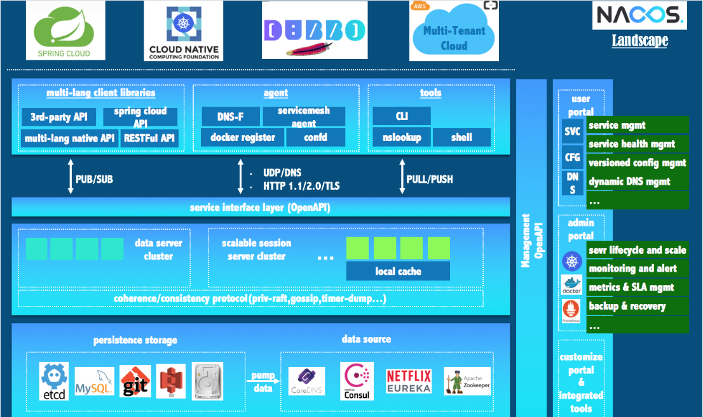
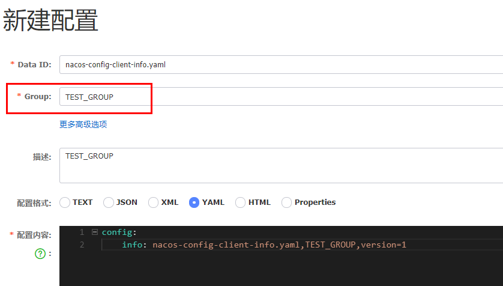
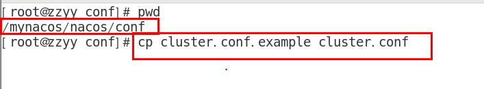
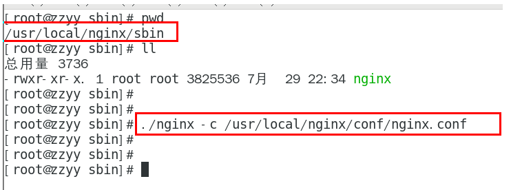

# Nacos

## 1、简介

一个更易于构建云原生应用的动态服务发现、配置管理和服务管理平台

Nacos = Eureka+Config +Bus

 

## 2、Win安装运行Nacos

[下载Nacos](https://github.com/alibaba/nacos/releases)

解压安装包，直接运行bin目录下的startup.cmd。

命令运行成功后直接访问http://localhost:8848/nacos，默认账号密码都是nacos

 

## 3、服务注册中心功能

### 3.1、基于Nacos的服务提供者

#### 3.1.1、引入POM

父POM的dependencyManagement引入spring-cloud-alibaba-dependencies，进行依赖版本管理

```xml
<dependency>
    <groupId>com.alibaba.cloud</groupId>
    <artifactId>spring-cloud-alibaba-dependencies</artifactId>
    <version>2.1.0.RELEASE</version>
    <type>pom</type>
    <scope>import</scope>
</dependency>
```

该模块引入nacos-discovery

```xml
<!--SpringCloud ailibaba nacos -->
<dependency>
    <groupId>com.alibaba.cloud</groupId>
    <artifactId>spring-cloud-starter-alibaba-nacos-discovery</artifactId>
</dependency>
```

#### 3.1.2、修改YML配置

```yml
server:
  port: 9001

spring:
  application:
    name: nacos-payment-provider
  cloud:
    nacos:
      discovery:
        server-addr: localhost:8848 #配置Nacos地址

management:
  endpoints:
    web:
      exposure:
        include: '*'
```

#### 3.1.3、主启动类添加注解

@EnableDiscoveryClient

```java
@EnableDiscoveryClient
@SpringBootApplication
public class PaymentMain9001{
    public static void main(String[] args) {
            SpringApplication.run(PaymentMain9001.class, args);
    }
}

```

#### 3.1.4、编写普通业务类

```java
@RestController
public class PaymentController{
    @Value("${server.port}")
    private String serverPort;

    @GetMapping(value = "/payment/nacos/{id}")
    public String getPayment(@PathVariable("id") Integer id){
        return "nacos registry, serverPort: "+ serverPort+"\t id"+id;
    }
}
```

#### 测试

启动Nacos Server

启动9001

http://localhost:9001/payment/nacos/1


### 3.2、基于Nacos的服务消费者

#### 3.2.1、引入POM

```xml
<!--SpringCloud ailibaba nacos -->
<dependency>
    <groupId>com.alibaba.cloud</groupId>
    <artifactId>spring-cloud-starter-alibaba-nacos-discovery</artifactId>
</dependency>
```

#### 3.2.2、修改YML配置

```yml
server:
  port: 83

spring:
  application:
    name: nacos-order-consumer
  cloud:
    nacos:
      discovery:
        server-addr: localhost:8848

#消费者将要去访问的微服务名称(注册成功进nacos的微服务提供者)
service-url:
  nacos-user-service: http://nacos-payment-provider 
```

#### 3.2.3、主启动类添加注解

@EnableDiscoveryClient

```java
@EnableDiscoveryClient
@SpringBootApplication
public class OrderNacosMain83{
    public static void main(String[] args){
        SpringApplication.run(OrderNacosMain83.class,args);
    }
}
```

#### 3.2.3、编写普通业务类

```java
// 实现负载均衡
@Configuration
public class ApplicationContextBean{
    @Bean
    @LoadBalanced
    public RestTemplate getRestTemplate(){
        return new RestTemplate();
    }
}

@RestController
public class OrderNacosController{
    @Resource
    private RestTemplate restTemplate;

    @Value("${service-url.nacos-user-service}")
    private String serverURL;

    @GetMapping("/consumer/payment/nacos/{id}")
    public String paymentInfo(@PathVariable("id") Long id){
        return restTemplate.getForObject(serverURL+"/payment/nacos/"+id,String.class);
    }
}
```

#### 测试

启动服务提供者，消费者

http://localhost:83/consumer/payment/nacos/13，83访问9001/9002，轮询负载OK


### 3.3、对比




### 3.4、CP与AP切换

**C**是所有节点在同一时间看到的数据是一致的，而**A**的定义是所有的请求都会收到响应

- 如果不需要存储服务级别的信息且服务实例是通过nacos-client注册，并能够保持心跳上报，那么就可以选择AP模式
  - 当前主流的服务如 Spring cloud 和 Dubbo 服务，都适用于AP模式，AP模式为了服务的可用性而减弱了一致性，因此AP模式下只支持注册临时实例

- 如果需要在服务级别编辑或者存储配置信息，那么 CP 是必须，K8S服务和DNS服务则适用于CP模式
  - CP模式下则支持注册持久化实例，此时则是 Raft 协议的集群运行模式，该模式下注册实例之前必须先注册服务，如果服务不存在，则会返回错误

```cmd
curl -X PUT '$NACOS_SERVER:8848/nacos/v1/ns/operator/switches?entry=serverMode&value=CP'
```


## 4、服务配置中心功能

自带动态刷新，修改下Nacos中的yaml配置文件，再次调用查看配置的接口，就会发现配置已经刷新

### 4.1、基础配置

#### 4.1.1、引入POM

要从Nacos配置中心获取配置，需要先引入POM

```xml
<!--nacos-config-->
<dependency>
    <groupId>com.alibaba.cloud</groupId>
    <artifactId>spring-cloud-starter-alibaba-nacos-config</artifactId>
</dependency>
```

#### 4.1.2、修改配置文件

修改BootStrap配置文件

```yml
# nacos配置
server:
  port: 3377

spring:
  application:
    name: nacos-config-client
  cloud:
    nacos:
      discovery:
        server-addr: localhost:8848 #Nacos服务注册中心地址
      config:
        server-addr: localhost:8848 #Nacos作为配置中心地址
        file-extension: yaml #指定yaml格式的配置

# ${spring.application.name}-${spring.profile.active}.${spring.cloud.nacos.config.file-extension}
```

修改Application配置文件

```yml
 spring:
  profiles:
    active: dev # 表示开发环境
```

#### 4.1.3、主启动类添加注解

注册到Nacos即可

```java
@EnableDiscoveryClient
@SpringBootApplication
public class NacosConfigClientMain3377{
    public static void main(String[] args) {
            SpringApplication.run(NacosConfigClientMain3377.class, args);
    }
}
```

#### 4.1.4、业务类添加注解

动态刷新@RefreshScope

```java
@RestController
@RefreshScope //在控制器类加入@RefreshScope注解使当前类下的配置支持Nacos的动态刷新功能。
public class ConfigClientController{
    @Value("${config.info}")
    private String configInfo;

    @GetMapping("/config/info")
    public String getConfigInfo() {
        return configInfo;
    }
}
```

#### 4.1.5、在Nacos中添加配置文件

##### 4.1.5.1、配置文件匹配规则

 

 最后公式：**${spring.application.name} - ${spring.profiles.active} . ${spring.cloud.nacos.config.file-extension}**

##### 4.1.5.2、新增配置文件

设置DataID：

- prefix 默认为 spring.application.name 的值
- spring.profile.active 即为当前环境对应的 profile，可以通过配置项 spring.profile.active 来配置
- file-exetension 为配置内容的数据格式，可以通过配置项 spring.cloud.nacos.config.file-extension 来配置

 

 


#### 测试

启动前需要在nacos客户端-配置管理-配置管理栏目下有对应的yaml配置文件。

运行cloud-config-nacos-client3377的主启动类。

http://localhost:3377/config/info 查看配置信息

### 4.2、分类配置

问题1：
实际开发中，通常一个系统会准备
dev开发环境
test测试环境
prod生产环境。
如何保证指定环境启动时服务能正确读取到Nacos上相应环境的配置文件呢？

问题2：
一个大型分布式微服务系统会有很多微服务子项目，
每个微服务项目又都会有相应的开发环境、测试环境、预发环境、正式环境......
那怎么对这些微服务配置进行管理呢？

#### 4.2.1、配置管理


#### 4.2.2、Namespace + Group + DataID

##### 4.2.2.1、是什么

   类似Java里面的package名和类名
   最外层的namespace是可以用于**区分部署环境**的，Group和DataID逻辑上**区分两个目标对象**。

##### 4.2.2.2、三者情况


默认情况：

Namespace=public，Group=DEFAULT_GROUP，默认Cluster是DEFAULT

Nacos默认的命名空间是public，Namespace主要用来实现隔离。比方说我们现在有三个环境：开发、测试、生产环境，我们就可以创建三个Namespace，不同的Namespace之间是隔离的。

Group默认是DEFAULT_GROUP，Group可以把不同的微服务划分到同一个分组里面去。

Service就是微服务，一个Service可以包含多个Cluster（集群），Nacos默认Cluster是DEFAULT，Cluster是对指定微服务的一个虚拟划分。比方说为了容灾，将Service微服务分别部署在了杭州机房和广州机房，这时就可以给杭州机房的Service微服务起一个集群名称（HZ），给广州机房的Service微服务起一个集群名称（GZ），还可以尽量让同一个机房的微服务互相调用，以提升性能。

最后是Instance，就是微服务的实例。

#### 4.2.3、三种方案加载配置

##### 4.2.3.1、DataID方案

指定 spring.profile.active 和配置文件的DataID来使不同环境下读取不同的配置。

默认空间+默认分组+新建dev和test两个DataID

 

通过spring.profile.active属性就能进行多环境下配置文件的读取

 


##### 4.2.3.2、Group方案

通过Group实现环境区分，新建Group

 

 

通过bootstrap+application，指定加载，在config下增加一条group的配置即可。可配置为DEV_GROUP或TEST_GROUP


##### 4.2.3.3、Namespace方案

新建dev / test的Namespace

 

回到服务管理-服务列表查看

 

按照域名配置填写


通过bootstrap+application，指定加载

```yml
 
# nacos注册中心 bootstrap.yml
server:
  port: 3377

spring:
  application:
    name: nacos-order
  cloud:
    nacos:
      discovery:
        server-addr: localhost:8848 #Nacos服务注册中心地址
      config:
        server-addr: localhost:8848 #Nacos作为配置中心地址
        file-extension: yaml #这里我们获取的yaml格式的配置
        namespace: 5da1dccc-ee26-49e0-b8e5-7d9559b95ab0 #指定名称空间
        #group: DEV_GROUP
        group: TEST_GROUP
        
# Nacos注册配置 application.yml
spring:
  profiles:
    #active: test
    active: dev
    #active: info
 
```


### 4.3、历史配置

Nacos会记录配置文件的历史版本默认保留30天，此外还有一键回滚功能，回滚操作将会触发配置更新。

 

## 5、集群和持久化配置

### 5.1、官网说明

集群部署架构图

 

 

默认Nacos使用**嵌入式数据库**实现数据的存储。所以，如果启动多个默认配置下的Nacos节点，数据存储是存在一致性问题的。
为了解决这个问题，Nacos采用了**集中式存储**的方式来支持集群化部署，目前只支持**MySQL**的存储。

 

 

### 5.2、持久化配置解释

Nacos默认自带的是嵌入式数据库derby

derby到mysql切换配置步骤：

1. nacos-server-1.1.4\nacos\conf目录下找到sql脚本 -----》nacos-mysql.sql -----》执行脚本

2. nacos-server-1.1.4\nacos\conf目录下找到application.properties

   ```properties
   spring.datasource.platform=mysql
    
   db.num=1
   db.url.0=jdbc:mysql://127.0.0.1:3306/nacos_config?characterEncoding=utf8&connectTimeout=1000&socketTimeout=3000&autoReconnect=true
   db.user=root
   db.password=123456
   ```

3. 启动Nacos，可以看到是个全新的空记录界面，以前是记录进derby。

### 5.3、Linux环境配置集群

准备：1个Nginx+3个nacos注册中心+1个mysql

 

#### 5.3.1、创建数据库

首先执行nacos-mysql.sql

 

#### 5.3.2、配置application.properties

 

application.properties 文件打开后的最后面，配置如下内容：

```properties
spring.datasource.platform=mysql
 
db.num=1
db.url.0=jdbc:mysql://数据库IP:3306/nacos_config?characterEncoding=utf8&connectTimeout=1000&socketTimeout=3000&autoReconnect=true
db.user=数据库账号
db.password=数据库密码
```

#### 5.3.4、修改集群配置cluster.conf

梳理出3台nacos集器的不同服务端口号。

 

修改cluster.conf，增加

填入NacosServer的IP

```text
#it is ip
#example
192.168.16.101:8847
192.168.16.102
192.168.16.103
```

这个IP不能写127.0.0.1，必须是Linux命令 hostname -i 能够识别的IP

#### 5.3.5、编辑startup.sh

编辑Nacos的启动脚本startup.sh，使它能够接受不同的启动端口。

修改前：

 

 

修改后：

 

 

执行方式：


#### 5.3.6、配置Nginx

修改Nginx的配置文件

```text
upstream cluster {
        server 127.0.0.1:3333;
        server 127.0.0.1:4444;
        server 127.0.0.1:5555;
    }
server {
        listen       1111;
        server_name  localhost;
        #charset koi8-r;
        #access_log  logs/host.access.log  main;
        location / {
            #root   html;
            #index  index.html index.htm;
            proxy_pass http://cluster;
        }
```

指定配置文件启动

 

#### 测试

http://192.168.111.144:1111/nacos/#/login 

新建一个配置测试

 

linux服务器的mysql插入一条记录


#### 集群测试

修改服务的注册地址即修改YML

```yml
server:
  port: 9002

spring:
  application:
    name: nacos-payment-provider
  cloud:
    nacos:
      discovery:
        #配置Nacos地址
        #server-addr: localhost:8848
        # 换成nginx的1111端口，做集群
        server-addr: 192.168.111.144:1111

management:
  endpoints:
    web:
      exposure:
        include: '*'
```


