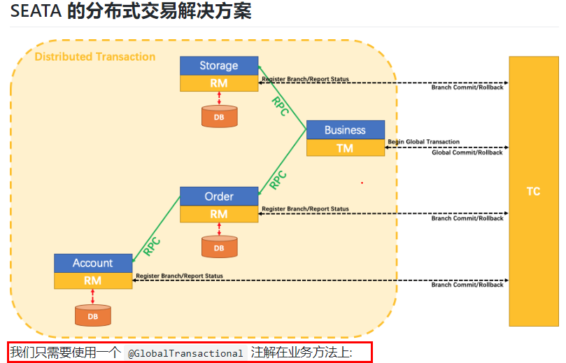
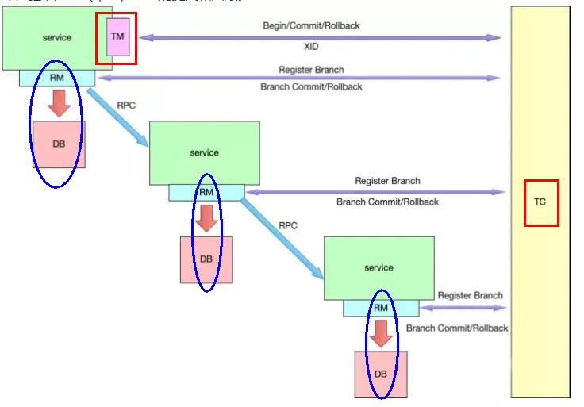
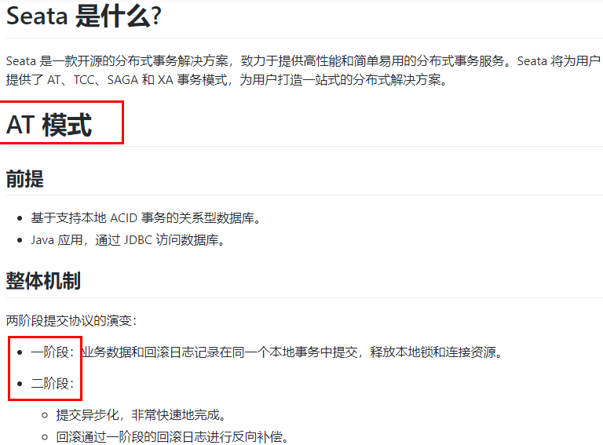
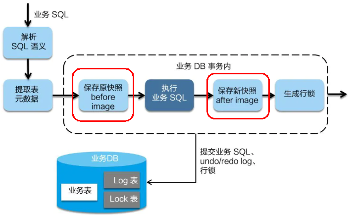
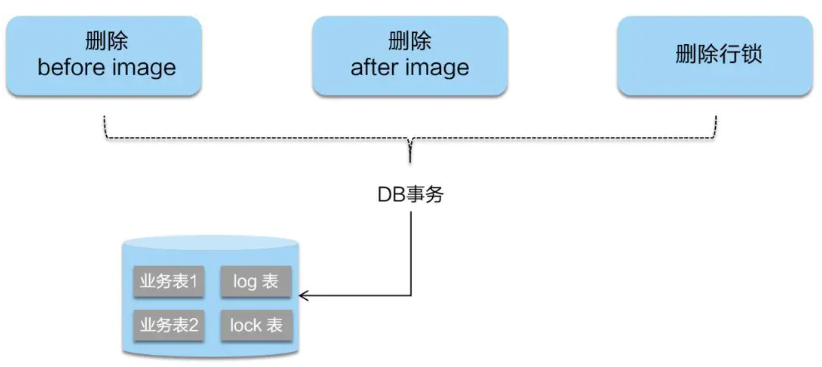
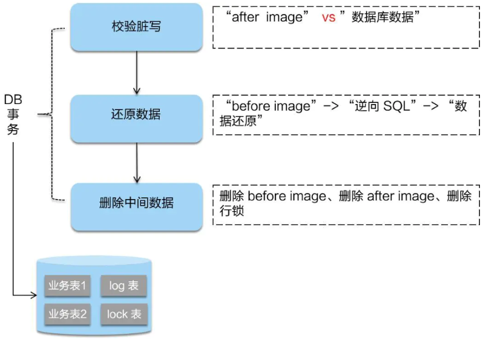
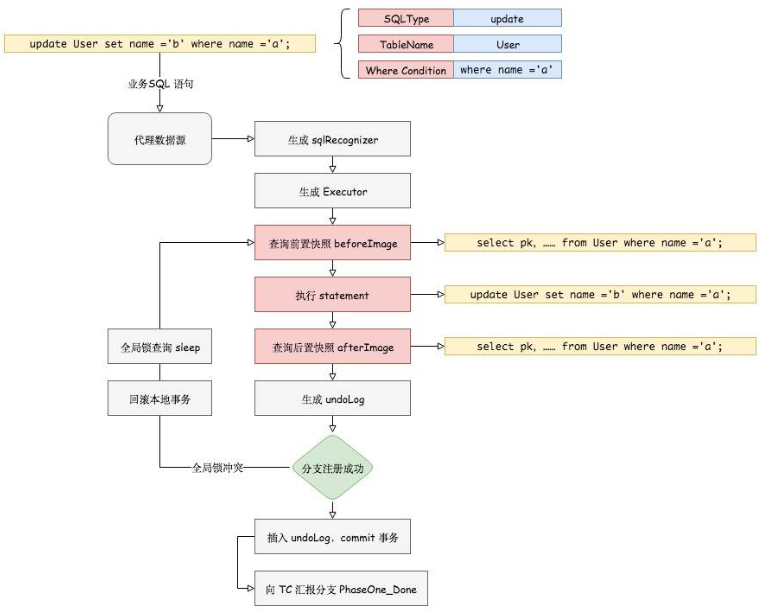

# Seata概述

https://github.com/seata/seata/releases

一次业务操作需要跨多个数据源或需要跨多个系统进行远程调用，就会产生分布式事务问题。

致力于在微服务架构下提供高性能和简单易用的分布式事务服务。

分布式事务处理过程的 一 ID + 三组件模型

- **Transaction ID XID**：全局唯一的事务ID
- 3组件概念：
  - Transaction Coordinator (TC)：事务协调器，维护全局事务的运行状态，负责协调并驱动全局事务的提交或回滚。
  - Transaction Manager (TM)：控制全局事务的边界，负责开启一个全局事务，并最终发起全局提交或全局回滚的决议。
  - Resource Manager (RM)：控制分支事务，负责分支注册、状态汇报，并接收事务协调器的指令，驱动分支（本地）事务的提交和回滚。

处理流程：

1. TM 向 TC 申请开启一个全局事务，全局事务创建成功并生成一个全局唯一的 XID。
2. XID 在微服务调用链路的上下文中传播。
3. RM 向 TC 注册分支事务，将其纳入 XID 对应全局事务的管辖。
4. TM 向 TC 发起针对 XID 的全局提交或回滚决议。
5. TC 调度 XID 下管辖的全部分支事务完成提交或回滚请求。

# Seata构建

## 准备Seata服务端

github上下载Seata，https://github.com/seata/seata/releases

seata-server-0.9.0.zip解压到指定目录并，修改conf目录下的file.conf配置文件

主要修改：自定义事务组名称 + 事务日志存储模式为 db+数据库连接信息

~~~json
service {
    vgroup_mapping.my_test_tx_group = "fsp_tx_group"

    default.grouplist = "127.0.0.1:8091"
    enableDegrade = false
    disable = false
    max.commit.retry.timeout = "-1"
    max.rollback.retry.timeout = "-1"
}

## transaction log store
store {
  ## store mode: file、db
  mode = "db"
 
  ## file store
  file {
    dir = "sessionStore"
 
    # branch session size , if exceeded first try compress lockkey, still exceeded throws exceptions
    max-branch-session-size = 16384
    # globe session size , if exceeded throws exceptions
    max-global-session-size = 512
    # file buffer size , if exceeded allocate new buffer
    file-write-buffer-cache-size = 16384
    # when recover batch read size
    session.reload.read_size = 100
    # async, sync
    flush-disk-mode = async
  }
 
## database store
db {
    ## the implement of javax.sql.DataSource, such as DruidDataSource(druid)/BasicDataSource(dbcp) etc.
	datasource = "dbcp"
	## mysql/oracle/h2/oceanbase etc.
	db-type = "mysql"
	## 演示用的mysql5
	driver-class-name = "com.mysql.jdbc.Driver"
	url = "jdbc:mysql://127.0.0.1:3306/seata"
	user = "root"
	password = "你自己密码"
	min-conn = 1
	max-conn = 3
	global.table = "global_table"
	branch.table = "branch_table"
	lock-table = "lock_table"
	query-limit = 100
}

~~~

数据库新建seate库，库里建表三张，建表文件在db_store.sql在\seata-server-0.9.0\seata\conf目录里面

~~~sql
 
-- the table to store GlobalSession data
drop table if exists `global_table`;
create table `global_table` (
  `xid` varchar(128)  not null,
  `transaction_id` bigint,
  `status` tinyint not null,
  `application_id` varchar(32),
  `transaction_service_group` varchar(32),
  `transaction_name` varchar(128),
  `timeout` int,
  `begin_time` bigint,
  `application_data` varchar(2000),
  `gmt_create` datetime,
  `gmt_modified` datetime,
  primary key (`xid`),
  key `idx_gmt_modified_status` (`gmt_modified`, `status`),
  key `idx_transaction_id` (`transaction_id`)
);
 
-- the table to store BranchSession data
drop table if exists `branch_table`;
create table `branch_table` (
  `branch_id` bigint not null,
  `xid` varchar(128) not null,
  `transaction_id` bigint ,
  `resource_group_id` varchar(32),
  `resource_id` varchar(256) ,
  `lock_key` varchar(128) ,
  `branch_type` varchar(8) ,
  `status` tinyint,
  `client_id` varchar(64),
  `application_data` varchar(2000),
  `gmt_create` datetime,
  `gmt_modified` datetime,
  primary key (`branch_id`),
  key `idx_xid` (`xid`)
);
 
-- the table to store lock data
drop table if exists `lock_table`;
create table `lock_table` (
  `row_key` varchar(128) not null,
  `xid` varchar(96),
  `transaction_id` long ,
  `branch_id` long,
  `resource_id` varchar(256) ,
  `table_name` varchar(32) ,
  `pk` varchar(36) ,
  `gmt_create` datetime ,
  `gmt_modified` datetime,
  primary key(`row_key`)
);
~~~

修改seata-server-0.9.0\seata\conf目录下的registry.conf配置文件，指明注册中心为nacos，及修改nacos连接信息

~~~json
registry {
    # file 、nacos 、eureka、redis、zk、consul、etcd3、sofa
    type = "nacos"

    nacos {
    	serverAddr = "localhost:8848"
    	namespace = ""
    	cluster = "default"
	}
}
~~~

最后先启动nacos，在启动seata softs\seata-server-0.9.0\seata\bin\seata-server.bat

## 准备业务数据表

创建三个服务，一个订单服务，一个库存服务，一个账户服务。

当用户下单时，会在订单服务中创建一个订单，然后通过远程调用库存服务来扣减下单商品的库存，再通过远程调用账户服务来扣减用户账户里面的余额，最后在订单服务中修改订单状态为已完成。

建库

~~~sql
CREATE DATABASE seata_order;

CREATE TABLE t_order (
  `id` BIGINT(11) NOT NULL AUTO_INCREMENT PRIMARY KEY,
  `user_id` BIGINT(11) DEFAULT NULL COMMENT '用户id',
  `product_id` BIGINT(11) DEFAULT NULL COMMENT '产品id',
  `count` INT(11) DEFAULT NULL COMMENT '数量',
  `money` DECIMAL(11,0) DEFAULT NULL COMMENT '金额',
  `status` INT(1) DEFAULT NULL COMMENT '订单状态：0：创建中；1：已完结' 
) ENGINE=INNODB AUTO_INCREMENT=7 DEFAULT CHARSET=utf8;
 
SELECT * FROM t_order;

######################################################################
 
CREATE DATABASE seata_storage;

CREATE TABLE t_storage (
 `id` BIGINT(11) NOT NULL AUTO_INCREMENT PRIMARY KEY,
 `product_id` BIGINT(11) DEFAULT NULL COMMENT '产品id',
 `total` INT(11) DEFAULT NULL COMMENT '总库存',
 `used` INT(11) DEFAULT NULL COMMENT '已用库存',
 `residue` INT(11) DEFAULT NULL COMMENT '剩余库存'
) ENGINE=INNODB AUTO_INCREMENT=2 DEFAULT CHARSET=utf8;
 
 
INSERT INTO seata_storage.t_storage(`id`, `product_id`, `total`, `used`, `residue`)
VALUES ('1', '1', '100', '0', '100');
 
SELECT * FROM t_storage;
 
######################################################################

CREATE DATABASE seata_account;

CREATE TABLE t_account (
  `id` BIGINT(11) NOT NULL AUTO_INCREMENT PRIMARY KEY COMMENT 'id',
  `user_id` BIGINT(11) DEFAULT NULL COMMENT '用户id',
  `total` DECIMAL(10,0) DEFAULT NULL COMMENT '总额度',
  `used` DECIMAL(10,0) DEFAULT NULL COMMENT '已用余额',
  `residue` DECIMAL(10,0) DEFAULT '0' COMMENT '剩余可用额度'
) ENGINE=INNODB AUTO_INCREMENT=2 DEFAULT CHARSET=utf8;
 
INSERT INTO seata_account.t_account(`id`, `user_id`, `total`, `used`, `residue`)  VALUES ('1', '1', '1000', '0', '1000');
 
SELECT * FROM t_account;
~~~

订单-库存-账户3个库下都需要建各自的回滚日志表

\seata-server-0.9.0\seata\conf目录下的db_undo_log.sql

~~~sql
 
 
-- the table to store seata xid data
-- 0.7.0+ add context
-- you must to init this sql for you business databese. the seata server not need it.
-- 此脚本必须初始化在你当前的业务数据库中，用于 AT 模式XID记录。与server端无关（注：业务数据库）
-- 注意此处0.3.0+ 增加唯一索引 ux_undo_log
DROP TABLE `undo_log`;
 
CREATE TABLE `undo_log` (
  `id` BIGINT(20) NOT NULL AUTO_INCREMENT,
  `branch_id` BIGINT(20) NOT NULL,
  `xid` VARCHAR(100) NOT NULL,
  `context` VARCHAR(128) NOT NULL,
  `rollback_info` LONGBLOB NOT NULL,
  `log_status` INT(11) NOT NULL,
  `log_created` DATETIME NOT NULL,
  `log_modified` DATETIME NOT NULL,
  `ext` VARCHAR(100) DEFAULT NULL,
  PRIMARY KEY (`id`),
  UNIQUE KEY `ux_undo_log` (`xid`,`branch_id`)
) ENGINE=INNODB AUTO_INCREMENT=1 DEFAULT CHARSET=utf8;
~~~

## 准备微服务

下订单->减库存->扣余额->改(订单)状态

新建Order服务

POM文件

~~~xml
<dependencies>
    <!--nacos-->
    <dependency>
        <groupId>com.alibaba.cloud</groupId>
        <artifactId>spring-cloud-starter-alibaba-nacos-discovery</artifactId>
    </dependency>
    <!--seata-->
    <dependency>
        <groupId>com.alibaba.cloud</groupId>
        <artifactId>spring-cloud-starter-alibaba-seata</artifactId>
        <exclusions>
            <exclusion>
                <artifactId>seata-all</artifactId>
                <groupId>io.seata</groupId>
            </exclusion>
        </exclusions>
    </dependency>
    <dependency>
        <groupId>io.seata</groupId>
        <artifactId>seata-all</artifactId>
        <version>0.9.0</version>
    </dependency>
    <!--feign-->
    <dependency>
        <groupId>org.springframework.cloud</groupId>
        <artifactId>spring-cloud-starter-openfeign</artifactId>
    </dependency>
    <!--web-actuator-->
    <dependency>
        <groupId>org.springframework.boot</groupId>
        <artifactId>spring-boot-starter-web</artifactId>
    </dependency>
    <dependency>
        <groupId>org.springframework.boot</groupId>
        <artifactId>spring-boot-starter-actuator</artifactId>
    </dependency>
    <!--mysql-druid-->
    <dependency>
        <groupId>mysql</groupId>
        <artifactId>mysql-connector-java</artifactId>
        <version>5.1.37</version>
    </dependency>
    <dependency>
        <groupId>com.alibaba</groupId>
        <artifactId>druid-spring-boot-starter</artifactId>
        <version>1.1.10</version>
    </dependency>
    <dependency>
        <groupId>org.mybatis.spring.boot</groupId>
        <artifactId>mybatis-spring-boot-starter</artifactId>
        <version>2.0.0</version>
    </dependency>
    <dependency>
        <groupId>org.springframework.boot</groupId>
        <artifactId>spring-boot-starter-test</artifactId>
        <scope>test</scope>
    </dependency>
    <dependency>
        <groupId>org.projectlombok</groupId>
        <artifactId>lombok</artifactId>
        <optional>true</optional>
    </dependency>
</dependencies>
~~~

YML文件

~~~yml
server:
  port: 2001

spring:
  application:
    name: seata-order-service
  cloud:
    alibaba:
      seata:
        #自定义事务组名称需要与seata-server中的对应
        tx-service-group: fsp_tx_group
    nacos:
      discovery:
        server-addr: localhost:8848
  datasource:
    driver-class-name: com.mysql.jdbc.Driver
    url: jdbc:mysql://localhost:3306/seata_order
    username: root
    password: 123456

feign:
  hystrix:
    enabled: false

logging:
  level:
    io:
      seata: info

mybatis:
  mapperLocations: classpath:mapper/*.xml
 
~~~

数据源使用Seata代理

~~~java
DataSourceProxyConfig
    
@Configuration
public class DataSourceProxyConfig {

    @Value("${mybatis.mapperLocations}")
    private String mapperLocations;

    @Bean
    @ConfigurationProperties(prefix = "spring.datasource")
    public DataSource druidDataSource(){
        return new DruidDataSource();
    }

    @Bean
    public DataSourceProxy dataSourceProxy(DataSource dataSource) {
        return new DataSourceProxy(dataSource);
    }

    @Bean
    public SqlSessionFactory sqlSessionFactoryBean(DataSourceProxy dataSourceProxy) throws Exception {
        SqlSessionFactoryBean sqlSessionFactoryBean = new SqlSessionFactoryBean();
        sqlSessionFactoryBean.setDataSource(dataSourceProxy);
        sqlSessionFactoryBean.setMapperLocations(new PathMatchingResourcePatternResolver().
                                                 getResources(mapperLocations));
        sqlSessionFactoryBean.setTransactionFactory(new SpringManagedTransactionFactory());
        return sqlSessionFactoryBean.getObject();
    }

}

~~~

主启动注解修改

~~~java
@SpringBootApplication(exclude = DataSourceAutoConfiguration.class) //取消数据源的自动创建
~~~

其余俩模块一样

## 测试

先正常下单

http://localhost:2001/order/create?userId=1&productId=1&count=10&money=100

添加超时异常，没加@GlobalTransactional，AccountServiceImpl添加超时

- 出现故障，当库存和账户金额扣减后，订单状态并没有设置为已经完成，没有从零改为1，而且由于feign的重试机制，账户余额还有可能被多次扣减。

超时异常，添加@GlobalTransactional，AccountServiceImpl添加超时

OrderServiceImpl添加@GlobalTransactional

~~~java
@GlobalTransactional(name = "fsp-create-order",rollbackFor = Exception.class)
public void create(Order order){

}
~~~

下单后数据库数据并没有任何改变

# 扩展

## 分布式事务的执行流程

1. TM 开启分布式事务（TM 向 TC 注册全局事务记录）。
2. 按业务场景，编排数据库、服务等事务内资源（RM 向 TC 汇报资源准备状态 ）。
3. TM 结束分布式事务，事务一阶段结束（TM 通知 TC 提交/回滚分布式事务）。
4. TC 汇总事务信息，决定分布式事务是提交还是回滚。
5. TC 通知所有 RM 提交/回滚 资源，事务二阶段结束。

## AT模式如何做到对业务的无侵入

在一阶段，Seata 会拦截“业务 SQL”，

1. 解析 SQL 语义，找到“业务 SQL”要更新的业务数据，在业务数据被更新前，将其保存成“before image”。
2. 执行“业务 SQL”更新业务数据，在业务数据更新之后。
3. 其保存成“after image”，最后生成行锁。
4. 以上操作全部在一个数据库事务内完成，这样保证了一阶段操作的原子性。

二阶段如是顺利提交的话

- 因为“业务 SQL”在一阶段已经提交至数据库，所以Seata框架只需将一阶段保存的快照数据和行锁删掉，完成数据清理即可。

二阶段回滚

- 二阶段如果是回滚的话，Seata 就需要回滚一阶段已经执行的“业务 SQL”，还原业务数据。
- 回滚方式便是用“before image”还原业务数据，但在还原前要首先要校验脏写，对比“数据库当前业务数据”和 “after image”，
  如果两份数据完全一致就说明没有脏写，可以还原业务数据，如果不一致就说明有脏写，出现脏写就需要转人工处理。

