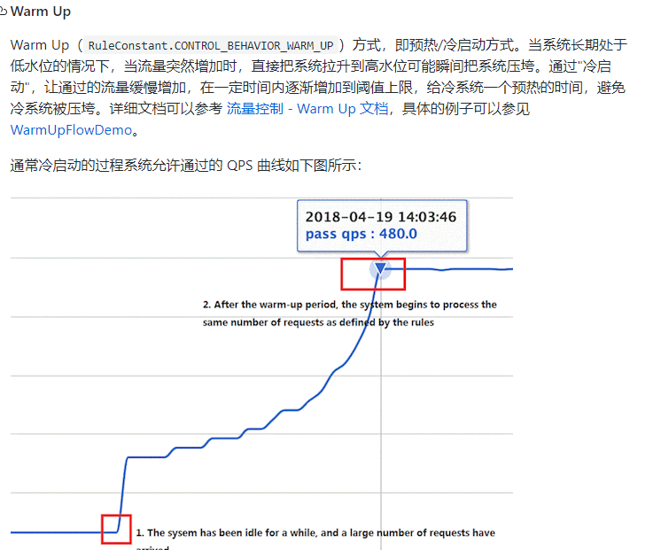
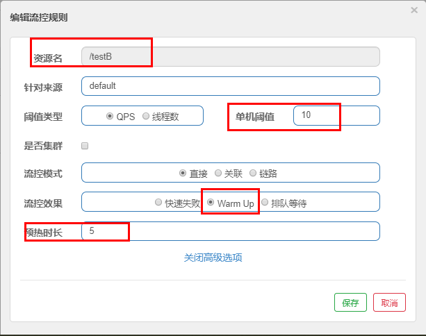
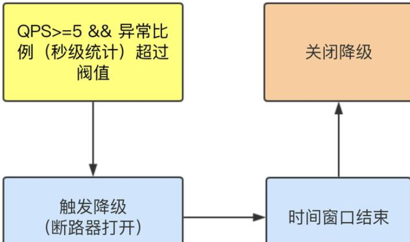
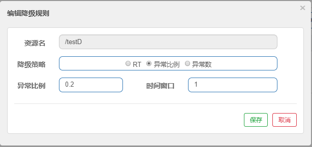
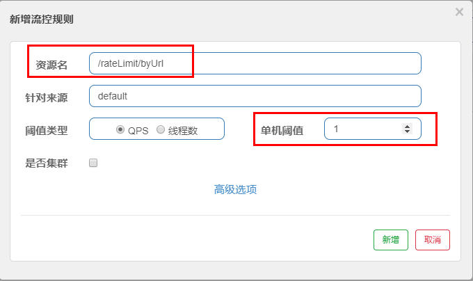

# Sentinel简介

安装运行Sentinel：

1. https://github.com/alibaba/Sentinel/releases
2. java -jar sentinel-dashboard-1.7.0.jar
3. http://localhost:8080
4. 登录账号密码均为sentinel

# Sentinel构建

## 启动Nacos

## 启动Sentinel

## 启动微服务

在启动一个微服务8401，微服务配置如下

POM文件

~~~xml
<!--SpringCloud ailibaba nacos -->
<dependency>
    <groupId>com.alibaba.cloud</groupId>
    <artifactId>spring-cloud-starter-alibaba-nacos-discovery</artifactId>
</dependency>
<!--SpringCloud ailibaba sentinel-datasource-nacos 后续做持久化用到-->
<dependency>
    <groupId>com.alibaba.csp</groupId>
    <artifactId>sentinel-datasource-nacos</artifactId>
</dependency>
<!--SpringCloud ailibaba sentinel -->
<dependency>
    <groupId>com.alibaba.cloud</groupId>
    <artifactId>spring-cloud-starter-alibaba-sentinel</artifactId>
</dependency>

~~~

YML文件

~~~yml
server:
  port: 8401

spring:
  application:
    name: cloudalibaba-sentinel-service
  cloud:
    nacos:
      discovery:
        #Nacos服务注册中心地址
        server-addr: localhost:8848
    sentinel:
      transport:
        #配置Sentinel dashboard地址
        dashboard: localhost:8080
        #默认8719端口，假如被占用会自动从8719开始依次+1扫描,直至找到未被占用的端口
        port: 8719

management:
  endpoints:
    web:
      exposure:
        include: '*'
~~~

主启动类添加注解

~~~java
@EnableDiscoveryClient
~~~

查看Sentinel发现并没有微服务，因为启动Sentinel是懒加载的，访问一次即可

# Sentinel流控规则

- 资源名：唯一名称，默认请求路径
- 针对来源：Sentinel可以针对调用者进行限流，填写微服务名，默认default(不区分来源)
- 阈值类型/单机阈值:
  - QPS(每秒钟的请求数量)：当调用该api的QPS达到阈值的时候，进行限流。
  - 线程数：当调用该api的线程数达到阈值的时候，进行限流。
  - 是否集群：不需要集群。
- 流控模式:
  - 直接：api达到限流条件时，直接限流。
  - 关联：当关联的资源达到阈值时，就限流自己。
  - 链路：只记录指定链路上的流量(指定资源从入口资源进来的流量，如果达到阈值，就进行限流)【api级别的针对来源】
- 流控效果:
  - 快速失败：直接失败，抛异常
  - Warm Up：根据codeFactor (冷加载因子，默认3)的值，从阈值/codeFactor，经过预热时长，才达到设置的QPS阈值
  - 排队等待：匀速排队，让请求以匀速的速度通过，阈值类型必须设置为QPS，否则无效

## 流控模式

### 直接(默认)

直接->快速失败，系统默认

表示1秒钟内查询1次就是OK，若超过次数1，就直接-快速失败，报默认错误

### 关联

当与A关联的资源B达到阀值后，就限流A自己

设置效果：当关联资源/testB的qps阀值超过1时，就限流/testA的Rest访问地址，当关联资源到阈值后限制配置好的资源名

### 链路

多个请求调用了同一个微服务

## 流控效果

### 直接->快速失败

系统默认

直接失败，抛出异常

~~~java
Blocked by Sentinel (flow limiting)
~~~

源码位置

~~~java
com.alibaba.csp.sentinel.slots.block.flow.controller.DefaultController
~~~

### 预热

公式：阈值除以coldFactor(默认值为3)，经过预热时长后才会达到阈值

默认coldFactor为3，即请求 QPS 从 threshold / 3 开始，经预热时长逐渐升至设定的 QPS 阈值。

WarmUp配置：

- 默认 coldFactor 为 3，即请求QPS从(threshold / 3) 开始，经多少预热时长才逐渐升至设定的 QPS 阈值。

- 案例，阀值为10+预热时长设置5秒。系统初始化的阀值为10 / 3 约等于3，即阀值刚开始为3，然后过了5秒后阀值才慢慢升高恢复到10

源码位置

~~~java
com.alibaba.csp.sentinel.slots.block.flow.controller.WarmUpController
~~~

### 排队等待

匀速排队，让请求以均匀的速度通过，阀值类型必须设成QPS，否则无效。

设置含义：/testA 每秒1次请求，超过的话就排队等待，等待的超时时间为20000毫秒。

源码位置

~~~java
com.alibaba.csp.sentinel.slots.block.flow.controller.RateLimiterController
~~~

# Sentinel降级规则

## 降级规则属性

- **RT**（平均响应时间，秒级）
  - 平均响应时间   超出阈值  且   在时间窗口内通过的请求 >=5，两个条件同时满足后触发降级
  - 窗口期过后关闭断路器
  - RT最大4900（更大的需要通过-Dcsp.sentinel.statistic.max.rt=XXXX才能生效）
- **异常比列**（秒级）
  - QPS >= 5 且异常比例（秒级统计）超过阈值时，触发降级，时间窗口结束后，关闭降级
- **异常数**（分钟级）
  - 异常数（分钟统计）超过阈值时，触发降级，时间窗口结束后，关闭降级

Sentinel 熔断降级会在调用链路中某个资源出现不稳定状态时（例如调用超时或异常比例升高），对这个资源的调用进行限制，让请求快速失败，避免影响到其它的资源而导致级联错误。

当资源被降级后，在接下来的降级时间窗口之内，对该资源的调用都自动熔断（默认行为是抛出 DegradeException）。

**注意**：Sentinel的断路器是没有半开状态的

半开的状态，系统自动去检测是否请求有异常，没有异常就关闭断路器恢复使用，有异常则继续打开断路器不可用。具体可以参考Hystrix

### RT

### 异常比例

### 异常数

**注意**：时间窗口一定要大于等于60秒。

异常数是按照分钟统计的

## 热点key限流

### 兜底方法

分为系统默认和客户自定义，两种。

之前的例子，限流出问题后，都是用sentinel系统默认的提示：Blocked by Sentinel (flow limiting)

#### @SentinelResource

@SentinelResource主管配置出错，运行出错该走异常走异常，例如java的RuntimeException，@SentinelResource不管

~~~java
@GetMapping("/testHotKey")
@SentinelResource(value = "testHotKey", blockHandler = "dealHandler_testHotKey")
public String testHotKey(@RequestParam(value = "p1",required = false) String p1, 
                         @RequestParam(value = "p2",required = false) String p2){
    return "------testHotKey";
}

public String dealHandler_testHotKey(String p1,String p2,BlockException exception){
    return "-----dealHandler_testHotKey";
}

sentinel系统默认的提示：Blocked by Sentinel (flow limiting)
~~~

#### 编辑热点规则

限流模式只支持QPS模式，固定写死了。（这才叫热点）

@SentinelResource注解的方法参数索引，0代表第一个参数，1代表第二个参数，以此类推

单机阀值以及统计窗口时长表示在此窗口时间超过阀值就限流。

上面的规则就是第一个参数有值的话，1秒的QPS为1，超过就限流，限流后调用dealHandler_testHotKey支持方法。

~~~java
@SentinelResource(value = "testHotKey")
异常打到了前台用户界面看到，不友好
    
@SentinelResource(value = "testHotKey",blockHandler = "dealHandler_testHotKey")
方法testHotKey里面第一个参数只要QPS超过每秒1次，马上降级处理，并且用自定义的兜底方法
~~~

#### 编辑特殊规则

期望p1参数当它是某个特殊值时，它的限流值和平时不一样。

**注意**：参数必须是基本类型或者String

## @SentinelResource

### 按资源名称限流+后续处理

#### 前置准备

启动Nacos成功

启动Sentinel成功

启动一个微服务

~~~java
POM文件引入
<dependency><!-- 引入自己定义的api通用包，可以使用Payment支付Entity -->
    <groupId>com.atguigu.springcloud</groupId>
    <artifactId>cloud-api-commons</artifactId>
    <version>${project.version}</version>
</dependency>

YML文件:
server:
  port: 8401

spring:
  application:
    name: cloudalibaba-sentinel-service
  cloud:
    nacos:
      discovery:
        server-addr: localhost:8848 #Nacos服务注册中心地址
    sentinel:
      transport:
        dashboard: localhost:8080 #配置Sentinel dashboard地址
        port: 8719

management:
  endpoints:
    web:
      exposure:
        include: '*'
            
业务类
@RestController
public class RateLimitController{
    @GetMapping("/byResource")
    @SentinelResource(value = "byResource",blockHandler = "handleException")
    public CommonResult byResource(){
        return new CommonResult(200,"按资源名称限流测试OK",new Payment(2020L,"serial001"));
    }
    public CommonResult handleException(BlockException exception){
        return new CommonResult(444,exception.getClass().getCanonicalName()+"\t 服务不可用");
    }
}
~~~

#### 规则配置

之后关闭微服务，流控规则会消失

### 按照Url地址限流+后续处理

通过访问的URL来限流，会返回Sentinel自带默认的限流处理信息

~~~java
// 在前一个的微服务业务类基础上添加  
@GetMapping("/rateLimit/byUrl")
@SentinelResource(value = "byUrl")
public CommonResult byUrl(){
    return new CommonResult(200,"按url限流测试OK",new Payment(2020L,"serial002"));
}
~~~

### 客户自定义限流处理逻辑

#### 创建自定义限流处理类

创建CustomerBlockHandler类用于自定义限流处理逻辑

~~~java
public class CustomerBlockHandler{
    public static CommonResult handleException(BlockException exception){
        return new CommonResult(2020,"自定义的限流处理信息......CustomerBlockHandler");
    }
}
~~~

#### 业务类方法上指定

在业务类添加，新的测试方法

~~~java
/**
	自定义通用的限流处理逻辑，
	blockHandlerClass = CustomerBlockHandler.class
	blockHandler = handleException2
	上述配置：找CustomerBlockHandler类里的handleException2方法进行兜底处理
	自定义通用的限流处理逻辑
*/
@GetMapping("/rateLimit/customerBlockHandler")
@SentinelResource(value = "customerBlockHandler",
                  blockHandlerClass = CustomerBlockHandler.class, blockHandler = "handleException2")
public CommonResult customerBlockHandler() {
    return new CommonResult(200,"按客户自定义限流处理逻辑");
}
~~~

#### 控制条设定规则

Sentinel主要有三个核心Api：

- SphU定义资源
- Tracer定义统计
- ContextUtil定义了上下文

# Sentinel系统规则

用于配置全局QPS

系统保护规则是从应用级别的入口流量进行控制，从单台机器的 load、CPU 使用率、平均 RT、入口 QPS 和并发线程数等几个维度监控应用指标，让系统尽可能跑在最大吞吐量的同时保证系统整体的稳定性。

系统保护规则是应用整体维度的，而不是资源维度的，并且**仅对入口流量生效**。入口流量指的是进入应用的流量（`EntryType.IN`），比如 Web 服务或 Dubbo 服务端接收的请求，都属于入口流量。

系统规则支持以下的模式：

- **Load 自适应**（仅对 Linux/Unix-like 机器生效）：系统的 load1 作为启发指标，进行自适应系统保护。当系统 load1 超过设定的启发值，且系统当前的并发线程数超过估算的系统容量时才会触发系统保护（BBR 阶段）。系统容量由系统的 `maxQps * minRt` 估算得出。设定参考值一般是 `CPU cores * 2.5`。
- **CPU usage**（1.5.0+ 版本）：当系统 CPU 使用率超过阈值即触发系统保护（取值范围 0.0-1.0），比较灵敏。
- **平均 RT**：当单台机器上所有入口流量的平均 RT 达到阈值即触发系统保护，单位是毫秒。
- **并发线程数**：当单台机器上所有入口流量的并发线程数达到阈值即触发系统保护。
- **入口 QPS**：当单台机器上所有入口流量的 QPS 达到阈值即触发系统保护。

# Sentinel服务熔断

## Ribbon

理解：

- **fallback**管运行异常
- **blockHandler**管配置违规

### 前置准备

启动nacos和sentinel

新建微服务9003/9004

POM与YML

~~~xml
<dependencies>
    <!--SpringCloud ailibaba nacos -->
    <dependency>
        <groupId>com.alibaba.cloud</groupId>
        <artifactId>spring-cloud-starter-alibaba-nacos-discovery</artifactId>
    </dependency>
    <dependency><!-- 引入自己定义的api通用包，可以使用Payment支付Entity -->
        <groupId>com.atguigu.springcloud</groupId>
        <artifactId>cloud-api-commons</artifactId>
        <version>${project.version}</version>
    </dependency>
    <!-- SpringBoot整合Web组件 -->
    <dependency>
        <groupId>org.springframework.boot</groupId>
        <artifactId>spring-boot-starter-web</artifactId>
    </dependency>
    <dependency>
        <groupId>org.springframework.boot</groupId>
        <artifactId>spring-boot-starter-actuator</artifactId>
    </dependency>
    <!--日常通用jar包配置-->
    <dependency>
        <groupId>org.springframework.boot</groupId>
        <artifactId>spring-boot-devtools</artifactId>
        <scope>runtime</scope>
        <optional>true</optional>
    </dependency>
    <dependency>
        <groupId>org.projectlombok</groupId>
        <artifactId>lombok</artifactId>
        <optional>true</optional>
    </dependency>
    <dependency>
        <groupId>org.springframework.boot</groupId>
        <artifactId>spring-boot-starter-test</artifactId>
        <scope>test</scope>
    </dependency>
</dependencies>
~~~

~~~yml
server:
  port: 9003

spring:
  application:
    name: nacos-payment-provider
  cloud:
    nacos:
      discovery:
        server-addr: localhost:8848 #配置Nacos地址

management:
  endpoints:
    web:
      exposure:
        include: '*'
~~~

业务类

~~~java
@RestController
public class PaymentController {
    @Value("${server.port}")
    private String serverPort;

    public static HashMap<Long,Payment> hashMap = new HashMap<>();
    static {
        hashMap.put(1L,new Payment(1L,"28a8c1e3bc2742d8848569891fb42181"));
        hashMap.put(2L,new Payment(2L,"bba8c1e3bc2742d8848569891ac32182"));
        hashMap.put(3L,new Payment(3L,"6ua8c1e3bc2742d8848569891xt92183"));
    }

    @GetMapping(value = "/paymentSQL/{id}")
    public CommonResult<Payment> paymentSQL(@PathVariable("id") Long id) {
        Payment payment = hashMap.get(id);
        CommonResult<Payment> result = new CommonResult(200,"from mysql,serverPort:  "+serverPort,payment);
        return result;
    }
}
~~~

再启动微服务84

额外引入POM与YML

~~~java
<dependency>
    <groupId>com.alibaba.cloud</groupId>
    <artifactId>spring-cloud-starter-alibaba-nacos-discovery</artifactId>
</dependency>
  <dependency>
    <groupId>com.alibaba.cloud</groupId>
    <artifactId>spring-cloud-starter-alibaba-sentinel</artifactId>
</dependency>
~~~

~~~yml
server:
  port: 84

spring:
  application:
    name: nacos-order-consumer
  cloud:
    nacos:
      discovery:
        server-addr: localhost:8848
    sentinel:
      transport:
        #配置Sentinel dashboard地址
        dashboard: localhost:8080
        #默认8719端口，假如被占用会自动从8719开始依次+1扫描,直至找到未被占用的端口
        port: 8719

#消费者将要去访问的微服务名称(注册成功进nacos的微服务提供者)
service-url:
  nacos-user-service: http://nacos-payment-provider
~~~

新建配置类ApplicationContextConfig，加入负载均衡

~~~java
@Configuration
public class ApplicationContextConfig {
    @Bean
    @LoadBalanced
    public RestTemplate getRestTemplate() {
        return new RestTemplate();
    }
}
~~~

### 添加规则

新建业务类CircleBreakerController，指定兜底方法，不配置Sentinel

~~~java
@RestController
@Slf4j
public class CircleBreakerController{
    public static final String SERVICE_URL = "http://nacos-payment-provider";

    @Resource
    private RestTemplate restTemplate;

    @RequestMapping("/consumer/fallback/{id}")
    // @SentinelResource(value = "fallback") 
    @SentinelResource(value = "fallback", fallback = "handlerFallback") //fallback负责业务异常
    // @SentinelResource(value = "fallback",blockHandler = "blockHandler") 
    // blockHandler负责在sentinel里面配置的降级限流
    public CommonResult<Payment> fallback(@PathVariable Long id){
        CommonResult<Payment> result = restTemplate
            .getForObject(SERVICE_URL + "/paymentSQL/"+id,CommonResult.class,id);

        if (id == 4) {
            throw new IllegalArgumentException ("IllegalArgumentException,非法参数异常....");
        }else if (result.getData() == null) {
            throw new NullPointerException ("NullPointerException,该ID没有对应记录,空指针异常");
        }

        return result;
    
        
        public CommonResult handlerFallback(@PathVariable  Long id,Throwable e) {
            Payment payment = new Payment(id,"null");
            return new CommonResult<>(444,"兜底异常handlerFallback,exception内容  "+e.getMessage(),payment);
        }
        
        public CommonResult blockHandler(@PathVariable  Long id,BlockException blockException) {
            Payment payment = new Payment(id,"null");
            return new CommonResult<>(445,"blockHandler-sentinel限流,
                                      无此流水: blockException  "+blockException.getMessage(),payment);
        }

}
~~~

加入配置BlockHandler，添加熔断规则

若 blockHandler 和 fallback 都进行了配置，则被限流降级而抛出 BlockException 时只会进入 blockHandler 处理逻辑，若没有限流则fallback解决。

### 额外配置

忽略属性

在@SentinelResource处添加

~~~java
exceptionsToIgnore = {IllegalArgumentException.class}
~~~

程序异常打到前台了

## Feign

### 前置准备

前一个84模块添加OpenFeign依赖

~~~xml
<!--SpringCloud openfeign -->
<dependency>
    <groupId>org.springframework.cloud</groupId>
    <artifactId>spring-cloud-starter-openfeign</artifactId>
</dependency>
~~~

YML文件激活对Feign的支持

~~~yml
# 激活Sentinel对Feign的支持
feign:
  sentinel:
    enabled: true 
~~~

创建Service层调用类，带@FeignClient注解的业务接口

~~~java
// 使用 fallback 方式是无法获取异常信息的，
// 如果想要获取异常信息，可以使用 fallbackFactory参数
@FeignClient(value = "nacos-payment-provider",fallback = PaymentFallbackService.class)
// 调用中关闭9003服务提供者
public interface PaymentService{
    @GetMapping(value = "/paymentSQL/{id}")
    public CommonResult<Payment> paymentSQL(@PathVariable("id") Long id);
}

// fallback = PaymentFallbackService.class
@Component
public class PaymentFallbackService implements PaymentService{
    @Override
    public CommonResult<Payment> paymentSQL(Long id){
        return new CommonResult<>(444,"服务降级返回,没有该流水信息",new Payment(id, "errorSerial......"));
    }
}

//==================OpenFeign
@Resource
private PaymentService paymentService;

@GetMapping(value = "/consumer/openfeign/{id}")
public CommonResult<Payment> paymentSQL(@PathVariable("id") Long id){
    if(id == 4){
        throw new RuntimeException("没有该id");
    }
    return paymentService.paymentSQL(id);
}
~~~

测试84调用9003，此时故意关闭9003微服务提供者，看84消费侧自动降级，不会被耗死

# Sentinel规则持久化

## 概述

重启应用，sentinel规则将消失，生产环境需要将配置规则进行持久化

将限流配置规则持久化进Nacos保存，只要刷新8401某个rest地址，sentinel控制台的流控规则就能看到，只要Nacos里面的配置不删除，针对8401上sentinel上的流控规则持续有效。

## 构建步骤

在8401的基础上，额外引入POM

~~~xml
<dependency>
    <groupId>com.alibaba.csp</groupId>
    <artifactId>sentinel-datasource-nacos</artifactId>
</dependency>
~~~

修改YML文件

~~~yml
 
server:
  port: 8401

spring:
  application:
    name: cloudalibaba-sentinel-service
  cloud:
    nacos:
      discovery:
        server-addr: localhost:8848 #Nacos服务注册中心地址
    sentinel:
      transport:
        dashboard: localhost:8080 #配置Sentinel dashboard地址
        port: 8719
        # 添加Nacos数据源配置
      datasource:
        ds1:
          nacos:
            server-addr: localhost:8848
            dataId: cloudalibaba-sentinel-service
            groupId: DEFAULT_GROUP
            data-type: json
            rule-type: flow

management:
  endpoints:
    web:
      exposure:
        include: '*'

feign:
  sentinel:
    enabled: true # 激活Sentinel对Feign的支持
~~~

添加Nacos业务规则配置

~~~json
[
    {
        "resource": "/rateLimit/byUrl",
        "limitApp": "default",
        "grade": 1,
        "count": 1,
        "strategy": 0,
        "controlBehavior": 0,
        "clusterMode": false
    }
]

resource：资源名称；
limitApp：来源应用；
grade：阈值类型，0表示线程数，1表示QPS；
count：单机阈值；
strategy：流控模式，0表示直接，1表示关联，2表示链路；
controlBehavior：流控效果，0表示快速失败，1表示Warm Up，2表示排队等待；
clusterMode：是否集群。
~~~

## 测试

启动8401，查看Sentinel有配置。

停止8401，查看Sentinel无配置，再次启动，刷新，有配置。
