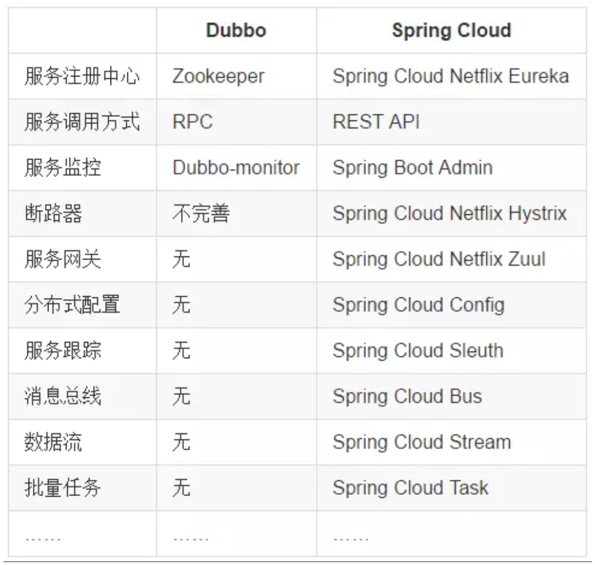
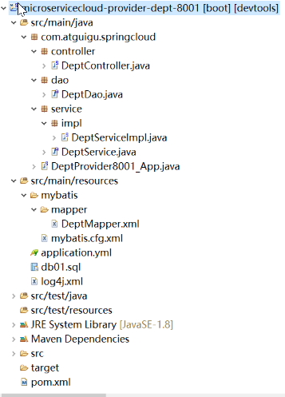

# SpringCloud简介

## 概述

SpringCloud分布式微服务架构下的一站式解决方案，是各个微服务架构落地技术的集合体，俗称微服务全家桶


## SpringCloud和SpringBoot

<u>SpringBoot</u>专注于快速方便的**开发单个个体微服务**。

<u>SpringCloud</u>是**关注全局**的微服务协调整理治理框架，它将SpringBoot开发的一个个单体微服务整合并管理起来，为各个微服务之间提供，配置管理、服务发现、断路器、路由、微代理、事件总线、全局锁、决策竞选、分布式会话等等集成服务

SpringBoot可以离开SpringCloud独立使用开发项目，但是SpringCloud离不开SpringBoot，属于依赖的关系

**总结**：SpringBoot专注于快速、方便的开发单个微服务个体，SpringCloud关注全局的服务治理框架


## SpringCloud和Dubbo



**最大区别**：

- SpringCloud抛弃了Dubbo的**RPC通信**，采用的是**基于HTTP的REST方式**
- 严格来说，这两种方式各有优劣，虽然从一定程度上来说，REST方式牺牲了服务调用的性能，但避免了原生RPC带来的问题
- REST相比RPC更为灵活，服务提供方和调用方的依赖只依靠一纸契约，不存在代码级别的强依赖，这在强调快速演化的微服务环境下，显得更加合适


# Rest微服务构建

## 构建MicroServiceCloud步骤

### 整体父工程Project

新建父工程microservicecloud，切记是Packageing是pom模式。

主要是定义POM文件，将后续各个子模块公用的jar包等统一提出来，类似一个抽象父类。

```xml
<project xmlns="http://maven.apache.org/POM/4.0.0" xmlns:xsi="http://www.w3.org/2001/XMLSchema-instance"
  xsi:schemaLocation="http://maven.apache.org/POM/4.0.0 http://maven.apache.org/xsd/maven-4.0.0.xsd">
  <modelVersion>4.0.0</modelVersion>
 
  <groupId>com.atguigu.springcloud</groupId>
  <artifactId>microservicecloud</artifactId>
  <version>0.0.1-SNAPSHOT</version>
  <packaging>pom</packaging>
 
 
  <properties>
   <project.build.sourceEncoding>UTF-8</project.build.sourceEncoding>
   <maven.compiler.source>1.8</maven.compiler.source>
   <maven.compiler.target>1.8</maven.compiler.target>
   <junit.version>4.12</junit.version>
   <log4j.version>1.2.17</log4j.version>
   <lombok.version>1.16.18</lombok.version>
  </properties>
 
  <dependencyManagement>
   <dependencies>
     <dependency>
       <groupId>org.springframework.cloud</groupId>
       <artifactId>spring-cloud-dependencies</artifactId>
       <version>Dalston.SR1</version>
       <type>pom</type>
       <scope>import</scope>
     </dependency>
     <dependency>
       <groupId>org.springframework.boot</groupId>
       <artifactId>spring-boot-dependencies</artifactId>
       <version>1.5.9.RELEASE</version>
       <type>pom</type>
       <scope>import</scope>
     </dependency>
     <dependency>
       <groupId>mysql</groupId>
       <artifactId>mysql-connector-java</artifactId>
       <version>5.0.4</version>
     </dependency>
     <dependency>
       <groupId>com.alibaba</groupId>
       <artifactId>druid</artifactId>
       <version>1.0.31</version>
     </dependency>
     <dependency>
       <groupId>org.mybatis.spring.boot</groupId>
       <artifactId>mybatis-spring-boot-starter</artifactId>
       <version>1.3.0</version>
     </dependency>
     <dependency>
       <groupId>ch.qos.logback</groupId>
       <artifactId>logback-core</artifactId>
       <version>1.2.3</version>
     </dependency>
     <dependency>
       <groupId>junit</groupId>
       <artifactId>junit</artifactId>
       <version>${junit.version}</version>
       <scope>test</scope>
     </dependency>
     <dependency>
       <groupId>log4j</groupId>
       <artifactId>log4j</artifactId>
       <version>${log4j.version}</version>
     </dependency>
   </dependencies>
  </dependencyManagement>
</project>
```

### 公共子模块API-Module

新建microservicecloud-api

```xml
<project xmlns="http://maven.apache.org/POM/4.0.0" xmlns:xsi="http://www.w3.org/2001/XMLSchema-instance"
  xsi:schemaLocation="http://maven.apache.org/POM/4.0.0 http://maven.apache.org/xsd/maven-4.0.0.xsd">
  <modelVersion>4.0.0</modelVersion>
 
  <parent><!-- 子类里面显示声明才能有明确的继承表现，无意外就是父类的默认版本否则自己定义 -->
   <groupId>com.atguigu.springcloud</groupId>
   <artifactId>microservicecloud</artifactId>
   <version>0.0.1-SNAPSHOT</version>
  </parent>
 
  <artifactId>microservicecloud-api</artifactId><!-- 当前Module我自己叫什么名字 -->
 
  <dependencies><!-- 当前Module需要用到的jar包，按自己需求添加，如果父类已经包含了，可以不用写版本号 -->
   <dependency>
     <groupId>org.projectlombok</groupId>
     <artifactId>lombok</artifactId>
   </dependency>
  </dependencies>
</project>
```

mvn clean install后给其它模块引用，达到通用目的。也即需要用到部门实体的话，不用每个工程都定义一份，直接引用本模块即可。

### 部门微服务提供者Module

microservicecloud-provider-dept-8001 

新建microservicecloud-provider-dept-8001

```xml
 <project xmlns="http://maven.apache.org/POM/4.0.0" xmlns:xsi="http://www.w3.org/2001/XMLSchema-instance"
  xsi:schemaLocation="http://maven.apache.org/POM/4.0.0 http://maven.apache.org/xsd/maven-4.0.0.xsd">
  <modelVersion>4.0.0</modelVersion>
 
  <parent>
   <groupId>com.atguigu.springcloud</groupId>
   <artifactId>microservicecloud</artifactId>
   <version>0.0.1-SNAPSHOT</version>
  </parent>
 
  <artifactId>microservicecloud-provider-dept-8001</artifactId>
 
  <dependencies>
   <dependency><!-- 引入自己定义的api通用包，可以使用Dept部门Entity -->
     <groupId>com.atguigu.springcloud</groupId>
     <artifactId>microservicecloud-api</artifactId>
     <version>${project.version}</version>
   </dependency>
   <dependency>
     <groupId>junit</groupId>
     <artifactId>junit</artifactId>
   </dependency>
   <dependency>
     <groupId>mysql</groupId>
     <artifactId>mysql-connector-java</artifactId>
   </dependency>
   <dependency>
     <groupId>com.alibaba</groupId>
     <artifactId>druid</artifactId>
   </dependency>
   <dependency>
     <groupId>ch.qos.logback</groupId>
     <artifactId>logback-core</artifactId>
   </dependency>
   <dependency>
     <groupId>org.mybatis.spring.boot</groupId>
     <artifactId>mybatis-spring-boot-starter</artifactId>
   </dependency>
   <dependency>
     <groupId>org.springframework.boot</groupId>
     <artifactId>spring-boot-starter-jetty</artifactId>
   </dependency>
   <dependency>
     <groupId>org.springframework.boot</groupId>
     <artifactId>spring-boot-starter-web</artifactId>
   </dependency>
   <dependency>
     <groupId>org.springframework.boot</groupId>
     <artifactId>spring-boot-starter-test</artifactId>
   </dependency>
   <!-- 修改后立即生效，热部署 -->
   <dependency>
     <groupId>org.springframework</groupId>
     <artifactId>springloaded</artifactId>
   </dependency>
   <dependency>
     <groupId>org.springframework.boot</groupId>
     <artifactId>spring-boot-devtools</artifactId>
   </dependency>
  </dependencies>
 
</project>

```

```yml
server:
  port: 8001
  
mybatis:
  config-location: classpath:mybatis/mybatis.cfg.xml        # mybatis配置文件所在路径
  type-aliases-package: com.atguigu.springcloud.entities    # 所有Entity别名类所在包
  mapper-locations:
  - classpath:mybatis/mapper/**/*.xml                       # mapper映射文件
    
spring:
   application:
    name: microservicecloud-dept 
   datasource:
    type: com.alibaba.druid.pool.DruidDataSource            # 当前数据源操作类型
    driver-class-name: org.gjt.mm.mysql.Driver              # mysql驱动包
    url: jdbc:mysql://localhost:3306/cloudDB01              # 数据库名称
    username: root
    password: 123456
    dbcp2:
      min-idle: 5                                           # 数据库连接池的最小维持连接数
      initial-size: 5                                       # 初始化连接数
      max-total: 5                                          # 最大连接数
      max-wait-millis: 200                                  # 等待连接获取的最大超时时间
 
```

工程src/main/resources目录下新建mybatis文件夹后新建mybatis.cfg.xml文件

```xml
<?xml version="1.0" encoding="UTF-8" ?>
<!DOCTYPE configuration
  PUBLIC "-//mybatis.org//DTD Config 3.0//EN"
  "http://mybatis.org/dtd/mybatis-3-config.dtd">
  
<configuration>
 
  <settings>
   <setting name="cacheEnabled" value="true"/><!-- 二级缓存开启 -->
  </settings>
 
</configuration>

```

创建数据库，创建DAO层

工程src/main/resources/mybatis目录下新建mapper文件夹后再建DeptMapper.xml

```xml
<?xml version="1.0" encoding="UTF-8" ?>
<!DOCTYPE mapper PUBLIC "-//mybatis.org//DTD Mapper 3.0//EN"
"http://mybatis.org/dtd/mybatis-3-mapper.dtd">
 
<mapper namespace="com.atguigu.springcloud.dao.DeptDao">
 
  <select id="findById" resultType="Dept" parameterType="Long">
   select deptno,dname,db_source from dept where deptno=#{deptno}; 
  </select>
  <select id="findAll" resultType="Dept">
   select deptno,dname,db_source from dept; 
  </select>
  <insert id="addDept" parameterType="Dept">
   INSERT INTO dept(dname,db_source) VALUES(#{dname},DATABASE());
  </insert>
  
</mapper>
```

创建Service层，再创建ServiceImpl

按照REST风格创建Controller层



### 部门微服务消费者Module

microservicecloud-consumer-dept-80

新建microservicecloud-consumer-dept-80

```xml
<project xmlns="http://maven.apache.org/POM/4.0.0" xmlns:xsi="http://www.w3.org/2001/XMLSchema-instance"
  xsi:schemaLocation="http://maven.apache.org/POM/4.0.0 http://maven.apache.org/xsd/maven-4.0.0.xsd">
  <modelVersion>4.0.0</modelVersion>
 
  <parent>
   <groupId>com.atguigu.springcloud</groupId>
   <artifactId>microservicecloud</artifactId>
   <version>0.0.1-SNAPSHOT</version>
  </parent>
 
  <artifactId>microservicecloud-consumer-dept-80</artifactId>
  <description>部门微服务消费者</description>
 
  <dependencies>
   <dependency><!-- 自己定义的api -->
     <groupId>com.atguigu.springcloud</groupId>
     <artifactId>microservicecloud-api</artifactId>
     <version>${project.version}</version>
   </dependency> 
   <dependency>
     <groupId>org.springframework.boot</groupId>
     <artifactId>spring-boot-starter-web</artifactId>
   </dependency>
   <!-- 修改后立即生效，热部署 -->
   <dependency>
     <groupId>org.springframework</groupId>
     <artifactId>springloaded</artifactId>
   </dependency>
   <dependency>
     <groupId>org.springframework.boot</groupId>
     <artifactId>spring-boot-devtools</artifactId>
   </dependency>   
  </dependencies>
</project>
```

```yml
server:
  port: 80
```

com.atguigu.springcloud.cfgbeans包下ConfigBean的编写，注入RestTemplate类

```java
package com.atguigu.springcloud.cfgbeans;
 
import org.springframework.context.annotation.Bean;
import org.springframework.context.annotation.Configuration;
import org.springframework.web.client.RestTemplate;
 
@Configuration
public class ConfigBean{
    @Bean
    public RestTemplate getRestTemplate(){
         return new RestTemplate();
    }
}
```

com.atguigu.springcloud.controller包下新建DeptController_Consumer部门微服务消费者REST

```java
package com.atguigu.springcloud.controller;
 
import java.util.List;
 
import org.springframework.beans.factory.annotation.Autowired;
import org.springframework.web.bind.annotation.PathVariable;
import org.springframework.web.bind.annotation.RequestMapping;
import org.springframework.web.bind.annotation.RestController;
import org.springframework.web.client.RestTemplate;
 
import com.atguigu.springcloud.entities.Dept;
 
@RestController
public class DeptController_Consumer{
    
    private static final String REST_URL_PREFIX = "http://localhost:8001";
    
    @Autowired
    private RestTemplate restTemplate;
    
    @RequestMapping(value="/consumer/dept/add")
    public boolean add(Dept dept)
    {
         return restTemplate.postForObject(REST_URL_PREFIX+"/dept/add", dept, Boolean.class);
    }
    
    @RequestMapping(value="/consumer/dept/get/{id}")
    public Dept get(@PathVariable("id") Long id)
    {
         return restTemplate.getForObject(REST_URL_PREFIX+"/dept/get/"+id, Dept.class);
    }
    
    @SuppressWarnings("unchecked")
    @RequestMapping(value="/consumer/dept/list")
    public List<Dept> list()
    {
         return restTemplate.getForObject(REST_URL_PREFIX+"/dept/list", List.class);
    }   
}
```

# 组件替换


# 扩展

## RestTemplate

RestTemplate提供了多种**便捷访问远程Http服务**的方法， 是一种简单便捷的访问restful服务模板类，是Spring提供的用于访问Rest服务的客户端模板工具集

使用restTemplate访问restful接口非常的简单

(url, requestMap, ResponseBean.class)这三个参数分别代表 REST请求地址、请求参数、HTTP响应转换被转换成的对象类型

