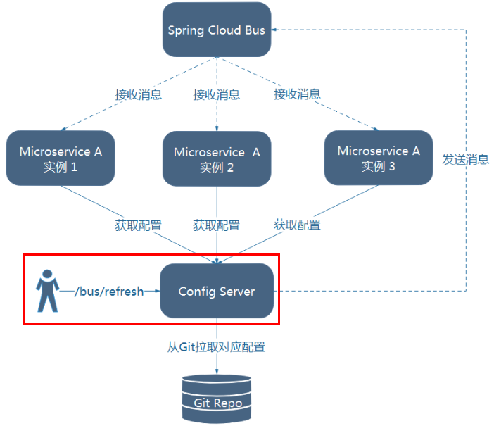
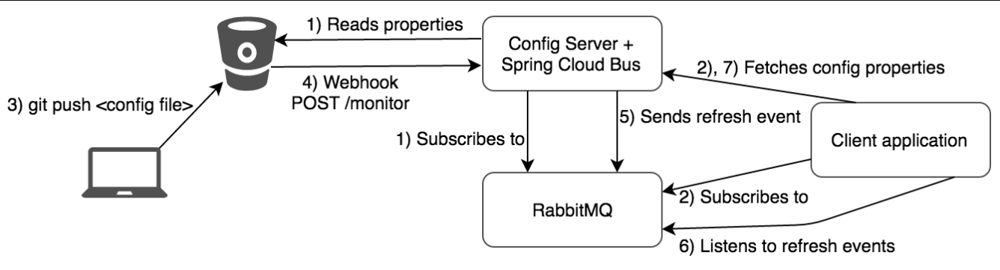

# Bus简介

Spring Cloud Bus是用来将分布式系统的**节点与轻量级消息系统链接**起来的框架，它整合了Java的**事件处理机制**和**消息中间件**的功能

Spring Clud Bus目前支持RabbitMQ和Kafka

Spring Cloud Bus能管理和传播分布式系统间的消息，可用于广播状态更改、事件推送等，也可以当作微服务间的通信通道

Spring Cloud Bus 配合 Spring Cloud Config 使用可以实现配置的动态刷新


# Bus全局广播构建

## 1、构建方案

先构建一个配置服务端3344，两个配置消费端3355，3366

设计思想：

- 利用消息总线触发一个客户端/bus/refresh，然后刷新所有客户端的配置

- 利用消息总线触发一个服务端ConfigServer的/bus/refresh端点，然后刷新所有客户端的配置




方法二明显更适合：

- 方法一打破了微服务的职责单一性，因为微服务本身是业务模块，它本不应该承担配置刷新的职责
- 方法一破坏了微服务各节点的对等性
- 方法一有一定的局限性，微服务在迁移时，它的网络地址常常会发生变化，此时如果想要做到自动刷新，那就会增加更多的修改


## 2、修改配置中心服务端

### 1、引入POM

引入bus依赖

```xml
<dependency>
    <groupId>org.springframework.cloud</groupId>
    <artifactId>spring-cloud-starter-bus-amqp</artifactId>
</dependency>
```

### 2、修改YML

```yml
server:
  port: 3344

spring:
  application:
    name:  cloud-config-center #注册进Eureka服务器的微服务名
  cloud:
    config:
      server:
        git:
          uri: git@github.com:zzyybs/springcloud-config.git #GitHub上面的git仓库名字
        ####搜索目录
          search-paths:
            - springcloud-config
      ####读取分支
      label: master
      
#新增配置
#rabbitmq相关配置
rabbitmq:
    host: localhost
    port: 5672
    username: guest
    password: guest

#服务注册到eureka地址
eureka:
  client:
    service-url:
      defaultZone: http://localhost:7001/eureka


#新增配置
#暴露bus刷新配置的端点
management:
  endpoints: #暴露bus刷新配置的端点
    web:
      exposure:
        include: 'bus-refresh'
```


## 3、修改配置客户端

3355与3366均引入Bus的POM依赖

````xml
<!--添加消息总线RabbitMQ支持-->
<dependency>
    <groupId>org.springframework.cloud</groupId>
    <artifactId>spring-cloud-starter-bus-amqp</artifactId>
</dependency>
````

修改YML配置，添加RabbitMQ的配置

```yml
#rabbitmq相关配置 15672是Web管理界面的端口；5672是MQ访问的端口
  rabbitmq:
    host: localhost
    port: 5672
    username: guest
    password: guest
```

## 测试

修改Github上配置文件增加版本号

发送POST请求，curl -X POST "http://localhost:3344/actuator/bus-refresh"

配置中心 http://config-3344.com:3344/config-dev.yml

客户端 http://localhost:3355/configInfo 获取配置信息，发现都已经刷新了


# Bus定点通知构建

公式：http://配置中心IP:配置中心的端口号/actuator/bus-refresh/{destination}

/bus/refresh请求不再发送到具体的服务实例上，而是发给config server并通过destination参数类指定需要更新配置的服务或实例

curl -X POST "http://localhost:3344/actuator/bus-refresh/config-client:3355"

 


# 扩展

## 什么是总线

在微服务架构的系统中，通常会使用轻量级的消息代理来构建一个共用的消息主题，并让系统中所有微服务实例都连接上来

由于该主题中产生的消息会被所有实例监听和消费，所以称它为消息总线

在总线上的各个实例，都可以方便地广播一些需要让其他连接在该主题上的实例都知道的消息


## 基本原理

ConfigClient实例都监听MQ中同一个topic(默认是springCloudBus)

当一个服务刷新数据的时候，它会把这个信息放入到Topic中，这样其它监听同一Topic的服务就能得到通知，然后去更新自身的配置