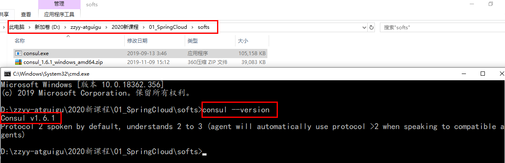

# Consul 简介

Consul 是一套开源的分布式服务发现和配置管理系统，由 HashiCorp 公司用 Go 语言开发

提供了微服务系统中的服务治理、配置中心、控制总线等功能，这些功能中的每一个都可以根据需要单独使用，也可以一起使用以构建全方位的服务网格，总之 Consul 提供了一种完整的服务网格解决方案

它具有很多优点。包括： 基于 raft 协议，比较简洁； 支持健康检查, 同时支持 HTTP 和 DNS 协议；支持跨数据中心的 WAN 集群；提供图形界面；跨平台，支持 Linux、Mac、Windows

作用：服务发现、健康检测、KV 存储、多数据中心、可视化 WEB 界面


# Consul 安装

安装：https://learn.hashicorp.com/consul/getting-started/install.html

下载完成后只有一个 consul.exe 文件，硬盘路径下双击运行，查看版本号信息

 

使用开发模式启动：consul agent -dev

通过以下地址可以访问 Consul 的首页：http://localhost:8500


# ConsulClient 端构建

## 1、引入 POM

```xml
<!-- SpringCloud consul-server -->
<dependency>
    <groupId>org.springframework.cloud</groupId>
    <artifactId>spring-cloud-starter-consul-discovery</artifactId>
</dependency>
```


## 2、配置 YML

```yml
#### consul 注册中心地址
  cloud:
    consul:
      host: localhost
      port: 8500
      discovery:
        # hostname: 127.0.0.1
        service-name: ${spring.application.name}
```


## 3、主启动添加注解

```java
@EnableDiscoveryClient
```


## 4、配置 Bean

```java
@Configuration
public class ApplicationContextBean {
    @Bean
    @LoadBalanced
    public RestTemplate getRestTemplate() {
        return new RestTemplate();
    }
}
```


