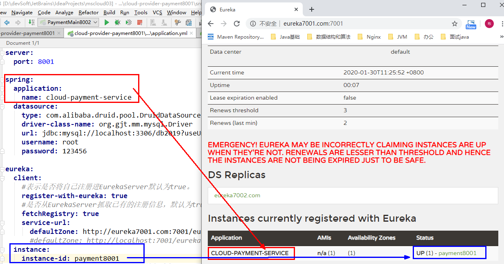

# Eurake简介

Eureka 是 Netflix 的一个子模块，也是核心模块之一

Eureka 是一个基于 REST 的服务，用于定位服务，以实现云端中间层服务发现和故障转移

服务注册与发现对于微服务架构来说是非常重要的，有了服务发现与注册，只需要使用服务的标识符，就可以访问到服务，而不需要修改服务调用的配置文件了

功能类似于 Dubbo 的注册中心，比如 Zookeeper


# Eurake基本架构

Eureka 采用了 **C-S** 的设计架构

Eureka Server 作为服务注册功能的服务器，它是服务注册中心而系统中的其他微服务，使用 Eureka 的客户端连接到 Eureka Server并维持心跳连接，这样系统的维护人员就可以通过 Eureka Server 来监控系统中各个微服务是否正常运行

SpringCloud 的一些其他模块（比如Zuul）就可以通过 Eureka Server 来发现系统中的其他微服务，并执行相关的逻辑

Eureka包含**两个组件**：**Eureka Server** 和 **Eureka Client** 

- Eureka Server：提供服务注册服务，各个节点启动后，会在EurekaServer中进行注册，这样EurekaServer中的服务注册表中将会存储所有可用服务节点的信息，服务节点的信息可以在界面中直观的看到。

- EurekaClient：一个Java客户端，用于简化Eureka Server的交互，客户端同时也具备一个内置的、使用轮询(round-robin)负载算法的负载均衡器。在应用启动后，将会向Eureka Server发送心跳(默认周期为30秒)。如果Eureka Server在多个心跳周期内没有接收到某个节点的心跳，EurekaServer将会从服务注册表中把这个服务节点移除（默认90秒）。


**三大角色**：

**Eureka Server** 提供服务注册和发现。

**Service Provider** 服务提供方将自身服务注册到Eureka，从而使服务消费方能够找到。

**Service Consumer **服务消费方从Eureka获取注册服务列表，从而能够消费服务。


# 构建Server端步骤

## 1、新建EurakeServer端模块

## 2、引入依赖-POM

```xml
<!--eureka-server服务端 -->以前的老版本（当前使用2018）
<dependency>
    <groupId>org.springframework.cloud</groupId>
    <artifactId>spring-cloud-starter-eureka-server</artifactId>
</dependency>

现在新版本（当前使用2020.2）
<dependency>
    <groupId>org.springframework.cloud</groupId>
    <artifactId>spring-cloud-starter-netflix-eureka-server</artifactId>
</dependency>
```

**特别注意是server端**

## 3、修改配置文件-YML

```yml
server: 
 port: 7001 #访问的端口
 
eureka:
  instance:
    hostname: localhost #eureka服务端的实例名称
  client:
    register-with-eureka: false #false表示不向注册中心注册自己。
    fetch-registry: false #false表示自己端就是注册中心，我的职责就是维护服务实例，并不需要去检索服务
    service-url:
      #设置与Eureka Server交互的地址查询服务和注册服务都需要依赖这个地址。
      defaultZone: http://${eureka.instance.hostname}:${server.port}/eureka/   
```

## 4、启动类添加注解

添加@EnableEurekaServer注解

```java
@SpringBootApplication
@EnableEurekaServer // EurekaServer服务器端启动类,接受其它微服务注册进来
public class EurekaServer7001_App {
    public static void main(String[] args) {
        SpringApplication.run(EurekaServer7001_App.class, args);
    }
}
```

## 5、访问路径

```txt
http://localhost:7001/
```

# 将Client端模块注册进入

### 	6.1、引入依赖-POM

Client端模块引入的eurake-client，不是引入eurake-server模块

```xml
<!-- 将微服务provider侧注册进eureka -->以前老版本，别再使用
<dependency>
    <groupId>org.springframework.cloud</groupId>
    <artifactId>spring-cloud-starter-eureka</artifactId>
</dependency>

现在新版本,当前使用
<dependency>
    <groupId>org.springframework.cloud</groupId>
    <artifactId>spring-cloud-starter-netflix-eureka-client</artifactId>
</dependency>

<dependency>
    <groupId>org.springframework.cloud</groupId>
    <artifactId>spring-cloud-starter-config</artifactId>
</dependency>
```

### 	6.2、修改配置文件-YML

```yml
eureka:
  client:
    #表示是否将自己注册进EurekaServer默认为true。
    register-with-eureka: true
    #是否从EurekaServer抓取已有的注册信息，默认为true。单节点无所谓，集群必须设置为true才能配合ribbon使用负载均衡
    fetchRegistry: true
    service-url:
      defaultZone: http://localhost:7001/eureka
```

### 	6.3、主启动类添加注解

使用注解@EnableEurekaClient

```java
@SpringBootApplication
@EnableEurekaClient // 本服务启动后会自动注册进eureka服务中
public class DeptProvider8001_App {
    public static void main(String[] args) {
        SpringApplication.run(DeptProvider8001_App.class, args);
    }
}
```

# 完善服务信息

### 	7.1、主机名称:服务名称

修改Client端的配置文件-YML

```yml
eureka:
  client:
    #表示是否将自己注册进EurekaServer默认为true。
    register-with-eureka: true
    #是否从EurekaServer抓取已有的注册信息，默认为true。单节点无所谓，集群必须设置为true才能使用负载均衡
    fetchRegistry: true
    service-url:
      defaultZone: http://localhost:7001/eureka
  instance:
    instance-id: microservicecloud-dept8001 #即Status下显示的名字
    
spring:
   application:
    name: microservicecloud-dept #即Application名
```

 

 

 

### 	7.2、访问信息有IP提示

修改Client端的配置文件-YML

```yml
  instance:
    prefer-ip-address: true     #访问路径可以显示IP地址
```

 

### 	7.3、微服务info内容详细信息

引入依赖-POM

```xml
<!-- actuator监控相关 -->
<dependency>
    <groupId>org.springframework.boot</groupId>
    <artifactId>spring-boot-starter-actuator</artifactId>
</dependency>
```

父工程修改POM，添加构建build信息

```xml
<build>
    <finalName>microservicecloud</finalName>
    <resources>
        <resource>
            <directory>src/main/resources</directory>
            <filtering>true</filtering>
        </resource>
    </resources>
    <plugins>
        <plugin>
            <groupId>org.apache.maven.plugins</groupId>
            <artifactId>maven-resources-plugin</artifactId>
            <configuration>
                <delimiters>
                    <delimit>$</delimit>
                </delimiters>
            </configuration>
        </plugin>
    </plugins>
</build>
```

修改Client端模块的配置文件-YML

```yml
info:
  app.name: atguigu-microservicecloud
  company.name: www.atguigu.com
  build.artifactId: $project.artifactId$
  build.version: $project.version$
```


# Eurake自我保护机制

默认情况下，如果EurekaServer在一定时间内没有接收到某个微服务实例的心跳，EurekaServer将会注销该实例（默认90秒）。但是当网络分区故障发生时，微服务与EurekaServer之间无法正常通信，以上行为可能变得非常危险了——因为微服务本身其实是健康的，此时本不应该注销这个微服务。

Eureka通过“自我保护模式”来解决这个问题——当EurekaServer节点在短时间内丢失过多客户端时（可能发生了网络分区故障），那么这个节点就会进入自我保护模式。一旦进入该模式，EurekaServer就会保护服务注册表中的信息，不再删除服务注册表中的数据（也就是不会注销任何微服务）。当网络故障恢复后，也即当它收到的心跳数重新恢复到阈值以上时，该EurekaServer节点会自动退出自我保护模式。

```text
如果在Eureka Server的首页看到以下这段提示，则说明Eureka进入了保护模式：
EMERGENCY! EUREKA MAY BE INCORRECTLY CLAIMING INSTANCES ARE UP WHEN THEY'RE NOT. 
RENEWALS ARE LESSER THAN THRESHOLD AND HENCE THE INSTANCES ARE NOT BEING EXPIRED JUST TO BE SAFE 
```

 

它的设计哲学就是宁可保留错误的服务注册信息，也不盲目注销任何可能健康的服务实例。

**tip**：

- 在Spring Cloud中，可以使用eureka.server.enable-self-preservation = false 禁用Server端的自我保护模式。

- Client端

- ```yml
  #心跳检测与续约时间
  #开发时设置小些，保证服务关闭后注册中心能即使剔除服务
    instance:
    #Eureka客户端向服务端发送心跳的时间间隔，单位为秒(默认是30秒)
      lease-renewal-interval-in-seconds: 1
    #Eureka服务端在收到最后一次心跳后等待时间上限，单位为秒(默认是90秒)，超时将剔除服务
      lease-expiration-duration-in-seconds: 2
  ```

# Eurake集群配置

## 1、创建多个EurakeServer端模块

## 2、修改本机host文件

```txt
C:\Windows\System32\drivers\etc路径下的hosts文件

127.0.0.1  eureka7001.com
127.0.0.1  eureka7002.com
127.0.0.1  eureka7003.com
```

## 3、修改集群模块配置文件-YML

```yml
server: 
  port: 7001 # 访问端口号
 
eureka: 
  instance:
    hostname: eureka7001.com # eureka服务端的实例名称
  client: 
    register-with-eureka: false     # false表示不向注册中心注册自己。
    fetch-registry: false     # false表示自己端就是注册中心，我的职责就是维护服务实例，并不需要去检索服务
    service-url: 
      # 单机 defaultZone: http://${eureka.instance.hostname}:${server.port}/eureka/
      # 设置与Eureka Server交互的地址查询服务和注册服务都需要依赖这个地址（单机）。
      # 集群模式下，写入其余EurakeServer模块的地址
      defaultZone: http://eureka7002.com:7002/eureka/,http://eureka7003.com:7003/eureka/
```

## 4、Client端模块修改配置文件-YML

```yml
server:
  port: 8001
   
eureka:
  client: # 客户端注册进eureka服务列表内
    service-url: 
      # 注册位置
      defaultZone: http://eureka7001.com:7001/eureka/,http://eureka7002.com:7002/eureka/,http://eureka7003.com:7003/eureka/
  instance:
    instance-id: microservicecloud-dept8001   # 自定义服务名称信息，即Status下显示的名字
    prefer-ip-address: true     # 访问路径可以显示IP地址
```

# Eurake服务发现

对于注册进eureka里面的微服务，可以通过服务发现来获得该服务的信息

```java
@GetMapping(value = "/payment/discovery")
public Object discovery() {
    // 获取所有已注册的服务
    List<String> services = discoveryClient.getServices();
    for (String element : services) {
        System.out.println(element);
    }

    // 获取所有ApplicationName为xxx的服务
    List<ServiceInstance> instances = discoveryClient.getInstances("CLOUD-PAYMENT-SERVICE");
    for (ServiceInstance element : instances) {
        System.out.println(element.getServiceId() 
                           + "\t" + element.getHost() 
                           + "\t" + element.getPort() 
                           + "\t"+ element.getUri());
    }
    return this.discoveryClient;
}
```

## 1、添加注解

主启动类添加注解 @EnableDiscoveryClient 服务发现

访问 http://localhost:8001/payment/discovery


# 测试

先启动Server端

在启动Client端

最后启动消费

注意url不要写死，使用服务名去调用

```java
//public static final String PAYMENT_SRV = "http://localhost:8001";
 
// 通过在eureka上注册过的微服务名称调用
public static final String PAYMENT_SRV = "http://CLOUD-PAYMENT-SERVICE";
```

使用@LoadBalance实现RestTemplate的负载均衡

```java
@Configuration
public class ApplicationContextBean{
    @Bean
    @LoadBalanced //使用@LoadBalanced注解赋予RestTemplate负载均衡的能力
    public RestTemplate getRestTemplate(){
        return new RestTemplate();
    }
}
```

Ribbon和Eureka整合后Consumer可以直接调用服务而不用再关心地址和端口号，且该服务还有负载均衡功能了


# Eurake VS Zookeeper

## 前提

著名的CAP理论指出，一个分布式系统不可能同时满足C(一致性)、A(可用性)和P(分区容错性)

由于分区容错性P在是分布式系统中必须要保证的，因此我们只能在A和C之间进行权衡

而Zookeeper保证的是**CP**，Eureka则是**AP**

## Zookeeper保证CP

当向注册中心查询服务列表时，我们可以容忍注册中心返回的是几分钟以前的注册信息，但不能接受服务直接down掉不可用。也就是说，服务注册功能对可用性的要求要高于一致性。

但是zk会出现这样一种情况，当master节点因为网络故障与其他节点失去联系时，剩余节点会重新进行leader选举。问题在于，选举leader的时间太长，30～120s，且选举期间整个zk集群都是不可用的，这就导致在选举期间注册服务瘫痪。

在云部署的环境下，因网络问题使得zk集群失去master节点是较大概率会发生的事，虽然服务能够最终恢复，但是漫长的选举时间导致的注册长期不可用是不能容忍的。

## Eureka保证AP

Eureka看明白了这一点，因此在设计时就优先保证可用性。Eureka各个节点都是平等的，几个节点挂掉不会影响正常节点的工作，剩余的节点依然可以提供注册和查询服务。

而Eureka的客户端在向某个Eureka注册或时如果发现连接失败，则会自动切换至其它节点，只要有一台Eureka还在，就能保证注册服务可用(保证可用性)，只不过查到的信息可能不是最新的(不保证强一致性)。

除此之外，Eureka还有一种自我保护机制，如果在15分钟内超过85%的节点都没有正常的心跳，那么Eureka就认为客户端与注册中心出现了网络故障，此时会出现以下几种情况：

1. Eureka不再从注册列表中移除因为长时间没收到心跳而应该过期的服务。
2. Eureka仍然能够接受新服务的注册和查询请求，但是不会被同步到其它节点上(即保证当前节点依然可用)。
3. 当网络稳定时，当前实例新的注册信息会被同步到其它节点中。


