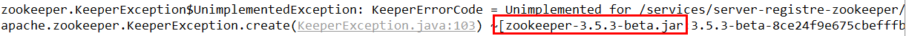

# ZooKeeper简介

zookeeper是一个分布式协调工具，可以实现注册中心功能。

关闭Linux服务器防火墙后启动zookeeper服务器。

zookeeper服务器取代Eureka服务器，zk作为服务注册中心。

# ZooKeeperClient端

## 1、引入POM

```xml
<!-- SpringBoot整合zookeeper客户端 -->
<dependency>
    <groupId>org.springframework.cloud</groupId>
    <artifactId>spring-cloud-starter-zookeeper-discovery</artifactId>
</dependency>
```

## 2、配置YML

```yml
#8004表示注册到zookeeper服务器的支付服务提供者端口号
server:
  port: 8004
#服务别名----注册zookeeper到注册中心名称
spring:
  application:
    name: cloud-provider-payment
  cloud:
    zookeeper:
    #ZK的地址以及端口
      connect-string: 192.168.111.144:2181
```

## 3、添加注解

```java
@EnableDiscoveryClient //该注解用于向使用consul或者zookeeper作为注册中心时注册服务
```

# 问题

## 1、版本问题

 

 

 

```xml
<!-- SpringBoot整合zookeeper客户端 -->
<dependency>
    <groupId>org.springframework.cloud</groupId>
    <artifactId>spring-cloud-starter-zookeeper-discovery</artifactId>
    <!--先排除自带的zookeeper3.5.3-->
    <exclusions>
        <exclusion>
            <groupId>org.apache.zookeeper</groupId>
            <artifactId>zookeeper</artifactId>
        </exclusion>
    </exclusions>
</dependency>
<!--添加zookeeper3.4.9版本-->
<dependency>
    <groupId>org.apache.zookeeper</groupId>
    <artifactId>zookeeper</artifactId>
    <version>3.4.9</version>
</dependency>
```


