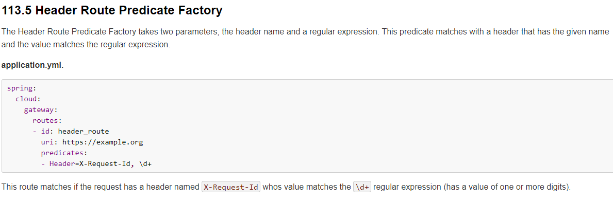

# 1、Gateway 简介

Spring Cloud Gateway 是 Spring Cloud 的一个全新项目，基于 Spring 5.0 + Spring Boot 2.0 和 Project Reactor 等技术开发的 API 网关，它旨在为微服务架构提供一种简单有效的统一的 API 路由管理方式，以及提供一些强大的过滤器功能， 例如：熔断、限流、重试

Spring Cloud Gateway 作为 Spring Cloud 生态系统中的网关，目标是替代 Zuul，在 Spring Cloud 2.0 以上版本中，没有对新版本的Zuul 2.0 以上最新高性能版本进行集成，仍然还是使用的 Zuul 1.x 非 Reactor 模式的老版本

Spring Cloud Gateway 是基于 WebFlux 框架实现的，而 WebFlux 框架底层则使用了高性能的 Reactor 模式通信框架 Netty

Spring Cloud Gateway 的目标提供统一的路由方式且基于 Filter 链的方式提供了网关基本的功能，例如：安全，监控/指标，和限流

作用：反向代理、鉴权、流量控制、熔断、日志监控


# 2、三大核心概念

## 1、Route(路由)

路由是构建网关的基本模块，它由 ID，目标 URI，一系列的断言和过滤器组成，如果断言为 true 则匹配该路由


## 2、Predicate(断言)

参考的是 Java8 的 java.util.function.Predicate

开发人员可以匹配 HTTP 请求中的所有内容（例如请求头或请求参数），如果请求与断言相匹配则进行路由


## 3、Filter(过滤)

指的是 Spring 框架中 Gateway Filter 的实例，使用过滤器，可以在请求被路由前或者之后对请求进行修改

web 请求，通过一些匹配条件，定位到真正的服务节点，并在这个转发过程的前后，进行一些精细化控制

 


# 3、工作流程


客户端向 Spring Cloud Gateway 发出请求，然后在 Gateway Handler Mapping 中找到与请求相匹配的路由，将其发送到 Gateway Web Handler

Handler 再通过指定的过滤器链来将请求发送到我们实际的服务执行业务逻辑，然后返回

过滤器之间用虚线分开是因为过滤器可能会在发送代理请求之前（“pre”）或之后（“post”）执行业务逻辑

Filter在“pre”类型的过滤器可以做参数校验、权限校验、流量监控、日志输出、协议转换等，在“post”类型的过滤器中可以做响应内容、响应头的修改，日志的输出，流量监控等有着非常重要的作用

**核心逻辑**：路由转发 + 执行过滤器链


# 4、Gateway构建

## 1、方法一

### 1、引入 POM

不需要引入 Web 模块

```xml
<!-- gateway -->
<dependency>
    <groupId>org.springframework.cloud</groupId>
    <artifactId>spring-cloud-starter-gateway</artifactId>
</dependency>
```


### 2、配置 YML

```yml
 
server:
  port: 9527

spring:
  application:
    name: cloud-gateway
  cloud:
    gateway:
      routes:
        - id: payment_routh # payment_route    # 路由的 ID，没有固定规则但要求唯一，建议配合服务名
          uri: http://localhost:8001          # 匹配后提供服务的路由地址
          predicates:
            - Path=/payment/get/**         # 断言，路径相匹配的进行路由

        - id: payment_routh2 #payment_route    # 路由的 ID，没有固定规则但要求唯一，建议配合服务名
          uri: http://localhost:8001          # 匹配后提供服务的路由地址
          predicates:
            - Path=/payment/lb/**         # 断言，路径相匹配的进行路由

eureka:
  instance:
    hostname: cloud-gateway-service
  client: # 服务提供者 provider 注册进 eureka 服务列表内
    service-url:
      register-with-eureka: true
      fetch-registry: true
      defaultZone: http://eureka7001.com:7001/eureka
 
```


### 3、测试

添加网关前 http://localhost:8001/payment/get/31

添加网关后 http://localhost:9527/payment/get/31


## 2、方法二

代码中注入 RouteLocator 的Bean


```java
@Configuration
public class GateWayConfig{
    /**
     * 配置了一个 id 为 route-name 的路由规则
     * 当访问地址 http://localhost:9527/guonei 时会自动转发到地址：http://news.baidu.com/guonei
     * @param builder
     * @return
     */
    @Bean
    public RouteLocator customRouteLocator(RouteLocatorBuilder builder){
        RouteLocatorBuilder.Builder routes = builder.routes();

        routes.route("path_route_atguigu", 
                     r ->r.path("/guonei").uri("http://news.baidu.com/guonei")).build();
        return routes.build();

    }
    @Bean
    public RouteLocator customRouteLocator2(RouteLocatorBuilder builder) {
        RouteLocatorBuilder.Builder routes = builder.routes();
        routes.route("path_route_atguigu2", 
                     r -> r.path("/guoji").uri("http://news.baidu.com/guoji")).build();
        return routes.build();
    }
}

```


# 5、动态路由

默认情况下 Gateway 会根据注册中心注册的服务列表，以注册中心上微服务名为路径创建动态路由进行转发，从而实现动态路由的功能

修改 yml

```yml
server:
  port: 9527

spring:
  application:
    name: cloud-gateway
  cloud:
    gateway:
    # 新增配置
      discovery:
        locator:
          enabled: true #开启从注册中心动态创建路由的功能，利用微服务名进行路由
      routes:
        - id: payment_routh # payment_route    # 路由的 ID，没有固定规则但要求唯一，建议配合服务名
          # uri: http://localhost:8001          
          uri: lb://cloud-payment-service # 匹配后提供服务的路由地址
          predicates:
            - Path=/payment/get/**         # 断言，路径相匹配的进行路由

        - id: payment_routh2 #payment_route    # 路由的 ID，没有固定规则但要求唯一，建议配合服务名
          # uri: http://localhost:8001          
          uri: lb://cloud-payment-service # 匹配后提供服务的路由地址
          predicates:
            - Path=/payment/lb/**         # 断言，路径相匹配的进行路由

eureka:
  instance:
    hostname: cloud-gateway-service
  client: # 服务提供者 provider 注册进 eureka 服务列表内
    service-url:
      register-with-eureka: true
      fetch-registry: true
      defaultZone: http://eureka7001.com:7001/eureka
 
```

**注意**：uri 的协议为 lb，表示启用 Gateway 的负载均衡功能

lb://serviceName 是 Spring Cloud Gateway 在微服务中自动创建的负载均衡 uri

测试：http://localhost:9527/payment/lb


# 6、Predicate

## 1、简介

 

Spring Cloud Gateway 将路由匹配作为 Spring WebFlux HandlerMapping 基础架构的一部分

Spring Cloud Gateway 包括许多内置的 Route Predicate 工厂，所有这些 Predicate 都与 HTTP 请求的不同属性匹配

多个 Route Predicate 工厂可以进行组合

Spring Cloud Gateway 创建 Route 对象时， 使用 RoutePredicateFactory 创建 Predicate 对象，Predicate 对象可以赋值给 Route

Spring Cloud Gateway 包含许多内置的 Route Predicate Factories

所有这些谓词都匹配 HTTP 请求的不同属性，多种谓词工厂可以组合，并通过逻辑 and


## 2、After Route Predicate

 

```yml
spring:
  application:
    name: cloud-gateway
  cloud:
    gateway:
      discovery:
        locator:
          enabled: true # 开启从注册中心动态创建路由的功能
      routes:
        - id: payment_routh #payment_route    # 路由的 ID，没有固定规则但要求唯一，建议配合服务名
          # uri: http://localhost:8001          # 匹配后提供服务的路由地址
          uri: lb://cloud-payment-service # 匹配后提供服务的路由地址
          predicates:
            - Path=/payment/get/**         # 断言，路径相匹配的进行路由

        - id: payment_routh2 #payment_route    # 路由的 ID，没有固定规则但要求唯一，建议配合服务名
          # uri: http://localhost:8001          # 匹配后提供服务的路由地址
          uri: lb://cloud-payment-service # 匹配后提供服务的路由地址
          predicates:
       		- Path=/payment/lb/**         # 断言，路径相匹配的进行路由
             - After=2020-02-05T15:10:03.685+08:00[Asia/Shanghai]         # 断言，路径相匹配的进行路由
```


## 3、Before Route Predicate

 

```yml
spring:
  application:
    name: cloud-gateway
  cloud:
    gateway:
      discovery:
        locator:
          enabled: true # 开启从注册中心动态创建路由的功能
      routes:
        - id: payment_routh #payment_route    # 路由的 ID，没有固定规则但要求唯一，建议配合服务名
          # uri: http://localhost:8001          # 匹配后提供服务的路由地址
          uri: lb://cloud-payment-service # 匹配后提供服务的路由地址
          predicates:
            - Path=/payment/get/**         # 断言，路径相匹配的进行路由
        - id: payment_routh2 #payment_route    # 路由的 ID，没有固定规则但要求唯一，建议配合服务名
          # uri: http://localhost:8001          # 匹配后提供服务的路由地址
          uri: lb://cloud-payment-service # 匹配后提供服务的路由地址
          predicates:
            - Path=/payment/lb/**         # 断言，路径相匹配的进行路由
            - After=2020-02-05T15:10:03.685+08:00[Asia/Shanghai]         # 断言，路径相匹配的进行路由
            - Before=2020-02-05T15:10:03.685+08:00[Asia/Shanghai]         # 断言，路径相匹配的进行路由

```


## 4、Between Route Predicate

```yml
spring:
  application:
    name: cloud-gateway
  cloud:
    gateway:
      discovery:
        locator:
          enabled: true #开启从注册中心动态创建路由的功能
      routes:
        - id: payment_routh #payment_route    # 路由的 ID，没有固定规则但要求唯一，建议配合服务名
          # uri: http://localhost:8001          # 匹配后提供服务的路由地址
          uri: lb://cloud-payment-service # 匹配后提供服务的路由地址
          predicates:
            - Path=/payment/get/**         # 断言，路径相匹配的进行路由

        - id: payment_routh2 #payment_route    # 路由的 ID，没有固定规则但要求唯一，建议配合服务名
          # uri: http://localhost:8001          # 匹配后提供服务的路由地址
          uri: lb://cloud-payment-service # 匹配后提供服务的路由地址
          predicates:
            - Path=/payment/lb/**         # 断言，路径相匹配的进行路由
            #- After=2020-02-05T15:10:03.685+08:00[Asia/Shanghai]         # 断言，路径相匹配的进行路由
            #- Before=2020-02-05T15:10:03.685+08:00[Asia/Shanghai]         # 断言，路径相匹配的进行路由
            - Between=2020-02-02T17:45:06.206+08:00[Asia/Shanghai],
            		  2020-03-25T18:59:06.206+08:00[Asia/Shanghai]

#id：我们自定义的路由 ID，保持唯一
 ##uri：目标服务地址
 ##predicates：路由条件，Predicate接受一个输入参数返回一个布尔值。
 ##            该属性包含多种默认方法来将Predicate组合成其他复杂的逻辑(比如：与，或，非)
```


## 5、Cookie Route Predicate


Cookie Route Predicate 需要两个参数，一个是 Cookie name ,一个是正则表达式

路由规则会通过获取对应的 Cookie name 值和正则表达式去匹配，如果匹配上就会执行路由，如果没有匹配上则不执行

```yml
server:
  port: 9527

spring:
  application:
    name: cloud-gateway
  cloud:
    gateway:
      discovery:
        locator:
          enabled: true #开启从注册中心动态创建路由的功能
      routes:
        - id: payment_routh #payment_route    # 路由的 ID，没有固定规则但要求唯一，建议配合服务名
          # uri: http://localhost:8001          # 匹配后提供服务的路由地址
          uri: lb://cloud-payment-service # 匹配后提供服务的路由地址
          predicates:
            - Path=/payment/get/**         # 断言，路径相匹配的进行路由

        - id: payment_routh2 #payment_route    # 路由的 ID，没有固定规则但要求唯一，建议配合服务名
          # uri: http://localhost:8001          #匹配后提供服务的路由地址
          uri: lb://cloud-payment-service # 匹配后提供服务的路由地址
          predicates:
            - Path=/payment/lb/**         # 断言，路径相匹配的进行路由
		    - Cookie=username,zzyy

```

 


## 6、Header Route Predicate

 

两个参数：一个是属性名称和一个正则表达式，这个属性值和正则表达式匹配则执行

```yml
 
server:
  port: 9527

spring:
  application:
    name: cloud-gateway
  cloud:
    gateway:
      discovery:
        locator:
          enabled: true # 开启从注册中心动态创建路由的功能
      routes:
        - id: payment_routh #payment_route    # 路由的 ID，没有固定规则但要求唯一，建议配合服务名
          # uri: http://localhost:8001          # 匹配后提供服务的路由地址
          uri: lb://cloud-payment-service # 匹配后提供服务的路由地址
          predicates:
            - Path=/payment/get/**         # 断言，路径相匹配的进行路由

        - id: payment_routh2 #payment_route    # 路由的 ID，没有固定规则但要求唯一，建议配合服务名
          # uri: http://localhost:8001          # 匹配后提供服务的路由地址
          uri: lb://cloud-payment-service # 匹配后提供服务的路由地址
          predicates:
            - Path=/payment/lb/**         # 断言，路径相匹配的进行路由
            - Header=X-Request-Id, \d+  # 请求头要有X-Request-Id属性并且值为整数的正则表达式
 
 
curl http://localhost:9588/paymentInfo -H "X-Request-Id:123"

curl http://localhost:9527/payment/lb -H "X-Request-Id:123"
```

 


## 7、Host Route Predicate

 

Host Route Predicate 接收一组参数，一组匹配的域名列表，这个模板是一个 **ant** 分隔的模板，用 **.** 号作为分隔符

它通过参数中的主机地址作为匹配规则

```yml
spring:
  application:
    name: cloud-gateway
  cloud:
    gateway:
      discovery:
        locator:
          enabled: true # 开启从注册中心动态创建路由的功能
      routes:
        - id: payment_routh #payment_route    # 路由的 ID，没有固定规则但要求唯一，建议配合服务名
          # uri: http://localhost:8001          # 匹配后提供服务的路由地址
          uri: lb://cloud-payment-service # 匹配后提供服务的路由地址
          predicates:
            - Path=/payment/get/**         # 断言，路径相匹配的进行路由

        - id: payment_routh2 #payment_route    # 路由的 ID，没有固定规则但要求唯一，建议配合服务名
          # uri: http://localhost:8001          # 匹配后提供服务的路由地址
          uri: lb://cloud-payment-service # 匹配后提供服务的路由地址
          predicates:
            - Path=/payment/lb/**         # 断言，路径相匹配的进行路由
            - Host=**.atguigu.com
 
 
curl http://localhost:9588/paymentInfo -H "Host: www.atguigu.com" 
curl http://localhost:9588/paymentInfo -H "Host: news.atguigu.com" 
====================================================================================
正确：curl http://localhost:9527/payment/lb -H "Host: www.atguigu.com"
正确：curl http://localhost:9527/payment/lb -H "Host: java.atguigu.com"
错误：curl http://localhost:9527/payment/lb -H "Host: java.atguigu.net"
```

 


## 8、Method Route Predicate

 

```yml
spring:
  application:
    name: cloud-gateway
  cloud:
    gateway:
      discovery:
        locator:
          enabled: true # 开启从注册中心动态创建路由的功能
      routes:
        - id: payment_routh #payment_route    # 路由的 ID，没有固定规则但要求唯一，建议配合服务名
          # uri: http://localhost:8001          # 匹配后提供服务的路由地址
          uri: lb://cloud-payment-service # 匹配后提供服务的路由地址
          predicates:
            - Path=/payment/get/**         # 断言，路径相匹配的进行路由

        - id: payment_routh2 #payment_route    # 路由的 ID，没有固定规则但要求唯一，建议配合服务名
          # uri: http://localhost:8001          # 匹配后提供服务的路由地址
          uri: lb://cloud-payment-service # 匹配后提供服务的路由地址
          predicates:
            - Path=/payment/lb/**         # 断言，路径相匹配的进行路由
            - Method=GET
```

 


## 9、Path Route Predicate

 

```yml
server:
  port: 9527

spring:
  application:
    name: cloud-gateway
  cloud:
    gateway:
      discovery:
        locator:
          enabled: true # 开启从注册中心动态创建路由的功能
      routes:
        - id: payment_routh #payment_route    # 路由的 ID，没有固定规则但要求唯一，建议配合服务名
          # uri: http://localhost:8001          # 匹配后提供服务的路由地址
          uri: lb://cloud-payment-service # 匹配后提供服务的路由地址
          predicates:
            - Path=/payment/get/**         # 断言，路径相匹配的进行路由

        - id: payment_routh2 #payment_route    # 路由的 ID，没有固定规则但要求唯一，建议配合服务名
          # uri: http://localhost:8001          # 匹配后提供服务的路由地址
          uri: lb://cloud-payment-service # 匹配后提供服务的路由地址
          predicates:
            - Path=/payment/lb/**         # 断言，路径相匹配的进行路由
```


## 10、Query Route Predicate

 

支持传入两个参数，一个是属性名，一个为属性值，属性值可以是正则表达式

```yml
server:
  port: 9527

spring:
  application:
    name: cloud-gateway
  cloud:
    gateway:
      discovery:
        locator:
          enabled: true # 开启从注册中心动态创建路由的功能
      routes:
        - id: payment_routh #payment_route    # 路由的 ID，没有固定规则但要求唯一，建议配合服务名
          # uri: http://localhost:8001          # 匹配后提供服务的路由地址
          uri: lb://cloud-payment-service # 匹配后提供服务的路由地址
          predicates:
            - Path=/payment/get/**         # 断言，路径相匹配的进行路由

        - id: payment_routh2 #payment_route    # 路由的 ID，没有固定规则但要求唯一，建议配合服务名
          # uri: http://localhost:8001          # 匹配后提供服务的路由地址
          uri: lb://cloud-payment-service # 匹配后提供服务的路由地址
          predicates:
            - Path=/payment/lb/**         # 断言，路径相匹配的进行路由
            - Query=username, \d+  # 要有参数名username并且值还要是整数才能路由
 
http://localhost:9527/payment/lb?username=31
 
http://localhost:9527/payment/lb?username=-31
```


# 7、Filter

## 1、简介

路由过滤器可用于修改进入的 HTTP 请求和返回的 HTTP 响应，路由过滤器只能指定路由进行使用

Spring Cloud Gateway 内置了多种路由过滤器，他们都由 GatewayFilter 的工厂类来产生

**生命周期**：pre，post

**种类**：GatewayFilter ，GlobalFilter


## 2、常用的 GatewayFilter

### 1、AddRequestParameter

```yml
 
server:
  port: 9588

spring:
  application:
    name: cloud-gateway
  cloud:
    gateway:
      discovery:
        locator:
          enabled: true # 开启从注册中心动态创建路由的功能
          lower-case-service-id: true # 使用小写服务名，默认是大写
      routes:
        - id: payment_routh #payment_route # 路由的 ID，没有固定规则但要求唯一，建议配合服务名
          uri: lb://cloud-provider-payment # 匹配后的目标服务地址，供服务的路由地址
          # uri: http://localhost:8001 # 匹配后提供服务的路由地址
          filters:
          # 过滤器工厂会在匹配的请求头加上一对请求头，名称为 X-Request-Id值为 1024
            - AddRequestParameter=X-Request-Id,1024 
            
          predicates:
            - Path=/paymentInfo/**        # 断言，路径相匹配的进行路由
            - Method=GET,POST
```


## 3、自定义过滤器

### 1、自定义全局 GlobalFilter

两个主要接口介绍：implements GlobalFilter、Ordered

**作用**：全局日志记录，统一网关鉴权

```java
@Component //必须加，必须加，必须加
public class MyLogGateWayFilter implements GlobalFilter,Ordered {
    @Override
    public Mono<Void> filter(ServerWebExchange exchange, GatewayFilterChain chain) {
        System.out.println("time:"+new Date()+"\t 执行了自定义的全局过滤器: "+"MyLogGateWayFilter"+"hello");
        String uname = exchange.getRequest().getQueryParams().getFirst("uname");
        if (uname == null) {
            System.out.println("****用户名为null，无法登录");
            exchange.getResponse().setStatusCode(HttpStatus.NOT_ACCEPTABLE);
            return exchange.getResponse().setComplete();
        }
        return chain.filter(exchange);
    }

    @Override
    public int getOrder() {
        return 0;
    }
}
```

测试

 

http://localhost:9527/payment/lb?uname=z3 正常访问

http://localhost:9527/payment/lb 无法访问


# 扩展

## 1、Gateway 模型

传统的 Web 框架，比如说：struts2，springmvc 等都是基于 Servlet API 与 Servlet 容器基础之上运行的

在 Servlet3.1 之后有了**异步非阻塞**的支持，如 WebFlux 是一个典型非阻塞异步的框架，它的核心是基于 Reactor 的相关 API 实现的

相对于传统的 WEB 框架来说，它可以运行在诸如 Netty，Undertow 及支持 Servlet3.1 的容器上，非阻塞式 + 函数式编程（Spring5 必须使用 Java8）

Spring WebFlux 是 Spring 5.0 引入的新的响应式框架，区别于 Spring MVC，它不需要依赖 Servlet API，它是完全异步非阻塞的，并且基于 Reactor 来实现响应式流规范


## 2、Gateway VS Zuul

### 1、Gateway

Gateway 是 Spring Cloud 团队研发的，比 Zuul 便捷简单

Gateway 是基于**异步非阻塞模型**上进行开发的，性能方面不需要担心

Spring Cloud Gateway 具有如下特性：

- 基于 Spring Framework 5、Project Reactor 、Spring Boot 2.0 进行构建
- 动态路由：能够匹配任何请求属性
- 可以对路由指定 Predicate（断言）和 Filter（过滤器）
- 集成 Hystrix 的断路器功能
- 集成 Spring Cloud 服务发现功能
- 易于编写的 Predicate（断言）和 Filter（过滤器）
- 请求限流功能
- 支持路径重写


### 2、Zuul

Zuul1.x 进入维护模式，NetFlix多数项目都进入维护模式，前景不定

Zuul 1.x，是一个基于阻塞 IO 的 API Gateway

Zuul 1.x 基于**Servlet 2. 5 使用阻塞架构**，它不支持任何长连接（如：WebSocket）

Zuul 的设计模式和 Nginx 较像，每次 IO 操作都是从工作线程中选择一个执行，请求线程被阻塞到工作线程完成，但是差别是 Nginx 用C++ 实现，Zuul 用 Java 实现，而 JVM 本身会有第一次加载较慢的情况，使得 Zuul 的性能相对较差

Zuul 2.x 理念更先进，基于 **Netty 非阻塞**和支持长连接，但 Spring Cloud 目前还没有整合 

Zuul 2.x 的性能较 Zuul 1.x 有较大提升，在性能方面，根据官方提供的基准测试，Spring Cloud Gateway 的 RPS（每秒请求数）是 Zuul 的 1. 6 倍

