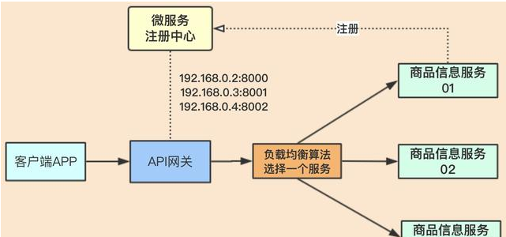
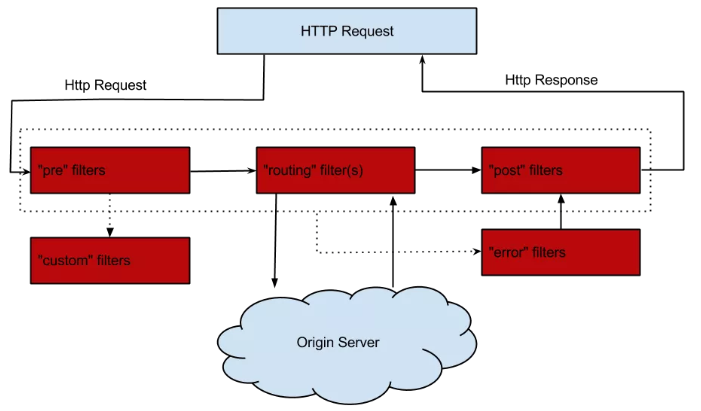
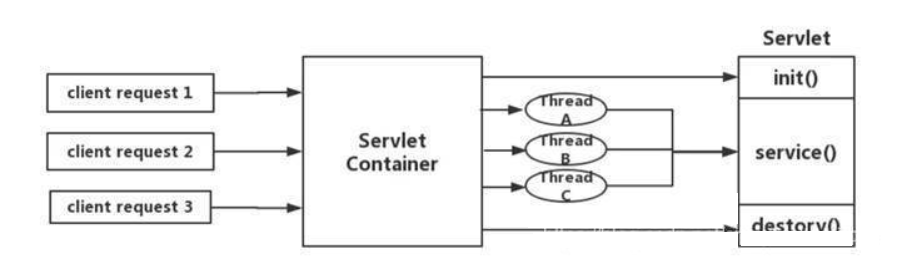

# Zuul简介

Zuul是一种提供动态路由、监视、弹性、安全性等功能的边缘服务。

Zuul是Netflix出品的一个基于JVM路由和服务端的负载均衡器。

# Zuul作用

Zuul包含了对请求的**路由**和**过滤**两个最主要的功能：

- 路由功能负责将外部请求转发到具体的微服务实例上，是实现外部访问统一入口的基础。

- 过滤器功能则负责对请求的处理过程进行干预，是实现请求校验、服务聚合等功能的基础。

Zuul和Eureka进行整合，将Zuul自身注册为Eureka服务治理下的应用，同时从Eureka中获得其他微服务的消息，也即以后的访问微服务都是通过Zuul跳转后获得。

    注意：Zuul服务最终还是会注册进Eureka

提供 = 代理 + 路由 + 过滤 + 负载均衡 + 灰度发布。

负载均衡：网关为入口，由网关与微服务进行交互，所以网关必须要实现负载均衡的功能。网关会获取微服务注册中心里面的服务连接地址，再配合一些算法选择其中一个服务地址，进行处理业务。这个属于客户端侧的负载均衡，由调用方去实现负载均衡逻辑。

 

# 路由基本配置

## 构建步骤

 新建Module模块microservicecloud-zuul-gateway-9527

### 1、引入POM

 POM文件，引入zuul路由网关依赖

```xml
 
<project xmlns="http://maven.apache.org/POM/4.0.0" xmlns:xsi="http://www.w3.org/2001/XMLSchema-instance"
  xsi:schemaLocation="http://maven.apache.org/POM/4.0.0 http://maven.apache.org/xsd/maven-4.0.0.xsd">
  <modelVersion>4.0.0</modelVersion>
 
  <parent>
   <groupId>com.atguigu.springcloud</groupId>
   <artifactId>microservicecloud</artifactId>
   <version>0.0.1-SNAPSHOT</version>
  </parent>
 
  <artifactId>microservicecloud-zuul-gateway-9527</artifactId>
 
  <dependencies>
   <!-- zuul路由网关 -->
      旧版
   <dependency>
     <groupId>org.springframework.cloud</groupId>
     <artifactId>spring-cloud-starter-zuul</artifactId>
   </dependency> 
      新版
      <dependency>
          <groupId>org.springframework.cloud</groupId>
          <artifactId>spring-cloud-starter-netflix-zuul</artifactId>
      </dependency>
   <dependency>
     <groupId>org.springframework.cloud</groupId>
     <artifactId>spring-cloud-starter-eureka</artifactId>
   </dependency>
   <!-- actuator监控 -->
   <dependency>
     <groupId>org.springframework.boot</groupId>
     <artifactId>spring-boot-starter-actuator</artifactId>
   </dependency>
   <!--  hystrix容错-->
   <dependency>
     <groupId>org.springframework.cloud</groupId>
     <artifactId>spring-cloud-starter-hystrix</artifactId>
   </dependency>
   <dependency>
     <groupId>org.springframework.cloud</groupId>
     <artifactId>spring-cloud-starter-config</artifactId>
   </dependency>
   <!-- 日常标配 -->
   <dependency>
     <groupId>com.atguigu.springcloud</groupId>
     <artifactId>microservicecloud-api</artifactId>
     <version>${project.version}</version>
   </dependency>
   <dependency>
     <groupId>org.springframework.boot</groupId>
     <artifactId>spring-boot-starter-jetty</artifactId>
   </dependency>
   <dependency>
     <groupId>org.springframework.boot</groupId>
     <artifactId>spring-boot-starter-web</artifactId>
   </dependency>
   <dependency>
     <groupId>org.springframework.boot</groupId>
     <artifactId>spring-boot-starter-test</artifactId>
   </dependency>
   <!-- 热部署插件 -->
   <dependency>
     <groupId>org.springframework</groupId>
     <artifactId>springloaded</artifactId>
   </dependency>
   <dependency>
     <groupId>org.springframework.boot</groupId>
     <artifactId>spring-boot-devtools</artifactId>
   </dependency>
  </dependencies>
 
</project>
```

### 2、修改YML

yml文件

```yml
server: 
  port: 9527
 
spring: 
  application:
    name: microservicecloud-zuul-gateway
 
eureka: 
  client: 
    service-url: 
      defaultZone: http://eureka7001.com:7001/eureka,http://eureka7002.com:7002/eureka,http://eureka7003.com:7003/eureka  
  instance:
    instance-id: gateway-9527.com
    prefer-ip-address: true 
 
 
info:
  app.name: atguigu-microcloud
  company.name: www.atguigu.com
  build.artifactId: $project.artifactId$
  build.version: $project.version$
```

### 3、修改Hosts文件

hosts修改		127.0.0.1  myzuul.com

### 4、添加新注解

主启动类添加**注解@EnableZuulProxy** 

```java
package com.atguigu.springcloud;
 
import org.springframework.boot.SpringApplication;
import org.springframework.boot.autoconfigure.SpringBootApplication;
import org.springframework.cloud.netflix.zuul.EnableZuulProxy;
 
@SpringBootApplication
@EnableZuulProxy
public class Zuul_9527_StartSpringCloudApp {
    public static void main(String[] args) {
        SpringApplication.run(Zuul_9527_StartSpringCloudApp.class, args);
    }
}
```


## 测试

三个eureka集群

一个服务提供类microservicecloud-provider-dept-8001

一个路由

http://localhost:8001/dept/get/2

zuul映射配置+注册中心注册后对外暴露的服务名称+rest调用地址

http://myzuul.com:9527/microservicecloud-dept/dept/get/2

## 路由访问映射规则

修改工程microservicecloud-zuul-gateway-9527

### 代理名称

修改yml文件，但是旧路径和新路径都可以访问

```yml
zuul: 
  routes: 
 	# 注册进eureka服务器的地址
    mydept.serviceId: microservicecloud-dept
     # 浏览器地址栏输入的路径
    mydept.path: /mydept/**
    
修改前，访问路径
http://myzuul.com:9527/microservicecloud-dept/dept/get/2
修改后，访问路径
http://myzuul.com:9527/mydept/dept/get/1
```

### 禁止原服务名访问

再次修改yml文件，使得旧路径无法访问，单个具体可以具体写明，多个可以用"*"替代

```yml
zuul: 
  ignored-services: microservicecloud-dept  # 忽略服务名称
  routes: 
    mydept.serviceId: microservicecloud-dept
    mydept.path: /mydept/**
```

### 设置公共前缀

设置统一公共前缀

```yml
 zuul: 
  prefix: /atguigu
  ignored-services: "*" # 忽略所有服务名称
  routes: 
    mydept.serviceId: microservicecloud-dept
    mydept.path: /mydept/**
```

最后成果http://myzuul.com:9527/mircoservice/mydept/dept/get/1

```yml
server: 
  port: 9527
 
spring: 
  application:
    name: microservicecloud-zuul-gateway
 
zuul: 
  prefix: /mircoservice
  ignored-services: "*"
  routes: 
    mydept.serviceId: microservicecloud-dept
    mydept.path: /mydept/**
 
eureka: 
  client: 
    service-url: 
      defaultZone: http://eureka7001.com:7001/eureka,http://eureka7002.com:7002/eureka,http://eureka7003.com:7003/eureka  
  instance:
    instance-id: gateway-9527.com
    prefer-ip-address: true 
 
info:
  app.name: atguigu-microcloud
  company.name: www.atguigu.com
  build.artifactId: $project.artifactId$
  build.version: $project.version$
```

**注意**：

http://myzuul.com:9527/mircoservice/mydept/haha/dept/get/1

/myzuul.com:9527 根据路由设置，后面紧跟前缀

/mircoservice 根据路由设置

/mydept 根据路由设置

/haha 根据特定服务的context设置，如果有的话，没有直接的话调用/dept/get/1

# 路由转发与负载均衡

## 1、新建服务提供者模块cloud-provider-sms8008模块

### 1、引入POM

```xml
 
<?xml version="1.0" encoding="UTF-8"?>
<project xmlns="http://maven.apache.org/POM/4.0.0"
         xmlns:xsi="http://www.w3.org/2001/XMLSchema-instance"
         xsi:schemaLocation="http://maven.apache.org/POM/4.0.0 http://maven.apache.org/xsd/maven-4.0.0.xsd">
    <parent>
        <artifactId>mscloud</artifactId>
        <groupId>com.atguigu.springcloud</groupId>
        <version>1.0-SNAPSHOT</version>
    </parent>
    <modelVersion>4.0.0</modelVersion>

    <artifactId>cloud-provider-sms8008</artifactId>

    <dependencies>
        <dependency>
            <groupId>org.springframework.boot</groupId>
            <artifactId>spring-boot-starter-web</artifactId>
        </dependency>
        需要注册进Eurake
        <dependency>
            <groupId>org.springframework.cloud</groupId>
            <artifactId>spring-cloud-starter-netflix-eureka-client</artifactId>
        </dependency>
        <dependency>
            <groupId>org.springframework.boot</groupId>
            <artifactId>spring-boot-starter-actuator</artifactId>
        </dependency>

        <dependency>
            <groupId>org.springframework.boot</groupId>
            <artifactId>spring-boot-devtools</artifactId>
            <scope>runtime</scope>
            <optional>true</optional>
        </dependency>
        <dependency>
            <groupId>org.projectlombok</groupId>
            <artifactId>lombok</artifactId>
            <optional>true</optional>
        </dependency>
        <dependency>
            <groupId>org.springframework.boot</groupId>
            <artifactId>spring-boot-starter-test</artifactId>
            <scope>test</scope>
        </dependency>
    </dependencies>

</project>
```

### 2、修改YML

```yml
 server:
  port: 8008

###服务名称(服务注册到eureka名称)
spring:
    application:
        name: cloud-provider-sms

eureka:
  client: #服务提供者provider注册进eureka服务列表内
    service-url:
      register-with-eureka: true
      fetch-registry: true
      defaultZone: http://eureka7001.com:7001/eureka,http://eureka7002.com:7002/eureka,http://eureka7003.com:7003/eureka
      #defaultZone: http://127.0.0.1:7001/eureka,http://127.0.0.1:7002/eureka
      #defaultZone: http://eureka7001.com:7001/eureka   # eureka集群加@老本版
```

### 3、业务类

```java
@RestController
public class SMSController{
    @Value("${server.port}")
    private String serverPort;

    @GetMapping("/sms")
    public String sms(){
        return "sms provider service: "+"\t"+serverPort;
    }
}
```

### 4、主启动

```java
@SpringBootApplication
@EnableEurekaClient
public class MainAppSMS8008{
    public static void main(String[] args){
        SpringApplication.run(MainAppSMS8008.class,args);
    }
}

```

## 2、修改网关模块

### 1、修改YML

```yml
 
server:
  port: 9527

spring:
  application:
    name: cloud-zuul-gateway

eureka:
  client:
    service-url:
      #defaultZone: http://eureka7001.com:7001/eureka,http://eureka7002.com:7002/eureka,http://eureka7003.com:7003/eureka
      defaultZone: http://eureka7001.com:7001/eureka
  instance:
    instance-id: gateway-9527.com
    prefer-ip-address: true

zuul:
  #ignored-services: cloud-provider-payment
  routes: # 路由映射配置
    mypayment.serviceId: cloud-provider-payment
    mypayment.path: /weixin/**
    mysms.serviceId: cloud-provider-sms
    mysms.path: /mysms/**
```

由于Zuul自动集成了Ribbon和Hystrix，所以Zuul天生就有负载均衡和服务容错能力。

## 测试

负载均衡

微信服务找8001/8002

http://myzuul.com:9527/weixin/paymentInfo

路由转发

http://myzuul.com:9527/mysms/sms

短信服务找8008

# 过滤器

## 简介

过滤功能负责对请求过程进行额外的处理，是请求校验过滤及服务聚合的基础。

过滤器开关在YML配置

## 过滤器生命周期

 

## ZuulFilter

### 过滤类型

pre：在请求被路由到目标服务前执行，比如权限校验、打印日志等功能；

routing：在请求被路由到目标服务时执行

post：在请求被路由到目标服务后执行，比如给目标服务的响应添加头信息，收集统计数据等功能；

error：请求在其他阶段发生错误时执行。

### 过滤顺序

数字小的先执行

### 过滤是否开启

shouldFilter方法为true

### 执行逻辑

自己的业务逻辑

## 例子

前置过滤器，用于在请求路由到目标服务前打印请求日志。

业务代码，继承ZuulFilter

```java
@Component
@Slf4j
public class PreLogFilter extends ZuulFilter{
    @Override
    public String filterType(){
        return "pre";
    }

    @Override
    public int filterOrder(){
        return 1;
    }

    @Override
    public boolean shouldFilter(){
        return true;
    }

    @Override
    public Object run() throws ZuulException{
        RequestContext requestContext = RequestContext.getCurrentContext();
        HttpServletRequest request = requestContext.getRequest();
        String host = request.getRemoteHost();
        String method = request.getMethod();
        String uri = request.getRequestURI();
        //log.info("=====> Remote host:{},method:{},uri:{}", host, method, uri);
        System.out.println("********"+new Date().getTime());
        return null;
    }
}
```

打开过滤器

```yml
zuul:
  PreLogFilter:
    pre:
      disable: true
```

测试 http://myzuul.com:9527/atguigu/mysms/sms 在调用8008之前会打印日志

# 查看路由信息

引入POM

```xml
<dependency>
    <groupId>org.springframework.boot</groupId>
    <artifactId>spring-boot-starter-actuator</artifactId>
</dependency>
```

修改YML

```yml
# 开启查看路由的端点
management:
  endpoints:
    web:
      exposure:
        include: 'routes' 
```

访问 http://localhost:9527/actuator/routes

# 扩展

## API网关

API网关为微服务架构中的服务提供了统一的访问入口，客户端通过API网关访问相关服务。

API网关的定义类似于设计模式中的门面模式，它相当于整个微服务架构中的门面，所有客户端的访问都通过它来进行路由及过滤。

它实现了请求路由、负载均衡、校验过滤、服务容错、服务聚合等功能。

## Zuul1.x模型

Springcloud中所集成的Zuul版本，采用的是Tomcat容器，使用的是传统的Servlet IO处理模型。

根据Servlet的生命周期，servlet由servlet container进行生命周期管理。container启动时构造servlet对象并调用servlet init()进行初始化，container运行时接受请求，并为每个请求分配一个线程（一般从线程池中获取空闲线程）然后调用service()。container关闭时调用servlet destory()销毁servlet。

 

上述模式的缺点：
servlet是一个简单的网络IO模型，当请求进入servlet container时，servlet container就会为其绑定一个线程，在并发不高的场景下这种模型是适用的。但是一旦高并发(比如抽风用jemeter压)，线程数量就会上涨，而线程资源代价是昂贵的（线文切换，内存消耗大）严重影响请求的处理时间。在一些简单业务场景下，不希望为每个request分配一个线程，只需要1个或几个线程就能应对极大并发的请求，这种业务场景下servlet模型没有优势

所以Zuul 1.X是基于servlet之上的一个阻塞式处理模型，即spring实现了处理所有request请求有一个servlet（DispatcherServlet）并由该servlet阻塞式处理处理。所以Springcloud Zuul无法摆脱servlet模型的弊端。


