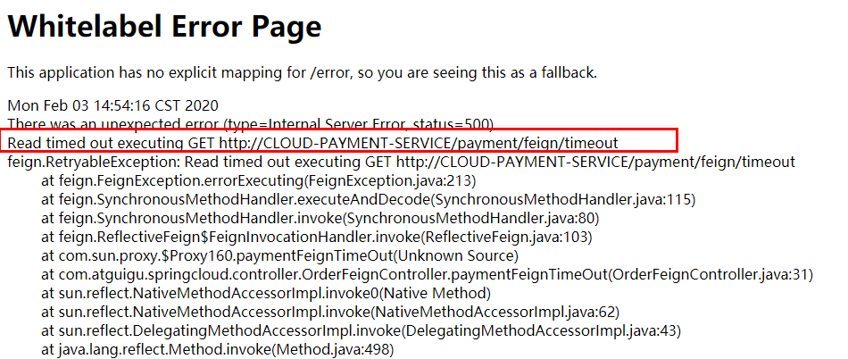
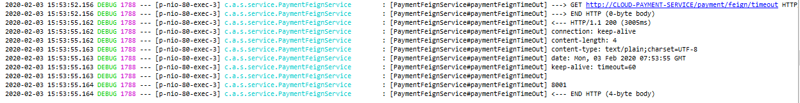

# Feign简介

Feign是一个声明式WebService客户端。使用Feign能让编写Web Service客户端更加简单。

它的使用方法是定义一个服务接口然后在上面添加注解。

Feign也支持可拔插式的编码器和解码器。

Spring Cloud对Feign进行了封装，使其支持了Spring MVC标准注解和HttpMessageConverters。

Feign可以与Eureka和Ribbon组合使用以支持负载均衡。

# Feign作用

前面在使用Ribbon+RestTemplate时，利用RestTemplate对http请求的封装处理，形成了一套模版化的调用方法。

在实际开发中，由于对服务依赖的调用可能不止一处，往往一个接口会被多处调用，所以通常都会针对每个微服务自行封装一些客户端类来包装这些依赖服务的调用。

所以，Feign在此基础上做了进一步封装，由他来帮助我们定义和实现依赖服务接口的定义。在Feign的实现下，我们只需创建一个接口并使用注解的方式来配置它（以前是Dao接口上面标注Mapper注解，现在是一个微服务接口上面标注一个Feign注解即可），即可完成对服务提供方的接口绑定，简化了使用Spring cloud Ribbon时，自动封装服务调用客户端的开发量。

Feign集成了Ribbon，利用Ribbon维护了服务列表信息，并且通过轮询实现了客户端的负载均衡。而与Ribbon不同的是，通过feign只需要定义服务绑定接口且以声明式的方法，优雅而简单的实现了服务调用。

# Feign构建

## 步骤

参考microservicecloud-consumer-dept-80，新建microservicecloud-consumer-dept-feign

### 1、引入依赖POM

microservicecloud-consumer-dept-feign工程pom.xml修改，主要**添加对feign的支持**。

```xml
 <dependency>
    <groupId>org.springframework.cloud</groupId>
    <artifactId>spring-cloud-starter-feign</artifactId>
</dependency>
```

修改microservicecloud-api工程，**添加入feign依赖** 

```xml
<project xmlns="http://maven.apache.org/POM/4.0.0" xmlns:xsi="http://www.w3.org/2001/XMLSchema-instance"
  xsi:schemaLocation="http://maven.apache.org/POM/4.0.0 http://maven.apache.org/xsd/maven-4.0.0.xsd">
  <modelVersion>4.0.0</modelVersion>
 
  <parent><!-- 子类里面显示声明才能有明确的继承表现，无意外就是父类的默认版本否则自己定义 -->
   <groupId>com.atguigu.springcloud</groupId>
   <artifactId>microservicecloud</artifactId>
   <version>0.0.1-SNAPSHOT</version>
  </parent>
 
  <artifactId>microservicecloud-api</artifactId><!-- 当前Module我自己叫什么名字 -->
 
  <dependencies><!-- 当前Module需要用到的jar包，按自己需求添加，如果父类已经包含了，可以不用写版本号 -->
   <dependency>
     <groupId>org.projectlombok</groupId>
     <artifactId>lombok</artifactId>
   </dependency>
   <dependency>
     <groupId>org.springframework.cloud</groupId>
     <artifactId>spring-cloud-starter-feign</artifactId>
   </dependency>
  </dependencies>
</project>
```

### 2、API模块新增类与注解

**api模块**新建DeptClientService接口并**新增注解@FeignClient ** 

```java
// 表明是FeignClient端，value填写服务名
@FeignClient(value = "MICROSERVICECLOUD-DEPT")
public interface DeptClientService{
    
  @RequestMapping(value = "/dept/get/{id}",method = RequestMethod.GET)
  public Dept get(@PathVariable("id") long id);
 
  @RequestMapping(value = "/dept/list",method = RequestMethod.GET)
  public List<Dept> list();
 
  @RequestMapping(value = "/dept/add",method = RequestMethod.POST)
  public boolean add(Dept dept);
    
}
```

### 3、调用方Conroller调用新Service

microservicecloud-consumer-dept-feign工程即Consumer模块修改 Controller，添加上一步新建的DeptClientService接口，使用接口调用。

```java
@RestController
public class DeptConsumerController {

    @Autowired
    private DeptClientService service;

    @RequestMapping(value = "/consumer/dept/get/{id}")
    public Dept get(@PathVariable("id") Long id)
    {
        return this.service.get(id);
    }

    @RequestMapping(value = "/consumer/dept/list")
    public List<Dept> list()
    {
        return this.service.list();
    }

    @RequestMapping(value = "/consumer/dept/add")
    public Object add(Dept dept)
    {
        return this.service.add(dept);
    }

}
```

### 4、调用方添加新注解

microservicecloud-consumer-dept-feign工程修改主启动类，**添加@EnableFeignClients注解** 

```java
@SpringBootApplication
@EnableEurekaClient
@EnableFeignClients(basePackages= {"Core"}) // 扫描所有标注了@FeignClient注解的类
public class Consumer_Dept_Feign {
    public static void main(String[] args) {
        SpringApplication.run(Consumer_Dept_Feign.class, args);
    }
}
```

## 测试

启动3个eureka集群

启动3个Provider微服务8001/8002/8003

启动Feign启动

**注意**：Feign自带负载均衡配置项

## 总结

 Feign**通过接口的方法**调用Rest服务（之前是Ribbon+RestTemplate），
该请求发送给Eureka服务器（http://MICROSERVICECLOUD-DEPT/dept/list）, 通过Feign直接找到服务接口，由于在进行服务调用的时候融合了Ribbon技术，所以也支持负载均衡作用


# OpenFeign构建

微服务调用接口+@FeignClient

## 1、引入依赖POM

```xml
<dependency>
    <groupId>org.springframework.cloud</groupId>
    <artifactId>spring-cloud-starter-openfeign</artifactId>
</dependency>
```

## 2、注册进Eurake

## 3、添加注解

主启动类添加注解

```java
@EnableFeignClients
```

## 4、Service调用

业务逻辑接口+@FeignClient配置调用服务

```java
@Component
@FeignClient(value = "CLOUD-PAYMENT-SERVICE")
public interface PaymentFeignService{
    @GetMapping(value = "/payment/get/{id}")
    CommonResult<Payment> getPaymentById(@PathVariable("id") Long id);
}
```

## 5、调用方控制层引入新Service

```java
@RestController
public class OrderFeignController{
    @Resource
    private PaymentFeignService paymentFeignService;

    @GetMapping(value = "/consumer/payment/get/{id}")
    public CommonResult<Payment> getPaymentById(@PathVariable("id") Long id) {
        return paymentFeignService.getPaymentById(id);
    }
}
```

## 测试

先启动Eurake集群，在启动服务。访问http://localhost/consumer/payment/get/31

 

# OpenFeign超时控制

## 服务调用方增加超时方法

在Service层，新增超时接口。

```java
@Component
@FeignClient(value = "CLOUD-PAYMENT-SERVICE")
public interface PaymentFeignService{
    
    @GetMapping(value = "/payment/get/{id}")
    CommonResult<Payment> getPaymentById(@PathVariable("id") Long id);

    @GetMapping(value = "/payment/feign/timeout")
    String paymentFeignTimeOut();
}
```

在Controller层，新增超时方法。

```java
@RestController
public class OrderFeignController {
    @Resource
    private PaymentFeignService paymentFeignService;

    @GetMapping(value = "/consumer/payment/get/{id}")
    public CommonResult<Payment> getPaymentById(@PathVariable("id") Long id) {
        return paymentFeignService.getPaymentById(id);
    }

    // 新增
    @GetMapping(value = "/consumer/payment/feign/timeout")
    public String paymentFeignTimeOut() {
        return paymentFeignService.paymentFeignTimeOut();
    }
}

```

调用后报错

 

默认Feign客户端只等待一秒钟，但是服务端处理需要超过1秒钟，导致Feign客户端不想等待了，直接返回报错。
为了避免这样的情况，有时候我们需要设置Feign客户端的超时控制。

## 超时控制

在YML中配置

```yml
#设置feign客户端超时时间(OpenFeign默认支持ribbon)
ribbon:
#指的是建立连接所用的时间，适用于网络状况正常的情况下,两端连接所用的时间
  ReadTimeout: 5000
#指的是建立连接后从服务器读取到可用资源所用的时间
  ConnectTimeout: 5000
```

# OpenFeign日志打印

## 简介

Feign 提供了日志打印功能，我们可以通过配置来调整日志级别，从而了解 Feign 中 Http 请求的细节。

说白了就是对Feign接口的调用情况进行监控和输出。

## 日志级别

NONE：默认的，不显示任何日志；

BASIC：仅记录请求方法、URL、响应状态码及执行时间；

HEADERS：除了 BASIC 中定义的信息之外，还有请求和响应的头信息；

FULL：除了 HEADERS 中定义的信息之外，还有请求和响应的正文及元数据。

## 日志配置

显示日志需要配置Bean

```java
@Configuration
public class FeignConfig{
    @Bean
    Logger.Level feignLoggerLevel() {
        return Logger.Level.FULL;
    }
}
```

YML文件开启日志

```yml
logging:
  level:
    # feign日志以什么级别监控哪个接口
    com.atguigu.springcloud.service.PaymentFeignService: debug
```

 

# Feign VS OpenFeign

**Feign**：

Feign是Spring Cloud组件中的一个轻量级RESTful的HTTP服务客户端

Feign内置了Ribbon，用来做客户端负载均衡，去调用服务注册中心的服务

Feign的使用方式是：使用Feign的注解定义接口，调用这个接口，就可以调用服务注册中心的服务

```xml
<dependency>
    <groupId>org.springframework.cloud</groupId>
    <artifactId>spring-cloud-starter-feign</artifactId>
</dependency>	
```

**OpenFeign**：

OpenFeign是Spring Cloud 在Feign的基础上支持了SpringMVC的注解，如@RequesMapping等等

OpenFeign的@FeignClient可以解析SpringMVC的@RequestMapping注解下的接口，并通过动态代理的方式产生实现类，实现类中做负载均衡并调用其他服务

```xml
<dependency>
    <groupId>org.springframework.cloud</groupId>
    <artifactId>spring-cloud-starter-openfeign</artifactId>
</dependency>
```


