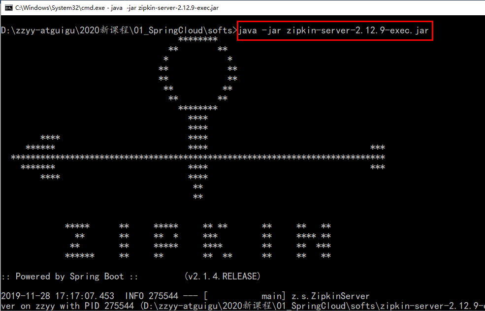
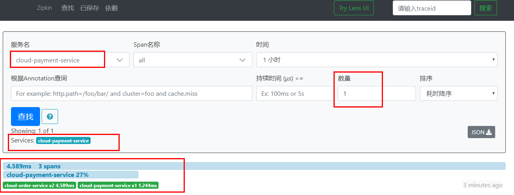
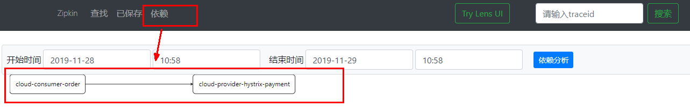
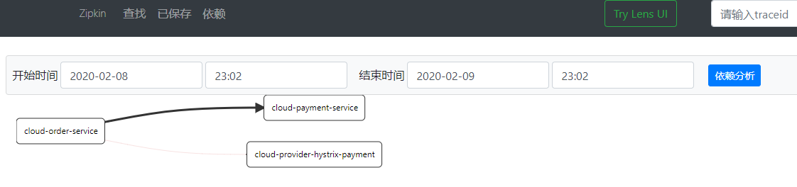

# Sleuth简介

在微服务框架中，一个由客户端发起的请求在后端系统中会经过多个不同的的服务节点调用来协同产生最后的请求结果，每一个前段请求都会形成一条复杂的分布式服务调用链路，链路中的任何一环出现高延时或错误都会引起整个请求最后的失败。

Spring Cloud Sleuth提供了一套完整的服务跟踪的解决方案，在分布式系统中提供追踪解决方案并且兼容支持了zipkin。

 

# 链路监控构建步骤

## 1、运行ZipkinServer

### 方案一

使用docker运行Zipkin

```shell
docker pull openzipkin/zipkin
docker run -d -p 9411:9411 openzipkin/zipkin
```

### 方案二

[ 下载Zipkin ](https://dl.bintray.com/openzipkin/maven/io/zipkin/java/zipkin-server/)

运行jar。

 

访问控制台 http://localhost:9411/zipkin/

## 2、引入POM

服务调用方与被调用方均需引入Zipkin相关依赖

```xml
<!--包含了sleuth+zipkin-->
<dependency>
    <groupId>org.springframework.cloud</groupId>
    <artifactId>spring-cloud-starter-zipkin</artifactId>
</dependency>
```

## 3、修改YML

服务调用方与被调用方均需添加Zipkin相关配置

```yml
spring:
  application:
    name: cloud-payment-service
  zipkin:
    base-url: http://localhost:9411
  sleuth:
    sampler:
      #采样率值介于 0 到 1 之间，1 则表示全部采集
     probability: 1
```

## 4、业务类

普通业务类即可，无需添加额外注解

主启动类也无需添加额外注解

## 测试

启动Eurake、服务生产者、服务消费者。

多次调用。

打开浏览器访问：http://localhost:9411

出现以下界面：

 

查看详情：

 

查看依赖关系：

 

  

# 扩展

## 相关术语

完整的调用链路：

- 表示一条请求链路，一条链路通过Trace Id唯一标识，Span标识发起的请求信息，各span通过parent id 关联起来。

Trace：类似于树结构的Span集合，表示一条调用链路，存在唯一标识。

Span：表示调用链路来源，通俗的理解Span就是一次请求信息。

 

 

 


