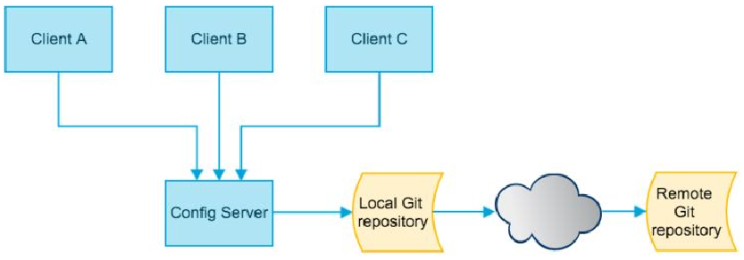
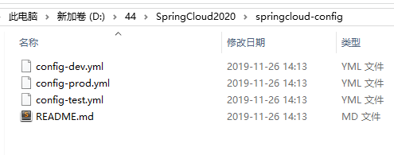
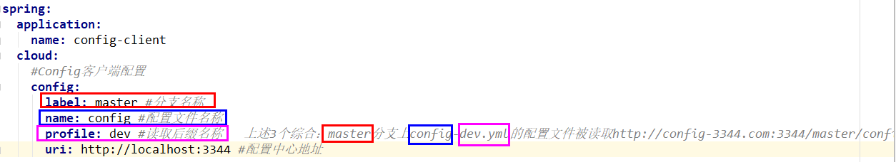
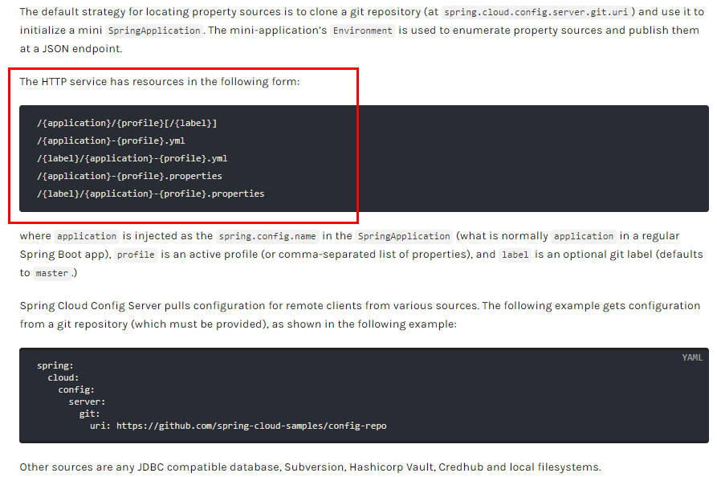
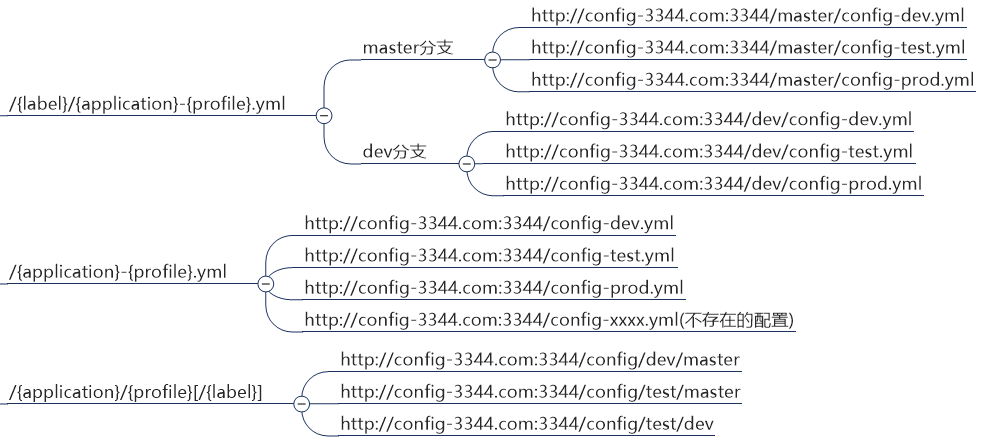

# Config 简介

出现的问题：微服务意味着要将单体应用中的业务拆分成一个个子服务，每个服务的粒度相对较小，因此系统中会出现大量的服务，由于每个服务都需要必要的配置信息才能运行，所以一套集中式的、动态的配置管理设施是必不可少的

解决办法：SpringCloud 提供了 **ConfigServer** 来解决这个问题，每一个微服务自带着一个 application.yml，上百个配置文件的管理



SpringCloud Config 为微服务架构中的微服务提供**集中化的外部配置支持**，配置服务器为各个不同微服务应用的所有环境提供了**一个中心化的外部配置**

SpringCloud Config 分为**服务端**和**客户端**两部分：

- 服务端：分布式配置中心，一个独立的微服务应用，用来连接配置服务器并为客户端提供获取配置信息，加密/解密信息等访问接口
- 客户端：通过指定的配置中心来管理应用资源，以及与业务相关的配置内容，并在启动的时候从配置中心获取和加载配置信息配置服务器默认采用 git 来存储配置信息，这样就有助于对环境配置进行版本管理，并且可以通过 git 客户端工具来方便的管理和访问配置内容

总体作用：

- 集中管理配置文件
- 不同环境不同配置，动态化的配置更新，分环境部署比如 dev/test/prod/beta/release
- 运行期间动态调整配置，不再需要在每个服务部署的机器上编写配置文件，服务会向配置中心统一拉取配置自己的信息
- 当配置发生变动时，服务不需要重启即可感知到配置的变化并应用新的配置
- 将配置信息以 REST 接口的形式暴露，post、curl 访问刷新均可


# 服务端配置与测试

## 1、新建 Git 仓库并克隆

用自己的账号在 GitHub 上新建一个名为 xxx-config 的新 Repository

获取到 Git 的地址 git@github.com:xxx/xxx-configxxxx.git

克隆到本地磁盘上

 

不同的后缀表示多个环境的配置文件，保存格式必须为 UTF-8


## 2、新建 Cloud 的配置中心模块

Cloud 的配置中心模块 cloudConfig Center

### 1、引入 POM

```xml
 
<?xml version="1.0" encoding="UTF-8"?>
<project xmlns="http://maven.apache.org/POM/4.0.0"
         xmlns:xsi="http://www.w3.org/2001/XMLSchema-instance"
         xsi:schemaLocation="http://maven.apache.org/POM/4.0.0 http://maven.apache.org/xsd/maven-4.0.0.xsd">
    <parent>
        <artifactId>mscloud</artifactId>
        <groupId>com.atguigu.springcloud</groupId>
        <version>1.0-SNAPSHOT</version>
    </parent>
    <modelVersion>4.0.0</modelVersion>

    <artifactId>cloud-config-center-3344</artifactId>

    <dependencies>
        <dependency>
            <groupId>org.springframework.cloud</groupId>
            <artifactId>spring-cloud-config-server</artifactId>
        </dependency>
        <dependency>
            <groupId>org.springframework.cloud</groupId>
            <artifactId>spring-cloud-starter-netflix-eureka-client</artifactId>
        </dependency>
        <dependency>
            <groupId>org.springframework.boot</groupId>
            <artifactId>spring-boot-starter-web</artifactId>
        </dependency>

        <dependency>
            <groupId>org.springframework.boot</groupId>
            <artifactId>spring-boot-starter-actuator</artifactId>
        </dependency>
        <dependency>
            <groupId>org.springframework.boot</groupId>
            <artifactId>spring-boot-devtools</artifactId>
            <scope>runtime</scope>
            <optional>true</optional>
        </dependency>
        <dependency>
            <groupId>org.projectlombok</groupId>
            <artifactId>lombok</artifactId>
            <optional>true</optional>
        </dependency>
        <dependency>
            <groupId>org.springframework.boot</groupId>
            <artifactId>spring-boot-starter-test</artifactId>
            <scope>test</scope>
        </dependency>
    </dependencies>
</project>
```


### 2、修改 YML

```yml
server:
  port: 3344

spring:
  application:
    name:  cloud-config-center # 注册进 Eureka 服务器的微服务名
  cloud:
    config:
      server:
        git:
          uri: git@github.com:zzyybs/springcloud-config.git # GitHub 上面的 git 仓库名字
        #### 搜索目录
          search-paths:
            - springcloud-config
      #### 读取分支
      label: master

# 服务注册到 eureka 地址
eureka:
  client:
    service-url:
      defaultZone: http://localhost:7001/eureka
```


### 3、添加新注解

@EnableConfigServer

```java
@SpringBootApplication
@EnableConfigServer
public class ConfigCenterMain3344{
    public static void main(String[] args) {
            SpringApplication.run(ConfigCenterMain3344.class, args);
    }
}
```


## 3、修改 hosts 文件

windows 下修改 hosts 文件，增加映射

127.0.0.1  config-3344.com


## 4、测试

测试通过 Config 微服务是否可以从 GitHub 上获取配置内容

启动微服务 3344

http://config-3344.com:3344/master/config-dev.yml


# 客户端配置与测试

## 1、新建客户端模块

新建cloud-config-client-3355


## 2、引入 POM

```xml
 
<?xml version="1.0" encoding="UTF-8"?>
<project xmlns="http://maven.apache.org/POM/4.0.0"
         xmlns:xsi="http://www.w3.org/2001/XMLSchema-instance"
         xsi:schemaLocation="http://maven.apache.org/POM/4.0.0 http://maven.apache.org/xsd/maven-4.0.0.xsd">
    <parent>
        <artifactId>mscloud</artifactId>
        <groupId>com.atguigu.springcloud</groupId>
        <version>1.0-SNAPSHOT</version>
    </parent>
    <modelVersion>4.0.0</modelVersion>

    <artifactId>cloud-config-client-3355</artifactId>

    <dependencies>
        <dependency>
            <groupId>org.springframework.cloud</groupId>
            <artifactId>spring-cloud-starter-config</artifactId>
        </dependency>
        <dependency>
            <groupId>org.springframework.cloud</groupId>
            <artifactId>spring-cloud-starter-netflix-eureka-client</artifactId>
        </dependency>
        <dependency>
            <groupId>org.springframework.boot</groupId>
            <artifactId>spring-boot-starter-web</artifactId>
        </dependency>
        <dependency>
            <groupId>org.springframework.boot</groupId>
            <artifactId>spring-boot-starter-actuator</artifactId>
        </dependency>

        <dependency>
            <groupId>org.springframework.boot</groupId>
            <artifactId>spring-boot-devtools</artifactId>
            <scope>runtime</scope>
            <optional>true</optional>
        </dependency>
        <dependency>
            <groupId>org.projectlombok</groupId>
            <artifactId>lombok</artifactId>
            <optional>true</optional>
        </dependency>
        <dependency>
            <groupId>org.springframework.boot</groupId>
            <artifactId>spring-boot-starter-test</artifactId>
            <scope>test</scope>
        </dependency>
    </dependencies>

</project>
 
```


## 3、配置 Bootstarp.yml

```yml
server:
  port: 3355

spring:
  application:
    name: config-client
  cloud:
    #Config 客户端配置
    config:
      label: master # 分支名称
      name: config # 配置文件名称
      profile: dev # 读取后缀名称   
# 上述 3 个综合：master 分支上 config-dev.yml 的配置文件被读取 http://config-3344.com:3344/master/config-dev.yml
      uri: http://localhost:3344 # 配置中心地址

# 服务注册到 eureka 地址
eureka:
  client:
    service-url:
      defaultZone: http://localhost:7001/eureka
```

 

修改 config-dev.yml 配置并提交到 GitHub 中，比如加个变量 age 或者版本号 version


## 4、业务类

```java
@RestController
public class ConfigClientController{
    @Value("${config.info}")
    private String configInfo;

    @GetMapping("/configInfo")
    public String getConfigInfo(){
        return configInfo;
    }
}
```


## 5、测试

启动 Config 配置中心 3344 微服务并自测

http://config-3344.com:3344/master/config-prod.yml

启动 3355 作为 Client 准备访问

http://localhost:3355/configInfo


## 6、问题

修改 GitHub 上的配置文件内容做调整，刷新 3344，ConfigServer 配置中心立刻响应

刷新 3355，ConfigClient 客户端没有任何响应


# 客户端动态刷新

## 1、修改客户端模块

### 1、引入 POM

```xml
 <dependency>
    <groupId>org.springframework.boot</groupId>
    <artifactId>spring-boot-starter-actuator</artifactId>
</dependency>
```


### 2、修改 YML

暴露端口

```yml
server:
  port: 3355

spring:
  application:
    name: config-client
  cloud:
    # Config 客户端配置
    config:
      label: master # 分支名称
      name: config # 配置文件名称
      profile: dev # 读取后缀名称   上述 3 个综合：master 分支上 config-dev.yml 的配置文件被读取
      uri: http://localhost:3344 # 配置中心地址

# 服务注册到 eureka 地址
eureka:
  client:
    service-url:
      defaultZone: http://localhost:7001/eureka
# 暴露监控端点
management:
  endpoints:
    web:
      exposure:
        include: "*"
```


### 3、客户端添加新注解

在控制嘞上添加 @RefreshScope

```java
@RestController
@RefreshScope
public class ConfigClientController{
    @Value("${config.info}")
    private String configInfo;

    @GetMapping("/configInfo")
    public String getConfigInfo() {
        return configInfo;
    }
}
```


### 4、客户端发送刷新请求

curl -X POST "http://localhost:3355/actuator/refresh"


# 扩展

## 1、BootStrap.yml

applicaiton.yml 是用户级的资源配置项

bootstrap.yml 是系统级的，优先级更加高

Spring Cloud 会创建一个“Bootstrap Context”，作为 Spring 应用的`Application Context`的父上下文

初始化的时候，`Bootstrap Context`负责从外部源加载配置属性并解析配置，这两个上下文共享一个从外部获取的`Environment`

`Bootstrap`属性有高优先级，默认情况下，它们不会被本地配置覆盖， `Bootstrap context`和`Application Context`有着不同的约定，所以新增了一个`bootstrap.yml`文件，保证`Bootstrap Context`和`Application Context`配置的分离


## 2、读取规则



```text

/{name}-{profiles}.yml

/{label}-{name}-{profiles}.yml
 
label：分支(branch)
name ：服务名
profiles：环境(dev/test/prod)
```



 


