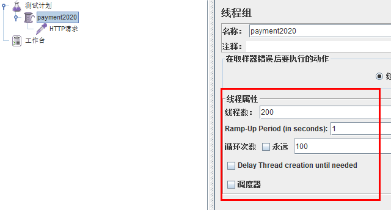
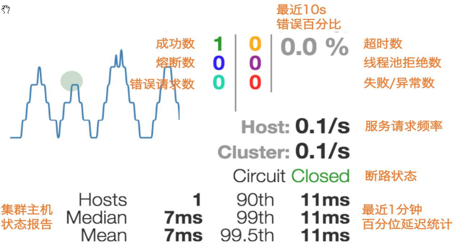

# 1、Hystrix 简介

## 1、问题

复杂分布式体系结构中的应用程序有数十个依赖关系，每个依赖关系在某些时候将不可避免地失败

Hystrix 是一个用于处理分布式系统的延迟和容错的开源库，在分布式系统里，许多依赖不可避免的会调用失败，比如超时、异常等

Hystrix 能够保证在一个依赖出问题的情况下，不会导致整体服务失败，避免级联故障，以提高分布式系统的弹性

断路器本身是一种开关装置，当某个服务单元发生故障之后，通过断路器的故障监控（类似熔断保险丝），向调用方返回一个符合预期的、可处理的备选响应（**FallBack**），而不是长时间的等待或者抛出调用方无法处理的异常，这样就保证了服务调用方的线程不会被长时间、不必要地占用，从而避免了故障在分布式系统中的蔓延，乃至雪崩


## 2、作用

服务熔断、服务降级、服务限流、实时的监控


# 2、服务熔断

## 1、简介

熔断机制是应对雪崩效应的一种微服务链路保护机制

当扇出链路的某个微服务不可用或者响应时间太长时，会进行服务的降级，进而熔断该节点微服务的调用，快速返回响应信息，当检测到该节点微服务调用响应正常后恢复调用链路

在 SpringCloud 框架里熔断机制通过 Hystrix 实现，Hystrix 会监控微服务间调用的状况，当**失败调用**到一定阈值，缺省是 5 秒内 20 次调用失败就会启动熔断机制

熔断机制的注解是 **@HystrixCommand**


## 2、构建步骤

参考 microservicecloud-provider-dept-8001 新建 microservicecloud-provider-dept-hystrix-8001


### 1、引入 POM 依赖

POM 文件引入 spring-cloud-starter-hystrix 依赖

```xml
 
<project xmlns="http://maven.apache.org/POM/4.0.0" xmlns:xsi="http://www.w3.org/2001/XMLSchema-instance"
  xsi:schemaLocation="http://maven.apache.org/POM/4.0.0 http://maven.apache.org/xsd/maven-4.0.0.xsd">
  <modelVersion>4.0.0</modelVersion>
 
  <parent>
   <groupId>com.xxx.springcloud</groupId>
   <artifactId>microservicecloud</artifactId>
   <version>0.0.1-SNAPSHOT</version>
  </parent>
 
  <artifactId>microservicecloud-provider-dept-hystrix-8001</artifactId>
 
 
  <dependencies>
   <!--  hystrix -->
   <dependency>
     <groupId>org.springframework.cloud</groupId>
     <artifactId>spring-cloud-starter-hystrix</artifactId>
   </dependency>
      新版
      <!-- hystrix -->
      <dependency>
          <groupId>org.springframework.cloud</groupId>
          <artifactId>spring-cloud-starter-netflix-hystrix</artifactId>
      </dependency>
   <!-- 引入自己定义的 api 通用包，可以使用 Dept 部门 Entity -->
   <dependency>
     <groupId>com.xxx.springcloud</groupId>
     <artifactId>microservicecloud-api</artifactId>
     <version>${project.version}</version>
   </dependency>
   <!-- 将微服务 provider 侧注册进 eureka -->
   <dependency>
     <groupId>org.springframework.cloud</groupId>
     <artifactId>spring-cloud-starter-eureka</artifactId>
   </dependency>
   <dependency>
     <groupId>org.springframework.cloud</groupId>
     <artifactId>spring-cloud-starter-config</artifactId>
   </dependency>
   <!-- actuator 监控信息完善 -->
   <dependency>
     <groupId>org.springframework.boot</groupId>
     <artifactId>spring-boot-starter-actuator</artifactId>
   </dependency>
   <dependency>
     <groupId>junit</groupId>
     <artifactId>junit</artifactId>
   </dependency>
   <dependency>
     <groupId>mysql</groupId>
     <artifactId>mysql-connector-java</artifactId>
   </dependency>
   <dependency>
     <groupId>com.alibaba</groupId>
     <artifactId>druid</artifactId>
   </dependency>
   <dependency>
     <groupId>ch.qos.logback</groupId>
     <artifactId>logback-core</artifactId>
   </dependency>
   <dependency>
     <groupId>org.mybatis.spring.boot</groupId>
     <artifactId>mybatis-spring-boot-starter</artifactId>
   </dependency>
   <dependency>
     <groupId>org.springframework.boot</groupId>
     <artifactId>spring-boot-starter-jetty</artifactId>
   </dependency>
   <dependency>
     <groupId>org.springframework.boot</groupId>
     <artifactId>spring-boot-starter-web</artifactId>
   </dependency>
   <dependency>
     <groupId>org.springframework.boot</groupId>
     <artifactId>spring-boot-starter-test</artifactId>
   </dependency>
   <!-- 修改后立即生效，热部署 -->
   <dependency>
     <groupId>org.springframework</groupId>
     <artifactId>springloaded</artifactId>
   </dependency>
   <dependency>
     <groupId>org.springframework.boot</groupId>
     <artifactId>spring-boot-devtools</artifactId>
   </dependency>
  </dependencies>
 
</project>
 
```


### 2、修改 YML

yml 文件，修改 instance-id 名称

```yml
server:
  port: 8001
  
mybatis:
  config-location: classpath:mybatis/mybatis.cfg.xml  # mybatis 所在路径
  type-aliases-package: com.xxx.springcloud.entities # entity 别名类
  mapper-locations:
  - classpath:mybatis/mapper/**/*.xml # mapper 映射文件
    
spring:
   application:
    name: microservicecloud-dept 
   datasource:
    type: com.alibaba.druid.pool.DruidDataSource
    driver-class-name: org.gjt.mm.mysql.Driver
    url: jdbc:mysql://localhost:3306/cloudDB01
    username: root
    password: 123456
    dbcp2:
      min-idle: 5
      initial-size: 5
      max-total: 5
      max-wait-millis: 200
      
eureka:
  client: # 客户端注册进 eureka 服务列表内
    service-url: 
      defaultZone: http://eureka7001.com:7001/eureka/,http://eureka7002.com:7002/eureka/,http://eureka7003.com:7003/eureka/
  instance:
    instance-id: microservicecloud-dept8001-hystrix   # 自定义服务名称信息
    prefer-ip-address: true     # 访问路径可以显示 IP 地址
      
info:
  app.name: xxx-microservicecloud
  company.name: www.xxx.com
  build.artifactId: $project.artifactId$
  build.version: $project.version$
```


### 3、添加新注解

修改被调用方 Controller 层，**给方法添加 @HystrixCommand **报异常后处理

一旦调用服务方法失败并抛出了错误信息后，会自动调用 @HystrixCommand 标注好的 fallbackMethod 调用类中的**指定方法** 

```java
@RestController
public class DeptController{
  @Autowired
  private DeptService service = null;
  
  @RequestMapping(value="/dept/get/{id}",method=RequestMethod.GET)
  @HystrixCommand(fallbackMethod = "processHystrix_Get") // 指定容错方法
  public Dept get(@PathVariable("id") Long id){
   	Dept dept =  this.service.get(id);
   	if(null == dept){
     	throw new RuntimeException("该ID："+id+"没有没有对应的信息");
   	}
   	return dept;
  }
  
  // 容错处理
  public Dept processHystrix_Get(@PathVariable("id") Long id){
   	return new Dept().setDeptno(id)
           			 .setDname("该ID："+id+"没有没有对应的信息,null--@HystrixCommand")
           			 .setDb_source("no this database in MySQL");
  }
    
}

// 更详细版
@HystrixCommand(fallbackMethod = "paymentInfo_TimeOutHandler",
                commandProperties = {
			@HystrixProperty(name="execution.isolation.thread.timeoutInMilliseconds",value="3000")
                })
public String paymentInfo_TimeOut(Integer id) {
    int second = 5;
    try { TimeUnit.SECONDS.sleep(second); } catch (InterruptedException e) { e.printStackTrace(); }
    return "线程池:"+Thread.currentThread().getName()
        	+"paymentInfo_TimeOut,id: "+id
        	+"\t"+"O(∩_∩)O，耗费秒: "+second;
}

public String paymentInfo_TimeOutHandler(Integer id) {
    return "/(ㄒoㄒ)/调用支付接口超时或异常：\t"+ "\t当前线程池名字" + Thread.currentThread().getName();
}

```

修改被调用方主启动类 DeptProvider8001_Hystrix_App 并**添加新注解 @EnableCircuitBreaker **

```java
@SpringBootApplication
@EnableEurekaClient // 本服务启动后会自动注册进 eureka 服务中
@EnableCircuitBreaker// 对 hystrix 熔断机制的支持
public class DeptProvider8001_Hystrix_App {
  public static void main(String[] args) {
   SpringApplication.run(DeptProvider8001_Hystrix_App.class, args);
  }
}
```

调用方保护自身，主启动类添加**注解 @EnableHystrix**

```java
@SpringBootApplication
@EnableFeignClients
@EnableHystrix
public class OrderHystrixMain80{
    public static void main(String[] args) {
        SpringApplication.run(OrderHystrixMain80.class,args);
    }
}
```

业务类添加相应注解以及方法

```java
@GetMapping("/consumer/payment/hystrix/timeout/{id}")
@HystrixCommand(fallbackMethod = "paymentTimeOutFallbackMethod",commandProperties = {
        @HystrixProperty(name="execution.isolation.thread.timeoutInMilliseconds",value="1500")
})
public String paymentInfo_TimeOut(@PathVariable("id") Integer id){
    String result = paymentHystrixService.paymentInfo_TimeOut(id);
    return result;
}

public String paymentTimeOutFallbackMethod(@PathVariable("id") Integer id){
    return "我是消费者80,对方支付系统繁忙请10秒钟后再试或者自己运行出错请检查自己,o(╥﹏╥)o";
}
```

yml 修改

```yml
feign:
  hystrix:
    enabled: true
```


### 4、测试

3 个 eureka 先启动

主启动类 DeptProvider8001_Hystrix_App

Consumer  启动microservicecloud-consumer-dept-80

开启 JMeter 并发测试




## 3、错误兜底方法过多

使用 @DefaultProperties(defaultFallback = "")，设置默认回调方法

 

除了个别重要核心业务有专属，其它普通的可以通过 @DefaultProperties(defaultFallback = "")  统一跳转到统一处理结果页面


# 3、服务降级

## 1、简介

整体资源快不够了，忍痛将某些服务先关掉，待渡过难关，再开启回来

服务降级处理是在**客户端实现**完成的，与服务端没有关系


## 2、构建步骤

修改 microservicecloud-api 工程

根据已经有的 DeptClientService 接口新建一个实现了 FallbackFactory 接口的类 DeptClientServiceFallbackFactory，记得加入到容器中

```java
@Component // 不要忘记添加，不要忘记添加
public class DeptClientServiceFallbackFactory implements FallbackFactory<DeptClientService> {
  @Override
  public DeptClientService create(Throwable throwable) {
   return new DeptClientService() {
     @Override
     public Dept get(long id) {
       return new Dept().setDeptno(id)
               .setDname("该ID："+id+"没有没有对应的信息,Consumer客户端提供的降级信息,此刻服务Provider已经关闭")
               .setDb_source("no this database in MySQL");
     }
 
     @Override
     public List<Dept> list() {
       return null;
     }
 
     @Override
     public boolean add(Dept dept) {
       return false;
     }
   };
  }
}
```

修改 microservicecloud-api 工程，DeptClientService 接口在注解 @FeignClient 中添加 fallbackFactory 属性值

```java
@FeignClient(value = "MICROSERVICECLOUD-DEPT",fallbackFactory=DeptClientServiceFallbackFactory.class)
public interface DeptClientService {
  @RequestMapping(value = "/dept/get/{id}",method = RequestMethod.GET)
  public Dept get(@PathVariable("id") long id);
 
  @RequestMapping(value = "/dept/list",method = RequestMethod.GET)
  public List<Dept> list();
 
  @RequestMapping(value = "/dept/add",method = RequestMethod.POST)
  public boolean add(Dept dept);
}
```

microservicecloud-consumer-dept-feign 工程修改 YML

```yaml
server:
  port: 80
 # 开启hystrix
feign: 
  hystrix: 
    enabled: true
 
eureka:
  client:
    register-with-eureka: false
    service-url: 
      defaultZone: http://eureka7001.com:7001/eureka/,http://eureka7002.com:7002/eureka/,http://eureka7003.com:7003/eureka/  
```


## 3、测试

3 个 eureka 先启动

微服务 microservicecloud-provider-dept-8001 启动

microservicecloud-consumer-dept-feign 启动

故意关闭微服务 microservicecloud-provider-dept-8001

客户端自己调用提示


# 4、服务监控

## 1、简介

除了隔离依赖服务的调用以外，Hystrix 还提供了准实时的调用监控（**Hystrix Dashboard**），Hystrix 会持续地记录所有通过 Hystrix 发起的请求的执行信息，并以统计报表和图形的形式展示给用户，包括每秒执行多少请求多少成功，多少失败等

Netflix 通过 hystrix-metrics-event-stream 项目实现了对以上指标的监控

Spring Cloud 也提供了 Hystrix Dashboard 的整合，对监控内容转化成可视化界面


## 2、构建步骤

新建工程 microservicecloud-consumer-hystrix-dashboard


### 1、引入 POM

POM 文件，引入 hystrix 和 hystrix-dashboard 相关依赖

```xml
<project xmlns="http://maven.apache.org/POM/4.0.0" xmlns:xsi="http://www.w3.org/2001/XMLSchema-instance"
  xsi:schemaLocation="http://maven.apache.org/POM/4.0.0 http://maven.apache.org/xsd/maven-4.0.0.xsd">
  <modelVersion>4.0.0</modelVersion>
  
  <parent>
   <groupId>com.xxx.springcloud</groupId>
   <artifactId>microservicecloud</artifactId>
   <version>0.0.1-SNAPSHOT</version>
  </parent>
  
  <artifactId>microservicecloud-consumer-hystrix-dashboard</artifactId>
  
<dependencies>
   <!-- 自己定义的api -->
   <dependency>
     <groupId>com.xxx.springcloud</groupId>
     <artifactId>microservicecloud-api</artifactId>
     <version>${project.version}</version>
   </dependency>
   <dependency>
     <groupId>org.springframework.boot</groupId>
     <artifactId>spring-boot-starter-web</artifactId>
   </dependency>
   <!-- 修改后立即生效，热部署 -->
   <dependency>
     <groupId>org.springframework</groupId>
     <artifactId>springloaded</artifactId>
   </dependency>
   <dependency>
     <groupId>org.springframework.boot</groupId>
     <artifactId>spring-boot-devtools</artifactId>
   </dependency>
   <!-- Ribbon相关 -->
   <dependency>
     <groupId>org.springframework.cloud</groupId>
     <artifactId>spring-cloud-starter-eureka</artifactId>
   </dependency>
   <dependency>
     <groupId>org.springframework.cloud</groupId>
     <artifactId>spring-cloud-starter-ribbon</artifactId>
   </dependency>
   <dependency>
     <groupId>org.springframework.cloud</groupId>
     <artifactId>spring-cloud-starter-config</artifactId>
   </dependency>
   <!-- feign 相关 -->
   <dependency>
     <groupId>org.springframework.cloud</groupId>
     <artifactId>spring-cloud-starter-feign</artifactId>
   </dependency>
   <!-- hystrix 和 hystrix-dashboard 相关-->
   <dependency>
       <groupId>org.springframework.cloud</groupId>
       <artifactId>spring-cloud-starter-hystrix</artifactId>
   </dependency>
    旧版
   <dependency>
       <groupId>org.springframework.cloud</groupId>
       <artifactId>spring-cloud-starter-hystrix-dashboard</artifactId>
   </dependency> 
    新版
    <dependency>
        <groupId>org.springframework.cloud</groupId>
        <artifactId>spring-cloud-starter-netflix-hystrix-dashboard</artifactId>
    </dependency>
  </dependencies>
</project>
```


### 2、修改 YML

yml 文件

```yml
server:
  port: 9001
```


### 3、添加新注解

主启动类改名+  新注解 @EnableHystrixDashboard

```java
package Core;

import org.springframework.boot.SpringApplication;
import org.springframework.boot.autoconfigure.SpringBootApplication;
import org.springframework.cloud.netflix.hystrix.dashboard.EnableHystrixDashboard;

@SpringBootApplication
@EnableHystrixDashboard
public class Consumer_Dept_Hystrix_Dashboard {
    public static void main(String[] args) {
        SpringApplication.run(Consumer_Dept_Hystrix_Dashboard.class, args);
    }
}

```

所有 Provider 微服务提供类(8001/8002/8003)都需要监控依赖配置

 ```xml
    <!-- actuator监控信息完善 -->
    <dependency>
      <groupId>org.springframework.boot</groupId>
      <artifactId>spring-boot-starter-actuator</artifactId>
    </dependency>
 
 ```


## 3、新版本修改

新版本 Hystrix 需要在主启动类 MainAppHystrix8001 中指定监控路径

```java
@SpringBootApplication
@EnableEurekaClient // 本服务启动后会自动注册进 eureka 服务中
@EnableCircuitBreaker //对 hystrix 熔断机制的支持
public class MainAppHystrix8001 {
    public static void main(String[] args) {
        SpringApplication.run(MainAppHystrix8001.class,args);
    }

/**
 * 此配置是为了服务监控而配置，与服务容错本身无关，springcloud 升级后的坑
 * ServletRegistrationBean 因为 springboot 的默认路径不是 "/hystrix.stream"，
 * 只要在自己的项目里配置上下面的 servlet 就可以了
 */
    @Bean
    public ServletRegistrationBean getServlet() {
        HystrixMetricsStreamServlet streamServlet = new HystrixMetricsStreamServlet();
        ServletRegistrationBean registrationBean = new ServletRegistrationBean(streamServlet);
        registrationBean.setLoadOnStartup(1);
        registrationBean.addUrlMappings("/hystrix.stream");
        registrationBean.setName("HystrixMetricsStreamServlet");
        return registrationBean;
    }

}
```


## 4、测试

启动 3 个 eureka 集群

启动 microservicecloud-consumer-hystrix-dashboard 该微服务监控消费端

http://localhost:9001/hystrix

启动 microservicecloud-provider-dept-hystrix-8001

http://localhost:8001/hystrix.stream




# 扩展

## 1、服务雪崩


多个微服务之间调用的时候，假设微服务 A 调用微服务 B 和微服务 C，微服务 B 和微服务 C 又调用其它的微服务，这就是所谓的“**扇出**”

如果扇出的链路上某个微服务的调用响应时间过长或者不可用，对微服务 A 的调用就会占用越来越多的系统资源，进而引起系统崩溃，所谓的“雪崩效应”

对于高流量的应用来说，单一的后端依赖可能会导致所有服务器上的所有资源都在几秒钟内饱和，比失败更糟糕的是，这些应用程序还可能导致服务之间的延迟增加，备份队列，线程和其他系统资源紧张，导致整个系统发生更多的级联故障

这些都表示需要对故障和延迟进行隔离和管理，以便单个依赖关系的失败，不能取消整个应用程序或系统


## 2、@EnableHystrix 与 @EnableCircuitBreaker

@EnableHystrix 它继承了 @EnableCircuitBreaker，并进行了再封装

因此这两个注解都是激活 hystrix 的功能，只需要在服务启动类加入 @EnableHystrix 注解即可，无须增加 @EnableCircuitBreaker 注解，本身 @EnableHystrix 注解已经涵盖了 @EnableCircuitBreaker 的功能


## 3、Hystrix 工作流程

 

1. 创建 HystrixCommand（用在依赖的服务返回单个操作结果的时候） 或 HystrixObserableCommand（用在依赖的服务返回多个操作结果的时候） 对象
2. 命令执行：
   1. 其中 HystrixComand 实现了下面俩种方式：
      - execute()：同步执行，从依赖的服务返回一个单一的结果对象， 或是在发生错误的时候抛出异常
      - queue()：异步执行， 直接返回一个 Future 对象， 其中包含了服务执行结束时要返回的单一结果对象
   2. 而 HystrixObservableCommand 实现了：
      - observe()：返回 Observable 对象，它代表了操作的多个结果，它是一个 Hot Obserable（不论 "事件源" 是否有 "订阅者"，都会在创建后对事件进行发布，所以对于 Hot Observable 的每一个 "订阅者" 都有可能是从 "事件源" 的中途开始的，并可能只是看到了整个操作的局部过程）
      - toObservable()： 同样会返回 Observable 对象，也代表了操作的多个结果，但它返回的是一个Cold Observable（没有 "订阅者" 的时候并不会发布事件，而是进行等待，直到有 "订阅者" 之后才发布事件，所以对于 Cold Observable 的订阅者，它可以保证从一开始看到整个操作的全部过程）
3. 若当前命令的请求缓存功能是被启用的， 并且该命令缓存命中， 那么缓存的结果会立即以 Observable 对象的形式返回
4. 检查断路器是否为打开状态。如果断路器是打开的，那么 Hystrix 不会执行命令，而是转接到 fallback 处理逻辑（第 8 步）；如果断路器是关闭的，检查是否有可用资源来执行命令（第 5 步）
5. 线程池/请求队列/信号量是否占满，如果命令依赖服务的专有线程池和请求队列，或者信号量（不使用线程池的时候）已经被占满， 那么 Hystrix 也不会执行命令， 而是转接到 fallback 处理逻辑（第8步）
6. Hystrix 会根据自定义的方法来决定采取什么样的方式去请求依赖服务
   - HystrixCommand.run() ：返回一个单一的结果，或者抛出异常
   - HystrixObservableCommand.construct()： 返回一个 Observable 对象来发射多个结果，或通过 onError 发送错误通知

7. Hystrix 会将 "成功"、"失败"、"拒绝"、"超时" 等信息报告给断路器， 而断路器会维护一组计数器来统计这些数据，断路器会使用这些统计数据来决定是否要将断路器打开，来对某个依赖服务的请求进行 "熔断/短路"
8. 当命令执行失败的时候， Hystrix 会进入 fallback 尝试回退处理， 通常也称该操作为 "服务降级"，而能够引起服务降级处理的情况有下面几种：
   - 第4步： 当前命令处于"熔断/短路"状态，断路器是打开的时候
   - 第5步： 当前命令的线程池、 请求队列或 者信号量被占满的时候
   - 第6步：HystrixObservableCommand.construct() 或 HystrixCommand.run() 抛出异常的时候

9. 当 Hystrix 命令执行成功之后， 它会将处理结果直接返回或是以 Observable 的形式返回
10. tips：如果没有为命令实现降级逻辑或者在降级处理逻辑中抛出了异常， Hystrix 依然会返回一个 Observable 对象， 但是它不会发射任何结果数据， 而是通过 onError 方法通知命令立即中断请求，并通过 onError() 方法将引起命令失败的异常发送给调用者

