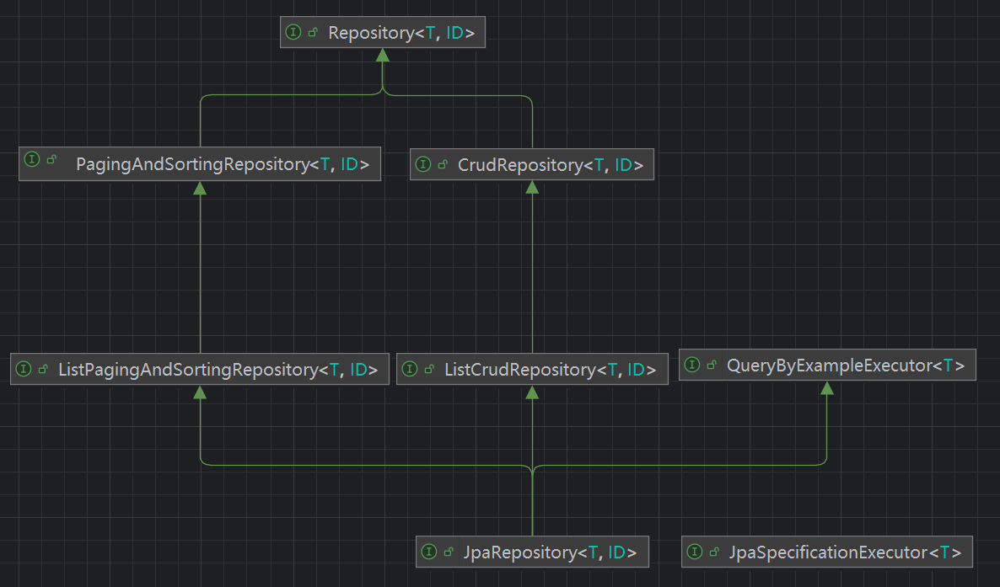

# 简介

JPA 全称 Java Persistence API，即 Java 持久化 API，为 Java 开发人员提供了一种对象-关系映射工具来管理 Java 应用中的关系数据，需结合其他 ORM 的使用

# 数据准备

## 依赖引入

~~~groovy
dependencies {
	implementation 'org.springframework.boot:spring-boot-starter-data-jpa'
    // 解决 Lazy 加载时，序列化报错
	implementation 'com.fasterxml.jackson.datatype:jackson-datatype-hibernate5-jakarta' 
	compileOnly 'org.projectlombok:lombok'
	runtimeOnly 'com.mysql:mysql-connector-j'
}
~~~

## 配置文件

~~~yaml
spring:
  datasource:
    url: jdbc:mysql://192.168.154.128:3306/hxsign2
    username: root
    password: root
    driver-class-name: com.mysql.cj.jdbc.Driver
    hikari:
      maximum-pool-size: 10
      minimum-idle: 5
      idle-timeout: 30000
      max-lifetime: 60000
      connection-timeout: 30000

  jpa:
    hibernate:
      ddl-auto: update # 通过实体类自动更新数据库表，没有数据库表则新建
    database-platform: org.hibernate.dialect.MySQL8Dialect
    show-sql: true # 控制台输出 sql 语句
~~~

1. create：每次加载时，hibernate 都会删除上一次的生成的表，然后根据实体类重新生成新表，会导致数据丢失
2. create-drop：每次加载时，hibernate 根据实体类生成表，但是 sessionFactory 一关闭，表就自动删除，也即表仅在应用运行期间存在
3. update：最常用的属性，第一次加载时，hibernate 根据实体类自动建立表结构，后续 hibernate 根据实体类自动更新表结构，表结构改变不会影响数据存在，但要注意的是在应用第一次加载实体类时，表结构才会刷新
4. validate：每次加载hibernate时，验证创建数据库表结构，只会和数据库中的表进行比较，不会创建新表，但是会插入新值，如果表结构不匹配，会抛出异常

## 实体对象

~~~java
@Entity
@Table(schema = "hxsign2", name = "sign_record")
@Getter
@Setter
@ToString
@RequiredArgsConstructor
@EntityListeners(AuditingEntityListener.class)
public class SignRecord {
    @Id
    @GeneratedValue(strategy = GenerationType.IDENTITY)
    public Long id;

    public LocalTime punchTime;

    public LocalDate punchDate;

    public String punchStatus;

    @Column(columnDefinition = "boolean default false")
    public Boolean isDeleted = Boolean.FALSE;

    @LastModifiedDate
    @Column()
    public LocalDateTime updateTime;

    @CreatedDate
    @Column(updatable = false)
    public LocalDateTime createTime;

    @ManyToOne(fetch = FetchType.LAZY)
    @JoinTable(
            name = "sign_record_class_room",
            joinColumns = @JoinColumn(name = "sign_record_id"),
            inverseJoinColumns = @JoinColumn(name = "class_room_id"),
            uniqueConstraints = @UniqueConstraint(columnNames = {"sign_record_id", "class_room_id"})
    )
    @ToString.Exclude
    public ClassRoom classRoom;

    @ManyToOne(fetch = FetchType.LAZY)
    @JoinTable(
            name = "sign_record_lesson",
            joinColumns = @JoinColumn(name = "sign_record_id"),
            inverseJoinColumns = @JoinColumn(name = "lesson_id"),
            uniqueConstraints = @UniqueConstraint(columnNames = {"sign_record_id", "lesson_id"})
    )
    @ToString.Exclude
    public Lesson lesson;
    
    .......
}
~~~

~~~java
@Entity
@Table(schema = "hxsign2", name = "lesson")
@Getter
@Setter
@ToString
@RequiredArgsConstructor
@EntityListeners(AuditingEntityListener.class)
public class Lesson {
    @Id
    @GeneratedValue(strategy = GenerationType.IDENTITY)
    public Long id;

    @Column(nullable = false)
    public LocalTime startTime;

    @Column(nullable = false)
    public LocalTime endTime;

    @Column(nullable = false)
    public String title;

    @Column(columnDefinition = "boolean default false")
    public Boolean isDeleted = Boolean.FALSE;

    @LastModifiedDate
    @Column()
    public LocalDateTime updateTime;

    @CreatedDate
    @Column(updatable = false)
    public LocalDateTime createTime;

    @OneToMany(mappedBy = "lesson", fetch = FetchType.LAZY)
    @ToString.Exclude
    public Set<SignRecord> signRecords = new HashSet<>();
}
~~~

~~~java
@Entity
@Table(schema = "hxsign2", name = "class_room")
@Getter
@Setter
@ToString
@RequiredArgsConstructor
@EntityListeners(AuditingEntityListener.class)
public class ClassRoom {
    @Id
    @GeneratedValue(strategy = GenerationType.IDENTITY)
    public Long id;

    @Column(nullable = false)
    public Integer grade;

    @Column(nullable = false)
    public Integer clazz;

    @Column(nullable = false)
    public String address;

    @Column(columnDefinition = "boolean default false")
    public Boolean isDeleted;

    @LastModifiedDate
    @Column()
    public LocalDateTime updateTime;

    @CreatedDate
    @Column(updatable = false)
    public LocalDateTime createTime;

    @OneToMany(mappedBy = "classRoom", fetch = FetchType.LAZY)
    @ToString.Exclude
    public Set<SignRecord> signRecords = new HashSet<>();
}

~~~

## Repository

~~~java
public interface SignRecordDao extends JpaRepository<SignRecord, Integer> , JpaSpecificationExecutor<SignRecord> {
    @EntityGraph(attributePaths = {"classRoom", "lesson"})
    Optional<SignRecord> findById(Long id);

    boolean existsById(Long integer);

    @EntityGraph(attributePaths = {"classRoom", "lesson"})
    Page<SignRecord> findAll(@Nullable Specification<SignRecord> spec, Pageable pageable);

    @Query(value = "from SignRecord u where u.classRoom.grade = :#{#classRoom.grade} and u.classRoom.clazz = :#{#classRoom.clazz}")
    List<SignRecord> findByClassRoom(ClassRoom classRoom);

}
~~~

# 注解大全

| 注解                 | 参数和作用                                                   |
| -- |  |
| @Entity              | 无参数，作用是标记类为JPA实体                                |
| @Table               | name: 指定表名（默认为实体类名） schema: 指定表的模式 catalog: 指定表的目录 uniqueConstraints: 定义表中的唯一约束 indexes: 定义表中的索引 |
| @Id                  | 无参数，标识主键字段                                         |
| @GeneratedValue      | strategy: 主键生成策略（AUTO、IDENTITY、SEQUENCE、TABLE） generator: 自定义主键生成器的名称 |
| @Column              | name: 列名（默认为字段名） nullable: 是否允许为空 unique: 是否唯一 length: 列的最大长度（仅适用于字符串） precision: 精度（适用于小数） scale: 小数点后的位数 |
| @OneToOne            | mappedBy: 定义关系的维护端（由另一方管理） cascade: 定义级联操作类型（如PERSIST、MERGE等） fetch: 定义加载策略（EAGER或LAZY） optional: 是否允许关联对象为空 |
| @OneToMany           | mappedBy: 定义关系的维护端 cascade: 级联操作类型 fetch: 加载策略 orphanRemoval: 是否级联删除孤儿对象 |
| @ManyToOne           | cascade: 级联操作类型 fetch: 加载策略 optional: 是否允许为空 |
| @ManyToMany          | mappedBy: 定义关系的维护端 cascade: 级联操作类型 fetch: 加载策略 |
| @JoinColumn          | name: 外键列名（默认为<属性名>_<主键名>） referencedColumnName: 关联的主键列名 nullable: 是否允许为空 unique: 是否唯一 |
| @JoinTable           | name: 中间表名称 joinColumns: 定义当前实体的外键列 inverseJoinColumns: 定义关联实体的外键列 |
| @Embedded            | 无参数，标识字段为嵌入式对象                                 |
| @Embeddable          | 无参数，标记类为可嵌入对象                                   |
| @MappedSuperclass    | 无参数，标记类为映射超类                                     |
| @Transient           | 无参数，标记字段不参与映射到数据库表中                       |
| @Access              | value: 指定访问类型（FIELD或PROPERTY）                       |
| @NamedQuery          | name: 查询的唯一名称 query: JPQL查询语句                 |
| @NamedNativeQuery    | name: 查询的唯一名称 query: 原生SQL查询语句              |
| @Query               | value: JPQL或SQL查询语句 nativeQuery: 是否使用原生SQL（默认为false） |
| @Modifying           | clearAutomatically: 是否在执行修改操作后清理持久化上下文（默认为false） |
| @Version             | 无参数，标记字段为乐观锁的版本控制字段                       |
| @EntityListeners     | value: 一个或多个监听器类，用于处理实体生命周期事件          |
| @Inheritance         | strategy: 指定继承策略（SINGLE_TABLE、JOINED、TABLE_PER_CLASS） |
| @DiscriminatorColumn | name: 区分列名称 discriminatorType: 数据类型（STRING、CHAR、INTEGER） length: 列长度 |
| @DiscriminatorValue  | value: 区分列的值，标识子类                                  |
| @Convert             | converter: 指定自定义转换器类 disableConversion: 是否禁用转换（默认为false） |
| @Enumerated          | value: 枚举映射方式（ORDINAL或STRING）                       |
| @Lob                 | 无参数，标记字段为大对象                                     |
| @ElementCollection   | fetch: 加载策略（EAGER或LAZY） targetClass: 集合元素的目标类型（默认为属性泛型类型） |

## @Entity

- **无参数**：标记类为JPA实体

## @Table

- **name**：指定表名（默认为实体类名）
- **schema**：指定表所属的模式
- **catalog**：指定表所属的目录
- **uniqueConstraints**：定义表的唯一约束
- **indexes**：定义表的索引

## @Id

- **无参数**：标记字段为主键

## @GeneratedValue

- **strategy**：定义主键生成策略（如 AUTO、IDENTITY、SEQUENCE、TABLE）
- **generator**：自定义主键生成器的名称

## @Column

- **name**：指定列名（默认为字段名）
- **nullable**：是否允许为空（默认为true）
- **unique**：是否唯一
- **length**：字符串的最大长度
- **precision**：小数的总位数（适用于BigDecimal类型）
- **scale**：小数点后的位数

## @OneToOne

- **mappedBy**：定义关系的维护端
- **cascade**：级联操作类型（如 PERSIST、MERGE 等）
- **fetch**：定义加载策略（EAGER 或 LAZY）
- **optional**：是否允许为空

## @OneToMany

- **mappedBy**：定义关系的维护端
- **cascade**：级联操作类型
- **fetch**：加载策略
- **orphanRemoval**：是否级联删除孤儿对象

## @ManyToOne

- **cascade**：级联操作类型
- **fetch**：加载策略
- **optional**：是否允许为空

## @ManyToMany

- **mappedBy**：定义关系的维护端
- **cascade**：级联操作类型
- **fetch**：加载策略

## @JoinColumn

- **name**：外键列名（默认为`<属性名>_<主键名>`）
- **referencedColumnName**：关联主键列的列名
- **nullable**：是否允许为空
- **unique**：是否唯一

## @JoinTable

- **name**：中间表的名称
- **joinColumns**：定义当前实体的外键列
- **inverseJoinColumns**：定义关联实体的外键列

## @Embedded

- **无参数**：表示嵌入一个对象

## @Embeddable

- **无参数**：标记类为可嵌入对象

## @MappedSuperclass

- **无参数**：标记类为映射超类

## @Transient

- **无参数**：标记字段不参与数据库映射

## @Access

- **value**：指定访问类型（FIELD 或 PROPERTY）

## @NamedQuery

- **name**：查询的唯一名称
- **query**：JPQL 查询语句

## @NamedNativeQuery

- **name**：查询的唯一名称
- **query**：原生 SQL 查询语句

## @Query

- **value**：JPQL 或 SQL 查询语句
- **nativeQuery**：是否为原生 SQL 查询（默认为 false）

## @Modifying

- **clearAutomatically**：是否在修改操作后清理持久化上下文（默认为 false）

## @Version

- **无参数**：标记字段为乐观锁的版本控制字段

## @EntityListeners

- **value**：一个或多个监听器类，用于处理实体生命周期事件

## @Inheritance

- **strategy**：指定继承策略（如 SINGLE_TABLE、JOINED、TABLE_PER_CLASS）

## @DiscriminatorColumn

- **name**：区分列名称
- **discriminatorType**：区分列的类型（如 STRING、CHAR、INTEGER）
- **length**：区分列的长度

## @DiscriminatorValue

- **value**：定义区分列的值，用于标识子类

## @Convert

- **converter**：指定自定义转换器类
- **disableConversion**：是否禁用转换（默认为 false）

## @Enumerated

- **value**：枚举类型的映射方式（ORDINAL 或 STRING）

## @Lob

- **无参数**：标记字段为大对象（如 BLOB 或 CLOB）

## @ElementCollection

- **fetch**：加载策略（EAGER 或 LAZY）
- **targetClass**：集合元素的目标类型（默认为属性的泛型类型）

## @NoRepositoryBean

用于标记一个接口不应该被作为一个 Spring Data Repository 实例化

作用：防止接口实例化、标记通用接口的基类

~~~java
@NoRepositoryBean
public interface BaseRepository<T, ID> extends JpaRepository<T, ID> {
    void sharedCustomMethod();
}

public interface UserRepository extends BaseRepository<User, Long> {
    User findByUsername(String username);
}
~~~

## @EnableJpaRepositories

用于启用 JPA 仓库支持，会配置并扫描指定的包路径，自动检测和注册继承了 JPA Repository 接口的仓库（Repository）组件

常用属性：

- basePackages：指定扫描的基础包路径（可省略，默认为当前包）
- entityManagerFactoryRef：引用特定的实体管理器工厂
- transactionManagerRef：指定事务管理器
- repositoryBaseClass：定义仓库的基础实现类
- repositoryFactoryBeanClass：自定义工厂类，用于生成仓库代理
- bootstrapMode：属性用于控制 JPA 仓库的加载时机

~~~java
@Configuration
@EnableJpaRepositories(
    basePackages = "com.example.repositories",
    entityManagerFactoryRef = "customEntityManagerFactory",
    transactionManagerRef = "customTransactionManager"
)
public class JpaConfig {}
~~~

通常不需要显式使用 @EnableJpaRepositories 注解，因为 spring-boot-starter-data-jpa 依赖中已经包含了自动配置逻辑，默认扫描和注册所有基于 JPA 的仓库接口

通常只有在需要显式定义扫描包路径、配置多数据源、自定义仓库实现时需要用到

~~~java
@EnableJpaRepositories(basePackages = "com.custom.repositories")

@EnableJpaRepositories(
    basePackages = "com.example.repo1",
    entityManagerFactoryRef = "entityManagerFactory1",
    transactionManagerRef = "transactionManager1"
)
@EnableJpaRepositories(
    basePackages = "com.example.repo2",
    entityManagerFactoryRef = "entityManagerFactory2",
    transactionManagerRef = "transactionManager2"
)

@EnableJpaRepositories(
    basePackages = "com.example.repositories",
    repositoryFactoryBeanClass = CustomRepositoryFactoryBean.class
)
~~~

关于 bootstrapMode 有以下三种可选值（枚举类型 BootstrapMode）

- DEFAULT（默认值）：

  - 作用：仓库在应用上下文初始化的过程中被立即加载，Spring 在启动阶段会加载所有仓库接口并为其创建代理对象

  - 使用场景：适用于大多数应用场景，因为它在启动时就确保了仓库的可用性

- DEFERRED：

  - 作用：仓库的初始化被推迟到第一次使用时，当仓库接口被注入到其他 Bean 并实际调用方法时，Spring 才会完成代理对象的创建和初始化，首次使用时可能有一定的延迟

  - 适用场景：适合存在大量仓库但仅少数需要立即使用的情况

- LAZY：

  - 作用：与 DEFERRED 类似，但通过异步任务初始化，避免了仓库初始化影响主线程，仓库的初始化在上下文完全加载完成后以异步方式执行，但是需要注意确保使用仓库时，异步初始化已经完成，否则可能会出现问题

  - 适用场景：适合启动时间非常敏感的场景，可以进一步提升启动速度

**注意**：

- 在高并发环境中，DEFERRED 和 LAZY 模式可能需要额外注意线程安全问题
- 使用延迟加载时，确保应用不会在仓库未完全初始化时尝试调用其方法

# Repository 接口

## 1、概述

Repository 接口以要管理的实体以及实体的标识符类型（ID）作为类型参数，此接口主要用作标记与扩展

**注意**：

- Spring Data 中实体术语等同于：域类型、聚合

## 2、CrudRepository

此接口中声明的方法通常称为 CRUD 方法

ListCrudRepository 提供等效方法，但它们返回方法返回的 List

~~~java
public interface CrudRepository<T, ID> extends Repository<T, ID> {
    <S extends T> S save(S entity);

    <S extends T> Iterable<S> saveAll(Iterable<S> entities);

    Optional<T> findById(ID id);

    boolean existsById(ID id);

    Iterable<T> findAll();

    Iterable<T> findAllById(Iterable<ID> ids);

    long count();

    void deleteById(ID id);

    void delete(T entity);

    void deleteAllById(Iterable<? extends ID> ids);

    void deleteAll(Iterable<? extends T> entities);

    void deleteAll();
}
~~~

## 3、PagingAndSortingRepository

添加了额外的方法来简化对实体的分页访问

ListPagingAndSortingRepository 提供等效的方法，但返回一个 List

~~~java
public interface PagingAndSortingRepository<T, ID>  {

  Iterable<T> findAll(Sort sort);

  Page<T> findAll(Pageable pageable);
}
~~~

## 4、Repository 自定义

要定义 Repository 接口，首先需要定义特定的实体类的 Repository 接口，该接口必须继承 Repository 并设定泛型为实体类和 ID 类型

最典型的方法就是扩展 CrudRepository 或其变体之一，而不是 Repository

~~~java
interface MyRepository extends JpaRepository<User, Long> { }

@NoRepositoryBean
interface MyBaseRepository<T, ID> extends JpaRepository<T, ID> { … }

interface UserRepository extends MyBaseRepository<User, Long> { … }
~~~

**注意**：

- 不建议在一个实体类上标注多种 Spring Data 域注解，例如 @Entity 和 @Document 同时标注在一个实体上，Spring Data 无法区分

# 实体状态检测策略

Spring Data JPA 提供以下策略来检测一个实体是否是新创建的：

1. **版本属性和标识符属性检查（默认）**：
   - 默认情况下，Spring Data JPA 首先检查实体是否具有非原始类型的版本属性（Version-property）
   - 如果存在版本属性，且其值为 null，则认为实体是新创建的
   - 如果没有版本属性，Spring Data JPA 会检查实体的标识符属性（Id-property）
     - 如果标识符属性的值为 null，则实体被认为是新创建的
     - 否则，实体被视为已存在
2. **实现 Persistable 接口**：
   - 如果实体实现了 Persistable 接口，Spring Data JPA 会将实体是否是新创建的判断委托给实体的 isNew() 方法
3. **实现 EntityInformation 接口**：
   - 通过创建 JpaRepositoryFactory 的子类并重写其 getEntityInformation(…) 方法，可以自定义 SimpleJpaRepository 实现中使用的 EntityInformation 抽象
   - 自定义的 JpaRepositoryFactory 需要作为 Spring Bean 注册

~~~java
@MappedSuperclass
public abstract class AbstractEntity<ID> implements Persistable<ID> {

  // 声明一个标志来保存新状态
  @Transient
  private boolean isNew = true;

  // 返回实现中的标志，以便 Spring Data 知道是否调用了 EntityManager.persist() 或 .merge()
  @Override
  public boolean isNew() {
    return isNew;
  }

  @PrePersist // 使用 JPA 实体回调声明一个方法，在持久性提供程序调用存储库或创建实例后切换标志以指示现有实体
  @PostLoad
  void markNotNew() {
    this.isNew = false;
  }

  // More code…
}
~~~

# 关系映射

# 动态查询

# Example 实例查询

# JPQL

# 自定义返回实体

~~~java
public class CarTraceResult {
    private String plateNo;
    private Integer plateColor;
    private String typeName;
    private String parkName;
    private Calendar time;
    private Long times;
 
    public CarTraceResult(String plateNo, Integer plateColor, String typeName, String parkName, Calendar time, Long times) {
        this.plateNo = plateNo;
        this.plateColor = plateColor;
        this.typeName = typeName;
        this.parkName = parkName;
        this.time = time;
        this.times = times;
    }
}
~~~

~~~java
@Query(value = "select new com.park.carTrace.pojo.CarTraceResult(a.plateNo, a.plateColor, a.typeName, a.parkName, max(a.time), count(a.id)) " +
            " from CarTraceRecordEntity a where a.plateNo = ?1 and a.plateColor = ?2 " +
            "and a.type = ?3 group by a.parkNo order by time desc ")
    List<CarTraceResult> queryCarTraceRecord(String plateNo, Integer plateColor, Integer type);
~~~

查询中 CustomModel 最好写全路径，程序有可能无法定位到该类

自定义的实体类属性只需要顺序和数据类型与查询结果对应即可，名字无需一致

查询结果实际上还是返回的List<Object[]> 类型，只不过是按照数据类型和顺序，对应到自定义的实体里去了

SimpleJpaRepository是实现了JpaRepository接口的，事实上如果我们按照上面的配置，在同一个包下面有UserRepository，但是没有UserRepositoryImpl这个类的话，在运行时期UserRepository这个接口的实现就是上面的SimpleJpaRepository这个接口而如果有UserRepositoryImpl这个文件的话，那么UserRepository的实现类就是UserRepositoryImpl，而UserRepositoryImpl这个类又是SimpleJpaRepository的子类，如此一来就很好的解决了上面的这个不用写implements的问题我们通过阅读这个类的源代码可以发现，里面包装了entityManager，底层的调用关系还是entityManager在进行CRUD

