# 1、Spring

## 1、简介

[文档]([Index of /spring-framework/docs](https://docs.spring.io/spring-framework/docs/))


## 1、IOC

**IOC**：控制反转，创建对象的过程交给Spring管理


## 2、AOP

**AOP**：面向切面，不修改源代码实现增强代码

作用：

- Spring声明式事务管理配置

- Controller层的参数校验

- 使用Spring AOP实现MySQL数据库读写分离案例分析

- 在执行方法前，判断是否具有权限

- 对部分函数的调用进行日志记录
- 监控部分重要函数，若抛出指定的异常，可以以短信或邮件方式通知相关人员
- 信息过滤，页面转发等等功能


## 3、JDBCTemplate


## 4、事务管理


# 2、IOC

## 1、底层原理

- **XML解析** 
- **工厂模式**：IOC底层就是对象工厂 
- **反射**

例子：

1. 配置xml文件

   -      

2. 解析xml文件

   -  

3. 通过反射创建对象

   -  


## 2、两个重要接口

Spring提供的IOC容器实现俩种方式（俩个接口）

### 1、BeanFactory

IOC容器的基本实现，其内部使用的接口，加载配置文件时候不会创建对象，**在获取的时候才创建** 


### 2、ApplicationContext

BeanFactory的子接口，**加载配置文件的时候会把对象创建** 


## 3、注入Bean

### 1、流程

1. **创建对象 ** 
2. **注入属性**


### 1、基于XML

#### 1、配置bean标签

- 使用bean标签，指定要创建的类

- 往bean标签内添加对应的属性，实现对象的创建
  - bean标签的常用属性：
    - **Id**：唯一标识
    - **Class**：类全路径

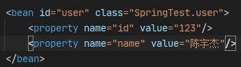

**注意**：

- 创建对象时默认**执行无参的构造方法** 


#### 2、注入属性

使用DI：依赖注入

- 对应类的set方法进行注入

  - 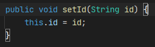 

- 有参数的构造进行注入

  - 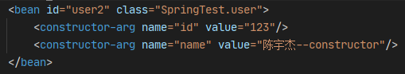 

- p名称空间注入

  - 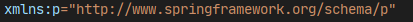 
  -  

- null值

  - 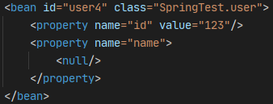 

- 特殊符号

  - ~~~xml
    <![CDATA[  <<xxxx>>  ]]>
    ~~~

- 注入外部bean

  - 需要在property内写ref属性
    - **Ref**属性：对应所要注入的外部bean的ID
    - **Name**属性：对应类里面属性名称
  - 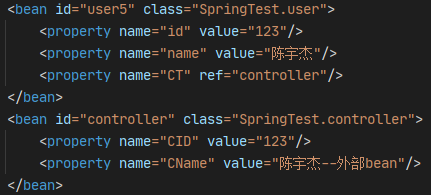 

- 注入内部bean

  - 在property标签内部写bean标签，无需写ref属性
  - 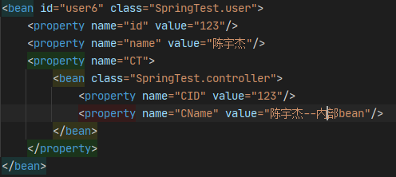 

- 注入数组集合类型属性

  - 在属性标签内使用**array**标签，在其内部使用**value**标签注入
  - 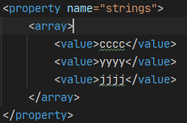 

- 注入List类型属性

  - 在属性标签内部使用**list**标签，在其内部使用**value**标签注入
  - 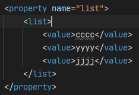 

- 注入map类型属性

  - 在属性标签内部使用**map**标签，在其内部使用**entry**标签注入
  - 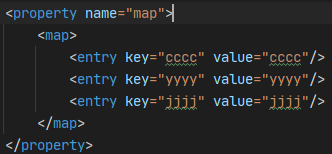 

- 注入set类型属性

  - 在属性标签内部使用**set**标签，在其内部使用**value**标签注入
  - 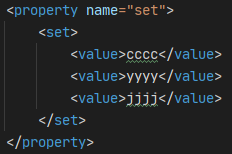 

- 在集合中注入bean类型
  - 使用**ref**标签，使用其**bean**属性注入
  - 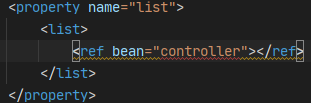 


- 抽取集合注入部份
  - 引入**util名称空间**，使用**id**属性标记，再属性标签内使用**ref**注入
  -  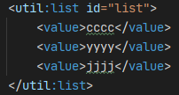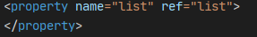


**注意**：

- 其实最后注入时使用的是**set方法** 


### 2、基于注解

#### 1、xml开启组件扫描


#### 2、类上标记注解

在类上面创建**对象注解**，注解内的**value**可以省略不写的，**默认值时类名首字母小写**。

 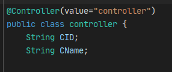

 

#### 3、开启组件扫描细节

- **use-default-filters="false"**：表示现在不使用默认 filter
- 自己配置filter
  - **context:include-filter** ：设置扫描哪些内容
    - 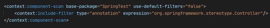 

  - **context:exclude-filter**： 设置哪些内容不进行扫描
    - 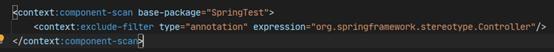 


#### 4、注解大全

##### 1、@Autowired

**自动装配**：Spring利用**依赖注入**（DI），完成对IOC容器中中各个组件的依赖关系赋值

**寻找原则**：

1. 默认**优先按照类型**去容器中找对应的组件，找到就赋值，applicationContext.getBean(BookDao.class)；
2. 如果找到多个相同类型的组件，再将**属性的名称**作为组件的id去容器中查找，applicationContext.getBean("bookDao")；
3. 自动装配默认**一定要找到对应的Bean并赋值属性**，没有就会报错，可以使用@Autowired(**required**=false)取消必须装配

**使用方法**：

可以标注在：**构造器**、**参数**、**普通方法**、**成员变量**

1. [**标注在普通方法上**]：

   Spring容器创建当前对象，就会调用方法，完成赋值。方法使用的参数，自定义类型的值从ioc容器中获取

   ~~~java
   // 标注在方法上，Spring容器在创建当前对象的时候，就会调用当前方法完成赋值
   // 方法使用的参数从IOC容器里面进行获取
   @Autowired
   public void getName(User user){
       System.out.println("主动注入的User："+user.getName());
   }
   ~~~

   **注意**：

   - 在注入Bean后会自动执行一次方法
   - @Bean标注的方法参数从容器中获取，和默认不写@Autowired效果是一样的，都能自动装配

   

2. [**标注在构造器上**]：

   如果组件只有一个有参构造器，这个有参构造器的@Autowired即使省略了，参数对应的组件还是可以自动从容器中获取

   ~~~java
   // 可以省略
   @Autowired
   public TextEditor(SpellChecker spellChecker){
       this.spellChecker = spellChecker;
   }
   
   // 自定义查询数据库用户名密码和权限信息
   private UserDetailsService userDetailsService;
   // token 管理工具类（生成 token）
   private TokenManager tokenManager;
   // 密码管理工具类
   private DefaultPasswordEncoder defaultPasswordEncoder;
   // redis 操作工具类
   private RedisTemplate redisTemplate;
   @Autowired
   public TokenWebSecurityConfig(UserDetailsService userDetailsService, 
                                 DefaultPasswordEncoder defaultPasswordEncoder,
                                 TokenManager tokenManager, 
                                 RedisTemplate redisTemplate) {
       this.userDetailsService = userDetailsService;
       this.defaultPasswordEncoder = defaultPasswordEncoder;
       this.tokenManager = tokenManager;
       this.redisTemplate = redisTemplate;
   }
   ~~~

   

3. [**标注在参数上**]：

   ~~~java
   public void setStudent(@Autowired Student stu) {
       this.stu = stu;
   }
   ~~~

   

4. [**标注在成员变量上**]：

   ~~~java
   @Autowired
   Controller ct;
   ~~~

   **注意**：

   - @Autowired会让private变为public，而标注在setter处则不会


##### 2、@Qualifier

**根据名称**注入，需要与上面的注解一起使用，被注入的类需要注册在容器中，且name必须为contorller。

@Qualifier("bookDao")：使用@Qualifier指定**需要装配的组件的id**，而不是使用属性名

```java
@Autowiredc
@Qualifier("controller")
Controller ct;
```


##### 3、@Resource(JSR250)

JSR250规范的注解

**注意**：不支持@Primary，不支持@Autowired（reqiured=false）

可根据**类型**注入，也可根据**名称**注入

```java
@Resouce(name = "userDaoImpl")
private UserDao userDao;
```


##### 4、@Value

注入**普通类型**属性

1、基本数值
2、可以写SpEL； #{}
3、可以写${}；取出配置文件【properties】中的值（在运行环境变量里面的值）

```java
@Value("张三")
private String name;
@Value("#{20-2}")
private Integer age;
//需要使用@PropertySource注解获取配置文件
@Value("${person.nickName}")
private String nickName;
```


##### 5、@PreDestroy

**销毁**


##### 6、@PostConstruct

**初始化**


1、创建配置类，替代XML文件


2、加载配置类

3、使用**AnnotationConfigApplicationContext**加载


##### 7、@PropertySource

使用@PropertySource读取外部配置文件中的k/v保存到运行的环境变量中。

加载完外部的配置文件以后使用**${}**取出配置文件的值。

```java
@PropertySource(value={"classpath:/person.properties"})
@Configuration
public class MainConfigOfPropertyValues {
    ......
}
```


##### 8、@Inject(JSR330)

JSR330规范的注解。

需要导入**javax.inject**的包，和Autowired的功能一样。

**注意**：没有required=false的功能，没有使用的必要


## 4、管理Bean

### 1、基于XML

#### 1、普通bean

在配置文件中定义的bean类型，就是返回类型

 


#### 2、工厂bean

- 创建一个类继承**FactoryBean**类，实现接口内方法。

```java
// 创建一个Spring定义的FactoryBean
public class ColorFactoryBean implements FactoryBean<Color> {

	// 返回一个Color对象，这个对象会添加到容器中
	@Override
	public Color getObject() throws Exception {
		return new Color();
	}

	@Override
	public Class<?> getObjectType() {
		return Color.class;
	}

	// true：这个bean是单实例，在容器中保存一份
	// false：多实例，每次获取都会创建一个新的bean
	@Override
	public boolean isSingleton() {
		return false;
	}

}

// 要获取工厂Bean本身，我们需要给id前面加一个&
@Bean
public ColorFactoryBean colorFactoryBean(){
    return new ColorFactoryBean();
}
```


#### 3、Bean的作用域

1、Spring内默认情况下**bean是单实例对象** 

2、在bean标签内使用**scope属性**可设置单实例还是多实例

- 区别
  - 设置单实例时，加载配置文件就会创建单实例对象
  - 设置多实例时，调用**getBean()方法**时创建多实例对象


#### 4、Bean的生命周期

1. 通过**构造器**创建bean实例
2. 注入bean的属性值和对其他bean引用
3. 把bean实例传递bean前置处理器的方法**postProcessBeforeInitialization**（需设置）
4. 调用bean的初始化方法（需设置）
5. 把bean实例传递bean后置处理器的方法**postProcessAfterInitialization**（需设置）
6. 获取bean对象
7. 关闭容器，调用销毁bean的销毁方法（需设置）
   -  

8. 在bean标签内使用**init-method**属性设置初始化方法，使用**destroy-method**属性设置销毁方法


**注意**：

- 添加后置处理器，在xml中配置，创建类实现BeanPostProcessor接口
  -  
  - 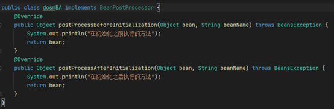 


#### 5、Bean的自动装配

- 根据**指定装配规则**（属性名或者属性类型）

- 在bean标签内使用**autowire**属性自动注入
  - **byName**：通过属性名注入
    - 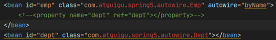 
  - **byType**：通过属性类型注入
    - 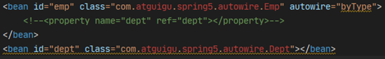 


#### 6、管理外部属性文件

1. 引入context名称空间
   -  
2. 引入外部文件
   -  

3. 创建bean，配置连接池
   -  


### 2、基于注解

#### Bean的生命周期

Bean创建---初始化----销毁

自定义初始化和销毁方法，容器在Bean进行到指定生命周期的时候来调用自定义的初始化和销毁方法

销毁：

- 单实例：容器关闭的时候
- 多实例：容器不会管理这个bean，容器不会调用销毁方法

**指定初始化与销毁方法**：

1. 通过@Bean的**init-method**属性和**destroy-method**属性指定方法

   - 需要在类中设置指定的方法

   - ~~~java
     public class Car {
         public Car(){...}
         public void init(){...}
         public void detory(){...}
     }
     
     @Bean(initMethod="init", destroyMethod="detory")
     public Car car() {
         return new Car();
     }
     ~~~

2. 实现**InitializingBean**、**DisposableBean**接口

   - 只有单实例Bean才可以

   - ~~~java
     @Component
     public class Cat implements InitializingBean, DisposableBean {
     
         public Cat(){
             .....
         }
     
         @Override
         public void destroy() throws Exception {
             .....
         }
     
         @Override
         public void afterPropertiesSet() throws Exception {
             ......
         }
     
     }
     ~~~

3. 使用**JSR250注解**

   -  **@PostConstruct**：在bean创建完成并且属性赋值完成，来执行初始化方法
   - **@PreDestroy**：在容器销毁bean之前通知我们进行清理工作，相当于一个回调通知

4. 实现**BeanPostProcessor**接口

   - **postProcessBeforeInitialization**：在bean任何初始化方法之前工作，对象创建完成，并赋值好，调用初始化方法

   - **postProcessAfterInitialization**：在bean任何初始化方法之后工作

   - ~~~java
     @Component
     public class MyBeanPostProcessor implements BeanPostProcessor {
         @Override
         public Object postProcessBeforeInitialization(Object bean, String beanName) 
             throws BeansException {
             ........
                 return bean;
         }
         @Override
         public Object postProcessAfterInitialization(Object bean, String beanName) 
             throws BeansException {
             .........
                 return bean;
         }
     }
     ~~~


**扩展**：

- Spring 底层对 BeanPostProcessor 的使用：bean赋值，注入其他组件，@Autowired，生命周期注解功能，@Asyncxxx等等，都是通过BeanPostProcessor来完成


#### 注解大全

##### 1、@Component

默认加在ioc容器中的组件，容器启动会默认调用无参构造器创建对象，再进行初始化赋值等操作

如果只有一个有参构造器，该构造器要用的组件，都是从容器中获取

```java
@Component
public class Boss {

    private Car car;

    // 构造器要用的组件，都是从容器中获取
    public Boss(Car car){
        this.car = car;
        System.out.println("Boss...有参构造器");
    }
    
}
```


##### 2、@Configuration

配置类==配置文件，告诉Spring这是一个配置类

```java
@Configuration
public class myConfig(){
    .......
}
```


##### 3、@ComponentScans

该注解可以一次声明多个@ComponentScan，因为该注解内含@Repeatable(ComponentScans.class) 

可以指定@ComponentScan可以被@ComponentScans作为数组使用

- **@ComponentScan**  value:指定要扫描的包
- **excludeFilters = Filter[]** ：指定扫描的时候按照什么规则排除那些组件
- **includeFilters = Filter[]** ：指定扫描的时候只需要包含哪些组件
- **FilterType.ANNOTATION**：按照注解
- **FilterType.ASSIGNABLE_TYPE**：按照给定的类型
- **FilterType.ASPECTJ**：使用ASPECTJ表达式
- **FilterType.REGEX**：使用正则指定
- **FilterType.CUSTOM**：使用自定义规则

```java
@ComponentScans(
    value = {
        //扫描哪些包
        @ComponentScan(value="com.atguigu",
                       includeFilters = {
            /*			@Filter(type=FilterType.ANNOTATION,classes={Controller.class}),
						@Filter(type=FilterType.ASSIGNABLE_TYPE,classes={BookService.class}),*/
            			@Filter(type=FilterType.CUSTOM,classes={MyTypeFilter.class})
        				},
                       useDefaultFilters = false
//useDefaultFilters=true/false：
// 指定是否需要使用Spring默认的扫描规则：被@Component, @Repository, @Service, @Controller或者已经声明过@Component自定义注解标记的组件；
      )
   }
)
```

自定义过滤规则：**实现TypeFilter接口**

- 参数**metadataReader**：读取到的当前正在扫描的类的信息

- 参数**metadataReaderFactory**：可以获取到其他任何类信息的

```java
public class MyTypeFilter implements TypeFilter {
	@Override
	public boolean match(MetadataReader metadataReader, MetadataReaderFactory metadataReaderFactory)
			throws IOException {
		//获取当前类注解的信息
		AnnotationMetadata annotationMetadata = metadataReader.getAnnotationMetadata();
		//获取当前正在扫描的类的类信息
		ClassMetadata classMetadata = metadataReader.getClassMetadata();
		//获取当前类资源（类的路径）
		Resource resource = metadataReader.getResource();
		
		String className = classMetadata.getClassName();
		System.out.println("--->"+className);
		if(className.contains("er")){
			return true;
		}
		return false;
	}

}

```


##### 4、@Bean

给容器中注册一个Bean，类型为**返回值的类型**，id默认是用**方法名**作为id

```java
@Bean("person")
public Person person01(){
    return new Person("lisi", 20);
}
```


##### 5、@Lazy

懒加载，只有bean被调用了才创建

```java
@Bean("person")
@Lazy
public Person person01(){}
```


##### 6、@Conditional

条件装配：满足Conditional指定的条件，则进行组件注入

**相关接口**：

接口**Condition**：

- 参数**AnnotatedTypeMetadata**：注释信息

- 参数**ConditionContext**：判断条件能使用的上下文（环境）

```java
public class LinuxCondition implements Condition {
    @Override
    public boolean matches(ConditionContext context, AnnotatedTypeMetadata metadata) {
        // 1、能获取到ioc使用的beanfactory
        ConfigurableListableBeanFactory beanFactory = context.getBeanFactory();
        // 2、获取类加载器
        ClassLoader classLoader = context.getClassLoader();
        // 3、获取当前环境信息
        Environment environment = context.getEnvironment();
        // 4、获取到bean定义的注册类
        BeanDefinitionRegistry registry = context.getRegistry();
        // 可以判断容器中的bean注册情况，也可以给容器中注册bean
        boolean definition = registry.containsBeanDefinition("person");
        if(property.contains("linux")){
            return true;
        }
        return false;
    }
}
```

类中组件统一设置，满足当前条件，这个类中配置的所有bean注册才能生效

```java
@Conditional({WindowsCondition.class})
@Configuration
public class MainConfig2 {}

// 判断是否windows系统,需要实现Condition接口
public class WindowsCondition implements Condition {

	@Override
	public boolean matches(ConditionContext context, AnnotatedTypeMetadata metadata) {
		Environment environment = context.getEnvironment();
		String property = environment.getProperty("os.name");
		if(property.contains("Windows")){
			return true;
		}
		return false;
	}

}
```


##### 7、@Import

@Import导入组件，id默认是组件的全类名

```java
@Configuration
@Import({Color.class,Red.class,MyImportSelector.class,MyImportBeanDefinitionRegistrar.class})
public class MainConfig2 {}
```

**相关接口**：

接口**ImportBeanDefinitionRegistrar**：手动注册bean到容器中。

- 参数**AnnotationMetadata**：当前类的注解信息
- 参数**BeanDefinitionRegistry**：BeanDefinition注册类，BeanDefinitionRegistry.registerBeanDefinition()手工注册Bean进来

```java
public class MyImportBeanDefinitionRegistrar implements ImportBeanDefinitionRegistrar {
   @Override
   public void registerBeanDefinitions(AnnotationMetadata importingClassMetadata, BeanDefinitionRegistry registry) {
      
      boolean definition = registry.containsBeanDefinition("com.atguigu.bean.Red");
      boolean definition2 = registry.containsBeanDefinition("com.atguigu.bean.Blue");
      if(definition && definition2){
         //指定Bean定义信息,（Bean的类型，Bean。。。）
         RootBeanDefinition beanDefinition = new RootBeanDefinition(RainBow.class);
         //注册一个Bean，指定bean名
         registry.registerBeanDefinition("rainBow", beanDefinition);
      }
   }
}
```

接口**ImportSelector**：返回需要导入的组件的全类名数组

自定义逻辑返回需要导入的组件

- 参数**AnnotationMetadata**：当前标注@Import注解的类的所有注解信息
- 返回值，就是到导入到容器中的组件全类名，不能返回null

```java
public class MyImportSelector implements ImportSelector {
    @Override
    public String[] selectImports(AnnotationMetadata importingClassMetadata) {
        return new String[]{"com.atguigu.bean.Blue","com.atguigu.bean.Yellow"};
    }

}
```


##### 7、@Scope

调整作用域

**可选值**：

- **prototype**：多实例的：IOC容器启动并不会去调用方法创建对象放在容器中，每次获取的时候才会调用方法创建对象
- **singleton**：单实例的（默认值）：IOC容器启动会调用方法创建对象放到IOC容器中，以后每次获取就是直接从容器（map.get()）中拿
- **request**：同一次请求创建一个实例
- **session**：同一个session创建一个实例

@Scope(“prototype”) **多例**

```java
@Scope("prototype")
@Bean("person")
public Person person(){
    return new Person("张三", 25);
}
```


##### 8、@Primary

自动装配时当出现多个Bean候选者时，被注解为@Primary的Bean将作为首选者，否则将抛出异常（只对接口的多个实现生效）

同时也可以在注入处继续使用@Qualifier指定需要装配的bean的名字

```java
@Primary
@Component
public class OperaSinger{
    ........
}
```


##### 9、@Profile

**Profile**：Spring为我们提供的可以根据当前环境，动态的激活和切换一系列组件的功能。

例如：开发环境、测试环境、生产环境，数据源：(/A)(/B)(/C)。

@Profile：指定组件在哪个环境的情况下才能被注册到容器中，如果不指定，任何环境下都能注册这个组件

 * 加了环境标识的Bean，只有这个环境被激活的时候才能注册到容器中，**默认是default环境**
 * 写在配置类上，只有是指定的环境的时候，整个配置类里面的**所有**配置才能开始生效
 * 没有标注环境标识的Bean在，任何环境下都是加载的

```java
@Profile("test")
@Bean("testDataSource")
public DataSource dataSourceTest(....){
   ....
}

@Profile("dev")
@Bean("devDataSource")
public DataSource dataSourceDev(....) throws Exception{
   .....
}
```


# 3、AOP

## 1、简介

- 面向切面编程，对业务逻辑的各个部分隔离，降低耦合度
- 不改变源代码，添加新功能
- AOP要做的三件事是在哪里切入，什么时候切入，切入后做什么事
- AOP是方法级别的
- AOP是基于动态代理模式

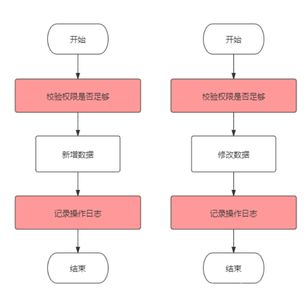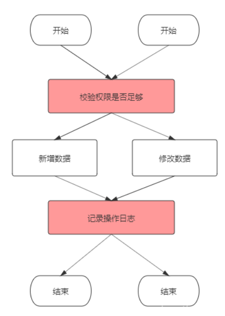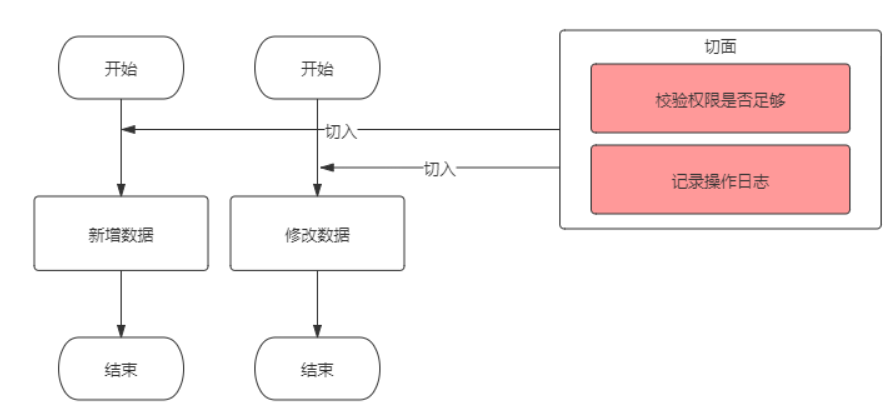


## 2、体系结构

- Pointcut：**切点**
  - **决定处理**如权限校验、日志记录等在何处切入业务代码中（即织入切面）
  - 切点分为**execution**方式和**annotation**方式
  - 前者可以用路径表达式指定哪些类织入切面，后者可以指定被哪些注解修饰的代码织入切面
- Advice：**处理**
  - **处理时机**和**处理内容**
  - 处理时机就是在什么时机执行处理内容，分为前置、后置、环绕、异常、返回
  - 处理内容就是要做什么事，比如校验权限和记录日志
- Aspect：**切面**
  - 即Pointcut + Advice
- Joint point：**连接点**
  - 是程序执行的一个点
  - 例如，一个方法的执行或者一个异常的处理。在 Spring AOP 中，一个连接点总是代表一个方法执行。
- Weaving：**织入**
  - 就是通过**动态代理**，在目标对象方法中执行处理内容的过程

>**术语**
>
>1、**连接点**：可增强方法
>
>2、**切入点**：实际被增强的方法
>
>3、**增强（通知）**：实际增强的逻辑部分
>
>-  通知有多种类型：前置、后置、环绕、异常、返回
>
>4、**切面**：动作，把通知应用到切入点的过程

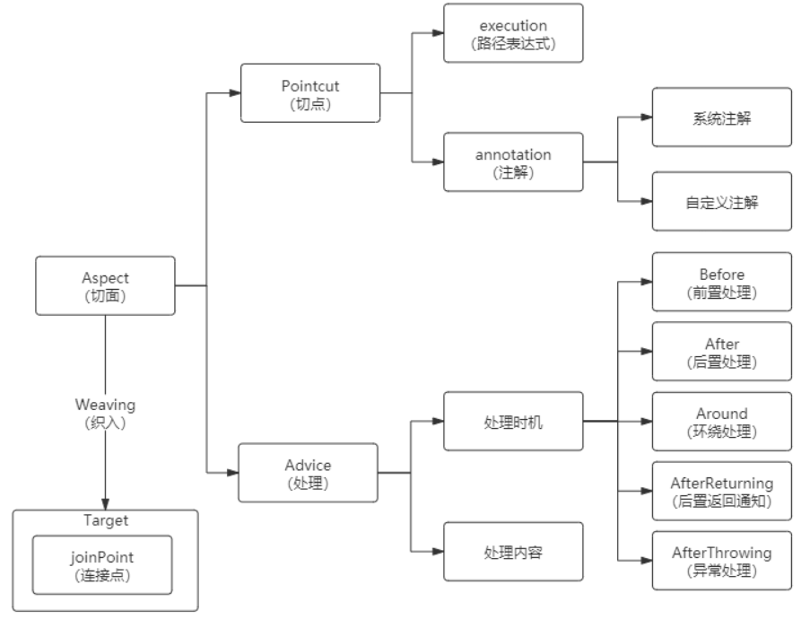


## 2、底层原理

AOP底层原理是**动态代理**，动态代理即在程序运行期间通过JVM反射等机制动态生成，代理类和委托类的关系是运行时才确定的

1. Spring创建容器对象的时候，根据切入点表达式拦截的类，生成代理对象

   - 如果目标对象有实现接口，使用JDK代理

   - 如果目标对象没有实现接口，则使用CGLIB代理

2. 然后从容器获取代理后的对象，调用在运行期植入的"切面"类的方法

Sping中实现动态代理有两种方式：**JDK动态代理、CGLIB** 

- 使用**JDK的动态代理**（目标类必须有实现的接口）

  - 创建接口

    - ~~~java
      public interface Human {
          void say();
      }
      ~~~

  - 创建类继承接口

    - ~~~java
      class User implements Human{
          @Override
          public void say() {
              System.out.println("Ha");
          }
      }
      ~~~

    - 

  - 创建**InvocationHandler**接口的实现类，增强方法

    - ~~~java
      public class MyInvocationHandler implements InvocationHandler {
          // 
          Object object;
      
          public MyInvocationHandler(Object o){this.obect = o;}
      
          // 代理
          @Override
          public Object invoke(Object proxy, Method method, Object[] args) throws Throwable {
              // 获取当前执行的方法的方法名
              String methodName = method.getName();
              // 方法返回值
              Objct result = method.invoke(object, args);
              return result;
          }
      
      }
      ~~~


  - 创建接口实现类的代理对象 

    - ~~~java
      // 创建增强方法类
      MyInvocationHandler mHandler = new MyInvocationHandler();
      
      // 创建代理类
      Human o = (Human) Proxy.newProxyInstance(
          // 目标对象使用的类加载器
          user.getClass().getClassLoader(), 
          // 目标对象实现的所有接口                          
          user.getCLass().getInterfaces(), 
          // 执行代理对象方法时候触发
          mHandler);
      
      // 调用方法
      o.say();
      ~~~


**说明**：

- 其实是JDK动态生成了一个类去实现接口，隐藏了这个过程

  - ~~~java
    class $jdkProxy implements Human{}
    ~~~


- 使用**CGLIB动态代理**

  - 创建子类代理对象，增强方法


**说明**：

- CGLIB动态生成的**子类继承目标类**的方式实现，在运行期动态的在内存中构建一个子类，程序执行时，隐藏了下面的过程

  - ~~~java
    public class Human{}
    public class $Cglib_Proxy_class extends Human{}
    ~~~


**注意**：

- 如果目标类没有实现接口，且class被 final 修饰的，则不能进行Spring AOP编程


## 3、具体实现

### 1、基于XML

1. 创建增强类与被增强类
2. 在XML中配置Bean
3. 在XML中配置切入点

```xml
<!-- 配置AOP -->
<aop:config>
    <!-- 切入点 -->
	<aop:pointcut id="p" expression="excution(* com.book.buy(..))"/>
    <!-- 切面 -->
    <aop:aspect ref="bookProxy">
    	<!-- 增强作用在具体方法上 -->
        <aop:before method="before" pointcut-ref="p"/>
    </aop:aspect>
</aop:config>
```


### 1、基于注解

1. 使用**@EnableAspectJAutoProxy (proxyTargetclass = true)**开启AOP注解

2. 创建类、定义方法

   - ~~~java
     public class UserAOP{
      	.....   
     }
     ~~~

3. 创建增强类，编写增强逻辑，创建不同方法，代表不同通知类型

   - ~~~java
     public class UserAOPPro {
         public void before() { system.out.println("before");}
         public void after() { system.out.println("after");}
         public void afterReturning() { system.out.println("afterReturning");}
         public void around() { system.out.printin("around");}
         public void afterThrowing() { system.out.println("afterThrowing");}
     }
     ~~~

4. 使用注解注册被增强对象和增强对象

   - ~~~java
     @Component
     public class UserAOP {
         ....
     }
     
     @Component
     public class UserAOPPro {
     	.....
     }
     ~~~

5. 在增强类上添加注解@Aspect

   - ~~~java
     @Aspect
     @Component
     public class UserAOPPro {
     	.....
     }
     ~~~

6. 在增强类内的通知方法上使用不同的通知注解，并编写切入点表达式，表明增强哪些方法

   - ~~~java
     @Before( "execution(* SpringAOPTest.UserAOP.speakName(..))")
     public void before(){
         system.out.printLn("before");
     }
     
     @After("execution(* SpringAOPTest.UserAOP.speakName(..))")
     public void after(){
         system.out.println("after");
     }
     
     // @AfterReturning注解可以用来捕获切入方法执行完之后的返回值，对返回值进行业务逻辑上的增强处理
     @AfterReturning("execution(* SpringAOPTest.UserAOP.speakName(..))", returning = "result")
     public void afterReturning(JoinPoint joinPoint, Object result){
         Signature signature = joinPoint.getSignature();
         String classMethod = signature.getName();
         log.info("方法{}执行完毕，返回参数为：{}", classMethod, result);
         // 实际项目中可以根据业务做具体的返回值增强
         system.out.println("afterReturning");
         log.info("对返回参数进行业务上的增强：{}", result + "增强版");
     }
     
     // Around通知中的proceed()方法表示调用被截方法，相当于method.invoke
     // Around可以改变执行目标方法的参数值，也可以改变执行目标方法之后的返回值
     @Anound("execution(* SpringAOPTest.UserAOP.speakName(..))")
     public void around(ProceedingJoinPoint pjp) throws Throwable{
         system.out.println( "around---before");
         pjp.proceed();
         system.out.println("around---after");
     }
     
     @AfterThrowing("execution(* SpringAOPTest.UserAOP.speakName(..))", throwing = "ex")
     public void afterThrowing() {
         Signature signature = joinPoint.getSignature();
         String method = signature.getName();
         // 处理异常的逻辑
         log.info("执行方法{}出错，异常为：{}", method, ex);
         system.out.println("afterThrowing" );
     }
     ~~~

7. 相同的切入点抽取

   - 第一行为pointcut表达式，第二行为pointcut的签名，其他类引用：全面类名

   - ~~~java
     @Aspect
     @Component
     public class LogAdvice {
         // 定义一个切点：所有被GetMapping注解修饰的方法会织入advice
         @Pointcut("@annotation(org.springframework.web.bind.annotation.GetMapping)")
         private void logAdvicePointcut() {}
     
         // Before表示logAdvice将在目标方法执行前执行
         @Before("logAdvicePointcut()")
         public void logAdvice(){
             // 这里只是一个示例，你可以写任何处理逻辑
             System.out.println("get请求的advice触发了");
         }
     }
     ~~~


**扩展**：

- args和argNames属性

  - 目标方法和args()通过参数顺序进行匹配


  - args()和argNames通过参数名称进行匹配


  - argNames和增强方法通过参数顺序进行匹配


- 使用@Order（数字），设置增强类的优先级

```java
@order(1)
public class UserAOPPro {}
```


**注意**：

- @Anound修饰的方法中，第一个形参必须是ProceedingJoinPoint
- @Around的ProceedingJoinPoint必须调用proceed方法，目标方法才会执行
- @Around调用ProceedingJoinPoint的proceed方法时，还可以传入一个Object[ ]对象，该数组中的值将被传入目标方法作为实参，这是改变目标方法参数值的关键，如果传入的Object[ ]数组长度与目标方法所需要的参数个数不相等，或者Object[ ]数组元素与目标方法所需参数的类型不匹配，程序就会出现异常
- @Around但通常需要在线程安全的环境下使用，如果需要目标方法执行之前和之后共享某种状态数据，则应该考虑使用Around，尤其是需要使用增强处理阻止目标的执行，或需要改变目标方法的返回值时，则只能使用Around增强处理了
- @AfterReturning 属性 returning 的值必须要和参数保持一致，否则会检测不到
- @AfterReturning修饰的方法中的第二个入参就是被切方法的返回值
- @AfterThrowing 属性 throwing 的值必须要和参数一致，否则会报错
- @AfterThrowing修饰的方法中的第二个入参即为抛出的异常


## 4、实例

### 1、被注解A标注的类都被增强

~~~java
@Target(ElementType.METHOD)
@Retention(RetentionPolicy.RUNTIME)
@Documented
public @interface PermissionAnnotation{}
~~~

~~~java
@Aspect
@Component
@Order(1)
public class PermissionFirstAdvice {

    // 定义一个切面，括号内写入第1步中自定义注解的路径
    @Pointcut("@annotation(com.mu.demo.annotation.PermissionAnnotation)")
    private void permissionCheck() {
    }

    @Around("permissionCheck()")
    public Object permissionCheckFirst(ProceedingJoinPoint joinPoint) throws Throwable {
        System.out.println("===================第一个切面===================：" + System.currentTimeMillis());

        // 获取请求参数，详见接口类
        Object[] objects = joinPoint.getArgs();
        Long id = ((JSONObject) objects[0]).getLong("id");
        String name = ((JSONObject) objects[0]).getString("name");
        System.out.println("id1->>>>>>>>>>>>>>>>>>>>>>" + id);
        System.out.println("name1->>>>>>>>>>>>>>>>>>>>>>" + name);

        // id小于0则抛出非法id的异常
        if (id < 0) {
            return JSON.parseObject("{\"message\":\"illegal id\",\"code\":403}");
        }
        return joinPoint.proceed();
    }
}
~~~

~~~java
@RestController
@RequestMapping(value = "/permission")
public class TestController {
    
    // 添加这个注解
    @PermissionsAnnotation()
    @RequestMapping(value = "/check", method = RequestMethod.POST)
    public JSONObject getGroupList(@RequestBody JSONObject request) {
        return JSON.parseObject("{\"message\":\"SUCCESS\",\"code\":200}");
    }
}
~~~


### 2、被多个切面增强

在例1的基础上增加

一个自定义的AOP注解可以对应多个切面类，这些切面类执行顺序由@Order注解管理，该注解后的数字越小，所在切面类越先执行

~~~java
@Aspect
@Component
@Order(0)
public class PermissionSecondAdvice {

    @Pointcut("@annotation(com.mu.demo.annotation.PermissionAnnotation)")
    private void permissionCheck() {}

    @Around("permissionCheck()")
    public Object permissionCheckSecond(ProceedingJoinPoint joinPoint) throws Throwable {
        System.out.println("===================第二个切面===================：" + System.currentTimeMillis());

        // 获取请求参数，详见接口类
        Object[] objects = joinPoint.getArgs();
        Long id = ((JSONObject) objects[0]).getLong("id");
        String name = ((JSONObject) objects[0]).getString("name");
        System.out.println("id->>>>>>>>>>>>>>>>>>>>>>" + id);
        System.out.println("name->>>>>>>>>>>>>>>>>>>>>>" + name);

        // name不是管理员则抛出异常
        if (!name.equals("admin")) {
            return JSON.parseObject("{\"message\":\"not admin\",\"code\":403}");
        }
        return joinPoint.proceed();
    }
}
~~~


# JDBCTemplate

## 1、简介

Spring对JDBC的封装


## 2、配置

在XML中配置数据库连接池

```xml
<context:property-placeholder location="classpath:SpringJDBC/druid.properties"/>
<bean id="dataSource" class="com.alibaba.druid.pool.DruidDataSource">
    <property name="username" value="${user}"/>
    <property name="password" value="${password}" />
    <property name="url" value="${url}" />
    <property name="driverClassName" value="${driverclassName}" />
    <property name="initialSize" value="${initialsize}"/>
    <property name="maxActive" value="${maxActive}" />
    <property name="maxWait" value="${maxWait}" />
    <property name="filters" value="${filters}" />
</bean>
```

配置JDBCTemplate对象，注入DateSource

```xml
<bean id="jdbcTemplate" class="org.springframewonk.jdbc.core.JdbcTemplate">
	<property name="dataSource" ref="dataSource"/>
</bean>
```

在service中注入dao对象，在dao中注入JbdcTemplate对象

```java
@Service
public class service {
    @Autowired
    dao dao;
}

@Repository
public class dao {
    @Autowired
    JdbcTemplate jdbcTemplate;
}
```


## 3、方法

| 方法                                                         | 参数                                                         | 作用             |
| ------------------------------------------------------------ | ------------------------------------------------------------ | ---------------- |
| update(sql, args)                                            | 1、sql语句<br />2、数据                                      | 添加、修改、删除 |
| queryForObjecgt(sql, Class<T>)                               | 1、sql语句<br />2、返回的类型                                | 查询并返回某个值 |
| queryForObject(sql, RowMapper<T>, args)                      | 1、sql语句<br />2、RowMapper<T>接口，针对返回的数据，完成数据封装<br />3、值 | 查询并返回对象   |
| queryForObject(sql, <br />new BeanPropertyRowMapper<book>(Book.class), id) | 参数同上                                                     | 查询并返回集合   |
| batchUpdate(sql, List<Object[]> batchArgs)                   | 1、sql语句<br />2、多条数据                                  | 批量添加         |
| 同上                                                         | 同上                                                         | 批量修改         |
| 同上                                                         | 同上                                                         | 批量删除         |


# 事务管理

## 1、简介

底层使用AOP

事务是逻辑上的一组操作，要么都执行，要么都不执行


Spring支持两种方式的事务管理：

- **编程式事务管理**
- **声明式事务管理**


事务的特性（**ACID**）：

- **原子性**：
  - 事务（transaction）中的所有操作，或者全部完成，或者全部不完成，不会结束在中间某个环节
  - 事务在执行过程中发生错误，会被回滚（Rollback）到事务开始前的状态，就像这个事务从来没有执行过一样
  - 事务不可分割、不可约简

- **一致性**：
  - 在事务开始之前和事务结束以后，数据库的完整性没有被破坏
  - 表示写入的资料必须完全符合所有的预设约束、触发器、级联回滚等
- **隔离性**：
  - 数据库允许多个并发事务同时对数据进行读写修改，隔离性可以防止多个事务并发执行时由于交叉而导致数据的不一致
  - 事务隔离分为不同级别，包括未提交读（Read uncommitted）、提交读（read committed）、可重复读（repeatable read）和串行化（Serializable）
- **持久性**：
  - 事务处理结束后，对数据的修改就是永久的，即便系统故障也不会丢失


Spring框架中，事务管理相关最重要的 3 个接口如下：

- **PlatformTransactionManager**： （平台）事务管理器，Spring事务策略的核心

- **TransactionDefinition**： 事务定义信息(事务隔离级别、传播行为、超时、只读、回滚规则)

- **TransactionStatus**：事务运行状态

  

**注意**：

- 事务能否生效，数据库引擎是否支持事务是关键


~~~xml
XML版
XML中配置事务管理器
<bean idm"transactionManager" class= "org.springframework.jdbc.datasource.DataSourceTransactionNanagen">
	<property name="dataSource" ref="dataSource" />
</bean>
引入名称空间tx
开启事务注解
<tx:annotation-driven transaction-manager="transactionManager" />
~~~

~~~xml
<tx:advice id="txAdvice">
    <!--配置事务参数-->
    <tx:attributes>
        <!--指定哪种规则的方法 上面添加事务-->
        <tx :method name="*" propagation= "REQUIRED" />
        <!--<tx:method name= " account*"/>-->
    </tx:attributes>
</tx:advice>

<!--3配置切入点和切面-->
<aop:config>
    <!--配置切入点-->
    <aop :pointcut id="pt" expression="execution(* *.*(..))"/>
    <!--配置切面-->
    <aop : advisor advice-ref="txAdvice" pointcut -ref="pt"/>
</aop:config>
~~~

或者

~~~java
// 完全注解版
// 代替xml
// 表明此是配置类
@Configuration 
// 开启组件扫描
@ComponentScan(basePackages = "SpringJDBC") 
// 开启事务
@EnableTransactionManagement 
pubLic cLass SpringConfigProPLUS {
    // 配置数据源
    @Bean 
    public DruidDataSource getDDS(){
        DruidDataSource dataSource = null;
        Inputstrean is = SpringConfigProPLus
            .cLass
            .getCLassLoader()
            .getResourceAsstream("SpringJDBC/druid.properties");

        Properties pros = new Properties();
        try {
            pros.Load(is);
            dataSource = (DruidDataSource) DruidDataSourceFactory.createDatasource (pros);
        } catch (Exception e) {
            e.printStackTrace0);
        }
        return datasource;
    }
    // JDBC配置模板
    @Bean
    public JdbcTempLate getJdbcTempLate(0ataScurce dataSource) {
        return new JdbcTempLate(dataSource);
    }
    // 配置事务管理器
    @Bean
    public DataSourceTransactionManager getDSTM(Datasource dataSource){
        return new DataSourceTransactionManager(dataSource);
    }
}
~~~


~~~java
// 前提
// 创建service其注入dao
// 创建dao其内注入JDBCTemplate
// JDBCTemplate注入DateSource
// service、dao都添加交给Spring管理
@Service
public class service{
	@Autowired
	dao dao;
}

@Repository
public class dao {
	@Autowired
	JdbcTemplate jdbcTemplate;
}
~~~


## 2、编程式事务管理

通过 TransactionTemplate 或者 TransactionManager 手动管理事务


~~~java
// 使用TransactionTemplate 进行编程式事务管理的示例代码如下：

// 注入事务模板
@Autowired
private TransactionTemplate transactionTemplate;

// 业务方法
public void testTransaction() {
    transactionTemplate.execute(new TransactionCallbackWithoutResult() {
        @Override
        protected void doInTransactionWithoutResult(TransactionStatus transactionStatus) {
            try {
                // ....  业务代码
            } catch (Exception e){
                //回滚
                transactionStatus.setRollbackOnly();
            }
        }
    });
}
~~~


~~~java
// 使用 TransactionManager 进行编程式事务管理的示例代码如下：

// 注入事务管理器
@Autowired
private PlatformTransactionManager transactionManager;

// 业务方法
public void testTransaction() {
    TransactionStatus status = transactionManager.getTransaction(new DefaultTransactionDefinition());
    try {
        // ....  业务代码
        transactionManager.commit(status);
    } catch (Exception e) {
        // 回滚
        transactionManager.rollback(status);
    }
}
~~~


## 3、声明式事务管理

推荐使用（代码侵入性最小）

实际是通过 AOP 实现（基于@Transactional 的全注解方式使用最多）

~~~java
@Transactional(propagation=propagation.PROPAGATION_REQUIRED)
public void aMethod {
    // do something
    B b = new B();
    C c = new C();
    b.bMethod();
    c.cMethod();
}
~~~


## 4、三个重要接口


### 1、PlatformTransactionManager

Spring 并不直接管理事务，而是提供了多种事务管理器 ，Spring 事务管理器的接口是：**PlatformTransactionManager**，其可以被看作是**事务上层的管理者**

通过这个接口，Spring 为各个平台如 JDBC(DataSourceTransactionManager)、Hibernate(HibernateTransactionManager)、JPA(JpaTransactionManager)等都提供了对应的事务管理器

PlatformTransactionManager接口中定义了三个方法：

~~~java
public interface PlatformTransactionManager {
    //获得事务
    TransactionStatus getTransaction(@Nullable TransactionDefinition var1) throws TransactionException;
    
    //提交事务
    void commit(TransactionStatus var1) throws TransactionException;
    
    //回滚事务
    void rollback(TransactionStatus var1) throws TransactionException;
}
~~~

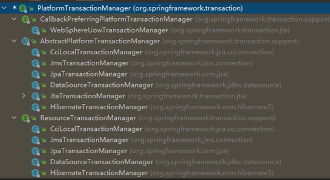


### 2、TransactionDefinition

事务属性可以理解成事务的一些基本配置，描述了事务策略如何应用到方法上

- PlatformTransactionManager 会根据 TransactionDefinition 的定义比如事务超时时间、隔离级别、传播行为等来进行事务管理
- PlatformTransactionManager 通过 getTransaction(TransactionDefinition definition) 方法来得到一个事务，这个方法里面的参数就是 TransactionDefinition 类


事务属性包含了5个方面：

- 隔离级别
- 传播行为
- 回滚规则
- 是否只读
- 事务超时


TransactionDefinition 接口中定义了 5 个方法以及一些表示事务属性的常量比如隔离级别、传播行为等等

~~~java
public interface TransactionDefinition {
    int PROPAGATION_REQUIRED = 0;
    int PROPAGATION_SUPPORTS = 1;
    int PROPAGATION_MANDATORY = 2;
    int PROPAGATION_REQUIRES_NEW = 3;
    int PROPAGATION_NOT_SUPPORTED = 4;
    int PROPAGATION_NEVER = 5;
    int PROPAGATION_NESTED = 6;
    int ISOLATION_DEFAULT = -1;
    int ISOLATION_READ_UNCOMMITTED = 1;
    int ISOLATION_READ_COMMITTED = 2;
    int ISOLATION_REPEATABLE_READ = 4;
    int ISOLATION_SERIALIZABLE = 8;
    int TIMEOUT_DEFAULT = -1;
    
    // 返回事务的传播行为，默认值为 REQUIRED
    int getPropagationBehavior();
    
    // 返回事务的隔离级别，默认值是 DEFAULT
    int getIsolationLevel();
    
    // 返回事务的超时时间，默认值为-1
    // 如果超过该时间限制但事务还没有完成，则自动回滚事务
    int getTimeout();
    
    // 返回是否为只读事务，默认值为 false
    boolean isReadOnly();
    
    @Nullable
    String getName();
}
~~~


### 3、TransactionStatus

TransactionStatus 接口用来记录事务的状态，其提供了一些方法来获取事务相应的状态，比如是否新事务、是否可以回滚等等

TransactionStatus接口内容：

~~~java
public interface TransactionStatus{
    // 是否是新的事务
    boolean isNewTransaction(); 
    
    // 是否有恢复点
    boolean hasSavepoint(); 
    
    // 设置为只回滚
    void setRollbackOnly();  
    
    // 是否为只回滚
    boolean isRollbackOnly(); 
    
    // 是否已完成
    boolean isCompleted; 
}
~~~


## 5、事务属性

### 1、事务传播行为

事务传播行为是为了解决业务层方法之间互相调用的事务问题

当事务方法被另一个事务方法调用时，必须指定事务应该如何传播

例如：方法可能继续在现有事务中运行，也可能开启一个新事物，并在自己的事务中运行


Spring定义的事务传播行为如下：

| 传播属性     | 描述                                                         |
| ------------ | ------------------------------------------------------------ |
| REQUIRED     | 如果外部事务在运行，当前方法就加入，否则启动一个新的事务，并在自己的事务内运行 |
| REQUIRED_NEW | 当前方法必须启动新事务，并在自己的事务内运行，如果外部事务正在运行，就将外部事务挂起 |
| SUPPORTS     | 如果有外部事务在运行，当前方法就在这个事务内运行，否则它可以不运行在事务中 |
| NOT_SUPPORTE | 当前方法不运行在事务中，如果有外部事务运行，将它挂起         |
| MANDATORY    | 当前方法必须加入外部事务，如果没有正在运行外部事务，就抛出异常 |
| NEVER        | 当前方法不运行在任何事务中，如果有运行任何事务，就抛出异常   |
| NESTED       | 如果有外部事务在运行，当前的方法就应该在这个事务的嵌套事务内运行，否则启动一个新的事务，并在它自己的事务内运行 |


### 6、事务隔离级别

| 隔离级别                   | 脏读 | 不可重复读 | 幻读 |
| -------------------------- | ---- | ---------- | ---- |
| READ UNCOMMITTED(读未提交) | 有   | 有         | 有   |
| READ COMMITTED(读已提交)   | 无   | 有         | 有   |
| REPEATABLE READ(可重复读)  | 无   | 无         | 有   |
| SERIALIZABLE(串行化)       | 无   | 无         | 无   |

- **ISOLATION_DEFAULT**：使用后端数据库默认的隔离级别，MySQL 默认采用的 REPEATABLE_READ（可重复读） 隔离级别 Oracle 默认采用的 READ_COMMITTED 隔离级别
- **ISOLATION_READ_UNCOMMITTED**：最低的隔离级别，使用这个隔离级别很少，因为它允许读取尚未提交的数据变更，可能会导致脏读、幻读或不可重复读
- **ISOLATION_READ_COMMITTED**：允许读取并发事务已经提交的数据，可以阻止脏读，但是幻读或不可重复读仍有可能发生
- **ISOLATION_REPEATABLE_READ**：对同一字段的多次读取结果都是一致的，除非数据是被本身事务自己所修改，可以阻止脏读和不可重复读，但幻读仍有可能发生
- **ISOLATION_SERIALIZABLE**：最高的隔离级别，完全服从 ACID 的隔离级别，所有的事务依次逐个执行，这样事务之间就完全不可能产生干扰，该级别可以防止脏读、不可重复读以及幻读，但是严重影响程序的性能，通常情况下也不会用到该级别


### 7、事务超时

指一个事务所允许执行的最长时间，如果超过该时间限制但事务还没有完成，则自动回滚事务

在 TransactionDefinition 中以 int 的值来表示超时时间，其单位是秒，默认值为 -1


### 8、事务只读

对于只有读取数据查询的事务，可以指定事务类型为 readonly

只读事务不涉及数据的修改，数据库会提供一些优化手段，适合用在有多条数据库查询操作的方法中

数据查询操作如果不加Transactional，每条sql会开启一个单独的事务，中间被其它事务改了数据，都会实时读取到最新值


**注意**：

- 如果一次执行单条查询语句，则没有必要启用事务支持，数据库默认支持sql执行期间的读一致性
- 如果你一次执行多条查询语句，例如统计查询，报表查询，这这种场景下，多查询sql必须保证整个的读一致性，否则，在前条sql查询之后，后条sql查询之前，数据被其他用户改变，则该此整体的统计查询将会出现读数据不一致的状态，此时，应该启用事务支持


### 9、事务回滚规则

默认情况下，事务只有遇到运行期异常（RuntimeException 的子类）时才会回滚，Error 也会导致事务回滚，但是在遇到检查型（Checked）异常时不会回滚

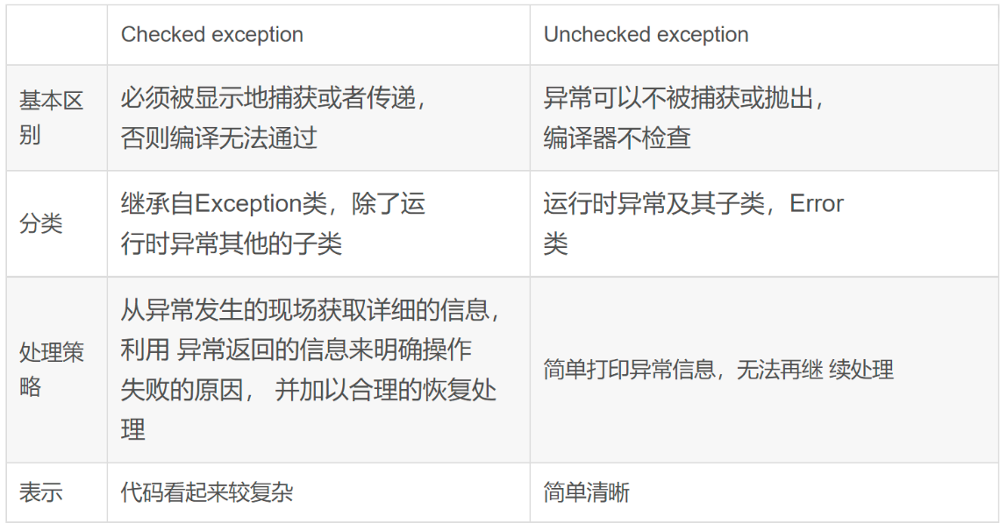


##  6、@Transational

此注解可以添加在类上也可以添加在方法上：

-  添加在类上，则此类所有方法都添加事务

-  添加在方法上，则此方法添加事务

| 参数名        | 作用                                                         |      |
| ------------- | ------------------------------------------------------------ | ---- |
| Propagation   | 事务传播行为                                                 |      |
| Isolation     | 事务隔离级别                                                 |      |
| Timeout       | 超时时间<br />1、事务需要在一定时间提交，若不提交则回滚<br />2、默认值为 -1，设置时间以秒为单位 |      |
| readOnly      | 是否只读<br />1、读：查询操作<br />2、写：添加修改删除操作 <br />默认值false，表示可写可读，设置为true，则只能查询 |      |
| rollbackFor   | 设置出现那些异常进行事务回滚                                 |      |
| noRollbackFor | 设置出现那些异常不会回滚                                     |      |

~~~java
// 自定义回滚类型
@Transactional(rollbackFor= MyException.class)
~~~


# 扩展

## Spring容器流程解析

1、Spring容器的**refresh();**【创建刷新】

```java
@Override
	public void refresh() throws BeansException, IllegalStateException {
		synchronized (this.startupShutdownMonitor) {
			// 准备此上下文以进行刷新
			prepareRefresh();

			// 告诉子类刷新内部 Bean 工厂
			ConfigurableListableBeanFactory beanFactory = obtainFreshBeanFactory();

			// 准备在此上下文中使用的 Bean 工厂
			prepareBeanFactory(beanFactory);

			try {
				// 允许在上下文子类中对 Bean 工厂进行后处理
				postProcessBeanFactory(beanFactory);

				// 调用在上下文中注册为 Bean 的工厂处理器
				invokeBeanFactoryPostProcessors(beanFactory);

				// 注册拦截 Bean 创建的 Bean 处理器
				registerBeanPostProcessors(beanFactory);

				// 初始化此上下文的消息源
				initMessageSource();

				// 为此上下文初始化事件多播器
				initApplicationEventMulticaster();

				// 初始化特定上下文子类中的其他特殊 Bean
				onRefresh();

				// 检查侦听器 Bean 并注册它们。
				registerListeners();

				// 实例化所有剩余的（非延迟初始化）单例
				finishBeanFactoryInitialization(beanFactory);

				// 最后一步：发布相应的事件
				finishRefresh();
			}

			catch (BeansException ex) {
				if (logger.isWarnEnabled()) {
					logger.warn("Exception encountered during context initialization - " +
							"cancelling refresh attempt: " + ex);
				}

				// 销毁已经创建的单例以避免悬空资源
				destroyBeans();

				// 重置“活动”标志
				cancelRefresh(ex);

				// 将异常传播给调用者
				throw ex;
			}

			finally {
				// 重置 Spring 核心中的常见内省缓存，因为我们可能不再需要单例 bean 的元数据......
				resetCommonCaches();
			}
		}
	}
// 以下为BeanFactory的创建以及准备工作
```

1. **prepareRefresh()；** 

   1. 作用：刷新前的预处理
   2. 调用的方法：
      1. **initPropertySources()；**初始化一些属性设置;子类自定义个性化的属性设置方法
      2. **getEnvironment().validateRequiredProperties()；**检验属性的合法等
      3. **earlyApplicationEvents= new LinkedHashSet<ApplicationEvent>()；**保存容器中的一些早期的事件

   ```java
   //准备此上下文以进行刷新、设置其启动日期和活动标志以及执行属性源的任何初始化。
   protected void prepareRefresh() {
       this.startupDate = System.currentTimeMillis();
       this.closed.set(false);
       this.active.set(true);
   
       if (logger.isInfoEnabled()) {
           logger.info("Refreshing " + this);
       }
   
       // 在上下文环境中初始化任何占位符属性源
       initPropertySources();
   
       // 验证所有标记为必需的属性都是可解析的，请参阅 ConfigurablePropertyResolversetRequiredProperties
       getEnvironment().validateRequiredProperties();
   
       // 允许收集早期的 ApplicationEvents，一旦多播器可用就发布......
       this.earlyApplicationEvents = new LinkedHashSet<ApplicationEvent>();
   }
   ```

2. **obtainFreshBeanFactory()；**

   1. 作用：获取BeanFactory
   2. 调用的方法：
      1. **refreshBeanFactory()；**刷新【创建】BeanFactory
         - 创建了一个**this.beanFactory = new DefaultListableBeanFactory();**
         - 设置id
      2. **getBeanFactory()；**返回刚才GenericApplicationContext创建的BeanFactory对象
      3. 最后将创建的BeanFactory【DefaultListableBeanFactory】返回。

   ```java
   //告诉子类刷新内部 Bean 工厂
   protected ConfigurableListableBeanFactory obtainFreshBeanFactory() {
       refreshBeanFactory();
       ConfigurableListableBeanFactory beanFactory = getBeanFactory();
       if (logger.isDebugEnabled()) {
           logger.debug("Bean factory for " + getDisplayName() + ": " + beanFactory);
       }
       return beanFactory;
   }
   ```

3. **prepareBeanFactory(beanFactory)；**

   1. 作用：BeanFactory的预准备工作（BeanFactory进行一些设置）
   2. 流程：
      1. 设置BeanFactory的类加载器、支持表达式解析器...
      2. 添加部分BeanPostProcessor【ApplicationContextAwareProcessor】
      3. 设置忽略的自动装配的接口EnvironmentAware、EmbeddedValueResolverAware、xxx；
      4. 注册可以解析的自动装配，我们能直接在任何组件中自动注入：BeanFactory、ResourceLoader、ApplicationEventPublisher、ApplicationContext
      5. 添加BeanPostProcessor【ApplicationListenerDetector】
      6. 添加编译时的AspectJ
      7. 给BeanFactory中注册一些能用的组件：environment【ConfigurableEnvironment】、systemProperties【Map<String, Object>】、systemEnvironment【Map<String, Object>】

   ```java
   //配置工厂的标准上下文特征，例如上下文的 ClassLoader 和后处理器
   protected void prepareBeanFactory(ConfigurableListableBeanFactory beanFactory) {
   		// 告诉内部 bean 工厂使用上下文的类加载器等
   		beanFactory.set......
   		beanFactory.add.......
   
   		// 使用上下文回调配置 Bean 工厂
   		beanFactory.add......
   		beanFactory.ignoreDependencyInterface........
   
   		// BeanFactory 接口未在普通工厂中注册为可解析类型。 MessageSource 注册（并发现用于自动装配）作为 Bean
   		beanFactory.registerResolvableDependency.......
   
   		// 将用于检测内部 Bean 的早期后处理器注册为 ApplicationListeners
   		beanFactory.add......
   
   		// 检测 LoadTimeWeaver 并准备编织（如果找到）
   		if (beanFactory.containsBean(LOAD_TIME_WEAVER_BEAN_NAME)) {
   			beanFactory.addBeanPostProcessor(new LoadTimeWeaverAwareProcessor(beanFactory));
   			// 为类型匹配设置一个临时的 ClassLoader
   			beanFactory.setTempClassLoader(new ContextTypeMatchClassLoader(beanFactory.getBeanClassLoader()));
   		}
   
   		// 注册默认环境 Bean
   		if (!beanFactory.containsLocalBean(ENVIRONMENT_BEAN_NAME)) {
   			beanFactory.registerSingleton(ENVIRONMENT_BEAN_NAME, getEnvironment());
   		}
   		if (!beanFactory.containsLocalBean(SYSTEM_PROPERTIES_BEAN_NAME)) {
   			beanFactory.registerSingleton(SYSTEM_PROPERTIES_BEAN_NAME, getEnvironment().getSystemProperties());
   		}
   		if (!beanFactory.containsLocalBean(SYSTEM_ENVIRONMENT_BEAN_NAME)) {
   			beanFactory.registerSingleton(SYSTEM_ENVIRONMENT_BEAN_NAME, getEnvironment().getSystemEnvironment());
   		}
   	}
   ```

4. **postProcessBeanFactory(beanFactory)；**

   1. 作用：BeanFactory准备工作完成后进行的后置处理工作
   2. 子类通过重写这个方法来在BeanFactory创建并预准备完成以后做进一步的设置

===============BeanFactory的创建以及准备工作完成========================

5. **invokeBeanFactoryPostProcessors(beanFactory)；**

   1. 作用：执行BeanFactoryPostProcessor的方法
      - BeanFactoryPostProcessor简介：BeanFactory的后置处理器。在BeanFactory标准初始化之后执行的。
      - 具有两个接口：BeanFactoryPostProcessor、BeanDefinitionRegistryPostProcessor
   2. 执行BeanFactoryPostProcessor的方法：
      1. 注意：先执行BeanDefinitionRegistryPostProcessor，再执行BeanFactoryPostProcessor的方法
         - 获取所有的BeanDefinitionRegistryPostProcessor
         - 看先执行实现了PriorityOrdered优先级接口的BeanDefinitionRegistryPostProcessor、
           postProcessor.postProcessBeanDefinitionRegistry(registry)
         - 在执行实现了Ordered顺序接口的BeanDefinitionRegistryPostProcessor、
           postProcessor.postProcessBeanDefinitionRegistry(registry)
         - 最后执行没有实现任何优先级或者是顺序接口的BeanDefinitionRegistryPostProcessors、
           postProcessor.postProcessBeanDefinitionRegistry(registry)
      2. 执行BeanFactoryPostProcessor的方法
         - 获取所有的BeanFactoryPostProcessor
         - 看先执行实现了PriorityOrdered优先级接口的BeanFactoryPostProcessor、
           postProcessor.postProcessBeanFactory()
         - 在执行实现了Ordered顺序接口的BeanFactoryPostProcessor、
           postProcessor.postProcessBeanFactory()
         - 最后执行没有实现任何优先级或者是顺序接口的BeanFactoryPostProcessor、
           postProcessor.postProcessBeanFactory()

   ```java
   //实例化并调用所有已注册的 BeanFactoryPostProcessor Bean，如果给出则遵守显式顺序。必须在单例实例化之前调用。
   protected void invokeBeanFactoryPostProcessors(ConfigurableListableBeanFactory beanFactory) {
      PostProcessorRegistrationDelegate.invokeBeanFactoryPostProcessors(beanFactory, getBeanFactoryPostProcessors());
   
      // 检测 LoadTimeWeaver 并准备编织（如果同时发现）
      // （例如，通过 ConfigurationClassPostProcessor 注册的 @Bean 方法）
      if (beanFactory.getTempClassLoader() == null && beanFactory.containsBean(LOAD_TIME_WEAVER_BEAN_NAME)) {
         beanFactory.addBeanPostProcessor(new LoadTimeWeaverAwareProcessor(beanFactory));
         beanFactory.setTempClassLoader(new ContextTypeMatchClassLoader(beanFactory.getBeanClassLoader()));
      }
   }
   ```

6. **registerBeanPostProcessors(beanFactory)；**

   1. 作用：注册BeanPostProcessor（Bean的后置处理器）【 intercept bean creation】
   2. 扩展：不同接口类型的BeanPostProcessor，在Bean创建前后的执行时机是不一样的。
      - BeanPostProcessor
      - DestructionAwareBeanPostProcessor
      - InstantiationAwareBeanPostProcessor
      - SmartInstantiationAwareBeanPostProcessor
      - MergedBeanDefinitionPostProcessor【这个类型的放入internalPostProcessors】
   3. 流程：
      1. 获取所有的 BeanPostProcessor，后置处理器都默认可以通过PriorityOrdered、Ordered接口来执行优先级
      2. 先注册PriorityOrdered优先级接口的BeanPostProcessor，把每一个BeanPostProcessor，添加到BeanFactory中，调用beanFactory.addBeanPostProcessor(postProcessor);
      3. 再注册Ordered接口的
      4. 最后注册没有实现任何优先级接口的
      5. 最终注册MergedBeanDefinitionPostProcessor
      6. 注册一个ApplicationListenerDetector，来在Bean创建完成后检查是否是ApplicationListener，如果是
         	则调用applicationContext.addApplicationListener((ApplicationListener<?>) bean);

   ```java
   //实例化并调用所有已注册的 BeanPostProcessor bean，如果给出，则遵守显式顺序。必须在应用程序 bean 的任何实例化之前调用
   protected void registerBeanPostProcessors(ConfigurableListableBeanFactory beanFactory) {
       PostProcessorRegistrationDelegate.registerBeanPostProcessors(beanFactory, this);
   }
   ```

7. **initMessageSource()；**

   1. 作用：初始化MessageSource组件（做国际化功能，消息绑定，消息解析）
   2. 流程：
      1. 获取BeanFactory
      2. 看容器中是否有id为messageSource的，类型是MessageSource的组件，如果有，赋值给messageSource，如果没有自己创建一个DelegatingMessageSource。
         - MessageSource：取出国际化配置文件中的某个key的值，能按照区域信息获取。
      3. 、把创建好的MessageSource注册在容器中，以后获取国际化配置文件的值的时候，可以自动注入MessageSource
         - beanFactory.registerSingleton(MESSAGE_SOURCE_BEAN_NAME, this.messageSource);	
           MessageSource.getMessage(String code, Object[] args, String defaultMessage, Locale locale);

   ```java
   //初始化消息源。 如果在此上下文中没有定义，则使用父级。
   protected void initMessageSource() {
       ConfigurableListableBeanFactory beanFactory = getBeanFactory();
       if (beanFactory.containsLocalBean(MESSAGE_SOURCE_BEAN_NAME)) {
           this.messageSource = beanFactory.getBean(MESSAGE_SOURCE_BEAN_NAME, MessageSource.class);
           // 使 MessageSource 知道父 MessageSource
           if (this.parent != null && this.messageSource instanceof HierarchicalMessageSource) {
               HierarchicalMessageSource hms = (HierarchicalMessageSource) this.messageSource;
               if (hms.getParentMessageSource() == null) {
                   // 如果没有父消息源，则仅将父上下文设置为父消息源
                   // 已注册
                   hms.setParentMessageSource(getInternalParentMessageSource());
               }
           }
           if (logger.isDebugEnabled()) {
               logger.debug("Using MessageSource [" + this.messageSource + "]");
           }
       }
       else {
           // 使用空的 MessageSource 能够接受 getMessage 调用
           DelegatingMessageSource dms = new DelegatingMessageSource();
           dms.setParentMessageSource(getInternalParentMessageSource());
           this.messageSource = dms;
           beanFactory.registerSingleton(MESSAGE_SOURCE_BEAN_NAME, this.messageSource);
           if (logger.isDebugEnabled()) {
               logger.debug("Unable to locate MessageSource with name '" + MESSAGE_SOURCE_BEAN_NAME +
                            "': using default [" + this.messageSource + "]");
           }
       }
   }
   ```

8. **initApplicationEventMulticaster()；**

   1. 作用：初始化事件派发器
   2. 流程：
      1. 获取BeanFactory
      2. 从BeanFactory中获取applicationEventMulticaster的ApplicationEventMulticaster
      3. 如果上一步没有配置，创建一个SimpleApplicationEventMulticaster
      4. 将创建的ApplicationEventMulticaster添加到BeanFactory中，以后其他组件直接自动注入

   ```java
   //初始化 ApplicationEventMulticaster。 如果上下文中没有定义，则使用 SimpleApplicationEventMulticaster。
   protected void initApplicationEventMulticaster() {
       ConfigurableListableBeanFactory beanFactory = getBeanFactory();
       if (beanFactory.containsLocalBean(APPLICATION_EVENT_MULTICASTER_BEAN_NAME)) {
           this.applicationEventMulticaster =
               beanFactory.getBean(APPLICATION_EVENT_MULTICASTER_BEAN_NAME, ApplicationEventMulticaster.class);
           if (logger.isDebugEnabled()) {
               logger.debug("Using ApplicationEventMulticaster [" + this.applicationEventMulticaster + "]");
           }
       }
       else {
           this.applicationEventMulticaster = new SimpleApplicationEventMulticaster(beanFactory);
           beanFactory.registerSingleton(APPLICATION_EVENT_MULTICASTER_BEAN_NAME, this.applicationEventMulticaster);
           if (logger.isDebugEnabled()) {
               logger.debug("Unable to locate ApplicationEventMulticaster with name '" +
                            APPLICATION_EVENT_MULTICASTER_BEAN_NAME +
                            "': using default [" + this.applicationEventMulticaster + "]");
           }
       }
   }
   ```

9. **onRefresh()；**

   1. 作用：留给子容器（子类）
   2. 子类重写这个方法，在容器刷新的时候可以自定义逻辑

10. **registerListeners()；**

    1. 作用：给容器中将所有项目里面的ApplicationListener注册进来
    2. 流程：
       1. 从容器中拿到所有的ApplicationListener
       2. 将每个监听器添加到事件派发器中，getApplicationEventMulticaster().addApplicationListenerBean(listenerBeanName);
       3. 派发之前步骤产生的事件

    ```java
    //添加实现 ApplicationListener 作为侦听器的 Bean。 不影响其他监听器，可以不加Bean。
    protected void registerListeners() {
        // 首先注册静态指定的侦听器
        for (ApplicationListener<?> listener : getApplicationListeners()) {
            getApplicationEventMulticaster().addApplicationListener(listener);
        }
    
        // 不要在此处初始化 FactoryBeans：我们需要保留所有常规 Bean 未初始化以让后处理器应用于它们！
        String[] listenerBeanNames = getBeanNamesForType(ApplicationListener.class, true, false);
        for (String listenerBeanName : listenerBeanNames) {
            getApplicationEventMulticaster().addApplicationListenerBean(listenerBeanName);
        }
    
        // 既然我们终于有了一个多播器，就发布早期的应用程序事件……
        Set<ApplicationEvent> earlyEventsToProcess = this.earlyApplicationEvents;
        this.earlyApplicationEvents = null;
        if (earlyEventsToProcess != null) {
            for (ApplicationEvent earlyEvent : earlyEventsToProcess) {
                getApplicationEventMulticaster().multicastEvent(earlyEvent);
            }
        }
    }
    ```

11. **finishBeanFactoryInitialization(beanFactory)；**

    1. 作用：初始化所有剩下的单实例Bean

    2. 流程：

       1. **beanFactory.preInstantiateSingletons()；**初始化后剩下的单实例Bean

          1. 过程：

             1. 获取容器中的所有Bean，依次进行初始化和创建对象

             2. 获取Bean的定义信息；RootBeanDefinition

             3. Bean不是抽象的，是单实例的，是懒加载。

                1. 判断是否是FactoryBean，是否是实现FactoryBean接口的Bean

                2. 不是工厂Bean。利用**getBean(beanName)；**创建对象

                   1. **getBean(beanName)；** IOC.getBean()；

                   2. 调用**doGetBean(name, null, null, false)；**

                      - 先获取缓存中保存的单实例Bean。如果能获取到说明这个Bean之前被创建过（所有创建过的单实例Bean都会被缓存起来）
                      - 从**private final Map<String, Object> singletonObjects = new ConcurrentHashMap<String, Object>(256);**获取的

                   3. 缓存中获取不到，开始Bean的创建对象流程

                   4. 首先标记当前Bean已经被创建

                   5. 获取Bean的定义信息

                   6. 获取当前Bean依赖的其他Bean，如果有按照getBean()；把依赖的Bean先创建出来

                   7. 启动单实例Bean的创建流程：

                      1. 调用**createBean(beanName, mbd, args)；**

                      2. **Object bean = resolveBeforeInstantiation(beanName, mbdToUse)；**让BeanPostProcessor先拦截返回代理对象

                         - 【**InstantiationAwareBeanPostProcessor**】：提前执行
                         - 先触发：**postProcessBeforeInstantiation()；**如果有返回值：触发**postProcessAfterInitialization()；**

                      3. 如果前面的**InstantiationAwareBeanPostProcessor**没有返回代理对象，调用第4

                      4. **Object beanInstance = doCreateBean(beanName, mbdToUse, args)；**创建Bean

                         1. 【创建Bean实例】调用**createBeanInstance(beanName, mbd, args)；**利用工厂方法或者对象的构造器创建出Bean实例

                         2. 调用**applyMergedBeanDefinitionPostProcessors(mbd, beanType, beanName)；**也就是调用**MergedBeanDefinitionPostProcessor**的**postProcessMergedBeanDefinition(mbd, beanType, beanName)；**

                            扩展：解析扫描类里面的@Autowired和@Value注解

                         3. 【Bean属性赋值】**populateBean(beanName, mbd, instanceWrapper)；**

                            1. 赋值之前：
                               1. 拿到**InstantiationAwareBeanPostProcessor**后置处理器，**postProcessAfterInstantiation()；**
                               2. 拿到**InstantiationAwareBeanPostProcessor**后置处理器，**postProcessPropertyValues()；**
                            2. 赋值：
                               1. 应用Bean属性的值；为属性利用setter方法等进行赋值，**applyPropertyValues(beanName, mbd, bw, pvs)；**

                         4. 【Bean初始化】**initializeBean(beanName, exposedObject, mbd)；**

                            1. 【执行Aware接口方法】**invokeAwareMethods(beanName, bean)；**执行xxxAware接口的方法
                               	**BeanNameAware \ BeanClassLoaderAware \ BeanFactoryAware**
                            2. 【执行后置处理器的初始化之前的方法】**applyBeanPostProcessorsBeforeInitialization(wrappedBean, beanName)； ** **BeanPostProcessor.postProcessBeforeInitialization()；**
                            3. 【执行初始化方法】**invokeInitMethods(beanName, wrappedBean, mbd)；**
                               1. 是否是**InitializingBean**接口的实现，执行接口规定的初始化
                               2. 是否自定义初始化方法
                            4. 【执行后置处理器的初始化之后的方法】**applyBeanPostProcessorsAfterInitialization**
                               **BeanPostProcessor.postProcessAfterInitialization()；**
                            5. 注册Bean的销毁方法

                         5. 将创建的Bean添加到缓存中**singletonObjects**

                            1. 扩展：IOC容器就是这些Map，很多的Map里面保存了单实例Bean，环境信息。。。。
                            2. 所有Bean都利用getBean()；创建完成以后，检查所有的Bean是否是SmartInitializingSingleton接口的，如果是，就执行afterSingletonsInstantiated()；

12. **finishRefresh();**

    1. 作用：完成BeanFactory的初始化创建工作，IOC容器就创建完成
    2. 流程：
       1. 调用**initLifecycleProcessor()；**初始化和生命周期有关的后置处理器，LifecycleProcessor
          1. 默认从容器中找是否有lifecycleProcessor的组件【LifecycleProcessor】，如果没有创建一个**new DefaultLifecycleProcessor()；**加入到容器
             - 扩展：写一个LifecycleProcessor的实现类，可以在BeanFactory的创建关闭时拦截**void onRefresh();；void onClose()；**
          2. 调用**getLifecycleProcessor().onRefresh()；**拿到前面定义的生命周期处理器（BeanFactory），回调**onRefresh()；**
          3. 再调用**publishEvent(new ContextRefreshedEvent(this))；**发布容器刷新完成事件
          4. 最后调用**liveBeansView.registerApplicationContext(this)；**

**总结**：

1、Spring容器在启动的时候，先会保存所有注册进来的Bean的定义信息

- xml注册bean；<bean>
- 注解注册Bean；@Service、@Component、@Bean、xxx

2、Spring容器会合适的时机创建这些Bean

- 用到这个bean的时候；利用getBean创建bean；创建好以后保存在容器中
- 统一创建剩下所有的bean的时候，finishBeanFactoryInitialization()；

3、后置处理器，BeanPostProcessor

- 每一个Bean创建完成，都会使用各种后置处理器进行处理，来增强Bean的功能。
  - AutowiredAnnotationBeanPostProcessor:处理自动注入
    AnnotationAwareAspectJAutoProxyCreator:来做AOP功能；
    xxx....
    增强的功能注解：
    AsyncAnnotationBeanPostProcessor
    ....

4、事件驱动模型：

- ApplicationListener，事件监听
  ApplicationEventMulticaster，事件派发


## **AbstractAutoProxyCreator横切逻辑的加载与解析**

SpringAOP总流程：

- 1、注册解析AOP的服务
- 2、解析和加载横切逻辑
- 3、将横切逻辑织入目标Bean中

Spring Aop主要是通过**AbstractAutoProxyCreator**实现的**BeanPostProcessor**、**InstantiationAwareBeanPostProcessor**以及**SmartInstantiationAwareBeanPostProcessor**接口里面的**后置处理器方法**，来介入到Spring IOC容器的Bean的实例化以及初始化的过程中对Bean进行AOP的处理的。

横切逻辑的加载主要是在AbstractAutoProxyCreator类中的的**postProcessBeforeInstantiation**方法中，该方法是在Bean的**实例化之前**被调用的。

```java
public abstract class AbstractAutoProxyCreator extends ProxyProcessorSupport
    implements SmartInstantiationAwareBeanPostProcessor, BeanFactoryAware {
    //当在实例化前置方法 postProcessBeforeInstantiation 中创建了代理类,
    // 则在 targetSourcedBeans 中将添加 beanName,
    // 也就是 targetSourcedBeans 中含有 beanName
    // 则说明这个类被动态代理了
    private final Set<String> targetSourcedBeans = Collections.newSetFromMap(new ConcurrentHashMap<>(16));

    private final Map<Object, Class<?>> proxyTypes = new ConcurrentHashMap<>(16);

    private final Map<Object, Boolean> advisedBeans = new ConcurrentHashMap<>(256);

    /**
 	* 在创建Bean的流程中还没调用构造器来实例化Bean的时候进行调用(实例化前后)
 	* AOP解析切面以及事务解析事务注解都是在这里完成的
	* @param beanClass the class of the bean to be instantiated
 	* @param beanName the name of the bean
 	* @return
	*/
    @Override
    public Object postProcessBeforeInstantiation(Class<?> beanClass, String beanName) {
        //获取BeanClass的缓存key
        Object cacheKey = getCacheKey(beanClass, beanName);

        if (!StringUtils.hasLength(beanName) || !this.targetSourcedBeans.contains(beanName)) {
            //advisedBeans保存了所有已经做过动态代理的Bean
            // 如果被解析过则直接返回
            if (this.advisedBeans.containsKey(cacheKey)) {
                return null;
            }
            // 1. 判断当前bean是否是基础类型：是否实现了Advice，Pointcut，Advisor，AopInfrastructureBean这些接口或是否是切面(@Aspect注解)
            // 2. 判断是不是应该跳过 (AOP解析直接解析出我们的切面信息，而事务在这里是不会解析的)
            if (isInfrastructureClass(beanClass) || shouldSkip(beanClass, beanName)) {
                this.advisedBeans.put(cacheKey, Boolean.FALSE);
                return null;
            }
        }

        // Create proxy here if we have a custom TargetSource.
        // Suppresses unnecessary default instantiation of the target bean:
        // The TargetSource will handle target instances in a custom fashion.
        //获取用户自定义的targetSource, 如果存在则直接在对象实例化之前进行代理创建,
        //避免了目标对象不必要的实例化
        TargetSource targetSource = getCustomTargetSource(beanClass, beanName);
        //如果有自定义targetSource就要这里创建代理对象
        //这样做的好处是被代理的对象可以动态改变，而不是值针对一个target对象(可以对对象池中对象进行代理，可以每次创建代理都创建新对象
        if (targetSource != null) {
            if (StringUtils.hasLength(beanName)) {
                this.targetSourcedBeans.add(beanName);
            }
            //获取Advisors, 这个是交给子类实现的
            Object[] specificInterceptors = getAdvicesAndAdvisorsForBean(beanClass, beanName, targetSource);
            Object proxy = createProxy(beanClass, beanName, specificInterceptors, targetSource);
            this.proxyTypes.put(cacheKey, proxy.getClass());
            //返回代理的对象
            return proxy;
        }

        return null;
    }
}
```

**AbstractAutoProxyCreator**的**postProcessBeforeInstantiation()**方法是在**AbstractAutowireCapableBeanFactory**类中的**createBean()**方法中的创建Bean实例方法**doCreateBean()**方法的前一步方法**resolveBeforeInstantiation()**方法中被最终调用的。

查看**resolveBeforeInstantiation()**方法，其作用是：**实例化前的处理**，给**InstantiationAwareBeanPostProcessor**一个机会返回代理对象来替代真正的Bean实例。

```java
public abstract class AbstractAutowireCapableBeanFactory extends AbstractBeanFactory
        implements AutowireCapableBeanFactory {

    @Nullable
    protected Object resolveBeforeInstantiation(String beanName, RootBeanDefinition mbd) {
        Object bean = null;
        if (!Boolean.FALSE.equals(mbd.beforeInstantiationResolved)) {
            // Make sure bean class is actually resolved at this point.
            //1.mbd不是合成的，并且BeanFactory中存在InstantiationAwareBeanPostProcessor
            if (!mbd.isSynthetic() && hasInstantiationAwareBeanPostProcessors()) {
                //2.解析beanName对应的Bean实例的类型
                Class<?> targetType = determineTargetType(beanName, mbd);
                if (targetType != null) {
                    //3.实例化前的后置处理器应用(处理InstantiationAwareBeanPostProcessor)
                    bean = applyBeanPostProcessorsBeforeInstantiation(targetType, beanName);
                    if (bean != null) {
                        //4.如果返回的bean不为空，会跳过Spring默认的实例化过程
                        //所以只能在这里调用BeanPostProcessor实现类的PostProcessorsAfterInitialization方法
                        bean = applyBeanPostProcessorsAfterInitialization(bean, beanName);
                    }
                }
            }
            //5.如果bean不为空，则将beforeInstantiationResolved赋值为true，代表在实例化之前已经解析
            mbd.beforeInstantiationResolved = (bean != null);
        }
        return bean;
    }

    @Nullable
    protected Object applyBeanPostProcessorsBeforeInstantiation(Class<?> beanClass, String beanName) {
        //1.遍历当前BeanFactory中的BeanPostProcessor
        for (BeanPostProcessor bp : getBeanPostProcessors()) {
            //2.应用InstantiationAwareBeanPostProcessor后置处理器，允许PostProcessorBeforeInstantiation方法返回bean对象的代理
            if (bp instanceof InstantiationAwareBeanPostProcessor) {
                InstantiationAwareBeanPostProcessor ibp = (InstantiationAwareBeanPostProcessor) bp;
                //3.执行postProcessBeforeInstantiation方法，在Bean实例化前操作，
                //该方法可以返回一个构造完成的Bean实例，从而不会继续执行创建Bean实例的"正规流程"
                Object result = ibp.postProcessBeforeInstantiation(beanClass, beanName);
                if (result != null) {
                    //4.如果result不为null，也就是有后置处理器返回了bean实例对象，则会跳过Spring默认的实例化过程。
                    return result;
                }
            }
        }
        return null;
    }
}
```

因为**AbstractAutoProxyCreator**实现了**InstantiationAwareBeanPostProcessor**接口，所以，**resolveBeforeInstantiation()**方法中的**applyBeanPostProcessorsBeforeInstantiation()**方法中的代码**ibp.postProcessBeforeInstantiation(beanClass, beanName)**方法最终调用的是**AbstractAutoProxyCreator**类中的**postProcessBeforeInstantiation()**方法完成的AOP相关横切逻辑的加载与解析的。

查看**getCustomTargetSource()**方法

```java
public abstract class AbstractAutoProxyCreator extends ProxyProcessorSupport
        implements SmartInstantiationAwareBeanPostProcessor, BeanFactoryAware {

    @Nullable
    protected TargetSource getCustomTargetSource(Class<?> beanClass, String beanName) {
        // We can't create fancy target sources for directly registered singletons.
        if (this.customTargetSourceCreators != null &&
                this.beanFactory != null && this.beanFactory.containsBean(beanName)) {
            for (TargetSourceCreator tsc : this.customTargetSourceCreators) {
                TargetSource ts = tsc.getTargetSource(beanClass, beanName);
                if (ts != null) {
                    // Found a matching TargetSource.
                    if (logger.isTraceEnabled()) {
                        logger.trace("TargetSourceCreator [" + tsc +
                                "] found custom TargetSource for bean with name '" + beanName + "'");
                    }
                    return ts;
                }
            }
        }

        // No custom TargetSource found.
        return null;
    }
}
```

如果获取到用户自定义的**targetSource**实例，那么就要会走后续的创建AOP的动态代理的流程。

成功创建代理之后，就将代理的类型放入到**proxyTypes**缓存中，便于后续的获取，之后将代理实例返回。

这就就完成了**AbstractAutoProxyCreator**类中的**postProcessBeforeInstantiation()**方法的执行。

下半部分

查看**!this.targetSourcedBeans.contains(beanName)**方法

回到**AbstractAutoProxyCreator**类中的**postProcessBeforeInstantiation()**方法中，如果此时传入的**beanName**没有出现在用户自定义的**targetSourcedBeans**缓存列表里面，则会进入到下面方法里面。

**isInfrastructureClass(beanClass)**，判断当前bean是否是基础类型：是否实现了Advice，Pointcut，Advisor，AopInfrastructureBean这些接口或是否是切面(@Aspect注解)

```java
public class AnnotationAwareAspectJAutoProxyCreator extends AspectJAwareAdvisorAutoProxyCreator {

    @Override
    protected boolean isInfrastructureClass(Class<?> beanClass) {

        return (super.isInfrastructureClass(beanClass) ||
                (this.aspectJAdvisorFactory != null && this.aspectJAdvisorFactory.isAspect(beanClass)));
    }
}

public abstract class AbstractAutoProxyCreator extends ProxyProcessorSupport
        implements SmartInstantiationAwareBeanPostProcessor, BeanFactoryAware {
    protected boolean isInfrastructureClass(Class<?> beanClass) {
        boolean retVal = Advice.class.isAssignableFrom(beanClass) ||
                Pointcut.class.isAssignableFrom(beanClass) ||
                Advisor.class.isAssignableFrom(beanClass) ||
                AopInfrastructureBean.class.isAssignableFrom(beanClass);
        if (retVal && logger.isTraceEnabled()) {
            logger.trace("Did not attempt to auto-proxy infrastructure class [" + beanClass.getName() + "]");
        }
        return retVal;
    }
}
```

如果beanClass是Spring AOP的基础服务类的话，将对应于该Bean的cacheKey作为key添加到advisedBeans里面，并且将其对应的值设置为false，以标识这个是已经处理过的不需要包装的Spring AOP基础服务Bean。

**shouldSkip(beanClass, beanName)**，判断是不是应该跳过 (AOP解析直接解析出我们的切面信息，而事务在这里是不会解析的)。

```java
public class AspectJAwareAdvisorAutoProxyCreator extends AbstractAdvisorAutoProxyCreator {

    @Override
    protected boolean shouldSkip(Class<?> beanClass, String beanName) {
        // TODO: Consider optimization by caching the list of the aspect names
        //找到候选的Advisors
        List<Advisor> candidateAdvisors = findCandidateAdvisors();
        for (Advisor advisor : candidateAdvisors) {
            if (advisor instanceof AspectJPointcutAdvisor &&
                    ((AspectJPointcutAdvisor) advisor).getAspectName().equals(beanName)) {
                return true;
            }
        }
        return super.shouldSkip(beanClass, beanName);
    }
}
```

**findCandidateAdvisors()**

```java
public class AnnotationAwareAspectJAutoProxyCreator extends AspectJAwareAdvisorAutoProxyCreator {

    @Override
    protected List<Advisor> findCandidateAdvisors() {
        // Add all the Spring advisors found according to superclass rules.
        // 使用注解方式配置AOP的时候还是能够支持对XML配置的AOP的支持的.
        List<Advisor> advisors = super.findCandidateAdvisors();
        // Build Advisors for all AspectJ aspects in the bean factory.
        if (this.aspectJAdvisorsBuilder != null) {
            advisors.addAll(this.aspectJAdvisorsBuilder.buildAspectJAdvisors());
        }
        return advisors;
    }
}
```

**super.findCandidateAdvisors()**

```java
public abstract class AbstractAdvisorAutoProxyCreator extends AbstractAutoProxyCreator {
    @Nullable
    private BeanFactoryAdvisorRetrievalHelper advisorRetrievalHelper;

    protected List<Advisor> findCandidateAdvisors() {
        Assert.state(this.advisorRetrievalHelper != null, "No BeanFactoryAdvisorRetrievalHelper available");
        return this.advisorRetrievalHelper.findAdvisorBeans();
    }
}
```

**this.advisorRetrievalHelper.findAdvisorBeans()**，获取容器里面的AdvisorBean

```java
public class BeanFactoryAdvisorRetrievalHelper {

    private final ConfigurableListableBeanFactory beanFactory;

    @Nullable
    private volatile String[] cachedAdvisorBeanNames;

    public List<Advisor> findAdvisorBeans() {
        // Determine list of advisor bean names, if not cached already.
        // 先尝试从缓存中获取容器中所有 Advisor bean 的名称
        String[] advisorNames = this.cachedAdvisorBeanNames;
        if (advisorNames == null) {
            // Do not initialize FactoryBeans here: We need to leave all regular beans
            // uninitialized to let the auto-proxy creator apply to them!
            // 如果缓存为空，尝试从容器以及其父容器分析得到所有 Advisor bean 的名称
            advisorNames = BeanFactoryUtils.beanNamesForTypeIncludingAncestors(
                    this.beanFactory, Advisor.class, true, false);
            // 添加进缓存
            this.cachedAdvisorBeanNames = advisorNames;
        }
        if (advisorNames.length == 0) {
            return new ArrayList<>();
        }

        List<Advisor> advisors = new ArrayList<>();
        for (String name : advisorNames) {
            if (isEligibleBean(name)) {
                // 创建中的 bean 会被忽略
                if (this.beanFactory.isCurrentlyInCreation(name)) {
                    if (logger.isTraceEnabled()) {
                        logger.trace("Skipping currently created advisor '" + name + "'");
                    }
                }
                else {
                    try {
                        advisors.add(this.beanFactory.getBean(name, Advisor.class));
                    }
                    catch (BeanCreationException ex) {
                        Throwable rootCause = ex.getMostSpecificCause();
                        if (rootCause instanceof BeanCurrentlyInCreationException) {
                            BeanCreationException bce = (BeanCreationException) rootCause;
                            String bceBeanName = bce.getBeanName();
                            if (bceBeanName != null && this.beanFactory.isCurrentlyInCreation(bceBeanName)) {
                                if (logger.isTraceEnabled()) {
                                    logger.trace("Skipping advisor '" + name +
                                            "' with dependency on currently created bean: " + ex.getMessage());
                                }
                                // Ignore: indicates a reference back to the bean we're trying to advise.
                                // We want to find advisors other than the currently created bean itself.
                                continue;
                            }
                        }
                        throw ex;
                    }
                }
            }
        }
        return advisors;
    }
}
```

**this.aspectJAdvisorsBuilder.buildAspectJAdvisors()**，以注解的形式尝试从容器加载注解形式的Advisors

**aspectJAdvisorsBuilder.buildAspectJAdvisors()**方法主要作用：

- 从容器中获取所有的Bean
- 遍历beanName，解析出被@Aspect标记的类
- 提取Aspect类里的Advisors
- 将提取的结果加入缓存

```java
public class BeanFactoryAspectJAdvisorsBuilder {

    private final ListableBeanFactory beanFactory;

    private final AspectJAdvisorFactory advisorFactory;

    @Nullable
    private volatile List<String> aspectBeanNames;

    private final Map<String, List<Advisor>> advisorsCache = new ConcurrentHashMap<>();

    private final Map<String, MetadataAwareAspectInstanceFactory> aspectFactoryCache = new ConcurrentHashMap<>();

    public List<Advisor> buildAspectJAdvisors() {
        List<String> aspectNames = this.aspectBeanNames;

        if (aspectNames == null) {
            synchronized (this) {
                aspectNames = this.aspectBeanNames;
                if (aspectNames == null) {
                    List<Advisor> advisors = new ArrayList<>();
                    //用于保存切面的名称的集合
                    aspectNames = new ArrayList<>();
                    //获取所有的beanName
                    // AOP功能中在这里传入的是Object对象，代表去容器中获取到所有的组件的名称，然后再
                    // 进行遍历，这个过程是十分的消耗性能的，所以说Spring会再这里加入了保存切面信息的缓存。
                    String[] beanNames = BeanFactoryUtils.beanNamesForTypeIncludingAncestors(
                            this.beanFactory, Object.class, true, false);
                    //遍历我们从IOC容器中获取处的所有Bean的名称
                    for (String beanName : beanNames) {
                        if (!isEligibleBean(beanName)) {
                            continue;
                        }
                        // We must be careful not to instantiate beans eagerly as in this case they
                        // would be cached by the Spring container but would not have been weaved.
                        //获取对应的bean的类型
                        Class<?> beanType = this.beanFactory.getType(beanName);
                        if (beanType == null) {
                            continue;
                        }
                        //提取@Aspect注解标记的Class
                        if (this.advisorFactory.isAspect(beanType)) {
                            //是切面类
                            //加入到缓存中
                            aspectNames.add(beanName);
                            AspectMetadata amd = new AspectMetadata(beanType, beanName);
                            if (amd.getAjType().getPerClause().getKind() == PerClauseKind.SINGLETON) {
                                MetadataAwareAspectInstanceFactory factory =
                                        new BeanFactoryAspectInstanceFactory(this.beanFactory, beanName);
                                //Aspect里面的advice和pointcut被拆分成一个个的advisor，
                                // advisor里的advice和pointcut是1对1的关系
                                List<Advisor> classAdvisors = this.advisorFactory.getAdvisors(factory);
                                if (this.beanFactory.isSingleton(beanName)) {
                                    //单例则直接将Advisor类存到缓存
                                    this.advisorsCache.put(beanName, classAdvisors);
                                }
                                else {
                                    // 否则将其对应的工厂缓存
                                    this.aspectFactoryCache.put(beanName, factory);
                                }
                                advisors.addAll(classAdvisors);
                            }
                            else {
                                // Per target or per this.
                                if (this.beanFactory.isSingleton(beanName)) {
                                    throw new IllegalArgumentException("Bean with name '" + beanName +
                                            "' is a singleton, but aspect instantiation model is not singleton");
                                }
                                MetadataAwareAspectInstanceFactory factory =
                                        new PrototypeAspectInstanceFactory(this.beanFactory, beanName);
                                this.aspectFactoryCache.put(beanName, factory);
                                advisors.addAll(this.advisorFactory.getAdvisors(factory));
                            }
                        }
                    }
                    this.aspectBeanNames = aspectNames;
                    return advisors;
                }
            }
        }

        if (aspectNames.isEmpty()) {
            return Collections.emptyList();
        }
        List<Advisor> advisors = new ArrayList<>();
        for (String aspectName : aspectNames) {
            List<Advisor> cachedAdvisors = this.advisorsCache.get(aspectName);
            if (cachedAdvisors != null) {
                advisors.addAll(cachedAdvisors);
            }
            else {
                MetadataAwareAspectInstanceFactory factory = this.aspectFactoryCache.get(aspectName);
                advisors.addAll(this.advisorFactory.getAdvisors(factory));
            }
        }
        return advisors;
    }
}
```

**this.advisorFactory.getAdvisors(factory)** 作用：

- Aspect里面的advice和pointcut被拆分成一个个的advisor。
- advisor里的advice和pointcut是1对1的关系。

```java
public class ReflectiveAspectJAdvisorFactory extends AbstractAspectJAdvisorFactory implements Serializable {

    @Override
    public List<Advisor> getAdvisors(MetadataAwareAspectInstanceFactory aspectInstanceFactory) {
        //获取Aspect的类Class
        Class<?> aspectClass = aspectInstanceFactory.getAspectMetadata().getAspectClass();
        //获取Aspect的类名
        String aspectName = aspectInstanceFactory.getAspectMetadata().getAspectName();
        //校验切面类
        validate(aspectClass);

        // We need to wrap the MetadataAwareAspectInstanceFactory with a decorator
        // so that it will only instantiate once.
        //我们使用的是包装模式来包装我们的MetadataAwareAspectInstanceFactory
        // 构建为MetadataAwareAspectInstanceFactory
        MetadataAwareAspectInstanceFactory lazySingletonAspectInstanceFactory =
                new LazySingletonAspectInstanceFactoryDecorator(aspectInstanceFactory);

        List<Advisor> advisors = new ArrayList<>();
        //获取到切面类中的所有方法，但是该方法不会解析到标注了@PointCut注解的方法
        for (Method method : getAdvisorMethods(aspectClass)) {
            //循环解析切面中的方法
            Advisor advisor = getAdvisor(method, lazySingletonAspectInstanceFactory, advisors.size(), aspectName);
            if (advisor != null) {
                advisors.add(advisor);
            }
        }

        // If it's a per target aspect, emit the dummy instantiating aspect.
        if (!advisors.isEmpty() && lazySingletonAspectInstanceFactory.getAspectMetadata().isLazilyInstantiated()) {
            Advisor instantiationAdvisor = new SyntheticInstantiationAdvisor(lazySingletonAspectInstanceFactory);
            advisors.add(0, instantiationAdvisor);
        }

        // Find introduction fields.
        // 处理Introduction相关的Advice
        for (Field field : aspectClass.getDeclaredFields()) {
            Advisor advisor = getDeclareParentsAdvisor(field);
            if (advisor != null) {
                advisors.add(advisor);
            }
        }

        return advisors;
    }
}
```

**getAdvisor(method, lazySingletonAspectInstanceFactory, advisors.size(), aspectName);** 作用：

- 获取到切面类中的所有方法，但是该方法不会解析到标注了@PointCut注解的方法。
- 循环解析切面中的方法。

```java
public class ReflectiveAspectJAdvisorFactory extends AbstractAspectJAdvisorFactory implements Serializable {

    @Override
    @Nullable
    public Advisor getAdvisor(Method candidateAdviceMethod, MetadataAwareAspectInstanceFactory aspectInstanceFactory,
            int declarationOrderInAspect, String aspectName) {

        validate(aspectInstanceFactory.getAspectMetadata().getAspectClass());
        //切面的方法上构建切点表达式
        AspectJExpressionPointcut expressionPointcut = getPointcut(
                candidateAdviceMethod, aspectInstanceFactory.getAspectMetadata().getAspectClass());
        if (expressionPointcut == null) {
            return null;
        }
        //实例化我们的切面Advisor对象
        return new InstantiationModelAwarePointcutAdvisorImpl(expressionPointcut, candidateAdviceMethod,
                this, aspectInstanceFactory, declarationOrderInAspect, aspectName);
    }
}
```

**getPointcut()** 作用：

- 切面的方法上构建切点表达式

```java
public class ReflectiveAspectJAdvisorFactory extends AbstractAspectJAdvisorFactory implements Serializable {

    @Nullable
    private AspectJExpressionPointcut getPointcut(Method candidateAdviceMethod, Class<?> candidateAspectClass) {
        //找到Advice注解标签，并解析注解标签里面的pointCut属性值存储在AspectJAnnotation里
        AspectJAnnotation<?> aspectJAnnotation =
                AbstractAspectJAdvisorFactory.findAspectJAnnotationOnMethod(candidateAdviceMethod);
        if (aspectJAnnotation == null) {
            return null;
        }

        AspectJExpressionPointcut ajexp =
                new AspectJExpressionPointcut(candidateAspectClass, new String[0], new Class<?>[0]);
        ajexp.setExpression(aspectJAnnotation.getPointcutExpression());
        if (this.beanFactory != null) {
            ajexp.setBeanFactory(this.beanFactory);
        }
        return ajexp;
    }
}
```

**new InstantiationModelAwarePointcutAdvisorImpl() **作用：

```java
final class InstantiationModelAwarePointcutAdvisorImpl
        implements InstantiationModelAwarePointcutAdvisor, AspectJPrecedenceInformation, Serializable {

    public InstantiationModelAwarePointcutAdvisorImpl(AspectJExpressionPointcut declaredPointcut,
            Method aspectJAdviceMethod, AspectJAdvisorFactory aspectJAdvisorFactory,
            MetadataAwareAspectInstanceFactory aspectInstanceFactory, int declarationOrder, String aspectName) {
        //当前的Pointcut表达式
        this.declaredPointcut = declaredPointcut;
        //切面的class对象
        this.declaringClass = aspectJAdviceMethod.getDeclaringClass();
        //切面方法的名称
        this.methodName = aspectJAdviceMethod.getName();
        //切面方法的参数类型
        this.parameterTypes = aspectJAdviceMethod.getParameterTypes();
        //切面方法对象
        this.aspectJAdviceMethod = aspectJAdviceMethod;
        //aspectj的Advisor工厂
        this.aspectJAdvisorFactory = aspectJAdvisorFactory;
        //aspect的实例工厂
        this.aspectInstanceFactory = aspectInstanceFactory;
        //切面的顺序
        this.declarationOrder = declarationOrder;
        //切面的名称
        this.aspectName = aspectName;
        //判断当前的切面对象是否需要延时加载
        if (aspectInstanceFactory.getAspectMetadata().isLazilyInstantiated()) {
            // Static part of the pointcut is a lazy type.
            Pointcut preInstantiationPointcut = Pointcuts.union(
                    aspectInstanceFactory.getAspectMetadata().getPerClausePointcut(), this.declaredPointcut);

            // Make it dynamic: must mutate from pre-instantiation to post-instantiation state.
            // If it's not a dynamic pointcut, it may be optimized out
            // by the Spring AOP infrastructure after the first evaluation.
            this.pointcut = new PerTargetInstantiationModelPointcut(
                    this.declaredPointcut, preInstantiationPointcut, aspectInstanceFactory);
            this.lazy = true;
        }
        else {
            // A singleton aspect.
            this.pointcut = this.declaredPointcut;
            this.lazy = false;
            //将切面中的通知构造为advice通知对象
            this.instantiatedAdvice = instantiateAdvice(this.declaredPointcut);
        }
    }
}
```

**instantiateAdvice(this.declaredPointcut)** 作用：

- 将切面中的通知构造为advice通知对象

```java
final class InstantiationModelAwarePointcutAdvisorImpl
        implements InstantiationModelAwarePointcutAdvisor, AspectJPrecedenceInformation, Serializable {

    private Advice instantiateAdvice(AspectJExpressionPointcut pointcut) {
        Advice advice = this.aspectJAdvisorFactory.getAdvice(this.aspectJAdviceMethod, pointcut,
                this.aspectInstanceFactory, this.declarationOrder, this.aspectName);
        return (advice != null ? advice : EMPTY_ADVICE);
    }

}


public class ReflectiveAspectJAdvisorFactory extends AbstractAspectJAdvisorFactory implements Serializable {

    @Override
    @Nullable
    public Advice getAdvice(Method candidateAdviceMethod, AspectJExpressionPointcut expressionPointcut,
            MetadataAwareAspectInstanceFactory aspectInstanceFactory, int declarationOrder, String aspectName) {
        //获取我们的切面类的class对象
        Class<?> candidateAspectClass = aspectInstanceFactory.getAspectMetadata().getAspectClass();
        validate(candidateAspectClass);
        //获取切面方法上的注解
        AspectJAnnotation<?> aspectJAnnotation =
                AbstractAspectJAdvisorFactory.findAspectJAnnotationOnMethod(candidateAdviceMethod);
        if (aspectJAnnotation == null) {
            return null;
        }

        // If we get here, we know we have an AspectJ method.
        // Check that it's an AspectJ-annotated class
        //判断是否是注解切面对象
        if (!isAspect(candidateAspectClass)) {
            throw new AopConfigException("Advice must be declared inside an aspect type: " +
                    "Offending method '" + candidateAdviceMethod + "' in class [" +
                    candidateAspectClass.getName() + "]");
        }

        if (logger.isDebugEnabled()) {
            logger.debug("Found AspectJ method: " + candidateAdviceMethod);
        }

        AbstractAspectJAdvice springAdvice;
        //判断标注在方法上的注解类型
        switch (aspectJAnnotation.getAnnotationType()) {
            //是PointCut注解 那么就抛出异常 因为在外面传递进来的方法已经排除了Pointcut的方法
            case AtPointcut:
                if (logger.isDebugEnabled()) {
                    logger.debug("Processing pointcut '" + candidateAdviceMethod.getName() + "'");
                }
                return null;
            //环绕通知 构建AspectJAroundAdvice
            case AtAround:
                springAdvice = new AspectJAroundAdvice(
                        candidateAdviceMethod, expressionPointcut, aspectInstanceFactory);
                break;
            //前置通知  构建AspectJMethodBeforeAdvice
            case AtBefore:
                springAdvice = new AspectJMethodBeforeAdvice(
                        candidateAdviceMethod, expressionPointcut, aspectInstanceFactory);
                break;
            //后置通知 AspectJAfterAdvice
            case AtAfter:
                springAdvice = new AspectJAfterAdvice(
                        candidateAdviceMethod, expressionPointcut, aspectInstanceFactory);
                break;
            //返回通知 AspectJAfterReturningAdvice
            case AtAfterReturning:
                springAdvice = new AspectJAfterReturningAdvice(
                        candidateAdviceMethod, expressionPointcut, aspectInstanceFactory);
                AfterReturning afterReturningAnnotation = (AfterReturning) aspectJAnnotation.getAnnotation();
                if (StringUtils.hasText(afterReturningAnnotation.returning())) {
                    springAdvice.setReturningName(afterReturningAnnotation.returning());
                }
                break;
            //异常通知   AspectJAfterThrowingAdvice
            case AtAfterThrowing:
                springAdvice = new AspectJAfterThrowingAdvice(
                        candidateAdviceMethod, expressionPointcut, aspectInstanceFactory);
                AfterThrowing afterThrowingAnnotation = (AfterThrowing) aspectJAnnotation.getAnnotation();
                if (StringUtils.hasText(afterThrowingAnnotation.throwing())) {
                    springAdvice.setThrowingName(afterThrowingAnnotation.throwing());
                }
                break;
            default:
                throw new UnsupportedOperationException(
                        "Unsupported advice type on method: " + candidateAdviceMethod);
        }

        // Now to configure the advice...
        //设置我们构建出来的通知对象的相关属性比如DeclarationOrder，
        // 在代理调用的时候，责任链顺序上会用
        springAdvice.setAspectName(aspectName);
        springAdvice.setDeclarationOrder(declarationOrder);
        String[] argNames = this.parameterNameDiscoverer.getParameterNames(candidateAdviceMethod);
        if (argNames != null) {
            springAdvice.setArgumentNamesFromStringArray(argNames);
        }
        springAdvice.calculateArgumentBindings();

        return springAdvice;
    }
}
```


## SmartInitializingSingleton原理

当所有单例 Bean 都初始化完成以后， Spring的IOC容器会回调该接口的 afterSingletonsInstantiated()方法。

```java
回调->afterSingletonsInstantiated();
```

1、IOC容器创建对象并refresh()；

2、**finishBeanFactoryInitialization(beanFactory);**初始化剩下的单实例Bean。

1. 先创建所有的单实例Bean，**getBean();**
2. 获取所有创建好的单实例Bean，判断是否是SmartInitializingSingleton类型的。如果是就调用**afterSingletonsInstantiated();**


## ApplicationListener原理

**ApplicationListener**：监听容器中发布的事件。事件驱动模型开发。

```java
 public interface ApplicationListener<E extends ApplicationEvent>
```

监听 **ApplicationEvent** 及其下面的子事件。

**监听步骤**：

1、写一个监听器（ApplicationListener实现类）来监听某个事件（ApplicationEvent及其子类）

或者使用注解 **@EventListener**

- 原理：使用**EventListenerMethodProcessor**处理器来解析方法上的@EventListener

2、把监听器加入到容器。

3、只要容器中有相关事件的发布，我们就能监听到这个事件。

- **ContextRefreshedEvent**：容器刷新完成（所有bean都完全创建）会发布这个事件。

- **ContextClosedEvent**：关闭容器会发布这个事件。

4、自定义发布一个事件：**applicationContext.publishEvent()；**

**监听原理**：

ContextRefreshedEvent、IOCTest_Ext$1[source=我发布的时间]、ContextClosedEvent

1、ContextRefreshedEvent事件：

- 容器创建对象：**refresh()；**

- 容器刷新完成会发布：**finishRefresh();**

2、自己发布事件

4、容器关闭会发布：ContextClosedEvent；

**自定义事件监听**

```java
@Component
public class MyApplicationListener implements ApplicationListener<ApplicationEvent> {
	//当容器中发布此事件以后，方法触发
	@Override
	public void onApplicationEvent(ApplicationEvent event) {
		System.out.println("收到事件："+event);
	}
}
@Service
public class UserService {
	@EventListener(classes={ApplicationEvent.class})
	public void listen(ApplicationEvent event){
		System.out.println("UserService。。监听到的事件："+event);
	}
}
```

**事件发布流程**：

1、**publishEvent(new ContextRefreshedEvent(this));**

1. 获取事件的多播器（派发器）：**getApplicationEventMulticaster()；** 

2. **multicastEvent**派发事件。

3. 获取到所有的**ApplicationListener**：

   1. ```java
      for (final ApplicationListener<?> listener : getApplicationListeners(event, type)) {.....}
      ```

      1. 如果有Executor，可以支持使用Executor进行异步派发。

         ```java
         Executor executor = getTaskExecutor();
         ```

      2. 否则，同步的方式直接执行listener方法，**invokeListener(listener, event);**拿到listener回调**onApplicationEvent()**方法。

**事件多播器（派发器）**：

1、容器创建对象：refresh();

2、**initApplicationEventMulticaster();**初始化**ApplicationEventMulticaster** 

1. 先去容器中找有没有**id=“applicationEventMulticaster”**的组件
2. 如果没有则调用**this.applicationEventMulticaster = new SimpleApplicationEventMulticaster(beanFactory);**并且加入到容器中，我们就可以在其他组件要派发事件，自动注入这个**applicationEventMulticaster**。

**容器中的监听组件**：

1、容器创建对象：refresh();

2、调用该方法**registerListeners();** 从容器中拿到所有的监听器，把他们注册到**applicationEventMulticaster**中。

```java
//获取所有实现了ApplicationListener接口的类
String[] listenerBeanNames = getBeanNamesForType(ApplicationListener.class, true, false);
//将listener注册到ApplicationEventMulticaster中
getApplicationEventMulticaster().addApplicationListenerBean(listenerBeanName);
```


## BeanFactoryPostProcessor原理

**介绍**：

**BeanPostProcessor**：Bean后置处理器，Bean创建**对象初始化前后**进行拦截工作的。

**BeanFactoryPostProcessor**：BeanFactory的后置处理器。

- 在BeanFactory标准**初始化之后**调用，来**定制**和**修改**BeanFactory的内容。
- 所有的Bean定义已经保存加载到BeanFactory，但是Bean的实例还未创建。

1、**BeanFactoryPostProcessor原理**：

1. 首先IOC容器创建对象
2. 调用方法**invokeBeanFactoryPostProcessors(beanFactory);**
   - 找到所有的**BeanFactoryPostProcessor**并执行他们的方法去改变Bean的定义。
     - 直接在BeanFactory中找到所有类型是BeanFactoryPostProcessor的组件，并执行他们的方法。
     - 在初始化创建其他组件前面执行。

2、**BeanDefinitionRegistryPostProcessor extends BeanFactoryPostProcessor**

​		**postProcessBeanDefinitionRegistry();**

BeanDefinitionRegistryPostProcessor 继承了BeanFactoryPostProcessor

**BeanDefinitionRegistry** Bean定义信息的保存中心，之后BeanFactory就是按照BeanDefinitionRegistry里面保存的每一个Bean定义信息创建Bean实例。其提供了丰富的方法来操作**BeanDefinition**。

- 在所有Bean定义信息将要被加载，Bean实例还未创建。

- 优先于**BeanFactoryPostProcessor**执行

- 利用**BeanDefinitionRegistryPostProcessor**给容器中再额外添加一些组件

**原理**：

1. 首先IOC创建对象
 2. 该方法**refresh()**-》调用方法**invokeBeanFactoryPostProcessors(beanFactory);**
 3. 从容器中获取到所有的**BeanDefinitionRegistryPostProcessor**组件。
     1. 依次触发所有的**postProcessBeanDefinitionRegistry()**方法
     2. 再来触发**postProcessBeanFactory()**方法**BeanFactoryPostProcessor**
 4. 再来从容器中找到**BeanFactoryPostProcessor**组件，然后依次触发**postProcessBeanFactory()**方法

**实现自定义BeanFactoryPostProcessor**

```java
//注意要添加进IOC容器中，否则不生效
@Component
//实现BeanFactoryPostProcessor接口
public class MyBeanFactoryPostProcessor implements BeanFactoryPostProcessor {
	@Override
	public void postProcessBeanFactory(ConfigurableListableBeanFactory beanFactory) throws BeansException {
		//获取已定义的Bean数量
		int count = beanFactory.getBeanDefinitionCount();
        //获取已定义的Bean名字
		String[] names = beanFactory.getBeanDefinitionNames();
	}
}
```

**实现自定义BeanDefinitionRegistryPostProcessor**

```java
@Component
public class MyBeanDefinitionRegistryPostProcessor implements BeanDefinitionRegistryPostProcessor{

    //该方法的实现中，主要用来对Bean定义做一些改变。
    @Override
    public void postProcessBeanFactory(ConfigurableListableBeanFactory beanFactory) throws BeansException {
        //获取已定义的Bean数量
        beanFactory.getBeanDefinitionCount();
    }
    //该方法用来注册更多的Bean到spring容器中
    @Override
    public void postProcessBeanDefinitionRegistry(BeanDefinitionRegistry registry) throws BeansException {
        //获取已定义的Bean数量
        registry.getBeanDefinitionCount()；
        //两种方法都可以新保存一个Bean信息，让BeanFactory创建
        //RootBeanDefinition beanDefinition = new RootBeanDefinition(Blue.class);
        AbstractBeanDefinition beanDefinition = BeanDefinitionBuilder.rootBeanDefinition(Blue.class).getBeanDefinition();
        registry.registerBeanDefinition("hello", beanDefinition);
    }

}
```


## 事务原理

1、**@EnableTransactionManagement**

- 利用**TransactionManagementConfigurationSelector**给容器中会导入组件
  - 导入两个组件
    - **AutoProxyRegistrar**
    - **ProxyTransactionManagementConfiguration**

2、**AutoProxyRegistrar**

 给容器中注册一个 **InfrastructureAdvisorAutoProxyCreator** 组件

- InfrastructureAdvisorAutoProxyCreator：利用后置处理器机制在对象创建以后，包装对象，返回一个代理对象（增强器），代理对象执行方法利用拦截器链进行调用。

3、**ProxyTransactionManagementConfiguration**

1. 给容器中注册事务增强器
   - 事务增强器要用事务注解的信息，**AnnotationTransactionAttributeSource**解析事务注解
   - 事务拦截器：**TransactionInterceptor**。保存了事务属性信息，事务管理器。
     - 事务拦截器是一个 **MethodInterceptor**，在目标方法执行的时候执行拦截器链。
     - 流程：
       1. 先获取事务相关的属性
       2. 再获取**PlatformTransactionManager**，如果事先没有添加指定任何transactionmanger，最终会从容器中按照类型获取一个PlatformTransactionManager。
       3. 执行目标方法
          - 如果异常，获取到事务管理器，利用事务管理回滚操作
          - 如果正常，利用事务管理器，提交事务               


## AOP原理

问题：给容器中注册了什么组件？这个组件什么时候工作？这个组件的功能是什么？

1、首先**@EnableAspectJAutoProxy**是什么？详见下。

```java
@Target(ElementType.TYPE)
@Retention(RetentionPolicy.RUNTIME)
@Documented
//给容器中导入AspectJAutoProxyRegistrar
@Import(AspectJAutoProxyRegistrar.class)
public @interface EnableAspectJAutoProxy {...}
```

**扩展**：AspectJAutoProxyRegistrar实现了**ImportBeanDefinitionRegistrar接口**，它会向容器注册一个自动代理创建器**AutoProxyCreator**，实现类使用**AnnotationAwareAspectJAutoProxyCreator**。AspectJAutoProxyRegistrar核心的逻辑在于其方法**registerBeanDefinitions()**。

利用**AspectJAutoProxyRegistrar**给容器中注册Bean，详见下

**扩展**：**BeanDefinetion**保存Bean的定义信息。

```java
class AspectJAutoProxyRegistrar implements ImportBeanDefinitionRegistrar {
    /**
     * Register, escalate, and configure the AspectJ auto proxy creator based on the value
     * of the @{@link EnableAspectJAutoProxy#proxyTargetClass()} attribute on the importing
     * {@code @Configuration} class.
     */
    @Override
    public void registerBeanDefinitions(AnnotationMetadata importingClassMetadata, BeanDefinitionRegistry registry) {
        //注册AnnotationAwareAspectJAutoProxyCreator，详见下
        AopConfigUtils.registerAspectJAnnotationAutoProxyCreatorIfNecessary(registry);
        //获取@EnableAspectJAutoProxy注解的属性信息
        AnnotationAttributes enableAspectJAutoProxy = AnnotationConfigUtils.attributesFor(importingClassMetadata,EnableAspectJAutoProxy.class);
        if (enableAspectJAutoProxy != null) {
            if (enableAspectJAutoProxy.getBoolean("proxyTargetClass")) {
                AopConfigUtils.forceAutoProxyCreatorToUseClassProxying(registry);
            }
            if (enableAspectJAutoProxy.getBoolean("exposeProxy")) {
                AopConfigUtils.forceAutoProxyCreatorToExposeProxy(registry);
            }
        }
    }
}
```

```java
private static BeanDefinition registerOrEscalateApcAsRequired(Class<?> cls, BeanDefinitionRegistry registry, Object source) {
    Assert.notNull(registry, "BeanDefinitionRegistry must not be null");　　　　　　 
    //如果当前注册器包含internalAutoProxyCreator
    //AUTO_PROXY_CREATOR_BEAN_NAME = internalAutoProxyCreator
    if (registry.containsBeanDefinition(AUTO_PROXY_CREATOR_BEAN_NAME)) {
        //org.springframework.aop.config.internalAutoProxyCreator内部自动代理构造器
        BeanDefinition apcDefinition = registry.getBeanDefinition(AUTO_PROXY_CREATOR_BEAN_NAME);
        //如果当前类不是internalAutoProxyCreator
        if (!cls.getName().equals(apcDefinition.getBeanClassName())) {
            int currentPriority = findPriorityForClass(apcDefinition.getBeanClassName());
            int requiredPriority = findPriorityForClass(cls);
            //如果下标大于已存在的内部自动代理构造器
            //index越小，优先级越高
            //InfrastructureAdvisorAutoProxyCreator index=0,requiredPriority最小，不进入
            if (currentPriority < requiredPriority) {
                apcDefinition.setBeanClassName(cls.getName());
            }
        }
        //直接返回
        return null;
    }
    //如果当前注册器不包含internalAutoProxyCreator，则把当前类作为根定义
    RootBeanDefinition beanDefinition = new RootBeanDefinition(cls);
    beanDefinition.setSource(source);
    //优先级最高
    beanDefinition.getPropertyValues().add("order", Ordered.HIGHEST_PRECEDENCE);
    beanDefinition.setRole(BeanDefinition.ROLE_INFRASTRUCTURE);
    registry.registerBeanDefinition(AUTO_PROXY_CREATOR_BEAN_NAME, beanDefinition);
    return beanDefinition;
}
```

**internalAutoProxyCreator**=》**AnnotationAwareAspectJAutoProxyCreator**，给容器中注册一个AnnotationAwareAspectJAutoProxyCreator。

2、**AnnotationAwareAspectJAutoProxyCreator**实现关系：

AnnotationAwareAspectJAutoProxyCreator

->AspectJAwareAdvisorAutoProxyCreator

​	->AbstractAdvisorAutoProxyCreator

​		->AbstractAutoProxyCreator

​				implements SmartInstantiationAwareBeanPostProcessor,  BeanFactoryAware

​		关注后置处理器（**在Bean初始化完成前后做事情**）、自动装配BeanFactory。

**需要关注的方法**：

AbstractAutoProxyCreator.**setBeanFactory()**

AbstractAutoProxyCreator.**有后置处理器的逻辑**

AbstractAdvisorAutoProxyCreator.**setBeanFactory() --> initBeanFactory()**

AnnotationAwareAspectJAutoProxyCreator.**initBeanFactory()**

**创建和注册AnnotationAwareAspectJAutoProxyCreator的过程流程**：

1、传入配置类，创建IOC容器

2、注册配置类，调用refresh()刷新容器

3、**registerBeanPostProcessors(beanFactory);**方法注册并实例化Bean的后置处理器来方便拦截Bean的创建。（会根据一定的规则顺序创建）

1. 先获取IOC容器已经定义了的需要创建对象的所有**BeanPostProcessor**
2. 给容器中加别的BeanPostProcessor
3. 优先注册实现了**PriorityOrdered**接口的BeanPostProcessor
4. 再给容器中注册实现了**Ordered**接口的BeanPostProcessor
5. 注册没实现优先级接口的BeanPostProcessor
6. 注册BeanPostProcessor，实际上就是创建BeanPostProcessor对象，保存在容器中。创建**internalAutoProxyCreator**的BeanPostProcessor【AnnotationAwareAspectJAutoProxyCreator】
   1. 创建Bean的实例
   2. **populateBean**。给bean的各种属性赋值
   3. **initializeBean**。初始化bean
      1. **invokeAwareMethods()**：处理Aware接口的方法回调
      2. **applyBeanPostProcessorsBeforeInitialization();**应用后置处理器的**postProcessBeforeInitialization()**
      3. **invokeInitMethods();**执行自定义的初始化方法
      4. **applyBeanPostProcessorsAfterInitialization()；**执行后置处理器的**postProcessAfterInitialization(); ** 
   4. **BeanPostProcessor(AnnotationAwareAspectJAutoProxyCreator)**创建成功。-->**aspectJAdvisorsBuilder ** 
7. 把BeanPostProcessor注册到BeanFactory中。**beanFactory.addBeanPostProcessor(postProcessor);** 

**AnnotationAwareAspectJAutoProxyCreator** => **InstantiationAwareBeanPostProcessor** 

4、**finishBeanFactoryInitialization(beanFactory);**完成BeanFactory初始化工作，创建剩下的单实例Bean。

1. 遍历获取容器中所有的Bean，依次创建对象**getBean(beanName);**

   getBean->doGetBean()->getSingleton()->

2. 创建Bean

   【**AnnotationAwareAspectJAutoProxyCreator**在所有Bean创建之前会有一个拦截，**InstantiationAwareBeanPostProcessor**，会调用**postProcessBeforeInstantiation()**】

   1. 先从缓存中获取当前Bean，如果能获取到，说明Bean是之前被创建过的，直接使用，否则再创建；
       * 					只要创建好的Bean都会被缓存起来

   2. **createBean();**创建Bean。

      AnnotationAwareAspectJAutoProxyCreator 会在任何Bean创建之前先尝试返回Bean的实例

      【BeanPostProcessor是在Bean对象创建完成初始化前后调用的】

      【InstantiationAwareBeanPostProcessor是在创建Bean实例之前先尝试用后置处理器返回对象的】

      1. **resolveBeforeInstantiation(beanName, mbdToUse);**解析**BeforeInstantiation**，详见下

         ```java
         public abstract class AbstractAutowireCapableBeanFactory extends AbstractBeanFactory
                 implements AutowireCapableBeanFactory {
         
             @Nullable
             protected Object resolveBeforeInstantiation(String beanName, RootBeanDefinition mbd) {
                 Object bean = null;
                 if (!Boolean.FALSE.equals(mbd.beforeInstantiationResolved)) {
                     // Make sure bean class is actually resolved at this point.
                     //1.mbd不是合成的，并且BeanFactory中存在InstantiationAwareBeanPostProcessor
                     if (!mbd.isSynthetic() && hasInstantiationAwareBeanPostProcessors()) {
                         //2.解析beanName对应的Bean实例的类型
                         Class<?> targetType = determineTargetType(beanName, mbd);
                         if (targetType != null) {
                             //3.实例化前的后置处理器应用(处理InstantiationAwareBeanPostProcessor)
                             bean = applyBeanPostProcessorsBeforeInstantiation(targetType, beanName);
                             if (bean != null) {
                                 //4.如果返回的bean不为空，会跳过Spring默认的实例化过程
                                 //所以只能在这里调用BeanPostProcessor实现类的PostProcessorsAfterInitialization方法
                                 bean = applyBeanPostProcessorsAfterInitialization(bean, beanName);
                             }
                         }
                     }
                     //5.如果bean不为空，则将beforeInstantiationResolved赋值为true，代表在实例化之前已经解析
                     mbd.beforeInstantiationResolved = (bean != null);
                 }
                 return bean;
             }
         
             @Nullable
             protected Object applyBeanPostProcessorsBeforeInstantiation(Class<?> beanClass, String beanName) {
                 //1.遍历当前BeanFactory中的BeanPostProcessor
                 for (BeanPostProcessor bp : getBeanPostProcessors()) {
                     //2.应用InstantiationAwareBeanPostProcessor后置处理器，允许PostProcessorBeforeInstantiation方法返回bean对象的代理
                     if (bp instanceof InstantiationAwareBeanPostProcessor) {
                         InstantiationAwareBeanPostProcessor ibp = (InstantiationAwareBeanPostProcessor) bp;
                         //3.执行postProcessBeforeInstantiation方法，在Bean实例化前操作，
                         //该方法可以返回一个构造完成的Bean实例，从而不会继续执行创建Bean实例的"正规流程"
                         Object result = ibp.postProcessBeforeInstantiation(beanClass, beanName);
                         if (result != null) {
                             //4.如果result不为null，也就是有后置处理器返回了bean实例对象，则会跳过Spring默认的实例化过程。
                             return result;
                         }
                     }
                 }
                 return null;
             }
         }
         ```
      
         希望后置处理器在此能返回一个代理对象。如果能返回代理对象就使用，如果不能就继续。
      
         1. 后置处理器先尝试返回对象
      
            **bean = applyBeanPostProcessorsBeforeInstantiation()**;拿到所有后置处理器，如果是**InstantiationAwareBeanPostProcessor;**就执行**postProcessBeforeInstantiation**
      
            ```java
            if (bean != null) {
                bean = applyBeanPostProcessorsAfterInitialization(bean, beanName);
            }
            ```
      
      2. **doCreateBean(beanName, mbdToUse, args);**真正的去创建一个Bean实例，和3.6流程一样。

**AnnotationAwareAspectJAutoProxyCreator **（实现了该接口【**InstantiationAwareBeanPostProcessor**】）的作用：

1、每一个Bean创建之前，调用**postProcessBeforeInstantiation()；** 该方法在Bean**实例化之前**被调用

关心MathCalculator和LogAspect的创建

1. 判断当前Bean是否在**advisedBeans**中（保存了所有需要增强Bean）
2. 判断当前Bean是否是基础类型的Advice、Pointcut、Advisor、AopInfrastructureBean，或者是否是切面（@Aspect）
3. 是否需要跳过
   1. 获取候选的增强器（切面里面的通知方法）【**List<Advisor> candidateAdvisors**】
       * 				每一个封装的通知方法的增强器是 **InstantiationModelAwarePointcutAdvisor；**
       * 				判断每一个增强器是否是 **AspectJPointcutAdvisor** 类型的。返回true
   2. 永远返回false

2、创建对象

**postProcessAfterInitialization**

**return wrapIfNecessary(bean, beanName, cacheKey);**//包装如果需要的情况下

1. 获取当前bean的所有增强器（通知方法）  

   **Object[]  specificInterceptors**

   1. 找到候选的所有的增强器（找哪些通知方法是需要切入当前Bean方法的）
   2. 获取到能在Bean使用的增强器。
   3. 给增强器排序

2. 保存当前Bean在**advisedBeans**中。

3. 如果当前Bean需要增强，创建当前Bean的代理对象。

   1. 获取所有增强器（通知方法）
   2. 保存到**proxyFactory**
   3. 创建代理对象：Spring自动决定

      - **JdkDynamicAopProxy(config);**jdk动态代理。

      - **ObjenesisCglibAopProxy(config);**cglib的动态代理。
   4. 给容器中返回当前组件使用**cglib**增强了的代理对象
   5. 以后容器中获取到的就是这个组件的代理对象，执行目标方法的时候，代理对象就会执行通知方法的流程。

3、目标方法执行

容器中保存了组件的代理对象（cglib增强后的对象），这个对象里面保存了详细信息（比如增强器，目标对象，xxx）

1、**CglibAopProxy.intercept();**拦截目标方法的执行

2、根据**ProxyFactory**对象获取将要执行的目标方法拦截器链

```java
List<Object> chain = this.advised.getInterceptorsAndDynamicInterceptionAdvice(method, targetClass);
```

1. **List<Object> interceptorList**保存所有拦截器 5 个
    * 				一个默认的**ExposeInvocationInterceptor** 和 4个增强器；
2. 遍历所有的增强器，将其转为**Interceptor**。
    * 				**registry.getInterceptors(advisor);**
3. 将增强器转为**List<MethodInterceptor>；**
    * 				如果是**MethodInterceptor**，直接加入到集合中
    * 				如果不是，使用**AdvisorAdapter**将增强器转为MethodInterceptor；
    * 				转换完成返回MethodInterceptor数组；

3、如果没有拦截器链，直接执行目标方法。

拦截器链（每一个通知方法又被包装为方法拦截器，利用MethodInterceptor机制）

4、如果有拦截器链，把需要执行的目标对象，目标方法，拦截器链等信息传入创建一个 **CglibMethodInvocation** 对象，并调用 **Object retVal =  mi.proceed();**

5、拦截器链的触发过程

1. 如果没有拦截器执行执行目标方法，或者拦截器的索引和拦截器数组-1大小一样（指定到了最后一个拦截器）执行目标方法。
2. 链式获取每一个拦截器，拦截器执行**invoke**方法，每一个拦截器等待下一个拦截器执行完成返回以后再来执行。拦截器链的机制，保证通知方法与目标方法的执行顺序。

**总结**：

1、 @EnableAspectJAutoProxy 开启AOP功能

2、@EnableAspectJAutoProxy 会给容器中注册一个组件 AnnotationAwareAspectJAutoProxyCreator

3、AnnotationAwareAspectJAutoProxyCreator是一个后置处理器

4、容器的创建流程：

1. registerBeanPostProcessors();注册后置处理器，创建AnnotationAwareAspectJAutoProxyCreator对象。
2. finishBeanFactoryInitialization();初始化剩下的单实例Bean
   1. 创建业务逻辑组件和切面组件
   2. AnnotationAwareAspectJAutoProxyCreator拦截组件的创建过程
   3. 组件创建完之后，判断组件是否需要增强
      - 是：切面的通知方法，包装成增强器（Advisor）。给业务逻辑组件创建一个代理对象（cglib）

5、执行目标方法：

1. 代理对象执行目标方法
2. CglibAopProxy.intercept()；
   1. 得到目标方法的拦截器链（增强器包装成拦截器MethodInterceptor）
   2. 利用拦截器的链式机制，依次进入每一个拦截器进行执行
   3. 效果：
      - 正常执行：前置通知-》目标方法-》后置通知-》返回通知
      - 出现异常：前置通知-》目标方法-》后置通知-》异常通知


## 自定义组件使用Spring容器底层组件

自定义组件使用Spring容器底层的一些组件，例如（**ApplicationContext**，**BeanFactory**，xxx）。

自定义组件实现xxxAware，在创建对象的时候，会调用接口规定的方法注入相关组件。

Aware，把Spring底层一些组件注入到自定义的Bean中。

xxxAware：功能使用xxxProcessor。例如：**ApplicationContextAware**==》**ApplicationContextAwareProcessor** 

```java
@Component
public class Dog implements ApplicationContextAware {
	
	//@Autowired，实现了ApplicationContextAware接口，就不需要自动注入了
	private ApplicationContext applicationContext;

	@Override
	public void setApplicationContext(ApplicationContext applicationContext) throws BeansException {
		this.applicationContext = applicationContext;
	}
}
```

```java
@Component
public class Red implements ApplicationContextAware,BeanNameAware,EmbeddedValueResolverAware {
	
    //保存
	private ApplicationContext applicationContext;

	@Override
    //                                会被IOC容器自动的传入进来
	public void setApplicationContext(ApplicationContext applicationContext) throws BeansException {
		System.out.println("传入的ioc："+applicationContext);
        //将IOC自动注入的applicationContext保存在类中
		this.applicationContext = applicationContext;
	}

    //IOC会将当前Bean的名字保存在这
	@Override
	public void setBeanName(String name) {
		System.out.println("当前bean的名字："+name);
	}

	@Override
	public void setEmbeddedValueResolver(StringValueResolver resolver) {
		String resolveStringValue = resolver.resolveStringValue("你好 ${os.name} 我是 #{20*18}");
		System.out.println("解析的字符串："+resolveStringValue);
	}
}
```


## 自动装配原理解析

**AutowiredAnnotationBeanPostProcessor**：解析完成自动装配功能。

在启动spring IoC时，容器自动装载了一个**AutowiredAnnotationBeanPostProcessor**后置处理器，当容器扫描到@Autowied、@Resource(是CommonAnnotationBeanPostProcessor后置处理器处理的)或@Inject时，就会在IOC容器自动查找需要的Bean，并装配给该对象的属性。

**org.springframework.context.support.AbstractApplicationContext#refresh**，spring 在 xml 配置方式启动的时候，会在这个方法里去解析所有的注解。AbstractApplicationContext的refresh()方法内有，

ConfigurableListableBeanFactory beanFactory = **obtainFreshBeanFactory()**;而该方法内又有**AbstractRefreshableApplicationContext#refreshBeanFactory**。refreshBeanFactory（）方法详见下

```java
@Override
protected final void refreshBeanFactory() throws BeansException {
    if (hasBeanFactory()) {
        destroyBeans();
        // 关闭工厂
        closeBeanFactory();
    }
    try {
        /**
         * 创建 DefaultListableBeanFactory 类型的 BeanFactory，目前还没有任何属性
         * 这个类超级强大，所有关于容器的接口、抽象类它都继承了
         */
        DefaultListableBeanFactory beanFactory = createBeanFactory();
        /**
         * 为容器设置一个序列化 id
         */
        beanFactory.setSerializationId(getId());
        /**
         * 设置 BeanFactory的2个配置属性, 是否允许bean覆盖,是否允许循环引用
         */
        customizeBeanFactory(beanFactory);
        /**
         * 加载我们的 bean 定义(最主要的作用就是保存我们的传递进去的配置类)
         * 此方法是一个抽象方法，需要交给子类去实现，用于加载自定义的 BeanDefinition
         * 其中 4 个子类：
         * FileSystemXmlApplicationContext: 从文件系统加载配置类
         * ClassPathXmlApplicationContext: 从 classpath 加载配置文件，子类 AbstractXmlApplicationContext 实现了此方法，一般用 xml 配置启动的，看这个类的实现
         * AnnotationConfigWebApplicationContext: 以注解的方式加载配置的bean
         * XmlWebApplictaionContext:
         */
        loadBeanDefinitions(beanFactory);
        synchronized (this.beanFactoryMonitor) {
            this.beanFactory = beanFactory;
        }
    }
    catch (IOException ex) {
        throw new ApplicationContextException("I/O error parsing bean definition source for " + getDisplayName(), ex);
    }
}
```

接着看**AbstractXmlApplicationContext#loadBeanDefinitions**方法，跟进到**XmlBeanDefinitionReader#loadBeanDefinitions**，然后进入到**XmlBeanDefinitionReader#doLoadBeanDefinitions**，截取该方法部份代码，详见下。**注意**：在Spring中真正干活的一般都是以do、parse开头。

```java
try {
    // 使用 document 的方式读取配置文件信息
    Document doc = doLoadDocument(inputSource, resource);
    /**
     * 依据 document 信息解析 bean，注册 BeanDefinition，关键位置
     */
    int count = registerBeanDefinitions(doc, resource);
    if (logger.isDebugEnabled()) {
        logger.debug("Loaded " + count + " bean definitions from " + resource);
    }
    return count;
}
```

进入**registerBeanDefinitions(doc, resource);**方法内

```java
public int registerBeanDefinitions(Document doc, Resource resource) throws BeanDefinitionStoreException {
    // 构建读取 document 的工具类
    BeanDefinitionDocumentReader documentReader = createBeanDefinitionDocumentReader();
    // 获取已经注册的 bean 的数量
    int countBefore = getRegistry().getBeanDefinitionCount();
    /**
     * 注册BeanDefinition, 看 registerBeanDefinitions() 方法
     */
    documentReader.registerBeanDefinitions(doc, createReaderContext(resource));
    // 总注册 bean 数量减去之前注册的数量，就是本次注册的 bean 数量
    return getRegistry().getBeanDefinitionCount() - countBefore;
}
```

再接着看**DefaultBeanDefinitionDocumentReader#doRegisterBeanDefinitions**，这个方法的第一部分的作用是：获取 中的 profile参数与当前环境是否匹配，如果不匹配则不再进行解析。

再次接着看**DefaultBeanDefinitionDocumentReader#parseBeanDefinitions**方法。详见下

```java
protected void parseBeanDefinitions(Element root, BeanDefinitionParserDelegate delegate) {
    /**
     * 判定是否是默认节点，spring 默认的标签有且只有 4 个：<import/>、<alias>、<bean>、<beans>
     * spring 只有 4 个默认标签，其他的标签都属于自定义标签，
     * 比如：<tx:annotation-driven/>、注解扫描标签<context:component-scan/>，对应的是 注解 @Component @trans...
     * 这些都是自定义节点
     */
    if (delegate.isDefaultNamespace(root)) {
        // 默认标签解析
        NodeList nl = root.getChildNodes();
        for (int i = 0; i < nl.getLength(); i++) {
            Node node = nl.item(i);
            if (node instanceof Element) {
                Element ele = (Element) node;
                if (delegate.isDefaultNamespace(ele)) {
                    /**
                     * 默认标签处理，这里就是解析 <bean> 节点
                     */
                    parseDefaultElement(ele, delegate);
                }
                else {
                    /**
                     * 自定义标签的解析
                     */
                    delegate.parseCustomElement(ele);
                }
            }
        }
    }
    else {
        // 自定义标签解析
        delegate.parseCustomElement(root);
    }
}
```

进入**parseCustomElement（ele）**方法内，详见下

```java
public BeanDefinition parseCustomElement(Element ele, @Nullable BeanDefinition containingBd) {
    // 获取命名空间，
    String namespaceUri = getNamespaceURI(ele);
    if (namespaceUri == null) {
        return null;
    }
    // 通过 namespace 获取到 NamespaceHandler，重点 resolve() 方法
    NamespaceHandler handler = this.readerContext.getNamespaceHandlerResolver().resolve(namespaceUri);
    if (handler == null) {
        error("Unable to locate Spring NamespaceHandler for XML schema namespace [" + namespaceUri + "]", ele);
        return null;
    }
    // 进行解析
    return handler.parse(ele, new ParserContext(this.readerContext, this, containingBd));
}
```

这个就是来处理自定义标签`<context:component-scan base-package="top.ybq.ioc.beanlifecycle.xml2"/>`,同时得到了一个叫做命名空间的串：`"http://www.springframework.org/schema/context”`在 xml 文件中配置的`xmlns:context="http://www.springframework.org/schema/context”`关联起来的。

接着看**reslove()**方法**DefaultNamespaceHandlerResolver#resolve**。详见下

```java
public NamespaceHandler resolve(String namespaceUri) {
    /**
     * 获取所有一级配置的 handler ，getHandlerMappings()：方法获取到所有命名空间对应的 uri，
     * 比如 beans.xml 文件中配置包扫描的时候用到的自定义标签<context:component-scan xx>
     *     它的对应的 uri = http://www.springframework.org/schema/context，
     *
     * 研究方法发现其实是去读取配置文件 META-INF/spring.handlers 然后获取到 namespaceUri 对应的 class 的全限定类名
     *
     * 另外：
     * getHandlerMappings()方法有个小坑，正常debug进入时发现handlerMappings已经被初始化了，但是没有找到任何地方调用它的，除了一个 toString()方法，所以就是因为这个toString的问题导致handlerMappings提前初始化【debug 查看这个属性其实调用了 toString() 方法】。
     */
    Map<String, Object> handlerMappings = getHandlerMappings();
    /**
     * 通过 uri 得到对应的 ClassName，org.springframework.context.config.ContextNamespaceHandler
     */
    Object handlerOrClassName = handlerMappings.get(namespaceUri);
    if (handlerOrClassName == null) {
        return null;
    }
    else if (handlerOrClassName instanceof NamespaceHandler) {
        return (NamespaceHandler) handlerOrClassName;
    }
    else {
        String className = (String) handlerOrClassName;
        try {
            // 得到了 className 之后，就可以利用反射创建这个类了。
            Class<?> handlerClass = ClassUtils.forName(className, this.classLoader);
            if (!NamespaceHandler.class.isAssignableFrom(handlerClass)) {
                throw new FatalBeanException("Class [" + className + "] for namespace [" + namespaceUri +
                                             "] does not implement the [" + NamespaceHandler.class.getName() + "] interface");
            }
            // 实例化对象
            NamespaceHandler namespaceHandler = (NamespaceHandler) BeanUtils.instantiateClass(handlerClass);
            /**
             * 调用该对象的 init 方法，我们以自定标签 <context:component-scan xx> 为例，她得到的 className = org.springframework.context.config.ContextNamespaceHandler
             * 查看这个类的实现，发现其中有一个 init 方法，
             * 找到了：registerBeanDefinitionParser("component-scan", new ComponentScanBeanDefinitionParser());
             * 这里只是实例化了这个方法，并且加入了这个 parser，但是并没有开始调用。
             * 那么什么时候调用的 parse 呢？看回上一步 BeanDefinitionParserDelegate.parseCustomElement 方法，最后一步，
             * handler.parse(ele, new ParserContext(this.readerContext, this, containingBd))
             * 调用 NamespaceHandlerSupport.parse
             */
            namespaceHandler.init();
            // 将对象放入缓存
            handlerMappings.put(namespaceUri, namespaceHandler);
            return namespaceHandler;
        }
        catch (ClassNotFoundException ex) {
            throw new FatalBeanException("Could not find NamespaceHandler class [" + className +
                                         "] for namespace [" + namespaceUri + "]", ex);
        }
        catch (LinkageError err) {
            throw new FatalBeanException("Unresolvable class definition for NamespaceHandler class [" +
                                         className + "] for namespace [" + namespaceUri + "]", err);
        }
    }
}
```

再接着看**ComponentScanBeanDefinitionParser#parse**方法，**重点**：doScan方法、registerComponents方法

```java
public BeanDefinition parse(Element element, ParserContext parserContext) {
    String basePackage = element.getAttribute(BASE_PACKAGE_ATTRIBUTE);
    basePackage = parserContext.getReaderContext().getEnvironment().resolvePlaceholders(basePackage);
    String[] basePackages = StringUtils.tokenizeToStringArray(basePackage,
                                                              ConfigurableApplicationContext.CONFIG_LOCATION_DELIMITERS);

    // Actually scan for bean definitions and register them.
    /**
     * 定义一个扫描器，用来扫包，这个方法主要是创建了 ClassPathBeanDefinitionScanner 实例，
     * 然后在它的构造方法中调用了 registerDefaultFilters(); 方法，这个方法是为 this.includeFilters 属性赋值
     * 将 @Component 注解加入进入，在后面我们扫包时，加载了所有的 class 文件，在判断是否需要解析为 BeanDefinition 从而注册到 BeanFactory 时
     * 会有判定是否在 this.includeFilters 包含了这个 class。看到后面大家会明白
     */
    ClassPathBeanDefinitionScanner scanner = configureScanner(parserContext, element);
    /**
     * 开始扫描，扫到的 bean 的定义信息 BeanDefinition
     * 扫描的是指定包下的所有 class 文件，使用 asm 技术，将符合规则的 bean 转为 BeanDefinition。
     * 一些通过注解注册的属性，比如 @Primary、@Description、@Role、@Lazy、@DependsOn 等解析，属性设置到 BeanDefinition 中
     */
    Set<BeanDefinitionHolder> beanDefinitions = scanner.doScan(basePackages);
    // 注册注解解析类，重点
    registerComponents(parserContext.getReaderContext(), beanDefinitions, element);

    return null;
}
```

进入到**ClassPathBeanDefinitionScanner#doScan**方法，详见下

```java
protected Set<BeanDefinitionHolder> doScan(String... basePackages) {
    Assert.notEmpty(basePackages, "At least one base package must be specified");
    Set<BeanDefinitionHolder> beanDefinitions = new LinkedHashSet<>();
    // 循环包
    for (String basePackage : basePackages) {
        /**
         * 此方法扫到所有自动注入的 BeanDefinition，
         * 大致的流程如下：
         * 1、先根据 context:component-scan 中属性的 base-package="top.ybq87.xx" 配置转换为 classpath*:top/ybq87/ybq87/**\/*.class（默认格式），
         * 并扫描对应下的class和jar文件并获取类对应的路径，返回Resources。
         * 2、根据指定的不扫描包，指定的扫描包配置进行过滤不包含的包对应下的class和jar。
         * 3、封装成BeanDefinition放到队列里。
         * 实际上，是把所有包下的 class 文件都扫描了的，并且利用 asm 技术读取 java 字节码并转化为 MetadataReader 中的 AnnotationMetadataReadingVisitor 结构
         */
        Set<BeanDefinition> candidates = findCandidateComponents(basePackage);
        for (BeanDefinition candidate : candidates) {
            // 获取@Scope注解的值，即获取Bean的作用域
            ScopeMetadata scopeMetadata = this.scopeMetadataResolver.resolveScopeMetadata(candidate);
            // 为Bean设置作用域
            candidate.setScope(scopeMetadata.getScopeName());
            // 查看是否配置类是否指定 bean 的名称，没有指定则使用类名首字母小写
            String beanName = this.beanNameGenerator.generateBeanName(candidate, this.registry);

            /**
             * 下面两个if是处理 lazy、AutowireMode、DependencyOn、initMethod、enforceInitMethod、
             * destroyMethod、enforceDestroyMethod、Primary、Role、Description 这些逻辑的
             */
            if (candidate instanceof AbstractBeanDefinition) {
                /**
                 * 主要工作，重点是设置自动装配类型，AutowiredMode
                 */
                postProcessBeanDefinition((AbstractBeanDefinition) candidate, beanName);
            }
            // 注解 @Primary、@Role、@Lazy、@DependsOn、@Description 等解析，属性设置到 BeanDefinition 中
            if (candidate instanceof AnnotatedBeanDefinition) {
                // 配置通过注解设置的属性，设置到 BeanDefinition 中
                AnnotationConfigUtils.processCommonDefinitionAnnotations((AnnotatedBeanDefinition) candidate);
            }
            // 根据 Bean 名称检查指定的 Bean 是否需要在容器中注册，或者在容器中冲突
            if (checkCandidate(beanName, candidate)) {
                // 包装
                BeanDefinitionHolder definitionHolder = new BeanDefinitionHolder(candidate, beanName);
                // 根据注解中配置的作用域，为 Bean 应用相应的代理模式
                definitionHolder =
                    AnnotationConfigUtils.applyScopedProxyMode(scopeMetadata, definitionHolder, this.registry);
                beanDefinitions.add(definitionHolder);
                /**
                 * 把我们解析出来的组件bean定义注册到我们的IOC容器中
                 */
                registerBeanDefinition(definitionHolder, this.registry);
            }
        }
    }
    return beanDefinitions;
}
```

进入到**findCandidateComponents**方法，找到方法**ClassPathScanningCandidateComponentProvider#scanCandidateComponents**，详见下

```java
if (isCandidateComponent(metadataReader)) {
    ScannedGenericBeanDefinition sbd = new ScannedGenericBeanDefinition(metadataReader);
    sbd.setResource(resource);
    sbd.setSource(resource);
    if (isCandidateComponent(sbd)) {
        if (debugEnabled) {
            logger.debug("Identified candidate component class: " + resource);
        }
        candidates.add(sbd);
    }
    else {
        if (debugEnabled) {
            logger.debug("Ignored because not a concrete top-level class: " + resource);
        }
    }
}
```

看第一层的判定方法，如果大家用过 **excludeFilters、includeFilters注解**。

```java
protected boolean isCandidateComponent(MetadataReader metadataReader) throws IOException {
    // 通过 excludeFilters 进行是否需要排除的
    for (TypeFilter tf : this.excludeFilters) {
        if (tf.match(metadataReader, getMetadataReaderFactory())) {
            return false;
        }
    }
    /**
     * includeFilters 是否需要进行包含的，还记得之前在说明 ComponentScanBeanDefinitionParser#parse 时创建的解析类么？
     * 会创建一个 ClassPathBeanDefinitionScanner 实例，在它的构造方法中初始化属性时，将 @Component 注册到了 includeFilters
     */
    for (TypeFilter tf : this.includeFilters) {
        if (tf.match(metadataReader, getMetadataReaderFactory())) {
            return isConditionMatch(metadataReader);
        }
    }
    return false;
}
```

@Component注解相关的，这里判定这个 class 是否被注解@Component 修饰了的。

回到之前的**registerComponents**方法，详见下

```java
protected void registerComponents(
    XmlReaderContext readerContext, Set<BeanDefinitionHolder> beanDefinitions, Element element) {

    Object source = readerContext.extractSource(element);
    CompositeComponentDefinition compositeDef = new CompositeComponentDefinition(element.getTagName(), source);

    for (BeanDefinitionHolder beanDefHolder : beanDefinitions) {
        compositeDef.addNestedComponent(new BeanComponentDefinition(beanDefHolder));
    }

    // Register annotation config processors, if necessary.
    boolean annotationConfig = true;
    /**
     * 默认 对注解的支持是 true 的, 所以在配置了 <context:component-scan>标签就不需要再配置<context:annotation-config>标签
     */
    if (element.hasAttribute(ANNOTATION_CONFIG_ATTRIBUTE)) {
        annotationConfig = Boolean.parseBoolean(element.getAttribute(ANNOTATION_CONFIG_ATTRIBUTE));
    }
    if (annotationConfig) {
        Set<BeanDefinitionHolder> processorDefinitions =
            /**
             * 注册注解处理器, 但是这里还没有开始处理注解, 要想使用注解处理器，必须要实例化注解处理器，那么其实例化是在哪里进行的呢，
             * 这里还需要回到org.springframework.context.support.AbstractApplicationContext.java中的refresh()函数
             * 对注解处理器 AutowiredAnnotationBeanPostProcessor 的实例化是在 registerBeanPostProcessors(beanFactory); 方法
             * 因为它继承自 BeanPostProcessor，此类型的 bean 在 registerBeanPostProcessors 被实例化
             */
            AnnotationConfigUtils.registerAnnotationConfigProcessors(readerContext.getRegistry(), source);
        for (BeanDefinitionHolder processorDefinition : processorDefinitions) {
            compositeDef.addNestedComponent(new BeanComponentDefinition(processorDefinition));
        }
    }

    readerContext.fireComponentRegistered(compositeDef);
}
```

重点：**AnnotationConfigUtils#registerAnnotationConfigProcessors()**

```java
public static Set<BeanDefinitionHolder> registerAnnotationConfigProcessors(
    BeanDefinitionRegistry registry, @Nullable Object source) {

    // 获取到 DefaultListableBeanFactory 类型的 beanfactory
    DefaultListableBeanFactory beanFactory = unwrapDefaultListableBeanFactory(registry);
    if (beanFactory != null) {
        if (!(beanFactory.getDependencyComparator() instanceof AnnotationAwareOrderComparator)) {
            // 将实现了 AnnotationAwareOrderComparator 接口的，Order 排序器注册到 beanfactory
            beanFactory.setDependencyComparator(AnnotationAwareOrderComparator.INSTANCE);
        }
        if (!(beanFactory.getAutowireCandidateResolver() instanceof ContextAnnotationAutowireCandidateResolver)) {
            // @Autowired 注解的候选的解析器，
            beanFactory.setAutowireCandidateResolver(new ContextAnnotationAutowireCandidateResolver());
        }
    }

    // 固定 8 个。
    Set<BeanDefinitionHolder> beanDefs = new LinkedHashSet<>(8);

    /**
     * 为我们容器中注册了解析我们配置类的后置处理器 ConfigurationClassPostProcessor
     * 此类的全限定名称为：org.springframework.context.annotation.internalConfigurationAnnotationProcessor
     * 目前此类还没有被创建
     */
    if (!registry.containsBeanDefinition(CONFIGURATION_ANNOTATION_PROCESSOR_BEAN_NAME)) {
        RootBeanDefinition def = new RootBeanDefinition(ConfigurationClassPostProcessor.class);
        def.setSource(source);
        // 调用 registry.registerBeanDefinition(beanName, definition) 将类注册到 BeanDefinition，然后包装返回一个 BeanDefinitionHolder 对象
        beanDefs.add(registerPostProcessor(registry, def, CONFIGURATION_ANNOTATION_PROCESSOR_BEAN_NAME));
    }

    /**
     * 注册用于处理 @Autowired 注解的处理器 AutowiredAnnotationBeanPostProcessor
     * 全限定类名：org.springframework.context.annotation.internalAutowiredAnnotationProcessor
     * 目前此类还没有被创建
     * 
     * AutowiredAnnotationBeanPostProcessor 会：
     * 扫描方法和属性上是否有@Autowired @Value注解
     * 注意，@Autowired @Value 是 Spring 的注解
     */
    if (!registry.containsBeanDefinition(AUTOWIRED_ANNOTATION_PROCESSOR_BEAN_NAME)) {
        RootBeanDefinition def = new RootBeanDefinition(AutowiredAnnotationBeanPostProcessor.class);
        def.setSource(source);
        beanDefs.add(registerPostProcessor(registry, def, AUTOWIRED_ANNOTATION_PROCESSOR_BEAN_NAME));
    }

    /**
     * 注册用于处理 @Required 属性的注解处理器
     *
     * CommonAnnotationBeanPostProcessor 会：
     * 扫描方法上是否有@PostConstruct @PreDestroy注解
     * 扫描方法和属性上是否有@Resource注解
     * 注意，@Resource @PostConstruct @PreDestroy 是 JDK 的注解
     */
    // Check for JSR-250 support, and if present add the CommonAnnotationBeanPostProcessor.
    if (jsr250Present && !registry.containsBeanDefinition(COMMON_ANNOTATION_PROCESSOR_BEAN_NAME)) {
        RootBeanDefinition def = new RootBeanDefinition(CommonAnnotationBeanPostProcessor.class);
        def.setSource(source);
        beanDefs.add(registerPostProcessor(registry, def, COMMON_ANNOTATION_PROCESSOR_BEAN_NAME));
    }

    /**
     * 注册处理 JPA 主持的处理器 PersistenceAnnotationBeanPostProcessor
     * 全限定类名：org.springframework.context.annotation.internalPersistenceAnnotationProcessor
     */
    // Check for JPA support, and if present add the PersistenceAnnotationBeanPostProcessor.
    if (jpaPresent && !registry.containsBeanDefinition(PERSISTENCE_ANNOTATION_PROCESSOR_BEAN_NAME)) {
        RootBeanDefinition def = new RootBeanDefinition();
        try {
            def.setBeanClass(ClassUtils.forName(PERSISTENCE_ANNOTATION_PROCESSOR_CLASS_NAME,
                                                AnnotationConfigUtils.class.getClassLoader()));
        }
        catch (ClassNotFoundException ex) {
            throw new IllegalStateException(
                "Cannot load optional framework class: " + PERSISTENCE_ANNOTATION_PROCESSOR_CLASS_NAME, ex);
        }
        def.setSource(source);
        beanDefs.add(registerPostProcessor(registry, def, PERSISTENCE_ANNOTATION_PROCESSOR_BEAN_NAME));
    }

    /**
     * 处理监听方法 @EventListener 的注解解析器 EventListenerMethodProcessor
     */
    if (!registry.containsBeanDefinition(EVENT_LISTENER_PROCESSOR_BEAN_NAME)) {
        RootBeanDefinition def = new RootBeanDefinition(EventListenerMethodProcessor.class);
        def.setSource(source);
        beanDefs.add(registerPostProcessor(registry, def, EVENT_LISTENER_PROCESSOR_BEAN_NAME));
    }

    /**
     * 注册事件监听器工厂 DefaultEventListenerFactory
     */
    if (!registry.containsBeanDefinition(EVENT_LISTENER_FACTORY_BEAN_NAME)) {
        RootBeanDefinition def = new RootBeanDefinition(DefaultEventListenerFactory.class);
        def.setSource(source);
        beanDefs.add(registerPostProcessor(registry, def, EVENT_LISTENER_FACTORY_BEAN_NAME));
    }

    return beanDefs;
}
```

**注解 @Autowired 的解析器在这一步进行了注册**。

先开始是从**ConfigurableListableBeanFactory beanFactory = obtainFreshBeanFactory();**进入分析的，分析完之后，了解到这个方法做了几件事：

1、创建 BeanFactory 并实例化初始化
2、解析配置文件的自定义标签，扫包得到被@Component【@Controller、@Service、@Repository 】 注解的 class，生成 BeanDefinition
3、注册了很多注解解析器，但是没有实例化他们

继续看**registerBeanPostProcessors(beanFactory);**方法，给**invokeBeanFactoryPostProcessors(beanFactory);**打断点，之后找到**registerBeanPostProcessors(beanFactory);**经过这个方法，发现注解处理器被实例化了，并且加入到了 **singletonObjects**。

在前面注册了注解处理器，其中@Autowired 的解析器**AutowiredAnnotationBeanPostProcessor**。

3 个 PostProcessor

- BeanDefinitionRegistryPostProcessor
- BeanFactoryPostProcessor
- BeanPostProcessor

AutowiredAnnotationBeanPostProcessor继承自BeanPostProcessor，

**registerBeanPostProcessors(beanFactory)**和**invokeBeanFactoryPostProcessors**的区别，invokeBeanFactoryPostProcessors实例化了方法，并且调用了他们的 PostProcessor 方法，但是registerBeanPostProcessors(beanFactory)没有调用方法，只是将解析器实例化之后注册到 BeanFactory。

再看**applyMergedBeanDefinitionPostProcessors(mbd, beanType, beanName);**方法跟进到**finishBeanFactoryInitialization(beanFactory);**找到实例化 bean 的时候的方法**AbstractAutowireCapableBeanFactory#doCreateBean**。详见下

```java
// 实例化 bean
instanceWrapper = createBeanInstance(beanName, mbd, args);
// 初始化前置处理器，对 @Autowired 预处理
applyMergedBeanDefinitionPostProcessors(mbd, beanType, beanName);
/**
 * bean 属性进行赋值 (调用set方法进行赋值) 依赖注入在这里【@Autowired处理器的调用】
 */
populateBean(beanName, mbd, instanceWrapper);
/**
 * 进行对象初始化操作 (在这里可能生成代理对象)
 */
exposedObject = initializeBean(beanName, exposedObject, mbd);
```

 4 个比较重要的方法：

- **createBeanInstance(beanName, mbd, args)**：负责 bean 的实例化，但是还没有属性赋值；主要是通过各种构造方法，反射之类的技术，当然也涉及到了一些注解用法，但是不是我们的重点，我们只看常规操作的。
- **applyMergedBeanDefinitionPostProcessors**：这里去解析 @Autowired 注解，做预处理，我们后面跟进。
- **populateBean**：属性赋值，上面只是知道了某些属性或者方法被注解了，但是值是在这个方法赋予的，spring 设计的真牛
- **initializeBean**：初始化 bean，略过。

再看**applyMergedBeanDefinitionPostProcessors**方法，spring 在对所有 singleton 的 bean 初始化的时候会走到这里，详见下

```java
protected void applyMergedBeanDefinitionPostProcessors(RootBeanDefinition mbd, Class<?> beanType, String beanName) {
    for (BeanPostProcessor bp : getBeanPostProcessors()) {
        if (bp instanceof MergedBeanDefinitionPostProcessor) {
            MergedBeanDefinitionPostProcessor bdp = (MergedBeanDefinitionPostProcessor) bp;
            /**
             * 如果是解析 @Configuration 注解，走的是 CommonAnnotationBeanPostProcessor 的方法
             * 如果是解析 @Autowired 注解，走的是 和 AutowiredAnnotationBeanPostProcessor 的方法
             */
            bdp.postProcessMergedBeanDefinition(mbd, beanType, beanName);
        }
    }
}
```

跟进到**AutowiredAnnotationBeanPostProcessor#postProcessMergedBeanDefinition**。进入到**postProcessMergedBeanDefinition**方法，详见下

```java
public void postProcessMergedBeanDefinition(RootBeanDefinition beanDefinition, Class<?> beanType, String beanName) {
    InjectionMetadata metadata = findAutowiringMetadata(beanName, beanType, null);
    metadata.checkConfigMembers(beanDefinition);
}
```

**findAutowiringMetadata**方法，就是将 beanName 和其中被注解修饰的属性和方法存入 map 管理缓存起来。

```java
// 看这个方法
metadata = buildAutowiringMetadata(clazz);
/**
 * 使用一个 ConcurrentHashMap 存储 bean 和注解属性方法的相关关系。
 * key = beanName，
 * value = 这个 bean 中被@Autowired注解的 field 和 method 信息，
 */
this.injectionMetadataCache.put(cacheKey, metadata);
```

**buildAutowiringMetadata(clazz)**有个很重要的点。

```java
private InjectionMetadata buildAutowiringMetadata(final Class<?> clazz) {
    if (!AnnotationUtils.isCandidateClass(clazz, this.autowiredAnnotationTypes)) {
        return InjectionMetadata.EMPTY;
    }

    List<InjectionMetadata.InjectedElement> elements = new ArrayList<>();
    Class<?> targetClass = clazz;

    do {
        final List<InjectionMetadata.InjectedElement> currElements = new ArrayList<>();

        /**
         * 利用反射工具类，找到所有的属性，然后去循环得到的属性，找到被 @Autowired 注解的属性
         */
        ReflectionUtils.doWithLocalFields(targetClass, field -> {
            /**
             * 见名知意，查询是否有被 @Autowired 注解属性。
             */
            MergedAnnotation<?> ann = findAutowiredAnnotation(field);
            if (ann != null) {
                /**
                 * @Autowired 不支持注解在 static 修饰的 field 上
                 */
                if (Modifier.isStatic(field.getModifiers())) {
                    if (logger.isInfoEnabled()) {
                        logger.info("Autowired annotation is not supported on static fields: " + field);
                    }
                    return;
                }
                /**
                 * 注解是否有 required 参数, @Autowired(required = true)
                 * 默认是 true
                 */
                boolean required = determineRequiredStatus(ann);
                /**
                 * 然后构建 AutowiredFieldElement 临时存储到 currElements，最后都会存储到 InjectionMetadata
                 * !!!!!!
                 * 记住这个方法调用，最后我们在对属性赋值的时候还会看到的。在 new AutowiredFieldElement 的时候
                 * 会调用它的父类 InjectedElement 的构造函数，将 field 赋值给了 InjectedElement#member
                 * 记住这个！！！
                 * 
                 * 既然我们都得到了属性了，下一步就应该是只需要给这个 field 赋值就好了，那么在哪里做到的呢？
                 * 我们当前还在 applyMergedBeanDefinitionPostProcessors 方法
                 * 具体的赋值是在 AbstractAutowireCapableBeanFactory#populateBean 方法中
                 */
                currElements.add(new AutowiredFieldElement(field, required));
            }
        });

        /**
         * 查找是否有方法，被 Autowired 修饰的
         */
        ReflectionUtils.doWithLocalMethods(targetClass, method -> {
            Method bridgedMethod = BridgeMethodResolver.findBridgedMethod(method);
            if (!BridgeMethodResolver.isVisibilityBridgeMethodPair(method, bridgedMethod)) {
                return;
            }
            MergedAnnotation<?> ann = findAutowiredAnnotation(bridgedMethod);
            if (ann != null && method.equals(ClassUtils.getMostSpecificMethod(method, clazz))) {
                if (Modifier.isStatic(method.getModifiers())) {
                    if (logger.isInfoEnabled()) {
                        logger.info("Autowired annotation is not supported on static methods: " + method);
                    }
                    return;
                }
                if (method.getParameterCount() == 0) {
                    if (logger.isInfoEnabled()) {
                        logger.info("Autowired annotation should only be used on methods with parameters: " +
                                    method);
                    }
                }
                boolean required = determineRequiredStatus(ann);
                PropertyDescriptor pd = BeanUtils.findPropertyForMethod(bridgedMethod, clazz);
                currElements.add(new AutowiredMethodElement(method, required, pd));
            }
        });

        elements.addAll(0, currElements);
        // 得到父类，
        targetClass = targetClass.getSuperclass();
    } // 循环父类如果有的话，父类的注解也要解析。
    while (targetClass != null && targetClass != Object.class);

    // 数据最后都缓存到 AutowiredAnnotationBeanPostProcessor#injectionMetadataCache
    return InjectionMetadata.forElements(elements, clazz);
}
```

跟进**currElements.add(new AutowiredFieldElement(field, required));**方法。主要是它的父类，this.member = field。

**applyMergedBeanDefinitionPostProcessors**方法其实就是将 bean 中的被注解的方法和方法提取缓存起来。

数据最后都缓存到 **AutowiredAnnotationBeanPostProcessor#injectionMetadataCache**。

查看**populateBean**方法，其是组装属性赋值的。详见下

```java
for (BeanPostProcessor bp : getBeanPostProcessors()) {
    if (bp instanceof InstantiationAwareBeanPostProcessor) {
        InstantiationAwareBeanPostProcessor ibp = (InstantiationAwareBeanPostProcessor) bp;
        /**
         * 假设我们解析 @Autowired 注解，这里会调用 AutowiredAnnotationBeanPostProcessor 的方法。
         * 之前我们知道通过 applyMergedBeanDefinitionPostProcessors 方法
         * 将 bean 中被 @Autowried（当然还包括 @Value、@Inject）修饰的field、method找出来，封装成 InjectionMetadata 对象并缓存起来了。这里就是负责赋值的。
         */
        PropertyValues pvsToUse = ibp.postProcessProperties(pvs, bw.getWrappedInstance(), beanName);
        if (pvsToUse == null) {
            if (filteredPds == null) {
                filteredPds = filterPropertyDescriptorsForDependencyCheck(bw, mbd.allowCaching);
            }
            /**
             * 对所有标记 @Autowired、@Value 注解的属性进行设置
             */
            pvsToUse = ibp.postProcessPropertyValues(pvs, filteredPds, bw.getWrappedInstance(), beanName);
            if (pvsToUse == null) {
                return;
            }
        }
        pvs = pvsToUse;
    }
}
```

得到所有的 **BeanPostProcessor**，循环对比，关注的是 **AutowiredAnnotationBeanPostProcessor**。

查看**AutowiredAnnotationBeanPostProcessor#postProcessProperties**。详见下

```java
public PropertyValues postProcessProperties(PropertyValues pvs, Object bean, String beanName) {
    /**
     * 此时可以从缓存 injectionMetadataCache【一个 ConcurrentHashMap】 直接得到需要的 bean 和被 @Autowired 修饰的 field、method 关系。
     * 缓存这一步是在 applyMergedBeanDefinitionPostProcessors(mbd, beanType, beanName); 已经处理
     */
    InjectionMetadata metadata = findAutowiringMetadata(beanName, bean.getClass(), pvs);
    try {
        //这里注入值
        metadata.inject(bean, beanName, pvs);
    }
    catch (BeanCreationException ex) {
        throw ex;
    }
    catch (Throwable ex) {
        throw new BeanCreationException(beanName, "Injection of autowired dependencies failed", ex);
    }
    return pvs;
}
```

跟进**AutowiredAnnotationBeanPostProcessor.AutowiredFieldElement#inject**，关注的是 **field** 的注入，另外如果是方法的注入，就是 **AutowiredMethodElement#inject**。

开始注入属性值

```java
/**
 * 字段的依赖注入，另外还有方法的依赖注入，
 * @param bean
 * @param beanName
 * @param pvs
 * @throws Throwable
 */
@Override
protected void inject(Object bean, @Nullable String beanName, @Nullable PropertyValues pvs) throws Throwable {
    /**
     * !!!!!
     * 得到我们需要赋值的那个属性，记得在 AbstractAutowireCapableBeanFactory#applyMergedBeanDefinitionPostProcessors
     * 我们缓存了需要的属性么
     */
    Field field = (Field) this.member;
    Object value;
    // 尝试从缓存拿
    if (this.cached) {
        value = resolvedCachedArgument(beanName, this.cachedFieldValue);
    }
    else {
        /**
         * field 包装为 DependencyDescriptor
         */
        DependencyDescriptor desc = new DependencyDescriptor(field, this.required);
        desc.setContainingClass(bean.getClass());
        Set<String> autowiredBeanNames = new LinkedHashSet<>(1);
        Assert.state(beanFactory != null, "No BeanFactory available");
        TypeConverter typeConverter = beanFactory.getTypeConverter();
        try {
            /**
             * 我们以 demo 为例，解析 beanName = ioc2 的 Autowired 属性 desc = field iocService
             * 先依据 type 获取【如果依赖的 bean 没有实例化，就去实例化】
             * 核心方法还是在 BeanFactory 中，这一步就得到了属性的具体实例了。
             * 调用 DefaultListableBeanFactory#doResolveDependency
             */
            value = beanFactory.resolveDependency(desc, beanName, autowiredBeanNames, typeConverter);
        }
        catch (BeansException ex) {
            throw new UnsatisfiedDependencyException(null, beanName, new InjectionPoint(field), ex);
        }
        /**
         * 缓存一下 field 注入多次可以提高效率。
         */
        synchronized (this) {
            if (!this.cached) {
                if (value != null || this.required) {
                    this.cachedFieldValue = desc;
                    /**
                     * 将当前 bean 和需要依赖的 bean 的依赖关系存到 BeanFactory 的 dependentBeanMap
                     * 比如 demo 的 ioc2 有属性 private IOCService iocService,依赖于 iocService，
                     * key = ioc2，value = Set<String>
                     */
                    registerDependentBeans(beanName, autowiredBeanNames);
                    // autowiredBeanNames 别名时，size 可能大于 1
                    if (autowiredBeanNames.size() == 1) {
                        String autowiredBeanName = autowiredBeanNames.iterator().next();
                        /**
                         * 需要依赖的 bean 是否已经在 BeanFactory 实例化了。
                         * 从 singletonObjects 或者 BeanDefinitionMap 得到，顺便看看是否是 FactoryBean
                         * 没找到就从父容器找，【springmvc 时才涉及到父容器】
                         */
                        if (beanFactory.containsBean(autowiredBeanName) &&
                            // @Autowired 是类型注入，这里检查下 type
                            beanFactory.isTypeMatch(autowiredBeanName, field.getType())) {
                            // 这里缓存
                            this.cachedFieldValue = new ShortcutDependencyDescriptor(
                                desc, autowiredBeanName, field.getType());
                        }
                    }
                }
                else {
                    this.cachedFieldValue = null;
                }
                this.cached = true;
            }
        }
    }
    if (value != null) {
        /**
         * 利用反射方法 将一个字段设置为可读写，主要针对private字段；
         * 这里就是将 ioc2 的 iocService 属性设置为可读写。
         */
        ReflectionUtils.makeAccessible(field);
        /**
         * 属性赋值完成，之后，ioc2 的 iocService 就有对应的实例了。
         */
        field.set(bean, value);
    }
}
}
```

上面的代码，@Autowired注解的属性在这里被注入了。

---beanFactory.resolveDependency中方法的大致流程
org.springframework.beans.factory.support.DefaultListableBeanFactory#doResolveDependency
org.springframework.beans.factory.config.DependencyDescriptor#resolveCandidate
beanfactory.getBean(xx);

**invokeBeanFactoryPostProcessors**，断点到**AbstractApplicationContext#invokeBeanFactoryPostProcessors**，这时**BeanFactory#beanDefinitionNames** 只有我们的配置类被解析，singletonObjects 中也只有 3 个环境变量的实例。下一步，发现**beanDefinitionNames**已经有了所有的**BeanDefinition** 了，所以注解模式下的扫包解析所有 **BeanDefinition** 应该是在**invokeBeanFactoryPostProcessors**这个方法进行的【xml 的方式是在**obtainFreshBeanFactory**()就完成了扫包解析了】。

跟进到**PostProcessorRegistrationDelegate#invokeBeanFactoryPostProcessors**。断点到这个方法里面第一次调用**invokeBeanDefinitionRegistryPostProcessors(currentRegistryProcessors, registry);**方法一行。对比下执行这行之后 **BeanFactory#beanDefinitionNames**的内容改变情况。

看回这个方法，他回去执行**BeanDefinitionRegistryPostProcessor**的回调，而分析得到第一个属于此类型的 class 正是**ConfigurationClassPostProcessor**，但是要执行这个方法的回调就要先实例化它。详见下

```java
// 得到 当前 BeanDefinitionRegistryPostProcessor 类型的 BeanDefinition
// 注解模式下找到了 internalConfigurationAnnotationProcessor
String[] postProcessorNames =
    beanFactory.getBeanNamesForType(BeanDefinitionRegistryPostProcessor.class, true, false);
// 循环
for (String ppName : postProcessorNames) {
    // 是否实现了 PriorityOrdered 接口【优先级】
    if (beanFactory.isTypeMatch(ppName, PriorityOrdered.class)) {
        /**
         * 显式调用 getBean() 的方式获取出该对象，然后加入到我们上面定义的集合中。【目前方法还么有调用】
         * 经过此步骤之后，beanfactory 中的 singletonObjects 中就有 4 个单例对象的，之前的 3 个是：systemEnvironment、environment、systemProperties
         */
        currentRegistryProcessors.add(beanFactory.getBean(ppName, BeanDefinitionRegistryPostProcessor.class));
        // 加入 processedBeans
        processedBeans.add(ppName);
    }
}
// 排序
sortPostProcessors(currentRegistryProcessors, beanFactory);
// 记录
registryProcessors.addAll(currentRegistryProcessors);
/**
 * 回调方法, 注解模式下就是调用 ConfigurationClassPostProcessor#postProcessBeanDefinitionRegistry
 */
invokeBeanDefinitionRegistryPostProcessors(currentRegistryProcessors, registry);
```

**internalConfigurationAnnotationProcessor**的 **BeanDefinition** 又是哪里来的呢？

使用

**AnnotationConfigApplicationContext ac = new AnnotationConfigApplicationContext(MyAnnotationConfig.class);**
启动时，调用了**AnnotationConfigApplicationContext**的构造方法。详见下

```java
public AnnotationConfigApplicationContext() {

    /**
     * 初始化 annotation 模式下的 bean 定义扫描器，
     *********
     * 注解模式下，一些内置的注解解析器在这里被解析【@configuration、@Autowired、@Required、事件监听器。】
     * internalConfigurationAnnotationProcessor 处理 @configuration 等
     * internalAutowiredAnnotationProcessor 处理 @Autowired、@Inject、@Value 等
     * internalCommonAnnotationProcessor 处理 @Resource 等
     * 这里注册了 5 个 BeanDefinition
     */
    this.reader = new AnnotatedBeanDefinitionReader(this);
    /**
     * 初始化 classpath 类型的 bean 定义扫描器
     */
    this.scanner = new ClassPathBeanDefinitionScanner(this);
}
```

**AnnotatedBeanDefinitionReader**：

```java
public AnnotatedBeanDefinitionReader(BeanDefinitionRegistry registry, Environment environment) {
    Assert.notNull(registry, "BeanDefinitionRegistry must not be null");
    Assert.notNull(environment, "Environment must not be null");
    // 把 applicationcontext 对象赋值给 reader
    this.registry = registry;
    // 用于处理条件表达式 @Condition 注解
    this.conditionEvaluator = new ConditionEvaluator(registry, environment, null);
    // 注册一些后置处理器类的 BeanDefinition ，用于支持 @Configuration、@Autowired、jpa、事件监听器等，只是注册BeanDefinition
    AnnotationConfigUtils.registerAnnotationConfigProcessors(this.registry);
}
```

**ConfigurationClassPostProcessor#postProcessBeanDefinitionRegistry**方法，它就是负责扫所有被注解的 class，解析为 BeanDefinition 存入 BeanFactory。

得到了 BeanDefinition 信息，实例化和初始化 bean 的时候就可以属性注入了，流程就和 xml 的一致了。


# 问题

## 1、FileSystemXmlApplicationContext与ClassPathXmlApplicationContext的区别

1、**ClassPathXmlApplicationContext**：

-  默认会去 **classPath**路径下找。classPath 路径指的就是编译后的 classes 目录。
- “classpath:” 是可以缺省的。如果是绝对路径，就需要加上 “file:” 前缀，不可缺省。

              

2、**FileSystemXmlApplicationContext**：

- 默认是去**项目的路径**下加载，可以是相对路径，也可以是绝对路径，若是绝对路径，“file:” 前缀可以缺省。


## 2、关于Bean标签的id属性与name属性

1、设置了id属性不设置name属性，表明beanName为此id，无别名

2、不设置id与name属性，表明beanName为包名#0，别名为包名

3、设置多个name属性不设置id属性，表明beanName为第一个name，别名为其余的name

4、设置了id，且设置多个name属性，表明beanName为id，别名为name

5、注意：**name可以设置多个，单id不能配置多个**


## 3、单实例？多实例

Spring创建Bean默认是单实例的

ConfigurableBeanFactory#SCOPE_PROTOTYPE
ConfigurableBeanFactory#SCOPE_SINGLETON
org.springframework.web.context.WebApplicationContext#SCOPE_REQUEST  request
org.springframework.web.context.WebApplicationContext#SCOPE_SESSION	 sesssion

单实例bean：默认在容器启动的时候创建对象。


## 4、什么时候产生代理对象？

IOC容器创建Bean的时候，会触发AOP，产生代理对象，放入AOP


