> Spring Framework 6.0.1

# 1、概述

## 1、概述

Spring 是一款主流的 Java EE 轻量级开源框架，其目的是用于简化 Java 企业级应用的开发难度和开发周期

Spring 有两个最核心模块： IOC  和 AOP

**IOC **：Inverse of Control 的简写，译为控制反转，指把创建对象过程交给 Spring 进行管理

**AOP**：Aspect Oriented Programming 的简写，译为面向切面编程，AOP 用来封装多个类的公共行为，将那些与业务无关，却为业务模块所共同调用的逻辑封装起来，减少系统的重复代码，降低模块间的耦合度，另外，AOP 还解决一些系统层面上的问题，比如日志、事务、权限等


## 2、框架特点

- **非侵入式**：使用 Spring Framework 开发应用程序时，Spring 对应用程序本身的结构影响非常小，对领域模型可以做到零污染，对功能性组件也只需要使用几个简单的注解进行标记，完全不会破坏原有结构，反而能将组件结构进一步简化，这就使得基于 Spring Framework 开发应用程序时结构清晰、简洁优雅

- **控制反转**：IOC ——Inversion of Control，翻转资源获取方向，把自己创建资源、向环境索取资源变成环境将资源准备好，享受资源注入

- **面向切面编程**：AOP——Aspect Oriented Programming，在不修改源代码的基础上增强代码功能

- **容器**：Spring IOC  是一个容器，因为它包含并且管理组件对象的生命周期，组件享受到了容器化的管理，替程序员屏蔽了组件创建过程中的大量细节，极大的降低了使用门槛，大幅度提高了开发效率

- **组件化**：Spring 实现了使用简单的组件配置组合成一个复杂的应用，在 Spring 中可以使用 XML 和 Java 注解组合这些对象，这使得我们可以基于一个个功能明确、边界清晰的组件有条不紊的搭建超大型复杂应用系统

- **一站式**：在 IOC  和 AOP 的基础上可以整合各种企业应用的开源框架和优秀的第三方类库，而且 Spring 旗下的项目已经覆盖了广泛领域，很多方面的功能性需求可以在 Spring Framework 的基础上全部使用 Spring 来实现


## 3、模块组成

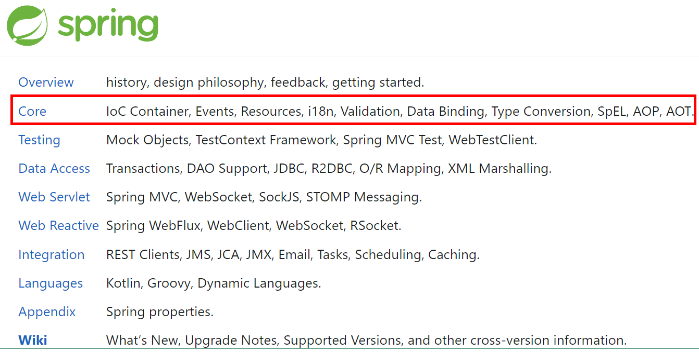

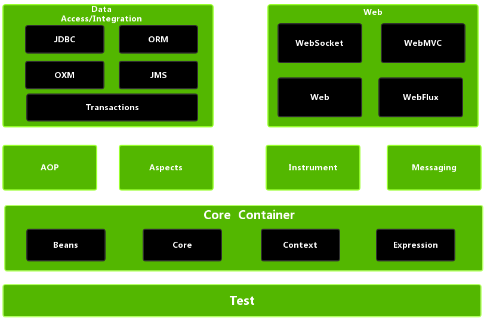

**Spring Core（核心容器）**：spring core 提供了IOC 、DI、Bean 配置装载创建的核心实现，核心概念： Beans、BeanFactory、BeanDefinitions、ApplicationContext

- spring-core ：IOC  和 DI 的基本实现

- spring-Beans：BeanFactory 和 Bean 的装配管理（BeanFactory）
- spring-context：Spring context 上下文，即 IOC  容器（AppliactionContext）
- spring-expression：spring 表达式语言

**Spring AOP**

- spring-aop：面向切面编程的应用模块，整合 ASM，CGLib，JDK Proxy
- spring-aspects：集成 AspectJ，AOP 应用框架
- spring-instrument：动态 Class Loading 模块

**Spring Data Access**

- spring-jdbc：spring 对 JDBC 的封装，用于简化 jdbc 操作
- spring-orm：java 对象与数据库数据的映射框架
- spring-oxm：对象与 xml 文件的映射框架
- spring-jms： Spring 对 Java Message Service（java 消息服务）的封装，用于服务之间相互通信
- spring-tx：spring jdbc 事务管理

**Spring Web**

- spring-web：最基础的 web 支持，建立于 spring-context 之上，通过 servlet 或 listener 来初始化 IOC  容器
- spring-webmvc：实现 web mvc
- spring-websocket：与前端的全双工通信协议
- spring-webflux：Spring 5.0 提供的，用于取代传统 java servlet，非阻塞式 Reactive Web 框架，异步，非阻塞，事件驱动的服务

**Spring Message**

- Spring-messaging：spring 4.0 提供的，为 Spring 集成一些基础的报文传送服务

**Spring test**

- spring-test：集成测试支持，主要是对 junit 的封装


## 4、入门

**添加依赖：**

```xml
<dependencies>
    <!--spring context依赖-->
    <!--当你引入Spring Context依赖之后，表示将Spring的基础依赖引入了-->
    <dependency>
        <groupId>org.springframework</groupId>
        <artifactId>spring-context</artifactId>
        <version>6.0.2</version>
    </dependency>

    <!--junit5测试-->
    <dependency>
        <groupId>org.junit.jupiter</groupId>
        <artifactId>junit-jupiter-api</artifactId>
        <version>5.3.1</version>
    </dependency>

    <!--log4j2的依赖-->
    <dependency>
        <groupId>org.apache.logging.log4j</groupId>
        <artifactId>log4j-core</artifactId>
        <version>2.19.0</version>
    </dependency>
    <dependency>
        <groupId>org.apache.logging.log4j</groupId>
        <artifactId>log4j-slf4j2-impl</artifactId>
        <version>2.19.0</version>
    </dependency>
</dependencies>
```

**查看依赖：**

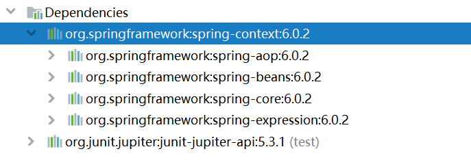

**创建java类**：

```java
public class HelloWorld {
   public HelloWorld() {
        System.out.println("无参数构造方法执行");
    }
    public void sayHello(){
        System.out.println("helloworld");
    }
}
```

**创建配置文件**：

在 resources 目录创建一个 Spring 配置文件 Beans.xml（配置文件名称可随意命名如：springs.xml）


```xml
<?xml version="1.0" encoding="UTF-8"?>
<Beans xmlns="http://www.springframework.org/schema/Beans"
       xmlns:xsi="http://www.w3.org/2001/XMLSchema-instance"
       xsi:schemaLocation="http://www.springframework.org/schema/Beans http://www.springframework.org/schema/Beans/spring-Beans.xsd">

    <!--
    配置 HelloWorld 所对应的 Bean
	即将 HelloWorld 的对象交给 Spring 的 IOC  容器管理
    通过 Bean 标签配置 IOC  容器所管理的 Bean
    属性：
        id：设置 Bean 的唯一标识
        class：设置 Bean 所对应类型的全类名
	-->
    <Bean id="helloWorld" class="spring6.Bean.HelloWorld"></Bean>
    
</Beans>
```

**创建日志配置文件**：

~~~xml
<!-- 
 在类的根路径下提供 log4j2.xml 配置文件（文件名固定为：log4j2.xml，文件必须放到类根路径下。）
-->

<?xml version="1.0" encoding="UTF-8"?>
<configuration>
    <loggers>
        <!--
            level指定日志级别，从低到高的优先级：
                TRACE < DEBUG < INFO < WARN < ERROR < FATAL
                trace：追踪，是最低的日志级别，相当于追踪程序的执行
                debug：调试，一般在开发中，都将其设置为最低的日志级别
                info：信息，输出重要的信息，使用较多
                warn：警告，输出警告的信息
                error：错误，输出错误信息
                fatal：严重错误
        -->
        <root level="DEBUG">
            <appender-ref ref="spring6log"/>
            <appender-ref ref="RollingFile"/>
            <appender-ref ref="log"/>
        </root>
    </loggers>

    <appenders>
        <!--输出日志信息到控制台-->
        <console name="spring6log" target="SYSTEM_OUT">
            <!--控制日志输出的格式-->
            <PatternLayout pattern="%d{yyyy-MM-dd HH:mm:ss SSS} [%t] %-3level %logger{1024} - %msg%n"/>
        </console>

        <!--文件会打印出所有信息，这个log每次运行程序会自动清空，由append属性决定，适合临时测试用-->
        <File name="log" fileName="d:/spring6_log/test.log" append="false">
            <PatternLayout pattern="%d{HH:mm:ss.SSS} %-5level %class{36} %L %M - %msg%xEx%n"/>
        </File>

        <!-- 这个会打印出所有的信息，
            每次大小超过size，
            则这size大小的日志会自动存入按年份-月份建立的文件夹下面并进行压缩，
            作为存档-->
        <RollingFile name="RollingFile" 
                     fileName="d:/spring6_log/app.log"
                     filePattern="log/$${date:yyyy-MM}/app-%d{MM-dd-yyyy}-%i.log.gz">
            <PatternLayout pattern="%d{yyyy-MM-dd 'at' HH:mm:ss z} %-5level %class{36} %L %M - %msg%xEx%n"/>
            <SizeBasedTriggeringPolicy size="50MB"/>
            <!-- 
				DefaultRolloverStrategy属性如不设置，
            	则默认为最多同一文件夹下7个文件，这里设置了20 
			-->
            <DefaultRolloverStrategy max="20"/>
        </RollingFile>
    </appenders>
</configuration>
~~~


**创建测试类测试**：

```java
public class HelloWorldTest {
    @Test
    public void testHelloWorld(){
        ApplicationContext ac = new ClassPathXmlApplicationContext("Beans.xml");
        HelloWorld helloworld = (HelloWorld) ac.getBean("helloWorld");
        helloworld.sayHello();
        logger.info("执行成功");
    }
}
```

**运行测试程序**：


**流程分析**：

~~~java
// dom4j 解析 Beans.xml 文件，从中获取 class 属性值：类的全类名
// 通过反射机制调用无参数构造方法创建对象
Class clazz = Class.forName("spring6.Bean.HelloWorld");
// Object obj = clazz.newInstance();
Object object = clazz.getDeclaredConstructor().newInstance();
~~~

Bean 对象最终存储在 Spring 容器中，在 Spring 源码底层就是一个 Map 集合，存储 Bean 的 Map 在 **DefaultListableBeanFactory** 类

```java
private final Map<String, BeanDefinition> BeanDefinitionMap = new ConcurrentHashMap<>(256);
```

Spring 容器加载到 Bean 类时，会把这个类的描述信息，以包名加类名的方式存到 BeanDefinitionMap 中

- Key：String，默认是**类名首字母小写**

- Value：**BeanDefinition 存的是类的定义**（描述信息），通常叫 BeanDefinition 接口为：Bean 的定义对象


# 2、IOC 

## 1、概述

Spring 通过 IOC  容器来管理所有 Java 对象的实例化和初始化，控制对象与对象之间的依赖关系，由 IOC  容器管理的 Java 对象称为 Spring Bean，它与使用关键字 new 创建的 Java 对象没有任何区别

IOC  容器是 Spring 框架中最重要的核心组件之一，它贯穿了 Spring 从诞生到成长的整个过程


## 2、控制反转

将对象的**创建权利**交出去，交给第三方容器负责

将**对象之间关系的维护权**交出去，交给第三方容器负责

控制反转通过 DI（Dependency Injection）依赖注入实现


## 2、依赖注入

**Spring 创建对象的过程中，将对象依赖属性通过配置进行注入**

依赖注入常见的实现方式包括两种：

- 第一种：set 注入
- 第二种：构造注入

**Bean 管理说的是：Bean 对象的创建，以及 Bean 对象中属性的赋值（或者叫做 Bean 对象之间关系的维护）**


## 3、IOC 实现

Spring 的 IOC 容器就是 IOC 思想的一个落地的产品实现

IOC 容器中管理的组件也叫做 Bean，在创建 Bean 之前，首先需要创建 IOC 容器，Spring 提供了 IOC  容器的两种实现方式：

- **BeanFactory**：这是 IOC 容器的基本实现，是 Spring 内部使用的接口，面向 Spring 本身，不提供给开发人员使用

- **ApplicationContext**：BeanFactory 的子接口，提供了更多高级特性，面向 Spring 的使用者，几乎所有场合都使用 ApplicationContext 而不是底层的 BeanFactory
  - **ApplicationContext的主要实现类**


| 类型名                          | 简介                                                         |
| ------------------------------- | ------------------------------------------------------------ |
| ClassPathXmlApplicationContext  | 通过读取类路径下的 XML 格式的配置文件创建 IOC 容器对象       |
| FileSystemXmlApplicationContext | 通过文件系统路径读取 XML 格式的配置文件创建 IOC 容器对象     |
| ConfigurableApplicationContext  | ApplicationContext 的子接口，包含一些扩展方法 refresh() 和 close() ，让 ApplicationContext 具有启动、关闭和刷新上下文的能力 |
| WebApplicationContext           | 专门为 Web 应用准备，基于 Web 环境创建 IOC 容器对象，并将对象引入存入 ServletContext 域中 |

BeanFactory 的功能通过其他接口得到不断扩展：

- ListableBeanFactory：该接口定义了访问容器中 Bean 基本信息的若干方法，如查看Bean的个数、获取某一类型 Bean 的配置名、查看容器中是否包括某一 Bean 等
- HierarchicalBeanFactory：父子级联 IOC 容器的接口，子容器可以通过接口方法访问父容器
- ConfigurableBeanFactory：重要的接口，增强 IOC 容器的定制性，设置类装载器、属性编辑器、容器初始化后置处理器等方法

- AutowireCapableBeanFactory：设定容器中的 Bean 按某种规则（如按名字匹配、按类型匹配等）进行自动装配


## 4、基于 XML

### 1、准备条件

~~~java
// bean 目录下
public class HelloWorld {
    public HelloWorld() {
        System.out.println("无参数构造方法执行");
    }

    public void sayHello(){
        System.out.println("helloworld");
    }
}

// bean 目录下
public class HelloWorldTest {
    private Logger logger = LoggerFactory.getLogger(HelloWorldTest.class);

    @Test
    public void testHelloWorld(){
        
    }
}
~~~

~~~xml
# 标记 Bean
<Bean id="helloWorld" class="spring6.Bean.HelloWorld"></Bean>
~~~


### 2、获取 Bean

#### 1、根据 id

由于 id 属性指定了 Bean 的唯一标识，所以根据 Bean 标签的 id 属性可以精确获取到一个组件对象

~~~java
HelloWorld helloworld = (HelloWorld) ac.getBean("helloWorld");
~~~


#### 2、根据类型

```java
@Test
public void testHelloWorld1(){
	ApplicationContext ac = new ClassPathXmlApplicationContext("Beans.xml");
    HelloWorld Bean = ac.getBean(HelloWorld.class);
    Bean.sayHello();
}
```

**注意**：

- 当根据类型获取 Bean 时，要求 IOC 容器中指定类型的 Bean 有且只能有一个

  - 当 IOC 容器中一共配置了两个，且根据类型获取时会抛出异常

```xml
<Bean id="helloworldOne" class="com.spring6.Bean.HelloWorld"></Bean>
<Bean id="helloworldTwo" class="com.spring6.Bean.HelloWorld"></Bean>
```

> org.springframework.Beans.factory.NoUniqueBeanDefinitionException: No qualifying Bean of type 'com.spring6.Bean.HelloWorld' available: expected single matching Bean but found 2: helloworldOne,helloworldTwo


#### 3、根据 id 和类型

```java
@Test
public void testHelloWorld2(){
	ApplicationContext ac = new ClassPathXmlApplicationContext("Beans.xml");
    HelloWorld Bean = ac.getBean("helloworld", HelloWorld.class);
    Bean.sayHello();
}
```


### 3、依赖注入

#### 1、Setter 注入

```java
package com.spring6.Bean;

public class Student {

    private Integer id;

    private String name;

    private Integer age;

    private String sex;

    public Student() {
    }

}
```

```xml
<!-- 配置 Bean 时为属性赋值 -->
<Bean id="studentOne" class="com.spring6.Bean.Student">
    <!-- property 标签：通过组件类的 setXxx() 方法给组件对象设置属性 -->
    <!-- name 属性：指定属性名（这个属性名是 getXxx()、setXxx() 方法定义的，和成员变量无关） -->
    <!-- value 属性：指定属性值 -->
    <property name="id" value="1001"></property>
    <property name="name" value="张三"></property>
    <property name="age" value="23"></property>
    <property name="sex" value="男"></property>
</Bean>
```


#### 2、构造器注入

```java
// 添加有参构造
public Student(Integer id, String name, Integer age, String sex) {
    this.id = id;
    this.name = name;
    this.age = age;
    this.sex = sex;
}
```

```xml
<Bean id="studentTwo" class="com.spring6.Bean.Student">
    <constructor-arg value="1002"></constructor-arg>
    <constructor-arg value="李四"></constructor-arg>
    <constructor-arg value="33"></constructor-arg>
    <constructor-arg value="女"></constructor-arg>
</Bean>
```

**注意**：

- **constructor**-**arg** 标签还有两个属性可以进一步描述构造器参数：

  - **index** 属性：指定参数所在位置的索引（从0开始）

  - **name** 属性：指定参数名


#### 3、特殊值处理

##### 1、字面量赋值

```xml
<!-- 使用 value 属性给 Bean 的属性赋值时，Spring 会把 value 属性的值看做字面量 -->
<property name="name" value="张三"/>
```


##### 2、null 值

```xml
<property name="name">
    <null />
</property>
```

注意：

- ~~~xml
  <property name="name" value="null"></property>
  ~~~

  - 以上写法，为 name 所赋的值是字符串 null


##### 3、xml 实体

```xml
<!-- 小于号在 XML 文档中用来定义标签的开始，不能随便使用 -->
<!-- 解决方案一：使用 XML 实体来代替 -->
<property name="expression" value="a &lt; b"/>
```


##### 4、CDATA 节

```xml
<property name="expression">
    <!-- 解决方案二：使用 CDATA 节 -->
    <!-- CDATA 中的 C 代表 Character，是文本、字符的含义，CDATA 就表示纯文本数据 -->
    <!-- XML 解析器看到 CDATA 节就知道这里是纯文本，就不会当作 XML 标签或属性来解析 -->
    <!-- 所以 CDATA 节中写什么符号都随意 -->
    <value><![CDATA[a < b]]></value>
</property>
```


#### 4、对象类型注入

```java
package com.spring6.Bean
    
public class Clazz {

    private Integer clazzId;

    private String clazzName;

    public Clazz() {
    }

    public Clazz(Integer clazzId, String clazzName) {
        this.clazzId = clazzId;
        this.clazzName = clazzName;
    }
}
```

```java
// Student类中添加以下代码
private Clazz clazz;

public Clazz getClazz() {
	return clazz;
}

public void setClazz(Clazz clazz) {
	this.clazz = clazz;
}
```


##### 1、引用外部 Bean

配置 Clazz 类型的 Bean：

```xml
<Bean id="clazzOne" class="com.spring6.Bean.Clazz">
    <property name="clazzId" value="1111"></property>
    <property name="clazzName" value="财源滚滚班"></property>
</Bean>
```

为 Student 中的 clazz 属性赋值：

```xml
<Bean id="studentFour" class="com.spring6.Bean.Student">
    <property name="id" value="1004"></property>
    <property name="name" value="赵六"></property>
    <property name="age" value="26"></property>
    <property name="sex" value="女"></property>
    <!-- ref 属性：引用 IOC 容器中某个 Bean 的 id，将所对应的 Bean 为属性赋值 -->
    <property name="clazz" ref="clazzOne"></property>
</Bean>
```

错误演示：

```xml
<Bean id="studentFour" class="com.spring6.Bean.Student">
    <property name="id" value="1004"></property>
    <property name="name" value="赵六"></property>
    <property name="age" value="26"></property>
    <property name="sex" value="女"></property>
    <property name="clazz" value="clazzOne"></property>
</Bean>
```

如果错把 ref 属性写成了 value 属性，会抛出异常： Caused by: java.lang.IllegalStateException: Cannot convert value of type 'java.lang.String' to required type 'com.spring6.Bean.Clazz' for property 'clazz': no matching editors or conversion strategy found 

意思是不能把 String 类型转换成我们要的 Clazz 类型，说明使用 value 属性时，Spring 只把这个属性看做一个普通的字面量，不会认为这是一个 Bean 的 id，更不会根据它去找到 Bean 来赋值


##### 2、内部 Bean

```xml
<Bean id="studentFour" class="com.spring6.Bean.Student">
    <property name="id" value="1004"></property>
    <property name="name" value="赵六"></property>
    <property name="age" value="26"></property>
    <property name="sex" value="女"></property>
    <property name="clazz">
        <!-- 在一个 Bean 中再声明一个 Bean 就是内部 Bean -->
        <!-- 内部 Bean 只能用于给属性赋值，不能在外部通过 IOC 容器获取，因此可以省略 id 属性 -->
        <Bean id="clazzInner" class="com.spring6.Bean.Clazz">
            <property name="clazzId" value="2222"></property>
            <property name="clazzName" value="远大前程班"></property>
        </Bean>
    </property>
</Bean>
```


##### 3、级联属性赋值

```xml
<Bean id="studentFour" class="com.spring6.Bean.Student">
    <property name="id" value="1004"></property>
    <property name="name" value="赵六"></property>
    <property name="age" value="26"></property>
    <property name="sex" value="女"></property>
    <property name="clazz" ref="clazzOne"></property>
    <property name="clazz.clazzId" value="3333"></property>
    <property name="clazz.clazzName" value="最强王者班"></property>
</Bean>
```


#### 5、数组类型注入

```java
// Student 类中添加以下代码
private String[] hobbies;

public String[] getHobbies() {
    return hobbies;
}

public void setHobbies(String[] hobbies) {
    this.hobbies = hobbies;
}
```

```xml
<Bean id="studentFour" class="com.spring.Bean6.Student">
    <property name="id" value="1004"></property>
    <property name="name" value="赵六"></property>
    <property name="age" value="26"></property>
    <property name="sex" value="女"></property>
    <property name="clazz" ref="clazzOne"></property>
    <property name="hobbies">
        <array>
            <value>抽烟</value>
            <value>喝酒</value>
            <value>烫头</value>
        </array>
    </property>
</Bean>
```


#### 6、集合类型注入

```java
// Clazz 类中添加以下代码
private List<Student> students;

public List<Student> getStudents() {
    return students;
}

public void setStudents(List<Student> students) {
    this.students = students;
}
```


##### 1、List 类型注入

```xml
<Bean id="clazzTwo" class="com.spring6.Bean.Clazz">
    <property name="clazzId" value="4444"></property>
    <property name="clazzName" value="Javaee0222"></property>
    <property name="students">
        <list>
            <ref Bean="studentOne"></ref>
            <ref Bean="studentTwo"></ref>
            <ref Bean="studentThree"></ref>
        </list>
    </property>
</Bean>
```

> 若为 Set 集合类型属性赋值，只需要将其中的 list 标签改为 set 标签即可


##### 2、Map 类型注入

```java
package com.spring6.Bean;
public class Teacher {

    private Integer teacherId;

    private String teacherName;

    public Teacher(Integer teacherId, String teacherName) {
        this.teacherId = teacherId;
        this.teacherName = teacherName;
    }

    public Teacher() {

    }
    
    @Override
    public String toString() {
        return "Teacher{" +
                "teacherId=" + teacherId +
                ", teacherName='" + teacherName + '\'' +
                '}';
    }
}
```

```java
// Student 类中添加以下代码
private Map<String, Teacher> teacherMap;

public Map<String, Teacher> getTeacherMap() {
    return teacherMap;
}

public void setTeacherMap(Map<String, Teacher> teacherMap) {
    this.teacherMap = teacherMap;
}
```

```xml
<Bean id="teacherOne" class="com.spring6.Bean.Teacher">
    <property name="teacherId" value="10010"></property>
    <property name="teacherName" value="大宝"></property>
</Bean>

<Bean id="teacherTwo" class="com.spring6.Bean.Teacher">
    <property name="teacherId" value="10086"></property>
    <property name="teacherName" value="二宝"></property>
</Bean>

<Bean id="studentFour" class="com.spring6.Bean.Student">
    <property name="id" value="1004"></property>
    <property name="name" value="赵六"></property>
    <property name="age" value="26"></property>
    <property name="sex" value="女"></property>
    <property name="clazz" ref="clazzOne"></property>
    <property name="hobbies">
        <array>
            <value>抽烟</value>
            <value>喝酒</value>
            <value>烫头</value>
        </array>
    </property>
    <property name="teacherMap">
        <map>
            <entry>
                <key>
                    <value>10010</value>
                </key>
                <ref Bean="teacherOne"></ref>
            </entry>
            <entry>
                <key>
                    <value>10086</value>
                </key>
                <ref Bean="teacherTwo"></ref>
            </entry>
        </map>
    </property>
</Bean>
```


##### 3、引用集合类型

```xml
<!-- list 集合类型的 Bean -->
<util:list id="students">
    <ref Bean="studentOne"></ref>
    <ref Bean="studentTwo"></ref>
    <ref Bean="studentThree"></ref>
</util:list>

<!-- map 集合类型的 Bean -->
<util:map id="teacherMap">
    <entry>
        <key>
            <value>10010</value>
        </key>
        <ref Bean="teacherOne"></ref>
    </entry>
    <entry>
        <key>
            <value>10086</value>
        </key>
        <ref Bean="teacherTwo"></ref>
    </entry>
</util:map>

<Bean id="clazzTwo" class="com.spring6.Bean.Clazz">
    <property name="clazzId" value="4444"></property>
    <property name="clazzName" value="Javaee0222"></property>
    <property name="students" ref="students"></property>
</Bean>

<Bean id="studentFour" class="com.spring6.Bean.Student">
    <property name="id" value="1004"></property>
    <property name="name" value="赵六"></property>
    <property name="age" value="26"></property>
    <property name="sex" value="女"></property>
    <property name="clazz" ref="clazzOne"></property>
    <property name="hobbies">
        <array>
            <value>抽烟</value>
            <value>喝酒</value>
            <value>烫头</value>
        </array>
    </property>
    <property name="teacherMap" ref="teacherMap"></property>
</Bean>
```


**注意**：

- 使用util:list、util:map标签必须引入相应的命名空间

  - ~~~xml
    <?xml version="1.0" encoding="UTF-8"?>
    <Beans xmlns="http://www.springframework.org/schema/Beans"
        xmlns:xsi="http://www.w3.org/2001/XMLSchema-instance"
        xmlns:util="http://www.springframework.org/schema/util"
        xsi:schemaLocation="http://www.springframework.org/schema/util
        http://www.springframework.org/schema/util/spring-util.xsd
        http://www.springframework.org/schema/Beans
        http://www.springframework.org/schema/Beans/spring-Beans.xsd">
    ~~~


#### 7、p 命名空间注入

```xml
<?xml version="1.0" encoding="UTF-8"?>
<Beans xmlns="http://www.springframework.org/schema/Beans"
       xmlns:xsi="http://www.w3.org/2001/XMLSchema-instance"
       xmlns:util="http://www.springframework.org/schema/util"
       xmlns:p="http://www.springframework.org/schema/p"
       xsi:schemaLocation="http://www.springframework.org/schema/util
       http://www.springframework.org/schema/util/spring-util.xsd
       http://www.springframework.org/schema/Beans
       http://www.springframework.org/schema/Beans/spring-Beans.xsd">
```

引入 p 命名空间后，可以通过以下方式为 Bean 的各个属性赋值

```xml
<Bean id="studentSix" class="com.spring6.Bean.Student"
    p:id="1006" p:name="小明" p:clazz-ref="clazzOne" p:teacherMap-ref="teacherMap"></Bean>
```


#### 8、外部属性文件注入

```xml
<!-- 添加依赖 -->
<!-- MySQL驱动 -->
<dependency>
    <groupId>mysql</groupId>
    <artifactId>mysql-connector-java</artifactId>
    <version>8.0.30</version>
</dependency>

<!-- 数据源 -->
<dependency>
    <groupId>com.alibaba</groupId>
    <artifactId>druid</artifactId>
    <version>1.2.15</version>
</dependency>
```


```properties
# 创建外部属性文件
jdbc.user=root
jdbc.password=xxxx
jdbc.url=jdbc:mysql://localhost:3306/ssm?serverTimezone=UTC
jdbc.driver=com.mysql.cj.jdbc.Driver
```

```xml
<!-- 引入context 名称空间 -->
<?xml version="1.0" encoding="UTF-8"?>
<Beans xmlns="http://www.springframework.org/schema/Beans"
       xmlns:xsi="http://www.w3.org/2001/XMLSchema-instance"
       xmlns:context="http://www.springframework.org/schema/context"
       xsi:schemaLocation="http://www.springframework.org/schema/Beans
       http://www.springframework.org/schema/Beans/spring-Beans.xsd
       http://www.springframework.org/schema/context
       http://www.springframework.org/schema/context/spring-context.xsd">
</Beans>
```

```xml
<!-- 引入外部属性文件 -->
<context:property-placeholder location="classpath:jdbc.properties"/>
```

**注意**：

- 在使用 <context:property-placeholder> 元素加载外包配置文件功能前，首先需要在 XML 配置的一级标签 \<Beans> 中添加 context 相关的约束

```xml
<!-- 配置 Bean -->
<Bean id="druidDataSource" class="com.alibaba.druid.pool.DruidDataSource">
    <property name="url" value="${jdbc.url}"/>
    <property name="driverClassName" value="${jdbc.driver}"/>
    <property name="username" value="${jdbc.user}"/>
    <property name="password" value="${jdbc.password}"/>
</Bean>
```


### 4、自动装配

#### 1、概述

**自动装配**：根据指定的策略，在 IOC 容器中匹配某一个 Bean，自动为指定的 Bean 中所依赖的类类型或接口类型属性赋值

使用 Bean 标签的 **autowire** 属性设置自动装配效果

```java
package com.spring6.autowire.controller
public class UserController {
    private UserService userService;
    
    public void setUserService(UserService userService) {
        this.userService = userService;
    }
    public void saveUser(){
        userService.saveUser();
    }
}
```

```java
package com.spring6.autowire.service
public interface UserService {void saveUser();}
```

```java
package com.spring6.autowire.service.impl
public class UserServiceImpl implements UserService {
    
    private UserDao userDao;

    public void setUserDao(UserDao userDao) {
        this.userDao = userDao;
    }
    @Override
    public void saveUser() {
        userDao.saveUser();
    }
}
```

```java
package com.spring6.autowire.dao
public interface UserDao {void saveUser();}
```

```java
package com.spring6.autowire.dao.impl
public class UserDaoImpl implements UserDao {
    @Override
    public void saveUser() {
        System.out.println("保存成功");
    }
}
```


#### 2、byType

byType：根据类型匹配 IOC 容器中的某个兼容类型的 Bean，为属性自动赋值

若在 IOC 中，没有任何一个兼容类型的 Bean 能够为属性赋值，则该属性不装配，即值为默认值 null

若在 IOC 中，有多个兼容类型的Bean能够为属性赋值，则抛出异常 NoUniqueBeanDefinitionException

```xml
<Bean id="userController" class="com.spring6.autowire.controller.UserController" autowire="byType"></Bean>

<Bean id="userService" class="com.spring6.autowire.service.impl.UserServiceImpl" autowire="byType"></Bean>

<Bean id="userDao" class="com.spring6.autowire.dao.impl.UserDaoImpl"></Bean>
```


#### 3、byName

byName：将自动装配的属性的属性名，作为 Bean 的 id 在 IOC 容器中匹配相对应的 Bean 进行赋值

```xml
<Bean id="userController" class="com.spring6.autowire.controller.UserController" autowire="byName"></Bean>

<Bean id="userService" class="com.spring6.autowire.service.impl.UserServiceImpl" autowire="byName"></Bean>
<Bean id="userServiceImpl" class="com.spring6.autowire.service.impl.UserServiceImpl" autowire="byName"></Bean>

<Bean id="userDao" class="com.spring6.autowire.dao.impl.UserDaoImpl"></Bean>
<Bean id="userDaoImpl" class="com.spring6.autowire.dao.impl.UserDaoImpl"></Bean>
```

```java
@Test
public void testAutoWireByXML(){
    ApplicationContext ac = new ClassPathXmlApplicationContext("autowire-xml.xml");
    UserController userController = ac.getBean(UserController.class);
    userController.saveUser();
}
```


## 5、Bean 的作用域

在 Spring 中可以通过配置 Bean 标签的 scope 属性来指定 Bean 的作用域范围，各取值含义参加下表：

| 取值              | 含义                                        | 创建对象的时机   |
| ----------------- | ------------------------------------------- | ---------------- |
| singleton（默认） | 在 IOC 容器中，这个 Bean 的对象始终为单实例 | IOC 容器初始化时 |
| prototype         | 这个 Bean 在 IOC 容器中有多个实例           | 获取 Bean 时     |

如果是在 WebApplicationContext 环境下还会有另外几个作用域（但不常用）：

| 取值    | 含义                 |
| ------- | -------------------- |
| request | 在一个请求范围内有效 |
| session | 在一个会话范围内有效 |

~~~xml
<!-- scope属性：取值singleton（默认值），Bean在IOC容器中只有一个实例，IOC容器初始化时创建对象 -->
<!-- scope属性：取值prototype，Bean在IOC容器中可以有多个实例，getBean()时创建对象 -->
<Bean class="com.spring6.Bean.Student" scope="prototype"></Bean>
~~~


## 6、Bean 的生命周期

### 1、生命周期过程

1. Bean 对象创建（调用无参构造器）

2. 给 Bean 对象设置属性

3. Bean 的后置处理器（初始化之前）

4. Bean 对象初始化（需在配置 Bean 时指定初始化方法）

5. Bean 的后置处理器（初始化之后）

6. Bean 对象就绪可以使用

7. Bean 对象销毁（需在配置 Bean 时指定销毁方法）

8. IOC 容器关闭


```java
public class User {

    private Integer id;

    private String username;

    private String password;

    private Integer age;

    public User() {
        System.out.println("生命周期：1、创建对象");
    }

    public User(Integer id, String username, String password, Integer age) {
        this.id = id;
        this.username = username;
        this.password = password;
        this.age = age;
    }
    
    // .....

    public void initMethod(){
        System.out.println("生命周期：3、初始化");
    }

    public void destroyMethod(){
        System.out.println("生命周期：5、销毁");
    }

}
```

**注意**：

- 其中的 initMethod() 和 destroyMethod()，可以通过配置 Bean 指定为初始化和销毁的方法

```xml
<!-- 使用init-method属性指定初始化方法 -->
<!-- 使用destroy-method属性指定销毁方法 -->
<Bean class="com.spring6.Bean.User" scope="prototype" init-method="initMethod" destroy-method="destroyMethod">
    <property name="id" value="1001"></property>
    <property name="username" value="admin"></property>
    <property name="password" value="123456"></property>
    <property name="age" value="23"></property>
</Bean>
```


### 2、Bean 的后置处理器

Bean 的后置处理器会在生命周期的**初始化前后**添加额外的操作，需要实现 **BeanPostProcessor** 接口，且配置到 IOC 容器中，需要注意的是，Bean 后置处理器不是单独针对某一个 Bean 生效，而是针对 IOC 容器中所有 Bean 都会执行

创建 Bean 的后置处理器：

```java
package com.spring6.process;
    
import org.springframework.Beans.BeansException;
import org.springframework.Beans.factory.config.BeanPostProcessor;

public class MyBeanProcessor implements BeanPostProcessor {
    
    @Override
    public Object postProcessBeforeInitialization(Object Bean, String BeanName) throws BeansException {
        System.out.println("☆☆☆" + BeanName + " = " + Bean);
        return Bean;
    }
    
    @Override
    public Object postProcessAfterInitialization(Object Bean, String BeanName) throws BeansException {
        System.out.println("★★★" + BeanName + " = " + Bean);
        return Bean;
    }
}
```

在 IOC 容器中配置后置处理器：

```xml
<!-- Bean 的后置处理器要放入 IOC 容器才能生效 -->
<Bean id="myBeanProcessor" class="com.spring6.process.MyBeanProcessor"/>
```

**扩展**：

- Spring 底层对 BeanPostProcessor 的使用：Bean 赋值，注入其他组件，@Autowired，生命周期注解功能，@Asyncxxx 等等，都是通过 BeanPostProcessor 来完成


### 3、FactoryBean

FactoryBean 是 Spring 提供的一种**整合第三方框架**的常用机制

和普通的 Bean 不同，配置一个 FactoryBean 类型的 Bean，在获取 Bean 的时候得到的并不是 class 属性中配置的这个类的对象，而是getObject() 方法的返回值

通过这种机制，Spring 可以把复杂组件创建的详细过程和繁琐细节都屏蔽起来，只把最简洁的使用界面展示

整合 Mybatis 时，Spring 就是通过 FactoryBean 机制来创建 SqlSessionFactory 对象的

```java
package org.springframework.Beans.factory;

import org.springframework.lang.Nullable;

public interface FactoryBean<T> {

    String OBJECT_TYPE_ATTRIBUTE = "factoryBeanObjectType";

    @Nullable
    T getObject() throws Exception;

    @Nullable
    Class<?> getObjectType();

    default boolean isSingleton() {
        return true;
    }
}
```

```java
package com.spring6.Bean;
public class UserFactoryBean implements FactoryBean<User> {
   
    @Override
    public User getObject() throws Exception {
        return new User();
    }

    @Override
    public Class<?> getObjectType() {
        return User.class;
    }
}
```

```xml
<Bean id="user" class="com.spring6.Bean.UserFactoryBean"></Bean>
```

```java
@Test
public void testUserFactoryBean(){
    // 获取IOC容器
    ApplicationContext ac = new ClassPathXmlApplicationContext("spring-factoryBean.xml");
    User user = (User) ac.getBean("user");
    System.out.println(user);
}
```


## 7、基于注解

### 1、概述

从 Java 5 开始，Java 增加了对注解（Annotation）的支持，它是代码中的一种特殊标记，可以在编译、类加载和运行时被读取，执行相应的处理，开发人员可以通过注解在不改变原有代码和逻辑的情况下，在源代码中嵌入补充信息

Spring 从 2.5 版本开始提供了对注解技术的全面支持，使用注解来实现自动装配，简化 Spring 的 XML 配置

Spring 通过注解实现自动装配的步骤如下：

1. 引入依赖
2. 开启组件扫描
3. 使用注解定义 Bean
4. 依赖注入


### 2、开启组件扫描

Spring 默认不使用注解装配 Bean，因此需要在 Spring 的 XML 配置中，通过 <context:component-scan> 元素开启 Spring Beans 的自动扫描功能

开启此功能后，Spring 会自动从扫描指定的包（base-package 属性设置）及其子包下的所有类，如果类上使用 @Component 注解，就将该类装配到容器中

```xml
<?xml version="1.0" encoding="UTF-8"?>
<Beans xmlns="http://www.springframework.org/schema/Beans"
       xmlns:xsi="http://www.w3.org/2001/XMLSchema-instance"
       xmlns:context="http://www.springframework.org/schema/context"
       xsi:schemaLocation="http://www.springframework.org/schema/Beans
    http://www.springframework.org/schema/Beans/spring-Beans-3.0.xsd
    http://www.springframework.org/schema/context
            http://www.springframework.org/schema/context/spring-context.xsd">
    <!--开启组件扫描功能-->
    <context:component-scan base-package="com.spring6"></context:component-scan>
</Beans>
```

**注意**：

- 在使用 <context:component-scan> 元素开启自动扫描功能前，首先需要在 XML 配置的一级标签 \<Beans> 中添加 context 相关的约束


### 3、扫描方式

**基本扫描**：

```xml
<context:component-scan base-package="com.spring6"> </context:component-scan>
```

**指定要排除的组件**：

```xml
<context:component-scan base-package="com.spring6">
    <!-- context:exclude-filter标签：指定排除规则 -->
    <!-- 
 		type：设置排除或包含的依据
		type="annotation"，根据注解排除，expression 中设置要排除的注解的全类名
		type="assignable"，根据类型排除，expression 中设置要排除的类型的全类名
	-->
    <context:exclude-filter type="annotation" expression="org.springframework.stereotype.Controller"/>
    <!--
	<context:exclude-filter type="assignable" expression="com.spring6.controller.UserController"/>
	-->
</context:component-scan>
```

**仅扫描指定组件**：

```xml
<context:component-scan base-package="com" use-default-filters="false">
    <!-- context:include-filter 标签：指定在原有扫描规则的基础上追加的规则 -->
    <!-- use-default-filters 属性：取值 false 表示关闭默认扫描规则 -->
    <!-- 此时必须设置 use-default-filters="false"，因为默认规则即扫描指定包下所有类 -->
    <!-- 
 		type：设置排除或包含的依据
		type="annotation"，根据注解排除，expression 中设置要排除的注解的全类名
		type="assignable"，根据类型排除，expression 中设置要排除的类型的全类名
	-->
    <context:include-filter type="annotation" expression="org.springframework.stereotype.Controller"/>
	<!--
		<context:include-filter type="assignable" expression="com.spring6.controller.UserController"/>
	-->
</context:component-scan>
```


### 3、使用注解定义 Bean

Spring 提供了以下多个注解，这些注解可以直接标注在 Java 类上，将它们定义成 Spring Bean

| 注解        | 说明                                                         |
| ----------- | ------------------------------------------------------------ |
| @Component  | 该注解用于描述 Spring 中的 Bean，它是一个泛化的概念，仅仅表示容器中的一个组件（Bean），并且可以作用在应用的任何层次，例如 Service 层、Dao 层等，使用时只需将该注解标注在相应类上即可 |
| @Repository | 该注解用于将数据访问层（Dao 层）的类标识为 Spring 中的 Bean，其功能与 @Component 相同 |
| @Service    | 该注解通常作用在业务层（Service 层），用于将业务层的类标识为 Spring 中的 Bean，其功能与 @Component 相同 |
| @Controller | 该注解通常作用在控制层（如SpringMVC 的 Controller），用于将控制层的类标识为 Spring 中的 Bean，其功能与 @Component 相同 |


### 4、@Autowired 注入

#### 1、概述

单独使用 @Autowired 注解，**默认根据类型装配**【默认是byType】

```java
package org.springframework.Beans.factory.annotation;

import java.lang.annotation.Documented;
import java.lang.annotation.ElementType;
import java.lang.annotation.Retention;
import java.lang.annotation.RetentionPolicy;
import java.lang.annotation.Target;

@Target({ElementType.CONSTRUCTOR, ElementType.METHOD, ElementType.PARAMETER, ElementType.FIELD, ElementType.ANNOTATION_TYPE})
@Retention(RetentionPolicy.RUNTIME)
@Documented
public @interface Autowired {
    boolean required() default true;
}
```

源码中有两处需要注意：

- 第一处：该注解可以标注在
  - 构造方法、方法、形参、属性、注解
- 第二处：该注解有一个 required 属性，默认值是 true，表示在注入的时候要求被注入的 Bean 必须是存在的，如果不存在则报错，如果 required 属性设置为 false，表示注入的 Bean 存在或者不存在都没关系，存在的话就注入，不存在的话，也不报错


#### 2、属性注入

```java
@Service
public class UserServiceImpl implements UserService {

    @Autowired
    private UserDao userDao;

    @Override
    public void out() {
        userDao.print();
        System.out.println("Service层执行结束");
    }
}
```

@Autowired 会让 private 变为 public，而标注在 setter 处则不会


####  3、set 注入

```java
@Service
public class UserServiceImpl implements UserService {

    private UserDao userDao;

    @Autowired
    public void setUserDao(UserDao userDao) {
        this.userDao = userDao;
    }

    @Override
    public void out() {
        userDao.print();
        System.out.println("Service层执行结束");
    }
}
```


#### 4、构造方法注入

```java
@Service
public class UserServiceImpl implements UserService {

    private UserDao userDao;

    @Autowired
    public UserServiceImpl(UserDao userDao) {
        this.userDao = userDao;
    }

    @Override
    public void out() {
        userDao.print();
        System.out.println("Service层执行结束");
    }
}
```

**当有参数的构造方法只有一个时，@Autowired注解可以省略**

有多个构造方法时（再添加一个无参构造函数），报错


#### 5、形参上注入

```java
@Service
public class UserServiceImpl implements UserService {

    private UserDao userDao;

    public UserServiceImpl(@Autowired UserDao userDao) {
        this.userDao = userDao;
    }

    @Override
    public void out() {
        userDao.print();
        System.out.println("Service层执行结束");
    }
}
```


#### 7、普通方法注入

标注在普通方法上，Spring 容器创建当前对象，就会调用方法，完成赋值

方法使用的参数，自定义类型的值从 IOC 容器中获取

~~~JAVA
// 标注在方法上，Spring 容器在创建当前对象的时候，就会调用当前方法完成赋值
// 方法使用的参数从 IOC 容器里面进行获取
@Autowired
public void getName(User user){
    System.out.println("主动注入的User："+user.getName());
}
~~~

@Bean 标注的方法参数从容器中获取，和默认不写 @Autowired 效果是一样的，都能自动装配


#### 8、联合 @Qualifier 注解

@Autowired 注解默认根据类型注入，如果要根据名称注入的话，需要配合 @Qualifier 注解一起使用

```java
package com.spring6.service.impl;

import com.spring6.dao.UserDao;
import com.spring6.service.UserService;
import org.springframework.Beans.factory.annotation.Autowired;
import org.springframework.stereotype.Service;

@Service
public class UserServiceImpl implements UserService {

    @Autowired
    @Qualifier("userDaoImpl") // 指定 Bean 的名字
    private UserDao userDao;

    @Override
    public void out() {
        userDao.print();
        System.out.println("Service层执行结束");
    }
}
```


### 5、@Resource注入

#### 1、概述

@Resource 注解也可以完成属性注入，但是不支持搭配 @Primary

- @Resource 注解是 JDK 扩展包中的，也就是说属于 JDK 的一部分，所以该注解是标准注解，更加具有通用性（JSR-250 标准中制定的注解类型，JSR 是 Java 规范提案），而 @Autowired 注解是 Spring 框架的
- **@Resource 注解默认根据名称装配 byName，未指定 name 时，使用属性名作为 name，通过 name 找不到的话会自动启动通过类型 byType 装配**，**@Autowired 注解默认根据类型装配 byType，如果想根据名称装配，需要配合 @Qualifier 注解一起用**
- @Resource 注解用在属性、setter 方法，@Autowired 注解用在属性、setter 方法、构造方法、构造方法参数

- @Resource 注解属于 JDK 扩展包，所以不在 JDK 当中，需要额外引入以下依赖：【**如果是 JDK8 的话不需要额外引入依赖，高于JDK11 或低于 JDK8 需要引入以下依赖**】

```xml
<dependency>
    <groupId>jakarta.annotation</groupId>
    <artifactId>jakarta.annotation-api</artifactId>
    <version>2.1.1</version>
</dependency>
```


#### 2、byName

```java
@Service
public class UserServiceImpl implements UserService {

    @Resource(name = "myUserDao")
    private UserDao myUserDao;

    @Override
    public void out() {
        myUserDao.print();
        System.out.println("Service层执行结束");
    }
}
```

当@Resource 注解使用时没有指定 name 的时候，还是根据 name 进行查找，这个 name 是属性名，还找不到则使用 byType

~~~java
@Resource
private UserDao myUserDao;
~~~


#### 3、其他情况

```java
package com.spring6.service.impl;

import com.spring6.dao.UserDao;
import com.spring6.service.UserService;
import jakarta.annotation.Resource;
import org.springframework.Beans.factory.annotation.Autowired;
import org.springframework.Beans.factory.annotation.Qualifier;
import org.springframework.stereotype.Service;

@Service
public class UserServiceImpl implements UserService {

    @Resource
    private UserDao userDao1;

    @Override
    public void out() {
        userDao1.print();
        System.out.println("Service层执行结束");
    }
}
```

报错，根据异常信息得知：显然当通过 name 找不到的时候，自然会启动 byType 进行注入，以上的错误是因为 UserDao 接口下有两个实现类导致的，所以根据类型注入就会报错，因此根据 byType 注入时，某种类型的 Bean 只能有一个


### 6、全注解开发

全注解开发就是不再使用spring配置文件了，写一个配置类来代替配置文件。

```java
package com.spring6.config;

import org.springframework.context.annotation.ComponentScan;
import org.springframework.context.annotation.Configuration;

@Configuration
//@ComponentScan({"com.spring6.controller", "com.spring6.service","com.spring6.dao"})
@ComponentScan("com.spring6")
public class Spring6Config {}
```

```java
@Test
public void testAllAnnotation(){
    ApplicationContext context = new AnnotationConfigApplicationContext(Spring6Config.class);
    UserController userController = context.getBean("userController", UserController.class);
    userController.out();
    logger.info("执行成功");
}
```


### 7、其他注解

#### 1、@PreDestroy

**销毁**

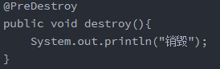


#### 2、@PostConstruct

**初始化**

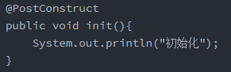

1、创建配置类，替代XML文件

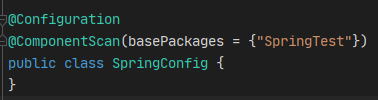

2、加载配置类

3、使用 **AnnotationConfigApplicationContext** 加载

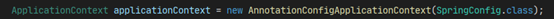


#### 3、@PropertySource

使用 @PropertySource 读取外部配置文件中的 k/v 保存到运行的环境变量中

加载完外部的配置文件以后使用 **${} **取出配置文件的值。

```java
@PropertySource(value={"classpath:/person.properties"})
@Configuration
public class MainConfigOfPropertyValues {
    ......
}
```


#### 4、@Inject(JSR330)

JSR330 规范的注解。

需要导入 **javax.inject** 的包，和 Autowired 的功能一样

**注意**：没有 required=false 的功能，没有使用的必要


#### 5、@Component

默认加在IOC容器中的组件，容器启动会默认调用无参构造器创建对象，再进行初始化赋值等操作

如果只有一个有参构造器，该构造器要用的组件，都是从容器中获取

```java
@Component
public class Boss {
    private Car car;

    // 构造器要用的组件，都是从容器中获取
    public Boss(Car car){
        this.car = car;
        System.out.println("Boss...有参构造器");
    }

}
```


#### 6、@Configuration

配置类==配置文件，告诉Spring这是一个配置类

```java
@Configuration
public class myConfig(){
    .......
}
```


#### 7、@ComponentScans

该注解可以一次声明多个@ComponentScan，因为该注解内含@Repeatable(ComponentScans.class) 

可以指定@ComponentScan可以被@ComponentScans作为数组使用

- **@ComponentScan**  value:指定要扫描的包
- **excludeFilters = Filter[]** ：指定扫描的时候按照什么规则排除那些组件
- **includeFilters = Filter[]** ：指定扫描的时候只需要包含哪些组件
- **FilterType.ANNOTATION**：按照注解
- **FilterType.ASSIGNABLE_TYPE**：按照给定的类型
- **FilterType.ASPECTJ**：使用ASPECTJ表达式
- **FilterType.REGEX**：使用正则指定
- **FilterType.CUSTOM**：使用自定义规则

```java
@ComponentScans(
    value = {
        //扫描哪些包
        @ComponentScan(value="com.atguigu",
                       includeFilters = {
            /*			@Filter(type=FilterType.ANNOTATION,classes={Controller.class}),
						@Filter(type=FilterType.ASSIGNABLE_TYPE,classes={BookService.class}),*/
            			@Filter(type=FilterType.CUSTOM,classes={MyTypeFilter.class})
        				},
                       useDefaultFilters = false
//useDefaultFilters=true/false：
// 指定是否需要使用Spring默认的扫描规则：被@Component, @Repository, @Service, @Controller或者已经声明过@Component自定义注解标记的组件；
      )
   }
)
```

自定义过滤规则：**实现TypeFilter接口**

- 参数**metadataReader**：读取到的当前正在扫描的类的信息

- 参数**metadataReaderFactory**：可以获取到其他任何类信息的

```java
public class MyTypeFilter implements TypeFilter {
	@Override
	public boolean match(MetadataReader metadataReader, MetadataReaderFactory metadataReaderFactory)
			throws IOException {
		//获取当前类注解的信息
		AnnotationMetadata annotationMetadata = metadataReader.getAnnotationMetadata();
		//获取当前正在扫描的类的类信息
		ClassMetadata classMetadata = metadataReader.getClassMetadata();
		//获取当前类资源（类的路径）
		Resource resource = metadataReader.getResource();
		
		String className = classMetadata.getClassName();
		System.out.println("--->"+className);
		if(className.contains("er")){
			return true;
		}
		return false;
	}

}

```


#### 8、@Bean

给容器中注册一个 Bean，类型为**返回值的类型**，id 默认是用**方法名**作为 id

```java
@Bean("person")
public Person person01(){
    return new Person("lisi", 20);
}
```


#### 9、@Lazy

懒加载，只有bean被调用了才创建

```java
@Bean("person")
@Lazy
public Person person01(){}
```


#### 10、@Conditional

条件装配：满足Conditional指定的条件，则进行组件注入

**相关接口**：

接口**Condition**：

- 参数**AnnotatedTypeMetadata**：注释信息

- 参数**ConditionContext**：判断条件能使用的上下文（环境）

```java
public class LinuxCondition implements Condition {
    @Override
    public boolean matches(ConditionContext context, AnnotatedTypeMetadata metadata) {
        // 1、能获取到ioc使用的beanfactory
        ConfigurableListableBeanFactory beanFactory = context.getBeanFactory();
        // 2、获取类加载器
        ClassLoader classLoader = context.getClassLoader();
        // 3、获取当前环境信息
        Environment environment = context.getEnvironment();
        // 4、获取到bean定义的注册类
        BeanDefinitionRegistry registry = context.getRegistry();
        // 可以判断容器中的bean注册情况，也可以给容器中注册bean
        boolean definition = registry.containsBeanDefinition("person");
        if(property.contains("linux")){
            return true;
        }
        return false;
    }
}
```

类中组件统一设置，满足当前条件，这个类中配置的所有bean注册才能生效

```java
@Conditional({WindowsCondition.class})
@Configuration
public class MainConfig2 {}

// 判断是否windows系统,需要实现Condition接口
public class WindowsCondition implements Condition {

	@Override
	public boolean matches(ConditionContext context, AnnotatedTypeMetadata metadata) {
		Environment environment = context.getEnvironment();
		String property = environment.getProperty("os.name");
		if(property.contains("Windows")){
			return true;
		}
		return false;
	}

}
```


#### 11、@Import

@Import导入组件，id默认是组件的全类名

```java
@Configuration
@Import({Color.class,Red.class,MyImportSelector.class,MyImportBeanDefinitionRegistrar.class})
public class MainConfig2 {}
```

**相关接口**：

接口**ImportBeanDefinitionRegistrar**：手动注册bean到容器中

- 参数**AnnotationMetadata**：当前类的注解信息
- 参数**BeanDefinitionRegistry**：BeanDefinition注册类，BeanDefinitionRegistry.registerBeanDefinition()手工注册Bean进来
  - BeanFactory 就是按照 BeanDefinitionRegistry 里面保存的每一个Bean定义信息创建 Bean实例
  - 提供了丰富的方法来操作 **BeanDefinition** 
  - 通常 BeanFactory 接口的实现类需要实现，并被 DefinitionReader 接口实现类引用，将 BeanDefintion 注册到该实例中


```java
public class MyImportBeanDefinitionRegistrar implements ImportBeanDefinitionRegistrar {
   @Override
   public void registerBeanDefinitions(AnnotationMetadata importingClassMetadata, BeanDefinitionRegistry registry) {
      
      boolean definition = registry.containsBeanDefinition("com.atguigu.bean.Red");
      boolean definition2 = registry.containsBeanDefinition("com.atguigu.bean.Blue");
      if(definition && definition2){
         //指定Bean定义信息,（Bean的类型，Bean。。。）
         RootBeanDefinition beanDefinition = new RootBeanDefinition(RainBow.class);
         //注册一个Bean，指定bean名
         registry.registerBeanDefinition("rainBow", beanDefinition);
      }
   }
}
```

接口**ImportSelector**：返回需要导入的组件的全类名数组

自定义逻辑返回需要导入的组件

- 参数**AnnotationMetadata**：当前标注@Import注解的类的所有注解信息
- 返回值，就是到导入到容器中的组件全类名，不能返回null

```java
public class MyImportSelector implements ImportSelector {
    @Override
    public String[] selectImports(AnnotationMetadata importingClassMetadata) {
        return new String[]{"com.atguigu.bean.Blue","com.atguigu.bean.Yellow"};
    }

}
```


#### 12、@Scope

调整作用域

**可选值**：

- **prototype**：多实例的：IOC容器启动并不会去调用方法创建对象放在容器中，每次获取的时候才会调用方法创建对象
- **singleton**：单实例的（默认值）：IOC容器启动会调用方法创建对象放到IOC容器中，以后每次获取就是直接从容器（map.get()）中拿
- **request**：同一次请求创建一个实例
- **session**：同一个session创建一个实例

@Scope(“prototype”) **多例**

```java
@Scope("prototype")
@Bean("person")
public Person person(){
    return new Person("张三", 25);
}
```


#### 13、@Primary

自动装配时当出现多个Bean候选者时，被注解为@Primary的Bean将作为首选者，否则将抛出异常（只对接口的多个实现生效）

同时也可以在注入处继续使用@Qualifier指定需要装配的bean的名字

```java
@Primary
@Component
public class OperaSinger{
    ........
}
```


#### 14、@Profile

**Profile**：Spring为我们提供的可以根据当前环境，动态的激活和切换一系列组件的功能。

例如：开发环境、测试环境、生产环境，数据源：(/A)(/B)(/C)。

@Profile：指定组件在哪个环境的情况下才能被注册到容器中，如果不指定，任何环境下都能注册这个组件

 * 加了环境标识的Bean，只有这个环境被激活的时候才能注册到容器中，**默认是default环境**
 * 写在配置类上，只有是指定的环境的时候，整个配置类里面的**所有**配置才能开始生效
 * 没有标注环境标识的Bean在，任何环境下都是加载的

```java
@Profile("test")
@Bean("testDataSource")
public DataSource dataSourceTest(....){
   ....
}

@Profile("dev")
@Bean("devDataSource")
public DataSource dataSourceDev(....) throws Exception{
   .....
}
```


# 3、AOP

## 1、概述

[文档]([Index of /spring-framework/docs](https://docs.spring.io/spring-framework/docs/))

**AOP**：

- 面向切面，不修改源代码实现增强代码
- AOP 要做的三件事是在哪里切入，什么时候切入，切入后做什么事
- AOP 是**方法级别**的
- AOP 是基于**动态代理模式**

**作用**：

- Spring 声明式事务管理配置

- Controller 层的参数校验

- 使用 Spring AOP 实现 MySQL 数据库读写分离

- 在执行方法前，判断是否具有权限

- 对部分函数的调用进行日志记录
- 监控部分重要函数，若抛出指定的异常，可以以短信或邮件方式通知相关人员
- 信息过滤，页面转发等等功能


## 2、代理模式

### 1、概念

二十三种设计模式中的一种，属于结构型模式，它的作用就是通过提供一个代理类，在调用目标方法的时候，不再是直接对目标方法进行调用，而是通过代理类**间接**调用

让不属于目标方法核心逻辑的代码从目标方法中剥离出来——**解耦**，调用目标方法时先调用代理对象的方法，减少对目标方法的调用和打扰，同时让附加功能能够集中在一起也有利于统一维护


### 2、静态代理

静态代理确实实现了解耦，但是由于代码都写死了，完全不具备任何的灵活性

```java
public class CalculatorStaticProxy implements Calculator {
    
    // 将被代理的目标对象声明为成员变量
    private Calculator target;
    
    public CalculatorStaticProxy(Calculator target) {
        this.target = target;
    }
    
    @Override
    public int add(int i, int j) {
    
        // 附加功能由代理类中的代理方法来实现
        System.out.println("[日志] add 方法开始了，参数是：" + i + "," + j);
    
        // 通过目标对象来实现核心业务逻辑
        int addResult = target.add(i, j);
    
        System.out.println("[日志] add 方法结束了，结果是：" + addResult);
    
        return addResult;
    }
}
```


### 3、动态代理


```java
public class ProxyFactory {

    private Object target;

    public ProxyFactory(Object target) {
        this.target = target;
    }

    public Object getProxy(){

        /**
         * newProxyInstance()：创建一个代理实例
         * 其中有三个参数：
         * 1、classLoader：加载动态生成的代理类的类加载器
         * 2、interfaces：目标对象实现的所有接口的 class 对象所组成的数组
         * 3、invocationHandler：设置代理对象实现目标对象方法的过程，即代理类中如何重写接口中的抽象方法
         */
        ClassLoader classLoader = target.getClass().getClassLoader();
        Class<?>[] interfaces = target.getClass().getInterfaces();
        InvocationHandler invocationHandler = new InvocationHandler() {
            @Override
            public Object invoke(Object proxy, Method method, Object[] args) throws Throwable {
                /**
                 * proxy：代理对象
                 * method：代理对象需要实现的方法，即其中需要重写的方法
                 * args：method所对应方法的参数
                 */
                Object result = null;
                try {
                    System.out.println("[动态代理][日志] "+method.getName()+"，参数："+ Arrays.toString(args));
                    result = method.invoke(target, args);
                    System.out.println("[动态代理][日志] "+method.getName()+"，结果："+ result);
                } catch (Exception e) {
                    e.printStackTrace();
                    System.out.println("[动态代理][日志] "+method.getName()+"，异常："+e.getMessage());
                } finally {
                    System.out.println("[动态代理][日志] "+method.getName()+"，方法执行完毕");
                }
                return result;
            }
        };

        return Proxy.newProxyInstance(classLoader, interfaces, invocationHandler);
    }
}
```


## 3、相关术语

### 1、横切关注点

分散在每个各个模块中解决同一样的问题，如用户验证、日志管理、事务处理、数据缓存都属于横切关注点

从每个方法中抽取出来的同一类非核心业务，在同一个项目中，可以使用多个横切关注点对相关方法进行多个不同方面的增强

这个概念不是语法层面的，而是根据附加功能的逻辑上的需要：有十个附加功能，就有十个横切关注点


### 2、通知（增强）

**增强，通俗说，就是想要增强的功能，比如 安全，事务，日志等。**

每一个横切关注点上要做的事情都需要写一个方法来实现，这样的方法就叫通知方法

- 前置通知：在被代理的目标方法**前**执行
- 返回通知：在被代理的目标方法**成功结束**后执行（**寿终正寝**）
- 异常通知：在被代理的目标方法**异常结束**后执行（**死于非命**）
- 后置通知：在被代理的目标方法**最终结束**后执行（**盖棺定论**）
- 环绕通知：使用try...catch...finally结构围绕**整个**被代理的目标方法，包括上面四种通知对应的所有位置


### 3、切面

封装通知方法的类


### 4、目标

被代理的目标对象


### 5、代理

向目标对象应用通知之后创建的代理对象


### 6、连接点

这也是一个纯逻辑概念，不是语法定义的

把方法排成一排，每一个横切位置看成 x 轴方向，把方法从上到下执行的顺序看成 y 轴，x 轴和 y 轴的交叉点就是连接点

**通俗说，就是 spring 允许你使用通知的地方**


### 7、切入点

定位连接点的方式

每个类的方法中都包含多个连接点，所以连接点是类中客观存在的事物（从逻辑上来说）

如果把连接点看作数据库中的记录，那么切入点就是查询记录的 SQL 语句

**Spring 的 AOP 技术可以通过切入点定位到特定的连接点，通俗说，要实际去增强的方法**

切点通过 org.springframework.aop.Pointcut 接口进行描述，它使用类和方法作为连接点的查询条件


## 4、基于注解

### 1、概述


动态代理分为 JDK 动态代理和 cglib 动态代理

当目标类有接口的情况可以使用 JDK 动态代理和 cglib 动态代理，没有接口时只能使用 cglib 动态代理

- JDK 动态代理动态生成的代理类会在 com.sun.proxy 包下，类名为 $proxy1，和目标类实现相同的接口
- cglib 动态代理动态生成的代理类会和目标在在相同的包下，会继承目标类

JDK 动态代理（InvocationHandler）：JDK 原生的实现方式，需要被代理的目标类必须实现接口，因为这个技术要求**代理对象和目标对象实现同样的接口**（兄弟两个拜把子模式）

cglib：通过**继承被代理的目标类**（认干爹模式）实现代理，所以不需要目标类实现接口

AspectJ：是 AOP 思想的一种实现，本质上是静态代理，**将代理逻辑“织入”被代理的目标类编译得到的字节码文件**，所以最终效果是动态的，weaver 就是织入器，Spring 只是借用了 AspectJ 中的注解


### 2、准备工作

接口：

```java
public interface Calculator {
    
    int add(int i, int j);
    
    int sub(int i, int j);
    
    int mul(int i, int j);
    
    int div(int i, int j);
    
}
```

实现类：

```java
@Component
public class CalculatorImpl implements Calculator {
    
    @Override
    public int add(int i, int j) {
    
        int result = i + j;
    
        System.out.println("方法内部 result = " + result);
    
        return result;
    }
    
    @Override
    public int sub(int i, int j) {
    
        int result = i - j;
    
        System.out.println("方法内部 result = " + result);
    
        return result;
    }
    
    @Override
    public int mul(int i, int j) {
    
        int result = i * j;
    
        System.out.println("方法内部 result = " + result);
    
        return result;
    }
    
    @Override
    public int div(int i, int j) {
    
        int result = i / j;
    
        System.out.println("方法内部 result = " + result);
    
        return result;
    }
}
```


### 3、创建切面类

```java
// @Aspect 表示这个类是一个切面类
@Aspect
// @Component 注解保证这个切面类能够放入 IOC 容器
@Component
public class LogAspect {
    
    @Before("execution(public int com.aop.annotation.CalculatorImpl.*(..))")
    public void beforeMethod(JoinPoint joinPoint){
        String methodName = joinPoint.getSignature().getName();
        String args = Arrays.toString(joinPoint.getArgs());
        System.out.println("Logger-->前置通知，方法名："+methodName+"，参数："+args);
    }

    @After("execution(* com.aop.annotation.CalculatorImpl.*(..))")
    public void afterMethod(JoinPoint joinPoint){
        String methodName = joinPoint.getSignature().getName();
        System.out.println("Logger-->后置通知，方法名："+methodName);
    }

    @AfterReturning(value = "execution(* com.aop.annotation.CalculatorImpl.*(..))", returning = "result")
    public void afterReturningMethod(JoinPoint joinPoint, Object result){
        String methodName = joinPoint.getSignature().getName();
        System.out.println("Logger-->返回通知，方法名："+methodName+"，结果："+result);
    }

    @AfterThrowing(value = "execution(* com.aop.annotation.CalculatorImpl.*(..))", throwing = "ex")
    public void afterThrowingMethod(JoinPoint joinPoint, Throwable ex){
        String methodName = joinPoint.getSignature().getName();
        System.out.println("Logger-->异常通知，方法名："+methodName+"，异常："+ex);
    }
    
    @Around("execution(* com.aop.annotation.CalculatorImpl.*(..))")
    public Object aroundMethod(ProceedingJoinPoint joinPoint){
        String methodName = joinPoint.getSignature().getName();
        String args = Arrays.toString(joinPoint.getArgs());
        Object result = null;
        try {
            System.out.println("环绕通知-->目标对象方法执行之前");
            // 目标对象（连接点）方法的执行
            result = joinPoint.proceed();
            System.out.println("环绕通知-->目标对象方法返回值之后");
        } catch (Throwable throwable) {
            throwable.printStackTrace();
            System.out.println("环绕通知-->目标对象方法出现异常时");
        } finally {
            System.out.println("环绕通知-->目标对象方法执行完毕");
        }
        return result;
    }
    
}
```

在Spring的配置文件中配置：

```xml
<?xml version="1.0" encoding="UTF-8"?>
<Beans xmlns="http://www.springframework.org/schema/Beans"
       xmlns:xsi="http://www.w3.org/2001/XMLSchema-instance"
       xmlns:context="http://www.springframework.org/schema/context"
       xmlns:aop="http://www.springframework.org/schema/aop"
       xsi:schemaLocation="http://www.springframework.org/schema/Beans
       http://www.springframework.org/schema/Beans/spring-Beans.xsd
       http://www.springframework.org/schema/context
       http://www.springframework.org/schema/context/spring-context.xsd
       http://www.springframework.org/schema/aop
       http://www.springframework.org/schema/aop/spring-aop.xsd">
    <!--
        基于注解的 AOP 的实现：
        1、将目标对象和切面交给 IOC 容器管理（注解+扫描）
        2、开启 AspectJ 的自动代理，为目标对象自动生成代理
        3、将切面类通过注解 @Aspect 标识
    -->
    <context:component-scan base-package="com.aop.annotation"></context:component-scan>

    <aop:aspectj-autoproxy />
</Beans>
```

```java
public class CalculatorTest {

    private Logger logger = LoggerFactory.getLogger(CalculatorTest.class);

    @Test
    public void testAdd(){
        ApplicationContext ac = new ClassPathXmlApplicationContext("Beans.xml");
        Calculator calculator = ac.getBean( Calculator.class);
        int add = calculator.add(1, 1);
        logger.info("执行成功:"+add);
    }

}
```


### 4、通知

**前置通知**：使用 @Before 注解标识，在被代理的目标方法**前**执行

**返回通知**：使用 @AfterReturning 注解标识，在被代理的目标方法**成功结束**后执行（**寿终正寝**）

**异常通知**：使用 @AfterThrowing 注解标识，在被代理的目标方法**异常结束**后执行（**死于非命**）

**后置通知**：使用 @After 注解标识，在被代理的目标方法**最终结束**后执行（**盖棺定论**）

**环绕通知**：使用 @Around 注解标识，使用 try...catch...finally 结构围绕**整个**被代理的目标方法，包括上面四种通知对应的所有位置

**各种通知的执行顺序**：

- Spring 版本 5.3.x 以前：
  1. 前置通知
  2. 目标操作
  3. 后置通知
  4. 返回通知或异常通知
- Spring 版本 5.3.x 以后：
  1. 前置通知
  2. 目标操作
  3. 返回通知或异常通知
  4. 后置通知


### 5、切入点语法


**语法细节**：

- 用 * 号代替“权限修饰符”和“返回值”部分表示“权限修饰符”和“返回值”不限
- 在包名的部分，一个“*”号只能代表包的层次结构中的一层，表示这一层是任意的
  - 例如：*.Hello匹配com.Hello，不匹配com.Hello
- 在包名的部分，使用“*..”表示包名任意、包的层次深度任意
- 在类名的部分，类名部分整体用 * 号代替，表示类名任意
- 在类名的部分，可以使用 * 号代替类名的一部分
  - 例如：*Service匹配所有名称以Service结尾的类或接口

- 在方法名部分，可以使用 * 号表示方法名任意
- 在方法名部分，可以使用 * 号代替方法名的一部分
  - 例如：*Operation匹配所有方法名以Operation结尾的方法

- 在方法参数列表部分，使用(..)表示参数列表任意
- 在方法参数列表部分，使用(int,..)表示参数列表以一个int类型的参数开头
- 在方法参数列表部分，基本数据类型和对应的包装类型是不一样的
  - 切入点表达式中使用 int 和实际方法中 Integer 是不匹配的
- 在方法返回值部分，如果想要明确指定一个返回值类型，那么必须同时写明权限修饰符
  - 例如：execution(public int *..*Service.*(.., int))	正确
    例如：execution(* int *..*Service.*(.., int))	错误


### 6、重用切入点表达式

**声明**

```java
@Pointcut("execution(* com.aop.annotation.*.*(..))")
public void pointCut(){}
```

**在同一个切面中使用**

```java
@Before("pointCut()")
public void beforeMethod(JoinPoint joinPoint){
    String methodName = joinPoint.getSignature().getName();
    String args = Arrays.toString(joinPoint.getArgs());
    System.out.println("Logger-->前置通知，方法名："+methodName+"，参数："+args);
}
```

**在不同切面中使用**

```java
@Before("com.aop.CommonPointCut.pointCut()")
public void beforeMethod(JoinPoint joinPoint){
    String methodName = joinPoint.getSignature().getName();
    String args = Arrays.toString(joinPoint.getArgs());
    System.out.println("Logger-->前置通知，方法名："+methodName+"，参数："+args);
}
```


### 7、获取通知的相关信息

#### 1、获取连接点信息

获取连接点信息可以在通知方法的参数位置设置 JoinPoint 类型的形参

```java
@Before("execution(public int com.aop.annotation.CalculatorImpl.*(..))")
public void beforeMethod(JoinPoint joinPoint){
    // 获取连接点的签名信息
    String methodName = joinPoint.getSignature().getName();
    // 获取目标方法到的实参信息
    String args = Arrays.toString(joinPoint.getArgs());
    System.out.println("Logger-->前置通知，方法名："+methodName+"，参数："+args);
}
```


#### 2、获取目标方法的返回值

@AfterReturning 中的属性 returning，用来将通知方法的某个形参，接收目标方法的返回值

```java
@AfterReturning(value = "execution(* com.aop.annotation.CalculatorImpl.*(..))", returning = "result")
public void afterReturningMethod(JoinPoint joinPoint, Object result){
    String methodName = joinPoint.getSignature().getName();
    System.out.println("Logger-->返回通知，方法名："+methodName+"，结果："+result);
}
```


#### 3、获取目标方法的异常

@AfterThrowing 中的属性 throwing，用来将通知方法的某个形参，接收目标方法的异常

```java
@AfterThrowing(value = "execution(* com.aop.annotation.CalculatorImpl.*(..))", throwing = "ex")
public void afterThrowingMethod(JoinPoint joinPoint, Throwable ex){
    String methodName = joinPoint.getSignature().getName();
    System.out.println("Logger-->异常通知，方法名："+methodName+"，异常："+ex);
}
```


#### 4、环绕通知

```java
@Around("execution(* com.aop.annotation.CalculatorImpl.*(..))")
public Object aroundMethod(ProceedingJoinPoint joinPoint){
    String methodName = joinPoint.getSignature().getName();
    String args = Arrays.toString(joinPoint.getArgs());
    Object result = null;
    try {
        System.out.println("环绕通知-->目标对象方法执行之前");
        // 目标方法的执行，目标方法的返回值一定要返回给外界调用者
        result = joinPoint.proceed();
        System.out.println("环绕通知-->目标对象方法返回值之后");
    } catch (Throwable throwable) {
        throwable.printStackTrace();
        System.out.println("环绕通知-->目标对象方法出现异常时");
    } finally {
        System.out.println("环绕通知-->目标对象方法执行完毕");
    }
    return result;
}
```


### 8、切面的优先级

相同目标方法上同时存在多个切面时，切面的优先级控制切面的**内外嵌套**顺序

- 优先级高的切面：外面
- 优先级低的切面：里面

使用 @Order 注解可以控制切面的优先级：

- @Order（较小的数）：优先级高
- @Order（较大的数）：优先级低


### 9、小例子

被注解 PermissionAnnotation 标记的方法均被增强

~~~java
@Target(ElementType.METHOD)
@Retention(RetentionPolicy.RUNTIME)
@Documented
public @interface PermissionAnnotation{}
~~~

~~~java
@Aspect
@Component
@Order(1)
public class PermissionFirstAdvice {

    // 定义一个切面，括号内写入第1步中自定义注解的路径
    @Pointcut("@annotation(com.mu.demo.annotation.PermissionAnnotation)")
    private void permissionCheck() {
    }

    @Around("permissionCheck()")
    public Object permissionCheckFirst(ProceedingJoinPoint joinPoint) throws Throwable {
        System.out.println("===================第一个切面===================：" + System.currentTimeMillis());

        // 获取请求参数，详见接口类
        Object[] objects = joinPoint.getArgs();
        Long id = ((JSONObject) objects[0]).getLong("id");
        String name = ((JSONObject) objects[0]).getString("name");
        System.out.println("id1->>>>>>>>>>>>>>>>>>>>>>" + id);
        System.out.println("name1->>>>>>>>>>>>>>>>>>>>>>" + name);

        // id小于0则抛出非法id的异常
        if (id < 0) {
            return JSON.parseObject("{\"message\":\"illegal id\",\"code\":403}");
        }
        return joinPoint.proceed();
    }
}
~~~

~~~java
@RestController
@RequestMapping(value = "/permission")
public class TestController {
    
    // 添加这个注解
    @PermissionsAnnotation()
    @RequestMapping(value = "/check", method = RequestMethod.POST)
    public JSONObject getGroupList(@RequestBody JSONObject request) {
        return JSON.parseObject("{\"message\":\"SUCCESS\",\"code\":200}");
    }
}
~~~


## 5、基于XML的AOP

```xml
<context:component-scan base-package="com.aop.xml"></context:component-scan>

<aop:config>
    <!-- 配置切面类 -->
    <aop:aspect ref="loggerAspect">
        <aop:pointcut id="pointCut" 
                   expression="execution(* com.aop.xml.CalculatorImpl.*(..))"/>
        <aop:before method="beforeMethod" pointcut-ref="pointCut"></aop:before>
        <aop:after method="afterMethod" pointcut-ref="pointCut"></aop:after>
        <aop:after-returning method="afterReturningMethod" returning="result" pointcut-ref="pointCut"></aop:after-returning>
        <aop:after-throwing method="afterThrowingMethod" throwing="ex" pointcut-ref="pointCut"></aop:after-throwing>
        <aop:around method="aroundMethod" pointcut-ref="pointCut"></aop:around>
    </aop:aspect>
</aop:config>
```


**扩展**：（旧版的扩展，新版未验证）

- args和argNames属性

  - 目标方法和args()通过参数顺序进行匹配


  - args()和argNames通过参数名称进行匹配


  - argNames和增强方法通过参数顺序进行匹配

**注意**：（旧版的注意事项）

- @Anound 修饰的方法中，第一个形参必须是 ProceedingJoinPoint
- @Around 的 ProceedingJoinPoint 必须调用 proceed 方法，目标方法才会执行
- @Around 调用 ProceedingJoinPoint 的 proceed 方法时，还可以传入一个 Object[ ] 对象，该数组中的值将被传入目标方法作为实参，这是改变目标方法参数值的关键，如果传入的 Object[ ] 数组长度与目标方法所需要的参数个数不相等，或者 Object[ ] 数组元素与目标方法所需参数的类型不匹配，程序就会出现异常
- @Around 通常需要在线程安全的环境下使用，如果需要目标方法执行之前和之后共享某种状态数据，则应该考虑使用 Around，尤其是需要使用增强处理阻止目标的执行，或需要改变目标方法的返回值时，则只能使用 Around 增强处理了
- @AfterReturning 属性 returning 的值必须要和参数保持一致，否则会检测不到
- @AfterReturning 修饰的方法中的第二个入参就是被切方法的返回值
- @AfterThrowing 属性 throwing 的值必须要和参数一致，否则会报错
- @AfterThrowing 修饰的方法中的第二个入参即为抛出的异常


# 4、单元测试

## 1、JUnit5

~~~xml
<dependencies>
    <!--spring context依赖-->
    <!--当你引入Spring Context依赖之后，表示将Spring的基础依赖引入了-->
    <dependency>
        <groupId>org.springframework</groupId>
        <artifactId>spring-context</artifactId>
        <version>6.0.2</version>
    </dependency>

    <!--spring对junit的支持相关依赖-->
    <dependency>
        <groupId>org.springframework</groupId>
        <artifactId>spring-test</artifactId>
        <version>6.0.2</version>
    </dependency>

    <!--junit5测试-->
    <dependency>
        <groupId>org.junit.jupiter</groupId>
        <artifactId>junit-jupiter-api</artifactId>
        <version>5.9.0</version>
    </dependency>

    <!--log4j2的依赖-->
    <dependency>
        <groupId>org.apache.logging.log4j</groupId>
        <artifactId>log4j-core</artifactId>
        <version>2.19.0</version>
    </dependency>
    <dependency>
        <groupId>org.apache.logging.log4j</groupId>xml
        <artifactId>log4j-slf4j2-impl</artifactId>
        <version>2.19.0</version>
    </dependency>
</dependencies>
~~~

~~~xml
<?xml version="1.0" encoding="UTF-8"?>
<Beans xmlns="http://www.springframework.org/schema/Beans"
       xmlns:xsi="http://www.w3.org/2001/XMLSchema-instance"
       xmlns:context="http://www.springframework.org/schema/context"
       xsi:schemaLocation="http://www.springframework.org/schema/Beans http://www.springframework.org/schema/Beans/spring-Beans.xsd
                           http://www.springframework.org/schema/context http://www.springframework.org/schema/context/spring-context.xsd">
    <context:component-scan base-package="com.atguigu.spring6.Bean"/>
</Beans>
~~~

~~~java
@Component
public class User {
    public User() {
        System.out.println("run user");
    }
}
~~~

~~~java
// 两种方式均可
// 方式一
// @ExtendWith(SpringExtension.class)
// @ContextConfiguration("classpath:Beans.xml")
// 方式二
@SpringJUnitConfig(locations = "classpath:Beans.xml")
public class SpringJUnit5Test {

    @Autowired
    private User user;

    @Test
    public void testUser(){
        System.out.println(user);
    }
}
~~~


## 2、JUnit4

```xml
<!-- junit测试 -->
<dependency>
    <groupId>junit</groupId>
    <artifactId>junit</artifactId>
    <version>4.12</version>
</dependency>
```

```java
@RunWith(SpringJUnit4ClassRunner.class)
@ContextConfiguration("classpath:Beans.xml")
public class SpringJUnit4Test {

    @Autowired
    private User user;

    @Test
    public void testUser(){
        System.out.println(user);
    }
}
```


# 5、事务管理

## 1、JdbcTemplate

### 1、前期准备


Spring 框架对 JDBC 进行封装，使用 JdbcTemplate 方便实现对数据库操作

```xml
<dependencies>
    <!--spring jdbc  Spring 持久化层支持jar包-->
    <dependency>
        <groupId>org.springframework</groupId>
        <artifactId>spring-jdbc</artifactId>
        <version>6.0.2</version>
    </dependency>
    <!-- MySQL驱动 -->
    <dependency>
        <groupId>mysql</groupId>
        <artifactId>mysql-connector-java</artifactId>
        <version>8.0.30</version>
    </dependency>
    <!-- 数据源 -->
    <dependency>
        <groupId>com.alibaba</groupId>
        <artifactId>druid</artifactId>
        <version>1.2.15</version>
    </dependency>
</dependencies>
```

```properties
jdbc.user=root
jdbc.password=root
jdbc.url=jdbc:mysql://localhost:3306/spring?characterEncoding=utf8&useSSL=false
jdbc.driver=com.mysql.cj.jdbc.Driver
```

```xml
<?xml version="1.0" encoding="UTF-8"?>
<Beans xmlns="http://www.springframework.org/schema/Beans"
       xmlns:xsi="http://www.w3.org/2001/XMLSchema-instance"
       xmlns:context="http://www.springframework.org/schema/context"
       xsi:schemaLocation="http://www.springframework.org/schema/Beans
       http://www.springframework.org/schema/Beans/spring-Beans.xsd
       http://www.springframework.org/schema/context
       http://www.springframework.org/schema/context/spring-context.xsd">

    <!-- 导入外部属性文件 -->
    <context:property-placeholder location="classpath:jdbc.properties" />

    <!-- 配置数据源 -->
    <Bean id="druidDataSource" class="com.alibaba.druid.pool.DruidDataSource">
        <property name="url" value="${jdbc.url}"/>
        <property name="driverClassName" value="${jdbc.driver}"/>
        <property name="username" value="${jdbc.user}"/>
        <property name="password" value="${jdbc.password}"/>
    </Bean>

    <!-- 配置 JdbcTemplate -->
    <Bean id="jdbcTemplate" class="org.springframework.jdbc.core.JdbcTemplate">
        <!-- 装配数据源 -->
        <property name="dataSource" ref="druidDataSource"/>
    </Bean>

</Beans>
```

```java
CREATE DATABASE `spring`;

use `spring`;

CREATE TABLE `t_emp` (
  `id` int(11) NOT NULL AUTO_INCREMENT,
  `name` varchar(20) DEFAULT NULL COMMENT '姓名',
  `age` int(11) DEFAULT NULL COMMENT '年龄',
  `sex` varchar(2) DEFAULT NULL COMMENT '性别',
  PRIMARY KEY (`id`)
) ENGINE=InnoDB DEFAULT CHARSET=utf8mb4;
```

```java
@SpringJUnitConfig(locations = "classpath:Beans.xml")
public class JDBCTemplateTest {
    @Autowired
    private JdbcTemplate jdbcTemplate;
}
```

```java
public class Emp {

    private Integer id;
    private String name;
    private Integer age;
    private String sex;

    // 生成 get 和 set 方法
    // ......
}
```

~~~java
@Test
// 测试增删改功能
public void testUpdate(){
    // 添加功能
	String sql = "insert into t_emp values(null,?,?,?)";
	int result = jdbcTemplate.update(sql, "张三", 23, "男");
    
    // 修改功能
	// String sql = "update t_emp set name=? where id=?";
    // int result = jdbcTemplate.update(sql, "张三atguigu", 1);

    // 删除功能
	// String sql = "delete from t_emp where id=?";
	// int result = jdbcTemplate.update(sql, 1);
}
~~~


### 2、返回单个对象

```java
// 查询：返回对象
@Test
public void testSelectObject() {
    // 写法一
//        String sql = "select * from t_emp where id=?";
//        Emp empResult = jdbcTemplate.queryForObject(sql,
//                (rs, rowNum) -> {
//                    Emp emp = new Emp();
//                    emp.setId(rs.getInt("id"));
//                    emp.setName(rs.getString("name"));
//                    emp.setAge(rs.getInt("age"));
//                    emp.setSex(rs.getString("sex"));
//                    return emp;
//                }, 1);
//        System.out.println(empResult);

    // 写法二
    String sql = "select * from t_emp where id=?";
    Emp emp = jdbcTemplate.queryForObject(sql,
                  new BeanPropertyRowMapper<>(Emp.class), 1);
    System.out.println(emp);
}
```


### 3、返回 List 对象

```java
@Test
//查询多条数据为一个list集合
public void testSelectList(){
    String sql = "select * from t_emp";
    List<Emp> list = jdbcTemplate.query(sql, new BeanPropertyRowMapper<>(Emp.class));
    System.out.println(list);
}
```


### 4、返回单行单列

```java
@Test
//查询单行单列的值
public void selectCount(){
    String sql = "select count(id) from t_emp";
    Integer count = jdbcTemplate.queryForObject(sql, Integer.class);
    System.out.println(count);
}
```


### 5、方法

| 方法                                                         | 参数                                                         | 作用             |
| ------------------------------------------------------------ | ------------------------------------------------------------ | ---------------- |
| update(sql, args)                                            | 1、sql语句<br />2、数据                                      | 添加、修改、删除 |
| queryForObjecgt(sql, Class<T>)                               | 1、sql语句<br />2、返回的类型                                | 查询并返回某个值 |
| queryForObject(sql, RowMapper<T>, args)                      | 1、sql语句<br />2、RowMapper<T>接口，针对返回的数据，完成数据封装<br />3、值 | 查询并返回对象   |
| queryForObject(sql, <br />new BeanPropertyRowMapper<book>(Book.class), id) | 参数同上                                                     | 查询并返回集合   |
| batchUpdate(sql, List<Object[]> batchArgs)                   | 1、sql语句<br />2、多条数据                                  | 批量添加         |
| 同上                                                         | 同上                                                         | 批量修改         |
| 同上                                                         | 同上                                                         | 批量删除         |


## 2、事务

### 1、概念

数据库事务是访问并可能操作各种数据项的一个数据库操作序列，这些操作要么全部执行，要么全部不执行，是一个不可分割的工作单位

事务由事务开始与事务结束之间执行的全部数据库操作组成

Spring 框架中，事务管理相关最重要的 3 个接口如下：

- **PlatformTransactionManager**： （平台）事务管理器，Spring 事务策略的核心

- **TransactionDefinition**： 事务定义信息（事务隔离级别、传播行为、超时、只读、回滚规则）

- **TransactionStatus**：事务运行状态

**注意**：

- 事务能否生效，数据库引擎是否支持事务是关键


### 2、事务的特性

**A：原子性(Atomicity)**

一个事务（transaction）中的所有操作，要么全部完成，要么全部不完成，不会结束在中间某个环节

事务在执行过程中发生错误，会被回滚（Rollback）到事务开始前的状态，就像这个事务从来没有执行过一样


**C：一致性(Consistency)**

事务的一致性指的是在一个事务执行之前和执行之后数据库都必须处于一致性状态

如果事务成功地完成，那么系统中所有变化将正确地应用，系统处于有效状态

如果在事务中出现错误，那么系统中的所有变化将自动地回滚，系统返回到原始状态


**I：隔离性(Isolation)**

指的是在并发环境中，当不同的事务同时操纵相同的数据时，每个事务都有各自的完整数据空间

由并发事务所做的修改必须与任何其他并发事务所做的修改隔离

事务查看数据更新时，数据所处的状态要么是另一事务修改它之前的状态，要么是另一事务修改它之后的状态，事务不会查看到中间状态的数据


**D：持久性(Durability)**

指的是只要事务成功结束，它对数据库所做的更新就必须保存下来

即使发生系统崩溃，重新启动数据库系统后，数据库还能恢复到事务成功结束时的状态


### 3、编程式事务

事务功能的相关操作全部通过自己编写代码来实现：

```java
Connection conn = ...;
try {
    // 开启事务：关闭事务的自动提交
    conn.setAutoCommit(false);
    // 核心操作
    // 提交事务
    conn.commit();
}catch(Exception e){
    // 回滚事务
    conn.rollBack();
}finally{
    // 释放数据库连接
    conn.close();
}
```

编程式的实现方式存在缺陷：

- 细节没有被屏蔽：具体操作过程中，所有细节都需要程序员自己来完成，比较繁琐
- 代码复用性不高：如果没有有效抽取出来，每次实现功能都需要自己编写代码，代码就没有得到复用

通过 TransactionTemplate 或者 TransactionManager 手动管理事务


~~~java
// 使用 TransactionTemplate 进行编程式事务管理的示例代码如下：
// 注入事务模板
@Autowired
private TransactionTemplate transactionTemplate;
// 业务方法
public void testTransaction() {
    transactionTemplate.execute(new TransactionCallbackWithoutResult() {
        @Override
        protected void doInTransactionWithoutResult(TransactionStatus transactionStatus) {
            try {
                // ....  业务代码
            } catch (Exception e){
                // 回滚
                transactionStatus.setRollbackOnly();
            }
        }
    });
}
~~~

~~~java
// 使用 TransactionManager 进行编程式事务管理的示例代码如下：
// 注入事务管理器
@Autowired
private PlatformTransactionManager transactionManager;

// 业务方法
public void testTransaction() {
    TransactionStatus status = transactionManager.getTransaction(new DefaultTransactionDefinition());
    try {
        // .... 业务代码
        transactionManager.commit(status);
    } catch (Exception e) {
        // 回滚
        transactionManager.rollback(status);
    }
}
~~~


### 4、声明式事务

将固定模式的代码抽取出来，进行相关的封装

封装起来后，只需要在配置文件中进行简单的配置即可完成操作

- **编程式**：**自己写代码**实现功能
- **声明式**：通过**配置**让**框架**实现功能

声明式事物使用注解 @Transactional 实现：

- @Transactional 标识在方法上，则只会影响该方法

- @Transactional 标识的类上，则会影响类中所有的方法


### 5、基于注解

#### 1、前期准备

```xml
<!--扫描组件-->
<context:component-scan base-package="com.spring6"></context:component-scan>
```

```sql
CREATE TABLE `t_book` (
  `book_id` int(11) NOT NULL AUTO_INCREMENT COMMENT '主键',
  `book_name` varchar(20) DEFAULT NULL COMMENT '图书名称',
  `price` int(11) DEFAULT NULL COMMENT '价格',
  `stock` int(10) unsigned DEFAULT NULL COMMENT '库存（无符号）',
  PRIMARY KEY (`book_id`)
) ENGINE=InnoDB AUTO_INCREMENT=3 DEFAULT CHARSET=utf8;
insert  into `t_book`(`book_id`,`book_name`,`price`,`stock`) values (1,'斗破苍穹',80,100),(2,'斗罗大陆',50,100);
CREATE TABLE `t_user` (
  `user_id` int(11) NOT NULL AUTO_INCREMENT COMMENT '主键',
  `username` varchar(20) DEFAULT NULL COMMENT '用户名',
  `balance` int(10) unsigned DEFAULT NULL COMMENT '余额（无符号）',
  PRIMARY KEY (`user_id`)
) ENGINE=InnoDB AUTO_INCREMENT=2 DEFAULT CHARSET=utf8;
insert  into `t_user`(`user_id`,`username`,`balance`) values 1,'admin',50);
```

```java
@Controller
public class BookController {

    @Autowired
    private BookService bookService;

    public void buyBook(Integer bookId, Integer userId){
        bookService.buyBook(bookId, userId);
    }
}
```

```java
public interface BookService {
    void buyBook(Integer bookId, Integer userId);
}
```

```java
@Service
public class BookServiceImpl implements BookService {

    @Autowired
    private BookDao bookDao;

    @Override
    public void buyBook(Integer bookId, Integer userId) {
        //查询图书的价格
        Integer price = bookDao.getPriceByBookId(bookId);
        //更新图书的库存
        bookDao.updateStock(bookId);
        //更新用户的余额
        bookDao.updateBalance(userId, price);
    }
}
```

```java
public interface BookDao {
    Integer getPriceByBookId(Integer bookId);

    void updateStock(Integer bookId);

    void updateBalance(Integer userId, Integer price);
}
```

```java
@Repository
public class BookDaoImpl implements BookDao {

    @Autowired
    private JdbcTemplate jdbcTemplate;

    @Override
    public Integer getPriceByBookId(Integer bookId) {
        String sql = "select price from t_book where book_id = ?";
        return jdbcTemplate.queryForObject(sql, Integer.class, bookId);
    }

    @Override
    public void updateStock(Integer bookId) {
        String sql = "update t_book set stock = stock - 1 where book_id = ?";
        jdbcTemplate.update(sql, bookId);
    }

    @Override
    public void updateBalance(Integer userId, Integer price) {
        String sql = "update t_user set balance = balance - ? where user_id = ?";
        jdbcTemplate.update(sql, price, userId);
    }
}
```


#### 2、测试无事务

```java
@SpringJUnitConfig(locations = "classpath:Beans.xml")
public class TxByAnnotationTest {

    @Autowired
    private BookController bookController;

    @Test
    public void testBuyBook(){
        bookController.buyBook(1, 1);
    }

}
```

因为没有添加事务，图书的库存更新了，但是用户的余额没有更新

购买图书是一个完整的功能，更新库存和更新余额要么都成功要么都失败


#### 3、加入事务

```xml
<?xml version="1.0" encoding="UTF-8"?>
<Beans xmlns="http://www.springframework.org/schema/Beans"
       xmlns:xsi="http://www.w3.org/2001/XMLSchema-instance"
       xmlns:context="http://www.springframework.org/schema/context"
       xmlns:tx="http://www.springframework.org/schema/tx"
       xsi:schemaLocation="http://www.springframework.org/schema/Beans
       http://www.springframework.org/schema/Beans/spring-Beans.xsd
       http://www.springframework.org/schema/context
       http://www.springframework.org/schema/context/spring-context.xsd
       http://www.springframework.org/schema/tx
       http://www.springframework.org/schema/tx/spring-tx.xsd">
```

```xml
<Bean id="transactionManager" class="org.springframework.jdbc.datasource.DataSourceTransactionManager">
    <property name="dataSource" ref="druidDataSource"></property>
</Bean>

<!--
    开启事务的注解驱动
    通过注解 @Transactional 所标识的方法或标识的类中所有的方法，都会被事务管理器管理事务
-->
<!-- transaction-manager 属性的默认值是 transactionManager，如果事务管理器 Bean 的 id 正好就是这个默认值，则可以省略这个属性 -->
<tx:annotation-driven transaction-manager="transactionManager" />
```

因为service层表示业务逻辑层，一个方法表示一个完成的功能，因此处理事务一般在 Service 层处理

**在BookServiceImpl的buybook()添加注解@Transactional**，再次调用，由于使用了声明式事务，更新库存和更新余额都没有执行


#### 4、事务属性

##### 1、只读

对一个查询操作来说，如果把它设置成只读，就能够明确告诉数据库，这个操作不涉及写操作

数据库就能够针对查询操作来进行优化

```java
@Transactional(readOnly = true)
public void buyBook(Integer bookId, Integer userId) {
    //查询图书的价格
    Integer price = bookDao.getPriceByBookId(bookId);
    //更新图书的库存
    bookDao.updateStock(bookId);
    //更新用户的余额
    bookDao.updateBalance(userId, price);
    //System.out.println(1/0);
}
```

**注意**：

- 对增删改操作设置只读会抛出下面异常：

  - Caused by: java.sql.SQLException: Connection is read-only. Queries leading to data modification are not allowed


##### 2、超时

事务在执行过程中，有可能因为遇到某些问题，导致程序卡住，从而长时间占用数据库资源

而长时间占用资源，大概率是因为程序运行出现了问题（可能是 Java 程序或 MySQL 数据库或网络连接等等）

此时这个很可能出问题的程序应该被回滚，撤销它已做的操作，事务结束，把资源让出来，让其他正常程序可以执行

概括来说就是一句话：超时回滚，释放资源

```java
// 超时时间单位秒
@Transactional(timeout = 3)
public void buyBook(Integer bookId, Integer userId) {
    try {
        TimeUnit.SECONDS.sleep(5);
    } catch (InterruptedException e) {
        e.printStackTrace();
    }
    //查询图书的价格
    Integer price = bookDao.getPriceByBookId(bookId);
    //更新图书的库存
    bookDao.updateStock(bookId);
    //更新用户的余额
    bookDao.updateBalance(userId, price);
    //System.out.println(1/0);
}
```

执行过程中抛出异常：

- org.springframework.transaction.**TransactionTimedOutException**: Transaction timed out: deadline was Fri Jun 04 16:25:39 CST 2022


##### 3、回滚策略

声明式事务默认只针对**运行时异常**回滚，编译时异常不回滚

可以通过 @Transactional 中相关属性设置回滚策略

- **rollbackFor** 属性：需要设置一个Class类型的对象
- **rollbackForClassName** 属性：需要设置一个字符串类型的全类名

- **noRollbackFor** 属性：需要设置一个Class类型的对象
- **rollbackFor** 属性：需要设置一个字符串类型的全类名

```java
@Transactional(noRollbackFor = ArithmeticException.class)
// @Transactional(noRollbackForClassName = "java.lang.ArithmeticException")
public void buyBook(Integer bookId, Integer userId) {
    // 查询图书的价格
    Integer price = bookDao.getPriceByBookId(bookId);
    // 更新图书的库存
    bookDao.updateStock(bookId);
    // 更新用户的余额
    bookDao.updateBalance(userId, price);
    System.out.println(1/0);
}
```

虽然购买图书功能中出现了数学运算异常（ArithmeticException），但是设置的回滚策略是，当出现ArithmeticException不发生回滚，因此购买图书的操作正常执行


##### 4、隔离级别

数据库系统必须具有隔离并发运行各个事务的能力，使它们不会相互影响，避免各种并发问题

一个事务与其他事务隔离的程度称为隔离级别

SQL 标准中规定了多种事务隔离级别，不同隔离级别对应不同的干扰程度，隔离级别越高，数据一致性就越好，但并发性越弱

隔离级别一共有四种：

- **读未提交**：READ UNCOMMITTED
  - 允许 Transaction01 读取 Transaction02 未提交的修改

- **读已提交**：READ COMMITTED、
  - 要求 Transaction01 只能读取 Transaction02 已提交的修改

- **可重复读**：REPEATABLE READ
  - 确保 Transaction01 可以多次从一个字段中读取到相同的值，即 Transaction01 执行期间禁止其它事务对这个字段进行更新

- **串行化**：SERIALIZABLE
  - 确保 Transaction01 可以多次从一个表中读取到相同的行，在 Transaction01 执行期间，禁止其它事务对这个表进行添加、更新、删除操作，可以避免任何并发问题，但性能十分低下

各个隔离级别解决并发问题的能力见下表：

| 隔离级别         | 脏读 | 不可重复读 | 幻读 |
| ---------------- | ---- | ---------- | ---- |
| READ UNCOMMITTED | 有   | 有         | 有   |
| READ COMMITTED   | 无   | 有         | 有   |
| REPEATABLE READ  | 无   | 无         | 有   |
| SERIALIZABLE     | 无   | 无         | 无   |

各种数据库产品对事务隔离级别的支持程度：

| 隔离级别         | Oracle  | MySQL   |
| ---------------- | ------- | ------- |
| READ UNCOMMITTED | ×       | √       |
| READ COMMITTED   | √(默认) | √       |
| REPEATABLE READ  | ×       | √(默认) |
| SERIALIZABLE     | √       | √       |

```java
@Transactional(isolation = Isolation.DEFAULT) // 使用数据库默认的隔离级别
@Transactional(isolation = Isolation.READ_UNCOMMITTED) // 读未提交
@Transactional(isolation = Isolation.READ_COMMITTED) // 读已提交
@Transactional(isolation = Isolation.REPEATABLE_READ) // 可重复读
@Transactional(isolation = Isolation.SERIALIZABLE) // 串行化
```


##### 5、传播行为

在 service 类中有 a() 方法和 b() 方法，a() 方法上有事务，b() 方法上也有事务，当 a() 方法执行过程中调用了 b() 方法，事务是如何传递的？合并到一个事务里？还是开启一个新的事务？这就是事务传播行为

一共有七种传播行为：

- **REQUIRED**：支持当前事务，如果不存在就新建一个(默认)
  - **【没有就新建，有就加入】**
- **SUPPORTS**：支持当前事务，如果当前没有事务，就以非事务方式执行
  - **【有就加入，没有就不管了】**
- **MANDATORY**：必须运行在一个事务中，如果当前没有事务正在发生，将抛出一个异常
  - **【有就加入，没有就抛异常】**
- **REQUIRES_NEW**：开启一个新的事务，如果一个事务已经存在，则将这个存在的事务挂起
  - **【不管有没有，直接开启一个新事务，开启的新事务和之前的事务不存在嵌套关系，之前事务被挂起】**
- **NOT_SUPPORTED**：以非事务方式运行，如果有事务存在，挂起当前事务
  - **【不支持事务，存在就挂起】**
- **NEVER**：以非事务方式运行，如果有事务存在，抛出异常
  - **【不支持事务，存在就抛异常】**
- **NESTED**：如果当前正有一个事务在进行中，则该方法应当运行在一个嵌套式事务中，被嵌套的事务可以独立于外层事务进行提交或回滚，如果外层事务不存在，行为就像 REQUIRED 一样
  - **【有事务的话，就在这个事务里再嵌套一个完全独立的事务，嵌套的事务可以独立的提交和回滚。没有事务就和REQUIRED一样。】**

创建接口 CheckoutService：

```java
public interface CheckoutService {
    void checkout(Integer[] bookIds, Integer userId);
}
```

创建实现类 CheckoutServiceImpl：

```java
@Service
public class CheckoutServiceImpl implements CheckoutService {

    @Autowired
    private BookService bookService;

    @Override
    @Transactional
    //一次购买多本图书
    public void checkout(Integer[] bookIds, Integer userId) {
        for (Integer bookId : bookIds) {
            bookService.buyBook(bookId, userId);
        }
    }
}
```

在 BookController 中添加方法：

```java
@Autowired
private CheckoutService checkoutService;

public void checkout(Integer[] bookIds, Integer userId){
    checkoutService.checkout(bookIds, userId);
}
```

@Transactional(propagation = Propagation.REQUIRED)，默认情况，表示如果当前线程上有已经开启的事务可用，那么就在这个事务中运行。经过观察，购买图书的方法 buyBook() 在 checkout() 中被调用，checkout() 上有事务注解，因此在此事务中执行。所购买的两本图书的价格为 80 和 50，而用户的余额为 100，因此在购买第二本图书时余额不足失败，导致整个 checkout() 回滚，即只要有一本书买不了，就都买不了

@Transactional(propagation = Propagation.REQUIRES_NEW)，表示不管当前线程上是否有已经开启的事务，都要开启新事务，同样的场景，每次购买图书都是在buyBook()的事务中执行，因此第一本图书购买成功，事务结束，第二本图书购买失败，只在第二次的buyBook() 中回滚，购买第一本图书不受影响，即能买几本就买几本


#### 5、全注解配置事务

```java
@Configuration
@ComponentScan("com.spring6")
@EnableTransactionManagement
public class SpringConfig {

    @Bean
    public DataSource getDataSource(){
        DruidDataSource dataSource = new DruidDataSource();
        dataSource.setDriverClassName("com.mysql.cj.jdbc.Driver");
        dataSource.setUrl("jdbc:mysql://localhost:3306/spring?characterEncoding=utf8&useSSL=false");
        dataSource.setUsername("root");
        dataSource.setPassword("root");
        return dataSource;
    }

    @Bean(name = "jdbcTemplate")
    public JdbcTemplate getJdbcTemplate(DataSource dataSource){
        JdbcTemplate jdbcTemplate = new JdbcTemplate();
        jdbcTemplate.setDataSource(dataSource);
        return jdbcTemplate;
    }

    @Bean
    public DataSourceTransactionManager getDataSourceTransactionManager(DataSource dataSource){
        DataSourceTransactionManager dataSourceTransactionManager = new DataSourceTransactionManager();
        dataSourceTransactionManager.setDataSource(dataSource);
        return dataSourceTransactionManager;
    }
}
```

```java
public class TxByAllAnnotationTest {

    @Test
    public void testTxAllAnnotation(){
        ApplicationContext applicationContext = new AnnotationConfigApplicationContext(SpringConfig.class);
        BookController accountService = applicationContext.getBean("bookController", BookController.class);
        accountService.buyBook(1, 1);
    }
}
```


### 6、基于 XML

将 Spring 配置文件中去掉 tx:annotation-driven 标签，并添加配置：

```xml
<aop:config>
    <!-- 配置事务通知和切入点表达式 -->
    <aop:advisor advice-ref="txAdvice" pointcut="execution(* com.atguigu.spring.tx.xml.service.impl.*.*(..))"></aop:advisor>
</aop:config>
<!-- tx:advice标签：配置事务通知 -->
<!-- id属性：给事务通知标签设置唯一标识，便于引用 -->
<!-- transaction-manager属性：关联事务管理器 -->
<tx:advice id="txAdvice" transaction-manager="transactionManager">
    <tx:attributes>
        <!-- tx:method标签：配置具体的事务方法 -->
        <!-- name属性：指定方法名，可以使用星号代表多个字符 -->
        <tx:method name="get*" read-only="true"/>
        <tx:method name="query*" read-only="true"/>
        <tx:method name="find*" read-only="true"/>
    
        <!-- read-only属性：设置只读属性 -->
        <!-- rollback-for属性：设置回滚的异常 -->
        <!-- no-rollback-for属性：设置不回滚的异常 -->
        <!-- isolation属性：设置事务的隔离级别 -->
        <!-- timeout属性：设置事务的超时属性 -->
        <!-- propagation属性：设置事务的传播行为 -->
        <tx:method name="save*" read-only="false" rollback-for="java.lang.Exception" propagation="REQUIRES_NEW"/>
        <tx:method name="update*" read-only="false" rollback-for="java.lang.Exception" propagation="REQUIRES_NEW"/>
        <tx:method name="delete*" read-only="false" rollback-for="java.lang.Exception" propagation="REQUIRES_NEW"/>
    </tx:attributes>
</tx:advice>
```

**注意**：

- 基于 xml 实现的声明式事务，必须引入 aspectJ 的依赖

~~~xml
<dependency>
  <groupId>org.springframework</groupId>
  <artifactId>spring-aspects</artifactId>
  <version>6.0.2</version>
</dependency>
~~~


## 3、三个重要接口

### 1、PlatformTransactionManager

Spring 并不直接管理事务，而是提供了多种事务管理器 ，Spring 事务管理器的接口是：**PlatformTransactionManager**，其可以被看作是**事务上层的管理者**

通过这个接口，Spring 为各个平台如 JDBCD（ataSourceTransactionManager)、Hibernate（HibernateTransactionManager）、JPA（JpaTransactionManager）等都提供了对应的事务管理器

PlatformTransactionManager 接口中定义了三个方法：

~~~java
public interface PlatformTransactionManager {
    //获得事务
    TransactionStatus getTransaction(@Nullable TransactionDefinition var1) throws TransactionException;
    
    //提交事务
    void commit(TransactionStatus var1) throws TransactionException;
    
    //回滚事务
    void rollback(TransactionStatus var1) throws TransactionException;
}
~~~


### 2、TransactionDefinition

事务属性可以理解成事务的一些基本配置，描述了事务策略如何应用到方法上

- PlatformTransactionManager 会根据 TransactionDefinition 的定义比如事务超时时间、隔离级别、传播行为等来进行事务管理
- PlatformTransactionManager 通过 getTransaction（TransactionDefinition definition）方法来得到一个事务，这个方法里面的参数就是 TransactionDefinition 类

TransactionDefinition 接口中定义了 5 个方法以及一些表示事务属性的常量比如隔离级别、传播行为等等

~~~java
public interface TransactionDefinition {
    int PROPAGATION_REQUIRED = 0;
    int PROPAGATION_SUPPORTS = 1;
    int PROPAGATION_MANDATORY = 2;
    int PROPAGATION_REQUIRES_NEW = 3;
    int PROPAGATION_NOT_SUPPORTED = 4;
    int PROPAGATION_NEVER = 5;
    int PROPAGATION_NESTED = 6;
    int ISOLATION_DEFAULT = -1;
    int ISOLATION_READ_UNCOMMITTED = 1;
    int ISOLATION_READ_COMMITTED = 2;
    int ISOLATION_REPEATABLE_READ = 4;
    int ISOLATION_SERIALIZABLE = 8;
    int TIMEOUT_DEFAULT = -1;
    
    // 返回事务的传播行为，默认值为 REQUIRED
    int getPropagationBehavior();
    
    // 返回事务的隔离级别，默认值是 DEFAULT
    int getIsolationLevel();
    
    // 返回事务的超时时间，默认值为-1
    // 如果超过该时间限制但事务还没有完成，则自动回滚事务
    int getTimeout();
    
    // 返回是否为只读事务，默认值为 false
    boolean isReadOnly();
    
    @Nullable
    String getName();
}
~~~


### 3、TransactionStatus

TransactionStatus 接口用来记录事务的状态，其提供了一些方法来获取事务相应的状态，比如是否新事务、是否可以回滚等等

TransactionStatus 接口内容：

~~~java
public interface TransactionStatus{
    // 是否是新的事务
    boolean isNewTransaction(); 
    
    // 是否有恢复点
    boolean hasSavepoint(); 
    
    // 设置为只回滚
    void setRollbackOnly();  
    
    // 是否为只回滚
    boolean isRollbackOnly(); 
    
    // 是否已完成
    boolean isCompleted; 
}
~~~


# 6、资源操作

## 1、概述


Java 的标准 java.net.URL 类和各种 URL 前缀的标准处理程序无法满足所有对 low-level 资源的访问，并且缺少某些 Spring 所需要的功能，**而Spring的Resource声明了访问low-level资源的能力**

比如：

- 没有标准化的 URL 实现可用于访问需要从类路径或相对于 ServletContext 获取的资源

- 例如检测某资源是否存在等


## 2、Resource 接口

Spring 的 Resource 接口位于 org.springframework.core.io 中

旨在成为一个更强大的接口，用于抽象对低级资源的访问

以下显示了 Resource 接口定义的方法

```java
public interface Resource extends InputStreamSource {

    boolean exists();

    boolean isReadable();

    boolean isOpen();

    boolean isFile();

    URL getURL() throws IOException;

    URI getURI() throws IOException;

    File getFile() throws IOException;

    ReadableByteChannel readableChannel() throws IOException;

    long contentLength() throws IOException;

    long lastModified() throws IOException;

    Resource createRelative(String relativePath) throws IOException;

    String getFilename();

    String getDescription();
}
```

Resource 接口继承了 InputStreamSource 接口，提供了很多 InputStreamSource 所没有的方法

InputStreamSource 接口，只有一个方法：

```java
public interface InputStreamSource {

    InputStream getInputStream() throws IOException;

}
```

**重要的方法**：

- getInputStream()：找到并打开资源，返回一个 InputStream 以从资源中读取，预计每次调用都会返回一个新的 InputStream()，调用者有责任关闭每个流
- exists()：返回一个布尔值，表明某个资源是否以物理形式存在
- isOpen()：返回一个布尔值，指示此资源是否具有开放流的句柄，如果为 true，InputStream 就不能够多次读取，只能够读取一次并且及时关闭以避免内存泄漏，对于所有常规资源实现，返回 false，但是 InputStreamResource 除外
- getDescription()：返回资源的描述，用来输出错误的日志，这通常是完全限定的文件名或资源的实际URL

**其他方法**：

- isReadable()：表明资源的目录读取是否通过 getInputStream() 进行读取
- isFile()：表明这个资源是否代表了一个文件系统的文件
- getURL()：返回一个 URL 句柄，如果资源不能够被解析为 URL，将抛出 IOException
- getURI()：返回一个资源的 URI 句柄
- getFile()：返回某个文件，如果资源不能够被解析称为绝对路径，将会抛出 FileNotFoundException
- lastModified()：资源最后一次修改的时间戳
- createRelative()：创建此资源的相关资源
- getFilename()：资源的文件名是什么 例如：最后一部分的文件名 myfile.txt


## 3、Resource 实现类

### 1、概述

Resource 接口是 Spring 资源访问策略的抽象，它本身并不提供任何资源访问实现，具体的资源访问由该接口的实现类完成

**每个实现类代表一种资源访问策略**，Resource一般包括这些实现类：UrlResource、ClassPathResource、FileSystemResource、ServletContextResource、InputStreamResource、ByteArrayResource


### 2、UrlResource

Resource 的一个实现类，用来访问**网络资源**，它支持 URL 的绝对路径

- **http**：该前缀用于访问基于HTTP协议的网络资源
- **ftp**：-该前缀用于访问基于FTP协议的网络资源
- **file**：该前缀用于从文件系统中读取资源

```java
public class UrlResourceDemo {
    public static void loadAndReadUrlResource(String path){
        // 创建一个 Resource 对象
        UrlResource url = null;
        try {
            url = new UrlResource(path);
            // 获取资源名
            System.out.println(url.getFilename());
            System.out.println(url.getURI());
            // 获取资源描述
            System.out.println(url.getDescription());
            //获取资源内容
            System.out.println(url.getInputStream().read());
        } catch (Exception e) {
            throw new RuntimeException(e);
        }
    }
    
    public static void main(String[] args) {
        // 访问网络资源
        loadAndReadUrlResource("http://www.baidu.com");
    }
}
```

```java
public static void main(String[] args) {
    // 1 访问网络资源
	// loadAndReadUrlResource("http://www.xxx.com");
    
    // 2 访问文件系统资源
    loadAndReadUrlResource("file:xxx.txt");
}
```


### 2、ClassPathResource

ClassPathResource 用来访问**类加载路径下的资源**，相对于其他的 Resource 实现类，其主要优势是方便访问类加载路径里的资源，尤其对于 Web 应用，ClassPathResource 可自动搜索位于 classes 下的资源文件，无须使用绝对路径访问

```java
public class ClassPathResourceDemo {

    public static void loadAndReadUrlResource(String path) throws Exception{
        // 创建一个 Resource 对象
        ClassPathResource resource = new ClassPathResource(path);
        // 获取文件名
        System.out.println("resource.getFileName = " + resource.getFilename());
        // 获取文件描述
        System.out.println("resource.getDescription = "+ resource.getDescription());
        //获取文件内容
        InputStream in = resource.getInputStream();
        byte[] b = new byte[1024];
        while(in.read(b)!=-1) {
            System.out.println(new String(b));
        }
    }

    public static void main(String[] args) throws Exception {
        // 其放在 resource 文件夹下
        loadAndReadUrlResource("xxx.txt");
    }
}
```

ClassPathResource 实例可使用 ClassPathResource 构造器显式地创建，但更多的时候它都是隐式地创建的

当执行 Spring 的某个方法时（例如 ResourceUtils 获取 Resource 时），该方法接受一个代表资源路径的字符串参数，当 Spring 识别该字符串参数中包含 classpath: 前缀后，系统会自动创建 ClassPathResource 对象


### 3、FileSystemResource

Spring 提供的 FileSystemResource 类用于访问**文件系统资源**，使用 FileSystemResource 来访问文件系统资源并没有太大的优势，因为 Java 提供的 File 类也可用于访问文件系统资源

```java
public class FileSystemResourceDemo {

    public static void loadAndReadUrlResource(String path) throws Exception{
        //相对路径
        FileSystemResource resource = new FileSystemResource("xxx.txt");
        //绝对路径
        //FileSystemResource resource = new FileSystemResource("C:\\xxx.txt");
        // 获取文件名
        System.out.println("resource.getFileName = " + resource.getFilename());
        // 获取文件描述
        System.out.println("resource.getDescription = "+ resource.getDescription());
        //获取文件内容
        InputStream in = resource.getInputStream();
        byte[] b = new byte[1024];
        while(in.read(b)!=-1) {
            System.out.println(new String(b));
        }
    }

    public static void main(String[] args) throws Exception {
        loadAndReadUrlResource("xxx.txt");
    }
}
```

FileSystemResource 实例可使用 FileSystemResource 构造器显示地创建，但更多的时候它都是隐式创建。执行 Spring 的某个方法时，该方法接受一个代表资源路径的字符串参数，当 Spring 识别该字符串参数中包含 file: 前缀后，系统将会自动创建 FileSystemResource 对象


### 4、ServletContextResource

这是 ServletContext 资源的 Resource 实现

它解释相关 Web 应用程序根目录中的相对路径，它始终支持流（stream）访问和 URL 访问，但只有在扩展 Web 应用程序存档且资源实际位于文件系统上时才允许 java.io.File 访问

无论它是在文件系统上扩展还是直接从 JAR 或其他地方（如数据库）访问，实际上都依赖于 Servlet 容器


### 5、InputStreamResource

InputStreamResource 是给定的输入流（InputStream）的 Resource 实现

它的使用场景在没有特定的资源实现的时候使用，与其他 Resource 实现相比，这是已打开资源的描述符

因此，它的 isOpen() 方法返回 true，如果需要将资源描述符保留在某处或者需要多次读取流，请不要使用它


### 6、ByteArrayResource

字节数组的 Resource 实现类，通过给定的数组创建了一个 ByteArrayInputStream

它对于从任何给定的字节数组加载内容非常有用，而无需求助于单次使用的 InputStreamResource


上述 Resource 实现类与 Resource 顶级接口之间的关系可以用下面的UML关系模型来表示

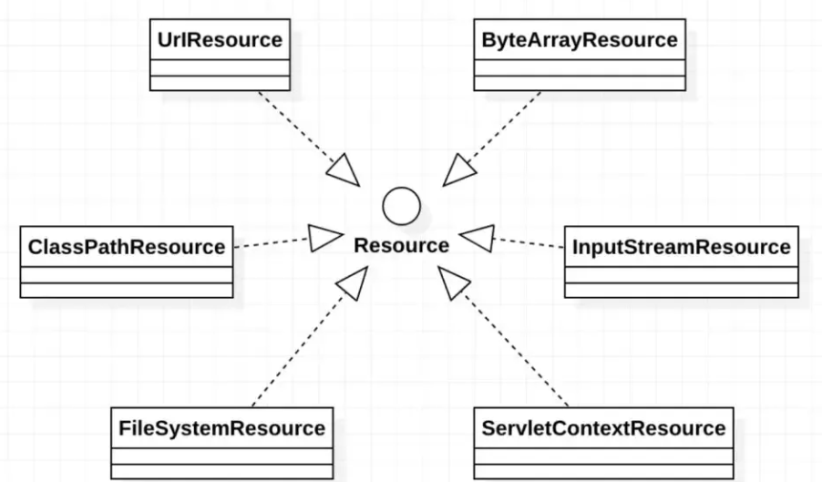


## 4、ResourceLoader 接口

### 1、概述

Spring 提供如下两个标志性接口：

- **ResourceLoader ：** 该接口实现类的实例可以获得一个 Resource 实例
- **ResourceLoaderAware ：** 该接口实现类的实例将获得一个 ResourceLoader 的引用

在 ResourceLoader 接口里有如下方法：

- **Resource getResource（String location）** ： 该接口仅有这个方法，用于返回一个 Resource 实例
  - ApplicationContext 实现类均实现了 ResourceLoader 接口，因此 ApplicationContext 可直接获取 Resource 实例


### 2、使用

```java
public class Demo1 {
    public static void main(String[] args) {
        ApplicationContext ctx = new ClassPathXmlApplicationContext();
        // 通过 ApplicationContext 访问资源
        // ApplicationContext 实例获取 Resource 实例时，
        // 默认采用与 ApplicationContext 相同的资源访问策略
        Resource res = ctx.getResource("xxx.txt");
        System.out.println(res.getFilename());
    }
}
```

```java
public class Demo2 {
    public static void main(String[] args) {
        ApplicationContext ctx = new FileSystemXmlApplicationContext();
        Resource res = ctx.getResource("xxx.txt");
        System.out.println(res.getFilename());
    }
}
```


### 3、总结

Spring 采用和 ApplicationContext 相同的策略来访问资源

也就是说，如果 ApplicationContext 是 FileSystemXmlApplicationContext，res 就是 FileSystemResource 实例

如果 ApplicationContext 是 ClassPathXmlApplicationContext，res 就是 ClassPathResource 实例

当 Spring 应用需要进行资源访问时，实际上并不需要直接创建与使用 Resource 实现类，而是调用 ResourceLoader 实例的 getResource() 方法来获得资源

ReosurceLoader 将会负责选择 Reosurce 实现类，也就是确定具体的资源访问策略，从而将应用程序和具体的资源访问策略分离开来

另外，使用 ApplicationContext 访问资源时，可通过不同前缀指定强制使用指定的 ClassPathResource、FileSystemResource 等实现类

```java
Resource res = ctx.getResource("calsspath:Bean.xml");
Resrouce res = ctx.getResource("file:Bean.xml");
Resource res = ctx.getResource("http://localhost:8080/Beans.xml");
```


## 5、ResourceLoaderAware 接口

ResourceLoaderAware 接口实现类的实例将获得一个 ResourceLoader 的引用

ResourceLoaderAware 接口提供了一个 setResourceLoader() 方法，该方法将由 Spring 容器负责调用，Spring 容器会将一个ResourceLoader 对象作为该方法的参数传入

如果把实现 ResourceLoaderAware 接口的 Bean 类部署在 Spring 容器中，Spring 容器会将自身当成 ResourceLoader 作为setResourceLoader() 方法的参数传入

由于 ApplicationContext 的实现类都实现了 ResourceLoader 接口，Spring 容器自身完全可作为 ResorceLoader 使用

```java
public class TestBean implements ResourceLoaderAware {

    private ResourceLoader resourceLoader;

    // 实现 ResourceLoaderAware 接口必须实现的方法
	// 如果把该 Bean 部署在 Spring 容器中，该方法将会由 Spring 容器负责调用。
	// SPring 容器调用该方法时，Spring 会将自身作为参数传给该方法。
    public void setResourceLoader(ResourceLoader resourceLoader) {
        this.resourceLoader = resourceLoader;
    }

    // 返回 ResourceLoader 对象的应用
    public ResourceLoader getResourceLoader(){
        return this.resourceLoader;
    }

}
```

```xml
<?xml version="1.0" encoding="UTF-8"?>
<Beans xmlns="http://www.springframework.org/schema/Beans"
       xmlns:xsi="http://www.w3.org/2001/XMLSchema-instance"
       xsi:schemaLocation="http://www.springframework.org/schema/Beans http://www.springframework.org/schema/Beans/spring-Beans.xsd">

    <Bean id="testBean" class="com.spring6.resouceloader.TestBean"></Bean>
</Beans>
```

```java
public class Demo3 {

    public static void main(String[] args) {
        // Spring 容器会将一个 ResourceLoader 对象作为该方法的参数传入
        ApplicationContext ctx = new ClassPathXmlApplicationContext("Bean.xml");
        TestBean testBean = ctx.getBean("testBean",TestBean.class);
        // 获取 ResourceLoader 对象
        ResourceLoader resourceLoader = testBean.getResourceLoader();
        System.out.println("Spring容器将自身注入到ResourceLoaderAware Bean 中 ？ ：" + (resourceLoader == ctx));
        // 加载其他资源
        Resource resource = resourceLoader.getResource("xxx.txt");
        System.out.println(resource.getFilename());
        System.out.println(resource.getDescription());
    }
}
```


## 6、使用 Resource 作为属性

实际上，当应用程序中的 Bean 实例需要访问资源时，Spring 有更好的解决方法：直接利用依赖注入

Spring 框架不仅充分利用了策略模式来简化资源访问，而且还将策略模式和 IOC 进行充分地结合，最大程度地简化了 Spring 资源访问

**如果 Bean 实例需要访问资源，有如下两种解决方案**：

- **代码中获取 Resource 实例**
- **使用依赖注入**

对于第一种方式，当程序获取 Resource 实例时，总需要提供 Resource 所在的位置，不管通过 FileSystemResource 创建实例，还是通过 ClassPathResource 创建实例，或者通过 ApplicationContext 的 getResource() 方法获取实例，都需要提供资源位置，这意味着：资源所在的物理位置将被耦合到代码中，如果资源位置发生改变，则必须改写程序，因此，通常建议采用第二种方法，让 Spring 为 Bean 实例**依赖注入**资源

```java
public class ResourceBean {
    
    private Resource res;
    
    public void setRes(Resource res) {
        this.res = res;
    }
    public Resource getRes() {
        return res;
    }
    
    public void parse(){
        System.out.println(res.getFilename());
        System.out.println(res.getDescription());
    }
}
```

```xml
<?xml version="1.0" encoding="UTF-8"?>
<Beans xmlns="http://www.springframework.org/schema/Beans"
       xmlns:xsi="http://www.w3.org/2001/XMLSchema-instance"
       xsi:schemaLocation="http://www.springframework.org/schema/Beans http://www.springframework.org/schema/Beans/spring-Beans.xsd">

    <Bean id="resourceBean" class="com.spring6.resouceloader.ResourceBean" >
      <!-- 可以使用 file:、http:、ftp: 等前缀强制 Spring 采用对应的资源访问策略 -->
      <!-- 如果不采用任何前缀，则 Spring 将采用与该 ApplicationContext 相同的资源访问策略来访问资源 -->
        <property name="res" value="classpath:xxx.txt"/>
    </Bean>
</Beans>
```

```java
public class Demo4 {

    public static void main(String[] args) {
        ApplicationContext ctx = new ClassPathXmlApplicationContext("Bean.xml");
        ResourceBean resourceBean = ctx.getBean("resourceBean", ResourceBean.class);
        resourceBean.parse();
    }
}
```


## 7、应用程序上下文和资源路径

### 1、概述

不管以怎样的方式创建 ApplicationContext 实例，都需要为 ApplicationContext 指定配置文件，Spring 允许使用一份或多分 XML 配置文件

当程序创建 ApplicationContext 实例时，通常也是以 Resource 的方式来访问配置文件的，所以 ApplicationContext 完全支持ClassPathResource、FileSystemResource、ServletContextResource 等资源访问方式

**ApplicationContext 确定资源访问策略通常有两种方法**：

- **使用 ApplicationContext 实现类指定访问策略**
- **使用前缀指定访问策略**


### 2、ApplicationContext 实现类指定访问策略

创建 ApplicationContext 对象时，通常可以使用如下实现类：

（1） ClassPathXMLApplicationContext : 对应使用 ClassPathResource 进行资源访问

（2）FileSystemXmlApplicationContext ： 对应使用 FileSystemResource 进行资源访问

（3）XmlWebApplicationContext ： 对应使用 ServletContextResource 进行资源访问

当使用 ApplicationContext 的不同实现类时，就意味着 Spring 使用响应的资源访问策略


### 3、使用前缀指定访问策略

```java
public class Demo1 {

    public static void main(String[] args) {
        /*
         * 通过搜索文件系统路径下的 xml 文件创建 ApplicationContext，
         * 但通过指定 classpath: 前缀强制搜索类加载路径
         * classpath:Bean.xml
         * */
        ApplicationContext ctx = new ClassPathXmlApplicationContext("classpath:Bean.xml");
        System.out.println(ctx);
        Resource resource = ctx.getResource("xxx.txt");
        System.out.println(resource.getFilename());
        System.out.println(resource.getDescription());
    }
}
```

classpath * : 前缀提供了加载多个 XML 配置文件的能力，当使用 classpath*: 前缀来指定 XML 配置文件时，系统将搜索类加载路径，找到所有与文件名匹配的文件，分别加载文件中的配置定义，最后合并成一个 ApplicationContext

```java
ApplicationContext ctx = new ClassPathXmlApplicationContext("classpath*:Bean.xml");
System.out.println(ctx);
```

当使用 classpath * : 前缀时，Spring 将会搜索类加载路径下所有满足该规则的配置文件

如果不是采用 classpath * : 前缀，而是改为使用 classpath: 前缀，Spring 则只加载第一个符合条件的 XML 文件

**注意 ：** 

- classpath * : 前缀仅对 ApplicationContext 有效，实际情况是，创建 ApplicationContext 时，分别访问多个配置文件（通过ClassLoader 的 getResource 方法实现）因此，classpath * : 前缀不可用于Resource


一次性加载多个配置文件的方式：指定配置文件时使用通配符

```java
ApplicationContext ctx = new ClassPathXmlApplicationContext("classpath:Bean*.xml");
```

Spring 允许将 classpath*: 前缀和通配符结合使用：

```java
ApplicationContext ctx = new ClassPathXmlApplicationContext("classpath*:Bean*.xml");
```


# 7、国际化


## 1、i18n概述

国际化也称作i18n，其来源是英文单词 internationalization 的首末字符 i 和 n，18 为中间的字符数。由于软件发行可能面向多个国家，对于不同国家的用户，软件显示不同语言的过程就是国际化

通常来讲，软件的国际化是通过配置文件来实现的，假设要支撑两种语言，那么就需要两个版本的配置文件


## 2、Java 国际化

Java 自身是支持国际化的

java.util.Locale 用于指定当前用户所属的语言环境等信息

java.util.ResourceBundle 用于查找绑定对应的资源文件

Locale包含了 language 信息和 country 信息，Locale 创建默认 locale 对象时使用的静态方法：

```java
private static Locale createConstant(String lang, String country) {
    BaseLocale base = BaseLocale.createInstance(lang, country);
    return getInstance(base, null);
}
```

**配置文件命名规则**：

-  **basename_language_country.properties**：
  -  必须遵循以上的命名规则，java才会识别
  - basename 是必须的，语言和国家是可选的
  - 这里存在一个优先级概念，如果同时提供了 messages.properties 和 messages_zh_CN.propertes 两个配置文件，如果提供的locale 符合 en_CN，那么优先查找 messages_en_CN.propertes 配置文件，如果没查找到，再查找 messages.properties 配置文件
  - 所有的配置文件必须放在 classpath 中，一般放在 resources 目录下


```java
public class Demo1 {
	public static void main(String[] args) {
    	System.out.println(ResourceBundle.getBundle("messages", new Locale("en","GB")).getString("test"));
    	System.out.println(ResourceBundle.getBundle("messages", new Locale("zh","CN")).getString("test"));
	}
}
```


## 3、Spring 国际化

### 1、MessageSource 接口

Spring 中国际化是通过 MessageSource 这个接口来支持的

**常见实现类**：

- **ResourceBundleMessageSource**：
  - 这个是基于 Java 的 ResourceBundle 基础类实现，允许仅通过**资源名**加载国际化资源

- **ReloadableResourceBundleMessageSource**：
  - 这个功能和第一个类的功能类似，多了**定时刷新**功能，允许在不重启系统的情况下，更新资源的信息

- **StaticMessageSource**：
  - 它允许通过**编程的方式**提供国际化信息，可以通过这个来实现 db 中存储国际化信息的功能


### 2、使用

创建资源文件，**国际化文件命名格式：基本名称 _ 语言 _ 国家.properties**

**{0},{1} 这样内容是动态参数**

**创建 xxx_en_US.properties**

```properties
www.xxx.com=welcome {0},时间:{1}
```

**创建 xxx_zh_CN.properties**

```properties
www.xxx.com=欢迎 {0},时间:{1}
```

**创建 Spring 配置文件，配置 MessageSource**

```xml
<?xml version="1.0" encoding="UTF-8"?>
<Beans xmlns="http://www.springframework.org/schema/Beans"
       xmlns:xsi="http://www.w3.org/2001/XMLSchema-instance"
       xsi:schemaLocation="http://www.springframework.org/schema/Beans http://www.springframework.org/schema/Beans/spring-Beans.xsd">

    <Bean id="messageSource"
          class="org.springframework.context.support.ResourceBundleMessageSource">
        <property name="basenames">
            <list>
                <value>xxx</value>
            </list>
        </property>
        <property name="defaultEncoding">
            <value>utf-8</value>
        </property>
    </Bean>
</Beans>
```

```java
public class Demo2 {

    public static void main(String[] args) {
        ApplicationContext context = new ClassPathXmlApplicationContext("Beans.xml");
        // 传递动态参数，使用数组形式对应{0} {1}顺序
        Object[] objs = new Object[]{"xxx",new Date().toString()};
        // www.xxx.com 为资源文件的 key 值,
        // objs 为资源文件 value 值所需要的参数，Local.CHINA 为国际化为语言
        String str=context.getMessage("www.xxx.com", objs, Locale.CHINA);
        System.out.println(str);
    }
}
```


# 8、数据校验


## 1、概述


Spring validation 允许通过注解的方式来定义对象校验规则，把校验和业务逻辑分离开，让代码编写更加方便

Spring Validation 其实就是对 Hibernate Validator 进一步的封装，方便在 Spring 中使用

在 Spring 中有多种校验的方式

- **通过实现 org.springframework.validation.Validator 接口，然后在代码中调用这个类**
- **按照 Bean Validation 方式来进行校验，即通过注解的方式**
- **基于方法实现校验**

- **除此之外，还可以实现自定义校验**


## 2、Validator 接口

```xml
<dependencies>
    <dependency>
        <groupId>org.hibernate.validator</groupId>
        <artifactId>hibernate-validator</artifactId>
        <version>7.0.5.Final</version>
    </dependency>

    <dependency>
        <groupId>org.glassfish</groupId>
        <artifactId>jakarta.el</artifactId>
        <version>4.0.1</version>
    </dependency>
</dependencies>
```

```java
public class Person {
    private String name;
    private int age;

    public String getName() {
        return name;
    }
    public void setName(String name) {
        this.name = name;
    }
    public int getAge() {
        return age;
    }
    public void setAge(int age) {
        this.age = age;
    }
}
```

```java
public class PersonValidator implements Validator {

    @Override
    public boolean supports(Class<?> clazz) {
        return Person.class.equals(clazz);
    }

    @Override
    public void validate(Object object, Errors errors) {
        ValidationUtils.rejectIfEmpty(errors, "name", "name.empty");
        Person p = (Person) object;
        if (p.getAge() < 0) {
            errors.rejectValue("age", "error value < 0");
        } else if (p.getAge() > 110) {
            errors.rejectValue("age", "error value too old");
        }
    }
}
```

上面定义的类，其实就是实现接口中对应的方法：

- supports 方法用来表示此校验用在哪个类型上，

- validate 是设置校验逻辑的地点，其中 ValidationUtils，是 Spring 封装的校验工具类，帮助快速实现校验

```java
public class TestMethod1 {

    public static void main(String[] args) {
        // 创建 Person 对象
        Person person = new Person();
        person.setName("lucy");
        person.setAge(-1);
        
        // 创建 Person 对应的 DataBinder
        DataBinder binder = new DataBinder(person);

        // 设置校验
        binder.setValidator(new PersonValidator());

        // 由于 Person 对象中的属性为空，所以校验不通过
        binder.validate();

        // 输出结果
        BindingResult results = binder.getBindingResult();
        System.out.println(results.getAllErrors());
    }
}
```


## 3、Validation 注解

使用 Bean Validation 校验方式，就是如何将 Bean Validation 需要使用的 javax.validation.ValidatorFactory 和javax.validation.Validator 注入到容器中

Spring 默认有一个实现类 **LocalValidatorFactoryBean**，它实现了上面 Bean Validation 中的接口，并且也实现了org.springframework.validation.Validator 接口

```java
// 注入 LocalValidatorFactoryBean
@Configuration
@ComponentScan("com.spring6.validation.method2")
public class ValidationConfig {

    @Bean
    public LocalValidatorFactoryBean validator() {
        return new LocalValidatorFactoryBean();
    }
}
```

```java
public class User {

    @NotNull
    private String name;

    @Min(0)
    @Max(120)
    private int age;

    public String getName() {
        return name;
    }
    public void setName(String name) {
        this.name = name;
    }
    public int getAge() {
        return age;
    }
    public void setAge(int age) {
        this.age = age;
    }
}
```

**常用注解说明**：

- @NotNull	限制必须不为 null
- @NotEmpty	只作用于字符串类型，字符串不为空，并且长度不为 0
- @NotBlank	只作用于字符串类型，字符串不为空，并且 trim() 后不为空串
- @DecimalMax(value)	限制必须为一个不大于指定值的数字
- @DecimalMin(value)	限制必须为一个不小于指定值的数字
- @Max(value)	限制必须为一个不大于指定值的数字
- @Min(value)	限制必须为一个不小于指定值的数字
- @Pattern(value)	限制必须符合指定的正则表达式
- @Size(max,min)	限制字符长度必须在 min 到 max 之间
- @Email	验证注解的元素值是 Email，也可以通过正则表达式和 flag 指定自定义的 email 格式

**使用 jakarta.validation.Validator 校验**

```java
import jakarta.validation.ConstraintViolation;
import jakarta.validation.Validator;
@Service
public class MyService1 {

    @Autowired
    private Validator validator;

    public  boolean validator(User user){
        Set<ConstraintViolation<User>> sets =  validator.validate(user);
        return sets.isEmpty();
    }

}
```

**使用 org.springframework.validation.Validator 校验**

```java
import org.springframework.validation.BindException;
import org.springframework.validation.Validator;

@Service
public class MyService2 {
    @Autowired
    private Validator validator;

    public boolean validaPersonByValidator(User user) {
        BindException bindException = new BindException(user, user.getName());
        validator.validate(user, bindException);
        return bindException.hasErrors();
    }
}
```

```java
public class TestMethod2 {

    @Test
    public void testMyService1() {
        ApplicationContext context = new AnnotationConfigApplicationContext(ValidationConfig.class);
        MyService1 myService = context.getBean(MyService1.class);
        User user = new User();
        user.setAge(-1);
        boolean validator = myService.validator(user);
        System.out.println(validator);
    }

    @Test
    public void testMyService2() {
        ApplicationContext context = new AnnotationConfigApplicationContext(ValidationConfig.class);
        MyService2 myService = context.getBean(MyService2.class);
        User user = new User();
        user.setName("lucy");
        user.setAge(130);
        user.setAge(-1);
        boolean validator = myService.validaPersonByValidator(user);
        System.out.println(validator);
    }
}
```


## 4、基于方法

**配置 MethodValidationPostProcessor**

```java
@Configuration
@ComponentScan("com.spring6.validation.method3")
public class ValidationConfig {
    @Bean
    public MethodValidationPostProcessor validationPostProcessor() {
        return new MethodValidationPostProcessor();
    }
}
```

**使用注解设置校验规则**

```java
public class User {

    @NotNull
    private String name;

    @Min(0)
    @Max(120)
    private int age;

    @Pattern(regexp = "^1(3|4|5|7|8)\\d{9}$",message = "手机号码格式错误")
    @NotBlank(message = "手机号码不能为空")
    private String phone;

    public String getName() {
        return name;
    }
    public void setName(String name) {
        this.name = name;
    }
    public int getAge() {
        return age;
    }
    public void setAge(int age) {
        this.age = age;
    }
    public String getPhone() {
        return phone;
    }
    public void setPhone(String phone) {
        this.phone = phone;
    }
}
```

**通过注解操作对象**

```java
@Service
@Validated
public class MyService {
    public String testParams(@NotNull @Valid User user) {
        return user.toString();
    }

}
```

**测试**

```java
public class TestMethod3 {
    @Test
    public void testMyService1() {
        ApplicationContext context = new AnnotationConfigApplicationContext(ValidationConfig.class);
        MyService myService = context.getBean(MyService.class);
        User user = new User();
        user.setAge(-1);
        myService.testParams(user);
    }
}
```


## 5、自定义校验

**自定义校验注解**

```java
import jakarta.validation.Constraint;
import jakarta.validation.Payload;
import java.lang.annotation.*;

@Target({ElementType.METHOD, ElementType.FIELD, ElementType.ANNOTATION_TYPE, ElementType.CONSTRUCTOR, ElementType.PARAMETER})
@Retention(RetentionPolicy.RUNTIME)
@Documented
@Constraint(validatedBy = {CannotBlankValidator.class})
public @interface CannotBlank {
    // 默认错误消息
    String message() default "不能包含空格";

    // 分组
    Class<?>[] groups() default {};

    // 负载
    Class<? extends Payload>[] payload() default {};

    // 指定多个时使用
    @Target({ElementType.METHOD, ElementType.FIELD, ElementType.ANNOTATION_TYPE, ElementType.CONSTRUCTOR, ElementType.PARAMETER, ElementType.TYPE_USE})
    @Retention(RetentionPolicy.RUNTIME)
    @Documented
    @interface List {
        CannotBlank[] value();
    }
}
```

**编写校验类**

```java
import jakarta.validation.ConstraintValidator;
import jakarta.validation.ConstraintValidatorContext;

public class CannotBlankValidator implements ConstraintValidator<CannotBlank, String> {

        @Override
        public void initialize(CannotBlank constraintAnnotation) {
        }

        @Override
        public boolean isValid(String value, ConstraintValidatorContext context) {
                // null 时不进行校验
                if (value != null && value.contains(" ")) {
                        // 获取默认提示信息
                        String defaultConstraintMessageTemplate = context.getDefaultConstraintMessageTemplate();
                        System.out.println("default message :" + defaultConstraintMessageTemplate);
                        // 禁用默认提示信息
                        context.disableDefaultConstraintViolation();
                        // 设置提示语
                        context.buildConstraintViolationWithTemplate("can not contains blank").addConstraintViolation();
                        return false;
                }
                return true;
        }
}
```


# 9、提前编译


## 1、概述

### 1、JIT 与 AOT 的区别

JIT 和 AOT 这个名词是指两种不同的编译方式，这两种编译方式的主要区别在于是否在运行时进行编译


**JIT， Just-in-time，动态(即时)编译，边运行边编译**：

- 在程序运行时，根据算法计算出热点代码，然后进行 JIT 实时编译，这种方式吞吐量高，有运行时性能加成，可以跑得更快，并可以做到动态生成代码等，但是相对启动速度较慢，并需要一定时间和调用频率才能触发 JIT 的分层机制
- JIT 缺点就是编译需要占用运行时资源，会导致进程卡顿


**AOT，Ahead Of Time，指运行前编译，预先编译**：

- AOT 编译能直接将源代码转化为机器码，内存占用低，启动速度快，可以无需 runtime 运行，直接将 runtime 静态链接至最终的程序中，但是无运行时性能加成，不能根据程序运行情况做进一步的优化
- AOT 缺点就是在程序运行前编译会使程序安装的时间增加                                                           

JIT 即时编译指的是在程序的运行过程中，将字节码转换为可在硬件上直接运行的机器码，并部署至托管环境中的过程，而 AOT 编译指的则是，在程序运行之前，便将字节码转换为机器码的过程

```
.java -> .class -> (使用jaotc编译工具) -> .so（程序函数库,即编译好的可以供其他程序使用的代码和数据）
```

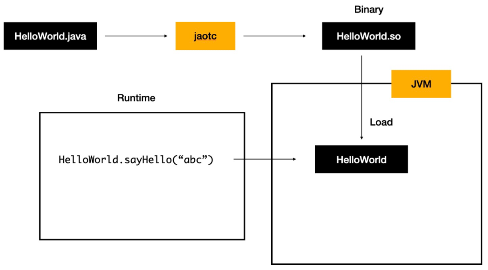


**AOT的优点**：

- Java 虚拟机加载已经预编译成二进制库，可以直接执行，不必等待及时编译器的预热，减少 Java 应用给人带来第一次运行慢”的不良体验
- 在程序运行前编译，可以避免在运行时的编译性能消耗和内存消耗
- 可以在程序运行初期就达到最高性能，程序启动速度快
- 运行产物只有机器码，打包体积小

**AOT的缺点**：

- 由于是静态提前编译，不能根据硬件情况或程序运行情况择优选择机器指令序列，理论峰值性能不如 JIT
  没有动态能力，同一份产物不能跨平台运行
- 第一种即时编译（JIT）是默认模式，Java Hotspot 虚拟机使用它在运行时将字节码转换为机器码，后者提前编译（AOT）由新颖的 GraalVM 编译器支持，并允许在构建时将字节码直接静态编译为机器码
- 现在正处于云原生，降本增效的时代，Java 相比于 Go、Rust 等其他编程语言非常大的弊端就是启动编译和启动进程非常慢，这对于根据实时计算资源，弹性扩缩容的云原生技术相冲突，Spring6 借助 AOT 技术在运行时内存占用低，启动速度快，逐渐的来满足 Java 在云原生时代的需求，对于大规模使用 Java 应用的商业公司可以考虑尽早调研使用 JDK17，通过云原生技术为公司实现降本增效


## 2、Graalvm

Spring6 支持的 AOT 技术，这个 GraalVM  就是底层的支持，Spring 也对 GraalVM 本机映像提供了一流的支持。GraalVM 是一种高性能 JDK，旨在加速用 Java 和其他 JVM 语言编写的应用程序的执行，同时还为 JavaScript、Python 和许多其他流行语言提供运行时。 GraalVM 提供两种运行 Java 应用程序的方法：在 HotSpot JVM 上使用 Graal 即时 (JIT) 编译器或作为提前 (AOT) 编译的本机可执行文件。 GraalVM 的多语言能力使得在单个应用程序中混合多种编程语言成为可能，同时消除了外语调用成本。GraalVM 向 HotSpot Java 虚拟机添加了一个用 Java 编写的高级即时 (JIT) 优化编译器。

GraalVM 具有以下特性：

- 一种高级优化编译器，它生成更快、更精简的代码，需要更少的计算资源
- AOT 本机图像编译提前将 Java 应用程序编译为本机二进制文件，立即启动，无需预热即可实现最高性能
- Polyglot 编程在单个应用程序中利用流行语言的最佳功能和库，无需额外开销
- 高级工具在 Java 和多种语言中调试、监视、分析和优化资源消耗

总的来说对云原生的要求不算高短期内可以继续使用 2.7.X 的版本和 JDK8，不过 Spring 官方已经对 Spring6 进行了正式版发布


## 3、Native Image

目前业界除了这种在JVM中进行AOT的方案，还有另外一种实现Java AOT的思路，那就是直接摒弃JVM，和C/C++一样通过编译器直接将代码编译成机器代码，然后运行。这无疑是一种直接颠覆Java语言设计的思路，那就是GraalVM Native Image。它通过C语言实现了一个超微缩的运行时组件 —— Substrate VM，基本实现了JVM的各种特性，但足够轻量、可以被轻松内嵌，这就让Java语言和工程摆脱JVM的限制，能够真正意义上实现和C/C++一样的AOT编译。这一方案在经过长时间的优化和积累后，已经拥有非常不错的效果，基本上成为Oracle官方首推的Java AOT解决方案

Native Image 是一项创新技术，可将 Java 代码编译成独立的本机可执行文件或本机共享库。在构建本机可执行文件期间处理的 Java 字节码包括所有应用程序类、依赖项、第三方依赖库和任何所需的 JDK 类。生成的自包含本机可执行文件特定于不需要 JVM 的每个单独的操作系统和机器体系结构。


# 扩展

## 1、手动实现 IOC

### 1、前期准备

创建 UserDao 接口

```java
public interface UserDao {
    public void print();
}
```

创建 UserDaoImpl 实现

```java
public class UserDaoImpl implements UserDao {
    @Override
    public void print() {
        System.out.println("Dao层执行结束");
    }
}

```

创建 UserService 接口

```java
public interface UserService {
    public void out();
}
```

创建 UserServiceImpl 实现类

```java
@Bean
public class UserServiceImpl implements UserService {

    @Override
    public void out() {
        System.out.println("Service层执行结束");
    }
}

```


### 2、自定义注解

通过注解的形式加载 Bean 与实现依赖注入

Bean 注解

```java
@Target(ElementType.TYPE)
@Retention(RetentionPolicy.RUNTIME)
public @interface Bean {}
```

依赖注入注解

```java
@Target({ElementType.FIELD})
@Retention(RetentionPolicy.RUNTIME)
public @interface DI {
}
```


### 3、定义 Bean 容器

定义 Bean 容器接口

```java
public interface ApplicationContext {
    Object getBean(Class clazz);
}
```

编写注解 Bean 容器接口实现，AnnotationApplicationContext 基于注解扫描 Bean

```java
public class AnnotationApplicationContext implements ApplicationContext {

    // 存储 Bean 的容器
    private HashMap<Class, Object> BeanFactory = new HashMap<>();

    @Override
    public Object getBean(Class clazz) {
        return BeanFactory.get(clazz);
    }

    /**
     * 根据包扫描加载 Bean
     * @param basePackage
     */
    public AnnotationApplicationContext(String basePackage) {
        
    }
}
```


### 4、编写扫描逻辑

~~~java
public class AnnotationApplicationContext implements ApplicationContext {

    // 存储 Bean 的容器
    private HashMap<Class, Object> BeanFactory = new HashMap<>();
    private static String rootPath;

    @Override
    public Object getBean(Class clazz) {
        return BeanFactory.get(clazz);
    }

    /**
     * 根据包扫描加载 Bean
     * @param basePackage
     */
    public AnnotationApplicationContext(String basePackage) {
       try {
            String packageDirName = basePackage.replaceAll("\\.", "\\\\");
            Enumeration<URL> dirs =Thread.currentThread().getContextClassLoader().getResources(packageDirName);
            while (dirs.hasMoreElements()) {
                URL url = dirs.nextElement();
                String filePath = URLDecoder.decode(url.getFile(),"utf-8");
                rootPath = filePath.substring(0, filePath.length()-packageDirName.length());
                loadBean(new File(filePath));
            }

        } catch (Exception e) {
            throw new RuntimeException(e);
        }
    }

    private  void loadBean(File fileParent) {
        if (fileParent.isDirectory()) {
            File[] childrenFiles = fileParent.listFiles();
            if(childrenFiles == null || childrenFiles.length == 0){
                return;
            }
            for (File child : childrenFiles) {
                if (child.isDirectory()) {
                    // 如果是个文件夹就继续调用该方法,使用了递归
                    loadBean(child);
                } else {
                    // 通过文件路径转变成全类名,第一步把绝对路径部分去掉
                    String pathWithClass = child.getAbsolutePath().substring(rootPath.length() - 1);
                    // 选中 class 文件
                    if (pathWithClass.contains(".class")) {
                        // com.xinzhi.dao.UserDao
                        // 去掉.class后缀，并且把 \ 替换成 .
                        String fullName = pathWithClass.replaceAll("\\\\", ".").replace(".class", "");
                        try {
                            Class<?> aClass = Class.forName(fullName);
                            // 把非接口的类实例化放在 map 中
                            if(!aClass.isInterface()){
                                Bean annotation = aClass.getAnnotation(Bean.class);
                                if(annotation != null){
                                    Object instance = aClass.newInstance();
                                    // 判断一下有没有接口
                                    if(aClass.getInterfaces().length > 0) {
                                        // 如果有接口，把接口的 class 当成 key，实例对象当成 value
                                        System.out.println("正在加载【"+ aClass.getInterfaces()[0] +"】,实例对象是：" + instance.getClass().getName());
                                        BeanFactory.put(aClass.getInterfaces()[0], instance);
                                    }else{
                                        // 如果没有接口，把自己的 class 当成 key，实例对象当成 value
                                        System.out.println("正在加载【"+ aClass.getName() +"】,实例对象是：" + instance.getClass().getName());
                                        BeanFactory.put(aClass, instance);
                                    }
                                }
                            }
                        } catch (ClassNotFoundException | IllegalAccessException | InstantiationException e) {
                            e.printStackTrace();
                        }
                    }
                }
            }
        }
    }

}
~~~


### 5、测试

```java
@Bean
public class UserServiceImpl implements UserService
```

```java
@Bean
public class UserDaoImpl implements UserDao 
```

```java
public class SpringIocTest {

    @Test
    public void testIoc() {
        ApplicationContext applicationContext = new AnnotationApplicationContext("com.spring.test");
        UserService userService = (UserService)applicationContext.getBean(UserService.class);
        userService.out();
        System.out.println("run success");
    }
}
```


### 6、依赖注入

~~~java
public class AnnotationApplicationContext implements ApplicationContext {

    // 存储 Bean 的容器
    private HashMap<Class, Object> BeanFactory = new HashMap<>();
    private static String rootPath;

    @Override
    public Object getBean(Class clazz) {
        return BeanFactory.get(clazz);
    }

    /**
     * 根据包扫描加载 Bean
     * @param basePackage
     */
    public AnnotationApplicationContext(String basePackage) {
       try {
            String packageDirName = basePackage.replaceAll("\\.", "\\\\");
            Enumeration<URL> dirs =Thread.currentThread().getContextClassLoader().getResources(packageDirName);
            while (dirs.hasMoreElements()) {
                URL url = dirs.nextElement();
                String filePath = URLDecoder.decode(url.getFile(),"utf-8");
                rootPath = filePath.substring(0, filePath.length()-packageDirName.length());
                loadBean(new File(filePath));
            }
        } catch (Exception e) {
            throw new RuntimeException(e);
        }
        // 依赖注入
        loadDi();
    }

    private  void loadBean(File fileParent) {
        if (fileParent.isDirectory()) {
            File[] childrenFiles = fileParent.listFiles();
            if(childrenFiles == null || childrenFiles.length == 0){
                return;
            }
            for (File child : childrenFiles) {
                if (child.isDirectory()) {
                    // 如果是个文件夹就继续调用该方法,使用了递归
                    loadBean(child);
                } else {
                    // 通过文件路径转变成全类名,第一步把绝对路径部分去掉
                    String pathWithClass = child.getAbsolutePath().substring(rootPath.length() - 1);
                    // 选中 class 文件
                    if (pathWithClass.contains(".class")) {
                        // com.xinzhi.dao.UserDao
                        // 去掉.class后缀，并且把 \ 替换成 .
                        String fullName = pathWithClass.replaceAll("\\\\", ".").replace(".class", "");
                        try {
                            Class<?> aClass = Class.forName(fullName);
                            // 把非接口的类实例化放在 map 中
                            if(!aClass.isInterface()){
                                Bean annotation = aClass.getAnnotation(Bean.class);
                                if(annotation != null){
                                    Object instance = aClass.newInstance();
                                    // 判断一下有没有接口
                                    if(aClass.getInterfaces().length > 0) {
                                        // 如果有接口，把接口的 class 当成 key，实例对象当成 value
                                        System.out.println("正在加载【"+ aClass.getInterfaces()[0] +"】,实例对象是：" + instance.getClass().getName());
                                        BeanFactory.put(aClass.getInterfaces()[0], instance);
                                    }else{
                                        // 如果没有接口，把自己的 class 当成 key，实例对象当成 value
                                        System.out.println("正在加载【"+ aClass.getName() +"】,实例对象是：" + instance.getClass().getName());
                                        BeanFactory.put(aClass, instance);
                                    }
                                }
                            }
                        } catch (ClassNotFoundException | IllegalAccessException | InstantiationException e) {
                            e.printStackTrace();
                        }
                    }
                }
            }
        }
    }
    
    private void loadDi() {
        for(Map.Entry<Class,Object> entry : BeanFactory.entrySet()){
            // 就是放在容器的对象
            Object obj = entry.getValue();
            Class<?> aClass = obj.getClass();
            Field[] declaredFields = aClass.getDeclaredFields();
            for (Field field : declaredFields){
                Di annotation = field.getAnnotation(Di.class);
                if( annotation != null ){
                    field.setAccessible(true);
                    try {
                        System.out.println("正在给【"+obj.getClass().getName()+"】属性【" + field.getName() + "】注入值【"+ BeanFactory.get(field.getType()).getClass().getName() +"】");
                        field.set(obj, BeanFactory.get(field.getType()));
                    } catch (IllegalAccessException e) {
                        e.printStackTrace();
                    }
                }
            }
        }
    }

}
~~~


## 2、Spring 容器流程解析

### 1、refresh()

首先Spring容器的调用 **refresh();**【创建刷新】

```java
@Override
public void refresh() throws BeansException, IllegalStateException {
    synchronized (this.startupShutdownMonitor) {
        // 准备此上下文以进行刷新
        prepareRefresh();

        // 告诉子类刷新内部Bean工厂
        ConfigurableListableBeanFactory beanFactory = obtainFreshBeanFactory();

        // 准备在此上下文中使用的Bean工厂
        prepareBeanFactory(beanFactory);

        try {
            // 允许在上下文子类中对Bean工厂进行后置处理
            postProcessBeanFactory(beanFactory);

            // 调用在上下文中注册为Bean工厂的后置处理器
            invokeBeanFactoryPostProcessors(beanFactory);

            // 注册拦截Bean创建的Bean处理器
            registerBeanPostProcessors(beanFactory);

            // 初始化此上下文的消息源
            initMessageSource();

            // 为此上下文初始化事件多播器
            initApplicationEventMulticaster();

            // 初始化特定上下文子类中的其他特殊 Bean
            onRefresh();

            // 检查侦听器Bean并注册它们
            registerListeners();

            // 实例化所有剩余的（非延迟初始化）单例
            finishBeanFactoryInitialization(beanFactory);

            // 最后一步：发布相应的事件
            finishRefresh();
        }

        catch (BeansException ex) {
            if (logger.isWarnEnabled()) {
                logger.warn("Exception encountered during context initialization - " 
                            + "cancelling refresh attempt: " 
                            + ex);
            }

            // 销毁已经创建的单例以避免悬空资源
            destroyBeans();

            // 重置“活动”标志
            cancelRefresh(ex);

            // 将异常传播给调用者
            throw ex;
        }

        finally {
            // 重置 Spring 核心中的常见内省缓存，因为我们可能不再需要单例Bean的元数据......
            resetCommonCaches();
        }
    }
}
// 以下为BeanFactory的创建以及准备工作
```


### 2、prepareRefresh()

作用：刷新前的预处理

调用的方法：

1. **initPropertySources()；**初始化一些属性设置，子类自定义个性化的属性设置方法
2. **getEnvironment().validateRequiredProperties()；**检验属性的合法等
3. **earlyApplicationEvents = new LinkedHashSet\<ApplicationEvent>()；**保存容器中的一些早期的事件

```java
// 准备此上下文以进行刷新、设置其启动日期和活动标志以及执行属性源的任何初始化。
protected void prepareRefresh() {
    this.startupDate = System.currentTimeMillis();
    this.closed.set(false);
    this.active.set(true);

    if (logger.isInfoEnabled()) {
        logger.info("Refreshing " + this);
    }

    // 在上下文环境中初始化任何占位符属性源
    initPropertySources();

    // 验证所有标记为必需的属性都是可解析的，请参阅 ConfigurablePropertyResolversetRequiredProperties
    getEnvironment().validateRequiredProperties();

    // 允许收集早期的 ApplicationEvents，一旦多播器可用就发布......
    this.earlyApplicationEvents = new LinkedHashSet<ApplicationEvent>();
}
```


### 3、obtainFreshBeanFactory()

作用：获取 BeanFactory

调用的方法：

1. **refreshBeanFactory()；**刷新【创建】BeanFactory
   - 创建了一个 DefaultListableBeanFactory
   - 设置序列化ID
   - 实现自定义设置
   - **loadBeanDefinitions()** 加载 **BeanDefinitions** 
2. **getBeanFactory()；**返回刚才 GenericApplicationContext 创建的 BeanFactory 对象
3. 最后将创建的BeanFactory【DefaultListableBeanFactory】返回

```java
// 告诉子类刷新内部Bean工厂
protected ConfigurableListableBeanFactory obtainFreshBeanFactory() {
    // 见下文
    refreshBeanFactory();
    
    ConfigurableListableBeanFactory beanFactory = getBeanFactory();
    if (logger.isDebugEnabled()) {
        logger.debug("Bean factory for " + getDisplayName() + ": " + beanFactory);
    }
    return beanFactory;
}

@Override
protected final void refreshBeanFactory() throws BeansException {
    if (hasBeanFactory()) {
        destroyBeans();
        closeBeanFactory();
    }
    try {
        DefaultListableBeanFactory beanFactory = createBeanFactory();
        beanFactory.setSerializationId(getId());
        customizeBeanFactory(beanFactory);
        loadBeanDefinitions(beanFactory);
        this.beanFactory = beanFactory;
    }
    catch (IOException ex) {
        throw new ApplicationContextException("I/O error parsing bean definition source for " 
                                              + getDisplayName(), ex);
    }
}
```


### 4、prepareBeanFactory(beanFactory)

作用：BeanFactory 的预准备工作，对 BeanFactory 进行一些设置

流程：

1. 设置 BeanFactory 的类加载器、支持表达式解析器...
2. 添加部分 BeanPostProcessor【ApplicationContextAwareProcessor】
3. 设置忽略的自动装配的接口 EnvironmentAware、EmbeddedValueResolverAware、xxx；
4. 注册可以解析的自动装配，能直接在任何组件中自动注入：BeanFactory、ResourceLoader、ApplicationEventPublisher、ApplicationContext
5. 添加 BeanPostProcessor【ApplicationListenerDetector】
6. 添加编译时的 Aspect4J
7. 给 BeanFactory 中注册一些能用的组件：environment【ConfigurableEnvironment】、systemProperties【Map<String, Object>】、systemEnvironment【Map<String, Object>】

```java
// 配置工厂的标准上下文特征，例如上下文的 ClassLoader 和后处理器
protected void prepareBeanFactory(ConfigurableListableBeanFactory beanFactory) {
		// 告诉内部Bean工厂使用上下文的类加载器等
		beanFactory.set......
		beanFactory.add.......

		// 使用上下文回调配置Bean工厂
		beanFactory.add......
		beanFactory.ignoreDependencyInterface........

		// BeanFactory 接口未在普通工厂中注册为可解析类型
        // MessageSource 注册（并发现用于自动装配）作为 Bean
		beanFactory.registerResolvableDependency.......

		// 将用于检测内部Bean的早期后置处理器并注册为 ApplicationListeners
		beanFactory.add......

		// 检测 LoadTimeWeaver 并准备编织（如果找到）
		if (beanFactory.containsBean(LOAD_TIME_WEAVER_BEAN_NAME)) {
			beanFactory.addBeanPostProcessor(new LoadTimeWeaverAwareProcessor(beanFactory));
			// 为类型匹配设置一个临时的 ClassLoader
			beanFactory.setTempClassLoader(new ContextTypeMatchClassLoader(beanFactory.getBeanClassLoader()));
		}

		// 注册默认环境 Bean
		if (!beanFactory.containsLocalBean(ENVIRONMENT_BEAN_NAME)) {
			beanFactory.registerSingleton(ENVIRONMENT_BEAN_NAME, getEnvironment());
		}
		if (!beanFactory.containsLocalBean(SYSTEM_PROPERTIES_BEAN_NAME)) {
			beanFactory.registerSingleton(SYSTEM_PROPERTIES_BEAN_NAME, getEnvironment().getSystemProperties());
		}
		if (!beanFactory.containsLocalBean(SYSTEM_ENVIRONMENT_BEAN_NAME)) {
			beanFactory.registerSingleton(SYSTEM_ENVIRONMENT_BEAN_NAME, getEnvironment().getSystemEnvironment());
		}
	}
```


### 5、postProcessBeanFactory(beanFactory)

作用：空方法，BeanFactory 准备工作完成后进行的后置处理工作

子类通过重写这个方法来在 BeanFactory 创建并预准备完成以后做进一步的设置

注意区分 BeanFactoryPostProcessor

===============BeanFactory的创建以及准备工作完成========================


### 6、invokeBeanFactoryPostProcessors(beanFactory)

作用：执行所有 **BeanFactoryPostProcessor** 的方法

- BeanFactoryPostProcessor 简介：
  - BeanFactory 的后置处理器，在BeanFactory**初始化之后**调用，**定制**和**修改**BeanFactory的内容
  - 所有的Bean定义已经保存加载到BeanFactory，但是Bean的实例还未创建
- BeanDefinitionRegistryPostProcessor 简介：
  - 继承于 BeanFactoryPostProcessor
  - 利用其给容器中再额外添加一些组件

执行 BeanFactoryPostProcessor 的方法：

1. 注意：先执行 BeanDefinitionRegistryPostProcessor，再执行 BeanFactoryPostProcessor 
   - 获取所有的 BeanDefinitionRegistryPostProcessor
   - 先执行实现了 PriorityOrdered 优先级接口的 BeanDefinitionRegistryPostProcessor
   - 再执行实现了 Ordered 顺序接口的 BeanDefinitionRegistryPostProcessor
   - 最后执行没有实现任何优先级或者是顺序接口的 BeanDefinitionRegistryPostProcessors
2. 再执行 BeanFactoryPostProcessor 的方法：
   - 获取所有的 BeanFactoryPostProcessor
   - 先执行实现了 PriorityOrdered 优先级接口的 BeanFactoryPostProcessor
   - 在执行实现了 Ordered 顺序接口的 BeanFactoryPostProcessor
   - 最后执行没有实现任何优先级或者是顺序接口的 BeanFactoryPostProcessor

```java
// 实例化并调用所有已注册的 BeanFactoryPostProcessor
// 如果遵守显式顺序，必须在单例实例化之前调用
protected void invokeBeanFactoryPostProcessors(ConfigurableListableBeanFactory beanFactory) {
   PostProcessorRegistrationDelegate
       .invokeBeanFactoryPostProcessors(beanFactory, getBeanFactoryPostProcessors());

   // 检测 LoadTimeWeaver 并准备编织（如果同时发现）
   // （例如，通过 ConfigurationClassPostProcessor 注册的 @Bean 方法）
   if (beanFactory.getTempClassLoader() == null 
       && beanFactory.containsBean(LOAD_TIME_WEAVER_BEAN_NAME)) {
      beanFactory.addBeanPostProcessor(new LoadTimeWeaverAwareProcessor(beanFactory));
      beanFactory.setTempClassLoader(new ContextTypeMatchClassLoader(beanFactory.getBeanClassLoader()));
   }
}
```


### 7、registerBeanPostProcessors(beanFactory)

作用：注册 BeanPostProcessor（Bean的后置处理器）【 interceptBeancreation】

扩展：不同接口类型的 BeanPostProcessor，在Bean创建前后的执行时机是不一样的

- BeanPostProcessor
- DestructionAwareBeanPostProcessor
- InstantiationAwareBeanPostProcessor
- SmartInstantiationAwareBeanPostProcessor
- MergedBeanDefinitionPostProcessor【这个类型的放入 internalPostProcessors 列表中】

流程：

1. 获取所有的 BeanPostProcessor，后置处理器都默认通过PriorityOrdered、Ordered接口优先级来执行
   - 把每一个BeanPostProcessor，添加到 BeanFactory 中
   - 调用 beanFactory.addBeanPostProcessor(postProcessor);
2. 先注册 PriorityOrdered 优先级接口
3. 再注册 Ordered 接口
4. 最后注册没有实现任何优先级接口的
5. 追加 MergedBeanDefinitionPostProcessor 类型的后置处理器
6. 注册一个 ApplicationListenerDetector，来在Bean创建完成后检查是否是ApplicationListener，如果是，则调用applicationContext.addApplicationListener((ApplicationListener<?>) bean);

```java
// 实例化并调用所有已注册的 BeanPostProcessor bean，如果给出，则遵守显式顺序。必须在应用程序Bean的任何实例化之前调用
protected void registerBeanPostProcessors(ConfigurableListableBeanFactory beanFactory) {
    PostProcessorRegistrationDelegate.registerBeanPostProcessors(beanFactory, this);
}
```


### 8、initMessageSource()

作用：初始化 MessageSource 组件（做国际化功能，消息绑定，消息解析）

流程：

1. 获取 BeanFactory

2. 看容器中是否有id是messageSource的并且类型是 MessageSource 的组件，如果有就获取并赋值给自身的messageSource，如果没有就创建一个 DelegatingMessageSource

   - MessageSource：取出国际化配置文件中的某个key的值，能按照区域信息获取

3. 把创建好的 MessageSource 注册在容器中，以后获取国际化配置文件的值的时候，可以自动注入 MessageSource

   - ~~~java
     beanFactory.registerSingleton(MESSAGE_SOURCE_BEAN_NAME, this.messageSource);
     MessageSource.getMessage(String code, Object[] args, String defaultMessage, Locale locale);
     ~~~

```java
// 初始化消息源。 如果在此上下文中没有定义，则使用父级。
protected void initMessageSource() {
    ConfigurableListableBeanFactory beanFactory = getBeanFactory();
    if (beanFactory.containsLocalBean(MESSAGE_SOURCE_BEAN_NAME)) {
        this.messageSource = beanFactory.getBean(MESSAGE_SOURCE_BEAN_NAME, MessageSource.class);
        // 使 MessageSource 知道父 MessageSource
        if (this.parent != null && this.messageSource instanceof HierarchicalMessageSource) {
            HierarchicalMessageSource hms = (HierarchicalMessageSource) this.messageSource;
            if (hms.getParentMessageSource() == null) {
                // 如果没有父消息源，则仅将父上下文设置为父消息源
                // 已注册
                hms.setParentMessageSource(getInternalParentMessageSource());
            }
        }
        if (logger.isDebugEnabled()) {
            logger.debug("Using MessageSource [" + this.messageSource + "]");
        }
    }
    else {
        // 使用空的 MessageSource 能够接受 getMessage 调用
        DelegatingMessageSource dms = new DelegatingMessageSource();
        dms.setParentMessageSource(getInternalParentMessageSource());
        this.messageSource = dms;
        beanFactory.registerSingleton(MESSAGE_SOURCE_BEAN_NAME, this.messageSource);
        if (logger.isDebugEnabled()) {
            logger.debug("Unable to locate MessageSource with name '" 
                         + MESSAGE_SOURCE_BEAN_NAME 
                         + "': using default [" 
                         + this.messageSource 
                         + "]");
        }
    }
}
```


### 9、initApplicationEventMulticaster()

作用：初始化事件派发器

流程：

1. 获取 BeanFactory
2. 从 BeanFactory 中获取 applicationEventMulticaster 的 ApplicationEventMulticaster
3. 如果上一步没有配置，创建一个 SimpleApplicationEventMulticaster
4. 将创建的 ApplicationEventMulticaster 添加到 BeanFactory 中，以后其他组件直接自动注入

```java
// 初始化 ApplicationEventMulticaster
// 如果上下文中没有定义，则使用 SimpleApplicationEventMulticaster
protected void initApplicationEventMulticaster() {
    ConfigurableListableBeanFactory beanFactory = getBeanFactory();
    if (beanFactory.containsLocalBean(APPLICATION_EVENT_MULTICASTER_BEAN_NAME)) {
        this.applicationEventMulticaster =
            beanFactory.getBean(APPLICATION_EVENT_MULTICASTER_BEAN_NAME,
                                ApplicationEventMulticaster.class);
        if (logger.isDebugEnabled()) {
            logger.debug("Using ApplicationEventMulticaster [" 
                       + this.applicationEventMulticaster + "]");
        }
    }
    else {
        this.applicationEventMulticaster = new SimpleApplicationEventMulticaster(beanFactory);
        beanFactory.registerSingleton(APPLICATION_EVENT_MULTICASTER_BEAN_NAME,
                                      this.applicationEventMulticaster);
        if (logger.isDebugEnabled()) {
            logger.debug("Unable to locate ApplicationEventMulticaster with name '" +
                         APPLICATION_EVENT_MULTICASTER_BEAN_NAME +
                         "': using default [" + this.applicationEventMulticaster + "]");
        }
    }
}
```


### 10、onRefresh()

作用：空方法，留给子容器（子类）

子类重写这个方法，在容器刷新的时候可以自定义逻辑


### 11、registerListeners()

作用：给容器中将所有项目里面的 ApplicationListener 注册进来

流程：

1. 从容器中拿到所有的 ApplicationListener
2. 将每个监听器添加到事件派发器中，getApplicationEventMulticaster().addApplicationListenerBean(listenerBeanName);
3. 派发之前步骤产生的事件

```java
// 添加实现 ApplicationListener 作为侦听器的 Bean
// 不影响其他监听器，可以不加Bean
protected void registerListeners() {
    // 首先注册静态指定的侦听器
    for (ApplicationListener<?> listener : getApplicationListeners()) {
        getApplicationEventMulticaster().addApplicationListener(listener);
    }

    // 不要在此处初始化 FactoryBeans：我们需要保留所有常规Bean未初始化以让后处理器应用于它们！
    String[] listenerBeanNames = getBeanNamesForType(ApplicationListener.class, true, false);
    for (String listenerBeanName : listenerBeanNames) {
        getApplicationEventMulticaster().addApplicationListenerBean(listenerBeanName);
    }

    // 既然我们终于有了一个多播器，就发布早期的应用程序事件……
    Set<ApplicationEvent> earlyEventsToProcess = this.earlyApplicationEvents;
    this.earlyApplicationEvents = null;
    if (earlyEventsToProcess != null) {
        for (ApplicationEvent earlyEvent : earlyEventsToProcess) {
            getApplicationEventMulticaster().multicastEvent(earlyEvent);
        }
    }
}
```


### 12、finishBeanFactoryInitialization(beanFactory)

作用：初始化所有剩下的单实例、非懒加载、未配置lazy_init属性、其值非True的 Bean

流程：主要调用**beanFactory.preInstantiateSingletons()；**初始化剩下Bean

1. 获取容器中的所有Bean，依次进行创建对象和初始化

2. 获取Bean的定义信息并转为 RootBeanDefinition 类型

3. 判断Bean不是抽象的，是单实例的，不是懒加载的

   1. 判断是否是FactoryBean，是否是实现 FactoryBean 接口的 Bean

   2. 不是工厂Bean， 利用 **getBean(beanName)；**创建对象

      1. **getBean(beanName)；** IOC.getBean()；

      2. 调用 **doGetBean(name, null, null, false)；**

         - 先获取缓存中保存的单实例Bean，如果能获取到说明这个Bean之前被创建过（所有创建过的单实例Bean都会被缓存起来）
         - 从**private final Map<String, Object> singletonObjects = new ConcurrentHashMap<String, Object>(256);**获取的

      3. 缓存中获取不到，开始Bean的创建对象流程

      4. 首先标记当前Bean已经被创建

      5. 获取Bean的定义信息

      6. 获取当前Bean依赖的其他Bean，如果有按照getBean()；把依赖的Bean先创建出来

      7. 启动单实例Bean的创建流程：

         1. **createBean(beanName, mbd, args)；**

         2. **ObjectBean = resolveBeforeInstantiation(beanName, mbdToUse)；** 给BeanPostProcessor一个机会先拦截然后返回对象的代理对象，如果能返回代理对象就使用，如果不能就继续

            1. 【**InstantiationAwareBeanPostProcessor**】执行
            2. 触发 **postProcessBeforeInstantiation();** 其在目标对象实例化之前调用

               - 如果有返回代理对象，则触发下一步after
               - 没有返回代理对象，调用doCreateBean(); 
            3. **postProcessAfterInstantiation();** 在目标对象实例化之后调用

               - 其返回值是决定要不要调用 **postProcessPropertyValues** 方法的一个因素
               - 还有一个因素是mbd.getDependencyCheck()；
               - 如果该方法返回false，并且不需要check，则不调用
               - 如果返回true，调用
            4. **postProcessPropertyValues();** 可以在该方法内对属性值进行修改

              - 注意：不在此处调用
              - 此时属性值还未被设置，但是可以修改原本该设置进去的属性值

            ~~~java
            public abstract class AbstractAutowireCapableBeanFactory 
                extends AbstractBeanFactory
                    implements AutowireCapableBeanFactory {
            
                @Nullable
                protected Object resolveBeforeInstantiation(String beanName, 
                                                            RootBeanDefinition mbd) {
                    ObjectBean= null;
                    if (!Boolean.FALSE.equals(mbd.beforeInstantiationResolved)) {
                        // Make sureBeanclass is actually resolved at this point.
                        // 1.mbd不是合成的，并且BeanFactory中存在InstantiationAwareBeanPostProcessor
                        if (!mbd.isSynthetic() && hasInstantiationAwareBeanPostProcessors()) {
                            // 2.解析beanName对应的Bean实例的类型
                            Class<?> targetType = determineTargetType(beanName, mbd);
                            if (targetType != null) {
                                // 3.实例化前的后置处理器应用
                                // 处理InstantiationAwareBeanPostProcessor
                                // 方法内容见下
                               Bean= applyBeanPostProcessorsBeforeInstantiation(targetType,
                                                                                beanName);
                                if (bean != null) {
                                    // 4.如果返回的bean不为空，会跳过Spring默认的实例化过程
                                    // 所以只能在这里调用BeanPostProcessor实现类的
                                    // PostProcessorsAfterInitialization方法
                                   Bean= applyBeanPostProcessorsAfterInitialization(bean,
                                                                                    beanName);
                                }
                            }
                        }
                        // 5.如果bean不为空，则将beforeInstantiationResolved赋值为true
                        // 代表在实例化之前已经解析
                        mbd.beforeInstantiationResolved = (bean != null);
                    }
                    return bean;
                }
            
                @Nullable
                protected Object applyBeanPostProcessorsBeforeInstantiation(Class<?> beanClass,
                                                                            String beanName) {
                    // 1.遍历当前BeanFactory中的BeanPostProcessor
                    for (BeanPostProcessor bp : getBeanPostProcessors()) {
                        // 2.应用InstantiationAwareBeanPostProcessor后置处理器
                        // 允许PostProcessorBeforeInstantiation方法返回bean对象的代理
                        if (bp instanceof InstantiationAwareBeanPostProcessor) {
                            InstantiationAwareBeanPostProcessor ibp = 
                                (InstantiationAwareBeanPostProcessor) bp;
                            // 3.执行postProcessBeforeInstantiation方法，在Bean实例化前操作，
                            // 该方法可以返回一个构造完成的Bean实例
                            // 从而不会继续执行创建Bean实例的"正规流程"
                            Object result = ibp.postProcessBeforeInstantiation(beanClass, 
                                                                               beanName);
                            if (result != null) {
                                // 4.如果result不为null，也就是有后置处理器返回了bean实例对象
                                // 会跳过Spring默认的实例化过程
                                return result;
                            }
                        }
                    }
                    return null;
                }
            }
            ~~~

         3. **Object beanInstance = doCreateBean(beanName, mbdToUse, args);** 创建Bean实例

            1. 【Bean实例化】调用 **createBeanInstance(beanName, mbd, args);** 
               - 利用工厂方法或者对象的构造器创建出Bean实例
            2. 调用 **applyMergedBeanDefinitionPostProcessors(mbd, beanType, beanName)；**
               - 也就是调用**MergedBeanDefinitionPostProcessor**的**postProcessMergedBeanDefinition**
               - 作用：解析扫描类里面的 @Autowired 和 @Value 注解
            3. 【Bean属性注入】**populateBean(beanName, mbd, instanceWrapper)；**

               1. 注入之前：
                  1. 拿到 **InstantiationAwareBeanPostProcessor** 后置处理器
                  2. 执行 **postProcessAfterInstantiation();** 
                  3. 执行 **postProcessPropertyValues();** 
               2. 注入：
                  1. 利用setter方法等进行赋值 **applyPropertyValues(beanName, mbd, bw, pvs)；**
            4. 【Bean初始化】**initializeBean(beanName, exposedObject, mbd)；**

               1. 【执行Aware接口方法】**invokeAwareMethods(beanName, bean);**
                  - 执行xxxAware接口的方法
                  - **BeanNameAware \ BeanClassLoaderAware \ BeanFactoryAware**
               2. 【执行后置处理器的初始化之前的方法】
                  - **applyBeanPostProcessorsBeforeInitialization(wrappedBean, beanName);**
                  - **BeanPostProcessor.postProcessBeforeInitialization()；**
               3. 【执行初始化方法】**invokeInitMethods(beanName, wrappedBean, mbd)；**
                  1. 判断是否实现 **InitializingBean** 接口，执行接口规定的初始化
                  2. 执行自定义初始化方法
               4. 【执行后置处理器的初始化之后的方法】
                  - **applyBeanPostProcessorsAfterInitialization();**
                  - **BeanPostProcessor.postProcessAfterInitialization();**
               5. 注册Bean的销毁方法
            5. 将创建的Bean添加到缓存中 **singletonObjects**

               1. 扩展：IOC容器就是这些Map，各种的Map里面保存了单实例Bean，环境信息等
            6. 所有Bean都利用getBean()创建完成以后，检查所有的Bean是否实现 **SmartInitializingSingleton** 接口
               - 如果是，就执行 **afterSingletonsInstantiated();**


### 13、finishRefresh()

作用：完成BeanFactory的初始化创建工作，IOC容器就创建完成

流程：

1. 调用**initLifecycleProcessor();** 初始化和生命周期有关的后置处理器，LifecycleProcessor
   1. 默认从容器中找 lifecycleProcessor 的组件【**LifecycleProcessor**】
      1. 如果没有创建一个**new DefaultLifecycleProcessor()；**加入到容器
      2. 扩展：
         - 写一个 LifecycleProcessor 实现类，可以在BeanFactory的创建关闭时拦截
           - **void onRefresh(); **
           - **void onClose()；**
   2. 调用 **getLifecycleProcessor().onRefresh();** 拿到前面定义的生命周期处理器（BeanFactory）执行**onRefresh()；**
   3. 再调用 **publishEvent(new ContextRefreshedEvent(this));** 发布容器刷新完成事件
   4. 最后调用 **liveBeansView.registerApplicationContext(this)；**


**总结**：

1、Spring 容器在启动的时候，先会保存所有注册进来的 Bean 的定义信息

- xml 注册 bean，\<bean>
- 注解注册 Bean，@Service、@Component、@Bean、xxx

2、Spring 容器会合适的时机创建这些 Bean

- 用到这个 Bean 的时候，利用 getBean 创建 Bean，创建好以后保存在容器中
- 统一创建剩下所有的 Bean 的时候，finishBeanFactoryInitialization()；

3、后置处理器，BeanPostProcessor

- 每一个 Bean 创建完成，都会使用各种后置处理器进行处理，来增强 Bean 的功能
  - AutowiredAnnotationBeanPostProcessor：处理自动注入
    AnnotationAwareAspectJAutoProxyCreator：来做 AOP 功能
    AsyncAnnotationBeanPostProcessor：增强的功能注解

4、事件驱动模型：

- ApplicationListener，事件监听
  ApplicationEventMulticaster，事件派发


## 3、AOP 原理

横切逻辑的加载与解析，SpringAOP总流程：

1. 注册解析AOP的服务
2. 解析和加载横切逻辑
3. 初始化后将横切逻辑织入目标Bean中

Spring Aop主要是通过 **AbstractAutoProxyCreator** 实现的 **BeanPostProcessor**、**InstantiationAwareBeanPostProcessor** 、**SmartInstantiationAwareBeanPostProcessor** 接口里面的后置处理器方法，介入到Spring IOC容器的Bean的实例化和初始化的后置处理过程中对Bean进行AOP代理处理

横切逻辑的加载主要是在 AbstractAutoProxyCreator 类中的的 **postProcessAfterInitialization** 方法中


1. 首先 **@EnableAspectJAutoProxy** 开启AOP功能

   - ~~~java
     @Target(ElementType.TYPE)
     @Retention(RetentionPolicy.RUNTIME)
     @Documented
     @Import(AspectJAutoProxyRegistrar.class)
     public @interface EnableAspectJAutoProxy {...}
     ~~~

   - 给容器中导入 **AspectJAutoProxyRegistrar** 类

2. **AspectJAutoProxyRegistrar** 实现了 **ImportBeanDefinitionRegistrar** 接口

   - 向容器注册一个自动代理创建器 **AutoProxyCreator**，实现类使用 **AnnotationAwareAspectJAutoProxyCreator** 

   - AspectJAutoProxyRegistrar 核心的逻辑在于其方法 **registerBeanDefinitions()**，调用其给容器中注册BeanDefinition

   - ~~~java
     class AspectJAutoProxyRegistrar implements ImportBeanDefinitionRegistrar {
         @Override
         public void registerBeanDefinitions(AnnotationMetadata importingClassMetadata, 
                                             BeanDefinitionRegistry registry) {
             // 注册 AnnotationAwareAspectJAutoProxyCreator 的 BeanDefinition 详见下
             AopConfigUtils.registerAspectJAnnotationAutoProxyCreatorIfNecessary(registry);
             // 获取 @EnableAspectJAutoProxy 注解的属性
             AnnotationAttributes enableAspectJAutoProxy = AnnotationConfigUtils
                 .attributesFor(importingClassMetadata, EnableAspectJAutoProxy.class);
             .....;
         }
     }
     
     // AopConfigUtils 的 registerAspectJAnnotationAutoProxyCreatorIfNecessary 方法调用
     private static BeanDefinition 
         registerOrEscalateApcAsRequired(Class<?> cls, BeanDefinitionRegistry registry, Object source) {　　　　 
         // 如果当前注册器包含 internalAutoProxyCreator
         // org.springframework.aop.config.internalAutoProxyCreator 内部自动代理构造器
         // AUTO_PROXY_CREATOR_BEAN_NAME = internalAutoProxyCreator
         // internalAutoProxyCreator = AnnotationAwareAspectJAutoProxyCreator
         if (registry.containsBeanDefinition(AUTO_PROXY_CREATOR_BEAN_NAME)) {
             BeanDefinition apcDefinition = registry.getBeanDefinition(AUTO_PROXY_CREATOR_BEAN_NAME);
             // 如果当前类不是 internalAutoProxyCreator
             if (!cls.getName().equals(apcDefinition.getBeanClassName())) {
                 int currentPriority = findPriorityForClass(apcDefinition.getBeanClassName());
                 int requiredPriority = findPriorityForClass(cls);
                 // 如果下标大于已存在的内部自动代理构造器
                 // index越小，优先级越高
                 // InfrastructureAdvisorAutoProxyCreator index=0,requiredPriority 最小，不进入
                 if (currentPriority < requiredPriority) {
                     apcDefinition.setBeanClassName(cls.getName());
                 }
             }
             // 直接返回
             return null;
         }
         // 如果当前注册器不包含 internalAutoProxyCreator 则把当前类作为根定义
         RootBeanDefinition beanDefinition = new RootBeanDefinition(cls);
         beanDefinition.setSource(source);
         // 将这个beanDefinition设置为优先级最高
         beanDefinition.getPropertyValues().add("order", Ordered.HIGHEST_PRECEDENCE);
         beanDefinition.setRole(BeanDefinition.ROLE_INFRASTRUCTURE);
         registry.registerBeanDefinition(AUTO_PROXY_CREATOR_BEAN_NAME, beanDefinition);
         return beanDefinition;
     }
     ~~~

3. **AnnotationAwareAspectJAutoProxyCreator** 实现关系：

   - ~~~java
     AnnotationAwareAspectJAutoProxyCreator
     
         extends AspectJAwareAdvisorAutoProxyCreator
     
         extends AbstractAdvisorAutoProxyCreator
     
         extends AbstractAutoProxyCreator
     
         implements SmartInstantiationAwareBeanPostProcessor, BeanFactoryAware
     ~~~

   - 需要关注的方法：

     - AbstractAutoProxyCreator.**setBeanFactory()**
     - AbstractAutoProxyCreator.**postProcessBeforeInstantiation()**
     - AbstractAutoProxyCreator.**postProcessAfterInitialization**
     - AbstractAdvisorAutoProxyCreator.**setBeanFactory() --> initBeanFactory()**
     - AnnotationAwareAspectJAutoProxyCreator.**initBeanFactory()** 

     ~~~java
     public abstract class AbstractAutoProxyCreator extends ProxyProcessorSupport
         implements SmartInstantiationAwareBeanPostProcessor, BeanFactoryAware {
         // 当在实例化前置方法 postProcessBeforeInstantiation 中创建了代理类
         // 则在 targetSourcedBeans 中将添加 beanName
         // 也就是 targetSourcedBeans 中含有 beanName
         // 则说明这个类被动态代理了
         private final Set<String> targetSourcedBeans = 
             Collections.newSetFromMap(new ConcurrentHashMap<>(16));
     
         private final Map<Object, Class<?>> proxyTypes = new ConcurrentHashMap<>(16);
     
         private final Map<Object, Boolean> advisedBeans = new ConcurrentHashMap<>(256);
     }
     ~~~

     

   - AnnotationAwareAspectJAutoProxyCreator 作用（实现了接口**InstantiationAwareBeanPostProcessor**）：

     - Bean实例化之前，调用 **postProcessBeforeInstantiation();** 

       1. 判断当前Bean是否存在于 **advisedBeans** （保存了所有需要增强Bean）

       2. 判断当前Bean是否是基础类型的 **isInfrastructureClass(beanClass)**

          - 基础类型：Advice、Pointcut、Advisor、AopInfrastructureBean，或者是否是切面（@Aspect）

       3. 是否需要跳过 **shouldSkip(beanClass, beanName)** 

          1. 调用 **findCandidateAdvisors()** 获取候选的增强器（即切面里面的通知方法）

             1. 获取到 **cachedAdvisorBeanNames** 缓存

             2. 如果 cachedAdvisorBeanNames 缓存为空，则从bean工厂中获取Class类型为 Advisor 的所有bean名称

             3. 将上一步获取的Bean名称存入缓存中

             4. 遍历增强器对应的beanName集合，确定切面与当前beanName是否符合

                1. 如果当前Bean正在创建中的话，不处理
                2. 如果当前Bean不是正在创建，则根据beanName从工厂中获取对应的Bean对象，并添加到advisors集合中

             5. 为Bean工厂中的所有的AspectJ切面构建Advisor增强器

                1. 获取 **aspectBeanNames** 缓存，如果为空，则会触发切面的解析工作

                2. 获取工厂中所有的 beanNames

                3. 循环所有的 beanNames，找到增强器

                4. 如果存在 @Aspect 注解的话，则进行解析

                5. 获取标记了 @AspectJ 相关注解的增强方法

                6. 如果当前Bean是单例的，则将对应的增强方法加入 advisorsCache 缓存中

                7. 如果当前 Bean 不是单例的，则将对应的工厂加入到 aspectFactoryCache 缓存中，后面可以通过工厂来解析增强方法

                8. 循环遍历所有解析到的切面名称，根据切面名称从缓存 advisorsCache 中查找对应的增强器

                9. 如果缓存中已经存在解析好的 Advisor，则直接添加到 advisors 

                10. 缓存中没有，则根据切面 beanName 从缓存 aspectFactoryCache 中查找对应的工厂，然后解析出增强器，并添加到 advisors 

                    - **注意**：

                      - ~~~java
                        // 关键方法在于
                        // BeanFactoryAspectJAdvisorsBuilder.buildAspectJAdvisors
                        // this.advisorFactory.getAdvisors(factory) 真正获取Advisor增强器
                        ~~~

                      - 核心逻辑：

                        1. 获取切面类中的所有通知方法，并按照规则排序 **getAdvisorMethods(aspectClass)** ，也即跳过被@Pointcut修饰的通知方法
                        2. 将通知方法包装成 Advisor 增强器，**getAdvisor()** 核心就是实例化了一个InstantiationModelAwarePointcutAdvisorImpl切面通知对象

             6. 返回advisors增强器集合，**List<Advisor> candidateAdvisors** 

                - 封装通知方法的增强器类型是 **InstantiationModelAwarePointcutAdvisor** 

          2. 判断增强器是否是 **AspectJPointcutAdvisor** 类型的，如果是，返回true，否则，返回false，即跳过切面类

          3. 最后调用父类的shouldSkip方法

          ~~~java
          /**
          * 在Bean的实例化前时候进行调用
          * AOP解析切面以及事务解析事务注解都是在这里完成的
          * 在AbstractAutowireCapableBeanFactory类中的createBean()方法中
          * 创建Bean实例方法doCreateBean()方法的前一步方法resolveBeforeInstantiation()方法中被最终调用的
          */
          @Override
          public Object postProcessBeforeInstantiation(Class<?> beanClass, String beanName) {
              // 获取BeanClass的缓存key
              Object cacheKey = getCacheKey(beanClass, beanName);
              // 如果此时传入的beanName没有出现在用户自定义的targetSourcedBeans缓存列表里面
              // 则会进入到下面方法里面
              if (!StringUtils.hasLength(beanName) || !this.targetSourcedBeans.contains(beanName)) {
                  // advisedBeans保存了所有已经做过动态代理的Bean
                  // 即当前正在创建的Bean已经被解析过,直接返回null
                  if (this.advisedBeans.containsKey(cacheKey)) {
                      return null;
                  }
                  // 1. 判断当前bean是否是基础类型
                  // 		1.是否实现了Advice，Pointcut，Advisor，AopInfrastructureBean这些接口
                  //		2.否是切面(@Aspect注解)
                  // 2. 判断是不是应该跳过 (AOP解析直接解析出切面信息，而事务在这里是不会解析的)
                  // 详细方法见下
                  if (isInfrastructureClass(beanClass) || shouldSkip(beanClass, beanName)) {
                      this.advisedBeans.put(cacheKey, Boolean.FALSE);
                      return null;
                  }
              }
          
              // 获取用户自定义的targetSource, 如果存在则直接在对象实例化之前进行代理创建
              // 避免了目标对象不必要的实例化
              TargetSource targetSource = getCustomTargetSource(beanClass, beanName);
              // 如果有自定义targetSource就要这里创建代理对象
              // 这样做的好处是被代理的对象可以动态改变
              // 而不是值针对一个target对象(可以对对象池中对象进行代理，可以每次创建代理都创建新对象)
              if (targetSource != null) {
                  if (StringUtils.hasLength(beanName)) {
                      this.targetSourcedBeans.add(beanName);
                  }
                  // 获取Advisors, 这个是交给子类实现的
                  Object[] specificInterceptors = getAdvicesAndAdvisorsForBean(beanClass, 
                                                                               beanName, 
                                                                               targetSource);
                  Object proxy = createProxy(beanClass, beanName, specificInterceptors, targetSource);
                  this.proxyTypes.put(cacheKey, proxy.getClass());
                  // 返回代理的对象
                  return proxy;
              }
              return null;
          }
          
          // 如果获取到用户自定义的targetSource实例，那么就要会走后续的创建AOP的动态代理的流程
          // 成功创建代理之后，就将代理的类型放入到proxyTypes缓存中，便于后续的获取，之后将代理实例返回
          // 这就就完成了AbstractAutoProxyCreator类中的postProcessBeforeInstantiation()方法的执行
          @Nullable
          protected TargetSource getCustomTargetSource(Class<?> beanClass, String beanName) {
              if (this.customTargetSourceCreators != null &&
                  this.beanFactory != null && this.beanFactory.containsBean(beanName)) {
                  for (TargetSourceCreator tsc : this.customTargetSourceCreators) {
                      TargetSource ts = tsc.getTargetSource(beanClass, beanName);
                      if (ts != null) {
                          // Found a matching TargetSource.
                          if (logger.isTraceEnabled()) {
                              logger.trace("TargetSourceCreator [" 
                                           + tsc
                                           +"] found custom TargetSource forBeanwith name '" 
                                           + beanName + "'");
                          }
                          return ts;
                      }
                  }
              }
              return null;
          }
          
          // 如果beanClass是Spring AOP的基础服务类的话
          // 将对应于该Bean的cacheKey作为key添加到advisedBeans里面，并且将其对应的值设置为false
          // 以标识这个是已经处理过的不需要包装的Spring AOP基础服务Bean
          protected boolean isInfrastructureClass(Class<?> beanClass) {
              boolean retVal = Advice.class.isAssignableFrom(beanClass) ||
                  Pointcut.class.isAssignableFrom(beanClass) ||
                      Advisor.class.isAssignableFrom(beanClass) ||
                          AopInfrastructureBean.class.isAssignableFrom(beanClass);
              ....;
              return retVal;
          }
          
          protected List<Advisor> findCandidateAdvisors() {
              
              // 1.调用父类 AbstractAdvisorAutoProxyCreator.findCandidateAdvisors()
              // 具体执行在 BeanFactoryAdvisorRetrievalHelper.findAdvisorBeans()
              // 方法找到所有候选的增强器（通知方法）
              List<Advisor> advisors = super.findCandidateAdvisors();
              // 2.为bean工厂中的所有的AspectJ切面构建Advisor增强器
              if (this.aspectJAdvisorsBuilder != null)
                  advisors.addAll(this.aspectJAdvisorsBuilder.buildAspectJAdvisors());
              return advisors;
          }
          
          // 判断是否需要跳过
          protected boolean shouldSkip(Class<?> beanClass, String beanName) {
              // 1.获取所有候选的Advisor增强器（即切面里面的通知方法）,见下方
              // 每个封装的通知方法的增强器的类型为 InstantiationModelAwarePointcutAdvisor
              List<Advisor> candidateAdvisors = findCandidateAdvisors();
          
              // 2.循环所有的增强器（通知方法）
              // 判断是否是AspectJPointcutAdvisor类型的，如果是的话，则需要跳过(实际上就是跳过切面类)
              for (Advisor advisor : candidateAdvisors) {
                  // 判断每个增强器是否是AspectJPointcutAdvisor类型的, 如果是的话则跳过(跳过切面类)
                  if (advisor instanceof AspectJPointcutAdvisor &&
                      ((AspectJPointcutAdvisor) advisor).getAspectName().equals(beanName)) {
                      return true;
                  }
              }
              // 3.调用父类（AbstractAutoProxyCreator）的shouldSkip()方法
              return super.shouldSkip(beanClass, beanName);
          }
          ~~~

          **注意**：

          - postProcessAfterInstantiation 直接就默认返回true了，后续只有 postProcessAfterInitialization 方法会调用
          - 看似什么都没干，其实解析完以后缓存起来了，后面直接调用

     - Bean初始化之后，调用 **postProcessAfterInitialization();** 

       1. 如果需要包装的情况下调用 **wrapIfNecessary(bean, beanName, cacheKey);** 

          1. 如果已经处理过了，直接返回
          2. 无需增强，直接返回
          3. 断是否是基础设施类，或者是否配置了无需自动代理，如果是，缓存key并直接返回
          4. 否则调用 **getAdvicesAndAdvisorsForBean();** 获取增强方法则创建代理对象

       2. **Object[]  specificInterceptors** （第一步第四小步的返回值）

          1. 找到候选、合适的所有的Advior增强器，调用 **findEligibleAdvisors()** 找哪些通知方法是需要切入当前Bean方法的
             1. 调用 **findAdvisorsThatCanApply()** 从候选中选出合适的
                1. 根据 PointCut 信息去做匹配，判断是否符合要求
                2. 因为返回类的代理，所以只要有一个方法被匹配到，就认为满足条件
          2. 获取到能在此Bean使用的Advior增强器
          3. 给增强器排序

       3. 如果 specificInterceptors 不为 DO_NOT_PROXY 就把当前Bean存入 **advisedBeans** 

       4. 如果当前Bean需要增强，创建当前Bean的代理对象

          1. 获取合适的增强器
          2. 保存到 **proxyFactory**
          3. 创建代理对象：Spring自动决定

             - **JdkDynamicAopProxy(config); **JDK动态代理

             - **ObjenesisCglibAopProxy(config); **CGLIB的动态代理
          4. 给容器中返回当前组件使用 **CGLIB** 增强了的代理对象
          5. 以后容器中获取到的就是这个组件的代理对象，执行目标方法的时候，代理对象就会执行通知方法的流程

       5. 目标方法执行，容器中保存了组件的代理对象，对象里面保存了详细信息（比如增强器，目标对象，xxx）

          1. **CglibAopProxy.intercept(); **拦截目标方法的执行

          2. 根据 **ProxyFactory** 对象获取将要执行的目标方法**拦截器链** 

             - ~~~java
               List<Object> chain = this
                   .advised
                   .getInterceptorsAndDynamicInterceptionAdvice(method, targetClass);
               ~~~

          3. **List<Object> interceptorList** 保存所有拦截器 5 个类型

             * 				一个默认的 **ExposeInvocationInterceptor** 和 4个增强器

          4. 遍历所有的增强器，将其转为 **Interceptor** 

             * 				**registry.getInterceptors(advisor);**

          5. 将增强器转为 **List<MethodInterceptor>** 

             * 				如果是 **MethodInterceptor**，直接加入到集合中
             * 				如果不是，使用 **AdvisorAdapter** 将增强器转为 MethodInterceptor
             * 				转换完成返回 MethodInterceptor 数组

          6. 如果没有拦截器链，直接执行目标方法，拦截器链

             - 每一个通知方法又被包装为方法拦截器，利用 MethodInterceptor 机制

          7. 如果有拦截器链，把需要执行的目标对象，目标方法，拦截器链等信息传入创建一个 **CglibMethodInvocation** 对象，并调用 **Object retVal =  mi.proceed();**

          8. 拦截器链的触发过程：（拦截器链的机制，保证通知方法与目标方法的执行顺序）

             1. 如果没有拦截器执行执行目标方法，或者拦截器的索引和拦截器数组 -1大小一样（指定到了最后一个拦截器）执行目标方法
             2. 否则链式获取每一个拦截器，拦截器执行 **invoke** 方法，每一个拦截器等待下一个拦截器执行完成返回以后再来执行

          ~~~java
          public Object postProcessAfterInitialization(@Nullable Object bean, 
                                                       String beanName) 
              throws BeansException {
              if (bean != null) {
                  // 根据给定的bean的class和name构建一个key
                  Object cacheKey = getCacheKey(bean.getClass(), beanName);
                  // 如果它适合被代理，则需要封装指定的bean
                  if (!this.earlyProxyReferences.contains(cacheKey)) {
                      // 判断当前Bean是否需要包装
                      // 判断逻辑:首先找到容器里所有的advisor,然后遍历                
                      // 调用advisor的canApply()方法验证是否可以作用于当前Bean
                      return wrapIfNecessary(bean, beanName, cacheKey);
                  }
              }
              return bean;
          }
          
          protected Object wrapIfNecessary(Object bean, String beanName, Object cacheKey) {
              // 如果已经处理过了,直接返回
              if (StringUtils.hasLength(beanName) && this.targetSourcedBeans.contains(beanName)) {
                  return bean;
              }
              // 无需增强
              if (Boolean.FALSE.equals(this.advisedBeans.get(cacheKey))) {
                  return bean;
              }
              // 判断是否是基础设施类,或者是否配置了无需自动代理,如果是,缓存key并直接返回
              // isInfrastructureClass、shouldSkip跟第一大步是同样的
              if (isInfrastructureClass(bean.getClass()) || shouldSkip(bean.getClass(), beanName)) {
                  this.advisedBeans.put(cacheKey, Boolean.FALSE);
                  return bean;
              }
              // 重点方法 
              // 如果存在增强方法则创建代理对象
              Object[] specificInterceptors = 
                  getAdvicesAndAdvisorsForBean(bean.getClass(), beanName, null);
              if (specificInterceptors != DO_NOT_PROXY) {
                  this.advisedBeans.put(cacheKey, Boolean.TRUE);
                  Object proxy = 
                      createProxy(bean.getClass(), beanName, specificInterceptors, 
                                  new SingletonTargetSource(bean));
                  this.proxyTypes.put(cacheKey, proxy.getClass());
                  return proxy;
              }
          
              this.advisedBeans.put(cacheKey, Boolean.FALSE);
              return bean;
          }
          
          // 获取合适的Advior
          protected Object[] 
            getAdvicesAndAdvisorsForBean(Class beanClass, String beanName, TargetSource targetSource) {
              // 寻找适合此Bean的Advior
              List advisors = findEligibleAdvisors(beanClass, beanName);
              if (advisors.isEmpty())
                  return DO_NOT_PROXY;
              return advisors.toArray();
          }
          
          // 获取候选的 Advisor
          protected List<Advisor> findEligibleAdvisors(Class beanClass, String beanName) {
              // Advisor.class
              // 寻找所有的候选项
              // 这里注意 findCandidateAdvisors() 方法在 AnnotationAwareAspectJAutoProxyCreator 类有继承
              // 就是在shouldSkip方法那里将结果,此方法解析出了所有的Advior
              List<Advisor> candidateAdvisors = findCandidateAdvisors();
              // 重要:findAdvisorsThatCanApply 从候选项中挑出适合此Bean的Advisor
              List<Advisor> eligibleAdvisors = 
                  findAdvisorsThatCanApply(candidateAdvisors, beanClass, beanName);
              extendAdvisors(eligibleAdvisors);
              if (!eligibleAdvisors.isEmpty()) {
                  // 对Advisor排序
                  eligibleAdvisors = sortAdvisors(eligibleAdvisors);
              }
              return eligibleAdvisors;
          }
          
          // 创建AOP代理
          protected Object createProxy(Class<?> beanClass, 
                                       @Nullable String beanName,
                                       @Nullable Object[] specificInterceptors, 
                                       TargetSource targetSource) {
              ...;
              // 调用父类 ProxyCreatorSupport 的 createAopProxy 方法先获取AopProxy实例,见下方
              // ProxyCreatorSupport 类继承了 AopProxyFactory 用于抽象创建 AopProxy 实例方法
              // 默认使用 DefaultAopProxyFactory 创建 AopProxy 实例
              // 进入createAopProxy()方法,发现这个方法最终在 DefaultAopProxyFactory 类中被实现
              return proxyFactory.getProxy(getProxyClassLoader());
          }
          
          public AopProxy createAopProxy(AdvisedSupport config) throws AopConfigException {
              // isOptimize:用来控制通过CGLIB创建的代理是否使用激进的优化策略
              // isProxyTargetClass:为true时，目标类本身被代理而不是目标类的接口,即使用CGLIB创建代理
              // hasNoUserSuppliedProxyInterfaces:是否存在代理接口
              if (config.isOptimize() 
                  || config.isProxyTargetClass() 
                  || hasNoUserSuppliedProxyInterfaces(config)) {
                  ....;
                  // 如果是接口或是一个代理对象就要jdk动态代理
                  // 可以通过配置（proxy-target-class=true）强制使用CGLIB
                  if (targetClass.isInterface() || Proxy.isProxyClass(targetClass)) {
                      return new JdkDynamicAopProxy(config);
                  }
                  // 否则使用CGLIB代理
                  return new ObjenesisCglibAopProxy(config);
              } else {
                  return new JdkDynamicAopProxy(config);
              }
          }
          ~~~

**总结**：

1.  @EnableAspectJAutoProxy 开启AOP功能
2.  @EnableAspectJAutoProxy 会给容器中注册一个组件 AnnotationAwareAspectJAutoProxyCreator
3.  AnnotationAwareAspectJAutoProxyCreator 是一个Bean后置处理器
4.  容器的创建流程：
    1. registerBeanPostProcessors();注册后置处理器，创建AnnotationAwareAspectJAutoProxyCreator对象
    2. finishBeanFactoryInitialization();初始化剩下的单实例Bean
       1. 创建业务逻辑组件和切面组件
       2. AnnotationAwareAspectJAutoProxyCreator 拦截组件的创建过程
       3. 组件创建完之后，判断组件是否需要增强
          - 是：切面的通知方法，包装成增强器（Advisor）给业务逻辑组件创建一个代理对象（CGLIB）
5.  执行目标方法：
    1. 代理对象执行目标方法
    2. CglibAopProxy.intercept()；
       1. 得到目标方法的拦截器链（增强器包装成拦截器MethodInterceptor）
       2. 利用拦截器的链式机制，依次进入每一个拦截器进行执行
       3. 效果：
          - 正常执行：前置通知-》目标方法-》后置通知-》返回通知
          - 出现异常：前置通知-》目标方法-》后置通知-》异常通知

一些源码：

```java
public class AspectJAwareAdvisorAutoProxyCreator extends AbstractAdvisorAutoProxyCreator {
    @Override
    protected boolean shouldSkip(Class<?> beanClass, String beanName) {
        // 找到候选的Advisors,详见下
        List<Advisor> candidateAdvisors = findCandidateAdvisors();
        for (Advisor advisor : candidateAdvisors) {
            if (advisor instanceof AspectJPointcutAdvisor &&
                ((AspectJPointcutAdvisor) advisor).getAspectName().equals(beanName)) {
                return true;
            }
        }
        return super.shouldSkip(beanClass, beanName);
    }
}

public class AnnotationAwareAspectJAutoProxyCreator extends AspectJAwareAdvisorAutoProxyCreator {
    @Override
    protected List<Advisor> findCandidateAdvisors() {
        // 使用注解方式配置AOP的时候还是能够支持对XML配置的AOP的支持的,详见下
        List<Advisor> advisors = super.findCandidateAdvisors();
        if (this.aspectJAdvisorsBuilder != null) {
            // 以注解的形式尝试从容器加载注解形式的Advisors
            // 从容器中获取所有的Bean
            // 遍历beanName，解析出被@Aspect标记的类
            // 提取Aspect类里的Advisors
            // 将提取的结果加入缓存
            advisors.addAll(this.aspectJAdvisorsBuilder.buildAspectJAdvisors());
        }
        return advisors;
    }
}

public abstract class AbstractAdvisorAutoProxyCreator extends AbstractAutoProxyCreator {
    @Nullable
    private BeanFactoryAdvisorRetrievalHelper advisorRetrievalHelper;

    protected List<Advisor> findCandidateAdvisors() {
        Assert.state(this.advisorRetrievalHelper != null, "No BeanFactoryAdvisorRetrievalHelper available");
        // 获取容器里面的AdvisorBean,详见下
        return this.advisorRetrievalHelper.findAdvisorBeans();
    }
}

public class BeanFactoryAdvisorRetrievalHelper {

    private final ConfigurableListableBeanFactory beanFactory;

    @Nullable
    private volatile String[] cachedAdvisorBeanNames;

    public List<Advisor> findAdvisorBeans() {
        // 先尝试从缓存中获取容器中所有 AdvisorBean的名称
        String[] advisorNames = this.cachedAdvisorBeanNames;
        if (advisorNames == null) {
            // 如果缓存为空，尝试从容器以及其父容器分析得到所有 AdvisorBean的名称
            advisorNames = BeanFactoryUtils.beanNamesForTypeIncludingAncestors(
                this.beanFactory, Advisor.class, true, false);
            // 添加进缓存
            this.cachedAdvisorBeanNames = advisorNames;
        }
        if (advisorNames.length == 0) {
            return new ArrayList<>();
        }

        List<Advisor> advisors = new ArrayList<>();
        for (String name : advisorNames) {
            if (isEligibleBean(name)) {
                // 创建中的Bean会被忽略
                if (this.beanFactory.isCurrentlyInCreation(name)) {
                    if (logger.isTraceEnabled()) {
                        logger.trace("Skipping currently created advisor '" + name + "'");
                    }
                }
                else {
                    try {
                        advisors.add(this.beanFactory.getBean(name, Advisor.class));
                    }
                    catch (BeanCreationException ex) {
                        Throwable rootCause = ex.getMostSpecificCause();
                        if (rootCause instanceof BeanCurrentlyInCreationException) {
                            BeanCreationException bce = (BeanCreationException) rootCause;
                            String bceBeanName = bce.getBeanName();
                            if (bceBeanName != null 
                                && this.beanFactory.isCurrentlyInCreation(bceBeanName)) {
                                if (logger.isTraceEnabled()) {
                                    logger.trace("Skipping advisor '" 
                                                 + name 
                                                 + "' with dependency on currently created bean: " 
                                                 + ex.getMessage());
                                }
                                continue;
                            }
                        }
                        throw ex;
                    }
                }
            }
        }
        return advisors;
    }
}
```

```java
public class BeanFactoryAspectJAdvisorsBuilder {

    private final ListableBeanFactory beanFactory;

    private final AspectJAdvisorFactory advisorFactory;

    @Nullable
    private volatile List<String> aspectBeanNames;

    private final Map<String, List<Advisor>> advisorsCache = new ConcurrentHashMap<>();

    private final Map<String, MetadataAwareAspectInstanceFactory> aspectFactoryCache = new ConcurrentHashMap<>();

    public List<Advisor> buildAspectJAdvisors() {
        List<String> aspectNames = this.aspectBeanNames;

        if (aspectNames == null) {
            synchronized (this) {
                aspectNames = this.aspectBeanNames;
                if (aspectNames == null) {
                    List<Advisor> advisors = new ArrayList<>();
                    // 用于保存切面的名称的集合
                    aspectNames = new ArrayList<>();
                    // 获取所有的beanName
                    // AOP功能中在这里传入的是Object对象，代表去容器中获取到所有的组件的名称，然后再
                    // 进行遍历，这个过程是十分的消耗性能的，所以说Spring会再这里加入了保存切面信息的缓存。
                    String[] beanNames = BeanFactoryUtils.beanNamesForTypeIncludingAncestors(
                            this.beanFactory, Object.class, true, false);
                    // 遍历我们从IOC容器中获取处的所有Bean的名称
                    for (String beanName : beanNames) {
                        if (!isEligibleBean(beanName)) {
                            continue;
                        }
                        // 获取对应的bean的类型
                        Class<?> beanType = this.beanFactory.getType(beanName);
                        if (beanType == null) {
                            continue;
                        }
                        // 提取@Aspect注解标记的Class
                        if (this.advisorFactory.isAspect(beanType)) {
                            // 是切面类
                            // 加入到缓存中
                            aspectNames.add(beanName);
                            AspectMetadata amd = new AspectMetadata(beanType, beanName);
                            if (amd.getAjType().getPerClause().getKind() == PerClauseKind.SINGLETON) {
                                MetadataAwareAspectInstanceFactory factory =
                                        new BeanFactoryAspectInstanceFactory(this.beanFactory, beanName);
                                // Aspect里面的advice和pointcut被拆分成一个个的advisor，
                                // advisor里的advice和pointcut是1对1的关系
                                List<Advisor> classAdvisors = this.advisorFactory.getAdvisors(factory);
                                if (this.beanFactory.isSingleton(beanName)) {
                                    //单例则直接将Advisor类存到缓存
                                    this.advisorsCache.put(beanName, classAdvisors);
                                }
                                else {
                                    // 否则将其对应的工厂缓存
                                    this.aspectFactoryCache.put(beanName, factory);
                                }
                                advisors.addAll(classAdvisors);
                            }
                            else {
                                // Per target or per this.
                                if (this.beanFactory.isSingleton(beanName)) {
                                    throw new IllegalArgumentException("Bean with name '" 
                                                                       + beanName 
                                                                       + "' is a singleton, "
                                                                       + "but aspect instantiation model"
                                                                       +"is not singleton");
                                }
                                MetadataAwareAspectInstanceFactory factory =
                                        new PrototypeAspectInstanceFactory(this.beanFactory, beanName);
                                this.aspectFactoryCache.put(beanName, factory);
                                advisors.addAll(this.advisorFactory.getAdvisors(factory));
                            }
                        }
                    }
                    this.aspectBeanNames = aspectNames;
                    return advisors;
                }
            }
        }

        if (aspectNames.isEmpty()) {
            return Collections.emptyList();
        }
        List<Advisor> advisors = new ArrayList<>();
        for (String aspectName : aspectNames) {
            List<Advisor> cachedAdvisors = this.advisorsCache.get(aspectName);
            if (cachedAdvisors != null) {
                advisors.addAll(cachedAdvisors);
            }
            else {
                MetadataAwareAspectInstanceFactory factory = this.aspectFactoryCache.get(aspectName);
                // Aspect里面的advice和pointcut被拆分成一个个的advisor
                // advisor里的advice和pointcut是1对1的关系
                advisors.addAll(this.advisorFactory.getAdvisors(factory));
            }
        }
        return advisors;
    }
}
```

```java
public class ReflectiveAspectJAdvisorFactory extends AbstractAspectJAdvisorFactory implements Serializable {

    @Override
    public List<Advisor> getAdvisors(MetadataAwareAspectInstanceFactory aspectInstanceFactory) {
        // 获取Aspect的类Class
        Class<?> aspectClass = aspectInstanceFactory.getAspectMetadata().getAspectClass();
        // 获取Aspect的类名
        String aspectName = aspectInstanceFactory.getAspectMetadata().getAspectName();
        // 校验切面类
        validate(aspectClass);
        // 我们使用的是包装模式来包装我们的MetadataAwareAspectInstanceFactory
        // 构建为MetadataAwareAspectInstanceFactory
        MetadataAwareAspectInstanceFactory lazySingletonAspectInstanceFactory =
                new LazySingletonAspectInstanceFactoryDecorator(aspectInstanceFactory);

        List<Advisor> advisors = new ArrayList<>();
        // 获取到切面类中的所有方法，但是该方法不会解析到标注了@PointCut注解的方法
        for (Method method : getAdvisorMethods(aspectClass)) {
            // 获取到切面类中的所有方法，但是该方法不会解析到标注了@PointCut注解的方法
            // 循环解析切面中的方法
            Advisor advisor = getAdvisor(method, lazySingletonAspectInstanceFactory, advisors.size(), aspectName);
            if (advisor != null) {
                advisors.add(advisor);
            }
        }

        if (!advisors.isEmpty() 
            && lazySingletonAspectInstanceFactory.getAspectMetadata().isLazilyInstantiated()) {
            Advisor instantiationAdvisor = new SyntheticInstantiationAdvisor(lazySingletonAspectInstanceFactory);
            advisors.add(0, instantiationAdvisor);
        }
        
        // 处理Introduction相关的Advice
        for (Field field : aspectClass.getDeclaredFields()) {
            Advisor advisor = getDeclareParentsAdvisor(field);
            if (advisor != null) {
                advisors.add(advisor);
            }
        }

        return advisors;
    }
}
```

```java
public class ReflectiveAspectJAdvisorFactory extends AbstractAspectJAdvisorFactory implements Serializable {

    @Override
    @Nullable
    public Advisor getAdvisor(Method candidateAdviceMethod, 
                              MetadataAwareAspectInstanceFactory aspectInstanceFactory,
            int declarationOrderInAspect, String aspectName) {

        validate(aspectInstanceFactory.getAspectMetadata().getAspectClass());
        // 切面的方法上构建切点表达式
        AspectJExpressionPointcut expressionPointcut = getPointcut(
                candidateAdviceMethod, aspectInstanceFactory.getAspectMetadata().getAspectClass());
        if (expressionPointcut == null) {
            return null;
        }
        // 实例化我们的切面Advisor对象
        return new InstantiationModelAwarePointcutAdvisorImpl(expressionPointcut, 
                                                              candidateAdviceMethod,
                                                              this, 
                                                              aspectInstanceFactory,
                                                              declarationOrderInAspect, 
                                                              aspectName);
    }
}
```

```java
public class ReflectiveAspectJAdvisorFactory extends AbstractAspectJAdvisorFactory implements Serializable {

    @Nullable
    private AspectJExpressionPointcut getPointcut(Method candidateAdviceMethod, 
                                                  Class<?> candidateAspectClass) {
        // 找到Advice注解标签，并解析注解标签里面的pointCut属性值存储在AspectJAnnotation里
        AspectJAnnotation<?> aspectJAnnotation =
                AbstractAspectJAdvisorFactory.findAspectJAnnotationOnMethod(candidateAdviceMethod);
        if (aspectJAnnotation == null) {
            return null;
        }

        AspectJExpressionPointcut ajexp =
                new AspectJExpressionPointcut(candidateAspectClass, new String[0], new Class<?>[0]);
        ajexp.setExpression(aspectJAnnotation.getPointcutExpression());
        if (this.beanFactory != null) {
            ajexp.setBeanFactory(this.beanFactory);
        }
        return ajexp;
    }
}
```

```java
final class InstantiationModelAwarePointcutAdvisorImpl
        implements InstantiationModelAwarePointcutAdvisor, AspectJPrecedenceInformation, Serializable {

    public InstantiationModelAwarePointcutAdvisorImpl(AspectJExpressionPointcut declaredPointcut,
            Method aspectJAdviceMethod, AspectJAdvisorFactory aspectJAdvisorFactory,
            MetadataAwareAspectInstanceFactory aspectInstanceFactory, int declarationOrder, String aspectName) {
        //当前的Pointcut表达式
        this.declaredPointcut = declaredPointcut;
        //切面的class对象
        this.declaringClass = aspectJAdviceMethod.getDeclaringClass();
        //切面方法的名称
        this.methodName = aspectJAdviceMethod.getName();
        //切面方法的参数类型
        this.parameterTypes = aspectJAdviceMethod.getParameterTypes();
        //切面方法对象
        this.aspectJAdviceMethod = aspectJAdviceMethod;
        //aspectj的Advisor工厂
        this.aspectJAdvisorFactory = aspectJAdvisorFactory;
        //aspect的实例工厂
        this.aspectInstanceFactory = aspectInstanceFactory;
        //切面的顺序
        this.declarationOrder = declarationOrder;
        //切面的名称
        this.aspectName = aspectName;
        //判断当前的切面对象是否需要延时加载
        if (aspectInstanceFactory.getAspectMetadata().isLazilyInstantiated()) {
            Pointcut preInstantiationPointcut = Pointcuts.union(
                    aspectInstanceFactory.getAspectMetadata().getPerClausePointcut(), this.declaredPointcut);
            this.pointcut = new PerTargetInstantiationModelPointcut(
                    this.declaredPointcut, preInstantiationPointcut, aspectInstanceFactory);
            this.lazy = true;
        }
        else {
            this.pointcut = this.declaredPointcut;
            this.lazy = false;
            // 将切面中的通知构造为advice通知对象
            this.instantiatedAdvice = instantiateAdvice(this.declaredPointcut);
        }
    }
}
```

```java
final class InstantiationModelAwarePointcutAdvisorImpl
        implements InstantiationModelAwarePointcutAdvisor, AspectJPrecedenceInformation, Serializable {

    private Advice instantiateAdvice(AspectJExpressionPointcut pointcut) {
        Advice advice = this.aspectJAdvisorFactory
            .getAdvice(this.aspectJAdviceMethod, 
                       pointcut,
                       this.aspectInstanceFactory, 
                       this.declarationOrder, 
                       this.aspectName);
        return (advice != null ? advice : EMPTY_ADVICE);
    }

}


public class ReflectiveAspectJAdvisorFactory extends AbstractAspectJAdvisorFactory implements Serializable {

    @Override
    @Nullable
    public Advice getAdvice(Method candidateAdviceMethod, AspectJExpressionPointcut expressionPointcut,
            MetadataAwareAspectInstanceFactory aspectInstanceFactory, int declarationOrder, String aspectName) {
        // 获取我们的切面类的class对象
        Class<?> candidateAspectClass = aspectInstanceFactory.getAspectMetadata().getAspectClass();
        validate(candidateAspectClass);
        // 获取切面方法上的注解
        AspectJAnnotation<?> aspectJAnnotation =
                AbstractAspectJAdvisorFactory.findAspectJAnnotationOnMethod(candidateAdviceMethod);
        if (aspectJAnnotation == null) {
            return null;
        }

        //判断是否是注解切面对象
        if (!isAspect(candidateAspectClass)) {
            throw new AopConfigException("Advice must be declared inside an aspect type: " 
                                         + "Offending method '" 
                                         + candidateAdviceMethod 
                                         + "' in class [" 
                                         + candidateAspectClass.getName() 
                                         + "]");
        }

        if (logger.isDebugEnabled()) {
            logger.debug("Found AspectJ method: " + candidateAdviceMethod);
        }

        AbstractAspectJAdvice springAdvice;
        // 判断标注在方法上的注解类型
        switch (aspectJAnnotation.getAnnotationType()) {
            // 是PointCut注解 那么就抛出异常 因为在外面传递进来的方法已经排除了Pointcut的方法
            case AtPointcut:
                if (logger.isDebugEnabled()) {
                    logger.debug("Processing pointcut '" + candidateAdviceMethod.getName() + "'");
                }
                return null;
            // 环绕通知 构建AspectJAroundAdvice
            case AtAround:
                springAdvice = new AspectJAroundAdvice(
                        candidateAdviceMethod, expressionPointcut, aspectInstanceFactory);
                break;
            // 前置通知  构建AspectJMethodBeforeAdvice
            case AtBefore:
                springAdvice = new AspectJMethodBeforeAdvice(
                        candidateAdviceMethod, expressionPointcut, aspectInstanceFactory);
                break;
            // 后置通知 AspectJAfterAdvice
            case AtAfter:
                springAdvice = new AspectJAfterAdvice(
                        candidateAdviceMethod, expressionPointcut, aspectInstanceFactory);
                break;
            // 返回通知 AspectJAfterReturningAdvice
            case AtAfterReturning:
                springAdvice = new AspectJAfterReturningAdvice(
                        candidateAdviceMethod, expressionPointcut, aspectInstanceFactory);
                AfterReturning afterReturningAnnotation = (AfterReturning) aspectJAnnotation.getAnnotation();
                if (StringUtils.hasText(afterReturningAnnotation.returning())) {
                    springAdvice.setReturningName(afterReturningAnnotation.returning());
                }
                break;
            // 异常通知   AspectJAfterThrowingAdvice
            case AtAfterThrowing:
                springAdvice = new AspectJAfterThrowingAdvice(
                        candidateAdviceMethod, expressionPointcut, aspectInstanceFactory);
                AfterThrowing afterThrowingAnnotation = (AfterThrowing) aspectJAnnotation.getAnnotation();
                if (StringUtils.hasText(afterThrowingAnnotation.throwing())) {
                    springAdvice.setThrowingName(afterThrowingAnnotation.throwing());
                }
                break;
            default:
                throw new UnsupportedOperationException(
                        "Unsupported advice type on method: " + candidateAdviceMethod);
        }

        // 设置我们构建出来的通知对象的相关属性比如DeclarationOrder，
        // 在代理调用的时候，责任链顺序上会用
        springAdvice.setAspectName(aspectName);
        springAdvice.setDeclarationOrder(declarationOrder);
        String[] argNames = this.parameterNameDiscoverer.getParameterNames(candidateAdviceMethod);
        if (argNames != null) {
            springAdvice.setArgumentNamesFromStringArray(argNames);
        }
        springAdvice.calculateArgumentBindings();

        return springAdvice;
    }
}
```


## 4、事务原理

1、**@EnableTransactionManagement**

- 利用**TransactionManagementConfigurationSelector**给容器中会导入组件
  - 导入两个组件
    - **AutoProxyRegistrar**
    - **ProxyTransactionManagementConfiguration**

2、**AutoProxyRegistrar**

 给容器中注册一个 **InfrastructureAdvisorAutoProxyCreator** 组件

- InfrastructureAdvisorAutoProxyCreator：利用后置处理器机制在对象创建以后，包装对象，返回一个代理对象（增强器），代理对象执行方法利用拦截器链进行调用。

3、**ProxyTransactionManagementConfiguration**

1. 给容器中注册事务增强器
   - 事务增强器要用事务注解的信息，**AnnotationTransactionAttributeSource**解析事务注解
   - 事务拦截器：**TransactionInterceptor**。保存了事务属性信息，事务管理器。
     - 事务拦截器是一个 **MethodInterceptor**，在目标方法执行的时候执行拦截器链。
     - 流程：
       1. 先获取事务相关的属性
       2. 再获取**PlatformTransactionManager**，如果事先没有添加指定任何transactionmanger，最终会从容器中按照类型获取一个PlatformTransactionManager。
       3. 执行目标方法
          - 如果异常，获取到事务管理器，利用事务管理回滚操作
          - 如果正常，利用事务管理器，提交事务      


## 5、ApplicationListener

**ApplicationListener**：监听容器中发布的事件，事件驱动模型开发

```java
 public interface ApplicationListener<E extends ApplicationEvent>
```

监听 **ApplicationEvent** 及其下面的子事件

**监听步骤**：

1、写一个监听器（ApplicationListener实现类）来监听某个事件（ApplicationEvent及其子类）

或者使用注解 **@EventListener**

- 原理：使用**EventListenerMethodProcessor**处理器来解析方法上的@EventListener

2、把监听器加入到容器。

3、只要容器中有相关事件的发布，我们就能监听到这个事件。

- **ContextRefreshedEvent**：容器刷新完成（所有bean都完全创建）会发布这个事件。

- **ContextClosedEvent**：关闭容器会发布这个事件。

4、自定义发布一个事件：**applicationContext.publishEvent()；**

**监听原理**：

ContextRefreshedEvent、IOCTest_Ext$1[source=我发布的时间]、ContextClosedEvent

1、ContextRefreshedEvent事件：

- 容器创建对象：**refresh()；**

- 容器刷新完成会发布：**finishRefresh();**

2、自己发布事件

4、容器关闭会发布：ContextClosedEvent；

**自定义事件监听**

```java
@Component
public class MyApplicationListener implements ApplicationListener<ApplicationEvent> {
	//当容器中发布此事件以后，方法触发
	@Override
	public void onApplicationEvent(ApplicationEvent event) {
		System.out.println("收到事件："+event);
	}
}
@Service
public class UserService {
	@EventListener(classes={ApplicationEvent.class})
	public void listen(ApplicationEvent event){
		System.out.println("UserService。。监听到的事件："+event);
	}
}
```

**事件发布流程**：

1、**publishEvent(new ContextRefreshedEvent(this));**

1. 获取事件的多播器（派发器）：**getApplicationEventMulticaster()；** 

2. **multicastEvent**派发事件。

3. 获取到所有的**ApplicationListener**：

   1. ```java
      for (final ApplicationListener<?> listener : getApplicationListeners(event, type)) {.....}
      ```

      1. 如果有Executor，可以支持使用Executor进行异步派发。

         ```java
         Executor executor = getTaskExecutor();
         ```

      2. 否则，同步的方式直接执行listener方法，**invokeListener(listener, event);**拿到listener回调**onApplicationEvent()**方法。

**事件多播器（派发器）**：

1、容器创建对象：refresh();

2、**initApplicationEventMulticaster();**初始化**ApplicationEventMulticaster** 

1. 先去容器中找有没有**id=“applicationEventMulticaster”**的组件
2. 如果没有则调用**this.applicationEventMulticaster = new SimpleApplicationEventMulticaster(beanFactory);**并且加入到容器中，我们就可以在其他组件要派发事件，自动注入这个**applicationEventMulticaster**。

**容器中的监听组件**：

1、容器创建对象：refresh();

2、调用该方法**registerListeners();** 从容器中拿到所有的监听器，把他们注册到**applicationEventMulticaster**中。

```java
//获取所有实现了ApplicationListener接口的类
String[] listenerBeanNames = getBeanNamesForType(ApplicationListener.class, true, false);
//将listener注册到ApplicationEventMulticaster中
getApplicationEventMulticaster().addApplicationListenerBean(listenerBeanName);
```


## 6、自定义 BeanFactoryPostProcessor

```java
// 注意要添加进IOC容器中，否则不生效
@Component
// 实现BeanFactoryPostProcessor接口
public class MyBeanFactoryPostProcessor implements BeanFactoryPostProcessor {
	@Override
	public void postProcessBeanFactory(ConfigurableListableBeanFactory beanFactory) throws BeansException {
		// 获取已定义的Bean数量
		int count = beanFactory.getBeanDefinitionCount();
        // 获取已定义的Bean名字
		String[] names = beanFactory.getBeanDefinitionNames();
	}
}
```


## 7、自定义 BeanDefinitionRegistryPostProcessor

```java
@Component
public class MyBeanDefinitionRegistryPostProcessor implements BeanDefinitionRegistryPostProcessor{

    // 该方法的实现中，主要用来对Bean定义做一些改变。
    @Override
    public void postProcessBeanFactory(ConfigurableListableBeanFactory beanFactory) throws BeansException {
        // 获取已定义的Bean数量
        beanFactory.getBeanDefinitionCount();
    }
    // 该方法用来注册更多的Bean到spring容器中
    @Override
    public void postProcessBeanDefinitionRegistry(BeanDefinitionRegistry registry) throws BeansException {
        // 获取已定义的Bean数量
        registry.getBeanDefinitionCount()；
        // 两种方法都可以新保存一个Bean信息，让BeanFactory创建
        // RootBeanDefinition beanDefinition = new RootBeanDefinition(Blue.class);
        AbstractBeanDefinition beanDefinition = BeanDefinitionBuilder
            .rootBeanDefinition(Blue.class)
            .getBeanDefinition();
        registry.registerBeanDefinition("hello", beanDefinition);
    }

}
```


## 8、自定义组件使用 Spring 容器底层组件

自定义组件使用 Spring 容器底层的一些组件，例如（**ApplicationContext**，**BeanFactory**，xxx）

自定义组件实现 xxxAware，在创建对象的时候，会调用接口规定的方法注入相关组件

Aware，把Spring底层一些组件注入到自定义的Bean中

xxxAware：功能使用 xxxProcessor

例如：**ApplicationContextAware**==》**ApplicationContextAwareProcessor** 

```java
@Component
public class Dog implements ApplicationContextAware {
	
	//@Autowired，实现了ApplicationContextAware接口，就不需要自动注入了
	private ApplicationContext applicationContext;

	@Override
	public void setApplicationContext(ApplicationContext applicationContext) throws BeansException {
		this.applicationContext = applicationContext;
	}
}
```

```java
@Component
public class Red implements ApplicationContextAware,BeanNameAware,EmbeddedValueResolverAware {
	
    //保存
	private ApplicationContext applicationContext;

	@Override
    //                                会被IOC容器自动的传入进来
	public void setApplicationContext(ApplicationContext applicationContext) throws BeansException {
		System.out.println("传入的ioc："+applicationContext);
        //将IOC自动注入的applicationContext保存在类中
		this.applicationContext = applicationContext;
	}

    //IOC会将当前Bean的名字保存在这
	@Override
	public void setBeanName(String name) {
		System.out.println("当前bean的名字："+name);
	}

	@Override
	public void setEmbeddedValueResolver(StringValueResolver resolver) {
		String resolveStringValue = resolver.resolveStringValue("你好 ${os.name} 我是 #{20*18}");
		System.out.println("解析的字符串："+resolveStringValue);
	}
}
```


## 9、自动装配原理解析

**AutowiredAnnotationBeanPostProcessor**：解析完成自动装配功能

在启动spring IoC时，容器自动装载了一个**AutowiredAnnotationBeanPostProcessor** 后置处理器，当容器扫描到@Autowied、@Resource(是CommonAnnotationBeanPostProcessor后置处理器处理的)或@Inject时，就会在IOC容器自动查找需要的Bean，并装配给该对象的属性

**org.springframework.context.support.AbstractApplicationContext#refresh**，spring 在 xml 配置方式启动的时候，会在这个方法里去解析所有的注解。AbstractApplicationContext的refresh()方法内有，

ConfigurableListableBeanFactory beanFactory = **obtainFreshBeanFactory()**;而该方法内又有**AbstractRefreshableApplicationContext#refreshBeanFactory**。refreshBeanFactory（）方法详见下

```java
@Override
protected final void refreshBeanFactory() throws BeansException {
    if (hasBeanFactory()) {
        destroyBeans();
        // 关闭工厂
        closeBeanFactory();
    }
    try {
        /**
         * 创建 DefaultListableBeanFactory 类型的 BeanFactory，目前还没有任何属性
         * 这个类超级强大，所有关于容器的接口、抽象类它都继承了
         */
        DefaultListableBeanFactory beanFactory = createBeanFactory();
        /**
         * 为容器设置一个序列化 id
         */
        beanFactory.setSerializationId(getId());
        /**
         * 设置 BeanFactory的2个配置属性, 是否允许bean覆盖,是否允许循环引用
         */
        customizeBeanFactory(beanFactory);
        /**
         * 加载我们的Bean定义(最主要的作用就是保存我们的传递进去的配置类)
         * 此方法是一个抽象方法，需要交给子类去实现，用于加载自定义的 BeanDefinition
         * 其中 4 个子类：
         * FileSystemXmlApplicationContext: 从文件系统加载配置类
         * ClassPathXmlApplicationContext: 从 classpath 加载配置文件，子类 AbstractXmlApplicationContext 实现了此方法，一般用 xml 配置启动的，看这个类的实现
         * AnnotationConfigWebApplicationContext: 以注解的方式加载配置的bean
         * XmlWebApplictaionContext:
         */
        loadBeanDefinitions(beanFactory);
        synchronized (this.beanFactoryMonitor) {
            this.beanFactory = beanFactory;
        }
    }
    catch (IOException ex) {
        throw new ApplicationContextException("I/O error parsingBeandefinition source for " + getDisplayName(), ex);
    }
}
```

接着看**AbstractXmlApplicationContext#loadBeanDefinitions**方法，跟进到**XmlBeanDefinitionReader#loadBeanDefinitions**，然后进入到**XmlBeanDefinitionReader#doLoadBeanDefinitions**，截取该方法部份代码，详见下。**注意**：在Spring中真正干活的一般都是以do、parse开头。

```java
try {
    // 使用 document 的方式读取配置文件信息
    Document doc = doLoadDocument(inputSource, resource);
    /**
     * 依据 document 信息解析 bean，注册 BeanDefinition，关键位置
     */
    int count = registerBeanDefinitions(doc, resource);
    if (logger.isDebugEnabled()) {
        logger.debug("Loaded " + count + "Beandefinitions from " + resource);
    }
    return count;
}
```

进入**registerBeanDefinitions(doc, resource);**方法内

```java
public int registerBeanDefinitions(Document doc, Resource resource) throws BeanDefinitionStoreException {
    // 构建读取 document 的工具类
    BeanDefinitionDocumentReader documentReader = createBeanDefinitionDocumentReader();
    // 获取已经注册的Bean的数量
    int countBefore = getRegistry().getBeanDefinitionCount();
    /**
     * 注册BeanDefinition, 看 registerBeanDefinitions() 方法
     */
    documentReader.registerBeanDefinitions(doc, createReaderContext(resource));
    // 总注册Bean数量减去之前注册的数量，就是本次注册的Bean数量
    return getRegistry().getBeanDefinitionCount() - countBefore;
}
```

再接着看**DefaultBeanDefinitionDocumentReader#doRegisterBeanDefinitions**，这个方法的第一部分的作用是：获取 中的 profile参数与当前环境是否匹配，如果不匹配则不再进行解析。

再次接着看**DefaultBeanDefinitionDocumentReader#parseBeanDefinitions**方法。详见下

```java
protected void parseBeanDefinitions(Element root, BeanDefinitionParserDelegate delegate) {
    /**
     * 判定是否是默认节点，spring 默认的标签有且只有 4 个：<import/>、<alias>、<bean>、<beans>
     * spring 只有 4 个默认标签，其他的标签都属于自定义标签，
     * 比如：<tx:annotation-driven/>、注解扫描标签<context:component-scan/>，对应的是 注解 @Component @trans...
     * 这些都是自定义节点
     */
    if (delegate.isDefaultNamespace(root)) {
        // 默认标签解析
        NodeList nl = root.getChildNodes();
        for (int i = 0; i < nl.getLength(); i++) {
            Node node = nl.item(i);
            if (node instanceof Element) {
                Element ele = (Element) node;
                if (delegate.isDefaultNamespace(ele)) {
                    /**
                     * 默认标签处理，这里就是解析 <bean> 节点
                     */
                    parseDefaultElement(ele, delegate);
                }
                else {
                    /**
                     * 自定义标签的解析
                     */
                    delegate.parseCustomElement(ele);
                }
            }
        }
    }
    else {
        // 自定义标签解析
        delegate.parseCustomElement(root);
    }
}
```

进入**parseCustomElement（ele）**方法内，详见下

```java
public BeanDefinition parseCustomElement(Element ele, @Nullable BeanDefinition containingBd) {
    // 获取命名空间，
    String namespaceUri = getNamespaceURI(ele);
    if (namespaceUri == null) {
        return null;
    }
    // 通过 namespace 获取到 NamespaceHandler，重点 resolve() 方法
    NamespaceHandler handler = this.readerContext.getNamespaceHandlerResolver().resolve(namespaceUri);
    if (handler == null) {
        error("Unable to locate Spring NamespaceHandler for XML schema namespace [" + namespaceUri + "]", ele);
        return null;
    }
    // 进行解析
    return handler.parse(ele, new ParserContext(this.readerContext, this, containingBd));
}
```

这个就是来处理自定义标签`<context:component-scan base-package="top.ybq.ioc.beanlifecycle.xml2"/>`,同时得到了一个叫做命名空间的串：`"http://www.springframework.org/schema/context”`在 xml 文件中配置的`xmlns:context="http://www.springframework.org/schema/context”`关联起来的。

接着看**reslove()**方法**DefaultNamespaceHandlerResolver#resolve**。详见下

```java
public NamespaceHandler resolve(String namespaceUri) {
    /**
     * 获取所有一级配置的 handler ，getHandlerMappings()：方法获取到所有命名空间对应的 uri，
     * 比如 beans.xml 文件中配置包扫描的时候用到的自定义标签<context:component-scan xx>
     *     它的对应的 uri = http://www.springframework.org/schema/context，
     *
     * 研究方法发现其实是去读取配置文件 META-INF/spring.handlers 然后获取到 namespaceUri 对应的 class 的全限定类名
     *
     * 另外：
     * getHandlerMappings()方法有个小坑，正常debug进入时发现handlerMappings已经被初始化了，但是没有找到任何地方调用它的，除了一个 toString()方法，所以就是因为这个toString的问题导致handlerMappings提前初始化【debug 查看这个属性其实调用了 toString() 方法】。
     */
    Map<String, Object> handlerMappings = getHandlerMappings();
    /**
     * 通过 uri 得到对应的 ClassName，org.springframework.context.config.ContextNamespaceHandler
     */
    Object handlerOrClassName = handlerMappings.get(namespaceUri);
    if (handlerOrClassName == null) {
        return null;
    }
    else if (handlerOrClassName instanceof NamespaceHandler) {
        return (NamespaceHandler) handlerOrClassName;
    }
    else {
        String className = (String) handlerOrClassName;
        try {
            // 得到了 className 之后，就可以利用反射创建这个类了。
            Class<?> handlerClass = ClassUtils.forName(className, this.classLoader);
            if (!NamespaceHandler.class.isAssignableFrom(handlerClass)) {
                throw new FatalBeanException("Class [" + className + "] for namespace [" + namespaceUri +
                                             "] does not implement the [" + NamespaceHandler.class.getName() + "] interface");
            }
            // 实例化对象
            NamespaceHandler namespaceHandler = (NamespaceHandler) BeanUtils.instantiateClass(handlerClass);
            /**
             * 调用该对象的 init 方法，我们以自定标签 <context:component-scan xx> 为例，她得到的 className = org.springframework.context.config.ContextNamespaceHandler
             * 查看这个类的实现，发现其中有一个 init 方法，
             * 找到了：registerBeanDefinitionParser("component-scan", new ComponentScanBeanDefinitionParser());
             * 这里只是实例化了这个方法，并且加入了这个 parser，但是并没有开始调用。
             * 那么什么时候调用的 parse 呢？看回上一步 BeanDefinitionParserDelegate.parseCustomElement 方法，最后一步，
             * handler.parse(ele, new ParserContext(this.readerContext, this, containingBd))
             * 调用 NamespaceHandlerSupport.parse
             */
            namespaceHandler.init();
            // 将对象放入缓存
            handlerMappings.put(namespaceUri, namespaceHandler);
            return namespaceHandler;
        }
        catch (ClassNotFoundException ex) {
            throw new FatalBeanException("Could not find NamespaceHandler class [" + className +
                                         "] for namespace [" + namespaceUri + "]", ex);
        }
        catch (LinkageError err) {
            throw new FatalBeanException("Unresolvable class definition for NamespaceHandler class [" +
                                         className + "] for namespace [" + namespaceUri + "]", err);
        }
    }
}
```

再接着看**ComponentScanBeanDefinitionParser#parse**方法，**重点**：doScan方法、registerComponents方法

```java
public BeanDefinition parse(Element element, ParserContext parserContext) {
    String basePackage = element.getAttribute(BASE_PACKAGE_ATTRIBUTE);
    basePackage = parserContext.getReaderContext().getEnvironment().resolvePlaceholders(basePackage);
    String[] basePackages = StringUtils.tokenizeToStringArray(basePackage,
                                                              ConfigurableApplicationContext.CONFIG_LOCATION_DELIMITERS);

    // Actually scan forBeandefinitions and register them.
    /**
     * 定义一个扫描器，用来扫包，这个方法主要是创建了 ClassPathBeanDefinitionScanner 实例，
     * 然后在它的构造方法中调用了 registerDefaultFilters(); 方法，这个方法是为 this.includeFilters 属性赋值
     * 将 @Component 注解加入进入，在后面我们扫包时，加载了所有的 class 文件，在判断是否需要解析为 BeanDefinition 从而注册到 BeanFactory 时
     * 会有判定是否在 this.includeFilters 包含了这个 class。看到后面大家会明白
     */
    ClassPathBeanDefinitionScanner scanner = configureScanner(parserContext, element);
    /**
     * 开始扫描，扫到的Bean的定义信息 BeanDefinition
     * 扫描的是指定包下的所有 class 文件，使用 asm 技术，将符合规则的Bean转为 BeanDefinition。
     * 一些通过注解注册的属性，比如 @Primary、@Description、@Role、@Lazy、@DependsOn 等解析，属性设置到 BeanDefinition 中
     */
    Set<BeanDefinitionHolder> beanDefinitions = scanner.doScan(basePackages);
    // 注册注解解析类，重点
    registerComponents(parserContext.getReaderContext(), beanDefinitions, element);

    return null;
}
```

进入到**ClassPathBeanDefinitionScanner#doScan**方法，详见下

```java
protected Set<BeanDefinitionHolder> doScan(String... basePackages) {
    Assert.notEmpty(basePackages, "At least one base package must be specified");
    Set<BeanDefinitionHolder> beanDefinitions = new LinkedHashSet<>();
    // 循环包
    for (String basePackage : basePackages) {
        /**
         * 此方法扫到所有自动注入的 BeanDefinition，
         * 大致的流程如下：
         * 1、先根据 context:component-scan 中属性的 base-package="top.ybq87.xx" 配置转换为 classpath*:top/ybq87/ybq87/**\/*.class（默认格式），
         * 并扫描对应下的class和jar文件并获取类对应的路径，返回Resources。
         * 2、根据指定的不扫描包，指定的扫描包配置进行过滤不包含的包对应下的class和jar。
         * 3、封装成BeanDefinition放到队列里。
         * 实际上，是把所有包下的 class 文件都扫描了的，并且利用 asm 技术读取 java 字节码并转化为 MetadataReader 中的 AnnotationMetadataReadingVisitor 结构
         */
        Set<BeanDefinition> candidates = findCandidateComponents(basePackage);
        for (BeanDefinition candidate : candidates) {
            // 获取@Scope注解的值，即获取Bean的作用域
            ScopeMetadata scopeMetadata = this.scopeMetadataResolver.resolveScopeMetadata(candidate);
            // 为Bean设置作用域
            candidate.setScope(scopeMetadata.getScopeName());
            // 查看是否配置类是否指定Bean的名称，没有指定则使用类名首字母小写
            String beanName = this.beanNameGenerator.generateBeanName(candidate, this.registry);

            /**
             * 下面两个if是处理 lazy、AutowireMode、DependencyOn、initMethod、enforceInitMethod、
             * destroyMethod、enforceDestroyMethod、Primary、Role、Description 这些逻辑的
             */
            if (candidate instanceof AbstractBeanDefinition) {
                /**
                 * 主要工作，重点是设置自动装配类型，AutowiredMode
                 */
                postProcessBeanDefinition((AbstractBeanDefinition) candidate, beanName);
            }
            // 注解 @Primary、@Role、@Lazy、@DependsOn、@Description 等解析，属性设置到 BeanDefinition 中
            if (candidate instanceof AnnotatedBeanDefinition) {
                // 配置通过注解设置的属性，设置到 BeanDefinition 中
                AnnotationConfigUtils.processCommonDefinitionAnnotations((AnnotatedBeanDefinition) candidate);
            }
            // 根据Bean名称检查指定的Bean是否需要在容器中注册，或者在容器中冲突
            if (checkCandidate(beanName, candidate)) {
                // 包装
                BeanDefinitionHolder definitionHolder = new BeanDefinitionHolder(candidate, beanName);
                // 根据注解中配置的作用域，为Bean应用相应的代理模式
                definitionHolder =
                    AnnotationConfigUtils.applyScopedProxyMode(scopeMetadata, definitionHolder, this.registry);
                beanDefinitions.add(definitionHolder);
                /**
                 * 把我们解析出来的组件bean定义注册到我们的IOC容器中
                 */
                registerBeanDefinition(definitionHolder, this.registry);
            }
        }
    }
    return beanDefinitions;
}
```

进入到**findCandidateComponents**方法，找到方法**ClassPathScanningCandidateComponentProvider#scanCandidateComponents**，详见下

```java
if (isCandidateComponent(metadataReader)) {
    ScannedGenericBeanDefinition sbd = new ScannedGenericBeanDefinition(metadataReader);
    sbd.setResource(resource);
    sbd.setSource(resource);
    if (isCandidateComponent(sbd)) {
        if (debugEnabled) {
            logger.debug("Identified candidate component class: " + resource);
        }
        candidates.add(sbd);
    }
    else {
        if (debugEnabled) {
            logger.debug("Ignored because not a concrete top-level class: " + resource);
        }
    }
}
```

看第一层的判定方法，如果大家用过 **excludeFilters、includeFilters注解**。

```java
protected boolean isCandidateComponent(MetadataReader metadataReader) throws IOException {
    // 通过 excludeFilters 进行是否需要排除的
    for (TypeFilter tf : this.excludeFilters) {
        if (tf.match(metadataReader, getMetadataReaderFactory())) {
            return false;
        }
    }
    /**
     * includeFilters 是否需要进行包含的，还记得之前在说明 ComponentScanBeanDefinitionParser#parse 时创建的解析类么？
     * 会创建一个 ClassPathBeanDefinitionScanner 实例，在它的构造方法中初始化属性时，将 @Component 注册到了 includeFilters
     */
    for (TypeFilter tf : this.includeFilters) {
        if (tf.match(metadataReader, getMetadataReaderFactory())) {
            return isConditionMatch(metadataReader);
        }
    }
    return false;
}
```

@Component注解相关的，这里判定这个 class 是否被注解@Component 修饰了的。

回到之前的**registerComponents**方法，详见下

```java
protected void registerComponents(
    XmlReaderContext readerContext, Set<BeanDefinitionHolder> beanDefinitions, Element element) {

    Object source = readerContext.extractSource(element);
    CompositeComponentDefinition compositeDef = new CompositeComponentDefinition(element.getTagName(), source);

    for (BeanDefinitionHolder beanDefHolder : beanDefinitions) {
        compositeDef.addNestedComponent(new BeanComponentDefinition(beanDefHolder));
    }

    // Register annotation config processors, if necessary.
    boolean annotationConfig = true;
    /**
     * 默认 对注解的支持是 true 的, 所以在配置了 <context:component-scan>标签就不需要再配置<context:annotation-config>标签
     */
    if (element.hasAttribute(ANNOTATION_CONFIG_ATTRIBUTE)) {
        annotationConfig = Boolean.parseBoolean(element.getAttribute(ANNOTATION_CONFIG_ATTRIBUTE));
    }
    if (annotationConfig) {
        Set<BeanDefinitionHolder> processorDefinitions =
            /**
             * 注册注解处理器, 但是这里还没有开始处理注解, 要想使用注解处理器，必须要实例化注解处理器，那么其实例化是在哪里进行的呢，
             * 这里还需要回到org.springframework.context.support.AbstractApplicationContext.java中的refresh()函数
             * 对注解处理器 AutowiredAnnotationBeanPostProcessor 的实例化是在 registerBeanPostProcessors(beanFactory); 方法
             * 因为它继承自 BeanPostProcessor，此类型的Bean在 registerBeanPostProcessors 被实例化
             */
            AnnotationConfigUtils.registerAnnotationConfigProcessors(readerContext.getRegistry(), source);
        for (BeanDefinitionHolder processorDefinition : processorDefinitions) {
            compositeDef.addNestedComponent(new BeanComponentDefinition(processorDefinition));
        }
    }

    readerContext.fireComponentRegistered(compositeDef);
}
```

重点：**AnnotationConfigUtils#registerAnnotationConfigProcessors()**

```java
public static Set<BeanDefinitionHolder> registerAnnotationConfigProcessors(
    BeanDefinitionRegistry registry, @Nullable Object source) {

    // 获取到 DefaultListableBeanFactory 类型的 beanfactory
    DefaultListableBeanFactory beanFactory = unwrapDefaultListableBeanFactory(registry);
    if (beanFactory != null) {
        if (!(beanFactory.getDependencyComparator() instanceof AnnotationAwareOrderComparator)) {
            // 将实现了 AnnotationAwareOrderComparator 接口的，Order 排序器注册到 beanfactory
            beanFactory.setDependencyComparator(AnnotationAwareOrderComparator.INSTANCE);
        }
        if (!(beanFactory.getAutowireCandidateResolver() instanceof ContextAnnotationAutowireCandidateResolver)) {
            // @Autowired 注解的候选的解析器，
            beanFactory.setAutowireCandidateResolver(new ContextAnnotationAutowireCandidateResolver());
        }
    }

    // 固定 8 个。
    Set<BeanDefinitionHolder> beanDefs = new LinkedHashSet<>(8);

    /**
     * 为我们容器中注册了解析我们配置类的后置处理器 ConfigurationClassPostProcessor
     * 此类的全限定名称为：org.springframework.context.annotation.internalConfigurationAnnotationProcessor
     * 目前此类还没有被创建
     */
    if (!registry.containsBeanDefinition(CONFIGURATION_ANNOTATION_PROCESSOR_BEAN_NAME)) {
        RootBeanDefinition def = new RootBeanDefinition(ConfigurationClassPostProcessor.class);
        def.setSource(source);
        // 调用 registry.registerBeanDefinition(beanName, definition) 将类注册到 BeanDefinition，然后包装返回一个 BeanDefinitionHolder 对象
        beanDefs.add(registerPostProcessor(registry, def, CONFIGURATION_ANNOTATION_PROCESSOR_BEAN_NAME));
    }

    /**
     * 注册用于处理 @Autowired 注解的处理器 AutowiredAnnotationBeanPostProcessor
     * 全限定类名：org.springframework.context.annotation.internalAutowiredAnnotationProcessor
     * 目前此类还没有被创建
     * 
     * AutowiredAnnotationBeanPostProcessor 会：
     * 扫描方法和属性上是否有@Autowired @Value注解
     * 注意，@Autowired @Value 是 Spring 的注解
     */
    if (!registry.containsBeanDefinition(AUTOWIRED_ANNOTATION_PROCESSOR_BEAN_NAME)) {
        RootBeanDefinition def = new RootBeanDefinition(AutowiredAnnotationBeanPostProcessor.class);
        def.setSource(source);
        beanDefs.add(registerPostProcessor(registry, def, AUTOWIRED_ANNOTATION_PROCESSOR_BEAN_NAME));
    }

    /**
     * 注册用于处理 @Required 属性的注解处理器
     *
     * CommonAnnotationBeanPostProcessor 会：
     * 扫描方法上是否有@PostConstruct @PreDestroy注解
     * 扫描方法和属性上是否有@Resource注解
     * 注意，@Resource @PostConstruct @PreDestroy 是 JDK 的注解
     */
    // Check for JSR-250 support, and if present add the CommonAnnotationBeanPostProcessor.
    if (jsr250Present && !registry.containsBeanDefinition(COMMON_ANNOTATION_PROCESSOR_BEAN_NAME)) {
        RootBeanDefinition def = new RootBeanDefinition(CommonAnnotationBeanPostProcessor.class);
        def.setSource(source);
        beanDefs.add(registerPostProcessor(registry, def, COMMON_ANNOTATION_PROCESSOR_BEAN_NAME));
    }

    /**
     * 注册处理 JPA 主持的处理器 PersistenceAnnotationBeanPostProcessor
     * 全限定类名：org.springframework.context.annotation.internalPersistenceAnnotationProcessor
     */
    // Check for JPA support, and if present add the PersistenceAnnotationBeanPostProcessor.
    if (jpaPresent && !registry.containsBeanDefinition(PERSISTENCE_ANNOTATION_PROCESSOR_BEAN_NAME)) {
        RootBeanDefinition def = new RootBeanDefinition();
        try {
            def.setBeanClass(ClassUtils.forName(PERSISTENCE_ANNOTATION_PROCESSOR_CLASS_NAME,
                                                AnnotationConfigUtils.class.getClassLoader()));
        }
        catch (ClassNotFoundException ex) {
            throw new IllegalStateException(
                "Cannot load optional framework class: " + PERSISTENCE_ANNOTATION_PROCESSOR_CLASS_NAME, ex);
        }
        def.setSource(source);
        beanDefs.add(registerPostProcessor(registry, def, PERSISTENCE_ANNOTATION_PROCESSOR_BEAN_NAME));
    }

    /**
     * 处理监听方法 @EventListener 的注解解析器 EventListenerMethodProcessor
     */
    if (!registry.containsBeanDefinition(EVENT_LISTENER_PROCESSOR_BEAN_NAME)) {
        RootBeanDefinition def = new RootBeanDefinition(EventListenerMethodProcessor.class);
        def.setSource(source);
        beanDefs.add(registerPostProcessor(registry, def, EVENT_LISTENER_PROCESSOR_BEAN_NAME));
    }

    /**
     * 注册事件监听器工厂 DefaultEventListenerFactory
     */
    if (!registry.containsBeanDefinition(EVENT_LISTENER_FACTORY_BEAN_NAME)) {
        RootBeanDefinition def = new RootBeanDefinition(DefaultEventListenerFactory.class);
        def.setSource(source);
        beanDefs.add(registerPostProcessor(registry, def, EVENT_LISTENER_FACTORY_BEAN_NAME));
    }

    return beanDefs;
}
```

**注解 @Autowired 的解析器在这一步进行了注册**。

先开始是从**ConfigurableListableBeanFactory beanFactory = obtainFreshBeanFactory();**进入分析的，分析完之后，了解到这个方法做了几件事：

1、创建 BeanFactory 并实例化初始化
2、解析配置文件的自定义标签，扫包得到被@Component【@Controller、@Service、@Repository 】 注解的 class，生成 BeanDefinition
3、注册了很多注解解析器，但是没有实例化他们

继续看**registerBeanPostProcessors(beanFactory);**方法，给**invokeBeanFactoryPostProcessors(beanFactory);**打断点，之后找到**registerBeanPostProcessors(beanFactory);**经过这个方法，发现注解处理器被实例化了，并且加入到了 **singletonObjects**。

在前面注册了注解处理器，其中@Autowired 的解析器**AutowiredAnnotationBeanPostProcessor**。

3 个 PostProcessor

- BeanDefinitionRegistryPostProcessor
- BeanFactoryPostProcessor
- BeanPostProcessor

AutowiredAnnotationBeanPostProcessor继承自BeanPostProcessor，

**registerBeanPostProcessors(beanFactory)**和**invokeBeanFactoryPostProcessors**的区别，invokeBeanFactoryPostProcessors实例化了方法，并且调用了他们的 PostProcessor 方法，但是registerBeanPostProcessors(beanFactory)没有调用方法，只是将解析器实例化之后注册到 BeanFactory。

再看**applyMergedBeanDefinitionPostProcessors(mbd, beanType, beanName);**方法跟进到**finishBeanFactoryInitialization(beanFactory);**找到实例化Bean的时候的方法**AbstractAutowireCapableBeanFactory#doCreateBean**。详见下

```java
// 实例化 bean
instanceWrapper = createBeanInstance(beanName, mbd, args);
// 初始化前置处理器，对 @Autowired 预处理
applyMergedBeanDefinitionPostProcessors(mbd, beanType, beanName);
/**
 *Bean属性进行赋值 (调用set方法进行赋值) 依赖注入在这里【@Autowired处理器的调用】
 */
populateBean(beanName, mbd, instanceWrapper);
/**
 * 进行对象初始化操作 (在这里可能生成代理对象)
 */
exposedObject = initializeBean(beanName, exposedObject, mbd);
```

 4 个比较重要的方法：

- **createBeanInstance(beanName, mbd, args)**：负责Bean的实例化，但是还没有属性赋值；主要是通过各种构造方法，反射之类的技术，当然也涉及到了一些注解用法，但是不是我们的重点，我们只看常规操作的。
- **applyMergedBeanDefinitionPostProcessors**：这里去解析 @Autowired 注解，做预处理，我们后面跟进。
- **populateBean**：属性赋值，上面只是知道了某些属性或者方法被注解了，但是值是在这个方法赋予的，spring 设计的真牛
- **initializeBean**：初始化 bean，略过。

再看**applyMergedBeanDefinitionPostProcessors**方法，spring 在对所有 singleton 的Bean初始化的时候会走到这里，详见下

```java
protected void applyMergedBeanDefinitionPostProcessors(RootBeanDefinition mbd, Class<?> beanType, String beanName) {
    for (BeanPostProcessor bp : getBeanPostProcessors()) {
        if (bp instanceof MergedBeanDefinitionPostProcessor) {
            MergedBeanDefinitionPostProcessor bdp = (MergedBeanDefinitionPostProcessor) bp;
            /**
             * 如果是解析 @Configuration 注解，走的是 CommonAnnotationBeanPostProcessor 的方法
             * 如果是解析 @Autowired 注解，走的是 和 AutowiredAnnotationBeanPostProcessor 的方法
             */
            bdp.postProcessMergedBeanDefinition(mbd, beanType, beanName);
        }
    }
}
```

跟进到**AutowiredAnnotationBeanPostProcessor#postProcessMergedBeanDefinition**。进入到**postProcessMergedBeanDefinition**方法，详见下

```java
public void postProcessMergedBeanDefinition(RootBeanDefinition beanDefinition, Class<?> beanType, String beanName) {
    InjectionMetadata metadata = findAutowiringMetadata(beanName, beanType, null);
    metadata.checkConfigMembers(beanDefinition);
}
```

**findAutowiringMetadata**方法，就是将 beanName 和其中被注解修饰的属性和方法存入 map 管理缓存起来。

```java
// 看这个方法
metadata = buildAutowiringMetadata(clazz);
/**
 * 使用一个 ConcurrentHashMap 存储Bean和注解属性方法的相关关系。
 * key = beanName，
 * value = 这个Bean中被@Autowired注解的 field 和 method 信息，
 */
this.injectionMetadataCache.put(cacheKey, metadata);
```

**buildAutowiringMetadata(clazz)**有个很重要的点。

```java
private InjectionMetadata buildAutowiringMetadata(final Class<?> clazz) {
    if (!AnnotationUtils.isCandidateClass(clazz, this.autowiredAnnotationTypes)) {
        return InjectionMetadata.EMPTY;
    }

    List<InjectionMetadata.InjectedElement> elements = new ArrayList<>();
    Class<?> targetClass = clazz;

    do {
        final List<InjectionMetadata.InjectedElement> currElements = new ArrayList<>();

        /**
         * 利用反射工具类，找到所有的属性，然后去循环得到的属性，找到被 @Autowired 注解的属性
         */
        ReflectionUtils.doWithLocalFields(targetClass, field -> {
            /**
             * 见名知意，查询是否有被 @Autowired 注解属性。
             */
            MergedAnnotation<?> ann = findAutowiredAnnotation(field);
            if (ann != null) {
                /**
                 * @Autowired 不支持注解在 static 修饰的 field 上
                 */
                if (Modifier.isStatic(field.getModifiers())) {
                    if (logger.isInfoEnabled()) {
                        logger.info("Autowired annotation is not supported on static fields: " + field);
                    }
                    return;
                }
                /**
                 * 注解是否有 required 参数, @Autowired(required = true)
                 * 默认是 true
                 */
                boolean required = determineRequiredStatus(ann);
                /**
                 * 然后构建 AutowiredFieldElement 临时存储到 currElements，最后都会存储到 InjectionMetadata
                 * !!!!!!
                 * 记住这个方法调用，最后我们在对属性赋值的时候还会看到的。在 new AutowiredFieldElement 的时候
                 * 会调用它的父类 InjectedElement 的构造函数，将 field 赋值给了 InjectedElement#member
                 * 记住这个！！！
                 * 
                 * 既然我们都得到了属性了，下一步就应该是只需要给这个 field 赋值就好了，那么在哪里做到的呢？
                 * 我们当前还在 applyMergedBeanDefinitionPostProcessors 方法
                 * 具体的赋值是在 AbstractAutowireCapableBeanFactory#populateBean 方法中
                 */
                currElements.add(new AutowiredFieldElement(field, required));
            }
        });

        /**
         * 查找是否有方法，被 Autowired 修饰的
         */
        ReflectionUtils.doWithLocalMethods(targetClass, method -> {
            Method bridgedMethod = BridgeMethodResolver.findBridgedMethod(method);
            if (!BridgeMethodResolver.isVisibilityBridgeMethodPair(method, bridgedMethod)) {
                return;
            }
            MergedAnnotation<?> ann = findAutowiredAnnotation(bridgedMethod);
            if (ann != null && method.equals(ClassUtils.getMostSpecificMethod(method, clazz))) {
                if (Modifier.isStatic(method.getModifiers())) {
                    if (logger.isInfoEnabled()) {
                        logger.info("Autowired annotation is not supported on static methods: " + method);
                    }
                    return;
                }
                if (method.getParameterCount() == 0) {
                    if (logger.isInfoEnabled()) {
                        logger.info("Autowired annotation should only be used on methods with parameters: " +
                                    method);
                    }
                }
                boolean required = determineRequiredStatus(ann);
                PropertyDescriptor pd = BeanUtils.findPropertyForMethod(bridgedMethod, clazz);
                currElements.add(new AutowiredMethodElement(method, required, pd));
            }
        });

        elements.addAll(0, currElements);
        // 得到父类，
        targetClass = targetClass.getSuperclass();
    } // 循环父类如果有的话，父类的注解也要解析。
    while (targetClass != null && targetClass != Object.class);

    // 数据最后都缓存到 AutowiredAnnotationBeanPostProcessor#injectionMetadataCache
    return InjectionMetadata.forElements(elements, clazz);
}
```

跟进**currElements.add(new AutowiredFieldElement(field, required));**方法。主要是它的父类，this.member = field。

**applyMergedBeanDefinitionPostProcessors**方法其实就是将Bean中的被注解的方法和方法提取缓存起来。

数据最后都缓存到 **AutowiredAnnotationBeanPostProcessor#injectionMetadataCache**。

查看**populateBean**方法，其是组装属性赋值的。详见下

```java
for (BeanPostProcessor bp : getBeanPostProcessors()) {
    if (bp instanceof InstantiationAwareBeanPostProcessor) {
        InstantiationAwareBeanPostProcessor ibp = (InstantiationAwareBeanPostProcessor) bp;
        /**
         * 假设我们解析 @Autowired 注解，这里会调用 AutowiredAnnotationBeanPostProcessor 的方法。
         * 之前我们知道通过 applyMergedBeanDefinitionPostProcessors 方法
         * 将Bean中被 @Autowried（当然还包括 @Value、@Inject）修饰的field、method找出来，封装成 InjectionMetadata 对象并缓存起来了。这里就是负责赋值的。
         */
        PropertyValues pvsToUse = ibp.postProcessProperties(pvs, bw.getWrappedInstance(), beanName);
        if (pvsToUse == null) {
            if (filteredPds == null) {
                filteredPds = filterPropertyDescriptorsForDependencyCheck(bw, mbd.allowCaching);
            }
            /**
             * 对所有标记 @Autowired、@Value 注解的属性进行设置
             */
            pvsToUse = ibp.postProcessPropertyValues(pvs, filteredPds, bw.getWrappedInstance(), beanName);
            if (pvsToUse == null) {
                return;
            }
        }
        pvs = pvsToUse;
    }
}
```

得到所有的 **BeanPostProcessor**，循环对比，关注的是 **AutowiredAnnotationBeanPostProcessor**。

查看**AutowiredAnnotationBeanPostProcessor#postProcessProperties**。详见下

```java
public PropertyValues postProcessProperties(PropertyValues pvs, Object bean, String beanName) {
    /**
     * 此时可以从缓存 injectionMetadataCache【一个 ConcurrentHashMap】 直接得到需要的Bean和被 @Autowired 修饰的 field、method 关系。
     * 缓存这一步是在 applyMergedBeanDefinitionPostProcessors(mbd, beanType, beanName); 已经处理
     */
    InjectionMetadata metadata = findAutowiringMetadata(beanName, bean.getClass(), pvs);
    try {
        //这里注入值
        metadata.inject(bean, beanName, pvs);
    }
    catch (BeanCreationException ex) {
        throw ex;
    }
    catch (Throwable ex) {
        throw new BeanCreationException(beanName, "Injection of autowired dependencies failed", ex);
    }
    return pvs;
}
```

跟进**AutowiredAnnotationBeanPostProcessor.AutowiredFieldElement#inject**，关注的是 **field** 的注入，另外如果是方法的注入，就是 **AutowiredMethodElement#inject**。

开始注入属性值

```java
/**
 * 字段的依赖注入，另外还有方法的依赖注入，
 * @param bean
 * @param beanName
 * @param pvs
 * @throws Throwable
 */
@Override
protected void inject(Object bean, @Nullable String beanName, @Nullable PropertyValues pvs) throws Throwable {
    /**
     * !!!!!
     * 得到我们需要赋值的那个属性，记得在 AbstractAutowireCapableBeanFactory#applyMergedBeanDefinitionPostProcessors
     * 我们缓存了需要的属性么
     */
    Field field = (Field) this.member;
    Object value;
    // 尝试从缓存拿
    if (this.cached) {
        value = resolvedCachedArgument(beanName, this.cachedFieldValue);
    }
    else {
        /**
         * field 包装为 DependencyDescriptor
         */
        DependencyDescriptor desc = new DependencyDescriptor(field, this.required);
        desc.setContainingClass(bean.getClass());
        Set<String> autowiredBeanNames = new LinkedHashSet<>(1);
        Assert.state(beanFactory != null, "No BeanFactory available");
        TypeConverter typeConverter = beanFactory.getTypeConverter();
        try {
            /**
             * 我们以 demo 为例，解析 beanName = ioc2 的 Autowired 属性 desc = field iocService
             * 先依据 type 获取【如果依赖的Bean没有实例化，就去实例化】
             * 核心方法还是在 BeanFactory 中，这一步就得到了属性的具体实例了。
             * 调用 DefaultListableBeanFactory#doResolveDependency
             */
            value = beanFactory.resolveDependency(desc, beanName, autowiredBeanNames, typeConverter);
        }
        catch (BeansException ex) {
            throw new UnsatisfiedDependencyException(null, beanName, new InjectionPoint(field), ex);
        }
        /**
         * 缓存一下 field 注入多次可以提高效率。
         */
        synchronized (this) {
            if (!this.cached) {
                if (value != null || this.required) {
                    this.cachedFieldValue = desc;
                    /**
                     * 将当前Bean和需要依赖的Bean的依赖关系存到 BeanFactory 的 dependentBeanMap
                     * 比如 demo 的 ioc2 有属性 private IOCService iocService,依赖于 iocService，
                     * key = ioc2，value = Set<String>
                     */
                    registerDependentBeans(beanName, autowiredBeanNames);
                    // autowiredBeanNames 别名时，size 可能大于 1
                    if (autowiredBeanNames.size() == 1) {
                        String autowiredBeanName = autowiredBeanNames.iterator().next();
                        /**
                         * 需要依赖的Bean是否已经在 BeanFactory 实例化了。
                         * 从 singletonObjects 或者 BeanDefinitionMap 得到，顺便看看是否是 FactoryBean
                         * 没找到就从父容器找，【springmvc 时才涉及到父容器】
                         */
                        if (beanFactory.containsBean(autowiredBeanName) &&
                            // @Autowired 是类型注入，这里检查下 type
                            beanFactory.isTypeMatch(autowiredBeanName, field.getType())) {
                            // 这里缓存
                            this.cachedFieldValue = new ShortcutDependencyDescriptor(
                                desc, autowiredBeanName, field.getType());
                        }
                    }
                }
                else {
                    this.cachedFieldValue = null;
                }
                this.cached = true;
            }
        }
    }
    if (value != null) {
        /**
         * 利用反射方法 将一个字段设置为可读写，主要针对private字段；
         * 这里就是将 ioc2 的 iocService 属性设置为可读写。
         */
        ReflectionUtils.makeAccessible(field);
        /**
         * 属性赋值完成，之后，ioc2 的 iocService 就有对应的实例了。
         */
        field.set(bean, value);
    }
}
}
```

上面的代码，@Autowired注解的属性在这里被注入了。

---beanFactory.resolveDependency中方法的大致流程
org.springframework.beans.factory.support.DefaultListableBeanFactory#doResolveDependency
org.springframework.beans.factory.config.DependencyDescriptor#resolveCandidate
beanfactory.getBean(xx);

**invokeBeanFactoryPostProcessors**，断点到**AbstractApplicationContext#invokeBeanFactoryPostProcessors**，这时**BeanFactory#beanDefinitionNames** 只有我们的配置类被解析，singletonObjects 中也只有 3 个环境变量的实例。下一步，发现**beanDefinitionNames**已经有了所有的**BeanDefinition** 了，所以注解模式下的扫包解析所有 **BeanDefinition** 应该是在**invokeBeanFactoryPostProcessors**这个方法进行的【xml 的方式是在**obtainFreshBeanFactory**()就完成了扫包解析了】。

跟进到**PostProcessorRegistrationDelegate#invokeBeanFactoryPostProcessors**。断点到这个方法里面第一次调用**invokeBeanDefinitionRegistryPostProcessors(currentRegistryProcessors, registry);**方法一行。对比下执行这行之后 **BeanFactory#beanDefinitionNames**的内容改变情况。

看回这个方法，他回去执行**BeanDefinitionRegistryPostProcessor**的回调，而分析得到第一个属于此类型的 class 正是**ConfigurationClassPostProcessor**，但是要执行这个方法的回调就要先实例化它。详见下

```java
// 得到 当前 BeanDefinitionRegistryPostProcessor 类型的 BeanDefinition
// 注解模式下找到了 internalConfigurationAnnotationProcessor
String[] postProcessorNames =
    beanFactory.getBeanNamesForType(BeanDefinitionRegistryPostProcessor.class, true, false);
// 循环
for (String ppName : postProcessorNames) {
    // 是否实现了 PriorityOrdered 接口【优先级】
    if (beanFactory.isTypeMatch(ppName, PriorityOrdered.class)) {
        /**
         * 显式调用 getBean() 的方式获取出该对象，然后加入到我们上面定义的集合中。【目前方法还么有调用】
         * 经过此步骤之后，beanfactory 中的 singletonObjects 中就有 4 个单例对象的，之前的 3 个是：systemEnvironment、environment、systemProperties
         */
        currentRegistryProcessors.add(beanFactory.getBean(ppName, BeanDefinitionRegistryPostProcessor.class));
        // 加入 processedBeans
        processedBeans.add(ppName);
    }
}
// 排序
sortPostProcessors(currentRegistryProcessors, beanFactory);
// 记录
registryProcessors.addAll(currentRegistryProcessors);
/**
 * 回调方法, 注解模式下就是调用 ConfigurationClassPostProcessor#postProcessBeanDefinitionRegistry
 */
invokeBeanDefinitionRegistryPostProcessors(currentRegistryProcessors, registry);
```

**internalConfigurationAnnotationProcessor**的 **BeanDefinition** 又是哪里来的呢？

使用

**AnnotationConfigApplicationContext ac = new AnnotationConfigApplicationContext(MyAnnotationConfig.class);**
启动时，调用了**AnnotationConfigApplicationContext**的构造方法。详见下

```java
public AnnotationConfigApplicationContext() {

    /**
     * 初始化 annotation 模式下的Bean定义扫描器，
     *********
     * 注解模式下，一些内置的注解解析器在这里被解析【@configuration、@Autowired、@Required、事件监听器。】
     * internalConfigurationAnnotationProcessor 处理 @configuration 等
     * internalAutowiredAnnotationProcessor 处理 @Autowired、@Inject、@Value 等
     * internalCommonAnnotationProcessor 处理 @Resource 等
     * 这里注册了 5 个 BeanDefinition
     */
    this.reader = new AnnotatedBeanDefinitionReader(this);
    /**
     * 初始化 classpath 类型的Bean定义扫描器
     */
    this.scanner = new ClassPathBeanDefinitionScanner(this);
}
```

**AnnotatedBeanDefinitionReader**：

```java
public AnnotatedBeanDefinitionReader(BeanDefinitionRegistry registry, Environment environment) {
    Assert.notNull(registry, "BeanDefinitionRegistry must not be null");
    Assert.notNull(environment, "Environment must not be null");
    // 把 applicationcontext 对象赋值给 reader
    this.registry = registry;
    // 用于处理条件表达式 @Condition 注解
    this.conditionEvaluator = new ConditionEvaluator(registry, environment, null);
    // 注册一些后置处理器类的 BeanDefinition ，用于支持 @Configuration、@Autowired、jpa、事件监听器等，只是注册BeanDefinition
    AnnotationConfigUtils.registerAnnotationConfigProcessors(this.registry);
}
```

**ConfigurationClassPostProcessor#postProcessBeanDefinitionRegistry**方法，它就是负责扫所有被注解的 class，解析为 BeanDefinition 存入 BeanFactory。

得到了 BeanDefinition 信息，实例化和初始化Bean的时候就可以属性注入了，流程就和 xml 的一致了。


# 问题

## 1、FileSystemXmlApplicationContext与ClassPathXmlApplicationContext的区别

1、**ClassPathXmlApplicationContext**：

-  默认会去 **classPath**路径下找。classPath 路径指的就是编译后的 classes 目录。
-  “classpath:” 是可以缺省的。如果是绝对路径，就需要加上 “file:” 前缀，不可缺省。

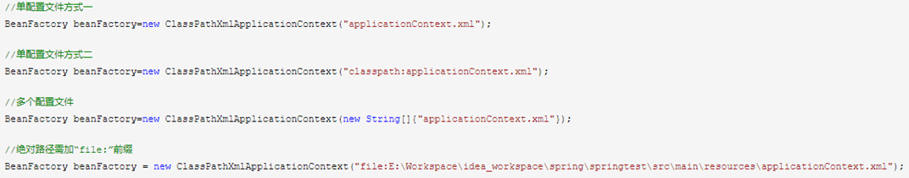              

2、**FileSystemXmlApplicationContext**：

- 默认是去**项目的路径**下加载，可以是相对路径，也可以是绝对路径，若是绝对路径，“file:” 前缀可以缺省。

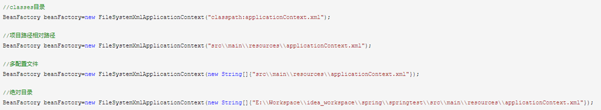


## 2、关于Bean标签的id属性与name属性

1、设置了id属性不设置name属性，表明beanName为此id，无别名

2、不设置id与name属性，表明beanName为包名#0，别名为包名

3、设置多个name属性不设置id属性，表明beanName为第一个name，别名为其余的name

4、设置了id，且设置多个name属性，表明beanName为id，别名为name

5、注意：**name可以设置多个，单id不能配置多个**


## 3、单实例？多实例

Spring创建Bean默认是单实例的

ConfigurableBeanFactory#SCOPE_PROTOTYPE
ConfigurableBeanFactory#SCOPE_SINGLETON
org.springframework.web.context.WebApplicationContext#SCOPE_REQUEST  request
org.springframework.web.context.WebApplicationContext#SCOPE_SESSION    sesssion

单实例 Bean：默认在容器启动的时候创建对象


## 4、什么时候产生代理对象？

IOC 容器创建 Bean 的时候，会触发 AOP，产生代理对象，放入 AOP


## 5、如果组件类实现了接口，根据接口类型可以获取 Bean 吗？如果一个接口有多实现类呢？且都配置了 Bean

第一个可以，前提是 Bean 唯一

第二个不行，因为 Bean 不唯一

根据类型来获取 Bean 时，在满足 Bean 唯一性的前提下，其实只是看：『对象 **instanceof** 指定的类型』的返回结果，只要返回的是true 就可以认定为和类型匹配，能够获取到

instanceof 运算符用于判断**前面的对象**是否是**后面的类**，或其**子类**、**实现类**的实例，如果是返回 true，否则返回 false

也就是说用 instanceof 关键字做判断时， instanceof 操作符的左右操作必须有**继承**或**实现**关系


